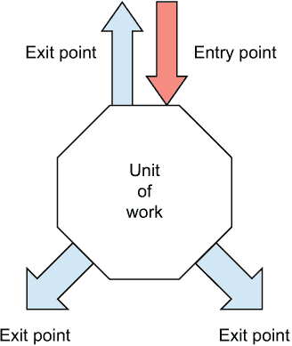
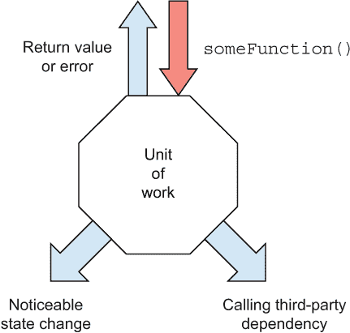
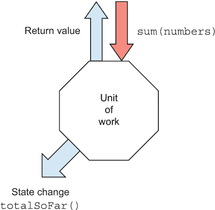
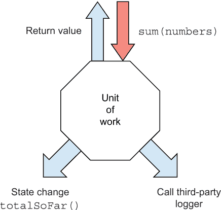
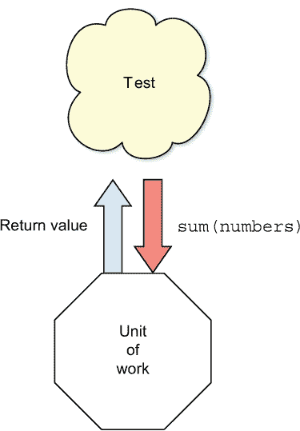
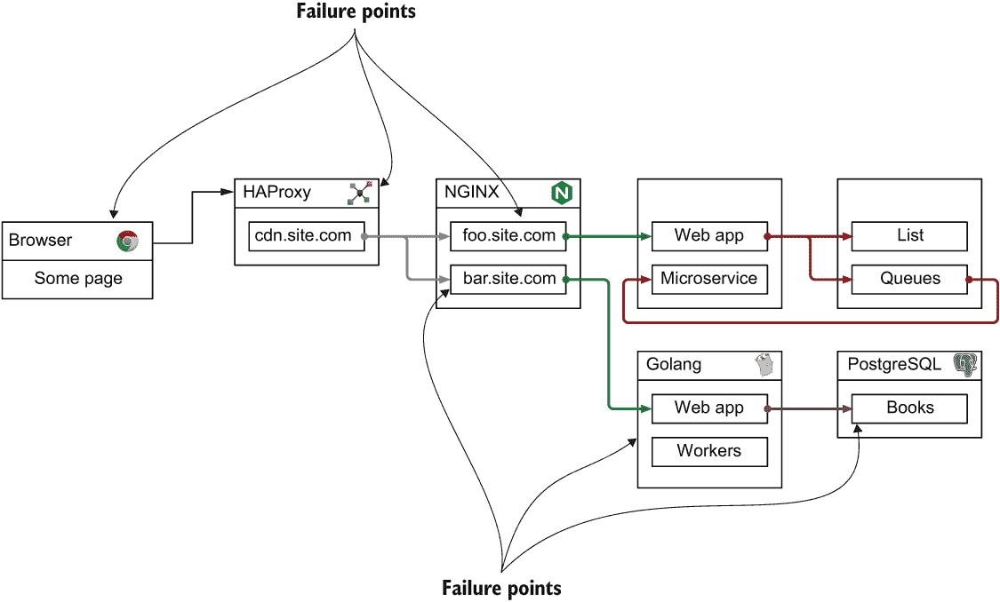
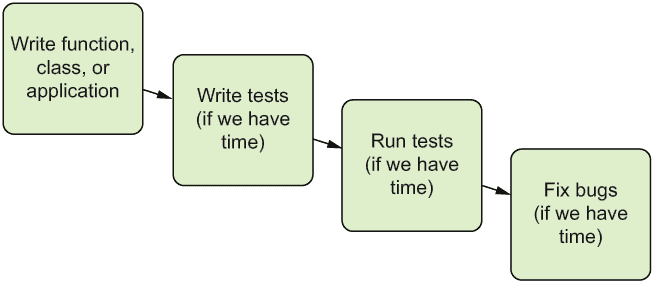
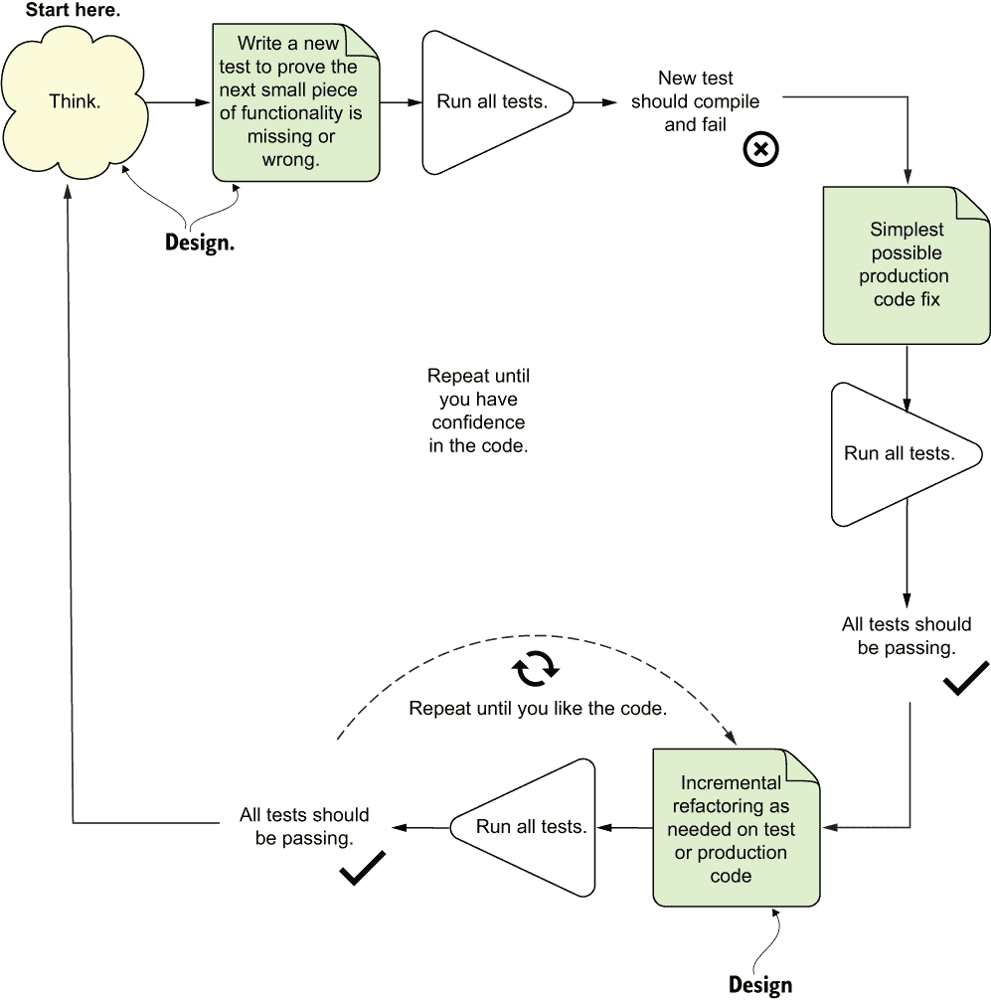
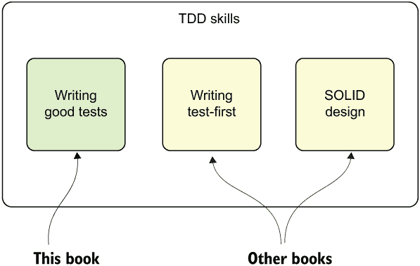

# 1 单元测试的基础

本章涵盖

+   识别入口点和出口点

+   *单元测试*和*工作单元*的定义

+   单元测试与集成测试之间的区别

+   单元测试的简单示例

+   理解测试驱动开发

手动测试很糟糕。你编写代码，你在调试器中运行它，你在应用中按下所有正确的键以使事情恰到好处，然后你重复所有这些操作，下次你编写新代码时。而且你必须记得检查所有可能受到新代码影响的代码。更多手动工作。太棒了。

完全手动进行测试和回归测试，一次又一次地重复相同的动作，就像猴子一样，容易出错且耗时，人们似乎对做这件事的厌恶程度不亚于软件开发中的任何事物。这些问题通过工具和我们的决定得到缓解，我们决定使用它来做好事，通过编写自动化测试来节省我们宝贵的时间和调试痛苦。集成和单元测试框架帮助开发者使用一组已知的 API 更快地编写测试，自动执行这些测试，并轻松地审查这些测试的结果。而且它们永远不会忘记！我假设你阅读这本书是因为你感觉一样，或者是因为有人强迫你阅读它，而那个人也有同样的感觉。或者也许那个人被迫强迫你阅读这本书。没关系。如果你认为重复的手动测试很棒，这本书将很难阅读。假设你*想要*学习如何编写好的单元测试。

本书还假设你了解如何使用 JavaScript 或 TypeScript 编写代码，至少使用 ECMAScript 6 (ES6) 功能，并且你对 node 包管理器 (npm) 感到舒适。另一个假设是你熟悉 Git 源代码控制。如果你之前见过 github.com 并且知道如何从那里克隆存储库，那么你就准备好了。

虽然本书的所有代码示例都是用 JavaScript 和 TypeScript 编写的，但你不必是 JavaScript 程序员就能阅读这本书。本书的前几版是 C# 编写的，我发现那里的大约 80% 的模式都很容易迁移。即使你来自 Java、.NET、Python、Ruby 或其他语言，你也应该能够阅读这本书。这些模式只是模式。语言被用来演示这些模式，但它们不是特定于语言的。

本书中的 JavaScript 与 TypeScript 的比较

本书包含整个过程中 vanilla JavaScript 和 TypeScript 的示例。我完全负责创建这样一个巴别塔（没有讽刺的意思），但我保证，这有一个很好的理由：这本书处理 JavaScript 中的三种编程范式：*过程式*、*函数式*和*面向对象*设计。

我使用常规 JavaScript 来处理过程式和函数式设计的示例。我使用 TypeScript 来处理面向对象的示例，因为它提供了表达这些想法所需的结构。

在本书的前几版中，当我使用 C# 进行工作时，这不是一个问题。当转向支持这些多种范式的 JavaScript 时，使用 TypeScript 是有意义的。

你可能会问，为什么不直接使用 TypeScript 来处理所有范式呢？这样做既是为了展示编写单元测试不需要 TypeScript，也是为了说明单元测试的概念并不依赖于某种语言或任何类型的编译器或代码检查工具来工作。

这意味着如果你对函数式编程感兴趣，本书中的一些示例可能对你有意义，而另一些可能看起来过于复杂或冗长。你可以自由地只关注函数式示例。

如果你从事面向对象编程或来自 C#/Java 背景，你会发现一些非面向对象的示例可能过于简单，并不能代表你在自己的项目中的日常工作。不要担心，会有很多与面向对象风格相关的章节。

## 1.1 第一步

总是有第一步：你第一次编写程序，第一次项目失败，以及第一次成功完成你想要达成的目标。你永远不会忘记你的第一次，我希望你也不会忘记你的第一次单元测试。

你可能已经以某种形式遇到过测试。一些你最喜欢的开源项目都附带“测试”文件夹——你在自己的工作项目中也有。你可能已经自己编写了一些测试，甚至可能记得它们是糟糕的、笨拙的、慢的或难以维护的。更糟糕的是，你可能觉得它们毫无用处，是浪费时间。（很多人很遗憾地是这样。）或者你可能对单元测试有了一次非常好的体验，你现在正在阅读这本书，看看你可能还错过了什么。

本章将分析单元测试的“经典”定义，并将其与集成测试的概念进行比较。这种区别对许多人来说可能很困惑，但了解这一点非常重要，因为正如你在本书后面将学到的，将单元测试与其他类型的测试分开可能是当测试失败或通过时对测试有高度信心的重要因素。

我们还将讨论单元测试与集成测试的优缺点，并制定一个更好的定义，说明可能是一个“好的”单元测试。我们将以对测试驱动开发（TDD）的探讨结束，因为它通常与单元测试相关联，但它是一项我强烈推荐尝试的独立技能（尽管这不是本书的主要内容）。在本章中，我还会简要提及本书其他部分更详细解释的概念。

首先，让我们定义一下单元测试应该是什么。

## 1.2 逐步定义单元测试

单元测试在软件开发中不是一个新概念。它自 20 世纪 70 年代 Smalltalk 编程语言的早期就已经存在，并且一次又一次地证明了自己是开发者提高代码质量、更深入理解模块、类或函数功能需求的最佳方式之一。Kent Beck 在 Smalltalk 中引入了单元测试的概念，并且这一概念已经扩展到许多其他编程语言中，使得单元测试成为一种极其有用的实践。

为了了解我们*不*希望作为单元测试定义的内容，让我们以维基百科为起点。我将带着保留意见使用其定义，因为在我看来，其中缺少了许多重要的部分，但鉴于缺乏其他好的定义，它被许多人广泛接受。在本章中，我们的定义将逐渐演变，最终定义将在第 1.9 节出现。

单元测试通常是软件开发者编写的自动化测试，用于确保应用程序的一部分（称为“单元”）符合其设计和预期行为。在过程式编程中，一个单元可能是一个完整的模块，但更常见的是单个函数或过程。在面向对象编程中，一个单元通常是一个完整的接口，例如一个类，或者一个单独的方法([`en.wikipedia.org/wiki/Unit_testing`](https://en.wikipedia.org/wiki/Unit_testing))。

你将要编写的测试对象是*主题*、*系统或测试套件*（SUT）。

定义 SUT 代表*主题*、*系统或测试套件*，有些人喜欢使用 CUT（*组件、类或待测试代码*）。当你测试某物时，你将你正在测试的东西称为 SUT。

让我们谈谈单元测试中的“单元”这个词。对我来说，“单元”代表系统内的“工作单元”或“用例”。工作单元有一个开始和一个结束，我称之为*入口点*和*出口点*。工作单元的一个简单例子是一个计算并返回值的函数。然而，一个函数也可能在计算过程中使用其他函数、其他模块和其他组件，这意味着工作单元（从入口点到出口点）可能不仅仅是一个函数。

工作单元

*工作单元*是指从调用*入口点*开始，直到通过一个或多个*出口点*产生一个明显的结束结果之间发生的所有操作。*入口点*是我们触发的东西。例如，给定一个公开可见的函数

1.  函数体是工作单元的全部或部分。

1.  函数的声明和签名是进入函数体的入口点。

1.  函数产生的输出或行为是其出口点。

## 1.3 入口点和出口点

工作单元始终有一个入口点和一个或多个出口点。图 1.1 显示了工作单元的简单示意图。



图 1.1 一个工作单元有入口点和出口点。

一个工作单元可以是一个函数、多个函数，甚至是多个模块或组件。但它始终有一个我们可以从外部触发的入口点（通过测试或其他生产代码），并且它最终总会做一些有用的事情。如果它没有做任何有用的事情，我们不妨从我们的代码库中移除它。

什么是**有用的**？在代码中公开可见的某些事情：一个返回值、状态变化，或者调用外部方，如图 1.2 所示。这些引人注目的行为就是我所说的**出口点**。



图 1.2 出口点的类型

为什么叫“出口点”？

为什么使用“出口点”这个词而不是“行为”之类的词？我的想法是，行为可以是纯粹内部的，而我们寻找的是来自调用者的外部可见行为。这种差异可能一眼难以区分。此外，“出口点”很好地暗示了我们正在离开工作单元的上下文，回到测试上下文，尽管行为可能比这更灵活。关于行为类型，包括可观察行为，在 Vladimir Khorikov 的《单元测试原则、实践和模式》（Manning, 2020）中有广泛的讨论。请参考那本书以了解更多关于这个主题的信息。

以下列表展示了简单工作单元的快速代码示例。

列表 1.1 我们想要测试的简单函数

```
const sum = (numbers) => {
  const [a, b] = numbers.split(',');
  const result = parseInt(a) + parseInt(b);
  return result;
};
```

关于本书使用的 JavaScript 版本

我选择使用 Node.js 12.8 和纯 ES6 JavaScript 以及 JSDoc 风格的注释。我将使用的模块系统是 CommonJS，以保持简单。也许在未来的版本中，我会开始使用 ES 模块（.mjs 文件），但到目前为止，以及本书的其余部分，CommonJS 将足够。对于本书中的模式来说，这实际上并不重要。

您应该能够轻松地将这里使用的技巧应用到您目前正在使用的任何 JavaScript 栈中，无论您使用 TypeScript、纯 JS、ES 模块、后端或前端、Angular 还是 React。这都不重要。

获取本章的代码

您可以从 GitHub 下载本书中展示的所有代码示例。您可以在[`github.com/royosherove/aout3-samples`](https://github.com/royosherove/aout3-samples)找到存储库。请确保您已安装 Node 12.8 或更高版本，然后运行`npm install`，接着运行`npm run ch[章节编号]`。对于本章，您将运行`npm run ch1`。这将运行本章的所有测试，以便您可以看到它们的输出。

这个工作单元完全包含在一个单独的函数中。这个函数是入口点，因为它最终返回一个值，它也充当出口点。我们在触发工作单元的地方获得最终结果，所以入口点也是出口点。

如果我们将这个函数作为工作单元绘制，它看起来就像图 1.3 一样。我使用 `sum(numbers)` 作为入口点，而不是 `numbers`，因为入口点是函数签名。参数是通过入口点给出的上下文或输入。


图 1.3 一个具有相同入口点和出口点的函数

以下列表展示了这个想法的一个变体。

列表 1.2 具有入口点和出口点的工作单元

```
let total = 0;

const totalSoFar = () => {
 return total;
};

const sum = (numbers) => {
  const [a, b] = numbers.split(',');
  const result = parseInt(a) + parseInt(b);
 total += result; ❶
  return result;
};
```

❶ 新功能：计算累计总和

这个 `sum` 的新版本有两个出口点。它做两件事：

+   它返回一个值。

+   它引入了新的功能：所有求和的总计。它以某种明显的方式（通过 `totalSoFar`）设置模块的状态，供入口点的调用者可见。

图 1.4 展示了我会如何绘制这个工作单元。你可以将这些两个出口点视为从同一工作单元出发的两个不同路径或需求，因为它们确实 *是* 代码预期执行的两个不同的有用操作。这也意味着我可能会为每个出口点编写两个不同的单元测试：一个用于每个出口点。很快我们就会这样做。



图 1.4 具有两个出口点的工作单元

那么 `totalSoFar` 呢？这也是一个入口点吗？是的，它可以是一个，*在单独的测试中*。我可以编写一个测试来证明在调用之前不触发返回 `0` 的 `totalSoFar`。这将使其成为一个独立的小的工作单元，这将是完全可行的。通常，一个工作单元（如 `sum`）可以由更小的单元组成。

如您所见，我们测试的范围可以改变和变异，但我们仍然可以使用入口点和出口点来定义它们。入口点始终是测试触发工作单元的地方。您可以为工作单元设置多个入口点，每个入口点由不同的测试集使用。

关于设计的说明

有两种主要类型的操作：“查询”操作和“命令”操作。查询操作不改变任何东西；它们只是返回值。命令操作改变东西但不返回值。

我们通常将它们结合起来，但在许多情况下，将它们分开可能是一个更好的设计选择。这本书主要不是关于设计的，但我敦促您在 Martin Fowler 的网站上了解更多关于 *命令查询分离* 的概念：[`martinfowler.com/bliki/CommandQuerySeparation.html`](https://martinfowler.com/bliki/CommandQuerySeparation.html)。

出口点表示需求和新的测试，反之亦然

出口点是工作单元的最终结果。对于单元测试，我通常为每个出口点至少编写一个测试，并给它一个可读的名字。然后我可以添加更多具有不同输入的测试，所有这些测试都使用相同的入口点，以获得更多的信心。

集成测试，我们将在本章和书中稍后讨论，通常包括多个最终结果，因为在那些级别上分离代码路径可能是不可能的。这也是集成测试更难调试、启动和维持的原因之一：它们所做的比单元测试多得多，正如你很快就会看到的。

下面列出了我们示例函数的第三个版本。

列表 1.3 向函数添加记录器调用

```
let total = 0;

const totalSoFar = () => {
  return total;
};

const logger = makeLogger();

const sum = (numbers) => {
  const [a, b] = numbers.split(',');
 logger.info( ❶
 'this is a very important log output', ❶
 { firstNumWas: a, secondNumWas: b }); ❶

  const result = parseInt(a) + parseInt(b);
  total += result;
  return result;
};
```

❶ 新增出口点

你可以看到函数中有一个新的出口点（或要求，或最终结果）。它将某些信息记录到外部实体——可能是文件、控制台或数据库。我们不知道，也不关心。这是第三种类型的出口点：**调用第三方**。我也喜欢称它为“调用**依赖**”。

**定义** 一个**依赖**是在单元测试期间我们没有完全控制的东西。或者它也可以是试图在测试中控制它会使我们的生活变得痛苦的东西。一些例子包括写入文件的记录器、与网络通信的事物、由其他团队控制的代码、需要很长时间（计算、线程、数据库访问）的组件等等。一般来说，如果我们可以完全且容易地控制它在做什么，并且它在内存中运行，且运行速度快，那么它就不是依赖。规则总有例外，但这应该至少能让你处理 80%的情况。

图 1.5 展示了如何用所有三个出口点绘制这个工作单元。在这个阶段，我们仍在讨论一个函数大小的工作单元。入口点是函数调用，但现在我们有三个可能路径，或出口点，执行一些有用的操作，并且调用者可以公开验证。



图 1.5 展示了一个函数的三个出口点

这里就变得有趣了：为每个出口点进行**单独的测试**是个好主意。这将使测试更易于阅读，并且更容易调试或更改，而不会影响其他结果。

## 1.4 出口点类型

我们已经看到我们有三种不同的最终结果：

+   被调用的函数返回一个有用的值（不是未定义的）。如果在静态类型语言如 Java 或 C#中，我们会说它是一个公开的、非空函数。

+   在调用前后，系统的状态或行为有明显的改变，可以在不查询私有状态的情况下确定。

+   这里有一个对第三方系统的调用，测试者无法控制。该第三方系统不返回任何值，或者该值被忽略。（例如：代码调用了一个不是由你编写的第三方日志系统，并且你无法控制其源代码。）

**《XUnit 测试模式》**对入口点和出口点的定义

Gerard Meszaros 的书籍 *XUnit Test Patterns*（Addison-Wesley Professional，2007）讨论了*直接输入和输出*以及*间接输入和输出*的概念。*直接输入*是我喜欢称之为入口点的东西。Meszaros 称之为“使用组件的前门”。该书中的*间接输出*是我在前面提到的其他两种退出点类型（状态改变和调用第三方）。

这两种想法的版本都并行发展，但“工作单元”的概念只出现在这本书中。工作单元与入口和退出点结合，对我来说比直接和间接输入和输出更有意义，但你可以将这视为关于如何教授测试范围概念的风格选择。你可以在 [xunitpatterns.com](http://xunitpatterns.com) 上找到更多关于 *XUnit Test Patterns* 的信息。

让我们看看入口和退出点的概念如何影响单元测试的定义：*单元测试*是一段代码，它调用一个工作单元并检查该工作单元的一个特定退出点作为结果。如果关于结果假设是错误的，则单元测试失败。单元测试的范围可以从一个函数到多个模块或组件，具体取决于入口点和退出点之间使用的函数和模块的数量。

## 1.5 不同的退出点，不同的技术

为什么我要花这么多时间谈论退出点的类型？因为不仅将每个退出点的测试分开是一个好主意，而且不同的退出点类型可能需要不同的技术来成功测试：

+   基于返回值的退出点（Meszaros 的 *XUnit Test Patterns* 中的直接输出）应该是测试起来最简单的退出点。你触发一个入口点，得到一些东西，然后检查你得到的价值。

+   基于状态的测试（间接输出）通常需要更多的技巧。你调用某个东西，然后进行另一个调用以检查其他事情（或者再次调用之前的东西）以查看一切是否按计划进行。

在第三方情况（间接输出）中，我们需要跳过最多的障碍。我们还没有讨论这个问题，但这就是我们被迫使用像*模拟对象*这样的东西来替换外部系统，以便我们可以在测试中控制并质询的地方。我将在本书的后面深入探讨这个想法。

哪些退出点造成最多的问题？

按照惯例，我尽量主要使用基于返回值或状态的测试。如果可能，我会尽量避免使用基于模拟对象的测试，通常也是可以做到的。因此，我的测试中通常不超过 5%使用模拟对象进行验证。这类测试会使事情复杂化，并使维护变得更加困难。尽管如此，有时我们别无选择，我们将在接下来的章节中讨论它们。

## 1.6 从零开始进行测试

让我们回到代码的第一个、最简单的版本（列表 1.1），并尝试测试它，好吗？如果我们尝试为这个编写测试，它看起来会是什么样子？

让我们先从视觉方法开始，看看图 1.6。我们的入口点是 `sum`，输入是一个名为 `numbers` 的字符串。`sum` 也是我们的出口点，因为我们将从它那里获取一个返回值并检查其值。



图 1.6 我们测试的视觉视图

没有使用测试框架也可以编写自动化的单元测试。事实上，由于开发者越来越习惯于自动化他们的测试，我见过很多开发者在使用测试框架之前就已经这样做。在本节中，我们将不使用框架编写这样的测试，这样你就可以将这种方法与第二章中使用框架的方法进行对比。

因此，让我们假设测试框架不存在（或者我们不知道它们存在）。我们已经决定从头开始编写我们自己的小型自动化测试。以下列表显示了使用纯 JavaScript 测试我们自己的代码的一个非常简单的示例。

列表 1.4 对 `sum()` 的一个非常简单的测试

```
const parserTest = () => {
  try {
    const result = sum('1,2');
    if (result === 3) {
      console.log('parserTest example 1 PASSED');
    } else {
      throw new Error(`parserTest: expected 3 but was ${result}`);
    }
  } catch (e) {
    console.error(e.stack);
  }
};
```

不，这段代码并不优美。但它足以解释测试是如何工作的。要运行此代码，我们可以这样做：

1.  打开命令行并输入一个空字符串。

1.  在 package.json 的 `"scripts"` 条目下添加一个条目 `"test"`，以执行 `"node mytest.js"`，然后在命令行上执行 `npm test`。

以下列表显示了这一点。

列表 1.5 我们 package.json 文件的开头

```
{
  "name": "aout3-samples",
  "version": "1.0.0",
  "description": "Code Samples for Art of Unit Testing 3rd Edition",
  "main": "index.js",
  "scripts": {
 "test": "node ./ch1-basics/custom-test-phase1.js",
  }
}
```

测试方法调用 *生产模块*（SUT）并检查返回的值。如果不是预期的值，测试方法将错误和堆栈跟踪写入控制台。测试方法还会捕获发生的任何异常并将它们写入控制台，这样它们就不会干扰后续方法的运行。当我们使用测试框架时，这通常会被自动处理。

显然，这是一种编写此类测试的临时方法。如果你要编写多个这样的测试，你可能希望有一个通用的 `test` 或 `check` 方法，所有测试都可以使用，并且可以一致地格式化错误。你还可以添加特殊的辅助方法，用于检查诸如空对象、空字符串等事物，这样你就不需要在多个测试中编写相同的冗长代码行。

以下列表显示了使用稍微更通用的 `check` 和 `assertEquals` 函数的测试看起来会是什么样子。

列表 1.6 使用 `Check` 方法的更通用实现

```
const assertEquals = (expected, actual) => {
  if (actual !== expected) {
    throw new Error(`Expected ${expected} but was ${actual}`);
  }
};

const check = (name, implementation) => {
  try {
    implementation();
    console.log(`${name} passed`);
  } catch (e) {
    console.error(`${name} FAILED`, e.stack);
  }
};

check('sum with 2 numbers should sum them up', () => {
 const result = sum('1,2');
 assertEquals(3, result);
});

check('sum with multiple digit numbers should sum them up', () => {
 const result = sum('10,20');
 assertEquals(30, result);
});
```

我们现在创建了两个辅助方法：`assertEquals`，它消除了写入控制台或抛出错误的样板代码，以及 `check`，它接受一个字符串作为测试的名称和一个回调到实现。然后它负责捕获任何测试错误，将它们写入控制台，并报告测试的状态。

内置断言

需要注意的是，我们不需要编写自己的断言。我们可以很容易地使用 Node.js 的内置断言函数，这些函数最初是为测试 Node.js 本身而内部构建的。我们可以通过导入函数来实现这一点：

```
const assert = require('assert'); 
```

然而，我正在尝试展示这个概念背后的简单性，所以我们将会避免这一点。你可以在[`nodejs.org/api/assert.html`](https://nodejs.org/api/assert.html)找到更多关于 Node.js 的`assert`模块的信息。

注意，使用几个辅助方法，测试变得更容易阅读和编写。像 Jest 这样的单元测试框架可以提供更多这样的通用辅助方法，从而使测试更容易编写。我将在第二章中讨论这一点。首先，让我们谈谈本书的主要主题：好的单元测试。

## 1.7 一个好的单元测试的特点

无论你使用什么编程语言，定义单元测试最困难的方面之一就是定义什么是“好的”。当然，好是相对的，并且每当我们对编码有新的了解时，它都可能发生变化。这看起来可能很明显，但实际上并不是。我需要解释为什么我们需要编写更好的测试——仅仅理解工作单元是什么是不够的。

根据我多年的经验，涉及许多公司和团队，大多数试图对代码进行单元测试的人要么在某一点上放弃，要么实际上并没有进行单元测试。他们浪费了很多时间编写有问题的测试，当需要花费大量时间维护它们时，他们会放弃，或者更糟糕的是，他们不相信测试结果。

写一个糟糕的单元测试是没有意义的，除非你正处于学习如何编写一个好的单元测试的过程中。编写糟糕的测试的缺点比优点多，比如浪费时间调试有缺陷的测试，浪费时间编写没有带来任何好处的测试，浪费时间试图理解难以阅读的测试，以及浪费时间编写几个月后就会删除的测试。维护糟糕的测试也存在巨大的问题，以及它们如何影响生产代码的可维护性。糟糕的测试实际上会减慢你的开发速度，不仅是在编写测试代码时，而且在编写生产代码时也是如此。我将在本书的后面部分讨论所有这些内容。

通过了解什么是好的单元测试，你可以确保你不会走上一个以后难以修复的道路，当代码变成噩梦时。我们还会在本书的后面部分定义其他形式的测试（组件测试、端到端测试等）。

### 1.7.1 什么是好的单元测试？

每一个好的自动化测试（不仅仅是单元测试）都应该具备以下特性：

+   应该很容易理解测试作者的意图。

+   它应该易于阅读和编写。

+   它应该是自动化的。

+   它的结果应该是一致的（如果你在运行之间没有改变任何东西，它应该总是返回相同的结果）。

+   它应该是有用的，并提供可操作的结果。

+   任何人都可以通过按按钮来运行它。

+   当它失败时，应该很容易检测到预期的内容，并确定如何定位问题。

一个好的单元测试还应具备以下特性：

+   它应该运行得快。

+   它应该对被测试的代码拥有*完全控制权*（更多内容请见第三章）。

+   它应该是完全隔离的（独立于其他测试运行）。

+   它应该在内存中运行，而不需要系统文件、网络或数据库。

+   当这样做有意义时，它应该尽可能同步和线性（如果可能的话，不要使用并行线程）。

并非所有测试都能遵循良好单元测试的特性，这是完全可以接受的。这样的测试将简单地过渡到集成测试的领域（第 1.8 节的主题）。尽管如此，仍然有方法可以将一些测试重构为符合这些特性。

用存根替换数据库（或另一个依赖项）

我们将在后面的章节中讨论存根，但简而言之，它们是模拟真实依赖项的假依赖项。它们的目的在于简化测试过程，因为它们更容易设置和维护。

尽管如此，要小心内存数据库。它们可以帮助你将测试彼此隔离（只要测试之间不共享数据库实例），从而遵守良好单元测试的特性，但这样的数据库会导致一个尴尬的中间地带。内存数据库不像存根那样容易设置。同时，它们也不提供像真实数据库那样的强保证。在功能上，内存数据库可能与生产环境中的数据库大相径庭，因此通过内存数据库通过的测试可能会在真实数据库中失败，反之亦然。你通常需要手动对生产数据库重新运行相同的测试，以获得额外的信心，确保你的代码是有效的。除非你使用一组小型和标准化的 SQL 功能，否则我建议坚持使用存根（用于单元测试）或真实数据库（用于集成测试）。

对于像 jsdom 这样的解决方案也是如此。你可以用它来替换真实的 DOM，但请确保它支持你的特定用例。不要编写需要手动重新检查的测试。

使用线性、同步测试模拟异步处理

随着承诺（promises）和`async/await`的出现，异步编程已成为 JavaScript 的标准。尽管如此，我们的测试仍然可以同步验证异步代码。通常这意味着直接从测试中触发回调或显式等待异步操作完成执行。

### 1.7.2 单元测试清单

许多人混淆了测试软件的行为与单元测试的概念。首先，请自问以下关于你迄今为止编写和执行的测试的问题：

+   我能否运行并从两个月或几个月或几年前我编写的测试中获得结果？

+   我的团队成员中是否有人能运行并从两个月前我编写的测试中获得结果？

+   我能否在几分钟内运行我编写的所有测试？

+   我能否按一下按钮就运行我编写的所有测试？

+   我能否在几分钟内编写一个基本的测试？

+   当另一个团队的代码中存在错误时，我的测试是否通过？

+   在不同的机器或环境中运行我的测试结果是否相同？

+   如果没有数据库、网络或部署，我的测试是否停止工作？

+   如果我删除、移动或更改一个测试，其他测试是否不受影响？

如果你对这些问题的任何一个回答了“不”，那么你正在实施的内容很可能既不是完全自动化的，也不是单元测试。它肯定是一种测试，可能和单元测试一样重要，但与那些能让你对所有这些问题都回答“是”的测试相比，它有缺点。

“我之前都在做什么？”你可能会问。你一直在做集成测试。

## 1.8 集成测试

我认为**集成测试**是指不符合之前概述的任何一个或多个良好单元测试条件的任何测试。例如，如果测试使用了真实的网络、真实的 REST API、真实系统时间、真实文件系统或真实数据库，那么它已经进入了集成测试的领域。

如果一个测试没有控制系统时间，例如，在测试代码中使用当前的`new` `Date()`，那么每次测试执行时，它本质上都是不同的测试，因为它使用了不同的时间。它不再是一致的。这本身并不是坏事。我认为集成测试是单元测试的重要补充，但它们应该分开，以实现“安全绿色区域”的感觉，这在本书的后面会讨论。

如果一个测试使用了真实数据库，它就不再是仅在内存中运行了——它的操作比仅使用内存中的模拟数据更难擦除。测试也将运行得更长，我们不容易控制数据访问所需的时间。单元测试应该是**快速**的。集成测试通常要慢得多。当你开始有成百上千个测试时，每一半秒都很重要。

集成测试增加了另一个问题的风险：一次测试太多东西。例如，假设你的车坏了。你是如何学习问题的，更不用说修复它了？发动机由许多子系统组成，它们共同工作，每个子系统都依赖其他子系统来帮助产生最终结果：一辆行驶的汽车。如果汽车停止移动，故障可能是任何子系统，或者多个子系统。这些子系统的集成（或层）使汽车移动。你可以把汽车的运动看作是这些部件在汽车下路的最终集成测试。如果测试失败，所有部件一起失败；如果成功，所有部件都成功。

在软件中，大多数开发者测试功能的方式是通过应用或 REST API 或 UI 的最终功能。点击某个按钮会触发一系列事件——函数、模块和组件协同工作以产生最终结果。如果测试失败，所有这些软件组件作为一个团队失败，可能很难找出导致整体操作失败的原因（见图 1.7）。



图 1.7 在集成测试中，你可以有多个故障点。所有单元都必须协同工作，每个单元都可能出现故障，这使得找到错误源更加困难。

根据比尔·赫塞尔（Bill Hetzel）在《软件测试完全指南》（Wiley, 1988）中的定义，集成测试是“一种有序的测试进展，其中软件和/或硬件元素被组合并测试，直到整个系统被集成。”以下是我自己对集成测试定义的变体：

集成测试是在没有完全控制所有真实依赖项的情况下测试一个工作单元，这些依赖项可能包括其他团队的其他组件、其他服务、时间、网络、数据库、线程、随机数生成器等等。

总结来说，集成测试使用真实依赖项；单元测试将工作单元与其依赖项隔离，以便它们的结果容易保持一致，并且可以轻松控制和模拟单元行为的任何方面。

让我们将 1.7.2 节中的问题应用到集成测试中，并考虑你在现实世界的单元测试中想要实现的目标：

+   *我能否运行并从两周、几个月或几年前写的测试中获得结果？*

    如果你不能，你将如何知道你是否破坏了你之前创建的功能？共享数据和代码在应用程序的生命周期中会定期更改，如果你不能（或不愿意）在更改代码后为所有之前工作的功能运行测试，你可能会在不了解的情况下破坏它——这被称为*回归*。回归似乎在冲刺或发布的最后阶段发生得很多，当时开发者们面临着修复现有错误的压力。有时，他们在解决旧错误时无意中引入了新的错误。知道你在 60 秒内破坏了某物不是很好吗？你将在本书的后面部分看到如何做到这一点。

定义 A：*回归*是指损坏的功能——曾经工作过的代码。你也可以将其视为一个或多个曾经工作但现在不工作的工作单元。

+   *我的团队能否运行并从两个月前我写的测试中获得结果？*

    这与上一个观点相关，但更进一步。你想要确保在更改某些内容时不会破坏他人的代码。许多开发者害怕更改旧系统中的遗留代码，因为他们不知道他们更改的代码依赖于什么其他代码。本质上，他们冒着将系统改变到一个未知稳定状态的风险。

    没有什么事情比不知道应用程序是否仍然工作更令人害怕的，尤其是当你没有编写那段代码的时候。如果你有单元测试的安全网，并且知道你没有破坏任何东西，那么你对处理不太熟悉的代码就会少很多恐惧。

    好的测试可以被任何人访问和运行。

定义*遗留代码*被维基百科定义为“不再在标准硬件和环境上得到支持的旧计算机源代码”([`en.wikipedia.org/wiki/Legacy_system`](https://en.wikipedia.org/wiki/Legacy_system))，但许多商店将当前维护的任何旧版本应用程序称为遗留代码。这通常指的是难以工作、难以测试，通常甚至难以阅读的代码。一位客户曾经用一种接地气的方式定义遗留代码：“能工作的代码。”许多人喜欢将遗留代码定义为“没有测试的代码”。Michael Feathers 的《*与遗留代码有效协作*》（Pearson，2004）将“没有测试的代码”作为遗留代码的官方定义，这是在阅读这本书时需要考虑的定义。

+   *我能在几分钟内运行我写的所有测试吗？*

    如果你不能快速运行你的测试（秒比分钟好），你将更少地运行它们（每天，甚至在某些地方每周或每月）。问题是当你更改代码时，你希望尽早得到反馈，以查看你是否破坏了某些东西。运行测试所需的时间越长，你对系统进行的更改就越多，当你发现你破坏了某些东西时，你将不得不查找（许多）更多的地方来寻找错误。

    好的测试应该运行得*很快*。

+   *我能否按一下按钮就能运行我写的所有测试？*

    如果你做不到，这可能意味着你必须配置测试运行的机器，以确保它们能够正确运行（例如设置 Docker 环境，或设置数据库的连接字符串），或者这可能意味着你的单元测试并没有完全自动化。如果你不能完全自动化你的单元测试，你可能会避免反复运行它们，你的团队中的其他人也会这样做。

    没有人喜欢被配置细节拖累，只是为了确保系统仍然工作。开发者有更重要的事情要做，比如将更多功能写入系统。但如果你不知道系统的状态，他们就不能这样做。

    好的测试应该能够以它们原始的形式轻松执行，而不是手动执行。

+   *我能在几分钟内写一个基本的测试吗？*

    识别集成测试的一种简单方法就是它需要花费时间来正确准备和实施，而不仅仅是执行。由于所有内部和有时外部的依赖关系，编写它的方法也需要时间。例如，数据库可能被视为外部依赖。）如果你没有自动化测试，依赖关系就不再是问题，但你正在失去自动化测试的所有好处。编写测试越困难，你编写更多测试或专注于除你担心的“重要事项”之外的事情的可能性就越小。单元测试的一个优点是它们往往会测试可能出错的每一个小细节，而不仅仅是重要事项。人们常常惊讶于他们可以在看似简单且无错误的代码中找到多少错误。

    当你只关注大型测试时，你对代码的整体信心仍然非常不足。代码的核心逻辑的许多部分都没有经过测试（即使你可能覆盖了更多组件），并且可能存在许多你没有考虑过且可能“非正式”担忧的错误。

    一旦你确定了想要用来测试你特定的对象集、函数和依赖关系（*领域模型*）的模式，针对系统的良好测试应该很容易编写，也很快速。

+   *当另一个团队的代码中有错误时，我的测试是否通过？在不同的机器或环境中运行时，我的测试结果是否相同？如果没有数据库、网络或部署，我的测试是否停止工作？*

    这三点指的是我们的测试代码与各种依赖关系隔离的想法。测试结果是一致的，因为我们控制了那些间接输入到我们系统中的内容。我们可以有假数据库、假网络、假时间和假机器文化。在后面的章节中，我将把这些点称为*存根*和*接口*，我们可以在这里注入这些存根。

+   *如果我删除、移动或更改一个测试，其他测试是否仍然不受影响？*

    单元测试通常不需要任何共享状态，但集成测试通常需要，例如外部数据库或服务。共享状态可以在测试之间创建依赖关系。例如，以错误的顺序运行测试可能会破坏未来测试的状态。

**警告** 即使经验丰富的单元测试人员也可能发现，编写针对他们之前从未进行过单元测试的领域模型的第一个单元测试可能需要 30 分钟或更长时间。这是工作的一部分，是可以预料的。一旦你确定了单元工作的入口和出口点，对该领域模型的第二次和随后的测试应该很容易完成。

我们可以在之前的问题和答案中识别出三个主要标准：

+   *可读性*——如果我们无法阅读它，那么维护它、调试它和了解出了什么问题都变得很困难。

+   *可维护性*——如果维护测试或生产代码因为测试而痛苦，我们的生活将变成一个活生生的噩梦。

+   *信任*——如果我们不相信测试失败的结果，我们将开始手动测试，从而失去测试本应提供的所有时间效益。如果我们不相信测试通过的结果，我们将开始进行更多的调试，再次失去任何时间效益。

根据我到目前为止关于单元测试不是什么以及测试要有效需要具备哪些特性的解释，我现在可以开始回答本章提出的主要问题：什么是好的单元测试？

## 1.9 完善我们的定义

现在我已经介绍了单元测试应该具备的重要属性，我将一次性定义单元测试：

单元测试是一段自动化的代码，它通过一个入口点调用工作单元，然后检查其出口点之一。单元测试几乎总是使用单元测试框架编写的。它编写起来容易，运行速度快。它是可信的、可读的和可维护的。只要我们控制的生成代码没有变化，它就是一致的。

这个定义显然要求很高，尤其是考虑到许多开发者实施单元测试的方式不佳。这让我们不得不认真审视我们作为开发者至今为止实施测试的方式，以及我们希望如何实施测试。（在第七章至第九章中深入讨论了可信、可读和可维护的测试。）

在本书的第一版中，我对单元测试的定义略有不同。我过去将单元测试定义为“仅针对控制流代码运行”，但我不这么认为。没有逻辑的代码通常用作工作单元的一部分。即使没有逻辑的属性也会被工作单元使用，因此它们不需要被测试专门针对。

定义 *控制流代码* 是指任何包含某种逻辑的代码片段，无论其逻辑多么简单。它包含以下之一或多个：一个 `if` 语句、一个循环、计算或任何其他类型的决策代码。

获取器和设置器是代码的好例子，通常不包含任何逻辑，因此不需要测试专门针对。这是可能会被你测试的工作单元使用的代码，但不需要直接测试它。但要注意：一旦你在获取器或设置器中添加任何逻辑，你将想要确保该逻辑正在被测试。

在下一节中，我们将停止讨论什么是好的测试，而是讨论 *何时* 你可能想要编写测试。我将讨论测试驱动开发，因为它经常与进行单元测试放在一起。我想确保我们在这方面记录准确。

## 1.10 测试驱动开发

一旦你学会了如何使用单元测试框架编写可读、可维护和可信的测试，下一个问题就是 *何时* 编写测试。许多人认为编写软件单元测试的最佳时间是创建了一些功能之后，但在将代码合并到远程源控制之前。

此外，坦白说，很多人不相信编写测试是一个好主意，但通过反复试验，他们意识到源代码审查中有严格的测试要求，所以他们*必须*编写测试来取悦代码审查之神，并将他们的代码合并到主分支中。（这种动态是产生糟糕测试的绝佳来源，我将在本书的第三部分中讨论这个问题。）

越来越多的开发者倾向于在编码会话期间以及在每个非常小的功能实现之前逐步编写单元测试。这种方法被称为*测试先行*或*测试驱动开发*（TDD）。

注意：关于测试驱动开发的确切含义存在许多不同的观点。有些人说它是测试先行开发，有些人说它意味着你有很多测试。有些人说它是一种设计方法，而其他人感觉它可能只是用一些设计来驱动代码行为的方法。在这本书中，TDD 意味着测试先行开发，设计在技术中扮演着增量角色（除了本节之外，本书不会讨论 TDD）。

图 1.8 和 1.9 展示了传统编码与 TDD 之间的差异。TDD 与传统开发不同，如图 1.9 所示。你首先编写一个失败的测试；然后继续创建生产代码，看到测试通过，并继续重构你的代码或创建另一个失败的测试。



图 1.8 传统编写单元测试的方式



图 1.9 测试驱动开发——鸟瞰图。注意过程的循环性：编写测试，编写代码，重构，编写下一个测试。它展示了 TDD 的增量特性：小步骤带来有信心的高质量最终结果。

本书侧重于编写良好单元测试的技术，而不是 TDD，但我对 TDD 非常推崇。我使用 TDD 编写了好几个主要的应用程序和框架，我管理过使用它的团队，我还教授了数百门关于 TDD 和单元测试技术的课程和工作坊。在我的整个职业生涯中，我发现 TDD 有助于创建高质量的代码、高质量的测试以及我编写的代码的更好设计。我相信它对你有益，但它并非没有代价（学习时间、实施时间以及更多）。不过，如果你愿意接受学习它的挑战，这绝对物有所值。

### 1.10.1 TDD：不是良好单元测试的替代品

重要的是要认识到，TDD 并不能保证项目成功或测试的健壮性或可维护性。很容易陷入 TDD 技术的陷阱，而忽略了单元测试的编写方式：它们的命名、可维护性或可读性，以及它们是否测试了正确的事物或可能自身存在错误。这就是我写这本书的原因——因为编写良好的测试是一项与 TDD 不同的技能。

TDD 的技术非常简单：

1.  *编写一个失败的测试来证明最终产品中缺少代码或功能。* 这个测试是“好像”生产代码已经工作一样编写的，所以测试失败意味着生产代码中存在错误。我如何知道？这个测试是编写成如果生产代码没有错误就会通过的样子。

    在 JavaScript 之外的一些语言中，测试可能一开始甚至无法编译，因为代码还不存在。一旦它运行，它应该失败，因为生产代码还没有工作。这就是在测试驱动设计思维中发生很多“设计”的地方。

1.  *通过向生产代码中添加满足测试预期的新功能来使测试通过。* 生产代码应该尽可能简单。不要触摸测试。你必须只通过触摸生产代码来使其通过。

1.  **重构你的代码。* 当测试通过时，你可以自由地继续下一个单元测试或重构代码（包括生产代码和测试），使其更易于阅读，移除代码重复，等等。这也是“设计”部分发生的地方。我们重构，甚至可以在保持旧功能的同时重新设计我们的组件。

    重构步骤应该非常小且逐步进行，我们在每个小步骤之后运行所有测试，以确保我们没有因为我们的更改而破坏任何东西。重构可以在编写几个测试之后或在每个测试编写之后进行。这是一个重要的实践，因为它确保你的代码更容易阅读和维护，同时仍然通过所有之前编写的测试。书中后面有一个关于重构的整个部分（8.3）。

**重构**的定义是指在不改变其功能的情况下改变代码的一部分。如果你曾经重命名过方法，你就已经进行了重构。如果你曾经将一个大方法拆分成多个较小的方法调用，你就已经重构了你的代码。代码仍然执行相同的功能，但它变得更容易维护、阅读、调试和修改。

前面的步骤听起来很技术性，但它们背后有很多智慧。如果正确执行，TDD 可以使你的代码质量大幅提升，减少错误数量，提高你对代码的信心，缩短查找错误的时间，改进代码的设计，并让你的经理更加满意。如果 TDD 执行不当，可能会导致你的项目进度延误，浪费你的时间，降低你的动力，并降低代码质量。这是一把双刃剑，很多人都是通过艰难的方式才意识到这一点。

从技术上讲，TDD 最大的好处之一是没有人告诉您的是，通过看到测试失败，然后看到测试在没有更改的情况下通过，您实际上是在测试测试本身。如果您期望它失败而它通过了，您可能在测试中有一个错误，或者您测试了错误的东西。如果测试失败了，您修复了它，现在您期望它通过，但它仍然失败，您的测试可能有一个错误，或者它可能期望发生错误的事情。

本书处理可读的、可维护的、值得信赖的测试，但如果您在 TDD 之上添加，您将看到失败的测试，您修复了它，当应该失败时测试失败，当应该通过时测试通过，您对自己测试的信心将会增加。在测试之后风格中，您通常只有在应该通过时才会看到它们通过，在不应该通过时才会失败（因为它们测试的代码应该已经工作）。TDD 在这方面有很大帮助，这也是开发者为什么在实践 TDD 时比在事后简单地单元测试时进行更少的调试的原因之一。如果他们信任测试，他们就不会觉得有必要“以防万一”进行调试。这种信任只能通过看到测试的双方——当应该失败时失败，当应该通过时通过——来获得。

### 1.10.2 成功 TDD 所需的三项核心技能

要在测试驱动开发中取得成功，您需要三种不同的技能集：知道如何编写好的测试，以测试优先的方式编写它们，以及设计良好的测试和生产代码。图 1.10 更清楚地展示了这些：

+   *仅仅因为您先编写测试并不意味着它们是可维护的、可读的或值得信赖的。良好的单元测试技能正是本书的主题。*

+   *仅仅因为您编写了可读的、可维护的测试并不意味着您会得到与先编写测试相同的收益。测试优先的技能是大多数 TDD 书籍所教授的，而没有教授良好的测试技能。我特别推荐 Kent Beck 的*通过示例进行测试驱动开发*（Addison-Wesley Professional，2002 年）。*

+   *仅仅因为您先编写测试，并且它们是可读的和可维护的，并不意味着您最终会得到一个设计良好的系统。设计技能是使您的代码美观和可维护的关键。我推荐 Steve Freeman 和 Nat Pryce 的*通过测试引导面向对象软件发展*（Addison-Wesley Professional，2009 年）以及 Robert C. Martin 的*Clean Code*（Pearson，2008 年）作为该主题的好书。*



图 1.10 测试驱动开发的核心三项技能

学习 TDD 的实用方法是分别学习这三个方面；也就是说，一次专注于一项技能，同时忽略其他技能。我推荐这种方法的原因是，我经常看到人们试图同时学习这三个技能集，在学习过程中遇到极大的困难，最终因为障碍太高而放弃。通过采取更渐进的方法来学习这个领域，你可以减轻自己在当前关注领域之外的其他领域犯错的持续恐惧。

在下一章中，你将开始使用 Jest 编写你的第一个单元测试，Jest 是 JavaScript 最常用的测试框架之一。

## 摘要

+   一个好的单元测试具有以下特点：

    +   它应该运行得很快。

    +   它应该完全控制被测试的代码。

    +   它应该完全隔离（它应该独立于其他测试运行）。

    +   它应该在内存中运行，无需文件系统文件、网络或数据库。

    +   它应该尽可能同步和线性（没有并行线程）。

+   入口点是公共函数，是进入我们的工作单元的门，并触发底层逻辑。出口点是你可以用测试检查的地方。它们代表了工作单元的效果。

+   一个出口点可以是一个返回值、状态的变化或对第三方依赖的调用。每个出口点通常需要一个单独的测试，每种类型的出口点都需要不同的测试技术。

+   工作单元是在入口点调用和通过一个或多个出口点达到一个明显的结束结果之间的所有操作的集合。工作单元可以跨越一个函数、一个模块或多个模块。

+   集成测试只是单元测试，其中一些或所有依赖项是真实的，并位于当前执行过程之外。相反，单元测试就像集成测试一样，但所有依赖项都在内存中（真实的和假的），并且我们在测试中控制它们的行为。

+   任何测试最重要的属性是可读性、可维护性和可信度。*可读性*告诉我们测试的可读性和理解难度。*可维护性*是衡量维护测试代码痛苦程度的指标。没有*可信度*，在代码库中引入重要更改（如重构）会更困难，这会导致代码退化。

+   测试驱动开发（TDD）是一种提倡在编写生产代码之前编写测试的技术。这种方法也被称为测试优先方法（与代码优先相对）。

+   TDD 的主要好处是验证测试的正确性。在编写生产代码之前看到测试失败可以确保如果它们覆盖的功能停止正常工作，这些相同的测试也会失败。
