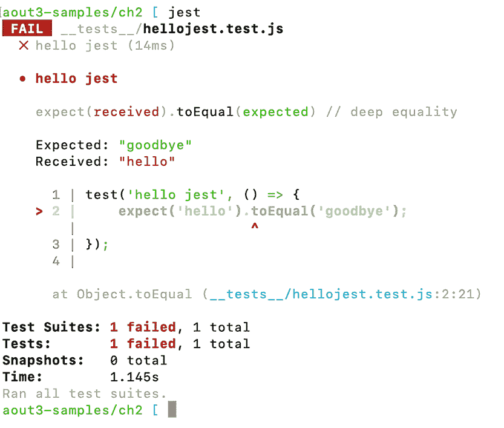
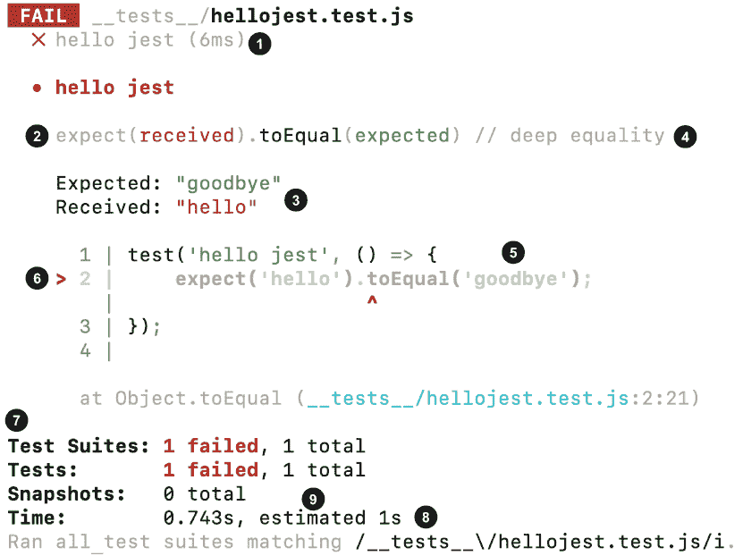
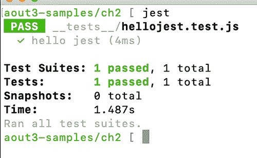
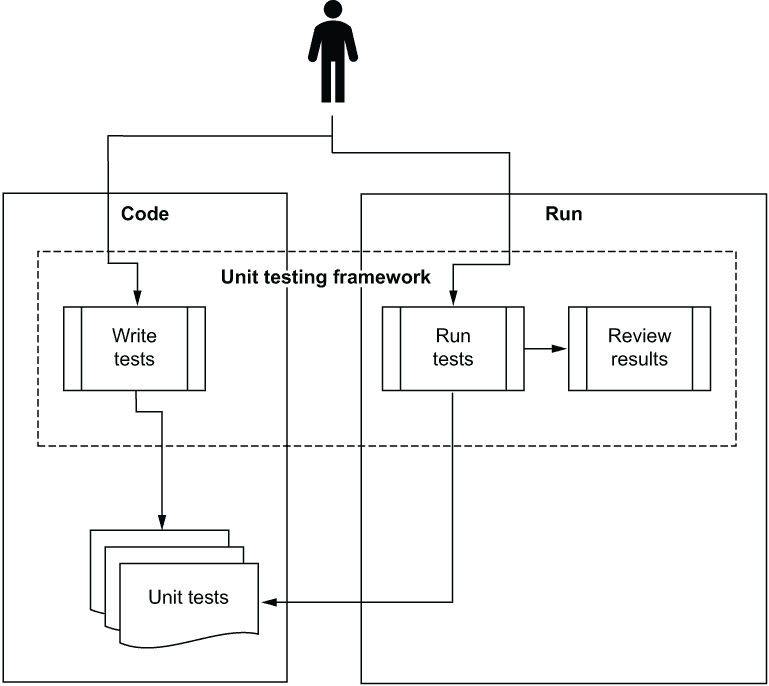

# 2 第一次单元测试

本章涵盖

+   使用 Jest 编写你的第一个测试

+   测试结构和命名约定

+   使用断言库进行工作

+   重构测试和减少重复代码

当我第一次开始使用真正的单元测试框架编写单元测试时，几乎没有文档，我工作的框架也没有合适的示例。（当时我主要在用 VB 5 和 6 进行编码。）学习如何与他们一起工作是一个挑战，我开始编写相当糟糕的测试。幸运的是，时代已经改变。在 JavaScript 中，实际上在所有语言中，都有广泛的选择，社区提供了大量的文档和支持来尝试这些有用的捆绑包。

在上一章中，我们编写了一个非常简单的自编测试框架。在这一章中，我们将探讨 Jest，它将成为本书的框架选择。

## 2.1 介绍 Jest

Jest 是由 Facebook 创建的开源测试框架。它易于使用，易于记忆，并且有很多优秀的功能。Jest 最初是为在 JavaScript 中测试前端 React 组件而创建的。如今，它在行业的许多部分都广泛用于后端和前端项目的测试。它支持两种主要的测试语法（一种使用单词`test`，另一种基于 Jasmin 语法，这是一个启发了 Jest 许多功能的框架）。我们将尝试两者，看看我们更喜欢哪一个。

除了 Jest，JavaScript 中还有许多其他的测试框架，几乎都是开源的。它们在风格和 API 上有些不同，但就本书的目的而言，这并不重要太多。

### 2.1.1 准备我们的环境

确保你已经在本地安装了 Node.js。你可以按照[`nodejs.org/en/download/`](https://nodejs.org/en/download/)上的说明来在你的机器上安装它。该网站将提供长期支持（LTS）版本或当前版本的选项。LTS 版本面向企业，而当前版本有更频繁的更新。对于本书的目的来说，两者都适用。

确保你的机器上安装了 node 包管理器（npm）。它包含在 Node.js 中，所以请在命令行上运行`npm -v`命令，如果你看到一个 6.10.2 或更高版本的版本，你应该可以开始了。如果不是，请确保已经安装了 Node.js。

### 2.1.2 准备我们的工作文件夹

要开始使用 Jest，让我们创建一个名为“ch2”的新空文件夹，并用你选择的包管理器初始化它。我会使用 npm，因为我必须选择一个。Yarn 是另一种包管理器。对于本书的目的来说，你使用哪一个并不重要。

Jest 期望有一个 jest.config.js 文件或一个 package.json 文件。我们将选择后者，`npm init`将为生成一个：

```
mkdir ch2
cd ch2
npm init --yes
//or
yarn init -yes 
git init
```

我也在这个文件夹中初始化 Git。这无论如何都是推荐的，以跟踪更改，但对于 Jest 来说，这个文件在幕后用于跟踪文件更改并运行特定的测试。这使得 Jest 的生活更加轻松。

默认情况下，Jest 将在其配置文件中查找配置，该文件是由此命令创建的 package.json 文件，或者在一个特殊的 jest.config.js 文件中。目前，我们不需要除了默认的 package.json 文件以外的任何东西。如果您想了解更多关于 Jest 配置选项的信息，请参阅 [`jestjs.io/docs/en/configuration`](https://jestjs.io/docs/en/configuration)。

### 2.1.3 安装 Jest

接下来，我们将安装 Jest。为了将 Jest 作为开发依赖项安装（这意味着它不会被分发到生产环境中），我们可以使用以下命令：

```
npm install --save-dev jest
//or
yarn add jest -dev
```

这将在我们的 [根文件夹]/node_modules/bin 下创建一个新的 jest.js 文件。然后我们可以使用 `npx` `jest` 命令来执行 Jest。

我们还可以在本地机器上全局安装 Jest（我建议在 `save-dev` 安装之上执行此操作）通过执行以下命令：

```
npm install -g jest
```

这将使我们能够在任何有测试的文件夹中直接从命令行执行 `jest` 命令，而无需通过 npm 来执行它。

在实际项目中，通常使用 `npm` 命令来运行测试，而不是使用全局的 `jest`。我将在接下来的几页中展示如何这样做。

### 2.1.4 创建测试文件

Jest 有几种默认方式来查找测试文件：

+   如果有 __tests__ 文件夹，它将加载其中的所有文件作为测试文件，无论它们的命名约定如何。

+   它会尝试查找任何以 *.spec.js 或 *.test.js 结尾的文件，在项目根目录下的任何文件夹中，递归地查找。

我们将使用第一种变体，但也会用 *test.js 或 *.spec.js 命名我们的文件，以便在以后移动它们时保持一致性（并完全停止使用 __tests_ 文件夹）。

您也可以根据个人喜好配置 Jest，指定如何查找哪些文件在哪里，通过 jest.config.js 文件或通过 package.json 实现。您可以在 [`jestjs.io/docs/en/configuration`](https://jestjs.io/docs/en/configuration) 查找 Jest 文档，以获取所有详细信息。

下一步是在我们的 ch2 文件夹下创建一个特殊的文件夹，名为 __tests__。在这个文件夹下，创建一个以 test.js 或 spec.js 结尾的文件——例如 my-component.test.js。您选择哪个后缀取决于您自己的风格。在这本书中，我会交替使用它们，因为我认为“test”是“spec”最简单的版本，所以我在展示非常简单的事情时使用它。

测试文件位置

我看到两种主要的放置测试文件的模式：有些人喜欢将测试文件直接放置在要测试的文件或模块旁边。其他人则喜欢将所有文件放在一个测试目录下。你选择哪种方法并不重要；只需在整个项目中保持一致，这样就可以轻松地找到特定项目的测试。

我发现将测试放在测试文件夹中，我还能够将辅助文件放在测试文件夹中，靠近测试。至于在测试和被测试的代码之间轻松导航，大多数 IDE 现在都有插件，允许你通过键盘快捷键在代码及其测试之间导航。

我们不需要在文件顶部使用 `require()` 来开始使用 Jest。它自动为我们导入全局函数。你应该感兴趣的函数主要包括 `test`、`describe`、`it` 和 `expect`。列表 2.1 显示了一个简单的测试可能的样子。

列表 2.1 Hello Jest

```
test('hello jest', () => {
    expect('hello').toEqual('goodbye');
});
```

我们还没有使用 `describe` 和 `it`，但很快就会用到。

### 2.1.5 执行 Jest

要运行这个测试，我们需要能够执行 Jest。为了让 Jest 在命令行中被识别，我们需要执行以下操作之一：

+   通过运行 `npm install jest -g` 在机器上全局安装 Jest。

+   使用 `npx` 在 ch2 文件夹的根目录下输入 `jest` 来从 node_modules 目录执行 Jest。

如果所有星星都正确对齐，你应该会看到 Jest 测试运行的结果和失败。你的第一次失败。太棒了！图 2.1 显示了我运行命令时的终端输出。看到来自测试工具的如此可爱、多彩（如果你在阅读电子书的话）、有用的输出真是太酷了。如果你的终端处于暗模式，看起来会更酷。



图 2.1 Jest 的终端输出

让我们更仔细地看看细节。图 2.2 显示了相同的输出，但带有数字以便跟随。让我们看看这里展示了多少信息：

❶ 一份快速列表，列出了所有失败的测试（带名称），旁边有漂亮的红色 X

❷ 对失败的期望的详细报告（即我们的断言）

❸ 实际值和预期值之间的确切差异

❹ 执行的比较类型

❺ 测试的代码

❻ 测试失败的确切行（视觉上）

❼ 运行的测试数量、失败的测试数量和通过的测试数量的报告

❽ 执行时间

❾ 快照的数量（与我们讨论无关）



图 2.2 Jest 的注释终端输出

想象一下自己尝试编写所有这些报告功能。这是可能的，但谁有时间和意愿呢？此外，你还得负责任何报告机制中的错误。

如果我们将测试中的 `goodbye` 改为 `hello`，我们可以看到测试通过时会发生什么（图 2.3）。一切都很正常，就像所有事物应该的那样（再次，在数字版本中——否则它看起来很漂亮，是灰色的）。



图 2.3 Jest 通过终端输出的通过测试

你可能会注意到，运行这个单个 Hello World 测试需要 1.5 秒。如果我们使用 `jest --watch` 命令，Jest 可以监视文件夹中的文件系统活动，并在文件更改时自动运行测试，而无需每次都重新初始化自己。这可以节省相当多的时间，并且对于整个 *持续测试* 概念非常有帮助。在您的工作站的其他窗口中设置一个带有 `jest --watch` 的终端，您可以在编码的同时快速获得您可能创建的问题的反馈。这是进入工作流程的好方法。

Jest 还支持异步风格的测试和回调。当我们在书中稍后讨论这些主题时，我会涉及到这些内容，但如果你现在想了解更多关于这种风格的信息，请访问 Jest 关于此主题的文档：[`jestjs.io/docs/en/asynchronous`](https://jestjs.io/docs/en/asynchronous)。

## 2.2 库、断言、执行器和报告器

Jest 为我们提供了几个角色：

+   它充当了编写测试时使用的测试库。

+   它充当了测试内部的断言库（`expect`）。

+   它充当了测试执行器。

+   它充当了测试运行的测试报告器。

Jest 还提供了创建模拟、存根和间谍的隔离功能，尽管我们还没有看到这一点。我们将在后面的章节中涉及到这些想法。

除了隔离功能外，在其他语言中，测试框架通常需要填补我刚才提到的所有角色——库、断言、测试执行器和测试报告器——但 JavaScript 世界似乎更加碎片化。许多其他测试框架只提供其中的一些功能。这可能是因为“做一件事，做好它”的箴言被认真对待，或者可能还有其他原因。无论如何，Jest 都是一小部分全能框架之一。这是对 JavaScript 开源文化力量的证明，对于这些类别中的每一个，都有多个工具可以混合搭配，创建自己的超级工具集。

我选择 Jest 作为这本书的原因之一是，我们不必过多地烦恼于工具或处理缺失的功能——我们只需专注于模式。这样，我们就不必在主要关注模式和反模式的书中使用多个框架。

## 2.3 单元测试框架提供的内容

让我们暂时放大视角，看看我们现在身处何地。与我们在上一章中开始尝试的创建自己的框架，或者手动测试相比，像 Jest 这样的框架为我们提供了什么？

+   *结构*——当你想要测试一个功能时，不必每次都重新发明轮子，使用测试框架时，你总是以相同的方式开始——通过编写一个具有良好定义的结构，每个人都能轻松识别、阅读和理解。

+   *可重复性*—当使用测试框架时，重复编写新测试的行为很容易。使用测试运行器重复执行测试也很容易，而且可以快速多次执行。理解失败及其原因也很容易。有人已经为我们做了所有艰苦的工作，而不是我们不得不将所有这些代码都放入我们自制的框架中。

+   *信心和时间节省*—当我们自己构建测试框架时，框架中可能存在更多错误，因为它不如现有成熟且广泛使用的框架经过实战考验。另一方面，手动测试通常非常耗时。当我们时间紧迫时，我们可能会专注于测试感觉最关键的事情，而跳过可能感觉不那么重要的事情。我们可能会跳过一些小但重要的错误。通过使编写新测试变得容易，我们更有可能为那些感觉不那么重要的事情编写测试，因为我们不会在编写大型测试上花费太多时间。

+   *共享理解*—框架的报告对于团队层面的任务管理很有帮助（当一个测试通过时，意味着任务已完成）。有些人发现这很有用。

简而言之，编写、运行和审查单元测试及其结果的框架可以极大地改变愿意投入时间学习如何正确使用它们的开发者的日常生活。图 2.4 显示了单元测试框架及其辅助工具在软件开发中产生影响的领域，表 2.1 列出了我们通常使用测试框架执行的动作类型。



图 2.4 单元测试作为代码编写，使用单元测试框架的库。测试从 IDE 内的测试运行器或通过命令行运行，结果由开发者或自动化构建过程通过测试报告器（无论是输出文本还是 IDE 中的内容）进行审查。

表 2.1 测试框架如何帮助开发者编写和执行测试以及审查结果

| 单元测试实践 | 框架如何帮助 |
| --- | --- |
| 轻松并以结构化的方式编写测试。 | 框架为开发者提供辅助函数、断言函数和与结构相关的函数。 |

| 执行一个或所有单元测试。 | 框架提供测试运行器，通常在命令行中，它

1.  识别代码中的测试

1.  自动运行测试

1.  在运行时指示测试状态

|

| 审查测试运行的结果。 | 测试运行器通常会提供有关信息，例如

1.  运行的测试数量

1.  未运行的测试数量

1.  失败的测试数量

1.  哪些测试失败了

1.  测试失败的原因

1.  失败的代码位置

1.  可能提供任何导致测试失败的异常的完整堆栈跟踪，并允许你进入调用堆栈中的各种方法调用

|

在撰写本文时，大约有 900 个单元测试框架存在，对于大多数在公共使用的编程语言来说，都有超过几个（以及一些已经废弃的）。你可以在维基百科上找到一个很好的列表：[`en.wikipedia.org/wiki/List_of_unit_testing_frameworks`](https://en.wikipedia.org/wiki/List_of_unit_testing_frameworks)。

注意：使用单元测试框架并不能保证你编写的测试是 *可读的*、*可维护的* 或 *可靠的*，或者它们覆盖了你想要测试的所有逻辑。我们将在第七章至第九章以及本书的其他地方探讨如何确保你的单元测试具备这些特性。

### 2.3.1 xUnit 框架

当我开始编写测试（在 Visual Basic 时代）时，大多数单元测试框架的标准被统称为 xUnit。xUnit 框架思想的始祖是 SUnit，它是 Smalltalk 的单元测试框架。

这些单元测试框架的名称通常以它们所构建的语言的首字母开头；例如，你可能会有 CppUnit 用于 C++，JUnit 用于 Java，NUnit 和 xUnit 用于 .NET，以及 HUnit 用于 Haskell 编程语言。虽然并非所有框架都遵循这些命名指南，但大多数都是。

### 2.3.2 xUnit、TAP 和 Jest 结构

不仅名称相当一致。如果你使用的是 xUnit 框架，你还可以期待一个特定的结构，其中测试被构建。当这些框架运行时，它们会以相同的结构输出结果，这通常是一个具有特定模式的 XML 文件。

这种类型的 xUnit XML 报告至今仍然很普遍，并且在大多数构建工具中广泛使用，如 Jenkins，它通过本机插件支持此格式，并使用它来报告测试运行的结果。静态语言中的大多数单元测试框架仍然使用 xUnit 模型进行结构设计，这意味着一旦你学会了使用其中之一，你应该能够轻松地使用任何其他框架（假设你了解特定的编程语言）。

另一个有趣的测试结果报告结构标准，以及更多内容，被称为 *TAP*，即测试任何协议。TAP 最初是 Perl 测试工具的一部分，但现在它在 C、C++、Python、PHP、Perl、Java、JavaScript 以及其他语言中都有实现。TAP 不仅仅是一个报告规范。在 JavaScript 世界中，TAP 框架是支持 TAP 协议的知名测试框架。

Jest 不是一个严格的 xUnit 或 TAP 框架。它的输出默认不是 xUnit 或 TAP 兼容的。然而，由于 xUnit 风格的报告仍然统治着构建领域，我们通常希望适应该协议以在构建服务器上的报告。为了获得大多数构建工具容易识别的 Jest 测试结果，你可以安装 npm 模块，如 `jest-xunit`（如果你需要特定的 TAP 输出，请使用 `jest-tap-reporter`），然后在你的项目中使用特殊的 jest.config.js 文件来配置 Jest，以改变其报告格式。

现在让我们继续，用 Jest 编写一些感觉更像真实测试的内容，好吗？

## 2.4 介绍密码验证器项目

我们将在本书中主要用于测试示例的项目最初将很简单，只包含一个函数。随着本书的进行，我们将通过添加新功能、模块和类来扩展该项目，以展示单元测试的不同方面。我们将称之为密码验证器项目。

第一个场景相当简单。我们将构建一个密码验证库，最初它只是一个函数。这个函数 `verifyPassword(rules)` 允许我们输入自定义验证函数，称为 `rules`，并根据输入的规则输出错误列表。每个规则函数将输出两个字段：

```
{
    passed: (boolean),
    reason: (string)
} 
```

在这本书中，我将教你如何编写测试，以多种方式检查随着我们添加更多功能到其中，`verifyPassword` 的功能。

下面的列表显示了该函数的版本 0，它有一个非常天真的实现。

列表 2.2 密码验证器版本 0

```
const verifyPassword = (input, rules) => {
  const errors = [];
  rules.forEach(rule => {
    const result = rule(input);
    if (!result.passed) {
      errors.push(`error ${result.reason}`);
    }
  });
  return errors;
};
```

虽然这并不是最功能性的代码，我们可能稍后会对其进行重构，但我想保持这里的代码非常简单，以便我们可以专注于测试。

这个函数实际上并没有做什么。它遍历所有给定的规则，并使用提供的输入运行每个规则。如果规则的输出结果没有*通过*，那么一个错误会被添加到最终返回的错误数组中。

## 2.5 对 verifyPassword 的第一个 Jest 测试

假设你已经安装了 Jest，你可以在 __tests__ 文件夹下创建一个名为 password-verifier0.spec.js 的新文件。

使用 __tests__ 文件夹是组织测试的一种约定，它是 Jest 默认配置的一部分。许多人更喜欢将测试文件放置在与被测试的代码相同的目录下。每种方法都有其优缺点，我们将在本书的后续部分中探讨这一点。现在，我们将采用默认设置。

这里是我们对新函数的第一个测试版本。

列表 2.3 对 `verifyPassword()` 的第一个测试

```
test('badly named test', () => {
  const fakeRule = input =>                                 ❶
    ({ passed: false, reason: 'fake reason' });             ❶

  const errors = verifyPassword('any value', [fakeRule]);   ❷

  expect(errors[0]).toMatch('fake reason');                 ❸
});
```

❶ 设置测试的输入

❷ 使用输入调用入口点

❸ 检查退出点

### 2.5.1 安排-行动-断言模式

列表 2.3 中的测试结构通常被称为*安排-行动-断言*（AAA）模式。它相当不错！我发现通过说“那个‘安排’部分太复杂了”或“‘行动’部分在哪里？”之类的话来推理测试的各个部分非常容易。

在安排部分，我们创建了一个总是返回 false 的假规则，这样我们就可以通过在测试结束时断言其理由来证明它实际上被使用了。然后我们将其与一个简单的输入一起发送到`verifyPassword`。在断言部分，我们检查得到的第一个错误是否与我们在安排部分给出的假理由匹配。`.toMatch(/string/)`使用正则表达式来查找字符串的一部分。它与使用`.toContain('fake reason')`相同。

在我们写完测试或修复某些东西之后手动运行 Jest 很麻烦，所以让我们配置 npm 来自动运行 Jest。转到 ch2 根目录下的 package.json，在`scripts`项下添加以下内容：

```
"scripts": {
   "test": "jest",
 "testw": "jest --watch" //if not using git, change to --watchAll
},
```

如果你在这个文件夹中没有初始化 Git，你可以使用命令`--watchAll`而不是`--watch`。

如果一切顺利，你现在可以从 ch2 文件夹中在命令行中键入`npm test`，Jest 将运行一次测试。如果你键入`npm run testw`，Jest 将运行并无限循环等待更改，直到你使用 Ctrl-C 终止进程。（你需要使用单词`run`，因为`testw`不是 npm 自动识别的特殊关键字之一。）

如果你运行测试，你可以看到它通过了，因为函数按预期工作。

### 2.5.2 测试测试

让我们在生产代码中放一个错误，看看测试是否应该在失败时失败。

列表 2.4 添加一个错误

```
const verifyPassword = (input, rules) => {
  const errors = [];
  rules.forEach(rule => {
    const result = rule(input);
    if (!result.passed) {
 // errors.push(`error ${result.reason}`);  ❶
    }
  });
  return errors;
};
```

❶ 我们不小心注释掉了这一行。

你现在应该能看到测试失败并显示一个友好的消息。让我们取消注释这一行，看看测试是否再次通过。如果你不是在做测试驱动开发，而是在写完代码后再写测试，这是一种建立测试信心的好方法。

### 2.5.3 USE 命名

我们的测试名称真的很糟糕。它没有解释我们在这里试图完成什么。我喜欢在测试名称中放入三个信息点，这样测试的读者只需看一眼测试名称就能回答他们大部分的心理问题。这三个部分包括

+   被测试的工作单元（在这个例子中是`verifyPassword`函数）

+   单元测试的场景或输入（失败的规则）

+   预期的行为或退出点（返回带有原因的错误）

在审查过程中，这本书的审稿人 Tyler Lemke 提出了一个很好的缩写 USE：被测试单元、场景、预期。我喜欢它，而且很容易记住。谢谢 Tyler！

以下列表显示了带有 USE 名称的测试的下一个版本。

列表 2.5 使用 USE 命名测试

```
test('verifyPassword, given a failing rule, returns errors', () => {
  const fakeRule = input => ({ passed: false, reason: 'fake reason' });

  const errors = verifyPassword('any value', [fakeRule]);
  expect(errors[0]).toContain('fake reason');
});
```

这有点更好。当测试失败时，尤其是在构建过程中，你通常看不到注释或完整的测试代码。你通常只能看到测试的名称。名称应该足够清晰，以至于你可能甚至不需要查看测试代码就能理解生产代码中可能出现的问题。

### 2.5.4 字符串比较和可维护性

我们还在下一行做了另一个小的更改：

```
expect(errors[0]).toContain('fake reason');
```

与在测试中非常常见的检查一个字符串是否等于另一个字符串不同，我们正在检查一个字符串是否包含在输出中。这使得我们的测试对输出的未来更改更不脆弱。我们可以使用 `.toContain` 或 `.toMatch(/fake reason/)` 来实现这一点，它使用正则表达式匹配字符串的一部分。

字符串是一种用户界面。它们对人类可见，并且可能会改变——尤其是字符串的边缘。我们可能会向字符串添加空白、制表符、星号或其他装饰。我们关心字符串中包含的信息的核心。我们不希望每次有人向字符串末尾添加新行时都更改我们的测试。这是我们希望在测试中鼓励的思考方式：随着时间的推移，测试的可维护性和对测试脆弱性的抵抗力是高度优先的。

我们理想的情况是，测试只在生产代码中实际出错时失败。我们希望将误报的数量减少到最低。使用 `toContain()` 或 `toMatch()` 是朝着这个目标迈进的好方法。

我将在整本书中讨论更多提高测试可维护性的方法，尤其是在书的第二部分。

### 2.5.5 使用 describe()

我们可以使用 Jest 的 `describe()` 函数在我们的测试周围创建更多的结构，并开始将三个 USE 信息部分彼此分离。这一步以及之后的步骤完全取决于你——你可以决定你想要如何格式化你的测试及其可读性结构。我向你展示这些步骤是因为许多人要么没有有效地使用 `describe()`，要么完全忽略了它。它可以非常有用。

`describe()` 函数用上下文包裹我们的测试：既为读者提供逻辑上下文，也为测试本身提供功能上下文。下面的列表显示了我们可以如何开始使用它们。

列表 2.6 添加 `describe()` 块

```
describe('verifyPassword', () => {
  test('given a failing rule, returns errors', () => {
    const fakeRule = input =>
      ({ passed: false, reason: 'fake reason' });

    const errors = verifyPassword('any value', [fakeRule]);

    expect(errors[0]).toContain('fake reason');
  });
});
```

我在这里做了四个更改：

+   我添加了一个描述正在测试的工作单元的 `describe()` 块。对我来说，这看起来更清晰。它也让我觉得现在可以在该块下添加更多嵌套测试。这个 `describe()` 块还有助于命令行报告生成更漂亮的报告。

+   我在新的块下嵌套了 `test` 并从测试中移除了工作单元的名称。

+   我已经将 `input` 添加到了模拟规则的 `reason` 字符串中。

+   我在 arrange、act 和 assert 部分之间添加了一个空行，使测试更易于阅读，尤其是对团队新成员来说。

### 2.5.6 结构暗示上下文

`describe()`的好处在于它可以嵌套在自身之下。因此，我们可以用它来创建另一个层级，解释场景，然后在这个层级下嵌套我们的测试。

列表 2.7：用于额外上下文的嵌套`describe`

```
describe('verifyPassword', () => {
  describe('with a failing rule', () => {
 test('returns errors', () => {
      const fakeRule = input => ({ passed: false,
                                   reason: 'fake reason' });

      const errors = verifyPassword('any value', [fakeRule]);

      expect(errors[0]).toContain('fake reason');
    });
  });
});
```

有些人可能会讨厌它，但我觉得它有一定的优雅之处。这种嵌套使我们能够将三块关键信息分别分离到它们自己的层级。实际上，如果我们愿意，我们还可以在`describe()`下方提取出测试之外的错误规则。

列表 2.8：带有提取输入的嵌套`describe`

```
describe('verifyPassword', () => {
  describe('with a failing rule', () => {
 const fakeRule = input => ({ passed: false,
 reason: 'fake reason' });

    test('returns errors', () => {
      const errors = verifyPassword('any value', [fakeRule]);

      expect(errors[0]).toContain('fake reason');
    });
  });
});
```

在下一个例子中，我将这个规则重新放回测试中（我喜欢事物紧密相连——关于这一点稍后还会提到）。

这种嵌套结构也非常巧妙地暗示了，在特定场景下，你可能有多种预期的行为。你可以在一个场景下检查多个退出点，每个退出点作为一个单独的测试，并且从读者的角度来看仍然是有意义的。

### 2.5.7 `it()`函数

我至今构建的谜题中还有一块缺失。Jest 也暴露了一个`it()`函数。这个函数在所有意图和目的上都是`test()`函数的一个别名，但它与迄今为止概述的描述驱动方法在语法上更契合。

以下列表显示了当我将`test()`替换为`it()`时测试看起来像什么。

列表 2.9：将`test()`替换为`it()`

```
describe('verifyPassword', () => {
  describe('with a failing rule', () => {
    it('returns errors', () => {
      const fakeRule = input => ({ passed: false,
                                   reason: 'fake reason' });

      const errors = verifyPassword('any value', [fakeRule]);

      expect(errors[0]).toContain('fake reason');
    });
  });
});
```

在这个测试中，很容易理解`it`指的是什么。这是对之前`describe()`块的自然扩展。再次强调，是否使用这种风格取决于你。我在这里展示了我喜欢的一种变体。

### 2.5.8 两种 Jest 风味

正如你所看到的，Jest 支持两种主要的测试编写方式：简洁的`test`语法和更`describe`驱动的（即分层）语法。

`describe`驱动的 Jest 语法在很大程度上归功于 Jasmine，这是最古老的 JavaScript 测试框架之一。这种风格本身可以追溯到 Ruby 世界和著名的 RSpec Ruby 测试框架。这种嵌套风格通常被称为*行为驱动开发（BDD）风格*。

你可以根据自己的喜好混合和匹配这些风格（我就是这样做的）。当测试目标及其所有上下文容易理解，而不需要过多麻烦时，你可以使用`test`语法。当你在同一场景下的同一入口点期望多个结果时，`describe`语法可以帮助你。我在这里展示了它们两个，因为我有时使用简洁的`test`风格，有时使用`describe`驱动的风格，这取决于复杂性和表达性要求。

BDD 的黑暗现状

BDD 有一个相当有趣的历史背景，可能值得讨论。BDD 与 TDD 无关。与发明这个术语最相关的人丹·诺斯（Dan North）将 BDD 描述为使用故事和示例来描述应用程序应该如何表现。主要目标是与非技术利益相关者（如产品所有者、客户等）合作。RSpec（受 RBehave 的启发）将故事驱动的方法普及开来，在这个过程中，许多其他框架也随之而来，包括著名的 Cucumber。

这个故事也有阴暗面：许多框架都是由开发者独立开发和使用，而没有与非技术利益相关者合作，这与 BDD 的主要思想完全相反。

今天对我来说，“BDD 框架”这个术语主要指的是“带有一些语法糖的测试框架”，因为它们几乎从未被用来创建利益相关者之间的真实对话，而几乎总是作为执行基于开发者的自动化测试的另一个闪亮的或规定的工具。我甚至看到强大的 Cucumber 也陷入了这种模式。

### 2.5.9 重构生产代码

由于在 JavaScript 中有许多构建相同东西的方法，我想展示我们设计的一些变体以及如果我们改变它会发生什么。假设我们希望将密码验证器变成一个具有状态的对象。

将设计改为状态性的一个原因可能是我打算让应用程序的不同部分使用这个对象。一部分将对其进行配置并添加规则，而另一部分将使用它来进行验证。另一个原因是我们需要知道如何处理状态性设计，并查看它将测试推向哪些方向，我们能做些什么。

让我们先看看生产代码。

列表 2.10 将函数重构为状态性类

```
class PasswordVerifier1 {
 constructor () {
 this.rules = [];
 }

 addRule (rule) {
 this.rules.push(rule);
 }

 verify (input) {
    const errors = [];
    this.rules.forEach(rule => {
      const result = rule(input);
      if (result.passed === false) {
        errors.push(result.reason);
      }
    });
    return errors;
  }
}
```

我已经高亮了 2.9 列表中的主要变化。这里并没有什么特别的事情发生，尽管如果你有面向对象背景的话可能会觉得更舒服。需要注意的是，这只是设计这种功能的一种方式。我使用基于类的方法，以便展示这种设计如何影响测试。

在这个新的设计中，当前场景的入口和出口在哪里？思考一下。工作单元的范围已经增加。为了测试一个有失败规则的场景，我们必须调用影响测试中工作单元状态的两个函数：`addRule`和`verify`。

现在我们来看看测试可能的样子（变化通常以高亮显示）。

列表 2.11 测试状态性工作单元

```
describe('PasswordVerifier', () => {
  describe('with a failing rule', () => {
    it('has an error message based on the rule.reason', () => {
 const verifier = new PasswordVerifier1();
      const fakeRule = input => ({ passed: false,
                                   reason: 'fake reason'});

 verifier.addRule(fakeRule);
      const errors = verifier.verify('any value');

      expect(errors[0]).toContain('fake reason');
    });
  });
});
```

到目前为止，一切顺利；这里没有发生任何特别的事情。请注意，工作单元的表面已经增加。现在它跨越了两个必须一起工作的相关功能（`addRule`和`verify`）。由于设计的状态性，发生了耦合。我们需要使用两个函数来有效地进行测试，而不暴露任何对象的内部状态。

测试本身看起来足够无辜。但当我们想要为同一场景编写多个测试时会发生什么？这可能会发生在我们有多个出口点，或者我们想要从同一出口点测试多个结果时。例如，假设我们想要验证我们只有一个错误。我们可以在测试中简单地添加一行，如下所示：

```
verifier.addRule(fakeRule);
const errors = verifier.verify('any value');
expect(errors.length).toBe(1);                 ❶
expect(errors[0]).toContain('fake reason');
```

❶ 新的断言

如果新的断言失败会发生什么？第二个断言永远不会执行，因为测试运行器会收到一个错误并继续下一个测试用例。

我们仍然想知道第二个断言是否会通过，对吧？所以也许我们会开始注释掉第一个，然后重新运行测试。这不是运行测试的健康方式。在 Gerard Meszaros 的书 *xUnit Test Patterns* 中，这种注释掉某些内容以测试其他内容的人类行为被称为 *断言轮盘游戏*。它可以在你的测试运行中造成很多混淆和假阳性（认为某些事情失败或通过，而实际上并没有）。

我宁愿将这个额外的检查单独分成一个带有良好名称的测试用例，如下所示。

列表 2.12 从同一出口点检查额外的最终结果

```
describe('PasswordVerifier', () => {
  describe('with a failing rule', () => {
    it('has an error message based on the rule.reason', () => {
      const verifier = new PasswordVerifier1();
      const fakeRule = input => ({ passed: false,
                                   reason: 'fake reason'});

      verifier.addRule(fakeRule);
      const errors = verifier.verify('any value');

      expect(errors[0]).toContain('fake reason');
    });
 it('has exactly one error', () => {
 const verifier = new PasswordVerifier1();
 const fakeRule = input => ({ passed: false,
 reason: 'fake reason'});

 verifier.addRule(fakeRule);
 const errors = verifier.verify('any value');

 expect(errors.length).toBe(1);
 });
  });
});
```

这开始看起来很糟糕。是的，我们解决了断言轮盘问题。每个 `it()` 可以单独失败，不会干扰其他测试用例的结果。但我们付出了什么代价？一切。看看我们现在有多少重复。在这个时候，那些有单元测试背景的人会开始对着这本书大喊：“使用 `setup`/`beforeEach` 方法！”

好的！

## 2.6 尝试使用 beforeEach() 路由

我还没有介绍 `beforeEach()`。这个函数及其兄弟函数 `afterEach()` 用于设置和撤销测试用例所需的特定状态。还有 `beforeAll()` 和 `afterAll()`，我尽量避免在单元测试场景中使用它们。我们将在本书的后面部分更多地讨论这些兄弟函数。

`beforeEach()` 可以帮助我们移除测试中的重复，因为它在我们嵌套的 `describe` 块中的每个测试之前运行一次。我们也可以多次嵌套它，如下面的列表所示。

列表 2.13 在两个级别上使用 `beforeEach()`

```
describe('PasswordVerifier', () => {
 let verifier;
 beforeEach(() => verifier = new PasswordVerifier1()); ❶
  describe('with a failing rule', () => {
 let fakeRule, errors;
 beforeEach(() => {       ❷
 fakeRule = input => ({passed: false, reason: 'fake reason'});
 verifier.addRule(fakeRule);
 });
    it('has an error message based on the rule.reason', () => {
      const errors = verifier.verify('any value');

      expect(errors[0]).toContain('fake reason');
    });
    it('has exactly one error', () => {
      const errors = verifier.verify('any value');

      expect(errors.length).toBe(1);
    });
  });
});
```

❶ 设置一个将在每个测试中使用的新的验证器

❷ 在 describe() 方法内设置一个将在此处使用的假规则

看看所有提取的代码。

在第一个 `beforeEach()` 中，我们正在设置一个新的 `PasswordVerifier1`，它将为每个测试用例创建。在之后的 `beforeEach()` 中，我们正在为该特定场景下的每个测试用例设置一个假规则并将其添加到新的验证器中。如果我们有其他场景，第 6 行的第二个 `beforeEach()` 不会为它们运行，但第一个会。

测试看起来现在更短了，这在测试中理想情况下是你想要的，可以使它更易于阅读和维护。我们移除了每个测试中的创建行，并重用了相同的更高层次的变量 `verifier`。

有几点需要注意：

+   我们在第 6 行的`beforeEach()`中忘记重置`errors`数组。这可能会在以后给我们带来麻烦。

+   Jest 默认并行运行单元测试。这意味着将验证器移到第 2 行可能会引起并行测试的问题，因为在并行运行中，验证器可能会被另一个测试覆盖，这将破坏我们正在运行的测试的状态。与我所知道的许多其他语言的单元测试框架相比，Jest 相当不同，这些框架强调在单个线程中运行测试，而不是并行（至少默认情况下），以避免此类问题。在使用 Jest 时，我们必须记住并行测试是现实，因此具有共享上层状态的带状态测试，就像我们在第 2 行所做的那样，可能存在潜在问题，并可能导致原因不明的不可靠测试。

我们将很快纠正这两个问题。

### 2.6.1 `beforeEach()`和滚动疲劳

在将代码重构为`beforeEach()`的过程中，我们失去了一些东西：

+   如果我只想阅读`it()`部分，我无法知道验证器是在哪里创建和声明的。我必须向上滚动才能理解。

+   理解添加了什么规则也是如此。我必须向上查看`it()`一级以查看添加了什么规则，或者查看`describe()`块描述。

目前，这似乎并不糟糕。但稍后我们会看到，随着场景列表的大小增加，这种结构开始变得有些复杂。较大的文件可能会带来我称之为*滚动疲劳*的情况，需要测试读者在测试文件中上下滚动以理解测试的上下文和状态。这使得维护和阅读测试变成了一项任务，而不是简单的阅读行为。

这种嵌套对于报告来说很棒，但对于必须不断查找事物来源的人来说很糟糕。如果你曾经尝试在浏览器的检查器窗口中调试 CSS 样式，你就会知道这种感觉。你会看到某个单元格由于某种原因而加粗。然后你向上滚动以查看哪个样式使第三个节点下的特殊`table`中的嵌套单元格内的`<div>`加粗。

让我们看看在以下列表中进一步推进会发生什么。由于我们正在删除重复，我们还可以在`beforeEach()`中调用`verify`并从每个`it()`中删除一行。这基本上是将 AAA 模式中的安排和执行部分放入`beforeEach()`函数中。

列表 2.14 将安排和执行部分推入`beforeEach()`

```
describe('PasswordVerifier', () => {
  let verifier;
  beforeEach(() => verifier = new PasswordVerifier1());
  describe('with a failing rule', () => {
    let fakeRule, errors;
    beforeEach(() => {
      fakeRule = input => ({passed: false, reason: 'fake reason'});
      verifier.addRule(fakeRule);
 errors = verifier.verify('any value');
    });
    it('has an error message based on the rule.reason', () => {
 expect(errors[0]).toContain('fake reason');
    });
    it('has exactly one error', () => {
 expect(errors.length).toBe(1);
    });
  });
});
```

代码重复已经减少到最小，但现在我们也需要查找`errors`数组在哪里以及如何获取它，如果我们想理解每个`it()`。

让我们加大赌注，添加一些更多的基础场景，看看随着问题空间的增加，这种方法是否可扩展。

列表 2.15 添加额外场景

```
describe('v6 PasswordVerifier', () => {
  let verifier;
  beforeEach(() => verifier = new PasswordVerifier1());
  describe('with a failing rule', () => {
    let fakeRule, errors;
    beforeEach(() => {
      fakeRule = input => ({passed: false, reason: 'fake reason'});
      verifier.addRule(fakeRule);
      errors = verifier.verify('any value');
    });
    it('has an error message based on the rule.reason', () => {
      expect(errors[0]).toContain('fake reason');
    });
    it('has exactly one error', () => {
      expect(errors.length).toBe(1);
    });
  });
 describe('with a passing rule', () => {
 let fakeRule, errors;
 beforeEach(() => {
 fakeRule = input => ({passed: true, reason: ''});
 verifier.addRule(fakeRule);
 errors = verifier.verify('any value');
 });
 it('has no errors', () => {
 expect(errors.length).toBe(0);
 });
 });
 describe('with a failing and a passing rule', () => {
 let fakeRulePass,fakeRuleFail, errors;
 beforeEach(() => {
 fakeRulePass = input => ({passed: true, reason: 'fake success'});
 fakeRuleFail = input => ({passed: false, reason: 'fake reason'});
 verifier.addRule(fakeRulePass);
 verifier.addRule(fakeRuleFail);
 errors = verifier.verify('any value');
 });
 it('has one error', () => {
 expect(errors.length).toBe(1);
 });
 it('error text belongs to failed rule', () => {
 expect(errors[0]).toContain('fake reason');
 });
 });
});
```

我们喜欢这样吗？我不喜欢。现在我们看到了一些额外的问题：

+   我已经可以看到`beforeEach()`部分中有很多重复。

+   滚动疲劳的潜在风险显著增加，因为现在有更多选项来确定`beforeEach()`会影响哪个`it()`状态。

在实际项目中，`beforeEach()`函数往往成为测试文件的垃圾箱。人们会把各种测试初始化的东西扔进去：只有某些测试需要的东西，影响所有其他测试的东西，以及不再有人使用的东西。把东西放在最容易的地方是人的本性，尤其是如果你之前的人也都这样做的话。

我对`beforeEach()`方法并不狂热。让我们看看我们是否可以在最小化重复的同时缓解一些这些问题。

## 2.7 尝试工厂方法路线

*工厂方法*是简单的辅助函数，帮助我们构建对象或特殊状态，并在多个地方重用相同的逻辑。也许我们可以通过使用列表 2.16 中失败和通过规则的几个工厂方法来减少一些重复和笨拙的代码。

列表 2.16 向其中添加几个工厂方法

```
describe('PasswordVerifier', () => {
  let verifier;
  beforeEach(() => verifier = new PasswordVerifier1());
  describe('with a failing rule', () => {
    let errors;
    beforeEach(() => {
      verifier.addRule(makeFailingRule('fake reason'));
      errors = verifier.verify('any value');
    });
    it('has an error message based on the rule.reason', () => {
      expect(errors[0]).toContain('fake reason');
    });
    it('has exactly one error', () => {
      expect(errors.length).toBe(1);
    });
  });
  describe('with a passing rule', () => {
    let errors;
    beforeEach(() => {
      verifier.addRule(makePassingRule());
      errors = verifier.verify('any value');
    });
    it('has no errors', () => {
      expect(errors.length).toBe(0);
    });
  });
  describe('with a failing and a passing rule', () => {
    let errors;
    beforeEach(() => {
      verifier.addRule(makePassingRule());
      verifier.addRule(makeFailingRule('fake reason'));
      errors = verifier.verify('any value');
    });
    it('has one error', () => {
      expect(errors.length).toBe(1);
    });
    it('error text belongs to failed rule', () => {
      expect(errors[0]).toContain('fake reason');
    });
  });
. . .
 const makeFailingRule = (reason) => {
 return (input) => {
 return { passed: false, reason: reason };
 };
 };
 const makePassingRule = () => (input) => {
 return { passed: true, reason: '' };
 };
}) 
```

`makeFailingRule()`和`makePassingRule()`工厂方法使我们的`beforeEach()`函数变得更加清晰。

### 2.7.1 完全用工厂方法替换 beforeEach()

如果我们根本不使用`beforeEach()`来初始化各种东西怎么办？如果我们改为使用小的工厂方法呢？让我们看看那会是什么样子。

列表 2.17 替换`beforeEach()`为工厂方法

```
const makeVerifier = () => new PasswordVerifier1();
const passingRule = (input) => ({passed: true, reason: ''});

const makeVerifierWithPassingRule = () => {
 const verifier = makeVerifier();
 verifier.addRule(passingRule);
 return verifier;
};

const makeVerifierWithFailedRule = (reason) => {
 const verifier = makeVerifier();
 const fakeRule = input => ({passed: false, reason: reason});
 verifier.addRule(fakeRule);
 return verifier;
};

describe('PasswordVerifier', () => {
  describe('with a failing rule', () => {
    it('has an error message based on the rule.reason', () => {
 const verifier = makeVerifierWithFailedRule('fake reason');
      const errors = verifier.verify('any input');
      expect(errors[0]).toContain('fake reason');
    });
    it('has exactly one error', () => {
 const verifier = makeVerifierWithFailedRule('fake reason');
      const errors = verifier.verify('any input');
      expect(errors.length).toBe(1);
    });
  });
  describe('with a passing rule', () => {
    it('has no errors', () => {
 const verifier = makeVerifierWithPassingRule();
      const errors = verifier.verify('any input');
      expect(errors.length).toBe(0);
    });
  });
  describe('with a failing and a passing rule', () => {
    it('has one error', () => {
 const verifier = makeVerifierWithFailedRule('fake reason');
 verifier.addRule(passingRule);
      const errors = verifier.verify('any input');
      expect(errors.length).toBe(1);
    });
    it('error text belongs to failed rule', () => {
 const verifier = makeVerifierWithFailedRule('fake reason');
 verifier.addRule(passingRule);
      const errors = verifier.verify('any input');
      expect(errors[0]).toContain('fake reason');
    });
  });
});
```

这里的长度与列表 2.16 大致相同，但我发现代码的可读性更高，因此更容易维护。我们消除了`beforeEach()`函数，但并没有失去可维护性。我们消除的重复量微乎其微，但由于消除了嵌套的`beforeEach()`块，可读性得到了极大的提高。

此外，我们还降低了滚动疲劳的风险。作为测试的读者，我不必在文件上下滚动来找出对象何时被创建或声明。我可以从`it()`中获取所有信息。我们不需要知道*如何*创建某物，但我们知道*何时*创建以及它用哪些重要参数初始化。一切都得到了明确的解释。

如果需要，我可以深入到特定的工厂方法中，我喜欢每个`it()`都封装了自己的状态。嵌套的`describe()`结构是了解我们位置的好方法，但状态都是从`it()`块内部触发的，而不是外部。

## 2.8 完整地使用 test()进行测试

列表 2.17 中的测试足够自包含，以至于`describe()`块仅仅作为理解时的额外糖。如果我们不想使用它们，它们就不再需要。如果我们想的话，我们可以像以下列表那样编写测试。

列表 2.18 移除嵌套的 describes

```
test('pass verifier, with failed rule, ' +
 'has an error message based on the rule.reason', () => {
  const verifier = makeVerifierWithFailedRule('fake reason');
  const errors = verifier.verify('any input');
  expect(errors[0]).toContain('fake reason');
});
test('pass verifier, with failed rule, has exactly one error', () => {
  const verifier = makeVerifierWithFailedRule('fake reason');
  const errors = verifier.verify('any input');
  expect(errors.length).toBe(1);
});
test('pass verifier, with passing rule, has no errors', () => {
  const verifier = makeVerifierWithPassingRule();
  const errors = verifier.verify('any input');
  expect(errors.length).toBe(0);
});
test('pass verifier, with passing  and failing rule,' +
          ' has one error', () => {
  const verifier = makeVerifierWithFailedRule('fake reason');
  verifier.addRule(passingRule);
  const errors = verifier.verify('any input');
  expect(errors.length).toBe(1);
});
test('pass verifier, with passing  and failing rule,' +
 ' error text belongs to failed rule', () => {
  const verifier = makeVerifierWithFailedRule('fake reason');
  verifier.addRule(passingRule);
  const errors = verifier.verify('any input');
  expect(errors[0]).toContain('fake reason');
});
```

工厂方法为我们提供了所有需要的功能，而不会在每个特定测试中失去清晰度。

我相当喜欢列表 2.18 的简洁性。它很容易理解。我们可能会失去一些结构清晰度，所以有些情况下我会选择没有`describe`的方法，而有些地方嵌套的`describe`会使内容更易于阅读。对于你的项目来说，可维护性和可读性的最佳平衡点可能就在这两个点之间。

## 2.9 重构为参数化测试

让我们暂时离开`verifier`类，来创建和测试一个新的自定义规则。列表 2.19 显示了一个大写字母的简单规则（我意识到具有这些要求的密码不再被认为是一个好主意，但为了演示目的，我对此可以接受）。

列表 2.19 密码规则

```
const oneUpperCaseRule = (input) => {
  return {
    passed: (input.toLowerCase() !== input),
    reason: 'at least one upper case needed'
  };
};
```

我们可以像以下列表中那样编写几个测试。

列表 2.20 使用变体测试规则

```
describe('one uppercase rule', function () {
  test('given no uppercase, it fails', () => {
    const result = oneUpperCaseRule('abc');
    expect(result.passed).toEqual(false);
  });
 test('given one uppercase, it passes', () => {
 const result = oneUpperCaseRule('Abc');
 expect(result.passed).toEqual(true);
 });
 test('given a different uppercase, it passes', () => {
 const result = oneUpperCaseRule('aBc');
 expect(result.passed).toEqual(true);
 });
});
```

在列表 2.20 中，我突出显示了一些重复，如果我们尝试用单元工作输入的小幅变化来测试相同的场景。在这种情况下，我们想要测试的是，只要大写字母存在，位置无关紧要。但如果将来我们需要更改大写逻辑，或者需要以某种方式纠正该用例的断言，这种重复将会对我们造成伤害。

在 JavaScript 中创建参数化测试有几种方法，Jest 已经内置了一个：`test.each`（也称为别名`it.each`）。下一个列表展示了我们如何使用这个功能来减少测试中的重复。

列表 2.21 使用 `test.each`

```
describe('one uppercase rule', () => {
  test('given no uppercase, it fails', () => {
    const result = oneUpperCaseRule('abc');
    expect(result.passed).toEqual(false);
  });

 test.each(['Abc',                            ❶
 'aBc']) ❶
 ('given one uppercase, it passes', (input) => { ❷
 const result = oneUpperCaseRule(input);
 expect(result.passed).toEqual(true);
 });
});
```

❶ 将一个映射到输入参数的值数组传递

❷ 使用数组中传递的每个输入参数

在这个例子中，测试将针对数组中的每个值重复一次。一开始可能有点难以理解，但一旦你尝试了这种方法，它就会变得容易使用。它也相当易于阅读。

如果我们想传递多个参数，我们可以将它们放在一个数组中，如下面的列表所示。

列表 2.22 重构 `test.each`

```
describe('one uppercase rule', () => {
 test.each([ ['Abc', true],         ❶
 ['aBc', true],
 ['abc', false]])       ❷
    ('given %s, %s ', (input, expected) => {    ❸
      const result = oneUpperCaseRule(input);
      expect(result.passed).toEqual(expected);
    });
});
```

❶ 提供三个包含两个参数的数组

❷ 对于缺失的大写字符的新预期

❸ Jest 自动将数组值映射到参数。

虽然我们不必使用 Jest，但 JavaScript 足够灵活，允许我们轻松地推出自己的参数化测试，如果我们想要的话。

列表 2.23 使用纯 JavaScript `for`

```
describe('one uppercase rule, with vanilla JS for', () => {
  const tests = {
 'Abc': true,
 'aBc': true,
 'abc': false,
 };

 for (const [input, expected] of Object.entries(tests)) {
    test('given ${input}, ${expected}', () => {
      const result = oneUpperCaseRule(input);
      expect(result.passed).toEqual(expected);
 });
  }
});
```

取决于你想要使用哪一个（我喜欢保持简单，使用`test.each`）。重点是，Jest 只是一个工具。参数化测试的模式可以用多种方式实现。这个模式给我们带来了很多力量，但也带来了很多责任。滥用这个技术并创建难以理解的测试是非常容易的。

我通常试图确保整个表格中相同的场景（输入类型）保持一致。如果我在代码审查中审查这个测试，我会告诉编写这个测试的人，这个测试实际上测试了两个不同的场景：一个没有大写字母，几个有一个大写字母。我会将它们分成两个不同的测试。

在这个例子中，我想展示的是，非常容易去掉许多测试并将它们全部放入一个大的 `test.each` 中——即使这会损害可读性——所以运行这些特定的剪刀时要小心。

## 2.10 检查预期的抛出错误

有时候我们需要设计一段代码，在正确的时间和正确的数据下抛出错误。如果我们向 `verify` 函数中添加代码，当没有配置规则时抛出错误，会发生什么？就像下一个列表中那样？

列表 2.24 抛出错误

```
verify (input) {
 if (this.rules.length === 0) {
 throw new Error('There are no rules configured');
 }
  . . .
```

我们可以按照老式的方法通过使用 `try`/`catch` 来测试，如果没有错误发生，测试就会失败。

列表 2.25 使用 `try/catch` 测试异常

```
test('verify, with no rules, throws exception', () => {
    const verifier = makeVerifier();
 try {
        verifier.verify('any input');
 fail('error was expected but not thrown');
 } catch (e) {
 expect(e.message).toContain('no rules configured');
    }
});
```

使用 fail()

从技术上讲，`fail()` 是 Jasmine 原始分支的遗留 API，Jest 是基于 Jasmine 开发的。它是一种触发测试失败的方式，但它不在官方 Jest API 文档中，他们建议你使用 `expect.assertions(1)` 代替。这样，如果你从未达到 `catch()` 预期，测试就会失败。我发现只要 `fail()` 仍然有效，它就能很好地完成我的任务，我的任务是证明如果你能避免在单元测试中使用 `try`/`catch` 构造，你应该避免使用它。

这种 `try`/`catch` 模式是一种有效的方法，但非常冗长且难以输入。Jest，像大多数其他框架一样，包含一个快捷方式来完成这种类型的场景，使用 `expect().toThrowError()`。

列表 2.26 使用 `expect().toThrowError()`

```
test('verify, with no rules, throws exception', () => {
    const verifier = makeVerifier();
    expect(() => verifier.verify('any input'))
 .toThrowError(/no rules configured/);   ❶
});
```

❶ 使用正则表达式而不是查找确切的字符串

注意，我正在使用正则表达式匹配来检查错误字符串是否包含特定的字符串，而不是等于它，这样可以使测试在字符串发生变化时更具未来性。`toThrowError` 有几种变体，你可以访问 [`jestjs.io/`](https://jestjs.io/) 了解所有相关信息。

Jest 快照

Jest 有一个独特的功能叫做快照。它允许你在使用像 React 这样的框架时渲染一个组件，然后将当前的渲染与该组件保存的快照进行匹配，包括所有属性和 HTML。

我不会过多地涉及这个话题，但从我所见到的来看，这个功能往往被过度使用。你可以用它来创建难以阅读的测试，看起来像这样：

```
it('renders',()=>{
    expect(<MyComponent/>).toMatchSnapshot(); 
});
```

这很晦涩（难以推理正在测试的内容），并且测试了许多可能彼此无关的事情。它还可能因为许多你不太关心的原因而失败，因此该测试的维护成本会随着时间的推移而增加。它也是一个很好的借口，不写可读性和可维护的测试，因为你在截止日期内，但仍然需要展示你写了测试。是的，它确实有作用，但在其他类型测试更相关的地方很容易使用。

如果你需要这种变化的变体，请尝试使用 `toMatchInlineSnapshot()`。你可以在 [`jestjs.io/docs/en/snapshot-testing`](https://jestjs.io/docs/en/snapshot-testing) 找到更多信息。

## 2.11 设置测试类别

如果你只想运行特定类别的测试，例如只想运行单元测试、集成测试，或者只想运行触及应用程序特定部分的测试，Jest 目前还没有定义测试案例类别的功能。

尽管如此，并非一切都已失去。Jest 有一个特殊的 `--testPathPattern` 命令行标志，它允许我们定义 Jest 将如何找到我们的测试。我们可以通过为想要运行的特定类型的测试（例如，“集成”文件夹下的所有测试”）使用不同的路径来触发此命令。你可以在 [`jestjs.io/docs/en/cli`](https://jestjs.io/docs/en/cli) 获取完整详情。

另一个替代方案是为每个测试类别创建一个单独的 jest.config.js 文件，每个文件都有其自己的 `testRegex` 配置和其他属性。

列表 2.27 创建单独的 jest.config.js 文件

```
// jest.config.integration.js
var config = require('./jest.config')
config.testRegex = "integration\\.js$" 
module.exports = config

// jest.config.unit.js
var config = require('./jest.config')
config.testRegex = "unit\\.js$" 
module.exports = config
```

然后，对于每个类别，你可以创建一个单独的 npm 脚本来调用具有自定义配置文件的 Jest 命令行：`jest` `-c` `my.custom.jest.config.js`。

列表 2.28 使用单独的 npm 脚本

```
//Package.json
. . .
"scripts": {
    "unit": "jest -c jest.config.unit.js",
    "integ": "jest -c jest.config.integration.js"
. . .
```

在下一章中，我们将查看具有依赖性和可测试性问题的代码，并开始讨论伪造、间谍、模拟和存根的概念，以及如何使用它们来编写针对此类代码的测试。

## 概述

+   Jest 是一个流行的开源 JavaScript 应用程序测试框架。它同时充当测试时使用的 *测试库*、测试内的 *断言库*、*测试运行器* 和 *测试报告器*。

+   *安排-行动-断言* (*AAA*) 是一种流行的测试结构模式。它为所有测试提供了一个简单、统一的布局。一旦习惯了它，你就可以轻松地阅读和理解任何测试。

+   在 AAA 模式下，*安排* 部分是你将待测试的系统及其依赖项带到所需状态的地方。在 *行动* 部分中，你调用方法，传递准备好的依赖项，并捕获输出值（如果有）。在 *断言* 部分中，你验证结果。

+   测试命名的良好模式是在测试名称中包含待测试的工作单元、单元的情景或输入，以及预期的行为或退出点。这个模式的一个方便的记忆法是 USE（单元、情景、期望）。

+   Jest 提供了几个函数，有助于围绕多个相关测试创建更多结构。`describe()` 是一个作用域函数，允许将多个测试（或测试组）组合在一起。`describe()` 的一个好比喻是包含测试或其他文件夹的文件夹。`test()` 是表示单个测试的函数。`it()` 是 `test()` 的别名，但与 `describe()` 结合使用时，可读性更好。

+   `beforeEach()` 通过提取嵌套 `describe` 和 `it` 函数中通用的代码来帮助避免重复。

+   当你必须查看多个地方来理解测试做了什么时，使用 `beforeEach()` 往往会导致滚动疲劳。

+   使用普通测试（没有任何 `beforeEach()`）的*工厂方法*可以提高可读性，并有助于避免滚动疲劳。

+   *参数化测试*有助于减少相似测试所需的代码量。缺点是，随着测试变得更加通用，可读性会降低。

+   为了在测试可读性和代码重用之间保持平衡，仅参数化输入值。为不同的输出值创建单独的测试。

+   Jest 不支持测试类别，但你可以使用 `--testPathPattern` 标志来运行测试组。你还可以在配置文件中设置 `testRegex`。
