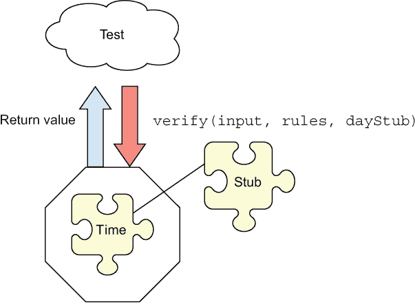

# 3 使用存根打破依赖

本章涵盖

+   依赖类型—模拟、存根等

+   使用存根的原因

+   功能注入技术

+   模块化注入技术

+   面向对象注入技术

在上一章中，你使用 Jest 编写了你的第一个单元测试，我们更多地关注了测试本身的可维护性。场景相当简单，更重要的是，它是完全自包含的。密码验证器没有依赖外部模块，我们可以专注于其功能，而不用担心其他可能干扰它的事情。

在那一章中，我们使用了我们示例的前两种退出点类型：返回值退出点和基于状态的退出点。在这一章中，我们将讨论最后一种类型—*调用第三方*。本章还将提出一个新的要求—让代码依赖于时间。我们将探讨两种不同的处理方法—重构我们的代码和不重构的猴子补丁。

对外部模块或函数的依赖可能会并且确实会使编写测试和使测试可重复变得更加困难，并且也可能导致测试变得不可靠。我们在代码中依赖的外部事物被称为*依赖*。我将在本章后面更详细地定义它们。这些依赖可能包括时间、异步执行、使用文件系统或使用网络，或者它们可能只是涉及使用非常难以配置或可能耗时的东西。

## 3.1 依赖类型

根据我的经验，我们的工作单元可以使用两种主要类型的依赖：

+   *传出依赖*—代表我们工作单元的*退出点*的依赖，例如调用记录器、将某些内容保存到数据库、发送电子邮件、通知 API 或 webhook 发生了某些事情等。请注意，这些都是*动词*：“调用”、“发送”和“通知”。它们以一种类似“发射并忘记”的场景从工作单元向外流动。每个都代表一个退出点，或工作单元中特定逻辑流的结束。

+   *传入依赖*—不是退出点的依赖。这些并不代表对工作单元最终行为的要求。它们仅仅是为了向工作单元提供特定的测试专用数据或行为，例如数据库查询的结果、文件系统中的文件内容、网络响应等。请注意，这些都是所有被动数据块，作为先前操作的结果流向工作单元的。

图 3.1 显示了这些内容并排展示。


图 3.1 左边，退出点是通过调用依赖来实现的。右边，依赖提供间接输入或行为，但不是退出点。

一些依赖项可以是输入和输出的——在某些测试中，它们将代表退出点，在其他测试中，它们将被用来模拟应用程序进入的数据。这些不应该非常常见，但它们确实存在，例如，一个外部 API 返回一个成功/失败响应，用于输出消息。

考虑到这些类型的依赖，让我们看看书籍《xUnit 测试模式》是如何定义测试中看似其他事物的各种模式的。表 3.1 列出了我从书籍网站[` mng.bz/n1WK`](http://mng.bz/n1WK)上的一些模式的想法。

表 3.1 清晰化存根和模拟的术语

| 类别 | 模式 | 目的 | 使用 |
| --- | --- | --- | --- |
|  | 测试替身 | 存根和模拟的通用名称 | 我也使用术语*假*。 |
| 存根 | 假对象 | 当 SUT 方法调用仅作为无关参数使用时，用于指定测试中要使用的值 | 作为入口点或 AAA 模式的安排部分发送参数。 |
|  | 测试存根 | 当它依赖于其他软件组件的间接输入时，用于独立验证逻辑 | 作为依赖项注入，并配置它向 SUT 返回特定的值或行为。 |
| 模拟 | 测试间谍 | 当它对其他软件组件有间接输出时，用于独立验证逻辑 | 覆盖真实对象上的单个函数，并验证假函数是否按预期被调用。 |
|  | 模拟对象 | 当它依赖于其他软件组件的间接输出时，用于独立验证逻辑 | 将假对象作为依赖项注入到 SUT 中，并验证假对象是否按预期被调用。 |

在接下来的这本书中，我们还可以这样思考：

+   *存根*中断了输入依赖（间接输入）。存根是假的模块、对象或函数，它们向被测试的代码提供假行为或数据。我们不对它们进行断言。在单个测试中可以有多个存根。

+   *模拟*中断了输出依赖（间接输出或退出点）。模拟是假的模块、对象或函数，我们在测试中声称它们被调用。模拟代表单元测试中的一个*退出点*。因此，建议每个测试中不要超过一个模拟。

不幸的是，在许多商店，你会听到“模拟”这个词被用作存根和模拟的通用术语。像“我们将模拟这个”或“我们有一个模拟数据库”这样的短语可能会造成真正的混淆。存根和模拟之间有很大的区别（在测试中应该只使用一次），我们应该使用正确的术语来确保其他人清楚所指的内容。

当不确定时，使用“测试替身”或“假”这个术语。通常，单个假依赖可以在一个测试中用作存根，在另一个测试中用作模拟。我们稍后会看到这个例子。

XUnit 测试模式和命名事物

*xUnit Test Patterns: Refactoring Test Code*（Gerard Meszaros 著，Addison-Wesley，2007）是单元测试的经典模式参考书。它定义了至少五种你在测试中模拟事物的模式。一旦你对这里提到的三种类型有了感觉，我鼓励你看看这本书提供的额外细节。

注意到*xUnit Test Patterns*对“假”这个词有一个定义：“用一个更轻量级的实现替换系统测试（SUT）所依赖的组件。”例如，你可能会使用内存数据库而不是完整的生产实例。

我仍然认为这种测试双倍是一个“存根”，我使用“假”这个词来指出任何不真实的东西，就像“测试双倍”这个术语一样，但“假”这个词更短，发音也更顺口。

这可能看起来是一次信息量很大的信息。我将在本章中深入探讨这些定义。让我们先小口品尝，从*存根*开始。

## 3.2 使用存根的原因

如果我们面临测试如下代码片段的任务怎么办？

列表 3.1 使用时间的`verifyPassword`

```
const moment = require('moment');
const SUNDAY = 0, SATURDAY = 6;

const verifyPassword = (input, rules) => {
    const dayOfWeek = moment().day();
    if ([SATURDAY, SUNDAY].includes(dayOfWeek)) {
        throw Error("It's the weekend!");
    }
    //more code goes here...
    //return list of errors found..
    return [];
};
```

我们的密码验证器有一个新的依赖项：它不能在周末工作。想想看。具体来说，该模块直接依赖于 moment.js，这是一个非常常见的 JavaScript 日期/时间包装器。在 JavaScript 中直接处理日期并不愉快，所以我们可以假设许多商店都有类似的东西。

这种直接使用时间相关库的做法如何影响我们的单元测试？这里不幸的问题是，这种直接依赖迫使我们的测试，由于没有直接影响我们正在测试的应用程序中的日期和时间的方法，必须考虑正确的日期和时间。以下列表显示了一个不幸的测试，它只在周末运行。

列表 3.2 `verifyPassword`的初始单元测试

```
const moment = require('moment');
const {verifyPassword} = require("./password-verifier-time00");
const SUNDAY = 0, SATURDAY = 6, MONDAY = 2;

describe('verifier', () => {
    const TODAY = moment().day();

    //test is always executed, but might not do anything
    test('on weekends, throws exceptions', () => {
        if ([SATURDAY, SUNDAY].includes(TODAY)) {       ❶
            expect(()=> verifyPassword('anything',[]))
                .toThrow("It's the weekend!");
 }
    });

    //test is not even executed on week days
 if ([SATURDAY, SUNDAY].includes(TODAY)) {    ❷
        test('on a weekend, throws an error', () => {
            expect(()=> verifyPassword('anything', []))
                .toThrow("It's the weekend!");
        });
 }
});
```

❶ 在测试中检查日期

❷ 在测试外部检查日期

前面的列表包括了同一测试的两个变体。一个检查测试中的当前日期*内部*，另一个检查*外部*的测试，这意味着除非是周末，否则测试根本不会执行。这是不好的。

让我们回顾一下第一章中提到的一个好的测试质量，一致性：每次我运行一个测试，它都是我之前运行过的*完全相同的测试*。使用的值不会改变。断言不会改变。如果没有代码（测试或生产代码）发生变化，那么测试应该提供与之前运行完全相同的结果。

第二个测试有时甚至不会运行。这已经是一个足够好的理由来使用假来直接打破依赖。此外，我们无法模拟周末或工作日，这给了我们足够的动力来重新设计测试代码，使其对依赖项更具可注入性。

但是等等，还有更多。使用时间的测试往往可能不稳定。它们只在某些时候失败，除了时间变化之外没有其他原因。这个测试是这种行为的典型候选者，因为我们本地运行时只会得到其两种状态之一的反馈。如果你想了解它在周末的表现，只需等待几天。呃。

测试可能会因为影响测试中不受我们控制的变量的边缘情况而变得不稳定。常见的例子是在端到端测试期间的网络问题、数据库连接问题或各种服务器问题。当这种情况发生时，很容易通过说“再运行一次”或“没关系。只是[插入可变性问题在这里]”来忽略测试失败。

## 3.3 通常接受的设计方法来模拟

在接下来的几节中，我们将讨论几种常见的将存根注入到我们的工作单元中的形式。首先，我们将讨论基本参数化作为第一步，然后我们将跳入以下方法：

+   *函数式方法*

    +   函数作为参数

    +   部分应用（柯里化）

    +   工厂函数

    +   构造函数

+   *模块化方法*

    +   模块注入

+   *面向对象方法*

    +   类构造函数注入

    +   对象作为参数（即鸭子类型）

    +   公共接口作为参数（为此我们将使用 TypeScript）

我们将逐一解决这些问题，从测试中控制时间的简单情况开始。

### 3.3.1 使用参数注入模拟时间

至少有两个很好的理由来控制时间，基于我们到目前为止所讨论的内容：

+   为了从我们的测试中消除可变性

+   为了轻松模拟我们想要测试代码的任何时间相关场景

这里是我能想到的最简单的重构，可以使事情更加可重复。让我们给我们的函数添加一个`currentDay`参数来指定当前日期。这将消除在函数中使用 moment.js 模块的需要，并将这个责任放在函数的调用者身上。这样，在我们的测试中，我们可以以硬编码的方式确定时间，并使测试和函数可重复且一致。以下列表显示了这种重构的一个示例。

列表 3.3 `verifyPassword`带有`currentDay`参数

```
const verifyPassword2 = (input, rules, currentDay) => {
    if ([SATURDAY, SUNDAY].includes(currentDay)) {
        throw Error("It's the weekend!");
    }
    //more code goes here...
    //return list of errors found..
    return [];
};

const SUNDAY = 0, SATURDAY = 6, MONDAY = 1;
describe('verifier2 - dummy object', () => {
    test('on weekends, throws exceptions', () => {
        expect(() => verifyPassword2('anything',[],SUNDAY ))
            .toThrow("It's the weekend!");
    });
});
```

通过添加`currentDay`参数，我们实际上是将对时间控制权交给了函数的调用者（我们的测试）。我们注入的正式称为“哑元”——它只是一块没有行为的数据——但从现在起我们可以称它为“存根”。

这种方法是一种*依赖倒置*的形式。似乎“控制反转”这个术语最早出现在 Johnson 和 Foote 在 1988 年发表的论文“Designing Reusable Classes”中，该论文发表在《面向对象编程杂志》上。术语“依赖倒置”也是 Robert C. Martin 在 2000 年在其“Design Principles and Design Patterns”论文中描述的 SOLID 模式之一。我将在第八章中更多地讨论高级设计考虑因素。

添加这个参数是一个简单的重构，但效果相当显著。它除了在测试中提供一致性之外，还有一些其他的好处：

+   我们现在可以轻松地模拟任何我们想要的日期。

+   被测试的代码不负责管理时间导入，因此如果我们使用不同的时间库，它就少了一个改变的理由。

我们正在将“时间依赖注入”到我们的工作单元中。我们已经更改了入口点的设计，使用一个日期值作为参数。根据函数式编程的标准，这个函数现在是“纯”的，因为它没有副作用。纯函数内置了所有依赖的注入，这也是为什么你会发现函数式编程的设计通常更容易测试的原因。



图 3.2 注入时间依赖的存根

如果`currentDay`参数只是一个日期整数值，那么称它为存根可能感觉有点奇怪，但根据*xUnit Test Patterns*的定义，我们可以说这是一个“虚拟”值，在我看来，它属于“存根”类别。它不需要复杂，才能成为存根。它只需要在我们控制之下。它是一个存根，因为我们正在使用它来模拟一些输入或行为被传递到被测试的单元中。图 3.2 展示了这一点。

### 3.3.2 依赖、注入和控制

表 3.2 总结了一些我们在本章中讨论并即将使用的术语。

表 3.2 本章中使用的术语

| 依赖 | 使我们的测试生活和代码可维护性变得困难的事物，因为我们无法从测试中控制它们。例如包括时间、文件系统、网络、随机值等等。 |
| --- | --- |
| 控制 | 指示依赖如何行为的能力。据说创建依赖项的人是它们的控制者，因为他们有在代码被测试之前配置它们的能力。在列表 3.1 中，我们的测试对时间没有控制权，因为被测试的模块控制着它。该模块选择始终使用当前的日期和时间。这迫使测试做完全相同的事情，因此我们在测试中失去了一致性。在列表 3.3 中，我们通过`currentDay`参数通过反转控制获得了对依赖的访问。现在测试控制着时间，可以决定使用硬编码的时间。被测试的模块必须使用提供的时间，这使得测试变得容易得多。 |
| 控制反转 | 设计代码以移除内部创建依赖项的责任，并将其外部化。列表 3.3 展示了通过参数注入实现这一点的示例。 |
| 依赖注入 | 将依赖项通过设计接口发送，以便代码内部使用。注入依赖项的地方是注入点。在我们这个例子中，我们使用参数注入点。我们可以注入东西的地方也可以称为*一个* *缝隙*。 |
| 缝隙 | 发音为“s-ee-m”，由迈克尔·费思在《有效地与遗留代码工作》（Pearson，2004 年）一书中提出。缝隙是两个软件组件相遇并可以注入其他东西的地方。这是你可以改变程序行为而不在该处编辑的地方。例子包括参数、函数、模块加载器、函数重写，以及在面向对象的世界中，类接口、公共虚拟方法等。 |

在生产代码中的缝隙对于单元测试的可维护性和可读性起着重要作用。改变和注入行为或自定义数据到被测试代码中的难度越小，编写、阅读以及随着生产代码的变化而维护测试的难度就越小。我将在第八章中更多地讨论一些与设计代码相关的模式和反模式。

## 3.4 函数注入技术

到目前为止，我们可能对我们的设计选择不满意。添加参数确实在函数级别解决了依赖问题，但现在每个调用者都需要以某种方式处理日期。这感觉有点太啰嗦了。

JavaScript 允许两种主要的编程风格——函数式和面向对象——因此，当有道理时，我会展示两种风格的方法，你可以根据你的情况选择最合适的方法。

设计某物并没有唯一的方法。函数式编程的支持者会为函数式风格的简单性、清晰性和可证明性辩护，但这确实有一个学习曲线。因此，仅仅为了这个原因，学习两种方法都是明智的，这样你就可以应用最适合你所在团队的任何一种方法。有些团队可能会更倾向于面向对象的设计，因为他们觉得更舒服。其他团队可能会倾向于函数式设计。我认为模式在很大程度上是相同的；我们只是将它们翻译成不同的风格。

### 3.4.1 注入函数

下面的列表展示了针对同一问题的不同重构方法：我们期望的是一个函数作为参数，而不是数据对象。该函数返回日期对象。

列表 3.4 使用函数进行依赖注入

```
const verifyPassword3 = (input, rules, getDayFn) => {
    const dayOfWeek = getDayFn();
    if ([SATURDAY, SUNDAY].includes(dayOfWeek)) {
        throw Error("It's the weekend!");
    }
    //more code goes here...
    //return list of errors found..
    return [];
};
```

相关的测试在下面的列表中展示。

列表 3.5 使用函数注入进行测试

```
describe('verifier3 - dummy function', () => {
    test('on weekends, throws exceptions', () => {
        const alwaysSunday = () => SUNDAY;
        expect(()=> verifyPassword3('anything',[], alwaysSunday))
            .toThrow("It's the weekend!");
    });
```

与之前的测试几乎没有区别，但使用函数作为参数是进行注入的有效方式。在其他情况下，它也是一个启用特殊行为的好方法，比如模拟代码中被测试的特殊情况或异常。

### 3.4.2 通过部分应用进行依赖注入

工厂函数或方法（“高阶函数”的一个子类别）是返回其他函数的函数，这些函数预先配置了一些上下文。在我们的情况下，上下文可以是规则列表和当前日期函数。然后我们得到一个新的函数，我们可以通过仅输入字符串来触发它，它将使用在其创建时配置的规则和`getDay()`函数。

下面的代码列表将工厂函数转换为测试的 arrange 部分，并调用返回的函数到 act 部分。相当漂亮。

列表 3.6 使用高阶工厂函数

```
const SUNDAY = 0, . . . FRIDAY=5, SATURDAY = 6;

const makeVerifier = (rules, dayOfWeekFn) => {
    return function (input) {
        if ([SATURDAY, SUNDAY].includes(dayOfWeekFn())) {
            throw new Error("It's the weekend!");
        }
        //more code goes here..
 };
};

describe('verifier', () => {
    test('factory method: on weekends, throws exceptions', () => {
        const alwaysSunday = () => SUNDAY;
        const verifyPassword = makeVerifier([], alwaysSunday);

        expect(() => verifyPassword('anything'))
            .toThrow("It's the weekend!");
    });
```

## 3.5 模块化注入技术

JavaScript 还允许我们使用*模块*的概念，我们可以`import`或`require`。面对测试代码中的直接依赖导入时，例如在 3.1 列表中的代码，我们如何处理依赖注入的概念？

```
const moment = require('moment');
const SUNDAY = 0; const SATURDAY = 6;

const verifyPassword = (input, rules) => {
    const dayOfWeek = moment().day();
    if ([SATURDAY, SUNDAY].includes(dayOfWeek)) {
        throw Error("It's the weekend!");
    }
    // more code goes here...
    // return list of errors found..
    return [];
};
```

我们如何克服这种直接依赖？答案是，我们无法克服。我们必须以不同的方式编写代码，以便稍后替换该依赖。我们必须创建一个*接口*，通过该接口我们可以替换我们的依赖。这里有一个这样的例子。

列表 3.7 抽象所需的依赖

```
const originalDependencies = {                        ❶
 moment: require(‘moment’), ❶
}; ❶

let dependencies = { ...originalDependencies };       ❷

const inject = (fakes) => {                           ❸
 Object.assign(dependencies, fakes);
 return function reset() {     ❹
 dependencies = { ...originalDependencies };
 }
};

const SUNDAY = 0; const SATURDAY = 6;

const verifyPassword = (input, rules) => {
    const dayOfWeek = dependencies.moment().day();
    if ([SATURDAY, SUNDAY].includes(dayOfWeek)) {
        throw Error("It's the weekend!");
    }
    // more code goes here...
    // return list of errors found..
    return [];
};

module.exports = {
    SATURDAY,
    verifyPassword,
    inject
};
```

❶ 用中间对象包装 moment.js

❷ 包含当前依赖的对象，无论是真实还是假

❸ 一个用假依赖替换真实依赖的函数

❹ 一个将依赖重置回真实值的函数

这里发生了什么？引入了三个新事物：

+   首先，我们将对 moment.js 的直接依赖替换为一个对象：`originalDependencies`。它包含该模块导入作为其实现的一部分。

+   接下来，我们向其中添加了另一个对象：`dependencies`。默认情况下，该对象承担了`originalDependencies`对象包含的所有真实依赖。

+   最后，`inject`函数，我们也将它作为我们自己的模块的一部分暴露出来，允许导入我们的模块的人（无论是生产代码还是测试）用自定义依赖（假）覆盖我们的真实依赖。

当你调用`inject`时，它返回一个`reset`函数，该函数将原始依赖重新应用于当前的`dependencies`变量，从而重置当前正在使用的任何假依赖。

这就是如何在测试中使用`inject`和`reset`函数。

列表 3.8 使用`inject()`注入假模块

```
const { inject, verifyPassword, SATURDAY } = require('./password-verifier-time00-modular');

const injectDate = (newDay) => {                    ❶
 const reset = inject({                   ❷
 moment: function () {
            //we're faking the moment.js module's API here.
 return {
 day: () => newDay
 }
 }
 });
 return reset;
};

describe('verifyPassword', () => {
    describe('when its the weekend', () => {
        it('throws an error', () => {
            const reset = injectDate(SATURDAY);     ❸

            expect(() => verifyPassword('any input'))
                .toThrow("It's the weekend!");

            reset();                                ❹
        });
    });
});
```

❶ 一个辅助函数

❷ 用假的 API 代替 moment.js

❸ 提供一个假的日期

❹ 重置依赖

让我们分解一下这里正在发生的事情：

1.  `injectDate`函数只是一个辅助函数，旨在减少我们测试中的样板代码。它始终构建 moment.js API 的假结构，并将其`getDay`函数设置为返回`newDay`参数。

1.  `injectDate`函数调用`inject`，并使用新的假 moment.js API。这将在我们的工作单元中将假依赖应用于我们作为参数传入的一个。

1.  我们的测试调用`inject`函数并传入一个自定义的、伪造的日期。

1.  在测试结束时，我们调用`reset`函数，该函数将工作单元的模块依赖项重置为原始状态。

做了几次之后，这开始变得有意义。但也有一些注意事项。在正面方面，它确实解决了我们测试中的依赖问题，并且相对容易使用。至于缺点，在我看来有一个巨大的缺点。使用这种方法伪造我们的模块依赖项迫使我们的测试紧密依赖于我们伪造的依赖项的 API 签名。如果这些是第三方依赖项，例如 moment.js、日志记录器或其他我们无法完全控制的任何东西，当需要（总是需要）升级或替换具有不同 API 的依赖项时，我们的测试将变得非常脆弱。如果只是几个测试，这并不会造成太大的伤害，但通常我们会有数百或数千个测试需要伪造几个常见的依赖项，有时这意味着在用具有破坏性 API 更改的记录器替换时，需要更改和修复数百个文件。

我有两种可能的方法来防止这种情况：

+   永远不要在你的代码中导入你无法直接控制的第三方依赖。始终使用你能够控制的中间抽象。端口和适配器架构是这种想法的一个很好的例子（这种架构的其他名称包括六边形架构和洋葱架构）。在这种架构下，伪造这些内部 API 应该风险更小，因为我们能够控制它们的变更速度，从而使我们的测试更加稳健。（即使外部世界发生变化，我们也可以在不影响测试的情况下对它们进行内部重构。）

+   避免使用模块注入，而是使用本书中提到的其他依赖注入方法之一：函数参数、柯里化和，如下一节所述，构造函数和接口。在这些方法之间，你应该有足够的选择，而不是直接导入。

## 3.6 向构造函数对象迈进

构造函数是一种稍微更面向对象的 JavaScript 风格，可以达到与工厂函数相同的结果，但它们返回类似于具有我们可以触发的方法的对象。然后我们使用关键字`new`来调用这个函数，并获取那个特殊对象。

下面是采用这种设计选择后的相同代码和测试的样子。

列表 3.9 使用构造函数

```
const Verifier = function(rules, dayOfWeekFn)
{
 this.verify = function (input) {
        if ([SATURDAY, SUNDAY].includes(dayOfWeekFn())) {
            throw new Error("It's the weekend!");
        }
        //more code goes here..
    };
};

const {Verifier} = require("./password-verifier-time01");

test('constructor function: on weekends, throws exception', () => {
    const alwaysSunday = () => SUNDAY;
    const verifier = new Verifier([], alwaysSunday);

    expect(() => verifier.verify('anything'))
        .toThrow("It's the weekend!");
});
```

你可能会看看这个并问，“为什么要转向对象？”答案实际上取决于你当前项目的上下文、其堆栈、你团队对函数编程和面向对象背景的了解，以及许多其他非技术因素。在工具箱中拥有这个工具是好事，这样你就可以在你认为合适的时候使用它。在阅读下一节之前，把这个放在心里。

## 3.7 面向对象注入技术

如果你倾向于更面向对象的风格，或者如果你在 C# 或 Java 等面向对象语言中工作，这里有一些在面向对象世界中广泛使用的、用于依赖注入的常见模式。

### 3.7.1 构造函数注入

*构造函数注入*是我用来描述一种设计，我们可以通过类的构造函数注入依赖项。在 JavaScript 世界中，Angular 是最著名的使用这种设计注入“服务”的 Web 前端框架，在 Angular 术语中，“服务”只是“依赖项”的代码词。这在许多其他情况下都是一个可行的设计。

拥有一个有状态的类并非没有好处。它可以消除只需要配置我们的类一次并可以多次重用配置类的客户端的重复性。

如果我们选择创建一个有状态版本的密码验证器，并且我们想要通过构造函数注入来注入日期函数，它可能看起来像以下设计。

列表 3.10 构造函数注入设计

```
class PasswordVerifier {
 constructor(rules, dayOfWeekFn) {
 this.rules = rules;
 this.dayOfWeek = dayOfWeekFn;
 }

    verify(input) {
        if ([SATURDAY, SUNDAY].includes(this.dayOfWeek())) {
            throw new Error("It's the weekend!");
        }
        const errors = [];
        //more code goes here..
        return errors;
    };
}

test('class constructor: on weekends, throws exception', () => {
    const alwaysSunday = () => SUNDAY;
    const verifier = new PasswordVerifier([], alwaysSunday);

    expect(() => verifier.verify('anything'))
        .toThrow("It's the weekend!");
});
```

这看起来和感觉与第 3.6 节中的构造函数设计非常相似。这是一个更面向类的、许多人会感到更舒适的、来自面向对象背景的设计。它也更冗长。你会发现，我们使事物越加面向对象，我们就越加冗长。这是面向对象游戏的一部分。这也是为什么越来越多的人选择函数式风格的部分原因——它们更加简洁。

让我们谈谈测试的可维护性。如果我用这个类写第二个测试，我会将类的创建通过构造函数提取到一个漂亮的小工厂函数中，该函数返回待测试类的实例，这样如果（即，“当”）构造函数签名更改并一次性破坏许多测试，我只需要修复一个地方就可以让所有测试再次工作，如下面的列表所示。

列表 3.11 向我们的测试中添加一个辅助工厂函数

```
describe('refactored with constructor', () => {
 const makeVerifier = (rules, dayFn) => {
 return new PasswordVerifier(rules, dayFn);
 };

    test('class constructor: on weekends, throws exceptions', () => {
        const alwaysSunday = () => SUNDAY;
        const verifier = makeVerifier([],alwaysSunday);

        expect(() => verifier.verify('anything'))
            .toThrow("It's the weekend!");
    });

    test('class constructor: on weekdays, with no rules, passes', () => { 
        const alwaysMonday = () => MONDAY;
        const verifier = makeVerifier([],alwaysMonday);

        const result = verifier.verify('anything');
        expect(result.length).toBe(0);
    });
});
```

注意，这与第 3.4.2 节中的工厂函数设计不同。这个工厂函数位于我们的*测试*中；另一个位于我们的生产代码中。这个是为了测试的可维护性，并且它可以与面向对象和函数式生产代码一起工作，因为它隐藏了函数或对象是如何被创建或配置的。它是我们测试中的一个抽象层，因此我们可以将如何创建或配置函数或对象的依赖项推到我们的测试中的单个地方。

### 3.7.2 注入对象而不是函数

目前，我们的类构造函数接受一个函数作为第二个参数：

```
constructor(rules, dayOfWeekFn) {
    this.rules = rules;
    this.dayOfWeek = dayOfWeekFn;
}
```

让我们在面向对象的设计上再迈出一大步，使用对象而不是函数作为我们的参数。这需要我们做一些工作：重构代码。

首先，我们将创建一个名为 time-provider.js 的新文件，其中将包含我们依赖于 moment.js 的真实对象。该对象将被设计为有一个名为 `getDay()` 的单一函数：

```
import moment from "moment";

const RealTimeProvider = () =>  {
    this.getDay = () => moment().day()
};
```

接下来，我们将更改参数使用，以使用具有函数的对象：

```
const SUNDAY = 0, MONDAY = 1, SATURDAY = 6;
class PasswordVerifier {
    constructor(rules, timeProvider) {
        this.rules = rules;
        this.timeProvider = timeProvider;
    }

    verify(input) {
        if ([SATURDAY, SUNDAY].includes(this.timeProvider.getDay())) {
            throw new Error("It's the weekend!");
        }
    ...
}
```

最后，让我们给需要我们的 `PasswordVerifier` 实例的人提供通过默认情况下预配置真实时间提供者的能力。我们将使用一个新的 `passwordVerifierFactory` 函数来完成这项工作，任何需要验证器实例的生产代码都需要使用这个函数：

```
const passwordVerifierFactory = (rules) => {
    return new PasswordVerifier(new RealTimeProvider())
};
```

IoC 容器和依赖注入

有许多其他方法可以将 `PasswordVerifier` 和 `TimeProvider` 连接起来。我只是选择了手动注入以保持事情简单。今天许多框架都能够配置将依赖注入到测试对象中，这样我们就可以定义对象的构建方式。Angular 就是这样的框架之一。

如果你正在使用 Java 中的 Spring 或 C# 中的 Autofac 或 StructureMap 这样的库，你可以轻松地配置使用构造函数注入的对象构建，而无需创建专门的函数。通常，这些功能被称为控制反转（IoC）容器或依赖注入（DI）容器。我在这本书中没有使用它们，以避免不必要的细节。你不需要它们来创建出色的测试。

实际上，我通常不在测试中使用 IoC 容器。我几乎总是使用自定义工厂函数来注入依赖。我发现这样做可以使我的测试更容易阅读和推理。

即使是测试 Angular 代码，我们也不必通过 Angular 的 DI 框架将依赖注入到内存中的对象中；我们可以直接调用该对象的构造函数并传入假数据。只要我们在工厂函数中这样做，我们就没有牺牲可维护性，也不会为测试添加额外的代码，除非这是测试所必需的。

以下列表显示了整个新代码块。

列表 3.12 注入对象

```
import moment from "moment";

const RealTimeProvider = () =>  {
    this.getDay = () => moment().day()
};

const SUNDAY = 0, MONDAY=1, SATURDAY = 6;
class PasswordVerifier {
    constructor(rules, timeProvider) {
        this.rules = rules;
        this.timeProvider = timeProvider;
    }

    verify(input) {
        if ([SATURDAY, SUNDAY].includes(this.timeProvider.getDay())) {
            throw new Error("It's the weekend!");
        }
        const errors = [];
        //more code goes here..
        return errors;
    };
}

const passwordVerifierFactory = (rules) => {
    return new PasswordVerifier(new RealTimeProvider())
};
```

我们如何在测试中处理这种类型的设计，当我们需要注入一个假对象而不是一个假函数时？我们最初会手动完成这个操作，这样你可以看到这并不是什么大问题。稍后，我们将让框架帮助我们，但你也会看到，有时手动编写假对象实际上可以使你的测试比使用框架（如 Jasmine、Jest 或 Sinon）更易于阅读（我们将在第五章中介绍这些框架）。

首先，在我们的测试文件中，我们将创建一个新的假对象，它具有与我们的真实时间提供者相同的函数签名，但它将由我们的测试控制。在这种情况下，我们将只使用构造函数模式：

```
function FakeTimeProvider(fakeDay) {
    this.getDay = function () {
        return fakeDay;
    }
}
```

注意：如果你正在使用更面向对象的方式工作，你可能会选择创建一个继承自通用接口的简单类。我们将在本章稍后讨论这一点。

接下来，我们将在我们的测试中构建 `FakeTimeProvider` 并将其注入到正在测试的 `verifier` 中：

```
describe('verifier', () => {
    test('on weekends, throws exception', () => {
        const verifier = 
             new PasswordVerifier([], new FakeTimeProvider(SUNDAY));

        expect(()=> verifier.verify('anything'))
            .toThrow("It's the weekend!");
    });
```

这就是完整的测试文件看起来像什么。

列表 3.13 创建手写的存根对象

```
function FakeTimeProvider(fakeDay) {
    this.getDay = function () {
        return fakeDay;
    }
}

describe('verifier', () => {
    test('class constructor: on weekends, throws exception', () => {
        const verifier = 
            new PasswordVerifier([], new FakeTimeProvider(SUNDAY));

        expect(() => verifier.verify('anything'))
            .toThrow("It's the weekend!");
    });
}); 
```

这段代码之所以能工作，是因为 JavaScript 默认是一个非常宽容的语言。就像 Ruby 或 Python 一样，你可以通过鸭子类型来避免很多问题。"鸭子类型"指的是如果一个东西看起来像鸭子，说话也像鸭子，我们就把它当作鸭子来对待。在这种情况下，真实对象和假对象都实现了相同的功能，尽管它们是完全不同的对象。我们可以简单地用一个代替另一个，并且生产代码应该能够接受这种替换。

当然，我们只有在运行时才知道这是可行的，并且我们没有在函数签名方面犯任何错误或遗漏任何内容。如果我们想更有信心，我们可以尝试以更安全的类型方式来做。

### 3.7.3 提取公共接口

我们可以更进一步，如果我们使用 TypeScript 或像 Java 或 C#这样的强类型语言，我们可以开始使用接口来表示我们的依赖项所扮演的角色。我们可以创建一种合同，确保真实对象和假对象都必须在编译器级别遵守。

首先，我们将定义我们的新接口（注意，这现在是 TypeScript 代码）：

```
export interface TimeProviderInterface {
    getDay(): number;
}
```

第二，我们将在生产代码中定义一个实现我们接口的真实时间提供者，如下所示：

```
import * as moment from "moment";
import {TimeProviderInterface} from "./time-provider-interface";

export class RealTimeProvider implements TimeProviderInterface {
    getDay(): number {
        return moment().day();
    }
}
```

第三，我们将更新`PasswordVerifier`的构造函数，使其接受我们新的`TimeProviderInterface`类型作为依赖项，而不是使用`RealTimeProvider`参数类型。我们正在抽象化时间提供者的角色，并声明我们不在乎传递什么对象，只要它符合这个角色的接口：

```
export class PasswordVerifier {
 private _timeProvider: TimeProviderInterface;

    constructor(rules: any[], timeProvider: TimeProviderInterface) {
        this._timeProvider = timeProvider;
    }

    verify(input: string):string[] {
        const isWeekened = [SUNDAY, SATURDAY]
            .filter(x => x === this._timeProvider.getDay())
            .length > 0;
        if (isWeekened) {
            throw new Error("It's the weekend!")
        }
         // more logic goes here
        return [];
    }
}
```

现在我们有一个定义了“鸭子”外观的接口，我们可以在测试中实现自己的鸭子。它看起来会非常像之前的测试代码，但有一个显著的区别：它将通过编译器检查来确保方法签名的正确性。

下面是我们测试文件中的假时间提供者：

```
class FakeTimeProvider implements TimeProviderInterface {
    fakeDay: number;
    getDay(): number {
        return this.fakeDay;
    }
}
```

下面是我们的测试：

```
describe('password verifier with interfaces', () => {
    test('on weekends, throws exceptions', () => {
 const stubTimeProvider = new FakeTimeProvider();
        stubTimeProvider.fakeDay = SUNDAY;
        const verifier = new PasswordVerifier([], stubTimeProvider);

        expect(() => verifier.verify('anything'))
            .toThrow("It's the weekend!");
    });
});
```

以下列表显示了所有代码：

列表 3.14 在生产代码中提取公共接口

```
export interface TimeProviderInterface {  getDay(): number;  }

export class RealTimeProvider implements TimeProviderInterface {
    getDay(): number {
        return moment().day();
    }
}

export class PasswordVerifier {
    private _timeProvider: TimeProviderInterface;

    constructor(rules: any[], timeProvider: TimeProviderInterface) {
        this._timeProvider = timeProvider;
    }
    verify(input: string):string[] {
        const isWeekend = [SUNDAY, SATURDAY]
            .filter(x => x === this._timeProvider.getDay())
            .length>0;
        if (isWeekend) {
            throw new Error("It's the weekend!")
        }
        return [];
    }
}

class FakeTimeProvider implements TimeProviderInterface{
    fakeDay: number;
    getDay(): number {
        return this.fakeDay;
    }
}

describe('password verifier with interfaces', () => {
    test('on weekends, throws exceptions', () => {
        const stubTimeProvider = new FakeTimeProvider();
        stubTimeProvider.fakeDay = SUNDAY;
        const verifier = new PasswordVerifier([], stubTimeProvider);

        expect(() => verifier.verify('anything'))
            .toThrow("It's the weekend!");
    });
});
```

我们现在已经完全从纯函数式设计过渡到了强类型、面向对象的设计。这对你的团队和项目来说哪个更好？没有唯一的答案。我将在第八章中更多地讨论设计。在这里，我主要想展示的是，无论你最终选择哪种设计，注入模式在很大程度上都是相同的。它只是通过不同的词汇或语言特性来实现。

是注入的能力使我们能够模拟在现实生活中实际上无法测试的事情。这正是 stubs 理念大放异彩的地方。我们可以告诉我们的 stubs 返回假值，甚至在我们的代码中模拟异常，以查看它如何处理由依赖项引起的错误。注入使得这一切成为可能。注入也使我们的测试更加可重复、一致和可靠，我将在本书的第三部分讨论可靠性。在下一章中，我们将探讨模拟对象，并了解它们与 stubs 的区别。

## 摘要

+   *测试替身*是一个总称，描述了测试中所有非生产就绪的、假的依赖项。测试替身有五种变体，可以归纳为两种类型：*模拟*和*stubs*。

+   *模拟*帮助模拟和检查 *输出依赖项*：代表我们工作单元的出口点的依赖项。被测试的系统（SUT）调用输出依赖项以改变这些依赖项的状态。*Stubs* 帮助模拟 *输入依赖项*：SUT 调用此类依赖项以获取输入数据。

+   Stubs 帮助用假的可信依赖项替换不可信的依赖项，从而避免 *测试的不稳定性*。

+   有多种方法可以将 stub 注入到工作单元中：

    +   *函数作为参数*——注入一个函数而不是一个普通值。

    +   *部分应用（柯里化）和工厂函数*——创建一个返回另一个函数的函数，该函数包含一些预先烘焙的上下文。这个上下文可能包括你用 stub 替换的依赖项。

    +   *模块注入*——用一个具有相同 API 的假模块替换模块。这种方法是脆弱的。如果模拟的模块在未来更改其 API，你可能需要进行大量的重构。

    +   *构造函数*——这基本上与部分应用相同。

    +   *类构造函数注入*——这是一种常见的面向对象技术，通过构造函数注入依赖项。

    +   *对象作为参数（即鸭子类型）*——在 JavaScript 中，只要依赖项实现了相同的函数，你就可以将其注入到所需依赖项的位置。

    +   *公共接口作为参数*——这与对象作为参数相同，但在编译时涉及检查。对于这种方法，你需要一个强类型语言，如 TypeScript。
