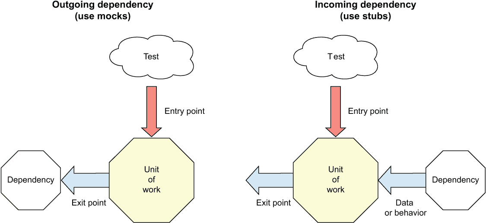
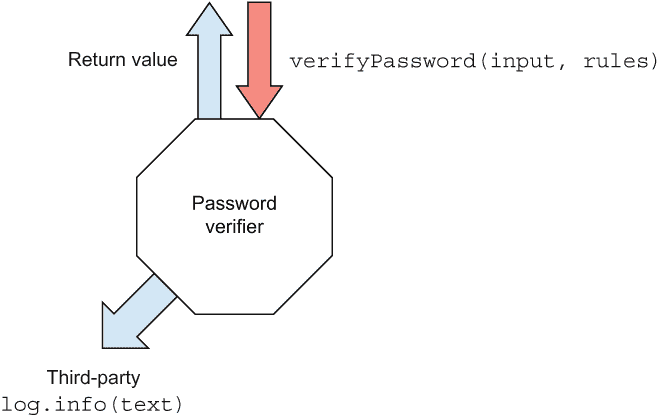

# 4 使用模拟对象进行交互测试

本章涵盖

+   定义交互测试

+   使用模拟对象的原因

+   注入和使用模拟对象

+   处理复杂的接口

+   部分模拟

在上一章中，我们解决了测试依赖于其他对象才能正确运行的代码的问题。我们使用存根来确保被测试的代码收到了它需要的所有输入，这样我们就可以单独测试工作单元。

到目前为止，你只编写了针对工作单元可能拥有的三种类型的出口点中的前两种类型的测试：*返回值*和*改变系统状态*（你可以在第一章中了解更多关于这些类型的信息）。在本章中，我们将探讨如何测试第三种类型的出口点——调用第三方函数、模块或对象。这很重要，因为通常我们会有依赖于我们无法控制的代码。知道如何检查这种类型的代码是单元测试领域的重要技能。基本上，我们将找到方法来证明我们的工作单元最终调用了我们无法控制的函数，并识别发送作为参数的值。

我们迄今为止探讨的方法在这里不起作用，因为第三方函数通常没有专门的 API 允许我们检查它们是否被正确调用。相反，它们为了清晰性和可维护性而内部化其操作。那么，你如何测试你的工作单元是否正确地与第三方函数交互呢？你使用模拟。

## 4.1 交互测试、模拟和存根

*交互测试*是检查工作单元如何与和控制之外的依赖项交互，并发送消息（即调用函数）。使用模拟函数或对象来断言是否正确地调用了外部依赖项。

让我们回顾一下在第三章中我们讨论的模拟和存根之间的区别。主要区别在于信息流：

+   *模拟*——用于断开传出的依赖。模拟是我们断言在测试中被调用的虚假模块、对象或函数。模拟代表单元测试中的一个*出口点*。如果我们不对它进行断言，它就不会作为模拟使用。

    对于测试的可维护性和可读性而言，每个测试最多只有一个模拟对象是正常的。（我们将在本书关于编写可维护测试的第三部分中进一步讨论这个问题。）

+   *存根*——用于断开传入的依赖。存根是提供虚假行为或数据的虚假模块、对象或函数，用于被测试的代码。我们不对它们进行断言，并且可以在单个测试中拥有多个存根。

    存根代表的是途径点，而不是出口点，因为数据或行为是流向工作单元的。它们是交互点，但并不代表工作单元的最终结果。相反，它们是通往我们关心的最终结果的交互途径，因此我们不将它们视为出口点。

图 4.1 显示了这两个对象并排展示。



图 4.1 左边，一个实现为调用依赖项的出口点。右边，依赖项提供间接输入或行为，不是一个出口点。

让我们看看一个简单的例子，这是一个我们不控制的依赖项的出口点：调用日志记录器。

## 4.2 依赖于日志记录器

让我们将这个密码验证器函数作为我们的起始示例，并假设我们有一个复杂的日志记录器（它具有更多函数和参数，因此接口可能更具挑战性）。我们函数的一个要求是在验证通过或失败时调用日志记录器，如下所示。

列表 4.1 直接依赖于复杂的日志记录器

```
// impossible to fake with traditional injection techniques
const log = require('./complicated-logger');

const verifyPassword = (input, rules) => {
  const failed = rules
    .map(rule => rule(input))
    .filter(result => result === false);
  if (failed.count === 0) {
    // to test with traditional injection techniques
    log.info('PASSED');                                      ❶
    return true; //                                          ❶
  }
  //impossible to test with traditional injection techniques
  log.info('FAIL'); //                                       ❶
  return false; //                                           ❶
};

const info = (text) => {
 console.log(`INFO: ${text}`);
};
const debug = (text) => {
    console.log(`DEBUG: ${text}`);
};
```

❶ 出口点

图 4.2 展示了这一点。我们的`verifyPassword`函数是工作单元的入口点，我们总共有两个出口：一个返回值，另一个调用`log.info()`。



图 4.2 密码验证器的入口点是`verifyPassword`函数。一个出口点返回一个值，另一个调用`log.info()`。

不幸的是，我们无法使用任何传统方法来验证`logger`是否被调用，或者不使用一些 Jest 技巧，因为我通常只有在没有其他选择时才会使用这些技巧，因为它们往往会使得测试更难以阅读和维护（关于这一点，本章后面会详细说明）。

让我们用我们喜欢的方式处理依赖项：*抽象它们*。在我们的代码中创建接口有许多方法。记住，*接口*是两段代码相遇的地方——我们可以利用它们来注入假数据。表 4.1 列出了抽象依赖项最常见的方法。

表 4.1 注入伪造的技术

| 风格 | 技术 |
| --- | --- |
| 标准 | 引入参数 |
| 函数式 | 使用柯里化转换为高阶函数 |
| 模块化 | 抽象模块依赖 |
| 面向对象 | 注入未类型化对象注入接口 |

## 4.3 标准风格：引入参数重构

我们可以开始这段旅程的最明显方式是在我们正在测试的代码中引入一个新参数。

列表 4.2 模拟日志参数注入

```
const verifyPassword2 = (input, rules, logger) => {
    const failed = rules
        .map(rule => rule(input))
        .filter(result => result === false);

    if (failed.length === 0) {
 logger.info('PASSED');
        return true;
    }
    logger.info('FAIL');
    return false;
};
```

下面的列表展示了我们可以如何使用简单的闭包机制编写这个最简单的测试。

列表 4.3 手写模拟对象

```
describe('password verifier with logger', () => {
    describe('when all rules pass', () => {
        it('calls the logger with PASSED', () => {
            let written = '';
            const mockLog = {
                info: (text) => {
                    written = text;
                }
            };

            verifyPassword2('anything', [], mockLog);

            expect(written).toMatch(/PASSED/);
        });
    });
});
```

首先要注意的是，我们给变量命名`mockXXX`（在这个例子中是`mockLog`）以表明我们在测试中有一个模拟函数或对象。我使用这种命名约定是因为我想让你，作为测试的读者，知道你应该在测试结束时对那个模拟进行断言（也称为*验证*）。这种命名方法消除了读者的惊喜元素，使得测试更加可预测。仅对实际是模拟的事物使用这种命名约定。

这是我们的第一个模拟对象：

```
let written = '';
const mockLog = {
    info: (text) => {
        written = text;
    }
};
```

它只有一个功能，模仿了日志记录器`info`函数的签名。然后它保存传递给它的参数（`text`），以便我们可以在测试的稍后阶段断言它被调用。如果`written`变量包含正确的文本，这证明了我们的函数被调用，这意味着我们已经证明了从我们的工作单元正确调用了出口点。

在`verifyPassword2`这一侧，我们进行的重构相当常见。这几乎与我们在上一章中做的一样，当时我们提取了一个*存根*作为依赖项。在重构和引入应用程序代码中的接口方面，存根和模拟通常被同等对待。

这个简单的重构为参数提供了什么？

+   我们不再需要在测试代码中显式地导入（通过`require`）`logger`了。这意味着，如果我们更改了`logger`的实际依赖项，测试代码将减少一个需要更改的理由。

+   现在我们有能力将任何我们选择的`logger`注入到测试代码中，只要它符合相同的接口（或者至少有`info`方法）。这意味着我们可以提供一个为我们服务的模拟日志记录器：模拟日志记录器帮助我们验证它是否被正确调用。

注意：我们的模拟对象只模拟了`logger`接口的一部分（缺少`debug`函数），这是一种鸭子类型的形式。我在第三章讨论了这个想法：如果它像鸭子走路，如果它像鸭子说话，那么我们可以将其用作一个假对象。

## 4.4 区分模拟和存根的重要性

为什么我如此关心我们给每个事物取的名字？如果我们无法区分模拟和存根，或者我们没有正确命名它们，我们可能会得到测试多个事物且可读性差、更难维护的测试。正确命名事物有助于我们避免这些陷阱。

由于模拟代表了我们工作单元的要求（“它调用日志记录器”，“它发送电子邮件”等），而存根代表传入的信息或行为（“数据库查询返回 false”，“这个特定的配置抛出错误”），我们可以设定一个简单的规则：在测试中拥有多个存根是可以接受的，但你通常不希望每个测试中只有一个*模拟*，因为这意味着你在单个测试中测试了多个要求。

如果我们无法（或不愿意）区分事物（命名是关键），我们可能会在每个测试中拥有多个模拟，或者断言我们的存根，这两者都可能对我们的测试产生负面影响。保持命名一致性给我们带来以下好处：

+   *可读性*—你的测试名称将变得更加通用，更难以理解。你希望人们能够阅读测试名称并了解其中发生或测试的所有内容，而无需阅读测试代码。

+   *可维护性*——如果你没有区分模拟和存根，你可能会不经意或甚至不在乎地针对存根进行断言。这对你几乎没有价值，并且增加了你的测试和内部生产代码之间的耦合。断言你查询了数据库就是一个很好的例子。与其测试数据库查询返回某些值，不如测试在改变数据库输入后，应用程序的行为是否发生变化。

+   *信任*——如果你在单个测试中有多个模拟（需求），并且第一个模拟验证失败导致测试失败，大多数测试框架不会执行测试的其余部分（在失败的断言行以下），因为已经抛出了异常。这意味着其他模拟没有被验证，你不会从它们那里得到结果。

为了强调最后一点，想象一个只看到患者 30%症状的医生，但仍然需要做出决定——他们可能会在治疗上做出错误的决定。如果你看不到所有错误在哪里，或者两件事物都在失败而不是只有一件（因为其中一件在第一次失败后被隐藏），你更有可能修复错误的事物或错误地修复它。

*《XUnit 测试模式》* (*Addison-Wesley, 2007*)，由 *Gerard Meszaros* 编著，称这种情况为 *断言轮盘赌* ([`xunitpatterns.com/Assertion%20Roulette.html`](http://xunitpatterns.com/Assertion%20Roulette.html))。我喜欢这个名字。这相当是一场赌博。你开始注释掉测试中的代码行，随之而来的是很多乐趣（以及可能还有酒精）。

并非所有事物都是模拟

很不幸，人们仍然倾向于使用“mock”这个词来指代任何非真实的事物，例如“mock 数据库”或“mock 服务”。大多数时候他们真正意味着他们正在使用一个存根。

虽然很难责怪他们。像 Mockito、jMock 以及大多数隔离框架（我不称它们为模拟框架，原因和我在讨论的相同），使用“mock”这个词来表示模拟和存根。

现在有一些新的框架，例如 JavaScript 中的 Sinon 和 testdouble，.NET 中的 NSubstitute 和 FakeItEasy，以及其他一些框架，它们帮助启动了命名约定的变革。我希望这种变革能够持续下去。

## 4.5 模块化风格的存根

我在上一章中介绍了模块化依赖注入，但现在我们将看看我们如何可以使用它来注入模拟对象并在它们上模拟答案。

### 4.5.1 生产代码示例

让我们看看一个比之前更复杂的例子。在这个场景中，我们的 `verifyPassword` 函数依赖于两个外部依赖项：

+   一个日志记录器

+   一个配置服务

配置服务提供所需的日志级别。通常这类代码会被移动到一个特殊的日志记录器模块中，但为了本书示例的目的，我将调用 `logger.info` 和 `logger.debug` 的逻辑直接放在被测试的代码中。

列表 4.4 一个硬模块化依赖

```
const { info, debug } = require("./complicated-logger");
const { getLogLevel } = require("./configuration-service");

const log = (text) => {
  if (getLogLevel() === "info") {
    info(text);
  }
  if (getLogLevel() === "debug") {
    debug(text);
  }
};

const verifyPassword = (input, rules) => {
  const failed = rules
    .map((rule) => rule(input))
    .filter((result) => result === false);

  if (failed.length === 0) {
    log("PASSED");   ❶
    return true;
  }
  log("FAIL");       ❶
  return false;
};

module.exports = {
  verifyPassword,
};
```

❶ 调用日志记录器

假设我们在调用日志记录器时意识到我们有一个错误。我们已经更改了检查失败的方式，现在当失败次数为正而不是零时，我们用 `PASSED` 结果调用日志记录器。我们如何通过单元测试来证明这个错误存在，或者我们已经修复了它？

我们在这里的问题是我们在代码中直接导入（或要求）模块。如果我们想替换日志记录器模块，我们必须替换文件或通过 Jest 的 API 执行一些其他黑暗魔法。我不建议这样做，因为使用这些技术会导致比处理代码时通常更多的痛苦和折磨。

### 4.5.2 以模块注入风格重构生产代码

我们可以将模块依赖项抽象成它们自己的对象，并允许我们的模块用户按以下方式替换该对象。

列表 4.5 重构为模块注入模式

```
const originalDependencies = {                     ❶
 log: require('./complicated-logger'), ❶
}; ❶

let dependencies = { ...originalDependencies }; ❷

const resetDependencies = () => {                  ❸
 dependencies = { ...originalDependencies }; ❸
}; ❸

const injectDependencies = (fakes) => {            ❹
 Object.assign(dependencies, fakes); ❹
}; ❹

const verifyPassword = (input, rules) => {
    const failed = rules
        .map(rule => rule(input))
        .filter(result => result === false);

    if (failed.length === 0) {
        dependencies.log.info('PASSED');
        return true;
    }
    dependencies.log.info('FAIL');
    return false;
};

module.exports = {
    verifyPassword,                                ❺
    injectDependencies, ❺
    resetDependencies ❺
};
```

❶ 保留原始依赖项

❷ 间接层

❸ 一个重置依赖项的函数

❹ 一个覆盖依赖项的函数

❺ 向模块用户公开 API

这里有一些生产代码，看起来更复杂，但如果我们被迫以模块化的方式工作，这允许我们相对容易地替换测试中的依赖项。

`originalDependencies` 变量将始终保留原始依赖项，这样我们就不至于在测试之间丢失它们。`dependencies` 是我们的间接层。它默认为原始依赖项，但我们的测试可以指导被测试代码用自定义依赖项替换该变量（而无需了解模块的内部结构）。`injectDependencies` 和 `resetDependencies` 是模块公开的 API，用于覆盖和重置依赖项。

### 4.5.3 模块式注入的测试示例

以下列表展示了模块注入测试可能的样子。

列表 4.6 使用模块注入进行测试

```
const {
  verifyPassword,
  injectDependencies,
 resetDependencies,
} = require("./password-verifier-injectable");

describe("password verifier", () => {
  afterEach(resetDependencies);

  describe("given logger and passing scenario", () => {
    it("calls the logger with PASS", () => {
      let logged = "";
      const mockLog = { info: (text) => (logged = text) };
      injectDependencies({ log: mockLog });

      verifyPassword("anything", []);

      expect(logged).toMatch(/PASSED/);
    });
  });
});
```

只要我们记得在每个测试后使用 `resetDependencies` 函数，现在我们就可以很容易地为测试目的注入模块。明显的最大缺点是，这种方法要求每个模块公开可以从外部使用的注入和重置函数。这可能或可能不适用于您当前的设计限制，但如果适用，您可以将它们都抽象成可重用的函数，从而节省大量的样板代码。

## 4.6 函数式风格的模拟

让我们来看看我们可以用来将模拟注入到被测试代码中的几种函数式风格。

### 4.6.1 使用柯里化风格工作

让我们实现第三章中介绍的柯里化技术，以执行更函数式风格的日志记录器注入。在以下列表中，我们将使用 `lodash`，这是一个促进 JavaScript 函数式编程的库，以在不产生太多样板代码的情况下实现柯里化。

列表 4.7 将柯里化应用于我们的函数

```
const verifyPassword3 = _.curry((rules, logger, input) => {
    const failed = rules
        .map(rule => rule(input))
        .filter(result => result === false);
    if (failed.length === 0) {
        logger.info('PASSED');
        return true;
    }
    logger.info('FAIL');
    return false;
});
```

唯一的改变是在第一行调用 `_.curry`，并在代码块末尾关闭它。

以下列表演示了这种类型代码的测试可能的样子。

列表 4.8 使用依赖注入测试柯里化函数

```
describe("password verifier", () => {
  describe("given logger and passing scenario", () => {
    it("calls the logger with PASS", () => {
      let logged = "";
      const mockLog = { info: (text) => (logged = text) };
      const injectedVerify = verifyPassword3([], mockLog);

      // this partially applied function can be passed around
      // to other places in the code
      // without needing to inject the logger
      injectedVerify("anything");

      expect(logged).toMatch(/PASSED/);
    });
  });
});
```

我们的测试用前两个参数调用该函数（注入 `rules` 和 `logger` 依赖项，实际上返回一个部分应用函数），然后使用最终输入调用返回的函数 `injectedVerify`，从而向读者展示两件事：

+   这个函数在现实生活中是如何使用的

+   依赖项是什么

除了这些，其他方面与之前的测试几乎相同。

### 4.6.2 与高阶函数一起工作而不使用柯里化

列表 4.9 是函数式编程设计的另一种变体。我们使用高阶函数，但没有使用柯里化。你可以从以下代码中看出它不包含柯里化，因为我们始终需要将所有参数作为参数发送给函数，以便它能够正确工作。

列表 4.9 在高阶函数中注入模拟

```
const makeVerifier = (rules, logger) => {
    return (input) => {                     ❶
        const failed = rules
            .map(rule => rule(input))
            .filter(result => result === false);

        if (failed.length === 0) {
            logger.info('PASSED');
            return true;
        }
        logger.info('FAIL');
        return false;
 };
};
```

❶ 返回预配置的验证器

这次我明确地创建了一个工厂函数，该函数返回一个*预配置的验证器函数*，它已经在其闭包的依赖项中包含了 `rules` 和 `logger`。

现在我们来看看对这个的测试。测试需要首先调用 `makeVerifier` 工厂函数，然后调用那个函数返回的函数 (`passVerify`)。

列表 4.10 使用工厂函数进行测试

```
describe("higher order factory functions", () => {
  describe("password verifier", () => {
    test("given logger and passing scenario", () => {
      let logged = "";
      const mockLog = { info: (text) => (logged = text) };
      const passVerify = makeVerifier([], mockLog);        ❶

      passVerify("any input");                             ❷

      expect(logged).toMatch(/PASSED/);
    });
  });
});
```

❶ 调用工厂函数

❷ 调用生成的函数

## 4.7 以面向对象风格使用模拟

现在我们已经介绍了一些函数式和模块化风格，让我们来看看面向对象风格。来自面向对象背景的人会对此类方法感到更加舒适，而来自函数式背景的人可能会讨厌它。但生活就是关于接受人们的不同之处。

### 4.7.1 对生产代码进行重构以实现注入

列表 4.11 展示了在 JavaScript 的基于类的设计中这种类型的注入可能看起来是什么样子。类有构造函数，我们使用构造函数来强制类的调用者提供参数。这不是实现这一点的唯一方法，但在面向对象的设计中非常常见且有用，因为它使得这些参数的要求明确，在强类型语言如 Java 或 C 以及使用 TypeScript 时几乎不可否认。我们想确保使用我们代码的任何人都能知道如何正确配置它。

列表 4.11 基于类的构造函数注入

```
class PasswordVerifier {
  _rules;
  _logger;

  constructor(rules, logger) {
    this._rules = rules;
    this._logger = logger;
  }

  verify(input) {
    const failed = this._rules
        .map(rule => rule(input))
        .filter(result => result === false);

    if (failed.length === 0) {
      this._logger.info('PASSED');
      return true;
    }
    this._logger.info('FAIL');
    return false;
  }
}
```

这只是一个标准的类，它接受几个构造函数参数，然后在 `verify` 函数中使用它们。以下列表展示了测试可能的样子。

列表 4.12 将模拟日志记录器作为构造函数参数注入

```
describe("duck typing with function constructor injection", () => {
  describe("password verifier", () => {
    test("logger&passing scenario,calls logger with PASSED", () => {
      let logged = "";
      const mockLog = { info: (text) => (logged = text) };
      const verifier = new PasswordVerifier([], mockLog);
      verifier.verify("any input");

      expect(logged).toMatch(/PASSED/);
    });
  });
});   
```

模拟注入与上章中提到的存根类似，非常简单。如果我们使用属性而不是构造函数，这意味着依赖项是*可选的*。使用构造函数，我们明确表示它们不是可选的。

在像 Java 或 C# 这样的强类型语言中，通常会将伪日志记录器提取为一个单独的类，如下所示：

```
class FakeLogger {
  logged = "";

  info(text) {
    this.logged = text;
  }
}
```

我们只需在类中实现 `info` 函数，但不是记录任何内容，而是将作为函数参数发送的值保存在一个公开可见的变量中，这样我们就可以在测试的稍后阶段断言它。

注意，我没有将伪对象命名为 `MockLogger` 或 `StubLogger`，而是命名为 `FakeLogger`。这样，我就可以在多个不同的测试中重用这个类。在某些测试中，它可能被用作存根，而在其他测试中，它可能被用作模拟对象。我使用“fake”这个词来表示任何不是*真实*的东西。这类事物的另一个常见术语是“测试替身”。由于“fake”这个词更短，所以我更喜欢它。

在我们的测试中，我们将实例化这个类，并将其作为构造函数参数发送，然后我们将断言类的 `logged` 变量，如下所示：

```
test("logger + passing scenario, calls logger with PASSED", () => {
   let logged = "";
   const mockLog = new FakeLogger();
   const verifier = new PasswordVerifier([], mockLog);
   verifier.verify("any input");

   expect(mockLog.logged).toMatch(/PASSED/);
});
```

### 4.7.2 使用接口重构生产代码

接口在许多面向对象程序中扮演着重要角色。它们是*多态*概念的一种变体：只要对象实现了相同的接口，就可以用其他对象替换一个或多个对象。在 JavaScript 和 Ruby 等其他语言中，不需要接口，因为语言允许使用无需将对象显式转换为特定接口的鸭子类型。在这里，我不会涉及鸭子类型优缺点的讨论。你应该能够根据需要，在你的选择的语言中使用任何一种技术。在 JavaScript 中，我们可以转向 TypeScript 来使用接口。我们将使用的编译器，或称为*转换器*，可以帮助确保我们正确地根据它们的签名使用类型。

列表 4.13 显示了三个代码文件：第一个描述了一个新的 `ILogger` 接口，第二个描述了一个实现了该接口的 `SimpleLogger`，第三个是我们的 `PasswordVerifier`，它只使用 `ILogger` 接口来获取日志记录器实例。`PasswordVerifier` 对注入的实际日志记录器类型一无所知。

列表 4.13 生产代码获取 `ILogger` 接口

```
export interface ILogger {                                ❶
 info(text: string); ❶
} ❶

//this class might have dependencies on files or network
class SimpleLogger implements ILogger {                   ❷
    info(text: string) {
    }
}

export class PasswordVerifier {
    private _rules: any[];
    private _logger: ILogger;                             ❸

    constructor(rules: any[], logger: ILogger) {          ❸
        this._rules = rules;
        this._logger = logger; ❸
    }

    verify(input: string): boolean {
        const failed = this._rules
            .map(rule => rule(input))
            .filter(result => result === false);

        if (failed.length === 0) {
            this._logger.info('PASSED');
            return true;
        }
 this._logger.info('FAIL');
        return false;
    }
}
```

❶ 一个新的接口，它是生产代码的一部分

❷ 日志记录器现在实现了该接口。

❸ 验证器现在使用接口。

注意，生产代码中发生了一些变化。我向生产代码中添加了一个新的接口，并且现有的日志记录器现在实现了这个接口。我正在改变设计，使日志记录器可替换。此外，`PasswordVerifier` 类现在与接口而不是 `SimpleLogger` 类一起工作。这允许我用一个假的实例替换 `logger` 类的实例，而不是对真实日志记录器有硬依赖。

以下列表显示了一个强类型语言中的测试可能的样子，但使用的是实现 `ILogger` 接口的手写模拟对象。

列表 4.14 注入手写的模拟 `ILogger`

```
class FakeLogger implements ILogger {
 written: string;
 info(text: string) {
 this.written = text;
 }
}
describe('password verifier with interfaces', () => {
    test('verify, with logger, calls logger', () => {
        const mockLog = new FakeLogger();
        const verifier = new PasswordVerifier([], mockLog);

        verifier.verify('anything');

        expect(mockLog.written).toMatch(/PASS/);
    });
});
```

在这个例子中，我创建了一个名为 `FakeLogger` 的手写类。它所做的只是覆盖 `ILogger` 接口中的一个方法，并将 `text` 参数保存以供未来的断言。然后我们将这个值作为 `written` 类中的一个字段公开。一旦这个值被公开，我们就可以通过检查这个字段来验证模拟日志记录器是否被调用。

我这样做是手动进行的，因为我想要你看到，即使在面向对象的世界里，模式也会重复。我们不再有一个模拟 *函数*，而是一个模拟 *对象*，但代码和测试的工作方式与之前的例子一样。

接口命名约定

我使用命名约定，在日志接口前缀一个“ I”，因为它将被用于多态原因（即，我正在用它来抽象系统中的一个角色）。在 TypeScript 的接口命名中，这并不总是如此，例如，当我们使用接口来定义一组参数的结构（基本上是作为强类型结构使用）时。在这种情况下，不带“ I”的命名对我来说是有意义的。

目前，可以这样想：如果你打算多次实现它，你应该用“ I”前缀来使接口的预期使用更加明确。

## 4.8 处理复杂接口

当接口更复杂时会发生什么，比如当它包含一个或两个以上的函数，或者每个函数包含一个或两个以上的参数时？

### 4.8.1 复杂接口的示例

列表 4.15 是一个复杂接口的示例，以及使用复杂日志记录器（作为接口注入）的生产代码验证器。`IComplicatedLogger` 接口有四个函数，每个函数有一个或多个参数。在我们的测试中，每个函数都需要被模拟，这可能导致我们的代码和测试中的复杂性和可维护性问题。

列表 4.15 与更复杂的接口一起工作（生产代码）

```
export interface IComplicatedLogger {                        ❶
    info(text: string)
    debug(text: string, obj: any)
    warn(text: string)
    error(text: string, location: string, stacktrace: string)
}

export class PasswordVerifier2 {
    private _rules: any[];
    private _logger: IComplicatedLogger;                     ❷

    constructor(rules: any[], logger: IComplicatedLogger) {  ❷
        this._rules = rules;
        this._logger = logger;
    }
...
}
```

❶ 一个新的接口，它是生产代码的一部分

❷ 类现在使用新的接口。

如您所见，新的 `IComplicatedLogger` 接口将成为生产代码的一部分，这将使 `logger` 可替换。我省略了真实日志记录器的实现，因为它对我们示例来说并不相关。这就是使用接口抽象事物的好处：我们不需要直接引用它们。注意，类构造函数中期望的参数类型是 `IComplicatedLogger` 接口类型。这允许我用一个模拟实例替换日志记录器类的实例，就像我们之前做的那样。

### 4.8.2 使用复杂接口编写测试

下面是这个测试的样子。它必须覆盖每个接口函数，这会创建冗长且令人烦恼的样板代码。

列表 4.16 具有复杂记录器接口的测试代码

```
describe("working with long interfaces", () => {
  describe("password verifier", () => {
  class FakeComplicatedLogger ❶
 implements IComplicatedLogger { ❶
      infoWritten = "";
      debugWritten = "";
      errorWritten = "";
      warnWritten = "";

      debug(text: string, obj: any) {
        this.debugWritten = text;
      }

      error(text: string, location: string, stacktrace: string) {
        this.errorWritten = text;
      }

      info(text: string) {
        this.infoWritten = text;
      }

      warn(text: string) {
        this.warnWritten = text;
      }
    }
    ...

    test("verify passing, with logger, calls logger with PASS", () => {
      const mockLog = new FakeComplicatedLogger();

      const verifier = new PasswordVerifier2([], mockLog);
      verifier.verify("anything");

      expect(mockLog.infoWritten).toMatch(/PASSED/);
    });

    test("A more JS oriented variation on this test", () => {
      const mockLog = {} as IComplicatedLogger;
      let logged = "";
      mockLog.info = (text) => (logged = text);

      const verifier = new PasswordVerifier2([], mockLog);
      verifier.verify("anything");

      expect(logged).toMatch(/PASSED/);
    });
  });
});
```

❶ 实现新接口的假记录器类

在这里，我们再次声明一个假记录器类（`FakeComplicatedLogger`），它实现了`IComplicatedLogger`接口。看看我们有多少样板代码。如果我们正在使用强类型面向对象语言，如 Java、C#或 C++，这尤其正确。有办法绕过所有这些样板代码，我们将在下一章中简要介绍。

### 4.8.3 直接使用复杂接口的缺点

在我们的测试中使用长而复杂的接口还有其他缺点：

+   如果我们在手动保存传递的参数，验证多个方法调用中的多个参数会更麻烦。

+   很可能我们依赖于第三方接口而不是内部接口，这最终会使我们的测试随着时间的推移变得更加脆弱。

+   即使我们是依赖于内部接口，长接口有更多改变的理由，现在我们的测试也是如此。

这对我们意味着什么？我强烈推荐只使用满足以下两个条件的假接口：

+   你控制接口（它们不是由第三方制作的）。

+   它们适应了你的工作单元或组件的需求。

### 4.8.4 接口隔离原则

前一个条件中的第二个可能需要一些解释。它与*接口隔离原则*（ISP；[`zh.wikipedia.org/wiki/接口隔离原则`](https://zh.wikipedia.org/wiki/接口隔离原则)）相关。ISP 意味着如果我们有一个包含比我们所需更多功能的接口，我们应该创建一个小的、更简单的适配器接口，它只包含我们所需的功能，最好有更少的函数、更好的名称和更少的参数。

这将使我们的测试变得更加简单。通过抽象掉真实依赖项，我们不需要在复杂接口更改时更改我们的测试——只需更改某个地方的单一适配器类文件。我们将在第五章中看到这个例子。

## 4.9 部分模拟

在 JavaScript 以及大多数其他语言及其相关测试框架中，我们可以接管现有对象和函数并“监视”它们。通过监视它们，我们可以在之后检查它们是否被调用、调用了多少次以及使用了哪些参数。

这实际上可以将真实对象的*部分*转换为模拟函数，同时保持对象的其余部分为真实对象。这可能会创建更复杂的测试，它们更脆弱，但有时这可能是一个可行的选择，特别是如果你在处理遗留代码（有关遗留代码的更多信息，请参阅第十二章）。

### 4.9.1 部分模拟的功能示例

以下列表显示了这样的测试可能的样子。我们创建了一个真实的记录器，然后我们简单地使用一个自定义函数覆盖了它的一个现有真实函数。

列表 4.17 部分模拟示例

```
describe("password verifier with interfaces", () => {
  test("verify, with logger, calls logger", () => {
    const testableLog: RealLogger = new RealLogger(); ❶
    let logged = "";
    testableLog.info = (text) => (logged = text);       ❷

    const verifier = new PasswordVerifier([], testableLog);
    verifier.verify("any input");

    expect(logged).toMatch(/PASSED/);
  });
});
```

❶ 实例化一个真实的记录器

❷ 模拟其一个函数

在这个测试中，我实例化了一个`RealLogger`，在下一行我将其中一个现有的函数替换为一个假的函数。更具体地说，我使用了一个模拟函数，它允许我通过一个自定义变量跟踪其最新的调用参数。

这里的重要部分是`testableLog`变量是一个*局部模拟*。这意味着至少其内部实现的一部分不是假的，可能包含真实的依赖项和逻辑。

有时候使用局部模拟是有意义的，特别是当你与遗留代码一起工作时，你可能需要将一些现有代码与其依赖项隔离。我将在第十二章中更多地讨论这一点。

### 4.9.2 一个面向对象的局部模拟示例

局部模拟的一个面向对象版本使用继承来覆盖真实类中的函数，以便我们可以验证它们是否被调用。以下列表展示了我们如何使用继承和覆盖在 JavaScript 中实现这一点。

列表 4.18 一个面向对象的局部模拟示例

```
class TestableLogger extends RealLogger { ❶
 logged = "";
 info(text) {                  ❷
 this.logged = text;                  ❷
 }                  ❷
  // the error() and debug() functions
  // are still "real"
}

describe("partial mock with inheritance", () => {
  test("verify with logger, calls logger", () => {
    const mockLog: TestableLogger = new TestableLogger();

    const verifier = new PasswordVerifier([], mockLog);
    verifier.verify("any input");

    expect(mockLog.logged).toMatch(/PASSED/);
  });
});
```

❶ 从真实日志记录器继承

❷ 覆盖其中一个函数

在我的测试中，我从真实的日志记录器类继承，然后使用继承的类，而不是原始类，在我的测试中使用。这种技术通常被称为提取和覆盖，你可以在 Michael Feathers 的书籍《有效地与遗留代码一起工作》（Pearson，2004）中找到更多关于这方面的内容。

注意，我将这个假的日志记录器类命名为“TestableXXX”，因为它是一个可测试的真实生产代码版本，包含假代码和真实代码的混合，这个约定有助于我向读者明确这一点。我还将这个类直接放在我的测试旁边。我的生产代码不需要知道这个类的存在。这种提取和覆盖风格要求我的生产代码中的类允许继承，并且函数允许覆盖。在 JavaScript 中，这并不是一个问题，但在 Java 和 C#中，这些是需要明确做出的设计选择（尽管有一些框架允许我们绕过这个规则；我们将在下一章讨论它们）。

在这个场景中，我们从一个我们不是直接测试的类继承（`RealLogger`）。我们使用这个类来测试另一个类（`PasswordVerifier`）。然而，这种技术可以非常有效地用来隔离和存根或模拟你直接测试的类中的单个函数。我们将在本书后面讨论遗留代码和重构技术时更多地讨论这一点。

## 摘要

+   *交互测试*是一种检查工作单元如何与其外部依赖项交互的方法：调用了哪些调用以及使用哪些参数。交互测试与第三种退出点相关：第三方模块、对象或系统。（前两种是返回值和状态变化。）

+   要进行交互测试，你应该使用*模拟*，这些是替换输出依赖的测试替身。*占位符*替换输入依赖。你应该在测试中验证与模拟的交互，而不是与占位符的交互。与模拟不同，与占位符的交互是实现细节，不应该进行检查。

+   在测试中拥有多个占位符是可以的，但你通常不希望每个测试中包含超过一个模拟对象，因为这意味着你在一个测试中测试了多个需求。

+   就像处理占位符一样，有几种方法可以将模拟对象注入到工作单元中：

    +   *标准*—通过引入一个参数

    +   *函数式*—使用部分应用或工厂函数

    +   *模块化*—抽象模块依赖

    +   *面向对象*—使用无类型对象（如在 JavaScript 语言中）或类型化接口（如在 TypeScript 中）

+   在 JavaScript 中，可以部分实现复杂接口，这有助于减少样板代码的数量。还有使用*部分模拟*的选项，即从真实类继承并仅用伪造对象替换其中的一些方法。
