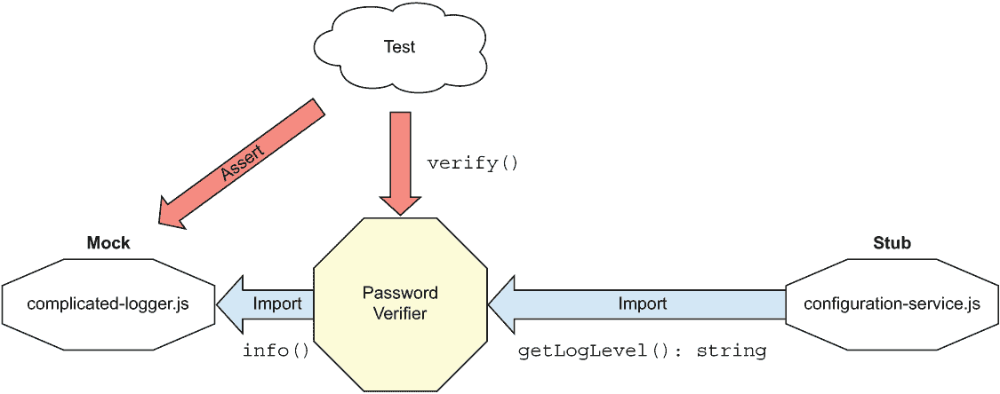
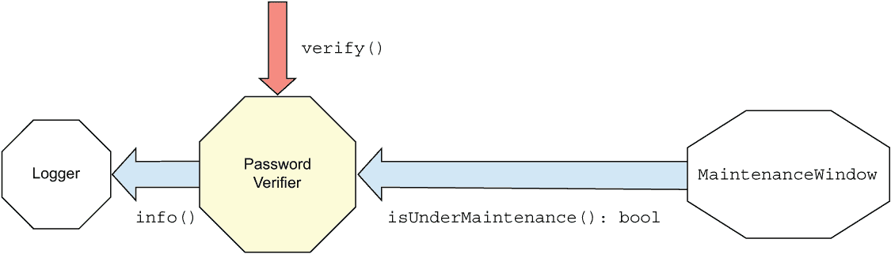
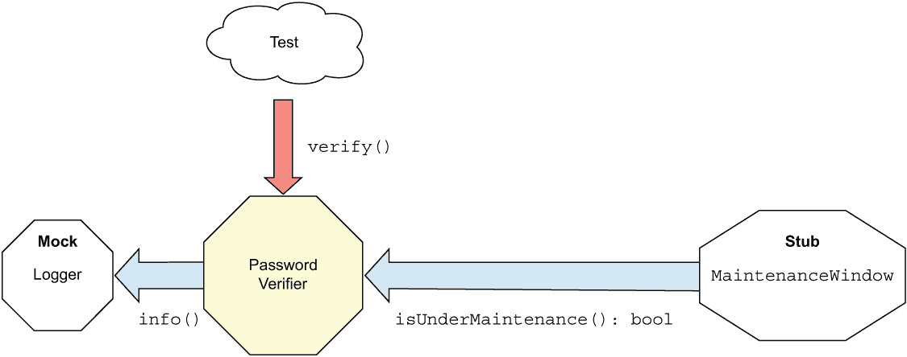

# 5 隔离框架

本章涵盖

+   定义隔离框架及其作用

+   框架的两种主要类型

+   使用 Jest 模拟模块

+   使用 Jest 模拟函数

+   使用 substitute.js 的面向对象模拟

在前面的章节中，我们探讨了手动编写模拟和存根的挑战，特别是当我们想要模拟的接口需要我们创建长、易出错、重复的代码时。我们不得不不断地声明自定义变量、创建自定义函数，或者从使用这些变量的类中继承，从而使事情比必要的更复杂（大多数时候）。

在本章中，我们将探讨一些以隔离框架形式出现的优雅解决方案，这是一种可重用的库，可以在运行时创建和配置假对象。这些对象被称为*动态存根*和*动态模拟*。

我称它们为隔离框架，因为它们允许您将工作单元与其依赖项隔离开来。您会发现许多资源会将它们称为“模拟框架”，但我尽量避免使用这个术语，因为它们可以用于模拟和存根。在本章中，我们将探讨一些可用的 JavaScript 框架以及我们如何在模块化、函数式和面向对象的设计中使用它们。您将看到如何使用这些框架来测试各种事物，并创建存根、模拟和其他有趣的事物。

但我将在下面展示的具体框架并不是重点。在使用它们的过程中，您将看到它们的 API 在测试中提倡的价值（可读性、可维护性、健壮且持久的测试等），并且您会发现是什么使隔离框架变得出色，以及它可能成为测试的缺点。

## 5.1 定义隔离框架

我将从一个非常基础的定义开始，这个定义可能听起来有点平淡无奇，但为了包括各种隔离框架，它需要具有通用性：

隔离框架是一组可编程 API，允许以对象或函数形式动态创建、配置和验证模拟和存根。当使用隔离框架时，这些任务通常比手动编写的模拟和存根更简单、更快，并且生成的代码更短。

正确使用隔离框架可以节省开发者编写重复代码以断言或模拟对象交互的需求，如果应用得当，它们可以帮助测试持续多年而无需开发者每次进行微小的生产代码更改后回来修复。如果应用不当，它们可能导致混淆和完全滥用这些框架，以至于我们无法阅读或信任自己的测试，因此要小心。我将在本书的第三部分讨论一些应该做和不应该做的事情。

### 5.1.1 选择一种类型：松散型与类型化

由于 JavaScript 支持多种编程设计范式，我们可以将我们世界中的框架分为两大类：

+   *松散的 JavaScript 隔离框架*—这些是针对纯 JavaScript 的松散类型隔离框架（如 Jest 和 Sinon）。这些框架通常也更适合更函数式的代码风格，因为它们需要更少的仪式和样板代码来完成工作。

+   *类型化的 JavaScript 隔离框架*—这些是更面向对象且 TypeScript 友好的隔离框架（如 substitute.js）。当处理整个类和接口时，它们非常有用。

你最终在项目中选择使用哪种风味将取决于几个因素，如口味、风格和可读性，但首先要问的问题是，你主要需要模拟哪种类型的依赖？

+   *模块依赖（导入、导入）*—Jest 和其他松散类型框架应该可以很好地工作。

+   *函数式（单态和更高阶函数，简单的参数和值）*—Jest 和其他松散类型框架应该可以很好地工作。

+   *完整对象、对象层次结构和接口*—可以查看更面向对象的框架，如 substitute.js。

让我们回到我们的密码验证器，看看我们如何使用框架来模拟我们在前几章中使用的相同类型的依赖，但这次是使用一个框架。

## 5.2 动态模拟模块

对于试图使用`require`或`import`直接依赖模块进行代码测试的人来说，Jest 或 Sinon 等隔离框架提供了强大的动态模拟整个模块的能力，且代码量非常少。由于我们最初选择了 Jest 作为我们的测试框架，因此在本章的示例中我们将继续使用它。

图 5.1 展示了具有两个依赖关系的密码验证器：

+   一个帮助决定日志级别（`INFO`或`ERROR`）的配置服务

+   一个我们称之为工作单元出口点的日志服务，每次我们验证密码时


图 5.1 密码验证器有两个依赖关系：一个用于确定日志级别的外来依赖，一个用于创建日志条目的外出依赖。

箭头表示行为在工作单元中的流动。另一种思考箭头的方式是通过术语*命令*和*查询*。我们正在查询配置服务（以获取日志级别），但我们正在向记录器发送命令（以记录）。

命令/查询分离

有一种设计思想属于命令/查询分离的概念。如果你想了解更多关于这些术语的信息，我强烈推荐阅读马丁·福勒 2005 年关于该主题的文章，可在[`martinfowler.com/bliki/CommandQuerySeparation.html`](https://martinfowler.com/bliki/CommandQuerySeparation.html)找到。这种模式在你探索不同的设计思想时非常有用，但在这本书中我们不会过多涉及这个话题。

下面的列表显示了一个具有对记录器模块硬依赖的密码验证器。

列表 5.1 带有硬编码模块依赖的代码

```
const { info, debug } = require("./complicated-logger");
const { getLogLevel } = require("./configuration-service");

const log = (text) => {
  if (getLogLevel() === "info") {
    info(text);
  }
  if (getLogLevel() === "debug") {
    debug(text);
  }
};

const verifyPassword = (input, rules) => {
  const failed = rules
    .map((rule) => rule(input))
    .filter((result) => result === false);

  if (failed.length === 0) {
    log("PASSED");
    return true;
  }
  log("FAIL");
  return false;
};
```

在这个例子中，我们被迫找到一种方法来做两件事：

+   模拟（存根）`configuration`服务`getLogLevel`函数返回的值。

+   验证（模拟）`logger`模块的`info`函数是否被调用。

图 5.2 展示了这一过程的视觉表示。



图 5.2 测试存根一个传入的依赖（配置服务）并模拟一个传出的依赖（日志器）。

Jest 提供了几种实现模拟和验证的方法，其中它呈现的一种更干净的方式是在 spec 文件顶部使用`jest.mock([module` `name])`，然后我们在测试中引入这些模拟模块，以便我们可以配置它们。

列表 5.2 使用`jest.mock()`直接模拟模块 API

```
jest.mock("./complicated-logger");                              ❶
jest.mock("./configuration-service"); ❶

const { stringMatching } = expect;
const { verifyPassword } = require("./password-verifier");
const mockLoggerModule = require("./complicated-logger");       ❷
const stubConfigModule = require("./configuration-service"); ❷

describe("password verifier", () => {
  afterEach(jest.resetAllMocks);                                ❸

  test('with info log level and no rules, 
          it calls the logger with PASSED', () => {
    stubConfigModule.getLogLevel.mockReturnValue("info");       ❹

    verifyPassword("anything", []);

    expect(mockLoggerModule.info)                               ❺
 .toHaveBeenCalledWith(stringMatching(/PASS/)); ❺
  });

  test('with debug log level and no rules, 
        it calls the logger with PASSED', () => {
    stubConfigModule.getLogLevel.mockReturnValue("debug");      ❻

    verifyPassword("anything", []);

    expect(mockLoggerModule.debug)                              ❼
 .toHaveBeenCalledWith(stringMatching(/PASS/)); ❼
  });
});
```

❶ 模拟模块

❷ 获取模块的模拟实例

❸ 告诉 Jest 在测试之间重置任何模拟模块行为

❹ 配置存根以返回模拟的“info”值。

❺ 断言模拟被正确调用

❻ 修改存根配置

❼ 如前所述，对模拟日志器进行断言

通过在这里使用 Jest，我节省了很多打字时间，而且测试看起来仍然很易读。

### 5.2.1 关于 Jest API 的一些注意事项

Jest 几乎在所有地方都使用“mock”这个词，无论是我们是在存根还是模拟某些东西，这可能会有些令人困惑。如果它将“stub”别名到“mock”，会使事情更易读。

此外，由于 JavaScript 的“提升”方式，通过`jest.mock`模拟模块的行需要放在文件顶部。你可以在此处阅读更多关于 Ashutosh Verma 的“理解 JavaScript 中的提升”文章：[`mng.bz/j11r`](http://mng.bz/j11r)。

还要注意，Jest 有许多其他 API 和功能，如果你对其感兴趣，值得探索它们。前往[`jestjs.io/`](https://jestjs.io/)以获取完整信息——这超出了本书的范围，本书主要关于模式，而不是工具。

一些其他框架，包括 Sinon([`sinonjs.org`](https://sinonjs.org))，也支持模拟模块。就隔离框架而言，Sinon 相当易于使用，但就像 JavaScript 世界中的许多其他框架一样，以及 Jest 一样，它包含了许多完成同一任务的方法，这可能会让人感到困惑。然而，没有这些框架，手动模拟模块可能会相当麻烦。

### 5.2.2 考虑抽象直接依赖

关于`jest.mock` API 及其类似功能的利好消息是，它满足了开发者测试那些内置了不易更改的依赖项（即他们无法控制的代码）的非常实际的需求。这个问题在遗留代码情况下非常普遍，我将在第十二章中讨论这个问题。

关于 `jest.mock` API 的坏消息是，它还允许我们模拟我们控制的代码，并且可能从抽象到更简单、更短的内部 API 中受益。这种方法也称为 *洋葱架构* 或 *六边形架构* 或 *端口和适配器*，对于代码的长期可维护性非常有用。你可以在 Alistair Cockburn 的文章“Hexagonal Architecture”中了解更多关于这种类型架构的信息，该文章位于 [`alistair.cockburn.us/hexagonal-architecture/`](https://alistair.cockburn.us/hexagonal-architecture/)。

为什么直接依赖可能有问题？通过直接使用这些 API，我们也被迫在我们的测试中直接伪造模块 API，而不是它们的抽象。我们将这些直接 API 的设计粘合到测试的实现上，这意味着如果（或者更确切地说，当）这些 API 发生变化时，我们也需要更改许多测试。

这里有一个快速示例。假设你的代码依赖于一个知名的 JavaScript 日志框架（例如 Winston），并且直接在代码中的数百或数千个地方依赖它。然后想象一下，Winston 发布了一个破坏性的升级。随之而来的是大量的痛苦，这些问题本可以在事情失控之前得到解决。实现这一点的简单方法之一是使用一个简单的抽象到单个适配器文件，这是唯一持有该记录器引用的文件。这种抽象可以暴露一个更简单、内部日志 API，我们确实可以控制它，因此我们可以防止代码中的大规模破坏。我将在第十二章回到这个话题。

## 5.3 功能性动态模拟和存根

我们已经讨论了模块依赖，现在让我们转向模拟简单的函数。我们在前面的章节中多次这样做，但我们总是手动完成。这对于存根来说效果很好，但对于模拟来说，很快就会变得令人烦恼。

下面的列表显示了之前我们使用的手动方法。

列表 5.3 手动模拟函数以验证其是否被调用

```
test("given logger and passing scenario", () => {
  let logged = "";                                       ❶
  const mockLog = { info: (text) => (logged = text) };   ❷
  const passVerify = makeVerifier([], mockLog);

  passVerify("any input");

  expect(logged).toMatch(/PASSED/);                      ❸
});
```

❶ 声明一个自定义变量来保存传入的值

❷ 将传入的值保存到该变量中

❸ 断言变量的值

它是有效的——我们能够验证记录器函数被调用，但这是一项大量工作，可能会变得非常重复。这时，隔离框架如 Jest 就派上用场。`jest.fn()` 是消除此类代码的最简单方法。下面的列表显示了我们可以如何使用它。

列表 5.4 使用 `jest.fn()` 进行简单的函数模拟

```
test('given logger and passing scenario', () => {
  const mockLog = { info: jest.fn() };
  const verify = makeVerifier([], mockLog);

  verify('any input');

  expect(mockLog.info)
    .toHaveBeenCalledWith(stringMatching(/PASS/));
});
```

将此代码与上一个示例进行比较。它很微妙，但可以节省很多时间。在这里，我们使用 `jest.fn()` 来获取一个由 Jest 自动跟踪的函数，这样我们就可以通过 Jest 的 API 使用 `toHaveBeenCalledWith()` 在以后查询它。它小巧可爱，并且在你需要跟踪对特定函数的调用时效果很好。`stringMatching` 函数是一个 *匹配器* 的例子。匹配器通常被定义为可以断言传入函数的参数值的实用函数。Jest 文档对此术语的使用更为宽松，但你可以在 Jest 文档的[`jestjs.io/docs/en/expect`](https://jestjs.io/docs/en/expect)中找到匹配器的完整列表。

总结来说，`jest.fn()` 对于基于单个功能的模拟和存根来说效果很好。让我们继续探讨一个更面向对象的挑战。

## 5.4 面向对象的动态模拟和存根

正如我们刚刚看到的，`jest.fn()` 是一个单功能模拟实用函数的例子。它在函数式世界中效果很好，但当我们尝试在包含多个函数的完整 API 接口或类中使用它时，它就会有点崩溃。

### 5.4.1 使用松散类型框架

我之前提到过，存在两种隔离框架类别。首先，我们将使用第一种（松散类型，函数友好）类型。以下列表是尝试解决我们在上一章中查看的 `IComplicatedLogger` 的一个例子。

列表 5.5 `IComplicatedLogger` 接口

```
export interface IComplicatedLogger {
    info(text: string, method: string)
    debug(text: string, method: string)
    warn(text: string, method: string)
    error(text: string, method: string)
}
```

为此接口创建手写的存根或模拟可能会非常耗时，因为你需要记住每个方法上的参数，如下一个列表所示。

列表 5.6 手写存根生成大量样板代码

```
describe("working with long interfaces", () => {
  describe("password verifier", () => {
    class FakeLogger implements IComplicatedLogger {
 debugText = "";
 debugMethod = "";
 errorText = "";
 errorMethod = "";
 infoText = "";
 infoMethod = "";
 warnText = "";
 warnMethod = "";

      debug(text: string, method: string) {
 this.debugText = text;
 this.debugMethod = method;
      }

      error(text: string, method: string) {
 this.errorText = text;
 this.errorMethod = method;
      }
      ...
    }

    test("verify, w logger & passing, calls logger with PASS", () => {
      const mockLog = new FakeLogger();
      const verifier = new PasswordVerifier2([], mockLog);

      verifier.verify("anything");

      expect(mockLog.infoText).toMatch(/PASSED/);
    });
  });
});
```

真是乱七八糟。这不仅意味着手写的模拟既耗时又难以编写，如果你想在测试中让它返回特定的值，或者模拟从日志器函数调用中产生的错误，会发生什么？我们可以做到，但代码会很快变得丑陋。

使用隔离框架，执行此操作的代码变得简单、可读性更强，并且更短。让我们使用 `jest.fn()` 来完成同样的任务，看看我们会走到哪里。

列表 5.7 使用 `jest.fn()` 模拟单个接口函数

```
import stringMatching = jasmine.stringMatching;

describe("working with long interfaces", () => {
  describe("password verifier", () => {
    test("verify, w logger & passing, calls logger with PASS", () => {
    const mockLog: IComplicatedLogger = { ❶
    info: jest.fn(), ❶
    warn: jest.fn(), ❶
    debug: jest.fn(), ❶
    error: jest.fn(), ❶
      };

      const verifier = new PasswordVerifier2([], mockLog);
      verifier.verify("anything");

      expect(mockLog.info)
        .toHaveBeenCalledWith(stringMatching(/PASS/));
    });
  });
});
```

❶ 使用 Jest 设置模拟

这并不太糟糕。在这里，我们只是概述了自己的对象，并将 `jest.fn()` 函数附加到接口中的每个函数上。这节省了很多打字，但有一个重要的注意事项：每当接口发生变化（例如添加了一个函数），我们都需要回到定义此对象的代码中并添加该函数。使用纯 JavaScript，这可能会少一些问题，但如果有代码正在测试我们未在测试中定义的函数，这仍然可能造成一些复杂性。

无论如何，将此类模拟对象的创建推入一个工厂辅助方法可能是明智的，这样创建就只存在于一个地方。

### 5.4.2 转向类型友好的框架

让我们切换到框架的第二类，并尝试 substitute.js ([www.npmjs.com/package/@fluffy-spoon/substitute](http://www.npmjs.com/package/@fluffy-spoon/substitute))。我们必须选择一个，我非常喜欢这个框架的 C# 版本，并在上一版这本书中使用过它。

使用 substitute.js（以及假设使用 TypeScript），我们可以编写如下代码。

列表 5.8 使用 substitute.js 模拟完整接口

```
import { Substitute, Arg } from "@fluffy-spoon/substitute";

describe("working with long interfaces", () => {
  describe("password verifier", () => {
    test("verify, w logger & passing, calls logger w PASS", () => {
      const mockLog = Substitute.for<IComplicatedLogger>();         ❶

      const verifier = new PasswordVerifier2([], mockLog);
      verifier.verify("anything");

      mockLog.received().info(                                      ❷
    Arg.is((x) => x.includes("PASSED")), ❷
    "verify" ❷
      );
    });
  });
});
```

❶ 生成假对象

❷ 验证假对象被调用

在前面的列表中，我们生成了假对象，这使我们无需关心除了我们正在测试的函数之外的其他任何函数，即使对象签名在未来发生变化。然后我们使用 `.received()` 作为我们的验证机制，以及另一个参数匹配器，`Arg.is`，这次来自 substitute.js 的 API，它的工作方式与 Jasmine 的字符串匹配类似。这里的额外好处是，如果对象签名中添加了新函数，我们就不太可能需要更改测试，而且无需将这些函数添加到使用相同对象签名的任何测试中。

隔离框架和 Arrange-Act-Assert 模式

注意，你使用隔离框架的方式与我们在第一章中讨论的 Arrange-Act-Assert 结构非常匹配。你首先安排一个假对象，然后对你要测试的事物进行操作，最后在测试的末尾进行断言。

但是，这并不总是那么容易。在古代（大约 2006 年），大多数开源隔离框架都不支持 Arrange-Act-Assert 的概念，而是使用了一个叫做 Record-Replay 的概念（我们说的是 Java 和 C#）。Record-Replay 是一个讨厌的机制，你需要告诉隔离 API 它的假对象处于 *record* 模式，然后你需要按照预期的生产代码调用该对象上的方法。然后你需要告诉隔离 API 切换到 *replay* 模式，只有 *那时* 你才能将你的假对象发送到生产代码的核心。一个例子可以在 Baeldung 网站上看到，[www.baeldung.com/easymock](http://www.baeldung.com/easymock)。

与今天使用更易读的 Arrange-Act-Assert 模型编写的测试能力相比，这场悲剧让许多开发者花费了数百万小时的不懈努力去阅读测试，以确定测试失败的确切位置。

如果你拥有这本书的第一版，你可以在展示 Rhino Mocks（最初具有相同的设计）时看到 Record-Replay 的一个例子。

好的，那是模拟。那么桩（stub）呢？

## 5.5 动态模拟行为

Jest 为模拟模块和功能依赖的返回值提供了一个非常简单的 API：`mockReturnValue()` 和 `mockReturnValueOnce()`。

列表 5.9 使用 `jest.fn()` 从假函数中模拟值

```
test("fake same return values", () => {
  const stubFunc = jest.fn()
 .mockReturnValue("abc");

  //value remains the same
  expect(stubFunc()).toBe("abc");
  expect(stubFunc()).toBe("abc");
  expect(stubFunc()).toBe("abc");
});

test("fake multiple return values", () => {
  const stubFunc = jest.fn()
 .mockReturnValueOnce("a")
 .mockReturnValueOnce("b")
 .mockReturnValueOnce("c");

  //value remains the same
  expect(stubFunc()).toBe("a");
  expect(stubFunc()).toBe("b");
  expect(stubFunc()).toBe("c");
  expect(stubFunc()).toBe(undefined);
});
```

注意，在第一个测试中，我们正在为测试期间设置一个*永久*的返回值。如果我可以使用它，这是我编写测试的首选方法，因为它使得测试易于阅读和维护。如果我们需要模拟多个值，我们可以使用`mockReturnValueOnce`。

如果你需要模拟错误或进行更复杂的操作，可以使用`mockImplementation()`和`mockImplementationOnce()`：

```
yourStub.mockImplementation(() => {
  throw new Error();
});
```

### 5.5.1 使用模拟和存根的对象导向示例

让我们在密码验证器的方程中添加另一个因素。

+   假设密码验证器在特殊维护窗口期间（当软件正在更新时）是不活跃的。

+   当维护窗口处于活动状态时，在验证器上调用`verify()`将导致它调用`logger.info()`并显示“正在维护”。

+   否则，它将调用`logger.info()`并显示“通过”或“失败”的结果。

为了这个目的（以及展示面向对象的设计决策），我们将引入一个`MaintenanceWindow`接口，该接口将被注入到我们的密码验证器的构造函数中，如图 5.3 所示。



图 5.3 使用`MaintenanceWindow`接口

以下列表显示了使用新依赖项的密码验证器的代码。

列表 5.10 带有`MaintenanceWindow`依赖的密码验证器

```
export class PasswordVerifier3 {
  private _rules: any[];
  private _logger: IComplicatedLogger;
  private _maintenanceWindow: MaintenanceWindow;

  constructor(
    rules: any[],
    logger: IComplicatedLogger,
    maintenanceWindow: MaintenanceWindow
  ) {
    this._rules = rules;
    this._logger = logger;
 this._maintenanceWindow = maintenanceWindow;
  }

  verify(input: string): boolean {
    if (this._maintenanceWindow.isUnderMaintenance()) {
      this._logger.info("Under Maintenance", "verify");
      return false;
    }
    const failed = this._rules
      .map((rule) => rule(input))
      .filter((result) => result === false);

    if (failed.length === 0) {
      this._logger.info("PASSED", "verify");
      return true;
    }
    this._logger.info("FAIL", "verify");
    return false;
  }
}
```

`MaintenanceWindow`接口作为构造函数参数注入（即使用构造函数注入），并用于确定是否执行密码验证以及向记录器发送适当的消息。

### 5.5.2 使用 substitute.js 的存根和模拟

现在，我们将使用 substitute.js 而不是 Jest 来创建`MaintenanceWindow`接口的存根和`IComplicatedLogger`接口的模拟。图 5.4 展示了这一点。



图 5.4 `MaintenanceWindow`依赖

使用 substitute.js 创建存根和模拟的方式相同：我们使用`Substitute.for<T>`函数。我们可以使用`.returns`函数配置存根，并使用`.received`函数验证模拟。这两个都是来自`Substitute.for<T>()`返回的假对象的一部分。

下面是存根创建和配置的示例：

```
const stubMaintWindow = Substitute.for<MaintenanceWindow>();
stubMaintWindow.isUnderMaintenance().returns(true);
```

模拟创建和验证看起来是这样的：

```
const mockLog = Substitute.for<IComplicatedLogger>();
. . .
/// later down in the end of the test...
mockLog.received().info("Under Maintenance", "verify");
```

以下列表显示了使用模拟和存根的几个测试的完整代码。

列表 5.11 使用 substitute.js 测试密码验证器

```
import { Substitute } from "@fluffy-spoon/substitute";

const makeVerifierWithNoRules = (log, maint) =>
  new PasswordVerifier3([], log, maint);

describe("working with substitute part 2", () => {
  test("verify, during maintanance, calls logger", () => {
    const stubMaintWindow = Substitute.for<MaintenanceWindow>();
    stubMaintWindow.isUnderMaintenance().returns(true);
    const mockLog = Substitute.for<IComplicatedLogger>();
    const verifier = makeVerifierWithNoRules(mockLog, stubMaintWindow);

    verifier.verify("anything");

    mockLog.received().info("Under Maintenance", "verify");
  });

  test("verify, outside maintanance, calls logger", () => {
    const stubMaintWindow = Substitute.for<MaintenanceWindow>();
    stubMaintWindow.isUnderMaintenance().returns(false);
    const mockLog = Substitute.for<IComplicatedLogger>();
    const verifier = makeVerifierWithNoRules(mockLog, stubMaintWindow);

    verifier.verify("anything");

    mockLog.received().info("PASSED", "verify");
  });
});
```

我们可以在测试中成功且相对容易地使用动态创建的对象来模拟值。我鼓励你研究你想要使用的隔离框架的版本。在这本书中，我只使用了 substitute.js 作为示例。它不是唯一的框架。

这个测试不需要编写手写的模拟，但请注意，它已经开始对测试读者的可读性产生影响。功能设计通常比这更简洁。在面向对象的设置中，有时这是必要的恶行。然而，我们可以在重构代码的同时轻松地将各种辅助程序、模拟和存根的创建重构为辅助函数，从而使测试更简单、更易于阅读。关于这一点，本书的第三部分将有更多介绍。

## 5.6 隔离框架的优势和陷阱

根据本章所涵盖的内容，我们看到了使用隔离框架的明显优势：

+   *更易模块化模拟*——没有一些样板代码，模块依赖关系可能很难处理，而隔离框架帮助我们消除这些样板代码。这一点也可以被视为一个缺点，如前所述，因为它鼓励我们编写与第三方实现强耦合的代码。

+   *更易模拟值或错误*——在复杂的接口上手动编写模拟可能很困难。框架在这方面有很大帮助。

+   *更易创建模拟*——隔离框架可以更轻松地创建模拟和存根。

尽管使用隔离框架有许多优点，但也存在可能的风险。现在让我们谈谈需要注意的一些事项。

### 5.6.1 大多数时候你不需要模拟对象

隔离框架让你陷入的最大陷阱是使任何事物都容易模拟，并鼓励你首先认为你需要模拟对象。我并不是说你不需要存根，但模拟对象不应该成为大多数单元测试的标准操作程序。记住，一个工作单元可以有三种不同类型的退出点：返回值、状态变化和调用第三方依赖。只有其中一种类型可以从你的测试中的模拟对象中受益。其他则不行。

我发现，在我的测试中，模拟对象可能只占大约 2%-5%。其余的测试通常是返回值或基于状态的测试。对于功能设计，模拟对象的数量应该接近零，除非是某些边缘情况。

如果你发现自己正在定义一个测试并验证一个对象或函数是否被调用，仔细思考是否可以在不使用模拟对象的情况下证明相同的功能，而是通过验证返回值或从外部验证整体工作单元的行为变化（例如，验证一个函数在之前没有抛出异常时现在抛出了异常）。Vladimir Khorikov 所著的《单元测试原则、实践和模式》（Manning, 2020）的第六章包含了对如何将基于交互的测试重构为更简单、更可靠的测试的详细描述，这些测试检查的是返回值而不是模拟对象。

### 5.6.2 不可读的测试代码

在测试中使用模拟会使测试稍微难以阅读，但仍然足够清晰，以至于外人可以查看并理解正在发生的事情。在单个测试中包含许多模拟或许多期望可能会破坏测试的可读性，使其难以维护，甚至难以理解正在测试的内容。

如果你发现你的测试变得难以阅读或难以理解，考虑移除一些模拟或模拟期望，或者将测试拆分成几个更易读的小测试。

### 5.6.3 验证错误的事情

模拟对象允许你验证是否在接口上调用方法或函数被调用，但这并不一定意味着你正在测试正确的事情。许多刚开始接触测试的人最终只是因为可以验证而验证事情，而不是因为这样做有意义。以下是一些例子：

+   验证一个内部函数调用另一个内部函数（不是出口点）。

+   验证存根是否被调用（一个传入的依赖项不应该被验证；这是过度指定反模式，我们将在 5.6.5 节中讨论）。

+   因为有人告诉你写测试，所以验证某事被调用，但你不确定真正应该测试什么。（这是验证你是否正确理解需求的好时机。）

### 5.6.4 每个测试中包含多个模拟

被认为是一种良好的实践，每个测试只测试一个关注点。测试多个关注点可能会导致混淆和测试维护问题。在一个测试中包含两个模拟等同于测试同一个工作单元的多个最终结果（多个出口点）。

对于每个出口点，考虑编写一个单独的测试，因为它可能被视为一个独立的需求。当你只测试一个关注点时，你的测试名称也可能变得更加专注和易读。如果你无法命名你的测试，因为它做了太多事情，名字变得非常通用（例如，“XWorksOK”），那么是时候将其拆分成多个测试了。

### 5.6.5 过度指定测试

如果你的测试有太多的期望（例如`x.received().X()`、`x.received().Y()`等），它可能会变得非常脆弱，即使整体功能仍然正常，也会因为生产代码的微小变化而崩溃。测试交互是双刃剑：测试过多，你会开始失去对大局的视线——整体功能；测试过少，你会错过工作单元之间的重要交互。

这里有一些平衡这种效果的方法：

+   *当可能时，使用存根而不是模拟*——如果你的测试中超过 5%使用了模拟对象，你可能做得有点过头了。存根可以无处不在。模拟则不然。你只需要一次测试一个场景。模拟对象越多，测试结束时进行的验证就越多，但通常只有一个是重要的。其余的都将是针对当前测试场景的噪音。

+   *尽可能避免将存根用作模拟*——仅使用存根来伪造模拟值进入正在测试的工作单元或抛出异常。不要验证存根上是否调用了方法。

## 摘要

+   隔离框架或模拟框架允许你动态地创建、配置和验证模拟和存根，无论是以对象还是函数的形式。与手写的伪造相比，隔离框架可以节省大量时间，尤其是在模块化依赖情况下。

+   存在两种隔离框架类型：松散类型（如 Jest 和 Sinon）和严格类型（如 substitute.js）。松散类型框架需要更少的样板代码，适用于函数式代码；严格类型框架在处理类和接口时很有用。

+   隔离框架可以替换整个模块，但尽量抽象出直接依赖，并伪造这些抽象。这有助于在模块的 API 发生变化时减少重构的工作量。

+   在可能的情况下，倾向于基于返回值或状态测试，而不是交互测试，这样你的测试就可以尽可能少地假设内部实现细节。

+   应该只在没有其他测试实现方法的情况下使用模拟，因为如果不小心，它们最终会导致难以维护的测试。

+   根据你正在工作的代码库选择与隔离框架一起工作的方式。在遗留项目中，你可能需要伪造整个模块，因为这可能是向此类项目添加测试的唯一方法。在绿色项目中，尝试在第三方模块之上引入适当的抽象。这完全关乎选择合适的工具来完成工作，所以在考虑如何处理测试中的特定问题时，一定要从大局出发。
