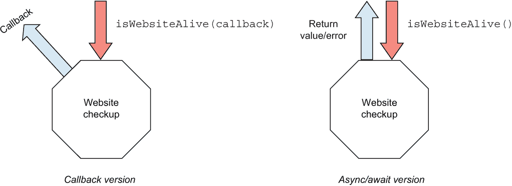
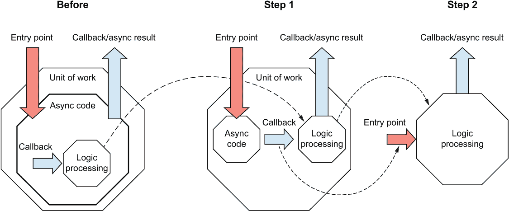
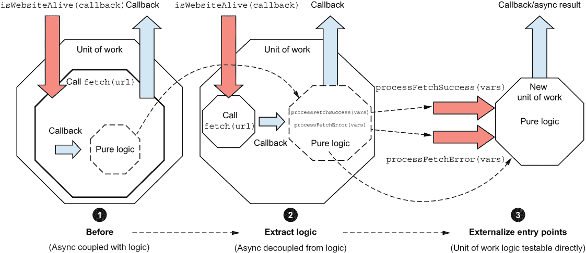
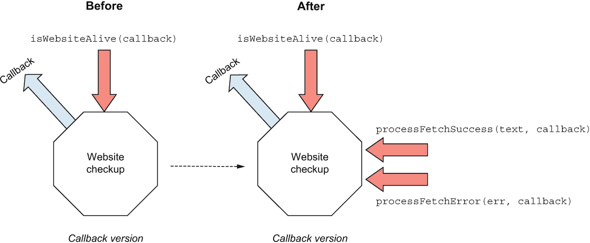
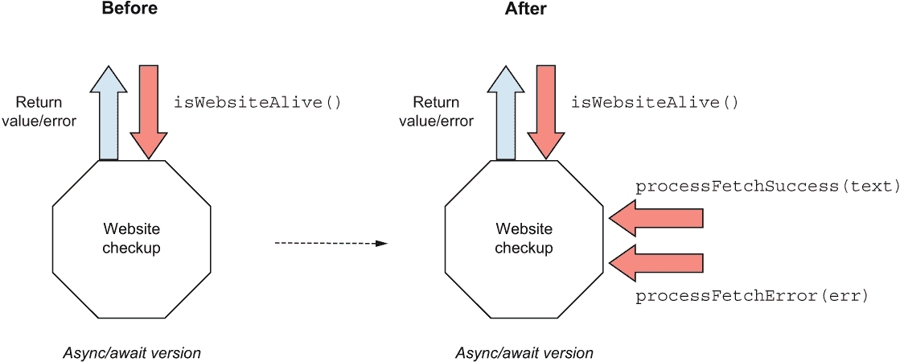
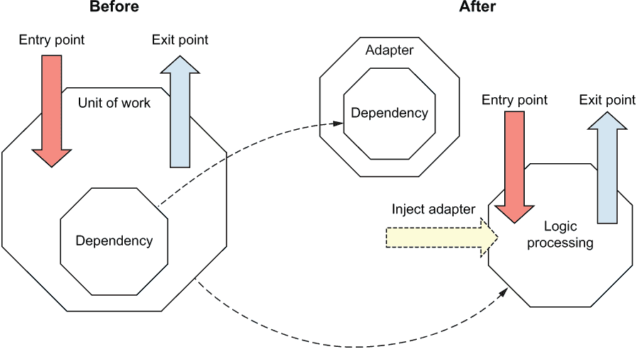
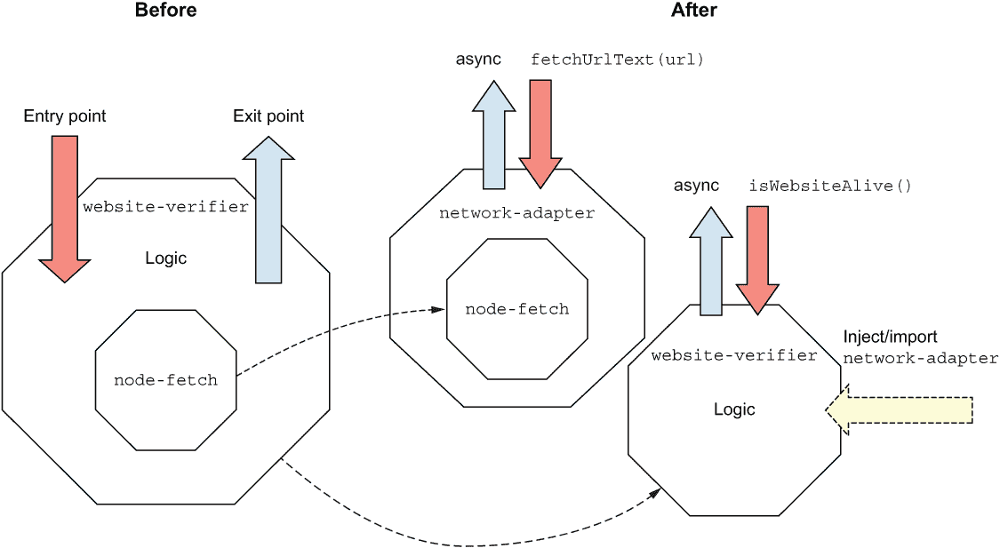
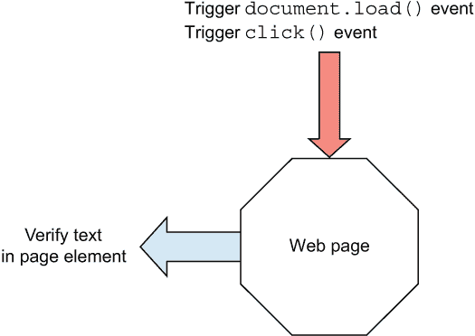

# 6 单元测试异步代码

本章涵盖

+   异步、`done()` 和 await

+   异步的集成和单元测试级别

+   提取入口点模式

+   提取适配器模式

+   模拟、推进和重置计时器

当我们处理常规同步代码时，等待动作完成是 *隐式的*。我们不必担心它，并且我们并不真正过多地考虑它。然而，当处理异步代码时，等待动作完成变成了一种 *显式* 的活动，这在我们自己的控制之下。异步性使得代码及其测试变得可能更复杂，因为我们必须明确等待动作完成。

让我们从简单的获取示例开始，以说明这个问题。

## 6.1 处理异步数据获取

假设我们有一个模块，用于检查 example.com 上的网站是否活跃。它是通过从主 URL 获取上下文并检查特定的单词“说明”来确定网站是否运行。我们将查看这个功能的不同且非常简单的两种实现。第一个使用 `callback` 机制，第二个使用 `async`/`await` 机制。

图 6.1 展示了它们为我们目的的入口和出口点。注意回调箭头指向不同，这使得它更明显地表明它是一个不同类型的出口点。



图 6.1 `IsWebsiteAlive()` 回调与 `async/await` 版本

以下列表显示了初始代码。我们使用 `node-fetch` 来获取 URL 的内容。

列表 6.1 `IsWebsiteAlive()` 回调和 await 版本

```
//Callback version
const fetch = require("node-fetch");
const isWebsiteAliveWithCallback = (callback) => {
  const website = "http://example.com";
  fetch(website)
    .then((response) => {
      if (!response.ok) {
        //how can we simulate this network issue?
        throw Error(response.statusText);             ❶
      }
      return response;
    })
    .then((response) => response.text())
    .then((text) => {
      if (text.includes("illustrative")) {
        callback({ success: true, status: "ok" });
      } else {
        //how can we test this path?
        callback({ success: false, status: "text missing" });
      }
    })
    .catch((err) => {
      //how can we test this exit point?
      callback({ success: false, status: err });
    });
};

// Await version
const isWebsiteAliveWithAsyncAwait = async () => {
  try {
    const resp = await fetch("http://example.com");
    if (!resp.ok) {
      //how can we simulate a non ok response?
      throw resp.statusText;                        ❷
    }
    const text = await resp.text();
    const included = text.includes("illustrative");
    if (included) {
      return { success: true, status: "ok" };
    }
    // how can we simulate different website content?
    throw "text missing";
  } catch (err) {
    return { success: false, status: err };         ❸
  }
};
```

❶ 抛出自定义错误以处理我们代码中的问题

❷ 抛出自定义错误以处理我们代码中的问题

❸ 将错误包装到响应中

注意：在前面的代码中，我假设你知道 JavaScript 中 promises 的工作方式。如果你需要更多信息，我建议阅读 Mozilla 关于 promises 的文档，网址为 [`mng.bz/W11a`](http://mng.bz/W11a)。

在这个例子中，我们将任何来自连接失败或网页上缺少文本的错误转换为回调或返回值，以向我们的函数用户表示失败。

### 6.1.1 使用集成测试的初步尝试

由于列表 6.1 中所有内容都是硬编码的，你将如何测试它呢？你最初的反应可能是编写一个集成测试。下面的列表展示了我们如何为回调版本编写一个集成测试。

列表 6.2 一个初始的集成测试

```
test("NETWORK REQUIRED (callback): correct content, true", (done) => {
  samples.isWebsiteAliveWithCallback((result) => {
    expect(result.success).toBe(true);
    expect(result.status).toBe("ok");
    done();
  });
});
```

要测试一个出口点是回调函数的函数，我们传递给它我们自己的回调函数，在其中我们可以

+   检查传入值的正确性

+   告诉测试运行器通过测试框架提供给我们的任何机制停止等待（在这种情况下，那就是 `done()` 函数）

### 6.1.2 等待动作

因为我们使用回调作为出口点，所以我们的测试必须显式等待并行执行完成。这种并行执行可能是在 JavaScript 事件循环中，也可能是在单独的线程中，或者如果你使用的是其他语言，甚至可能在单独的进程中。

在 Arrange-Act-Assert 模式下，act 部分是我们需要等待的部分。大多数测试框架都会允许我们通过特殊的辅助函数来完成。在这种情况下，我们可以使用 Jest 提供的可选 `done` 回调来指示测试需要等待我们显式调用 `done()`。如果没有调用 `done()`，我们的测试将在默认的 5 秒后超时并失败（当然，这也可以配置）。

Jest 有其他测试异步代码的方法，其中一些我们将在本章后面介绍。

### 6.1.3 异步/await 的集成测试

那么 `async`/`await` 版本呢？从技术上讲，我们可以编写一个看起来几乎与上一个测试完全相同的测试，因为 `async`/`await` 只是基于承诺的语法糖。

列表 6.3 带回调和 `.then()` 的集成测试

```
test("NETWORK REQUIRED (await): correct content, true", (done) => {
  samples.isWebsiteAliveWithAsyncAwait().then((result) => {
    expect(result.success).toBe(true);
    expect(result.status).toBe("ok");
    done();
  });
});
```

然而，使用回调如 `done()` 和 `then()` 的测试比使用 Arrange-Act-Assert 模式的测试可读性差得多。好消息是，我们不需要通过强迫自己使用回调来复杂化我们的生活。我们也可以在我们的测试中使用 `await` 语法。这将迫使我们把 `async` 关键字放在测试函数的前面，但总体而言，我们的测试变得更加简单和可读，正如你在这里可以看到的。

列表 6.4 带有 `async/await` 的集成测试

```
test("NETWORK REQUIRED2 (await): correct content, true", async () => {
  const result = await samples.isWebsiteAliveWithAsyncAwait();
  expect(result.success).toBe(true);
  expect(result.status).toBe("ok");
});
```

允许我们使用 `async`/`await` 语法的不同步代码将我们的测试转变为几乎是一个普通的基于值的测试。入口点也是出口点，正如我们在图 6.1 中所看到的。

即使调用被简化了，调用仍然是异步的，这就是为什么我仍然称之为集成测试。这种类型测试的注意事项是什么？让我们来讨论。

### 6.1.4 集成测试的挑战

我们刚刚编写的测试从集成测试的角度来看并不糟糕。它们相对较短且可读，但它们仍然受到任何集成测试都会受到的困扰：

+   *运行时间长*—与单元测试相比，集成测试的速度慢得多，有时需要几秒甚至几分钟。

+   *不可靠的*—集成测试可能会呈现不一致的结果（基于运行位置的不同时间，不一致的失败或成功等）。

+   *测试可能与无关代码和环境条件相关*—集成测试测试多个可能与我们所关心的无关的代码片段。（在我们的例子中，是 `node-fetch` 库、网络条件、防火墙、外部网站功能等。）

+   *更长的调查时间*—当集成测试失败时，需要更多的时间来进行调查和调试，因为失败可能有多种原因。

+   *模拟更困难*—使用集成测试来模拟负测试（模拟错误的网站内容、网站宕机、网络中断等）比所需的要困难

+   *结果难以信任*—我们可能会认为集成测试的失败是由于外部问题，而实际上是我们代码中的错误。我将在下一章更多地讨论信任问题。

这是否意味着你不应该编写集成测试？不，我相信你应该绝对有集成测试，但你不需要有那么多集成测试来对你的代码有足够的信心。任何没有被集成测试覆盖的部分都应该由更低级别的测试来覆盖，例如单元测试、API 测试或组件测试。我将在第十章详细讨论这种策略，该章专注于测试策略。

## 6.2 使我们的代码适合单元测试

我们如何用单元测试测试代码？我将向你展示一些我用来使代码更容易进行单元测试的模式（即更容易注入或避免依赖，并检查退出点）：

+   *提取入口点模式*—将生产代码中纯逻辑的部分提取到它们自己的函数中，并将这些函数作为我们测试的入口点

+   *提取适配器模式*—提取本质上异步的部分，并将其抽象化，以便我们可以用同步的东西来替换它

### 6.2.1 提取入口点

在这个模式中，我们将一个特定的异步工作单元分成两部分：

+   异步部分（保持不变）。

+   当异步执行完成时被调用的回调函数。这些被提取为新的函数，最终成为我们可以用纯单元测试调用的纯逻辑工作单元的入口点。

图 6.2 展示了这个想法：在*之前*的图中，我们有一个包含异步代码与内部处理异步结果并返回结果的逻辑混合的单个工作单元，通过回调或承诺机制返回。在第 1 步中，我们将逻辑提取到它自己的函数（或函数）中，该函数只包含异步工作的结果作为输入。在第 2 步中，我们将这些函数外部化，以便我们可以将它们用作单元测试的入口点。



图 6.2 将内部处理逻辑提取到单独的工作单元中有助于简化测试，因为我们能够同步验证新的工作单元，而不涉及外部依赖。

这为我们提供了测试异步回调的逻辑处理的重要能力（并且可以轻松模拟输入）。同时，我们可以选择编写针对原始工作单元的高级集成测试，以获得信心，即异步编排也正确工作。

如果我们只为所有场景进行集成测试，我们最终会陷入一个有很多长时间运行且不可靠的测试的世界。在新世界中，我们能够使大多数测试变得快速且一致，并在其上有一个小的集成测试层，以确保所有编排工作在之间正常进行。这样我们就不会为了信心而牺牲速度和可维护性。

提取工作单元的示例

让我们将这个模式应用到列表 6.1 中的代码。图 6.3 显示了我们将要遵循的步骤：

❶ *之前* 状态包含处理逻辑，这些逻辑被嵌入到 `isWebsiteAlive()` 函数中。

❷ 我们将提取在获取结果边缘发生的任何逻辑代码，并将其放入两个单独的函数中：一个用于处理成功情况，另一个用于处理错误情况。

❸ 然后，我们将外部化这两个函数，以便我们可以直接从单元测试中调用它们。



图 6.3 从 `isWebsiteAlive()` 中提取成功和错误处理逻辑以单独测试该逻辑

以下列表显示了重构后的代码。

列表 6.5 使用 `callback` 提取入口点

```
//Entry Point
const isWebsiteAlive = (callback) => {
  fetch("http://example.com")
    .then(throwOnInvalidResponse)
    .then((resp) => resp.text())
    .then((text) => {
      processFetchSuccess(text, callback);
    })
    .catch((err) => {
      processFetchError(err, callback);
    });
};
const throwOnInvalidResponse = (resp) => {
  if (!resp.ok) {
    throw Error(resp.statusText);
  }
  return resp;
};

//Entry Point
const processFetchSuccess = (text, callback) => {        ❶
 if (text.includes("illustrative")) {
 callback({ success: true, status: "ok" });
 } else {
 callback({ success: false, status: "missing text" });
 }
};

//Entry Point
const processFetchError = (err, callback) => {           ❶
 callback({ success: false, status: err });
};
```

❶ 新入口点（工作单元）

如您所见，我们最初开始的原始单元现在有三个入口点，而不是我们最初的一个。新的入口点可以用于单元测试，而原始的一个仍然可以用于集成测试，如图 6.4 所示。



图 6.4 提取两个新函数后引入的新入口点。现在，新的函数可以使用更简单的单元测试来测试，而不是重构之前所需的集成测试。

我们仍然想要一个针对原始入口点的集成测试，但不超过一个或两个。任何其他场景都可以使用纯逻辑入口点快速且无痛苦地模拟。

现在，我们可以自由地编写调用新入口点的单元测试，如下所示。

列表 6.6 使用提取的入口点的单元测试

```
describe("Website alive checking", () => {
  test("content matches, returns true", (done) => {
    samples.processFetchSuccess("illustrative", (err, result) => { ❶
      expect(err).toBeNull();
      expect(result.success).toBe(true);
      expect(result.status).toBe("ok");
      done();
    });
  });
  test("website content does not match, returns false", (done) => {
    samples.processFetchSuccess("bad content", (err, result) => { ❶
      expect(err.message).toBe("missing text");
      done();
    });
  });
  test("When fetch fails, returns false", (done) => {
   samples.processFetchError("error text", (err,result) => { ❶
      expect(err.message).toBe("error text");
      done();
    });
  });
});
```

❶ 调用新的入口点

注意，我们正在直接调用新的入口点，并且能够轻松地模拟各种条件。在这些测试中没有异步操作，但我们仍然需要 `done()` 函数，因为回调可能根本不会被调用，我们希望捕获这一点。

我们仍然需要至少一个集成测试，以让我们有信心我们的入口点之间的异步编排工作正常。这就是原始集成测试可以提供帮助的地方，但我们不再需要将所有测试场景都写成集成测试（关于这一点，请参阅第十章）。

使用 await 提取入口点

我们刚才应用的模式也可以很好地适用于标准的 `async`/`await` 函数结构。图 6.5 阐述了这种重构。



图 6.5 使用 `async/await` 提取入口点

通过提供`async`/`await`语法，我们可以回到以线性方式编写代码，而不使用回调参数。`isWebsiteAlive()`函数看起来几乎与常规同步代码完全相同，仅在需要时返回值和抛出错误。

列表 6.7 显示了我们的生产代码中的样子。

列表 6.7 使用`async/await`而不是回调编写的函数

```
//Entry Point
const isWebsiteAlive = async () => {
  try {
    const resp = await fetch("http://example.com");
    throwIfResponseNotOK(resp);
    const text = await resp.text();
    return processFetchContent(text);
  } catch (err) {
    return processFetchError(err);
  }
};

const throwIfResponseNotOK = (resp) => {
  if (!resp.ok) {
    throw resp.statusText;
  }
};

//Entry Point
const processFetchContent = (text) => {
  const included = text.includes("illustrative");
  if (included) {
 return { success: true, status: "ok" }; ❶
  }
 return { success: false, status: "missing text" }; 
};

//Entry Point
const processFetchError = (err) => {
 return { success: false, status: err }; ❶
};
```

❶ 返回值而不是调用回调

注意，与回调示例不同，我们使用`return`或`throw`来表示成功或失败。这是使用`async`/`await`编写代码的常见模式。

我们的测试也简化了，如下所示。

列表 6.8 从`async/await`提取的测试入口点

```
describe("website up check", () => {
  test("on fetch success with good content, returns true", () => {
    const result = samples.processFetchContent("illustrative");
    expect(result.success).toBe(true);
    expect(result.status).toBe("ok");
  });

  test("on fetch success with bad content, returns false", () => {
    const result = samples.processFetchContent("text not on site");
    expect(result.success).toBe(false);
    expect(result.status).toBe("missing text");
  });

  test("on fetch fail, throws ", () => {
    expect(() => samples.processFetchError("error text"))
      .toThrowError("error text");
  });
});
```

再次注意，我们不需要添加任何`async`/`await`相关的关键字，也不需要明确等待执行，因为我们已经将工作逻辑单元与使我们的生活更加复杂的异步部分分离开来。

### 6.2.2 提取适配器模式

提取适配器模式与之前的模式观点相反。我们看待异步代码的方式就像我们看待之前章节中讨论的任何依赖项一样——我们希望在我们的测试中替换它以获得更多控制。我们不会将逻辑代码提取到自己的入口点集合中，而是将异步代码（我们的*依赖项*）提取出来，并在适配器下抽象它，我们可以在以后将其注入，就像任何其他依赖项一样。图 6.6 显示了这一点。



图 6.6 提取依赖关系并将其用适配器包装，帮助我们简化该依赖关系，并在测试中用模拟对象替换它。

通常还会为适配器创建一个特殊的接口，该接口针对依赖项的消费者需求进行了简化。这种方法的另一个名称是*接口隔离原则*。在这种情况下，我们将创建一个`network-adapter`模块，它隐藏了实际的获取功能，并具有自己的自定义函数，如图 6.7 所示。



图 6.7 使用我们自己的`network-adapter`模块包装`node-fetch`模块，帮助我们仅暴露应用程序需要的功能，以最合适的问题语言表达。

接口隔离原则

术语*接口隔离原则*由罗伯特·马丁提出。想象一下，一个数据库依赖关系，背后隐藏着数十个功能，这些功能通过一个适配器实现，而适配器的接口可能只包含几个具有自定义名称和参数的功能。适配器的作用是隐藏复杂性，并简化消费者的代码以及模拟它的测试。有关接口隔离的更多信息，请参阅维基百科上的相关文章：[`en.wikipedia.org/wiki/Interface_segregation_principle`](https://en.wikipedia.org/wiki/Interface_segregation_principle)。

下面的列表显示了`network-adapter`模块的外观。

列表 6.9 `network-adapter`代码

```
const fetch = require("node-fetch");

const fetchUrlText = async (url) => {
  const resp = await fetch(url);
  if (resp.ok) {
    const text = await resp.text();
    return { ok: true, text: text };
  }
  return { ok: false, text: resp.statusText };
};   
```

注意，`network-adapter`模块是项目中唯一一个导入`node-fetch`的模块。如果这个依赖在未来某个时刻发生变化，这增加了只有当前文件需要更改的可能性。我们还通过名称和功能简化了该函数。我们隐藏了从 URL 获取状态和文本的需求，并将它们都抽象成一个更容易使用的函数。

现在我们可以选择如何使用适配器。首先，我们可以以模块化风格使用它。然后我们将使用功能方法和具有强类型接口的面向对象方法。

模块化适配器

以下列表显示了`network-adapter`的模块化使用，这是我们的初始`isWebsiteAlive()`函数。

列表 6.10 使用`network-adapter`模块的`isWebsiteAlive()`

```
const network = require("./network-adapter");

const isWebsiteAlive = async () => {
  try {
    const result = await network.fetchUrlText("http://example.com");
    if (!result.ok) {
      throw result.text;
    }
    const text = result.text;
    return processFetchSuccess(text);
  } catch (err) {
    throw processFetchFail(err);
  }
};
```

在这个版本中，我们直接导入`network-adapter`模块，我们将在后面的测试中对其进行模拟。

该模块的单元测试如下所示。因为我们使用了模块化设计，我们可以在测试中使用`jest.mock()`来模拟该模块。我们将在后面的示例中注入该模块，请放心。

列表 6.11 使用`jest.mock`模拟`network-adapter`

```
jest.mock("./network-adapter");                          ❶
const stubSyncNetwork = require("./network-adapter");    ❷
const webverifier = require("./website-verifier");

describe("unit test website verifier", () => {
  beforeEach(jest.resetAllMocks);                        ❸

  test("with good content, returns true", async () => {
    stubSyncNetwork.fetchUrlText.mockReturnValue({       ❹
      ok: true,
      text: "illustrative",
    });
    const result = await webverifier.isWebsiteAlive();   ❺
    expect(result.success).toBe(true);
    expect(result.status).toBe("ok");
  });

  test("with bad content, returns false", async () => {
    stubSyncNetwork.fetchUrlText.mockReturnValue({
      ok: true,
      text: "<span>hello world</span>",
    });
    const result = await webverifier.isWebsiteAlive();   ❺
    expect(result.success).toBe(false);
    expect(result.status).toBe("missing text");
  });
```

❶ 模拟网络适配器模块

❷ 导入模拟模块

❸ 重置所有存根以避免其他测试中的潜在问题

❹ 模拟存根模块的返回值

❺ 在我们的测试中使用 await

注意，我们再次使用了`async`/`await`，因为我们回到了本章开头使用的原始入口点。但仅仅因为我们使用了`await`并不意味着我们的测试是异步运行的。我们的测试代码以及它调用的生产代码实际上是线性运行的，具有异步友好的签名。我们还需要在功能性和面向对象的设计中使用`async`/`await`，因为入口点需要它。

我将我们的模拟网络命名为`stubSyncNetwork`，以使测试的同步性质更清晰。否则，仅通过查看测试很难判断它调用的代码是线性运行还是异步运行。

功能适配器

在功能设计模式中，`network-adapter`模块的设计保持不变，但我们以不同的方式启用其注入到我们的`website-verifier`中。正如您在下一列表中可以看到的，我们在入口点添加了一个新参数。

列表 6.12 为`isWebsiteAlive()`设计的功能注入

```
const isWebsiteAlive = async (network) => {
  const result = await network.fetchUrlText("http://example.com");
  if (result.ok) {
    const text = result.text;
    return onFetchSuccess(text);
  }
  return onFetchError(result.text);
};
```

在这个版本中，我们期望`network-adapter`模块通过一个公共参数注入到我们的函数中。在功能设计中，我们可以使用高阶函数和柯里化来配置一个预先注入的函数，使其具有我们自己的网络依赖。在我们的测试中，我们可以简单地通过这个参数发送一个模拟网络。在设计注入方面，除了不再导入`network-adapter`模块之外，几乎没有什么变化。减少导入和`require`的数量可以在长期内帮助维护性。

在下面的列表中，我们的测试更加简单，样板代码更少。

列表 6.13 使用功能注入的`network-adapter`单元测试

```
const webverifier = require("./website-verifier");

                  ❶
 return {
 fetchUrlText: () => {
 return fakeResult;
 },
 };
};
describe("unit test website verifier", () => {
  test("with good content, returns true", async () => {
stubSyncNetwork = makeStubNetworkWithResult({
      ok: true,
      text: "illustrative",
    });
    const result = await webverifier.isWebsiteAlive(stubSyncNetwork);   ❷
    expect(result.success).toBe(true);
    expect(result.status).toBe("ok");
  });

  test("with bad content, returns false", async () => {
    const stubSyncNetwork = makeStubNetworkWithResult({
      ok: true,
      text: "unexpected content",
    });
    const result = await webverifier.isWebsiteAlive(stubSyncNetwork);   ❷
    expect(result.success).toBe(false);
    expect(result.status).toBe("missing text");
  });
  ...   
```

❶ 创建一个新辅助函数来创建一个与网络适配器接口的重要部分相匹配的自定义对象

❷ 注入自定义对象

注意，我们不需要在文件顶部添加很多样板代码，就像我们在模块化设计中做的那样。我们不需要间接地伪造模块（通过`jest.mock`），我们不需要为了测试而重新导入它（通过`require`），也不需要使用`jest.resetAllMocks`来重置 Jest 的状态。我们只需要在每个测试中调用我们的新`makeStubNetworkWithResult`辅助函数来生成一个新的模拟网络适配器，然后将模拟网络通过将其作为参数发送到我们的入口点来注入。

面向对象，基于接口的适配器

我们已经研究了模块化和功能设计。现在，让我们将注意力转向方程的面向对象方面。在面向对象的范式下，我们可以将之前所做的参数注入提升为构造函数注入模式。以下列表中，我们将从网络适配器及其接口（公共 API 和结果签名）开始。

列表 6.14`NetworkAdapter`及其接口

```
export interface INetworkAdapter {
  fetchUrlText(url: string): Promise<NetworkAdapterFetchResults>;
}
export interface NetworkAdapterFetchResults {
  ok: boolean;
  text: string;
}

ch6-async/6-fetch-adapter-interface-oo/network-adapter.ts

export class NetworkAdapter implements INetworkAdapter {
  async fetchUrlText(url: string): 
 Promise<NetworkAdapterFetchResults> {
    const resp = await fetch(url);
    if (resp.ok) {
      const text = await resp.text();
      return Promise.resolve({ ok: true, text: text });
    }
    return Promise.reject({ ok: false, text: resp.statusText });
  }
}
```

在下一个列表中，我们创建了一个具有接收`INetworkAdapter`参数的构造函数的`WebsiteVerifier`类。

列表 6.15 具有构造函数注入的`WebsiteVerifier`类

```
export interface WebsiteAliveResult {
  success: boolean;
  status: string;
}

export class WebsiteVerifier {
  constructor(private network: INetworkAdapter) {}

  isWebsiteAlive = async (): Promise<WebsiteAliveResult> => {
    let netResult: NetworkAdapterFetchResults;
    try {
    netResult = await this.network.fetchUrlText("http://example.com");
      if (!netResult.ok) {
        throw netResult.text;
      }
      const text = netResult.text;
      return this.processNetSuccess(text);
    } catch (err) {
      throw this.processNetFail(err);
    }
  };

  processNetSuccess = (text): WebsiteAliveResult => {
    const included = text.includes("illustrative");
    if (included) {
      return { success: true, status: "ok" };
    }
    return { success: false, status: "missing text" };
  };

  processNetFail = (err): WebsiteAliveResult => {
    return { success: false, status: err };
  };
}
```

这个类的单元测试可以实例化一个模拟网络适配器并通过构造函数注入它。在以下列表中，我们将使用 substitute.js 创建一个符合新接口的模拟对象。

列表 6.16 面向对象的`WebsiteVerifier`单元测试

```
const makeStubNetworkWithResult = (                         ❶
 fakeResult: NetworkAdapterFetchResults
): INetworkAdapter => {
  const stubNetwork = Substitute.for<INetworkAdapter>();    ❷
  stubNetwork.fetchUrlText(Arg.any()) 
    .returns(Promise.resolve(fakeResult));                  ❸
  return stubNetwork;
};

describe("unit test website verifier", () => {
  test("with good content, returns true", async () => {
    const stubSyncNetwork = makeStubNetworkWithResult({
      ok: true,
      text: "illustrative",
    });
    const webVerifier = new WebsiteVerifier(stubSyncNetwork);

    const result = await webVerifier.isWebsiteAlive();
    expect(result.success).toBe(true);
    expect(result.status).toBe("ok");
  });

  test("with bad content, returns false", async () => {
    const stubSyncNetwork = makeStubNetworkWithResult({
      ok: true,
      text: "unexpected content",
    });
    const webVerifier = new WebsiteVerifier(stubSyncNetwork);

    const result = await webVerifier.isWebsiteAlive();
    expect(result.success).toBe(false);
    expect(result.status).toBe("missing text");
  });    
```

❶ 模拟网络适配器的辅助函数

❷ 生成模拟对象

❸ 使模拟对象返回测试所需的内容

这种控制反转（IOC）和依赖注入（DI）类型的工作得很好。在面向对象的世界里，使用接口的构造函数注入非常常见，并且在许多情况下，可以为分离你的依赖项和逻辑提供一个有效且可维护的解决方案。

## 6.3 处理计时器

计时器，如 `setTimeout`，代表了非常 JavaScript 特定的问题。它们是领域的一部分，并且在许多代码片段中被使用，无论是好是坏。有时，与其提取适配器和入口点，不如禁用这些函数并绕过它们。我们将探讨两种绕过计时器的方法：

+   直接模拟该函数

+   使用 Jest 和其他框架来禁用和控制它们

### 6.3.1 使用 monkey-patching 模拟计时器

Monkey-patching 是一种程序扩展或修改本地支持系统软件（仅影响程序的运行实例）的方法。像 JavaScript、Ruby 和 Python 这样的编程语言和运行时可以很容易地容纳 monkey-patching。对于像 C# 和 Java 这样更严格类型化和编译时语言来说，这要困难得多。我将在附录中更详细地讨论 monkey-patching。

这里是在 JavaScript 中实现的一种方法。我们将从以下使用 `setTimeout` 方法的代码片段开始。

列表 6.17 我们想要模拟的 `setTimeout` 代码

```
const calculate1 = (x, y, resultCallback) => {
  setTimeout(() => { resultCallback(x + y); },
    5000);
};
```

我们可以通过在内存中设置该函数的原型来将 `setTimeout` 函数模拟为同步的，如下所示。

列表 6.18 一个简单的 monkey-patching 模式

```
const Samples = require("./timing-samples");

describe("monkey patching ", () => {
  let originalTimeOut;
 beforeEach(() => (originalTimeOut = setTimeout)); ❶
  afterEach(() => (setTimeout = originalTimeOut));     ❷

  test("calculate1", () => {
    setTimeout = (callback, ms) => callback();         ❸
    Samples.calculate1(1, 2, (result) => {
        expect(result).toBe(3);
    });
  });
});
```

❶ 保存原始 setTimeout

❷ 恢复原始的 setTimeout

❸ 模拟 setTimeout

由于一切都是同步的，我们不需要使用 `done()` 来等待回调调用。我们正在用纯同步实现替换 `setTimeout`，立即调用接收到的回调。

这种方法的唯一缺点是它需要大量的样板代码，并且通常更容易出错，因为我们需要记住正确地清理。让我们看看 Jest 等框架为我们提供了什么来处理这些情况。

### 6.3.2 使用 Jest 模拟 setTimeout

Jest 为我们提供了三个主要函数来处理 JavaScript 中大多数类型的计时器：

+   `jest.useFakeTimers`——模拟所有各种计时器函数，如 `setTimeout`

+   `jest.resetAllTimers`——将所有模拟计时器重置为真实计时器

+   `jest.advanceTimersToNextTimer`——触发任何模拟计时器，以便触发任何回调

这些函数共同处理了大部分的样板代码。

这里是我们在列表 6.18 中刚刚进行的相同测试，这次使用 Jest 的辅助函数。

列表 6.19 使用 Jest 模拟 `setTimeout`

```
describe("calculate1 - with jest", () => {
  beforeEach(jest.clearAllTimers);
  beforeEach(jest.useFakeTimers);

  test("fake timeout with callback", () => {
    Samples.calculate1(1, 2, (result) => {
      expect(result).toBe(3);
    });
    jest.advanceTimersToNextTimer();
  });
});
```

注意，再次强调，我们不需要调用 `done()`，因为一切都是同步的。同时，我们必须使用 `advanceTimersToNextTimer`，因为没有它，我们的模拟 `setTimeout` 将永远卡住。`advanceTimersToNextTimer` 也在处理如下场景时很有用：当被测试的模块安排了一个 `setTimeout`，其回调又安排了另一个 `setTimeout` 递归调用（意味着调度永远不会停止）。在这些场景中，能够逐步向前运行非常有用。

使用 `advanceTimersToNextTimer`，您可以潜在地将所有计时器向前推进指定的步数，以模拟即将触发的下一个计时器回调的步骤。

与 `setInterval` 的工作模式相同，如以下所示。

列表 6.20 使用 `setInterval` 的函数

```
const calculate4 = (getInputsFn, resultFn) => {
  setInterval(() => {
    const { x, y } = getInputsFn();
    resultFn(x + y);
  }, 1000);
};
```

在这种情况下，我们的函数接受两个回调作为参数：一个用于提供计算所需的输入，另一个用于返回计算结果。它使用 `setInterval` 持续获取更多输入并计算其结果。

以下列表显示了一个测试，它将推进我们的计时器，触发两次间隔，并期望两次调用都得到相同的结果。

列表 6.21 在单元测试中推进模拟计时器

```
describe("calculate with intervals", () => {
  beforeEach(jest.clearAllTimers);
  beforeEach(jest.useFakeTimers);

  test("calculate, incr input/output, calculates correctly", () => {
    let xInput = 1;
    let yInput = 2;
    const inputFn = () => ({ x: xInput++, y: yInput++ });      ❶
    const results = [];
    Samples.calculate4(inputFn, (result) => results.push(result));

 jest.advanceTimersToNextTimer(); ❷
 jest.advanceTimersToNextTimer(); ❷

    expect(results[0]).toBe(3);
    expect(results[1]).toBe(5);
  });
});
```

❶ 增加变量以验证回调次数

❷ 两次调用 `setInterval`

在这个例子中，我们验证新的值是否被正确计算和存储。请注意，我们只用一个调用和一个 `expect` 就可以编写相同的测试，并且我们会得到与这个更复杂的测试几乎相同程度的信心，但我喜欢在需要更多信心时添加额外的验证。

## 6.4 处理常见事件

我不能谈论异步单元测试而不讨论基本的事件流程。希望现在异步单元测试的主题看起来相对简单明了，但我想要明确地回顾事件部分。

### 6.4.1 处理事件发射器

为了确保我们都在同一页面上，这里有一个来自 DigitalOcean 的“在 Node.js 中使用事件发射器”教程的清晰简洁的事件发射器定义（[`mng.bz/844z`](http://mng.bz/844z)）：

事件发射器是 Node.js 中的对象，通过发送消息来触发事件，以表示操作已完成。JavaScript 开发者可以编写代码来监听事件发射器的事件，允许他们在每次这些事件被触发时执行函数。在这种情况下，事件由一个标识字符串和任何需要传递给监听器的数据组成。

考虑以下列表中的 `Adder` 类，每次添加东西时都会发射一个事件。

列表 6.22 基于事件发射器的简单 `Adder`

```
const EventEmitter = require("events");

class Adder extends EventEmitter {
  constructor() {
    super();
  }

  add(x, y) {
    const result = x + y;
    this.emit("added", result);
    return result;
  }
}
```

验证事件发射的最简单方法是在我们的测试中直接订阅该事件，并验证我们在调用 `add` 函数时它是否被触发。

列表 6.23 通过订阅测试事件发射器

```
describe("events based module", () => {
  describe("add", () => {
    it("generates addition event when called", (done) => {
      const adder = new Adder();
      adder.on("added", (result) => {
        expect(result).toBe(3);
        done();
      });
      adder.add(1, 2);
    });
  });
});
```

通过使用 `done()`，我们正在验证事件实际上已被发射。如果我们没有使用 `done()`，并且事件没有被发射，我们的测试将通过，因为订阅的代码从未执行。通过添加 `expect(x).toBe(y)`，我们也在验证事件参数中发送的值，以及隐式地测试事件是否被触发。

### 6.4.2 处理点击事件

那些讨厌的 UI 事件，比如`click`，我们如何测试我们是否通过脚本正确地绑定了它们？考虑列表 6.24 和 6.25 中的简单网页及其相关逻辑。

列表 6.24 带有 JavaScript `click`功能的简单网页

```
<!DOCTYPE html>
<html lang="en">
<head>
    <meta charset="UTF-8">
    <title>File to Be Tested</title>
    <script src="index-helper.js"></script>
</head>
<body>
    <div>
        <div>A simple button</div>
        <Button data-testid="myButton" id="myButton">Click Me</Button>
        <div data-testid="myResult" id="myResult">Waiting...</div>
    </div>
</body>
</html> 
```

列表 6.25 网页的 JavaScript 逻辑

```
window.addEventListener("load", () => {
  document
    .getElementById("myButton")
    .addEventListener("click", onMyButtonClick);

  const resultDiv = document.getElementById("myResult");
  resultDiv.innerText = "Document Loaded";
});

function onMyButtonClick() {
  const resultDiv = document.getElementById("myResult");
  resultDiv.innerText = "Clicked!";
}
```

我们有一段非常简单的逻辑，确保当按钮被点击时设置一个特殊的信息。我们如何测试这个功能？

这是一个反模式：我们可以在测试中订阅点击事件并确保它被触发，但这对我们没有任何价值。我们关心的是点击实际上做了些有用的事情，而不仅仅是触发。

这是一个更好的方法：我们可以触发点击事件并确保它已经更改了页面内的正确值——这将提供真正的价值。图 6.8 展示了这一点。



图 6.8 点击作为入口点，元素作为退出点

下面的列表显示了我们的测试可能的样子。

列表 6.26 触发点击事件，并测试元素的文本

```
/**
 * @jest-environment jsdom                                 ❶
 */
//(the above is required for window events)
const fs = require("fs");
const path = require("path");
require("./index-helper.js");
const loadHtml = (fileRelativePath) => {
  const filePath = path.join(__dirname, "index.html");
  const innerHTML = fs.readFileSync(filePath);
  document.documentElement.innerHTML = innerHTML;
};

const loadHtmlAndGetUIElements = () => {
  loadHtml("index.html");
  const button = document.getElementById("myButton");
  const resultDiv = document.getElementById("myResult");
  return { window, button, resultDiv };
};

describe("index helper", () => {
  test("vanilla button click triggers change in result div", () => {
    const { window, button, resultDiv } = loadHtmlAndGetUIElements();
    window.dispatchEvent(new Event("load"));               ❷

    button.click();                                        ❸

    expect(resultDiv.innerText).toBe("Clicked!");          ❹
  });
});   
```

❶ 仅为此文件应用浏览器模拟的 jsdom 环境

❷ 模拟 document.load 事件

❸ 触发点击

❹ 验证我们的文档中的元素实际上已经改变

在这个例子中，我提取了两个实用方法，`loadHtml`和`loadHtmlAndGetUIElements`，这样我可以编写更干净、更易读的测试，并且如果将来 UI 项的位置或 ID 发生变化，我将拥有更少的测试更改问题。

在测试本身中，我们正在模拟`document.load`事件，以便我们的测试脚本可以开始运行并触发`click`，就像用户点击了按钮一样。最后，测试验证我们的文档中的某个元素实际上已经改变，这意味着我们的代码成功订阅了事件并完成了其工作。

注意，我们实际上并不关心索引辅助文件内部的底层逻辑。我们只是依赖于 UI 中观察到的状态变化，这充当我们的最终退出点。这允许我们的测试耦合度更低，因此如果我们要测试的代码发生变化，我们不太可能需要更改测试，除非可观察的（公开可见的）功能确实发生了变化。

## 6.5 引入 DOM 测试库

我们的测试有很多样板代码，主要是用于查找元素和验证其内容。我建议查看由 Kent C. Dodds 编写的开源 DOM 测试库（[`github.com/kentcdodds/dom-testing-library-with-anything`](https://github.com/kentcdodds/dom-testing-library-with-anything)）。这个库有适用于今天大多数前端 JavaScript 框架的变体，例如 React、Angular 和 Vue.js。我们将使用它的纯版本，名为 DOM Testing Library。

我喜欢这个库的地方在于，它旨在允许我们编写更接近与我们的网页交互的用户视角的测试。而不是使用元素的 ID，我们通过元素文本进行查询；触发事件更为简洁；查询和等待元素出现或消失更为简洁，并且隐藏在语法糖之下。一旦在多个测试中使用，它就非常有用。

这是使用此库的测试看起来像什么。

列表 6.27 在简单测试中使用 DOM 测试库

```
const { fireEvent, findByText, getByText }                                 ❶
 = require("@testing-library/dom"); ❶

const loadHtml = (fileRelativePath) => {
  const filePath = path.join(__dirname, "index.html");
  const innerHTML = fs.readFileSync(filePath);
  document.documentElement.innerHTML = innerHTML;
  return document.documentElement;                                         ❷
};

const loadHtmlAndGetUIElements = () => {
  const docElem = loadHtml("index.html");
  const button = getByText(docElem, "click me", { exact: false });
  return { window, docElem, button };
};

describe("index helper", () => {
  test("dom test lib button click triggers change in page", () => {
    const { window, docElem, button } = loadHtmlAndGetUIElements();
    fireEvent.load(window);                                                ❸

   fireEvent.click(button); ❸

  //wait until true or timeout in 1 sec
  expect(findByText(docElem,"clicked", { exact: false })).toBeTruthy(); ❹
  });
});
```

❶ 导入一些将要使用的库 API

❷ 库 API 需要以文档元素为基础进行大部分工作。

❸ 使用库的 fireEvent API 简化事件分发

❹ 此查询将等待直到找到项目或将在 1 秒内超时。

注意图书馆如何允许我们使用页面元素的常规文本来获取元素，而不是它们的 ID 或测试 ID。这是图书馆推动我们以更自然的方式工作的方式之一，从用户的角度来看。为了使测试在长时间内更具可持续性，我们使用了`exact:` `false`标志，这样我们就不必担心大写问题或字符串开头或结尾缺少字母。这消除了因小文本变化而更改测试的需要。

## 摘要

+   直接测试异步代码会导致测试不稳定，执行时间很长。为了解决这些问题，你可以采取两种方法：提取入口点或提取适配器。

+   提取入口点是指将纯逻辑提取到单独的函数中，并将这些函数作为测试的入口点。提取的入口点可以接受回调作为参数，也可以返回一个值。为了简单起见，优先考虑返回值而不是回调。

+   提取适配器涉及提取一个本质上异步的依赖项，并将其抽象化，以便你可以用同步的东西替换它。适配器可能具有不同的类型：

    +   *模块化*——当你对整个模块（文件）进行存根处理并替换其中的特定函数时。

    +   *函数式*——当你向待测试的系统注入一个函数或值。你可以在测试中用存根替换注入的值。

    +   *面向对象*——当你使用生产代码中的接口并在测试代码中创建一个实现该接口的存根时。

+   定时器（如`setTimeout`和`setInterval`）可以通过猴子补丁直接替换，或者使用 Jest 或其他框架来禁用和控制它们。

+   事件测试的最佳方式是验证它们产生的最终结果——用户可以看到的 HTML 文档中的变化。你可以直接这样做，或者使用 DOM 测试库等库。
