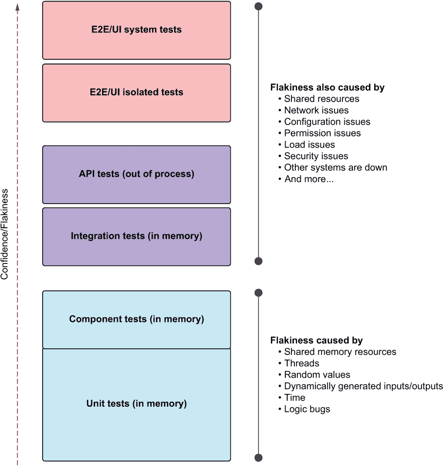

# 7 可信的测试

本章涵盖

+   如何知道你信任一个测试

+   检测不可靠的失败测试

+   检测不可靠的通过测试

+   处理不可靠的测试

无论你如何组织你的测试，或者你有多少测试，如果你不能信任它们，维护它们，或者阅读它们，那么它们的价值非常小。你编写的测试应该具有三个属性，这三个属性共同使它们变得很好：

+   *可信度*——开发者会想要运行可信的测试，并且会自信地接受测试结果。可信的测试没有错误，并且测试了正确的事情。

+   *可维护性*——不可维护的测试是噩梦，因为它们可能会破坏项目进度，或者当项目被安排得更激进时，它们可能会被搁置。开发者会简单地停止维护和修复那些改变时间过长或需要经常在非常小的生产代码更改上更改的测试。

+   *可读性*——这不仅指的是能够阅读测试，还包括如果测试看起来是错误的，能够找出问题。如果没有可读性，其他两个支柱会很快倒塌。维护测试变得更加困难，而且你不再信任它们，因为你不理解它们。

本章和接下来的两章将介绍一系列与这些支柱相关的实践，你可以在进行测试审查时使用。这三个支柱共同确保你的时间得到有效利用。去掉任何一个，你都有浪费大家时间的风险。

信任是我喜欢评估良好单元测试的三个支柱中的第一个，所以我们从它开始。如果我们不相信测试，运行它们有什么意义？如果它们失败了，修复它们或修复代码有什么意义？维护它们有什么意义？

## 7.1 如何知道你信任一个测试

对于软件开发者来说，“信任”在测试的背景下意味着什么？也许我们可以根据测试失败或通过时我们做什么或不做什么来解释得更清楚。

你可能不会信任一个测试，如果

+   它失败了，但你并不担心（你相信这是一个假阳性）。

+   你觉得忽略这个测试的结果是可以接受的，要么是因为它偶尔会通过，要么是因为你觉得它不相关或存在错误。

+   它通过了，但你很担心（你相信这是一个假阴性）。

+   你仍然觉得有必要手动调试或测试软件“以防万一”。

你可能会信任这个测试，如果

+   测试失败了，你真正担心的是出了问题。你不会继续前进，假设测试是错误的。

+   测试通过了，你感到放松，不需要手动测试或调试。

在接下来的几节中，我们将通过查看测试失败作为识别不可信测试的方法，我们将查看通过测试的代码，看看如何检测不可信的测试代码。最后，我们将介绍一些通用的实践，这些实践可以提高测试的可信度。

## 7.2 为什么测试会失败

理想情况下，你的测试（任何测试，而不仅仅是单元测试）应该只因为*一个好理由*而失败。当然，这个好理由是在底层生产代码中发现了真实错误。

不幸的是，测试可能因为多种原因而失败。我们可以假设，除了那个好理由之外，任何其他原因导致的测试失败都应该触发一个“不可信”的警告，但并非所有测试都以相同的方式失败，识别测试可能失败的原因可以帮助我们为每种情况制定一个路线图。

这里有一些测试失败的原因：

+   生产代码中已发现一个真实错误

+   有错误的测试会导致错误失败

+   由于功能更改，测试已过时

+   测试与另一个测试冲突

+   测试是不稳定的

除了这里提到的第一个点之外，所有这些原因都是测试在告诉你，它当前的形式不可信。让我们逐一分析。

### 7.2.1 生产代码中已发现一个真实错误

测试失败的第一个原因是生产代码中存在错误。那很好！这就是我们为什么要有测试。让我们继续探讨测试失败的其他原因。

### 7.2.2 有错误的测试会导致错误失败

如果测试有错误，测试将失败。生产代码可能正确，但如果测试本身存在导致测试失败的错误，那就没关系了。可能是你断言了错误的退出点预期结果，或者你错误地使用了正在测试的系统。也可能是你设置测试上下文错误，或者你误解了你应该测试的内容。

无论哪种方式，有错误的测试都可能非常危险，因为测试中的错误也可能导致它*通过*，让你对实际情况毫无察觉。我们将在本章后面更多地讨论那些不应该失败但确实失败的测试。

如何识别有错误的测试

你有一个失败的测试，但你可能已经调试了生产代码，在那里没有找到任何错误。这时你应该开始怀疑失败的测试。没有其他办法。你将不得不慢慢调试测试代码。

这里有一些可能导致错误失败的可能原因：

+   在错误的事物或错误的退出点上断言

+   将错误值注入入口点

+   错误调用入口点

也可能是你凌晨 2 点编写代码时犯的一些其他小错误。（顺便说一句，这不是一个可持续的编码策略。停止这样做。）

找到有错误的测试后，你该怎么办？

当你找到一个有错误的测试时，不要慌张。这可能是你第无数次找到这样的测试，所以你可能正在想“我们的测试很糟糕。”你也许是对的。但这并不意味着你应该慌张。修复错误，然后运行测试，看看它现在是否通过。

如果测试通过了，也不要太早高兴！去生产代码中放置一个应该被新修复的测试捕获的明显错误。例如，将布尔值始终设置为`true`。或者`false`。然后再次运行测试，确保它失败。如果它没有失败，你可能在测试中仍然有一个错误。修复测试，直到它可以找到生产错误并且你可以看到它失败。

一旦你确定测试因一个明显的生产代码问题而失败，修复你刚才制造的生产代码问题，然后再次运行测试。它应该通过。如果测试现在通过了，你就完成了。你现在已经看到了测试在应该通过时通过，在应该失败时失败。提交代码并继续。

如果测试仍然失败，可能还有另一个错误。重复整个过程，直到你验证测试在应该失败时失败，在应该通过时通过。如果测试仍然失败，你可能在生产代码中遇到了真正的错误。在这种情况下，恭喜你！

如何避免未来的有缺陷的测试

我知道的最佳方法之一来检测和防止有缺陷的测试是采用测试驱动的方式来编写代码。我在本书的第一章中简要解释了这种技术。我还在现实生活中实践了这种方法。

测试驱动开发（TDD）使我们能够看到测试的两种状态：它应该在失败时失败（这是我们开始时的初始状态）以及它应该在通过时通过（当测试下的生产代码被编写以使测试通过时）。如果测试继续失败，我们在生产代码中找到了一个错误。如果测试一开始就通过，我们在测试中有一个错误。

另一种减少测试中错误可能性的好方法是移除测试中的逻辑。关于这一点，在第 7.3 节中会有更多介绍。

### 7.2.3 测试因功能更改而过时

如果测试不再与正在测试的当前功能兼容，测试可能会失败。比如说，你有一个登录功能，在早期版本中，你需要提供用户名和密码来登录。在新版本中，双因素认证方案取代了旧的登录方式。现有的测试将开始失败，因为它没有向登录函数提供正确的参数。

你现在能做什么？

你现在有两个选择：

+   将测试适应新的功能。

+   为新的功能编写一个新的测试，并删除旧的测试，因为它现在已经变得无关紧要了。

避免或预防未来的这种情况

事情会变化。我认为在某个时间点不可能没有过时的测试。我们将在下一章中处理变化，涉及测试的可维护性和测试如何处理应用程序中的变化。

### 7.2.4 测试与另一个测试冲突

假设你有两个测试：一个失败，一个通过。假设它们不能同时通过。你通常会只看到失败的测试，因为通过的那个，嗯，通过了。

例如，一个测试可能因为突然与新的行为冲突而失败。另一方面，一个冲突的测试可能期望出现新的行为，但并未找到。最简单的例子是，第一个测试验证调用具有两个参数的函数会产生“3”，而第二个测试期望相同的函数产生“4”。

你现在能做什么？

根本原因是其中一个测试已经变得不相关，这意味着它需要被移除。应该移除哪一个？这是一个我们需要向产品负责人提问的问题，因为答案与期望的应用程序的正确行为有关。

避免未来出现这种情况

我觉得这是一种健康的动态，我不介意不避免它。

### 7.2.5 测试不可靠

一个测试可能会不一致地失败。即使被测试的生产代码没有改变，一个测试可能会突然失败，然后再次通过，然后再次失败。我们称这样的测试为“不可靠的”。

不可靠的测试是一种特殊的怪物，我将在第 7.5 节中处理它们。

## 7.3 避免在单元测试中使用逻辑

当你在测试中包含越来越多的逻辑时，测试中存在错误的可能性几乎呈指数增长。我见过很多应该简单的测试变得动态、生成随机数、创建线程、写入文件的怪物，它们本身就是小小的测试引擎。遗憾的是，因为它们是*“测试”，作者没有考虑到它们可能存在错误，或者没有以可维护的方式编写。这些测试怪物调试和验证所需的时间比它们节省的时间要多。

但所有怪物都是从小的开始的。通常，公司的一个经验丰富的开发者会看看一个测试，然后开始想，“如果我们让函数循环并创建随机数作为输入呢？我们肯定能找到更多错误！”而且你确实会在你的测试中这样做。

测试错误是开发者最烦恼的事情之一，因为你几乎永远不会在测试本身中寻找失败测试的原因。我并不是说带有逻辑的测试没有任何价值。事实上，在某些特殊情况下，我可能自己会编写这样的测试。但我尽可能地避免这种做法。

如果你在一个单元测试中包含以下任何一项，你的测试包含了我通常建议减少或完全删除的逻辑：

+   `switch`、`if`或`else`语句

+   `foreach`、`for`或`while`循环

+   连接操作（+符号等）

+   `try`、`catch`

### 7.3.1 断言中的逻辑：创建动态期望值

这里有一个快速示例，以一个连接操作开始。

列表 7.1 包含逻辑的测试

```
describe("makeGreeting", () => {
  it("returns correct greeting for name", () => {
    const name = "abc";
    const result = trust.makeGreeting(name);
    expect(result).toBe("hello" + name);      ❶
  });
```

❶ 断言部分的逻辑

要理解这个测试的问题，以下列表显示了正在被测试的代码。注意，`+`符号出现在两者中。

列表 7.2 被测试的代码

```
const makeGreeting = (name) => {
  return "hello" + name;         ❶
};
```

❶ 与生产代码相同的逻辑

注意到连接一个名字与 `"hello"` 字符串的算法（虽然很简单，但仍然是一个算法）在测试和被测试的代码中都重复出现：

```
expect(result).toBe("hello" + name);   ❶
return "hello" + name;                 ❷
```

❶ 我们的测试

❷ 被测试的代码

我对这个测试的问题在于，被测试的算法在测试本身中也重复出现。这意味着如果算法中存在错误，测试也会包含*相同的错误*。测试不会捕获错误，反而会期望从被测试的代码中得到错误的结果。

在这种情况下，错误的结果是我们遗漏了连接词之间的空格字符，但希望你能看到，同样的问题在更复杂的算法中可能会变得更加复杂。

这是一个信任问题。我们不能信任这个测试告诉我们真相，因为它的逻辑是重复被测试的逻辑。当代码中存在错误时，测试可能会通过，所以我们不能信任测试的结果。

警告 避免在断言中动态创建期望值；尽可能使用硬编码的值。

这个测试的更可靠版本可以重写如下。

列表 7.3 更可靠的测试

```
it("returns correct greeting for name 2", () => {
  const result = trust.makeGreeting("abc");
  expect(result).toBe("hello abc");           ❶
});
```

❶ 使用硬编码的值

由于这个测试中的输入非常简单，所以很容易编写一个硬编码的期望值。这就是我通常推荐的做法——使测试输入如此简单，以至于可以轻松创建期望值的硬编码版本。请注意，这主要适用于单元测试。对于高级测试，这要困难一些，这也是为什么高级测试应该被认为有一定的风险；它们通常动态创建期望结果，你应该尽量避免在可能的情况下这样做。

“但是罗伊，”你可能会说，“现在我们正在重复自己——字符串 `"abc"` 被重复了两次。我们在之前的测试中能够避免这种情况。”当事情变得棘手时，信任应该胜过可维护性。一个高度可维护但我不信任的测试有什么用？你可以在 Vladimir Khorikov 的文章“单元测试中的 DRY vs. DAMP”中了解更多关于代码重复的内容，[`enterprisecraftsmanship.com/posts/dry-damp-unit-tests/`](https://enterprisecraftsmanship.com/posts/dry-damp-unit-tests/).

### 7.3.2 其他逻辑形式

这里是相反的情况：动态创建输入（使用循环）迫使我们动态地决定期望的输出应该是什么。假设我们有以下代码来测试。

列表 7.4 一个查找名字的函数

```
const isName = (input) => {
  return input.split(" ").length === 2;
};
```

以下列表显示了一个测试的明显反模式。

列表 7.5 测试中的循环和 if 语句

```
describe("isName", () => {
  const namesToTest = ["firstOnly", "first second", ""]; ❶

  it("correctly finds out if it is a name", () => {
    namesToTest.forEach((name) => {
      const result = trust.isName(name);
      if (name.includes(" ")) {                            ❷
        expect(result).toBe(true);                         ❷
      } else {                                             ❷
        expect(result).toBe(false);                        ❷
      }
    });
  });
});
```

❶ 声明多个输入

❷ 生产代码逻辑泄露到测试中

注意我们是如何使用多个输入进行测试的。这迫使我们遍历这些输入，这本身就会使测试变得复杂。记住，循环也可能有错误。

此外，因为我们有不同的值场景（带空格和不带空格），我们需要一个`if`/`else`来知道断言期望的是什么，而`if`/`else`也可能有错误。我们也在重复生产算法的一部分，这让我们回到了之前的连接示例及其问题。

最后，我们的测试名称过于通用。我们只能将其命名为“它工作”，因为我们必须考虑到多个场景和预期结果。这对可读性很不好。

这是一个全面糟糕的测试。最好将其拆分为两个或三个测试，每个测试都有自己的场景和名称。这将使我们能够使用硬编码的输入和断言，并从代码中移除任何循环和`if`/`else`逻辑。任何更复杂的东西都会导致以下问题：

+   测试更难阅读和理解。

+   测试难以重现。例如，想象一个多线程测试或包含随机数的测试突然失败。

+   测试更有可能存在错误或验证错误的事情。

+   测试的命名可能更困难，因为它做了多件事。

通常，巨型测试会取代原始的简单测试，这使得在生产代码中查找错误更困难。如果你必须创建一个巨型测试，它应该作为一个新的测试添加，而不是替代现有测试。此外，它应该位于一个明确命名为包含测试（除了单元测试以外的测试）的项目或文件夹中。我称这些为“集成测试”或“复杂测试”，并试图将它们的数量保持在可接受的最低限度。

### 7.3.3 更多的逻辑

逻辑不仅存在于测试中，还存在于测试辅助方法、手写的模拟和测试实用类中。记住，你在这这些地方添加的每一块逻辑都会使代码更难阅读，并增加你的测试使用的实用方法中存在错误的几率。

如果因为某种原因你发现在你的测试套件中需要复杂的逻辑（尽管这通常是我对集成测试而不是单元测试所做的事情），至少确保你在测试项目中针对你的实用方法逻辑编写了几个测试。这将为你节省很多未来的眼泪。

## 7.4 在通过的测试中嗅出虚假的信任感

我们现在已经讨论了失败测试作为检测我们不应该信任的测试的手段。那么，我们到处都有的所有那些安静、绿色的测试呢？我们应该信任它们吗？对于一个需要在推送到主分支之前进行代码审查的测试，我们应该寻找什么？

让我们用“虚假信任”这个词来描述信任一个你实际上不应该信任的测试，但你还没有意识到这一点。能够审查测试并发现可能的虚假信任问题具有巨大的价值，因为，你不仅能够自己修复这些测试，你还影响了所有将要阅读或运行这些测试的其他人的信任。以下是我减少对测试信任的原因，即使它们正在通过：

+   测试不包含断言。

+   我无法理解测试。

+   单元测试与不稳定的集成测试混合。

+   测试验证了多个关注点或退出点。

+   测试不断变化。

### 7.4.1 没有断言的测试

我们都同意，一个实际上没有验证某事是真是假的测试是不太有帮助的，对吧？不太有帮助，因为它也增加了维护时间、重构和阅读时间，有时如果由于生产代码中的 API 更改需要更改，它还会产生不必要的噪音。

如果你看到一个没有断言的测试，考虑可能存在函数调用中的隐藏断言。如果函数没有命名来解释这一点，这会导致可读性问题。有时人们也会编写一个测试来测试一段代码，只是为了确保代码不会抛出异常。这确实有一些价值，如果你选择编写这样的测试，确保测试的名称使用“不抛出”之类的术语来表明这一点。为了更加具体，许多测试 API 支持指定某物不会抛出异常的能力。这是你在 Jest 中这样做的：

```
expect(() => someFunction()).not.toThrow(error)
```

如果你确实有这样的测试，确保它们的数量非常少。我不建议将其作为标准，而只是针对真正特殊的情况。

有时人们只是因为缺乏经验而忘记编写断言。考虑添加缺失的断言，或者如果它没有带来价值，则删除测试。人们也可能积极编写测试，以达到管理层设定的某些想象的测试覆盖率目标。这些测试通常除了让管理层不再打扰人们以便他们可以真正工作之外，没有实际价值。

提示：代码覆盖率永远不应该是一个目标本身。它并不意味着“代码质量”。事实上，它往往导致开发者编写无意义的测试，这将花费更多的时间来维护。相反，衡量“逃逸的缺陷”、“修复时间”和其他我们在第十一章中将要讨论的指标。

### 7.4.2 不理解测试

这是一个大问题，我将在第九章中深入探讨。有几个可能的问题：

+   命名不好的测试

+   过长或代码复杂的测试

+   包含令人困惑的变量名的测试

+   包含难以理解的隐藏逻辑或假设的测试

+   无法确定的测试结果（既未失败也未通过）

+   提供信息不足的测试消息

如果你不知道失败的测试或通过的测试，你不知道你是否应该担心。

### 7.4.3 混合单元测试和不稳定的集成测试

他们常说“一个坏苹果会坏一筐”，对于混合了非稳定测试的测试也是如此。集成测试比单元测试更容易出现不稳定，因为它们有更多的依赖。如果你发现你在同一个文件夹或测试执行命令中混合了集成和单元测试，你应该感到怀疑。

人类喜欢走阻力最小的路，在编码方面也不例外。假设一个开发者运行了所有测试，其中一个测试失败——如果有一种方法可以将责任归咎于缺失的配置或网络问题，而不是花时间调查和修复真实问题，他们会的。这*尤其*适用于他们在严重的时间压力下，或者他们已经迟到，却还要承诺交付更多事情的情况。

最简单的事情就是指责任何失败的测试是故障测试。因为故障和非故障测试混合在一起，所以这是一件简单的事情，也是忽视问题并专注于更有趣事情的好方法。由于这个人为因素，最好移除将测试归咎于故障的选项。你该怎么做来防止这种情况？通过将集成测试和单元测试放在不同的地方，努力保持一个*安全绿色区域*。

一个安全的绿色测试区域应该只包含非故障的、快速的测试，开发者知道他们可以获取最新的代码版本，他们可以运行该命名空间或文件夹中的所有测试，并且测试应该都是绿色的（假设没有对生产代码的更改）。如果安全绿色区域中的某些测试未通过，开发者更有可能感到担忧。

这种分离的额外好处是，由于运行时间更快，开发者更有可能更频繁地运行单元测试。有反馈总比没有反馈好，对吧？自动构建管道应该负责运行开发者无法或不愿意在本地机器上运行的任何“缺失”的反馈测试。

### 7.4.4 测试多个退出点

*退出点*（我还会将其称为*关注点*）在第一章中有解释。它是从一项工作中的单个最终结果：返回值、系统状态的变化或对第三方对象的调用。

这里有一个函数的简单示例，它有两个退出点，或两个关注点。它既返回一个值，又触发一个传入的回调函数：

```
const trigger = (x, y, callback) => {
  callback("I'm triggered");
  return x + y;
};
```

我们可以编写一个测试来同时检查这两个退出点。

列表 7.6 在同一测试中检查两个退出点

```
describe("trigger", () => {
  it("works", () => {
    const callback = jest.fn();
    const result = trigger(1, 2, callback);
    expect(result).toBe(3);
 expect(callback).toHaveBeenCalledWith("I'm triggered");
  });
});
```

在测试中测试多个关注点可能适得其反的第一个原因是你的测试名称会受到影响。我将在第九章讨论可读性，但这里有一个关于命名的快速说明：命名测试对于调试和文档目的都至关重要。我花了很多时间思考测试的好名称，并且不羞于承认这一点。

给测试命名可能看起来是一个简单的任务，但如果你正在测试多个事物，给测试起一个能表明正在测试什么的良好名称是困难的。通常你最终会得到一个非常通用的测试名称，迫使读者阅读测试代码。当你只测试一个关注点时，给测试命名是容易的。但是等等，还有更多。

更令人不安的是，在大多数单元测试框架中，失败的断言会抛出一个特殊的异常类型，该异常被测试框架运行器捕获。当测试框架捕获该异常时，意味着测试失败了。大多数语言中的大多数异常，按照设计，不允许代码继续执行。所以如果这一行，

```
expect(result).toBe(3);
```

如果断言失败，这一行将完全不会执行：

```
expect(callback).toHaveBeenCalledWith("I'm triggered");
```

测试方法在抛出异常的同一行退出。每个断言都可以，并且应该被视为不同的要求，它们也可以，在这种情况下很可能应该，分别和逐步地实现。

将断言失败视为疾病的症状。你能找到的症状越多，诊断疾病就越容易。在失败之后，后续的断言不会执行，你将错过看到其他可能的症状，这些症状可能会提供有价值的数据（症状），帮助你缩小关注范围并发现根本问题。在一个单元测试中检查多个关注点会增加复杂性而价值不大。你应该在单独的、自包含的单元测试中运行额外的关注点检查，这样你才能看到真正失败的地方。

让我们将它拆分为两个单独的测试。

列表 7.7 在单独的测试中检查两个退出点

```
describe("trigger", () => {
  it("triggers a given callback", () => {
    const callback = jest.fn();
    trigger(1, 2, callback);
 expect(callback).toHaveBeenCalledWith("I'm triggered");
  });

  it("sums up given values", () => {
    const result = trigger(1, 2, jest.fn());
 expect(result).toBe(3);
  });
});
```

现在我们可以清楚地分离关注点，每个都可以单独失败。

有时候，在同一个测试中断言多个事物是完全正常的，只要它们不是多个关注点。以下是一个函数及其相关测试的例子。`makePerson` 被设计用来使用一些属性构建一个新的 `person` 对象。

列表 7.8 使用多个断言验证单个退出点

```
const makePerson = (x, y) => {
  return {
    name: x,
    age: y,
    type: "person",
  };
};

describe("makePerson", () => {
  it("creates person given passed in values", () => {
    const result = makePerson("name", 1);
    expect(result.name).toBe("name");
 expect(result.age).toBe(1);
  });
});
```

在我们的测试中，我们同时在名称和年龄上断言，因为它们是同一个关注点（构建 `person` 对象）的一部分。如果第一个断言失败，我们很可能不会关心第二个断言，因为可能在最初构建对象时出了大问题。

提示：以下是一个测试拆分提示：如果第一个断言失败，你是否仍然关心下一个断言的结果？如果你关心，你可能应该将测试拆分为两个测试。

### 7.4.5 持续变化的测试

如果一个测试在执行或断言过程中使用当前日期和时间作为其一部分，那么我们可以断言每次测试运行时，它都是一个不同的测试。同样，对于使用随机数、机器名称或任何依赖于从测试环境外部获取当前值的测试，也是如此。有很大可能性其结果不会一致，这意味着它们可能是不可靠的。对我们这些开发者来说，不可靠的测试会降低我们对测试失败结果的信任（我将在下一节中讨论）。

动态生成值的一个巨大潜在问题是，如果我们事先不知道系统可能输入的内容，我们还得计算系统的预期*输出*，这可能导致一个有缺陷的测试，该测试依赖于重复生产逻辑，正如第 7.3 节中提到的。

## 7.5 处理不稳定测试

我不确定是谁提出了“flaky tests”（不稳定测试）这个术语，但它确实符合这个描述。它用来描述那些在没有对代码进行任何更改的情况下，返回不一致结果的测试。这种情况可能经常发生，也可能非常罕见，但确实会发生。

图 7.1 说明了不稳定测试的来源。该图基于测试所具有的真实依赖项数量。另一种思考方式是测试有多少变动部分。对于这本书，我们主要关注这个图的下三分之一：单元测试和组件测试。然而，我想谈谈更高层的不稳定测试，这样我可以给你一些研究方向的提示。



图 7.1 测试的层级越高，它们使用的真实依赖项越多，这让我们对整体系统正确性有信心，但结果却导致更多的不稳定。

在最低层级，我们的测试对其所有依赖项都有完全的控制权，因此没有变动部分，要么是因为它们在伪造它们，要么是因为它们纯在内存中运行并且可以配置。我们在第三章和第四章中就是这样做的。代码中的执行路径是完全确定的，因为所有初始状态和来自各种依赖项的预期返回值都已经预先确定。代码路径几乎是静态的——如果它返回了错误的预期结果，那么生产代码的执行路径或逻辑可能已经发生了重要变化。

随着我们向上提升层级，我们的测试会逐渐减少 stub 和 mock 的使用，并开始使用越来越多的真实依赖项，例如数据库、网络、配置等。这反过来意味着我们控制力更弱的部分更多，可能会改变我们的执行路径，返回意外的值，或者根本无法执行。

在最高层级，没有伪造的依赖项。我们的测试所依赖的一切都是真实的，包括任何第三方服务、安全和网络层以及配置。这类测试通常要求我们设置一个尽可能接近生产场景的环境，如果它们不是在生产环境中运行的话。

在测试图中的层级越高，我们应该对我们的代码工作有更高的信心，除非我们不信任测试结果。不幸的是，随着我们在图中层级上升，我们的测试因为涉及的变动部分越来越多，变得不稳定的机会也越大。

我们可能认为最低级别的测试不应该有任何的不稳定性问题，因为不应该有任何移动部件导致不稳定性。这在理论上是对的，但在现实中，人们仍然在低级别的测试中添加移动部件：使用当前日期和时间、机器名称、网络、文件系统等都可以导致测试变得不稳定。

测试有时会失败，而我们并没有修改生产代码。例如：

+   每次运行测试时，大约有三分之一会失败。

+   测试每次都会在未知次数后失败。

+   当各种外部条件失败时，测试会失败，例如网络或数据库可用性、其他 API 不可用、环境配置等。

更糟糕的是，测试使用的每个依赖项（网络、文件系统、线程等）通常都会增加测试运行的时间。对网络和数据库的调用需要时间。等待线程完成、读取配置和等待异步任务也是如此。

确定为什么测试失败也需要更长的时间。调试测试或阅读大量日志是令人心碎的耗时工作，会慢慢地将你的灵魂拖入“更新我的简历”的时间深渊。

### 7.5.1 找到不稳定的测试后，你可以做什么？

重要的是要认识到，不稳定的测试可能会对一个组织造成成本。你应该以零不稳定的测试作为长期目标。以下是一些减少处理不稳定的测试相关成本的方法：

+   *定义*—就组织中的“不稳定”达成一致。例如，在不更改任何生产代码的情况下运行测试套件 10 次，并计算所有结果不一致的测试（即没有 10 次都失败或没有 10 次都通过）。

+   将任何被认为是不稳定的测试放在一个特殊的测试类别或文件夹中，这些测试可以单独运行。我建议从常规交付构建中移除所有不稳定的测试，以免产生噪音，并将它们暂时隔离在自己的小管道中。然后，逐一检查每个不稳定的测试，玩我最喜欢的“不稳定”游戏，“修复、转换或淘汰”：

    +   *修复*—如果可能，通过控制其依赖项来使测试不再不稳定。例如，如果它需要数据库中的数据，可以在测试过程中将数据插入数据库。

    +   *转换*—通过将测试转换为更底层的测试，通过移除和控制其一个或多个依赖项来消除不稳定性。例如，使用存根模拟网络端点而不是使用真实的端点。

    +   *杀死*—认真考虑测试带来的价值是否足以继续运行它并支付其产生的维护成本。有时，老旧的不可靠测试最好是死去并埋葬。有时，它们已经被更新、更好的测试所覆盖，而旧的测试纯粹是技术债务，我们可以将其消除。遗憾的是，许多工程经理由于沉没成本谬误而不愿意移除这些旧测试——投入了如此多的努力，删除它们将是浪费。然而，此时，保留测试可能比你删除它所花费的成本还要高，所以我建议你认真考虑为许多不可靠测试选择这个选项。

### 7.5.2 防止高级测试出现不可靠性

如果你感兴趣的是防止高级测试出现不可靠性，最好的办法是确保你的测试在部署后任何环境中都是可重复的。这可能包括以下内容：

+   回滚测试对外部共享资源所做的任何更改。

+   不要依赖于其他测试更改外部状态。

+   通过确保你有能力随意重新创建它们（在互联网上搜索“基础设施即代码”），创建你可以控制的它们的人工制品，或者创建特殊测试账户并祈祷它们保持安全，从而在一定程度上控制外部系统和依赖。

关于最后一点，当使用由其他公司管理的外部系统时，控制外部依赖可能很困难或不可能。当这种情况发生时，考虑以下选项是值得的：

+   如果一些低级测试已经覆盖了那些场景，则移除一些高级测试。

+   将一些高级测试转换为一系列低级测试。

+   如果你正在编写新的测试，请考虑一个对管道友好的测试策略，包括测试配方（例如，我将在第十章中解释的那个）。

## 摘要

+   如果你不相信失败的测试，你可能会忽略一个真实的错误，如果你不相信通过的测试，你最终会进行大量的手动调试和测试。这两种结果都应通过拥有良好的测试来减少，但如果我们不减少它们，*并且*我们花费所有这些时间编写我们不信任的测试，那么最初编写它们的目的是什么呢？

+   测试可能因多种原因而失败：在生产代码中发现的真实错误、导致虚假失败的测试中的错误、由于功能更改而变得过时的测试、与另一个测试冲突的测试或测试不可靠。只有第一个原因是有效的。所有其他原因都告诉我们不应该信任这个测试。

+   避免在测试中引入复杂性，例如创建动态预期值或复制底层生产代码中的逻辑。这种复杂性增加了在测试中引入错误的可能性，以及理解它们所需的时间。

+   如果一个测试没有任何断言，你就无法理解它在做什么，它和易出错的测试并行运行（即使这个测试本身不是易出错的），它验证多个退出点，或者它不断变化，那么它就不能完全信赖。

+   易出错的测试是指那些不可预测地失败的测试。测试的层级越高，它使用的实际依赖项就越多，这让我们对整个系统的正确性更有信心，但同时也导致了更多的不稳定性。为了更好地识别易出错的测试，可以将它们放入一个特殊的类别或文件夹中，以便单独运行。

+   为了减少测试的不稳定性，可以选择修复测试、将不稳定的较高层测试转换为更稳定的较低层测试，或者删除它们。
