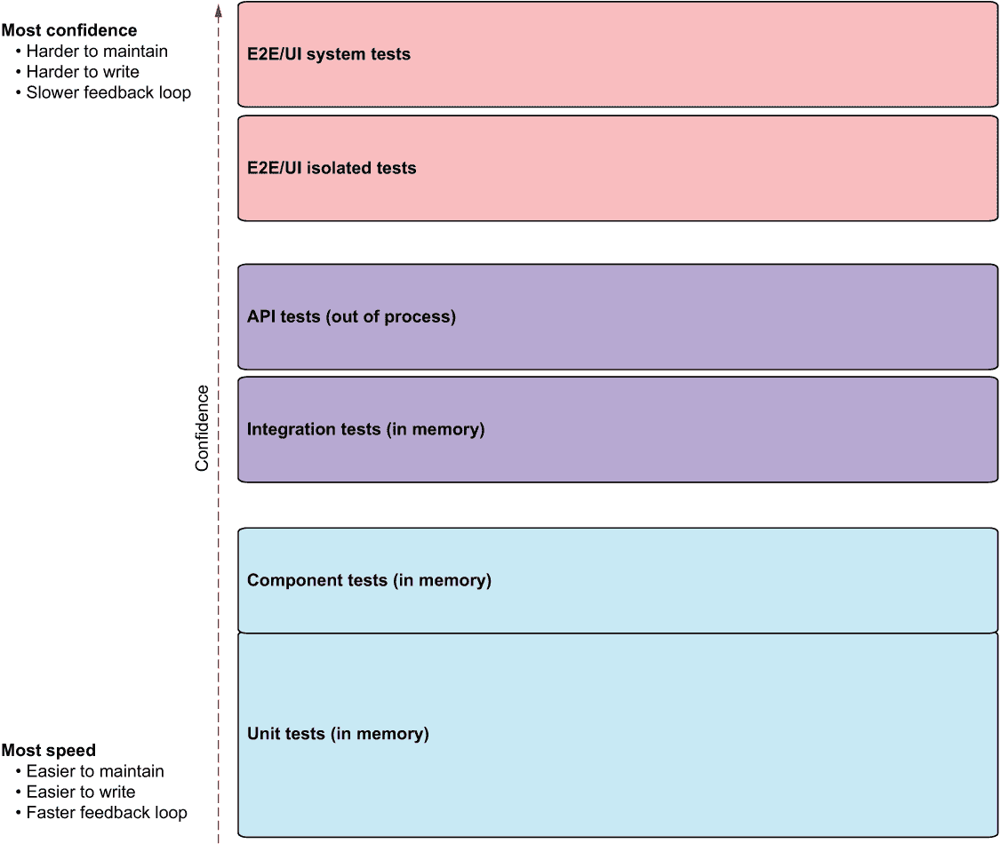
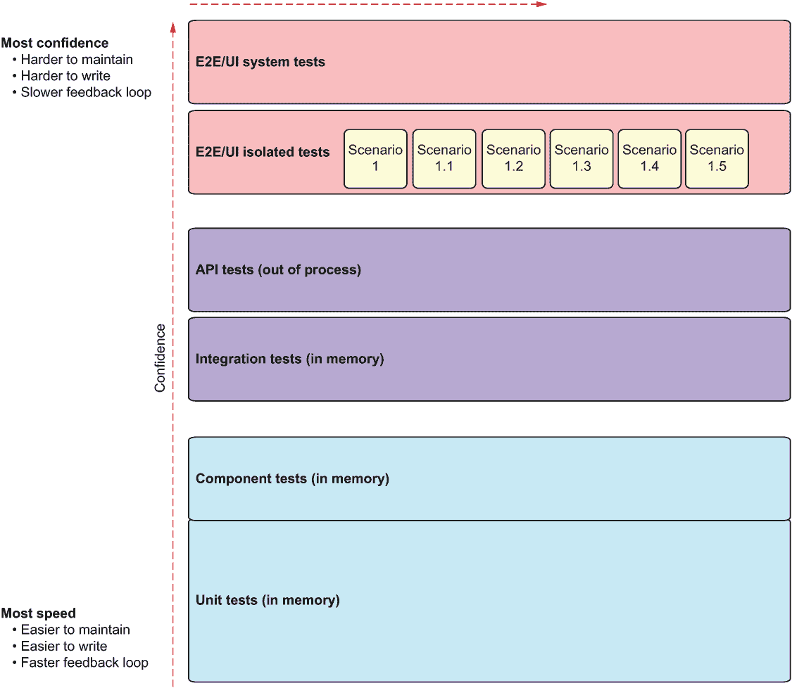
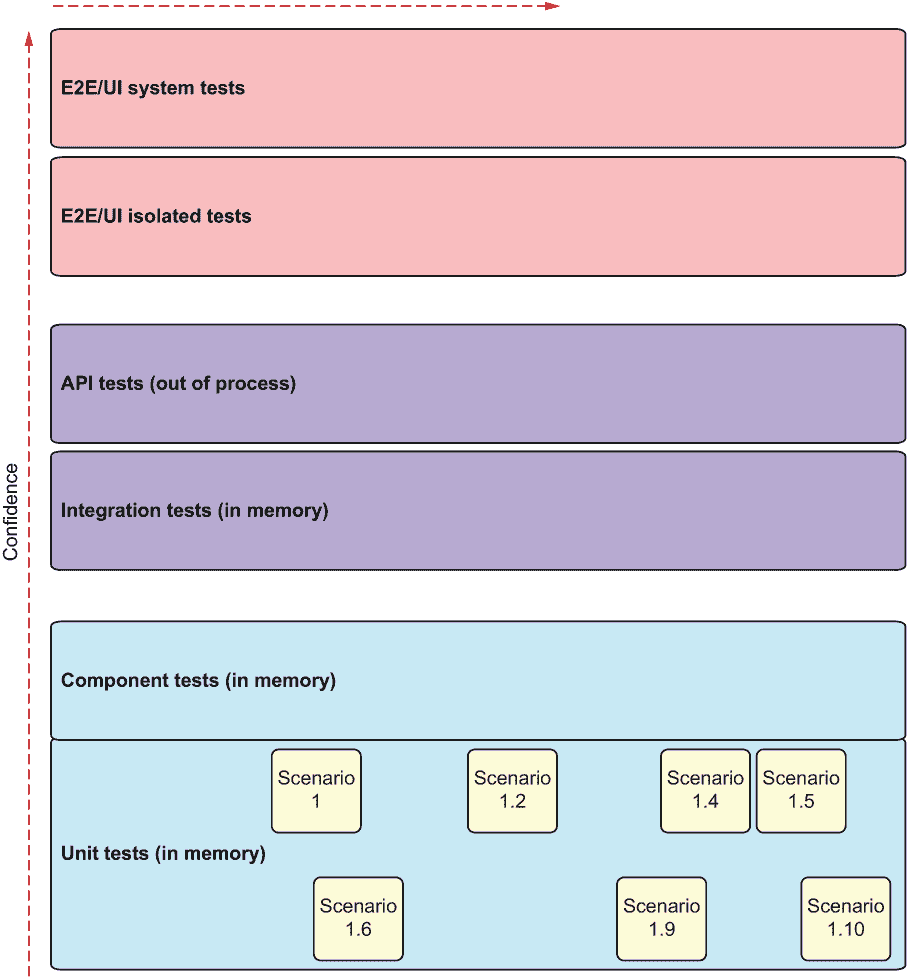
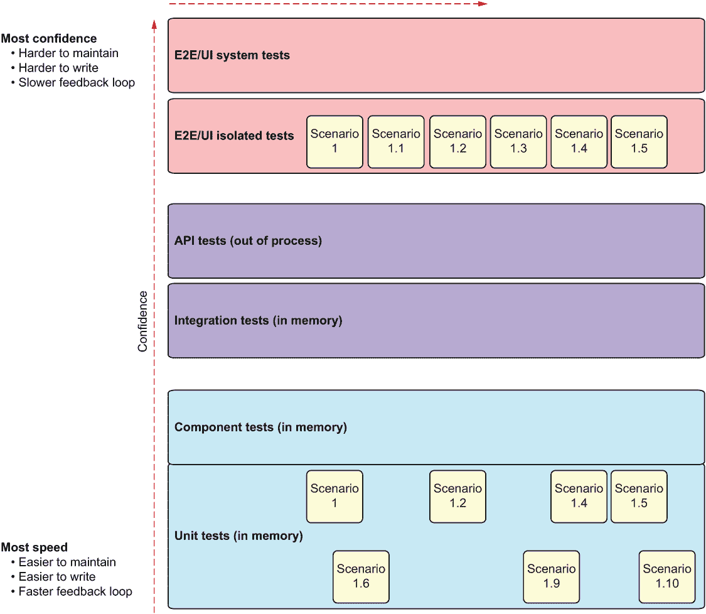
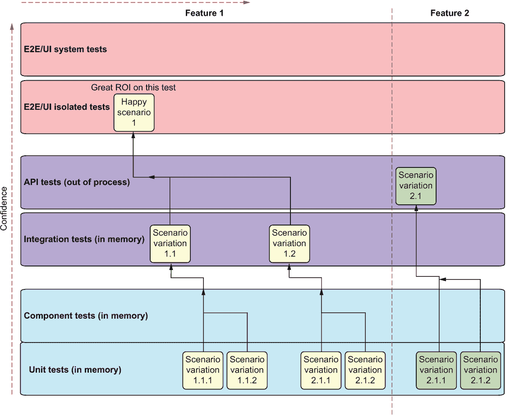
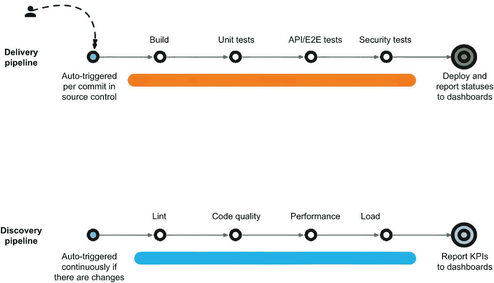
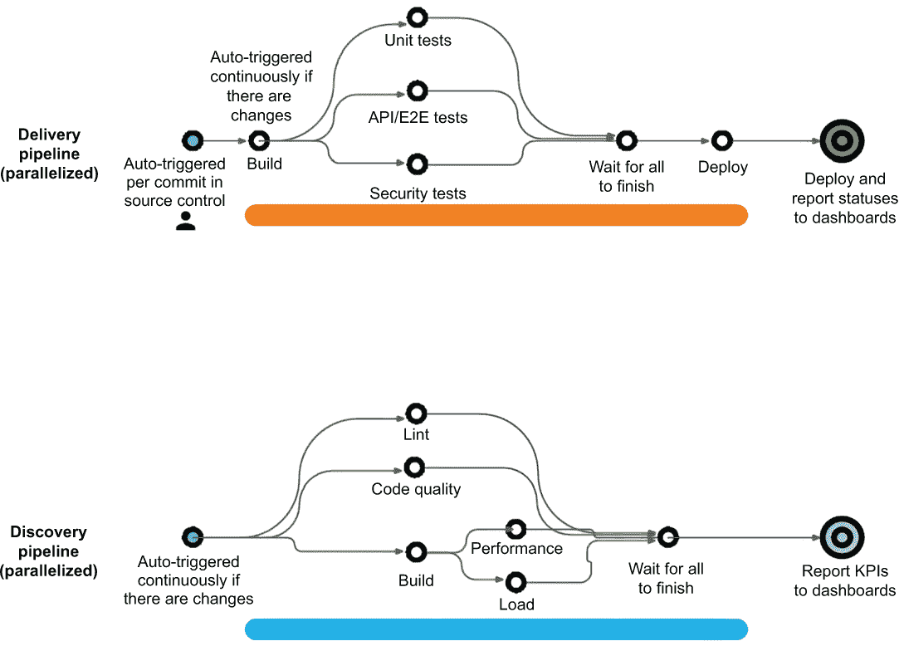

# 10 开发测试策略

本章涵盖

+   测试级别的优缺点

+   测试级别中的常见反模式

+   测试配方策略

+   阻塞和非阻塞测试

+   交付与发现管道

+   测试并行化

单元测试只是你可以和应该编写的测试类型之一。在本章中，我们将讨论单元测试如何融入组织测试策略。一旦我们开始查看其他类型的测试，我们就开始提出一些真正重要的问题：

+   我们想在哪个*级别*测试各种功能？（UI、后端、API、单元等）

+   我们如何决定在哪个级别测试一个功能？我们在多个级别上多次测试它吗？

+   我们应该有更多功能性的端到端测试还是更多单元测试？

+   我们如何在不牺牲对测试的信任的情况下优化测试速度？

+   谁应该编写每种类型的测试？

这些问题的答案，以及许多其他问题，就是我所说的*测试策略*。

我们旅程的第一步是将测试策略的范围用测试类型来界定。

## 10.1 常见测试类型和级别

不同的行业可能会有不同的测试类型和级别。图 10.1，我们在第七章中首次讨论过，是一组相当通用的测试类型，我认为它适合 90%以上的我咨询的组织，如果不是更多。测试级别越高，它们使用的真实依赖项就越多，这让我们对整体系统的正确性更有信心。缺点是这种测试较慢且不稳定。



图 10.1 常见软件测试级别

很好的图表，但我们该如何使用它？我们在设计关于编写哪个测试的决策框架时使用它。有几个标准（使我们的工作更容易或更难的事情）我喜欢明确指出；这些帮助我决定使用哪种测试类型。

### 10.1.1 判断测试的标准

当我们面临超过两个选项可供选择时，我发现帮助我做出决定的最佳方法之一是确定我对当前问题的*明显价值观*。这些明显价值观是我们都可以基本达成共识的有用事物或我们在做出选择时应避免的事物。表 10.1 列出了我对测试的明显价值观。

表 10.1 通用测试评分卡

| 标准 | 评分尺度 | 备注 |
| --- | --- | --- |
| 复杂性 | 1-5 | 编写、阅读或调试测试的复杂程度。越低越好。 |
| 不稳定性 | 1-5 | 测试失败的可能性有多大，因为它是由于它无法控制的事物——其他团队的代码、网络、数据库、配置等等。越低越好。 |
| 通过时的信心 | 1-5 | 当测试通过时，我们在心中和心中产生的信心有多大。越高越好。 |
| 可维护性 | 1-5 | 测试需要更改的频率以及更改的难易程度。越高越好。 |
| 执行速度 | 1-5 | 测试完成得多快？越高越好。 |

所有值都是从 1 到 5 进行缩放的。正如您将看到的，图 10.1 中的每个级别在这些标准中都有优点和缺点。

### 10.1.2 单元测试和组件测试

单元测试和组件测试是我们在本书中迄今为止讨论的测试类型。它们都属于同一类别，唯一的区别是组件测试可能包含更多的工作单元中的函数、类或组件。换句话说，组件测试在入口点和出口点之间包含更多的“内容”。

这里有两个测试示例来说明差异：

+   *测试 A*——一个内存中自定义 UI 按钮对象的单元测试。您可以实例化它，点击它，并看到它触发了某种形式的点击事件。

+   *测试 B*——一个组件测试，它实例化了一个高级别表单组件，并将按钮作为其结构的一部分。该测试验证了高级别表单，其中按钮在高级别场景中扮演着小角色。

两个测试仍然是单元测试，在内存中执行，并且我们对所有使用的内容都有完全控制权；没有对文件、数据库、网络、配置或其他我们不控制的东西的依赖。测试 A 是一个低级别的单元测试，而测试 B 是一个组件测试，或者是一个高级别的单元测试。

需要进行这种区分的原因是，我经常被问及如何称呼具有不同抽象级别的测试。答案是，一个测试是否属于单元/组件测试类别，取决于它是否有或没有依赖关系，而不是它使用的抽象级别。表 10.2 显示了单元/组件测试层的评分卡。

表 10.2 单元/组件测试评分卡

| 复杂性 | 1/5 | 由于范围较小以及我们可以控制测试中的所有内容，这些测试类型是最不复杂的。 |
| --- | --- | --- |
| 不稳定性 | 1/5 | 由于我们可以在测试中控制所有内容，这些测试类型中不稳定性最低。 |
| 通过时的信心 | 1/5 | 当单元测试通过时，感觉很好，但我们并不真正确信我们的*应用程序*是否工作正常。我们只知道其中一小部分是正常的。 |
| 可维护性 | 5/5 | 这些测试类型中，这些是最容易维护的，因为它们相对简单，易于阅读和推理。 |
| 执行速度 | 5/5 | 这些是所有测试类型中最快的，因为所有内容都在内存中运行，没有任何对文件、网络或数据库的硬依赖。 |

### 10.1.3 集成测试

集成测试几乎与常规单元测试完全相同，但其中一些依赖项没有被模拟。例如，我们可能使用真实的配置、真实的数据库、真实的文件系统，或者三者都有。但为了调用测试，我们仍然在内存中从我们的生产代码中实例化一个对象，并直接在该对象上调用入口点函数。表 10.3 显示了集成测试的评分卡。

表 10.3 集成测试评分卡

| 复杂性 | 2/5 | 这些测试的复杂度略高或非常高，这取决于我们在测试中未模拟的依赖项数量。 |
| --- | --- | --- |
| 稳定性 | 2-3/5 | 这些测试的不可靠性略高或很高，这取决于我们使用的真实依赖项数量。 |
| 通过时的信心 | 2-3/5 | 当集成测试通过时感觉会好很多，因为我们正在验证代码使用了我们不控制的东西，比如数据库或配置文件。 |
| 可维护性 | 3-4/5 | 由于依赖关系，这些测试比单元测试更复杂。 |
| 执行速度 | 3-4/5 | 由于依赖于文件系统、网络、数据库或线程，这些测试的执行速度略慢或慢得多。 |

### 10.1.4 API 测试

在之前的测试低级别中，我们不需要部署待测试的应用程序或使其正常运行来测试它。在 API 测试级别，我们最终需要至少部分部署待测试的应用程序并通过网络调用它。与单元、组件和集成测试不同，这些测试可以归类为内存测试，API 测试是进程外测试。我们不再直接在内存中实例化待测试的单元。这意味着我们在混合中添加了一个新的依赖项：网络，以及某些网络服务的部署。表 10.4 显示了 API 测试的评分卡。

表 10.4 API 测试评分卡

| 复杂性 | 3/5 | 这些测试的复杂度略高或非常高，这取决于部署复杂性、配置和所需的 API 设置。有时我们需要在测试中包含 API 模式，这需要额外的工作和思考。 |
| --- | --- | --- |
| 稳定性 | 3-4/5 | 网络增加了更多的不可靠性。 |
| 通过时的信心 | 3-4/5 | 当 API 测试通过时感觉会更好。我们可以相信，在部署后，其他人可以自信地调用我们的 API。 |
| 可维护性 | 2-3/5 | 网络增加了更多的设置复杂性，并且在更改测试或添加/更改 API 时需要更多的关注。 |
| 执行速度 | 2-3/5 | 网络显著减慢了测试速度。 |

### 10.1.5 E2E/UI 隔离测试

在隔离端到端（E2E）和用户界面（UI）测试的层面上，我们是从用户的角度测试我们的应用程序。我使用“隔离”一词来指明我们只测试*我们自己的*应用程序或服务，而不部署任何依赖的应用程序或服务，这些应用程序或服务可能是我们的应用程序所需要的。这样的测试会模拟第三方认证机制，需要在同一服务器上部署的其他应用程序的 API，以及任何不是待测试主应用程序特定部分的代码（包括来自同一组织其他部门的 app——这些也会被模拟）。

表 10.5 显示了 E2E/UI 隔离测试的评分卡。

表 10.5 E2E/UI 隔离测试评分卡

| 复杂度 | 4/5 | 这些测试比之前的测试要复杂得多，因为我们正在处理用户流程、基于 UI 的变化，以及捕获或抓取 UI 以进行集成和断言。等待和超时现象普遍存在。 |
| --- | --- | --- |
| 不稳定性 | 4/5 | 由于涉及到的许多依赖项，测试可能会减慢速度、超时或无法工作。 |
| 通过时的信心 | 4/5 | 当这种类型的测试通过时，这是一个巨大的安慰。我们在我们的应用程序中获得了很大的信心。 |
| 可维护性 | 1-2/5 | 更多的依赖项增加了设置复杂性，并且在更改测试或添加或更改工作流程时需要更多的关注。测试很长，通常有多个步骤。 |
| 执行速度 | 1-2/5 | 在导航用户界面时，这些测试可能会非常慢，有时包括登录、缓存、多页导航等。 |

### 10.1.6 端到端/UI 系统测试

在系统端到端和 UI 测试级别，*没有任何*是假的。这是我们能够达到的生产部署的近似：所有依赖的应用程序和服务都是真实的，但它们可能被配置得不同，以允许我们的测试场景。表 10.6 显示了端到端/UI 系统测试的评分表。

表 10.6 端到端/UI 系统测试评分表

| 复杂度 | 5/5 | 由于依赖项的数量，这些是最复杂、设置和编写难度最大的测试。 |
| --- | --- | --- |
| 不稳定性 | 5/5 | 这些测试可能因为成千上万的不同原因而失败，并且通常有多种原因。 |
| 通过时的信心 | 5/5 | 由于测试执行时测试了所有代码，这些测试给我们带来了最高的信心。 |
| 可维护性 | 1/5 | 由于许多依赖项和长工作流程，这些测试难以维护。 |
| 执行速度 | 1/5 | 这些测试非常慢，因为它们使用了 UI 和真实依赖项。单个测试可能需要几分钟到几小时。 |

## 10.2 测试级别的反模式

测试级别的反模式不是技术性的，而是组织性的。你可能亲眼见过。作为一个顾问，我可以告诉你，它们非常普遍。

### 10.2.1 仅端到端测试的反模式

组织通常会采用的一种非常常见的策略是主要使用，如果不是唯一使用，端到端测试（包括隔离和系统测试）。图 10.2 显示了在测试级别和类型图中的这种样子。



图 10.2 仅端到端测试的反模式

为什么这是一个反模式？在这个级别的测试非常慢，难以维护，难以调试，并且非常不稳定。这些成本保持不变，而每个新的端到端测试带来的价值却在减少。

端到端测试的边际效益递减

你写的第一个端到端测试会给你带来最大的信心，因为该场景包含了大量其他代码路径，也因为胶水——协调应用程序与其他系统之间工作的代码——作为测试的一部分被调用。

但第二个端到端测试怎么办？它通常是对第一个测试的变体，这意味着它可能只带来一小部分相同的价值。也许组合框和其他 UI 元素有所不同，但所有依赖项，如数据库和第三方系统，都保持不变。

从第二个端到端测试中获得的额外信心也仅仅是第一个端到端测试中获得额外信心的一小部分。然而，调试、更改、阅读和运行该测试的成本并不是一小部分；它基本上与之前的测试相同。你正在为非常小的额外信心承担大量的额外工作，这就是为什么我喜欢说端到端测试的回报迅速递减。

如果我想对第一个测试进行变化，那么在比上一个测试更低的级别进行测试会更为实际。我已经知道大多数，如果不是所有，层之间的粘合剂都工作正常，从第一个测试开始。如果我能证明下一个场景在较低级别，并且只需支付一小部分费用就能获得几乎相同的信心，那么就没有必要为另一个端到端测试支付税收。

构建 whisperer

使用端到端测试，我们不仅得到了递减的回报，还在组织中创造了一个新的瓶颈。因为高级测试通常不可靠，它们会因为许多不同的原因而失败，其中一些与测试本身无关。然后你需要组织中的特殊人员（通常是质量保证负责人）坐下来分析许多失败的测试，并追查原因，确定它是否真的是一个问题或是一个小问题。

我把这些可怜的人称为 *构建 whisperer*。当构建是红色的时候，这通常是大多数情况，构建 whisperer 是必须进来解析数据，并在经过数小时检查后，有意识地表示，“是的，看起来是红色的，但实际上是绿色的。”

通常，组织会将构建 whisperer 推向角落，要求他们声称构建是绿色的，因为“我们必须把这个发布版本推出门。”他们是发布的守门人，这是一份没有回报、压力很大、通常手动且令人沮丧的工作。whisperer 通常在一年或两年内就会筋疲力尽，然后被咀嚼并吐出到下一个组织，在那里他们再次做同样的没有回报的工作。你经常会看到当存在许多高级端到端测试的反模式时，就会有构建 whisperer。

避免构建 whisperer

有一种方法可以解决这个混乱，那就是创建和培养强大的、自动化的测试流水线，这样它可以自动判断构建是否为绿色，即使你有不可靠的测试。Netflix 公开博客介绍了他们自己的工具，用于统计测量构建在野外的表现，以便可以自动批准全面发布部署（http://mng.bz/BAA1）。这是可行的，但需要时间和文化来实现这样的流水线。我在我的博客 https://pipelinedriven.org 上写了更多关于这些类型流水线的内容。

一种“扔过墙”的心态

只拥有端到端测试还会伤害组织的另一个原因是，负责维护和监控这些测试的人是 QA 部门的人。这意味着组织的开发者可能不关心甚至不知道这些构建的结果，他们也没有投入精力去修复或关心这些测试。他们不拥有这些测试。

这种“扔过墙”的心态会导致很多沟通和质量问题，因为组织的某一部分没有与其行动的后果相联系，而另一部分则遭受了后果却无法控制问题的源头。难道在许多组织中，开发人员和 QA 人员不和睦不是令人惊讶的吗？围绕他们的系统通常被设计成让他们成为死敌而不是合作者。

当这种反模式发生时

这些是我看到这种情况发生的一些原因：

+   *职责分离*—在许多组织中，QA 部门和开发部门有独立的管道（自动构建作业和仪表板）。当一个 QA 部门有自己的管道时，它很可能会编写更多同类型的测试。此外，QA 部门倾向于只编写特定类型的测试——他们习惯于编写并且期望编写的测试（有时基于公司政策）。

+   *“如果它有效，就不要改变它”的心态*—一个团队可能从端到端测试开始，发现他们喜欢这些结果。他们继续以同样的方式添加所有新的测试，因为这正是他们所知道的，并且已经证明是有用的。当运行测试所需的时间变得过长时，改变方向已经太晚了（这与下一个点相关）。

+   *沉没成本谬误*—“我们有很多这类测试，如果我们改变它们或用低级测试替换它们，那就意味着我们在移除的测试上浪费了所有的时间和精力。”这是一个谬误，因为维护、调试和理解测试失败需要大量的人力时间。实际上，删除这些测试（只保留一些基本场景）并找回这些时间成本更低。

你应该完全避免端到端测试吗？

不，我们无法避免端到端测试。它们提供的好处之一是*信心*，即应用程序可以正常工作。与单元测试相比，这是一个完全不同的信心水平，因为它们从用户的角度测试了整个系统的集成，包括所有子系统及其组件。当它们通过时，你会感到巨大的解脱，因为你期望用户遇到的主要场景实际上是可以工作的。

所以，不要完全避免它们。相反，我强烈建议*最小化*端到端测试的数量。我们将在第 10.3.3 节中讨论这个最小值。

### 10.2.2 仅低级测试的反模式

只有端到端测试的反面是只有低级测试。单元测试可以提供快速的反馈，但它们并不能提供足够的信心，以确保你的应用程序作为一个单一集成的单元正常工作（见图 10.3）。



图 10.3 只有低级测试的反模式

在这个反模式中，组织的自动化测试主要是或完全是低级测试，如单元测试或组件测试。可能会有一些集成测试的迹象，但看不到端到端测试。

这种做法的最大问题是，当这些类型的测试通过时，你获得的信心水平远远不足以让你确信应用程序是正常工作的。这意味着人们会运行测试，然后继续进行手动调试和测试，以获得发布所需最终信心。除非你发布的代码库是打算以你的单元测试使用的方式使用的，否则这还不够。是的，测试会很快运行，但你仍然会花费大量时间进行手动测试和验证。

这种反模式通常发生在你的开发者只习惯于编写低级测试，如果他们不习惯编写高级测试，或者如果他们期望 QA 人员编写这些类型的测试时。

这是否意味着你应该避免单元测试？显然不是。但我强烈建议你不仅要单元测试，还要有高级测试。我们将在第 10.3 节中讨论这个建议。

### 10.2.3 分离的低级和高级测试

这种模式一开始可能看起来很健康，但实际上并不是。它可能看起来有点像图 10.4。



图 10.4 分离的低级和高级测试

是的，你想要既有低级测试（为了速度）又有高级测试（为了信心）。但当你在组织中看到这种情况时，你可能会遇到以下一种或多种反行为：

+   许多测试在多个级别上重复。

+   编写低级测试的人与编写高级测试的人不是同一批人。这意味着他们不关心彼此的测试结果，并且他们可能会设置不同的管道来执行不同的测试类型。当一个管道变红时，另一组人可能甚至不知道也不关心那些测试失败了。

+   我们遭受了两个世界的最坏情况：在顶层，我们遭受了长测试时间、难以维护、构建低语者和易变性的困扰；在底层，我们遭受了缺乏信心。由于通常缺乏沟通，我们无法从低级测试中获得速度优势，因为它们无论如何都会在顶层重复。我们也无法获得顶层信心，因为如此大量的测试如此不稳定。

这种模式通常发生在我们拥有不同的目标和指标、不同的工作、管道、权限，甚至代码存储库的独立测试和开发组织时。公司越大，这种情况发生的可能性就越大。

## 10.3 测试食谱作为策略

我提出的在组织使用的测试类型之间实现平衡的策略是使用*测试食谱*。想法是制定一个非正式的计划，说明特定功能将如何进行测试。这个计划不仅应该包括主要场景（也称为*成功路径*），还应该包括所有重要的变体（也称为*边缘情况*），如图 10.5 所示。一个清晰定义的测试食谱可以清楚地展示每个场景适合的测试级别。



图 10.5 测试食谱是一个测试计划，概述了特定功能应该在哪个级别进行测试。

### 10.3.1 如何编写测试食谱

最好至少有两个人创建测试食谱——希望一个是开发者的视角，另一个是测试者的视角。如果没有测试部门，两个开发者或者一个开发者和一个高级开发者就足够了。将每个场景映射到测试层次结构中的特定级别可能是一个非常主观的任务，所以有两双眼睛可以帮助彼此检查隐含的假设。

这些食谱本身可以存储为 TODO 列表中的额外文本，或者作为任务跟踪板上的功能故事的组成部分。你不需要一个单独的工具来规划测试。

创建测试食谱的最佳时机是在开始开发功能之前。这样，测试食谱就成为了功能“完成”定义的一部分，这意味着功能在没有通过完整的测试食谱之前是不完整的。

当然，随着时间的推移，食谱可能会发生变化。团队可以从中添加或删除场景。食谱不是一个僵化的工件，而是一个持续进行的工作，就像软件开发中的其他一切一样。

测试食谱代表了将给其创作者提供“相当好的信心”的功能是否正常工作的场景列表。作为一个经验法则，我喜欢在测试级别之间保持 1 到 5 或 1 到 10 的比例。对于任何高级别的端到端测试，我可能会有 5 个低级别的测试。或者，如果你从底部向上思考，比如说你有 100 个单元测试。你通常不需要超过 10 个集成测试和 1 个端到端测试。

尽管如此，不要将测试配方视为正式的东西。测试配方不是一项约束性的承诺，也不是测试计划软件中的测试用例列表。不要将其用作公共报告、用户故事或对利益相关者的任何其他承诺。本质上，配方是一个简单的 5 到 20 行的文本列表，详细说明了要自动测试的场景及其级别。这个列表可以更改、添加或删除。把它当作一个注释。我通常喜欢直接把它放在 Jira 或我使用的任何程序中的用户故事或功能中。

这里是一个例子，看看它可能是什么样子：

```
*User profile feature testing recipe*

E2E - Login, go to profile screen, update email, log out, log in with new email, verify profile screen updated

API - Call UpdateProfile API with more complicated data
Unit test - Check profile update logic with bad email
Unit test - Profile update logic with same email
Unit test - Profile serialization/deserialization
```

### 10.3.2 我什么时候编写和使用测试配方？

在你开始编码一个功能或用户故事之前，和另一个人坐下来，尝试想出各种要测试的场景。讨论这个场景应该在哪个层面上进行最佳测试。这次会议通常不会超过 5 到 15 分钟，之后就开始编码，包括编写测试。（如果你在做 TDD，你会从测试开始。）

在有自动化或 QA 角色的组织中，开发者将编写低级测试，QA 将专注于编写高级测试，而功能编码正在进行时。这两个人同时工作。一个人不会等待另一个人完成工作才开始编写测试。

如果你正在使用功能开关，它们也应该作为测试的一部分进行检查，这样如果功能关闭，其测试将不会运行。

### 10.3.3 测试配方的规则

在有自动化或 QA 角色的组织中，开发者将编写低级测试，QA 将专注于编写高级测试，而功能编码正在进行时。这两个人同时工作。一个人不会等待另一个人完成工作才开始编写测试。

+   *更快*—优先编写低级测试，除非高级测试是你获得对功能工作信心唯一方式。

+   *信心*—当你能对自己说，“如果所有这些测试都通过了，我会对这个功能的工作感到相当满意。”如果你不能这么说，就编写更多的场景，让你能这么说。

+   *修订*—在编码过程中，你可以自由地添加或删除列表中的测试。只需确保通知你合作的配方中的人即可。

+   *及时*—在你知道谁将要编码之前，开始编码之前编写这个配方。

+   *结对编程*—如果可能的话，不要独自编写。人们思考的方式不同，讨论场景并从彼此那里学习测试想法和心态是很重要的。

+   *不要从其他功能重复*—如果这个场景已经被现有的测试覆盖（可能是一个来自先前功能的端到端测试），在那个层面上重复这个场景就没有必要了。

+   *不要重复其他层级的代码*—尽量不在多个层面上重复相同的场景。如果你在端到端层面上检查成功的登录，低级测试应该只检查该场景的变体（使用不同提供者的登录、失败的登录结果等）。

+   *更多，更快*—一个很好的经验法则是最终在级别之间达到至少一比五的比例（对于一个端到端测试，你可能会有五个或更多的低级别测试）。

+   *实用主义*—对于给定的功能，没有必要在每个级别都编写测试。有些功能或用户故事可能只需要单元测试。其他可能只需要 API 或端到端测试。基本思想是，如果配方中的所有场景都通过了，无论它们在哪个级别进行测试，你都应该感到自信。如果不是这样，将场景移动到不同的级别，直到你感到更有信心，同时不要牺牲太多的速度或维护负担。

通过遵循这些规则，你将获得快速反馈的好处，因为大部分测试将是低级别的，同时不会牺牲信心，因为少数最重要的场景仍然由高级测试覆盖。测试配方方法还允许你通过在主场景以下级别定位场景变体来避免测试之间的大多数重复。最后，如果 QA 人员也参与编写测试配方，你将在组织内部形成一个新的沟通渠道，这有助于提高对软件项目的相互理解。

## 10.4 管理交付管道

性能测试？安全测试？负载测试？还有许多其他可能需要花费很长时间运行的测试，我们应该在哪里和什么时候运行它们？它们属于哪一层？它们应该成为我们自动化流程的一部分吗？

许多组织将这些测试作为集成自动化管道的一部分运行，该管道为每个发布或拉取请求运行。然而，这会导致反馈延迟巨大，而且反馈通常是“失败”，尽管对于这些类型的测试，失败并不是发布所必需的。

我们可以将这些测试类型分为两大类：

+   *交付阻止测试*—这些是提供即将发布和部署的更改是否可行的测试。单元测试、端到端测试、系统测试和安全测试都属于这一类别。它们的反馈是二元的：要么通过并宣布更改没有引入任何错误，要么失败并指示在发布之前需要修复代码。

+   *值得了解的测试*—这些是为了发现和持续监控关键性能指标（KPI）而创建的测试。例如，包括代码分析和复杂性扫描、高负载性能测试以及其他提供非二进制反馈的长时间运行的非功能性测试。如果这些测试失败，我们可能会将新的工作项添加到我们的下一个迭代中，但我们仍然可以发布我们的软件。

### 10.4.1 交付与发现管道

我们不希望我们的“值得了解”的测试从我们的交付过程中夺取宝贵的反馈时间，因此我们还将有两种类型的管道：

+   *交付管道*——用于阻止交付的测试。当管道为绿色时，我们应该有信心可以自动将代码发布到生产环境。这个管道中的测试应该提供相对快速的反馈。

+   *发现管道*——用于应知应会的测试。这个管道与交付管道并行运行，但持续进行，并且不被视为发布标准。由于不需要等待其反馈，这个管道中的测试可以持续很长时间。如果发现错误，它们可能会成为团队在下个冲刺中的新工作项，但发布不会受阻。

图 10.6 展示了这两种管道的功能。



图 10.6 交付与发现管道

交付管道的目的在于提供一个通过/不通过检查，如果一切看起来都是绿色的，甚至可能部署我们的代码到生产环境。发现管道的目的是为团队提供重构目标，例如处理变得过于复杂的代码复杂性。它还可以显示这些重构努力是否随着时间的推移而有效。发现管道除了运行专门的测试或分析代码及其各种 KPI 指标之外，不部署任何内容。它以仪表板上的数字结束。

速度是让团队更加投入的一个大因素，将测试分为发现和交付管道是你要保留在武器库中的另一种技术。

### 10.4.2 测试层并行化

由于快速反馈非常重要，你可以在许多场景中采用并应该采用的一种常见模式是并行运行不同的测试层以加快管道反馈，如图 10.7 所示。你甚至可以使用在测试结束时动态创建和销毁的并行环境。



图 10.7 为了加快交付，你可以并行运行管道，甚至管道中的阶段。

这种方法从能够访问动态环境中受益很大。把钱花在环境和自动并行测试上几乎总是比花钱雇佣更多的人做更多的手动测试，或者简单地让人们等待更长的时间以获得反馈（因为环境正在被使用）要有效得多。

手动测试是不可持续的，因为这种手动工作只会随着时间的推移而增加，变得越来越脆弱和容易出错。同时，简单地等待更长时间的管道反馈结果会导致每个人大量的时间浪费。等待时间乘以等待的人数和每天的构建次数，结果是一个月投资可能比投资动态环境和自动化要大得多。拿一个 Excel 文件，向你的经理展示一个简单的公式来获取那个预算。

你不仅可以并行化管道内的阶段；你还可以进一步并行运行单个测试。例如，如果你遇到了大量 E2E 测试，你可以将它们拆分成并行测试套件。这将从你的反馈循环中节省大量时间。

不要进行夜间构建

最好在每次代码提交后运行你的交付管道，而不是在特定时间。每次代码更改时运行测试，比仅仅积累前一天所有更改的粗略夜间构建提供更细粒度和更快的反馈。但如果由于某种原因，你绝对需要在规定时间内运行管道，至少要持续运行它们，而不是每天只运行一次。

如果你的交付管道构建过程耗时较长，不要等待魔法触发器或安排来运行它。想象一下，作为一个开发者，你需要等到明天才能知道你是否破坏了某些东西。随着测试的持续运行，你仍然需要等待，但至少只需要几个小时而不是整整一天。这不是更有效率吗？

此外，不要仅在需要时运行构建。如果假设自上次构建以来有代码更改，那么在完成上一个构建后自动运行构建将使反馈循环更快。

## 摘要

+   测试有多个层级：内存中运行的单元测试、组件测试和集成测试；以及运行在进程外的 API、隔离端到端（E2E）和系统 E2E 测试。

+   每个测试都可以通过五个标准来评判：复杂性、易出错性、通过时的信心、可维护性和执行速度。

+   单元和组件测试在可维护性、执行速度、缺乏复杂性和易出错性方面表现最佳，但在提供信心方面表现最差。集成和 API 测试在信心与其他指标之间的权衡中处于中间位置。端到端测试与单元测试采取相反的方法：它们提供最佳的信心，但代价是可维护性、速度、复杂性和易出错性。

+   **端到端测试唯一反模式**是指你的构建过程仅包含端到端测试。每个额外端到端测试的边际价值很低，而所有测试的维护成本是相同的。如果你只有少数几个端到端测试覆盖最重要的功能，你将获得最大的努力回报。

+   **仅低级测试反模式**是指你的构建过程仅包含单元和组件测试。低级测试无法提供足够的信心来确保整体功能正常工作，它们必须通过更高层级的测试来补充。

+   **低级与高级测试脱节**是一种反模式，因为这强烈表明你的测试是由两组不同的人编写的，他们之间没有沟通。这样的测试往往相互重复，并且维护成本很高。

+   *测试配方*是一份简单的 5 到 20 行的文本列表，详细说明应以自动化方式测试哪些简单场景以及测试的级别。测试配方应让您有信心，如果所有概述的测试都通过，则功能按预期工作。

+   将构建管道拆分为*交付*和*发现*管道。交付管道应用于阻止交付的测试，如果测试失败，将停止测试代码的交付。发现管道用于需要了解的测试，并且与交付管道并行运行。

+   您不仅可以并行化管道，还可以并行化管道内的阶段，甚至阶段内的测试组。
