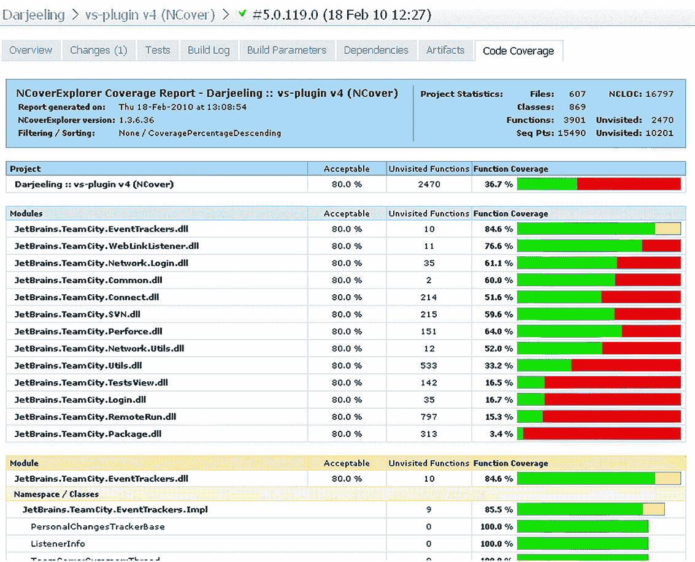
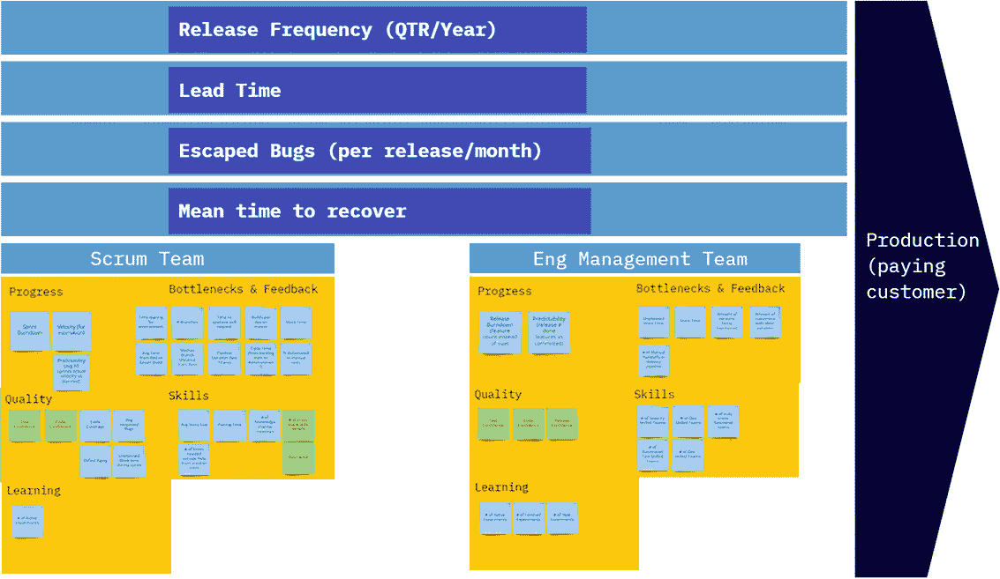

# 11 将单元测试集成到组织中

本章涵盖

+   成为变革推动者

+   从上到下或从下到上实施变革

+   准备回答关于单元测试的棘手问题

作为一名顾问，我帮助了几家大公司和中小企业将持续交付流程和各种工程实践，如测试驱动开发和单元测试，整合到他们的组织文化中。有时这会失败，但那些成功的企业有几个共同点。在任何类型的组织中，改变人们的习惯更多的是心理上的，而不是技术上的。人们不喜欢改变，改变通常伴随着大量的 FUD（恐惧、不确定性和怀疑）。对大多数人来说，这不会像散步一样轻松，正如你将在本章中看到的。

## 11.1 成为变革推动者的步骤

如果你打算成为你组织中的变革推动者，你应该首先接受这个角色。人们会把你视为负责（有时是问责）正在发生的事情的人，无论你是否愿意，隐藏是没有用的。事实上，隐藏可能会导致事情变得非常糟糕。

当你开始实施或推动变革时，人们会开始询问与他们关心的问题相关的棘手问题。这将“浪费”多少时间？这对作为 QA 工程师的我意味着什么？我们如何知道它有效？准备好回答。最常见的问答讨论在第 11.5 节中。你会发现，在你开始做出改变之前说服组织内部的人会极大地帮助你做出艰难的决定和回答这些问题。

最后，有人必须留在舵手的位置上，确保变革不会因为缺乏动力而失败。那个人就是你。有一些方法可以保持事物的活力，你将在下一节中看到。

### 11.1.1 准备回答棘手的问题

做好研究。阅读本章末尾的问题和答案，查看相关资源。阅读论坛、邮件列表和博客，并与你的同行咨询。如果你能回答你自己的棘手问题，那么你很可能也能回答别人的。

### 11.1.2 说服内部人士：支持者和阻挠者

在组织中，很少有事情能让你感到像反对潮流的决定那样孤独。如果你是唯一一个认为你所做的事情是个好主意的人，那么很少有人会努力去实施你所倡导的事情。考虑一下谁可以帮助或阻碍你的努力：支持者和阻挠者。

支持者

当你开始推动变革时，确定你认为最有可能帮助你的人。他们将成为你的*支持者*。他们通常是早期采用者，或者足够开放心态去尝试你所倡导的事情的人。他们可能已经半信半疑，但正在寻找开始变革的动力。他们甚至可能已经尝试过并失败了。

在其他人之前接近他们，并询问他们对你要做的事情的看法。他们可能会告诉你一些你没有考虑过的事情，包括

+   可能适合开始的团队

+   人们更容易接受这种变化的地方

+   在你的追求中要注意什么（和谁）

通过接近他们，你正在帮助确保他们是这个过程的一部分。感觉自己是过程一部分的人通常会尽力让它成功。让他们成为你的支持者：询问他们是否可以帮助你，并成为人们可以就问题来咨询的人。为他们准备这样的情况。

阻碍者

接下来，确定*阻碍者*。这些是在组织中最有可能抵制你所做改变的的人。例如，一个经理可能会反对添加单元测试，声称这将增加开发时间，并增加需要维护的代码量。通过让他们（至少是那些愿意并且能够的）在过程中扮演积极角色，使他们成为过程的参与者而不是抵制者。

人们可能抵制改变的原因多种多样。一些可能的反对意见的答案在 11.4 节关于*影响力因素*中有所涉及。有些人会担心工作安全，而有些人可能只是对目前的情况感到过于舒适。我发现，详细说明潜在的阻碍者可能做得更好的事情通常不是建设性的，因为这是我艰难学到的。人们不喜欢被告知他们的孩子长得丑。

相反，让阻碍者通过负责定义单元测试的编码标准，例如，或者通过每隔一天与同事进行代码和审查来帮助你在这个过程中。或者让他们成为选择课程材料或外部顾问的团队的一部分。你将赋予他们一个新的责任，这将帮助他们感到在组织中受到信赖和重要。他们需要成为变革的一部分，否则他们几乎肯定会破坏它。

### 11.1.3 确定可能的起点

确定在组织中你可以从哪里开始实施改变。大多数成功的实施都采取稳定的路线。从一个小型团队的试点项目开始，看看会发生什么。如果一切顺利，再转向其他团队和其他项目。

这里有一些可以帮助你的建议：

+   选择较小的团队。

+   创建子团队。

+   考虑项目的可行性。

+   使用代码和审查作为教学工具。

这些建议可以在一个主要敌对的环境中带你走得很远。

选择较小的团队

确定可能开始的团队通常很容易。你通常会希望有一个小团队在低知名度项目上工作，风险较低。如果风险很小，就更容易说服人们尝试你提出的改变。

一个需要注意的问题是，团队需要有一些愿意改变工作方式和学习新技能的成员。具有讽刺意味的是，团队中经验较少的人通常最有可能接受改变，而经验较多的人往往更固守自己的做事方式。如果你能找到一个愿意改变且包括经验较少的开发者的有经验的领导者团队，那么这个团队很可能不会提出太多反对意见。去到团队中询问他们对于进行试点项目的看法。他们会告诉你这是否（或不是）一个合适的开始地点。

创建子团队

另一个可能的试点测试候选方案是在现有团队内组建一个子团队。几乎每个团队都会有一个需要维护的“黑洞”组件，虽然它做很多事情都做得很好，但也存在许多错误。为这样的组件添加功能是一项艰巨的任务，这种痛苦可以促使人们尝试试点项目。

考虑项目的可行性

对于试点项目，确保你不会超出自己的能力范围。管理更困难的项目需要更多的经验，因此你可能想要至少有两个选择——一个复杂的项目和一个简单的项目——这样你就可以在它们之间进行选择。

将代码和测试审查作为教学工具使用

如果你是一个小型团队（最多八人）的技术负责人，那么最好的教学方法之一就是实施包括测试审查在内的代码审查。想法是，当你审查他人的代码和测试时，你教会他们你在测试中寻找的内容以及你思考编写测试或采用 TDD 的方式。以下是一些建议：

+   进行面对面审查，而不是通过远程软件。个人联系可以让你们之间通过非言语方式传递更多信息，因此学习效果更好、更快。

+   在最初的几周内，审查所有提交的代码行。这将帮助你避免“我们以为这段代码不需要审查”的问题。

+   在你的代码审查中增加第三个人——他将在旁边观察你如何审查代码。这将使他们能够后来自己进行代码审查并教授他人，这样你就不必成为团队中唯一能够进行审查的人的瓶颈。想法是培养他人进行代码审查的能力并承担更多的责任。

如果你想了解更多关于这种技术的信息，我在我的技术领导者博客中对此进行了讨论：“一个好的代码审查应该是什么样的？”请参阅[`5whys.com/blog/what-should-a-good-code-review-look-and-feel-like.html`](https://5whys.com/blog/what-should-a-good-code-review-look-and-feel-like.html)。

## 11.2 成功的 11 种方法

一个组织或团队可以开始改变流程的主要方式有两种：自下而上或自上而下（有时两者兼而有之）。这两种方式非常不同，正如你将看到的，它们中的任何一种都可能适合你的团队或公司。没有一种绝对正确的方法。

在你继续前进的过程中，你需要学会如何说服管理层，*你的*努力也应该是*他们的*努力，或者何时引入外部人员来帮助会更为明智。使进展可见是很重要的，同样重要的是设定可以衡量的明确目标。识别和避免障碍也应该在你的清单上。有许多战斗可以打，你需要选择正确的战斗。

### 11.2.1 游击战式实施（自下而上）

游击战式实施完全关乎从一个团队开始，取得成果，然后才说服其他人这些实践是值得的。通常，游击战式实施的推动力是一个厌倦了按传统方式做事的团队。他们着手以不同的方式做事；他们自学并促成改变。当团队展示出成果时，组织中的其他人可能会决定在自己的团队中开始实施类似的变化。

在某些情况下，游击战式实施是首先由开发者采用，然后由管理层采用的过程。在其他时候，它是由开发者首先倡导，然后由管理层采用的过程。区别在于你可以秘密地完成第一个，而上级并不知道。后者是与管理层一起完成的。取决于你决定哪种方法更有效。有时改变事物的唯一方法是通过秘密行动。如果可能的话，避免这样做，但如果没有其他方法，而且你确信改变是必要的，你就可以直接这样做。

不要把这当作一个建议去做一个限制你职业生涯的举动。开发者经常在没有许可的情况下做事：调试代码、阅读电子邮件、编写代码注释、创建流程图等等。这些都是开发者作为日常工作的一部分所做的事情。单元测试也是如此。大多数开发者已经编写了某种类型的测试（自动化的或非自动化的）。想法是将花在测试上的时间重新分配到长期会带来好处的事情上。

### 11.2.2 说服管理层（自上而下）

自上而下的转变通常以两种方式之一开始。一位经理或开发者会启动这个过程，并逐步引导整个组织朝着这个方向前进。或者，一位中层经理可能会看到一场演示，阅读一本书（比如这本书），或者与同事讨论他们对工作方式具体改变的益处。这样的经理通常会通过向其他团队的人做演示，甚至使用他们的权力来实现改变来启动这个过程。

### 11.2.3 实验作为开门钥匙

这是一个在大型组织中开始单元测试的强大方法（它也可能适合其他类型的转型或新技能）。宣布一个为期两到三个月的实验。它将仅适用于一个预先挑选的团队，并且与真实应用中的一个或两个组件相关。确保它风险不大。如果它失败了，公司不会倒闭或失去主要客户。它也不应该是无用的：实验必须提供真正的价值，而不仅仅是作为游乐场。它必须是最终会推入你的代码库并在生产中使用的；它不应该是一段写完就忘记的代码。

“实验”这个词传达了这种变化是暂时的，如果它不起作用，团队可以回到之前的方式。此外，这种努力是时间限制的，因此我们知道实验何时结束。

这种方法有助于人们更轻松地接受大的变化，因为它降低了组织风险、受影响的人数（以及因此反对的人数），以及与害怕“永远改变”事物相关的反对意见的数量。

这里还有一个提示：当面对实验的多个选项，或者如果有人反对推动另一种工作方式时，问自己，“我们想先实验哪个想法？”

言行一致

准备好你的想法可能不会被选为实验的所有选项之一。当事情变得紧迫时，你必须根据领导层的共识来举行实验，无论你是否喜欢。

跟随他人的实验的好处是，就像你的实验一样，它们是时间限制的，暂时的！最好的结果可能是另一种方法修复了你试图修复的问题，你可能想继续进行他人的实验。然而，如果你讨厌这个实验，只需记住它是暂时的，你可以推动下一个实验。

指标和实验

在实验前后一定要记录一组基线指标。这些指标应该与你要尝试改变的事情相关，比如消除构建的等待时间、减少产品出厂的提前期，或者减少在生产中发现的错误数量。

要深入了解你可能使用的各种指标，请查看我的演讲“谎言、该死的谎言和指标”，您可以在我的博客[`pipelinedriven.org/article/video-lies-damned-lies-and-metrics`](https://pipelinedriven.org/article/video-lies-damned-lies-and-metrics)中找到。

### 11.2.4 获得外部支持者

我强烈建议找一个外部人员来帮助进行变革。一个外部顾问进入公司帮助进行单元测试和相关事务，比公司内部的人有优势：

+   *言论自由*——顾问可以说出公司内部的人可能不愿意从公司员工那里听到的话（“代码完整性差”，“你的测试不可读”，等等）。

+   *经验*—顾问将更有经验处理来自内部的阻力，提出对棘手问题的良好答案，并知道哪些按钮可以推动事情进展。

+   *专用时间*—对于顾问来说，这是他们的工作。与公司中其他有更重要事情去做（如编写软件）以推动变革的员工不同，顾问全职投入并致力于这一目标。

我经常看到变化失败，因为过度劳累的支持者没有时间投入这个过程。

### 11.2.5 使进展可见

保持变革的进展和状态可见非常重要。在走廊或人们聚集的食物相关区域墙上挂上白板或海报。显示的数据应与您试图实现的目标相关。例如：

+   显示上次夜间构建中通过或失败的测试数量。

+   保持一个图表，显示哪些团队已经在运行自动化构建流程。

+   如果你的目标是迭代进度或测试代码覆盖率报告（如图 11.1 所示），请挂起 Scrum 燃尽图。 (您可以在[www.controlchaos.com](http://www.controlchaos.com)上了解更多关于 Scrum 的信息。)

图 11.1 TeamCity 中 NCover 的测试代码覆盖率报告示例

+   公布你自己和所有支持者的联系方式，以便有人可以回答出现的任何问题。

+   设置一个始终显示的巨幕显示器，以大号粗体图形显示构建状态、当前运行的内容和失败的内容。将其放置在所有开发者都能看到的地方——例如，在一个繁忙的走廊或团队房间的主要墙壁顶部。

使用这些图表的目标是连接两个群体：

+   *正在经历变革的群体*—随着图表（对每个人都是开放的）更新，这个群体的人将获得更大的成就感与自豪感，他们会更有动力完成这个过程，因为它对他人来说是可见的。他们还将能够跟踪自己与其他群体的表现。他们可能会更加努力，因为他们知道另一个群体更快地实施了特定的实践。

+   *那些不是流程一部分的组织成员*—你正在激发这些人的兴趣和好奇心，引发对话和热议，并形成一股他们可以选择加入的潮流。

### 11.2.6 设定具体的目标、指标和 KPI

没有目标，变化将难以衡量，也难以向他人传达。它将是一个模糊的“某事”，在出现任何问题迹象时很容易被关闭。

滞后指标

在组织层面，单元测试通常是更大目标集的一部分，通常与持续交付相关。如果你也是这样，我强烈建议使用四个常见的 DevOps 指标：

+   *部署频率*—一个组织成功发布到生产环境的频率。

+   *变更的领先时间*—功能请求进入生产所需的时间。请注意，许多地方错误地将此发布为提交进入生产所需的时间，这仅仅是功能所经历的旅程的一部分，从组织角度来看。如果你从提交时间开始测量，你更接近于测量从提交到特定点的“周期时间”。领先时间由多个周期时间组成。

+   *逃逸的虫子/变更失败率*—在生产中发现的失败数量，通常以发布、部署或时间作为单位。你也可以使用导致生产失败的部署百分比。

+   *恢复服务的时间*—组织从生产中的故障中恢复所需的时间。

这四个是我们所说的*滞后指标*，它们很难伪造（尽管在大多数地方它们很容易测量）。它们在确保我们不会对自己实验的结果撒谎方面非常出色。

领先指标

我们通常希望得到更快的反馈，以确保我们走的是正确的方向。这就是*领先指标*的作用。领先指标是我们可以在日常基础上控制的事情—代码覆盖率、测试数量、构建运行时间等。它们更容易伪造，但与滞后指标结合，它们通常可以为我们提供我们可能走对了方向的早期迹象。

图 11.2 展示了你可以在组织中使用的滞后和领先指标的结构和想法示例。你可以在[`pipelinedriven.org/article/a-metrics-framework-for-continuous-delivery`](https://pipelinedriven.org/article/a-metrics-framework-for-continuous-delivery)找到高分辨率的彩色图像。

图 11.2 用于持续交付的指标框架示例

指标类别和组

我通常将领先指标分为两组：

+   *团队级别*—单个团队可以控制的指标

+   *工程管理级别*—需要跨团队协作或跨多个团队汇总的指标

我还喜欢根据它们将用于解决的问题来分类：

+   *进步*—用于解决计划的可视化和决策

+   *瓶颈和反馈*—正如其名所示

+   *质量*—生产中的逃逸虫子

+   *技能*—跟踪我们在团队内部或跨团队中逐渐消除知识障碍

+   *学习*—表现得像我们是一个学习型组织

定性指标

这些指标大多是定量的（即，它们是可以测量的数字），但其中一些是定性的，即你询问人们他们对某事的感受或看法。我使用的是

+   你对测试能否以及会找到代码中出现的虫子（从 1 到 5）有多自信？取团队成员或多个团队的平均响应。

+   代码是否做了它应该做的事情（从 1 到 5）？

这些是在每次回顾会议中可以询问的调查，回答它们只需要五分钟。

趋势线是你的朋友

对于所有领先和滞后指标，你希望看到的是趋势线，而不仅仅是数字的快照。随着时间的推移，线条是如何显示你是否在变得更好或更差的。

不要陷入拥有一个漂亮的仪表板，上面有大量数字的陷阱。没有背景的数字并不好或坏。趋势线会告诉你这周是否比上周做得更好。

### 11.2.7 认识到会有障碍

总是会有障碍。大多数障碍来自组织结构内部，其中一些将是技术性的。技术性的障碍更容易解决，因为这是一个找到正确解决方案的问题。组织性的障碍需要关注和注意，以及心理上的方法。

当迭代失败、测试速度比预期慢等情况发生时，不要屈服于暂时失败的感受。有时很难开始，你可能需要坚持至少几个月才能对新流程感到舒适，并消除所有问题。即使事情没有按计划进行，管理层也承诺至少持续三个月。重要的是要事先获得他们的同意。你不想在压力重重的一个月中四处奔波，试图说服人们。

此外，吸收这个由 Twitter 上的 Tim Ottinger（@Tottinge）分享的简短认识：“如果你的测试没有捕捉到所有缺陷，它们仍然使未捕捉到的缺陷更容易修复。这是一个深刻的真理。”

现在我们已经探讨了确保事情顺利进行的方法，让我们看看可能导致失败的一些事情。

## 11.3 失败的方式

在这本书的序言中，我谈到了一个我参与过的失败项目，部分原因是因为单元测试没有正确实施。这是项目可能失败的一种方式。我将在下面讨论几个其他方面，包括一个让我失去那个项目的方面，以及可以采取的一些措施。

### 11.3.1 缺乏推动力

在我看到变革失败的地方，缺乏推动力是起决定性作用的因素。成为一个持续的变革推动者是有代价的。这需要你从正常工作中抽出时间来教导他人，帮助他们，以及进行内部政治斗争以推动变革。你需要愿意为这些任务牺牲时间，否则变革就不会发生。正如 11.2.4 节中提到的，引入外部人员将有助于你在寻找持续推动力的过程中。

### 11.3.2 缺乏政治支持

如果你的老板明确告诉你不要进行变革，除了试图说服管理层看到你所看到的东西之外，你几乎无能为力。但有时缺乏支持比这更微妙，关键是意识到你正在面对反对。

例如，你可能会被告知，“当然，继续实施这些测试。我们增加 10%的时间来做这件事。”低于 30%的增幅对于开始单元测试工作来说并不现实。这是管理者可能试图阻止趋势的一种方式——通过扼杀它来使其消失。

你需要认识到你正在面临反对，但一旦你知道要寻找什么，识别起来就很容易。当你告诉他们他们的限制不现实时，你会被告知，“那么就别做了。”

### 11.3.3 临时实施和第一印象

如果你计划在不了解如何编写好的单元测试的情况下实施单元测试，那么请给自己一个很大的恩惠：找一个有经验的人并遵循良好的实践（如本书中概述的那样）。

我看到开发者在没有正确理解要做什么或从哪里开始的情况下跳入深水区，这不是一个好地方。这不仅需要花费大量时间来学习如何进行可接受的改变，而且你还会在过程中失去很多信誉，因为你的实施方式不好。这可能导致试点项目被关闭。

如果你阅读这本书的序言，你会知道这发生在我身上。你只有几个月的时间来提高效率，并说服上级你通过实验取得了成果。让这段时间变得有意义，并消除你能消除的所有风险。如果你不知道如何编写好的测试，就阅读一本书或者找一个顾问。如果你不知道如何使你的代码可测试，就做同样的事情。不要浪费时间重新发明测试方法。

### 11.3.4 团队支持不足

如果你的团队不支持你的努力，你几乎不可能成功，因为你很难将你在新流程上的额外工作与你的日常工作结合起来。你应该努力让团队成为新流程的一部分，或者至少不要干扰它。

与你的团队成员讨论这些变化。逐个获得他们的支持有时是一个好的开始，但作为一组与他们讨论你的努力——并回答他们棘手的问题——也可能非常有价值。无论你做什么，不要理所当然地认为团队会支持你。确保你知道你要面对什么；这些人是你每天都要与之共事的人。

## 11.4 影响因素

我在我的书《弹性领导》（Manning，2016）中专门用了一章来讨论影响行为。如果你对这个主题感兴趣，我建议你阅读那本书，或者更多关于这个主题的信息可以在[5whys.com](http://5whys.com)上找到。

我发现，除了单元测试之外，我甚至对人们以及他们为什么以这种方式行事更感兴趣。试图让某人开始做某事（比如 TDD，例如）可能会非常令人沮丧，无论你付出多大的努力，他们就是不会做。你可能已经尝试过与他们进行推理，但你看到他们对你的小谈话没有任何反应。

在凯瑞·帕特森、约瑟夫·格伦尼、大卫·马克斯菲尔德、罗恩·麦克米伦和阿尔·斯威策勒合著的《影响力：改变一切的力量》（麦格劳-希尔，2007 年）一书中，你会发现以下咒语（释义）：

对于你看到的每一个行为，世界都完美地设计好了让这种行为发生。这意味着除了个人想要做某事或能够做到之外，还有其他因素会影响他们的行为。然而，我们很少超越这两个因素。

这本书让我们了解到六个影响因素：

+   *个人能力*—这个人是否具备完成所需任务的所有技能或知识？

+   *个人动机*—这个人是否从正确的行为中获得满足感或不喜欢错误的行为？他们在最难做到的时候是否具备自我控制力去参与这种行为？

+   *社会能力*—你或其他人是否提供了那个人在关键时刻所需的帮助、信息和资源？

+   *社会动机*—他们周围的人是否积极鼓励正确的行为并阻止错误的行为？你或其他人是否以有效的方式树立了正确的榜样？

+   *结构性（环境）能力*—环境中（建筑、预算等）是否有使行为变得方便、容易和安全方面的因素？是否有足够的提示和提醒来保持正确的方向？

+   *结构性动机*—当你或他人表现出正确或错误的行为时，是否有明确且有意义的结果（如工资、奖金或激励）？短期奖励是否与期望的长期结果和行为相匹配，你想要加强或避免的行为？

将此视为一个简短的清单，以了解为什么事情没有按照你的意愿进行。然后考虑另一个重要的事实：可能存在多个影响因素。为了改变行为，你应该改变所有在起作用的影响因素。如果你只改变一个，行为就不会改变。

表 11.1 是一个关于某人没有进行 TDD 的假设清单示例。（请记住，这将在每个组织中的每个人中有所不同。）

表 11.1 影响因素清单

| 影响因素 | 需要提出的问题 | 示例回答 |
| --- | --- | --- |
| 个人能力 | 这个人是否具备完成所需任务的所有技能或知识？ | 是的。他们参加了由罗伊·奥斯霍夫主持的三天 TDD 课程。 |
| 个人动机 | 这个人是否从正确的行为中获得满足感或不喜欢错误的行为？他们在最难做到的时候是否具备自我控制力去参与这种行为？ | 我和他们谈过，他们喜欢做 TDD。 |
| 社会能力 | 你或其他人是否提供了那个人在关键时刻所需的帮助、信息和资源？ | 是的。 |
| 社会动机 | 他们周围的人是否积极鼓励正确的行为并阻止错误的行为？你或其他人是否以有效的方式树立了正确的榜样？ | 尽可能地。 |
| 结构性（环境）能力 | 环境中（建筑、预算等）是否有使行为方便、容易和安全方面的因素？是否有足够的提示和提醒来保持方向？ | 他们没有为构建机器预留预算。* |
| 结构性动机 | 当你或他人行为正确或错误时，是否有明确和有意义的奖励（如工资、奖金或激励）？短期奖励是否与你想加强或避免的长期结果和行为相匹配？ | 当他们试图进行单元测试时，他们的经理告诉他们这是浪费时间。如果他们提前交付质量低劣的产品，他们就能得到奖金。* |

我在右侧列出的需要工作的项目旁边加上了星号。在这里，我已经确定了需要解决的两个问题。仅仅解决构建机器预算问题不会改变行为。他们必须获得构建机器*并且*阻止他们的经理在快速交付质量低劣的产品时给予奖金。

我在《*软件团队领导笔记*》（*Team Agile Publishing, 2014*）这本书中对此有更详细的阐述，这是一本关于如何管理技术团队的书籍。您可以在[5whys.com](http://5whys.com)找到它。

## 11.5 困难的问题和答案

本节涵盖了一些我在不同地方遇到的问题。它们通常源于这样一个前提，即实施单元测试可能会伤害到某个人——一个担心截止日期的经理或一个担心自己相关性的 QA 员工。一旦你了解了问题的来源，直接或间接地解决问题就很重要。否则，总会存在微妙的阻力。

### 11.5.1 单元测试将增加当前过程多少时间？

团队领导、项目经理和客户通常是询问单元测试将增加多少时间到过程中的人。他们在时间方面处于最前线。

让我们从一些事实开始。研究表明，提高项目中的整体代码质量可以提高生产力和缩短时间表。这与编写测试使编码变慢的事实如何相符？主要通过可维护性和修复错误的便利性。

注意：关于代码质量和生产力的研究，请参阅*《编程生产力》*（*McGraw-Hill College, 1986*）和*《软件评估、基准和最佳实践》*（*Addison-Wesley Professional, 2000*），这两本书都是由 Capers Jones 所著。

当询问时间时，团队领导可能实际上是在问：“当我们远远超出截止日期时，我应该告诉项目经理什么？”他们可能实际上认为这个过程是有用的，但正在寻找即将到来的战斗的弹药。他们也可能不是从整个产品的角度，而是从特定的功能集或功能的角度来提问。另一方面，询问时间表的项目经理或客户通常会谈论完整产品的发布。

由于不同的人关心不同的范围，你的答案可能会有所不同。例如，单元测试可以将实现特定功能所需的时间加倍，但产品的整体发布日期实际上可能会减少。为了理解这一点，让我们看看我参与的一个真实例子。

两个功能的对比故事

我咨询的一家大公司希望在其流程中实施单元测试，从试点项目开始。试点项目包括一组开发者为一个大型的现有应用程序添加新功能。该公司的主要收入来源是创建这个大型计费应用程序，并为各种客户定制其部分。该公司在全球有数千名开发者。

为了测试试点的成功，采取了以下措施：

+   团队在各个开发阶段花费的时间

+   项目发布给客户的总时间

+   发布后客户发现的错误数量

为不同客户创建的类似功能收集了相同的统计数据。这两个功能的大小几乎相同，团队的技术和经验水平大致相同。两个任务都是定制工作——一个有单元测试，另一个没有。表 11.2 显示了时间上的差异。

表 11.2 带测试和不带测试的团队进度和产出

| 阶段 | 无测试的团队 | 有测试的团队 |
| --- | --- | --- |
| 实施（编码） | 7 天 | 14 天 |
| 集成 | 7 天 | 2 天 |
| 测试和错误修复 | 测试，3 天 修复，3 天 测试，3 天 修复，2 天 测试，1 天 总计：12 天 | 测试，3 天 修复，1 天 测试，1 天 修复，1 天 测试，1 天 总计：7 天 |
| 总体发布时间 | 26 天 | 23 天 |
| 生产中发现的错误 | 71 | 11 |

总体而言，带有测试的发布所需时间少于不带测试的发布。尽管如此，拥有单元测试的团队的管理人员最初并不相信试点项目会成功，因为他们只把实施（编码）统计数据（表 11.2 中的第一行）作为成功的标准，而不是底线。编码功能所需的时间是两倍（因为单元测试要求你编写更多的代码）。尽管如此，当 QA 团队发现需要处理的错误更少时，额外的时间得到了充分的补偿。

因此，强调虽然单元测试可能会增加实现一个功能所需的时间，但由于质量和可维护性的提高，总体时间需求在产品的发布周期中会得到平衡。

### 11.5.2 单元测试会让我在 QA 的工作岗位有风险吗？

单元测试并不能消除与 QA 相关的工作。QA 工程师将收到包含完整单元测试套件的程序，这意味着他们可以在开始自己的测试过程之前确保所有单元测试都通过。有单元测试实际上会使他们的工作更有趣。他们不再需要做 UI 调试（每次按钮点击都可能导致某种异常），他们能够专注于在现实场景中找到更多逻辑（应用）错误。单元测试为错误提供了第一层防御，而 QA 工作提供了第二层——用户接受层。就像安全一样，应用程序始终需要有多层保护。让 QA 流程专注于更大的问题可以产生更好的应用程序。

在某些地方，QA 工程师编写代码，他们可以帮助编写应用程序的单元测试。这与应用程序开发人员的工作是同时进行的，而不是替代它。开发人员和 QA 工程师都可以编写单元测试。

### 11.5.3 有证据表明单元测试有帮助吗？

我无法指出任何具体的研究来证明单元测试有助于提高代码质量。大多数相关研究都讨论了采用特定的敏捷方法，其中单元测试只是其中之一。可以从网络上找到一些经验证据，例如一些公司和同事取得了很好的成果，并且再也不想回到没有测试的代码库。在 The QA Lead 这里可以找到一些关于 TDD 的研究：[`mng.bz/dddo`](http://mng.bz/dddo)。

### 11.5.4 为什么 QA 部门仍在发现错误？

你可能已经没有 QA 部门了，但这仍然是一个非常普遍的做法。无论如何，你仍然会发现错误。请使用第十章中描述的多个级别的测试来增强你对应用程序多个层次的信心。单元测试为你提供快速反馈和易于维护，但它们留下了一些信心，这只能通过某些级别的集成测试来获得。

### 11.5.5 我们有很多没有测试的代码：我们从哪里开始？

20 世纪 70 年代和 80 年代进行的研究表明，通常 80% 的错误都出现在 20% 的代码中。关键是找到问题最多的代码。通常情况下，任何团队都可以告诉你哪些组件是最有问题的。从这里开始。你总是可以添加一些与每个类中错误数量相关的指标。

80/20 比例的数据来源

显示 80%的错误出现在 20%的代码中的研究表明：Albert Endres，“系统程序中错误及其原因的分析”，*IEEE 软件工程杂志* 2 (1975 年 6 月)，140-49；Lee L. Gremillion，“程序修复维护需求的决定因素”，*ACM 通讯* 27，第 8 期 (1984 年 8 月)，826-32；Barry W. Boehm，“工业软件度量十大列表”，*IEEE 软件* 4，第 9 期 (1987 年 9 月)，84-85（在 IEEE 通讯中重印，并在[`mng.bz/rjjJ`](http://mng.bz/rjjJ)上在线提供）；以及 Shull 等人，“我们关于对抗缺陷所学到的东西”，*第 8 届国际软件度量研讨会论文集* (2002 年)，249-58。

测试遗留代码需要与编写带测试的新代码时采取不同的方法。参见第十二章以获取更多详细信息。

### 11.5.6 如果我们开发一个软硬件结合的组合会怎样？

你即使在开发软硬件结合的组合时也可以使用单元测试。查看前一章中提到的测试层，以确保你涵盖了软件和硬件。硬件测试通常需要在不同级别使用模拟器和仿真器，但为低级嵌入式代码和高级代码都有一套测试是常见的做法。

### 11.5.7 我们如何知道我们的测试中没有错误？

你需要确保测试在应该失败的时候失败，在应该通过的时候通过。TDD 是一种确保你不会忘记检查这些事情的好方法。参见第一章，了解 TDD 的简要概述。

### 11.5.8 如果我的调试器显示我的代码工作正常，我还需要测试吗？

调试器在处理多线程代码时帮助不大。此外，你可能确信你的代码工作正常，但其他人的代码呢？你怎么知道它也工作正常？他们怎么知道你的代码工作正常，并且在他们进行更改时没有破坏任何东西？记住，编码是代码生命周期的第一步。在其大部分生命周期中，代码将处于维护模式。你需要确保它会在出现问题时通知人们，使用单元测试。

Curtis，Krasner 和 Iscroe 进行的一项研究（“大型系统软件设计过程现场研究”，*ACM 通讯* 31，第 11 期 (1988 年 11 月)，1268-87）表明，大多数缺陷不是来自代码本身，而是源于人们之间的误解、不断变化的需求以及缺乏应用领域知识。即使你是世界上最伟大的程序员，如果你被告知编写错误的东西，你很可能会这么做。当你需要更改它时，你会很高兴你有其他所有东西的测试，以确保你不会破坏它。

### 11.5.9 关于 TDD 呢？

TDD 是一种风格选择。我个人认为 TDD 有很多价值，很多人发现它既高效又有益，但也有人认为在代码之后编写测试对他们来说已经足够好。你可以自己做出选择。

## 摘要

+   在他们的组织中实施单元测试是这本书的许多读者迟早都要面对的事情。

+   确保你不要疏远了那些可以帮助你的人。识别组织内的倡导者和阻碍者。让这两组人都成为变革过程的一部分。

+   确定可能的起点。从一个规模较小、范围有限的小团队或项目开始，以快速取得胜利并最小化项目持续时间风险。

+   让每个人的进步都变得可见。设定具体的目标、指标和关键绩效指标（KPI）。

+   注意潜在失败原因，例如缺乏驱动力和缺乏政治或团队支持。

+   准备好回答你可能会被问到的问题。
