## 第一部分：物联网和万物互联的基础

在第一部分中，我们为物联网和万物互联奠定了基础，解释了它是什么，以及它与物联网的比较和关联。在第一部分的结尾，你将广泛了解构建物联网系统的问题和挑战。

第一章 介绍了物联网的方法，并讨论了它在众多用例和环境中提供的各种优势。

第二章 提供了与物联网的第一次高级但实用的接触。你将学习如何向伦敦的设备发送请求，并快速编写与设备交互的简单应用程序。

第三章 描述了为什么 JavaScript 非常适合嵌入式设备和物联网，并提供了对 Node.js 框架和生态系统的快速入门课程。

第四章 介绍了嵌入式系统的世界，它们的类型及其差异。接下来，你将熟悉树莓派平台，学习如何将传感器和执行器连接到你的设备，然后从 Node.js 应用程序中控制它。

第五章 对连接物理对象的多种方法和途径进行了广泛的介绍。特别是，你将了解在物联网中常用各种网络协议的优缺点。本章结尾，我们提出了物联网的分层架构。

## 第一章：从物联网到万物互联

*本章涵盖*

+   物联网（IoT）的概念和历史简介

+   我们何时以及为何应该将物理对象进行数字化连接

+   传统物联网方法的局限性

+   物联网（WoT）为何不同以及为何有前景

如果你手里拿着这本书，你很可能已经听说过“物联网（IoT）”和“万物互联（WoT）”这两个术语。也许你想了解这个趋势是什么。或者也许你已经理解为什么这个话题变得如此受欢迎，并且你想成为其中的一员，但你不确定从哪里开始。或者——更进一步——你意识到物联网对你所在行业可能意味着什么，你希望获得构建网络连接产品和服务的所需的技术技能。如果你有任何这些共鸣，你将有一个美好的体验！

物联网到底是什么？它是什么时候在哪里被发明的？物联网使哪些新的应用和场景成为可能？它将如何改变未来几年的技术和商业格局？接下来的章节将回答所有这些问题以及更多。但不要扔掉这本书，因为它不仅会讨论理论。它还会详细涵盖所有可以帮助你将物联网变为现实的技术和工具。另一方面，我们相信，从一些背景知识开始将帮助你更好地理解物联网到底是什么，以及你如何在你的项目中使用它，而不仅仅是停留在表面和刻板化的描述。深入了解物联网的历史将帮助你理解物联网和物联网之网之间的微妙差异，特别是为什么这种区别很重要。

在过去几年里，物联网已经成为技术和商业中最有希望和最激动人心的进展之一。一个世界的愿景，在这个世界里，微型计算机、传感器和通信接口嵌入到我们城市的基础设施中，或者嵌入到汽车、办公室或衣服中，可能会彻底改变我们生活的每一个领域——我们如何玩耍，我们如何工作和做生意，以及我们如何生活。直到最近，物联网项目主要关注构建小规模、封闭和孤立的部署，其中设备不是设计成易于访问或可重编程的。在特定用例中，设备和应用程序之间的定制耦合意味着对现有部署的任何更改都是复杂且昂贵的。这限制了物联网的维护和演变，因为每次添加新功能都需要大量的资源（时间、金钱和技术技能）。

与之相反，在过去的二十年里，互联网之所以取得了广泛的成功，是因为它易于学习和使用，并且它还强调了服务器、浏览器和应用程序之间松散耦合的重要性。HTTP 简单且明确定义的编程模型使得任何人都可以在不破坏整个系统的情况下更改系统的某些部分。因此，构建新的网络应用相对便宜且易于接触，对更大一群技术爱好者来说更加可行。

物联网之网（Web of Things）是物联网的一个专门领域，它利用了使互联网取得成功的因素，并将其应用于嵌入式设备，以便让尽可能多的开发者能够访问物联网的最新进展。在物联网之网——就像在互联网上一样——任何拥有文本编辑器和基本网络标准（HTML 和 HTTP）理解的人都可以快速开始将设备和物体连接到互联网。但它还使你能够达到下一个层次，并帮助你有效地构建交互性和创新性的现实世界应用，这些应用融合了物理世界和数字世界。

### 1.1\. 定义物联网

用一句话概括物联网的本质几乎是不可能的。这些概念已经存在了几十年，物联网是什么或不是什么并没有明确的界限。尽管如此，物联网愿景的广泛定义是一个互联网远远超出今天的多媒体内容集合的世界：它通过无数小型甚至微型的计算机扩展到物理、实时世界。简而言之，我们可以为物联网提供的最简单定义如下。

| |
| --- |

##### 定义

物联网是一个物理对象系统，可以通过在多种网络接口上通信的电子设备发现、监控、控制或与之交互，最终可以连接到更广泛的互联网。

| |
| --- |

二十年前，一个可以通过传感器感知世界、然后分析、存储或交换信息的日常物体世界，仅存在于科幻小说或《杰森一家》中。如今，由于嵌入式设备的巨大进步，带来了一个新类别的物体：智能物体。一个*智能物体*（在本书的其余部分我们将称之为*物体*——首字母大写*T*）是一个通过以下一个或多个方式数字化增强的物理对象：

+   传感器（温度、光线、运动等）

+   执行器（显示器、声音、电机等）

+   计算（可以运行程序和逻辑）

+   通信接口（有线或无线）

物体通过启用一系列全新的应用扩展了我们生活的世界；参见图 1.1。通过在我们周围部署大量微型且价格低廉——但越来越强大——的计算机，我们现在能够以前所未有的精细空间和时间分辨率监控和交互物理世界。

##### 图 1.1. 物联网的景观。物联网是一个物体的网络，任何可以通过某种形式连接到互联网的东西都可以成为物体。从带有 RFID 标签的橙子箱，到智能城市，再到中间的每一个物体，所有数字化增强的对象共同构成了物联网。

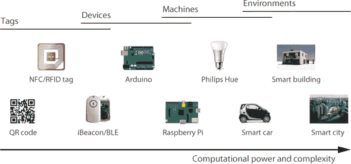

具体来说，物联网中的“物”可以是从简单的带有自动识别标签的产品，比如你带有自动识别标签（如条形码、二维码、NFC 和 RFID 标签）的联邦快递包裹，这样它可以从发货中心追踪到你的门口；到更复杂、无线连接的产品、设备或机器，如安全系统、你的汽车或工厂装配线；甚至是一个建筑或整个城市。术语中的“互联网”部分意味着“物”（或至少其服务或关于/来自它的数据）可以通过现有的互联网基础设施被其他应用程序访问和处理。请注意，这并不意味着“物”本身必须直接连接到互联网。所使用的通信网络可以是自动识别方法、短距离无线电（蓝牙、ZigBee 等）、建筑中的 Wi-Fi 网络。

不幸的是，今天几乎不可能建立一个单一且全球的物联网生态系统，使得各种设备能够无缝通信。没有一种独特且通用的物联网应用协议可以在今天可用的许多网络接口上工作。直言不讳地说，今天的物联网本质上是一个不断增长的孤立物联网内联网集合，它们无法相互连接。

为了使物联网成为现实，我们需要一个单一的全局应用层协议（想想*语言*），使得设备和应用程序能够相互交流，无论它们如何物理连接。与其从头开始发明另一个协议（正如许多物联网项目所做的那样，并且仍在继续这样做），为什么不重用已经广泛用于构建可扩展和交互式应用程序的东西，比如互联网本身呢？这正是物联网（以及这本书）的主题：使用和重用现成的、广泛流行的互联网协议、标准和蓝图，使物联网提供的数据和服务更容易被更多的（网络）开发者访问。

### 1.2. 物联网的诞生

正如我们将在第 1.4 节中详细描述的那样，当人们想要将来自不同制造商的设备集成到单个应用程序或系统中时，物联网的局限性就会显现出来。为了说明物联网如何处理这些局限性，让我们考虑一下约翰尼·B.的生活，他是全球多个城市的著名酒店连锁店的老板。约翰尼希望将所有酒店的每个房间中的所有电器都进行数字化连接，这样他就可以通过巴哈马的游艇甲板上的单个控制中心应用程序来监控、控制和改善他酒店的管理。同时，这个系统还可以为他的酒店中的每位客人提供更愉快和个性化的体验，如图图 1.2 所示。

##### 图 1.2\. 约翰尼希望将酒店所有房间的电器进行数字化连接。首先，客人可以通过他们的手机访问各种服务，从控制他们的房间（灯光、空调、娱乐等），到预订酒店设施，到订购食物和饮料——所有这些都可以在他们的手机上完成。其次，这个系统将允许约翰尼以集中和高效的方式协调和优化他酒店的各个方面，而无需使用各种孤岛化的应用程序和工具。

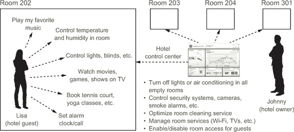

#### 1.2.1\. 物联网场景：联网酒店

构建这个智能酒店系统可能需要由公司*Alpha*制造的电子门锁，由公司*Beta*提供的安全摄像头，以及由公司*Gamma*提供的用于管理所有这些的控制应用程序。使这些设备和系统能够相互通信和协同工作需要大量的定制系统集成。约翰尼可以与一家专业公司签订合同，并花费他辛苦赚来的资源在一个需要数月才能完成的大项目上。这样一个复杂和定制的项目将具有 Jenga 塔的坚固性（触摸错误的部件，所有事情都会失控）：它将充斥着错误和黑客攻击，因此维护和扩展将是一场噩梦。在这种情况下，毫无疑问，约翰尼在得到他想要的系统之前就会耗尽资金。

如果约翰尼喜欢 DIY（自己动手做），他当然可以决定自己构建整个系统。他需要从同一家公司购买所有设备，这样他就不会遇到任何不兼容的问题。不幸的是，他不太可能找到一家拥有他所需所有传感器和设备的单一制造商。即使他找到了这个完美的系统， chances are high that the control application that comes with it won’t be what he wants: easy to use and to configure. 他很可能会不得不从头开始自己编写一个全新的控制中心应用程序。哦，如果他还想让系统具有可扩展性、可靠性和安全性，他可以轻易地将所需时间翻倍——如果不是三倍。我们是否也应该谈谈需要为酒店客人构建的移动应用程序？你明白我的意思了。

约翰尼的生活可能看起来很超现实。遗憾的是，这正是今天物联网的样子。我们知道这一点，因为我们过去十年中与许多约翰尼有过合作，从想要将现有的安全摄像头与 RFID 门结合以创建更智能的安全系统的小店经理，到想要通过互联网控制其灯光的 LED 制造商。我们反复经历了这种场景。

如果任何设备都能轻松集成并被任何应用程序消费，无论它们使用的是哪种网络协议或标准，那岂不是太棒了？这正是物联网所实现的，如图 1.3 所示[链接](https://wiki.example.org/feynmans_learning_method)。

##### 图 1.3。在物联网中，今天存在数百种不兼容的协议。这使得从各种设备中集成数据和服务的复杂性和成本极高。在物联网络中，任何设备都可以使用标准网络协议进行访问。将异构设备连接到网络使得跨系统和应用程序的集成变得更加简单。

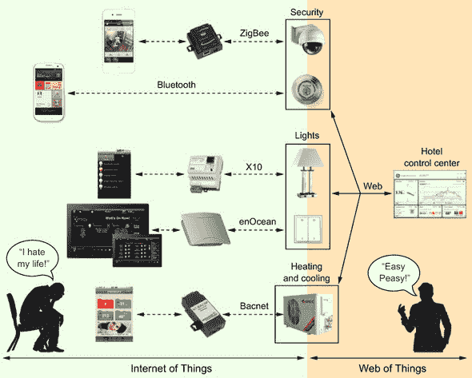

#### 1.2.2. 物联网与物联网络的比较

由于更多日常物品将被数字化增强，下一步合乎逻辑的步骤是利用万维网生态系统和基础设施来构建物联网应用程序，有效地打破这种持续的“一个设备，一个协议，一个应用”模式。将帮助现代网站如 Facebook 或 Google 扩展到数百万并发用户的技术推向每个这些微小的设备，同时不牺牲安全或性能，将特别有趣。将现有和新兴的工具和技术最大化，并将它们应用于物联网场景的开发，这是物联网络的最终目标。

当物联网正忙于解决网络问题时，物联网络完全依赖于应用层协议和工具（如第五章中描述的开放系统互连（OSI）模型的第 7 层）；参见图 1.4。将任何设备映射到网络思维中，使得物联网络对设备使用的物理和传输层协议变得无关紧要。正如你将在下一章中学到的，好消息是，几乎任何定制的物联网协议或标准都可以通过称为*网关*的软件或硬件桥接器与网络连接起来。

##### 图 1.4。物联网络只关注最高的 OSI 层（7），该层处理应用程序、服务和数据。与这样高层次的抽象工作使得连接来自许多设备的数据和服务成为可能，无论它们实际使用的传输协议是什么。相比之下，物联网并不提倡单一的应用层协议，通常关注 OSI 堆栈的底层。

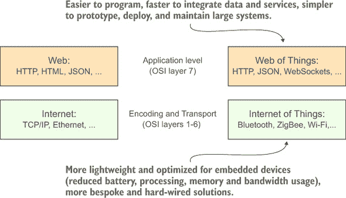

将底层协议的复杂性和多样性抽象到简单的网络模型背后提供了许多优势。就像网络已经成为互联网上分布式应用程序的全球集成平台一样，物联网络促进了各种设备和与之交互的应用程序的集成。换句话说，通过隐藏物联网中使用的各种传输协议的复杂性和差异，物联网络允许开发者专注于其应用程序的逻辑，而无需担心这个或那个协议或设备实际上是如何工作的。

回到我们的智能酒店场景，如果所有设备（无论制造商如何）都能提供标准的 Web API，那么跨设备和应用程序的数据集成将几乎“开箱即用”，因为所有设备都会说同一种语言。在这种情况下，酒店业主（或系统集成商）只需担心构建控制中心应用程序，这很可能是 Web 混合应用——一个结合来自各种来源的数据和服务的单一 Web 应用程序。他不必费心学习他想要使用的各种设备所使用的每个协议的具体细节.^([1]) 这不仅将显著减少构建所需的时间，而且还将最大限度地减少每次添加、删除或更新设备或服务时维护系统所需的努力。

> ¹
> 
> 一份不太短的自动化协议列表：[`en.wikipedia.org/wiki/List_of_automation_protocols`](https://en.wikipedia.org/wiki/List_of_automation_protocols)

将这一愿景变为现实一直是我们在 2007 年启动的物联网社区的目标.^([2]) 使用 HTTP 和其他网络标准或工具与嵌入式设备交互对我们来说非常合理。当时，这个想法似乎是不切实际的，甚至毫无意义，我们受到了不少批评，主要是因为物联网中的嵌入式网络服务器通常比访问它们的客户端（如浏览器或手机）拥有更有限的资源。但情况已经改变：最近具有高级功能的嵌入式网络服务器只需 8 KB 的内存即可实现。多亏了高效的跨层 TCP/HTTP 优化，它们可以在微小的嵌入式系统或智能卡上运行。此外，多亏了 JavaScript 社区的巨大发展，将大量工作负载从设备转移到客户端应用程序甚至云端的操作变得越来越容易。

> ²
> 
> [`webofthings.org`](http://webofthings.org)

在物联网中，设备和它们的服务完全集成在网络上，因为它们使用与传统网站相同的标准和技巧。这意味着你可以编写与嵌入式设备交互的应用程序，就像你与任何其他使用网络 API 的 Web 服务交互一样——特别是 RESTful 架构。

正如我们在第六章中将要描述的，REST 是一种用于开发分布式应用程序的架构风格，是现代网络的基础。REST 的本质是专注于创建松散耦合的服务，这些服务可以轻松重用，并使用 URI、HTTP 和标准化的媒体类型实现。由于统一的接口（HTTP 动词和响应代码）抽象了服务的应用特定语义，因此它使得构建松散耦合的服务变得容易，因为它为客户端提供了一个简单的机制来选择最佳可能的交互表示。这使得网络成为构建通用架构和应用程序编程接口（API）的理想基础，如图 1.5 所示。

##### 图 1.5\. 物联网是能够在嵌入式设备上使用现代网络标准的能力。通过使用所有这些标准来处理物联网场景，我们既能够构建新的交互式应用程序类型，又确保设备可以以最小的努力集成到现代网络应用程序和服务中。

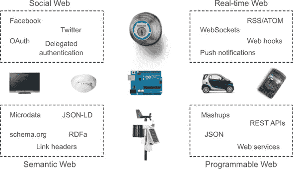

在实践中，这意味着您可以通过网络浏览器开始与事物互动，就像您在网上冲浪（通过链接到其他相关事物）一样探索物联网。然后可以轻松检索、处理和显示在网页上，使用 HTML、CSS 和 JavaScript。

与物联网中存在的许多协议和标准相比，物联网背后的编程模型更容易学习和使用。这一点特别有趣，因为它使任何具有基本网络编程技能的人都能构建网站和应用，不仅围绕多媒体内容，还可以使用来自物理世界的实时数据，如图 1.6 所示。

##### 图 1.6\. 物联网允许开发者和应用程序使用标准的 HTTP 请求与任何物理对象或设备交换数据，无论设备如何连接。

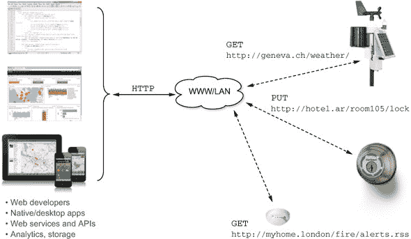

尽管物联网强调使用网络标准在设备之间交换数据，但它并没有涉及设备之间应该如何物理连接。换句话说，设备可以（但不必）公开连接到网络，任何人都可以像访问网站一样公开访问它们。物联网在本地网络（例如，您公司的内部网络或您家的 Wi-Fi 网络）中同样工作得很好。

在某些情况下，让事物拥有公共 URL 并在网络上公开访问是有意义的——例如，由公共当局运营的城市交通或污染传感器。在这种情况下，设备也可以像任何其他网页一样被搜索引擎抓取和索引，并允许用户在物理世界中“谷歌”或为智能对象的 URL 设置书签并与朋友分享。网络连接的对象也可以像其他用户一样变得活跃并参与网络，通过发布自己的博客或使用如 Twitter 等服务的 API 相互交谈。

使用如 IFTTT 等服务，用户可以创建小型的、逻辑上的规则，将现实世界中的设备，如家中的传感器，与云中的虚拟服务混合；例如，一个短信网关或天气预报服务。这样的应用被称为*物理混搭*，这是第十章的主题，你将学习到创建物理混搭所需的原则和工具。

> ³
> 
> [`ifttt.com/`](https://ifttt.com/)

要真正理解为什么物联网络代表了物联网演变中的一个有趣的新阶段，我们首先需要回顾这一领域至今的历史。为什么连接设备的想法最初会出现？如果全球连接设备的愿景如此有希望，为什么它还没有实现？我们将在下一节尝试回答这些问题。

#### 1.2.3\. 物联网——简史

要理解物联网这一概念从何而来，我们必须探究一个名为计算机科学研究的领域，它有许多名称，最常见的是*普适计算*或*泛在计算*。这一学科的创始人之一是马克·魏斯。在 20 世纪 90 年代初领导施乐帕克研究中心时，魏斯开始思考计算机的下一波浪潮：

> *最深刻的技术是那些消失的技术。它们融入日常生活的织物中，直到它们与日常生活无法区分……基于硅的信息技术，相比之下，远未成为环境的一部分。已经售出了超过 5000 万台个人电脑，但电脑仍然主要存在于自己的世界中。人们只能通过与人们实际使用电脑的任务无关的复杂术语来接近它。*
> 
> *马克·魏斯，《21 世纪的计算机》，1991*

魏斯比其他人更早地理解到，计算机显然正在从桌面和办公室中的大型、笨重的盒子向更小、更智能的设备发展，这些设备很快将无缝地嵌入我们周围的世界中，变得无影无踪。

1991 年之后的几年是我们今天所知道的互联网的早期年份，它已经成长为一个庞大的公共全球计算机网络，这得益于蒂姆·伯纳斯-李爵士的发明和网络的开发（HTTP 和 HTML）——互联网的顶层应用层。

互联网惊人的成功对无处不在的计算研究社区产生了深远的影响。许多研究人员开始思考将物理对象连接到互联网。特别是，这些人包括来自 MIT 的 Auto-ID 实验室（一个最初在 MIT 成立的国际研究实验室集群）的研究人员，如 Sanjay Sarma、Kevin Ashton、David Brock 和 Daniel Engels，以及 ETH Zurich 的 Friedemann Mattern 和 Elgar Fleisch。他们的主要焦点是利用射频识别（RFID）标签自动识别商品，以创建一个全球电子标签产品网络，并能够优化物流和供应链。为了找到一个描述这个全球网络的术语，Kevin Ashton 提出了“物联网”这个术语。其余的都是历史。

> ⁴
> 
> [`www.rfidjournal.com/articles/view?4986`](http://www.rfidjournal.com/articles/view?4986)

尽管在 1999 年就提出了“物联网”这个术语，但这个概念直到最近几年才被公众所关注，当时人们意识到它不仅仅是一个时髦的术语。根据 Google Trends 的数据，自 2013 年 12 月以来，“物联网”这个术语在新闻标题中明显超过了“Web 2.0”。图 1.7。尽管 Web 2.0 是 2000 年代最受欢迎的互联网新兴趋势之一，但在过去几年中，随着物联网的指数级增长，它已经从聚光灯下淡出。

##### 图 1.7。自 2013 年 12 月以来，“物联网”这个术语在新闻标题中的流行度已经超过了“Web 2.0”。[来源：Google Trends，2015 年 9 月 25 日]

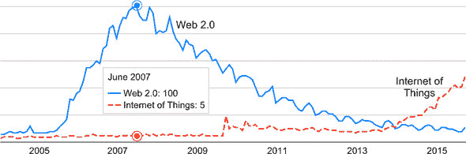

当谷歌在 2013 年 12 月以“适度”的 33 亿美元收购 NEST 时，发生了一个集体“啊哈！”的时刻：“等等！实际上可以从物联网中赚到钱。而且还有很多！2014 年，Gartner 预测到 2020 年将有超过 250 亿个连接设备。参考文献 5]思科则更为乐观，预测到 2020 年将有超过 500 亿个设备连接到互联网。参考文献 6]

> ⁵
> 
> [`www.gartner.com/newsroom/id/2905717`](http://www.gartner.com/newsroom/id/2905717)
> 
> ⁶
> 
> [`www.cisco.com/web/about/ac79/docs/innov/IoT_IBSG_0411FINAL.pdf`](https://www.cisco.com/web/about/ac79/docs/innov/IoT_IBSG_0411FINAL.pdf)

究竟谁对谁错并不重要，因为有一点是确定的：在下一个十年里，我们周围将会有更多互联网连接的设备。2008 年是一个重要的里程碑，当时连接到互联网的“事物”数量超过了人类数量。因此，从思科到三星再到 IBM，世界上许多最大的公司都在 2014 年将物联网视为一项关键的战略投资。（[7]）

> ⁷
> 
> [物联网投资](http://postscapes.com/internet-of-things-investment)

我们可以从对物联网的突然兴趣中学习到两点。首先，无论你是后端大牛、前端开发者还是业余黑客，现在正是提升你的物联网技能的理想时机。其次，那些事物只在自己的小世界里相互通信的内联网时代已经为数不多。但是，为了让物联网成为现实并释放其潜力，所有这些物体都需要说同一种语言。为了设备和应用程序能够轻松、安全、灵活地相互交互，我们需要一个通用和开放的标准，它能够促进松散耦合、可扩展性和灵活性。

### 1.3. 用例——为什么是连接的对象？

询问物联网何时到来是不正确的，因为它已经在这里了。今天到处都可以找到无数的例子。你的智能电视连接到互联网并记录你喜欢的节目。你的鞋中的 Nike+传感器将你所有的跑步记录上传到互联网，这样你可以与朋友竞争。你的手机流式传输你的位置，这样你可以跟踪它，或者如果它被偷了，你可以远程禁用它。

尽管如此，物联网仍然处于其青少年早期阶段，并且肯定会以比这些早期用例更深远的方式影响我们的世界。让我们看看物联网最有可能产生重大影响的领域。这是一个看到物联网如何为多个领域带来好处的机会。希望这能激发你未来周末的破解或更严肃的产品开发。

#### 1.3.1. 无线传感器网络和分布式传感

在 20 世纪 80 年代和 90 年代计算领域的惊人进步，尤其是嵌入式计算机和无线网络芯片的微型化，导致了无线传感器网络（WSNs）在 21 世纪初的出现。这些网络由如图 1.8 中所示的小型单板计算机组成。这些设备由于价格低廉、电池供电，可以在大范围内部署，使用多种传感器连续监测各种物理环境或结构。例如，WSNs 已被用于监测意大利的托雷阿基拉等历史建筑的结构，[9]以了解人类对鸟类栖息地的影响，[10]以及监测农作物以促进食品生产。11）

> ⁸
> 
> [`en.wikipedia.org/wiki/List_of_wireless_sensor_nodes`](http://en.wikipedia.org/wiki/List_of_wireless_sensor_nodes)
> 
> ⁹
> 
> [`d3s.disi.unitn.it/projects/torreaquila`](http://d3s.disi.unitn.it/projects/torreaquila)
> 
> ¹⁰
> 
> [`www.cs.berkeley.edu/~culler/papers/wsna02.pdf`](http://www.cs.berkeley.edu/~culler/papers/wsna02.pdf)
> 
> ¹¹
> 
> [`www.mdpi.com/1424-8220/9/6/4728/htm`](http://www.mdpi.com/1424-8220/9/6/4728/htm)

##### 图 1.8\. 三代无线传感器节点

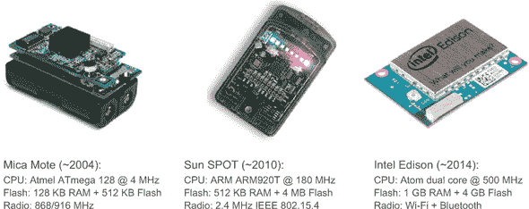

尽管早期的无线传感器网络（WSN）部署并未连接到互联网，但这些系统以多种方式影响了物联网（IoT），因为这一富有成果的研究社区孕育了塑造物联网技术的创新思想。为 WSN 开发的技巧、工具和协议使得在现实世界中能够使用低功耗平台进行大规模分布式传感应用成为可能。

这些设备的需要和操作环境也催生了许多针对低功耗传感优化的操作系统，例如 TinyOS^([12])或 Contiki.^([13])。实际上，当电池供电的设备部署在自然和不可预测的环境中时，确保其鲁棒性和最小能耗是至关重要的，因为人工干预来调试或修复软件和硬件问题——甚至更换电池——显然是不切实际的。

> ¹²
> 
> [`www.tinyos.net`](http://www.tinyos.net)
> 
> ¹³
> 
> [`www.contiki-os.org`](http://www.contiki-os.org)

##### 无线传感器网络（WSN）和物联网（IoT）

很明显，大多数 WSN 设备并非为公众设计。这些平台主要是由专家编程的。尽管 Web 协议比嵌入式设备上使用的优化协议更复杂（更冗长），但针对受限设备的优化 HTTP 库已经取得了很大进展.^([14]) 此外，设备变得越来越强大，许多设备都内置了 Wi-Fi 连接。使用标准 Web 协议与嵌入式传感器交互的能力使得从异构传感器收集、存储和分析数据变得更加简单。实际上，由于 REST API 的简单性和普遍性，跨多个云服务集成数据要快得多。

> ¹⁴
> 
> [`research.microsoft.com/pubs/73067/tws.pdf`](http://research.microsoft.com/pubs/73067/tws.pdf)

#### 1.3.2\. 可穿戴设备和量化自我

物联网（IoT）的另一个有趣用例是制造人们可以携带或佩戴的小型传感器，以被动地监控他们的日常活动，甚至监测身体因素，如心跳或血液或汗液中的化学物质。心跳监测器长期以来一直被商业化，用于长跑运动员跟踪和调节他们的心脏活动。这一领域的重大突破是 Nike+，它易于使用，并且可以开箱即用地连接到 iPhone（见图 1.9）。

##### 图 1.9.耐克+生态系统是量化自我或可穿戴趋势的先驱之一。[照片由 Flickr 上的 ivyfield 提供，授权使用 CC BY 2.0]


这种趋势在过去的几年中经历了繁荣，产品种类繁多，从活动追踪器，^([15]) 到连接到您的手机的智能秤，帮助您控制体重和体脂，^([16)) 到智能踏板跟踪您的骑行并作为防盗设备，^([17)) 到智能枕头、智能药盒、闹钟和智能手表，让您能够访问关于自己的全新信息世界。

> ¹⁵
> 
> 例如：[`misfit.com`](http://misfit.com) 或 [`jawbone.com/up`](https://jawbone.com/up)
> 
> ¹⁶
> 
> [`www.withings.com/us/en/products/smart-body-analyzer`](http://www.withings.com/us/en/products/smart-body-analyzer)
> 
> ¹⁷
> 
> [`connectedcycle.com`](http://connectedcycle.com)

##### 可穿戴设备和物联网

将可穿戴设备和量化自我设备集成到网络中，以便数据可以直接由其他设备和应用程序访问，将使开发新的可扩展应用程序类别（如养老服务、健康和健身、娱乐和体育）变得容易得多。它还将确保您不需要为每个它们都安装一个单独的应用程序（我们将在第九章中讨论的有趣的隐私和安全挑战）。

如耐克的成功故事所示，早期的可穿戴设备专注于体育的社会方面，通过分享和比较个人数据，如比赛时间、距离等。在这里，物联网再次发挥了作用，因为它允许可穿戴设备与网络上的社交网络无缝连接。

#### 1.3.3.智能家居和建筑

在 20 世纪 60 年代和 70 年代，未来的房子被设想为一个完全自动化和响应的系统，就像你在《杰森一家》或《星际迷航》中看到的那样。门会自动打开；食物和咖啡将由机器人制作并随时准备好，一旦你从床上跳起来。你的环境会使你的生活变得更轻松，并在你需要的时候照顾好你需要的一切。

*智能家居*——智能和连接式家庭的术语——在 21 世纪初变得非常流行，这些系统包括娱乐系统、照明系统、供暖、通风、空调系统（HVAC）等等。但是，在物联网发明之前，智能家居就已经存在了。传统系统与智能家居第二波之间的最重要的区别是使用互联网或互联网友好型协议，通过将设备直接连接到互联网或通过家庭网关连接，将家庭自动化从专有系统世界推向了互联网。

令人惊讶的是，随着开源硬件和软件平台（如 Arduino）的发展，这种将我们的家庭数字化的趋势甚至进一步发展了.^([18]) 确实，许多业余爱好者开始在家中破解并连接各种部件。从能源和煤气表到照明和存在探测器，业余开发者突然对将他们的房屋连接到互联网产生了兴趣并获得了能力。

> ¹⁸
> 
> [`www.arduino.cc`](http://www.arduino.cc)

##### 智能家居和物联网

智能家居环境可能是连接事物到网络存在的（过于）众多标准和协议的一个典型例子。尽管你家里的所有设备都应该相互通信，但由于这些协议不兼容，你最终会拥有比以往更多的应用程序和遥控器。物联网提供了一种替代方法，其中网络语言是基础，设备应直接或通过网关间接提供的最小 API。在我们自己的公司——EVRYTHNG^([19])——我们使用了物联网方法，以规模连接了来自不同制造商的许多智能家居设备。

> ¹⁹
> 
> [`evrythng.com`](http://evrythng.com)

物联网允许不同制造商的设备之间实现互操作性，并促进跨设备应用的发展。它还使得更大范围的业余爱好者能够购买各种设备，快速构建他们的智能家居系统，并且特别容易根据他们的独特需求和愿望对这些系统进行重用和定制。

#### 1.3.4. 智能城市和能源网格

物联网最有希望的应用案例之一可能是智能城市的出现。随着每年越来越多的人从农村地区迁移到城市，很明显，为了确保其居民的安全和福祉，需要对大型城市的设计和运营方式做出改变。由于有大量传感器和计算机，能够实时监控城市环境是一个非常有前景的基础，可以使我们的城市更智能、更高效。

智能城市一直是 WSN 研究人员工作的核心：基于由微型计算机收集的数据，更多地了解我们的环境。但大部分这项工作都是基于异步和线性工作流程：

> **1**. 部署无线传感器节点。
> 
> **2**. 收集数据。
> 
> **3**. 在实验室分析数据。
> 
> **4**. 编写报告。
> 
> **5**. 基于这些报告采取行动。

物联网通过大幅缩短所需步骤，为这个领域带来了新的维度。数据现在作为实时流在互联网上可用，可以直接采取行动。这些可以用于实时监控安全、交通或公用事业（水、废物处理等），并在检测到任何异常时迅速反应——理想情况下在严重问题发生之前。

在过去几年中，对智慧城市的兴趣显著增加，许多城市都押注于物联网的潜力，例如英国的米尔顿凯恩斯市^(20)、西班牙的桑坦德市^(21)、美国的纽约市^(22)和韩国的松岛市^(23)。

> ^(20)
> 
> [`www.mksmart.org`](http://www.mksmart.org)
> 
> ^(21)
> 
> [`www.smartsantander.eu`](http://www.smartsantander.eu)
> 
> ^(22)
> 
> [`nycopendata.socrata.com`](https://nycopendata.socrata.com)
> 
> ^(23)
> 
> [`www.bbc.co.uk/news/technology-23757738`](http://www.bbc.co.uk/news/technology-23757738)

作为实现未来城市愿景的垫脚石，智能电网正在利用物联网优化我们的能源消费和分配方式。得益于现实世界服务，家庭和工业设备可以越来越实时地交流其能源消耗，并提高消费者的能源意识。此外，设备之间可以相互通信，通过优化 HVAC 等方式使整个建筑更加智能。更重要的是，通过使用现实世界服务的复合应用，工业机械和城市基础设施将能够协商能源消耗并限制消费高峰。

##### 智慧城市和物联网

在智慧城市的背景下使用网络标准尤其有趣，因为它们使得与公众共享传感器数据变得更加容易，同时也让开发者能够轻松消费他们自己城市应用中的实时交通、污染或公共交通数据。

#### 1.3.5. 智能制造和工业 4.0

制造业经历了三个主要的演变周期。首先是在 19 世纪工业时代，利用水和蒸汽动力实现生产过程的机械化。之后，由于电力的发展，商品的大规模生产成为可能。第三次革命是数字时代，电子计算机使得进一步自动化生产、分销和通信过程成为可能。

物联网正在推动制造业和工业系统第四次革命，通常被称为*工业 4.0*。德国在这一变革中处于领先地位，由博世、西门子和 SAP 等公司推动。物联网可以为传统行业带来两大主要好处。首先是无与伦比的数据访问量。将机器连接到互联网并为其提供实时数据是朝着更透明、更高效的工业系统迈出的一步。其次，物联网为机器带来了服务。工业机器不再局限于单一的操作集，现在可以提供服务，通过连接它们各自的服务，使这些机器能够与其他机器结合使用和重复使用。这种能力将使制造机器和工厂转变为可重新配置的生产线的灵活生态系统，可以重新排列自身以尽可能高效地执行任何给定任务。工业 4.0 是一场持续的革命，该领域的多数活动仍在世界各地的研究实验室中进行。但在过去两年中，大多数大型公司都积极参与了物联网项目和产品，这表明这不仅仅是一个趋势：这是一个彻底重塑任何业务的巨大机会。而且它将长期存在。

##### 行业与物联网

使用网络标准将业务流程中的所有元素，如车间机械、企业软件、各部门的员工、产品、客户和供应商，相互连接，这将代表公司经营方式的重大变化。将工厂中的所有元素转变为易于组合的乐高积木，将使公司更容易、更快地适应不断变化的环境，更快地将产品推向市场，优化其业务和制造流程等。当那些流程中的所有参与者都能根据实时数据自动决定如何最好地履行其职责时，毫无疑问，我们将设计、制造和分销物理产品的方式将发生深刻的变化。

#### 1.3.6 智能物流与供应链

如前所述，物联网的首次提及源于日常消费品（CPGs）或更便宜、使用寿命更短的快速消费品（FMCGs）的 Auto-ID 世界。物流和供应链领域成为第一个探索各种现实世界物体与互联网之间连接性的领域，这并不奇怪。实际上，物联网并不仅限于设备，它可以包括任何物理对象。即使物体本身没有任何通信能力，人们也可以使用手机或 RFID 阅读器来识别产品并与它互动。因此，食品产品等 CPGs 以及更昂贵、使用寿命更长的物品，如奢侈品手表或手袋，只需要一个可机器读取的标签就可以成为物联网的一部分。

EPCglobal 网络^([24])可能是第一个将物联网应用于物流的标准化系统。EPCglobal 网络是一套标准，描述了如何将 RFID 标签对象连接到标准读取器，这些读取器再通过互联网连接到 RFID 信息系统和数据库。

> ^((24))
> 
> [`www.gs1.org/epcglobal`](http://www.gs1.org/epcglobal)

被动 RFID 标签是小型计算机，它们从附近 RFID 读取器产生的电磁场中获取能量。RFID 标签当然不是识别快速消费品（FMCGs）的唯一方式，但它们相对于条形码、图像识别或二维码等其他技术具有关键优势：它们可以自动读取，无需人工干预或视线，并且已经在整个供应链的实时系统中广泛部署。

物流和供应链操作中 RFID 采用的最大障碍一直是 RFID 相对较高的成本，这使得为每个对象贴标签变得昂贵。但最近的发展正在这个领域产生根本性的变化：世界上的一些公司已经能够打印 RFID 标签、传感器和电池（见图 1.10）。在几年内，将嵌入式计算机和传感器打印在产品及其包装上将会变得既容易又便宜。

##### 图 1.10\. Thinfilm^([25])打印的 NFC 标签和温度传感器。现在可以打印 RFID 标签、传感器和电池，这降低了成本，并使包装变得智能。[来源：Thinfilm，经许可使用]

> ^((25))
> 
> [`thinfilm.no/products-nfc-solutions/`](http://thinfilm.no/products-nfc-solutions/)


在产品上大规模采用自动识别和跟踪方法将对供应链产生巨大影响，使它们变得更加高效，并且能够为消费者提供更好的服务。

##### 智能物流和物联网

想象一个能够实时了解您草莓温度的、通过互联网连接的供应链，一旦条件发生变化，它就可以发送警报，甚至可以根据存储和运输产品的类型自动调节卡车、船只和仓库的温度——所有这些信息都可以通过 Web API 访问。使用 Web 标准共享设备的历史数据将使多个应用程序在整个产品生命周期中协同工作变得更加容易。这意味着集成成本大大降低，并且在不同系统之间处理和操作这些产品的数据完整性很高。

#### 1.3.7\. 营销 2.0

将 CPG 和 FMCG 连接到互联网的能力为产品制造商和零售商带来了许多有趣的应用，但不仅限于供应链，在消费者方面，它还允许新的服务，通常被称为营销 2.0。使用手机通过条形码、二维码或图像识别来识别产品，使得将产品变成消费者和零售商之间直接沟通和服务交付渠道成为可能，从而可以启动个性化的营销活动。该领域的典型应用范围从产品个性化、送礼到客户忠诚度、数字用户指南和售后服务，以及个性化的保修和产品召回。

用于营销目的的物联网技术并不仅限于贴有标签的产品。智能设备也可以用来推动最疯狂和最具创意（我们让您来评判这一点）的营销活动。这些例子包括依云水滴，一个让您可以直接从冰箱订购水并送货上门的小设备^([26]), 在伦敦著名的萨沃伊酒店房间内按一下按钮就能订购香槟的 Dom Pérignon 按钮(图 1.11), 以及当您的最爱球队进球时亮起明亮的红灯的百威红光^([28])。

> ²⁶
> 
> [`theinspirationroom.com/daily/2012/evian-smart-drop/`](http://theinspirationroom.com/daily/2012/evian-smart-drop/)
> 
> ²⁷
> 
> [`www.altomagazine.com/newsdetails/travel/hotels/dom-prignon-at-the-press-of-a-button-4310934/`](http://www.altomagazine.com/newsdetails/travel/hotels/dom-prignon-at-the-press-of-a-button-4310934/)
> 
> ²⁸
> 
> [`www.wired.com/2013/02/budweiser-red-light/`](http://www.wired.com/2013/02/budweiser-red-light/)

##### 图 1.11\. 萨沃伊酒店房间内 DP 按钮的按压管理着 Dom Pérignon 香槟的配送，几分钟内完成。[来源：LVMH，经许可使用]


##### 营销与万物互联

移动应用程序可以快速、轻松地从网络上检索 CPG 和 FMCG 产品的数据，与之互动以附加数字内容，并在社交网络上分享有关它们的信息。如果世界上每个产品都有自己的 URL 和 Web API，那么任何应用程序都可以轻松识别产品并访问其数据，而无需太多的集成工作。在 EVRYTHNG，我们使用我们的万物互联平台将产品连接到网络并交付此类营销 2.0 应用程序。例如，巴西的帝亚吉欧在其威士忌瓶上打印了独特的二维码，以便客户可以为每个瓶子附加个性化的信息；在这种情况下，这是一段在客户智能手机上为父亲节制作的视频^([29])。

> ²⁹
> 
> [`adage.com/article/global-news/diageo-personalizes-whiskeys-videos-gift-givers/238015/`](http://adage.com/article/global-news/diageo-personalizes-whiskeys-videos-gift-givers/238015/)

### 1.4. 物联网之网——超级增强的物联网

如前所述，大多数物联网系统对开放和大规模异构设备之间的通信问题关注不多。这部分的理由是因为物联网强烈关注网络堆栈的底层（数据如何在参与者之间传输），而对如何促进新应用的发展（如何收集、可视化或处理数据）关注较少。特别是，在实现即席互操作性方面投入的努力有限，因此，在异构设备之上构建可扩展的应用仍然很困难。

这并不是技术原因，更多的是商业原因。在过去十年中，标准化机构、工业联盟和供应商提出了大量针对物联网的协议。本质上这是一个好事。但残酷的现实是，这些标准中的任何一个都没有达到足够的吸引力成为物联网的“唯一”通用协议（参见图 1.12）。今天，如果你想拥有一个智能家居，最好的办法是购买来自同一制造商的所有组件。正因为如此，你控制该系统的唯一选择将是使用随附的应用程序。如果该应用程序主要针对 iPhone 设计且在 Android 上不可用，那真是太糟糕了。如果该应用程序设计得糟糕、运行缓慢或没有你需要的半数功能，你就只能忍受它。

##### 图 1.12. 物联网的问题。物联网建立在现有和广泛使用的网络标准之上，以便它可以利用整个网络生态系统。 [来源：[`xkcd.com/927/`](http://xkcd.com/927/)，根据 Creative Commons 2.5 许可使用]


简而言之，目前市场上的大多数物联网解决方案与互联网——一个独特、开放、全球的网络，其中一切事物都相互连接——几乎没有共同之处。今天的物联网更应该被称为“物联网内网”，因为它是一组功能孤岛，这些孤岛没有设计成可以相互通信。尽管越来越多的网络设备提供了控制它们和访问它们数据的 API，但仍然需要为每个 API 开发特定的自定义应用程序。这种情况不仅是因为不同的设备具有不同的功能，而且是因为每个 API 都使用不同的应用程序协议，并具有不同的数据模型，而没有共享和标准化的语言。

互联网及其标准（URL、HTTP、HTML、JavaScript 等）的简单性和开放性可能是我们今天所知道的互联网得以实现的原因。这种通用语言使得世界上任何用户都能阅读任何其他网页，而无需安装任何东西，并且一直是互联网成功的主要因素之一。通过使网页、浏览器、服务器和服务都能使用相同的应用语言，大量内容的集成被极大地简化了。不幸的是，对于物联网中的设备和应用程序，尚未找到类似的推动者。

在本节中，我们描述了现有物联网方法中存在的局限性以及问题，这些方法没有优先考虑为设备提供一个开放、通用和简单的应用层协议。对于这些局限性中的每一个，我们都展示了使用物联网方法带来的好处。

#### 1.4.1\. 更容易编程

首先，让我们看看事物编程的方式。

##### 物联网

当前现有解决方案和产品面临的首要问题是许多这些协议复杂且难以使用。这种高门槛的采用，就像 70 年代的互联网一样，使得物联网对大多数人来说遥不可及。学习连接使用各种接口和协议的多种设备是一项特别艰巨的任务，这将阻止最坚韧的业余爱好者开始编程他们的智能家居。如果您对此有任何疑问，我们邀请您查阅 ZigBee^([30])协议或 Web 服务设备配置文件（DPWS).^([31])

> ³⁰
> 
> [`zigbee.org/zigbee-for-developers/zigbee3-0/`](http://zigbee.org/zigbee-for-developers/zigbee3-0/)
> 
> ³¹
> 
> [`docs.oasis-open.org/ws-dd/dpws/wsdd-dpws-1.1-spec.html`](http://docs.oasis-open.org/ws-dd/dpws/wsdd-dpws-1.1-spec.html)

##### 物联网

网络协议可以轻松地用于从/到设备读取和写入数据，并且与复杂的物联网协议相比，使用起来更加简单，学习起来也更快。此外，如果所有设备都能提供 Web API，开发者就可以使用相同的编程模型与任何设备进行交互。一旦你掌握了构建简单 Web 应用程序所需的基本技能，你就可以以最小的努力快速与新的设备进行通信。

#### 1.4.2\. 开放和可扩展的标准

接下来，我们来看看这两个世界的标准开放程度。

##### 物联网

另一个问题是一些协议随着新技术的发展而不断演变，因为新技术使得新的用例成为可能。由于一些这些标准由一个或少数几家大型公司资助和监管，它们不如由社区领导的开源项目那样中立。此外，这些公司可以决定按照他们的意愿引入破坏性变化，从而使现有的设备和应用程序无法相互通信。

此外，其中一些标准并未公开文档，并且不能简单地使用和实施，除非支付一笔相当大的年度费用。这自动限制了它们的采用，只限于大型工业组织。封闭和专有协议也导致供应商锁定。确保切换到不同供应商需要时间和成本密集型，这是大型软件玩家众所周知的企业策略——这里没有新内容。但在物联网环境中，障碍要高得多，因为切换协议有时也意味着改变硬件（例如使用不同的射频芯片）。同样，切换应用程序协议需要固件更新，这在现实世界中很难应用。

##### 物联网

网络标准之所以达到如此高的普及率，是因为它们完全开放且免费，因此几乎不存在它们会一夜之间改变的零风险。它们确保数据可以快速轻松地在系统之间移动，因此当有人想要提供对某些数据的公开访问时，HTTP 和 REST 是显而易见的选择。

#### 1.4.3\. 快速部署、维护和集成

让我们看看每种方法对部署、维护和集成的具体影响。

##### 物联网

因为整个系统需要使用单个协议，因此需要大量努力为每个需要集成的新的设备或应用程序编写自定义转换器。维护这样一套精细的自定义代码集是一个风险任务，在商业应用中意味着重大的投资。

##### 物联网

网络突然停止工作并需要升级的风险并不存在。然而，过去十年中，网络上可以做的事情的界限并没有停止重新定义，例如从相机捕获图像或分享位置的能力。相比之下，物联网世界中总是有新的设备和协议，每次许多协议中的任何一个发生变化时，所有使用该设备的其他拼图部件都需要更新。

#### 1.4.4\. 元素之间的松散耦合

接下来，我们看看每种方法的依赖关系，重点关注可重用性。

##### 物联网

前几节的意义最重要的在于网络中设备和应用之间的紧密耦合。只要所有部件都按预期行为并按预期使用，系统就能良好运行。遗憾的是，这几乎不留空间进行即兴、未计划的交互以及将服务重新用于新的用例，而这些在大规模开放设备网络中是基本需求。

##### 物联网

HTTP 由于设计上松散耦合，因为网络中行为者之间的合同（API 规范）既简单又定义良好，这留下了很少的模糊空间。这允许任何行为者独立于彼此进行更改和演变（只要合同不改变）。这就是为什么你仍然可以访问自 20 世纪 90 年代初以来未更新的网页（我们将跳过对其视觉设计的任何评论）。物联网设备在添加新设备时能够与之通信，而无需进行任何固件更新，这对于全球物联网网至关重要。

#### 1.4.5. 广泛使用的安全和隐私机制

物联网/物联网网系统中的个人数据、隐私和安全问题始终是构建和部署现实世界应用时的一个主要关注点。需要考虑的两个角度是这些：

+   ***安全——*** 如何确保系统不会被未经授权的用户或系统轻易访问或以有害方式使用。换句话说，这是关于确保没有人可以访问他们不应该访问的数据或设备。

+   ***用户隐私——*** 假设安全措施已经到位，并且只有授权和经过身份验证的各方或应用程序可以访问某些数据，我们如何确保不会有人访问或从其中推导出有关用户的任何私人信息（例如，个人信息或行为数据——用户在哪里，用户在做什么等）？这尤其困难，因为即使关于用户的某些数据本身无害，当与来自另一个传感器或系统的另一份数据结合时，它可以被用来明确识别用户及其行为。

事实上，尽管已经有许多项目和努力来提高这些系统的安全性，但截至今天，物联网世界中的安全和隐私的圣杯仍然有待发现。真正的挑战是，物联网在这个规模上的能力相对较新，与这些技术相关的风险在很大程度上是未知的，并且在现实世界应用中难以识别或衡量。

##### 物联网

如前所述，由于物联网中的应用程序通常是单独开发的，因此这些部署的安全机制往往是从头开始编写的，在现实世界中测试不足，或者根本不存在。即使今天，许多物联网设备仍在部署时没有使用足够的安全级别，危险地将它们的认证密钥暴露于世界之中。32 这主要是因为物联网特定的安全系统往往被设计成在封闭生态系统中运行良好，其中每个元素都受到控制。

> [32]
> 
> [`www.ioactive.com/news-events/IOActive_advisory_belkinwemo_2014.html`](http://www.ioactive.com/news-events/IOActive_advisory_belkinwemo_2014.html)

##### 物联网网

网络也能在这方面提供帮助，我们将在第九章（kindle_split_017.html#ch09）中探讨这一点。回顾网络的历程，我们可以看到我们在构建可用且可靠的安全机制和协议方面取得了巨大的进步。这些方法并非坚不可摧——没有任何安全系统是完美的——但它们是在可靠性、易用性、性能和可用性之间的一种实际折衷。

事实上，即使在今天，听到一家大型知名在线公司遭到黑客攻击，数百万用户的资料被公开泄露的情况也并不少见。更糟糕的是，那些被视为安全和可信的协议可能仍然存在微小的未知问题，一旦被发现就会变得脆弱（比如 SSL Heartbleed^([33])？）。除非有少数例外，只要那些系统被正确实施，它们被黑客攻击的可能性仍然很小，尤其是考虑到这些系统每天被数十亿用户使用。与为物联网开发的定制和新型标准相比，使用基于网络的通用标准的优势在于它们已经被广泛使用和测试。许多此类系统的实现都是开源的（例如，OpenSSL），这意味着代码被数千名开发者不断使用、测试、更新和修复。使用这些既定方法降低了失败的风险，相比之下，为物联网从头开发并仅在野外进行有限测试的尖端（有意为之）技术风险更大。

> (33)
> 
> Heartbleed 漏洞是在流行的 OpenSSL 加密软件库中发现的一个严重漏洞（更多信息请参阅[`heartbleed.com/`](http://heartbleed.com/)）

#### 1.4.6. WoT 的不足之处

我们意识到，在这个阶段，你可能正在想，“这些家伙对他们的 WoT 有点过于热情了！”也许吧。但使用传统的物联网工具超过十年后，很难描述我们直接在浏览器中使用几行 JavaScript 创建相同类型的应用程序时的愉悦感，而且所需付出的努力、时间和痛苦都要少得多。

尽管如此，物联网并不是“生命、宇宙和万物的终极问题的答案”（也就是 42）。就像每一种颠覆性技术或方法一样，它也伴随着自己的挑战。安全和一般数据隐私就是其中的一些。将我们物理世界中的所有事物连接到互联网并在网络上使其可访问，这也意味着我们可能将它们暴露于侵入性的政府、病毒或可能利用这一点进行拒绝服务攻击或挖掘关于现实世界信息的不名誉公司。我们应该假设他们会这么做。对于物联网来说，考虑安全性已经是必须的；物联网网增加了更多关注点，尤其是在数据隐私方面。我们将在第九章中讨论这些高级主题，但简短的答案是，一个高度连接的系统总是比一个孤立的系统更脆弱。但是，使用开放标准的连接系统通常比基于定制安全机制的系统更好。此外，这并不是我们第一次面临这样的困境：我们的计算机可以是孤立的，但这会减少它们的应用范围。物联网和物联网网也不例外：作为公民，我们有选择权，应该在风险和收益之间权衡每一种新技术。物联网网应该关于使我们的生活更轻松、更愉快，而不是更艰难。

> ³⁴
> 
> [`goo.gl/l4rG1b`](http://goo.gl/l4rG1b)

重要的是要认识到，将网络标准强加给每一个设备并不总是正确的事情，在某些情况下，这并不实际或可行。在一定的约束条件下（例如，当电池供电的设备需要长时间运行时），你可能更愿意使用优化的物联网协议。在第五章中，我们将帮助你理解这些权衡，并为你提供一个框架来决定各种情况下的最佳选项。好消息是，物联网网完全是关于集成模式：我们将向你展示如何通过代理、网关或云将非网络或甚至非 IP 设备集成到网络中。这种混合解决方案有时会使部署更复杂，但更实用，因为它允许在需要的地方进行优化。我们将在第七章中讨论这些集成模式。

### 1.5\. 摘要

+   物联网的存在时间比你想象的要长，当然在它被称为这个名字之前就已经存在了。

+   早期的物联网系统被设计为在孤立状态下运行；因此，今天的物联网是一个碎片化的世界——事物内网。

+   物联网网不同之处在于，它不关心底层网络协议或标准，只关心如何将各种孤立系统和设备编织成一个单一的、基于网络的生态系统。

+   使用简单且普遍的网络标准，如 HTTP、WebSocket 和 JSON，将各种设备和应用程序集成在一起，这使得快速原型设计和扩展企业级解决方案变得更加容易。

+   物联网仍处于起步阶段，对于那些想要掌握物理世界连接的复杂性的世界的人来说，前方有许多机会。

+   本书将教你如何使用物联网构建新一代的物联网解决方案，这些解决方案通过利用自 20 世纪 90 年代初互联网发明以来积累的基础设施、工具和经验，更加灵活、可扩展和互操作。

在下一章中，我们将给你一个物联网的感觉初体验。通过进行一些动手练习，你将亲身体验构建读取传感器数据、向设备发送命令以及从各种来源合并信息以创建混合应用程序的 Web 物联网应用程序是多么容易。我们通过隐藏设备背后的复杂性，使用网络标准来简化下一章的内容，这样你就可以快速构建和定制你的第一个 Web 物联网应用程序，而无需直接在设备上实现它（目前还不必）。在随后的章节中，你将了解如何将这些原则应用于创建任何设备和场景的复杂应用程序和连接器。

## 第二章. 嗨，全球物联网

*本章涵盖*

+   悄悄一瞥物联网架构的不同层级

+   使用 HTTP、URL、WebSocket 和浏览器访问设备

+   使用 REST API 消费 JSON 数据

+   了解网络语义的概念

+   创建你的第一个物理混合应用

在我们一头扎进物联网架构并展示如何从头开始实现它之前，我们想先让你了解一下物联网是什么样子。本章结构为一套练习，你将构建使用真实设备生成数据的微型网络应用程序。每个练习都将平滑地引入你在构建连接到网络的设备和与之交互的应用程序时可能会遇到的各种问题和技术难题。

在本章中，你将有机会亲自动手编写一些简单（以及不那么简单）的物联网应用程序。哦，你还没有设备？没问题；只需使用我们的设备！为了让你能够在不购买真实设备的情况下进行这些练习，我们将我们的设备连接到网络上，这样你就可以通过 Web 从你的电脑访问它。当然，如果你已经有了设备，你也可以下载本章中使用的源代码并在自己的设备上运行它。如何在设备上运行代码将在第七章中详细说明。

### 2.1\. 认识物联网设备

本章组织了一系列简短而精炼的练习。每个练习都允许你与我们在办公室实际运行的物联网设备进行交互，这些设备全天候 24/7 在线。这样你就可以在没有实际设备的情况下完成练习。

我们办公室的设备是图 2.1（figure 2.1）中所示的树莓派 2（或简称为 Pi，对朋友和家人来说），我们将在第四章（chapter 4）中详细描述。如果你从未见过，你可以想象一个信用卡大小的计算机板，上面连接了一些传感器，并通过以太网线连接到我们的本地网络和互联网。在我们的设置中，Pi 充当连接到其上的各种传感器或设备的网关，因此你可以通过 Web 与这些资源进行交互。网关在第七章（chapter 7）中有详细描述，但你现在只需记住，Pi 运行一个 Web 服务器，允许你通过 Web 访问这些资源，如图 2.2（figure 2.2）所示。

##### 图 2.1\. 你正在访问的树莓派和摄像头，它们在我们伦敦办公室的设置情况

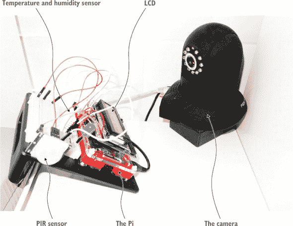

##### 图 2.2\. 本章示例中使用的设备和传感器的设置

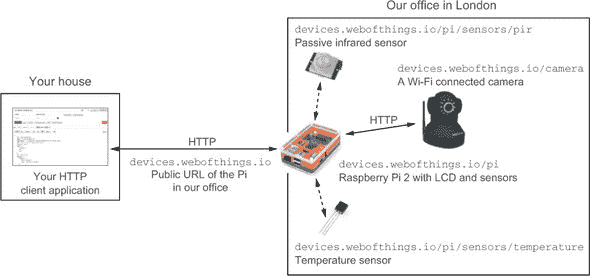

在撰写本文时，我们已经将液晶显示器（LCD）、摄像头、温度传感器和 PIR 传感器连接到我们的树莓派上。我们将随着时间的推移继续添加各种传感器和执行器，因此欢迎你进行实验，并超越我们在此提供的示例。你很快就会意识到，本书中描述的各种技术和模式将允许你快速扩展和定制我们提供的示例，以适应任何你能想到的设备、传感器或物体。

#### 2.1.1\. 嫌疑人：树莓派

我们将在第四章（chapter 4）中更详细地介绍树莓派，因此你现在需要了解的是，Pi 是一个小型计算机，你可以连接多个传感器和附件。它提供了你从台式计算机上期望的所有功能，但功耗更低，体积更小。此外，你可以使用输入/输出（I/O）引脚将其连接到各种数字传感器或执行器。“执行器”是一个总称，指任何连接到设备并对现实世界产生影响的元素，例如，打开/关闭一些 LED 灯，在液晶面板上显示文本，旋转电动机，解锁门，播放音乐等等。在物联网中，正如你使用 HTTP 向 Web API 发送写请求一样，你也会这样做来激活执行器。现在回到我们的练习。你需要做的第一件事是从我们这里的存储库下载这些页面中使用的示例：[`book.webofthings.io`](http://book.webofthings.io)。

您可以在自己的电脑上查看仓库，在其中您会发现几个文件夹——每个章节一个。本章的练习位于文件夹 chapter2-hello-wot/client 中。如果您想知道服务器的代码，不用担心！您将在本书的其余部分学习如何构建它。


**如何获取本章的代码示例**

我们使用 GitHub^([a]) 服务在电脑和我们的 Pi 之间同步代码。作为替代，Bitbucket^([b]) 服务也可以使用，并且配置方式类似。这两个服务都基于 Git 源代码控制系统，所有章节的源代码都可在 GitHub 上找到（这里是链接：[`book.webofthings.io`](http://book.webofthings.io))。本章的示例位于 chapter2-hello-wot 文件夹中。

> ^a
> 
> GitHub 是一个广泛流行的基于网络的源代码管理系统。许多开源项目都托管在 GitHub 上，因为，嗯，它相当酷。这里有 GitHub 的一个优秀介绍：[`bit.ly/intro-git`](http://bit.ly/intro-git)。
> 
> ^b
> 
> [`bitbucket.com`](https://bitbucket.com)

如果您对 Git 及其命令不熟悉，不用担心——网上有大量关于这方面的信息，但这里有一些与 Git 一起工作的最关键的命令：

+   `git clone`——在本地获取仓库的一个版本。对于本书的代码，您需要使用 `recursive` 选项，这将克隆所有子项目：`git clone` [`github.com/webofthings/wot-book`](https://github.com/webofthings/wot-book) `--recursive`。

+   `git commit –a –m "your message"`——在本地提交代码更改。

+   `git push origin master`——将最后的提交推送到远程仓库（origin）的 master 分支。


### 2.2\. 练习 1——浏览物联网网络中的设备

我们将用一项简单的练习开始对物联网网络的探索，您几乎没有什么事情要做，只需在浏览器中点击几个链接即可。我们想要说明的第一个要点是，在物联网网络中，设备可以同时提供视觉用户界面（网页）以允许人类控制和与之交互，以及应用程序编程接口（API）以允许机器或应用程序执行相同的操作。

#### 2.2.1\. 第一部分——网络作为用户界面

在这个第一个练习中，您将使用浏览器与我们在办公室连接的一些真实物联网设备进行交互。首先，通过网络摄像头看看我们办公室的设置；见 图 2.3。在您最喜欢的浏览器中打开以下链接以访问网络摄像头拍摄的最新图像：[`devices.webofthings.io/camera/sensors/picture`](http://devices.webofthings.io/camera/sensors/picture)。此链接将始终返回我们的摄像头拍摄的最新截图，因此您可以查看您将要与之交互的设备（晚上试试——晚上更有趣！）。不过，您不会看到摄像头本身。

##### 图 2.3。我们设置中使用的摄像头的网页。图像是摄像头实时捕获的截图。

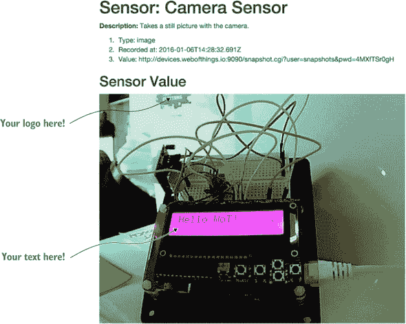

你可能已经注意到你输入的 URL 有一个特定的路径结构。让我们对这个结构玩一点，回到这个 URL 的根目录，在那里你会看到允许你浏览我们办公室设备的网关主页（图 2.4）。在你的浏览器中输入以下 URL：[`devices.webofthings.io`](http://devices.webofthings.io)。

##### 图 2.4。我们 WoT 设备网关的 HTML 主页。页面底部的两个超链接允许你访问连接到网关的设备的页面。


这个 URL 将始终重定向到你办公室运行的网关的**根页面**，它显示了附加到网关的设备列表。在这里，你可以看到两个设备连接到了网关：

+   一个带有各种传感器和执行器的 Raspberry Pi

+   一个网络摄像头（你之前访问的那个）

注意，这个页面是根据我们附加到它的物理设备自动生成的，所以当你我们附加更多设备或传感器时，你可能会看到更多设备。是的，尽管它看起来像任何其他网页，但实际上它是在**实时**从**真实**办公室的**真实**设备上提供的**真实**数据！

现在，点击“我的 WoT Raspberry Pi”链接以访问设备的根页面。因为你通过浏览器跟随了一个链接，所以你会看到 URL 已经更改到了[`devices.webofthings.io/pi`](http://devices.webofthings.io/pi)，如图 2.5 所示。

##### 图 2.5。Raspberry Pi 的主页。在这里，你可以使用底部的链接浏览和探索该设备提供的各种资源；例如，它的传感器和执行器。

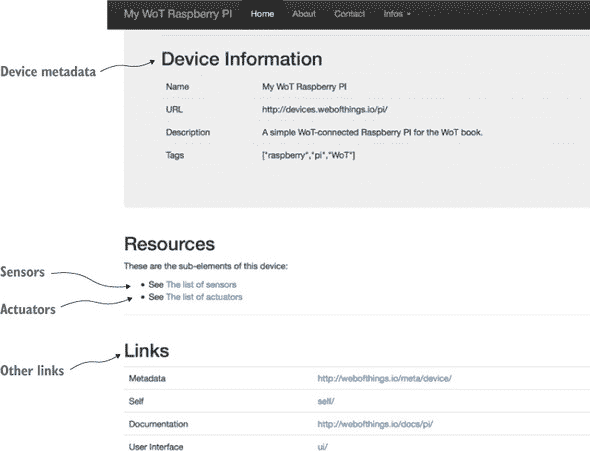

这是另一个根页面——这次是设备的根页面。在这种情况下，我们只是将`/pi`附加到了网关的根 URL。

回到我们的设备根页面，将鼠标悬停在各个链接上方以查看它们的结构，然后点击“传感器列表”链接。你会看到 URL 再次更改到这个（图 2.6）：[`devices.webofthings.io/pi/sensors`](http://devices.webofthings.io/pi/sensors)。

##### 图 2.6。Pi 上的传感器列表。你可以点击每个传感器并查看每个传感器的最新已知值。

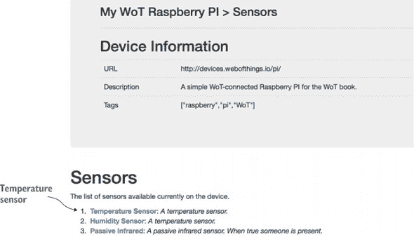

到目前为止，这相当直接：你的浏览器正在请求一个 HTML 页面，显示连接到`devices.webofthings.io`网关的`/pi`设备的`/sensors`列表。记住，这里也连接了一个摄像头，所以在你浏览器的地址栏中，将 URL 中的`/pi/`替换为`/camera/`，你将直接进入相机的传感器页面：[`devices.webofthings.io/camera/sensors`](http://devices.webofthings.io/camera/sensors)；见图 2.7。

##### 图 2.7。相机上的传感器。这里只有一个传感器，即当前图像。

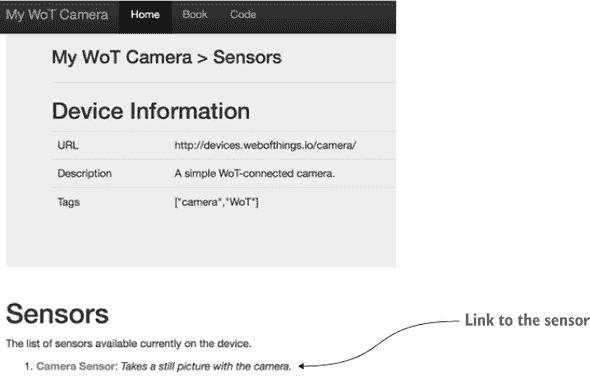

现在，回到您 Pi 上的传感器列表，查看连接到设备的各种传感器。目前，您可以访问三个传感器：温度、湿度和被动红外。打开温度传感器链接，您将看到温度传感器的页面，其中包含传感器的当前值。最后，就像您对传感器所做的那样，转到 Pi 的执行器列表，打开执行器详细信息页面（见图 2.13），以下 URL：[`devices.webofthings.io/pi/actuators/display`](http://devices.webofthings.io/pi/actuators/display)。

显示屏是连接到 Pi 的一个简单 LCD 屏幕，可以显示一些文本，您将在练习 2.4 中使用它。您可以看到关于这个执行器的信息——特别是当前显示的值、发送数据到它的 API 描述以及显示新数据的表单。现在您不会使用这个表单，但这个功能将在第 2.4 节中介绍。

#### 2.2.2. 第二部分——Web 作为 API

在第一部分中，您开始从浏览器中与物联网进行交互。您已经看到了人类用户如何探索设备的资源（传感器、执行器等）以及如何从网页中与该设备进行交互。所有这些操作都是通过浏览物理设备的资源来完成的，就像您浏览网站的各种页面一样。但如果不是人类用户，而是希望一个软件应用或另一个设备执行相同操作，而不需要人类介入，怎么办？您如何让任何 Web 客户端都能轻松找到设备，了解其功能，查看其 API 的样子，确定它可以发送哪些命令等等？

在本书的后面部分，我们将详细向您展示如何做到这一点。现在，我们将通过向您展示当另一个设备或应用浏览您的设备时看到的内容，来展示 Web 如何使支持人类和应用变得容易。

对于这个练习，您需要安装 Chrome 并安装我们最喜欢的一个浏览器扩展程序，名为 Postman.^([1]) 或者如果您更愿意使用命令行，可以使用 cURL^([2)). Postman 是一个小巧的应用程序，当您与 Web API 一起工作时，它将极大地帮助您，因为它允许您轻松发送 HTTP 请求并自定义这些请求的各种选项，如头部、负载等。Postman 将使您在本书中更容易地完成任务，所以请继续安装它。

> ¹
> 
> 在这里获取：[`www.getpostman.com/`](http://www.getpostman.com/)
> 
> ²
> 
> cURL 是一个命令行工具，允许您使用各种协议传输数据，其中包括 HTTP。如果您的机器上没有预先安装，您可以在 Mac、Linux 或 Windows 上轻松安装它。网站：[`curl.haxx.se/`](http://curl.haxx.se/)

在 第一部分 中，你的浏览器只是一个请求服务器内容的网络客户端。浏览器会自动请求以 HTML 格式的内容，然后由服务器返回并由浏览器显示。

在 第二部分 中，你将几乎与 第一部分 中相同的练习，但这次是通过请求服务器返回 JSON 文档而不是 HTML 页面。JSON 几乎是互联网上使用最成功的数据交换格式。它具有易于理解的语法，且轻量级，与它的老式父格式 XML 相比，这使得它在传输时更加高效。此外，JSON 便于人类阅读和编写，也便于机器解析和生成，这使得它特别适合成为物联网的数据交换格式。请求特定编码的过程在 HTTP 1.1 规范中称为 *内容协商*，将在 第六章 中详细介绍。

##### 第 1 步——从网关获取设备列表

就像你之前做的那样，你将向网关的根页面发送 GET 请求以获取设备列表。为此，你需要在 Postman 中输入网关的 URL 并点击“发送”，如图 2.8 所示。

##### 图 2.8\. 使用 Postman 网络客户端获取网关的根页面。请求是针对网关 URL 的 HTTP GET (1)。响应体将包含一个 HTML 文档 (4)。

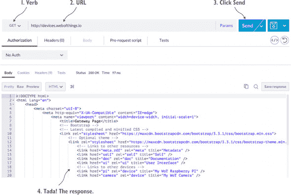

由于大多数网络服务器默认返回 HTML，你会在主体区域看到服务器返回的 HTML 页面内容 (4)。这基本上就是每次你从浏览器访问网站时幕后发生的事情。现在要获取 JSON 而不是 HTML，请点击“头部”按钮，添加一个名为`Accept`的头部，其值为 `application/json`，然后再次点击“发送”，如图 2.9 所示。向请求添加此头部是在告诉 HTTP 服务器，“嘿，如果你能的话，请返回给我编码为 JSON 的结果。”因为网关支持这一点，你现在将看到与之前检索到的网页相同的 JSON 内容，但这次只有内容，没有视觉元素（即 HTML 代码）。

##### 图 2.9\. 使用 Postman 获取连接到网关的设备列表。现在`Accept`头部设置为 `application/json` 以请求返回 JSON 格式的结果。

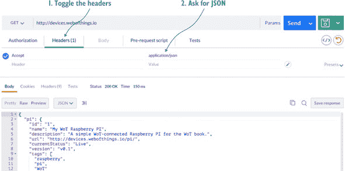

返回的 JSON 主体包含连接到网关的设备的机器可读描述，其外观如下：

```
{
  "pi": {
    "id": "1",
    "name": "My WoT Raspberry Pi",
    "description": "A simple WoT-connected Raspberry Pi for the WoT book.",
    "url": "http://devices.webofthings.io/pi/",
    "currentStatus": "Live",
    "version": "v0.1",
    "tags": [
      "raspberry",
      "pi",
      "WoT"
    ],
    "resources": {
      "sensors": {
        "url": "sensors/",
        "name": "The list of sensors"
      },
      "actuators": {
        "url": "actuators/",
        "name": "The list of actuators"

      }
    },
    "links": {
      "meta": {
        "rel": "http://book.webofthings.io",
        "title": "Metadata"
      },
      "doc": {
        "rel": "https://www.raspberrypi.org/products/raspberry-pi-2-model-b/",
        "title": "Documentation"
      },
      "ui": {
        "rel": ".",
        "title": "User Interface"
      }
    }
  },
  "camera": {
    [ ... description of the camera object... ]
  }
}
```

在这个 JSON 文档中，你可以看到两个一级元素 (`pi` 和 `camera`)，它们代表连接到网关的两个设备，以及一些关于它们的细节，例如它们的 URL、名称、ID 和描述。现在如果你不理解这里的一切，请不要担心；所有这些内容将在接下来的几章中变得清晰易懂。

##### 第 2 步——获取单个设备

现在更改 Postman 中的请求 URL，使其指向 Pi 设备（这与你在第一部分中输入浏览器中的 URL 完全相同），然后再次点击发送，如图 2.10 所示。

##### 图 2.10. 获取 Raspberry Pi 的 JSON 表示形式。JSON 有效负载包含有关设备的元数据以及其子资源的链接。

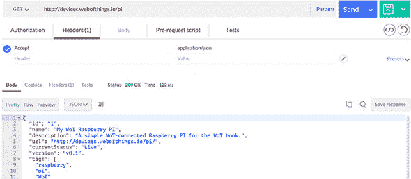

现在设备中包含的 Pi JSON 对象与之前显示的信息相同，但你可以看到 `resources` 对象包含 `sensors`、`actuators` 等内容：

```
"resources": {
  "sensors": {
    "url": "sensors/",
    "name": "The list of sensors"
  },
  "actuators": {
    "url": "actuators/",
    "name": "The list of actuators"
  }
}
```

##### 第 3 步——获取设备上的传感器列表

要获取设备上可用的传感器列表，就像你之前做的那样，只需在 Postman 中将 `/sensors` 添加到 Pi 的 URL，然后再次发送请求。HTTP GET 请求将返回此 JSON 文档作为响应：

```
{
  "temperature": {
    "name": "Temperature Sensor",
    "description": "A temperature sensor.",
    "type": "float",
    "unit": "celsius",
    "value": 23.4,
    "timestamp": "2015-10-04T14:39:17.240Z",
    "frequency": 5000
  },
  "humidity": {
    "name": "Humidity Sensor",
    "description": "A temperature sensor.",
    "type": "float",
    "unit": "percent",
    "value": 38.9,
    "timestamp": "2015-10-04T14:39:17.240Z",
    "frequency": 5000
  },
  "pir": {
    "name": "Passive Infrared",
    "description": "A passive infrared sensor. True when someone present.",
    "type": "boolean",
    "value": true,
    "timestamp": "2015-10-04T14:39:17.240Z",
    "gpio": 20
  }
}
```

你可以看到 Pi 上连接了三个传感器（分别是 `temperature`、`humidity` 和 `pir`），以及每个传感器的详细信息及其最新值。

##### 第 4 步——获取单个传感器的详细信息

最后，你会得到一个特定传感器的详细信息，因此将 `/temperature` 添加到 Postman 中的 URL 并再次点击发送。现在 URL 应该是 [`devices.webofthings.io/pi/sensors/temperature`](http://devices.webofthings.io/pi/sensors/temperature)，如图 2.11 所示。

##### 图 2.11. 从 Raspberry Pi 获取温度传感器对象。你可以看到最新的读数（23.4 摄氏度）以及它发生的时间（2015 年 10 月 4 日 14:43）。

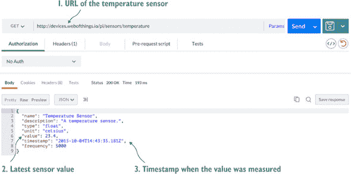

你将获得有关温度传感器的详细信息，特别是读取的最新值（值字段）。如果你只想检索传感器值，你可以将 `/value` 添加到传感器的 URL 来检索它，这也适用于其他传感器：

```
{
  "value":22.4
}
```

#### 2.2.3. 那么，这又意味着什么呢？

现在是时候让你在这个练习中看到的不同 URL 进行一番探索了。看看它们如何不同以及它们的结构，浏览设备，并尝试理解每个传感器有什么数据，其格式等。作为一个扩展，看看你周围的电子设备——厨房里的电器或你客厅里的电视或音响系统，咖啡馆的订餐系统，或者你所在地区的火车通知系统。现在想象一下，所有这些设备提供的服务和数据可能都具有相似的结构：URL、内容、路径等。尝试使用你刚刚看到的相同 JSON 结构来映射这个系统，并写出返回的 URL 和 JSON 对象。

您所看到的是，人类和应用程序使用完全相同的 URL 获取数据，但使用不同的编码格式（人类使用 HTML，应用程序使用 JSON）。显然，两种情况下的数据都是相同的，这使得应用程序开发者可以轻松地在两种格式之间来回转换。这是简单但强大的 Web 技术的一个例子。多亏了像 HTTP 和 URL 这样极其流行的 Web 标准，从任何 Web 浏览器与真实世界交互变得非常简单。您将在第六章及以后学到更多关于这些概念的内容。

### 2.3. 练习 2—从 WoT 传感器轮询数据

在第一个练习中，您学习了 WoT 设备的结构以及它是如何工作的。特别是，您看到设备的每个元素都是一个资源，具有唯一的 URL，人们和应用程序都可以使用它来读取和写入数据。现在，您将戴上开发者的帽子，开始编写您的第一个与这个物联网设备交互的 Web 应用程序。

#### 2.3.1. 第一部分—轮询当前传感器值

对于这个练习，请转到您从 GitHub 检出的文件夹，进入 chapter2-hello-wot/client 文件夹。双击 ex-2.1-polling-temp.html 文件，在现代浏览器中打开它.^([3]) 此页面显示我们办公室 Pi 上的温度传感器值，并每隔五秒通过检索 JSON 格式来更新此值，正如您在 图 2.11 中所看到的那样。

> ³
> 
> 我们在 Firefox (>41) 和 Chrome (>46) 上完全测试了我们的示例，并建议您安装这些浏览器的最新版本。Safari (>9) 也应该可以工作。如果您真的想使用 Internet Explorer，请注意您将需要版本 10 及以上；较旧版本将无法工作。

此文件使用 jQuery^([4]) 从我们 Pi 上的温度传感器轮询数据。现在请打开此文件到您最喜欢的代码编辑器中，查看源代码。您将看到以下两点：

> ⁴
> 
> jQuery 是一个方便的 JavaScript 库，它使得做很多事情变得更容易，例如与 REST API 通信、操作 HTML 元素、处理事件等等。更多信息请访问：[`jquery.com/`](http://jquery.com/)。

+   一个 `<h2>` 标签显示当前传感器值将被写入的位置。

+   一个名为 `doPoll()` 的 JavaScript 函数，它从 Pi 读取值，显示它，并在五秒后再次调用自己。此函数在下面的列表中显示。

##### 列表 2.1. 轮询温度传感器

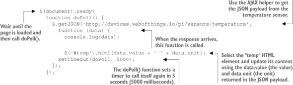

在开发（尤其是调试！）Web 应用程序时，显示页面外的 JavaScript 内容可能很有用；为此，您有一个 JavaScript 控制台。要在 Chrome 中访问它，请右键单击页面上的某个位置，然后选择“检查元素”；然后查找出现在当前页面 HTML 代码下方出现的控制台。`console.log(data)` 语句在此控制台中显示从服务器接收到的 `data` JSON 对象。

#### 2.3.2\. 第二部分—轮询和图表化传感器值

这很好，但在某些情况下，你可能希望显示比传感器当前值更多的信息——例如，过去一小时或一周的所有读数的图表。打开练习中的第二个 HTML 文件（ex-2.2-polling-temp-chart.html）。这是一个稍微复杂一些的例子，它跟踪温度传感器的最后 10 个值并在图表中显示它们。当你用浏览器打开这个第二个文件时，你会看到图表每两秒更新一次，如图 2.12 所示。

##### 图 2.12\. 这个图表每隔几秒从设备获取一个新值，并自动更新。


我们使用 Google Charts 构建了这个图表，^([5]) 这是一个用于显示各种图表和图形的不错且轻量级的 JavaScript 库。请参阅我们下一列表中的注释代码示例。

> ⁵
> 
> [`developers.google.com/chart/`](https://developers.google.com/chart/)

##### 列表 2.2\. 轮询并显示传感器读数

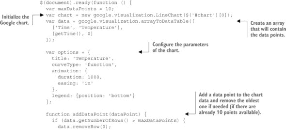

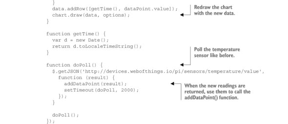

#### 2.3.3\. 第三部分—实时数据更新

在之前的练习中，轮询 Pi 的温度传感器工作得很好。但这似乎有些低效，不是吗？我们不需要每隔两秒或更长时间从设备获取温度，如果我们的脚本在温度变化时被*通知*，并且只有当值发生变化时，这不是更好吗？

正如我们在第六章中将要更深入地探讨的那样，这一直是网络模型和无线传感器应用的事件驱动模型之间主要的阻抗不匹配之一。现在，我们将探讨使用相对较新的网络附加组件来解决这个问题的方法：*WebSocket*。简而言之，WebSocket 是一种简单而强大的机制，允许网络服务器将通知推送到作为 HTML5 标准努力的一部分引入的网络客户端。

WebSocket 标准由两个不同的部分组成：一个用于服务器，一个用于客户端。由于服务器已经为我们实现，我们在这里将只使用客户端部分的规范。客户端 WebSocket API 基于 JavaScript，相对简单直接。以下列表中的两行代码就是连接到 WebSocket 服务器并在控制台显示所有接收到的消息所需的所有内容。

##### 列表 2.3\. 连接到 WebSocket 并监听消息

```
var socket = new WebSocket('ws://ws.webofthings.io');
socket.onmessage = function (event) {console.log(event);};
```

让我们回到我们的例子。转到文件夹。双击 ex-2.3-websockets-temp-graph.html 文件，在您喜欢的浏览器中打开它。您在页面上看到的内容与之前的练习完全相同，但在底层，事情相当不同。请查看下一列表中显示的新代码。

##### 列表 2.4\. 注册 WebSocket 并获取实时温度更新

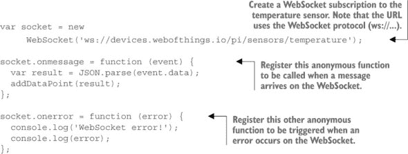

在这个练习中，你不需要定期轮询新数据，而是通过订阅 `/sensors/temperature` 端点来通过 WebSockets 注册你对这些更新的兴趣。当服务器有新的温度数据可用时，它将将其发送到你的客户端（你的网页浏览器）。这个事件将由你注册的匿名函数捕获，并将包含最新温度值的事件对象作为参数传递。

#### 2.3.4. 那么，这又意味着什么呢？

让我们回顾一下你在这次练习中所做的事情：你成功与一个嵌入式设备（树莓派）进行了通信，这个设备可能位于世界另一端（如果你不是住在多雨美丽的英格兰的话）。从网页上，你能够定期获取连接到设备的传感器数据，并在图表上显示。对于一个只有 60 行 HTML、JavaScript 和 CSS 代码的简单网页来说，这已经很不错了。你没有就此止步：通过少于 10 行的 JavaScript，你还订阅了来自我们的 Pi 的通知，并在实时显示我们办公室的温度。作为这个练习的扩展，你可以编写一个简单的页面，自动从摄像头获取图像（理想情况下，你应该避免每秒做 25 次这种操作！）。

如果这是你第一次接触物联网，那么在这个阶段应该让你印象深刻的是这些示例的简单性。让我们想象一下，如果我们的 Pi 并不是通过 HTTP、JSON 或 WebSockets 提供数据，而是通过一个“复古”的基于 XML 的机器到机器应用程序堆栈，比如 DPWS（如果你从未听说过它，不要担心；这正是我们的观点！）。基本上，你将无法直接从你的浏览器与设备通信，除非你付出更多的努力。你将被迫使用更低级和更复杂的语言，如 C 或 Java 来编写你的应用程序。你将无法使用像 URL、HTML、CSS 和 JavaScript 这样广泛的概念和语言。这也是物联网的宗旨：通过将事物带入大众，使现实世界中的事物可编程且普遍可访问，从而推动许多今天的创新。

如前所述，在这本书中，你将学习更多关于为物理事物制作 API 的艺术。在第六章 [kindle_split_014.html#ch06] 中，我们将探讨 HTTP、REST 和 JSON 以及实时网络，而在第七章 [kindle_split_015.html#ch07] 中，我们将发现如何使用网关将其他协议和系统带入网络的美好之中。

### 2.4. 练习 3—对现实世界采取行动

到目前为止，你已经看到了从网络设备读取各种传感器数据的不同方法。那么，“写入”设备呢？例如，你可能想向设备发送一个命令来更改配置参数。在其他情况下，你可能想控制一个执行器（例如，打开车库门或关闭所有灯光）。

#### 2.4.1\. 第一部分——使用表单更新要显示的文本

为了说明你如何向执行器发送命令，这个练习将向你展示如何构建一个简单的页面，允许你向连接到我们办公室 Pi 的 LCD 发送一些文本。为了测试这个功能，首先打开 LCD 的执行器页面：[`devices.webofthings.io/pi/actuators/display`](http://devices.webofthings.io/pi/actuators/display)。

在本页（如图 2.13 所示）中，你现在可以看到 LED 执行器的各种**属性**。首先，你看到的是`亮度`，你可以更改它（但无法更改，因为我们将其设置为只读）。然后，你有`内容`，这是你想要发送的值，最后是`持续时间`，它指定文本将在我们的 LCD 上显示多长时间。使用 Postman 通过输入上一段中显示的 URL 来获取描述显示执行器的 JSON 对象，正如你在本章第一项练习中学到的那样：

```
{
  "name": "LCD Display screen",
  "description": "A simple display that can write commands.",
  "properties": {
    "brightness": {
      "name": "Brightness",
      "timestamp": "2015-02-01T21:06:02.913Z",
      "value": 80,
      "unit": "%",
      "type": "integer",
      "description": "Percentage of brightness of the display. Min is 0
       which is black, max is 100 which is white."
    },
    "content": {
      "name": "Content",
      "timestamp": "2015-02-01T21:06:32.933Z",
      "type": "string",
      "description": "The text to display on the LCD screen."
    },
    "duration": {
      "name": "Display Duration",
      "timestamp": "2015-02-01T21:06:02.913Z",
      "value": 5000,
      "unit": "milliseconds",
      "type": "integer",
      "read-only": true,
      "description": "The duration for how long text will be displayed
       on the LCD screen."
    }
  },
  "commands": [
    "write",
    "clear",
    "blink",
    "color",
    "brightness"
  ]
}
```

##### 图 2.13\. LCD 执行器的详细信息，以及你可以设置的各个属性，例如，设备上接下来要显示的文本


显然，如果你无法看到显示的内容，那么在我们的办公室显示东西就不会很有趣。因此，我们设置了一个可以查看我们 Pi 上 LCD 的摄像头，这样你就可以始终看到它上显示的内容。以下是 URL：[`devices.webofthings.io/camera/sensors/picture`](http://devices.webofthings.io/camera/sensors/picture)。继续打开这个页面，你将看到你在图 2.3 中看到的最新相机图像（要查看最新图像，请刷新页面）。

现在，你将向 Pi 发送一条新消息，以便通过 LCD 显示。`内容`属性始终是 LCD 上当前显示的消息，因此要更新它，你需要通过 POST 一个新值作为消息体来更新该属性（例如，`{"value": "Hello World!"}`）。你可以继续在 Postman 中尝试这样做，但最简单的方法是通过浏览器中的显示执行器页面：[`devices.webofthings.io/pi/actuators/display`](http://devices.webofthings.io/pi/actuators/display)。见图 2.13 以了解 LCD 执行器的详细信息。

在这个页面上，你可以看到 LCD 执行器的各种属性。其中一些是可编辑的，而另一些则不是。`内容`属性是你想要编辑的属性，因此输入你想要显示的文本并点击更新。如果一切正常，你将看到如下 JSON 有效负载：

```
{
  "id":11,
  "messageReceived":"Make WoT, not war!",
  "displayInSeconds":20
}
```

返回的有效负载包含将要显示的消息、你消息的唯一 ID 以及文本将在 LCD 屏幕上显示的估计延迟（以秒为单位），这样你就知道何时查看相机图像以查看你的文本。

#### 2.4.2\. 第二部分——创建自己的表单来控制设备

现在，让我们构建一个简单的 HTML 页面，允许你使用简单的表单向网络设备发送各种命令。从你的浏览器中，打开练习文件夹中的文件 ex-3.1-actuator-form.html，你将看到 图 2.14 中所示的屏幕。

##### 图 2.14\. 这个简单的客户端表单允许你向 Pi 发送要显示的新文本。


此页面有一个输入文本字段和一个发送到 Pi 的按钮，如下所示。你输入的任何文本都将显示在我们办公室的 Pi 的液晶屏幕上。请保持礼貌，并且由于我们的 Pi API 对公众开放，我们对此处人们所写的内容不承担任何责任。

##### 列表 2.5\. 简单的 HTML 表单，用于向执行器发送命令

```
<form action="http://devices.webofthings.io/pi/actuators/display/content/"
 method="post">
  <label>Enter a message:</label>
  <input type="text" name="value" placeholder="Hello world!">
  <button type="submit">Send to Pi</button>
</form>
```

这是一个简单的 HTML 表单，它将 HTTP POST（`method` 的值）发送到显示的 URL（`action` 的值）。输入文本栏被称为 *value*（`name="value"`），这样 Pi 就知道要显示什么文本。这种方法对于基本网站来说效果很好。不幸的是，你无法看到幕后的是，网络浏览器不会使用 JSON 负载体（正如你以前可以用 Postman 容易做到的那样）提交数据到服务器，而是使用一种称为 `application/x-www-form-urlencoded` 的格式。Pi 需要能够理解这种格式，以及 `application/json`，以便处理来自 HTML 表单的数据输入。

HTML 表单只能使用动词 POST 或 GET，不能使用 DELETE 或 PUT。遗憾的是，即使是现代浏览器也因为一些神秘的历史原因而没有将 HTML 表单的内容作为 JSON 对象发送，但嘿，*这就是生活！*

正如你将在本书后面看到的那样，Web 物联网上所有实体接收和传输 JSON 内容的能力对于确保一个真正开放的生态系统至关重要。因此，我们将向你展示如何从 HTML 表单页面发送实际的 JSON 数据（通过使用 AJAX 和 JavaScript），因为这样做是与网络设备通信的一个基本部分。

打开 ex-3.2-actuator-ajax-json.html 文件，可以看到一个类似表单，但这次包含一大段 JavaScript，如下所示。

##### 列表 2.6\. 从表单发送带有 JSON 负载的 HTTP POST 请求

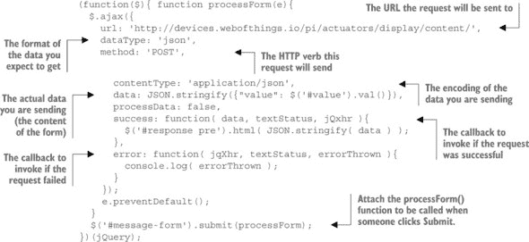

在此代码中，定义了一个名为 `processForm()` 的函数，它从表单中获取数据，将其打包成一个 JSON 对象，并将其 POST 到 Pi，如果成功则显示结果（否则在控制台显示错误）。`url` 参数指定了端点 URL（Pi 显示），`method` 是要使用的 HTTP 方法，而 `contentType` 是发送到服务器的内容的格式（在这种情况下为 `application/json`）。最后一行将表单 `#message-form` 的提交按钮点击事件附加到调用 `processForm()` 函数。

这段代码有一个变体，即 ex-3.2b-actuator-ajax-form.html，它将数据编码为`application/x-www-form-urlencoded`格式，而不是 JSON，就像我们在练习 3 的第一部分中展示的简单表单那样。

#### 2.4.3. 那么，这又意味着什么呢？

在本节中，你学习了如何使用网页表单和 API 向设备发送数据和命令的基础知识。你接受了现代网络限制、挑战和问题的快速课程（别担心，还有更多！），特别是不同的网络浏览器如何以不同的方式解释和实现相同的网络标准。最后，你学习了如何使用 AJAX 绕过这些限制，并向树莓派发送 JSON 命令以远程控制它。

我们希望你在完成这个练习后意识到，只要这些设备连接到互联网并提供了简单的 HTTP/JSON 接口，发送执行器命令到各种设备是非常直接的。但最后一个问题是如何找到附近的设备，理解其 API，确定设备提供的功能，以及知道在你的命令中需要包含哪些参数，包括它们的类型、单位、限制等。下一节将向你展示如何解决这个问题，所以请继续阅读。

### 2.5. 练习 4——向世界介绍你的设备

在之前的练习中，你学习了如何轻松地将设备暴露在网络上，然后由其他客户端应用程序探索和使用。但那些例子假设你（作为一个人类开发者或你编写的应用程序）*知道* JSON 对象的字段（例如，传感器或执行器）的含义以及如何使用它们。但这怎么可能呢？如果你对设备的唯一了解就是它的 URL，而其他一无所知呢？

假设你想构建一个可以控制本地网络中智能家居设备的 Web 应用程序。你如何确保这个应用程序始终可以工作，即使你身处他人的网络，你对那里的设备一无所知？

首先，你需要在网络层面上找到设备（即*设备发现*问题）。换句话说，你的 Web 应用程序如何发现你周围所有设备的根 URL？

其次，即使你偶然知道（通过某种魔法技巧）你周围所有 Web of Things 兼容设备的根 URL，你的应用程序“理解”这些设备提供的传感器或执行器，它们使用的格式，以及这些设备、属性、字段等含义又该如何呢？

正如你在练习 2（第 2.3.2 节）中看到的，如果你知道设备的根 URL，你可以轻松地浏览设备并找到关于它及其传感器、服务等方面的数据。这很简单，因为你是一个人类，但想象一下，如果你有一个包含无法理解的单词或字符的 JSON 文档，并且没有任何解释这些单词含义的文档——你将如何知道设备的功能？你又将如何知道它是一个设备呢？

在你的浏览器中打开 ex-4-parse-device.html，你会看到一个预先填充了 Pi 的 URL（图 2.15）的表单。点击浏览此设备。

##### 图 2.15\. 一个解析你的设备元数据并显示结果的迷你浏览器

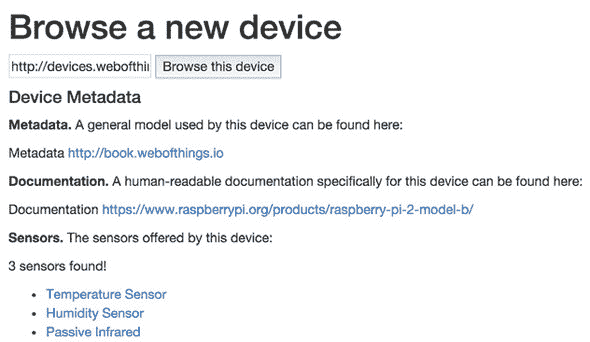

ex-4-parse-device.html 的这段 JavaScript 代码将读取树莓派的根文档（作为 JSON）并生成一个关于设备及其传感器的简单报告，以及指向此设备文档的链接。首先，让我们看看显示报告的 HTML 代码，如下一列表所示。

##### 列表 2.7\. 一个基本的设备浏览器

```
<form id="message-form">
    <input type="text" id="host" name="host" value="http://devices.webofthings.io/pi"
placeholder="The URL of a WoT device" />
    <button type="submit">Browse this device</button>
</form>

<h4>Device Metadata</h4>
<p><b>Metadata.</b> A general model used by this device can be found here:
<div id="meta"></div></p>
<p><b>Documentation.</b> A human-readable documentation specifically for
this device can be found here: <div id="doc"></div></p>
<p><b>Sensors.</b> The sensors offered by this device:
   <div id="sensors"></div></p>
<ul id="sensors-list">
</ul>
```

你首先可以看到一个表单，你可以在这里输入设备的根 URL 并带有浏览按钮。然后，有一些 HTML 文本元素将充当占位符（`meta`、`doc`等）。现在让我们看看以下列表中的 AJAX 调用。

##### 列表 2.8\. 使用 AJAX JSON 调用检索和解析设备元数据


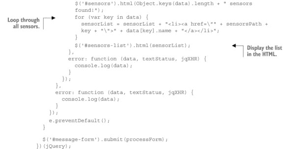

看着这段代码，你可以看到你首先使用表单中输入的 URL（`$('#host').val()`）设置了设备的根 JSON 文档。如果 JSON 文件已成功检索，则`success`回调函数将被触发，其中`data`变量包含设备的根 JSON 文档（如第 2.2.2 节的第 2 步所示）。然后你解析这个 JSON 以提取你正在寻找的元素；在这种情况下，代码正在寻找返回的 JSON 对象中的`links`元素（因此是`data.links`），它包含各种链接，可以获取更多关于此设备的信息，如下面的代码所示：

```
"links": {
  "meta": {
    "rel": "http://book.webofthings.io",
    "title": "Metadata"
   },
  "doc": {
    "rel":
"https://www.raspberrypi.org/products/raspberry-pi-2-model-b/",
    "title": "Documentation"
  },
  "ui": {
    "rel": ".",
    "title": "User Interface"
  }
}
```

特别是，`meta`元素包含一个链接（`rel`的值）指向此设备使用的通用模型（它描述了描述此设备元素所使用的语法），然后是一个`doc`，它链接到一个人类可读的文档，该文档描述了此特定设备的含义（即，哪些传感器存在以及它们测量什么）。

在前一段代码中链接的元数据文档不过是一个可机器读取的 JSON 文档模型，它允许用户以结构化的方式描述 WoT 设备，并定义了所有 WoT 设备必须具备的逻辑元素。如果成百上千的设备制造商都使用这个相同的数据模型来公开他们的设备服务，这意味着任何能够读取和解析这个文件的应用程序都能够读取设备返回的 JSON 文件并理解设备的组件（例如它有多少个传感器，它们的名称或限制，它们的类型等等）。

现在，关于传感器或执行器本身呢？`links`元素只定义了关于设备的元数据（例如文档），而不是设备本身的内容。要找到设备中包含的传感器，你需要解析`resources`元素的`sensors`字段，这就是在第二个 AJAX 调用中发生的事情，你在设备的传感器资源上执行 GET 操作。一旦你得到了传感器的 JSON 文档，你将遍历每个传感器，并使用以下模式创建一个链接：

```
<li><a href=\""+sensorsPath+key+"\">"+data[key].name+"</a></li>
```

在这里，`sensorsPath`是传感器资源的 URL（在这种情况下为[`devices.webofthings.io/pi/sensors`](http://devices.webofthings.io/pi/sensors)），你将添加每个传感器的传感器 ID（`key`），以及相应传感器的名称（`data[key].name`）。

#### 2.5.1. 那又如何？

如果你没有完全理解前一个练习的所有细节，那完全没问题——这并不代表你有问题！发生的事情是你第一次亲身体验了语义网，或者更确切地说，是它试图解决的难题。你之所以听到很多关于它，却从未见过或使用过（或者理解过），是因为它对计算机和编写它们的程序员来说是一个复杂的问题：你怎么向计算机解释现实世界及其存在性疑问呢？好吧，结果是你实际上还不能给你的机器教授哲学。但正如我们在这里所展示的，并在第八章中详细说明的那样，有一些小技巧可以成功地应用，使网络和计算机变得更聪明一点。

你已经看到了网络设备如何以机器可读的方式宣传它们的基本能力、数据和服务。我们使用的是众所周知的网络模式，这使得构建与我们的设备交互的 Web 应用程序变得容易。不幸的是，没有单一的标准来定义这种信息，我们使用的 JSON 模型是多年来通过试错产生的。为了释放物联网的潜力，我们必须能够使用具有清晰语义的单个数据模型来定义关于一个对象的全部细节，这样所有机器和应用都能理解，没有任何歧义的空间。我们将在第八章中更详细地探讨如何使用 Web 和轻量级语义网技术实现这一点。

### 2.6\. 练习 5—创建您的第一个物理混合应用

在之前的练习中，您学习了如何访问网络设备，理解它提供的服务和数据，以及从设备中读取和写入数据。在这个练习中，我们将向您展示如何构建您的第一个混合应用。混合应用的概念起源于嘻哈场景，用来描述由其他歌曲采样组成的歌曲。同样，网络混合应用是一个从各种来源获取数据、处理数据并将其组合成新应用的网页应用。

在这里，您将创建不仅是一个网络混合应用，还是一个 *物理混合应用*——一个使用连接到网络的实时传感器数据的网页应用。在这个练习中，您将从雅虎天气服务获取本地温度数据，将其与办公室中连接到 Pi 的温度传感器进行比较，并将结果发布到连接到伦敦 Pi 的 LCD 屏幕。最后，为了查看您的消息看起来像什么，您将使用摄像头的网络 API 拍摄一张照片并在我们的网页上显示！请参阅图 2.16 了解此过程的说明。

##### 图 2.16\. 物理混合应用。首先（1），您从雅虎天气获取本地温度，然后从连接到我们的 Pi 的传感器获取远程温度（2）。您将其与伦敦的温度进行比较，并将结果发送到 LCD 屏幕（3）。当屏幕显示您发送的文本时，您从摄像头获取屏幕的图片（4）并在混合应用中显示它。

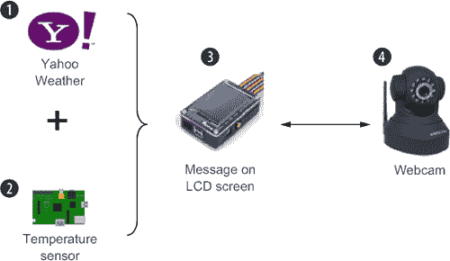

好的，请同时在您的编辑器和浏览器中打开文件 ex-5-mashup.html。这段代码比您之前看到的要长一些，但并不复杂，如下所示。

##### 列表 2.9\. 混合函数

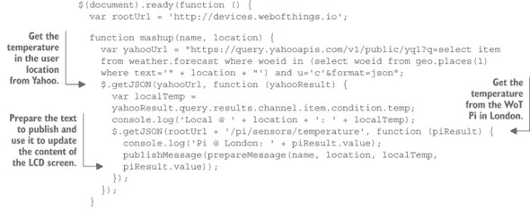

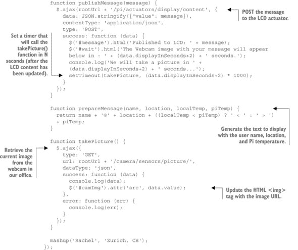

`mashup()` 函数负责运行混合应用的不同部分。它接受两个参数：第一个参数是您的名字；第二个参数是您居住的城市名称，格式为 `城市, 国家代码`（例如，苏黎世，CH；伦敦，UK；或纽约，US）。它本质上由两个 AJAX 的 HTTP GET 调用组成，请求以 `application/json` 表示形式的响应。第一个调用是到雅虎天气服务 API，给定一个位置返回其当前天气和温度。

一旦这个调用返回（即，匿名回调函数已被调用），第二个函数将被调用以从 Pi 温度传感器获取最新值，就像您在第 2.3.1 节中所做的那样。

接下来，您调用 `prepareMessage()`，该函数格式化您的消息并将结果传递给 `publishMessage()`。这个最后的函数通过 AJAX 运行一个 HTTP POST 调用，带有包含要推送到 LCD 屏幕的消息的 JSON 有效负载，就像在练习 3—对现实世界采取行动中所做的那样。

由于你需要等待你的信息显示在队列中，你设置了一个定时器来触发`takePicture()`函数。这个最后的函数运行一个最终的 HTTP GET 请求，通过网络摄像头获取液晶显示屏显示的图片。然后你将返回的图片动态添加到你的 HTML 页面中的图像容器中。

要开始这一系列现实世界和虚拟世界的事件，你只需要编辑源代码，使其调用`mashup(x,y)`函数，使用你自己的名字和城市。例如，来自瑞士苏黎世的 Rachel 需要如下调用此函数：

```
mashup('Rachel', 'Zurich, CH')
```

然后在浏览器中打开文件，哇！几秒钟内，你将看到来自网络摄像头的实时图像，你的信息出现在我们办公室的树莓派屏幕上。

#### 2.6.1. 那又如何？

你已经使用来自各种来源的数据，包括物理和实时数据，构建了第一个基于网络的物理混合应用，并运行了一个简单的算法来判断你的天气是否比我们的更好（尽管与伦敦的天气竞争在某种程度上有些不公平）。想想看。这个混合应用涉及一个连接到嵌入式设备的温度传感器、一个视频摄像头、一个液晶显示屏和一个虚拟天气服务，而你却能够创建一个全新的应用，它只包含 80 行 HTML 和 JavaScript 代码，包括 UI！这不是很棒吗？这一切都归功于所有参与者（设备和其他服务）都在网络上公开了它们的 API，因此可以直接使用 JavaScript 进行访问！在整个书中，你将学到更多关于物理混合应用的知识，尤其是在第十章中，我们将调查可用的各种工具和技术。

### 2.7. 摘要

+   你第一次亲手接触到了全球范围内的网络连接设备，并可以浏览它们的元数据、内容、传感器、执行器等等。

+   网络连接设备可以像任何其他网站一样进行浏览。通过 HTTP 或 WebSocket API，可以实时获取传感器的数据，就像在网络上获取其他内容一样。

+   与物联网中常用的各种复杂协议相比，理解 HTTP API 的基础要容易得多和快得多。

+   在短短几分钟内，你通过发送 HTTP 请求使用 Postman，就能读取和写入世界各地的设备数据。

+   将物理世界连接到网络，可以快速原型化需要少量 HTML/JavaScript 代码的交互式应用。

+   随着各种设备的数据和服务作为网络资源提供，构建将各种来源的内容集成在一起且集成工作最少的物理混合应用变得容易。

我们希望您对物联网的第一次接触感到满意，以至于愿意阅读接下来的章节，并学习如何在您的设备上实现这些概念。在接下来的章节中，我们将探讨如何在设备上实现 JavaScript，并提供 Node.js 的简短而全面的介绍。然后，我们将探讨如何配置您的设备，使其适合物联网。我们将向您展示如何在 Raspberry Pi 设备上创建和部署 Node.js 应用程序，您将能够创建您的第一个网络连接设备，并将这些示例适应您自己的用例。

## 第三章\. 物联网中的 Node.js

*本章涵盖*

+   概述 JavaScript 如何用于物联网和物联网

+   对 Node.js 的全面而易于理解的介绍

+   使用 Node.js 实现简单 HTTP 服务器的示例

+   Node.js 模块化和 NPM 的介绍

+   异步编程和控制流库的基础

上一章为您提供了对网络连接设备的第一次接触。我们希望这使您意识到构建与各种网络连接设备交互的应用程序是多么容易。但这只是冰山一角，因为我们为您做了所有艰苦的工作。在本书的其余部分，我们将向您传授您需要知道的一切，以便实现您自己的网络连接设备和应用程序。

在我们直接跳到代码和其他有趣的部分之前，您有两个重要的决定要做。首先，您必须选择一个嵌入式平台，您的应用程序将在该平台上运行。这将是第四章的主题。其次，您需要选择您将用其编写代码的编程语言，这正是本章的主题。

为了选择一种编程语言来构建您的物联网原型，您有两个基本要求：首先，您选择的编程语言应完全支持 Web 协议和标准。嗯，这并没有太大的帮助，因为今天几乎任何严肃的语言（谁说“空白字符”？^([1]))都提供了工具和库来支持 HTTP。第二个要求是您应该能够使用一种语言来构建客户端应用程序、云引擎或网关（我们将在第六章中介绍），甚至是在嵌入式设备上运行的代码。结果证明，JavaScript 可以是“唯一的选择”。

> ¹
> 
> [`en.wikipedia.org/wiki/Whitespace_(programming_language)`](https://en.wikipedia.org/wiki/Whitespace_(programming_language))

因此，本章首先探讨了 JavaScript 社区的最新发展及其在互联网和物联网中的日益增长的重要性。之后，我们将向您介绍 Node.js，这是一个用 JavaScript 编写服务器端应用程序的环境。这个介绍不会让您成为 Node.js 专家，但它肯定会为您提供理解 Node.js 工作原理以及构建和部署本书示例所需的所有要素。


**如何获取代码**

如果您不想从头开始编写我们展示的代码示例，您可以克隆我们的 GitHub 存储库（链接见此处：[`book.webofthings.io`](http://book.webofthings.io)）。本章中所有的代码示例都位于 chapter3-node-js 文件夹中。

| |
| --- |

### 3.1. JavaScript 的崛起：从客户端到服务器再到物联网！

JavaScript 是一种动态编程语言，由网络浏览器执行的客户端脚本可以异步处理数据并改变显示的页面。JavaScript 仅用于在网页上动画化横幅的日子已经一去不复返了！多亏了几乎所有网络浏览器对其广泛的支持、相对易用性和灵活性，JavaScript 已经成为编写动态客户端应用程序的事实上的解决方案。根据 GitHub 上公共存储库的数量，它也已经成为历史上最受欢迎的编程语言之一，拥有一个增长速度超过其他任何语言的开发者社区；参见图 3.1。

> ²
> 
> [`www.tiobe.com/tiobe_index`](http://www.tiobe.com/tiobe_index)

##### 图 3.1. GitHub 上最受欢迎的语言排名。自 2008 年以来，JavaScript 经历了稳步增长，使其在 GitHub 上可用的项目数量上超过了所有其他语言。[来源：GitHub.com]

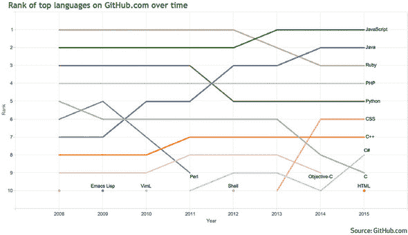

这场正在进行的 JavaScript 革命与物联网的核心思想非常契合，即整合设备到网络中，使它们更易于访问和编程。换句话说，通过使用众所周知的网络标准，使与设备交互变得与在网络上交互任何其他资源一样简单。当物理对象暴露的服务可以通过简单的 HTTP 请求访问时，为物理世界编写交互式应用程序变得与创建任何基本网络应用程序一样简单：通过使用 HTML、CSS 和 JavaScript 编写！

在服务器端，应用程序通常使用各种语言实现，如 PHP、Ruby、Python 或 Java。但在这里，JavaScript 最近已经成为一个非常受欢迎的选择。确实，JavaScript 越来越多地被用于编写高度可扩展的服务器端应用程序，尤其是在 Node.js 等运行时环境中，我们将在稍后介绍它，^([3])。

> ³
> 
> Node.js 并不是唯一的服务器端 JavaScript 框架。另一个例子是 Vert.x：[`vertx.io`](http://vertx.io)。

所有这些平台的融合对本书有幸运的启示：这意味着我们可以主要专注于使用 JavaScript 编写本书的所有示例。我们将使用 JavaScript 和 jQuery 构建客户端示例（正如我们在第二章中已经做的那样），使用 JavaScript 和 Node.js 构建提供物联网服务的服务器，甚至使用 JavaScript 和 Node.js 代码来管理物联网本身的硬件资源，正如我们接下来要解释的。

#### 3.1.1. 将 JavaScript 推向物联网

有趣的是，由 Node.js 引发的 JavaScript 革命并没有止步于浏览器。也没有止步于服务器。在过去的几年里，它还渗透到了设备本身的世界！在一个被运行底层 C 程序的低级设备大规模主导的世界中，JavaScript 和 Node.js 已经设法脱颖而出，成为为各种事物供电的可行且易于使用的替代方案，从机器人（例如，使用 Cylon.js 库）到无线传感器节点。今天，许多嵌入式设备平台直接支持 JavaScript 和 Node.js 来编写嵌入式代码。这包括我们在下一章中将要介绍的基于 Linux 的大多数平台，如 Raspberry Pi、Intel Edison 和 Beagle Board，5 以及一些低功耗平台，如 Tessel6 和 Espruino7]。

> ⁴
> 
> [`cylonjs.com/`](http://cylonjs.com/)
> 
> ⁵
> 
> [`beagleboard.org/`](http://beagleboard.org/)
> 
> ⁶
> 
> [`tessel.io/`](http://tessel.io/)
> 
> ⁷
> 
> [`www.espruino.com`](http://www.espruino.com)

“当你手里有一把锤子，看什么都是钉子！”我们听到你这么说。但并不完全是这样；我们并不提倡在每一个物联网实现中都用 JavaScript 和 Node.js。我们更愿意将 JavaScript 和 Node.js 比作现代物联网和 WoT 开发的瑞士军刀，而不是锤子。当然，它并不是我们所能想到的每一个物联网项目的最佳解决方案，但它是许多项目的绝佳选择。

对于需要绝对可预测和实时性能的嵌入式应用（例如，在高速列车上运行代码），最好用 C 这样的底层语言编写。此外，JavaScript 作为一种语言，经常受到批评者对其缺乏静态类型和众多不同的编程模式和风格的批评，这导致代码有时难以维护，尤其是在涉及大量人员的庞大项目中。尽管如此，其普遍性、可移植性和异步事件驱动模型，以及庞大的活跃在线社区，使其成为值得认真考虑的可靠选择。当使用 Node.js 构建可扩展和实时网络系统时，这一点尤为正确，而对于硬件项目的快速原型设计也是如此。

### 3.2. Node.js 简介

Node.js——或者如其爱好者所称呼的 Node，首次在 2009 年出现，当时一位名叫 Ryan Dahl 的杰出开发者开始在德国以“饥饿艺术家”模式构建它。后来，Ryan 被云服务提供商公司 Joyent 雇佣，该公司是 Node 的早期支持者。2015 年，Node.js 基金会成立，Joyent、IBM、Microsoft 和 Intel 等关键公司加入，为 Node.js 带来了光明的职业前景的希望。8

> ⁸
> 
> [`nodejs.org/en/foundation/`](https://nodejs.org/en/foundation/)

Node.js 提供了一个事件驱动的架构和非阻塞 I/O API（关于这个的更多细节将在后面介绍），这优化了应用程序的吞吐量和可伸缩性。这种模型通常用于设计高性能的实时网络应用程序。

Node 背后的理念是提供一个框架，在其中可以编写高性能的服务器端网络应用程序。与其他服务器不同，您在运行的服务器实例中部署应用程序，而在 Node 中，您的应用程序*就是*服务器。Node 建立在高效的 Google V8 JavaScript 引擎之上，这是 Chrome 浏览器核心。Node 不是 JavaScript，但您使用 JavaScript 语言来构建 Node 应用程序，尽管也可以使用像 CoffeeScript 这样的其他语言。

尽管这本书假设您对客户端 JavaScript 有一些基本了解，但它将向您介绍服务器端和设备端 JavaScript。Node.js 是我们将用于构建在云中或设备本身上运行的服务的框架。我们还将使用 Node.js 访问设备的物理外围设备，如传感器或执行器。

这本书绝对不是 Node.js 的全面手册：有许多优秀的书籍专门介绍 Node。例如，参见 Mike Cantelo 的《Node.js in Action，第二版》（Manning，2015）；^([9]) Alex Young 和 Marc Harter 的《Node.js in Practice》（Manning，2014）；^([10]) 或者像 Manuel Kiessling 的《The Node Beginner Book》这样的优秀教程。^([11]) 尽管我们可以假设大多数开发者都知道客户端 JavaScript 的基础知识，但 Node 仍然相对较新，并且有一些相当不寻常的方面，这使得它既强大又有时难以掌握。

> ⁹
> 
> [`manning.com/cantelon2/?a_aid=wot&a_bid=9b654188`](http://manning.com/cantelon2/?a_aid=wot&a_bid=9b654188)
> 
> ^（10）
> 
> [`www.manning.com/young/?a_aid=wot&a_bid=f45747b3`](http://www.manning.com/young/?a_aid=wot&a_bid=f45747b3)
> 
> ^（11）
> 
> [`www.nodebeginner.org/`](http://www.nodebeginner.org/)

在接下来的几节中，我们将介绍 Node 的基础知识，以确保您不会对后续章节中的示例感到过于困惑。首先，我们将向您展示如何编写您的第一个 Node 网络应用程序（是的，也包括 Node HTTP 服务器）。然后，因为我们重用许多优秀的库来构建我们的示例，我们将探讨 Node 中模块化和包管理的方面。接着，我们将更深入地探讨 Node 和其他单线程网络框架的工作方式。最后，我们将探讨 Node 中异步编程的核心概念，为您提供构建越来越复杂的 Node 代码的工具。

#### 3.2.1\. 在您的机器上安装 Node.js

如果您没有树莓派，请不要担心！多亏了 Node.js 的神奇之处，您可以在没有实际拥有设备的情况下运行本章（甚至本书）中的所有示例！在设备上运行会更好一些。

您将首先在本地机器上安装 Node.js。^([12]) 幸运的是，这和在任何您喜欢的平台上安装任何应用程序一样简单。安装完成后，打开一个终端窗口并输入以下内容：

> ¹²
> 
> 您可以在官方 Node.js 页面上找到不同的安装程序：[`nodejs.org/en/download/`](http://nodejs.org/en/download/)。

```
$ node --version
```

*这应该会返回您安装的 Node.js 版本（应该至少是 4.2.2，以确保本书中的代码可以运行）。现在您已经准备好运行第一个示例了！*

#### 3.2.2\. Node.js 中的第一个 Web 服务器

现在 Node 已经安装到您的计算机上，您就可以开始使用了。Node 特别擅长的是仅用几行代码就构建服务器。您可以使用它构建接受各种协议的各种服务器：从套接字到 TCP/IP，再到 HTTP，到 WebSocket。

您将在本书中使用 Node 构建各种服务器，但您将从基于 HTTP 的 Web 服务器开始，因为这是 Node 内置的，不需要您导入任何依赖项；请参阅图 3.2。

##### 图 3.2\. 使用 Node 启动第一个 Web 服务器（底部）并将传统的“Hello World”返回到您的网页浏览器（顶部）

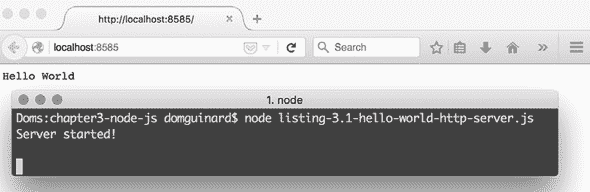

如果您习惯了 PHP 和 Apache 或 Java 和 Tomcat 这样的 Web 服务器，您熟悉创建一个 Web 应用程序然后将其部署到现有服务器上。在 Node 中，事情有所不同，因为您的应用程序就是服务器*。* 让我们开始构建一个简单的 Web 服务器，该服务器对所有的传入请求总是返回“Hello World”；请参阅下面的列表。

##### 列表 3.1\. Node.js 中的 Hello World HTTP 服务器

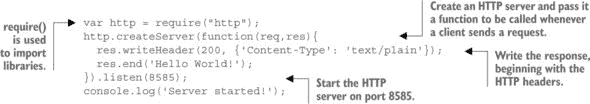

这是最小的了！首先，您`require` `http`模块。这基本上是加载 HTTP 模块并将其提供给您的应用程序（我们将在下一节中详细介绍 Node 依赖项的工作方式）。之后，您使用 HTTP 对象创建一个新的服务器。您将一个函数传递给这个服务器，这个函数将在客户端连接到您的服务器时被调用。当客户端实际连接时，该函数会带两个参数被调用：

+   `req`代表客户端请求，并提供了一些函数来检索有关它的信息，例如请求的 URL 或发送的数据负载。

+   `res`代表您希望发送回客户端的响应。

使用`res.writeHeader()`您可以写入 HTTP 头。在这个例子中，您使用值为`200`的`Status`头（表示一切顺利）和`Content-Type`头为`text-plain`，这意味着您将向客户端返回纯文本。现在，如果您不完全理解这到底意味着什么，请不要担心，因为我们在第六章中会详细讲解这一点。然后，您通过调用`listen(PORT)`来启动服务器，这将使服务器在端口 8585 上启动。

要运行你的第一个服务器，将 列表 3.1 复制并粘贴到一个以 .js 扩展名（例如，helloworld.js）的文件中^([13])。将此文件复制到名为 hello-node 的文件夹中，打开一个终端窗口，进入此文件夹，然后使用命令“node”后跟文件名来启动你的应用程序，如下所示：

> ^[(13)]
> 
> 你可以用任何文本编辑器创建简单的 JavaScript 文件，但对于更严肃的项目，你可能需要一个高级文本编辑器，如 Sublime Text ([`www.sublimetext.com`](http://www.sublimetext.com))、Atom ([`atom.io/`](https://atom.io/)) 或 Brackets ([`brackets.io/`](http://brackets.io/))。你也可以使用功能丰富的 IDE（集成开发环境），如 WebStorm ([`www.jetbrains.com/webstorm/`](https://www.jetbrains.com/webstorm/)) 或 NetBeans ([`netbeans.org/`](https://netbeans.org/))。

```
$ node helloworld.js
```

你应该在终端中看到文本 Server Started! 出现，告诉你 Node 应用程序正在运行。现在在你的浏览器中访问 http://localhost:8585。你应该看到“Hello World”消息，如图 3.2 所示。虽然并不十分令人印象深刻，但想想看：仅用五行代码你就创建了一个与浏览器通信的 Web 应用程序。你甚至不需要为你的特定操作系统安装和配置 Apache 服务器！你现在可以通过在终端窗口中按 Ctrl-C 来停止服务器。

#### 3.2.3\. 以 JSON 格式返回传感器数据

让我们转换一下方向，构建一个真正能提供一些价值的服务器！你将构建一个服务器，当浏览到 `/temperature` 时返回温度传感器的值，如图 3.3 所示，当浏览到 `/light` 时返回光传感器的值。你将在下一章将真实传感器连接到你的 Node 代码中，但到目前为止，你将返回随机数据。你还将更改浏览器返回的数据格式为 JSON，这在第二章中你已经遇到过了。

##### 图 3.3\. 一个简单的 Node Web 服务器，在 Firefox 中以 JSON 表示形式返回温度数据

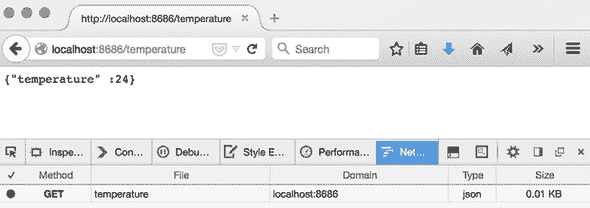

就像你之前做的那样，你首先创建一个 HTTP 服务器，如图 3.2 所示。但这次你通过使用 `{'Content-Type': 'application/json'}` 标头通知客户端响应是 JSON 格式。然后你通过 `req.url` 查看请求，它将包含客户端请求的路径（例如，`/temperature`）。然后你创建一个 `switch` 语句来处理对您不同路径的请求。对于每个路径，你生成相应的随机值并将其作为 JSON 返回。

##### 列表 3.2\. 一个简单的返回 JSON 数据的 HTTP 服务器

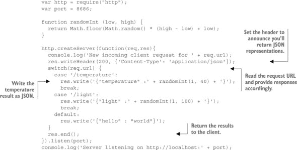

现在保存这个文件，并像之前一样运行你的应用程序：

```
$ node listing-3.2-webserver.js
```

使用你的浏览器导航到 http://localhost:8686/temperature 和 http://localhost:8686/light，以查看一个随机的传感器值，以 JSON 格式显示。

### 3.3\. Node.js 中的模块化

您已经基于内置的 Node 模块创建了自己的第一个服务器。这做得很好，但您如果想通过使用第三方模块来利用不断增长和活跃的 Node 开发者社区的工作，该怎么办呢？本节就是关于这个的：首先了解 Node 模块管理系统，然后了解模块本身的架构。

#### 3.3.1\. npm——Node 包管理器

就像 Java 有 Maven 仓库，Ubuntu 有 apt-get，Ruby 有 Gem 一样，Node 也有自己的包或模块管理器（而且是一个非常好的！），称为 npm。正如 npm 团队成员所说，

> *“npm 并不代表‘Node 包管理器’。它代表‘npm Is Not An Acronym’。为什么不叫‘NINAA’？因为那样它就会成为一个缩写词。*

开个玩笑，不叫 npm 为 Node 包管理器的原因是，它不仅是一个 Node 的包管理器，也是一个客户端 JavaScript 的包管理器。

如果您按照我们在“在您的机器上安装 Node.js”一节中建议的方式安装了 Node，那么您应该已经准备好通过`npm`命令行工具使用 npm 了。第一步显然是选择一个模块进行安装。这可以通过多种方式完成，但一种流行的方式是使用 npm 主仓库的搜索引擎通过关键词搜索模块，网址为[`www.npmjs.com/`](https://www.npmjs.com/)。作为一个练习，寻找您稍后将要使用的`request`模块。所有 npm 模块都有一个独特的名称，所以一旦您找到了想要的模块，就把它写下来。

由于 Node.js 的流行，每个搜索查询都会返回大量选项，有时选择要使用的模块可能会让人感到不知所措。在 Node 这样的快速发展的生态系统中，代码提交速度很快，有时会以稳定性和质量为代价，选择正确的模块尤为重要。快速评估项目相关性和成熟度的好方法之一是查看其 GitHub 页面，这可以在每个模块的详细页面中访问，如图 3.4 所示。在这个页面上，您可以找到关注该模块的人数（Watch）、喜欢该模块的开发者数量（Star）以及创建该模块新版本的人数（Fork）；这些都是模块流行度和稳定性的良好指标。

##### 图 3.4\. Node 模块的 GitHub 页面。在选择模块时寻找模块的流行度指标。

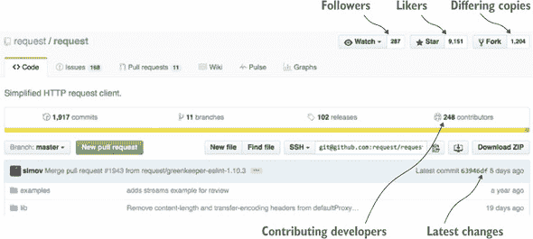

现在您已经选择了一个模块，您可以使用具有模块唯一名称的`npm`命令行工具来安装它。让我们安装`request`，这是一个旨在使 HTTP 调用尽可能简单直接的直观模块。创建一个新的文件夹（这里我们命名为`hello-npm`）并将目录更改为这个文件夹；然后运行以下命令：

```
$ npm install request
```

这将与 npm 服务器通信，并将新模块安装到名为 node_modules/ 的目录中。然后您可以通过使用 `require` 指令从 hello-npm 文件夹内的任何 Node 源文件中使用该模块，该指令将模块加载到内存中并使其对源代码可用。这是通过以下语句完成的：

```
var request = require('request');
```

#### 3.3.2\. 使用 package.json 和 npm 清理依赖项

我们刚才展示的系统运行良好，但向项目中添加更多模块并将其从一个地方移动到另一个地方需要多次手动运行 `npm` 命令。幸运的是，npm 通过允许您在单个名为 package.json 的 JSON 文件中指定代码所依赖的模块来解决此问题。您可以在以下列表中查看典型 package.json 文件的结构。

##### 列表 3.3\. 一个简单的 package.json 文件

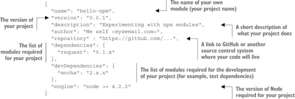

首先，您为项目命名并指定版本。请注意，如果您决定将项目作为模块发布到 npm，则将使用此名称。然后，您添加简短描述、作者以及可以找到项目代码的源代码控制系统链接（可以是私有的）。接下来是文件的核心：项目所依赖的模块。在这里，您有一个单独的模块：`request`。Node 模块通常遵循语义版本控制模式，^([14]) `MAJOR.MINOR.PATCH`：

> ^((14))
> 
> [`semver.org/`](http://semver.org/)

+   当您进行不兼容的 API 变更时使用 `MAJOR` 版本

+   当您以向后兼容的方式添加功能时使用 `MINOR` 版本

+   当您进行向后兼容的错误修复时使用 `PATCH` 版本

支持通配符，因此 `2.x.x` 表示 npm 将获取 `request` MAJOR 版本 2 的最新 `MINOR` 和 `PATCH` 版本。`devDependencies` 仅在您在开发环境中构建项目时才需要依赖项。此类依赖项的一个好例子是测试库，在部署代码的最终版本时不需要导入。最后，使用 `engine` 您还可以指定项目应运行的 Node 版本。这是一个 package.json 文件的简化示例，因为那里可以指定更多内容。网上提供了一份构建 package.json 文件的优秀交互式指南。^([15])

> ^((15))
> 
> [`browsenpm.org/package.json`](http://browsenpm.org/package.json)

当然，您不必手动编写 package.json 文件。相反，您可以使用 `npm init` 命令，该命令将询问您有关应用程序的基本信息，并为您自动生成 package.json 文件。

npm 的另一个有用功能是您不必手动将每个新模块添加到 package.json 文件中。相反，您可以使用以下命令中的 `–-save` 标志来安装它们：

```
$ npm install request –-save
```

此命令将自动将此依赖项添加到您的 package.json 文件中。

#### 3.3.3\. 您的第一个 Node 模块

现在你已经看到了如何在 Node 中管理打包的模块，我们将展示如何通过创建自己的简单模块来组织你的代码。想象一下，你想创建一个为应用程序提供算术运算的模块。你的第一个模块的文件夹结构如下所示。模块文件（operations.js）位于/lib 文件夹中，并通过 modules-client.js 文件访问：


首先，为你的项目创建一个名为 hello-modules 的文件夹。为了保持你的代码整洁并尊重 Node 约定，在 hello-modules 内部创建一个 lib 文件夹。然后，你将模块本身写入一个名为 operations.js 的文件，并将其放入 lib 文件夹中；operations.js 的代码如下所示。

##### 列表 3.4\. operations.js：Node.js 中的数学模块

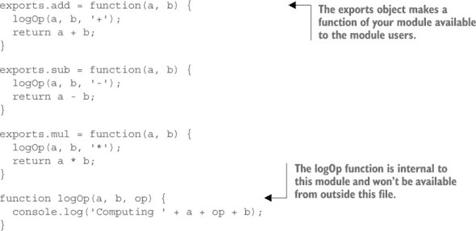

此模块包含三个你希望提供给模块用户的函数：`add`、`sub`和`mul`。你通过在`exports`对象上定义属性来提供它们。请注意，你也可以通过此机制提供任何其他对象、字符串或变量。仅在你模块文件中使用的其他函数（例如，`logOp`）将不会对模块外的文件可用，因为你没有将它们附加到`exports`对象上。

最后一步是为你的库创建一个客户端。在项目的根目录下（即 hello-modules 文件夹），创建一个名为 module-client.js 的新文件（注意，与模块名称不同，客户端文件的名称并不重要）。这个文件的代码相当简单，如下所示。

##### 列表 3.5\. 使用 operations 模块的简单 Node 应用程序

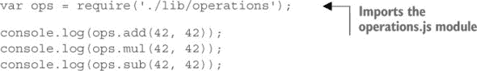

关键在于`require`，其中你导入你的新模块。本质上，你是在告诉 Node 去获取位于 lib 子目录中的模块`operations`并将其保存在`ops`变量中。请注意，在使用`require`时，你不需要指定.js 扩展名。

就这样！你的第一个模块已经准备好使用了。运行`node module-client.js`来测试它。如果一切正常，你应该在你的控制台中看到以下输出：

```
Computing 42+42
84
Computing 42*42
1764
Computing 42-42
0
```

模块的内容远不止我们在这里所涵盖的，但这将帮助你开始并理解我们在这本书的其余部分如何使用模块。

### 3.4\. 理解 Node.js 事件循环

构建服务器端 Web 应用程序，例如你在第二章中使用的该应用程序——或者通常任何需要同时处理多个客户端的 Web 服务器——需要能够以并发方式处理大量连接。如果连接不能被并发接受，每个新的 Web 客户端都必须等待先到达的客户端被服务。这几乎和伦敦的 Waterloo 到 Bank 的地下铁高峰时段一样慢！为了使用一个更恰当的类比，想象一个繁忙交叉路口上的一个单独的加油站，只有一个加油员和一个加油机。

#### 3.4.1\. 多线程 Web 服务器

可以使用两种常见的模式来解决这个问题。如图 3.5 所示，第一种模式是为每个请求创建一个进程——或者更好的是，一个线程。线程本质上是一个轻量级进程，因为它能够在执行时共享一些进程的资源（例如，一些分配的内存），同时大部分独立执行。

##### 图 3.5\. 使用线程或进程分叉方法处理多个并发请求：为每个新客户端创建一个新的线程或进程。

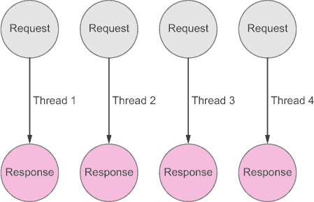

考虑这个代码片段，它从数据库中获取数据然后显示：

```
var result = database.query("SELECT things FROM deviceTable");
console.log(result);
```

如果你曾经使用过在 Apache 上运行的 PHP 或 Tomcat 上的 Java 这样的服务器端 Web 语言，你很可能使用过这样的代码，以顺序方式工作，等待 I/O 操作完成。在 PHP 和 Java 的世界里，这没问题，因为当一个客户端等待服务时，底层服务器（例如，Apache）会为下一个客户端提供服务。它是通过为每个传入的客户端创建一个线程来做到这一点的。

#### 3.4.2\. 单线程、非阻塞 Web 服务器

让我们通过将其应用于我们的加油站来思考这个例子：想象每个线程是一个带有服务员的水泵，每个 Web 客户端是一个客户，数据库是中央油罐。我们比只有一个泵和服务员的情况要好，但每个服务员仍然会在某些时候空闲，等待我们的油罐被填满。如果我们只有一个服务员以高效的方式管理几个泵会怎样？这从成本角度来看不是更经济吗？

简而言之，这就是现代非阻塞 Web 服务器的主要内容：通过最小化每个新客户端所需的内存开销来处理更多请求。第二种模式是一个基于单线程（或有限数量的线程）和事件循环的事件驱动系统，并且是非阻塞的或*异步* I/O。

Node.js 运行时建立在这些原则之上。它运行一个线程和一个事件循环，如图 3.6 所示，并且强烈倾向于异步 I/O 操作。当 Node 服务器接受一个客户端时，它会将其挂起，直到它请求的 I/O 操作（例如，从数据库读取，从传感器读取值，或在远程服务器上上传文件）返回，同时继续为其他客户端提供服务。

##### 图 3.6\. 使用单线程事件驱动方法处理多个并发请求。事件循环将客户端挂起，直到 I/O 操作返回。

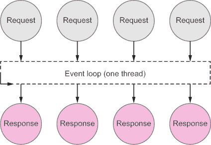

单线程事件循环模式的一个直接后果是，Node 实际上不喜欢主动等待，因为它会完全阻塞 Node 服务器，并阻止它处理任何后续请求！

为了更好地理解阻塞和非阻塞调用的区别，想象一下我们在 Node 服务器上运行之前显示的同步代码。Node 运行时会从数据库获取数据，等待直到获取到数据，然后执行`console.log()`指令。如果有大量数据要获取，你可能需要等待相当长的时间，在这段时间内，Node 服务器将无法服务或接受任何其他传入请求——这不是扩展系统的好方法！让我们以适合 Node 模型的方式重写数据库函数，如下所示。

##### 列表 3.6\. 对数据库的异步调用

![072fig01_alt.jpg]

与这个版本的主要区别在于，在调用`database.query`函数时，你传递一个函数作为参数（我们将在下一节中更多地讨论这些函数，称为*回调*）。然后，Node 事件循环将挂起此调用，直到从数据库收到响应。这次，在等待响应的同时，其他指令将被执行，直到从数据库获取结果并准备好消费。当结果检索到时，事件循环将使用结果调用回调函数`function(results)`。

令人惊讶的是，这意味着在调用`database.query`指令后，它将直接返回。因此，`console.log(results)`将立即执行，在结果实际上准备好之前！此外，结果本身仅对匿名函数（由事件循环注入回调中）可用，对于`console.log`指令，变量将是未定义的。

这种在单个线程上提供服务而不阻塞所有客户端的方式仅当链中的所有调用都是异步时才有效，因此你使用的所有库和编写的所有代码都应该异步，除非有非常好的理由不这样做。一个合理的同步调用例子发生在 Node 程序启动时加载配置或依赖项。作为一种惯例，为了确保你跟踪你的同步调用，Node 中同步函数通常以`Sync`后缀结尾，并且通常不接收一个函数作为参数。例如，`fs.readFileSync(filename)`以同步方式读取文件（即，阻塞单个线程直到文件完全读取），而`fs.readFile(filename,callback)`则以异步方式读取文件（即，在等待文件读取的同时释放线程执行其他工作）。

不要误解我们：单线程服务器使用异步 I/O 并不简单，也不是万能的。但它们已经在许多情况下证明了更好的性能和扩展性，尤其是在数据密集型实时（DIRT）应用中。有趣的是，现实世界中的事物，如传感器，其本质非常适合 DIRT 类型的应用，这在一定程度上解释了为什么在物联网背景下，对这些类型服务器的兴趣日益增长。从现实世界读取数据需要收集大量的传感器数据（通过物理传感器的 I/O 操作），并且客户端期望能够及时、基于事件和几乎实时地了解这些传感器状态的变化！这非常适合 DIRT 应用的定义，将在第六章中介绍。

我们希望我们没有让你感到困惑！如果我们让你感到困惑了，别担心，因为你在本书中还会看到更多这方面的例子。现在，记住一件事：Node.js 只有一个线程，所以你需要确保你的代码在读取文件、从网络获取资源或从船上传感器读取数据时不会阻塞等待 I/O。确保这一点不发生的一个简单方法是传递回调函数，当数据可用时，事件循环会调用这些函数。

### 3.5. 开始异步编程

如前节所示，Node 主要基于异步编程的原则。让我们说实话：异步编程是扩展服务器的好步骤，但掌握它并不容易。PHP 的顺序模型，你可以依赖的事实是指令一个接一个地执行，使得代码清晰易懂。但好的扩展性很少没有代价。必须处理异步编程是我们使用像 Node 这样的基于事件的运行时所要付出的代价之一。

Node 提供了两种处理异步调用的主要模式：回调和事件监听器。我们将在本书的后面部分使用事件监听器，并在适当的时候简要介绍这个概念。另一方面，回调在 Node 中非常重要且无处不在，所以我们将在这里深入探讨它。

#### 3.5.1. 匿名回调

考虑一个函数 `F`，它执行一些异步操作，例如从网络获取一些数据，如图 3.7 所示。图 3.7。我们需要一种方式来表达当 `F` 返回时下一步要做什么，所以我们给 `F` 另一个函数来调用，当 `F` 完成消息发送操作时。这是一个回调的例子——也就是说，一个作为异步函数参数传递的函数，描述了异步函数完成后要做什么。

##### 图 3.7\. 回调和事件循环（简化）。`F`异步从网络获取数据。同时，其他函数正在被服务。当`F`请求的数据准备好时，事件循环调用在数据准备好时指定的函数。这种函数被称为回调。

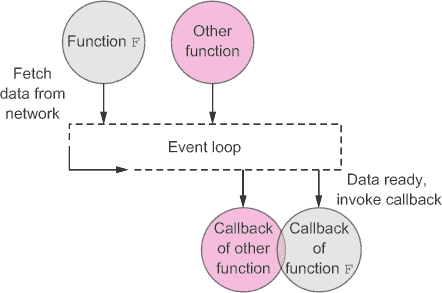

例如，在列表 3.6 中，作为`database.query()`参数传递的匿名函数是一个回调。请注意，我们称这些为*匿名函数*，因为它们没有名字，因此，与我们将很快讨论的命名回调不同，除了最初传递给它们的函数之外，任何代码都无法调用它们。使用回调的另一个好例子是第二章中列表 2.9 的混合；它包含的`mashup()`函数有几个客户端 JavaScript 回调，在每一项响应之后调用一个物理事物。

虽然你可以为你的回调使用任何函数，但创建具有两个参数的回调函数是一个好习惯；第一个参数，通常命名为`err`或`error`，将包含在调用异步函数时发生错误的情况。第二个参数，通常命名为`resp`、`response`或任何反映你期望返回的内容的名称，将在一切顺利时包含预期的结果。

为了更好地理解异步调用和回调的使用，让我们创建一个类似于列表 2.9 的混合，但是在服务器端，如图 3.8 所示。当对`/log`资源发出请求时，我们的应用程序将执行以下操作：

> **1**. 从服务器获取一个温度值。
> 
> **2**. 从服务器获取一个亮度值。
> 
> **3**. 为这两个值创建一个日志条目并将其追加到 log.txt 文件中。

##### 图 3.8\. 运行列表 3.2 的服务器（终端窗口，顶部）并通过从浏览器调用的回调在服务器端混合其数据（底部）

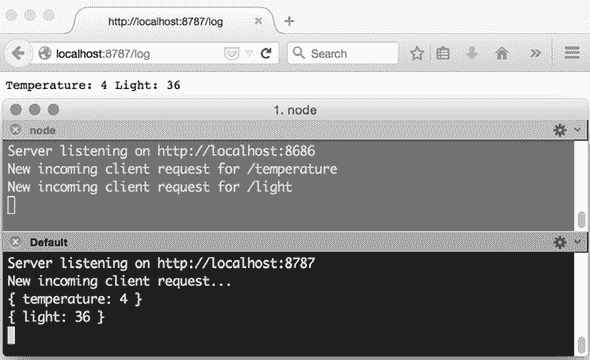

这里关键的一点是，所有三个操作都需要 I/O 操作：1 和 2 需要从你的 HTTP 服务器获取数据；3 需要写入磁盘。因此，如果你以阻塞、同步的方式运行它们，整个 Node 事件循环将被阻塞几个 CPU 周期，无法接受来自其他客户端的任何连接，直到这些 I/O 操作返回。你肯定不希望这样！以下代码演示了如何使用回调以非阻塞方式构建此混合。

对于这段代码，你将使用之前安装的外部模块`request`。在新的目录中创建一个 package.json 文件，并使用`npm`安装该模块，如前面所示：

```
$ npm install request –-save
```

使用`request`调用 HTTP 资源很容易！以下列表将获取 Web of Things 主页并返回其 HTML 内容。

##### 列表 3.7\. 使用 request 库


你可能已经注意到对 `request` 的调用带有一个回调参数。这是预期的，因为该调用将以异步方式执行。使用 `request` 库，你的混合应用变得相当直接，如 列表 3.8 所示。你首先使用 `request` 从你的服务器获取温度。然后，在温度请求的回调中，你获取光线，在光线回调中，你使用异步内置的 Node `fs.appendFile()` 函数写入文件，并最终使用你获取的值回复客户端。

##### 列表 3.8\. 使用异步调用导致的“回调地狱”

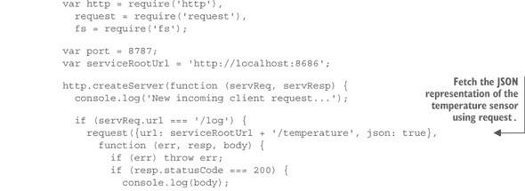

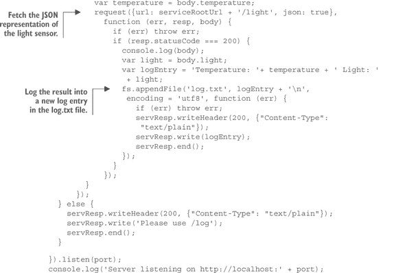

保存此代码，并通过首先启动 列表 3.2 的服务器来测试它：

```
$ node listing-3.2-webserver.js
Server listening on http://localhost:8686
```

然后，在新的终端窗口中运行混合应用：

```
$ node listing-3.8-callbacks.js
Server listening on http://localhost:8787
```

现在，将你的浏览器指向 http://localhost:8787/log；如果一切按预期工作，你应该会看到类似于 图 3.8 的输出。这种方式在另一个回调内部调用回调，等等，被称为 *嵌套回调*。不幸的是，如 列表 3.8 的代码所示，嵌套回调很快就会将你的代码推到右边，使得随着每个额外回调的增加，代码的阅读和管理变得更加困难。这种异步编程使用回调的不幸后果被称为 *回调地狱*。正如你所见，这个问题在相对较少的回调数量下就会出现。一个保持理智的经验法则是不要尝试嵌套超过三个这样的回调。

#### 3.5.2\. 命名回调

不要就此放弃希望！有几种方法可以解决你的回调地狱。第一种是使用实际的命名函数而不是匿名函数。使用命名函数可以使代码更易于阅读，因为它封装了异步调用。它将回调地狱减少为一系列函数调用，每个函数首先调用一个异步函数，然后调用链中的下一个函数。如果你使用这种策略重写你的混合应用，它看起来就像下面的代码列表。

##### 列表 3.9\. 使用异步调用和命名回调的混合

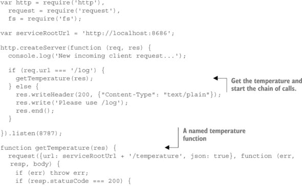

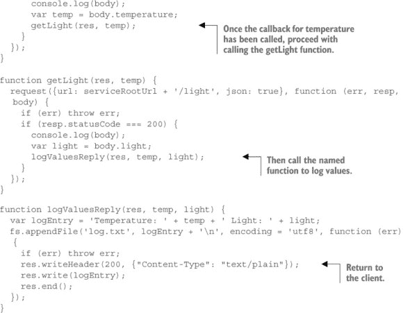

这段代码基本上与 列表 3.8 相同，但这次工作流程被拆分到几个函数中。在服务器的回调中，你调用 `getTemperature()`；这个函数异步获取温度，并在温度到达后立即调用 `getLight()` 函数。`getLight()` 从服务器获取光线，并在光线值准备好后立即调用 `logValuesReply()`。最后，`logValuesReply()` 异步将值记录到文件并回复客户端。

结果是代码可读性更高，缩进级别可管理。但另一方面，你现在必须手动将值作为函数参数传递给调用链；这些包括 `res` 参数，它包含在链的末尾所需的响应对象的句柄。此外，每个函数都需要知道下一个要调用的函数。这意味着你的函数与其他函数紧密耦合，代码难以在其他工作流程中重用。

#### 3.5.3\. 控制流库

我们显然不是第一个面临嵌套回调挑战的开发者；因此，许多开发者已经将他们处理该问题的方法贡献给了社区。这导致了大量 *控制流* 模块的产生。本质上，这些模块提供了优雅的解决方案来处理回调地狱问题；它们还以干净、灵活和可重用的方式解决了使用命名回调的不足。我们无法在此列出所有控制流库，但我们推荐使用 `Async`。^([16]) 这个库可能是处理浏览器和 Node 中异步 JavaScript 的最全面的工具集。

> ¹⁶
> 
> [`github.com/caolan/async`](https://github.com/caolan/async)

让我们使用以下命令安装的 `async` 控制流库重写我们的混合代码：

```
$ npm install async --save
```

你将使用 `async.series([])` 构造，该构造函数接受一个函数数组作为参数，以及一个可选的最终回调函数，当所有其他函数返回后将被调用。此构造函数的一般结构在下一列表中展示。

##### 列表 3.10\. 使用 `async.series` 进行串行控制流

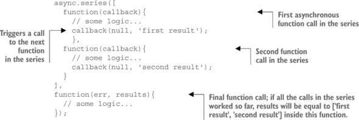

将此结构应用于你的混合代码，你将获得 列表 3.11 中的代码，它类似于你第一次尝试解决问题（使用嵌套回调）的方式，但整个结构更加扁平，可读性也更高。为了促进重用，我们还使用了之前创建的命名函数。在控制流模式中的关键是，在链中的每个函数中调用 `callback(err, result)` 方法，该方法通过控制流库调用数组中的下一个函数，并将结果添加到提供给最后一个回调函数的结果数组中。在这种情况下，结果数组以有序的方式包含温度和光照值，正如在数组中预期的那样（注意，`Async` 也提供了一个使用对象的替代方案）。

##### 列表 3.11\. 使用控制流库

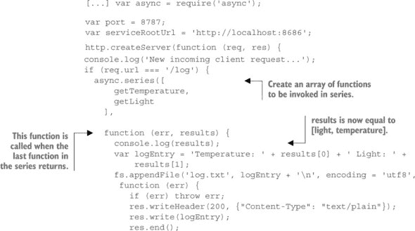

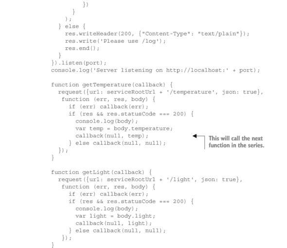

不仅这种模型更易于阅读，而且它还更加灵活。例如，尽管你按顺序执行了温度和光度的调用，但没有任何东西强迫你这样做；你只需要以任何顺序得到响应。现在，使用`Async`库的另一个结构`async.parallel`，你可以通过并行运行调用来加快你的混合操作。为此，你只需要将初始调用从`async.series([...])`更改为`async.parallel([...])`。

正如你所见，异步编程并不总是直截了当的，掌握它需要一定的学习曲线。幸运的是，有一些技术和工具可以帮助你在这种复杂性中保持代码的整洁和结构。在本书的后续内容中，我们将使用简单的匿名和命名回调作为例子，这些例子不需要超过三层回调嵌套。对于所有其他例子，我们将使用我们刚刚介绍过的伟大的`Async`库。

| |
| --- |

**技术角落——你答应我更多！**

前一节是关于帮助你高效使用异步编程的模式的介绍。还有许多其他流行的模式，如承诺和事件。承诺主要来自客户端 JavaScript 世界，但你也可以使用 Node.js 和像 Bluebird([`www.npmjs.com/package/bluebird`](https://www.npmjs.com/package/bluebird))这样的库来实现。事件模式被许多 Node 核心模块使用，是实现异步库的好方法([`nodejs.org/api/events.html`](https://nodejs.org/api/events.html))。不要犹豫，去尝试这些模式，找到最适合你需求的那一个！

| |
| --- |

### 3.6. 摘要和本书之外的内容

+   在过去的几年里，嵌入式设备变得越来越强大，这使得在设备上直接使用 JavaScript 和 Node.js 变得可行且具有吸引力。

+   仅使用 JavaScript 从头到尾构建物联网原型提供了相当大的灵活性，并且使代码维护变得更加容易。

+   你可以在多个平台和环境上运行 Node.js 应用程序，而无需修改代码，这使得在异构部署中开发和扩展应用程序变得容易。

+   Node.js 的模块化允许你利用数千个社区库快速构建复杂的应用程序。

+   如同你在本节中看到的，单线程系统，例如 Node 运行时和事件循环，需要一种新的应用程序设计方式。代码和库必须保持异步。

+   异步编程的基本思想是在结果可用时传递将被调用的回调函数。

+   使用匿名和命名回调可能会导致你经历回调地狱！像`async`模块这样的控制流库可以帮助你解决它，并更好地组织你的代码。

如果 Node.js 引起了你的好奇心，那么现在可能是你购买 Node.js 书籍^([17])并关注官方 Node.js^([18])博客的好时机。

> ¹⁷
> 
> [`www.manning.com/catalog/by/subject/`](http://www.manning.com/catalog/by/subject/)
> 
> ¹⁸
> 
> [`blog.nodejs.org/`](http://blog.nodejs.org/)

现在你已经将 WoT 工具箱的所有软件基础都准备好了，你就可以学习关于硬件部分的知识了，特别是选择哪些设备以及如何配置它们。在下一章中，我们将首先提供一个关于嵌入式设备世界和现有平台类型的高层次概述。之后，我们将深入探讨设置树莓派设备，连接多个传感器和执行器，并使用 Node.js 管理它们，然后你将一切准备就绪，让你的树莓派成为物联网的一部分。

## 第四章\. 开始使用嵌入式系统

*本章涵盖*

+   理解各种嵌入式系统类别

+   树莓派的简介

+   介绍如何设置和使用 Node.js 进行物联网原型设计

+   学习使用 GPIO 连接传感器和执行器

正如我们之前讨论的，物联网中的物理对象大致分为两大类：*标记*对象和*连接*对象。第一类包括各种*标记*技术，这些技术附着在产品上，例如条形码、二维码、NFC 或 RFID 标签等。在这种情况下，对象并不是直接连接到网络，而是被动地连接，因为需要另一个设备或应用程序与产品交互。连接对象直接连接到物联网，是嵌入式系统和嵌入式设备的领域，它们本质上是非常小、相对便宜、低功耗的计算机，具有有限的资源和能力。你可以将本书中将要学习的技巧和架构应用于标记对象和连接对象，但本书的重点主要在于连接对象。

在第二章中，你学习了如何从位于我们办公室的真实嵌入式设备——树莓派——获取服务，以获得对物联网的第一印象。但这是因为你交互的设备既不属于你，也不在你身边，所以这并不是一个非常物理的过程。

在本章中，我们将向您展示如何设置和配置您自己的物联网设备。到本章结束时，您将拥有一个连接到万物的真实设备，您将拥有所有工具来编程它并实现本书下一章中介绍的所有概念。您将从选择硬件平台开始。市面上有很多选择，所以我们会确保帮助您。然后，您将通过安装各种软件包和库来使您的设备适合物联网。您还将通过将真实传感器和执行器直接连接到您的树莓派来学习物联网原型设计的基础知识，并了解一些电子学知识。

如果这是你第一次接触嵌入式设备和电子设备，本章将是一个温和（但具有挑战性）且有趣的快速入门课程！

### 4.1\. 嵌入式设备的世界

实际上，可用的嵌入式平台类型数以千计，从为研究人员或黑客构建的小规模通用传感器节点生产，到专门为烟雾报警器、微波炉和闹钟等设备设计的廉价和大规模生产的电路。显然，在这本书中我们没有时间对这些平台进行深入审查。你应该记住的是，嵌入式设备分为两大类：一类是针对爱好者的（不那么具体和优化，但更可重用和灵活），另一类是旨在集成到实际工业产品中的（针对特定用例进行了更多优化，因此扩展和在其他环境中使用更困难）。

#### 4.1.1\. 爱好者设备与工业设备

将计算机嵌入到日常物品中的想法并不新颖：我们的洗衣机已经包含集成电路几十年了。但它们并没有连接到互联网，也不是为了便于应用开发者或客户访问或重编程而设计的。物联网的出现极大地改变了游戏规则。首先，物联网设备连接到互联网，这对低功耗设备来说可能是一个挑战。这种限制催生了一系列工业级嵌入式平台，它们支持各种网络协议，开箱即用，适用于商业应用。其次，研究社区和爱好者开始越来越对小型计算机感兴趣，这些计算机不仅易于编程，而且可以支持各种传感器或执行器。

这两个趋势催生了大量针对现实世界和工业用例以及爱好者 DIY 项目的平台。这两个类别之间的主要区别是用户关注的焦点。对于工业平台，目标一直是降低成本，以便它们可以嵌入各种消费产品，同时保持高水平稳定性（你不会希望每隔一段时间就要重启你的洗衣机）。然而，爱好者对工业级性能和坚固性不太敏感，他们更喜欢开放、易于使用和扩展的平台，并且还配备了详尽且易于使用的工具套件。

话虽如此，近年来物联网的吸引力模糊了两个世界的界限，你可以看到工业平台制造商正努力通过更好的工具使他们的设备更易于访问。同样，爱好者平台也在变得更加坚固和便宜，因此现在也被嵌入到现实世界的产品中。

提供这些平台的详细概述可能会消耗掉这本书的剩余部分，所以我们只描述了一些最受欢迎的表 4.1。请注意，这个表格是对品牌及其产品的一个过度简化，提供了一个对一些大玩家的概述。请参考平台的相关网站以获取更多详细信息。

##### 表 4.1. 一些物联网嵌入式平台的概述。针对爱好者的平台通常成本更高，但资源（RAM，CPU 等）也更丰富。工业平台倾向于提供较低的规格，但成本通常较低。

| 品牌 | 型号 | CPU | RAM | + | 价格 | 类型 | 连接性 |
| --- | --- | --- | --- | --- | --- | --- | --- |
| Arduino | 20+及众多克隆（Spark，Intel 等） | ATmega，8-64 MHz，Intel Curie，Linino | 16 KB-64 MB | 最大的社区 | ~30 美元 | 实时操作系统，Linux，爱好者 | 可插拔扩展板（Wi-Fi，GPRS，BLE，ZigBee 等） |
| Raspberry Pi | A，A+，B，B+，2，3，Zero | ARMv6 或 v7，700 MHz-1.2 GHz | 256-1 GB | 全 Linux，GPU，大型社区 | ~5-35 美元 | Linux，爱好者 | 以太网，通过 USB 扩展，BLE（Pi3） |
| 英特尔 | Edison | Intel Atom 500 MHz | 1 GB | X86，全 Linux | ~50 美元 | Linux，爱好者到工业级 | Wi-Fi，BLE |
| BeagleBoard | BeagleBone Black，X15 等 | AM335x 1 GHz ARMv7 | 512 MB-2 GB | 稳定性，全 Linux，SDK | ~50 美元 | Linux，爱好者到工业级 | 以太网，通过 USB 和屏蔽扩展 |
| 德州仪器 | CC3200，SoC IoT 等 | ARM 80 MHz 等 | 256 KB 起 | 成本，Wi-Fi | <10 美元 | 实时操作系统，工业级 | Wi-Fi，BLE，ZigBee |
| Marvell | 88MC200, SoC IoT 等 | ARM 200 MHz 等 | 256 KB 起 | 成本，Wi-Fi，SDK | <10 美元 | 实时操作系统，工业级 | Wi-Fi，BLE，ZigBee |
| Broadcom | WICED 等（也是树莓派的核心） | ARM 120 MHz 等 | 从 256 KB 起 | 成本、Wi-Fi、SDK | 低于 10 美元 | RTOS、工业 | Wi-Fi、BLE、ZigBee、Thread |

#### 4.1.2\. 实时操作系统与 Linux

在表 4.1 中，你可能注意到了显示 RTOS 和 Linux 设备的类型列。用于嵌入式设备的操作系统主要有两大类：*实时操作系统（RTOS）*和，嗯，不那么实时的操作系统！

从本质上讲，使操作系统成为实时的是它对传入数据的快速和可预测的响应能力。对于控制“大而复杂的事物”的应用程序，如核电站、制造链和飞机，确定性响应时间比其他任何因素都更重要，实时操作系统是必要的。它们通常还会导致功耗降低或至少功耗相当可预测。

当涉及到嵌入式设备时，RTOS 的世界主要由开源实时操作系统 Free-RTOS 统治，^([1])尽管存在一些可行的替代方案，如 Contiki，^([2])TinyOS，^([3])mbed OS，^([4])以及商业的 VxWorks.^([5])

> ¹
> 
> [`www.freertos.org/`](http://www.freertos.org/)
> 
> ²
> 
> [`www.contiki-os.org/`](http://www.contiki-os.org/)
> 
> ³
> 
> [`www.tinyos.net/`](http://www.tinyos.net/)
> 
> ⁴
> 
> [`www.mbed.com/en/development/software/mbed-os/`](https://www.mbed.com/en/development/software/mbed-os/)
> 
> ⁵
> 
> [`www.windriver.com/products/vxworks/`](http://www.windriver.com/products/vxworks/)

实时操作系统的缺点之一是它不太擅长并行处理多个任务，这使得构建提供简单抽象的复杂层变得困难。这就是非实时操作系统可以发挥作用的地方。对于不那么关键的使命，用户体验和功能比恒定的非常快速响应时间更重要，这种情况下它尤其有用。在这个世界里——甚至比 RTOS 世界——一个操作系统统治着一切：Linux.^([6])

> ⁶
> 
> 注意，许多项目提供了 Linux 内核的修改版本，将其转变为实时操作系统；例如，参见[`www.osadl.org/Realtime-Linux.projects-realtime-linux.0.html`](http://www.osadl.org/Realtime-Linux.projects-realtime-linux.0.html)。

由于其庞大的社区、丰富的工具、抽象和支持的架构，Linux 是开始尝试和革新物联网设备的理想环境。但不要误解；它也越来越成为现实世界和稳健物联网应用的合适候选者，例如家庭自动化或构建应用网关，如第五章所述（kindle_split_012.html#ch05）。


**“极客角落——我想有更多的操作系统！”**

在过去的几年里，Linux 已经成为了在嵌入式设备上使用的一种非常流行的操作系统，以至于 Linux 基金会的一个名为 Yocto 的项目现在致力于为嵌入式设备创建定制的 Linux 发行版。同样，谷歌正在开发 Brillo，它是 Android（同样基于 Linux）的一个扩展，用于物联网，而 Ubuntu 推出了 Ubuntu Core 用于物联网。^[[a]]^[[b]]^[[c]] 尽管 Linux 占据了主导地位，但在这个领域还有一些 Linux 的替代品，例如 Windows 10 for IoT。^[[d]] 我们将在 Pi 上使用 Linux Raspbian，但您也可以尝试 Yocto、Ubuntu Core 或 Windows 10，所有这些都可以在 Pi 上运行（从 Pi 2 开始）。

> ^a
> 
> [`www.yoctoproject.org/`](https://www.yoctoproject.org/)
> 
> ^b
> 
> [`developers.google.com/brillo/?hl=en`](https://developers.google.com/brillo/?hl=en)
> 
> ^c
> 
> [`www.ubuntu.com/internet-of-things`](http://www.ubuntu.com/internet-of-things)
> 
> ^d
> 
> [`dev.windows.com/en-us/iot`](https://dev.windows.com/en-us/iot)


#### 4.1.3\. 摘要和 Pi 之外

在本节中，我们为您提供了嵌入式设备世界的简要介绍。显然，关于这个主题已经写了很多整本书，所以我们并没有试图全面搜索，而是试图让您对选择项目硬件平台时需要考虑的选项和元素有一个一般性的了解。^[[7]]

> ⁷
> 
> 可以在这里找到对流行硬件平台的良好总结：[`postscapes.com/internet-of-things-hardware`](http://postscapes.com/internet-of-things-hardware)。

我们决定将 Raspberry Pi 作为本书剩余部分的参考平台。为什么选择 Raspberry Pi？首先，因为它可能是最流行的嵌入式平台之一，与 Arduino 一样。但与 Arduino 不同，^[[8]] 它是为 Linux 构建的，从一开始就被设计成一个强大且易于访问的平台，用于自动化和物联网。基本上，它将让您深入挖掘网络和物联网，而无需处理 RTOS 平台带来的所有挑战（例如，C 编程、有限的 RAM 和粗糙的工具）。

> ⁸
> 
> 值得注意的是，还有一些基于 Linux 的新 Arduino；例如，Arduino Yun。

此外，正如您将在下一节中看到的，它价格低廉，在许多国家都有销售，并且带有多个 USB 端口用于连接附件，以及一个 HDMI 输出，可以连接到您的电视或屏幕。因为它基于 Linux，并提供对操作系统和 Node.js 的直接访问，所以您可以在上面轻松安装所有必需的依赖项，就像在您的 PC 上安装东西一样。

这并不意味着 Pi 是运行本书中提供的代码或学习物联网的唯一选择。只要您选择一个可以运行 Node.js 的设备，您基本上就可以开始了。

##### 从概念验证到工业原型

树莓派无疑是开始使用物联网和构建各种原型最容易的方式之一。但对于任何更严肃的应用，如工业和商业级原型或实际产品，经典版本的树莓派并不是最佳选择。这有几个原因，但最主要的是使用 SD 卡作为存储和树莓派的尺寸。

依赖于 SD 卡在现实世界中并不适用。SD 卡的使用寿命有限。它们有时会损坏、被破坏或容易脱落。一个更实用的方法是将操作系统和所需的数据存储在板载闪存中。与 SD 卡一样，闪存是持久的，这意味着即使设备未供电，数据也会被保留。它们焊接在板上，并且比 SD 卡更快、更稳定。

此外，树莓派并非主要用于商业应用，因此它拥有更多可能对于大多数使用场景并非必需的组件和连接器。

这是否意味着你将无法将在这里学到的知识应用于构建商业级原型？绝对不是！有现成的平台与你在本书中学到的知识和你将编写的代码兼容。

首先，有一种树莓派版本更适合现实世界：树莓派计算模块.^([9)) 计算模块是一个类似于经典树莓派的嵌入式平台，但具有更小的尺寸和板载闪存。同样，树莓派 Zero 是 Pi 家族的最新成员，也是最小的（65mm x 30mm）。再加上令人震惊的 5 美元价格标签，它也成为商业解决方案中嵌入的可行候选者，尽管它缺少网络连接或板载闪存。与树莓派 Zero 类似，C.H.I.P^([10))具有小型化设计，以 9 美元的价格还提供了 Wi-Fi 和蓝牙连接。

> ⁹
> 
> [`www.raspberrypi.org/products/compute-module/`](https://www.raspberrypi.org/products/compute-module/)
> 
> ¹⁰
> 
> [`getchip.com`](http://getchip.com)

存在着其他非常好的（但稍微贵一点的）替代品，例如英特尔爱迪生，^([11)) 它与树莓派 3 一样，也支持蓝牙低功耗（见第五章）和 Wi-Fi，但体积更小，并具有板载闪存。

> ¹¹
> 
> [`www.intel.com/content/www/us/en/do-it-yourself/edison.html`](http://www.intel.com/content/www/us/en/do-it-yourself/edison.html)

如果你正在寻找一种设备来构建更加机械稳定的原型，而且不需要焊接太多，你应该考虑来自 BeagleBone 的 BeagleBoard^([12))平台，这是一个与树莓派类似但以坚固和稳定著称的平台。此外，BeagleBone 提供 SD 卡和基于闪存的存储，这使得将你的原型从概念转移到实际世界的试验变得容易。

> ¹²
> 
> [`beagleboard.org/BLACK`](http://beagleboard.org/BLACK)

可用的平台很多，但有趣的是，Pi、BeagleBone 和 Edison 都运行在 Linux 上并支持 Node.js。这意味着大多数示例将直接在这三个平台（以及许多其他平台）上运行，但一些更高级的示例，例如使用 GPIO 的示例，可能需要稍微不同的设置或替代库。附录为您提供了使用本书的架构、概念和代码示例与其他设备（如 BeagleBone Black、Intel Edison 和 Arduino 板）的一些指南。

### 4.2\. 设置您的第一个 WoT 设备——Raspberry Pi

到目前为止，本章已经描述了嵌入式系统的世界，以及在选择最适合您自己项目的硬件平台时需要考虑的各个方面。接下来，我们将简要介绍运行在您的硬件平台之上的软件层，通过讨论设备上的操作系统，并描述 JavaScript 和 Node.js 如何成为构建物联网设备的一个非常有趣的应用开发生态系统。

#### 4.2.1\. 认识 Raspberry Pi

Raspberry Pi 是一系列流行的单板计算机：想象一下，一台电脑的大小几乎不比您用来购买它的信用卡大（见图 4.1）。这些设备主要由 Raspberry Pi 基金会开发，主要是作为教育工具，让更多的人了解基本的计算机科学和物理计算。

##### 图 4.1\. Raspberry Pi 3 和 Pi Zero 及其不同的端口和接口

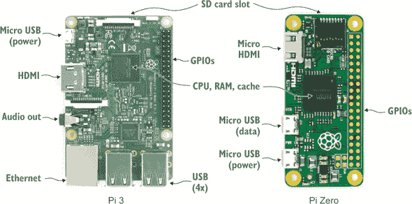

到目前为止最具颠覆性的型号是 Raspberry Pi Zero。这款设备开启了一场小小的革命：售价仅为 5 美元的全功能 Linux 电脑，这个价格通常只属于资源有限、低成本 RTOS 设备。Pi 基金会甚至将其免费赠送，附在 2015 年 12 月号的 *The MagPi* 杂志上，^([13]) 显示出计算机以极低的价格附加到任何物体上的日子已经不远了！

> ¹³
> 
> [`www.raspberrypi.org/magpi/raspberry-pi-zero-out-today-get-it-free-with-the-magpi-40/`](https://www.raspberrypi.org/magpi/raspberry-pi-zero-out-today-get-it-free-with-the-magpi-40/)

在性能方面，Pi Zero 与 Pi A 非常相似，但其 ARMv6 CPU 被超频至 1 GHz，并且拥有两倍多的 RAM。仅 9 克重，它还配备了 micro-SD 卡槽、mini-HDMI 接口和两个 micro USB 端口（一个用于供电，另一个用于数据传输）。

写作时的最新树莓派型号是树莓派 3。它比树莓派零贵，但提供的功能也更多。树莓派 3 拥有四核 1.2 GHz CPU、1 GB RAM、一个 micro-SD 插槽，以及 Broadcom VideoCore IV 图形单元。在连接性方面，树莓派 3 有四个 USB 端口（以及一个用于供电的 Micro USB 端口）、一个 HDMI 端口、一个 3.5mm 耳机插孔、一个以太网连接器和 40 个通用输入/输出端口（GPIO）。最后，与前辈不同，树莓派 3 还提供了即插即用的 Wi-Fi 和蓝牙连接性，使其成为一个完全符合物联网（WoT）的设备。所有这些加起来总重量仅为 45 克！

#### 4.2.2\. 选择你的树莓派

本书中的所有示例都在 Pi B+、Pi 2、Pi 3 和 Pi Zero 上进行了测试。你应该选择哪一个？

如果你刚开始接触物联网和嵌入式设备，Pi 3（或任何后续型号）是一个安全的选择：它提供了所有必要的即插即用连接性，并且不需要焊接将传感器和执行器连接到 GPIO。但 Pi 3 的体积明显更大，而且也更耗电（Pi 2 或 3 为 4 瓦，而 Pi Zero 为 0.8 瓦）。

如果你重视尺寸或计划使用电池为你的物联网（WoT）设备供电，那么树莓派零是一个有趣的选择。但它将需要更多的焊接和调试。

理想情况下，到现在我们已经说服你继续购买一个树莓派。如果我们没有，希望并未完全丧失！大多数示例可以在支持客户端 JavaScript 和 Node.js 的任何平台上运行（比如，嗯，你的笔记本电脑！）。对于那些需要树莓派的人——本质上是与连接到嵌入式设备的传感器和执行器直接交互的示例——我们创建了一个小型库来模拟它们。最后，使用 JavaScript 和 Node.js 进行物理网络的美丽之处在于，这些示例几乎可以在任何设备上直接运行。唯一的重大例外是实际与你的传感器通信的最后一英里代码，你可能需要为每个设备进行定制。

不言而喻，如果你身边真的有一个设备来实施示例，你会从这本书中获得更多的乐趣。毕竟，在没有实物的情况下发现物联网就像在夏天没有雪的滑雪一样：有点令人沮丧。

#### 4.2.3\. 购物清单

如果你决定购买树莓派，不妨也把购物清单上的其他物品一起拿下。再次强调，这些物品并非必须跟随本书，但它们将为本书的虚拟示例增添实物触感。表 4.2 列出了你需要购买或收集的所有物品，以便能够创建本书的所有原型。

##### 表 4.2\. 创建本节和本书其余部分所述物理原型所需的组件

| 描述 | 价格 |
| --- | --- |
| 树莓派（任何从 B+开始的型号，推荐 Pi 3） | 约 35 美元 |
| 4-16 GB SD 卡（例如，SanDisk Ultra Class 10 MicroSDHC，16 GB） | 约 10 美元 |
| HCSR501 树莓派 PIR 传感器 | ~5 美元 |
| DHT22 湿度温度传感器 | ~5 美元 |
| 小型面包板或原型板 | ~2 美元 |
| 树莓派跳线（4 M/M 和 4 M/F） | ~2 美元 |
| 330 欧姆电阻 | <1 美元 |
| LED 灯 | <1 美元 |
| Wi-Fi USB 网卡（可选，用于 Pi Zero） | ~10 美元 |
| Pi Zero 线缆套装（可选，用于 Pi Zero） | ~5 美元 |

要知道在哪里购买这些物品和你的 Pi，请查看本书的官方网站[`book.webofthings.io`](http://book.webofthings.io)，在那里你可以找到我们合作伙伴零售商的列表，以及他们为本书读者提供的特别优惠或捆绑包。

#### 4.2.4. 设置你的树莓派

这本书不涉及如何使用树莓派的详细教程，其使用方法已在网络上广泛记录。^([14)] 尽管如此，我们将帮助你设置 Pi，使其适合物联网。

> ¹⁴
> 
> 一个好的起点是树莓派门户[`www.raspberrypi.org/`](http://www.raspberrypi.org/)。

首先安装正确的操作系统。许多操作系统可以在树莓派上运行。出于实用性的考虑，在这本书中，我们将专注于 Raspbian，它本质上是一个针对 Pi 及其用户定制的 Debian Linux 系统的移植版本。Raspbian 的优势在于它已经在 Pi 上广泛使用并经过测试，易于安装和定制；因此，它提供了一个稳定且流行的操作系统，可以在此基础上构建。

在你的 Pi 上安装 Raspbian 的最简单方法就是使用一个名为 NOOBS（New Out Of the Box Software）的工具。NOOBS 是一个操作系统管理器，它将帮助你进行安装，我们将在本节中向你展示如何使用它。

如果你想要走最快的路线，我们还创建了一个包含所有启动所需内容的 WoT 版本 Raspbian。你可以在[`book.webofthings.io`](http://book.webofthings.io)找到它，并直接跳转到第 4.3 节。走手动路线会让你学到更多，并确保你手头有一个定制且最新的系统，所以这取决于你。


**极客角落——让我们谈谈电流**

Pi 从 Micro USB 连接器（如图 4.1 所示）获取所有所需的电源；这意味着这条电缆提供的电流应该足够高。在压力下，Pi B+或 Zero 将消耗大约 500 mA。Pi 2 需要大约 1000 mA，而 Pi 3 需要大约 1.5 mA。你需要多少电流取决于你连接到 Pi 的东西，特别是 Pi 的 USB 端口。在这本书中，我们不会连接耗电的附件，所以你可以考虑裸机 Pi 的电源需求，但一个好的折衷方案是提供 2000 mA 的 USB 电源（检查 USB 适配器的背面或你电脑 USB 端口的规格以了解这一点）。


##### 使用 NOOBS 安装 Raspbian

首先，您需要将 micro SD 卡格式化为 FAT32。确保您的卡足够大，因为它是 Pi 的主要存储空间。它应该至少有 4GB，但我们建议使用更大的卡以确保您有足够的空间安装软件。


##### 注意！

根据 SD 规范，大于 32GB 的卡将使用 exFAT 而不是 FAT 进行格式化。这意味着它可能无法在 NOOBS 使用的 Raspberry Pi 上工作。您可以使用 Linux 上的 GParted 或 Mac OS 上的磁盘工具等格式化工具将其转换为 FAT32，但一些用户也报告了这方面的问题。为了避免任何麻烦，选择一个 4GB 到 32GB 之间的 SD 卡，理想情况下是一个来自可信品牌的快速卡。我们使用 SanDisk Ultra Class 10 16GB 卡取得了良好的效果。


要在 SD 卡上安装 Linux 以便您可以将它插入 Pi 并使用它，请按照以下说明操作：

> **1**. 格式化将要安装 Raspbian 的 micro SD 卡。
> 
> 在 Linux 上，打开 GParted^([15])并使用设备菜单选择与您的 SD 卡对应的设备（确保您正在格式化 SD 卡而不是您的计算机）。然后，右键单击最大的分区将其格式化为 FAT32。
> 
> 在 Mac OSX 上，使用磁盘工具。选择 SD 卡读取器并点击擦除。选择 MS-DOS（FAT）作为格式，给它起个名字（例如，WOT_PI），然后选择擦除以继续格式化卡；参见图 4.2。或者，您可以安装免费的 ApplePi-Baker^([16))实用程序——这是一个很好的小工具，它还允许您备份和恢复您的 Pi 镜像。
> 
> ##### 图 4.2\. 使用 Mac OS 上的磁盘工具格式化 SD 卡以供 NOOBS 安装程序使用。确保您使用 MS-DOS（FAT）格式进行格式化。
> ##### 
> 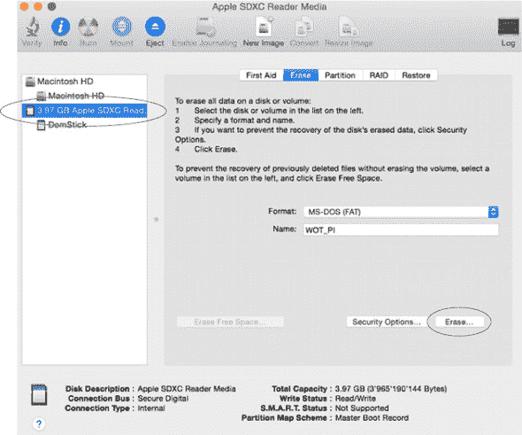
> 
> 在 Windows 上，下载并使用 SD 卡格式化工具^([17])。选择覆盖格式选项；然而，请注意，此工具在大于 32GB 的卡上无法工作，因为它将以 exFAT 格式化它们。
> 
> > ¹⁵
> > 
> > [`gparted.org/`](http://gparted.org/)
> > 
> > ¹⁶
> > 
> > [`www.tweaking4all.com/hardware/raspberry-pi/macosx-apple-pi-baker/`](http://www.tweaking4all.com/hardware/raspberry-pi/macosx-apple-pi-baker/)
> > 
> > ¹⁷
> > 
> > [`www.sdcard.org/downloads/formatter_4/`](https://www.sdcard.org/downloads/formatter_4/)
> > 
> **2**. 从 Raspberry Pi 社区下载最新的 NOOBS 软件（选择 NOOBS）。通常，使用种子文件（在你问之前：是的，在这种情况下这是绝对合法的）下载发行版是最快的方式。
> 
> > ¹⁸
> > 
> > [`www.raspberrypi.org/downloads/`](http://www.raspberrypi.org/downloads/)
> > 
> **3**. 解压 NOOBS 存档的内容并将其传输到新格式化的 SD 卡。不要将内容放在子文件夹中；将所有内容复制到 SD 卡的根目录。文件复制完成后，弹出（或卸载）该卡。
> 
> **4**. 将 SD 卡插入 Pi 侧面的插槽，将 HDMI 线缆插入屏幕，将 USB 鼠标和键盘插入 USB 插槽，最后将 micro USB 线缆插入电源（参见图 4.1 以找到正确的端口）。
> 
> **5**. NOOBS 现在应该启动。大约一分钟后，您将看到一个启动屏幕，允许您安装 Pi 支持的不同操作系统。选择 Raspbian（为 Pi 量身定制的 Linux Debian 操作系统的一个特殊版本）并点击安装。这将开始安装操作系统，这可能需要长达 30 分钟。

操作系统现在应该准备好了。当您第一次启动时，Pi 将带有 X Window 图形环境启动。如果您想禁用此图形用户界面，请选择菜单 > 首选项 > Raspberry 配置，然后在系统选项卡中选择 CLI 作为启动选项。现在重新启动 Pi；选择菜单 > 关机 > 重新启动。Pi 应该重新启动，您很快就会看到一个终端。如果这些步骤中的任何一步出现问题，请在线阅读完整的安装手册^([19])或在本书论坛上发帖.^([20])

> ^（19）
> 
> [`www.raspberrypi.org/help/noobs-setup/`](https://www.raspberrypi.org/help/noobs-setup/)
> 
> ^（20）
> 
> [`book.webofthings.io`](http://book.webofthings.io)

##### 将 Pi 连接到网络

接下来，您需要将 Pi 连接到网络。我们将在第五章中讨论一系列网络协议，但到目前为止，我们将使用以太网或 Wi-Fi。如果您选择了 Pi B、B+或 2，这一步很简单：将路由器中的以太网线缆插入 Pi（参见图 4.1）。

如果您选择了 Pi Zero 或 Pi 3 并且没有将线缆连接到路由器的选项，您需要做更多的工作来将 Wi-Fi 连接添加到您的 Pi 上。这项额外的工作也带来了便携性的优势：您的 Pi 变得无线，只要在无线路由器的范围内，您就可以将其放置在您想要的位置。

支持 Wi-Fi 连接的软件已经存在于 Raspbian 中，但您需要通过修改 Wi-Fi 网络配置文件来启用此功能，如下所示。

##### 列表 4.1. 修改 Wi-Fi 配置文件


您现在可以通过按`CTRL+X`，然后`Y`，然后`ENTER`来保存并关闭此文件。完成此操作后，使用`sudo shutdown –h now`进行干净关机。然后，如果您使用 Pi Zero，将兼容的 Wi-Fi USB 扩展卡插入任何空闲的 USB 端口（在 Pi 3 上不需要这样做，因为 Wi-Fi 是内置的）。请注意，当使用 Pi Zero 时，您需要拔掉任何其他设备（例如，您的键盘）并使用 USB 到 Micro USB 转换器。在表 4.2 的购物清单中查看有关这些组件的更多详细信息。

一旦您的 Pi 重新启动，它应该会连接到您的 Wi-Fi 网络。这个过程在某些网络上可能需要长达一分钟。在下一节中，我们将通过远程访问 Pi 来验证这一切是否成功。

| |
| --- |

**极客角落——我想要更多的 Wi-Fi**

这里描述的方法可以用来将你的 Pi 连接到 WPA（无线保护访问）或更安全的 WPA2。如果你的 Wi-Fi 使用的是不同的安全协议，如（不那么安全的）WEP 或 WPA2 企业版，则可能不起作用。然而，并非所有的希望都破灭了，你可以在网上找到许多关于如何将 Pi 连接到不同 Wi-Fi 网络的优秀教程。一个不错的起点是[`www.raspberrypi.org/documentation/configuration/wireless`](https://www.raspberrypi.org/documentation/configuration/wireless)。

| |
| --- |

##### 远程访问你的 Pi

你的 Pi 现在应该已经启动，运行，并且连接上了。虽然你可以使用键盘、鼠标和屏幕直接在 Pi 上编写和运行所有练习，但更实用的选项是将其“无头”（即，不连接显示器/键盘）运行，并通过 SSH 远程连接到它。在这种模式下唯一的问题是首先找到你的 Pi。这实际上是物联网中一个众所周知的问题，称为引导或发现问题：*给定一个设备第一次连接到网络，你如何找到它的地址？*

为了解决这个问题，使用你的 Pi 的 Avahi mDNS 服务器。mDNS 是一种发现协议，我们将在第八章中介绍，但就现在而言，了解它为你的 Pi 提供了一个地址，附近的计算机可以使用该地址找到它就足够了。Avahi 默认安装在最新的 Raspbian 版本中，所以你可以继续使用它.^([21]) 默认情况下，Avahi 将设置 Pi 以响应`raspberrypi.local`域名。你可以通过在 Linux/Mac OS 的终端上运行列表 4.2 中显示的命令来检查这一点。Windows 用户应尝试以下列表中的 ping 命令，使用命令提示符（`cmd.exe`）。不幸的是，你可能找不到你的 Pi，因为 Windows 机器上默认不支持 mDNS。如果你安装了捆绑 mDNS 服务的应用程序，如 iTunes，则它将工作。但如果你没有，你需要安装一个 mDNS 服务，如 Bonjour Print Services for Windows.^([22])

> ²¹
> 
> 如果它没有安装在你的 Pi 上，运行`sudo apt-get install avahi-daemon`来安装它。
> 
> ²²
> 
> 你可以免费从[`www.apple.com/support/bonjour`](http://www.apple.com/support/bonjour)下载它。

##### 列表 4.2\. Ping 你的 Pi


如果一切正常，你现在应该能够通过其本地 DNS 地址访问你的 Pi：`raspberrypi.local`。请注意，如果你需要，你可以更改此地址；例如，如果你家里有多个 Pi。^([23])

> ²³
> 
> 查看[`www.howtogeek.com/167195/how-to-change-your-raspberry-pi-or-other-linux-devices-hostname/`](http://www.howtogeek.com/167195/how-to-change-your-raspberry-pi-or-other-linux-devices-hostname/)。

##### 为你的 Pi 创建网络

如果您可以访问附近带有以太网端口的路由器或已将 Wi-Fi 拨号器添加到您的 Pi 上，那么上述方法将很好地工作。如果情况不是这样——例如，如果您在酒店房间——还有另一种与 Pi 一起工作的简单且不错的方法：在您的 Pi 和台式机/笔记本电脑计算机之间创建有线网络。

此过程在 Windows、Mac OS 和 Linux 上都受支持，并在互联网上有很好的文档记录。²⁴ 例如，我们将描述如何在 Mac OS 机器上执行此操作。

> ^(24)
> 
> [`pihw.wordpress.com/guides/direct-network-connection/`](https://pihw.wordpress.com/guides/direct-network-connection/)

如果您的机器没有以太网端口，您需要一个以太网到 USB 或 Thunderbolt 适配器。要开始，将您的 Pi 插入机器上的以太网端口。然后，打开系统偏好设置并选择共享。如图 图 4.3 所示，启用从 Wi-Fi 到 Thunderbolt 以太网的互联网共享。这将有效地将您的机器通过 Wi-Fi 获得的互联网连接与 Pi 共享。

##### 图 4.3\. 在 Mac OS 上通过 Thunderbolt 以太网与您的 Pi 共享互联网


如果您没有更改以太网端口的配置，这应该会直接工作。如果不工作，请再次转到系统偏好设置并检查以太网连接（例如，USB 以太网或 Thunderbolt 以太网）是否设置为使用 DHCP。

#### 4.2.5\. 连接到您的设备

一旦 Pi 成功启动，您就可以使用 SSH（安全外壳）连接到它。

##### 在 Linux 或 Mac OS 上 SSH 到您的 Pi

在 Linux 或 Mac OS 机器上，SSH 客户端已经安装，所以您需要做的就是使用以下命令打开终端（默认密码是“raspberry”）。

##### 列表 4.3\. 使用 `ssh` 连接到 Pi


##### 在 Windows 上 SSH 到您的 Pi

要在 Windows 上使用 SSH，您可以下载 PuTTy SSH 客户端。²⁵ 此客户端轻量级，甚至不需要安装：下载它并双击以启动它。在主机名字段中输入您的 Pi 地址（`raspberrypi.local` 或 IP 地址），然后单击打开。然后，您的 Pi 应该会提示您输入用户名（默认为“pi”）和密码（默认为“raspberry”）。

> ^(25)
> 
> [`www.chiark.greenend.org.uk/~sgtatham/putty/`](http://www.chiark.greenend.org.uk/~sgtatham/putty/)

| |
| --- |

##### 注意！

登录后，使用 `passwd` 命令更改您的密码。如果您要将设备连接到互联网的“野生”世界，这可能是个好主意，除非您准备好将您的家开源！

| |
| --- |

### 4.3\. 在 Raspberry Pi 上安装 Node.js

如前一章所述，Node 正在缓慢但稳步地进入嵌入式系统领域，为嵌入式世界的传统 C 环境提供了一个很好的替代方案，因此让我们看看如何在 Raspberry Pi 上使用 Node。

Node.js 框架默认安装在最新的 Raspbian 版本上，但您需要在您的 Pi 上安装最新版本。安装过程相当简单，但您需要特殊版本的 Node。我们经常听到您说：“为什么我不能直接使用标准的 Node.js 版本？”好吧，正如之前提到的，Pi 以及大多数嵌入式设备都运行在 CPU 架构上，这些架构与您的 PC 上运行的架构（x86 或 x64）不兼容。更确切地说，许多嵌入式设备运行在 ARM^([26]) 处理器上，这正是您的 Pi 上的处理器。因此，您在 Pi 上需要的 node 二进制文件与您在 PC 上需要的不同。幸运的是，自从 Node 版本 4.0.0 以来，ARM 二进制文件也已在官方 Node 网站上提供。

> ²⁶
> 
> 如果您决定使用非 ARM 架构的平台，您需要找到适用于您系统的编译好的 Node.js 版本，或者从目标平台上的源代码编译它。

要安装 Node.js 的 ARM 版本，请访问 Node 下载页面 [`nodejs.org/en/download/`](https://nodejs.org/en/download/) 并选择适合您的 Pi 或其他嵌入式设备的正确版本。如图 4.4 所示，要下载的存档取决于您的设备使用的 ARM 架构版本。例如，Pi 3 运行在 ARMv7 架构上。

##### 图 4.4. Node.js 下载页面：支持 ARM CPU，但您需要为您的嵌入式设备型号选择正确的架构。例如，Pi 2 和 3 是基于 ARMv7 CPU 架构构建的，而 Pi Zero 使用 ARMv6 架构。


一旦找到正确的链接，复制它（右键单击复制链接位置）并运行以下列表中显示的命令。这将安装 Node 到您的 Pi 上。

##### 列表 4.4. 在您的 Pi 上安装 Node.js


如果安装成功（当然成功了！），此命令应给出 Pi 上安装的 Node.js 版本。在撰写本文时，4.x 是 Node.js 的最新长期支持（LTS）版本，代码已与该版本进行了测试。

#### 4.3.1. 在 Pi 上使用 Git 和 GitHub

现在 Node.js 已安装在 Pi 上，您需要一种方法来编写与它一起工作的代码。尽管您可以使用 Nano/Pico 或 Vi 等编辑器，但您会发现使用您喜欢的文本编辑器或集成开发环境（IDE）在您的桌面或笔记本电脑上编写代码要高效得多，并且更舒适，您可以在想测试代码时随时将其与 Pi 同步。

首先从 GitHub 上 fork 我们的项目。如果您不熟悉 Git，*forking*意味着创建 WoT-Book 代码仓库的自己的副本，这将允许您按需修改代码。这特别有用，因为它让您可以在桌面机器或 Pi 上编写代码，本地`commit`，然后将它`push`到 GitHub 上的 fork，最后在 Pi 上`pull`回来。要 fork 项目，请访问我们的 GitHub 仓库[`github.com/webofthings/wot-book`](https://github.com/webofthings/wot-book)，并点击 Fork 按钮。这将在您的 GitHub 空间中创建 WoT-Book 仓库的副本。然后您可以在 Pi 上安装 Git 并克隆项目，如下一列表所示。

##### 列表 4.5\. 在 Pi 上配置 GitHub 并 fork 项目


#### 4.3.2\. 那么，这又意味着什么呢？

希望您在旅途中没有受到太多伤害，并且能够按照描述完成所有操作。如果是这样，您做得非常好，可以给自己鼓掌。现在您有一个功能齐全且已准备好 WoT 的 Raspberry Pi，您不仅可以将第一台传感器和执行器连接到它，如下一节所示，还可以运行即将到来的章节中等待您的所有代码示例。

### 4.4\. 将传感器和执行器连接到您的 Pi

您的 Pi 现在已准备好征服万维物联网，但在现实世界中它还没有太多可以工作的东西。为了使其与现实世界更加紧密相连，您需要将一些传感器（例如，湿度传感器）和执行器（例如，LED）连接到 Pi 上。

#### 4.4.1\. 理解 GPIO 端口

在大多数平台（包括 Pi）上执行此操作的方法是使用通用输入/输出（GPIO）端口连接传感器和执行器。本质上，GPIO 是一个可以读取或输出电流的引脚。GPIO 有两种模式：输入模式和输出模式。当选择输出模式时，引脚可以设置为 HIGH，这意味着它输出 3.3 伏特；当引脚设置为 LOW 时，它是关闭的，不输出任何电压。在输入模式下，您实际上可以读取引脚上的值。与 Arduino 等其他嵌入式平台不同，Pi 仅支持数字输入。这意味着您只能与向输入引脚提供一系列 0s（LOW，约 0 伏特）或 1s（HIGH，3.3 伏特）的组件一起工作——即数字组件。例如，LED 是一个数字执行器，按钮是一个数字传感器。

另一方面，模拟组件是指那些不仅提供或消耗 LOW 和 HIGH，而且在引脚上还提供或消耗可变电压的组件。例如，一个便宜的光敏电阻是一个模拟光传感器，一个电位器按钮是一个模拟执行器。如果您想尝试模拟传感器和执行器，有一些扩展板可以连接到您的 Pi 上，使其更适合模拟设备。27

> ²⁷
> 
> 这里有一个简单的教程，教你如何从你的 Pi 读取模拟传感器：[`learn.adafruit.com/reading-a-analog-in-and-controlling-audio-volume-with-the-raspberry-pi/overview`](https://learn.adafruit.com/reading-a-analog-in-and-controlling-audio-volume-with-the-raspberry-pi/overview)。

回到我们的 GPIO：它们的编号取决于 Pi 的型号。不幸的是，编号一点也不直观！图 4.5 帮助你理解每个 GPIO 引脚对应于 Raspberry Pi 3、2 和 B+ 的内容。GPIO 引脚自 Pi A+ 以来布局完全相同。

##### 图 4.5\. Raspberry Pi Zero 和 Pi 3 上的 GPIO、电源和地线布局。


在这本书中，当我们提到，例如，引脚 12 时，我们指的是图 4.5 中的引脚 12，而不是 GPIO12，后者将是引脚 32。

在下一节中，你将动手连接一个被动红外传感器、温度传感器和湿度传感器到 Pi 的 GPIO。

#### 4.4.2\. 使用面包板和电子组件工作

让我们从硬件部分开始。为此，你需要一个面包板，但不是你可能在厨房里找到的那种。如图 4.6 所示，面包板是由塑料和金属制成的板，可以防止你在创建原型时焊接组件。基本上，外部的蓝色行是连接到地线（GND，-）的那一行。这一行中的所有孔都通过一个金属板连接。外部的红色行是接收电源（VCC，+）的那一行。所有行都是连接的。内部的列是用来放置像 LED 和传感器或电阻这样的组件的。

##### 图 4.6\. 一个典型的面包板，其中外部的行以及内部的列都是连接的。用细蓝色线标记的线通常用于连接到地线，而用细红色线标记的线用于连接到电源。


对于我们的“Hello World”闪烁 LED 示例，我们首先将元件放置在面包板上，如图 4.7 所示。28 如果这是你第一次与电子设备打交道，我们建议你使用防静电垫或接地带，以避免损坏你的 Pi。29

> ²⁸
> 
> 这是由 Fritzing 创建的，一个用于创建电子原理图的非常酷的工具：[`fritzing.org/`](http://fritzing.org/).
> 
> ²⁹
> 
> 在这里了解更多关于防静电产品的信息：[`www.explainthatstuff.com/howantistaticcoatingswork.html`](http://www.explainthatstuff.com/howantistaticcoatingswork.html)。

##### 图 4.7\. 通过电阻将 LED 连接到 Pi 的 GPIO 端口。电阻和 LED 插入到面包板的孔中。不需要焊接任何东西！


根据图中的原理图，将 LED 和 330 欧姆电阻（颜色代码：橙色、橙色、棕色、金色/银色）放置在面包板上。请注意，电阻没有方向；它们只需插入即可，因此您可以以任何方式连接它们。如果您想知道电阻的用途，它通过限制通过 LED 的电流来防止 LED 熔化。它还确保在您反转 VCC 和 GND 引脚的连接时 LED 不会烧毁。请注意，您也可以使用更大电阻的电阻；例如，1K 欧姆——棕色、黑色、红色、金色/银色。这将降低 LED 的亮度。然后使用电阻将 LED 短腿所在的列连接到 GND（-，蓝色）线，使用电缆将长腿所在的列连接到 VCC（+，红色）线。最后，将一根电缆（理想情况下是黑色电缆以表示地线）连接到引脚 6（GND），另一根（理想情况下是红色电缆以表示电源）连接到引脚 7（GPIO4）。

#### 4.4.3. 从 Node.js 访问 GPIOs

硬件现在已准备就绪，您可以开始使用 GPIOs。在 Linux 中，GPIOs 并不那么神秘。正在读取或写入引脚的值可以通过文件访问，因此理论上您可以直接从 Node 代码中读取这些虚拟文件。正确地这样做对于初学者来说不是最容易的事情，所以我们不会在本书中介绍这种方法，但我们将使用其他人制作的库。您可以在 Pi 上找到数十个 Node GPIO 库，提供不同的抽象层和功能。我们决定使用一个我们喜欢的名为`onoff`的库。^([30]) 对于更高级的用户，`pi-gpio`^([31]) 将是一个极好的替代方案。

> ³⁰
> 
> [`github.com/fivdi/onoff`](https://github.com/fivdi/onoff)
> 
> ³¹
> 
> [`github.com/rakeshpai/pi-gpio`](https://github.com/rakeshpai/pi-gpio)

要完成本章的下一组练习，您可以从我们的 GitHub 仓库中 fork 它们并进入 chapter4-gpios 文件夹，或者从头创建一个新的文件夹。进入该文件夹并使用 NPM 安装`onoff`（`npm install onoff --save`）。

注意，以下使用`onoff`库的示例在您的 PC 上无法工作，因为 PC 没有可访问的 GPIO；它们只能在您的 Pi 上运行。

##### blink.js——物联网的 Hello World

您现在可以准备将 Pi 与传感器和执行器进行接口。在软件工程中，一个人可以编写的最简单的代码——著名的 Hello World——在控制台显示“Hello World”。物联网的 Hello World 等价物是使一个真正的 LED 闪烁，所以让我们构建一个，如列表 4.6 所示。

如前所述，您将使用引脚 7，对应 GPIO4（见图 4.5）。然后您将创建一个函数，将引脚设置为输出模式，这意味着您将在其上“推送”电流。然后根据模运算的结果激活或去激活引脚，并在指定的时间间隔后再次启动。

最后，你应监听`SIGINT`，这对应于按下 Ctrl-C，并在退出前确保释放引脚并关闭 LED。

##### 列表 4.6\. blink.js：物联网的 Hello World


保存此文件，通过输入`node blink.js`来运行它。如果一切按预期工作，你现在应该看到 LED 在闪烁。如果是你的第一个物理原型，做得好！

##### pir.js—连接一个接近传感器

现在，让我们通过向 Pi 添加一个传感器来转向一个稍微更有趣的使用案例。你将添加的传感器被称为被动红外（PIR）传感器。PIR 对红外光敏感，并捕捉由人体或其他温暖物体（例如你的猫）发出的光束——但不是僵尸。这使得它成为检测运动和入侵的便宜且理想的传感器，因此这些传感器通常用于简单的防盗报警器或自动开关灯，以便在需要时打开/关闭灯光。

再次，让我们从项目的硬件部分开始。你需要一个数字 PIR 传感器，如我们在“认识 Raspberry Pi”部分的购物清单中提到的，以及五根电缆和一个面包板。

如图 4.8 所示，PIR 传感器有三个引脚：一个标记为 VCC（这是它的 5 伏电源），一个标记为 OUT（在任何时刻将包含传感器状态的数字值：如果检测到热体，则为 1，否则为 0），最后一个标记为 GND（接地）。标记为 OUT 的引脚需要连接到一个数据引脚（在我们的例子中是 GPIO 17）。

##### 图 4.8\. 将被动红外传感器连接到 Pi。面包板上的大传感器是 PIR，它连接到 5 伏电源、一个 GPIO 引脚和地。


按照如图 4.8 所示连接组件。图 4.8。首先，将 GND 引脚连接到 Pi 上的地 GPIO（例如，引脚 39），如果你有公对公电缆（一种可以插入每一边引脚的电缆），可以直接连接，或者通过面包板连接。

然后，将 PIR 的 OUT 引脚连接到 Pi 上的 GPIO 17（引脚 11）；这是你将读取结果的引脚。最后，将 VCC 引脚连接到一个 GPIO（例如，引脚 4），在 Pi 上提供 5 伏电压，同样可以直接连接或通过面包板连接。

您现在可以进入编码部分。为了使这可行，您可以使用`onoff readSync()`函数定期轮询 PIR 传感器。但与其不断轮询传感器的状态并多次读取相同的状态，不如在物理世界状态改变时调用您的代码要好得多。这正是`onoff`库提供的抽象级别；参见列表 4.7。`watch(callback)`函数允许您使您的代码能够监听 GPIO 端口的更改状态。然后库会自动在状态改变时调用您传递给它的`callback`函数。这是一个*事件驱动编程*的好例子，其中您的代码仅对您感兴趣的事件做出反应；在这种情况下，您的代码不需要持续检查某个值，而只需在它改变时执行某些操作。这使您的代码更简单，同时也减少了出现难以理解的错误的机会。事件驱动方法非常适合许多现实世界的事物，这在第六章中您将看到，对网络来说这是一个挑战。

##### 列表 4.7\. pir.js：使用`onoff`库读取 PIR 传感器


正如您可以从列表中看到的那样，`onoff`库将监听上升和下降的硬件中断，并且每当 GPIO 引脚的状态改变时，它将调用通过`watch()`函数注册的回调函数。

##### dht.js—连接温度和湿度传感器

最后，您将通过将其连接到结合温度和湿度读数的传感器来使您的 Pi 感知环境。我们将使用的传感器是 DHT22（也称为 AM2302）。首先，按照图 4.9 所示将其连接到您的 Pi。DHT22 有四个引脚。从右到左，按照以下步骤操作：

> ^([32])
> 
> 这也可以与 DHT11 传感器一起工作。

##### 图 4.9\. 将 DHT22 温度和湿度传感器连接到 Pi


> **1**. 将第一个 DH22 引脚连接到地（GND）引脚；例如，引脚 39。您不需要连接到第二个引脚。
> 
> **2**. 将第三个 DH22 引脚连接到您的 Pi 的 GPIO12（引脚 32），并在 DH22 引脚和 Pi 引脚之间放置一个 4.7K 欧姆电阻（黄色、紫色、红色、金色/银色）^(33)。
> 
> > ^([33])
> > 
> > 您可以使用 4.7K 到 10K 欧姆的电阻。
> > 
> **3**. 将此电阻连接到面包板上的 VCC 线，红色线。
> 
> **4**. 将第四个 DH22 引脚连接到面包板上的 VCC 线。
> 
> **5**. 将 3.3 伏电源连接到面包板上的 VCC 线。

由于 DHT22 使用特殊的协议，您首先需要在 Pi 上安装一个额外的驱动程序，称为 BCM 2835 C 库。^(34) 下一个列表显示了如何安装它。

> ^(32)
> 
> 见[`www.airspayce.com/mikem/bcm2835/index.html`](http://www.airspayce.com/mikem/bcm2835/index.html)。

##### 列表 4.8\. 安装 BCM2835 驱动程序


你现在可以使用 Node 代码与传感器进行交互。为此，你需要使用一个名为`node-dht-sensor`的 Node 库，你首先需要使用`npm install --save node-dht-sensor`命令进行安装。要在 Pi 上运行的代码如下所示。

##### 列表 4.9. dht.js：与 DHT22 传感器通信


将此文件保存，并使用`sudo`命令以超级用户权限运行，因为访问 BCM 2835 驱动程序需要这样做：`sudo node dht.js`。如果一切正常，你应该每两秒看到温度和湿度值。

这标志着你对 GPIO 的第一次接触，GPIO 是向你的 Pi——或者任何其他嵌入式设备——添加功能的一种极好方式，以便它可以感知或控制现实世界。现在你已经掌握了基础知识，没有什么可以阻止你向 Pi 添加其他传感器和执行器；你将在网上找到大量的教程。

| |
| --- |

**极客角落——我想看到比特！**

类似于`onoff`或`node-dht-sensor`的库可以防止你处理与底层硬件传感器和执行器交互的繁琐细节。这也是物联网的核心：抽象这些（复杂的）细节，以便你可以专注于你的创意应用，并使用网络工具构建它们。你可能仍然想知道这些库大致是如何工作的。基本上，`onoff`通过名为`epoll`的库监视 Linux 使用的虚拟文件，以更新 GPIO（1 或 0）的值。`node-dht-sensor`需要检索更复杂的二进制数据，并使用一个 C 库，通过在底层嵌入式世界的比特中使用两种流行的协议进行通信：I2C（集成电路间）和 SPI（串行外围接口）。如果你想深入了解，阅读有关这些协议的内容是一个很好的开始。

| |
| --- |

#### 4.4.4. 超出书本范围

如果你想了解更多关于嵌入式平台、传感器和硬件原型设计的信息，有许多优秀的资源和书籍可以帮助你。关于新兴嵌入式平台的信息来源是 Postscapes^([35])以及他们的物联网工具包.^([36])对于更工业化的方面，你可以使用嵌入式门户.^([37])关于硬件原型设计和电子资源，确保你查看 Make^([38])博客文章、书籍和杂志。你也可以考虑 Instructables^([39]), Element 14^([40]), 和 Sparkfun 社区^([41]), 在那里你可以找到许多逐步教程和大量有用的建议。

> ^((35))
> 
> [`postscapes.com`](http://postscapes.com)
> 
> ^((36))
> 
> [`postscapes.com/internet-of-things-resources/`](http://postscapes.com/internet-of-things-resources/)
> 
> ^((37))
> 
> [`www.embedded.com/`](http://www.embedded.com/)
> 
> ^((38))
> 
> [`makezine.com/`](http://makezine.com/)
> 
> ^((39))
> 
> [`www.instructables.com/`](http://www.instructables.com/)
> 
> ^((40))
> 
> [`www.element14.com/community/welcome`](http://www.element14.com/community/welcome)
> 
> ⁴¹
> 
> [`learn.sparkfun.com/`](https://learn.sparkfun.com/)

毫无疑问，这一章是一个挑战！在一个章节中涵盖如此多的不同技术和具体技能并不容易，所以你到目前为止做得非常出色。但让你的树莓派为物联网做好准备只是开始。

### 4.5. 概述

+   许多类型的嵌入式平台在物联网中普遍使用，您学习了如何为您的用例选择正确的平台。

+   设备操作系统的两大主要类别：实时操作系统（RTOS）和 Linux。

+   通过在树莓派上安装 Linux，您可以轻松地通过 SSH 远程访问它，并配置它以准备好物联网。

+   嵌入式设备允许您使用面包板、电线和电阻将各种传感器和执行器连接到 GPIO 引脚。

+   在您的树莓派上使用 Node.js 可以轻松编写简单的应用程序，这些应用程序可以从您的传感器读取数据，并使用`onoff`库异步地通过 GPIO 端口控制 LED。

现在您家里有了真实的嵌入式设备，是时候将其连接到物联网了。接下来的章节将确保它无缝地集成到万维物联网中。第一步将在下一章中介绍：为您的树莓派、传感器和执行器设计 API，并使用 REST、HTTP、WebSockets 和 JSON。在接下来的章节中，您将看到如何通过 Web API 使这些传感器和执行器可访问。

## 第五章. 构建物联网网络

*本章涵盖*

+   网络分类模型和分层架构简介

+   网络化事物各种协议概述

+   传输层和应用层之间差异的回顾

+   一种系统化的方法来选择适合您用例的通信方式

+   物联网分层架构概述

在上一章中，你学习了如何配置单个设备——你的树莓派——以及它是如何通过各种传感器和执行器与真实世界互动的。但你的树莓派仍然非常孤独：它不是任何大型网络的一部分，而且（目前）还不能与其他事物进行交流。它也无法通过互联网与其他应用程序和服务进行通信。显然，物联网的真实价值在于设备变得社会化，能够与其他设备或应用程序进行交流。今天，物联网系统中正在使用数百种不同且不兼容的网络协议，遗憾的是，我们离所有应用程序和设备都能轻松交流的物联网还有很长的路要走。我们是如何走到这一步的，为什么没有统一的官方物联网协议？我应该为我的设备使用哪种网络协议？我应该为我的智能鸟食器使用蓝牙还是 Wi-Fi？这些都是有效的问题，本章的目标是为你提供一个关于最常见协议的广泛概述，以及针对特定场景的最佳选择。尽管物联网的魅力在于你选择哪个并不重要，因为物联网是一个高于此的抽象层，但你将极大地受益于理解设备如何连接形成大型事物网络的基础知识。

事实是，如果你只想为物联网编写客户端应用程序和服务，你不需要担心底层协议，可以直接跳转到第 5.4 节。但为了真正理解物联网是如何工作的，或者如果你正在构建一个联网产品，接下来的几节将提供关于用于构建网络设备的底层协议和技术的快速课程。

图 5.1 展示了本书中考虑的三种连接类型（阶段）。首先，我们有一个孤独的设备，它可以感知和与其周围环境互动，但没有任何连接性。其次，该设备支持至少一种通信协议，可以与其他设备通信，形成一个小的设备网络。第三，这些设备可以连接到更广泛的网络生态系统，这样任何应用程序或服务都可以通过互联网与这些设备进行通信。你在第二章中已经看到了这种最后阶段的缩影，当时你与全球的一些真实网络设备进行了交互。

##### 图 5.1\. 从单个树莓派到网络化的嵌入式设备，再到与网络及其生态系统交互的网络化嵌入式设备


在本章中，我们探讨一个孤立设备如何进入 2 和 3 阶段。首先，我们查看各种设备网络协议，例如 ZigBee 和蓝牙，并解释它们各自的优缺点。我们并不期望你一夜之间成为物联网网络协议专家，但你将足够了解这些协议，以了解它们之间的区别以及哪个更适合哪种使用场景。接下来，我们将向您介绍事物的应用层，并通过观察它们的优缺点来描述最常见的协议。最后，我们将展示如何利用后续章节所基于的物联网架构，以系统化的方式将事物集成到网络中。

### 5.1. 连接事物

你可能已经知道，计算机通过使用网络协议相互通信。让我们为深入了解物联网中最常见的网络协议做好准备，以便你知道哪个最适合你的下一个物联网项目。在深入探讨协议之前，我们必须介绍两个重要的网络概念：拓扑和分类模型。

#### 5.1.1. 网络拓扑

了解一个设备网络与另一个设备网络的不同的一种方法是通过观察其**拓扑**，这是一个指代设备之间连接结构的术语。网络成员通常被称为**节点**，拓扑是节点在空间上的组织形式，以形成一个网络。让我们看看网络的不同的拓扑结构以及在不同情况下使用哪种拓扑。

##### 点对点

最简单的网络拓扑结构发生在任何两个设备建立直接连接并开始相互交谈时。这种模型被称为**点对点**，特别用于可穿戴设备的环境：你通过配对两个设备，使用蓝牙将你的健身追踪器与你的手机同步。这种模型也可以用于 Wi-Fi 设备的初始配置。例如，恒温器可以创建一个名为**Wi-Fi ad hoc 模式**的点对点网络，你可以在其中通过手机连接并发送你的家庭网络凭据和配置到恒温器。

##### 星型网络

在星型网络拓扑结构中，如图 5.2 所示，多个节点与单个**中心节点**进行通信，可能不知道网络中的其他节点。这种模型也常被用作**星形星形**，其中每个中心节点又连接到另一个附近的中心节点。

##### 图 5.2. 星型拓扑：所有节点都与单个中心节点通信。星形星形拓扑：节点连接到中间节点（网关），这些中间节点又使用星型拓扑连接到中心节点。


在物联网中，蜂窝电话网络通常采用星形拓扑结构，其中您的手机（一个节点）连接到最近的手机天线（中心节点）。星形星形拓扑也可以用于家庭自动化系统，例如智能照明系统。例如，灯泡（节点）可以使用无线无线电协议，如 ZigBee，与多个网关进行通信。这些网关随后通过以太网连接到您的互联网路由器（中心节点）。

##### 网状网络

在物联网中您可能遇到的最后一个网络拓扑也是最复杂的：*网状网络*。在网状网络中，没有中心节点，因为网络中的任何节点都能够将消息从一个节点转发到另一个节点。例如，考虑图 5.3 中显示的设备。左侧的 Pi 与右侧的 Intel Edison 距离太远，无法直接通信。在网状网络中，Pi 可以使用附近的设备作为中间跳转，称为*中继*，将消息转发到目的地。在这种情况下，Pi 可以使用连接到 Edison 的 Arduino 来中继消息。简而言之，网状网络意味着您可以通过添加更多节点来扩展每个设备的范围。您还可以使网络对单个节点的故障更具鲁棒性。例如，如果 Arduino 失败，Pi 仍然可以通过所有其他设备与 Edison 通信。

##### 图 5.3\. 网状拓扑：消息通过多个设备转发以到达目的地。


互联网是网状网络的最佳和最大例子：您与想要与之通信的服务器之间没有直接的通信（点对点）。相反，消息通过互联网跳跃从一个路由器到另一个路由器，直到到达最终目的地。

您会看到网状网络在物联网中扮演着重要的角色。这在没有固定网络基础设施（例如，以太网或 Wi-Fi）可用的情况下尤其有用。以监测偏远森林中的污染水平为例。那里没有 Wi-Fi 基础设施，因此形成网络的最佳方式是在森林中放置节点，并通过形成网状网络相互通信。只需要连接到互联网的节点数量很少，可以使用 3/4/5G 甚至卫星链路。网状拓扑由许多专门的物联网协议支持，我们将在稍后介绍，例如 ZigBee 和 6LoWPAN。

#### 5.1.2\. 网络分类模型

计算机网络是一个庞大而复杂的话题，人们很容易在其中迷失方向。为了使导航通信系统的复杂性变得更容易，已经提出了网络分类模型来组织不同层中存在的各种协议，每一层都有其特定的目的，并且只知道其直接下一层的细节。在本节提供的网络模型简介阅读后，您将对该协议在地图上的位置有一个合理的理解，特别是所有这些协议之间是如何相互关联的。一旦您理解了应用层协议与较低层（网络/传输层协议）之间的区别，您将很快意识到为什么物联网（IoT）提出了一种与物联网根本不同，但并非必然不兼容的方法，并且在许多其他情况下是互补的。现在让我们来看看今天使用最广泛的两种模型：OSI（开放式系统互联）和 TCP/IP。

##### OSI 和 TCP/IP 模型

如果您是 IT 专业人士，您肯定听说过 OSI 模型或广泛使用的替代模型，即互联网协议套件（IPS）或 TCP/IP 模型。这些模型的基本概念是定义 *层*，这本质上是一种抽象。每一层建立在下一层之上；一层服务于其上的一层，并由其下一层服务。这意味着特定层的协议只能对直接下一层将提供什么做出假设。因此，每一层都专注于特定的问题集，并为上层抽象这个问题。

OSI 定义了七层，而 IPS 只列出了四层，如图 5.4 所示。figure 5.4。在这里，我们将重点介绍 IPS 模型，因为它是互联网的模型。详细讲解 IPS 模型的每一层超出了本书的范围^([1]），因此在这里我们只总结它们是什么以及它们的作用。

> ¹
> 
> 《计算机网络》（第 5 版）由安德鲁·S·坦南鲍姆（Pearson，2010）著，是一本帮助您更好地掌握计算机网络核心概念细节的杰出书籍，包括分层模型。

##### 图 5.4\. OSI 模型（左侧）与互联网协议套件（又称 TCP/IP，右侧）的比较，以及一些与物联网（中心）最相关的协议和协议栈的示例


+   *物理层*（也称为链路层）关注网络的单个段之间的通信技术以及传输信息所需的接口。这里的要角是比特转换为数据包。这就是以太网或 Wi-Fi（IEEE 802.11）协议所在的地方。

+   *网络层*（也称为互联网层）关注连接独立网络中的主机。这里的常见角色是 IP 地址；因此，这就是互联网协议（IP）所在的地方。

+   *传输层* 处理两个主机之间的信息通信。这是两个著名的互联网协议 TCP 和 UDP 所在的地方。

+   *应用层* 关注两个应用程序之间的数据交换。这是软件开发人员通常接触到的层。因为 HTTP 就生活在这里，所以网络浏览器或移动应用程序使用它来让我们做各种事情，从管理我们的在线日历到阅读电子邮件到检索维基百科内容。

正如你在本章后面将看到的，应用层是物联网架构所在的地方。显然，这意味着没有应用层以下的网络层，物联网就无法存在。为了从手机和浏览器上的应用程序中消费真实世界的数据，我们首先需要从模型较低层以某种方式获取这些数据。这里的好消息是，如果你抽象出应用层以下的层，那么使用哪些协议或接口并不重要。

当你将这些不同层的协议组合在一起时，层与层相结合，形成了一个*协议栈*。正如你稍后将会看到的，存在许多不同的协议栈；例如，蓝牙或 ZigBee，其中一些在图 5.4 中显示。

### 5.2\. 物联网的联网协议

在第一章中，我们将物联网定义为“一个由物理对象组成的系统，这些对象可以通过电子设备发现、监控、控制或与之交互，这些电子设备通过各种网络接口进行通信，最终可以连接到更广泛的互联网。”但事物“连接到互联网”意味着什么呢？这意味着你可以使用图 5.4 中显示的互联网协议栈的通信协议与之交互。

更具体地说，这意味着事物应该使用第 2 层的 IP 和第 3 层的 TCP 或 UDP。如果是这样，那么事物“说”的就是互联网语言！

#### 5.2.1\. 空间考虑因素

在对网络进行分类时，我们考虑的最后因素是两个节点之间的距离（范围）。根据节点需要彼此多远或多近，以及它们是否可以有线连接或必须使用无线电信号，可以将协议进行分类。物联网应用的各个空间范围在表 5.1 中显示。

##### 表 5.1\. 各种物联网联网协议的空间范围和范围

| 空间范围 | 典型范围 | 示例 |
| --- | --- | --- |
| 近场 (NFC) | < 10 cm | NFC 论坛 |
| 个人区域网络 (PAN) | 1 m–50 m | 蓝牙，ZigBee，Thread，IEEE 802.4.15 |
| 局域网 (LAN) | 50 m–1 km | Wi-Fi, 以太网 |
| 广域网 (WAN) | 1 km–50 km | SigFox，LoRa，5G，4G，GSM |

这很好地说明了残酷的现实：物联网不是运行在单一的网络协议上，可能永远不会因为不同设备在范围方面的不同需求。为什么它们不都运行在广域网协议上呢？因为距离越远，你需要更多的电力，这对电池供电的设备来说是不可能的。正如你将在本章后面看到的那样，一些协议允许低功耗设备在长距离传输数据，但代价是你只能传输非常少量的数据，也称为低带宽。

#### 5.2.2\. 互联网协议与物联网

为了帮助您了解物联网协议之间的差异，让我们回顾一下 IP、TCP 和 UDP 协议的基本知识。如果您熟悉这些，欢迎您跳过这一节。

##### 互联网协议：IPv4 和 IPv6

互联网协议与我们通常所说的互联网名称相同并非偶然：这个协议用于发送到互联网上的任何字节数据。IP 为网络中的任何节点提供唯一的 IP 地址，并负责使用它们的 IP 地址在任意节点之间路由信息包。当你在浏览器中输入 URL 时，IP 会找到你想要访问的网站的地址，并在许多子网络中检索页面——例如，你的本地网络、你国家的网络等等。

目前，IP 版本 4 (IPv4) 是最广泛使用的协议版本。IPv4 地址的大小为 32 位（见图 5.5），这意味着有 2³² 个唯一的 IP 地址，或大约 43 亿。当 IPv4 在 1974 年被发明时，这似乎已经足够满足所有将要连接到互联网的机器。当时没有人想象到 40 年后互联网会如此流行。今天，思科估计有超过 150 亿个物品连接到互联网。2 换句话说，我们已经很长时间以来一直在缺少 IPv4 地址。

> ²
> 
> 见[`blogs.cisco.com/news/cisco-connections-counter`](http://blogs.cisco.com/news/cisco-connections-counter)。

##### 图 5.5\. 比较 IPv4 和 IPv6 的大小和寻址空间


随着物联网的发展，这种短缺已成为一个主要障碍。第一个对策是*网络地址转换 (NAT)* 的想法。NAT 允许本地网络中的多个主机共享一个公共 IP 地址。大多数路由器和防火墙都可以执行 NAT，并且它已成为今天物联网的基石。但 NAT 只是一个补丁，因为它给网络增加了许多复杂性。这导致了设计一个更长期的解决方案：IPv6。

IPv6 基于表示为一系列由冒号分隔的四组十六进制（基数为 16）字符的 128 位地址（参见图 5.5），这允许 2¹²⁸ 个唯一的地址——即 340,282,366,920,938,463,463,374,607,431,768,211,456 个不同的 IPv6 地址，以防你没有做心理计算。这能满足物联网对 IP 地址的需求吗？为了更清楚地说明这一点，这个数字意味着我们可以为地球上的每一个原子分配一个 IPv6 地址，并且我们仍然有足够的 IP 地址为另一个 100 个地球上的每一个原子分配！

IPv6 将对物联网的规模化成功起到关键作用。但将整个互联网升级到 IPv6 并非易事，因为这几乎需要升级所有连接到互联网的设备。从你的笔记本电脑或手机的操作系统到任何连接到互联网的路由器或防火墙的固件，所有这些都将必须支持 IPv6。

你的树莓派出厂时并没有启用 IPv6，但添加 IPv6 支持相当简单，如下面的列表所示。只需通过 SSH 连接到你的 Pi 并运行此代码。

##### 列表 5.1\. 在你的树莓派上启用 IPv6 支持


如果你第一次接触 IPv6，那么欢迎来到未来！

##### 互联网的传输协议

正如你所看到的，网络层只负责在互联网上的两个主机之间路由数据包，而不是如何将数据交付给应用程序，这是上层传输层的责任。这一层引入了源端口和目的端口的观念，用于标识应用程序。例如，它给一个网页服务器分配一个端口，给一个邮件服务器分配另一个端口。你可以将端口想象成一个应用程序（如网页服务器）可以租用的邮箱，以接收数据包。源和目的 IP 地址以及端口号的组合形成了通常所说的网络套接字或简称套接字。

在互联网上，这一层有两个协议：传输控制协议（TCP）和用户数据报协议（UDP）。了解 TCP 和 UDP 以及它们之间的区别的最佳方式是从一个笑话开始；参见图 5.6。

##### 图 5.6\. 一个好的 UDP/TCP 笑话！[来源：[`pcp-comics.com/`](http://pcp-comics.com/)，经许可使用]


开个玩笑，这强调了 UDP 和 TCP 之间的基本区别：UDP 不提供可靠性和顺序交付，这就是为什么你可能永远听不到笑话，而 TCP 则提供。缺点是，TCP 更复杂，因此更重，它需要同步和确认消息来保证数据交付，我们将在下面详细说明。

理想情况下，我们应该在这里停下来，忽略细节。但一些物联网协议基于 TCP，而另一些基于 UDP，因此为了了解物联网协议之间的区别——以及笑话——我们现在将简要介绍这两种协议。

##### 用户数据报协议

我们先从 UDP 开始，它更容易理解。UDP 是一种**无连接协议**，这意味着你不需要在消息的发送者和接收者之间建立连接（握手）。你发送消息，然后祈祷它能够到达，因为交付是不保证的。它通常会被送达，但有时不会，这就是那个笑话的由来！

让我们看看一个具体的例子。一个“事物”想使用 UDP 向服务器发送温度更新。它需要发送一个包含温度值的 UDP 消息，以及接收者的 IP 地址和端口号。如果接收者想要回复，“事物”也会提供自己的 IP 地址和端口号。这就像你用经济邮资寄一封信，希望它能够到达。对于价值不大的物品来说，这已经足够好了。这种模型被称为**单播**，因为消息是通过提供地址发送给唯一接收者的。由于 UDP 是无连接的，它也可以用来**多播**消息。这意味着它也可以用来向 IP 地址范围内的多个接收者发送消息——即子网。3 多播依赖于路由器将消息发送给多个接收者，因此在本地网络中效果很好，但在全球互联网上效果不佳，因为多播消息通常会被路由器和网关阻塞。

> ³
> 
> [`zh.wikipedia.org/wiki/Subnetwork`](https://zh.wikipedia.org/wiki/Subnetwork)

##### 传输控制协议

UDP 的简单性是以牺牲一些对某些应用程序很重要的功能为代价的，例如消息的保证交付。要将贵重物品发送到全球的某个人，经济邮资是不够的——你需要使用一个可信赖的服务，这不仅需要大量的文件工作，还会让你的钱包变薄。这就是保证交付所付出的代价。

TCP 是互联网上的联邦快递。它也处理套接字，但通过添加确认消息、序列号、丢失数据包的重传以及拥塞和流量控制来确保通信的可靠性和顺序，我们将在稍后解释这些。

图 5.7 给出了 TCP 连接的简化概述。想象一个“物”想要向互联网上的一个应用服务器发送一条超级重要的消息；例如，你的烟雾探测器想要告诉你你的房子着火了。与 UDP 不同，TCP 是一种**面向连接的协议**，它首先做的事情是建立与服务器的连接。还要注意使用的众多 ACK 消息，这些消息是确认消息已被接收的确认。一旦建立连接，客户端可以发送分割成块的消息（称为**TCP 数据包**）。这些数据包的大小将根据网络的拥塞程度而变化，这被称为 TCP 的**控制流**机制。数据包还会添加序列号，以便当发送者没有收到特定数据包的 ACK 时，它会再次发送该数据包，确保整个消息已被接收。最后，“物”终止连接。

##### 图 5.7\. TCP 通信：客户端与服务器建立连接（SYN）并开始向其推送数据。一旦数据可靠地传输完毕，客户端将关闭与服务器的连接（FIN）。


##### 物联网中的 TCP 与 UDP 对比

正如你所见，当必须保证交付时，TCP 是必不可少的。因此，互联网上的大部分流量都依赖于 TCP。但这种可靠性是有代价的：由于需要发送更多的消息，并且数据包也显著更大，因为它们包含更多保证可靠性和顺序的信息，所以协议更重。这意味着客户端和服务器两端的额外开销以及由于消息重传而产生的延迟，这使得 TCP 通常比 UDP 慢。因此，UDP 更适合对时间敏感的应用，在这些应用中，丢失的数据包比延迟的数据包更可取。例如，UDP 常用于 VoIP 应用或通过互联网流音乐或视频。

在物联网中，这两种协议都很吸引人，没有明显的赢家。一些广泛使用的应用协议，如 HTTP 或 MQTT（消息队列遥测传输；见 5.3.2 节），使用 TCP，而其他如 CoAP（约束应用协议；见 5.3.3 节）则基于 UDP。

由于 UDP 更轻量级且速度更快，它似乎更适合资源有限的嵌入式设备。但某些物联网应用可能需要保证交付；因此，一些基于 UDP 的应用协议正在尝试重现 TCP 提供的一些保证。更重要的是，与 TCP 不同，路由器通常拒绝来自互联网到本地网络的 UDP 流量，除非在过去的几秒钟内请求了消息。这意味着如果你尝试通过互联网用你的手机控制你的智能恒温器，你的恒温器可能永远收不到这个笑话。嗯，我们是说这个消息。

当 IPv6 主导互联网时，这将发生显著变化，因为所有事物都将能够拥有一个 IP 地址，NAT 将不再需要。但在此之前，TCP 在大型异构网络中部署仍然更加容易，因此物联网传输协议的竞争仍在继续。

#### 5.2.3. 物联网个人区域网络

个人区域网络（PAN）协议用于与附近的事物进行通信，从可穿戴健身追踪器到你家的智能恒温器，再到你建筑中的联网车库门。PAN 协议在物联网中非常受欢迎，因为它们在通信范围和功耗之间提供了一个有吸引力的权衡。让我们首先描述并比较最常用的 PAN 协议。

##### IEEE 802.15.4 和 6LoWPAN

当你在物联网社区结识新朋友时，你肯定会听到他们谈论“15.4”。他们真正指的是 IEEE 802.15.4，这是一种低功耗、低成本、低速率的无线通信协议，用于相邻设备之间的通信。这些特性使其成为物联网的绝佳候选者，尤其是在考虑室内使用的资源有限的智能家居设备时。因此，15.4 成为了许多物联网个人区域网络协议的基础。

IEEE 802.15.4 协议的一个缺点是它不能通过互联网直接与其他设备通信——也就是说，通过 TCP/IP 或 UDP。这一限制通过创建 6LoWPAN 得到了解决，它允许连接两个世界。6LoWPAN 代表“IPv6 over low-power wireless personal area networks”。它使你能够在基于 IEEE 802.15.4 的网络中发送和接收 IPv6 数据包。它不仅使用 IPv6 地址，还优化了用于资源受限设备的 IPv6 头部大小。

##### ZigBee

ZigBee 已成为基于 IEEE 802.15.4 的最受欢迎的协议之一。ZigBee 有两个有趣的特点：首先，它支持网状网络。其次，ZigBee 不仅仅是一个物理层协议。如图 5.4 所示，它从物理层到应用层。不幸的是，ZigBee 是一个由一组公司控制的专有标准，需要付费会员资格才能构建和运输使用此协议的产品。尽管一些工业和爱好者平台（例如 Arduino）支持 ZigBee，但你的 Pi 并不直接支持它。通过使用特殊的屏蔽板^([4])或将 Telegesis USB 等 ZigBee 适配器添加到你的 Pi 上，可以为你的 Pi 添加 ZigBee 支持。

> ⁴
> 
> 例如，[`www.cooking-hacks.com/documentation/tutorials/raspberry-pi-xbee`](http://www.cooking-hacks.com/documentation/tutorials/raspberry-pi-xbee)。

##### Thread

Thread^([5])是最近出现的物联网网络协议之一。像 ZigBee 一样，Thread 基于 IEEE 802.15.4 并支持网状网络。不同之处在于 Thread 尽可能重用开放协议，并通过 6LoWPAN 实现 IP，以便可以直接与互联网上的设备通信。此外，在传输层它使用 UDP。与 ZigBee 或蓝牙不同，Thread 不提供显式的应用层，并支持各种互联网应用层协议（比如网络标准？）。

> ⁵
> 
> 官方网站：[`threadgroup.org`](http://threadgroup.org)

Thread 允许创建由 250-300 个设备组成的大型网状网络，这些设备可以部署在房屋或建筑物中。延迟虽然不是实时的，但相当低，典型交互的延迟小于 100 毫秒。它还节能，并允许运行 Thread 的电池供电设备使用数年。

虽然需要付费会员资格才能创建和销售使用 Thread 的产品，但该协议建立在开放标准之上，这使得它比其他协议更容易集成。将 Thread 支持添加到您的 Pi 上并不简单，主要是因为 Thread 协议规范相对较新。一旦采用该协议，您只需将 IEEE 802.15.4 或 ZigBee 适配器添加到您的设备即可，因为 Thread 协议只需要对 ZigBee 控制器进行软件（固件）更新即可工作。

##### 蓝牙

蓝牙是另一个有趣的物联网协议，并且与迄今为止我们检查的其他个人区域网络（PAN）协议不同，它不是基于 802.15.4 的。使蓝牙如此吸引人的是它的普及性：几乎任何手机（以及许多其他设备）都支持蓝牙。这使得蓝牙成为可穿戴设备的理想选择，因为大多数这些物联网设备使用手机作为通向其他设备和网络的网关。

蓝牙由一个由多个技术合作伙伴组成的非营利联盟管理，因此需要会员资格才能构建经过认证的蓝牙硬件和软件堆栈。但许多标准和文档是免费可获取的.^([6]) 类似于 ZigBee，蓝牙协议栈也跨越从物理层到应用层的多个层次（参见图 5.4），我们将在 5.3 节中更详细地讨论。

> ⁶
> 
> [`bluetooth.com`](http://bluetooth.com)

自从它首次作为连接无线耳机到手机的协议被引入以来，蓝牙已经显著发展，以支持许多其他设备。蓝牙 4.0，也称为蓝牙智能或蓝牙低功耗（BLE），将蓝牙定位为许多物联网应用的优秀候选者。BLE 专注于降低能耗，这使得它非常适合电池供电的设备。

在撰写本文时，蓝牙标准尚未包括对网状网络的支持，尽管许多研究人员已经展示了如何实现。尽管如此，蓝牙联盟宣布正在努力将网状网络支持添加到标准中，7]，这使得基于蓝牙的网状网络可能在不久的将来出现。

> ⁷
> 
> 阅读更多：[`blog.bluetooth.com/range-limitation-what-range-limitation-introducing-mesh-networks/`](http://blog.bluetooth.com/range-limitation-what-range-limitation-introducing-mesh-networks/)。

许多设备都自带即插即用的蓝牙连接功能。例如，我们在第四章中提到的英特尔 Edison 提供了 Wi-Fi 和蓝牙 4.0 连接功能。Pi 3 也支持蓝牙 4.0 BLE；对于 Pi 的其他版本，您可以通过 USB 外置网卡添加 BLE 支持。8 下面的列表显示了如何从您的 Pi 上扫描蓝牙设备。

> ⁸
> 
> [`www.raspberrypi.org/learning/robo-butler/bluetooth-setup/`](http://www.raspberrypi.org/learning/robo-butler/bluetooth-setup/)

##### 列表 5.2\. 在 Raspberry Pi 上测试蓝牙 4.0：BLE


##### Wi-Fi 和低功耗 Wi-Fi

Wi-Fi，技术上称为 IEEE 802.11，是谈论无线连接时首先想到的协议。由于其普遍性，Wi-Fi 似乎与物联网的物理层完美匹配，这就是为什么越来越多的消费电子产品，如电视、微波炉、音乐播放器等，都支持 Wi-Fi。

但 Wi-Fi 协议（802.11a–n）对于某些物联网应用来说有限制。最大的问题是能耗。Wi-Fi 的第二个问题是其范围。在 Wi-Fi 网络中，所有节点都必须在接入点的范围内：Wi-Fi 没有网状网络。是的，互联网是网状网络的最佳例子，但这是在路由器层面，而不是单个 Wi-Fi 节点作为客户端的层面。这些问题正在得到解决，一个新的针对物联网优化的 Wi-Fi 标准（IEEE 802.11ah^([9]))正在开发中，它将具有更好的范围和更低的功耗。

> ⁹
> 
> [`en.wikipedia.org/wiki/IEEE_802.11ah`](http://en.wikipedia.org/wiki/IEEE_802.11ah)

自从 Pi 3 以来，Wi-Fi 已集成到板上。对于其他 Pi 版本，添加 Wi-Fi 很容易，因为 Raspbian Linux 操作系统默认支持大多数 Wi-Fi USB 外置网卡。10 我们在第四章、4.2.3 节中解释了如何在 Pi 上设置 Wi-Fi。

> ^(10)
> 
> 更多详情：[`elinux.org/RPi_USB_Wi-Fi_Adapters`](http://elinux.org/RPi_USB_Wi-Fi_Adapters)。

##### EnOcean

另一个值得在此提及的较少为人所知的协议是 EnOcean，^([11])它是一种能量收集无线技术，主要用于建筑和其他工业解决方案。尽管你可能从未听说过它，但 EnOcean 对于物联网特别相关，因为它优雅地解决了能源问题。这项技术允许设备从其环境中收集所需的能量。例如，当您轻触开关时产生的动能被开关捕获并用于传输信息。其他产品也使用电磁、太阳能或热电能量转换器。

> ¹¹
> 
> 在线：[`www.enocean.com/`](https://www.enocean.com/).

EnOcean 规范涵盖了物理和网络层，但还提供了应用层的附加规范。该协议是专有的，需要在网关上使用专用无线收发器模块来接收来自各种 EnOcean 设备的信息。这项技术节省了时间和材料，因为它允许在没有电线的情况下快速安装无需电池的设备。有趣的是，element14 为 Raspberry Pi 提供了一种 EnOcean 扩展板，这样你就可以将其变成一个 EnOcean 网关.^([12])

> ¹²
> 
> 在线：[`www.element14.com/community/community/raspberry-pi/raspberry-pi-accessories/enocean_pi/`](http://www.element14.com/community/community/raspberry-pi/raspberry-pi-accessories/enocean_pi/).

##### 总结 PAN

我们讨论的各种 PAN 协议总结在表 5.2 中，该表根据与物联网相关的标准比较了它们的特性。在观察范围列中，我们考虑室内操作时两个节点之间的距离。请注意，这些协议的范围强烈依赖于环境变量，如厚墙或干扰的存在。此外，如果协议支持网状网络——例如，ZigBee——最大范围可以更大，因为消息可以在多个节点之间中继。

##### 表 5.2\. 最常见 PAN 协议的比较

| 名称 | 电池使用 | 观察到的最大范围（室内） | 网状网络 | 开放性 | 易用性 | 互联网集成 |
| --- | --- | --- | --- | --- | --- | --- |
| EnOcean | 非常低 | <30 m | 否 | 低 | 中等 | 否 |
| ZigBee | 低 | <50 m | 是 | 低 | 困难 | 否 |
| Thread | 低 | <50 m | 是 | 中等 | 中等 | 是 |
| 蓝牙 | 低^([a]) | <50 m | 2016 年推出 | 中等 | 中等 | 否（即将推出） |
| Wi-Fi | 高（即将降低） | <30 m | 否（互联网） | 高 | 容易 | 是 |

> ^a
> 
> 使用蓝牙版本 4（蓝牙低功耗）。

*易用性*是一个基于我们对这些不同协议的实际使用经验的主体评价。它仅仅表达了我们在实验室和实际环境中使用这些不同协议时所经历的痛苦。

最后，如果你的设备将接入电网，那么你应该使用 Wi-Fi（很好）、以太网（更好），或者两者都使用（理想情况下）。如果设备将在固定位置部署而不是移动，并且可以安装有线基础设施，那么你应该使用以太网，理想情况下使用以太网供电，这样你只需要网络电缆。

显然，还有许多其他的 PAN 协议，从无线 Z-Wave^([13))到有线 KNX.^([14))。寻找所有这些协议的好地方是维基百科^([15))或 Postscapes.^([16))。

> ¹³
> 
> [Z-Wave 联盟](http://z-wavealliance.org)
> 
> ¹⁴
> 
> [KNX 官方网站](http://www.knx.org/)
> 
> ¹⁵
> 
> [个人区域网络](http://en.wikipedia.org/wiki/Personal_area_network)
> 
> ¹⁶
> 
> [物联网协议](http://postscapes.com/internet-of-things-protocols)

#### 5.2.4\. 物联网广域网

对于某些物联网应用，上一节中提到的 PAN 协议可能并不适用。如果你想要部署数千个节点来监控大面积区域，例如田野、森林或城市，从理论上讲，你可以使用 ZigBee。然而，在实践中，部署和维护长期（数月或数年）和大规模的 PAN 网状网络证明是极其复杂且昂贵的。你需要部署网关、复制器和放大器。电池需要更换。PAN 主要适用于节点之间的小距离，因此适用于较小规模的部署。

这种限制导致了另一种类型物联网网络的出现：广域网。物联网 WAN 的典型共同特点是涉及低功耗节点直接与非常高功率的称为基站或天线的网关通信。一个 WAN 的好例子是移动电话网络。让我们更详细地看看与物联网最相关的 WAN 网络。

##### 移动网络：从 GPRS 到 5G

在没有线的情况下将事物连接到 IP 网络的最常见方式是，如果可用，使用移动电话网络。你可以使用移动网络的数据通道——例如，GPRS、3G 或 4G——或者使用短信。你只需要在设备上安装一个蜂窝调制解调器，然后就可以出发了——至少，只要你别忘了支付电话费！

细胞连接的缺点是它并不是为物联网设计的。节点需要大量的能量——你多久充一次手机电，再次？——因此使用数据通道定期发送数据对于电池供电的设备来说并不可行。对于数据密集度较低的场景，你也可以定期发送短信并将设备大部分时间置于睡眠模式。这对于仅发送数据的传感用例是可行的，但当你需要向设备发送命令时则不可行，因为你必须等待设备醒来处理你的请求。另一个限制是，手机网络并不是为数十亿个设备设计的。在任何给定时间，只有有限数量的设备可以连接到网关，因此你需要部署更多的天线。最后，使用移动网络的成本相对较高，因为定价是基于一人一设备的商业模式，这与物联网的需求不符。这些限制意味着当前的移动网络仅仅是物联网的一个临时解决方案。

在未来几年，将有数以亿计的设备需要连接到互联网，因此需要一个可行的长期解决方案。考虑到这一点，NGMN（下一代移动网络）联盟，^([17])，一个由强大的移动运营商、供应商、制造商和研究机构组成的移动电信协会，正在开发一个专门针对物联网的移动网络，代号为 5G。这个网络预计将在 2020 年推出，并将有多个改进。首先，它将更加节能。其次，它将允许每个网关同时连接更多的客户端。第三，它将支持网状网络，这将提高覆盖范围和能源使用效率。最后，5G 订阅的成本将更适合物联网模式。

> ¹⁷
> 
> [`www.ngmn.org`](https://www.ngmn.org)

使用移动网络进行物联网通信绝对不是不常见的事情，因此有许多嵌入式设备平台支持这种通信模式，无论是原生支持还是通过简单的扩展板。你的 Pi 也不例外；几个扩展板或 Wi-Fi 外置设备可以将它连接到移动网络，无论是通过短信还是数据网络.^([18])

> ¹⁸
> 
> [Raspberry Pi 无线选项](http://postscapes.com/raspberry-pi-wireless-options)

##### 物联网广域网：低功耗广域网

由于当前蜂窝移动网络不适合大多数物联网应用，在过去几年中，在“低功耗广域网络（LPWAN）”这个总称下，物联网专用 WAN 的数量激增。结果是出现了一些技术上令人信服的解决方案，与类似的提供方案竞争。大多数这些网络采用星型模型：许多低功耗节点直接与连接到电网和 IP 网络的强大基站通信。由于这种架构，LPWAN 运营商也面临着一项重大挑战：部署他们的基础设施。这些专用网络需要在野外部署额外的通信天线，就像移动运营商不得不在景观上布置天线一样。

该领域的领先网络是 SigFox.^([19]) 作为第一个专注于物联网的大规模 LPWAN 运营商，SigFox 在几个欧洲国家拥有广泛的覆盖范围。但那里的竞争非常激烈，其他网络（例如，LoRa^([20]) 或 nwave 和 Weightless 联盟^([21]))正在迅速追赶。

> ^（19）
> 
> [`www.sigfox.com/en/`](http://www.sigfox.com/en/)
> 
> ^（20）
> 
> [`www.lora-alliance.org/`](https://www.lora-alliance.org/)
> 
> ^（21）
> 
> [`www.nwave.io`](http://www.nwave.io) 和 [`www.weightless.org`](http://www.weightless.org)

这些网络有许多优点。首先，部署基础设施是运营商的业务，而不是你的。其次，基站的范围相当高，可达数公里。此外，每个基站可以处理来自可能连接到单个基站的数百万个设备的显著数量的并行流量。最后，它们的功耗远低于使用 WAN 或 PAN 协议的网络。让我们考虑一个由标准电池（2.5 Ah）供电的智能电表^([22]），每天发送几条信息。使用大多数 WAN 或 PAN 协议，电池的寿命可能只有几个月。而使用 LPWAN，同样的电池可以持续长达 20 年！

> ^（22）
> 
> 智能电表是一种连接设备，用于测量电力消耗。

这些优势使得基于 LPWAN 的设备部署变得简单——至少在理论上是这样，因为与移动电话网络相比，LPWAN 的覆盖范围仍然很稀疏。此外，这些网络通常是专有和封闭的生态系统，你的设备将永远被锁定。

那有什么问题吗？嗯，LPWAN 非常适合低带宽传感场景，例如从智能电表中发送数据，但它不适用于执行操作，如打开你的车库门，因为向设备发送命令具有挑战性且非常缓慢。

由于它们专注于工业领域，将现成的嵌入式设备连接到 LPWAN 物联网比连接到 PANs 更复杂。幸运的是，随着 LPWAN 的普及，各种嵌入式设备模块已经出现.^([23])

> ^（23）
> 
> [`www.cooking-hacks.com/sx1272-lora-module-for-arduino-raspberry-pi-intel-galileo-900-mhz`](http://www.cooking-hacks.com/sx1272-lora-module-for-arduino-raspberry-pi-intel-galileo-900-mhz)

##### 总结广域网

本节中描述的大多数广域网协议具有或多或少相同的特性。唯一的例外是移动电话网络，它比其他物联网广域网协议需要更多的电力。随着 5G 网络的到来，这种情况可能会改变，但我们仍需等待几年。对于其他协议，主要的不同之处在于它们的覆盖范围。因为它们还远未达到移动电话网络的覆盖范围，使用这些协议部署物联网用例需要与网络提供商进行仔细规划，以确保目标区域得到充分覆盖。LPWAN 的覆盖范围预计在不久的将来将显著提高，但仍然难以预测哪个协议将占主导地位并统治物联网广域网的世界。参见表 5.3 以比较广域网协议。

##### 表 5.3\. 最常见广域网协议的比较。

| 名称 | 电池使用 | 最大范围 | 下行链路 | 开放性 | 覆盖范围 |
| --- | --- | --- | --- | --- | --- |
| Weightless | 非常低 | 20+ 公里 | 有限 | 中等 | 中等 |
| SigFox | 非常低 | 30+ 公里 | 有限 | 低 | 中高 |
| LoRa | 非常低 | 30+ 公里 | 有限 | 中等 | 中等 |
| GPRS/3G/4G | 高 | 50+ 公里 | 是 | 高 | 高 |
| 5G | 非常低 | ? | ? (可能) | 高 | 尚未部署 |

#### 5.2.5\. 那么，我应该选择哪一个呢？

为您的下一个物联网项目选择合适的网络协议栈可能是一项艰巨的任务。实际上，每一层都有数百种可能性，这些选择将更难逆转。与计算机不同，事物可能具有更长的生命周期，因为消费者不会仅仅为了支持新的物理层协议而更换冰箱的硬件。一位主要家用电器制造商的 CEO 曾告诉我们，他对物联网的主要担忧是持续的标准战以及选择错误标准的影响：“人们不想升级烤箱的协议栈，对吧？”

选择合适的网络协议栈没有秘密配方，因为我们所介绍的每个协议都有其各自的优势和劣势。在本节中，我们将提供一些考虑和权衡，以帮助您为您的应用或设备选择合适的协议。

##### 电源

你首先需要考虑的是你的设备将如何供电。你的选择包括电池、有线电源和能量采集。这个决定将取决于设备将使用的环境；例如，电源线对于固定设备（如灯具或冰箱）来说是非常理想的。如果在森林等偏远环境中没有有线电源，电池或太阳能板将是一个更好的选择，除非你身处苏格兰。同样，移动设备（例如，便携式盖革计数器）将不得不使用电池或能量采集技术。

如果你的设备没有有线电源的便利，你需要使用低功耗协议，例如基于 IEEE 802.15.4 或 LPWAN 的协议。在这种情况下，蓝牙 LE、Thread 或 SigFox 将是不错的选择。在传输层，如果可以接受一些数据丢失，你可以使用 UDP 而不是 TCP 来进一步降低功耗。

如果你的设备可以连接到电源插座，Wi-Fi 是显然的选择，尤其是在建筑物内，Wi-Fi 可以很容易地安装。你也可能考虑以太网或电力线通信（PLC）。如果你只有以太网插座，你可能想使用以太网供电（PoE），因为这种协议通常更稳定。在传输层，你应该使用 TCP 的可靠性和良好的整体支持。

##### 成本

成本是重要的因素，因为它与功耗一起决定了你可以将哪种嵌入式设备集成到你的设备中。如果你的每个嵌入式设备的预算低于 10 美元，你将不得不考虑资源受限的 SoC（系统芯片）平台，例如我们在第二章中提到的那些——例如，Marvell、Broadcom、TI 和 NXP。这些平台通常具有有限的 RAM、存储和处理能力，这直接影响了你可以使用的网络协议栈。如果你的每个字节都很重要，你可能更适合使用专为资源受限设备设计的协议，如 IEEE 802.15.4、ZigBee 和蓝牙 LE。在传输协议方面，UDP 比 TCP 使用更少的资源（RAM、CPU 和带宽）。如果你的目标成本高于每台设备 10-20 美元，你可以开始考虑基于 Linux 的平台，这将在物联网网络协议的使用上给你带来完全的自由。

##### 范围和网络拓扑

另一个需要考虑的方面是设备与网关或其他设备之间的距离。这与你的设备能使用的电量紧密相关。粗略地说，你的设备电量越大，其可达到的距离就越远——LPWAN 除外。我们之前描述了不同协议的覆盖范围，所以你应该能够做出决定。别忘了网状网络可以帮助。它允许你使用低功耗的 PAN 网络，如 Thread 或 ZigBee，同时通过多跳通信来扩展它们的范围。

已经存在的设施也是重要的考虑因素。例如，如果存在星形拓扑，您不妨使用它。在家庭环境中，这通常是存在 Wi-Fi 路由器的情况，或者在 LPWAN 覆盖的区域外，这使得部署变得容易得多。

##### 带宽、延迟、执行和传感

您需要清楚地了解交互类型和您的设备将需要的带宽。首先，这是一个传感应用，设备只需要将数据发送到其他设备或云吗？您会多久发送一次消息；也就是说，设备每分钟会发送几次数据？还是它大部分时间都在休眠，只在每天发送几次消息？此外，您是否需要向设备发送命令（执行），如果是的话，您的应用程序可以容忍多少延迟？最后，这些消息有多大？几字节？还是更多？

一些协议（如 LPWAN，除了移动电话网络外）与执行或需要大量带宽的使用案例不太兼容。对于这些，Wi-Fi 和以太网可能是最合适的物理协议。其他个人区域网络（PAN）协议栈，如 ZigBee、蓝牙和 Thread，在可用带宽方面介于两者之间，提供良好的通信，因此适合发送和执行，尽管随着消息必须穿越的跳数增加，端到端延迟可能会增加。

##### 互联网集成和开放性

最后，您选择的协议栈的开放性可以是一个重要因素。这是一个开放标准还是专有标准？规范有多开放和可访问？该协议在现实世界中的支持情况如何？该协议与互联网协议栈的集成程度如何？如果一个协议栈不提供将数据转换为互联网协议（IP、TCP 或 UDP）的简单方法，那么在封闭网络（例如工厂中的工业机器）中可能还可以，但如果这些设备需要通过互联网访问，则可能不行。

由于物联网对协议栈施加的压力，使其必须与互联网兼容，因此我们之前描述的所有协议栈都可以以某种方式集成到互联网中。但真正的问题其实是：在哪个层次以及需要多少部署工作量？集成层次越高，就越难以重用已经存在的互联网基础设施。例如，仅在传输层（如通过实现 TCP）进行实现意味着您将无法使用已经存在的下层基础设施，例如互联网接入点、网桥、集线器、路由器和交换机，这些将需要由扮演类似角色的其他参与者来替换。

基本上，如果互联网集成发生在第 3 层，就需要有人部署硬件和软件来覆盖下面各层提供的服务，从而导致更复杂的部署。这里的关键问题是：谁将部署这些额外的组件？在基于现有基础设施的系统（比如，SigFox）的情况下，他们会为你这样做，所以负担最小，但你依赖于单一的公司（在这种情况下是 SigFox）。在家庭环境的情况下，情况则完全不同，因为你需要建立基础设施，如果你不打算依赖现有的互联网基础设施。

让我们来看一个具体的例子，如图 图 5.8 所示。想象一下，你想要制作一个用户可以通过手机控制的智能灯。你决定为你的灯选择 ZigBee 协议栈。因为手机不能直接使用 ZigBee，你可以决定使用 HTTP 作为应用协议。通信从 HTTP 层向下到 Wi-Fi 层。另一方面，你的灯使用 IEEE 802.15.4，这是 ZigBee 协议栈的物理协议。由于你的客户不太可能有支持 802.15.4 的接入点，并且这个协议在物理上与 Wi-Fi 不兼容，你需要新的硬件来支持 802.15.4，因此你还需要将 ZigBee 接入点包装在你的灯中。然后，你需要将 Wi-Fi 桥接到 ZigBee，并将 IP 地址转换为 ZigBee 地址，将 TCP 转换为 ZigBee 的传输协议，最后将 HTTP 转换为 ZigBee 的应用协议。然后你需要将这些转换回 HTTP、TCP、IP 和 Wi-Fi，以响应用户的手机应用程序。当然，其中许多转换是标准化的；然而，这增加了你系统部署的复杂性，这种复杂性甚至影响到你的客户，他们需要在自己的家中安装额外的硬件才能使你的系统工作。现在想象一下在几栋楼或整个城市部署这个系统：你以为你只是在部署智能灯，但突然你发现你正在部署一个全新的网络！ZigBee 本身并不是一个坏选择，但如果你的主要目标是建立一个大规模网络，其中互操作性是首要的，其他选项会使你的生活更轻松。

##### 图 5.8。两个智能灯与网络应用程序通信。左：一个内置 Wi-Fi 并实现 IP 栈的智能灯。右：一个内置 ZigBee 并实现 ZigBee 栈的智能灯。在第二种情况下，需要在应用程序和灯之间使用翻译器。


基于开放标准或大型联盟选择协议栈将有助于此。流行的和/或开放协议栈——如 Wi-Fi、Thread、蓝牙等——更有可能被未来一代的接入点、路由器和手机所支持。相比之下，像 EnOcean 和 ZigBee 这样的专有技术可能仍然需要额外的硬件和网关才能连接到互联网。

### 5.3\. 物联网应用协议

到目前为止，我们只看了网络堆栈的底层：物理层、网络层和传输层。这些协议为物联网中的事物提供了可以在互联网上听到的声音。尽管这些事物现在可以讲互联网语言，但其他人无法理解这些事物在说什么——除非他们能说一种共同的语言。互联网的*通用语言*是什么？嗯，就像地球上不止一种语言一样，也有许多语言用于不同的目的。*互联网的语言*是应用层的协议（图 5.8 的第 4 层）。正如您在本节中将会看到的，许多应用层协议是为物联网设计的；不幸的是，其中很少能够与互联网无缝集成。

让我们从查看不基于互联网协议的应用层开始。这个领域充满了在家用自动化、楼宇管理和制造等领域使用过的标准，所以我们完全可以就这些内容再写一本书。相反，让我们专注于建立在之前查看过的两个 PAN 协议栈之上的两个应用：ZigBee 和蓝牙。

#### 5.3.1\. ZigBee 和蓝牙应用堆栈

ZigBee 和蓝牙在应用层提供了概念上相似的堆栈。关键思想是提供一套针对特定领域应用的规范；这些是非常具体的用例，例如管理安全系统或控制工业机器。在 ZigBee 的情况下，这些规范被称为*应用配置文件*，而在蓝牙的情况下则简单地称为*配置文件*。例如，蓝牙定义了一个用于健康监测设备的自定义配置文件，称为健康设备配置文件（HDP）。对于可以读取手机上消息的楼宇配件（如您的汽车），它定义了一个名为消息访问配置文件（MAP）的配置文件。对于 ZigBee，有针对楼宇照明系统、风扇、HVAC 系统或百叶窗的配置文件。配置文件定义了可以用来与使用特定配置文件的设备交互的协议、操作和有效载荷。

您不必使用这些配置文件来构建基于 ZigBee 或蓝牙构建的应用程序；您也可以构建自己的应用协议。但这些配置文件确保客户端应用程序理解 ZigBee 或蓝牙设备能提供什么，因此对于促进在物联网上运行的服务和应用程序之间的互操作性非常重要。

蓝牙和 ZigBee 的应用层也解决了其他应用层问题。例如，这两个标准都提供了一种唯一标识设备以及执行网络发现的方法。也就是说，它们提供了一种方式，让多个设备或多个应用程序和设备在最初不知道它们存在的情况下相互发现。例如，在蓝牙中，这是通过向所有监听设备广播一个蓝牙标识符和一个配置文件引用来实现的。ZigBee 也有类似的系统。

总的来说，蓝牙和 ZigBee 在应用层需要什么方面有很多可以教给我们。但正如你之前看到的，蓝牙和 ZigBee 并不原生支持互联网或 Web 协议。此外，对于常见语言缺乏 SDK 支持：虽然几乎任何编程语言都有 Web 客户端库可用，但这并不适用于 Zigbee 或蓝牙.^([24]) 因此，ZigBee 和蓝牙的应用协议使它们在很大程度上与其他使用其他协议栈的设备不兼容。

> ²⁴
> 
> 尽管在 SDK 方面，蓝牙略好一些，因为 Android、iOS 或 Linux 都有标准的 SDK（参见[`www.bluez.org/`](http://www.bluez.org/)）

为了解决这个问题，已经建立了许多网桥（网关）。例如，许多蓝牙供应商提出了将蓝牙设备集成到 6LoWPAN^([25])中的方案，其中每个蓝牙设备都通过特殊的蓝牙智能网关获得一个 IPv6 地址。对于 ZigBee 也存在类似的倡议，并且相应的工作组正在忙于标准化这些网桥。

> ²⁵
> 
> 一个很好的例子是 NordicSemic 的蓝牙物联网 SDK：[`www.nordicsemi.com/eng/Products/Bluetooth-Smart-Bluetooth-low-energy/nRF51-IoT-SDK`](https://www.nordicsemi.com/eng/Products/Bluetooth-Smart-Bluetooth-low-energy/nRF51-IoT-SDK).

有很大的可能性，ZigBee 和蓝牙将在不久的将来系统地实现互联网协议栈。这使得它们可以连接到互联网，解决这些事物的网络问题，但不是它们的应用层。尽管蓝牙或 ZigBee 的应用层不是建立在基于 IP 的协议之上，但有许多基于 IP 的应用协议可用。其中一些，如 XMPP^([26])（可扩展消息和存在协议）和 AMQP^([27])（高级消息队列协议），最初并不是为物联网用例设计的，但多年来人们开始适应它们。其他一些，如 CoAP（约束应用协议）和 MQTT（消息队列遥测传输），是专门为物联网创建的，并且建立在互联网协议之上，因此我们需要更详细地研究这两个。但首先，让我们看看今天最臭名昭著的技术巨头苹果和谷歌推动的两个其他协议。

> ²⁶
> 
> [`xmpp.org`](http://xmpp.org)
> 
> ²⁷
> 
> [`www.amqp.org`](https://www.amqp.org)

#### 5.3.2\. 苹果 HomeKit 和谷歌 Weave

2014 年 6 月，苹果宣布它将进入物联网市场，特别是智能家居市场，推出名为 HomeKit 的协议，^([28]) 将支持所有基于 iOS 的设备。HomeKit 协议栈涵盖了几个选项，如图 5.9 所示。有一个选项是使用蓝牙协议栈的蓝牙设备选项，还有一个选项是使用 IP、TCP、HTTP 和 JSON 的互联网设备选项。最后，桥接规范允许其他设备集成到 HomeKit 配件协议中。无论你选择使用哪个栈，你连接的设备最终都可以通过 iOS SDK 接口供应用程序使用。

> ²⁸
> 
> [`developer.apple.com/homekit/`](https://developer.apple.com/homekit/)

##### 图 5.9\. HomeKit 栈：支持 IP 设备和蓝牙设备。基于其他栈的设备通过 HomeKit 桥接器集成。在应用层，HomeKit 通过 iOS 直接访问设备。


尽管 HomeKit 仍处于早期阶段，但许多家庭中苹果设备的存在意味着它可能扮演一个重要的角色。因为它基于多个开放标准，HomeKit 与其他设备的集成不会是一个重大的技术挑战。但是，HomeKit 协议本身并不是开放的，因此实现 HomeKit 设备或应用程序需要成为苹果的 MFi（为 iPhone 制造）计划的一部分。

毫不奇怪，谷歌决定反击，并在 2015 年宣布了 Google Weave。从概念上讲，Weave 与 HomeKit 类似，因为它为应用程序（例如，移动应用程序）提供了一个与基于网络技术的物联网设备通信的协议。但与 HomeKit 不同，它还指定了一套云 API，并支持 Android 和 iOS 设备。在撰写本文时，Google Weave 尚未公开发布，但可能也会扮演一个重要的角色，尤其是在智能家居领域.^([29])

> ²⁹
> 
> [`developers.google.com/weave/`](https://developers.google.com/weave/)

#### 5.3.3\. 消息队列遥测传输

消息队列遥测传输（MQTT）应用层协议是在 1999 年由 Andy Stanford-Clark 和 Arlen Nipper 发明的。它旨在作为一种轻量级消息协议，建立在 TCP/IP 之上，允许带宽有限的受限设备相互通信。MQTT 在此方面做得非常好，其实施符合大多数嵌入式设备的限制。多年来，MQTT 已成为机器对机器（M2M）通信的重要应用层协议。参见 图 5.10。

##### 图 5.10\. MQTT、MQTT-SN 和 CoAP 的典型协议栈。MQTT 建立在 TCP 之上。CoAP 建立在 UDP 之上，通常使用 IPv6（6LoWPAN）。MQTT-SN 通常建立在 UDP 之上。


在下一章中，您将了解到 MQTT 是一个发布-订阅协议。现在，您需要知道的是，MQTT 客户端会*订阅*一个感兴趣的主题，并在为该主题发布新消息时接收通知。消息的发布者和订阅者不会直接交流，而是通过一个称为*代理*的中间件进行交流。如果只需要本地通信，代理可以部署在本地；如果发布者和订阅者不在同一本地网络中，则可以部署在互联网上。

##### 服务质量

MQTT 的一个有趣特性是它提供了三个服务质量（QoS）级别，以确保客户端在消息投递方面可以期待什么。请注意，这与您之前看到的 TCP 传输层投递保证是互补的，因为它与订阅者和发布者之间的应用层投递相关。客户端可以从支持它们的代理请求以下 QoS 级别：

+   ***QoS 0：发射后即忘—*** 已发布的消息可能会被投递给订阅者，但这并不保证。接收者不会确认消息，而代理也不会存储或重新投递它们。

+   ***QoS 1：至少一次投递—*** 已发布的消息至少会投递一次给订阅者。这意味着如果订阅者暂时断开连接，它将在重新连接时立即收到消息。这种连接所需的示例消息如图 5.11 所示。

    ##### 图 5.11。具有 QoS 1 的客户端和代理之间的连接。通过发送定期的`PINGREQ`请求来保持连接打开。这些请求的频率取决于客户端设置的 keepalive 参数。由于 MQTT 是一个应在连接上保持打开的协议，这个参数确保了代理和客户端都处于连接状态。如果代理在 1.5 倍的 keepalive 间隔内没有收到`PINGREQ`或任何其他消息，它将关闭连接。

    

+   ***QoS 2：精确一次投递—*** 已发布的消息将只投递一次，并且仅投递一次给每个订阅者。

##### 持久连接

如图 5.10 所示，MQTT 建立在 TCP 和 IP 之上。这意味着所有发布和订阅都通过 TCP/IP 进行。但 MQTT 的一个有趣方面是它尽可能长时间地保持客户端和代理之间的连接打开。为了保持这个打开的连接，客户端会定期向服务器发送 ping 请求（`PINGREQ`），如图 5.11 所示，其中客户端通过 QoS 1 连接到代理。这些请求的频率取决于客户端设置的 keepalive 参数。由于 MQTT 是一个应在连接上保持打开的协议，这个参数确保了代理和客户端都处于连接状态。如果代理在 1.5 倍的 keepalive 间隔内没有收到`PINGREQ`或任何其他消息，它将关闭连接。

##### 安全性和加密

MQTT 中的安全是通过传输层安全性（TLS）实现的，TLS 是用于加密网络流量的 SSL 的后继者。在加密之上，代理可以请求用户名和密码来识别客户端。

##### 用于小型设备的 MQTT—MQTT-SN

即使 MQTT 被设计成轻量级，它通过 TCP 维护永久连接的事实对于某些设备来说可能是个问题。这对你的 Pi 来说不是问题，但对于我们在第四章中提到的资源受限设备（如 RTOS 平台）来说可能是个问题。特别是，这对电池供电的设备来说显然是个问题，因为永久保持 TCP 连接开放会迅速耗尽电池。

MQTT 世界有一个具有类似目标的协议：用于传感器网络的 MQTT（MQTT-SN）。MQTT-SN 在概念上与 MQTT 类似，但有两个主要区别，如图 5.10 所示。首先，它不需要永久连接，并且建立在 UDP 而不是 TCP 之上，这节省了一些带宽——但引入了一些限制，正如你之前看到的。然后，MQTT-SN 代理索引主题名称，这些名称对于非常低带宽的网络来说有时太长。尽管这是一个有趣的协议，但 MQTT-SN 的普及度不如 MQTT 或 CoAP，迄今为止，唯一免费提供的功能齐全的代理是 Eclipse 基金会提供的 Really Small Message Broker.^([30])

> ³⁰
> 
> [`git.eclipse.org/c/mosquitto/org.eclipse.mosquitto.rsmb.git/`](http://git.eclipse.org/c/mosquitto/org.eclipse.mosquitto.rsmb.git/)

#### 5.3.4. 限制应用协议

专注于适用于非常有限的嵌入式设备的占地面积以及节省电池电量是下一个我们关注的网络层协议（限制应用协议 CoAP）的几个原因之一。CoAP 是一组旨在在具有至少 10 KB RAM 的嵌入式设备上运行的协议规范，并产生大约 100 KB 的代码占用空间。CoAP 也是我们在这里看到的最新应用协议；它于 2014 年 6 月正式发布.^([31])

> ³¹
> 
> [`coap.technology/`](http://coap.technology/)

##### 非持久连接的 UDP

典型的 CoAP 栈，通常被称为“智能对象的 IP”，在三个方面与 MQTT 不同。首先，如图 5.10 所示，CoAP 通常在网络层与 6LoWPAN 一起使用。然后，在传输层，它使用 UDP（就像 MQTT-SN 一样），而不是 TCP。这意味着 CoAP 不维护一个开放的 TCP 连接，因此需要更少的电力。然而，在实践中，这也意味着 CoAP 在某些环境中部署起来更困难。正如你之前看到的，UDP 在与网络地址转换结合使用时带来了一系列挑战，并且这种情况在 IPv6 完全部署之前不太可能改变；参见第 5.2.1 节。

##### 请求/响应和观察

CoAP 是基于 REST 原则实现的请求/响应协议。这些原则是 Web 和物联网的核心，将在下一章中详细讨论。在这方面，CoAP 是一个非常有趣的协议，你将在接下来的章节中学到的概念将对你理解 HTTP for Things 和 CoAP 非常有用。

在一个名为 CoAP Observe 的单独规范中，^([32]) 请求/响应范式通过支持“观察”资源得到了扩展。简而言之，这意味着你可以以类似 MQTT pub/sub 的方式订阅资源。但与 MQTT 不同，没有代理，事物本身将更新推送到客户端。不依赖于外部代理意味着每个事物都既是客户端也是服务器，这使得设备能够轻松直接地相互通信。

> ³²
> 
> [`datatracker.ietf.org/doc/draft-ietf-core-observe/`](https://datatracker.ietf.org/doc/draft-ietf-core-observe/)

#### 5.3.5\. 那么，我应该使用哪一个呢？

HomeKit 是一个有潜力的协议，预计在未来几年内会有很大的发展。但它有一个明显的局限性，即只能在苹果生态系统的范围内工作。Google Weave 还未证明它能为物联网做些什么。MQTT 和 CoAP 是有趣的替代方案，但在物联网架构的背景下，它们面临两个主要挑战。

首先，它们不能直接与 Web（浏览器）集成。你不能直接与 CoAP 或 MQTT 交互构建客户端 JavaScript。这并不意味着故事就此结束。有方法可以将这两个协议直接集成到浏览器网络中，通过在 WebSocket 上中继 MQTT 请求或通过 HTTP 代理为 CoAP。这个主题将在第七章中更详细地介绍。

其次，MQTT 和 CoAP 都提出了一种实现物联网应用层协议的方法，但它们没有涉及具有固定语义和语法的数据模型以及可能的交互。换句话说，即使你使用 MQTT，你仍然需要为你的设备或应用程序创建自己的模型。因为这不是基于一个明确定义的标准，MQTT 客户端需要事先了解特定设备的自定义模型，这限制了即兴交互。

桥接这个差距正是物联网架构的目标：使用和重用 Web 标准和工具为事物创建一个应用协议。这正是物联网架构的全部内容，好消息是你在下一章中学到的知识也将适用于其他流行的应用层协议，如 MQTT 和 CoAP。

### 5.4\. 物联网架构

正如你所见，现有的物联网应用层协议提供了各种对嵌入式设备部署有用的功能，从设备和服务发现到可靠的消息传递，再到即兴安全配对等等。与这些协议不同，HTTP 和 WebSockets 本身并不支持这些功能，因为它们并不是为嵌入式设备设计的。为了真正有用，物联网需要这些功能，并且还需要能够轻松扩展以支持在需要时添加额外功能。在本节中，我们提出了物联网的结构化架构，这将成为本书其余部分的基础。这个架构将实际展示如何扩展 Web 协议以支持我们构建任何类型 WoT 应用所需的所有功能，同时真正集成到网络中。

与 OSI 或互联网协议栈不同，WoT 架构栈并不是由严格意义上的层组成，而是由添加功能的水准组成，如图 5.12 所示。每一层都有助于将事物集成到网络中，从而使它们对应用程序和人类更加易于访问。WoT 架构栈从 OSI 和互联网协议栈结束的地方开始：它探讨所有位于应用层及其以上（第 7 层及以上）的协议和工具。这一强大的含义是，你不必担心底层（1-6 层），因为物联网只关注应用层协议以及你如何使用它们——而不是使用哪些底层协议。

##### 图 5.12\. 物联网架构堆栈及其各种层^([33])

> ³³
> 
> 这个物联网架构是在 Dominique Guinard 的博士论文中提出的：[`webofthings.org/2011/12/01/phd-web-of-things-app-archi/`](http://webofthings.org/2011/12/01/phd-web-of-things-app-archi/)。


本书接下来的章节将详细描述每一层，这样你将拥有所有使用这些特定于设备的特性为你的 WoT 产品和应用程序提供最大重用和互操作性的工具。现在，让我们回顾 WoT 架构的各个层，并描述它们的目的；参见图 5.12。

#### 5.4.1\. 层 1：访问

访问层也是最基础的，因为它通过提供 Web API 来探讨事物如何连接到网络。这一层负责将任何事物转变为可编程的 Web 事物，其他设备和应用程序可以轻松与之通信。

这一层的核心思想很简单：通过使用基于 TCP/IP 和 JSON 数据格式的 HTTP RESTful API 公开其服务，事物可以无缝集成到网络中。访问层还描述了如何使用 WebSockets 来适应许多物联网用例是实时或事件驱动的这一事实。我们将在第六章中探讨这些方面。第六章。

并非所有事物都能说网络协议，甚至可能无法连接到互联网，但这并不意味着这些事物不会成为物联网的一部分。因此，我们将探讨使用网关等集成模式将非网络和非互联网事物集成到网络中。这些访问层的方面将在第七章（chapter 7）中介绍。

#### 5.4.2\. 层次 2：查找

通过网络 API 访问事物并不意味着客户端可以“理解”事物是什么，它提供哪些数据或服务，等等。这是第二层的目标：查找。在这个层次上，我们提出一个基于 HTTP 的协议，包括一系列资源、数据模型、有效载荷语法和语义扩展，网络事物和应用程序应该遵循。这一层确保您的设备不仅可以被其他 HTTP 客户端轻松使用，还可以被其他 WoT 应用程序找到并自动使用。这里的方法是重用网络语义标准来描述事物及其服务。这使您可以通过搜索引擎和其他网络索引来搜索事物，以及自动生成用户界面或工具来与事物交互。在这个层面，我们还描述了语义网络技术，如 JSON-LD 和 HTML5 微数据，以及它们如何集成到事物 API 中。这些主题将在第八章（chapter 8）中介绍。

#### 5.4.3\. 层次 3：共享

物联网在很大程度上基于事物将数据推送到网络的理念，在那里可以应用更多的智能和大数据技术——例如，帮助我们管理健康或优化能源消耗。但只有当一些数据可以高效且安全地在服务之间共享时，这才能以大规模的方式发生。这是 Share 层的责任，它规定了事物生成数据如何在网络上以高效和安全的方式共享。

在这个层面，我们探讨在 RESTful API 之上应用细粒度共享机制。我们还研究了委托网络身份验证机制，并将 OAuth 集成到我们的事物 API 中。最后，我们讨论通过使用社交网络来共享事物及其资源来实现社交物联网。这些主题将在第九章（chapter 9）中介绍。

#### 5.4.4\. 层次 4：组合

最后，一旦事物被放置在网络上（层次 1），人类和机器都可以找到它们（层次 2），并且它们的资源可以安全地与其他人共享（层次 3），那么就是时候考虑如何构建大规模、有意义的物联网应用了。换句话说，我们需要理解来自异构事物的数据和服务如何整合到一个庞大的网络工具生态系统，例如分析软件和混合平台。Compose 层的目标是使创建涉及事物和虚拟网络服务的应用变得更加简单。

组合层上的工具从网络工具包——例如提供高级抽象的 JavaScript SDKs——到可编程小部件的仪表板，最后到物理混合工具，如 Node-RED。受到 Web 2.0 参与式服务和特别是 Web 混合的启发，物理混合工具提供了一个对经典互联网和物联网的统一视图，并赋予人们使用物联网服务构建应用程序的能力，而无需编程技能。我们将在第十章中探讨这一层。

#### 5.4.5\. 物联网为什么重要？

好消息是，在物联网的网络上，你不需要关心各种设备如何物理上相互通信，或者在网络层。就像在互联网上一样，你不需要担心你的手机是用 4G 还是 Wi-Fi 来获取网页。在物联网中，你只需要关心这些设备共享一套通用的语言，使得它们能够在应用层进行通信，无论它们的网络连接方式如何。通过在众多网络协议之上叠加已知的网络标准，你使得任何网络上的设备和应用都能以标准且有意义的方式相互通信和交换数据。简而言之，物联网对应用层以下的所有内容都是中立的，因此任何设备都可以成为通用物联网的一部分，无论它使用什么协议连接到互联网。

正如你所学到的，已经提出了许多应用层协议用于物联网，但没有一个可以被看作是“唯一”的。物联网的前提不同：与其从头开始创建另一个协议，为什么不重用和适应那些广泛流行且普遍支持的，比如互联网？我们在第 5.4 节中提出的物联网架构正是将这个想法付诸实践：为物联网提供一个单一的统一架构，任何物联网设备、服务或应用都可以使用它来相互通信。这本书的剩余部分将教你如何实现这一点。

#### 5.4.6\. 超越书籍

你肯定已经意识到，一个单一的通用协议栈来统治一切既不现实也不实用。某些协议栈在某些场景下比其他场景更适合，对这些妥协没有意义，尤其是在商业用例中。如果你要记住本章的一个要点，那就是确保你选择与互联网兼容的协议。当你在构建物联网时，这似乎是一个相当明显的声明，但集成越直接，开发和应用你的产品就会越容易。

物联网协议领域很可能会在许多年内继续是旧、新和不兼容协议的混合体——战斗远未结束！你应该关注这个领域的未来发展。一个好的起点是 IPSO（智能对象互联网协议）联盟^([34]),一个强大的参与者联盟，推广在嵌入式设备上使用互联网协议。还请确保关注 Thread Group^([35]),它正在积极研究创建一个干净且可操作的物联网协议栈，直至网络层。你还应该更仔细地研究 AllSeen Alliance^([36])和 OIC（开放互连联盟）^([37]),它们正变得越来越受欢迎。

> ³⁴
> 
> [`www.ipso-alliance.org/`](http://www.ipso-alliance.org/)
> 
> ³⁵
> 
> [`threadgroup.org/`](http://threadgroup.org/)
> 
> ³⁶
> 
> [`allseenalliance.org/`](https://allseenalliance.org/)
> 
> ³⁷
> 
> [`openinterconnect.org/`](http://openinterconnect.org/)

### 5.5. 摘要

+   存在着各种用于分类网络拓扑和协议的模型，它们帮助我们比较和对比物联网中常用的一系列工具和用例。

+   今天的物联网是一个由各种协议组成的混合体，其中很少是基于互联网协议套件的。

+   一些流行的物联网协议是专门为嵌入式设备的限制条件设计的——例如低功耗或带宽——因此需要特别设计的网关才能连接到互联网。

+   对于物联网，也存在各种应用层协议，它们之间难以轻松集成。这些协议提供了物联网应用所期望的额外功能，例如实时推送、设备发现等。

+   物联网帮助最大程度地提高各种物理网络之间的互操作性。

+   网络技术非常流行，并为大多数物联网应用提供了所需的灵活性和功能，包括发现、安全和实时推送。

+   物联网架构堆栈组织了在网络上常用的一系列工具、技术和标准，以便它们形成一个完整的框架，用于构建物联网系统，这些系统是网络的原生部分。

如果你刚接触物联网和网络，毫无疑问，这一章对你来说是一个挑战。它当然没有让你变成物联网网络协议专家，但至少它为你提供了构建网络设备所需的各种技术的坚实基础概述。如果你必须处理硬件和/或基础设施，了解哪种协议适用于哪种用例将肯定有助于你为下一个项目选择合适的工具。
