## 第二部分\. 构建物联网

在第二部分中，我们描述了如何构建物联网，并展示了如何实现第一部分中引入的物联网架构的各个层次。

第六章 是对现代网络架构的快速介绍，并描述了它如何应用于嵌入式设备和物联网。

第七章 展示了如何在各种设备上实现前一章中提出的概念。

第八章 介绍了可发现性和可查找性问题，并展示了如何使用 Web 技术来公开和共享关于网络连接设备的服务和功能元数据。

第九章 提供了关于网络安全以及如何以安全方式将设备连接到网络并共享其数据的快速介绍。

第十章 展示了如何使用前几章中介绍的技术和方法来快速构建名为物理混合应用（physical mashups）的混合 Web 物联网应用。

## 第六章\. 访问：物件的 Web API

*本章涵盖*

+   基于 REST 原则设计物件的 API

+   使用 HTTP 和 WebSockets 实现 RESTful 物件

+   使用 JSON 和 MessagePack 表示资源

+   允许使用 CORS 进行跨站请求

+   使用 WebSockets 和 Web 钩子实现与物件的实时通信

+   探讨 HTTP/2，HTTP 的未来

到现在为止，应该已经很清楚，物联网背后的核心思想是通过使用与网络上的任何其他事物相似的模式和标准，使设备、服务和应用程序能够相互通信。

在本章中，我们将详细描述这些模式是什么，并展示如何使用它们来实现物理对象的 Web API。在深入代码之前，我们需要一点理论，因此我们将从探索现代网络架构的基本原理开始。首先，我们将介绍 REST，它定义了网络的核心理架。之后，我们将提出一套指南和方法来设计用于物理设备的 RESTful API，以便 HTTP 客户端可以轻松地从它们的传感器读取数据或将控制命令发送给它们。最后，我们将讨论 REST API 在 HTTP 上处理实时传感器数据和通知时的局限性，并描述如何利用 Web 技术如 WebSockets 的最新发展来为物联网提供推送通知。

### 6.1\. 设备、资源和 Web 物件

让我们从上一章中介绍的物联网架构的第一层开始探索。这一层恰当地命名为“访问”，因为它涵盖了物联网拼图中最基本的部分：如何将一个“物”连接到互联网，以便可以使用标准的 Web 工具和库来访问它。到本章结束时，你将获得对 HTTP 和 WebSockets 以及如何用于物理对象的深刻理解。这将使你能够使用干净、RESTful 的 API 来建模你的“物”提供的服务和数据，其他开发者和设备可以轻松理解和使用。展示了物联网的访问层。

##### 图 6.1\. 物联网的访问层。这一层假设“物”以某种方式连接到互联网，并关注设备及其资源（属性、服务、数据、传感器等）如何作为 Web API 公开。

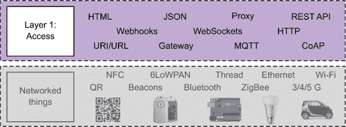

#### 6.1.1\. 表现性状态转移

如果你曾经使用过 Web API，你肯定遇到过 REST 或 RESTful 这个术语。表现性状态转移（REST）是一套架构原则，任何分布式系统都可以采用，并在 Roy Fielding 的博士论文中得到了正式化：^([1])

> ¹
> 
> 来源：[`www.ics.uci.edu/~fielding/pubs/dissertation/top.htm`](http://www.ics.uci.edu/~fielding/pubs/dissertation/top.htm).
> 
> *REST 提供了一套架构约束，当整体应用时，强调组件交互的可扩展性、接口的通用性、组件的独立部署，以及中间件组件以减少交互延迟、加强安全性和封装遗留系统。*

简而言之，如果任何分布式系统的架构遵循 REST 约束，那么该系统就被认为是 RESTful 的。其理念是，当系统的每个组件（服务器和客户端）都遵守这些约束时，组件之间的交互就得到了很好的定义，因此是相当可预测的。这最大化了系统的互操作性和可扩展性，这对于像互联网这样的全球系统至关重要。正是这些特性使得互联网如此成功，而这正是因为 HTTP——万维网核心的应用层协议——是基于 REST 的！另一个 RESTful 协议是 CoAP，我们在第五章（kindle_split_012.html#ch05）中介绍了它，并在第七章（kindle_split_015.html#ch07）中将进一步讨论。REST 被设计用来支持大规模的分布式多媒体内容（也称为超媒体）系统，正如互联网的成功所证明的那样，它运作得相当不错。让我们看看这些约束是什么。

##### 约束#1——客户端-服务器

组件之间的交互基于*请求-响应*模式，其中客户端向服务器发送请求并获取响应。这种模式最大化了组件之间的解耦，因为客户端不需要了解服务器实现的任何信息，只需知道如何发送请求以获取所需的数据。同样，服务器也不需要了解客户端的状态或数据将如何被使用。这种在数据、控制逻辑和展示之间的关注点分离提高了可扩展性和可移植性，因为松散耦合意味着每个组件可以独立存在和演进。

##### 约束 #2—统一接口

只有在系统中的所有组件都遵守统一接口的情况下，才能实现组件之间的松散耦合。明确、简单且易于扩展的接口（适用于各种内容和场景）在很大程度上促成了互联网作为一个开放和参与式系统的成功。这对于物联网同样至关重要，因为新的、未知的设备可以随时添加到系统中，也可以随时从系统中移除，与之交互将需要最少的努力。

##### 约束 #3—无状态

客户端上下文和状态应仅保留在客户端，而不是服务器上。因为每个对服务器的请求都应该包含客户端状态，可见性（服务器的监控和调试）、健壮性（从网络或应用故障中恢复）和可扩展性都会得到改善。当然，服务器和应用程序可以是状态的，因为这一约束仅仅要求客户端和服务器之间的交互包含彼此状态的信息。

##### 约束 #4—可缓存

缓存是当今网络性能（加载时间）的关键要素，因此也是其可用性的关键。客户端和中间件可以本地存储一些数据，这提高了它们的加载时间，因为每次请求都不需要从实际服务器获取这些数据。服务器可以定义策略，例如数据何时过期以及何时必须从服务器重新加载更新。这导致性能得到提升，因为减少客户端-服务器交互提高了服务器的可扩展性，并减少了延迟。

##### 约束 #5—分层系统

统一接口使得设计分层系统变得容易，这意味着几个中间组件可以隐藏它们背后的内容。分层系统使得使用中间服务器进一步改善可扩展性和响应时间成为可能。例如，分布式缓存或内容分发网络（CDN）如 Akamai^([2])可以在全球各个位置缓存数据，以便客户端能够更快地检索某些数据。这是可能的，因为客户端很少需要知道它们是否与目标服务器或其他代理交互。分层系统的另一个好处是它使得封装旧协议和系统（例如，到专有协议的网关）成为可能，这使得执行各种安全策略变得简单。

> ²
> 
> [`www.akamai.com`](http://www.akamai.com)

#### 6.1.2. 我们为什么需要一个统一的接口？

如你所见，这些约束在很大程度上是使 Web 工作起来的原因。没有它们，Web 就不会像今天这样开放、可扩展、灵活和高效，它将成为另一个封闭和专有系统天堂中的幽灵。还记得 CompuServe 吗？^([3]) 正是如此！

> ³
> 
> CompuServe 是美国第一个主要的商业在线服务。它主要使用专有协议在互联网（和其他网络）上提供服务。该服务与开放的万维网竞争了数年，但最终败北，并于 2011 年完全关闭：[`en.wikipedia.org/wiki/CompuServe`](https://en.wikipedia.org/wiki/CompuServe)。

这些约束中最重要的就是统一的接口，因为将所有可能的交互限制在通用且定义良好的操作子集内提供了几个优点。首先，使用如 HTTP 定义的统一接口可以最小化组件之间的耦合，这有助于我们设计更可扩展和更健壮的应用程序。其次，我们可以使用类似 Web 的思维来设计应用程序：标记语言、基于事件的浏览器交互、脚本语言、URL 等。第三，80 端口的 HTTP 流量是大多数防火墙唯一允许的协议。第四，它使得在简单的高级抽象背后隐藏低级协议细节变得容易，这促进了服务和数据（无论它们实际如何存储或编码）的开放性、可编程性和可重用性。

我们在这里的要点是，REST 和 HTTP 为 Web 所做的一切，它们也可以为物联网做到。只要一个“物”遵循与 Web 其他部分相同的规则——即共享这个统一接口——那么这个“物”就真正是 Web 的一部分。最终，物联网的目标是：使任何物理对象都能通过与其他 Web 部分相同的统一接口访问。这正是访问层所能实现的，正如我们将在本节余下的部分所描述的，Web 的统一接口基于以下四个原则：

+   ***可访问的资源—*** *资源*是应用程序中需要引用或使用的任何概念或数据。每个资源都必须有一个唯一的标识符，并且应该使用唯一的引用机制进行访问。在网络上，这是通过为每个资源分配一个唯一的 URL 来实现的。

+   ***通过表示形式操作资源—*** 客户端通过其资源的多个表示形式与服务交互。这些表示形式包括 HTML，用于在网络上浏览和查看内容，以及 JSON，更适合机器可读内容。

+   ***自描述消息—*** 客户端必须仅使用协议提供的方法—`GET`、`POST`、`PUT`、`DELETE`和`HEAD`等，并且尽可能紧密地遵循其含义。对这些操作的响应必须仅使用众所周知的响应代码—例如 HTTP 状态代码 200、302、404 和 500。

+   ***超媒体作为应用状态引擎（HATEOAS）—*** 服务器不应跟踪每个客户端的状态，因为无状态应用程序更容易扩展。相反，应用状态应通过其自身的 URL 进行访问，并且每个资源应包含关于在每种状态下可能进行的操作以及如何在不同状态之间导航的信息。HATEOAS 在查找层特别有用，因此我们将在第八章中更详细地讨论它。[链接](https://kindle_split_016.html#ch08)。

多亏了这样一个简单、统一的接口以及 HTTP 客户端和库的广泛可用性，RESTful 服务可以轻松重用和组合，无需了解任何资源的具体知识，因为这些可以在运行时发现和理解，正如将在第 4 个原则：超媒体作为应用状态引擎中所示。在本节的其余部分，我们将更详细地描述如何使用 HTTP 将这些四个原则付诸实践，然后我们将展示如何设计 RESTful API 用于事物。最后，对于这些原则中的每一个，我们将提出一套规则，以帮助您为您的物品构建友好的 Web API。

#### 6.1.3\. 原则 1：可访问的资源

REST 是一种*面向资源的架构（ROA）*，其中系统或应用程序的每个组件（一个传感器、其采样频率、一个变量等）都称为*资源*。资源被明确标识，并且可以单独访问。使用 HTTP，这是通过在 RFC 3986 中定义的众所周知的*统一资源标识符（URI）*标准方案来完成的。注 4] 使用与其他所有网络资源相同的精确标准命名方案，您可以将事物及其属性无缝集成到网络中，因为它们的函数、数据或传感器可以像网络上的任何其他内容一样链接、共享、书签和使用。

> ⁴
> 
> 查看 [`tools.ietf.org/html/rfc3986`](https://tools.ietf.org/html/rfc3986)。

URI 是一系列字符，它明确地标识了一个抽象或物理资源。有许多可能的 URI 类型，但在这里我们关注的是那些 HTTP 用于在网络上标识和定位 Web 上的资源，这些资源被称为该资源的 *URL（统一资源定位符）*。由此，我们推广认为，Web of Things 中的任何资源 URL 都必须遵循以下语法：

```
<scheme> ":" <authority><path> [ "?" query ] [ "#" fragment ]
```

+   在 Web of Things 中，`<scheme>` 总是 `http` 或 `https`。

+   `<authority>` 是一个带有可选端口或访问凭证的主机。

+   `<path>` 是指向资源的任何层次路径，必须以 `/` 开头。

+   最后是可选的查询参数和/或片段。

这的一个重要且强大的后果是资源标识符的可寻址性和可移植性：它们变得唯一（互联网或内网范围内）并且可以被任何 HTTP 库或工具（例如，浏览器）解析，它们可以被书签、在电子邮件中交换、在即时通讯工具中使用、编码在二维码中、在 RFID 标签中使用，以及通过信标广播，正如你将在第七章中看到的那样。


**技术角落：URL 与 URI**

URL 是一种 URI 类型，通过其主访问机制（例如，其网络位置）的表示来标识资源，而不是通过它可能具有的其他属性。在网络上，URL 是以 [`scheme`](http://scheme) 开头的 URI，并且可以通过 HTTP 解析。此外，请注意，设备的根 URL 不需要设备连接并且可以通过互联网公开访问。URL 在局域网内同样有效。


Web of Things 上的每个设备都必须有一个与其网络地址相对应的根 URL，以下是一些各种设备的根 URL 示例：

```
http://gateway.api.com/devices/TV/
http://kitchen-raspberry.device-lab.co.uk/
https://192.168.10.10:9002/
https://kitchen:3000/fridge/
```

在 Web of Things 中，我们可以有几种类型的资源。尽管其中一些代表事物及其实际属性，但其他一些可以是完全虚拟的（例如，一个混合体、数据处理服务等等）：

```
# User with the ID No. 12
https://webofthings.org/users/12

# Sample No. 77654 from october 2009
https://webofthings.org/samples/2009/10/77654

# Device called lamp14
https://devices.webofthings.io/lamp14
```

网上的资源通常按照路径定义的层次结构组织。这种组织和链接资源的方式在物理世界中尤其相关，因为它不仅可以用来标识事物的资源以及事物之间的关系，还可以用来标识事物与其物理位置之间的关系。我们还可以标识资源集合，这些集合本身也是资源：

```
# a list of sensors on a device (all the sensors on device ID 24)
http://devices.webofthings.io/24/sensors

# a list of devices in an area (building 4)
http://192.168.44.12/building4/devices/

# a list of sensor readings
https://webofthings.org/devices/4554/samples
```

有趣的是，退后一步思考一下，在我们之前查看的互联网协议的大背景下，这些 URL 有什么意义。如图 6.2 所示，从 Thing URL 中有很多东西可以学习！

##### 图 6.2\. 一个 Thing URL 及其指向的协议。URL 的第一部分指定了我们使用的协议，这里为 HTTP+TLS/SSL（HTTPS）；然后通过 DNS 将域名解析为 IP 地址，端口由 TCP 使用以知道要重定向到哪个进程，最后显示 REST 资源。

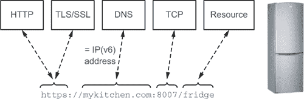

让我们通过我们的 Raspberry Pi 的例子来使这个概念更具体。你可以在图 6.3 中看到不同的资源是如何相互关联的，以及你如何为 Pi 的任何元素构造 URL。从这个层次结构中，你可以首先看到任何设备都必须有一个根 URL([`devices.webofthings.io/pi`](http://devices.webofthings.io/pi))。然后，它有各种传感器（如光、温度等）和执行器（如 LED）。每个元素的 URL 是通过将其名称附加到其层次结构中前一个元素的路径上构建的。例如，光传感器的 URL 如下：

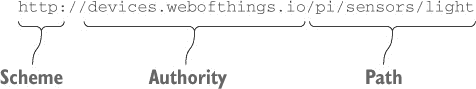

##### 图 6.3\. Raspberry Pi 上各种资源 URL 结构的示例。加粗的 X 轴加速度传感器的完整 URL 是[`devices.webofthings.io/pi/sensors/accel/x`](http://devices.webofthings.io/pi/sensors/accel/x)。


设备的所有组件都可以映射到一个类似的资源树中，其中每个传感器、执行器或系统属性都分配了自己的 URL。这样，你设备的每个组件都完全融入网络，成为一个独特的网络资源，任何人都可以通过网络对其进行寻址和交互。

在第八章中，我们将探讨语义并提出资源命名方案。现在，值得注意的是，关于资源标识符的语义没有官方规则。尽管如此，你应该遵守以下指南来处理所有资源：

+   ***使用描述性的名称。*** 因为资源名称会出现在 URL 中，使用具有语义价值的名称对开发者和用户都有很大帮助。

+   ***在 URL 中不要使用动词。*** 避免使用动词——例如，锁定或启动——并在可能的情况下使用名称：/garagedoor/openDoor 是不好的；/garagedoor/status 要好得多。动词用于 HTTP 方法，而不是用于 URL！

+   ***对于聚合资源使用复数形式。*** 如果一个实体有多个传感器，它们应该可以通过一个名为/sensors 的父资源访问。但你会使用/accel 来表示加速度计，尽管它提供了三个维度的值，但只有一个这样的传感器。

##### 设计规则 #1—可寻址资源

我们探讨的第一个原则强调，你网络中的每个元素，无论是网络实体、服务还是应用程序，都成为一个可寻址的网络资源。基于这一点，我们提出以下设计规则，以遵循实现网络实体时的规则：

+   ***Web Things 必须是一个 HTTP 服务器。*** 简而言之，如果你不能向设备发送 HTTP 请求，那么它就不是物联网的一部分。为了确保最大兼容性，Web Things 必须始终支持 HTTP 版本 1.1——理想情况下也支持 v2，但不仅仅是 v2——因为它是目前最广泛使用的协议版本。多亏了 REST 的分层架构，HTTP 服务器实际上不需要托管在设备本身上。我们将在第七章（kindle_split_015.html#ch07）中描述各种集成模式。

+   ***Web Things 应使用安全的*** HTTP *连接（HTTPS）。* 当可能时，事物应仅提供安全连接。如果事物可以从外部世界访问，这是至关重要的。

+   ***Web Things 必须有一个可通过 HTTP URL 访问的根资源。*** 客户端应用程序必须有一个 URL 来发送 HTTP 请求。该 URL 不需要对外公开或公开；它可以是您局域网中设备的 IP 地址。

+   ***Web Things 必须使用分层结构来公开其属性。*** 事物必须使用分层结构来公开其属性，以促进其资源的发现。在第八章（kindle_split_016.html#ch08）中将提出一个特定的模型和资源结构。

#### 6.1.4\. 原则 2：通过表示操纵资源

计算机通信中的一个挑战是如何编码信息，以便它可以被普遍解码和理解。在互联网上，*多用途互联网邮件扩展（MIME）*类型已被引入作为标准，用于描述通过互联网传输的各种数据格式，如图像、视频或音频。以 PNG 编码的图像的 MIME 类型表示为 image/png，MP3 音频文件为 audio/mp3。互联网数字分配机构（IANA）维护所有官方 MIME 媒体类型的列表.^([5])

> ⁵
> 
> 在线：[`www.iana.org/assignments/media-types/`](http://www.iana.org/assignments/media-types/).

如前所述，资源只是一个概念——一个事物的抽象想法——而不是事物本身。资源的有形实例称为*表示*，它使用 MIME 类型对资源进行标准编码。Web 浏览器通常支持相当多的表示，例如（HTML、GIF 和 MPEG；或者可以使用插件或外部应用程序来渲染它们，如 PDF、vCards 或 Flash）。

HTTP 定义了一种简单的机制，称为*内容协商*，允许客户端请求从特定服务接收的偏好数据格式。使用`Accept`头，客户端可以指定他们希望作为响应接收的表示格式的格式。同样，服务器使用`Content-Type`头指定它们返回的数据的格式。为了说明这个原则，让我们看看当你在浏览器中输入 Pi 的 URL 时会发生什么。以下列表显示了请求和响应消息。

##### 列表 6.1\. 简单的 HTTP 请求和响应

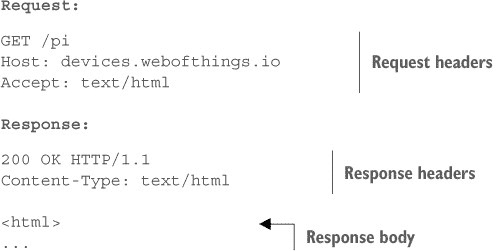

如您所见，这个请求是一个简化的版本，它实际上发送的内容，包含以下头信息：`Accept: text/html`，指示服务器返回 Pi 的 HTML 表示形式，即您在 第二章 中看到的 Pi 根页面。默认情况下，浏览器请求它们可以渲染的 HTML 文件，并允许人类用户与资源交互。但在某些情况下，HTTP 客户端不希望是 HTML，而更希望是机器可读的格式，例如 JSON 或 XML——例如，当客户端是一个应用程序而不是网页浏览器时。这可以通过使用 `Accept:` 头的另一个值来实现，如接下来的两个列表所示。

##### 列表 6.2\. 使用 `Accept` 头请求 XML 返回负载

```
`Request:`

GET /pi
Host: devices.webofthings.io
Accept: application/xml

`Response:`

200 OK
Content-Type: application/xml

<device>
  <name>Pi</name>
  ...
</device>
```

##### 列表 6.3\. 使用 `Accept` 头请求 JSON 返回负载

```
`Request:`

GET /pi
Host: devices.webofthings.io
Accept: application/json

`Response:`

200 OK
Content-Type: application/json

{
  "name" : "Pi"
  ...
}
```

您可以使用各种编码格式来描述传感器数据，以便其他应用程序可以理解和处理它，并且显然不是所有服务器都支持所有这些格式。

HTTP 请求的 `Accept:` 头可以包含客户端理解的一个或多个带权重的媒体类型列表——例如，`application/json;q=1, application/xml;q=0.5`。然后服务器会尝试提供它知道的最好可能的格式（根据客户端使用参数 `q` 作为质量因子请求的），并在 HTTP 响应的 `Content-Type` 中指定它。在我们的例子中，Pi 无法提供 XML，因此会返回 JSON 表示形式，并将 HTTP 头设置为 `Content-Type: application/json`。

##### Web 物联网的 JSON 及其超越

我们建议用于 Web 物联网的格式是 JSON。JSON 特别适合 Web 应用程序，因为它轻量级、便携且自包含，并且可以使用 JavaScript 在浏览器中轻松解析，也可以由任何编程语言解析！它比 XML 更轻量级，因为它需要的处理能力和带宽更少，对开发者的眼睛也更友好。但即使 JSON 轻量级，它也不是二进制格式，因为它仍然是文本。当需要更有效的格式时，例如，由于设备的内存限制或它运行在电池上，替代表示格式才有意义。有许多格式可以将 JSON 转换为二进制格式。

MessagePack^([6]) 是我们最喜欢的替代方案之一。它支持所有流行的编程语言的库，包括客户端 JavaScript、Node.js 和 C。MessagePack 不是一个官方的 MIME 媒体类型，但在内容协商过程中您仍然可以请求它。处理非官方 MIME 类型的一种常见方式是使用 `x-` 扩展名，因此如果您想让您的客户端请求 MessagePack，请使用 `Content-Type: application/x-msgpack`。

> ⁶
> 
> [`msgpack.org/`](http://msgpack.org/)

##### 设计规则 #2–内容协商

基于您刚刚学到的内容，我们提出以下规则，供您在实现您的 Web Things 时遵循：

+   ***Web Things 必须支持 JSON 作为它们的默认表示形式。*** 您的实体可以支持它想要的任何表示形式，只要它至少接受 JSON 请求，并在请求时可以返回 JSON 表示。始终使用驼峰式命名法；例如，在 JSON 有效载荷中的对象名称应使用`lastValue`而不是`Last-Value`或`last_value`。

+   ***Web Things 支持 UTF8 编码的请求和响应。*** Web Thing 可以支持许多其他编码格式（例如，它可以描述其提供的服务为中文或俄语），但至少它必须支持 UTF8 编码的任何资源。

+   ***Web Things 可能提供 HTML 界面/表示（UI）。*** 除了计算机友好的 API 之外，设备还应提供人类友好的用户界面，可以通过网络浏览器访问。这对于消费产品来说特别有用，因为它可以方便用户访问、控制和故障排除他们的设备。

#### 6.1.5\. 原则 3：自描述消息

REST 强调组件之间的统一接口，以减少操作与其实现之间的耦合。这要求每个资源都支持一个标准、通用的操作集，具有明确定义的语义和行为。HTTP 定义了一个固定的操作集，每个资源都可以支持，也称为动词或方法。其中最常用的有`GET`、`POST`、`PUT`、`DELETE`和`HEAD`。虽然看起来您似乎只需要`GET`和`POST`就能做所有事情，但正确使用所有四个动词对于避免应用程序中的意外或引入安全风险非常重要。

将操作限制在这些方法之一是启用服务松耦合的关键之一，因为客户端只需要支持处理这些方法的机制。在物联网中，这些操作映射得相当自然，因为事物通常提供相当简单和原子的服务，这些服务通常可以简化为四种基本的 CRUD 操作类型：创建、读取、更新和删除。

##### GET

`GET`是一个只读操作，如列表 6.4 所示。它既安全又幂等。*安全*意味着调用`GET`不会以任何方式改变服务器的状态（只读）。*幂等*意味着无论您应用此操作多少次，都不会对资源状态产生影响。使用 HTTP `GET`请求一次或十次读取 HTML 文档不会改变资源状态。

##### 列表 6.4\. `GET` 读取资源（我们的 Pi 的温度传感器）

```
`Request:`

GET /pi/sensors/temperature/value
Accept: application/json
Host: devices.webofthings.io

`Response:`

200 OK HTTP/1.1
Content-Type: application/json

{"temperature" : 37}
```

在这个列表中，我们想知道温度传感器的最新值；因此，这是一个只读操作。因为我们指定了编码为 JSON，所以响应有效载荷包含一个包含值 37 的 JSON 消息。您可能会想“37 是什么？”这个答案将在第八章中提供，当我们讨论语义时。

在某些情况下，HTTP 客户端可能不需要完整的响应有效负载，例如当客户端只想验证资源是否可用或最近是否已更新时。在这种情况下，客户端可能会使用`HEAD`动词而不是`GET`，它实际上做的是同样的事情，但只返回头部而不是有效负载。这在请求发送到资源受限的设备时尤其有用，因为每个字节都很宝贵。

##### POST

`POST`是 HTTP 中既非幂等又非安全的操作，这意味着它不仅会改变服务器状态，而且每次调用都会有不同的结果。`POST`应该仅用于创建尚未拥有自己的 URL 的新实例，例如系统中的新用户或银行账户。以下列表中的请求创建了一条将在 LCD 显示屏上显示 30 秒的消息。

##### 列表 6.5\. `POST`用于创建新资源

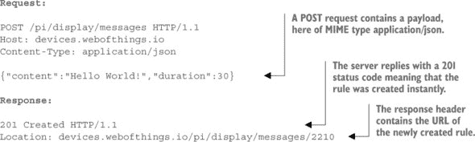

你刚刚创建的资源 URL，要显示的消息，应始终通过`Location`头部在答案中返回。这个 URL 现在允许你与刚刚创建的资源进行交互，你可以稍后更新或删除它。

正如你在下一章中将会看到的，在某些情况下，`POST`请求的结果可能不会立即出现。例如，当你想要控制一个执行器，比如移动机器人的手臂时，操作可能需要几秒钟或几分钟才能执行。同样，如果你的请求被缓冲（例如，当消息被排队而不是立即显示时），你的请求将被异步处理。对于立即处理的同步请求，例如资源创建，你应该返回`201 Created`。对于所有异步操作，你应该返回`202 Accepted`，这意味着资源最终将被创建.^([7])

> ⁷
> 
> RFC 2616，第 10.2.3 节：[`www.ietf.org/rfc/rfc2616`](https://www.ietf.org/rfc/rfc2616).

##### PUT

`PUT`通常被建模为一个幂等但不安全的更新方法。你应该使用`PUT`来更新已经存在并拥有自己的 URL 的东西，例如当你更改用户的姓名或向他们的银行账户添加存款时，但不用于创建新资源。与`POST`不同，它是幂等的，因为发送相同的`PUT`消息一次或十次会产生相同的效果，而`POST`会创建 10 个不同的资源。在下一个示例中，我们使用新的 RGB 值作为参数编码为 JSON 对象来更改 LED 4 的颜色。

##### 列表 6.6\. `PUT`用于更新现有资源（更改 LED 的颜色）

```
`Request:`

PUT /pi/actuators/leds/4 HTTP/1.1
Host: devices.webofthings.io
Content-Type: application/json

{"red" : 0, "green" : 128, "blue" : 128}

`Response:`

200 OK HTTP/1.1
```

您应仅使用`PUT`来更改已存在的东西，而不是创建新资源——为此应使用`POST`。在物联网中，这意味着`PUT`应用于更改某物的状态（例如 LED 4），打开/关闭车库门等。您将在后面看到，在决定是否通过`PUT`或`POST`向设备发送命令时，有一条很细的界限。一般来说，如果命令将立即执行而不会被缓冲，那么您应使用`PUT`。但如果需要缓冲请求，通常当多个用户同时访问同一资源时（例如，我们第二章中的 Pi 的 LCD 屏幕），您正在创建一个将在以后改变状态的资源（等待列表中的项目），因此您应使用`POST`。

##### DELETE

`DELETE`是一个幂等且不安全的方法，应仅用于删除资源。通常，您会使用这个动词永久地从实体中删除资源，例如，当您删除对主题的订阅或设备上的规则时，如下一个列表所示。

##### 列表 6.7\. 使用`DELETE`删除现有资源

```
`Request:`

DELETE /rules/24 HTTP/1.1
Host: devices.webofthings.io

`Response:`

200 OK HTTP/1.1
```

由于您使用`DELETE`从对象中删除资源，因此您发送请求的资源 URL 在请求执行后将不再可访问。如果您想从网关中删除设备，应使用`DELETE`。但如果您想禁用传感器，这将是一个状态变化；因此您应使用`PUT`。

##### 错误代码

HTTP 还提供了一种表达错误和异常的方式。HTTP 响应的状态由作为 HTTP 响应消息头一部分发送的标准状态码表示。有几十个这样的代码，每个代码对 HTTP 客户端都有众所周知的含义；这些代码及其含义列在 HTTP 1.1 规范中。（[8]）

> ⁸
> 
> RFC2616 的第十部分。

在物联网中，这些代码非常有价值，因为它们提供了一种轻量级但强大的方式来通知异常和成功的请求执行。例如，在上一个示例中，对`/pi/sensors/humidity/`的`POST`请求将返回`405 方法不允许`状态码。客户端从该状态码中理解，它不能向该资源发送`POST`动词，因此未来再尝试也没有意义。

HTTP 定义了一个标准状态码列表，服务器在接收到每个请求时返回。最常用的包括以下这些：

+   `200 正常`—请求成功完成时返回。此代码的另一种常见形式是`204 无内容`。

+   `201 已创建`—当新资源成功创建时返回。头部`Location`包含已创建资源的 URI。

+   `202 已接受`—当请求已被接受但资源尚未创建时，用于异步操作返回。

+   `401 未授权`——请求需要用户身份验证，或者使用提供的凭证授权失败。

+   `404 未找到`——请求的资源或文档在服务器上未找到。

+   `500 内部服务器错误`——服务器遇到错误，无法完成请求。

+   `501 服务不可用`——服务器由于维护或临时过载而无法处理请求。

##### CORS——启用客户端 JavaScript 访问资源

虽然在服务器端应用程序中从不同源的服务器访问网络资源不会引起任何问题，但由于安全原因，运行在浏览器中的 JavaScript 应用程序不能轻易地跨源访问资源。我们这里所说的意思是，从 apples.com 域加载的一小段客户端 JavaScript 代码不会被浏览器允许使用特定的动词从 oranges.com 域检索特定的资源表示。

通常来说，浏览器只能执行简单的跨站请求，例如从另一个网站加载图片，但不能请求其他类型的表示，如 JSON 或 JavaScript。例如，列表 6.6 中的`PUT /pi/actuators/leds/4`请求不会被浏览器授权。这种安全机制被称为*同源策略*，其目的是确保一个网站不能从另一个域名加载任何脚本。特别是，它确保一个网站不能滥用 cookies 来使用您的凭证登录到另一个网站。让我们通过一个例子来说明这一点。您登录到 facebook.com，这会在您的浏览器中创建一个 cookie，每次向 facebook.com 发送请求时都会随请求一起发送。如果浏览器允许跨站请求，从 apples.com 加载的脚本就可以使用您的 Facebook cookie 向 facebook.com 发送请求，从而假装成您在 Facebook 上！

显然，这种安全机制是好事，但也意味着从浏览器中的 JavaScript 代码直接与 Web Things 的 API 交互默认是不被允许的。等等！那么您是如何在第二章中访问[`devices.webofthings.io`](http://devices.webofthings.io)并与我们的 WoT Pi 通信的呢？幸运的是，一个新的标准机制*跨源资源共享（CORS）*[9]已经被开发出来，并且得到了大多数现代浏览器和 Web 服务器的良好支持。

> ⁹
> 
> 查看[`enable-cors.org/`](http://enable-cors.org/)和[`www.w3.org/TR/cors/`](http://www.w3.org/TR/cors/)。

当浏览器中的脚本想要执行跨站请求时，它需要包含一个包含源域的`Origin`头。服务器会回复一个包含允许的源域列表（或`*`以允许所有源域）的`Access-Control-Allow-Origin`头。下一个列表提供了一个 CORS 操作的示例，对应于第二章的 2.1 练习的请求和响应。

##### 列表 6.8\. 使用 CORS 对资源进行`GET`请求

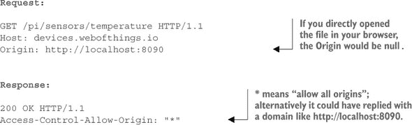

当浏览器接收到回复时，它将检查`Access-Control-Allow-Origin`是否与源对应，如果是，它将允许跨站请求。

对于除`GET`/`HEAD`之外的动词，或者当使用除`application/x-www-form-urlencoded`、`multipart/form-data`或`text/plain`之外的表示进行`POST`时，需要一个额外的请求，称为*预检请求*。预检请求是一个带有`OPTIONS`动词的 HTTP 请求，浏览器使用它来询问目标服务器是否安全地发送跨源请求。一个预检请求的示例显示在图 6.4 中。

##### 图 6.4\. 对应于第二章练习 5 的预检请求。JavaScript 需要向另一个服务器发送带有`Content-Type`头的`POST`请求。服务器回复允许的源、方法和头。因为它们与脚本想要的匹配，所以调用将被授权。

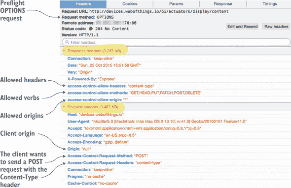

虽然 CORS 规范中有很多额外的选项，但我们将不会深入探讨，因为这需要整本书的内容。10 但这应该足以让你理解为什么了解 CORS 是什么以及如何在 WoT 中应用它很重要。

> ^(10)
> 
> 关于这个主题，有一本名为《CORS in Action》的好书，作者是 Monsur Hossain（Manning Publications，2014 年）。

##### 设计规则 #3–自描述消息

总结一下，我们可以根据 REST 的自描述消息原则定义四个简单的设计规则：

+   ***Web Things 必须支持`GET`、`POST`、`PUT`和`DELETE`HTTP 动词。*** 为了从 RESTful 架构提供的好处中受益，统一的接口约束是至关重要的。在物联网的上下文中，`GET`用于检索传感器资源，例如温度读数；`POST`用于创建一个将获得新 URL 的新资源——例如创建规则；`PUT`用于更新给定 URL 的执行器资源——例如更新 LED；`DELETE`用于删除资源，例如规则。

+   ***Web Things 必须实现 HTTP 状态码 20x、40x、50x。*** 如前所述，按照预期使用 HTTP 动词非常重要。当然，每个 Web Things 都支持所有这些是不现实的，但设备至少应该支持每组中的一个——例如，如果请求成功，则为 200；对于客户端错误，即请求无效，则为 400；对于服务器错误，即请求有效但服务器无法完成，则为 500。

+   ***Web Things 必须支持根 URL 上的`GET`操作。*** 理想情况下，每个资源都应该支持`GET`动词，以便客户端可以始终检索其表示。但至少，根 URL 必须支持`GET`，以便客户端始终能够访问设备信息。

+   ***Web 实体应支持 CORS。*** 应支持简单和预检 CORS 请求，以允许网络浏览器中的应用程序直接访问。

#### 6.1.6\. 原则 4：超媒体作为应用状态引擎

REST 的第四个原则被称为 *超媒体作为应用状态引擎 (HATEOAS)*。尽管这可能是有史以来计算机科学中最糟糕的缩写，但这个原则并不像听起来那么糟糕。它包含两个子概念：超媒体和应用状态。

##### 超媒体

这个第四个原则围绕着 *超媒体* 的概念，即使用链接作为相关想法之间的连接。超媒体在 20 世纪 60 年代初期由 Ted Nelson 提出，作为超文本的推广，除了文本之外还包括各种媒体格式，如视频、图像或声音。由于网络浏览器的普及，链接变得非常流行，但它们并不仅限于人类使用。例如，用于识别 RFID 标签的 UUID 也是一种链接。考虑以下列表中的简化的 HTML 片段。

##### 列表 6.9\. Raspberry Pi 根资源的 HTML 表示

```
<html><body>
  <h1 class="device-name">Raspberry Pi</h1>
  <a href="http://devices.webofthings.io/pi" class="self">Root URL</a> of this device.
  View the list of <a href="sensors/" class="wot-sensors">sensors</a> and <a href="actuators/" class="actuators">actuators</a> on this device.

  You can also view all <a href="links/" class="links">links</a> available on this device.

  Or read the <a href="about/" class="help">documentation</a>.
</body></html>
```

基于此设备的表示，您可以轻松地通过这些链接检索有关设备子资源的更多信息，例如如何找到其文档。而不是将整个网络实体的结构和所有子资源描述在一个单独的文档中，该文档需要单独维护，这种基于树的模型方便地映射到 图 6.3 中显示的实体的资源树，因为树中的每一层都充当一个代理，隐藏其下的层。方便的是，这也使我们能够在结构更改时检索和解析这样一个大文件，因为我们只需要检索我们感兴趣的资源。

##### HATEOAS

*应用状态*——HATEOAS 中的 *AS*——指的是一个过程或工作流中的一个步骤，类似于状态机，REST 要求应用状态引擎由超媒体驱动。11 好的，很好，但这意味着什么呢？简单地说，您的设备或应用程序的每个可能状态都需要是一个具有自己唯一 URL 的 RESTful 资源，任何客户端都可以检索当前状态的表示以及转换到其他状态的可能的过渡。资源状态，如 LED 的状态，保留在服务器上，每个请求都通过当前状态的表示以及如何更改资源状态（如关闭 LED 或打开车库门）的必要信息来回答。

> ^(11)
> 
> [`roy.gbiv.com/untangled/2008/rest-apis-must-be-hypertext-driven`](http://roy.gbiv.com/untangled/2008/rest-apis-must-be-hypertext-driven)

换句话说，只要客户端状态不在服务器上保持，并且应用程序内部的状态变化是通过跟随链接来实现的，那么应用程序就可以是有状态的，这符合自包含消息的约束。在物联网中，链接非常重要，因为它们使客户端能够 *发现* 相关资源，无论是对于人类用户在网页上跟随链接进行浏览的情况，还是对于机器进行爬取的情况。

简而言之，通过链接资源，它们可以动态地被发现和重新排列，而无需在某个地方保持站点地图。我们将在第八章中详细解释这一点，并对其进行实验，但现在让我们使用 列表 6.9 中所示的示例。从 HTML 表示形式中，你可以看到有一个指向名为“links”的资源的链接。正如我们稍后将要详细说明的，你可以向该资源发送一个 `GET` 请求，以检索包含设备提供的所有资源的 JSON 对象，这将在下一列表中展示。

##### 列表 6.10\. 树莓派“links”资源的 JSON 表示形式

```
"links":{
  "sensors": {
    "link": "http://devices.webofthings.io/pi/sensors/",
    "title": "List of Sensors"
  },
  "actions": {
    "link": " http://devices.webofthings.io/pi/actions/",
    "title": "List of actions"
  },
  "meta": {
    "link": "http://w3c.org/schemas/webofthings/",
    "title": "Metadata"
  },
  "self": {
    "link": " http://devices.webofthings.io/pi/",
    "title": "Self"
  },
  "help": {
    "link": "http://webofthings.io/docs/pi/",
    "title": "Documentation"
  },
  "ui": {
    "link": " http://devices.webofthings.io/pi/",
    "title": "User Interface"
  }
}
```

多亏了这份文档，任何 HTTP 客户端都将能够使用第八章中描述的方法来查找该设备提供的各种资源和服务，它们的意义以及如何与之交互。当客户端请求该资源的 HTML 表示形式时，例如你的浏览器，你会看到相同的内容，但带有你可以点击的实际链接。

##### OPTIONS

在上一节中，我们讨论了 HTTP 动词。大多数 HTTP 服务器实现的一个不太为人所知的 HTTP 动词在发现可以在资源上执行的操作方面非常有用。`OPTIONS` 动词可以用来检索资源允许的操作列表，以及关于在此资源上调用元数据。在可编程的物联网中，这是一个非常有用的功能，因为它允许应用程序通过仅知道资源的 URL 就能在运行时找出资源允许的操作；请参见下一列表。

##### 列表 6.11\. 使用 `OPTIONS` 获取资源支持的动词

```
`Request:`

OPTIONS pi/sensors/humidity/ HTTP/1.1
Host: devices.webofthings.io

`Response:`

204 No Content HTTP/1.1
Content-Length: 0
Allow: GET, OPTIONS
Accept-Ranges: bytes
```

例如，列表 6.10 是对 `pi/sensors/humidity/` 的 `OPTIONS` 请求，返回 `GET, OPTIONS` 以告知客户端该资源只支持这两个动词。将链接与 `OPTIONS` 动词结合意味着客户端可以发现事物的可用资源，以及可以对新发现的资源执行的操作。

##### 设计规则 #4–HATEOAS

第四组设计规则强调逻辑上链接资源的能力，以便客户端可以发现事物的资源及其之间的链接、操作和参数：

+   ***Web Things 应支持通过链接进行浏览性。*** 这意味着 Web Things 应始终提供指向与其相关的资源在资源层次结构中的链接，尤其是父资源和子资源。这可以通过浏览人类和应用（爬虫）都可以使用的资源来发现一个事物的所有资源。理想情况下，链接应存在于所有表示中。

+   ***Web Things 可能支持其每个资源的 `OPTIONS`。*** 当可能时，向任何资源发送 HTTP 请求应返回该资源支持的动词列表。这是 HATEOAS 拼图中的一个有用部分，因为客户端只需知道资源的 URL 就可以自动确定他们可以使用该资源做什么。

#### 6.1.7\. 摘要—Web 事物设计过程

在本节中，我们已表明可以通过重用 Web 架构中的模式来构建事物的 API。我们不是仅仅将 Web 用作传输协议，而是通过使用 HTTP 作为其预期用途：作为应用层协议，将事物作为 Web 及其基础设施的组成部分。

##### Web Things API 的五步设计过程

我们描述了如何使用 RESTful 架构使 HTTP 成为连接到网络的设备的通用协议。我们描述了使事物网络化的过程，该过程总结为 Web Things 设计过程的五个主要步骤：

> **1**.  *集成策略*—选择一种模式将事物集成到互联网和 Web 中，无论是直接还是通过代理或网关。这将在第七章（kindle_split_015.html#ch07）中介绍，所以我们现在将跳过这一步骤。
> 
> **2**.  *资源设计*—识别事物的功能或服务，并组织这些服务的层次结构。这就是我们应用设计规则 #1：可寻址资源的地方。
> 
> **3**.  *表示设计—*决定为每个资源提供哪些表示。正确的表示将由客户端选择，归功于设计规则 #2：内容协商。
> 
> **4**.  *界面设计—*决定每个服务可能的命令以及相应的错误代码。在这里，我们应用设计规则 #3：自描述消息。
> 
> **5**.  *资源链接设计—*决定不同资源之间的链接方式，特别是如何暴露这些资源及其链接，以及它们可以使用哪些操作和参数。在这一最后步骤中，我们使用设计规则 #4：超媒体作为应用状态引擎。

### 6.2\. 超越 REST：实时 Web 事物

到目前为止，我们的界面仅通过 HTTP 提供访问。使用此协议，客户端通过发送请求并期望获得响应来与服务器进行通信；这被称为 *请求-响应* 通信。

在物联网中，当客户端只需要向设备发送请求时，这种模式效果很好。例如，当移动应用想要检索传感器的读数值，或者当 Web 应用用于解锁门时。不幸的是，请求-响应模型对于许多物联网用例来说是不够的。更确切地说，它不适用于需要将事件（推送）作为事件发生时与客户端通信的事件驱动用例。在本节中，我们将更详细地探讨这个问题，并提出如何通过使用另一个 Web 友好的应用协议——WebSocket 来扩展 HTTP 的请求-响应模型！

#### 6.2.1\. WoT 需要事件！

对于需要设备异步地将通知发送给客户端的应用来说，客户端发起的模型并不实用。例如，安全摄像头或烟雾报警器必须在检测到任何异常时立即发送警报，而不必等到客户端请求此信息。考虑我们在第四章中添加到我们的 Pi 上的 PIR 传感器。作为回顾，PIR 传感器可以检测到有人经过。使用通过 HTTP 的 REST 请求-响应模式并不高效，因为我们必须不断轮询 Pi 以获取 PIR 传感器的最新值。这不仅效率低下，而且如果我们没有在正确的时间轮询，我们可能会错过入侵者。如图 6.5 所示，*轮询*是绕过这个问题的方法之一。

##### 图 6.5\. 基本轮询：客户端应用以固定时间间隔向 Web 设备发送请求。客户端应用获取的结果与传感器新可用的值不同步。

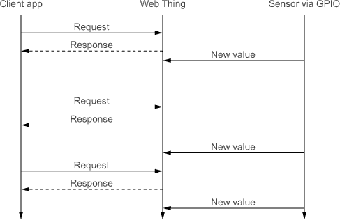

理念是客户端可以通过定期向设备发送`GET`请求，从 Web 设备请求更新。尽管客户端可以通过连续发送相同的请求来模拟接近实时行为——例如，每秒一次——但对于大多数应用来说，这种方法效率低下，因为它消耗了不必要的带宽和处理时间。大多数请求最终会得到空响应（`304 Not Modified`）或与观察到的值保持不变的相同响应。这有两个原因不够理想。首先，它产生了大量的 HTTP 调用，其中很大一部分是无效的。因为减少对 Web 应用进行扩展时 HTTP 调用的数量是关键，所以当客户端数量增加时，这种模型扩展性不好。其次，大量的 HTTP 调用对于仅应发送严格必要数据的电池供电设备来说是个问题。

#### 6.2.2\. 发布/订阅

对于物联网（Web of Things）的交互式和反应式应用，需要一个简单灵活的机制来发送事件或接收通知。在请求-响应模式之上真正需要的是一个称为发布/订阅（pub/sub）的模型，它允许进一步解耦数据消费者（subscribers）和数据生产者（publishers）。生产者向一个称为代理（broker）的中心服务器发送消息，该代理负责根据消息的类型或内容将消息路由和分发到各个订阅者。最简单的类比是聊天室——有的公开，有的私密。有时你只和一个人聊天，有时和成千上万的人。对于设备来说，情况也是一样的。一个生产者可以向一个主题（想象成聊天室）发送通知。感兴趣的消费者可以订阅一个或多个频道，以接收该频道中生产者推送的所有通知。在 pub/sub 协议中，主题通常指定为任意字符串，这样我们就可以轻松地将我们的 Web Things 的 REST 资源映射到 pub/sub 主题上。

让我们看看一个实际例子，看看这对我们的树莓派（Pi）是如何工作的。如图 6.6 所示，许多客户端订阅了一个由代理（broker）管理的主题。每当一个客户端想要更新一个主题时，它会向代理发送一个消息——也就是说，它通过代理发布消息。代理随后将消息发送给所有订阅该主题的客户端。请注意，代理可以是事物本身，也可以是网络上某个地方的外部代理。在图 6.6 的左侧，客户端 A 订阅了以下主题：[`devices.webofthings.io/pi/sensors/temperature`](http://devices.webofthings.io/pi/sensors/temperature)。

##### 图 6.6。左：pub/sub 中的订阅模式。客户端 A 订阅温度更新，客户端 B 和 C 订阅 PIR 更新。他们都通过代理订阅，代理维护着一个订阅者列表，记录了谁订阅了什么主题。右：发布模式。检测到入侵者，因此事物向代理发布 PIR 更新。代理将更新传递给客户端 B 和 C。

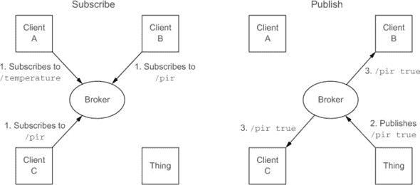

为了便于阅读，我们将主题缩短为`/temperature`。客户端 B 和 C 通过代理订阅`/pir`。图 6.6 的右侧显示了发布机制。有人经过传感器，因此事物生成 PIR 传感器更新通知，通知所有听众。代理知道哪些客户端正在监听`/pir`主题，因此它立即将此更新发送给客户端 B 和 C。

现在我们已经拥有了请求-响应交互所需的上层模式，问题是如何利用网络支持的技术来实现它，并且希望也能被常见的网络浏览器所支持。从层次结构的角度来说，我们需要一个能够支持实现发布/订阅系统的网络应用协议。为此，有多个候选方案，我们将探讨三种技术：webhooks、Comet 和 WebSockets。

#### 6.2.3\. Webhooks—HTTP 回调

在不破坏 REST 模型的情况下，通过 HTTP 实现发布/订阅系统的最简单方法是将每个实体都视为客户端和服务器。这样，Web 设备和 Web 应用都可以作为 HTTP 客户端，通过向其他服务器发起请求来行动，并且它们可以同时托管一个服务器来响应其他请求。这种模式被称为*webhooks*或*HTTP 回调*，在网络上变得流行，用于使不同的服务器能够相互通信。例如，这是 PayPal 用来向 eBay 或任何其他购物网站确认您的付款已被接受所使用的机制。

这种模型的实现相当简单。我们只需要在设备和客户端上实现一个 REST API，这样客户端也就变成了服务器。这意味着当设备有更新时，它通过 HTTP `POST`到客户端，如图 6.7 所示。这意味着客户端必须实现一个 HTTP 服务器，并带有可以由设备访问的 REST API——例如，通过拥有一个公开的 URL。必要的调用细节如下所示。

##### 图 6.7\. 在设备和客户端之间实现的 webhook 机制。客户端通过在设备 API 上`POST`来订阅湿度资源。设备随后通过在客户端 API 上`POST`来通知服务器湿度变化。

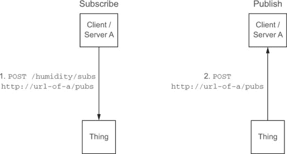

##### 列表 6.12\. 通过 webhook 进行订阅

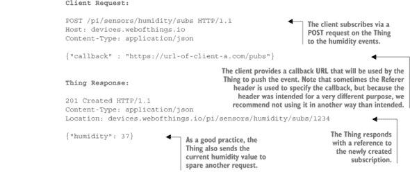


Webhooks 是一种通过将所有内容转换为服务器来实现客户端和服务器之间双向通信的概念上简单的方法。正如您刚才看到的，webhooks 也可以用来实现物联网的发布/订阅。但 webhooks 有一个很大的缺点：因为它们需要订阅者拥有一个 HTTP 服务器来推送通知，所以这只有在订阅者有一个公开可访问的 URL 或 IP 地址时才有效。在现实世界中，这非常有限，因为除了服务器到服务器（或设备到设备！）通信之外，很少会有这种情况。考虑一个运行在您的浏览器中的 JavaScript 应用程序，它想要从设备获取通知的情况：即使应用程序有在您的网络浏览器内部启动 HTTP 服务器的方法，^(12)，但您的网络防火墙不太可能允许来自互联网的请求到达您的机器。

> ^(12)
> 
> 注意，这可以通过编写一个自定义插件来实现，该插件允许浏览器与事物交互。但在现实世界中，使用这种非标准的扩展是不可行的，因为它严重限制了无缝访问物联网的愿景。

#### 6.2.4\. Comet—为实时 Web 破解 HTTP

当涉及到浏览器应用程序时，Webhooks 的限制导致了许多解决方案来处理网页上实时事件的问题。"Comet"是一个总称，指的是一系列通过在 HTTP 上引入基于事件的通信来绕过 HTTP 轮询和 Webhooks 限制的技术。这种模型使得 Web 服务器能够在客户端没有明确请求的情况下将数据推送到浏览器。由于浏览器最初并没有考虑到服务器发送事件，因此 Web 应用程序开发人员已经利用了几个规范漏洞来实现类似 Comet 的行为，每种方法都有其不同的优点和缺点。

其中包括一种称为*长轮询*的技术，如图 6.8 所示。使用长轮询，客户端向服务器发送一个标准的 HTTP 请求，但服务器不会立即响应，而是保留该请求，直到从传感器接收到事件，然后将其注入到返回给客户端的空闲请求的响应中。一旦客户端收到响应，它立即发送一个新的请求以获取更新，该请求将被保留，直到从传感器收到下一个更新，依此类推。因此，事件到达客户端的延迟被最小化。但是，客户端必须保持在一个打开的 HTTP 请求中，等待答案，并且在每次响应后都必须发送一个请求。这增加了服务器的负载，并迫使客户端发送不必要的消息。

##### 图 6.8\. 长轮询：客户端发送一个请求，该请求被保留，直到从传感器接收到事件，此时它被 Web Thing 转发给客户端作为其初始请求的响应。之后，它们重新发起一个新的请求，该请求将以相同的方式保持打开状态，直到从传感器检索到新的值。

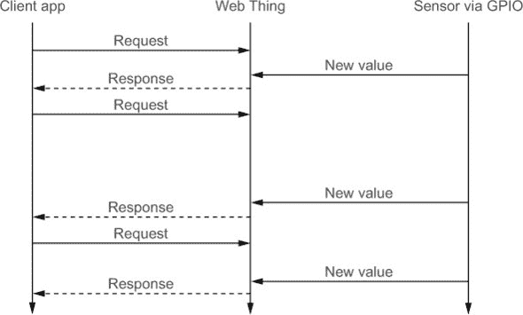

#### 6.2.5\. WebSocket

尽管像 Comet 这样的解决方案有助于推进事物的发展，但它们只是修补，而不是真正的解决方案。Comet 和其他长轮询解决方案效率低下。在 Web 浏览器的情况下，Webhooks 不切实际。

但并非所有的希望都破灭了！一个更近期的、真正的推送通信 Web 协议已经出现：WebSocket！WebSocket^([13])是 HTML5 规范的一部分。HTML5 在大多数最新的 Web 和移动 Web 浏览器中得到越来越多的支持，这意味着 WebSocket 对所有 Web 应用程序都是普遍可用的。就像 HTTP 上的 REST 一样，这种普遍的支持使得 WebSocket 成为在物联网中实现 pub/sub 支持的相当好的候选者。

> ¹³
> 
> 参考：[`www.websocket.org/`](http://www.websocket.org/).

在第二章中，你尝试构建了一个 WebSocket 客户端，并接触到了 WebSocket 的简单客户端 API，该 API 通过浏览器中运行的 JavaScript 直接访问协议。在这里，我们将更详细地关注 WebSocket 协议以及如何使用它来实现 Web Things 的 pub/sub 机制。

##### WebSocket 协议握手

WebSocket 在单个 TCP 连接上启用全双工通信通道。用简单的话说，这意味着它创建了一个客户端和服务器之间的永久链接，客户端和服务器都可以使用它来互相发送消息。与之前我们看到的技术不同，如 Comet，WebSocket 是标准的，并打开一个 TCP 套接字。这意味着它不需要在 HTTP 消息中封装自定义的非网页内容，也不需要像 Comet 实现那样人工保持连接活跃。

WebSocket 连接通过三个步骤初始化，就像网络爱好者所说的那样，创建了一个 *握手*，如图 6.9 所示。第一步是向服务器发送一个带有特殊头部的 HTTP 请求，要求将协议升级到 WebSocket。如果 web 服务器支持 WebSocket，它将以 `101 Switching Protocols` 状态码回复，确认全双工 TCP 套接字的打开。

##### 图 6.9\. WebSocket 协议握手。首先，通过一个用于协议升级的 `GET` 请求打开连接。然后打开持久的 TCP 连接，客户端和服务器可以交换数据帧。最终，一方（服务器或客户端）发送一个控制帧来表示通信结束并可以关闭。

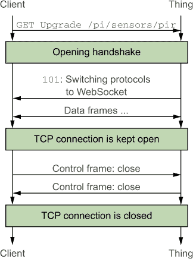

让我们看看一个具体的例子，使用我们在第四章中设置的 PIR 传感器，该传感器在我们的 Pi 上运行在 [`devices.webofthings.io/pi/sensors/pir`](http://devices.webofthings.io/pi/sensors/pir)。如果你用浏览器访问这个地址，你会得到 PIR 传感器的 HTML 表示形式。同样，如果你访问它并使用之前显示的 `Content-Type: application/json` 头部请求它，你会得到 PIR 传感器的值，这是通过 HTTP 实现的 REST；正如你之前所看到的。现在，使用相同的资源，你也可以通过请求协议升级来请求 WebSocket 内容，如下一个列表所示。

##### 列表 6.13\. WebSocket 握手中的客户端请求

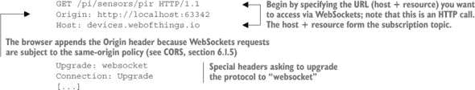

这里真正有趣的是，升级协议的调用是通过 HTTP 发起的。这意味着想要实时数据的客户端始终可以请求通过 WebSocket 交付 REST 资源，如果服务器不支持 WebSocket，则回退到纯 HTTP。在我们的 `devices.webofthings.io` 服务器的情况下，它支持 WebSocket，并将回复协议升级的确认，如下面的列表所示。

##### 列表 6.14\. WebSocket 握手中的服务器响应

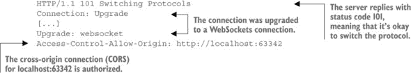

客户端和服务器通过 WebSockets 提供 PIR 传感器值的完整握手过程在图 6.10 中展示。

##### 图 6.10。Firefox 网络工具中看到的 WebSocket 协议握手动作。客户端请求协议升级，服务器接受。从那时起，客户端和服务器可以通过 TCP 连接互相发送消息，该连接将保持打开状态，直到客户端或服务器决定关闭它。

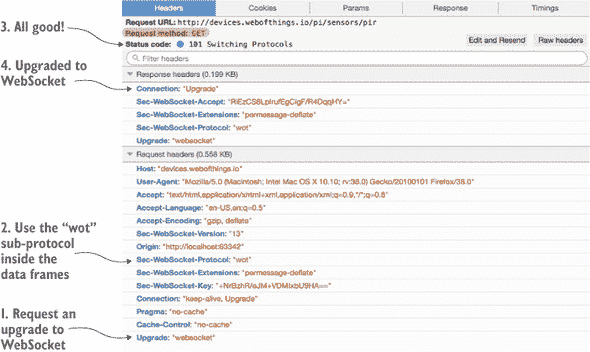

一旦完成初始握手，客户端和服务器将能够通过开放的 TCP 连接来回发送消息；这些消息不是 HTTP 消息，而是 WebSockets 数据帧。文本和二进制数据帧可以双向同时发送。每个 WebSockets 数据帧的开销是 2 字节，与 HTTP 消息元数据（如标题等）的 871 字节开销相比很小。再加上 IP、TCP 和 TLS 的开销（见第九章），每条消息将额外增加 60-100 字节！这使得 WebSockets 通信比 HTTP 消耗的带宽少得多。

他们交换的消息的语法和语义是开放的，但可以使用`Sec-WebSocket-Protocol`请求头来指定数据帧内部使用的协议（在这个例子中，我们使用“wot”，这是一个虚构的子协议）。已注册的子协议由互联网数字分配机构（IANA）管理.^([14])

> ¹⁴
> 
> [`www.iana.org/assignments/websocket/websocket.xml`](http://www.iana.org/assignments/websocket/websocket.xml)

##### 物联网的 WebSockets

对于物联网的 WebSockets 来说，真正有趣的是它们使用了标准的互联网和 Web 技术。因为它们通过 80 端口打开 TCP 连接，所以 WebSockets 不会被防火墙阻止，并且可以穿越代理。然后，因为它们在浏览器中工作，并且通过 HTTP 启动，这使得我们可以使用在探索 HTTP 和 REST 时考虑到的许多原则。首先，事物的分层结构和它们的资源作为 URL 可以原样重用于 WebSockets。正如你在列表 6.14 中看到的，我们可以通过使用相应的 URL 并请求将协议升级到 WebSockets 来订阅事物的资源事件。此外，WebSockets 不指定来回发送的消息的格式。这意味着我们可以愉快地使用 JSON，并为消息赋予我们在第八章中将工作的结构和语义。

此外，由于 WebSocket 由一个初始握手和随后在 TCP 上层叠的基本消息帧组成，它们可以直接在许多支持 TCP/IP 的平台上实现——而不仅仅是网页浏览器。它们还可以用来封装其他与互联网兼容的协议，使它们成为网页兼容。一个例子是 MQTT，这是一个著名的物联网 pub/sub 协议，可以通过 WebSocket 集成到网页浏览器中。你将在下一章中更详细地了解这一点。

在物联网的背景下，WebSocket 通信创建的永久链接很有趣，尤其是在考虑希望观察或订阅现实世界属性（如环境传感器）的应用程序时。最后，与 HTTP 轮询相比，WebSocket 显著降低了带宽消耗。然而，缺点是保持 TCP 连接始终开启可能会导致电池消耗增加，并且比 HTTP 在服务器端更难扩展。

#### 6.2.6\. 未来：从 HTTP/1.1 到 HTTP/2

当正确使用时，HTTP/1.1 是构建网络服务的一个优秀协议，正如你在本章中看到的。但它可以追溯到 1999 年。你还记得那个时代吗？当时，我们使用 Windows 95，用有线电话互相通话，物联网这个术语才刚刚被提出！我们主要使用 HTTP 来显示点击计数器、网站地图和动画的“建设中”gif，但并不是用来显示很多实时数据，更不是用来与设备交互。

显然，自那时以来，网络已经发生了巨大的变化，对可扩展性、性能、实时消息传递和安全性的需求显著增加。因此，互联网即将全面拥抱一场名为 IPv6 的革命（见第五章)，以及另一场名为 HTTP/2 的革命.^([15]) 新协议并非专门为物联网设计，但新协议的创造者显然考虑到了物联网的一些需求。HTTP/2 专注于在 HTTP/1.1 上进行多项改进，并且可以轻松运行在你的 Pi 上！^([16])

> ¹⁵
> 
> [`http2.github.io`](http://http2.github.io)
> 
> ¹⁶
> 
> 已经有几种 HTTP/2 的 Node.js 实现。如果你想在你 Pi 上尝试 HTTP/2，你应该尝试在 [`github.com/molnarg/node-http2`](https://github.com/molnarg/node-http2) 上可用的 `node-http2` 模块。

##### 性能改进

这个新的 HTTP 版本允许多路复用响应——也就是说，并行发送响应。这解决了 HTTP/1.x 的首部阻塞问题，当时在 TCP/IP 连接上一次只能有一个请求是挂起的^([17]）。此外，它鼓励客户端和服务器使用单个 TCP 连接，在该连接上请求和响应以流的形式发送。

> ¹⁷
> 
> 在 HTTP/1.1 中提出了流水线技术来解决这个问题，但它并没有完全解决这个问题，并且难以部署；参见[`devcentral.f5.com/articles/http-pipelining-a-security-risk-without-real-performance-benefits`](https://devcentral.f5.com/articles/http-pipelining-a-security-risk-without-real-performance-benefits)。

这对于 WoT 来说是一个有趣的功能，因为它导致连接的更高效使用，从而减少了 HTTP 的开销。它还导致传输速度更快，因此有可能在通信所需的电池功率方面节省能源.^([18])

> ¹⁸
> 
> Akamai 开发了一个简单的页面，让您可以尝试这些改进：[`http2.akamai.com/demo`](https://http2.akamai.com/demo)。

##### 更高效的格式

HTTP/2 还引入了使用高效且低内存压缩格式的压缩头，^([19])与在 HTTP 之上最常用的压缩格式 GZIP 不同。这减少了每个 HTTP 请求和响应的大小。此外，HTTP/1.1 是一个 ASCII 协议——即传输 ASCII 字符的协议——而 HTTP/2 使用二进制帧，这意味着它传输二进制数据流。二进制协议在解析上更高效，且更紧凑。

> ¹⁹
> 
> 称为 HPACK：HTTP/2 的头压缩。参见：[`datatracker.ietf.org/doc/rfc7541/`](https://datatracker.ietf.org/doc/rfc7541/)。

所有这些都特别有趣，因为“资源受限的物联网”意味着数据包的大小显著减小，允许具有有限 RAM 的设备愉快地处理 HTTP/2。

##### 服务器推送

最后，HTTP/2 引入了*服务器推送*的概念。具体来说，这意味着服务器可以在不需要等待客户端发送请求的情况下向客户端提供内容。从长远来看，HTTP/2 上服务器推送的广泛应用甚至可能消除像 WebSocket 或 webhooks 这样的推送协议的需求。

##### HTTP/2 与物联网

这对 HTTP/2 的功能及其对物联网的影响的概述远非完整，但它表明网络的未来将使物联网变得更加出色。有趣的是，您不需要改变太多方法：HTTP 的实现将改变，但您构建在其上的 API 不会改变，因为 HTTP/2 的语义保持不变。因此，您在本书的剩余部分学到的任何内容都将适用于 HTTP/2！

HTTP/2 规范于 2015 年 2 月正式通过，Chrome、Firefox 和 Opera 等几个浏览器已经开始支持它。这意味着该标准即将在全球范围内部署，并将很快使物联网变得更加高效！

### 6.3. 摘要

+   当正确应用时，REST 架构是创建大规模和灵活分布式系统的优秀基础。

+   REST API 非常有趣，并且易于应用，可以启用对物理对象和其他设备的访问。

+   各种机制，如内容协商和作为应用状态引擎的 Hypermedia（HATEOAS）的缓存，有助于创建出色的物联 API。

+   一个五步设计过程（集成策略、资源设计、表示设计、界面设计和资源链接）允许任何人根据行业最佳实践为物联创建有意义的 REST API。

+   实时 Web 的最新发展，如 WebSockets，允许创建高度可扩展、分布式和异构的实时数据处理应用。直接与网络通信的设备可以轻松使用基于 Web 的推送消息来高效地流式传输其传感器数据。

+   HTTP/2 将为物联带来许多有趣的优化，例如多路复用和压缩。

你已经深入了解了 REST 和 HTTP，但如果你还想了解更多，你可能想看看 Leonard Richardson 和 Sam Ruby 所著的非常好的*RESTful Web Services*（O’Reilly Media，2007）[20]，或者浏览到 WoT Publications 页面[21]，在那里你可以找到许多关于使用 REST 为现实世界设备提供资源的方法。

> ^(20)
> 
> [`shop.oreilly.com/product/9780596529260.do`](http://shop.oreilly.com/product/9780596529260.do)
> 
> ^(21)
> 
> [`webofthings.org/publications/`](http://webofthings.org/publications/)

在了解了这么多关于 REST、HTTP 和 WebSockets 的理论之后，你可能想知道如何在你的物联设备上实际实现这些内容。准备好吧——这就是下一章将关注的内容。你将学习如何实现本章中你所学到的模式，以便你可以访问任何设备，无论它是否连接到互联网。准备好你的编码手指；在下一章中，你将需要它们更多！

## 第七章\. 实现 Web 物联

*本章涵盖*

+   探索实现 Web 物联的三个可能模式

+   通过 Web 协议提供传感器和执行器的访问

+   在你的 Pi 上使用 Node.js 和 Express 构建 REST 和 WebSockets API

+   构建 CoAP 设备并将它们连接到网络

+   在你的 Pi 上使用 MQTT 连接到 EVRYTHNG API

在上一章中，我们关注了如何为物理物联设计一个干净的 Web API。本章基于你所学到的原则，描述了如何实际实现这些 API。

下文详细介绍了实现 Web Thing API 的三个不同方法，以处理实现策略。在这里，我们关注将事物集成到网络中的集成模式，回答问题：“我们实际上在哪里实现事物的 API 以将其集成到网络中？”这个问题很重要，因为并非所有事物都是平等的！正如你在第五章中看到的，一些事物可以访问互联网并原生实现 Web 协议。但对于计算能力或功耗受限的其他事物，Web 协议可能具有挑战性。

### 7.1\. 将设备连接到网络

最直接的集成模式是*直接集成模式*。它可以用于支持 HTTP 和 TCP/IP 的设备，因此可以直接暴露 Web API。当设备可以直接连接到互联网时，这种模式特别有用；例如，它使用 Wi-Fi 或以太网。其次，我们探讨*网关集成模式*，资源受限的设备可以使用非 Web 协议与更强大的设备（网关）通信，然后该网关为这些非 Web 设备暴露 REST API。这种模式对于无法直接连接到互联网的设备特别有用；例如，它们只支持蓝牙或 ZigBee，或者它们资源有限，无法直接处理 HTTP 请求。第三，*云集成模式*允许强大的可扩展 Web 平台充当网关。这对于任何可以通过互联网连接到云服务器的设备都很有用，无论它是否使用 HTTP，并且需要比它单独提供更多的功能。

在第六章中介绍的 Web Things 设计流程的第一步是选择这些模式之一。之后，我们可以应用设计流程的步骤 2-4。第 5 步将在第八章中更详细地介绍：

> **1**.  *集成策略*—选择将事物集成到互联网和 Web 的模式。这些模式在本章中介绍。
> 
> **2**.  *资源设计*—识别事物的功能或服务，并组织这些服务的层次结构。
> 
> **3**.  *表示设计*—决定为每个资源提供哪些表示。
> 
> **4**.  *接口设计*—决定每个服务可能的命令，以及相应的错误代码。
> 
> **5**.  *资源链接设计*—决定不同的资源如何相互链接。


**参考 WoT 服务器—webofthings.js**

在接下来的几章中，您将学习如何实现一个功能齐全的物联网服务器，该服务器允许根据本书中介绍的 WoT 架构和概念将任何设备连接到网络。每一章都将扩展前一章中编写的代码，因此您可以通过按顺序阅读下一章来从本书中获得最大收益。通过这样做，到本书结束时，您将从头开始构建一个完整、可扩展和安全的框架来实现网络事物。

如果您迫不及待，也可以下载物联网参考实现的最新版本：webofthings.js。您可以在我们的 GitHub^([a])或直接在 npm^([b])上找到它，并在您自己的项目、应用程序或设备中使用它。并且，请向我们发送您的反馈和拉取请求——我们希望这个框架能够超越本书的内容。

> ^a
> 
> [`github.com/webofthings/webofthings.js`](https://github.com/webofthings/webofthings.js)
> 
> ^b
> 
> [`www.npmjs.com/package/webofthings`](https://www.npmjs.com/package/webofthings)


### 7.2\. 直接集成模式——设备上的 REST

实现网络事物 API 的第一种也是最简单的方法是在事物上直接实现，如图 7.1 所示。这要求事物可以通过互联网协议（TCP/IP）访问，并且能够直接托管 HTTP 服务器。疯狂的想法，我们听到您这么说？好吧，Web 服务器并不大，可以轻松地安装在最小的设备上。一些最小的 HTTP 服务器可以在少于 50 字节的 RAM 上运行，包括 TCP/IP 堆栈，这使得即使是微型且廉价的 8 位设备也能使用 HTTP。这也意味着您的 Pi——或您使用的任何其他 Linux 设备——肯定可以实现 Web 服务器，通过 REST API 提供对资源的访问。

> ¹
> 
> MiniWeb 是一个极小的 Web 服务器的例子；请参阅[`miniweb.sourceforge.net/`](http://miniweb.sourceforge.net/)。

##### 图 7.1\. 直接集成模式。在这个模式中，网络事物是 Wi-Fi 连接的灯具，运行嵌入式 HTTP 服务器，因此可以直接提供物联网 API。这允许网络事物客户端，如移动应用程序或其他网络事物，直接通过 HTTP 与灯具通信。图片经[`model.webofthings.io`](http://model.webofthings.io)许可使用。

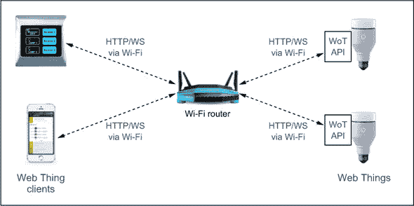

尽管在大多数嵌入式设备上都可以实现网络协议，但当设备不是由电池供电且需要客户端如移动网页应用直接访问时，直接集成模式是最佳选择。一个很好的例子是家庭自动化，通常电力供应充足，低延迟的本地交互很重要——例如，开关灯。在本节的其余部分，我们将展示如何在您的 Pi 上直接实现 WoT 服务器，以便它可以直接使用网络协议并加入物联网俱乐部。

#### 7.2.1\. 创建 WoT 服务器

让我们从在 Pi 上设置一个 Web 服务器开始。Node.js 主要用于构建 Web 应用程序，所以你可以像在第三章中做的那样从头开始构建一个。但因为我们正在转换方向，并希望实现一个完整的 REST API，大量的 Node.js 框架可以帮助我们。^([2)] 为了简化起见，我们将使用最受欢迎的：Express。^([3)]

> ²
> 
> 这里列出了 Node.js 最受欢迎的 Web/REST 框架：[`nodeframework.com/`](http://nodeframework.com/)。
> 
> ³
> 
> [`expressjs.com/`](http://expressjs.com/)

你将构建的服务器架构在 图 7.2 中显示。它围绕一个中央模型构建，插件可以更新和观察。此外，所有传感器和执行器都作为 Web 资源可用，这得益于 Express 框架的使用。

##### 图 7.2\. 我们 WoT 服务器的组件架构：服务器使用 Express 框架。系统的其余部分围绕一个插件可以观察和更改的模型构建。插件建立在其他 Node 库之上，通过 GPIO 提供对物理资源的访问。

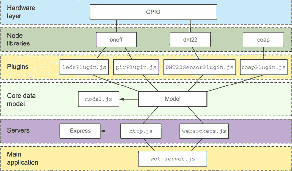

我们将在 Pi 上部署此代码，但如果你还没有 Pi，不要担心；除了少数例外，你将能够在你的计算机上运行本章中的所有示例。但用 Pi 来做会更有趣！^([4)]

> ⁴
> 
> 查看我们合作伙伴提供的特别优惠：[`book.webofthings.io`](http://book.webofthings.io)。

##### Express：Node.js Web 框架

*Express* 不仅仅是一个 Web 服务器；它是一个完整的框架，几乎可以处理现代 Web 应用程序需要的所有功能，从 RESTful API 到 HTML 和 CSS 模板引擎、数据库连接器、cookie 管理，甚至社交网络集成。Express 还拥有庞大的开发者社区和多种插件。

虽然 Express 在 Pi 和大多数其他 Linux 设备上运行顺畅，但值得注意的是，Express 并不是为物联网设备实现 Web API 的最轻量级方式。但正如你将在许多场合看到的那样，这种灵活的框架使我们能够快速扩展我们的 Web Thing API 并实现我们将遇到的多种模式。

现在我们将展示如何基于 Express 创建一个 WoT 服务器。^([5)] 项目的结构如下所示。你可以复制这个结构并通过 NPM 安装 Express。或者，你可以从书籍的 GitHub 仓库克隆项目，[`book.webofthings.io`](http://book.webofthings.io)，它位于文件夹 chapter7-implementation/part1-2-direct-gateway/ 中。^([6)]

> ⁵
> 
> 虽然你当然可以直接在 Pi 上运行这些命令，但更方便、更实际的做法是在你的笔记本电脑或台式计算机上开发应用程序，然后通过 Git 在 Pi 上拉取代码，正如第四章所述。[`book.webofthings.io`](http://book.webofthings.io)。
> 
> ⁶
> 
> 查看 [`book.webofthings.io`](http://book.webofthings.io)。

##### 列表 7.1\. Pi 项目 WoT 服务器目录结构

```
wot-pi
—— middleware
   —— converter.js
—— plugins
   —— external
      —— coapPlugin.js
   —— internal
       —— DHT22SensorPlugin.js
       —— ledsPlugin.js
       —— pirPlugin.js
—— public
   —— websocketsClient.html
—— resources
   —— model.js
   —— resources.json
—— routes
   —— actuators.js
   —— sensors.js
   —— things.js
—— servers
   —— coap.js
   —— http.js
   —— websockets.js
—— utils
   —— utils.js
—— package.json
—— wot-server.js
```

#### 7.2.2\. 资源设计

您现在已经拥有了实现 API 所需的所有元素，让我们从我们流程的第一步开始：*资源设计*。首先，您需要考虑设备上的物理资源，并将它们映射到 REST 资源中。从您在第四章中配置的 Pi 开始，您的设备至少应该有一个 LED、一个被动红外（PIR）传感器，可能还有一个温度传感器和一个湿度传感器。如果您没有所有这些传感器，不要担心。我们将向您展示如何模拟它们！这些传感器和执行器可以映射到图 7.3 中显示的资源树中。

##### 图 7.3\. 您的 Pi 资源树，包含多个传感器和执行器及其层次结构。每个资源都通过遵循到该资源的路径获得一个 URL。例如，被动红外传感器的 URL 将是 http://localhost:8484/pi/sensors/pir。

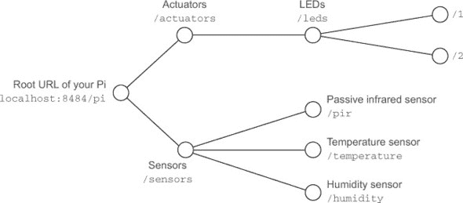

##### 第 1 步：创建资源模型

您现在可以将此树映射到您的应用程序将使用的 JSON 文件中，以公开您希望的结构化的 URL。创建或打开包含下一列表中对象的 resources/resources.json 文件。

##### 列表 7.2\. /resources/resources.json: Pi 资源的 JSON 模型

```
{
  "pi": {
    "name": "WoT Pi",
    "description": "A simple WoT-connected Raspberry PI for the WoT book.",
    "port": 8484,
    "sensors": {
      "temperature": {
        "name": "Temperature Sensor",
        "description": "An ambient temperature sensor.",
        "unit": "celsius",
        "value": 0,
        "gpio": 12
      },

      "humidity": {
        "name": "Humidity Sensor",
        "description": "An ambient humidity sensor.",
        "unit": "%",
        "value": 0,
        "gpio": 12
      },
      "pir": {
        "name": "Passive Infrared",
        "description": "A passive infrared sensor.
            When 'true' someone is present.",
        "value": true,
        "gpio": 17
      }
    },
    "actuators": {
      "leds": {
        "1": {
          "name": "LED 1",
          "value": false,
          "gpio": 4
        },
        "2": {
          "name": "LED 2",
          "value": false,
          "gpio": 9
        }
      }
    }
  }
}
```

接下来，您创建 resources/model.js 文件，如下所示导入我们的 JSON 模型：

```
var resources = require('./resources.json');
module.exports = resources;
```

此文件从 resources.json 文件加载我们的 Pi 的 JSON 模型，`exports`将此对象作为您可以在应用程序中使用的 node 模块提供。

##### 第 2 步：创建 Express 路由

您现在可以将这些资源绑定到您的 Web 服务器将响应的 URL 上。在 Express 和许多其他 Web 框架中，资源的 URL 由一个*路由*定义。您在 routes/文件夹中的两个文件（actuators.js 和 sensors.js）中定义这些路由，如下一两个列表所示。

##### 列表 7.3\. /routes/sensors.js: 传感器路由

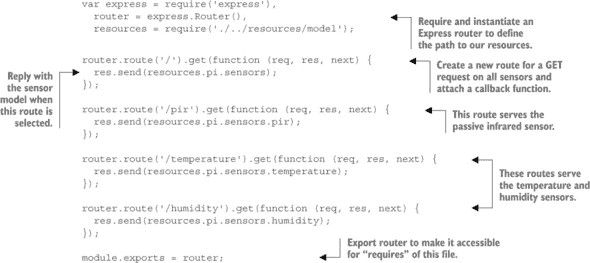

##### 第 3 步：创建 Express 应用程序

现在路由已经准备好了，您需要在 HTTP 服务器中加载它们，这通过 servers/http.js 文件完成。该文件的内容如下所示，本质上是一个包裹在 Express 框架中的 HTTP 服务器。

##### 列表 7.4\. /servers/http.js: Express 应用程序

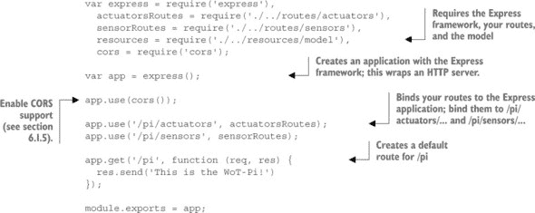

在您测试实现之前，需要再添加一个文件：wot-server.js，如下一列表所示。这是您的 WoT Pi 服务器的入口点，负责以正确的配置启动服务器。

##### 列表 7.5\. /wot-server.js: 应用程序入口点

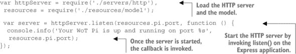

您现在可以通过在终端中启动应用程序来测试您的服务器，就像通常一样.^([7]) 一旦启动，您将能够使用浏览器访问资源——例如，温度传感器在 http://localhost:8484/pi/sensors/temperature 或执行器列表在 http://localhost:8484/pi/actuators。在这两种情况下，您将获得与您的请求相对应的 JSON 有效负载。显然，如果您在 Pi 上运行代码，请将 localhost 替换为 Pi 的 IP 地址或名称（raspberrypi.local）。

> ⁷
> 
> 在 `wot-pi/` 文件夹中运行 `npm install` 后，运行 `node wot-server.js` 或 `nodemon wot-server.js`，如 第三章 中所示。

##### 第 4 步：将传感器绑定到服务器

这听起来不错，但目前我们返回的只是 列表 7.2 中的 JSON 模型的一部分，以及缺失的实际世界数据——实际的温度！您需要将 Pi 上的某些传感器数据放入服务器中。您将通过创建多个插件*，*每个传感器或执行器一个插件*，*来完成此操作。每个传感器插件应在从传感器读取新数据时更新模型。传感器插件至少应具有以下列表中显示的函数。所有插件都在 plugins/ 目录中。PIR 传感器插件的实现如下一列表所示，它本质上是对 第四章 中编写的 pir.js 代码的扩展。

##### 列表 7.6\. /plugins/internal/pirPlugin.js: PIR 传感器插件

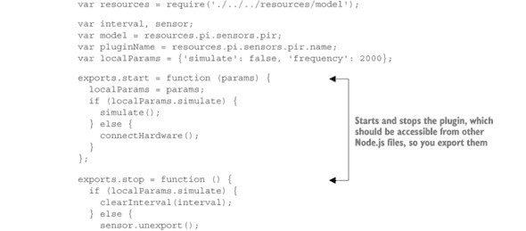

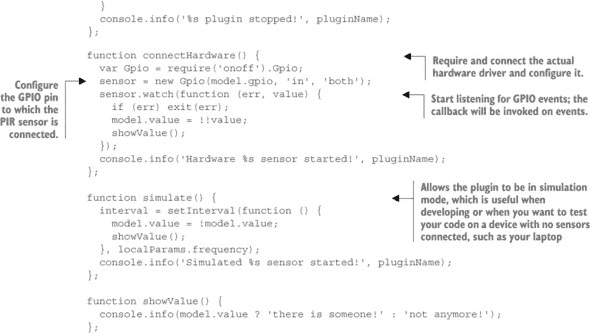

温湿度和传感器代码如下一列表所示，除了一个新函数：`connectHardware()`，它使用在 第四章 中介绍的 `node-dht-sensor` 库。

##### 列表 7.7\. /plugins/internal/DHT22SensorPlugin.js: 温湿度传感器插件

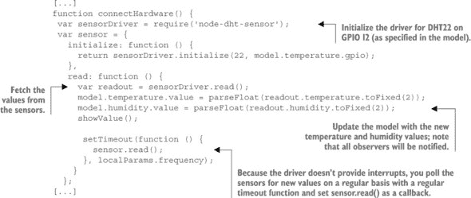

两个插件的代码明显共享了许多公共函数，因此作为练习，您可能希望将公共功能提取到一个 JavaScript 原型中。如果您不知道如何做，不要担心；我们将在 第八章 改进代码时说明这一点。

您现在可以通过从 wot-server.js 文件中引入它们并使用正确的参数启动每个插件来在您的服务器上安装您的插件，如下所示。

##### 列表 7.8\. 将插件集成到 wot-server.js 中

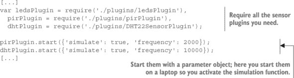

再次运行您的服务器并打开湿度传感器页面，网址为 http://localhost:8484/pi/sensors/humidity。刷新页面几次；每次应该得到不同的值。

##### 在您的 Pi 上使用真实硬件进行测试

模拟传感器是不错的，但使用真实的传感器则更好！要在你的 Pi 上使用真实传感器，你首先需要安装连接传感器的库。问题是这些库不支持像你的笔记本电脑这样的非 IoT 平台，所以如果你通过`npm install --save`添加依赖项，你将无法再在 PC 上安装你的代码。别担心：有解决办法！NPM 允许你为 package.json 文件设置一个`optionalDependencies`对象。想法是，如果`optionalDependencies`中的依赖项无法安装，`npm install`不会失败。继续在你的 package.json 文件中添加以下代码；第一个依赖项支持 PIR 传感器和 LED，第二个依赖项支持温度和湿度传感器（如果你有）：

```
"optionalDependencies": {
  "onoff": "¹.0.4",
  "node-dht-sensor": "⁰.0.8"
}
```

最后，在你的 Pi 上运行`npm install`来安装这些依赖项。现在，使用`{'simulate': false}`修改你想要启用的插件的参数，并在 Pi 上运行你的应用程序；^([8]) 这将连接到物理驱动器。现在，你的 Pi 正通过 Web API 向世界公开其实际传感器数据和执行器。你可以通过 REST 使用你的 Pi 地址访问它们，例如，[`raspberrypi.local:8484/pi/sensors/pir`](http://raspberrypi.local:8484/pi/sensors/pir)。

> ⁸
> 
> 如果你已经设置了温度和湿度传感器，你需要使用 sudo 运行代码：`sudo node wot-server.js`。

#### 7.2.3\. 表示设计

设计过程的下一步是*表示设计*。REST 对特定的数据格式或表示是中立的。我们提到 JSON 是保证互操作性的必需品，但它并不是唯一有趣的数据表示。在本节中，你将添加对两种更多表示的支持。你将添加 HTML 支持，因为这允许你以人性化的方式浏览你的 Pi 并发现其资源。为此第一步，你将使用一个简单的 JSON 到 HTML 库，称为`json2html`。

当你忙于这些时，让我们也添加对 MessagePack 的支持，这是一种比 JSON 更紧凑的二进制替代品，在第六章中简要介绍过。MessagePack 可以轻松映射到 JSON，但比 JSON 更紧凑，这使得它在通过低带宽网络通信的资源受限的设备中很有趣。大多数流行编程语言都有用于编码和解码 MessagePack 的库，因此在你的服务器中添加对它的支持只是安装 Node 的`msgpack5`模块的问题。

##### 实现表示转换中间件

在 Express 中支持其他表示的方法有很多，但我们提出了一种基于中间件模式的模块化方法。许多 Node 库，包括 Express，都支持在请求-响应周期中访问请求（`req`）和响应（`res`）对象的函数链式调用。这种模式允许扩展性，同时保持代码干净和模块化。本质上，一个中间件可以执行更改请求或响应对象的代码，然后可以使用 `next()` 函数决定响应客户端或调用堆栈中的下一个中间件。我们将要实现的中间件链在图 7.4 中显示。

##### 图 7.4\. 为 WoT 服务器实现的中间件链：每个中间件都是通过 `app.use()` 函数添加到 Express 应用程序的。然后，每个中间件都会获得对请求对象、响应对象和链中下一个中间件的引用。

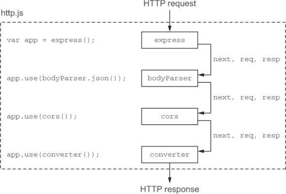

典型中间件的存根看起来如下：

```
function myMiddleware(req, res, next) {
  // do something with the request
  // AND/OR add something to the response
  res.send("something");
  next();
}
```

我们使用这种模式来实现一个支持 MessagePack 和 HTML 表示的表示转换器。首先，通过 NPM 安装这两个库（`npm install node-json2html msgpack5`）。中间件代码位于 middleware/converter.js 中，如列表 7.9 所示。本质上，我们的表示转换器中间件将实现第六章中描述的内容协商模式，其中它会在请求中查找 `Accept` 头，并尝试提供客户端请求的格式表示。如果它不识别该格式，则默认返回 JSON。

##### 列表 7.9\. /middleware/converter.js: 实现表示中间件

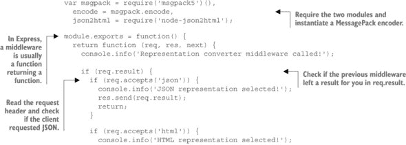

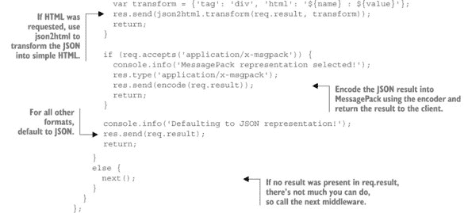

现在中间件已经准备好了，你需要修改服务器的路由，使它们调用链中的下一个中间件，即表示转换器，而不是直接响应请求。你可以在两个路由文件 sensors.js 和 actuators.js 中轻松实现这一点，通过将每个 `res.send(resource)` 替换为 `req.result = resource` 和 `next()`。以下列表显示了传感器的路由更改，所以请确保也将这些更改应用到执行器的路由上。

##### 列表 7.10\. 在 sensors.js 中调用下一个中间件

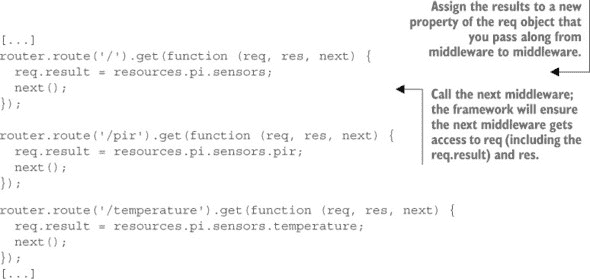

最后，你需要将中间件添加到 Express 应用程序中，以便它在中间件链中被调用。在 http.js 中，首先使用 `converter = require('./../middleware/converter')` 引入中间件，并通过调用 `app.use(converter())` 将其添加到链中。因为你的转换中间件响应客户端，确保你在 `app.get('pi')` 之后添加它，否则它将绕过任何其他中间件。从你的浏览器中测试你的新服务器（或 PC）：[`raspberrypi.local:8484/pi/sensors/pir`](http://raspberrypi.local:8484/pi/sensors/pir)。你现在应该看到一个 PIR 传感器的简约 HTML 表示。现在使用 cURL 通过设置 `Accept` 头到所需的 MIME 类型（JSON 为 `application/json`，MessagePack 为 `application/x-msgpack`）来请求其他类型的表示，如下所示：

```
curl -i -H "Accept: application/json" \
-X GET 'http://raspberrypi.local:8484/pi/sensors/pir'

curl -i -H "Accept: application/x-msgpack" \
-X GET 'http://raspberrypi.local:8484/pi/sensors/pir'
```

你的服务器现在可以为它提供的所有资源提供三种不同的表示——JSON、HTML 和 MessagePack。所有这些都要归功于一个 20 行长的中间件！这是对开放网络标准和 Node.js 力量的一个很好的说明吗？

#### 7.2.4\. 接口设计

到目前为止一切顺利，但你只能通过 HTTP 从你的 Pi 上获取资源。其他动词如 `PUT` 和 `POST` 呢？HTTP 状态码呢？使用 WebSockets 订阅传感器数据呢？这是接口设计步骤的目标。

##### 添加一个主体解析器

对于传感器来说，`GET` 动词就足够了，因为你只需要读取它们，但如果你想要改变执行器——例如，打开/关闭一个 LED 或改变其颜色呢？第一步是通知 Express 你愿意接收来自客户端的 JSON 负载。在中间件链中添加一个 HTTP 主体解析器就可以做到这一点。在 http.js 中，引入 body-parser 模块：`bodyParser = require('body-parser')`。同时，将中间件添加到链的起始位置。为什么是起始位置？你想要首先解析 HTTP 消息的主体，以便所有其他中间件都可以使用：`app.use(bodyParser.json())`。

##### 支持其他 HTTP 动词

你的服务器现在也可以处理传入的 JSON 消息，所以让我们添加对使用 `PUT` 请求更新 Pi LED 状态的支持。要添加对 `PUT` 的支持，你需要再次扩展 actuators.js 中的路由。将 `/leds/:id` 的路由转换为以下列表。

##### 列表 7.11\. 在 /routes/actuators.js 中为 LED 添加 `PUT` 支持

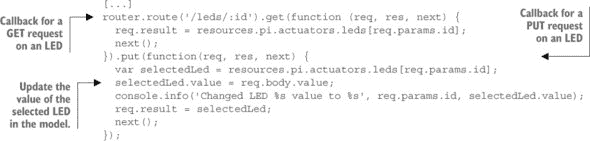

你现在可以通过在 LED 资源上运行带有适当 JSON 负载的 `PUT` 请求来更新 LED 的状态。在 cURL 中，这看起来像以下内容：

```
curl -i -H "Content-Type: application/json" \
  -H "Accept: application/json" \
  -X PUT 'http://localhost:8484/pi/actuators/leds/1' \
  -d '{"value":true}'
```

如果你成功了，你将在 Node 控制台中看到以下内容：`Changed LED 1 value to` `true`。

##### 将执行器绑定到服务器

这听起来不错，但实际上它只更新了您的模型；它并没有激活现实世界！要改变这种行为，您需要编写一个具有类似结构但有一个显著区别的 LED 插件：它有一个 `observe()` 函数。`observe()` 函数对于执行器插件是必需的，其目标是观察模型的变化并将它们报告给物理世界。

这个实现的核心理念是使用 `Object.observe()` 函数.^([9]) 这允许您通过注册一个回调函数来异步观察对象的变化，每当检测到观察对象的变化时，该回调函数将被调用：

> ⁹
> 
> 注意，这个功能自 Node 0.11.13 版本以来就已经被支持，并且在我们这本书中使用的当前 Node LTS v4.X 中可用，但它在未来的 LTS 版本中可能会被移除，所以请确保您使用 node 4.X LTS 来确保其正常工作。请参阅 [`www.infoq.com/news/2015/11/object-observe-withdrawn`](http://www.infoq.com/news/2015/11/object-observe-withdrawn)。

```
Object.observe(obj, function(changes) {
  console.log(changes);
});
```

让我们利用这个特性来实现您的 LED 插件。它使用 `on/off` 库来改变连接到 GPIO 的 LED 的状态。请注意，为了保持简单，此代码仅支持一个 LED（LED #1），但请随意将其扩展以支持更多作为练习。在 `observe` 中，您注册一个回调函数，以便在您的 LED 模型发生变化时触发。实际上，您是在这个回调函数中改变 GPIO 的状态，如下一列表所示。

##### 列表 7.12\. /plugins/internal/ledsPlugin.js: LED 插件

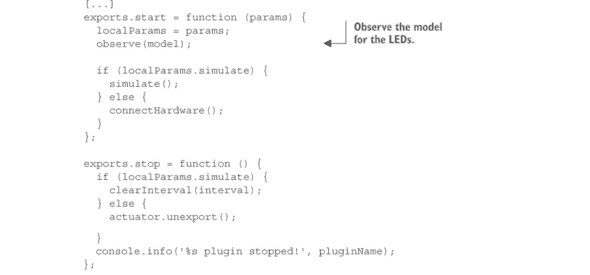

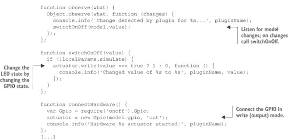

将此插件添加到 wot-server.js 中初始化插件的列表中，并将模拟设置为 false：`ledsPlugin.start({'simulate': false})`。在您的 Pi 上运行它，并再次尝试针对您的 Pi 的 URL 进行最后的 cURL 请求；这次 LED 应该会亮起！是的，我们知道。这只是个 LED，但，哦，这感觉真好。欢迎来到物联网！

#### 7.2.5\. 通过 WebSocket 的 Pub/sub 接口

我们界面设计步骤的最后一部分是支持通过 WebSocket 进行发布/订阅。我们的目标是提供一个简单的协议升级到 WebSocket 的能力，以便通过 WebSocket 订阅我们所有的资源。

对于 Node，有几种 WebSocket 的实现。最完整和最知名的一个可能是 Socket.io，它不仅仅是一个 WebSocket 服务器。它还支持不支持 WebSocket 的客户端的回退；例如，如第六章中所示的长轮询。我们建议您更仔细地查看 Socket.io，但为了我们的 Pi 服务器，我们将选择一个纯且高性能的 WebSocket 实现，称为 WS。

WS 集成的实现如图 7.5 所示。你创建一个 WebSocket 服务器，并将其监听器附加到 Express 的主要 HTTP 服务器上，以监听 WebSocket 协议升级请求；参见第五章。然后，你接收这些升级请求，并使用请求的 URL 来观察模型中的相应资源。每当检测到变化时，你通过开放的 WebSocket 连接将变化传播给客户端。

##### 图 7.5\. WoT 服务器 WebSocket 实现的序列图：WebSocket 服务器通过观察相应的资源（例如，`/temp`）来响应客户端通过 HTTP 升级请求打开 WebSocket 连接；每当资源的可用新值出现时，WebSocket 服务器通过它与客户端保持的开放 TCP 连接发送它。

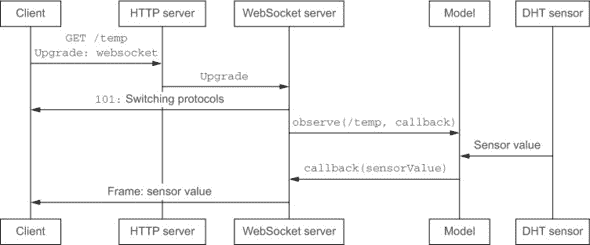

要将此集成到 Pi 上的 WoT 服务器中，首先安装 WS 模块（`npm install --save ws`）。然后按照以下列表实现 WebSocket 服务器。

##### 列表 7.13\. /server/websockets.js: WebSockets 服务器

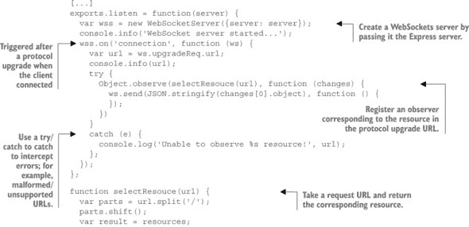


启用 WebSocket 支持的最后一步是在 wot-server.js 中启动 HTTP 服务器后初始化 WebSocket 服务器。修改对 `listen()` 的调用，包括一个回调，以启动 WebSocket 服务器，如下列所示。

##### 列表 7.14\. 在 wot-server.js 中启用 WebSockets 服务器

```
var httpServer = require('./servers/http'),
  wsServer = require('./servers/websockets'),
  resources = require('./resources/model');
[...]
var server = httpServer.listen(resources.pi.port, function () {
  console.log('HTTP server started...');
  wsServer.listen(server);
  console.info('Your WoT Pi is up and running on port %s', resources.pi.port);
})
```

就这样！你现在可以通过 WebSocket 订阅 Web 上的所有资源，并在资源状态发生变化时得到通知。你可以使用任何 WebSocket 客户端——例如，一个网页，如你在第二章中看到的示例。尝试将其修改为订阅你的 WoT Pi，或者你可以在任何最近的浏览器中使用 /public/websocketsClient.html 文件。当你在这个文件中打开浏览器时，你将在你的开发者工具的 JavaScript 控制台中看到 WebSocket 消息，如图 7.6 所示。

##### 图 7.6\. 使用 Firefox 中的简单 WebSocket 客户端通过 WebSocket 订阅温度更新。上半部分显示协议升级过程，下半部分显示从设备（这里是一个 Pi）直接推送到基于浏览器的客户端的消息。

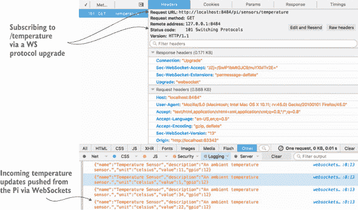

| |
| --- |

**技术角落——我想更好的 JavaScript！**

我们在本节中构建的 WoT 服务器在代码方面保持极其简单，以确保每个人都能跟上。通过应用一些 JavaScript 良好实践和模式，代码可以变得更加简洁和可重用。如果你了解 JavaScript，一个很好的练习是将代码模块化；例如，从原型开始，以分解大量插件代码。在第八章中，你将看到我们在这里展示的框架的改进版本，但你现在就可以不犹豫地构建自己的版本！

| |
| --- |

#### 7.2.6\. 摘要——直接集成模式

在本节中，我们展示了如何快速构建一个完整的物联网 API，它不仅可以在实际设备上运行并与实际传感器和执行器通信，而且还支持许多高级功能，如内容协商和通过 WebSockets 的推送支持。但是，有一系列设备，你无法享受在本地运行 Node 的奢侈。下一节将描述这些情况下的解决方案，我们将提供另一种非 HTTP/WebSockets 设备的模式：网关集成模式。

### 7.3\. 网关集成模式——CoAP 示例

在上一节中，你通过为你的树莓派传感器创建 HTTP 和 WebSockets API 将其转换为一个 Web 设备。这很有效，因为你的树莓派不是电池供电的，有足够的带宽（Wi-Fi/Ethernet），并且有足够的 RAM 和存储空间来运行 Node。但并非所有设备都这么幸运。对 HTTP/WS 或甚至 TCP/IP 的原生支持并不总是可能，甚至可能不是所希望的。对于电池供电的设备，Wi-Fi 或以太网可能会消耗太多的电量，因此它们需要依赖于低功耗协议，如 ZigBee 或蓝牙。这意味着这些设备不能成为物联网的一部分吗？当然不是，如图 7.7 所示。

##### 图 7.7\. 网关集成模式。在这种情况下，Web 设备不能直接提供 Web API，因为设备可能不支持 HTTP。一个应用网关通过以设备的名义提供 Web API 作为设备的代理。这个 API 可以托管在路由器上，例如在蓝牙的情况下，或者在其他暴露 Web 设备 API 的设备上；例如，通过 CoAP。

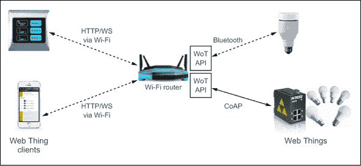

这些设备也可以成为物联网的一部分，只要某个中间设备能够通过我们之前描述的 WoT API（如我们之前描述的那样）暴露设备的函数。这些中间设备被称为*应用网关*（在此之后我们将它们称为 WoT 网关），它们可以使用任何非 Web 应用协议与设备通信，然后将这些协议转换为任何 HTTP 客户端都可以使用的干净 RESTful WoT API。一些网关还能执行比简单协议转换更多的功能。它们可以添加一层安全或认证，临时聚合和存储数据，为没有语义描述的设备提供描述，等等。

为了更好地理解 WoT 网关是什么以及它能为非网络设备做什么，让我们看看一个具体的例子，其中我们使用 HTTP 和 WebSocket API 暴露一个 CoAP 设备。正如你之前所看到的，CoAP 是一个基于 REST 的有趣协议，但由于它不是 HTTP，并且使用 UDP 而不是 TCP，因此需要一个网关来将 CoAP 消息从/到 HTTP 进行转换。因此，它非常适合在低功耗无线电通信中进行设备到设备的通信，但你不能在没有安装特殊插件或浏览器扩展的情况下从你的浏览器中的 JavaScript 应用程序与 CoAP 设备进行通信。让我们通过使用你的 Pi 作为 WoT 网关到 CoAP 设备来解决这个问题。

#### 7.3.1\. 运行 CoAP 服务器

首先，创建一个简单的 CoAP 资源。为了简化——并且为了控制你的预算——你将在你的计算机上模拟一个 CoAP 设备。当然，你也可以购买一个资源受限的设备，如 Arduino Uno，并在其上安装 CoAP.^([10])

> ¹⁰
> 
> 例如，使用这里可用的 microcoap 实现：[`github.com/1248/microcoap`](https://github.com/1248/microcoap)。

Node 上有多个 CoAP 库，但我们最喜欢的是 `coap`（运行 `npm install coap` 来安装它）。在 /servers/coap.js 中提供了一个最小 CoAP 服务器的实现，如下所示。

##### 列表 7.15\. coap.js：一个简单的 CoAP 服务器

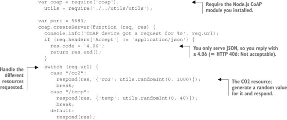

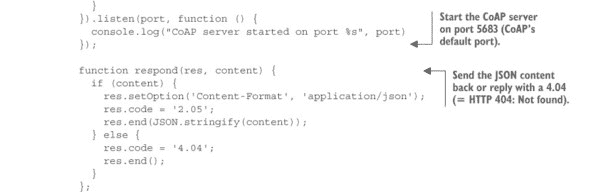

你可能会意识到这段代码与你在前两章中学到的并没有太大区别。这是因为 CoAP 受 HTTP 和 REST 的启发很大，但为了适应低功耗嵌入式系统的需求而进行了调整。由于 CoAP 使用 UDP 而不是 HTTP/TCP，你不能直接通过 CoAP URI：coap://localhost:5683/co2 从你的浏览器中直接访问这些资源。

但你可以使用一个名为 Copper 的优秀 Firefox 插件.^([11]) 一旦安装了插件，启动 CoAP 服务器（在服务器目录中运行 node coap.js）并你可以通过在 Firefox 的地址栏中输入 CoAP URI 来访问你刚刚创建的资源；例如，coap://localhost:5683/co2。

> ¹¹
> 
> [`addons.mozilla.org/en-US/firefox/addon/copper-270430/`](https://addons.mozilla.org/en-US/firefox/addon/copper-270430/)

#### 7.3.2\. 通过网关代理 CoAP

下一步是将 CoAP 请求代理到 HTTP，这样你就可以通过网页浏览器访问 CoAP 设备。在这里，你将扩展你的 WoT 网关以通过你的 Pi 提供对 CoAP 设备的访问。

将你的 Pi 转换为 WoT 网关需要两个简单的步骤。首先，你创建一个 CoAP 插件，这本质上是在我们的模型中创建一个新的 CoAP 客户端。其次，你为 CoAP 设备必须提供的资源创建路由。CoAP 插件的代码在下一列表中显示。由于大部分代码与其他温度/湿度传感器插件类似，我们关注的是不同之处。

##### 列表 7.16\. /plugins/external/coapPlugin.js：一个简单的 CoAP 插件

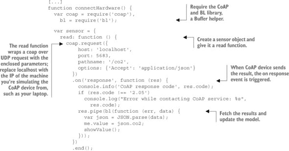

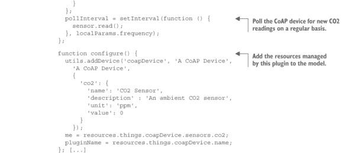

然后您需要为您的 CoAP 设备添加资源路由。为了简化，您只需连接一个 CO2 传感器，但您可以自由扩展以支持您想要的任何其他资源。您需要在 /routes/things.js 中添加这些路由：

```
router.route('/coapDevice/sensors/co2').get(function (req, res, next) {
  req.result = resources.things.coapDevice.sensors.co2
  next();
});
```

您将路由器作为中间件加载到 /servers/http.js 中，并将其绑定到 `/things`。这意味着 CoAP 设备将在 `/things/coapDevice/sensors/co2` 上可访问，这是有意义的，因为这是一个由 Pi 管理的实体，Pi 充当代理，而不是 Pi 本身。最后，在 wot-server.js 中引入并启动 CoAP 插件：

```
var coapPlugin = require('./plugins/external/coapPlugin');
coapPlugin.start({'simulate': false, 'frequency': 10000});
```

如果一切正常，您应该能够通过 Pi 网关使用 HTTP 访问模拟的 CoAP 设备。首先，在您的 PC 上启动 CoAP 服务器（`node coap.js`），然后启动 Pi 上的网关（`node wot-server.js`），最后，尝试运行以下 cURL 命令：

```
curl -i -H "Accept: application/x-msgpack" \
  -X GET 'http://raspberrypi.local:8484/things/coapDevice/sensors/co2'
```

您应该以 MessagePack 表示形式获取传感器读数。您还可以尝试使用一段 JavaScript 代码通过 WebSockets 连接到 CoAP CO2 传感器（例如，使用文件 /public/websocketsClient.html）或甚至将浏览器指向 [`raspberrypi.local:8484/things/coapDevice/sensors/co2`](http://raspberrypi.local:8484/things/coapDevice/sensors/co2)。所有这些方法都将有效，即使 CoAP 设备无法提供 MessagePack 或 HTML 表示，也无法使用 WebSockets。这是 *网关模式* 的实际应用：它无缝地将 CoAP 设备集成到浏览器网络中！

这是对 CoAP 的一个非常简短的介绍。如果您想了解更多关于这个年轻且不断发展的受网络启发的协议的信息，请从探索 CoAP 技术门户开始.^([12])

> ¹²
> 
> [`coap.technology/`](http://coap.technology/)

| |
| --- |

**技术角落—I 想要一个通用的 CoAP 代理**

尽管 CoAP 不被浏览器网络支持，但它为资源或电池受限的设备提供了一个有趣的权衡，尤其是在考虑设备间通信时。它与 HTTP 类似，因此翻译更容易，因为我们不需要在不同数据模型之间进行映射，并且可以在 HTTP 和 CoAP 上使用相同的 JSON 模型。我们在这里展示的翻译很简单，但不是通用的：我们需要手动将 CoAP 资源映射到 HTTP 路由。为 CoAP 设备构建通用的 HTTP 代理是可能的，并且并不过于复杂。如果您想尝试，您将在网上找到许多示例.^([a])

> ^a
> 
> 例如，这里：[`github.com/morkai/h5.coap/blob/master/example/http-proxy.js`](https://github.com/morkai/h5.coap/blob/master/example/http-proxy.js)。


#### 7.3.3. 摘要——网关集成模式

对于某些设备，直接支持 HTTP 或 WebSocket 可能没有意义，或者甚至不可能，例如当它们具有非常有限的资源，如内存或处理能力时，当它们无法直接连接到互联网（例如您的蓝牙活动追踪器）时，或者当它们是电池供电时。这些设备将使用更优化的通信或应用协议，因此需要依赖更强大的网关来将它们连接到物联网，例如您的手机通过桥接/翻译各种协议上传您的蓝牙手环中的数据。在这里，我们从头开始使用 Express 实现了一个简单的网关，但您也可以使用其他开源替代方案，例如 OpenHab^([13])或 The Thing System.^([14])

> ¹³
> 
> [`www.openhab.org/`](http://www.openhab.org/)
> 
> ¹⁴
> 
> [`github.com/TheThingSystem/steward`](https://github.com/TheThingSystem/steward)

### 7.4\. 云集成模式—通过 EVRYTHNG 的 MQTT

正如前几节所看到的，可以在设备或网关上直接实现 WoT 服务器。这在许多情况下是足够的，但一旦需要管理大量设备和数据，就需要一个更强大、可扩展的平台来存储和处理数据。图 7.8 所示的云集成模式是网关模式的扩展，其中网关是一个远程服务器，设备和应用程序通过互联网访问。

##### 图 7.8\. 云集成模式。在这个模式中，实体无法直接提供 Web API。但云服务作为强大的应用网关，以实体的名义提供更多功能。在这个特定的例子中，Web 实体通过 MQTT 连接到云服务，该服务通过 HTTP 和 WebSocket API 公开 Web 实体 API。云服务还可以提供许多附加功能，例如无限数据存储、用户管理、数据可视化、流处理、支持大量并发请求等。

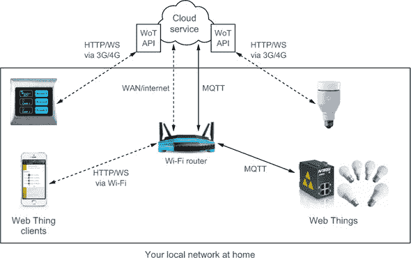

使用云服务器有几个优点。首先，因为它没有设备和网关的物理限制，所以它具有更高的可扩展性，可以处理和存储几乎无限量的数据。这也使得云平台能够同时支持许多协议，高效地处理协议转换，并作为可扩展的中介，支持比物联网设备更多的并发客户端。其次，这些平台可以拥有许多可能需要相当长时间从头开始构建的功能，从行业级安全到专门的分析能力，再到灵活的数据可视化工具和用户及访问管理。这意味着你可以用极短的时间开始构建复杂的应用程序。第三，因为这些平台与互联网原生连接，所以你的设备的数据和服务可以轻松集成到第三方系统中，以扩展你的设备。

近年来，出现了许多云平台，它们通常具有相似的特征：在云中创建虚拟设备，这些设备可以永久与其物理对应设备通信，存储设备生成所有数据，并以多种方式可视化这些数据。Xively^([15])（前 Cosm，前 Pachube）是其中之一；它简单的 API 允许全球的开发者快速将设备连接到云。你可以为你的项目使用许多其他平台，例如 ThingWorx^([16]), ThingSpeak^([17]), Carriots^([18]), 和 thethings.io^([19])。

> ¹⁵
> 
> [`xively.com/`](https://xively.com/)
> 
> ¹⁶
> 
> [`www.thingworx.com/`](http://www.thingworx.com/)
> 
> ¹⁷
> 
> [`thingspeak.com/`](https://thingspeak.com/)
> 
> ¹⁸
> 
> [`www.carriots.com/`](https://www.carriots.com/)
> 
> ¹⁹
> 
> [`thethings.io/`](https://thethings.io/)

在本节中，我们将教你如何连接到我们最喜欢的物联网平台：EVRYTHNG。好吧，我们可能有点偏见，因为我们就是构建它的！但至少它将帮助你快速了解云集成模式的优势。EVRYTHNG 始于 2011 年，也是第一个应用物联网原则的物联网平台，所以它应该感觉熟悉！在本节中，你将学习如何实现一个基本的网络连接电源插头，如图 7.9 所示。该插头监控连接到它的设备的能源消耗，并将这些数据永久发送到云中。这些读数将永久存储在云中。此外，该插头通过 MQTT（我们在第五章中描述过）永久连接到云，这意味着云可以在任何时间以最小的延迟向它发送命令。

##### 图 7.9。一个物理设备通过 TCP/IP 使用 MQTT 连接到云平台，并通过其 Web 上的代理（称为 Thng）进行通信。然后，外部应用程序可以使用简单的 HTTP 客户端与 Thng 通信。

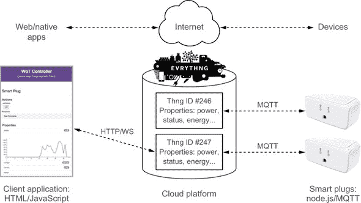

之后，我们将实现一个简单的 Web 应用程序，使用 HTML 和 JavaScript 订阅插头，实时显示当前消耗，并允许你打开和关闭插头。你需要的所有源代码都可以在本书 GitHub 仓库的 chapter7-implementation/part3-cloud 文件夹中找到。

#### 7.4.1\. 设置你的 EVRYTHNG 账户

你需要做的第一件事是创建一个 EVRYTHNG 账户并登录进去.^([20]) 别担心；这很快，而且实施这个练习不会花你一分钱。EVRYTHNG 服务对非商业项目是完全免费的！为了让你快速上手，你可以查看我们关于如何使用它的快速教程.^([21])

> ²⁰
> 
> 你可以在这里完成：[`dashboard.evrythng.com/signup`](https://dashboard.evrythng.com/signup)。
> 
> ²¹
> 
> EVRYTHNG 快速入门：[`developers.evrythng.com`](https://developers.evrythng.com)

一旦你创建了你的账户，你将需要你的账户 API 密钥（称为*操作员 API 密钥*^([22])）。这个密钥将允许你在云中创建和管理你的设备的数字身份，并与它们交互。绝对不要与他人分享它，因为这个 API 密钥非常强大，它可以删除你账户中的每一个 Thng——这不是一个打字错误；EVRYTHNG 喜欢省略元音——这很重要！甚至不要与你的女朋友/男朋友或最好的朋友分享！除非他真的非常棒，在这种情况下，可能可以——或者也可能不行！

> ²²
> 
> 在这里找到它：[`dashboard.evrythng.com/account`](https://dashboard.evrythng.com/account)。

在本节中，你设置账户以便可以将你的设备和应用程序连接到引擎。你也可以从 EVRYTHNG 仪表板或通过 POSTman 执行所有以下步骤。在本节中，我们将向你展示如何使用 cURL，这样你就可以轻松地从你的终端运行这些请求，并查看各种 HTTP 请求的详细信息。你可以在请求中添加`--verbose`标志来查看更多关于你的请求的详细信息。


**自动设置你的账户数据**

你将不得不手动在你的 EVRYTHNG 账户中创建一些实体，通过对我们云的多个 HTTP 请求来实现，如步骤 1–4 所述。如果你遇到任何问题或者你不想手动完成所有这些，我们为你准备了一个很酷的脚本，它会自动完成步骤 1–4，这个脚本在本节的末尾有描述。这个脚本叫做 setup.sh，你可以从你的 Pi 的终端运行它。

```
$ sh setup.sh XXX
```

其中`XXX`是你的操作员 API 密钥。你会看到一个类似矩阵的效果，它不仅运行你看到的所有命令为你创建这些实体，还将它们保存到一个 config.json 文件中，你将在下一节中需要这个文件。现在你已经准备好体验云实现模式的全部功能了。


##### 第 1 步——创建一个项目和应用程序

在我们开始之前，你必须复制并粘贴以下两行到你的终端中，这将定义两个 shell *环境变量*，这些 cURL 请求在本节中将会使用：

```
SERVER="https://api.evrythng.com"
EVRYTHNG_API_KEY="YOUR-API-KEY"
```

显然，在运行之前，你需要将`YOUR-API-KEY`替换成你自己的操作员 API 密钥。在这个部分，你将不得不以同样的方式定义相当多的其他环境变量。

你要做的第一件事是在你的账户中创建一个项目。一个*项目*是一个占位符（一个范围），它允许你分离你将生成的各种元素（Thngs 和数据）。此外，你需要一个项目来创建可以访问你一些数据的应用程序，因为你不想在客户端应用程序中使用你的操作员 API 密钥。将以下请求粘贴到你的终端中：

```
curl -X POST "$SERVER/projects" \
     -H "Authorization: $EVRYTHNG_API_KEY" \
     -H "Content-Type: application/json" \
     -d '{ "name": "Web of Things Book", "description": "My First WoT
     Project" }' --verbose
```

如果这个请求没有成功，请确保`SERVER`和`EVRYTHNG_API_KEY`环境变量是正确的，你可以通过在终端中运行`echo $SERVER`来测试它们。如果成功了，你应该会收到一个`201 Created`响应，看起来像这样：

```
HTTP/1.1 201 Created
Access-Control-Allow-Origin: *
Access-Control-Expose-Headers: Link, X-Result-Count
Content-type: application/json
Date: Sun, 14 Jun 2015 18:41:52 GMT
location: https://api.evrythng.com/projects/UCkWEEKnPe5wWhgbdhSfwnGc
Content-Length: 150
Connection: keep-alive
{
  "id":"UCkWEEKnPe5wWhgbdhSfwnGc",
  "createdAt":1434810298365,
  "updatedAt":1434810298365,
  "name":"Web of Things Book",
  "description":"My First WoT Project"
}
```

注意现在对象中有一个`id`字段，它包含你创建的项目 EVRYTHNG ID。像之前粘贴`EVRYTHNG_API_KEY="XXX"`时那样，将这个值保存到环境变量`$PROJECT_ID`中，通过在你的终端中粘贴`PROJECT_ID=YYY`，其中`YYY`是你刚刚创建的项目的 ID——在这个例子中是`PROJECT_ID=UCkWEEKnPe5wWhgbdhSfwnGc`。

一旦你创建了你的第一个项目，你就可以在其中创建一个应用程序。应用程序会为你提供一个额外的 API 密钥（一个*应用程序 API 密钥*），你可以在我们稍后构建的客户端应用程序中使用它。这个密钥并不那么危险，因为它能做的事情非常有限；基本上它只允许你创建用户。要创建一个应用程序，请在你的终端中发送以下 cURL 请求：

```
curl -X POST "$SERVER/projects/$PROJECT_ID/applications" \
     -H "Authorization: $EVRYTHNG_API_KEY" \
     -H "Content-Type: application/json" \
     -d '{ "name": "My Awesome WoT App", "description": "My First WoT Client
     Application","tags":["WoT","device","plug","energy"], "socialNetworks":
     {} }'
```

同样，就像你为项目做的那样，将响应中返回的 ID 存储在`$APP_ID`环境变量中。还要注意响应中的 API 密钥；你将在稍后构建你的 Web 应用程序时使用它。现在你已准备好在我们的云中创建一个 Web Thing。

##### 第 2 步——创建你的第一个产品和 Thngs

一个*产品*是一类物理对象（比如电视型号或汽车类型）的*类别*，而不是一个独特的*实例*（比如序列号）。你不应该使用产品来存储有关物理对象的数据。它们是一个概念实体，一个物理对象的模型，应该只包含许多此类物理对象共享的信息——如大小、图像、重量和颜色——但不包含实时信息，如位置、传感器读数或当前状态。使用以下请求创建一个产品：

```
curl -X POST "$SERVER/products?project=$PROJECT_ID" \
     -H "Authorization: $EVRYTHNG_API_KEY" \
     -H "Content-Type: application/json" \
     -d '{ "fn": "WoT Smart Plug", "description": "A Web-connected Smart
     Plug","tags":["WoT","device","energy"],"photos":["https://
     webofthings.github.io/files/plug.jpg"] }'
```

注意`?project=$PROJECT_ID`查询参数，它告诉 EVRYTHNG 将此产品存储在我们之前创建的项目中。将产品 ID 存储在`$PRODUCT_ID`变量中。

另一方面，*Thngs*是物理对象独特实例的数字表示：你手中的事物！对于你想要网络化的每个独特设备或对象，你都需要创建一个独特的 Thng。你可以这样做：

```
curl -X POST "$SERVER/thngs?project=$PROJECT_ID" \
     -H "Authorization: $EVRYTHNG_API_KEY" \
     -H "Content-Type: application/json" \
     -d '{ "name": "My WoT Plug", "product":"'$PRODUCT_ID'", "description":
     "My own Smart Plug","tags":["WoT","device","plug","energy"] }'
```

你可以看到，我们也在这个请求中发送了产品 ID。请跟踪在 payload 中返回的 Thng ID，并存储在`$THNG_ID`变量中。

##### 第 3 步—创建设备 API 密钥

从技术上讲，你可以使用你的操作员 API 密钥来更新你的 Thng 属性，但由于各种安全原因，在产品设备上使用此方法是不明智的。相反，你可以轻松生成一个*Thng API 密钥*，允许你的设备仅查看和编辑自身。使用你的操作员 API 密钥发送一个`POST`请求（使用你的操作员 API 密钥）到端点[`api.evrythng.com/auth/evrythng/thngs`](https://api.evrythng.com/auth/evrythng/thngs)，并带上你的 Thng ID，如下所示：

```
curl -X POST "$SERVER/auth/evrythng/thngs" \
     -H "Authorization: $EVRYTHNG_API_KEY" \
     -H "Content-Type: application/json" \
     -d '{ "thngId": "'$THNG_ID'" }'
```

你将得到以下内容：

```
{
  "thngId": "UCE7qfbK8VKwdt8kAfqtbwmd",
  "thngApiKey": "M1ST3RP0TAT0H3ADROCKS"
}
```

`thngApiKey`字段包含一个 API 密钥，允许设备查看和更新自身。将其值存储在`$THNG_API_KEY`环境变量中。

##### 第 4 步—更改属性

如果你成功完成了前面的行，你现在将有一个项目、一个应用程序、一个产品以及该产品的一个实例在你的账户中。你可以在仪表板上看到它们。现在你将更新你的智能插头的属性。*属性*是一个数据数组，你可以随时更新并永久存储在引擎内部。你可以连续更新每个属性，并在任何时候检索它。

要更新一个或多个属性，使用设备 API 密钥，并发送一个`POST`请求到`thngs/$THNG_ID/properties`端点，使用此请求：

```
curl -X POST "$SERVER/thngs/$THNG_ID/properties" \
     -H "Authorization: $THNG_API_KEY" \
     -H "Content-Type: application/json" \
     -d '[{"key": "status","value": true},
          {"key": "energyConsumption","value": 71}]'
```

现在，你可以导航到 EVRYTHNG 仪表板中你的 Thng 的页面，如图 7.10 所示。在那里，你会看到有关这个插头及其属性的信息随着你多次运行此请求并使用不同的值而实时变化。

##### 图 7.10. 从仪表板直接查看智能插头及其属性实时更新。

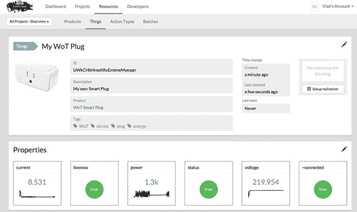

#### 7.4.2. 创建你的 MQTT 客户端应用程序

在上一节中，你学习了如何设置你的 EVRYTHNG 账户以创建任何你想要连接到网络的物理对象的网络事物。你是通过使用 cURL 命令来了解端点和它们的工作方式来做到这一点的，但显然这不是你的设备与引擎通信的方式。

对于这个项目，你将编写一个简单的 Node 应用程序，模拟一个智能插头，你可以在你的 Pi 或 PC 上运行它。该应用程序使用 Thng API 密钥（在上一练习的第 3 步中创建）通过 MQTT 打开到 EVRYTHNG 引擎的永久连接，并每五秒更新其属性。

打开 simple-plug.js 文件并查看代码。在你可以执行它之前，你需要一个包含你的 EVRYTHNG 账户 ID 和 API 密钥的 config.json 文件。如果你运行了 setup.sh bash 脚本而不是通过四个手动步骤进行，它将为你生成此文件。否则，创建一个名为 config.json 的 config-sample.json 文件的副本，并将 Thng ID（上一节的步骤 2）和 Thng API 密钥（步骤 3）放入其中，如下所示。

##### 列表 7.17\. simple-plug.js：通过 MQTT 连接到 EVRYTHNG 的模拟电源插头

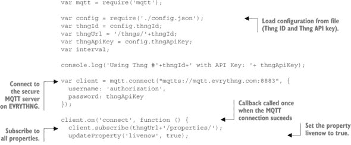

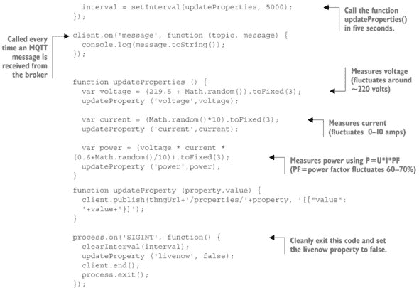

你可以看到这个示例通过安全的 MQTTS 连接到 EVRYTHNG，并订阅了所有属性更新。然后，它每五秒钟调用一次`updateProperties()`函数，模拟实际插头可能测量的典型电流和电压读数，并最终通过更新 Thng 的属性将读数发送到云，就像你在上一节步骤 4 中所做的那样。

然后，你可以回到仪表板中的 Thngs 页面，通过运行 Node 代码来启动模拟设备：`npm install`和`node simple-plug.js`。现在，你可以回到仪表板选项卡，查看插头的属性正在实时更新，如图 7.10 所示 figure 7.10。

#### 7.4.3\. 使用操作来控制电源插头

你已经构建了一个始终连接到互联网并通过 MQTT 推送其更新的设备。这说明了使用云引擎如何允许你快速构建网络连接设备，而无需实现本地网关。

在这个阶段，你可能正在想，“好吧，很好，但我该如何向插头发送命令来打开或关闭它？”完全合理！最简单的答案是：因为这个设备已经通过 MQTT 订阅了所有属性，所以每当 EVRYTHNG 云中的任何属性发生变化时，它都会收到一条消息。确实，你在终端中看到的文本是由那个回调函数中的`console.log()`语句显示的。当 Node 应用程序运行时，转到仪表板，点击 Thng 的`status`属性，并将其设置为`false`。你将立即在终端中看到这个变化：

```
[{"timestamp":1434823136116,"key":"voltage","value":220.259}]
[{"timestamp":1434823136116,"key":"current","value":0.839}]
[{"timestamp":1434823136898,"key":"*status*","value":false}]
[{"timestamp":1434823137065,"key":"voltage","value":219.919}]
[{"timestamp":1434823138184,"key":"power","value":913.355}]
```

然后，你可以修改那个回调处理程序，以便在发生这种情况时在代码中触发其他操作，这将工作得很好。

但这不是最佳选择，因为你必须仔细跟踪设备应该设置的属性以及哪些属性应该只由应用程序更改。此外，属性只是一个单一值；因此，如果你想向设备发送具有多个输入参数的命令，你将不得不使用多个属性；例如，设置几个 LED 的 RGB 值。

因此，您将使用 *actions* 发送包含多个输入参数的更复杂的命令。为此，您可以查看更高级的 plug-with-control.js。如果您已运行 7.4.1 节 中的 bash 脚本，它将为您创建一个名为 `_setStatus` 的 *动作类型*。如果没有，您将必须使用以下命令自行创建：

```
curl -X POST "$SERVER/actions?project=$PROJECT_ID" \
     -H "Authorization: $EVRYTHNG_API_KEY" \
     -H "Content-Type: application/json" \
     -d '{ "name": "_setStatus", "description": "Changes the Status of the
     Thng","tags":["WoT","device"] }'
```

在创建动作之前，您需要更改您的设备应用程序，使其也订阅 `actions/` 资源，并在每次接收到特定动作时执行某些操作。您可以打开文件 plug-with-control.js，其中回调函数已被修改，如下一列表所示。

##### 列表 7.18\. plug-with-control.js: 订阅并处理从服务器推送的动作

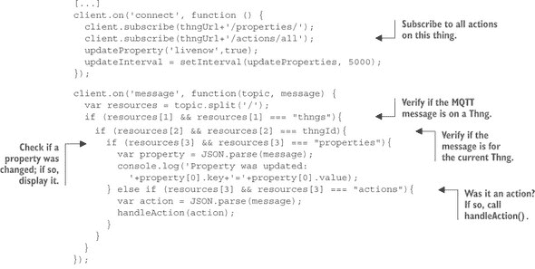

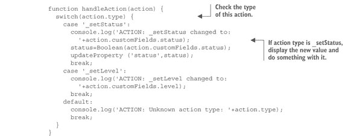

您现在可以运行此第二段代码，您仍然会在属性更新时看到它。但到目前为止，请打开第二个终端，并使用以下请求向您的引擎中的 Thng 发送 `_setStatus` 命令：

```
curl -X POST "$SERVER/actions/_setStatus?project=$PROJECT_ID" \
     -H "Authorization: $EVRYTHNG_API_KEY" \
     -H "Content-Type: application/json" \
     -d '{ "type": "_setStatus", "thng":"'$THNG_ID'", "customFields":
     {"status":"false"} }'
```

仔细研究响应负载的内容，因为它包含的信息比您发送的要多得多。我们的云使用您的 IP 地址来确定动作的位置。如果您刷新页面，您将在仪表板中的 Thng 页面上看到此动作，以及它的地图。

#### 7.4.4\. 创建一个简单的网络控制应用程序

到目前为止，您已经编写了一个 Node 应用程序，允许 Pi 连接到云服务并立即接收推送通知，即使您的设备位于防火墙或 NAT 网关之后。使用云服务的优点是它允许您使用统一的接口，如 REST API、属性或动作，与连接到云的任何设备进行通信，无论该设备是否使用 REST API、MQTT 或其他协议进行通信。这意味着您可以构建一个通用的客户端应用程序，并且它将与平台上的任何 Thng 一起工作。它还使对您的“事物”的访问更具可扩展性，因为客户端不是直接与您的“事物”交谈，而是通过代表“事物”状态的云中介进行交谈，就像一面镜子或一个影子。

##### 使用云的一个简单网络应用程序

下一步是构建一个简单的网络应用程序，它可以与设备通过其 Thng 交互，使用 WebSockets 订阅其属性，并在设备发送它们时立即显示。此应用程序还应能够通过云平台的 REST API 向设备推送命令。

我们为您构建了这样一个应用程序，所以请继续在您的编辑器中打开文件 part3-cloud/client/plug.html——或者，当然，您也可以自由地构建自己的应用程序！在这里，将 Thng ID 和您的操作者 API 密钥作为 URL 中的查询参数提供：

```
file:///.../plug.html?key=XXX&thngId=YYY
```

你现在可以启动我们在上一节中使用的 plug-with-control.js Node 应用程序，并在你的浏览器中打开 plug.html。在几秒钟内，你应该会看到属性在实时变化，并且图表也在更新。这个应用程序连接到你的 EVRYTHNG 中的 Thng，使用 WebSocket 订阅其属性，并在从引擎接收到属性更新时立即更新页面。由于代码很长，并且使用了相当多的优秀库来完成繁重的工作，我们在这里只展示最有趣的片段。首先，你创建一个切换按钮，每次使用时都会发送一个 `_setStatus` 动作，如下面的列表所示。

##### 列表 7.19\. client/plug.html: 将处理程序附加到切换按钮

```
<input type="checkbox" id="toggle-status"/>
<script>
  $(function() {
    $('#toggle-status').bootstrapToggle({
      on: 'On',
      off: 'Off'
    });
  });

  $(function() {
    $('#toggle-status').change(function() {
      sendAction("_setStatus",{"status": $(this).prop('checked')});
    });
  });
</script>
```

你创建一个按钮，并使用 Bootstrap Toggle^([23]) 库来让它看起来更美观。每次这个按钮被触发时，`sendAction()` 函数将被调用，其代码如下所示。

> ²³
> 
> [`www.bootstraptoggle.com/`](http://www.bootstraptoggle.com/)

##### 列表 7.20\. client/plugs.html: `sendAction()` 函数

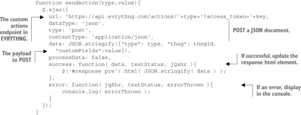

每次这个函数被调用时，它将在引擎中`POST`一个动作，这个动作将被你的设备接收——正如你在上一节中看到的那样。

哦，别忘了用你刚刚创建的按钮打开插头；否则，你不会在图表上看到任何东西！

##### 通过 WebSocket 订阅

第二，你需要使用 WebSocket 订阅你的客户端应用程序的所有属性更新。原则上，这与你在上一节中使用的 MQTT 类似。想法是创建一些 HTML 占位符来显示当前的属性值。对于你想要显示的每个属性，你创建一个看起来像这样的列表项：

```
<li class="list-group-item">
  <span id="value-status" class="badge">false</span>
  status
</li>
```

注意，`id` 必须设置为 `value-status`，并且与引擎中的属性名称相同。现在让我们看看如何连接和处理 WebSocket 消息，如下面的列表所示。

##### 列表 7.21\. 连接到 WebSocket 并处理属性更新


这与 MQTT 类似，但完全是基于 Web 的，并在你的 Web 浏览器中运行，无需安装任何依赖项。每次任何属性更新时，你将通过 WebSocket 通道接收到相应的 JSON 消息，因为你已经订阅了属性主题。

##### 使用二维码来识别物品

在我们完成本节之前，让我们来做一个最后的技巧。为此，您需要将 plug.html 和 ui/文件夹文件部署到云中的某个位置——例如，GitHub pages.^([24]) 如果您想走捷径，我们已为您部署了这个文件，您可以通过以下链接访问它（将 XXX 替换为您的运营商 API 密钥，将 YYY 替换为您的 Thng ID）：[`webofthings.github.io/wot-book/plug.html?key=XXX&thngId=YYY`](https://webofthings.github.io/wot-book/plug.html?key=XXX&thngId=YYY). 如果您在上一节中提前运行了脚本，它将自动为您创建一个 Thng 的重定向；扫描二维码或点击短 URL，您将自动跳转到该链接。否则，您可以使用图 7.11 中所示的设置重定向按钮来创建它。

> ²⁴
> 
> [`pages.github.com/`](https://pages.github.com/)

##### 图 7.11. 如何创建一个重定向到您设备用户界面的短 URL

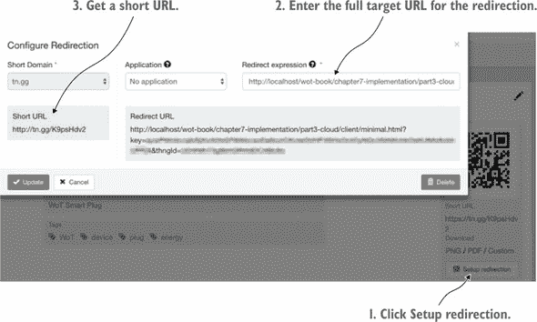

在重定向表达式中输入文件的完整路径——带有您自己凭证的先前 URL——然后点击创建重定向。现在您有一个短 URL 和一个相应的二维码，您可以在任何时候更新它们，并通过扫描手机上的二维码来查看和控制您的设备。二维码或 NFC 标签是序列化事物 URL 的绝佳方式，使它们可以通过手机物理发现。

注意，您不应该与任何人分享这个二维码或 URL：它包含您的运营商 API 密钥！这只是为了说明问题，但您永远不应该以这种方式暴露您的 API 密钥。

#### 7.4.5. 摘要——云集成模式

让我们花点时间来反思一下在本节中您所做的一切。在这么短的时间内完成这么多事情感觉如何？多亏了像 EVRYTHNG 这样的 Web of Things 云平台的开放和灵活 API，您已经编写了一个简单的 Node 应用程序，它可以使用 MQTT 与其云中的数字身份进行通信。您还构建了一个基本的 HTML/JavaScript 应用程序，它可以实时显示来自您的设备的数据，并且即使它没有 REST API，也可以向它发送命令。

这就是云集成模式大放异彩的地方。因为这个系统的复杂性大部分都存在于云平台内部，您就不必过多担心可扩展性、可靠性或安全性。云平台允许您，一个数字产品开发者，大大缩短构建网络连接设备所需的时间，并提供各种强大的功能，如可视化、数据存储和访问控制。因为前端应用程序只使用 HTML/JS/CSS，您有一个统一的接口来控制任何设备，无论它是否支持 HTTP，因为云系统可以无缝处理协议之间的转换。

为什么你会选择使用直接连接模式呢？仍然在“事物”上原生提供 API 有几个很好的理由。例如，考虑延迟：本地调用几乎总是比通过云的调用快。或者考虑在互联网断开时进行监控和控制。因此，对于现实世界的 WoT 产品来说，最佳折衷方案通常是提供本地和云访问。

### 7.5. 概述

+   连接“事物”到 Web 的主要集成模式有三个：直接、网关和云。

+   无论你选择哪种模式，你都需要完成以下步骤：资源设计、表示设计和接口设计。

+   直接集成允许对“事物”的 Web API 进行本地访问。你通过使用 Express Node 框架为 Pi 构建 API 来尝试了这种方法。

+   在 Express 中，资源设计步骤是通过路由实现的，每个路由代表 Pi 资源路径。

+   我们在表示设计步骤中使用了中间件的概念来实现对不同表示的支持——例如，JSON、MessagePack 和 HTML。

+   接口设计步骤是通过在路由上使用 HTTP 动词以及通过集成使用`ws`Node 模块的 WebSockets 服务器来实现的。

+   网关集成允许通过为它们提供 API 将没有 Web API（或不支持 Web 甚至互联网协议）的“事物”集成到 WoT 中。你通过在云上通过网关集成 CoAP 设备来尝试了这种方法。

+   云集成使用网络上的服务器作为“事物”的影子或代理。它们通过可扩展性、分析和安全性等特性增强了“事物”的 API。你通过使用 EVRYTHNG 云来尝试了这种方法。

现在我们已经为“事物”创建了 Web API，接下来的几章将介绍如何使这些 API 更加强大和有趣。在下一章中，我们将探讨资源链接设计步骤以及可查找性和可发现性问题。本质上，我们将研究 Web“事物”如何以易于被其他应用程序、Web“事物”甚至人类找到、理解和使用的方式公开其 API！

## 第八章：查找：描述和发现 Web“事物”

*本章涵盖*

+   学习可发现性的基础知识（方法和协议）

+   理解如何进行 Web 级发现（链接/爬取）

+   提出一个模型来描述 Web“事物”及其功能

+   通过添加额外的语义网格式扩展基本模型

在前两章中，我们广泛探讨了将你的 Things 连接到 Web 的各种集成模式，这是我们在第六章中引入的 WoT 架构的第一层。我们说明了如何使用 Web 标准作为异构设备之间的连接组织，这显著提高了互联网规模系统中组件之间的互操作性，因此是物联网的核心基础。尽管如此，如果没有一个通用的格式来描述 Web Things 及其功能，集成 Web Things 和应用程序仍然需要开发者付出持续的努力。拥有一个所有 Web Things 都可以共享的单个和通用数据模型将进一步通过使应用程序和服务能够无需为每个特定设备手动调整应用程序来提高互操作性和易于集成。这是 WoT 的一个基本基石，因为它意味着我们第一章中引入的酒店控制中心示例可以无缝地发现、理解和读取 Web of Things 上的任何设备的数据，并发送命令，无论其功能或制造商如何。能够轻松发现和理解 Web of Things 中的任何实体——它是什么以及它能做什么——的能力被称为*可发现性*。

如何实现这样的互操作性水平——使 Web Things 可被发现——是 WoT 架构中“查找”这一第二层的目的，也是本章的重点所在。查找层的目的是提供一个统一的数据模型，所有 Web Things 都可以使用它来仅通过 Web 标准和最佳实践来暴露其元数据。“元数据”指的是 Web Things 的描述，包括 URL、名称、当前位置和状态，以及它提供的各种服务，如传感器、执行器、命令和属性。首先，这对于发现连接到本地网络或网络的 Web Things 非常有用。其次，它允许应用程序、服务和其他 Web Things 在无需为该设备安装驱动程序的情况下搜索和找到新设备。到本章结束时，你将了解如何使用网络发现协议（如 mDNS）、轻量级数据模型（如 Web Thing Model）和语义 Web 标准（如 JSON-LD）以通用和互操作的方式暴露任何 Web Things 的元数据。

### 8.1. 可发现性问题

一旦设备使用我们在前两章中介绍的方法成为 Web Things，它就可以通过 HTTP 和 WebSocket 请求进行交互。这在理论上听起来很棒，但要使其在实践中也能工作，我们必须首先解决三个基本问题，如图 8.1 所示：

##### 图 8.1. 物联网中可发现性的三个问题。客户端应用程序如何找到附近的 Web Things，与之交互，并理解这些事物是什么以及它们能做什么？


> **1**. 我们如何知道**发送请求**的位置，例如一个 Web Thing 的根 URL/资源？
> 
> **2**. 我们如何知道要发送什么请求以及如何发送；例如，动词和有效载荷的格式？
> 
> **3**. 我们如何知道我们发送的请求和收到的响应的意义，即语义？

为了更好地理解这些问题，让我们回到第一章中的智能酒店场景。章节 1。想象一下 Lena，一位住在酒店 202 号房的爱沙尼亚客人。Lena 想要打开手机来打开加热。第一个问题是 Lena——或者她的手机，或者她手机上的一个应用——如何找到加热器的根 URL？这通常被称为**引导问题**。这个问题关注的是如何在物联网中建立两个实体之间的初始链接。解决这个问题最简单的办法是将根 URL 写在桌面上或房间的墙上。另一个解决办法是将 URL 编码到卡片上打印的 QR 码或使用 NFC 标签，这样 Lena 就可以用手机扫描它。一个更复杂的解决办法是在她的手机上安装一个应用程序，该应用程序可以搜索附近具有加热功能的设备。这些方法将是第 8.2 节的主题。最后，一个友好的 Web 解决方案是让她在 Google 上搜索附近的加热器；我们将在第 8.4 节中探讨这一点。

假设现在 Lena 在她的手机上输入了加热器的根 URL。理想情况下，她会看到一个漂亮的以爱沙尼亚语为母语的用户界面，这让她能够立即知道哪个按钮可以打开加热。在这种情况下，一个干净且以用户为中心的 Web 界面可以解决第三个问题，因为人类能够阅读并理解如何操作。第二个问题也会由网页解决，它会硬编码发送到哪个端点的请求。

但如果加热器没有用户界面，只有 RESTful API 呢？^([1]) 因为 Lena 是一位经验丰富的前端开发者，而且从不看电视，她决定构建一个简单的 JavaScript 应用程序来控制加热器。现在她面临第二个问题：尽管她知道加热器的 URL，但她如何找到加热器 API 的结构？有哪些资源（端点）可用？她可以向哪个资源发送哪些动词？她如何指定她想要设置的温度？她如何知道这些参数是否需要以摄氏度或华氏度表示？

> ¹
> 
> 如果经理发现了这一点，他可能应该解雇最初负责选择这个加热器的人，因为这个加热器没有提供用户界面，未能满足第六章中提到的设计规则#2。

通常，应用开发者依赖于描述事物上可用的各种 API 端点和资源的书面文档（问题 2）以及它们的含义（问题 3）。但在某些情况下，一种更自动化的方式在运行时发现 REST API 的资源可能是有用的。如果 Lena——或者她编写的应用程序——能够即时查询任何 Web 事物并找出它提供的服务/数据，而不必阅读文档，那么她的应用程序就可以与任何加热设备一起工作，无论其制造商如何。

为这三个问题提供基于 Web 的解决方案是查找层的目标，如图 8.2 所示。在本章的其余部分，我们将提出一套工具和技术，以展示 Web 事物如何暴露其数据资源，使用户、应用程序和事物能够轻松找到并与之交互。

##### 图 8.2\. 物联网的查找层。这一层涉及如何轻松理解事物的本质，它们之间的关系，如何访问它们的文档，它们的 API 端点是什么，以及如何访问这些端点（包括参数及其类型）。它还涉及以标准方式解释这些属性的意义。


### 8.2\. 事物发现

我们从比较几个用于引导问题的解决方案开始我们的查找之旅。简而言之，一个应用或事物如何找到它之前从未遇到过的 Web 事物的根 URL？这个问题涉及两个范围：首先，如何找到物理上附近（例如，在同一本地网络内）的 Web 事物；其次，如何找到不在同一本地网络中的 Web 事物——例如，通过互联网找到设备。在本地网络中查找 Web 事物可以使用第 8.2.1 节中描述的网络发现方法来完成。为了找到同一本地网络之外的 Web 事物，我们将依赖于资源发现和搜索，如第 8.2.2 节所述。现在让我们更详细地看看这些方法。

#### 8.2.1\. 网络发现

在计算机网络中，自动发现新参与者的能力很常见。在你家里的局域网中，一旦设备连接到网络，它就会自动使用 *DHCP^([2])* (*动态主机配置协议*) 获取一个 IP 地址。但只有 DHCP 服务器知道设备在你的网络中，那么你的网络中的其他主机怎么办？一旦设备有了 IP 地址，它就可以广播数据包，这些数据包可以被同一网络上的其他机器捕获。正如你在第五章中看到的，消息的广播或多播意味着这个消息不是发送到特定的 IP 地址，而是发送到一组地址（多播）或发送给所有人（广播），这是通过 UDP 完成的。这个过程被称为网络发现协议，它允许设备和应用程序在本地网络中找到彼此。这个过程通常被各种发现协议使用，如多播域名系统 (mDNS)^([3]), 数字生活网络联盟 (DLNA)^([4]), 和通用即插即用 (UPnP)^([5]). 例如，大多数互联网连接的电视和媒体播放器可以使用 DLNA 来发现网络附加存储 (NAS) 并从中读取媒体文件。同样，你的笔记本电脑可以通过内置在 iOS 和 OSX 中的网络级发现协议，如 Apple Bonjour，以最小的努力找到并配置网络中的打印机。

> ²
> 
> DHCP: [动态主机配置协议](http://en.wikipedia.org/wiki/Dynamic_Host_Configuration_Protocol).
> 
> ³
> 
> [多播 DNS](http://en.wikipedia.org/wiki/Multicast_DNS)
> 
> ⁴
> 
> [数字生活网络联盟](http://en.wikipedia.org/wiki/Digital_Living_Network_Alliance)
> 
> ⁵
> 
> [通用即插即用](http://en.wikipedia.org/wiki/Universal_Plug_and_Play)

##### mDNS

在 mDNS 中，客户端可以通过监听如以下列表中的 mDNS 消息来发现网络上的新设备。随着消息的到来，客户端填充本地 DNS 表，因此一旦发现，新的服务——这里是一个打印机的网页——可以通过其本地 IP 地址或通过通常以 .local 域名结尾的 URI 来使用。在这个例子中，它将是 [`evt-bw-brother.local`](http://evt-bw-brother.local)。

##### 列表 8.1\. 来自打印机的 mDNS 消息


这也是你的 Pi 使用来广播其 raspberrypi.local URL 的协议（见第四章），向所有使用 mDNS 客户端监听的附近计算机。

mDNS 和大多数网络级发现协议的限制在于，网络级信息不能直接从网络中访问。当然，你可以编写依赖于预定义的.local 域名的 JavaScript 代码，但这仅仅是一个所有浏览器都不支持的 hack。这也是为什么许多移动浏览器无法解析这些地址的原因：它们没有 mDNS 客户端在后台填充本地 DNS 记录。


**技术角落——我想让我的 Pi 说“Bonjour!”**

您的 Pi 已经通过 Avahi 库启用 mDNS 来广播其.local URL，但您可以使用 mDNS 做更多的事情，例如描述您的 WoT 服务器提供的 HTTP 服务（就像列表 8.1 中的打印机一样）。实验性的`node_mdns` Node 库^([a])建立在 Avahi 之上，让您能够以编程方式实现这一点以及更多。要开始使用此库，请查看我们在 GitHub 上此章节的 mdns 文件夹中提供的代码示例。

> ^a
> 
> [`github.com/agnat/node_mdns`](https://github.com/agnat/node_mdns).

注意：此模块在 Pi 上不一定运行顺畅，因此您可能需要回退到您的 PC。如果您仍然想在 Pi 上尝试，请确保通过`apt-get install libavahi-compat-libdnssd-dev`安装所需的额外 Debian 软件包。


##### 网络发现

如果 mDNS 在所有浏览器上都不工作，那么运行在您的手机或平板电脑上的 Web 应用程序如何找到附近的 Web 设备？或者，为什么您不能通过页面上的链接找到家中的 Web 设备？一个简单的解决方案是为 Firefox 或 Chrome 编写一个自定义插件，使其能够与这些网络级发现协议通信。但这并不能解决问题，因为代替使用基于 Web 标准的基于 Web 的资源发现，设备仍然需要实现一个或多个非 Web 网络发现协议。结果，Web 设备客户端应用程序也需要能够使用和了解这些协议，这违背了物联网的目的。

因为 HTTP 是一个应用层协议，它对底层的网络协议一无所知——这些协议用于在网络中移动 HTTP 请求。它也不需要关心这一点——除非一个网络设备或应用程序需要了解同一网络中的其他资源。真正的问题是，为什么路由器的配置和状态只能通过网页供人类访问，而不能通过 REST API 访问。简单来说，为什么不是所有的路由器都提供一种安全的 API，允许网络中的其他设备和应用程序查看和更改其配置？

提供这样的 API 做起来很简单.^([6]) 例如，你可以安装一个针对路由器的开源操作系统，如 OpenWrt^([7))，并修改软件以将路由器 DHCP 服务器分配的 IP 地址作为 JSON 文档暴露出来。这样，你就可以利用路由器现有的 HTTP 服务器创建一个 API，该 API 暴露了你网络中所有设备的 IP 地址。这样做是有意义的，因为今天几乎所有联网设备，从打印机到路由器，都已经配备了 Web 用户界面。其他设备和应用程序可以通过简单的 HTTP 调用（图 8.3 中的步骤 2）检索网络中的 IP 地址列表，然后通过使用它们的 IP 地址检索网络中每个设备的元数据（图 8.3 中的步骤 3）。

> ⁶
> 
> 这一想法在 Vlad 的博士论文中提出：[Vlad Trifa 在苏黎世联邦理工学院最终博士论文答辩](http://www.slideshare.net/vladounet/vlad-trifa-final-phd-thesis-defense-at-eth-zurich)。
> 
> ⁷
> 
> [OpenWrt 官网](https://openwrt.org/)

##### 图 8.3\. 局域网级别的资源发现。假设所有 Web Things 都在端口 80 上暴露它们的根资源，Web Things 客户端可以从路由器获取它们的 IP 地址，然后查询每个设备以提取它们的元数据。


由于路由器通常具有本地网络的基址，你可以轻松编写一个 Web 应用程序，该应用程序定期查询路由表，跟踪连接到网络的新的设备，并在网络中注册设备。相同的模式可以用于网络上的任何其他设备，其中任何 Web Things——比如机顶盒或 NAS——都可以使用各种协议连续搜索网络中的新设备，理解它们提供的服务，然后通过动态生成针对这些设备的新 WoT API 来作为这些设备的桥梁。

#### 8.2.2\. 网络资源发现

虽然网络发现可以在本地完成任务，但它不会传播到本地网络之外。从更广泛的角度来看，还有一些问题悬而未决：在一个有数十亿设备可以通过万维网访问的物联网中，当新设备连接时，我们如何找到它们，我们如何理解它们提供的服务，我们能否在复合应用程序中搜索正确的设备和它们的数据？

当网络在九十年代初从仅有几千页包含文本和图像的目录转变为指数级增长的包含网络应用、文档和多媒体内容的集合，包括电影、音乐、游戏和其他服务类型时，它面临了类似的挑战。在那些早期，AltaVista 和 Yahoo 成功地整理了这一不断增长的文档集合。但随着网络的指数级增长，很明显，手动管理网络上的资源列表是一条死胡同。大约在这个时候（~1998 年），Google 突然出现，几乎消灭了任何其他搜索引擎，因为它能够自动索引数百万页，并允许用户快速准确地在这个庞大的目录中找到相关内容。

在网络上，新资源（页面）是通过超链接发现的。搜索引擎定期解析其数据库中的所有页面，以找到指向其他页面的出站链接。一旦发现指向尚未索引的页面的链接，该新页面就会被解析并添加到目录中。这个过程被称为*网络爬虫*。

##### 爬取网络事物的 API

我们可以将网络爬虫的过程应用到事物上：在第二章中，你使用了基于 HTML 的用户界面来为 WoT Pi，而在第五章中，你看到了如何创建资源的 HTML 表示。通过在 HTML 代码中添加子资源的链接，我们使得使用下一列表中所示简单伪代码来爬取网络事物成为可能。

##### 列表 8.2\. 爬取事物 HTML 表示的伪代码

```
crawl(Link currentLink) {
  r = new Resource();
  r.setUri = currentLink.getURI();
  r.setShortDescription = currentLink.text();
  r.setLongDescription =
    currentLink.invokeVerb(GET).extractDescriptionFromResults();
  r.setOperations = currentLink.invokeVerb(OPTIONS).getVerbs();
  foreach (Format currentFormat: formats) {
    r.setAcceptedFormats =
      currentLink.invokeVerb(GET).setAcceptHeader(currentFormat);
  }
  if (currentLink.hasNext()) crawl(currentLink.getNext());
}
foreach(Link currentLink: currentPage.extractLinks())
{ crawl(currentLink); }
```

从网络事物的根 HTML 页面开始，爬虫可以通过发现出站链接来找到子资源，例如传感器和执行器，然后可以创建网络事物及其所有资源的资源树。然后，爬虫使用 HTTP `OPTIONS`方法检索网络事物每个资源支持的动词。最后，爬虫使用内容协商来了解每个资源可用的格式。作为一个练习，我们建议你尝试实现用于你在第七章中创建的 Pi 的 API 的此爬虫。

##### HATEOAS 和网页链接

这种简单的爬取方法是一个良好的开始，但它也有几个局限性。首先，所有链接都被同等对待，因为没有关于链接*性质*的概念；用户界面和执行器资源的链接看起来相同——它们只是 URL。然后，它要求网络事物提供一个 HTML 界面，这可能对资源受限的设备来说太重了。最后，这也意味着客户端需要理解 HTML 和 JSON 才能与我们的网络事物一起工作。

发现任何 REST API 资源的更好解决方案是使用我们在第 6.1.6 节中提出的 HATEOAS 原则来描述 Web Thing 各种资源之间的关系。实现 HATEOAS 的简单方法是在 RFC 5988 中定义的*Web 链接*机制。其思想是，对任何资源发出的 HTTP 请求的响应总是包含一组相关资源的链接——例如，包含搜索结果的*上一页*、*下一页*或*最后一页*。这些链接将包含在响应的`Link:` HTTP 头中。尽管 HTML 4 规范中的`LINK`元素已经支持了类似的机制，但将链接编码为 HTTP 头引入了一个更通用的框架来定义资源表示之外的资源之间的关系——直接在 HTTP 级别。因此，无论客户端请求的媒体类型如何，如 JSON 或 HTML，链接都可以始终以相同的方式进行描述。这种类型的链接也是我们在前几章中讨论的约束应用协议所支持的。^([8])

> ⁸
> 
> [`tools.ietf.org/html/rfc5988`](https://tools.ietf.org/html/rfc5988)
> 
> ⁹
> 
> [`www.w3.org/TR/html401/struct/links.html#edef-LINK`](http://www.w3.org/TR/html401/struct/links.html#edef-LINK)
> 
> ¹⁰
> 
> [`tools.ietf.org/html/rfc6690`](https://tools.ietf.org/html/rfc6690)

当对任何 Web Thing 执行 HTTP GET 操作时，响应应包含一个包含相关资源链接的`Link`头。特别是，你应该能够仅通过`Link`头获取有关设备、其资源（API 端点）和 API 文档的信息。以下是一个发送到 WoT 网关的示例 HTTP 查询：

```
HTTP 1.1 GET /
Host: gateway.webofthings.io
Accept: application/html

200 OK
Link: </model/>; rel="model", </properties/>; rel="properties", </actions/>;
     rel="actions", </things/>; rel="things", <http://model.webofthings.io/>;
     rel="type", </help>; rel="help", </>; rel="ui"
```

在本例中，响应包含了一组链接到 Web Thing 资源的`Link`头。每个资源的 URL 包含在尖括号`<URL>`之间，链接的类型由`rel="X"`表示，其中`X`是关系的类型。如果 URL 不是绝对 URL——也就是说，它不以 http://或 https://开头——它将在当前请求路径的上下文中被解释，相对 URL 将被附加到该路径。在本例中，Web Thing 的文档因此将成为`devices.webofthings.io/help`。请注意，链接元素可以是任何有效的 URI，因此它可能托管在设备本身、网关或网络上的任何其他地方。一些保留和标准化的关系类型由 IANA 定义，但这些主要与经典的多媒体文档网络相关。因为尚未为物理对象和物联网提出一套关系类型，所以我们将在本章中提出一套。在前面的例子中，你可以看到物联网网关的根页面包含了对以下四个资源的链接。

##### rel=“model”

这是一个指向 Web Thing 模型资源的链接；参见第 8.3.1 节。

##### rel=“type”

这是一个包含关于此 Web Thing 的额外元数据的资源的链接。

##### rel=“help”

这种关系类型是一个指向文档的链接，这意味着对`devices.webofthings.io/help`的 GET 请求将返回 API 的文档，以人类友好（HTML）或机器可读（JSON）的格式。文档不需要在设备本身上托管，但可以托管在任何地方——例如，在制造商的网站上，在这种情况下，标题将如下所示：

```
Link: <http://webofthings.io/doc/v/1.1>; rel="help"
```

这允许维护和持续更新在野外部署的多个设备及其各种固件版本的文档，而无需直接在设备上托管，而是在云端托管。

##### rel=“ui”

这种关系类型是一个指向与 Web Thing 交互的图形用户界面（GUI）的链接。用户界面必须使用 HTML 实现，以便任何浏览器都可以访问，并且它应该能够响应，以便各种设备类型可以与 Web Thing 交互。请注意，GUI 可以（但不一定）在设备本身上托管，只要 GUI 应用程序可以访问 Web Thing 及其资源。在以下示例中，GUI 托管在 GitHub 上，并接受要控制的 Web Thing 的根 URL 作为参数：

```
Link: <http://webofthings.github.io/ui?url=devices.webofthings.io>; rel="ui"
```

在某些情况下，您可能无法修改 Web Thing 返回的响应的 HTTP 头。如果是这种情况，您需要在资源的 HTML 或 JSON 表示中插入它们。我们将在第 8.3.3 节（针对 JSON）和第 8.4.1 节（针对 HTML）中展示如何这样做。

### 8.3. 描述 Web Thing

发现 Web Thing 的根 URL 和资源的能力解决了可发现问题的第一部分，如果它提供了一个用户界面，那么仅此就足以与 Web Thing 交互——根 URL 返回一个 HTML 页面。但只知道根 URL 是不够的，因为我们需要解决本章开头提到的第二个问题：应用程序如何知道应该向 Web Thing 的哪些资源发送哪些有效负载？换句话说，每个端点支持哪些可能的参数及其类型，给定的请求会产生什么效果，将返回哪些可能的错误/成功消息，以及这些意味着什么？

这个问题可以总结如下：我们如何正式描述任何 Web Thing 提供的 API？正如您在图 8.4 中看到的那样，有各种方法可以做到这一点，从 Web Thing API 之间没有共享数据模型（1）到语义上定义与 Web Thing 的每一种可能的交互（4）。语义 WebThing 通过确保客户端应用程序可以自动发现新的 Thing 并在运行时使用它们，从而最大化互操作性，无需人工介入。

##### 图 8.4. 描述 Web Thing 的不同级别。任何设备都可以有一个 HTTP API（1）。Web Thing（2）是遵循第六章中提出的要求的 HTTP 服务器；因此，API 更一致、可预测且易于使用。使用共享模型将使 Web Thing 更具互操作性（3）。最后，添加语义注解将确保 Web Thing 之间有更强的合同，同时也为正式定义 Web Thing API 的每个元素提供更多灵活性（4）。


最简单的解决方案是为您的 Web Thing 的 API 提供书面文档，以便开发者可以使用它（图 8.4 中的 1 和 2）。这意味着开发者必须阅读有关您的 Web Thing 的文档，了解他们可以向其发送哪些请求以及每个请求的作用，并最终使用正确的参数实现各种 API 调用。然而，这种方法不足以自动发现新设备，了解它们是什么以及它们提供的服务。此外，手动实现有效载荷更容易出错，因为开发者需要确保他们发送的所有请求都是有效的。当 API 文档与设备上实际运行的 API 不同时，这尤其棘手，这可能发生在 API 发生变化但文档没有变化的情况下。或者简单地说，当文档一开始就……嗯……不够友好。遗憾的是，物联网中的大多数 API 都处于这种状况，因为它们没有使编写仅通过了解其根 URL 就能动态生成设备用户界面的应用程序变得容易或甚至可能。

正如本章其余部分将要展示的，并非所有的希望都已丧失——恰恰相反！通过使用一个独特的数据模型来正式定义任何 Web Thing 的 API（如 8.3.2 节所述的 Web Thing 模型），我们将拥有一个强大的基础来以标准方式描述任何 Web Thing 的元数据和操作（图 8.4 中的案例 3 和 4）。这是物联网的基石：创建一个模型来描述物理事物，在表达性——模型有多灵活——和可用性——使用该模型描述任何 Web Thing 有多容易——之间取得适当的平衡。实现这种平衡对于实现全球规模的互操作性和采用是必要的，这也是本章剩余部分我们将要做的。

#### 8.3.1. 介绍 Web Thing 模型

一旦我们找到一个 Web Thing 并了解其 API 结构，我们仍然需要一个方法来描述该设备是什么以及它能做什么。换句话说，我们需要一个 Web Thing 的概念模型，它可以使用一组公认的概念来描述 Web Thing 的资源。

在前几章中，我们展示了如何使用`/sensors`和`/actuators`端点来组织 Web Thing 的资源。但这只适用于实际上具有传感器和执行器的设备，不适用于现实世界中常见的复杂对象和场景，这些对象和场景无法映射到执行器或传感器。为了实现这一点，物联网的核心模型必须易于应用于现实世界中的任何实体，从卡车上的包裹到收藏卡牌游戏，再到橙汁瓶。本节提供的就是这样一个模型，被称为*Web Thing 模型*^(11))

> ^(11)
> 
> 在撰写本文时，Web Thing 模型([`model.webofthings.io`](http://model.webofthings.io))也是 W3C 的一个官方成员提交。这并不意味着它是一个标准，但它的意思是它将影响 Web of Things 兴趣小组([`www.w3.org/WoT/IG/`](http://www.w3.org/WoT/IG/))周围的物联网标准化工作。EVRYTHNG（因此是 Vlad 和 Dom）是 W3C 物联网兴趣小组的一部分。

由于这个模型比我们在前几章中使用的模型更抽象，覆盖了更多的用例，因此它也稍微复杂一些，理解和使用起来也更困难，这就是为什么我们只在这里介绍它。但不用担心——到本章结束时，一切都会对你来说变得有意义，你也会看到你可以轻松地将其适应任何你能想到的物联网场景。不仅如此，通过本章中提供的这个模型的参考实现，你还将能够实现真正互操作的物联网和 WoT 应用，充分发挥物联网的潜力。让我们开始吧！

注意，为了使你更容易发现 Web Thing 模型并尝试本节中的示例，我们在云中部署了一个 Web Thing：[`gateway.webofthings.io`](http://gateway.webofthings.io)。在下一节中，你将学习如何在你自己的 Pi 或笔记本电脑上实现和运行相同的 Web Thing 服务器，所以你可以随时在自己的物联网上回顾这些示例。

##### 实体

正如我们之前所描述的，物联网由 Web Thing 组成。但具体来说，什么是 Web Thing 呢？Web Thing 是物理对象——即实体——的数字表示，可以在网络上访问。可以这样想：你的 Facebook 个人资料是你自己的数字表示，所以 Web Thing 就是一个物理对象的“Facebook 个人资料”。Web Thing 的例子包括车库门的虚拟表示、一瓶汽水、一套公寓、一台电视等等。Web Thing 是一个可以直接在设备上托管或托管在网络中的中间件（如网关或云服务，它将非网络设备连接到网络）的 Web 资源。所有 Web Thing 都应该具有以下资源，如图 8.5 所示：

##### 图 8.5。网络实体的资源。网络实体客户端可以与网络实体的各种资源进行交互。模型资源提供了用于发现的元数据，属性是实体的变量（数据、传感器、状态等），而动作是网络实体支持的功能调用（命令）。当网络实体也是其他（非网络）实体的网关时，实体的资源是代理到非网络实体的。


+   ***模型—*** 网络实体始终有一组元数据，用于定义其各个方面，如名称、描述或配置。

+   ***属性—*** 属性是网络实体中的一个变量。属性代表网络实体的内部状态。客户端可以订阅属性，以便在满足特定条件时接收通知消息；例如，一个或多个属性值发生变化。

+   ***动作—*** 动作是网络实体提供的一个函数。客户端可以通过向网络实体发送动作来在网络上调用一个函数。动作的例子包括车库门的“打开”或“关闭”，烟雾报警器的“启用”或“禁用”，以及苏打水瓶或地点的“扫描”或“签到”。动作的方向是从客户端到网络实体。

+   ***实体—*** 网络实体可以是连接到没有互联网连接的其他设备的网关。这个资源包含所有由这个网络实体代理的网络实体。这主要用于云或网关，因为它们可以代理其他设备。

每个网络实体都可以使用这个模型来展示其功能。在下一节中，我们将更详细地探讨这些内容，特别是它们的外观。在本书中描述整个模型需要几章的内容，所以我们只限于理解它是什么以及如何使用它的严格必要要素。我们邀请您参考网络实体模型的在线描述，以查看包含您可以使用的各种实体和字段的完整描述。您在跟随本章内容时不需要这些信息，但在您想要为自己的设备和产品调整模型时，这些信息将有所帮助。此外，这个模型在很大程度上建立在您在第六章和第七章中学到的概念之上，所以您绝对不是从零开始！

#### 8.3.2。元数据

在网络实体模型中，所有网络实体都必须有一些关联的元数据来描述它们是什么。这是一组关于网络实体的基本字段，包括其标识符、名称、描述和标签，以及它拥有的资源集合，如动作和属性。对任何网络实体的根 URL（以下列表中的`{WT}`）的 GET 请求始终以这种格式返回元数据，默认情况下是 JSON 格式。

##### 列表 8.3。`GET {WT}`：检索网络实体的元数据

```
GET / HTTP/1.1
Host: gateway.webofthings.io
Accept: application/json

HTTP/1.1 200 OK
Content-Type: application/json; charset=utf-8
Link: </model/>; rel="model", </properties/>; rel="properties",
  </actions/>; rel="actions", </things/>; rel="things",
  <http://model.webofthings.io/>; rel="type"

{
  "id": "http://gateway.webofthings.io",
  "name": "My WoT Raspberry PI",
  "description": "A simple WoT-connected Raspberry Pi for the WoT
    book.",
  "tags": ["raspberry","pi","WoT"],
  "customFields": {...}
}
```

如您在此处所见，返回的有效负载包含 Web 事物的基本信息。此 Web 事物的各种资源的链接包含在响应的 `Link:` 标头中；参见第 8.2.2 节。然后您可以通过每个链接获取有关每个资源的更多信息。`GET {WT}/model` 将返回 Web 事物的整个模型，包括可用动作或属性的详细信息。

#### 8.3.3\. 属性

Web 事物也可以有属性。*属性*是一组与 Web 事物某些方面相关的数据值。通常，您会使用属性来模拟 Web 事物公开的任何动态时间序列数据，例如 Web 事物的当前和过去状态或其传感器值——例如，温度或湿度传感器的读数。由于属性应始终捕获 Web 事物的最新状态，因此它们通常在值更改时由 Web 事物本身更新，而不是由 Web 事物客户端或应用程序更新。让我们通过在 `{WT}/properties` 资源上执行 GET 请求来查看我们 Web 事物的属性，如下面的列表所示。

##### 列表 8.4\. `GET {WT}/properties`: 获取 Web 事物的属性

```
HTTP/1.1 200 OK
Content-Type: application/json; charset=utf-8
Link: <http://model.webofthings.io/#properties-resource>; rel="type"

[
  {
    "id": "temperature",
    "name": "Temperature Sensor",
    "values": {
      "t": 9,
      "timestamp": "2016-01-31T18:25:04.679Z"
    }
  },
  {
    "id": "humidity",
    "name": "Humidity Sensor",
    "values": {
      "h": 70,
      "timestamp": "2016-01-31T18:25:04.679Z"
    }
  },
  {
    "id": "pir",
    "name": "Passive Infrared",
    "values": {
      "presence": false,
      "timestamp": "2016-01-31T18:25:04.678Z"
    }
  },
  {
    "id": "leds",
    "name": "LEDs",
    "values": {
      "1": false,
      "2": false,
      "timestamp": "2016-01-31T18:25:04.679Z"
    }
  }
]
```

您可以在 Raspberry Pi 上查看各种传感器的当前值，例如温度、PIR 以及它们最后一次更改的时间。现在让我们在下一个列表中更详细地查看其中之一。

##### 列表 8.5\. 获取温度属性

```
HTTP/1.1 200 OK
Content-Type: application/json; charset=utf-8
Link: <http://model.webofthings.io/#properties-resource>; rel="type"

[
    {"t":21.1,"timestamp":"2015-06-14T15:00:00.000Z"},
    {"t":21.4,"timestamp":"2015-06-14T14:30:00.000Z"},
    {"t":21.6,"timestamp":"2015-06-14T14:00:00.000Z"},
  ...
]
```

对特定属性的 GET 请求将返回一个值对象数组，如此处所示。每个值对象有一个或多个字段，例如 `t` 用于实际的温度传感器读数，以及记录值时的 `timestamp`。某些传感器可能有多个维度；例如，加速度传感器将有三个维度，称为值，每个轴一个：X、Y 和 Z。

#### 8.3.4\. 动作

*操作* 是 Web Thing 的另一种重要资源类型，因为它们代表了可以发送到该 Web Thing 的各种命令。操作的例子包括“打开/关闭车库门”、“打开客厅灯光，将其亮度设置为 50%，并将颜色设置为红色”，以及“30 分钟后关闭电视”。理论上，您也可以使用属性来更改 Web Thing 的状态，但当一个应用程序和 Web Thing 本身都想要编辑相同的属性时，这可能会成为一个问题。这就是操作可以发挥作用的地方。让我们通过类比来更好地理解这个概念：操作代表了 Web Thing 的公共接口，而属性则是私有部分。就像在任何编程语言中一样，您可以访问公共接口，而任何私有部分仅对特权方（如实例本身或在这种情况下，Web Thing）可访问。但限制对操作的访问——即公共接口——也允许您实现各种控制机制，例如访问控制、数据验证、原子性地更新多个属性等。

当您想要发送到 Web Thing 的命令比设置简单值更复杂时，操作尤其有用；例如，当您想要向打印机发送 PDF 或当操作可能不会自动执行时。您可以通过发送 `GET {WT}/actions` 请求来找到给定 Web Thing 支持的操作列表，如下一列表所示。

##### 列表 8.6\. `GET {WT}/actions`：检索 Web Thing 支持的操作

```
HTTP/1.1 200 OK
Content-Type: application/json; charset=utf-8
Link: <http://model.webofthings.io/#actions-resource>; rel="type"

[{"id":"ledState","name":"Changes the status of the LEDs"}]
```

响应有效负载包含一个数组，其中包含 Web Thing 支持的每个操作的名称和 ID。关于这些操作的更多详细信息可在 `{WT}/model` 资源中找到，该资源描述了每个操作的作用以及如何调用它（使用哪些参数，它们的值应该是多少等）。让我们在下一列表中检查模型中 `ledState` 操作的详细信息。

##### 列表 8.7\. `GET {WT}/model`：Web Thing 模型的 `actions` 对象


Web Thing Model 的 `actions` 对象包含一个名为 `resources` 的对象，其中包含此 Web Thing 支持的所有类型的操作（命令）。在本例中，仅支持一个操作：`"ledState":{}` 对象，其中 `ledState` 是此操作的 ID。`values` 对象包含在创建操作时可以发送的可能参数。在此处，操作接受两个值：`ledId`（要更改的 LED 的 ID，作为字符串）和 `state`（目标状态，作为布尔值），两者都是必需的。操作通过向操作的 URL 发送 POST 请求发送到 Web Thing，该 URL 为 `{WT}/actions/{id}`，其中 `id` 是操作的 ID (`ledState`)，如下一列表所示。

##### 列表 8.8\. `POST {WT}/actions/ledState`：打开 LED 3

```
POST {WT}/actions/ledState
Content-Type: application/json

{"ledId":"3","state":true}

HTTP/1.1 204 NO CONTENT
```

你可以看到，有效载荷是一个对象，其中不同的字段对应于该动作的`values`对象（参见列表 8.7）。如果立即执行该请求，通常响应将是`204 NO CONTENT`，如果动作将在稍后执行，则响应将是`202 ACCEPTED`。如果 Web Thing 跟踪它接收到的所有动作，你可以通过在`{WT}/actions/{actionId}`资源上执行 GET 来查看所有动作的列表。你可以在 Web Thing 模型在线参考中找到有关动作及其在 Web Thing 模型中使用方式的更多详细信息。

#### 8.3.5\. Things

如图 8.5 所示，Web Thing 可以作为互联网未连接的设备和网络之间的网关。在这种情况下，网关可以使用 Web Thing 公开那些非 Web Thing 的资源——属性、动作和元数据。然后，Web Thing 作为非 Web Thing 的应用层网关，将针对设备的传入 HTTP 请求转换为它们原生支持的协议或接口。例如，如果你的 WoT Pi 有一个蓝牙适配器，它可以找到并桥接附近的蓝牙设备，并将它们公开为 Web Thing。

包含所有由 Web Thing 网关代理的 Web Thing 的资源是`{WT}/things`，对该资源执行 GET 将返回当前所有可用的 Web Thing 列表，如下所示。

##### 列表 8.9\. `GET {WT}/things`：Web Thing 模型的`things`对象

```
HTTP/1.1 200 OK
Content-Type: application/json; charset=utf-8
Link: <model.webofthings.io/things>; rel="meta"

[
  {
    "id":"http://devices.webofthings.io/pi",
    "name":"Raspberry Pi",
    "description":"A WoT-enabled Raspberry Pi"
  },
  {
    "id":"http://devices.webofthings.io/camera",
    "name":"Fooscam Camera",
    "description":"LAN-connected camera."
  },
  {
    "id":"http://devices.webofthings.io/hue",
    "name":"Philips Hue",
    "description":"A WoT-enabled Philips Hue Lamp."
  }
]
```

然后，你可以通过访问其 ID（如果它是绝对 URL）或将其附加到 Things 资源 URL（`{WT}/things/{id}`）来访问每个资源的 Web Thing，就像访问任何其他 Web Thing 一样发送动作或检索其属性。当 Web Thing 是一个网关或云服务时，Things 资源主要相关，但如果 Web Thing 连接了多个其他设备，例如通过 USB、蓝牙或任何其他类型的接口，它也相关。

#### 8.3.6\. 在 Pi 上实现 Web Thing 模型

现在你已经了解了 Web Thing 模型的基础，是时候深入其实现的最重要部分了。

| |
| --- |

**如何获取代码**

我们刚才介绍的 Web Thing 模型实现背后有大量的代码，所以我们不会描述每一行代码，而是会关注最重要的或最棘手的部分。你可以在 GitHub 上找到完整的代码；请参阅[`book.webofthings.io`](http://book.webofthings.io)。本章的示例位于 chapter8-semantics 文件夹中。转到 webofthingsjs-unsecure 文件夹，运行`npm install`，然后运行`node wot.js`。

因为代码使用了 webofthings.js 项目（Web Thing 模型的参考实现），你必须使用`–-recursive`选项克隆 Git 仓库，以确保检索到本章的所有子模块。

| |
| --- |

##### WoT Pi 模型

现在我们想要做的第一件事是使用 Web Thing 模型来描述 Pi 及其功能。这意味着扩展我们在第七章中编写的简单传感器/执行器模型。使用 Web Thing 模型建模的 Pi 的树结构如图 8.6 所示，相应的 JSON 模型可以在 /resources/piNoLd.json 文件中找到。

##### 图 8.6\. 实现 Web Thing 模型的 Pi 的资源树。传感器和执行器的概念被属性（变量）和操作（函数）的概念所取代。一些资源，如类型或产品，可以是外部引用。


下面的列表显示了 列表 8.5 中所示的温度属性模型。

##### 列表 8.10\. Pi 的温度属性


记住，我们模型中的属性是网络实体的变量或私有接口，因此不应该由外部客户端更改，而应由设备本身更改。属性可以通过操作进行修改，您可以将操作视为函数或公开接口，网络客户端可以在网络实体上调用。

操作是客户端和网络实体之间的合同。当创建操作时，网络实体必须知道如何处理它；您将很快看到操作的实现。同样，客户端必须知道操作的格式和语义，例如可以发送哪些参数。

为了使客户端能够轻松访问网络实体的资源，整个实体的模型应该能够被客户端轻松检索。一旦模型准备就绪，我们通过 `/model` 资源使其可访问，该资源返回整个 piNoLd.json 文件。

##### 使用 JSON 模式验证您的模型

创建您的模型文件以使其符合 Web Thing 模型可能是一项艰巨的任务，因为此模型比我们在第七章中使用的模型复杂得多。遗憾的是，这是我们为了更好的互操作性和实际应用准备所付出的代价。幸运的是，有一个工具可以帮助我们：JSON 模式。12 JSON 模式是正式化 JSON 有效负载模型的一种方式；它基本上是 JSON 的 XML 模式（XSD）。Web Thing 模型提供了一个符合 Web Thing Model 的 JSON 模式，您可以使用它来验证您的实体的 JSON 模型。要使用它，请下载它 13，然后使用 Node.js 的 JSONSchema 库 14，或者使用在线验证器，如良好的 JSON Schema Lint15。

> ¹²
> 
> [`json-schema.org/`](http://json-schema.org/)
> 
> ¹³
> 
> [`model.webofthings.io/models/wot-schema.json`](http://model.webofthings.io/models/wot-schema.json)
> 
> ¹⁴
> 
> [`github.com/tdegrunt/jsonschema`](https://github.com/tdegrunt/jsonschema)
> 
> ¹⁵
> 
> [`jsonschemalint.com/`](http://jsonschemalint.com/)

##### 扩展 WoT 服务器以进行发现——架构

在 Pi 上实现此模型有许多方法，但最简单的方法是在您在第七章中实现的基础上扩展架构。关键思想是将 Web Thing Model 放在中间。模型的属性将由连接到传感器的不同插件更新；例如，温度或 PIR 插件。管理执行器的插件将监听模型中的传入动作。最后，客户端请求资源，服务器将模型的一个子集作为响应发送给它们。查看图 8.7 以了解此实现的关键部分。

##### 图 8.7\. 我们 Pi 网络事物的实现策略：模型位于中间。它被路由创建者用来创建 REST 资源及其对应的端点。传感器插件（例如，PIR）在从传感器读取新数据时更新模型。执行器插件监听客户端发送的动作，执行动作，并在动作成功执行后最终更新模型；例如，它们更新因动作而改变的性质。


##### 动态路由

在第七章中，我们手动创建了 Express 路由。在这里，因为我们实现了一个知名合同（Web Thing Model），所以我们能够轻松地自动生成路由。为此，我们首先加载模型，并在/route/routesCreator.js 文件中相应地创建路由。下一个列表中的代码展示了根资源的创建。

##### 列表 8.11\. /routes/routesCreator.js: 根资源路由


事物（`/`）、模型（`/model`）、属性（`(/properties/...`））和动作（`(/actions/...`））资源的代码类似。下一个列表展示了如何创建与动作相关的路由。

##### 列表 8.12\. /routes/routesCreator.js: 动作资源路由


您可以看到，路由是通过两个辅助函数创建的，这些函数定义在 utils.js 中，它们将模型映射到 Web Thing Model 中指定的资源表示：

+   `extractFields(fields, model)` 通过仅从模型中复制必要的字段来创建一个新的对象。

+   `modelToResources(subModel, withValue)` 将模型的一个子集转换为一个资源数组；例如，它从模型中提取所有属性及其最新值以创建 `/properties` 资源。

##### 插件

由于 Web Thing 模型基于动作的概念，而不仅仅是属性（就像我们在第七章中的实现），我们需要调整插件以对传入的动作做出反应。基本概念在图 8.7 中显示：传感器插件（例如，温度和湿度插件、PIR 插件）仍然像在第七章的代码中一样更新属性。但执行器插件将通过观察模型来监听传入的动作，并在动作执行后改变其状态时更新属性。

你可以在 /plugins/internal 目录中找到新插件的代码。你会注意到，与第七章不同，现在所有插件都从 corePlugin.js 模块继承。这有助于我们将所有插件共有的代码分组到一个抽象插件中，其他具体插件将从这个插件继承并扩展。这可以通过使用名为 *原型继承* 的 JavaScript 功能来实现。如果你对我们在这里谈论的内容毫无头绪，不要担心。你只需要记住的是，所有插件共享的代码都实现在 corePlugin.js 中，而特定于插件的全部功能都实现在具体的插件模块中；例如，pirPlugin.js.^([16]) corePlugin.js 文件最重要的部分在下一列表中显示。

> ^((16))
> 
> 如果你想了解更多关于 JavaScript 中原型继承的信息，Mozilla JavaScript 站点是开始的好地方：[`developer.mozilla.org/en-US/docs/Web/JavaScript/Inheritance_and_the_prototype_chain`](https://developer.mozilla.org/en-US/docs/Web/JavaScript/Inheritance_and_the_prototype_chain)。或者，你可以使用我们在第三章中推荐的所有 JavaScript 或 Node.js 书籍中的任何一本。第三章。

##### 列表 8.13\. /plugins/corePlugin.js: 通用功能的插件


因此，具体的插件要短得多，也简单得多，因为它们可以使用 corePlugin.js 模块的功能。现在所有这些插件需要做的只是注册它们将更新哪个属性以及它们将监听哪些操作（观察）。显然，它们还必须实现硬件连接部分（GPIOs），以及当它们通过 REST API 监听到的操作执行时，对硬件的处理。所有插件都在 /plugins 目录下。要了解这一切是如何工作的，请仔细查看下一列表中所示的 LED 插件。

##### 列表 8.14\. /plugins/ledsPlugin.js: 与 Web Thing 模型一起工作的 LED 插件


如果你家中有其他设备，我们邀请你扩展你的设备的 Web Thing 模型，并调整此实现，以便你可以将这些设备作为 Web Thing 暴露出来，这样它们就可以成为物联网的一部分。

#### 8.3.7\. 摘要——Web Thing 模型

在本节中，我们介绍了 Web Thing 模型，这是一个基于 JSON 的简单数据模型，用于描述 Web Thing 及其资源。我们还展示了如何使用 Node.js 实现此模型，并在 Raspberry Pi 上运行它。我们展示了这个模型既易于理解和使用，又足够灵活，可以通过一组属性和动作来表示各种设备和产品。目标是提出一种统一的方式来描述 Web Thing 及其功能，以便任何 HTTP 客户端都可以找到 Web Thing 并与之交互。这对于大多数用例来说已经足够了，这个模型包含了你生成 Web Thing 用户界面所需的所有内容，正如我们将在第十章中展示的那样。如果我们的爱沙尼亚朋友 Lena 所住的酒店房间只提供这样的 Web Thing 模型和 API，她将会很高兴，并且可以立即构建她的梦想应用！遗憾的是，物联网的 Web 还远未达到这个愿景，因为这样的物联网模型一直缺失。直到现在，情况才有所改变！

### 8.4. 物联网的语义网

在一个理想的世界里，搜索引擎和任何其他网络应用都能够理解 Web Thing 模型。给定一个 Web Thing 的根 URL，任何应用都可以检索其 JSON 模型，并理解这个 Web Thing 是什么以及如何与之交互。但这还不是现实，因为我们提出的 Web Thing 模型不是一个标准。现在的问题是，如何使用现有的网络标准来暴露 Web Thing 模型，使得资源以对其他客户端有意义的方式进行描述。答案在于语义网的概念，以及更精确地说，本节中我们引入的链接数据概念。

*语义网*指的是对网络的扩展，它通过推广通用的数据格式来促进机器之间的有意义数据交换。得益于万维网联盟（W3C）定义的一套标准，网页可以提供一种标准化的方式来表达它们之间的关系，以便机器可以理解这些页面的意义和内容。换句话说，语义网通过一个通用和可扩展的数据描述和交换格式，使得从任何网络内容中查找、共享、重用和处理信息变得更加容易。

#### 8.4.1. 链接数据和 RDFa

当搜索引擎找到并索引网络上的内容时，网页上的大部分数据都是非结构的。这使得很难理解网页的主题。这个页面是关于某人的吗？还是关于一家餐厅、一部电影、一个生日派对或一个产品？HTML 页面只有有限的描述能力，告诉网络客户端或搜索引擎它们在谈论什么。你所能做的只是定义一个摘要和一组关键词。仅 HTML 规范本身并没有定义一个共享词汇表，允许你以标准和非歧义的方式描述页面上的元素及其相关内容。

##### 链接数据

进入链接数据的概念，^([17)) 这是一套在网络上发布和连接结构化数据的最佳实践，以便网络资源可以以允许计算机自动理解每个资源类型和数据的方式相互链接。这一点尤其吸引人，因为任何理解资源类型的应用程序都可以收集、处理和统一聚合来自不同来源的数据，无论这些数据在哪里发布。

> ¹⁷
> 
> [`linkeddata.org/`](http://linkeddata.org/)

这一愿景受到了围绕资源描述框架^([18)) (RDF) 和各种称为本体论的控制词汇的复杂和重型标准和工具的强烈推动。尽管 RDF 功能强大且表达能力强，但对于大多数简单场景来说，它可能过于冗余，这就是为什么需要一个更简单的方法来在网络上结构化内容。

> ¹⁸
> 
> [`www.w3.org/RDF/`](http://www.w3.org/RDF/)

为了克服没有 RDF（资源描述框架）重型机器的情况下，网络描述能力的局限性，RDFa^([19]) 提供了一种有趣的权衡。这个标准作为一个更轻量级的 RDF 版本出现，可以嵌入到 HTML 代码中。RDFa 旨在服务于人类和机器，是一种简单且轻量级的方法，可以直接在 HTML 页面中注释结构化信息，如产品、人物、地点和事件。大多数搜索引擎都可以使用这些注释来生成更好的搜索列表，并使查找您的网站变得更加容易。

> ¹⁹
> 
> [`rdfa.info/`](http://rdfa.info/)

使用 RDFa 直接在您的设备的 HTML 表示中注释 Web Things 模型元素特别有用，因为搜索引擎可以找到并理解您的 Web Things，而无需理解 Web Thing 模型的 JSON 表示。直白地说，使用 RDFa 描述 Web Things 的元数据将使该 Web Things 可由 Google 找到和搜索。尽管 Google 支持多种数据类型，如产品、食谱和事件，^([20)) 但 Web of Things 没有特定的类型。让我们看看我们如何创建自己的数据类型并在 RDFa 中使用它们。

> ²⁰
> 
> 了解更多关于 Google 对标记的支持：[`developers.google.com/structured-data/rich-snippets/`](https://developers.google.com/structured-data/rich-snippets/)。

##### RDFa 入门

要使用 RDFa 注释任何内容，我们必须重用现有的词汇表或创建一个新的。*词汇表*，也称为*分类法*，是一组可以用来注释特定类型元素的术语（字段），以及每个字段所指内容的定义。例如，如果我们只想公开有关树莓派的基本信息，如其名称、描述或图片，我们可以使用 Google 支持的产品词汇表.^([22])

> ²¹
> 
> RDFa 提供了一个简单的解释：[`www.w3.org/TR/rdfa-lite/#vocab-typeof-and-property`](http://www.w3.org/TR/rdfa-lite/#vocab-typeof-and-property)。
> 
> ²²
> 
> 谷歌的产品注释格式：[`developers.google.com/structured-data/rich-snippets/products`](https://developers.google.com/structured-data/rich-snippets/products)。

不幸的是，此格式不允许公开我们的 Web Thing 模型的属性或操作，因为我们没有可以重用的 Web Thing 词汇。但我们可以根据此处找到的 Web Thing 模型参考定义自己的：[`model.webofthings.io`](http://model.webofthings.io)。

在以下列表中^([23])，我们展示了如何使用 RDFa 和我们自己的物联网词汇来公开 WoT Pi 的 JSON 模型。从我们的 GitHub 仓库启动 WoT Pi 服务器，如第 8.3.6 节所示。通过使用您的浏览器访问您的 WoT Pi 的根资源，您将看到以下 HTML 代码。

> ²³
> 
> 注意，为了提高可读性，列表 8.15 中显示的提取是实际由您在本章使用的 Web Thing 实现返回的 HTML 代码的简短版本。

##### 列表 8.15\. 带有 RDFa 注释的根资源 HTML 表示形式

```
<div vocab="http://model.webofthings.io/" typeof="WebThing">
  <h1 property="name">Raspberry Pi</h1>
  <div property="description">
    <p>A simple WoT-connected Raspberry PI for the WoT book.</p>
  </div>
  <p>ID:<span property="id">1</span></p>
  <p>Root URL:<a property="url" href="http://devices.webofthings.io">http://devices.webofthings.io</a></p>
  Resources:
  <div property="links" typeof="Product">
    <a property="url" href="https://www.raspberrypi.org/products/raspberry-pi-2-model-b/">
     Product this Web Thing is based on.</a>
  </div>
  <div property="links" typeof="Properties">
    <a property="url" href="properties/">
     Properties of this Web Thing.</a>
  </div>
  <div property="links" typeof="Actions">
    <a property="url" href="actions/">
    Actions of this Web Thing.</a>
  </div>
  <div property="links" typeof="UI">
    <a property="url" href="ui/">
    User Interface for this Web Thing.</a>
  </div>
</div>
```

您可以看到，大多数 HTML 标签都有一些由 RDFa 定义的未知属性^([24))：

> ²⁴
> 
> 在这里了解更多关于 HTML 属性的信息：[`www.w3schools.com/html/html_attributes.asp`](http://www.w3schools.com/html/html_attributes.asp)。

+   `vocab` 定义了该元素使用的词汇，在本例中是之前定义的物联网模型词汇。

+   `property` 定义了模型的各个字段，例如名称、ID 或描述。

+   `typeof` 定义了这些元素相对于元素词汇的类型。

这允许其他应用程序解析设备的 HTML 表示形式，并自动理解哪些资源可用以及它们如何工作。特别是，由于物联网搜索引擎将越来越受欢迎（或者当谷歌支持并理解 Web Thing 模型时），物理设备、其数据和服务的实时索引和搜索将变得容易。

##### 为您的 WoT Pi 添加 RDFa

要为您的 WoT Pi 提供 RDFa 注释，您需要扩展其资源的 HTML 表示形式。在第七章中，您看到了基于转换中间件返回 HTML 的简单方法。这种方法的问题是在转换中间件内部创建 HTML 代码，这并不很干净。在 Express 中，一个更好的方法是使用 *模板引擎*。这些模块提供了在请求 HTML 表示形式时动态填充数据的 HTML 模板创建能力。我们在第八章的项目中安装了一个名为 Handlebars^([25]) 的模板引擎，但您也可以按照随后的“极客角落”中描述的方式自行安装它。

> ²⁵
> 
> [`github.com/wycats/handlebars.js/`](https://github.com/wycats/handlebars.js/)

一旦安装了模板引擎，你所需要做的就是创建包含你的 RDFa 代码的 HTML 模板。例如，列表 8.16 是 Pi 根资源的 HTML 模板片段。


**极客角落——安装模板引擎**

要为你的 WoT Pi 安装模板引擎，请安装`consolidate`模块^([a]) (`npm install –-save consolidate`)；此模块便于将多个模板引擎集成到 Express 中。在我们的例子中，我们将使用 Handlebars 模板模块，你也可以通过 NPM 安装它(`npm install –-save handlebars`)。一旦安装完成，你需要通过向 http.js 文件中添加以下代码来告诉你的 Express 应用使用它：

> ^a
> 
> [`github.com/tj/consolidate.js`](https://github.com/tj/consolidate.js)

```
app.engine('html', cons.handlebars);
app.set('view engine', 'html');
app.set('views', __dirname + '/../views');
```


##### 列表 8.16\. 在 Express 中使用 RDFa 标签模板 HTML 视图


然后，扩展 converter.js 中间件以注入你的 RDFa 所需的变量，并调用模板引擎，如以下列表所示。

##### 列表 8.17\. /middleware/converter.js: 扩展转换器


就这样！你的 Pi 的 HTML 页面现在提供了 RDFa 注释，可供语义网的参与者（例如，客户端和搜索引擎）消费这些数据。

#### 8.4.2\. 约定的语义：Schema.org

语义网工具可以用来描述几乎所有的事物。例如，我们可以使用 RDFa 在我们的 Web Thing 模型上添加更多的语义描述。我们可以创建一个词汇表，描述一个网络事物是洗衣机或智能门锁。这种方法的问题在于，只有我们生态系统中的应用程序才能理解这些特定的词汇表。我们可以更进一步，将这些词汇表变成标准。但这很耗时，并且通常会因每个制造商都希望有自己的词汇表而导致竞争标准。

一种更近的方法是依赖更轻量级的协作仓库。这些仓库为特定的语义描述提供了简单的模式。它们提供了描述简单概念（如事物、人物和地点）的既定方式。

Schema.org^([26])已成为最受欢迎的这些协作仓库之一。它托管了一组在互联网上所有种类的结构化数据的高定义模式。用他们自己的话说，

> ²⁶
> 
> [`schema.org/`](http://schema.org/)
> 
> *Schema.org 是一个协作的社区活动，其使命是创建、维护和推广互联网上、网页上、电子邮件消息中以及更多地方的标准化数据模式。Schema.org 词汇可以与许多不同的编码一起使用，包括 RDFa、Microdata 和 JSON-LD。这些词汇涵盖了实体、实体之间的关系和动作，并且可以通过一个良好记录的扩展模型轻松扩展。超过 1000 万个网站使用 Schema.org 来标记他们的网页和电子邮件消息。许多来自 Google、Microsoft、Pinterest、Yandex 和其他公司的应用程序已经使用这些词汇来提供丰富、可扩展的体验。*
> 
> *摘自[`schema.org/`](http://schema.org/)*

换句话说，不仅任何人都可以直接重用 schema.org 中的模型以更标准的方式描述他们的网络资源，而且这样做还将使它们自动被许多其他网站和服务发现和理解。例如，Google、Yahoo!和 Microsoft Bing 可以解析 schema.org 词汇以供人类使用。如果您使用这种词汇的序列化（例如，使用 RDFa）来描述一个产品，搜索引擎将知道您在谈论一个产品，并将相应地呈现结果。同样，Person 词汇用于识别描述人类的页面，而 Place 词汇用于将物理位置附加到网页上，当使用基于位置的搜索查询时（例如通过 Google Maps），这些位置会被考虑在内。使用这些词汇的客户端不仅仅是搜索引擎；邮件客户端如 Gmail、网络浏览器和其他基于网络的发现工具也开始理解它们。

> ²⁷
> 
> [`developers.google.com/gmail/markup/overview`](https://developers.google.com/gmail/markup/overview)

在物联网中，这些达成一致的词汇可以很容易地用来提高事物的可发现性，正如我们接下来将通过一个使用日益增长的格式 JSON-LD 的小例子来展示的。

#### 8.4.3\. JSON-LD

schema.org 上可用的模式不受特定格式的限制。显然，您可以使用它们在 RDFa 中使用，也可以在 Microdata 中使用，作为在 HTML 中表示链接数据的另一种方式。除此之外，这些模式还以一个更新的格式提供，称为 JSON-LD（基于 JSON 的链接数据序列化）。

> ²⁸
> 
> [`html.spec.whatwg.org/multipage/microdata.html`](https://html.spec.whatwg.org/multipage/microdata.html)

JSON-LD 是一种有趣且轻量级的语义注释格式，用于链接数据，与 RDFa 和 Microdata 不同，它基于 JSON。这是一种通过添加上下文信息和超链接来描述 JSON 对象不同元素语义的简单方法，以语义增强 JSON 文档。

> ²⁹
> 
> JSON-LD 也可以嵌入到 HTML 中：[`www.w3.org/TR/json-ld/#embedding-json-ld-in-html-documents`](http://www.w3.org/TR/json-ld/#embedding-json-ld-in-html-documents)。

开始使用 JSON-LD 可能会有点棘手，因为撰写本文时，JSON-LD 还不是官方标准，而是一个不断发展的 W3C 推荐。30 一个好的起点是官方 JSON-LD 页面，31 在那里您可以找到许多教程、示例和一个用于测试您的 JSON-LD 负载的沙盒。在本节中，我们只关注您将需要了解如何使用它的基本内容，以便理解我们提供的示例。

> ³⁰
> 
> 推荐的最新版本可在以下位置找到：[`www.w3.org/TR/json-ld/`](http://www.w3.org/TR/json-ld/)。
> 
> ³¹
> 
> [`json-ld.org`](http://json-ld.org)

JSON-LD 通过使用以`@`符号开头的特殊名称表示的 JSON 属性关键字扩展了 JSON 语言。最重要的关键字总结在表 8.1 中。

##### 表 8.1\. JSON-LD 语言添加到 JSON 中的三个主要保留关键字

| 关键字 | 描述 | 示例 |
| --- | --- | --- |
| @context | 指向特定模式的 URL | [`schema.org/Person`](http://schema.org/Person) |
| @id | 唯一标识符（通常是 URI） | [`dbpedia.org/page/Mahatma_Gandhi`](http://dbpedia.org/page/Mahatma_Gandhi) |
| @type | 指向值类型的 URL | [`www.w3.org/2001/XMLSchema#dateTime`](http://www.w3.org/2001/XMLSchema#dateTime) |

JSON-LD 本身只是为数据添加语义的另一种格式。但与标准模式一起使用时，例如在 schema.org 上可用的模式，它可以非常强大，因为它允许您引用一个已商定的上下文来语义描述您的数据。

##### JSON-LD 用于物联网

让我们看看一个简单的例子。我们将使用 schema.org 上描述的产品模式 32 来为我们 Pi 添加一些语义数据。毕竟，我们的 Pi 也是一个产品，所以这样做是有意义的！以下列表显示了`pi.json`模型的修改版本，它使用产品词汇表中的 JSON-LD。

> ³²
> 
> [`schema.org/Product`](http://schema.org/Product)

##### 列表 8.18\. resources/piJsonLd.json：将 JSON-LD 添加到我们的 JSON 模型中


JSON-LD 使用的 MIME 或媒体类型与 JSON 不同。多亏了您之前看到的 HTTP 内容协商机制，您只需在 converter.js 中间件中添加一小段代码，就像下一个列表中所示，就可以开始提供 JSON-LD。

##### 列表 8.19\. middleware/converter.js：添加对 JSON-LD 表示的支持


现在请尝试使用`Accept: application/ld+json`头在您的 Pi 的根资源上请求 JSON-LD，您将得到返回的 JSON-LD 数据。

##### 可发现性及其超越

这个简单的例子已经说明了 JSON-LD 的本质，它为 JSON 文档的内容提供了上下文。因此，所有理解 [`schema.org/Product`](http://schema.org/Product) 上下文的客户端都能够以有意义的方式自动处理这些信息。例如，搜索引擎就是这样做的。谷歌和雅虎使用产品模式处理 JSON-LD 有效载荷，以呈现特殊的搜索结果；一旦被索引，我们的 Pi 就会被谷歌和雅虎识别为 Raspberry Pi 产品。这意味着我们为 Pi 添加的语义数据越多，它就越容易被找到。例如，尝试使用位置模式为您的 Pi 添加位置^([33))，它最终将可以通过位置找到。

> ³³
> 
> [`schema.org/Place`](http://schema.org/Place)

我们还可以使用这种方法在 Web Thing Model 上创建更具体的模式；例如，为洗衣机或智能锁提供的数据和功能达成一致的模式。这将促进发现，并使与越来越多的网络客户端自动集成成为可能。

#### 8.4.4\. 超越书籍

正如您所意识到的那样，一个通用的应用层协议对于实现互操作性是必要的，但并不足够。我们需要一个更高层次的模型来描述物联网的元数据和功能，以及一组标准 API，以构建互操作的应用程序和设备。我们在第 8.3 节中引入的 Web Thing Model 桥接了这一差距，并且是构建您下一个物联网设备、网关或云的绝佳起点。

在撰写本文时，此模型已作为 W3C 会员提交出版。尽管它不是官方标准，但它可能作为工作组的基础，我们邀请您关注 W3C Web of Things 协同体内的即将到来的标准化努力。^([34)]

> ³⁴
> 
> [`www.w3.org/WoT`](http://www.w3.org/WoT)

物联网的语义和模型之战是战略性的，不仅会涉及开放标准。在家庭自动化领域，Apple HomeKit 和 Google Weave 可能会扮演重要角色。我们在物联网的发展中处于一个关键的转折点，依赖于大公司创建的标准可能不是个人消费者最佳的选择。因此，像 W3C 这样的独立机构将在未来网络和 WoT 的未来中发挥至关重要的作用。

### 8.5\. 摘要

+   在物联网中找到附近设备和服务的功能至关重要，这被称为引导问题。几个协议可以帮助发现事物的根 URL，例如 mDNS/Bonjour、二维码或 NFC 标签。

+   网络事物设计过程的最后一步，资源链接设计（在 REST 术语中也称为 HATEOAS），可以使用 HTTP 头中的网络链接机制来实现。

+   除了找到根 URL 和子资源之外，客户端应用程序还需要一种机制来发现和理解 Web Thing 提供的数据或服务。

+   物联网的服务可以被建模为属性（变量）、动作（函数）和链接。Web Thing 模型提供了一个简单、灵活、完全兼容 Web、可扩展的数据模型，用于描述任何 Web Thing 的详细信息。这个模型很容易适应你的设备，并且对你的产品和应用来说易于使用。

+   Web Thing 模型可以通过更多具体的语义描述进行扩展，例如基于 JSON-LD 的描述，这些描述可以从 Schema.org 仓库中获取。

虽然互联网接入是成为 Web of Things 的一部分所必需的最低要求，但你已经看到，一个共享和开放的数据模型来描述 Web Thing 将最大化互操作性，而不会牺牲灵活性和易用性。

现在你已经学会了如何在万维网上打开、公开、查找和使用 Web Thing，你已经准备好迎接下一个挑战——Web of Things 的下一层：如何在开放的网络上如 Web 安全地共享 Web Thing。在下一章中，我们将首先向你展示如何使用最先进的方法和最佳实践来保护你的 Web Thing。之后，你将学习如何使用你现有的社交网络账户来与你的朋友分享你的设备。最后，我们将展示如何在你的 WoT Pi 上实施 Web 安全和数据共享的最佳实践。

## 第九章：分享：保护与共享 Web Thing

*本章涵盖*

+   Web of Things 上的安全风险和问题的简要概述

+   HTTPS、证书和加密的简要理论介绍

+   基于 Web 的授权和访问控制的最佳实践和技术

+   学习如何在你的树莓派上实施这些最佳实践和工具

+   在 WoT 网关中实现社交 Web of Things

在大多数情况下，物联网部署涉及一组设备，它们在封闭网络中相互通信或与各种应用程序通信——很少通过如互联网这样的开放网络。这样的部署可以公平地被称为“物联网的内部网络”，因为它们本质上是被隔离的、私有的网络，只有少数实体可以访问。但 Web of Things 的真正力量在于打开这些孤立的孤岛，并促进大规模的设备和应用程序之间的互联。

你为什么会想要这样做呢？当涉及到一个关键的物联网系统，比如深圳一家大型工厂的工业机器网络、大英博物馆的安全系统，或者仅仅是家中的智能设备集合时，你当然不希望这些网络对任何人开放。但是，当涉及到公共数据，如 data.gov 倡议、城市中的实时交通/天气/污染状况，或者部署在丛林或火山中的传感器群组时，确保全球的公众或研究人员能够访问这些数据将是非常好的。这将使任何人都能利用这些数据创建新的创新应用，并可能产生巨大的经济、环境和社交价值。另一个用例是第一章中提到的智能酒店场景第一章，其中酒店客人（只有他们）在其入住期间（只有那时）应该能够访问其房间中的一些服务和设备（只有那里）。因为公共基础设施正在变得不仅数字化，而且无处不在，我们越早构建、部署和扩展这些系统，同时最大化设备、用户和应用程序之间共享数据的能力，对我们所有人来说就越好。如何在安全且灵活的方式下共享这些数据，这正是第三层所提供的，如图 9.1 图 9.1 所示。

##### 图 9.1\. 物联网的共享层。此层关注的是如何确保设备和它们的资源得到保护，以便只有授权用户和应用能够访问。


此处的先决条件是在设备和应用程序之间使用通用的协议和数据格式，这在之前的章节中我们已经进行了详细阐述。但是，一旦设备连接到公共网络，最重要的待解决问题是如何确保只有特定的一组用户可以在特定时间以特定方式访问特定的一组资源。在接下来的几节中，我们将通过构建你已经了解的概念和工具来展示如何实现这一点。首先，我们将展示 WoT 架构的第三层如何覆盖设备安全：如何确保只有授权方可以访问特定的资源。然后，我们将展示如何利用现有的可信系统通过互联网共享物理资源。

### 9.1\. 确保设备安全

目前，物联网世界最热门的话题（或者更准确地说，是“土豆”）无疑是安全问题。¹ 我们在新闻中不断听到关于物联网和全连接世界的无限可能性。遗憾的是，这一愿景也不断受到重大安全漏洞的玷污：数百万用户的个人信息、信用卡数据、敏感文件或密码被黑客窃取。此类事件不仅可能严重损害公司的声誉，而且可能对用户造成灾难性的影响。最终，每一次安全漏洞都会损害整个网络，因为它侵蚀了用户对技术的整体信任。没有人希望他们的智能冰箱发送关于可疑药品、遗产或未领取的彩票收益的垃圾邮件。²

> ¹
> 
> [`venturebeat.com/2016/01/16/ces-2016-the-largest-collection-of-insecure-devices-in-the-world`](http://venturebeat.com/2016/01/16/ces-2016-the-largest-collection-of-insecure-devices-in-the-world)
> 
> ²
> 
> [`www.theguardian.com/technology/2014/jan/21/fridge-spam-security-phishing-campaign`](http://www.theguardian.com/technology/2014/jan/21/fridge-spam-security-phishing-campaign)

物联网中的安全问题甚至比网络中的安全问题更为关键。因为物联网设备是将在现实世界的各个地方部署的物理对象，与物联网攻击相关的风险可能是灾难性的。数字增强设备可以以细粒度收集关于人们的大量信息，例如你上次注射胰岛素的时间、你跑步的时间和地点等等。但更重要的是，对物理对象的未经授权访问可能是危险的——远程控制你的全新宝马³或房屋⁴，这可能吗？尽管存在这些风险，但最近的报告显示物联网安全领域的情况令人沮丧。⁵ 尽管许多漏洞——在黑客术语中被称为“漏洞”——是众所周知的，并且针对它们的补丁也容易获得，但据报道，大多数物联网解决方案甚至不遵守最基本的最佳安全实践；想想明文密码和通信、无效证书、带有可利用漏洞的旧软件版本等等。换句话说，你甚至不需要是安全专家，就可以利用许多服务或设备中现有的弱点，获取未经授权的内容。

> ³
> 
> [`www.wired.com/2015/08/bmw-benz-also-vulnerable-gm-onstar-hack/`](http://www.wired.com/2015/08/bmw-benz-also-vulnerable-gm-onstar-hack/)
> 
> ⁴
> 
> [`www.forbes.com/sites/kashmirhill/2013/07/26/smart-homes-hack/`](http://www.forbes.com/sites/kashmirhill/2013/07/26/smart-homes-hack/)
> 
> ⁵
> 
> 参见“物联网中的不安全因素”，[`www.symantec.com/iot/`](https://www.symantec.com/iot/).

本书不是关于网络安全，所以不要期望在本章结束时成为这个领域的专家。但是，由于这对于任何连接到互联网的生产系统或消费产品来说都是一个关键问题，我们将以构建安全可靠设备和应用程序的最佳实践的形式，介绍您在构建物联网解决方案时需要了解的基本知识。如果您迫不及待，一个极好的资源是开放网络应用安全项目（OWASP）的物联网项目^([6]），它包含有关如何构建更安全的物联网应用程序和系统的有用、实用和实际信息。

> ⁶
> 
> [OWASP 物联网项目](https://www.owasp.org/index.php/OWASP_Internet_of_Things_Project)

大体来说，确保物联网的安全归结为解决三个主要问题，这些问题在图 9.2 中总结：

##### 图 9.2\. 确保物联网安全的三个主要挑战。首先，通信必须加密，以防止未经授权的实体读取客户端和服务器之间的消息。其次，客户端必须确保他们确实在与他们交谈的人交流。第三，服务器必须确保消息来自被允许发送该请求的授权客户端。


+   首先，我们必须考虑如何加密两个实体之间的通信（例如，应用程序和 Web 物品之间的通信），以便恶意拦截者——“中间人”——无法访问以明文形式传输的数据。这被称为保护通道，将在第 9.1.1 节中讨论。

+   第二，我们必须找到一种方法来确保当客户端与主机通信时，它可以确保主机确实是“他自己”，这是第 9.1.2 节中讨论的主题。例如，在第四章中，您从我们的网站上下载并安装了 NOOBS。但是您是通过 HTTP 而不是 HTTPS 来做的，我们没有提供通过 HTTPS 可用的 SHA 校验和。本质上，您必须相信您下载的确实是我们所提供的，而不是攻击者插入的损坏的操作系统镜像。

+   第三，我们必须确保正确的访问控制措施得到实施。我们需要设置一种方法来控制哪个用户可以访问哪个服务器或物品的资源，以及何时访问，然后确保用户确实是他们声称的那个人。这个主题将在第 9.2 节中讨论。

在探索了这三个问题和它们的解决方案之后，在第 9.3 节中，我们将模糊另一条界限：社交网络和物联网之间的界限。我们将把迄今为止所学的一切整合起来，构建一个应用程序，允许您使用第三方社交网络身份与您的朋友分享物品。

#### 9.1.1\. 加密基础

如您之前所见，安全不仅仅是加密。尽管如此，加密是任何安全系统的基本要素。没有加密，任何尝试保护事物的尝试都将徒劳无功，因为攻击者可以嗅探通信并理解所实施的安全机制。

使用未加密的 Web 协议可以比作通过蜗牛邮件发送明信片：任何人都可以在任何阶段阅读明信片的内容。将加密添加到 Web 协议中就像将明信片放入厚厚的密封信封中：即使你能看到信封，你也无法阅读卡片！

##### 对称加密

信息编码的最古老形式是*对称加密*。其理念是发送者和接收者共享一个秘密密钥，该密钥可以用来以特定方式编码和解码信息；例如，通过替换或移位某些字符。这种加密方式对于资源有限的物联网设备来说最容易实施，但问题是，一旦有人发现了密钥，他们就可以解码和编码任何信息。要成功使用对称密钥，必须安全地将密钥与受信任的各方共享，例如亲自将密钥交给接收者。

##### 非对称加密

在互联网时代，另一种称为*非对称加密*的方法变得流行，因为它不需要在各方之间共享秘密。这种方法使用两个相关的密钥，一个是公钥，另一个是私钥（秘密），如图 9.3 所示。图 9.3。主机可以自由地将其公钥与互联网上的任何人分享。当任何客户端想要向主机发送消息时，它可以使用公钥在发送之前对消息进行编码。一旦消息用公钥编码，就只能用只有主机知道的私钥来解码。这样，任何客户端（例如，Web 应用）发送给服务器（例如，Web 设备）的消息只能由服务器打开，而不能由窃听者打开。

##### 图 9.3。物联网环境中的非对称加密。加热器将其公钥与 Lena 分享。然后，由 Lena 的移动应用来加密发送给加热器的消息。多亏了密码学的力量，解密消息的唯一方法就是使用加热器的私钥。


#### 9.1.2. 使用 TLS 的 Web 安全：HTTPS 中的 S！

幸运的是，存在标准协议，可以在客户端和服务器之间安全地加密数据。其中最著名的协议是安全套接字层（SSL）。SSL 长期以来一直是 HTTPS 中“S”背后的技术，这是浏览器和网站服务器之间加密所有通信的方法。但多年来，SSL 协议中发现了许多重要漏洞，使得攻击者能够破解 SSL 提供的安全。2014 年，SSL 3.0 协议中发现了重大漏洞；例如，POODLE^([7]), Heartbleed^([8]), 和 Shellshock^([9]). 这些事件标志着该协议的终结，它被更安全但概念上相似的传输层安全性（TLS）所取代.^([10])

> ⁷
> 
> [`blog.mozilla.org/security/2014/10/14/the-poodle-attack-and-the-end-of-ssl-3-0/`](https://blog.mozilla.org/security/2014/10/14/the-poodle-attack-and-the-end-of-ssl-3-0/)
> 
> ⁸
> 
> [`en.wikipedia.org/wiki/Heartbleed`](https://en.wikipedia.org/wiki/Heartbleed)
> 
> ⁹
> 
> [`en.wikipedia.org/wiki/Shellshock_(software_bug)`](https://en.wikipedia.org/wiki/Shellshock_(software_bug))
> 
> ¹⁰
> 
> SSL 的长期历史意味着今天，SSL 这个缩写被用作 TLS 和 SSL 的总称。

这突出了两个重要观点。首先，没有任何方法或系统是永远安全的。其次，开放协议——尤其是网络协议——一旦发现漏洞，就会受到密切监控并及时修复。因此，所有在物联网上的通信都应该使用 TLS 加密。在这里，我们不会对 TLS 进行完整描述，因为它需要单独的一章——或者整本书，但我们会回顾 TLS 的基本知识，并关注关键概念，同时简化复杂部分。

##### TLS 101

尽管名为 TLS，但它是一种应用层协议（参见第五章）。TLS 不仅保障了 HTTP（HTTPS）通信的安全，也是安全 WebSocket（WSS）和安全 MQTT（MQTTS）的基础。TLS 有两个主要角色。首先，它帮助客户端确保服务器就是它所声称的那样；这就是 SSL/TLS 认证。其次，它保证通过通信通道发送的数据只能被参与交易的客户和服务器读取（也称为 SSL/TLS 加密）。

客户端和服务器之间典型的 TLS 交换如图 9.4 所示。图 9.4.^([11]) 这就是当你使用浏览器连接到 HTTPS 网站，如[`manning.com`](https://manning.com)时会发生的情况。以下是最重要的步骤总结：

> ¹¹
> 
> 如果你想用更简单的方式向你的猫解释 TLS，请查看“垫锁背后的秘密”：[`casecurity.org/wp-content/uploads/2013/01/ssl-1200.jpg`](https://casecurity.org/wp-content/uploads/2013/01/ssl-1200.jpg)。

##### 图 9.4\. SSL/TLS 握手：客户端和服务器首先协商协议和加密算法，然后服务器将其证书链发送给客户端以证明其身份。最后，客户端发送一个 preMasterSecret，客户端和服务器从中推导出一个 masterSecret，用于加密所有未来的消息。


> **1**. 客户端，例如一个移动应用，会告诉服务器，例如一个 Web 设备，它支持哪些协议和加密算法。这有点类似于我们在第六章中描述的内容协商过程。
> 
> **2**. 服务器将其证书的公钥发送给客户端。这里的目的是让客户端确保它知道服务器的身份。所有网络客户端都有一个它们信任的证书列表。12 在你的 Pi 上，你可以在/etc/ssl/certs 中找到它们。SSL 证书形成了一个信任链，这意味着如果客户端不相信服务器发送的证书 S1，但它信任用于签署 S1 的证书 S2，那么网络客户端也可以接受 S1。
> 
> > ^(12)
> > 
> > Firefox 和 Chrome 等浏览器信任由这些 CA 签发的证书；请参阅[`mozillacaprogram.secure.force.com/CA/IncludedCACertificateReport`](https://mozillacaprogram.secure.force.com/CA/IncludedCACertificateReport)。
> > 
> **3**. 其余的过程从公钥证书生成一个密钥。然后，这个密钥被用来以安全的方式加密服务器和客户端之间来回传输的数据。因为这个过程是动态的，所以只有客户端和服务器知道如何解密他们在会话期间交换的数据。这意味着数据现在被安全地加密了：如果攻击者设法捕获数据包，它们将毫无意义。

#### 9.1.3\. 在你的 Pi 上启用带有 TLS 的 HTTPS 和 WSS

现在你已经了解了理论，是时候进行一些实践了！让我们确保你的 WoT Pi 的 API 安全，以确保 Pi 和其客户端之间的流量被加密。请注意，我们在这里定义的过程同样适用于我们讨论的所有其他 Linux 设备——例如，Intel Edison 或 BeagleBone——以及任何基于 Linux 或 Unix 的机器。继续生成一个证书。首先，你需要确保 OpenSSL 库已安装。在你的 Pi 上，前往/resources 目录并运行

```
sudo apt-get install openssl
```

这应该会告诉你类似“openssl 已经是最新版本。”的消息。如果没有安装，它将被安装。现在，要生成证书，请运行

```
openssl req -sha256 -newkey rsa:2048 -keyout privateKey.pem -out caCert.pem
     -days 1095 -x509
```

由于此命令是自我解释的，我们不会详细说明。不？好吧，让我们深入探讨！该命令在一件事中做了两件事。首先，它生成一个私钥（`-newkey rsa:2048 -keyout privateKey.pem`），该私钥将用于使用 sha256 哈希算法签署证书。在此过程中，你会看到一个“生成 2048 位 RSA 私钥”的消息，然后是一个提示提供密码短语，实际上是一个用于保护你的私钥的密码。确保你将其安全保存，因为你很快就会需要它！

其次，它将生成一个新的证书（`-out caCert.pem`），使用 x509 数据格式，有效期将长达 1,095 天，并且会提示你几个问题，如列表 9.1 所示。通用名称是此证书应有效的主机名；例如，如果你在 Pi 上，则为`raspberrypi.local`，如果你在这些示例中在自己的机器上运行，则为`localhost`。你在此处提供的信息将在证书中公开，并且对所有客户端可见。

##### 列表 9.1\. 生成自签名证书时请求的信息


在此过程结束时，将生成两个文件：

`caCert.pem`是 Pi 服务器在通过 TLS 连接到它时发送给客户端的证书的公共部分。

`privateKey.pem`是 Pi 服务器的私钥，因此应该保密。

现在，你已经准备好将你的 Pi 未加密的 HTTP 和 WS API 转换为安全的 HTTPS 和 WSS API。你需要做的只是修改 WoT PI 项目根目录下的 wot-server.js 文件的代码（参见第七章和第八章）。将 wot-server.js 的内容复制到一个新的 wot-server-secure.js 文件中，并按以下列表修改它，以启用 HTTPS 和 WSS。

##### 列表 9.2\. 修改 WoT Pi 服务器以提供 HTTPS 和 WSS 内容


最后，修改 wot.js 文件以要求加载 wot-server-secure.js，并通过运行 `nodewot.js` 来启动服务器。现在，请在浏览器中访问 https://localhost:8484/properties/pir。你应该会收到一个警告，说明连接不是私有的。这实际上意味着什么在细小字迹中显示出来：`ERR_CERT_AUTHORITY_INVALID`。这意味着证书是由你生成的，而不是由你的浏览器信任的证书颁发机构（CA）生成的。有两种方法可以解决这个问题：你可以从受信任的 CA 购买证书，如下一节所述，或者你可以告诉你的计算机信任你刚刚创建的证书。最好的方法是将其添加到浏览器信任存储中。操作将取决于你使用的环境，但以下是将其添加到 Firefox 的方法：点击“我了解风险”（因为你现在确实了解了，不是吗？），添加异常，最后确认安全异常。其他浏览器如 Chrome 使用底层操作系统的信任存储。因此，为了确保 Chrome 接受你的证书，请转到“首选项”>“设置”>“显示高级设置”；在 HTTPS/SSL 中点击“管理证书”。这应该会打开操作系统的信任存储，在那里你可以导入证书。直接将自签名 SSL 证书添加到你的操作系统^([13]) 将使你更容易为你的 Pi 开发安全的应用程序。

> ¹³
> 
> [`blog.getpostman.com/2014/01/28/using-self-signed-certificates-with-postman/`](http://blog.getpostman.com/2014/01/28/using-self-signed-certificates-with-postman/)

一旦你的浏览器信任了你的 WoT Pi 的证书，你应该能够获取返回的内容，并且浏览器应该在地址栏上显示通常的锁图标。如果你点击它，你会看到你的 TLS 证书的详细信息，如图 9.5 所示。

##### 图 9.5\. 现在可以通过 HTTPS 访问 WoT Pi 的服务器。可以通过点击地址栏上的小锁图标来查看安全连接和证书的详细信息。


##### 有关自签名证书之外的

显然，不得不处理所有这些安全异常并不愉快，但这些异常存在是有原因的：为了警告客户端，通常由 SSL/TLS 覆盖的部分安全性不能保证使用你生成的证书。基本上，尽管消息的加密将使用自签名证书（你使用上一条命令创建的证书）工作，但服务器（Pi）的真实性无法保证。因此，信任链被打破——这是 图 9.2 中的问题 2。在物联网环境中，这意味着攻击者可以假装成你认为是你正在与之交谈的设备。当你的设备仅限于本地网络时，这并不是什么大问题，但一旦你将它们放在网络上，这就会变得至关重要。

生成保证服务器真实性的证书的常见方式是从知名且受信任的证书颁发机构（CA）获取。网上有许多这样的 CA，例如 Thawte、Symantec 和 GeoTrust。这类 CA 颁发的证书的好处是，它们会验证谁创建了证书，尽管严谨程度各不相同。这意味着客户端对其所交谈的服务器有更大的确定性（认证）。因此，这些证书或使用这些证书生成的证书被许多客户端（如网页浏览器）所信任。更具体地说，这意味着网页浏览器和操作系统将它们存储在信任存储中。

问题在于，由知名 CA（证书颁发机构）颁发的证书当然不是免费的。出售网络安全业务是一项有利可图的业务！这种做法的直接且不幸的后果是，许多网站使用成本较低的 CA，这些 CA 在检查证书发放对象方面做得较差，或者他们决定完全不使用加密连接。但这种状况正在迅速改变：网络上的许多主要参与者，如 Mozilla、Akamai、Cisco 和互联网安全研究小组，共同发起创建了 Let’s Encrypt^([14])项目，这是一个为公众利益提供免费和安全的 CA 自动化项目。甚至可以使用运行 Express 的 Node 服务器从 Raspberry Pi 上自动生成 Let’s Encrypt 证书.^([15]) 现在你已经了解了 TLS 的基础知识，当你将你的 Pi 迁移到万维网时，你应该考虑这一点。

> ¹⁴
> 
> [`letsencrypt.org`](https://letsencrypt.org)
> 
> ¹⁵
> 
> [`github.com/DylanPiercey/auto-sni`](https://github.com/DylanPiercey/auto-sni)


**技术角落——我想让我的 Pi 上网！**

当你的 WoT Pi 的开发和测试阶段完成时，你可能会想要通过自己的公共域名使其可通过网络访问；例如，mypi.webofthings.io。为此，你可以使用 Yaler，^([a]) 这是一个出色的服务和开源项目，它提供了一个中继，可以安全地通过防火墙访问你的嵌入式设备，并支持移动事物连接到不同的网络。或者，如果你想走 DIY 路线，你可以使用动态 DNS 服务——除非你已经有一个固定的 IP 地址——它会持续监控你的家庭路由器的 IP 地址以确定何时发生变化。有许多这样的服务，但 Duck DNS 简单且免费。此外，它提供了如何在 Pi 上安装它的清晰说明.^([b]) 一旦设置好，你还需要在你的家庭路由器上设置端口转发.^([c]) 然后，你可能还需要生成（或购买）一个与 Pi 的新 Duck DNS 子域对应的通用名称证书；例如，mypi.duckdns.org。一旦完成所有这些，你的 Pi 应该真正地连接到全球物联网。但你的 Pi 也将准备好让攻击者尝试攻击它，所以请确保你很好地保护它，至少要阅读到本章的结尾并实施我们描述的概念！

> ^a
> 
> [`www.yaler.net/raspberrypi`](https://www.yaler.net/raspberrypi)
> 
> ^b
> 
> [`www.duckdns.org/install.jsp#pi`](http://www.duckdns.org/install.jsp#pi)
> 
> ^c
> 
> [`portforward.com/`](http://portforward.com/)


### 9.2\. 身份验证和访问控制

一旦我们将事物与客户端之间的通信加密，如前节所示，我们只想允许某些应用程序访问它。让我们回到我们的酒店场景来理解这个问题。酒店控制中心应用程序需要完全访问网络中的所有设备，并具有配置和管理它们的能力。但是，住在 212 号房的 Lena 只需要访问那个房间的设备和服务。此外，她不应该能够配置它们，而只能发送一组有限的命令。首先，这意味着事物或连接到事物的网关需要能够知道每个请求的发送者（*识别*）。其次，设备需要信任发送者确实是他们声称的那个人（*身份验证*）。第三，设备还需要知道它们是否应该根据发送者的身份和发送的请求来接受或拒绝每个请求（*授权*）。如果加密就像在密封的信封中发送明信片一样，那么身份验证和授权就像通过挂号信发送那个信封：邮递员只有在他们能够用有效的身份证证明自己的身份的情况下，才会将信件递送给正确的收件人。

#### 9.2.1\. 使用 REST 和 API 令牌进行访问控制

现在，我们在网络上经常经历这个认证过程，即每次我们在网站上输入用户名和密码时。当我们使用用户名/密码登录网站时，我们与服务器启动一个安全的会话，该会话存储在服务器应用程序的内存中或本地浏览器 cookie 中，有效期为有限时间。在此期间，我们可以发送其他请求到服务器而无需再次认证。这种方法（称为*基于服务器的认证*）通常是状态性的，因为客户端的状态存储在服务器上。但正如您在第六章中看到的，HTTP 是一个无状态协议；因此，使用基于服务器的认证方法违反了这一原则，并带来了一定的问题。首先，整个系统的性能和可扩展性受到限制，因为每个会话都必须存储在内存中，当有大量认证用户时，开销会增加。其次，这种认证方法存在一定的安全风险——例如，跨站请求伪造.^([16])

> ¹⁶
> 
> 此方法利用了恶意网站可以使用您的浏览器代表您向已登录的另一个网站发送请求的事实。请参阅[`en.wikipedia.org/wiki/Cross-site_request_forgery`](https://en.wikipedia.org/wiki/Cross-site_request_forgery)。

为了规避这些问题，一种称为*基于令牌的认证*的替代方法已经变得流行，并被大多数 Web API 所使用。其想法是，一个秘密令牌——一个对每个客户端唯一的字符长字符串——可以用来认证该客户端发送的每个请求。因为此令牌被添加到发送到服务器的每个 HTTP 请求的头部或查询参数中，所以所有交互都保持无状态。因为不需要在服务器（s）上保留会话或状态，应用程序可以在水平扩展时无需担心每个用户的会话存储位置。

显然，API 令牌应该使用密码学安全的伪随机数生成器生成^([17])，并且应该像密码一样处理：以加密方式存储。

> ¹⁷
> 
> [`en.wikipedia.org/wiki/Cryptographically_secure_pseudorandom_number_generator`](https://en.wikipedia.org/wiki/Cryptographically_secure_pseudorandom_number_generator)

要使用 Node.js 生成 API 令牌，您可以使用`crypto.randomBytes()`函数.^([18]) 您可以在下一列表中显示的/utils/utils.js 文件中找到此函数。

> ¹⁸
> 
> [`nodejs.org/api/crypto.html#crypto_crypto_randombytes_size_callback`](https://nodejs.org/api/crypto.html#crypto_crypto_randombytes_size_callback)

##### 列表 9.3\. utils/utils.js: 生成加密安全的 API 令牌

```
exports.generateApiToken = function(length, chars) {
  if (!length) length = 32;
  if (!chars) chars = 'abcdefghijklmnopqrstuvwxyzABCDEFGHIJKLMNOPQRSTUVWXYZ0123456789';
  var randomBytes = crypto.randomBytes(length);
  var result = new Array(length);

  var cursor = 0;
  for (var i = 0; i < length; i++) {
    cursor += randomBytes[i];
    result[i] = chars[cursor % chars.length];
  }

  return result.join('');
};
```

您可以通过在 http.js 文件中取消注释以下行来调用此函数：

```
console.info('Here is a crypto-secure API Key: ' + utils.generateApiToken());
```

当你启动 WoT Pi 服务器时，你将在终端看到一个新 API 令牌，你可以将其复制并粘贴到 resources/auth.json 文件中`apiToken`键的值。这将是你需要发送到 Pi 的 API 令牌。

你现在需要修改 WoT Pi 应用程序，以便对于每个进入的请求，你都要检查该请求是否使用有效的 API 令牌进行签名；请参阅以下列表。最好的做法是使用前一个章节中展示的中间件模式。你将在中间件文件夹中创建一个 auth.js 文件，该文件包含一个函数，每次有新的请求到达你的 API 时都会被调用，并检查其是否已签名且有效。

##### 列表 9.4\. auth.js: 认证中间件


最后，你需要将这个中间件函数添加到 servers/http.js 中的中间件链中。首先使用`auth = require('./../middleware/auth'),`引入中间件，然后使用`app.use(auth());`将其添加到链中，紧随 CORS 中间件之后。现在，再次运行 WoT 服务器，然后尝试访问 https://localhost:8484/properties/pir。你现在应该会收到一个错误消息。再次尝试使用 https://localhost:8484/properties/pir?token=YOUR_TOKEN（或者通过 Postman 添加带有你的令牌作为值的`Authorization`头）应该可以工作：你的 API 现在需要有效的令牌！

在这个最小示例中，你将手动检查每个请求是否与硬编码的 API 令牌匹配。我们想要向你展示基于令牌的认证的基本工作原理，因此这不是一个健壮且可扩展的解决方案，不适合生产应用。你需要使用一个更复杂的解决方案，以适应你的用例和设备。你会有很多不同的用户，每个用户都需要自己的 API 令牌吗？或者只有一个令牌就足够了？你的访问控制需要多细粒度？你需要多久更改一次这些权限？作为一个练习，你可以扩展这个简单的基于令牌的实现，以支持多个用户和令牌，以及你的设备（包括 WebSocket 交互；参见/servers/websocket.js 以获取解决方案）。


**技术角落——我想要更好的令牌！**

人工生成令牌并从头开始实现一个基于令牌的最小认证系统，就像之前展示的那样，是一个很好的练习，可以帮助你理解它是如何工作的。但对于任何超出这个范围的事情，你最好使用一个实际的标准。JSON Web Tokens^([a])（JWT）在这里特别有趣，因为它不仅生成安全的令牌，还提供了一个标准机制来在非安全连接上发送加密的有效负载。换句话说，JWT 使得在 HTTP 和 WebSocket 数据包上发送安全内容成为可能，而无需使用 TLS。这对于 WoT 来说尤其有吸引力，因为它消除了你之前在浏览器中遇到的自动生成的证书警告，因为在本地网络中应用程序与事物之间的交互不需要证书。它当然不如 TLS 标准化和经过实战检验，但我们在自己的测试中已经取得了一些有希望的结果。JWT 库支持许多语言，包括 Node.js，所以你可以尝试一下！

> ^a
> 
> [`jwt.io`](https://jwt.io)


#### 9.2.2. OAuth：一个 Web 授权框架

在上一节中，我们简要介绍了 API 令牌，它们的工作原理以及如何在 Web Things 上实现它们。API 令牌是一个良好的起点，并且与加密（TLS）一起，它们可以说是 WoT 设备在安全方面应该提供的最基本功能。但是，一旦我们需要将设备的资源与具有不同授权权限的多个用户共享，我们之前介绍的简单 API 令牌就面临两个挑战。

首先，我们需要一个流程，让 Web 应用程序能够动态地生成和检索令牌，理想情况下是通过 API。显然，我们不能仅仅创建一个返回令牌的 API 端点。这将是不安全的，我们又会回到起点，因为我们也需要保护这个 API。此外，创建一个获取令牌的定制机制不会促进互操作性；它会使过程变得复杂，并为每个设备/或 API 定制。

其次，API 令牌不应永久有效。API 令牌，就像密码一样，应该定期更换。我们还应该能够在需要时手动使任何令牌失效。这确保了当 API 令牌泄露时，我们可以禁用它。但再次强调，创建一个用于续订令牌的定制 API 不会促进 Web 客户端和 Web Things 之间的互操作性。

该怎么办？事实证明，有一个网络标准即将来拯救我们：OAuth.^([19]) OAuth 是一个开放标准，用于授权，本质上是一种机制，允许 Web 或移动应用将用户的认证委托给第三方可信服务*；*例如，Facebook、LinkedIn 或 Google。OAuth 通过仅使用 Web 协议动态生成访问令牌，使委托认证过程既安全又简单。OAuth 还允许应用程序之间共享资源。例如，您可以允许一些 Facebook 朋友安全地访问您在 Google 上的一些文档。

> ¹⁹
> 
> [`tools.ietf.org/html/rfc6749`](https://tools.ietf.org/html/rfc6749)

简而言之，OAuth 标准化了如何在网络上以安全且标准的方式验证用户、生成带有过期日期的令牌、更新令牌以及提供对资源的访问。听起来这正是我们所需要的，不是吗？让我们看看如何使用最新的 OAuth 标准：OAuth 2.0 来实现这一点。

##### OAuth 角色

典型的 OAuth 场景涉及四个角色：

+   ***资源所有者—*** 这是想要授权应用程序访问其信任账户之一的用户；例如，您的 Facebook 账户。

+   ***资源服务器—*** 是提供用户想要共享的资源访问权限的服务器吗？本质上，这是一个接受 OAuth 令牌作为凭证的 Web API。

+   ***授权服务器—*** 这是管理访问资源授权的 OAuth 服务器。它是一个提供 OAuth API 以验证和授权用户的 Web 服务器。在某些情况下，资源服务器和授权服务器可以是同一个，例如在 Facebook 的情况下。

+   ***应用程序—*** 这是想要访问用户资源的 Web 或移动应用程序。为了保持信任链，应用程序必须在授权服务器中预先知道，并必须使用一个秘密令牌进行身份验证，这个令牌是一个只有授权服务器和应用程序知道的 API 密钥。

典型的 OAuth 委托认证机制的流程如图 9.6 所示。在令牌交换过程结束时，应用程序将知道用户是谁，并将能够代表用户访问资源服务器上的资源。然后，应用程序还可以使用可选的刷新令牌或重新运行授权过程来在令牌过期之前更新令牌。

##### 图 9.6。OAuth 委托认证和访问流程。应用程序会询问用户是否希望授予它访问第三方可信服务（资源服务器）上的资源的权限。如果用户接受，将生成一个授权授予代码。此代码可以与授权服务器交换以获取访问令牌。为了确保授权服务器知道应用程序，应用程序必须发送一个应用程序 ID 和应用程序密钥，以及授权授予代码。然后可以使用访问令牌从资源服务器访问一定范围内的受保护资源。


OAuth 已经成为一个成功的协议，因此，许多网络服务，如社交网络（例如，Facebook、Google+、LinkedIn 和 Twitter）、开发者服务（例如，GitHub 和 BitBucket）以及许多其他网站（如 TripAdvisor 和 Meetup）都支持 OAuth。但是，物联网呢？OAuth 如何与我们的网络事物相关？

##### OAuth 和网络事物

首先，如果所有事物都成为 OAuth 服务器而不是生成 API 令牌，网络客户端将有一个标准的方式来获取令牌以访问设备的资源。

让我们再次回到我们的酒店场景。Lena 是图 9.6 中的用户，她在图 9.2 中的暖气单元上有一个用户账户，该单元既是授权服务器也是资源服务器。Lena 使用一个移动应用程序来控制暖气，如图 9.6 所示。应用程序要求 Lena 使用她的用户账户登录暖气，然后应用程序将生成的授权授予交换为暖气单元的访问令牌。暖气单元接受访问令牌，并代表 Lena 向应用程序提供暖气访问权限。

如果 Lena 在与她家的暖气互动，这将是一个实际场景。但在酒店的情况下，这意味着暖气和其他所有设备都需要了解 Lena 和其他所有酒店客户。此外，所有设备还需要了解所有将与它们交互的应用程序，并且需要为每个应用程序生成一个秘密令牌。很明显，这种方法维护起来将会是一场噩梦！

在基于 Linux 的嵌入式设备上实现 OAuth 服务器，如 Pi 或 Intel Edison 并不困难，因为该协议并不真正复杂。但是，维护每个事物上所有应用程序、用户及其访问范围的列表显然不会适用于物联网。我们将在下一节中探讨一个更好的方法。

| |
| --- |

**极客角落——我想让我的 Pi 成为一个 OAuth 服务器！**

如果你真的想将你的 Pi 转换成一个 OAuth 服务器，那就去做吧！这将是一个很好的练习，帮助你更好地理解协议，实际上也会使下一节的实现更加安全。一个不错的起点是 Express 的 `node-oauth2-server` Node.js 模块，它应该可以在你的 Pi、Edison 或 BeagleBone 上无缝运行。

| |
| --- |

### 9.3. 物联网的社会网络

使用 OAuth 来管理对 Things 的访问控制很有吸引力，但如果每个 Thing 都必须维护自己的用户和应用列表，那就不是这样了。这就是我们在第七章 chapter 7 中发现的网关集成模式能帮到的地方。如果你只有一个代理，它不仅知道你家里（或整个酒店）的 Things，还知道所有相关的用户，那么它就可以代替这些 Things 来管理访问控制，这会怎么样呢？“但是我还是得在这个代理上为每个用户创建用户账户，”我们听到你这么说。当然，你可以这样做，但更好的方法是用 OAuth 提供的委托认证概念，这允许你使用你在信任的 OAuth 提供商（如 Facebook、Twitter 或 LinkedIn）上已有的账户。

这种方法不仅允许你重用你在其他网络服务中已有的用户账户，还允许你通过现有的社交网络关系共享对设备的访问。这些概念通常被称为物联网的社会网络.^([20]) 让我们更详细地看看这会是什么样子。就像所有与安全相关的事情一样，这不会是最容易的旅程，但绝对是一次值得的旅程。

> ²⁰
> 
> 物联网的社会网络是 Dom 在他的论文 [`webofthings.org/2011/12/01/phd-web-of-things-app-archi/`](http://webofthings.org/2011/12/01/phd-web-of-things-app-archi/) 中提出的一个概念，基于 Friends and Things 项目：[`webofthings.org/2010/02/02/sharing-in-a-web-of-things/`](http://webofthings.org/2010/02/02/sharing-in-a-web-of-things/)。

#### 9.3.1. 物联网的社会网络认证代理

物联网的社会网络的想法是创建一个认证代理，通过识别客户端应用程序的用户使用受信任的第三方服务来控制它所代理的所有 Things 的访问。这个工作流程的详细步骤在 图 9.7 中展示。

##### 图 9.7. 物联网的社会网络认证代理：认证代理首先通过安全通道与 Thing 建立一个密钥。然后，客户端应用程序通过认证代理请求访问资源。它通过 OAuth 服务器（这里为 Facebook）进行身份验证，并获取一个访问令牌。然后，这个令牌被用来通过认证代理访问 Thing 上的资源。例如，客户端应用程序请求 /temp 资源，并通过认证代理将请求转发到 Thing，并将响应转达到客户端应用程序。


再次，我们有四个参与者：一个设备、一个使用客户端应用的用户、一个认证代理和一个社交网络（或任何具有 OAuth 服务器的其他服务）。客户端应用可以使用认证代理和社交网络来访问设备上的资源。这个概念可以在三个阶段中实现：

> **1**. 第一阶段是**设备代理信任**阶段。这里的目的是确保代理可以安全地访问设备的资源。如果设备受 API 令牌（设备令牌）保护，那么这可以简单地将此令牌存储在代理上。如果设备也是 OAuth 服务器，则此步骤遵循 OAuth 认证流程，如图 9.6 所示。无论使用哪种认证方法，在这个阶段之后，认证代理都有一个秘密，允许它访问设备的资源。
> 
> **2**. 第二阶段是**委托认证**步骤。在这里，客户端应用中的用户通过 OAuth 授权服务器进行认证，如图 9.6 所示。认证代理使用授权服务器返回的访问令牌来识别客户端应用的用户，并检查用户是否有权访问该设备。如果有，代理将访问令牌或生成一个新的令牌返回给客户端应用。
> 
> **3**. 最后阶段是**代理访问**步骤。一旦客户端应用获得令牌，它就可以使用它通过认证代理访问设备的资源。如果令牌有效，认证代理将使用在第一阶段获得的秘密（设备令牌）将请求转发到设备，并将响应发送回客户端应用。

为了不在任何步骤中泄露任何令牌，所有通信都必须使用 TLS 进行加密。每个阶段的详细信息总结在图 9.7 中。

##### 利用社交网络

你可能已经注意到，我们在过程中遗漏了一步：认证代理如何知道用户可以访问哪些资源，甚至他们是否可以访问任何资源？有人需要配置代理，包括与可以访问系统的用户相对应的一组用户标识符以及他们可以访问的资源列表。在我们的酒店案例中，我们可以要求客人使用他们的 Facebook 账户登录，或者更好的是，使用他们最初预订酒店房间时使用的 Booking.com 个人资料！然后我们可以在认证代理中保存他们的社交标识符，以及他们房间中设备的路径。在家庭自动化系统的案例中，甚至可以想象授予朋友或亲戚访问列表的权限。图 9.8 是认证代理上的一个用户界面示例，可以让你与朋友共享资源。

##### 图 9.8\. 社交物联网授权代理的用户界面：首先（左上角），UI 允许用户选择要共享的设备以及（左下角）应共享的设备资源；例如，/temperature。然后（右上角）它允许设备所有者登录到他们的社交网络，例如 Facebook，以及（右下角）选择要共享的朋友或朋友列表。在这里，我们通过 Facebook 与 Dom 的妹妹共享 Spot1 设备的温度传感器。来源：朋友和事物社交物联网项目^([[21])]

> ²¹
> 
> [`webofthings.org/2010/02/02/sharing-in-a-web-of-things/`](http://webofthings.org/2010/02/02/sharing-in-a-web-of-things/)


好消息是这里不需要硬编码任何内容。多亏了我们的设备都支持 Web（参见第五章和第六章），我们可以发现它们的资源（参见第七章），并将它们映射到我们在各种 OAuth 兼容社交网络上的连接！这正是社交物联网的核心理念：我们不是创建抽象的访问控制列表，而是可以重用现有的社交结构作为共享我们设备的基础。因为社交网络越来越多地反映了我们的社会关系，我们可以重用这些知识，通过 Facebook 与朋友共享我们设备的访问权限，或者通过 LinkedIn 与工作同事共享。

#### 9.3.2\. 实现一个社交 WoT 认证代理

现在您已经了解了理论，让我们将其付诸实践，并实现一个简单的社交物联网认证代理，如图 9.9 所示。

##### 图 9.9\. 为您的 Pi 设计的社交物联网认证代理：客户端应用通过 Facebook 的 OAuth 获取令牌；然后可以使用此令牌通过认证代理访问 Pi 资源。认证代理必须在网络上可访问，或者至少与客户端应用在同一个网络中，但只要认证代理可以访问，Pi 可以位于本地网络中。


本部分完整的代码位于第九章-sharing/social-auth 文件夹中，但在这里我们只查看一些部分的细节。代理可以直接建立在我们在前几章中构建的 WoT Pi 代码之上，但正如我们之前所说的，将其实现为一个独立的代理，可以在 Pi 上或其它地方部署，这更有意义，因为它可能代理多个设备的访问。

##### 创建 Facebook 应用程序

在我们开始编码之前，我们需要确保 Facebook 知道我们的身份验证代理是一个授权的 Facebook 应用程序。要创建一个 Facebook 应用，你需要一个 Facebook 账户并申请一个 Facebook 开发者账户。如果你不感兴趣于猫咪视频或假日自拍，因此没有 Facebook 账户，你可以自由选择其他 OAuth 提供商，例如 Google、Twitter 或 GitHub，并在所有后续章节中将“Facebook”替换为你选择的 OAuth 提供商。我们不会详细说明如何实现对其他提供商的支持，但原则将是相似的，所以你在这项练习中不应该遇到太多麻烦。

如果你还没有 Facebook 开发者账户，请访问 [`developers.facebook.com`](https://developers.facebook.com) 并申请一个。在“我的应用”下选择“注册为开发者”。然后你可以选择“我的应用”>“添加新应用”。选择“网站”，给你的应用起一个名字，并选择跳过快速入门。现在你应该有一个新的 Facebook 应用；通过点击你的应用名称下的“设置”来填写字段，如图 9.10 所示。

##### 图 9.10\. 为我们的 Social WoT 身份验证代理设置新的 Facebook 应用程序。应用 ID 和密钥将由 Facebook 用于验证我们的应用。


完成这些步骤后，你可以记录下你需要的信息：你的 Facebook 应用的应用 ID 和应用密钥。你需要将这些信息发送给 Facebook 以验证你的客户端应用。请注意，直到你的应用公开发布，只有你和你邀请的开发者/管理员才能通过这个 Facebook 应用登录。

##### Passport.js：Express 的身份验证中间件

现在你的 Facebook 应用已经准备好了，你需要将其集成到你的代码中。你首先创建一个简单的 Express 应用程序，并带有 HTTPS 服务器。你可以在第九章的 sharing/social-auth/authProxy.js 中找到这个应用程序，但在这里我们不会详细说明，因为它与你在第八章和前几节中创建的 Express 应用程序类似。接下来，你将创建一个通过 Facebook 验证用户的组件。你可以使用最流行的 Node.js 模块之一来实现它，即 Passport.js.^([22]) Passport 是一个令人印象深刻的身份验证中间件，它提供了一系列简单的身份验证技术集成——超过 300 种！——包括 OAuth，因此也涵盖了所有实现 OAuth 的社交网络。

> ²²
> 
> [`passportjs.org/`](http://passportjs.org/)

在通过 `npm install --s passport` 安装 Passport 之后，你将通过 `npm install --s passport-facebook` 安装 Passport 的 Facebook 身份验证模块，称为策略。如果你想通过 Twitter、LinkedIn 或 GitHub 进行身份验证，你需要安装相应的 Passport 策略；例如，`passport-twitter` 或 `passport-linkedin`。只要选择一个支持 OAuth 的网络，使用你选择的身份验证策略实现的代理将与 Facebook 的实现几乎相同。

##### 实现一个 Facebook 身份验证策略

现在你已经准备好为你的代理添加 Facebook 身份验证支持了。`providers/facebook.js` 文件展示了如何实现这一点。如下所示，你需要实现一系列函数来与 Passport 策略一起工作。

##### 列表 9.5\. providers/facebook.js: 一个 Facebook 身份验证策略


初看之下，这个流程可能看起来有些复杂。它包括一系列路由，将用户重定向到 Facebook 登录页面，并从 Facebook 返回到你的代理，同时还有一个可以用来交换令牌的代码。Passport 会为你处理所有琐碎的细节。好消息是，所有身份验证策略都必须实现相同的方法，所以在这里学到的知识也可以应用到其他社交网络上！

这曾是 Facebook 身份验证机制的核心，现在你还需要确保用户有一个用户界面（HTML 视图）来访问你创建的所有路由。当然，你可以从头开始编写 HTML 页面，但使用我们在前几章中使用的模板引擎 Handlebars 会更容易一些。我们创建的页面位于 `/views` 文件夹中。至少，你需要一个 `login.html` 页面，其中包含指向 `/auth/facebook` 的链接以触发身份验证过程。你还需要一个 `account.html` 页面，用户在成功完成 Facebook 身份验证后将被重定向到该页面。

##### 实现访问控制列表

现在你的应用程序允许用户通过 OAuth 使用 Facebook 进行身份验证，你需要决定哪些用户可以访问哪些 Thing 上的哪些资源。本质上，你需要创建一个访问控制列表（ACL）。实现 ACL 的方法有很多，例如将它们存储在本地数据库中。为了简化问题，你将使用一个 JSON 配置文件，该文件位于 `config/acl.json` 中，并在下一列表中展示。该文件跟踪哪些用户可以访问你的 Pi 上的哪些资源。

##### 列表 9.6\. config/acl.json: 访问控制列表 JSON 文件


可能的困难之一是找到你想要通过社交网络标识符共享的用户 ID。一个好方法是请他们先登录，因为这将在从 Facebook 返回的账户页面上显示他们的社交网络 ID。或者，你也可以使用 Facebook Graph API 探索器^([23]) 工具。确保你在 ACL 中添加了自己的 ID！

> ²³
> 
> [`developers.facebook.com/tools/explorer/`](https://developers.facebook.com/tools/explorer/)

现在 ACL 已经设置好了，你需要将 Facebook 返回的内容与你设置的内容进行比对，以确保尝试登录的用户确实是受欢迎的。同样，你需要检查他们是否有权访问请求的实体资源。你可以通过在`/middleware/auth.js`中使用中间件来实现这一点，如下一列表所示。

##### 列表 9.7\. 授权用户请求：/middleware/auth.js


##### 实体的资源代理

最后，你需要实现实际的代理功能：一旦中间件认为请求有效，你需要联系提供该资源的实体，并将结果代理回客户端。这部分与其他任何 HTTP 代理没有区别。要实现它，你将使用一个用于构建代理的快速 Node 模块，名为`node-http-proxy`。^([24]) 通过`npm install --save http-proxy`来安装它。然后使用此模块在`/middleware/proxy.js`中构建另一个中间件，如下一列表所示。

> ²⁴
> 
> [`github.com/nodejitsu/node-http-proxy`](https://github.com/nodejitsu/node-http-proxy)

##### 列表 9.8\. 代理请求到实体：/middleware/proxy.js


就这样！你现在应该已经拥有了一个完整的社交物联网认证代理。要测试它，运行`node authProxy.js`。然后，使用简单令牌认证启动 WoT Pi，如第 9.2.1 节中所示，或者如果你实现了 OAuth，则使用 OAuth。

尝试使用无效令牌通过代理访问你的树莓派资源；例如，[`raspberrypi.local:5050/properties/pir?token=1234`](https://raspberrypi.local:5050/properties/pir?token=1234)。正如预期的那样，这将返回一个错误：`未授权访问此资源！`

现在，让我们获取一个访问令牌以发出有效请求：首先浏览到[`IP:5050/login`](https://IP:5050/login)。这应该会提示你在 Facebook 上登录（如果你的浏览器中没有放置在橱柜中的 Facebook 登录 cookie），然后会询问你是否授权代理 Facebook 应用程序访问你的个人资料。如果你接受，你将到达你的个人资料页面，如图 9.11 所示，在那里你可以看到你的访问令牌。复制它，然后再次打开[`raspberrypi.local:5050/properties/pir?token=YOUR-TOKEN`](https://raspberrypi.local:5050/properties/pir?token=YOUR-TOKEN)，但这次使用你的新令牌。如果一切正常，你应该会得到 PIR 传感器的 HTML 表示。深吸一口气，思考你刚才所做的事情：你将社交网络与物理世界合并了！

##### 图 9.11。首先，Facebook 将提示用户接受应用程序请求。在成功完成 Facebook 身份验证后，用户将被重定向到 auth 代理上的账户页面，在那里他们可以检索用于后续调用代理后事物的访问令牌。


| |
| --- |

**技术角落——我想要更多这样的内容！**

如同往常，由于我们保持了实现的简单性，因此有许多可能的方式来扩展这个例子。以下是一些扩展想法：你可以使用你在第八章中学到的知识来实现一个系统，使代理能够自动发现符合 Web Thing 模型规范的设备。你也可以通过实现通配符来使 ACL 更容易处理；例如，`/properties/*`。或者，你可以为代理创建一个用户界面，让你可以与朋友分享，或者让你可以动态添加授权用户（在我们的酒店场景中）。如果你仍然渴望更多，你也可以实现 WebSocket 的代理；`node-http-proxy`也支持它。最后，你可以在 Pi 上实现 OAuth 服务器——例如，使用`node-oauth2-server`——并将代理更改为从 Pi 动态获取 OAuth 访问令牌，而不是简单的令牌；这将使流程更加安全，并且更加灵活。

| |
| --- |

### 9.4. 超越书本

在本章中，你学习了如何将社交网络和物联网融合，以实现社交物联网。这对于一个章节来说，无疑是一个不小的成就！尽管你应该尽情享受这一刻，但你也应该意识到，我们对物联网和物联网安全只是触及了皮毛。我们没有涵盖许多方面，从确保隐私到保护设备免受分布式拒绝服务攻击，或确保软件和固件更新的安全。

按照定义，完美的安全是无法实现的。保护计算机网络是安全专家和黑客之间的持续战斗，其中安全系统始终需要领先一步，因为我们的机器和工具越好，就越容易破解安全系统。网络安全应该是一种持续的纪律，而不是一次性的事件，在你追求物联网冒险的过程中，你需要保持信息灵通和更新。

> ²⁵
> 
> 一些好的床头阅读材料：- [HP 研究揭示 70% 的物联网设备存在安全漏洞](http://h30499.www3.hp.com/t5/Fortify-Application-Security/HP-Study-Reveals-70-Percent-of-Internet-of-Things-Devices/ba-p/6556284)- [OWASP 主页](https://www.owasp.org/index.php/Main_Page)- [如何在物联网中搜索睡眠婴儿的照片](http://arstechnica.com/security/2016/01/how-to-search-the-internet-of-things-for-photos-of-sleeping-babies/)- [为什么物联网安全如此关键](http://techcrunch.com/2015/10/24/why-iot-security-is-so-critical)

随着物联网从青少年时期步入成年，不同的焦点将出现。首先，安全性将变得无处不在，成为必需品，而不仅仅是锦上添花。但正如 HTTP 可能对资源有限的设备来说过于沉重一样，TLS 和其底层加密套件对于资源最受限的设备来说也太沉重了。这就是为什么正在开发更轻量级的 TLS 版本，例如 DTLS，^([26]) 它与 TLS 类似，但运行在 UDP 而不是 TCP 上，并且具有更小的内存占用。尽管这些协议代表了有趣的演变，但一些研究人员正在寻找革命！例如，一些研究人员开始研究他们称之为 *设备民主* 的概念。^([27)) 在这个模型中，设备变得更加自主，并倾向于点对点交互而不是集中式云服务。安全性通过区块链机制得到保证：类似于比特币交易在比特币网络中由多个独立方验证的方式，设备都可以参与使物联网安全。毫无疑问，物联网安全将在未来几年发生巨大变化，因为网络本身也将演变以适应今天的需要。

> ²⁶
> 
> [数据报传输层安全](https://en.wikipedia.org/wiki/Datagram_Transport_Layer_Security)
> 
> ²⁷
> 
> [IBM 物联网服务](http://www-935.ibm.com/services/us/gbs/thoughtleadership/internetofthings/)


**技术角落——我想要安全应用管理的未来！**

如前所述，在嵌入式设备上管理应用程序或固件更新可能很难正确且安全地进行：如果您没有正确操作，例如使用不安全的 HTTP 服务器，攻击者可能会利用您的更新机制在您的客户设备上注入他们想要的任何内容！幸运的是，随着物联网的成熟，出现了有趣、安全且可扩展的解决方案，以帮助您在您的“物”上部署代码。例如，resin.io 允许您使用 Git 将新版本的代码推送到您的所有“物”或其中的一部分。它还使用 Docker 容器在嵌入式设备上独立打包和运行多个应用程序，这提高了可移植性、安全性和稳定性。最后，它与 Node.js 和 Pi 兼容，如果您拥有少量设备，它是免费的，所以您可以尝试一下.^([a])

> ^a
> 
> [`resin.io`](https://resin.io)


### 9.5. 摘要

+   您必须涵盖四个基本原理来确保物联网系统的安全：加密通信、服务器认证、客户端认证和访问控制。

+   加密通信确保攻击者不能读取消息的内容。它使用基于对称或非对称密钥的加密机制。

+   您应该在网络上使用 TLS 加密消息。TLS 基于非对称密钥：一个公钥和一个私有的服务器密钥。

+   服务器认证确保攻击者不能伪装成服务器。在网络上，这通过使用 SSL（TLS）证书来实现。这些证书的发放通过信任链来控制，只有被称为证书授权机构的可信方才能发放证书以识别网络服务器。

+   您可以在 Raspberry Pi 上创建自签名的 TLS 证书，而不是从可信的第三方购买证书。缺点是，由于它们没有在信任存储中拥有 CA 证书，网络浏览器会将通信标记为不安全。

+   您可以使用简单的 API 令牌实现客户端认证。令牌应定期轮换，并且应使用加密安全的随机算法生成，以确保其序列无法被猜测。

+   OAuth 协议可以以动态、标准和安全的方式生成 API 令牌，并且被许多嵌入式 Linux 设备（如 Raspberry Pi）支持。

+   OAuth 的委托认证机制依赖于其他 OAuth 提供者来认证用户并创建 API 令牌。例如，一个“物”的用户可以通过 OAuth 使用 Facebook 来识别。

+   您可以通过创建用于客户端认证和社交网络联系人的认证代理来实现对“物”的访问控制，以反映您的社交联系。

现在你已经看到了如何确保你的 Web 连接事物可以安全地共享和通过 Web 访问其数据和服务的安全性，现在是时候转向 WoT 架构的最后一层：组合层。在下一章中，你将看到如何将本书中你所学到的所有组件结合起来，构建新一代的 Web 应用程序：物理混合应用。在 Web 应用程序和服务中直接集成来自众多物理源的真实时间数据无疑是 Web 的未来。我们想确保你拥有所需的工具，以便迅速实现这一点！

## 第十章\. 组合：物理混合应用

*本章涵盖*

+   使用模型自动生成 Web Things 的用户界面

+   使用框和箭头混合编辑器组合 Web 事物和 Web 资源。

+   使用向导混合编辑器在几分钟内为 Web Things 创建复杂的工作流程

自从本书开始以来，我们已经走了很长的路！我们在事物上实现了 Web 协议，使它们可以通过 Web 访问。我们使用 Web 友好的格式和语言对事物进行建模和语义描述，以促进它们的发现和互操作性。我们使用最先进的 Web 安全协议和最佳实践来保护事物，然后在 Web 上共享它们，使我们的朋友可以在各种社交网络上访问它们。现在可能是回顾并理解我们为什么通过所有这些不同层次的好时机。通过这些层次可访问的事物现在可以无缝且轻松地集成到任何 Web 应用程序或服务中，因为 Web 事物已经成为 Web 的第一公民！

最后一层——组合层，如图 10.1 所示——主要是利用你迄今为止所学和构建的内容来创建新的应用程序。你将事物变成了 Web 乐高积木；现在是你释放内心艺术家的时候，创作一系列惊人的雕塑！在本章中，我们将首先向你展示如何使用事物的 API 构建用户界面，使其能够适应和调整它们发现的事物。

##### 图 10.1\. 物联网架构的组合层。这一层专注于构建可以控制事物或从各种来源组合数据和服务的 Web 应用程序，以提供复杂的过程。它将 Web 混合应用的概念引入物联网。


然后，我们将探讨*物理混合应用*：结合事物和 Web 服务的复合 Web 应用程序。你将学习如何使用混合工具通过连接来自各种来源的数据和服务来快速构建复杂的工作流程。因为你的应用程序的所有组件都是 Web API，你不必担心数据集成，可以专注于应用程序的连接和逻辑。

### 10.1\. 构建简单应用程序——自动 UI 生成

物联网架构各层的最终目标是尽可能减少努力，使尽可能多的应用程序能够发现、理解和与其他事物交互。许多物联网场景涉及用户使用各种应用程序与各种设备交互。正如您之前所看到的，物联网的一个问题是每个设备都需要一个定制的应用程序，这对用户来说很不方便。如果我们能有一个能够控制任何设备的通用应用程序，那就更有趣了。物联网通过使用 Web Thing 模型实现了这一点，本节将向您展示如何开始构建这个通用遥控器。

#### 10.1.1. 物联网的通用用户界面

您在第八章中实现的 Web Thing 模型，并在第九章中进行了安全保护，以标准格式描述了设备支持的各种动作，以及其属性和附加元数据。基于此，您可以轻松编写一个客户端应用程序，该应用程序可以自动为任何 Web Thing 生成用户界面，并在实时显示属性的同时发送命令（动作）到 Web Thing。该应用程序的架构如图 10.2 所示，这是构建物联网通用遥控器的第一步：即使没有关于它刚刚发现的特定 Web Thing 的任何先验知识，它也可以使用该事物的 Web Thing 模型文档来生成自定义用户界面，并将其绑定到事物上以控制它和/或实时可视化其数据。

##### 图 10.2. 物联网的通用遥控器。一个 Web Thing 客户端应用程序（纯 JavaScript/HTML）可以找到附近的设备，检索它们的 Web Thing 模型描述，并使用它来生成针对该特定设备的定制用户界面。


您可以在本书的 GitHub 仓库中找到这样一个简单应用程序，位于 chapter10-mashups/UI 文件夹中，因此让我们打开文件 UI.html 并分析其内容。

这个 Web 应用程序首先做的事情是使用以下列表中所示的`getModel()`函数检索一个事物的模型。当页面加载并给出模型 URL 作为参数时，会调用此函数。

##### 列表 10.1. 使用 jQuery 检索 Web Thing 的 JSON 模型


一旦您检索到 Web Thing 的 JSON 模型，您就使用其内容来生成它的用户界面。首先，您使用 Web Thing 的元数据——名称、描述、主机名、端口等——来生成 Web Thing 及其用途的人性化描述。然后，您使用动作的描述来创建 UI 元素，这些元素会向 Web Thing 发送命令，如图 10.3 所示。最后，您使用属性的描述来生成渲染 Web Thing 数据的 UI 元素（您可以在图 10.4 中看到这一过程）。

##### 图 10.3\. 基于 Raspberry Pi 的 Web Thing 模型的`ledState`动作的 HTML 表单


在我们一头扎进生成 HTML 表单的代码之前，按照前几章的做法，使用`node wot.js`启动 WoT Pi 服务器，并确保启动了安全版本（wot.js 的第一行应该 require `'./wot-server-secure'`）。你现在可以在浏览器中打开 UI.html 文件，并将你的 WoT Pi 的令牌作为 URL 的查询参数传递（`UI.html?token=YOUR_TOKEN`）。

现在，获取你的 WoT Pi 的模型，并查看模型中的`Action`元素，如下一列表所示。你可以看到，Pi 只有一个动作，称为`ledState`。此动作需要两个输入参数或值：`ledId`（一个可以是`1`、`2`或`ALL`的枚举）和`state`（一个表示 LED 所需状态的布尔值）。

##### 列表 10.2\. 我们 Pi 的 Web Thing 模型的`actions`对象


创建此类动作的相应 Web 表单如图 10.3 所示。

现在，让我们看看这个 HTML 表单背后的相应 HTML 代码，如下一列表所示。这当然不是最简单的代码片段，因为我们使用了`Bootstrap`库来使其看起来更美观（因此有复杂的 HTML 元素树），所以请耐心等待。

##### 列表 10.3\. 创建`ledState`动作的表单的 HTML 代码

```
<div class="panel panel-default">
  <div class="panel-heading">
    <h3 class="panel-title">Change LED state</h3>
  </div>
  <div class="panel-body">Change the state of an LED
    <form class="form-horizontal" id="wt-actions-ledState">
      <div class="form-group" id="wt-actions-ledState-ledId-f">
        <label class="col-sm-2 control-label">ledId</label>
        <div class="col-sm-4" id="wt-actions-ledState-ledId-field">
          <select class="form-control" name="ledId" id="wt-actions
            -ledState-ledId-value">
            <option value="1">LED 1</option>
            <option value="2">LED 2</option>
            <option value="ALL">All LEDs</option>
          </select>
        </div>
      </div>
      <div class="form-group" id="wt-actions-ledState-state-f">
        <label class="col-sm-2 control-label">state</label>
        <div class="col-sm-4" id="wt-actions-ledState-state-field">
          <select class="form-control" name="state" id="wt-actions
            -ledState-state-value">
            <option value="true">True</option>
            <option value="false">False</option>
          </select>
        </div>
      </div>
      <p>
        <a class="col-sm-offset-2 col-sm-4 btn btn-primary btn-lg"
          id="send-ledState" href="#" role="button">Create Action:
          ledState</a>
      </p>
    </form>
  </div>
</div>
```

总结一下，这里有一个简单的 HTML 表单，包含两个输入——LED ID 和所需状态——以及一个发送动作的按钮。对于任何 Web Thing 的每个动作，我们都需要生成这样的表单，包含它们支持的适当输入参数。现在让我们分析下一列表中显示的`generateActions()`函数，它正是这样做的。

##### 列表 10.4\. `generateActions()`函数


一旦这段代码为 Web Thing 的每个动作生成了一个表单，我们现在可以为它的属性做同样的事情。看看下一列表中我们 Pi 模型的 PIR 和 LED 属性。

##### 列表 10.5\. Pi Web Thing 模型的 PIR 和 LED 属性

```
...
"pir": {
  "name": "Passive Infrared",
  "description": "A passive infrared sensor.",
  "values": {
    "presence": {
      "name": "Presence",
      "description": "Current sensor value (true=motion detected)",
      "type": "boolean",
      "customFields": {"gpio": 20}
    }
  },
  "tags": ["sensor","public"]
},
"leds": {
  "name": "LEDs",
  "description": "The LEDs of this device.",
  "values": {
    "1": {
      "name": "LED 1",
      "customFields": {"gpio": 17}
    },
    "2": {
      "name": "LED 2",
      "customFields": {"gpio": 19}
    }
  },
  "tags": ["sensor","public"]
}
...
```

我们希望我们的生成器创建如图 10.4 所示的 HTML 输出以显示这些属性。

##### 图 10.4\. WoT Pi 的 PIR 和 LED 属性的 HTML 视图


正如我们对动作所做的那样，我们将生成 HTML 元素来显示属性，如图 10.4 所示，然后为每个属性创建一个 WebSocket 订阅，以便我们可以显示每个属性的最新值，就像 Web Thing 发送的那样。所有这些都是在下一列表中显示的`generateProperties()`函数中完成的。

##### 列表 10.6\. `generateProperties()`函数


启动安全的 WoT Pi 服务器并打开[`raspberrypi.local:8484/?token=X`](https://raspberrypi.local:8484/?token=X)。确保您用实际的 WoT Pi API 令牌替换 X，就像在第 9.2.1 节中做的那样。一旦您通过添加安全异常（见第 9.1.3 节）接受证书，您应该能看到 Pi 的根页面。之后，您可以打开 UI.html 文件，并将`?token=X`（再次，X 是您的 Pi 令牌）追加到 URL 中，您应该能看到自动生成的 WoT UI 页面，包括操作和属性。

##### 那又如何？

在本节中，我们探讨了可以即时生成自定义用户界面以与任何 Web Things 交互的简单 Web 应用程序，而无需了解除了 Web Things 的 URL 之外的其他任何信息。我们希望这足以说明我们在第八章中介绍的 Find 层所扮演的重要角色。到目前为止，应该很清楚为什么拥有一个统一的格式——Web Things 模型——来描述物理对象及其能力是物联网规模化的关键推动力。

使用不到 200 行代码，我们提供的示例只是一个起点，绝对不是一个真正的、生产级别的应用程序。我们还有很多可以改进的地方，但我们将这部分留作练习，以激发您的想象力。例如，您可以扩展`generateActions()`函数以显示用于数值输入的滑块，或者您可以在发送操作之前验证是否提供了所有必需的参数。此外，您还可以探索更多有趣的方式来实时显示属性。告诉我们您的想法，不要犹豫向我们发送包含您改进和想法的拉取请求——我们期待您的反馈！

### 10.2. 物理混合应用

实现 WoT 架构的第 1 至 3 层不仅允许您自动创建与 Web Things 交互的 UI 和应用程序，而且可以无缝地将 Web Things 与网络上的任何其他服务和数据源融合在一起。

第 4 层专注于这个问题：如何轻松地将来自各种来源的数据组合起来以创建更复杂的应用程序。Web 混合应用是一种将多个 Web 资源结合起来创建新的、混合应用的应用程序。与传统的集成方式不同，混合应用主要关注为最终用户个人使用在网络上发生的偶然性集成。混合应用的概念也可以应用于物联网，以*物理混合应用*的形式。这些是结合了物理 Things 的服务和虚拟 Web 资源服务的 Web 应用程序。

> ¹
> 
> 我们在名为“迈向物联网：嵌入式设备的 Web 混合”的研究论文中首次描述了物理混合的概念，这成为了 Dom 博士论文的核心主题之一。两者都可以在[`webofthings.org/publications/`](http://webofthings.org/publications/)找到。

如果你阅读了第二章，你应该已经熟悉了物理混合的概念。在第 2.6 节（练习 5）中，你将 Pi 上的温度传感器与来自网络的天气数据、LCD 屏幕和摄像头结合起来——所有这些操作都是通过 JavaScript 和 Web API 完成的。

现在既然你的 Pi 有了 Web API，你就可以使用支持 HTTP、WebSockets、JSON 和 TLS（提示：几乎所有的语言都支持）的任何编程语言来创建混合。在本章中，你将看到你也可以不写一行代码就创建物理混合！多亏了像盒子和电线或基于向导的编辑器这样的优秀 Web 工具，你将在几分钟内就能创建复杂而强大的复合应用程序！

#### 10.2.1\. 物理网中的盒子和电线混合：Node-RED

使用 JavaScript 创建物理混合提供了最大的灵活性。由于你混合中包含的所有事物都使用 Web 协议，这使得操作变得简单。但是，与我们将要探讨的下一项混合技术（*盒子和电线*编辑器）相比，它仍然需要大量的工作和编程技能。这些工具的想法是通过将编程转化为一个视觉体验，即通过连接盒子来形成一个工作流程，从而使混合创建过程变得更加容易。

基本上，*盒子*是预先制作好的模块，它们抽象操作，例如从 REST API 获取数据，而模块之间的*电线*代表数据或控制的流动。你可以在图 10.5 中看到一个示例。网上有许多盒子和电线混合工具，但其中之一特别适合创建物联网混合：Node-RED.^([2]) Node-RED 是一个用于连接物联网的视觉工具。它是一个开源项目，支持多种协议，但重点在于 Web 协议，并受益于一个庞大的开发者社区，他们几乎每天都在创建新的模块。

> ²
> 
> [`nodered.org/`](http://nodered.org/)

##### 图 10.5\. Node-RED 用户界面：节点（左侧）通过电线连接拖放以创建工作流程，将数据从一个节点发送到另一个节点。


**技术角落——让我们在浏览器中完成它！**

Node-RED 建立在 Node.js 之上，因此是一个服务器端 JavaScript 混合应用工具。这有一个很大的优点，即即使在浏览器关闭的情况下也能运行混合应用工作流程，但它需要安装和运行更多的工具。完全在浏览器中运行混合应用，无需服务器代码，也是可能的。在 Node-RED 还不存在的时候，我们创建了自己的客户端物理混合应用编辑器，名为*wot-a-mashup*。这个工具建立在 ClickScript 之上，^([a])一个运行在浏览器中的不错的可视化编程语言环境。你完全可以在 GitHub 上克隆它来尝试使用.^([b])

> ^a
> 
> [`clickscript.ch`](http://clickscript.ch)
> 
> ^b
> 
> [`github.com/webofthings/wot-a-mashup`](https://github.com/webofthings/wot-a-mashup)


##### Node-RED 入门

好消息是，Node-RED 是一个 Node.js 应用程序，所以你应该熟悉它周围的工具。Node-RED 只能通过 NPM 在你的计算机或云中安装，^([3])但它也直接在你的树莓派上可用。如果你想创建的混合应用能够持续运行，那么在树莓派上部署 Node-RED 是有意义的。这样，你的树莓派将变成一个始终在线的网关，可以协调你家中/酒店/商业场所的所有混合应用，同时比 PC 消耗的电量少得多。还有许多专为树莓派提供的 Node-RED 社区模块，例如，用于与树莓派硬件模块接口的模块。

> ³
> 
> [`nodered.org/docs/getting-started/installation.html`](http://nodered.org/docs/getting-started/installation.html)

让我们看看你如何可以使用 Node-RED 在你的 WoT Pi 或任何其他网络设备上创建物理混合应用。要在你的树莓派上启动它，请使用以下命令：

```
$ node-red-start
> Once Node-RED has started, point a browser ...
```

就这样！请注意，Node-RED 作为服务启动，这意味着关闭你启动它的 SSH 窗口不会停止 Node-RED。要停止它，请使用`node-red-stop`。如果一切正常，你现在应该能够通过访问[`raspberrypi.local:1880`](http://raspberrypi.local:1880)使用任何较新版本的 Firefox 或 Chrome 来使用 Node-RED 的 Web 用户界面。


**“极客角落——我想保护 Node-RED！**”

如果你直接将你的树莓派连接到网络上，你绝对应该确保 Node-RED 需要认证才能访问它；否则，任何人都可以随意重新编程你的树莓派！这个过程很简单。它需要你生成一个密码并更改一个配置文件。这个过程在网上有很好的文档说明.^([a])

> ^a
> 
> [`nodered.org/docs/security.html`](http://nodered.org/docs/security.html)


Node-RED 界面由三个主要部分组成，如图 10.5 所示。首先，在左侧有一个节点库。这是您可以找到所有代表您混合应用功能块框的地方。其次，在流程设计器（中央）中，通过连接不同的节点来创建您的流程（或只是流程）。您可以通过在流程设计器中双击节点来配置节点。第三，最右侧的部分是您可以点击节点查看节点文档的地方，也是您查看调试控制台的地方。

##### Hello World Node-RED

为了测试所有这些功能，让我们先创建一个简单的流程，显示传统的“Hello World”消息。该流程如图 10.5 所示；要构建它，首先将`inject`输入节点和`debug`输出节点拖放到流程设计器中。然后，将两个节点的末端连接起来。双击`inject`节点以更改此节点注入的内容。将`Payload`属性更改为字符串，并包含“Hello World!”，如图 10.6 所示。

##### 图 10.6\. 编辑节点：当双击一个节点时，会弹出编辑对话框，可以在其中配置节点。此编辑对话框显示了`inject`输出节点的配置。


就这样。您的第一个流程已经准备好了！现在通过点击右上角的 Deploy 按钮来部署它。这将把您的流程转换为 Node.js 代码，并在 Node-RED 进程中运行。现在，为了测试您的流程，请确保您已经打开了 Node-RED 调试控制台（在 Node-RED 窗口的右侧），并点击`inject`模块左侧的蓝色点。

当您这样做时，“Hello World”字符串会被添加到一个称为`msg`的特殊对象中。此对象持有要从一个节点传递到另一个节点的数据，可以是对象或`msg`对象的数组，每个节点在流程中的结果对应一个`msg`对象。在这种情况下，`msg`是一个包含`msg.payload`属性中的“Hello World”字符串的单个对象。在点击蓝色 Inject 按钮后，工作流程引擎将`msg`对象传递给下一个节点：`debug`节点，该节点在调试控制台中显示它接收到的`msg.payload`中的数据。这个系统基本上允许您在节点之间传递数据以构建工作流程。想象一下，使用这个来将代表您的 Pi 的节点中的温度数据可视地传递到代表数据库的节点。

##### 保存工作流程

Node-RED 流程可以表示并保存为 JSON 文档，以便以后重用或在网上共享。要保存流程，通过拖动一个选择框包围您想要包含在导出中的所有节点来选择流程，然后点击屏幕最右侧的 Deploy 旁边的菜单。选择 Export 然后 Clipboard。您将获得与您的流程对应的 JSON 文档，您可以在任何您想要的地方保存它。然后，您可以使用此 JSON 表示来在网络上共享您的混合应用^([4])，或者通过使用导入菜单将混合应用重新导入 Node-RED。

> ⁴
> 
> 例如，在 Node-RED 社区网站上：[`flows.nodered.org/`](http://flows.nodered.org/)。

##### 基于 Node-RED 的物理 mashup

现在你已经成功使用 Node-RED 创建了一个简单的虚拟 mashup，让我们看看如何使用 Pi 的 Web API 将物理世界包含进来。

你将要构建的流程如图 10.7 所示，并在第十章的源代码中提供，位于 chapter10-mashups/node-red/pir-websockets-twitter.json。这个想法是创建一个智能警报 mashup，当 PIR 的状态改变时接收通知，相应地更新 LED 的状态，并通过 Twitter 发送入侵警报。如果你决定从第二章的购物清单中购买建议的摄像头之一，它还应该通过摄像头捕捉入侵者的快照并将其附加到推文中。所有这些通过连接盒子和电线完成！

##### 图 10.7. 使用 Node-RED 构建的物理 mashup 流程。这个物理 mashup 是一个智能入侵警报，通过 WebSocket API 监听 PIR 传感器的状态变化![num-01.jpg]。当事件到达时，Node-RED 通过 POST 一个`ledState`动作来改变 LED 的状态![num-02.jpg]–![num-03.jpg]，如果事件包含 PIR 传感器的值为`true`![num-04.jpg]，它通过 GET 从摄像头获取快照![num-05.jpg]并将其 POST 到 Twitter![num-06.jpg]–![num-07.jpg]。


让我们从参考图 10.7 的步骤开始构建你的工作流程。首先，拖放一个`websocket`输入节点（步骤 1），并通过双击它进行配置。这个节点的配置如图 10.8 所示；基本上，你让它监听 Pi 的 PIR WebSocket 资源。为此，选择添加一个新的 websocket-client，并配置为 ws://raspberrypi.local:8484/properties/pir^([5])（PIR 传感器的 WS 地址），并确保你选择了发送/接收整个消息选项。

> ⁵
> 
> 使用自签名证书的 Secure WebSockets 在 Node-RED 上工作得不好，这就是为什么我们在这个例子中使用 WoT Pi 的非安全版本。如果你为你的 Pi 有一个非自签名的证书，你可以使用安全的 URL：wss://PI_URL/properties/pir。

##### 图 10.8. WebSocket 输入节点配置和新的 WebSocket 客户端配置


接下来，你将创建一个函数节点（步骤 2）。这些节点包含一些 JavaScript 代码，可以根据某些条件将一个节点传递给另一个节点的消息进行转换。在步骤 2 中，你使用函数节点来准备相应的 POST 请求，根据通过 WebSocket 发送的 PIR 的值来打开或关闭 LED。这个函数节点的代码如下所示。

##### 列表 10.7. 准备 LED 消息函数节点


在第 3 步中，您创建了一个`http request`函数节点，它通过向[`raspberrypi.local:8484/actions/ledState`](http://raspberrypi.local:8484/actions/ledState)发送 POST 请求在 Pi 上创建一个动作。这个动作的有效负载作为由前一个节点准备好的内容在`msg.payload`中可用；见列表 10.7。

您应该能够测试工作流程的这一部分。点击部署，观察当改变 PIR 状态时会发生什么。您刚刚使用外部混合工具在 Pi 上连接了一个传感器（PIR）和一个执行器（LED）！

我们不要止步于此，而是构建工作流程的第二部分。第 4 步的函数节点是一个条件节点：如果 PIR 传感器的`presence`值为`true`，它将消息传递给下一个节点；否则，它中断这个流程分支。相应的代码很简单，技巧在于当一个函数节点返回`null`时，其余的流程停止，如下所示：

```
return msg.presence ? msg: null;
```

如果`presence`值是`true`，您将进入第 5 步，在那里您使用支持 WoT 的摄像头拍摄快照。如前所述，如果您没有提供 HTTP API 的摄像头，您可以简单地删除第 5 步和第 6 步的节点。如果您有摄像头，创建一个`http request`函数节点。使用 GET 方法调用摄像头的快照 URL（例如，在 Foscam 的情况下，`http://[IP]/snapshot.cgi?user=USER&pwd=PWD`），并选择二进制缓冲区作为返回类型。在第 6 步中，创建一个准备推文的函数节点：

```
msg.media = msg.payload;
msg.payload = 'Intruder Detected!';
return msg;
```

您必须复制`msg.media`中的图片，因为这是`twitter`节点期望图片所在的位置。第 7 步是您放置“点睛之笔”的地方：您通过 Twitter 发送入侵警报。为此，使用一个`twitter`输出节点，双击它以配置您的 Twitter 账户，选择添加新的 Twitter 凭据，它使用 OAuth（见第九章）为您的账户获取 Twitter API 令牌。

就这样！您现在可以测试您的入侵警报工作流程。请注意，关闭浏览器不会中断工作流程。只要 Node-RED 服务器运行，您的流程就会运行，等待下一个入侵者。


**技术角落——我想要更多的节点！**

Node-RED 的功能远不止我们在这里实现的。尝试使用您的 Pi 和所有可用的节点创建其他混合应用；例如，连接到 MQTT 客户端的`MQTT`节点或分析输入字符串是正面还是负面的`sentiment`节点。还有来自社区的数百个节点，从数据库集成如`node-red-node-redis`到物联网设备集成如`node-red-node-arduino`或物联网云集成如`node-red-contrib-evrythng`（由我维护）。所有这些节点都在网上可用.^([a]) 您可以通过 npm 安装它们，就像安装任何 Node.js 模块一样。您可能还想创建自己的节点；Node-RED 也允许您轻松地做到这一点.^([b])

> ^a
> 
> [`flows.nodered.org/`](http://flows.nodered.org/)
> 
> ^b
> 
> [`nodered.org/docs/creating-nodes/`](http://nodered.org/docs/creating-nodes/)


### 10.3\. 使用向导进行物理混合应用：IFTTT

如 Node-RED 之类的视觉混合编辑器极大地缩短了构建物联网原型所需的时间。它们还显著简化了编程过程，但你仍然需要*编程*你的混合应用。我们接下来要探讨的下一个混合应用技术进一步将抽象推向简化混合应用创建的方向。基于向导的混合应用工具由一个用户界面组成，该界面引导你通过一系列步骤创建一个定制的工作流程。如果你曾经使用过你的邮件客户端的过滤器编辑器，你必须知道向导界面是什么样的：一系列步骤来创建一个规则。

有许多基于向导的混合应用工具可用，其中 Zapier^([6])和 IFTTT^([7])是最受欢迎的。这两个工具都与大量网络服务集成，从 Google Drive 到 Instagram 或 Facebook。IFTTT 代表“如果这个，那么那个”，在这里特别相关，因为它致力于整合许多物联网设备和平台，所以让我们更详细地看看这个工具。

> ⁶
> 
> [`zapier.com`](https://zapier.com)
> 
> ⁷
> 
> [`ifttt.com`](https://ifttt.com)

基本上，这个工具让你能够创建一个`if (conditions) then (actions)`语句，而无需编写任何代码。`conditions`和`actions`必须从从 Twitter 到 Google Drive 等预包装的网页集成列表中选择，以及如 Nest 恒温器、Philips Hue 照明系统、SmartThings 智能家居设备和 Misfit 可穿戴设备等物联网集成。为了创建这些`if-then`语句，IFTTT 会带你通过一个七步向导过程。一旦过程完成，新创建的工作流程将在云端的 IFTTT 服务器上运行，直到你想要它停止。

IFTTT 是一个简单而强大的系统，但它不允许公众以任何方式在提供的渠道之外进行任何集成。然而，它确实提供了制造商渠道，^([8]) 这允许你与任意的 REST API 进行集成。

> ⁸
> 
> [`ifttt.com/maker`](https://ifttt.com/maker)

#### 10.3.1\. 将入侵警报推文推送到谷歌电子表格

让我们通过 IFTTT 进行实验，创建我们智能入侵检测系统的简单集成。这是我们想要创建的第一个工作流程：

+   如果发布了一条新的“入侵检测到”推文...

+   然后在谷歌电子表格文档中记录一条条目。

首先，你应该创建一个免费的 IFTTT 账户^([9]) 并登录到你的账户。在 IFTTT 的世界里，工作流程被称为*食谱*。首先创建一个新的食谱，如图 10.9 所示。

> ⁹
> 
> [`ifttt.com/join`](https://ifttt.com/join)

##### 图 10.9. IFTTT 工作流程被称为配方。它们由两部分组成：一个条件（this）和一个反应（that），当条件满足时触发。


通过点击“this”链接，你设置条件。在 IFTTT 中，条件和反应都被称为“通道”。通道基本上是我们之前提到的预包装集成。选择 Twitter 通道，然后选择特定用户的推文触发器，当被提示输入 Twitter 用户时，提供你想要使用的 Twitter 账户的昵称——在这个例子中是@wotbook。这就是你的条件设置。基本上，你到目前为止创建的是一个`if (new Tweet by @TwitterAccount)`。

接下来，你需要创建反应。点击“that”链接。同样的情况：选择一个用于反应的通道。我们选择了 Google Drive 通道和添加行到电子表格选项。这会提示你连接你的 Google 账户，然后设置电子表格和你要写入电子表格的内容。这一步如图 10.10 所示。

##### 图 10.10. 设置电子表格。IFTTT 允许你通过点击 Erlenmeyer 烧瓶图标来添加变量。在这里，我们使用诸如 Twitter 用户名（UserName）、推文内容（Text）和推文的创建时间戳（CreatedAt）等变量。所有这些字段都将出现在位于 IFTTT/Twitter 文件夹中的 Google 电子表格中创建的新行中。


最后，在向导的第 7 步，你准备好通过选择创建配方来创建你的工作流程，如图 10.11 所示。这将工作流程保存到你的账户，并在云中为你持续运行。

##### 图 10.11. 第 7 步是工作流程创建过程的最后一步。它总结了您刚刚创建的工作流程：如果推文被推送，则向 Google Drive 电子表格添加一行。


要测试它，运行第 10.2 节的 Node-RED 代码并触发 PIR 传感器，或者通过你选择的账户发推文来模拟这一过程。如果一切按计划进行，你应该在你的 Google 电子表格文档的 IFTTT/Twitter 文件夹中看到一个新的条目，如图 10.12 所示。

##### 图 10.12. 当你的 Pi 上的 PIR 传感器检测到入侵者时，它通过 Node-RED 发布推文。IFTTT 检测到这一点，并在你的 Google 电子表格中添加相应的条目。在这里，你可以看到三个入侵检测事件。


#### 10.3.2. 通过制造商通道向一个“物”发送请求

我们刚刚创建的混合应用相当令人印象深刻，但它只影响虚拟世界，即电子表格。如果它还能影响物理世界，比如改变 WoT Pi 上执行器的状态呢？这不会很强大吗？实际上，你可以通过 IFTTT 制造商通道做到这一点。这个对 WoT 友好的通道允许你在工作流程的“then”部分通过 HTTP 发送 REST 请求，如下所示：

+   ***如果——*** 新的“入侵检测”推文被发布

+   ***然后——*** 打开您的树莓派的 LED 灯。

首先，创建一个新的食谱。工作流程的“如果”部分与之前完全相同：选择 Twitter 通道，然后选择“由特定用户发送的新推文”。对于“然后”部分，使用 Maker 通道，并按照图 10.13 中的说明进行配置。

##### 图 10.13. 通过 HTTP 向您的 WoT Pi 发送 REST 请求。通过 POST 相应的 JSON 有效负载，在您的 Pi 上创建一个新的`ledState`动作。


注意，为了创建这个食谱，您的树莓派需要在网络上安全可访问，因为 IFTTT 在网络上运行，幸运的是（或者希望如此！）它无法访问您的本地网络。有关如何做到这一点的更多信息，请参阅第九章。如果您没有将树莓派放在网络上或者不想这样做，您可以使用第二章中使用的连接树莓派，并在检测到入侵者时在其屏幕上显示警报。您可以通过向以下 URL [`devices.webofthings.io/pi/actuators/display/content`](http://devices.webofthings.io/pi/actuators/display/content) 发送 POST 请求来实现，发送包含要显示的消息的 JSON 对象；例如，`{"value":"Intruder Detected!"}`。最后，通过选择创建食谱来创建您的流程。现在，每当发送一条推文时，您将看到您的树莓派的 LED 灯亮起——或者会在树莓派上显示一条消息。

#### 10.3.3. 将入侵警报推文推送到 Google 表格

让我们稍微退后一步，回顾一下您刚刚构建的内容。当您的树莓派通过 PIR 传感器检测到入侵者时，Node-RED 会通过您的网络摄像头发送一张图片。IFTTT 监听这样的推文，并在 Google 表格中添加相应的条目。第二条规则更进一步，使用 REST 在网络上打开您的树莓派的 LED 灯。我们能够在几分钟内构建如此复杂的流程，这要归功于 Web API 的力量和普及：我们流程中的所有参与者都可以通过 Web 协议相互通信。Node-RED 使用树莓派的 WoT WebSocket API 和 Twitter 的 HTTP API。IFTTT 也使用 Twitter 的 HTTP API 和 Google Drive 的 HTTP API。最后，IFTTT 使用您的树莓派的 RESTful HTTP API 通过动作来激活它。这就是物联网的真正美和力量！

| |
| --- |

**极客角落——更多混合应用！**

有许多方法可以调整您刚刚创建的工作流程。例如，您可以使用 Twitter 的条件“您的新推文带有特定#标签”，这样只有带有特定#标签的推文才会触发警报。为什么止步于此？IFTTT 为您打开了更多创建有趣工作流程的大门！例如，我们创建了一个新的食谱，每当检测到入侵时都会给我们发送短信。如果您想创建更多混合应用，请浏览[`ifttt.com/channels`](https://ifttt.com/channels)，寻找有启发性的通道。需要灵感吗？尝试使用您的 Pi 的其他传感器，如温度或湿度传感器，在文档中记录值，创建可视化，或发送天气警报。发挥创意；云是唯一的限制！请注意，您不必使用 Twitter 来集成 Pi 的数据到 IFTTT。您还可以使用 IFTTT 制造商通道的反向通信，通过 REST 与 IFTTT 通信并触发工作流程。最后，还有我们在这里查看的混合工具之外的世界，其中一些真的值得一试。例如，Freeboard^([a])允许您创建将来自各种设备的混合数据可视仪表板，并且与物联网很好地集成。一些物联网平台也方便地内置了混合工具。例如，EVRYTHNG 提供了一个名为 Reactor 的工具，它允许您编写在云中运行的 Node.js 脚本，并且每次连接的设备状态发生变化时都可以触发这些脚本.^([b])

> ^a
> 
> [`freeboard.io/`](https://freeboard.io/)
> 
> ^b
> 
> [`developers.evrythng.com/docs/reactor`](https://developers.evrythng.com/docs/reactor)


##### 那又如何？

本节的关键要点是，通过将事物及其服务更靠近网络，我们可以无缝地将它们集成到庞大的网络工具生态系统中。如果我们不是基于网络标准而是基于封闭协议构建我们的 Pi API，那么创建这种集成将需要更多的时间。我们使用的两个工具提供了不同级别的集成。Node-RED 是开放的，并且默认支持许多标准网络协议，但它主要是一个面向开发者和制造商的原型设计工具。另一方面，IFTTT 采取了一种更加受控的方法，针对技术能力较低的用户，但并不提供相同级别的灵活性和可配置性。因此，设备和服务需要经过 IFTTT 团队的选择性筛选过程，才能获得自己的通道。

尽管如此，这两个平台共同的基础是网络。使用物联网方法极大地减少了原型设计时间，并为物联网的新想法和集成机会打开了大门。设备不再被锁定在自己的封闭世界中，而是可以开放进行集成。

### 10.4. 超越本书

混合应用对于物联网网络非常重要，因为它们展示了物联网方法提供的简单性。让我们来谈谈物联网复合应用的未来看起来像什么。

#### 10.4.1\. 从简单的混合应用到大数据混合应用

未来将是大数据混合应用的时代。非常巨大的数据！连接到互联网的事物将产生前所未有的数据量。想想看：一百万个连接设备每秒向物联网云发送一个传感器读数意味着每天有 8640 亿条消息（是的，十亿！）这大约是全球当天发布的所有推文的 170 倍^([10])！

> ¹⁰
> 
> 参见“一分钟的互联网发生了什么”：[`www.intel.co.uk/content/www/uk/en/communications/internet-minute-infographic.html`](http://www.intel.co.uk/content/www/uk/en/communications/internet-minute-infographic.html)。

将此与预测到 2020 年将有 200 亿到 500 亿个连接设备（见第一章）进行比较，我们面前有一个重大的数据挑战。然而，数据是新的黄金，所以我们不会愚蠢地不利用它！尽管目前对物联网的关注主要集中在原始连接上，但我们预计利用这些数据将是下一个大潮。物联网数据有潜力使我们的世界变得更智能、更有意识，但它将产生的大量数据将压垮我们过去使用的所有传统数据工具。

许多新的大数据技术和方法将有所帮助。例如，将事件视为它们发生时，并在事件流上运行查询而不是在数据库上，应该有助于我们处理更多的物联网数据。像 Spark^([11]), Storm^([12]), Flink,^([13]) 或 Samza^([14]) 这样的大规模和实时流数据处理系统如今如雨后春笋般涌现，帮助我们应对这些挑战。实时分析技术将帮助我们创建能够在异常事件发生时立即触发警报的应用程序。

> ¹¹
> 
> [`spark.apache.org/`](https://spark.apache.org/)
> 
> ¹²
> 
> [`storm.apache.org/`](https://storm.apache.org/)
> 
> ¹³
> 
> [`flink.apache.org/`](https://flink.apache.org/)
> 
> ¹⁴
> 
> [`samza.apache.org/`](http://samza.apache.org/)

机器学习方法和工具（人工智能的现代术语）将帮助我们创建更智能的应用程序，这些应用程序可以分析并从大量非结构化数据中学习，并允许应用程序——从物流到公共交通，再到城市管理——实时调整其行为并做出最优决策。一些设备已经使用这些技术。例如，Nest^([15]) 恒温器使用数据模式来预测你可能在特定时间特定房间中可能喜欢的温度。

> ¹⁵
> 
> [`nest.com/`](https://nest.com/)

大多数此类数据集成和处理可能发生在云端，因此将设备连接到网络以有效地传输这些数据是有意义的。话虽如此，设备上也需要一定程度的过滤和智能。我们还有很多工具和技术需要构建和改进，以便最有效地使用物联网将产生的大量数据！

#### 10.4.2. 更好的用户体验

数据不仅会使设备更智能，还会改善我们与物理世界的互动方式。目前，许多消费产品，尤其是电子产品，使用起来仍然相当繁琐。如果日常产品要变得更智能，我们与数字世界的互动方式也必须改变。我们与智能产品的互动方式尤其需要更加直观和不太干扰。因为感知技术将持续发展，与数字世界互动的新方式将变得可能——远远超出键盘、触摸屏或鼠标。

物联网的用户体验和交互设计还处于初级阶段，但其革命我们与机器互动方式——以及很快的物理世界——的潜力绝对是巨大的。

20 年前听起来奇怪或未来派的仪式，对我们中的一些人来说已经成为日常惯例。从用钱包刷公交回家，到用手机（甚至 RFID 身体植入物）解锁门，或者当你离家 20 分钟时自动打开暖气——这只是我们正在变得智能的世界的一个开始。然而，记住，更好的用户体验最终也意味着更安全，通过这本书成为 WoT 先锋的你不应忘记将安全性放在比纯可用性更高的位置。不要在现实世界中胡来！

### 10.5. 摘要

+   由于 Web Thing Model 的语义层与 Web API 的结合，可以使用简单的 JavaScript 代码创建一个通用的远程控制网页应用，该代码检索模型并爬取资源。

+   物理混合是将虚拟服务与设备提供的服务相结合的复合网页应用。

+   混合工具主要有两大类：盒子和电线，以及巫师。

+   盒子和电线编辑器允许你直观地连接虚拟世界和物理世界中的不同参与者。物理混合编辑器的一个好例子是 Node-RED。

+   巫师编辑器引导你通过多个步骤来创建组合应用程序。IFTTT 是基于巫师原则的物理混合编辑器；它允许你将各种物理设备连接到各种虚拟服务，以创建简单的触发和反应。

你已经通过了 WoT 架构的所有层级。恭喜！现在你可以开始构建你的物联网络了！为了让你在未来几年里保持灵感，我们将留下著名人物马克·魏斯勒的一句话，他是物联网的奠基人之一：

> *最深刻的技术是那些消失的技术。它们融入日常生活的织锦中，直到它们与日常生活无法区分.*
> 
> *马克·魏斯勒，在《21 世纪的计算机》（1991 年 9 月）一文中*
