## 第一部分\. D3.js 基础知识

前三章介绍了 D3 的基本方面，并指导你如何使用数据在 SVG 中创建图形元素。 第一章 阐述了 D3 与 DOM、HTML、CSS 和 JavaScript 的关系，并提供了一些使用 D3 在网页上创建元素的示例。 第二章 专注于使用 D3 包含的各种数据操作函数来加载、测量、处理和转换你的数据，为数据可视化做准备。 第三章 转向设计，解释了你可以如何使用 D3 颜色函数进行更有效的数据可视化，以及加载外部元素，如用于模态对话框的 HTML 或位图和矢量格式中的图标。 第四章 处理使用 D3.js 创建单个图表组件的基本用法，重点在于生成散点图和折线图。 第五章 展示了创建常见数据可视化产品（如饼图和柱状图）所需的基本数据可视化布局。 总的来说，第一部分 展示了如何在 SVG 中加载、处理和可视化数据，而不依赖于内置布局或组件，这对于数据可视化至关重要。

## 第一章\. D3.js 简介

*本章涵盖*

+   HTML、CSS 和文档对象模型（DOM）的基本知识

+   可缩放矢量图形（SVG）的原则

+   节点和 ES2015 功能

+   使用 D3 进行数据绑定和选择

+   不同的数据类型及其数据可视化方法

D3 是今天几乎所有最创新和令人兴奋的信息可视化的背后。 *D3* 代表 *数据驱动的文档*。 它是一个品牌名称，也是一个多年来以某种形式在网络上提供的一类应用程序。 在我的职业生涯中，我制作了许多可以被认为是数据驱动文档的东西。 这些包括从一次性动态地图或社交网络图到对时间和地点的稳健视觉探索的一切。 无论你是为研究构建数据可视化原型，还是在顶级科技公司构建大数据仪表板，你都会使用 D3。

### 1.1\. 什么是 D3.js？

D3.js 的创建是为了满足对网络可访问、复杂数据可视化的迫切需求。 假设你的公司已经使用了一段时间的商业智能工具，但它们没有显示出你的团队需要的数据模式。 你需要构建一个定制的仪表板，精确显示你的客户是如何行为的，针对你特定的领域进行定制。 该仪表板需要快速、交互式，并在组织内共享。 你将使用 D3 来完成这项工作。

D3.js 的创造者迈克·博斯特克最初创建 D3 是为了利用新兴的 Web 标准，正如他所说的，“避免了专有表示，提供了非凡的灵活性，揭示了 CSS3、HTML5 和 SVG 等 Web 标准的全部功能”([`d3js.org`](http://d3js.org))。D3.js 版本 4，这个流行库的最新迭代，继续这一趋势，通过模块化 D3 的各个部分，使其在现代应用开发中更有用。

D3 为开发者提供了基于数据创建丰富交互和动画内容的能力，并将该内容与现有的网页元素绑定。它为你提供了创建高性能数据仪表板和复杂数据可视化的工具，并能够动态更新传统的网页内容。

你可能已经尝试过使用 D3，并发现它并不容易上手。也许那是因为你期望它是一个简单的图表库。一个典型的例子是饼图布局，你将在第五章中看到。D3 没有创建饼图的单个函数。相反，它有一个函数可以处理你的数据集，并使用必要的角度，这样如果你将数据集传递给 D3 的`arc`函数，你将得到表示这些角度所需的绘图代码。而且你需要使用另一个函数来创建该代码所需的路径。这个过程比使用专门的图表库要长得多，但 D3 处理数据和图形的明确方式也是它的优势。尽管其他图表库方便地允许你创建线形图和饼图，但当你想要创建不同于这些的内容时，它们很快就会崩溃。不是 D3，它允许你构建你能想象到的任何数据驱动的图形和交互性。

### 1.2. 如何 D3 工作

让我们来看看数据可视化的原则，以及 D3 的一般工作方式。在图 1.1 中，你可以看到如何使用 D3 从数据开始，处理和表示数据，以及添加交互性和优化你创建的数据可视化的大致地图。在本章中，我们将首先建立 D3 选择和数据绑定的原则，并学习 D3 如何在 DOM 中与 SVG 和 HTML 交互。然后我们将查看你将经常遇到的数据类型。最后，我们将使用 D3 创建简单的 DOM 和 SVG 元素。

##### 图 1.1. 使用 D3.js 进行数据可视化的方法图，突出本书中的方法。从顶部开始，使用数据，然后根据数据类型和你要解决的问题的需求，沿着路径前进。

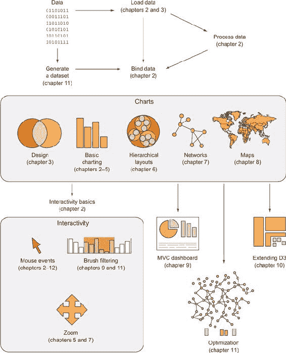

#### 1.2.1. 数据可视化不仅仅是图表

您可能会认为数据可视化仅限于饼图、折线图以及由 Edward Tufte 推广并在研究中应用的多种图表方法。实际上，它远不止这些。D3.js 的一个核心优势是它允许创建用于传统图表的矢量图形，同时也允许创建地理空间和网络可视化，以及丰富的动画和交互性。这种基于数据可视化的广泛方法，其中地图、网络图或表格是数据的另一种表示形式，是 D3.js 库对应用开发的核心吸引力。

图 1.2 至 1.8 展示了我使用 D3 创建的数据可视化组件。它们包括地图和网络，以及更多传统的饼图和基于客户特定需求的完全自定义数据可视化布局。

##### 图 1.2\. D3 可以用于创建简单的图表，例如这个饼图（在第五章中解释）。

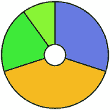

##### 图 1.3\. D3 也可以用来创建网络地图（见第八章），例如这个展示美国主要大都市地区民族构成的地图。

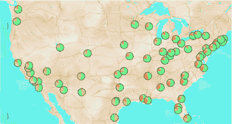

##### 图 1.4\. D3 中的地图不仅限于传统的墨卡托网络地图。它们可以是交互式地球仪，例如这个海底通信电缆地图，或者其他更多样化的地图。

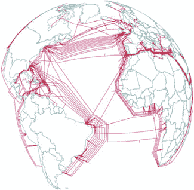

##### 图 1.5\. D3 还提供了强大的能力来创建交互式网络可视化（见第七章）。在这里，您可以看到在同一个挖掘地点工作了近 25 年的考古学家之间的社会和合著网络。

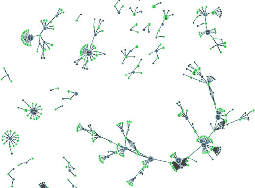

##### 图 1.6\. D3 包含了一个常见的数据可视化布局库，例如树状图（在第六章中解释），它允许您表示数据，例如这个单词树。

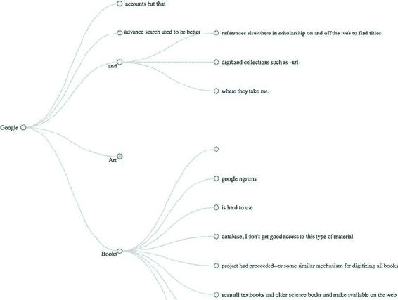

##### 图 1.7\. D3 提供了 SVG 和 canvas 绘图功能（见第四章），因此您可以创建自己的自定义可视化，例如这种音乐乐谱的表示。

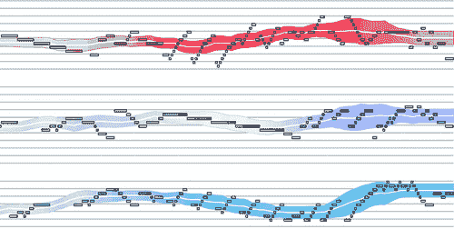

##### 图 1.8\. 您可以将这些布局和功能组合起来创建一个数据仪表板，就像我们在第九章中将要做的那样。您还可以使用绘图功能使您的条形图看起来与众不同，例如这种“草图”风格。

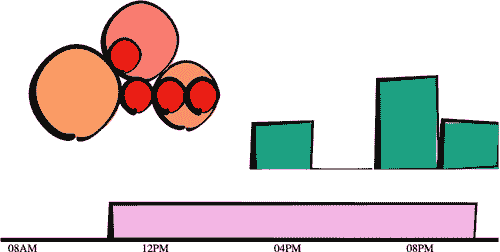

虽然创建丰富多样的图形是 D3 的一个优点，但对于现代 Web 开发来说，更重要的是能够嵌入用户期望的高级别交互性。使用 D3，每个图表的每个元素，从旋转的地球到饼图的单薄切片，都以相同的方式实现交互。而且因为 D3 是由一位对数据可视化实践非常熟悉的人编写的，它包括数据可视化和 Web 开发中标准化的交互组件和行为。

您学习 D3 不是为了让您能够在网络上部署 Excel 风格的图表。为此，存在更简单、更方便的库。您学习 D3 是因为它让您能够实现几乎每一种主要的数据可视化技术。它还让您能够创建**您自己的**数据可视化技术，这是更通用的库所无法做到的。要了解 D3 提供的多种可能性，请查看 [`blockbuilder.org/search`](http://blockbuilder.org/search)。

D3.js 为开发者提供了制作不仅丰富且交互性强，而且像传统网络内容一样样式化和提供应用程序的能力。这使得它们更易于携带，更适应不断增长、链接的数据网络，并且更容易由大型团队维护，其中其他团队成员不了解 D3 的特定语法，但例如可以使用 CSS 来样式化数据可视化元素。

博斯托克决定广泛处理数据并创建一个能够像图表、网络、有序列表一样轻松展示地图的库，这也意味着开发者不需要试图理解一个用于地图的库的抽象和语法，另一个用于动态文本内容，另一个用于数据可视化的库。相反，运行交互式、力导向网络布局的代码接近纯 JavaScript，并且与代表 D3.js 地图上动态兴趣点（POIs）的代码相似。不仅方法相同，数据也可能相同，对于列表、段落和跨度，以一种方式表达，而对于地理空间表示，以另一种方式表达。

#### 1.2.2\. D3 是关于选择和绑定

在本章中，您将看到可以在浏览器中运行的代码片段，以更改您网站上元素的图形外观。本章末尾是一个用 D3 编写的应用程序，它解释了我们正在用 JavaScript 运行的代码的基本原理。但在那之前，我们将探讨使用 D3 进行 Web 开发的原则，您将反复看到这种代码模式：选择。

假设我们有一组数据，例如几所房子的价格和大小，以及一组网页元素，无论是图形还是`<div>`元素，而我们想用文本或通过大小和颜色来表示数据集。*选择*是数据和元素组合的组。我们对组中的元素执行操作，例如移动它们或改变它们的颜色。我们同样可以更新数据中的值。尽管我们可以单独处理数据和网页元素，但 D3 真正的力量来自于使用选择来结合数据和网页元素。

这是一个没有数据的选择：

```
d3.selectAll("circle.a").style("fill", "red").attr("cx", 100);
```

这会将我们页面上的具有 CSS 类`a`的每个圆形变成红色，并将其移动到我们的`<svg>`画布左侧 100 像素的位置。同样，这段代码会将我们网页上的每个`div`变成红色，并将其类更改为`b`：

```
d3.selectAll("div").style("background", "red").attr("class", "b");
```

但在我们能够改变圆形和`div`之前，我们需要创建它们，而在我们这样做之前，最好理解这个模式中发生了什么。


**选择是否必要？**

在第十一章的后面，你会看到如何使用 D3 与 React（一个视图渲染器）结合使用。通常，MVC 库如 Angular 或视图渲染库如 React 负责创建和销毁 HTML 元素，并将它们与某些数据点关联起来。在这些情况下，你可能停止使用 D3 来创建和更新元素，而将其纯粹用作应用程序的可视化内核。


那行代码的第一部分，`d3.selectAll()`，是理解 D3 核心功能所必需的：选择。选择可以使用`d3.select()`进行，它选择找到的第一个单个元素，但更常见的是使用`d3.selectAll()`，它可以用来选择多个元素。选择是一组一个或多个网页元素，这些元素可能关联一组数据，如下面的代码所示，它将数组[1,5,11,3]中的元素绑定到具有`market`类的`<div>`元素：

```
d3.selectAll("div.market").data([1,5,11,3])
```

在 D3 中，这种关联被称为*绑定数据*，你可以将选择视为一组网页元素及其对应的相关数据集。有时数据元素可能多于 DOM 元素，或者相反，在这种情况下，D3 有创建或删除元素的功能，你可以使用这些功能来生成内容。第二章详细介绍了选择和数据绑定。选择可能不包含任何数据绑定，在本章的大部分示例中也是如此，但包含数据绑定允许使用 D3 强大的信息可视化技术。你可以在网页上的任何元素上进行选择，包括列表中的项目、圆形，甚至是非洲地图上的区域。同样，元素可以采取多种形状，与这些元素相关联的数据（如果适用）也可以采取多种形式。

#### 1.2.3\. D3 是关于从绑定数据中推导网页元素的外观

在你有一个选择之后，你可以然后使用 D3 来修改网页元素的外观，以反映数据的不同。你可能想要使线的长度等于数据的值，或者改变颜色以对应于数据的一个类别。你可能想要根据用户对数据集的导航来隐藏或显示元素。正如你在图 1.9 中可以看到的，在页面加载后，你使用 D3 选择元素并绑定数据以创建、删除或更改 DOM 元素。你将继续使用这个过程来响应用户交互。

##### 图 1.9\. 使用 D3 创建的应用程序可以反复使用选择和数据绑定，一起和单独地，根据交互更新数据可视化的内容。

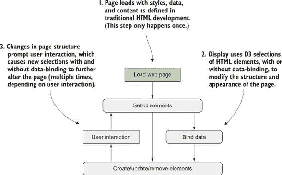

你可以通过使用选择来引用绑定到选择中元素的数据来修改元素的外观。D3 遍历你的选择中的元素，并使用绑定数据执行相同的操作，这会产生不同的图形效果。尽管你执行的操作是相同的，但由于它基于数据的差异，效果是不同的。你将在本章末尾首先看到数据绑定，并在整本书中详细讨论。

#### 1.2.4\. 网页元素现在可以是 divs、国家和流程图

我们已经习惯了将网页视为由文本元素组成，其中包含图片、视频或嵌入应用的容器。但随着你对 D3 越来越熟悉，你将开始认识到页面上每个元素都可以用相同的高级抽象来处理。网页上最基本元素，一个代表可以放入段落、列表和表格的矩形的`<div>`，可以像选择和修改地图上的国家或构成复杂数据可视化的单个圆圈和线条一样被选择和修改。

### 1.3\. HTML5 的力量

我们已经从那些动画 GIF 和帧是网络动态内容巅峰的日子走了很长的路。在图 1.10 中，你可以看到为什么 GIF 从未在网络上用于稳健的数据可视化。GIF，就像设计用来使用 VML 的信息可视化库一样，对于早期的浏览器是必要的，但 D3 是为不再需要向后兼容性的现代浏览器设计的。

##### 图 1.10\. 在 GIF 被用于分享可爱的动物行为之前，它们是你唯一的希望，可以在网络上进行动画数据可视化。像[dpgraph.com](http://dpgraph.com)这样的 1990 年代例子已经很少见了，但这个页面有足够的 GIF 来提醒我们它们的危险。

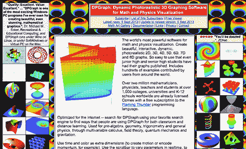


##### 注意

SVG 知识是理解 D3.js 的基础，但如果您已经对 DOM、SVG 和 CSS 有经验，您可以快速浏览本节以刷新记忆，或者跳到第 1.3.6 节或 1.4 节。


现代浏览器不仅可以显示 SVG 图形并遵守 CSS3 规则，而且性能出色。除了层叠样式表（CSS）和可缩放矢量图形（SVG）之外，您还需要了解的 Web 开发元素还包括 DOM（文档对象模型）和 JavaScript。以下各节将广泛地介绍每个元素，并包括您可以运行的代码，以查看 D3 如何使用它们的函数来创建交互性和动态的 Web 内容。

#### 1.3.1\. DOM

网页的结构是根据 DOM 来组织的。您需要对 DOM 有基本的了解才能进行 Web 开发，因此我们将快速查看浏览器中的简单网页的 DOM 元素和结构，并简要介绍 DOM 的基本知识。要开始，您需要一个可以从您用于编码的计算机访问的 Web 服务器。有了这个，您可以从[d3js.org](http://d3js.org)（d3.js 或 d3.min.js 用于压缩版本）下载 D3 库，并将其放置在您将创建网页的目录中。您将在文本编辑器中创建一个名为 d3ia.html 的页面，其内容如下所示。

##### 列表 1.1\. 一个演示 DOM 的简单网页

```
<!doctype html>
<html>
<head>
  <script src="d3.v4.min.js"></script>                                       *1*
</head>                                                                      *1*
<body>                                                                       *1*
  <div id="someDiv" style="width:200px;height:100px;border:black 1px solid;"> *2*
<input id="someCheckbox" type="checkbox" />                                  *3*
  </div>
</body>
</html>
```

+   ***1* `<html>`的子元素**

+   ***2* `<body>`的子元素**

+   ***3* `<div>`的子元素**

基本的 HTML 结构，如上所示，遵循 DOM（文档对象模型）。它定义了一组嵌套的元素，从包含所有子元素及其子元素的`<html>`元素开始。在这个例子中，`<script>`和`<body>`元素是`<html>`元素的子元素，而`<div>`元素是`<body>`元素的子元素。`<script>`元素在这里加载 D3 库，或者它可以包含内联 JavaScript 代码，而`<body>`元素中的任何内容在您导航到这个页面时都会显示在屏幕上。

每个元素的三个信息类别决定了其行为和外观：样式、属性和属性。*样式*可以确定透明度、颜色、大小、边框等。*属性*包括类、ID 和交互行为，尽管某些属性也可以根据您处理的是哪种类型的元素来决定外观。*属性*通常指状态，例如复选框的“checked”属性，如果复选框被选中则为`true`，如果没有选中则为`false`。D3 有三个相应的函数来修改这些值。如果我们想修改上一个例子中的 HTML 元素，我们可以使用 D3 函数来抽象这个过程：

```
d3.select("#someDiv").style("border", "5px darkgray dashed");
d3.select("#someDiv").attr("id", "newID");
d3.select("#someCheckbox").property("checked", true);
```

与许多此类 D3 函数一样，如果你没有指定新值，那么函数将返回现有值。在 JavaScript 中通过这种方式公开 getter/setter 行为在 JQuery 中变得流行，并在大多数 D3 示例中都有体现。你将在整本书中看到这一点，在编写更多代码的章节中也会看到，但就目前而言，请记住这三个函数允许你更改元素的外观和交互方式。

DOM 还决定了元素在屏幕上的绘制顺序，子元素在父元素之后和内部绘制。尽管你可以使用传统的 HTML 和`z-index`在元素之间部分控制绘制顺序，但在 SVG2 规范实现之前，这不会适用于 SVG 元素。

##### 在控制台中检查 DOM

导航到 d3ia.html，你可以了解 D3 是如何工作的。这个页面并不太令人印象深刻，只有一个黑色轮廓的矩形。你可以通过更新 d3ia.html 来修改这个网页的外观和感觉，但你发现使用你的网络浏览器的开发者控制台来修改页面更容易。这在测试在代码中实现之前更改类或元素时很有用。打开开发者控制台，你将有两个有用的屏幕，如图 1.11 和 1.12 所示，我们将反复回到这些屏幕。

##### 图 1.11。Chrome 的开发者工具将 JavaScript 控制台放置在最右侧的标签上，标签名为“控制台”，元素检查器可以通过左上角矩形中的箭头（如图所示）或通过在“元素”标签中浏览 DOM 来访问。

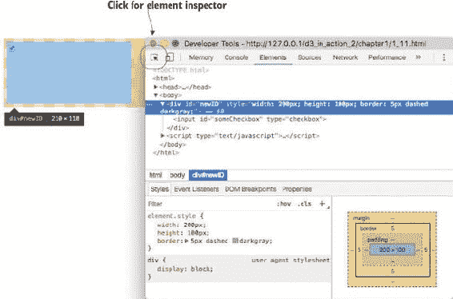

##### 图 1.12。你可以在控制台中运行 JavaScript 代码，根据需要调用全局变量或声明新的变量。你在控制台中编写的任何代码和对网页所做的更改，在页面重新加载后都会丢失。

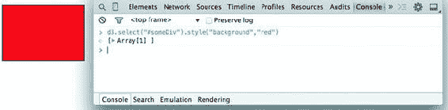

| |
| --- |

##### 注意

你将在第一章中看到控制台，但在第二章，一旦你熟悉它，我将只展示输出。

| |
| --- |

元素检查器允许你通过导航 DOM（表示为嵌套文本，其中每个子元素都显示为缩进）来查看构成你的网页的元素。你还可以通过图形方式选择屏幕上的元素，通常表示为放大镜或光标图标。

你还会经常使用另一个屏幕，那就是控制台（图 1.12），它允许你在网页上直接编写和运行 JavaScript 代码。开发者工具还有其他有价值的特性，例如设置断点和检查网络调用，但我们将专注于使用控制台来更改元素和运行代码。

本书中的示例使用 Google Chrome 及其开发者控制台，但你也可以使用 Safari 或 Firefox 的开发者工具，它们具有相同的功能和略有不同的外观和感觉，或者使用你的代码编辑器并刷新页面。你可以通过点击元素检查器或查看 HTML 中表示的 DOM 来查看和操作 DOM 元素，如`<div>`或`<body>`。你可以点击这些元素之一，并通过在控制台中修改它来更改其外观。

你甚至可以在控制台中删除元素。试试看：在 DOM 中或在视觉上选择 div，然后按 Delete 键。现在你的网页显得孤单。按刷新键，以便你的页面重新加载 HTML，你的 div 就会回来。你可以通过添加新样式或更改现有样式来调整 div 的大小和颜色，例如，你可以通过将边框样式更改为黑色 5 像素虚线来增加边框的宽度。你可以在 div 中添加其他元素的形式的内容，或者你可以通过右键单击元素并选择“编辑为 HTML”，如图 1.13 和 1.14 所示来添加文本。

##### 图 1.13. 与添加或修改单个样式和属性不同，你可以像在文本编辑器中一样重写 HTML 代码。与任何更改一样，这些更改只持续到你重新加载页面。

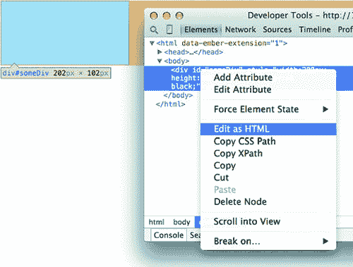

##### 图 1.14. 改变 DOM 元素的内容就像在元素的开始和结束括号之间添加文本一样简单。

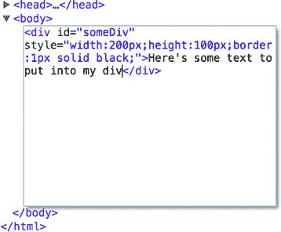

你可以在 HTML 的开始和结束标签之间写入任何你想要的内容。

你所做的任何更改，无论它们是否结构良好，都会反映在网页上。在图 1.15 中，你可以看到修改 HTML 的结果，这些结果会立即在你的页面上渲染。

##### 图 1.15. 你完成更改后，页面会立即更新。以这种方式手动编写 HTML 仅适用于规划你如何动态更新内容。

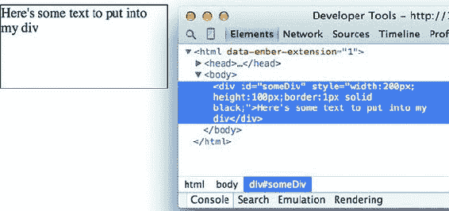

以这种方式，你可以缓慢而细致地在控制台中创建一个网页。我们不会这样做。相反，我们将使用 D3 根据我们的数据动态创建具有大小、位置、形状和内容的元素。

#### 1.3.2. 在控制台中编码

你将在你选择的 IDE 或文本编辑器中编写大部分代码，但关于 Web 开发的一个好处是你可以通过使用你的控制台来测试 JavaScript 代码的更改。稍后你将专注于编写 JavaScript，但现在，为了演示控制台的工作原理，请将以下代码复制到你的控制台并按 Enter 键：

```
d3.select("div").style("background", "lightblue").style("border", "solid
black 1px").html("You have now dynamically changed the content of a web page
element");
```

你应该能看到图 1.16 中显示的效果。

##### 图 1.16. D3 的`select`语法使用`.style()`函数修改样式，使用`.html()`函数修改传统的 HTML 内容。

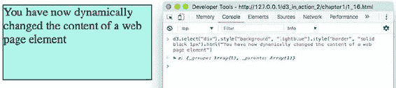

你将在本章中看到一些传统 HTML 元素的更多用途，然后在第三章 中再次看到，但之后你将不再详细看到传统 DOM 元素。你可以使用 D3 通过 `<div>`、`<table>` 和 `<select>` 元素创建复杂的数据驱动电子表格和画廊，但在现实世界中这不是一个常见的用例。如果 D3 只能像这样选择 HTML 元素并更改它们的样式和内容，那么它对数据可视化的用途就不会很大。为了做得更多，我们必须摆脱传统的 HTML，并专注于 DOM 中的特殊类型元素：SVG。

#### 1.3.3\. SVG

HTML5 的一大优点是集成了对可缩放矢量图形（SVG）的支持。SVG 允许以简单的数学方式表示图像，这些图像可以缩放，并且易于动画和交互。D3 的吸引力之一在于它提供了一个用于绘制 SVG 的抽象层，因为 SVG 绘图可能会有些令人困惑。用于复杂形状（称为 `<path>` 元素）的 SVG 绘图指令有点像旧的 LOGO 编程语言。你从一个画布上的点开始，从这个点画一条线到另一个点。如果你想让它弯曲，你可以给出 SVG 绘图代码上的坐标，以在该坐标上绘制曲线。如果你想绘制左侧的线，你将在网页中的 `<svg>` 画布元素中创建一个 `<path>` 元素，并且所有这些绘图指令（这就是它们在 图 1.17 左侧看起来像的样子）都放入该 `<path>` 元素的 `d` 属性中。

##### 图 1.17\. 绘制 SVG 路径的命令（右）和生成的图形（左）

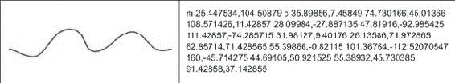

但你几乎不会想手动编写这样的绘图指令来创建 SVG。相反，你可能会想使用 D3 通过各种辅助函数来绘制图形，或者依赖其他使用更易读的属性来表示简单形状（称为几何或图形原语）的 SVG 元素。你将在第四章 中开始这样做，在那里你将使用 `d3.svg.line` 和 `d3.svg.area` 来创建折线图和面积图。现在，你需要更新 d3ia.html 以看起来像以下列表，其中包含显示 SVG 所需的代码，以及你可能使用的各种形状的示例。

##### 列表 1.2\. 带有 SVG 元素的示例网页

```
<!doctype html>
<html>
   <script src="d3.v4.min.js">
</script>
<body>
  <div id="infovizDiv">
  <svg style="width:500px;height:500px;border:1px lightgray solid;">
    <path d="M 10,60 40,30 50,50 60,30 70,80"
       style="fill:black;stroke:gray;stroke-width:4px;" />
    <polygon style="fill:gray;"
       points="80,400 120,400 160,440 120,480 60,460" />
  <g>
  <line x1="200" y1="100" x2="450" y2="225"
  style="stroke:black;stroke-width:2px;"/>
  <circle cy="100" cx="200" r="30"/>
  <rect x="410" y="200" width="100" height="50"
       style="fill:pink;stroke:black;stroke-width:1px;" />
  </g>
  </svg>
  </div>
</body>
</html>
```

你可以像检查我们之前看到的传统元素一样检查这些元素，就像你在 图 1.18 中看到的那样，并且你可以使用传统的 JavaScript 选择器（如 `document.getElementById`）或使用 D3 来操作这些元素，例如删除它们或更改样式，如下所示。

```
d3.select("circle").remove()                    *1*
d3.select("rect").style("fill", "purple")       *2*
```

+   ***1* 删除圆圈**

+   ***2* 将矩形颜色更改为紫色**

##### 图 1.18\. 使用 SVG 画布检查网页的 DOM，可以揭示嵌套的图形元素以及确定它们位置的样式和属性。请注意，圆形和矩形作为组的孩子元素存在。

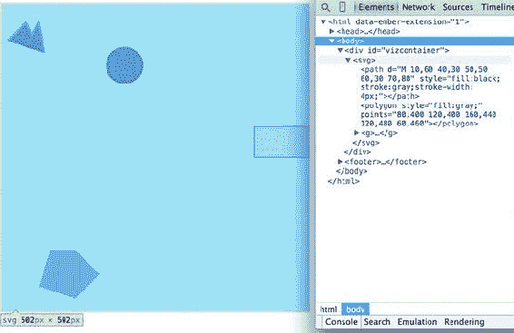

现在刷新您的页面，让我们看看新添加的元素。您熟悉 div，将 SVG 画布放在 div 中很有用，这样您就可以访问父容器以进行布局和样式设置。让我们看看我们添加的每个元素。

##### `<svg>` 容器

这是您的画布，所有内容都在上面绘制。左上角是 0,0，画布裁剪超出其定义的高度和宽度 500,500（我们例子中的矩形）之外的内容。可以使用 CSS 对`<svg>`元素进行样式设置，以具有不同的边框和背景。`<svg>`元素还可以使用`viewBox`属性动态调整大小，这更复杂，超出了此处概述的范围。

您可以使用 CSS（我们将在本章后面讨论）来设置 SVG 画布的样式，或者使用 D3 添加内联样式，如下所示：

```
d3.select("svg").style("background", "darkgray");         *1*
```

+   ***1* 信息可视化在深色背景上总是更酷**


##### 注意

x 轴从左到右绘制，但 y 轴从上到下绘制，因此您会看到圆形被设置为向右 200 像素和向下 100 像素。

|  |

**<canvas>**

使用 HTML5 和`<canvas>`元素绘制位图，有第二种绘图模式可用。我们这里不会详细介绍，但您将在第十一章（chapter 11）中看到这种方法被用于其渲染性能。`<canvas>`元素创建的静态图形绘制方式类似于 SVG，然后可以将其保存为图像。以下是使用`canvas`的三个主要原因：

+   ***创建静态图像—*** 您可以使用`canvas`绘制您的数据可视化，将视图保存为快照以用于缩略图和画廊视图。

+   ***大量数据—*** SVG 在 DOM 中创建单个元素，虽然这对于附加事件和样式很有用，但它可能会使浏览器过载并导致显著减速（这就是我们在第十一章（chapter 11）中使用`canvas`的原因）。

*WebGL*—`<canvas>`元素允许您使用 WebGL 进行绘制，因此您可以创建 3D 对象。您还可以使用 SVG 创建类似地球和多面体的 3D 对象，我们将在第八章（chapter 8）中稍作介绍，当我们考察地理空间信息可视化时。


##### `<circle>`、`<rect>`、`<line>`、`<polygon>` 形状原语

SVG 提供了一套常见的形状，每个形状都有*属性*，这些属性决定了它们的大小和位置，使得它们比之前看到的通用`d`属性更容易处理。这些属性根据你处理的元素而变化，所以`<rect>`元素有`x`和`y`属性，它们决定了形状的左上角，以及`height`和`width`属性，它们决定了形状的整体形状。相比之下，`<circle>`元素有`cx`和`cy`属性，它们决定了圆的中心，以及一个`r`属性，它决定了圆的半径。`<line>`元素有`x1`和`y1`属性，它们决定了线的起点，以及`x2`和`y2`属性，它们决定了线的终点。其他简单形状与这些类似，例如`<ellipse>`，而其他更复杂的形状，如具有`points`属性的`<polygon>`，它包含一组以顺时针顺序分隔的 xy 坐标，决定了多边形围成的区域。


**信息可视化术语：几何基本形状**

成功的艺术家可以用矢量图形绘制任何东西，但你可能不是在查看 D3，因为你是一位艺术家。相反，你正在处理图形，并且有更实际的目标。从这个角度来看，理解几何基本形状的概念（也称为图形基本形状）非常重要。*几何基本形状*是简单的形状，如点、线、圆和矩形。这些形状可以组合成更复杂的图形，对于视觉显示信息特别有用。

基本形状对于理解现实世界中看到的复杂信息可视化也非常有用。例如，像图 1.20 中展示的树状图，当你意识到它们只是圆圈和线条时，就会显得不那么令人畏惧。当你把它们看作是矩形和点的集合时，交互式时间轴就更容易理解和创建。即使是地理数据，主要以多边形、点和线的形式出现，当你将其分解为其最基本的图形结构时，也会变得不那么令人困惑。


每个这些属性都可以在 HTML 中手动编辑以调整其大小、形状和位置。打开你的元素检查器并点击`<rect>`。将其`width`更改为 25，将其`height`也改为 25，如图图 1.19 所示。

##### 图 1.19。修改`<rect>`元素的宽度和高度属性会改变该元素的外观。检查该元素还会显示如何通过描边增加元素的计算尺寸。

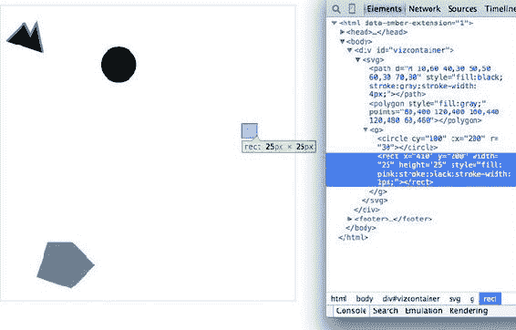

现在你已经了解了为什么没有 SVG `<square>`。任何形状的颜色、描边和透明度都可以通过调整形状的样式来改变，其中`fill`决定了形状区域的颜色，而`stroke`、`stroke-width`、`stroke-dasharray`决定了其轮廓。

注意，然而，检查的元素有一个 27 px x 27 px 的测量值。这是因为 1-px 线条绘制在形状的外部。一旦你知道规则，这就有意义了，但如果你将 `stroke-width` 更改为 `2px`，它仍然会是 27 px x 27 px。这是因为线条均匀地绘制在内部和外部边界上，如 图 1.20 所示。这可能看起来不是什么大问题，但当你试图稍后对齐形状时，这是一个需要记住的事情。

##### 图 1.20. 无、1-px、2-px、3-px、4-px 和 5-px 线条的相同 25 x 25 `<rect>`。尽管这些线条是在视网膜屏幕上使用半像素绘制的，但第二和第三个报告的宽度和高度（27 px x 27 px）与第四和第五个（29 px x 29 px）相同。

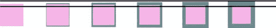

将矩形的样式参数更改为以下内容：

```
"fill:purple;stroke-width:5px;stroke:cornflowerblue;"
```

恭喜！你现在已经成功地可视化了被称为“丑陋”的复杂而模糊的现象。

##### `<text>`

SVG 提供了写入文本以及形状的能力。然而，SVG 文本没有像 HTML 元素中找到的格式化支持，因此它主要用于标签。如果你想进行基本的格式化，你可以在 `<text>` 中嵌套 `<tspan>` 元素。

##### `<g>` 分组元素

`<g>` 或组元素与我们在前面讨论的 SVG 元素不同，因为它没有图形表示，也不存在于一个有界空间中。相反，它是一组元素的逻辑分组。当你创建由多个形状和文本组成的图形对象时，你会希望广泛使用 `<g>` 元素。例如，如果你想有一个圆圈，上面有一个标签，并且同时移动标签和圆圈，那么你应该将它们放在一个 `<g>` 元素内：

```
<g>
<circle r="2"/>
<text>This circle's Label</text>
</g>
```

在画布上移动 `<g>` 元素需要你调整 `<g>` 元素的 `transform` 属性。`transform` 属性比形状的各种 xy 属性更令人畏惧，因为它接受一个文本中的结构化描述，说明你想要如何变换一个形状。这些结构之一是 `translate()`，它接受一对坐标，将元素移动到由 `translate (x,y)` 中的值定义的 xy 位置。如果你想将 `<g>` 元素向右移动 100 像素，向下移动 50 像素，那么你需要将其 `transform` 属性设置为 `transform="translate (100,50)"`。`transform` 属性还接受 `scale()` 设置，这样你就可以像在 列表 1.3 中的示例中看到的那样改变形状的渲染比例。你可以通过修改前面的示例并显示在 图 1.21 中的结果来看到这些设置的实际效果。

##### 图 1.21\. 所有 SVG 元素都可以受到`transform`属性的影响，但在使用`<g>`元素时这一点尤为明显，因为调整这些元素的位置需要这种方法。子元素是通过使用其父`<g>`的位置作为它们的相对 0,0 位置来绘制的。`transform`属性中的`scale()`设置会影响子元素的大小和位置属性的缩放。

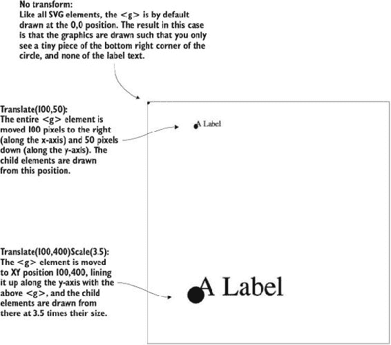

##### 列表 1.3\. SVG 元素的分组

```
<g>
   <circle r="2"/>
   <text>This circle's Label</text>
</g>
<g transform="translate(100,50)">
   <circle r="2" />
   <text>This circle's Label</text>
</g>
<g transform="translate(100,400) scale(2.5)">
   <circle r="2"/>
   <text>This circle's Label</text>
</g>
```

##### <path>

路径是由其 `d` 属性确定的区域。路径可以是开放的或闭合的，这意味着如果闭合，最后一个点会连接到第一个点，如果开放则不会。路径的开放或闭合性质由 `d` 属性中文字字符串末尾是否存在字母 *Z* 决定。无论哪种方式，都可以填充路径。您可以在图 1.22 中看到差异（其代码如下所示）。

##### 图 1.22\. 这里显示的每个路径在其`d`属性中使用相同的坐标，它们之间的唯一区别是定义`d`属性的文本字符串末尾是否存在字母 *Z*，填充和描边的设置，以及通过`transform`属性的位置。

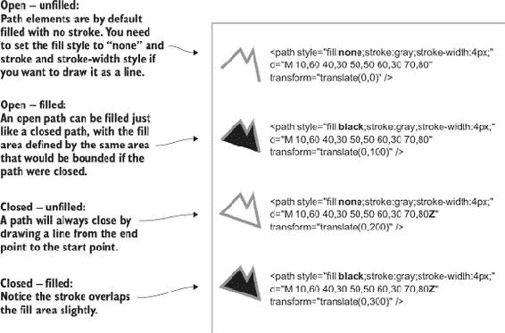

##### 列表 1.4\. SVG 路径填充和闭合

```
<path style="fill:none;stroke:gray;stroke-width:4px;"
     d="M 10,60 40,30 50,50 60,30 70,80" transform="translate(0,0)" />
<path style="fill:black;stroke:gray;stroke-width:4px;"
     d="M 10,60 40,30 50,50 60,30 70,80" transform="translate(0,100)" />
<path style="fill:none;stroke:gray;stroke-width:4px;"
     d="M 10,60 40,30 50,50 60,30 70,80Z" transform="translate(0,200)" />
<path style="fill:black;stroke:gray;stroke-width:4px;"
     d="M 10,60 40,30 50,50 60,30 70,80Z" transform="translate(0,300)" />
```

虽然有时您可能想自己编写`d`属性，但您的 SVG 制作经验更有可能来自以下三种方式之一：使用几何原语，如圆、矩形或多边形，使用 Adobe Illustrator 或 Inkscape 等矢量图形编辑器绘制 SVG，或使用手写的构造函数或 D3 内置构造函数参数化地绘制 SVG。本书的大部分内容都集中在使用 D3 创建 SVG 上，但不要忽视使用外部应用程序或另一个库创建 SVG 的可能性，然后使用 D3 来操作它们，就像我们在第三章中使用的 d3.html 一样。

#### 1.3.4\. CSS

CSS 用于在 DOM 中设置元素的样式。样式表可以作为一个单独的.css 文件存在，并将其包含在您的 HTML 页面中，或者可以直接嵌入到 HTML 页面中。样式表引用 ID、类或元素类型，并确定该元素的外观。用于定义样式的术语是*CSS 选择器*，它与`d3.select()`语法中使用的选择器类型相同。您可以通过使用`d3.select(#someElement).style(opacity, .5)`来设置元素的透明度为 50%，从而设置内联样式（仅应用于单个元素）。让我们更新您的 d3ia.html 以包含一个样式表，如下所示。

##### 列表 1.5\. 带有样式表的示例网页

```
<!doctype html>
<html>
<script src="d3.v4.min.js"></script>                *1*
<style>
.inactive, .tentative {                             *2*
  stroke: darkgray;
  stroke-width: 2px;
  stroke-dasharray: 5 5;
}
.tentative {
  opacity: .5;
}
.active {
  stroke: black;
  stroke-width: 4px;
  stroke-dasharray: 1;
}
circle {
  fill: red;
}
rect {
  fill: darkgray;
}
</style>
<body>                                              *3*
  <div id="infovizDiv">
  <svg style="width:500px;height:500px;border:1px lightgray solid;">
    <path d="M 10,60 40,30 50,50 60,30 70,80" />
    <polygon class="inactive" points="80,400 120,400 160,440 120,480 60,460" />
  <g>
  <circle class="active tentative" cy="100" cx="200" r="30"/>
  <rect class="active" x="410" y="200" width="100" height="50" />
  </g>
  </svg>
  </div>
</body>
</html>
```

+   ***1* 对 D3 库的引用，这样我们就可以在我们的应用中使用该代码**

+   ***2* 我们元素的 CSS 规则**

+   ***3* 我们页面的固定内容（我们将在稍后添加更多动态内容）**

结果会叠加在一起，因此当你检查矩形元素时，如图图 1.23 所示，你会看到其样式是由样式表中`rect`的引用以及`active`类的属性设置的。

##### 图 1.23。在控制台中检查 SVG 矩形显示，它从应用于`<rect>`类型的 CSS 样式继承其填充样式，并从`.active`类继承其描边样式。

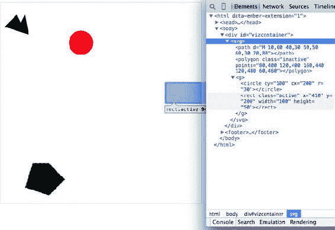

样式表还可以引用元素的状态，因此使用`:hover`，你可以改变用户将鼠标悬停在元素上时元素的外观。你可以在专门介绍该主题的书中详细了解其他复杂的 CSS 选择器。对于本书，我们将主要关注使用 CSS 类和 ID 进行选择和更改样式。最实用的方法是让 CSS 类与特定的样式更改相关联，然后更改元素的类。你可以通过选择和修改类属性来更改元素的类，这是元素的一个属性。图图 1.24 中显示的圆圈受到两个重叠类的影响：`.active`和`.tentative`。

##### 图 1.24。SVG 圆圈的填充值由样式表中的其类型设置，其透明度由其在`.tentative`类中的成员资格设置，其描边由其在`.active`类中的成员资格设置。请注意，`.tentative`类的描边设置被后来声明的`.active`类的描边设置覆盖。

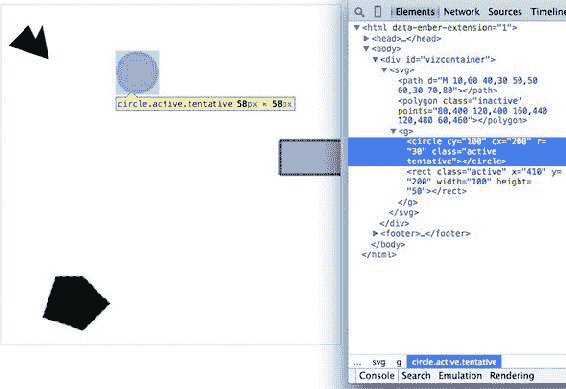

在列表 1.5 中，我们看到一些可能重叠的类，包括尝试、活动和非活动，它们都对形状（如图 1.23 中的高亮圆圈）应用了不同的样式更改。当一个元素只需要分配给这些类中的一个时，你可以完全覆盖类属性：

```
d3.select("circle").attr("class", "tentative");
```

如图 1.25 所示的结果是我们预期的。这会覆盖整个类属性到设置的值。但是元素可以有多个类，有时一个元素既是活动的又是尝试的，或者既是非活动的又是尝试的，所以让我们重新加载页面并利用辅助函数`d3.classed()`，它允许你向元素中的类添加或删除类。

```
d3.select("circle").classed("active", true);
```

##### 图 1.25。一个填充样式由其类型决定，其透明度和描边设置由其在`tentative`类中的成员资格决定的 SVG 圆圈

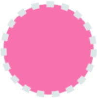

通过使用 `.classed()`，你不会覆盖现有的属性，而是将命名的类从列表中添加或删除。你可以看到两个具有冲突样式的类的结果。由于在样式表中出现的顺序较晚，活动样式会覆盖尝试样式。另一个需要记住的规则是，更具体的规则会覆盖更一般的规则。CSS 还有很多内容，但本书不会深入探讨。

通过在样式表中定义样式并根据类成员资格更改外观，你可以创建更易于维护和阅读的代码。你可能需要使用内联样式来设置一组元素的图形外观，例如，将填充颜色更改为与绑定到该组元素的颜色的渐变相匹配。你将在处理绑定数据时看到该功能的实际应用。但作为一般规则，设置内联样式应仅在你无法使用样式表中定义的传统类和状态时使用。

#### 1.3.5\. JavaScript

D3，像 JavaScript 中的许多信息可视化库一样，提供了抽象创建和修改网页元素过程的函数。在此基础上，它还提供了将数据与网页元素链接起来的机制，使得这些 SVG 元素的绘制和更新变得可重用和维护。但这些机制也适用于更传统的 HTML 元素，如段落和 div。

当使用 D3 编写 JavaScript 时，你应该熟悉两个主题：方法链式调用和数组。

##### 方法链式调用

D3 示例，像许多用 JavaScript 编写的示例一样，广泛使用了方法链式调用。方法链式调用，也称为函数链式调用，是通过在函数成功完成后返回该函数本身来实现的。思考方法链式调用的一种方式是想象我们如何相互交谈和指称。想象你在聚会上和某人交谈，并询问另一位客人：

“她叫什么名字？”

“她叫林赛。”

“她在哪里工作？”

“她在特斯拉工作。”

“她住在哪里？”

“她住在库比蒂诺。”

“她有孩子吗？”

“是的，她有一个女儿。”

“她叫什么名字？”

你认为上一个问题的答案会是“林赛”吗？当然不是。你会期望答案指的是林赛的女儿，尽管所有之前的问题都指的是林赛。方法链式调用就是这样。只要使用该函数的 getter 和 setter 方法，它就会返回相同的函数；当你调用创建新内容的方法时，它会返回新的函数。方法链式调用在 D3 示例中用得很多，这意味着你可能会看到一行或格式化（但功能相同）的代码，如下所示：

```
d3.selectAll("div").data(someData).enter().append("div").html("Wow").append("span").html("Even More Wow").style("font-weight", "900");
```

该行与以下代码相同。唯一的区别在于行中断的使用，JavaScript 忽略行中断：

```
d3.selectAll("div")                         *1*
  .data(someData)                           *2*
  .enter()                                  *3*
  .append("div")                            *4*
  .html("Wow")                              *5*
  .append("span")                           *6*
  .html("Even More Wow")                    *7*
  .style("font-weight", "900");             *8*
```

+   ***1* 返回一个 selection，一个具有各种可用函数的对象**

+   ***2* 在 selection 上设置数据并返回 selection**

+   ***3* 返回 selection.enter()对象**

+   ***4* 在 selection.enter 对象上设置 Sets.append()行为并返回 selection.enter 对象**

+   ***5* 为 selection.enter 对象设置.html()并返回 selection.enter 对象**

+   ***6* 在 selection.enter 对象上设置 append()行为并返回 enter.append 对象**

+   ***7* 为 enter.append 对象设置 html() 并返回 enter.append 对象**

+   ***8* 为 enter.append 对象设置字体粗细样式并返回 enter.append 对象**

你可以单独编写每一行，逐个声明不同的变量，以达到相同的效果。如果你之前没有接触过方法链，这可能会更有意义：

```
var function1 = d3.selectAll("div");
var function1withData = function1.data(someData);
var function2 = function1withData.enter();
var function3 = function2.append("div");
function3.html("Wow");
var function4 = function3.append("span");
function4.html("Even More Wow");
function4.style("font-weight", "900");
```

你可以在你的控制台中运行代码时看到这一点。这是你第一次使用 `.data()` 函数，它与 `.select()` 一起构成了使用 D3 进行开发的核心。当你使用 `.data(array)` 时，你将你的选择集中的每个元素绑定到数组中的每个项目（如果你没有传递任何内容给 `.data()`，你将得到绑定到你的选择集中的项目）。在绑定数据时，如果你的数组中的项目多于你的选择集中的元素，那么你可以使用 `.enter()` 函数来定义如何处理每个额外的元素。在前一个函数中，你选择了 `<body>` 中的所有 `<div>` 元素，而 `.enter()` 函数告诉 D3 当数组中的元素多于选择集中的元素时，添加一个新的 div。鉴于你的 d3ia.html 页面已经有一个 div，如果你绑定了一个包含多个值的数组，D3 将为数组中超出第一个值的每个值添加或添加一个 div。

相应的 `.exit()` 函数定义了当数组中的值少于选择集时如何响应。现在，你将按照示例中的代码运行，在后面的章节中，我们将更详细地介绍选择集和绑定的工作方式。

在这个例子中，你并没有对数组中的数据进行任何操作，只是根据数组的大小（数组中的每个元素一个 `<div>`）创建元素。这个例子假设你已经在你的 HTML 中有一个带有灰色边框的 `<div>`（如图 1.25 所示）。以下是完成这个任务的 HTML 代码：

```
<!doctype html>
<html>
<script src="d3.v4.min.js"></script>
<style>
   #borderdiv {
   width: 200px;
   height: 50px;
border: 1px solid gray;
}
</style>
<body>
   <div id="borderdiv"></div>
   </body>
</html>
```

为了使这可行，你需要给 `someData` 赋予一个值。有了这个，你就可以运行你的代码：

```
var someData = ["filler", "filler", "filler", "filler"];
d3.select("body").selectAll("div")
  .data(someData)
  .enter()
  .append("div")
  .html("Wow")
  .append("span")
  .html("Even More Wow")
  .style("font-weight", "900");
```

结果，如图 1.26 所示，增加了三行文本。考虑到数组中有四个值，这个代码只有三行可能会让你感到惊讶。尽管数据被绑定到了页面上的现有 `<div>` 元素上，但改变内容的行为仅应用于 `.enter()` 函数。这意味着它们仅应用于第一次“进入”DOM 的新创建的 `<div>` 元素。

##### 图 1.26\. 通过将四个值的数组绑定到页面上的 `<div>` 元素选择集，`.enter()` 函数创建了三个新的 `<div>` 元素，以反映数据数组和选择集之间的大小不匹配。

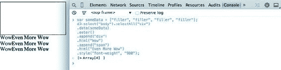

当您检查 DOM，如图图 1.27 所示，您会看到方法链以先前描述的方式操作。添加了一个 `<div>`，其 HTML 内容设置为 `Wow`。然后向 `<div>` 添加了一个具有不同样式的 `<span>` 元素，其 HTML 内容设置为 `Even More Wow`。您还可以做更多的事情，但首先您需要检查您要绑定的数组对象，并专注于 JavaScript 数组和数组函数。

##### 图 1.27\. 检查 DOM 显示，新的 `<div>` 元素已经创建，内容未格式化，随后是您的代码设置的样式和内容的子 `<span>` 元素。

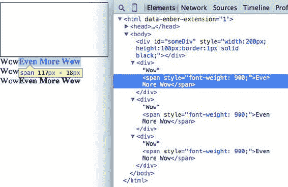

##### 数组和数组函数

D3 全是关于数组的，因此理解数组的结构和您可用于准备这些数组的选项非常重要。您的数组可能是一个字符串或数字字面量的数组，例如这个：

```
someNumbers = [17, 82, 9, 500, 40];
someColors = ["blue", "red", "chartreuse", "orange"];
```

或者它可能是一个 JavaScript 对象的数组，随着您使用 D3 做更多有趣的事情，这将会变得更加常见：

```
somePeople = [{name: "Peter", age: 27}, {name: "Sulayman", age: 24},
{name: "K.C.", age: 49}];
```

一个有用的数组函数的例子是 `.filter()`，它返回一个满足您提供的测试的元素的数组。例如，这是如何从 `someNumbers` 创建一个值大于 40 的数组的示例：

```
someNumbers.filter(function(d) {return d >= 40});
```

同样，这是如何从 `someColors` 创建一个由五个字母以下名称组成的数组的示例：

```
someColors.filter(function(d) {return d.length < 5});
```

`.filter()` 函数是一个数组的方法，它接受一个迭代数组的函数，您为该变量命名。在这个函数中，您将变量命名为 `d`，该函数通过在 `d` 上进行测试来对每个值进行测试。当该测试评估为 `true` 时，该元素保留在我们的新数组中。

这个 `.filter()` 函数的结果，您可以在图 1.28 中看到，返回元素或无（取决于它是否满足测试），构建一个只包含满足测试的元素的新数组。

##### 图 1.28\. 在控制台中运行 JavaScript 允许您测试您的代码。在这里，您创建了一个名为 `smallerNumbers` 的新数组，它只包含三个值，然后您可以使用这些值作为选择中的数据来更新和创建新元素。


```
smallerNumbers = someNumbers.filter(
  function(el) {return d <= 40});
d3.select("body").selectAll("div")
  .data(smallerNumbers)
  .enter()
  .append("div")
  .html(function (d) {return d});
```

生成的代码从您的三个值数组 `smallerNumbers` 中创建了两个新的 div。 (记住，已经存在一个 div，因此尽管数据绑定到该现有 div，`.enter()` 函数也不会触发。) div 的内容是您的数组中的值。这是通过在 `.html()` 函数中的匿名函数（有时在 D3 示例中称为 *访问器*）完成的，这是 D3 的另一个关键方面。任何在设置 `.style()`、`.attr()`、`.property()`、`.html()` 或其他选择函数时调用的匿名函数都可以提供您绑定到该选择的数据。随着您探索示例，您将看到这个函数被一次又一次地部署：

```
.style("background", function(d) {return d})
.attr("cx", function(d,i) {return i})
.html(function(d) {return d})
```

在每种情况下，第一个变量（通常用字母 *d* 表示，但你也可以声明为任何你想要的）包含绑定到该元素的数据值，第二个变量返回绑定到该元素值的数组位置（称为索引，因此变量名为 *i*）。这可能会有些奇怪，但当你看到它在接下来的章节中以各种方式使用时，你会习惯它的。

JavaScript 有许多其他的数组函数，你可以做比这里所涵盖的更多的事情，但这将是几本其他书的主题。现在是时候看看你将处理的数据类型了。

#### 1.3.6\. ES2015 和 Node

在过去几年中，JavaScript 经历了一些重大变化。现代 JavaScript 的两个最大趋势是 node.js 的兴起以及 EcmaScript 6（也称为 ES2015）在浏览器和 transpilers 中的广泛应用。这意味着对于你来说，使用 Node 服务器，你可以编写在前端或服务器上运行而无需任何更改的代码。这被称为 *同构* 或 *通用* JavaScript。我们在这本书中不会这样做，但它为 JavaScript 应用程序提供了极大的灵活性。

对于这本书，我们想要了解的主要 Node 技术是 NPM，即 Node 包管理器。NPM 允许你安装“模块”或 JS 代码的小型库，用于你的应用程序。你不需要包含大量的 `<script>` 标签引用到单个文件，如果模块被构建成不是单一的结构，你可以减少你包含在应用程序中的代码量。

D3.js 版本 4，于 2016 年中发布，其结构旨在利用模块导入。在这本书的整个过程中，你会看到使用 D3 的两种方式之一。要么我们会包含整个 D3 文件，就像我们在本章的例子中所做的那样，要么我们会包含我们需要的 D3 的单个部分，就像你将在后面的例子中看到的那样。对于这本书的例子，我们主要会看到使用 script 标签来完成，但请记住，如果你在编码中使用 NPM，你可以根据需要将单个 D3v4 模块 `require` 或 `import` 到你的代码中。这本书中没有足够的空间来详细讨论这个问题，但它被认为是 JavaScript 开发中的标准做法，所以你需要熟悉它。

`import` 语法是 ES2015 高级功能中的一个新特性。它还包括对类、承诺、字符串模板、扩展运算符、符号以及许多其他新功能的支持，如果 JavaScript 开发者想要成功，他们应该了解这些功能。由于 ES2015 还未得到完全支持，你需要使用 *transpiler* 将 ES2015 代码转换为 ES5 代码。我不会在这本书中包含太多的 ES2015 内容，这样如果你还不熟悉 ES2015，也不会阻碍你学习 D3，但你会看到箭头函数，这是一种更简洁的编写函数的方式。而不是

```
function (d) {return d}
```

一个箭头函数可以这样编写：

```
d => d
```

箭头后面的参数除非被括号包围，否则会被返回，并且更简洁的箭头函数可以在任何地方使用，例如在数组的 `forEach` 中：

|

```
someArray.forEach(d => {
   console.log(d)
})
```

|

```
someArray.forEach(function (d) {
   console.log(d)
})
```

|

在箭头函数中要记住的一件事是函数的上下文（`this`）是它在其中创建的上下文。如果这听起来很神秘，不要担心——重要的是要记住，当你在这本书或网上看到 `this` 在 D3 函数中使用时，通常作为引用附加数据的 HTML 节点，你将无法在箭头函数中获得与旧函数声明类型相同的 `this`。

### 1.4\. 数据标准

我们有如此多的数据可视化类型的自由，一个原因是我们已经确定了表示不同类型数据的常规方法。数据可以以各种方式格式化以适应各种目的，但它往往落入几个可识别的类别：*表格*数据、*嵌套*数据、*网络*数据、*地理*数据、*原始*数据和*对象*。

#### 1.4.1\. 表格数据

表格数据以列和行形式出现，通常在电子表格或数据库中的表格中找到。尽管你不可避免地会在 D3 中创建对象的数组，但通常以表格格式获取数据更高效且更容易。表格数据由特定的字符分隔，分隔符决定了其格式。你可以有逗号分隔值 (CSV)，其中分隔符是逗号，或者制表符分隔值，或者分号或管道符号作为分隔符。例如，你可能有一个包含年龄和薪水的用户信息的电子表格。如果你以分隔形式导出它，它将看起来像表 1.1。在这里，一个数据集存储了两个人的姓名、年龄和薪水，使用逗号、空格或条形符号来分隔不同的字段。

D3 提供了三个不同的函数来获取表格数据：`d3.csv()`、`d3.tsv()` 和 `d3.dsv()`。它们之间的唯一区别是 `d3.csv()` 是为逗号分隔的文件构建的，`d3.tsv()` 是为制表符分隔的文件构建的，而 `d3.dsv()` 允许你声明分隔符。你将在整本书中看到它们的应用。

##### 表 1.1\. 分隔数据可以表示为不同的形式

| 姓名,年龄,薪水 | 姓名 年龄 薪水 | 姓名 | 年龄 | 薪水 |
| --- | --- | --- |
| 1.1.1 d3.csv | 1.1.2 d3.tsv | 1.1.3 d3.dsv |
| 1.1.4 Sal,34,50000 | 1.1.5 Sal 34 50000 | 1.1.6 Sal | 34 | 50000 |
| 1.1.7 Nan,22,75000 | 1.1.8 Nan 22 75000 | 1.1.9 Nan | 22 | 75000 |

#### 1.4.2\. 嵌套数据

嵌套的数据，其中对象作为对象的递归子对象存在，很常见。D3 中许多最直观的布局都是基于嵌套数据，这些数据可以表示为树，例如图 1.29 中的那个，或者打包在圆圈或盒子中。数据通常不以这种格式输出，需要一些脚本组织它，但这种表示的灵活性值得付出努力。你将在第六章中详细了解层次数据。

##### 图 1.29\. 嵌套数据表示对象之间的父子关系，通常每个对象都有一个子对象数组，并以多种形式表示，例如这个树状图。请注意，每个对象只能有一个父对象。

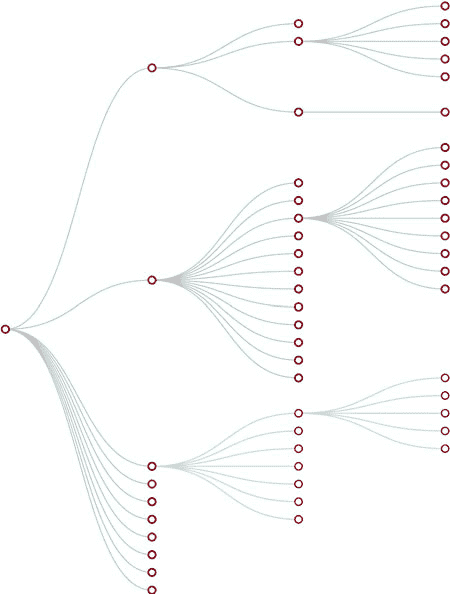

#### 1.4.3\. 网络数据

网络无处不在。无论是社交网络流的原始输出、交通网络还是流程图，网络都是理解复杂系统的一种强大方法。网络通常表示为节点-边图，如图 1.30 所示。与地理数据一样，网络数据有许多标准，但本文只关注两种形式：节点/边列表和连接数组。网络数据也可以通过使用像 Gephi 这样的免费网络分析工具（可在[gephi.org](http://gephi.org)获取）轻松转换为这些数据类型。当我们处理网络可视化时，我们将在第七章中检查网络数据和网络数据标准。

##### 图 1.30\. 网络数据由对象及其之间的连接组成。对象通常被称为节点或顶点，连接被称为边或链接。网络通常使用如这里所示的力导向算法来表示，这些算法将网络排列成使连接的节点相互吸引的方式。

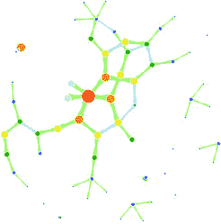

#### 1.4.4\. 地理数据

地理数据指的是以点或形状表示的位置，用于创建今天在网络上看到的各种在线地图，例如图 1.31 中的美国地图。网络地图的惊人普及意味着你可以获取到任何项目所需的大量公开可访问的地理数据。地理数据有几个标准，但本书的重点是两个：GeoJSON 和 Topo-JSON 标准。尽管地理数据可能以多种形式存在，但像 Quantum GIS 这样的现成地理信息系统（GIS）工具允许开发者将其转换为 GIS 格式，以便快速交付到网络上。我们将在第八章中详细探讨地理数据。

##### 图 1.31. 地理数据存储对象的空问几何形状，例如州。这张图像中的每个州都表示为一个具有表示其形状的值数组的单独特征。地理数据也可以由点组成，例如城市，或由线组成，例如道路。

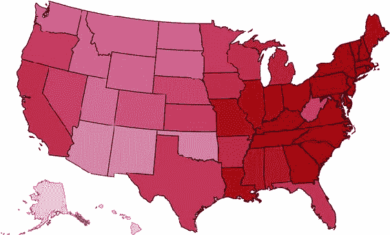

#### 1.4.5. 原始数据

如您在第二章中看到的，一切都是数据，包括图像或文本块。尽管信息可视化通常使用颜色和大小编码的形状来表示数据，但有时在 D3 中表示数据最好的方式是使用线性叙事文本、图像或视频。如果您为需要理解复杂系统的观众开发应用程序，但您认为对文本或图像的处理与以形状表示数值或分类数据是某种程度上的分离，那么您就任意地降低了您沟通的能力。处理文本和图像时使用的布局和格式，通常与较老的网页发布模式相关联，在 D3 中是可能的，我们将在整本书中处理这个问题。

#### 1.4.6. 对象

您将使用两种类型的数据点与 D3 一起使用：字面量和对象。字面量，如字符串字面量`Apple`或`beer`或数字字面量`64273`或`5.44`，很简单。JavaScript 对象或等效的 JSON（JavaScript 对象表示法——一种类似于 JavaScript 对象的数据表示方法）并不那么简单，但这是如果您计划进行复杂的数据可视化，您需要理解的东西。

假设您有一个由保险数据库中的个人组成的数据集，您需要知道某人的年龄、他们是否就业、他们的名字，以及如果有，他们的孩子。表示这样一个数据库中每个个人的 JavaScript 对象可以表示如下：

```
{name: "Charlie", age: 55, employed: true, childrenNames: ["Ruth", "Charlie Jr."]}
```

每个对象都由大括号`{}`包围，并且具有具有字符串、数字、数组、布尔值或对象作为其值的属性。您可以将对象分配给变量，并通过引用它们来访问其属性，如下所示：

```
var person = {name: "Charlie", age: 55, employed: true, childrenNames: ["Ruth", "Charlie Jr."]};
person.name // Charlie
person["name"] // Charlie
person.name = "Charles" // Sets name to Charles
person["name"] = "Charles" // Sets name to Charles
person.age < 65 // true
person.childrenNames // ["Ruth", "Charlie Jr."]
person.childrenNames[0] // "Ruth"
```

对象可以存储在数组中，并使用`d3.select()`语法与元素关联。但对象也可以像数组一样使用`for`循环进行迭代：

```
for (x in person) {console.log(x); console.log(person[x]);}
```

循环中的`x`代表`person`对象中的每个属性。每个`x`将是属性之一，如`name`、`age`等。这允许您使用`person[x]`迭代属性以显示该对象的该属性值。

访问键的另一种方式是使用`Object.keys(person)`，然后迭代该数组。

如果您的数据存储为 JSON，则可以使用`d3.json()`导入它，您将在后面的章节中多次看到。但请记住，每次您使用`d3.csv()`时，D3 都将数据作为 JSON 对象的数组导入。我们将在使用它们时更深入地研究对象。

### 1.5. 在 D3 中表达的信息可视化标准

信息可视化（infoviz）从未像今天这样受欢迎。地图、图表以及系统和数据集的复杂表示的丰富性不仅存在于工作场所，也存在于我们的娱乐和日常生活中。随着这种受欢迎程度的增长，使用视觉手段表示数据和信息的类和子类库也在不断增加，以及促进可读性和理解的审美规则。无论受众是普通公众、学者还是决策者，他们都已经习惯了我们曾经认为极其抽象和复杂的数据趋势表示。这使得像 D3 这样的库不仅受到数据科学家的欢迎，也受到记者、艺术家、学者、IT 专业人士甚至粉丝社区的欢迎。

但选项的丰富性可能会让人感到不知所措，而且修改数据集以在流图、树状图或直方图中显示的相对容易性往往促使人们认为信息可视化更注重风格而非实质。幸运的是，一些已确立的规则指导着针对不同系统中的不同类型数据应使用哪些图表和方法。尽管我无法在书中涵盖每一条规则，但我将触及一些在我们创建更复杂的信息可视化时值得考虑的规则。尽管开发者使用 D3 来革新颜色和布局的使用，但大多数人希望创建支持实际关注点的数据视觉表示。因为 D3 是在这个成熟的信息可视化环境中开发的，它包含了许多辅助函数，让开发者可以更多地关注界面和设计，而不是颜色和坐标轴。

然而，要正确部署信息可视化，你应该知道该做什么和不该做什么。学习这一点的最好方法是回顾那些知名设计师和信息可视化实践者的作品，并且你需要对你的数据以及你的受众有一个坚定的理解。尽管有整个图书馆的著作都涉及这些问题，但以下是我发现的有用的一些，它们可以帮助你了解基础：

+   *定量信息的视觉展示：信息构想*，Edward Tufte

+   *信息设计*，Isabel Meirelles

+   *模式识别*，Christian Swinehart

+   *可视化分析与设计*，Tamara Munzner

这些绝对不是学习数据可视化的唯一文本，但我发现它们对入门很有用。你应该精简并建立基本甚至基本的数据可视化实践，这些实践可以清楚地代表对你受众来说重要的趋势。当不确定时，简化——通常展示直方图比展示流图好，或者展示层次网络布局（如树状图）比展示力导向布局好。展示数据的更复杂视觉方法往往能激发更多的兴奋，但也可能导致观众只看到他们想看到的内容，或者专注于图形的美学而不是数据。


**信息可视化技巧：杀死你的宠儿**

在信息可视化方面，最好的建议之一来自写作实践：“杀死你的宠儿。”就像作家可能会对某些场景或角色产生迷恋一样，你可能会对某个特别优雅或看起来复杂的图形产生迷恋。你对一个酷图表或动画的喜爱可能会让你分心，无法传达数据中的结构和模式。记住，对你的最爱作品要保留最严厉的批评，因为你可能会发现，令你失望的是，它们并不像你想象的那样有用和有信息量。


在阅读关于数据可视化的内容时，需要注意的一点是，文献通常专注于静态图表。使用 D3，你将制作交互式和动态的可视化，而不仅仅是静态的。在你完成这一章之前，你将制作一个动态的（或动画的）数据可视化，使用 D3 制作一个交互式的图表非常简单。一些交互式的小技巧可以使可视化不仅更易读，而且更具吸引力。那些感觉自己在探索而不是阅读的用户，即使只是通过几个鼠标悬停事件或简单的点击缩放，也会觉得可视化的内容比静态页面更有吸引力。但是，这种额外的复杂性需要投入学习界面设计和用户体验的原则。我们将在第九章中更详细地探讨这一点。

### 1.6\. 你的第一个 D3 应用程序

在本章中，你已经看到了各种代码行以及这些代码行对你一直在构建的 d3ia.html 示例页面产生的影响。但我避免过多地解释代码，以便你能专注于 D3 中起作用的原理。从头开始构建一个使用 D3 创建和修改元素的应用程序很简单。让我们把这些都放在一起，看看它是如何工作的。首先，让我们从一个干净的 HTML 页面开始，这个页面没有定义任何样式或现有的 div，如下面的列表所示。

##### 列表 1.6\. 一个简单的网页

```
<!doctype html>
<html>
<head>
   <script src="d3.v4.min.js"></script>
</head>
<body>
</body>
</html>
```

#### 1.6.1\. 使用 div 的“Hello world”

我们可以使用 D3 作为向页面添加传统内容的抽象层。虽然我们可以在 .html 文件内部或其自己的 .js 文件中编写 JavaScript，但让我们在控制台中放置代码并看看它的工作方式。稍后，我们将更详细地关注布局和界面的各种命令。我们可以从使用 D3 将内容写入网页的代码片段开始，如下一个列表所示。

##### 列表 1.7\. 使用 d3.select 设置样式和 HTML 内容

```
d3.select("body").append("div")
  .style("border", "1px black solid")
  .html("hello world");
```

我们可以通过包含 `.on()` 函数来调整页面上的元素并使其具有交互性，如下一个列表所示。

##### 列表 1.8\. 使用 d3.select 设置属性和事件监听器

```
d3.select("div")
  .style("background-color", "pink")
  .style("font-size", "24px")
  .attr("id", "newDiv")
  .attr("class", "d3div")
  .on("click", () => {console.log("You clicked a div")});
```

`.on()` 函数允许我们为当前选定的元素或元素集创建事件监听器。它接受可以发生在元素上的各种事件，例如点击、鼠标悬停、鼠标移出等。如果你点击你的 div，你会注意到它在你的控制台中给出响应，如图 1.32 所示。

##### 图 1.32\. 使用 `console.log()`，你可以测试事件是否被正确触发。在这里，你创建一个 `<div>` 并使用 `.on()` 语法分配一个 onclick 事件处理器。当你点击该元素并触发事件时，动作会在控制台中记录。


#### 1.6.2\. 使用圆圈实现的“Hello World”

你不是来这本书学习如何向网页添加 div 的，但你可能想处理像线条和圆圈这样的图形。要在 D3 的页面上添加形状，你需要在页面的 DOM 中某个位置有一个 SVG 画布元素。你可以在编写 HTML 时添加这个 SVG 画布，或者使用你学到的 D3 语法将其附加：

```
d3.select("body").append("svg");
```

让我们调整 d3ia.html 页面，从 SVG 画布开始，如下面的列表所示。

##### 列表 1.9\. 带有 SVG 画布的简单网页

```
<html>
<head>
   <script src="d3.v4.min.js"></script>
</head>
<body>
   <div id="vizcontainer">
   <svg style="width:500px;height:500px;border:1px lightgray solid;" />
   </div>
</body>
</html>
```

在我们的页面上有了 SVG 画布之后，我们可以使用与在第 1.6.1 节中为 `<div>` 元素使用的相同 `select()` 和 `append()` 语法，向其添加各种形状，如下面的列表所示。

##### 列表 1.10\. 使用 select 和 append 创建线条和圆圈

```
d3.select("svg")
  .append("line")
  .attr("x1", 20)
  .attr("y1", 20)
  .attr("x2",400)
  .attr("y2",400)
  .style("stroke", "black")
  .style("stroke-width","2px");
d3.select("svg")
  .append("text")
  .attr("x",20)
  .attr("y",20)
  .text("HELLO");
d3.select("svg")
  .append("circle")
  .attr("r", 20)
  .attr("cx",20)
  .attr("cy",20)
  .style("fill","red");
d3.select("svg")
  .append("circle")
  .attr("r", 100)
  .attr("cx",400)
  .attr("cy",400)
  .style("fill","lightblue");
d3.select("svg")
  .append("text")
  .attr("x",400)
  .attr("y",400)
  .text("WORLD");
```

注意到你的圆圈是在线条上绘制的，文本是根据你运行命令的顺序在圆圈上方或下方绘制的，如图 1.33 所示。这是因为 SVG 的绘制顺序基于其 DOM 顺序。稍后你将学习调整该顺序的方法。

##### 图 1.33\. 在控制台中运行列表 1.10 的结果是创建了两个圆圈、一条线和两个文本元素。这些元素绘制的顺序导致后来绘制的圆圈覆盖了第一个标签。

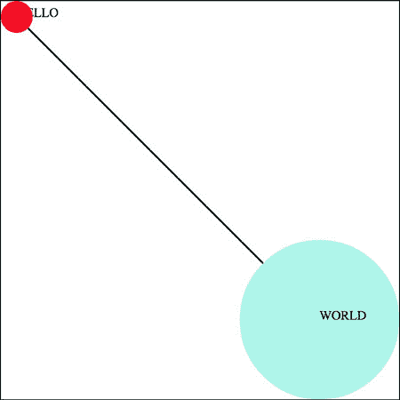

#### 1.6.3\. 与 D3 的对话

使用各种语言编写 Hello World 是一个如此常见的例子，以至于我认为我们应该给世界一个回应的机会。让我们添加之前相同的大的圆圈和小的圆圈，但这次，当我们添加文本时，我们将包括`.style(opacity)`设置，使我们的文本不可见，如下面的列表所示。我们还将为每个文本元素设置`.attr(id)`，以便靠近小圆圈的文本有一个值为`a`的`id`属性，靠近大圆圈的文本有一个值为`b`的`id`属性。

##### 列表 1.11\. 带有 ID 和透明度的 SVG 元素

```
d3.select("svg")
  .append("circle")
  .attr("r", 20)
  .attr("cx",20)
  .attr("cy",20)
  .style("fill","red");
d3.select("svg")
  .append("text")
  .attr("id", "a")
  .attr("x",20)
  .attr("y",20)
  .style("opacity", 0)
  .text("HELLO WORLD");
d3.select("svg")
  .append("circle")
  .attr("r", 100)
  .attr("cx",400)
  .attr("cy",400)
  .style("fill","lightblue");
d3.select("svg")
  .append("text")
  .attr("id", "b")
  .attr("x",400)
  .attr("y",400)
  .style("opacity", 0)
  .text("Uh, hi.");
```

两个圆圈，没有线条，没有文本。现在你使用带有`.delay()`方法的`.transition()`方法使文本出现，你应该有一个类似于图 1.34 中所示的状态。

##### 图 1.34\. 当与延迟相关联时，过渡行为导致在应用属性或样式之前暂停。


```
d3.select("#a").transition().delay(1000).style("opacity", 1);
d3.select("#b").transition().delay(3000).style("opacity", .75);
```

恭喜！你已经制作了你的第一个动态数据可视化。`.transition()`方法表明你不想你的变化是瞬间的。通过将其与`.delay()`方法链接，你表明在实施`.delay()`设置之后链中出现的样式或属性更改之前要等待多少毫秒。

我们将在稍后变得更加雄心勃勃，但在我们完成之前，让我们看看另一个`.transition()`设置。你可以在应用新样式或属性之前设置`.delay()`，但你也可以设置一个`.duration()`，在它上面应用更改。在你的浏览器中，结果应该是将形状移动到图 1.35 中箭头所示的方向。

##### 图 1.35\. 当与位置相关联时，过渡行为使形状在分配的持续时间内图形化地移动到新位置。由于你为两个圆圈使用了相同的 y 位置，第一个圆圈向下移动，第二个圆圈向上移动到设置的 y 位置，即两个圆圈之间。

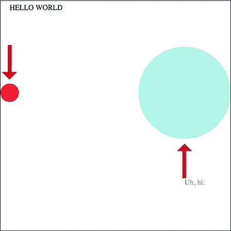

```
d3.selectAll("circle").transition().duration(2000).attr("cy", 200);
```

如你所见，`.duration()`方法调整设置，持续时间为你设置的时长（再次强调，以毫秒为单位）。

这涵盖了 D3 的工作原理及其设计基础，这些基本概念将在接下来的章节中反复出现，你将学习到更多关于表示和操作数据的复杂变体。

### 1.7\. 概述

+   D3 允许你创建几乎任何你在应用程序、报纸或在线看到的数据可视化产品。

+   D3 不仅用于创建最终的图形产品；它还提供了允许你处理数据的函数。要达到更复杂的数据可视化类型，如你在第六章和之后的章节中看到的那样，你必须遵循一系列步骤来获取适合图形显示的数据。

+   理解 DOM、SVG 和 CSS 对于创建复杂的数据可视化产品是必要的。

+   D3 数据绑定允许你根据数据在你的网页上创建和删除元素。它还允许你根据数据更改这些元素的特征——图形或文本内容。

+   不同的数据类型需要不同的方法来操作和可视化它们。你将主要处理的数据类型包括数值、层次结构、拓扑（网络）和文本。

+   D3 内置的过渡功能允许直接进行简单有效的动画。

### 为什么学习 D3？

*— 由华盛顿大学保罗·G·艾伦计算机科学与工程学院副教授杰弗里·希尔撰写，曾是 D3 创作者迈克·博斯托克的斯坦福大学博士导师*

在现有的图表库和商业智能工具如此丰富的情况下，你可能会想：为什么学习 D3？当你最初构建简单的图表和图形时，D3 可能会感觉比较底层和冗长，也许还伴随着一些不熟悉的编程结构！需要牢记的关键点是 *D3 不是一个图表库*（尽管它可以这样使用）。D3 是一个用于构建各种 *定制* 和 *交互式* 网页图形的框架。D3 为创建几乎任何你可以想象的可视化提供了基本构建块。通过学习 D3，你将能够创建针对你的数据和用例定制的交互式网页，而不是试图将你的数据强行塞入更有限的应用程序授权选项中。

学习 D3 还有其他好处。D3 利用 Web 标准，如浏览器文档对象模型 (DOM)、可缩放矢量图形 (SVG) 和层叠样式表 (CSS)。这些技术构成了 D3 学习曲线的一部分，但本身也非常宝贵。因此，学习 D3 可以带来额外的回报，帮助你成为更熟练和经验丰富的网络开发者。D3 还深入可视化设计概念和最佳实践，包括视觉编码、空间布局、动画和色彩设计。学习 D3 的过程可以帮助你开启进入更大可视化世界的旅程，向你介绍术语、技术和示例，帮助你更深入和更有创意地思考信息可视化的技艺。

你应该始终努力选择适合工作的正确工具。在某些情况下，那可能是一个商业智能工具或绘图库（其中许多都是基于 D3 本身构建的）。理想情况下，你选择一个支持快速生成和探索可视化以帮助探索和理解的工具。但在其他情况下，你需要定制设计，这时其他工具的限制迅速变得明显。考虑新颖的视觉设计或交互技术是否可能使与数据的沟通和参与更加有效。你是否寻求构建改进的工具以帮助人们以新的方式探索数据？你是否被要求为你的组织创建独特的视觉风格？你是否希望与一个庞大且支持性的可视化设计师和创新者社区互动？如果是这样，学习 D3 吧！

## 第二章\. 信息可视化数据流

*本章涵盖*

+   从各种格式的外部文件加载数据

+   与 D3 尺度一起工作

+   为分析和显示格式化数据

+   根据数据属性创建具有视觉属性的图形

+   动画和改变图形的外观

玩具示例和在线演示有时以 Java-Script 定义的数组格式呈现数据，就像我们在第一章中做的那样章节 1。但在现实世界中，你的数据将来自 API 或外部文件，在你开始基于这些数据创建网络元素之前，你需要加载、格式化和转换它。本章描述了将数据转换为合适形式的过程，并触及了你在 D3 中会反复使用的基本结构：从外部源加载数据，格式化这些数据，以及创建数据的图形表示，就像你在图 2.1 中看到的那样。

##### 图 2.1\. 本章的示例，包括从第 2.3.3 节的数据绑定工作原理图（左），从第 2.3 节的带有标签的散点图（中），以及我们在第 2.2 节中将要构建的条形图（右）。

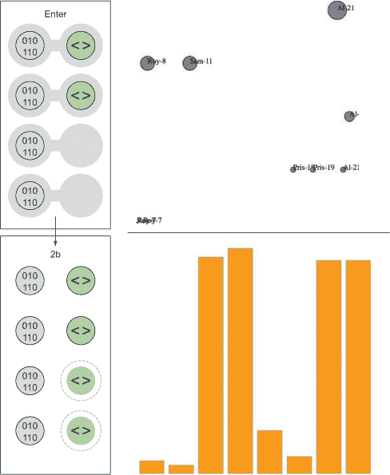

### 2.1\. 与数据工作

本章我们将处理两个小型数据集，并将它们通过一个简化的五步过程(图 2.2)进行简化，这个过程将涉及你需要对数据进行的一切操作，以将其转换为 D3 的数据可视化产品。一个数据集包括几个城市及其地理位置和人口。另一个包含一些虚构的推文，其中包含有关谁创建了它们以及谁对它们做出反应的信息。这类数据你经常遇到。你的任务是找出哪些推文比其他推文更有影响力，或者哪些城市比其他城市更容易遭受自然灾害。在本章中，你将学习如何在 D3 中以多种方式衡量数据，以及如何使用这些方法创建图表。

##### 图 2.2。本章我们将探索的数据可视化过程假设我们从一个数据集开始，并希望创建（并更新）一个交互式或动态的数据可视化。

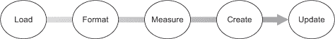

在现实世界中，你将处理更大的数据集，有成百上千个城市和数千条推文，但你将使用本章中概述的相同原则。本章不会教你如何创建复杂的数据可视化，但它会详细解释 D3 中最重要的一些核心过程，这些过程你将需要。

#### 2.1.1. 加载数据

正如我们在第一章中提到的，我们的数据通常以各种但标准化的方式格式化。无论数据的来源如何，它很可能会以 XML、CSV 或 JSON 格式的单文档数据文件格式化。D3 提供了几个用于导入和处理此类数据的函数（如图 2.3 中所示的第一步）。这些格式之间一个核心的区别是它们如何建模数据。JSON 和 XML 提供了以分隔格式（如 CSV）无法实现的方式编码嵌套关系的能力。另一个区别是`d3.csv()`和`d3.json()`生成一个 JSON 对象数组，而`d3.xml()`创建一个需要以不同方式访问的 XML 文档。

##### 图 2.3。创建数据可视化的第一步是获取数据。你可以通过使用 D3 的几个 XHR 函数之一异步加载文件来实现，或者你可以导入或包含数据。如果数据是固定的，那么两种方式都适用，但如果计划用动态 API 调用替换数据源，那么 XHR 请求是最佳方法。

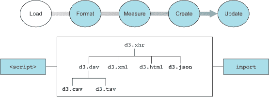

##### 文件格式

D3 有五个通常用于加载数据的函数，对应于你可能会遇到的五种文件类型：`d3.text()`、`d3.xml()`、`d3.json()`、`d3.csv()`和`d3.html()`。这些抽象了类似于 fetch 库的相同 XHR 请求。我们将大部分时间用于处理`d3.csv()`和`d3.json()`。你将在下一章中看到`d3.html()`，我们将使用它来创建作为模板编写的复杂 DOM 元素。你可能发现`d3.xml()`和`d3.text()`更有用，这取决于你通常如何处理数据。你可能更习惯于 XML 而不是 JSON，在这种情况下，你可以依赖`d3.xml()`并相应地格式化你的数据函数。如果你更喜欢处理文本字符串，你可以使用`d3.text()`来拉取数据并使用另一个库或代码进行处理。

`d3.csv()`和`d3.json()`在调用函数时使用相同的格式，通过声明正在加载的文件的路径并定义回调函数：

```
d3.csv("cities.csv", (error,data) => {console.log(error,data)});
```

错误变量是可选的，如果我们只声明一个带有回调函数的单个变量，它将是数据：

```
d3.csv("cities.csv", d => console.log(d));
```

| |
| --- |

**我应该使用 XHR 吗？**

你在 D3 示例中看到的主要模式之一是使用 d3.csv 或 d3.json 将数据引入你的应用程序。但如果你的数据在整个应用程序使用过程中永远不会改变，则不需要异步加载数据。除了依赖 d3.json 或 d3.csv，你同样可以轻松地将数据格式化为 Java-Script 数据，并使用 `<script>` 标签包含它，或者在 Node 或 ES2015 中使用 import/require 导入数据。

这不是非此即彼；你可能有一些数据永远不会改变（例如你用来绘制基本地图的地理数据），而有些数据会改变（你用来改变地图颜色的投票数据）。在这种情况下，你可以包含静态数据，并使用 XHR 来处理动态内容。

| |
| --- |

你首先在回调函数中获取对数据的访问权限，你可能想将数据声明为全局变量，这样你就可以在其他地方使用它。在现实世界中，全局变量是坏习惯，但我们在示例中会使用它们，因为这使跟踪更容易。要开始，你需要一个数据文件。对于本章，我们将使用两个数据文件：一个包含城市数据的 CSV 文件和一个包含推文数据的 JSON 文件，如下所示。

##### 列表 2.1\. cities.csv 文件的内容

```
"label","population","country","x","y"
"San Francisco", 750000,"USA",122,-37
"Fresno", 500000,"USA",119,-36
"Lahore",12500000,"Pakistan",74,31
"Karachi",13000000,"Pakistan",67,24
"Rome",2500000,"Italy",12,41
"Naples",1000000,"Italy",14,40
"Rio",12300000,"Brazil",-43,-22
"Sao Paolo",12300000,"Brazil",-46,-23
```

##### 列表 2.2\. tweets.json 文件的内容

```
{
"tweets": [
{"user": "Al", "content": "I really love seafood.",
   "timestamp": " Mon Dec 23 2013 21:30 GMT-0800 (PST)",
   "retweets": ["Raj","Pris","Roy"], "favorites": ["Sam"]},
{"user": "Al", "content": "I take that back, this doesn't taste so good.",
   "timestamp": "Mon Dec 23 2013 21:55 GMT-0800 (PST)",
   "retweets": ["Roy"], "favorites": []},
{"user": "Al",
   "content": "From now on, I'm only eating cheese sandwiches.",
   "timestamp": "Mon Dec 23 2013 22:22 GMT-0800 (PST)",
   "retweets": [],"favorites": ["Roy","Sam"]},
{"user": "Roy", "content": "Great workout!",
   "timestamp": " Mon Dec 23 2013 7:20 GMT-0800 (PST)",
   "retweets": [],"favorites": []},
{"user": "Roy", "content": "Spectacular oatmeal!",
   "timestamp": " Mon Dec 23 2013 7:23 GMT-0800 (PST)",
   "retweets": [],"favorites": []},
{"user": "Roy", "content": "Amazing traffic!",
   "timestamp": " Mon Dec 23 2013 7:47  GMT-0800 (PST)",
   "retweets": [],"favorites": []},
{"user": "Roy", "content": "Just got a ticket for texting and driving!",
   "timestamp": " Mon Dec 23 2013 8:05 GMT-0800 (PST)",
   "retweets": [],"favorites": ["Sam", "Sally", "Pris"]},
{"user": "Pris", "content": "Going to have some boiled eggs.",
   "timestamp": " Mon Dec 23 2013 18:23 GMT-0800 (PST)",
   "retweets": [],"favorites": ["Sally"]},
{"user": "Pris", "content": "Maybe practice some gymnastics.",
   "timestamp": " Mon Dec 23 2013 19:47  GMT-0800 (PST)",
   "retweets": [],"favorites": ["Sally"]},
{"user": "Sam", "content": "@Roy Let's get lunch",
   "timestamp": " Mon Dec 23 2013 11:05 GMT-0800 (PST)",
   "retweets": ["Pris"], "favorites": ["Sally", "Pris"]}
]
}
```

使用这两个文件，我们可以通过使用适当的函数来加载它们来访问数据：

```
d3.csv("cities.csv", data => console.log(data));
d3.json("tweets.json", data => console.log(data));           *1*
```

+   ***1* 在控制台打印“Object {tweets: Array[10]}”**

在这两种情况下，数据文件都是以 JSON 对象数组的形式加载的。对于 tweets.json，这个数组位于 `data.tweets`，而对于 cities.csv，这个数组是 `data`。函数 `d3.json()` 允许你加载一个 JSON 格式的文件，它可以以 CSV 加载时无法实现的方式包含对象和属性。当你加载 CSV 时，它返回一个对象数组。当你加载 JSON 文件时，它将返回一个包含一个或多个键/值对（称为 *条目*）的对象。在这种情况下，初始化为 `data` 的对象有一个 `tweets` 键，对应一个数据数组。这就是为什么我们在加载 tweets.json 后需要引用 `data.tweets`，而在加载 cities.csv 时直接引用 `data`。

d3.csv 和 d3.json 都是异步的，它们会在打开文件的请求之后返回，而不是在处理文件之后返回。加载文件，这通常是一个比大多数其他函数耗时更长的操作，不会在其他函数被调用之前完成。如果你在数据加载之前调用需要加载数据的函数，那么它们将失败。你可以通过两种方式绕过这种异步行为。你可以在数据加载函数中嵌套操作数据的函数：

```
d3.csv("somefiles.csv", function(data) {doSomethingWithData(data)});
```

或者，您可以使用承诺（我们将在第七章中使用）在加载一个或多个文件完成后触发事件。您将在后面的章节中看到 queue.js 的实际应用。请注意，`d3.csv()`有一个`.parse()`方法，您可以使用它来处理一段文本而不是外部文件。如果您需要更直接地控制获取数据，您应该查阅`d3-request`的文档，它允许对发送和接收数据进行更精细的控制。

#### 2.1.2\. 格式化数据

在您加载数据集后，您需要定义方法，以便数据的属性直接与颜色、大小和位置图形元素的设置相关。如果您想在 CSV 中显示城市，您可能想使用圆圈，根据人口大小圆圈，然后根据它们的地理坐标放置它们。我们在地图上图形表示城市有长期确立的惯例，但对于推文来说则不然。如何使用图形符号来表示单个推文，如何调整大小，以及放置在哪里，都是开放性问题。为了回答这些问题，您需要了解在数据可视化过程中会遇到的数据形式。编程语言和本体定义了多种数据类型，但将它们视为定量、分类、几何、时间、拓扑或原始数据类型是有用的。

您通常需要通过使用`d3.scale`*函数（如`d3.scaleLinear`和`d3.scaleTime`）定义比例，或者通过使用如分位数等技术将定量数据转换为分类数据来格式化定量数据（如图 2.4 中所示的数据可视化创建的第二步），这些在第 2.1.3 节中已有解释。如果您需要更直接地控制获取数据，您应该查阅`d3-request`的文档，它允许对发送和接收数据进行更精细的控制。

##### 图 2.4。在加载数据后，您需要确保数据格式正确，以便可以用于创建图形。这包括将数据映射到屏幕上的位置、表示数量的颜色，或用于视觉上嵌套数据的箱。

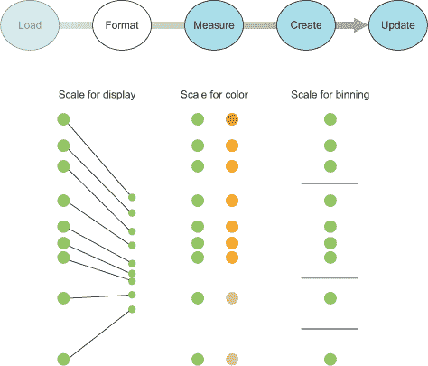

##### 定量数据

数值或定量数据是数据可视化中最常见的类型。定量数据可以用大小、位置或颜色有效地表示。

对于我们的数据集之一，我们有易于访问的定量数据：城市.csv 表中的人口数据。然而，对于推文数据集，似乎我们没有可用的定量数据，这就是为什么我们将在第 2.1.3 节中花费时间来查看如何转换数据。

##### 分类数据

分类数据分为离散的组，通常用文本表示，例如国籍或性别。分类数据通常用形状或颜色来表示。您可以将类别映射到不同的颜色或形状，以识别根据其他属性定位的元素组的模式。

推文数据具有以用户数据形式存在的分类数据，你可以通过直观地考虑按创建推文的用户对推文进行着色来识别它。稍后，我们将讨论推导分类数据的方法。

##### 拓扑

拓扑数据描述了数据之间的一种关系，这也可以是另一种形式的位置数据。两个人之间的家谱关系或商店与火车站的距离都代表了一种定义对象之间关系的方式。拓扑属性可以用引用唯一 ID 值的文本表示，也可以用指向其他对象的指针表示。在本章的后面部分，我们将以嵌套层次结构的形式创建拓扑数据。

对于城市数据，看起来我们没有拓扑数据。然而，我们可以通过指定一个城市，例如旧金山，作为我们的参考框架来轻松地生成它。然后我们可以创建一个到旧金山的距离度量，如果需要的话，这将提供拓扑数据。推文数据中的拓扑组件在`favorites`和`retweets`数组中，这为社交网络提供了基础。

##### 几何

几何数据通常与地理数据的边界和轨迹相关联，例如国家、河流、城市和道路。几何数据也可能是你想要使用的特定图标的 SVG 代码，是形状类别的文本，或者是一个表示形状大小的数值。不出所料，几何数据通常用形状和大小来表示，但也可以像其他数据一样进行转换，例如通过测量面积和周长转换为定量数据。

城市数据具有明显的几何数据，以传统的纬度和经度坐标的形式存在，这使得点可以在地图上定位。另一方面，推文数据没有易于访问的几何数据。

##### 时间

日期和时间可以使用数字表示天数、年份或月份，或者使用特定的日期时间编码来进行更复杂的计算。最常用的格式是 ISO 8601，如果你的数据以字符串形式按这种方式格式化，那么在 JavaScript 中将它转换为日期数据类型就很容易，正如你将在第 2.1.4 节中看到的。你将经常与日期和时间打交道。幸运的是，JavaScript 中的内置函数以及 D3 中的几个辅助函数都可以用来处理难以测量和表示的数据。

虽然城市数据集没有时间数据，但请记住，像城市和国家这样的常见实体的时间数据通常可用。在你可以轻松扩展数据集的情况下，你需要问自己，考虑到你项目的范围，这样做是否有意义。相比之下，推文数据有一个符合 RFC 2822（JavaScript 支持用于表示日期，与 ISO 8601 兼容）的字符串，可以轻松地在 JavaScript 中转换为日期数据类型。

##### 原始

原始、自由或非结构化数据通常是文本和图像内容。原始数据可以通过测量或使用复杂的文本和图像分析来转换，以获得更适合数据可视化的属性。在未经修改的形式下，原始数据用于图形元素的文本字段中，例如在标签或片段中。

城市名称为该数据集提供了方便的标签，但如何为单个推文标记呢？一种方法是将推文的全部内容用作标签，正如我们在第五章中所做的那样，但处理原始数据时，最困难且最重要的任务是提出有效总结和测量的方法。

#### 2.1.3\. 进一步修改数据

当你处理不同形式的数据时，你会改变数据类型以更好地表示它。你可以以多种方式转换数据。在这里，我们将探讨转换、归一化（或缩放）、分箱（或分组）和嵌套数据。

##### 转换：改变数据类型

从编程语言的角度来看，数据转换的行为是指将一种数据类型转换为另一种类型，在这个例子中是 JavaScript。当你加载数据时，它通常以字符串格式存在，即使它是一个日期、整数、浮点数或数组。例如，推文数据中的日期字符串需要从字符串转换为日期数据类型，以便你可以使用 JavaScript 中可用的日期方法。你应该熟悉允许你转换数据的 JavaScript 函数。以下是一些示例：

```
parseInt("77"); +"77";                                 *1*
parseFloat("3.14"); +"3.14"                            *2*
Date.parse("Sun, 22 Dec 2013 08:00:00 GMT");           *3*
text = "alpha,beta,gamma"; text.split(",");            *4*
```

+   ***1* 将字符串 77 转换为没有小数位的数字 77**

+   ***2* 将字符串 3.14 转换为带小数点的数字 3.14**

+   ***3* 将符合 ISO 8601– 或 RFC 2822– 格式的字符串转换为日期数据类型**

+   ***4* 将逗号分隔的字符串拆分为一个数组，这严格来说不是一个转换操作，但改变了数据类型**


##### 注意

JavaScript 在使用 == 测试时默认进行类型转换，而在使用 === 等类似操作时则强制不进行类型转换，因此你会发现你的代码在没有转换的情况下通常可以正常工作。但是，在不默认转换为预期类型的情况下，你可能会遇到一些问题，例如，当你尝试对数组进行排序时，JavaScript 会按字母顺序对数字进行排序。


##### 尺度和缩放

数值数据很少直接对应于屏幕上图形元素的位量和大小。您可以使用 `d3.scale()` 函数来规范化您的数据，以便在屏幕上展示（以及其他事情）。我们将首先查看的刻度是 `d3.scale().linear()`，它在一组数字的范围和另一组数字的范围之间建立直接关系。刻度有一个域设置和一个范围设置，它们接受数组，其中域确定要转换的值范围，范围指的是这些值要转换到的范围。例如，如果您取 cities.csv 中城市的最小人口数和最大人口数，您可以创建一个从最小到最大的渐变，这样您就可以在 500-px 的画布上轻松显示它们之间的差异。在 图 2.5 和随后的代码中，您可以看到从 500,000 到 13,000,000 的相同线性变化率映射到从 0 到 500 的线性变化率。

##### 图 2.5\. D3 中的刻度将一组值（域）映射到另一组值（范围），这种关系由您创建的刻度类型确定。

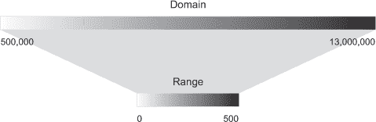

您可以通过实例化一个新的刻度对象并设置其域和范围值来创建这个渐变：

```
var newRamp = d3.scaleLinear().domain([500000,13000000]).range([0, 500]);
newRamp(1000000);                       *1*
newRamp(9000000);                       *2*
newRamp.invert(313);                    *3*
```

+   ***1* 返回 20，允许您将人口为 10,000,000 的国家放置在 20 px**

+   ***2* 返回 340**

+   ***3* 反转函数反转了转换，在这种情况下返回 8325000**

您也可以通过在范围字段中引用 CSS 颜色名称、RGB 颜色或十六进制颜色来创建颜色渐变。这种效果是将颜色带映射到在域中定义的值带上的线性映射，如图 图 2.6 所示。

##### 图 2.6\. 刻度也可以用来将数值映射到颜色带，以便更容易使用颜色刻度表示值。

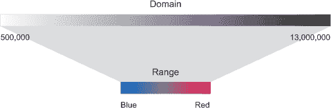

创建这个渐变的代码与之前相同，只是 `range` 数组中颜色的引用不同：

```
var newRamp = d3.scaleLinear().domain([500000,13000000]).range(["blue", "red"]);
newRamp(1000000);                                 *1*
newRamp(9000000);                                 *2*
newRamp.invert("#ad0052");                        *3*
```

+   ***1* 返回 “#0a00f5”，允许您绘制一个人口为 1,000,000 的城市为深紫色**

+   ***2* 返回 “#ad0052”**

+   ***3* 反转函数仅适用于数值范围，因此在这种情况下反转返回 NaN**

您还可以使用 `d3.scaleLog()`、`d3.scalePow()`、`d3.scaleOrdinal()` 以及其他不太常见的刻度来映射数据，在这些刻度更适合您的数据集时。您将在本书后面的部分看到这些刻度的实际应用，当我们处理这些类型的数据集时。最后，`d3.scaleTime()` 提供了一个线性刻度，它设计用来处理日期数据类型，您将在本章后面的部分看到这一点。

##### 分箱：数据分类

将定量数据分类到类别中，将值放置在范围或“箱”中以将它们分组在一起是有用的。一种方法是使用分位数，通过将数组分割成等大小的部分。D3 中的分位数刻度不出所料地被称为`d3.scaleQuantile()`，并且它具有与其他刻度相同的设置。部分的数目及其标签由`.range()`设置确定。与其它刻度不同，如果分位数刻度中`.domain()`值的数目与`.range()`值的数目不匹配，它不会给出错误，因为它会自动将域中的值排序并分箱到范围中的更少数值。

该刻度将`.domain()`中的数字数组从小到大排序，并自动在适当的位置分割值以创建必要的类别。任何传递给分位数刻度函数的数字都会根据这些断点返回集合中的一个类别：

```
var sampleArray = [423,124,66,424,58,10,900,44,1];
var qScale = d3.scaleQuantile().domain(sampleArray).range([0,1,2]);
qScale(423);                                                        *1*
qScale(20);                                                         *2*
qScale(10000);                                                      *3*
```

+   ***1* 返回 2**

+   ***2* 返回 0**

+   ***3* 返回 2**

注意到图 2.7 中的范围值是固定的，可以接受可能与特定 CSS 类、颜色或其他任意值相对应的文本。

##### 图 2.7\. 分位数刻度接受一系列值，并将它们重新分配到一组等大小的箱中。

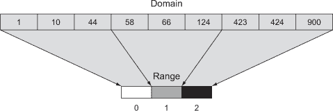

```
var qScaleName =
d3.scaleQuantile()
   .domain(sampleArray).range(["small","medium","large"]);
qScaleName (68);                                             *1*
qScaleName (20);                                             *2*
qScaleName (10000);                                          *3*
```

+   ***1* 返回“medium**

+   ***2* 返回“small”**

+   ***3* 返回“large”**

##### 嵌套

数据的分层表示很有用，并不限于具有更传统或显式层次结构的数据，例如父母及其子女的数据集。我们将在第四章和第五章中更详细地探讨分层数据和表示，但在这章中，我们将使用 D3 的嵌套函数，你可能猜到它被称作`d3.nest()`。

嵌套背后的概念是，可以使用数据的共享属性将它们排序到离散的类别和子类别中。例如，如果我们想按创建推文的用户分组推文，那么我们会使用嵌套：

```
d3.json("tweets.json", data => {
  var tweetData = data.tweets;
  var nestedTweets = d3.nest()
    .key(d => d.user)
    .entries(tweetData);
});
```

这个嵌套函数将推文组合成由唯一的`user`属性值标记的新对象的数组，如图 2.8 所示。

##### 图 2.8\. 将对象嵌套到新数组中，这些对象现在成为新创建的对象的值数组的子元素，这些新创建的对象有一个键属性被设置为`d3.nest.key`函数中使用的值。

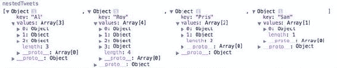

现在我们已经加载了数据并将其转换成可访问的类型，我们将通过测量数据（如图 2.9 中显示的第三步）来研究这些数据的模式。

##### 图 2.9\. 在格式化你的数据后，你需要测量它以确保你创建的图形根据数据集的参数适当地大小和定位。你将经常使用`d3.extent`、`d3.min`、`d3.mean`和`d3.max`。

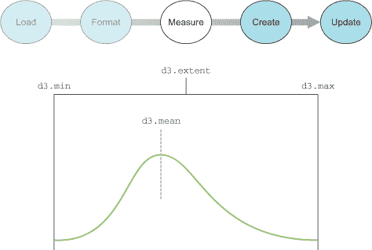

#### 2.1.4\. 测量数据

在加载您的数据数组后，您应该做的第一件事之一就是测量和排序它。了解特定属性的值分布、最小和最大值以及属性名称非常重要。D3 提供了一套数组函数，可以帮助您理解您的数据。

您将始终拥有包含数据的数组，您希望根据属性相对于数组中值分布的相对值来调整大小和位置。因此，您应该熟悉在 D3 中确定数组中值分布的方法。您将首先处理一个数字数组，然后再看到这些函数在更复杂、数据更丰富的 JSON 对象数组中的操作：

```
var testArray =  [88,10000,1,75,12,35];
```

几乎所有的 D3 测量函数都遵循相同的模式。首先，您需要指定数组以及一个访问器函数来获取您想要测量的值。在我们的例子中，我们正在处理一个数字数组而不是对象数组，因此访问器只需要指向元素本身：

```
   d3.min(testArray, el => el);                *1*
   d3.max(testArray, el => el);                *2*
   d3.mean(testArray, el => el);               *3*
```

+   ***1* 返回数组中的最小值，1**

+   ***2* 返回数组中的最大值，10000**

+   ***3* 返回数组中值的平均值，1701.8333333333335**

如果您处理的是一个更复杂的 JSON 对象数组，您需要指定您想要测量的属性。例如，如果我们正在处理来自 cities.csv 的 JSON 对象数组，我们可能想要推导出最小、最大和平均人口：

```
d3.csv("cities.csv", data => {
d3.min(data, el => +el.population);            *1*
d3.max(data, el => +el.population);            *2*
d3.mean(data, el => +el.population);           *3*
});
```

+   ***1* 返回数组中每个对象的属性的最小值，500000**

+   ***2* 返回数组中每个对象的属性的最大值，1300000**

+   ***3* 返回数组中每个对象的属性的平均值，6856250**

最后，由于处理最小值和最大值是常见的操作，`d3.extent()`方便地以一个两部分的数组返回`d3.min()`和`d3.max()`：

```
d3.extent(data, el => +el.population);         *1*
```

+   ***1* 返回 [500000, 1300000]**

您还可以使用 JavaScript 的`.length()`函数来测量非数值数据，如文本。当处理拓扑数据时，您需要更健壮的机制来测量网络结构，例如中心性和聚类。当处理几何数据时，您可以数学地计算形状的面积和周长，对于复杂的形状来说这可能相当困难。

现在我们已经加载、格式化和测量了我们的数据，我们可以创建数据可视化。这需要我们使用选择以及与之相关的函数，我们将在下一节中更详细地探讨。

### 2.2\. 数据绑定

我们在第一章中提到了数据绑定，但在这里我们将更详细地介绍它，解释选择如何与数据绑定一起创建元素（如图 2.10 中所示的第四步）以及创建元素后如何更改这些元素。我们的第一个例子使用了 cities.csv 中的数据。之后，我们将使用这些数据以及简单的数值数组来展示这个过程，稍后我们还会用 tweets 数据做一些更有趣的事情。

##### 图 2.10\. 在 D3 中创建图形时，您使用选择将数据绑定到 DOM 元素。

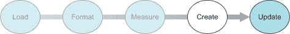

#### 2.2.1\. 选择和绑定

您可以使用选择来使用 D3 更改网页的结构和外观。请记住，选择由 DOM 中的一个或多个元素以及与之关联的任何数据组成。您还可以使用选择创建或删除元素，并更改样式和内容。您已经看到了如何使用`d3.select()`来更改 DOM 元素，现在我们将专注于根据数据创建和删除元素。对于这个例子，我们将使用 cities.csv 作为数据源。其中包含了我住过或一直想去参观的所有城市，以及弗雷斯诺。稍后我们将把这些城市放在地图上，但现在我们将使用它们作为非地图数据。首先，我们需要加载 cities.csv 并在回调中触发我们的数据可视化函数，使用以下代码在页面上创建一组新的`<div>`元素，结果如图 2.11 所示。

##### 图 2.11\. 当我们的选择将 cities.csv 数据绑定到我们的网页上时，它创建了八个新的<div>元素，每个元素都被标记为`"cities"`类，并且内容来自我们的数据。

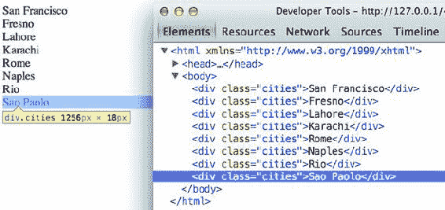

```
d3.csv("cities.csv", (error,data) => {
   if (error) {
   console.error(error)
   }
   else {
   dataViz(data)
   }
   });
function dataViz(incomingData) {
  d3.select("body").selectAll("div.cities")            *1*
    .data(incomingData)                                *2*
    .enter()                                           *3*
    .append("div")                                     *4*
    .attr("class","cities")                            *5*
    .html(d => d.label);                               *6*
}
```

+   ***1* 空选择，因为<body>中没有具有“cities”类的<div>元素**

+   ***2* 将数据绑定到您的选择**

+   ***3* 定义当选择中的数据多于 DOM 元素时如何响应**

+   ***4* 在当前选择中创建一个元素**

+   ***5* 设置每个新创建的元素的类**

+   ***6* 设置创建的<div>的内容**

这里所示的选择和绑定过程是本书其余部分中常见的模式。当您首先选择一个元素，然后选择其下方的元素时，就会创建一个子选择，您将在后面更详细地看到。首先，让我们看看这个例子中的每个单独部分。参见图 2.11。

##### d3.selectAll()

任何选择的第一个部分是 `d3.select()` 或 `d3.selectAll()`，后面跟着一个与 DOM 的一部分相对应的 CSS 标识符。通常没有元素匹配该标识符，这被称为 *空选择*，因为你想使用 `.enter()` 函数在页面上创建新元素。你可以对一个选择进行选择，以指定如何创建和修改特定 DOM 元素的子元素。请注意，子选择不会自动生成父元素。父元素必须已经存在，或者你需要使用 `.append()` 创建一个。

##### data()

在这里，你将一个数组与所选的 DOM 元素关联起来。我们数据集中的每个城市都与选择中的一个 DOM 元素相关联，相关数据存储在元素的 `data` 属性中。我们可以像这样使用 Java-Script 手动访问这些值：

```
document.getElementsByClassName("cities")[0].__data__         *1*
```

+   ***1* 返回代表旧金山的对象指针**

在本章的后面部分，我们将使用 D3 以更复杂的方式处理这些值。

##### enter() 和 .exit()

当将数据绑定到选择时，DOM 元素的数目要么多于、少于，要么等于数据值的数目。当你选择中的数据值多于 DOM 元素时，你会触发 `.enter()` 函数，这允许你为每个没有对应 DOM 元素的选择值定义行为。在我们的例子中，`.enter()` 会触发八次，因为没有 DOM 元素对应于 `"div.cities"`，而我们的 `incomingData` 数组包含八个值。当数据元素较少时，则会触发 `.exit()` 行为，而当选择中的数据值和 DOM 元素数量相等时，则既不会触发 `.exit()` 也不会触发 `.enter()`。你会注意到我之前没有使用 `.exit()`。那是因为我知道数据元素不会少于 DOM 元素。在一个你知道不会处理 `.exit()` 的应用程序中，你不需要为它编写行为。

当初开始使用 D3 时，enter() 和 exit() 经常会让人感到困惑，但当你对 DOM 当前状态和数据绑定进行差异比较，并根据结果创建或删除元素的模式在现代模型-视图-控制器 (MVC) 框架中普遍应用时，这种模式就变得清晰了。区别在于，当你使用像 React 这样的东西时，它会更多地抽象化，因此你不需要为 enter、exit 和 update 编写单独的逻辑。

##### append() 和 .insert()

当数据值多于 DOM 元素时，你几乎总是想要向 DOM 中添加元素。`.append()`函数允许你添加更多元素并定义要添加哪些元素。在我们的例子中，我们添加了`<div>`元素，但在本章的后面部分，我们将添加 SVG 形状，在其他章节中，我们将添加表格、按钮以及其他任何 HTML 支持的元素类型。`.insert()`函数是`.append()`的姐妹函数，但`.insert()`让你能够控制新元素在 DOM 中的位置。你还可以直接在选择上执行 append 或 insert 操作，这将为你的选择中的每个 DOM 元素添加一个指定类型的 DOM 元素。

##### attr()

你熟悉使用 D3 语法更改样式和属性。唯一需要注意的是，你在这里定义的每个函数都将应用于添加到页面上的每个新元素。在我们的例子中，我们创建的八个新`<div>`元素都将带有`class="cities"`。记住，尽管我们的选择引用了`"div.cities"`，我们仍然必须手动声明我们正在创建`<div>`元素，并且还要手动设置它们的类为`"cities"`。

##### html()

对于传统的 DOM 元素，你使用`.html()`函数设置内容。在下一节中，你将看到如何根据绑定到特定 DOM 元素的数据设置内容。

#### 2.2.2\. 使用内联函数访问数据

如果你运行了前面的示例代码，你会看到每个`<div>`元素都被设置了不同的内容，这些内容是从你绑定到选择的数据数组中派生出来的。你是通过在选择的匿名函数中这样做来实现的，该函数自动提供对两个对图形表示数据至关重要的变量：数据值本身和数据在数组中的位置。在大多数示例中，这些被表示为`d`（数据）和`i`（数组索引），但它们可以使用任何可用的变量名声明。

要看到这个功能在实际中的应用，最好的方法是使用我们的数据创建一个简单的数据可视化。我们将继续使用`d3ia.html`，这是我们第一章中创建的，它是一个具有最小 DOM 元素和样式的简单 HTML 页面。直方图或条形图是表达按类别分解的数值数据最简单和最有效的方法之一。我们现在将避免更复杂的数据集，并从一个简单的数字数组开始：

```
[15, 50, 22, 8, 100, 10]
```

如果我们将这个数组绑定到一个选择上，我们就可以使用这些值来确定矩形的高度（条形图中的条）。我们需要根据图表可用的空间设置宽度，并且我们首先将其设置为 10 像素：

```
d3.select("svg")
  .selectAll("rect")
  .data([15, 50, 22, 8, 100, 10])
  .enter()
  .append("rect")
  .attr("width", 10)                      *1*
  .attr("height", d => d);                *2*
```

+   ***1* 将矩形宽度设置为固定值**

+   ***2* 将高度设置为与每个元素关联的数据值相等**

当我们在 2.2.1 节中使用数组的标签值创建带有标签的`<div>`内容时，我们指向对象的`label`属性。在这里，因为我们处理的是一个数字字面量的数组，我们使用内联函数直接指向数组中的值以确定矩形的长度。如图 2.12 所示，结果并不像你预期的那样有趣。

##### 图 2.12\. SVG 中任何形状的默认设置是黑色填充且没有描边，这使得很难判断形状是否重叠。


所有矩形都相互重叠——它们有相同的默认 x 和 y 位置。通过调整它们的透明度样式，如图 2.13 所示，绘制更容易看到。

##### 图 2.13\. 通过改变不透明度设置，你可以看到重叠的矩形。


```
d3.select("svg")
  .selectAll("rect")
  .data([15, 50, 22, 8, 100, 10])
  .enter()
  .append("rect")
  .attr("width", 10)
  .attr("height", d => d)
  .style("opacity", .25);
```

你可能会对内联函数中第二个变量的实际用途感到好奇，通常表示为`i`。数组中数据值的数组位置的一个用途是放置视觉元素。如果我们根据矩形的`i`值（乘以矩形的宽度）设置每个矩形的 x 位置，那么我们就更接近于一个柱状图：

```
...
.style("opacity", .25)
  .attr("x", (d,i) => i * 10);
```

我们的直方图看起来是从上到下绘制的，如图 2.14 所示，因为 SVG 从我们指定的 0,0 点向下和向右绘制矩形。为了调整这一点，我们需要移动每个矩形，使其 y 位置对应于基于其高度的偏移位置。我们知道最高的矩形将是 100。y 位置是根据从画布左上角起测量的距离来测量的，所以如果我们将每个矩形的`y`属性设置为 100 减去其长度，那么直方图就会以我们预期的样子绘制，如图 2.15 所示。现在矩形不再重叠，它们看起来也是浅灰色——它们的默认黑色填充带有 75%的不透明度。我们将失去不透明度，并添加填充和描边颜色以区分它们。

##### 图 2.14\. SVG 矩形是从上到下绘制的。


##### 图 2.15\. 当我们将矩形的 y 位置设置为所需的 y 位置减去矩形的长度时，矩形从该 y 位置从下到上绘制。

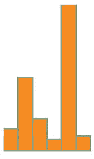

```
...
  .attr("height", d => d)
  .style("fill", "#FE9922")
  .style("stroke", "#9A8B7A")
  .style("stroke-width", "1px")
  .attr("x", (d,i) => i * 10)
  .attr("y", d => 100 - d);
```

#### 2.2.3\. 集成刻度

如果你处理的是一个直接对应于你的`<svg>`元素高度和宽度的矩形高度的值数组，这种构建图表的方式效果很好。但是，如果你有真实数据，它往往具有广泛不同的值，这些值并不直接对应于你想要绘制的形状的大小。比如说，你需要显示一些商业账户的社交媒体粉丝数量。其中一些是技术账户，只有少数几个粉丝，而其他则是面向公众的账户，有数千个粉丝。之前的代码没有处理这样的值数组：

```
[14, 68, 24500, 430, 19, 1000, 5555]
```

你可以在图 2.16 中看到它工作得有多糟糕。

##### 图 2.16\. SVG 形状将继续在屏幕外绘制。

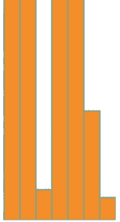

```
...
  .selectAll("rect")
  .data([14, 68, 24500, 430, 19, 1000, 5555])
  .enter()
 ...
```

如果你将 y 偏移设置为最大值，效果也不会更好：

```
...
  .selectAll("rect")
  .data([14, 68, 24500, 430, 19, 1000, 5555])
  .enter()
  .append("rect")
  .attr("y", d => 24500 - d)
...
```

没有必要麻烦截图。它是在画布上垂直运行的单一柱状条。在这种情况下，最好使用 D3 的缩放函数来归一化显示值。我们将使用相对简单的`d3.scaleLinear()`来绘制这个柱状图。D3 缩放有两个主要功能：`.domain()`和`.range()`，它们都期望数组，并且必须有相同长度的数组才能得到正确的结果。`.domain()`中的数组表示映射到`.range()`的值序列，这在实践中会更有意义。首先，我们为 y 轴创建一个刻度：

```
var yScale = d3.scaleLinear().domain([0,24500]).range([0,100]);
yScale(0);                                                       *1*
yScale(100);                                                     *2*
yScale(24000);                                                   *3*
```

+   ***1* 返回 0**

+   ***2* 返回 0.40816326530612246**

+   ***3* 返回 97.95918367346938**

如您所见，`yScale`现在允许我们以适合显示的方式映射值。如果我们使用`yScale`来确定矩形的高度和 y 位置，我们最终得到一个更易读的柱状图，如图 2.17 所示。

##### 图 2.17\. 使用线性刻度绘制的柱状图

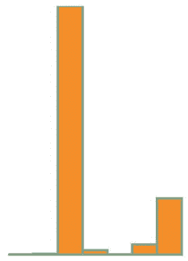

```
var yScale = d3.scaleLinear() .domain([0,24500]).range([0,100]);
...
  .attr("width", 10)
  .attr("height", d => yScale(d))
  .attr("y", d => 100 - yScale(d));
  .style("fill", "#FE9922")
...
```

当你处理这样广泛不同的值时，使用多线性刻度通常更有意义。多线性刻度是一种在定义域和值域中有多个点的线性刻度。假设对于我们的数据集，我们特别关注 1 到 100 之间的值，同时认识到有时我们会在 100 到 1000 之间得到有趣的价值，偶尔我们还会得到相当大的异常值。我们可以用以下方式在多线性刻度上表示：

```
var yScale = d3.scaleLinear().domain([0,100,1000,24500]).range([0,50,75,100]);
```

之前的绘制代码使用这个刻度生成了一个不同的图表，如图 2.18 所示。

##### 图 2.18\. 使用多线性刻度绘制的与图 2.17 相同的柱状图

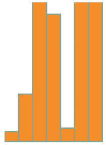

可能存在一个截止值，在此之后，表达数据点的规模就不那么重要了。例如，假设这些数据点代表调查的回复数量，如果收到超过 500 个回复则被视为成功。我们可能只想显示 0 到 500 之间的数据值范围，同时使用这样的刻度强调 0 到 100 级别的变化：

```
var yScale = d3.scaleLinear().domain([0,100,500]).range([0,50,100]);
```

你可能认为这足以绘制一个新的图表，将条形的高度限制在 100 以内，如果数据点的值超过 500。但这并不是 D3 中刻度的默认行为。在图 2.19 中，你可以看到使用该刻度运行绘图代码会发生什么。

##### 图 2.19。使用线性刻度的条形图，其中域的最大值低于数据集的最大值

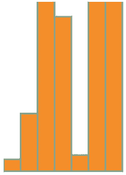

注意，矩形仍然绘制在画布上方，正如四个值超过 500 的矩形顶部没有边框所证明的那样。我们可以通过将一个大于 500 的值放入我们创建的刻度函数中来确认这一点：

```
yScale(1000);           *1*
```

+   ***1* 返回 162.5**

默认情况下，D3 刻度会继续外推大于最大域值和小于最小域值的值。如果我们想让它将这些值设置为最大（对于大于）或最小（对于小于）的范围值，我们需要使用`.clamp()`函数：

```
var yScale = d3.scaleLinear()
               .domain([0,100,500])
               .range([0,50,100])
               .clamp(true);
```

现在运行绘图代码会生成高度和位置最大值为 100 的矩形，如图 2.20 所示。figure 2.20。

##### 图 2.20。使用`clamp()`函数设置为`true`时，绘制数据集中大于域最大值的条形图

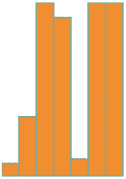

我们可以通过将一个大于 500 的值插入`yScale()`来确认这一点：

```
yScale(1000);           *1*
```

+   ***1* 返回 100**

尺度函数是确定数据可视化中元素位置、大小和颜色的关键。正如你将在本章后面和整本书中看到的那样，这是在 D3 中使用刻度的基本过程。

### 2.3. 数据呈现风格、属性和内容

我们终于可以开始可视化真实数据，而不仅仅是像我们迄今为止所使用的那样未区分的数组了。首先，我们将查看那些美丽的城市（以及弗雷斯诺）的大小，以及如何通过测量推文数据中的推文数量来衡量我们的社交媒体成功，结合本章和第一章（chapter 1）中学到的技术。之后，我们将处理更复杂的方法，以在简单的数据可视化中表示推文数据。在这个过程中，你将学习如何根据绑定到元素的数据设置样式和属性，并探索 D3 如何根据数据的变化创建、删除和更改元素。

#### 2.3.1. 从加载的数据进行可视化

基于 cities.csv 数据的条形图很简单，只需要一个基于最大人口值的刻度，我们可以使用`d3.max()`来确定，如下所示。这个条形图（如图 2.21 所示）展示了我们数据集中城市人口规模的分布。

##### 图 2.21。使用域设置中的最大人口属性值绘制的 cities.csv 数据条形图

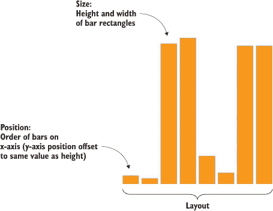

##### 列表 2.3\. 加载数据，转换它，测量它，并以条形图显示它

```
d3.csv("cities.csv",(error, data) => {dataViz(data)});
function dataViz(incomingData) {
 var maxPopulation = d3.max(incomingData, d => parseInt(d.population))     *1*
 var yScale = d3.scaleLinear().domain([0,maxPopulation]).range([0,460]);
 d3.select("svg").attr("style","height: 480px; width: 600px;");
 d3.select("svg")
   .selectAll("rect")
   .data(incomingData)
   .enter()
   .append("rect")
   .attr("width", 50)
   .attr("height", d => yScale(parseInt(d.population)))
   .attr("x", (d,i) => i * 60)
   .attr("y", d => 480 - yScale(parseInt(d.population)))
   .style("fill", "#FE9922")
   .style("stroke", "#9A8B7A")
   .style("stroke-width", "1px")
}
```

+   ***1* 将人口值转换为整数**

从 Twitter 数据中创建条形图需要更多的转换。如图代码列表 2.4 所示，我们使用`d3.nest()`来收集由发布者创建的推文，然后使用该数组的长度来创建推文数量的条形图（如图 2.22 所示，已标注）。

##### 图 2.22\. 通过嵌套数据和计算嵌套的对象数量，我们可以从层次数据中创建条形图。


##### 列表 2.4\. 加载、嵌套、测量和表示数据

```
d3.json("tweets.json",(error, data) => {dataViz(data.tweets)});         *1*
function dataViz(incomingData) {
var nestedTweets = d3.nest()
  .key(d => d.user)
  .entries(incomingData);

nestedTweets.forEach(d => {
  d.numTweets = d.values.length;                                        *2*
})
var maxTweets = d3.max(nestedTweets, d => d.numTweets);
var yScale = d3.scaleLinear().domain([0,maxTweets]).range([0,500]);
d3.select("svg")
  .selectAll("rect")
  .data(nestedTweets)
  .enter()
  .append("rect")
  .attr("width", 50)
  .attr("height", d => yScale(d.numTweets))
  .attr("x", (d,i) => i * 60)
  .attr("y", d => 500 - yScale(d.numTweets))
  .style("fill", "#FE9922")
  .style("stroke", "#9A8B7A")
  .style("stroke-width", "1px");
}
```

+   ***1* 指定 data.tweets，其中你的数据数组所在**

+   ***2* 基于推文数量创建新的属性**

#### 2.3.2\. 设置通道

到目前为止，我们只使用矩形的高度来对应数据点，在处理单一量化数据的情况下，这已经足够了。这就是为什么条形图在电子表格应用中如此受欢迎。但大多数时候，你会使用多元数据，例如县的人口普查数据或患者的医疗数据。

*多元变量*是另一种说法，即每个数据点具有多个数据特征。例如，你的医疗历史不是一个介于 0 到 100 之间的单一分数。相反，它由多个衡量标准组成，解释了你的健康的不同方面。在具有类似多元数据的情况下，你需要开发技术来表示同一形状中的多个数据点。形状视觉表达数据的术语是*通道*，并且根据你处理的数据，不同的通道更适合图形化地表达数据。 


**信息可视化术语：通道**

当你使用图形表示数据时，你需要考虑最佳的视觉方法来表示你正在处理的数据类型。每个图形对象，以及整个显示，都可以分解为传达视觉信息的组件通道。这些通道，如高度、宽度、面积、颜色、位置和形状，特别适合表示不同类别的信息。例如，如果你通过改变圆的大小来表示大小，并且如果创建半径和大小之间的直接对应关系，那么你的读者会感到困惑，因为我们倾向于识别圆的面积而不是其半径。通道也存在于多个级别，并且一些技术使用色调、饱和度和值来表示三块不同的信息，而不是更通用地使用颜色。

这里重要的是避免使用过多的通道，而是专注于使用最适合你数据的通道。例如，如果你没有改变形状，比如你使用的是所有形状都是矩形的条形图，那么你可以使用颜色来表示类别和值（亮度）以表示大小。


回到 tweets.json 数据，可能看起来没有多少数据可以放在图表上，但根据我们想要测量和显示的因素，我们可以采取几种不同的方法。让我们想象我们想要测量推文的影响因子，将点赞或转发的推文视为比未点赞或未转发的推文更重要。这次，我们不会创建条形图，而是创建散点图，并且不是使用数组位置来沿 x 轴放置它，而是使用时间，因为有很好的证据表明在特定时间发布的推文更有可能被点赞或转发。我们将使用基于我们推文集最大影响因子的刻度沿 y 轴放置每个推文。从现在开始，我们将关注以下列表中的 `dataViz()` 函数，因为现在你应该熟悉如何将数据输入并发送到这样的函数。

##### 列表 2.5\. 创建散点图

```
function dataViz(incomingData) {
incomingData.forEach(d => {
  d.impact = d.favorites.length + d.retweets.length;                     *1*
  d.tweetTime = new Date(d.timestamp);                                   *2*
})
var maxImpact = d3.max(incomingData, d => d.impact);
var startEnd = d3.extent(incomingData, d => d.tweetTime);                *3*
var timeRamp = d3.scaleTime().domain(startEnd).range([20,480]);          *4*
var yScale = d3.scaleLinear().domain([0,maxImpact]).range([0,460]);
var radiusScale = d3.scaleLinear()
                    .domain([0,maxImpact]).range([1,20]);
var colorScale = d3.scaleLinear()
                   .domain([0,maxImpact]).range(["white","#75739F"]);    *5*
d3.select("svg")
  .selectAll("circle")
  .data(incomingData)
  .enter()
  .append("circle")
  .attr("r", d => radiusScale(d.impact))                                 *6*
  .attr("cx", d => timeRamp(d.tweetTime))
  .attr("cy", d => 480 - yScale(d.impact))
  .style("fill", d => colorScale(d.impact))
  .style("stroke", "black")
  .style("stroke-width", "1px");
};
```

+   ***1* 通过汇总点赞和转发的次数创建影响分数**

+   ***2* 将 ISO 8906–compliant 字符串转换为日期数据类型**

+   ***3* 返回刻度的最早和最晚时间**

+   ***4* startEnd 是一个数组**

+   ***5* 建立一个将影响映射到从白色到深红色的斜坡的刻度**

+   ***6* 大小、颜色和垂直位置都将基于影响**

如 图 2.23 所示，每个推文根据影响垂直定位，根据时间水平定位。每个推文的大小也根据影响确定，并根据影响以更深的红色着色。稍后，我们将想要使用颜色、大小和位置来表示数据的不同属性，但到目前为止，我们将大多数属性与影响联系起来。

##### 图 2.23\. 推文以圆圈表示，圆圈大小根据总的点赞和转发次数确定，并在画布上根据推文的时间沿 x 轴放置，根据与圆圈大小相同的相同影响因子沿 y 轴放置。两个影响因子相同且几乎同时发布的推文在左下角重叠显示。


#### 2.3.3\. 输入、更新、合并和退出

你已经多次使用了选择集的 `.enter()` 行为。现在让我们更仔细地看看它及其对应的行为 `.exit()`。这两个函数在绑定到选择集的数据值数量与选择集中的 DOM 元素数量不匹配时操作。如果数据值多于 DOM 元素，则 `.enter()` 触发，而如果数据值少于 DOM 元素，则 `.exit()` 触发，如图 2.24 所示。你使用 `selection.enter()` 来定义你希望根据你正在处理的数据创建新元素的方式，并使用 `selection.exit()` 来定义当与它们对应的数据被删除时，你希望如何从选择集中删除现有元素。正如你将在下一个示例中看到的，更新数据是通过重新应用你用于根据数据创建图形元素的函数来完成的。

##### 图 2.24\. 当 DOM 元素的数目和数组中的值数目不匹配时，将触发一个 `.enter()` 事件或一个 `.exit()` 事件，具体取决于数据值是否多于或少于 DOM 元素。相比之下，更新不是一个函数，它仅仅指的是你更新绑定到元素的数据时的情况。


每个 `.enter()` 或 `.exit()` 事件都可以包括对子元素采取的操作。这主要用于 `.enter()` 事件，其中你使用 `.append()` 函数添加新元素。如果你将这个新附加的元素声明为变量，并且如果该元素可以包含子元素，就像 `<g>` 元素一样，你可以包含任意数量的子元素。在 SVG 元素的情况下，只有 `<svg>`、`<g>` 和 `<text>` 可以有子元素，但如果你使用 D3 与传统 DOM 操作一起使用，你可以使用这种方法将 `<p>` 元素添加到 `<div>` 元素中等。

例如，假设我们想要根据我们新测量的影响分数显示一个条形图，并且我们希望条形图上的条形有标签。我们需要将 `<g>` 元素附加到我们初始选择集中的 `<svg>` 画布上，而不是形状。因为数据绑定到这些元素上，所以当我们添加子元素时，我们可以使用相同的语法。因为我们使用的是 `<g>` 元素，所以我们需要使用 `transform` 属性来设置位置。我们使用 `.append()` 函数添加子元素，并且需要将返回的选择集声明为变量 `tweetG`。这使得 `tweetG` 可以代表 `d3.select("svg").selectAll("g")`，这样我们就不必在整个示例中重新输入它。以下列表使用与上一个示例相同的比例来确定大小和位置。

##### 列表 2.6\. 在 `<g>` 元素上创建标签

```
var tweetG = d3.select("svg")
  .selectAll("g")
  .data(incomingData)
  .enter()
  .append("g")
  .attr("transform", d =>
  "translate(" +
    timeRamp(d.tweetTime) + "," + (480 - yScale(d.impact))          *1*
    + ")"
  );
tweetG.append("circle")
  .attr("r", d => radiusScale(d.impact))
  .style("fill", "#75739F")
  .style("stroke", "black")
  .style("stroke-width", "1px");
tweetG.append("text")
  .text(d => d.user + "-" + d.tweetTime.getHours());                *2*
```

+   ***1* <g> 需要一个转换，它需要一个构造的字符串***

+   ***1* 使用 .getHours() 使标签更易读***

在 图 2.25 中，你可以看到我们代码的结果，以及一些注释。相同位置上的相同圆圈表明 `translate` 与更改圆圈的 cx 和 cy 类似，但现在我们可以添加其他 SVG 元素，如 `<text>` 用于标签。

##### 图 2.25。每条推文都是一个带有圆圈和标签的 `<g>` 元素。Roy 在早上 7 点发的各种推文彼此之间非常接近，以至于很难为它们标记。


底左边的标签难以辨认，但其余部分也好不到哪里去。稍后，你将学会如何制作更好的标签。内联函数，例如 `.text(d => d.user + "-" + d.tweetTime.getHours())`，将标签设置为发推者的名字，后面跟着一个连字符，然后是推文的时刻。这些函数都引用了相同的数据元素，因为子元素继承了父元素的数据函数。如果你的数据元素是一个数组，你可能认为你可以将其绑定到子元素的选取上，你会是对的。你将在下一章以及本书的后续部分看到这一点。

##### 退出

与 `.append()` 函数相对应的是，在 `.exit()` 中可用的 `.remove()` 函数。要看到 `.exit()` 的实际应用，你需要有一些 DOM 元素，这些元素可能已经存在，这取决于你在 HTML 中放入了什么，或者可能是通过 D3 添加的。让我们继续使用前一段代码创建的状态，这为我们提供了充足的机会来测试 `.exit()` 函数。如果我们不调用必要的 `.style()` 和 `.attr()` 函数，那么如果我们对数组进行更改，DOM 元素的样式和属性不会更新。如果我们把任何数组绑定到 DOM 中的现有 `<g>` 元素上，那么我们可以使用 `.exit()` 来移除它们：

```
d3.selectAll("g").data([1,2,3,4]).exit().remove();
```

这段代码删除了我们除四个 `<g>` 元素之外的所有元素，因为我们数组中只有四个值。在大多数关于 D3 的 `.enter()` 和 `.exit()` 行为的解释中，你不会看到将完全不同的数组绑定到选取上的这种绑定。相反，你将看到在经过过滤以表示用户交互或其他行为的变化后，对初始数据数组的重新绑定。你将在接下来的例子中看到这一点，以及本书的整个过程中。但了解你的数据、你的选取和你的 DOM 元素之间的区别是很重要的。绑定到我们的 DOM 元素上的数据已被覆盖，因此我们来自 tweets.csv 的数据丰富的对象现在已被无聊的数字所取代。但视觉表示的唯一变化是数字已减少，以反映我们绑定的数组的大小。D3 不遵循当数据更改时，相应的显示也会更新的惯例；你需要自己构建该功能。因为它不遵循该惯例，所以它为你提供了更大的灵活性，我们将在后面的章节中探讨这一点。

##### 合并

D3v4 引入了一个新的功能，`d3.merge()`，它允许你合并两个选择集，这样你就可以同时作用于它们。这样，你可以使用`enter`选择集来设置新创建元素的属性，然后将该选择集与现有元素合并，这样你就可以一次性操作所有元素。

##### 更新

你可以通过更新每个`g`中的`<text>`元素来反映新绑定的数据，从而看到元素的可视属性如何改变以反映数据的变化：

```
d3.selectAll("g").select("text").text(d => d);
```

我们必须`.selectAll()`父元素，然后子选择子元素来重新初始化子元素的绑定数据。每次你将新数据绑定到一个使用子元素的选择集时，你都需要遵循这个模式。你可以看到，因为我们没有更新`<circle>`元素，它们仍然绑定到每个元素上的旧数据：

```
d3.selectAll("g").each(d => console.log(d));                 *1*
d3.selectAll("text").each(d => console.log(d));              *2*
d3.selectAll("circle").each(d => console.log(d));            *3*
```

+   ***1* 从新绑定的数组返回值**

+   ***2* 返回新绑定的数组，因为我们使用了子选择**

+   ***3* 返回旧的 tweetData 数组，因为我们没有指定使用子选择进行覆盖**

`.exit()`函数并不打算用于绑定一个完全不同的新数组，例如这样。相反，它旨在根据绑定到选择集的数组中元素的删除来更新页面。但如果你打算这样做，你需要指定`.data()`函数如何将数据绑定到你的选择元素上。默认情况下，`.data()`根据数据值的数组位置进行绑定。这意味着，在上一个例子中，我们选择集中的前四个元素被保留并绑定到新数据上，其余的则受`.exit()`函数的影响。然而，通常情况下，你不想依赖于数组位置作为你的绑定键。相反，你应该使用一些有意义的值，例如数据对象本身的值。键需要一个字符串或数字，所以如果你传递一个没有使用`JSON.stringify`的 JSON 对象，它将所有对象视为`"[object object]"`，并且只返回一个唯一值。为了手动设置绑定键，我们在`.data()`函数中使用第二个设置，并使用 D3 中典型的内联语法。

##### 列表 2.7\. 在数据绑定中设置键值

```
function dataViz(incomingData) {
incomingData.forEach(d => {
   d.impact = d.favorites.length + d.retweets.length;
   d.tweetTime = new Date(d.timestamp);
})
var maxImpact = d3.max(incomingData, d => d.impact)
var startEnd = d3.extent(incomingData, d => d.tweetTime)
var timeRamp = d3.scaleTime().domain(startEnd).range([ 50, 450 ]);
var yScale = d3.scaleLinear().domain([ 0, maxImpact ]).range([ 0, 460 ]);
var radiusScale = d3.scaleLinear()
   .domain([ 0, maxImpact ])
   .range([ 1, 20 ]);
d3.select("svg").selectAll("circle")
  .data(incomingData, JSON.stringify)                 *1*
  .enter().append("circle")
  .attr("r", d => radiusScale(d.impact))
  .attr("cx", d => timeRamp(d.tweetTime))
  .attr("cy", d => 480 - yScale(d.impact))
  .style("fill", "#75739F ")
  .style("stroke", "black")
  .style("stroke-width", "1px");
}
```

+   ***1* 我们可以使用任何唯一的属性作为键，但如果我们没有唯一值，使用整个对象也可以，尽管我们首先需要将其字符串化**

可视结果与之前相同设置下的散点图相同，但现在如果我们过滤用于数据的数组，并将其绑定到选择集，我们可以通过定义有用的`.exit()`行为来达到图 2.26 所示的状态：

##### 图 2.26\. 所有对应于未收藏且未转发的推文的元素都被移除了。


```
var filteredData = incomingData.filter(d => d.impact > 0)
d3.selectAll("circle")
  .data(filteredData, d => JSON.stringify(d))
  .exit()
  .remove();
```

使用字符串化对象将不会工作，如果你更改对象中的数据，因为那时它不再与原始绑定字符串相对应。如果你计划进行重大的更改和更新，你需要为你的对象提供一个唯一的 ID，用作你的绑定键。

### 2.4. 摘要

+   使用`d3-request`功能从外部文件加载数据，格式为 CSV 和 JSON。

+   对于非层次化数据，CSV 比 JSON 更高效。

+   使用 D3 比例和内置 JavaScript 函数格式化和转换数据。

+   使用`scaleQuantile`（或类似的本章中未查看的装箱比例，如`scaleThreshold`和`scaleQuantize`）对数据进行装箱将允许你将数值数据转换为分类数据。

+   数据绑定和 D3 的 enter/exit/update 模式允许你根据数据的属性创建图形元素。

+   子选择将允许你使用`<g>`元素创建由多个形状组成的复杂图形对象。

+   理解如何使用`enter()`、`exit()`和选择来创建、更改和移动元素是所有你将在后面看到的复杂 D3 功能的基础。

## 第三章. 数据驱动设计和交互

*本章涵盖*

+   启用图形元素的交互性

+   有效使用颜色

+   加载传统的 HTML 作为弹出窗口使用

+   将外部 SVG 图标加载到图表中

D3 创建的数据可视化元素是网页的一部分。它为你提供了将数据可视化的设计与传统网页元素的设计相结合的机会。

你可以使用与传统的 HTML 内容相同的 CSS 设置来样式化你用 D3 生成的内容。你可以轻松维护这些样式，并保持一致的外观和感觉。这通过尽可能使用与你在传统页面元素中使用的相同样式表类来实现，以及通过深思熟虑地使用颜色和交互性来创建你用 D3 创建的图形。

这章从广义上讲设计，不仅涉及图形设计，还涉及交互设计、项目架构和预生成内容的集成。它强调了 D3 与其他开发方法之间的联系，无论是我们识别通常与 D3 一起使用的库，还是将使用其他工具创建的 HTML 和 SVG 资源集成。我们无法涵盖所有设计原则（这不是一个领域，而是多个领域）。相反，我们将专注于如何使用特定的 D3 功能来遵循设计专业人士建立的最佳实践，以创建基于与 2014 年世界杯相关的统计数据的简单数据可视化，如图 3.1 所示。如果你不是足球或橄榄球的粉丝，就假装它是 2014 年世界 Dota2 决赛的结果，或者如果你不喜欢这个，那就把它想象成 2016 年奥运会的竞技吃食比赛。

##### 图 3.1. 本章涵盖了从外部文件加载 HTML 以及更新它（第 3.3.2 节），以及加载外部图片作为图标（第 3.3.1 节）、动画过渡（第 3.2.2 节）和与颜色（第 3.2.4 节）的工作。


### 3.1. 项目架构

当你创建一个包含有趣可视化的单个网页时，你不需要过多考虑所有文件将存储在哪里。但如果你构建一个提供多个交互点和不同状态的应用程序，你应该确定所需的资源并相应地规划你的项目。

#### 3.1.1. 数据

你的数据通常会以两种形式之一到来：要么是通过服务器/API 动态提供，要么是静态文件。如果你从服务器或 API 动态获取数据，你可能会同时拥有静态文件。一个很好的例子是构建地图，其中基本数据层（如国家地图）来自静态文件，而动态数据层（如推文发布的地方）来自服务器。对于本章，我们将使用 worldcup.csv 文件来表示 2014 年世界杯的统计数据：

```
"team","region","win","loss","draw","points","gf","ga","cs","yc","rc"
Germany,UEFA,7,6,0,1,19,18,4,14,4,6,0
Argentina,CONMEBOL,7,5,1,1,16,8,4,4,4,8,0
Netherlands,UEFA,7,5,0,2,17,15,4,11,4,11,0
Belgium,UEFA,5,4,1,0,12,6,3,3,2,7,1
Colombia,CONMEBOL,5,4,1,0,12,12,4,8,2,5,0
Brazil,CONMEBOL,7,3,2,2,11,11,14,-3,1,14,0
Japan,AFC,3,0,2,1,1,2,6,-4,1,4,0
United States,CONCACAF,4,1,2,1,4,5,6,-1,0,4,0
```

对于每个团队来说，这些数据量都很大。我们本可以尝试设计一个图形对象，同时编码所有九个数据点（加上标签），但我们将使用交互式和动态方法来提供数据访问。

#### 3.1.2. 资源

预生成的内容，如手绘 SVG 和 HTML 组件，以外部文件的形式提供，你需要知道如何加载这些文件。你将在本章后面看到这些示例。每个文件都包含了足够多的代码来绘制我们将添加到页面上的形状或传统 DOM 元素。我们将在第 3.3.2 节和第 3.3.3 节中花更多时间讨论这个文件夹的内容，当我们处理加载预生成内容时。在更高级的项目中，这可以采取模板或资源的形式，通过更复杂的方法导入或打包到你的项目中，这些方法涉及构建过程。一旦你走上了这条路，并开始集成像 Webpack 这样的应用程序，静态资源和动态资源之间的界限就会变得模糊得多。当我们在第九章中集成 D3 和 React 时，我们将看到一些这样的例子。

#### 3.1.3. 图片

在本章的后面部分，我们将使用便携式网络图形 (PNG) 图片，其中包含你的数据集中每个队伍的旗帜。PNG 的命名与队伍相同，这样在代码中引用图片会更方便，正如你稍后将会看到的。每个数字文件都由代码组成，但我们认为图像在本质上与代码不同。当你使用 SVG 并习惯于将其视为与 JPEG 和 PNG 这样的光栅格式没有区别的静态图像时，这种区别就会消失。如果你将 SVG 图像作为静态图像处理，而不是作为你想要在 D3 中操作的代码（例如更改填充或描边），你应该将它们放在你的图像目录中，并将你打算处理的 SVG 文件作为代码保存在单独的目录中。

#### 3.1.4\. 样式表

尽管我们在这章中不会过多关注 CSS，但你应该知道你可以使用像 LESS 这样的 CSS 预处理器来获得更强大的功能，LESS 和 CSS 的后续版本都支持变量。在这本书中，我不会处理这些高级功能，但在行业中通常可以利用这些功能。相反，我们将在这里使用基本的 CSS。我们展示的样式表（列表 3.1）包含了我们所处理的 SVG 元素的不同状态类，包括 SVG 文本元素。记住，CSS 中的常规文本使用 `color`，而 SVG `<text>` 使用 `fill` 来设置其颜色。

##### 列表 3.1\. d3ia.css

```
text {
  font-size: 10px;
  text-anchor: middle;
  fill: #4f442b;                 *1*

}
g > text.active {
  font-size: 30px;
}
circle {
  fill: #75739F;
  stroke: black;
  stroke-width: 1px;
}
circle.active {
  fill: #FE9922;
}
circle.inactive {
  fill: #C4B9AC;
}
```

+   ***1* 记住，svg:text 元素使用 fill 来设置颜色，与使用 color 的 HTML 文本元素不同**

#### 3.1.5\. 外部库

对于本章的示例，我们将使用两个额外的 .js 文件，除了 d3.min.js（这是压缩后的 D3 库）。第一个是 soccerviz.js，我们将在这里放置我们将在本章中构建和使用的函数。第二个是 colorbrewer.js，它可在 [`d3js.org/colorbrewer.v1.min.js`](http://d3js.org/colorbrewer.v1.min.js) 找到，并提供一组预定义的颜色调色板，我们将发现它们很有用。你使用 HTML 头部的链接标签包含 CSS 文件，而外部 .js 文件则使用脚本标签包含。

我们在更干净的 d3ia_2.html 中引用了这些文件。

##### 列表 3.2\. d3ia_2.html

```
<html>
<head>
  <title>D3 in Action Examples</title>
  <meta charset="utf-8" />
  <link type="text/css" rel="stylesheet" href="d3ia.css" />
</head>
<script src="d3.v4.min.js"></script>
<script src="colorbrewer.js"></script>
<script src="soccerviz.js"></script>
<body onload="createSoccerViz()">
<div id="viz">
<svg style="width:500px;height:500px;border:1px lightgray solid;" />
</div>
<div id="controls" />
</body>
</html>
```

`<body>` 有两个 `<div>` 元素，一个具有 ID `viz`，另一个具有 ID `controls`。请注意，`<body>` 元素有一个 `onload` 属性，它运行 `create-SoccerViz()`，这是我们在 soccerviz.js 中的一个函数（如下面的列表所示）。这加载数据并将其绑定以创建每个队伍的标记圆圈。正如你在 图 3.2 中看到的，这并不多，但这是一个开始。

##### 图 3.2\. 由代表 2014 年世界杯统计数据的 CSV 创建的圆圈和标签。


##### 列表 3.3\. `soccerviz.js`

```
function createSoccerViz() {
  d3.csv("worldcup.csv", data => {overallTeamViz(data)})                 *1*

function overallTeamViz(incomingData) {
  d3.select("svg")
    .append("g")                                                         *2*
    .attr("id", "teamsG")
    .attr("transform", "translate(50,300)")
    .selectAll("g")
    .data(incomingData)
    .enter()
    .append("g")
    .attr("class", "overallG")
    .attr("transform", (d, i) =>"translate(" + (i * 50) + ", 0)")        *3*
  var teamG = d3.selectAll("g.overallG");                                *4*
  teamG
    .append("circle")
    .attr("r", 20)
   teamG
    .append("text")
    .attr("y", 30)
    .text(d => d.team)
    }
}
```

+   ***1* 加载数据并使用加载的数据运行 createSoccerViz**

+   ***2* 在 <svg> 画布上附加一个 <g> 以便更容易移动它并居中其内容**

+   ***3* 为每个团队创建一个 <g> 元素，以便在需要时添加标签或其他元素**

+   ***4* 将选择分配给变量，以便在不每次都输入 d3.selectAll() 的情况下引用**

尽管你可能完全使用 D3 和你自己的自定义代码编写应用程序，但对于大规模可维护的项目，你将不得不集成更多的外部库。我们只会使用其中之一，colorbrewer.js，它并不令人畏惧。colorbrewer 库是一组颜色数组，在信息可视化和地图制作中非常有用。你将在 第 3.3.2 节 中看到这个库的实际应用。

### 3.2\. 交互式样式和 DOM

创建交互式数据可视化对于用户处理大量和复杂的数据集是必要的。将交互性构建到你的 D3 项目中的关键是使用事件，这些事件基于用户活动定义行为。在你学会如何使元素交互之后，你需要了解 D3 过渡，它允许你从一个颜色或大小动画到另一个颜色或大小。有了这些，你将转向学习如何更改元素在 DOM 中的位置，以便正确绘制你的图形。最后，我们将更仔细地研究颜色，你将经常在用户交互时使用它。

#### 3.2.1\. 事件

为了开始，让我们更新我们的可视化，添加按钮以改变图形的外观，以对应不同的数据。我们可以在 HTML 中手动编写按钮并将它们绑定到函数，就像传统的 Web 开发一样，但我们也可以发现并检查数据中的属性，并动态地创建按钮。这还有一个额外的优点，即可以扩展到数据，因此如果我们向我们的数据集添加更多属性，这个函数将自动创建必要的按钮。注意我们是如何在数据的第一元素上使用 `Object.keys` 的，所以如果你有不同类型的键的元素，你将不得不遍历整个数组：

```
const dataKeys = Object.keys(incomingData[0])
  .filter(d => d !== "team" && d !== "region")                          *1*
d3.select("#controls").selectAll("button.teams")
   .data(dataKeys).enter()                                              *2*
   .append("button")
   .on("click", buttonClick)                                            *3*
.html(d => d);                                                          *4*
function buttonClick(datapoint) {                                       *5*
  var maxValue = d3.max(incomingData, d => parseFloat(d[datapoint]))
var radiusScale = d3.scaleLinear()
  .domain([ 0, maxValue ]).range([ 2, 20 ])
d3.selectAll("g.overallG").select("circle")
   .attr("r", d => radiusScale(d[datapoint]))
}
```

+   ***1* 你应该使用更具描述性的名称，但在 D3 示例中，d 和 i 是通用的，用于在行内函数中引用数据和索引位置**

+   ***2* 根据数值数据构建按钮——我们希望所有属性除了团队和区域属性，这些属性存储字符串**

+   ***3* 为每个按钮注册一个 onclick 行为，其中包含一个包装器，它提供了在创建时绑定到它的数据访问权限**

+   ***4* dataKeys 包含一个属性名称数组，因此 d 对应于这些名称之一，并可作为良好的按钮标题**

+   ***5* 每个按钮在点击时调用的函数，以及当按钮创建时自动发送的绑定数据作为第一个参数**

我们使用 `Object.keys` 并传递我们数组中的一个对象。`Object.keys` 函数返回对象属性名称的数组。我们已过滤此数组以删除 `team` 和 `region` 属性，因为这些属性包含非数值数据，并且不适合我们定义的 `buttonClick` 功能。显然，在一个更大或更复杂的系统中，我们希望有更健壮的方法来指定属性，而不是像这样手动列出它们。你将在我们处理更复杂的数据集时看到这一点。在这种情况下，我们将此过滤数组绑定到一个选择中，为所有剩余的属性创建按钮，并为每个属性提供标签，如图图 3.3 所示。

##### 图 3.3. 每个数值属性的按钮附加到 `viz` div 后面的 `controls` div 上。当点击按钮时，代码运行 `buttonClick`。


`.on` 函数是传统 HTML 鼠标事件的包装器，接受 `"click"`、`"mouseover"`、`"mouseout"` 等事件。我们也可以使用 `.attr` 访问相同的事件，例如，使用 `.attr("onclick", "console.log('click')")`，但请注意，我们是以与使用传统 HTML 相同的方式传递字符串的。使用 `.on` 函数有一个 D3 特定的原因：它会自动以与我们在设置样式和属性时使用的匿名内联函数相同的格式将绑定数据发送到函数中。

我们可以根据数据的属性创建按钮，并根据绑定到按钮的属性动态测量数据。然后我们可以调整代表每个团队的圆圈的大小，以反映每个类别中值最高和最低的团队，如图图 3.4 所示。

##### 图 3.4. 我们的初始 `buttonClick` 函数根据相关属性的数值调整圆圈的大小。每个圆圈的半径反映了每个团队所进的球数，这些球数保存在每个数据点的 `ga` 属性中。


我们可以使用 `.on()` 将事件绑定到任何对象，因此让我们通过让它们指示团队是否在同一个 FIFA 区域来增加圆圈的交互性：

```
teamG.on("mouseover", highlightRegion);
function highlightRegion(d) {
   d3.selectAll("g.overallG").select("circle")
     .attr("class", p => p.region === d.region ? "active" : "inactive")
}
```

这里你看到一些人称之为 *ifsie*，一个内联 `if` 语句，它比较选中元素的区域与鼠标悬停元素的区域，如果为真则返回“active”类，如果为假则返回“inactive”类，就像图 3.5 中的结果一样。

##### 图 3.5. 我们初始的 `highlightRegion` 选择具有相同区域属性的元素并将它们染成橙色，而将不在同一区域的元素染成灰色。


当鼠标移出时将圆圈恢复到其初始颜色很简单，可以使用选择器的内置`classed`方法将函数声明为内联，与`.on`函数一起使用，这允许您通过将其设置为 true 或 false 来选择性地打开或关闭元素类：

```
teamG.on("mouseout", function() {
  d3.selectAll("g.overallG")
  .select("circle").classed("inactive", false).classed("active", false)
})
```

如果您想定义自定义事件处理，您将使用`d3.dispatch`，您将在第九章中看到它的实际应用。

#### 3.2.2\. 图形过渡

高度交互式、图形丰富的网页的一个挑战是确保图形变化的经验不会令人感到突兀。我们实现的尺寸或颜色的即时变化不仅看起来笨拙，还可能阻止读者理解我们试图传达的信息。为了使事情变得稍微平滑一些，我将介绍过渡，您在第一章的结尾简要地看到了它。

*过渡*是为选择定义的，可以使用`delay()`设置为在一定的延迟后发生，或者使用`duration()`设置为在设定的时间内发生。我们可以在`buttonClick`函数中轻松实现过渡：

```
d3.selectAll("g.overallG").select("circle").transition().duration(1000)
  .attr("r", d => radiusScale(d[datapoint]))
```

现在我们点击按钮时，圆圈的大小会改变，并且这种变化也是动画化的。这不仅仅是为了展示。我们在圆圈的大小中编码了新的数据，通过动画来表示两个数据点之间的变化。当没有动画时，读者必须记住德国在抽签和胜利排名之间是否有差异。现在读者有一个动画指示，显示德国的可见缩小或增长，以表示这两个数据点之间的差异。

过渡的使用还允许我们通过`.delay()`函数延迟变化。像`.duration()`函数一样，`.delay()`通过在实施变化之前等待的毫秒数来设置。从交互事件中触发事件的轻微延迟可以用来提高信息可视化的可读性，使用户有时间重新定位自己，从交互切换到阅读。但长时间的延迟通常会被误解为网络性能不佳。

为什么还要延迟动画的触发？延迟也可以在元素首次出现时吸引注意力。通过在元素到达屏幕时使其脉冲，您让用户知道这些是动态对象，并诱使用户点击或以其他方式与之交互。与持续时间一样，延迟可以根据每个元素的绑定数据动态设置。您可以使用延迟与另一个功能一起使用：过渡链。这会设置多个连续的过渡，每个过渡都在上一个过渡完成后激活。如果我们修改`overallTeamViz()`中的代码，该代码首先将`<circle>`元素追加到我们的`<g>`元素中，我们就可以看到产生图 3.6 中截图的那种过渡。

##### 图 3.6。你的数据可视化在初始绘制过程中的截图，显示了单个圆圈按其在绑定数据集中出现的顺序增长到夸张的大小，然后缩小到最终大小。


```
   teamG
   .append("circle").attr("r", 0)
   .transition()
   .delay((d, i) => i * 100)
   .duration(500)
   .attr("r", 40)
   .transition()
   .duration(500)
   .attr("r", 20)
```

这会导致一个脉冲，因为它使用过渡链来设置一个过渡，然后在第一个过渡完成后设置第二个。你首先绘制半径为 0 的圆圈，因此它们是不可见的。每个元素都有一个延迟设置为它的数组位置`i`乘以 0.1 秒（100 毫秒），之后过渡使圆圈增长到 40 像素的半径。每个圆圈增长到那个大小后，第二个过渡将圆圈缩小到 20 像素。这种效果，用截图很难展示，导致圆圈依次脉冲。

#### 3.2.3。DOM 操作

因为这些视觉元素和按钮都存在于 DOM 中，所以了解如何使用 D3 以及内置的 JavaScript 功能来访问和操作它们是很重要的。

虽然 D3 选择集非常强大，但有时你希望专门处理绑定到数据的具体 DOM 元素。这些 DOM 元素在 JavaScript 中具有丰富的内置功能。在选择集中获取实际 DOM 元素可以通过两种方式之一实现：

1.  在内联函数中使用`this`（不能与箭头函数一起使用）

1.  使用`.node()`函数

内联函数始终可以访问 DOM 元素以及该数据点的数组位置。在这种情况下，DOM 元素由函数作用域内的`this`上下文表示。在箭头函数中，这个上下文是不可用的。我们可以通过使用选择集的`.each()`函数来看到它的实际应用，该函数对选择集中的每个元素执行相同的代码。我们将选择我们的一个圆圈，然后使用`.each()`将`d`、`i`和`this`发送到控制台以查看它们各自对应的内容（应该类似于图 3.7 的结果）。

##### 图 3.7。检查所选元素的控制台结果，首先显示选择中的数据点，然后是其数组中的位置，最后是 SVG 元素本身。


```
d3.select("circle").each(function(d,i) {
    console.log(d);console.log(i);console.log(this);
})
```

稍微展开来说，我们可以看到首先回显的`d`是绑定到圆圈的数据，它是一个表示荷兰队的 JSON 对象。第二个回显的`i`是该对象在选择集中的数组索引位置，在这种情况下是 0，意味着`incomingData[0]`是荷兰的 JSON 对象。最后回显到控制台的是`this`，即`<circle>` DOM 元素本身。

我们还可以使用选择集的`.node()`函数来访问这个 DOM 元素：

```
d3.select("circle").node();
```

如图 3.8 所示，到达 DOM 元素，可以利用内置的 JavaScript 功能执行诸如测量`<path>`元素长度或克隆元素等操作。当使用 SVG 时，节点的一个非常有用的内置功能是能够重新追加子元素。记住，SVG 没有 Z 级，这意味着元素的绘制顺序由它们的 DOM 顺序决定。绘制顺序很重要，因为你不希望你与之交互的图形对象看起来像在你不与之交互的对象后面。为了了解这意味着什么，让我们首先调整我们的高亮函数，以便在鼠标悬停在每个元素上时增加标签的大小，如图 3.8 所示。

##### 图 3.8\. 在控制台中运行选择集的`node`函数的结果，即 DOM 元素本身——在这种情况下，一个 SVG `<circle>`元素。


```
teamG.on("mouseover", highlightRegion)
function highlightRegion(d,i) {
   d3.select(this).select("text").classed("active", true).attr("y", 10)
   d3.selectAll("g.overallG").select("circle").each(function (p) {
    p.region == d.region ?
       d3.select(this).classed("active",true) :
       d3.select(this).classed("inactive",true)
   })                                              *1*
}
```

+   ***1* 通过为我们悬停的`<g>`元素打开“active”类，我们利用了 CSS 中的“g > text.active”规则，该规则使得该`<g>`中的任何文本元素增加其字体大小**

因为我们做了一些更多的事情，我们应该将`mouseout`事件更改为指向一个函数，我们将称之为`unHighlight`：

```
teamG.on("mouseout", unHighlight)
function unHighlight() {
  d3.selectAll("g.overallG").select("circle").attr("class", "")
  d3.selectAll("g.overallG").select("text")
  .classed("active", false).attr("y", 30)
}
```

如图 3.9 所示，荷兰在 DOM 中先于比利时被追加。因此，当我们增加与荷兰相关的图形大小时，这些图形仍然位于比利时图形的后面，创建了一个看起来不完整且分散注意力的视觉效果。我们可以通过在相同的高亮事件期间重新追加节点到父`<g>`元素来纠正这一点，这将导致标签显示在其他元素之上，如图 3.10 所示。

##### 图 3.9\. `<text>`元素“荷兰”与父`<g>`元素在同一 DOM 级别上绘制，在这种情况下，它位于其右侧元素的后面。


##### 图 3.10\. 将德国的`<g>`元素重新追加到`<svg>`元素，将其移动到该 DOM 区域的末尾，因此它绘制在其他`<g>`元素之上。


```
function highlightRegion (d) {
 d3.select(this).select("text").classed("active", true).attr("y", 10);
    d3.selectAll("g.overallG").select("circle")
       .each(function (p) {
         p.region == d.region ?
              d3.select(this).classed("active", true) :
              d3.select(this).classed("inactive", true);
       });
 this.parentElement.appendChild(this);
}
```

D3v4 中新增了几个辅助函数，让您可以在 DOM 中上下移动元素：`selection.raise`和`selection.lower`。这些函数将您的选定元素移动到其 DOM 兄弟列表的末尾或移动到开头，分别。这将使它们在屏幕上向前或向后移动（在重叠的兄弟元素之上或之下）：

```
d3.select("g.overallG").raise()
d3.select("g.overallG").lower()
```

在这个例子中，你会看到`mouseout`事件变得不那么直观，因为事件附加到了`<g>`元素上，它不仅包括圆圈，还包括文本。因此，鼠标悬停在圆圈或文本上都会触发事件。当你增大文本大小，并且它与相邻的圆圈重叠时，它不会触发`mouseout`事件。我们将在后面讨论事件传播，但我们可以通过将元素的`style`属性`"pointer-events"`设置为`"none"`来轻松禁用元素上的鼠标事件：内联或在你的 CSS 中：

```
teamG.select("text").style("pointer-events","none");
```

#### 3.2.4\. 智能使用颜色

颜色似乎是一个小而枯燥的主题，但当你用图形表示数据时，颜色选择至关重要。在认知科学和设计方面有关于颜色使用的好研究，但这是一个完整的图书馆。在这里，我们将处理几个基本问题：在颜色渐变中混合颜色，为分类数据使用离散颜色，以及针对色盲相关的可访问性因素进行设计。我们将看到一些策略，这些策略将帮助你在本章后面部分明智地部署颜色。


**信息可视化术语：色彩理论**

艺术家、学者和心理学家几个世纪以来一直在批判性地思考颜色的使用。其中，约瑟夫·阿尔伯斯——他影响了现代信息可视化领导者如爱德华·图夫特——指出，在视觉领域，一加一可以等于三。对颜色的研究，被称为*色彩理论*，已经证明将某些颜色和形状放在一起会产生光学效应，导致同时性和连续性对比以及偶然的颜色。

值得研究颜色的特性——色调、明度、强度和温度，以确保你在工作中达到最和谐的颜色关系。列奥纳多·达·芬奇将颜色组织成心理原色，即眼睛看到的不混合的颜色，但现代对色彩理论的探索，正如物理学中的许多其他现象一样，可以归因于牛顿。牛顿在 1666 年通过棱镜观察到阳光分解成彩色带，并将其称为*色光谱*。牛顿还设计了一个包含七种色调的颜色圆环，这是未来许多颜色图表的先驱，这些图表将颜色及其关系组织起来。大约一个世纪后，J. C. Le Blon 将原色识别为红色、黄色和蓝色，并将它们的混合物称为*次级色*。其他更现代的色彩理论家如约瑟夫·阿尔伯斯的工作，他强调了颜色并置的效果，影响了印刷和网页上的展示标准。


在网络上，颜色通常使用红色、绿色和蓝色坐标来表示，即 RGB，并使用三种格式之一：十六进制、RGB 或 CSS 颜色名称。前两种格式表示相同的信息，即颜色中红色、绿色和蓝色的级别，但使用十六进制或逗号分隔的十进制表示。CSS 颜色名称使用 140 种颜色的通俗名称（你可以在[`en.wikipedia.org/wiki/Web_colors#X11_color_names`](http://en.wikipedia.org/wiki/Web_colors#X11_color_names)上阅读所有关于它们的信息）。例如，红色可以表示如下：

```
"rgb(255,0,0)"                  *1*
"#ff0000"                       *2*
"red"                           *3*
```

+   ***1* RGB，或红绿蓝编码颜色**

+   ***2* 十六进制格式**

+   ***3* CSS3 网页颜色名称**

D3 提供了一些用于处理颜色的辅助函数。第一个是`d3.rgb()`，它允许我们创建一个功能更丰富的颜色对象，适合数据可视化。要使用`d3.rgb()`，我们需要给它提供颜色的红色、绿色和蓝色值：

```
teamColor = d3.rgb("red");
teamColor = d3.rgb("#ff0000");
teamColor = d3.rgb("rgb(255,0,0)");
teamColor = d3.rgb(255,0,0);
```

这些颜色对象有两个有用的方法：`.darker()`和`.brighter()`。它们确实如你所期望的那样工作：返回一个比起始颜色更暗或更亮的颜色。在我们的例子中，我们可以用我们开始使用的粉红色（较暗和较亮的版本）替换我们用来突出显示类似队伍的灰色和红色：

```
function highlightRegion(d,i) {
  var teamColor = d3.rgb("#75739F")
  d3.select(this).select("text").classed("active", true).attr("y", 10)
  d3.selectAll("g.overallG").select("circle")
    .style("fill", p => p.region === d.region ?
        teamColor.darker(.75) : teamColor.brighter(.5))
  this.parentElement.appendChild(this);
}
```

注意，你可以设置颜色的亮度，使其变得更亮或更暗。我们的新版本（如图 3.11 所示）现在在突出显示时保持调色板，较暗的颜色出现在前景，较亮的颜色则退到背景。不幸的是，你失去了使用 CSS 样式的功能，因为你又回到了使用内联样式。一般来说，你应该尽可能使用 CSS，但如果你想要使用 D3 函数访问动态颜色和透明度等功能，那么你需要使用内联样式。

##### 图 3.11。在突出显示函数中使用`d3.rgb`对象中的较暗和较亮函数，为同一地区的队伍产生较暗的颜色版本，为不同地区的队伍产生较亮的颜色。


D3 允许你在不同的颜色空间中表示颜色，使用`d3.hsl`、`d3.lab`、`d3.cubehelix`、`d3.hcl`以及其他非核心颜色库，如`d3.hcg`。以各种方式实现，各有其优点，但我们将只处理 HSL，它代表色调、饱和度和亮度。相应的`d3.hsl()`允许你以与`d3.rgb()`相同的方式创建 HSL 颜色对象。你可能想要使用 HSL 的原因是避免在构建颜色渐变和混合颜色时，使用默认 RGB 的 D3 函数可能会导致的颜色混乱。

##### 颜色混合

在第二章中，我们将颜色渐变映射到数值数据，以生成表示我们的数据点的颜色光谱。但由这些渐变创建的颜色插值值可能相当差。结果，包含黄色的渐变最终可能会插值出模糊且难以区分的值。你可能认为这并不重要，但当你使用颜色渐变来指示值，而你的颜色渐变没有以你的读者预期的这种方式插值颜色时，你可能会向你的用户展示错误的信息。尽管我们应该避免使用颜色渐变，但我们被迫使用它们，无论是由于方便还是用户的需要，因此你需要知道如何以最小的损害来部署它们。你会惊讶于当颜色没有以他们预期的方式映射时，有人会多么快地失去对你数据可视化的信心。

在下一节中，我们将探讨颜色插值的工作原理，并看看沿着渐变插值颜色可能会产生意想不到的后果。当涉及到单色时，你编码颜色的方式（RGB/Hex，HSL，HCL，LAB）并不重要——你可以为相同的显示颜色获得不同的代码。当你试图找出中间的颜色时，它就很重要了。当你这样做的时候，不同的插值方法会导致不同的中间颜色，如果你需要使用渐变，你可以准备好使用正确的插值方法。让我们在我们的`button-Click`函数中添加一个颜色渐变，并使用颜色渐变来展示我们用半径展示的相同信息。

```
var ybRamp = d3.scaleLinear()
  .domain([0,maxValue]).range(["blue", "yellow"])            *1*

d3.selectAll("g.overallG").select("circle")
   .attr("r", d => radiusScale(d[datapoint]))
   .style("fill", d => ybRamp(d[datapoint]))
```

+   ***1* 这是我们之前在第二章中构建的同一种颜色渐变，使用了我们为圆半径比例计算出的最大值**

如果你预期图 3.12 中的颜色从黄色到绿色再到蓝色变化，你会感到很正常。问题是我们在使用的比例中的默认插值器正在数值上混合红色、绿色和蓝色通道。我们可以通过指定一个特定的插值器来更改比例中的插值器，例如，使用我们之前查看的颜色的 HSL 表示（图 3.13）。

##### 图 3.12\. 在 RGB（红-绿-蓝）比例中黄色和蓝色之间的颜色混合导致在黄色和蓝色之间的值显示为模糊、灰色的颜色。


##### 图 3.13\. 基于色调、饱和度和亮度（HSL）将黄色插值到蓝色，从相同的两个起始值产生了不同的一组中间颜色。


```
var ybRamp = d3.scaleLinear()
  .interpolate(d3.interpolateHsl)                          *1*
  .domain([0,maxValue]).range(["yellow", "blue"]);
```

+   ***1* 当我们不希望比例使用其默认行为时，例如当我们想使用除插值 RGB 值之外的方法创建颜色比例时，设置插值方法对于比例是必要的**

D3 支持两种其他颜色插值器，HCL (图 3.14) 和 LAB (图 3.15)，它们以不同的方式处理蓝色和黄色之间的颜色问题。首先，是 HCL 渐变，然后是 LAB 渐变：

##### 图 3.14\. 基于色调、饱和度和亮度 (HCL) 的颜色插值在黄色和蓝色之间提供了一组不同的中间颜色。


##### 图 3.15\. 基于亮度和对立色空间的颜色插值（称为 LAB；L 代表亮度，A-B 代表对立色空间）在黄色和蓝色之间提供了另一组中间颜色。


```
var ybRamp = d3.scaleLinear()
  .interpolate(d3.interpolateHcl)
  .domain([0,maxValue]).range(["yellow", "blue"]);
```

最后，是 LAB 渐变：

```
var ybRamp = d3.scaleLinear()
  .interpolate(d3.interpolateLab)
  .domain([0,maxValue]).range(["yellow", "blue"]);
```

作为一条一般规则，你会发现 RGB 中插值的颜色往往趋向于泥泞和灰色，除非你将颜色渐变分成多个停止点。你可以尝试不同的颜色渐变，或者坚持使用强调色调或饱和度的渐变（通过使用 HSL）。或者，你可以依靠内置的 D3 函数来使用颜色渐变，这些渐变已被证明对读者更容易区分，我们现在将探讨这些。

##### 离散颜色

通常，我们使用颜色渐变来尝试将颜色映射到分类元素。使用 D3 中可用的离散颜色尺度来此目的会更好。这些尺度的流行是许多 D3 示例具有相同调色板的原因。D3 包含四个离散颜色类别的集合：`d3.schemeCategory10`、`d3.schemeCategory20`、`d3.schemeCategory20b` 和 `d3.schemeCategory20c`。这些是颜色数组，旨在传递给 `d3.scaleOrdinal`，它可以用来将分类值映射到特定的颜色。在我们的案例中，我们想要区分我们数据集中的各个区域，这些区域由 2010 年世界杯的前八支 FIFA 队伍组成，代表四个全球区域。我们想要用不同的颜色来表示这些区域，为此，我们需要创建一个包含这些值的数组中的尺度：

```
function buttonClick(datapoint) {
   var maxValue = d3.max(incomingData, function(el) {
       return parseFloat(el[datapoint ])
   })
   var tenColorScale = d3.scaleOrdinal()
       .domain(["UEFA", "CONMEBOL", "CAF",  "AFC"])
       .range(d3.schemeCategory10)
   var radiusScale = d3.scaleLinear().domain([0,maxValue]).range([2,20])
   d3.selectAll("g.overallG").select("circle").transition().duration(1000)
       .style("fill", p => tenColorScale(p.region))
       .attr("r", p => radiusScale(p[datapoint ]))
}
```

当我们点击我们的一个按钮时，这个尺度的应用是可见的，它现在会像以前一样调整圆圈的大小，但也会将这些独特的颜色之一应用到每个队伍上 (图 3.16)。

##### 图 3.16\. 将 `schemeCategory10` 应用到 D3 中的顺序尺度，为每个应用类别分配独特的颜色，在这种情况下，是数据集中的四个区域。


`scaleOrdinal` 对于这类情况的一个有用特性是其 `.unknown` 方法，它允许你在传入一个域中不存在的值时返回一个值，这样你就可以使用类似于我们在 图 3.17 中看到的灰色“未知”颜色进行着色。你并不总是需要使用灰色作为你的未知颜色。

##### 图 3.17\. 利用顺序尺度的 `.unknown()` 方法为没有在尺度域中对应条目的数据返回值


```
...
var tenColorScale = d3.scaleOrdinal()
  .domain(["UEFA", "CONMEBOL"])
  .range(d3.schemeCategory10)
  .unknown("#c4b9ac")
```

##### 数值数据的颜色渐变

另一个选项是使用基于 Cynthia Brewer 工作的调色板，她在地图制图中定义有效颜色使用方面开辟了先河。方便的是，[d3js.org](http://d3js.org)为此提供了 colorbrewer.js 和 colorbrewer.css。colorbrewer.js 中的每个数组都对应 Brewer 的一个颜色方案，为一定数量的颜色设计。例如，红色尺度看起来是这样的：

```
Reds: {
3: ["#fee0d2","#fc9272","#de2d26"],
4: ["#fee5d9","#fcae91","#fb6a4a","#cb181d"],
5: ["#fee5d9","#fcae91","#fb6a4a","#de2d26","#a50f15"],
6: ["#fee5d9","#fcbba1","#fc9272","#fb6a4a","#de2d26","#a50f15"],
7: ["#fee5d9","#fcbba1","#fc9272","#fb6a4a","#ef3b2c","#cb181d","#99000d"],
8: ["#fff5f0","#fee0d2","#fcbba1","#fc9272",
    "#fb6a4a","#ef3b2c","#cb181d","#99000d"],
9: ["#fff5f0","#fee0d2","#fcbba1","#fc9272","#fb6a4a",
    "#ef3b2c","#cb181d","#a50f15","#67000d"]
}
```

这为我们提供了高可读性的红色光谱中的离散颜色。再次强调，我们将通过区域来着色你的圆圈，但这次，我们将使用`buttonClick`函数根据它们的量级来着色它们。我们需要使用你在第二章中看到的量化尺度，因为尽管 colorbrewer 尺度是离散尺度，但它们是为定量数据设计的，这些数据已经被分类。换句话说，它们是为数值数据设计的，但这些数值数据已经被排序到范围中，例如，当你将人口普查中所有成年人的所有年龄分解为 18-35、36-50、51-65 和 65+等类别时：

```
function buttonClick(datapoint) {                                         *1*
  var maxValue = d3.max(incomingData, d => parseFloat(d[datapoint]));
  var colorQuantize = d3.scaleQuantize()
    .domain([0,maxValue]).range(colorbrewer.Reds[3]);                     *2*
  var radiusScale = d3.scaleLinear()
    .domain([0,maxValue]).range([2,20]);
  d3.selectAll("g.overallG").select("circle").transition().duration(1000)
    .style("fill", d => colorQuantize(d[datapoint]))
    .attr("r", d => radiusScale(d[datapoint]))
}
```

+   ***1* 我们的新 buttonClick 函数将我们的可视化中的圆圈按颜色分类成三个类别**

+   ***2* 量化尺度将数值数据排序成与范围中类别数量一样多的类别。因为 colorbrewer.Reds[3]是一个包含三个值的数组，所以数据集被排序成三个离散类别，每个类别分配了不同色调的红色**

使用 colorbrewer.js 动态配对的量化尺度的一个便利之处在于，如果我们调整颜色的数量——例如，从`colorbrewer.Reds[3]`（如图 3.18 所示）到`colorbrewer.Reds[5]`——数值数据的范围将用五种颜色而不是三种颜色来表示。

##### 图 3.18. 与 ColorBrewer 3-red 尺度自动关联的量化产生红色家族中的不同视觉类别。


颜色很重要，它在网页上可能会表现得有些奇怪。例如，色盲是一个关键的易用性问题，大多数 colorbrewer 尺度都解决了这个问题。尽管颜色使用和部署很复杂，但聪明的人已经思考颜色有一段时间了，D3 正是利用了这一点。我已经给了你一些你需要成功使用颜色的工具，但成功使用颜色的最重要的关键不是简单地忽略它或假装它太难或已经解决了。

### 3.3. 预生成内容

使用 D3 语法和嵌套选择来创建所有 HTML 元素既不有趣也不明智。更重要的是，还有一套完整的工具生态系统用于创建 HTML、SVG 和静态图像，如果你因为使用 D3 进行通用 DOM 操作和信息可视化而忽视它们，那就太愚蠢了。幸运的是，加载外部生成的资源（如图像、HTML 片段和预生成的 SVG）并将其与你的图形元素关联起来既简单又容易。

#### 3.3.1. 图像

第一章 指出，尽管 GIF 图像重新获得了人气，但它们并不适合用于丰富的交互式网站。但这并不意味着你应该完全放弃图像。你会发现，将图像添加到你的数据可视化中可以极大地改善它们。在 SVG 中，图像元素是 `<image>`，如果它位于你的目录结构中，其源是通过 `xlink:href` 属性定义的。处理图像的另一种方法是使用 HTML5 Canvas，你可以在第十一章中看到它。

在我们的图像目录中，有每个国家队相应国旗的 PNG 文件。要将它们添加到我们的数据可视化中，选择已经绑定团队数据的 `<g>` 元素，并添加 SVG 图像：

```
d3.selectAll("g.overallG").insert("image", "text")
  .attr("xlink:href", d => `images/${d.team}.png`)
  .attr("width", "45px").attr("height", "20px")
  .attr("x", -22).attr("y", -10)
```

要成功显示图像，使用 `insert()` 而不是 `append()`，因为这让你有机会告诉 D3 在文本元素之前插入图像。这可以防止标签被绘制在新增图像的后面。因为每个图像名称与每个数据点的国家队名称相同，我们可以使用内联函数指向该值，并结合目录和文件扩展名的字符串。我们还需要定义图像的高度和宽度，因为 SVG 图像默认没有高度和宽度的设置，并且直到这些设置被设置之前不会显示。我们还需要手动居中 SVG 图像——在这里，`x` 和 `y` 属性被设置为相应高度和宽度的一半的负值，这样图像就可以在其各自的圆圈中居中，如图 3.19 所示。

##### 图 3.19。我们每个团队的图形表示现在包括一个小 PNG 国家国旗，从维基百科下载并使用 SVG `<image>` 元素加载。


你可以将图像缩放与按钮事件相关联，但位图图像的缩放效果并不好，因此你希望使用固定大小。


**信息可视化术语：图表垃圾**

现在你正在学习如何将图像和图标添加到一切事物中，让我们记住，因为你 *可以* 做某事并不意味着你 *应该* 做那件事。在构建信息可视化时，关键的美学原则是避免在图表和界面上添加分散注意力和无用的“图表垃圾”，例如不必要的图标、装饰或拟物化面板。记住，简洁是力量。

术语 *chartjunk* 来自 Tufte，通常指的是典型的 PowerPoint 演示中那种通用且无用的剪贴画。尽管图标和图像在许多情况下都是有用的和强大的，因此不应该仅仅为了保持简朴的外观而避免使用，但您应该始终确保您的数据图形表示尽可能简洁。


#### 3.3.2\. HTML 片段

在本章中，我们使用 D3 数据绑定创建了传统的 DOM 元素，用于我们的按钮。如果您愿意，您可以使用 D3 的选择和附加模式动态创建复杂的 HTML 对象，例如表单和表格。您可能会与想要使用这些工具并要求这些 HTML 组件包含在您的应用程序中的设计师和其他开发者合作。这不是一种常见的做法，因为大多数 HTML 生成将由其他模板库或框架处理，但您可以使用 D3 导入并添加它们。例如，让我们构建一个对话框，我们可以将与之相关的数字放入其中。假设我们想查看我们团队的统计数据——做到这一点的一个最好的方法是在点击每个团队时弹出一个对话框。我们可以在一个单独的文件中仅编写所需的表格 HTML 代码，如下所示。

##### 列表 3.4\. infobox.html

```
<table>
    <tr>
        <th>Statistics</th>
    </tr>
    <tr><td>Team Name</td><td class="data"></td></tr>
    <tr><td>Region</td><td class="data"></td></tr>
    <tr><td>Wins</td><td class="data"></td></tr>
    <tr><td>Losses</td><td class="data"></td></tr>
    <tr><td>Draws</td><td class="data"></td></tr>
    <tr><td>Points</td><td class="data"></td></tr>
    <tr><td>Goals For</td><td class="data"></td></tr>
    <tr><td>Goals Against</td><td class="data"></td></tr>
    <tr><td>Clean Sheets</td><td class="data"></td></tr>
    <tr><td>Yellow Cards</td><td class="data"></td></tr>
    <tr><td>Red Cards</td><td class="data"></td></tr>
</table>
```

现在我们将添加表格和我们要放入其中的 div 的 CSS 规则。如您在以下列表中看到的那样，我们可以使用 `position` 和 `z-index` CSS 样式，因为这是一个传统的 DOM 元素。

##### 列表 3.5\. d3ia.css 的更新

```
  #infobox {
    position: fixed;
    left: 150px;
    top: 20px;
    z-index: 1;
    background: white;
    border: 1px black solid;
    box-shadow: 10px 10px 5px #888888;
  }
  tr {
    border: 1px gray solid;
  }
  td {
    font-size: 10px;
  }
  td.data {
    font-weight: 900;
  }
```

现在我们有了表格，我们只需要添加一个点击监听器和相关函数来填充这个对话框，以及一个创建具有 ID `"infobox"` 的新 div 的函数，我们将使用 `.html()` 函数将加载的 HTML 代码添加到其中。为此，我们使用 `d3.text` 来加载文件的原始文本：

```
d3.text("resources/infobox.html", html => {
d3.select("body").append("div").attr("id", "infobox").html(html)
})                                                                  *1*
teamG.on("click", teamClick)
function teamClick (d) {
d3.selectAll("td.data").data(d3.values(d))                          *2*
  .html(p => p)
}                                                                   *3*
```

+   ***1* 创建一个新的 div，其 ID 与我们的 CSS 中的一个相匹配，并用 infobox.html 中的 HTML 内容填充**

+   ***2* 如果您正在为支持此功能的浏览器开发，您也可以简单地使用 Object.values**

+   ***3* 选择并更新被点击的团队 td.data 元素**

当您重新加载页面时，结果立即显现。在 infobox.html 中创建了一个具有定义的表格的 div，当您点击它时，它会用绑定到您点击的元素的数据值填充该 div (图 3.20)。

##### 图 3.20\. infobox 是基于 CSS 中定义的样式进行样式的。它是通过从 infobox.html 加载 HTML 数据并将其添加到新创建的 div 的内容中创建的。


在这种情况下，我们使用了 `d3.text()`，因为在处理 HTML 时，加载原始 HTML 代码并将其放入你创建的选定元素的 `.html()` 函数中会更方便。如果你使用 `d3.html()`，你会得到 HTML 节点，这允许你进行更复杂的操作，你现在将看到，当我们处理预先生成的 SVG 时。

#### 3.3.3. 预生成的 SVG

SVG 已经存在了一段时间，并且不出所料，有强大的工具可以绘制 SVG，例如 Adobe Illustrator 和开源工具 Inkscape。你可能想要预先生成的 SVG 用于图标、界面元素和工作中其他组件。如果你对图标感兴趣，The Noun Project ([`thenounproject.com`](http://thenounproject.com)) 拥有丰富的 SVG 图标库，包括图 3.21 中的足球（足球球）。

##### 图 3.21. 由 James Zamyslianskyj 创建的足球图标，可在 [`thenounproject.com/term/football/1907/`](http://thenounproject.com/term/football/1907/) 从 The Noun Project 获取


当你从 The Noun Project 下载图标时，你将得到两种形式：SVG 和 PNG。你已经学会了如何引用图像，并且你可以通过将 `<image>` 元素的 `xlink:href` 属性指向 SVG 文件来以相同的方式处理 SVG。但是，将 SVG 直接加载到 DOM 中会给你提供像在浏览器中使用 D3 创建的任何 SVG 元素一样操作它的能力。

假设我们决定用球体来替换我们无聊的圆形，并且我们不希望它们是静态的图片，因为我们想要像其他 SVG 一样修改它们的颜色和形状。在这种情况下，我们需要找到一个合适的球体图标并下载它。对于从 The Noun Project 下载，这意味着我们需要通过创建账户来麻烦一番，并且我们需要正确地注明图标的创作者或者支付费用以无归属地使用图标（这不是麻烦，而是正确的事情™）。无论我们从哪里获取图标，我们可能在使用它进行数据可视化之前需要对其进行修改。以这个例子中的足球图标为例，我们需要将其缩小并使图标居中在画布的 0,0 点。这种准备对于每个图标来说都是不同的，这取决于它最初是如何绘制和保存的。

使用我们之前在对话框中使用的表格，我们假设我们拉入了 infobox.html 中找到的所有代码，因此我们可以使用 `d3.text()` 将其拉入，并将原始 HTML 作为文本放入选择集的 `.html()` 函数中。但就 SVG 而言，尤其是你下载的 SVG，你通常希望忽略文档中的冗长设置，这将包括其自己的 `<svg>` 画布以及任何不是很有帮助地添加的 `<g>` 元素。你可能只想处理图形元素。对于我们的足球，我们只想获取 `<path>` 元素。如果我们使用 `d3.html()` 加载文件，结果是将 DOM 节点加载到文档片段中，我们可以使用 D3 选择语法访问和移动它们。使用 `d3.html()` 与使用其他任何加载函数相同，其中你指定要加载的文件和回调。你可以看到此命令的结果在图 3.22 中。

##### 图 3.22\. 使用 `d3.html()` 加载的 SVG，该 SVG 是在 Inkscape 中创建的。它不仅包含构成 SVG 的图形 `<path>` 元素，还包含许多通常无关的数据。


```
d3.html("resources/icon_1907.svg", data => {console.log(data)});
```

在我们将 SVG 加载到片段中之后，我们可以通过选择集的 `.empty()` 函数来遍历片段，轻松地获取所有路径。`.empty()` 函数检查选择集内部是否还有任何元素，并在我们将路径从片段移动到主 SVG 后最终触发 `true`。通过在 `while` 语句中包含 `.empty()`，我们可以将所有路径元素从文档片段中移出，并直接将它们加载到 SVG 画布上：

```
d3.html("resources/icon_1907.svg", loadSVG);                       *1*
function loadSVG(svgData) {
  while(!d3.select(svgData).selectAll("path").empty()) {
    d3.select("svg").node().appendChild(
        d3.select(svgData).select("path").node());
   }
    d3.selectAll("path").attr("transform", "translate(50,50)");
}
```

+   ***1* 数据变量将自动传递给 loadSVG() 函数。**

注意我们如何添加了一个 `transform` 属性来偏移路径，这样它们就不会在右上角被裁剪。相反，你可以在 `<svg>` 画布的右上角清楚地看到一个足球。文档片段不是 DOM 的正常部分，所以你不必担心意外选择文档片段中的 `<svg>` 画布或任何其他元素。

这样的 `while` 循环有时是必要的，但通常最好的、最有效的方法是使用 `.each()` 与你的选择集。记住，`.each()` 在选择集的每个元素上运行相同的代码。在这种情况下，我们想要选择我们的 `<svg>` 画布并将路径附加到该画布：

```
function loadSVG(svgData) {
  d3.select(svgData).selectAll("path").each(function() {
    d3.select("svg").node().appendChild(this);
  });
  d3.selectAll("path").attr("transform", "translate(50,50)");
}
```

我们最终在画布的左上角得到一个悬浮的足球，如图图 3.23 所示。

##### 图 3.23\. 一个手绘的足球图标被加载到 `<svg>` 画布上，以及我们在代码中创建的其他 SVG 和 HTML 元素。


从外部数据源加载元素，如本例所示，如果你想要将单个节点从加载的文档片段中移出，这很有用，但如果你想要将外部加载的 SVG 元素绑定到数据，这是一个可以跳过的额外步骤。我们不能像用 infobox.html 的内容填充 `<div>` 时那样设置 `<g>` 元素的 `.html()`，因为 SVG 没有与 `innerHTML` 对应的属性，因此 SVG 元素选择上的 `.html()` 函数没有效果。相反，我们必须克隆路径并将它们附加到代表我们球队的每个 `<g>` 元素上：

```
d3.html("resources/icon_1907.svg", loadSVG);
function loadSVG(svgData) {
  d3.selectAll("g").each(function() {                          *1*
  var gParent = this;
  d3.select(svgData).selectAll("path").each(function() {       *1*
      gParent.appendChild(this.cloneNode(true))
  });
});
};
```

+   ***1* 注意，我们在这里不能使用箭头函数，因为我们需要在这个选择中访问与 DOM 节点对应的上下文**

在你思考了 `.cloneNode()` 和 `.appendChild()` 的工作原理之后，选择每个 `<g>` 元素然后选择每个加载的 `<path>` 元素可能看起来有些反直觉。我们需要对每个 `<g>` 元素进行处理，并对加载的图标中的每个路径执行 `<path>-` 克隆过程，这意味着我们使用嵌套的 `.each()` 语句（一个用于我们的 DOM 中的每个 `<g>` 元素，一个用于图标中的每个 `<path>` 元素）。通过将 `gParent` 设置为实际的 `<g>` 节点（`this` 变量），我们就可以按顺序附加每个路径的克隆版本。结果是为每个球队生成足球图标，如图 3.24 所示。

##### 图 3.24\. 每个 `<g>` 元素都有自己的路径集，作为子节点克隆，从而在每个元素上叠加足球图标。


我们可以使用本节第一个示例中的 `<image>` 语法轻松地做同样的事情，但将我们的 SVG 元素单独添加到每个元素中。现在我们可以像任何路径元素一样对它们进行样式设置。我们可以为每个球使用国家颜色，但我们将满足于将它们设置为绿色，结果如图 3.25 所示。

##### 图 3.25\. 使用 D3 设置填充和描边的足球图标


```
d3.selectAll("path").style("fill", "#93C464")
  .style("stroke", "black").style("stroke-width", "1px");
```

这种方法的缺点是路径无法利用 D3 `.insert()` 方法的功能，将元素放置在标签或其他视觉元素后面。为了解决这个问题，我们需要将图标附加到已正确放置的 `<g>` 元素上，或者使用 `selection.lower()` 和 `selection.raise()` 函数在 DOM 中移动路径，正如本章前面所述。

另一个缺点是，因为这些路径是通过 `cloneNode` 添加的，而不是使用 `selection#append` 语法，所以它们没有绑定任何数据。我们在第一章中回顾了重新绑定数据。如果我们选择 `<g>` 元素，然后选择 `<path>` 元素，这将重新绑定数据。但是，我们每个 `<g>` 元素下都有许多 `<path>` 元素，而 `selectAll` 不会重新绑定数据。因此，我们必须采取更复杂的方法来将父 `<g>` 元素的数据绑定到以这种方式加载的子 `<path>` 元素。我们首先选择所有 `<g>` 元素，然后使用 `.each()` 选择每个 `<g>` 下的所有路径元素。然后，我们使用 `.datum()` 分别将 `<g>` 的数据绑定到每个 `<path>`。那么，`.datum()` 是什么？嗯，*datum* 是 *data* 的单数形式，所以一个数据项就是一个 datum。`datum` 函数是在将单个数据项绑定到元素时使用的函数。它是将变量包裹在数组中并绑定到 `.data()` 的等效操作。在执行此操作后，我们可以用一组新的颜色应用我们的旧 `scaleOrdinal` 到新的 `<path>` 元素上。我们可以在控制台中运行此代码以查看效果，应该看起来像图 3.26。

##### 图 3.26。现在路径已经与父元素的数据绑定，并在应用基于区域的离散颜色尺度时相应地做出反应。


```
d3.selectAll("g.overallG").each(function(d) {
    d3.select(this).selectAll("path").datum(d)
});
var fourColorScale = d3.scaleOrdinal()
    .domain(["UEFA", "CONMEBOL", "CAF", "AFC"])
    .range(["#5eafc6", "#FE9922", "#93C464", "#fcbc34" ])
d3.selectAll("path").style("fill", p => fourColorScale(p.region))
.style("stroke", "black").style("stroke-width", "2px");
```

现在您有了数据驱动的图标。请明智地使用它们。

### 3.4. 摘要

+   D3 不仅包括用于创建图表的格式化数据的有用功能，如 `text()` 和 `html()` 用于加载数据和 HTML，还提供了其他有用的功能。

+   正确使用颜色具有挑战性，颜色使用不足，但存在良好的颜色使用规则。D3 及其关联的颜色函数，如 `colorbrewer.js`，提供了实现这一点的工具。

+   使用 `selection.on()` 和 `transition()` 通过鼠标事件触发动画转换是提高用户体验的明智方式。

+   外部 SVG 图标可以被加载，然后根据数据来样式化或着色，以实现更多信息图表风格的图表。

### D3.js 在现实世界中的应用

#### Bocoup 为测量实验室

你如何可视化“互联网的健康状况”？这是我们的客户测量实验室向 Bocoup 的数据可视化团队提出的挑战，测量实验室是一个非营利组织，每月从世界各地收集数百万个互联网速度测试数据。这些数据对于政策制定者、研究人员和公众来说是无价的，因为他们需要了解互联网速度随时间的变化，并突出和了解服务中断的影响。但是，由于有数 PB 的个人速度测试数据报告作为数据源，制作一个吸引人且对如此广泛的受众有用的可视化工具可能很困难。


数据可视化设计是一个过程，为了成功，应该专注于如何最好地调整工具以满足该工具用户的需求。我们联系了来自政策和研究领域的潜在用户，并与他们进行了一系列访谈。这些访谈从几个关于受访者如何使用现有数据或可能使用的数据以及哪些类型的聚合和分组会最有洞察力的问题开始。这个过程的目的是让他们谈论他们的日常需求，并倾听我们可以促进理解或改进他们流程的地方。我们还倾听了由多个个体重复出现的模式和排列。

结果是一个有序的功能和特性列表。我们与利益相关者一起完善了这个列表，它作为构建和迭代工具草图和原型的参考点。访谈为我们提供了一条途径，通过这条途径我们可以穿越无限的设计空间，找到将数据打包成有用、高影响力的可视化解决方案。


我们设计了一个专注于两种用户与数据交互方式的设计：特定位置的 ISP 速度的放大视图以及不同位置和 ISP 之间的比较视图。在这两个地方，我们都专注于按 ISP 聚合单个速度测试，以在数据中提供一个足够细粒度以便相关联，但仍然可以显示有意义模式的视角。简单的图表形式填充了工具——重点是熟悉性和功能性。我们希望人们花时间浏览数据，而不是学习如何阅读我们的可视化。颜色用于区分不同的 ISP，并在整个网站上保持一致。由于有如此多的不同 ISP，许多颜色被重复使用，但对我们来说，与 ISP 相关的具体颜色即使在用户和会话之间也要保持一致。这使得共享和导出可视化，这是工具的另一个关键组件，变得更加简单易懂。

## 第四章：图表组件

*本章涵盖*

+   创建和格式化坐标轴组件

+   创建图例

+   使用线形和区域生成器进行图表制作

+   创建由多种类型的 SVG 元素组成的复杂形状

D3 提供了大量的图表示例库，GitHub 上也充满了实现示例。将你的数据格式化以匹配现有实现中使用的现有数据非常简单——然后，你就有了一个图表。同样，D3 包含布局，允许你从格式良好的数据集中创建复杂的数据可视化。但在你开始使用默认布局之前——这些布局允许你创建基本的图表，如饼图，以及更奇特的图表——你应该首先了解创建图表中典型元素的基本知识。本章重点介绍使用 D3 创建的广泛使用的图表部分，例如标签轴或线条。它还涉及与创建图表最密切相关的格式化、数据建模和分析方法。

如果你按顺序阅读这本书，那么这并不是你第一次接触图表，因为我们已经在第二章（../Text/kindle_split_011.html#ch02）中创建了一个散点图和条形图。本章向你介绍组件和生成器。D3 组件，如轴，是一个用于绘制轴所需所有图形元素的函数。生成器，如 `d3.line()`，允许你在多个点之间绘制直线或曲线。本章首先向你展示如何将轴添加到散点图中以及创建线条图，但在结束之前，你将创建一个既奇特又简单的图表：流图。通过了解 D3 生成器和组件的工作原理，你将能够做的不只是重新创建其他人已经制作并发布在网上的图表（其中许多是从其他地方重新创建的）。

图表（注意这里我没有使用“图”这个术语，因为它是“网络”的同义词）指的是以图形方式平铺的数据的任何布局。数据点可以是数组中的单个值或对象，可能包含分类、定量、拓扑或非结构化数据。在本章中，我们将使用几个数据集来创建图 4.1 中所示的图表。尽管使用单个数据集为各种图表似乎更有用，但正如古老的谚语所说，“马有马道”，也就是说，不同的图表更适合不同的数据集，正如你将在本章中看到的。

##### 图 4.1. 本章我们将使用 D3 生成器和组件创建的图表。从左到右：线条图、箱线图和流图。


### 4.1. 常规图表原则

所有图表都由几个图形元素组成，这些元素是从表示的数据集中绘制或派生出来的。这些图形元素可能是图形原语，如圆或矩形，也可能是更复杂的、多部分的图形对象，如我们在本章后面将要看到的箱线图。或者它们可能是补充元素，如坐标轴和标签。尽管你使用与之前章节中探索的相同的一般过程在 D3 中创建这些元素，但区分 D3 创建图表图形的方法是很重要的。

你已经学会了如何使用数据绑定直接创建简单和复杂的元素。你也学会了如何测量你的数据并将其转换为显示。除了这两种类型的函数外，D3 的功能可以归纳为三个更广泛的类别：生成器、组件和布局，这些类别在图 4.2 中展示，并附有它们如何使用的概述。

##### 图 4.2\. D3 中发现的三个主要类型的函数可以分为生成器、组件和布局。你将在本章中看到组件和生成器，在下一章中看到布局。


#### 4.1.1\. 生成器

D3 生成器由接受数据并返回创建基于该数据的图形对象的必要 SVG 绘图代码的函数组成。例如，如果你有一个点数组，你想从一个点到另一个点画一条线，或者将其变成一个多边形或区域，一些 D3 函数可以帮助你完成这个过程。这些生成器通过抽象编写`<path> d`属性所需的过程，简化了创建复杂 SVG `<path>`的过程。在本章中，我们将探讨`d3.line`和`d3.area`，在下一章中你将看到`d3.arc`，它用于创建饼图的饼块。另一个你将在第六章中看到的生成器是`d3.diagonal`，用于在树状图中绘制曲线连接线。

#### 4.1.2\. 组件

与生成器不同，生成器生成用于`<path>`元素的必要`d`属性字符串，组件则创建一组用于特定图表组件的图形对象。最常用的 D3 组件（你将在本章中看到）是`d3.axis`，它根据你提供的函数的缩放和设置创建一系列`<line>`、`<path>`、`<g>`和`<text>`元素，这些元素是轴所需的。另一个组件是`d3.brush`（你将在后面看到），它创建所有必要的图形元素，用于刷选择器。

#### 4.1.3\. 布局

与生成器和组件不同，D3 布局可以是相当直接的，例如饼图布局，也可以是复杂的，例如力导向网络布局。布局接收一个或多个数据数组，有时还有生成器，并将绘制数据所需的位置或大小属性附加到数据上，无论是静态的还是动态的。你将在第五章中看到几个简单的布局，然后将在第二部分（第六章、第七章和第八章）中关注更复杂的布局。

### 4.2. 创建轴

散点图，你在第一章和第二章中处理过，是一种简单且极其有效的图表方法，用于显示数据。对于大多数折线图，x 位置是时间点，y 位置是幅度。例如，在第二章中，你根据推文的发布时间将推文放置在 x 轴上，根据其影响力因素将推文放置在 y 轴上。相比之下，散点图在图表上放置一个符号，其 xy 位置由该数据点的定量数据确定。例如，你可以根据喜欢的数量将推文放置在 y 轴上，根据转发次数将推文放置在 x 轴上，这样你就可以看到某些推文的转发与喜欢的比率是否更高。散点图在科学讨论中很常见，并且在新闻和公共讨论中越来越常见，用于展示数据，如医疗保健的成本与质量相比。因为它们在每个轴上编码数值，所以它们是终极的“展示数据”图表，可以轻松突出异常值。

#### 4.2.1. 绘制数据

散点图需要与多个数据相关联，并且对于散点图，这些数据必须是数值的。你只需要一个数组，其中每个条目至少有两个不同的数值，以便散点图可以工作。我们将使用一个数组，其中每个对象代表一个人，我们了解他们有多少朋友以及他们赚多少钱。我们可以看到拥有更多或更少的朋友是否与高薪正相关，并且对于散点图，这些数据必须是数值的。你只需要一个具有两个不同数值的数组，以便散点图可以工作。我们将使用一个数组，其中每个对象代表一个人，我们了解他们有多少朋友以及他们赚多少钱。我们可以看到拥有更多或更少的朋友是否与高薪正相关：

```
var scatterData = [{friends: 5, salary: 22000},
{friends: 3, salary: 18000}, {friends: 10, salary: 88000},
{friends: 0, salary: 180000}, {friends: 27, salary: 56000},
{friends: 8, salary: 74000}];
```

如果你认为这些薪水数字太高或太低，假设它们是外币，汇率会使它们更合理。

使用圆形图形表示这些数据很容易。你已经这样做过好几次：

```
d3.select("svg").selectAll("circle")
   .data(scatterData).enter()
   .append("circle")
   .attr("r", 5)
   .attr("cx", (d,i) => i * 10)
   .attr("cy", d => d.friends)
```

通过指定`d.friends`为`cy`位置，我们得到基于`friends`属性值的深度放置的圆。图表中位置较低的圆代表我们的数据集中朋友更多的人。圆从左到右排列，使用你在第二章中较早学到的旧数组位置技巧。在图 4.3 中，你可以看到它不是一个真正的散点图。

##### 图 4.3\. 圆的位置表示朋友数量和每个数据点的数组位置。


接下来，我们需要构建刻度来使它在我们的 SVG 画布上更好地适应：

```
var xExtent = d3.extent(scatterData, d => d.salary)
var yExtent = d3.extent(scatterData, d => d.friends)
var xScale = d3.scaleLinear().domain(xExtent).range([0,500]);
var yScale = d3.scaleLinear().domain(yExtent).range([0,500]);
d3.select("svg").selectAll("circle")
  .data(scatterData).enter().append("circle")
  .attr("r", 5).attr("cx", d => xScale(d.salary))
  .attr("cy", d => yScale(d.friends));
```

结果，在图 4.4 中，是一个真正的散点图，点代表的人按朋友的数量沿 y 轴排列，按薪水沿 x 轴排列。这个图表，像大多数图表一样，如果没有一种方法向读者表达元素的位置含义，实际上是没有用的。实现这一目标的一种方法是用格式良好的轴标签。虽然我们可以使用相同的方法来绑定数据和附加元素以创建线和刻度（这些线代表轴上的等距点）以及轴的标签，但 D3 提供了`d3.axisLeft()`、`d3.axisRight()`、`d3.axisBottom()`和`d3.axisTop()`选择集的`.call()`方法，从我们想要绘制这些图形元素的`<g>`元素上的选择集开始：

```
var yAxis = d3.axisRight().scale(yScale);
d3.select("svg").append("g").attr("id", "yAxisG").call(yAxis)
var xAxis = d3.axisBottom().scale(xScale)
d3.select("svg").append("g").attr("id", "xAxisG").call(xAxis)
```

##### 图 4.4\. 任何靠近底部的点有更多的朋友，任何靠近右侧的点有更高的薪水。但如果没有标签，这根本不清楚，我们将添加标签。


注意，选择集的`.call()`方法调用一个带有选择集的函数，该选择集在方法链中是活动的，并且等同于写入

```
xAxis(d3.select("svg").append("g").attr("id", "xAxisG"))
```

图 4.5 显示了轴组件的各个部分。

##### 图 4.5\. 由`d3.axis`创建的轴元素包括 1 个`<path.domain>`，其大小等于轴的范围，2 个包含`<line>`的`<g.tick>`，以及 3 个每个刻度的`<text>`。未显示的是，调用并创建这些元素的`<g>`元素是看不见的。默认情况下，像域这样的路径是黑色的（此图显示填充区域为紫色），但轴组件内置了一些默认样式以防止这种情况。SVG 线元素默认没有描边，但由 D3 轴创建的元素也有默认样式以使它们可见。


#### 4.2.2\. 轴样式

`g.tick`、`line`、`text`和`path.domain`元素是由轴函数创建的标准 SVG 元素，但它们有默认样式，因此你不需要在 CSS 中设置样式，并且应该像图 4.6 中所示那样出现。你可能仍然想回去调整你的轴样式以匹配你的应用程序。

##### 图 4.6\. 轴显示的默认样式显示刻度，但不填充域区域。


如果我们使用`axisLeft()`或`axisTop()`，它们似乎没有被绘制。这是因为它们被绘制在画布之外，就像我们之前的矩形一样。为了移动我们的轴，我们需要调整其父`<g>`元素的`.attr("translate")`属性，无论是我们在绘制它们时还是之后。这就是为什么在我们将元素附加到画布时分配一个 ID 很重要的原因。我们可以轻松地将 x 轴移动到这个绘图的底部：

```
d3.selectAll("#xAxisG").attr("transform","translate(0,500)")
```

这是我们的更新后的代码。它使用`.tickSize()`函数将刻度改为线条，并使用`ticks()`函数手动设置刻度数量：

```
var scatterData = [{friends: 5, salary: 22000},
   {friends: 3, salary: 18000}, {friends: 10, salary: 88000},
   {friends: 0, salary: 180000}, {friends: 27, salary: 56000},
   {friends: 8, salary: 74000}];
var xScale = d3.scaleLinear().domain([0,180000]).range([0,500])        *1*
var yScale = d3.scaleLinear().domain([0,27]).range([0,500])
xAxis = d3.axisBottom().scale(xScale)
   .tickSize(500).ticks(4)                                             *2*
d3.select("svg").append("g").attr("id", "xAxisG").call(xAxis)
yAxis = d3.axisRight().scale(yScale)
   .ticks(16).tickSize(500)
d3.select("svg").append("g").attr("id", "yAxisG").call(yAxis)          *3*
d3.select("svg").selectAll("circle")
   .data(scatterData).enter()
   .append("circle").attr("r", 5)
   .attr("cx", d => xScale(d.salary))
   .attr("cy", d => yScale(d.friends))
```

+   **1** 创建一对比例，将数据集中的值映射到画布上

+   **2** 使用方法链来创建一个轴，并显式设置其方向、刻度大小和刻度数量

+   **3** 将一个`<g>`元素附加到画布上，并从该`<g>`中调用轴以创建必要的轴图形

如此一来，我们得到的东西就更加易于阅读，如图 4.7 所示。

##### 图 4.7。通过与刻度`<line>`元素对应的 CSS 设置，我们可以基于我们的两个轴绘制一个相当吸引人的网格。


查看由`axisRight()`或`axisBottom()`函数在图 4.8 中创建的元素，并看看 CSS 类是如何与这些元素关联的。

##### 图 4.8。DOM 显示了如何将`<line>`标记元素附加到`<text>`标记元素上，以形成一个或多个`<g.tick.major>`元素集合，这些元素对应于刻度的数量。


当你创建更复杂的信息可视化时，你会习惯于使用样式表中的类创建自己的元素。你也会了解到 D3 组件在哪里创建 DOM 元素，以及它们是如何分类的，这样你就可以正确地设置样式。

### 4.3。复杂图形对象

使用圆形或矩形来表示你的数据在某些数据集中可能不起作用——例如，如果你的数据的一个重要方面与分布有关，比如用户人口统计信息或统计数据。通常，数据的分布会在信息可视化中丢失，或者只是通过标准差或其他初学者统计学术语来提及，这些术语表明平均值并不能说明整个故事。表示具有分布（如波动的股价）的数据的一个特别有用的方法是使用箱线图来代替传统的散点图。箱线图使用一种复杂的图形，其形状编码了分布。箱线图中的箱子通常看起来像图 4.9 中所示的那样。它使用预处理过的四分位数，但你也可以轻松地使用`d3.scaleQuartile()`从你的数据集中创建自己的值。

##### 图 4.9。箱线图中的一个箱体由单个形状中编码的五条信息组成：（1）最大值，（2）某些分布的高值，例如第三四分位数，（3）中位数或平均值，（4）分布的对应低值，例如第一四分位数，以及（5）最小值。


花点时间检查 4.9 图 中的图形中编码的数据量。中位数表示为灰色线条。矩形显示了落在代表大多数数据的范围中的测量值。矩形上方的两条线和下方的两条线表示最小值和最大值。当你只映射数据点的平均或中位数值时，除了灰色线条中的信息外，所有信息都将丢失。

要构建一个合理的箱线图，我们需要一组在这些区域具有有趣变化的数据。让我们假设我们想要按星期天数绘制注册访问者数量，以便我们可以比较每周的统计数据。我们有访问者年龄的数据（基于他们的注册详情），并从中导出了四分位数。也许我们使用了 Excel、Python 或 `d3.scaleQuartile()`，或者它可能是我们下载的数据集的一部分。当你处理数据时，你会接触到像这样的常见统计摘要，你将不得不将它们作为图表的一部分来表示，所以不要对此感到过于害怕。我们将使用 CSV 格式来表示信息。

以下列表显示了我们的数据集，包括每天访问网站注册用户的数量以及他们年龄的四分位数。

##### 列表 4.1。boxplots.csv

```
day,min,max,median,q1,q3,number
1,14,65,33,20,35,22
2,25,73,25,25,30,170
3,15,40,25,17,28,185
4,18,55,33,28,42,135
5,14,66,35,22,45,150
6,22,70,34,28,42,170
7,14,65,33,30,50,28
```

当我们将中位年龄映射为散点图，如图 4.2 列表 中的代码所示，并在 4.10 图 中看到，整个星期我们的用户基础变化并不太大。我们通过为每一天的访问者的中位年龄绘制散点图点来实现这一点。我们还将反转 y 轴，使其更易于理解。

##### 图 4.10。按星期天数（x 轴）表示的访问者中位年龄（y 轴）散点图。它显示在第二天和第三天年龄略有下降。


##### 列表 4.2。平均年龄散点图

```
d3.csv("boxplot.csv", scatterplot)                                          *1*
const tickSize = 470
function scatterplot(data) {
   const xScale = d3.scaleLinear().domain([1,8]).range([20,tickSize])
   const yScale = d3.scaleLinear().domain([0,100]).range([tickSize + 10,20])*2*
   const yAxis = d3.axisRight()
   .scale(yScale)
   .ticks(8)
   .tickSize(tickSize)
   d3.select("svg").append("g")
      .attr("transform", `translate(${tickSize},0)`)                        *3*
      .attr("id", "yAxisG")
      .call(yAxis)
   const xAxis = d3.axisBottom()
      .scale(xScale)
      .tickSize(-tickSize)
      .tickValues([1,2,3,4,5,6,7])                                          *4*
   d3.select("svg").append("g")
      .attr("transform", `translate(0,${tickSize + 10})`)
      .attr("id", "xAxisG")
      .call(xAxis)
   d3.select("svg").selectAll("circle.median")
      .data(data)
      .enter()
      .append("circle")
      .attr("class", "tweets")
      .attr("r", 5)
      .attr("cx", d => xScale(d.day))
      .attr("cy", d => yScale(d.median))
      .style("fill", "darkgray")
}
```

+   ***1* 任何你使用超过一次的值都应该存储在常量中，这样你只需稍后更改一次，其他人也可以阅读你的代码**

+   ***2* 比例反转，因此较高的值绘制得更高，较低的值绘制得更低**

+   ***3* 偏移包含轴的 <g>**

+   ***4* 指定与星期中编号日期相对应的确切刻度值**

为了更好地查看这些数据，我们需要创建一个箱线图。构建箱线图与构建散点图类似，但不同之处在于，我们不是为每个数据点附加圆圈，而是附加一个 `<g>` 元素。始终使用 `<g>` 元素来创建图表是一个好规则，因为它们允许您将标签或其他重要信息应用到您的图形表示中。这意味着您需要使用 `transform` 属性，这是 `<g>` 元素在画布上的定位方式。附加到 `<g>` 的元素以其父元素的坐标为基础。当将 `x` 和 `y` 属性应用于子元素时，您需要将它们相对于父 `<g>` 设置。

与我们在早期章节中逐个选择所有 `<g>` 元素并附加子元素不同，我们将使用选择集的 `.each()` 函数，这允许我们对选择集中的每个元素执行相同的代码以创建新元素。像任何 D3 选择函数一样，`.each()` 允许您访问绑定数据、数组位置和 DOM 元素。在 第一章 中，我们通过使用 `selectAll` 选择 `<g>` 元素并直接附加 `<circle>` 和 `<text>` 元素来实现相同的功能。这是一个干净的方法，使用 `.each()` 添加子元素的唯一原因可能是您更喜欢该语法，您计划执行涉及每个数据元素的复杂操作，或者您想添加条件测试以更改附加的子元素或其内容。您可以在以下列表中看到如何使用 `.each()` 添加子元素的实际操作，该列表利用了我们在 列表 4.3 中创建的刻度，并在我们已绘制的圆圈上绘制矩形。

##### 列表 4.3。初始箱线图绘制代码

```
d3.select("svg").selectAll("g.box")
  .data(data).enter()
  .append("g")
  .attr("class", "box")
  .attr("transform", d =>
        "translate(" + xScale(d.day) +"," + yScale(d.median) + ")"
    ).each(function(d,i) {                                          *1*
       d3.select(this)                                              *2*
         .append("rect")
         .attr("width", 20)
         .attr("height", yScale(d.q1) - yScale(d.q3));              *3*
    })
```

+   ***1* 这是您最新的提醒，要获取此上下文，您不能使用箭头函数**

+   ***2* 因为我们在 .each() 中，所以我们可以选择(this)来附加新的子元素**

+   ***3* d 和 i 变量在 .each() 匿名函数中声明，所以每次我们访问它时，我们都得到绑定到原始元素的数据**

新的表示访客年龄分布的矩形，如图 4.11 所示，不仅向右偏移，还显示了错误的数据。例如，第 7 天应该从 30 到 50 的范围内变化，但实际显示的是从 13 到 32。我们知道它这样做是因为 SVG 就是这样绘制矩形的。我们必须稍微更新我们的代码，以便它准确地反映访客年龄的分布，如图 4.11 所示。

##### 图 4.11。`<rect>` 元素表示访客年龄的第一和第三四分位数范围的缩放。它们放置在每个 `<g>` 元素上的灰色 `<circle>` 上，该 `<circle>` 位于图表的中位数年龄处。根据 SVG 惯例，矩形从 `<g>` 向下和向右绘制。


```
...
.each(function(d,i) {
    d3.select(this)
      .append("rect")
      .attr("width", 20)
      .attr("x", -10)                                      *1*
      .attr("y", yScale(d.q3) - yScale(d.median))          *2*
      .attr("height", yScale(d.q1) - yScale(d.q3))
      .style("fill", "white")
      .style("stroke", "black");
});
```

+   ***1* 设置负偏移量的一半宽度以水平居中矩形**

+   ***2* 矩形的高度等于其 q1 和 q3 值之间的差值，这意味着我们需要将矩形偏移这个差值，即矩形中间（中位数）与分布的高端 q3 之间的差值**

我们将使用与创建图 4.12 中图表相同的技巧，通过在`.each()`函数中包含几个附加函数，来添加箱线图的剩余元素（在图 4.13 中详细描述），如列表 4.4 所示。它们都选择在数据绑定过程中创建的父`<g>`元素，并附加构建箱线图所需的形状。

##### 图 4.12\. `<rect>`元素现在被正确放置，以便它们的顶部和底部与每天访问者年龄的第一和第三四分位数相对应。圆圈完全被覆盖，除了第二个矩形，其中第一四分位数值与中位数相同，因此我们可以看到一半的灰色圆圈从下面露出来。


##### 图 4.13\. 在 D3 中绘制箱线图的方法。特别注意绘制子元素`<g>`所需的相对位置。所有元素的位置 0 是父`<g>`放置的位置，因此`<line.max>`、`<rect.distribution>`和`<line.range>`都需要绘制带有偏移的形状，使它们的左上角位于这个中心之上，而`<line.min>`则绘制在中心下方，`<line.median>`具有 0 的 y 值，因为我们的中心是中位数。


##### 列表 4.4\. 箱线图绘制五个子元素的`.each()`函数

```
...
.each(function(d,i) {
    d3.select(this)
      .append("line")
      .attr("class", "range")
      .attr("x1", 0)
      .attr("x2", 0)
      .attr("y1", yScale(d.max) - yScale(d.median))             *1*
      .attr("y2", yScale(d.min) - yScale(d.median))             *1*
      .style("stroke", "black")
      .style("stroke-width", "4px");
    d3.select(this)
      .append("line")
      .attr("class", "max")
      .attr("x1", -10)
      .attr("x2", 10)
      .attr("y1", yScale(d.max) - yScale(d.median))              *2*
      .attr("y2", yScale(d.max) - yScale(d.median))              *2*
      .style("stroke", "black")
      .style("stroke-width", "4px")
    d3.select(this)
      .append("line")
      .attr("class", "min")
      .attr("x1", -10)
      .attr("x2", 10)
      .attr("y1", yScale(d.min) - yScale(d.median))              *3*
      .attr("y2", yScale(d.min) - yScale(d.median))              *3*
      .style("stroke", "black")
      .style("stroke-width", "4px")
    d3.select(this)
      .append("rect")
      .attr("class", "range")
      .attr("width", 20)
      .attr("x", -10)
      .attr("y", yScale(d.q3) - yScale(d.median))                *4*
      .attr("height", yScale(d.q1) - yScale(d.q3))               *4*
      .style("fill", "white")
      .style("stroke", "black")
      .style("stroke-width", "2px")
    d3.select(this)
      .append("line")
      .attr("x1", -10)                                           *5*
      .attr("x2", 10)                                            *5*
      .attr("y1", 0)
      .attr("y2", 0)
      .style("stroke", "darkgray")
      .style("stroke-width", "4px")
});
```

+   ***1* 从最大值绘制到最小值的线**

+   ***2* 最小值到最大值线的顶部条**

+   ***3* 最小值到最大值线的底部条**

+   ***4* 偏移量使得矩形以中位数为中心**

+   ***5* 中位数线不需要移动，因为父`<g>`以中位数为中心**

列表 4.5 满足我们应添加 x 轴以提醒我们每个箱与哪一天相关联的要求。这利用了您之前看到的显式`.tick-Values()`函数。它还使用传递给`tickSize()`的负值和相应的`<g>`偏移量，我们使用它来调用轴函数。

##### 列表 4.5\. 使用`tickValues`添加轴

```
const tickSize = 470
var xAxis = d3.axisBottom().scale(xScale)
.tickSize(-tickSize)                                                  *1*
.tickValues([1,2,3,4,5,6,7]);                                         *2*
    d3.select("svg").append("g")
      .attr("transform", `translate(0,${tickSize})`)
      .attr("id", "xAxisG").call(xAxis);                              *3*
    d3.select("#xAxisG > path.domain").style("display", "none");      *4*
```

+   ***1* 负 tickSize 绘制轴上的线，但我们需要确保轴偏移相同的值**

+   ***2* 设置特定的 tickValues 强制轴只显示相应的值，这在我们需要覆盖轴自动创建的刻度时很有用**

+   ***3* 将轴偏移以对应我们的负 tickSize**

+   ***4* 我们可以隐藏它，因为它在两端有额外的刻度，会分散读者的注意力**

所有这些的结果是一个图表，其中我们的每个数据点不仅由一个圆圈表示，而是一个多部分图形元素，旨在强调分布。

图 4.14 中的箱线图不仅编码了那天访问者的中位数年龄，还包括了大多数访问者的最小年龄、最大年龄和年龄分布。这清楚地、干净地详细表达了访问者的人口统计信息。它不包括访问者的数量，但我们可以用颜色编码，点击每个箱线图时提供，或者使箱线图的宽度与访问者数量相对应。

##### 图 4.14\. 我们最终的箱线图。现在每一天不仅显示了访问者的中位数年龄，还显示了访问年龄的范围，这使得对网站访问者人口统计的更广泛研究成为可能。


我们查看箱线图是因为箱线图允许您在同时使用线和矩形的情况下探索多部分对象的创建。但像这种显示分布的视觉化的价值是什么？它编码了数据的图形摘要，提供了关于周三网站访问者年龄的信息，例如，“大多数访问者年龄在 18 至 28 岁之间。最年长者 40 岁。最年轻者 15 岁。中位数年龄为 25 岁。”它还允许您快速执行视觉查询，检查某一天的中位数年龄是否在另一天的多数访问者年龄范围内。

我们将停止探索箱线图，并查看一种不同类型的复杂图形对象：插值线。

### 4.4\. 折线图和插值

您通过在点之间绘制连接来创建折线图。连接点和线约束区域内部或外部的阴影区域讲述着数据的故事。尽管折线图在技术上是一种静态数据可视化，但它也是变化的表示，通常是随时间的变化。

我们将使用列表 4.6 中的新数据集开始，该数据集更好地代表了随时间的变化。让我们想象我们有一个 Twitter 账户，我们一直在跟踪推文数量、点赞和转发次数，以确定我们何时对社交媒体有最大的响应。虽然我们最终将以 JSON 格式处理这类数据，但我们想从一个逗号分隔的文件开始，因为对于这类数据来说，它是最有效的。

##### 列表 4.6\. tweetdata.csv

```
day,tweets,retweets,favorites
1,1,2,5
2,6,11,3
3,3,0,1
4,5,2,6
5,10,29,16
6,4,22,10
7,3,14,1
8,5,7,7
9,1,35,22
10,4,16,15
```

首先，我们使用`d3.csv()`将此 CSV 文件拉入，就像我们在第二章中所做的那样，然后为每个数据点创建圆圈。我们对数据的每个变体都这样做，其中`.day`属性确定 x 位置，其他数据点确定 y 位置。我们创建常规的 x 和 y 刻度，在画布的范围内绘制形状。我们还有几个轴来框定我们的结果。请注意，我们通过不同的颜色区分了三种数据类型。请参见以下列表。

##### 列表 4.7\. 从 `tweetdata` 绘制散点图的回调函数

```
d3.csv("../data/tweetdata.csv", lineChart);
function lineChart(data) {

   const blue = "#5eaec5", green = "#92c463", orange = "#fe9a22"
   xScale = d3.scaleLinear().domain([1,10.5]).range([20,480])         *1*
   yScale = d3.scaleLinear().domain([0,35]).range([480,20])           *1*
   xAxis = d3.axisBottom()
      .scale(xScale)
      .tickSize(480)
      .tickValues([1,2,3,4,5,6,7,8,9,10])                             *2*

   d3.select("svg").append("g").attr("id", "xAxisG").call(xAxis)
   yAxis = d3.axisRight()
      .scale(yScale)
      .ticks(10)
      .tickSize(480)
   d3.select("svg").append("g").attr("id", "yAxisG").call(yAxis)

   d3.select("svg").selectAll("circle.tweets")
      .data(data)                                                     *3*
      .enter()
      .append("circle")
      .attr("class", "tweets")
      .attr("r", 5)
      .attr("cx", d => xScale(d.day))
      .attr("cy", d => yScale(d.tweets))                              *3*
      .style("fill", blue)

   d3.select("svg").selectAll("circle.retweets")
      .data(data)                                                     *3*
      .enter()
      .append("circle")
      .attr("class", "retweets")
      .attr("r", 5)
      .attr("cx", d => xScale(d.day))
      .attr("cy", d => yScale(d.retweets))                            *3*
      .style("fill", green)

   d3.select("svg").selectAll("circle.favorites")
      .data(data)                                                     *3*
      .enter()
      .append("circle")
      .attr("class", "favorites")
      .attr("r", 5)
      .attr("cx", d => xScale(d.day))
      .attr("cy", d => yScale(d.favorites))                           *3*
      .style("fill", orange)
}
```

+   ***1* 我们的比例尺，像往常一样，内置了边距**

+   ***2* 将 x 轴的刻度固定为对应的天数**

+   ***3* 每个都使用相同的数据库，但分别基于推文、转发和点赞值确定 y 位置**

这段代码的图形结果，如图 4.15 所示——它利用了我们之前定义的 CSS 规则——并不容易解释。

##### 图 4.15\. 显示了 Twitter 上 10 天活动数据点的散点图，其中推文数量用蓝色表示，转发数量用绿色表示，点赞数量用橙色表示。


#### 4.4.1\. 从点绘制线条

通过绘制与同一类别每个点相交的线条，我们可以比较推文、转发和点赞的数量。我们可以从使用 `d3.line()` 绘制推文线条开始。这个线条生成器期望一个包含点的数组作为数据，我们需要告诉生成器每个点的 x 和 y 坐标的值。默认情况下，这个生成器期望一个两部分的数组，其中第一部分是 x 值，第二部分是 y 值。因为我们的 x 值基于活动日，我们的 y 值基于活动量，我们需要设置特定的访问器函数。

线生成器的 `.x()` 访问器函数需要指向缩放后的天值，而 `.y()` 访问器函数需要指向相应活动的缩放值。线函数本身接受我们从 `tweetdata.csv` 加载的整个数据集，并返回在数据集中点之间的 SVG 绘图代码。为了生成三条线，我们使用了三次数据集，每次使用略有不同的生成器。我们不仅需要编写生成器函数并定义它如何访问用于绘制线的数据，还需要将一个 `<path>` 添加到我们的画布上，并将其 `d` 属性设置为等于我们定义的生成器函数。

`d3.line()` 的一个更高级的功能是定义方法，如图 4.8 所示。默认情况下，`line.defined()` 返回 true，这意味着每个数据点都表示线上的一个真实部分。然而，如果你数据中存在空缺，并且你不想让线进行插值，你可以使用 `defined()` 来创建一个有间隙的多部分线，这些间隙是你没有数据的地方。为了清楚起见，你仍然需要在线的那个位置有一个数据点，但它应该能够从你发送给 `defined()` 的函数返回 false。例如，如果你将 `defined` 设置为

```
d3.line().defined(d => d.y !== null)
```

那么，D3 将在该点的 `y` 值为 `null` 的任何位置在你的线上绘制一个间隙。我们在这里的线条中没有使用这个功能，因为它们的数据中没有间隙，但如果你在绘制有间隙的线条，这将使你的工作更容易。

##### 列表 4.8\. 回调函数内的新线生成器代码

```
    var tweetLine = d3.line()
   .x(d => xScale(d.day))                  *1*
   .y(d => yScale(d.tweets))               *2*
    d3.select("svg")
   .append("path")
   .attr("d", tweetLine(data))             *3*
   .attr("fill", "none")
   .attr("stroke", "#fe9a22")
   .attr("stroke-width", 2)
```

+   ***1* 定义了一个访问器，用于像我们这样的数据——在这种情况下，我们取 day 属性并将其传递给 xScale。**

+   ***2* 这个访问器对推文的数量做同样的处理**

+   ***3* 添加的路径是根据加载的 tweetdata 变量传递给生成器的。**

我们在已经画出的圆圈上方画线，线生成器产生了图 4.16 中显示的图表。

##### [图 4.16]. 线生成器使用整个数据集绘制线条，其中画布上每个点的 x,y 位置基于其访问器。在这种情况下，线上的每个点对应于一天，推文被缩放到适合我们创建的 x 和 y 刻度，以便在画布上显示数据。


#### 4.4.2\. 使用多个生成器绘制多条线

如果我们为我们的集合中的每个数据类型构建一个线构造器，并像以下列表中所示的那样调用每个构造器，那么你可以看到每个数据点的随时间变化。列表 4.9 演示了如何使用我们的数据集构建这些生成器，图 4.17 显示了该代码的结果。

##### [图 4.17]. 数据集首先用于绘制一组圆圈，这从本节的开头创建了散点图。然后数据集被用来绘制三条线。


##### 列表 4.9\. 每个 tweetdata 的线生成器

```
const lambdaXScale = d => xScale(d.day)           *1*
   var tweetLine = d3.line()                      *2*
     .x(lambdaXScale)
     .y(d => yScale(d.tweets))
   var retweetLine = d3.line()
     .x(lambdaXScale)
     .y(d => yScale(d.retweets))                  *3*
   var favLine = d3.line()
     .x(lambdaXScale)
     .y(d => yScale(d.favorites))
   d3.select("svg")
     .append("path")                              *4*
     .attr("d", tweetLine(data))
     .attr("fill", "none")
     .attr("stroke", blue)
     .attr("stroke-width", 2)
   d3.select("svg")
     .append("path")
     .attr("d", retweetLine(data))
     .attr("fill", "none")
     .attr("stroke", green)
     .attr("stroke-width", 2)
   d3.select("svg")
     .append("path")
     .attr("d", favLine(data))
     .attr("fill", "none")
     .attr("stroke", orange)
     .attr("stroke-width", 2)
```

+   ***1* 命名和重用函数也是 const 的一个良好用途。**

+   ***2* 一种更有效的方法是定义一个线生成器，然后在调用它时动态修改.y()访问器，但这样更容易看到功能。**

+   ***3* 注意到每个线生成器之间只有 y 访问器不同。**

+   ***4* 每个线生成器需要通过相应的新`<path>`元素来调用。**

#### 4.4.3\. 探索线插值

D3 提供了一系列插值方法来绘制这些线条（以及区域、对角线和径向线），这些方法作为`.curve`方法公开。在像`tweetdata`这样的情况下，你有的离散点准确地代表数据而不是样本，那么图 4.19 中显示的默认“线性”方法是合适的。但在其他情况下，可能需要不同的线条插值方法，如图 4.18 中所示的方法。这里展示的是相同的数据，但使用了`d3.line()`生成器并采用了不同的插值方法。你会注意到我还显著地淡化了轴的刻度和标签。不要害怕使用非常淡的刻度，也不要觉得你的刻度只能是黑色或灰度。

##### 图 4.18\. 图表中常见的三种曲线方法。橙色是“基”插值，它通过点（因此很少接触它们）提供有机曲线的平均值；蓝色“步”插值改变线条在垂直方向上的位置；绿色“基数”插值提供一条接触每个样本点的曲线。


##### 图 4.19\. 欣赏流图的辉煌。看看我的作品，你们这些强者，绝望吧！（图片来自 Pitch Interactive，Wired 杂志，2010 年 11 月 1 日，[www.wired.com/2010/11/ff_311_new_york/all/1](http://www.wired.com/2010/11/ff_311_new_york/all/1)。（Wesley Grubbs/WIRED © Condé Nast）


```
tweetLine.curve(d3.curveBasis)              *1*
retweetLine.curve(d3.curveStep)
favLine.curve(d3.curveCardinal)
```

+   ***1* 我们可以在创建我们的线条生成器之后、在调用它们之前添加此代码，或者在我们定义生成器时设置 .curve()**


**最好的插值是什么？**

插值会改变数据的表示。通过实验这段绘图代码，看看不同的插值设置如何显示与其他插值器不同的信息。数据可以以不同的方式可视化，从编程角度来看都是正确的，而确保你可视化的信息反映了实际现象则取决于你。

数据可视化处理的是统计原理的视觉表示，这意味着它容易受到统计误用的所有危险。线条的插值尤其容易误用，因为它将看起来笨拙的线条变成了平滑的、“自然”的线条。


### 4.5\. 复杂的访问器函数

我们之前构建的所有图表类型都是基于点的。散点图是网格上的点，箱线图由代替点的复杂图形对象组成，而折线图使用点作为绘制线条的基础。在本章和前面的章节中，我们处理了一些相对刻板的情报可视化示例，我们可以在任何传统的电子表格中轻松创建它们。但你进入这个领域不是为了制作 Excel 图表。你想要用美丽的数据震撼你的观众，为你的审美“我不知道什么”赢得奖项，并通过你对时间变化的表示唤起深刻的情感反应。你想要制作像图 4.19 中那样的流图。

流图是一种崇高的信息可视化作品，它代表变化和差异，就像箱线图。它可能看起来很难创建，直到你开始将这些部分组合在一起。最终，流图是所谓的堆叠图表的一种变体。层叠在一起，并基于靠近中心的组件所占用的空间调整上方和下方元素的区域。它看起来很自然，因为这种累积性质模仿了许多生物的生长方式，并似乎暗示了控制生物生长和衰亡的涌现性质。我们稍后会解释其外观，但首先让我们弄清楚如何构建它。

我们之所以研究流图，是因为它并不那么奇特。流图是一种堆叠图，这意味着它与您之前的折线图在本质上相似。在本节的最后部分，我们将手动制作一个简单的堆叠图，但不会制作流图（尽管你将在下一章中学习如何制作）。通过学习如何编写创建堆叠图的函数，你可以更好地理解另一种类型的生成器，`d3.area()`。首先，你需要的是适合这种可视化的数据。让我们继续处理九天内六部电影的票房收入。因此，每个数据点都是电影在特定一天所赚取的金额。

##### 列表 4.10。movies.csv

```
day,titanic,avatar,akira,frozen,deliverance,avengers
1,20,8,3,0,0,0
2,18,5,1,13,0,0
3,14,3,1,10,0,0
4,7,3,0,5,27,15
5,4,3,0,2,20,14
6,3,1,0,0,10,13
7,2,0,0,0,8,12
8,0,0,0,0,6,11
9,0,0,0,0,3,9
10,0,0,0,0,1,8
```

要构建一个堆叠图，你需要更深入地了解你访问数据的方式，并在绘制线条时将其馈送到生成器中。在我们之前的例子中，我们为我们的数据集创建了三个不同的行生成器，但这非常低效。我们还使用了简单的函数来绘制线条。但为了绘制类似流图的东西，我们需要更多。即使你认为你不会想要绘制流图（而且可能有一些原因，我们将在本节末尾讨论），当你查看以下列表时，重要的是要关注的是你如何使用访问器与 D3 的线条生成器以及稍后的面积生成器。

##### 列表 4.11。绘制 movies.csv 为折线图的回调函数

```
var xScale = d3.scaleLinear().domain([ 1, 8 ]).range([ 20, 470 ]);
var yScale = d3.scaleLinear().domain([ 0, 40 ]).range([ 480, 20 ]);
Object.keys(data[0]).forEach(key => {
   if (key != "day") {                                     *1*
      var movieArea = d3.line()                            *2*
        .x(d => xScale(d.day))                             *3*
        .y(d => yScale(d[key]))                            *4*
        .curve(d3.curveCardinal);
      d3.select("svg")
        .append("path")
        .attr("id", key + "Area")
        .attr("d", movieArea(data))
        .style("fill", "none")
        .style("stroke", "#75739F")
        .style("opacity", .75)
   };
});
```

+   ***1* 使用 forEach 遍历我们的数据属性，其中 x 是数据中每列的名称（“day”，“movie1”，“movie2”等等），这使我们能够动态创建和调用生成器**

+   ***2* 为每部电影实例化一个行生成器**

+   ***3* 每条线都使用“day”列作为其 x 值**

+   ***4* 动态设置我们的行生成器的 y 访问器函数，以从适当的电影中获取我们的 y 变量数据**

线绘制代码会产生一个杂乱的线形图，如图 4.20 所示。正如你在第一章学习 SVG 中学到的，线条和填充区域在 SVG 中几乎是完全相同的东西。你可以通过在绘制代码末尾的 *Z* 来区分它们，这表示形状是闭合的，或者通过 `"fill"` 样式的存在或不存在来区分。D3 提供了 `d3.line` 和 `d3.area` 生成器来绘制线条或区域。这两个构造函数都产生 `<path>` 元素，但 `d3.area`，如你在列表 4.12 中看到的那样，提供了辅助函数来将路径的底部端点绑定到图表中的区域。我们需要定义一个 `.y0()` 访问器，它对应于我们的 `y` 访问器，并确定区域底部的形状。让我们看看 `d3.area()` 是如何工作的。

##### 图 4.20\. 每个电影列都作为一条单独的线绘制。注意“基数”插值如何创建一个图形伪影，似乎有几部电影亏损。


##### 列表 4.12\. 面积访问器

```
  var xScale = d3.scaleLinear().domain([ 1, 8 ]).range([ 20, 470 ]);
  var yScale = d3.scaleLinear().domain([ -40, 40 ]).range([ 480, 20 ]);

  Object.keys(data[0]).forEach(key => {
     if (key != "day") {
        var movieArea = d3.area()
        .x(d => xScale(d.day))
        .y0(d => yScale(d[key]))
        .y1(d => yScale(-d[key]))                   *1*
        .curve(d3.curveCardinal);
     d3.select("svg")
       .append("path")
       .style("id", key + "Area")
       .attr("d", movieArea(data))
       .attr("fill", "#75739F")
       .attr("stroke", "#75739F")
       .attr("stroke-width", 2)
       .style("stroke-opacity", .75)
       .style("fill-opacity", .5);
     };
})
```

+   ***1* 这个新的访问器提供了定义路径底部位置的能力——在这种情况下，我们首先将底部设置为顶部的倒数，这反映了形状**


**您是否应该总是使用 d3.area 绘制填充路径？**

不。出人意料的是，你应该使用 `d3.line` 来绘制填充区域。但是，为了做到这一点，你需要将 *Z* 添加到创建的 `d` 属性中。这表示路径是闭合的。

| 开放路径说明 | 闭合路径变化 |
| --- | --- |

|

```
movieArea = d3.svg.line()
       .x(function(d) {
         return xScale(d.day)
       })
       .y(function(d) {
         return yScale(d[x])
       })
       .interpolate("cardinal");
```

|

无论你想绘制线条还是形状，填充还是非填充，你编写线绘制代码的方式都是相同的。

|

```
d3.select("svg")
    .append("path")
    .attr("d",movieArea(data))
    .attr("fill", "none")
    .attr("stroke", "black")
    .attr("stroke-width", 3);
```

|

```
d3.select("svg")
   .append("path")
   .attr("d", movieArea(data) + "Z")
   .attr("fill", "none")
   .attr("stroke", "black")
   .attr("stroke-width", 3);
```

|

当你调用构造函数时，你添加一个 `<path>` 元素。你通过将 Z 添加到你的线构造函数创建的字符串中，指定 `<path>` 的属性是否“闭合”。


当你在 SVG `<path>` 元素的属性末尾添加一个 Z 时，它会绘制一条连接两个端点的线。

|

```
d3.select("svg")
    .append("path")
    .attr("d", movieArea(data))
    .attr("fill", "none")
    .attr("stroke", "black")
    .attr("stroke-width", 3);
```

|

```
d3.select("svg")
    .append("path")
    .attr("d", movieArea(data) + "Z")
    .attr("fill", "gray")
    .attr("stroke", "black")
    .attr("stroke-width", 3);
```

|

你可能会认为只有闭合路径才能填充，但路径的填充与是否通过添加 Z 来闭合线条无关。


填充路径的面积始终相同，无论它是闭合的还是开放的。

当你想绘制大多数形状和线条，无论是填充还是非填充，闭合还是开放时，你使用 d3.line。当你想绘制一个底部可以根据你绘制的形状的顶部来计算的形状时，你应该使用 d3.area。它适合绘制数据带，例如在堆叠面积图或流图中找到的数据带。


通过定义`d3.area`的`y0`函数，如代码列表 4.13 所示，我们已经镜像了创建的路径并填充了它，如图 4.21 所示，这是正确方向的一个步骤。注意，我们现在呈现的数据不准确，因为路径的面积是数据面积的两倍。我们希望我们的面积能够一个叠一个地绘制，因此我们需要`.y0()`指向一个复杂的堆叠函数，使得一个面积底部等于之前绘制的面积顶部。D3 提供了一个堆叠函数`d3.stack()`，我们将在后面讨论，但为了我们示例的目的，我们将编写自己的函数。

##### 图 4.21。通过使用面积生成器并定义面积底部为顶部的倒数，我们可以镜像我们的线条以创建面积图。这里它们以半透明填充的形式绘制，这样我们就可以看到它们是如何重叠的。


##### 列表 4.13。绘制堆叠面积回调函数

```
var fillScale = d3.scaleOrdinal()
.domain(["titanic", "avatar", "akira", "frozen", "deliverance", "avengers"])
.range(["#fcd88a", "#cf7c1c", "#93c464", "#75734F", "#5eafc6", "#41a368"]) *1*
   var xScale = d3.scaleLinear().domain([ 1, 1 ]).range([ 20, 470 ]);
   var yScale = d3.scaleLinear().domain([0, 55]).range([ 480, 20 ])

   Object.keys(data[0]).forEach(key => {
       if (key != "day") {                                                 *2*
           var movieArea = d3.area()                                       *3*
               .x(d => xScale(d.day))
               .y0(d => yScale(simpleStacking(d, key) - d[key]))
               .y1(d => yScale(simpleStacking(d, key)))
               .curve(d3.curveBasis)
           d3.select("svg")                                                *4*
               .append("path")
               .style("id", key + "Area")
               .attr("d", movieArea(data))
               .attr("fill", fillScale(key))
               .attr("stroke", "black")
               .attr("stroke-width", 1)
       }
   })
   function simpleStacking( lineData, lineKey) {                           *5*
         var newHeight = 0
         Object.keys(lineData).every(key => {
           if (key !== "day") {
             newHeight += parseInt(lineData[key]);
             if (key === lineKey) {
               return false
             }
           }
               return true
      })
      return newHeight
}
```

+   ***1* 创建一个与六种不同电影对应的颜色渐变条**

+   ***2* 我们不会为每个对象的日值绘制线条，因为这为我们提供了 x 坐标**

+   ***3* 为每个通过对象迭代的迭代创建一个`d3.area()`生成器，该对象对应于我们的电影之一，使用日值作为 x 坐标，但对于每个电影的 y 坐标值进行迭代**

+   ***4* 使用当前构造函数绘制路径。对于每个不命名为“day”的属性，我们将有一个。根据我们为哪个属性绘制面积，给它一个唯一的 ID。根据我们构建的颜色渐变条填充面积。**

+   ***5* 此函数接受传入的边界数据和属性名称，并遍历传入的数据，添加每个值，直到达到当前命名的属性。因此，它返回在此天及之前发送的电影的每日总价值。**

图 4.22 中的堆叠面积图已经相当复杂。为了使其成为一个合适的流图，堆叠需要交替。这需要一个更复杂的堆叠函数，就像你将在第五章中看到的那样。

##### 图 4.22。我们的堆叠面积代码通过绘制面积来表示电影，其中该面积底部等于当天之前绘制的任何电影的累计收入总额。


本节的目的在于专注于构建复杂的访问器函数，从头开始创建你所看到的数据可视化类型，你很可能认为它们是异国情调的。让我们假设这些数据是正确的，并花一点时间来分析这种公认吸引人的数据可视化方法的有效性。这真的是比简单的折线图更好地展示电影票房的方式吗？这取决于图表所解决的问题的规模。如果你试图发现电影票房的整体变化模式，以及它们之间的相互作用（例如，查看一个特别高票房的电影是否会干扰另一部电影的上映），那么这可能是有用的。如果你试图用复杂的图表来给观众留下深刻印象，这也会很有用。否则，你将更好地使用比这更简单的东西。但即使你只构建不那么引人注目的图表，你仍然会使用本节中介绍过的相同技术。

### 4.6\. 使用第三方 D3 模块创建图例

与轴不同，核心 D3 中没有提供任何可以让你轻松为图表生成图例的功能，这很遗憾，因为每个图表都需要图例。幸运的是，其他软件开发者创建了额外的生成器和组件来扩展 D3 库，使用相同的隐喻和函数。其中之一是由 Susie Lu 创建的 d3-svg-legend，你可以在 [`d3-legend.susielu.com`](http://d3-legend.susielu.com) 上了解更多信息。如果你使用 NPM，你可以像添加任何其他 D3 模块一样将其添加到你的项目中，`npm i d3-svg-legend`，或者如果你正在构建像我们示例中的扁平未转换代码，你可以在你的页眉中使用一个脚本标签来包含它：

```
<script src="https://cdnjs.cloudflare.com/ajax/libs/d3-legend/2.21.0/d3-legend.min.js"></script>
```

d3-svg-legend 模块公开了三种用于数据可视化的图例类型：描述项目大小、颜色或符号的图例。我们将通过 legendColor 来查看我们的示例，但你应该探索 d3-svg-legend 的文档，了解其他图例是如何工作的，因为你无疑会有使用这些图例的场景。基于上一节的代码，添加以下列表中的内容。我们还改变了 SVG 宽度参数为 1000px，以便我们有空间放置图例。

##### 列表 4.14\. 添加颜色图例

```
var legendA = d3.legendColor().scale(fillScale)
d3.select("svg")
  .style("width", "1000px")

d3.select("svg")
  .append("g")
  .attr("transform", "translate(500, 0)")
  .call(legendA)
```

这与处理轴组件的方式完全相同，我们看到的结果是，你立即向读者展示了哪种颜色对应于你映射的哪种值。这是评估 D3 的第三方模块时应寻找的其中一件事——它暴露了一个类似于现有生成器、组件和核心 D3 中的布局的 API。其他你应该寻找的事情包括广泛的采用（NPM 上的安装数量，GitHub 上的星标）和良好的文档。D3-svg-legend 检查了所有这些框。

##### 图 4.23. 我们的堆叠图表，带有图例告诉读者哪种颜色对应哪种电影


d3-svg-legend 是一个优秀的模块，并且是其他模块中值得寻找的模块，另一个标志是它暴露了大量的自定义选项。默认情况下，我们得到一个垂直图例，类似于你在图 4.23 中看到的，但我们可以调整其多个选项，如 `orient` 和 `shapePadding`，如以下列表所示，我们将得到一个看起来像图 4.24 的不同图例。

##### 图 4.24. 使用自定义设置（`shapePadding`、`shapeWidth`和`shapeHeight`）渲染的 d3-svg-legend 的水平方向颜色图例


##### 列表 4.15. 调整图例设置

```
legendA.orient("horizontal")
    .shapePadding(60)
    .shapeWidth(12)
.shapeHeight(30)
```

### 4.7. 概述

+   `d3-shape` 中的 `line()` 和 `area()` 生成器是创建最常见和强大的图表（如折线图和堆叠面积图）的必要构建块。

+   为图表如箱线图创建多部分图形对象，以将多个不同的数据点编码到单个对象中。

+   实现内置的 D3 组件，如 `axis()` 和 `legend()`，以使你的图表更易于阅读。

+   不要害怕尝试自定义功能，例如为复杂图表创建新的堆叠算法，这可能比现成的实现更适合你的需求。

## 第五章. 布局

*本章涵盖*

+   理解直方图和饼图布局

+   学习简单的缓动

+   使用堆叠布局

+   使用桑基图和词云

D3 包含各种称为*布局*的函数，这些函数可以帮助你格式化数据，以便可以使用流行的图表方法展示。在本章中，我们将探讨几种不同的布局，以便你了解一般的布局功能，学习如何处理 D3 的布局结构，并使用你的数据部署这些布局之一（其中一些在图 5.1 中展示）。

##### 图 5.1. 本章演示了多种布局，包括圆包布局(第 5.3 节)、树布局(第 5.4 节)、堆叠布局(第 5.5 节)和桑基图布局(第 5.6.1 节)，以及用于正确动画化形状（如饼图中的弧线）的缓动(第 5.2.3 节)。


在每种情况下，正如你将在接下来的示例中看到的那样，当数据集与布局相关联时，数据集中的每个对象都有允许绘制数据的属性。布局不会绘制数据，也不是像组件一样被调用或在绘图代码中像生成器一样引用。相反，它们是一个预处理步骤，将你的数据格式化，以便以你选择的形式显示。你可以更新一个布局，然后如果你将更改后的数据重新绑定到你的图形对象上，你可以使用你在第二章中遇到的 D3 enter/update/exit 语法来更新你的布局。与动画过渡相结合，这可以为你提供一个交互式、动态图表的框架。

本章通过实现流行的布局，如直方图、饼图、树形图和圆形打包等，概述了布局结构。其他布局，如弦图和更复杂的布局，遵循相同的原则，在查看这些布局后应该容易理解。我们将从一个你已经使用过的图表类型开始，即条形图或直方图，它有自己的布局，有助于抽象构建此类图表的过程。

### 5.1\. 直方图

在我们深入研究需要布局的图表之前，首先我们将创建一个我们容易制作的图表，而不需要布局。在第二章中，我们通过使用`d3.nest()`根据我们的 Twitter 数据制作了一个条形图。但 D3 有一个布局，`d3.histogram()`，它可以自动分箱值，并为我们提供必要的设置，以便根据我们定义的刻度绘制条形图。许多刚开始使用 D3 的人认为它是一个图表库，并且他们会在运行时找到一个像`d3.histogram`这样的函数，在`<div>`中创建一个条形图。但 D3 布局不会产生图表；它们产生的是图表所需的设置。你必须做一些额外的工作来制作图表，但你将获得巨大的灵活性（正如你将在本章和后续章节中看到的），这允许你制作在其他库中找不到的图表和图形。

#### 5.1.1\. 绘制直方图

列表 5.1 显示了创建直方图布局并将其与特定刻度关联的代码。我还包括了一个示例，说明你可以如何使用交互性来调整原始布局并将数据重新绑定到你的形状上。这改变了直方图，从显示被赞的推文数量变为显示被转发推文数量。

##### 列表 5.1\. 直方图代码

```
d3.json("tweets.json", function(error, data) { histogram(data.tweets) })
function histogram(tweetsData) {
   var xScale = d3.scaleLinear().domain([ 0, 5 ]).range([ 0, 500 ]);
   var yScale = d3.scaleLinear().domain([ 0, 10 ]).range([ 400, 0 ]);
   var xAxis = d3.axisBottom().scale(xScale).ticks(5)
   var histoChart = d3.histogram();                          *1*

   histoChart
    .domain([ 0, 5 ])
    .thresholds([ 0, 1, 2, 3, 4, 5 ])
    .value(d => d.favorites.length)                          *2*

histoData = histoChart(tweetsData);                          *3*

  d3.select("svg")
    .selectAll("rect")
    .data(histoData).enter()
    .append("rect")
    .attr("x", d => xScale(d.x0))
    .attr("y", d => yScale(d.length))
    .attr("width", d => xScale(d.x1 - d.x0) - 2)
    .attr("height", d => 400 - yScale(d.length))             *4*
    .style("fill", "#FCD88B")

  d3.select("svg").append("g").attr("class", "x axis")
    .attr("transform", "translate(0,400)").call(xAxis);
  d3.select("g.axis").selectAll("text").attr("dx", 50);      *5*
}
```

+   ***1* 创建一个新的布局函数**

+   ***2* 确定直方图分箱的值**

+   ***3* 格式化数据**

+   ***4* 使用格式化数据绘制条形**

+   ***5* 将轴标签居中于条形下方**

你将数据数组、桶的数量和比例传递给 `d3.histogram`，它将返回一个包含特定比例下特定桶中数据的桶数组，然后你可以将其绑定到元素上并创建一个类似于图 5.2 的条形图。在这种情况下，*桶*是表示落在一定范围内的数据的标签，你将听到*分桶*这个术语被用来指代根据值将数据点聚合到离散的数据点组中。其次，你仍然在使用当你从原始数据创建条形图而不使用布局帮助时所需的相同生成器和组件。在这种情况下，`axisBottom`组件被发送五个刻度。第三，直方图很有用，因为它可以自动分桶数据，无论是像这样是整数还是落在比例值范围内。最后，如果你想使用数据的不同维度更改图表，你不需要删除原始的。你需要使用布局重新格式化你的数据，并将其重新绑定到原始元素上，最好使用过渡效果。你将在下一个示例中更详细地看到这一点，该示例使用另一种类型的图表：饼图。

##### 图 5.2。在通过点击其中一个条形将度量从点赞数更改为转发数之前，直方图在其初始状态


让我们看看直方图产生的数据。一种方法是处理数据后通过 `console.log(histoData)` 来查看。你将在图 5.3 中看到数组。数组已被扩展，以便每个数组项都有一个 x0 和 x1 值，对应于该桶的顶部和底部阈值。数组的长度表示该桶中的项目数量。这就是该函数的全部内容，但它足以为我们提供足够的绘图指令来渲染图 5.2 中的图表。

##### 图 5.3。`d3.histogram`处理后的数据返回一个数组，其中每个数组项还有一个 x0 和 x1 字段。


#### 5.1.2\. 交互性

我们可以添加交互性，以便在点击图表时渲染数据的另一个视图。因为我们使用的数据具有多个维度，我们可以重新运行 `d3.histogram` 来在另一个维度上分桶，并获取用于新图表的更新绘图指令，如下所示。

##### 列表 5.2。直方图交互性

```
...
            .attr("height", d => 400 - yScale(d.length))
            .on("click", retweets);

   function retweets() {
      histoChart.value(d => d.retweets.length)                       *1*
      histoData = histoChart(tweetsData);
      d3.selectAll("rect").data(histoData)                           *2*
      .transition().duration(500).attr("x", d => xScale(d.x0))
      .attr("y", d => yScale(d.length))
         .attr("height", d => 400 - yScale(d.length))
  };
```

+   ***1* 改变被测量的值**

+   ***2* 绑定并重新绘制新数据**

为了方便起见，我们在这里将点击事件添加到单个矩形元素上。在一个完成的应用程序中，你可能希望将其分配给按钮或其他 UI 元素。但就我们的目的而言，这很好，点击矩形将产生图 5.4 中转发次数的新图表。

##### 图 5.4。我们构建的直方图将进行动画过渡，以显示按转发次数而不是点赞次数分桶的推文。


#### 5.1.3\. 绘制小提琴图

我在不同的环境中教过很多人 D3，每次有人问我，“为什么 D3 布局提供如此抽象的数据？”这是一个好问题。毕竟，如果你有一个名为“histogram”的函数，你不应该只是，你知道，制作直方图吗？提供这个中间件有什么好处？答案是，根据问题空间的定义，可视化数据的方法比处理数据的方法更多。在本章中，使用矩形来展示分布数据只是其中一种方法。另一种是我们所说的小提琴图，我们将使用 `d3.histogram` 来创建一个。

*小提琴图*是一个镜像的弯曲区域，在数据点众多的地方膨胀，在数据点较少的地方变细。它们在处理剂量和效力的医学图表中很常见，也更多地用于展示分布，与只显示样本点的箱线图不同，小提琴图编码了整个分布。首先，我们需要生成随机数据。D3 包含几个随机数生成器，因为当你生成随机数时，出人意料的是，你通常不希望得到真正的随机数，尤其是当你想查看分布时。我们将使用 `d3.randomNormal` 来提供正态分布的随机数。

如果我们使用 `d3.histogram` 对这些随机数进行分箱，然后将结果输入到我们在上一章中看到的类似 `d3.area` 生成器中，你将得到如图 5.5（figure 5.5）中看到的小提琴图。

##### 图 5.5\. 基于 `d3.histogram` 生成的三个小提琴图


##### 列表 5.3\. 使用 d3.histogram 生成小提琴图

```
  var fillScale = d3.scaleOrdinal().range(["#fcd88a", "#cf7c1c", "#93c464"])

  var normal = d3.randomNormal()
  var sampleData1 = d3.range(100).map(d => normal())
  var sampleData2 = d3.range(100).map(d => normal())
  var sampleData3 = d3.range(100).map(d => normal())           *1*
  var histoChart = d3.histogram();

  histoChart
   .domain([ -3, 3 ])
   .thresholds([ -3, -2.5, -2, -1.5, -1,
           -0.5, 0, 0.5, 1, 1.5, 2, 2.5, 3 ])                  *2*
   .value(d => d)

   var yScale = d3.scaleLinear().domain([ -3, 3 ]).range([ 400, 0 ]);
   var yAxis = d3.axisRight().scale(yScale)
    .tickSize(300)
   d3.select("svg").append("g").call(yAxis)

   var area = d3.area()
      .x0(d => -d.length)
      .x1(d => d.length)                                       *3*
      .y(d => yScale(d.x0))
      .curve(d3.curveCatmullRom)                               *4*

  d3.select("svg")
    .selectAll("g.violin")
    .data([sampleData1, sampleData2, sampleData3])
    .enter()
    .append("g")
    .attr("class", "violin")
    .attr("transform", (d,i) => `translate(${50 + i * 100},0)`)
    .append("path")
    .style("stroke", "black")
    .style("fill", (d,i) => fillScale(i))
    .attr("d", d => area(histoChart(d)))                       *5*
```

+   ***1* 生成三个样本分布**

+   ***2* 阈值越多，任何分布图看起来越平滑**

+   ***3* 与上一章不同，我们将垂直绘制这些图表**

+   ***4* 使用 Catmull-Rom 样条插值法进行面积生成器**

+   ***5* 我们将根据直方函数转换后的数据生成面积**

你看，因为 D3 为你提供了那个中间转换数据，你可以决定你想要如何绘制最终的数据可视化。

### 5.2\. 饼图

在本节中，你将学习如何创建饼图并将其转换为环形图。你还将学习如何使用缓动效果在更改数据源时正确过渡它。创建后，你可以传递一个包含值的数组（我将称之为 *数据集*），它将为每个值计算必要的起始和结束角度以绘制饼图。当我们把一个数字数组作为数据集传递给控制台中的饼图布局，如下面的代码所示，它不会产生如图 5.6（figure 5.6）中看到的任何图形，而是产生如图 5.7（figure 5.7）所示的响应。

##### 图 5.6。传统的饼图（右下角）将比例表示为圆的倾斜切片。经过轻微修改，它可以变成甜甜圈图或环形图（顶部）或爆炸饼图（左下角）。


##### 图 5.7。将饼图布局应用于数组[1,1,2]显示了具有起始角度、结束角度和值属性的对象，这些属性对应于数据集，以及原始数据，在这种情况下是一个数字。


```
var pieChart = d3.pie();
var yourPie = pieChart([1,1,2]);
```

我们的 `pieChart` 函数创建了一个包含三个对象的新数组。每个数据值的 `startAngle` 和 `endAngle` 绘制一个饼图，从 0 弧度到π弧度，下一个从π到 1.5π弧度，最后一个从 1.5π弧度到 2π弧度。但这并不是像线条和面积生成器产生的绘图或 SVG 代码。它甚至没有直方图响应的优点，至少它似乎直接映射到坐标（或我们可以传递给刻度的坐标）。

#### 5.2.1. 绘制饼图布局

这些是需要传递给生成器以制作我们饼图每一部分的设置。这个特定的生成器是 `d3.arc`，它的实例化方式与我们在第四章中使用的 D3 生成器相同。第四章。顺便提一下，JavaScript 有一个名为 *generators* 的函数类，所以请记住，我指的是 D3 函数，这些函数“生成”路径的绘图指令。`d3.arc`有几个设置，但在这个第一个例子中我们只需要 `outerRadius`，这允许我们为我们的弧设置动态或固定半径：

```
var newArc = d3.arc();
newArc.innerRadius(0)
    .outerRadius(100)                      *1*
console.log(newArc(yourPie[0]));           *2*
```

+   ***1* 给我们的弧和生成的饼图设置一个 100 px 的半径**

+   ***2* 返回绘制此弧所需的 d 属性，作为 <path> 元素：“M6.123031769111886e-15,100A100,100 0 0,1 -100,1.2246063538223773e-14L0,0Z”**

现在你已经知道了弧构造函数的工作原理，并且它与我们数据兼容，我们只需要绑定由我们的饼图布局创建的数据，并将其传递给 `<path>` 元素以绘制我们的饼图。饼图布局以 0,0 点为中心，就像一个圆一样。如果我们想在画布中心绘制它，我们需要创建一个新的 `<g>` 元素来包含我们将绘制的 `<path>` 元素，然后将 `<g>` 移到画布中心：

```
var fillScale = d3.scaleOrdinal()
   .range(["#fcd88a", "#cf7c1c", "#93c464", "#75734F"])
d3.select("svg")
  .append("g")                                          *1*
  .attr("transform","translate(250,250)")
  .selectAll("path")
  .data(yourPie)                                        *2*
  .enter()
  .append("path")
  .attr("d", newArc)                                    *3*
  .style("fill", (d,i) => fillScale(i))
  .style("stroke", "black")
  .style("stroke-width", "2px");
```

+   ***1* 添加一个新的 <g> 并将其移动到画布中间，这样就可以更容易地看到结果**

+   ***2* 绑定使用饼图布局创建的数组，而不是我们的原始数组或饼图布局本身**

+   ***3* 基于该数组绘制的每个路径都需要通过新的 `arc` 函数，该函数查看对象的起始角度和结束角度属性，并产生相应的 SVG 绘图代码**

图 5.8 展示了我们的饼图。饼图布局，就像大多数布局一样，当你想要处理 JSON 对象数组而不是数字数组时，会变得更加复杂。让我们将我们的 tweets.json 从第二章中恢复出来。我们可以嵌套并测量它，将其从推文数组转换为包含推文数量的 Twitter 用户数组。

##### 图 5.8\. 一个饼图，展示了将圆周分割成数组[1,1,2]中的值的三个饼块


我们通过使用基于推文用户属性的`d3.nest()`来实现这一点。在嵌套推文之后，我们可以测量它们的属性，并使用这些数值测量来绘制这些图表：

```
d3.json("tweets.json", pieChart)
function pieChart(data) {
   var nestedTweets = d3.nest()
      .key(d => d.user)
      .entries(data.tweets);
   nestedTweets.forEach(d => {
      d.numTweets = d.values.length;
      d.numFavorites = d3.sum(d.values, p => p.favorites.length)         *1*
      d.numRetweets = d3.sum(d.values, p => p.retweets.length)           *2*
   });
}
```

+   ***1* 通过对所有推文的收藏数组长度求和来给出总的收藏数**

+   ***2* 通过对推文数组长度进行相同的操作来给出总的转发数**

#### 5.2.2\. 创建环形图

如果我们像图 5.7 中较早的数组一样执行`pieChart(nestedTweets)`，它将会失败，因为它不知道我们应该用来确定饼块大小的数字来自`.numTweets`属性。包括饼图在内的大多数布局都可以通过定义一个访问器函数来定义数组中的值的位置。在`nestedTweets`的情况下，我们定义`pieChart.value()`来指向正在使用的数据集的`numTweets`属性。在此同时，让我们为我们的弧生成器的`innerRadius`设置一个值，以便创建一个环形图而不是饼图：

```
pieChart.value(d => d.numTweets);
newArc.innerRadius(20)
var yourPie = pieChart(nestedTweets);
```

在这些更改到位后，我们可以使用之前的相同代码来绘制图 5.9 中的饼图。

##### 图 5.9\. 一个环形图，显示了`nestedTweets`数据集中我们四个用户的推文数量。


#### 5.2.3\. 转换

你会注意到，对于`nestedTweets`中的每个值，我们都计算了推文总数，并使用`d3.sum()`来计算转发数和收藏数（如果有）。因为我们有这些数据，我们可以调整饼图，使其基于推文数量以外的其他值来显示饼块。D3 中布局的一个核心用途是更新图形图表。我们只需要更改数据或布局，然后将数据重新绑定到现有的图形元素上。通过使用过渡，我们可以看到饼图从一种形式变为另一种形式。首先运行以下代码将饼图转换为表示收藏数而不是推文数。下一个块导致饼图表示转发数。运行该代码后的饼图最终形式如图 5.10 所示：

```
pieChart.value(d => d.numFavorites)
d3.selectAll("path").data(pieChart(nestedTweets))
  .transition().duration(1000).attr("d", newArc);
pieChart.value(d => d.numRetweets);
d3.selectAll("path").data(pieChart(nestedTweets))
  .transition().duration(1000).attr("d", newArc);
```

##### 图 5.10\. 左侧表示总的收藏数，右侧表示总的转发数的饼图


虽然结果是我们要的，但过渡可以有很多改进的空间。图 5.11 显示了饼图从表示推文数量过渡到表示点赞数量的快照。正如你通过运行代码并比较这些快照所看到的，饼图并没有平滑地从一种状态过渡到另一种状态，而是发生了显著扭曲。

##### 图 5.11\. 表示推文数量到点赞数量的饼图过渡的快照。这个过渡突出了为数据绑定分配关键值和使用补间动画进行某些类型图形过渡（如用于弧线的过渡）的必要性。


你看到这种奇怪的过渡的原因是因为，正如你之前学到的，默认的数据绑定键是数组位置。当饼图布局测量数据时，它也会按顺序从大到小排序以创建一个更易读的图表。但是当你调用布局时，它会重新排序数据集。数据对象绑定到饼图的不同部分，当你图形化地在它们之间过渡时，你会看到 图 5.11 中显示的效果。为了防止这种情况发生，我们需要禁用这个排序：

```
pieChart.sort(null);
```

结果是在 `numTweets` 和 `numRetweets` 之间有一个平滑的图形过渡，因为对象在数组中的位置保持不变，因此绘制的形状之间的过渡是直接的。但如果你仔细观察，你会注意到圆圈有点变形，因为默认的 `transition()` 行为处理弧线不佳。它没有过渡我们弧线中的弧度；相反，它将每个弧线视为几何形状，并从一个过渡到另一个。

当你查看我们的饼图从这些版本之一过渡到显示 `numFavorites` 的版本时，这变得很明显，因为我们的数据集中的一些对象在该属性的值为 0，其中一个对象的大小发生了显著变化。为了清理这一切并使我们的饼图正确过渡，我们需要更改代码。其中一些你已经处理过了，比如为你的创建元素使用键值，并使用它们与退出和更新行为结合使用。但为了使我们的饼图切片以平滑、图形化的方式过渡，我们需要扩展我们的过渡，如下面的列表所示，包括一个自定义补间来定义弧线如何图形化地增长或缩小到另一个弧线。

##### 列表 5.4\. 更新饼图布局的绑定和过渡

```
pieChart
    .value(d => d.numTweets)
    .sort(null)                                         *1*

  var tweetsPie = pieChart(nestedTweets)

  pieChart.value(d => d.numRetweets)
  var retweetsPie = pieChart(nestedTweets)

  nestedTweets.forEach((d,i) => {
    d.tweetsSlice = tweetsPie[i]
    d.retweetsSlice = retweetsPie[i]
})                                                      *2*

...
.selectAll("path")
.data(nestedTweets, d => d.key)                         *3*
.enter()
.append("path")
.attr("d", d => newArc(d.tweetsSlice))
.style("fill", (d,i) => fillScale(i))
...

d3.selectAll("path")
  .transition()
  .duration(1000)
  .attrTween("d", arcTween)                             *4*

function arcTween(d) {
  return t => {                                         *5*
    var interpolateStartAngle = d3
    .interpolate(d.tweetsSlice.startAngle, d.retweetsSlice.startAngle);
    var interpolateEndAngle = d3
    .interpolate(d.tweetsSlice.endAngle, d.retweetsSlice.endAngle);
      d.startAngle = interpolateStartAngle(t);
      d.endAngle = interpolateEndAngle(t);
       return newArc(d);                                *6*
  }
}
```

+   ***1* 不要对饼图结果进行排序，以便它们保持与您发送的数组相同的顺序***

+   ***2* 将原始数据集添加到每个对象中，并包含饼图布局的结果***

+   ***3* 注意我们正在附加原始数据集，因为它现在有了绘图指令***

+   ***4* 我在这里使用的是命名函数而不是箭头函数，因为它更长，所以更容易作为一个单独的函数来阅读***

+   ***5* `attrTween`期望一个函数，该函数接受当前的过渡值（介于 0 和 1 之间的浮点数）并返回插值值，在这种情况下是一个从插值起始角和插值结束角绘制的弧**

+   ***6* 因为这要进入 d 属性，请确保返回中间弧的绘图指令**

列表 5.4 中的代码结果是饼图，它干净地过渡到各个弧线。

我们可以为每个饼图块标记`<path>`元素，根据测量值或类别着色，或添加交互性。但与其花费一整章来创建你见过的最伟大的饼图应用，我们不如继续介绍另一种常用的布局：堆叠布局。

### 5.3\. 堆叠布局

在上一章中，当我们创建堆叠面积图时，你看到了堆叠布局的效果，我们通过引用我们在图 5.12 中再次看到的*Wired*流图来介绍它。这次，我们将制作一个流图，但我们将从一个简单的堆叠函数开始，然后以更复杂的方式使用它。`d3.stack`布局格式化你的数据，使其可以轻松传递给`d3.area`以绘制堆叠图或流图。

##### 图 5.12\. Pitch Interactive 使用的流图，用于描述纽约 311（一个报告问题的城市服务）的主题，发布于 2010 年 11 月 1 日；[`www.wired.com/2010/11/ff_311_new_york/all/1`](https://www.wired.com/2010/11/ff_311_new_york/all/1))


为了实现这一点，我们将使用面积生成器与堆叠布局一起使用，如列表 5.5。现在你应该对这个通用模式很熟悉了：

1.  处理数据以匹配布局的要求。

1.  将布局的访问器函数设置为与数据集对齐。

1.  使用布局来格式化数据以供显示。

1.  将修改后的数据直接发送到 SVG 元素，或者与`d3.diagonal`、`d3.arc`或`d3.area`之类的生成器配对。

第一步是将我们的原始`movies.csv`数据转换为包含值的数组，这些值对应于流图表示的各个部分的厚度。

##### 列表 5.5\. 堆叠布局示例

```
d3.csv("movies.csv", dataViz);
function dataViz(data) {

  var xScale = d3.scaleLinear().domain([0, 10]).range([0, 500]);
  var yScale = d3.scaleLinear().domain([0, 100]).range([500, 0]);
  var movies = ["titanic", "avatar", "akira", "frozen", "deliverance", "avengers"]

  var fillScale = d3.scaleOrdinal()
    .domain(movies)
    .range(["#fcd88a", "#cf7c1c", "#93c464", "#75734F", "#5eafc6", "#41a368"])

  stackLayout = d3.stack()
     .keys(movies)                                 *1*

  var stackArea = d3.area()
    .x((d, i) => xScale(i))
    .y0(d => yScale(d[0]))
    .y1(d => yScale(d[1]));                        *2*

  d3.select("svg").selectAll("path")
    .data(stackLayout(data))
    .enter().append("path")
    .style("fill", d => fillScale(d.key))          *3*
    .attr("d", d => stackArea(d));
}
```

+   ***1* 电影数据集恰好非常适合默认的堆叠格式——你所需要做的就是传递每个对象的键数组，这恰好也是我们的颜色比例的域**

+   ***2* 堆叠布局将返回两个项目数组的数组，第一个是下限，第二个是上限，索引位置可以用于 x 位置**

+   ***3* 每个堆叠数据的数组都有一个键属性，它与你在布局生成器中发送的键相对应**

在我们的`stackLayout`函数处理我们的数据集之后，我们可以通过运行`stackLayout(stackData)`来获取结果。布局创建了一个与父数组中项目位置的物体顶部和底部相对应的`[y0, y1]`值的数组。如果我们使用堆叠布局来创建流图，它需要一个相应的区域生成器：

```
   var stackArea = d3.area()
   .x((d,i) => xScale(i))                 *1*
   .y0(d => yScale(d[0]))
   .y1(d => yScale(d[1]));
```

+   ***1* 当你的索引位置足够时，使用它——否则 d.data 仍然包含原始数据，所以如果你需要为你的刻度访问它，你可以使用它**

在我们整理好数据、布局和区域生成器之后，我们可以在选择和绑定过程中调用它们。这给了一组 SVG `<path>`元素必要的形状来制作我们的图表。结果，如图 5.13 所示，不是一个流图，而是一个堆叠面积图，就像我们在上一章中手动制作的图表。这与你很快会发现的不同并不大。

##### 图 5.13. 当与区域生成器关联时，堆叠布局的默认设置会产生这样的堆叠面积图。


堆叠布局有一个`.offset()`函数，它确定组成图表的区域的相对位置。虽然我们可以编写自己的偏移函数来创建异类图表，但 D3 包括几个函数来实现我们想要的典型效果。我们将使用`d3.stackOffsetSilhouette`关键字，它将堆叠区域的绘制中心化。另一个你需要利用来创建流图的函数是`.order()`，它确定区域的绘制顺序，以便你可以像在流图中那样交替它们。我们将使用`d3.stackOrderInsideOut`，因为它能产生最佳的流图效果。我们可以将区域构造函数更改为使用`basis`插值器，因为这在我们的早期流图示例中给出了最佳的外观，并最终更新我们的 yScale 的范围以与流图绘制的中心基线相匹配：

```
stackLayout.offset(d3.stackOffsetSilhouette).order(d3.stackOrderInsideOut)
stackArea.curve(d3.curveBasis)
yScale.domain([-50, 50])
```

这比我们第四章中的示例产生了更干净的流图，并如图 5.14 所示。

##### 图 5.14. 使用基础插值对区域进行堆叠布局，并使用`silhouette`和`inside-out`设置进行堆叠布局的流图效果。这与我们第四章中的手动构建示例相似，并显示了相同的基础插值图形效果。


这有用吗？好吧，它确实有用，原因很多，其中最重要的是图表中的面积在图形上对应于每部电影的累计利润。

但有时一个简单的堆叠条形图更好。布局可以用于各种类型的图表，堆叠布局也不例外。如果我们将`.offset()`和`.order()`恢复到默认设置，我们可以使用堆叠布局创建一组矩形，从而形成一个传统的堆叠条形图：

```
var xScale = d3.scaleLinear().domain([0, 10]).range([0, 500])
var yScale = d3.scaleLinear().domain([0, 60]).range([480, 0])
var heightScale = d3.scaleLinear().domain([0, 60]).range([0, 480])

stackLayout = d3.stack().keys(movies)

d3.select("svg").selectAll("g.bar")
  .data(stackLayout(data))
  .enter()
  .append("g")
  .attr("class", "bar")
  .each(function(d) {                                    *1*
     d3.select(this).selectAll("rect")
       .data(d)
       .enter()
       .append("rect")
       .attr("x", (p,q) => xScale(q) + 30)               *2*
       .attr("y", p => yScale(p[1]))                     *2*
       .attr("height", p => heightScale(p[1] - p[0]))
       .attr("width", 40)                                *3*
       .style("fill", fillScale(d.key));
    });
```

+   ***1* 返回的堆叠数据是以一种方式进行的，即我们遍历绘制每部电影的条形图，而不是每一天**

+   ***2* 这个函数使用 p,q 而不是 d,i 作为嵌套箭头函数的传统方法**

+   ***3* 因为它是一个 SVG:rect，我们希望它被放置在其顶部位置，然后从这里向下绘制**

在许多方面，图 5.15 中的堆叠条形图比流图更易于阅读。它展示了相同的信息，但 y 轴告诉我们电影赚了多少钱。条形图、折线图和饼图之所以成为你电子表格中的标准图表类型，是有原因的。流图、堆叠条形图和堆叠面积图在本质上都是相同的东西，并且依赖于堆叠布局来格式化你的数据集以便绘制。因为你可以同样容易地部署它们，所以你选择使用哪种类型的决定可以基于用户测试，而不是你创建出色数据可视化的能力。

##### 图 5.15\. 使用堆叠布局确定构成每天堆叠条形图的矩形位置的堆叠条形图


我们迄今为止所讨论的布局，以及相关的方法和生成器，具有广泛的应用性。现在我们将探讨一对 D3 中没有包含的布局，它们是为更具体的数据类型设计的：桑基图和词云。尽管这些布局不如我们之前查看的核心 D3 库中的布局通用，但它们有一些突出的例子，并且可能非常有用。

### 5.4\. 添加新布局的插件

本章中我们提到的例子只是核心 D3 库附带的一些布局。你将在后面的章节中看到更多，我们将在第七章章节 7 中专门讨论力导向布局。但核心 D3 之外的布局也可能对你有用。这些布局通常使用特定格式的数据集或不同的术语来描述布局函数。

#### 5.4.1\. 桑基图

*桑基图*由两种类型的对象组成：节点和边。在这种情况下，*节点*是网页或事件，而*边*是它们之间的流量。这与你之前处理过的层次数据不同，因为节点可以有多个重叠的连接(图 5.16)来显示从网站的一个部分到另一个部分的事件流或用户流。

##### 图 5.16\. Google Analytics 使用桑基图来绘制网站访客的事件流和用户流。


D3 版本的 Sankey 布局是由 Mike Bostock 几年前编写的一个插件，后来由 Kshitij Aranke 更新为 D3v4。你可以在 [`github.com/d3/d3-sankey`](https://github.com/d3/d3-sankey) 找到它。Sankey 布局有一些示例和稀少的文档——非核心布局的缺点之一。另一个小的缺点是非核心布局并不总是遵循核心布局的 D3 模式。要理解 Sankey 布局，你需要检查数据格式、示例和代码本身。


**D3 插件**

核心 D3 库包含了许多布局和有用的函数，但你可以在 [`github.com/d3/d3-plugins`](https://github.com/d3/d3-plugins) 或通过搜索 NPM 找到更多。除了本章中讨论的两个非核心布局外，我们将在第七章（../Text/kindle_split_017.html#ch07）中处理地图时查看地理插件。还有鱼眼畸变透镜、预制的箱线图布局、水平图表布局以及更多用于 Chernoff 面和实现超级公式（一种数学表达式，允许你通过修改变量来创建数千种不同的形状类型）的插件。


数据是一个包含节点和第二个包含链接的 JSON 数组的数组。习惯这种格式，因为这是我们将在第七章（../Text/kindle_split_017.html#ch07）中使用的网络数据的大多数格式。在我们的例子中，我们将查看一个销售牛奶和基于牛奶产品的网站的流量。我们想看看访客如何从主页移动到商店页面，再到各种产品页面，如下面的列表所示。在需要处理的数据格式术语中，*节点*是网页，*链接*是从一个页面导航到另一个页面的访客（如果有），每个链接的*值*是从该页面移动到下一个页面的总访客数。

##### 列表 5.6\. sitestats.json

```
{
  "nodes":[                                   *1*
    {"name":"index"},
    {"name":"about"},
    {"name":"contact"},
    {"name":"store"},
    {"name":"cheese"},
    {"name":"yoghurt"},
    {"name":"milk"}
  ],
  "links":[
    {"source":0,"target":1,"value":25},       *2*
    {"source":0,"target":2,"value":10},
    {"source":0,"target":3,"value":40},
    {"source":1,"target":2,"value":10},
    {"source":3,"target":4,"value":25},
    {"source":3,"target":5,"value":10},
    {"source":3,"target":6,"value":5},
    {"source":4,"target":6,"value":5},
    {"source":4,"target":5,"value":15}
  ]
}
```

+   ***1* 该数组中的每个条目代表一个网页**

+   ***2* 该数组中的每个条目代表有人从“源”页面导航到“目标”页面的次数**

节点数组已清空——每个对象代表一个网页。链接数组稍微有点不透明，直到你意识到这些数字代表节点数组中节点的数组位置。当 `links[0]` 读取 `"source": 0` 时，意味着源是 `nodes[0]`，即网站的索引页。它连接到 `"target": 1`，即 `nodes[1]`，关于页面，而 `"value": 25` 表示有 25 人从主页导航到关于页面。这定义了我们的流程——网站流量通过网站的流程。

根据你的项目结构，你可以使用 npm I d3-sankey 安装 d3-sankey 或下载最新版本并将其包含在 HTML 中，使用脚本标签。

Sankey 布局初始化方式与任何布局相同：

```
var sankey = d3.sankey()
   .nodeWidth(20)                        *1*
   .nodePadding(200)                     *2*
   .size([460, 460])
   .nodes(data.nodes)
   .links(data.links)
   .layout(200);                         *3*
```

+   ***1* 在节点之间绘制流量的起始和结束位置**

+   ***2* 节点垂直方向上的距离——较低的值创建代表我们网页的长条**

+   ***3* 运行布局的次数以优化流程的位置**

到目前为止，您只看到了 `.size()`。它控制布局使用的图形范围。其余的您需要通过查看示例、尝试不同的值或阅读 sankey.js 代码本身来找出。其中大部分很快就会变得有意义，尤其是如果您熟悉 D3 网络可视化中使用的 `.nodes()` 和 `.links()` 习惯用法。没有深入代码，`.layout()` 设置很难理解，但我会在下一节解释。

在我们定义 Sankey 布局，如代码清单 5.7 所示后，我们需要通过选择和绑定必要的 SVG 元素来绘制图表。在这种情况下，这通常包括用于节点的 `<rect>` 元素和用于流程的 `<path>` 元素。我们还将添加 `<text>` 元素来标记节点。

##### 代码清单 5.7。Sankey 绘图代码

```
var sankey = d3.sankey()
   .nodeWidth(20)
   .nodePadding(200)
   .size([460, 460])
   .nodes(data.nodes)
   .links(data.links)
   .layout(200)

var intensityRamp = d3.scaleLinear()
   .domain([0,d3.max(data.links, d => d.value) ])
   .range(["#fcd88b", "#cf7d1c"])
d3.select("svg").append("g")
   .attr("transform", "translate(20,20)").attr("id", "sankeyG");          *1*
d3.select("#sankeyG").selectAll(".link")
   .data(data.links)
   .enter().append("path")
   .attr("class", "link")
   .attr("d", sankey.link())                                              *2*
   .style("stroke-width", d => d.dy)                                      *3*
   .style("stroke-opacity", .5)
   .style("fill", "none")
   .style("stroke", d => intensityRamp(d.value))                          *4*
   .sort((a, b) => b.dy - a.dy)
   .on("mouseover", function() {
       d3.select(this).style("stroke-opacity", .8); })                    *5*
   .on("mouseout", () => {
d3.selectAll("path.link").style("stroke-opacity", .5); })

d3.select("#sankeyG").selectAll(".node")
   .data(data.nodes)
   .enter().append("g")
   .attr("class", "node")
   .attr("transform", d => `translate(${d.x},${d.y})`)                    *6*
d3.selectAll(".node").append("rect")
   .attr("height", d => d.dy)
   .attr("width", 20)
   .style("fill", "#93c464")
   .style("stroke", "gray")
d3.selectAll(".node").append("text")
   .attr("x", 0)
   .attr("y", d => d.dy / 2)
   .attr("text-anchor", "middle")
   .style("fill", "black")
   .text(d => d.name)
```

+   ***1* 调整整个图表的父级 <g>**

+   ***2* Sankey 布局的 link()函数是一个路径生成器**

+   ***3* 注意，布局期望我们使用粗线条而不是填充区域**

+   ***4* 使用我们的强度渐变设置线条颜色，从黑色到红色表示从弱到强**

+   ***5* 当我们鼠标悬停在其上时，通过使其更不透明来强调链接**

+   ***6* 根据我们的数据计算节点位置为 x 和 y 坐标**

该布局的实现具有交互性，如图 5.17 所示。图 5.17。这类带有波浪路径重叠其他波浪路径的图表，需要交互才能使网站访客易于阅读。在这种情况下，它区分了不同的流程。

##### 图 5.17。一个 Sankey 图，其中访客数量用路径的颜色表示。当鼠标悬停在索引和联系之间时，由于鼠标悬停事件，流量具有增加的不透明度。


拥有这样一个 Sankey 图，您可以跟踪商品、访客或其他事物通过您的组织、网站或其他系统中的流动。尽管您可以通过任何数量的方式扩展这个示例，但我认为最有用的一种也是最简单的。记住，布局并不局限于特定的形状元素。在某些情况下，如 Sankey 图中的流程，您可能很难将布局数据适应除 `<path>` 之外的任何元素，但节点不需要是 `<rect>` 元素。如果我们调整我们的代码，我们可以轻松地使节点成为圆形：

```
  sankey.nodeWidth(1);
 d3.selectAll(".node").append("circle")
   .attr("height", d => d.dy)
   .attr("r", d => d.dy / 2)
   .attr("cy", d => d.dy / 2)
   .style("fill", "#93c464")
```

不要害怕尝试调整传统的图表方法。使用圆形而不是矩形，就像在图 5.18 中那样，可能看起来有些轻率，但它可能在视觉上更合适，或者它可能使你的 Sankey 与所有无聊的锐边 Sankeys 区分开来。同样，不要害怕利用 D3 的信息可视化能力来学习布局的工作原理。你会记得 `d3.sankey` 有一个 `layout()` 函数。它调整并吸引并放松每个连接节点之间的拉力，以达到节点和边最有效的排列。`You can see how it does that by reading the code, but there’s another, more visual way to see how this function works: by using transitions and creating a function that updates the `.layout()` property dynamically. This allows you to “see” the layout function in action.`

##### 图 5.18\. 类似章鱼的 Sankey 图


| |
| --- |

**可视化算法**

虽然你可能认为数据可视化就是本书中的所有图形，但它同时还是你用来处理数据的方法的图形表示。在某些情况下，比如这里的 Sankey 图或者你将在下一章看到的力导向网络可视化，用于排序和排列图形元素的算法是核心所在。在你得到一个正确显示的布局后，你可以调整设置并更新元素，就像你在 Sankey 图中所做的那样，以更好地理解算法的视觉工作原理。

| |
| --- |

首先，我们需要添加一个 `onclick` 函数来使图表交互式，如图列表 5.8 所示。我们将此函数附加到 `<svg>` 元素本身，但你也可以像我们在第三章中所做的那样添加一个按钮。

`runMoreLayouts()` 函数做了两件事。它通过增加一个变量并将其设置为该变量的新值来更新 `sankey.layout()` 属性。它还选择组成你的图表的图形元素（`<g>` 和 `<path>` 元素）并使用更新的设置重新绘制它们。通过使用 `transition()` 和 `delay()`，你会看到图表动态调整。

##### 列表 5.8\. Sankey 图的视觉布局函数

```
var numLayouts = 1;
d3.select("svg").on("click", runMoreLayouts);
sankey.layout(numLayouts);                         *1*
function runMoreLayouts() {
   numLayouts += 20;                               *2*
   sankey.layout(numLayouts);
   d3.selectAll(".link")
      .transition()
      .duration(500)
      .attr("d", sankey.link())                    *3*
   d3.selectAll(".node")
      .transition()
      .duration(500)
      .attr("transform", d => "translate(" + d.x + "," + d.y + ")")
}
```

+   ***1* 仅使用单个布局遍历初始化 Sankey**

+   ***2* 我选择了 20 次遍历，因为它显示了一些变化，而不需要我们点击太多**

+   ***3* 因为布局更新了数据集，我们必须再次调用绘图函数，它们会自动更新**

最终结果是`.layout()`函数效果的视觉体验。此函数指定`d3.sankey`在确定表示流的最优位置时进行的遍历次数。你可以在图 5.19 中看到这一点的快照，显示线条整理并避开彼此。这种位置优化是信息可视化中的一种常见技术，推动了你在第六章中将要看到的力导向网络布局。在我们的桑基示例中，即使布局只进行一次遍历也能提供良好的定位。这是因为这是一个简单的数据集，它很快就会稳定下来。正如你在点击图表时可以看到的，以及在图 5.19 中，随着`layout()`设置中遍历次数的增加，布局变化不大。

##### 图 5.19。桑基布局算法试图优化节点的位置以减少重叠。图表反映了节点在（从左到右）1 次遍历、20 次遍历、100 次遍历和 200 次遍历后的位置。


通过这个例子，应该很明显，当你更新布局的设置时，你也可以更新布局的视觉显示。你可以通过调用元素并设置它们的绘制代码或位置来使用动画和过渡，以反映更改后的数据。你将在后面的章节中看到更多这方面的内容。

#### 5.4.2. 词云

最受欢迎的信息可视化图表之一也是最受诟病的：词云。也称为*标签云*，*词云*使用文本和文本大小来表示单词的重要性或频率。图 5.20 展示了由物种生物多样性数据库中的文本生成的 15 个词云的缩略图。词云通常将单词旋转到直角或随机角度以改善图形的外观。词云，就像流图一样，因为难以阅读或提供的信息太少而受到批评，但它们在观众中却意外地受欢迎。

##### 图 5.20。词云或标签云通过单词的大小来表示其在文本中的重要性或频率，从而创建文本的视觉摘要。这些词云是由流行的在线词云生成器 Wordle（[www.wordle.net](http://www.wordle.net)）创建的。


我使用流行的 Java 小程序 Wordle 创建这些词云，它提供了一个简单的用户界面和一些美学定制选项。Wordle 通过允许任何人将文本拖放到页面上来创建引人注目但存在问题的图形，从而在互联网上泛滥成灾。这引起了数据可视化专家的极大不满，他们认为词云是邪恶的，因为它们在可视化中没有嵌入分析，只突出表面的数据，如博客文章中的单词数量。

但词云并不邪恶。首先，它们受到观众的喜爱。更重要的是，单词是惊人的有效图形对象。如果你能识别出一个表示单词重要性的数值属性，那么在词云中按比例缩放单词的大小，就可以将这种重要性传达给读者。

让我们先假设我们拥有适合词云的正确类型的数据。幸运的是，我们确实有：本章中使用的 top 20 个单词及其数量，如下列所示。

##### 列表 5.9\. worddata.csv

```
text,frequency
layout,63
function,61
data,47
return,36
attr,29
chart,28
array,24
style,24
layouts,22
values,22
need,21
nodes,21

pie,21
use,21
figure,20
circle,19
we'll,19
zoom,19
append,17
elements,17
```

要使用 D3 创建词云，你必须使用另一个不在核心库中的布局，由 Jason Davies 创建（他使用第六章中显示的树布局创建了句子树），该布局实现了 Jonathan Feinberg 编写的算法（[`static.mrfeinberg.com/bv_ch03.pdf`](http://static.mrfeinberg.com/bv_ch03.pdf)）。布局 `d3.cloud()` 可在 GitHub 上找到，更新为 v4 版本，地址为 [`github.com/sly7-7/d3-cloud`](https://github.com/sly7-7/d3-cloud)。它要求你定义将决定单词大小的属性以及你希望词云布局的大小，如 列表 5.10 所示。

与大多数其他布局不同，`cloud()` 触发一个自定义事件 `end`，表示它已经完成了计算生成词云的最有效空间使用方式。布局随后将包含单词位置、旋转和尺寸的处理后数据集传递给此事件。然后我们可以运行云布局，而无需再次引用它，甚至不需要将其分配给变量，就像以下列表中所示。如果我们计划重用云布局并调整设置，我们可以像对任何其他布局一样将其分配给变量。

##### 列表 5.10\. 使用 d3.cloud 创建词云

```
   var wordScale=d3.scaleLinear().domain([0,75]).range([10,120]);        *1*
   d3.cloud()
     .size([500, 500])
     .words(data)                                                        *2*
     .rotate(0)
     .fontSize(d => wordScale(d.frequency))                              *3*
     .on("end", draw)
     .start();                                                           *4*
   function draw(words) {                                                *5*
     var wordG = d3.select("svg").append("g")
       .attr("id", "wordCloudG")
       .attr("transform","translate(250,250)");
     wordG.selectAll("text")
       .data(words)
       .enter()
       .append("text")
       .style("font-size", d => d.size + "px")
       .style("fill", "#4F442B")
       .attr("text-anchor", "middle")
       .attr("transform", d =>
            "translate(" + [d.x, d.y] + ")rotate(" + d.rotate + ")")     *6*
       .text(d => d.text);
  };
```

+   ***1* 使用比例而不是原始值来设置字体大小（如果你将单词放大得太大，布局将不会绘制它）**

+   ***2* 使用 .words() 将数据分配给云布局**

+   ***3* 使用我们的比例设置每个单词的大小**

+   ***4* 云布局需要初始化——完成时它触发“end”并运行与“end”关联的任何函数**

+   ***5* 我们将 draw() 分配给“end”，它将自动将处理后的数据集作为 words 变量传递**

+   ***6* 平移和旋转由云布局计算**

此代码创建了一个根据代码旋转和放置的 SVG `<text>` 元素。我们的单词都没有旋转，所以我们得到了如 图 5.21 所示的静态词云。

##### 图 5.21\. 水平排列的单词云


定义旋转很简单，我们只需要在云布局的 `.rotate()` 函数中设置一个旋转值：

```
 randomRotate=d3.scaleLinear().domain([0,1]).range([-20,20]);       *1*
    d3.cloud()
      .size([500, 500])
      .words(data)
 .rotate( () => randomRotate(Math.random()))                     *2*
      .fontSize(d => wordScale(d.frequency))
      .on("end", draw)
      .start();
```

+   ***1* 此比例在 0 和 1 之间取一个随机数，并返回一个介于 -20 度和 20 度之间的角度**

+   ***2* 为每个单词设置旋转**

到目前为止，我们有了传统的词云（图 5.22），我们可以调整设置和颜色来创建您在 Wordle 上看到的一切。但现在让我们看看为什么词云会得到如此糟糕的名声。我们使用了一个有趣的数据集，本章中最常见的单词，除了按频率大小排序外，我们做的很少，只是将它们放在屏幕上并稍微摇动一下。我们有不同的渠道来表达数据，在这种情况下，除了大小之外，我们最好的渠道是颜色和旋转。

##### 图 5.22。使用相同的 worddata.csv 文件创建的词云，但每个单词的旋转属性经过随机扰动，使单词略微偏移。


考虑到这一点，让我们为书中索引中出现的单词创建一个关键词列表。我们将这些关键词放入数组中，并使用它们突出显示词云中出现在词汇表中的单词。以下列表中的代码还将较短的单词旋转 90 度，而较长的单词则不旋转，以便更容易阅读。

##### 列表 5.11。具有关键词高亮的词云布局

```
var keywords = ["layout", "zoom", "circle", "style", "append", "attr"]          *1*
d3.cloud()
  .size([500, 500])
  .words(data)
  .rotate(d => d.text.length > 5 ? 0 : 90)                                    *2*
  .fontSize(d => wordScale(d.frequency))
  .on("end", draw)
  .start();
function draw(words) {
  var wordG = d3.select("svg").append("g")
    .attr("id", "wordCloudG").attr("transform","translate(250,250)");
  wordG.selectAll("text")
     .data(words)
     .enter()
     .append("text")
     .style("font-size", d => d.size + "px")
 .style("fill", d => keywords.indexOf(d.text) > -1 ? "#FE9922" : "#4F442B") *3*
     .style("opacity", .75)
     .attr("text-anchor", "middle")
     .attr("transform", d => "translate(" + [d.x, d.y] + ") rotate(" + d.rotate + ")")
.text(d => d.text);
 };
```

+   ***1* 我们的关键词数组**

+   ***2* 旋转函数将每个具有五个或更少字符的单词旋转 90 度**

+   ***3* 如果单词出现在关键词列表中，则将其颜色设置为橙色——否则，设置为黑色**

图 5.23 中的词云在本质上与之前相同，但我们不是用颜色和旋转来美化，而是用它们在数据集中编码信息。您可以在布局的文档中了解更多关于控制词云格式的信息，包括选择字体和填充，请访问[www.jasondavies.com/wordcloud/about/](http://www.jasondavies.com/wordcloud/about/)。

##### 图 5.23。这个词云突出显示关键词，并将较长的单词水平放置，较短的单词垂直放置。


与其他布局相比，像词云这样的布局不适用于那么广泛的数据，但鉴于它们部署和定制非常容易，您可以结合其他图表来表示数据的多个方面。您将在第九章中看到这种同步图表。第九章。

### 5.5. 摘要

+   D3 布局之间的布局结构大部分是共享的，布局的输出不一定需要用相同的图形或图表来表示。

+   动画可以依赖于默认的`transition`行为或使用`attrTween`或`styleTween`自定义定义的 tweens。

+   `stack()`布局可用于生成各种图表，包括堆叠面积图、堆叠条形图和流图。

+   可用的第三方布局，如`sankey()`和`wordcloud()`，可以部署不太常见的图表，例如流程图或文本图。

### D3.js 在现实世界中的应用

#### 亚当·皮尔斯，纽约时报图形编辑

*特朗普在广告上的花费仅为克林顿的一小部分*

我开始创作这个作品时，以为我会重新制作艾丽西亚的经典堆叠面积图，展示各州总统广告购买情况。然而，2016 年的数据图表出现了一个问题——特朗普在夏季的几周里，在电视广告上花费很少或没有钱。

而不是使用较小的时间尺度或可视化一小笔钱的百分比分配，我决定更多地关注花费的总金额。流图让我做到这一点，同时仍然通过各州的策略展示每个竞选活动的部分状态。

为了平滑不同日子之间的花费变化，并减少发送给客户的数据量，我按周汇总了花费，并使用`d3.curveMonotoneX`插值器来防止相邻曲线相互重叠。

我的编辑和我对顶部的小型多图图表的形式进行了一些讨论。最初，它们是柱状图，但我们改为面积图来引入罗夏墨迹的形式。这并不完全像是流图的轮廓，但`d3.area().y1(d => -y(d.val)).y2(d => y(d.val))`却非常接近。


图片来自《纽约时报》，2016 年 10 月 21 日 ©2016《纽约时报》。版权所有。经许可使用，并受美国版权法保护。未经明确书面许可，禁止打印、复制、重新分配或重新传输此内容。
