## 第二部分\. 复杂数据可视化

接下来的三章将处理属于“复杂数据可视化”范畴下的三个数据可视化家族。这三种形式——分层、网络和地理空间——都与传统的数值数据可视化不同，因为它们试图编码除了数值精度之外的东西。当以这种方式展示数据时，你会在行业中听到对这些形式的更多抵制，因为你的观众假设数值精度是数据可视化的唯一原因。这通常表现为“给我看数据”，当数据本身没有原始形式时。数据可视化关乎我们如何决定呈现洞察力，而这些洞察力不能都通过一种图表类型来展示。因此，你偏好网络结构的选择将导致地理空间模式受损，就像你选择展示数值结构将导致分层模式受损一样。在第六章中，我们从分层数据可视化开始，这是数据如何嵌套到类别和波段中的表示。第七章处理网络数据可视化，强调数据之间的关系。第八章处理地理空间数据可视化，因此关注空间分布如何影响数据的模式。

## 第六章\. 分层可视化

*本章涵盖*

+   理解分层数据原则

+   使用树状图

+   了解圆形打包

+   使用树形图

+   使用分区

复杂数据可视化由其编码的数据类型定义，这些数据类型除了数值数据之外。我们将从处理分层数据开始，这种数据编码了事物之间如何相互关联，无论是通过依赖、血统还是分类。本章我们将探讨四种不同的布局，每种布局都使用不同的方法来展示节点，并指示这些节点之间的父子关系。对于这两种图表方法——圆形打包和树形图——我们通过*包含*来表示父子关系，也就是说，父图形标记被绘制在子图形标记周围。在其他两种图表中，父子关系通过*相邻*（在分区布局的情况下）或通过*连接*（使用树状图中的线条）来表示。参见图 6.1。

##### 图 6.1\. 本章我们将探讨的一些分层图。树状图（左），冰柱图（中），以及一个树形图（右），展示了一个在分层图中流行的径向投影。

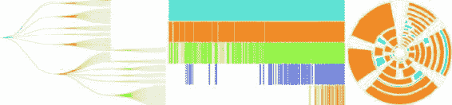

### 6.1\. 分层模式

当你设计和构建数据可视化产品时，很容易想到可视化数值数据。我们在学习条形图和折线图的过程中长大，而我们为构建仪表板和数据可视化的人习惯于看到它们。当大多数人谈论数据时，他们指的是数值数据，当他们谈论数据可视化时，他们指的是可视化数值数据，以便他们可以精确地测量高度、斜率和差异。告诉他们你希望为了显示其他模式而模糊数据的数值精度可能很难说服他们。这就是使用复杂数据可视化（如层次布局）的挑战之一，你将不得不直面这个挑战。

层次化数据，即任何将父级映射到子级关系的数据，存在于每个系统中：家谱中的人，商业组织结构图，甚至是像食物金字塔这样的类别。如果你只展示数值模式，那么你可以使用的最佳图表是使用长度编码的图表，这意味着条形图和折线图。但如果你只基于条形图和折线图可以衡量的内容做出决策，那么你将削弱你的组织。层次化数据可视化的价值的一个经典例子来自具有无数筛选器的数据仪表板。

A/B 测试现在无处不在，A/B 测试结果的可视化是数据可视化的一个关键要求。使用这些 A/B 测试可视化的人对数字着迷，尤其是测试在一系列关键指标上获得的分数，这几乎总是与另一个数字相关：该单元格的分数与控制单元格的分数之间的统计显著性。想象一下，为你的数据可视化公司设计一个 A/B 测试仪表板，它显示了测试结果，你可以通过国家、性别或用户的订阅级别来切片和切块。你最新的测试推出了用户体验的改变，以便某些客户可以以饼图的形式获得所有结果，而其他客户只能以动画 GIF 的形式获得结果。

让我们把每个测试单元的结果放在表格图表上，展示每个指标的变化，这样人们可以直观地看到数字。我们将使用颜色来突出显示特定单元格中特定指标是“成功”还是“失败”，因为，嘿，我们是数据可视化专业人士。在这里，你可以看到测试单元在传统表格视图中的表现（图 6.2）。看起来到处都是 GIF 是正确的方向，对吧？

##### 图 6.2\. 表格视图中的典型 A/B 测试结果，显示了多个指标以及与控制单元的变化。正变化用加号表示，统计上显著的变化用绿色表示统计上显著的正面变化，用橙色表示统计上显著的负面变化。

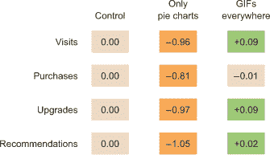

如果我们将测试结果分层嵌套，我们就无法使用能够很好地显示数值的数据可视化。我们将只剩下我们用来编码统计上显著的胜负的颜色。尽管我们失去了数值精度，但我们获得了看到胜负模式的能力。三个单元格，4 个订阅类别，20 个国家，5 个指标 = 1200 种不同的组合。这将是一个相当长的表格，但在像圆形包这样的分层数据可视化中，它看起来就像图 6.3。

##### 图 6.3\. A/B 测试结果的圆形包，按单元格、指标、订阅级别和国家显示嵌套结果。绿色表示统计上显著的胜利，橙色表示统计上显著的失败。

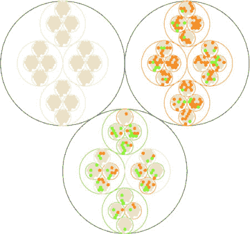

这种快速概览让我们对胜负的分层模式有了感觉。每个黑色圆圈代表一个单元格，控制单元格位于左上角，右上角是我们的“只有饼图”单元格，底部圆圈是我们的“到处都是 GIF”单元格。我们可以看到，就像我们的总结表一样，很明显“只有饼图”在国家和订阅级别上不起作用，但似乎“到处都是 GIF”的损失比我们预期的要多。它还突出了我们在部署分层数据可视化时需要解决的一个问题，即层次结构的顺序可能会突出或隐藏模式。

如果我们改变层次结构的顺序并将国家放在单元格下面，我们会得到一个更有趣的模式(图 6.4)。

##### 图 6.4\. 按单元格、国家、订阅和指标排序的 A/B 测试结果的分层可视化

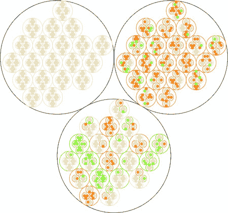

尽管这并没有改变我们对“只有饼图”的看法，它仍然是一个悲惨的失败（抱歉，Robert！^([1]))，但我们可以看到“到处都是 GIF”的损失似乎与某些国家相对应。它们应该如此。当我构建生成这些随机数据的模型时，我确保“只有饼图”在所有方面都显示出统计上显著的损失，而“到处都是 GIF”则应该在某些国家取得成功，在其他国家表现不佳，在其他情况下则是一无所获。在一个传统的仪表板上，分析师可能通过筛选到那些国家来偶然发现这一点，或者他们可能看到了整体的成功（毕竟，你向他们展示了数字，这是他们想要的）并推出了新功能，尽管这可能会在某些国家对你公司的成功造成关键损害。

> ¹
> 
> Tableau 的首席科学家 Robert Kosara 发表了一篇著名的论文，称饼图并不那么糟糕。见[`eagereyes.org/pie-charts`](https://eagereyes.org/pie-charts)。

### 6.2\. 与分层数据一起工作

为了制作层次化数据可视化产品，我们需要层次化数据。虽然层次化数据无处不在，但 D3 期望它以特定的格式用于其层次布局。这种格式化是通过使用 `d3.hierarchy` 并将层次化 JavaScript 对象以及如何访问子节点和分配给节点的任何数值设置传递给 `d3.hierarchy` 来实现的。假设我们有一些看起来像这样的层次化数据：

```
var root = {id: "All Tweets", children: [
{id: "Al's Tweets", children: [{id: "tweet1"}, {id: "tweet2"}]},
{id: "Roy's Tweets", children: [{id: "tweet1"}, {id: "tweet2"}]}
...
```

我们需要将那些数据传递给 `d3.hierarchy` 来创建 D3 期望用于其层次布局的层次化数据：

```
var root = d3.hierarchy(root, function (d) {return d.children})
```

生成的对象扩展了包含每个节点的方法，允许你访问后代和祖先，这样你就可以轻松地对层次化数据进行过滤，或者在与层次布局传递时分离。

#### 6.2.1\. 层次化 JSON 和层次化对象

*层次化 JSON* 或 *层次化对象* 指的是任何作为根节点具有属性（通常称为 *children* 或 *values*）的 JSON 或 JavaScript 对象，这些属性是更多对象的数组，通常具有与根节点相同的属性。在层次化术语中，*根* 节点是最高级的父节点，而 *叶* 节点是没有子节点的子节点。

#### 6.2.2\. D3.nest

我们已经多次看到 `d3.nest` 的使用，我们用它来扁平化数据。另一种用途反映了函数的名称，即从扁平数据中创建层次化数据集。例如，如果我们有一个看起来像这样的对象数组

```
{
   cell: "gifs everywhere",
   country:"Norway",
   metric:"recommendations",
   significance:0.07408233813305311,
   subscription:"deluxe",
   value:0.4472930460902817
}
```

并且我们将这个数组传递给一个 `d3.nest` 函数，该函数将其所有分类属性作为键，如下所示

```
var nestedDataset = d3.nest()
  .key(d => d.cell)
  .key(d => d.metric)
  .key(d => d.subscription)
  .key(d => d.country)
  .entries(dataset)
```

结果将是一个嵌套的层次化 JavaScript 对象，几乎可以直接由 D3 层次布局可视化。唯一剩下的步骤是我们想要一个层次化对象，而 `d3.nest` 返回一个数组，因此我们需要将数组的输出放入一个对象中，正如你将在所有后续示例中看到的那样。

#### 6.2.3\. D3.stratify

D3 的第四版引入了从表格数据构建层次化数据的新功能：`d3.stratify`。我们的大部分层次化数据都是以表格数据的形式出现，通过列来表示父子关系。假设你从你最喜欢的家谱软件中下载了你的家谱，并得到了如下所示的数据。

##### 列表 6.1\. 表格格式中的一些常见层次化数据

```
child, parent
you, your mom
you, your dad
your dad, your paternal grandfather
your dad, your maternal grandmother
your mom, your maternal grandfather
your mom, your maternal grandmother
, you
```

你可以将这些数据传递给一个格式如下 `d3.stratify` 函数：

```
d3.stratify()
  .parentID(d => d.child)
  .id(d => d.parent)
```

它将返回一个以“你”为根节点的层次结构。我知道你在想什么：“你将`parentID`设置为子节点——你的示例数据集是反向的。”但这不是；我故意这样格式化，因为我想要强调在层次化数据集中，父节点指的是层次化父节点，并且它必须终止在单个节点上。在这种情况下，因为家谱从“你”开始，所以“你”成为根节点，“你的妈妈”和“你的爸爸”成为该根节点的第一个子节点。如果你想表示不以单个节点终止的层次结构，你将不得不等待第七章，并使用网络可视化技术。

### 6.3\. 布局排列

层次化数据适合于一系列布局。其中最受欢迎的是圆圈排列，如图 6.5 所示。每个对象都放置在该对象层次结构的父级中。你可以看到层次关系。与所有层次布局一样，布局排列期望的数据表示可能与您正在处理的数据不匹配。具体来说，布局排列期望一个 JavaScript 对象数组，其中层次结构中的子元素存储在一个指向数组的`children`属性中。在网页上布局实现的示例中，数据通常格式化为与期望的数据格式相匹配。在我们的情况下，我们将推文格式化为图 6.5 所示。

##### 图 6.5\. 布局排列对于表示嵌套数据很有用。它们可以是平铺的（顶部）或者可以直观地表示层次结构（底部）。

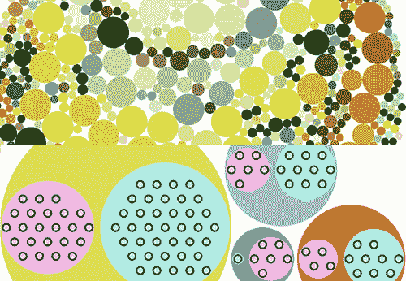

但最好习惯于调整`d3.hierarchy`的访问器函数以匹配我们的数据。这并不意味着我们在使用`d3.nest`时不需要进行任何数据格式化，例如，或者从外部源获取数据，其中子节点由另一个键表示。

#### 6.3.1\. 绘制圆圈排列

我们仍然需要创建一个根节点，以便布局排列能够工作（在之前的代码中称为“所有推文”）。但我们将调整访问器函数以匹配`nestedTweets`中数据表示的结构，其中子元素存储在`values`键上。在下面的列表中，我们还更新了`.sum()`方法，该方法确定圆圈的大小，并将其设置为固定值，如图 6.6 所示。

##### 图 6.6\. 每条推文都由一个嵌套在代表发推用户的橙色圆圈内的绿色圆圈表示。其中有一个绿色圆圈的大小与其父橙色圆圈完全相同，我们将在下面讨论。用户都嵌套在一个代表我们的“根”节点的蓝色圆圈内。

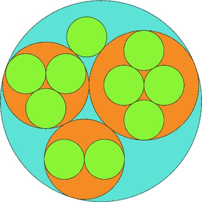

##### 列表 6.2\. 嵌套推文数据的圆圈排列

```
d3.json("tweets.json", viz)

function viz(data) {
var depthScale = d3.scaleOrdinal()
  .range(["#5EAFC6", "#FE9922", "#93c464", "#75739F"])

var nestedTweets = d3.nest()
  .key(d => d.user)
  .entries(data.tweets);
var packableTweets = {id: "All Tweets", values: nestedTweets};       *1*
var packChart = d3.pack();                                           *2*

packChart.size([500,500])                                            *3*

var root = d3.hierarchy(packableTweets, d => d.values)               *4*
  .sum(() => 1)                                                      *5*

d3.select("svg")
  .append("g")
  .attr("transform", "translate(100,20)")
     selectAll("circle")
     .data(packChart(root).descendants())                            *6*
     .enter()
     .append("circle")
     .attr("r", d => d.r)                                            *7*
     .attr("cx", d => d.x)
     .attr("cy", d => d.y)
     .style("fill", d => depthScale(d.depth))                        *8*
     .style("stroke", "black")
}
```

+   ***1* 将 d3.nest 创建的数组放入一个充当顶级父级的“根”对象中**

+   ***2* 初始化布局排列**

+   ***3* 设置圆打包图表的大小**

+   ***4* 使用子元素访问器函数处理层次结构以查找值，这与 d3.nest 创建的数据相匹配**

+   ***5* 创建一个在确定叶节点大小时返回 1 的函数**

+   ***6* 使用打包布局处理层次结构，然后使用后代将其展平以获得一个扁平数组**

+   ***7* 半径和 xy 坐标都是由打包布局计算的**

+   ***8* 打包布局还给了每个节点一个深度属性，我们可以使用它来根据深度区分它们的颜色**

请记住，由`d3.hierarchy`处理的节点的`.descendants`方法将包括你发送的父节点。此外，当打包布局有一个单一子节点（如 Sam 只发了一条推文的情况）时，子节点的大小与父节点的大小相同。这在视觉上可能看起来 Sam 与其他发了更多推文的 Twitter 用户处于相同的层次级别。为了纠正这一点，我们可以修改打包布局的填充方法，为每个圆设置一个填充： 

```
packChart.padding(10)
```

这将给你带来如图 6.7 中所示的外边距。你可以尝试实现一个作为节点深度函数的填充。

##### 图 6.7\. 基于层次深度的固定边距示例。我们可以通过根据每个节点的计算深度值减少节点圆的大小来创建它。

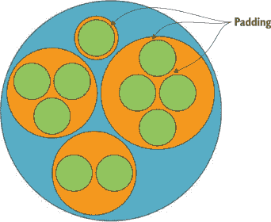

我之前简要地提到了`d3.hierarchy`的`.sum()`设置。如果你对你的叶节点有一个数值测量，你可以使用这个测量来使用`.sum()`设置它们的大小，从而影响它们父节点的大小。在我们的例子中，我们可以根据每个叶节点（推文）收到的点赞和转发数量（我们在第四章中用作“影响因子”的相同值）来设置我们叶节点的大小。图 6.8 中的结果反映了这个新设置。

##### 图 6.8\. 一个将叶节点大小设置为这些节点影响因子的圆打包布局

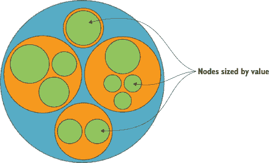

```
d3.hierarchy(packableTweets, d => d.values)
.sum(d => d.retweets ? d.retweets.length +
d.favorites.length + 1 : undefined)                *1*
```

+   ***1* 加 1，以便没有转发或喜欢的推文仍然具有大于零的值，并且与检查以确保它具有转发属性一起显示**

布局，就像生成器和组件一样，适用于方法链。你将看到示例，其中设置和数据都连成了一条长链。与饼图一样，你可以将交互性分配给节点或调整颜色，但本章重点介绍布局的一般结构。请注意，圆打包与另一种称为树状图的已知层次布局相似。*树状图*通过矩形打包空间更有效，但它们可能更难阅读。下一个布局是另一种称为*系统发育树*的层次布局，它更明确地绘制了数据中的层次关系。

#### 6.3.2\. 何时使用圆打包

圆形包不高效地使用空间——在矩形屏幕上显示的圆形对象之外，有很多屏幕空间被浪费了。此外，当圆形被用来包围其他圆形时，与它单独漂浮在那里时，你所看到的圆形有很大的不同。考虑到这一点，当你试图关注圆形包底部的对象，即叶节点，以及它们如何根据你嵌套的各种类别进行排序时，你应该使用圆形包，这些叶节点将很好地映射到相同类型的单个对象，并且我们认为它们的大小没有变化，比如一个人。虽然人类的大小是不同的，但它们通常被放在图表中，用相同大小的标记表示，如网络图中的圆圈或信息图表中的人物图标。但如果你想要为每个人编码一些值，比如他们的财富或他们图书馆中的 D3.js 书籍数量，那么你可能不想使用圆形包。

### 6.4\. 树

展示层次数据的另一种方法是将其布局成家谱树，父节点通过树状图连接到子节点（图 6.9）。

##### 图 6.9\. 树布局是表达层次关系的另一种有用方法，通常垂直（顶部）、水平（中部）或辐射（底部）布局。（来自 Mike Bostock 的[d3js.org](http://d3js.org)的示例。）

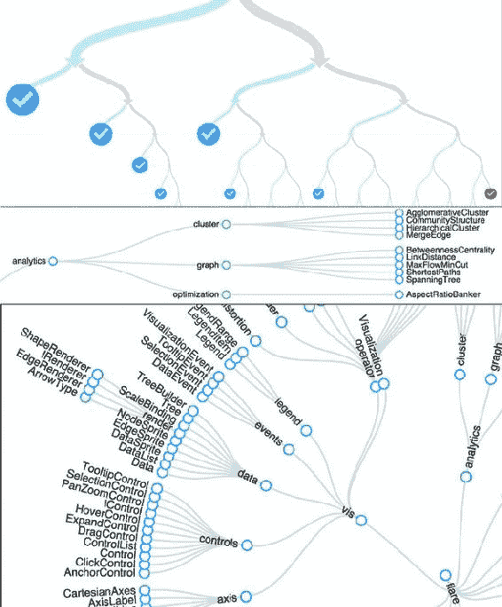

#### 6.4.1\. 绘制树状图

前缀*dendro*意味着“树”，在 D3 中布局是`d3.tree`。它遵循与包布局几乎相同的设置，除了为了绘制连接节点的线条，我们需要使用`svg:line`或`svg:path`元素。我们使用`d3.nest`和`d3.hierarchy`处理数据，与圆形包完全相同，然后使用以下列表中的代码绘制我们的第一个树状图。

##### 列表 6.3\. 绘制树状图的回调函数

```
var treeChart = d3.tree();
treeChart.size([500,500])

  var treeData = treeChart(root).descendants()

d3.select("svg")
  .append("g")
  .attr("id", "treeG")
  .attr("transform", "translate(60,20)")
  .selectAll("g")
  .data(treeData)
  .enter()
  .append("g")
  .attr("class", "node")
  .attr("transform", d => `translate(${d.x},${d.y})`)           *1*

d3.selectAll("g.node")
  .append("circle")
  .attr("r", 10)
  .style("fill", d => depthScale(d.depth))                      *2*
  .style("stroke", "white")
  .style("stroke-width", "2px");                                *3*

d3.select("#treeG").selectAll("line")
  .data(treeData.filter(d => d.parent))                         *4*
  .enter().insert("line","g")
  .attr("x1", d => d.parent.x)                                  *5*
  .attr("y1", d => d.parent.y)
  .attr("x2", d => d.x)                                         *6*
  .attr("y2", d => d.y)
  .style("stroke", "black")
```

+   ***1* 为每个节点绘制一个<g>元素，这样我们就可以现在在其中放置一个圆圈，稍后添加标签**

+   ***2* 基于 d3.hierarchy 计算的深度进行填充**

+   ***3* 在每个节点周围添加一个白色光环，以使连接线看起来有偏移效果**

+   ***4* 使用相同的数据绘制链接，但过滤掉任何没有父节点（将没有链接）的节点** 

+   ***5* 绘制以子节点位置结束的链接**

+   ***6* 从父节点位置开始绘制链接**

生成的树状图显示了我们的推文和推文作者的层次结构，使用圆形，就像圆形包一样，但使用线条和排名位置来指示父母和子女，如图 6.10 所示，读起来有点困难。

##### 图 6.10\. 使用 tweets.json 中的数据垂直排列的树状图。级别 0 的“根”节点（我们创建它来包含用户）为蓝色，级别 1 的节点（代表用户）为橙色，级别 2 的“叶”节点（代表推文）为绿色。

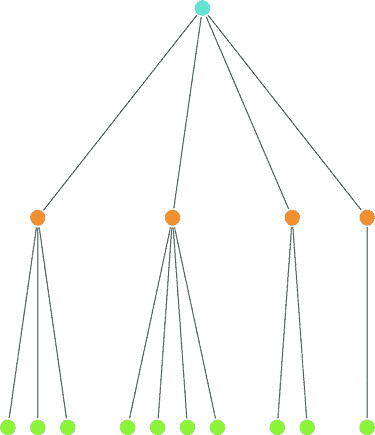

我们可以很容易地添加标签；唯一需要注意的是，每个节点的标签将根据我们正在标记的层次结构中的节点类型而有所不同（根节点或用户之一或单个推文之一）。添加一个类似这样的`<text>`元素：

```
     d3.selectAll("g.node")
       .append("text")
       .style("text-anchor", "middle")
       .style("fill", "#4f442b")
       .text(d => d.data.id || d.data.key || d.data.content)
```

你将得到图 6.11 中看到的结果。

##### 图 6.11\. 为每个节点添加标签的树状图

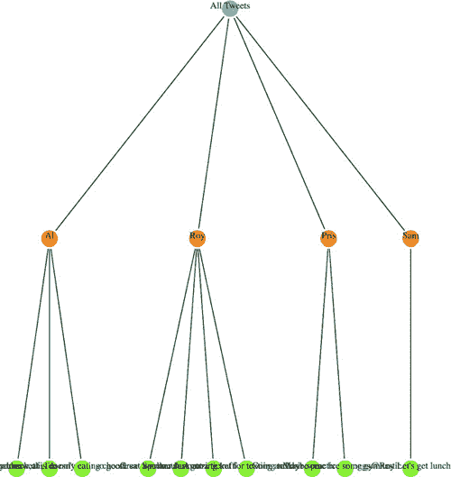

由于推文标签是推文的内容，所以以那种方式垂直绘制树状图的标签很难阅读。为了将其翻转，我们需要通过翻转 x 和 y 坐标来调整`<g>`元素的定位，从而使节点水平排列。我们还需要翻转`svg:line`元素的 x1、x2、y1 和 y2 引用，以使线条水平排列：

```
    .append("g")
...
       .append("g")
       .attr("class", "node")
 .attr("transform", d => `translate(${d.y},${d.x})`)
...
       .enter().insert("line","g")
       .attr("x1", d => d.parent.y)
       .attr("y1", d => d.parent.x)
       .attr("x2", d => d.y)
       .attr("y2", d => d.x)
```

结果，如图 6.12 所示，由于文本没有在画布底部重叠，因此更易于阅读。但图表的关键方面仍然在容器`<g>`的边距未调整的情况下绘制。

##### 图 6.12\. 与图 6.11 相同的树状图，但水平排列


我们可以尝试在布局的高度和宽度上创建边距，就像我们之前做的那样。或者，我们可以提供有关每个节点的信息，当点击时以信息框的形式打开，就像足球数据那样。但更好的选择是给用户拖动画布上下左右的能力，以便看到更多可视化内容。

要做到这一点，我们使用 D3 缩放行为，`d3.zoom`，它创建一组事件监听器。*行为* 就像组件一样，但它不是创建图形对象，而是注册事件（在这种情况下为拖动、鼠标滚轮和双击）并将这些事件绑定到调用行为的元素上。在每个这些事件中，缩放对象都会改变其 `.translate()` 和/或 `.scale()` 值，以对应传统的拖动和缩放交互。您将使用这些改变后的值来根据用户交互调整图形元素的位置。就像组件一样，缩放行为需要由您想要附加这些事件的元素调用。通常，您从基础 `<svg>` 元素调用缩放，因为这样它会在您点击图形区域中的任何内容时触发。在创建缩放组件时，您需要定义在 *zoomstart*、*zoom* 和 *zoomend* 时调用哪些函数，这些函数分别对应于缩放事件的开始、事件本身和事件的结束。由于缩放在用户拖动鼠标时会连续触发，您可能只想在缩放事件的开始或结束时调用资源密集型函数。当我们在第八章查看地理空间映射时，您将看到更复杂的缩放策略以及缩放的使用，该章使用了大量的缩放。

就像其他组件一样，要启动缩放组件，您需要创建一个新的实例并设置可能需要的任何属性。在我们的例子中，我们只想使用默认的缩放组件，其中 `zoom` 事件触发一个新的函数，`zoomed()`。这个函数改变包含我们图表的 `<g>` 元素的位置，并允许用户拖动它：

```
treeZoom = d3.zoom()                                              *1*
treeZoom.on("zoom", zoomed)                                       *2*
d3.select("svg").call(treeZoom)                                   *3*
function zoomed() {
d3.select("#treeG").attr("transform",
`translate(${d3.event.transform.x},${d3.event.transform.y})`)     *4*
}
```

+   ***1* 创建一个新的缩放组件**

+   ***2* 将“缩放”事件绑定到 zoomed() 函数**

+   ***3* 使用 SVG 画布调用我们的缩放组件**

+   ***4* 将 <g> 更新为与缩放组件相同的平移设置，以更新 <g> 及其所有子元素的位置**

现在我们可以拖动和缩放整个图表的左右和上下。缩放和平移的能力为您提供了强大的交互性，以增强您的图表。您可能觉得奇怪，您学习了如何使用名为 *缩放* 的东西，但甚至还没有处理过缩放和缩小，但平移对于这些图表来说通常更有用，而在处理地图时，改变比例则成为了一种必需。

#### 6.4.2. 径向树形图

我们除了从上到下、从左到右绘制树形图之外，还有其他选择。如果我们把每个节点的位置与一个角度绑定，我们就可以以辐射模式绘制我们的树形图。为了使这工作得更好，我们需要减小图表的大小，因为 D3 中树布局的辐射绘制使用大小来确定最大半径，并从其容器的 0,0 点向外绘制，就像一个 `<circle>` 元素：

```
treeChart.size([200,200])
```

在这些变化到位后，我们需要创建一个投影函数，将 xy 坐标转换为径向坐标系：

```
function project(x, y) {
   var angle = x / 90 * Math.PI
   var radius = y
   return [radius * Math.cos(angle), radius * Math.sin(angle)];
}
```

然后我们使用该函数来计算节点和线条的新坐标：

```
   .append("g")
   .attr("id", "treeG")
   .attr("transform", "translate(250,250)")
   .selectAll("g")
...
   .append("g")
   .attr("class", "node")
   .attr("transform", d => `translate(${project(d.x, d.y)})`)
...
   .enter().insert("line","g")
   .attr("x1", d => project(d.parent.x, d.parent.y)[0])
   .attr("y1", d => project(d.parent.x, d.parent.y)[1])
   .attr("x2", d => project(d.x, d.y)[0])
   .attr("y2", d => project(d.x, d.y)[1])
```

图 6.13 显示了这些变化的结果。

##### 图 6.13\. 以径向方式布局的相同树状图。

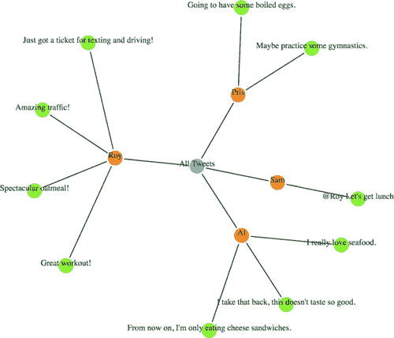

树状图是一种通用的信息显示方式。它可以被重新用于菜单或你可能不会认为是传统层次结构的信息。一个例子（图 6.14）来自 Jason Davies 的工作，他使用 D3 中的树状图功能创建了词树。遵循这种模式的几个层次结构包括家谱、句子树和决策树。

##### 图 6.14\. Jason Davies 使用树状图在词树中的示例（[www.jasondavies.com/wordtree/](http://www.jasondavies.com/wordtree/)）。


#### 6.4.3\. d3.cluster 与 d3.tree 的比较

在这个例子中，我们使用了`d3.tree`布局。你也可以使用`d3.cluster`布局，它强制所有叶节点都在同一级别上绘制。在我们的数据集中，这一点并不明显，因为我们的所有层次数据都有相同的深度（所有叶节点都是深度 3），但在像图 6.15 这样的叶节点深度不均匀的情况下，你可以看到`d3.cluster`渲染和`d3.tree`渲染之间的区别。

##### 图 6.15\. 使用`d3.tree`（左）和`d3.cluster`（右）渲染的相同数据集。

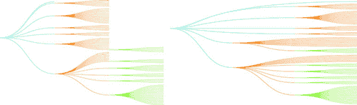

作为一般规则，你应该使用`d3.tree`，除非你有很好的理由将所有叶节点对齐到同一级别。当你使用`d3.cluster`时，你正在增加表示你的链接所使用的墨水量，尽管这些链接所代表的内容并没有任何不同。这意味着你的墨水与数据的比率更差，如果你要使墨水与数据的比率更差，那一定是有很好的理由。

#### 6.4.4\. 何时使用树状图

与强调叶节点的圆包图相比，树状图使用相同的符号显示每个节点。使用线条来展示节点之间的连接，为谱系提供了更多的视觉结构，而不是单独的链接或节点。当每个父节点和子节点都是同一类型（如词树中的单词或句子片段）且焦点在于路径和路径的分支时，应使用树状图。

### 6.5\. 分区

我在本章开头指出，大多数表示层次数据的方法都没有以允许精确比较的方式编码数值数据。D3 中的一个布局使用长度来编码父节点和子节点，这就是分区布局。*分区*图，通常被称为冰锥图，类似于堆叠条形图。

#### 6.5.1\. 绘制冰锥图

与其他分层图表一样，我们需要首先使用`d3.nest`和`d3.hierarchy`对数据进行嵌套和处理。与树状图不同，我们应该使用分区布局的`sum`函数来设置各个部分的大小，以反映底层数据的值（正如我们在最终的圆形布局部分所做的那样）。在将处理后的数据传递给`d3.partition`之后，我们可以绘制矩形，如下面的列表中所述。

##### 列表 6.4\. 绘制简单的分区布局

```
var root = d3.hierarchy(packableTweets, d => d.values)
   .sum(d => d.retweets ? d.retweets.length + d.favorites.length + 1 :
   undefined)

var partitionLayout = d3.partition()
   .size([500,300])

partitionLayout(root)                          *1*

d3.select("svg")
  .selectAll("rect")
  .data(root.descendants())
  .enter()
  .append("rect")
  .attr("x", d => d.x0)                        *2*
  .attr("y", d => d.y0)                        *2*
  .attr("width", d => d.x1 - d.x0)             *3*
  .attr("height", d => d.y1 - d.y0)            *3*
  .style("fill", d => depthScale(d.depth))
  .style("stroke", "black")
```

+   ***1* 代码与我们的早期分层布局几乎完全相同**

+   ***2* 位置以一个边界框的形式返回，其中左上角为 x0/y0**

+   ***3* 大小可以通过从右上角（x1/y1）减去左上角（x0/y0）来得出**

该代码的结果显示在图 6.16 中，它以新的视觉隐喻显示了我们的分层数据集中的节点。与树状图不同，父母不是通过线与子节点连接，也不是像圆形布局那样在视觉上包含在父节点中，而是父节点堆叠在其子节点之上，其长度等于其子节点长度的总和（在我们的例子中是基于推文的转发和点赞数）。

##### 图 6.16\. 我们数据的一个分区布局，显示底部为绿色的推文，按“影响力”大小排列，橙色表示用户按其推文的总体影响力大小排列，根节点（在这种情况下为“All Tweets”）为蓝色。

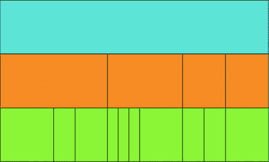

我知道你在想什么：“这根本不像冰锥——给图表命名的人真傻。”你是对的；图表命名确实有一些严重的问题。我的意思是，什么是折线图？所有绘制的东西都是由线组成的，对吧？但冰锥图的名字来源于当我们有深度不一的数据时它的外观，当你用像我们在比较聚类和树布局时使用的数据来看这个分区布局时，它作为一个“冰锥图”在视觉上会更有意义，正如我们在图 6.17 中看到的。

##### 图 6.17\. 当你有深度不一的分层数据时，冰锥图看起来像从排水沟悬挂下来的融化的冰锥。

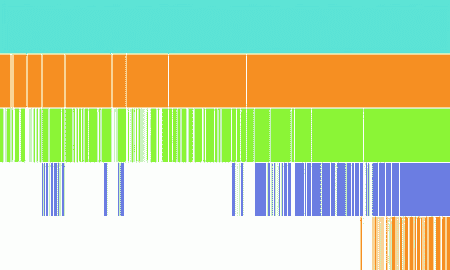

#### 6.5.2\. 太阳花图：径向冰锥图

与树状图类似，我们可以绘制一个径向分区布局，这被认为是最受欢迎的“令人印象深刻的数据可视化技术”之一。在 bl.ocks.org 的列表顶部总是有几个示例，展示了最受欢迎的 D3 代码示例，正如你在图 6.18 中看到的。

##### 图 6.18\. 2016 年 10 月 20 日最受欢迎的块，包括不止一个或两个，而是四个不同的太阳花图

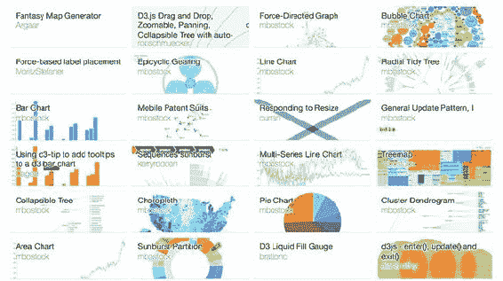

实际上，它非常受欢迎，以至于它不被称为径向分区图或径向冰柱图，而有一个自己的花哨名称：太阳图。尽管它有一个花哨的名称，但绘制它只需要我们使用与创建径向树状图相同的技巧：我们调整大小以更适合我们的渲染方法，并改变我们渲染片段的方式。在太阳图的情况下，这意味着调整大小，使宽度以度为单位，并改变渲染方法，以便我们使用 `d3.arc` 生成器而不是 `svg:rect`。尽管接下来的列表中的代码几乎完全不同——如果你仔细看，你可以看到它基本上是相同的逻辑，但应用于不同的比例，并传递给弧而不是矩形。

##### 列表 6.5\. 使用分区布局创建一个太阳图

```
var partitionLayout = d3.partition()
   .size([2 * Math.PI,250])                            *1*

partitionLayout(root)

var arc = d3.arc()
   .innerRadius(d => d.y0)
   .outerRadius(d => d.y1)                             *2*

d3.select("svg")
  .append("g")
  .attr("transform", "translate(255,255)")             *3*
  .selectAll("path")
  .data(root.descendants())
  .enter()
  .append("path")
  .attr("d", ({ y0, y1, x0, x1 }) => arc({y0, y1,
        startAngle: x0, endAngle: x1}))                *4*
  .style("fill", d => depthScale(d.depth))
  .style("stroke", "black")
```

+   ***1* 将布局的大小设置为 2PI，宽度为 whatever radius 我们想要的整个图表的高度**

+   ***2* 我们将使用 y0 和 y1 来确定我们绘制的弧线的上下界限，以便它们在径向上堆叠**

+   ***3* 记住我们需要重新居中图表，因为弧生成器将从 0,0 绘制**

+   ***4* 使用对象解构和对象字面量简写创建一个符合 arc() 期望格式的对象**

我们简单化的数据太阳图版本在 图 6.19 中。正如我在上一章中提到的，当我们使用 `d3.histogram` 来绘制小提琴图时，我认为暂停并思考如何使用 D3 将分区布局作为太阳图绘制是如此简单是很重要的。现在，自然地，你必须理解弧生成器的工作原理以及布局在做什么，但一旦你做到了，你就可以使用 D3 创建你想象中的图表，而不是重新创建你在网上看到的图表。

##### 图 6.19\. 我们嵌套推文的太阳图版本。

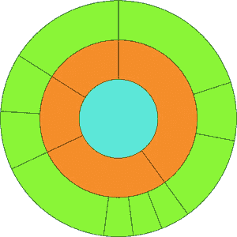

#### 6.5.3\. 火焰图

在我们继续到下一个层次可视化类型之前，我想将你的注意力引向分区布局在专用数据可视化图表中的不同用途：火焰图。火焰图是为了查看哪些进程正在消耗你的应用程序而开发的，它是一个功能齐全的应用程序，消耗分析数据并返回一个橙色格式的冰柱图，已被移植为 d3-flame-graph，你可以在 图 6.20 中看到一个示例。

##### 图 6.20\. d3-flame-graph 的一个示例，它实现了由 Brandon Gregg 首先开发的火焰图。注意，子项的值（在这种情况下是较高的条形）的总和往往小于父项的值。

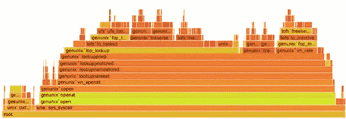

火焰图展示数据的方式与您典型的分区布局之间的主要区别在于，在大多数分区布局和大多数层次化数据可视化中，当你表示父节点的大小时，它通常是其子节点大小的总和。但在火焰图中，父节点是一个占用其自身时间加上其子进程时间的进程。重新创建整个分析数据的解析过程可能会过于复杂，但请记住，`d3.hierarchy`中的`sum`方法是一个便利函数，可以被你自己的复杂值设置函数所替代，因此你可以轻松地为每个节点分配一个等于其子节点总和加上其自身值的值，从而实现类似火焰图的效果。

#### 6.5.4. 何时使用分区布局

与树状图和圆形打包相比，分区布局具有很高的数据到墨水比率。实际上，在链接上没有浪费任何空间，每个节点的值都编码在节点的长度中，这有助于读者评估节点之间的数值差异。它非常适合用于需要让读者能够快速有效地测量节点中编码的值的场景。但它是层次结构的终极富集视觉表示，因为每个深度的值都会累积到父节点的值中，这可能会使得在层次结构中难以识别出有趣的转折点，而这些转折点在树状图或按类别聚类的层次结构中会很容易显现出来，就像我们在本章开头 A/B 测试示例中看到的国家那样。分区布局的最佳用例是驱动火焰图的那种数据，其中时间或处理能力的累积正是你想要强调给那些希望优化其代码的软件开发人员的内容。

### 6.6. 树状图

我们将要查看的最后一种层次化数据可视化方法是树状图，它是为了在展示股票表现的同时，展示那些股票被分类的市场部分而开发的。由于这种严肃的商业血统，树状图是展示层次化数据的一种受欢迎的方式。*树状图*是圆形打包和分区的一种混合，使用矩形来表示节点，并将这些矩形包含在其父矩形内。与圆形打包不同，它具有在矩形屏幕上使用矩形形状的优点，所以我们不会看到像圆形打包那样的大量浪费空间。

#### 6.6.1. 构建

到现在为止，你应该知道如何在 D3 中制作层次化数据可视化产品。你需要有你的层次化数据，但你可能已经获取或处理了它，并将其传递给`d3.hierarchy`。你会使用`d3.hierarchy`的`sum`方法，因为我们想在我们的图表中展示我们的推文数据。这次，唯一的区别是你将所有这些发送到`d3.treemap`，正如我们在下面的列表中看到的那样。

##### 列表 6.6\. 绘制树状图

```
var treemapLayout = d3.treemap()
   .size([500,500])

treemapLayout(root)                                          *1*

d3.select("svg")
  .selectAll("rect")
  .data(root.descendants(),
     d => d.data.content || d.data.user || d.data.key)       *2*
  .enter()
   append("rect")
  .attr("x", d => d.x0)
  .attr("y", d => d.y0)
  .attr("width", d => d.x1 - d.x0)
  .attr("height", d => d.y1 - d.y0)                          *3*
  .style("fill", d => depthScale(d.depth))
  .style("stroke", "black")
```

+   ***1* 因为布局会改变根，所以你可以运行它而不将其分配给变量**

+   ***2* 设置一个键，以便我们可以在以后进行过滤缩放**

+   ***3* 所有通常用矩形表示的层次布局都暴露了 x1,x0 和 y1,y0，因为这很容易从中推导出高度/宽度，并且仍然可以用于其他投影**

我们几乎与`d3.partition`所做的一样，使用树状图。尽管我们仍然使用`svg:rect`来表示我们的节点，但你在图 6.21 中看到的结果还是有点不同。

##### 图 6.21\. 没有填充的树状图只会显示叶节点。

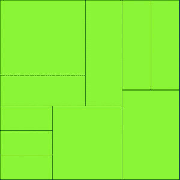

矩形已经有效地填充了空间——有点过于有效。我们已经失去了我们的层次数据——在这种情况下，哪些节点是由哪些人推文的。这是因为没有在树状图中添加填充，我们最终在我们的尺寸数组描述的矩形中完美地并排放置了我们的叶节点。让我们添加填充：

```
var treemapLayout = d3.treemap()
  .size([500,500])
  .padding(d => d.depth * 5 + 5]
```

通过添加填充，我们恢复了表示哪些节点是哪些其他节点子节点的封装信号，正如你在图 6.22 中可以看到。填充可以是一个函数，就像我们在图 6.21 中看到的那样。但要注意动态填充，因为你的读者正在尝试评估使用形状表示的区域编码的数据，所以如果你根据形状在层次结构中的深度改变该形状的面积计算，不要期望你的读者能够轻易地通过视觉处理来识别这一点。在我们的推文这样的层次数据集中，我们没有造成太大的伤害，因为它们具有相同的深度，但在那些深度不等的其中一个数据集中，你可能会让你的读者误解你正在可视化的数据。

##### 图 6.22\. 使用填充方法的树状图。注意填充决定了子节点之间的空间，而不是兄弟节点之间的空间。

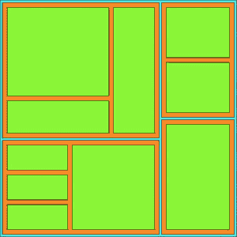

#### 6.6.2\. 过滤

当你想放大到层次数据可视化时，你所做的是用你点击的节点作为根节点重新布局。因为你的数据是层次结构的，所以这比听起来容易。我们将在以下列表中添加点击事件到所有我们的矩形中，如下所示。

##### 列表 6.7\. 过滤缩放示例

```
...
      .style("fill", d => depthScale(d.depth))
      .style("stroke", "black")
      .on("click", filterTreemap)

function filterTreemap(d) {
    var newRoot = d3.hierarchy(d.data, p => p.values)                    *1*
    .sum(p => p.retweets ? p.retweets.length + p.favorites.length + 1 : undefined)

     treemapLayout(newRoot)

  d3.select("svg")
    .selectAll("rect")
    .data(newRoot.descendants(), p => p.data.content || p.data.user || p.data.key)
    .enter()
    .append("rect")                                                      *2*
    .style("fill", p => depthScale(p.depth))
    .style("stroke", "black")

  d3.select("svg")
    .selectAll("rect")
    .data(newRoot.descendants(), p => p.data.content || p.data.user || p.data.key)
    .exit()
    .remove()                                                            *3*

  d3.select("svg")
    .selectAll("rect")
    .on("click", d === root ?
    p => filterTreemap(p) : () => filterTreemap(root))                   *4*
    .transition()
    .duration(1000)
    .attr("x", p => p.x0)                                                *5*
    .attr("y", p => p.y0)                                                *5*
    .attr("width", p => p.x1 - p.x0)                                     *5*
    .attr("height", p => p.y1 - p.y0)                                    *5*
}
```

+   ***1* 使用当前点击的节点作为根节点构建一个新的层次结构**

+   ***2* 添加任何新的节点（当我们缩小视图时）**

+   ***3* 移除任何被裁剪的节点（当我们放大时）**

+   ***4* 更新过滤函数，以便我们在放大时缩小，在缩小时放大**

+   ***5* 将任何剩余的节点重绘到新的比例**

当你向层次化数据可视化产品引入缩放功能时，就是这样。如果我们点击可视化中的蓝色区域，什么也不会发生（因为那是我们的根节点），如果我们点击绿色区域，我们会缩放到一个叶节点。如果我们点击橙色区域，我们会缩放到一个单独的用户节点以及他们的所有推文，就像我们在图 6.23 中看到的那样，并且有一个漂亮的动画过渡到新视图。

##### 图 6.23\. 我们树状图的“放大”视图，仅显示中间节点视图中的一个叶节点。注意，重新计算的树状图已经调整了填充，因为橙色节点现在是根节点。

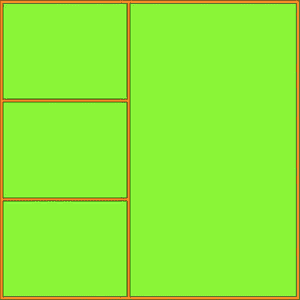

#### 6.6.3\. 径向树状图

为了完整性起见，是的，你可以将树状图径向投影，如图 6.24 所示。

##### 图 6.24\. 通过从`d3.treemap`获取绘图指令并使用它们通过`d3.arc`绘制路径而不是`svg:rect`元素来实现的径向树状图。

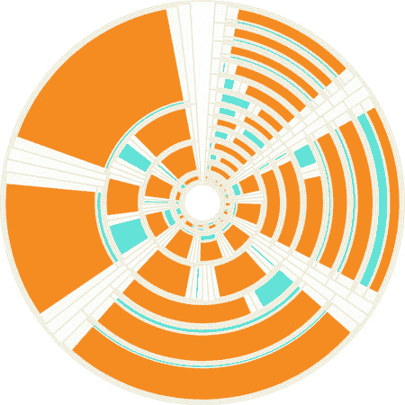

这并不被认为是一种流行的数据可视化图表方法。可能是因为人们很难评估弧形的面积。我认为人们不使用它是因为它看起来像死亡星的示意图。

#### 6.6.4\. 何时使用树状图

与矩形的长度相比，人们很难评估矩形的面积并理解映射到该面积的价值，因此树状图在允许精确比较值方面不会像冰柱图那样有效。然而，由于它们使用包围来编码父子关系，它们在分区图表中使用的父节点上花费的墨水较少，并且它们使用半径比圆饼图更好地编码价值。它们是用于数值型层次化数据的好图表，你想要比较跨类别的粗略值和汇总值。另一个例子是人口统计数据，其中每个叶节点代表数值变化的项，如县或人口普查区，你可能想看到按其层次父节点汇总的细分。

### 6.7\. 摘要

+   层次化数据可视化可以通过多种不同的方法实现，例如圆形排列、树状图或树形图。这些方法共享许多相同的功能（如`pack()`中的填充和`treemap()`）适合不同类型和密度的层次化数据。

+   D3 中的层次化布局都是从使用`hierarchy()`处理层次化数据集开始的。一旦处理完毕，这个数据集可以进行层次化过滤或排序，也可以扁平化以供显示。

+   某些层次化布局特别适合径向显示，例如树状图或分区布局。当分区布局以层次化方式显示时，它被称为太阳花图。

+   尽管所有分层布局使用相同类型的数据，但这并不意味着你应该随机选择或使用你最熟悉的一种。相反，你应该考虑你想向用户展示的分层数据的方面，并选择最能强调该方面的分层布局。

### D3.js 在现实世界中的应用

#### Nadieh Bremer 数据可视化顾问

*更深入地了解劳动*

该可视化展示了美国劳工统计局根据其分层分类定义的 ~550 种不同的职业。每个白色圆圈代表一个职业，这些圆圈根据从事该职业的总人数进行缩放。每个圆圈内部有一个条形图，进一步详细说明该职业中年龄组的划分。可以放大到任何级别的层次结构，可视化只显示那些圆圈中足够大的条形图。

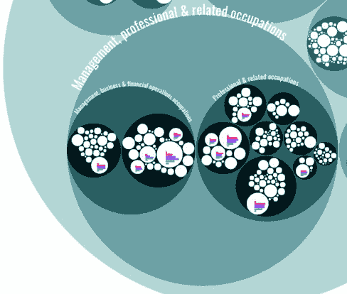

该可视化中可用的数据至少有 7（年龄组）乘以 550（职业）= 3850 个数据点。通过使用分层方法，我可以防止观众被过多数据淹没，相反，让他们深入到他们最感兴趣的职业领域。他们越深入到不同层级的职业，从服务行业到食品准备到厨师，由于每个白色圆圈内部绘制了更多的条形图，他们可以获得的信息就越多。这是一种按需提供细节的方法。

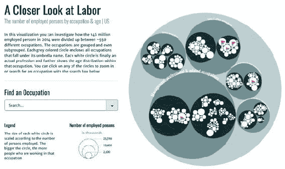

## 第七章。网络可视化

*本章涵盖*

+   创建邻接矩阵和弧形图

+   使用力导向布局

+   使用约束力

+   表示方向性

+   添加和删除网络节点和边

随着像 Twitter 和 Facebook 这样的在线社交网络以及社交媒体和链接数据的增长，网络分析和网络可视化现在更为常见。所有这些通常都用网络结构表示。本章中你将看到的网络可视化（如图 7.1 所示，其中一些已在图 7.1 中展示），特别有趣，因为它们关注的是事物之间的关系。它们比在更常见的数据可视化中看到的传统平面数据更能准确地表示系统。

##### 图 7.1。本章不仅解释了网络分析的基础（第 7.2.3 节），还包括使用 xy 定位布局网络（第 7.2.5 节）、力导向算法（第 7.2 节）、邻接矩阵（第 7.1.2 节）和弧形图（第 7.1.3 节）。

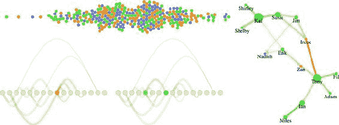

本章的重点是表示网络，因此在我们开始之前，了解一些网络术语是很重要的。一般来说，在处理网络时，你将连接的事物（如人）称为*节点*，它们之间的连接（如成为 Facebook 上的朋友）称为*边*或*链接*。网络也可以称为*图*，因为在数学中就是这样称呼的。

网络不仅仅是一种数据格式——它是对数据的视角。当您处理网络数据时，通常试图发现和显示网络或网络部分的模式，而不是网络中单个节点的模式。尽管您可能使用网络可视化，因为它可以创建一个酷的图形索引，如思维导图或网站的网络图，但通常您会发现典型信息可视化技术的设计是为了展示网络结构，而不是单个节点。

### 7.1\. 静态网络图

网络数据与层次数据不同。网络展示了多对多连接的可能性，例如第五章中的 Sankey 布局 5，而在层次数据中，一个节点可以有多个子节点，但只有一个父节点，如第五章中的树状布局和堆叠布局 5。网络不一定是社交网络。这种格式可以表示许多不同的结构，例如交通网络和链接开放数据。在本章中，我们将探讨表示网络的四种常见形式：作为数据、作为邻接矩阵、作为弧线图，以及使用力导向网络图。

在每种情况下，图形表示将非常不同。例如，在力导向布局的情况下，我们将节点表示为圆圈，将边表示为线条。但在邻接矩阵的情况下，节点将位于 x 轴和 y 轴上，边将填充为正方形。网络没有默认的表示形式，但本章中您将看到的例子是最常见的。

#### 7.1.1\. 网络数据

网络数据存储节点，这些节点可以是公司、核苷酸，或者在我们的案例中，是人，以及连接这些节点的链接。这些链接可以是任何东西，从 Facebook 的朋友关系到分子相互作用。在本章中，我们将探讨人力资源领域的一个令人兴奋的新趋势——人员分析，尝试分析和可视化与组织表现相关的数据。这是数据驱动的 HR，由于 HR 的核心是人员，我们处理的数据集比通常更有趣——例如，书面评论的文本分析，或者在我们的案例中，网络分析以查看团队动态。

假设我们有三支团队和一些承包商，每六个月他们会对过去六个月与他们一起工作的人进行 360 度评价，并给出反馈。在每个评价的结束时，团队成员会给出一个数值评分，表示他们对被评价的人是否有信心，从 0（表示没有信心）到 5（表示完全信心）。许多硅谷公司都进行这种评价，你可以将每个员工给出的评价作为网络中的一个链接，以创建有趣的社会网络分析图。这些网络可以显示团队是否像我们希望的那样合作，并允许我们绘制关键贡献者和我们可能使团队变得更强大的方法。

尽管你可以用几种数据格式存储网络，但最直接的方式被称为边列表。**边列表**通常表示为 CSV，如列表 7.1 中所示，有一个源列和一个目标列，以及一个字符串或数字来表示哪些节点是连接的，从而形成描述图 7.2 中那样的连接和网络。每条边也可以有其他属性，表示连接的类型或其强度、连接有效的时期、其颜色或任何其他你想要存储的关于连接的信息。重要的是，只需要源和目标列。很难表示负链接（例如，通过他们之间深深的仇恨而相互连接的人，比如你可能连接哈利·波特和伏地魔，或者罗密欧和提伯尔特），所以我们只关注我们虚构的人分析网络中的链接，其中分数为 1 或更高。

##### 图 7.2\. 基本网络中出现的几种网络连接类型（有向、互惠和无向），如简单的有向和无向网络

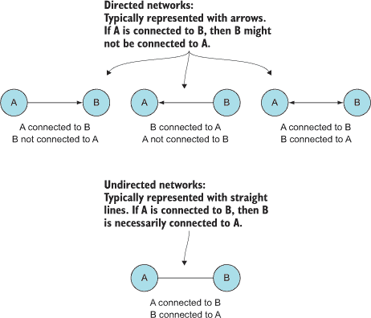

在有向网络的情况下，源节点和目标节点列表示节点之间连接的方向。一个**有向**网络意味着节点可能在一个方向上连接，但在另一个方向上则不连接。例如，你可以在 Twitter 上关注一个用户，但这并不一定意味着该用户也会关注你。**无向**网络通常列出的列仍然是“源”和“目标”，但连接在两个方向上是相同的。以一个由表示人们共享课程连接组成的网络为例。如果我与你在一个班级里，你同样也在一个班级里与我。你将看到在本章中，有向和加权网络被表示出来，因为我们的样本数据集将是一个人对另一个人的评分，仅仅因为他们给出了评分并不意味着他们也会得到评分（也许他们得到了 0 分，或者也许另一个人在填写他们的 360 度评价时做得更差）。

##### 列表 7.1\. edgelist.csv

```
source,target,weight
Jim,Irene,5
Susie,Irene,5
Jim,Susie,5
Susie,Kai,5
Shirley,Kai,5
Shelby,Kai,5
Kai,Susie,5
Kai,Shirley,5
Kai,Shelby,5
Erik,Zan,5
Tony,Zan,5
Tony,Fil,5
Tony,Ian,5
Tony,Adam,5
Fil,Tony,4
Ian,Miles,1
Adam,Tony,3
Miles,Ian,2
Miles,Ian,3
Erik,Kai,2
Erik,Nadieh,2
Jim,Nadieh,2
```

阅读这个数据集，你可以看到吉姆和苏西都对艾琳有完全的信心，而艾琳要么给所有与她相连的人 0 分，要么还没来得及完成她的 360 度评估（这种情况经常发生，而且缺乏联系本身也是用此类数据集可视化的关键）。这是一个 *加权网络*，因为边有值。它是一个 *有向网络*，因为边有方向。因此，我们有一个 *加权有向网络*，我们需要在我们的网络可视化中考虑权重和方向。

从技术上讲，你只需要一个边列表来创建一个网络，因为你可以从边列表中的唯一值中推导出一个节点列表。这是由传统的网络分析软件包如 Gephi 完成的。虽然你可以用 JavaScript 推导出一个节点列表，但更常见的是有一个相应的节点列表，它提供了关于你网络中节点的更多信息，就像我们在以下列表中所拥有的那样。

##### 列表 7.2\. nodelist.csv

```
id,role,salary
Irene,manager,300000
Zan,manager,380000
Jim,employee,150000
Susie,employee,90000
Kai,employee,135000
Shirley,employee,60000
Erik,employee,90000
Shelby,employee,150000
Tony,employee,72000
Fil,employee,35000
Adam,employee,85000
Ian,employee,83000
Miles,employee,99000
Sarah,employee,160000
Nadieh,contractor,240000
Hajra,contractor,280000
```

由于这些是员工，我们除了他们的链接之外还有更多关于他们的信息——在这种情况下，他们的角色和他们的薪水。与边列表一样，没有必要有超过一个 ID。但拥有更多数据的机会让你有机会修改你的网络可视化以反映节点属性。我们将使用角色来着色后续网络（经理用橙色，员工用绿色，承包商用紫色）。

你如何表示一个网络取决于其大小和性质。如果一个网络不表示类似事物之间的离散连接，而是表示商品、信息或交通的流动，那么你可以使用类似我们在第五章中使用的桑基图。回想一下，桑基图的数据格式与我们这里完全相同：一个节点表和一个边表。桑基图仅适用于特定类型的网络数据。其他图表类型，如邻接矩阵，对网络数据更具通用性。

在我们开始编写创建网络可视化的代码之前，让我们先创建一个 CSS 页面，这样我们就可以根据类设置颜色，并尽可能少地使用内联样式。列表 7.3 提供了本章所有示例所需的 CSS。请注意，当我们想要属性的数值与绑定到该图形元素的数值相关联时，我们仍然需要设置一些内联样式——例如，当我们根据线的强度设置线的宽度时。

##### 列表 7.3\. networks.css

```
.grid {
  stroke: #9A8B7A;
  stroke-width: 1px;
  fill: #CF7D1C;
}
.arc {
  stroke: #9A8B7A;
  fill: none;
}
.node {                             *1*
  fill: #EBD8C1;
  stroke: #9A8B7A;
  stroke-width: 1px;
}
circle.active {
  fill: #FE9922;
}
path.active {
  stroke: #FE9922;
}
circle.source {
  fill: #93C464;
}
circle.target {
  fill: #41A368;
}
```

+   ***1* 如果你设置了 <g> 元素的样式，它将为所有子元素设置该样式，这在你想让多个元素具有相同样式时非常有用**

#### 7.1.2\. 邻接矩阵

随着你越来越多地看到用图形表示的网络，似乎唯一表示网络的方式是使用代表节点的圆形或正方形以及代表边的直线（无论是直线还是曲线）。可能会让你惊讶的是，最有效的网络可视化之一根本没有任何连接线。相反，*邻接矩阵*使用网格来表示节点之间的连接，图表的图形规则如图 7.3 中所述。

##### 图 7.3. 在邻接矩阵中如何图形化地描述边。在这种图表中，节点被列在轴上作为列，连接由交叉处的阴影单元格表示。

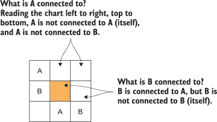

邻接矩阵的原则（图中有两个节点的示例）很简单：你将节点沿着 x 轴放置，然后沿着 y 轴放置相同的节点。如果两个节点相连，则相应的网格方格被填充；否则，留空。在我们的情况下，因为这是一个有向网络，y 轴上的节点被认为是源节点，x 轴上的节点被认为是目标节点，你将在几页后看到。因为我们的数据分析网络也是加权的，我们将使用饱和度来表示权重，浅色表示较弱的连接，深色表示较强的连接。

在 D3 中构建邻接矩阵的唯一问题是它没有现成的布局，这意味着你必须手动构建，就像我们之前构建条形图、散点图和箱形图那样。Mike Bostock 有一个令人印象深刻的例子，可以在[`bost.ocks.org/mike/miserables/`](http://bost.ocks.org/mike/miserables/)找到，但你也可以用不太多的代码制作出功能性的东西，我们将在列表 7.4 中的函数中这样做。然而，这样做的时候，我们需要处理从我们的 CSV 文件中创建的两个 JavaScript 对象数组，并格式化数据，使其易于处理。这接近于编写我们自己的布局，我们将在第十章中这样做，这通常是一个好主意。

你会在列表 7.4 中注意到的一件事可能会让你感到害怕，那就是 Promise API。*承诺*是异步函数，当异步调用完成时，会触发 resolve 或 reject 事件。我们不是用它们来实现复杂的异步行为——我们用它们来调用 `Promise.all`，这允许我们传递一个承诺数组，并且只有在所有这些承诺都解决或其中一个被拒绝时才会调用一个函数。我们在列表 7.4 中看到的简单的承诺包装器是你可以如何包装一个回调函数，比如 `d3.csv`，使其作为一个承诺解决。使用像这样的核心 ES6 功能，这在行业中会遇到，比像 `d3.queue` 这样的辅助库更好。我决定在需要等待两个或更多函数的异步行为时使用承诺，因为我认为让你接触并熟悉承诺比特定的 D3 方法更有益。

##### 列表 7.4\. 邻接矩阵函数

```
function adjacency() {
  var PromiseWrapper = d => new Promise(resolve => d3.csv(d, p => resolve(p)))*1*
     Promise.all([PromiseWrapper("nodelist.csv"),
            PromiseWrapper("edgelist.csv")])
         .then(resolve => {
           createAdjacencyMatrix(resolve[0], resolve[1])                      *2*
         })

     function createAdjacencyMatrix(nodes, edges) {
       var edgeHash = {};
       edges.forEach(edge => {
         var id = edge.source + "-" + edge.target;
         edgeHash[id] = edge;                                                 *3*
       })

       var matrix = [];
       nodes.forEach((source, a) => {
         nodes.forEach((target, b) => {                                       *4*
         var grid =
           {id: source.id + "-" + target.id,
                x: b, y: a, weight: 0};                                       *5*
          if (edgeHash[grid.id]) {
            grid.weight = edgeHash[grid.id].weight;                           *6*
          }
          matrix.push(grid);
        })
      })

      d3.select("svg")
        .append("g")
        .attr("transform", "translate(50,50)")
        .attr("id", "adjacencyG")
        .selectAll("rect")
        .data(matrix)
        .enter()
        .append("rect")
        .attr("class", "grid")
        .attr("width", 25)
        .attr("height", 25)
        .attr("x", d => d.x * 25)
        .attr("y", d => d.y * 25)
        .style("fill-opacity", d => d.weight * .2)

      d3.select("svg")                                                        *7*
        .append("g")
        .attr("transform", "translate(50,45)")
        .selectAll("text")
        .data(nodes)
        .enter()
        .append("text")
        .attr("x", (d,i) => i * 25 + 12.5)
        .text(d => d.id)
        .style("text-anchor", "middle")

      d3.select("svg")                                                        *8*
        .append("g")
        .attr("transform", "translate(45,50)")
        .selectAll("text")
        .data(nodes)
        .enter()
        .append("text")
        .attr("y", (d,i) => i * 25 + 12.5)
        .text(d => d.id)
        .style("text-anchor", "end")
    };
  };
```

+   ***1* 我们需要将我们的调用包裹在承诺中才能使用 promise.all**

+   ***2* Promise.all 返回一个结果数组，其顺序与发送的承诺相同**

+   ***3* 一个散列允许我们测试源-目标对是否有链接**

+   ***4* 创建所有可能的源-目标连接**

+   ***5* 根据源-目标数组位置设置 xy 坐标**

+   ***6* 如果在我们的边列表中有一个相应的边，就给它那个权重**

+   ***7* 从节点创建水平标签**

+   ***8* 垂直标签使用 text-anchor: end 因为这样可以更好地对齐**

我们正在构建一个对象矩阵数组，这可能看起来有些晦涩。但如果你在你的控制台中检查它，你会看到，就像图 7.4 中一样，它是一个包含每个可能的连接及其强度（如果存在）的列表。

##### 图 7.4\. 我们正在构建的连接数组。请注意，每个可能的连接都存储在数组中。只有存在于我们的数据集中的连接才有非 0 的权重值。此外，请注意，我们的 CSV 导入将权重值作为字符串创建。

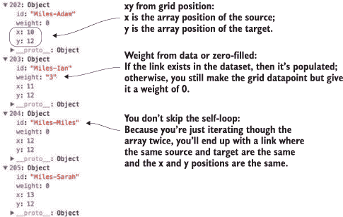

图 7.5 显示了基于节点列表和边列表的结果邻接矩阵。

##### 图 7.5\. 一个加权、有向的邻接矩阵，其中浅橙色表示较弱的连接，深橙色表示较强的连接。源位于 y 轴，目标位于 x 轴。矩阵显示 Sarah、Nadieh 和 Hajra 没有给任何人反馈，而 Kai 给了 Susie 反馈，Susie 也给了 Kai 反馈（我们在网络分析中称之为*互惠关系*）。

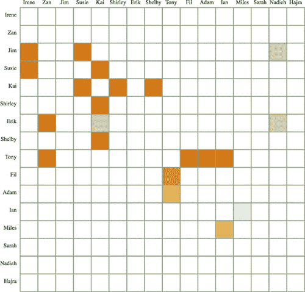

你会注意到在许多邻接矩阵中，表示节点到自身连接的方块总是被填充的。在网络的术语中，这被称为*自环*，它发生在节点连接到自身时。在我们的例子中，这意味着有人给自己提供了正反馈，幸运的是，在我们的数据集中没有人足够糟糕到去做这样的事情。

如果我们愿意，我们可以添加交互性来帮助使矩阵更易于阅读。没有突出显示方块行和列的网格很难阅读。在我们的矩阵中添加高亮显示很简单。我们只需要添加一个鼠标悬停事件监听器，该监听器触发一个 `gridOver` 函数来突出显示所有具有相同 x 或 y 值的矩形：

```
d3.selectAll("rect.grid").on("mouseover", gridOver);
function gridOver(d) {
  d3.selectAll("rect").style("stroke-width", p =>
  p.x == d.x || p.y == d.y ? "4px" : "1px");
};
```

现在，你可以在图 7.6 中看到，将光标移至网格方块上时，会突出显示该网格方块所在的行和列。

##### 图 7.6\. 网格方块的列和行邻接高亮显示。在这个例子中，鼠标位于 Erik 到 Kai 的边上，因此突出显示了 Erik 行和 Kai 列。你可以看到 Erik 给了三个人反馈，而 Kai 则从四个人那里收到了反馈。

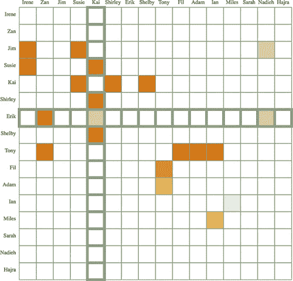

#### 7.1.3\. 弧图

另一种图形表示网络的方法是使用弧图。*弧图*将节点沿一条线排列，并在该线之上和/或之下绘制链接（如图 7.7 所示）。与邻接矩阵让您快速看到边动态不同，弧图让您快速看到节点动态。您可以看到哪些节点是孤立的，哪些节点有很多连接，以及对这些连接方向性的直观感受。

##### 图 7.7\. 弧图的组成部分是节点用圆圈表示，连接用弧线表示，节点沿基线排列，弧线相对于基线的位置表示连接的方向。

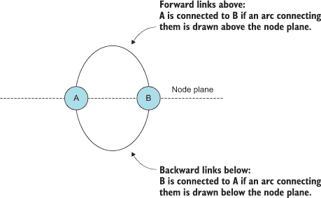

同样，弧图没有可用的布局，而且示例也更少，但代码一看，原理就相当简单。我们构建了一个类似于邻接矩阵的伪布局，但这次我们需要处理节点以及链接，如图 7.5 所示。

##### 列表 7.5\. 弧图代码

```
  function createArcDiagram(nodes,edges) {                         *1*
   var nodeHash = {};
   nodes.forEach((node, x) => {
     nodeHash[node.id] = node;                                     *2*
     node.x = parseInt(x) * 30;                                    *2*
   })
   edges.forEach(edge => {
     edge.weight = parseInt(edge.weight);
     edge.source = nodeHash[edge.source];                          *3*
     edge.target = nodeHash[edge.target];                          *3*
   })

   var arcG = d3.select("svg").append("g").attr("id", "arcG")
        .attr("transform", "translate(50,250)");

   arcG.selectAll("path")
      .data(edges)
      .enter()
      .append("path")
      .attr("class", "arc")
      .style("stroke-width", d => d.weight * 2)
      .style("opacity", .25)
      .attr("d", arc)
   arcG.selectAll("circle")
      .data(nodes)
      .enter()
      .append("circle")
      .attr("class", "node")
      .attr("r", 10)
      .attr("cx", d => d.x)

   function arc(d,i) {                                             *4*
     var draw = d3.line().curve(d3.curveBasis)
     var midX = (d.source.x + d.target.x) / 2
     var midY = (d.source.x - d.target.x)
     return draw([[d.source.x,0],[midX,midY],[d.target.x,0]])
   }
 }
```

+   ***1* 使用与 adjacencyMatrix 相同的 Promise.all 的结果**

+   ***2* 创建一个哈希，将每个节点 JSON 对象与其 ID 值关联，并根据其数组位置设置每个节点的 x 位置**

+   ***3* 将节点的字符串 ID 替换为指向 JSON 对象的指针**

+   ***4* 从源节点绘制一条基于基础插值的线到它们上面的计算中间点，再到目标节点**

注意，我们构建的边数组使用一个哈希表，其中包含边的 ID 值来创建对象引用。通过构建具有对源和目标节点的引用的对象，我们可以轻松计算我们用来表示连接的`<line>`或`<path>`元素的图形属性。这是我们在本章后面将要查看的力布局中使用的方法。代码的结果是您的第一个弧图，如图 7.8 所示。

##### 图 7.8\. 一个弧图，节点之间的连接用节点上方和下方的弧线表示。我们可以看到前两个（左侧）节点没有出向链接，最右侧的三个节点也没有出向链接。弧线的长度没有意义，它基于我们如何布置节点（距离较远的节点将具有更长的链接），但弧线的宽度基于连接的权重。

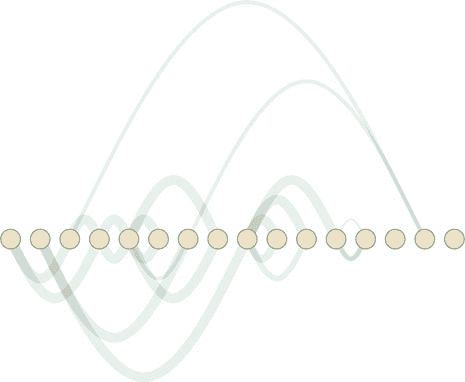

对于这样的抽象图表，您已经达到了交互性不再是可选的程度。尽管链接遵循规则，并且您没有处理太多节点或边，但很难弄清楚什么连接到什么以及如何连接。您可以通过在鼠标悬停时突出显示连接节点来添加有用的交互性。您还可以通过添加两个新功能来使节点在鼠标悬停时突出显示连接的边，如列表 7.6 所示，结果如图 7.9 所示。

##### 图 7.9\. 边的鼠标悬停行为（右侧），悬停的边为橙色，源节点为浅绿色，目标节点为深绿色。节点的鼠标悬停行为（左侧），悬停的节点为橙色，连接的边为浅橙色。

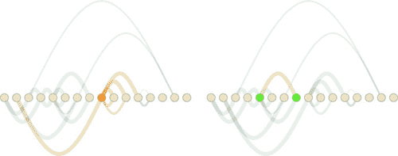

##### 列表 7.6\. 弧图交互性

```
d3.selectAll("circle").on("mouseover", nodeOver)
d3.selectAll("path").on("mouseover", edgeOver)
function nodeOver(d) {
   d3.selectAll("circle").classed("active", p => p === d)          *1*
   d3.selectAll("path").classed("active", p => p.source === d
          || p.target === d)                                       *2*
}
function edgeOver(d) {
   d3.selectAll("path").classed("active", p => p === d)
   d3.selectAll("circle")
      .classed("source", p => p === d.source)                      *3*
      .classed("target", p => p === d.target)                      *3*
}
```

+   ***1* 选择所有节点以设置悬停节点的节点类为“active”**

+   ***2* 任何选定的节点作为源或目标出现的边将以红色显示**

+   ***3* 这个嵌套 if 检查一个节点是否是源或目标，并相应地设置其类**

如果您想进一步探索弧图并希望将其用于更大的数据集，您还应该查看*蜂巢图*，它们是按辐条排列的弧图。本书中不会处理蜂巢图，但有一个用于蜂巢图的插件布局，您可以在[`github.com/d3/d3-plugins/tree/master/hive`](https://github.com/d3/d3-plugins/tree/master/hive)中查看。邻接矩阵和弧图都受益于您对排序和放置节点的控制，以及它们的线性布局方式。

网络可视化的下一个方法，也是本章剩余部分的重点，使用完全不同的原则来确定节点和边的放置方式和位置。

### 7.2\. 力导向布局

*力布局*的名字来源于它确定网络最优化图形表示的方法（数据可视化中又一例糟糕的命名）。像第五章中的词云和桑基图一样，`force()`布局动态更新其元素的位置以找到最佳匹配。与那些布局不同，它是在实时而不是在渲染前的预处理步骤中连续进行的。力布局背后的原理是三种力的相互作用，如图 7.10 所示。这些力将节点相互推开，将连接的节点相互吸引，并防止节点飞出视线。

##### 图 7.10\. 力导向算法中的力：吸引力/排斥力、重力和链接吸引力。其他因素，如层次化打包和社区检测，也可以纳入力导向算法，但上述功能是最常见的。为了提高性能，对大型网络进行力近似。

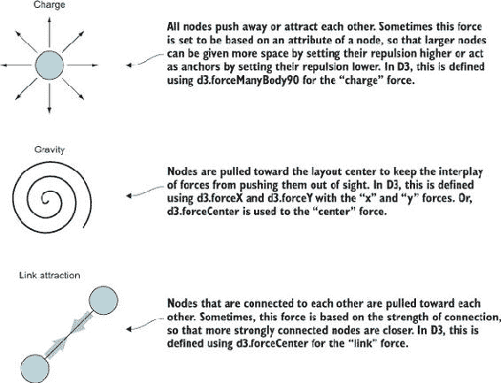

在本节中，你将了解力导向布局的工作原理，如何创建它们，以及网络分析的一般原则，这些原则将帮助你更好地理解它们。你还将了解如何添加和删除节点和边，以及如何动态调整布局的设置。

#### 7.2.1\. 玩转力

在我们深入研究带链接的网络之前，让我们先看看几个力：x、y、电荷和碰撞。要初始化力，你必须首先初始化`d3.forceSimulation`，它计算你的力的效果，并从其中绘制你的网络。在列表 7.7 中的代码中，我们将初始化一个随机数据集以进行实验，并创建一个仅包含`manyBody`力的简单`forceSimulation`，该力将节点相互吸引。

##### 列表 7.7\. 无链接或碰撞检测的初始力模拟

```
var roleScale = d3.scaleOrdinal()
  .range(["#75739F", "#41A368", "#FE9922"])

var sampleData = d3.range(100).map((d,i) => ({r: 50 - i * .5}))      *1*

var manyBody = d3.forceManyBody().strength(10)                       *2*
var center = d3.forceCenter().x(250).y(250)                          *3*

var.force("charge", manyBody)                                        *4*
   .force("center", center)                                          *4*
   .nodes(sampleData)                                                *5*
   .on("tick", updateNetwork)                                        *6*

d3.select("svg")
   .selectAll("circle")
   .data(sampleData)                                                 *7*
   .enter()
   .append("circle")
   .style("fill", (d, i) => roleScale(i))
   .attr("r", d => d.r)

function updateNetwork() {
   d3.selectAll("circle")
     .attr("cx", d => d.x)                                           *8*
     .attr("cy", d => d.y)
}
```

+   ***1* 创建一百个从 0.5 半径到 49.5 半径的圆圈**

+   ***2* 注册一个具有正强度的 manyBody 力以使其具有吸引力**

+   ***3* 注册一个中心强度以尝试使节点中心位于 250,250**

+   ***4* 将力附加到我们的模拟中**

+   ***5* 将节点数组发送到模拟中，以便它知道如何计算**

+   ***6* 在每个滴答时运行 updateNetwork 函数**

+   ***7* 为每个数据点画一个圆圈**

+   ***8* 每次模拟时钟滴答时，根据模拟计算的新位置更新它们的位置**

尽管你的第一次`forceSimulation`实现可能不会太令人印象深刻，结果看起来可能像图 7.11 所示。圆圈会四处弹跳，最终堆叠在一起——如果你这么想，这正是如果你使所有圆圈相互吸引时你可能期望的结果。

##### 图 7.11\. 仅节点受到吸引力作用的力模拟结果

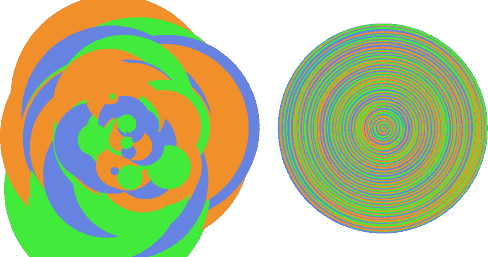

为了使这个例子更有趣，让我们使用 `d3.force-Collide` 注册一个“碰撞”力，并将其设置为基于每个节点的大小（其 `.r` 属性）进行碰撞检测：

```
.force("collision", d3.forceCollide(d => d.r))
```

使用这种方法，我们得到了一个简单的气泡图，如图 7.12 所示。

##### 图 7.12\. 使用碰撞检测布局的样本节点数据。这是创建简单气泡图的一种方法。

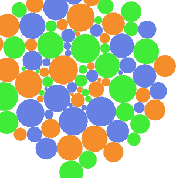

我们最后要考虑的是使用 x 和 y 约束来布局我们的节点。如果我们用正态分布的随机数据替换随机数据，并添加一个 x 约束以使其成一行，以及一个 y 约束以使其 y 位置对应其值，我们就可以生成蜜蜂群图，如下面的列表所示。

##### 列表 7.8\. 蜜蜂群图的代码修改

```
var sampleData = d3.range(300).map(() =>
({r: 2, value: 200 + d3.randomNormal()() * 50}))                 *1*
...
  var force = d3.forceSimulation()
    .force("collision", d3.forceCollide(d => d.r))
    .force("x", d3.forceX(100))                                  *2*
    .force("y", d3.forceY(d => d.value).strength(3))             *3*
    .nodes(sampleData)
    .on("tick", updateNetwork)
```

+   ***1* 一堆正态分布的点，我们已将其偏移，以便它们可以轻松地出现在屏幕上**

+   ***2* 对每个节点施加一个力，使其 x 位置尽可能接近 100**

+   ***3* 对每个节点施加更强的力，使其 y 位置反映其值**

这次模拟的结果试图以这种方式排列每个节点，即它们沿共享的 x 轴排列，但位置显示它们的值。如图 7.13 所示，这种蜜蜂群图相当流行，允许您在保持单个样本点的同时显示分布。

##### 图 7.13\. 使用我们的代码创建的蜜蜂群图（旋转以更好地适应页面）

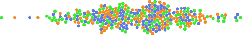

#### 7.2.2\. 创建力导向网络图

您一直在使用的 `forceSimulation()` 布局，您在 列表 7.9 中看到的初始化，还有更多设置。我们之前使用的 `nodes()` 方法与您在 第五章 中看到的桑基图布局中的方法类似，但在 `forceSimulation` 中的链接是通过一个“链接”力注册的，这个力按照您预期的设置描述了源和目标，以及那些链接的数组。我们需要从 edges.csv 中获取链接，并将源和目标转换为与我们在弧形图中做的那样，转换为对象。这就是 `forceSimulation()` 所期望的格式。它还接受整数值，其中整数值对应于节点数组中节点的数组位置，就像 第五章 中桑基图链接数组的格式。除了链接力之外，我们唯一的新设置是使用 `forceManyBody` 并设置一个负值，这意味着节点会相互推开。这将导致连接的节点相互吸引，并创建人们熟悉的那种网络图。

##### 列表 7.9\. 力布局函数

```
function createForceLayout(nodes,edges) {
var roleScale = d3.scaleOrdinal()
  .domain(["contractor", "employee", "manager"])
  .range(["#75739F", "#41A368", "#FE9922"])

     var nodeHash = nodes.reduce((hash, node) => {hash[node.id] = node;
return hash;
}, {})

     edges.forEach(edge => {
        edge.weight = parseInt(edge.weight)
        edge.source = nodeHash[edge.source]
        edge.target = nodeHash[edge.target]
      })

    var linkForce = d3.forceLink()

    var simulation = d3.forceSimulation()
     .force("charge", d3.forceManyBody().strength(-40))         *1*
     .force("center", d3.forceCenter().x(300).y(300))
     .force("link", linkForce)
     .nodes(nodes)
     .on("tick", forceTick)

   simulation.force("link").links(edges)

   d3.select("svg").selectAll("line.link")
      .data(edges, d => `${d.source.id}-${d.target.id}`)        *2*
      .enter()
      .append("line")
      .attr("class", "link")
      .style("opacity", .5)
      .style("stroke-width", d => d.weight);

   var nodeEnter = d3.select("svg").selectAll("g.node")         *2*
      .data(nodes, d => d.id)
      .enter()
      .append("g")
      .attr("class", "node");
   nodeEnter.append("circle")
      .attr("r", 5)
      .style("fill", d => roleScale(d.role))
   nodeEnter.append("text")
      .style("text-anchor", "middle")
      .attr("y", 15)
      .text(d => d.id);

   function forceTick() {
     d3.selectAll("line.link")
        .attr("x1", d => d.source.x)
        .attr("x2", d => d.target.x)
        .attr("y1", d => d.source.y)
        .attr("y2", d => d.target.y)
     d3.selectAll("g.node")
        .attr("transform", d => `translate(${d.x},${d.y})`)
   }
}
```

+   ***1* 每个节点相互推开的程度——如果设置为正值，节点会相互吸引**

+   ***2* 当我们稍后更新网络时，节点和边的键值将有所帮助**

力导向布局的动画性质在页面上消失了，但你可以在图 7.14 中看到一般网络结构，这在邻接矩阵或弧图中不太突出。很明显，网络中存在密集和稀疏的部分，关键经纪人如 Zan 连接了两个不同的群体。我们还可以看到，有两个人没有连接任何人，既没有给出也没有收到反馈。这些节点仍然在屏幕上的唯一原因是布局的重力将未连接的部分拉向中心。我们可以看到，我们的两位经理只向两个人提供了反馈，但他们在我们两个团队的结构中处于不同的位置。如果 Irene 明天辞职，这个网络不会有太大的变化，但如果 Zan 辞职，那么两个团队之间将没有任何沟通。

##### 图 7.14\. 基于我们的数据集和默认设置在力导向布局中图形化组织的一种力导向布局。经理用橙色表示，员工用绿色表示，承包商用紫色表示。

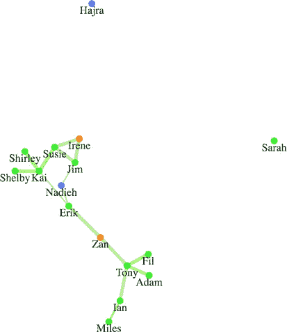

线条的粗细对应于连接的强度。但尽管我们有了边强度，在这个布局中我们失去了边的方向。你可以通过链接以半透明的方式绘制，从而知道不同权重的链接何时重叠。我们需要使用一种方法来显示这些链接是向节点还是从节点发出的。一种方法是将我们的线条转换为箭头，使用 SVG 标记。

#### 7.2.3\. SVG 标记

有时候你希望在绘制的线条或路径上放置一个符号，例如箭头。在这种情况下，你必须在 `svg:defs` 中定义一个标记，并将其与你想在上面绘制的元素关联起来。你可以在 HTML 中静态定义你的标记，或者像任何 SVG 元素一样动态创建它，就像我们接下来要做的那样。我们定义的标记可以是任何类型的 SVG 形状，但我们将使用路径，因为它允许我们绘制箭头。标记可以绘制在线条的开始、结束或中间，并且有设置来确定其相对于父元素的方向。请参阅以下列表。

##### 列表 7.10\. 标记定义和应用

```
var marker = d3.select("svg").append('defs')
   .append('marker')
   .attr("id", "triangle")
   .attr("refX", 12)
   .attr("refY", 6)
   .attr("markerUnits", 'userSpaceOnUse')                     *1*
   .attr("markerWidth", 12)
   .attr("markerHeight", 18)
   .attr("orient", 'auto')
   .append('path')
   .attr("d", 'M 0 0 12 6 0 12 3 6');
d3.selectAll("line").attr("marker-end", "url(#triangle)");    *2*
```

+   ***1* 标记的默认设置基于父元素的 stroke-width，在我们的情况下会导致难以阅读的标记**

+   ***2* 通过设置 marker-end、marker-start 或 marker-mid 属性指向标记，将标记分配给线条**

在列表 7.10 中定义了标记后，您现在可以更有效地阅读网络（如图 7.15 所示）。您可以看到节点是如何相互连接的，并且可以找出哪些节点之间有相互联系（节点在两个方向上都有连接）。相互联系是重要的，因为喜欢凯蒂·佩里推文的人和被凯蒂·佩里喜欢的推文的人之间有很大的区别（凯蒂·佩里是当前拥有最多追随者的 Twitter 用户）。边的方向很重要，但您可以用其他方式表示方向，例如使用曲线边或一端比另一端更粗的边。要实现类似的功能，您需要使用`<path>`而不是我们用于桑基布局或弧形图的`<line>`。

##### 图 7.15。现在边现在显示标记（箭头）以指示连接的方向。请注意，所有箭头的大小都相同。您可以通过使用 CSS 规则如`marker > path {fill: # 93C464;}`来控制箭头的颜色。

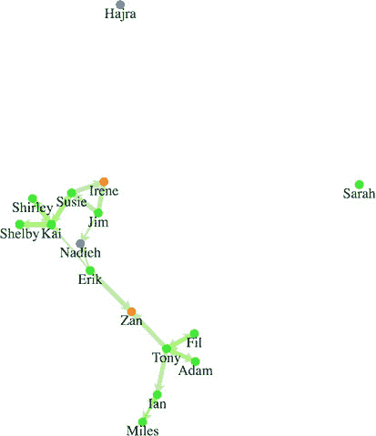

如果您在自己的机器上运行了这段代码，您的网络应该看起来与图 7.15 完全一样。这是因为尽管使用力导向布局创建的网络可视化是力的相互作用的结果，但只要输入没有变化，D3 的力模拟就是确定性的。然而，如果您的网络输入不断变化，帮助读者的一个方法就是使用力导向布局生成网络，并将其固定以创建网络底图。然后，您可以对该固定网络应用任何后续的图形更改。底图的概念来自地理学，在网络可视化中指的是使用不同大小和/或颜色的节点和边相同的布局。这允许读者根据不同的度量标准识别网络中显著不同的区域。您可以在图 7.16 中看到底图的使用，它展示了同一个网络可以用多种方式来衡量。

##### 图 7.16。使用度中心性（左上角）、接近中心性（右上角）、特征向量中心性（左下角）和中介中心性（右下角）测量的相同网络。我们只看到度中心性，但您可以使用 jsnetworkx.js 等库探索其他中心性。中心性更高的节点更大且呈鲜红色，而中心性较低的节点较小且为灰色。请注意，尽管一些节点根据所有度量标准都是中心节点，但它们的相对中心性各不相同，其他节点的整体中心性也是如此。

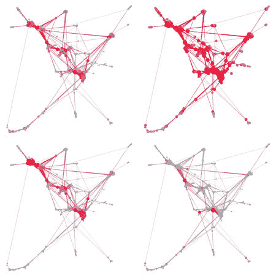

| |
| --- |

**信息可视化术语：毛线球**

网络可视化令人印象深刻，但它们也可能过于复杂，以至于难以阅读。因此，你可能会遇到对过于密集而难以阅读的网络进行的批评。这些网络可视化通常被称为*毛线球*，因为它们边缘的广泛重叠使它们看起来像一团杂乱无章的头发。

如果你认为力导向布局难以阅读，你可以将其与另一种网络可视化，如邻接矩阵搭配，并在用户导航任一可视化时突出显示两者。你可以在第十一章中看到这种搭配可视化技术的示例。


力导向布局提供了看到更大结构的额外好处。根据你的网络的大小和复杂性，这可能是足够的。但在处理网络数据时，你可能需要表示其他网络度量。 

#### 7.2.4. 网络度量

网络已经被研究了很长时间——至少几十年；如果你考虑数学中的图论，那可能就是几个世纪。因此，在处理网络时，你可能会遇到一些术语和度量。这只是一个简要概述。如果你想了解更多关于网络的知识，我建议阅读 S. Weingart、I. Milligan 和 S. Graham 关于网络和网络分析的出色介绍，可以在[www.themacroscope.org/?page_id=337](http://www.themacroscope.org/?page_id=337)找到。

##### 边权重

你会注意到我们的数据集中包含了每个链接的`权重`值。这代表了两个节点之间连接的强度。在我们的案例中，我们假设拥有更多收藏夹的 Twitter 用户拥有更强的连接。我为更高的权重画了更粗的线条，但我们也可以根据那个权重调整力布局的工作方式，就像你接下来会看到的那样。

##### 中心性

网络是系统的表示，你想要了解系统中的节点之一是哪些比其他节点更重要，这被称为*中心性*。中心节点被认为在网络中拥有更多的权力或影响力。中心性的测量方法有很多种，其中一些在图 7.16 中展示，不同的测量方法可以更准确地评估不同网络类型中的中心性。

##### 度

度，也称为*度中心性*，是一个节点连接到的链接总数。在我们的示例数据中，Mo 的度数为 6，因为他有 6 个链接的源或目标。度是衡量网络中节点重要性的粗略指标，因为你假设拥有更多连接的人或事物在网络中拥有更多的权力或影响力。加权度用于指代连接到节点的总价值，这将使 Mo 的值为 18。此外，你还可以将度区分为*入度*和*出度*，它们用于区分传入和传出链接，对于 Mo 的情况，分别是 4 和 2。

你可以通过过滤边数组来轻松计算度中心性，只显示涉及该节点的链接：

```
nodes.forEach(d => {
  d.degreeCentrality = edges.filter(
    p => p.source === d || p.target === d).length
})
```

我们将使用这个功能来影响力导向布局的运行方式。现在，让我们添加一个按钮，根据节点的`weight`属性来调整节点大小：

```
d3.select("#controls").append("button")
  .on("click", sizeByDegree).html("Degree Size")
function sizeByDegree() {
  simulation.stop()
  simulation.force("charge", d3.forceManyBody()
    .strength(d => -d.degreeCentrality * 20))
  simulation.restart()
  d3.selectAll("circle")
    .attr("r", d => d.degreeCentrality * 2)
}
```

图 7.17 显示了度中心性测量的值。虽然你可以看到并轻松计数这个小网络中的连接和节点，但能够一眼看出最和最不连接的节点是非常有价值的。请注意，我们正在计算双向链接，因此尽管凯伊和托尼连接到的人数相同，但凯伊的圆圈略大，因为他参与的总连接更多（来和去）。

##### 图 7.17\. 通过设置圆的半径等于权重乘以 2，按权重调整节点大小表示每个节点的总连接数。

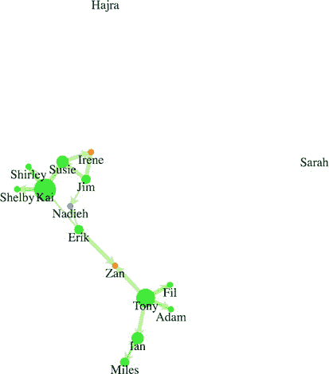

##### 聚类和模块度

了解一个网络最重要的几个方面之一是判断该网络中是否存在社区以及它们是什么样的。这通过观察某些节点是否比网络中的其他部分更紧密地连接在一起来实现，这被称为*模块度*。你也可以观察节点是否相互连接，这被称为*聚类*。前面提到的派系是同一测量的一部分，*派系*是指一组完全相互连接的节点。

注意，这种相互关联和社区结构应该从力导向布局中直观地出现。你看到四个高度连接的用户在一个集群中，其他用户则远离。如果你更喜欢测量你的网络以尝试揭示这些结构，你可以在[`github.com/upphiminn/jLouvain`](https://github.com/upphiminn/jLouvain)这样的库中找到一个社区检测算法的实现。此算法在浏览器中运行，可以很容易地与你的网络集成，根据社区成员资格着色你的网络，甚至根据模块组织网络，就像你在这里看到的那样：

[`bl.ocks.org/emeeks/302096884d5fbc1817062492605b50dd`](http://bl.ocks.org/emeeks/302096884d5fbc1817062492605b50dd)。

#### 7.2.5\. 力导向布局设置

当我们初始化力导向布局时，我们开始时的电荷设置为-1000。电荷和几个其他设置可以让你更控制力导向布局的运行方式。

##### 电荷

*电荷*设置节点相互推开或吸引的速度。如果你不设置电荷强度，则默认设置为-30。除了设置固定的电荷值外，你还可以使用访问器函数，根据节点的属性来设置电荷值。例如，你可以根据节点的权重（度中心性）来设置电荷，这样连接数量多的节点会推开其他节点，在图表上给它们更多的空间。

在力导向布局中，负电荷值表示排斥，但如果你想让节点施加吸引力，你可以将它们设置为正值。这可能会在传统的网络可视化中引起问题，但对于更复杂的可视化可能很有用。

##### 重力

这曾经是一个通用的重力设置，但现在已被独立的 x 和 y 约束所取代。我们一直在使用的另一种将网络居中的方法是使用中心约束在视觉上居中它。当这种视觉居中不够时，你将想要尝试重力。

##### linkForce

节点之间的吸引力是通过设置“链接”力的`strength`属性来确定的。将你的`link.strength()`参数设置得太高会导致你的网络折叠回自身，你可以通过网络可视化中突出的三角形来识别这一点。

你可以将`link.strength`设置为一个函数，并将其与边权重关联起来，以便具有更高或更低权重值的边具有更低或更高的距离设置。力布局是一个物理模拟，这意味着它使用物理隐喻来安排网络以最佳图形形状。如果你的网络有更强和更弱的链接，如我们的示例所示，那么让这些边对控制节点施加更强或更弱的影响是有意义的。因此，那些对其同事的信心评分较高的人将与那些评分较低的人相比，在视觉上更接近那些同事：

```
    var linkForce = d3.forceLink().strength(d => d.weight * .1)

    var simulation = d3.forceSimulation()
      .force("charge", d3.forceManyBody().strength(-500))
      .force("x", d3.forceX(250))
      .force("y", d3.forceY(250))
```

我们正在增加排斥电荷，因为我们正在将最大链接强度增加到 10。我们还使用画布重力与 x 和 y 力一起使用，因为这种排斥电荷会将节点推离屏幕。图 7.18 显著展示了结果，这些结果反映了几个连接的弱性质。

##### 图 7.18\. 通过将节点之间吸引力的强度基于节点之间连接的强度，你可以看到网络结构的显著变化。x 和 y 之间的较弱连接允许网络的那部分漂移开去。

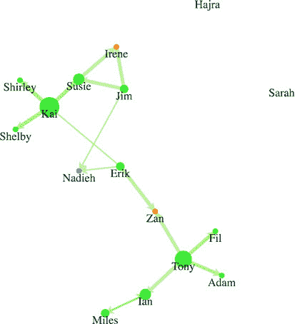

#### 7.2.6\. 更新网络

当你创建一个网络时，你希望为用户提供添加或删除节点到网络，或拖动它们的能力。你可能还希望动态地调整各种设置，而不是在第一次创建力布局时更改它们。

##### 停止和重新启动布局

力布局设计为在网络布局得足够好，节点不再移动到新位置后“冷却”并最终停止。当布局以这种方式停止时，如果你想再次让它动画化，你需要重新启动它。此外，如果你对力设置进行了任何更改或想要添加或删除网络的部分，那么你需要停止它并重新启动它。

##### stop()

你可以通过使用 `simulation.stop()` 来关闭力交互，这将停止运行模拟。当你的网页上的其他组件发生交互或网络样式发生变化时，停止网络是很好的，一旦交互结束，再重新启动它。

##### restart()

要开始或重新启动布局的动画，请使用 `simulation.restart()`。你不必在首次创建时启动模拟，它是自动启动的。

##### tick()

最后，如果你想将布局向前移动一步，你可以使用 `simulation.tick()`。力布局可能很耗费资源，你可能只想运行几秒钟而不是让它持续运行。如果你不需要复杂的动画，你也可以预先计算你的图表，这样你就可以在布局之前使用 `simulation.tick(120)` 预先计算你的蜜蜂群图。在没有图形动画的情况下模拟网络要快得多，你还可以使用 D3 过渡来动画化节点移动到它们最终预先计算的位置。

##### force.drag()

在传统的网络分析程序中，用户可以将节点拖动到新的位置。这是通过使用行为 `d3.drag()` 来实现的。行为就像一个组件，因为它通过 `.call()` 被元素调用，但它不创建 SVG 元素，而是创建一组事件监听器。

在 `d3.drag()` 的情况下，这些事件监听器对应于拖动事件，它赋予你在力布局运行时点击和拖动节点的能力。你可以通过选择它们并在该选择上调用 `d3.drag()` 来在所有节点上启用拖动。请参见以下列表。

##### 列表 7.11\. 为网络设置拖动

```
var drag = d3.drag()
drag
     .on("drag", dragging)                   *1*

function dragging(d) {
    var e = d3.event                         *2*
    d.fx = e.x                               *3*
    d.fy = e.y
    if (simulation.alpha() < 0.1) {
      simulation.alpha(0.1)                  *4*
      simulation.restart()
    }
}

d3.selectAll("g.node").call(drag);           *5*
```

+   ***1* 拖动行为也暴露了“开始”和“结束”事件**

+   ***2* 这将给我们事件，以便我们可以获取当前的 x 和 y 坐标**

+   ***3* 设置 fx 或 fy 设置节点的固定位置**

+   ***4* 如果模拟已经足够冷却，就重新加热并重新启动**

+   ***5* 将拖动行为分配给节点**

##### 固定节点位置

当力布局运行时，它会检查每个节点是否有 .fx 或 .fy 属性，并且不会调整具有这些属性的节点的 x 和/或 y 位置。一种有效的人际交互技术是在用户与之交互时将节点设置为固定。这允许用户将节点拖动到画布上的某个位置，以便他们可以直观地对重要节点进行排序。拖动我们的一些节点的影响如图 7.19 所示。

##### 图 7.19\. 代表管理员的两个节点已被拖动到顶部角落，允许其余节点根据模拟的力（被拖向中心的同时被拖向固定节点）占据其位置。

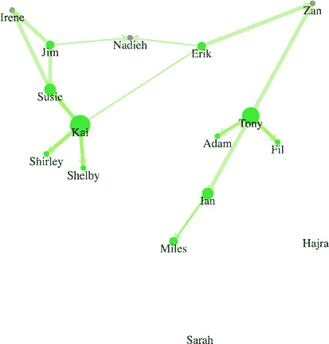

#### 7.2.7\. 移除和添加节点和链接

在处理网络时，您可能想要过滤网络或给用户添加或删除节点的权限。要过滤网络，您需要 `stop()` 它，移除任何不再是网络一部分的节点和链接，将这些数组重新绑定到力布局，然后 `restart()` 布局。

这可以通过对构成您的节点数组的过滤来实现。例如，我们可能只想看到没有承包商和经理的网络，这样我们就可以看到最有影响力的同侪是谁，以及员工网络是如何的。

如果我们移除了节点，我们布局中仍然会有引用不再存在的节点的链接。我们需要对我们的链接数组进行更复杂的过滤。不过，通过使用数组的 `.indexOf` 函数，我们可以通过检查源和目标是否都在我们的过滤节点数组中来轻松创建过滤后的链接。因为我们最初在将数组绑定到选择时使用了键值，所以我们可以使用 `selection.exit()` 行为来轻松更新我们的网络。您可以在以下列表中看到如何这样做，以及 图 7.20 中的效果。

##### 图 7.20\. 网络已被过滤，只显示不是经理或承包商的节点。此图捕捉了两个过程的中途，节点从全不透明到 0 不透明的转换，以及边的移除。

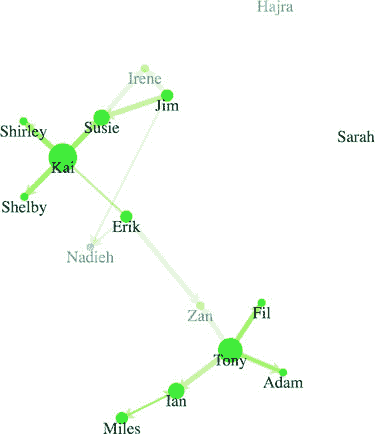

##### 列表 7.12\. 过滤网络

```
function filterNetwork() {
   simulation.stop()
   var originalNodes = simulation.nodes()                                  *1*
   var originalLinks = simulation.force("link").links()                    *1*

   var influentialNodes = originalNodes.filter(d => d.role === "employee") *2*
   var influentialLinks = originalLinks.filter(d =>
        influentialNodes.includes(d.source) &&
        influentialNodes.includes(d.target))                               *2*

   d3.selectAll("g.node")
      .data(influentialNodes, d => d.id)
      .exit()
      .transition()
      .duration(4000)
      .style("opacity", 0)
      .remove()

   d3.selectAll("line.link")
      .data(influentialLinks, d => `${d.source.id}-${d.target.id}`)
      .exit()
      .transition()
      .duration(3000)
      .style("opacity", 0)                                                 *3*
      .remove()

   simulation
      .nodes(influentialNodes)                                             *4*
   simulation.force("link")
      .links(influentialLinks)
   simulation.alpha(0.1)
   simulation.restart()
}
```

+   ***1* 访问与力布局关联的当前节点数组和链接数组**

+   ***2* 只从引用现有节点的节点和链接中创建一个数组**

+   ***3* 通过在 exit() 上设置转换，它只对正在被移除的节点应用转换，并等待转换完成后才移除它们**

+   ***4* 使用现有的节点和边重新初始化模拟，通过设置 alpha 并重新启动网络**

由于过滤后重新启动了力算法，您可以看到网络在移除这么多节点后形状的变化。这个动画很重要，因为它揭示了网络中的结构变化。

将更多节点和边放入网络中很容易，只要您正确格式化您的数据。您停止力布局，将正确格式化的节点或边添加到相应的数组中，然后像过去一样重新绑定数据。假设我们想要说服艾琳与赞的团队中的某人更紧密地合作。我们可能会建议托尼，因为他在我们图表中联系得很好。例如，如果我们想在艾琳和托尼之间添加一条边，如图 图 7.21 所示，我们需要像之前一样停止力布局，为那条边创建一个新的数据点，并将其添加到我们用于链接的数组中，如 列表 7.13 所示。然后我们重新绑定数据，在重新启动力布局之前为那条边添加一个新的行元素。

##### 图 7.21\. 添加了新边的网络

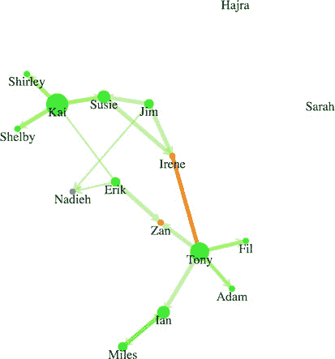

现在 Irene 可以直观地看到她在网络中占据了更中心的位置，整个组织也可以看到网络对可能发生的人员变动具有更强的适应性。请参阅以下列表。

##### 列表 7.13\. 添加边的函数

```
function addEdge() {
    simulation.stop()
    var links = simulation.force("link").links()
    var nodes = simulation.nodes()
    var newEdge = {source: nodes[0], target: nodes[8], weight: 5}
    links.push(newEdge)
    simulation.force("link").links(links)
    d3.select("svg").selectAll("line.link")
    .data(links, d => `${d.source.id}-${d.target.id}`)
    .enter()
    .insert("line", "g.node")
    .attr("class", "link")
    .style("stroke", "#FE9922")
    .style("stroke-width", 5)

    simulation.alpha(0.1)
    simulation.restart()
}
```

现在，让我们想象 Shirley 想要引入一对承包商来参与一个新项目，因此我们有两个新节点和相应的需要添加的链接，如图 7.22 所示。你现在应该已经熟悉了代码和过程，如列表 7.14 所示。

##### 图 7.22\. 添加了两个新节点（Mike 和 Noah），它们都与 Sam 有链接

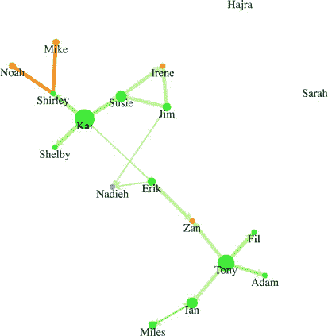

##### 列表 7.14\. 添加节点和边的函数

```
function addNodesAndEdges() {
   simulation.stop()
   var oldEdges = simulation.force("link").links()
   var oldNodes = simulation.nodes()
   var newNode1 = {id: "Mike", role: "contractor", team: "none"}          *1*
   var newNode2 = {id: "Noah", role: "contractor", team: "none"}          *1*
   var newEdge1 = {source: oldNodes[5], target: newNode1, weight: 5}      *2*
   var newEdge2 = {source: oldNodes[5], target: newNode2, weight: 5}      *2*
   oldEdges.push(newEdge1,newEdge2)                                       *3*
   oldNodes.push(newNode1,newNode2)                                       *3*
   simulation.force("link").links(oldEdges)
   simulation.nodes(oldNodes)
   d3.select("svg").selectAll("line.link")
      .data(oldEdges, d => d.source.id + "-" + d.target.id)
    .enter()
    .insert("line", "g.node")
    .attr("class", "link")
    .style("stroke", "#FE9922")
    .style("stroke-width", 5)

 var nodeEnter = d3.select("svg").selectAll("g.node")
    .data(oldNodes, d => d.id)
    .enter()
    .append("g")
    .attr("class", "node")
 nodeEnter.append("circle")
    .attr("r", 5)
    .style("fill", "#FCBC34")
 nodeEnter.append("text")
    .style("text-anchor", "middle")
    .attr("y", 15)
    .text(d => d.id)
    simulation.alpha(0.1)
    simulation.restart()
}
```

+   ***1* 节点始终是一个对象，我们希望新节点与我们的原始节点具有相同的结构**

+   ***2* 边引用原始节点和新节点**

+   ***3* 我们需要将新节点和边添加到现有的数组中，以便模拟能够识别它们**

#### 7.2.8\. 手动定位节点

力导向布局不会移动你的元素。相反，它根据元素之间的 x 和 y 属性计算元素的位置。在每次迭代中，它更新这些 x 和 y 属性。tick 函数选择 `<line>` 和 `<g>` 元素并将它们移动到这些更新的 x 和 y 值。

当你想手动移动元素时，你可以像在列表 7.15 中那样操作。但首先你需要停止力，以防止 tick 函数覆盖你的元素位置。也许 CEO 看过一些这些网络图表，想知道我们是否适当地奖励了那些在网络中处于中心位置的人。让我们将节点布局成散点图，查看每个节点的度中心性（链接数量）与薪资的关系。我们还将添加轴以使其可读。你可以在下面的列表中看到代码，在图 7.23 中看到结果。

##### 图 7.23\. 当网络以散点图表示时，链接会增加视觉杂乱。它提供了与力导向布局的有用对比，但单独阅读可能难以理解。

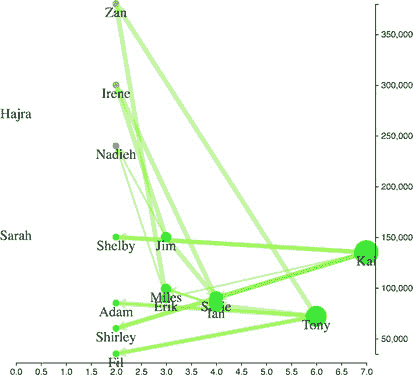

##### 列表 7.15\. 手动移动节点

```
function manuallyPositionNodes() {
   var xExtent = d3.extent(simulation.nodes(), d =>
   parseInt(d.degreeCentrality))
   var yExtent = d3.extent(simulation.nodes(), d => parseInt(d.salary))   *1*
   var xScale = d3.scaleLinear().domain(xExtent).range([50,450])
   var yScale = d3.scaleLinear().domain(yExtent).range([450,50])
   simulation.stop()
   d3.selectAll("g.node")
       .transition()
       .duration(1000)
       .attr("transform", d => `translate(${xScale(d.degreeCentrality)
                          },${yScale(d.salary) })`)                       *2*
   d3.selectAll("line.link")
        .transition()
        .duration(1000)
        .attr("x1", d => xScale(d.source.degreeCentrality))               *3*
        .attr("y1", d => yScale(d.source.salary))
        .attr("x2", d => xScale(d.target.degreeCentrality))
        .attr("y2", d => yScale(d.target.salary))
   var xAxis = d3.axisBottom().scale(xScale).tickSize(4)
   var yAxis = d3.axisRight().scale(yScale).tickSize(4)
   d3.select("svg").append("g").attr("transform",
             "translate(0,460)").call(xAxis)
   d3.select("svg").append("g").attr("transform",
             "translate(460,0)").call(yAxis)
   d3.selectAll("g.node").each(d => {
      d.x = xScale(d.degreeCentrality)                                    *4*
      d.vx = 0                                                            *5*
      d.y = yScale(d.salary)                                              *4*
      d.vy = 0                                                            *5*
    })
}
```

+   ***1* 我们需要将薪资值解析为整数，因为 d3.csv 将所有内容都作为字符串传入**

+   ***2* 手动移动节点和链接**

+   ***3* 手动移动节点和链接**

+   ***4* 更新节点的 xy 坐标以匹配它们的新屏幕坐标**

+   ***5* 将速度置零，以便在重新启动模拟时它们不会保留旧的速度**

注意，你需要更新每个节点的 `x` 和 `y` 属性，但你还需要更新每个节点的 `vx` 和 `vy` 属性。`vx` 和 `vy` 属性是节点在最后一次更新之前沿 x 轴和 y 轴的当前速度。如果你不更新它们，力布局可能会认为节点具有很高的速度，并将它们从新位置猛烈地移动。

如果你没有更新 `x`、`y`、`vx` 和 `vy` 属性，下次你启动力布局时，节点会立即回到你移动它们之前的位置。这样，当你使用 `simulation.restart()` 重新启动力布局时，节点和边会从当前位置开始动画。

#### 7.2.9. 优化

力布局非常资源密集。这就是为什么它按设计冷却并停止运行。如果你有一个使用力布局的大网络运行，你可能会让用户的电脑变得几乎无法使用。因此，优化的第一个技巧是限制你网络中的节点数量以及边的数量。一个普遍的规则是不超过 500 个节点，但这个限制曾经是 100，随着浏览器的性能提高，这个限制也在提高，所以使用分析并了解你的观众可能会使用的浏览器的最低性能。

但如果你需要展示更多的节点并想提高性能，你可以在计算每个节点的排斥电荷时使用 `forceManyBody.chargeDistance()` 来设置一个最大距离。这个设置越低，力布局的结构就越不紧密，但运行速度会更快。因为网络差异很大，你将不得不对不同值的 `chargeDistance` 进行实验，以找到最适合你网络的值。

### 7.3. 概述

+   与层次数据可视化一样，你有许多方式来表示网络，例如邻接矩阵、弧图和力导向图。你需要确保你使用适合你的网络结构和观众的方法。

+   D3 的 `forceSimulation()` 功能可以用来创建你通常不会认为是网络图表的图表类型，例如蜂群图和气泡图。数据可视化中最具创新性的工作之一就是使用这种物理模拟。

+   如果你想对网络表示进行任何复杂操作，你需要对网络和网络统计有一定的了解。

+   下次你被要求进行 360 度评估（或你公司的等效评估）或当你管理你的社交媒体时，记住你在一个网络中，作为该网络中的一个节点，你已经看到了这些动态是如何发挥作用的。

### D3.js 在现实世界中的应用

#### Shirley Wu 数据可视化顾问

*《汉密尔顿每一行的交互式可视化》*

[`polygraph.cool/hamilton/`](http://polygraph.cool/hamilton/)

当我们想到力导向布局时，我们立刻会想到节点和链接图，就像《悲惨世界》中的人物通过他们的共同出现而相互连接。D3 对力导向图的实现当然非常适合在屏幕上计算节点位置，但我认为动画才是它的亮点。在模拟足够冷却并收敛到布局之前的那几分钟，当节点仍在屏幕上弹跳时——它们有一种顽皮，任何自定义过渡都无法复制。

当我开始着手可视化 Hamilton 的项目时，我知道我希望它能触及广泛的受众，这些人可能并不那么熟悉数据可视化。为了保持他们的注意力，我需要一种令人愉悦的方式，还有什么比让代表一组线条（每个线条由一个角色表示）的点从它们初始位置爆发出并重新组合到下一个配置更好的方式呢？当用户在章节之间滚动时，动画就会发生，通过屏幕上飞舞的类似纸屑的点波来引入下一个主题。这是只有力导向布局才能实现的效果，对数据没有任何洞察力，但很有趣，有点傻，而且能保持用户继续滚动。

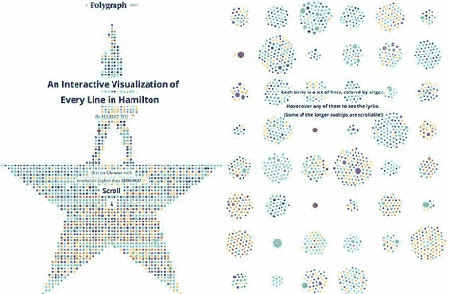


## 第八章 地理空间信息可视化

*本章涵盖*

+   从 GeoJSON 和 TopoJSON 数据创建点和多边形

+   使用墨卡托、莫勒瓦德、正射和卫星投影

+   理解高级 TopoJSON 邻接和合并功能

你会遇到的最常见的几种数据类型之一是地理空间数据。这可能以行政区域的形式出现，如州或县，代表城市或发送推文时的人的位置，或者地球表面的卫星图像。

D3 提供了足够的核心功能，可以制作你在网上见过的任何类型的地图（本章使用 D3 创建的地图示例可以在图 8.1 中看到）。因为你已经在使用 D3，你可以制作出比典型的开箱即用的地图更复杂、更有特色的地图。使用像 Google Maps API 这样的专用库的主要原因是因为在那个生态系统中可以获得额外的功能，比如街景。另一个原因是如果你想要使用基于 WebGL 的地图库（如 MapboxGL）实现的酷炫 3D 地图，那么这也是一个原因。但如果你不寻求这些功能，那么使用 D3 制作地图可能是一个更明智的选择。你不必投资学习不同的语法和抽象层，而且你将拥有 D3 地图提供的更大灵活性。

##### 图 8.1. 使用 D3 进行地图绘制有多种形式和许多选项，包括拓扑操作如合并和查找邻居(第 8.4 节)、地球仪(第 8.3.1 节)、空间计算(第 8.1.4 节)以及使用新颖投影的数据驱动地图(第 8.1 节)。

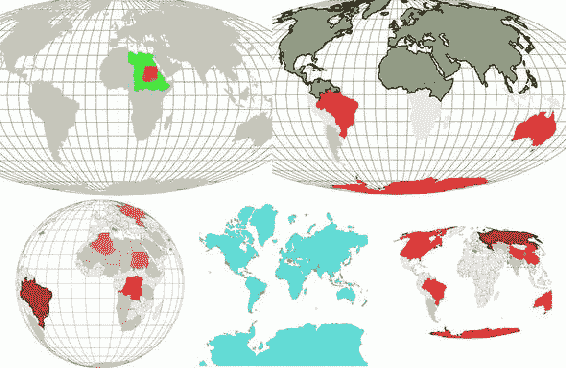

由于地图制作和地理信息系统及科学（分别称为 GIS 和 GIScience）已经实践了很长时间，因此存在用于表示此类数据的成熟方法。D3 内置了强大的功能来加载和显示地理空间数据。在本章中你将了解的相关库，TopoJSON，提供了更多用于地理空间信息可视化的功能。

在本章中，我们将从使用 CSV 和 GeoJSON 格式源的数据制作结合点、线和多边形的地图开始。你将学习如何设计这些地图，并通过重新访问`d3.zoom()`并更详细地探索它来提供交互式缩放。之后，我们将查看 TopoJSON 数据格式，其内置使用拓扑的功能，以及为什么它提供了显著更小的数据文件。最后，你将学习如何使用瓦片制作地图以显示地形和卫星图像。

### 8.1. 基本地图制作

在你探索地图可能性边界之前，你需要制作一个简单的地图。在 D3 中，你可以制作的 simplest 地图是使用 SVG `<path>` 和 `<circle>` 元素表示国家和城市的矢量地图。我们可以调回 cities.csv，这是我们第二章中使用的，并最终利用其坐标，但我们需要进一步查找表示那些国家所需的数据。在获得这些数据后，我们可以在地图上将其渲染为区域、线条或点。然后我们可以添加交互性，例如，当你将鼠标移至某个区域时突出显示该区域，或者计算并显示其中心。

在我们开始之前，让我们先看看本章的 CSS，如下所示。

##### 列表 8.1. ch8.css

```
path.countries {
   stroke-width: 1;
   stroke: #75739F;
   fill: #5EAFC6;
}
circle.cities {
   stroke-width: 1;
   stroke: #4F442B;
   fill: #FCBC34;
}
circle.centroid {                   *1*
   fill: #75739F;
   pointer-events: none;
}
rect.bbox {
   fill: none;
   stroke-dasharray: 5 5;
   stroke: #75739F;
   stroke-width: 2;
   pointer-events: none;
}
path.graticule {                    *2*
   fill: none;
   stroke-width: 1;
   stroke: #9A8B7A;
}
path.graticule.outline {
   stroke: #9A8B7A;
}

path.merged {
   fill: #9A8B7A;
   stroke: #4F442B;
   stroke-width: 2px;
}
```

+   ***1* 重心是地理特征的中心点——我们稍后会看到它们**

+   ***2* 格网是你在地图上看到的背景经纬线——你将在本章学习如何创建它们**

#### 8.1.1. 查找数据

制作地图需要数据，而你拥有大量的数据可用。地理数据可以以多种形式存在。如果你熟悉 GIS，那么你将熟悉复杂地理数据最常见的形式之一，即*shapefile*，这是一种由 Esri 开发的格式，在桌面 GIS 应用中最常见。但处理像城市这样的点时，最易读的地理数据形式是经纬度（或我们文件中列出的 xy 坐标），通常在 CSV 文件中。我们将使用以下列表中的 cities.csv，这是我们在第二章中测量的相同 CSV 文件，其中包含来自世界各地的八个城市的地理位置。

##### 列表 8.2\. cities.csv

```
"label","population","country","x","y"
"San Francisco", 750000,"USA",-122.431,37.773
"Fresno", 500000,"USA",-119.772,36.746
"Lahore",12500000,"Pakistan",74.329,31.582
"Karachi",13000000,"Pakistan",67.005,24.946
"Rome",2500000,"Italy",12.492,41.890
"Naples",1000000,"Italy",14.305,40.853
"Rio",12300000,"Brazil",-42.864,-22.752
"Sao Paolo",12300000,"Brazil",-46.330,-23.944
```

如果你只有城市名称或地址，需要获取经纬度，可以利用提供从地址获取经纬度的地理编码服务。这些服务作为 API 存在，并且可以在网上为小批量数据使用。你可以看到由德克萨斯 A&M 大学维护的这些服务的示例，[`geoservices.tamu.edu/Services/Geocode/`](http://geoservices.tamu.edu/Services/Geocode/)。

当处理更复杂的地理数据，如形状或线条时，你不可避免地会处理更复杂的数据格式。你将想要使用 GeoJSON，它已成为网络地图数据的行业标准。

##### GeoJSON

GeoJSON ([geojson.org](http://geojson.org))，正如其名，是一种以 JSON 格式编码地理数据的方法。`featureCollection`中的每个`feature`都是一个 JSON 对象，它在一个*coordinates*数组中存储特征的边界，并在一个`properties`哈希对象中存储关于特征的元数据。例如，如果你想绘制一个围绕曼哈顿岛的正方形，它的角落将在[–74.0479, 40.6829], [–74.0479, 40.8820], [-73.9067, 40.8820], 和 [–73.9067, 40.6829]，如图 8.2 所示。你可以轻松地使用 QGIS（一个桌面 GIS 应用，[qgis.org](http://qgis.org))，PostGIS（在 Postgres 上运行的空间数据库，[postgis.net](http://postgis.net))，GDAL（一个用于地理空间数据操作的库，[gdal.org](http://gdal.org))和其他工具和库将 shapefile 导出为 GeoJSON。

##### 图 8.2\. 在坐标[–74.0479, 40.8820], [–73.9067, 40.8820], [–73.9067, 40.6829], 和 [–74.0479, 40.6829]处绘制的多边形。


在像这样的地理特征上绘制的矩形被称为*边界框*。它通常只使用两个坐标对来表示：左上角和右下角。但任何多边形数据，如州或海岸线的非规则边界，都可以用这样的坐标数组表示。在以下列表中，我们有一个完全符合 GeoJSON `"FeatureCollection"`规范，只有一个特征：这个小型国家卢森堡的简化边界。

##### 列表 8.3\. 卢森堡的 GeoJSON 示例

```
{
   "type": "FeatureCollection",
   "features": [
        {
            "type": "Feature",
            "id": "LUX",
            "properties": {
                "name": "Luxembourg"
            },
            "geometry": {
                "type": "Polygon",
                "coordinates": [
                    [
                        [
                            6.043073,
                            50.128052
                        ],
                        [
                            6.242751,
                            49.902226
                        ],
                        [
                            6.18632,
                            49.463803
                        ],
                        [
                            5.897759,
                            49.442667
                        ],
                        [
                            5.674052,
                            49.529484
                        ],
                        [
                            5.782417,
                            50.090328
                        ],
                        [
                            6.043073,
                            50.128052
                        ]
                    ]
                ]
            }
        }
    ]
}
```

在本章中，我们不会创建自己的 GeoJSON，除非你深入研究 GIS，否则你可能永远不会创建自己的 GeoJSON。相反，你可以通过下载现有的地理数据，要么不编辑它而直接使用，要么在 GIS 应用程序中编辑它并导出。在本章的示例中，我们将使用 world.geojson（可在[`github.com/emeeks/d3_in_action_2/blob/master/data/world.geojson`](https://github.com/emeeks/d3_in_action_2/blob/master/data/world.geojson)找到），这是一个包含世界各国的文件，其表示方式与你在图 8.3 中看到的是相同的简化、低分辨率表示。

##### 图 8.3\. 使用 D3 的墨卡托投影默认设置的全球地图。你可以看到大部分西半球以及部分欧洲和非洲，但世界其他部分则被渲染在视线之外。

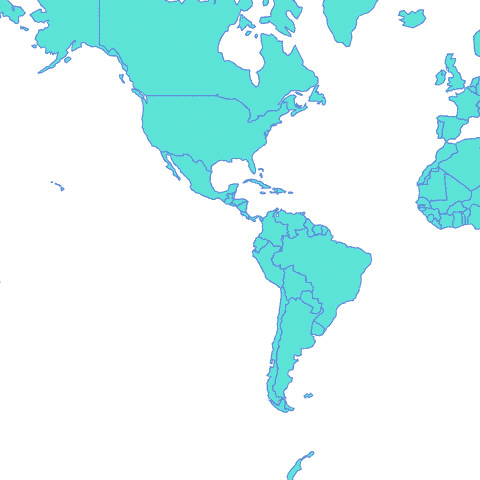

##### 投影

已经有整本书是关于创建网络地图的，而且完全可以写一本书来专门讲述如何使用 D3.js 制作地图。因为这只是其中的一章，所以我会略过许多深入的问题。其中之一就是投影。在 GIS 中，*投影*指的是将地球上的点渲染到平面上的过程，比如你的电脑显示器。你可以以许多不同的方式投影地理数据，以便在屏幕上展示，在本章中，我们将探讨几种不同的方法。

首先，我们将使用最常见的一种地理投影——墨卡托投影，它被大多数网络地图所使用。它成为事实上的标准，因为它是谷歌地图所使用的投影。要使用墨卡托投影，你必须包含 D3 的一个扩展，`d3.geo.projection.js`，你将在本章后面更有趣的工作中使用它。通过定义一个投影，你可以利用 `d3.geoPath`，它根据你选择的投影在屏幕上绘制地理数据。在我们定义了投影并且有了 `geo.path()` 准备好的情况下，代码清单 8.4 中的所有代码都是我们绘制图 8.3 中所示地图所需要的。

##### 列表 8.4\. 初始映射函数

```
  d3.json("world.geojson", createMap);
  function createMap(countries) {
    var aProjection = d3.geoMercator();                             *1*
    var geoPath = d3.geoPath().projection(aProjection);             *2*
    d3.select("svg").selectAll("path").data(countries.features)
      .enter()
      .append("path")
      .attr("d", geoPath)                                           *3*
      .attr("class", "countries");
    };
```

+   ***1* 投影函数有许多选项，你将在后面看到**

+   ***2* d3.geoPath() 默认使用 albersUSA 投影，这仅适用于美国地图**

+   ***3* d3.geoPath() 接收格式正确的 GeoJSON 特征，并返回 SVG 路径的绘制代码**

为什么你在图 8.3 中只看到世界的一部分？因为墨卡托投影的默认比例和变换只显示了 SVG 画布上世界的一部分。如果你想将地图中心放在世界的另一部分，你需要改变比例和变换，我们很快就会这样做。每种投影都有一个 `.translate()` 和 `.scale()`，它们遵循 SVG 变换约定的语法，但不同的投影有不同的效果。

##### 比例

你必须做一些技巧来设置某些项目的正确比例。例如，在我们的墨卡托投影中，如果我们将可用空间的宽度除以 2，然后将商除以`Math.pi`，那么结果将是显示整个世界的正确比例。通常，通过尝试不同的值来确定地图和投影的正确比例，但当你包括缩放时，这会更容易，正如你在第 8.2.2 节中看到的。

不同的投影家族有不同的默认比例。`d3.geo.albers-Usa`投影默认为 1070，而`d3.geo.mercator`默认为 150。与大多数这样的 D3 函数一样，你可以通过不传递值来调用函数来查看默认值：

```
d3.geoMercator().scale()          *1*
d3.geoAlbersUsa().scale()         *2*
```

+   ***1* 150**

+   ***2* 1070**

通过调整`translate`和`scale`，如列表 8.5 所示，我们可以调整投影以显示我们正在处理的地理数据的不同部分——在我们的情况下，是世界。图 8.4 中的结果表明我们现在看到了整个世界的渲染。

##### 图 8.4\. 我们的数据现在适合我们的 SVG 区域，展示了墨卡托投影的世界地图。注意，靠近极地的地区，如格陵兰和南极洲，区域大小存在巨大的扭曲。


##### 列表 8.5\. 带有比例和转换设置的简单地图

```
  function createMap(countries) {
     var aProjection = d3.geoMercator()
    .scale(80)                                                      *1*
    .translate([250, 250]);                                         *2*
    var geoPath = d3.geoPath().projection(aProjection);
    d3.select("svg").selectAll("path").data(countries.features)
     .enter()
     .append("path")
     .attr("d", geoPath)
     .attr("class", "countries");
  };
```

+   ***1* 不同投影家族的比例值不同——在这个情况下 80 效果很好**

+   ***2* 将投影的中心移动到画布的中心**

#### 8.1.2\. 在地图上绘制点

投影不仅用于显示区域；它还用于放置单个点。通常，你将城市或人视为不是通过它们的空间足迹（尽管你会在特别大的城市中这样做）而是通过地图上的一个点来表示，其大小基于人口等变量。D3 投影不仅可以用于`geo.path()`，也可以作为一个单独的函数使用。当你传递一个包含纬度和经度坐标对的数组时，它返回放置该点的必要屏幕坐标。例如，如果我们想知道代表旧金山（大致为-122 纬度，37 经度）的点应该放在哪里，我们可以将这些值传递给我们的投影。这段代码将返回 xy 屏幕坐标（大致为[79.65, 194.32]）。

```
aProjection([-122,37])
```

我们可以使用这个方法将城市添加到我们的地图中，同时从 cities.csv 加载数据，如列表 8.6 所示，并在图 8.5 中看到。

##### 图 8.5\. 我们将八个世界城市添加到地图上。在这个距离上，你看不出这些点有多不准确，但如果你放大，你会看到我们两个意大利城市都位于地中海。


##### 列表 8.6\. 加载点和多边形地理数据

```
var PromiseWrapper = (xhr, d) => new
    Promise(resolve => xhr(d, (p) => resolve(p)))                 *1*

Promise.all([PromiseWrapper(d3.json, "world.geojson"),
    PromiseWrapper(d3.csv, "cities.csv")])
.then(resolve => {
    createMap(resolve[0], resolve[1])
})

function createMap(countries, cities) {
    var projection = d3.geoMercator()
        .scale(80)
        .translate([250, 250]);
    var geoPath = d3.geoPath().projection(projection);
    d3.select("svg").selectAll("path").data(countries.features)
        .enter()
        .append("path")
        .attr("class", "countries")
        .attr("d", geoPath)
    d3.select("svg").selectAll("circle").data(cities)             *2*
        .enter()
        .append("circle")
        .attr("class", "cities")
        .attr("r", 3)
        .attr("cx", d => projection([d.x,d.y])[0])                *3*
        .attr("cy", d => projection([d.x,d.y])[1])
}
```

+   ***1* 更新了我们的 promise 包装器，以便我们可以发送特定的 xhr 请求**

+   ***2* 你想在国家之上绘制城市，所以你将它们作为第二个添加。**

+   ***3* 投影返回一个数组，这意味着你需要为 cx 取[0]值，为 cy 取[1]值**

从列表 8.6 中需要注意的一点是，坐标通常以“纬度，经度”的顺序在现实世界中给出。因为纬度对应于 y 轴，经度对应于 x 轴，所以你必须翻转它们以提供 GeoJSON 和 D3 所需的 x，y 坐标。

#### 8.1.3\. 投影和面积

根据你使用的投影，你的地理对象的图形大小将有所不同。这是因为完美地在平面上显示球坐标是不可能的。不同的投影被设计用来视觉上显示陆地或海洋区域的地理面积，或可测量的距离，或特定的形状。因为我们包含了`d3.geo.projection.js`，我们可以访问更多可玩的投影，其中之一就是莫勒韦德投影。在列表 8.7 中的代码中，你可以看到正确显示我们地理数据的莫勒韦德投影所需的设置。我们将使用国家的计算面积（图形面积，而不是它们的物理面积）来为每个国家着色。结果与在图 8.6 中显示的相同代码在麦卡托投影上运行的结果截然不同。莫勒韦德投影的世界地图弯曲了边缘，而不是像麦卡托投影那样将其拉伸成矩形。

##### 图 8.6\. 麦卡托投影（左）将南极洲的大小扭曲得如此严重，以至于没有其他形状看起来那么大。相比之下，莫勒韦德投影在保持你地理数据中的国家和大陆的物理面积的同时，牺牲了它们的形状和角度。请注意，`geo.path.area`测量的是图形面积，而不是要素的物理面积。


##### 列表 8.7\. 莫勒韦德投影的世界地图

```
function createMap(countries, cities) {
var projection = d3.geoMollweide()
 .scale(120) #A
 .translate([250, 250]);                                                  *1*
var geoPath = d3.geoPath().projection(projection);
var featureSize = d3.extent(countries.features, d => geoPath.area(d))     *2*
var countryColor = d3.scaleQuantize()                                     *2*
              .domain(featureSize).range(colorbrewer.Reds[7]);
d3.select("svg").selectAll("path").data(countries.features)
   .enter()
   .append("path")
   .attr("d", geoPath)
   .attr("class", "countries")
   .style("fill", d => countryColor(geoPath.area(d)))                     *3*
   .style("stroke", d => d3.rgb(countryColor(geoPath.area(d))).darker())
d3.select("svg").selectAll("circle").data(cities)
   .enter()
   .append("circle")
   .attr("class", "cities")
   .attr("r", 3)
   .attr("cx", d => projection([d.x,d.y])[0])
   .attr("cy", d => projection([d.x,d.y])[1]);
};
```

+   ***1* 对于莫勒韦德投影，这些设置显示整个世界在一张 500 像素的地图上**

+   ***2* 测量要素并将大小类别分配给颜色渐变**

+   ***3* 根据其大小为每个国家着色**

选择正确的投影从来都不容易，这取决于你制作地图的目标。如果你正在处理传统的瓦片映射（你可以在谷歌地图或苹果地图上看到的地图类型，其中地图由拼接在一起的瓦片图像组成），那么你可能会坚持使用麦卡托投影。如果你在处理世界范围，通常最好使用莫勒韦德这样的等面积投影，它不会扭曲地理特征的视觉面积。但鉴于 D3 提供了如此多的不同投影，你应该尝试看看哪一个最适合你正在创建的特定地图。


**信息可视化术语：分色地图**

随着您遇到更多的制图，您将遇到术语*等值线图*，它指的是使用区域颜色编码数据的地图。您可以使用现有的地理特征——在本例中是各国——来显示统计数据，例如一个国家的 GDP、人口或最广泛使用的语言。在 D3 中，您可以通过获取具有该信息的`properties`字段的地理数据，或者通过将数据表链接到您的地理数据来实现，其中它们都有相同的唯一 ID 值。

请记住，虽然等值线图很有用，但它们容易受到所谓的*区域单元问题*的影响，这是当你以某种方式绘制边界或选择现有特征时，它们不成比例地代表你的统计数据时发生的情况。这在划分选区时就是这样，当政治选区以某种方式划分，以创造一个政党或另一个政党的多数时。


#### 8.1.4\. 交互性

D3 中与地理空间数据相关的代码大多带有内置功能，您在处理地理数据时通常会用到这些功能。除了像我们为着色特征那样确定面积之外，D3 还有其他有用的功能。在制图中常用的两个功能是快速计算地理区域的中心（称为*质心*）及其边界框，就像您在图 8.7 中看到的那样。在列表 8.8 中，您可以看到如何向创建的路径添加鼠标悬停事件，并在每个地理区域的中心画一个圆圈，以及在其周围画一个边界框。

##### 图 8.7\. 您的交互性为每个国家提供了一个边界框，以及表示其图形中心的红色圆圈。在这里，您可以看到中国的边界框和质心。D3 对质心的实现是加权的，因此它是大多数区域的中心，而不仅仅是边界框的中心。


##### 列表 8.8\. 使用地理数据渲染边界框

```
d3.selectAll("path.countries")
  .on("mouseover", centerBounds)
  .on("mouseout", clearCenterBounds);
function centerBounds(d) {
  var thisBounds = geoPath.bounds(d);                              *1*
  var thisCenter = geoPath.centroid(d);                            *1*
  d3.select("svg")
    .append("rect")
    .attr("class", "bbox")
    .attr("x", thisBounds[0][0])                                   *2*
    .attr("y", thisBounds[0][1])                                   *2*
    .attr("width", thisBounds[1][0] - thisBounds[0][0])            *2*
    .attr("height", thisBounds[1][1] - thisBounds[0][1])           *2*
  d3.select("svg")
    .append("circle")
    .attr("class", "centroid")
    .attr("r", 5)
    .attr("cx", thisCenter[0]).attr("cy", thisCenter[1])           *3*
}

function clearCenterBounds() {
  d3.selectAll("circle.centroid").remove();                        *4*
  d3.selectAll("rect.bbox").remove();
}
```

+   ***1* geo.path 函数的功能，根据相关投影给出结果**

+   ***2* 边界框是一个表示左上角和右下角坐标的数组**

+   ***3* 质心是一个包含特征中心 x 和 y 坐标的数组**

+   ***4* 当鼠标离开一个特征时移除形状**

您已经学习了核心的 geo 函数，这些函数允许您使用 D3 制作地图：投影和 geoPath。通过使用这些函数，您可以创建具有独特外观和感觉的地图，并允许您的用户以形状和地理特征的方式与之交互。D3 提供了更多功能，我们现在将深入探讨。

### 8.2\. 更好的制图

为了使您的地图更易于阅读，您可以使用 D3 的内置功能：网格线生成器和缩放行为。前者提供了网格线，使阅读地图更容易，后者允许您在地图周围平移和缩放。这两个都遵循 D3 中其他行为和生成器的相同格式和功能，但特别适用于地图。

#### 8.2.1. 经纬网

*经纬网*是地图上的网格线。与 D3 有用于线条、区域和圆弧的生成器一样，它也有用于经纬网的生成器，以使你的地图更加美观。经纬网生成器创建网格线（你可以指定位置和数量，或者使用默认设置）并创建一个轮廓，可以提供有用的边界。列表 8.9 展示了如何在已绘制的国家下方绘制经纬网。我们使用`.datum`而不是`.data`，这是一个便利函数，允许我们将单个数据点绑定到一个选择中，因此它不需要在数组中——`.datum(yourDatapoint)`与`.data([yourDatapoint])`相同。

##### 列表 8.9. 添加经纬网

```
var graticule = d3.geoGraticule();
d3.select("svg").insert("path", "path.countries")
  .datum(graticule)
  .attr("class", "graticule line")
  .attr("d", geoPath)
d3.select("svg").insert("path", "path.countries")
  .datum(graticule.outline)
  .attr("class", "graticule outline")
  .attr("d", geoPath)
```

但我们是如何从单个数据点在图 8.8 中绘制这么多经纬网线的？`geo.graticule`函数创建了一个称为多线字符串的特征。正如你可能已经猜到的，*多线字符串*是一系列坐标数组，每个数组对应于一个特征的不同单独组件。多线字符串及其对应的多多边形一直是 GIS 的一部分，因为像美国或印度尼西亚这样的国家由州和地区等不连续的特征组成，这些信息需要存储在数据中。因此，当`d3.geoPath`接收到多边形或多线字符串时，它会绘制由多个不连续部分组成的`<path>`元素。

##### 图 8.8. 我们带有经纬网（浅灰色）和经纬网轮廓（地图边缘的黑边）的地图


#### 8.2.2. 缩放

在第五章中，你稍微处理了缩放，当时你看到了缩放行为如何轻松地允许你在屏幕上移动图表。现在是时候开始使用缩放功能进行缩放了。当我们第一次查看缩放行为时，我们使用它来调整包含我们的图表的`<g>`元素的`transform`属性。这次，我们将使用缩放行为的缩放和转换值来更新投影的设置，这将使我们能够缩放和移动地图。

创建一个缩放行为，并从 `<svg>` 元素中调用它。每当在 `<svg>` 中的任何内容上发生拖动事件、鼠标滚轮事件或双击时，它都会触发缩放。在我们之前处理缩放时，我们只处理拖动，这会更新 `zoom.translate()` 值，您可以使用它来更新您想要更新的任何元素的平移值。这次，我们还将使用 `zoom.scale()` 值，它给我们一个增加的值（当您双击或向前滚动鼠标滚轮时）或减少的值（当您向后滚动鼠标滚轮时）。要使用投影与缩放一起使用，我们将想要用投影的比例值覆盖初始的 `zoom.scale()` 值，并用缩放平移值做同样的事情。之后，每当有触发缩放的事件时，我们将使用新值来更新我们的投影，如 代码列表 8.10 和 图 8.9 所示。

##### 图 8.9\. 启用缩放的地图。平移通过拖动行为发生，缩放通过鼠标滚轮和/或双击。请注意，边界框和质心函数仍然有效，因为它们基于我们不断更新的投影。


##### 代码列表 8.10\. 地图的缩放和平移

```
var mapZoom = d3.zoom()
   .on("zoom", zoomed)

var zoomSettings = d3.zoomIdentity                                        *1*
   .translate(250, 250)
   .scale(120)

d3.select("svg").call(mapZoom).call(mapZoom.transform, zoomSettings)      *1*

function zoomed() {
  var e = d3.event                                                        *2*
    projection.translate([e.transform.x, e.transform.y])                  *3*
      .scale(e.transform.k)                                               *3*
    d3.selectAll("path.graticule").attr("d", geoPath)
    d3.selectAll("path.countries").attr("d", geoPath)                     *4*
    d3.selectAll("circle.cities")
   .attr("cx", d => projection([d.x,d.y])[0])                             *5*
   .attr("cy", d => projection([d.x,d.y])[1])
}
```

+   ***1* 我们使用 zoomIdentity 来覆盖缩放和比例的缩放，以匹配投影**

+   ***2* 从事件中获取缩放设置**

+   ***3* 每当调用缩放行为时，它都会覆盖原始投影值以匹配更新的缩放值**

+   ***4* 任何路径都将通过调用与更新后的投影关联的 d3.geoPath 适当地重新绘制**

+   ***5* 还调用现在已更新的投影**

缩放行为根据您的行为更新其 `.transform` 对象，通过拖动更新 `transform.x` 和 `transform.y`，并通过鼠标滚轮和双击行为更新 `transform.k`（比例）。因为它旨在与 SVG 变换和 D3 地理投影一起工作，所以 `d3.zoom` 就是您需要的平移和缩放功能。


**信息可视化术语：语义缩放**

当您想到放大事物时，您自然会想到增加它们的大小。但通过处理地图，您知道在放大时，您不仅增加了大小或分辨率——您还改变了您向读者展示的数据类型。这与 *语义缩放* 相比，*图形缩放*。当您查看缩放后的地图，只看到国家边界和几个主要城市时，这最为明显，但随着您放大，您会看到道路、较小的城市、公园等等。

您应该在用户可以放大和缩小任何数据可视化时尝试使用语义缩放，而不仅仅是图表。它允许您在缩放时展示战略或全局信息，在放大时展示高分辨率数据。


默认的缩放行为假设用户知道鼠标滚轮和双击与缩放相关联。但有时你需要缩放按钮，因为你不能假设用户知道这种交互，或者因为你想要以更复杂的方式约束或控制缩放过程。列表 8.11 中的代码创建了一个缩放函数并添加了必要的按钮，如图 8.10 所示。

##### 图 8.10。缩放按钮和点击“放大”两次的效果。因为缩放按钮修改了缩放行为的平移和缩放，之后的任何鼠标交互都会反映更新后的设置。


##### 列表 8.11。地图的手动缩放控制

```
function zoomButton(zoomDirection) {
  var width = 500
  var height = 500
  if (zoomDirection == "in") {
    var newZoom = projection.scale() * 1.5;                                *1*
    var newX =
      ((projection.translate()[0] - (width / 2)) * 1.5) + width / 2;       *2*
    var newY =
      ((projection.translate()[1] - (height / 2)) * 1.5) + height / 2;
  }
  else if (zoomDirection == "out") {
    var newZoom = projection.scale() * .75;
    var newX = ((projection.translate()[0] - (width / 2)) * .75) + width / 2;
    var newY = ((projection.translate()[1] - (height / 2)) * .75) + height / 2;
  }

  var newZoomSettings = d3.zoomIdentity
    .translate(newX, newY)                                                 *3*
    .scale(newZoom)

  d3.select("svg").transition().duration(500).call(mapZoom.transform, newZoomSettings)                                                      *4*

}d3.select("#controls").append("button").on("click", () => {
                      zoomButton("in")}).html("Zoom In");
d3.select("#controls").append("button").on("click", () => {
                      zoomButton("out")}).html("Zoom Out");
```

+   **1** 计算新的缩放设置很容易

+   **2** 计算新的平移设置并不容易，需要你重新计算中心

+   **3** 将缩放行为的缩放和平移设置设置为你的新设置

+   **4** 通过过渡调用与 SVG 关联的缩放函数，所以你的缩放是动画化的

在这种样式和交互性到位的情况下，你可以为大多数应用制作地图。缩放和平移对地图很重要，因为用户期望可以放大和缩小，并且他们还期望在这样做时地图的细节会发生变化。因此，地理空间是信息可视化中最强大的形式之一，因为用户在阅读和交互地图时具有很高的素养。但用户还期望地图具有某些功能和功能，当这些功能缺失时，他们会认为地图是损坏的。确保当你创建你的地图时，它要么包含这些功能，要么你有很好的理由将其排除在外。

### 8.3。高级地图制作

我们已经涵盖了创建地图的各个方面，你可能会在所有地图中使用这些方面。你可以探索许多变体。你可能希望根据人口规模调整 `<circle>` 元素，或者使用 `<g>` 元素以便你也可以提供像之前那样的标签。但如果你在制作地图，它可能包含多边形和点，并利用边界框或质心，并且很可能会与缩放行为相关联。D3 令人兴奋的地方在于它让你能够以更多复杂的方式表示地理信息，只需付出一点努力。

#### 8.3.1。创建和旋转地球仪

在这本书的整个 3D 部分中，我们只做一件事，那就是创建一个地球仪。我们不需要使用 three.js 或学习 WebGL。相反，我们将利用 D3 中可用的地理投影之一的一个技巧：正射投影，它将地理数据渲染成从远处观察整个地球时的样子。我们需要更新我们的投影以引用正射投影，并具有略微不同的缩放，如下面的列表所示。

##### 列表 8.12。创建一个简单的地球仪

```
    projection = d3.geoOrthographic()
       .scale(200)
       .translate([250, 250])
       .center([0,0]);
```

使用这种新的投影，你可以在图 8.11 中看到类似地球的形状。

##### 图 8.11\. 正射投影使我们的地图看起来像一个地球仪。注意，尽管国家的路径相互重叠，但它们仍然绘制在网格线之上。注意，尽管缩放和平移工作，但平移不会使地球仪旋转，而是将其移动到画布上。我们国家的着色再次基于国家的图形大小。


要使其旋转，我们需要使用 `d3.mouse`，它返回 SVG 画布上鼠标的当前位置。将此与事件监听器配对，以在画布上打开和关闭 mousemove 监听器。这模拟了拖动地球仪，我们将仅使用它来沿 x 轴旋转地球仪。因为我们引入了新的行为，而且我们已经有一段时间没有查看完整的代码了，所以下面的列表包含了创建地球仪的完整代码。

##### 列表 8.13\. D3 中的可拖动地球仪

```
var zoomSettings = d3.zoomIdentity
    .translate(0, 0)                                                      *1*
    .scale(200)

var rotateScale = d3.scaleLinear()                                        *2*
  .domain([-500, 0, 500])
  .range([-180, 0, 180]);

d3.select("svg")
  .call(mapZoom)
  .call(mapZoom.transform, zoomSettings)

function zoomed() {
  var e = d3.event
  var currentRotate = rotateScale(e.transform.x) % 360                    *3*

  projection
    .rotate([currentRotate, 0])                                           *4*
    .scale(e.transform.k)

  d3.selectAll("path.graticule").attr("d", geoPath);
  d3.selectAll("path.countries").attr("d", geoPath)                       *5*
     .style("fill", d => countryColor(geoPath.area(d)))                   *6*
     .style("stroke", d => d3.rgb(countryColor(geoPath.area(d))).darker())

  d3.selectAll("circle.cities")
     .each(function (d, i) {
      var projectedPoint = projection([d.x,d.y])
      var x = parseInt(d.x)
      var display = x + currentRotate < 90 && x + currentRotate > -90
|| (x + currentRotate < -270 && x + currentRotate > -450)
|| (x + currentRotate > 270 && x + currentRotate < 450)
? "block" : "none"                                                        *7*
      d3.select(this)
        .attr("cx", projectedPoint[0])
        .attr("cy", projectedPoint[1])
        .style("display", display)
    })
  }
```

+   ***1* 正射投影应从未翻译开始**

+   ***2* 此比例将用于将 x-zoom 转换为度**

+   ***3* 即使 projection.rotate 可以处理大于 360 度和小于 –360 度的旋转，我们仍需要过滤点以便这有助于**

+   ***4* 仅在 x 轴上旋转投影**

+   ***5* 路径将被自动裁剪**

+   ***6* 让我们根据显示的大小给国家上色**

+   ***7* 对于点，我们需要隐藏不在当前视图中的点**

一种更复杂的拖动方法称为 Versor Dragging，一个例子可以在以下链接中看到：[`bl.ocks.org/mbostock/7ea1dde508cec6d2d95306f92642bc42`](https://bl.ocks.org/mbostock/7ea1dde508cec6d2d95306f92642bc42).

我们使用 `geoPath.area()` 绘制所有国家，它返回随着形状绘制而得到的面积，比墨卡托投影有更严重的问题。例如，在 图 8.12 中，澳大利亚被着色得好像比印度小，面积与马达加斯加相似。幸运的是，D3 还包括 `d3.geoArea()`，它可以确定与形状的地理面积相对应的球面面积，如 图 8.13 所示。

##### 图 8.12\. 一个可拖动的地球仪，根据城市是否应显示来裁剪路径，并根据显示的大小重新着色国家


##### 图 8.13\. 我们的世界地图，国家根据其地理面积而不是图形面积着色


我们可以将绘制代码重写为使用 `d3.geoArea`，但让我们先重新着色现有的地球仪。但我们如何获取数据？到目前为止，我们假设数据数组在某个地方被暴露出来，我们的函数可以访问它，但如果我们当前的作用域之外呢？在这种情况下，我们可以使用 `selectAll.data()` 并获取与所选择内容（如果选择的是未绑定数据的 HTML 元素，则包括未定义的元素）相关联的数据数组：

```
var featureData = d3.selectAll("path.countries").data();
var realFeatureSize =
d3.extent(featureData, d => d3.geoArea(d))
var newFeatureColor =
d3.scaleQuantize().domain(realFeatureSize).range(colorbrewer.Reds[7]);
d3.selectAll("path.countries")
.style("fill", d => newFeatureColor(d3.geoArea(d)));
```

通过`d3.geoArea()`测量的形状的球面面积以*球面弧度*（球面弧度，用于测量球面表面的面积）给出，因此它只是一个大致成比例的面积。如果你想得到一个国家或其他形状的平方公里数，你仍然需要在 QGIS 这样的 GIS 软件包中计算，或者从其他来源获取该信息。

#### 8.3.2\. 卫星投影

世界的等距视图是强大的叙事工具。想象一下，你必须创建一个与中东对欧洲看法变化的地图。通过制作一个从中东看向地中海的卫星视图，如图 8.14 所示，你邀请你的地图读者从地理角度在中东看到遥远的欧洲。

##### 图 8.14\. 面向欧洲的中东数据卫星投影


这是一种类似于我们之前使用的正射投影、墨卡托投影和莫勒韦德投影的投影，但正如你在下面的列表中看到的，它具有特定的比例尺和旋转设置。它还使用新的设置，倾斜和距离，来确定卫星投影的角度。

##### 列表 8.14\. 卫星投影设置

```
    projection = d3.geoSatellite()
       .scale(1330)
       .translate([250,250])
       .rotate([-30.24, -31, -56])
       .tilt(30)                                 *1*
       .distance(1.199)                          *2*
       .clipAngle(45);
```

+   ***1* 地理特征的视角角度**

+   ***2* 从你的视角到表面的距离**

*倾斜*是数据视角的角度，而*距离*是地球半径的百分比（因此 1.119 是地球上方地球半径的 11.9%）。你是如何得出这样精确的设置的？你有两个选择。第一个是理解如何用数学方法描述这种倾斜的投影。如果你有数学或地理学位，你可以查阅文献来计算这个。如果你像我一样，没有这样的背景，那么我建议构建一个工具，使用本章中探索的代码来交互式地调整旋转、倾斜、距离和比例尺设置。我就是这样做的，你可以在我的卫星投影工具这里进行尝试：[`bl.ocks.org/emeeks/10173187`](http://bl.ocks.org/emeeks/10173187)。

回想一下我在第五章中给出的建议，了解如何理解 Sankey 布局的工作原理。使用信息可视化来可视化函数的工作方式，这样你可以更好地理解它们并找到正确的设置。否则，你可能需要参加 GIS 课程或等待有人编写《*D3.js Mapping in Action*》。

现在，我们将从可视化转向地理数据结构，探索由 Mike Bostock 开发并与 D3 映射紧密相关的库：TopoJSON。

### 8.4\. TopoJSON 数据和功能

TopoJSON ([`github.com/mbostock/topojson`](https://github.com/mbostock/topojson)) 基本上包括三个不同的东西。首先，它是一个地理数据的数据标准，也是 GeoJSON 的扩展。其次，它是一个在 node.js 中运行的库，可以从 GeoJSON 文件创建 TopoJSON 格式的文件。第三，它是一个 JavaScript 库，用于处理 TopoJSON 格式的文件，以创建渲染它们所需的必要数据对象。你根本不会处理第二种形式，你将在学习如何渲染 TopoJSON 数据、合并它以及使用它来查找特征邻居时，仅对第一种形式进行简要了解。

#### 8.4.1\. TopoJSON 文件格式

GeoJSON 文件和 TopoJSON 文件之间的区别在于，GeoJSON 为每个特征记录一个经纬度坐标数组，这些坐标描述了一个点、线或多边形，而 TopoJSON 为每个特征存储一个弧数组。一个 *弧* 是你的数据集中一个或多个特征共享的任何不同线段。正如你在 图 8.15 中可以看到的，加利福尼亚州和内华达州之间的共享边界是一个单一的弧，它在加利福尼亚州特征的 `arcs` 数组和内华达州特征的 `arcs` 数组中被引用。

##### 图 8.15\. 组成加利福尼亚州和内华达州及其邻近州的县弧。你可以看到，当有它们可能被用于不同多边形的机会时，弧会被分割。因此，组成加利福尼亚州和内华达州边界的 17 个弧不仅用于构成加利福尼亚州和内华达州的多边形，也用于构成它们各自的县的多边形。因为数据集知道这些弧是共享的，它可以轻松地推导出邻居。


大多数数据集都有共享的部分，因此 TopoJSON 通常会产生显著更小的数据集。这是其吸引力的一部分。另一部分是，如果你知道哪些部分是共享的，那么你可以用数据做一些有趣的事情，比如轻松计算相邻特征或共享边界，或者合并特征。

TopoJSON 将弧存储为对主弧列表中特定弧的引用，该列表定义了该弧的坐标。你需要将 Topojson.js 库包含在任何使用 TopoJSON 创建地图的网站上，因为它将 TopoJSON 转换为 D3 可以读取并从中创建图形的格式。

#### 8.4.2\. 渲染 TopoJSON

由于 TopoJSON 以与 `d3.geoPath()` 预期的 GeoJSON 结构不同的格式存储其数据，我们需要包含 Topojson.js 并使用它来处理 TopoJSON 数据，以生成 GeoJSON 特征。这相当直接，可以在我们的新数据文件调用中完成，如 代码清单 8.15 所示。图 8.16 显示了在控制台中正确格式化的特征。

##### 图 8.16\. 使用 `Topojson.feature()` 格式的 TopoJSON 数据。数据是一个对象数组，它将几何形状表示为坐标数组，就像从 GeoJSON 文件中输出的特征一样。


##### 列表 8.15\. 加载 TopoJSON

```
var PromiseWrapper = (xhr, d) => new Promise(resolve => xhr(d, p =>
   resolve(p)))
Promise.all([PromiseWrapper(d3.json, "world.topojson"),
   PromiseWrapper(d3.csv, "cities.csv")])
  .then(resolve => {
    createMap(resolve[0], resolve[1])
  })

function createMap(countries, cities) {
  var worldFeatures = topojson.feature(countries, countries.objects.countries)                                          *1*
  console.log(worldFeatures)
}
```

+   ***1* 注意，我们的 TopoJSON 文件有一个“objects”属性，所有 TopoJSON 文件都有，但“countries”是特定于这个文件的，可能是“rivers”或“land”或其他文件中的其他属性名**

现在格式符合我们的要求，我们可以将其发送到现有的代码中，并像处理从 world.geojson 加载的特征那样绘制这个特征数组。我们将之前的 `countries` 替换为在 列表 8.15 中声明的 `worldFeatures` 变量。大多数人就是用 TopoJSON 做这些事情，他们对此感到满意，因为 TopoJSON 数据比 GeoJSON 数据小得多。但因为我们知道 TopoJSON 数据文件中特征的拓扑结构，所以我们用它来做一些有趣的地理技巧。

#### 8.4.3\. 合并

TopoJSON 库为你提供了通过合并现有特征来创建新特征的能力。你可以通过合并北美国家的特征来创建“北美”的新特征，或者通过合并 1912 年美国的一部分州来创建“1912 年的美国”。列表 8.16 展示了使用我们新的 TopoJSON 数据文件绘制地图并合并所有中心经度西于 0° 的国家的代码。如图 8.17 所示的结果表明，合并不仅结合了连续的特征，还将分离的特征合并成一个多边形。

##### 图 8.17\. 基于特征质心的合并结果。灰色特征是由许多单独的多边形组成的单一合并特征。


##### 列表 8.16\. 渲染和合并 TopoJSON

```
function createMap(topoCountries) {
    var countries =
       topojson.feature(topoCountries, topoCountries.objects.countries)    *1*

    var projection = d3.geoMollweide()
       .scale(120)
       .translate([250, 250])
       .center([20,0])
    var geoPath = d3.geoPath().projection(projection);
    var featureSize =
       d3.extent(countries.features, d => geoPath.area(d))
    var countryColor = d3.scaleQuantize()
               .domain(featureSize).range(colorbrewer.Reds[7]);
    var graticule = d3.geoGraticule();
    d3.select("svg").append("path")
       .datum(graticule)
       .attr("class", "graticule line")
       .attr("d", geoPath)
    d3.select("svg").append("path")
       .datum(graticule.outline)
       .attr("class", "graticule outline")
       .attr("d", geoPath)
    d3.select("svg").selectAll("path.countries")
       .data(countries.features)
       .enter()
       .append("path")
       .attr("d", geoPath)
       .attr("class", "countries")
       .style("fill", d => countryColor(geoPath.area(d)))
       .style("stroke", "none")
    mergeAt(0)
    function mergeAt(mergePoint) {                                         *2*
      var filteredCountries = topoCountries.objects.countries.geometries   *3*
          .filter(d => {
            var thisCenter = d3.geoCentroid(
              topojson.feature(topoCountries, d) );                        *4*
            return thisCenter[1] > mergePoint? true : null;
           })                                                              *5*
       d3.select("svg").append("g")
        .datum(topojson.merge(topoCountries, filteredCountries))           *6*
        .insert("path")
        .attr("class", "merged")
        .attr("d", geoPath)
    }
 }
```

+   ***1* 经过 Topojson.features 处理后，我们使用完全相同的方法来渲染特征**

+   ***2* 合并函数**

+   ***3* 我们正在处理 TopoJSON 数据集**

+   ***4* 要使用 geoCentroid，我们需要将每个特征转换为 GeoJSON**

+   ***5* 结果是一个仅包含相应几何形状的数组**

+   ***6* 使用 datum，因为 merge 返回一个单一的多边形**

我们可以稍微调整 `mergeAt` 测试，以查看 x 坐标或查看 `mergeAt` 值更大的特征。如图 8.18 所示，这会在四种情况下创建单个特征：小于或大于 0° 纬度和小于或大于 0° 经度。注意在每个情况下，它都是一个单一的特征，但不是一个单一的多边形。

##### 图 8.18\. 通过调整合并设置，我们可以创建类似北半球和东半球这样的合并特征。注意，因为这是基于质心，所以我们可以在底部看到作为我们合并特征一部分的俄罗斯东部，以及南极洲。


对于那些可能想要继续在拓扑结构中工作的人来说，有一个快速提示：`Topojson.merge` 有一个姐妹函数 `mergeArcs`，它允许你合并形状，但保持它们在 TopoJSON 格式。你为什么要保持弧线呢？因为这样你就可以继续使用 TopoJSON 的功能，如合并、创建网格或找到你新合并的特征的邻居。

#### 8.4.4. 邻居

因为我们知道特征共享弧线，所以我们也知道哪些特征彼此相邻。`Topojson.neighbors` 函数构建了一个所有共享边界的特征的数组。我们可以使用这个数组通过 列表 8.17 中的代码轻松地识别数据集中的邻近国家。此代码提供的交互结果在 图 8.19 中显示。

##### 图 8.19. 使用 TopoJSON 的 `neighbor` 函数显示法国的邻居的悬停行为。因为圭亚那是法国的海外领地，所以法国被认为是巴西和苏里南的邻居。这是因为法国在数据中表示为多边形，任何与它的形状相邻的邻居都会被返回。


##### 列表 8.17. 计算邻居和交互式高亮

```
var neighbors =
  topojson.neighbors(topoCountries.objects.countries.geometries)       *1*
d3.selectAll("path.countries")
  .on("mouseover", findNeighbors)
  .on("mouseout", clearNeighbors)
function findNeighbors (d,i) {
  d3.select(this).style("fill", "#FE9922")                             *2*
  d3.selectAll("path.countries")
    .filter((p,q) => neighbors[i].includes(q))                         *3*
    .style("fill", "#41A368")
}
function clearNeighbors () {
  d3.selectAll("path.countries").style("fill", "#C4B9AC")              *4*
}
```

+   ***1* 创建一个数组，通过它们的数组位置指示邻居**

+   ***2* 将你悬停的国家变为橙色**

+   ***3* 将所有邻居绿色**

+   ***4* 将所有国家灰色以“清除”结果**

TopoJSON 是一种强大的技术，为网络地图开发提供了巨大的机会。了解它如何建模数据和它提供的功能对于创建能打动用户的地图至关重要。请记住，相同的拓扑功能在 `d3.voronoi` 中也是可用的。

### 8.5. Further reading for web mapping

正如我在本章开头所说，你可以使用 D3 的映射功能做的事情可以填满一本书。本节简要介绍了本章未涉及的一些其他功能。

#### 8.5.1. 瓦片映射

D3 可以与其他网络库或 `d3.geoTile` 模块结合使用，在栅格瓦片上叠加矢量特征。不过，如果你认真对待基于瓦片的地图开发，那么使用专门的库，如 mapboxGL，可能更好，你可以在 [www.mapbox.com/mapbox-gl-js/api/](http://www.mapbox.com/mapbox-gl-js/api/) 找到它。

#### 8.5.2. 变换缩放

本章中我们用于缩放行为的我们使用的方法，称为 *投影缩放*，根据比例和转换的变化在数学上重新计算特征的形状。但是，如果你使用的是像墨卡托这样的平面投影，你可以通过将缩放行为的比例和转换的变化与你的特征的 SVG `transform` 绑定来达到更快的性能。

#### 8.5.3. Canvas 绘图

`d3.geoPath`的`.context`函数允许你轻松地将矢量数据绘制到`<canvas>`元素上，这在某些情况下可以显著提高速度。它还允许你使用`.toDataURL()`动态创建一个 PNG，供用户保存或分享到社交媒体。我们将在第十一章中看到这一点。

#### 8.5.4\. 栅格重投影

Jason Davies 和 Mike Bostock 都提供了重新投影矢量数据以及用于瓦片地图的瓦片数据的示例（见 bl.ocks.org/和[www.jasondavies.com/maps/raster/satellite/](http://www.jasondavies.com/maps/raster/satellite/)）。你可以使用这些示例来显示卫星投影的地形图或使用我们之前使用的 Mollweide 投影的地形图。

#### 8.5.5\. 六边形分箱

`d3.hexbin`插件允许你轻松地为地图创建六边形分箱覆盖，就像在图 8.20 中看到的那样。当你有以点形式存在的定量数据，并希望按区域对其进行汇总时，这可以非常有效。

##### 图 8.20\. Mike Bostock 展示的六边形分箱示例，显示了美国沃尔玛商店的位置（可在[`bl.ocks.org/mbostock/4330486`](http://bl.ocks.org/mbostock/4330486)查看）。


#### 8.5.6\. Voronoi 图

与六边形分箱类似，如果你只有点数据，并想从中创建区域数据，可以使用`d3.geom.voronoi`函数从点推导出多边形，就像在图 8.21 中看到的那样。

##### 图 8.21\. 使用最近州首府划分美国为多边形的 Voronoi 图示例（可在[www.jasondavies.com/maps/voronoi/us-capitals/](http://www.jasondavies.com/maps/voronoi/us-capitals/)查看）。


#### 8.5.7\. 地形图

通过扭曲地理对象的面或长度来展示其他信息，可以创建一个*地形图*。例如，你可以根据沿着街道驾驶所需的时间扭曲你城市的街道，或者根据人口使世界地图上的国家大小膨胀或缩小。尽管没有简单的函数可以创建地形图，但 D3 中创建地形图的示例包括 Jason Davies 创建的一个（[www.jasondavies.com/maps/dorling-world/](http://www.jasondavies.com/maps/dorling-world/)），Mike Bostock 创建的一个（[`bl.ocks.org/mbostock/4055908`](http://bl.ocks.org/mbostock/4055908)），以及我构建的成本地形图（[orbis.stanford.edu](http://orbis.stanford.edu)）。

### 8.6\. 摘要

+   地图是数据可视化的核心方面。要创建它们，我们需要了解如何使用 GeoJSON。

+   将 CSV 数据与地理数据结合，使用 D3 的地理投影函数来呈现国家和城市的多边形以及点。

+   D3 的`geoPath`不仅从地理数据创建 SVG 绘图指令用于`<path>`元素，还提供了计算形状中心、面积和边界的函数。

+   像使用图表中的轴一样，可以使用 `geoPath` 内置的 `graticule()` 功能创建经纬线。

+   拖动和缩放地图，以及旋转地球仪，都使用 `zoom()`。

+   TopoJSON 提供了更紧凑的地理数据和附加功能，例如合并多边形和检测邻居的能力。

### 真实世界中的 D3

#### Philippe Rivière 记者兼程序员

*Visionscarto*

[Visionscarto.net](http://Visionscarto.net) 是一个小型的独立研究中心，特别关注艺术、地理和社会正义的交汇点。为了创建地图，我们的工具集包括蜡笔和水彩、纸张和矢量图形软件，以及地理信息系统。我们使用 D3 进行原型设计，从数据集中创建第一张图像，并尝试各种算法，例如当我们需要自动在专题地图上放置标签时。


我们被 D3 吸引的原因是其惊人的地理投影集。能够通过简单的代码更改选择相关的投影（无论是经典的罗宾逊投影，还是必要时使用的极地投影），并且可以随意旋转，这是一个杀手级特性。不再需要 Web-Mercator！这也让我们陷入了研究新投影的兔子洞——充满了许多困难……以及许多乐趣。

尽可能多地尝试社区提供的所有示例，尝试以未计划的方式修改它们，通过大量实践，你会发现自己的声音。D3 的美丽之处在于它以正确的级别建模所有抽象：比例不仅是一种将数据传输到像素的手段，而且是一种设计图表的坚实方法；国家不仅是在地图上的形状，而且是一个有意义的拓扑，它们与邻居共享边界。
