## 第三部分。高级技术

最后四章专注于从小型和一次性数据可视化产品转向创建交互式应用程序及其所需的可重用代码。第九章通过集成 React，使用基于刷选的过滤和不同的布局将多个图表结合起来，以生成数据仪表板。第十章通过引导你创建一个简单的网格布局和图例组件，专注于 D3 中组件和布局的结构。第十一章处理在保持性能和交互性的同时，在屏幕上图形化表示数千个数据点的问题。总体而言，第三部分为你提供了在 D3 之上构建自己的框架或应用程序所需的技能，在大数据环境中具有高性能。

## 第九章。使用 React 和 D3 的交互式应用程序

*本章涵盖*

+   使用 D3 与 React

+   链接多个图表

+   根据屏幕尺寸变化自动调整图形大小

+   创建和使用刷选控件

在整本书中，你已经看到了数据如何被测量和转换以生成突出显示数据一个或多个方面的图表。尽管你使用了相同的数据库在不同布局和不同方法中，但你没有同时展示不同的图表。在本章中，你将学习如何使用 React 将你的数据的不同视图结合起来。这种类型的应用程序在数据可视化术语中通常被称为*仪表板*（本章将构建一个示例，如图 9.1 所示）。你需要创建和管理多个`<svg>`元素，以及实现刷选组件，这允许你轻松选择数据集的一部分。你还需要更清楚地理解数据绑定和 D3 的进入/退出/更新模式是如何工作的，以便你能够有效地将 D3 与外部框架集成。

##### 图 9.1。在本章中，我们将逐步构建一个完全可操作的数据仪表板，首先创建单个图表元素（第 9.1 节），然后添加交互性（第 9.2 节），最后添加刷选功能以过滤数据（第 9.3 节）。

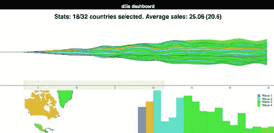

| |
| --- |

**信息可视化术语：仪表板**

自 1970 年代以来，将多个图表组合成单个应用程序就已经存在，并且传统上与决策支持系统相关联。仪表板提供了你在本章中看到的数据集的多种视图，通常是像 NVD3 这样的图表库的卖点。

尽管它们通常以几个图表共享屏幕空间的形式呈现，但数据仪表板的原则也可以通过模态弹出窗口或任何同时提供多个不同图表的网站应用于网络地图和基于文本的应用程序。在这些情况下，突出显示数据点的行为可能是对文本滚动或地图缩放的响应，而不是鼠标悬停在数据可视化元素上。

| |
| --- |

### 9.1\. 一个数据源，多个视角

我们从仪表板的设计开始。设计可以是粗糙的草图或详细的用户需求集。让我们假设你为领先的欧洲在线桌布销售商 MatFlicks 工作，并且你负责创建一个展示其北美和南美推广情况的仪表板。MatFlicks 的杰出 CEO，Matt Flick，决定推广策略将是按字母顺序进行的，因此阿根廷在第 0 天获得访问权限，之后每天增加一个国家获得令人惊叹的 MatFlicks 库存的访问权限。他们需要看到推广在地理上、随时间以及按国家总量的进展情况。图 9.2 展示了使用我们在前几章中探讨的几个图表来实现这一目标的简单草图。我们将像之前一样随机生成 MatFlicks 数据，每个国家在其推广之后以及之后，每天只生成代表每天销售额（以十亿欧元为单位）的一个数据点。

##### 图 9.2\. 一个仪表板的草图，展示了地图、柱状图和堆叠面积图，它们展示了我们的数据

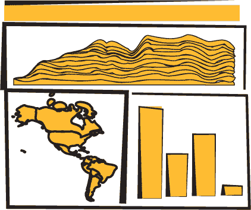

使用这样的数据仪表板，我们希望为用户提供对数据的多个视角，以及深入数据并查看单个数据点的功能。我们将使用折线图来查看随时间的变化，柱状图来显示原始总变化，以及地图，以便用户可以看到数据的地理分布。我们还希望让用户能够切割和切块他们的数据，因此稍后我们将通过刷子添加这一功能。

从草图上，你可以轻松想象基于用户活动的交互可能性以及你可能希望看到的变化——例如，突出显示每个图表中与其他图表中的元素相对应的元素，或者根据点击提供特定元素的更多细节。

到你完成这一章的时候，你将已经创建出图 9.1 中展示的数据仪表板，它具有交互性和动态筛选功能。仪表板的 CSS 代码位于列表 9.1。它很简单，对于后面我们将看到的刷子组件来说是必要的；其他大多数样式都将内联显示。

##### 列表 9.1\. 仪表板 CSS

```
rect.overlay {
  opacity: 0;
}

rect.selection {
  fill: #FE9922;
  opacity: 0.5;
}

rect.handle {
  fill: #FE9922;
  opacity: 0.25;
}

path.countries {
   stroke-width: 1;
   stroke: #75739F;
   fill: #5EAFC6;
}
```

我们设计的任何应用程序都需要是响应式的，以便根据屏幕大小调整其绘制方式。我们也可以使用 SVG 元素的 `viewport` 属性来自动调整图形的大小，但在创建数据可视化应用程序时，我们可能希望对图形有更精细的控制（回想一下第七章中讨论的图形和语义缩放的区分）。

| |
| --- |

**ES2015**

你已经看到了箭头函数和承诺，但在这段代码中，你将看到比之前更多的 ES2015 特性。我希望在你阅读这段内容的时候，这里的特性对你来说已经熟悉，并且是 JS 开发中常见的。但如果看到什么奇怪的地方，那可能就是 ES2015 的特性。我无法突出显示每一个差异，但这里有一些你将看到的新特性：

`const` 和 `let` 是比 `var` 更干净的声明，它们创建一个只读常量（`const`）或变量（`let`），并且比 `var` 的作用域更清晰。如果你把它们都替换成 `var`，代码仍然会运行；它们使你的代码更卫生，因为它们要求你知道你在做什么。

`[...array], {...object}` 是展开操作符，允许你将数组和对象转换为变量或属性的集合。你可以用它来组合数组或对象，而无需使用 `Object.assign` 或 `Array.concat`。注意，剩余参数语法看起来相同，但用于将变量数组发送给函数而不使用 `function.apply`。

你可以这样实例化从传递的对象中获取的标识符：

```
const { data, style } = { data: [1,2], style: {fontSize: "12px", color:
             "red"}, beer: "no" }
```

ES6 和 node 允许你使用 `import/export` 语法从其他文件中包含 JavaScript 或其他代码片段。

`function({ a: 1, b: 2 })`：函数始终可以接受你可以自己解构的对象，但现在你可以直接传递对象而不需要任何中间代码。你不需要考虑你发送给函数的变量列表中的 undefined 或 null 值；相反，你发送一个具有这些属性的对象。


### 9.2. React 入门

React 是一个视图生命周期管理系统，它是流行 MVC 框架和开发模式的一部分。React 是视图层，允许你定义具有自定义行为的 HTML 组件，这对于组合应用程序非常有用。它使用一种名为 JSX 的 JavaScript + HTML 语言，当我第一次看到它时，我感到很厌恶，但现在我爱上了它。我不喜欢它，因为我总觉得 JavaScript 和 HTML 应该生活在完全不同的世界里，但后来我发现，当你像我们在本书中用 vanilla D3 做的那样操作 DOM 时，在 JavaScript 中编写 HTML 可以非常有用。

通常当你看到 React 的示例时，它们会与像 Flux 或 Redux 这样的状态管理系统配对。我们在这章中不会这样做。这是一个单独的章节，你可以找到关于 React 的整本书。

与本书的其他部分专注于核心 HTML 和 JavaScript 不同，本节将依赖于新技术。你需要安装在你系统上的`node`以及随`node`一起安装的节点包管理器（`npm`），以及稍微熟悉一下命令行。关于 React 有很多优秀的书籍，例如《React 快速入门》，所以这里只能触及皮毛，但你仍然可以创建一个完全自包含的 React 数据可视化应用程序。

#### 9.2.1. 为什么选择 React，而不是 X？

React 显然是制作过的最佳库，如果你喜欢 Angular，那你就是傻瓜（而且我不打算开始谈论 Ember）。不，不是真的。那很糟糕，很遗憾人们如此投入于他们特定库的正义性。

我想向大家展示如何在现代 MVC 环境中处理 D3，而我最熟悉的是 React。即使你从未使用过 React，你在这章中也可能看到适用于其他框架的模式。即使你讨厌 MVC 框架，你也可以在本章的大部分代码中找到你自己的定制、手工制作、美丽而神秘的仪表板。

基本上，React 由一个组件创建框架组成，它允许你构建自包含的元素（如`div`或`svg:rect`），这些元素具有自定义的渲染方法、属性、状态和生命周期方法。

##### 渲染

React 的一个主要特性是它跟踪 DOM 的一个副本，称为虚拟 DOM，它可以用来仅渲染需要根据接收到的新的数据而改变元素，从而节省周期并加快你的 Web 应用程序。这是 React 首次发布时的一个重要卖点，但它已经成为其他视图渲染系统的流行选择。每个 React 组件中的`render()`函数返回 React 将创建的元素（通常使用本章中引入的 JSX 描述）。

##### Props

当组件创建时，其属性会被发送给它——称为 props。React 组件的这些 props 通常可以通过`this`上下文在组件函数中访问，作为`this.props`。在某些情况下，例如无状态组件或构造函数，你不会使用`this`来访问它们，但我们在本章中不会这样做，所以你需要一本专门介绍 React 的书来了解其他模式。这种结构允许你从父组件向下发送数据到子组件，你可以使用这些数据来修改组件的渲染方式。当你进入代码部分时，你将详细了解这一点。

##### 状态

与 props 向下发送到组件不同，组件的状态是在组件内部存储和修改的。像`this.props`一样，有一个相应的`this.state`会给你当前的州。当你修改状态（在组件中使用`this.setState`）时，它将自动触发重新渲染，除非你修改了`shouldComponentUpdate`（下一节将处理的生命周期方法）。

##### 生命周期方法

React 组件暴露了在组件创建、更新和接收其属性时触发的生命周期方法。它们在特定用例中非常有用，甚至在某些情况下是必要的，正如我们稍后将要看到的。例如，您有`shouldComponentUpdate`，它允许您指定组件在接收到新属性或状态时是否重新渲染的逻辑。还有`willComponentUpdate`和`didComponentUpdate`，可以在组件更新前后添加功能，以及当组件首次挂载或退出时的类似方法（还有一些其他方法）。我将根据它们与我们的数据可视化需求相关的方法来介绍这些方法，但不会涉及所有这些方法。

#### 9.2.2. react-create-app：设置您的应用程序

现代开发的一个挑战是设置您的环境。幸运的是，有一个命令行工具可以帮助您开始，并且它得到了 React 团队的支持：`create-react-app`

在 OS X 上，您可以打开您的终端窗口并运行以下命令：

```
npm install -g create-react-app
create-react-app d3ia
cd d3ia/
npm start
```

设置您的 React 应用程序非常简单。如果您导航到`localhost:3000`，您将看到图 9.3 中的样板`create-react-app`页面。如果您有任何问题或需要 Windows 的说明，请参阅[`github.com/facebookincubator/create-react-app`](https://github.com/facebookincubator/create-react-app)。

##### 图 9.3. `create-react-app` 默认部署的页面


除了启动运行代码的 node 服务器外，这还将创建构建和部署我们将用于构建仪表板的 React 应用程序所需的所有结构。该结构包含一个 package.json 文件，它引用了项目中包含的所有模块，并且我们需要添加几个更多模块来制作我们的仪表板。我们使用 NPM 添加模块，虽然我们可以包含整个 D3 库并继续编码，但您最好安装单个模块并理解如何导入这些模块。在您的项目目录中运行以下命令来安装`d3-scale`模块：

```
npm i –SE d3-scale
```

此命令（`npm i`是`npm install`的缩写）安装了`d3-scale`的最新版本（这为我们提供了访问我们在过去八章中使用过的所有那些美妙的比例尺），并且`–SE`标签将确切版本保存到您的 package.json 中，以便当您想要在其他地方部署此应用程序时，`d3-scale`会被安装。除了`d3-scale`之外，对以下模块执行相同操作：

```
react-dom
d3-shape
d3-svg-legend
d3-array
d3-geo
d3-selection
d3-transition
d3-brush
d3-axis
```

通过像这样单独安装模块，您可以减少与您的应用程序一起部署的代码量，从而降低加载时间并提高可维护性。

#### 9.2.3. JSX

*JSX*指的是 JavaScript + XML，这是一种集成 JavaScript 和 HTML 的编码语言，允许你在 JavaScript 代码中内联编写 HTML。它要求代码被转换为纯 JavaScript——你的浏览器不能原生运行 JSX——但只要你的转换设置好了（react-create-app 已经为你做了），你就可以编写这样的代码：

```
const data = [ "one", "two", "three" ]
const divs = data.map((d,i) => <div key={i}>{d}</div>)
const wrap = <div style={{ marginLeft: "20px" }}
    className="wrapper">{divs}</div>
```

你可以创建一个包含三个 div 元素的数组，每个元素都将包含你数组中的相应字符串作为内容。注意这里的一些事情。第一，当我们开始编写 HTML 时，如果我们想在其中放置 JavaScript，我们必须使用花括号（在前面代码中用粗体表示强调）来退出它。例如，如果我没在`d`周围放置花括号，那么所有我的 div 都将包含字母*d*作为其内容。另一个是样式是一个传递给元素的对象，并且该对象需要 CSS 键，这些键通常是蛇形命名法（如`margin-left`）转换为驼峰命名法（-`marginLeft`）。当我们创建一个元素数组时，每个元素都需要一个“key”属性，以给它一个唯一的键（就像我们使用 D3 的`.data()`时的可选键）。最后，当你想设置一个元素的 CSS 类时，你需要使用`className`，因为`class`是保留的。

JSX 还有更多内容，但这应该足以让你理解你将要看到的代码。当我第一次看到 JSX 时，如我之前提到的，我确信这是一个糟糕的想法，并计划只使用 React 的纯 JavaScript 渲染函数（你不需要使用 JSX 来使用 React），但几周后，我爱上了 JSX。从数据中动态创建元素的能力吸引了我，因为我有 D3 的经验。

### 9.3\. 使用 React 的传统 D3 渲染

将 D3 与 React 集成的挑战在于，React 和 D3 都想要控制 DOM。D3 的整个 select/enter/exit/update 模式与 React 及其虚拟 DOM 直接冲突。如果你是从 D3 转向 React，放弃对 DOM 的控制是那些“冰冷、死手”的时刻之一。大多数人使用 D3 与 React 的方式是使用 React 构建应用程序的结构，并渲染传统的 HTML 元素，然后在数据可视化部分，他们将一个 DOM 容器（通常是`<svg>`）传递给 D3，并使用 D3 创建、销毁和更新元素。从某种意义上说，这与我们过去使用 Java 小程序或 Flash 在页面中运行一个黑盒子的方式类似，而页面的其余部分则是单独渲染的。这种集成 React 和 D3 的方法的好处是，你可以使用所有你在核心 D3 示例中看到的那种类型的代码。主要的困难在于，你需要创建在 React 生命周期事件中的函数，以确保你的可视化更新。

列表 9.2 展示了使用这种方法构建的一个简单的条形图组件。在你的`src/`目录中创建这个组件，并将其保存为`BarChart.js`。在 React 中，组件文件名和函数名通常通过使用驼峰式命名法和首字母大写来与其他代码文件和函数区分开来。

##### 列表 9.2\. BarChart.js

```
import React, { Component } from 'react'
import './App.css'
import { scaleLinear } from 'd3-scale'                               *1*
import { max } from 'd3-array'                                       *1*
import { select } from 'd3-selection'                                *1*

class BarChart extends Component {
  constructor(props){
    super(props)
    this.createBarChart = this.createBarChart.bind(this)             *2*
  }

  componentDidMount() {                                              *3*
    this.createBarChart()
  }

  componentDidUpdate() {                                             *3*
    this.createBarChart()
  }

  createBarChart() {
    const node = this.node                                           *4*
    const dataMax = max(this.props.data)                             *5*
    const yScale = scaleLinear()
      .domain([0, dataMax])
      .range([0, this.props.size[1]])                                *5*

    select(node)
      .selectAll("rect")
      .data(this.props.data)
      .enter()
      .append("rect")

    select(node)
      .selectAll("rect")
      .data(this.props.data)
      .exit()
      .remove()

    select(node)
      .selectAll("rect")
      .data(this.props.data)
      .style("fill", "#fe9922")
      .attr("x", (d,i) => i * 25)
      .attr("y", d => this.props.size[1] - yScale(d))
      .attr("height", d => yScale(d))
      .attr("width", 25)
  }

  render() {                                                        *6*
    return <svg ref={node => this.node = node}                      *7*
            width={500} height={500}>
    </svg>
  }
}

export default BarChart
```

+   ***1* 因为我们从模块中导入这些函数，它们将不会有 d3\.前缀**

+   ***2* 你需要将组件绑定为新内部函数的上下文——这不需要对任何现有的生命周期函数进行操作**

+   ***3* 在组件首次挂载或接收到新的 props/state 时调用你的条形图函数**

+   ***4* 当你渲染时，该元素在组件中被引用，你可以用它来传递给 D3**

+   ***5* 使用传递的大小和数据来计算你的比例**

+   ***6* Render 返回一个等待你的 D3 代码的 SVG 元素**

+   ***7* 将节点引用传递给 D3 使用**

进行这些更改并保存它们不会立即显示任何效果，因为你没有在 App.js 中导入和渲染这个组件，这是你的应用最初渲染的组件。将 App.js 修改为以下列表。

##### 列表 9.3\. 在 App.js 中引用 BarChart.js

```
import React, { Component } from 'react'
import './App.css'
import BarChart from './BarChart'                              *1*

class App extends Component {
  render() {
    return (
      <div className="App">
        <div className="App-header">
          <h2>d3ia dashboard</h2>
        </div>
        <div>
        <BarChart data={[5,10,1,3]} size={[500,500]} />        *2*
        </div>
      </div>
    )
  }
}

export default App
```

+   ***1* 我们需要导入我们新创建的组件**

+   ***2* 这是我们如何在 BarChart.js 中使用 props.data 和 props.size 来渲染条形图**

当你保存带有这些更改的 App.js 时，如果你有服务器运行，你会看到一些很酷的东西：它会自动更新页面以显示图 9.4 中的内容。这是 Webpack 的一个魔法技巧——它是`create-react-app`中包含的模块打包器，会根据你的代码更改自动更新你的应用。

##### 图 9.4\. 你的第一个 React + D3 应用，其中包含在应用中渲染的简单条形图

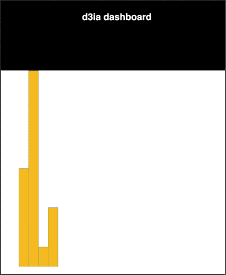

你已经可以想象代码的优化了，例如，将条形图缩放到适合宽度，我们稍后会看到。但就目前而言，让我们继续介绍使用 D3 和 React 渲染数据可视化的另一种方法。

### 9.4\. 使用 React 创建元素，D3 作为可视化内核

而不是将你的 DOM 节点传递给 D3，你可以使用 D3 生成所有必要的绘图指令，并用 React 来创建 DOM 元素。这种方法的挑战之一是动画过渡，这需要更深入地投资 React 生态系统，但除此之外，这种方法将使你的代码更容易被不那么倾向于使用 D3 的同事维护。

列表 9.4 展示了如何执行此操作以重新创建上一章中我们的一张地图。它与我们的早期代码大致相同，但在这个例子中，我这里导入的是 world.js 而不是 world.geojson。我已经通过在 JSON 对象的开始处添加一点 ES6 导出语法将其转换为 .js 文件。以下列表中的代码与我们之前看到的类似，但现在我们使用它来创建代表每个国家的 JSX 元素，并且包括地理数据而不是使用 XHR 请求（就像我们之前使用的 `d3.json` 函数）。

##### 列表 9.4\. WorldMap.js 和相关 world.js

```
import React, { Component } from 'react'
import './App.css'
import worlddata from './world'                          *1*
import { geoMercator, geoPath } from 'd3-geo'

class WorldMap extends Component {
  render() {
    const projection = geoMercator()
    const pathGenerator = geoPath().projection(projection)
    const countries = worlddata.features
      .map((d,i) => <path                                *2*
        key={"path" + i}                                 *3*
        d={pathGenerator(d)}
        className="countries"                            *4*
      />)

    return <svg width={500} height={500}>
      {countries}                                        *5*
    </svg>
  }
}

export default WorldMap
```

+   ***1* 我们不必与异步调用纠缠，因为我们可以导入地图数据，因为它不会改变**

+   ***2* 将数组映射到 svg:path 元素**

+   ***3* 确保它们各自具有唯一性**

+   ***4* 记住 className 而不是 class 在 JSX 中**

+   ***5* 将路径数组嵌套在 svg 元素中**

你可以在以下列表中看到 world.js 的前几行——其余部分与原始 world.geojson 相似。如果你想通过导入将其引入，你可以这样做。

##### 列表 9.5\. world.js

```
export default {"type":"FeatureCollection","features":[
{"type":"Feature","id":"AFG","properties":{"name":"Afghanistan"},"geometry":{
     "type":"Polygon","coordinates":[[[61.210817,35.650072],...
```

它几乎与我们在 D3 中看到的绑定模式完全相同，只不过我们使用原生的 Array.map 并将单个数据元素映射到 DOM 元素，这是由于 JSX 的魔力。图 9.5 中的结果你应该很熟悉，因为它与上一章中我们看到的是同一件事。

##### 图 9.5\. 我们在 第八章 中看到的地图，但现在是通过 React 和 JSX 渲染的，D3 提供绘图指令

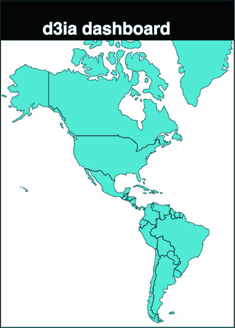

在我自己的实践中，我更喜欢使用这种方法，因为我发现 React 中的生命周期事件以及它创建、更新和销毁元素的方式比通过 D3 处理它更全面。

### 9.5\. 数据仪表板基础

在我们绘制任何东西之前，我们需要有数据来发送到我们的图表。我们将通过扩展 App.js 并在其中包含一个用于为我们的国家创建随机数据的函数来完成这项工作。如下所示，我们将按发射日给国家着色——记住，这是按字母顺序排列的，因为它是人为编造的（或者因为 Matt Flick，MatFlicks 的潇洒亿万富翁首席执行官认为这是个好主意，无论你更喜欢哪种解释）。

##### 列表 9.6\. 更新后的 App.js 与示例数据

```
  ...import the existing app.js imports...
  import WorldMap from './WorldMap'
   mport worlddata from './world'
  import { range, sum } from 'd3-array'                               *1*
  import { scaleThreshold } from 'd3-scale'                           *1*
  import { geoCentroid } from 'd3-geo'                                *1*

  const appdata = worlddata.features
  .filter(d => geoCentroid(d)[0] < -20)                               *2*

  appdata
  .forEach((d,i) => {
    const offset = Math.random()
    d.launchday = i
    d.data = range(30).map((p,q) =>
      q < i ? 0 : Math.random() * 2 + offset) })                      *3*

  class App extends Component {

    render() {

const colorScale = scaleThreshold().domain([5,10,20,30,50])
   range(["#75739F", "#5EAFC6", "#41A368", "#93C464", "#FE9922"])     *4*
      return (
        <div className="App">
          <div className="App-header">
            <h2>d3ia dashboard</h2>
          </div>
          <div>
            <WorldMap colorScale={colorScale} data={appdata} size={[500,400]} />
         </div>
      </div>
    )
  }
}

export default App
```

+   ***1* 我们将需要这些函数来构建我们的示例数据**

+   ***2* 为了简化，将我们的地图限制在北美洲和南美洲**

+   ***3* 生成一些具有相对有趣模式的假数据——每个国家的“发射日”是其数组位置**

+   ***4* 按发射日期给每个国家着色**

我们正在将颜色比例和数据发送到我们的`WorldMap`组件。因为我们希望像图 9.6 中看到的那样，在仪表板中共享颜色和数据，这将使管理任何更改和更新模式变得更加容易。但为了利用这一点，我们需要修改我们的 WorldMap.js 文件，以便期望从其父组件接收这些内容，如下面的列表所示。

##### 图 9.6\. 我们渲染的 WorldMap 组件，国家根据启动日上色

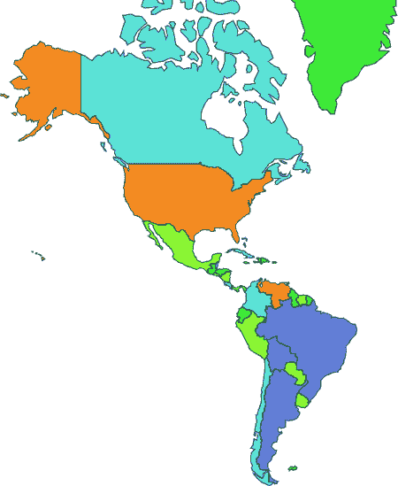

##### 列表 9.7\. 更新的 WorldMap.js 从父组件获取数据和颜色比例

```
import React, { Component } from 'react'
import './App.css'
import { geoMercator, geoPath } from 'd3-geo'

class WorldMap extends Component {
  render() {
    const projection = geoMercator()
      .scale(120)
      .translate([430,250])                                                *1*
    const pathGenerator = geoPath().projection(projection)
    const countries = this.props.data
      .map((d,i) => <path
        key={"path" + i}
        d={pathGenerator(d)}
        style={{fill: this.props.colorScale(d.launchday),                  *2*
            stroke: "black", strokeOpacity: 0.5 }}
        className="countries"
      />)
    return <svg width={this.props.size[0]} height={this.props.size[1]}>    *3*
      {countries}
    </svg>
  }
}

export default WorldMap
```

+   ***1* 更新了翻译和缩放，因为我们已经限制了我们的地理数据**

+   ***2* 使用通过 props 传递的颜色比例**

+   ***3* 基于大小属性设置基本高度和宽度，以便我们可以在以后使图表具有响应性**

现在我们来恢复条形图，并重新连接它，使其能够处理以当前形式传递的数据，并根据我们的比例上色，如下面的列表所示。

##### 列表 9.8\. App.js 更新，用于添加条形图

```
import BarChart from './BarChart'
...
        <BarChart colorScale={colorScale} data={appdata}
size={[500,400]} />
...
```

我们原始的`barChart`代码没有期望以这种格式接收数据，也没有从其父组件接收大小和样式信息，所以列表 9.9 显示了我们需要如何更新代码以匹配这些更改。这些更改主要在`create BarChart()`函数中，但也包括新的代码来更改`<svg>`元素的大小以匹配传递的大小。

##### 列表 9.9\. 更新的 BarChart.js

```
  createBarChart() {
    const node = this.node
    const dataMax = max(this.props.data.map(d => sum(d.data)))
    const barWidth = this.props.size[0] / this.props.data.length      *1*
    const yScale = scaleLinear()
      .domain([0, dataMax])
      .range([0, this.props.size[1]])

...nothing else changed in createBarChart until we create rectangles...

    select(node)
      .selectAll("rect")
      .data(this.props.data)
      .attr("x", (d,i) => i * barWidth)
      .attr("y", d => this.props.size[1] - yScale(sum(d.data)))
      .attr("height", d => yScale(sum(d.data)))
      .attr("width", barWidth)
      .style("fill", (d,i) => this.props.colorScale(d.launchday))
      .style("stroke", "black")
      .style("stroke-opacity", 0.25)

    }

    render() {
      return <svg ref={node => this.node = node}
              width={this.props.size[0]} height={this.props.size[1]}>
     </svg>
  }
```

+   ***1* 动态计算条形宽度，以便在将来使图表更具响应性**

现在仪表板变得更加炫酷。我们根据发布日期给国家上色，并通过条形图显示每个国家的总销售额，也根据发布日期上色（并排列）。由于数据是随机的，你的截图可能不会完全像图 9.7 那样，但应该很接近。当某个国家的发布日期晚于另一个较早推出的国家，但销售额却更高时，你已经开始看到一些有趣的模式了。也许马特不应该根据字母顺序来确定发布日期？

##### 图 9.7\. 一个基本的仪表板，包含两个数据视图。条形按我们的假“启动日”排序，有时随机数据会显示出有趣的模式，例如深绿色条形显示的总销售额高于 10 天前启动的国家。

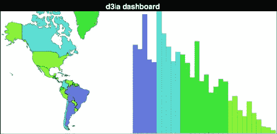

我们几乎已经完成了仪表板所需的所有功能。唯一剩下的是自启动以来的每日销售额。显然，它应该是一种时间序列图表，为什么不尝试使用你从那本关于 D3.js 的精彩书籍中学到的流图呢？那位杰出的作者，你对他感到非常满意，并愿意给他五星好评。展示如何给出这本书的精彩评价会占用太多空间，但下面的列表显示了 StreamGraph 组件所需的元素。

##### 列表 9.10\. 一个 React streamgraph

```
import React, { Component } from 'react'
import './App.css'
import { stack, area, curveBasis, stackOrderInsideOut, stackOffsetSilhouette } from 'd3-shape'
import { range } from 'd3-array'
import { scaleLinear } from 'd3-scale'

class StreamGraph extends Component {
  render() {

    const stackData = range(30).map(() => ({}))                          *1*
    for (let x = 0; x<30; x++) {
      this.props.data.forEach(country => {
        stackData[x][country.id] = country.data[x]                       *2*
      })
    }
    const xScale = scaleLinear().domain([0, 30])
      .range([0, this.props.size[0]])

    const yScale = scaleLinear().domain([0, 60])
      .range([this.props.size[1], 0])

    const stackLayout = stack()
      .offset(stackOffsetSilhouette)
      .order(stackOrderInsideOut)
      .keys(Object.keys(stackData[0]))                                   *3*
    const stackArea = area()
      .x((d, i) => xScale(i))
      .y0(d => yScale(d[0]))
      .y1(d => yScale(d[1]))
      .curve(curveBasis)

    const stacks = stackLayout(stackData).map((d, i) => <path
        key={"stack" + i}
        d={stackArea(d)}
        style={{ fill: this.props.colorScale(this.props.data[i].launchday),
            stroke: "black", strokeOpacity: 0.25 }}
    />)

    return <svg width={this.props.size[0]} height={this.props.size[1]}>
      <g transform={"translate(0," + (-this.props.size[1] / 2) + ")"}>   *4*
      {stacks}
      </g>
    </svg>
  }
}

export default StreamGraph
```

+   ***1* 这将是我们的空白对象数组，用于我们的重新处理流图数据**

+   ***2* 将我们的原始数据转换成适合堆叠的格式**

+   ***3* 每个键映射到我们数据中的一个国家**

+   ***4* 我们需要这样做偏移，因为我们的流图沿着 0 轴运行——如果你在绘制常规堆叠面积图或线图，则不需要**

在我们在 App.js 中引用它之后：

```
...other imports...
import StreamGraph from './StreamGraph'
...the rest of your existing app.js behavior...
   <StreamGraph colorScale={colorScale} data={appdata} size={[1000,250]} />
...
```

我们有了我们的初始仪表板，正如我们在图 9.8 中看到的，满足了用户的要求。我们还没有完成，但我们已经有一个仪表板，它将我们的数据地理呈现，并在柱状图中汇总，在流图中随时间展示。现在，当我们构建任何数据可视化产品时遇到的一个问题是，包括当我们构建仪表板时，我们可能会过于专注于满足用户的需求，以至于我们没有考虑到提供他们可能没有想象到的数据视图，因为他们对数据可视化的经验不如我们丰富。

##### 图 9.8\. 一个典型的仪表板，有三个视图查看同一数据集。在这种情况下，它显示了 MatFlicks 的地理发布波次，同时在柱状图中汇总销售额，并在流图中显示随时间变化的销售额。

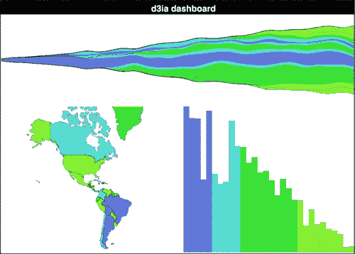

没有简单的方法来解决这个问题。记住，当你构建像这样的数据可视化产品（如仪表板）时，你的用户在查看数据的方式上受到限制，而你的任务是向他们展示他们想要的视图，同时也展示其他视图。如果他们主要对数据的数值特征感兴趣，尝试以分层的方式向他们展示。如果他们专注于地图，也许他们可以使用网络视图作为对比。

### 9.6\. 仪表板升级

你完成你的仪表板，检查所有要求，并向你的客户演示。我敢打赌你可以猜到他们的回应可能是什么：

“这在我平板电脑的小屏幕上和在我巨大电视的大屏幕上看起来都很糟糕。”

“我不知道这些颜色代表什么。”

“当我悬停在某个国家上时，我想看到条形图或趋势突出显示，反之亦然。”

“我需要缩小到在一定时期内启动的国家。”

“给我看数字。”

我几乎不包括最后一点，因为没有理由写下来，因为每个人总是这么说。如果你不想听到人们说“给我看数字”和“切片和切块数据”，你就在错误的领域。让我们将其归纳为几个更具体的功能：

1.  让它具有响应性。

1.  添加图例。

1.  在柱状图、国家和趋势上进行交叉突出显示。

1.  根据发布日刷选。

1.  显示数字。

对于这样的仪表板，还有更多功能可用，尽管总是会有更多功能，但这一章不能永远继续下去。

#### 9.6.1\. 响应性

为了使仪表盘能够响应显示尺寸的变化，我们首先需要监听显示尺寸的变化，然后进行更新，以便所有组件都能得到更新，如列表 9.11 所示。监听器将在 App.js 中，它还将存储数据在状态中，该状态将被用于传递到其组件（记住，React 在状态变化时重新渲染，因为 App 将发送新的尺寸值到其子组件，它们将自动重新渲染）。

##### 列表 9.11. App.js 状态和调整大小监听器

```
...import necessary modules...
class App extends Component {
  constructor(props){
    super(props)
    this.onResize = this.onResize.bind(this)
    this.state = { screenWidth: 1000, screenHeight: 500 }                 *1*

  }

  componentDidMount() {
    window.addEventListener('resize', this.onResize, false)               *2*
    this.onResize()
  }

  onResize() {
    this.setState({ screenWidth: window.innerWidth,
    screenHeight: window.innerHeight - 70 })                              *3*
  }

  render() {
...existing render behavior...
<StreamGraph colorScale={colorScale} data={appdata}
     size={[this.state.screenWidth, this.state.screenHeight / 2]} />      *4*

<WorldMap colorScale={colorScale} data={appdata}
     size={[this.state.screenWidth / 2, this.state.screenHeight / 2]} />
<BarChart colorScale={colorScale} data={appdata}
     size={[this.state.screenWidth / 2, this.state.screenHeight / 2]} />
```

+   ***1* 使用一些合理的默认值初始化状态**

+   ***2* 为调整大小事件注册监听器**

+   ***3* 使用新的窗口宽度和高度（减去标题的大小）更新状态**

+   ***4* 从组件状态发送高度和宽度**

这样就完成了我们的仪表盘的响应式设计。请记住，这本书中的代码是为 Chrome 设计的，所以可能在其他浏览器上你需要使用不同的窗口属性。此外，在生产环境中，你可能需要限制或去抖动你的调整大小事件，以防止在拖动窗口到新大小时连续触发。最后，将事物放大或缩小以适应屏幕并不意味着你已经创建了响应式数据可视化。第十二章将介绍不同尺寸的屏幕和不同类型的输入更适合不同的数据可视化方法。话虽如此，在图 9.9 中，我们可以看到我们新代码的效果。

##### 图 9.9. 大屏幕和小屏幕上的相同仪表盘

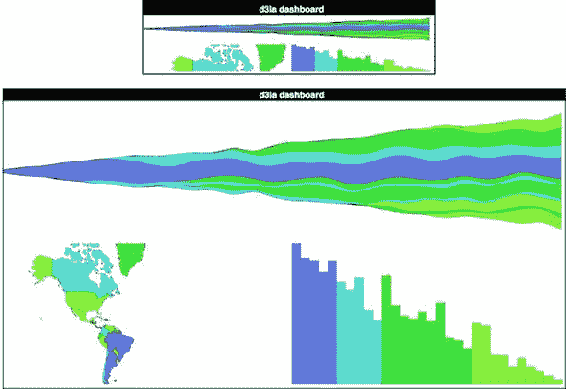

我没有在地图上重新计算比例和转换，因为这是一个更复杂的过程，我在上一章中已经介绍过，当时我们探讨了缩放。

#### 9.6.2\. 图例

正如我们所学的，图例很简单。在你的条形图代码中将比例传递给`d3-svg-legend`，如下面的列表所示。

##### 列表 9.12. 添加图例

```
import { legendColor } from 'd3-svg-legend'
import { transition } from 'd3-transition'                                  *1*
...
  createBarChart() {
    const dataMax = max(this.props.data.map(d => sum(d.data)))
    const barWidth = this.props.size[0] / this.props.data.length
    const node = this.node

    const legend = legendColor()
      .scale(this.props.colorScale)
      .labels(["Wave 1", "Wave 2", "Wave 3", "Wave 4"])                     *2*

    select(node)
      .selectAll("g.legend")
      .data([0])                                                            *3*
      .enter()
      .append("g")
      .attr("class", "legend")
      .call(legend)

    select(node)
      .select("g.legend")
      .attr("transform", "translate(" + (this.props.size[0] - 100) + ", 20)"*4*
...
```

+   ***1* 你需要导入过渡，这样 d3-svg-legend 才能使用它**

+   ***2* 尽管我们可以使用阈值值，但最好为你的类别使用语义上有意义的名称**

+   ***3* 绑定一个单一值数组的数据，以确保我们只添加一个 <g> 元素，然后在后续的刷新中更新它**

+   ***4* 使转换变化在每次刷新时发生，这样图例在位置上就是响应式的**

有了这些，我们终于解释了那些颜色代表什么，如图 9.10 所示。

##### 图 9.10. 我们的 MatFlicks 表格滚动仪表盘，现在带有图例以显示哪些国家在哪个发布波次

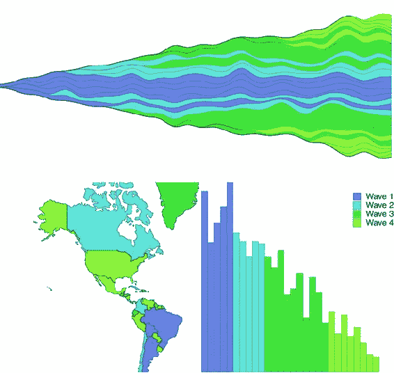

#### 9.6.3\. 交叉高亮

在此仪表板中的三个视图中，我们显示相同的数据，甚至以相同的方式着色，因此使用它的人自然希望看到哪个条形与哪个国家相关联，以及哪个趋势与哪个条形相关联。为了处理这个问题，我们需要在应用程序的状态中添加一个位置，知道我们在悬停什么，以及在所有更新该状态的元素上的鼠标事件。之后，我们可以传递这个新的状态，如果它与渲染中的元素 ID 相对应，我们就可以视觉上突出显示它。React 对事件的处理方式略有不同，但除此之外，它很简单。首先，在以下列表中，我们将更新主应用程序，以便我们可以传递一个函数和该函数修改的当前状态。

##### 列表 9.13\. App.js 更新

```
this.onHover = this.onHover.bind(this)                                  *1*
this.state = { screenWidth: 1000, screenHeight: 500, hover: "none" }
...
onHover(d) {
    this.setState({ hover: d.id })                                      *2*
}
...
<StreamGraph hoverElement={this.state.hover} onHover={this.onHover}     *3*
     colorScale={colorScale} data={appdata} size={[this.state.screenWidth,
this.state.screenHeight / 2]} />
<WorldMap hoverElement={this.state.hover} onHover={this.onHover}        *3*
     colorScale={colorScale} data={appdata}
size={[this.state.screenWidth / 2, this.state.screenHeight / 2]} />
<BarChart hoverElement={this.state.hover} onHover={this.onHover}        *3*
     colorScale={colorScale} data={appdata}
size={[this.state.screenWidth / 2, this.state.screenHeight / 2]} />
```

+   ***1* 我们将存储当前悬停的元素在状态中，因此我们需要使用悬停属性初始化我们的状态**

+   ***2* 悬停函数将期望我们发送数据对象**

+   ***3* 我们需要将悬停功能和当前悬停状态同时发送给组件，以便它们能够正确交互**

在以下列表中，我们看到如何通过将其绑定到传统的 D3 开发模式（如使用`.on()`和`.style()`）来引用传递的函数。

##### 列表 9.14\. BarChart.js 更新

```
...
    select(node)
      .selectAll("rect")
      .data(this.props.data)
      .enter()
      .append("rect")
      .attr("class", "bar")
      .on("mouseover", this.props.onHover)                          *1*
...
    select(node)
      .selectAll("rect.bar")
      .data(this.props.data)
      .attr("x", (d,i) => i * barWidth)
      .attr("y", d => this.props.size[1] - yScale(sum(d.data)))
      .attr("height", d => yScale(sum(d.data)))
      .attr("width", barWidth)
      .style("fill", (d,i) => this.props.hoverElement === d.id ?    *2*
            "#FCBC34" : this.props.colorScale(i))
...
```

+   ***1* 将我们传递的悬停函数绑定，就像在 D3 图表中绑定任何其他函数一样**

+   ***2* 除非我们悬停在元素上，否则使用常规的 colorScale 值，在这种情况下为橙色**

最后，在列表 9.15 和 9.16 中，我们看到如何使用略有不同的 JSX React 语法（使用`onMouseEnter`作为属性，这与正常的 HTML 属性`onmouseover`不同）。我们还通过`style`对象传递检查以更改颜色，而不是使用`.style()`。

##### 列表 9.15\. WorldMap.js 更新

```
.map((d,i) => <path
    key={"path" + i}
    d={pathGenerator(d)}
    onMouseEnter={() => {this.props.onHover(d)}}                       *1*
    style={{fill: this.props.hoverElement === d.id ? "#FCBC34" :
        this.props.colorScale(i), stroke: "black",
        strokeOpacity: 0.5 }}                                          *2*
    className="countries"
/>)
```

+   ***1* 在 React 中，它被称为 onMouseEnter，并且它不会自动发送绑定数据**

+   ***2* 与 D3 方法相同，但语法略有不同**

##### 列表 9.16\. StreamGraph.js 更新

```
const stacks = stackLayout(stackData).map((d, i) => <path
     key={"stack" + i}
     d={stackArea(d)}
     onMouseEnter={() => {this.props.onHover(this.props.data[i])}}         *1*
     style={{fill: this.props.hoverElement === this.props.data[i]["id"] ?
     "#FCBC34" : this.props.colorScale(this.props.data[i]["id"].launchday),
     stroke: "black", strokeOpacity: 0.5 }}

/>)
```

+   ***1* 因为 stackData 是转换后的数据，我们需要引用原始数据以发送正确的对象**

现在我们可以交叉高亮，可以轻松地看到哪些国家对应于哪些趋势，以及条形图上的哪些条形。这里是图 9.11 中的加拿大。

##### 图 9.11\. 加拿大作为我们的交叉高亮示例。它字母表中较早，因此数百万加拿大人在美国公民能够享受高质量欧洲地毯之前就已经在享受了。

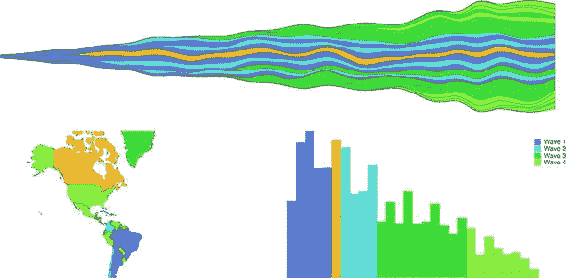

### 9.7\. 刷选

刷子组件 `d3.brush()`（或当我们从 `d3-brush` 模块中使用它时的 `brush()`）就像坐标轴组件一样，因为它在调用时创建 SVG 元素（通常是通过 `<g>` 元素）。但它也像缩放行为一样，因为刷子有交互，可以更新一个数据元素，你可以用它来进行交互。刷子是有价值的交互式组件，允许用户直观地分割他们的数据。对于我们的仪表板，我们将添加一个允许用户显示在特定时期发射的国家。

#### 9.7.1\. 创建刷子

D3 中的刷子创建了一个用户可以通过点击和拖动来选择的区域。因为我们从 `<g>` 中调用刷子，所以无法使用第二种 React+D3 方法中的刷子；你将不得不传递一个 DOM 元素供刷子调用。我们仍然会将我们的刷子交互的结果传递给 App 状态，以便它分布到各种其他元素。首先，让我们让 `Brush.js` 组件运行起来。在下面的列表中是希望现在熟悉的从 App.js 中包含对新组件引用的代码。我们一开始只传递一个大小。

##### 列表 9.17\. App.js 中刷子的更新

```
...
import Brush from './Brush'
...

<Brush size={[this.state.screenWidth, 50]} />
```

这也是为什么我们的 CSS 中有对 `rect.selection` 和 `rect.handle` 的引用。这些是刷子中提供交互性的部分，正如你在 图 9.12 中可以看到的。

##### 图 9.12\. 刷子的组成部分

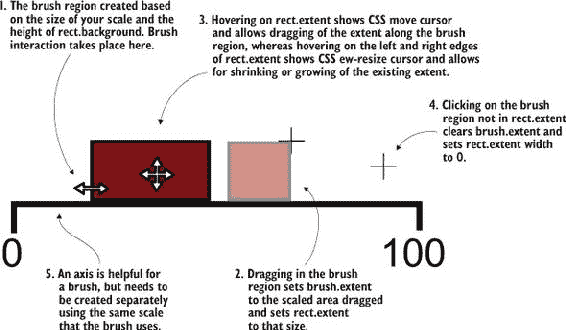

*刷子* 是一组交互式组件的集合，允许用户拖动刷子的一端来指定一个范围，或者将这个范围移动到不同的范围。典型的刷子特性在 图 9.12 中解释。在本章中，我们只创建了一个允许沿 x 轴选择的刷子，但如果你想看到一个沿 x 轴和 y 轴选择的刷子，你可以查看 第十一章，在那里我们使用它来选择在 xy 平面上排列的点。

创建一个与我们的刷子一起使用的坐标轴也是有帮助的。刷子被创建为一个交互区域，点击该区域会响应地产生一个矩形。但在任何交互之前，该区域看起来是空的。通过包含一个坐标轴，我们向用户告知这个刷子所附带的范围。

你用来驱动坐标轴的刻度可能也用于将刷子区域转换为我们要用于过滤的数据范围。我们的刷子将是我们的仪表板的宽度，这是一个可变的像素大小，而你通过刷子交互指定的区域并不对应我们的数据（每个国家的发射日），因此我们需要这个刻度来将刷子范围转换为数据范围。

之后，我们将创建一个 `brushX` 刷，并将组件的 `this.props.size` 作为刷的 `.extent()` 方法的第二个参数，这就像我们在上一章中看到的地理区域边界框（一个包含两个部分的数组，第一部分是右上角的坐标，第二部分是左下角的坐标）。我们还可以使用 `brushY` 刷创建垂直刷，或者使用 `brush` 刷（我们在第十一章中将要使用的刷）来允许选择区域。我们将分配一个事件监听器，监听自定义事件 `"brush"` 来调用 `brushed()` 函数。创建刷的代码在列表 9.18 中显示，而使用刷时的行为代码在列表 9.19 中解释。刷事件发生在用户在点击区域后沿刷区域拖动鼠标的任何时候。与缩放一样，与刷相关联的还有 `brushstart` 和 `brushend` 事件，你可以使用这些事件来触发可能不希望在每个小刷移动时触发的性能密集型函数。

##### 列表 9.18\. Brush.js 组件

```
import React, { Component } from 'react'
import './App.css'
import { select, event } from 'd3-selection'
import { scaleLinear } from 'd3-scale'
import { brushX } from 'd3-brush'
import { axisBottom } from 'd3-axis'

class Brush extends Component {
  constructor(props){
    super(props)
    this.createBrush = this.createBrush.bind(this)             *1*
  }

  componentDidMount() {
    this.createBrush()                                         *1*
  }

  componentDidUpdate() {
    this.createBrush()                                         *1*
  }
  createBrush() {
  const node = this.node
  const scale = scaleLinear().domain([0,30])
    .range([0,this.props.size[0]])                             *2*

  const dayBrush = brushX()
                  .extent([[0, 0], this.props.size])
                  .on("brush", brushed)                        *3*

  const dayAxis = axisBottom()
    .scale(scale)                                              *4*

  select(node)
    .selectAll("g.brushaxis")
    .data([0])
    .enter()
    .append("g")
    .attr("class", "brushaxis")                                *4*
    .attr("transform", "translate(0,25)")

  select(node)
    .select("g.brushaxis")
    .call(dayAxis)

  select(node)
    .selectAll("g.brush")
    .data([0])
    .enter()
    .append("g")
    .attr("class", "brush")

  select(node)
    .select("g.brush")
    .call(dayBrush)                                            *5*

  function brushed() {
    console.log(event)
     // brushed code                                           *6*
  };

  }

  render() {
    return <svg  ref={node => this.node = node}
width={this.props.size[0]} height={50}></svg>
  }
}

export default Brush
```

+   ***1* 对于一个具有 D3 处理元素创建和更新的 React 组件的标准内容**

+   ***2* 对于我们的轴以及后续的刷功能**

+   ***3* 初始化刷并关联到我们的刷功能**

+   ***4* 这里没有新内容，只是创建一个轴**

+   ***5* 使用我们的 <g> 调用刷以创建它**

+   ***6* 我们将在下面处理这个问题**

我们再次看到，我们绑定了一些单元素数组，这样我们就可以使用 D3 的 enter-exit-update 语法，而无需每次组件渲染时都重新创建元素。图 9.13（figure 9.13）中的结果是可拖动的、可调整的刷和刷区域，当我们拖动和调整它时，它不会做任何事情，只是移动。

##### 图 9.13\. 这是我们刷的示例，尽管它没有与刷事件关联的任何功能，所以它几乎就是一个玩具。一个无聊的，无聊的玩具。

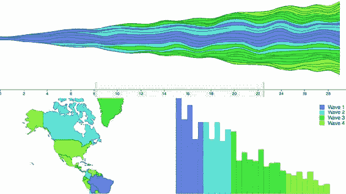

我们在 `createBrush` 函数中之前定义的 `brushed()` 函数使用 `d3-selection` 中的 `event` 获取刷的当前范围，并将其发送回 App，在那里它被用来过滤基础数据集，这会自动更改其他视图显示的数据，如下面的列表所示。

##### 列表 9.19\. Brush.js 中的刷功能

```
const brushFn = this.props.changeBrush                                    *1*
function brushed() {
    const selectedExtent = event.selection.map(d => scale.invert(d))      *2*
    brushFn(selectedExtent)
}
```

+   ***1* 我们需要将这个函数绑定到一个变量上，因为刷的上下文将不同（我们也可以使用 function.bind 或 function.apply，但在这个情况下会更繁琐）**

+   ***2* Invert 将返回比例范围的域**

这意味着我们需要从 App 传递一种 `changeBrush` 函数，正如你可能猜到的，这个函数将更新状态，当我们在计算发送给组件的数据时，这个状态将被考虑在内，如下面的列表所示。

##### 列表 9.20\. App.js 的更改以监听刷

```
...
this.onBrush = this.onBrush.bind(this)
this.state = { screenWidth: 1000, screenHeight: 500, hover: "none",
    brushExtent: [0,40] }

...
onBrush(d) {
    this.setState({ brushExtent: d })
}
render() {
    const filteredAppdata = appdata.filter((d,i) =>
        d.launchday >= this.state.brushExtent[0] &&
        d.launchday <= this.state.brushExtent[1])
...
<StreamGraph hoverElement={this.state.hover} onHover={this.onHover}
     colorScale={colorScale} data={filterdAppdata}
     size={[this.state.screenWidth, this.state.screenHeight / 2]} />
<Brush changeBrush={this.onBrush} size={[this.state.screenWidth, 50]} />
<WorldMap hoverElement={this.state.hover} onHover={this.onHover}
     colorScale={colorScale} data={filterdAppdata}
     size={[this.state.screenWidth / 2, this.state.screenHeight / 2]} />
<BarChart hoverElement={this.state.hover} onHover={this.onHover}
     colorScale={colorScale} data={filterdAppdata}
     size={[this.state.screenWidth / 2, this.state.screenHeight / 2]} />
...
```

这个刷子允许用户指定一个日期块，以查看在这些日期期间启动的国家数量。图 9.14 显示了三个不同的刷区域和仪表板相应的变化。

##### 图 9.14。`brushed()`函数的结果仅显示第 1 和第 2 个波，然后是第 3 个波，最后是第 4 个波的国家。

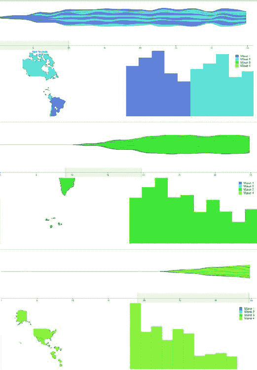

#### 9.7.2。理解刷事件

刷区域的活动会触发三个不同的自定义事件：`brush`、`brushstart`和`brushend`。你可能已经根据它们的名称猜出来了，但为了清晰起见，`brushstart`是在你鼠标按下刷区域时触发的，`brush`是在`brushstart`之后和鼠标抬起之前连续触发的，而`brushend`是在鼠标抬起时触发的。在大多数刷的实现中，将它们连接起来，以便你想要在用户活动上应用的功能仅在`brush`事件上发生是有意义的。但你可能有一些更昂贵的函数，比如重新绘制整个地图或查询数据库。在这种情况下，你可以使用`brushstart`来在你的地图上引起视觉变化（将元素变为灰色或透明），然后等待`brushend`来运行更重的活动。

我们就到这里吧。你可以用我们之前看过的任何图表替换这些图表，比如饼图、网络可视化或圆形打包。像刷子这样的控件可能很强大，但也很重要让用户能够访问这些控件。

### 9.8。展示数字

可能你没有注意到我对那个词的轻微反感。它是恶意的，而且无处不在。客户通常会假设他们想要的信息只有一个视图，而你的工作是提供给他们，如果你制作的图表没有精确突出数值差异，他们会认为这是失败。这是一个挑战，我在第六章中讨论过，你将在工作中与之抗争。

但话虽如此，确实有地方可以展示数字。有时数字是可视化数据的最佳方式。在仪表板的情况下，几乎总是应该有一个统计行：一行可读的整体统计数据，以提供一些上下文，并允许他们判断单个数据点是否异常。这不是最吸引人的数据可视化方式，但很有用。我不会深入探讨如何格式化数据，因为这一章已经很长了；相反，我将利用这个机会向你介绍一个额外的 React 概念：*纯渲染组件*。如果你有一个接受 props 并返回渲染函数的组件，那么你的整个组件可以是一个函数，如下面的列表所示。

##### 列表 9.21。纯渲染 StatLine.js

```
import React from 'react'
import { mean, sum } from 'd3-array'

export default (props) => {                                            *1*
  const allLength = props.allData.length                               *2*
  const filteredLength = props.filteredData.length
  let allSales = mean(props.allData.map(d => sum(d.data)))
  allSales = Math.floor(allSales * 100)/100                            *3*
  let filteredSales = mean(props.filteredData.map(d => sum(d.data)))
  filteredSales = Math.floor(filteredSales * 100)/100
  return <div>                                                         *4*
  <h1><span>Stats: </span>
  <span>{filteredLength}/{allLength} countries selected. </span>
  <span>Average sales: </span>
  <span>{filteredSales} ({allSales})</span>
  </h1>
</div>
}
```

+   ***1* 我们导出一个接受 props 的函数**

+   ***2* 注意我们使用的是 props，而不是 this.props，因为没有 this，并且当它是一个纯渲染函数时，props 会被传递给函数**

+   ***3* 这是一种将数值四舍五入到两位小数的方法**

+   ***4* 纯渲染组件返回 DOM 元素**

可能让您感到惊讶的一件事是，我编写了自己的格式化程序来将平均销售额四舍五入到两位小数，而不是像您可能预期的那样使用`d3-format`。这是因为我不想包含`d3-format`。当我最初开始使用 D3 时，我把它用于一切，但自从那时起，我开始依赖其他我认为更适合我所需功能的库，在格式化方面，这意味着使用 numeral.js 处理数字，使用 moment.js 处理日期（moment 在处理时间功能方面也非常出色）。这不应该太令人惊讶，因为本章的整个目的就是利用 React 而不是 D3.js 来创建、更新和销毁元素，因为它是为此目的更好的技术。我们的仪表板最终版本在图 9.15 中。

##### 图 9.15。我们的最终仪表板，顶部显示一条状态线，指示我们从数据中的总国家数中选出的国家数量以及所选国家的平均销售额与整体平均销售额的对比。这里已调整大小以缩小，因为我们没有调整地图的大小，所以我们只能看到北美。

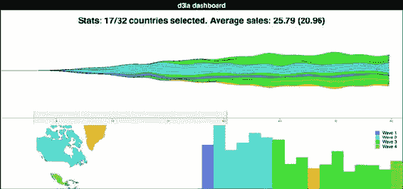

### 9.9. 摘要

+   将 D3 与 MVC 框架或视图渲染库（如 React）集成意味着您只需使用 D3 中不与其他库重叠的部分。

+   您有两种基本不同的方式来集成 D3：将 DOM 节点传递给 D3 并在应用程序的其他部分之外单独对其工作，使用传统的 D3 select/enter/exit/update，或者仅使用 D3 生成数据绘制指令传递给您的其他库。

+   基于 NPM 的项目更适合使用单个 D3 模块。

+   `brush()`组件让您以直观的方式选择数据范围。

+   在创建仪表板时，交叉高亮行为是有用且预期的。

### 真实世界中的 D3

#### Elijah Meeks 高级数据可视化工程师

*Netflix 算法和新会员仪表板*

Netflix 需要理解数百万用户观看成千上万独特标题产生的数十亿个事件。为此，Netflix 使用仪表板。更复杂的一些是使用 D3、React 和 Redux 制作的定制应用程序。

要构建如图所示的仪表板，该仪表板跟踪算法性能，或如图所示的仪表板，该仪表板查看会员漏斗，我们使用本章中展示的技术。

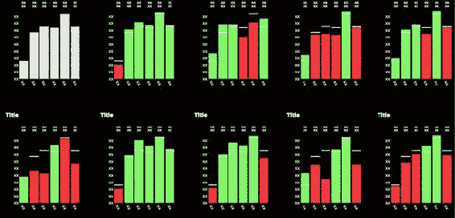

除了这些，我们还通过使用 React 的生命周期事件获得动画和性能调整。这些仪表板中构建的定制 D3 图表通常是唯一一种方式，我们可以利用强大的大数据后端来展示 Netflix 处理的数十亿个事件。

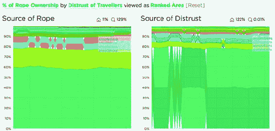

## 第十章\. 编写布局和组件

*本章涵盖*

+   编写自定义图例组件

+   编写自定义网格布局

+   添加功能以使布局和组件设置可定制

+   向组件添加交互性

在整本书中，我们处理了 D3 组件和布局。在本章中，我们将编写它们。在您创建了自己的布局和组件之后，您将更好地理解布局的结构和功能。您将能够使用该布局，以及您在以后使用 D3 构建的图表和应用程序中创建的其他布局。

在本章中，我们将创建一个自定义布局，将数据集放置在网格上。在本章的大部分内容中，我们将使用我们的人事分析数据集，但布局的优势在于数据集并不重要。本章的目的不是创建一个网格，而是帮助您理解布局是如何工作的。我们将创建一个网格布局，因为它简单，使我们能够专注于布局结构而不是任何数据可视化布局的细节。我们将通过扩展布局，使其具有可更改的固定大小来继续这个过程。您还将看到布局如何注释我们发送的数据集，以便可以将单个数据点绘制为圆圈或矩形。网格不是最性感或最有用的布局，但它可以教会您布局的基础。之后，我们将构建一个图例组件，告诉用户我们元素颜色的含义。我们将通过将图例的图形组件基于我们用于着色图表元素的刻度来实现这一点。

### 10.1\. 创建布局

回想一下第五章，布局是一个修改数据集以进行图形表示的函数。在这里，我们将构建这个函数。稍后，我们将赋予它以与内置 D3 布局相同的方式修改布局设置的能力。这个布局将使我们能够将离散数据点放置在网格上，从而便于比较。您可以使用它来显示单个圆圈或矩形，就像我们做的那样，或者您可以使用这些网格来容纳单个图表以生成小倍数图表，就像自本书第一版发布以来的一些 D3 用户所做的那样。

您将在稍后详细了解这一点，但首先我们需要创建一个处理我们数据的函数。在创建此函数之后，我们将使用它来实现布局所需的调用。在下面的列表中，您可以看到该函数和一个实例化它并传递数据的测试。

##### 列表 10.1\. d3.gridLayout.js

```
d3.gridLayout = () => {
   function processGrid(data) {
   console.log(data)
   }
   return processGrid
}
var grid = d3.gridLayout()
grid([1,2,3,4,5])                       *1*
```

+   ***1* 将 [1,2,3,4,5] 打印到控制台**

这不是一个令人兴奋的布局，但它有效。我们不需要将我们的布局命名为 `d3.-layoutX` 或任何其他特定名称，但使用一个深思熟虑的名称将在未来使其更具可读性（而且您不希望在未来的书籍中受到嘲笑，在那里您会被问到为什么您的树状图既不是树也不是地图）。

#### 10.1.1\. 设计你的布局

在我们开始编写创建网格的函数之前，我们必须定义这个布局的作用。我们知道我们想在网格上放置数据，但我们还想做什么？这里有一个简单的规范：

+   我们希望有一个默认的网格排列——比如说，行数和列数相等。

+   我们还希望让用户定义行数或列数。

+   我们希望网格跨越一定的尺寸。

+   我们还需要允许用户定义网格的大小。

这是个不错的开始。

#### 10.1.2\. 实现你的布局

首先，我们需要初始化所有这个网格需要访问的变量，以便使其发生。我们还需要定义 getter 和 setter 函数，以便用户可以访问这些变量，因为我们希望将它们限制在`d3.gridLayout`函数的作用域内。我们可以做的第一件事是更新`processGrid`函数，使其看起来像列表 10.2 中的那样。它接受一个对象数组，并根据网格位置更新它们的数据。我们从发送到`processGrid`的数据对象数量中推导出网格的大小。实际上，这并不是一个困难的数学问题。我们取数据点的平方根，并将其四舍五入到最接近的整数，以获得网格的正确行数和列数。当你想到网格是一组行和列，允许你为每个数据点在这些行和列之一放置一个单元格时，这就有意义了。行数乘以列数至少需要等于单元格数（数据点的数量）。如果我们决定行数和列数相同，那么就是那个数的平方。

##### 列表 10.2\. 更新的 processGrid 函数

```
function processGrid(data) {
   var rows = Math.ceil(Math.sqrt(data.length));                        *1*
   var columns = rows;
   var cell = 0;                                                        *2*
   for (var rowNumber = 0; rowNumber < rows; rowNumber++) {
      for (var cellNumber = 0; cellNumber < columns; cellNumber ++) {   *3*
         if (data[cell]) { cellNumber                                   *4*
             data[cell].y = rowNumber                                   *5*
             cell++                                                     *6*
         }
         else {
           break
         }
      }
   }
   return data
}
```

+   ***1* 计算行数/列数**

+   ***2* 初始化一个变量来遍历数据集**

+   ***3* 遍历行和列**

+   ***4* 这假设数据由一个对象数组组成**

+   ***5* 将当前数据点设置为相应的行和列**

+   ***6* 增加数据点变量**

为了测试我们初生的网格布局，我们可以使用来自第七章的 nodelist .csv 文件加载我们的人员分析团队，然后将这些数据传递给网格。`grid`函数根据计算出的网格位置在屏幕上显示图形元素。在下面的列表中，你可以看到我们如何将 nodelist.csv 中的数据传递到我们的网格布局中，并根据每个人的薪水来调整每个人的大小。

##### 列表 10.3\. 使用我们的网格布局

```
d3.csv("nodelist.csv", makeAGrid)
function makeAGrid(data) {
   var scale =
   d3.scaleLinear().domain([0,5]).range([100,400]);       *1*
    var salaryScale = d3.scaleLinear().domain([0,300000])
       .range([1,30]).clamp(true)
   var grid = d3.gridLayout();
   var griddedData = grid(data);
   d3.select("svg").selectAll("circle")
      .data(griddedData)
      .enter()
      .append("circle")
      .attr("cx", d => scale(d.x))                        *2*
      .attr("cy", d => scale(d.y))
          .attr("r", d => salaryScale(d.salary))
      .style("fill", "#93C464");
}
```

+   ***1* 一个缩放比例，以适应我们的 SVG 画布上的网格**

+   ***2* 根据布局计算出的 x 和 y 值将圆圈设置为缩放位置**

图 10.1 中的结果显示了网格函数如何正确地将 x 和 y 坐标附加到绘制员工为网格上的圆圈。

##### 图 10.1\. 使用我们新的 `d3.gridLayout` 对数据进行网格排列的 `makeAGrid` 函数的结果。在这种情况下，我们的数据由代表员工的绿色圆圈组成，这些圆圈在网格上排列，并按薪水大小进行排列。

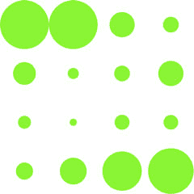

#### 10.1.3\. 测试你的布局

将其构建为布局的好处是，如果我们向其中添加更多数据，它将自动调整，并允许我们使用过渡来动画化这种调整。为此，我们需要更多数据。列表 10.4 包含了一些创建大量新员工的代码行。我们还使用了原生 JavaScript 中数组的 `.concat()` 函数，当给定 图 10.1 中显示的状态时，应该产生 图 10.2 中的结果。

##### 图 10.2\. 网格布局已自动调整到我们新数据集的大小。请注意，我们的新元素位于旧元素之上，但我们的布局大小已从 4x4 网格变为 5x5 网格，导致旧元素移动到它们新计算的位置。

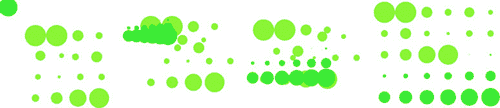

##### 列表 10.4\. 更新网格以包含更多元素

```
var newEmployees = d3.range(14).map(d => {
   var newPerson = {id: "New Person " + d, salary: d * 20000}      *1*
   return newPerson
})
var doubledArray = data.concat(newEmployees);                      *2*
var newGriddedData = grid(doubledArray);
d3.select("svg").selectAll("circle")
   .data(newGriddedData)
   .enter()
   .append("circle")                                               *3*
   .attr("cx", 0)
   .attr("cy", 0)
      .attr("r", d => salaryScale(d.salary))
   .style("fill", "#41A368");
d3.select("svg").selectAll("circle")
   .transition()                                                   *4*
   .duration(1000)
   .attr("cx", d => scale(d.x))
   .attr("cy", d => scale(d.y))
```

+   ***1* 创建 14 名具有递增薪水的员工**

+   ***2* 将原始数据集与我们的新数据集合并**

+   ***3* 在 0,0 处添加任何新员工**

+   ***4* 将所有员工（新旧）移动到它们新计算的位置**

图 10.2 中的结果显示了从旧位置到新位置的圆圈动画快照。

#### 10.1.4\. 扩展你的布局

基于你所知道的网格大小来计算比例会导致代码效率低下。如果有人输入了不同的数据集，这就不会很有用。相反，在设计布局时，你将希望提供功能，以便可以声明布局大小，然后任何必要的调整都发生在处理数据的布局代码中。为此，我们需要添加一个作用域大小变量，然后向我们的 `processGrid` 函数添加一个函数，允许用户更改该大小变量。发送变量设置值，不发送变量则返回值。我们通过使用原生 JavaScript 中的 `arguments` 对象检查参数的存在来实现这一点。更新的函数如下所示。

##### 列表 10.5\. 带有大小功能的 `d3.gridLayout`

```
d3.gridLayout = function() {
var gridSize = [0,10];                                          *1*
   var gridXScale = d3.scaleLinear();                           *2*
var gridYScale = d3.scaleLinear();
function processGrid(data) {
        var rows = Math.ceil(Math.sqrt(data.length));
           var columns = rows;
        gridXScale.domain([1,columns]).range([0,gridSize[0]])   *3*
           gridYScale.domain([1,rows]).range([0,gridSize[1]])
           var cell = 0
        for (var rowNum = 1; rowNum <= rows; rowNum++) {
          for (var cellNum = 1; cellNum <= columns; cellNum++) {
            if (data[cell]) {
              data[cell].x = gridXScale(cellNum)                *4*
              data[cell].y = gridYScale(rowNum)
              cell++
            }
            else {
              break
            }
          }
        }
      return data;
    }
    processGrid.size = (newSize) => {                           *5*
            if (!arguments.length) return gridSize
        gridSize = newSize
        return this
    }
    return processGrid
  }
```

+   ***1* 使用默认值初始化变量**

+   ***2* 创建两个比例，但没有定义它们的范围或域**

+   ***3* 每次调用布局时定义范围和域**

+   ***4* 将缩放值作为 x 和 y 应用**

+   ***5* 布局大小的获取/设置函数**

您可以通过稍微更改调用布局的代码来查看更新的网格布局效果，如下所示。我们设置了大小，并在创建圆圈时直接使用 x 和 y 值，而不是使用缩放值。

##### 列表 10.6\. 调用新的网格布局

```
    var grid = d3.gridLayout();
    grid.size([400,400]);                                  *1*
    var griddedData = grid(data);
    d3.select("svg")
       .append("g")
       .attr("transform", "translate(50,50)")
       .selectAll("circle").data(griddedData)
       .enter()
       .append("circle")
       .attr("cx", d => d.x)                               *2*
       .attr("cy", d => d.y)
       .attr("r", d => salaryScale(d.salary))
    var newEmployees = [];
    for (var x = 0;x < 14;x++) {
         var newPerson = {id: "New Person " + x, salary: x * 20000};
         newEmployees.push(newPerson);
    }

    var doubledArray = data.concat(newEmployees)
    var newGriddedData = grid(doubledArray)
    d3.select("g").selectAll("circle").data(newGriddedData)
       .enter()
       .append("circle")
       .attr("cx", 0)
       .attr("cy", 0)
       .attr("r", d => salaryScale(d.salary))
       .style("fill", "#41A368")
    d3.select("g").selectAll("circle")
       .transition()
       .duration(1000)
       .attr("cx", d => d.x)
       .attr("cy", d => d.y)
       .on("end", resizeGrid1)                            *3*
```

+   ***1* 设置布局大小**

+   ***2* 使用 x/y 值定位圆圈**

+   ***3* 在过渡结束时调用 resizeGrid1**

此代码引用了一个`resizeGrid1()`函数，如下面的列表所示，该函数链接到一个`resizeGrid2()`函数。这些函数使用我们在布局上更新大小设置的能力来更新布局创建的元素图形显示。

##### 列表 10.7\. `resizeGrid1()` 函数

```
    function resizeGrid1() {
      grid.size([200,400]);                *1*
      grid(doubledArray);
      d3.select("g").selectAll("circle")
        .transition()
        .duration(1000)
        .attr("cx", d => d.x)
        .attr("cy", d => d.y)
        .on("end", resizeGrid2)
    };
    function resizeGrid2() {
      grid.size([400,200])                 *2*
      grid(doubledArray)
      d3.select("g").selectAll("circle")
        .transition()
        .duration(1000)
        .attr("cx", d => d.x)
        .attr("cy", d => d.y)
    }
```

+   ***1* 更改大小，重新应用布局并更新显示**

+   ***2* 再次，使用不同的尺寸**

这创建了一个完美适应我们定义空间的网格，如图 10.3 所示，并且不需要创建一个比例来放置元素。

##### 图 10.3\. 以 400 x 400 大小设置运行的网格布局

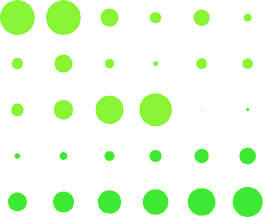

图 10.4 显示了一对动画，其中网格的大小随着我们调整大小设置而变化。网格调整大小以适应较小的或拉长的区域。这是使用过渡的`end`事件完成的。它调用一个新的函数，该函数使用我们的原始网格布局，但更新其大小并将其重新应用于我们的数据集。

##### 图 10.4\. 在 200 x 200 大小（左）和 400 x 200 大小（中心）以及 200 x 400 大小（右）下运行的网格布局

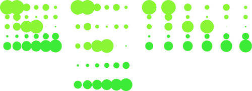

在我们继续之前，我们扩展我们的布局很重要，这样你可以更好地理解布局是如何工作的。在 D3 中，布局并不是用来创建像充满圆形的网格这样具体的东西。相反，*它应该注释数据集，以便你可以使用不同的图形方法来表示它。*

假设我们希望我们的布局也能处理正方形，这在处理网格时是一个期望的特性。为了处理正方形，或者更具体地说，处理矩形（因为我们希望如果有人使用我们的布局并设置不同的宽度和高度值时，它们可以拉伸），我们需要计算`高度`和`宽度`值的容量。这很容易添加到我们现有的布局函数中，如下面的列表所示。

##### 列表 10.8\. 计算网格单元高度和宽度的布局代码

```
      var gridCellWidth = gridSize[0] / columns;
      var gridCellHeight = gridSize[1] / rows;
      //other code
        for (var i = 1; i <= rows; i++) {
          for (var j = 1; j <= columns; j++) {
            if (data[cell]) {
              data[cell].x = gridXScale(j);
              data[cell].y = gridYScale(i);
              data[cell].height = gridCellHeight;       *1*
              data[cell].width = gridCellWidth;         *1*
              cell++;
            }
            else {
              break;
            }
          }
        }
```

+   ***1* 新代码用于设置网格单元的高度和宽度，以便我们可以使用矩形而不是圆形**

在此设置到位后，我们可以调用我们的布局并添加`<rect>`元素而不是圆形元素。我们可以更新我们的代码，如下面的列表所示，以偏移`x`和`y`属性（因为`<rect>`元素是从左上角绘制的，而不是像`<circle>`元素那样从中心绘制）并应用布局计算出的宽度和高度值。

##### 列表 10.9\. 使用我们的布局添加矩形

```
    d3.select("svg")
       .append("g")
       .attr("transform", "translate(50,50)")
       .selectAll("circle").data(griddedData)
       .enter()
       .append("rect")
         .attr("x", d => d.x - (d.width / 2))                 *1*
         .attr("y", d => d.y - (d.height / 2))                *1*
         .attr("width", d => d.width)                         *1*
         .attr("height", d => d.height)                       *1*
         .style("fill", "#93C464")

...
   d3.select("g").selectAll("rect").data(newGriddedData)
       .enter()
       .append("rect")
       .style("fill", "#41A368")

   d3.select("g").selectAll("rect")
         .transition()
         .duration(1000)
         .attr("x", d => d.x - (d.width / 2))                 *2*
         .attr("y", d => d.y - (d.height / 2))                *2*
         .attr("width", d => d.width)                         *2*
         .attr("height", d => d.height)                       *2*
         .on("end", resizeGrid1);                             *3*

function resizeGrid1() {                                      *4*
      grid.size([200,400]);
      grid(doubledArray);
      d3.select("g").selectAll("rect")
        .transition()
        .duration(1000)
        .attr("x", d => d.x - (d.width / 2))
        .attr("y", d => d.y - (d.height / 2))
        .attr("width", d => d.width)
        .attr("height", d => d.height)
        .on("end", resizeGrid2);
};

    function resizeGrid2() {                                  *4*
      grid.size([400,200]);
      grid(doubledArray);
      d3.select("g").selectAll("rect")
        .transition()
        .duration(1000)
        .attr("x", d => d.x - (d.width / 2))
        .attr("y", d => d.y - (d.height / 2))
        .attr("width", d => d.width)
        .attr("height", d => d.height)
    };
```

+   ***1* 更新网格布局计算每个网格单元占用的空间**

+   ***2* 使用高度和宽度设置矩形大小和位置，并使用动画过渡**

+   ***3* 在动画结束时，触发另一个动画以显示如何使用更新的网格大小设置动态更新网格的显示**

+   ***4* 这些都基于新的 grid.size 设置提供了新的矩形尺寸**

如果我们相应地更新其余代码，结果将是我们的布局在不同大小之间的相同动画过渡，但现在矩形的大小和形状会根据这些大小变化，如图图 10.5 所示。

##### 图 10.5. 使用矩形作为网格单元的网格布局的三种状态


这是一个简单的布局示例，它所做的远不如本书中使用的各种布局那么复杂，但即使是这样的简单布局也能提供可重用、可动画的内容。现在我们将看看 D3 中的另一个可重用模式——组件，它能够自动创建图形元素。

### 10.2. 编写自己的组件

您已经看到了组件的实际应用，特别是`axis`组件。您也可以将画笔视为一个组件，因为它也创建图形元素。但它通常被描述为“控件”，因为它还带有内置的交互性。

我们将构建的组件是一个简单的图例。在数据可视化工作中，图例是必不可少的，它们有一些共同之处。首先，我们需要考虑一个更有趣的数据集，尽管我们将继续使用我们的网格布局。我们将创建的图例组件最终将包括带有标签的矩形，每个矩形都有一个颜色，对应于 D3 比例分配给我们的数据点的颜色。这样，我们的用户可以一眼看出哪些颜色对应于我们的数据可视化中的哪些值。

### 10.3. 加载样本数据

我们将使用 world.geojson 文件，而不是 nodelist.csv 数据，但我们将使用特征作为数据点放置在我们的自定义网格布局中，从第 10.1 节中获取，而不是将它们放在地图上。列表 10.10 显示了相应的代码，它生成了图 10.6。您可能会觉得将地理数据加载并以其完全不同的方式表示是奇怪的。以非传统方式呈现数据通常是一种有用的技术，可以吸引用户的注意力，关注数据中的模式。

##### 图 10.6. 作为网格的世界各国

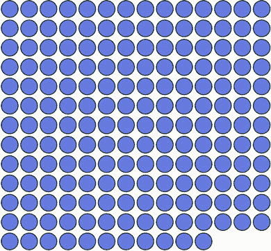

##### 列表 10.10. 将世界各国的数据加载到网格中

```
  d3.json("world.geojson ", data => {
      makeAGrid(data);
    })
  function makeAGrid(data) {
    var grid = d3.gridLayout();
    grid.size([300,300]);
    var griddedData = grid(data.features);
    griddedData.forEach(country => {
      country.size = d3.geoArea(country);          *1*
    });
    d3.select("svg")
      .append("g")
      .attr("transform", "translate(50,50)")
      .selectAll("circle")
      .data(griddedData)
      .enter()
      .append("circle")                            *2*
      .attr("cx", d => d.x)
      .attr("cy", d => d.y)
      .attr("r", 10)
      .style("fill", "#75739F")
      .style("stroke", "#4F442B")
      .style("stroke-width", "1px");
  };
```

+   ***1* 计算每个国家的面积并将其附加到数据点**

+   ***2* 为每个国家附加一个圆圈**

我们将只关注我们数据的一个属性：每个国家的大小。我们将根据该大小使用量化比例来着色圆圈，将每个国家放入几个离散类别之一。在我们的例子中，我们将使用`colorbrewer.Reds[7]`（记住，这意味着您需要包含对 colorbrewer.js 文件的链接）的浅到深红色数组作为我们的桶。量化比例将国家分成七个不同的组。在列表 10.11 中，您可以看到如何设置它，图 10.7 显示了我们的新颜色比例的结果。

##### 图 10.7. 代表国家的圆圈，按面积着色

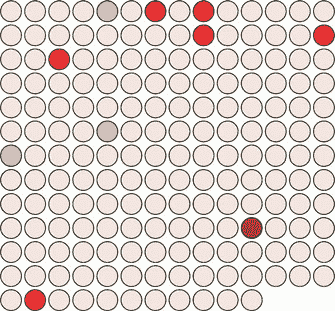

##### 列表 10.11. 更改网格的颜色

```
var griddedData = d3.selectAll("circle").data();                *1*
var sizeExtent = d3.extent(griddedData, d => d.size)
var countryColor = d3.scaleQuantize()
              .domain(sizeExtent).range(colorbrewer.Reds[7])
d3.selectAll("circle").style("fill", d => countryColor(d.size))
```

+   ***1* 获取绑定到我们的圆圈的数据数组**

为了更完整的数据可视化，我们可能想要添加标签来标识国家或其他元素，以识别大陆或国家所在的地区。但我们将专注于解释颜色表示什么。我们不希望被数据中的其他可能解释的细节所困扰，例如，使用模态窗口，就像我们在第四章的 World Cup 示例中所做的那样，或者使用本书中讨论的其他标签方法。为了使图例有用，它需要考虑不同的着色类别，并指示哪种颜色与哪种值带相关。但在我们到达那里之前，让我们构建一个组件，当我们调用它时，它会创建图形元素。记住，选择集的 `d3.select(#something).call(someFunction)` 函数与 `someFunction(d3.select(#something))` 等效。考虑到这一点，我们将创建一个期望一个选择集并对其操作的函数，如下所示。

##### 列表 10.12. 一个简单的组件

```
d3.simpleLegend = () => {
    function legend(gSelection) {          *1*
      var testData = [1,2,3,4,5];
      gSelection.selectAll("rect")         *2*
         .data(testData)
      .enter()
      .append("rect")
      .attr("height", 20)
      .attr("width", 20)
      .attr("x", (d,i) => i *25)
      .style("fill", "red")
      return this;
    }
    return legend;
  };
```

+   ***1* 组件通过 .call() 接收一个选择集**

+   ***2* 将一组矩形添加到该选择集中**

我们可以在我们的图表中添加一个 `<g>` 元素，并称这个组件，结果如图 10.8 所示：

##### 图 10.8. 当通过放置在我们网格下方的 `<g>` 元素调用时，新的图例组件创建了五个红色矩形。

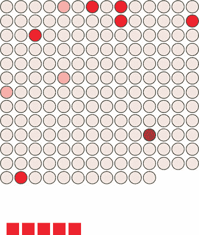

```
var newLegend = d3.simpleLegend();
d3.select("svg").append("g")
   .attr("id","legend")
   .attr("transform", "translate(50,400)")
   .call(newLegend);
```

现在我们有了组件的结构，我们可以向它添加功能，例如允许用户定义一个自定义大小，就像我们在网格布局中所做的那样。我们还需要考虑这个图例将从哪里获取其数据。遵循轴组件的模式，图例直接引用我们使用的刻度并从中推导出与刻度中每个带颜色相关的颜色和值似乎是合理的。

### 10.4. 将组件链接到刻度

要做到这一点，我们必须为我们的图例编写一个新的函数，该函数接受一个刻度并推导出必要的范围带以便使用。我们发送给它的刻度将是我们用来为网格圆圈着色的相同的 `countryColor` 刻度。因为这是一个量化刻度，所以我们将使我们的图例组件硬编码以仅处理量化刻度。如果我们想使这个组件更健壮，我们需要使其能够识别和处理 D3 使用的各种刻度。

所有刻度都有一个逆函数，它们也有能力告诉你哪些域值映射到哪些范围值。首先，我们需要知道我们的量化刻度的值范围，因为它们在刻度中看起来是这样的。我们可以通过使用 `scaleQuantize.range()` 轻松地得到这个范围：

```
countryColor.range()                         *1*
```

+   ***1* [“#fee5d9”， “#fcbba1”， “#fc9272”， “#fb6a4a”， “#ef3b2c”， “#cb181d”， “#99000d”]**

我们可以将这些值传递给 `scaleQuantize.invertExtent` 以获取映射到每个颜色值的数值域：

```
countryColor.invertExtent("#fee5d9")         *1*
```

+   ***1* [0.000006746501002759535, 0.05946855349777645]**

拥有这两个函数，我们现在需要做的是给我们的图例组件赋予分配刻度的能力，然后更新图例函数本身，从该刻度中推导出我们图例所需的 dataset。列表 10.13 显示了使用量化刻度创建所需 dataset 的新 `d3.simpleLegend.scale()` 函数，以及使用该数据绘制更有意义的 `<rect>` 元素集的更新 `legend()` 函数。

##### 列表 10.13\. 更新的 `legend` 函数

```
d3.simpleLegend = function() {
   var data = [];
   var size = [300,20];                                            *1*
   var xScale = d3.scaleLinear();                                  *2*
   var scale;                                                      *3*
   function legend(gSelection) {
   createLegendData(scale);                                        *4*
   var xMin = d3.min(data, d => d.domain[0])                       *5*
   var xMax = d3.max(data, d => d.domain[1])
   xScale.domain([xMin,xMax]).range([0,size[0]])                   *6*
   gSelection.selectAll("rect")
   .data(data)
   .enter()
   .append("rect")
   .attr("height", size[1])                                        *7*
   .attr("width", d => xScale(d.domain[1]) -  xScale(d.domain[0]))
   .attr("x", d => xScale(d.domain[0]))
   .style("fill", d => d.color);
   return this;
   };
   function createLegendData(incScale) {                           *8*
      var rangeArray = incScale.range();
      data = [];
      for (var x in rangeArray) {
        var colorValue = rangeArray[x];
        var domainValues = incScale.invertExtent(colorValue);
        data.push({color: colorValue, domain: domainValues})
      }
   };
   legend.scale = function(newScale) {                            *9*
      if (!newScale) return scale;
      scale = newScale;
      return this;
   };
   return legend;
};
```

+   ***1* 设置默认大小**

+   ***2* 初始化 x 轴刻度，但未设置域或范围**

+   ***3* 将发送到组件的刻度**

+   ***4* 调用函数将刻度处理成数据数组**

+   ***5* 计算刻度数据的最大/最小值**

+   ***6* 设置 x 轴刻度**

+   ***7* 根据组件设置和刻度数据绘制矩形**

+   ***8* 将刻度处理成数据数组**

+   ***9* 设置器/获取器以设置图例的刻度**

我们调用这个更新的 `legend` 并设置它：

```
var newLegend = d3.simpleLegend().scale(countryColor);
d3.select("svg").append("g")
   .attr("transform","translate(50,400)")
   .attr("id", "legend").call(newLegend);
```

这个新的 `legend` 现在为我们的刻度中的每个带创建一个矩形，并相应地着色，如图 图 10.9 所示。

##### 图 10.9\. 更新的图例组件自动创建，每个量化刻度带都有一个 `<rect>` 元素，其颜色根据该带的颜色进行着色。

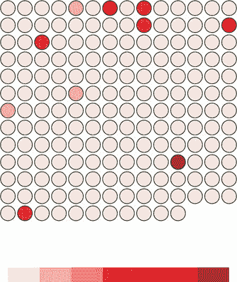

如果我们想要添加交互性，这是一个简单的过程，因为我们知道图例中的每个矩形都对应于来自我们的量化刻度的两个值数组的片段，显示了该单元格中带的价值。以下列表显示了该函数和使图例交互的调用。

##### 列表 10.14\. 图例交互性

```
d3.select("#legend").selectAll("rect").on("mouseover", legendOver);
function legendOver(d) {
    d3.selectAll("circle")
        .style("opacity", p => {
           if (p.size >= d.domain[0] && p.size <= d.domain[1]) {
                  return 1;
           } else {
                 return .25;
           }
        });
};
```

注意，此函数不是在图例组件内部定义的。相反，它在图例创建后定义和调用，因为创建后，我们的图例组件是一组 SVG 元素，其中绑定了数据，就像我们图表的任何其他部分一样。这种交互性允许我们在图例上悬停鼠标，并查看哪些圆圈落在特定的值范围内，如图 图 10.10 所示。

##### 图 10.10\. `legendOver` 行为突出显示落在特定带中的圆圈，并通过使它们透明来降低不在该带中的圆圈的重要性。

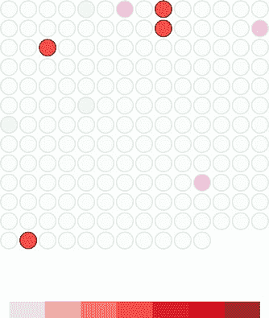

最后，在我们能够完成我们的图例之前，我们需要添加一个指示这些彩色带含义的说明。我们可以调用一个轴组件并允许它标记带，或者我们可以通过为每个断点附加文本元素来标记断点。在我们的情况下，因为提供的 `d3.geo.area` 的数字非常小，我们还需要旋转和缩小这些标签，以便它们适合页面。为此，我们可以在以下列表中添加代码到 `d3.simpleLegend` 的图例函数中

##### 列表 10.15\. 图例的文本标签

```
gSelection.selectAll("text")
   .data(data)
   .enter()
   .append("g")                                                       *1*
   .attr("transform", d => "translate(" + xScale(d.domain[0]) + ","
     + size[1] + ")")
   .append("text")
      .attr("transform", "rotate(90)")
      .text(d => d.domain[0]);
```

+   ***1* 文本元素需要放置在 g 中，以便它可以被转换并旋转；否则，它将被旋转然后转换，这将使其位于相对于其新旋转的转换位置（将文本移出页面）**

如图 10.11 所示，这些标签并不美观。我们可以调整它们的定位、字体和样式，使它们更有效。它们还需要像网格布局那样的功能来定义大小或其他组件元素。

##### 图 10.11\. 我们带有基本标签的图例

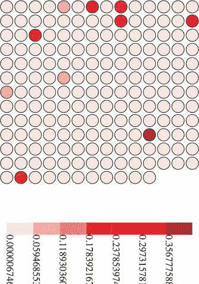

这通常是我说明本章目的是向您展示组件和布局的结构，以及制作最有效的布局或组件是一个漫长且复杂的过程，我们不会深入探讨。但这是一个丑陋的图例。断点难以阅读，并且缺少组件需要的部分，例如标题和单位说明。

### 10.5\. 添加组件标签

让我们向图例添加这些功能，并创建访问它们的方法，如下面的列表所示。我们使用`d3.format`，它允许我们根据流行的 Python 数字格式化迷你语言（位于[`docs.python.org/release/3.1.3/library/string.html#formatspec`](https://docs.python.org/release/3.1.3/library/string.html#formatspec)）设置一个数字格式化规则。

##### 列表 10.16\. 图例的标题和单位属性

```
    var title = "Legend";
    var numberFormat = d3.format(".4n");
    var units = "Units";                             *1*
    //other code
    legend.title = function(newTitle) {
      if (!arguments.length) return title;
      title = newTitle;
      return this;
    };                                               *2*
    legend.unitLabel = function(newUnits) {
      if (!arguments.length) return units;
      units = newUnits;
      return this;
    };
    legend.formatter = function(newFormatter) {
      if (!arguments.length) return numberFormat;
      numberFormat = newFormatter;
      return this;
    };
```

+   ***1* 这些是在 d3.simpleLegend 函数内部的 var scale 之后添加的**

+   ***2* 所有这些功能都是在 legend.scale 之后立即添加的**

我们将在列表 10.17 中显示的更新的图例绘制代码中使用这些新属性。新代码在每个断点处绘制 SVG `<line>` 元素，并放弃旋转文本，转而使用更易读的、缩短的文本标签。它还添加了两个新的 `<text>` 元素，一个位于图例上方，对应于`title`变量的值，另一个位于图例的远右侧，对应于`units`变量。

##### 列表 10.17\. 更新的图例绘制代码

```
gSelection.selectAll("line")                                   *1*
   .data(data)
   .enter()
   .append("line")
   .attr("x1", d => xScale(d.domain[0]))                       *2*
   .attr("x2", d => xScale(d.domain[0]))
   .attr("y1", 0)
   .attr("y2", size[1] + 5)
   .style("stroke", "black")
   .style("stroke-width", "2px");
gSelection.selectAll("text")
   .data(data)
   .enter()
   .append("g")
   .attr("transform",
    d => `translate(${(xScale(d.domain[0]))},${(size[1] + 20)})`)
   .append("text")
   .style("text-anchor", "middle")
   .text(d => numberFormat(d.domain[0]));                      *3*
gSelection.append("text")
   .attr("transform",
    d => `translate(${(xScale(xMin))},${(size[1] - 30)})`)
   .text(title);                                               *4*
gSelection.append("text")
   .attr("transform",
    d => `translate(${(xScale(xMax))},${(size[1] + 20)})`)
   .text(units);                                               *5*
```

+   ***1* 这遵循你现有的代码来绘制图例<rect>元素，并更新文本**

+   ***2* 每一行都在断点处绘制，并稍微向下绘制以“指向”断点值**

+   ***3* 将未旋转的标签锚定在中间，并根据设置的格式化器格式化值**

+   ***4* 在图例矩形上方添加一个固定、用户定义的标题，位于最小值位置**

+   ***5* 在标签所在行添加一个固定、用户定义的单位标签，但位于最大值位置**

这要求我们在调用图例之前使用以下列表中的代码设置这些新值。

##### 列表 10.18\. 使用标题和单位设置调用图例

```
var newLegend = d3.simpleLegend()
   .scale(countryColor)
   .title("Country Size")
   .formatter(d3.format(".2f"))
   .unitLabel("Steradians");                                          *1*
d3.select("svg").append("g").attr("transform", "translate(50,400)")
      .attr("id", "legend")
      .call(newLegend);                                               *2*
```

+   ***1* 设置图例标题和单位标签以及格式，以反映正在可视化的数据**

+   ***2* 这部分没有变化**

现在，如图 10.12 所示，我们有一个标签，它的可读性大大提高，仍然具有交互性，并且在任何使用类似比例的数据可视化中都很实用。

##### 图 10.12. 我们的图例带有标题、单位标签、适当的数字格式化，以及额外的图形元素来突出显示断点


通过构建组件和布局，你更好地理解了 D3 的工作原理，但它们之所以如此有价值，还有另一个原因：可重用性。你已经使用布局和组件（无论多么简单）构建了一个图表，这些是你自己编写的。你可以将它们与另一个布局或组件一起使用，或者单独使用，在任何其他地方使用的数据可视化图表中。


**信息可视化术语：可重用图表**

在你使用过 D3 中的组件、布局和控制之后，你可能开始怀疑是否有一个更高层次的抽象可以以可重用的方式结合布局和控制。这个抽象层次被称为*图表*，可重用图表的创建一直是 D3 社区的热点。

这导致了在 D3 之上开发出几个 API，如 NVD3、D4（用于通用图表）以及我自己的`d3.carto.map`（用于网络地图，不出所料）。这也促使 Miso 项目开发出`d3.chart`，这是一个可重用图表的框架。如果你对使用或开发可重用图表感兴趣，你可能想看看这些：

+   `d3.chart`—[`misoproject.com/d3-chart/`](http://misoproject.com/d3-chart/)

+   `d3.carto.map`—[`github.com/emeeks/d3-carto-map`](https://github.com/emeeks/d3-carto-map)

+   *D4*—[`visible.io`](http://visible.io)

+   *NVD3*—[`nvd3.org`](http://nvd3.org)


你也可以尝试构建更响应式的组件，这些组件在你再次调用它们时会自动更新，就像我们在上一章中处理的轴和画笔一样。或者，你可以尝试创建像`d3.brush`这样的控件和像`d3.behavior.drag`这样的行为。无论你如何广泛地遵循这种模式，我都建议你寻找你的信息可视化可以被抽象为布局和组件的实例，并尝试创建这些而不是构建另一个一次性可视化。通过这样做，你将提高 D3 的技能水平，并在你的工具箱中为以后的工作添加自己的组件。


##### 发布你的插件

当你完成插件构建后，你可能希望让其他人使用它。Mike Bostock 写了一篇关于如何发布你的 D3 插件的优秀教程，以便它们的行为像其他 D3 插件一样。你可以在这个教程中找到[`bost.ocks.org/mike/d3-plugin/`](https://bost.ocks.org/mike/d3-plugin/)。


### 10.6. 摘要

+   为了使你的代码更具可重用性，遵循 D3 中已经存在的两种模式：布局和组件。

+   组件创建图形元素，例如轴组件。

+   布局装饰数据以供绘图，例如饼图布局。

+   插件遵循 D3 中流行的 getter/setter 模式，允许人们使用方法链式调用。

+   在创建布局和生成器时，我们学习了如何通过传递一个`<g>`元素到我们的简单图例函数中来处理 D3 中的`.call`功能。这包括查询我们发送给该函数的 D3 比例尺以确定图例所需的部分。

### D3.js 在现实世界中的应用

#### Susie Lu 高级数据可视化工程师

*d3-svg-legend*

[`d3-legend.susielu.com/`](http://d3-legend.susielu.com/)

在 D3 中创建图例是我多次做过的事情，并且厌倦了反复以自定义方式实现。经过足够的重复，我决定创建一个库来解决这个用例。

我的主要优先级是尽可能简化创建图例的过程，这是我想要使用的。满足这一要求的最重要因素是提供完整的文档，包括大量的示例。使用示例是我学习 D3 的主要途径之一，我也想为 d3-legend 的用户提供这些代码片段。


## 第十一章. 混合模式渲染

*本章涵盖*

+   使用内置的 canvas 渲染 D3 形状

+   创建多种类型的大型随机数据集

+   使用 canvas 绘图与 SVG 结合绘制大型数据集

+   优化地理空间、网络和传统数据可视化

+   使用四叉树提高空间搜索性能

本章重点介绍使用 canvas 绘图创建数据可视化的技术，有时与 SVG 结合使用，这是一种通常用于大量数据的技术。由于包含几个大型数据集不太实用，我们还将简要介绍如何创建大量样本数据以测试您的代码。您将使用之前看到的几个布局，例如第六章中的力导向网络布局第六章和第七章中的地理空间地图第七章，以及第九章中的 brush 组件第九章，但这次您将使用 brush 组件来选择 x 轴和 y 轴上的区域。

本章涉及 D3 中的一个异类功能：四叉树（如图 11.1 所示）。四叉树是一种高级技术，我们将用它来提高交互性和性能。我们还将探讨如何将 canvas 与 SVG 结合使用以获得高性能并保持 SVG 的交互性，这对于 SVG 非常有用。

##### 图 11.1. 本章重点介绍优化技术，例如使用 canvas 绘图与 SVG 结合渲染大型数据集，以实现交互式元素的高性能。这通过地图(第 11.1 节)、网络(第 11.2 节)和传统的 xy 数据(第 11.3 节)来展示，其中使用了 D3 quadtree 函数(第 11.3.2 节)。

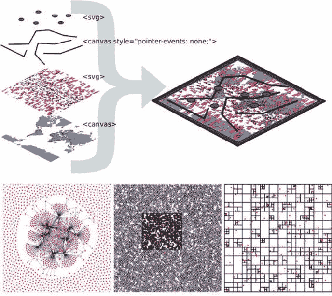

我们在这本书中一直处理数据，但这次我们将通过尝试使用地图、网络和图表来表示一千或更多的数据点来显著提高难度，这些图表比圆包图、条形图或电子表格资源密集得多。

### 11.1\. 使用 d3-shape 生成器内置的 canvas 渲染

幸运的是，D3v4 在 D3 中引入了内置功能，用于使用 canvas 绘制复杂形状。对于本章，我们需要在我们的 DOM 中包含一个`<canvas>`元素，如下面的列表所示。

##### 列表 11.1\. bigdata.html

```
<!doctype html>
<html>
<head>
  <title>Big Data Visualization</title>
  <meta charset="utf-8" />
    <link type="text/css" rel="stylesheet" href="bigdata.css" />
</head>
<body>
<div>
<canvas height="500" width="500"></canvas>            *1*
   <div id="viz">
      <svg></svg>
</div>
</div>
<footer>
<script src="d3.v4.min.js"></script>
</footer>
</body>
</html>
```

+   ***1* 确保设置高度和宽度属性，而不仅仅是样式属性**

在下面的列表中，我们可以看到如何使我们的`<canvas>`元素与`<svg>`元素对齐，以便我们可以将画布绘制用作任何创建的 SVG 元素的背景层。

##### 列表 11.2\. bigdata.css

```
body, html {
   margin: 0;
}
canvas {
  position: absolute;
  width: 500px;
  height: 500px;                  *1*
}
svg {
  position: absolute;
  width:500px;
  height:500px;                   *2*
}
path.country {
   fill: #C4B9AC;
   stroke-width: 1;
   stroke: #4F442B;
   opacity: .5;
}
path.sample {
   stroke: #41A368;
   stroke-width: 1px;
   fill: #93C464;
   fill-opacity: .5;
}
line.link {
   stroke-width: 1px;
   stroke: #4F442B;
   stroke-opacity: .5;
}
circle.node {
  fill: #93C464;
  stroke: #EBD8C1;
  stroke-width: 1px;
}
circle.xy {
  fill: #FCBC34;
  stroke: #FE9922;
  stroke-width: 1px;
}
```

+   ***1* 在本章中，我们将将在画布上绘制 SVG，因此画布元素需要具有与 SVG 元素相同的属性**

+   ***2* 同样，SVG 元素具有相同的设置**

从 d3-shape 出来的所有内容都可以使用生成器的内置`.context()`方法绘制到画布上。您与`canvas`元素交互的方式是注册一个上下文，可以是“`2d`”、“`webgl`”、“`webgl2`”或“`bitmaprenderer`”。在本章的示例中，我们只会使用“`2d`”。一旦您有了这个上下文，您就可以使用它来绘制与 SVG `d`属性绘制指令类似的命令。使用`d3-shape`生成器，如果您设置了一个生成器的`.context()`，该函数将不再返回 SVG `d`属性绘制字符串，而是将在`canvas`元素上绘制形状的命令。下面的列表显示了如何使用此功能绘制第五章中的小提琴图，但这次使用的是 canvas 绘制。

##### 列表 11.3\. 在画布上绘制小提琴图

```
var fillScale = d3.scaleOrdinal().range(["#fcd88a", "#cf7c1c", "#93c464"])

var normal = d3.randomNormal()
var sampleData1 = d3.range(100).map(d => normal())
var sampleData2 = d3.range(100).map(d => normal())
var sampleData3 = d3.range(100).map(d => normal())

var data = [sampleData1, sampleData2, sampleData3]

var histoChart = d3.histogram();

histoChart
  .domain([ -3, 3 ])
  .thresholds([ -3, -2.5, -2, -1.5, -1,
  -0.5, 0, 0.5, 1, 1.5, 2, 2.5, 3 ])
  .value(d => d)
var yScale = d3.scaleLinear().domain([ -3, 3 ]).range([ 400, 0 ])     *1*

var context = d3.select("canvas").node().getContext("2d")             *2*

 area = d3.area()
    .x0(d => -d.length)
    .x1(d => d.length)
    .y(d => yScale(d.x0))
    .curve(d3.curveCatmullRom)
    .context(context)                                                 *3*

context.clearRect(0,0,500,500)                                        *4*
context.translate(0, 50)

    data.forEach((d, i) => {
    context.translate(100, 0)                                         *5*
    context.strokeStyle = fillScale(i)
    context.fillStyle = d3.hsl(fillScale(i)).darker()
    context.lineWidth = "1px";
    context.beginPath()                                               *6*
    area(histoChart(d))                                               *7*
    context.stroke()                                                  *8*
    context.fill()                                                    *8*
})
```

+   ***1* 到目前为止，所有的代码都是相同的**

+   ***2* 您需要在画布上绘制时提供上下文**

+   ***3* 将生成器的.context 注册到您的上下文中**

+   ***4* 这是清除画布的一种方法，通过空白矩形区域**

+   ***5* 每个形状移动绘制起点**

+   ***6* 开始绘制**

+   ***7* 使用适当的数据运行您的生成器**

+   ***8* 线条和填充您所绘制的形状**

结果，如图 11.2 所示，与我们第五章中看到的结果相似。

##### 图 11.2\. 使用 canvas 绘制的小提琴图。您可以看到它们更像素化。

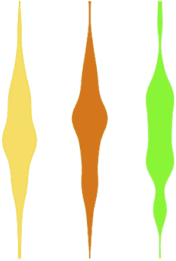

当我们查看画布渲染时，与 SVG 有几个明显的区别。首先，你可能需要手动执行你习惯由 D3 为你处理的部分行为。例如，如果你要进行任何类型的转换或动画，你需要手动清除画布。另一个主要区别是，当你向画布绘制时，你没有可以关联鼠标事件的对象。仍然有使用位图注册鼠标事件的方法，例如使用点击像素的颜色或将 xy 坐标转换回占据该空间的任何形状。最后一个区别在 图 11.3 中突出显示，画布上的像素化渲染与 SVG 的渲染相比。

##### 图 11.3\. 两个放大后的形状，一个使用 SVG（左）绘制，另一个使用画布（右）

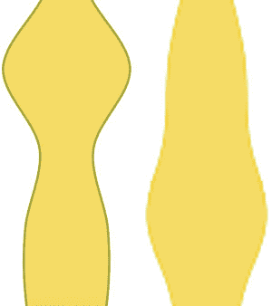

你可以使用这种方法来渲染任何使用 d3-shape 中的 D3 生成器的现有代码，例如 `d3.arc` 用于画布饼图或 `d3.area` 用于画布流图。从现在开始，我们将专注于画布渲染的特定应用，将其与 SVG 渲染（称为 *混合模式渲染*）结合，以提高交互性，并使用四叉树来提高大数据集的性能。

### 11.2\. 大地理数据

在 第七章 中，你只有 10 个城市代表整个地球。这不是典型情况：当你处理地理数据时，你通常会处理描述许多复杂形状的大数据集。在本节中，我们将了解如何创建具有许多特征的地图。为了达到这个目标，我们首先将学习如何生成一些随机地理特征（在这种情况下，简单的三角形），然后学习如何使用画布渲染这些特征。然后我们将使用 `d3-zoom` 的智能实现将所有这些连接起来，以确保我们的用户获得最佳的性能和功能组合。

#### 11.2.1\. 创建随机地理数据

我们首先需要一个包含一千个数据点的数据集。而不是使用

从一个预生成的文件中获取数据，我们将自己创建它。D3 中有一个非常有用的函数 `d3.range()`，它允许你创建一个值数组。我们将使用 `d3.range()` 创建一个包含一千个值的数组。然后我们将使用这个数组来填充一个对象数组，其中包含足够的数据，可以用于网络和地图。因为我们打算将数据放在地图上，所以我们需要确保它是以正确的格式格式化的 geoJSON，如下面的列表所示，它使用了 `randomCoords()` 函数来创建三角形。

##### 列表 11.4\. 创建示例数据

```
  var sampleData = d3.range(1000).map(d => {               *1*
     var datapoint = {};                                   *2*
     datapoint.id = "Sample Feature " + d;
     datapoint.type = "Feature";
     datapoint.properties = {};
     datapoint.geometry = {};
     datapoint.geometry.type = "Polygon";
     datapoint.geometry.coordinates = randomCoords();
     return datapoint;
  });
  function randomCoords() {                                *3*
    var randX = (Math.random() * 350) - 175;
    var randY = (Math.random() * 170) - 85;
    return [[[randX - 5,randY],[randX,randY - 5],
          [randX - 10,randY - 5],[randX - 5,randY]]];
  };
```

+   ***1* d3.range 创建一个数组，我们立即将其映射到一个对象数组**

+   ***2* 每个数据点都是一个对象，具有放置在地图上所需的属性**

+   ***3* 在每个随机的经纬度坐标对周围绘制一个三角形**

在我们有了这些数据之后，我们可以把它们扔到一个像我们在第七章中第一次创建的地图上。在下面的列表中，我们使用第七章中的 world.geojson 文件，以便我们了解三角形绘制的地方。

##### 列表 11.5. 在我们的样本数据上绘制地图

```
  d3.json("world.geojson", data => {createMap(data)});
  function createMap(countries) {
    var projection = d3.geoMercator()
         .scale(100).translate([250,250])                        *1*
    var geoPath = d3.geoPath().projection(projection);
    var g = d3.select("svg").append("g");
    g.selectAll("path.country")
        .data(countries.features)
        .enter()
        .append("path")
        .attr("d", geoPath)
        .attr("class", "country");
    g.selectAll("path.sample")
        .data(sampleData)
        .enter()
        .append("path")
        .attr("d", geoPath)
        .attr("class", "sample");
  };
```

+   ***1* 调整投影和投影的平移，而不是<g>，这样我们就可以稍后使用投影来绘制到画布上**

尽管我们的随机三角形显然会位于不同的位置，但我们的代码仍然应该产生类似于图 11.4 的视觉效果。

##### 图 11.4. 完全使用 SVG 在地图上绘制随机三角形

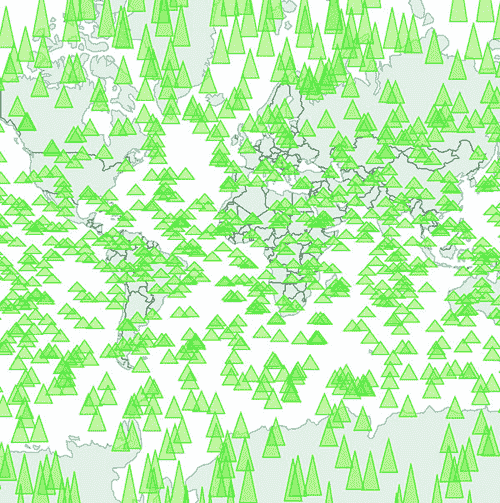


**信息可视化术语：大数据可视化**

到你阅读这本书的时候，*大数据*可能听起来就像*Pentium II*、*富互联网应用*或*Buffy Cosplay*一样过时。大数据以及围绕大数据的所有兴奋情绪，都源于以前太大而无法处理的大数据集的广泛可用性。通常，大数据与像 Hadoop 这样的异类数据存储或像 GPU 超级计算这样的专门技术（以及价格昂贵的顾问）相关联。

但“大”的定义因人而异。在数据可视化的领域，大数据的表示通常并不意味着一次在屏幕上放置成千（或数百万或数十亿）个单独的数据点。相反，它往往意味着对这些大规模数据集进行人口统计、拓扑和其他传统统计分析。出人意料的是，大数据可视化通常以饼图和柱状图的形式出现。但是，当你查看在浏览器中交互式（原生）展示数据的传统实践时，你在这个章节中处理的数据集的大小可以被认为是“大”的。


即使是在这样一个小地图上，一千个数据点也不算多。在支持 SVG 的任何浏览器中，数据应该能够快速渲染，并提供你从数据展示中可能想要的诸如鼠标悬停和点击事件等功能。但是，如果你添加了像列表 11.6（我们在第七章中拥有的相同缩放）中看到的那种缩放控件，你可能会注意到地图的缩放和滚动性能并不那么出色。如果你预期你的用户将在移动设备上使用，优化仍然是一个好主意。

##### 列表 11.6. 向地图添加缩放控件

```
  var mapZoom = d3.zoom()
     .on("zoom", zoomed);

  var zoomSettings = d3.zoomIdentity
      .translate(250, 250)
      .scale(100);

  d3.select("svg").call(mapZoom).call(mapZoom.transform, zoomSettings);

  function zoomed() {
    var e = d3.event
      projection.translate([e.transform.x, e.transform.y])
        .scale(e.transform.k);                                            *1*
      d3.selectAll("path.country, path.sample").attr("d", geoPath)
  }
```

+   ***1* 我们在这个例子中使用投影缩放，因为这样稍后绘制画布元素会更容易**

现在我们可以缩放我们的地图并四处移动，如图图 11.5 所示。如果你预期你的用户将在处理 SVG 表现良好的浏览器上，如 Chrome 或 Safari，并且你预期不会在地图上添加更多功能，你可能甚至不需要担心优化。

##### 图 11.5. 缩放东亚和大洋洲周围的样本地理数据

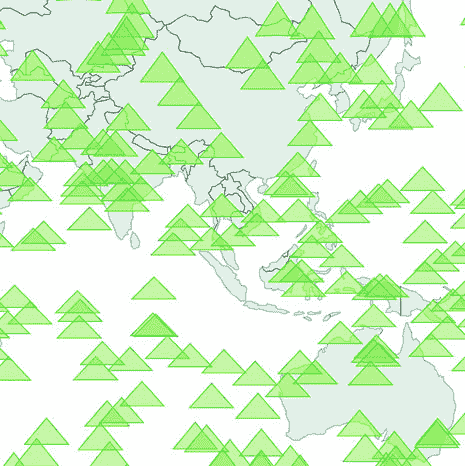

根据你执行此代码的时间，可能 1,000 个这样的特征渲染得很好。将你的 `d3.range()` 设置从 1,000 更改为 5,000（或者如果你在地球帝国借阅图书馆的经典部分发现了这个，可以改为 10,000 或十亿）来查看，随着 SVG 元素的增加，你的浏览器开始变得缓慢。这更多是关于管理所有这些 DOM 元素，而不是渲染复杂的形状。

#### 11.2.2\. 使用画布绘制地理数据

优化如此多元素渲染的一种方法是用画布代替 SVG。而不是使用 D3 的 `enter` 语法创建 SVG 元素，我们使用 `d3.geoPath` 内置功能为画布绘制提供上下文。在下面的列表中，你可以看到如何使用该内置功能与你的现有数据集一起使用。

##### 列表 11.7\. 使用画布绘制地图

```
function createMap(countries) {
  var projection = d3.geoMercator().scale(50).translate([150,100]);
  var geoPath = d3.geoPath().projection(projection);

  var mapZoom = d3.zoom()
     .on("zoom", zoomed)

  var zoomSettings = d3.zoomIdentity
      .translate(250, 250)
      .scale(100)

  d3.select("svg").call(mapZoom).call(mapZoom.transform, zoomSettings)
  function zoomed() {
    var e = d3.event
      projection.translate([e.transform.x, e.transform.y])
        .scale(e.transform.k)

    var context = d3.select("canvas").node().getContext("2d")
    context.clearRect(0,0,500,500)                                *1*
    geoPath.context(context)                                      *2*
    context.strokeStyle = "rgba(79,68,43,.5)"                     *3*
    context.fillStyle = "rgba(196,185,172,.5)"                    *3*
    context.fillOpacity = 0.5
    context.lineWidth = "1px"
    for (var x in countries.features) {
      context.beginPath()
      geoPath(countries.features[x])                              *4*
      context.stroke()
      context.fill()
    }
    context.strokeStyle = "#41A368"
    context.fillStyle = "rgba(147,196,100,.5)";
    context.lineWidth = "1px"
    for (var x in sampleData) {
      context.beginPath()
      geoPath(sampleData[x])                                      *5*
      context.stroke()
      context.fill()
    }
  }
}
```

+   ***1* 如果你在更新画布，请始终在重新绘制之前清除它**

+   ***2* 将 geoPath 转换为具有我们画布上下文的上下文生成器**

+   ***3* 国家样式设置**

+   ***4* 将每个国家特征绘制到画布上**

+   ***5* 将每个三角形绘制到画布上**

你可以在 列表 11.5 和 11.6 之间看到一些关键的区别。与 SVG 不同，在 SVG 中你可以移动元素并重新绘制它们，你总是需要清除并重新绘制画布来更新它。尽管这似乎会慢一些，但在所有浏览器上性能都有所提高，尤其是在那些 SVG 性能不是最好的浏览器上，因为你不需要管理数百或数千个 DOM 元素。如图 11.6 所示的图形结果表明，SVG 和画布渲染之间的区别很难看出。

##### 图 11.6\. 使用画布绘制我们的地图会产生更高的性能，但图形的清晰度略低。在左侧，可能看起来三角形的渲染与早期的 SVG 三角形一样平滑，但如果你像右侧那样放大，就可以清楚地看到画布渲染的像素化。

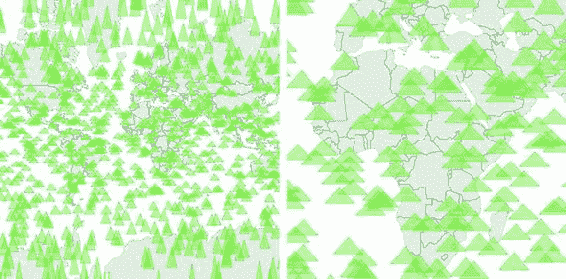

#### 11.2.3\. 混合模式渲染技术

使用画布的缺点是，你无法轻松提供你可能想要的数据可视化交互级别。通常，你使用 SVG 绘制交互元素，使用画布绘制大量数据集。如果我们假设我们绘制的国家不会提供任何交互性，但三角形会，我们可以将三角形作为 SVG 渲染，将国家作为画布使用 列表 11.8 中的代码进行渲染。结合这两种绘图方法意味着我们需要在我们的 DOM 中创建一个元素层蛋糕，就像你在 图 11.7 中看到的那样。

##### 图 11.7\. 在 `<canvas>` 元素下方放置交互式 SVG 元素需要将它的 `pointer-events` 样式设置为 `none`，即使它有透明背景，以便在下面的 `<svg>` 元素上注册点击事件。

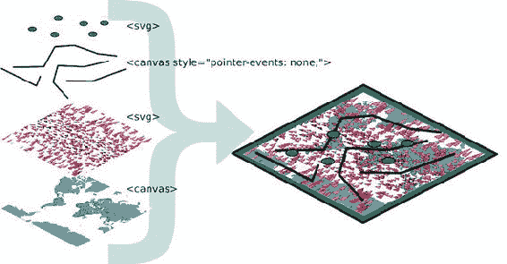

这要求我们初始化两个版本的`d3.geoPath`——一个用于绘制 SVG，一个用于绘制 canvas——然后在我们的缩放函数中使用这两个版本。这如图列表 11.8 所示。

##### 列表 11.8\. 同时渲染 SVG 和 canvas

```
function createMap(countries) {
  var projection = d3.geoMercator().scale(50).translate([150,100]);
  var geoPath = d3.geoPath().projection(projection);
  var svgPath = d3.geoPath().projection(projection);                  *1*

  d3.select("svg")
    .selectAll("path.sample")
    .data(sampleData)
    .enter()
    .append("path")
    .attr("d", svgPath)
    .attr("class", "sample")
    .on("mouseover", function() {d3.select(this).style("fill", "#75739F")});

  var mapZoom = d3.zoom()
     .on("zoom", zoomed)

  var zoomSettings = d3.zoomIdentity
      .translate(250, 250)
      .scale(100)

  d3.select("svg").call(mapZoom).call(mapZoom.transform, zoomSettings)
  function zoomed() {
    var zoomEvent = d3.event
      projection.translate([zoomEvent.transform.x, zoomEvent.transform.y])
        .scale(zoomEvent.transform.k)
const featureOpacity = 0.5

    var context = d3.select("canvas").node().getContext("2d");
    context.clearRect(0,0,500,500);
    geoPath.context(context);
    context.strokeStyle = `rgba(79,68,43,${featureOpacity})`;
    context.fillStyle = `rgba(196,185,172,${featureOpacity})`;
    context.lineWidth = "1px";
    countries.features.forEach(feature => {
      context.beginPath();
      geoPath(feature);                                               *2*
      context.stroke()
      context.fill();
    })

    d3.selectAll("path.sample").attr("d", svgPath);                   *3*

  }
}
```

+   ***1* 我们需要为 canvas 和 SVG 实例化不同的 d3.geoPath**

+   ***2* 使用 canvasPath 绘制 canvas 特性**

+   ***3* 使用 svgPath 绘制 SVG 特性**

这允许我们保持交互性，例如在三角形上实现鼠标悬停功能，当鼠标悬停时将任何三角形的颜色变为粉色。这种方法通过使用 canvas 绘制而不是 SVG 来渲染没有交互性的图形，从而最大化性能。如图 11.8 所示，使用这种方法产生的外观几乎与仅使用 canvas 或仅使用 SVG 的方法相同。

##### 图 11.8\. 背景国家使用 canvas 绘制，而前景三角形使用 SVG 绘制以实现交互性。SVG 图形是 DOM 中的独立元素，因此可以附加点击、鼠标悬停和其他事件监听器。

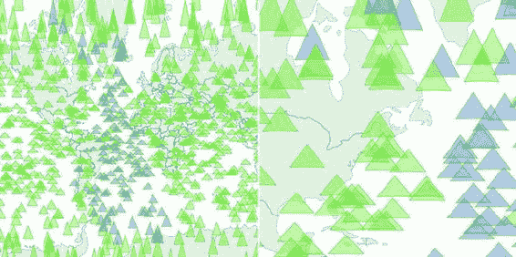

但如果你有大量的元素，并且你确实希望所有元素都具有交互性，同时你还想给用户提供平移和拖动的功能呢？在这种情况下，你必须接受这种混合模式渲染的扩展。当用户以这种方式交互，以至于他们无法与其他元素交互时，我们在 canvas 中渲染——当我们缩放和拖动地图时，我们需要在 canvas 中渲染三角形，但在地图不移动且用户正在悬停在某些元素上时，我们则在 SVG 中渲染它们。

我们可以通过利用`d3.zoom`的`start`和`end`事件来管理这一点。正如你可能猜到的，这些事件分别在缩放事件开始和结束时触发。以下列表显示了如何为这些不同的事件初始化具有不同功能的缩放行为。

##### 列表 11.9\. 基于缩放交互的混合渲染

```
...
    mapZoom = d3.zoom()
       .on("zoom", zoomed)                     *1*
       .on("start", zoomInitialized)           *1*
       .on("end", zoomFinished);               *1*
...
```

+   ***1* 为每个缩放状态分配单独的功能**

这允许我们将三角形的 canvas 绘制代码恢复到`zoomed`函数中，并将 SVG 渲染代码从`zoomed`函数中移出，放入一个新的`zoomFinished`函数中。我们还需要通过创建一个`zoomInitialized`函数来隐藏 SVG 三角形，该函数本身也会触发`zoomed`函数（绘制我们隐藏的三角形，但在 canvas 中）。最后，我们的`zoomFinished`函数还包含仅绘制国家的必要的 canvas 绘制代码。基于`zoom`事件的不同的绘制策略在表 11.1 中显示。

##### 表 11.1\. 基于`zoom`事件的渲染动作

| 缩放事件 | 绘制的国家 | 绘制的三角形 |
| --- | --- | --- |
| zoomed | Canvas | Canvas |
| zoomInitialized | Canvas | 隐藏 SVG |
| zoomFinished | Canvas | SVG |

如以下列表所示，此代码效率不高，因为缩放事件之间存在共享功能，可以放入单独的函数中。但我希望明确此功能，因为它有点复杂。

##### 列表 11.10\. 混合渲染的缩放函数

```
var canvasPath = d3.geoPath().projection(projection);
--- Other code ----
function zoomed() {
  var e = d3.event
    projection.translate([e.transform.x, e.transform.y])
    .scale(e.transform.k)
  var context = d3.select("canvas").node().getContext("2d");
  context.clearRect(0,0,500,500);
  canvasPath.context(context);
  context.strokeStyle = "black";
  context.fillStyle = "gray";
  context.lineWidth = "1px";
  for (var x in countries.features) {
    context.beginPath();
    canvasPath(countries.features[x]);
    context.stroke()
    context.fill();
  }
  context.strokeStyle = "black";
  context.fillStyle = "rgba(255,0,0,.2)";
  context.lineWidth = 1;
  for (var x in sampleData) {
    context.beginPath();                                     *1*
    canvasPath(sampleData[x]);
    context.stroke()
    context.fill();
  }
};
function zoomInitialized() {
  d3.selectAll("path.sample")
    .style("display", "none");                               *2*
  zoomed();                                                  *3*
};
function zoomFinished() {
  var context = d3.select("canvas").node().getContext("2d");
  context.clearRect(0,0,500,500);
  canvasPath.context(context)
  context.strokeStyle = "black";
  context.fillStyle = "gray";
  context.lineWidth = "1px";
  for (var x in countries.features) {
    context.beginPath();
    canvasPath(countries.features[x]);                       *4*
    context.stroke()
    context.fill();
  }
  d3.selectAll("path.sample")
    .style("display", "block")                               *5*
    .attr("d", svgPath);                                     *6*
};
```

+   ***1* 在缩放期间将所有元素绘制为 canvas**

+   ***2* 在缩放开始时隐藏 SVG 元素**

+   ***3* 在缩放时调用以 canvas 绘制我们隐藏的 SVG 三角形**

+   ***4* 只在缩放结束时用 canvas 绘制国家**

+   ***5* 显示缩放结束时 SVG 元素**

+   ***6* 设置 SVG 元素的新位置**

由于这段新代码，我们得到了一个地图，当用户缩放和平移时使用 canvas 渲染，但当地图固定在位置且用户能够点击、鼠标悬停或以其他方式与图形元素交互时使用 SVG 渲染。这是两者的最佳结合。这种方法唯一的缺点是我们必须投入更多时间确保我们的 `<canvas>` 元素和 `<svg>` 元素完美对齐，并且我们的不透明度、填充颜色等足够接近，这样用户看到不同的模式时不会感到震惊。我之前没有这样做，这样你可以看到两种模式同时运行，这在 图 11.9 中的两个图形输出差异中得到了反映。

##### 图 11.9\. 当地图未进行缩放或平移时以 SVG 渲染的随机生成的三角形（左）和当地图进行缩放或平移时以 canvas 渲染的三角形（右）。请注意，只有 SVG 三角形根据用户交互具有不同的填充值，因为这不是右边的三角形绘制代码的考虑因素。

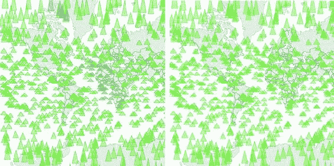

你需要花时间确保它具有像素级的对齐——否则你的用户会注意到并抱怨。并且确保你在你期望支持的每个浏览器中测试它，因为对于 `<canvas>` 或 `<svg>` 元素的默认行为，往往有不同的假设。

最后，同时使用 canvas 和 SVG 绘图可能会遇到困难。比如说，我们想在 SVG 层上绘制 canvas 层，因为我们想让 canvas 层在视觉上位于某些 SVG 元素之上，但位于其他 SVG 元素之下，并且我们希望所有元素都具有交互性。在这种情况下，我们需要在我们的 SVG 层之间放置我们的 canvas 层，并设置 canvas 层的 `pointer-events` 样式，如图 11.7 中所示。如果你添加了进一步的交替交互层，但图形位置在上方和下方，那么你最终可能会在你的 DOM 中制作一个 `<canvas>` 和 `<svg>` 层蛋糕，这可能和概念化一样难以管理。

### 11.3\. 大型网络数据

很棒的是，`d3.geoPath` 为绘制地理数据到画布提供了内置功能，同样，d3-shape 生成器也是如此，但对于使用线条、圆形和矩形等几何原型的数据可视化类型又如何呢？我们处理过的最性能密集的布局之一是第六章中提到的力导向布局。布局会在每次迭代时为网络中的每个节点计算新的位置。当我最初开始使用 D3 中的力导向布局时，我发现任何超过 100 个节点的网络都太慢，无法证明其有用性。从那时起，浏览器的性能得到了提升，即使是拥有千个节点的网络使用 SVG 也能表现出良好的性能。但当我们的网络更大，且结构能够从交互和动画中受益时，这仍然是一个问题。

在我的工作中，我研究了不同的小型 D3 应用程序如何在 [gist.github.com](http://gist.github.com) 上共享常见的 D3 函数。D3 编码者可以了解不同的信息可视化方法如何使用与其它类型信息可视化相关联的 D3 函数。您可以通过 [`emeeks.github.io/introspect/block_block.html`](http://emeeks.github.io/introspect/block_block.html) 探索这个网络，以及 D3 Meetup 用户如何描述自己。

为了探索这些联系，我需要一个方法来处理超过一千个不同的示例以及它们之间成千上万的连接。您可以在 图 11.10 中看到这个网络的一部分。我想展示这个网络如何根据共享函数的阈值而变化，我还想为用户提供点击每个示例以获取更多细节的能力，因此我无法使用画布来绘制网络。相反，我需要使用我们之前用来在地图上绘制所有那些三角形的相同混合渲染方法来绘制网络。在这种情况下，我使用了画布来绘制网络边，SVG 来绘制网络节点，因为，正如我稍后所提到的，将网络链接作为 SVG 元素进行渲染是力导向网络可视化中最昂贵的部分。

##### 图 11.10\. 在 [gist.github.com](http://gist.github.com) 上托管的不同示例的网络，通过共享函数将不同的示例连接起来。在这里，您可以看到 Mike Bostock 的示例“二元六边形地图”([`bl.ocks.org/mbostock/4330486`](http://bl.ocks.org/mbostock/4330486))与三个不同的示例共享了函数：都市失业、Marey 的火车 II 和全球 GitHub 用户。画笔和坐标轴组件允许您通过从一个区块到另一个区块的连接数量来过滤网络。

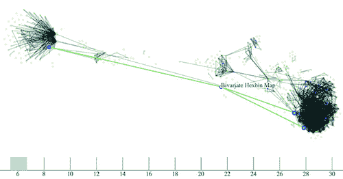

| |
| --- |

**使用 bl.ocks.org**

虽然 D3 适合构建大型、复杂的交互式应用程序，但你通常制作一个小型、单次使用的交互式数据可视化，它可以存在于单个页面上的有限资源中。对于这些小型应用程序，在 D3 社区中通常在[gist.github.com](http://gist.github.com)上托管代码，这是 GitHub 为小型应用程序设计的部分。如果你将 D3 代码作为 gist 托管，并且格式化为具有 index.html，那么你可以使用 bl.ocks.org 与他人分享你的作品。

要使你的 gist 在 bl.ocks.org 上工作，你需要将数据文件和库托管在 gist 中或通过它访问。然后你可以将 gist 的字母数字标识符附加到 bl.ocks.org/username/，以提供用于共享的工作副本。例如，我有一个在[`gist.github.com/emeeks/0a4d7cd56e027023bf78`](https://gist.github.com/emeeks/0a4d7cd56e027023bf78)的 gist，展示了如何进行像我在这章中描述的力导向布局的混合渲染。因此，我可以将人们指向[`bl.ocks.org/emeeks/0a4d7cd56e027023bf78`](http://bl.ocks.org/emeeks/0a4d7cd56e027023bf78)，他们可以看到代码本身以及动画网络的实际运行情况。


在网络中进行这种混合渲染并不像在地图中那样简单。这是因为没有内置方法将常规数据渲染到画布上，就像`d3.geoPath`那样。如果你想创建一个结合画布和 SVG 渲染的类似大型网络，你必须手动构建函数。不过，首先你需要数据。这次，我们不是创建样本地理数据，而是需要创建样本网络数据。

构建样本网络数据很容易：你可以创建一个节点数组以及这些节点之间的随机链接数组。但构建一个不是无差别的质量样本网络就有点难了。在列表 11.11 中，你可以看到我稍微复杂的网络生成器。它基于这样一个原则：少数节点是热门的，而大多数节点不是（我们从小学开始就知道了这个网络原则）。这可以很好地创建一个包含 3,000 个节点和 1,000 条边的网络，看起来并不像一个大型的毛线球。

##### 列表 11.11\. 生成随机网络数据

```
  var linkScale = d3.scaleLinear()
          .domain([0,.9,.95,1]).range([0,10,100,1000]);              *1*
  var sampleNodes = d3.range(3000).map(d => {
    var datapoint = {};
    datapoint.id = `Sample Node ${d}`;
    return datapoint;
  })
  var sampleLinks = [];
    var y = 0;
    while (y < 1000) {
      var randomSource = Math.floor(Math.random() * 1000);           *2*
      var randomTarget = Math.floor(linkScale(Math.random()));       *3*
      var linkObject = {source: sampleNodes[randomSource], target:
  sampleNodes[randomTarget]}
      if (randomSource != randomTarget) {                            *4*
          sampleLinks.push(linkObject);
      }
      y++;
  }
```

+   ***1* 这个比例使 90%的链接指向 1%的节点**

+   ***2* 每个链接的源是纯随机的**

+   ***3* 目标倾向于热门节点**

+   ***4* 不要保留任何具有相同源和目标的链接**

使用这个生成器，我们可以使用以下列表中的代码实例化我们的典型力导向布局，并用它创建一些线条和圆圈。

##### 列表 11.12\. 力导向布局

```
    var force = d3.forceSimulation()
         .nodes(sampleNodes)
         .force("x", d3.forceX(250).strength(1.1))
         .force("y", d3.forceY(250).strength(1.1))
         .force("charge", d3.forceManyBody())
         .force("charge", d3.forceManyBody())
         .force("link", d3.forceLink())
         .on("tick", forceTick)                         *1*

    force.force("link").links(sampleLinks)

      d3.select("svg")
         .selectAll("line.link")
         .data(sampleLinks)
         .enter()
         .append("line")
         .attr("class", "link");
      d3.select("svg").selectAll("circle.node")
         .data(sampleNodes)
         .enter()
         .append("circle")
         .attr("r", 3)
         .attr("class", "node");

      function forceTick() {
        d3.selectAll("line.link")
           .attr("x1", d =>d.source.x)                  *2*
           .attr("y1", d =>d.source.y)
           .attr("x2", d =>d.target.x)
           .attr("y2", d =>d.target.y);
        d3.selectAll("circle.node")
           .attr("cx", d =>d.x)
           .attr("cy", d =>d.y);
      };
```

+   ***1* 这完全是像第六章（chapter 6）中的力导向布局代码**

+   ***2* 对于我们的初始实现，我们在每个 tick 时在 SVG 中渲染一切并更新 SVG**

如果您阅读过第六章，这段代码应该对您来说很熟悉。随机网络的生成是一个复杂且描述良好的实践。这个随机生成器可能不会赢得任何奖项，但它确实产生了一个可识别的结构。典型的结果如图图 11.11 所示。在静态图像中丢失的是缓慢且不流畅的渲染，即使在快速计算机上使用处理 SVG 良好的浏览器也是如此。

##### 图 11.11\. 一个包含 3,000 个节点和 1,000 条边的随机生成网络

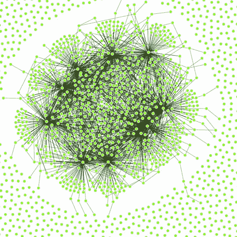

当我开始与这些网络一起工作时，我认为导致减速的主要原因是计算每个节点在每个 tick 上的无数位置。毕竟，节点位置是基于由节点推力和边拉力引起的竞争力模拟，而且像这样有数千个组件的东西似乎很重。但这并不是在这种情况下消耗浏览器资源的原因。相反，是这么多 DOM 元素的管理。您可以通过用画布线条替换 SVG 线条来消除许多这些 DOM 元素。让我们按照以下列表更改我们的代码，以便它不会为链接创建任何 SVG `<line>`元素，而是修改我们的`forceTick`函数，用画布绘制这些链接。

##### 列表 11.13\. 混合渲染网络绘制

```
      function forceTick() {
        var context = d3.select("canvas").node()
                  .getContext("2d");
        context.clearRect(0,0,500,500);                      *1*
        context.lineWidth = 1;
        context.strokeStyle = "rgba(0, 0, 0, 0.5)";          *2*
        sampleLinks.forEach(function (link) {
           context.beginPath();
           context.moveTo(link.source.x,link.source.y)       *3*
           context.lineTo(link.target.x,link.target.y)       *4*
           context.stroke();
        });
        d3.selectAll("circle.node")                          *5*
          .attr("cx", d =>d.x)
          .attr("cy", d =>d.y)
      };
```

+   ***1* 记住，您始终需要清除您的画布**

+   ***2* 以 50%透明度的黑色绘制链接**

+   ***3* 从链接源坐标开始每行**

+   ***4* 将每条链接绘制到链接目标坐标**

+   ***5* 以 SVG 绘制节点**

网络的渲染在外观上相似，正如您可以在图 11.12 中看到的那样，但性能有了显著提升。使用画布，我可以绘制具有足够性能的 10,000 个链接的网络，足以实现动画和交互性。画布绘制代码可能有点繁琐（就像旧的 LOGO 绘制代码），但性能使得这一切都值得。

##### 图 11.12\. 使用 SVG 节点和画布链接绘制的大型网络

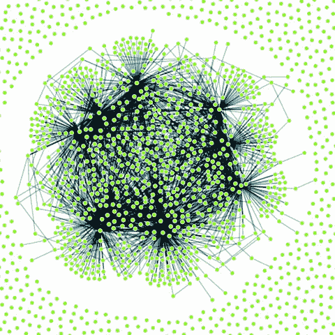

我们可以使用与早期地图相同的方法，在动画期间使用画布，在网络固定时使用 SVG。但我们将继续前进，看看另一种处理大量数据的方法：四叉树。

### 11.4\. 使用四叉树优化 xy 数据选择

当你处理大量数据集时，一个问题是如何优化区域内元素搜索和选择。假设你正在处理一组具有 xy 坐标的数据（任何在平面上或屏幕上布局的东西）。在这本书中你已经看到了足够的例子，知道这可能是散点图、地图上的点或数据的不同图形表示之一。当你有这种数据时，你通常想知道哪些数据点落在特定的选定区域内。这被称为 *空间搜索*（注意，这里的 *空间* 并不指地理空间，而是一种更通用的空间）。四叉树功能是 `d3.nest` 的空间版本，我们在 第五章 和 第八章 中使用它来创建层次化数据。遵循本章的主题，我们将从创建一个大量随机点的大数据集并使用 SVG 渲染它们开始。

#### 11.4.1\. 生成随机 xy 数据

我们的第三个随机数据生成器的工作量远不如前两个。在下面的列表中，我们只是创建了具有随机 x 和 y 坐标的 3,000 个点。

##### 列表 11.14\. xy 数据生成器

```
  sampleData = d3.range(3000).map(function(d) {
    var datapoint = {};
    datapoint.id = `Sample Node ${d}`;
    datapoint.x = Math.random() * 500;
    datapoint.y = Math.random() * 500;               *1*
    return datapoint;
  })
  d3.select("svg").selectAll("circle")
    .data(sampleData)
    .enter()
    .append("circle")
    .attr("class", "xy")
    .attr("r", 3)
    .attr("cx", d => d.x)
    .attr("cy", d => d.y)
```

+   ***1* 因为我们知道画布的固定大小，我们可以直接连接这个**

如你所预期，这段代码的结果，如图 11.13 所示，是一堆橙色圆圈散布在我们的画布上。

##### 图 11.13\. 由橙色 SVG `<circle>` 元素表示的 3,000 个随机放置的点

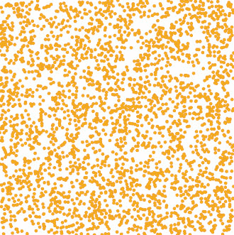

#### 11.4.2\. xy 刷涂

现在我们将创建一个刷子来选择这些点中的一些。回想一下，在 第九章 中我们使用刷子时，我们只允许沿 x 轴刷涂。这次，我们允许沿 x 轴和 y 轴刷涂。然后我们可以拖动一个矩形覆盖画布的任何部分。在下面的列表中，你可以看到将刷子添加到我们的画布是多么快速和简单。我们还将添加一个功能来突出显示刷涂区域中的任何圆圈。

##### 列表 11.15\. xy 刷涂

```
var brush = d3.brush()                               *1*
  .extent([[0,0],[500,500]])
  .on("brush", brushed)

d3.select("svg").call(brush)

function brushed() {
  var e = d3.event.selection

  d3.selectAll("circle")
  .style("fill", d => {
    if (d.x >= e[0][0] && d.x <= e[1][0]
             && d.y >= e[0][1] && d.y <= e[1][1])     *2*
    {
      return "#FE9922"                                *3*
    }
    else {
      return "#EBD8C1"                                *4*
    }
  })
}
```

+   ***1* 这个刷子给我们 XY 功能**

+   ***2* 检查数据是否在我们的选定区域内**

+   ***3* 将选定区域内的点着色**

+   ***4* 将选定区域外的点着色**

使用这个刷涂代码，我们现在可以看到刷涂区域中的圆圈，如图 11.14 所示。

##### 图 11.14\. 在选定区域中突出显示点

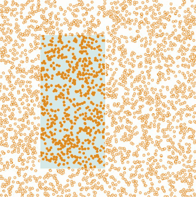

这方法可行，但效率极低。它检查画布上的每一个点，而没有使用任何机制来忽略可能完全在选定区域外的点。在指定区域内查找点是老问题，已经被充分研究。解决该问题快速且简单的一种工具是四叉树。你可能想知道，什么是四叉树，我应该用它来做什么？

*四叉树*是一种通过将平面划分为一系列象限来优化空间搜索的方法。然后你将每个象限再划分为象限，直到该平面上的每个点都落在自己的象限中。通过这样划分 xy 平面，你可以将你将要搜索的点嵌套起来，这样你就可以轻松地忽略整个数据集的整个象限，而无需测试整个数据集。

解释四叉树的另一种方法就是展示它。这正是信息可视化存在的意义，对吧？图 11.15 展示了基于一组点数据四叉树产生的象限。

##### 图 11.15\. 以红色显示的点四叉树，象限区域以黑色勾勒。注意点簇如何对应四叉树区域的细分。每个点只落在一个区域内，但每个区域都嵌套在多个父区域级别中。

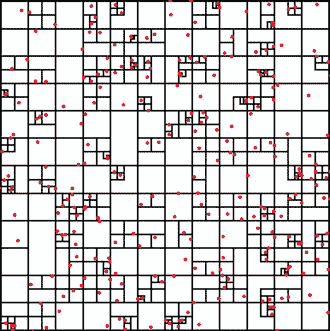

创建具有我们数据集中 xy 数据的四叉树很容易，如下列所示。我们设置 x 和 y 访问器，就像我们在布局和其他 D3 函数中做的那样。

##### 列表 11.16\. 从 xy 数据创建四叉树

```
 var quadtree = d3.quadtree()
    .extent([[0,0], [500,500]])                                    *1*
 var quadIndex = quadtree(sampleData, d => d.x, d => d.y);         *2*
```

+   ***1* 我们需要定义四叉树的边界框为一个包含上左和下右点的数组**

+   ***2* 在创建四叉树后，我们通过传递我们的数据集以及 x 和 y 访问器来创建索引**

在创建四叉树并使用它创建四叉树索引数据集，例如我们用 `quadIndex` 做的那样之后，你可以使用该数据集的 `.visit()` 函数进行四叉树优化搜索。`.visit()` 功能替换了你在新的刷选函数中的测试，如列表 11.17 所示。首先，我会向你展示如何在列表 11.17 中使其工作。然后我会向你展示它在图 11.16 中*确实*工作，并且我会详细解释它是如何工作的。我明白这不是通常的事情顺序，但就四叉树而言，在分析其确切功能之前先看到代码更有意义。

##### 图 11.16\. 使用包含 10,000 个点的数据集进行四叉树优化选择

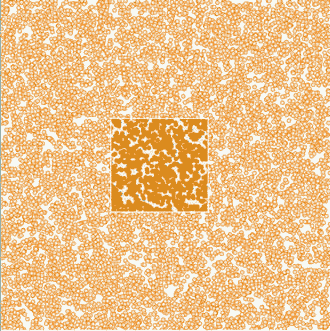

##### 列表 11.17\. 四叉树优化 xy 刷选

```
function brushed() {
  var e = d3.event.selection

  d3.selectAll("circle")
     .style("fill", "#EBD8C1")
     .each(d => {d.selected = false})                                  *1*
  quadIndex.visit(function(node,x0,y0,x1,y1) {

    if (node.data) {                                                   *2*
      if (node.data.x >= e[0][0] && node.data.x <= e[1][0]             *3*
          &&node.data.y >= e[0][1] && node.data.y <= e[1][1]) {
      node.data.selected = true;
    }
  }
  return x0 > e[1][0] || y0 > e[1][1] || x1 < e[0][0] || y1 < e[0][1]  *4*
  })

  d3.selectAll("circle")
      .filter(d => d.selected)
      .style("fill", "#FE9922")                                        *5*
}
```

+   ***1* 将所有圆设置为未选择颜色，并给每个圆分配一个选择属性以指定它在我们选择中**

+   ***2* 检查每个节点以确定它是一个点还是一个容器**

+   ***3* 检查每个点是否在我们的刷选范围内，如果是，则将选择设置为 true**

+   ***4* 检查这个四叉树区域是否超出我们的选择范围**

+   ***5* 显示了哪些点被选中**

结果令人印象深刻，速度更快。在图 11.16 中，我将点的数量增加到 10,000，仍然得到了良好的性能。(但如果你处理的是如此大的数据集，我建议切换到 canvas，因为强迫浏览器管理所有这些 SVG 元素将会减慢速度。)而且，即使粗略地查看代码，也能发现几个可以改进性能的地方。

它是如何工作的？当你运行`visit`函数时，你可以访问四叉树中的每个节点，从最一般化的到更具体的。在列表 11.16 中，我们访问的每个节点作为`node`，你也会得到该节点的边界(`x1`, `y1`, `x2`, `y2`)。因为四叉树中的节点可以是边界区域或生成四叉树的点，你必须测试节点是否是点——如果是，你可以像我们之前的例子那样测试它是否在你的刷选边界内。`visit`函数的最后一部分是其力量的来源，但也是最难理解的，正如你在图 11.17 中看到的。

##### 图 11.17\. 检查四叉树节点是否在刷选区域外的测试涉及四个测试，以查看它是否在选区的上方、左侧、右侧或下方。如果这些测试中的任何一个返回`true`，四叉树将停止搜索任何子节点。

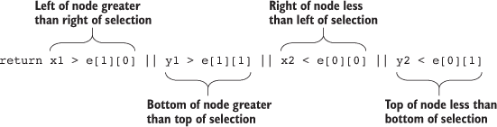

`visit`函数检查四叉树中的每个节点——除非`visit`返回`true`，在这种情况下，它将停止搜索该象限及其所有子节点。测试你正在查看的节点（表示为边界`x1,y1,x2,y2`）是否完全在选区边界之外（表示为边界`e[0][0]`, `e[0][1]`, `e[1][0]`, `e[1][1]`）。你创建这个测试是为了查看选区的顶部是否在节点的边界底部下方，选区的底部是否在节点的边界顶部上方，选区的左侧是否在节点的边界右侧右边，或者选区的右侧是否在节点的边界左侧左边。这可能有点难以理解（而且作为一个句子比作为代码片段占用的空间要多），但这正是它的工作方式。

你可以使用那个`visit`函数做更多的事情，不仅仅是优化搜索。我曾用它来在地图上聚类附近的点([`bl.ocks.org/emeeks/066e20c1ce5008f884eb`](http://bl.ocks.org/emeeks/066e20c1ce5008f884eb))，以及绘制图 11.15 中四叉树的边界。

### 11.5\. 更多优化技术

你可以通过许多其他方式提高大型数据集数据可视化的性能。以下三种方法应该会立即带来回报：避免一般不透明度，避免一般选择，以及预先计算位置。

#### 11.5.1\. 避免一般不透明度

在可能的情况下，使用 fill-opacity 和 stroke-opacity 或 RGBA 颜色引用，而不是元素的透明度样式。一般元素的透明度——当你使用`style: opacity`时得到的设置——可能会减慢渲染速度。当你使用特定的填充或描边透明度时，它会迫使你更加关注你使用透明度的位置和方式。

因此，而不是

```
d3.selectAll(elements).style("fill", "red").style("opacity", .5)
```

这样做：

```
d3.selectAll(elements).style("fill", "red").style("fill-opacity", .5)
```

#### 11.5.2. 避免通用选择

虽然选择所有元素并在这些元素上应用条件行为很方便，但你应该尝试使用`selection.filter`与你的选择一起使用，以减少对 DOM 的调用次数。如果你回顾一下列表 11.16 中的代码，你会看到这种通用选择，它会清除所有圆的选中属性并将所有圆的填充色设置为橙色：

```
d3.selectAll("circle")
.style("fill", "#FE9922")
.each(d => {d.selected = false})
```

相反，清除属性并仅设置当前设置为选择的那些圆的填充颜色。这限制了昂贵的 DOM 调用次数：

```
d3.selectAll("circle")
.filter(d => d.selected})
.style("fill", "#FE9922")
.each(d => {d.selected = false})
```

如果你调整那个示例中的代码，性能会进一步改善。记住，操作 DOM 元素，即使只是改变像`fill`这样的设置，也可能造成最大的性能损失。

#### 11.5.3. 预计算位置

你也可以预先计算位置，然后应用过渡。如果你有一个复杂的算法来确定元素的新位置，首先遍历数据数组并计算新位置。然后，将新位置作为数据附加到元素的 data 点上。在你完成所有计算后，根据计算的新位置选择并应用过渡。当你计算复杂的新位置并将这些计算位置应用到大量元素过渡时，可能会使浏览器过载并看到卡顿的动画。

因此，而不是

```
d3.selectAll(elements)
.transition()
.duration(1000)
.attr("x", newComplexPosition);
```

这样做：

```
d3.selectAll(elements)
.each(function(d) {d.newX = newComplexPosition(d)});
d3.selectAll(elements)
.transition()
.duration(1000)
.attr("x", d => d.newX);
```

### 11.6. 概述

+   生成适当的随机数据对于原型设计和负载测试非常有用。*随机数据*对不同类型的图表有不同的含义，因此地理数据需要比 xy 或网络数据不同的技术来生成。

+   大型数据集通常需要使用 canvas 来渲染以保持性能。但如果你想要保持交互性，你需要将 SVG 层与 canvas 层配对，并在你的交互函数中处理它们的激活和去激活。

+   `d3-shape`提供了内置的 canvas 渲染功能，可以轻松地在 canvas 上绘制路径和圆弧。

+   在 xy 空间中，可以通过利用`d3-quadtree`来优化极大规模的数据集。

+   D3 的`brush`函数有不同的风味，取决于你想要垂直、水平还是两者都刷。

如果你想要提升你的 D3 技能集，我建议从 D3 Slack 频道（[d3js.slack.com](http://d3js.slack.com)）开始，这个频道有超过一千名成员在讨论库的各个方面。我还建议查看 bl.ocksplorer（[`bl.ocksplorer.org`](http://bl.ocksplorer.org)），它允许你根据特定的 D3 函数找到 D3 代码的示例。你也应该看看迈克·博斯托克（[`bl.ocks.org/mbostock`](http://bl.ocks.org/mbostock)）的作品，以了解最新的 D3 功能示例。D3 有一个活跃的 Google Group（[`groups.google.com/forum/#!forum/d3-js`](https://groups.google.com/forum/#!forum/d3-js)），如果你对讨论库的内部感兴趣，还有许多流行的 Meetup 小组，如湾区 D3 用户组（[www.meetup.com/Bay-Area-d3-User-Group/](http://www.meetup.com/Bay-Area-d3-User-Group/)）。我发现跟踪 D3 的最佳地方是 Twitter，在那里你可以看到带有#d3js 标签的示例，以及带有#d3brokeandmadeart 标签的示例，展示了事情并不完全按预期进行（但仍然很美）。

当你浏览 D3 的示例时，你会注意到一个特别之处：尽管我已经在这个库上花费了大量的时间和精力，但我仍未触及到其核心功能的方方面面，更不用说人们用来构建在其之上的众多插件了。数据可视化是目前最激动人心的领域之一，即使你现在才刚刚涉足这个领域，你也可以成为推动该领域向前发展的一部分。尽管有其他方法可以接近数据可视化，但 D3 仍然是功能最强大且最成熟的。我希望这本书已经为你提供了走出并制作有影响力的数据可视化的必要工具。

### D3 在现实世界中的应用

#### 克里斯托夫·维亚

*渐进式渲染*

在大画布上渲染数据可能需要一些时间，并且直到完成时都会明显冻结 UI。一个让 UI 释放的方法被称为*渐进式渲染*：将渲染分成小批量，在每个批量之间将线程交还给 UI。对于我为 Boundary 的 Firespray 和 Planet OS 地图的栅格地图开发的流式图表，我使用了一个名为 Render-slicer 的工具，它使用`requestAnimationFrame`循环切片，以浏览器能处理的最快速度进行。在慢速网络或大数据集上，浏览器仍然是自由的，但我们仍然可以看到绘图过程。我不介意——这甚至看起来像是一个动画功能。

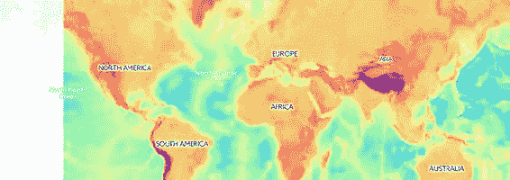

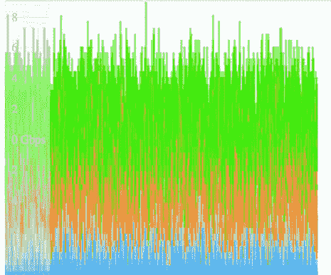

通过分块数据传输，以流式传输数据而不是用大请求锁定 UI，并在接收时逐行在画布上绘制每个块，可以实现相同的效果。这样，图表可以几乎立即开始渲染最重要的数据点，并且数据块可以在绘图后立即丢弃以释放内存。我喜欢使用 Papa Parse 进行流式传输和解析数据，它还可以使用 Web Workers 以获得更好的性能。
