# 1

开始吧：建立你的数据处理管道

**本章涵盖**

+   理解数据处理的“是什么”和“为什么”

+   定义数据处理与数据分析之间的区别

+   学习何时适合使用 JavaScript 进行数据分析

+   收集你在 JavaScript 数据处理工具箱中需要的工具

+   漫步数据处理过程

+   获取真实数据处理管道的概览

## 1.1 为什么需要数据处理？

我们的现代世界似乎围绕着数据旋转。你几乎在任何地方都能看到它。如果数据可以被收集，那么它正在被收集，有时你必须努力理解它。

分析学是商业决策过程中的一个重要组成部分。用户对你的应用或服务有何反应？如果你改变你的业务方式，这有助于改善情况还是使情况变得更糟？这些问题是企业在他们的数据中询问的问题。更好地利用你的数据并获得有用的答案可以帮助我们在竞争中脱颖而出。

数据也被政府用来基于证据制定政策，随着越来越多的*开放数据*变得可用，公民也在分析和理解这些数据中扮演着一定的角色。

数据处理，即准备你的数据以便进行查询的行为，是一项需求日益增长且不断上升的技能。数据相关技能的熟练度越来越普遍，并且需要更多样化的人群。在这本书中，你将练习数据处理技能，以帮助你支持数据相关活动。

这些技能在日常的开发任务中也同样有用。你的应用性能如何？性能瓶颈在哪里？错误数量的发展趋势是什么？这些问题对我们这些开发者来说很有趣，而且它们也可以通过数据得到解答。

## 1.2 什么是数据处理？

维基百科将数据处理描述为在工具的帮助下将数据从一种形式转换为另一种形式的过程，以便方便地消费数据。这包括转换、聚合、可视化和统计分析。我认为数据处理是将数据带入并通过你的管道的整个过程，无论这管道是什么，从数据采集到目标受众，无论他们是谁。

许多书籍只涉及数据分析，维基百科将其描述为处理和检查数据以支持决策的过程。我认为数据分析是数据处理过程的一个子集。数据分析师可能不会关心数据库、REST API、流数据、实时分析、为生产使用准备代码和数据等。对于数据处理员来说，这些通常是工作的关键。

数据分析师可能会花大部分时间离线分析数据，以生成报告和可视化，帮助决策者。数据处理员也做这些事情，但他们也可能有生产方面的考虑：例如，他们可能需要他们的代码在一个实时系统中执行，自动分析和可视化实时数据。

数据处理难题可能有多个部分。它们以许多不同和复杂的方式组合在一起。首先，你必须获取数据。数据可能包含任何你需要解决的问题。你有许多方式可以格式化和向目标受众交付数据。在某个中间位置，你必须以高效的方式存储数据。你也可能需要接受流式更新并实时处理传入的数据。

最终，数据处理的过程是关于沟通的。你需要将你的数据整理成一种促进清晰度和理解，并能够快速做出决策的形状。你如何格式化和表示数据，以及你需要对其提出的问题，将根据你的情况和需求而有很大差异，但这些问题是实现结果的关键。

通过数据处理，你将你的数据从一种形状调整到另一种形状。有时，这会是一个非常混乱的过程，尤其是当你无法控制源头时。在某些情况下，你会构建一次性的数据处理代码，它只会运行一次。这不会是你的最佳代码。它不必是，因为你可能永远不会再次使用它，你不应该对不会重用的代码投入过多的努力。对于这段代码，你将只投入必要的努力来证明输出是可靠的。

在其他时候，数据处理，就像任何编码一样，可以是一个非常严谨的过程。你会有理解需求很好的时候，并且你已经耐心地构建了一个生产就绪的数据处理管道。你将对这段代码投入极大的关注和技巧，因为它将在生产环境中被调用成千上万次。你可能已经使用了*测试驱动开发*，这可能是你写过的最健壮的代码之一。

很可能你的数据处理将介于临时和严谨之间。你可能会写一些临时代码来将源数据转换成更可用的形式。然后对于必须在生产中运行的代码，你会更加小心。

数据整理的过程包括多个阶段，正如你在图 1.1 中可以看到的那样。这本书将这个过程划分为这些阶段，好像它们是独立的，但实际上它们很少被干净地分开，也不一定按顺序依次进行。我在这里将它们分开，以保持事情简单，并使解释更容易。在现实世界中，事情永远不会这么干净和明确。数据整理的阶段相互交叉和相互作用，通常纠缠在一起。通过这些阶段，你理解、分析、重塑和转换你的数据，以便交付给受众。


图 1.1 将数据整理分为阶段

数据整理的主要阶段包括数据获取、探索、清理、转换、分析，最后是报告和可视化。

数据整理涉及处理许多不同的问题。你如何过滤或优化数据，以便更有效地工作？你如何改进你的代码以更快地处理数据？你如何使用你的语言来提高效率？你如何扩展并处理更大的数据集？

在这本书中，你将了解数据整理的过程及其各个组成部分。在这个过程中，我们将讨论许多问题以及如何应对它们。

## 1.3 为什么会有关于 JavaScript 数据整理的书？

JavaScript 并不以数据处理能力著称。通常你会被告知去使用其他语言来处理数据。在过去，我使用 Python 和 Pandas 来处理数据。这就是大家都会说的使用方法，对吧？那么为什么写这本书？

Python 和 Pandas *确实*适合数据分析。我不会试图否认这一点。它们具有成熟度和建立的生态系统。

Jupyter Notebook（以前称为 IPython Notebook）是一个用于探索性编码的绝佳环境，但现在你也有这种类型的工具在 JavaScript 中。Jupyter 本身有一个插件，允许它运行 JavaScript。现在也提供了各种 JavaScript 特定的工具，例如 RunKit、Observable 以及我自己的 Data-Forge Notebook。

我使用 Python 来处理数据，但我总觉得它不适合我的开发流程。我并不是说 Python 有什么问题；在许多方面，我喜欢这门语言。我对 Python 的问题是我已经在 JavaScript 中做了很多工作。我需要我的数据分析代码在 JavaScript 中运行，以便在需要运行的 JavaScript 生产环境中工作。你如何用 Python 做到这一点？

你可以用 Python 进行探索和分析编码，然后将数据移动到 JavaScript 可视化，正如许多人所做的那样。由于 JavaScript 强大的可视化生态系统，这是一种常见的做法。但如果你想在实时数据上运行你的分析代码呢？当我发现我需要在生产环境中运行我的数据分析代码时，我就不得不将其重写为 JavaScript。我从未能够接受这是事情必须如此的方式。对我来说，这归结为一点：我没有时间重写代码。

但谁有时间为代码重写呢？世界变化太快，以至于没有时间。我们都有要遵守的最后期限。你需要为你的业务增加价值，而在繁忙和快节奏的商业环境中，时间通常是一种你难以承受的奢侈。你希望以探索的方式编写你的数据分析代码，就像 Jupyter Notebook 一样，但使用 JavaScript，然后将其部署到 JavaScript 网络应用程序或微服务中。

这引导我走上了在 JavaScript 中处理数据并构建开源库 Data-Forge 的旅程，以帮助实现这一目标。在这个过程中，我发现 JavaScript 程序员的数据分析需求没有得到很好的满足。鉴于 JavaScript 程序员的激增、JavaScript 语言的易于访问以及看似无尽的 JavaScript 可视化库系列，这一状况有些令人困惑。我们为什么还没有谈论这个问题呢？人们真的认为数据分析不能在 JavaScript 中完成吗？

这些问题引导我写下了这本书。如果你知道 JavaScript，这是我所做的假设，那么你可能不会对我发现 JavaScript 是一种出人意料的有能力且能显著提高生产力的语言感到惊讶。当然，它有一些需要注意的问题，但所有优秀的 JavaScript 开发者都已经在使用语言的优点，并避免使用缺点。

这些天，各种复杂的应用程序都在用 JavaScript 编写。你已经熟悉这门语言，它功能强大，并且你在生产环境中也在使用它。继续使用 JavaScript 将会为你节省时间和精力。为什么不也用 JavaScript 来处理数据呢？

## 1.4 你将从这本书中获得什么？

你将学习如何在 JavaScript 中进行数据处理。通过众多示例，从简单到复杂，你将发展你的数据处理技能。在这个过程中，你将了解许多你可以使用的工具，这些工具已经 readily 可用。你将学习如何在 JavaScript 中应用其他语言中常用的数据分析技术。

我们将一起纯粹在 JavaScript 中查看整个数据处理过程。你将学会构建一个数据处理管道，它从数据源获取数据，对其进行处理和转换，然后最终以适当的形式将数据交付给受众。

你将学习如何解决将你的数据处理管道部署到生产环境并扩展到大数据集所涉及的问题。我们将探讨你可能会遇到的问题，并学习你必须采用的思维过程来找到解决方案。

我将证明你不需要转向其他语言，如 Python，这些语言传统上被认为更适合数据分析。你将学习如何在 JavaScript 中做到这一点。

最终的收获是对数据处理世界的欣赏以及它与 JavaScript 的交汇点。这是一个巨大的世界，但《使用 JavaScript 进行数据处理》将帮助你导航并理解它。

## 1.5 为什么使用 JavaScript 进行数据处理？

我主张使用 JavaScript 进行数据处理，原因有几个；这些原因总结在表 1.1 中。

表 1.1 使用 JavaScript 进行数据处理的理由

| **理由** | **详情** |
| --- | --- |
| 你已经了解 JavaScript。 | 为什么还要学习另一种语言来处理数据？（假设你已经了解 JavaScript。） |
| JavaScript 是一种强大的语言。 | 它被用来构建各种复杂的应用程序。 |
| 探索性编码。 | 使用带有实时重载的原型制作流程（在第五章中讨论）是使用 JavaScript 编写应用程序的强大方式。 |
| 强大的可视化生态系统。 | Python 程序员通常会转向 JavaScript 来使用其许多可视化库，包括 D3，可能是最复杂的数据可视化库。我们将在第十章和第十三章中探讨可视化。 |
| 通常拥有强大的生态系统。 | JavaScript 拥有最强大的用户驱动生态系统之一。在整个书中，我们将使用许多第三方工具，并鼓励你进一步探索以构建自己的工具包。 |
| JavaScript 无处不在。 | JavaScript 在浏览器、服务器、桌面、移动设备，甚至嵌入式设备上都有。 |
| JavaScript 易于学习。 | JavaScript 因其易于入门而闻名。也许它难以精通，但这同样适用于任何编程语言。 |
| JavaScript 程序员容易找到。 | 如果你需要雇佣某人，JavaScript 程序员无处不在。 |
| JavaScript 正在发展。 | 语言继续变得更加安全、更可靠、更方便。它随着 ECMAScript 标准的每一版更新而得到改进。 |
| JavaScript 和 JSON 密不可分。 | JSON 数据格式，即网络数据格式，是从 JavaScript 演变而来的。JavaScript 内置了处理 JSON 的工具，许多第三方工具和库也是如此。 |

## 1.6 JavaScript 适合数据分析吗？

我们没有理由单独将 JavaScript 视为不适合数据分析的语言。反对 JavaScript 的最好论点是，像 Python 或 R 这样的语言背后有更多的*经验*。我的意思是，它们已经为这种工作建立起了声誉和生态系统。如果这是你想要使用 JavaScript 的方式，JavaScript 也可以达到那里。这确实是我想要使用 JavaScript 的方式，我认为一旦 JavaScript 数据分析起飞，它将迅速发展。

我预计会对 JavaScript 在数据分析方面的批评。一个论点将是 JavaScript 没有性能。与 Python 类似，JavaScript 是一种解释型语言，由于这个原因，两者都有受限的性能。Python 通过其众所周知的原生 C 库来解决这个问题，这些库补偿了其性能问题。请知道，JavaScript 也有类似的本地库！而且，尽管 JavaScript 从未是镇上最高性能的语言，但得益于 V8 引擎和 Chrome 浏览器的创新和努力，其性能已经显著提升。

反对 JavaScript 的另一个论点可能是它不是一个高质量的语言。JavaScript 语言有设计缺陷（哪种语言没有呢？）和复杂的历史。作为 JavaScript 程序员，你已经学会了如何绕过它向我们抛出的问题，而且你仍然很有效率。随着时间的推移和多次修订，该语言继续发展、改进，并成为一个更好的语言。如今，我花在*TypeScript*上的时间比 JavaScript 多。这提供了在需要时*类型安全*和*智能感知*的好处，以及其他所有关于 JavaScript 的喜爱之处。

Python 在它的角落里有一个主要优势，那就是现在被称为 Jupyter Notebook 的出色的探索性编码环境。请记住，Jupyter 现在与 JavaScript 一起工作！没错，你可以在 Jupyter 中使用 JavaScript 进行探索性编码，与专业数据分析师使用 Jupyter 和 Python 的方式几乎一样。这还处于早期阶段……它确实可以工作，你可以使用它，但体验还没有达到你期望的完整和精致。

Python 和 R 在数据分析方面拥有强大且成熟的社区和生态系统。JavaScript 也有一个强大的社区和生态系统，尽管它还没有在数据分析领域达到那种强度。JavaScript 确实有一个强大的数据可视化社区和生态系统。这是一个很好的开始！这意味着数据分析的输出通常最终会在 JavaScript 中可视化。关于连接 Python 和 JavaScript 的书籍证实了这一点，但以那种方式跨语言工作对我来说听起来不方便。

JavaScript 永远不会取代 Python 和 R 在数据分析中的角色。它们在数据分析方面已经非常成熟，我不认为 JavaScript 能够超越它们。实际上，我的意图也不是让人们远离这些语言。然而，我确实想向 JavaScript 程序员展示，他们可以在不离开 JavaScript 的情况下完成所有需要做的事情。

## 1.7 探索 JavaScript 生态系统

JavaScript 生态系统非常庞大，对于新手来说可能会令人不知所措。经验丰富的 JavaScript 开发者将生态系统视为他们工具箱的一部分。需要完成某事？在 npm（node 包管理器）或 Bower（客户端包管理器）上可能已经存在一个能够完成你想要的工作的包。

你是否找到一个几乎能满足你需求但又不完全符合的包？大多数包都是开源的。考虑复制这个包并做出你需要的修改。

许多 JavaScript 库将帮助你进行数据处理。在写作开始时，npm 列出了 71 个关于*数据分析*的结果。随着这本书的接近完成，这个数字已经增长到 115。可能已经有了一个满足你需求的库。

你会发现许多用于可视化、构建用户界面、创建仪表板和构建应用的工具和框架。如 Backbone、React 和 AngularJS 这样的流行库，对于构建 Web 应用非常有用。如果你正在创建构建或自动化脚本，你可能想看看 Grunt、Gulp 或 Task-Mule。或者，在 npm 中搜索*任务运行器*，选择对你有意义的工具。

## 1.8 组装你的工具箱

当你学习成为数据处理者时，你会组装你的工具箱。每个开发者都需要工具来完成工作，而不断升级你的工具箱是这本书的核心主题之一。我对任何开发者的最重要的建议是确保你有好的工具，并且你知道如何使用它们。你的工具必须是可靠的，它们必须帮助你提高生产力，你必须了解如何很好地使用它们。

尽管这本书会介绍许多新的工具和技术，但我们不会在基本开发工具上花费任何时间。我会假设你已经有一个文本编辑器和版本控制系统，并且知道如何使用它们。

在这本书的大部分内容中，你将使用 Node.js 来开发代码，尽管你写的绝大多数代码也可以在浏览器、移动设备（使用 Ionic）或桌面（使用 Electron）上运行。为了跟随这本书的内容，你应该已经安装了 Node.js。这本书中使用的包和依赖项可以使用 npm 安装，npm 是 Node.js 的一部分，或者使用 npm 安装的 Bower。请阅读第二章*以了解如何快速掌握 Node.js*。

*你可能已经有一个偏好的测试框架。本书不涵盖自动化的单元或集成测试，但请记住，我对我最重要的代码进行自动化测试，并将其视为我一般编码实践的重要组成部分。我目前使用 Mocha 与 Chai 进行 JavaScript 单元和集成测试，尽管还有其他好的测试框架可用。最后一章介绍了一种我称之为*输出测试*的测试技术；这是一种简单而有效的测试方法，当你与数据一起工作时，可以测试你的代码。

对于任何严肃的编码工作，你已经有了一种构建和部署代码的方法。技术上 JavaScript 不需要构建过程，但根据你的目标环境，它可能是有用的或必要的；例如，我经常使用 TypeScript，并使用构建过程将代码编译成 JavaScript。如果你将代码部署到云服务器，你肯定需要一个配置和部署脚本。构建和部署不是本书的重点，但我们将在第十四章中简要讨论它们。否则，我将假设你已经有一种方法将代码放入目标环境，或者这是一个你以后会解决的问题。

许多有用的库将帮助你日常的编码工作。Underscore 和 Lodash 会首先想到。无处不在的*JQuery*似乎正在过时，尽管它仍然包含许多有用的功能。对于处理数据集合，linq，从 C#语言移植的*Microsoft LINQ*，非常有用。我自己的 Data-Forge 库是处理数据的有力工具。Moment.js 是处理 JavaScript 中日期和时间的必备工具。Cheerio 是一个从 HTML 中抓取数据的库。数据可视化方面有众多库，包括但不限于 D3、*Google Charts*、Highcharts 和 Flot。对于数据分析和统计，有用的库包括 jStat、Mathjs 和 Formulajs。我将在本书中详细介绍各种库。

异步编码值得特别提及。*Promise*是管理异步编码的一种表达性和一致性的方式，我确实认为你应该了解如何使用它们。请参阅第二章以了解异步编码和 Promise 的概述。

对于你的工作来说，拥有一个良好的探索性编码环境是最重要的。这个过程对于检查、分析和理解你的数据非常重要。它通常被称为*原型设计*。这是一个快速构建代码的过程，逐步迭代，从简单的开始，逐步构建到更复杂的代码——我们将在整本书中经常使用这个过程。在原型设计代码的同时，我们也会深入挖掘你的数据，以理解其结构和形状。我们将在第五章中更多地讨论这一点。

在下一节中，我们将讨论数据处理过程，并详细阐述一个数据管道，这将帮助你理解如何将拼图的各个部分组合在一起。

## 1.9 建立你的数据处理流程

第一章的其余部分是对数据整理过程的概述。到那时，你将涵盖一个项目的数据处理流程的示例。这是一次从开始到结束的数据整理快速浏览。请注意，这并不是一个典型数据整理项目的示例——那将是困难的，因为它们都有自己独特的方面。我想要给你一个关于涉及的内容以及你将从这个书中学到的内容的味觉。

你目前还没有代码示例；在本书的其余部分还有很多时间来学习这些，书中充满了你可以亲自尝试的工作代码示例。在这里，我们旨在理解数据整理过程的示例，并为本书的其余部分奠定基础。稍后我会更深入地解释数据整理的各个方面。

### 1.9.1 奠定基础

我得到了使用一个有趣数据集的许可。在本书的各个示例中，我们将使用“XL Catlin 全球珊瑚礁记录”的数据。我们必须感谢昆士兰大学允许访问这些数据。我与全球珊瑚礁记录项目没有其他联系，除了对在本书的示例中使用这些数据感兴趣之外。

珊瑚礁数据是由世界各地的珊瑚礁调查团队的潜水员收集的。随着潜水员沿着他们的*调查*路线（在数据中称为*横断面*）移动，他们的相机会自动拍照，他们的传感器会读取数据（见图 1.2）。通过这些数据，珊瑚礁及其健康状况正在被绘制出来。在未来，数据收集过程将再次开始，并允许科学家比较那时和现在的珊瑚礁健康状况。


图 1.2 潜水员在珊瑚礁上测量数据。

© 海洋机构 / XL Catlin Seaview Survey / 克里斯托夫·巴伊哈切和杰恩·詹金斯。

珊瑚礁数据集是一个引人入胜的样本项目。它包含与时间相关的数据、地理定位数据、水下传感器获取的数据、照片，以及由机器学习从图像生成数据。这是一个大型数据集，对于这个项目，我提取并处理了其中我需要用来创建数据可视化仪表板的部分。有关珊瑚礁调查项目的更多信息，请观看[`www.youtube.com/watch?v=LBmrBOVMm5Q`](https://www.youtube.com/watch?v=LBmrBOVMm5Q)视频[.](http://.)

我需要构建一个包含表格、地图和图表的仪表板来可视化和探索珊瑚礁数据。我们将一起完成这个过程的大致概述，我会从开始到结束解释整个过程，从从原始 MySQL 数据库中捕获数据，处理这些数据，最终到创建一个显示数据的网络仪表板。在本章中，我们采取的是鸟瞰视角，并没有深入细节；然而，在后面的章节中，我们将扩展这里展示的过程的各个方面。

初始时，我得到了一些珊瑚数据的 CSV（逗号分隔值）文件样本。我探索了 CSV 文件，以对数据集有一个初步的了解。后来，我获得了访问完整 MySQL 数据库的权限。目标是把数据带入生产系统。我需要组织和处理数据，以便在具有操作性的 REST API 的实际网络应用程序中使用，该 API 为仪表板提供数据。

### 1.9.2 数据处理过程

让我们来看看数据处理过程：它由一系列阶段组成，如图 图 1.3 所示。通过这个过程，你获取数据，探索它，理解它，并可视化它。我们最终以一个生产就绪的格式完成数据，例如网络可视化或报告。

图 1.3 给我们一个直观且线性的过程的印象，但如果你有软件开发的经验，你可能会在这里嗅到一些问题。软件开发很少这么直接，阶段通常不会完全分开，所以不要过于担心这里展示的阶段顺序。我必须以一个有意义的顺序来展示它们，线性顺序对于本书来说是一个有用的结构。在第五章中，你将超越软件开发的线性模型，并查看一个迭代的**探索性**模型。

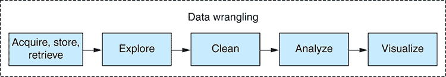

图 1.3 数据处理过程

在你阅读本章内容并逐步完成这个过程时，请记住这**不是**一个标准的过程；相反，这是一个特定项目数据处理过程的一个示例。这个过程的具体表现将根据你的数据和需求而有所不同。当你开始其他项目时，你自己的过程无疑会与我在本章中描述的不同。

### 1.9.3 规划

在开始数据处理或任何项目之前，你应该了解你在做什么。你的需求是什么？你将如何构建你的软件？可能遇到哪些问题，你将如何处理它们？你的数据是什么样的？你应该对数据提出哪些问题？当你规划一个新项目时，你应该问自己这些问题。

当你进行任何形式的软件开发时，从规划开始是很重要的。我看到的许多程序员的最大问题是他们在编码之前没有思考和规划他们的工作。根据我的经验，提高编码能力的一个最好方法是提高规划能力。

为什么？因为规划通过更好的实施和更少的错误导致更好的结果。但你必须小心不要**过度**规划！为不太可能发生的情况规划会导致过度设计。

在你能够规划之前，可能需要先进行*探索性编码*！这是一个阶段划分不够清晰的例子。如果你没有足够的信息来规划，那么就先进行探索性编码，并在对你要解决的问题有更好的理解后返回规划阶段。

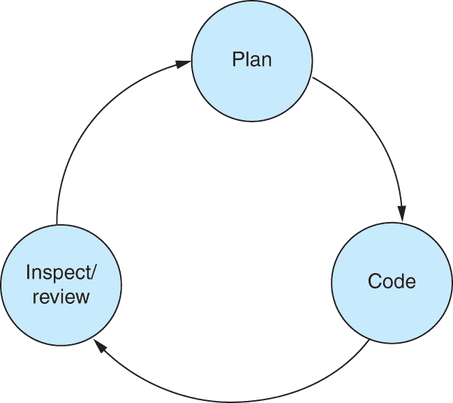

图 1.4 反馈循环

规划是有效反馈循环的重要组成部分（请参阅图 1.4）。规划涉及处理可能发生的错误，并找出如何避免这些错误。避免错误可以节省你大量的时间和痛苦。每次绕过反馈循环都是一次宝贵的学习经历，它提高了你对项目的理解，以及你规划和执行的能力。

为了规划这个项目，让我们记录几个最终产品的需求：

+   创建一个网络仪表板，以方便浏览珊瑚礁数据。

+   通过表格、图表和地图总结珊瑚礁和完成的调查。

随着你对项目理解的加深，需求通常会发生变化。如果发生这种情况，请不要担心。需求的变化是自然的，但请注意：它也可能是规划不当或范围蔓延的迹象。

在这个阶段，我规划网站的架构，如图图 1.5 所示。

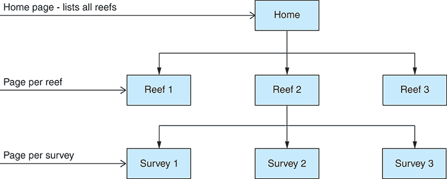

图 1.5 仪表板网站结构

简单的线框草图可以帮助我们巩固计划。图 1.6 是一个例子。在规划过程中，你需要考虑可能出现的各种问题。这将帮助你预先规划解决方案，但请确保你的方法平衡。如果你认为某个问题出现的可能性很小，你应该投入很少的努力来减轻它的影响。例如，以下是我可能在处理珊瑚礁数据集和构建仪表板时遇到的一些问题：

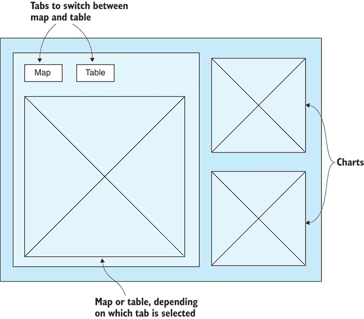

图 1.6 仪表板页面草图

+   由于其规模，其中一些表格包含超过一百万条记录。复制 MySQL 数据库可能需要很长时间，尽管它可以运行我们需要的任何小时数。我优化这个过程的必要性很小，因为它只发生一次，所以不是时间敏感的。

+   数据中可能存在需要清理的问题，但我在探索数据集之前不会知道（请参阅第六章关于数据清理和准备的内容）。

+   如果仪表板中的可视化加载缓慢或性能不佳，你可以预先将数据烘焙成优化的格式（有关更多信息，请参阅第六章和第七章）。

在规划阶段，最重要的是对数据想要得到的结果有一个概念。问自己以下问题：你需要从数据中了解什么？你在向数据提出什么问题？

对于你的示例，以下是一些对珊瑚礁数据提出的问题：

+   澳大利亚被调查的珊瑚礁的平均温度是多少？

+   每个珊瑚礁的总覆盖面积（穿越的距离）是多少？

+   每个珊瑚礁的平均潜水深度是多少？

通常，尽管有计划，你可能会发现事情并不按计划进行。当这种情况发生时，请休息一下，花时间重新评估情况。必要时，回到计划并再次工作。当事情出错或你需要确认自己是否走在正确的道路上时，随时回到计划。

### 1.9.4 数据获取、存储和检索

在这个阶段，你捕获数据并将其存储在适当的格式中。你需要将数据存储在一个你可以方便和有效地查询和检索的格式中。

数据获取始于从昆士兰大学发送的一个样本 CSV 文件。我对样本数据进行了*小规模探索*，以了解其感觉。样本数据足够小，以至于我可以将其加载到 Excel 中。

在编写任何代码之前，我需要先了解我要处理的内容。当查看完整的数据集时，我使用了一个名为 HeidiSQL 的 SQL 数据库查看器（图 1.7）来连接远程数据库，探索数据，并对其形成理解。

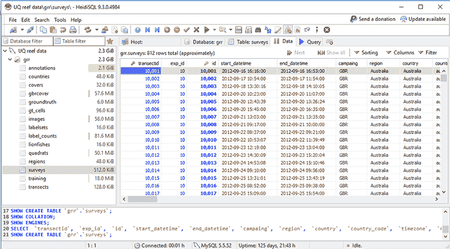

图 1.7 在 HeidiSQL 中检查 SQL 表

由于网络速度慢，远程数据访问对于探索性编码来说不会很有效。我需要将数据下载到本地数据库以实现高效访问。我还希望数据在本地，这样我就可以根据需要对其进行更改，并且我无法更改我不拥有的数据库。我计划将数据复制到本地的 MongoDB 数据库中（图 1.8）。

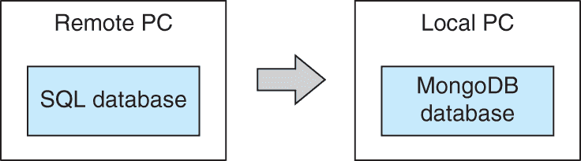

图 1.8 从 SQL 到 MongoDB 的数据提取

你可能会想知道我为什么选择 MongoDB？好吧，选择是有些随机的。你需要选择一个适合你和你项目的数据库。我喜欢 MongoDB 的几个原因：

+   安装很简单。

+   它与 JavaScript 和 JSON 配合得很好。

+   存储和检索数据都很简单。

+   查询语言内置在编程语言中。

+   可以存储临时或非规则数据。

+   它的性能很好。

如果你担心将数据从 SQL 迁移到 MongoDB 会导致数据结构丢失，请不要担心：MongoDB 可以像 SQL 一样存储结构化和关系型数据。它们是不同的，MongoDB 没有 SQL *连接*的便利性，它也不*强制*结构或关系——但这些是你可以轻松在自己的代码中模拟的功能。

与 MongoDB 相关的重要事情之一是，你不需要预先定义模式。你不必承诺数据的最终形状！这很好，因为我还不知道数据的最终形状。不使用模式可以减轻设计数据的工作负担，并允许你随着对项目理解的加深更容易地演进数据。

你将在第三章中了解更多关于 SQL、MongoDB 和其他数据源的信息。

到目前为止，是时候开始编码了。我必须编写一个脚本，从 SQL 数据库复制到 MongoDB。我开始使用 nodejs-mysql 从远程数据库将 MySQL 表加载到内存中。对于大型数据库来说，这并不现实，但这次它确实有效。在第八章和第九章中，我们将讨论处理无法装入内存的数据集。

在将 SQL 表加载到内存后，你现在使用 MongoDB API 将数据插入到我们本地的 MongoDB 数据库实例中（图 1.9）。

现在我可以组装到目前为止的代码，我有一个 Node.js 脚本可以复制 MySQL 表到 MongoDB。我现在可以轻松地将其扩展，并有一个可以复制整个 MySQL 数据库到我们本地 MongoDB 实例的脚本。

我要下载多少数据？需要多长时间？注意，我目前还没有处理数据或以任何方式转换数据。那是在我有了本地数据库并对数据有了更好的理解之后的事情。

复制这个数据库花费了很多小时，而且是在糟糕的网络连接下。像这样依赖于脆弱的外部资源的长时间运行的过程应该设计成容错和可重启的。我们将在第十四章再次讨论这些点。不过，重要的是，大多数时候脚本都在没有干预的情况下完成其工作，而且并没有占用我太多的时间。我很乐意等待这个过程完成，因为拥有数据的本地副本使得所有未来的交互都更加高效。

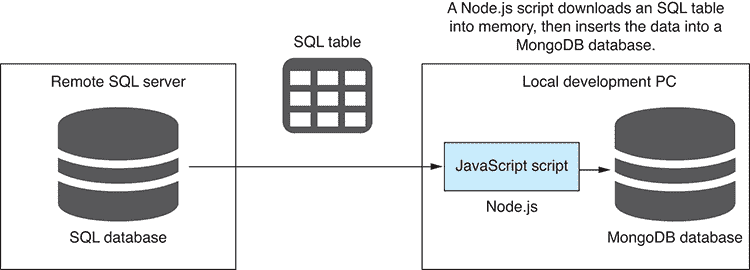

图 1.9 使用 Node.js 脚本下载 SQL 数据库表

现在我已经有了数据库的本地副本，我们几乎准备好开始更全面地探索数据了。不过，首先我必须检索数据。

我使用 MongoDB API 来查询本地数据库。与 SQL 不同，MongoDB 查询语言集成到 JavaScript（或根据你选择的语言的其他语言）中。

在这种情况下，你可以用一个基本的查询来应付，但你可以用 MongoDB 查询做更多的事情，包括

+   过滤记录

+   过滤每个记录返回的数据

+   排序记录

+   跳过和限制记录以查看数据的简化 *窗口*

这是一种获取数据的方式，但还有许多其他方式。可以使用许多不同的数据格式和数据存储解决方案。你将在第八章深入了解 MongoDB。

### 1.9.5 探索性编码

在这个阶段，你使用代码来深入探索你的数据，并建立对它的理解。有了更好的理解，你可以开始对数据的结构和一致性做出假设。假设必须得到验证，但你可以用代码轻松地做到这一点！

我们编写代码来探索、检查和挑逗数据。我们称之为*探索性编码*（也常被称为*原型设计*），这有助于我们在编写可能有用的代码的同时了解我们的数据。

在这个阶段，与数据的一个较小子集一起工作是很重要的。尝试处理整个数据集可能既低效又适得其反，尽管当然这取决于你特定数据集的大小。

探索性编码是通过迭代和交互过程逐步构建你的代码的过程（图 1.10）。编写几行代码，然后运行代码并检查输出，重复此过程。重复此过程同时构建你的代码和理解。

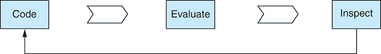

图 1.10 探索性编码过程

开始查看数据的最简单方式是使用数据库查看器。我已经使用 HeidiSQL 来查看 SQL 数据库。现在我用 Robomongo（最近更名为 Robo 3T）来查看我的本地 MongoDB 数据库的内容（图 1.11）。


图 1.11 在 Robomongo 中查看横断面集合

使用代码，我探索数据，查看第一条和最后一条记录以及它们包含的数据类型。我将前几条记录打印到控制台，看到以下内容：

```
> [ { _id: 10001,
    reef_name: 'North Opal Reef',
    sub_region: 'Cairns-Cooktown',
    local_region: 'Great Barrier Reef',
    country: 'Australia',
    region: 'Australia',
    latitude: -16.194318893060213,
    longitude: 145.89624754492613 },
  { _id: 10002,
    reef_name: 'North Opal Reef',
    sub_region: 'Cairns-Cooktown',
    local_region: 'Great Barrier Reef',
    country: 'Australia',
    region: 'Australia',
    latitude: -16.18198943421998,
    longitude: 145.89718533957503 },
  { _id: 10003,
    reef_name: 'North Opal Reef',
    sub_region: 'Cairns-Cooktown',
    local_region: 'Great Barrier Reef',
    country: 'Australia',
    region: 'Australia',
    latitude: -16.17732916639253,
    longitude: 145.88907464416826 } ] 
```

通过查看数据，我正在了解其形状，并可以提出以下问题：我有哪些列？我正在处理多少条记录？再次使用代码，我分析数据并将答案打印到控制台：

```
Num columns: 59
Columns:     _id,transectid,exp_id,start_datetime,…
Num records: 812 
```

在我的开源数据处理工具包 Data-Forge 的帮助下，我可以了解数据的类型和值的频率。我将结果打印到控制台，并进一步了解我的数据：

```
__index__  Type    Frequency            Column
---------  ------  -------------------  --------------------------
0          number  100                  _id
1          number  100                  transectid
2          number  100                  exp_id
3          string  100                  start_datetime
4          string  100                  end_datetime
5          string  100                  campaing
…
__index__  Value                             Frequency            Column
---------  --------------------------------  -------------------  -------
0          Australia                         31.896551724137932   region
1          Atlantic                          28.57142857142857    region
2          Southeast Asia                    16.133004926108374   region
3          Pacific                           15.024630541871922   region
… 
```

你将在整本书中了解更多关于使用 Data-Forge 以及它能做什么的信息，尤其是在第九章中。

现在我对数据有了基本的了解，我可以开始列出我们对它的假设。每一列是否预期只包含某种类型的数据？数据是否一致？

嗯，我目前还不知道这个。我正在处理一个大数据集，我还没有查看每一条记录。实际上，我无法手动检查每一条记录，因为我有太多记录了！然而，我可以轻松地使用代码来测试我的假设。

我编写了一个*假设检查*脚本，该脚本将验证我对数据的假设。这是一个检查数据库中每条记录并检查每个字段是否包含我们预期的相同类型值的 Node.js 脚本。你将在第五章中看到假设检查的代码示例。

数据有时可能令人沮丧地不一致。问题可能在大数据集中长时间隐藏。我的假设检查脚本让我安心，并减少了我在数据中遇到意外问题的可能性。

运行假设检查脚本显示，我对数据的假设并不成立。我发现我在 dive_temperature 字段中有意外值，现在可以在 Robomongo 中更仔细地检查（图 1.12）。

数据为什么损坏？这很难说。也许有几个传感器故障或间歇性工作。理解为什么错误数据以这种方式进入您的系统可能很困难。


图 1.12 在 Robomongo 中检查不良温度值

如果数据不符合预期怎么办？那么我们必须纠正数据或调整我们的工作流程以适应，因此接下来我们转向数据清理和准备。

您已经完成了这一部分，但您还没有完成您的探索性编码。您可以在数据整理的所有阶段继续探索性编码。无论何时您需要尝试对数据进行新的操作，测试一个想法或测试代码，您都可以回到探索性编码以迭代和实验。您将在第五章中花费整整一章来探讨探索性编码。

### 1.9.6 清洁和准备

您的数据是否以您预期的格式到来？您的数据是否适合生产使用？在*清洁和准备*阶段，您将解决数据中的问题，使其更容易处理。您还可以对其进行标准化和重构，以便在生产中更有效地使用。

您收到的数据可能以任何格式到来！它可能包含任何数量的问题。这无关紧要；您仍然必须处理它。假设检查脚本已经发现数据不愿意符合我的预期！我现在必须清理数据，使其符合我期望的格式。

我知道我的数据包含无效的温度值。我可以从数据库中删除包含无效温度的记录，但这样我会丢失其他有用的数据。相反，我将在稍后解决这个问题，根据需要过滤掉包含无效温度的记录。

为了举例说明，让我们看看另一个问题：`surveys`集合中的日期/时间字段。您可以看到该字段存储为字符串，而不是 JavaScript 日期/时间对象（图 1.13）。

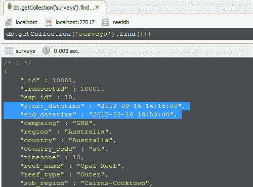

图 1.13 调查集合中的日期/时间字段是字符串值。

日期/时间字段存储为字符串时，这可能导致它们以不一致的格式存储。实际上，我的样本数据在这方面结构良好，但让我们假设在这个例子中，有几个日期是以假设的澳大利亚时区的时间信息存储的。这类问题可能是一个隐蔽且难以发现的问题；处理日期/时间时经常遇到这样的困难。

为了修复这些数据，我编写了另一个 Node.js 脚本。对于每条记录，它检查字段并在必要时修复数据。然后必须将修复后的数据保存回数据库。这类问题并不难修复；最难的是首先发现问题。但你也可能遇到其他不那么容易修复的问题，修复它们可能很耗时。在许多情况下，在运行时处理坏数据比尝试离线修复它更有效率。

在这个阶段，你也可能考虑对数据进行归一化或标准化，以确保它适合分析，简化下游代码，或提高性能。我们将在第六章中看到更多数据问题和解决方案的例子。

### 1.9.7 分析

在这个阶段，你分析数据。你针对数据提出并回答具体的问题。这是理解数据并从中提取有意义的洞察的进一步步骤。

现在我有了清洗和准备好的数据，是时候进行分析了。我想从数据中获得很多信息。我想了解每次调查的总距离。我想计算每个珊瑚礁的平均水温。我想了解每个珊瑚礁的平均深度。

我首先查看每个珊瑚礁潜水员的总行程距离。我需要聚合和总结数据。聚合的形式是按珊瑚礁分组。总结的形式是计算每个珊瑚礁的行程距离总和。这是这次分析的结果：

```
__index__      reef_name      distance
-------------  -------------  ------------------
Opal Reef      Opal Reef      15.526000000000002
Holmes Reef    Holmes Reef    13.031
Flinders Reef  Flinders Reef  16.344
Myrmidon Reef  Myrmidon Reef  7.263999999999999
Davies Reef    Davies Reef    3.297
… 
```

这个代码可以很容易地扩展。例如，我已经根据珊瑚礁对数据进行分组，所以我将添加每个珊瑚礁的平均温度，现在我有总距离和平均温度：

```
__index__      reef_name      distance            temperature
-------------  -------------  ------------------  ------------------
Opal Reef      Opal Reef      15.526000000000002  22.625
Holmes Reef    Holmes Reef    13.031              16.487499999999997
Flinders Reef  Flinders Reef  16.344              16.60909090909091
Myrmidon Reef  Myrmidon Reef  7.263999999999999   0
… 
```

通过对代码的轻微修改，我可以提出类似的问题，比如平均温度按国家划分是多少。这次，我不再按珊瑚礁分组，而是按国家分组，这是看待数据的不同方式：

```
__index__  country    distance
---------  ---------  -----------------
Australia  Australia  350.4500000000004
Curacao    Curacao    38.48100000000001
Bonaire    Bonaire    32.39100000000001
Aruba      Aruba      8.491
Belize     Belize     38.45900000000001 
```

这让你对数据分析有了初步的了解，但请保持关注；你将在第九章中花费更多时间，并查看代码示例。

### 1.9.8 可视化

现在你来到了可能最令人兴奋的阶段。在这里，你将数据可视化并使其生动起来。这是理解数据的最终阶段。以可视化的方式呈现数据可以揭示那些原本难以察觉的洞察。

在你探索和分析数据之后，是时候以不同的视角可视化和理解它了。可视化完成了你对数据的理解，并允许你轻松地看到可能否则隐藏的东西。你希望通过可视化暴露数据中任何剩余的问题。

对于本节，我需要一个更复杂的基础设施（见图 1.14）。我需要

+   服务器

+   一个 REST API 来暴露你的数据

+   一个简单的 Web 应用程序来呈现可视化

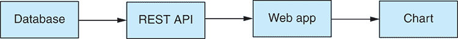

图 1.14 带有图表的 Web 应用程序基础设施

我使用 Express.js 构建了一个简单的 Web 服务器。该 Web 服务器托管一个 REST API，该 API 通过 HTTP GET 公开珊瑚礁数据。REST API 是服务器和您的 Web 应用程序之间的接口（图 1.14）。

接下来，我创建了一个简单的 Web 应用程序，该程序使用 REST API 以 JSON 格式检索数据。我的简单 Web 应用程序使用 REST API 从数据库中检索数据，我可以将数据投入使用。我在这里使用 C3 来渲染图表。我将图表添加到网页上，并使用 JavaScript 注入数据。本书稍后我们将了解更多关于 C3 的信息。

但是，我对图表的第一版有很大的问题。它显示了每个调查的温度，但数据太多，无法用条形图表示。而且这也不是我想要的。相反，我想展示每个珊瑚礁的平均温度，所以我需要将分析阶段开发出的代码移动到浏览器中。此外，我还筛选出澳大利亚的珊瑚礁数据，这有助于减少数据量。

在分析阶段代码的基础上，我筛选出非澳大利亚珊瑚礁，按珊瑚礁名称分组，然后计算每个珊瑚礁的平均温度。我们将这些数据输入到图表中。您可以在图中看到结果。（要查看颜色，请参考书籍的电子版。）

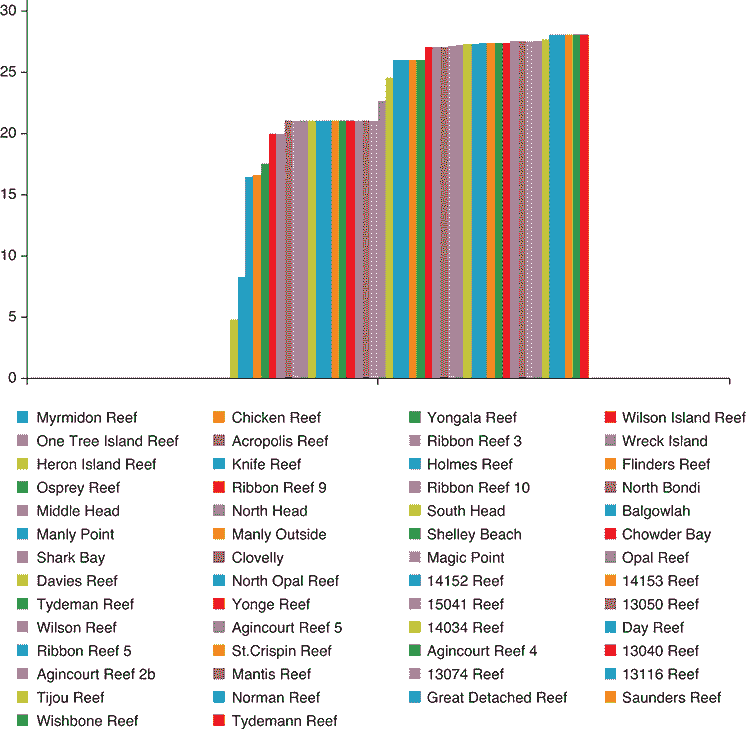

图 1.15 显示澳大利亚珊瑚礁温度的图表

### 1.9.9 进入生产阶段

在数据整理的最后阶段，您将您的数据管道交付给您的受众。我们将部署 Web 应用程序到**生产环境**。这可能是这个过程中最具挑战性的部分：将生产系统上线。通过生产，我指的是一个正在运行并被某人使用（通常是客户或公众）的系统。这就是它必须存在以触及您的受众的地方。

有时会进行一次性的数据分析然后丢弃代码。当这足以完成工作时，您不需要将代码移动到生产，因此您不会有这样的担忧和困难（幸运的是），尽管大多数时候您需要将代码移动到需要运行的地方。

您可能会将代码移动到 Web 服务、前端、移动应用或桌面应用。在将代码移动到生产后，它将自动运行或在需要时运行。通常，它将实时处理数据，并可能生成报告和可视化或执行它需要完成的任何操作。

在这种情况下，我构建了一个仪表板来显示和探索珊瑚礁数据。最终的仪表板看起来像图 1.16。

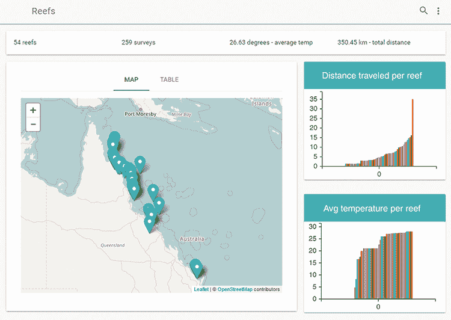

图 1.16 珊瑚礁数据仪表板

本章中已经涵盖的代码已经是 JavaScript，所以将它放入我的 JavaScript 生产环境中并不困难。这是我们在 JavaScript 中完成所有数据相关工作的主要好处之一。随着你进入探索阶段并向生产阶段过渡，你自然会更加注意你的编码。有了计划和方向，你可能会参与测试驱动开发或其他形式的自动化测试（关于这一点，请参阅第十四章）。

仪表板还有一个珊瑚礁表，你可以深入查看（图 1.17）。为了在仪表板中有效地显示数据，我已经在数据库中预先处理了各种数据分析。

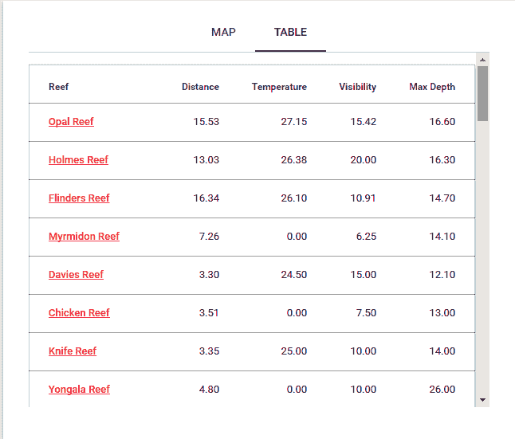

图 1.17 仪表板中的珊瑚礁表

为了将你的代码投入生产，你很可能会需要一个构建或部署脚本，可能两者都需要。构建脚本将执行诸如静态错误检查、连接、压缩和打包代码以供部署等任务。你的部署脚本将你的代码复制到它将运行的环境。当你部署服务器或微服务时，通常需要部署脚本。为了在云中托管你的服务器，你可能还需要一个配置脚本。这是一个创建代码将运行的环境的脚本。它可能从镜像创建一个虚拟机，然后安装依赖项——例如，Node.js 和 MongoDB。

当你的代码转移到生产环境时，你将面临一系列全新的问题：

+   当你得到不符合你最初假设的数据更新时会发生什么？

+   当你的代码崩溃时会发生什么？

+   你如何知道你的代码有问题？

+   当你的系统过载时会发生什么？

你将在第十四章中探讨这些问题以及如何处理它们。

欢迎来到数据整理的世界。你现在对数据整理项目可能的样子有了了解，你将在本书的剩余部分探索该过程的各个阶段，但在那之前，你可能需要帮助开始使用 Node.js，这就是我们在第二章要涵盖的内容。

## 摘要

+   数据整理是从获取到处理和分析，最后到报告和可视化的整个数据处理过程。

+   数据分析是数据整理的一部分，并且可以用 JavaScript 完成。

+   JavaScript 已经是一种功能强大的语言，并且随着标准的每一次更新而不断改进。

+   就像任何编码一样，数据整理可以以多种方式处理。它从临时的丢弃编码到有纪律的高质量编码有一个范围。你在这一范围内的位置取决于你拥有的时间和代码预期的持久性。

+   探索性编码对于原型设计和理解数据非常重要。

+   数据整理有几个阶段：获取、清理、转换，然后是分析、报告和可视化。

+   阶段通常不会完全分开；它们往往交织在一起，相互纠缠。

+   你应该始终从规划开始。

+   检查关于数据的基本假设非常重要。

+   将代码部署到生产环境涉及许多新问题*。
