# 2

开始使用 Node.js

**本章涵盖**

+   安装 Node.js 并创建项目

+   创建一个命令行应用程序

+   创建一个可重用的代码库

+   创建一个简单的带有 REST API 的 Web 服务器

+   检查异步编程和承诺的入门指南

在这本书中，我们将经常使用 Node.js，本章将帮助您提高使用它的效率。您将学习使用 Node.js 创建项目和应用程序的基础知识。我们只涵盖基础知识，但我们将涵盖足够的内容，让您能够使用 Node.js 完成本书的其余部分。

在本章末尾，我们将介绍异步编程和承诺的基础知识。这更高级，但你需要它，因为 Node.js 和 JavaScript 在一般情况下都严重依赖于异步编程的使用。

如果您已经具备 Node.js 和异步编程的经验，那么您可能希望跳过本章的大部分内容，直接进入第三章。不过，在继续之前，请至少阅读“开始您的工具集”和“获取代码和数据”这两节。

## 2.1 开始您的工具集

本书的核心主题是在学习过程中构建我们的数据整理工具集。我们将在本章开始开发我们的工具集，并在继续的过程中不断扩展它。表 2.1 列出了本章中引入的工具。

表 2.1 第二章中使用的工具

| **平台** | **工具** | **用途** |
| --- | --- | --- |
| Node.js | 命令行应用 | 运行在命令行上的各种数据整理任务的应用程序 |
|  | 可重用代码模块 | 在我们的 Node.js 项目中组织和重用代码 |
| Node.js 与 Express | 静态 Web 服务器 | 向浏览器提供网页和静态数据 |
|  | REST API | 向网络应用和可视化提供动态数据 |
| 浏览器 | 网页/网络应用 | 用于显示数据、可视化、报告等的网络应用 |
| Node.js 和浏览器 | 异步编程 | Node.js 和浏览器之间的连接是异步的；因此，您在 JavaScript 中的大部分编码都是异步的。 |
|  | 承诺 | 承诺是一种设计模式，有助于管理异步操作。 |

对于 JavaScript 开发者来说，Node.js 和浏览器是我们最基本工具。如今 JavaScript 可以在许多环境中运行，但本书主要关注数据整理发生的主要场所：

+   在您的开发工作站上，用于常规或临时数据处理、操作和可视化

+   在您的生产 Web 服务器上，用于自动化数据处理、访问和报告

+   浏览器中的数据展示、编辑和可视化

在本章中，我们将学习如何在 Node.js 和浏览器下运行代码。我们将在每个部分结束时提供模板代码，您可以在本书及其它地方使用这些代码作为您自己的数据整理项目的起点。

在本书的整个过程中，我们将继续完善你的工具箱，并填充我们编写的代码、第三方库和各种软件包。随着你经验的积累，你也会采用各种方法、技术和设计模式。这些是心理工具，它们也构成了我们工具箱的重要组成部分。完成本书后，我希望你能通过日常的数据整理工作继续构建你的工具箱。

## 2.2 构建一个简单的报告系统

即使在学习基础知识时，有一个问题去解决总是很有用的。我们将为数据生成一个简单的报告。我们不会深入任何数据处理细节；我们将保持早期讨论的简洁和专注于 Node.js 开发。

对于这里的示例，我们将重用第一章中的礁石数据。我们还没有准备好处理导入数据（我们将在第三章中回到这个问题），所以我们从这里开始，将数据直接嵌入到我们的代码中。

让我们考虑一下本章我们将要构建的内容。首先，我们将创建一个命令行应用程序，该程序基于数据生成报告（图 2.1）。我们保持事情简单，所以数据将被硬编码到脚本中，而“报告”将是简单的命令行输出。在命令行应用程序之后，我们将创建一个托管 REST API 的 Web 服务器。服务器将托管一个简单的网页，从 Web 服务器检索报告并在浏览器中显示它（图 2.2）。

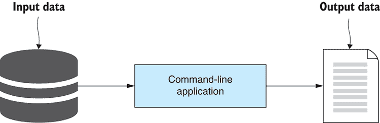

图 2.1 你首先创建的内容：一个 Node.js 命令行应用程序，用于从数据生成报告

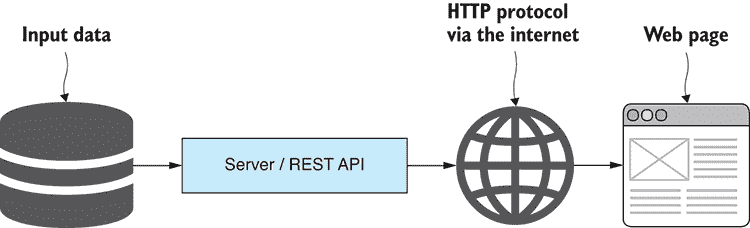

图 2.2 我们接下来要创建的内容：在通过 REST API 公开的网页中显示数据

## 2.3 获取代码和数据

本书附带大量示例代码和数据。你可以运行书中的许多代码示例来亲自尝试。当我提到“你可以运行这个”或“你现在应该运行这个”时，这是一个指令，你应该找到适当的代码并运行它。当你运行代码示例时，它将从一个学术练习（阅读本书）转变为一个实际经验（运行代码以查看它做什么），这对你提高学习和知识回忆能力有巨大的影响。

你也应该对代码进行自己的修改，尝试你感兴趣的变化和实验。不要害怕动手实践并破坏代码！实验和破坏代码是学习过程的重要组成部分，这也是乐趣的一部分。

每个章节（除了第一和最后一章）在 GitHub 上都有自己的代码仓库，包含示例代码和数据。本节是关于如何设置代码以便您可以运行的简要介绍。在您需要复习时请参考本节。您可以在 GitHub 上找到代码：[`github.com/data-wrangling-with-javascript`](https://github.com/data-wrangling-with-javascript)。浏览到该网页，您会看到代码仓库的列表。有 Chapter-2、Chapter-3 等，一直到 Chapter-13，还有一些额外的代码仓库。

### 2.3.1 查看代码

如果您不想运行代码（但我鼓励您运行代码以充分利用本书）或者您想更简单地开始，您还可以在线浏览和阅读代码。将您的浏览器导航到章节的仓库，您会看到代码和数据文件的列表。您可以点击任何文件来查看它并阅读内容。

现在试试看。将您的浏览器指向本章的仓库：[`github.com/data-wrangling-with-javascript/chapter-2`](https://github.com/data-wrangling-with-javascript/chapter-2)。

您会看到如 listing-2.2、listing-2.4 等子目录。第二章中的许多代码列表都可以在这些子目录中找到。进入每个子目录查看其中的代码文件。例如，导航到 listing-2.2 并打开 index.js。现在您可以阅读本章的代码列表 2.2。

大多数代码仓库每个列表只有一个文件，例如 listing-2.1.js、listing-2.2.js 等，尽管在几个仓库中，例如第二章，您会发现包含每个代码列表多个文件的子目录。

### 2.3.2 下载代码

在开始每个章节时，您应该从 GitHub 上相应的仓库下载代码和数据。您可以通过以下两种方式之一来完成：下载代码的 zip 文件或克隆代码仓库。

第一种也是最简单的方法是下载 GitHub 提供的 zip 文件。例如，对于本章，将您的浏览器导航到以下代码仓库：[`github.com/data-wrangling-with-javascript/chapter-2`](https://github.com/data-wrangling-with-javascript/chapter-2)。

现在找到网页右上角通常靠近顶部的“克隆”或“下载”按钮。点击此按钮，会出现一个下拉菜单；现在点击“下载 ZIP”，一个 zip 文件将下载到您的下载目录。解压此 zip 文件，现在您就有了第二章代码的副本。

*获取代码的另一种方式是克隆 Git 仓库。为此，您需要在您的 PC 上安装 Git。然后打开命令行，切换到您想要克隆仓库的目录。例如，让我们使用 Git 克隆第二章的仓库：

```
git clone https://github.com/data-wrangling-with-javascript/chapter-2.git 
```

克隆完成后，您将在子目录 Chapter-2 中拥有代码的本地副本。

### 2.3.3 安装 Node.js

书中的大多数代码示例都是在 Node.js 下运行的应用程序，所以不言而喻，在运行许多代码列表之前，你需要安装 Node.js。

第 2.4 节简要概述了如何选择版本并安装 Node.js。安装过程通常是直接的，尽管我不深入细节，因为它取决于你的操作系统。

### 2.3.4 安装依赖项

对于书中许多示例，你需要使用 npm（Node.js 包管理器）或 Bower（客户端包管理器）安装第三方依赖项。

在大多数情况下，每个代码列表（尽管有时几个代码列表会合并）都是一个可运行的 Node.js 应用程序或网络应用程序。每个应用程序都有自己的依赖项集，在运行代码之前必须安装。

关键是要寻找 package.json 和/或 bower.json 文件。这些文件会告诉你，在运行代码之前必须安装外部包。如果你尝试在没有先安装依赖项的情况下运行代码，它将不会工作。

对于 Node.js 项目，npm 包通过在 package.json 相同的目录下运行以下命令安装：

```
npm install 
```

对于网络应用程序项目，使用以下命令（在 bower.json 相同的目录下）安装包：

```
bower install 
```

安装完成后，你将拥有运行代码所需的所有依赖项。

### 2.3.5 运行 Node.js 代码

运行代码的方式取决于它是一个 Node.js 项目还是一个网络应用程序项目。

你可以通过以下特征识别一个 Node.js 项目或应用程序：它将有一个 index.js（作为应用程序入口点的 JavaScript 代码）和一个 package.json（跟踪应用程序的依赖项）。在 Node.js 世界中，使用 index.js 作为入口点文件的名称是一种常见的约定。

要运行本书中的 Node.js 示例脚本，你需要打开命令行，切换到 Node.js 项目目录（与 index.js 或 package.json 相同的目录），并运行 `node index.js`。例如，很快你将像这样运行第二章的 listing-2.2：

```
cd Chapter-2
cd listing-2.2
node index.js 
```

大多数其他章节每个列表都有一个文件——例如，第三章的 listing-3.1，你可以这样运行：

```
cd Chapter-3
node listing-3.1.js 
```

如果你确保已经安装了依赖项（通过运行 `npm install`）并且知道要运行哪个脚本，运行 Node.js 脚本很简单。

### 2.3.6 运行网络应用程序

书中的许多示例都是需要网络服务器来托管它们的网络应用程序。

你会知道这些项目，因为它们通常会有一个 index.html（网络应用程序的主要 HTML 文件）或以列表命名的 HTML 文件（例如，listing-1.3.html），并且通常还会有一个 bower.json（跟踪依赖项）和经常还有一个 app.js（网络应用程序的 JavaScript 代码）。

一些更复杂的 Web 应用需要自定义 Node.js Web 服务器，而这些 Web 应用通常包含在 Node.js 项目的*public*子目录中。要运行这些 Web 应用，你需要运行 Node.js 应用：

```
node index.js 
```

现在，请将你的浏览器导航到[`localhost:3000/`](http://localhost:3000/)，Web 应用将在浏览器中渲染。一些较简单的 Web 应用不需要自定义 Node.js Web 服务器。在这些情况下，我们将使用名为 live-server 的工具托管 Web 应用。这是一个简单的命令行 Web 服务器，你可以按照以下方式在你的系统上全局安装 live-server：

```
npm install -g live-server 
```

我们可以在包含 index.html 的目录中不带任何参数运行 live-server：

```
live-server 
```

这将启动 Web 应用的 Web 服务器并自动打开指向它的浏览器。这是原型化不需要（或至少目前不需要）自定义 Web 服务器的 Web 应用和可视化的一种方便方式。我们将在第五章中了解更多关于 live-server 以及如何使用它的信息。

### 2.3.7 获取数据

许多代码仓库也包含数据文件。通常为 CSV（逗号分隔值）或 JSON（JavaScript 对象表示法）数据文件。要找到这些数据文件，搜索以.csv 或.json 扩展名结尾的文件。

代码列表被设置为自动读取这些数据文件，但查看数据并对其有所了解是个好主意。CSV 文件可以在 Excel 或你喜欢的电子表格查看器中打开。CSV 和 JSON 文件也可以直接在文本编辑器中打开以查看原始数据。

GitHub 仓库中的数据文件被用于书中的许多代码示例，但它们也为你提供了使用方式，无论是用于你自己的原型、数据处理管道还是可视化。

### 2.3.8 获取第二章的代码

我们已经简要概述了如何获取代码、安装依赖项以及运行书中的各种列表。在未来的章节中，获取代码和数据的说明将更加简短，所以当你需要这方面的帮助时，请随时回到这一章。

现在请获取第二章的代码。下载 zip 文件或克隆[`github.com/data-wrangling-with-javascript/chapter-2`](https://github.com/data-wrangling-with-javascript/chapter-2)的 Chapter-2 仓库。接下来，打开命令行，切换到 Chapter-2 目录，你就可以开始运行代码示例了：

```
cd Chapter-2 
```

在运行列表中的代码之前，例如列表 2.2（将在下一节中展示），请记住切换到目录并安装依赖项：

```
cd listing-2.2
npm install 
```

现在你可以按照以下步骤运行代码：

```
node index.js 
```

让我们开始吧！

## 2.4 安装 Node.js

Node.js 是我们的核心工具，所以请确保在您的开发电脑上安装它。它支持 Windows、Mac 或 Linux 系统。请从 [`nodejs.org/en/download`](https://nodejs.org/en/download) 下载适用于您平台的安装程序。安装过程很简单：运行安装程序，然后按照提示操作。Node.js 也可以通过各种包管理器安装，例如 Linux 上的 *apt-get*。您可以在 [`nodejs.org/en/download/package-manager/`](https://nodejs.org/en/download/package-manager/) 上了解更多信息。

### 2.4.1 检查您的 Node.js 版本

在我们使用 Node.js 进行开发之前，让我们检查它是否已正确安装并达到预期的版本。打开命令行并运行

```
node --version 
```

您应该看到如图 2.3 所示的输出。

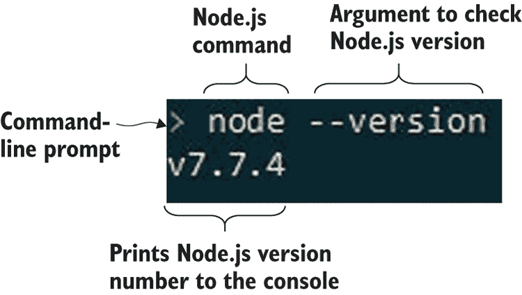

图 2.3 启动命令行并验证您已安装正确的 Node.js 版本。

Node.js 应该已经添加到您的 *path* 中，因此您可以从任何地方运行它。如果您无法从命令行运行 Node.js，请尝试重新启动命令行或尝试注销并重新登录。最后尝试重新启动您的电脑。根据您的系统，您可能需要重新启动以使更新的路径可用，或者您可能需要自己配置路径。

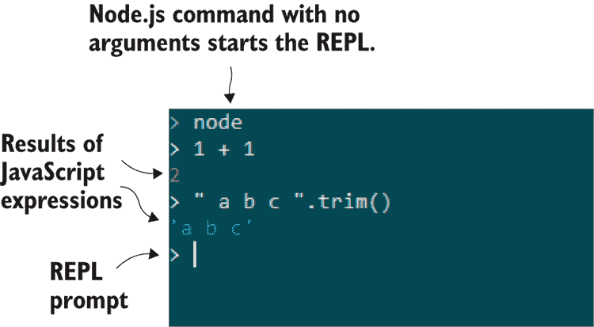

图 2.4 Node.js REPL 是尝试小段代码和测试第三方库的绝佳方式。

## 2.5 使用 Node.js

让我们创建一个 Node.js 应用程序！

首先，我们将创建一个项目。然后我们将进入编码阶段：我们将构建一个命令行应用程序，然后是一个简单的 Web 服务器。

### 2.5.1 创建 Node.js 项目

一个 Node.js 项目是一个包含构成您的 Node.js 应用程序的 JavaScript 代码和依赖项的目录。它由各种文件组成：JavaScript 代码文件、package.json 和一个 node_modules 子目录 (图 2.5)。

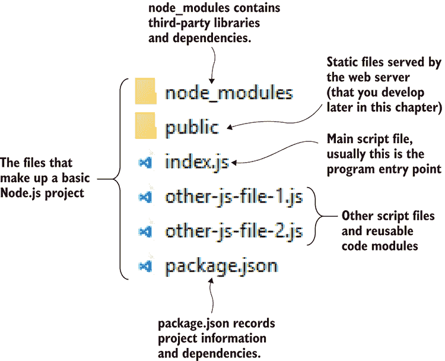

图 2.5 Node.js 项目

一个 Node.js 项目可以包含任意数量的 JavaScript 文件，这些文件可以是入口点（可以从命令行运行）、可重用的代码模块，或者两者兼而有之（这对于测试您的代码可能很有用）。按照惯例，主入口点通常被称为 index.js。

node_modules 子目录包含使用 npm（Node 包管理器）安装的第三方包。文件 package.json 包含有关项目的信息并记录了已安装的依赖项。

#### npm 初始化

您通常通过使用 npm 创建初始的 package.json 来开始 Node.js 项目：

```
cd my-project
npm init -y 
```

`–y` 参数指示 npm 填写包文件中的详细信息（参见 列表 2.1 中的结果包文件）。如果我们计划将来将包公开（例如，通过 npm 分发），那么我们稍后必须回去修改它。否则，我们可以省略 `–y` 参数，`npm init` 将会交互式地提示这些详细信息。

列表 2.1 生成的 npm 包文件

```
{
 "name": "Code",    ①  
 "version": "1.0.0",    ①  
  "description": "",
 "main": "index.js",    ②  
  "scripts": {
    "test": "echo \"Error: no test specified\" && exit 1"
  },
  "keywords": [],
  "author": "",
 "license": "ISC"    ①  
} 
```

#### 添加第一个 JavaScript 文件

为了开始，让我们创建一个 Hello world 程序。创建一个空的 index.js 文件，并添加一个 `console.log` 语句，将 `Hello world` 打印到控制台（如下所示）。

列表 2.2 您的第一个脚本：Hello world

```
"use strict";

console.log(“Hello world!”); 
```

你可以在 GitHub 仓库 Chapter-2 的列表-2.2 子目录中找到这段代码，所以你不必亲自输入。如果你遵循了“获取代码和数据”中的说明，你已经切换到了列表-2.2 目录并安装了依赖项，但为了回顾，让我们再看一遍：

```
cd listing-2.2
npm install 
```

现在按照以下方式运行代码：

```
node index.js 
```

如果你只创建了项目并手动输入了代码，你可以这样运行它：

```
cd my-project
node your-script.js 
```

你可能会想知道为什么你需要为这样一个简单的代码示例安装依赖项。好吧，说实话——你不需要！我想让你养成这样做的习惯，因为大多数示例确实有依赖项，你确实需要在运行代码之前运行 `npm install` 来下载依赖项。尽管如此，你只需要在每个项目中做一次。一旦安装了依赖项，你可以多次运行代码列表。

运行脚本后，我们看到 `Hello world!` 被打印到控制台。

注意我们执行了 *node* 应用程序并指定了我们的脚本文件名（index.js）。运行 Node.js 脚本的一般模式是这样的：

```
node <script-file.js> 
```

将 `<script-file.js>` 替换为你想要运行的脚本。

#### 安装 npm 依赖项

现在让我们将第三方依赖项安装到您新创建的 Node.js 项目中。我选择在这里安装 moment，因为它是最适合处理日期的 JavaScript 库，我知道当你需要处理日期和时间时，它会让你更容易。

如果你正在使用一个新的 Node.js 项目，你可以像这样将 moment 包安装到你的项目中：

```
npm install --save moment 
```

注意 `--save` 参数将依赖项保存到 package.json 并跟踪版本号（更新后的文件显示在 列表 2.3 中）。随着我们安装每个依赖项，它们都会被记录下来，这意味着我们可以很容易地稍后使用此命令再次恢复这些包：

```
npm install 
```

列表-2.3 在 GitHub 仓库中没有代码，但如果你想尝试这样做，你可以通过将 moment 依赖项安装到列表-2.2 代码中来练习。

列表 2.3 包含 moment 依赖项的 package.json

```
{
  "name": "Code",
  "version": "1.0.0",
 "description": "",
  "main": "index.js",
  "scripts": {
    "test": "echo \"Error: no test specified\" && exit 1"
  },
  "keywords": [],
  "author": "",
  "license": "ISC",
 "dependencies": {    ①  
 "moment": "2.18.1"    ②  
 }    ①  
} 
```

安装依赖项并跟踪已安装的版本是很好的。这意味着我们不需要将依赖项提交到版本控制。因为我们可以在任何时候恢复包（使用`npm install`），我们可以简化我们的项目，这使得对于新开发者或在我们将代码安装到新 PC 上时，克隆或复制代码变得超级快。

#### 寻找有用的包

我们可以使用 npm 安装我们需要的任何数量的包，并且手头上有许多有用的包。将你的浏览器指向[`www.npmjs.com`](http://www.npmjs.com)并查看。输入一个搜索字符串，你会找到现有的代码库和命令行工具，帮助你完成各种任务。

### 2.5.2 创建命令行应用程序

命令行应用程序对于各种数据处理、转换和分析任务都很有用。我们的目标是创建一个简单的应用程序，从数据生成报告。

我们已经向我们的 Node.js 项目添加了一个脚本，该脚本将“Hello world”打印到控制台。这已经是一个基本的命令行应用程序，但我们需要它做更多的事情。你的应用程序的输出是一个简单的报告，你可以通过图 2.6 中的示例看到。

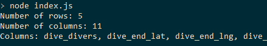

图 2.6 你简单命令行应用程序的输出：打印关于我们数据的基本报告

为了使入门章节的内容简单，我们将直接在脚本中包含数据。这并不具有可扩展性或便利性，理想情况下，我们会从文件或数据库中加载数据，尽管我们还没有介绍如何导入数据，所以这是我们在第三章中会再次讨论的内容。

图 2.7 显示了硬编码在 JavaScript 文件中的数据。我们正在重用第一章中关于礁石数据的一小部分。我们的命令行应用程序将打印硬编码数据的简单摘要：行数、列数和列名。你可以在列表 2.4 中看到代码；确保你跳入代码仓库并运行此脚本以查看输出。

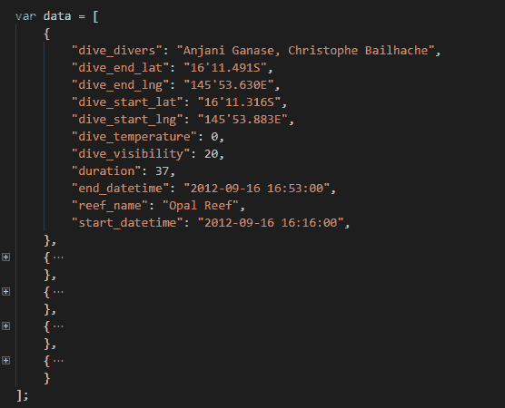

图 2.7 在你的 JavaScript 文件 index.js 中嵌入的简单硬编码数据

列表 2.4 从你的数据生成简单报告的基本命令行应用程序

```
"use strict";

const data = ... array of data, see GitHub code for details ...    ①  

function generateReport (data) {    ②  
 const columns = Object.keys(data[0]); {    ②  
 return {    ②  
 numRows: data.length,    ②  
 numColumns: columns.length,    ②  
 columnNames: columns,    ②  
 };    ②  
};    ②  

const report = generateReport(data);    ③  

console.log("Number of rows: " + report.numRows); );    ③  
console.log("Number of columns: " + report.numColumns); );    ③  
console.log("Columns: " + report.columnNames.join(", ")););    ③   
```

生成这个报告远非火箭科学，但在这里我们想要专注于创建一个简单的命令行应用程序。

#### 命令行应用程序的一般模式

以下列表为你提供了未来命令行应用程序的一般模式和模板。添加你需要的逻辑。

列表 2.5 命令行应用程序的一般模式

```
"use strict";

const yargs = require('yargs');
const argv = yargs.argv;    ①  
const assert = require('chai').assert;    ②  

//
// App specific module imports here.
//

//
// Argument checking and preprocessing here.
//

//
// Implement the code for the app here.
// 
```

你可以使用命令行应用程序做更多的事情，但现在这些已经足够了。请注意，我已经在模板中添加了额外的 npm 模块。Yargs 用于读取命令行输入参数。Chai 断言库用于验证、错误处理和报告。

### 2.5.3 创建代码库

有时我们可能会在一个单独的文件中编写整个命令行应用程序，但我们只能在任务足够小的时候这样做。随着脚本的扩展，我们可以通过抽象代码并将其提取到可重用模块中来降低复杂性。

让我们将 `generateReport` 函数移动到一个单独的代码模块中。为此，创建一个新的 JavaScript 文件，例如 generate-report.js。将 `generateReport` 移动到这个新文件中，如下列表所示。通过将函数分配给特别命名的 Node.js 变量 `module.exports`，函数从代码模块中导出。

列表 2.6 将 `generateReport` 函数移动到可重用代码模块

```
"use strict";

function generateReport (data) {
    const columns = Object.keys(data[0]);
    return {
        numRows: data.length,
        numColumns: columns.length,
        columnNames: columns,
    };
};

module.exports = generateReport;    ①   
```

现在可以使用 Node 的 `require` 函数将代码模块导入到您的命令行应用程序（或者实际上任何其他代码模块）中，如下列表 2.7 所示。这与您已经看到的导入第三方 npm 库非常相似，尽管为了导入我们自己的库，我们必须指定一个绝对或相对路径。在列表 2.7 中，我们使用路径 ./generate-report.js 加载我们的模块，因为这表明模块位于同一目录中。列表 2.6 和 2.7 一起工作；您将在代码仓库中找到它们，要尝试它们，您只需要运行 index.js 脚本。

列表 2.7 将 `generateReport` 函数导入到您的命令行应用程序

```
"use strict";

const data = ... array of data, see GitHub code for details ...

const generateReport = require(‘./generate-report.js’);    ①  

const report = generateReport(data);    ②  

console.log("Number of rows: " + report.numRows);
console.log("Number of columns: " + report.numColumns);
console.log("Columns: " + report.columnNames.join(", ")); 
```

#### 代码库的一般模式

以下列表是一个模板，您可以使用它来创建可重用工具包函数。

列表 2.8 导出可重用工具包函数的一般模式

```
"use strict";

// Imports here.

module.exports = function (... parameters ...) {

    //
    // Code
    //

    // Return result.
}; 
```

注意在列表 2.8 中，只导出了一个单个函数。我们也可以导出一个对象，这允许我们导出一个函数库。以下列表展示了这一点的例子。

列表 2.9 导出可重用函数库的一般模式

```
"use strict";

// Imports here.

module.exports = {
    someFunction1: function (param1, param2, etc) {
        //
        // Code
        //

        // Return result
    },

 someFunction2: function (param1, param2, etc) {
        //
        // Code
        //

        // Return result
    },
}; 
```

### 2.5.4 创建简单的 Web 服务器

我们在 Node.js 中创建了一个命令行应用程序，现在我们将学习如何创建一个简单的 Web 服务器。我们需要 Web 服务器的理由是我们可以构建 Web 应用和可视化。首先，我们将创建最简单的 Web 服务器（输出显示在图 2.8 中）。然后我们将添加对静态文件的支持，这为我们构建 Web 可视化提供了一个基本的基础。最后，我们将添加一个 REST API，允许我们根据动态数据创建 Web 可视化，例如从数据库加载的数据或服务器动态处理的数据。

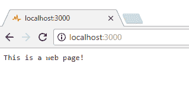

图 2.8 最简单 Web 服务器的输出

您的 Web 服务器第一次迭代相当基础，远未达到生产就绪状态，但这就是您开始原型设计 Web 可视化所需的一切。然而，在某个时刻，我们希望扩展并服务于成千上万的用户，但我们将生产问题留到第十四章讨论，这里我们专注于基础知识。

您应该注意，Node.js Web 服务器仍然是一个命令行应用程序。我们将继续构建我们已学到的内容，尽管我们现在正在提高复杂性并创建一个*客户端/服务器*类型的应用程序。

#### 安装 Express

要构建我们的 Web 服务器，我们将使用 Express：一个流行的 Node.js 框架，用于构建 Web 服务器。我们可以使用 npm 在新的 Node.js 项目中安装 Express，如下所示：

```
npm install -–save express 
```

尽管如果您正在 GitHub 仓库中运行列表 2.10 中的示例代码，您需要在列表-10 子目录中运行`npm install`以恢复已注册的 Express 依赖项。

#### 最简单的 Web 服务器

最简单的 Web 服务器是通过实例化一个 Express 应用并指示它监听传入的 HTTP 请求来创建的。您的第一个 Web 服务器处理单个路由并返回文本“这是一个网页！”您可以在列表 2.10 中看到这一点，该列表显示了您第一个和最简单的 Web 服务器的 index.js 文件*.* 

列表 2.10 最简单的 Web 服务器

```
"use strict";

const express = require('express');    ①  
const app = express();    ①  

app.get("/", (req, res) => {    ②  
 res.send("This is a web page!");    ②  
});    ②  

app.listen(3000, () => {    ③  
 console.log("Web server listening on port 3000!");    ③  
});    ③   
```

您应该尝试运行此代码。切换到列表-2.10 子目录，使用`npm install`安装依赖项，然后运行`node index.js`。现在我们有一个 Node.js Web 服务器！将您的浏览器指向[`localhost:3000`](http://localhost:3000)以查看网页。您将在浏览器中看到“这是一个网页！”（如图所示）。

#### 提供静态文件

打印“这是一个网页！”的网页并不特别有用，但我们可以轻松地将其扩展以提供*静态文件*，这些文件是任何网页的基础，并且是简单的 Web 资产，如 HTML、JavaScript 和 CSS 文件。我们将在 Node.js 项目下有一个*公共*子目录，我们将在这里保存 Web 应用的静态资产（参见图 2.9）。

要向我们的 Web 服务器添加静态文件，我们将使用 Express 静态文件中间件。您可以在以下列表中看到扩展的 Web 服务器的代码。

列表 2.11 向您的 Web 服务器添加静态文件

```
"use strict";

const express = require('express');
const path = require('path');

const app = express();

const staticFilesPath = path.join(__dirname, "public");    ①  
const staticFilesMiddleWare = express.static(staticFilesPath);    ②  
app.use("/", staticFilesMiddleWare);    ③  

app.listen(3000, () => {
    console.log("Web server listening on port 3000!");
}); 
```

我们现在的 Web 服务器可以提供静态文件，我们可以创建一个基本的 HTML 页面来测试它。您可以在以下列表中看到您扩展的*最简单的网页*的 HTML 文件；此文件位于`public`子目录中，名为 index.html。

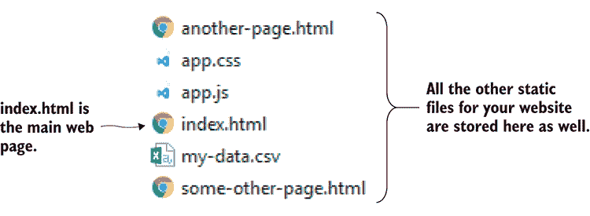

图 2.9 静态文件从公共子目录中提供服务。

列表 2.12 最简单的网页

```
<!doctype html>
<html lang="en">
    <head>
        <title>Simplest web page</title>
    </head>
    <body>
    This is a static web page!
    </body>
</html> 
```

现在再次运行您的 Web 服务器，并将您的 Web 浏览器指向[`localhost:3000`](http://localhost:3000)。您应该看到“这是一个静态网页！”有关 Express 的更多信息，请参阅 Express 网页[`www.e`](http://www.e)[xpressjs.com](http://xpressjs.com)。

#### 提供静态数据文件

我们现在有了构建可以托管基本 Web 可视化的 Web 服务器的工具。我们甚至有一种简单的方法将数据传输到 Web 浏览器以供我们的可视化使用！

除了常规的 Web 资产外，我们还可以将 *静态数据*（例如，CSV 和 JSON 文件）放入我们的 *public* 子目录中，然后我们可以通过 AJAX HTTP 请求将它们加载到我们的网页中。你可能已经注意到，在 图 2.9 中，我也偷偷地将一个 CSV 数据文件放入了公共子目录中。

#### 添加 REST API

使用静态数据对于入门或原型设计来说很棒，甚至可能就是你所需要的全部！然而，如果你需要从数据库访问数据或在数据被发送到浏览器之前动态处理数据，那么你需要一个 REST API。在接下来的示例中，我们将使用我们之前创建的 `generateReport` 函数在服务器上生成我们的报告。我们并没有做任何特别复杂的事情，只是在一个网页中显示格式化的数据，这在 图 2.10 中可以看到。

要构建 REST API，我们必须定义 *路由*，这些路由通过 URL 来访问，通过 HTTP 请求检索动态数据。你可以在 图 2.11 中看到一个 REST API 的示例，我们在浏览器中导航到 [`localhost:3000/rest/data`](http://localhost:3000/rest/data) 来查看从 REST API 获取的数据。

我们可以通过调用 Express 的 `get` 函数向现有的 Web 服务器添加一个路由。我们必须指定路由并提供一个处理程序。例如，在下面的列表中，我们指定路由为 `/rest/report`，作为响应，你以 JSON 格式返回你的数据。现在你可以说你已经配置了你的 Web 服务器来处理 `/rest/data` 路由的 HTTP GET 请求。

列表 2.13 向您的 Web 服务器添加 REST API 以动态生成报告

```
"use strict";

const express = require('express');
const path = require('path');
const generateReport = require(‘./generate-report.js’);

const app = express();

const staticFilesPath = path.join(__dirname, "public");
const staticFilesMiddleWare = express.static(staticFilesPath);
app.use("/", staticFilesMiddleWare);

const data = ... hard-coded data ...

app.get("/rest/data", (req, res) => {    ①  
 const report = generateReport(data);    ②  
 res.json(report);    ③  
});    ①  

app.listen(3000, () => {
    console.log("Web server listening on port 3000!");
}); 
```

在 列表 2.13 中，我们返回的是从硬编码的数据生成的报告。数据永远不会改变，所以在这种情况下技术上并不需要使用 REST API。我们可以使用静态数据，尽管我希望你能理解我们现在已经准备好将这个 Web 应用程序扩展到使用真正的数据库，而不是硬编码的数据，这一点我们将在第三章中进一步探讨。

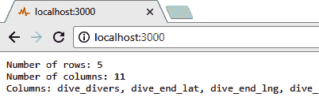

图 2.10 在服务器上生成基本报告并在浏览器中显示

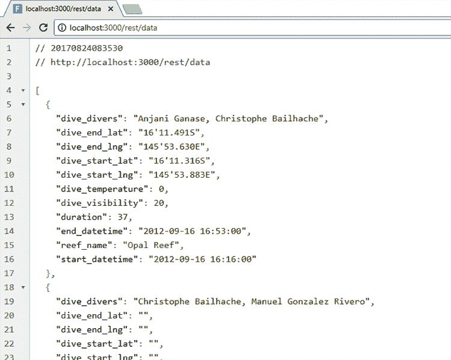

图 2.11 在浏览器中查看 REST API 的 JSON 数据

我们可以使用更多的 `get` 函数调用，向我们的 Web 服务器添加我们需要的任意多的路由。请注意，`HTTP GET` 通常用于从 Web 服务器检索数据。我们也可以通过使用 Express 的 `post` 函数处理 `HTTP POST` 请求来向 Web 服务器推送数据。

如果我们有像传统的 jQuery、更现代的 Axios 或 AngularJS 的 $http 服务这样的库，使用 AJAX 就很简单了。查询 REST API 并在浏览器中显示数据的代码如下所示。为了方便，JavaScript 代码已被直接嵌入到 HTML 文件中。

列表 2.14 简单的网页，显示从 REST API 获取的报告

```
<!doctype html>
<html lang="en">
    <head>
        <title>Simple report</title>
    </head>
    <body>
 <script src="bower_components/jquery/dist/jquery.js"></script>    ①  
        <script>
 $.getJSON("/rest/data", function (report) {    ②  
 document.write(    ③  
 "Num rows: " + report.numRows + "\r\n" +    ③  
 "Num columns: " + report.numColumns + "\r\n" +    ③  
 "Columns: " + report.columns.join(', ')    ③  
 );    ③  
 });    ②  
        </script>
    </body>
</html> 
```

运行这段代码比之前复杂一些。像往常一样，我们需要为 Node.js 项目安装依赖项：

```
cd listing-2.13-and-2.14
npm install 
```

但现在我们还有一个位于*public*子目录下的 web 应用程序项目。我们将使用 Bower 来安装其依赖项：

```
cd public
bower install 
```

现在你可以切换回 Node.js 项目并启动 web 服务器：

```
cd ..
node index.js 
```

将你的浏览器指向[`localhost:3000`](http://localhost:3000)[，](http://,)你现在正在查看一个使用 AJAX 从 web 服务器检索数据的 web 应用。

我们现在在哪里？我们有了创建用于处理数据或其他任务的命令行工具的能力。我们可以构建一个简单的 web 服务器来托管 web 应用或可视化。我们已经扩展了我们的 web 应用以使用 REST API，这将允许我们在本书的后面部分对数据进行服务器端处理，或者将 web 应用连接到数据库，这两者我们都会在本书的后面部分探讨。这些是我们在这本书中将依赖的基本工具；然而，我们仍然需要讨论异步编程。

## 2.6 异步编程

为什么异步编程很重要，为什么我们需要尽早解决它？这是因为 JavaScript 和 Node.js 高度依赖于异步编程范式，而且在这本书中我们将多次使用它。本章的其余部分是对异步编程的简要介绍。这是一个困难的话题，但我们现在解决它非常重要。

当用 JavaScript 编程时，我们经常会发现自己在进行*异步编程*。浏览器和 web 服务器之间的连接*本质上是异步的*，Node.js 的大部分设计都是围绕这个概念。我们在本章中已经进行了异步编程。你注意到了吗？在上一个代码示例中，当我们通过调用`listen`函数启动 web 服务器时，这是我们第一次接触异步编程。

同步编程和异步编程有什么区别？在同步编程中，每一行代码按顺序完成：在下一行代码执行之前，上一行代码的效果已经完成。这是大多数编程语言默认的编程方式。以这种方式进行编程时，很容易理解正在发生的事情，也容易预测将要发生的事情。这是因为同步编程中事情是按顺序一个接一个发生的，这种方式是可预测的。但是，在异步编程中，我们发现代码可以与主代码流*并行执行*。这种执行顺序不固定的可能性使得理解代码的流程变得更加困难，也更难预测最终的代码序列。

在 Node.js 中，异步编码特别常见。在某些情况下——例如，文件操作——Node.js 提供了同步和异步两种选项。你应该使用哪一种？嗯，这取决于你的情况。当你能够避免使用同步编码时，同步编码当然更简单、更容易。在其他情况下，例如，处理 REST API 和数据库时，你必须进行异步编码，因为 API 没有提供其他选项。

在这本书中，我尽量只使用异步编码，即使可能使用函数的同步版本。我这样做有两个原因。一是我想展示一致性，并希望从长远来看这能减少混淆。二是当在生产系统上工作时，我倾向于更喜欢异步编码。除了大多数 API 强制要求这样做之外，这也是 Node.js 文化的一部分。Node.js 被设计为首先考虑异步：这就是我们如何用它来构建响应式和性能良好的服务器，而且你如果不运行异步编码，在 Node.js 中很难走得很远。

在接下来的章节中，我将解释同步和异步编码之间的区别，以及为什么和何时需要异步编码。我会概述你在进行异步编码时将面临的三种主要困难，然后解释承诺如何帮助缓解这些问题。最后，我将简要介绍 Node.js 最新版本中的新 JavaScript 关键字`async`和`await`，这些关键字使异步编码变得更加容易。

### 2.6.1 加载单个文件

让我们考虑一个最简单的异步编码的实际例子：加载文件。比如说你想加载一个名为 bicycle_routes.txt 的数据文件。你可能想转换文件中的数据，将数据交付给 Web 应用，或者从数据中生成报告。无论你想做什么，首先你必须加载这个文件。

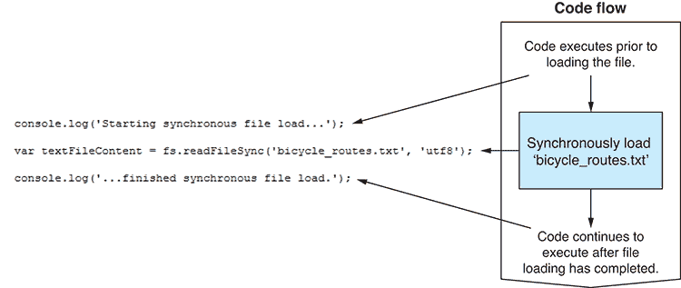

图 2.12 加载文件时的同步代码流程

图 2.12 展示了如何同步地完成这项操作。我们调用 Node 的`readFileSync`函数来开始文件加载。然后文件被加载到内存中。之后，控制权返回到调用`readFileSync`之后的代码行。从那里，你的代码继续执行，我们可以处理从文件中加载的数据。

同步编码简单且易于解释。但它有一个大问题：在同步操作期间，它会阻塞主线程执行任何其他工作（图 2.13）。

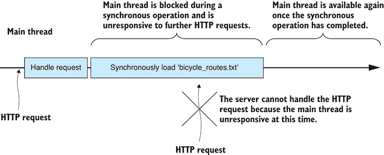

图 2.13 同步操作期间主线程被阻塞。

当基于 UI 的应用程序发生阻塞操作时，UI 变得无响应。当这种情况在 Node.js 中发生时，你的服务器变得无响应：在同步操作期间，服务器无法再响应 HTTP 请求。如果操作很快完成，就像在这个简单的例子中一样，这几乎没有影响：进入的 HTTP 请求被排队，并在主线程解除阻塞后立即执行。

然而，如果同步操作很长，或者你有多个连续的同步操作，那么进入的 HTTP 请求最终会超时，导致你的用户在浏览器中看到错误消息，而不是看到你的网页。

这是一个随着你使用的同步操作越来越多而变得更大的问题。随着你使用越来越多的同步操作，你逐渐降低了服务器处理并发用户的能力。

在其他语言和环境中使用同步编码是正常的情况下，我们可以通过将这种资源密集型操作委托给 *工作线程* 来避免这个问题。然而，通常我们无法在被认为是 *单线程* 的 Node.js 中使用这样的线程。

为了避免阻塞主线程，我们必须使用异步编码。在下一个例子中，我们将使用 Node 的异步文件加载函数：`readFile`。调用此函数开始文件加载操作，并立即返回调用代码。在这个过程中，文件内容被 *异步* 加载到内存中。当文件加载操作完成时，你的回调函数被调用，文件数据被发送给你 (图 2.14)。

回调是一个 JavaScript 函数，当单个异步操作完成时，它会自动为你调用。对于正常的（例如，*非 Promise*）回调，无论操作是否失败，回调最终都会被调用——通过将错误对象传递给回调来指示失败发生的情况。我们稍后将回到错误处理来进一步探讨。

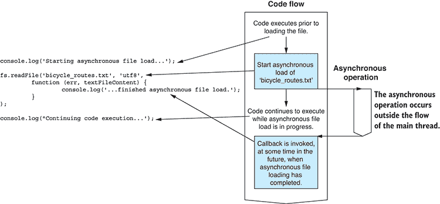

图 2.14 加载文件时的异步代码流

现在我们正在使用异步编码，文件加载操作不会锁定主线程，使其可以空闲下来处理其他工作，例如响应用户请求 (图 2.15)。

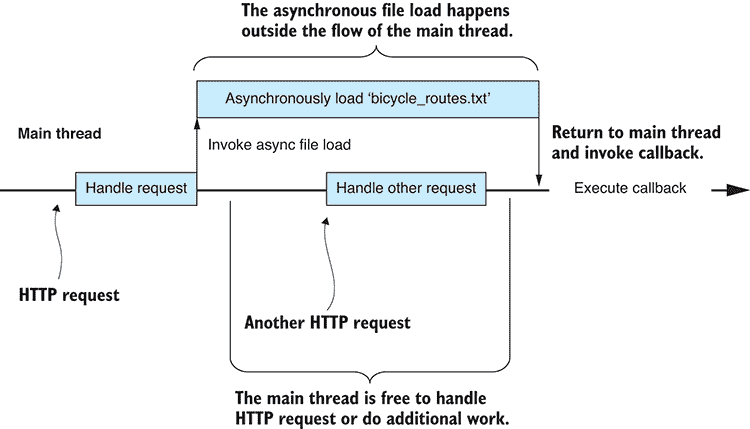

图 2.15 在异步操作期间主线程不会被阻塞。

你还在吗？理解异步编码可能很困难，但对于使用 Node.js 来说是必不可少的。我已经使用单个文件的加载作为 Node.js 中使用回调的异步编码的简单示例，但 Node.js 应用程序通常由许多这样的异步操作构建。为了继续这个例子，让我们扩展到加载多个文件。

### 2.6.2 加载多个文件

我们无法仅使用单个异步操作创建 Node.js 应用程序。任何体量较大的 Node.js 应用程序都将由多个异步操作组成，这些操作一个接一个地按顺序排列或交织在一起，以构建对 HTTP 请求的响应。

让我们扩展这个例子，加载多个文件。比如说，我们需要加载一系列文件。这些文件按国家分开，例如，bicycle_routes_usa.txt、bicycle_routes_australia.txt、bicycle_routes_england.txt 等等。我们需要加载这些文件并将它们合并以访问完整的数据集。以同步方式执行此操作会导致一个大问题；它将锁定主线程一段时间(图 2.16)。

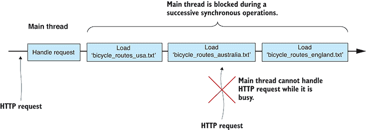

图 2.16 主线程被多个连续的同步操作阻塞。

使用异步编码，我们可以以两种不同的方式处理这个问题。我们可以依次顺序执行异步操作，或者并行执行它们。以这种方式依次顺序执行异步操作(图 2.17)使得它们看起来像一系列同步操作，只不过在它们进行的过程中主线程不会被阻塞。

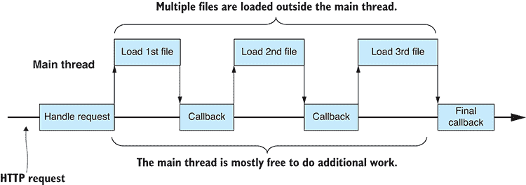

图 2.17 顺序异步操作发生在主线程之外。

在这里，我们遇到了基于回调的 JavaScript 异步编码的第一个大问题。图 2.17 中的每个回调都必须调用后续的异步操作并设置其回调。这导致了回调函数的嵌套：每个回调的代码都在一个新的缩进级别上定义。随着我们的异步操作链变长，缩进也变得更深。嵌套函数和大量的缩进使得代码难以阅读和维护，这就是问题所在；这是一个非常普遍的问题，它有一个名字：*回调地狱*。

为了更好的性能和吞吐量，我们可能需要并行执行多个异步操作(图 2.18)。这可能会压缩完成所有工作所需的时间。这意味着 CPU 和 IO 系统可以尽可能快地将所有文件加载到内存中，但它仍然这样做而不阻塞主线程。


图 2.18 并行运行的多项异步操作

在介绍了并行异步操作之后，我们遇到了基于回调的异步编码的下一个大问题。注意当我们并行运行异步操作时引入的额外复杂性：回调可以以任何顺序被调用！

我们如何知道所有回调都已完成？它们可以以任何顺序完成，因此任何依赖于所有三个回调完成的后续操作都必须编写成可以由任何一个回调触发的代码。然后，最后执行的回调将触发后续操作。这个新问题完全是关于管理多个独立的回调。

使用传统的回调来解决这些问题通常会导致代码丑陋且脆弱。不过，很快我们就会了解到承诺（promises），它能够以优雅的方式处理这些问题，但首先我们需要理解异步错误处理的工作原理。

### 2.6.3 错误处理

在传统的异步编码中，无法使用 try/catch 语句来检测和处理错误。我们不能使用它，因为它无法检测异步代码中的错误。相反，我们必须通过检查作为回调的第一个可选参数传递的*错误*对象来处理错误。当这个参数为`null`时，表示没有发生错误；否则，我们可以调查错误对象以确定错误的性质。

这种简单的机制在处理单个异步操作时是可行的。当我们执行多个顺序的异步操作时，情况变得更加复杂，因为任何操作都可能失败，而且它们可能以任何可能的顺序失败。

当我们执行并行异步操作或并行和顺序操作的组合时，情况变得更加复杂，并且越来越难以管理。考虑一下当你的第二个文件加载失败时会发生什么（图 2.19）。当这种情况发生时，任何依赖于所有三个文件的后续操作也必须失败。我们如何实现这一点？同样，回调可以以任何顺序被调用，因此每个回调都需要检测组合操作的成功或失败，但只有最后一个回调应该调用错误处理逻辑。管理 Node.js 回调可能会很困难，但请不要气馁。一会儿我们将介绍承诺（promises），这是一种处理这些情况更好的方式。

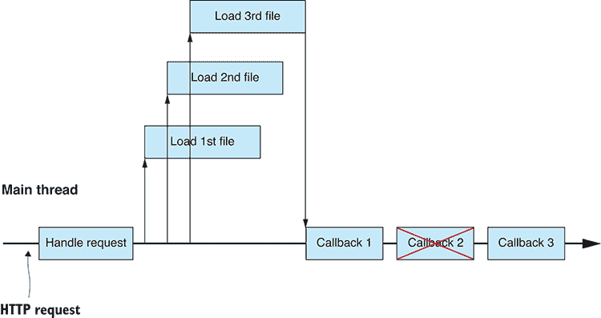

图 2.19 其中一个异步操作失败了。

异步错误处理将我们带到了基于回调的异步编码的第三个也是最后一个大问题：每个回调都必须处理自己的错误。例如，在图 2.19 中，每个回调都必须定义自己的错误处理程序。如果能在一个回调之间共享一个单一的错误处理程序会更好。管理多个回调的逻辑变得越来越复杂，因为它现在必须理解是否任何操作失败了。

由于你在进行异步编码时面临的困难，异步编码被认为是困难的也就不足为奇了。现在，是时候介绍承诺（promises）了，它将帮助你管理和简化你的异步编码。

### 2.6.4 使用承诺进行异步编码

随着异步编程复杂性的迅速增加，承诺（Promises）设计模式可以极大地帮助。承诺（Promises）允许我们将异步操作连接和交织在一起。它们帮助我们同时管理多个操作，并自动为我们收集所有回调。

通过承诺（Promises），我们希望解决基于回调的异步编程中的以下问题：

1.  *回调地狱* —承诺（Promises）有助于最小化回调的嵌套。

1.  *回调顺序* —承诺（Promises）自动将多个回调编织在一起，这意味着你不再关心它们的完成顺序。

1.  *错误处理* —承诺（Promises）允许在任何异步操作链中插入错误处理器。我们可以根据需要共享错误处理器，在任意数量的异步操作之间共享。

也许我们应该首先考虑承诺（promise）的确切含义。一个 *承诺（promise）* 是一个封装异步操作并承诺在未来某个时间点提供结果（或错误）的对象。承诺（Promises）为我们提供了一种词汇，可以以几乎看起来像同步操作序列的方式表达异步操作的链。你承诺词汇中的主要词汇是 `then`、`all`* 和 `catch`。

#### Then

`Then` 用于连接一系列异步操作（图 2.20）。


图 2.20 使用 `then` 执行顺序异步操作

我喜欢将承诺链想象为一系列由 `then` 箭头连接的盒子，如图图 2.21 所示。每个盒子代表一系列异步操作中的一个阶段。


图 2.21 可视化承诺链

#### *All*

`Promise.all` 用于管理并行运行的异步操作。它自动编织回调并调用一个单一的最终回调（图 2.22）。使用 `all`，你不再需要担心可能以任何顺序调用的多个回调的协调。

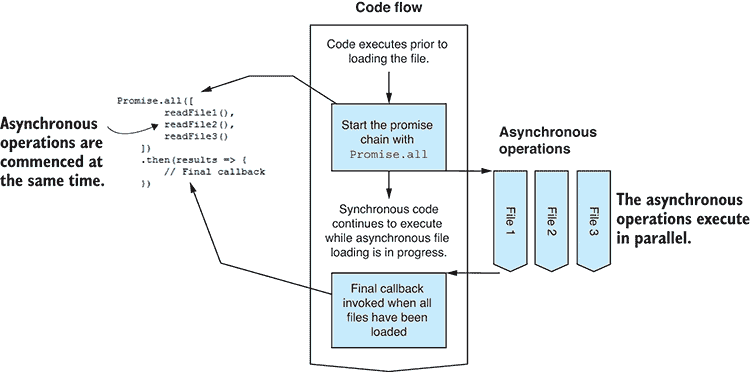

图 2.22 使用 `Promise.all` 并行执行异步操作

在 `then` 和 `all` 之间，我们已经有一个强大的工具集来管理异步操作。我们可以以各种方式将它们结合起来，以最小的努力拼接任意复杂的序列。请参阅图 2.23 以获取更复杂的示例。

#### Catch

最后，我们剩下 `catch`*，用于错误处理。使用承诺（promises），我们可以在链的末尾附加一个错误处理器（图 2.24）。这允许我们在所有异步操作之间共享错误处理器，并且如果任何操作失败（例如，图 2.24 中的文件 2 加载失败），它将被调用。我喜欢将承诺错误处理想象为从承诺链中跳出的*短路*，如图图 2.25 所示。

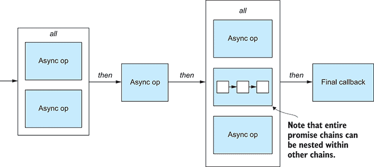

图 2.23 `Promises` 的一个更复杂的示例，展示了如何使用 `then` 和 `all` 来编织复杂的异步逻辑链。

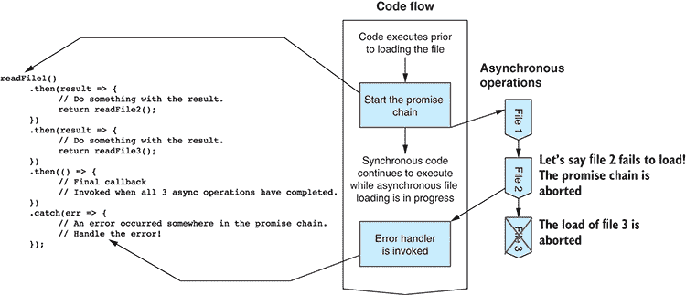

图 2.24 使用 `catch` 向承诺链添加错误处理程序


图 2.25 一个错误中断承诺链并调用错误处理程序。

`Catch` 允许我们对异步错误处理进行优雅的控制。它在我们异步世界中为我们带来了 `try/catch` 语句。

在这个例子中，我将错误处理程序放置在承诺链的末尾，尽管在现实中，你可以根据你想要检测和报告错误的时间，将错误处理程序放置在链中的任何位置。

### 2.6.5 在 `Promises` 中包装异步操作

现在你已经知道了如何使用 `Promises` 以及它们如何帮助你简化异步操作的管理，你可以寻找使用它们的机会。

通常，你会发现第三方 API 已经提供了使用 `Promises` 的异步函数。在这些情况下，你调用异步函数，它返回一个承诺给你，然后你可以从那里链式调用额外的操作并按需处理错误。

在经过多年的孕育之后，`Promises` 在 2015 年的 JavaScript 第 6 版（也称为 ES6）中被引入，在此之前它们已经在各种第三方库中存在。现在 `Promises` 已在 Node.js 中可用，尽管 Node.js API 还未升级以正确支持它们。据我所知，所有 Node.js API 的异步函数仍然是基于回调的。许多第三方库尚未支持 `Promises`。

别担心；即使它们不被我们使用的 API 直接支持，我们仍然可以使用 `Promises`。我们必须自己进行转换。

让我们回顾一下异步加载单个文件的例子，并使用 `Promise` 来转换它。我们将创建一个新的函数 `readFilePromise`，它包装了 Node 的 `readFile` 函数。我们希望如下使用我们的新函数：

```
readFilePromise("bicycle_routes.txt")    ①  
 .then(content => {    ②  
 console.log(content);    ②  
 })    ②  
 .catch(err => {    ③  
 console.error("An error occurred.");    ③  
 console.error(err);    ③  
 });    ③   
```

`readFilePromise` 函数创建并返回一个 `Promise` 对象。然后我们可以与这个承诺进行交互来管理异步操作。

我们使用一个匿名函数实例化一个 `Promise` 对象，该匿名函数启动异步文件加载操作。匿名函数接收两个参数。第一个参数是一个 `resolve` 函数，我们在异步操作完成后并准备好 `resolve` 承诺时调用它。这将触发承诺链中连接的下一个 `then` 处理器。第二个参数是一个 `reject` 函数，如果发生错误，我们可以调用它。我们可以使用这个来 `fail` 承诺并触发承诺链中最接近的 `catch` 处理器：

```
function readFilePromise (filePath) {    ①  
 return new Promise(    ②  
 (resolve, reject) => {    ③  
 fs.readFile(filePath, "utf8",    ④  
 (err, content) => {    ⑤  
 if (err) {    ⑥  
 reject(err);    ⑥  
 return;    ⑥  
 }    ⑥  

 resolve(content);    ⑦  
                }
 )    ⑤  
        }
 );    ②  
};    ①   
```

这种将基于回调的异步函数包装在 `Promise` 中的技术可以轻松应用于任何需要此类转换的情况。以下是一个你可以使用的通用模式：

```
function myPromiseBasedFunction (param1, param2, etc) {
 return new Promise(    ①  
 (resolve, reject) => {    ②  
 ... Start your async operation ...    ③  

 if async operation fails    ④  
 reject(error);    ④  

 when async operation completes    ⑤  
 resolve(optionalResult);    ⑤  
        }
 );    ②  
};    ①   
```

### 2.6.6 使用“async”和“await”进行异步编码

如果你使用的是 Node.js 7 或更高版本，你可能想使用新的`async`和`await`关键字。这些新关键字为 Promise 提供了语法糖，这意味着它们不再是 API 构造，JavaScript 语言本身已经更新以支持 Promise！

这些新关键字让 Promise 链看起来像一系列同步操作。例如，读取、转换然后写入数据文件，如下面的列表所示。

列表 2.15 使用`await`重写的 Promise 链

```
try {
 let textFileContent = await readFilePromise("input-file.csv");    ①  
    let deserialiedData = parseCsv(textFileContent);
    let transformedData = transform(deserialiedData);
    let serializedCsvData = serializeCsv(transformedData);
 await writeFilePromise("output-file.csv", serializedCsvData);    ①  

    console.log("File transformation completed!");
}
catch (err) {
    console.error(err);
} 
```

列表 2.15 中的代码是异步的，但并没有充斥着回调*或*Promise。我们回到了一个看起来非常像同步代码的东西。

这依赖于一个解释器技巧来将`await`代码转换为 Promise，所以最终这仍然是一个`then`回调的序列，并在最后添加一个`catch`。你不会看到那么复杂的层次，因为解释器在为你做这项工作。

我们已经介绍了在 Node.js 中创建命令行应用和 Web 服务器的基础知识。我们已经对异步编程和 Promise 进行了概述。你现在可以开始真正处理数据了！

## 摘要

+   你学习了如何开始一个项目并安装第三方库。

+   你练习了创建一个简单的命令行应用。

+   你将应用程序的部分代码重构为可重用的代码模块。

+   你创建了一个简单的带有 REST API 的 Web 服务器。

+   你学习了在 Node.js 中异步编码的重要性以及如何通过 Promise 更好地管理它*。
