# 3

获取、存储和检索

**本章涵盖**

+   围绕称为核心数据表示的设计模式来构建数据管道

+   从文本文件和 REST API 导入和导出 JSON 和 CSV 数据

+   使用 MySQL 和 MongoDB 数据库导入和导出数据

+   创建灵活的管道以在不同格式之间转换数据

第三章涵盖了数据整理过程中至关重要的一个主题：从某处获取数据并将其本地存储，以便我们能够高效有效地处理它。

初始时，我们必须从某处导入我们的数据：这是*获取*。我们可能然后将数据导出到数据库，以便于处理：这是*存储*。我们可能然后将数据导出到各种其他格式，用于报告、共享或备份。最终，我们必须能够访问我们的数据以进行处理：这是*检索*。

在第一章中，我们查看了一个数据整理过程的示例，其中数据从 MySQL 数据库导入并导出到 MongoDB 数据库。这是一个可能的场景。你在任何特定情况下的工作方式取决于数据是如何交付给你的，你项目的需求，以及你选择与之一起工作的数据格式和存储机制。

在本章中，我们讨论构建一个灵活的数据管道，它可以处理各种不同的格式和存储机制。这是为了展示各种可能性。在任何实际项目中，你可能不会处理大量的格式。例如，你可能只处理这些数据格式中的两到三种，但我认为了解所有选项是好的：毕竟，你永远不知道下一步会发生什么，我们需要一个能够处理可能出现的任何类型数据的流程。

本章是基础——关于数据管道的基本知识。当你阅读并通过这些技术尝试时，你可能会想知道这些技术如何扩展到大量数据。本章中提出的技术可以处理合理大小的数据集，但确实存在一个点，我们的数据变得如此之大，这些技术将开始崩溃。我们将在第七章和第八章中回到这些问题，届时我们将处理大量数据集。

## 3.1 构建您的工具包

通过本章，我们将探讨您需要将数据从一个地方移动到另一个地方的工具。我们将使用 Node.js 和各种第三方库。表 3.1 列出了我们将使用的工具。

请注意，这仅仅是冰山一角！这些模块是通过 Node.js 包管理器（npm）安装的，并且只是任何 Node.js 开发者可触及的众多工具中的一小部分。

表 3.1 第三章工具

| **类型** | **数据源** | **数据格式** | **工具** | **方法** |
| --- | --- | --- | --- | --- |
| 导入 | 文本文件 | JSON | Node.js API | `fs.readFile,` `JSON.parse` |
|  |  | CSV | Node.js API, `PapaParse` | `fs.readFile` `Papa.parse` |
|  | REST API | JSON | `request-promise` | `request.get` |
|  |  | CSV | `request-promise, PapaParse` | `request.get, Papa.parse` |
|  | 数据库 | MongoDB | `promised-mongo` | `<database>.find` |
|  |  | MySQL | `nodejs-mysql` | `<database>.exec` |
| 导出 | 文本文件 | JSON | Node.js API | `fs.writeFile,` `JSON.stringify` |
|  |  | CSV | Node.js API, `PapaParse` | `fs.writeFile,` `Papa.unparse` |
|  | 数据库 | MongoDB | `promised-mongo` | `<database>.insert` |
|  |  | MySQL | `nodejs-mysql` | `<database>.exec` |

在本章中，实际上在整个书中，我们将继续构建我们的工具集。这很重要，因为我们将反复在未来的项目中使用它。随着我们通过各种示例进行工作，我们将创建一个 Node.js 函数库，用于在 JavaScript 中处理数据。

## 3.2 获取代码和数据

本章的数据主题是地震，数据是从美国地质调查网站下载的。还从 Seismi 地震数据可视化项目下载了附加数据。请注意，Seismi 网站似乎不再运行。

本章的代码和数据可在 Data Wrangling with JavaScript GitHub 组织中的第三章仓库[`github.com/data-wrangling-with-javascript/chapter-3`](https://github.com/data-wrangling-with-javascript/chapter-3)中找到。请下载代码并安装依赖项。如果您需要帮助，请参考“获取代码和数据”*在第二章中*。

**第三章代码仓库以及本书中的大多数其他代码仓库与第二章中您所看到的不同。它们将每个代码列表的代码分别放在同一目录下的单独 JavaScript 文件中，并且根据列表编号命名，例如，listing_3.1.js，listing_3.3.js，等等。您可以通过在仓库的根目录中运行一次`npm install`来一次性安装所有代码列表的所有第三方依赖项。**工具集**子目录包含我们在本章中创建的工具函数。

在本章的后面部分，我们将处理数据库。数据库设置可能很复杂，因此为了方便起见，第三章的 GitHub 仓库包含了 Vagrant 脚本，这些脚本可以启动带有数据库和示例数据的虚拟机。我们将在本章的后面部分更多地讨论 Vagrant。

## 3.3 核心数据表示

我想向您介绍**核心数据表示**（CDR）。这是一种用于结构化数据管道的设计模式。CDR 允许我们使用可重用的代码模块灵活地构建数据管道。使用这种设计模式，我们可以产生几乎无限多样的数据处理和转换管道。

我们数据处理管道中的阶段使用 CDR 进行通信；你可以说 CDR 是我们数据处理管道的粘合剂（见图 3.1）。CDR 是我们数据的共享表示，其目的是允许我们的管道阶段进行通信，并且能够干净地分离，彼此之间没有硬依赖。这种分离使我们能够构建可重用代码模块，然后我们可以重新排列它们来创建其他数据处理管道。

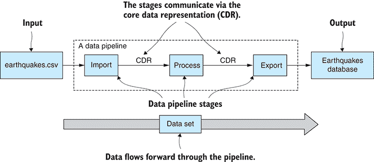

图 3.1 通过核心数据表示进行通信的阶段数据处理管道

阶段的分离也为我们提供了灵活性——我们可以通过重新排列阶段或添加和删除阶段来重构我们的数据处理管道。这些修改很容易进行，因为阶段只依赖于 CDR，并且不需要任何特定的先前阶段顺序。

在本章中，我们将使用 CDR 来弥合导入和导出代码之间的差距。这使我们能够从可重用代码模块中拼接数据转换管道。我们可以混合和匹配导入和导出代码，构建一个可以将数据从任何一种格式转换为另一种格式的管道。

### 3.3.1 地震网站

让我们从一个例子开始，以帮助理解 CDR。假设我们正在维护一个报告全球地震活动的网站。该网站从各种来源收集世界各地的地震数据，并将其汇总到一个中心位置。对于研究人员和关心公民来说，有一个地方可以获取新闻和数据是非常有用的。

数据从哪里来？假设我们的网站必须从各种不同的来源和多种不同的格式读取数据。灵活性是关键。我们必须接受来自其他网站和组织的数据，无论它们以何种格式提供。我们还希望成为一个好的数据共享公民，因此我们不仅通过网页和可视化使数据可用，还希望以各种机器可读的格式提供数据。简而言之，我们必须将各种格式导入和导出到我们的数据处理管道中。

让我们看看一种特定数据格式的导入和导出。假设我们已经将数据文件 earthquakes.csv 导入到 CDR 中。它将看起来如图 3.2 和图 3.3 所示。

CDR 应该很容易理解：毕竟它只是一个数据 JavaScript 数组。每个数组元素对应于 earthquakes.csv 中的一行（如图 3.2 所示）。每个数组元素包含一个 JavaScript 对象，或者你可以称之为记录，每个字段对应于 earthquakes.csv 中的一列（如图 3.3 所示）。

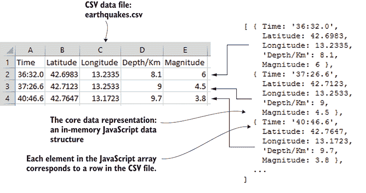

图 3.2 JavaScript 数组中的元素对应于 earthquakes.csv 中的行。

要创建数据转换管道，我们必须从一个数据格式导入，然后导出到另一个格式。作为一个例子，让我们以 earthquakes.csv 为例，将其导入 MongoDB 的地震数据库。为此，我们需要导入 CSV 文件中的数据的代码，然后是导出数据到 MongoDB 数据库的代码。我们很快就会看到代码；现在，注意在 图 3.4 中数据是如何通过位于中间的核心数据表示从导入到导出的。

我们不仅对 CSV 文件和 MongoDB 数据库感兴趣。我提到这些作为特定例子，以说明 CDR 如何连接我们的导入和导出代码。我们正在维护地震网站，我们需要接受和分享任何格式的数据！

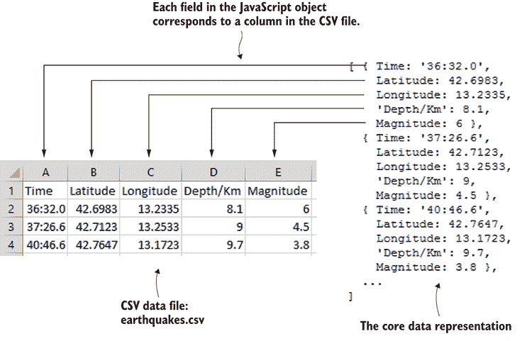

图 3.3 JavaScript 对象中的字段对应于 earthquakes.csv 中的列。

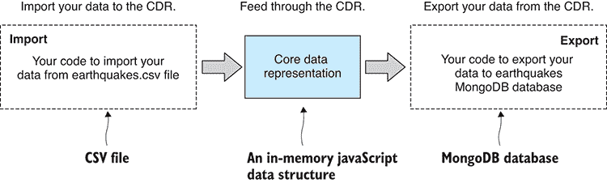

图 3.4 导入和导出代码流通过核心数据表示。

### 3.3.2 涵盖的数据格式

表 3.2 展示了本章我们将涵盖的数据格式范围。到结束时，你将学会导入和导出这些常见数据格式的基本方法。

表 3.2 第三章涵盖的数据格式

| **数据格式** | **数据来源** | **说明** |
| --- | --- | --- |
| JSON | 文本文件，REST API | JSON 格式内置在 JavaScript 中。方便且大多数 REST API 都使用它。 |
| CSV 格式比 JSON 更紧凑，且与 Excel 兼容。 |
| MongoDB | 数据库 | 灵活方便，无模式数据库。在你还不了解数据格式时非常理想。 |
| MySQL | 数据库 | 标准关系型数据库。成熟、健壮、可靠。 |

我想要传达给你的主要思想是，我们可以很容易地将各种数据格式插入到我们的工作流程中，只要我们需要它们。

在这本书中，你将学习一组常见但必要的有限数据格式，但这可能不会涵盖你最喜欢的数据格式。例如，有人问过我关于 XML、Microsoft SQL、PostgreSQL 和 Oracle。本书的目标不是涵盖所有可能的数据源；那样会很快变得无聊，所以我们将专注于一组代表性且常用的数据格式。

CSV 存在的原因是它在数据分析项目中非常常见。JSON 存在的原因是它在 JavaScript 中非常常见（而且非常方便）。我使用 MongoDB 来表示 NoSQL 类型的数据库。最后，我使用 MySQL 来表示 SQL 类型的数据库。

### 3.3.3 力量和灵活性

你已经理解了 CDR 设计模式的强大之处了吗？看看图 3.5 中数据格式是如何相互配合的。注意可以导入到 CDR 中的数据格式范围以及可以从 CDR 导出的数据格式范围。通过连接模块化的导入和导出代码（使用 CDR 进行通信），我们现在可以构建各种数据转换管道。

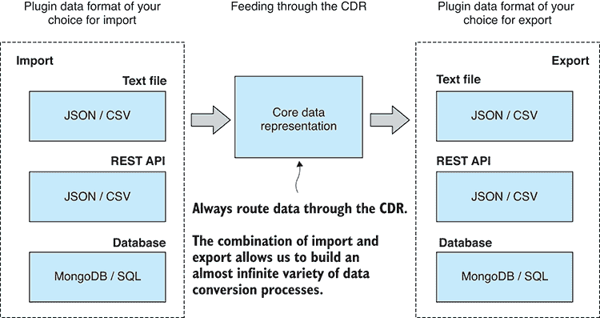

图 3.5 从多种数据格式中选择以构建自定义数据转换过程。

需要导入 JSON 并导出 MongoDB？没问题，我们可以做到！从 REST API 导入并导出到 CSV 呢？我们同样可以做到！使用 CDR 设计模式，我们可以轻松地将所需的数据转换连接起来，无论是从左侧的任何数据格式(图 3.5)导入，还是导出到右侧的任何格式。

## 3.4 导入数据

让我们从将数据导入 CDR 开始。我们首先将了解如何从文本文件和 REST API 加载数据。这两种方式在商业和数据科学场景中都很常见。在加载文本数据——无论是从文本文件还是 REST API——之后，我们需要根据特定的数据格式对其进行解析或解释。这通常是 JSON 或 CSV，两种常见的文本格式。最后，我们将从两种不同类型的数据库加载数据：MongoDB 和 MySQL。

### 3.4.1 从文本文件加载数据

我们从文本文件开始——这可能是最简单的数据存储机制——它们易于理解且普遍使用。在本节中，我们将学习如何将文本文件加载到内存中。最终，我们需要根据数据格式解析或解释文件中的数据，但首先让我们专注于从文件中加载，之后我们再回到解析的话题，届时我们也会看到如何从 REST API 加载文本数据。

将文本文件导入核心数据表示的一般过程如图 3.6 所示。在图表的右侧，注意路径分支；这就是我们将传入的数据解释为特定格式并将其解码到 CDR 的地方。不过，目前我们先加载文本文件到内存中。

在 Node.js 中，我们使用`fs.readFile`函数将文件内容读入内存。解析文件的方式根据数据格式而有所不同，但将文本文件读入内存的方式在每种情况下都是相同的，一个例子如列表 3.1 所示。你可以运行此代码，它将打印出文件 earthquakes.csv 的内容到控制台。

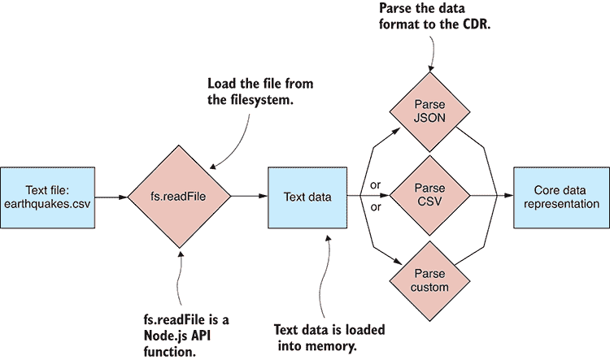

图 3.6 将文本文件导入 CDR

列表 3.1 将文本文件读入内存（listing-3.1.js）

```
const fs = require('fs');    ①  

fs.readFile("./data/earthquakes.csv", "utf8",    ②  
 (err, textFileData) => {    ③  
 if (err) {    ④  
 console.error(“An error occurred!”);    ④  
 return;    ④  
 }    ④  

 console.log(textFileData);    ⑤  
 }    ③  
).  ②   
```

列表 3.1 是在 Node.js 中加载文本文件的基本示例，但为了方便管理异步操作，我们现在将这个操作封装在 Promise 中。我们需要一些样板代码，我们将在每次加载文本文件时使用这些代码。我们将在整本书中多次重用这些代码，所以让我们将其转换成一个可重用的工具函数。

以下列表是您工具箱中的第一个函数。它位于一个我称为 file.js 的文件中，并定义了一个名为 `file` 的 Node.js 代码模块。目前，它包含一个名为 `read` 的单个函数。

列表 3.2 一个基于 Promise 的函数来读取文本文件（toolkit/file.js）

```
const fs = require('fs');

function read (fileName) {    ①  
 return new Promise((resolve, reject) => {    ②  
 fs.readFile(fileName, "utf8",    ③  
            function (err, textFileData) {
                if (err) {
 reject(err);    ④  
                    return;
                }

 resolve(textFileData);    ⑤  
            }
 );    ③  
 });    ②  
};    ①  

module.exports = {    ⑥  
 read: read,    ⑥  
};    ⑥   
```

列表 3.3 是我们如何使用新的 `read` 函数的一个示例。需要引入 `file` 模块，现在我们可以调用 `file.read` 来将 earthquakes.csv 加载到内存中。你可以运行代码，它将文件内容打印到控制台。你应该比较列表 3.1 和 3.3 的代码。这将帮助你理解基于回调和基于 Promise 的异步编程之间的区别。

列表 3.3 使用基于 Promise 的读取函数加载文本文件（listing-3.3.js）

```
const file = require('./toolkit/file.js');    ①  

file.read("./data/earthquakes.csv")    ②  
 .then(textFileData => {    ③  
 console.log(textFileData);    ④  
 }) //  ③  
 .catch(err => {    ⑤  
 console.error("An error occurred!");    ⑤  
 });    ⑤   
```

从文本文件加载数据说明了将文本数据放入内存的一种方法；现在让我们看看另一种方法。

### 3.4.2 从 REST API 加载数据

我们可以从文本文件中加载数据，所以现在让我们看看如何使用 HTTP（超文本传输协议）从 REST（表示状态传输）API 加载数据。这是从网站或网络服务通过互联网获取数据的一种常见方式。在这里，我们同样会将数据加载到内存中；然后我们再回来看看如何根据其格式解释数据。

从 REST API 导入数据的一般过程在 图 3.7 中展示。要通过 HTTP 获取数据，我们使用第三方库 request-promise。Node.js API 内置了对 HTTP 通信的支持，但我更喜欢使用更高层次的 request-promise 库，因为它更简单、更方便，并且它为我们封装了操作在 Promise 中。

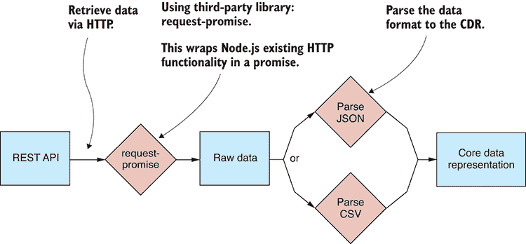

图 3.7 从 REST API 导入数据到 CDR

从 REST API 获取数据，我们需要安装 request-promise。如果你正在跟随 GitHub 上的代码进行操作，并在代码仓库中执行了 `npm install`，那么你已经安装了这个依赖项。如果你需要在新的 Node.js 项目中安装它，你可以这样做：

```
npm install –-save request-promise request 
```

注意，我们安装了 `request-promise` 和 `request`，因为前者作为依赖项依赖于后者。

作为例子，我们将从 [`earthquake.usgs.gov/earthquakes/feed/v1.0/summary/significant_month.geojson`](https://earthquake.usgs.gov/earthquakes/feed/v1.0/summary/significant_month.geojson) 拉取数据。你现在应该打开这个链接，你会在你的网络浏览器中看到 JSON 数据的样子。

以下列表展示了使用 `request-promise` 的 `request.get` 函数通过 HTTP GET 获取数据的简单代码。你可以运行此代码，检索到的数据将打印到控制台，以便你可以进行检查。

列表 3.4 从 REST API 获取数据（listing-3.4.js）

```
const request = require('request-promise');    ①  

const url = "https://earthquake.usgs.gov" +    ②  
 "/earthquakes/feed/v1.0/summary/significant_month.geojson";    ②  

request.get(url)    ③  
 .then(response => {    ④  
 console.log(response);    ④  
 })    ④  
 .catch(err => {    ⑤  
 console.error(err);    ⑤  
 });    ⑤   
```

### 3.4.3 解析 JSON 文本数据

现在我们能够将文本数据加载到内存中，无论是从文本文件还是从 REST API，我们必须决定如何解码内容。处理原始文本数据可能会很痛苦、耗时且容易出错；然而，当我们处理一个通用或标准化的数据格式，如 JSON 或 CSV 时，我们可以利用现有的库来导入或导出数据。

JSON 是我们将从文本数据中解析的第一个数据格式。它是你在使用 JavaScript 时会遇到的最常见的数据格式之一。它易于理解，与 JavaScript 密不可分。用于处理 JSON 的工具内置在 JavaScript API 中，这使得 JSON 对我们来说是一个特别吸引人的格式。

#### 解析 JSON 文本文件

在我们尝试导入数据文件之前，打开文件在文本编辑器中并直观地验证数据是否是我们所期望的是个好主意。尝试处理一个损坏或有其他问题的数据文件是没有意义的，我们可以在开始编码之前轻松快速地检查这一点。这不会捕捉到所有可能的问题，但你可能会惊讶于通过首先进行简单的视觉检查就能发现多少数据问题。图 3.8 展示了在 Notepad++（我在 Windows PC 上使用的文本编辑器）中加载的 earthquakes.json。

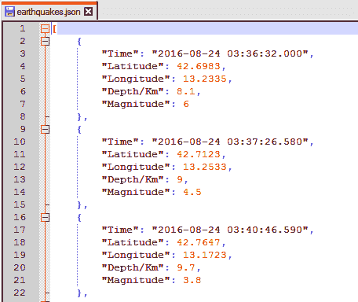

图 3.8 在 Notepad++ 中查看 Earthquakes.json

现在我们将 earthquakes.json 导入到核心数据表示中。使用 Node.js 和 JavaScript API 提供的工具来做这件事尤其简单。JSON 格式是序列化的 JavaScript 数据结构，因此它与核心数据表示直接对应。为了读取文件，我们使用我们的工具函数 `file.read`。然后我们使用内置的 JavaScript 函数 `JSON.parse` 将文本数据解码到 CDR。这个过程在 图 3.9 中展示。

下面的列表是一个新的函数，用于将 JSON 文件导入到核心数据表示中。我们使用我们的函数 `file.read` 读取文件内容，然后使用 `JSON.parse` 解析 JSON 数据。

列表 3.5 导入 JSON 文本文件的函数（toolkit/importJsonFile.js）

```
const file = require('./file.js');    ①  

//
// Toolkit function to import a JSON file.
//
function importJsonFile (filePath) {    ②  
 return file.read(filePath)    ③  
 .then(textFileData => {    ④  
 return JSON.parse(textFileData);    ⑤  
 });    ④  
};    ⑥  

module.exports = importJsonFile;    ⑥   
```

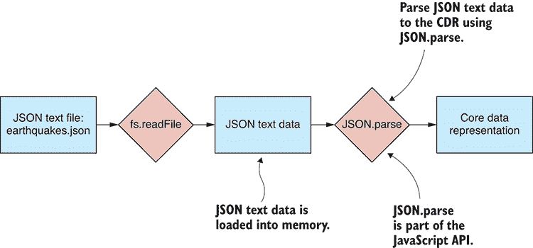

图 3.9 将 JSON 文本文件导入到 CDR

下面的列表展示了如何使用我们的新函数导入 earthquakes.json。你可以运行此代码，解码后的数据将打印到控制台，以便我们可以直观地验证数据是否正确解析。

列表 3.6 从 earthquakes.json 导入数据（listing-3.6.js）

```
const importJsonFile = require('./toolkit/importJsonFile.js');    ①  

importJsonFile("./data/earthquakes.json")    ②  
 .then(data => {    ③  
 console.log(data);    ④  
 })    ③  
 .catch(err => {    ⑤  
 console.error("An error occurred.");    ⑤  
        console.error(err.stack);
 });    ⑤   
```

#### 从 REST API 解析 JSON 数据

从 REST API 导入 JSON 数据与从文本文件导入类似。我们需要更改数据加载的位置。而不是使用 `file.read` 函数，我们可以使用我们的 `request-promise` 从 REST API 加载数据。以下列表显示了一个用于工具包的新函数，用于从 REST API 导入 JSON 数据。

列表 3.7 从 REST API 导入 JSON 数据 (toolkit/importJsonFromRestApi.js)

```
const request = require('request-promise');    ①  

function importJsonFromRestApi (url) {    ②  
 return request.get(url)    ③  
        .then(response => {
            return JSON.parse(response);
        });
};    ②  

module.exports = importJsonFromRestApi;    ④   
```

列表 3.8 展示了如何调用 `importJsonFromRestApi` 从之前在 列表 3.4 中也使用过的示例 REST API 导入数据。此代码与 列表 3.6 类似，但不是从文件加载数据，而是从 REST API 加载数据。运行此代码，您将看到它是如何操作的，它会抓取数据，然后将解码后的 JSON 数据打印到控制台，以便您可以检查它是否按预期工作。

列表 3.8 从 REST API 导入地震数据 (listing-3.8.js)

```
const importJsonFromRestApi = require('./toolkit/importJsonFromRestApi.js');    ①  

const url = "https://earthquake.usgs.gov/earthquakes/feed/v1.0/summary/significant_mont[CA]h.geojson";

importJsonFromRestApi(url)    ②  
 .then(data => {    ③  
 const earthquakes = data.features.map(feature => {    ④  
 const earthquake = Object.assign({},    ④  
 feature.properties,    ④  
 { id: feature.id }  ④  
 );    ④  
            return earthquake;
        });
 console.log(earthquakes);    ⑤  
 })    ③  
 .catch(err => {    ⑥  
 console.error("An error occurred.");    ⑥  
 console.error(err.stack);    ⑥  
 });    ⑥   
```

注意在 列表 3.8 中，如何将传入的数据重新组织以符合我们对 CDR 的想法。传入的 JSON 数据的结构与我们希望它符合的结构并不完全一致，因此我们即时将其重写为表格格式。

### 3.4.4 解析 CSV 文本数据

我们接下来要查看的格式是 CSV（逗号分隔值）格式。这种简单的格式在数据科学社区中很常见。它直接表示表格数据，并且比 JSON 格式更紧凑。

不幸的是，我们需要解析 CSV 文件的工具并未包含在 Node.js 或 JavaScript 中，但我们可以很容易地从 npm 获取所需的内容。在这种情况下，我们将安装一个名为 Papa Parse 的优秀第三方库来解析 CSV 文件。

#### 解析 CSV 文本文件

与 JSON 类似，我们首先应该检查 CSV 文件的内容是否格式良好且未损坏。我们可以像查看 JSON 文件时一样查看 CSV 文件，但值得注意的是，CSV 文件也可以作为工作表加载！图 3.10 显示了 earthquakes.csv 在 Excel 中的加载情况。


图 3.10 在 Excel 中加载的 Earthquakes.csv

应该注意，CSV 文件也可以从常规 Excel 工作表中导出，这意味着我们可以在处理 CSV 时使用 Excel 的所有功能。我发现 CSV 格式在需要与使用 Excel 的人交换数据时非常有用。

让我们将我们的 CSV 文件导入到核心数据表示中。这比 JSON 更困难一些，但只是因为我们必须安装第三方库 Papa Parse 来完成解析 CSV 数据的工作。与 JSON 不同，CSV 格式并不直接与 CDR 对齐，因此在导入过程中需要重新结构化。幸运的是，Papa Parse 会处理这一点。

与 JSON 类似，我们首先将 CSV 文本文件读取到内存中；之后，我们使用 Papa Parse 将文本数据解码为 CDR。这个过程在图 3.11 中有所说明。你可能已经知道 CSV 文件的结构，但如果你不知道，图 3.12 展示了在 Notepad++ 中查看的 CSV 文件结构。

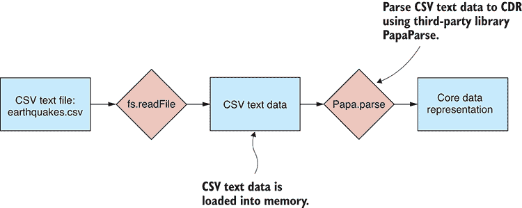

图 3.11 将 CSV 文本文件导入到 CDR

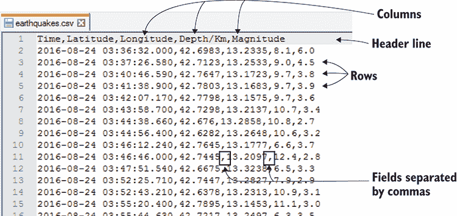

图 3.12 CSV 文件的结构

CSV 文件是一个普通的文本文件：文件的每一行都是一行数据。然后每一行被分割成字段，这些字段由逗号分隔，因此得名。这个格式除了我刚才描述的之外，没有更多内容。

如果你正在使用本章的 GitHub 仓库并且已经执行了 `npm install`，那么你已经在 Node.js 项目中安装了 Papa Parse。如果没有，你可以在新的 Node.js 项目中按照以下方式安装 Papa Parse：

```
`npm install –-save papaparse` 
```

下面的代码示例是我们下一个工具包函数；这个函数将 CSV 文件导入到核心数据表示中。同样，我们使用我们的工具包函数 `file.read` 将文件加载到内存中；然后使用 `papa.parse` 解析 CSV 数据。

列表 3.9 导入 CSV 文本文件的函数（toolkit/importCsvFile.js）

```
const papa = require('papaparse');    ①  
const file = require('./file.js');    ②  

function importCsvFile (filePath) {    ③  
 return file.read(filePath)    ④  
 .then(textFileData => {    ⑤  
 const result = papa.parse(textFileData, {    ⑥  
 header: true,    ⑦  
 dynamicTyping: true,    ⑧  
 });    ⑤  
 return result.data;    ⑨  
 });    ⑤  
};    ③  

module.exports = importCsvFile;    ⑩   
```

注意与 Papa Parse 一起使用的选项。`header` 选项使 Papa Parse 识别 CSV 文件的第一个行作为标题行，该行指定了表格数据的列名。

`dynamicTyping` 选项启用了 Papa Parse 的自动类型转换。这为每个字段值选择一个类型，取决于值的类型。这是必需的，因为 CSV 格式与 JSON 不同，没有对数据类型的特殊支持。CSV 中的每个字段只是一个字符串值，但 Papa Parse 会为我们确定实际的数据类型。这个功能很方便，并且大多数时候都能正常工作。有时，尽管如此，它可能会选择错误的类型，或者出于某种原因，你可能想要更多的控制权，以便能够应用你自己的约定。

下面的代码示例使用我们新的函数导入 earthquakes.csv。你可以运行这个代码示例，你将看到解码后的数据打印到控制台，以便你可以检查导入是否成功。

列表 3.10 从 earthquakes.csv 导入数据（listing_3.10.js）

```
const importCsvFile = require('./toolkit/importCsvFile.js');    ①  

importCsvFile("./data/earthquakes.csv")    ②  
 .then(data => {    ③  
 console.log(data);    ④  
 })    ③  
 .catch(err => {    ⑤  
 console.error("An error occurred.");    ⑤  
 console.error(err.stack);    ⑤  
 });    ⑤   
```

#### 从 REST API 解析 CSV 数据

与 JSON 类似，使用 CSV，我们也有从文本文件或 REST API 加载 CSV 的选项。为此，我们将 `file.read` 替换为 `request-promise` 以从 REST API 加载数据而不是从文本文件。下面的代码示例是一个新的函数 `importCsvFromRestApi`，它执行此操作，我们可以使用它从 REST API 导入 CSV 数据。

列表 3.11 从 REST API 导入 CSV 数据的函数（toolkit/importCsvFromRestApi.js）

```
const request = require('request-promise');    ①  
const papa = require('papaparse');    ②  

function importCsvFromRestApi (url) {    ③  
 return request.get({    ④  
 uri: url,    ④  
 json: false    ④  
 })    ④  
        .then(response => {
 const result = papa.parse(response, {    ⑤  
 header: true,    ⑤  
 dynamicTyping: true    ⑤  
 });    ⑤  

            return result.data;
        });
};    ⑥  

module.exports = importCsvFromRestApi; 
```

列表 3.12 使用`importCsvFromRestApi`函数从[`earthquake.usgs.gov/fdsnws/event/1/query.csv`](https://earthquake.usgs.gov/fdsnws/event/1/query.csv)的 REST API 导入 CSV 数据。你可以运行以下代码列表，它将通过你的网络拉取 CSV 数据，对其进行解码，然后将其打印到控制台以便你可以检查。

列表 3.12 从 REST API 导入 CSV 数据（listing-3.12.js）

```
const importCsvFromRestApi = require('./toolkit/importCsvFromRestApi.js');    ①  

const url = "https://earthquake.usgs.gov/fdsnws/event/1/query. ➥csv?starttime=2017-01-01&endtime=2017-03-02";    ②  
importCsvFromRestApi(url)    ③  
 .then(data => { //  ④  
 console.log(data); //  ④  
```

```
 }) //  ④   
```

```
 .catch(err => {    ⑤  
 console.error(err);    ⑤  
 });    ⑤   
```

这使我们到达了从文本文件加载和解析数据的结束。请注意，存在其他可能需要加载的数据格式，但在这里我们只使用了两种最常见的格式：CSV 和 JSON。在实践中，你也可能需要处理 XML 文件、YAML 文件等等——但任何你可以想到的新格式都可以通过 CDR 插入到你的数据管道中。

我们将在第四章回到文本文件，学习如何使用正则表达式处理不寻常的文本文件格式，对于那些我们必须导入自定义或专有数据格式的情况。

### 3.4.5 从数据库导入数据

在我们完成查看数据导入之前，我们需要学习如何从数据库导入到核心数据表示。正如你可以想象的，数据库在数据整理的世界中非常重要。它们通常是我们的数据管道的一个组成部分，并且对于有效地处理大量数据是必要的。数据库通常使用第三方访问库通过网络协议访问，如图图 3.13 所示。许多数据库产品都是可用的，但在这里我们将关注两个最常见的：MongoDB 和 MySQL。

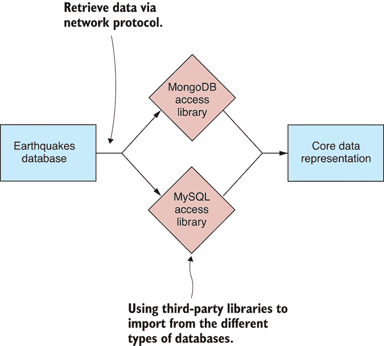

图 3.13 从数据库导入到 CDR

### 3.4.6 从 MongoDB 导入数据

MongoDB 是一个流行的 NoSQL 数据库，也是我首选的数据库，因为它提供了便利性、灵活性和性能的良好组合。作为 NoSQL 数据库，MongoDB 是无模式的。MongoDB 不会对你的数据施加固定的模式，因此我们不需要预先定义数据库的结构。

我发现当处理我还不太理解的数据时，这很有用。MongoDB 意味着我可以将数据扔进数据库，并将关于结构的问题留到以后解决。使用 MongoDB 并不意味着我们拥有非结构化数据——远非如此；我们可以在 MongoDB 中轻松表达结构，但这意味着我们不需要担心在前面定义这种结构。就像任何数据导入工作一样，我们应该在编写导入代码之前先查看数据。图 3.14 展示了通过 Robomongo 查看的示例地震数据库。

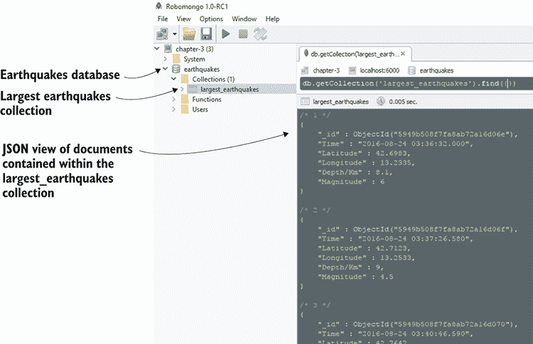

图 3.14 使用 Robomongo 数据库查看器查看地震 MongoDB 数据库

您有多种方式从 MongoDB 数据库中检索数据。在这里，我们将使用`promised-mongo`，这是一个第三方库，它模拟 Mongo shell 并提供了一个优雅的基于承诺的 API。我们在这里使用`promised-mongo`是因为这是一种稍微容易一些的开始使用 MongoDB 的方法，并且它与我们在 Mongo shell 和 Robomongo 中也可以使用的命令类似。在第八章，当我们回到 MongoDB 时，我们将使用官方的 MongoDB 访问库。

我们使用`promised-mongo`将数据从 MongoDB 导入到核心数据表示中，如图 3.15 所示。请注意，与处理文本文件不同，不需要额外的解析步骤；数据库访问库会处理这一点。

如果您正在使用 GitHub 存储库并执行了`npm install`，您已经安装了`promised-mongo`。否则，您可以在新的 Node.js 项目中按照以下方式安装它：

```
npm install –-save promised-mongo 
```


图 3.15 从 MongoDB 地震数据库导入到 CDR

MongoDB 数据库易于安装：您可以在[www.mongodb.com](http://www.mongodb.com)找到下载和更多信息。为了您的方便，第三章的 GitHub 存储库包含一个 Vagrant 脚本，您可以使用它启动一个已经安装了 MongoDB 数据库的虚拟机，其中包括示例地震数据。要使用此脚本，您需要安装 Vagrant 和 Virtual Box，我在附录 C，“开始使用 Vagrant”中进行了说明。

Vagrant 允许您创建模拟生产环境的虚拟机。我使用 Vagrant 是为了让您能够快速启动一个带有数据库的机器，这为您提供了一个方便的数据源来尝试列表 3.13 和 3.14 中的示例代码。如果您不想使用 Vagrant，但想尝试这段代码，那么您需要在您的开发 PC 上安装 MongoDB，并手动将数据加载到数据库中。

一旦您安装了 Vagrant 和 Virtual Box，您可以按照以下方式启动虚拟机：

```
cd Chapter-3/MongoDB
vagrant up 
```

虚拟机需要一些时间来准备。当它完成时，您将拥有一个包含地震数据的 MongoDB 数据库，可以立即使用。Vagrant 已将默认的 MongoDB 端口 27017 映射到我们本地 PC 的 6000 端口（假设该端口尚未被占用）。这意味着我们可以像它实际在虚拟机上运行一样，在本地 PC 的 6000 端口访问 MongoDB 数据库（而不是在它实际运行的虚拟机上）。

当您完成 MongoDB 虚拟机的使用后，不要忘记销毁它，以免它继续消耗您的系统资源：

```
cd Chapter-3/MongoDB
vagrant destroy 
```

下面的列表是我们的下一个工具函数。它使用 MongoDB 的`find`函数将数据从 MongoDB 集合导入到核心数据表示中。

列表 3.13 从 MongoDB 集合导入数据的函数（toolkit/importFromMongoDB.js）

```
function importFromMongoDB (db, collectionName) {    ①  
 return db[collectionName].find().toArray();    ②  
};    ①  

module.exports = importFromMongoDB;    ③   
```

下面的列表显示了如何使用函数从 largest_earthquakes*集合导入数据。运行此代码将检索数据库中的数据并将其打印到控制台供您检查。

*列表 3.14 从 MongoDB 导入 largest earthquakes 集合（listing-3.14.js）

```
const mongo = require('promised-mongo');    ①  
const importFromMongoDB = require('./toolkit/importFromMongoDB.js');    ②  

const db = mongo(  ③  
 "localhost:6000/earthquakes",    ③  
 ["largest_earthquakes"]    ③  
);    ③  

importFromMongoDB(db, "largest_earthquakes")    ④  
 .then(data => {    ⑤  
 console.log(data);    ⑤  
 })    ⑤  
 .then(() => db.close())    ⑥  
 .catch(err => {    ⑦  
 console.error(err);    ⑦  
 });    ⑦   
```

注意在列表 3.14 中，我们如何使用连接字符串`localhost:6000/earthquakes`连接到 MongoDB 数据库。这假设我们正在连接到运行在 Vagrant 虚拟机上的名为*earthquakes*的 MongoDB 数据库，并且 MongoDB 数据库实例映射到主机 PC 上的 6000 端口。

您必须更改此连接字符串以连接到不同的数据库。例如，如果您在本地 PC 上安装了 MongoDB（而不是使用 Vagrant 虚拟机），您可能会发现 MongoDB 正在使用其默认端口 27017。如果是这种情况，您需要使用连接字符串`localhost:27017/earthquakes`。考虑到*localhost*和*27017*是默认值，您甚至可以省略这些部分，直接使用`earthquakes`作为您的连接字符串。

您也可以通过在连接字符串中提供有效的主机名来通过互联网连接到 MongoDB 数据库。例如，如果您有一个名为*my_host.com*的机器上的可访问互联网数据库，那么您的连接字符串可能看起来像这样：`my_host.com:27017/my_database.`。

### 3.4.7 从 MySQL 导入数据

在查看数据导入之前，我们无法完成对数据的查看。SQL 是商业世界的基石，大量数据包含在 SQL 数据库中。在这里，我们查看从 MySQL 导入数据，MySQL 是一个流行的 SQL 数据库。

正如我们在其他情况下所做的那样，在我们进入代码之前，我们应该首先查看数据库中的数据。在图 3.16 中，您可以通过 HeidiSQL 数据库查看器看到地震数据库和 largest_earthquakes 集合。

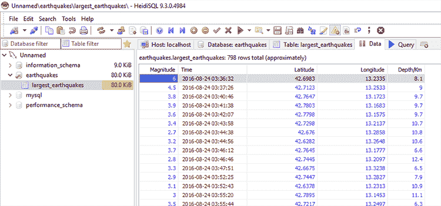

图 3.16 使用 HeidiSQL 数据库查看器查看 largest_earthquakes 表

要从 MySQL 读取数据，我们将使用一个名为`nodejs-mysql`的第三方库。图 3.17 说明了从地震数据库检索数据并将其导入核心数据表示的过程。

如果您正在使用 GitHub 仓库并执行了`npm install`，您已经安装了`nodejs-mysql`。否则，您可以在新的 Node.js 项目中按以下方式安装它：

```
npm install –-save nodejs-mysql 
```

MySQL 的设置比 MongoDB 要复杂一些。在安装 MySQL 并在导入数据之前，您必须定义模式，这在 MongoDB 中是不必要的。MySQL 的下载和安装说明可以在[`www.mysql.com`](http://www.mysql.com)找到。

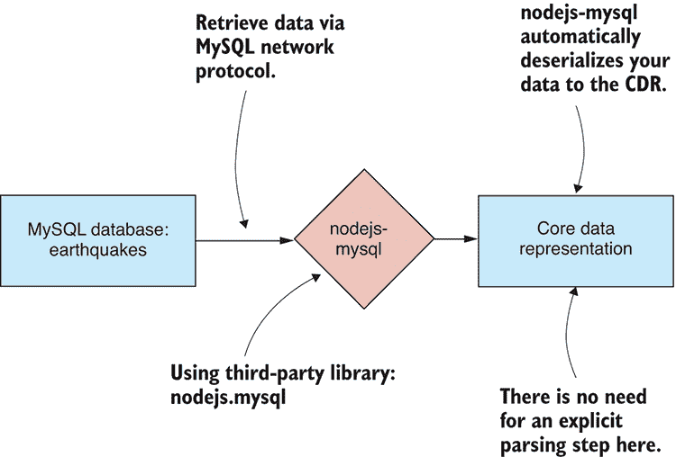

图 3.17 从 SQL 数据库导入数据到 CDR

为了您的方便，第三章的 GitHub 仓库包含另一个 Vagrant 脚本，该脚本将启动一个带有已安装 MySQL 数据库的虚拟机，其中包含地震数据库，您可以使用它来尝试列表 3.15 和 3.16 中的代码。您需要安装 Vagrant 和 Virtual Box，您可能已经从之前的 MongoDB 示例中安装了它们。

使用以下命令启动虚拟机：

```
cd Chapter-3/MySql
vagrant up 
```

虚拟机需要一些时间来准备。一旦完成，您将拥有一个包含地震数据库的 MySQL 数据库，可以开始使用。Vagrant 将默认的 MySQL 端口 3306 映射到我们本地电脑的端口 5000（假设端口 5000 没有被占用）。您可以在端口 5000 上访问您的 PC 上的 MySQL 数据库，就像它在那里运行一样（而不是在实际上运行的虚拟机上）。

一旦您完成虚拟机的使用，不要忘记销毁它，以免它继续消耗您的系统资源：

```
cd Chapter-3/MySql
vagrant destroy 
```

有关设置和使用 Vagrant 的更多信息，请参阅附录 C。

列表 3.15 定义了 `importFromMySql` 函数，其中包含执行 SQL 命令并导入数据到核心数据表示所需的简单代码。

列表 3.15 从 MySQL 数据库导入数据的函数（toolkit/importFromMySql.js）

```
function importFromMySql (db, tableName) {    ①  
 return db.exec("select * from " + tableName);    ②  
};    ①  

module.exports = importFromMySql;    ③   
```

列表 3.16 展示了如何使用 `importFromMySql` 函数。它连接到地震数据库，并从 largest_earthquakes 表中导入数据。运行此代码，它将从 MySQL 数据库检索数据并将其打印到控制台，以便我们可以进行检查。

列表 3.16 从 MySQL 导入最大地震表（listing-3.16.js）

```
const importFromMySql = require('./toolkit/importFromMySql.js');    ①  
const mysql = require('nodejs-mysql').default;

const config = {    ②  
 host: "localhost",    ②  
 port: 5000,    ③  
 user: "root",    ②  
 password: "root",    ②  
 database: "earthquakes",    ④  
 dateStrings: true,    ②  
 debug: true    ②  
};    ②  

const db = mysql.getInstance(config);    ⑤  

return importFromMySql(db, "largest_earthquakes")    ⑥  
 .then(data => {    ⑦  
 console.log(data);    ⑦  
 })    ⑦  
 .catch(err => {    ⑧  
 console.error(err);    ⑧  
 });    ⑧   
```

## 3.5 导出数据

我们已经完成了关于将数据导入内存的学习。在本章的后半部分，我们将探讨等式的另一面：*导出数据*。我们将学习如何将数据从我们的数据管道导出到各种数据格式和存储机制。就像我们学习导入时一样，我们将从文本文件开始，并以 MongoDB 和 MySQL 数据库结束。

### 3.5.1 您需要导出数据！

通过导入数据的代码示例，我们将导入的数据打印到控制台以检查一切是否按预期工作。导出略有不同。在我们能够导出数据之前，我们需要导出的示例数据！

在本章的剩余部分，我们将使用 earthquakes.csv 作为示例数据。导出代码示例的一般模式在 图 3.18 中展示。首先，我们使用之前创建的工具包函数 `importCsvFile` 将 earthquakes.csv 加载到 CDR 中。随后是导出过程的其余部分，这取决于我们导出的数据格式。以下列表展示了代码中的通用导出过程。您可以看到，在导入 earthquakes.csv 之后，我们有一个空白槽，可以插入我们的导出代码。

列表 3.17 数据导出示例代码的一般模式（toolkit/file.js）

```
const importCsvFile = require('./importCsvFile');    ①  

importCsvFile("./data/earthquakes.csv")    ②  
 .then(earthquakesData => {    ③  
        //
        // ... Export code here ...
        //
 })    ③  
 .catch(err => {    ④  
 console.error("An error occurred.");    ④  
 console.error(err.stack);    ④  
 });    ④   
```

### 3.5.2 将数据导出到文本文件

将数据导出到文本文件的过程始于将我们持有的核心数据表示形式中的数据进行序列化。我们必须首先选择我们的数据格式：在这里，我们将数据导出为 JSON 或 CSV 格式。我们的数据在内存中以文本形式进行序列化。然后我们使用 Node.js 函数`fs.writeFile`将文本数据写入文件系统。这个过程在图 3.19 中进行了说明。

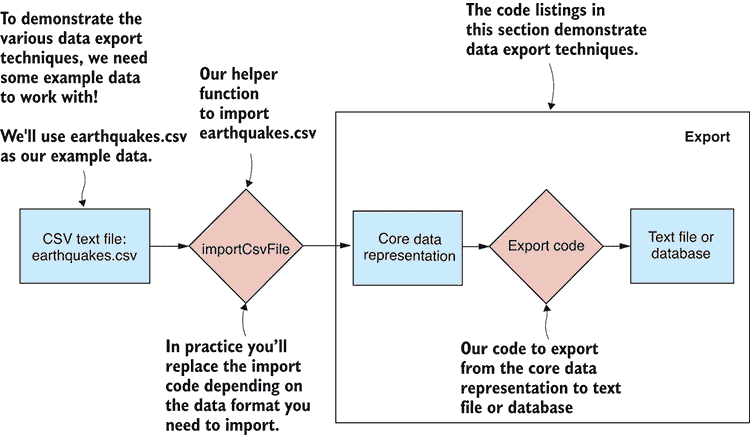

图 3.18 数据导出示例的一般格式

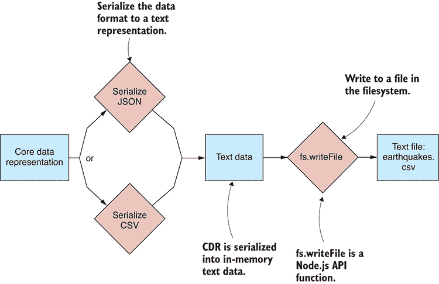

图 3.19 从 CDR 导出到文本文件

正如我们在 Node 的`fs.readFile`函数中所做的那样，我们创建了一个函数，该函数将`fs.writeFile`包装在一个 Promise 中。我们希望将我们的文件相关函数放在一起，所以让我们将新的`write`函数添加到以下列表中现有的文件模块中。

列表 3.18 基于 Promise 的函数用于写入文本文件（toolkit/file.js）

```
const fs = require('fs');

//
// ... read toolkit function ...

function write (fileName, textFileData) {    ①  
 return new Promise((resolve, reject) => {    ②  
 fs.writeFile(fileName, textFileData,    ③  
            (err) => {
                if (err) {
 reject(err);    ④  
                    return;
                }

 resolve();    ⑤  
            }
        );
 });    ②  
};    ①  

module.exports = {    ⑥  
 read: read,    ⑥  
 write: write,    ⑥  
};    ⑥   
```

在接下来的几节中，我们将使用我们新的工具包函数将数据写入 JSON 和 CSV 文件。

### 3.5.3 将数据导出到 JSON 文本文件

要从 CDR 导出到 JSON，请使用内置的 JavaScript 函数`JSON.stringify`。将我们的数据序列化为文本后，然后按照图 3.20 所示将其写入 earthquakes.json 文件。以下列表显示了新的函数`exportJsonFile`，该函数将我们的数据导出到 JSON 文件。

列表 3.19 导出数据到 JSON 文本文件的函数（toolkit/exportJsonFile.js）

```
const file = require('./file.js');    ①  

function (fileName, data) {  ②  
 const json = JSON.stringify(data, null, 4);    ③  
 return file.write(fileName, json);    ④  
};    ②  

module.exports = exportJsonFile;    ⑤   
```

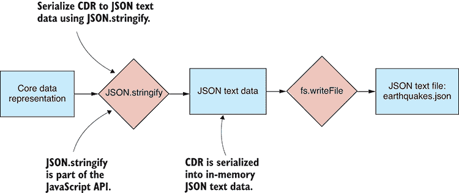

图 3.20 从 CDR 导出到 JSON 文本文件

以下列表使用`exportJsonFile`函数将我们的数据导出到 JSON 文件。您可以运行此代码，您会发现它在*output*文件夹中生成了一个名为 earthquakes.json 的文件。

列表 3.20 将数据导出到 earthquakes.json（listing-3.20.js）

```
const importCsvFile = require('./toolkit/importCsvFile.js');    ①  
const exportJsonFile = require('./toolkit/exportJsonFile.js');    ②  

importCsvFile("./data/earthquakes.csv")    ③  
 .then(data => exportJsonFile("./output/earthquakes.json", data))    ④  
 .catch(err => {    ⑤  
 console.error("An error occurred.");    ⑤  
 console.error(err.stack);    ⑤  
 });    ⑤   
```

### 3.5.4 将数据导出到 CSV 文本文件

CSV 导出不是 JavaScript 内置的，所以我们再次转向 Papa Parse 来实现这一功能。这次我们使用函数`papa.unparse`将我们的数据序列化为 CSV 文本。然后我们使用`file.write`函数将数据写入 earthquakes.csv。这个过程在图 3.21 中进行了说明。以下列表显示了我们的函数`exportCsvFile`，该函数使用`papa.unparse`将数据导出到 CSV 文件。

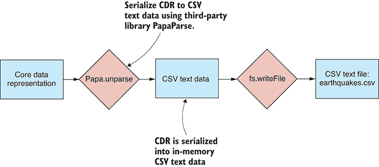

图 3.21 从 CDR 导出到 CSV 文本文件

列表 3.21 导出数据到 CSV 文本文件的函数（toolkit/exportCsvFile.js）

```
const papa = require('papaparse');    ①  
const file = require('./file.js');    ②  

function exportCsvFile (fileName, data) {    ③  
 const csv = papa.unparse(data);    ④  
 return file.write(fileName, csv);    ⑤  
};    ③  

module.exports = exportCsvFile;    ⑥   
```

列表 3.22 使用`exportCsvFile`函数将我们的数据导出到 CSV 文件。运行此代码，它将在输出文件夹中生成名为 earthquakes-export.csv 的文件。

列表 3.22 将数据导出到 earthquakes.csv（listing-3.22.js）

```
const importCsvFile = require('./toolkit/importCsvFile.js');    ①  
const exportCsvFile = require('./toolkit/exportCsvFile.js');    ②  

importCsvFile("./data/earthquakes.csv")    ③  
 .then(data =>    ④  
 exportCsvFile("./output/earthquakes-export.csv", data)    ④  
 )    ④  
    .catch(err => {
        console.error("An error occurred.");
        console.error(err.stack);
    }); 
```

### 3.5.5 将数据导出到数据库

将我们的数据导出到数据库对于我们有效地处理数据是必要的。有了数据库，我们可以在需要时轻松高效地检索过滤和排序后的数据。

图 3.22 展示了整个过程。核心数据表示被输入到数据库访问库中。通常，库通过网络与数据库接口以存储数据。

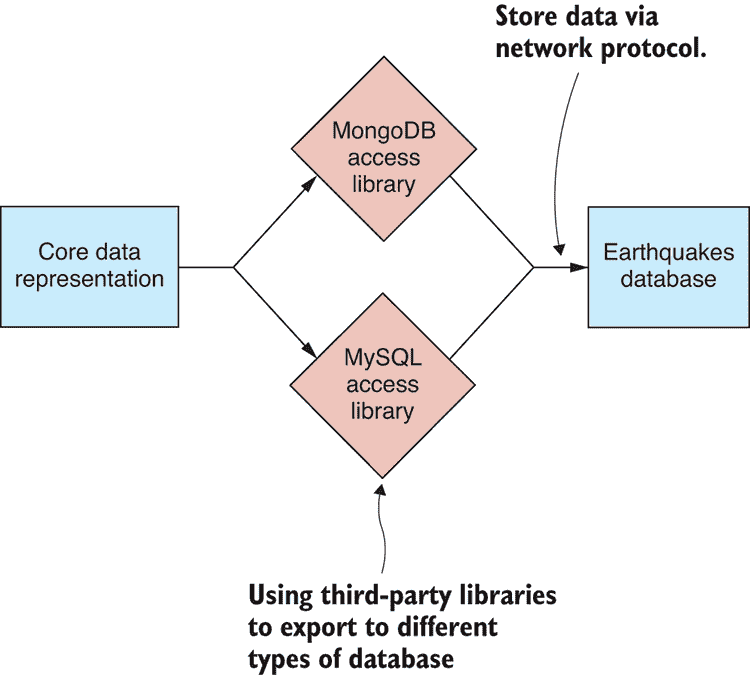

图 3.22 从 CDR 导出到数据库

### 3.5.6 将数据导出到 MongoDB

我们可以使用之前安装的第三方库 `promised-mongo` 将数据导出到 MongoDB。这在上面的 图 3.23 中展示。

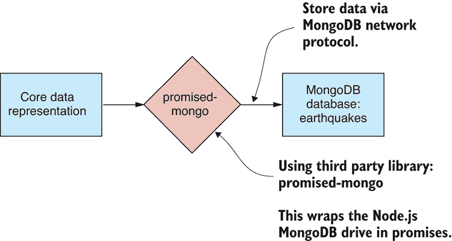

图 3.23 从 CDR 导出到 MongoDB 数据库

您的工具箱函数，用于将数据导出到 MongoDB，如以下列表所示，是最简单的一种。几乎不值得为这个单独创建一个函数，但我为了完整性而包含了它。对于特定的数据库和集合，它调用 `insert` 函数来插入记录数组。

列表 3.23 导出数据到 MongoDB 的函数（toolkit/exportToMongoDB.js）

```
function exportToMongoDB (db, collectionName, data) {    ①  
 return db[collectionName].insert(data);    ②  
 };    ①   

module.exports = exportToMongoDB;    ③   
```

在 列表 3.24 中展示了一个具体示例。这段代码连接到一个在 Vagrant 虚拟机上运行的 MongoDB 实例。数据库访问端口映射到我们的开发 PC 上的 6000 端口。示例数据从 earthquakes.csv 导入；然后我们调用 `exportToMongoDB` 函数并将数据存储在 MongoDB 数据库中。你可以运行这段代码，它将在数据库中创建并填充一个名为 largest_earthquakes_export*.* 的新集合。

列表 3.24 将数据导出到 MongoDB 的 largest_earthquakes 集合（listing-3.24）

```
const importCsvFile = require('./toolkit/importCsvFile.js');    ①  
const exportToMongoDB = require('./toolkit/exportToMongoDB.js');    ②  
const mongo = require('promised-mongo');    ③  

const db = mongo("localhost:6000/earthquakes",    ④  
 ["largest_earthquakes_export"]    ④  
);    ④  

importCsvFile("./data/earthquakes.csv")    ⑤  
    .then(data =>
 exportToMongoDB(db, "largest_earthquakes_export", data)    ⑥  
)
 .then(() => db.close())    ⑦  
 .catch(err => {    ⑧  
 console.error("An error occurred.");    ⑧  
 console.error(err.stack);    ⑧  
 });    ⑧   
```

### 3.5.7 将数据导出到 MySQL

我们可以使用之前安装的第三方库 `nodejs-mysql` 将数据导出到 MySQL。这个过程在 图 3.24 中展示。

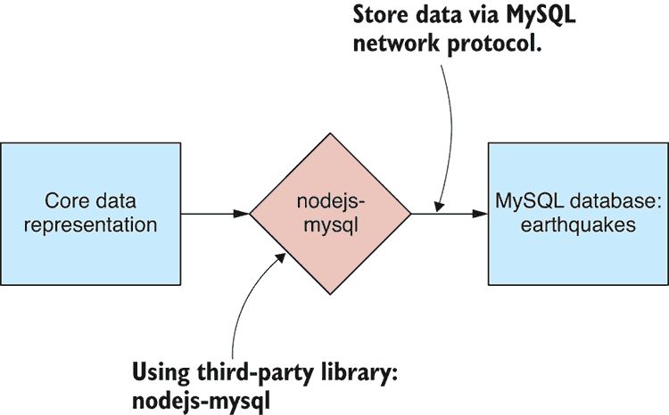

图 3.24 从 CDR 导出到 MySQL 数据库

我们将数据导出到 MySQL 的函数在 列表 3.25 中展示。这与导出到 MongoDB 有所不同。对于 MongoDB，我们可以通过一次调用 `insert` 来插入大量记录。我们无法使用这个库做到这一点；相反，我们必须执行多个 SQL `insert` 命令。注意以下列表中如何使用 JavaScript 的 `reduce` 函数来按顺序执行这些 SQL 命令。

列表 3.25 导出数据到 MySQL 的函数（toolkit/exportToMySql.js）

```
function exportToMySql (db, tableName, data) {    ①  
 return data.reduce(    ②  
 (prevPromise, record) =>    ②  
 prevPromise.then(() =>    ③  
 db.exec(    ④  
 "insert into " + tableName + " set ?",    ④  
 record    ④  
 )    ③  
 ),    ③  
 Promise.resolve()    ②  
 );    ②  
};    ①  

module.exports = exportToMySql;    ⑤   
```

在将数据插入我们的 MySQL 数据库之前，我们需要创建数据库表。对我来说，这是使用 SQL 的一大缺点：在插入数据之前，我们必须创建表并定义我们的模式。这种准备并不需要 MongoDB。

下面的列表显示了在 MySQL 数据库中创建一个与我们的示例数据格式匹配的 largest_earthquakes_export 表的过程。你必须运行此代码以创建我们数据的数据库模式。

列表 3.26 在 MySQL 数据库中创建 largest_earthquakes_export 表（listing-3.26.js）

```
const mysql = require('nodejs-mysql').default;    ①  

const config = {    ②  
 host: "localhost",    ②  
 port: 5000,    ②  
 user: "root",    ②  
 password: "root",    ②  
 database: "earthquakes",    ③  
 dateStrings: true,    ②  
 debug: true    ②  
};

const db = mysql.getInstance(config);    ④  

const createDbCmd =
 "create table largest_earthquakes_export ( Magnitude double, Time ➥ datetime, Latitude double, Longitude double, `Depth/Km` double )";    ⑤  

db.exec(createDbCmd)    ⑥  
 .then(() => {    ⑦  
 console.log("Database table created!");    ⑦  
 })    ⑦  
 .catch(err => {    ⑧  
 console.error("Failed to create the database table.");    ⑧  
 console.error(err.stack);    ⑧  
 });    ⑧   
```

在创建数据库表之后，我们现在可以将其导出。在下面的列表中，我们导入 earthquakes.csv 的示例数据，然后使用我们的 `exportToMySql` 函数将其导出到 MySQL 数据库。你可以运行此代码，它将用你的数据填充 SQL 表 largest_earthquakes_export*。

*列表 3.27 导出到 MySQL largest_earthquakes 表（listing-3.27.js）

```
const importCsvFile = require('./ toolkit/importCsvFile.js');    ①  
const exportToMySql = require('./ toolkit/exportToMySql.js');    ②  
const mysql = require('nodejs-mysql').default;    ③  

const config = {    ④  
 host: "localhost",    ④  
 port: 5000,    ④  
 user: "root",    ④  
 password: "root",    ④  
 database: "earthquakes",    ⑤  
 dateStrings: true,    ④  
 debug: true    ④  
};    ④  

const db = mysql.getInstance(config);    ⑥  

importCsvFile("./data/earthquakes.csv")    ⑦  
 .then(data =>    ⑧  
 exportToMySql(db, "largest_earthquakes_export", data)    ⑧  
 )    ⑧  
 .catch(err => {    ⑨  
 console.error("An error occurred.");    ⑨  
 console.error(err.stack);    ⑨  
 });    ⑧   
```

我们现在已经完成了对各种数据格式导入和导出的旅程。我们如何利用这个经验呢？嗯，现在我们可以混合和匹配数据格式，我们可以构建大量不同类型的数据管道。

## 3.6 构建完整的数据转换

图表展示了从 CSV 文件到 MongoDB 数据库的数据转换的完整视图。我们已经在“导出到 MongoDB”这一节中看到了这种转换。注意导入代码如何在中部与导出代码重叠，核心数据表示就在这里。

让我们再次审视这个转换的代码。下面的列表清晰地标识了转换的导入和导出组件。这些组件被很好地定义为我们在本章早期创建的工具函数。

列表 3.28 从 CSV 文件到 MongoDB 集合的数据转换示例

```
const importCsvFile = require('./toolkit/importCsvFile.js');
const exportToMongoDB = require('./toolkit/exportToMongoDB.js');

// ... Initialisation code ...

**importCsvFile**("./data/earthquakes.csv")    ①  
 .then(data => **exportToMongoDB**(db, "largest_earthquakes", data))    ②  
    .then(() => {
        // ... Cleanup code ...
))
    .catch(err => {
        console.error("An error occurred.");
        console.error(err.stack);
    }); 
```

希望你现在开始对如何混合和匹配数据格式并将它们拼接起来以构建数据管道有了感觉。

## 3.7 扩展过程

让我们回到核心数据表示模式。你可以在列表 3.28 中看到，你可以轻松地用处理任何其他数据格式的函数替换那里的导入和导出函数。这形成了一个模式，允许你构建几乎你能想象到的任何数据转换。

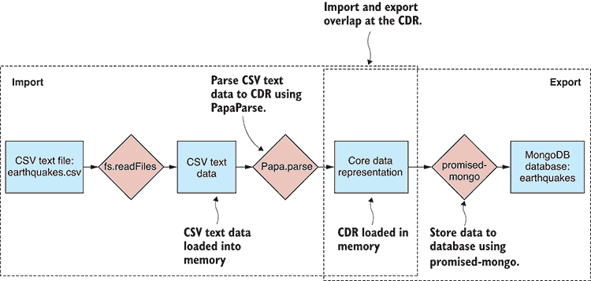

图 3.25 CSV 到 MongoDB 的数据转换示例

你现在可以为之前我们覆盖的任何格式构建数据转换。看看图 3.26。从左侧选择一个导入格式。从右侧选择一个导出格式。然后在 JavaScript 代码中将这些格式连接起来，通过 CDR 传输数据。

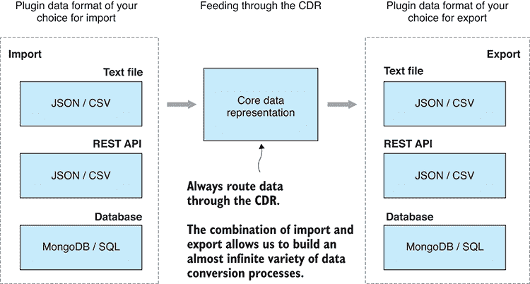

图 3.26 核心数据表示设计模式是构建数据转换管道的配方。

核心数据表示模式是可扩展的。你不仅限于本章中展示的数据格式。你可以引入自己的数据格式，无论是标准格式（如 XML 或 YAML）还是自定义格式，并将它们集成到你的工作流程中。

我们之前查看的数据管道类型在图 3.27 中进行了概括。我们以某种格式接收输入数据，并通过可以解码该格式的代码传递它。此时，数据位于内存中的核心数据表示中。现在我们通过导出代码将 CDR 数据传递出去，使其到达需要的位置。我相信你可以想象如何将新格式添加到混合中。例如，假设你创建了导入和导出 XML 的工具函数。现在你已经扩展了创建数据转换管道的能力——例如，XML 到 CSV，XML 到 MongoDB，MySQL 到 XML 等等。

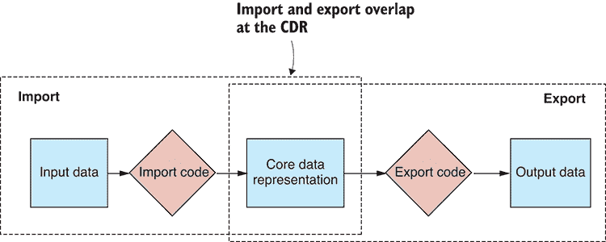

图 3.27 一个通用数据转换流程

在接下来的章节中，我们将基于核心数据表示模式进行构建。正如你在图 3.28 中看到的，我们将扩展转换流程的中间部分。这就是我们将添加数据清理、转换和分析阶段到我们的数据管道的地方。每个阶段都在核心数据表示上操作。每个阶段将 CDR 数据作为输入，对其进行处理，然后输出转换后的 CDR 数据，传递给下一个阶段。

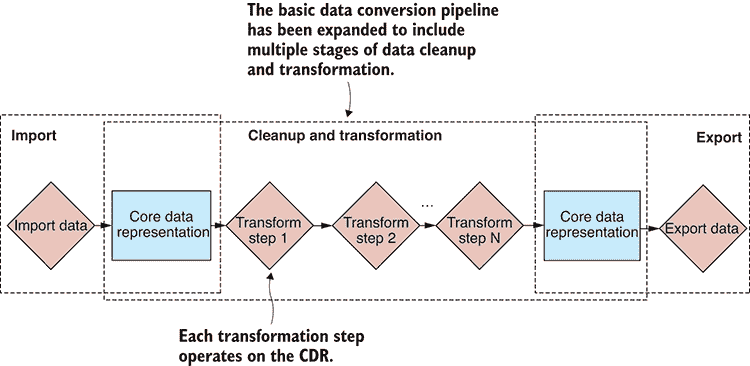

图 3.28 扩展的基本数据转换流程，包括数据清理和转换阶段

使用核心数据表示模式，我们可以从本章学到的技术中创建总共 36 种不同的数据转换。36 是导入器数量（6）乘以导出器数量（6）。我们添加到混合中的任何新格式只会增加这个数字。比如说，你将 XML 格式添加到混合中；现在你有 49 种不同的数据转换可供使用！

获取、存储和检索是构建数据管道的基本要素。现在你已经处理了数据整理的这些方面，你可以转向更多样化和高级的主题。然而，你还没有完成数据导入，在第四章中，我们将探讨其更高级的方面，例如处理自定义数据、网络爬虫和与二进制数据一起工作。

## 摘要

+   你了解到，你可以通过代码将灵活的数据管道连接起来，这些代码将数据通过核心数据表示传递。

+   你发现了如何导入和导出 JSON 和 CSV 文本文件。

+   我们讨论了通过 HTTP GET 从 REST API 导入 JSON 和 CSV 数据。

+   你通过示例学习了如何使用 MongoDB 和 MySQL 数据库导入和导出数据。
