# 4

处理不寻常的数据

**本章涵盖**

+   处理各种不寻常的数据格式

+   使用正则表达式解析自定义文本文件格式

+   使用网页抓取从网页中提取数据

+   处理二进制数据格式

在上一章中，你学习了如何将各种标准和常见的数据格式导入到核心数据表示中。在本章中，我们将探讨一些你可能需要不时使用的更不寻常的数据导入方法。

从第三章继续，假设你正在维护一个关于地震的网站，并且需要从各种来源接受新数据。在本章中，我们将探讨你可能需要或希望支持的几个不太常见的数据格式。表 4.1 显示了我们将涵盖的新数据格式。

表 4.1 第四章涵盖的数据格式

| **数据格式** | **数据源** | **备注** |
| --- | --- | --- |
| 自定义文本 | 文本文件 | 数据有时以自定义或专有文本格式出现。 |
| HTML | Web 服务器/REST API | 当没有其他方便的访问机制时，可以从 HTML 网页中抓取数据。 |
| 自定义二进制 | 二进制文件 | 数据有时以自定义或专有二进制格式出现。或者我们可能选择使用二进制数据作为更紧凑的表示形式。 |

在本章中，我们将为处理正则表达式、进行网页抓取和解码二进制文件添加新的工具到我们的工具箱中。这些工具列在表 4.2 中。

表 4.2 第四章工具

| **数据源** | **数据格式** | **工具** | **函数** |
| --- | --- | --- | --- |
| 自定义文本 | 自定义文本 | request-promise 库 | request.get, 正则表达式 |
| 网页抓取 | HTML | request-promise 和 cheerio 库 | request.get, cheerio.load |

| 二进制文件 | 自定义 | Node.js 文件系统 API 和 Buffer 类 | fs.readFileSync fs.writeFileSync

各种缓冲函数 |

| 二进制文件 | BSON | bson 库 | serialize 和 deserialize |
| --- | --- | --- | --- |

## 4.1 获取代码和数据

在本章中，我们继续使用第三章中的地震数据。本章的代码和数据可在 Data Wrangling with JavaScript GitHub 组织中的 Chapter-4 仓库中找到，网址为[`github.com/data-wrangling-with-javascript/chapter-4`](https://github.com/data-wrangling-with-javascript/chapter-4)。请下载代码并安装依赖项。如需帮助，请参考“获取代码和数据”（第二章）。

*与第三章的情况一样，第四章的仓库包含每个代码列表的代码，分别存储在同一目录下的单独 JavaScript 文件中，并且它们根据列表编号命名。您可以通过在仓库的根目录中运行一次`npm install`来安装所有代码列表的所有第三方依赖项。

## 4.2 从文本文件导入自定义数据

有时你可能会遇到一个自定义的、专有的或临时的文本格式，对于这种格式没有现成的 JavaScript 库。在这种情况下，你必须编写自定义解析代码来将你的数据导入核心数据表示。

尽管存在各种解析方法，包括手动实现自己的解析器，在本节中，我将演示使用正则表达式进行解析。在将我们的示例文件 earthquakes.txt 加载到内存后，我们将使用正则表达式来解释数据，并将有趣的部分提取到核心数据表示中，如图 4.1 所示。

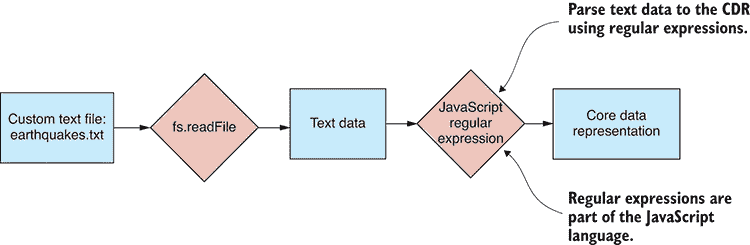

图 4.1 将自定义文本文件格式导入核心数据表示

对于正则表达式的第一个例子，我们将解析从美国地质调查局（USGS）下载的 earthquakes.txt 文本文件。如图 4.2 所示，earthquakes.txt 看起来类似于 CSV 文件，但它使用管道符号而不是逗号作为字段分隔符。

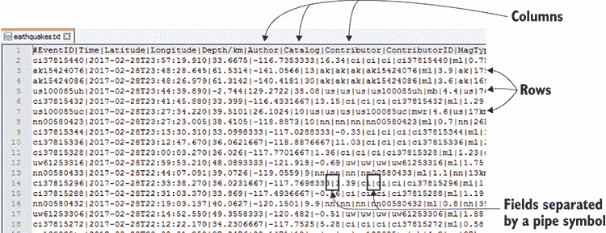

图 4.2 从 USGS 下载的自定义文本格式数据文件

正则表达式是一个强大的工具，并且它们在 JavaScript 中是原生支持的。它们可以帮助你处理临时或自定义的文件格式，因此你不需要为遇到的每个自定义格式手动编写解析器。

当我们使用正则表达式时，首先应该使用在线测试工具，例如 https://regex101.com。这个工具，如图 4.3 所示，允许我们在接近代码之前创建和测试我们的正则表达式。

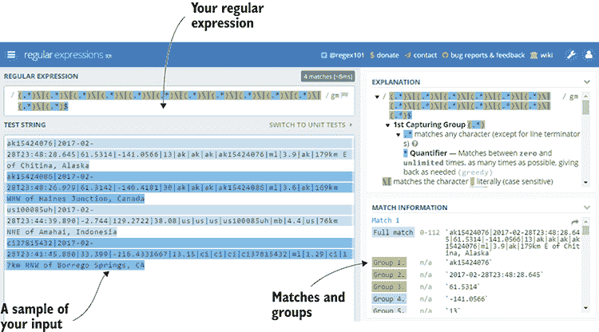

图 4.3 使用 regex101.com 测试正则表达式

在这个例子中，我们将使用一个简单的正则表达式，但它们可以比这更复杂，我们可以使用它们来解析更复杂的数据格式。使用 regex101.com 的一个重大优势是，在我们原型化和测试我们的正则表达式之后，我们可以导出可以包含在我们的应用程序中的工作 JavaScript 代码。

在从 regex101.com 导出代码后，我们必须修改它，使其从 earthquakes.txt 读取。以下列表显示了结果代码和修改。您可以从第四章的 GitHub 仓库运行此代码，并且它将打印出由正则表达式解码的数据。

列表 4.1 从自定义文本文件 earthquakes.txt 导入数据（listing-4.1.js）

```
const file = require('./tookit/file.js');

function parseCustomData (textFileData) {    ①  
 const regex = /(.*)\|(.*)\|(.*)\|(.*)\|(.*)\|(.*)\|(.*)\|(.*)\|(.*)\|(.*) ➥\|(.*)\|(.*)\| (.*)$/gm;  ②  

    var rows = [];
    var m;

 while ((m = regex.exec(textFileData)) !== null) {    ③  
        // This is necessary to avoid infinite loops with zero-width ➥ matches
        if (m.index === regex.lastIndex) {
            regex.lastIndex++;
        }

 m.shift();    ④  

 rows.push(m);    ⑤  
 }    ③  

 var header = rows.shift();    ⑥  
 var data = rows.map(row => {    ⑦  
 var hash = {};    ⑦  
 for (var i = 0; i < header.length; ++i) {    ⑦  
 hash[header[i]] = row[i];    ⑦  
 }    ⑦  
 return hash;    ⑦  
 });    ⑦  

 return data;    ⑧  
};    ①  

file.read("./data/earthquakes.txt")    ⑨  
 .then(textFileData => parseCustomData(textFileData))    ⑩  
 .then(data => {    ⑪  
 console.log(data);    ⑪  
 })    ⑪  
 .catch(err => {    ⑫  
 console.error("An error occurred.");    ⑫  
 console.error(err.stack);    ⑫  
 });    ⑫   
```

注意，与我们在第三章中看到的读取文件示例不同，我们没有从 列表 4.1 保存一个单独的工具包函数。这是一个自定义格式，我们可能永远不会再次看到它，所以可能不值得创建可重用的工具包函数。一般来说，我们只有在确定我们将来还会看到该数据格式时，才需要向我们的工具包中添加一个函数。

在这个例子中，我们没有向我们的工具箱中添加任何代码，尽管我们确实添加了一种*技术*。你应该将正则表达式视为一种强大的技术，用于解析不寻常的数据格式。我们的第一个正则表达式示例只是触及了可能性的表面，所以让我们看看其他示例，看看正则表达式还能在其他哪些方面发挥作用。

使用正则表达式，我们可以为解析数据文件中的每一行创建一个更复杂的模式。你想要确保*时间*列是一个日期/时间值吗？那么创建一个更高级的模式，它只会识别该数据列的日期/时间值。其他列也是如此。你可以调整模式，只接受该列的有效数据；这是一种验证你的传入数据是否符合你预期的假设的好方法。

正则表达式也非常适合提取嵌套数据。比如说，你得到了一份客户评论的数据（可能是通过表单或电子邮件添加的），你需要提取相关的细节，比如客户的电子邮件和他们对某个产品的评分。

你一定会想用正则表达式来解析你的应用程序或服务器生成的日志文件。这是一个相当常见的正则表达式用例——比如说，当你想从日志文件中提取运行时指标和其他细节时。

当你开始使用正则表达式时，你会发现你的模式很快就会变得复杂。这是正则表达式的一个缺点：你可以快速创建难以阅读的模式，这些模式在以后修改起来也很困难。如果你觉得正则表达式有用，我会将进一步的探索留给你自己决定。

## 4.3 通过抓取网页导入数据

有时候，我们可能会在网页上看到一些有用的数据。我们希望拥有这些数据，但没有任何方便的方法可以访问它们。我们经常发现，重要的数据被嵌入在网页中，而公司或组织没有以我们方便下载的任何其他方式共享它们，比如 CSV 文件下载或 REST API。

理想情况下，所有组织都会以易于导入我们数据管道的格式共享他们的数据。然而，不幸的是，偶尔会有这样的情况，即*抓取*一个网页，从中提取数据，是我们获取所需数据的唯一途径。

网页抓取是一项繁琐、易出错且令人疲惫的工作。你的网页抓取脚本依赖于被抓取页面的结构：如果这个结构发生变化，那么你的脚本就会失效。这使得网页抓取脚本本质上很脆弱。因此，将网页抓取作为数据源应被视为最后的手段；在可能的情况下，你应该使用更可靠的替代方案。

如果抓取网页是访问数据集的唯一方式，那么尽管存在上述警告，我们也可以轻松地在 JavaScript 中完成它。第一部分与第三章中从 REST API 导入数据相同：我们可以使用 `request-promise` 来检索网页。在这个例子中，我们将从以下 URL 抓取地震数据：[`earthquake.usgs.gov/earthquakes/browse/largest-world.php`](https://earthquake.usgs.gov/earthquakes/browse/largest-world.php)[.](http://.)

当网页下载到内存中时，我们将使用第三方库 Cheerio 从网页中提取数据并将其转换为核心数据表示。这个过程在 图 4.4 中展示。

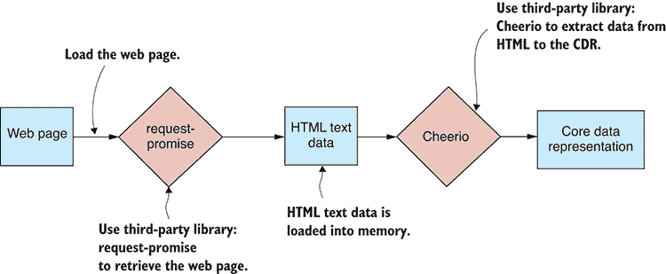

图 4.4 通过抓取网页导入数据

### 4.3.1 确定要抓取的数据

我们应该首先使用我们的网页浏览器来检查网页。图 4.5 展示了在 Chrome 中查看的最大地震网页。

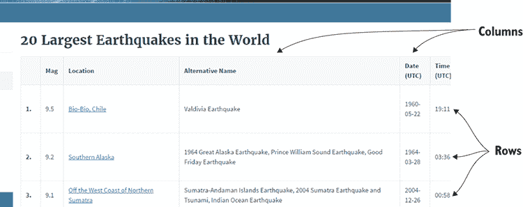

图 4.5 在抓取之前在网页浏览器中查看最大的地震网页

在我们开始编码之前，我们必须确定识别页面中嵌入数据的 HTML 元素和 CSS 类。图 4.6 展示了使用 Chrome 的调试工具检查页面元素层次结构。有趣的元素是 `tbody`、`tr` 和 `td`；这些元素构成了包含数据的 HTML 表格。

### 4.3.2 使用 Cheerio 抓取

我们现在可以识别网页中的数据，并且我们已经准备好进入代码。如果你已经安装了第四章代码仓库的所有依赖项，那么你已经有 Cheerio 安装了。如果没有，你可以在新的 Node.js 项目中安装 Cheerio，如下所示：

```
npm install --save cheerio 
```

Cheerio 是一个基于 jQuery 构建的出色库，因此如果你已经熟悉 jQuery，那么你会在 Cheerio 中感到宾至如归。列表 4.2 是一个工作示例，它抓取了最大的地震网页并提取了嵌入的数据到核心数据表示。你可以运行此代码，它将抓取的数据打印到控制台。

列表 4.2 通过抓取网页导入数据（列表-4.2.js）

```
const request = require('request-promise');    ①  
const cheerio = require('cheerio');    ②  

function scrapeWebPage (url) {    ③  
 return request.get(url)    ④  
 .then(response => {    ⑤  
 const $ = cheerio.load(response);    ⑥  
 const headers = $("thead tr")    ⑦  
 .map((i, el) => {    ⑦  
 return $(el)  [  ⑦  
 .find("th")    ⑦  
 .map((i, el) => {    ⑦  
 return $(el).text();    ⑦  
 })    ⑦  
 .toArray()];    ⑦  
 })    ⑦  
 .toArray();    ⑦  

 const rows = $("tbody tr")    ⑧  
 .map((i, el) => {    ⑧  
 return $(el)  [  ⑧  
 .find("td")    ⑧  
 .map((i, el) => {    ⑧  
 return $(el).text();    ⑧  
 })    ⑧  
 .toArray()];    ⑧  
 })    ⑧  
 .toArray();    ⑧  

 return rows.map(row => {    ⑨  
 const record = {};    ⑨  
 headers.forEach((fieldName, columnIndex) => {    ⑨  
 if (fieldName.trim().length > 0) {    ⑨  
 record[fieldName] = row[columnIndex];    ⑨  
 }    ⑨  
 });    ⑨  
 return record;    ⑨  
 });    ⑨  
 });    ⑤  
};    ③  

const url = "https://earthquake.usgs.gov/earthquakes/browse/largest-world. ➥ php";    ⑩  
scrapeWebPage(url)    ⑪  
 .then(data => {    ⑫  
 console.log(data);    ⑫  
 })    ⑫  
 .catch(err => {    ⑬  
 console.error(err);    ⑬  
 });    ⑬   
```

注意，这又是一个实例，类似于解析自定义文本文件，我们不一定需要将可重用函数添加到我们的工具箱中。抓取网站是一项如此定制的任务，以至于很少有机会再次使用相同的代码。我们发现，我们添加到工具箱中的是 *技术*，即抓取网站的能力，而不是可重用代码。

## 4.4 处理二进制数据

虽然可能看起来很少见，但有时作为一个 JavaScript 开发者，你可能会需要或想要处理二进制数据格式。

你应该始终问的第一个问题是，“为什么？”鉴于我们已经有很好的数据格式可以工作，例如 JSON 和 CSV，那么为什么还要处理二进制数据？

好吧，首先考虑的是，也许这就是我们用来工作的数据。在地震网站的情况下，让我们假设我们得到了地震数据的二进制数据转储。在这种情况下，我们需要解包二进制数据，以便我们可以处理它。

这是我们可能处理二进制数据的一个原因，但还有另一个原因。二进制数据比 JSON 或 CSV 数据更紧凑。例如，我们即将查看的二进制文件 earthquakes.bin 的大小是等效 JSON 文件大小的 24%。这对磁盘空间和网络带宽来说是一个显著的节省！

选择二进制数据格式的另一个原因可能是由于性能。如果你手动编写二进制序列化器并将其优化到极致，你可以实现比 JSON 序列化更好的性能。但我不会对这个原因寄予太多希望。内置的 JSON 序列化器已经非常优化且非常快。你必须聪明并非常努力才能打败它！

如果你必须这样做或者你需要使用更紧凑的格式，也许可以转向二进制数据文件。但在转向二进制格式以提高性能之前，要仔细思考。可能比你预期的更难实现性能提升，而且你很容易使性能变得更差！

这里有一个很好的理由说明为什么我们不应该使用二进制文件。基于文本的数据格式是可读的，我们可以打开并阅读它们，而无需特殊查看器应用程序。不要低估这一点的重要性！当我们试图理解或调试数据文件时，在文本编辑器中打开和查看该文件非常有帮助。

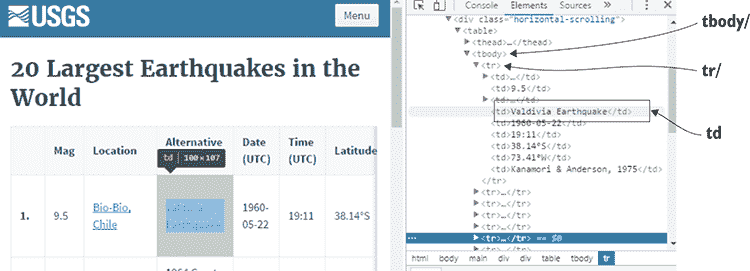

图 4.6 使用 Chrome 开发者工具识别包含要抓取数据 HTML 元素

### 4.4.1 解包自定义二进制文件

假设你被给了二进制文件 earthquakes.bin，并且你需要将其导入到你的数据库中。你如何解码这个文件？

首先，你需要了解二进制文件的结构。这不是基于文本的格式，所以你不能在文本编辑器中浏览它来理解它。假设二进制文件的提供者已经向我们解释了文件布局。他们说过，这是一个由一系列依次打包的二进制记录组成的序列（图 4.7）。文件首先指定它包含的*记录数*，你可以在图 4.7 中看到文件开头的*Num records*字段。

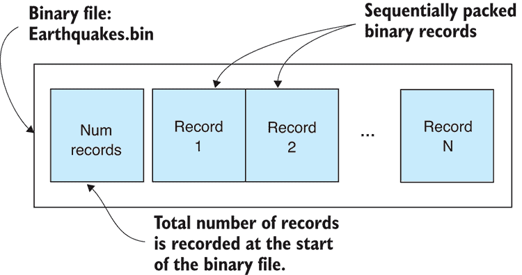

图 4.7 Earthquakes.bin 是一个包含一系列依次打包记录的二进制文件。

我们数据提供者还解释说，每个记录通过一系列值来描述一次地震（图 4.8）。这些是双精度数字（JavaScript 的标准数字格式），表示每次地震的时间、位置、深度和震级。


图 4.8 每个数据记录是一系列打包的值，描述了一个地震。

要处理二进制文件，我们将使用 Node.js 文件系统函数。我们将使用同步函数——例如，`readFileSync—`因为它们使代码更简单，尽管在生产环境中你可能会想使用异步版本以提高服务器的性能。在第三章中，我们将文本文件作为字符串读入内存；然而，在这里，我们将我们的二进制文件 earthquakes.bin 读入一个 Node.js `Buffer` 对象。

你可以在图 4.9 中看到这个过程的步骤。首先，你调用 `readFileSync` 将 earthquakes.bin 载入缓冲区（1）。然后，你将从缓冲区中读取记录数（2）。接下来，你开始一个循环，按顺序从缓冲区中读取每个记录（3）。记录的字段被提取并用于构建一个 JavaScript 对象（4），该对象被添加到你的记录数组中。

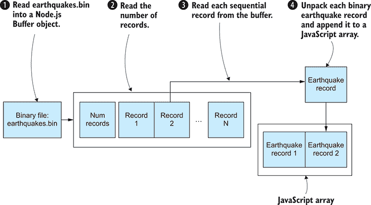

图 4.9 使用 Node.js 缓冲区对象从 earthquakes.bin 读取记录

图 4.10 描述了表示地震记录的 JavaScript 对象的构建。时间（1）、纬度（2）和其他字段（3）从缓冲区中读取并分配给 JavaScript 对象。

解码 earthquakes.bin 的代码非常简单，如下所示。你可以运行此代码，它将解码示例二进制文件并将数据打印到控制台。

列表 4.3 使用 Node.js 缓冲区对象解包 earthquakes.bin 二进制文件（listing-4.3.js）

```
const fs = require('fs');
const buffer = fs.readFileSync("./data/earthquakes.bin");    ①  

const numRecords = buffer.readInt32LE(0);    ②  

let bufferOffset = 4;
const records = [];

for (let recordIndex = 0; recordIndex < numRecords; ++recordIndex) {    ③  

 const time = buffer.readDoubleLE(bufferOffset);    ④  

 const record = {    ④  
 Time: new Date(time),    ④  
 Latitude: buffer.readDoubleLE(bufferOffset + 8),    ④  
 Longitude: buffer.readDoubleLE(bufferOffset + 16),    ④  
 Depth_Km: buffer.readDoubleLE(bufferOffset + 24),    ④  
 Magnitude: buffer.readDoubleLE(bufferOffset + 32),    ④  
 };    ④  

 bufferOffset += 8 * 5;    ⑤  

 records.push(record);    ⑥  
}    ③  

console.log(records);    ⑦   
```

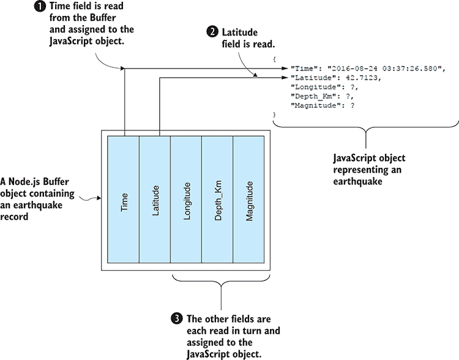

图 4.10 从二进制地震记录中读取字段到 JavaScript 对象

### 4.4.2 打包自定义二进制文件

在上一个例子中，我们得到了 earthquakes.bin，这是一个二进制文件，我们必须解码它才能使用其中包含的数据。你可能很好奇这样一个文件最初是如何创建的。

打包 earthquakes.bin 实质上是与我们解包它的过程相反。我们从一个表示地震的 JavaScript 对象数组开始。如图 4.11 所示，地震对象的字段是顺序打包以形成一个二进制记录。首先，时间字段被打包（1），然后是纬度字段（2），依此类推，直到所有字段都被打包（3）到缓冲区中。

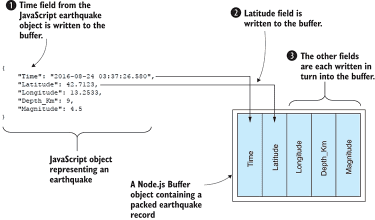

图 4.11 将 JavaScript 地震对象中的字段打包到 Node.js 缓冲区

你可以在图 4.12 中看到，每个记录都是紧密地一个接一个地打包到缓冲区中。我们首先创建一个 Node.js `Buffer` 对象（1）。在将记录写入缓冲区之前，我们必须首先记录记录数（2），因为这允许我们了解在稍后解码二进制文件时预期的记录数。然后我们按顺序将每个地震记录打包到缓冲区中（3）。最后，缓冲区被写入我们的二进制文件 earthquakes.bin（4）。这就是我们产生之前示例中给出的文件的方法。

将 earthquakes.json 转换为我们自定义的二进制格式的代码显示在列表 4.4 中；这比解包所需的代码复杂一些，但差别不大。你可以运行此代码，它将从 earthquakes.json 中读取示例数据，将数据打包到二进制缓冲区中，然后生成输出文件 earthquakes.bin。如果你想测试生成的 earthquakes.bin 是否是一个有效的文件，你可以将其再次通过列表 4.3 中的代码运行，以测试它是否可以被随后解包。

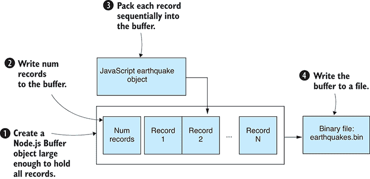

图 4.12 将地震记录写入我们的二进制文件 earthquakes.bin

列表 4.4 使用 Node.js 缓冲区打包二进制文件 earthquakes.bin（listing-4.4.js）

```
const fs = require('fs');
const moment = require('moment');

const records = JSON.parse(  ①  
 fs.readFileSync("./data/earthquakes.json", 'utf8')    ①  
);    ①  

const bufferSize = 4 + 8 * 5 * records.length;    ②  
const buffer = new Buffer(bufferSize);    ③  

buffer.writeInt32LE(records.length);  ④  

let bufferOffset = 4;

for (let i = 0; i < records.length; ++i) {    ⑤  

    const record = records[i];
 const time = moment(record.Time).toDate().getTime();    ⑥  
 buffer.writeDoubleLE(time, bufferOffset);    ⑥  
 bufferOffset += 8;    ⑥  

 buffer.writeDoubleLE(record.Latitude, bufferOffset);    ⑥  
 bufferOffset += 8;    ⑥  

 buffer.writeDoubleLE(record.Longitude, bufferOffset);    ⑥  
 bufferOffset += 8;    ⑥  

 buffer.writeDoubleLE(record.Depth_Km, bufferOffset);    ⑥  
 bufferOffset += 8;    ⑥  

 buffer.writeDoubleLE(record.Magnitude, bufferOffset);    ⑥  
 bufferOffset += 8;    ⑥  
}    ⑤  

fs.writeFileSync("./output/earthquakes.bin", buffer);    ⑦   
```

注意，这里引入了对 moment 的依赖。这是我们首次在第二章中安装的用于处理日期和时间的出色库。

创建我们自己的自定义二进制数据格式是有问题的。代码杂乱无章，如果我们想要处理更大的文件，代码会变得更加复杂。输出格式不是人类可读的，所以除非我们记录格式的结构，否则我们可能会忘记它是如何工作的。这可能会使得未来解码我们的数据变得困难。

然而，如果你想要两者兼得，你还有一个选择。你想要的是既有 JSON 的便利性和可靠性，又有二进制数据的紧凑性：那么让我向你介绍 BSON（发音为 *bison*）。

### 4.4.3 用 BSON 替换 JSON

BSON，或二进制 JSON，是 JSON 的二进制编码序列化。虽然你不能在文本编辑器中打开 BSON 文件，但它（像 JSON 一样）是一个自描述的格式。你不需要文档来理解或记住如何解码数据文件。

BSON 是一个标准且成熟的数据格式。它是 MongoDB 的基础格式。它几乎可以无缝替换 JSON，并且很容易在 JSON 和 BSON 之间进行转换。

BSON 将允许你以更紧凑的方式存储你的 JSON。如果你试图节省磁盘空间或网络带宽，这可能很有用。但是，BSON 在性能上不会给你带来任何好处，因为它比 JSON 序列化稍微慢一些。因此，要使用 BSON，你必须在大小的性能之间做出权衡。

### 4.4.4 将 JSON 转换为 BSON

假设我们有一个名为 earthquakes.json 的 JSON 文件，它占用了我们磁盘上太多的空间。让我们将此文件转换为 BSON 格式，以便它占用更少的空间。

在这两个示例中，我们将使用`bson`库。如果你已经为第四章代码仓库安装了依赖项，那么你将已经拥有它；或者你可以在新的 Node.js 项目中按照以下方式安装它：

```
npm install --save bson 
```

列表 4.5 展示了如何将 earthquakes.json 转换为 BSON 文件。我们实例化`BSON`对象，并使用其`serialize`函数将我们的 JavaScript 数据转换为二进制 BSON 格式。结果是写入我们新数据文件 earthquakes.bson 的 Node.js `Buffer`对象。你可以运行以下列表中的代码，它将示例文件 earthquakes.json 转换为 BSON 文件 earthquakes.bson。

列表 4.5 将 JSON 数据转换为 BSON（listing-4.5.js）

```
const fs = require('fs');
const moment = require('moment');
const BSON = require('bson');

const records = JSON.parse(  ①  
    fs.readFileSync("./data/earthquakes.json", "utf8") 
); 

for (let i = 0; i < records.length; ++i) {   ②  
 const record = records[i];   ②  
 record.Time = moment(record.Time).toDate();   ②  
}   ②  

const bson = new BSON();   ③  
const serializedData = bson.serialize(records);   ④  

fs.writeFileSync("./output/earthquakes.bson", serializedData);   ⑤   
```

### 4.4.5 反序列化 BSON 文件

在之后，当我们需要解码 earthquakes.bson 时，我们可以使用`bson`库将其反序列化回 JavaScript 数据。我们首先将文件加载到 Node.js `Buffer`对象中。然后实例化一个`BSON`对象，并使用其`deserialize`函数解码缓冲区中的数据。最后，我们将重构的 JavaScript 数据结构打印到控制台以验证数据是否正确。代码在列表 4.6 中展示，你可以在示例 BSON 文件上运行它以将其转换为等效的 JSON 表示。你可能甚至想尝试在之前使用列表 4.5 代码生成的 BSON 文件上运行以下列表。你应该能够通过列表 4.5，然后列表 4.6，再回到列表 4.5 等等的方式循环处理你的文件。

列表 4.6 反序列化 BSON 数据（listing-4.6.js）

```
const fs = require('fs');
const BSON = require('bson');

const loadedData = fs.readFileSync("./data/earthquakes.bson");  ①   

const bson = new BSON();  ②   
const deserializedData = bson.deserialize(loadedData);  ③   

console.log(deserializedData);  ④   
```

在上一章中，你学习了导入和导出各种数据格式。在这一章中，你扩展了这方面的知识，涵盖了获取和存储数据的几种更神秘的方法。我们现在已经解决了几个重要的数据处理基础问题。在第五章中，我们将继续前进，学习探索性编码在原型设计和理解数据方面的价值。

## 摘要

+   你学习了如何处理不寻常的数据格式。

+   我们讨论了使用正则表达式解析自定义文本文件格式。

+   我们使用`request-promise`和 Cheerio 进行了网页抓取，以从网页中提取数据。

+   我们通过打包和解包自定义二进制格式的示例进行了操作。

+   你学习了如何使用 BSON 处理二进制数据格式。*
