# 5

探索性编码

**本章涵盖**

+   理解快速反馈循环如何使您更高效

+   原型设计以探索我们的数据并加深我们的理解

+   使用 Excel 开始原型设计

+   继续使用 Node.js 和浏览器进行原型设计

+   设置一个 *实时重载* 编码管道，其中代码更改会自动流向数据和可视化输出

在本章中，我们将使用探索性编码深入挖掘您的数据，构建您的知识和理解。我们将使用一个易于理解的小型示例数据集，但在现实世界中，探索和理解我们数据的需求随着数据集的不断扩大而增长。

本章是数据处理过程的缩影。我们将经历获取、探索和理解、分析，最终到达可视化。不过，我们的重点在于快速原型设计，强调拥有一个简化和有效的反馈循环，以便我们可以快速编码并立即看到结果。

数据处理过程探索阶段的输出

+   对您数据的更深入理解

+   可能在生产中使用的 JavaScript 代码

## 5.1 扩展您的工具集

在本章中，我们将以多种方式扩展我们的数据处理工具集。我们将使用 Excel 进行初始原型设计和可视化。一旦达到 Excel 的极限，我们将转向 Node.js 进行探索和分析，然后最终转向浏览器进行可视化。

本章的主要心理工具是 *快速反馈循环*。快速迭代和减少反馈循环的往返是提高您生产力的关键。在本章中，我将把这个想法推向极致来说明问题，所以这比我的通常现实世界流程更为极端，但它并不遥远，并且与我通常的工作方式相似。

为了简化我们的反馈循环，我们将使用 *Nodemon* 和 *live-server*，这两个工具都会自动监视并执行我们的代码。这给了我们编写代码并观察结果进展的自由。我们将在本章中使用的所有工具列表见 表 5.1。

表 5.1 第五章中使用的工具

| **平台** | **工具** | **用途** |
| --- | --- | --- |
| Excel | 查看器/编辑器 | 查看和编辑数据 |
|  | Excel 图表 | 可视化数据 |
|  | Excel 公式 | 探索性编码 |
| JavaScript | console.log | 不要低估，控制台日志是您最重要的调试工具。 |
|  | Data-Forge | JavaScript 数据处理工具包 |
| Node.js | Formula.js | Node.js 实现的 Excel 公式 |
|  | Nodemon | 实时代码重载 |
| 浏览器 | live-server | 简单的 Web 服务器和实时代码重载 |
|  | Flot | 可视化 |

## 5.2 分析交通事故

本章的数据主题是*昆士兰州车祸*。假设我们被问到以下问题：昆士兰州的致命车祸是上升还是下降？我们希望将此数据引入我们的管道，探索它，理解它，绘制趋势，并预测未来。

通过 Excel 和后来的编码，我们将加深对数据的理解。我们将创建一个快速迭代编码的过程，几乎可以立即得到结果，并且当我们在编写代码或修改数据时，可视化会自动更新。

我们的目的是理解这些车祸中的死亡趋势，并预测未来是上升还是下降。剧透一下：图 5.1 展示了本章的最终结果——我们将在浏览器中产生的简单可视化。

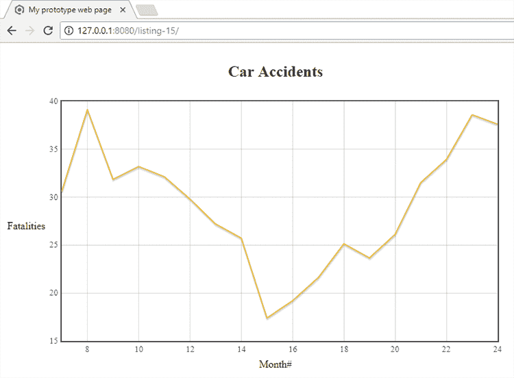

图 5.1 展示了 2001 年和 2002 年死亡趋势的原型网络可视化

## 5.3 获取代码和数据

本章的数据是从昆士兰州政府数据网站下载的。原始数据集很大，包括所有单个车祸。为了使数据易于您使用并使本章保持简单，我已经将数据总结为月度桶。代码和总结后的数据可在 GitHub 上的 Data Wrangling with JavaScript Chapter-5 存储库中找到，网址为[`github.com/data-wrangling-with-javascript/chapter-5`](https://github.com/data-wrangling-with-javascript/chapter-5)。

因为在本章中我们也在浏览器中工作，所以你必须按照以下步骤在存储库的根目录中安装 Bower 依赖项：

```
`bower install` 
```

由于 npm 是 Node.js 开发的包管理器，Bower 是浏览器开发的包管理器。

如果你想玩完整的原始数据，你可以在[`data.qld.gov.au/dataset/crash-data-from-queensland-roads`](https://data.qld.gov.au/dataset/crash-data-from-queensland-roads)找到它。有关获取代码和数据的通用帮助，请参阅第二章中的“获取代码和数据”。

*## 5.4 迭代与你的反馈循环

本章的重点是拥有一个快速的反馈循环。这究竟是什么，为什么它很重要？

你是否曾经编写了大量代码，然后在测试之前感到恐惧？大量的代码隐藏了更多的错误，并且更难测试。在编码时，错误会悄悄进入并隐藏。我们编码的时间越长，没有反馈，积累的错误就越多。我们调试代码的过程通常很耗时。我们可以在错误被创建后的第一时间抓住错误，从而挽回大量的生产力。

我们通常应该编写一个快速循环，通过多次迭代来扩展（图 5.2）：编写代码，获取反馈，解决问题等等。循环的每一次迭代都必须很小，并且我们必须能够轻松测试我们编写的新代码。

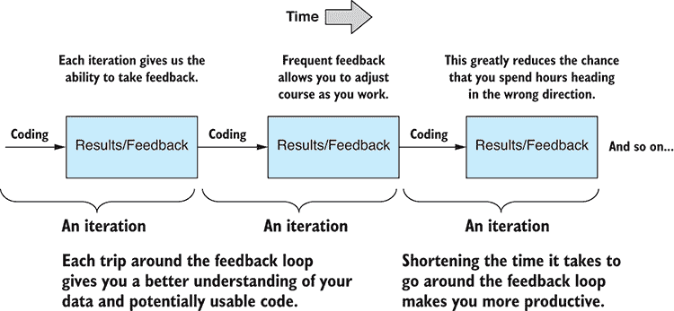

图 5.2 探索性编码是一系列迭代，它推动你朝着目标前进，并帮助你保持目标方向。

重要的是许多小的迭代。每个迭代的输出都是可工作的代码，所以我们从可工作的代码到可工作的代码，再到可工作的代码，如此循环。我们不允许有错误的代码在这个过程中前进。问题迅速暴露，错误不会累积。这些小变化和反馈的序列最终汇总成大量但可靠的代码。它让我们有信心代码在生产中能正确运行。在整个过程中看到我们的代码持续工作也是令人满意和有动力的。

我们可以采取任何措施来减少迭代的时长，这将提高生产力。自动化和流程简化将有所帮助，在本章中，我们将探讨如何使用 Nodemon（用于 Node.js）和 live-server（用于浏览器）来实现这一点。

反馈循环全在于尽快看到我们的代码运行并得到实际结果。它还帮助我们保持对目标的关注：在每次迭代中，我们都有机会自然地评估我们的位置和方向。这使我们能够专注于我们的目标，并采取更直接的途径实现我们的目标。它促使我们解决问题并快速克服障碍。它帮助我们排除干扰并保持进度。

## 5.5 对数据理解的第一步

让我介绍一个简单的思维工具，我称之为“数据理解表”。让我们在构建对数据的理解过程中填写这个表格。作为初步尝试，我们查看数据查看器中的数据以了解其结构。

在开始时，我们对数据一无所知，除了我们可以预期有行和列。最初，我们的数据理解表是空的。在处理数据后，我填写了如表 5.2 所示的表格。

表 5.2 数据理解表：在 Excel 中查看数据后我们所了解的数据

| **列** | **数据类型** | **预期值** | **描述** |
| --- | --- | --- | --- |
| Year | Integer | 2001、2002 等 | 崩溃发生的年份 |
| Month | String | 一月、二月等 | 崩溃发生的月份 |
| Crashes | Integer | 零或正数，没有负数 | 本年/月发生的崩溃次数 |
| Fatalities | Integer | 零或正数，没有负数 | 本年/月发生的致命事故次数 |
| etc. | etc. | etc. | etc. |

图 5.3 展示了在 Excel 中查看的 monthly_crashes_full.csv。当我们第一次查看这个文件时，我们扫描标题行并了解表格数据的列名。接下来，我们扫描数据中的初始几行，并对我们可以预期的数据类型和值范围做出合理的猜测。我们在了解数据的过程中填写我们的数据理解表。


图 5.3 使用 Excel 开发对数据的初步理解

在这个相当简单的例子中，我们通过查看查看器中的数据几乎学到了我们需要知道的一切。但文件的其他部分没有义务遵循这些规则！对于这个例子，输入数据已经相当干净。在其他项目中，数据可能不会表现得那么好，可能会有很多问题！我们将在第六章中解决这个问题。

## 5.6 处理缩减后的数据样本

当我们开始处理数据集时，通常最好从一个缩减的样本开始。当我们处理大量数据时，这一点尤其如此，我们将在第七章和第八章中更详细地讨论这一点。大型数据集可能难以处理，会拖慢我们的迭代速度，使我们效率降低。因此，我们应该旨在仅使用数据的一小部分来原型设计。我们可以在同时开发我们的理解和代码，最终，当我们确信我们的代码是健壮和可靠的，我们可以扩展到完整的数据集。

从昆士兰州政府下载的原始数据文件超过 138 MB。处理这样大的文件并不容易。我已经将原始数据整理并汇总到 monthly_crashes_full.csv 文件中。使用我为你们准备的数据，我们已经在本章中处理了一个较小的数据样本。monthly_crashes_full.csv 文件*的重量为 13 KB。我们的数据已经很小，但进一步缩减它也无妨。我们可以通过在 Excel（或文本编辑器）中加载数据并删除前 200 行之后的所有内容来实现这一点。

*将缩减后的数据保存为新的文件 monthly_crashes-cut-down.csv。始终要小心*不要覆盖你的原始数据！你不想丢失你的源数据！我们也可以使用 Excel 快速删除我们不需要的任何列。多余的数据是我们不需要的额外负担。

*我们已经显著减少了数据量。文件大小为 monthly_crashes-cut-down.csv* 现在约为 1 KB。使用轻量级数据集意味着我们可以快速工作，而且我们不会因为等待可能被数据量压垮的任何过程或工具而减慢速度。

*## 5.7 使用 Excel 进行原型设计

我们从使用 Excel 进行原型设计和数据探索开始。我们只在使用 Node.js 之前使用 Excel 进行快速原型设计，这可以节省初始时间。我们已经用它来查看和缩减我们的数据。现在让我们使用 Excel 来原型设计一个公式和可视化。

我们将在数据集中创建一个新的趋势列。使用 Excel 的预测函数，我们将根据六个月的数据预测死亡人数。预测函数需要输入 `x` 和 `y` 值。我们已经有我们的 `y` 值：那就是现有的死亡人数列。但我们没有明显的列可以用作 `x` 值，因此我们必须生成一个新的列，它是一个数字序列。我称这个列为 Month#，因为它标识了序列中月份的编号。

我们可以在 Excel 中通过输入一个短序列（1, 2, 3, 4），选择该序列，然后将其拖动到列的长度来创建这个列。Excel 将会外推我们的数字序列以填充整个列。

现在，我们可以继续添加我们的新趋势列。创建一个新列，在六行空行之后输入预测公式，如图 5.4 所示。趋势列中的每一行都偏移了六行，因为它是由前六个月的数据计算得出的。

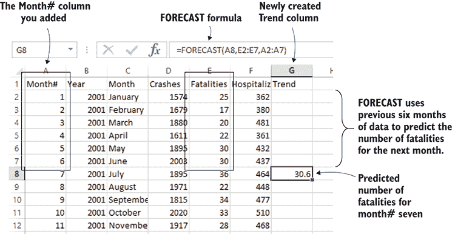

图 5.4 使用预测公式预测下个月的死亡人数

现在，我们选择包含预测公式的单元格，并将其拖动到趋势的末尾。图 5.5 展示了完成的趋势列。列中的每个值都是基于前六个月预测的该月死亡人数。

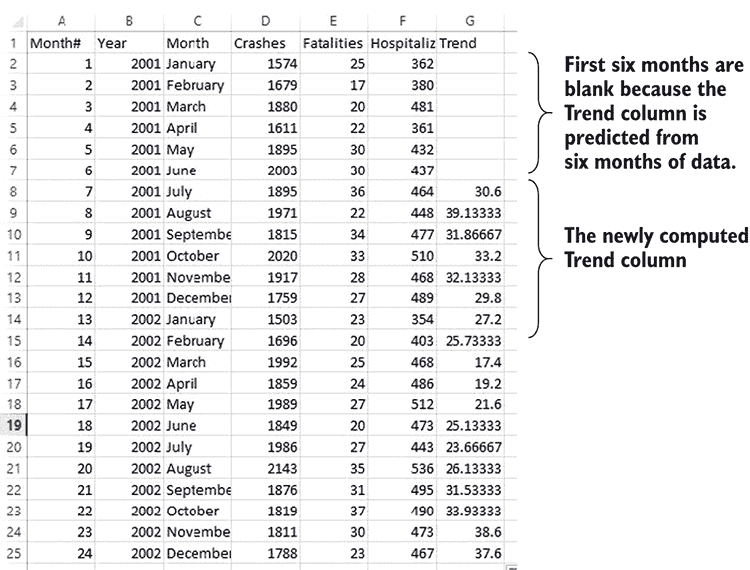

图 5.5 添加趋势列后的月度事故

现在，我们可以使用 Excel 的图表功能来可视化 2001 年至 2002 年期间汽车事故死亡趋势，如图 5.6 所示。从这张图中我们可以看出，在半数期间内死亡人数在下降，然后看起来趋势在图表的末尾又开始逆转。

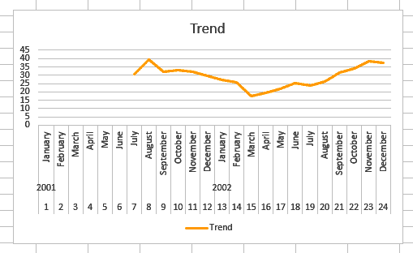

图 5.6 在 Excel 图表中可视化的致命汽车事故趋势列

我们已经对我们的数据有了更多的了解，而且我们甚至还没有接触任何代码！这是一种极快的方式开始你的数据，并且从数据到可视化比直接跳入深水区并尝试制作基于网络的可视化要快得多。我们可以用 Excel 做很多事情，所以我们不应该低估它。有时，它就是你所需要的全部。

为什么要转向代码呢？首先，你可能已经注意到在使用 Excel 时需要手动准备数据。我们必须拖动月份编号和趋势列，而在大量数据中这类事情变得相当繁琐，但我们可以用代码轻松完成。此外，我还必须手动调整数据以生成图 5.6 中的漂亮图表。

然而，转向代码的主要原因是你可以扩展并自动化繁琐且费力的数据准备。我们可能还希望使用网络提供交互式可视化。最终，我们需要让我们的代码在生产环境中运行。我们希望在 Node.js 服务器上运行我们的数据分析代码或在网络浏览器中显示交互式图表。现在是时候从 Excel 转移注意力，转向使用 JavaScript 进行探索性编码了。

## 5.8 使用 Node.js 进行探索性编码

在我们努力扩展并处理大量数据的过程中，我们现在转向 Node.js 进行探索性编码。在这一节中，我们将把我们的 Excel 原型转换为在 Node.js 中工作。在这样做的同时，我们将用代码探索我们的数据。我们可以构建我们对数据的理解，同时编写有用的代码。

在我们通过这一节工作时，我们将逐步发展一个 Node.js 脚本。由于本章的重点是迭代编码，我们将通过逐步升级脚本的过程来逐步完成每个小步骤，直到我们达到目标，即输出与图 5.5 中所示类似的计算趋势列的 CSV 文件。你可以通过查看和运行 listing-5.1.js，然后是 listing-5.2.js，依此类推，直到 listing-5.12.js，随着我们通过这一章的进展来跟随脚本的发展。代码文件可在 GitHub 仓库中找到。

我们将重现我们在 Excel 中原型化的趋势列。我们将从命令行运行我们的 Node.js 脚本。它将以 monthly_crashes-cut-down.csv 作为输入，并产生一个名为 trend_output.csv 的新 CSV 文件，其中包含计算出的趋势列。

我们在这里将使用的重要工具称为 Nodemon。*这是一个工具（基于 Node.js 构建），它会监视我们的代码，并在我们工作时自动执行它。这自动化了反馈循环中的*运行代码*部分。这种自动化简化了我们的迭代过程，并使我们能够快速行动。*

*图 5.7 展示了我的基本编码设置。左侧是我的代码窗口（使用 Visual Studio Code）。右侧是运行 Nodemon 的命令行（在 Windows 上使用 ConEmu）。当我编辑并保存左侧的代码时，我会看到右侧的代码自动执行。通常我会在我台式机的多个显示器上运行这个设置。我也经常在我的笔记本电脑上工作，尽管由于屏幕空间较小，实现并排布局更困难。*

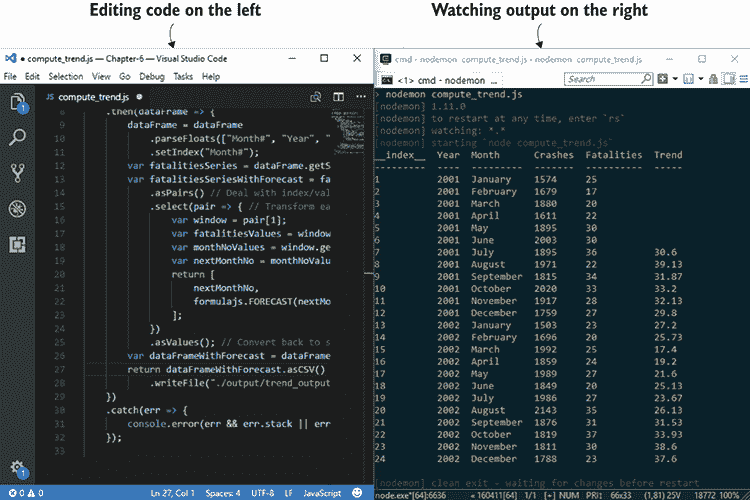

图 5.7 左侧编码，右侧查看输出

Nodemon 持续监视脚本文件的变化。当检测到变化时，它会自动执行代码并产生新的输出（这个过程在图 5.8 中展示）。这使我们能够在编码的同时查看结果。

### 5.8.1 使用 Nodemon

到目前为止，在本书中，我们一直在使用安装到我们的 Node.js 项目中的 npm 模块。Nodemon 和很快的 live-server 是我们将在系统上全局安装而不是在项目中本地安装的第一个工具。为此，我们在使用 npm 安装时添加`–g`（全局）参数。让我们运行 npm 并全局安装 Nodemon：

```
npm install -g nodemon 
```

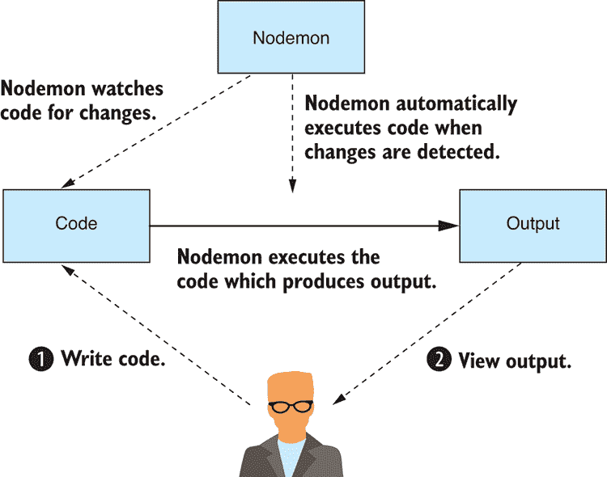

图 5.8 Nodemon 监视你的代码，并在你进行更改时自动执行它。

现在，我们可以使用命令行中的 Nodemon 代替 Node.js。例如，通常你会这样运行一个 Node.js 脚本：

```
node listing-5.1.js 
```

我们然后将 Node.js 替换为 Nodemon，如下所示：

```
nodemon listing-5.1.js 
```

通常情况下，当我们运行 Node.js 时，一旦脚本运行完成，它就会退出。然而，Nodemon 不会退出；相反，一旦脚本完成，它会暂停，然后等待脚本被修改。当 Nodemon 检测到文件已更改时，它会再次执行代码。这个循环会一直持续到你使用 Ctrl-C 退出 Nodemon。

现在，让我们看看我们的第一个脚本文件 listing-5.1.js，我们将在本节的过程中逐步改进它。我们这里的重点是脚本的*演变*。我们将从一个简单的东西（输出文本）开始，然后逐步改进代码，直到我们到达目的地并输出 CSV 文件 trend_output.csv。

列表 5.1 输出到控制台（listing-5.1.js）

```
'use strict;'

console.log("Hello world"); 
```

列表 5.1 的代码非常简单。我相信始终从一个简单的地方开始，然后逐步构建到更复杂的东西是一个好主意。你可以运行这段代码，并轻松验证它是否工作。

我通常不会从这么简单的代码开始，但我想要从 `console.log` 开始，因为它是一个重要的工具。`console.log` 函数是你的好朋友。我们已经在第三章和第四章中广泛使用了它来验证我们的数据，并且我们将在整本书中继续使用它。

现在，使用 Nodemon 从命令行运行脚本：

```
nodemon listing-5.1.js 
```

确保你已经设置好环境以便进行代码更改并查看 Nodemon 的输出。你可能需要将编辑器和输出窗口并排排列，就像在图 5.7 中展示的那样。

现在，将文本 `Hello world` 改成其他内容，比如 `Hello data analysis`。Nodemon 会检测到这个更改，执行代码，你应该会看到类似于图 5.9 的输出。这个简单的测试让你可以检查你的实时重新加载编码管道是否工作。

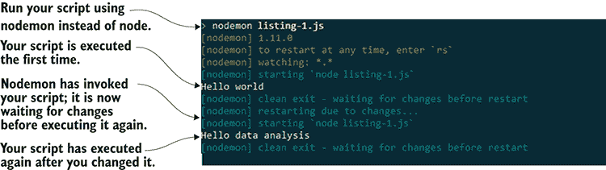

图 5.9 Nodemon 会自动在你工作时执行你的代码。

### 5.8.2 探索你的数据

让我们做一些实际的数据分析。首先，我们将使用我们在第三章中创建的 `importCsvFile` 工具函数来加载输入 CSV 文件（monthly_crashes-cut-down.csv）。我们将使用 `console.log` 打印内容，如下面的列表所示。运行此代码并检查控制台上的输出。

列表 5.2 加载你的输入 CSV 文件并将其内容打印到控制台（listing-5.2.js）

```
const importCsvFile = require('./toolkit/importCsvFile.js');

importCsvFile("./data/monthly_crashes-cut-down.csv")
    .then(data => {
 console.log(data);    ①  
    })
    .catch(err => {
        console.error(err && err.stack || err);
    }); 
```

将数据打印到控制台让我们从代码的角度首次看到数据。不幸的是，这里的数据太多了，我们的输出超出了屏幕。我们已经在处理一个数据样本的裁剪版本，但仍然太多了，我们只想一次查看几条记录，就像你在图 5.10 中看到的那样。

现在，让我们使用 JavaScript 数组的 `slice` 函数来截取一小部分数据进行检查。你应该运行以下列表中的代码来查看裁剪的数据样本。这是产生图 5.10 中所示输出的代码。

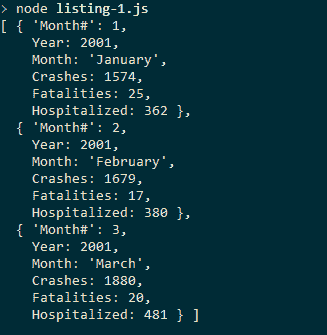

图 5.10 我们不想被输出淹没，我们只想一次查看几个记录。

列表 5.3 切割并打印数据的一部分以进行检查（listing-5.3.js）

```
const importCsvFile = require('./toolkit/importCsvFile.js');

importCsvFile("./data/monthly_crashes-cut-down.csv")
    .then(data => {
 const sample = data.slice(0, 3);    ①  
        console.log(sample);
    })
    .catch(err => {
        console.error(err && err.stack || err);
    }); 
```

我们还可以使用 `slice` 函数通过指定起始索引来从数据中间提取数据，如下所示：

```
var sample = data.slice(15, 5); 
```

`slice` 函数还接受一个负索引来从数组的末尾提取数据。这允许我们查看数据集末尾的记录。例如，让我们使用负 3 索引来查看数据集中的最后三个记录：

```
var sample = data.slice(-3); 
```

现在，让我们深入探讨并更详细地检查数据。我们可以查看输出（例如，参见图 5.11 中的输出），并对照我们的数据理解表来查看数据集的开始、中间和结束部分是否与我们对数据的当前理解一致。如果不一致，你可能需要更新你的数据理解表。

现在，让我们检查我们数据中存在的数据类型。我们可以使用 JavaScript 的 `typeof` 操作符来显示每个字段的类型。图 5.11 显示了第一条记录的类型。

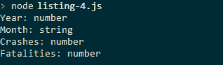

图 5.11 使用 JavaScript 的 `typeof` 操作符检查第一条记录中的类型

生成图 5.11 中输出的代码显示在列表 5.4 中。查看第一条记录，并使用 `typeof` 操作符检查第一条记录中每个字段的 JavaScript 类型。我们开始验证我们对数据的假设。你可以运行以下列表，并会看到数据集中存在的数据类型。

列表 5.4 使用代码检查你的数据类型（listing-5.4js）

```
const importCsvFile = require('./toolkit/importCsvFile.js');

importCsvFile("./data/monthly_crashes-cut-down.csv")
    .then(data => {
        const sample = data[0];
 console.log("Year: " + typeof(sample.Year));    ①  
 console.log("Month: " + typeof(sample.Month));    ①  
 console.log("Crashes: " + typeof(sample.Crashes));    ①  
 console.log("Fatalities: " + typeof(sample.Fatalities));    ①  
    })
    .catch(err => {
        console.error(err && err.stack || err);
    }); 
```

我们已经检查了数据的第一行符合我们的初始假设，并且数据类型与我们预期的完全一致。这仅仅是数据的第一行；然而，文件中的其余部分可能不符合你的假设！进行快速检查以确保我们不会在后续遇到任何问题是有价值的。在下面的列表中，我们已经修改了我们的脚本，以便使用 Node.js 的 `assert` 函数迭代 *所有* 数据并检查每一行。

列表 5.5 使用 assert 检查数据集是否符合你的假设（listing-5.5.js）

```
const assert = require('assert');
const importCsvFile = require('./toolkit/importCsvFile.js');

importCsvFile("./data/monthly_crashes-cut-down.csv")
    .then(data => {
 data.forEach(row => {    ①  
 assert(typeof(row.Year) === "number");    ①  
 assert(typeof(row.Month) === "string");    ①  
 assert(typeof(row.Crashes) === "number");    ①  
 assert(typeof(row.Fatalities) === "number");    ①  
 });    ①  
    })
    .catch(err => {
        console.error(err && err.stack || err);
    }); 
```

你可以运行列表 5.5 中的代码来验证假设，这是一个重要的步骤，但在这种情况下，它并没有做什么。这是因为我们的数据已经干净且表现良好。我们将在第六章中重新访问假设检查脚本。

我们的数据已经符合我们的假设，但我们事先无法知道这一点。运行这样的数据检查脚本可以防止我们在后续过程中遇到问题。这个脚本在将来当我们扩展到完整数据集时也会很有用。如果需要接受更新的数据，这个脚本也会很有用，因为我们无法保证我们将来收到的数据将遵循相同的规则！

### 5.8.3 使用 Data-Forge

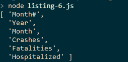

图 5.12 使用 Data-Forge 从 CSV 文件输出列名

在这一点上，我想介绍 Data-Forge，这是我为 JavaScript 编写的开源数据处理工具包。它就像瑞士军刀一样，用于处理数据，并具有许多有用的函数和功能，尤其是在探索我们的数据时。在本章中，我们将特别使用 Data-Forge 的`rollingWindow`函数来计算我们的趋势列。我们将在本书的后面部分了解更多关于 Data-Forge 的信息。

如果您为第五章代码仓库安装了依赖项，您已经安装了 Data-Forge；否则，您可以在一个新的 Node.js 项目中按照以下步骤安装它：

```
npm install –-save data-forge 
```

我们将使用 Data-Forge 做的第一件事是读取 CSV 文件并打印列名。此输出的显示如图 5.12 所示。

Data-Forge 有一个`readFile`函数，我们用它来加载数据集。Data-Forge 可以读取 JSON 和 CSV 文件，因此我们需要调用`parseCSV`来明确告诉 Data-Forge 将文件作为 CSV 数据处理。然后我们调用`getColumnNames`来检索列名。您可以运行以下列表的代码，它将打印出如图 5.12 所示的列名。

列表 5.6 使用 Data-Forge 加载 CSV 文件并列出列名（listing-5.6.js）

```
const dataForge = require('data-forge');    ①  

dataForge.readFile("./data/monthly_crashes-cut-down.csv")    ②  
 .parseCSV()    ③  
    .then(dataFrame => {
 console.log(dataFrame.getColumnNames());    ④  
    })
    .catch(err => {
        console.error(err && err.stack || err);
    }); 
```

当我们使用 Data-Forge 读取 CSV 文件时，它给我们一个包含数据集的 DataFrame 对象。DataFrame 包含许多函数，可以对我们的数据进行切片、切块和转换。让我们使用 Data-Forge 的`head`和`tail`函数从数据集的开始和结束提取并显示数据行。Data-Forge 提供了格式良好的输出，如图 5.13 所示。

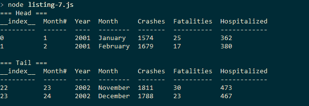

图 5.13 使用 Data-Forge 查看数据集头部和尾部的行

列表 5.7 使用`head`和`tail`函数查看我们的数据。这些函数的使用会产生一个新的 DataFrame 对象，其中只包含数据集的前 X 行或最后 X 行数据。然后使用`toString`函数生成图 5.13 中显示的格式良好的表格。您可以运行此代码并亲自查看输出。

列表 5.7 使用 Data-Forge 查看数据集头部和尾部的行（listing-5.7.js）

```
const dataForge = require('data-forge');

dataForge.readFile("./data/monthly_crashes-cut-down.csv")
    .parseCSV()
    .then(dataFrame => {
        console.log("=== Head ===");
 console.log(dataFrame.head(2).toString());    ①  

        console.log("=== Tail ===");
 console.log(dataFrame.tail(2).toString());    ②  
    })
    .catch(err => {
        console.error(err && err.stack || err);
    }); 
```

Data-Forge 做的一件有用的事情是总结我们数据集中存在的类型。图 5.14 显示了格式良好的 Data-Forge 数据类型总结。

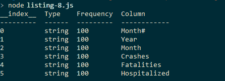

图 5.14 使用 Data-Forge 总结数据集中的数据类型——它们都是字符串！

图 5.14 中的输出是由 Data-Forge 函数`detectTypes`产生的，它扫描数据集并生成一个新的表格，显示我们数据中不同类型的频率。

您可能已经注意到图 5.14 中，我们所有的数据类型都是字符串！这肯定是不正确的！之前，当我们使用我们的`importCsvFile`工具函数时，我们的数据被加载为我们预期的类型：Crashes、Fatalities 和 Hospitalized 列都是数字。这是因为我们使用了 Papa Parse 来解析 CSV，并使用了它的自动类型检测。

CSV 数据格式，与 JSON 不同，没有对数据类型提供任何特殊支持；每个字段只是一个字符串。Papa Parse 内置了额外的智能，它会查看值以尝试确定它们*看起来像什么*的类型，但 CSV 数据格式本身并没有内置对数据类型的理解，因此 Data-Forge 不会自动检测它们。（注意：现在您可以在 Data-Forge 的最新版本中启用`dynamicTyping`；它底层使用 Papa Parse。）我们必须明确决定我们希望如何解释我们的数据，并使用`parseFloats`函数相应地指导 Data-Forge，如列表 5.8 所示。

列表 5.8 使用 Data-Forge 解析数据类型（listing-5.8.js）

```
const dataForge = require('data-forge');

dataForge.readFile("./data/monthly_crashes-cut-down.csv")
    .parseCSV()
    .then(dataFrame => {
 dataFrame = dataFrame.parseFloats(  [  ①  
 "Month#",    ①  
 "Year",    ①  
 "Crashes",    ①  
 "Fatalities",    ①  
 "Hospitalized"    ①  
 ]);    ①  
 console.log(dataFrame.detectTypes().toString());    ②  
    })
    .catch(err => {
        console.error(err && err.stack || err);
    }); 
```

图 5.15 显示了解析数字列后的输出结果。所有列都是 100%的数字，除了月份列。

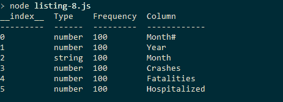

图 5.15 解析数据类型后，我们看到数据集中我们预期的类型。

### 5.8.4 计算趋势列

我们已经探索并理解了我们的数据。我们已经检查了关于数据的假设。现在是时候进行有趣的部分了。我们将计算趋势列。我在本章介绍 Data-Forge 不仅是因为它适合探索我们的数据，还因为它使我们的下一个任务更容易。

趋势列是从 Fatalities 列计算出来的，因此我们需要提取 Fatalities 列并在其上运行我们的 Excel FORECAST 公式。这生成了趋势列，但然后我们必须将列放回数据集中，并将其保存为新的 CSV 文件 trend_output.csv。

我们可以先提取 Fatalities 列并将其打印到控制台。我们不需要打印整个列，所以我们再次使用 Data-Forge 的`head`函数来仅显示数据的前几行。输出结果如图 5.16 所示。

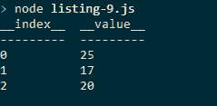

图 5.16 使用 Data-Forge 提取并显示的 Fatalities 列的前几行

我们使用 `getSeries` 函数从 DataFrame 中提取趋势列。这返回一个包含该列数据的 Data-Forge `Series` 对象。然后 `head` 函数提取前几行或数据，我们使用 `toString` 格式化输出，以便于显示。你可以运行 代码列表 5.9，你将看到与图 5.16 相同的输出。

列表 5.9 使用 Data-Forge 提取并显示死亡人数列的前几行（listing-5.9.js）

```
const dataForge = require('data-forge');

dataForge.readFile("./data/monthly_crashes-cut-down.csv")
    .parseCSV()
    .then(dataFrame => {
        dataFrame = dataFrame.parseFloats([
            "Month#",
            "Year",
            "Crashes",
            "Fatalities",
            "Hospitalized"
        ]);
 console.log(dataFrame    ①  
 .getSeries("Fatalities")    ①  
 .head(3)    ①  
 .toString()    ①  
 );    ①  
    })
    .catch(err => {
        console.error(err && err.stack || err);
    }); 
```

现在，我们已经提取了死亡人数序列，我们可以计算趋势。我们可以轻松地将 Excel 公式移植到 Node.js，使用优秀的 npm 模块 Formula.js。如果你为第五章的 GitHub 仓库安装了依赖项，你已经有 Formula.js。如果没有，你可以在新的 Node.js 项目中安装它，如下所示：

```
npm install –-save formulajs 
```

Formula.js 是 Excel 公式函数的 JavaScript 实现。它方便在 Excel 中原型化数据分析，然后在 Node.js 中精确地重现。

使用 Formula.js，我们可以重新创建我们在 Excel 中之前原型化的预测公式。我们的第一步是在前六个月的数据上测试这个公式，并得到一个预测值，如图 5.17 所示。

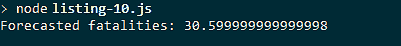

图 5.17 使用 Formula.js 从前六个月的数据预测死亡人数

我们从 DataFrame 中提取 Month# 和死亡人数序列，取每个序列的前六行（对于前六个月的数据）并将这些作为 `FORECAST` 函数的输入。这段代码显示在 代码列表 5.10 中。运行此代码，它将预测未来六个月的死亡人数，并显示图 5.17 中的结果。

列表 5.10 使用 Formula.js 重新生成 Excel 的 FORECAST 公式并基于前六个月的死亡人数预测下个月的死亡人数（listing-5.10.js）

```
const dataForge = require('data-forge');
const formulajs = require('formulajs');

dataForge.readFile("./data/monthly_crashes-cut-down.csv")
    .parseCSV()
    .then(dataFrame => {
        dataFrame = dataFrame.parseFloats([
            "Month#", "Year", "Crashes", "Fatalities",
            "Hospitalized"
        ]);
 const monthNoSeries = dataFrame.getSeries("Month#");    ①  
 const xValues = monthNoSeries.head(6).toArray();    ①  
 const fatalitiesSeries = dataFrame.getSeries("Fatalities");    ②  
 const yValues = fatalitiesSeries.head(6).toArray();    ②  
 const nextMonthNo = monthNoSeries.skip(6).first();    ③  
 const nextMonthFatalitiesForecast =    ④  
 formulajs.FORECAST(nextMonthNo, yValues, xValues);    ④  
 console.log('Forecasted fatalities: ' +    ⑤  
 nextMonthFatalitiesForecast);    ⑤  
    })
    .catch(err => {
        console.error(err && err.stack || err);
    }); 
```

尽管如此，我们还没有完成。我们只计算了一个预测值，你还需要计算整个趋势列。

在接下来的时间里，我们将覆盖更多内容，Data-Forge 将承担大部分繁重的工作。如果你在这里遇到困难，请不要过于担心；我们将在后面的章节中更详细地介绍 Data-Forge。

目前，只需了解我们正在使用 Data-Forge 的 `rollingWindow` 函数以六个月为一个数据块（称为数据窗口）迭代我们的数据，对于每个六个月的数据块，我们将预测一个新的值，构建未来值的滚动预测。这个过程的结果将是我们的计算出的趋势列。

这是我们之前在 Excel 中手动完成的事情，现在我们将使用代码来完成这项工作。计算出的趋势列将集成回 DataFrame 并输出到控制台，如图 5.18 所示。

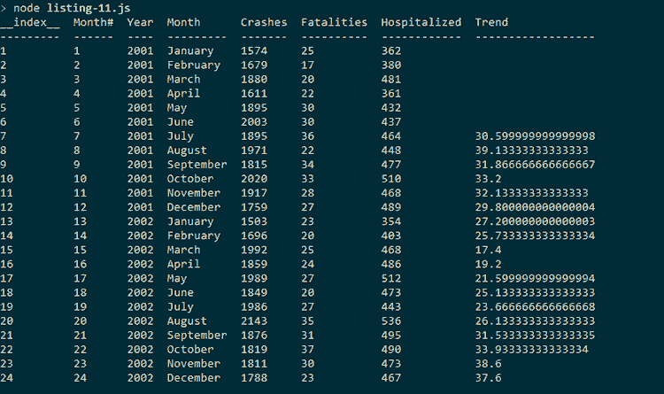

图 5.18 计算出的趋势列的 DataFrame

注意在 列表 5.11 中我们如何使用 `setIndex` 将月份数列设置为 DataFrame 的索引。在 DataFrame 上有索引可以允许使用 `withSeries` 函数（您可以在代码列表的末尾看到）将其新趋势列集成到 DataFrame 中。再次提醒，不要过于努力地理解 `rollingWindow` 在这里的使用；我们将在后面的章节中回到它。您可以运行此代码，您将看到图 5.18 所示的输出。

列表 5.11 使用 Data-Forge 的 rollingWindow 计算趋势列（listing-5.11.js）

```
const dataForge = require('data-forge');
const formulajs = require('formulajs');

dataForge.readFile("./data/monthly_crashes-cut-down.csv")
    .parseCSV()
    .then(dataFrame => {
        dataFrame = dataFrame
            .parseFloats([
            "Month#", "Year", "Crashes",
                "Fatalities", "Hospitalized"
        ])
 .setIndex("Month#");    ①  
        const fatalitiesSeries = dataFrame.getSeries("Fatalities");
        const fatalitiesSeriesWithForecast =
 fatalitiesSeries.rollingWindow(6)    ②  
 .select(window => {    ③  
 const fatalitiesValues = window.toArray();    ③  
                    const monthNoValues =
 window.getIndex().toArray();  ③  
                    const nextMonthNo =
 monthNoValues[monthNoValues.length-1] + 1;    ③  
 return [  ③  
 nextMonthNo,    ③  
 formulajs.FORECAST(    ③  
 nextMonthNo,    ③  
                            fatalitiesValues, 
 monthNoValues    ③  
 )    ③  
 ];    ③  
 })    ③  
 .withIndex(pair => pair[0])    ④  
 .select(pair => pair[1]);    ④  
 const dataFrameWithForecast = dataFrame.withSeries({    ⑤  
 Trend: fatalitiesSeriesWithForecast    ⑤  
 });    ⑤  
 console.log(dataFrameWithForecast.toString());    ⑥  
    })
    .catch(err => {
        console.error(err && err.stack || err);
    }); 
```

### 5.8.5 输出新的 CSV 文件

我们几乎得到了我们的结果！我们必须做的最后一件事是将数据输出为一个新的 CSV 文件。这可以通过 Data-Forge 的 `asCSV` 和 `writeFile` 函数简化，如下所示。如果您运行此代码，它将输出一个名为 trend_output.csv 的 CSV 文件。

列表 5.12 在 Data-Forge 的帮助下计算趋势列并输出新的 CSV 文件（listing-5.12.js）

```
const dataForge = require('data-forge');
const formulajs = require('formulajs');

dataForge.readFile("./data/monthly_crashes-cut-down.csv")
    .parseCSV()
    .then(dataFrame => {
        dataFrame = dataFrame
            .parseFloats(["Month#", "Year", "Crashes",
                "Fatalities", "Hospitalized"]
            )
            .setIndex("Month#");
        const fatalitiesSeries = dataFrame.getSeries("Fatalities");
        const fatalitiesSeriesWithForecast =
            fatalitiesSeries.rollingWindow(6)
                .select(window => {
                    const fatalitiesValues = window.toArray();
                    const monthNoValues =
                        window.getIndex().toArray();
                    const nextMonthNo =
                        monthNoValues[monthNoValues.length-1] + 1;
                    return [
                        nextMonthNo,
                        formulajs.FORECAST(
                            nextMonthNo,
                            fatalitiesValues,
                            monthNoValues
                        )
                    ];
                })
                .withIndex(pair => pair[0])
                .select(pair => pair[1]);
        const dataFrameWithForecast = dataFrame.withSeries({
            Trend: fatalitiesSeriesWithForecast
        });
        return dataFrameWithForecast
 .asCSV()  ①  
 .writeFile("./output/trend_output.csv");    ②  
    })
    .catch(err => {
        console.error(err && err.stack || err);
    }); 
```

现在我们已经生成了包含计算出的趋势列的新 CSV 文件 trend_output.csv，我们可以将其带回到 Excel 中查看其外观！如图 5.19 所示，在 Excel 中打开 CSV 文件，并检查其格式良好，以及新列看起来是否符合预期。


图 5.19 我们使用 Data-Forge 从 Node.js 生成的最终 CSV 文件。注意计算出的趋势列。

您甚至可以从这些生成数据创建图表，以快速查看其可视化效果。我们现在不会这样做；我们将使用这个 CSV 文件并在网页上显示它。让我们将注意力转向浏览器！

## 5.9 浏览器中的探索性编码

在使用 Node.js 生成包含计算出的趋势列的新 CSV 文件 trend_output.csv 之后，我们现在将为这些数据创建一个交互式网页可视化。为了生成可视化，我们将使用简单而有效的 Flot JavaScript 图表库。

在本节中，我们将通过 HTML 文件逐步完善我们的网页可视化。正如我们在上一节中所做的那样，我们将从简单开始，逐步将代码向我们的目标发展。我们的目标是生成图 5.20 所示的可视化。您可以通过查看 listing-5.13.html、listing-5.14.html 和 listing-5.15.html 来跟随代码的演变，我们在本章剩余部分进行工作。这些文件可在 GitHub 仓库中找到。

本节的主要工具称为 live-server。Live-server 是一个简单的命令行网页服务器；尽管它不是为了生产使用而设计的，但它对于快速原型设计非常出色。

Live-server 提供了一个即时网页服务器，其工作方式如图 5.21 所示。我们不需要手动编写网页服务器代码来开始原型设计我们的基于网页的可视化——这真是太好了，因为我们正在原型设计，我们希望快速进行。

Live-server，就像 Nodemon 一样，有助于自动化我们的工作流程。它监视我们的代码，并在检测到代码更改时自动刷新我们的网页。

我在这个部分使用的编码设置如图 5.22 所示。左边是我们正在开发的可视化代码。右边是显示我们网页的浏览器。当我们专注于左边时，live-server 会自动在右边刷新我们的可视化以显示更新后的结果。

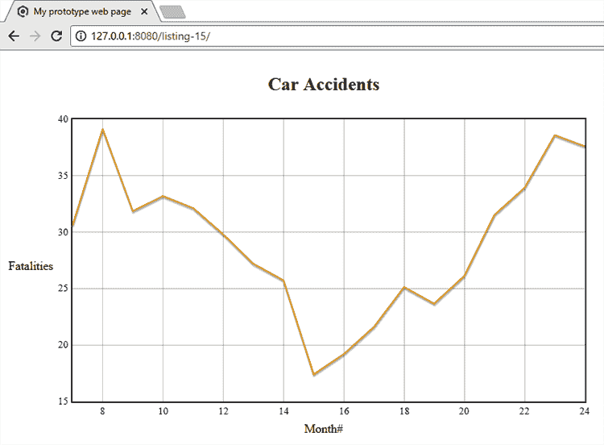

图 5.20 你的网页可视化的最终输出。伤亡趋势随时间变化。

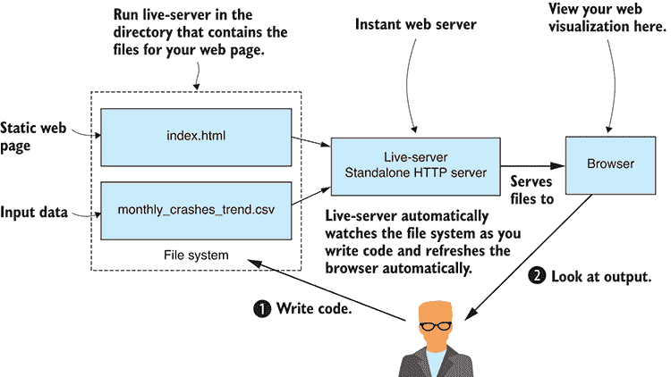

图 5.21 运行 live-server 以快速原型化网页可视化。

要使用 live-server，你应该按照以下方式全局安装它：

```
npm install –g live-server 
```

现在你可以从命令行运行 live-server，尽管在我们启动即时网页服务器之前，我们需要创建一个简单的网页。在进化编码的持续精神中，我们从简单开始，确保它工作，然后在我们迭代代码时保持其工作状态，我们将从最简单的网页开始，如图 清单 5.13 所示。我们将使用 JavaScript 创建我们的网页可视化，因此网页包含一个脚本部分，将“Hello world!”写入网页。

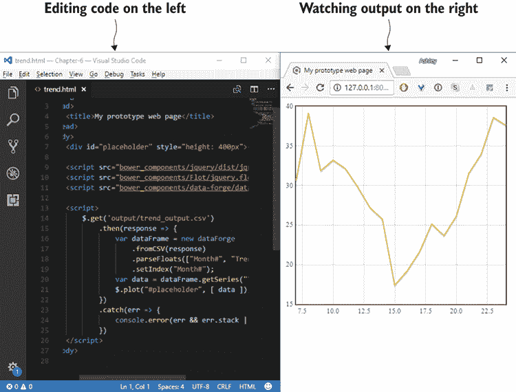

图 5.22 使用 live-server，你可以编辑代码，并在你进行更改时立即看到网页刷新。

列表 5.13 最简单的网页，用于启动你的网页可视化迭代编码（listing-5.13.html）

```
<!doctype html>
<html lang="en">
    <head>
        <title>My prototype web page</title>
    </head>
    <body>
        <script>
            //
            // Your JavaScript code goes here.
            //
            document.write("Hello world!");
        </script>
    </body>
</html> 
```

现在让我们启动网页服务器。在代码仓库目录中从命令行运行 live-server：

```
cd Chapter-5
live-server 
```

创建用于原型化的网页就这么简单！Live-server 自动打开我们的默认浏览器，我们可以浏览到 listing-5.13.html 来查看网页。

现在让我们更新我们的代码。我们需要 jQuery 和 Flot。如果你在第五章代码仓库中安装了 Bower 依赖项，那么你已经有它们了。否则，你可以按照以下方式将它们安装到一个新的网页项目中：

```
bower install –-save jquery flot 
```

现在我们已经安装了 jQuery，我们可以在我们的网页中包含它，以便我们可以使用它的 `get` 函数来检索之前使用 HTTP GET 生成的 CSV 文件 trend_output.csv（如下所示）。当我们修改代码时，live-server 会检测到变化并刷新网页，因此我们可以坐下来编码，并观察浏览器自动刷新以运行我们的最新代码。

列表 5.14 使用 HTTP GET 从 CSV 文件中检索数据（listing-5.14.html）

```
<!doctype html>
<html lang="en">
    <head>
        <title>My prototype web page</title>
    </head>
    <body>
 <script src="/bower_components/jquery/dist/jquery.min.js"></script>    ①  

        <script>
 $.get("./output/trend_output.csv")    ②  
                .then(response => {
 console.log(response);    ③  
                })
                .catch(err => {
                    console.error(err && err.stack || err);
                })
        </script>
    </body>
</html> 
```

我们仍然在这里进行进化编码。我们一次做一件小事情，并在进行中测试。记住，我们的目标是从小块可管理的增量中移动到工作的代码。列表 5.14 中的代码将我们的数据输出到浏览器的控制台。我们这样做是为了检查浏览器中的代码是否正确接收了数据。

当 live-server 仍在运行时，在浏览器中导航到列表 5.14 的网页，并打开开发者工具以检查控制台输出。例如，在 Chrome 中，你可以通过按 F12 并查看控制台标签（如图 5.23 所示）来打开开发者工具。

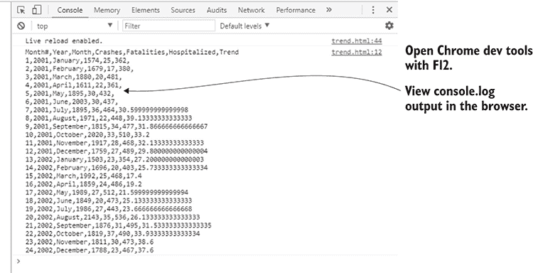

图 5.23 在 Chrome 的开发者工具控制台中查看 console.log 输出

我们应该在浏览器编码时始终打开开发者工具。这允许我们看到可能来自我们代码的任何 JavaScript 错误，并且我们可以使用日志验证我们的代码是否按预期工作。

我们检查数据的另一个选项是将它添加到网页中使用`document.write`，尽管如图 5.24 所示，这种输出的外观相当杂乱。

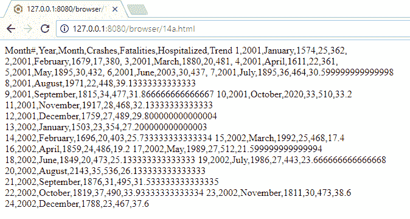

图 5.24 直接将 CSV 数据输出到网页中——这不是最吸引人的可视化！

好吧，现在是时候将数据放入图表中了！为了使事情变得简单，我们将为浏览器安装 Data-Forge 并使用它来转换我们的数据，以便用于 Flot 图表库。如果你为存储库安装了 Bower 依赖项，那么 Data-Forge 已经安装；否则，在新的 Web 项目中按照以下方式安装它：

```
bower install –-save data-forge 
```

在我们的网页中包含 Data-Forge 脚本之后，我们现在可以从我们的数据中创建一个 DataFrame，按月份编号索引它，然后从我们在列表 5.12 中产生的 CSV 中提取趋势列。接下来，我们使用 Flot 绘制趋势列。我们使用`toPairs`函数获取一个索引/值对的数组。每个对包括索引（我们使用了月份编号作为索引）和数据（来自趋势列）。然后我们使用 Flot 的`plot`函数将图表绘制到我们网页的占位符元素中，如下面的列表所示。

列表 5.15 使用 Data-Forge 从数据集中提取趋势列并在 Flot 图表中可视化它（listing-5.15.html）

```
<!doctype html>
<html lang="en">
    <head>
 <title>My prototype web page</title>
    </head>
    <body>
        <table style="text-align:center">
            <tr>
                <td></td>
                <td><h2>Car Accidents<h2></td>
                <td></td>
            </tr>

            <tr>
                <td>Fatalities</td>

                <td>
                    <div
                        id="placeholder"
                        style="width: 700px; height: 400px"
                        >
                    </div>
                </td>

                <td></td>
            </tr>

            <tr>
                <td></td>
                <td>Month#</td>
                <td></td>
            </tr>

        </table>
        <script src="/bower_components/jquery/dist/jquery.min.js"></script>
 <script src="/bower_components/Flot/jquery.flot.js"></script>    ①  
 <script src="bower_components/data-forge/data-forge.dist.js">➥</script>    ①  

        <script>
            $.get("./output/trend_output.csv")
                .then(response => {
 var dataFrame = new dataForge    ②  
 .fromCSV(response)    ②  
 .parseFloats(["Month#", "Trend"])    ②  
 .setIndex("Month#");    ②  
 var data = dataFrame    ③  
 .getSeries("Trend")    ③  
 .toPairs();  ③  
 $.plot("#placeholder", [ data ]);    ④  
                })
                .catch(err => {
                    console.error(err && err.stack || err);
                })
        </script>
    </body>
</html> 
```

当 live-server 运行时，导航到列表 5.15 的网页，你现在应该能看到图 5.25 中显示的最终结果。我们使用 Flot 图表库绘制了趋势列。就这些内容而言，这是一个基本的可视化，但它是从短暂且快速的原型设计会议中得出的一个很好的结果。

如果你想知道为什么列表 5.15 中图表的占位符`div`嵌入在一个`table`中，这纯粹是出于美观原因。`table`用于排列图表的标题以及 X 轴和 Y 轴的标签。

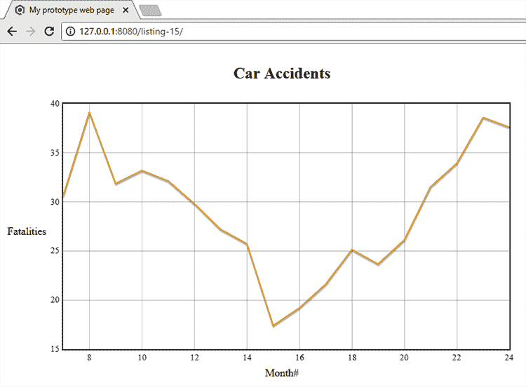

图 5.25 你原型设计的最终产品——Flot 图表库中关于伤亡数据的初步可视化

## 整合所有内容

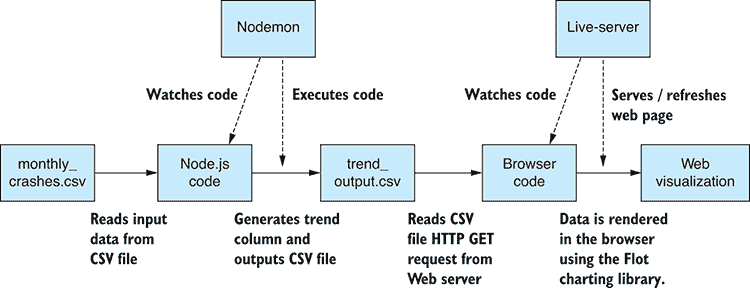

图 5.26 从 Node.js 到浏览器完整的管道——通过 Nodemon 和 live-server 的自动化代码执行

我们将本章的编码工作分为 Node.js 和浏览器编码两部分。然而，在实践中，并没有理由将这两项活动分开。我们可以同时运行 Nodemon 并在 Node.js 中编码，同时运行 live-server 并编码网页可视化。这形成了一个完整的编码流程，如图 5.26 所示。Nodemon 会捕捉到 Node.js 代码的更改，这些更改会自动流向输出 CSV 文件。Live-server 会检测 CSV 文件和网页代码的更改，这些更改会自动流向浏览器可视化。

你在这里做得很好，尽管这并不是全部的故事。回想一下，在本章中你只处理了数据的一个缩减样本。目标是更好地理解数据和你试图解决的问题。

通过本章的学习，你在编码的过程中积累了知识。在这个过程中，你编写了将来在扩展到完整数据集并将此网页可视化投入生产时将非常有用的代码。但就目前而言，你已经实现了目标：通过探索性编码和产生的有用代码更好地理解了问题。在第六章中，你将更深入地探讨数据中可能存在的问题，并学习如何纠正这些问题或绕过它们。

## 摘要

+   你学习了如何构建快速且高效的反馈循环，以实现快速迭代和提升生产力。

+   在开始编码之前，你发现了如何在 Excel 中原型化数据分析与可视化。

+   你使用 Formulajs 在 Node.js 中重现了 Excel 数据分析。

+   你练习了如何使用 Flot 快速构建基于网页的可视化。

+   你了解到可以使用 Nodemon 和 live-server 构建一个编码管道，该管道在你工作时自动刷新。
