# 6

清理和准备

**本章涵盖**

+   理解你可能在数据中找到的错误类型

+   识别数据中的问题

+   实施修复或绕过不良数据的策略

+   为在生产中有效使用数据做准备

当我们处理数据时，我们能够信任数据并有效地与之工作至关重要。几乎每个数据整理项目都预先加载了修复问题和准备数据以供使用的工作。

你可能听说过清理和准备等于 80%的工作！我不确定这一点，但确实准备通常是总工作量的大部分。

在这个阶段投入的时间可以帮助我们避免在后期发现我们一直在处理不可靠或有问题数据的情况。如果你遇到这种情况，那么你的大部分工作、理解和决策可能都是基于错误输入的。这不是一个好的情况：你现在必须回溯并修复这些错误。这是一个昂贵的过程，但我们可以通过在清理阶段早期注意来减轻这种风险。

在本章中，我们将学习如何识别和修复不良数据。你会看到数据出错的不同方式，所以我们无法期望查看所有这些方式。相反，我们将查看处理不良数据的一般策略，并将这些策略应用于具体示例。

## 6.1 扩展我们的工具包

在本章中，我们将更深入地了解 JavaScript 和 Data-Forge 函数，用于切片、切块和转换数据。我们还将依赖第三章的工具包，使用`importCsvFile`和`exportCsvFile`来加载和保存 CSV 文件。

表 6.1 列出了本章中涵盖的各种工具。

表 6.1 第六章使用的工具

| **API 库** | **函数/操作符** | **说明** |
| --- | --- | --- |
| JavaScript | `Map` | 在转换输入数组的每个元素后构建一个新的数组 |
|  | `Filter` | 通过过滤掉不需要的元素构建一个新的数组 |
|  | `Concat` | 将两个或多个数组连接成一个数组 |
|  | `Delete` | JavaScript 操作符，用于从 JavaScript 对象中删除字段 |
|  | `Reduce` | 将数组折叠成一个单一值；可用于聚合或总结数据集 |
| Data-Forge | `select` | 与 JavaScript `map`函数类似，在转换输入 DataFrame 的每一行后构建一个新的 DataFrame |
|  | `where` | 与 JavaScript `filter`函数类似，构建一个新的 DataFrame，过滤掉不需要的数据行 |
|  | `concat` | 与 JavaScript `concat`函数类似，将两个或多个 DataFrame 连接成一个 DataFrame |
|  | `dropSeries` | 从 DataFrame 中删除整个命名序列。使用此功能可以从数据集中删除整个数据列 |
|  | `groupBy` | 根据你指定的标准将数据行组织成组 |
|  | `aggregate` | 与 JavaScript `reduce`函数类似，将 DataFrame 折叠成一个单一值；可用于聚合或总结数据集 |
| Globby | `globby` | 用于读取文件系统并确定哪些文件与特定通配符匹配的函数。我们将使用它将多个文件合并成一个文件。 |

我们在这里的主要心智工具是数据管道。当我们考虑不同的数据转换方式时，请记住我们正在努力构建一个灵活的数据管道。如何构建它，那完全取决于你，但到本章结束时，我会向你展示一种优雅且灵活的方法，使用 Data-Forge 来串联你的数据转换。

## 6.2 准备珊瑚数据

当我们获取数据时，它并不总是以我们希望的方式出现。让我们回到我们在第一章和第二章中看到的珊瑚数据集。我们在使用它之前可能需要修复这个数据集的几个问题。

首先，让我们先解决几个与数据清理和准备相关的一般性问题。我们将探讨不良数据的来源以及我们如何识别它。然后，我们将介绍处理问题数据的一般技术。之后，我们将基于珊瑚数据集查看具体示例。

我应该说的是，我们并不一定需要我们的数据完美无瑕！除了实现这一点可能很困难（谁有资格定义完美？），我们的数据只需要适合目的。我们希望有效地处理那些尽可能没有问题、符合我们业务需求的数据。让我们开始吧。

## 6.3 获取代码和数据

代码和数据可在 GitHub 的 Chapter-6 存储库中找到，网址为[`github.com/data-wrangling-with-javascript/chapter-6`](https://github.com/data-wrangling-with-javascript/chapter-6)。

示例数据位于存储库中的 *data* 目录下。由代码生成的输出位于 *output* 目录下（但不在存储库中）。

请参考第二章中的“获取代码和数据”以获取帮助获取代码和数据。

*## 6.4 数据清理和准备的需求

为什么我们需要清理和准备我们的数据？最终，这关乎解决数据中的问题。我们需要出于以下原因来做这件事：

+   为了确保我们不会基于错误或不准确的数据得出错误的结论并做出糟糕的决定。

+   为了避免产生负面影响——例如，失去那些注意到数据错误的客户/客户的信任。

+   与干净、准确和可靠的数据一起工作可以使我们的工作更简单、更直接。

+   我们应该在问题容易解决的时候修复数据问题。你留得越久，解决它们就越昂贵。

+   我们可能需要在生产中离线准备我们的数据以实现高效使用。为了及时获得结果，以便我们可以迅速采取行动，我们需要数据已经以最佳格式存在，以便能够提供足够的性能。

我们有许多原因需要投入精力来修复我们的数据，但这引发了一个问题：数据最初为什么会出错？

## 6.5 破坏数据从何而来？

数据可能由于任何原因出现错误。我们通常无法控制数据源，尽管如果我们能控制，我们可以在收集点确保良好的验证。我们可以在收集数据时确保数据清洁，从而节省时间和精力。

然而，即使我们控制了数据源，我们也不能总是达到良好的数据质量。例如，如果我们从电子传感器读取数据，它们可能会偶尔返回虚假或错误的数据。它们可能会有间歇性问题，并在一段时间内失效，导致数据中断。

我们可能有负责收集或合成数据的软件。该软件中的潜在错误可能会生成不良数据，而我们甚至还没有意识到这一点！这样的错误可能长时间未被察觉。

也许我们正在使用有缺陷的软件生成数据，我们知道这些缺陷正在导致不良数据。我们是否处于修复它们的位置？我们可能无法做到！可能存在各种原因，使我们可能无法修复程序中的错误。首先，我们可能无法访问源代码，因此无法更新程序。或者我们可能在与复杂的遗留代码一起工作，并犹豫是否要做出更改——这些更改可能会产生更多的错误（如果你曾经与遗留代码一起工作，你应该知道我的意思）。当你无法更改代码，或者更改代码太难时，唯一的选择是绕过不良数据。

我们通常无法控制数据来源，因此我们获取的数据可能存在任何数量的问题，在我们可以使用之前必须解决这些问题。

无论我们以何种方式获取数据，似乎都无法避免不良数据，因此需要数据清理和准备。我们必须投入时间检查数据中的错误，并在必要时修复问题，为生产中的高效使用准备数据。

## 6.6 数据清理如何融入管道？

在第三章中，我介绍了核心数据表示（CDR）设计模式。这是通过连接具有共享数据表示的阶段来构建灵活数据管道的想法。

在第三章结束时，我们的数据转换管道的概念模型看起来像图 6.1。导入代码产生核心数据表示的数据，然后输入到导出代码中。

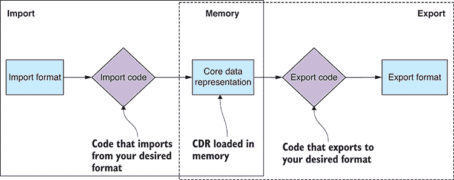

图 6.1 基本数据管道：数据通过核心数据表示从一种格式转换为另一种格式。

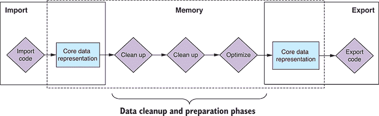

图 6.2 添加了清理和准备阶段的更完整的数据管道。

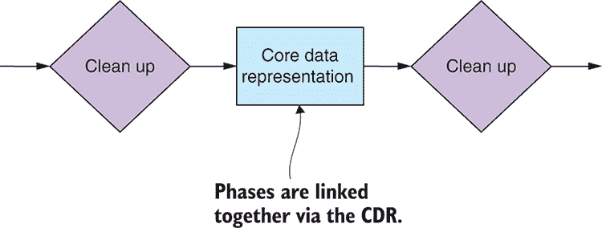

图 6.3 数据管道中的各个阶段通过核心数据表示连接在一起。

在本章中，我们扩展了我们数据管道的概念模型，包括多个转换阶段来清理、准备和转换我们的数据。图 6.2 展示了任意清理和准备阶段如何融入管道。它演示了如何在导入和导出之间包含任意数量的数据转换阶段。我们可以使用这个模型来构建一个可以从任何一种格式导入，通过多个阶段*转换*数据，然后导出到任何其他格式的数据管道。

转换阶段之间的空间是我们使用核心数据表示的地方。图 6.3 阐述了核心数据表示如何连接我们的模块化数据转换阶段。任何转换阶段的输入和输出都是共享格式中的数据块。我们可以链接多个阶段，并从可重用的代码模块中构建灵活的数据管道。

## 6.7 识别不良数据

你可能会问：我们如何检测不良数据？你可以用各种方式来处理这个问题。

早期，我们可以在文本编辑器或查看器中查看数据，并通过肉眼发现问题。我们无论如何都需要这样做，以便对数据的形状有一个感觉，但这也可以帮助我们快速检测任何明显的问题。这种方法可以让我们开始，并且对于小数据集来说可能有效，但显然它不能扩展到大数据集。人眼擅长发现问题，但它也有局限性，所以我们很容易错过问题。

我的做法是先通过肉眼分析一小部分数据，然后对其结构和格式做出假设。然后我编写一个脚本来在整个数据集中检查这些假设。这是我们第五章中提到的假设检查脚本。运行这个脚本可能需要相当长的时间，但这是值得的，因为这样你就可以知道你的假设是否成立。这个脚本的工作是告诉你你的数据中是否存在问题。

可能值得优化你的假设检查脚本以加快处理速度，尤其是因为你可能想在生产环境中运行你的假设检查脚本，以便接受实时数据更新到你的数据管道中。我们将在第十二章中更多地讨论实时数据管道。

你可能还想考虑的一种检测不良数据的方法是*众包*问题，并允许你的用户找到并报告损坏的数据。你可能还想考虑在生产版本中引入金丝雀测试，即将新版本提供给一小部分用户，以便在它广泛发布之前帮助你找到问题。这种方法是否合理取决于你的产品：你需要一个巨大的数据集（否则你为什么要这样做）和一个庞大且活跃的用户群体。

## 6.8 种类的问题

我们可能在数据中看到的问题种类繁多。以下是一些示例，以供说明：

+   *额外* *空白空间—*字段值周围的空白行或空白。

+   *缺失数据—*空、null 或 NaN 字段。

+   *意外数据* —你的代码能处理新的和意外的值吗？

+   *不准确的数据—*传感器读数偏离一定量。

+   *不一致性—*街道和 St，先生和 Mr，不同货币中的数据，不一致的大小写。

+   *格式错误的字段—*电子邮件、电话号码、拼写错误的类别等。

+   *损坏的数据—*缺少时区或传感器读数错误的日期/时间。

+   *无关数据—*对我们无用的数据。

+   *冗余数据—*重复的数据。

+   *低效的数据—*没有为有效使用而组织的数据。

+   *数据过多—*我们处理不过来的数据。

我们很快将深入研究修复这些问题的具体代码示例。

## 6.9 对坏数据的响应

我们已经识别出坏数据，但我们如何应对它？

这取决于你的情况和数据规模，但我们有各种应对坏数据的策略可供部署。考虑以下选项：

+   *我们可以修复数据—*如果可能的话。

+   *我们可以优化数据—*如果它在无效或不高效的格式中。

+   *我们可以忽略这个问题—*我们需要问：最坏的情况会怎样？

+   *我们可以绕过问题—*也许我们可以在生产中处理这个问题，而不是离线？

+   *我们可以过滤掉损坏的数据—*也许修复它比对我们来说更有价值。

+   *我们可以重新生成数据—*如果可能的话，也许我们可以修复问题的源头，然后从头开始捕获或生成数据。如果最初生成数据很便宜，重新生成可能比试图修复数据更便宜。

当我们谈论对坏数据的响应时，我们也必须考虑*在哪里*我们将对其进行响应。本章的大部分内容假设我们将数据*离线*修复，尽管值得注意的是，这些技术中的大多数也适用于实时数据管道，例如我们将在第十二章中涵盖的示例。

我们不是应该总是离线修复我们的数据吗？如果我们这样做，确实会提高我们生产系统的性能，但存在一些情况，这样做可能不可行。例如，想象一下你有一个巨大的数据集，它有错误，但这些错误仅与少数用户相关，并且访问频率不高。在这种情况下，让实时系统及时修复这些错误可能更有效，这就是所谓的懒惰模式，然后将修复后的记录重新烘焙回数据库。这允许我们的生产系统随着时间的推移缓慢地自行纠正，而不需要大量的离线时间和资源，并且不会过度影响我们的用户群。

## 修复坏数据的技巧

我们还没有解决修复损坏数据需要做什么。数据中可能发生大量问题；幸运的是，我们有一套简单的策略可以部署来修复损坏的数据。

表 6.2 列出了我们将现在添加到工具包中修复坏数据的技巧。

表 6.2 修复不良数据的技巧

| **技巧** | **如何？** | **为什么？** |
| --- | --- | --- |
| 修改数据 | 迭代并更新行和列。 | 用于数据归一化和标准化 |
|  |  | 用于修复损坏的数据 |
| 删除数据 | 过滤行和列。 | 用于删除不相关和冗余的数据 |
|  |  | 当我们数据过多时减少数据 |
| 数据聚合 | 合并、组合和汇总数据 | 优化数据以实现高效访问 |
|  |  | 当我们数据过多时减少数据 |
| 分割数据 | 将数据分离成单独的数据集 | 用于高效访问 |

我们将在本章的剩余部分探索这些技术的代码示例。

## 清理我们的数据集

是时候进入代码示例了！我们首先将查看最常见的技术之一：重写数据行以修复我们发现的问题。然后我们将查看一个常见的替代方案：过滤行或列以删除损坏或不相关的数据。

我们将在这些示例中使用重要的 JavaScript 函数，所以请务必注意。我还会展示如何在 Data-Forge 中完成这类工作。为了加载数据，我们将回退到我们在第三章中创建的用于导入和导出 CSV 文件的工具包函数。

### 6.11.1 重写不良行

在礁石数据中，我们首先要解决的问题是一个日期/时间问题。处理日期/时间值可能会引起许多问题，尽管在理解了问题之后，解决方案通常很容易找到。在这种情况下，问题在于日期/时间被存储为不包含时区信息的字符串表示（见图 6.4）。礁石数据库包含来自许多不同时区的记录，因此，在我们的日期中正确编码时区非常重要。由于我们的产品用户中存在日期位于错误时区的情况，这已经导致了许多生产问题。

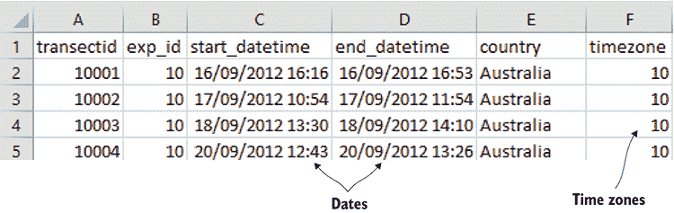

图 6.4 日期和时区存储在不同的列中。

我们的目标是将所有日期/时间值转换为带有正确时区编码的标准 UTC 格式（如图 6.5 所示）。我们将使用 JavaScript 日期/时间库 moment 来实现这一点。这是你将找到的最实用的 JavaScript 库之一。你可能记得我们第一次在第二章中安装它，并在第四章中再次使用它。它是处理日期和时间值的无价之宝。

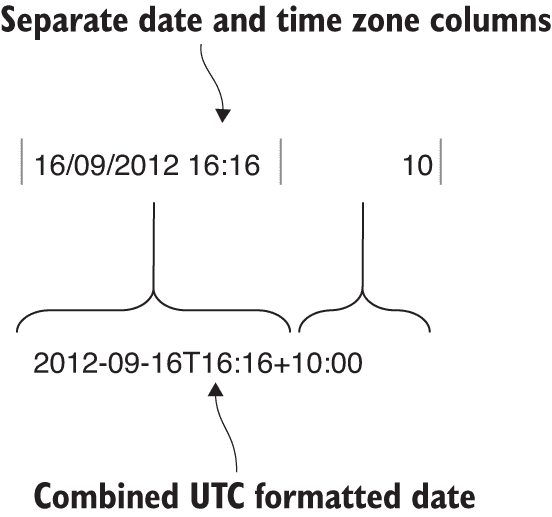

图 6.5 将日期和时区列合并为一个包含时区的 UTC 格式日期。

在这种情况下，我们已经有所有需要的信息，因为每个记录都将时区编码为单独的字段。我们需要将这些两个字段合并成一个单一的国际化日期/时间值，以反映正确时区的正确日期/时间。我们可以很容易地使用 moment（如图 6.5 所示）来完成这项工作。

要重写我们数据集中的每一行，我们将使用 JavaScript 的 `map` 函数。这个函数接受一个数组作为输入——我们的输入数据集。我们还向 `map` 函数传递一个转换函数。这个函数对我们的数据集中的每条记录应用修改。`map` 函数的输出是一个修改后的数据集——转换每条记录并构建新数组的结果。

我们可以说，`map` 函数通过将指定的修改应用于每条记录来 *重写* 我们的数据集。您可以在 图 6.6 中看到 `transformRow` 函数是如何应用于输入数组的每个元素以构建输出数组的。

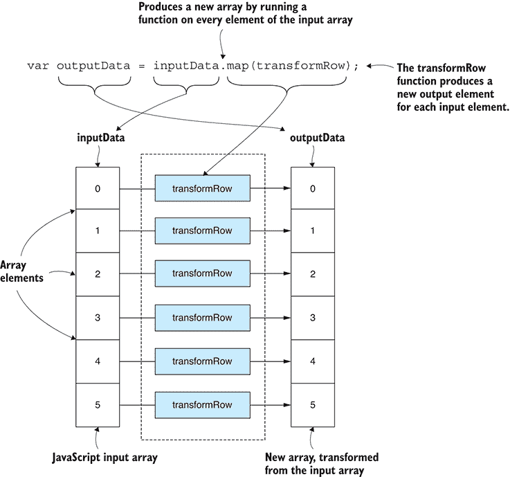

图 6.6 使用 JavaScript `map` 函数将数据从一种结构转换为另一种结构

列表 6.1 展示了使用 `map` 函数修复我们珊瑚数据集中日期/时间值的代码。需要关注的重要函数是 `transformData` 和 `transformRow`。`transformData` 转换整个数据集。`transformRow` 修复数据集中的每条记录。我们使用 moment 库将日期/时间的字符串表示与每条记录中的时区值结合起来。

`map` 函数本质上将输入数组拆分开来，然后通过 `transformRow` 修改每条记录。最后，它将修改后的记录粘合在一起形成一个新的数组，输出一个修复了损坏数据的新数据集。运行以下列表后，它将生成输出文件（surveys-with-fixed-dates.csv），然后在 Excel 或文本编辑器中加载该文件以验证其正确性。

列表 6.1 重写行以修复不良数据（listing-6.1.js）

```
const moment = require('moment');
const importCsvFile = require('./toolkit/importCsvFile.js');    ①  
const exportCsvFile = require('./toolkit/exportCsvFile.js');    ①  

const importDateFormat = "YYYY-MM-DD HH:mm";
const inputFileName = "./data/surveys.csv";    ②  
const outputFileName = "./output/surveys-with-fixed-dates.csv";    ②  

function parseDate (inputDate, timezoneOffset) {
 return moment(inputDate, importDateFormat)    ③  
 .utcOffset(timezoneOffset)    ③  
 .toDate();    ③  
}

function transformRow (inputRow) {    ④  
 const outputRow = Object.assign({}, inputRow);    ⑤  
 outputRow.start_datetime =    ④  
 parseDate(inputRow.start_datetime, inputRow.timezone);    ④  
 outputRow.end_datetime =    ④  
 parseDate(inputRow.end_datetime, inputRow.timezone);    ④  
 return outputRow;    ④  
}    ④  

function transformData (inputData) {    ⑥  
 return inputData.map(transformRow);    ⑥  
}    ⑥  

importCsvFile(inputFileName)    ⑦  
    .then(inputData => {
 const outputData = transformData(inputData);    ⑧  
 return exportCsvFile(outputFileName, outputData);    ⑨  
    })
    .then(() => {
        console.log('Done!');
    })
    .catch(err => {
        console.error('Error!');
        console.error(err && err.stack || err);
    }); 
```

注意在 列表 6.1 中，我们如何重用了我们在第三章中创建的 CSV 导入和导出函数。我们现在使用这些函数从 CSV 文件 surveys.csv 中加载数据，然后在损坏的数据被修复后，将数据保存到新的 CSV 文件 surveys-with-fixed-dates.csv 中*.*。

这种技术可以用来重写整个行，或者，就像我们在 列表 6.1 中做的那样，重写特定的单个字段。我们使用这项技术来修复我们的数据，但您也可以说我们这样做是为了使我们的生产代码更简单，因为现在它只需要处理组合的日期/时间值。

#### 行转换的通用模式

我们可以从这项技术中提炼出一个可重用的模式，以便我们可以用它来重写任何表格数据集。以下列表显示了通用模式。将您自己的代码放入 `transformRow` 函数中。

列表 6.2 重写不良行的通用模式（摘自 listing-6.2.js）

```
function transformRow (inputRow) {    ①  
 const outputRow = Object.assign({}, inputRow);    ①  
    //
    // TODO: Your code here to transform the row of data.
    //
 return outputRow;    ①  
}    ①  

function transformData (inputData) {    ②  
 return inputData.map(transformRow);    ②  
}    ②  

importCsvFile(inputFileName)    ③  
    .then(inputData => {
 const outputData = transformData(inputData);    ②  
 return exportCsvFile(outputFileName, outputData);    ④  
    })
    .then(() => {
        console.log("Done! ");
    })
    .catch(err => {
        console.error("Error!");
        console.error(err && err.stack || err);
    }); 
```

#### 使用 Data-Forge 重写损坏的数据

我们还可以使用 Data-Forge 以类似于传统 JavaScript 的方式重写我们的数据集。

我们为什么应该使用 Data-Forge 呢？因为像这样的数据转换非常适合灵活、方便且优雅的 Data-Forge 数据管道。在章节的结尾，你将看到一个更完整的 Data-Forge 示例，展示这一切是如何在大数据管道的背景下结合在一起的，但就目前而言，让我们使用 Data-Forge 重新编写列表 6.1。

你会注意到 列表 6.3 与 列表 6.1 类似。我们有熟悉的 `transformData` 和 `transformRow` 函数。实际上，`transformRow` 与 列表 6.1 中的完全相同。然而，`transformData` 是不同的。在这种情况下，它接受一个 Data-Forge DataFrame 作为输入，并返回一个新的、修改后的 DataFrame 作为输出。我们不是使用 JavaScript 的 `map` 函数，而是使用 Data-Forge 的 `select` 函数来转换数据集。`map` 和 `select` 在概念上是等效的：它们都拆分一个数据序列，修改每个记录，然后将输出合并以创建一个新的序列。你可以运行以下列表，它将输出文件 surveys-with-fixed-dates-using-data-forge.csv。

列表 6.3 使用 Data-Forge 重新编写不良记录（listing-6.3.js）

```
const moment = require('moment');
const extend = require('extend');
const dataForge = require('data-forge');    ①  

const importDateFormat = "YYYY-MM-DD HH:mm";
const inputFileName = "./data/surveys.csv" ;
const outputFileName =
    "./output/surveys-with-fixed-dates-using-data-forge.csv";

function parseDate (inputDate, timezoneOffset) {
    return moment(inputDate, importDateFormat)
        .utcOffset(timezoneOffset)
        .toDate();
}

function transformRow (inputRow) {
    const outputRow = Object.assign({}, inputRow);
    outputRow.start_datetime = parseDate(
        inputRow.start_datetime, inputRow.timezone
    );
    outputRow.end_datetime = parseDate(
        inputRow.end_datetime, inputRow.timezone
    );
    return outputRow;
}

function transformData (inputDataFrame) {
 return inputDataFrame.select(transformRow);    ②  
}

dataForge.readFile(inputFileName)    ③  
 .parseCSV()    ③  
    .then(inputDataFrame => {
 const outputDataFrame = transformData(inputDataFrame);    ④  
        return outputDataFrame
 .asCSV()    ⑤  
 .writeFile(outputFileName);    ⑤  
    })
    .then(() => {
        console.log("Done! ");
    })
    .catch(err => {
        console.error("Error!");
        console.error(err && err.stack || err);
    }); 
```

列表 6.3 与 列表 6.1 并没有太大的不同，它还没有展示出 Data-Forge 的强大功能。Data-Forge 的好处之一，以及其他好处，是它很容易链式调用数据转换并构建管道。在我们看到它们如何使用 Data-Forge 链接成一个更复杂的管道之前，让我们先处理完剩余的示例。

### 6.11.2 过滤数据行

我们在珊瑚礁数据中需要解决的第二个问题是，我们只对澳大利亚的珊瑚礁感兴趣。这就是我们的关注点，其余的数据与我们的数据分析无关，所以让我们删除我们不感兴趣的行。当我们发现数据无用或检测到重复或冗余时，我们可以过滤掉数据。我们可能还希望过滤掉那些我们没有成本效益的修复方法的数据。

正如我们在第五章中已经讨论过的，使用精简的数据集将使我们的过程更快、更流畅。此外，你感兴趣的数据将更加清晰，因为它没有被无关的额外数据所杂乱。你绝对应该删除你不需要的数据部分。一如既往，请注意不要覆盖你的源数据。你即将删除的数据可能在将来某一天需要，所以请小心保留原始未修改数据的副本。

我们的目标是移除不在澳大利亚的珊瑚礁数据。我们将使用 JavaScript `filter` 函数来实现这一点。我们将在数据数组上调用 `filter` 函数，并传入一个用户定义的 *谓词* 函数，该函数指定要过滤掉的记录。谓词函数必须返回布尔 `true` 以保留记录或 `false` 以移除它。与之前检查的 `map` 函数类似，`filter` 函数将输入数组拆分，然后根据谓词函数的结果，它将拼接一个新的数组，但减去任何被过滤掉的记录。

我们可以说，`filter` 函数通过删除我们不再想要的记录来 *重写* 我们的数据集。你可以在 图 6.7 中看到 `filterRow` 谓词函数是如何应用于输入数组的每个元素，以确定记录是否应包含在输出数组中。

列表 6.4 展示了使用 JavaScript `filter` 函数从我们的珊瑚礁数据集中删除行。我们在这里再次看到了之前列表中的 `transformData` 函数，尽管这次我们使用 `filter` 函数而不是 `map` 函数来转换数据集。

注意 `filterRow` 函数：这是我们为每个记录调用的谓词函数，它确定记录是否应该保留或删除。`filterRow` 对每个位于澳大利亚的记录返回 `true`，因此它保留了这些记录。另一方面，它对每个其他记录返回 `false`，并删除了不在澳大利亚的记录。

`filter` 函数将输入数组拆分，并为每个记录调用 `filterRow`。它生成一个只包含通过过滤的记录的新数组——输出数组只包含 `filterRow` 返回 `true` 的记录。它输出一个新数据集，不包括我们想要删除的记录。你应该运行以下列表并检查它输出的文件 surveys-but-only-Australia.csv。

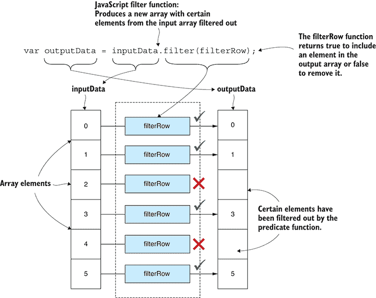

图 6.7 使用 JavaScript 过滤函数生成一个新数组，其中包含过滤掉某些元素

列表 6.4 过滤掉不需要或不良数据（摘自列表-6.4.js）

```
function filterRow (inputRow) {    ①  
 return inputRow.country === 'Australia';    ①  
}    ①  

function transformData (inputData) {
 return inputData.filter(filterRow);    ②  
}; 
```

#### 过滤行的一般模式

我们可以为从我们的数据集中过滤掉数据行创建一个通用模式。列表 6.5 是这个模式的模板，你可以插入你自己的过滤代码。记住，你的谓词函数必须为你要保留的记录返回 `true`，为你要删除的记录返回 `false`。

列表 6.5 过滤掉不良数据的一般模式（列表-6.5.js）

```
function filterRow (inputRow) {    ①  
    // TODO: Your predicate here.
    // Return true to preserve the row or false to remove it.
    const preserveRow = true;
    return preserveRow;
}    ①  

function transformData (inputData) {
    return inputData.filter(filterRow);
};

importCsvFile(inputFileName)
    .then(inputData => {
        const outputData = transformData(inputData);
        return exportCsvFile(outputFileName, outputData)
    })
    .then(() => {
        console.log("Done!");
    })
    .catch(err => {
        console.error("Error!");
        console.error(err && err.stack || err);
    }); 
```

#### 使用 Data-Forge 过滤行

让我们再次看看 Data-Forge，这次我们将学习如何使用它来过滤数据行。我们看到的情况与在纯 JavaScript 中实现的方式相似。因为它如此相似，你可能会想知道为什么我们要费心使用 Data-Forge？这个原因应该在章节结束时变得清晰，届时我将向您展示如何将多个 Data-Forge 函数链接起来以构建更复杂的数据管道。

列表 6.6 与列表 6.4 有相同的`filterRow`函数。然而，它的`transformData`函数使用 Data-Forge 的`where`函数来过滤记录，而不是我们在列表 6.4 中使用的 JavaScript `filter`函数。`where`和`filter`函数执行相同的概念性任务：它们为每个记录执行一个谓词函数，以确定哪些记录应该保留，哪些应该被删除。我们的列表 6.6 中的`transformData`函数接受一个 DataFrame 作为输入，并返回一个新的、修改后的 DataFrame 作为输出。输出 DataFrame 仅保留我们想要保留的记录；所有其他记录都已过滤掉。当你运行此代码时，它会产生输出文件 surveys-but-only-Australia-using-data-forge.csv。检查输出文件，你会发现它与列表 6.4 产生的相同。

列表 6.6 使用 Data-Forge 过滤掉不需要或不良数据（摘自列表-6.6.js）

```
function filterRow (inputRow) {    ①  
 return inputRow.country === 'Australia';    ①  
}    ①  

function transformData (inputDataFrame) {
 return inputDataFrame.where(filterRow);    ②  
} 
```

我们还没有看到 Data-Forge 的真正力量。请耐心等待；它很快就会到来！

### 6.11.3 过滤数据列

我们在礁石数据中需要解决的第三个问题是删除列。这与之前的问题类似，那时我们想要删除数据行。然而，这次，我们不是要删除整个记录，而是要从每个记录中删除单个字段，但保留每个记录的其余部分。

我们这样做的原因与删除行相同：为了删除损坏的、无关的或冗余的数据，并使数据集更加紧凑，更容易处理。再次提醒，请务必不要覆盖您的源数据，并将它的副本保存在安全的地方。

我们的目标是从每个记录中删除`reef_type`字段，这将从我们的整个数据集中删除`reef_type`列。我们不需要这个列，它使我们的数据变得杂乱。

从数组的每个项目中删除字段并不像我们使用 JavaScript `filter`函数那样过滤整个项目那样方便；然而，JavaScript 确实提供了一个`delete`运算符，它可以完成我们需要的功能：从一个 JavaScript 对象中删除一个字段（参见图 6.8）。

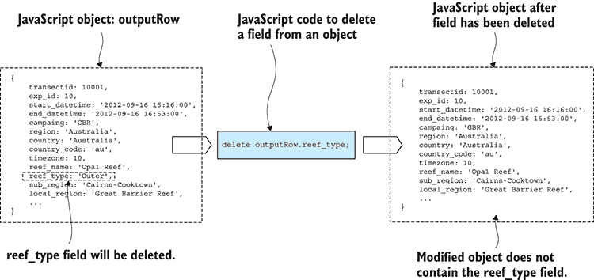

图 6.8 从数组的每个元素中删除字段的效果是从我们的表格数据中删除一个“列”。

要使用`delete`运算符，我们必须遍历我们的数据集并应用于每个记录，如列表 6.7 所示。注意在`transformData`中，我们再次使用`map`函数来转换整个数据数组。`transformRow`函数访问每个记录并使用`delete`运算符删除`reef_type`字段。运行此代码，将生成输出文件 surveys-with-no-reef-type.csv。输出数据与输入数据相同，但已删除所需的列。

列表 6.7 删除整个列（列表-6.7.js 的摘录）

```
function transformRow (inputRow) {
 const outputRow = Object.assign({}, inputRow);    ①  
 delete outputRow.reef_type;    ②  
    return outputRow;
}

function transformData (inputData) {
 return inputData.map(filterColumn);    ③  
} 
```

#### 使用 Data-Forge 过滤列

继续我们的主题，先在纯 JavaScript 中实现，然后在 Data-Forge 中，我们也可以使用 Data-Forge 从我们的数据集中删除整个列。在先前的例子中，使用 Data-Forge 与使用纯 JavaScript 并没有太大的区别，但在这个例子中，我们的任务变得稍微简单一些。

列表 6.8 展示了使用 Data-Forge 的`dropSeries`函数从我们的 DataFrame 中删除一个命名序列（例如，数据列）。这比从每个单独的记录中逐个删除字段要简单。当你运行此代码时，将生成输出文件 surveys-with-no-reef-type-using-data-forge.csv。这是与列表 6.7 生成的相同输出，但使用 Data-Forge 生成更为方便。

列表 6.8 使用 Data-Forge 删除整个列（列表-6.8.js 的摘录）

```
function transformData (inputDataFrame) {
 return inputDataFrame.dropSeries("reef_type");    ①  
} 
```

这是 Data-Forge 如何简化并简化数据处理过程的第一个好例子，但我们才刚刚开始，Data-Forge 还有许多更多功能可以帮助我们轻松分割、转换和重新整合我们的数据。

## 准备我们的数据以有效使用

我们清理并修复了我们在数据中识别出的各种问题。然而，为了有效使用数据，可能还需要做更多的工作。我们可能仍然有太多的数据需要减少，或者我们的数据可能不适合分析。现在让我们看看几个如何聚合或划分我们的数据以使其更容易处理的例子。

### 6.12.1 数据行聚合

让我们看看如何按珊瑚礁名称聚合我们的数据。如果我们想查看每个珊瑚礁的统计数据，那么将特定珊瑚礁的所有记录合并成一个珊瑚礁的总结记录是有意义的。

我们在这里将保持简单，并查看每个珊瑚礁所行驶的累积距离。我们需要对每个珊瑚礁的所有记录中的`transects_length`字段进行求和。从数据分析的角度来看，这很简单，但这是我们本章示例中所需的所有内容。在第九章的后面，我们将探讨更高级的数据分析技术。

图 6.9 展示了源数据的一部分以及它与聚合数据的比较。注意左侧每行数据在每个珊瑚礁中都有多个记录，但在右侧，它们已经被压缩成每个珊瑚礁一行。

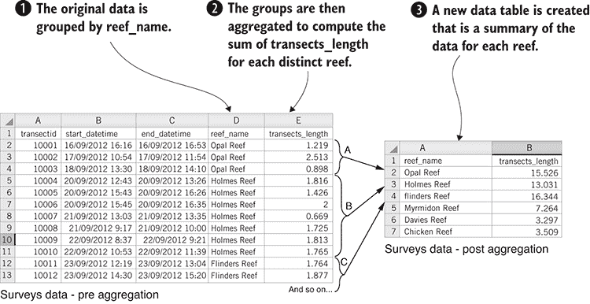

图 6.9 聚合数据：按礁石名称分组然后对每个组的 transects_length 求和

为了聚合我们的数据，我们执行以下步骤：

1.  源数据根据`reef_name`字段组织到桶中。

1.  对于每个记录组，我们计算`transects_length`字段的和。

1.  最后，创建一个新的数据集，每个礁石一条记录，包含聚合数据。

列表 6.9 展示了聚合礁石数据的代码。注意对 Data-Forge 的`groupBy`函数的调用：这将我们的 DataFrame 转换成一系列组。传递给`groupBy`的函数指定了如何组织我们的数据到组中。这表示我们希望按`reef_name`分组。`groupBy`的输出是一个表示一系列组的 Data-Forge Series 对象。每个组本身是一个包含原始数据子集的 DataFrame。然后我们调用`select`将组转换成一组新的汇总记录。在这里，我们调用`sum`函数对组的`transects_length`字段求和。

这里有很多事情在进行中，所以请花时间阅读代码，并让这些内容深入人心。您可以运行此代码，它将生成类似于右侧图 6.9 所示的 surveys-aggregated.csv 文件。

列表 6.9 使用 Data-Forge 聚合数据（列表-6.9.js 的摘录）

```
function transformData (inputDataFrame) {
    return inputDataFrame
 .parseFloats("transects_length")    ①  
 .groupBy(inputRow => inputRow.reef_name)    ②  
 .select(group => {    ③  
            return {
 reef_name: group.first().reef_name,    ④  
                transects_length: group
 .deflate(row => row.transects_length)    ⑤  
 .sum(),    ⑥  
            };
 })    ③  
 .inflate();    ⑦  
} 
```

这是一个仅使用 Data-Forge 的另一个示例。您可以用普通的 JavaScript 编写此代码，但代码会更长，更难阅读。

使用 Data-Forge 允许我们更简洁地表达这种类型的转换。代码越少，错误越少，所以这是一个好事。注意函数`parseFloats`、`groupBy`和`select`是如何一个接一个地链在一起的？我们已经瞥见了 Data-Forge 函数是如何一个接一个地链在一起以快速构建数据管道的。

### 6.12.2 使用 globby 从不同文件中组合数据

让我们假设我们已经以一组文件的形式收到了我们的礁石数据。比如说，礁石数据按国家分开，有文件 Australia.csv、United States.csv 等等。在我们能够处理这些数据之前，我们需要从本地文件系统中加载这些文件并将它们合并。

存在多种方法来组合此类数据：

+   连接文件的行。

+   行行合并。

+   通过匹配字段（类似于 SQL 连接操作）来合并数据。

在本节中，我们将保持简单，并专注于连接方法。我们的目标是读取多个文件到内存中，在内存中连接它们，然后将它们写入一个单一的大型数据文件。我们将使用一个名为 globby 的 JavaScript 库来查找文件。我们已经有文件导入和导出功能，使用我们的工具函数。为了进行连接，我们将使用 JavaScript 的数组`concat`函数。这个过程在图 6.10 中展示。

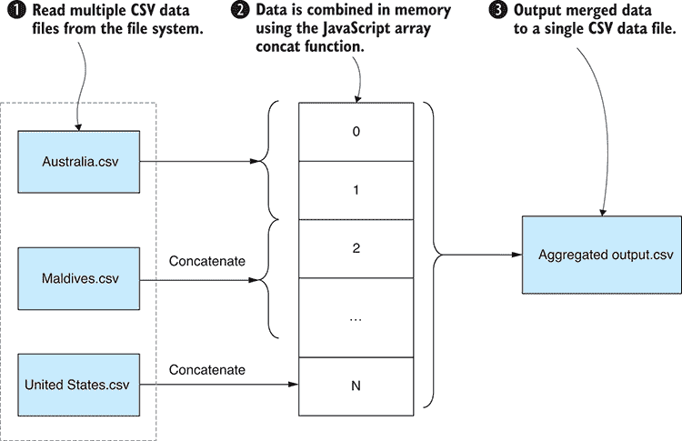

图 6.10 将多个输入文件聚合到一个输出文件中

要连接多个文件，我们执行以下过程：

1.  定位并读取多个 CSV 文件到内存中。

1.  使用 JavaScript 数组的 `concat` 函数将所有记录连接成一个单独的数组。

1.  将连接后的数组写入一个单一的合并输出文件。

如果你已经为第六章代码仓库安装了依赖项，那么你的项目中已经安装了 globby；否则，你可以在一个新的 Node.js 项目中按照以下方式安装它：

```
npm install –-save globby 
```

列表 6.10 展示了使用 globby 和我们的工具函数 `importCsvFile` 将多个文件加载到内存中的代码。我们使用 JavaScript 的 `reduce` 函数将导入文件的选择 *reduce* 到一个单一的连接 JavaScript 数组。对于每个导入的文件，我们调用 `concat` 函数将导入的记录追加到合并数组中。你应该运行此代码并查看它创建的合并输出文件 surveys-aggregated-from-separate-files.csv。

列表 6.10 使用 globby 聚合多个文件（listing-6.10.js）

```
const globby = require('globby');    ①  
const importCsvFile = require('./toolkit/importCsvFile.js');
const exportCsvFile = require('./toolkit/exportCsvFile.js');

const inputFileSpec = "./data/by-country/*.csv";    ②  
const outputFileName =
    "./output/surveys-aggregated-from-separate-files.csv";

globby(inputFileSpec)    ③  
 .then(paths => {    ④  
 return paths.reduce((prevPromise, path) => {    ⑤  
 return prevPromise.then(workingData => {    ⑤  
 return importCsvFile(path)    ⑥  
                        .then(inputData => {
 return workingData.concat(inputData);    ⑦  
                        });
 });    ⑤  
 }, Promise.resolve([]));    ⑤  
    })
    .then(aggregatedData => {
 return exportCsvFile(outputFileName, aggregatedData);    ⑧  
    })
    .then(() => {
        console.log("Done!");
    })
    .catch(err => {
        console.error("An error occurred.");
        console.error(err);
    }); 
```

注意在 列表 6.10 中，所有导入的文件都是异步加载的。在这里使用 `reduce` 的主要目的是将一系列异步操作合并成一个单一的 promise；这允许我们使用这个单一的 promise 来管理整个异步操作链。我们也可以在这里使用 `Promise.all` 并并行处理文件，而不是按顺序处理，但我想要展示如何以这种方式使用 `reduce` 函数。如果你在这方面遇到困难，请参考第二章中关于异步编码和 promises 的入门指南。

请注意，Data-Forge 有一个 `concat` 函数，你可以使用它来连接多个 DataFrame 的内容。

### 6.12.3 将数据拆分到单独的文件中

我们学习了如何将多个输入文件合并成一个数据集。现在让我们看看这个过程的反面：将大数据集拆分成多个文件。我们可能想要这样做，以便我们可以处理数据的一个较小的分区部分，或者如果我们能够根据某些标准拆分数据来处理数据，这可能使我们的工作变得更简单。

对于这个例子，我们将做与上一个例子完全相反的事情，根据国家拆分我们的数据，如图 6.11 所示。这使我们能够更灵活地处理数据。在这个例子中，让我们假设我们想要单独处理每个国家的数据。或者，如果我们有大量的数据，一次处理一个批次可能更有效率，这是我们将在第八章再次探讨的技术。

列表 6.11 中的代码定义了一个名为 `splitDataByCountry` 的函数。它首先调用 `getCountries` 函数，查询数据以确定表示的唯一国家列表。然后，对于每个国家，它过滤该国家的数据集，并导出一个只包含过滤数据的新的 CSV 文件。

这里的过滤和导出逻辑与我们在 列表 6.6 中看到的类似，即 Data-Forge 过滤行的示例，尽管我们在这里添加了一个额外的层，它遍历所有国家并为每个国家导出单独的 CSV 文件。如果你运行此代码，它将为每个国家生成输出：Australia.csv、United States.csv 等。

列表 6.11 将数据拆分到多个文件中（listing-6.11.js）

```
const dataForge = require('data-forge');

const inputFileName = "./data/surveys.csv";

function filterRow (inputRow, country) {
 return inputRow.country === country;    ①  
}

function transformData (inputDataFrame, country) {    ②  
 return inputDataFrame.where(inputRow => {    ②  
 return filterRow(inputRow, country);    ②  
 });    ②  
}    ②  

function getCountries (inputDataFrame) {    ③  
 return inputDataFrame    ③  
 .getSeries("country")    ③  
 .distinct();    ④  
}    ③  

function splitDataByCountry (inputDataFrame) {
 return getCountries(inputDataFrame)    ⑤  
 .aggregate(Promise.resolve(), (prevPromise, country) => {    ⑥  
 return prevPromise.then(() => {    ⑥  
 const outputDataFrame = transformData(    ⑦  
 inputDataFrame,    ⑦  
 country    ⑦  
 );    ⑦  
                const outputFileName = "./data/by-country/" +
                    country + ".csv";
 return outputDataFrame    ⑧  
 .asCSV()    ⑧  
 .writeFile(outputFileName);    ⑧  
 });    ⑥  
 });    ⑥  
}

dataForge.readFile(inputFileName)
    .parseCSV()
    .then(splitDataByCountry)
    .then(() => {
        console.log("Done! ");
    })
    .catch(err => {
        console.error("Error! ");
        console.error(err && err.stack || err);
    }); 
```

在 列表 6.11 中，请注意 Data-Forge `aggregate` 函数的使用。这与我们在本章早些时候看到的 JavaScript `reduce` 函数的工作方式类似，我们在这里使用它的原因也是相同的：将一系列异步操作序列化成一个单一的合并承诺。请参考第二章以复习异步编码和承诺。

## 使用 Data-Forge 构建数据处理管道

我使用 Data-Forge 的一个主要原因是它能够将操作链式连接起来，快速构建灵活的数据管道。我说灵活，是因为 Data-Forge 函数链的语法很容易重新排列和扩展。我们可以轻松地插入新的数据转换，移除不再需要的，或者修改现有的。

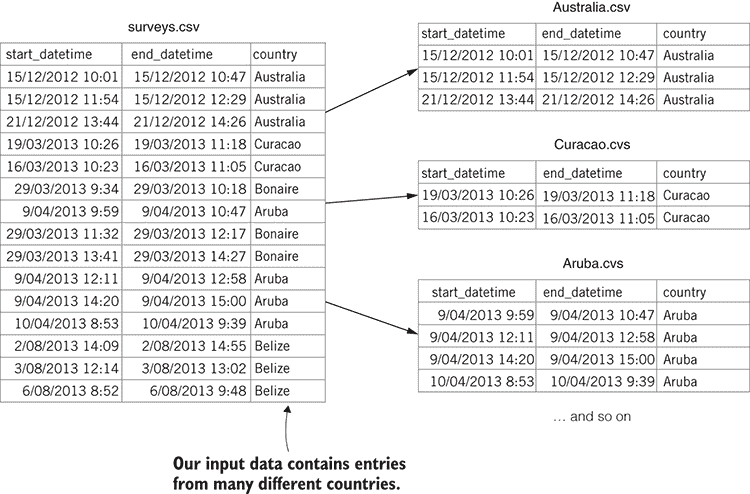

图 6.11 按国家拆分单个文件到多个文件

在本章中，你一直在构建对 Data-Forge 链式操作的理解，我希望你也能欣赏到它能为你的数据处理工具箱带来的力量，但现在我想使这一点更加明确。让我们看看一个新的 Data-Forge 示例，它是从多个之前的代码列表中组合而成的。它展示了这些转换如何被链式组合成一个单一的数据管道。

更复杂的数据管道的代码显示在 列表 6.12 中。你可以看到本章中我们探讨过的许多函数：`where`、`groupBy`、`select` 以及其他几个。你可以运行以下列表并检查它生成的输出文件 data-pipeline-output.csv。

列表 6.12 使用 Data-Forge 构建更复杂的数据管道（从 listing-6.12.js 中提取）

```
dataForge.readFile(inputFileName)    ①  
 .parseCSV()    ②  
    .then(dataFrame => {
 return dataFrame.dropSeries(  [  ③  
 "exp_id",    ③  
 "dive_observations",    ③  
 "obs_topography"    ③  
 ])    ③  
 .parseDates(  [  ④  
 "start_datetime",    ④  
 "end_datetime"    ④  
 ],    ④  
 importDateFormat    ④  
 )    ④  
 .where(row =>    ⑤  
 moment(row.start_datetime).year() === 2014    ⑤  
 )    ⑤  
 .parseFloats("dive_temperature")    ⑥  
 .where(row => row.dive_temperature !== 0)    ⑦  
 .groupBy(row => row.country)    ⑧  
 .select(group => ({    ⑨  
 country: group.first().country,    ⑨  
 dive_temperature: group    ⑨  
 .select(row => row.dive_temperature)    ⑨  
 .average()    ⑨  
 }))    ⑨  
 .inflate()    ⑩  
 .asCSV()    ⑪  
 .writeFile(outputFileName);    ⑫  
    }); 
```

在本章中，我们覆盖了相当多的内容，我们学习了在尝试用于分析或将其移至生产之前清理和准备数据的各种技术。在第九章中，我们将进入实际的数据分析，但首先我们需要处理我们至今为止一直避免的事情：我们如何应对大量数据？这是第七章和第八章的主题，接下来即将到来。

## 概述

+   你已经学会了使用 JavaScript 的 `map` 函数和 Data-Forge 的 `select` 函数来重写你的数据集以修复坏数据。

+   你已经学会了使用各种其他函数来过滤掉有问题的或不相关的数据。我们探讨了 JavaScript 的 `filter` 函数、`delete` 操作符以及 Data-Forge 的 `where` 和 `dropSeries` 函数。

+   我们研究了聚合的示例，以总结和减少你的数据集。我们使用了 JavaScript 的`reduce`函数以及 Data-Forge 的`groupBy`和`aggregate`函数。

+   我们使用`globby`*库*将来自多个文件的数据合并在一起。

**   我们根据标准将数据拆分到多个文件中。我们使用了 JavaScript 的`filter`函数和 Data-Forge 的`where`函数。**
