# 7

处理大型数据文件

**本章涵盖**

+   使用 Node.js 流

+   增量处理文件以处理大型数据文件

+   处理大量 CSV 和 JSON 文件

在本章中，我们将学习如何处理大型数据文件。有多大？对于本章，我从国家海洋和大气管理局（NOAA）下载了一个巨大的数据集。这个数据集包含来自世界各地气象站的测量数据。该数据集的压缩下载约为 2.7 GB。解压后，文件大小达到惊人的 28 GB。原始数据集包含超过 10 亿条记录。然而，在本章中，我们只处理其中的一部分数据，但即使是本章的简化示例数据也无法适应 Node.js 可用的内存，因此为了处理如此大量的数据，我们需要新的技术。

未来，我们希望分析这些数据，我们将在第九章中回到这一点。但就目前而言，我们无法使用传统技术处理这些数据！为了扩大我们的数据处理过程并处理大型文件，我们需要更高级的技术。在本章中，我们将扩展我们的工具集，包括使用 Node.js 流进行 CSV 和 JSON 文件的增量处理。

## 7.1 扩展我们的工具集

在本章中，我们将使用各种新工具，以便我们可以使用 Node.js 流来增量处理我们的大型数据文件。我们将重新访问熟悉的 Papa Parse 库来处理我们的 CSV 数据，但这次我们将以流模式使用它。为了处理流式 JSON 数据，我将向您介绍一个名为 bfj（Big-Friendly JSON）的新库。

表 7.1 列出了本章中我们涵盖的各种工具。

表 7.1 第七章中使用的工具

| **API / Library** | **Function / Class** | **Notes** |
| --- | --- | --- |
| `Node.js fs` | `createReadStream` | 以增量方式打开文件进行读取 |
|  | `createWriteStream` | 以增量方式打开文件进行写入 |
|  | `stream.Readable` | 我们实例化这个类以创建自定义的可读数据流。 |
|  | `stream.Writable` | 我们实例化这个类以创建自定义的可写数据流。 |
|  | `stream.Transform` | 我们实例化这个类以创建双向转换流，可以在数据通过流时修改我们的数据。 |
| Papa Parse | `parse / unparse` | 我们再次使用 Papa Parse，这次是在流模式下用于 CSV 数据的序列化和反序列化。 |
| Bfj (Big-friendly JSON) | `walk` | 我们使用第三方库 bfj 进行流式 JSON 反序列化。 |
| Data-Forge | `readFileStream` | 以流模式读取文件，允许增量转换 |
|  | `writeFileStream` | 以流模式写入文件 |

## 7.2 修复温度数据

对于本章，我们使用的是我从 NOAA 下载的大型数据集。

你可以从这里下载原始数据集，尽管我不建议这样做；下载文件大小为 2.7 GB，解压后为 28 GB。这些文件可在[ftp://ftp.ncdc.noaa.gov/pub/data/ghcn/daily/](http://ftp://ftp.ncdc.noaa.gov/pub/data/ghcn/daily/)找到[.](http://.)

我已经做了前期工作，将这个自定义数据集转换为 28 GB 的 weather-stations.csv 文件和 80 GB 的 weather-stations.json 文件，这些文件可以用来测试本章的代码列表。

显然，我无法提供这么大的文件，因为它们太大，不适合这样做；然而，我在 GitHub 存储库的第七章中提供了这些文件的缩减版本（下一节将详细介绍）。

我想分析这个数据集，但我遇到了一个问题。在初步检查数据样本后，我发现温度字段不是以摄氏度表示的。起初，我以为这些值必须是华氏度。但经过实验和查阅数据集的文档后，我发现温度值是以十分之一摄氏度表示的。这是一个不寻常的计量单位，但显然在记录开始时很流行，并且为了保持数据集的一致性而被保留下来。

无论如何，我觉得使用摄氏度更自然，这是我们在澳大利亚的标准温度计量单位。我需要将这些巨大的数据文件中的所有温度字段转换为摄氏度！这几乎是第六章的延续，但现在我们需要新的技术来处理这些大型文件。

## 7.3 获取代码和数据

本章的代码和数据可在 GitHub 上的 Data Wrangling with JavaScript Chapter-7 存储库中找到。别担心！GitHub 中的示例数据已被大幅缩减，比原始原始数据集小得多。您可以在[`github.com/data-wrangling-with-javascript/chapter-7`](https://github.com/data-wrangling-with-javascript/chapter-7)找到数据[.](http://.)

示例数据位于存储库中的数据子目录下。由代码生成的输出位于输出目录下，但未包含在 repo 中，因此请运行代码列表以生成输出。

如果需要帮助获取代码和数据，请参考第二章中的“获取代码和数据”。

*## 7.4 当传统数据处理失败时

本书迄今为止介绍的方法在很大程度上是有效的：它们相对简单直接，因此你可以使用它们提高生产力。这些技术能让你走得很远。然而，可能会有这样的时候，你面对一个巨大的数据文件，并被期望处理它。在这种情况下，简单的传统技术将失效——这是因为简单的技术无法扩展到超级大型数据文件。

让我们了解为什么是这样的情况。图 7.1 展示了传统数据处理是如何工作的。

1.  我们将整个数据文件 input.json 加载到内存中。

1.  我们在内存中处理整个文件。

1.  我们输出整个数据文件 output.json。

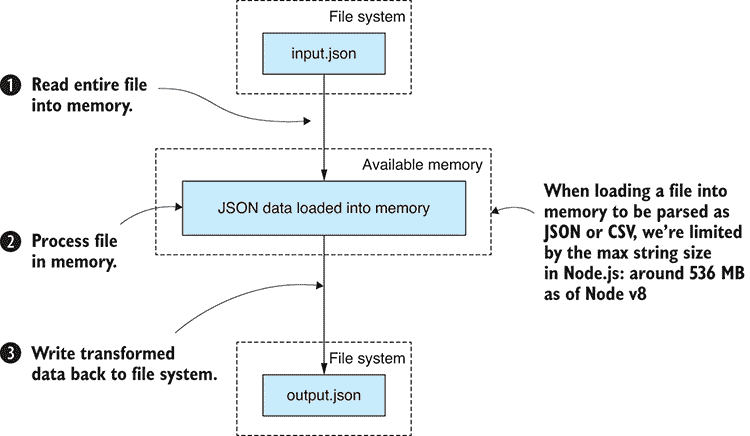

图 7.1 传统数据处理：将整个文件加载到内存中

将整个数据文件加载到内存中很简单，这使得我们的数据处理过程变得直接。不幸的是，它不适用于巨大的文件。在图 7.2 中，你可以看到 large-file.json 不适合我们可用的内存。在第一步时，进程失败，我们无法一次性将整个文件读入内存。之后，我们无法处理或输出文件。我们的进程已经崩溃。

在内存中处理整个文件很方便，我们应该尽可能这样做。然而，如果你知道你需要处理大量数据集，那么你应该尽早开始准备。不久我们将探讨如何处理大文件，但首先让我们来探索 Node.js 的限制。

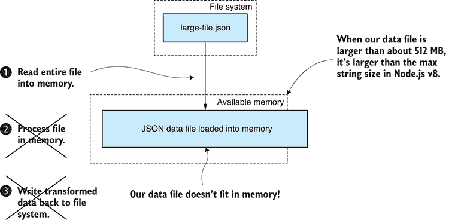

图 7.2 对于太大而无法装入内存的大文件，传统技术会失效。

## 7.5 Node.js 的限制

我们的进程在什么确切点会崩溃？我们可以在 Node.js 中加载多大文件？

我不确定这些限制是什么。在网上搜索，你会得到各种各样的答案；这是因为答案可能取决于你的 Node.js 版本和操作系统。我亲自测试了 Node.js 的限制。我使用了在我的 Windows 10 笔记本电脑上运行的 64 位 Node.js v8.9.4，该电脑有 8 GB 的内存。

我发现，我可以完全加载的最大 CSV 或 JSON 数据文件的大小受 Node.js 中可以分配的最大字符串大小的限制。在我的测试中，我发现最大的字符串大小约为 512 MB（上下浮动几 MB）或约 2.68 亿个字符。这似乎是 Node.js 所使用的 v8 JavaScript 引擎的限制，这限制了可以通过我们传统数据处理管道的数据文件的大小。

如果你想了解更多关于我如何进行这项测试或自己运行测试的信息，请查看以下 GitHub 仓库中的我的代码：[`github.com/javascript-data-wrangling/nodejs-json-test`](https://github.com/javascript-data-wrangling/nodejs-json-test) 和 [`github.com/javascript-data-wrangling/nodejs-memory-test`](https://github.com/javascript-data-wrangling/nodejs-memory-test)[.](http://.)

第二个仓库更广泛地探讨了 Node.js 的限制，并将帮助你了解你可以分配的总堆内存量。

### 7.5.1 增量数据处理

我们有一个大的数据文件：weather_stations.csv。我们需要对这个文件进行转换，将 MinTemp 和 MaxTemp 温度列转换为摄氏度。转换后，我们将输出文件 weather_stations.json。我们正在转换的字段目前以十分之一度摄氏度表示，显然是为了与较旧的记录保持向后兼容。转换的公式很简单：我们必须将每个字段除以 10。我们的困难在于处理这个大文件。传统的流程已经失败了，我们无法将文件加载到内存中，那么我们如何处理这样一个大文件呢？

Node.js 流是解决方案。我们可以使用流来按增量处理数据文件，一次加载和处理一块数据，而不是一次性处理所有数据。

图 7.3 展示了这是如何工作的。文件被分成块。每个数据块都很容易适应可用的内存，这样我们就可以处理它。我们永远不会接近耗尽我们的可用内存。

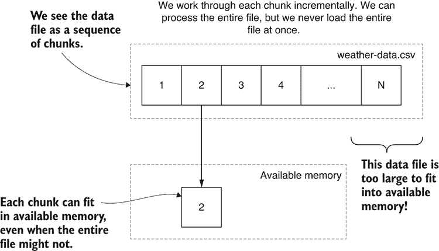

图 7.3 按增量处理数据：一次只将一块数据加载到内存中

传统的数据处理管道非常方便，并且在一定范围内有效。当它开始崩溃时，我们可以引入增量处理，这使得我们的数据处理管道能够扩展到处理大型文件。

有多大？我们受限于文件系统中可用的空间，因为这限制了我们的输入和输出文件的大小。我们还受限于处理整个文件所需的时间。例如，您可能能够在文件系统中容纳一个 100GB 的 CSV 文件，但如果处理需要一周时间，您还关心吗？

只要文件可以放在我们的硬盘上，并且我们有耐心等待处理完成，我们基本上可以处理任何大小的文件。

### 7.5.2 增量核心数据表示

如您所忆，我们一直在使用一种名为核心数据表示（CDR）的设计模式。CDR 定义了一个共享的数据格式，它连接了我们数据处理管道的各个阶段。当我首次在第三章介绍 CDR 时，我们是在内存中处理整个文件，而 CDR 本身就是我们整个数据集的表示。

我们现在必须调整 CDR 设计模式以适应增量数据处理。我们不需要做任何事情，也许只是深化我们对 CDR 的理解。

CDR 是一个 JavaScript 对象的数组，其中每个对象都是我们数据集中的一个记录。目前，转换管道中的每个阶段都在处理整个数据集。您可以在图 7.4 中看到一个例子，我们取 weather-stations.csv 并通过几个转换，最后输出另一个名为 weather-stations-transformed.csv 的文件。

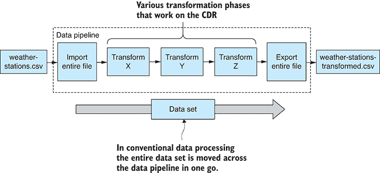

图 7.4 传统核心数据表示在内存中对整个文件应用转换。

让我们改变我们的思维方式，重新定义 CDR，使其不再表示整个数据集，而是现在将表示我们整个数据集的一部分。图 7.5 展示了经过改造的 CDR 如何以增量方式逐块处理我们的数据集。

这意味着，任何已经编写为与 CDR 一起工作的工具箱中的代码模块，无论是使用传统方法还是增量数据处理，都能同样良好地工作。我们与 CDR 一起工作的可重用代码模块处理记录数组，现在我们切换到 CDR 的增量版本，我们仍然将记录数组传递到我们的转换阶段。但现在这些数组每个都代表记录的一部分，而不是整个数据集。

### 7.5.3 Node.js 文件流基础知识入门

我们将使用 Node.js 流来增量处理我们的大 CSV 和 JSON 文件，但在我们能够这样做之前，我们首先需要了解 Node.js 流的基本知识。如果您已经了解它们是如何工作的，请跳过本节。

我们需要了解可读流、可写流以及管道的概念。我们将从最简单的例子开始。展示了将可读输入流管道连接到可写输出流。这基本上是一个文件复制，但由于使用了 Node.js 流，数据是分块复制的，一次不会将整个文件加载到内存中。Node.js 会自动为我们分块化文件，我们不需要担心分块创建或管理。

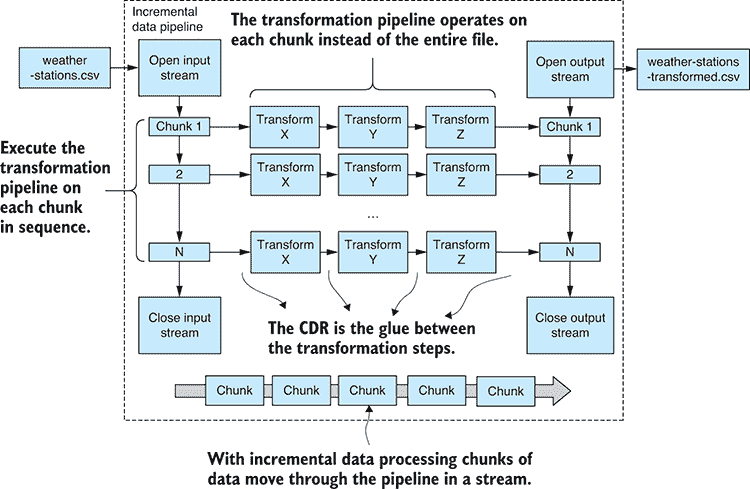

图 7.5 增量核心数据表示：设计模式被调整为增量工作。

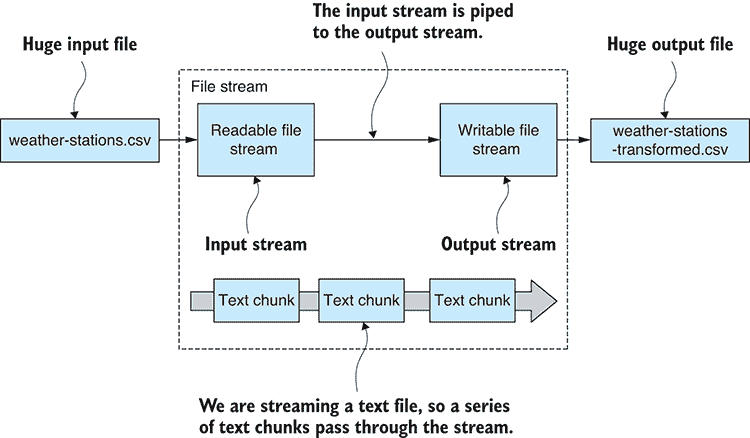

图 7.6 将输入文件流管道连接到输出文件流

列表 7.1 展示了实现图 7.6 中所示过程的代码。我们从一个可读文件流打开 weather-stations.csv，并为 weather-stations-transformed.csv 创建一个可写文件流。调用 pipe 函数来连接流并使数据从输入文件流向输出文件。尝试运行代码，并查看生成的转换文件，该文件位于输出子目录中，

列表 7.1 简单 Node.js 文件流（listing-7.1.js）

```
const fs = require('fs');

const inputFilePath = "./data/weather-stations.csv";
const outputFilePath = "./output/weather-stations-transformed.csv";

const fileInputStream = fs.createReadStream(inputFilePath);    ①  
const fileOutputStream = fs.createWriteStream(outputFilePath);    ②  

fileInputStream.pipe(fileOutputStream);    ③   
```

很简单，对吧？诚然，列表 7.1 不是一个特别有用的例子。我们使用 Node.js 流，这些流不理解我们数据的结构，但这个例子是为了从基本示例开始学习 Node.js 流。管道的有趣之处在于，我们可以通过将流通过一个或多个转换流来添加任意数量的中间转换阶段。例如，具有三个转换（X、Y 和 Z）的数据流可能看起来像这样：

```
fileInputStream
    .pipe(transformationX)
    .pipe(transformationY)
    .pipe(transformationZ)
    .pipe(fileOutputStream); 
```

每个中间转换阶段都可以是一个独立的可重用代码模块，你可能之前已经创建过，现在从你的工具包中提取出来。或者它们可能是针对你当前项目的特定转换。

学习 Node.js 流很重要，因为它们允许我们从可重用代码模块中构建可伸缩的数据转换管道。不仅我们的数据管道可以有任意数量的中间处理阶段，而且它们现在也可以处理任意大小的文件（这正是我们所需要的！）。

你应该像可视化本书中的任何数据管道一样，以相同的方式可视化流数据管道——一系列由箭头连接的框。参见 图 7.7 中的示例。箭头显示了数据流的流向。

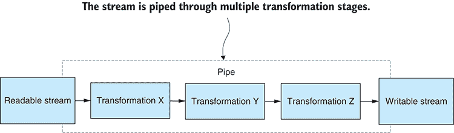

图 7.7 通过多个转换阶段管道传输 Node.js 流

要为 Node.js 流创建这样的转换，我们需要实例化 `Transform` 类。这创建了一个双向流，它可以同时读取和写入。它需要可写，以便我们可以将输入数据管道传输到它。它需要可读，以便它可以管道传输转换后的数据到管道的下一阶段。

例如，让我们看看一个简单转换的工作示例。列表 7.2 是 列表 7.1 的扩展，它通过一个转换流将数据传递时将文本数据转换为小写。Node.js 流 API 自动将我们的文本文件分割成块，我们的转换流一次只处理一小块文本。

我告诉过你这将会很简单。我们正在处理文本文件，列表 7.2 将输入文件复制到输出文件。但在过程中，它也将所有文本转换为小写。运行此代码，然后比较输入文件 weather-stations.csv 和输出文件 weather-stations-transformed.csv，以查看所做的更改。

列表 7.2 转换 Node.js 流（listing-7.2.js）

```
//
// … setup is the same as listing 7.1 …
//

function transformStream () {    ①  
 const transformStream = new stream.Transform();    ②  
 transformStream._transform = (inputChunk, encoding, callback) => {    ③  
 const transformedChunk = inputChunk.toString().toLowerCase();    ④  
 transformStream.push(transformedChunk);    ⑤  
 callback();    ⑥  
 };    ③  
 return transformStream;    ⑦  
};    ①  

fileInputStream
 .pipe(transformStream())    ⑧  
    .pipe(fileOutputStream)
 .on("error", err => {    ⑨  
 console.error(err);    ⑨  
 }); //  ⑨   
```

注意 列表 7.2 末尾的错误处理。流错误处理与承诺类似：当管道中的某个阶段发生错误或异常时，它将终止整个管道。

这只是一个关于 Node.js 流的简要入门。我们只是触及了表面，但我们已经可以做一些实际的事情：我们可以通过转换流式传输我们的数据，而且我们已经以一种可以扩展到极大型文件的方式做到了这一点。

### 7.5.4 转换巨大的 CSV 文件

我们不仅对纯文本文件感兴趣；我们需要转换结构化数据。具体来说，我们有数据文件 weather-stations.csv，我们必须枚举其记录并将温度字段转换为摄氏度。

我们如何使用 Node.js 流来转换一个大型 CSV 文件？这可能很困难，但幸运的是，我们在第三章开始使用的 Papa Parse 库已经支持读取 Node.js 流。

不幸的是，Papa Parse 没有提供我们可以轻松管道连接到另一个流的可读流。相反，它有一个自定义 API，每当从 CSV 格式解析出数据块时，它会触发自己的事件。不过，我们将创建自己的 Papa Parse 适配器，以便我们可以将它的输出管道连接到 Node.js 流。这本身就是一个有用的技术——将非流式 API 适配，使其适合 Node.js 流式框架。

在图 7.8 中，你可以看到我们将如何将解析后的 CSV 数据通过转换温度流，然后再将其输出到另一个 CSV 文件。

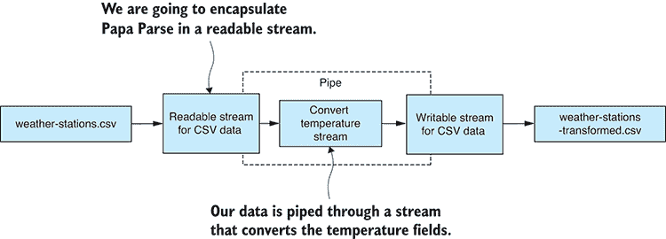

图 7.8 大型 CSV 文件的流式转换

为了让你了解我们在这里试图实现的目标，考虑以下代码片段：

```
openCsvInputStream(inputFilePath) // 1
    .pipe(convertTemperatureStream()) // 2
    .pipe(openCsvOutputStream(outputFilePath)); // 3 
```

那么，这里发生了什么？

1.  我们正在打开一个可读的 CSV 数据流。这里流式传输的数据块以核心数据表示形式表达。

1.  然后，我们将 CSV 数据通过一个转换流。这是我们将温度字段转换为摄氏度的位置。

1.  最后，我们将转换后的数据管道连接到一个可写的 CSV 数据流。

函数`convertTemperatureStream`可能是一个可重用的代码模块，尽管它似乎非常特定于这个项目，但如果它具有通用性，我们可以在我们的工具包中为其提供一个位置。

#### 安装 Papa Parse

如果你已经为代码仓库安装了依赖项，那么你已经有 Papa Parse 了；否则，你可以在一个新的 Node.js 项目中按照以下方式安装它：

```
node install --save papaparse 
```

#### 打开一个可读的 CSV 流

我们 CSV 流式传输难题的第一部分是创建一个可读流，它可以流式传输 CSV 文件并增量解析它到 JavaScript 对象。我们最终想要的是反序列化的 JavaScript 对象。图 7.9 展示了我们将如何将 Papa Parse 封装在可读 CSV 数据流中。这给了我们一个输入流，我们可以将其管道连接到我们的数据转换流。

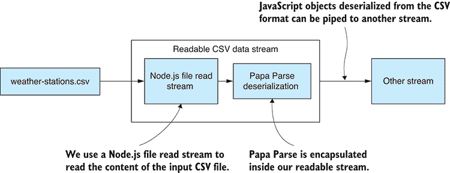

图 7.9 将 Papa Parse CSV 反序列化封装在可读 CSV 数据流中

让我们创建一个新的工具函数`openCsvInputStream`来创建并返回我们的可读 CSV 数据流。该代码在下面的列表中展示。它使用了 Papa Parse 的定制流式 API。当 Papa Parse 从文件流中反序列化每个 JavaScript 对象时，反序列化的对象会被传递到我们的 CSV 数据流中。

列表 7.3 打开 CSV 文件输入流的工具函数（toolkit/open-csv-input-stream.js）

```
const stream = require('stream');
const fs = require('fs');
const papaparse = require('papaparse');

function openCsvInputStream (inputFilePath) {    ①  

 const csvInputStream = new stream.Readable({ objectMode: true });    ②  
 csvInputStream._read = () => {};    ③  

 const fileInputStream = fs.createReadStream(inputFilePath);    ④  
 papaparse.parse(fileInputStream, {    ⑤  
        header: true,
        dynamicTyping: true,
 skipEmptyLines: true,  ⑥  
 step: (results) => {    ⑦  
            for (let row of results.data) {
 csvInputStream.push(row);    ⑧  
            }        

 complete: () => {    ⑨  
 csvInputStream.push(null);    ⑩  
        },

 error: (err) => {    ⑪  
 csvInputStream.emit('error', err);    ⑫  
 }    ⑪  
    });

 return csvInputStream;    ①  
};    ①  

module.exports = openCsvInputStream;    ⑬   
```

注意 列表 7.3 中的几个关键点。首先，我们创建了一个启用 *对象模式* 的可读流。通常，Node.js 流是低级的，它使用 Node.js `Buffer` 对象枚举文件的原始内容。我们希望在一个更高的抽象级别上工作。我们希望检索 JavaScript 对象而不是原始文件数据，这就是为什么我们以对象模式创建了可读流。这允许我们处理以核心数据表示形式表达的数据流。

下一个需要注意的是我们如何将 CSV 数据传递到可读流。每当 Papa Parse 准备好一批 CSV 行供我们使用时，`step` 回调函数就会被调用。我们通过其 `push` 函数将此数据传递到可读流。可以说我们是在 *推送* 数据到流中。

当整个 CSV 文件被解析时，`complete` 回调函数会被调用。此时，不会再有 CSV 行通过，我们通过传递一个 `null` 参数给 `push` 函数来向流指示我们已经完成。

最后，别忘了 `error` 回调：这是我们向可读流转发 Papa Parse 错误的方式。

#### 打开可写 CSV 流

在我们 CSV 流式传输谜题的另一边，我们必须创建一个可写流，我们可以将 JavaScript 对象传递给它，并将它们以 CSV 格式写入文件。图 7.10 展示了我们将如何将 Papa Parse 封装在可写 CSV 数据流中。这为我们提供了一个可以用来输出转换后数据的流。

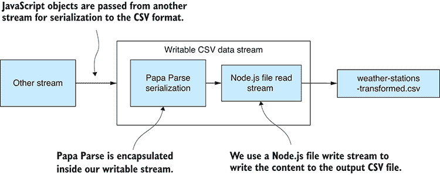

图 7.10 在可写 CSV 数据流中封装 Papa Parse CSV 序列化

以下列表是一个新的工具函数 `openCsvOutputStream`，它打开我们的可写 CSV 数据流。对于传递到 CSV 输出流的每个 JavaScript 对象，在传递到文件输出流之前，它都会被 Papa Parse 序列化为 CSV 数据。

列表 7.4 打开 CSV 文件输出流的工具函数（toolkit/open-csv-output-stream.js）

```
const stream = require('stream');
const fs = require('fs');
const papaparse = require('papaparse');

function openCsvOutputStream (outputFilePath) {    ①  

 let firstOutput = true;    ②  
 const fileOutputStream = fs.createWriteStream(outputFilePath);    ③  

 const csvOutputStream = new stream.Writable({ objectMode: true });    ④  
 csvOutputStream._write = (chunk, encoding, callback) => {    ⑤  
 const outputCSV = papaparse.unparse([chunk], {    ⑥  
 header: firstOutput    ⑦  
 });    ⑥  
 fileOutputStream.write(outputCSV + "\n");    ⑧  
 firstOutput = false;    ⑨  
 callback();    ⑩  
 };    ⑤  

 csvOutputStream.on("finish", () => {    ⑪  
 fileOutputStream.end();    ⑪  
 });    ⑪  

 return csvOutputStream;    ①  
};    ①  

module.exports = openCsvOutputStream;    ⑫   
```

在这里，我们再次以启用 *对象模式* 的方式打开我们的流，这样我们就可以处理 JavaScript 对象流，而不是 Node.js `Buffer` 对象。

列表 7.4 比列表 7.3 简单一些。我们实现了 _`write`_ 函数来处理写入到可写 CSV 数据流的块数据。在这里，我们使用 Papa Parse 序列化记录，然后将它们转发到可写文件流以进行输出。

注意使用 `firstOutput` 变量来关闭除了第一条记录之外的所有 CSV 头部。我们允许 Papa Parse 仅在 CSV 文件的开始处输出 CSV 列表名。

在列表的末尾，我们处理可写流的 `finish` 事件，这是关闭可写文件流的地方。

#### 转换巨大的 CSV 文件

现在我们已经设置了两个工具函数，我们可以拼凑整个数据管道。我们可以打开一个流来读取和解析 weather-stations.csv。我们还可以打开一个流来序列化我们的转换数据并输出 weather-stations-transformed.csv。完成的数据转换在以下列表中展示。运行此代码后，你应该在输入和输出文件中视觉比较温度字段，以确保它们已被正确转换。

列表 7.5 转换大型 CSV 文件（listing-7.5.js）

```
const stream = require('stream');
const openCsvInputStream = require('./toolkit/open-csv-input-stream');
const openCsvOutputStream = require('./toolkit/open-csv-output-stream');

const inputFilePath = "./data/weather-stations.csv";
const outputFilePath = "./output/weather-stations-transformed.csv";

function transformRow (inputRow) { //  ①  

 const outputRow = Object.assign({}, inputRow);    ②  

 if (typeof(outputRow.MinTemp) === "number") {    ③  
 outputRow.MinTemp /= 10;    ③  
 }    ③  
 else {    ③  
 outputRow.MinTemp = undefined;    ③  
 }    ③  

 if (typeof(outputRow.MaxTemp) === "number") {    ③  
 outputRow.MaxTemp /= 10;    ③  
 }    ③  
 else {    ③  
 outputRow.MaxTemp = undefined;    ③  
 }    ③  

 return outputRow;    ④  
};    ①  

function convertTemperatureStream () {    ⑤  
 const transformStream = new stream.Transform({ objectMode: true });    ⑥  
 transformStream._transform = (inputChunk, encoding, callback) => {    ⑦  
 const outputChunk = transformRow(inputChunk);    ⑧  
 transformStream.push(outputChunk);    ⑨  
 callback();    ⑩  
 };    ⑧  
 return transformStream;    ⑥  
};    ⑥  

openCsvInputStream(inputFilePath)    ⑪  
 .pipe(convertTemperatureStream())    ⑫  
 .pipe(openCsvOutputStream(outputFilePath))    ⑬  
 .on("error", err => {    ⑭  
        console.error("An error occurred while transforming the CSV file.");  
        console.error(err);  
    }); 
```

注意，`transformRow` 是转换单个数据记录的函数。它会在整个文件以分块方式处理时，逐条记录多次调用。

### 7.5.5 转换巨大的 JSON 文件

现在让我们来看看转换巨大的 JSON 文件。这可能是比处理大型 CSV 文件更困难的事情，这也是为什么我把它留到最后。

我们将对 weather-stations.json 执行类似的转换：将温度字段转换为摄氏度，然后输出 weather-stations-transformed.json。我们将使用与转换大型 CSV 文件时类似的原则。

但为什么增量处理 JSON 更困难呢？通常，JSON 文件比 CSV 文件更容易解析，因为我们需要进行此操作的功能已经内置在 JavaScript 中，而且 JSON 与 JavaScript 的匹配度非常高。在这种情况下，由于 JSON 数据格式的特性，这变得更加困难。

JSON 自然是一种分层的数据格式。我们可以在 JSON 中表达简单和扁平的表格数据——就像你在本书中已经看到的那样——但 JSON 文件可以深度嵌套，比简单的表格数据复杂得多。我编写的代码，你在这里会看到，它假设 JSON 文件只包含一个扁平的对象数组，没有嵌套数据。请务必注意，这里展示的代码不一定适用于通用 JSON 数据文件，你可能需要根据你的需求对其进行调整。

在本节中，我们将使用一个名为 bfj 或 Big-Friendly JSON 的库。这是一个用于解析流式 JSON 文件的巧妙库。它就像我们使用 Papa Parse 所做的那样；我们将 bfj 封装在一个可读的 JSON 流中，通过转换温度流将其传递，然后使用可写 JSON 流将其输出到 weather-stations-transformed.json，如图 7.11 所述。我们将重用之前创建的相同转换流，但这次我们将它嵌入到输入和输出 JSON 文件之间的管道中。

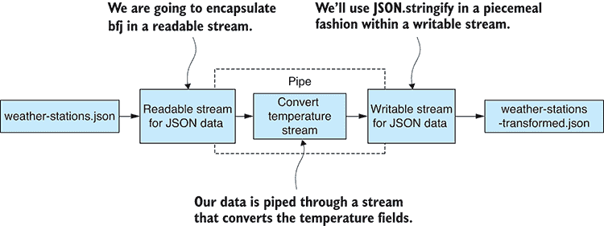

图 7.11 大型 JSON 文件的流式转换

#### 安装 bfj

如果你为第七章代码仓库安装了依赖项，那么你已安装了 bfj；否则，你可以在新的 Node.js 项目中按以下方式安装它：

```
node install --save bfj 
```

#### 打开可读的 JSON 流

我们必须首先创建一个可读流，它可以增量地读取 JSON 文件并将其解析为 JavaScript 对象。图 7.12 展示了我们将如何封装 bfj 在我们的可读 JSON 数据流中。这给了我们一个可以用来读取 JSON 文件并将反序列化数据通过管道传输到另一个流的输入流。

让我们创建一个新的工具函数`openJsonInputStream`来创建我们的可读 JSON 数据流。Bfj 是一个自定义 API，它通过识别 JSON 文件中的结构来触发事件。当它识别到 JSON 数组、JSON 对象、属性等时，它会触发事件。在列表 7.6 中，我们处理这些事件，以增量地构建我们的 JavaScript 对象并将它们喂送到可读 JSON 流中。一旦我们识别到每个完整的 JSON 对象，我们就立即将等效的反序列化 JavaScript 对象传递到 JSON 数据流中。

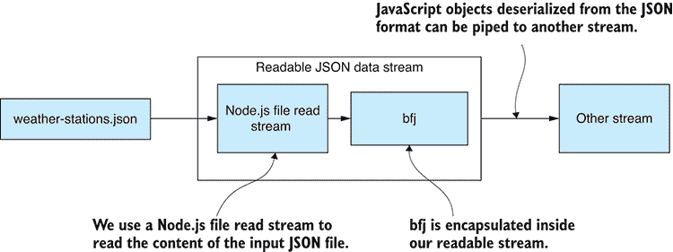

图 7.12 将 bfj JSON 反序列化封装在可读 JSON 数据流中

列表 7.6 工具函数用于打开 JSON 文件输入流（toolkit/open-json-file-input-stream.js）

```
const bfj = require('bfj');
const fs = require('fs');
const stream = require('stream');

function openJsonInputStream (inputFilePath ) {    ①  

 const jsonInputStream = new stream.Readable({ objectMode: true });    ②  
 jsonInputStream._read = () => {};    ③  

 const fileInputStream = fs.createReadStream(inputFilePath);    ④  

 let curObject = null;    ⑤  
 let curProperty = null;    ⑥  

 const emitter = bfj.walk(fileInputStream);    ⑦  

 emitter.on(bfj.events.object, () => {    ⑧  
 curObject = {};    ⑧  
 });    ⑧  

 emitter.on(bfj.events.property, name => {    ⑨  
 curProperty = name;    ⑨  
 });    ⑨  

 let onValue = value => {    ⑩  
 curObject[curProperty] = value;    ⑩  
 curProperty = null;    ⑩  
 };    ⑩  

 emitter.on(bfj.events.string, onValue);    ⑩  
 emitter.on(bfj.events.number, onValue);    ⑩  
 emitter.on(bfj.events.literal, onValue);    ⑩  

 emitter.on(bfj.events.endObject, () => {    ⑪  
 jsonInputStream.push(curObject);    ⑫  
 curObject = null;    ⑬  
    });

 emitter.on(bfj.events.endArray, () => {    ⑭  
 jsonInputStream.push(null);    ⑭  
 });    ⑭  

 emitter.on(bfj.events.error, err => {    ⑮  
 jsonInputStream.emit("error", err);    ⑮  
 });    ⑮  

 return jsonInputStream;    ①  
};    ①  

module.exports = openJsonInputStream;    ⑯   
```

在列表 7.6 中需要注意的一点是我们如何使用 bfj 的`walk`函数来*遍历*JSON 文件的结构。在这里使用*遍历*这个术语是因为 JSON 文件可能是一个分层文档。它可能被组织成树状结构，我们必须遍历（或遍历）这个树来处理它，尽管在这种情况下我们并没有处理分层文档。相反，我们假设 weather-stations.json 包含一个扁平的数据记录数组。当 bfj 为数组、每个对象和属性触发事件时，我们收集这些事件并构建数据记录，通过其`push`函数将它们喂送到 JSON 数据流中。

由于我们期望输入的 JSON 文件是一个扁平的记录数组，当 bfj 的`endArray`事件被触发时，在那个点上，我们通过将`null`传递给`push`函数来表示流的结束。

#### 打开可写 JSON 流

为了完成我们的 JSON 文件转换流，我们还必须有一个可写的 JSON 流，我们可以将 JavaScript 对象传递给它，并将它们以 JSON 格式写入输出文件。图 7.13 展示了我们将如何封装 JSON.stringify 在可写 JSON 数据流中。这给了我们一个可写流，我们可以增量地将对象写入它，并将它们按顺序序列化到输出文件 weather-stations-transformed.json 中。

列表 7.7 展示了工具函数`openJsonOutputStream`，它打开我们的可写 JSON 数据流，因此我们可以开始输出 JavaScript 对象。对于传递给 JSON 数据流的每个 JavaScript 对象，我们将其序列化为 JSON，并将序列化的 JSON 数据传递到文件输出流中。

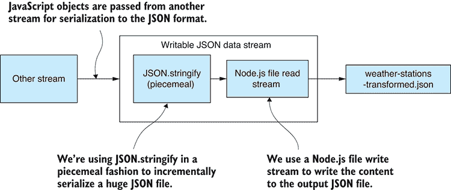

图 7.13 将 bfj JSON 序列化封装在可写 JSON 数据中

列表 7.7 打开 JSON 文件输出流的工具函数（toolkit/open-json-file-output-stream.js）

```
const fs = require('fs');
const stream = require('stream');

function openJsonOutputStream (outputFilePath) {    ①  

 const fileOutputStream = fs.createWriteStream(outputFilePath);    ②  
 fileOutputStream.write("");  [  ③  

 let numRecords = 0;    ④  

 const jsonOutputStream = new stream.Writable({ objectMode: true });    ⑤  
 jsonOutputStream._write = (chunk, encoding, callback) => {    ⑥  
        if (numRecords > 0) {
 fileOutputStream.write(",");    ③  
        }

        // Output a single row of a JSON array.
 const jsonData = JSON.stringify(chunk);    ⑦  
 fileOutputStream.write(jsonData);    ⑧  
        numRecords += chunk.length;
 callback();    ⑨  
 };    ⑥  

 jsonOutputStream.on("finish", () => {    ⑩  
 fileOutputStream.write("]");    ③  
 fileOutputStream.end();    ⑩  
 });    ⑩  

 return jsonOutputStream;    ①  
};    ①  

module.exports = openJsonOutputStream;    ⑪   
```

正如我们在 CSV 输出流中发现的那样，打开可写 JSON 流的代码比打开可读 JSON 流的代码简单得多。再次，我们实现 `_write` 函数来序列化记录并将它们写入文件。在这里，我们使用 `JSON.stringify` 来序列化每个数据记录。

最后，我们处理 `finish` 事件并使用它来最终化流。

#### 转换巨大的 JSON 文件

使用我们为打开输入和输出 JSON 数据流而新增的两个工具函数，我们现在可以转换我们的巨大 JSON 文件，如列表 7.8 所示。为了使列表保持简洁，我已省略了自列表 7.5 以来未发生变化的几个函数。这是一个可以独立运行的完整代码列表；请确保检查输出数据文件，以确保数据转换成功。

列表 7.8 转换巨大的 JSON 文件（listing-7.8.js）

```
const stream = require('stream');
const openJsonInputStream = require('./toolkit/open-json-input-stream.js');
const openJsonOutputStream =
    require('./toolkit/open-json-output-stream.js');

const inputFilePath = "./data/weather-stations.json";
const outputFilePath = "./output/weather-stations-transformed.json";

// ... transformRow, transformData and convertTemperatureStream are omitted
// they are the same as listing 7.5 …

openJsonInputStream(inputFilePath)    ①  
 .pipe(convertTemperatureStream())    ②  
 .pipe(openJsonOutputStream(outputFilePath))    ③  
 .on("error", err => {    ④  
        console.error(
            "An error occurred while transforming the JSON file."
 );    ④  
 console.error(err);    ④  
 });    ④   
```

我们现在可以使用 Node.js 流来处理大量的 CSV 和 JSON 文件。你还需要什么？作为副作用，我们现在可以混合匹配我们的流，这使我们能够快速构建各种 *流式* 数据管道。

### 7.5.6 混合匹配

在我们的数据管道阶段之间，核心数据表示作为抽象，我们可以轻松构建不同格式之间的大型数据文件的转换管道。

例如，考虑我们如何将 CSV 文件转换为 JSON 文件：

```
openCsvInputStream(inputFilePath)    ①  
 .pipe(transformationX)    ②  
 .pipe(transformationY)    ②  
 .pipe(transformationZ)    ②  
 .pipe(openJsonOutputStream(inputFilePath));    ③   
```

以同样的方式，我们可以将 JSON 转换为 CSV，或者实际上从任何格式转换为任何其他格式，前提是我们为该数据格式创建一个合适的流。例如，你可能想处理 XML，那么你会创建一个函数来打开一个流式 XML 文件，然后使用它来转换 XML 文件或将它们转换为 CSV 或 JSON。

在本章中，我们探讨了传统数据处理技术在面对大型数据文件时可能会崩溃的情况。有时，希望这种情况不常发生，我们必须采取更极端的措施，并使用 Node.js 流来增量处理这些巨大的数据文件。

当你发现自己陷入处理大型数据文件的困境时，你可能想知道是否有更好的方法来处理大型数据集。好吧，我相信你已经猜到了，但我们应该与数据库一起工作。在下一章中，我们将构建一个 Node.js 流，该流将我们的记录输出到数据库。这将使我们能够将大型数据文件移动到数据库中，以便更高效、更方便地访问数据。

## 摘要

+   我们讨论了 Node.js 的内存限制。

+   你了解到增量处理可以用来处理大型数据文件。

+   我们找到了如何将核心数据表示设计模式适应增量处理的方法。

+   我们使用 Node.js 流来构建由可重用代码模块组成的数据管道，这些模块可扩展到大型数据文件。

+   你了解到你可以混合匹配 Node.js 流来构建各种数据管道。
