# 8

处理大量数据

**本章涵盖**

+   使用数据库进行更高效的数据处理过程

+   将大量数据文件导入 MongoDB

+   高效地处理大量数据

+   优化你的代码以提高数据吞吐量

本章解决的问题是：当我们处理大量数据集时，我们如何更高效和有效地工作？

在上一章中，我们处理了从国家海洋和大气管理局下载的几个非常大的文件。第七章表明，可以处理这样大的 CSV 和 JSON 文件！然而，这样大小的文件对于数据分析来说太大，无法有效使用。为了现在变得高效，我们必须将我们的大数据集移动到数据库中。

在本章中，我们将数据移动到 MongoDB 数据库中，考虑到数据的大小，这是一个大操作。数据在数据库中，我们可以借助查询和其他数据库 API 功能更有效地工作。

我选择 MongoDB 作为本章以及整本书的数据库，因为它是我偏好的数据库。这是一个个人选择（我相信也是一个实用的选择），但实际上任何数据库都可以，我鼓励你尝试在本章中使用你选择的数据库来实践这些技术。这里介绍的大多数技术都可以与其他数据库一起工作，但你必须找出如何将代码转换为与你的技术选择兼容。

## 8.1 扩展我们的工具集

在本章中，我们将使用几个 MongoDB 数据库工具来处理我们的大数据集。我们还将使用 Node.js 函数来创建新的操作系统进程，以便在多个 CPU 核心上并行执行数据处理操作。

表 8.1 列出了我们在第八章中介绍的各种工具。

表 8.1 第八章中使用的工具

| **API / 库** | **函数** | **说明** |
| --- | --- | --- |
| MongoDB | `find` | 获取数据库游标，以便我们可以增量地访问数据库中的每条记录。 |
|  | `skip and limit` | 获取数据窗口或记录集合，以便我们可以分批访问数据库中的每条记录。 |
|  | `createIndex` | 为高效查询和排序创建数据库索引。 |
|  | `find(query)` | 使用数据库查询查找记录。 |
|  | `find({}, projection)` | 获取记录，但丢弃某些字段。 |
|  | `sort` | 对从数据库中检索的记录进行排序。 |
| Node.js | `spawn, fork` | 创建新的操作系统进程以并行处理数据。 |
| async-await-parallel | `parallel(sequence, X)` | 执行一系列操作，其中 X 个操作并行执行。 |

## 8.2 处理大量数据

我们想分析上一章中的气象站数据集。我们目前还不能这样做，因为我们有比我们能有效处理更多的数据。

我们有 weather-stations.csv 文件，但 28GB 的大小使得直接处理这个文件并不实际。大多数数据科学教程和课程都要求你使用 CSV 文件来分析数据，当可能的时候，这是一种很好的工作方式，但它只适用于小规模。使用 CSV 文件（以及 JSON 文件）无法扩展到我们现在拥有的这种大规模数据集。我们该如何处理这个问题呢？

我们即将将数据迁移到数据库，届时我们将有更多新工具可用于处理我们的数据。但在查看数据库之前，我们将探索一些更简单的技术，这些技术将帮助你管理你的大数据集。然后我们将探讨 Node.js 的内存限制以及我们如何超越它们。最后，我们将探讨代码优化和其他提高数据吞吐量的方法。

## 8.3 获取代码和数据

本章的代码和数据可在 GitHub 上的 Data Wrangling with JavaScript Chapter-8 存储库中找到，网址为[`github.com/data-wrangling-with-javascript/chapter-8`](https://github.com/data-wrangling-with-javascript/chapter-8)[。](http://.)

示例数据位于存储库下的*data*子目录中。

GitHub 存储库包含两个 Vagrant 脚本，这些脚本可以方便地引导虚拟机安装 MongoDB 数据库。第一个脚本启动一个带有空数据库的虚拟机，当你运行列表 8.2 以练习将数据导入数据库时可以使用。第二个脚本启动一个带有预先填充示例数据的虚拟机，你可以用它来尝试列表 8.3 及以后的练习。

如果你在获取代码和数据时需要帮助，请参考第二章的“获取代码和数据”。

## 8.4 处理大数据的技术

我们需要将我们的大数据集存入数据库。然而，在我们做到这一点之前，让我们快速浏览几种技术，这些技术将帮助你在任何情况下都更加高效。

### 8.4.1 从小开始

从第五章，我们已经了解到我们应该从处理小数据集开始。你应该首先将你的大数据集削减到可以更容易和更有效地处理的大小。

处理大数据会减慢你的速度；你无法绕过这一点，所以不要急于投身于大数据。先解决你的问题，为小数据集编写你的代码；小问题比大问题更容易解决！专注于在小规模上构建可靠且经过充分测试的代码。然后，只有在你自信且准备好处理它时，才逐步扩展到大数据。

### 8.4.2 回到小规模

当你处理大数据并遇到问题时，减少你的数据量，以便再次处理一个小数据集，尽可能紧密地关注问题。试图在大数据集中解决问题可能就像在干草堆里找针一样（图 8.1）。这适用于解决任何类型的编码问题。你应该尝试通过最小化问题可能隐藏的空间来隔离问题。

你可以通过逐步删除代码和数据（如果可能的话）直到问题无处可藏来做这件事。问题应该变得明显或至少更容易找到。为了在大数据集中找到问题，使用二分搜索或二分法逐步减少数据并聚焦于问题。

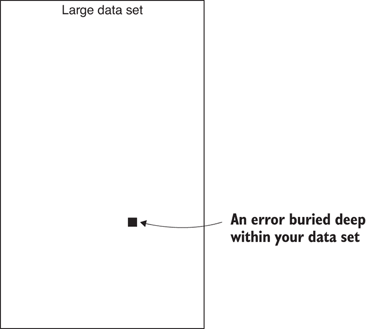

图 8.1 大数据集中的错误就像干草堆里的针。

### 8.4.3 使用更高效的表现形式

确保你使用的是高效的数据表示。CSV 文件比 JSON 文件更高效（至少更紧凑），而使用数据库比 JSON 和 CSV 更高效（图 8.2）。在小规模工作时，使用 JSON 或 CSV 是有效的，但在大规模工作时，我们需要拿出“杀手锏”。

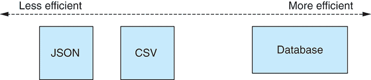

图 8.2 数据格式的效率谱

### 8.4.4 离线准备你的数据

在尝试扩展之前，确保你已经充分准备了你的数据。我们应该通过使用第六章中介绍的各种技术进行准备和清理阶段，以减少数据量并主动处理问题。为生产使用准备数据的过程总结在 f 中。

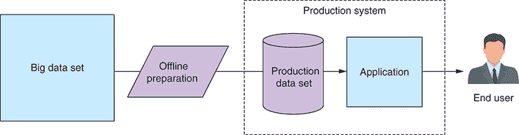

图 8.3 离线准备用于生产的数据

这样的准备需要多长时间？这取决于你的数据量的大小，可能需要非常多的时间。对于本章，我准备了 NOAA 气象站数据，并运行了一个执行了超过 40 小时的脚本！数据是在一个 8 核心 CPU 上并行处理的，使用的技术将在本章末尾介绍。不过，不用担心；你不需要经历 40 小时的处理时间来学习如何进行大数据处理。

多长时间算太长？我主张让你的数据处理脚本运行尽可能长的时间，但显然有一个上限，这取决于你业务的性质。我们希望及时得到结果。例如，如果你需要在周五提交报告，你不能运行超过那个时间的过程。

在达到这个阶段之前，你需要可靠且健壮的代码（参见“从小处着手”部分）。你还应该使用功能强大的电脑。记住，如果我能在 40 小时（一个周末）内处理超过 10 亿条记录，你也可以。这并不是火箭科学，但它确实需要仔细的准备和足够的耐心。在本章的后面部分，我们将探讨优化我们的数据管道和实现更高吞吐量的方法。

如果你计划运行长时间的数据处理操作，请考虑以下建议：

+   包含日志和进度报告，这样你可以看到发生了什么。

+   报告所有错误。你可能以后需要纠正它们。

+   不要因为个别错误而使整个过程失败。完成一个大型数据处理操作的 85% 比在遇到问题时从头开始要好。

+   确保你的过程在出错时可以恢复。如果你在过程中遇到错误导致进程终止，修复错误；然后重新启动进程，并从上次停止的地方恢复。

## 8.5 更多 Node.js 限制

在第七章中，我们处理了几个非常大的 CSV 和 JSON 文件，并遇到了无法将这些文件完全加载到内存中的限制。我们达到这个限制是因为我们触发了 Node.js 中可以分配的最大字符串大小。在这个时候，我们转向使用 Node.js 流和增量文件处理，这使得我们能够处理这些大文件。在本章中，我们有一个新的限制。

使用数据库意味着我们可以一次性将更大的数据集加载到内存中。然而，现在我们受限于在所有可用内存耗尽之前 Node.js 可以分配的最大内存量。

究竟需要多少内存？这取决于你使用的 Node.js 版本和操作系统。我亲自测试了使用 64 位 Node.js v7.7.4 在我的 Windows 10 笔记本电脑上运行的极限，该电脑有 8 GB 的内存。我是通过分配 Node.js 数组直到内存耗尽来测试的；然后我估计了已分配的内存量。这并不完全准确，但这是一个很好的方法来大致判断我们可以访问多少内存。

通过测试，我可以说我大约有 1.4 GB 的可用内存。这是一个很好的数量，应该可以处理相当大的数据集，但我们已经可以看到 Node.js 无法从 NOAA 加载我们的 28 GB 气象站数据集！

如果你想了解更多关于我如何进行这项测试或你想自己运行测试，请参阅以下 GitHub 仓库中的我的代码 [`github.com/data-wrangling-with-javascript/nodejs-memory-test`](https://github.com/data-wrangling-with-javascript/nodejs-memory-test)[。](http://.)

## 8.6 分而治之

我们无法将整个气象站数据集加载到内存中，但我们可以将其分成批次进行处理，如图 8.4 所示。figure 8.4。分而治之是计算机科学中的一个经典技术。简单来说，我们有一个大问题，最好通过将其分解成多个小问题来解决。小问题比大问题更容易解决（参见“从小处着手”和“回到小处”部分）。一旦我们解决了每个小问题，我们将结果合并，这样我们就解决了大问题。

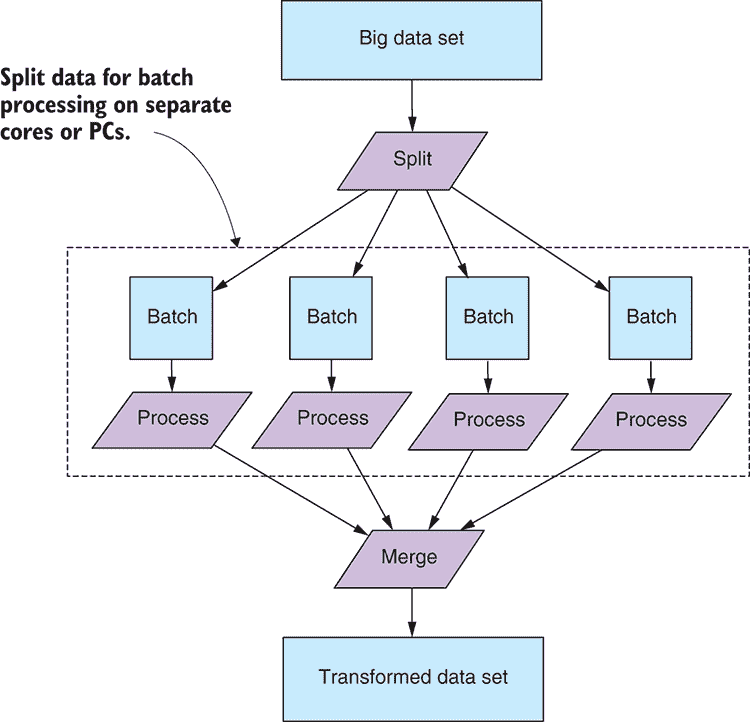

Figure 8.4 将数据分割成单独的批次进行处理

当我们分割我们的数据时，我们必须组织它，使得每个批次足够小，可以完全放入内存中。这种技术不仅允许我们将数据放入内存（逐批处理），而且还可以使处理速度大大加快。在本章的结尾，我们将看到如何并行处理我们的数据，并使用多个 CPU 核心来大幅提高我们的数据吞吐量。

## 8.7 与大型数据库协同工作

使用数据库是专业数据管理的首选标准。所有数据库都有处理大型数据集的功能，这正是我们感兴趣的。

我们将查看以下功能：

+   使用数据库游标逐条增量处理记录

+   使用数据窗口逐批增量处理记录

+   使用查询过滤和丢弃数据

+   对大型数据集进行排序

虽然大多数（如果不是所有）数据库都有我们需要的功能，但我们将专注于 MongoDB。我必须选择一个，我的首选是 MongoDB。

为什么选择 MongoDB？它方便、易用且灵活。最重要的是，它不需要预定义的模式。我们可以使用 MongoDB 表达许多种模式化的结构化数据，但不必预先定义这种结构；我们可以将任何类型的数据扔给 MongoDB，它都会处理。MongoDB 及其 BSON（二进制 JSON）数据格式与 JavaScript 自然地很好地配合。

### 8.7.1 数据库设置

在我们开始使用数据库之前，我们需要先设置它！你可以从[`www.mongodb.org/`](http://www.mongodb.org/)下载并安装 MongoDB。否则，你可以使用我在 GitHub 仓库中为第八章提供的 Vagrant 脚本之一（参见“获取代码和数据”）。

要使用这些脚本，你首先需要安装 Virtual Box 和 Vagrant。然后打开命令行，将目录更改为第八章的 git 仓库：

```
cd chapter-8 
```

然后，你可以使用第一个 Vagrant 脚本启动一个带有空 MongoDB 数据库的虚拟机：

```
cd vm-with-empty-db
vagrant up 
```

当虚拟机完成启动后，你将拥有一个可通过`mongodb://localhost:6000`访问的空 MongoDB 数据库。

或者，如果你想实验一个已经包含气象站数据样本的数据库（由于数据集太大，我无法发布完整的数据集），请使用第二个 Vagrant 脚本：

```
cd vm-with-sample-db
vagrant up 
```

当这个虚拟机完成启动后，你将拥有一个包含示例数据且可通过`mongodb://localhost:7000`访问的 MongoDB。

在你完成虚拟机后，请销毁它们，以便停止消耗你的系统资源。为此，为两个虚拟机执行以下命令：

```
vagrant destroy 
```

你可以通过再次使用 Vagrant 来随时重新创建虚拟机。有关 Vagrant 的更多信息，请参阅附录 C。

要从 JavaScript 访问数据库，我们将使用官方的 MongoDB Node.js 库。如果你为第八章的存储库安装了依赖项，你已经安装了 MongoDB API；否则，你可以在新的 Node.js 项目中安装它，如下所示：

```
npm install --save mongodb 
```

### 8.7.2 打开数据库连接

在所有接下来的代码清单中，我们必须做的第一件事是连接到我们的数据库。为了使清单简单，它们都使用以下代码来打开数据库连接：

```
const MongoClient = require('mongodb').MongoClient;    ①  

const hostName = "mongodb://127.0.0.1:6000";    ②  
const databaseName = "weather_stations";    ③  
const collectionName = "daily_readings";    ④  

function openDatabase () {    ⑤  
 return MongoClient.connect(hostName)    ⑥  
        .then(client => {
 const db = client.db(databaseName);    ⑦  
 const collection = db.collection(collectionName);    ⑧  
 return {    ⑨  
 collection: collection,    ⑨  
 close: () => {    ⑨  
 return client.close();  ⑨  
 },    ⑨  
 };    ⑨  
        });
};    ⑤   
```

你传递给`openDatabase`的连接字符串决定了要连接到哪个数据库。例如，代码清单 8.2 连接到`mongodb://127.0.0.1:6000`。这是我们在上一节中启动的 Vagrant VM 中的空数据库。其他代码清单依赖于已经存在的数据，因此它们连接到`mongodb://localhost:7000`。这是来自另一个虚拟机的数据库，其中已经预先填充了示例数据。

如果你没有使用虚拟机，而是直接在你的 PC 上安装了 MongoDB，你应该将连接字符串设置为`mongodb://127.0.0.1:27017`，因为 27017 是访问本地 MongoDB 安装的默认端口号。

### 8.7.3 将大文件移动到数据库中

要使用数据库，我们必须首先将我们的数据传输到那里。在这种情况下，我们必须将我们的 CSV 文件 weather-stations.csv 移动到数据库中。为此，我们可以构建我们在第七章中学到的技术。我们将结合可读的 CSV 数据输入流和可写的 MongoDB 输出流，将数据管道输入到我们的数据库中，如图 8.5 所示。

在第七章中，我们编写了一个名为`openCsvInputStream`的工具包函数。我们在这里将再次使用它，但我们仍然需要一个新工具包函数来创建可写的 MongoDB 输出流。此代码在以下列表中展示。

列表 8.1 用于打开 MongoDB 输出流的工具包函数（toolkit/open-mongodb-output-stream.js）

```
const stream = require('stream');    ①  

function openMongodbOutputStream (dbCollection) {    ②  

 const csvOutputStream = new stream.Writable({ objectMode: true });    ③  
 csvOutputStream._write = (chunk, encoding, callback) => {    ④  
 dbCollection.insertMany(chunk)    ⑤  
 .then(() => {    ⑥  
 callback();    ⑥  
 })    ⑥  
 .catch(err => {    ⑦  
 callback(err);    ⑦  
 });    ⑦  
 };    ④  

    return csvOutputStream;
};    ②  

module.exports = openMongodbOutputStream;    ⑧   
```

这段代码与我们在第七章中创建的其他可写流类似。请注意，我们是以*对象模式*打开流，并使用 MongoDB 的`insertMany`函数将每个对象数组插入到数据库中。

列表 8.2 将两个流连接到数据管道中，从输入文件 weather-stations.csv 填充我们的数据库。你应该运行此代码，给它足够的时间完成，然后使用 Robomongo 检查你的数据库，以确认数据确实已复制到数据库中。

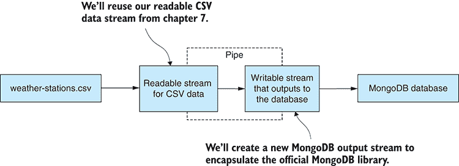

图 8.5 将流式输入 CSV 数据传输到我们的 MongoDB 数据库

列表 8.2 将大型 CSV 文件移动到 MongoDB（listing-8.2.js）

```
const openCsvInputStream = require('./toolkit/open-csv-input-stream');    ①  
const openMongodbOutputStream = require('./toolkit/open-mongodb-output-➥stream');    ②  
const MongoClient = require('mongodb').MongoClient;

const hostName = "mongodb://127.0.0.1:6000";
const databaseName = "weather_stations";
const collectionName = "daily_readings";

const inputFilePath = "./data/weather-stations.csv";

// ... openDatabase function is omitted ...

function streamData (inputFilePath, dbCollection) {    ③  
 return new Promise((resolve, reject) => {    ④  
 openCsvInputStream(inputFilePath)    ⑤  
 .pipe(openMongodbOutputStream(dbCollection))    ⑥  
 .on("finish", () => {    ⑦  
 resolve();    ⑦  
 })    ⑦  
 .on("error", err => {    ⑧  
 reject(err);    ⑧  
 });    ⑧  
 });    ④  
};    ③  

openDatabase()
    .then(client => {
        return streamData(inputFilePath, client.collection)
            .then(() => client.close());
    })
    .then(() => {
        console.log("Done");
    })
    .catch(err => {
        console.error("An error occurred.");
        console.error(err);
    }); 
```

好的，现在我们的数据已经在数据库中了！我们准备好开始研究我们现在如何高效地检索和使用我们的数据了。

### 8.7.4 使用数据库游标进行增量处理

在数据库中有了我们的数据后，我们有多种方法可以使用它来处理我们的大量数据！这些方法中的第一个是使用数据库游标访问数据库中的每一条记录，如图 8.6 所示。

这是一种增量数据处理的另一种形式，尽管我们不像在第七章中那样以文件的形式进行增量工作，我们现在是以数据库的形式进行增量工作。以这种方式工作时，我们不太担心耗尽 Node.js 中可用的内存——一次处理一条记录不应该这样做——尽管这也取决于你的应用程序在同一时间正在做什么其他工作。

列表 8.3 展示了如何创建数据库游标并遍历整个数据集，顺序访问每条记录。你可以运行这个脚本，但请确保你在包含数据的数据库上运行它！默认情况下，这个脚本连接到 7000 端口的数据库，这是由第二个 Vagrant 脚本创建的预填充数据库。如果你是从第一个 Vagrant 脚本中自己填充数据库，请将端口号更改为 6000；如果你在使用你自己安装的本地数据库，请将其更改为 27017。

列表 8.3 使用数据库游标逐条记录地增量遍历数据库（listing-8.3.js）

```
// ... openDatabase function is omitted ...

let numRecords = 0;

function readDatabase (cursor) {    ①  
 return cursor.next()    ②  
        .then(record => {
            if (record) {
 console.log(record);    ③  
                ++numRecords;

 return readDatabase(cursor);    ④  
            }
 else {    ⑤  
                // No more records.
 }    ⑤  
        });
};    ①  

openDatabase()    ⑥  
    .then(db => {
 const databaseCursor = db.collection.find();    ⑦  
 return readDatabase(databaseCursor)    ⑧  
 .then(() => db.close());    ⑨  
    })
    .then(() => {
        console.log("Displayed " + numRecords + " records.");
    })
 .catch(err => {
        console.error("An error occurred reading the database.");
        console.error(err);
    }); 
```

数据库游标是通过`find`函数创建的。然后通过反复调用游标的`next`函数，我们可以遍历数据库中的每条记录。

这可能看起来有点像流式数据库访问——实际上，创建一个从 MongoDB 读取的 Node.js 可读流是一个相当简单的任务——然而，我将把这个任务留给读者去练习。请随意基于第七章中的一个可读流（CSV 或 JSON）来编写你的代码，并将其与列表 8.3 结合，以创建你自己的可读 MongoDB 流。

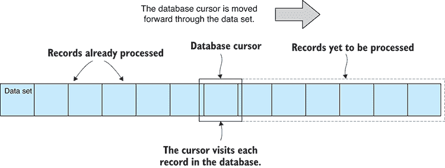

图 8.6 数据库游标允许我们依次访问数据库中的每条记录。

### 8.7.5 使用数据窗口进行增量处理

逐个访问数据库中的每条记录并不是数据访问中最有效的方法，尽管至少我们可以用它来处理大量数据。然而，我们可以通过一次处理多条记录而不是单条记录来提高我们的数据吞吐量。这仍然是增量处理，但现在我们将使用数据窗口，其中每个窗口是一批记录，而不是单条记录。处理完每个数据窗口后，我们将窗口向前移动。这使我们能够按顺序**查看**每批记录，如图 8.7 所示。

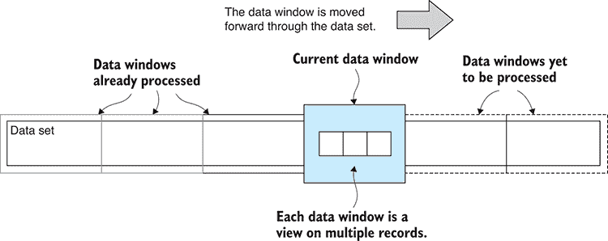

图 8.7 将数据集划分为窗口以进行高效的增量处理

我们可以通过在调用 MongoDB 的 `find` 函数后链式调用 `skip` 和 `limit` 来读取数据窗口。`skip` 允许我们跳过一定数量的记录；我们使用它来选择窗口中的起始记录。`limit` 允许我们只检索一定数量的记录；我们可以使用它来限制窗口中的记录数量。此代码的示例在 列表 8.4 中。你可以运行此代码，它将逐窗口读取数据库记录。尽管它没有做任何有用的事情，但它有一个占位符，你可以在这里添加自己的数据处理代码。

列表 8.4 使用数据窗口处理数据库记录批量（listing-8.4.js）

```
// ... openDatabase function is omitted

let numRecords = 0;
let numWindows = 0;

function readWindow (collection, windowIndex, windowSize) {    ①  
 const skipAmount = windowIndex * windowSize;    ②  
 const limitAmount = windowSize;    ③  
 return collection.find()    ④  
 .skip(skipAmount)    ④  
 .limit(limitAmount)    ④  
 .toArray();    ④  
};    ①  

function readDatabase (collection, startWindowIndex, windowSize) {    ⑤  
 return readWindow(collection, startWindowIndex, windowSize)    ⑥  
        .then(data => {
            if (data.length > 0) {
 console.log("Have " + data.length + " records.");    ⑦  

                // Add your data processing code here.

                numRecords += data.length;
                ++numWindows;

 return readDatabase(  ⑧  
 collection,    ⑧  
 startWindowIndex+1,    ⑧  
 windowSize    ⑧  
 );    ⑧  
            }
 else {    ⑨  
                // No more data.
 }    ⑨  
        })

};    ⑤  
 openDatabase()    ⑩  
    .then(db => {
 const windowSize = 100;    ⑪  
 return readDatabase(db.collection, 0, windowSize)    ⑫  
            .then(() => {
 return db.close();    ⑬  
            });
    })
    .then(() => {
        console.log("Processed " + numRecords +
            " records in " + numWindows + " windows."
        );
    })
    .catch(err => {
        console.error("An error occurred reading the database.");
        console.error(err);
    }); 
```

列表 8.4 中的 `readWindow` 函数使用 MongoDB API 来检索一窗口的数据。我们应该在每个窗口中包含多少条记录呢？这完全取决于你，但你确实需要确保每个窗口都能舒适地适应可用内存，而这取决于每条数据记录的大小以及你的应用程序其他部分已经使用的内存量。

`readDatabase` 函数负责遍历整个数据库；它调用 `readWindow` 直到所有数据窗口都被访问。`readDatabase` 会重复调用自身，直到整个数据库都被划分为窗口并处理。这看起来像是一个正常的递归函数，但它并不以相同的方式操作。这是因为它在 `readWindow` promise 解决后进行递归。由于 Node.js 中 promises 的工作方式，`then` 回调直到事件循环的下一个 tick 才被触发。当再次调用 `readDatabase` 时，`readDatabase` 调用栈已经退出，并且调用栈不会随着每个新调用而增长。因此，我们在这里永远不会像在正常递归函数调用中那样面临耗尽栈的危险。

使用数据窗口处理数据库也可以称为 *分页*：将数据分割成多个页面以供显示的过程，通常用于在网站的多页面上显示。但我避免将其称为分页，因为尽管它也会使用 MongoDB 的 `find`、`skip` 和 `limit` 函数，但分页是一个不同的用例。

在这里，我们同样可以创建一个可读流来批量处理所有记录，这将是一个一次访问多条记录而不是逐条记录的流。如果这对你来说听起来很有用，我将把它留作读者的练习来创建这样的流。

在窗口中处理数据使我们能够更有效地利用数据。我们可以一次处理多条记录，但这并不是主要的好处。我们现在已经具备了进行数据并行处理的基础，这个想法我们将在本章结束前再次提及。

### 8.7.6 创建索引

我们尚未查看数据库查询和排序。在我们能够这样做之前，我们必须为我们的数据库创建一个索引。以下部分中的示例查询和排序使用了数据库中的 *Year* 字段。为了使我们的查询和排序快速，我们应该为这个字段创建一个索引。

如果您正在使用第二个 Vagrant 脚本提供的预填充示例数据库，那么您已经拥有了所需的索引。如果您是从第一个 Vagrant 脚本创建的空数据库开始，或者如果您是从头开始构建自己的数据库，您可以通过打开 MongoDB shell（或 Robomongo）并输入以下命令来自己添加索引：

```
use weather_stations    ①  
db.daily_readings.createIndex({ Year: 1 })    ②   
```

当您与大型数据库一起工作时，创建索引可能需要相当长的时间，所以请耐心等待，并允许其完成。

要检查索引是否已存在或您的新索引是否已成功创建，您可以在 MongoDB shell 中执行以下命令：

```
use weather_stations
db.daily_readings.getIndexes() 
```

`getIndexes` 函数将为您提供已为集合创建的索引的转储。

### 8.7.7 使用查询进行过滤

当我们在寻找方法来减少我们的数据以便它能够适应内存时，我们有一个选项是使用过滤器。我们可以通过数据库查询过滤我们的数据，从而显著减少我们正在处理的数据量。例如，我们可能只对分析更近期的数据感兴趣，因此在这个例子中，我们要求数据库只返回 2016 年或之后的记录。结果是，所有在 2016 年之前的记录都被省略，只留下最近的记录。这一概念在图 8.8 中得到了说明。

这里的想法是我们正在积极删除我们不需要的数据，这样我们就可以与一个显著减少的数据集一起工作。在列表 8.5 中，我们正在使用 MongoDB 的 `$gte`（大于或等于）查询运算符在 Year 字段上过滤掉 2016 年之前的记录。您可以运行列表 8.5，查询应该会快速执行（因为 Year 字段的索引），并将 2016 年及以后的记录打印到控制台。

列表 8.5 使用数据库查询过滤数据（listing-8.5.js）

```
// ... openDatabase function omitted ...

openDatabase()
    .then(db => {
 const query = {    ①  
 Year: {    ②  
 $gte: 2016,    ③  
 },    ②  
 };    ①  
 return db.collection.find(query)    ④  
            .toArray()
 .then(data => {    ⑤  
 console.log(data);    ⑤  
 })    ⑤  
 .then(() => db.close());    ⑥  
    })
    .then(() => {
        console.log("Done.");
    })
    .catch(err => {
        console.error("An error occurred reading the database.");
        console.error(err);
    }); 
```

注意在列表 8.5 中我们如何定义查询对象并将其传递给 `find` 函数。这是我们在 MongoDB 中构建查询以从数据库中检索过滤记录的一个示例。MongoDB 支持灵活和复杂的查询，但您还有更多需要学习的内容，这些内容超出了本书的范围。请参阅 MongoDB 文档以了解您可以在查询中使用哪些其他类型的表达式。

您还应该注意，我们之前在处理记录增量处理和数据窗口的早期部分中使用的任何其他 `find` 函数——例如——我们也可以使用查询来过滤我们正在查看的数据。查询也可以与投影和排序一起使用，正如我们将在下一两个部分中看到的。

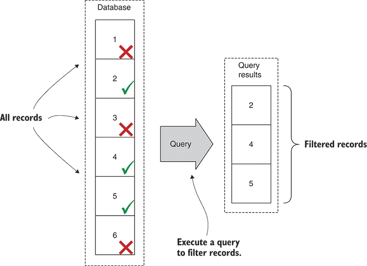

图 8.8 使用数据库查询过滤数据。

### 8.7.8 使用投影删除数据

另一种减少我们处理的数据量的方法是使用投影。投影允许我们从返回给查询的记录中删除字段。图 8.9 展示了一个示例，其中删除了某些字段，并且只返回我们想要检索的字段。在这个例子中，我们选择只检索*年份*、*月份*和*降水量*字段。当我们只需要某些数据字段时，这非常有用——比如说我们正在进行降雨研究，我们不需要检索整个数据集的所有字段。

正如你在下面的列表中可以看到的，我们通过`find`函数指定了一个投影，因此我们可以将投影附加到任何其他查询上。如果你运行这段代码，它将打印检索到的数据记录到控制台，但只包含我们在投影中选择的字段。

列表 8.6 使用投影减少检索数据（listing-8.6.js）

```
// ... openDatabase function is omitted ...

openDatabase()
    .then(db => {
 const query = {};    ①  
 const projection = {    ②  
 fields: {    ③  
 _id: 0,    ④  
 Year: 1,    ⑤  
 Month: 1,    ⑤  
 Precipitation: 1    ⑤  
 }    ③  
 };    ②  
 return db.collection.find(query, projection)    ⑥  
            .toArray()
 .then(data => {    ⑦  
 console.log(data);    ⑦  
            })
            .then(() => db.close());
    })
    .then(() => {
        console.log("Done.");
    })
    .catch(err => {
        console.error("An error occurred reading the database.");
        console.error(err);
    }); 
```

投影允许我们减小每条记录的大小，从而减小我们从查询中检索的数据集的总大小。这不仅增加了我们可以在内存中容纳的记录数量（因为每条记录都更小），而且在我们通过互联网访问数据库时，也减少了检索一组记录所需的带宽。

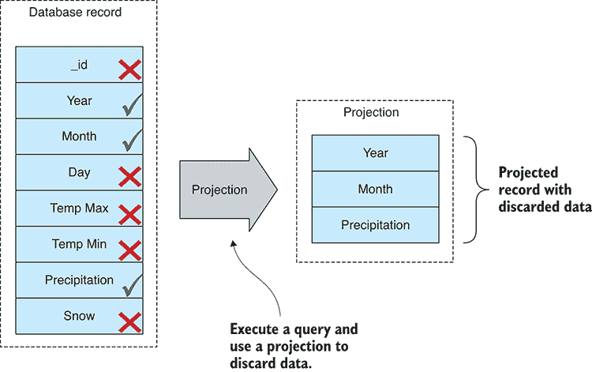

图 8.9 使用投影从每个数据库记录中删除数据

### 8.7.9 对大数据集进行排序

排序是一个有用且通常是必要的操作。例如，大多数排序算法，比如内置的 JavaScript `sort`函数，都需要我们将整个数据集放入内存。当我们处理不适合内存的数据集时，我们可以使用数据库来为我们进行排序(图 8.10)。

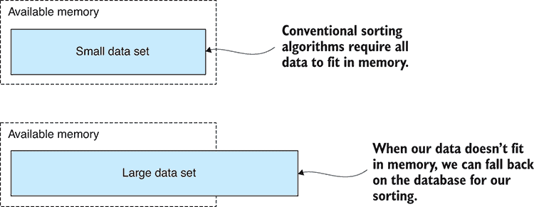

图 8.10 通常，在排序时，所有数据都必须适合内存。

在下面的列表中，我们通过年份字段来查找和排序记录。这将非常高效，因为我们已经为年份字段建立了索引。你可以运行这段代码，它将打印排序后的数据记录到控制台。

列表 8.7 使用 MongoDB 对大数据集进行排序（listing-8.7.js）

```
// ... openDatabase function is omitted ...

openDatabase()
    .then(db => {
 return db.collection.find()    ①  
 .sort({    ②  
 Year: 1    ②  
 })    ②  
            .toArray()
 .then(data => {    ③  
 console.log(data);    ③  
 })    ③  
            .then(() => db.close());
    })
    .then(() => {
        console.log("Done.");
    })
    .catch(err => {
        console.error("An error occurred reading the database.");
        console.error(err);
    }); 
```

看看`sort`函数是如何在`find`函数之后链式调用的。在这个例子中，我们没有向`find`函数传递任何参数，但我们同样可以指定一个查询和一个投影，在排序之前减小数据量。

还要注意在`sort`函数之后链式使用`toArray`。这会返回整个排序后的数据集，但对于大数据集来说，这可能不是我们想要的。我们可以轻松地删除`toArray`函数，而是使用数据库游标按记录逐个处理，就像我们之前做的那样。或者，我们可以保留`toArray`函数，并将其与`skip`和`limit`结合使用，从而从之前的方法中执行窗口处理。所有这些技术都围绕`find`函数展开，它们结合在一起帮助我们处理大量数据集。

关于排序的最后一点思考。我认为始终处理排序后的数据是一个好主意。为什么？因为当处理大量数据时，最好有一个可靠的顺序。否则，你的记录将以数据库想要的任何顺序返回，这对你来说可能不是最好的。有排序的数据使得调试更容易。它使得对数据问题的推理更容易。它还提供了一个有用的进度指示器！例如，当你看到 A、B、C 和 D 都已完成时，你就有了一个很好的想法，知道还剩下多少要处理，以及可能需要多长时间。

## 8.8 提高数据吞吐量

我们已经学习了如何使用数据库更有效地管理我们的大数据集。现在让我们看看我们可以使用的技巧来提高我们的数据吞吐量。

### 8.8.1 优化你的代码

提高性能的明显建议是：*优化你的代码*。大多数情况下，这超出了本书的范围，关于如何优化 JavaScript 代码的信息有很多。例如，在性能敏感的代码中不要使用`forEach`函数；相反，使用常规的`for`循环。

然而，当涉及到代码优化时，我会给你两条重要的建议，这有助于你提高生产力：

1.  专注于瓶颈。使用像`statman-stopwatch`这样的库来计时你的代码，并测量运行所需的时间长度。专注于耗时最长的代码。如果你花时间优化不是瓶颈的代码，你就是在浪费时间，因为这不会对你的数据吞吐量产生任何影响。

1.  不要专注于代码，而要专注于算法。

### 8.8.2 优化你的算法

仔细考虑你使用的算法。选择一个更适合任务的算法将比专注于你的代码给你带来更大的性能提升。例如，当你需要快速查找时，确保你使用的是 JavaScript 散列而不是数组。这只是一个简单且明显的例子。

然而，总的来说，算法是一个很大的领域，也是一个独立的研究主题（如果你想跟进这个话题，可以搜索*大 O 表示法*）。但在结束这一章之前，让我们看看一种在处理大量数据集时可以带来巨大性能收益的特定方法。

### 8.8.3 并行处理数据

Node.js 本质上是单线程的。这可以是一件好事，因为通常我们可以编写代码而无需担心线程安全或锁定。在性能方面，Node.js 通常通过将异步编程置于首位和中心来弥补其线程不足。但是，当你有多个核心可以用来解决问题时，只运行一个线程可能会浪费你的 CPU。

在本节中，我们将探讨如何通过使用多个操作系统能够利用多个核心并能够同时处理数据批次的单独操作系统进程来并行划分我们的数据并处理。这是“分而治之”的扩展，并建立在“使用数据窗口的增量处理”之上。

你可以在图 8.11 中看到这是如何工作的。我们有一个*主*进程，它控制两个或更多的*奴隶*进程。我们将数据集划分为两个或更多的单独数据窗口。每个奴隶负责处理单个数据窗口，并且多个奴隶可以使用单独的 CPU 核心同时操作多个数据窗口。

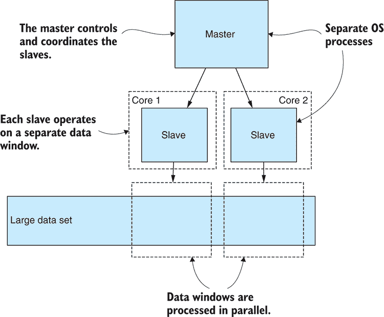

图 8.11 使用多个操作系统进程并行处理数据

不幸的是，这种应用程序结构使我们的应用程序变得更加复杂，并且随着我们添加的奴隶进程数量的增加，复杂性也会上升。当我们向应用程序添加复杂性时，我们应该确保这是出于一个很好的原因。在这种情况下，我们这样做有两个原因：

1.  我们可以并行处理数据，这增加了我们的整体数据吞吐量。我们可以通过运行的奴隶数量来增加我们的吞吐量。如果我们有 8 倍的奴隶（在 8 核 CPU 上），我们有望将吞吐量增加 8 倍。

1.  一个稍微不那么明显的事实是，每个奴隶进程都在自己的内存空间中运行。这通过奴隶进程的数量增加了我们可用的内存量。如果有 8 个奴隶进程，我们就有 8 倍的内存。

为了获得更高的吞吐量和更多的内存，我们可以添加更多的奴隶。然而，这有其局限性，因为当奴隶的数量超过物理 CPU 核心的数量时，收益递减。

在实践中，我们可以通过经验调整奴隶的数量，以消耗我们 CPU 时间的适当百分比。我们可能不想将 100%的 CPU 时间都用于此，因为这可能会影响计算机上其他应用程序的性能，甚至使其过热并变得不稳定。

此外，你应该有足够的物理内存来支持奴隶的数量以及它们将消耗的内存量。耗尽你的物理内存可能会适得其反，因为当数据在工作内存和文件系统之间交换时，你的应用程序将开始*颠簸*。

我们如何实现这个？这不像你想象的那么困难。首先，我将向你展示我是如何通过并行运行单独的 Node.js 命令来解决这个问题。然后我会解释其他人如何使用 Node.js 的`fork`函数来做这件事。

#### 并行执行单独的命令

让我们通过一个简化的例子来看看如何实现并行处理。这可能会变得复杂，所以为了保持例子简单，我们不会进行任何实际的数据处理，而是并行访问我们的数据窗口。但你会看到一个占位符，你可以在这里添加你自己的数据处理代码。这可以作为一个练习，稍后添加数据处理到这个框架中。

对于这个例子，我们需要安装*yargs*来读取命令行参数，还需要一个名为*async-await-parallel*的模块，我们很快会讨论它。如果你为第八章的存储库安装了依赖项，那么这些依赖项已经安装好了；否则，你可以在一个新的 Node.js 项目中安装它们，如下所示：

```
npm install --save yargs async-await-parallel 
```

我的方法在列表 8.8 和 8.9 中展示。第一个脚本列表 8.8 是从脚本。这个脚本在一个单独的数据窗口上操作，类似于我们在“使用数据窗口进行增量处理”中看到的。数据窗口的位置和大小通过`skip`和`limit`命令行参数传递给脚本。在我们转到列表 8.9 之前，查看这个脚本，并在`processData`函数中注意可以插入你自己的数据处理代码的行（或者插入一个调用你之前章节中可重用数据处理代码模块的调用）。

列表 8.8 并行工作的从进程（listing-8.8.js）

```
// ... openDatabase function is omitted ...

function processData (collection, skipAmount, limitAmount) {    ①  
 return collection.find()    ②  
 .skip(skipAmount)    ②  
 .limit(limitAmount)    ②  
        .toArray()
 .then(data => {    ③  
            console.log(">> Your code to process " + data.length + " ➥ records here!");
 });    ③  
};    ①  

console.log("Processing records " + argv.skip + " to " + (argv.skip + ➥ argv.limit));

openDatabase()
    .then(db => {
 return processData(db.collection, argv.skip, argv.limit)    ④  
            .then(() => db.close());
    })
    .then(() => {
        console.log(
            "Done processing records " + argv.skip +
 " to " + (argv.skip + argv.limit)
        );
    })
    .catch(err => {
        console.error(
            "An error occurred processing records " + argv.skip +
            " to " + (argv.skip + argv.limit)
        );
        console.error(err);
    }); 
```

现在，让我们看看主脚本列表 8.9。这个脚本调用列表 8.8 中的从脚本来完成实际工作。它一次会启动两个从脚本，等待它们完成，然后启动下一组两个从脚本。它会继续以两组两个的方式运行从脚本，直到整个数据库都被处理。我设置从脚本的数量为两个以保持事情简单。当你自己运行这段代码时，你应该尝试调整`maxProcesses`变量以适应你可用于数据处理的核心数量。

列表 8.9 协调从进程的主进程（listing-8.9.js）

```
const argv = require('yargs').argv;
const spawn = require('child_process').spawn;    ①  
const parallel = require('async-await-parallel');

// ... openDatabase function is omitted ...

function runSlave (skip, limit, slaveIndex) {    ②  
 return new Promise((resolve, reject) => {    ③  
 const args =   [  ④  
 "listing-8.8.js",    ④  
 "--skip",    ④  
 skip,    ④  
 "--limit",    ④  
 limit    ④  
 ];    ④  

 const childProcess = spawn("node", args);    ⑤  

    // … input redirection omitted …

 childProcess.on("close", code => {    ⑥  
            if (code === 0) {
 resolve();    ⑦  
            }
            else {
 reject(code);    ⑧  
            }
 });    ⑤  

 childProcess.on("error", err => {    ⑨  
 reject(err);    ⑩  
 });    ⑨  
 });    ③  
};    ②  

function processBatch (batchIndex, batchSize) {    ⑪  
 const startIndex = batchIndex * batchSize;    ⑫  
 return () => {    ⑬  
 return runSlave(startIndex, batchSize, batchIndex);    ⑭  
 };    ⑬  
};    ⑪  

function processDatabase (numRecords) {    ⑮  

 const batchSize = 100;    ⑯  
 const maxProcesses = 2;    ⑰  
 const numBatches = numRecords / batchSize;    ⑱  
 const slaveProcesses = [];    ⑲  
 for (let batchIndex = 0; batchIndex < numBatches; ++batchIndex) {    ⑲  
 slaveProcesses.push(processBatch(batchIndex, batchSize));    ⑲  
 }    ⑲  

    return parallel(slaveProcesses, maxProcesses);
};    ⑮  

openDatabase()
    .then(db => {
 return db.collection.find().count()    ⑳  
 .then(numRecords => processDatabase (numRecords))    ㉑  
            .then(() => db.close());
    })
    .then(() => {
        console.log("Done processing all records.");
    })
    .catch(err => {
        console.error("An error occurred reading the database.");
        console.error(err);
    }); 
```

列表 8.9 首先在数据库集合上调用`find().count()`来确定它包含多少条记录。然后它将数据库划分为数据窗口。对于每个窗口，它调用`processBatch`。这个函数有一个不寻常的行为，就是创建并返回一个匿名函数，该函数封装了对`runSlave`的调用。我稍后会解释这一点。

`runSlave`是启动奴隶进程的函数。在这里，我们使用 Node.js 的`spawn`函数创建一个新的进程。我们正在调用 Node.js 来运行我们在列表 8.8 中看到的奴隶脚本。注意传递给奴隶的`skip`和`limit`命令行参数。这些告诉奴隶必须处理哪个数据窗口。

在为每个窗口调用`processBatch`之后，我们现在有一个函数列表，当执行这些函数时，将为每批数据调用`runSlave`。我们需要这种延迟操作来与我们从 async-await-parallel 库中使用的`parallel`函数一起使用。

我们将我们的函数列表和要并行执行的操作数量传递给`parallel`。`parallel`为我们做艰苦的工作，并行批处理调用我们的延迟函数，直到所有函数都执行完毕。`parallel`返回一个当整个序列完成时解决的承诺，或者在任何单个操作失败时拒绝。

#### 创建新的进程

我们学习了在 Node.js 中执行并行数据处理的一种方法，但我们还有在 Node.js 中构建主/从类型应用的一个更简单的方法，那就是使用`fork`函数。这是你在搜索互联网上这个主题时最常找到的技术。

我们以单个进程开始我们的应用程序，然后我们为所需的奴隶调用`fork`。`fork`函数使我们的进程分支成两个进程，然后我们的代码在主进程或奴隶进程中运行。

如果运行单独的命令比运行单独的命令更简单，为什么不使用`fork`函数呢？

这里是我更喜欢自己的方法的一些原因：

+   运行单独的命令更加明确，并且更容易确保奴隶进程并行运行。

+   主从进程之间有清晰的分离。你要么在主脚本中，要么在奴隶脚本中。

+   这使得奴隶进程易于测试。因为你可以从命令行运行奴隶进程，所以你可以轻松地以这种方式进行测试和调试。

+   我认为这使代码更具可重用性。将你的应用程序分解成多个脚本意味着你有一个主进程，它可以潜在地（经过一些重构）与不同的奴隶一起使用。此外，你还有可以潜在地在其他方式和情况下使用的单独的奴隶脚本。

+   它可以与 Node.js 脚本以外的脚本一起工作。你可能还有其他想要运行的工具，主进程可以像运行 Node.js 和你的奴隶脚本一样轻松地运行这些工具。

两种方法最终的结果几乎相同；我们能够并行处理我们的数据。使用`fork`是一个更简单的替代方案。运行单独的命令更困难，但并不太多，并且具有我概述的好处。选择最适合你的方法。

通过本章和上一章，我们处理了一个庞大的数据集。我们从一个大型的 CSV 文件中提取数据并将其导入我们的数据库。现在我们武装了各种构建数据管道、清理和转换数据的技术，并且现在我们的技术可以扩展到庞大的数据集。我们终于准备好进行一些数据分析了！第九章，我们来了！

## 摘要

+   我们讨论了 Node.js 的内存限制如何限制在任何时候可以放入内存中的数据量。

+   你探索了与大型数据库一起工作的各种技术，包括

+   如何将大型 CSV 数据文件移动到 MongoDB 数据库

+   如何将数据分成批次，其中每个批次都适合内存并且可以单独处理

+   使用游标或数据窗口来逐步处理整个数据库

+   使用查询和投影来减少数据

+   使用数据库来排序数据——当数据不适合内存时，这是一个通常难以进行的操作

+   你通过一个例子学习了如何通过生成多个操作系统进程来并行处理我们的数据，从而提高数据管道的吞吐量。
