# 9

实践数据分析

**本章涵盖**

+   使用统计工具：求和、平均值、标准差和频率分布

+   对数据集进行分组和汇总，以便理解其含义

+   使用工具处理时间序列数据：滚动平均、线性回归等

+   使用数据分析技术来比较数据和进行预测

+   使用相关性来理解数据变量之间的关系

恭喜你来到了数据分析章节。到达这里需要很多努力。我们不得不从某处获取我们的数据，并且我们需要对其进行清理和准备。然后我们发现我们拥有的数据比我们能处理的多，所以我们必须将其移动到我们的数据库中处理。这是一条漫长的道路。

数据分析是研究我们的数据以获得更好的理解、获取洞察力并回答我们问题的学科。例如，当我正在寻找一个居住地或度假地时，我可能对天气有具体的要求。在本章中，我们将研究纽约市中央公园气象站 100 年的天气数据。稍后，我们将将其与洛杉矶的天气进行比较，看看它们如何相互比较。我还对整体趋势感兴趣：天气是否变热了？哪个城市升温更快？ 

在本章中，我们将学习数据分析，并将在第七章和第八章中使用过的 NOAA 气象站数据上进行实践。我们将从基础知识开始，逐步过渡到更高级的技术。到结束时，我们将拥有理解、比较和预测的工具。

本章深入探讨了数学，但不要因此而气馁。我们涉及的数学是基础的，对于更高级的数学，我们将依赖第三方库来抽象处理困难的部分。我坚信，你不需要成为一个数学大师就能使用数据分析；你只需要知道每种技术适合做什么以及如何使用它。

当你了解到这些技术有多么强大时，你会想到它们的各种用途；它们甚至可以帮助你完成像理解你的服务器或应用性能指标这样的常规任务。

## 9.1 扩展你的工具箱

在本章中，我们将添加几种数据分析技术到我们的工具箱中，如表 9.1 所示。我们将探讨如何自己编写这些公式的代码。对于更高级的数学，我们将使用第三方库。我们还将在本章中更多地使用 Data-Forge。

表 9.1 第九章中使用的工具

| **技术** | **函数** | **说明** |
| --- | --- | --- |
| 基本统计学 | `sum` | 从一组值中求和。 |
|  | `average` | 从一组值中计算平均值或*中心*值。 |
|  | `std` | 从一组值中计算标准差；这是衡量数据波动性、波动或分散程度的指标。 |
| 分组和汇总 | `groupBy, select` | 通过分组记录并使用总和、平均值或标准差进行汇总，使数据集更加紧凑，更容易理解。 |
| 频率分布 | `bucket, detectValues` | 确定数据集中的值分布，如果它符合正态分布，这将给我们一定的预测能力。 |
| 时间序列 | `rollingAverage` | 平滑时间序列数据，去除噪声，以便我们更好地检测趋势和模式。 |
|  | `rollingStandardDeviation` | 查看数据系列随时间的变化或波动。 |
|  | `linearRegression` | 用于预测和检测趋势。 |
|  | `difference` | 理解时间序列之间的差异，并确定它们是否在发散。 |
| 数据标准化 | `average, std` | 标准化两个数据集以进行直接比较。 |
| 相关系数 | `sampleCorrelation` | 理解数据变量之间的关系以及它们的相关性强弱。 |

在本章中，我们将查看各种生成图表的代码示例。由于我们尚未学习可视化，我准备了一系列工具函数，您将使用这些函数来渲染图表。您只需将数据传递给工具函数，它就会为您渲染一个图表到图像中。

随着我们学习本章，您将看到这些函数是如何使用的。在接下来的可视化章节（第十章和第十一章）中，您将学习如何从头开始创建这样的图表。

## 9.2 分析天气数据

在本章中，我们分析了前两章中使用的天气数据。我们对这些数据可能提出的问题有很多。已经提到的是，我们可能想要搬到一个气候宜人的地方，或者我们可能想去一个温暖的地方度假。

来自 NOAA 的完整气象站数据集非常大，未压缩时达到 27 GB。如果我们进行全球分析，我们希望处理和汇总整个数据集；然而，这是一个庞大的操作。对于本章，我们将有一个更本地化的焦点，因此从大数据集中，我提取了两个特定气象站的数据。一个是纽约市（NYC），另一个是洛杉矶（LA）。

在将庞大的数据集加载到我的 MongoDB 数据库后，我通过`StationId`对其进行索引。加载数据库和创建索引的过程花费了相当多的时间，但在此之后，提取特定气象站的所有数据变得非常快。我将 NYC 和 LA 的数据提取到两个单独的 CSV 文件中，这些文件可在本章的 GitHub 存储库中找到。

## 9.3 获取代码和数据

本章的代码和数据可在 GitHub 上的 Data Wrangling with JavaScript Chapter-9 仓库中找到，网址为 [`github.com/data-wrangling-with-javascript/chapter-9`](https://github.com/data-wrangling-with-javascript/chapter-9)[.](http://.) 示例数据位于仓库中的 *data* 子目录下。

本章的大部分示例代码将图表渲染为图像文件，这些文件将在你运行每个代码列表后可在 *output* 子目录中找到。渲染此类图表的代码位于 *toolkit* 子目录中（我们将在第十章和第十一章中深入研究此代码）。有关获取代码和数据的信息，请参阅第二章中的“获取代码和数据”。

## 9.4 基本数据汇总

统计学和数据分析中常用三个基本函数。它们是求和、平均和标准差。这些统计工具使我们能够总结数据集，并对其进行比较。

### 9.4.1 求和

你几乎找不到比求和更基本的操作了：将数据集中的值加起来。求和本身很有用——比如说，当我们需要从单个值中累计总量时，但我们很快还需要用它来计算平均值。我认为这将是一个很好的方式来为更高级的函数做准备。

我们将计算 2016 年在纽约市气象站收集到的所有降雨量。我们使用 JavaScript 的 `reduce` 函数创建 `sum` 函数，在这个过程中，我们创建了一个新的可重用 `statistics` 代码模块，并将其添加到我们的工具箱中。这将在以下列表中展示。

列表 9.1 我们工具箱中的求和函数（toolkit/statistics.js）

```
function sum (values) {    ①  
 return values.reduce((prev, cur) => prev + cur, 0);    ②  
}

module.exports = {
    sum: sum,
}; 
```

列表 9.2 展示了我们是怎样使用新的 `sum` 函数来计算总降雨量的。为了保持简单，我们首先使用硬编码的数据集，但很快我们将升级到一些真实数据。尝试运行以下列表，你应该会看到它计算的总降雨量为 1072.2 毫米。

列表 9.2 计算 2016 年的总降雨量（listing-9.2.js）

```
const sum = require('./toolkit/statistics').sum;    ①  

const monthlyRainfall =   [  ②  
    112.1,
    112,
    // ... data omitted ...
    137.5,
    73.4
];

const totalRainfall = sum(monthlyRainfall);    ③  
console.log("Total rainfall for the year: " + totalRainfall + "mm"); 
```

### 9.4.2 平均

现在我们有了 `sum` 函数，我们可以用它来构建我们的 `average` 函数。`average` 函数计算一组值的 *平均值* 或 *算术平均值*，这是计算数据集 *中心值* 的一种方法。当你想知道最常见值时，平均值很有用，因为我们可以在新值高于或低于正常值时检测到。让我们计算平均月降雨量。

以下列表展示了我们基于 `sum` 函数构建的 `average` 函数。这是另一个添加到我们可重用统计代码模块中的函数。

列表 9.3 我们工具箱中的平均函数（toolkit/statistics.js）

```
// ... sum function omitted ...

function average (values) {    ①  
 return sum(values) / values.length;    ②  
}

module.exports = {
    sum: sum,
    average: average,
}; 
```

以下列表展示了我们如何使用 `average` 函数从硬编码的数据集中计算平均值。运行此代码，你应该会看到它计算的平均值约为 89.35 毫米。

列表 9.4 计算 2016 年的平均月降雨量（listing-9.4.js）

```
const average = require('./toolkit/statistics.js').average;

const monthlyRainfall = [
    // ... hard-coded data omitted ...
];

const averageMonthlyRainfall = average(monthlyRainfall);    ①  
console.log("Average monthly rainfall: " + averageMonthlyRainfall + "mm"); 
```

### 9.4.3 标准差

标准差是一个更复杂的公式。这告诉我们我们的值与平均值平均偏离的程度。它量化了我们数据集中的变化或分散程度。

我们可以使用它来衡量我们数据的可变性或波动性，这使我们能够了解我们的数据值是平静有序还是波动不定、四处散布。让我们计算一下月降雨量的标准差。

在下面的列表中，我们向我们的统计代码模块添加了一个 `std` 函数，用于计算标准差。它基于我们之前创建的 `average` 函数。

列表 9.5 为我们的工具包（toolkit/statistics.js）提供一个标准差函数

```
// ... sum and average functions omitted ...

function std (values) {    ①  
 const avg = average(values);    ②  
 const squaredDiffsFromAvg = values    ③  
 .map(v => Math.pow(v – avg, 2))    ③  
 const avgDiff = average(squaredDiffsFromAvg);    ④  
 return Math.sqrt(avgDiff);    ⑤  
}

module.exports = {
    sum: sum,
    average: average,
    std: std,
}; 
```

以下列表显示了如何使用 `std` 函数计算 2016 年月降雨量的标准差。你可以运行此代码，它应该将标准差放在大约 40.92 毫米的位置。

列表 9.6 计算 2016 年月降雨量的标准差（listing-9.6.js）

```
const std = require('./toolkit/statistics.js').std;

const monthlyRainfall = [
    // ... hard-coded data omitted ...
];

const monthlyRainfallStdDeviation = std(monthlyRainfall);    ①  
console.log("Monthly rainfall standard deviation: " + ➥monthlyRainfallStdDeviation + "mm"); 
```

虽然标准差可以作为波动性的度量单独使用，但它也常与 *分布* 结合使用，以便我们可以预测未来值的概率。它还可以用于 *标准化* 数据，以便我们可以像比较不同的数据集一样进行比较。我们将在本章后面讨论这两种技术。

## 9.5 分组并总结

现在我们已经建立了基本的统计数据，我们可以继续进行更高级的数据分析技术。我们之前处理的数据一直是一个硬编码的月降雨值 JavaScript 数组。这些数据是如何准备的？

那些数据是通过按月份分组每日值，然后对每个组中的每日降雨量求和来计算月降雨量准备的。这种 *分组和总结* 操作经常被使用，我认为它是一种基本的数据分析技术。

当我们被数据淹没时，很难提取信息，但当我们分组和总结时，我们将其简化为更容易理解的东西。我们甚至可能多次压缩数据，当我们 *深入挖掘* 寻找数据集中的有趣数据点或异常时。

让我们开始使用实际的数据集而不是硬编码的数据。我们将分析来自纽约市气象站的数据集。本章附带的 CSV 文件包含回溯 100 年的记录，但我们将从 2016 年的数据开始查看。

我们可以查看 2016 年全年每日温度数据的条形图，但正如你所想象的那样，这样的图表会相当嘈杂，并且不会提供很好的数据总结。相反，让我们使用我们的分组和总结技术将数据压缩成月度总结，结果就是 图 9.1 中的图表，它显示了 Y 轴上的平均月度温度（摄氏度）。

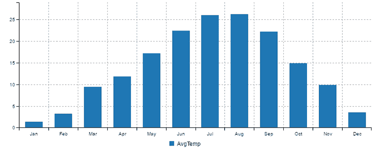

图 9.1 2016 年纽约市月平均温度

图 9.1 使我们能够轻松地看到纽约市一年中最热和最冷的月份。如果我计划去那里旅行，而且我不喜欢冷天气，那么最好避免十二月份、一月份和二月份（实际上，我来自一个相对炎热的国度，所以我喜欢冷天气）。

图 9.2 阐述了分组和总结的过程。我们取左侧的每日天气数据。我们根据 *月份* 列将所有数据记录组织成组。然后，对于每个组，我们计算平均温度。这产生了我们在 图 9.2 右侧看到的压缩后的表格。

列表 9.7 包含了一个分组和总结技术的代码示例。在这里，我们将进入更高级的数据分析技术，因此我们将使用 Data-Forge 来简化操作。如果你已经为第九章代码仓库安装了依赖项，那么它已经安装好了；否则，你可以在一个新的 Node.js 项目中按照以下步骤安装它：

```
npm install --save data-forge 
```

在 列表 9.7 中，我们首先读取了 100 年纽约市天气的整个数据集。在这个例子中，我们只对 2016 年感兴趣，因此我们使用 `where` 函数筛选出 2016 年的记录。

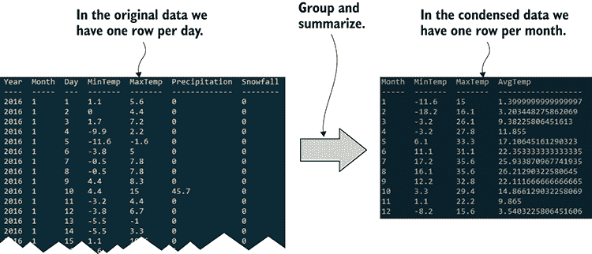

图 9.2 通过按月份分组并总结数据来压缩每日数据

然后，我们使用 `groupBy` 函数将 2016 年的记录排序到每月的组中。之后，`select` 函数将每个组（计算最小值、最大值和平均值）进行转换，我们已重新编写了数据集。我们从嘈杂的每日数据中提取出来，并将其压缩成每月的总结。运行此代码，它将打印出类似于 图 9.2 右侧的控制台输出，并渲染一个类似于 图 9.1 的条形图到输出/nyc-monthly-weather.png。

列表 9.7 按月份分组和总结每日天气数据（listing-9.7.js）

```
const dataForge = require('data-forge');
const renderMonthlyBarChart = require('./toolkit/charts.js').renderMonthlyBarChart;    ①  
const average = require('./toolkit/statistics.js').average;    ②  

const dataFrame = dataForge
 .readFileSync("./data/nyc-weather.csv")    ③  
    .parseCSV()
 .parseInts("Year")    ④  
 .where(row => row.Year === 2016)    ⑤  
 .parseFloats(["MinTemp", "MaxTemp"])    ⑥  
 .generateSeries({    ⑦  
 AvgTemp: row => (row.MinTemp + row.MaxTemp) / 2,    ⑦  
 })    ⑦  
 .parseInts("Month")    ⑧  
 .groupBy(row => row.Month)    ⑨  
 .select(group => {    ⑩  
        return {
 Month: group.first().Month,
 MinTemp: group.deflate(row => row.MinTemp).min(),    ⑪  
 MaxTemp: group.deflate(row => row.MaxTemp).max(),    ⑫  
 AvgTemp: average(group    ⑬  
 .deflate(row => row.AvgTemp)    ⑬  
 .toArray()    ⑬  
 )    ⑬  
        };
    })
 .inflate();    ⑭  

console.log(dataFrame.toString());    ⑮  

renderMonthlyBarChart(    ⑯  
 dataFrame,    ⑯  
 "AvgTemp",    ⑯  
 "./output/nyc-monthly-weather.png"    ⑯  
 )    ⑯  
 .catch(err => {    ⑰  
        console.error(err);
    }); 
```

注意 列表 9.7 结尾处的 `renderMonthlyBarChart` 调用。这是一个我为你准备的工具函数，这样我们就可以专注于数据分析，而不必担心可视化的细节。我们将在第十章和第十一章中回到可视化，并了解如何创建这样的图表。

在 列表 9.7 中，我们只总结了温度。我们通过取平均值来完成这项工作。我们可以在我们的总结中添加其他指标。例如，我们可以轻松修改 列表 9.7 中的代码，以包括每月的总降雨量和总降雪量。更新后的代码在下面的列表中展示。

列表 9.8 向总结每月降雨量和降雪量的代码中添加代码（从 列表 9.7 升级）

```
// ... Remainder of code omitted, it is as per listing 9.7 ...

    .select(group => {
        return {
            Month: group.first().Month,
            MinTemp: group.deflate(row => row.MinTemp).min(),
            MaxTemp: group.deflate(row => row.MaxTemp).max(),
            AvgTemp: average(group.deflate(row => row.AvgTemp).toArray()),
 TotalRain: sum(group.deflate(row => row.Precipitation).toArray()),    ①  
 TotalSnow: sum(group    ①  
 .deflate(row => row.Snowfall)    ①  
 .toArray()    ①  
 )    ①  
        };
    }) 
```

在我们总结新值的同时，我们也可以将它们添加到我们的条形图中。图 9.3 展示了一个更新后的图表，其中添加了降雨量和降雪量，温度位于左侧坐标轴（摄氏度）上，而降雪量/降雨量位于右侧坐标轴（毫米）上。

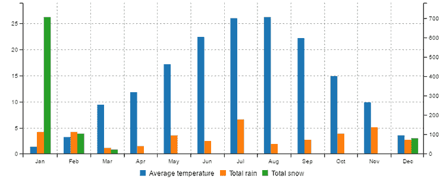

图 9.3 2016 年纽约市包括降雨和降雪的天气图表

在图 9.3 中的图表上稍加研究，就能注意到 1 月份降雪量出现了巨大的峰值。这里发生了什么？是整个月都在下雪吗？还是只有少数几天下雪。这是我们数据中找到有趣的数据点或异常的例子。我们不禁对这里发生的事情感到好奇。这甚至可能是我们数据中的一个错误！

现在，你可以深入查看一月份的每日图表。为此，你需要筛选出 2016 年 1 月的记录，并绘制每日降雪柱状图——你可以通过简单修改列表 9.7 或 9.8 来实现这一点。如果你这样做，你会发现降雪峰值出现在 1 月 23 日。在网络上搜索这个日期在纽约市的情况，你会发现那天发生了一场巨大的暴风雪。谜团解开。如果你在 1 月份去纽约度假，你可能会发现自己被困在暴风雪中！（这在我大约 20 年前在纽约发生过的。）

了解这样一个事件发生的频率可能很有趣。纽约市暴风雪发生的频率是多少？为此，我们需要对数据集进行更广泛的分析，但有一百年的数据可用，所以你尝试找到其他暴风雪怎么样？你将如何进行这项工作？

首先，你可能想按年份总结降雪量并生成图表。寻找降雪量峰值出现的年份。其次，深入到那些年份，找到峰值出现的月份。最后，深入到那些年份和月份的每日图表，找到峰值出现的日期。

这是我们所做的一般总结：

1.  筛选出你感兴趣的数据记录。

1.  按指标分组。

1.  总结该组的数据。

1.  寻找异常，然后深入到一个有趣的小组。然后在更细粒度的层面上重复这个过程。

这种查看数据摘要然后深入到更细粒度的方法是一种快速定位感兴趣数据和事件的有效技术。在这种方法中，我们从一个数据的全局视角开始，逐步聚焦于突出的数据点。

我们现在有了帮助我们理解气象数据的工具，但我们还没有任何技术可以帮助我们预测新气象数据中未来值的可能性，所以现在我们将探讨如何做到这一点。

## 9.6 温度的频率分布

现在我们来看看纽约市的温度分布。很快你就会看到，这可能让我们能够预测新温度值的概率。

图 9.4 显示了过去 100 年纽约市温度频率分布的直方图。这样的图表将数值排列成一系列*桶*，每个桶中的数值量用垂直条表示。每个条形图总结了温度值的一个集合，每个桶的中点位于 X 轴上，以摄氏度表示。每个条形图的高度，即 Y 轴，表示落在桶范围内的值（来自总数据集）的百分比。

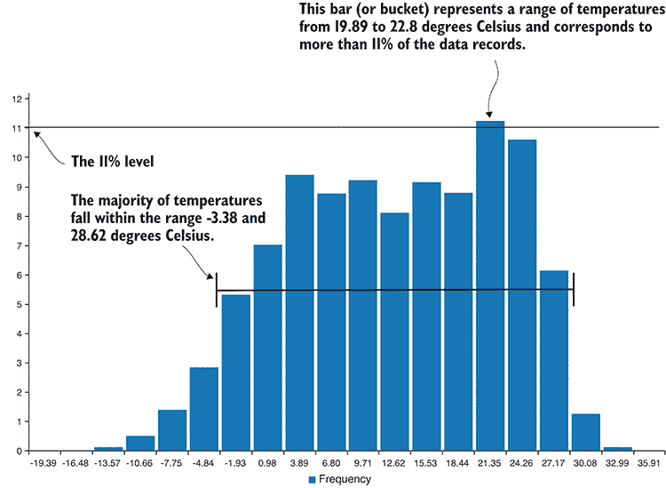

图 9.4 纽约市过去 100 年的温度分布

观察到图 9.4，我们可以迅速了解纽约市所经历的温度范围。例如，我们可以看到大多数记录值所在的温度范围，以及记录值中最大的群体占所有值的 11%。

这里的 11%值并不重要——这是最高的条形，它是一种让我们看到值最密集聚集的温度范围的方法。这样的直方图只能在首先生成如图 9.5 所示的频率分布表之后绘制。这个特定表格中的每一行都对应于图 9.4 中的直方图中的一个条形。

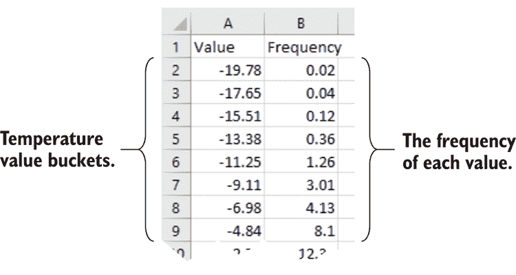

图 9.5 纽约市温度频率分布表（用于绘制图 9.4 中的直方图))

在我有限的工作经验中，处理气象数据时，我预计温度分布可能呈正态分布（我稍后会解释），但实际数据并未符合我的假设（在处理数据时这种情况很常见）。

虽然我确实注意到图 9.4 看起来像是两个正态分布紧挨在一起。经过一些调查后，我决定将冬季和夏季数据分开。在指定了冬季和夏季月份后，我根据这一标准分割了数据。

接下来，我为每个季节创建了单独的直方图。当我查看新的可视化时，很明显，每个季节的温度分布都与正态分布紧密吻合。例如，您可以在图 9.6 中看到冬季温度的直方图。

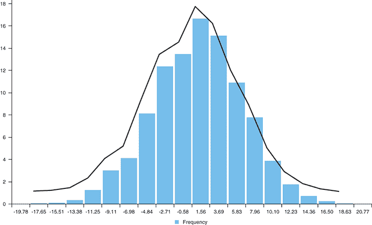

图 9.6 纽约市的冬季温度与正态分布紧密吻合。

到目前为止，尤其是如果你已经忘记了高中统计学，你可能想知道什么是正态分布。它是统计学中的一个重要概念，非正式地被称为*钟形曲线*。这让你想起什么了吗？落在正态或接近正态分布的数据集具有允许我们估计新数据值概率的特性。

这与温度值有什么关系？这意味着我们可以快速确定特定温度发生的概率。一旦我们知道数据集属于正态分布，我们现在可以对数据集做出某些陈述，例如

+   68%的值落在平均值加减 1 个标准差（SDs）的范围内。

+   95%的值落在平均值加减 2 个标准差（SDs）的范围内。

+   99.7%的值落在平均值加减 3 个标准差（SDs）的范围内。

+   反过来，只有 0.3%的值将落在平均值加减 3 个标准差（SDs）之外。我们可以将这些值视为极端值。

我们如何知道这些概率？这是因为这些是正态分布的已知特性（如图 9.7 所示）。现在我们并不拥有一个完美的正态分布，但它足够接近，我们可以利用这些特性来理解我们最常见的值，并对未来可能看到的值进行预测。

例如，如果我们纽约市在冬天有一个极端的高温天气，比如说 18 摄氏度，那么我们可以从统计学上知道这是一个极端的温度。我们知道这是极端的，因为它比平均温度高出三个标准差（SDs），所以这样的温度一天发生的可能性很小。这并不意味着这样的日子永远不会发生，但根据我们从过去 100 年中分析的数据，它发生的概率很低。

正态分布及其特性有趣之处在于，大量统计学和科学都依赖于它。

假设我们进行一项实验，进行观察并记录数据。我们还需要一个*对照组*来与之比较，并了解实验结果是否具有显著性。我们设置了一个不受实验影响的单独对照组，然后再次进行观察和记录数据。

我们可以查看对照组的数据分布，看看它与实验结果有何关联。实验结果与对照组平均值的差距越大，我们对实验结果具有统计学意义的信心就越强。当实验结果比对照组结果超出两个标准差（SDs）时，我们越来越有信心认为实验是导致结果的原因，而不是偶然或巧合。这种统计检验依赖于我们的数据呈正态分布。如果您在家中尝试此方法，请首先验证您的数据是否近似正态分布。

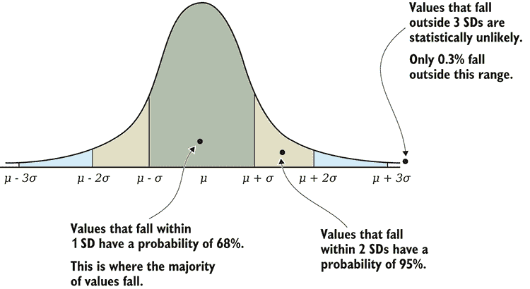

图 9.7 举例说明值与正态分布的关系

列表 9.9 展示了创建用于绘制图 9.4 中显示的直方图的频率分布的代码。首先，我们使用 Data-Forge 的`bucket`函数将我们的温度值组织成直方图所需的桶。然后`detectValues`函数总结了*桶化*值的频率。输出是我们的频率表。我们需要调用`orderBy`来按值对频率表进行排序，以便它以直方图正确的顺序排列。

列表 9.9 计算纽约市温度的频率分布和直方图（listing-9.9.js）

```
const dataForge = require('data-forge');
const renderBarChart = require('./toolkit/charts.js').renderBarChart;

function createDistribution (series, chartFileName) {    ①  
 const bucketed = series.bucket(20);    ②  
    const frequencyTable = bucketed
 .deflate(r => r.Mid)    ③  
 .detectValues()    ④  
 .orderBy(row => row.Value);    ⑤  
 console.log(frequencyTable.toString());    ⑥  

    const categories = frequencyTable
 .deflate(r => r.Value.toFixed(2))    ⑦  
        .toArray();

 return renderBarChart(    ⑧  
 "Frequency",    ⑧  
 frequencyTable,    ⑧  
 categories,    ⑧  
 chartFileName    ⑧  
 );    ⑧  
};

function isWinter (monthNo) {    ⑨  
 return monthNo === 1 ||    ⑨  
 monthNo === 2 ||    ⑨  
 monthNo === 12;    ⑨  
};    ⑨  

const dataFrame = dataForge.readFileSync("./data/nyc-weather.csv")    ⑩  
 .parseCSV()    ⑩  
 .parseInts("Month")    ⑩  
 .parseFloats(["MinTemp", "MaxTemp"])    ⑩  
 .generateSeries({    ⑩  
 AvgTemp: row => (row.MinTemp + row.MaxTemp) / 2    ⑩  
 });    ⑩  

console.log("Winter temperature distribution:");
const winterTemperatures = dataFrame    ⑪  
 .where(row => isWinter(row.Month))    ⑪  
 .getSeries("AvgTemp");    ⑪  

const outputChartFile = "./output/nyc-winter-temperature-distribution.png";
createDistribution(winterTemperatures, outputChartFile)    ⑫  
    .catch(err => {
        console.error(err);
    }); 
```

注意在列表 9.9 中，我们如何读取纽约市 100 年的整个数据集，但我们随后过滤数据，只留下在冬季月份发生的温度。

现在我们有了描述我们的数据集、比较数据集和理解哪些值是正常值以及哪些是极端值所需的工具。让我们将注意力转向分析时间序列数据的技术。

## 9.7 时间序列

时间序列是一系列按日期和/或时间顺序排列或索引的数据点。我们关于纽约市天气的数据集是一个时间序列，因为它由按日期排序的每日天气读数组成。

我们可以使用本节中的技术来检测随时间发生的变化的趋势和模式，以及比较时间序列数据集。

### 9.7.1 年度平均温度

图 9.8 是过去 100 年纽约市年度平均温度的图表。为了生成此图表，我使用了*分组和总结*技术来创建一个按年度平均温度的时间序列。然后我创建了线形图作为时间序列数据的视觉表示。

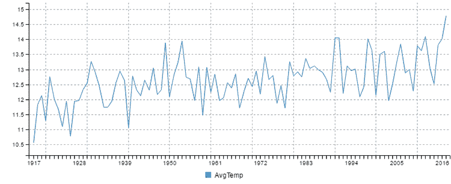

图 9.8 过去 100 年纽约市的平均年度温度

列表 9.10 展示了按年份分组数据并生成年度平均温度的代码。它调用了我为你们准备的`renderLineChart`工具函数。在第十章和第十一章中，我们将更详细地探讨此类图表的创建过程。你可以运行此代码，它将生成图 9.8 中所示的图表。

列表 9.10 按年份分组并总结纽约市的温度数据（listing-9.10.js）

```
const dataForge = require('data-forge');
const renderLineChart = require('./toolkit/charts.js').renderLineChart;
const average = require('./toolkit/statistics.js').average;

function summarizeByYear (dataFrame) {    ①  
 return dataFrame    ①  
 .parseInts(["Year"])    ①  
 .parseFloats(["MinTemp", "MaxTemp"])    ①  
 .generateSeries({    ①  
 AvgTemp: row => (row.MinTemp + row.MaxTemp) / 2,    ①  
 })    ①  
 .groupBy(row => row.Year) // Group by year and summarize.    ①  
 .select(group => {    ①  
 return {    ①  
 Year: group.first().Year,    ①  
 AvgTemp: average(group.select(row => row.AvgTemp).toArray())    ①  
 };    ①  
 })    ①  
 .inflate();    ①  
};    ①  

let dataFrame = dataForge.readFileSync("./data/nyc-weather.csv")
    .parseCSV();

dataFrame = summarizeByYear(dataFrame);    ①  

const outputChartFile = "./output/nyc-yearly-trend.png";
renderLineChart(dataFrame, ["Year"], ["AvgTemp"], outputChartFile)    ②  
    .catch(err => {
        console.error(err);
    }); 
```

我们可能已经从每日数据中创建了一个图表，但那将会有很多噪声，因为每天的波动很大。噪声数据使得观察趋势和模式更加困难——这就是为什么我们在制作图表之前按年份分组的原因。

按年度总结我们的数据使得观察温度上升的趋势变得容易得多。然而，数据仍然存在噪声。你注意到图表中大幅度的上下波动了吗？这种变异性可能会使得我们难以确定我们认为是的趋势或模式。我们认为我们可以在图 9.8 中看到上升趋势，但我们如何才能确定呢？

### 9.7.2 滚动平均

如果我们想要更清楚地看到趋势，我们需要一种消除噪声的方法。一种方法是从年温度时间序列中生成一个*滚动平均*（也称为*移动平均*）。我们可以像图 9.9 中那样绘制这个新的时间序列。


图 9.9 过去 100 年纽约市 20 年滚动平均温度

注意图 9.9 是如何像图 9.8 的图表的平滑版本。这种平滑消除了大部分噪声，并允许我们更清楚地看到上升趋势。

为了计算滚动平均，我们使用 Data-Forge 的`rollingWindow`函数。我们第一次遇到这个函数是在第五章，当时我说我会稍后解释。好吧，现在是时候更好地解释它了，让我们了解它是如何工作的。

`rollingWindow`函数将一个*数据窗口*逐个值地移动到时间序列上。每个窗口是一组值，我们可以在其上执行统计操作。在这种情况下，我们使用*平均*，但我们同样可以使用我们的求和或标准差函数。对每个窗口执行的操作的输出被捕获，在这个过程中，我们计算出一个新的时间序列。

图 9.10 阐述了在一系列值上计算滚动平均的过程。为了便于说明，这是一个小值集，窗口大小设置为四。数据窗口从时间序列的开始处开始，第一组四个值被平均，产生出数字 9.025（A）。

然后将数据窗口向前移动一个值，并在下一个四个值上重复操作，产生出数字 8.875（B）。

此过程一直持续到数据窗口达到时间序列的末尾，此时它从最后四个值（C）中产生出数字 3.225。现在我们有一个新的时间序列，它是随时间平均出来的，并生成了一条类似于图 9.9 的平滑图表。

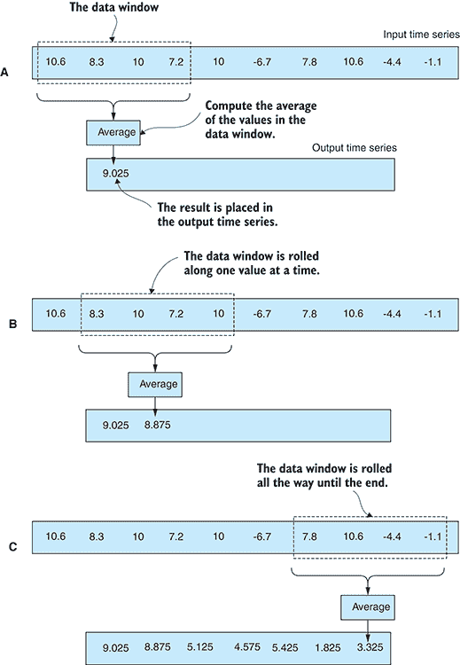

图 9.10 从时间序列生成滚动平均的过程

在以下列表中，我们为我们的工具包创建了一个名为`time-series.js`的新代码模块。我们以计算时间序列的滚动平均的`rollingAverage`函数开始。平均的周期或数据窗口的长度作为参数传入。

列表 9.11 带有`rollingAverage`函数的新工具包模块（toolkit/time-series.js）

```
const average = require('./statistics.js').average;

function rollingAverage (series, period) {    ①  
    return series.rollingWindow(period)
        .select(window => {
            return 
 window.getIndex().last(),  [  ②  
 average(window.toArray())    ③  
            ];
        })
        .withIndex(pair => pair[0])
        .select(pair => pair[1]);
};

module.exports = {
    computeRollingAverage: computeRollingAverage,
}; 
```

注意在列表 9.11 中我们如何重用我们之前创建的`average`函数。

以下列表展示了我们如何使用新的`rollingAverage`函数，通过 20 年的周期来计算纽约市的滚动平均温度。在列表 9.12 的末尾，我们绘制了一条线形图。你可以运行这段代码，它将生成图 9.9 中所示的图表。

列表 9.12 计算纽约市温度的 20 年滚动平均值（listing-9.12.js）

```
const dataForge = require('data-forge');
const renderLineChart = require('./toolkit/charts.js').renderLineChart;
const average = require('./toolkit/statistics.js').average;
const rollingAverage = require('./toolkit/time-series.js').rollingAverage;

// ... summarizeByYear function omitted ...

let dataFrame = dataForge.readFileSync("./data/nyc-weather.csv")
    .parseCSV();

dataFrame = summarizeByYear(dataFrame)
 .setIndex("Year")    ①  
 .withSeries("TempMovingAvg", dataFrame => {    ②  
 const temperatureSeries = dataFrame.getSeries("AvgTemp");    ③  
 return rollingAverage(temperatureSeries, 20)    ④  
    });

const outputChartFile = "./output/nyc-yearly-rolling-average.png";
renderLineChart(    ⑤  
 dataFrame,    ⑤  
 ["Year"],    ⑤  
 ["TempMovingAvg"],    ⑤  
 outputChartFile    ⑤  
 ) //    ⑤      .catch(err => {
        console.error(err);
    }); 
```

### 9.7.3 滚动标准差

我们还可以使用 Data-Forge 的`rollingWindow`函数来创建滚动标准差。

假设我们计算了纽约市温度的滚动平均值上的滚动标准差，并将其作为折线图绘制，我们最终会得到类似于图 9.11 所示的图表。

这使我们能够看到温度随时间的变化情况。我们使用标准差作为一种可视化随时间变化波动性或波动性的方法。从图表中我们可以看出，在 20 世纪 60 年代，温度波动下降并趋于稳定。自 20 世纪 70 年代初以来，温度波动性一直在上升，这可能会表明在未来我们可以预期温度将出现更极端的波动。

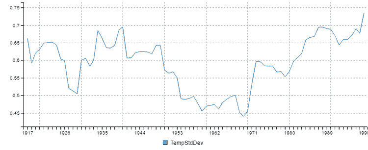

图 9.11 纽约市温度的 20 年滚动标准差

如果您在时间序列代码模块中添加了一个`rollingStandardDeviation`函数，它将类似于我们在上一节中创建的`rollingAverage`函数，但使用`std`函数而不是`average`函数来计算。如果您想绘制类似于图 9.11 的图表，我将把它留作读者的练习来创建这个函数。

### 9.7.4 线性回归

使用滚动平均并不是我们突出时间序列趋势的唯一选项。我们还可以使用线性回归。此外，使用线性回归，我们可以预测和预测未来的数据点。

我们在第五章中首次看到了线性回归的例子，当时我们使用 Excel 的`FORECAST`函数预测一个数据点进入未来。在底层，这是使用线性回归，一种将一条线拟合到我们的数据集的建模技术。然后我们可以使用那条线的*方程*来预测未来的趋势。

图 9.12 显示了过去 100 年纽约市的年温度。我们计算并叠加了此图表的线性回归（橙色线）。这使得上升趋势变得明确。我们预测了到 2100 年的温度，以便我们可以预测未来可能会上升多少。

创建线性回归涉及复杂的数学，它确定如何将一条线最好地拟合到我们的数据点。这是本书中最难的数学。让我们避免它，并使用第三方库来为我们做繁重的工作。如果您为第九章代码库安装了依赖项，您已经安装了 simple-statistics。如果没有，您可以在新的 Node.js 项目中安装它，如下所示：

```
`npm install --save simple-statistics` 
```

在列表 9.13 中，我们将一个`linearRegression`函数添加到我们的`time-series.js`代码模块中。这是基于我们之前在列表 9.12 中创建的`rollingAverage`函数，但不是计算数据窗口的平均值，而是使用 simple-statistics 库计算线性回归。

列表 9.13 将线性回归函数添加到我们的时间序列工具包中（toolkit/time-series.js）

```
const statistics = require('./statistics.js');
const average = statistics.average;
const std = statistics.std;
const simpleStatistics = require('simple-statistics');
const dataForge = require('data-forge');

// ... rollingAverage function omitted ...

function linearRegression (series, period,
 forecastIndexA, forecastIndexB) {    ①  
 const regressionInput = series.toPairs();    ②  
    const regression =
 simpleStatistics.linearRegression(regressionInput);    ③  
    const forecaster =
 simpleStatistics.linearRegressionLine(regression);    ④  

    return new dataForge.Series({
        values: [forecaster(forecastIndexA), forecaster(forecastIndexB)],
        index: [forecastIndexA, forecastIndexB],
    });
};

module.exports = {
    rollingAverage: rollingAverage,
    linearRegression: linearRegression,
}; 
```

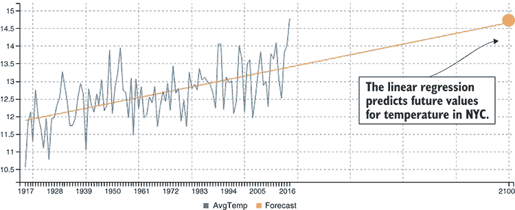

图 9.12 使用线性回归预测 2100 年纽约市平均温度

以下列表展示了我们如何使用新的 `linearRegression` 函数从纽约市温度时间序列中计算线性回归。你应该运行此列表以查看它是否生成了 图 9.12 中的图表。

列表 9.14 计算线性回归以预测 2100 年的温度（listing-9.14.js）

```
const dataForge = require('data-forge');
const renderLineChart = require('./toolkit/charts.js').renderLineChart;
const linearRegression = require('./toolkit/time-series.js').linearRegression;

// ... summarizeByYear ommitted ...

let dataFrame = dataForge.readFileSync("./data/nyc-weather.csv")
    .parseCSV();

dataFrame = summarizeByYear(dataFrame)
 .concat(new dataForge.DataFrame(  [  ①  
        {
            Year: 2100
        }
    ]))
 .setIndex("Year");    ②  

const forecastSeries = linearRegression(    ③  
 dataFrame.getSeries("AvgTemp"),    ③  
 1917,    ③  
 2100    ③  
);    ③  
dataFrame = dataFrame    ④  
    .withSeries({
 ForecastYear: new dataForge.Series({    ⑤  
 values: [1917, 2100],
 index: [1917, 2100],    ⑥  
        }),
        Forecast: forecastSeries,
    });

const outputChartFile = "./output/nyc-yearly-trend-with-forecast.png";
renderLineChart(dataFrame, ["Year", "ForecastYear"], ["AvgTemp", "Forecast"], outputChartFile)
    .catch(err => {
        console.error(err);
    }); 
```

### 9.7.5 比较时间序列

我们如何比较一个时间序列与另一个时间序列？比如说，我们想比较纽约市和洛杉矶的温度。我们可以使用平均值和标准差来描述每个数据集，但在处理时间序列数据时，更具有信息量的做法是可视化和在图表中进行比较。

我们可以在图表中绘制两个时间序列，如图 图 9.13 所示，但由于时间序列之间有较大的垂直差距，这使得比较变得困难。如果能将它们并排比较会更好，尽管要做到这一点，我们必须找到一种方法来叠加时间序列，以便它们可以直接比较。

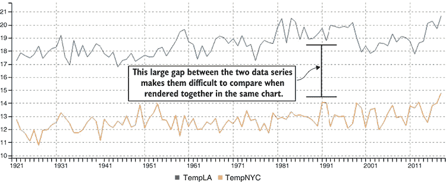

图 9.13 在同一图表中比较纽约市和洛杉矶的温度

#### 测量差值

比较两个时间序列的一种方法是通过它们之间的差值。然后我们可以绘制差值图，如图 图 9.14 所示。这个数据序列波动很大，因此我们可能需要拟合一个线性回归（橙色线）以便更容易地看到趋势。这看起来是洛杉矶和纽约市温度差的一个轻微上升趋势。这意味着什么？这意味着洛杉矶的气温上升速度略快于纽约市。

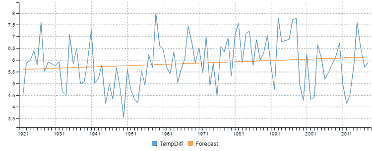

图 9.14 测量纽约市和洛杉矶温度之间的差值

列表 9.15 展示了如何将 `difference` 函数添加到我们的时间序列代码模块中，以计算两个时间序列之间的差值。这使用了 Data-Forge 的 `zip` 函数将我们的两个时间序列组合在一起。`zip` 函数使用我们提供的函数生成一个新的序列。该函数计算序列中每个值的差值。

列表 9.15 将差分函数添加到我们的时间序列工具包中（toolkit/time-series.js）

```
const statistics = require('./statistics.js');
const average = statistics.average;
const std = statistics.std;
const simpleStatistics = require('simple-statistics');
const dataForge = require('data-forge');

// ... rollingAverage and linearRegression functions omitted ...

function difference (seriesA, seriesB) {    ①  
 return seriesA.zip(seriesB, (valueA, valueB) => valueA - valueB);    ①  
};    ①  

module.exports = {
    rollingAverage: rollingAverage,
    linearRegression: linearRegression,
    difference: difference,
}; 
```

为了使用我们新的 `difference` 函数，我们必须加载两个数据集。计算图 9.14 中显示的图表的代码与 9.12 和 9.14 中的列表类似，但我们不仅加载了纽约市的天气数据；我们还加载了洛杉矶的数据。当我们加载了这两个时间序列后，我们可以使用我们的 `difference` 函数来计算它们之间的差异。正如你在图 9.14 中可以看到的，我还使用了我们的 `linearRegression` 函数来生成差异的线性回归。我将把这个留给你作为一个练习，让你编写生成图 9.14 的代码。

#### 标准化数据点以进行比较

假设我们确实想在图表中绘制纽约市和洛杉矶的温度，并且直接进行比较，我们必须标准化我们的数据。

当我说标准化数据时，我的意思是我们将两个时间序列都转换到同一个尺度，以便它们可以直接比较。我们这样做的原因是，对于温度数据（技术上已经处于相同的尺度），我们并不关心实际的温度。相反，我们想要比较年与年之间的波动。用统计学的术语来说，我们可以说我们正在将我们的数据转换为*标准分数*，也称为*z 值*或*z 分数*。

在图 9.15 中，你可以看到纽约市和洛杉矶温度经过标准化后的比较。我应该补充一点，这种标准化不仅适用于时间序列数据，实际上它适用于我们可能希望比较的任何类型的数据。

我们如何标准化我们的数据？很简单。我们必须将每个数据点转换为平均值的标准差数。我们首先计算平均值和标准差（我们经常回到这些基本的统计工具上！）。然后我们的代码遍历每个数据点，并从其值中减去平均值。以下列表展示了这一过程。如果你运行此代码，它将生成图 9.15 中的图表。

列表 9.16 标准化纽约市和洛杉矶温度数据以便于比较（listing-9.16.js）

```
const dataForge = require('data-forge');
const renderLineChart = require('./toolkit/charts.js').renderLineChart;
const statistics = require('./toolkit/statistics.js');
const average = statistics.average;
const std = statistics.std;

// ... summarizeByYear function omitted ...

function standardize (dataFrame, seriesName) {    ①  
    const series = dataFrame.getSeries(seriesName);
    const values = series.toArray();
    const avg = average(values);
    const standardDeviation = std(values);
    const standardizedSeries = series
 .select(value => (value - avg) / standardDeviation);    ②  
    return dataFrame.withSeries(seriesName, standardizedSeries);
};

let nycWeather = dataForge.readFileSync("./data/nyc-weather.csv").parseCSV();
let laWeather = dataForge.readFileSync("./data/la-weather.csv").parseCSV();

nycWeather = summarizeByYear(nycWeather)
            .setIndex("Year");
laWeather = summarizeByYear(laWeather)
            .setIndex("Year");

nycWeather = standardize(nycWeather, "AvgTemp");    ③  
laWeather = standardize(laWeather, "AvgTemp");    ④  

const combinedWeather = laWeather
    .renameSeries({
        AvgTemp: "TempLA",
    })
    .withSeries({
        TempNYC: nycWeather
            .setIndex("Year")
            .getSeries("AvgTemp")
    });

const outputChartFile = "output/standardised-yearly-comparision.png";
renderLineChart(
           combinedWeather,
        ["Year", "Year"],
        ["TempLA", "TempNYC"],
        outputChartFile
    )
    .catch(err => {
        console.error(err);
    }); 
```

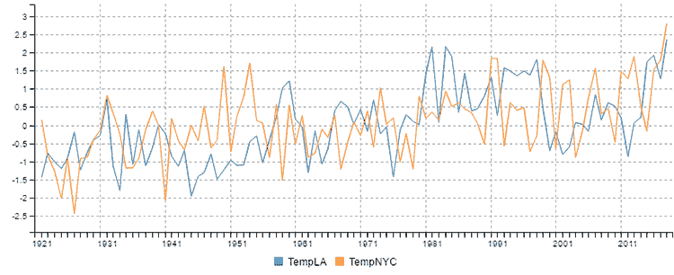

图 9.15 比较标准化的纽约市和洛杉矶温度

### 9.7.6 时间序列操作的堆叠

你可能已经注意到了这一点，但我还想明确指出。我们迄今为止创建的时间序列操作（滚动平均值、滚动标准差、线性回归和差异）都可以像正常的数学运算一样堆叠起来。

你已经在 9.7.5 节中看到了我们如何计算纽约市和洛杉矶温度的差异，并在其上堆叠线性回归。我们可以以几乎任何我们想要的顺序或至少任何有意义的顺序应用这些操作。

例如，我们可能从纽约市的温度中生成滚动平均值，然后在上面叠加线性回归，或者我们可能创建滚动标准差，然后在上面叠加移动平均。我们可以根据我们试图从数据中提取的理解来混合和匹配这些操作。

## 9.8 理解关系

假设我们有两个数据变量，并且我们怀疑它们之间存在某种关系。我们可以使用散点图来帮助我们识别这种关系。观察散点图，你可能注意到当一个变量上升时，另一个变量也上升，反之亦然。在统计学中，这被称为*相关性*。

坚持天气主题，假设我们想看看降雨量和雨伞销量之间是否存在关系。现在，正如你可能想象的那样，找到雨伞销量的数据很困难，所以我使用自定义 JavaScript 代码*合成*了数据，以便我可以向你展示相关数据看起来是什么样子。如果你的业务是在纽约中央公园卖雨伞，那么你可能想使用这种技术来确定降雨量如何影响你的销售！

### 9.8.1 使用散点图检测相关性

图 9.16 是雨伞销量与降雨量的散点图。Y 轴显示售出的雨伞数量。X 轴显示降雨量（以毫米为单位）。你可以看到数据点从左下角到右上角呈现出一个明显的带状分布。这些点分布并不特别均匀，但你很容易看出它们大致排列成一条对角向上和向右的线。从这个角度来看，我们可以推断出降雨量和我们将在任何给定的一天售出的雨伞数量之间存在一种正相关或*相关性*。

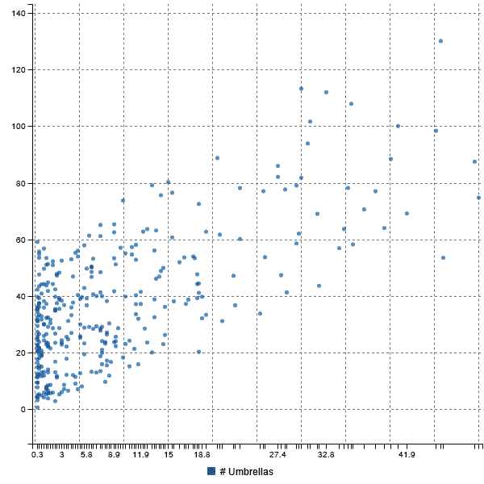

图 9.16 降雨量与雨伞销量散点图

### 9.8.2 相关性的类型

图 9.16 显示了降雨量和雨伞销量之间存在正相关性。正相关意味着当一个变量增加时，另一个变量也会增加。我们也可能看到负相关或无相关，如图 9.17 所示。

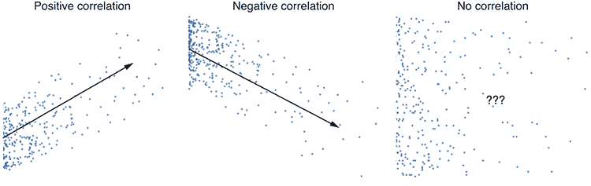

图 9.17 比较正相关、负相关和无相关

当我们以这种方式看到两个变量之间的关系时，我们可以用它来预测未来的值。我们会通过计算两个数据序列作为输入的线性回归来做这件事。这使我们能够根据另一个值来预测一个值。

这样的预测受相关性强度的限制。如果你的数据点靠近线性回归线，那么相关性就很高，你的预测能力就会很好。当数据点分布得更远时，这会降低线性回归的预测能力。

### 9.8.3 确定相关性的强度

我们不必依赖我们的视觉判断来确定两个变量之间相关性的强度。我们可以使用*相关系数*来量化相关性的数量和类型，这是一个相关性的数值度量。相关系数的值范围从-1 到+1，其中-1 表示完全负相关，+1 表示完全正相关。这形成了图 9.18 中显示的光谱。负相关位于左侧，正相关位于右侧，无相关位于中间。

雨量与雨伞销售的相关系数结果是大约 0.64。图 9.18 显示这个值符合*强烈正相关*类别下的光谱。

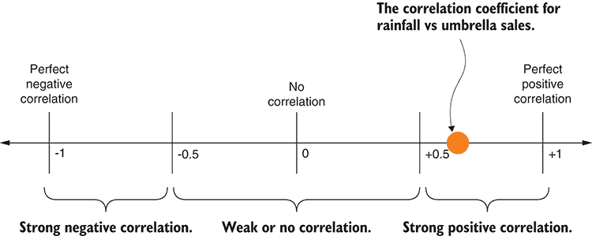

图 9.18 雨量与雨伞销售的相关系数在可能值的光谱上

在这种情况下，显然更多的降雨会导致更多的人购买雨伞。我们想说这是一种*因果关系*，但我们不能确定这一点！这应该让我们想到流行的说法“相关性不等于因果关系”。

这意味着什么？当我们看到两个数据变量之间有强烈的相关性时，我们会倾向于认为一个数据变量*导致*另一个，但相关性并不这样工作。在这个例子中，变量之间似乎有明显的因果联系（嗯，至少我是*合成*了数据，让它看起来是这样）。尽管在其他情况下可能不会这么明显，你不应该假设一个变量导致另一个变量，但完全有可能另一个尚未发现的变量*是*因果变量，并负责两个被检验变量之间的关系。例如，可能是预报的降雨新闻推动了雨伞销售，然后雨才来！我敢打赌你没想到这一点。

### 9.8.4 计算相关系数

你有多种方法可以计算相关系数，并且每种情况下数学都相当复杂。幸运的是，我们已经有了一个简单的统计代码模块，它有一个方便的`sampleCorrelation`函数供我们使用。以下代码清单显示了如何使用此函数来计算自 2013 年以来雨量和雨伞销售的相关系数。

代码清单 9.17 自 2013 年以来计算雨量和雨伞销售的相关系数（listing-9.17.js）

```
const dataForge = require('data-forge');
const simpleStatistics = require('simple-statistics');

let dataFrame = dataForge.readFileSync("./data/nyc-weather.csv")    ①  
 .parseCSV()    ①  
 .parseInts(["Year", "Month", "Day"])    ①  
 .where(row => row.Year >= 2013)    ②  
 .parseFloats("Precipitation")    ①  
 .generateSeries({    ①  
 Date: row => new Date(row.Year, row.Month-1, row.Day),    ③  
 })    ①  
 .setIndex("Date");    ④  

const umbrellaSalesData = dataForge
 .readFileSync("./data/nyc-umbrella-sales.csv")    ⑤  
 .parseCSV()    ⑤  
 .parseDates("Date", "DD/MM/YYYY") //    ⑤  
 .parseFloats("Sales")    ⑤  
 .setIndex("Date");    ⑥  

dataFrame = dataFrame
 .withSeries(    ⑦  
 "UmbrellaSales",    ⑦  
 umbrellaSalesData.getSeries("Sales")    ⑦  
 )    ⑦  
 .where(row => row.Precipitation !== undefined    ⑧  
 && row.UmbrellaSales !== undefined);    ⑧  

const x = dataFrame.getSeries("Precipitation").toArray();    ⑨  
const y = dataFrame.getSeries("UmbrellaSales").toArray();    ⑩  
const correlationCoefficient = simpleStatistics
 .sampleCorrelation(x, y);    ⑪  
console.log(correlationCoefficient);    ⑫   
```

您可以运行代码清单 9.17，它将打印出大约 0.64 的相关系数，这在视觉上研究了图 9.16 中的散点图图表后应该符合我们的预期。我们预期有一个强烈的正相关，但不是完美的相关。我们已经量化了雨量和雨伞销售之间的关系。

现在，您拥有各种工具来分析您的数据。您可以找到趋势和模式，比较您的数据集，并对未来的数据点进行预测。

在本章中，我们使用了特别准备好的函数来创建我们的图表。在接下来的第十章和第十一章中，我们将退后一步，学习如何在浏览器中（第十章）和服务器端（第十一章）创建这样的图表。

## 摘要

+   您学习了基本的统计操作：总和、平均值和标准差。

+   您发现了如何对数据集进行分组和总结，以便将其简化并使其更容易理解。

+   我们讨论了如何使用标准化、差异和值的分布来比较数据集。

+   您学习了如何使用分布来对新值进行预测。

+   我们探讨了使用滚动平均值、滚动标准差和线性回归来分析时间序列数据。

+   您了解到可以使用相关系数来量化两个数据变量之间的关系。
