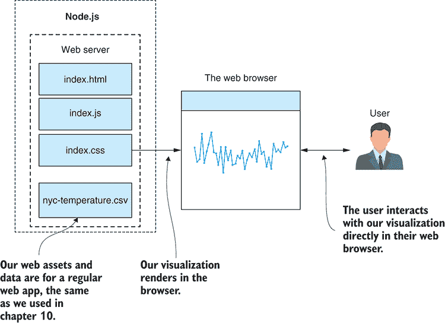
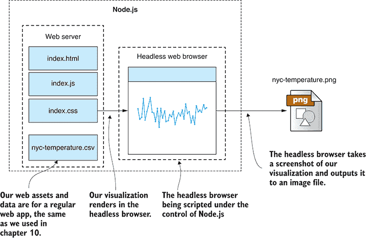
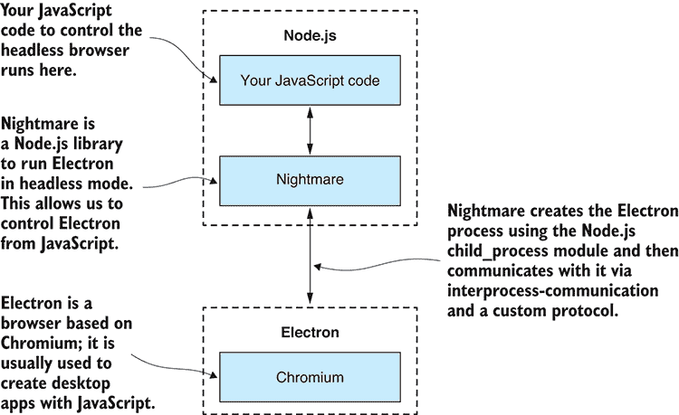
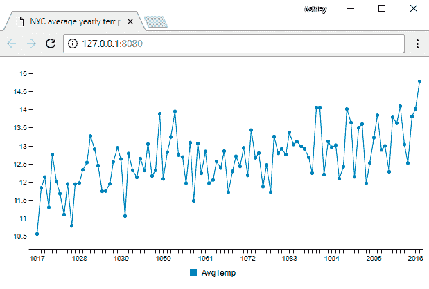

# 11

服务器端可视化

**本章涵盖**

+   使用 Node.js 渲染图表和可视化

+   构建可重用函数以渲染图表，我们可以在进行数据探索分析时使用

+   使用无头浏览器捕获网页到 PNG 图像文件和 PDF 文档

+   使用无头浏览器将网络抓取提升到下一个水平

当我们进行探索性编码（第五章）或数据分析（第九章）时，我们希望渲染图表和可视化来探索和理解我们的数据。在第十章中，我们学习了如何为浏览器创建基于 Web 的交互式可视化。这是在 JavaScript 中创建可视化的正常和常见方式。基于浏览器的可视化技术众所周知，并且很容易在网上找到帮助。

我们把浏览器从等式中去掉怎么样？如果我们想直接从 Node.js 在服务器上渲染我们的图表和可视化呢？嗯，我们可以这样做，但与基于浏览器的可视化不同，这并不是一个常见的用例，而且在网上找到你需要帮助可能会很困难。

首先，你可能想知道为什么在服务器端渲染图表是有用的？在进行数据探索分析（这就是我们在第九章中所做的）时，直接从 Node.js 渲染图表对我们来说很方便。这种数据分析方法在 Python 中很常见，如果我们能在 Node.js 中复制它，那将很棒。

此外，在服务器端预先渲染可视化也是一项有用的功能。我们可能这样做是为了生成报告或为了在网页中显示而预先缓存图像。服务器端渲染可视化如此有用，以至于我认为值得克服设置时的复杂性和困难，以便我们可以将这项技术添加到我们的工具箱中。

记得我们在第九章中处理了数据分析技术，并渲染了各种图表来展示这些技术。我们通过调用工具函数，如`renderLineChart`和`renderBarChart`，从 Node.js 创建了这些图表。在第九章中，我为你提供了这些函数。但本章，你将学习如何创建这样的函数并在 Node.js 中渲染静态可视化。

## 11.1 扩展你的工具箱

我们如何在 Node.js 中渲染图表呢？当在浏览器中工作时，我们有这么多可视化库可供选择，尽管通常我们无法直接从 Node.js 使用这些选项。如果我们能从任何基于浏览器的可视化库中选择并从 Node.js 使用它们，那岂不是很好？

嗯，我要告诉你的是，你可以使用任何基于浏览器的可视化库来从 Node.js 创建可视化，尽管我们仍然需要在内部某个地方运行一个网络浏览器。在本章中，我们将使用一种称为*无头浏览器*的东西，以便在 Node.js 下使基于浏览器的可视化库为我们工作。

无头浏览器是一个 Web 浏览器，但它没有可见的用户界面。你可以将其想象为一个不可见的浏览器。在本章中，我们将把 Nightmare 添加到我们的工具箱中。这个可以通过 npm 安装的 Node.js 库允许你以无头方式控制 Electron 网络浏览器。你不会直接使用 Electron；它将通过 Nightmare API 从代码中控制。重要的是要注意，Electron 是一个类似于 Chrome 或 Edge 的网络浏览器；事实上，它与 Chrome 相似，因为它是由相同的开源代码库构建的。

无头浏览器对于许多任务都很有用，但我们将关注如何在 Node.js 下渲染可视化报表。我们将学习如何从 Node.js 远程控制无头浏览器并捕获基于 Web 的图表和可视化到静态图像文件。在这个过程中，我们将重新创建在第九章中使用的`renderLineChart`函数；这是一个示例，说明我们可以使用该函数从 Node.js 渲染图表，而无需显式创建或与基于 Web 的可视化交互，尽管底层将运行基于 Web 的可视化！我们还将学习如何使用这些技术渲染包含图形和图表的多页 PDF 报表。

## 11.2 获取代码和数据

本章的代码和数据可在 GitHub 上的 Data Wrangling with JavaScript Chapter-11 仓库中找到，网址为[`github.com/data-wrangling-with-javascript/chapter-11`](https://github.com/data-wrangling-with-javascript/chapter-11)[.](http://.) 仓库中的每个子目录都是一个完整的示例，对应本章中的某个列表。在尝试运行每个子目录中的代码之前，请确保已安装 npm 和浏览器依赖项。

列表 11.11 包含一个 Vagrant 脚本，演示如何在无头 Linux 服务器上使用这项技术。有关获取代码和数据的帮助，请参阅第二章中的“获取代码和数据”。

## 11.3 无头浏览器

当我们想到网络浏览器时，我们通常想到的是我们在浏览万维网时每天与之交互的图形软件。通常情况下，我们直接与这样的浏览器交互，用眼睛观看它，用鼠标和键盘控制它，如图 11.1 所示。



图 11.1 通常情况：我们的可视化在浏览器中渲染，用户直接与浏览器交互。

无头浏览器是一个没有图形用户界面且没有直接控制手段的 Web 浏览器。你可能会问，我们无法直接看到或与之交互的浏览器有什么用？

作为开发者，我们通常使用无头浏览器来自动化和测试网站。假设你已经创建了一个网页，并且想要运行一系列自动化测试来证明它按预期工作。测试套件是自动化的，这意味着它由代码控制，因此我们需要从代码中“驾驶”浏览器。

我们使用无头浏览器进行自动化测试，因为我们不需要直接看到或与正在测试的网页交互。查看这种自动化测试的进行过程是不必要的；我们只需要知道测试是否通过——如果失败了，我们还想知道原因。实际上，为浏览器提供一个 GUI 在持续集成或持续部署服务器上可能会成为障碍，我们希望许多这样的测试可以并行运行。

无头浏览器通常用于我们网页的自动化测试，但我还发现它们在捕获基于浏览器的可视化并将其输出为 PNG 图像或 PDF 文件方面非常有用。为了使这成为可能，我们需要一个 Web 服务器和一个可视化工具，这些我们在第十章中已经学过。然后我们必须编写代码来实例化一个无头浏览器，并将其指向我们的 Web 服务器。然后我们的代码指示无头浏览器捕获网页截图，并将其保存到我们的文件系统中作为 PNG 或 PDF 文件。

为了一个更具体的例子，请参阅图 11.2。在这里，我们使用第十章中的纽约市温度图表，并使用我们的无头浏览器捕获一个截图到文件 nyc-temperature.png。我们很快就会了解到这样做有多简单，至少在开发过程中是这样。到本章结束时，我们将面对在生产环境中实现这一功能的困难。



图 11.2 我们可以使用 Node.js 下的无头浏览器将我们的可视化捕获到静态图像文件中。

## 11.4 使用 Nightmare 进行服务器端可视化

Nightmare 是我们将使用的无头浏览器。它是一个基于 Electron 构建的 Node.js 库（使用 npm 安装）。Electron 是一个通常用于构建基于 Web 技术的跨平台桌面应用程序的 Web 浏览器。我们不需要直接交互或理解如何使用 Electron；我们只通过 Nightmare 与之交互，我们可以将 Electron 视为一个标准 Web 浏览器。

### 11.4.1 为什么选择 Nightmare？

浏览器名为 Nightmare，但使用起来绝对不是噩梦。事实上，这是我使用过的最简单、最方便的无头浏览器。它自动包含 Electron，因此要开始使用，我们需要按照以下步骤将 Nightmare 安装到我们的 Node.js 项目中：

```
npm install --save nightmare 
```

这就是安装 Nightmare 所需的所有步骤，我们就可以立即从 JavaScript 开始使用它了！

恶梦伴随着我们需要的几乎所有东西：一个带有嵌入式无头浏览器的脚本库。它还包括从 Node.js 控制无头浏览器的通信机制。大部分情况下，它无缝且很好地集成到 Node.js 中，但 API 可能需要一些时间来习惯。

在接下来的几节中，我们将构建一个新的函数，在 Node.js 下渲染图表。我们将把这个函数添加到我们的工具箱中，你可以在你的开发工作站上重复使用它进行探索性编码和数据分析。

当涉及到生产使用——比如，构建一个自动报告系统时——Nightmare 要复杂一些才能正常工作。我们需要做一些额外的工作，但我们在本章的后面会处理这些困难。

### 11.4.2 Nightmare 和 Electron

当你使用 npm 安装 Nightmare 时，它会自动附带一个嵌入式的 Electron 版本。我们可以这样说，Nightmare 不仅仅是一个控制无头浏览器的库；它实际上就是一个无头浏览器。这也是我喜欢 Nightmare 的另一个原因。与其他几个无头浏览器相比，控制库是分开的，或者更糟的是，它们根本就没有 Node.js 控制库。在最坏的情况下，你必须自己开发通信机制来控制无头浏览器。

Nightmare 使用 Node.js 的`child_process`模块创建 Electron 进程的实例。然后它使用进程间通信和自定义协议来控制 Electron 实例。这种关系在图 11.3 中显示。



图 11.3 Nightmare 允许我们控制作为无头浏览器运行的 Electron。

Electron 建立在 Node.js 和 Chromium 之上，由 GitHub 维护。它是其他流行桌面应用程序的基础，尽管从我们的角度来看，我们可以将其视为一个普通的 Web 浏览器。

这些是我选择使用 Nightmare 而不是其他任何无头浏览器的原因：

+   Electron 是稳定的。

+   电子具有优良的性能。

+   API 简单且易于学习。

+   它没有复杂的配置（你可以快速开始使用它）。

+   它与 Node.js 集成良好。

Electron 在你的生产环境中可能有点棘手，但我们很快就会解决这个问题。

### 11.4.3 我们的过程：使用 Nightmare 捕获可视化

让我们看看将可视化渲染到图像文件的过程。首先，我们的数据将硬编码在我们的可视化中。随着我们迭代和改进我们的代码，我们将构建一个新的工具箱函数来渲染图表。最终，我们希望将数据从 Node.js 泵入这个图表，这意味着数据必须位于可视化之外。

这是我们追求的完整过程：

1.  获取我们的数据。

1.  启动本地 Web 服务器以托管我们的可视化。

1.  将我们的数据注入到 Web 服务器中。

1.  实例化一个无头浏览器并将其指向我们的本地 Web 服务器。

1.  等待可视化显示。

1.  将可视化的截图保存到图像文件中。

1.  关闭无头浏览器。

1.  关闭本地网络服务器。

这个过程可能听起来相当复杂，但别担心；我们一如既往地从简单开始，并在多次迭代中逐步增加复杂性。最终，我们将把这个过程封装在一个方便且易于重用的工具函数中。

### 11.4.4 准备要渲染的可视化

我们首先需要有一个可视化。我们将从第十章中您所熟悉的一个开始。图 11.4 显示了纽约市平均年温度图表。



图 11.4 我们将从第十章中使用的图表：纽约市平均年温度

此图表的代码显示在列表 11.1a 和 11.1b 中。它与第十章中的 列表 10.3 类似。您现在可以使用 live-server 测试此图表（与第十章中我们所做的一样）：

```
cd listing-11.1
bower install
live-server 
```

在 listing-11.1 子目录中运行 live-server 会自动打开浏览器，您应该会看到一个类似于 图 11.4 的可视化。

在尝试在无头浏览器中捕获之前，检查您的可视化是否在浏览器中直接工作是一个好主意，因为很容易出现问题。在实际浏览器中解决问题比在无头浏览器中容易得多。

列表 11.1a 用于浏览器可视化的 HTML 文件（listing-11.1/index.html）

```
<!doctype html>
<html lang="en">
    <head>
        <title>NYC average yearly temperature</title>

        <link href="bower_components/c3/c3.css" rel="stylesheet">
    </head>
    <body>
 <div id='chart'></div>    ①  

        <script src="bower_components/jquery/dist/jquery.js"></script>
        <script src="bower_components/d3/d3.js"></script>
        <script src="bower_components/c3/c3.js"></script>
        <script src="bower_components/papaparse/papaparse.js"></script>
 <script src="app.js"></script>    ②  
    </body>
</html> 
```

列表 11.1b 用于浏览器可视化的 JavaScript 文件（listing-11.1/app.js）

```
function renderChart (bindto, data, size) {    ①  
    var chart = c3.generate({
        bindto: bindto,
        size: size,
        data: {
            json: data,
            keys: {
                x: "Year",
                value: [
                    "AvgTemp"
                ]
            }
        },
        transition: {
 duration: 0    ②  
        }
    });
};

$(function () {

 $.get("nyc-temperature.csv")    ③  
        .then(function (response) {
            var parseOptions = {
 header: true,
                dynamicTyping: true
            };
 var parsed = Papa.parse(response, parseOptions);    ④  
 renderChart("#chart", parsed.data);    ⑤  
        })
        .catch(function (err) {
            console.error(err);
        });

}); 
```

我对 列表 11.1b 有一个重要的补充要解释。看看图表定义，注意我设置动画过渡时间为零的地方。这实际上禁用了 C3 图表的动画。在这里动画没有用，因为我们正在将图表渲染为静态图像，这可能会在我们的捕获图像文件中引起问题，所以最好禁用动画。

默认情况下，C3 将我们的数据动画化到图表中，这意味着它会淡入。如果在捕获图像时发生这种情况（这是一个时间问题），那么我们最终会捕获到一个部分透明的图表，这可能不是我们想要的，而且效果不会一致。当我第一次开始使用这种方法渲染可视化时，我的图表部分透明让我几乎要疯了，试图找出原因。

### 11.4.5 启动网络服务器

要托管我们的可视化，我们需要一个网络服务器。同样，我们可以从第十章中重用代码。请注意，我们可以通过将无头浏览器指向 `index.html` 并在前面加上 `file://` 协议来从文件系统提供服务。这种方法在简单情况下可以很好地工作，但我们需要一种自定义方式来将数据喂入可视化，所以让我们直接使用自定义 Node.js 网络服务器来托管我们的可视化。

请注意，根据你的需求，你可能不需要自定义网络服务器。你可以通过使用文件系统或可能使用现成的工具如 live-server 来简化你的流程。

列表 11.2 展示了我们的网络服务器代码。这与第十章中的 列表 10.4 类似。在尝试在无头浏览器中捕获可视化之前，让我们测试它是否以正常方式工作：

```
cd listing-11.2
cd public
bower install
cd ..
npm install
node index 
```

现在打开一个常规网络浏览器，将其指向 [`localhost:3000`](http://localhost:3000)。你应该看到我们之前在 图 11.4 中看到的纽约市年度平均温度图表。

列表 11.2 基于浏览器的可视化基本 Node.js 网络服务器（listing-11.2/index.js）

```
const express = require('express');
const path = require('path');

const app = express();

const staticFilesPath = path.join(__dirname, "public");    ①  
const staticFilesMiddleWare = express.static(staticFilesPath);
app.use("/", staticFilesMiddleWare);

app.listen(3000, () => {    ②  
    console.log("Web server listening on port 3000!");
}); 
```

这是一个简单的网络服务器，但它不足以满足我们的需求。我们还需要能够动态地启动和停止它。

### 11.4.6 程序化启动和停止网络服务器

让我们对我们的网络服务器进行修改，以便我们可以程序化地启动和停止它。我们在捕获可视化之前启动它，然后之后停止它。

让我们将 列表 11.2 中的代码升级以实现这一点。我们将首先将网络服务器重构为一个可重用的代码模块，如下所示。

列表 11.3a 我们的网络服务器被重构为一个可重用的代码模块（listing-11.3/web-server.js）

```
const express = require('express');
const path = require('path');

module.exports = {
 start: () => {    ①  
 return new Promise((resolve, reject) => {    ②  
            const app = express();

 const staticFilesPath = path.join(__dirname, "public");    ③  
            const staticFilesMiddleWare = express.static(staticFilesPath);
            app.use('/', staticFilesMiddleWare);

 const server = app.listen(3000, err => {    ④  
                if (err) {
 reject(err);    ⑤  
                }
                else {
 resolve(server);    ⑥  
                }
            });
        });
    }
} 
```

列表 11.3a 中的代码模块导出了一个 `start` 函数，我们可以调用它来启动我们的网络服务器。我们将如何使用这个函数的例子在 列表 11.3b 中展示，其中我们启动了网络服务器，然后随后停止它。在这之间，你可以看到一个占位符，我们将很快在这里添加代码来渲染网页并截图。

列表 11.3b 使用可重用代码模块启动和停止网络服务器（listing-11.3/index.js）

```
const webServer = require('./web-server.js');    ①  

webServer.start()    ②  
    .then(server => {
        console.log("Web server has started!");

        // ... Do something with the web server here,
        //     eg capture a screen shot of the web page or
        //     run automated integration tests against it  ...

 server.close();    ③  
    })
    .then(() => {
        console.log("Web server has stopped.");
    })
    .catch(err => {
        console.error("Web server failed to start :(");
        console.error(err);
    }); 
```

这种技术，即启动和停止我们的网络服务器，对于在网站上执行自动集成测试也是很有用的。想象一下，列表 11.3b 中的占位符被一系列测试所取代，这些测试会探测和刺激网页以查看其响应。我们将在第十四章中再次探讨自动测试。

现在我们有了基于浏览器的可视化，我们还拥有一个可以根据需要启动和停止的网络服务器。这些是我们捕获服务器端可视化的基本原料。让我们用 Nightmare 来混合它们！

### 11.4.7 将网页渲染为图像

现在，让我们用捕获我们可视化的截图的代码替换 列表 11.3b 中的占位符。列表 11.4 有新的代码，它实例化 Nightmare，将其指向我们的网络服务器，然后进行截图。你可以运行此代码，它将渲染图表并在 listing-11.4 目录下的输出子目录中生成 nyc-temperatures.png 文件。

列表 11.4 使用 Nightmare 将图表捕获到图像文件（listing-11.4/index.js）

```
const webServer = require('./web-server.js');
const Nightmare = require('nightmare');

webServer.start()    ①  
    .then(server => {
 const outputImagePath = "./output/nyc-temperatures.png";

 const nightmare = new Nightmare();    ②  
 return nightmare.goto("http://localhost:3000")    ③  
 .wait("svg")    ④  
 .screenshot(outputImagePath)    ⑤  
 .end()    ⑥  
 .then(() => server.close());    ⑦  
    })
    .then(() => {
        console.log("All done :)");
    })
    .catch(err => {
        console.error("Something went wrong :(");
        console.error(err);
    }) 
```

注意 `goto` 函数的使用；这是指导浏览器加载我们的可视化内容的方式。网页通常需要一段时间才能加载。这可能不会太长，尤其是因为我们正在运行本地 web 服务器，但我们仍然面临在无头浏览器初始绘制之前或期间截图的风险。

此外，由于我们正在异步地将数据加载到图表中，我们需要确保在截图之前数据已经加载到图表中。这就是为什么我们必须使用列表 11.4 中显示的 `wait` 函数，等待图表的 `svg` 元素出现在浏览器 DOM 中，然后再调用 `screenshot` 函数。

最终，会调用 `end` 函数。到目前为止，我们实际上构建了一个要发送给无头浏览器的命令列表。`end` 函数刷新命令列表；然后，命令被发送到浏览器，浏览器访问页面，渲染图表，截图，并输出文件 nyc-temperatures.png。在图像文件被捕获后，我们通过关闭 web 服务器来完成后续工作。

注意，我们本可以使用 `goto` 将浏览器发送到任何网站，而不仅仅是我们的自己的 web 服务器。我们也可以使用 `file://` 协议将浏览器指向本地文件系统中任何 HTML 文件。这使得你只需这么少的代码，就能以程序化的方式捕获任何网站或 HTML 文件的截图。

### 11.4.8 在我们继续之前...

希望到目前为止的工作并没有让你感到过于吃力，但现在事情将开始变得更加复杂。不过，在之前，让我们整理一下到目前为止我们所做的工作。

不幸的是，运行列表 11.4 给我们留下了一个具有透明背景的捕获图像。为了解决这个问题，我们必须将我们的可视化背景颜色设置为纯色。在列表 11.5a 和 11.5b 中，你可以看到我是如何使用 CSS 将 body 元素的背景设置为白色的。这使得我们的背景不透明。

列表 11.5a 设置网页背景（listing-11.5/public/app.css）

```
body {
 background: white;    ①  
} 
```

列表 11.5b 将 app.css 添加到基于浏览器的可视化中（listing-11.5/public/index.html）

```
<!doctype html>
<html lang="en">
    <head>
        <title>NYC average yearly temperature</title>

        <link href="bower_components/c3/c3.css" rel="stylesheet">
 <link href="app.css" rel="stylesheet">    ①  
    </head>
    <body>
        <div id='chart'></div>

        <script src="bower_components/jquery/dist/jquery.js"></script>
        <script src="bower_components/d3/d3.js"></script>
        <script src="bower_components/c3/c3.js"></script>
        <script src="bower_components/papaparse/papaparse.js"></script>
        <script src="app.js"></script>
    </body>
</html> 
```

当我们更新你的可视化 CSS 时，我希望你意识到我们在这里处理的是一个正常的网页，我们可以添加任何可能添加到任何其他网页上的内容：JavaScript、CSS、其他 Bower 模块等。你可以使用这种技术来捕获任何可以放在网页上的内容。

在我们继续之前，我还想重构我们当前的代码，以便我们有一个可重用的工具函数来捕获网页。我现在这么做是因为这是一个方便的方式，可以在本章的其余部分重用和扩展这段代码。以下列表显示了重构后的函数 `captureWebPage`，我们可以使用它来捕获给定 URL 的任何网页。

列表 11.5c 用于服务器端图表渲染的可重用工具包函数（listing-11.5/toolkit/capture-web-page.js）

```
const Nightmare = require('nightmare');

function captureWebPage (urlToCapture,
 captureElementSelector, outputImagePath) {    ①  

 const nightmare = new Nightmare();    ②  
 return nightmare.goto(urlToCapture)    ③  
 .wait(captureElementSelector)    ④  
 .screenshot(outputImagePath)    ⑤  
 .end();    ⑥  
};

module.exports = captureWebPage;    ⑦   
```

以下列表展示了我们如何使用我们新的工具包函数 `captureWebPage` 来捕获我们的可视化。

列表 11.5d 使用我们的可重用工具包函数来渲染服务器端图表（listing-11.5/index.js）

```
const webServer = require('./web-server.js');
const captureWebPage = require('./toolkit/capture-web-page.js');    ①  

webServer.start()
    .then(server => {
        const urlToCapture = "http://localhost:3000";
        const outputImagePath = "./output/nyc-temperatures.png";
 return captureWebPage(urlToCapture, "svg", outputImagePath)    ②  
            .then(() => server.close());
    })
    .then(() => {
        console.log("All done :)");
    })
    .catch(err => {
        console.error("Something went wrong :(");
        console.error(err);
    }); 
```

现在我们有了可重用代码模块的骨架，让我们进行改进，并解决其几个缺陷。

### 11.4.9 捕获完整可视化

如果你仔细检查我们迄今为止捕获的可视化，你可能注意到我们在图表周围捕获了额外的非必要空间！这是因为我们在捕获整个浏览器的可见区域。我们想要的是将截图限制在图表的确切区域。

或者，如果我们的图表更大，它就不会适合在浏览器的可见区域内。此外，在我们的捕获图像中，我们会看到浏览器的滚动条，并且只有图表的一部分是可见的。

为了解决这些问题，我们需要做两件事：

1.  将浏览器可见区域扩展，使其完全包含图表（这样我们就不捕获任何滚动条）。

1.  将截图限制在图表区域（这样我们就不捕获任何额外空间）。

我们对这个问题的解决方案很复杂，因为我们现在必须在无头浏览器中执行代码来确定图表的大小和网页的大小。

列表 11.6 是一个扩展的代码示例，可以捕获无论大小如何的整个图表。注意我们如何使用 `evaluate` 函数在无头浏览器中执行 JavaScript 代码。这段代码确定图表的大小和网页的可滚动区域。然后，Nightmare 将这些数据从无头浏览器进程复制回 Node.js，以便我们可以使用它。

我们现在调用 `viewport` 函数来扩展浏览器的视口，并使网页的整个可滚动区域可见。这从我们的捕获图像中移除了滚动条。

我们还修改了对 `screenshot` 的调用，传递了一个矩形，定义了我们想要捕获的网页部分。这限制了截图，使其只捕获图表，而不捕获网页上的其他任何内容。

列表 11.6 捕获整个图表（listing-11.6/toolkit/capture-web-page.js）

```
function captureWebPage (urlToCapture, captureElementSelector, outputImagePath) {

    const nightmare = new Nightmare();
    return nightmare.goto(urlToCapture)
        .wait(captureElementSelector)
 .evaluate(captureElementSelector => {    ①  
 const body = document.querySelector("body");    ②  
 const captureElement =    ③  
 document.querySelector(captureElementSelector);    ③  
 const captureRect =    ④  
 captureElement.getBoundingClientRect();    ④  
 return {    ⑤  
 documentArea: {    ⑥  
                    width: body.scrollWidth,
                    height: body.scrollHeight
                },
 captureArea: {    ⑦  
                    x: captureRect.left,
                    y: captureRect.top,
                    width: captureRect.right - captureRect.left,
                    height: captureRect.bottom - captureRect.top
                }
 };
        }, captureElementSelector)
 .then(pageDetails => {    ⑧  
 return nightmare.viewport(    ⑨  
 pageDetails.documentArea.width,    ⑨  
 pageDetails.documentArea.height    ⑨  
 )    ⑨  
 .screenshot(outputImagePath, pageDetails.captureArea)    ⑩  
                .end();
        });
}; 
```

注意我们如何将 `captureElementSelector` 传递给 `evaluate` 函数。这允许我们在浏览器代码中使用这个变量，而通常这个变量与 Node.js 代码是隔离的。无头浏览器在单独的进程中运行，所以我们不能直接从浏览器代码中访问 Node.js 变量。任何在浏览器代码中需要的数据都必须作为参数传递给 `evaluate` 函数。

### 向图表中添加数据

现在，我们终于可以重新创建第九章中使用的 `renderLineChart` 函数了。我们已经有了一切所需来在 Node.js 下渲染和捕获图表；现在我们需要将其打包成一个函数，我们可以用要可视化的数据来调用它。

我们在第九章中使用的函数是基于 c3-chart-maker，这是一个可在 npm 上找到的代码模块，您可以将它集成到自己的 Node.js 应用程序中，用于服务器端渲染 C3 图表。然而，为了学习，我们在这里不会使用 c3-chart-maker。我们将从头开始实现，基于我们已经学到的所有内容。

我们已经有了网络服务器和折线图的可视化。我们有来自 列表 11.6 的 `captureWebPage` 函数，我们可以用它将我们的可视化渲染到图像文件中。让我们调整这些，以便我们可以混合我们想要的任何数据。为了实现这一点，我们必须充分利用我们的自定义网络服务器。我们将数据输入到网络服务器，然后它将数据传递给可视化。

这些更改将贯穿我们的代码。首先，我们需要更改我们的网络应用（如下列表所示），使其能够从网络服务器接收数据（以及图表大小）。

列表 11.7a 修改我们的网络应用以从我们的 Node.js 应用中检索数据（列表-11.7/toolkit/template-chart/public/app.js）

```
function renderChart (bindto, data, size) {
    var chart = c3.generate({
        bindto: bindto,
        size: size,
 data: data,    ①  
        transition: {
            duration: 0
 }
    });
};

$(function () {

 $.get("chart-data")    ②  
        .then(function (response) {
            renderChart("#chart", response.data, response.chartSize);
        })
        .catch(function (err) {
            console.error(err);
        });
}); 
```

接下来，我们必须修改我们的网络服务器，使其能够传递数据（以及图表大小），然后通过 REST API 将其暴露给网络应用（见以下列表）。

列表 11.7b 修改网络服务器以将 C3 数据对象传递给网络应用（列表-11.7/toolkit/template-chart/web-server.js）

```
const express = require('express');
const path = require('path');

module.exports = {
 start: (data, chartSize) => {    ①  
        return new Promise((resolve, reject) => {
            const app = express();

            const staticFilesPath = path.join(__dirname, "public");
            const staticFilesMiddleWare = express.static(staticFilesPath);
            app.use("/", staticFilesMiddleWare);

 app.get("/chart-data", (request, response) => {    ②  
                response.json({
                    data: data,
                    chartSize: chartSize,
                });
            });

 const server = app.listen(3000, err => {    ③  
                if (err) {
                    reject(err);
                }
                else {
                    resolve(server);
                }
            });
        });
    }
} 
```

现在，我们可以通过网络服务器将数据传递给我们的折线图，我们可以创建我们的 `renderLineChart` 函数。正如您在 列表 11.7c 中可以看到的，这个函数接受数据、图表大小以及渲染图像文件输出路径。它与本章中看到的内容类似：启动网络服务器（但这次向其中输入数据）然后使用 Nightmare 捕获网页。

列表 11.7c 新的 toolkit 函数 renderLineChart，可以将数据集渲染成图表（列表-11.7/toolkit/charts.js）

```
const webServer = require('./template-chart/web-server.js');
const captureWebPage = require('./capture-web-page.js');

function renderLineChart (data, chartSize, outputImagePath) {    ①  
    return webServer.start(data, chartSize)
        .then(server => {
            const urlToCapture = "http://localhost:3000";
            return captureWebPage(urlToCapture, "svg", outputImagePath)
                .then(() => server.close());
        });
};

module.exports = {
    renderLineChart: renderLineChart,

    // ... You can add functions for other chart types here ...
}; 
```

最后要做的事情是向您展示如何使用这个新函数。以下列表通过将硬编码的数据输入到我们新的 `renderLineChart` 函数中来演示该函数。您可以运行此代码并检查写入到 *output* 子目录中的图像文件。

列表 11.7d 调用新的 renderLineChart 工具包函数（列表-11.7/index.js）

```
const charts = require('./toolkit/charts.js');

const chartSize = {    ①  
    width: 600,
    height: 300
};

const myData = {    ②  
 json:   [  ③  
        {
          "Year": 1917,
          "AvgTemp": 10.54724518
        },
        {
          "Year": 1918,
          "AvgTemp": 11.82520548
        },

 // ... Much data omitted ...
    ],
    keys: {
        x: "Year",
        value: [
            "AvgTemp"
        ]
    }
};

const outputImagePath = "./output/my-output-file.png";

charts.renderLineChart(myData, chartSize, outputImagePath)    ④  
    .then(() => {
        console.log("Line chart renderered!");
    })
    .catch(err => {
        console.error("Failed to render line chart.");
        console.error(err);
    }); 
```

现在，我们有一个在 Node.js 下渲染折线图的可重用函数！我们为此付出了很多努力，但我们的新函数简单易用。我们可以用不同的数据集反复使用它，并从中获得我们为使此函数成为可能所做出的投资的回报。

尽管我们还可以进行改进，但重要的是我们有一个可以工作的事物！我相信在追求完美之前，拥有一个可以工作的事物总是更好的。

你可以轻松地修改 `renderLineChart` 并创建自己的工具函数来渲染不同类型的图表，或者添加不同的配置选项，或者控制图表的外观和功能。请随意实验，看看你可以将其带到哪里！

### 多页报告

到目前为止，我们只从网页中捕获了一个图表。如果我们能够捕获多页信息到 PDF 文件中，那也会很有用——比如说，用于生成数据分析报告。Nightmare 直接支持这一功能，我们可以使用 `pdf` 函数来捕获多页文档。

让我们复制我们的工具函数 `captureWebPage`，将其重命名为 `captureReport`，并做出以下更改，以便我们可以捕获报告：

1.  我们需要重新构建我们的模板网页以包含多个页面。

1.  我们调用 `pdf` 函数而不是 `screenshot` 函数。

1.  我们捕获整个网页，而不仅仅是单个图表。

#### 重新构建页面

首先，我们必须将我们的 HTML 文档划分为多个页面。*.* 每个页面将在输出 PDF 文件中作为单独的页面。在以下列表中，你可以看到我们已经将页面类添加到 CSS 文件中，我们将使用它来定义每个单独的页面。

列表 11.8a 定义页面的额外 CSS（摘自 listing-11.8/public/app.css）

```
.page {    ①  
 page-break-before: always;    ②  
 width: 29.7cm;    ③  
 height: 21cm;    ③  
} 
```

我们使用页面类来划分三个独立的页面，如下所示列表，并且我们在每个页面中放置了一个单独的图表。

列表 11.8b 将单独的页面添加到 HTML 文档中（摘自 listing-11.8/public/index.html）

```
 <body>
 <div class="page">    ①  
            <h1>Page 1</h1>
            <div id='chart1'></div>
        </div>
 <div class="page">    ②  
            <h1>Page 2</h1>
            <div id='chart2'></div>
        </div>
 <div class="page">    ③  
            <h1>Page 3</h1>
            <div id='chart3'></div>
        </div>
    </body> 
```

#### 调用 pdf 函数并捕获整个页面

列表 11.8c 展示了新的 `captureReport` 函数，该函数可以将网页渲染为 PDF 文件。我们已经从早期的 `captureWebPage` 函数复制并改进了这段代码。主要的变化是我们现在正在捕获整个网页，并且我们调用 `pdf` 函数将其渲染为 PDF 文件。

列表 11.8c 将多页报告渲染为 PDF 文件（摘自 listing-11.8/index.js）

```
function captureReport (urlToCapture,
 captureElementSelector, outputPdfFilePath) {    ①  

    const nightmare = new Nightmare();
    return nightmare.goto(urlToCapture)
        .wait(captureElementSelector)
        .evaluate(() => {
 const body = document.querySelector("body");    ②  
 return {    ③  
 documentArea: {    ④  
                    width: body.scrollWidth,
                    height: body.scrollHeight
                },
            };
        })
 .then(pageDetails => {    ⑤  
            const printOptions = {
 marginsType: 0,    ⑥  
 pageSize: {    ⑦  
 width: 297000,    ⑧  
 height: 210000,    ⑨  
                },
                landscape: true,
            };
 return nightmare.viewport(    ⑩  
 pageDetails.documentArea.width,    ⑩  
 pageDetails.documentArea.height    ⑩  
 )    ⑩  
 .pdf(outputPdfFilePath, printOptions)    ⑪  
                .end();
        });
}; 
```

注意我们传递给 `pdf` 函数的 `printOptions`。这允许我们控制生成的 PDF 文件的一些方面。我们清除边距（我们现在可以在 CSS 中控制边距），我们设置页面大小（奇怪的是，以微米为单位），并且我们可以设置横幅或纵向方向。

### 在无头浏览器中调试代码

当我们在可视化代码中遇到问题时会发生什么？我们看不到无头浏览器，而且我们还没有讨论错误处理。我们如何调试可能出现的任何问题？

首先，如果你认为可视化中存在问题，请在真实浏览器中运行它（而不是无头浏览器）。现在你可以使用浏览器的控制台和开发者工具来调试问题，就像处理任何正常的 Web 应用一样。

防止问题的最有效方法是，在你将可视化内容放入无头浏览器之前，对其进行彻底的测试和调试。然而，如果它在普通浏览器中运行正常，但在无头浏览器中出现问题，你将需要使用 Nightmare 的调试功能以及适当的错误处理。

列表 11.9 展示了我们可以如何创建 Nightmare 实例并显示浏览器的窗口（查看正在渲染的内容很有用），以及启用浏览器的开发者工具（Electron 基于 Chromium，因此我们得到与 Chrome 中相同的所有可爱的开发者工具）。这使得我们更容易调试在无头浏览器中发生的问题（因为它不再是那么无头了）。

列表 11.9 创建用于调试的 Nightmare 实例

```
const nightmare = Nightmare({
 show: true,    ①  
 openDevTools: { mode: "detach" }    ②  
}); 
```

确保我们能够看到任何可能来自无头浏览器的错误也很重要。我们应该从一开始就包含错误处理，但我不想过早地使事情复杂化。

以下列表将错误处理程序附加到`Nightmare`实例。现在，任何在无头浏览器中发生的控制台日志记录或错误都会传递回 Node.js，以便我们可以处理它们。

列表 11.10 向 Nightmare 实例添加错误处理

```
nightmare.on("console", function (type, message) {

 if (type === "log") {    ①  
 console.log("LOG: " + message);    ①  
 return;    ①  
    }

 if (type === "warn") {    ②  
 console.warn("LOG: " + message);    ②  
 return;    ②  
    }

 if (type === "error") {    ③  
 throw new Error("Browser JavaScript error: " + message);    ③  
 }    ③  
}); 
```

### 在 Linux 服务器上使其工作

在无头 Linux 服务器上使用 Nightmare 会变得更加复杂。Electron 并不是真正的无头（至少目前还不是），因此它仍然需要一个 framebuffer 来渲染其（不可见的）内容。

如果你在一个基于正常 UI 操作系统的开发工作站上渲染可视化，那么一切都很顺利，你可以将可视化作为数据分析或报告和演示等部分。问题出现在你想要在无头 Linux 服务器上作为自动化过程的一部分捕获可视化时。

假设你有一个用于报告生成的自动化管道（你将在第十二章中看到它是如何工作的）。作为对事件或可能是计划任务的响应，你的 Linux 服务器会聚合数据库中的最近数据，然后你的`captureWebPage`或`captureReport`函数生成一个图像或 PDF 文件。

不幸的是，仅使用 Nightmare 本身是无法实现这一点的，因为你的无头 Linux 服务器（即没有图形用户界面的 Linux）没有 Electron 可以渲染的 framebuffer。正如我之前所说的，Electron 并不是真正的无头，它仍然需要一个地方进行渲染。

幸运的是，我们可以在 Linux 上安装创建*虚拟帧缓冲区*的软件。我不会介绍如何安装此类软件，因为这可能取决于你的 Linux 版本。但安装好此软件后，我们可以使用 xvfb npm 模块启动虚拟帧缓冲区，这使我们能够从我们的无头 Linux 服务器捕获可视化。

你可以在列表 11.11 中看到这是如何工作的。大部分代码与之前版本的`captureWebPage`相同，但现在我们在捕获我们的可视化之前启动虚拟帧缓冲区，然后在之后停止它。

如果你想亲自尝试，请使用仓库中列表-11.11 子目录下的 Vagrant 脚本。这个 Vagrant 脚本启动一个 Ubuntu 虚拟机，并安装好 Xvfb 软件，以便你使用。如果你登录到虚拟机，你可以运行以下列表中展示的*xvfb-version*代码。

列表 11.11 在无头 Linux 服务器上使用虚拟帧缓冲区进行服务器端图表渲染（listing-11.11/xvfb-version/toolkit/capture-web-page.js）

```
const Nightmare = require('nightmare');
const Xvfb = require('xvfb');    ①  

function captureWebPage (urlToCapture,
    captureElementSelector, outputImagePath) {

    const xvfb = new Xvfb();
 xvfb.startSync();    ②  

    const nightmare = Nightmare();
    return nightmare.goto(urlToCapture)
 .wait(captureElementSelector)
        .evaluate(captureElementSelector => {
            const body = document.querySelector("body");
            const captureElement =
                document.querySelector(captureElementSelector);
            const captureRect = captureElement.getBoundingClientRect();
            return {
                documentArea: {
                    width: body.scrollWidth,
                    height: body.scrollHeight
                },
                captureArea: {
                    x: captureRect.left,
                    y: captureRect.top,
                    width: captureRect.right - captureRect.left,
                    height: captureRect.bottom - captureRect.top
                }
            };
        }, captureElementSelector)
        .then(pageDetails => {
            return nightmare.viewport(
                    pageDetails.documentArea.width,
                    pageDetails.documentArea.height
                )
                .screenshot(outputImagePath, pageDetails.captureArea)
                .end();
        })
 .then(() => xvfb.stopSync());    ③  
}; 
```

在仓库中，你可以找到 Xvfb 和非 Xvfb 版本的此代码。你可以在无头 Ubuntu 虚拟机上自由尝试非 Xvfb 版本；你会发现，在没有虚拟帧缓冲区的情况下尝试使用 Nightmare 会导致你的脚本挂起。

Xvfb 版本在无头 Ubuntu 虚拟机上确实可以工作。实际上，它只会在安装了 Xvfb 的机器上工作。如果你尝试在例如 Windows PC 上运行它，它会给你错误。

## 11.5 你可以用无头浏览器做更多的事情

在这个阶段，你可能想知道我们还能用无头浏览器做些什么。在章节的开头，我提到开发者使用无头浏览器的主要原因是进行 Web 应用的自动化测试。在本章中，我们也看到了无头浏览器在 Node.js 下渲染基于浏览器的可视化时的有用性。以下是一些你可能想要使用无头浏览器的原因。

### 11.5.1 网络爬取

在第四章中，我们简要地提到了网络爬取，我避免了你深入网络爬取时可能会遇到的问题——比如身份验证或在爬取网页之前在网页中执行 JavaScript。无头浏览器是我们将网络爬取提升到下一个层次所需的工具。

我们可以使用 Nightmare 完全模拟我们想要爬取的网页——这意味着在尝试爬取之前，页面中的 JavaScript 已经正常执行。我们还可以与页面进行程序性交互——这意味着我们可以与服务器进行身份验证或准备网页进行爬取所需的其他任何操作。

有一样东西可以使这更加容易。我们可以安装 Daydream Chrome 扩展。这允许我们使用网页并同时记录我们的 Nightmare 脚本操作。我们实际上可以排练并回放任何可能需要执行以使网络爬取成为可能的操作序列。

### 11.5.2 其他用途

我们可以使用无头浏览器执行许多其他任务，例如捕获文档和营销的屏幕截图或为我们的网站预渲染可视化（可能是作为构建过程的一部分）。我们还可能用它来封装遗留网页作为 API。我相信你可以想象出无头浏览器在其他方面的用途，因为它是你工具箱中一个非常有用的工具。

我们已经完成了整个循环！在第九章，我们学习了在 Node.js 的帮助下使用几个工具函数进行数据分析，直接渲染图表。在第十章，我们学习了如何使用 C3 图表库创建在浏览器中运行的图表。在本章中，我们学习了如何从 Node.js 渲染可视化，甚至如何在无头 Linux 服务器上这样做。我们现在能够将任何网页捕获为图像或 PDF 文件。

学习了这项技术后，我们现在理解了第九章中图表渲染函数是如何工作的，并且我们可以创建自己的函数来渲染任何基于浏览器的可视化。我们可以轻松地生成可能对我们业务所需的报告。在第十二章中，我们将探讨如何在实时数据管道中使用自动化报告。

## 摘要

+   你学习了如何使用 Nightmare 在 Node.js 下将图表捕获为图像。

+   你看到了如何将多页报告捕获为 PDF 文档。

+   你知道你必须使用 Xvfb 来创建一个虚拟帧缓冲区，这样你就可以在无头 Linux 服务器上运行 Nightmare。

+   你了解到无头浏览器可以将你的网络爬取提升到下一个层次。
