# 12

实时数据

**本章涵盖**

+   与实时数据流一起工作

+   通过 HTTP POST 和套接字接收数据

+   使用基于事件的架构解耦服务器模块

+   触发短信警报并生成自动报告

+   通过 socket.io 将新数据发送到实时图表

在本章中，我们将汇集我们已经学习到的数据整理的多个方面，并将它们组合成一个实时数据管道。我们将构建几乎是一个真实生产系统的东西。这是一个将执行所有常规事情的数据管道：获取和存储数据（第三章），清理和转换数据（第六章），此外，还会进行即时数据分析（第九章）。

系统的输出将采取几种形式。最令人兴奋的是基于浏览器的可视化，基于第十章的工作，但会有实时数据在观看时流入和更新。它将自动生成一份日报（使用第十一章的技术），并将其发送给感兴趣的各方。它还将就系统收到的异常数据点发出短信警报。

当然，我们现在要构建的系统将是一个玩具项目，但除此之外，它将展示许多你希望在真实系统中看到的特性，并且在小规模上，它可以在真实的生产环境中工作。

这将是迄今为止最复杂的章节之一，但请坚持下去！我可以向你保证，达到实时可视化将是值得的。

## 12.1 我们需要一个预警系统

对于许多城市来说，监测空气质量很重要，在有些国家，它甚至受到政府的监管。无论是由什么原因造成的，空气污染都可能成为一个真正的问题。在 2016 年的澳大利亚墨尔本，发生了一起媒体称之为雷暴哮喘的事件。

一场大风暴袭击了这座城市，风和湿度的结合导致花粉破裂并分散成鼻子无法过滤的微小颗粒。患有哮喘和过敏症的人处于高风险。在接下来的几个小时里，紧急服务部门被大量电话淹没。成千上万的人生病了。在随后的那一周里，有九人死亡。某种预警系统可能有助于帮助公众和紧急服务部门为即将到来的危机做好准备，所以让我们尝试构建类似的东西。

在本章中，我们将构建一个空气质量监控系统。它将相对简化，但至少是一个完整生产系统的良好起点。我们正在构建一个预警系统，它必须在检测到空气质量不佳时立即发出警报。

我们在这里的目标是什么？我们的实时数据管道将从假设的空气质量传感器接受连续的数据流。我们的系统将具有三个主要功能：

+   允许通过实时图表持续监测空气质量

+   为了自动生成每日报告并将其发送给感兴趣的相关方

+   为了持续检查空气质量水平，并在检测到空气质量不佳时发送短信警报

本章全部关于处理实时和动态数据，我们将尝试在一个真实的环境中完成这项工作。在本章中，我们将看到比书中之前看到的更多软件架构，因为我们所做的工作变得更加复杂，我们需要更强大的方式来组织我们的代码。我们将致力于在基于事件架构上构建我们的应用程序。为了模拟我真正如何进行开发，我们将从简单开始，然后在代码的部分重构中引入一个事件中心，这将解耦我们的应用程序组件，并帮助我们管理不断上升的复杂性水平。

## 12.2 获取代码和数据

本章的代码和数据可在 GitHub 上的 Data Wrangling with JavaScript 第十二章仓库中找到：[`github.com/data-wrangling-with-javascript/chapter-12`](https://github.com/data-wrangling-with-javascript/chapter-12)[.](http://.) 本章的数据是从昆士兰州政府开放数据网站[`data.qld.gov.au/`](https://data.qld.gov.au/)获取的[.](http://.)

代码仓库中的每个子目录都是一个完整的示例，并且每个子目录都对应本章中的代码列表。

在尝试运行每个子目录中的代码之前，请确保根据需要安装 npm 和 Bower 依赖项。

请参考第二章中的“获取代码和数据”部分以获取获取代码和数据的帮助。

## 12.3 处理实时数据

创建实时数据管道与我们之前在书中看到的任何其他事情并没有太大区别，只是现在我们将通过通信渠道接收连续的数据流。图 12.1 给出了简化的整体图。我们将有一个空气污染传感器（我们的数据收集设备），它将每小时将当前的空气质量指标提交到我们的 Node.js 服务器，尽管为了开发和测试，我们会大幅加快这一过程。

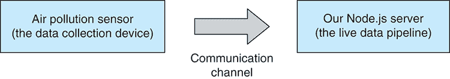

图 12.1 空气污染传感器将数据推送到我们的 Node.js 服务器。

要深入了解数据流如何融入我们的管道，请参阅图 12.2。数据在图中的左侧数据收集点进入我们的系统。然后数据通过处理管道。你应该能识别出这里的各个管道阶段，并且已经对它们的作用有了概念。输出随后通过警报、可视化和每日报告交付给用户。

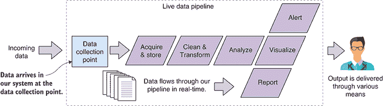

图 12.2 现在，我们将有一个连续的数据流进入我们的数据处理管道。

## 12.4 构建空气质量监控系统

在我们深入构建空气质量监测系统之前，让我们看看我们拥有的数据。CSV 数据文件*brisbanecbd-aq-2014.csv*可在第十二章 GitHub 仓库的*data*子目录下找到。像往常一样，在我们开始编码之前，我们应该仔细查看我们的数据。你可以在图 12.3 中看到数据文件的摘录。

这份数据是从昆士兰州政府开放数据网站下载的.^(1) 感谢昆士兰州政府支持开放数据。

数据文件包含大气条件的每小时读数。我们感兴趣的指标是 PM10 列。这是直径小于 10 微米的空气中颗粒物的计数。花粉和灰尘是这类颗粒物的例子。为了理解这有多小，你需要知道人类头发的宽度大约是 100 微米，所以 10 个这样的颗粒物可以放在一根人类头发的宽度上。这非常小。

这样小的颗粒物可以被吸入肺部，而较大的颗粒物通常被鼻子、嘴巴和喉咙捕获。PM10 值指定的是质量与体积的比率，在这种情况下是每立方米微克（µg/m³）。

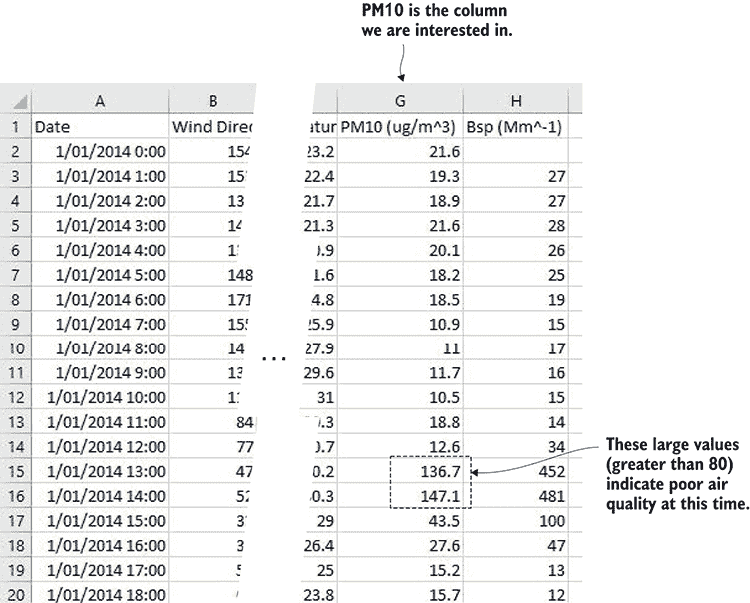

图 12.3 本章的数据。我们关注的是 PM10 列，用于监测空气质量。

注意图 12.3 中突出显示的 PM10 的较大值。在这些时候，我们的大气颗粒物水平可能存在问题。在图 12.4 的图表中，我们可以很容易地看到中午 12 点到下午 3 点之间的峰值——这是空气质量比正常更差的时候。图 12.4 还显示了本章我们将制作的图表。

为了我们空气质量监测系统的目的，我们将任何超过 80 的 PM10 值视为空气质量差，并值得发出警报。我从维多利亚环境保护局（EPA Victoria）的空气质量类别表中选取了这个数字。

我们的系统将是什么样子？你可以在图 12.5 中看到整个系统的示意图。我现在向你展示这个系统图，是为了让你提前了解我们的方向。我不期望你立刻就能理解这个系统的所有部分，但你可以把它看作是我们正在创建的地图，请在本章中不时地参考它来定位自己。

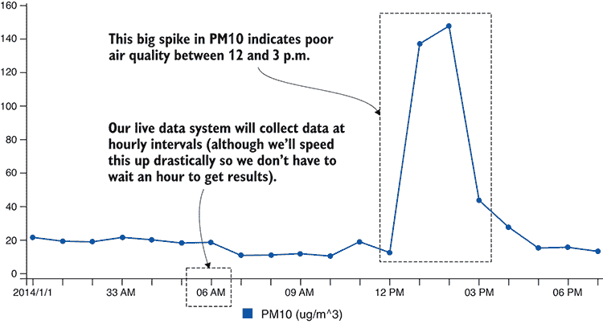

图 12.4 绘制 PM10 值，我们可以看到中午 12 点和下午 3 点之间的大峰值。

我已经告诉你，这将是书中最复杂的项目！然而，与大多数实际生产系统相比，这个系统将会很简单。尽管我们只将检查这个整体的部分，但它将包含图中显示的所有部件。在章节结束时，我将向您展示完成系统的代码，以便您在空闲时间自行研究。

我们的系统从由空气污染传感器产生的数据开始（如图 12.5 左边的所示）。该传感器检测空气质量，并以每小时一次的间隔将数据馈送到数据收集点。我们必须做的第一件事是将数据存储到我们的数据库中。最糟糕的事情就是丢失数据，因此首先确保数据安全是非常重要的。然后数据收集点会触发传入数据事件。这就是我们的基于事件架构发挥作用的地方。它允许我们创建关注点的分离，并将我们的数据收集与下游数据操作解耦。在图 12.5 的右边，我们看到系统的输出，包括短信警报、日报和实时可视化。

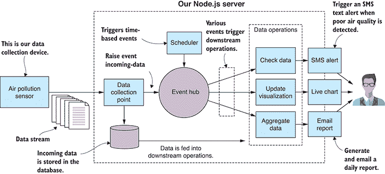

图 12.5 我们空气质量监测系统的示意图

## 12.5 开发设置

要构建这个系统，我们必须创建一个运行它的某种人工支架。你可能没有实际的颗粒物传感器在手——尽管如果你对这个示例项目特别感兴趣，你实际上可以以合理的价格购买这些传感器。

相反，我们将使用 JavaScript 创建一种模拟传感器来模拟真实传感器。我们将编写的代码可能非常接近真实产品的样子。例如，如果我们能将 Raspberry PI 连接到真实传感器并安装 Node.js，我们就可以运行可能与我们要构建的模拟传感器相似的代码。

我们没有真实的传感器，因此我们需要为模拟传感器提供预录制的数据来“生成”并馈送到我们的监控系统。我们已经有了真实的数据，如图 12.3 所示，尽管这些数据是按小时记录的。如果我们想以现实的方式使用它，那么我们的工作流程将会很慢，因为我们必须等待一个小时才能得到每个新的数据点。

为了提高效率，我们需要加快这个流程。我们不会让数据以每小时一次的间隔传入，而是每秒传入一次。这就像加快时间并观看系统以快进的方式运行。除了这种时间操作外，我们的系统将以现实的方式运行。

本章每个代码列表都在 Chapter-12 GitHub 仓库下的一个子目录中。在每个列表的目录下，您将找到一个客户端和一个服务器目录。您可以在图 12.6 中了解其结构。


图 12.6 第十二章代码列表的项目结构

对于每个代码列表，模拟传感器，我们的数据收集设备，位于客户端子目录中，我们不断发展的空气质量监控系统位于服务器子目录中。要跟随代码列表，您需要打开两个命令行窗口。在第一个命令行中，您应该按照以下方式运行服务器：

```
cd listing-12.1
cd server
node index.js 
```

在第二个命令行中，您应该按照以下方式运行客户端（模拟传感器）：

```
cd listing-12.1
cd client
node index.js 
```

客户端和服务器现在都在运行，客户端正在向服务器提供数据。在查看下一个代码列表时，根据你的位置更改列表编号。在尝试运行每个代码列表之前，请确保安装了 npm 和 Bower 依赖项。

## 12.6 实时流数据

我们必须解决的首要问题是如何将我们的传感器连接到我们的监控系统。在接下来的章节中，我们将介绍两种基于网络的机制：HTTP POST 和套接字。这两种协议都建立在 TCP 网络协议之上，并且直接由 Node.js 支持。你选择哪种协议取决于你期望数据提交的频率。

### 12.6.1 频繁数据提交的 HTTP POST

让我们先看看通过 HTTP POST 提交数据。当数据提交不频繁或临时时，我们可以使用这个方法。它也是最简单的，因此是一个很好的起点。图 12.7 展示了我们的空气污染传感器将如何向我们的 Node.js 服务器发送单个数据包。在这种情况下，我们的数据收集点，即数据到达我们服务器的人口，将是一个 HTTP POST 请求处理器。从那里，数据被输入到我们的实时数据管道中。

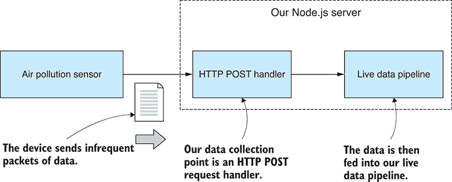

图 12.7 使用 HTTP POST 向我们的服务器发送单个数据包。

到目前为止，我们的代码将非常简单。首先，我们希望从模拟传感器开始将数据流移动到我们的 Node.js 服务器。你可以运行这段代码，但你必须按正确的顺序启动它——首先是服务器，然后是客户端（模拟传感器）。我们的 Node.js 服务器接收数据并将其打印到控制台（如图 12.8 所示）。我们开始得很简单，目前就做这么多。我们这样做是为了检查我们的数据是否正确地到达了我们的服务器。

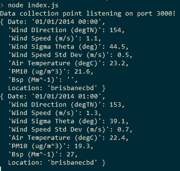

图 12.8 使用 HTTP POST 接收数据时显示的输出。

Node.js 直接支持 HTTP POST，但在这个例子中，我们将使用 *request-promise*，一个高级库，使这个过程变得更容易，并且将我们的 HTTP 请求包装在承诺中。

如果你已经安装了依赖项，那么你的项目中已经安装了 request-promise；否则，你可以在新的 Node.js 项目中这样安装它：

```
npm install --save request-promise 
```

以下列表显示了我们的第一个模拟空气污染传感器的代码。它读取我们的示例 CSV 数据文件。每秒它读取下一行数据，并使用 HTTP POST 将其提交到服务器。

列表 12.1a 通过 HTTP POST 向服务器提交数据的空气污染传感器（列表-12.1/client/index.js）

```
const fs = require('fs');
const request = require('request-promise');
const importCsvFile = require('./toolkit/importCsvFile.js');

const dataFilePath = "../../data/brisbanecbd-aq-2014.csv";    ①  
const dataSubmitUrl = "http://localhost:3000/data-collection-point";    ②  

importCsvFile(dataFilePath)    ③  
    .then(data => {
        let curIndex = 0;

 setInterval(() => {    ④  

 const outgoingData = Object.assign({}, data[curIndex]);    ⑤  
 curIndex += 1;    ⑥  

 request.post({    ⑦  
 uri: dataSubmitUrl,    ⑧  
 body: outgoingData,    ⑨  
 json: true    ⑩  
               });

            }, 1000);
    })
    .catch(err => {
        console.error("An error occurred.");
        console.error(err);
    }); 
```

在服务器端，我们使用 *express* 库通过 HTTP POST 接收传入的数据。就像我们使用 request-promise 一样，我们使用 express 库让我们的生活变得简单一些。Node.js 已经拥有我们构建 HTTP 服务器所需的一切，但使用像 express 这样的高级库来简化并精简我们的代码是一种常见的做法。

再次强调，如果你已经安装了依赖项，那么你已经有 express 库了；否则，你可以按照以下方式安装它和 body-parser 中间件：

```
npm install --save express body-parser 
```

我们使用 body-parser 中间件在接收到 HTTP 请求体时从 JSON 中解析它。这样我们就不必自己进行解析。它将自动完成。

列表 12.1b 展示了一个简单的 Node.js 服务器代码，该服务器使用 URL 数据收集点接收数据。我们将传入数据打印到控制台以检查其是否正确通过。

列表 12.1b 可以通过 HTTP POST 接收数据的 Node.js 服务器（列表-12.1/server/index.js）

```
const express = require('express');
const app = express();
const bodyParser = require('body-parser');

app.use(bodyParser.json());    ①  

app.post("/data-collection-point", (req, res) => {    ②  
 console.log(req.body);    ③  
 res.sendStatus(200);    ④  
});

app.listen(3000, () => { // Start the server.
    console.log("Data collection point listening on port 3000!");
}); 
```

我们现在有一个机制，允许我们接受不频繁或临时的数据馈送。如果我们只按小时接收传入数据——就像在现实生活中的系统中那样，这已经足够好了。但鉴于我们每秒都在发送数据，而且这也是进行更多网络编码的借口，让我们看看如何使用套接字来接受高频实时数据馈送到我们的服务器。

### 12.6.2 用于高频数据提交的套接字

现在，我们将把我们的代码转换为使用套接字连接，这在数据提交频率较高时是一个更好的选择。我们将创建传感器和服务器之间的长连接通信通道。通信通道也是双向的，但在这个例子中我们不会使用它，尽管你可以稍后使用它来向你的传感器发送命令和状态，如果这是你的系统设计所需的话。

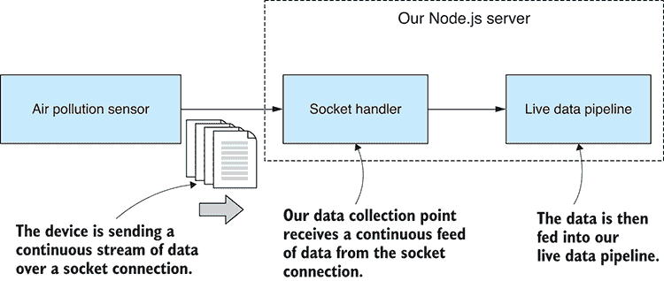

图 12.9 使用长连接套接字接收连续且高频的流数据到我们的服务器。

图 12.9 展示了我们将如何将套接字连接集成到我们的系统中。这看起来与我们在 HTTP POST 中所做的工作类似，尽管它显示我们将有一个数据流通过并到达套接字处理器，这取代了 HTTP POST 处理器，并成为我们的新数据收集点。

在以下列表中，我们将从列表 12.1a 中的模拟传感器进行适配，使其将输出数据写入套接字连接。除了连接设置和对`socket.write`的调用外，此列表与列表 12.1a 类似。

列表 12.2a 通过套接字连接提交数据到服务器的空气污染传感器（列表-12.2/client/index.js）

```
// ... initial setup as per listing 12.1a ...

const serverHostName = "localhost";    ①  
const serverPortNo = 3030;    ①  

const client = new net.Socket();
client.connect(serverPortNo, serverHostName, () => {    ②  
    console.log("Connected to server!");
});

client.on("close", () => {    ③  
    console.log("Server closed the connection.");
});

importCsvFile(dataFilePath)    ④  
    .then(data => {
        let curIndex = 0;

 setInterval(() => {    ⑤  

                const outgoingData = Object.assign({}, data[curIndex]);
                curIndex += 1;

 const outgoingJsonData = JSON.stringify(outgoingData);    ⑥  

 client.write(outgoingJsonData);    ⑦  

            }, 1000);
    })
    .catch(err => {
        console.error("An error occurred.");
        console.error(err);
    }); 
```

在列表 12.2b 中，我们有一个新的 Node.js 服务器，它监听网络端口并接受传入的套接字连接。当我们的模拟传感器（客户端）连接时，我们为套接字的`data`事件设置处理器。这就是我们拦截传入数据的方式；我们也开始看到我之前提到的基于事件的架构。在这个例子中，就像之前一样，我们将数据打印到控制台以检查其是否正确通过。

列表 12.2b 通过套接字连接获取实时数据（listing-12.2/server/index.js）

```
const net = require('net');

const serverHostName = "localhost";    ①  
const serverPortNo = 3030;    ①  

const server = net.createServer(socket => {    ②  
    console.log("Client connected!");

 socket.on("data", incomingJsonData => {    ③  

 const incomingData = JSON.parse(incomingJsonData);    ④  

        console.log("Received: ");
 console.log(incomingData);    ⑤  
    });

 socket.on("close", () => {    ⑥  
        console.log("Client closed the connection");
    });

 socket.on("error", err => {    ⑦  
        console.error("Caught socket error from client.");
        console.error(err);
    });
});

server.listen(serverPortNo, serverHostName, () => {    ⑧  
    console.log("Waiting for clients to connect.");
}); 
```

注意我们是如何以 JSON 数据格式通过网络发送数据的。我们在 HTTP 示例中也这样做过，但在那种情况下，request-promise（在客户端）和 express（在服务器端）为我们做了大量的工作。在这种情况下，我们在将数据推送到网络之前（在客户端）手动将数据序列化为 JSON，然后在另一端出来时（在服务器端）手动反序列化。

## 12.7 配置重构

到目前为止，我们的服务器代码很简单，但很快复杂性将开始急剧上升。让我们花点时间进行一次重构，这将干净地分离我们的配置和代码。我们不会走得太远；这只是一个简单的重构，将帮助我们保持应用程序的整洁，随着其增长。

目前我们唯一的配置是从 列表 12.2b 中的套接字服务器设置细节。我们将把这些移动到一个单独的配置文件中，如图 12.10 所示。这将是一个集中配置应用程序的地方，我们稍后需要去更改其配置。

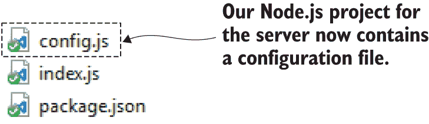

图 12.10 我们 Node.js 项目的新的配置文件

列表 12.3a 展示了我们为项目设置的一个简单起始配置。你可能会问，“为什么要费这个劲？”嗯，这是因为我们还有一大堆配置细节尚未到来。数据库、短信警报和报告生成都需要它们自己的配置，把所有这些集中在一个地方是很方便的。

列表 12.3a 向 Node.js 项目添加简单的配置文件（listing-12.3/server/config.js）

```
module.exports = {
    server: {
 hostName: "localhost",    ①  
 portNo: 3030    ①  
    }
}; 
```

列表 12.3b 展示了我们如何加载和使用配置文件。这里没有复杂的地方；我们的配置是一个普通的 Node.js 代码模块，具有导出的变量。这是一种简单方便的方法来开始向你的应用程序添加配置。我们花费很少的时间来设置这个，而且从长远来看很有用。

列表 12.3b 修改 Node.js 服务器以加载和使用配置文件（listing-12.3/server/index.js）

```
const net = require('net');
const config = require('./config.js');    ①  

const server = net.createServer(socket => {
    // ... code omitted, same as listing 12.1b ...
});

server.listen(config.server.portNo, config.server.hostName, () => {    ②  
    console.log("Waiting for clients to connect.");
}); 
```

你可能会想知道我为什么选择使用 Node.js 代码模块作为配置文件。嗯，我的第一个想法是为了简单。通常，在生产环境中，我使用 JSON 文件来做这类事情，这在这个例子中也同样简单。信不信由你，你可以在 Node.js 中以与要求 JavaScript 文件相同的方式要求 JSON 文件。例如，你也可以这样做：

```
const config = require('./config.json'); 
```

你可以这样做真是太酷了：这是一个简单而有效的方法将数据和配置加载到你的 Node.js 应用程序中。但这也让我想到，使用 JavaScript 作为配置文件意味着你可以包含注释！这是一种很好的方式来记录和解释配置文件，而且这是你通常无法用 JSON 文件做到的。（你有多少次希望能在 JSON 文件中添加注释？！）

你有更多可扩展和更安全的存储配置的方法，但简单性满足了我们的需求，我们将在第十四章再次涉及这一点。

## 12.8 数据捕获

现在，我们已准备好对我们的数据进行一些操作，我们首先应该确保它是安全和安全的。我们应该立即将其捕获到我们的数据库中，这样我们就不会丢失它。

图 12.11 展示了此时我们的系统看起来是什么样子。我们有来自传感器的数据进入，数据到达数据收集点，然后存储在我们的数据库中以备安全使用。

这次，在我们运行代码之后，我们使用数据库查看器，如 Robomongo，来检查我们的数据是否安全地到达了我们的数据库（见图 12.12）。

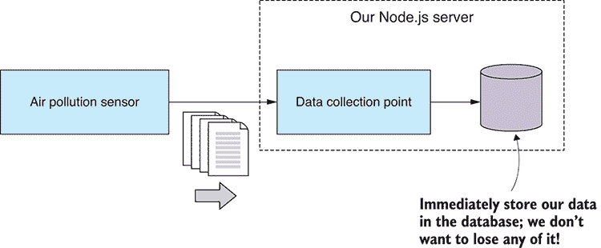

图 12.11 在采取任何进一步行动之前立即将接收到的数据存储到我们的数据库中。

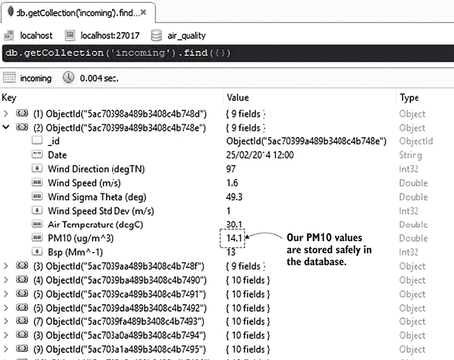

图 12.12 使用 Robomongo 检查我们的数据是否已捕获到数据库中

要连接到数据库，我们需要从某处获取数据库连接详细信息。在以下列表中，我们已经将这些信息添加到我们的配置文件中。

列表 12.4a 将数据库连接详细信息添加到配置文件（列表-12.4/server/config.js）

```
module.exports = {
    server: {
        hostName: "localhost",
        portNo: 3030
    },

    database: {
 host: "mongodb://localhost:27017",    ①  
 name: "air_quality"    ①  
    }
}; 
```

注意，当我们连接到 MongoDB 时，使用的是默认端口 27017，如列表 12.4a 所示。这假设你在你的开发电脑上安装了 MongoDB 的默认版本。如果你想尝试运行此代码，你需要安装 MongoDB；否则，你可以启动位于 Chapter-8 Github 仓库 vm-with-empty-db 子目录中的 Vagrant VM。启动该 VM 将为你提供一个端口为 6000 的空 MongoDB 数据库，用于本章中的代码示例。确保你修改代码以引用正确的端口号。例如，在列表 12.4a 中，你需要将连接字符串从`mongodb://localhost:27017`更改为`mongodb://localhost:6000`。有关 Vagrant 的帮助，请参阅附录 C。

以下列表展示了连接到 MongoDB 并将接收到的数据存储在数据收集点的代码。

列表 12.4b 将传入数据存储到 MongoDB 数据库（列表-12.4/server/index.js）

```
const mongodb = require('mongodb');
const net = require('net');
const config = require('./config.js');

mongodb.MongoClient.connect(config.database.host)    ①  
    .then(client => {
 const db = client.db(config.database.name);    ②  
 const collection = db.collection("incoming");    ③  

        console.log("Connected to db");

        const server = net.createServer(socket => {
            console.log("Client connected!");

 socket.on("data", incomingJsonData => {
                console.log("Storing data to database.");

                const incomingData = JSON.parse(incomingJsonData);

 collection.insertOne(incomingData)    ④  
 .then(doc => {    ⑤  
                        console.log("Data was inserted.");
                    })
 .catch(err => {    ⑥  
                        console.error("Error inserting data.");
                        console.error(err);
                    });
            });

            socket.on("close", () => {
                console.log('Client closed the connection');
            });

            socket.on("error", err => {
                console.error("Caught socket error from client.");
                console.error(err);
            });
        });

        server.listen(config.server.portNo, config.server.hostName, () => {
            console.log("Waiting for clients to connect.");
        });
    }); 
```

我们在接收到数据后立即将其存储在数据库中是一个设计决策。我相信这些数据很重要，我们不应该在将其安全存储之前对它进行任何初始处理。我们很快将再次讨论这个想法。

## 12.9 基于事件的架构

让我们现在看看我们如何更好地随着时间的推移改进我们的应用程序。我想有机会展示我们如何部署设计模式来结构化我们的应用程序并帮助管理其复杂性。

你可能会认为我过度设计了这个简单的玩具应用，但我想向你展示的是，关注点的分离和组件解耦如何为我们构建一个坚实、可靠和可扩展的应用程序奠定基础。随着我们逐步增加复杂性，并在章节末尾达到完整的系统，这一点应该会变得明显。

图 12.13 展示了我们将如何使用事件中心来解耦我们的数据收集与任何下游数据处理操作；例如，*更新* *可视化*，它负责将传入数据转发到网页浏览器中的实时图表。

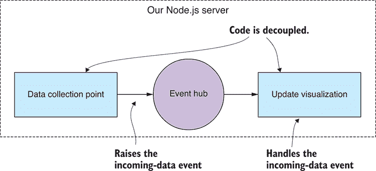

图 12.13 事件处理架构允许我们解耦我们的代码模块。

事件中心就像是我们事件的导管：数据收集点引发传入数据事件，更新可视化事件处理器对其做出响应。有了这种基础设施，我们现在可以轻松地添加新的下游数据操作来扩展系统。

图 12.14，例如，展示了我们将如何接入一个短信警报模块，以便我们的系统在检测到空气质量不佳时发出警报。

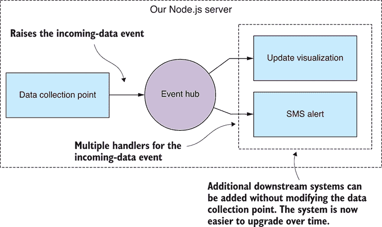

图 12.14 我们现在可以扩展我们的系统，添加新的下游操作，而无需重构或重新结构化数据收集点。

使用这种基于事件的架构，我们可以在其上挂起新的代码模块。我们增加了一个自然的扩展点，可以在此处接入新的事件源和事件处理器。这意味着我们已经设计了一个可升级的应用程序。我们现在能够更好地修改和扩展我们的应用程序，而不会将其变成一团糟的意大利面代码——至少这是我们的目标。我不会声称保持一个不断发展的应用程序处于控制之下很容易，但像这样的设计模式可以有所帮助。

在这个项目中对我们来说重要的是，我们可以添加新的代码模块，如*更新可视化*和*SMS 警报*，而无需修改我们的数据收集点。为什么现在这里很重要？嗯，我想指出，我们数据的安全性至关重要，我们必须在发生任何其他事情之前确保它是安全可靠的。每次我们对数据收集点进行代码更改时，我们都有破坏这段代码的风险。我们迫切需要最小化我们对这段代码未来所做的更改，基于事件架构意味着我们可以在不更改数据收集点代码的情况下添加新的代码模块。

除了帮助结构化我们的应用程序并使其更具可扩展性外，基于事件的架构还使得将我们的系统分区变得容易，这样，如果需要扩展，我们可以将应用程序分布到多个服务器或虚拟机上，事件通过电线传输。这种架构可以帮助实现我们在第十四章中将进一步讨论的水平扩展。

## 事件处理代码重构

让我们重构我们的代码，使其基于事件中心的概念，该中心协调事件的提升和处理。我们将使用 Node.js 的`EventEmitter`类，因为它是为这类事情设计的。

在列表 12.5a 中，你可以看到我们新的事件中心的代码。这非常简单：整个模块实例化一个`EventEmitter`并将其导出以供其他模块使用。没有人说这需要复杂，尽管你可以构建一个比这更复杂的更高级的事件中心！

列表 12.5a 创建服务器的事件中心（列表-12.5/server/event-hub.js）

```
const events = require('events');
const eventHub = new events.EventEmitter();    ①  

module.exports = eventHub;    ②   
```

现在我们有了事件中心，我们可以将其连接到现有代码。我们首先要做的是在服务器接收到数据时触发传入数据事件。我们通过在事件中心上调用`emit`函数来完成此操作。

如您从以下列表中的代码摘录中可以看到，事件在数据成功存储在数据库后立即被触发。为了安全起见，我们首先存储数据，然后发生其他所有事情。

列表 12.5b 触发传入数据事件（列表-12.5/server/data-collection-point.js）

```
incomingDataCollection.insertOne(incomingData)    ①  
    .then(doc => {
 eventHub.emit('incoming-data', incomingData);    ②  
    })
    .catch(err => {
        console.error("Error inserting data.");
        console.error(err);
    }); 
```

在传入数据事件就绪并在我们有数据到达服务器时被触发后，我们可以开始构建下游数据处理模块。

### 12.10.1 触发 SMS 警报

我们接下来关心的是实时了解空气质量何时恶化。现在我们可以添加一个事件处理程序来监控传入的 PM10 值，并在检测到空气质量差时发出警报。

为了处理事件，我们首先将事件中心导入到我们的代码中。然后我们调用 `on` 函数来为名为事件（例如我们刚才添加的 incoming-data 事件）的事件注册一个事件处理函数。这如下所示：检查 PM10 值是否大于或等于配置文件中设置为 80 的最大安全水平。当检测到这样的值时，我们会发出警报并向我们的用户发送短信文本消息。

列表 12.5c 处理事件并在 PM10 超过安全值时触发警报（listing-12.5/server/trigger-sms-alert.js）

```
const eventHub = require('./event-hub.js');    ①  
const raiseSmsAlert = require('./sms-alert-system.js');    ②  
const config = require('./config.js');

eventHub.on("incoming-data", incomingData => {    ③  
 const pm10Value = incomingData["PM10 (ug/m³)"];    ④  
 const pm10SafeLimit = config.alertLimits.maxSafePM10;    ⑤  
 if (pm10Value > pm10SafeLimit) {    ⑥  
 raiseSmsAlert("PM10 concentration has exceeded safe levels.");    ⑦  
    }
}); 
```

列表 12.5c 中的代码是添加下游数据操作的一个示例，该操作执行数据分析并安排适当的响应。此代码很简单，但我们可以想象在这里做更复杂的事情，比如检查滚动平均值（见第九章）是否呈上升趋势，或者传入的值是否比正常平均值高出两个标准差（再次见第九章）。如果您已经使用探索性编码（例如我们在第五章或第九章中做的那样）原型化了数据分析代码，您可能可以想象在这个时候将那段代码集成到系统中。

现在如果您运行此代码 (列表 12.5) 并稍等片刻，您将看到触发了“短信警报”。您只需等待片刻即可发生此事件（当中午 12 点到下午 3 点之间的大 PM10 值通过时）。不过，此时发送短信消息的代码已被注释掉，所以您只会看到显示将要发生什么的控制台日志。

要使短信代码生效，您需要在文件 listing-12.5/server/sms-alert-system.js 中取消注释代码。您需要注册 Twilio（或类似服务）并添加您的配置详细信息到配置文件中。同时确保您添加了自己的手机号码，这样短信消息就会发送到您的手机上。完成所有这些操作后，再次运行代码，您将在手机上收到警报。

### 12.10.2 自动生成日报

让我们看看另一个触发和处理事件的例子。对于下一个特性，我们将添加自动生成的日报。报告不会很复杂；我们将 PM10 的图表渲染到 PDF 文件中，然后将其通过电子邮件发送给我们的用户。但你可以想象这可以做得更深入，比如渲染其他统计数据或附加一个包含最近数据摘要的电子表格。

因为我们希望每天生成报告，我们现在需要一种生成基于时间的事件的方法。为此，我们将在系统中添加一个调度器，并编程它每天触发一次 *generate-daily-report* 事件。一个独立的日报生成模块将处理事件并完成工作。您可以在 图 12.15 中看到它是如何结合在一起的。

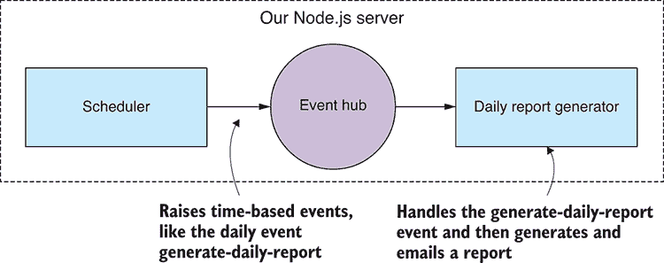

图 12.15 我们的调度器每天向系统中输入一个事件以生成日报。

要实现调度器，我们需要一个计时器来知道何时触发事件。我们可以从头开始使用 JavaScript 函数 `setTimeout` 或 `setInterval` 来构建它。虽然这些函数很有用，但它们也是低级的，我希望我们使用更易于表达和更方便的方法。

#### 触发生成每日报告事件

为了安排我们的基于时间的事件，我们将依赖 npm 中的 cron 库作为我们的计时器。使用这个库，我们可以使用众所周知的 UNIX cron 格式表达计划作业。与任何此类库一样，在 npm 上有许多可用的替代方案；这是我使用的库，但总是好的，要四处看看，以确保你正在使用最适合你自身需求的库。

在 列表 12.6a 中，我们创建了一个 `CronJob` 实例，其计划是从我们的配置文件中检索的，然后启动作业。这每天调用一次 `generateReport`，这就是我们触发生成每日报告事件的地方。

列表 12.6a 使用 cron 库触发基于时间的生成每日报告事件（listing-12.6/server/scheduler.js）

```
const eventHub = require('./event-hub.js');    ①  
const cron = require('cron');    ②  
const config = require('./config.js');

function generateReport () {    ③  
 eventHub.emit("generate-daily-report");    ④  
};

const cronJob = new cron.CronJob({    ⑤  
 cronTime: config.dailyReport.schedule,    ⑥  
 onTick: generateReport    ⑦  
});

cronJob.start();    ⑧   
```

我们将用于每日定时任务的 cron 格式在配置文件中指定，看起来如下所示：

```
00 00 06 * * 1-5 
```

这看起来很神秘，但我们可以从右到左阅读，即星期一到星期五（1-5 天），每月（星号），每月的每一天（下一个星号），零分钟的 6 点，以及零秒。这指定了调用作业的时间。更简洁地说：我们每周工作日早上 6 点生成报告。

这个计划的问题在于测试它需要花费太长时间。我们无法等待整整一天来测试报告生成代码的下一个迭代！正如我们处理传入数据流一样，我们需要加快速度，所以我们将注释掉每日计划（我们将在将此应用程序投入生产时再次需要它）并替换为运行更频繁的计划：

```
00 * * * * * 
```

这指定了一个每分钟运行一次的计划（你可以从右到左阅读为每天，每月，每月的每一天，每小时，每分钟，以及该分钟的零秒）。

我们将每分钟生成一个新的报告。这确实是一个快速的节奏，但这也意味着我们有频繁的机会来测试和调试我们的代码。

#### 处理生成报告事件

现在我们准备处理 *generate-daily-report* 事件并生成并发送报告。以下列表显示了如何处理事件，然后调用辅助函数来完成工作。

列表 12.6b 处理生成每日报告事件并生成报告（listing-12.6/server/trigger-daily-report.js）

```
const eventHub = require('./event-hub.js');    ①  
const generateDailyReport = require('./generate-daily-report.js');

function initGenerateDailyReport (db) {    ②  
 eventHub.on("generate-daily-report", () => {    ③  
 generateDailyReport(db)    ④  
            .then(() => {
                console.log("Report was generated.");
            })
            .catch(err => {
                console.error("Failed to generate report.");
                console.error(err);
            });
    });
};

module.exports = initGenerateDailyReport; 
```

#### 生成报告

生成报告与我们在第十一章中学到的类似；实际上，列表 12.6c 是从第十一章中的 列表 11.7 衍生出来的。

在生成报告之前，我们查询数据库并检索要包含在其中的数据。然后我们使用`generateReport`工具包函数，就像我们在第十一章中做的那样，启动一个带有模板报告的嵌入式 Web 服务器，并使用 Nightmare 捕获报告到 PDF 文件。最终，我们调用我们的辅助函数`sendEmail`将报告通过电子邮件发送给用户。

列表 12.6c 生成日报并将其发送给感兴趣方（列表-12.6/server/generate-daily-report.js）

```
const generateReport = require('./toolkit/generate-report.js');    ①  
const sendEmail = require('./send-email.js');    ②  
const config = require('./config.js');

function generateDailyReport (db) {    ③  

    const incomingDataCollection = db.collection("incoming");

 const reportFilePath = "./output/daily-report.pdf";    ④  

 return incomingDataCollection.find()    ⑤  
 .sort({ _id: -1 })    ⑥  
 .limit(24)    ⑦  
        .toArray()
        .then(data => {
 const chartData = {    ⑧  
 xFormat: "%d/%m/%Y %H:%M",    ⑨  
 json: data.reverse(),    ⑩  
                keys: {
                    x: "Date",
                    value: [
                        "PM10 (ug/m³)"
                    ]
                }
            };
 return generateReport(chartData, reportFilePath);    ⑪  
        })
 .then(() => {
 const subject = "Daily report";    ⑫  
 const text = "Your daily report is attached.";    ⑫  
 const html = text;    ⑬  
 const attachments =   [  ⑭  
 {    ⑮  
 path: reportFilePath,    ⑯  
                }
            ];
 return sendEmail(    ⑰  
 config.dailyReport.recipients,    ⑰  
 subject, text, html, attachments    ⑰  
 );    ⑰  
        });
};

module.exports = generateDailyReport; 
```

要运行列表 12.6 的代码，你需要有一个 SMTP 邮件服务器，你可以用它来发送邮件。通常，我会使用 Mailgun（它有一个免费/试用版本）来做这件事，但你有很多其他的选择，比如 Gmail。你需要访问一个标准的 SMTP 账户，然后可以在配置文件中输入你的 SMTP 用户名和密码以及与报告相关的详细信息。现在你可以运行列表 12.6，并且每分钟它会通过电子邮件发送一份日报给你（请不要让它运行得太久——你会收到很多邮件！）

你现在可能对查看列表-12.6/server/send-email.js 中的代码感兴趣，以了解如何使用`Nodemailer`库（最优秀的 Node.js 邮件发送库）发送邮件。

## 实时数据处理

我们将在稍后讨论实时可视化，并完成本章，但在那之前，我想快速谈谈如何将更多的数据处理步骤添加到你的实时管道中。

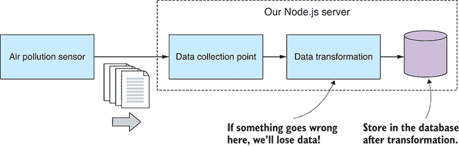

图 12.16 数据采集过程中的数据转换（如果出错，你会丢失数据）

假设你需要添加更多代码来进行数据清理、转换，或者可能是数据分析。最好的放置位置在哪里？

我们可以在存储数据之前，像图 12.16 所示的那样，直接在我们的数据收集点放置这样的代码。显然，我不推荐这样做，因为它会使我们在数据转换出错时面临数据丢失的风险（而且我经验丰富，知道总会有事情出错）。

为了使用我认为最安全的代码结构方式来适当缓解这种风险，我们可以让我们的下游数据操作始终在事件中心的其他一侧发生。我们在触发任何下游工作之前快速且安全地存储数据。如图 12.17 所示，后续操作独立决定如何检索它们所需的数据，并且它们有责任安全地存储任何已修改的数据。

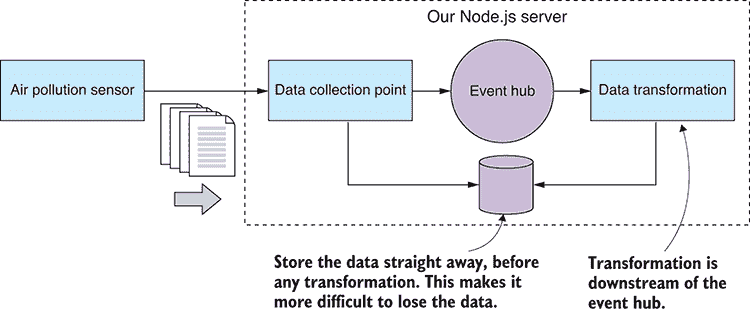

图 12.17 数据转换位于存储之后（管理数据采集的一种更安全的方式）。

下游数据操作所需的数据可能通过事件本身传递（就像我们处理 incoming-data 事件那样），或者操作可以完全独立，必须查询数据库本身以找到自己的数据。

如果你现在有需要存储的修改后的数据，你可以覆盖原始数据。然而，我不建议这种方法，因为如果任何潜在的错误出现，你可能会发现你的源数据已被损坏的数据覆盖。更好的解决方案是将转换后的数据存储到不同的数据库集合中；至少这为你提供了对数据破坏性错误的缓冲。

## 实时可视化

我们终于来到了本章最激动人心的部分，你一直期待的部分：让我们让实时数据流入动态更新的图表。

图 12.18 展示了我们的实时数据图表的外观。当它运行时，你可以坐下来观看每秒（基于我们加速的时间观念）被输入到图表中的新数据点。

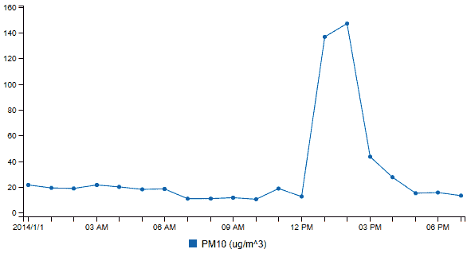

图 12.18 我们将从实时数据流生成的图表

要制作我们的实时更新可视化，我们必须做两件事：

1.  将初始数据放入图表中。

1.  当新数据点到达时，将它们输入到图表中。

第一个现在应该对我们来说很熟悉，因为我们已经在第十章和第十一章中看到了如何创建图表。现在我们将添加第二个步骤，并创建一个动态图表，当有新数据可用时，它会自动更新。

我们已经有了实现这一目标所需的部分基础设施。让我们添加一个新的代码模块，更新可视化，来处理传入的数据事件并将新数据点转发到浏览器。看看它在图 12.19 中的组合方式。

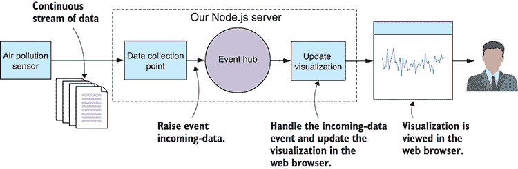

图 12.19 数据流向实时可视化

如果我写这一章而不提一下 socket.io，那我就疏忽了。这是一个在 JavaScript 中用于实时事件、消息和数据流的热门库。

Socket.io 允许我们在服务器和我们的 Web 应用程序之间打开一个双向通信通道。我们不能使用常规套接字与沙盒 Web 应用程序通信，但 socket.io 使用 Web 套接字，这是一种建立在常规 HTTP 之上的技术，为我们提供了所需的数据流通道，以便将数据流发送到浏览器。Socket.io 还有一个回退模式，如果 Web 套接字不可用，它将优雅地降级为使用常规 HTTP POST 发送我们的数据。这意味着我们的代码将在旧浏览器上工作。

列表 12.7a 展示了托管我们新实时可视化的 Web 服务器的代码。这主要有三个任务：

+   为 Web 应用程序本身提供资产

+   为图表提供初始数据

+   使用我们新的代码模块更新可视化功能注册 Socket.io 连接

你可以在代码列表的中间部分看到，Web 服务器开始接受传入的 Socket.io 连接，并将每个连接注册到我们新的 *update-visualization* 模块。

列表 12.7a 带有实时 PM10 图表的 Web 服务器（listing-12.7/server/web-server.js）

```
const path = require('path');
const http = require('http');
const socket.io = require('socket.io');
const updateVisualization = require('./update-visualization.js');

function startWebServer (db) {    ①  

    const incomingDataCollection = db.collection("incoming");

    const app = express();

    const httpServer = http.Server(app);
 const socket.ioServer = socket.io(httpServer);    ②  

    const staticFilesPath = path.join(__dirname, "public");
    const staticFilesMiddleWare = express.static(staticFilesPath);
    app.use("/", staticFilesMiddleWare);

 app.get("rest/data", (req, res) => {    ③  
 return incomingDataCollection.find()    ④  
            .sort({ _id: -1 })
            .limit(24)
            .toArray()
            .then(data => {
                data = data.reverse(),
 res.json(data);    ⑤  
            })
            .catch(err => {
                console.error("An error occurred.");
                console.error(err);

                res.sendStatus(500);
            });
    });

 socket.ioServer.on("connection", socket => {    ⑥  
        updateVisualization.onConnectionOpened(socket);

        socket.on("disconnect", () => {
            updateVisualization.onConnectionClosed(socket);
        });
 });

    httpServer.listen(3000, () => { // Start the server.
        console.log("Web server listening on port 3000!");
    });
};

module.exports = startWebServer; 
```

列表 12.7b 展示了我们新的更新可视化模块的代码，该模块跟踪所有打开的连接，因为任何时刻可能有多个我们的 Web 应用程序实例连接。注意它如何处理 incoming-data 事件；在这里，我们调用 `socket.emit` 将每个数据包转发到 Web 应用程序。这就是如何将新的数据点发送到 Web 应用程序以添加到图表中的方式。

列表 12.7b 将传入数据转发到 Web 应用程序（listing-12.7/server/update-visualization.js）

```
const eventHub = require('./event-hub.js');

const openSockets = [];    ①  

function onConnectionOpened (openedSocket) {    ②  
    openSockets.push(openedSocket);
};

function onConnectionClosed (closedSocket) {    ③  
    const socketIndex = openSockets.indexOf(closedSocket);
    if (socketIndex >= 0) {
        openSockets.splice(socketIndex, 1);
    }
};

eventHub.on("incoming-data", (id, incomingData) => {
 for (let i = 0; i < openSockets.length; ++i) {    ④  
        const socket = openSockets[i];
 socket.emit("incoming-data", incomingData);    ⑤  
   }
});

module.exports = {
    onConnectionOpened: onConnectionOpened,
    onConnectionClosed: onConnectionClosed
} 
```

我们还需要查看 Web 应用程序代码中发生的情况。您可以在列表 12.7c 中看到，它基本上与您在 C3 图表中预期看到的内容相同（为了复习，请参阅第十章）。这次，除了这个之外，我们还在创建一个 socket.io 实例，并从我们的 Web 服务器接收 incoming-data 事件。然后，将传入的数据点添加到我们现有的数据数组中，并使用 C3 的 `load` 函数加载修订后的数据。C3 便利地提供了一个新数据的动画，这使得图表具有流畅的视觉效果。

列表 12.7c 在数据到达时向图表中添加新数据（listing-12.7/server/public/app.js）

```
function renderChart (bindto, chartData) {
    var chart = c3.generate({
        bindto: bindto,
        data: chartData,
        axis: {
            x: {
                type: 'timeseries',
            }
        }
    });
    return chart;
};

$(function () {

 var socket = io();    ①  

 $.get("/rest/data")    ②  
        .then(function (data) {
 var chartData = {    ③  
                xFormat: "%d/%m/%Y %H:%M",
                json: data,
                keys: {
                    x: "Date",
                    value: [
                        "PM10 (ug/m³)"
                    ]
                }
            };

 var chart = renderChart("#chart", chartData);    ④  

 socket.on("incoming-data", function (incomingDataRecord) {    ⑤  
 chartData.json.push(incomingDataRecord);    ⑥  
 while (chartData.json.length > 24) {    ⑦  
 chartData.json.shift();    ⑧  
                }

 chart.load(chartData);    ⑨  
            });
        })
        .catch(function (err) {
            console.error(err);
        });
}); 
```

最后要注意的一点是我们如何使 Socket.io 可用于我们的 Web 应用程序。您可以在列表 12.7d 中看到，我们将 socket.io 客户端的 JavaScript 文件包含到我们的 Web 应用程序的 HTML 文件中。这个文件是从哪里来的？

嗯，这个文件是由我们包含在服务器应用程序中的 Socket.io 库自动提供并通过 HTTP 服务的。它以一种类似魔法的方式提供，我们不需要使用 Bower 或其他方式手动安装此文件。

列表 12.7d 服务器自动使 Socket.io 可用于客户端（listing-12.7/server/public/index.html）

```
<!doctype html>
<html lang="en">
    <head>
        <title>Live data visualization</title>

        <link href="bower_components/c3/c3.css" rel="stylesheet">
        <link href="app.css" rel="stylesheet">

        <script src="bower_components/jquery/dist/jquery.js"></script>
        <script src="bower_components/d3/d3.js"></script>
        <script src="bower_components/c3/c3.js"></script>
 <script src="/socket.io/socket.io.js"></script>    ①  
        <script src="app.js"></script>
    </head>
    <body>
        <div>
            No need to refresh this web page,
            the chart automatically updates as the data
            flows through.
        </div>
        <div id='chart'></div>
    </body>
</html> 
```

当您运行列表 12.7 的代码时，请记住一个注意事项：每次您全新运行它（模拟传感器和服务器）时，请每次重置您的传入 MongoDB 集合（您可以使用 Robomongo 从集合中删除所有文档）。否则，由于数据的时序性和我们正在回放我们的假数据，您的实时图表可能会出现异常。这是我们使用模拟传感器和假数据设置我们的开发框架的方式的一个副作用。在生产环境中这不会是问题。这在开发过程中是个麻烦，因此，为了继续开发，您可能希望有一种自动重置数据库到起始条件的方法。

好了，这就是我们完成的。我们已经构建了一个用于处理连续实时数据流的完整系统。使用这个系统，我们可以监控空气质量，并且希望我们能够更好地为紧急情况做好准备，并能够实时响应。你可以在 GitHub 仓库第十二章的*complete*子目录下找到完整的代码。它汇集了我们本章讨论的所有部分，并将它们组合成一个连贯的、功能齐全的系统。

本章我们所做的工作是朝着完整生产系统迈出的重要一步，但我们还没有完全达到那里。我们仍有许多问题需要解决，以便我们可以依赖这个系统，但我们将回到第十四章来讨论这些问题。现在让我们暂时放下严肃的内容，在第十三章中，我们将使用 D3 提升我们的可视化技能。

## 摘要

+   你学习了如何管理实时数据管道。

+   你通过示例学习了如何通过 HTTP POST 和套接字发送和接收数据。

+   我们重构了代码，提取了一个简单的配置文件。

+   我们使用 Node.js 的 EventEmitter 引入了基于事件的架构，为我们的服务器添加了一个简单的事件中心。

+   我们使用了`cron`库来创建基于时间的计划任务。

+   我们探讨了使用 Socket.io 向实时更新的 C3 图表发送数据的方法。
