# 13

使用 D3 进行高级可视化

**本章涵盖**

+   使用 SVG 创建矢量图形

+   使用 D3 创建不同寻常的视觉呈现

没有介绍 D3：JavaScript 中构建交互式和动画浏览器可视化最杰出的框架，我就无法结束这本书。

D3（数据驱动文档）是一个复杂的库；这就是为什么这一章被称为*高级可视化*。D3 拥有一个庞大的 API 和复杂的概念。这是你工具箱中的一个强大补充，但遗憾的是，它有一个陡峭的学习曲线！对于大多数常规图表，你最好使用一个更简单的 API，比如我们在第十章中提到的 C3。然而，当你达到 C3 的限制，或者你想创建一些完全不同寻常的东西时，你才会转向 D3。

我无法完全教你 D3；那需要一本书。但我确实希望教你基本概念以及它们之间的关系。例如，我们将学习 D3 的一个核心概念，即*数据连接*模式，以及如何使用它将我们的数据转换为可视化。D3 是一个庞大且复杂的 API，所以我们只会触及表面。

你准备好创建一个更高级的可视化了么？在本章中，我们将做一些不同寻常的事情，一些我们无法用 C3 做的事情。这个例子将让你对 D3 的强大功能有所了解，在这个过程中，我们将学习核心的 D3 技能。

## 13.1 高级可视化

在本章中，我们将使用 D3 创建一个可伸缩矢量图形（SVG）可视化。我们也可以使用 D3 与 HTML 或 Canvas 一起使用，但通常与 SVG 一起使用，我们肯定可以通过这种方式构建一些视觉上令人印象深刻的东西。不过，如果你不知道 SVG，也不要太担心，因为我们将从简短的 SVG 快速入门课程开始。

我们将创建的可视化显示在 图 13.1 中。这是环绕地球的美国太空垃圾的按比例呈现。我所说的太空垃圾是指火箭、卫星和其他此类现在被遗弃但仍然在太空中的东西。

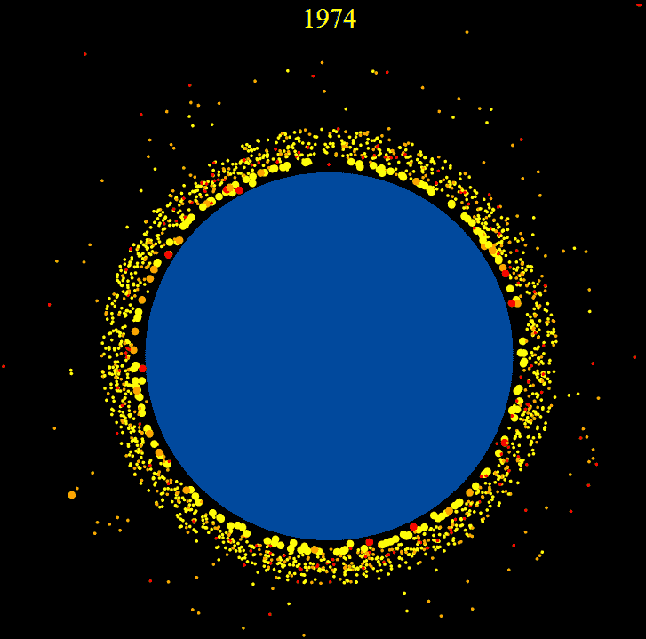

图 13.1 本章的最终成果：一个逐年动画的、二维可视化，展示环绕地球的美国太空垃圾

在 图 13.1 中，地球被涂成蓝色，周围环绕着黄色、橙色和红色的物体：太空垃圾的视觉呈现根据其大小进行了着色。这种着色是通过 CSS 样式实现的，你将在后面看到。（要查看本章中的彩色图示，请参阅本书的电子版。）

这个可视化是交互式的：当你将鼠标指针悬停在太空垃圾对象上时，会显示解释性文本，如图 13.2 所示。


图 13.2 当鼠标悬停在太空垃圾对象上时，会显示解释性文本。

这个可视化也是动态的：注意在 图 13.1 中，年份显示在顶部。我们的动画将使这个可视化随着时间的推移每年向前推进。在动画的每次迭代中，它将显示那一年发射的物体以及数十年来积累的太空垃圾量。

## 13.2 获取代码和数据

本章的代码和数据可在 GitHub 上的 Data Wrangling with JavaScript Chapter-13 仓库中找到，网址为 [`github.com/data-wrangling-with-javascript/chapter-13`](https://github.com/data-wrangling-with-javascript/chapter-13)。[.](http://.)

仓库中的每个子目录都包含一个完整的工作示例，并且每个示例都与本章中的各种列表相对应。在尝试运行每个子目录中的代码之前，请确保已安装 Bower 依赖项。

您可以使用 live-server 运行每个列表：

```
 cd Chapter-13/listing-13.5
    live-server 
```

这将打开您的浏览器并导航到网页。有关获取代码和数据的帮助，请参阅第二章的“获取代码和数据”部分。

## 13.3 可视化太空垃圾

为什么是太空垃圾？我正在寻找一个可以展示 D3 力量的可视化效果，在参加世界科学节关于太空垃圾扩散的讲座后，我受到了启发。讲座结束后，我进行了自己的研究，并在 [`stuffin.space/`](http://stuffin.space/) 找到了一个令人惊叹且准确的太空垃圾 3D 可视化。[.](http://.)

我决定为这本书重现类似的内容，但使用 2D 和 D3 技术。我已经预先过滤了数据，只保留了美国太空垃圾的数据；否则，我们会拥有太多数据，这会使可视化变得杂乱无章。

我们将使用的数据存储在名为 us-space-junk.json 的 JSON 文件中，您可以在 Chapter-13 GitHub 仓库中找到它。如图 13.3 所示，每条数据记录代表一个太空垃圾物体，并描述了其名称、大小、发射日期和近地点。

近地点是物体距离地球最近的位置。在我们的可视化中，我们将使用这个值来近似物体的地球距离。

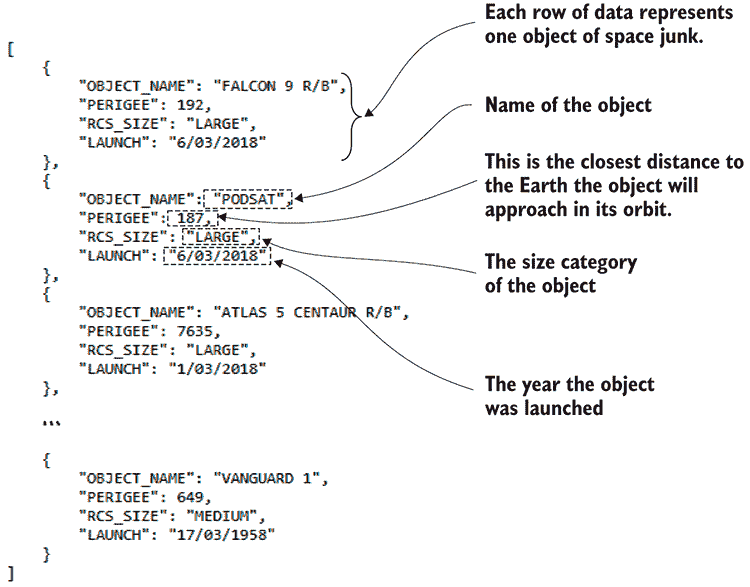

图 13.3 描述太空垃圾每个物体的 JSON 数据（us-space-junk.json 的摘录）

## 13.4 什么是 D3？

D3，数据驱动文档，是一个用于生成可视化的 JavaScript API。人们经常称它为通用可视化工具包，这意味着我们使用它时不受限制或约束，可以创建各种类型的可视化。如果您能想象出一个可视化——好吧，一个可以用 HTML、SVG 或 Canvas 创建的可视化——那么您肯定可以使用 D3 创建它。

D3 并非专门用于构建图表或任何特定类型的可视化；它足够强大，可以表达任何内容，您只需进行一次 D3 示例的图片搜索，就能看到我的意思。我继续对使用 D3 制作的各种可视化效果的广泛性感到惊讶。

D3 是由迈克尔·博斯特克、瓦迪姆·奥吉维茨基和杰弗里·希尔在《纽约时报》可视化部门创建的。它是可视化 API 家族中的最新和最强大的成员，拥有成熟的经验。

我们将使用 D3 为我们的太空垃圾可视化创建配方。将我们的数据添加到这个配方中会产生可视化。使用 D3 将数据转换为可视化的过程没有固定的流程。我们必须明确编写将我们的数据转换为可视化的代码。我们正在构建从数据到可视化的自定义转换。正如你可以想象的那样，这是一种构建独特或定制可视化的强大方式，但当你想要一个标准的线图或柱状图时，这会很快变得繁琐。

D3 与 jQuery 有重叠：它允许我们选择和创建 DOM 节点，然后以可能让你感到熟悉的方式设置它们的属性值。我们还可以向 DOM 节点添加事件处理器以创建交互性；例如，对鼠标悬停和鼠标点击做出响应。

尽管如此，D3 可能会让你感到挑战。它的强大之处在于抽象概念，这也是 D3 难以学习的原因。D3 还要求具备高级的 JavaScript 知识，但我将努力使内容易于理解，并且我们会从简单的开始逐步构建到更复杂的数据可视化。

D3 对于从头开始创建可视化可能对你很有用，我们还可以使用我们的 D3 技能来扩展我们的 C3 图表。很容易达到 C3 的限制——比如说，当你想在 C3 图表中添加额外的图形、交互性或动画时。但由于 C3 建立在 D3 之上，我们可以使用 D3 API 来扩展 C3，并为我们的 C3 图表添加额外的功能。

我一直赞扬 D3 的优点，但同时也希望我已经说服了你们不要轻视它。使用 D3 的唯一原因是为了创建一个高级可视化，这是用更简单的 API（如 C3）无法实现的。例如，你不会用 D3 来创建公司每周销售额的柱状图。这样做不值得——有点像用一把大锤子来钉一个图钉，那将是过度杀鸡用牛刀。

## 13.5 D3 数据管道

我说过，我们将使用 D3 来创建我们的数据可视化配方。将其视为配方是一种理解 D3 工作方式的方法。

我还喜欢的一个类比是将我们的 D3 配方视为一个数据管道。如图 13.4 所示，我们的数据集通过管道传输，并在另一端以可视化的形式出现。

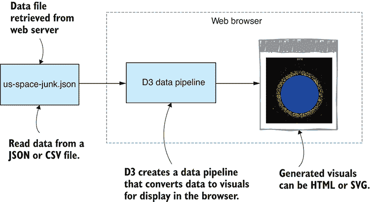

图 13.4 D3 创建了一个将我们的数据集转换为可视化的管道。

然而，D3 不仅仅是为了在空 DOM 中创建新的可视化。我们的 D3 配方还可以描述如何将数据添加到现有的可视化中。这就是 D3 如此强大的原因；我们可以使用它来更新实时可视化，当新数据可用时（见图 13.5）。

我们将要构建的 D3 管道将在一组数据记录上操作，如图 13.6 所示。管道依次访问每个数据记录，并为每个太空垃圾对象生成一个 DOM 节点。这个过程产生了一组新的 DOM 节点，这些节点共同构成了我们的可视化。

你准备好开始编写太空垃圾可视化代码了吗？

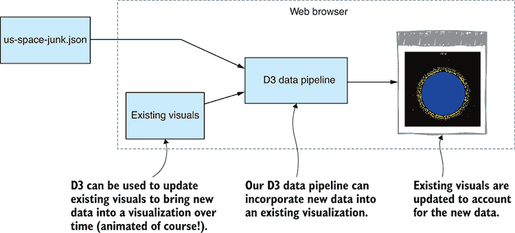

图 13.5 D3 数据管道可以用新数据更新现有的可视化。

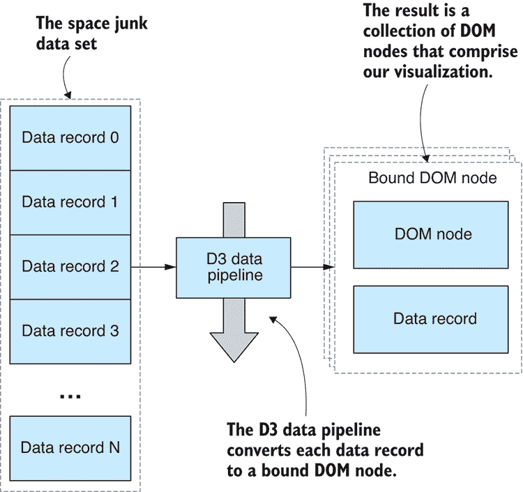

图 13.6 D3 为每个数据记录生成“边界 DOM 节点”。

## 13.6 基本设置

首先，让我们确定基本设置。列表 13.1 展示了我们 D3 可视化的 HTML 模板。最终，我们将使用 D3 生成所有我们的视觉元素，所以这个空白的 HTML 模板在本章中主要满足我们的需求。

列表 13.1 D3 可视化的 HTML 文件（listing-13.1/index.html）

```
<!DOCTYPE html>
<html lang="en">
    <head>
        <meta charset="utf-8">
        <title>Space junk visualization</title>
        <link rel="stylesheet" href="app.css">
 <script src="bower_components/d3/d3.js"></script>    ①  
        <script src="app.js"></script>
    </head>
    <body>
        <svg class="chart"></svg>
    </body>
</html> 
```

注意，HTML 文件包括 CSS 和 JavaScript 文件：app.css 和 app.js。在我们开始本章时，这两个文件实际上都是空的。不过，很快我们就会开始向 app.js 中添加 D3 代码，并通过 app.css 来设计我们的可视化。

这是一个空白画布，我们将在这里创建我们的可视化。我们将使用 D3 逐步生成视觉元素，但在我们这样做之前，让我们直接将一些 SVG 基本元素手动添加到 HTML 文件中，这样我们就可以了解 SVG 的工作原理。

## 13.7 SVG 快速入门

SVG 是一种 XML 格式，类似于 HTML，用于渲染 2D 向量图形。像 HTML 一样，SVG 可以是交互式的和动画的——这是我们将在我们的可视化中使用的东西。

SVG 是一个存在了相当长一段时间的开放标准。它于 1999 年开发，但在最近的历史中，它已经得到了所有现代浏览器的支持，因此可以直接嵌入到 HTML 文档中。

本节作为我们将在太空垃圾可视化中使用到的 SVG 基本元素的快速入门。如果你已经理解了 SVG 基本元素、属性、元素嵌套和转换，请跳过本节，直接跳到“使用 D3 构建可视化”。

### 13.7.1 SVG 圆形

让我们从设置 `svg` 元素的宽度和高度开始。这创建了一个我们可以用向量图形绘制的空间。

我们将使用的主要基本元素是 `circle` 元素。图 13.7 显示了一个 SVG 圆形（在左侧），Chrome 的 DevTools 中的 DOM 看起来如何（在中间），以及一个与 `circle` 元素和 `svg` 元素相关联的示意图（在右侧）：`circle` 元素是 `svg` 元素的子元素。

列表 13.2 是这个最简单可视化的代码。注意属性是如何用来设置位置（cx 和 cy）、半径（r）和颜色（fill）的。你还可以在 Chrome 的 DevTools 中检查这些属性的值（如图 13.7 中间所示）。

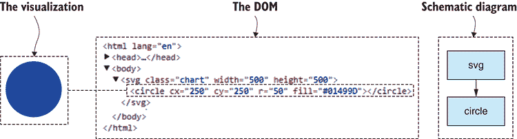

图 13.7 手动添加到我们的 SVG 中的 SVG 圆形元素（在 Chrome 开发者工具中查看 DOM）

列表 13.2 将 `circle` 元素添加到 SVG 中（在 listing-13.2/index.html 中）

```
<!DOCTYPE html>
<html lang="en">
    <head>
        <meta charset="utf-8">
        <title>Space junk visualization</title>
        <link rel="stylesheet" href="app.css">
        <script src="bower_components/d3/d3.js"></script>
        <script src="app.js"></script>
    </head>
    <body>
 <svg    ①  
            class="chart"
 width="500"    ②  
 height="500"    ②  
            >
 <circle    ③  
 cx="250"    ④  
 cy="250"    ④  
 r="50"    ④  
 fill="#01499D"    ④  
                />
        </svg>
    </body>
</html> 
```

在这个简单的例子中，我们可能不需要使用开发者工具来检查 DOM 和属性值。因为我们已经知道它们将是什么样子，因为这是我们输入到 HTML 文件中的内容。但很快我们将使用 D3 生成这些圆形，所以我们不会简单地“知道”它们看起来是什么样子。我们需要检查实际的结果，这样当事情出错时，我们可以进行故障排除和解决问题。

请现在花点时间在浏览器中运行这个简单的可视化，并使用浏览器开发者工具检查 DOM 结构和圆的属性。在早期嵌入这种行为是很好的实践，这样当事情变得复杂和混乱时，你会处于更好的位置来解决问题。

### 13.7.2 样式

我们可以像样式 HTML 元素一样样式化 SVG 元素：使用 CSS 样式。例如，在我们的简单圆形可视化中，我们可以将圆的填充颜色移动到 CSS 中，并将样式与结构分离。以下列表显示了修改后的 `circle` 元素，其中移除了 `fill` 属性；然后 列表 13.3b 展示了我们将填充颜色移动到 CSS 样式中的方法。

列表 13.3a 圆的填充属性已移动到 CSS 中（从 listing-13.3/index.html 中提取）

```
<circle    ①  
    cx="250"
    cy="250"
    r="50"
    /> 
```

列表 13.3b 圆的填充颜色现在由 CSS 指定（在 listing-13.3/app.css 中）

```
.chart circle {
    fill: #01499D;
} 
```

我们将在可视化中稍后使用更多的 CSS 样式。

### 13.7.3 SVG 文本

现在我们将添加一个 `text` 元素作为标题，与我们的圆一起，将圆命名为地球。图 13.8 展示了我们的更新后的可视化（左侧）和示意图（右侧），它说明了圆形和文本如何与 DOM 中的 `svg` 相关。

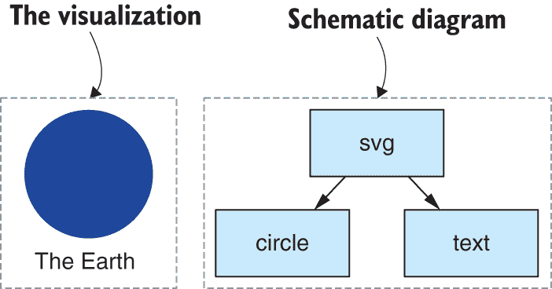

图 13.8 使用 `text` 元素为我们的地球可视化添加标题

列表 13.4a 展示了添加 `text` 元素，现在我们有了地球的简单可视化。请随意在浏览器中打开它，打开开发者工具，检查 DOM 看看现在的样子。

列表 13.4a 为我们的地球可视化添加标题（从 listing-13.4/index.html 中提取）

```
<svg
    class="chart"
    width="500"
    height="500"
    >
    <circle
        cx="250"
        cy="250"
        r="50"
        />
 <text    ①  
        x="250"
        y="320"
        >
        The Earth
    </text>
</svg> 
```

为了配合我们的文本，我们将添加一个新的 CSS 样式。如下所示，我们将 `text-anchor` 设置为 `middle`，这样我们的文本就围绕其位置居中——这是一个用作标题的不错的小技巧。

列表 13.4b 新 `text` 元素的 CSS 样式（从 listing-13.4/app.css 中提取）

```
.chart text {
 text-anchor: middle;    ①  
} 
```

### 13.7.4 SVG 组

到目前为止，这很简单，但让我们更加严肃。我们需要一种方法来定位我们围绕地球的空间垃圾。我们将使用 SVG `g`元素来组装一个*组* SVG 原语，并将它们作为一个单一实体定位。图 13.9 中的示意图显示了我们的圆圈和文本如何与现在嵌套在`svg`下的组相关。

列表 13.5 展示了如何将`circle`和`text`元素包含在`g`元素中。注意组上的`transform`属性以及一个`translate`命令，它们共同设置组的位置。这允许我们在 SVG 元素内的任何位置定位圆圈和文本。尝试将以下列表加载到您的浏览器中，然后修改`translate`坐标以将组移动到其他位置。

列表 13.5 在`g`元素中分组视觉元素以将它们视为单一实体（来自列表-13.5/index.html）

```
<svg
    class="chart"
    width="500"
    height="500"
 >
 <g    ①  
 transform="translate(250, 250)"    ②  
        >
        <circle
            r="50"
            />
        <text
 y="70"    ③  
            >
            The Earth
        </text>
    </g>
</svg> 
```

现在我们已经掌握了足够的 SVG 基础知识来构建我们的 D3 可视化。我们知道如何使用`circle`、`text`和`g`元素来创建 SVG 可视化。现在让我们学习 D3。

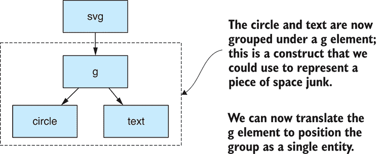

图 13.9 展示了我们的 DOM 结构，其中圆圈和文本被分组在 g 元素下

## 13.8 使用 D3 构建可视化

要构建 D3 可视化，我们必须选择、创建、配置和修改我们的 SVG 元素。让我们从配置元素状态开始。

### 13.8.1 元素状态

每个元素都有一个与之关联的状态，该状态通过其属性指定。我们已经看到了如何手动设置各种 SVG 属性——例如，圆圈的`cx`、`cy`、`r`和`fill`属性。表 13.1 是我们已分配的属性和值的总结。

表 13.1 来自列表 13.2 的圆元素的元素状态

| **属性** | **值** | **目的** |
| --- | --- | --- |
| `cx` | 250 | 圆圈的 X 位置 |
| `cy` | 250 | 圆圈的 Y 位置 |
| `r` | 50 | 圆的半径 |
| `fill` | #01499D | 圆圈的填充颜色（地球蓝） |

图 13.10 突出了这些属性在 Chrome 的开发者工具中的外观。无论这些属性是在 SVG 中手动设置还是在使用 D3 API 设置其值时，外观都是相同的。

要使用 D3 设置属性值，我们将使用`attr`函数。假设我们已经有了一个对`circle`元素的引用，我们可以在代码中设置属性如下：

```
var circle = ...    ①  
circle.attr("cx", "250")    ②  
    .attr("cx", "250")
 .attr("r", "50")    ③  
 .attr("fill", "#01499D");    ④   
```

除非我们有元素的引用，否则我们无法设置其属性，因此现在让我们看看如何选择一个元素，以便我们可以对其进行操作。

### 13.8.2 选择元素

使用 D3，我们有三种基本的方式来引用一个元素。我们可以选择一个现有的单个元素。我们可以一次性选择多个元素。或者我们可以按程序创建元素并将它们添加到 DOM 中。最终，我们需要这三种方法，但我们将使用最后一种方法来生成我们的初始可视化。

#### 单个元素

我们可以使用 D3 的 `select` 函数选择单个元素。您可以在 图 13.11 中看到，我用一个虚线框表示当前的 D3 选择，该虚线框选择了我们的 `circle` 元素。

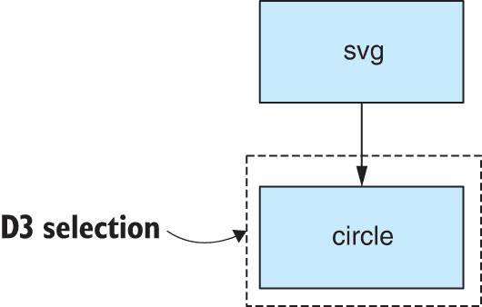

图 13.11 使用 D3 的 `select` 函数操作单个现有 DOM 节点。

假设我们已经有了一个现有的元素，比如说我们的 `circle` 元素，我们可以使用 D3 的 `select` 函数通过 CSS 风格的选择器来选择我们的圆圈：

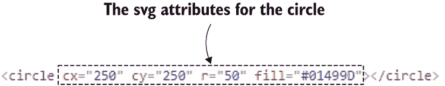

图 13.10 在 Chrome DevTools 中查看圆形元素的属性

```
var circle = d3.select("circle"); 
```

列表 13.6a 展示了一个真实示例。在这里，我们选择了 `svg` 元素，并根据文档的尺寸设置其宽度和高度。这样，我们的可视化就可以充分利用浏览器窗口中可用的空间。

列表 13.6a 选择 svg 元素并设置其尺寸（来自列表-13.6/app.js）

```
var width = window.innerWidth;    ①  
var height = window.innerHeight;

var svgElement = d3.select("svg.chart")    ②  
 .attr("width", width)    ③  
 .attr("height", height);    ③   
```

注意，我们还在通过其 CSS 类名引用 `svg` 元素。这使得我们的选择更加具体，以防我们在同一页面上有多个可视化。

我们看到的 `svg.chart` 类似于 CSS 选择器。如果您熟悉 jQuery，您会对这段代码感到舒适，因为 jQuery 通过 CSS 选择器和设置属性值与这类似。

#### 多个元素

我们也可以使用 D3 同时选择和操作多个元素。您可以在 图 13.12 中看到，代表 D3 选择的虚线框现在包围了多个现有的 `circle` 元素。

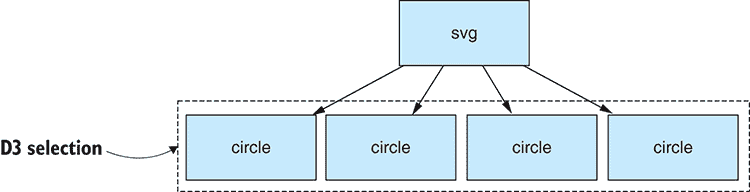

图 13.12 使用 D3 同时选择和操作多个 DOM 节点

我们可以使用 D3 的 `selectAll` 函数如下选择多个现有元素：

```
var circle = d3.selectAll("circle")    ①  
circle
 .attr("r", 50)    ②  
 .attr("fill", "#01499D");    ③   
```

注意，当我们对一个包含多个元素的选取调用 `attr` 时，该属性的值将更新所有这些元素。这允许我们一次性配置一组元素，这在我们要配置我们全部空间垃圾对象的可视化时将非常有用。

#### 添加新元素

选择元素的最后一种方式是添加新元素。当我们添加新元素时，它会自动被选中，这样我们就可以设置其初始状态。请注意，因为这是我们创建空间垃圾可视化的程序化方法。在我们的可视化中，我们需要表示许多空间垃圾，并且需要以编程方式添加 DOM 元素。如果我们手动添加它们，那将是一项繁琐的工作，更不用说我们无法轻松地动画化手动准备的可视化了。

列表 13.6b 展示了我们将如何使用 D3 的 `append` 函数将程序生成的地球添加到我们的可视化中。添加一个元素会产生一个选择，尽管在这种情况下，它是一个包含单个 DOM 节点的选择。我们仍然可以设置元素的属性，我们在这里使用它来设置地球的类、位置和半径。

列表 13.6b 将“地球”添加到我们的可视化中（摘自 listing-13.6/app.js）

```
var earthRadius = 50;    ①  
var earthTranslation =
 "translate(" + (width/2) + ", " + (height/2) + ")";    ②  

var theEarth = svgElement.append("circle")    ③  
theEarth.attr("class", "earth")    ④  
 .attr("transform", earthTranslation)    ⑤  
 .attr("r", earthRadius);    ⑥   
```

### 13.8.3 手动添加元素到我们的可视化中

正确使用 D3 API 的方法是遍历我们的数据，并为我们的每个太空垃圾数据记录程序化地创建视觉效果。这现在可能是一个很大的跳跃，可能难以理解。让我们首先以更直接的方式来看这个问题。

我们可能以什么最简单的方式为我们的每个数据记录添加视觉效果呢？嗯，我们可以遍历我们的数据数组，并调用 `append` 函数为每个太空垃圾对象添加一个新的视觉效果。

任何了解 D3 的人都会告诉你这不是正确使用 D3 的方法，他们是对的，但我希望我们首先采取一种更简单的方法，这样我们以后才能更好地欣赏 D3 为我们带来的魔法。

如果我们实例化 DOM 元素以对应我们的太空垃圾数据，我们最终会得到类似于 图 13.13 的东西。不过，它看起来不会完全一样，因为我们正在使用随机坐标来表示太空垃圾。每次运行它时，它都会选择不同的位置。DOM 显示在右侧，这样你可以看到每个太空垃圾对象的 DOM 节点。

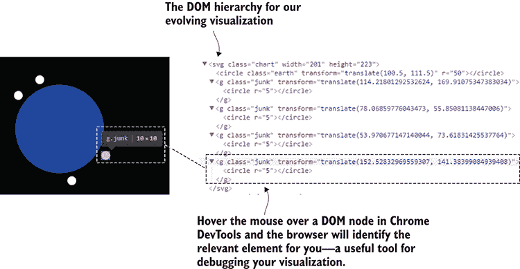

图 13.13 在 Chrome DevTools 中查看我们手动添加的 DOM 节点的 DOM 层级：我们的可视化开始成形。

在 图 13.13 的右侧，你可以看到我在 Chrome 的 DevTools 中将鼠标指针悬停在 DOM 节点上。这是一个有用的调试技术，因为它会在可视化中突出显示相应的元素。

下面的列表显示了循环遍历数据并为每个数据记录添加视觉效果的代码。你可以看到，对于每个数据记录，我们调用 D3 的 `append` 函数来完善我们的可视化。

列表 13.7 手动添加太空垃圾元素到我们的 D3 可视化中（摘自 listing-13.7/app.js）

```
for (var rowIndex = 0; rowIndex < spaceJunkData.length; ++rowIndex) {    ①  
 var spaceJunk = svgElement.append("g");    ②  
 spaceJunk.attr("class", "junk")    ③  
 .attr("transform", function(row, index) {    ④  
 var orbitRadius = earthRadius + orbitDistance;    ⑤  
 var randomAngle = Math.random() * 360;    ⑥  
 var point = pointOnCircle(    ⑥  
 orbitRadius,    ⑥  
 randomAngle    ⑥  
 );    ⑥  
 var x = (width/2) + point.x;    ⑦  
 var y = (height/2) + point.y;    ⑦  
 return "translate(" + x + ", " + y + ")" ;    ⑧  

        })
 .append("circle")    ⑨  
 .attr("r", 5);    ⑩  
} 
```

以这种方式手动遍历我们的数据并多次调用 `append` 并不是正确使用 D3 的方法，但我希望这个垫脚石已经使你更容易理解 D3 的工作原理。稍后，我们将看看如何正确地做这件事。不过，首先，我们应该把我们的缩放顺序整理好。

### 13.8.4 缩放以适应

到目前为止，我们使用可视化时已经使用了一系列硬编码的坐标和测量值。例如，我们在代码列表 13.6b 中将地球的半径设置为 50 像素，尽管你在代码列表 13.7 中看不到，但太空垃圾的轨道距离也是一个硬编码的值。我们希望用按比例缩放的版本来替换这些值，这些值确实代表了地球的实际大小和每个太空垃圾对象的实际轨道距离。

此外，我们还没有有效地利用可视化中的空间，正如你在图 13.14 的左侧所看到的。我们希望我们的可视化占据所有可用空间，更像图 13.14 的右侧。

D3 支持缩放，我们将使用代码列表 13.8a 中展示的`scaleLinear`函数。这创建了一个 D3 比例，它将地球的实际半径（6,371 千米）线性映射以适应可用的空间，并且*整齐地*嵌入其中。

**[代码列表 13.8a] 缩放地球大小以适应可用空间（摘自`listing-13.8/app.js`）**

```
var earthRadius = 6371;    ①  
var earthTranslation = "translate(" + (width/2) + ", " + (height/2) + ")";
var maxOrbitRadius = d3.max(
        spaceJunkData.map(
spaceJunkRecord => earthRadius + spaceJunkRecord.PERIGEE    ②  
       )
);

var radiusScale = d3.scaleLinear()    ③  
    .domain([0, maxOrbitRadius])
 .range([0, Math.min(height/2, width/2)]);    ④  

var theEarth = svgElement.append("circle")
theEarth.attr("class", "earth")
    .attr("transform", earthTranslation)
 .attr("r", radiusScale(earthRadius));    ⑤   
```

还请注意，在代码列表 13.8a 中，我们如何也考虑了每个太空垃圾对象的轨道距离。这些值中的最大值是使用 D3 的`max`函数确定的。

我们生成的比例`radiusScale`是一个 JavaScript 函数。没有更多，也没有更少。我们可以向这个函数传递真实值（如地球的半径），它将生成一个适合我们浏览器窗口的缩放值。

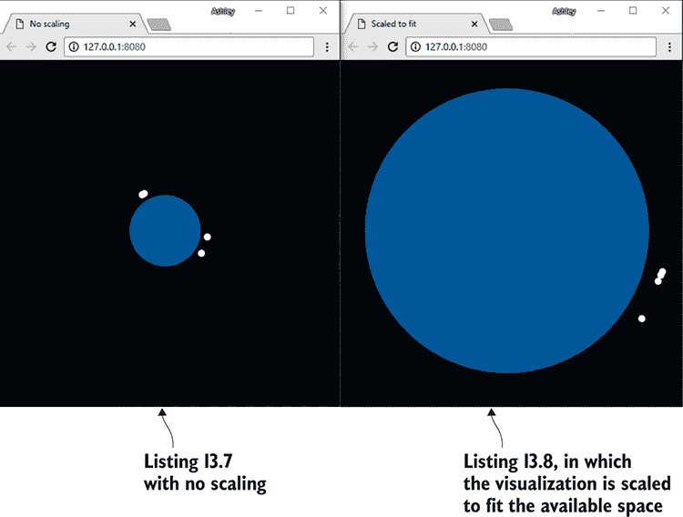

图 13.14 并排示例以展示缩放效果。右侧的可视化使用了现实世界的尺寸，但已缩小以适应浏览器窗口中可用的空间。

我们还使用相同的`radiusScale`函数来缩放太空垃圾的轨道距离，正如你在代码列表 13.8b 中所看到的。轨道半径是从地球半径加上太空垃圾的近地点（最近的轨道接近点）得出的。然后，这个值通过`radiusScale`函数转换成像素值。然后，这个值被用来在可视化中定位太空垃圾。

[代码列表 13.8b] 太空垃圾每个对象的轨道距离也被缩放以适应（摘自`listing-13.8/app.js`）

```
var spaceJunk = svgElement.append("g");
spaceJunk.attr("class", "junk")
    .attr("transform", function () {
 var orbitRadius = radiusScale(    ①  
 earthRadius + spaceJunkRecord.PERIGEE    ①  
 );    ①  
        var randomAngle = Math.random() * 360;
        var point = pointOnCircle(orbitRadius, randomAngle);
        var x = (width/2) + point.x;
        var y = (height/2) + point.y;
        return "translate(" + x + ", " + y + ")" ;
    })
    .append("circle")
        .attr("r", 5); 
```

好的，我们已经解决了缩放问题。我们几乎准备好了第一个版本的可视化。我们现在需要确保我们的太空垃圾视觉效果是以 D3 方式生成的，而不是我们之前使用的手动循环和追加。

### 13.8.5 D3 方式的过程生成

这就是事情开始变得相当棘手的地方。你现在必须接受 D3 的数据连接和条目选择的概念。这些概念难以理解，因为它们有两个目的，尽管一开始我们只需要其中一个。我们现在将使用这项技术从无到有地创建我们的可视化。稍后，当我们开始构建动画时，我们将使用同样的技术向现有的可视化中添加新数据。

我现在告诉你这一点，因为如果不理解数据连接不仅用于产生新的可视化，那么很难理解数据连接的工作原理。这个技术之所以复杂，是因为它也用于更新现有的可视化。

D3 数据连接的目的是什么？

+   为了配对 DOM 节点和数据记录

+   为了整理新和现有的数据记录

+   为了动画化数据记录的增加和移除

我们将使用 D3 的`selectAll`函数来生成一个`g`元素的选择，但由于我们可视化中甚至还没有这样的元素，这将给我们一个所谓的*空选择*。

在调用`selectAll`之后，我们将调用 D3 的`data`函数，传入我们的太空垃圾数据集。这创建了所谓的*数据连接*，并产生了一个与我们的数据记录绑定的 DOM 节点选择。但是等等，我们还没有任何 DOM 节点！这个操作我们得到了什么？如图 13.15 所示，这些不是普通的 DOM 节点。在我们的可视化中还没有任何 DOM 节点，所以 D3 创建了一组占位符 DOM 节点，每个数据记录一个占位符。很快，我们将用实际的 DOM 节点来填充这些空白，以表示我们的太空垃圾。

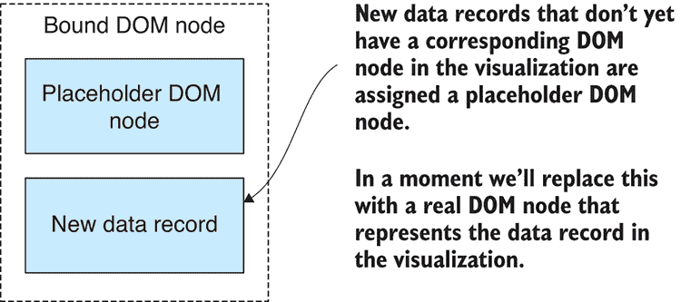

图 13.15 我们最初的数据连接产生了与我们的数据记录绑定的占位符 DOM 节点。

图 13.16 展示了如何将一个空的`g`元素选择与我们的数据结合，从而产生与我们的数据绑定的占位符 DOM 节点集。

如果你现在感到困惑，嗯，我能感受到你的痛苦。在我看来，数据连接和占位符 DOM 节点的概念可能是你在学习 D3 时遇到的最令人困惑的事情。如果你能理解这一点，那么 D3 的其他部分就不会那么困难了。

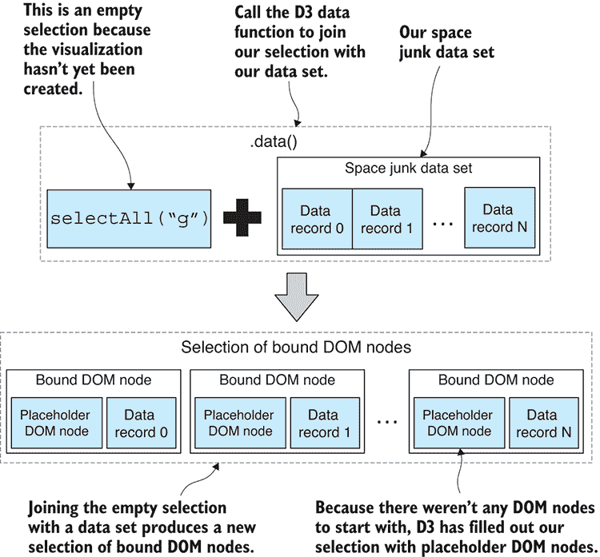

图 13.16 在选择上调用 D3 数据函数（即使是空选择）将选择与我们的数据集连接起来。这被称为数据连接。

我们现在从数据连接中获得的选择代表尚未存在的 DOM 节点。如果在我们可视化中已经存在 SVG 组元素，它们将与新数据的占位符元素一起出现在选择中，但我们目前还没有任何组元素。

列表 13.9 显示了生成数据连接的代码。调用 `selectAll` 产生一个空的选择。然后使用 `data` 函数将数据集连接起来。接下来，注意 `enter` 函数的使用，它过滤选择以获取新的数据记录。`enter` 函数允许我们指定当新数据添加到我们的可视化中时会发生什么。这就是我们调用 D3 的 `append` 函数的地方。当我们处于 `enter` 选择上下文中的 `append` 调用时，D3 将用我们想要添加到可视化中的元素替换占位符 DOM 节点。

列表 13.9 执行数据连接和程序生成太空垃圾视觉效果（摘自 app.js）

```
// ... other code here ...

var spaceJunk = svgElement.selectAll("g")    ①  
 .data(spaceJunkData);    ②  
var enterSelection = spaceJunk.enter();    ③  
enterSelection.append("g")    ④  
 .attr("class", "junk")    ④  
 .attr("transform", spaceJunkTranslation)    ④  
 .append("circle")    ④  
 .attr("r", 5);    ④   
```

列表 13.9 定义了我所称之为可视化配方核心的内容。这是对 D3 的指令，即“请用我的所有太空垃圾数据创建一个视觉表示。”如果您像我一样理解这一点，您就会明白为什么我喜欢将其视为数据管道。列表 13.9 是一段消耗数据并生成可视化的代码片段。

现在我们已经连接了数据并创建了太空垃圾视觉效果，您可以运行此代码，并在浏览器 DevTools 中检查 DOM 层次结构，以更好地理解 DOM 节点和数据记录是如何绑定在一起的。选择一个如图 13.17 所示的空间垃圾 DOM 节点。现在打开浏览器的控制台。

Google Chrome 有一个名为 `$0` 的特殊变量。如果您在控制台中输入这个变量并按 Enter 键，所选的 DOM 元素将被显示供您检查。现在输入 `$0.__data__` 并按 Enter 键。这将显示绑定到 DOM 节点的数据记录。`__data__` 属性是由 D3 添加的，看到 D3 如何跟踪其数据绑定是有教育意义的。

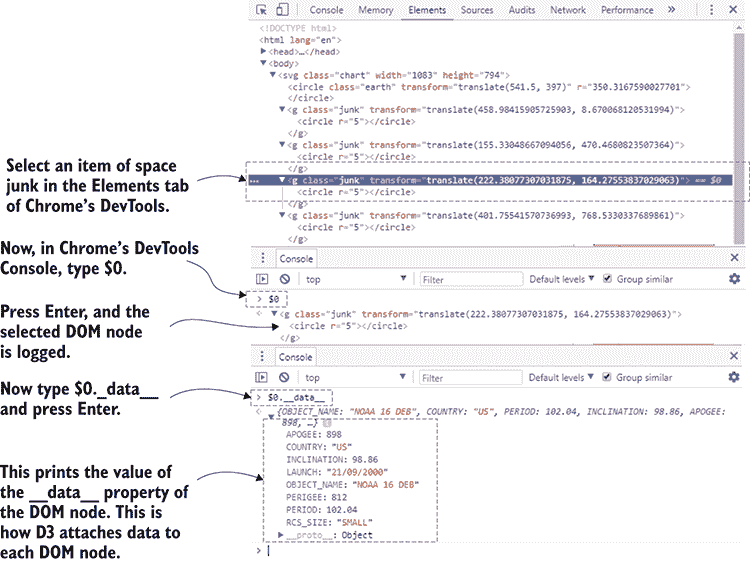

图 13.17 使用 Chrome 的 DevTools 检查绑定到 DOM 的数据

我们的第一轮可视化工作即将完成，目前我们只需考虑最后一件事。不过，很快我们就会回到选择和数据连接，学习如何将新数据添加到我们的可视化中，并随时间对其进行动画处理。

### 13.8.6 加载数据文件

到目前为止，我们只使用了一小部分硬编码到 app.js 中的数据。现在是时候让这个家伙在真实数据上大显身手了。在下面的列表中，我们使用 D3 的 `json` 函数异步从网络服务器以 JSON 格式检索我们的数据（我们也可以使用 CSV 数据）。

列表 13.10a 使用 D3 加载真实数据文件（摘自 listing-13.10/app.js）

```
d3.json("data/us-space-junk.json")    ①  
    .then(function (spaceJunkData) {
        // ... Build your visualization here ...
    })
 .catch(function (err) {    ②  
 console.error("Failed to load data file.");    ②  
 console.error(err);    ②  
 });    ②   
```

我们的空间垃圾可视化第一轮已经完成。我们很快会添加更多内容，但请利用这个机会运行代码，并使用您浏览器的 DevTools 探索和理解我们使用 D3 构建的这个 DOM。您的可视化应该与 图 13.18 类似。


图 13.18 我们部分完成的太空垃圾可视化

大部分代码在 列表 13.10b 中展示。我们迄今为止学到的最困难的事情是数据连接的概念和进入选择，以及它是如何导致一组占位符 DOM 元素，然后我们用太空垃圾视觉元素替换它们。当你阅读 列表 13.10b 时，请注意对 `selectAll`、`data`、`enter,` 和 `append` 的调用。

列表 13.10b 到目前为止的太空垃圾可视化代码（摘自列表-13.10/app.js）

```
var width = window.innerWidth;    ①  
var height = window.innerHeight;

var earthRadius = 6371;
var earthTranslation = "translate(" + (width/2) + ", " + (height/2) + ")";
var maxDistanceFromEarth = 6000;    ②  

d3.json("data/us-space-junk.json")    ③  
    .then(function (spaceJunkData) {

 var filteredData = spaceJunkData.filter(    ④  
 spaceJunkRecord =>    ④  
 spaceJunkRecord.PERIGEE <=    ④  
 maxDistanceFromEarth    ④  
 );    ④  

 var maxOrbitRadius = d3.max(filteredData.map(    ⑤  
 spaceJunkRecord =>    ⑤  
 earthRadius +    ⑤  
 spaceJunkRecord.PERIGEE    ⑤  
 ));    ⑤  

 var radiusScale = d3.scaleLinear()    ⑥  
            .domain([0, maxOrbitRadius])
            .range([0, Math.min(height/2, width/2)]);

        var svgElement = d3.select("svg.chart")
 .attr("width", width)    ⑦  
            .attr("height", height);

 var theEarth = svgElement.append("circle")    ⑧  
        theEarth.attr("class", "earth")
            .attr("transform", earthTranslation)
 .attr("r", scaleRadius(earthRadius));    ⑨  

        svgElement.selectAll("g")
 .data(filteredData)    ⑩  
 .enter()    ⑪  
 .append("g")    ⑫  
 .attr("class", "junk")    ⑫  
 .attr("transform", spaceJunkTranslation)    ⑫  
 .append("circle")    ⑫  
 .attr("r", 2);    ⑫  
    })
 .catch(function (err) {
        console.error("Failed to load data file.");
        console.error(err);
    });
}; 
```

一旦你理解了 列表 13.10b 中的代码，你可能会意识到这并没有多少内容。你甚至可能会 wonder 为什么你最初认为 D3 是如此困难。

嗯，我们还没有完成，代码将变得更加复杂。在我们完成本章之前，我们将根据大小对太空垃圾进行颜色编码，向可视化添加简单的交互性，然后是最后的荣耀：我们将按年动画化可视化，以便我们可以清楚地看到太空垃圾是如何随时间积累的。

### 13.8.7 对太空垃圾进行颜色编码

在本章的开头，你可能已经注意到我们的数据指定了每个太空垃圾对象的大小为小、中或大。现在我们将使用这些信息来根据大小对可视化中的太空垃圾进行颜色编码。

我们将通过 CSS 类和样式应用颜色。在下面的列表中，我们为我们的太空垃圾视觉元素分配 CSS 类名 *SMALL*、*MEDIUM* 或 *LARGE*。这个值直接从数据中提取，并成为 CSS 类名。

列表 13.11a 基于大小设置太空垃圾类（摘自列表-13.11/app.js）

```
spaceJunk.enter()
.append("g")    ①  
 .attr("class", function  (spaceJunkRecord) {    ②  
 return "junk " + spaceJunkRecord.RCS_SIZE;    ③  
        }) 
```

下面的列表显示了我们现在如何添加 CSS 样式来为不同大小的太空垃圾元素设置不同的填充颜色。

列表 13.11b 基于大小设置太空垃圾颜色的 CSS（摘自列表-13.11/app.css）

```
.junk.SMALL {
    fill: yellow;
}

.junk.MEDIUM {
    fill: orange;
}

.junk.LARGE {
    fill: red;
} 
```

这并没有给我们的代码增加多少复杂性，但它使可视化看起来更好，并且是条件 CSS 样式的一个好例子，它依赖于我们数据的内容。

### 13.8.8 添加交互性

我们使用 D3 建立了一个不寻常的可视化，这展示了它的力量。但我们也需要看到交互性和动画的例子，才能真正理解我们可以用 D3 做到什么程度。

首先，让我们解决交互性。在 图 13.19 中，我们可以看到我们新着色的太空垃圾，以及描述性的鼠标悬停文本。我们将以创建任何基于浏览器的交互性（使用 JavaScript）的相同方式创建此悬停文本。我们可以通过事件响应用户输入；在这种情况下，我们将使用鼠标 `hover` 和 `unhover`，如下面的列表所示。

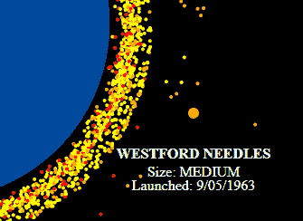

图 13.19 带有鼠标悬停文本的颜色编码太空垃圾

列表 13.11c 处理太空垃圾视觉的鼠标悬停事件（摘自 listing-13.11/app.js）

```
var spaceJunk = svgElement.selectAll("g")
    .data(filteredData);
spaceJunk.enter()
        .append("g")
 .attr("class", function  (spaceJunkRecord) {    ①  
                return "junk " + spaceJunkRecord.RCS_SIZE;
            })
            .attr("transform", spaceJunkTranslation)
 .on("mouseover", hover)    ②  
 .on("mouseout", unhover)  ②  
        .append("circle")
            .attr("r", 2); 
```

针对鼠标悬停事件，我们将对可视化进行修改。在 列表 13.11d 中，我们添加新的 `text` 元素用于描述文本。我们还修改了太空垃圾的大小（通过增加 `circle` 元素的半径）。这从视觉上吸引了我们对鼠标指针悬停的特定对象的注意。

列表 13.11d 在鼠标悬停在太空垃圾上时添加悬停文本到可视化（摘自 listing-13.11/app.js）

```
function addText (className, text, size, pos, offset) {    ①  
 return svgElement.append("text")    ②  
 .attr("class", className)    ③  
        .attr("x", pos.x)
 .attr("y", pos.y + offset)    ④  
        .text(text);
};

function hover (spaceJunkRecord, index) {    ⑤  

    d3.select(this)
        .select("circle")
 .attr("r", 6);    ⑥  

    var pos = computeSpaceJunkPosition(spaceJunkRecord);

 addText("hover-text hover-title", row.OBJECT_NAME, 20, pos, 50)    ⑦  
        .attr("font-weight", "bold");

    addText("hover-text",
        "Size: " + spaceJunkRecord.RCS_SIZE, 16, pos, 70
    );
    addText("hover-text",
        "Launched: " + spaceJunkRecord.LAUNCH, 16, pos, 85
    );
};

function unhover (spaceJunkRecord, index) {    ⑧  

    d3.select(this)
        .select("circle")
 .attr("r", 2);    ⑨  

    d3.selectAll(".hovertext")
 .remove();    ⑩  
}; 
```

还请注意，在 列表 13.11d 中，我们如何通过移除描述文本和将太空垃圾圆圈恢复到原始大小来清理鼠标悬停事件。

### 13.8.9 添加按年发射动画

我们可视化的最后一笔是逐年动画，以显示太空垃圾被发射并积累在轨道上。这将完成我们对 D3 数据连接的理解，我们将学习它是如何用于向现有可视化添加新数据的。

图 13.20 展示了我们的动画将采取的一般形式：我们将按年逐年向前动画。动画的每一迭代在真实时间中持续一秒，但它代表了一整年的发射。

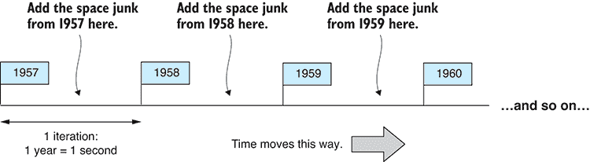

图 13.20 按年逐年动画可视化，每年依次添加太空垃圾

在动画开始之前，我们将有一个空的可视化。然后随着每一迭代的完成，我们将越来越多地将太空垃圾添加到可视化中，你将看到它围绕地球积累。

在动画的第一迭代中，我们的 D3 数据连接操作就像我们在 图 13.16 中看到的那样。我们的可视化是空的，所以我们正在将第一年的数据与空选择连接起来，以产生占位符 DOM 节点的选择。

第二次及以后的迭代都使用现有的可视化并添加新数据到其中。现在我们确实有一个现有的 `g` 元素的选择，这些元素已经绑定到数据记录上。图 13.21 显示了我们的数据连接的结果是一组绑定的 DOM 节点：现在它包含之前添加到可视化中的数据记录的现有 DOM 节点，并且它还包含新数据记录的占位符 DOM 节点。

再次强调，我们使用 `enter` 函数和 `append` 函数用太空垃圾视觉效果替换占位符 DOM 节点，这更新了可视化并添加了新数据。如果你之前在想“*`enter`*函数有什么用”，现在可能变得更明显了。`enter` 函数允许我们在忽略现有元素的同时添加新元素。**

**列表 13.12 展示了我们动画可视化的代码。注意`setInterval`如何创建动画的迭代，以及数据是如何在每个迭代中过滤的，以便我们可以逐步将新数据输入到我们的 D3 管道中。

注意列表 13.12 中用于动画化添加太空垃圾到可视化中的 D3 `transition` 函数。这使得太空垃圾看起来是从地球表面发射出去，然后到达最终位置。太空垃圾圆的半径也被动画化，以引起对发射的注意。

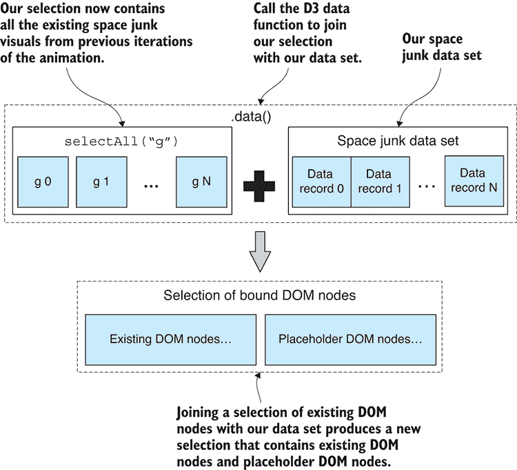

图 13.21 将非空选择与数据连接会产生绑定 DOM 节点的选择。这包含现有的 DOM 节点，也为任何新的数据记录提供了占位符 DOM 节点。

列表 13.12 按发射日期逐年动画化太空垃圾（摘自列表-13.12/app.js）

```
var currentYear = 1957;    ①  
addText("title-text",    ②  
 currentYear.toString(), { x: width/2, y: 30 }, 0    ②  
);    ②  

var dateFmt = "DD/MM/YYYY";

setInterval(function () {    ③  
    ++currentYear;

 svgElement.select(".title-text")    ④  
        .text(currentYear.toString());

 var currentData = filteredData.filter(    ⑤  
 spaceJunkRecord =>    ⑤  
 moment(spaceJunkRecord.LAUNCH, dateFmt).year() <=    ⑤  
 currentYear    ⑤  
 );    ⑤  

    const spaceJunk = svgElement.selectAll("g")
 .data(currentData, function (row) { return row.id; });    ⑥  
 spaceJunk.enter()    ⑦  
            .append("g")
            .on("mouseover", hover)
            .on("mouseout", unhover)
            .attr("class", function  (spaceJunkRecord) {
                return "junk " + spaceJunkRecord.RCS_SIZE;
            })
            .attr("transform", spaceJunkTranslationStart);

 spaceJunk.transition()    ⑧  
 .duration(1000)    ⑧  
 .attr("transform", spaceJunkTranslationEnd)    ⑧  
 .ease(d3.easeBackOut);    ⑧  

    spaceJunk.append("circle")
 .attr("r", 5)    ⑨  
 .transition()    ⑨  
 .attr("r", 2);    ⑨  

}, 1000);    ⑩   
```

本章概述了 D3 背后的基本概念和思想。我希望它已经激发了你学习更多关于 D3 以及深入了解高级可视化世界的兴趣。

你最大的收获应该是对 D3 中的*数据*连接和*选择*概念的理解。在我看来，这两个概念是 D3 中最难理解的部分。如果你已经理解了这些，那么你已经走上了掌握 D3 的道路，但不要停下来。D3 是一个庞大的 API，你还有更多要探索，所以请继续前进。有关 D3 的更多背景信息，请参阅 Bostock、Ogievetsky 和 Heer 在斯坦福大学发表的论文[`vis.stanford.edu/files/2011-D3-InfoVis.pdf`](http://vis.stanford.edu/files/2011-D3-InfoVis.pdf)[.]。

书的结尾现在越来越近了！我们已经涵盖了数据整理的主要方面：获取、存储、检索、清理、准备、转换、可视化和实时数据。还有什么剩下？假设你编写的代码不是用于个人或一次性使用（这没什么不好），我们现在必须将我们的代码部署到生产环境中。

原型设计、开发和测试只是战斗的一部分。将你的代码展示给你的用户——或者许多经常有要求的用户——将把你的代码推向极限，并可能暴露出许多问题。最后一章，“进入*生产*”，对这些问题和可以帮助你应对它们的策略进行了概述。

*## 摘要

+   你进行了 SVG 的快速课程，学习了原语：`circle`、`text`和`g`元素。

+   你学习了如何使用 D3 进行元素选择和创建。

+   我们使用 D3 配置了一个元素的状态。

+   我们讨论了如何通过数据连接从数据生成动画化的 D3 可视化。

+   我们通过鼠标事件为我们的可视化添加了交互性。

+   我们通过加载 JSON 文件升级到真实数据以生成可视化。
