# 14

达到生产

**本章涵盖**

+   在将数据处理管道迁移到生产时解决关注点、风险和问题

+   部署一个生产就绪应用程序的策略

我们共同的数据处理之旅即将结束，尽管此时你的真正工作即将开始。虽然探索性编码、开发和测试可能看起来是一大堆工作，但你还没有看到最糟糕的。构建和测试你的数据处理管道通常只是项目生命周期中的小部分。

软件开发的丑陋真相是，大多数开发者进入生产阶段后，将花费大部分时间维护现有应用程序。达到生产阶段是一个大事件：我们需要部署我们的应用程序，监控它，并理解其行为。

然后，我们需要更新我们的应用程序，以便我们可以部署错误修复或升级其功能集。同时，我们需要一个坚实的测试制度来确保它不会变成一团糟。这些是我们应用程序进入生产阶段后必须处理的一些事情。

这本《使用 JavaScript 进行数据处理》的最后一章将带你快速浏览生产关注点和问题。我们将学习预期的问题，如何处理意外问题，以及处理这些问题的各种策略。本章不是实战性的，也不是详尽的；它是对你达到生产阶段将面临的问题的一个预览。这是一个如此庞大的主题，而我们剩下的时间不多，所以请系好安全带！

## 14.1 生产关注点

你准备好将你的应用程序迁移到生产环境了吗？这是我们希望应用程序能够送达目标受众的地方。我们可能会将代码推送到托管服务器或云中的虚拟机。无论我们在哪里托管我们的应用程序，我们都需要将其放置在那里，并使其对尽可能多的用户可用。这是生产部署的一个目标。其他目标在表 14.1 中列出。

表 14.1 生产目标

| **目标** | **描述** |
| --- | --- |
| 交付 | 将我们的软件交付给目标受众。 |
| 容量 | 为所需数量的用户提供服务。 |
| 部署 | 无故障或问题地更新我们的软件。 |
| 恢复 | 快速从发生的任何故障中恢复。 |
| 系统寿命 | 在其预期的寿命期内运行。 |

通过这些目标，我们面临着许多风险。其中最主要的风险是我们可能会部署有缺陷的代码，我们的应用程序会崩溃。其他潜在的风险在表 14.2 中列出。不同的项目也将有其独特的风险。

我们在这里究竟冒着什么风险？好吧，我们冒着应用程序无法按预期工作的风险。我们的应用程序可能因为任何原因而崩溃。然后它将无法处理其工作负载，变得无响应，或者导致我们基于错误的数据做出商业决策。

这为什么很重要呢？好吧，当系统出现故障时，组织会停止工作，因此损坏的系统会花费金钱。此外，当我们根据坏数据或损坏的数据采取行动时，我们会为我们的业务做出错误的决定。损坏的系统也可能导致用户沮丧和信誉损失，尽管信誉损失很难量化。在最坏的情况下，例如，根据第十二章中的早期预警系统，人们可能会因为系统故障而受到伤害。我们需要考虑我们的应用程序故障可能造成的损害。这将帮助我们确定在为生产使用设置应用程序时需要采取多少预防措施。

表 14.2 生产风险

| **风险** | **描述** |
| --- | --- |
| 部署了损坏的代码。 | 系统在初始发布或更新时崩溃。这很可能表明测试制度不充分。 |
| 需求或负载超过了应用程序的处理能力。 | 系统的需求超过了系统有效响应的能力。系统要么响应缓慢，要么因为过载而损坏。 |
| 进入的数据是损坏或无效的。 | 进入的坏数据是应该预料到的事情，我们的系统应该足够健壮，能够处理它。 |
| 损坏的代码通过新的输入、用例或变化条件表现出来。 | 一个错误可以在代码中隐藏很长时间，直到某些事情发生变化（输入、系统使用方式、另一个代码模块）导致错误表现出来。 |

在本章中，我们将讨论一系列生产问题。这些问题列在表 14.3 中。我们将在本章中简要讨论这些问题。

表 14.3 生产问题

| **问题** | **描述** |
| --- | --- |
| 部署 | 我们必须以安全、方便且易于回滚的方式将我们的应用程序部署到生产环境中，以防万一出现问题。我们需要一个部署管道。 |
| 监控 | 我们如何知道系统正在运行并且功能正常？我们需要一个监控系统。 |
| 可靠性 | 我们的系统必须有效且可靠地运行。当用户需要时，它必须在那里。我们需要确保可靠运行的技术。系统应该优雅地处理故障并重新进入运行状态。 |
| 安全性 | 我们的系统应该足够安全，以防止未授权的入侵或窥探。我们需要安全原则和机制来保护我们的系统。 |
| 可扩展性 | 我们的系统将如何处理大量用户活动的突发情况？我们将如何扩展我们的系统以满足用户需求，而不会导致系统失败？ |

## 14.2 将我们的早期预警系统推向生产

在第十二章中，我们为空气污染监测开发了一个早期预警系统。现在让我们谈谈将这个项目推向生产。我们需要将应用程序部署到生产环境中；这是一个应用程序通过它交付给用户的环境。

我们究竟在交付什么，我们面临什么问题？我们可能有一个可以由数千人查看的仪表板。我们的系统能够处理这么多并发用户吗？它能否及时响应他们？

我们可能有一个自动生成的报告，发送给数百名需要每天获取这些信息的用户。它能否持续不断地执行而不会失败？当我们的紧急预警系统触发，并将短信警报发送给应急响应人员时，我们如何确保系统可以无问题地完成这项任务？这些是我们转移到生产时必须深思的问题。

将应用程序投入生产需要更新我们的工作流程。图 14.1 中所示的工作流程与您可能从本书第一章中记住的不同。它现在显示，开发的最终结果是应用程序的生产部署。也就是说，应用程序的代码最终将从开发环境转移到其生产环境。

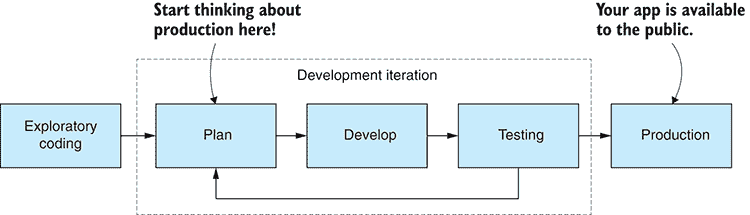

图 14.1 开发工作流程和何时开始考虑生产

图 14.1 表明，我们在规划阶段就需要开始考虑生产。在开发早期更多地考虑架构和设计，更不用说测试，可以让我们在遇到与可靠性、安全性和性能相关的问题时减少痛苦。

我们首先要解决的问题是如何将我们的应用程序部署到其生产环境。图 14.2 展示了一个常见的软件开发过程，称为持续交付——一个持续的迭代序列——其中每个迭代之后都跟随生产部署。

要实现持续交付，我们需要一个部署管道。

## 14.3 部署

我们如何将应用程序部署到生产环境取决于我们部署的位置，因为不同的环境将需要不同的机制。不过，通常来说，有一个脚本/自动化部署管道是很常见的，图 14.3 中展示了这样一个例子。管道中的每个阶段（带有虚线的框）都由一个构建或部署脚本实现，以及在每个阶段之间的网关（菱形），这些网关控制着进入（或未进入）下一阶段。这些网关可能是自动的，也可能需要手动激活，具体取决于您项目的适当性。

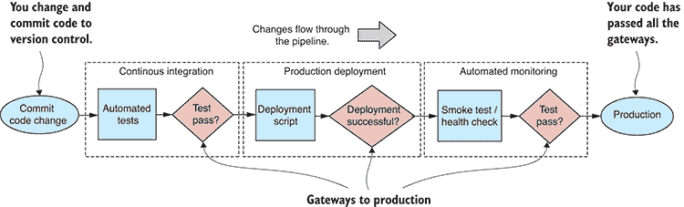

图 14.3 持续交付部署管道

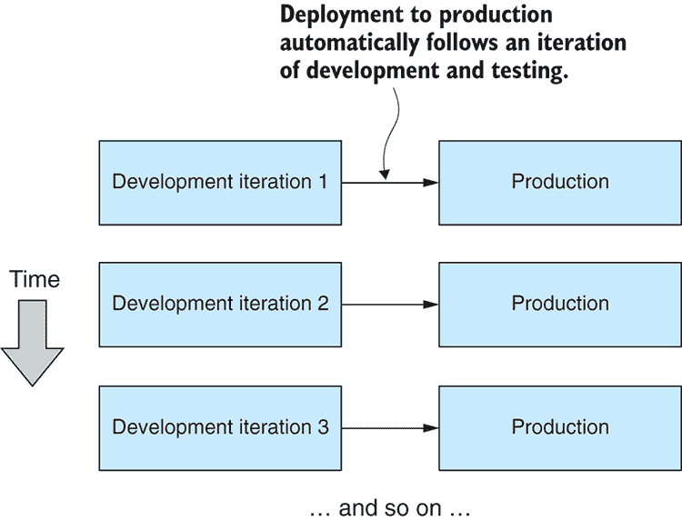

图 14.2 持续交付：我们的应用程序经常且定期部署到生产环境。

我们从左侧开始，将代码更改提交到我们的版本控制系统。这触发了您的持续集成系统的调用，该系统会自动构建和测试您的代码。如果代码构建并通过测试，那么我们就进入生产部署阶段。

我们可以为此阶段编写脚本，将我们的代码部署到生产环境。如果部署阶段成功，我们就进入自动监控阶段。在这个阶段，我们可能会运行烟雾测试或健康检查，然后进行常规的自动监控。恭喜！你的应用已经通过了生产部署。

重要的是要注意，代码部署，即你应用的更新，往往是应用失败的最大原因。图 14.4 提供了一个例子。在我们的第一个和第二个版本中一切顺利，但然后，例如，在第三个版本中，我们可能会发现一个严重的错误，这个错误 somehow 通过了我们的测试流程，然后——系统失败了。

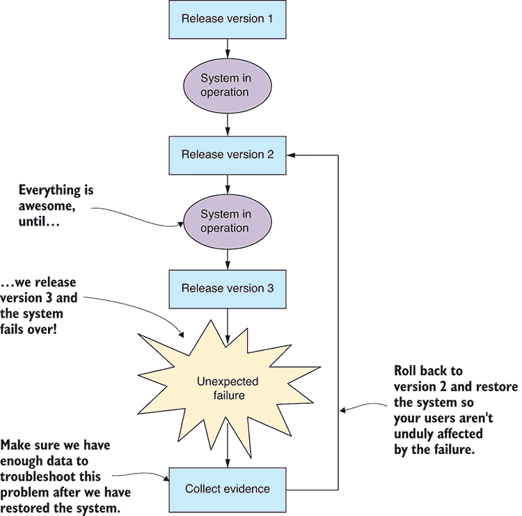

图 14.4 失败通常发生在新软件发布时。处理它们最快的方法是回滚到之前的正常版本。

当我们遇到重大系统故障时，我们应该怎么做？最简单、对用户影响最小的解决方案是立即将整个系统回滚到之前的正常版本。这突显了我们部署管道的一个重要要求。我们应该努力实现一个部署系统，使其能够轻松回滚或重新部署应用的早期版本。

然而，不幸的是，错误可能在被发现之前长时间不被注意。我们必须为将来可能出现的错误做好准备，并且它们通常会在最不方便的时候出现。对于大型系统故障，应用无法工作可能是显而易见的，但对于不那么严重的问题呢？我们如何知道系统是正常工作还是异常工作？我们需要一种方法来监控我们的应用。

## 14.4 监控

将我们的代码部署到生产环境是第一步。现在我们需要知道应用是否在正常工作。我们必须对应用正在做什么有透明度；如果我们不知道问题，我们就无法修复它们。我们需要检查应用是否表现正常，以及它是否已经经历过失败并已恢复。

在开发过程中彻底调试代码很重要。阅读每一行代码并不等同于观察每一行代码的执行。调试是我们用来理解代码正在做什么而不是我们以为它在做什么的工具。

然而，不幸的是，当我们的代码在生产环境中运行时，我们并不能轻松地调试它。在你尝试在生产环境中使你的代码工作之前，你必须在你的开发工作站上做足够的测试和调试。

而不是调试生产代码，为了了解正在发生的事情，我们可以使用事件和指标的日志记录和报告来了解我们的应用是如何表现的。一种简单的方法（假设你已经有了一个数据库）是将你的日志和指标记录到你的数据库中，如图 14.5 所示。


图 14.5 从您的系统中收集日志、错误和指标，以便您可以了解其活动情况。

我们可能会倾向于将日志记录到标准输出或文件中，这是一个很好的开始方式，并且在开发期间很有用，但当应用程序进入生产阶段时，它的实用性就降低了。

如果我们将日志和指标放入我们的数据库中，我们就可以开始做一些有趣的事情。首先，我们可以使用数据库查看器远程查看数据，这在我们在物理上与运行我们应用程序的服务器分离时非常有用。其次，我们可以使用我们的数据处理和分析技能来转换、汇总并理解应用程序的行为。我们甚至可以构建一个定制的日志或指标查看器，或者使用现成的系统来搜索和查询应用程序的历史记录。

我们可以将我们的日志和监控系统进一步扩展——比如说，如果我们需要支持分布式系统（一组应用程序）。为此，我们可以创建（或购买）一个专门的监控服务器，如图 14.6 所示，为多个应用程序提供服务，并将它们的日志和指标整合到一个可搜索的系统中。

将我们的服务器监控系统集中化，使我们能够更好地理解我们的分布式系统。我们现在有一个地方来管理我们如何监控和报告我们的生产应用程序。这与第十二章中我们的早期预警系统的报告和警报系统类似，我们可以在这里重用那些相同的思想。例如，我们可能希望每天报告应用程序的性能，或者在检测到故障时触发短信警报。

服务器监控系统的一个改进是赋予它主动监控应用程序的能力。如图 14.7 所示，服务器监控系统可以与应用程序建立双向通信通道，并主动 ping 它以检查它是否仍然活跃、响应迅速且未过载。


图 14.6 多个系统可以输入到单个服务器监控系统。

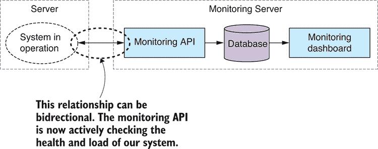

图 14.7 我们可以使我们的系统与监控 API 之间的关系双向化；监控 API 现在正在主动检查我们系统的健康状况。

通过理解我们的应用程序正在做什么，我们现在可以持续了解其状态：它是在工作还是出了问题。但这仍然提出了一个问题，即我们如何最好地组织我们的代码以确保它继续工作并具有高度的容错能力。

## 14.5 可靠性

当我们将应用程序推向生产时，我们期望它能够以一定的可靠性运行。我们有一些方法可以在早期准备，以创建健壮和稳定的代码；然而，不可避免的是，问题会发生，我们应该注意编写能够快速从失败中恢复的代码。

可以使用许多策略来提高我们代码的可靠性和稳定性，其中最重要的莫过于充分的测试，这一点我们很快就会讨论。我们还将讨论各种技术，这些技术将帮助你创建容错代码。

### 14.5.1 系统寿命

我们理解我们的应用程序预期将保持运行多长时间是很重要的。通过这一点，我指的是在它重启或其宿主重启之前，它必须可靠运行的时间。如果你使用持续交付流程，那么你的交付周期将决定重启之间的时间，如图 14.8 所示。

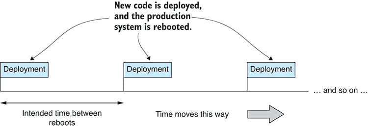

图 14.8 你的部署计划决定了你系统的寿命（系统重启之间的时间）。

如果你的交付计划是每月一次，系统必须至少持续运行一个月。我们需要围绕这个时间段进行测试。

### 14.5.2 实践防御性编程

我通常喜欢以防御性编程的心态进行编码。这是一种工作模式，我们始终预期会发生错误，即使我们还不清楚它们会是什么。我们应该预期我们会得到不良的输入。我们应该预期我们调用的函数或我们依赖的服务会表现不佳或无响应。

你可以将其视为墨菲定律：如果某件事可能出错，它就会出错。如果你在编码，发现自己正在避免一个问题，并告诉自己这个问题永远不会发生——那么，那就是你假设它将会出错的时候！当我们实践防御性编程时，我们假设任何和所有这样的问题都可能发生，并采取措施让我们的代码能够生存并报告失败。

培养这种态度将帮助你构建健壮的软件。

### 14.5.3 数据保护

如果我们有一个数据整理的第一规则，那么它应该是这样的：不要丢失你的数据！

无论发生什么，保护你的数据是最重要的。内化并遵守以下规则：

+   一旦数据被捕获，就安全地记录它。

+   永远不要覆盖你的源数据。

+   永远不要删除你的源数据。

如果你遵循这些规则，你的数据将会得到保护。在某些情况下，例如，当你的数据库扩展开始影响你的系统寿命时，你可能需要打破这些规则，但当你这样做时要小心——这里可能有龙。

在第十二章中，当我们讨论早期预警系统时，我们讨论了在将数据捕获到数据库之前或之后转换数据的影响。我再次强调这一点。你应该首先捕获你的重要数据——确保它是安全的——然后再对它进行任何额外的工作。图 14.9 指出了正确处理这一点的正确方法。捕获你的数据的代码是保护你的数据的代码；它应该是你测试最充分的代码。你还应该尽量减少执行这项工作的代码量。少量的代码更容易测试，也更容易证明其正确性。

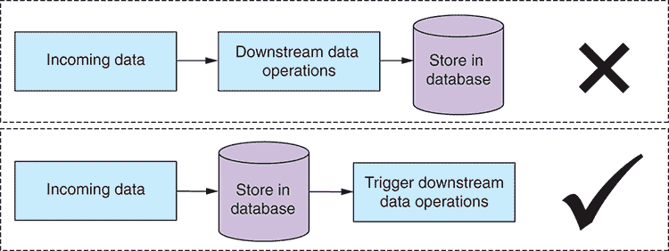

图 14.9 在进行任何工作之前，将你的数据捕获到数据库中。不要冒险丢失你的数据！

在转换数据并将其写回数据库时，永远不要覆盖你的源数据。如果你这样做，你的转换代码中的任何问题都可能导致源数据的损坏。错误是会发生的；丢失数据不应该。这是一个你不应该承担的风险。请将你的转换数据与源数据分开存储。图 14.10 显示了应采取的方法。

这可能看起来很明显，但你还需要备份你的源数据。在业界，我们喜欢说，除非我们有至少三份副本，否则它就不存在！此外，如果你的源数据是定期更新或收集的，你也应该定期备份它。如果这变得繁琐，那么你需要自动化它！

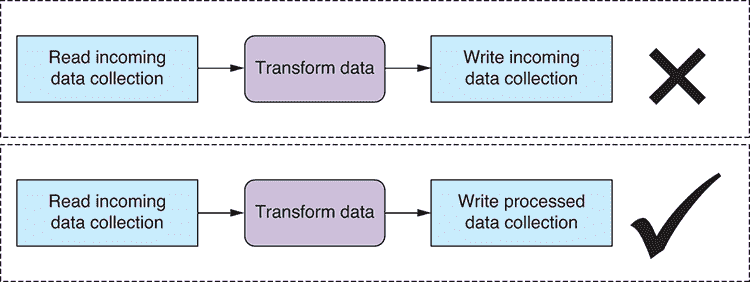

图 14.10 在转换数据时，将输出写入单独的数据库表/集合。不要冒险损坏你的源数据！

### 14.5.4 测试与自动化

测试是生产健壮代码的一个关键因素，尽管在这本书中我们几乎没有涉及它——但这并不意味着它不重要！在我们逐章处理代码的过程中，我们边做边手动测试，并没有进行任何自动化测试。但是，当你致力于实现准确且高度可靠的软件时，自动化测试是非常重要的。

为了使你的测试有价值，你还需要在尽可能接近生产环境的测试环境中进行。许多生产部署的失败都伴随着熟悉的借口：“但是它在我的电脑上运行过！”如果你的开发工作站与你的生产环境不同，这很可能是这样，那么你应该使用 Vagrant 或 Docker 来模拟你的生产机器。你也可以考虑使用 Docker 来配置你的生产环境。

让我们讨论几种我认为适用于数据管道的流行测试类型。这里提到的所有测试类型都可以自动化，所以一旦你创建了一个测试，它就可以作为你持续交付管道的一部分自动运行（如第 14.3 节所述）。

#### 测试驱动开发

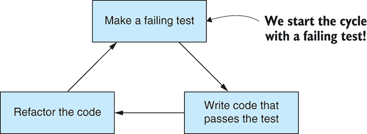

图 14.11 测试驱动开发周期

测试驱动开发（TDD）从构建一个失败的测试开始。然后我们编写代码来满足这个测试并使其通过。最后，我们重构代码以改进它（如图 14.11 所示）。TDD 周期产生可靠的代码，可以快速演变。它通常被称为构建细粒度单元测试来锻炼你的代码并验证其正确性的过程。单个单元测试将测试你代码的一个方面。这种测试的集合被称为测试套件。

使用 TDD 会导致您拥有一个涵盖应用程序功能的重大测试套件。这些测试在您对代码进行更改时自动运行。在实践中，至少如果您有良好的测试覆盖率，这将使破坏应用程序变得困难，并允许您积极重构和重构以改进其设计——最终使添加新功能变得更加容易。这允许快速向前发展，同时您有一个安全网来捕捉出错时的问题。

您可能还记得在第一章我说过，许多程序员最大的失败是没有规划他们的工作，以及这后来引起的所有问题。好吧，在我看来，TDD 在很大程度上解决了这个问题。您不能进行 TDD 而不进行规划。它们是手牵手的关系——您必须在编码系统之前规划您的测试。TDD 迫使您进行规划，并帮助您预见和减轻可能在未来困扰您的风险。这从不完美，但它可以在很大程度上纠正我们工作流程中缺乏规划的缺陷。

不幸的是，TDD 与探索性编码不太兼容。这是因为探索性编码是我们试图理解我们拥有的数据和发现应用程序需求的过程的一部分。从这个意义上说，探索性编码为我们的规划阶段提供信息。为了使其有效，我们必须将其从 TDD 阶段中提取出来。您可以在图 14.12 中看到更新的工作流程。我们使用探索性编码在进入 TDD 之前理解我们的数据和需求。在每一轮开发之后，我们将部署到生产环境，就像任何敏捷流程一样，周期会迭代重复，直到应用程序完成。

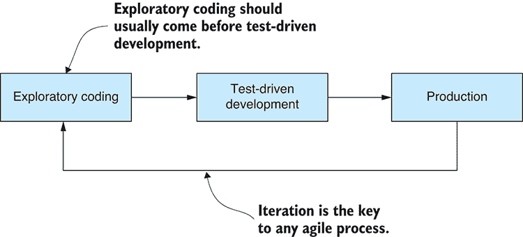

图 14.12 成功的 TDD 依赖于良好的规划；探索性编码建立理解并融入规划，因此它通常会在 TDD 之前。

我热爱测试优先的哲学，我认为它不仅适用于单元测试。正确实践 TDD 会使您养成在编码之前思考如何测试系统的习惯。在我看来，这是它的最大好处。一旦您切换到这种心态，它将在更可靠和更好测试的系统上产生积极回报。

我们可以使用任何流行的测试框架在 JavaScript 中执行 TDD。我个人的选择是使用 Mocha。

#### 输出测试

这种测试形式，我倾向于称之为输出测试，简单且适用于以数据为导向的应用程序。它相当简单：比较代码的前后迭代输出。然后提出以下问题：输出是否发生了变化？这种变化是预期的吗？这将帮助您了解代码的更改是否破坏了您的数据管道。

输出可以是您应用程序中任何有意义的部分。在数据管道中，输出可能是从管道输出的数据的文本版本。在另一种类型的应用程序中，输出可能是描述应用程序行为的文本日志。图 14.13 展示了该过程。

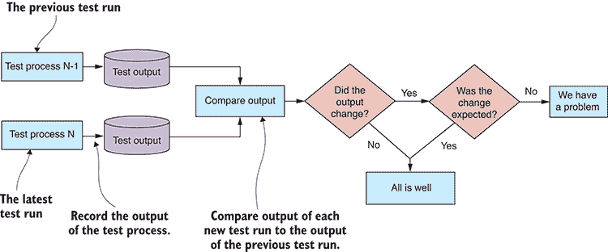

图 14.13 比较测试运行的输出，我称之为“输出测试”，是测试数据管道代码更改的绝佳方式。

这个测试过程允许您检测意外的代码故障，并让您有自由重构和重新构建您的数据管道，而不用担心将其破坏。

我经常使用版本控制软件（例如，Git 或 Mercurial）来管理我的输出测试。我将输出数据存储在单独的仓库中。然后，在测试运行之后，我使用版本控制软件来检测输出是否发生变化，如果发生了变化，我会查看比较以了解差异。

这种测试方法可能看起来像是暴力方法。但它简单、有效，并且易于操作。

#### 集成测试

集成测试是比单元测试更高层次的测试形式。通常，一个单独的集成测试会测试多个组件或代码的多个方面。集成测试通常比单元测试覆盖的范围更广，而且不那么繁琐——你花同样的钱可以得到更多的回报。因此，我认为集成测试可能比单元测试更具有成本效益。

虽然请别误会我的意思；我确实相信单元测试是有效的，并且是生产出坚不可摧代码的最佳方式。但它也很耗时，投入的时间需要物有所值。考虑使用集成测试以实现全面的测试覆盖，并将单元测试留给您最宝贵的代码或需要最可靠代码的部分。

当您在系统中有一个可以应用测试的自然边界时，集成测试效果最佳。我之所以提到这一点，是因为在我们的早期预警系统中，我们有一个合适的系统边界。我们的 REST API 通过 HTTP 接口交付，而集成测试恰好与 HTTP 工作得非常好。

我们可以使用任何 JavaScript 测试框架来进行自动集成测试。图 14.14 显示了 Mocha 如何应用于测试 REST API。在这种情况下，我们可以像第十一章中那样启动我们的 Web 服务器进行测试。一旦测试完成，我们评估结果，Mocha 会通知测试通过/失败，然后我们停止 Web 服务器。

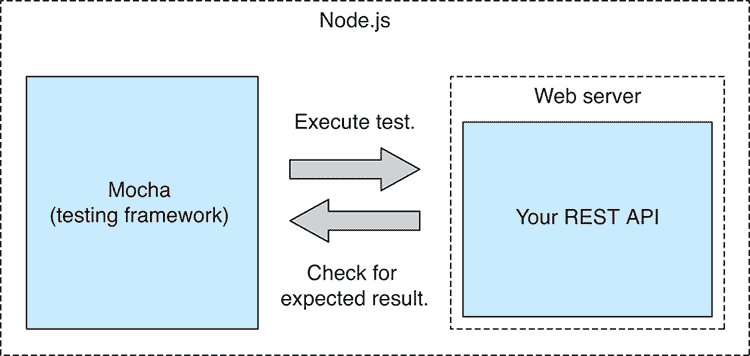

图 14.14 HTTP REST API 可以很容易地使用标准的 JavaScript 测试框架，如 Mocha 进行测试。

#### 记录和回放

另一种有用的测试技术是我喜欢称之为“记录和回放”的技术。这种方法与数据处理管道配合得很好，尤其是在可以将管道阶段解耦到每个阶段的结果可以被记录并回放以创建下一阶段的自动化测试的程度。这使我们能够为数据处理管道的每个阶段创建一种单元测试。但如果逐阶段测试对您来说不可行，您仍然可以使用记录和回放来测试整个数据处理管道。

我们已经以这种方式做过这件事了。回想一下第十二章，我们使用了预先录制的大气污染数据（我们的测试数据）并将其输入到我们的系统中。我们使用预先准备好的数据，以便我们有一个方便的方式来开发和演进我们的系统，但我们也可以使用这些记录的数据来为系统创建一个自动化的测试。

我在游戏行业中见过回放技术的应用，拥有回放功能对于游戏体验通常很重要。我也见过这种技术在客户端/服务器类型的应用中有效地使用，其中方程的一侧可以被记录，然后通过回放记录来模拟给另一侧。

#### 压力测试

负载测试是我们可以应用于我们的 Web 服务器或 REST API 的另一种测试形式。这是在系统上应用或模拟负载的过程，以确定它可以处理多少。图 14.15 表明我们可以向服务器发送请求流来测试其容量。

存在着我们可以用于负载测试的在线服务，或者我们可能编写一个定制的脚本来适应我们的应用程序。无论哪种方式，我们现在都可以优化我们的系统，使其能够处理更多的负载。如果没有这种性能测试，我们就无法知道我们的优化是否有助于改善情况，或者是否使情况变得更糟。

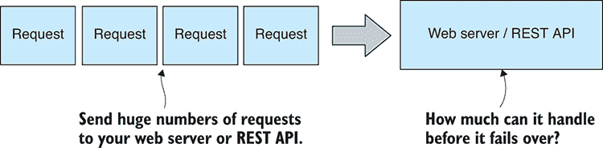

图 14.15 对您的服务器进行负载测试，以查看它可以处理多少流量和工作负载。

负载测试类似于压力测试，但区别是微妙的。在负载测试中，我们试图测试系统是否可以处理我们打算处理的负载，但在压力测试中，我们积极尝试将系统推向其断裂点，以了解那个点在哪里。

#### 浸泡测试

最后要提到的测试形式是浸泡测试。这是一种长时间运行的测试，用于确定您的系统是否能够运行其预期的系统寿命。例如，我们之前决定，我们的系统寿命将是一个月，以符合我们的持续交付计划。我们的系统必须在野外和负载下至少运行一个月。

要相信我们的应用程序可以存活这么长时间，我们可以模拟它在负载下的运行时间。这就是我们所说的压力测试。在测试期间，你需要从应用程序中收集指标。例如，指标包括在测试期间测量其内存使用情况和响应时间。现在使用你的数据分析技能和可视化技能来理解这些数据在告诉你什么。系统能否坚持下去？其性能是否随时间稳定？如果不稳定，那么你可能需要采取纠正措施。

### 14.5.5 处理意外错误

错误会发生。软件会失败。如果我们计划得当，我们已经有了一个很好的理解，即我们的数据管道可能会以预期的方式失败。例如，当我们从传感器读取数据时，最终它们会给我们错误的数据。或者当我们有人员进行数据录入时，数据中会包含偶尔的错误。这些是我们可以在软件设计中轻松预测、计划和缓解的风险。

当发生我们没有预料到的错误时会发生什么？我们的应用程序将如何处理？好吧，我们无法预测生产中可能发生的每一个问题。这尤其适用于我们在新领域或独特领域构建软件时。然而，我们可以计划让我们的应用程序优雅地处理意外情况，并尽可能恢复。

不同的人会告诉你以不同的方式处理这个问题。我首选的方法是意外的错误不应该使你的应用程序瘫痪。相反，应该报告问题，并允许应用程序继续运行，如图 14.16 所示。

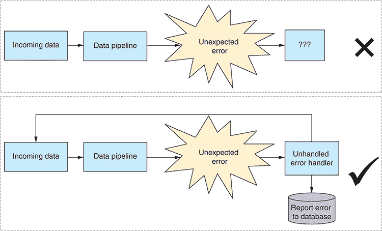

图 14.16 意外的错误不应该使你的应用程序瘫痪。确保它能够尽可能好地处理它们并继续运行。

实现这一点的最简单方法是处理 Node.js 中的未捕获异常事件，如下所示列表。在这里，我们可以报告错误（例如，向第 14.4 节中的监控服务器报告）然后允许程序尝试继续。

列表 14.1 在 Node.js 中处理未捕获的异常

```
process.on("uncaughtException", (err) => {
    // ... Report the error ...
}); 
```

某些人主张不处理未捕获的异常。他们说我们应该让程序崩溃并重新启动；然后我们应该监控崩溃，并在发现时纠正这些崩溃。我认为在某些情况下，这可以是一个有效的方法，但根据具体情况，在数据管道的背景下，我觉得这相当令人不安。

如果你让程序终止，正在进行的异步操作会发生什么？它们将被终止，这可能会导致数据丢失（参考第 14.5.3 节的数据整理的第一条规则——“不要丢失你的数据”）。我更喜欢显式地处理未处理的异常，将错误报告给错误跟踪系统，然后让我们的系统尽可能恢复。我们仍然可以了解发生的问题，我相信我们现在面临的数据丢失风险更小。

同样，我们也应该处理未处理的拒绝承诺，如列表 14.2 所示。这是一个稍微不同的场景。无论你如何处理未捕获的异常，你都应该始终为未处理的承诺拒绝设置处理程序。如果你不这样做，你可能会让未处理的拒绝进入生产环境，在那里你将不知道你在某个地方遗漏了一个 catch（你可以在开发中通过阅读 Node.js 控制台来知道这种情况发生了）。

列表 14.2 在 Node.js 中处理未处理的承诺拒绝

```
process.on("unhandledRejection", (reason, promise) => {
    // ... Report the error ... 
```

});

即使你能告诉我你总是在你的承诺链的末尾加上 catch（你永远不会忘记这一点，对吧？），但你也能告诉我你的 catch 回调中从未有过错误吗？只需在最终的 catch 处理程序中有一个异常，你现在就有一个未处理的承诺拒绝，它可能不会被注意到进入生产环境。这就是为什么这是一个如此隐蔽的问题。

错误确实会发生，你的数据管道不应该因为它们而停止运行。此外，别忘了测试你的未捕获异常处理程序。像所有其他代码一样，这段代码也需要测试；否则，你无法确信你的系统可以应对这些最坏的情况。

### 14.5.6 设计进程重启

对于任何运行时间较长且昂贵的进程——例如，我在第一章中提到的那个数据库副本——你应该设计这个进程，使其能够处理中断和恢复。

你永远不知道什么时候会中断你的代码。它可能是一个显现的 bug，或者是一个网络中断。有人可能绊倒在电缆上，关闭了你的工作站。为了避免浪费时间，确保进程可以从它被中断的点（或附近）重新启动。参见图 14.17 了解这可能如何工作。

长运行进程应该定期提交其结果并记录其进度，例如，到你的数据库中。如果进程需要重启，它必须然后检查数据库并确定从哪里继续其工作。

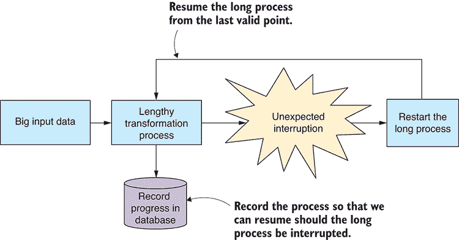

图 14.17 设计长进程以在意外中断的情况下重启和恢复。

### 14.5.7 处理不断增长的数据库

任何运行时间较长且数据库不断增长的应用程序最终都会耗尽内存或磁盘空间。我们必须在它成为问题之前决定如何处理这个问题。我们可以通过以下策略的组合来处理它：

+   清理旧数据。我们可以定期清理数据，但只有当旧数据不再相关时；否则，这违反了我们的规则“不要丢失你的数据”。

+   归档旧数据。如果我们确实需要保留旧数据，那么我们必须定期将其存档到低成本存储解决方案中。在归档你的数据的代码上要小心。这里的问题意味着你会丢失数据。

+   清理或存档并总结。定期清理或存档旧数据，但汇总它并保留旧数据的有关细节的摘要。

如果在定期清理或存档启动之前我们就用完了空间，会发生什么？如果这是一个危险，那么我们需要通过指标（第 14.4 节）来监控情况，或者在情况变得严重之前自动发出警报，或者根据需要自动激活清理或存档过程。

## 14.6 安全性

安全性对于您来说或多或少是一个问题，这取决于您的数据和系统有多有价值以及/或者有多敏感。我们早期预警系统中的数据本身并不敏感，但我们仍然不希望任何人篡改它，隐藏紧急情况或触发误报。可能更重要的是，我们需要确保系统能够安全访问，以防止任何形式的干扰。

我们无法期望应对所有可能的安全问题，但我们可以通过采取分层方法尽可能做好准备。就像城堡既有城墙又有护城河一样，多层可以使得我们的系统更加安全。

### 14.6.1 身份验证和授权

我们的第一层安全措施是确保访问我们数据和系统的人是我们允许的。通过身份验证，我们确认人们是他们所说的那个人。通过授权，我们检查一个人是否有权访问某个系统或数据库。

身份验证通常是在用户可以使用系统之前验证用户的密码。由于 HTTP 服务是无状态的，我们必须以某种方式记住（至少在一段时间内）用户的安全凭证。存储在服务器或数据库中的会话会记住这些细节。在客户端，用户通过浏览器中的 cookie 来识别；然后服务器将 cookie 与会话关联起来，并可以记住经过身份验证的用户。这种场景在图 14.18 中展示。

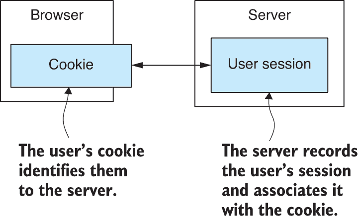

图 14.18 一个 cookie 识别用户给服务器；服务器在会话中记住用户的身份验证。

当在 Node.js 下工作时，我们可以使用事实上的标准库 *Passport* 来管理我们的身份验证。

我们可能通过在数据库中为每个用户记录一些额外数据来实现授权；这些额外数据将记录用户在我们系统中的权限级别。例如，他们可能被标记为普通用户或管理员用户，或者介于两者之间的权限级别。然后我们可以根据需要从数据库中读取用户的权限级别，以确定是否允许或拒绝访问敏感的服务器端数据或操作。

### 14.6.2 隐私和机密性

为了减轻第三方拦截和窃听我们数据的风险，我们可以在所有点对其进行加密。这并不是我们预警系统的担忧，因为数据本身并不那么机密，但在另一个更安全的系统中，你可能想要考虑使用内置的 Node.js Crypto 模块来加密你的敏感数据。你可能还想使用 HTTPs 来加密客户端和服务器之间的通信。加密甚至可能得到数据库的支持，这是需要考虑的，以实现数据保护的最终权威级别。

如果你正在管理有关个人用户的数据，那么你应该考虑对存储的数据进行匿名化。清除每个记录中的任何字段，以防止它与特定个人相关联，这样如果数据库以某种方式丢失，敏感数据就不能与任何特定个人联系起来。这有助于减少你的隐私担忧。

在我们当前的示例项目中，更有兴趣的是保护管理和存储我们数据系统的安全。特别是，我们的数据库应该位于私有网络和防火墙后面，这样它就不能直接被外部世界访问，如图 14.19 所示。

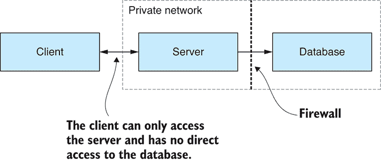

图 14.19 我们的数据库隐藏在私有网络上的防火墙后面。它不能从外部世界访问，因此更加安全。

如果我们有敏感的商业逻辑和/或重要的知识产权需要保护，我们也可以更进一步，将服务器分为公共和私有组件，然后将私有服务器与数据库一起移到防火墙后面，如图 14.20 所示。

例如，想象一下，你有一个分析数据以生成预警系统每日报告的秘密算法。报告的输出并不那么机密，只是用来解释数据的公式，而你认为这是有价值的知识产权。你可以将生成报告的算法移到防火墙后面，这样它就会对外部入侵的脆弱性降低。

这种对系统进行分区和隔离其最敏感部分的例子，是创建多层安全性的另一个例子。要突破系统的最敏感部分，潜在的攻击者必须突破多个级别的安全。

毫无疑问，你已经听说过这一点，但同样重要的是，你需要保持你的服务器操作系统和软件更新，以跟上最新的已知安全漏洞。你需要明白，你的整个系统只有在其最薄弱环节上才是安全的。

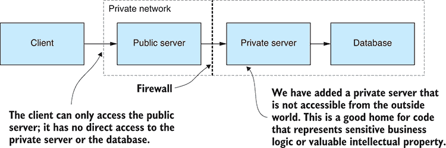

图 14.20 将我们的服务器分为公共和私有组件；然后将私有服务器放在防火墙后面。我们现在为敏感操作和知识产权提供了一个更安全的家。

### 14.6.3 秘密配置

在安全方面需要注意的最后一点是，你需要一种安全的方式来存储你的应用程序的秘密。回想一下第十二章中我们创建的用于存储应用程序配置详细信息的文件——例如，存储到你的电子邮件服务器的登录详情。

这种方法鼓励你将配置详情存储在版本控制中，但这是管理敏感配置最不安全的方式。我们这样做纯粹是为了简单，但在生产系统中，我们需要考虑这种做法的安全影响。例如，在这种情况下，我们可能不希望授予对源代码存储库的访问权限也授予对电子邮件服务器的访问权限。

我们在生产中安全处理这个问题的方法取决于我们选择的云提供商，但我们应该使用提供的（或由受信任的第三方提供的）安全存储或保险库，因为自己构建用于存储秘密的安全存储充满了危险。

## 14.7 扩展

当我们进入生产阶段并发现我们的应用程序无法处理所需的工作负载时，我们该怎么办？我们如何增加应用程序的容量？我们需要能够扩展我们的应用程序。

就像本章讨论的任何主题一样，我们在规划时投入的任何思考都将使我们以后少受很多痛苦。

### 14.7.1 优化前的测量

在我们能够理解和改进系统的性能之前，我们必须对其进行测量。我们有多种不同的指标可供选择：数据吞吐量（例如，每秒字节数）、服务器响应时间（以毫秒为单位），或应用程序可以服务的并发用户数。

主要的观点是，就像任何优化过程一样，我们无法希望提高性能，除非我们能够测量它。一旦我们能够测量性能，我们现在就可以进行实验，并明确地展示我们的优化努力是否产生了结果。

我们可以通过捕获、记录和分析适当的系统指标来评估系统的性能。在第九章中，你的数据分析技能在这里将很有用，用于确定趋势和找到指标中的模式。有了测量性能的系统，你现在可以思考扩展以提高应用程序的性能。

### 14.7.2 垂直扩展

我们应该考虑的第一个扩展方法是垂直扩展。这是扩展中最简单的方法，通常不需要对您的应用程序进行更改。如图 14.21 所示，我们增加应用程序运行的 PC 的大小。如果我们运行在物理硬件上，这很困难，但如果我们运行在任何主要云提供商的虚拟机（VM）上，这将是微不足道的。

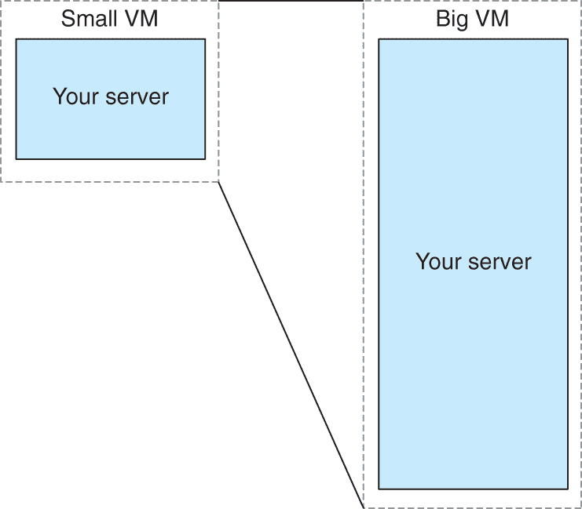

图 14.21 您可以通过增加托管服务器的虚拟机的大小来扩展服务器。

在这里我们所做的一切只是扩大了我们用来运行应用的 PC 的规模。我们已经增加了 CPU、内存和硬盘，并希望同时增加了我们应用的能力。然而，这有一个限制，最终我们将耗尽服务器的容量。在这个时候，我们必须现在转向水平扩展。

### 14.7.3 水平扩展

我们用于扩展的第二个选项被称为水平扩展。这种扩展的最简单版本是我们将应用复制到多个在云中运行的虚拟机（VM）上，并使用负载均衡器在应用的不同实例之间分配负载，如图 14.22 所示。

这种扩展形式比垂直扩展更复杂，但可能更经济高效，尤其是在扩展可以自动进行的情况下，新的实例可以根据需求创建以扩展容量并满足工作量。

当应用实例必须共享资源时，这种方法会更困难。例如，所有实例可能共享同一个数据库，这有可能成为性能瓶颈。类似于我们讨论的安全问题，你的应用性能只能与其最薄弱的环节一样好——我们称之为瓶颈。幸运的是，大多数现代数据库，如 MongoDB，都可以以相同的方式进行扩展，并且可以分布到多台机器上。

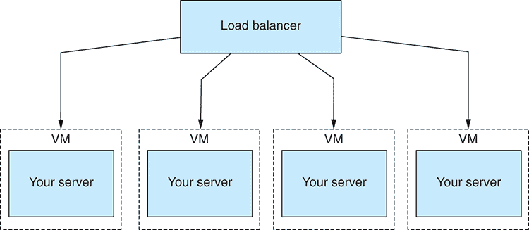

图 14.22 水平扩展将负载分配到应用的多实例之间。

水平扩展还提供了另一个好处。它为我们提供了冗余和另一种处理应用故障的方法。如果应用失败，负载均衡器可以自动重新分配流量，远离故障实例，由其他实例处理，同时修复或重启失败的服务器。

如果你读完这一章感到有些不知所措，我不会感到惊讶。将应用推向生产是一个困难的过程，你需要考虑很多因素。但如果你从这个章节中带走了一件事，那不是生产很复杂（尽管确实如此），也不是到达生产需要解决很多问题（尽管确实如此）。

如果你记得一件事，请记住这一点：与生产相关的问题都是好问题。这是因为这些都是与成功相关的问题。如果你的应用不成功，你就不会遇到这些问题。

现在你已经对将你的数据管道带入生产的一些方面有了某种程度的了解。这确实是一个庞大而复杂领域，当你进入生产时，你肯定会遇到你自己的独特问题。我可以就这个主题写一本书，但希望你现在有足够的了解，开始你自己的生产之路和产品的完成，无论那可能是什么。祝你好运，我的朋友。请享受这段旅程，并始终学习新事物。

## 摘要

+   你了解到将你的数据管道带入产品意味着要处理一个全新的问题世界。

+   我们讨论了使用持续交付技术，你的应用部署可能的样子。

+   我们描述了能够回滚失败的部署是任何部署脚本的基本功能。

+   我们探索了一种监控系统的结构，该系统能够让我们检查我们的应用是否运行良好且性能优秀。

+   我们学习了各种提高我们代码可靠性、增加系统寿命、更好地保护我们的数据以及优雅处理意外错误的方法。

+   你了解到良好的安全性是一个多层次的方法，潜在的攻击者必须突破多个层次才能危害你应用的安全性。

+   最后，你了解了如何通过垂直和水平扩展来增加应用程序的容量。
