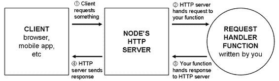
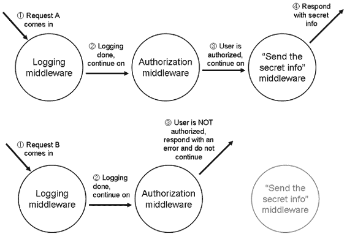
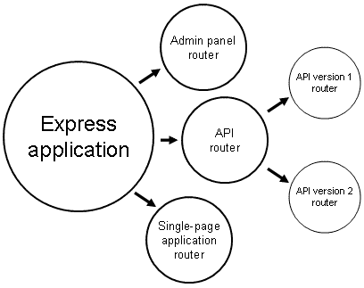

# 1  什么是 Express？

在我们谈论 Express 之前，我们需要先谈谈 Node.js。

在其生命的大部分时间里，JavaScript 编程语言都生活在 Web 浏览器中。它最初是一种简单的脚本语言，用于修改网页的细节，但后来发展成为一种复杂的语言，拥有大量的应用程序和库。许多浏览器厂商，如 Mozilla 和 Google，开始投入大量资源到快速的 JavaScript 运行时中，因此 Google Chrome 和 Mozilla Firefox 的 JavaScript 引擎变得更快。

2009 年，Node.js 出现了。Node 将 Google Chrome 的强大 JavaScript 引擎 V8 从浏览器中提取出来，使其能够在服务器上运行。在浏览器中，开发者别无选择，只能选择 JavaScript。除了 Ruby、Python、C#、Java 或其他语言外，开发者现在在开发服务器端应用程序时也可以选择 JavaScript。

JavaScript 可能不是适合每个人的完美语言，但 Node.js 有一些真正的优势。首先，V8 JavaScript 引擎速度快，Node 鼓励异步编程风格，这使得代码运行更快，同时避免了多线程的噩梦。由于 JavaScript 的流行，它也拥有大量的有用库。但 Node.js 最大的好处是能够在浏览器和服务器之间共享代码。开发者不需要在客户端和服务器之间进行任何类型的上下文切换。现在，他们可以在两个不同的 JavaScript 运行时（浏览器和服务器）之间使用相同的代码和相同的编程范式。

Node.js 开始流行起来——人们认为它非常酷。

与基于浏览器的 JavaScript 一样，Node.js 提供了一系列低级功能，您需要这些功能来构建应用程序。但与基于浏览器的 JavaScript 一样，其低级功能可能有点冗长且难以理解。

接下来是 Express.js。Express 是一个框架，它作为 Node.js Web 服务器的轻量级层，使得开发 Node.js Web 应用程序更加愉快。

从哲学上讲，Express.js 与 jQuery 类似。人们想向他们的网页添加动态内容，但“纯”浏览器 API 可能会很冗长、令人困惑，并且功能有限。开发者经常不得不编写大量的样板代码。jQuery 的存在就是为了减少这种样板代码，通过简化浏览器的 API 并添加有用的新功能。基本上就是这样。

Express 完全一样。人们想用 Node.js 开发 Web 应用程序，但“纯”Node.js API 可能会很冗长、令人困惑，并且功能有限。开发者经常不得不编写大量的样板代码。Express 的存在就是为了减少这种样板代码，通过简化 Node.js 的 API 并添加有用的新功能。基本上就是这样！

就像 jQuery 一样，Express 旨在可扩展。它对您应用程序的大部分决策采取放手的态度，并且可以很容易地通过第三方库进行扩展。在这本书和您的 Express 生涯中，您将不得不就您应用程序的架构做出决定，并且您将通过一系列强大的第三方模块扩展 Express。

您可能不会为了“简而言之”的定义而选择这本书。本章的其余部分（以及整本书）将更深入地讨论 Express。

注意：本书假设您熟悉 JavaScript，但不熟悉 Node.js。

## 1.1      Node.js 是什么？

Node.js 不是儿戏。

当我开始使用 Node.js 时，我很困惑。这是什么？

Node.js（通常简称为“Node”）只是一个 JavaScript 平台——一种运行 JavaScript 的方式。大多数情况下，JavaScript 是在网页浏览器中运行的。但 JavaScript 语言本身并没有要求它必须在浏览器中运行。它是一种编程语言，就像 Ruby、Python、C++、PHP 或 Java 一样。当然，所有流行的网页浏览器都捆绑了 JavaScript 运行时，但这并不意味着它必须在那里运行。如果您正在运行一个名为 myfile.py 的 Python 文件，您会运行`python myfile.py`。但您可以编写自己的 Python 解释器，命名为 SnakeWoman，然后运行`snakewoman myfile.py`。他们用 Node 做了同样的事情；您不需要输入`javascript myfile.js`，而是输入`node myfile.js`。

在浏览器之外运行 JavaScript 让我们可以做很多事情——实际上任何“常规”编程语言都能做的事情——但它主要用于 Web 开发。

好吧，所以我们可以将 JavaScript 运行在服务器上——我们为什么要这样做呢？

许多开发者会告诉您 Node.js 运行速度快，这是真的。Node.js 并不是市场上最快的东西，但它有两个原因使其运行速度快。

第一个原因很简单：JavaScript 引擎速度快。它基于 Google Chrome 中使用的引擎，该引擎以其快速的 JavaScript 引擎而闻名。它可以像没有明天一样执行 JavaScript，每秒处理数千条指令。

第二个原因是它处理并发的能力，这稍微复杂一些。它的性能来自于其异步操作。

我能想到的最佳现实类比是烘焙。假设我在做一些松饼。我必须准备一些面糊。在我准备面糊的时候，我实际上不能做其他事情。我不能坐下来看书，不能做其他烹饪，等等。但一旦我把松饼放进烤箱，我并不会站在那里盯着烤箱直到它做好——我会去做其他事情。也许我开始准备更多的面糊。也许我读一本书。无论如何，我不必等待松饼做好才能做其他事情。

在 Node.js 中，浏览器可能会向你的服务器请求某些内容。你开始响应这个请求，然后另一个请求到来。假设这两个请求都需要与外部数据库通信。你可以询问外部数据库关于第一个请求的信息，而在外部数据库思考的时候，你可以开始响应第二个请求。你并不是同时做两件事，但当别人在工作时，你不会被等待所阻碍。

其他运行时没有默认内置这种奢侈。例如，Ruby on Rails 实际上一次只能处理一个请求。要同时处理多个请求，你实际上不得不购买更多的服务器。（当然，这个说法有很多限制。）

图 1.1 展示了这可能会是什么样子：

图 1.1 比较异步代码（如 Node）与同步代码。请注意，尽管你永远不会并行执行代码，但异步代码可以完成得更快。

我并不是说 Node.js 因为其异步能力而成为世界上最快的。Node.js 确实可以从一个 CPU 核心中挤出很多性能，但它并不擅长多核心。其他编程语言确实允许你同时积极做两件事。用烘焙的例子来说：其他编程语言让你可以购买更多的烤箱，这样你就可以同时烤更多的松饼。Node 开始支持这种功能，但它在 Node 中的“一等”程度不如在其他编程语言中。

个人而言，我不认为性能是选择 Node 的最大原因。虽然它比 Ruby 或 Python 等其他脚本语言要快，但我认为最大的原因是它是一种编程语言。

通常，当你编写 Web 应用程序时，你会使用 JavaScript。但在 Node 之前，你必须用两种不同的编程语言编写所有内容。你必须学习两种完全不同的技术、范式和库。有了 Node，后端开发者可以跳入前端代码，反之亦然。我个人认为这是运行时最强大的功能。

似乎其他人也同意我的观点：人们创建了“MEAN 堆栈”，这是一个全 JavaScript 的 Web 应用程序堆栈，包括 MongoDB（由 JavaScript 控制的数据库）、Express、Angular.js（一个前端 JavaScript 框架）和 Node.js。“JavaScript 无处不在”的心态是 Node 的一个巨大优势。

大型公司甚至开始支持 Node；其中包括沃尔玛、BBC、领英和 PayPal。这不是儿戏。

## 1.2     什么是 Express？

Express 是一个相对较小的框架，它位于 Node.js 的 Web 服务器功能之上，以简化其 API 并添加有用的新功能。它通过中间件和路由使组织应用程序的功能变得更容易；它向 Node.js 的 HTTP 对象添加了有用的实用工具；它促进了动态 HTML 视图的渲染；它定义了一个易于实现的扩展性标准。本书将更深入地探讨这些功能，所以所有这些术语很快就会变得不再神秘。

### 1.2.1 Node.js 中的功能

当您在 Node.js 中创建一个网络应用程序（或更准确地说，一个 Web 服务器）时，您为您的整个应用程序编写一个单一的 JavaScript 函数。这个函数监听网络浏览器的请求，或消费您的 API 的移动应用程序的请求，或任何其他与您的服务器通信的客户端。当请求到来时，这个函数将查看请求并确定如何响应。例如，如果您在 Web 浏览器中访问主页，这个函数可以确定您想要主页，并将发送一些 HTML。如果您向 API 端点发送消息，这个函数可以确定您想要什么，并以 JSON（例如）响应。

假设我们正在编写一个网络应用程序，告诉用户服务器上的时间和时区。它将这样工作：

如果客户请求主页，我们的应用程序将返回一个显示时间的 HTML 页面。

如果客户请求其他任何内容，我们的应用程序将返回一个 HTTP 404“未找到”错误和一些伴随的文本。

如果您在没有 Express 的情况下在 Node.js 上构建应用程序，客户端击中您的服务器可能看起来像图 1.2。

图 1.2 通过 Node.js 网络应用程序的请求流程。圆形是由您作为开发者编写的；方形超出了您的领域。

在您的应用程序中处理浏览器请求的 JavaScript 函数被称为请求处理函数。这没有什么特别的；它只是一个接受请求、确定要做什么并响应的 JavaScript 函数；就是这样！Node 的 HTTP 服务器处理客户端和您的 JavaScript 函数之间的连接，这样您就不必处理复杂的网络协议。

在代码中，这是一个接受两个参数的函数：一个表示请求的对象和一个表示响应的对象。在我们的时间/时区应用程序中，请求处理函数可能会检查客户端请求的 URL。如果他们请求主页，请求处理函数应该以 HTML 页面的当前时间响应。否则，它应该响应 404。每个 Node.js 应用程序都是这样的：它是一个单一的请求处理函数，响应请求。从概念上讲，这很简单！

问题在于 Node API 可能会变得复杂。想要发送单个 JPEG 文件？那将是 45 行代码。想要创建可重用的 HTML 模板？自己找出如何实现。Node.js 的 HTTP 服务器功能强大，但它缺少了你构建真实应用程序时可能需要的许多功能。

Express 的诞生是为了让使用 Node.js 编写网络应用程序变得更加容易。

### 1.2.2 Express 为 Node 增加的功能

大体上，Express 为 Node.js HTTP 服务器添加了两个主要功能。

1. Express 为 Node.js 的 HTTP 服务器添加了许多有用的便利功能，抽象掉了许多复杂性。例如，在原始的 Node.js 中发送单个 JPEG 文件相当复杂（特别是如果你考虑性能的话），Express 将其简化为仅仅一行。

2. Express 允许你将一个庞大的请求处理函数重构为许多更小的请求处理函数，这些函数只处理特定的部分。这更加易于维护和模块化。

与图 1.2 相比，图 1.3 展示了请求如何通过 Express 应用程序流动。

图 1.3 Express 中的请求流程。再次强调，圆圈是你编写的代码，正方形则超出了你的领域。

这个图可能看起来稍微复杂一些，但对于你作为开发者来说，它要简单得多。这里实际上只有两件事在进行：

1. 与一个大的请求处理函数相比，Express 让你编写许多小的函数（其中许多可以是第三方且不是由你编写的）。一些函数对每个请求都会执行（例如，记录所有请求的函数）而其他函数只在某些情况下执行（例如，只处理主页或 404 页面的函数）。Express 有许多用于划分这些较小请求处理函数的实用工具。

2. 请求处理函数接受两个参数：一个是请求，另一个是响应。Node 的 HTTP 服务器为你提供了一些功能；例如，Node 的 HTTP 服务器允许你从一个变量中提取浏览器的用户代理。Express 通过添加额外的功能来增强这一点，例如，轻松访问传入请求的 IP 地址和改进的 URL 解析。响应对象也得到了加强；Express 添加了诸如 `sendFile` 方法之类的功能，这是一个一行命令，相当于大约 45 行复杂的文件代码。这使得编写这些请求处理函数变得更加容易。

与使用冗长的 Node.js API 管理一个庞大的请求处理函数相比，你将编写多个小的请求处理函数，这些函数通过 Express 和其更简单的 API 变得更加愉快。

## 1.3 Express 的最小化哲学

Express 是一个框架，这意味着你将不得不以“Express 方式”构建你的应用程序。但“Express 方式”并不太具有偏见；它不会给你一个非常僵化的结构。这意味着你可以构建许多不同类型的应用程序，从视频聊天应用程序到博客到 API。

构建一个仅使用 Express 的任何大小的 Express 应用程序是非常罕见的。仅凭 Express 本身可能无法完成你需要的所有事情，你可能会发现自己需要将大量其他库集成到你的 Express 应用程序中。（我们将在本书中查看许多这些库。）你可以得到你需要的 exactly 东西，没有任何额外的冗余，这使你能够自信地理解应用程序的每个部分。以这种方式，它非常适合来自 Unix 世界的“做好一件事”的哲学。

但这种简约主义是一把双刃剑。一方面，它很灵活，你的应用程序没有不必要的冗余。另一方面，与其他框架相比，它为你做的很少。这意味着你会犯错误，你必须对你的应用程序架构做出更多的决定，你必须花更多的时间寻找正确的第三方模块。你得到的现成功能更少。

当有些人可能喜欢灵活的框架时，其他人可能想要更多的刚性。例如，PayPal 喜欢 Express，但在其之上构建了一个框架，该框架对众多开发者强制执行更严格的约定。Express 不关心你如何结构化你的应用程序，所以两个开发者可能会做出完全不同的决定。

因为你可以自由地引导你的应用程序走向任何方向，你可能会做出不明智的决定，这会在以后给你带来麻烦。有时，我回顾我仍在学习的 Express 应用程序，并想，“我为什么要这样做？”

为了自己编写更少的代码，你最终会寻找正确的第三方包来使用。有时，这很简单；有一个每个人都喜欢的模块，你也喜欢它，这是一场天作之合。其他时候，选择更困难，因为有很多还可以的或者数量很少。一个更大的框架可以为你节省时间和头疼，你只需使用你得到的东西。

对于这个问题，没有正确答案，这本书也不会试图辩论大框架和小框架之间的最终胜利者。但事实是，Express 是一个简约框架，不管好坏！

## 1.4 Express 的核心部分

好吧，所以 Express 是简约的，并且它为 Node.js 加上了糖衣，使其更容易使用。它是如何做到这一点的呢？

当你真正深入思考时，Express 只有四个主要功能。接下来的几节有很多概念性的内容，但并不是空谈；我们将在接下来的章节中深入细节。

### 1.4.1 中间件

正如我们上面所看到的，原始的 Node.js 给我们提供了一个请求处理函数来工作。请求进入我们的函数，响应从我们的函数输出。

中间件的命名并不准确，但它是一个非 Express 特定的术语，已经存在一段时间了。这个想法很简单：而不是一个单一的、大型的请求处理函数，我们调用几个请求处理函数，每个函数处理一小部分工作。这些较小的请求处理函数被称为中间件函数，有时也简称为“中间件”。

中间件可以处理各种任务，从记录请求到发送静态文件到设置 HTTP 头。例如，我们可能在应用程序中使用的第一个中间件函数是一个日志记录器——记录进入服务器的每个请求。当日志记录器完成记录后，它将继续传递到链中的下一个中间件。下一个中间件函数可能用于验证用户身份。如果他们访问的是禁止的 URL，则响应一个“未授权”页面。如果允许访问，则继续传递到链中的下一个函数。下一个函数可能发送主页并完成。两种可能的选项在图 1.4 中有展示。

图 1.4 展示了两个请求通过中间件函数的过程。可以看到，中间件有时会继续传递，但有时会响应请求。

在图 1.4 中，日志中间件位于链的最前端，并且总是会被调用，因此日志文件中总会记录一些内容。接下来，日志中间件继续传递到链中的下一个中间件，即授权中间件。这个中间件会根据某种规定决定用户是否有权继续操作。如果有，它将继续传递到链中的下一个中间件。否则，向用户发送“您未授权！”的消息并停止链的传递。（这个消息可能是一个 HTML 页面、一个 JSON 响应或其他任何内容，具体取决于应用程序。）最后，如果调用最后一个中间件，它将发送一些秘密信息，并且不会继续传递到链中的任何其他中间件。（同样，这个最后的中间件可以发送任何类型的响应，从 HTML 到 JSON 到图像文件。）

中间件最大的特点之一是它相对标准化，这意味着很多人为 Express 开发了中间件（包括 Express 团队的人）。这意味着如果你能想到中间件，可能有人已经制作了它。有用于编译静态资源如 LESS 和 SCSS 的中间件；有用于安全和用户认证的中间件；有用于解析 cookies 和会话的中间件。

### 1.4.2 路由

路由比中间件命名得更好。像中间件一样，它将一个单一的大请求处理函数分解成更小的部分。然而，与中间件不同的是，这些请求处理函数的执行是条件性的，取决于客户端发送的 URL 和 HTTP 方法。

例如，我们可能会构建一个包含主页和留言簿的网页。当用户向主页 URL 发送 HTTP GET 请求时，Express 应该发送主页。但当用户访问留言簿 URL 时，它应该发送留言簿的 HTML，而不是主页的 HTML！如果他们在留言簿中发表评论（通过向特定 URL 发送 HTTP POST 请求），这将更新留言簿。路由允许您通过路由对应用程序的行为进行分区。

这些路由的行为，就像中间件一样，是在请求处理函数中定义的。当用户访问主页时，它将调用您编写的请求处理函数。当用户访问留言簿 URL 时，它将调用另一个您编写的请求处理函数。

Express 应用程序具有中间件和路由；它们相互补充。例如，您可能希望记录所有请求，但您也想要在用户请求时提供主页。

### 1.4.3 子应用程序

Express 应用程序通常可以非常小，甚至可以只在一个文件中。然而，随着您的应用程序变大，您将开始想要将它们分解成多个文件夹和文件。Express 对您如何扩展应用程序没有意见，但它提供了一项非常重要的功能，非常有帮助：子应用程序。在 Express 术语中，这些小程序被称为路由器。

Express 允许您定义可以在大型应用程序中使用的路由器。编写这些子应用程序几乎与编写“正常大小”的应用程序完全一样，但它允许您进一步将应用程序分解成更小的部分。例如，您可能有一个管理面板在您的应用程序中，它可以与您的应用程序的其他部分非常不同地工作。您可以将管理面板代码与中间件和路由并排放置，但您也可以为管理面板创建一个子应用程序。图 1.5 显示了如何使用路由器分解 Express 应用程序。

图 1.5 展示了如何将大型应用程序分解为路由器的示例图。

这个特性直到您的应用程序变得很大时才真正发光，但一旦它们变得很大，它就非常有帮助。

### 1.4.4 便利性

Express 应用程序由中间件和路由组成。它们都需要您编写请求处理函数，所以您将经常这样做！

为了使这些请求处理函数更容易编写，Express 增加了一些便利功能。在原始 Node.js 中，如果您想编写一个请求处理函数，从文件夹发送 JPEG 文件，那需要相当多的代码。在 Express 中，这只是一个调用`sendFile`方法的调用。Express 提供了一系列功能，使渲染 HTML 更加容易，而 Node.js 则保持沉默。它还附带了一些函数，使解析传入的请求变得更容易，例如获取客户端的 IP 地址。

与上述功能不同，这些便利性在概念上并没有改变您组织应用程序的方式，但它们可以非常有帮助。

## 1.5     Express 的生态系统

Express，像任何工具一样，并不是孤立存在的。

它生活在 Node.js 生态系统之中，因此你有一系列第三方模块可以帮助你，例如与数据库的接口。因为 Express 是可扩展的，许多开发者已经创建了与 Express（而不是通用的 Node.js）兼容的第三方模块，例如专门的中间件或渲染动态 HTML 的方法。

### 1.5.1  Express 与其他网络应用框架的比较

Express 不仅仅是第一个网络应用框架，也不会是最后一个。

Express 并不是 Node.js 世界中唯一的框架。也许它最大的“竞争对手”叫做 Hapi.js。像 Express 一样，它是一个没有意见、相对较小的框架，具有路由和类似中间件的功能。它与 Express 的不同之处在于，它不旨在平滑 Node.js 内置的 HTTP 服务器模块，而是构建一个相当不同的架构。这是一个相当成熟的框架，由沃尔玛的团队开发，并被 Mozilla、OpenTable 以及 npm 注册使用！虽然我怀疑 Express 开发者和 Hapi 开发者之间没有多少敌意，但 Hapi 是 Express 最大的“竞争对手”。

在 Node.js 世界中也有更大的框架，其中最受欢迎的可能是全栈的 Meteor。虽然 Express 对你如何构建应用程序没有意见，但 Meteor 有一个严格的结构。虽然 Express 只处理 HTTP 服务器层，但 Meteor 是全栈的，在客户端和服务器上运行代码。这仅仅是设计选择——一个并不天生比另一个更好。

就像 Express 在 Node.js 之上堆叠特性一样，有些人决定在 Express 之上堆叠特性。PayPal 的一些人创建了 Kraken；虽然 Kraken 技术上只是 Express 中间件，但它为你的应用程序设置了大量的内容，从安全默认设置到捆绑的中间件。Sails.js 是另一个建立在 Express 之上的新兴框架，它添加了数据库、WebSocket 集成、API 生成器、资产管道等。这两个框架在设计上比 Express 更有意见。

Express 有几个特性，其中之一就是中间件。Connect 是一个 Node.js 网络应用框架，它仅仅是中间件层。Connect 没有路由或便利性；它只是中间件。Express 以前使用 Connect 作为其中间件层，而现在它不再使用 Connect 进行中间件，但 Express 中间件与 Connect 中间件完全兼容。这意味着任何在 Connect 中工作的中间件也在 Express 中工作，这为你的工具箱添加了大量的有用第三方模块。

这是 JavaScript，所以有无数其他的 Node.js 网络应用框架，我相信我没有提到某个人的，可能会冒犯了他们。

在 Node.js 世界之外，也有类似的框架。

Express 在很大程度上受到了 Ruby 世界中一个最小化 Web 应用程序框架 Sinatra 的启发。Sinatra 和 Express 一样，具有路由和类似中间件的功能。Sinatra 启发了许多其他编程语言的克隆和重新解释，所以如果你曾经使用过 Sinatra 或类似 Sinatra 的框架，Express 将会熟悉。Express 也类似于 Python 世界的 Bottle 和 Flask。

Express 不像 Python 的 Django 或 Ruby on Rails 或 ASP.NET 或 Java 的 Play；这些都是更大、更有观点的框架，具有许多功能。Express 也不同于 PHP；虽然它是在服务器上运行的代码，但它与“纯”PHP 相比，与 HTML 的耦合并不紧密。

本书应该告诉你 Express 比所有这些其他框架都要好，但它不能——Express 只是构建服务器端 Web 应用程序的一种方式。它有一些其他框架没有的真正优势，比如 Node.js 的性能和无处不在的 JavaScript，但它为你做的比大型框架可能做的要少，而且有些人不认为 JavaScript 是最好的语言。我们可以永远争论哪个最好，但永远找不到答案，但重要的是要看到 Express 在这个画面中的位置。

### 1.5.2 Express 的用途

理论上，Express 可以用来构建任何 Web 应用程序。它可以处理传入的请求并对它们做出响应，因此它可以做上述大多数其他框架中可以做的事情。你为什么选择 Express 而不是其他东西呢？

在 Node.js 中编写代码的一个好处是能够在浏览器和服务器之间共享 JavaScript 代码。从代码的角度来看，这很有帮助，因为你可以实际上在客户端和服务器上运行相同的代码。从心理角度来看，这也非常有帮助；你不必让你的思维进入“服务器模式”，然后再切换到“客户端模式”——在某种程度上，它们都是同一件事。这意味着前端开发者可以编写后端代码，而无需学习全新的语言及其范式，反之亦然。有一些学习要做——否则这本书就不会存在了！——但其中很多对前端 Web 开发者来说都很熟悉。

Express 帮助你做到这一点，人们为一种全 JavaScript 栈的排列想出了一个花哨的名字：MEAN 栈。就像“LAMP”栈代表 Linux、Apache、MySQL 和 PHP 一样，“MEAN”代表 MongoDB（一个 JavaScript 友好的数据库）、Express、Angular（一个前端 JavaScript 框架）和 Node.js。人们喜欢 MEAN 栈，因为它是一个全栈 JavaScript，你可以获得上述所有好处。

Express 经常被用来驱动单页应用程序，或称为 SPAs。SPAs 在前端非常依赖 JavaScript，并且通常需要一个服务器组件。服务器通常只需要简单地提供 HTML、CSS 和 JavaScript，但通常还会有一个 REST API。Express 可以很好地完成这两件事；它在提供 HTML 和其他文件方面做得很好，在构建 API 方面也做得很好。由于前端开发者的学习曲线相对较低，他们可以轻松地构建一个简单的 SPA 服务器，而不需要太多新的学习。

当你使用 Express 编写应用程序时，你无法避开使用 Node.js，所以你将拥有 MEAN 栈中的“E”和“N”部分，但其他两个部分（MongoDB 和 Angular）由你决定，因为 Express 是无意见的。想在前端用 Backbone.js 替换 Angular？现在就是 MEBN 栈。想用 SQL 而不是 MongoDB？现在就是 SEAN 栈。虽然 MEAN 是一个常见的术语，并且是一个流行的配置，但你可以选择你想要的任何配置。在这本书中，我们将介绍 MongoDB 数据库，所以我们将得到“MEN”栈。

Express 还可以与许多实时功能并排使用。虽然其他编程环境可以支持实时功能，如 WebSockets 和 WebRTC，但 Node.js 似乎比其他语言和框架更多地支持这些功能。这意味着你可以因为 Node 支持，Express 也支持。

### 1.5.3 Node 和 Express 的第三方模块

这本书的前几章讨论了“核心”Express——也就是说，这些是内置于框架中的内容。非常粗略地说，这是路由和中间件。但超过一半的书本内容涵盖了如何将 Express 与第三方模块集成。

对于 Express 有大量的第三方模块。其中一些是专门为 Express 制作的，并且与它的路由和中间件功能兼容。其他一些不是专门为 Express 制作的，但在 Node.js 中表现良好，因此它们也与 Express 兼容。

在这本书中，我们将选择一些第三方集成并展示一些示例。但由于 Express 是无意见的，这本书中的内容并不是唯一的选择。如果我在这本书中介绍了第三方工具 X，但你更喜欢替代的第三方工具 Y，你可以将它们替换掉。

Express 有一些用于渲染 HTML 的小功能。如果你曾经使用过“纯”PHP 或像 ERB、Jinja2、HAML 或 Razor 这样的模板语言，你已经在服务器上处理过 HTML 的渲染。Express 并没有内置任何模板语言，但它几乎与每个基于 Node 的模板引擎都很好地配合，正如我们将看到的。一些流行的模板语言自带 Express 支持，而其他一些则需要一个简单的辅助库。在这本书中，我们将探讨两种选择：EJS（看起来很像 HTML）和 Jade（试图用一种激进的新语法修复 HTML）。

Express 没有任何关于数据库的概念。你可以根据你的选择持久化应用程序的数据；在文件中，在关系型 SQL 数据库中，或者在其他类型的数据存储机制中。在这本书中，我们将介绍流行的 MongoDB 数据库用于数据存储。正如我们上面所讨论的，你不应该觉得 Express 会让你感到“受限”——如果你想使用另一个数据存储，Express 会让你做到这一点。

用户通常希望他们的应用程序是安全的。有许多有用的库和模块（一些是针对“原始”Node 的，一些是针对 Express 的）可以加强你的 Express 应用程序的安全性。我们将在关于安全性的章节中探讨所有这些内容（这是我个人最喜欢的章节之一）。我们还将讨论测试我们的 Express 代码，以确保为我们的应用程序提供动力的代码是健壮的。

有一点需要注意：没有所谓的“Express 模块”——只有 Node 模块。一个 Node 模块可以与 Express 兼容并且很好地与它的 API 一起工作，但它们都是来自 npm 注册表的 JavaScript，你以同样的方式安装它们。就像在其他环境中一样，一些模块与其他模块集成，而其他模块可以独立存在。最终，Express 只是一个像其他任何东西一样的 Node 模块。

当你需要帮助时

我真心希望这本书能有所帮助，并且充满知识，但一个作者能塞进书里的智慧是有限的。在某个时候，你需要展开翅膀去寻找答案。让我尽我所能来引导你：

对于 API 文档和简单的指南，官方的 [`expressjs.com/`](http://expressjs.com/) 是你该去的地方。你还可以在 Express 仓库的整个目录中找到示例应用程序，在 [`github.com/strongloop/express/tree/master/examples`](https://github.com/strongloop/express/tree/master/examples) 。我在尝试找到“正确”做事的方式时发现这些示例很有帮助。那里有很多示例；去看看吧！

对于 Node 模块，你将使用 Node 内置的 npm 工具，并从 [`www.npmjs.org/`](https://www.npmjs.org/) 上的注册表中安装东西。如果你需要帮助找到好的模块，我建议你阅读 Substack 的“寻找模块”指南，网址为 http://substack.net/finding_modules。这是一份关于如何找到高质量 Node 包的精彩总结。

Express 以前是基于另一个名为 Connect 的包构建的，并且仍然与 Connect 制作的模块高度兼容。如果你找不到 Express 的模块，你可能通过搜索 Connect 会更有运气。这也适用于你在寻找答案时。

就像往常一样，使用你喜欢的搜索引擎。

## 1.6 必不可少的“Hello World”

每次介绍新的代码事物都需要一个“Hello World”，对吧？

让我们看看我们可以构建的最简单的 Express 应用程序之一：“Hello World”。我们将在整本书中更详细地探讨这一点，所以如果你现在觉得有些内容不太明白，请不要担心。

这是 Express 中的“Hello World”：

列表 1.1 Express 中的“Hello World”

`var express = require("express");  #A`   `var app = express();  #B`   `app.get("/", function(request, response) {  #C` `  response.send("Hello world!");            #C` `});                                         #C`   `app.listen(3000, function() {                       #D` `  console.log("Express app started on port 3000."); #D``});                                                 #D`

#A 引入 Express 并将其放入一个变量中。

#B 调用 express()创建一个新的 Express 应用程序，并将其放入名为“app”的变量中。

#C 当有人向您的网站根目录（在“/”）发送请求时，他们将收到“Hello world!”。

#D 在端口 3000 上启动 Express 服务器并记录服务器已启动。

再次强调：如果这一切对您来说还不清楚，请不要担心！但您可能已经看到我们正在创建一个 Express 应用程序，定义了一个响应“Hello world!”的路由，并在端口 3000 上启动了我们的应用程序。要运行此应用程序，您需要执行几个步骤——所有这些都会在接下来的几章中变得清晰。

我们很快就会了解 Express 的所有秘密。

## 1.7     总结

在本章中，您了解到：

·  Node.js 是编写 Web 应用程序的强大工具，但这样做可能会很繁琐。Express 就是为了简化这个过程而创建的。

·  Express 是一个最小化、无偏见且灵活的框架。

·  Express 有几个关键特性：

·  中间件，一种将应用程序分解成更小行为片段的方法。通常，中间件按顺序逐个调用。

·  路由将您的应用程序分解成更小的函数，这些函数在用户访问特定资源时执行；例如，当用户请求主页 URL 时显示主页。

·  路由器可以将大型应用程序进一步分解成更小的、可组合的子应用程序。

·  您的大部分 Express 代码都涉及编写请求处理函数，Express 在编写这些函数时提供了一些便利。
