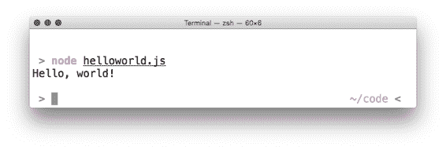
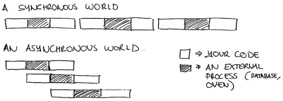
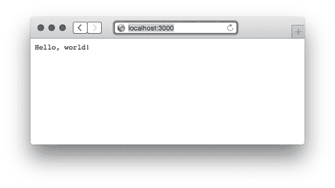
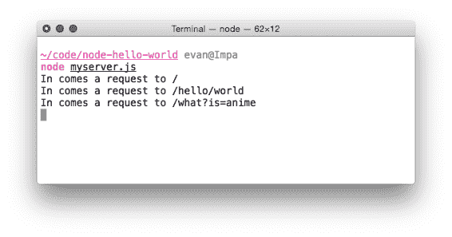

# 2  Node.js 的基础知识

在第一章中，我们讨论了 Node.js 是什么。我们讨论了它是 JavaScript，它是异步的，并且它有一套丰富的第三方模块。如果你像我一样，当你刚开始使用 Node 时，你并没有完全理解这些事情。本章旨在提供我希望拥有的 Node 入门介绍：简短而精炼。

我们将讨论

·  安装 Node

·  如何使用其模块系统

·  如何安装第三方包

·  它花哨的“事件驱动 I/O”的一些示例。

·  运行你的 Node 代码的一些技巧。

注意：我将假设你已经对 JavaScript 有相当的了解，并且你不想从这个章节中获得 Node 的极其详尽的知识。我还将假设你熟悉如何使用命令行。如果这个关于 Node 的快速介绍有点太快了，你可以查看[`www.manning.com/cantelon/`](http://www.manning.com/cantelon/)上的 Node.js in Action 以获取更多信息。

让我们开始吧。

## 2.1     安装 Node

JavaScript 世界的主题是选择过多，Node 的安装也不例外；有太多不同的方式可以在你的系统上运行 Node。

在[`nodejs.org/download/`](http://nodejs.org/download/)的官方下载页面上有针对几乎所有平台的下载链接——Windows、Mac 和 Linux。平台的选择应该是显而易见的——选择适合你操作系统的版本。如果你不确定你的系统是 32 位还是 64 位，请在网上搜索以尝试回答这个问题，因为如果你可以选择 64 位，你将获得很多性能上的好处。Mac 和 Windows 用户可以选择下载二进制文件或安装程序，我建议选择后者。

如果你系统中有包管理器，你可以使用它。Node.js 可在多个包管理器上使用，包括 apt-get、Homebrew 和 Chocolatey。你可以在[`github.com/joyent/node/wiki/Installing-Node.js-via-package-manager`](https://github.com/joyent/node/wiki/Installing-Node.js-via-package-manager)查看官方的“通过包管理器安装 Node.js”指南。

如果你使用的是 Mac 或 Linux，我强烈推荐使用 Node 版本管理器，或简称 NVM，可以在[`github.com/creationix/nvm`](https://github.com/creationix/nvm)找到。如果你使用的是 Windows，NVMW 在[`github.com/hakobera/nvmw`](https://github.com/hakobera/nvmw)为 Windows 用户提供了一个端口。这些程序允许你轻松地在 Node 版本之间切换，如果你想要同时拥有 Node 的稳定版本和令人兴奋的实验性预发布版本，这将是极好的。它还允许你在新版本发布时轻松升级 Node。NVM 还有一些我喜欢的其他好处：它非常容易卸载，并且安装时不需要管理员（root）权限。

NVM 是一个单行安装，你可以从 [`github.com/creationix/nvm`](https://github.com/creationix/nvm)（或 [`github.com/hakobera/nvmw`](https://github.com/hakobera/nvmw) 用于 Windows 版本）的说明中复制粘贴并运行。

在任何情况下，安装 Node 吧！

### 2.1.1  运行你的第一个 Node 脚本

无论你选择如何安装 Node，现在是时候运行一些东西了！让我们构建经典的 "hello world"。创建一个名为 `helloworld.js` 的文件，并在其中放入以下内容：

列表 2.1 helloworld.js

`console.log("Hello, world!");`

我们使用我们想要打印的参数调用 `console.log` 函数：字符串 "Hello, world!"。如果你曾经在使用基于浏览器的 JavaScript 编写时使用过控制台，这应该看起来很熟悉。

要运行此代码，请输入 `node helloworld.js`。（你可能需要 `cd` 到 `helloworld.js` 所在的目录。）如果一切顺利，你应该会在屏幕上看到文本！输出将类似于图 2.1。

图 2.1 运行我们的 "hello world" 代码的结果。

## 2.2     使用模块

大多数编程语言都有一种方式来包含文件 A 以便从文件 B 中提取，这样你就可以将代码分成多个文件。C 和 C++ 有 `#include`；Python 有 `import`；Ruby 和 PHP 有 `require`。一些语言如 C# 在编译时隐式地执行这种跨文件通信。

在 JavaScript 语言的多数历史中，它没有官方的方式来执行这项任务。为了解决这个问题，人们构建了将 JavaScript 文件连接成一个文件的工具，或者构建了像 RequireJS 这样的依赖加载器。许多网络开发者只是简单地用 `<script>` 标签填充他们的网页。

Node 希望优雅地解决这个问题，并实现了一个名为 CommonJS 的标准模块系统。在其核心，CommonJS 允许你从一个文件中包含另一个文件的代码。

这个模块系统有三个主要组成部分：引入内置模块、引入第三方模块以及创建自己的模块。让我们看看它们是如何工作的。

### 2.2.1  引入内置模块

Node 有许多内置模块，从名为 "fs" 的模块中的文件系统访问到名为 "util" 的内置模块中的实用函数。

使用 Node 构建网络应用时，一个常见的任务是解析 URL。当浏览器向你的服务器发送请求时，它们会请求一个特定的 URL。也许他们会请求主页；也许他们会请求关于页面；也许他们会请求其他内容。这些 URL 以字符串的形式传入，但我们通常希望解析它们以获取更多信息。Node 有一个内置的 URL 解析模块；让我们使用它来看看如何引入包。

Node 的内置 `url` 模块公开了一些函数，但 "大块头" 是一个名为 `parse` 的函数。它接受一个 URL 字符串并提取有用的信息，如域名或路径。

我们将使用 Node 的 `require` 函数来使用 `url` 模块。`require` 与其他语言中的 `import` 或 `include` 关键字类似。`require` 接收一个包名称作为字符串参数，并返回一个包。返回的对象没有什么特别之处——它通常是一个对象，但它也可能是函数、字符串或数字。以下是使用 URL 模块的方法：

列表 2.2 导入 Node 的 URL 模块

`var url = require("url");   #A` `var parsedURL = url.parse("http://www.example.com/   #B` `                       [CA]profile?name=barry");  #B` `console.log(parsedURL.protocol);  // "http:"` `console.log(parsedURL.host);      // "www.example.com"` `console.log(parsedURL.query);     // "name=barry"`

#A 这要求一个名为 "url" 的模块，并将其放入一个名为 "url" 的变量中。这是一个约定，它们是相同的。

#B 这使用了 url.parse。如果没有第一行导入模块，这将抛出一个未定义的错误。

在上面的例子中，`require("url")` 返回一个具有附加 parse 函数的对象。然后我们就像使用任何对象一样使用它！

如果你将其保存为 `url-test.js`，你可以使用 `node url-test.js` 运行它。它将打印出我们示例 URL 的协议、主机和查询。

大多数时候，当你需要导入一个模块时，你会将一个与模块本身同名的变量放入其中。上面的例子将 url 模块放入了一个同名的变量中：url。

但你不必这样做！如果我们愿意，我们可以将其放入一个完全不同名称的变量中。以下示例说明了这一点：

列表 2.3 将事物导入不同的变量名

`var theURLModule = require("url");` `var parsedURL = theURLModule.parse("http://example.com");` `// ...`

给变量命名与你要导入的内容相同的名称是一种松散的约定，以防止混淆，但在代码中并没有强制执行这一点。

### 2.2.2 使用 package.json 和 npm 导入第三方模块

Node 有几个内置模块，但它们通常不足以满足需求；在制作应用程序时，第三方包是必不可少的。毕竟，这本书是关于第三方模块的，所以你绝对应该知道如何使用它们！

我们需要首先讨论的是 `package.json`。每个 Node 项目都位于一个文件夹中，每个 Node 项目的根目录下都有一个名为 `package.json` 的文件。（当我提到“每个 Node 项目”，我的意思是每一个，从第三方包到应用程序。你很可能不会在没有 `package.json` 的情况下构建 Node 项目。）

"package dot json" 是一个相当简单的 JSON 文件，它定义了项目元数据，如项目的名称、版本和作者。它还定义了项目的依赖项。

让我们创建一个简单的应用程序。创建一个新的文件夹，并将以下内容保存到 `package.json`：

列表 2.4 一个简单的 package.json 文件

`{` `  "name": "my-fun-project",   #A` `  "author": "Evan Hahn",      #B` `  "private": true,            #C` `  "version": "0.2.0",         #D` `  "dependencies": {}          #E``}`

#A 定义你项目的名称。

#B 定义作者。如果你有多个作者，这可以是一个作者数组，而且很可能不是 "Evan Hahn"。

#C 这表示 "这是一个私有项目；不要让我被发布到包注册库供任何人使用。"

#D 定义包的版本。

#E 注意，这个项目目前还没有依赖项。我们很快就会安装一些。

现在我们已经定义了我们的包，我们可以安装它的依赖项。

当你安装 Node 时，你实际上得到了两个程序：Node（正如你可能预期的）和称为 npm 的东西（故意小写）。npm 是 Node 的官方助手，它帮助你处理 Node 项目。

npm 通常被称为 "Node 包管理器"，但其全称从未被明确指出——其网站随机显示诸如 "Never Poke Monkeys" 或 "Nine Putrid Mangos" 这样的名字。它可能避免了 "包管理器" 这个名称，因为它做的不仅仅是包管理，但包管理可能是其最大的特性，我们现在就要使用它。

假设我们想使用 Mustache（见 [`mustache.github.io/`](https://mustache.github.io/)），一个标准的简单模板系统。它允许你将模板字符串转换为 "真实" 字符串。一个例子最能说明问题：

列表 2.5 Mustache 模板系统的示例

`// 返回 "Hello, Nicholas Cage!"` `Mustache.render("Hello, {{first}} {{last}}!", {` `  first: "Nicholas",` `  last: "Cage"` `});`   `// 返回 "Hello, Sheryl Sandberg!"` `Mustache.render("Hello, {{first}} {{last}}!", {` `  first: "Sheryl",` `  last: "Sandberg"` `});`

假设我们想写一个简单的 Node 应用程序，使用 Mustache 模块向 Nicholas Cage 打招呼。

从这个目录的根目录运行 `npm install mustache --save`。（你必须从这个目录的根目录运行这个命令，这样 `npm` 才知道在哪里放置东西。）这个命令将在该目录中创建一个新的文件夹，名为 `node_modules`。然后它下载 Mustache 包的最新版本并将其放入这个新的 `node_modules` 文件夹中（进去看看吧！）最后，`--save` 标志将其添加到你的 `package.json` 文件中。你的 package.json 文件应该看起来类似，但现在它将包含 Mustache 包的最新版本：

列表 2.6 一个简单的 package.json 文件

`{` `  "name": "my-fun-project",` `  "author": "Evan Hahn",` `  "private": true,` `  "version": "0.2.0",` `  "dependencies": {` `    "mustache": "².0.0"  #A` `  }``}`

#A 注意这个新行。你的依赖项版本可能比这里的新。

如果你没有使用`--save`标志，你会看到新的`node_modules`文件夹，里面会有 Mustache，但在你的`package.json`中没有任何内容。你想要在`package.json`中列出依赖项的原因是，如果有人得到了你的项目，他们稍后可以安装这些依赖项——他们只需要运行`npm install`而不带任何参数。Node 项目通常在`package.json`中列出依赖项，但它们并不包含实际的依赖文件（它们不包含`node_modules`文件夹）。

现在我们已经安装了它，我们就可以在我们的代码中使用 Mustache 模块了！

列表 2.7 使用 Mustache 模块

`var Mustache = require("mustache");  #A` `var result = Mustache.render("Hi, {{first}} {{last}}!", {` `  first: "Nicolas",` `  last: "Cage"` `});``console.log(result);`

#A 注意我们是如何 require Mustache 的——就像一个内置模块。

将上述代码保存为`mustache-test.js`，并使用`node mustache-test.js`运行它。你应该会看到文本“Hi, Nicholas Cage!”出现。

就这样！一旦安装到`node_modules`中，你就可以像使用内置模块一样使用 Mustache。Node 知道如何从`node_modules`文件夹中 require 模块。

当你添加依赖项时，你也可以手动编辑`package.json`，然后运行`npm install`。你也可以安装特定版本的依赖项，或者从非官方 npm 注册处安装它们；更多内容请参阅`npm install`文档([`docs.npmjs.com/cli/install`](https://docs.npmjs.com/cli/install))。

npm init

npm 的功能远不止安装依赖项。例如，它允许你自动生成你的 package.json 文件。你可以手动创建 package.json，但 npm 可以为你完成这项工作。

在你的新项目目录中，你可以输入 npm init。它会询问你关于项目的一些问题——项目名称、作者、版本等——完成后，它会保存一个新的 package.json。这个生成的文件没有什么神圣的；你可以随意更改它。但它可以在创建这些 package.json 文件时节省你一些时间。

### 2.2.3 定义自己的模块

我们一直在使用他人的模块——现在让我们学习如何定义自己的模块。

假设我们想要一个函数，该函数返回 0 到 100 之间的随机整数。在没有模块魔法的情况下，这个函数可能看起来像这样：

列表 2.8 返回 0 到 100 之间随机整数的函数

`var MAX = 100;` `function randomInteger() {` `   return Math.floor((Math.random() * MAX));``}`

这可能不会太震撼；这可能是你在浏览器环境中编写该函数的方式。但在 Node 中，我们不能只是将其保存到文件中，然后结束；我们需要选择一个变量来导出，这样当其他文件`require`这个文件时，它们就知道要抓取什么。在这种情况下，我们将导出`randomInteger`。

尝试将以下内容保存到名为`random-integer.js`的文件中：

列表 2.9 random-integer.js

`var MAX = 100;` `function randomInteger() {` `   return Math.floor((Math.random() * MAX));` `}` `module.exports = randomInteger; #A`

#A 这一行实际上完成了模块对其他文件的“导出”。

最后一行可能是新接触 Node 的人感到陌生的地方。你只能导出一个变量，并且你会通过将`module.exports`设置为它来选择那个变量。在这个例子中，我们导出的变量是一个函数。在这个模块中，`MAX`没有被导出，所以这个变量对任何需要这个文件的人来说都是不可用的。没有人能够导入它——它将保持模块的私有性。

REMEMBER `module.exports` 可以是任何你想要的东西。任何你可以分配变量的东西都可以分配给`module.exports`。在这个例子中，它是一个函数，但通常是对象。如果你愿意，甚至可以是字符串、数字或数组！

现在，假设我们想要使用我们新的模块。在`random-integer.js`所在的同一目录下，保存一个新文件。你给它取什么名字都无关紧要（只要它不是`random-integer.js`），但让我们叫它`print-three-random-integers.js`。

列表 2.10 从另一个文件使用我们的模块

`var randomInt = require("./random-integer"); #A` `console.log(randomInt()); // 12` `console.log(randomInt()); // 77` `console.log(randomInt()); // 8`

#A 注意这是一个相对路径。

我们现在可以像使用其他模块一样使用它，但我们必须使用点语法指定路径。除此之外，它完全一样！你可以像使用其他模块一样使用它。

你可以像运行其他代码一样运行这段代码，通过运行`node print-three-random-integers.js`。如果你一切都做对了，它将打印出 0 到 100 之间的三个随机数！

你可能会尝试运行`node random-integer.js`，你会注意到它似乎没有做什么。它导出了一个模块，但定义一个函数并不意味着函数会运行并打印任何东西到屏幕上！

NOTE 这本书只涵盖在项目内部创建本地模块。如果你对为所有人使用发布开源包感兴趣，请查看我网站上关于如何创建 npm 包的指南[`evanhahn.com/make-an-npm-baby`](http://evanhahn.com/make-an-npm-baby)。

那就是对 Node 模块系统的快速介绍！

## 2.3 Node：一个异步的世界

在第一章中，我们讨论了 Node 的异步特性。我使用了“让我们烤松饼”的类比。当我正在为我的松饼准备面糊时，我无法做其他实质性的事情；我无法读书；我无法再准备更多的面糊，等等。但是一旦我把松饼放进烤箱，我就可以做其他事情了。我不会只是站在那里盯着烤箱，直到它发出哔哔声——我可以去慢跑。当烤箱哔哔声响起时，我又回到了烤松饼的责任上，我又开始忙碌了。

这里的一个关键点是，我永远不会同时做两件事。即使同时发生多件事（我可以在松饼烤制时慢跑），我也只会一次做一件事。这是因为烤箱不是“我”——它是一个外部资源。

图 2.2 比较异步世界（如 Node）和同步世界。

Node 的异步模型工作方式类似。一个浏览器可能会从你的 Node 驱动的 Web 服务器请求一张 100 兆字节的猫图片。你开始从硬盘加载这张大图片。就我们而言，硬盘是一个外部资源，所以我们请求文件，然后我们可以在等待它加载的同时做其他事情。

当你正在加载该文件时，第二个请求进来了。你不必等待第一个请求完全完成——当你等待硬盘完成它正在处理的工作时，你可以开始解析第二个请求。再次强调：Node 实际上并不是同时做两件事，但当外部资源正在处理某事时，你不会被卡住等待。

在 Express 中，你将遇到的两个最常见的外部资源是：

1. 任何涉及文件系统的事情——比如从硬盘读取和写入文件

2. 任何涉及网络的事情——比如接收请求、发送响应或通过互联网发送自己的请求

从概念上讲，就是这样了！

在代码中，这些异步操作是通过回调来处理的。如果你在网页上做过 AJAX 请求，你可能做过类似的事情；你发送一个请求并传递一个回调。当浏览器完成你的请求后，它会调用你的回调。Node 正是以这种方式工作的。

例如，假设你正在从磁盘读取一个名为`myfile.txt`的文件。当你读取完整个文件后，你想要打印文件中字母 X 出现的次数。这可能的工作方式如下：

列表 2.11 从磁盘读取文件

`var fs = require("fs");  #A` `var options = { encoding: "utf-8" };                      #B` `fs.readFile("myfile.txt", options, function(err, data) {  #B` `  if (err) {                                #C` `    console.error("Error reading file!");   #C` `    return;                                 #C` `  }                                         #C`   `  console.log(data.match(/x/gi).length + " letter X's");   #D` `});`

#A 如我们之前所见，需要 Node 的文件系统模块。

#B 读取 myfile.txt（并将字节解释为 UTF-8）。

#C 处理读取文件时遇到的任何错误。

#D 使用正则表达式打印 X 的数量。

让我们逐步分析这段代码。

首先，我们引入 Node 的内置文件系统模块。这个模块提供了大量的函数，用于文件系统上的各种任务，最常见的是读取和写入文件。在这个例子中，我们将使用它的`readFile`方法。

接下来，我们设置一些选项，这些选项将传递给`fs.readFile`。我们使用文件名（myfile.txt）、我们刚刚创建的选项和一个回调函数来调用它。当文件从磁盘读取完毕后，Node 将跳转到你的回调函数。

Node 中的大多数回调都是以错误作为它们的第一个参数。如果一切顺利，`err`参数将是`null`。但如果事情不顺利（比如文件不存在或已损坏），`err`参数将有一些值。处理这些错误是一种最佳实践。有时错误不会完全阻止你的程序，你可以继续执行，但通常你会处理错误，然后通过抛出错误或返回来跳出回调。

这是一种常见的 Node 实践，你几乎在任何看到回调的地方都能看到它。

最后，一旦我们知道没有错误，我们就打印出文件中 X 的数量！我们使用一个小正则表达式技巧来完成这个任务。

好吧，让我们来个小测验：如果我们在这个文件的最后添加一个`console.log`语句，会发生什么？

列表 2.12 在异步操作后添加 console.log

`var fs = require("fs");` `var options = { encoding: "utf-8" };` `fs.readFile("myfile.txt", options, function(err, data) {` `  // ...` `});` `console.log("Hello world!");` #A

# 注意：这里添加了一行。

由于这个文件读取操作是异步的，我们会在看到任何来自文件的结果之前看到“Hello world”。这是因为外部资源——文件系统——还没有给我们回复。

这就是 Node 的异步模型如何变得非常有帮助。当外部资源正在处理某事时，我们可以继续执行其他代码。在 Web 应用程序的上下文中，这意味着我们可以同时解析更多的请求。

注意：有一个关于 JavaScript 中回调和事件循环如何工作的精彩视频（在 Node 和浏览器中都是如此）。如果你对理解细节感兴趣，我非常推荐 Philip Roberts 的"What the heck is the event loop anyway?"，你可以在这里观看：[`www.youtube.com/watch?v=8aGhZQkoFbQ`](https://www.youtube.com/watch?v=8aGhZQkoFbQ)。

## 2.4 使用 Node 构建 Web 服务器：HTTP 模块

理解 Node 中的大概念将帮助你理解 Express 最重要的内置模块：它的 HTTP 模块。这个模块使得使用 Node 开发 Web 服务器成为可能，也是 Express 构建的基础。

Node 的`http`模块有许多功能（例如向其他服务器发送请求），但我们将使用它的 HTTP 服务器组件：一个名为`http.createServer`的函数。这个函数接受一个回调，每当有请求进入你的服务器时都会被调用，并返回一个服务器对象。以下是一个非常简单的服务器，它会随每个请求发送“hello world”（如果你想要运行它，可以将其保存为`myserver.js`）：

列表 2.13 使用 Node 的简单“hello world”Web 服务器

`var http = require("http");           #A` `function requestHandler(request, response) {             #B` `  console.log("In comes a request to: " + request.url);  #B` `  response.end("Hello, world!");                         #B` `}                                                        #B`   `var server = http.createServer(requestHandler);  #C`  `server.listen(3000);  #D`

#A 引入 Node 的内置 HTTP 模块。

#B 定义一个处理传入 HTTP 请求的函数。

#C 创建一个使用您的函数来处理请求的服务器。

#D 在端口 3000 上启动服务器监听。

这段代码被分成四个部分。

第一部分只是引入了 HTTP 模块并将其放入一个名为 `http` 的变量中。我们上面看到了 URL 模块和文件系统模块——这完全一样。

接下来，我们定义一个请求处理函数。这本书中的大部分代码要么是请求处理函数，要么是调用一个函数的方式，所以请注意！这些请求处理函数接受两个参数：一个表示请求的对象（通常简称为 `req`）和一个表示响应的对象（通常简称为 `res`）。请求对象包含诸如浏览器请求的 URL（他们请求的是主页还是关于页面？），或者访问你页面的浏览器类型（称为用户代理），或者类似的东西。你在响应对象上调用方法，Node 将打包字节并发送它们穿过互联网。

其余的代码将 Node 的内置 HTTP 服务器指向请求处理函数，并在端口 3000 上启动。

HTTPS 呢？Node 还附带了一个名为 https 的模块。它与 http 模块非常相似，使用它创建一个网络服务器几乎完全相同。如果你决定稍后更换，如果你知道如何做 HTTPS，应该不到 2 分钟就能完成。如果你对 HTTPS 了解不多，不用担心这个问题。

你可以将上面的代码保存到一个名为 `myserver.js` 的文件中。要运行服务器，输入 `node myserver.js`（或者只是 `node myserver`）。现在，如果你在浏览器中访问 [`localhost:3000`](http://localhost:3000)，你将看到类似于图 2.3 的内容。

图 2.3 一个简单的 "Hello World" 应用程序。

你还会注意到，每次你访问一个页面时，你的控制台都会出现一些内容。尝试访问几个其他的 URL：[`localhost:3000/`](http://localhost:3000/) 或 [`localhost:3000/hello/world`](http://localhost:3000/hello/world) 或 [`localhost:3000/what?is=anime`](http://localhost:3000/what?is=anime)。控制台中的输出将会改变，但你的服务器不会做任何不同的事情，它总是会输出 "Hello, world!" 图 2.4 展示了你的控制台可能的样子：

图 2.4 "Hello World" 应用的控制台可能看起来像这样。

注意到请求 URL 中任何地方都没有包含"localhost:3000"。这可能有点不太直观，但事实证明这非常有帮助。这允许你将你的应用程序部署在任何地方，从你的本地服务器到你最喜欢的.com 地址。它将无需任何更改即可工作！

可以想象解析请求 URL。你可以想象做些类似这样的事情：

列表 2.14 使用请求处理函数解析请求 URL

`// …` `function requestHandler(req, res) {` `  if (req.url === "/") {` `    res.end("欢迎来到主页！");` `  }` `  else if (req.url === "/about") {` `    res.end("欢迎来到关于页面！");` `  }` `  else {` `    res.end("错误！文件未找到。");` `  }` `}` `// …`

你可以想象在这个请求处理函数中构建你的整个网站。对于非常小的网站，这可能很容易，但你可能会想象这个函数很快就会变得庞大且难以控制。你可能需要一个框架来帮助你清理这个 HTTP 服务器……事情可能会变得混乱！

这就是 Express 将发挥作用的地方。

## 2.5     摘要

在本章中，我们学习了：

·  如何安装 Node.js

·  如何通过使用`require`和`module.exports`来使用其模块系统

·  使用`package.json`描述我们项目的元数据，如名称、作者、版本等

·  使用 npm 通过`npm install`安装包（以及一些其他技巧，如`init`）

·  Node 的异步、事件驱动 I/O 概念——你可以同时做两件事

·  如何使用 Node 的内置 HTTP 模块构建一个简单的 Web 服务器
