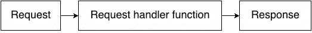
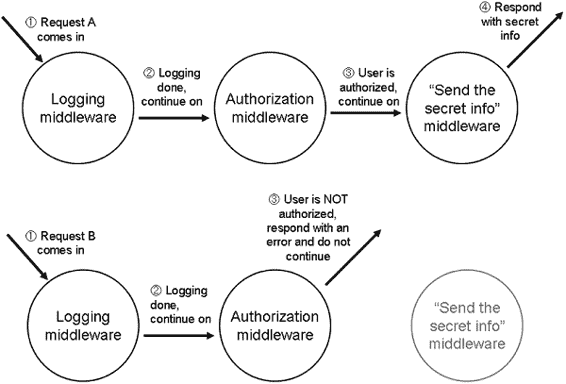
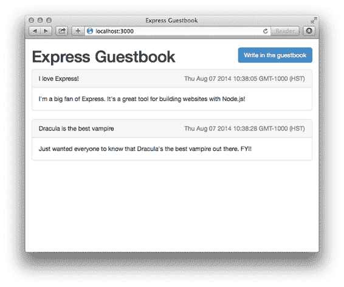
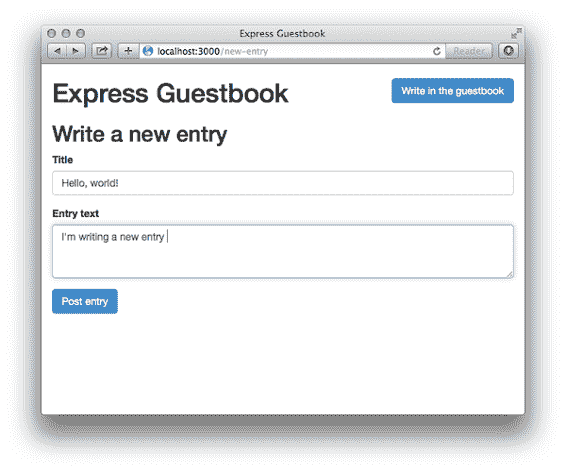

# 3 Express 的基础

正如我们在上一章中看到的，Node.js 自带了许多内置模块，其中之一被称为`http`。Node 的 HTTP 模块允许你构建一个能够响应浏览器（以及更多）HTTP 请求的 HTTP 服务器。简而言之，HTTP 模块让你能够使用 Node 构建网站！

虽然你可以仅使用 Node 的内置 HTTP 模块构建完整的 Web 服务器，但你可能不想这样做。正如我们在第一章中讨论的，以及在第二章中看到的，HTTP 模块公开的 API 相当有限，并没有为你做很多繁重的工作。

正是 Express 在这里发挥作用：它是一个有用的第三方模块（即，不是与 Node.js 捆绑在一起的）。实际上，你可以用“纯”Node 编写一切，而无需接触 Express。但正如我们将看到的，Express 简化了许多困难的部分，并说“别担心，你不需要处理这部分丑陋的部分。我会处理这个！”换句话说，它就像魔法一样！

在本章中，我们将从我们的 Node 知识出发，努力真正理解 Express。我们将讨论它与“纯”Node 的关系，中间件和路由的概念，以及学习 Express 为我们提供的其他优秀功能。在未来的章节中，我们将更深入地探讨；本章将给出一个代码密集的框架概述。

在高层次上，Express 实际上只提供了四个主要功能，我们将在本章中学习这些功能：

1. 与“纯”Node 相比，其中你的请求只通过一个函数，Express 有一个“中间件栈”，这实际上是一个函数数组。

2. 路由与中间件类似，但只有在访问特定 URL 并使用特定 HTTP 方法时才会调用函数。例如，你可以在浏览器访问`yourwebsite.com/about`时仅运行请求处理器。

3. Express 还扩展了请求和响应，为开发者提供了许多额外的方法和属性，以便于使用。

4. 视图允许你动态渲染 HTML。这不仅允许你在飞行中更改 HTML，还允许你用其他语言编写 HTML。

我们将在本章构建一个简单的留言簿，以了解这四个功能。

## 3.1 中间件

Express 的一个最大特性被称为“中间件”。中间件与我们在“纯”Node 中看到的请求处理器非常相似（接受请求并返回响应），但中间件有一个重要的区别：它不仅仅有一个处理器，中间件允许多个处理器按顺序发生。

中间件有多种应用，我们将探讨。例如，一个中间件可以记录所有请求，然后继续到另一个为每个请求设置特殊 HTTP 标头的中间件，然后继续进一步。虽然我们可以用一个大的请求处理器来完成这个任务，但我们会看到，通常将不同的任务分解成单独的中间件函数更可取。如果你现在感到困惑，不要担心——我们将有一些有用的图表和一些具体的例子。

在其他框架中的类似之处 中间件并不仅限于 Express；它在很多其他地方以不同的形式存在。中间件存在于其他 Web 应用程序框架中，如 Python 的 Django 或 PHP 的 Laravel。Ruby Web 应用程序也有这个概念，通常称为 "Rack 中间件"。尽管 Express 有自己独特的中间件风味，但这个概念可能对你来说并不陌生。

让我们开始使用 Express 的中间件功能重写我们的 "Hello, World" 应用程序。我们会看到它有更少的代码行，这可以帮助我们加快开发速度并减少潜在错误的数量。

### 3.1.1 使用 Express 的 "Hello, World"

让我们设置一个新的 Express 项目。创建一个新的目录，并在其中放置一个名为 `package.json` 的文件。回想一下，`package.json` 是我们存储有关 Node 项目信息的方式。它列出了简单的数据，如项目的名称和作者，还包含有关其依赖项的信息。

从一个骨架 `package.json` 开始：

列表 3.1 一个裸骨的 package.json

`{` `  "name": "hello-world",` `  "author": "Your Name Here!",` `  "private": true,` `  "dependencies": {}``}`

...然后安装 Express 并将其保存到你的 `package.json` 中：

`npm install express –save`

运行此命令将在第三方 Node 软件包目录中查找 Express 并获取最新版本。它将把它放在一个名为 `node_modules/` 的文件夹中。将 `--save` 添加到安装命令中，它将保存到 `package.json` 的 `dependencies` 键下。运行此命令后，你的 `package.json` 将类似于以下内容：

列表 3.2 使用 --save 标志安装 Express 后的 package.json

`{` `  "name": "hello-world",` `  "author": "Your Name Here!",` `  "private": true,` `  "dependencies": {` `    "express": "⁴.10.5"` `  }` `}`

好的，现在我们准备好了。将此文件保存为 app.js：

列表 3.3 使用 Express 的 "Hello, World"

`var express = require("express");  #A` `var http = require("http");` `var app = express();   #B` `app.use(function(request, response) {  #C` `  response.writeHead(200, { "Content-Type": "text/plain" });      #C` `  response.end("Hello, World!");  #C` `});  #C` `http.createServer(app).listen(3000);  #D`

#A 块中有一个新成员：Express 模块。我们像要求 http 模块一样要求它。

#B 要启动一个新的 Express 应用程序，我们只需调用 express 函数。

#C 这个函数被称为 "中间件"。正如我们将看到的，它看起来非常像之前的请求处理器。

#D 启动服务器！

现在让我们逐步分析这个。

首先，我们引入 Express。然后，就像之前一样，我们引入 Node 的 HTTP 模块。我们已经准备好了。

然后我们创建了一个名为 app 的变量，就像之前一样，但不是创建服务器，而是调用 `express()`，它返回一个请求处理函数。这很重要：这意味着我们可以像之前一样将结果传递给 `http.createServer`。

记得我们在上一章中使用的请求处理函数，使用“纯”Node？它看起来像这样：

`var app = http.createServer(function(request, response) {` `  response.writeHead(200, { "Content-Type": "text/plain" });` `  response.end("Hello, world!");``});`

在这个例子中，我们有一个非常类似的功能（实际上，我是复制粘贴的）。它也传递了一个请求和响应对象，我们以相同的方式与它们交互。

接下来，我们创建服务器并开始监听。回想一下，`http.createServer` 之前接受了一个函数，所以——`app` 只是一个函数。它是一个 Express 制作的请求处理函数，它将从中间件开始一直处理到结束。最终，它只是一个像之前一样的请求处理函数。

注意：你会看到人们使用 `app.listen(3000)`，这实际上只是将调用委托给 `http.createServer`。这只是简写，就像我们在后续章节中将 `request` 简写为 `req` 和 `response` 为 `res` 一样。

### 3.1.2 中间件在高级层面上的工作原理

在 Node 中，所有内容都通过一个大函数。为了回顾第二章的一个例子，它看起来像这样：

列表 3.4 Node 请求处理函数

`function requestHandler(request, response) {` `  console.log("In comes a request to: " + request.url);` `  response.end("Hello, world!");``}`

在没有中间件的世界里，我们发现只有一个主请求函数来处理所有事情。如果我们绘制应用程序的流程图，它可能看起来像图 3.1。

图 3.1 没有中间件的请求。

每个请求都通过一个请求处理函数，它最终生成响应。这并不是说主处理函数不能调用其他函数，但最终，主函数会响应每个请求。

使用中间件时，你的请求不是通过你编写的单个函数，而是通过一个由你编写的函数数组（称为“中间件栈”）传递。它可能看起来像图 3.2。

图 3.2 带有中间件的请求。

好吧，所以 Express 允许你执行一个函数数组，而不是一个函数。这些函数可能是什么？为什么我们可能想要这样做？

让我们再次回顾第一章的一个例子：一个验证用户的应用程序。如果用户验证成功，它会显示一些秘密信息。在此期间，我们的服务器会记录进入服务器的每个请求，无论是否已验证。

此应用可能有三个中间件函数：一个用于记录日志，一个用于身份验证，一个用于响应秘密信息。记录中间件将记录每个请求并继续到下一个中间件；身份验证中间件只有在用户被授权的情况下才会继续；最后的中间件将始终响应，并且它不会继续，因为没有其他中间件跟随。

请求可以通过这个简单应用有两种可能的方式；两种可能选项的示意图如图 3.3 所示。

图 3.3 两个请求通过中间件函数。注意中间件有时会继续，但有时会响应请求。

每个中间件函数都可以修改请求或响应，但并不总是必须这样做。最终，某些中间件应该响应请求。它可能是第一个，也可能是最后一个。如果它们都没有响应，那么服务器将会挂起，浏览器将独自坐着，没有响应。

这很强大，因为我们可以将我们的应用程序分成许多小部分，而不是有一个巨大的单一实体。它们变得更容易组合和重新排序，而且也很容易引入第三方中间件。

我们将看到一些例子，希望它们能（希望如此！）使这一切更加清晰。

### 3.1.3 中间件代码的被动性

中间件可以影响响应，但不必这样做。例如，上一节中的记录中间件不需要发送不同的数据——它只需要记录请求并继续。

让我们从构建一个完全没有用的中间件开始，然后继续前进。下面是一个空中间件函数的样子：

列表 3.5 一个什么也不做的空中间件

`function myFunMiddleware(request, response, next) {` `  ... #A` `  next(); #B`

#A 对请求和/或响应进行操作。

#B 当我们全部完成时，调用 next() 来将控制权推迟到链中的下一个中间件。

当我们启动服务器时，我们从最顶层的中间件开始，一直工作到底部。所以如果我们想在应用中添加简单的记录，我们可以这样做！

列表 3.6 记录中间件

`var express = require("express");` `var http = require("http");` `var app = express();` `app.use(function(request, response, next) { #A` `  console.log("In comes a " + request.method + " to " + request.url);` `  next();` `});` `app.use(function(request, response) {  #B` `  response.writeHead(200, { "Content-Type": "text/plain" });` `  response.end("Hello, World!");` `});` `http.createServer(app).listen(3000);`

#A 这是记录中间件，它将请求记录到控制台，然后转到下一个中间件。

#B 这发送了实际的响应。

运行此应用并访问 `http://localhost:3000`。在控制台中，你会看到你的服务器正在记录你的请求（刷新以查看）。你也会在浏览器中看到你的 "Hello, World!"。

重要的是要注意，在纯 Node.js 服务器上工作的一切在中间件中也同样有效。例如，你可以在没有 Express 的情况下在纯 Node 网络服务器中检查`request.method`。Express 并没有去掉它——它就像之前一样在那里。如果你想设置响应的`statusCode`，你也可以这样做。Express 向这些对象添加了一些东西，但它并没有移除任何东西。

上述示例显示的中间件不会改变请求或响应——它记录请求并始终继续。虽然这种中间件可能很有用，但中间件也可以改变请求或响应对象。

### 3.1.4 中间件代码改变请求和响应

并非所有中间件都应该被动的——我们示例中的其他中间件并不是这样工作的；它们实际上需要改变响应。

让我们尝试编写之前提到的认证中间件。为了简单起见，让我们选择一个奇怪的认证方案：只有在你访问小时的偶数分钟时（例如 12:00、12:02、12:04、12:06 等）你才是认证的。回想一下，我们可以使用取模运算符（`%`）来帮助确定一个数是否可以被另一个数整除。

我们将这个中间件添加到我们的应用程序中，如列表 3.7 所示：

列表 3.7 添加伪造认证中间件

`app.use(function(request, response, next) {  #A` `  console.log("In comes a " + request.method + " to " + request.url);` `  next();` `});` `app.use(function(request, response, next) {` `  var minute = (new Date()).getMinutes();` `  if ((minute % 2) === 0) {` `    next();   #B` `  } else {` `    response.statusCode = 403;        #C` `    response.end("Not authorized.");  #C` `  }` `});` `app.use(function(request, response) {` `  response.end('Secret info: the password is "swordfish"!');  #D``});`

#A 这就是记录中间件，就像之前一样。

#B 如果你是在小时的第一个分钟访问，调用 next()来继续到“发送秘密信息”中间件。

#C 如果未经授权，发送状态码 403（“未经授权”）并响应用户。请注意，我们没有调用 next()来继续执行。

#D 发送秘密信息！

当请求到来时，它将始终按照你`use`它们的相同顺序通过中间件。首先，它将从记录中间件开始。然后，如果你是在偶数分钟访问，你将继续到下一个中间件并看到秘密信息。但如果你在小时的任何其他分钟访问，你将停止并无法继续。

### 3.1.5 第三方中间件库

就像编程的许多部分一样，通常情况下，其他人已经做了你试图做的事情。你可以编写自己的中间件，但通常会发现你想要的功能已经在别人的中间件中实现了。

让我们看看几个有用的第三方中间件的例子。

MORGAN: 记录中间件

让我们移除我们的日志记录器并使用 Morgan，这是一个为 Express 提供的很好的日志记录器，它具有许多功能。日志记录器有很多用途。首先，它们是查看用户行为的一种方式。这不是做市场分析等事情的最佳方式，但当你不确定为什么应用程序崩溃时，它非常有用。我也发现它在开发中非常有用——你可以看到请求何时进入你的服务器。如果有什么问题，你可以使用 Morgan 的日志记录作为合理性检查。

运行 `npm install morgan --save` 并尝试一下（再次将其保存到 app.js 中）：

列表 3.8 使用 Morgan 进行日志记录（在 app.js 中）

`var express = require("express");` `var logger = require("morgan");` `var http = require("http");` `var app = express();` `app.use(logger("short")); #A` `app.use(function(request, response) {` `  response.writeHead(200, { "Content-Type": "text/plain" });` `  response.end("Hello, World!");` `});` `http.createServer(app).listen(3000);`

#A 有趣的事实：logger("short") 返回一个函数。

访问 `http://localhost:3000`，你会看到一些日志！感谢，摩根。

EXPRESS 的静态中间件

除了 Morgan 之外，还有更多的中间件。

对于网络应用程序来说，需要通过网络发送静态文件是非常常见的。这包括图像、CSS 或 HTML 等内容，这些内容不是动态的。

`express.static` 与 Express 一起提供，帮助你提供静态文件。发送文件这一简单的行为实际上要做很多工作，因为有很多边缘情况和性能考虑因素需要考虑。Express 来拯救！

假设我们想要从一个名为 "public" 的目录中提供文件。这是我们可以使用 Express 的静态中间件来完成的方式：

列表 3.9 使用 express.static（在 app.js 中）

`var express = require("express");` `var path = require("path");` `var http = require("http");` `var app = express();` `var publicPath = path.resolve(__dirname, "public"); #A` `app.use(express.static(publicPath)); #B` `app.use(function(request, response) {` `  response.writeHead(200, { "Content-Type": "text/plain" });` `  response.end("看起来你没有找到静态文件.");` `});` `http.createServer(app).listen(3000);`

#A 使用 Node 的 path 模块设置公共路径。

#B 从 publicPath 目录发送静态文件。

现在，公共目录中的任何文件都会显示出来。我们可以把任何我们想放的东西放进去，服务器会发送它。如果 `public` 文件夹中没有找到匹配的文件，它将进入下一个中间件，并显示 "Hello, World!"。如果找到匹配的文件，`express.static` 将发送它并停止中间件链。

为什么使用 path.resolve？

那些关于 path.resolve 的业务是什么？我们为什么不能只说 /public？简短的答案是我们可以，但这不是跨平台的。

在 Mac 和 Linux 上，我们想要这个目录：

`/public`

但在 Windows 上，我们想要这个目录：

`\public`

Node 的内置 path 模块将确保在 Windows、Mac 和 Linux 上运行顺畅。

寻找更多中间件

我已经展示了 Morgan 和 Express 的静态中间件，但还有很多。这里有一些其他有用的中间件：

·  connect-ratelimit 允许你限制每小时请求的数量。如果有人向你的服务器发送大量请求，你可以开始给他们错误信息，阻止他们使你的网站崩溃。

·  helmet 帮助你添加 HTTP 头信息，使你的应用程序更安全地防止某些类型的攻击。我们将在后面的章节中探讨它。（我是 Helmet 的贡献者，所以我肯定会推荐它！）

·  cookie-parser 解析浏览器 cookie。

·  response-time 发送 X-Response-Time 头信息，这样你可以调试你应用程序的性能。

我们将在下一章进一步探讨这些中间件选项。

如果你正在寻找更多的中间件，搜索“Express 中间件”会有所帮助，但你也应该搜索“Connect 中间件”。还有一个名为 Connect 的框架，它类似于 Express，但只做中间件。Connect 中间件与 Express 兼容，所以如果“Express 中间件”搜索没有结果，尝试搜索 Connect 中间件。

## 3.2     路由

路由是一种根据 URL 和 HTTP 动词将请求映射到特定处理器的机制。你可以想象有一个主页、一个关于页面和一个 404 页面。路由可以完成所有这些。我认为用代码比用英语解释更好：

列表 3.10 Express 路由示例

`var express = require("express");` `var path = require("path");` `var http = require("http");` `var app = express();` `var publicPath = path.resolve(__dirname, "public");  #A` `app.use(express.static(publicPath));  #A` `app.get("/", function(request, response) {    #B` `  response.end("欢迎来到我的主页!");` `});` `app.get("/about", function(request, response) {    #C` `  response.end("欢迎来到关于页面!");` `});` `app.get("/weather", function(request, response) {    #D` `  response.end("当前天气是晴朗的.");` `});` `app.use(function(request, response) {    #E` `  response.statusCode = 404;` `  response.end("404!");` `});` `http.createServer(app).listen(3000);`

#A  这设置了类似于我们之前看到的静态中间件。每个请求都会通过这个中间件，如果没有找到静态文件，它将继续到下面的路由。

#B 当请求根路径时，这个请求处理器会被调用。在这个例子中，当你访问 http://localhost:3000 时，这个处理器会被调用。

#C 当请求到来时，这个请求处理器会被调用，请求的路径是 /about（在这个例子中是 http://localhost:3000/about）。

#D 当请求到来时，这个请求处理器会被调用，请求的路径是 /weather（在这个例子中是 http://localhost:3000/weather）。

#E 如果我们没有命中静态文件中间件或上述任何路由，那么我们已经尝试了一切，最终会到这里。当你访问一个未知的 URL，如/edward_cullen 或/delicious_foods/burrito.jpg 时，这将会发生。

在基本需求之后，我们添加了我们的静态文件中间件（就像我们之前看到的那样）。这将服务于名为`public`的文件夹中的任何文件。

`app.get`的三个调用是 Express 的神奇路由系统。它们也可以是`app.post`，响应 POST 请求，或者 PUT，或者任何 HTTP 动词。（我们将在后面的章节中更多地讨论这些其他 HTTP 动词。）第一个参数是一个路径，比如`/about`、`/weather`或者简单地`/`，网站的根目录。第二个参数是一个请求处理函数，类似于我们在中间件部分看到过的。

它们是我们之前看到过的相同的请求处理函数。它们的工作方式就像中间件一样；只是它们被调用的时机不同。

这些路由可以变得更智能。除了匹配固定路由外，它们还可以匹配更复杂的路由（想象一下正则表达式或更复杂的解析）。

列表 3.11 从路由中获取数据

`app.get("/hello/:who", function(request, response) {   #A response.end("Hello, " + request.params.who + ".");  #B });`

#A 这指定了路由中的"hello"部分是固定的，但之后的字符串可以变化。

#B `req.params`有一个名为"who"的属性。这并不是巧合，它也是上面指定路由的名称。Express 将从传入的 URL 中提取值并将其设置为指定的名称。

重新启动你的服务器，访问`localhost:3000/hello/earth`以获取以下消息：

你好，地球。

注意，如果你添加一个斜杠，比如`localhost:3000/hello/entire/earth`将会返回一个 404 错误。

你很可能在网上到处都见过这种行为。例如，你可能见过可以访问特定用户 URL 的网站。例如，如果你的用户名是 ExpressSuperHero，你的用户页面 URL 可能看起来像这样：

`https://mywebsite.com/users/ExpressSuperHero`

Express 允许我们这样做。而不是为每个可能的用户名（或文章、照片，或任何东西）定义一个路由，你可以定义一个匹配所有这些的路由。

文档还展示了一个使用正则表达式进行更复杂匹配的示例，你可以用这个路由做很多其他的事情。为了概念上的理解，我已经说得足够多了。我们将在第五章中更详细地探讨这一点。

但这更酷。

## 3.3 扩展请求和响应

Express 增强了你传递给每个请求处理函数的请求和响应对象。旧的内容还在那里，但 Express 也添加了一些新的内容！API 文档（在[`expressjs.com/api.html`](http://expressjs.com/api.html)）解释了一切，但让我们看看几个例子。

Express 提供的一个优点是重定向方法。列表 3.12 展示了重定向方法可能的工作方式：

列表 3.12 使用重定向

`response.redirect("/hello/world");` `response.redirect("http://expressjs.com");`

如果我们只是使用 Node.js，`response` 将没有名为 `redirect` 的方法；Express 为我们添加了它到响应对象中。你可以在原生 Node.js 中这样做，但需要更多的代码。

Express 还添加了 `sendFile` 这样的方法，允许你发送整个文件：

列表 3.13 sendFile 示例

`response.sendFile("/path/to/cool_song.mp3");`

再次强调，`sendFile` 方法在原生 Node.js 中不可用；Express 为我们添加了它。就像上面的重定向示例一样，你可以在原生 Node.js 中这样做，但需要更多的代码。

不仅响应对象得到了便利，请求对象也得到了许多其他酷炫的属性和方法，如 `request.ip` 获取 IP 地址或 `request.get` 方法获取传入的 HTTP 头部。

让我们使用这些功能来构建一些中间件，以阻止一个恶意 IP 地址。Express 使这变得非常简单：

列表 3.14 黑名单 IP

`var express = require("express");` `var app = express();` `var EVIL_IP = "123.45.67.89";` `app.use(function(request, response, next) {` `  if (request.ip === EVIL_IP) {` `    response.status(401).send("Not allowed!");` `  } else {` `    next();` `  }` `});` `// ... 你的应用其余部分 ...`

注意，我们在这里使用了 `req.ip`，一个名为 `res.status()` 的函数，以及 `res.send()`。这些都不是 Node.js 的原生功能——它们都是 Express 添加的扩展。

从概念上讲，这里没有太多需要了解的，除了 Express 扩展了请求和响应的事实。

我们在本章中已经看到了一些优点，但我不想在这里列出全部。对于 Express 提供的每一个优点，请查看其 API 文档[`expressjs.com/4x/api.html`](http://expressjs.com/4x/api.html)。

## 3.4 视图

网站是用 HTML 构建的。它们已经这样做了很长时间。虽然单页应用很流行（并且完全可以用 Express 实现），但通常你希望服务器动态生成 HTML。你可能想要提供问候当前登录用户的 HTML，或者可能想要动态生成一个数据表。

目前市面上有多种不同的视图引擎。有 EJS（代表“嵌入式 JavaScript”）、Handlebars、Jade 以及更多。甚至还有从其他编程世界移植的模板语言，如 Swig 和 HAML。它们都有一个共同点：最终都会输出 HTML。

对于接下来的示例，我们将使用 EJS。我选择 EJS 是因为它是由 Express 的创造者团队开发的一个流行的选项。希望你会喜欢它，但如果不喜欢，第七章中我们将讨论许多其他替代方案。

下面是设置视图的示例：

列表 3.15 使用 Express 设置视图

`var express = require("express");` `var path = require("path");` `var app = express();` `app.set("views", path.resolve(__dirname, "views")); #A` `app.set("view engine", "ejs"); #B`

#A 这告诉 Express，你的视图将放在一个名为 views 的文件夹中。我们也可以将其放在另一个路径，但 "views" 是一个常见的名称。

#B 这告诉 Express，你将使用 EJS 模板引擎。

我们很快会向这个文件添加更多内容。

第一个块和以前一样：引入我们需要的东西。然后我们说 "我们的视图在一个名为 views 的文件夹中"。之后，我们说 "使用 EJS"。EJS（文档在 [`github.com/tj/ejs`](https://github.com/visionmedia/ejs)）是一种模板语言，它编译成 HTML。确保使用 `npm install ejs --save` 安装它。

现在，我们在 Express 端设置了这些视图。我们如何使用它们？这个 EJS 是什么意思？

让我们从创建一个名为 `index.ejs` 的文件开始，并将其放入一个名为 `views` 的目录中。它可能看起来像这样：

列表 3.16 一个简单的 EJS 文件

`<!DOCTYPE html>` `<html>` `  <head>` `    <meta charset="utf-8">` `    <title>Hello, world</title>` `  </head>` `<body>` `  <%= message %>` `</body>``</html>`

这应该看起来完全像 HTML，但在 body 标签内的一个奇怪部分。EJS 是 HTML 的超集，所以所有有效的 HTML 都是有效的 EJS。但 EJS 还增加了一些新特性，比如变量插值。`<%= message %>` 将插值一个名为 message 的变量，这是我们将在从 Express 渲染视图时传递的。下面是这个样子的：

列表 3.17 使用 Express 渲染视图

`app.get("/", function(request, response) {` `  response.render("index", {` `    message: "Hey everyone! This is my webpage."` `  });``});`

Express 向 response 添加了一个名为 `render` 的方法。它基本上查看视图引擎和视图目录（我们之前定义的），并使用你传递的变量渲染 `index.ejs`。

列表 3.18 中的代码将渲染以下 HTML：

列表 3.18 一个简单的 EJS 文件，已渲染

`<!DOCTYPE html>` `<html>` `  <head>` `    <meta charset="utf-8">` `    <title>Hello, world</title>` `  </head>` `<body>` `  Hey everyone! This is my webpage. #A` `</body>``</html>`

#A 注意，这是我们上面在 render 方法中指定的变量。

EJS 是一个流行的视图解决方案，但还有许多其他选项。

我们将在后面的章节中探索其他选项。

## 3.5 示例：在留言簿中综合运用所有内容

如果你像我一样，你曾在互联网的早期看到过它；尴尬的动画 GIF，糟糕的代码，以及每个页面上的 Times New Roman。在本章中，我们将从这个过去的时代复活一个组件：留言簿。留言簿相当简单：用户可以在在线留言簿中写入新的条目，并且可以浏览他人的条目。

让我们运用所学的一切来为这个留言簿构建一个更真实的应用。结果证明，所有这些都会派上用场！我们的网站将有两个页面：

1.  一个列出所有之前发布的留言簿条目的主页

2.  一个带有“添加新条目”表单的页面

就这样！在我们开始之前，我们必须先设置好。准备好了吗？

### 3.5.1  准备设置

让我们开始一个新的项目。创建一个新的文件夹，并在其中创建一个名为`package.json`的文件。它应该看起来像这样：

列表 3.19 guestbook 的`package.json`

`{` `  "name": "express-guestbook",` `  "private": true,` `  "scripts": {` `    "start": "node app"  #A` `  }``}`

#A 在终端中键入 "npm start" 将会运行 "node app"，这将启动您的应用程序。

您可以添加其他字段（如作者或版本），但在这个例子中，我们不需要太多。现在，让我们像之前一样安装我们的依赖项，并将它们保存到`package.json`中：

`npm install express morgan body-parser ejs --save`

这些模块对您来说应该很熟悉，除了`body-parser`。我们的应用程序将需要在 HTTP POST 请求中发布新的留言簿条目，因此我们需要解析 POST 请求的正文；这就是 body 的作用所在。

确保 Express、Morgan、body-parser 和 EJS 已经被保存到`package.json`中。如果没有，请确保您已经添加了`--save`标志。

### 3.5.2  主要应用程序代码

现在我们已经安装了所有的依赖项，创建`app.js`并将以下应用程序放入其中：

列表 3.20 Express 留言簿，在`app.js`中

`var http = require("http");               #A` `var path = require("path");               #A` `var express = require("express");         #A` `var logger = require("morgan");           #A` `var bodyParser = require("body-parser");  #A` 

#A 首先，我们要求所有需要的模块，就像之前一样。

#B 接下来，我们创建一个 Express 应用程序，就像我们之前做的那样。

#C 第一行告诉 Express 视图位于名为 views 的文件夹中，下一行说明视图将使用 EJS 引擎。

#D 创建一个 "全局" 数组来存储我们所有的条目。

#E 使此 entries 数组在所有视图中可用。

#F 使用 Morgan 记录每个请求。

#G 如果用户提交表单，则此中间件将填充一个名为 req.body 的变量。（需要扩展选项，我们选择 false 以获得轻微的安全优势。我们将在第十章中详细讨论原因。）

#H 访问网站根目录时，渲染主页（它将在 views/index.ejs 中）。

#I 当获取 URL 时，渲染 "new entry" 页面（在 views/index.ejs 中）。

#J 当我们向 "new entry" URL 发送 POST 请求时，定义一个路由处理器。注意，这是相同的 URL，但不同的 HTTP 方法。

#K 如果用户提交的表单没有标题或内容（我们从 req.body 中读取），则返回一个 400 "bad request" 错误。

#L 将标题、正文和发布时间添加到条目列表中。

#M 最后，重定向回主页以查看您的新条目。

#N 没有其他请求处理器发生，这意味着我们正在尝试请求一个未知资源。渲染 404 页面。

#O 在端口 3000 上启动服务器！

### 3.5.3 创建视图

我们在这里引用了一些视图，所以让我们来填充这些内容。创建一个名为 views 的文件夹，然后在 `views/header.ejs` 中创建标题：

列表 3.21 header.ejs

`<!DOCTYPE html>` `<html>` `<head>` `<meta charset="utf-8">` `<title>Express Guestbook</title>` `<link rel="stylesheet" href="//maxcdn.bootstrapcdn.com/bootstrap/3.2.0/css/bootstrap.min.css">  #A` `</head>` `<body class="container">` `  <h1>` `    Express Guestbook` `    <a href="/new-entry" class="btn btn-primary pull-right">` `      在留言簿中写点什么` `    </a>` `  </h1>`

#A 此代码从 Bootstrap CDN 加载 Twitter 的 Bootstrap CSS，这是一个为您的方便而托管 Bootstrap 的外部服务器。

注意，我们使用 Twitter Bootstrap 进行样式设计，但你也可以轻松地用你自己的 CSS 替换它。最重要的是，这是头部；此 HTML 将出现在每个页面的顶部。

注意：简而言之，Bootstrap 是一些 CSS 和 JavaScript 的集合，它提供了一系列默认样式。你完全可以自己编写导航栏、按钮和标题 CSS，但 Bootstrap 帮助我们快速启动。你可以在 http://getbootstrap.com/ 上了解更多信息。

接下来，创建一个简单的页脚在 `views/footer.ejs`，它将出现在每个页面的底部：

列表 3.22 footer.ejs

`</body>` `</html>`

现在我们已经定义了常见的头部和页脚，让我们定义三个视图：主页、添加新条目的页面和 404 页面。

将以下内容保存到 `views/index.ejs`：

列表 3.23 index.ejs

`<% include header %>` `<% if (entries.length) { %>` `  <% entries.forEach(function(entry) { %>` `    
` `      
` `        
` `          <%= entry.published %>` `        
` `        <%= entry.title %>` `      
` `      
` `        <%= entry.content %>` `      
` `    
` `  <% }) %>` `<% } else { %>` `  没有条目！ <a href="/new-entry">添加一个！</a>` `<% } %>` `<% include footer %>`

...以下内容保存到 `views/new-entry.ejs`...

列表 3.24 new-entry.ejs

`<% include header %>` `<h2>写一篇新条目</h2>` `<form method="post" role="form">` `  
` `    <label for="title">标题</label>` `    <input type="text" class="form-control" id="title"` `    [CA]name="title" placeholder="条目标题" required>` `  
` `  
` `    <label for="content">条目文本</label>` `    <textarea class="form-control" id="content" name="content"` `    [CA]placeholder="爱的表达！这是一个构建网站的好工具。" rows="3" required></textarea>` `  
` `  
` `    <input type="submit" value="发布条目" class="btn btn-primary">` `  
` `</form>`  `<% include footer %>`

...最后，将以下内容放入`views/404.ejs`：

列表 3.25 404.ejs

`<% include header %>` `<h2>404! 页面未找到。</h2>``<% include footer %>`

那就是您所有的视图！

### 3.5.4  启动它！

现在，使用`npm start`启动您的应用，并访问`http://localhost:3000`，查看我们的客户留言。

图 3.4 客户留言主页

图 3.5 客户留言主页

看看这个！多漂亮的迷你留言簿。它让我想起了 20 世纪 90 年代。

让我们回顾一下这个小项目的不同部分：

·   我们使用一个中间件函数来记录所有请求，这有助于我们进行调试。我们还在最后使用一个中间件来服务 404 页面。

·   我们使用 Express 的路由将用户导向主页、“添加新条目”视图以及添加新条目的 POST 请求。

·   我们使用 Express 和 EJS 来渲染页面。它允许我们动态创建 HTML；我们使用这个功能来动态显示内容。

## 3.6     总结

在本章中，您看到了以下内容：

·   Express 是一个位于 Node 之上的库，它抽象了很多复杂性

·   Express 有四个主要特性：

·   允许请求通过多个头部的中间件

-   在特定位置处理请求的路由

-   便捷方法和属性

-   用于动态渲染 HTML 的视图

·   许多模板引擎已被移植到与 Express 一起使用。其中一个流行的是 EJS，对于已经了解 HTML 的人来说，它是最简单的。
