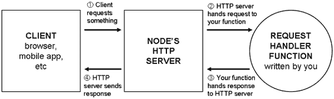
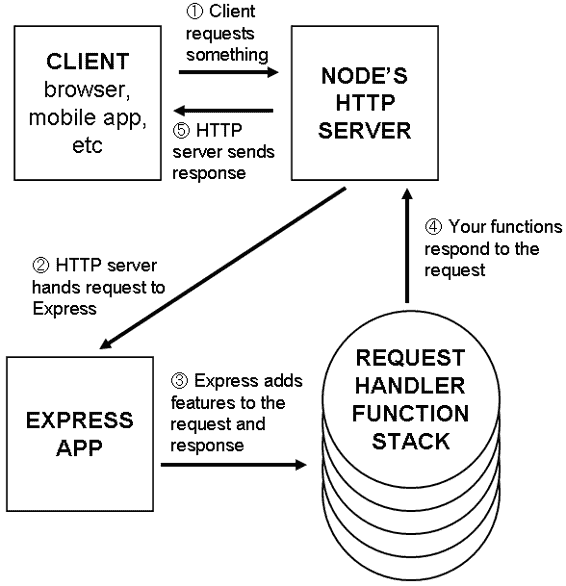
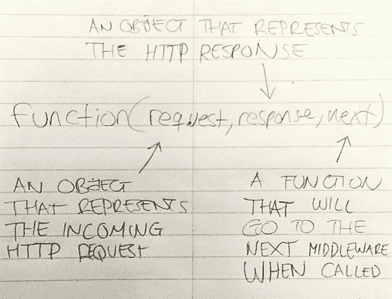
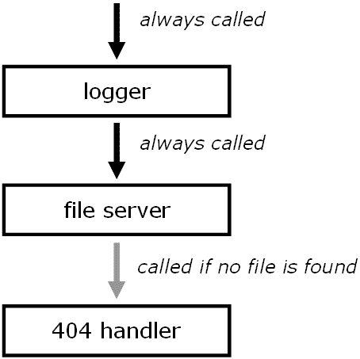
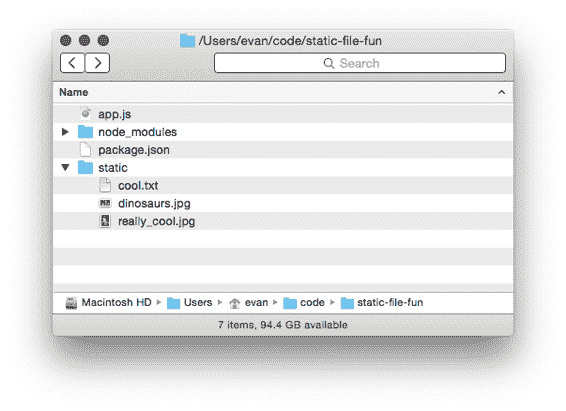
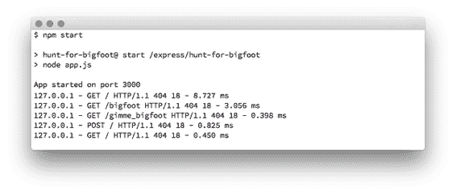

# 4 中间件

在没有像 Express 这样的框架的情况下，Node.js 给你一个相当简单的 API。创建一个处理请求的函数，将其传递给 `http.createServer`，然后就可以使用了。虽然这个 API 很简单，但随着你的应用程序的增长，你的请求处理函数可能会变得难以控制。

Express 通过使用称为中间件的东西来帮助缓解这些问题。它这样做的一种方式是，对于没有框架的 Node，它让你为整个应用程序编写一个单一的大型请求处理函数，而中间件允许你将这些请求处理函数分解成更小的部分。这些较小的函数通常一次处理一件事情。一个可能会记录所有进入服务器的请求；另一个可能会解析传入请求的特殊值；另一个可能会验证用户身份。

在本章中，我们将学习：

·  中间件是什么

·  请求如何通过 Express 中间件；"中间件栈"

·  如何使用中间件

·  如何编写你自己的中间件

·  有用的第三方 Express 中间件

从概念上讲，中间件是 Express 的最大部分。最终，你写的绝大多数 Express 代码都是以某种方式作为中间件。希望在本章之后，你会明白为什么！

## 4.1 中间件和中间件栈

最终，Web 服务器监听请求，解析这些请求，并发送响应。

Node 运行时首先获取这些请求。它将那些请求从原始字节转换为你可以处理的两个 JavaScript 对象：一个用于请求，一个用于响应。传统上，请求对象称为 `req`，响应对象称为 `res`。

图 4.1：当单独使用 node.js 时，我们有一个函数，它提供了一个表示传入请求的请求对象和一个表示节点应发送回客户端的响应对象的响应对象。

这两个对象将被发送到你将编写的 JavaScript 函数。你将解析 `req` 来查看用户想要什么，并通过操作 `res` 来准备你的响应。

一段时间后，你将完成对响应的写入。当这种情况发生时，你会调用 `res.end`。这向 Node 发出信号，表示响应已经全部完成，准备好通过网络发送。Node 运行时会查看你对响应对象所做的操作，将其转换为另一组字节，并通过互联网发送给请求者。

在 Node 中，这两个对象只通过一个函数传递。然而，在 Express 中，这些对象通过一个函数数组传递，称为中间件栈。Express 将从栈中的第一个函数开始，并按顺序向下执行。

图 4.2 在 Express 中工作，一个请求处理函数被替换为中间件函数栈。

堆栈中的每个函数都接受三个参数。前两个是之前的请求和响应对象。它们由 Node 提供，尽管 Express 在前一章中讨论的额外便利功能中装饰了它们。

这些函数的第三个参数本身也是一个函数（通常称为 `next`）。当调用 `next` 时，Express 将继续到堆栈中的下一个函数。

图 4.3：所有中间件函数具有相同的签名，包含三个函数：响应、请求和下一个。 

最终，堆栈中的这些函数之一必须调用 `res.end`，这将结束请求。（在 Express 中，你也可以调用一些其他方法，如 `res.send` 或 `res.sendFile`，但它们内部调用 `res.end`。）你可以在中间件堆栈中的任何函数中调用 `res.end`，但你只能调用一次，否则你会得到一个错误。

这可能有点抽象和模糊。让我们通过构建自己的静态文件服务器来查看这个例子是如何工作的。

## 4.2 示例应用：静态文件服务器

让我们构建一个简单的应用程序，从文件夹中提供文件。你可以在这个文件夹中放置任何东西，它将被提供——HTML 文件、图片，或者你唱的 Celine Dion 的 "My Heart Will Go On" 的 MP3。

这个文件夹将被称为 "static" 并位于我们的项目目录中。如果有一个名为 `celine.mp3` 的文件，并且用户访问 `/celine.mp3`，我们的服务器应该通过互联网发送那个 MP3 文件。如果用户请求 `/burrito.html`，文件夹中不存在这样的文件，我们的服务器应该发送一个 404 错误。

另一个要求：我们的服务器应该记录每个请求，无论成功与否。它应该记录用户请求的 URL 和请求的时间。

这个 Express 应用程序将由中间件堆栈上的三个函数组成：

1. 记录器。这将把请求的 URL 和请求的时间输出到控制台。它将始终继续到下一个中间件（从代码的角度来看，它将始终调用 `next`）。

2. 静态文件发送器。这将检查文件是否在文件夹中。如果是，它将通过互联网发送该文件。如果请求的文件不存在，它将继续到最后一个中间件（再次调用 `next`）。

3. 404 处理器。如果这个中间件被触发，这意味着之前的中间件没有找到文件，我们应该返回一个 404 消息并完成请求。

4. 你可以将这个中间件堆栈可视化如下：

图 4.4 我们静态文件服务器应用程序的中间件堆栈。

5. 好了，别再说了。让我们开始构建这个。

### 4.2.1 设置环境

首先创建一个新的目录。你可以随意命名；让我们选择 `static-file-fun`。在这个目录内部，创建一个名为 `package.json` 的文件。这个文件存在于每个 Node.js 项目中，描述了你的包的元数据，从标题到第三方依赖项。

列表 4.1 我们静态文件应用程序的 package.json 文件

`{` `  "name": "static-file-fun",   #A` `  "private": true,             #B` `  "scripts": {` `    "start": "node app.js"     #C` `  }``}`

#A “name”键定义了你的包名。对于私有项目（见 #B），这不是必需的，但我们会添加它。

#B “private”键告诉 Node，这个包不应该发布在公共 Node 模块注册表中。对于你自己的个人项目，这应该设置为 "true"。

#C 当你运行“npm start”时，它将运行“node app.js”。

保存这个 `package.json` 文件后，你将想要安装 Express 的最新版本。在这个目录内部，运行 `npm install express --save`。这将把 Express 安装到这个文件夹内名为 `node_modules` 的目录中。它还会在 `package.json` 中添加 Express 作为依赖项。`package.json` 现在看起来像这样：

列表 4.2 我们静态文件应用程序更新的 package.json 文件

`{` `  "name": "static-file-fun",` `  "private": true,` `  "scripts": {` `    "start": "node app.js"` `  },` `  "dependencies": {` `    "express": "⁴.12.2"  #A` `  }``}`

#A 你的依赖项版本可能不同。

接下来，在这个新项目目录内（紧挨着 `package.json`）创建一个名为 "static" 的文件夹。在里面放一些文件；可能是一个 HTML 文件或一张图片。这里放什么并不重要，但放一些你的示例应用程序将提供的服务文件。

最后，在项目的根目录中创建 `app.js`，它将包含我们应用程序的所有代码。你的文件夹结构将看起来像这样：

图 4.5 静态文件乐趣的目录结构。

当你想运行这个应用程序时，你会运行 `npm start`。这个命令将查看你的 `package.json` 文件，看到你添加了一个名为 "start" 的脚本，并运行该命令。在这种情况下，它将运行 `node app.js`。

运行 `npm start` 目前不会做任何事情——我们还没有编写应用程序！——但你会每次想要运行应用程序时都运行它。

为什么使用 npm start？

你可能想知道为什么我们甚至使用了 `npm start`——为什么我们不直接运行 `node app.js`？我们可能这样做有三个原因。

首先，这是一个约定。大多数 Node 网络服务器都可以用 `npm start` 启动，无论项目的结构如何。如果有人选择了 `application.js` 而不是 `app.js`，你就必须知道这个变化。Node 社区似乎在这里已经达成了一致。

其次，它允许你用一个相对简单的命令（或一组命令）运行更复杂的命令。我们的应用程序现在很简单，但启动它可能会更复杂。也许我们需要启动一个数据库服务器或清除一个巨大的日志文件。将这种复杂性隐藏在一个简单的命令之下有助于保持事物的一致性和愉悦性。

第三个原因稍微复杂一些。npm 允许你全局安装包，因此你可以像运行任何其他终端命令一样运行它们。Bower 是一个常见的例子，它允许你使用新安装的`bower`命令从命令行安装前端依赖。你可以在系统上全局安装像 Bower 这样的东西。npm 脚本允许你向项目添加新命令而不需要全局安装，这样你就可以将所有依赖项都保留在项目内部，以便每个项目都有独特的版本。这个原因对于测试和构建脚本等用途非常有用，正如我们稍后将会看到的。

最后，你只需运行`node app.js`就不再需要输入`npm start`，但我发现上面的理由足够有说服力去这样做。

好的。让我们编写这个应用！

### 4.2.2 编写我们的第一个中间件函数：记录器

我们将首先让我们的应用记录请求，以便开始。

将以下内容放入`app.js`中：

列表 4.3 启动用于我们的静态文件服务器的 app.js

`var express = require("express");  #A` `var path = require("path");        #A` `var fs = require("fs");            #A` `var app = express();   #B` `app.use(function(req, res, next) {                     #C` `  console.log("Request IP: " + req.url);               #C` `  console.log("Request date: " + new Date());          #C` `});                                                    #C` `app.listen(3000, function() {               #D` `  console.log("App started on port 3000");  #D``});                                         #D`

#A 需要我们需要的模块。在这个例子中，我们将使用 Express，但很快我们将使用 Node 的内置 Path 和文件系统（"fs"）模块。

#B 创建一个新的 Express 应用并将其放入“app”变量中。

#C 这个中间件记录了所有传入的请求。但是，它有一个 bug！

#D 在端口 3000 上启动应用，并在启动时记录！

目前，我们只有一个记录服务器接收到的每个请求的应用程序。一旦我们设置了我们的应用（前几行），我们就调用`app.use`来向我们的应用程序的中间件堆栈添加一个函数。当一个请求进入这个应用程序时，该函数将被调用。

不幸的是，即使这个简单的应用也有一个关键的 bug。运行`npm start`并在浏览器中访问`localhost:3000`以查看它。

你会看到请求被记录到控制台，这是个好消息。但你的浏览器会卡住——加载指示器会一直旋转，直到请求最终超时，你在浏览器中会得到一个错误。这可不是什么好事！

这是因为我们没有调用`next`。

当你的中间件函数完成后，它需要做两件事之一：

1. 函数需要完成对请求的响应（使用`res.end`或 Express 的便利方法之一，如`res.send`或`res.sendFile`）。

2. 函数需要调用`next`以继续到中间件堆栈中的下一个函数。

如果你做其中之一，你的应用程序将正常工作。如果你两者都不做，入站请求将永远不会收到响应；它们的加载指示器将永远不会停止旋转（这就是上面发生的事情）。如果你两者都做，只有第一个“响应完成器”会通过，其余的将被忽略，这几乎肯定是不故意的！

这些错误一旦你知道如何查找通常很容易捕捉到。如果你没有响应请求，也没有调用`next`，那么你的服务器看起来会非常慢。

让我们通过调用`next`来修复我们的中间件。

列表 4.4 修复我们的日志中间件

`// …` `app.use(function(req, res, next) {` `  console.log("请求 IP: " + req.url);` `  console.log("请求日期: " + new Date());` `  next();   #A` `});` `// …`

#A 这是一条关键的新行！

现在，如果你停止你的应用程序，再次运行`npm start`，并在浏览器中访问[`localhost:3000`](http://localhost:3000)，你应该看到你的服务器正在记录所有请求并立即显示错误消息（例如“Cannot GET /”）。因为我们从未自己响应请求，Express 将向用户显示错误，并且这会立即发生。

厌倦了重启服务器？

到目前为止，当你更改代码时，你必须停止服务器并重新启动它。这可能会变得重复！你可以安装一个名为 Nodemon 的工具。Nodemon 会监视你的所有文件以检测更改，并在检测到任何更改时重新启动。

您可以通过运行`npm install nodemon --global`来安装 Nodemon。

安装完成后，你可以通过在命令中将“node”替换为“nodemon”来以监视模式启动文件。例如，如果你之前输入了`node app.js`，只需将其更改为`nodemon app.js`，你的应用程序在更改时将连续重新加载。

现在我们已经编写了日志记录器，接下来让我们编写下一部分——静态文件服务器中间件。

### 4.2.3 静态文件服务器中间件

从高层次来看，静态文件服务器中间件应该执行以下操作：

1. 检查请求的文件是否存在于静态目录中。

2. 如果文件存在，响应该文件并结束。在代码中，这相当于调用`res.sendFile`。

3. 如果文件不存在，继续处理堆栈中的下一个中间件。在代码中，这相当于调用`next`。

让我们将这个需求转化为代码。我们首先自己构建它以了解其工作原理，然后使用一些有用的第三方代码来简化它。

我们将利用 Node 的内置`path`模块，这将使我们能够确定用户请求的路径。为了确定文件是否存在，我们将使用另一个 Node 内置模块：`fs`模块。

在`app.js`中你的日志中间件之后添加以下内容：

列表 4.5 将静态文件中间件添加到中间件堆栈中

`// …` `app.use(function(req, res, next) {` `  // …` `});` `app.use(function(req, res, next) {` `  var filePath = path.join(__dirname, "static", req.url);  #A` `  fs.exists(filePath, function(exists) {                      #B` `    if (exists) {       #C` `      res.sendFile(filePath);                           #C` `    } else {                                           #D` `      next();                                           #D` `    }` `  });` `});` `app.listen(3000, function() {``  // …`

使用`path.join`来找到文件应该存在的路径（无论它是否存在）。

使用内置的`fs.exists`将调用你的回调来确定你的文件是否存在。

如果文件存在，调用`res.sendFile`。

否则，继续到下一个中间件。

在这个函数中，我们首先使用`path.join`来确定文件的路径。如果用户访问`/celine.mp3`，`req.url`将是字符串`"/celine.mp3"`。因此，`filePath`将类似于`"/path/to/your/project/static/celine.mp3"`。路径将根据你存储项目的地方和你的操作系统而有所不同，但它将是请求的文件的路径。

接下来，我们调用`fs.exists`。这是一个接受两个参数的函数。第一个是要检查的路径（我们刚刚计算出的`filePath`），第二个是一个函数。当 Node 确定文件是否存在时，它将使用一个参数调用这个回调：`true`（文件存在）或`false`（文件不存在）。

表达式应用始终具有这种异步行为。这就是我们最初必须要有`next`的原因！如果一切都是同步的，Express 将确切知道每个中间件在哪里结束：当函数完成时（无论是通过调用`return`还是遇到末尾）。我们不需要在任何地方有`next`。但是因为事情是异步的，我们需要手动告诉 Express 何时继续到堆栈中的下一个中间件。

一旦回调完成，我们运行一个简单的条件判断。如果文件存在，发送文件。否则，继续到下一个中间件。

现在，当你使用`npm start`运行你的应用时，尝试访问你放入静态文件目录中的资源。如果你在静态文件文件夹中有一个名为`secret_plans.txt`的文件，访问`localhost:3000/secret_plans.txt`来查看它。你也应该继续看到日志，就像之前一样。

如果你访问一个没有对应文件的 URL，你仍然应该看到之前的错误消息。这是因为你在调用`next`，并且堆栈中没有更多的中间件。让我们添加最后一个——404 处理器。

### 4.2.4 404 处理器中间件

404 处理器是我们中间件堆栈中的最后一个函数。它将始终发送一个 404 错误，无论什么情况。在之前的中间件之后添加这个：

列表 4.6 我们最终的中间件：404 处理器

`// …`   `app.use(function(req, res) {   #A`   `  res.status(404);             #B`   `  res.send("File not found!"); #C`   `});`   `// …`

#A 我们省略了 "next" 参数，因为我们不会使用它。

#B 设置状态码为 404。

#C 发送错误 "文件未找到！"

这是拼图的最后一部分。

现在，当你启动你的服务器时，你将看到整个过程的实际效果！如果你访问文件夹中的文件，它将显示出来。如果没有，你将看到你的 404 错误。而且在这个过程中，你将在控制台看到日志。

暂时尝试移动 404 处理器。将其设置为堆栈中的第一个中间件而不是最后一个。如果你重新运行你的应用程序，你会发现无论什么情况下你都会得到一个 404 错误。你的应用程序触发了第一个中间件并且永远不会继续。中间件堆栈的顺序很重要——确保请求以正确的顺序流动。

我们的应用程序工作！以下是它应该看起来像什么：

列表 4.7 我们静态文件应用的第一个版本（app.js）

`var express = require("express");` `var path = require("path");` `var fs = require("fs");`   `var app = express();`   `app.use(function(req, res, next) {`   `  console.log("请求 IP: " + req.url);`   `  console.log("请求日期: " + new Date());`   `  next();`   `});`   `app.use(function(req, res, next) {`   `  var filePath = path.join(__dirname, "static", req.url);`   `  fs.exists(filePath, function(exists) {`   `    if (exists) {`   `      res.sendFile(filePath);`   `    } else {`   `      next();`   `    }`   `  });`   `});`   `app.use(function(req, res) {`   `  res.status(404);`   `  res.send("文件未找到！");`   `});`   `app.listen(3000, function() {`   `  console.log("应用程序在端口 3000 上启动");``});                                        `

但就像往常一样，我们还可以做更多。

### 4.2.5 将我们的日志记录器切换到开源的 Morgan

软件开发中常见的建议是 "不要重复造轮子"。如果别人已经解决了你的问题，你应该采用他们的解决方案，然后去做更好的事情。

这就是我们将在我们的日志记录中间件中做的事情。我们将移除我们投入的辛勤工作（所有五行），并使用一个名为 Morgan 的中间件（在 [`github.com/expressjs/morgan`](https://github.com/expressjs/morgan)）。它不是 Express 核心的一部分，但它由 Express 团队维护。

Morgan 自称为 "请求记录中间件"，这正是我们想要的！

要安装它，运行 `npm install morgan --save` 以安装 Morgan 包的最新版本。你将在 `node_modules` 中的一个新文件夹中看到它，它也会出现在 `package.json` 中。

现在，让我们将 `app.js` 更改为使用 Morgan 而不是我们的日志记录中间件。

列表 4.8 使用 Morgan 的 app.js

`var express = require("express");  #A` `var morgan = require("morgan");    #B` `// …`   `var app = express();`   `app.use(morgan("short"));  #C`   `// …`

#A 需要 Express，就像之前一样。

#B 需要 Morgan。

#C 使用 Morgan 中间件而不是我们之前使用的中间件。

现在，当你运行这个应用时，你会看到类似于图 4.6 的输出，包括 IP 地址和其他一些有用的信息。

图 4.6 添加 Morgan 后我们应用日志。

那么，这里发生了什么？

`morgan` 是一个返回中间件函数的函数。当你调用它时，它将返回一个类似于你之前写的函数；它将接受 3 个参数并调用 `console.log`。大多数第三方中间件都是这样工作的——你调用一个函数，该函数返回中间件，然后你使用它。你可以像这样编写上面的代码：

列表 4.9 Morgan 的另一种用法

`var morganMiddleware = morgan("short");` `app.use(morganMiddleware);`

注意，我们调用 Morgan 时传递了一个参数：一个字符串，"short"。这是一个 Morgan 特定的配置选项，它决定了输出应该是什么样子。还有其他格式字符串，包含或多或少的信息。"combined" 提供了很多信息——“tiny”则提供了非常少的输出。当你用不同的配置选项调用 Morgan 时，实际上是在让它返回一个不同的中间件函数。

Morgan 是我们将要使用的第一个开源中间件示例，但在这本书中我们会使用很多。我们将使用另一个中间件来替换我们的第二个中间件函数：静态文件服务器。

### 4.2.6 切换到 Express 内置的静态文件中间件

与 Express 打包在一起的中间件只有一个，它替换了我们的第二个中间件。

它被称为 `express.static`。它的工作方式与我们所写的中间件非常相似，但它有很多其他功能。它通过一系列复杂的技巧来实现更好的安全性和性能。例如，它添加了一个缓存机制。如果你对其更多好处感兴趣，可以阅读我关于中间件的博客文章，链接为 [`evanhahn.com/express-dot-static-deep-dive/`](http://evanhahn.com/express-dot-static-deep-dive/)。

与 Morgan 一样，`express.static` 是一个返回中间件函数的函数。它接受一个参数：我们将用于静态文件的文件夹的路径。为了获取这个路径，我们将使用 `path.join`，就像之前一样。然后我们将它传递给静态中间件。

用这个替换你的静态文件中间件：

列表 4.10 使用 Express 替换我们的静态文件中间件

`// …` `var staticPath = path.join(__dirname, "static"); #A` `app.use(express.static(staticPath)); #B` `// …`

#A 将静态路径放入变量中。

#B 使用 express.static 从静态路径提供文件服务。

因为它有更多功能，所以稍微复杂一些，但 `express.static` 函数与之前我们所拥有的非常相似。如果文件存在于该路径，它将发送该文件。如果不存在，它将调用 `next` 并继续到堆栈中的下一个中间件。

如果你重新启动你的应用程序，你不会在功能上注意到太大的差异，但你的代码将会更短。因为你使用的是经过实战检验的中间件而不是你自己的，你也会得到一个更可靠的特性集。

现在我们的应用程序代码看起来是这样的：

图 4.11 我们静态文件应用程序的下一个版本（app.js）

`var express = require("express");` `var morgan = require("morgan");` `var path = require("path");`   

我想我们现在可以称我们的 Express 驱动的静态文件服务器已经完成了。做得好，英雄。

## 4.3 错误处理中间件

记得我之前说过调用`next`会继续到下一个中间件吗？我撒谎了。这基本上是正确的，但我不想让你困惑。

中间件有两种类型。

我们到目前为止一直在处理第一种类型；这些只是接受三个参数（有时当`next`被丢弃时为两个）的常规中间件函数。大多数时候，你的应用程序处于“正常模式”，这只会查看这些中间件函数并跳过其他。

另有一种类型的使用得较少：错误处理中间件。当你的应用程序处于“错误模式”时，所有常规中间件都被忽略，Express 将只执行错误处理中间件函数。要进入“错误模式”，只需带参数调用`next`。通常的做法是带一个错误调用它，例如`next(new Error("发生了某些糟糕的事情！"))`。

这些中间件函数接受四个参数而不是两个或三个。第一个是错误（传递给`next`的参数），其余的是之前的三个：`req`、`res`和`next`。你可以在这个中间件中做任何你想做的事情。当你完成时，它就像其他中间件一样：你可以调用`res.end`或`next`。不带参数调用`next`将退出“错误模式”并移动到下一个正常中间件；带参数调用它将进入下一个错误处理中间件（如果存在）。

例如，假设你连续有四个中间件函数。前两个是正常的，第三个处理错误，第四个是正常的。如果没有发生错误，流程将类似于以下这样：

图 4.7 如果一切顺利，错误处理中间件将被跳过。

如果没有发生错误，它将好像错误处理中间件从未存在过。为了更精确地重申，“没有错误”意味着“`next`从未被带参数调用”。如果确实发生了错误，那么 Express 将跳过所有其他中间件，直到堆栈中的第一个错误处理中间件。它可能看起来像这样：

图 4.8 如果发生错误，Express 将直接跳转到错误处理中间件。

虽然没有强制要求，但错误处理中间件通常放在中间件堆栈的末尾，在所有正常中间件添加完毕之后。这是因为你想要捕获从堆栈中早期阶段传下来的任何错误。

这里没有捕获

Express 的错误处理中间件不处理使用 `throw` 关键字抛出的错误，只有当你用参数调用 `next` 时才会处理。

Express 为这些异常提供了一些保护措施。应用将返回一个 500 错误，并且该请求将失败，但应用将继续运行。然而，一些错误，如语法错误，可能会导致服务器崩溃。

假设你正在编写一个非常简单的 Express 应用，该应用只是向用户发送图片，无论什么情况。我们就像之前一样使用 `res.sendFile`。这个简单应用可能看起来是这样的：

列表 4.12 一个总是发送文件的简单应用

`var express = require("express");` `var path = require("path");` `var app = express();` `var filePath = path.join(__dirname, "celine.jpg"); #A` `app.use(function(req, res) {` `  res.sendFile(filePath);` `});` `app.listen(3000, function() {` `  console.log("App started on port 3000");``});`

#A 这将指向一个与该文件在同一文件夹中的名为 celine.jpg 的文件。

这段代码应该看起来像是上面构建的静态文件服务器的简化版本。它将无条件地将 `celine.jpg` 发送到互联网上。

但如果由于某种原因，该文件在你的电脑上不存在怎么办？如果由于其他奇怪的问题而难以读取文件怎么办？我们希望有一种方法来处理这种错误。错误处理中间件来拯救！

要进入“错误模式”，我们首先会使用 `res.sendFile` 的一个便利功能：它可以接受一个额外的参数，即回调函数。这个回调函数在文件发送后执行，如果发生错误，它将传递一个参数。如果你想打印其成功，你可能做如下操作：

列表 4.13 打印文件是否成功发送

`res.sendFile(filePath, function(err) {` `  if (err) {` `    console.error("文件发送失败。");` `  } else {` `    console.log("文件已发送！");` `  }``});`

我们可以不将成功消息打印到控制台，而是在有错误时通过传递参数调用 `next` 来进入“错误模式”。我们可以这样做：

列表 4.14 如果文件发送失败，进入“错误模式”

`// …` `app.use(function(req, res, next) {` `  res.sendFile(filePath, function(err) {` `    if (err) {` `      next(new Error("文件发送错误！"));` `    }` `  });` `});` `// …`

现在我们已经进入了错误模式，让我们来处理它。

在你的应用中记录所有发生的错误是很常见的，但我们通常不会将这些错误显示给用户。一方面，对于非技术用户来说，一个长的 JavaScript 调用栈可能相当令人困惑。它还可能使你的代码暴露给黑客——如果黑客能够窥视到你的网站是如何工作的，他们就能找到可以利用的地方。

让我们编写一些简单的中间件，用于记录错误但不实际响应错误。它看起来很像我们之前的中间件，但不是记录请求信息，而是记录错误。你可以在所有正常中间件之后添加以下内容到你的文件中：

列表 4.15 记录所有错误的中间件

`// …`   `app.use(function(err, req, res, next) {  #A`   `  console.error(err);                    #B`   `  next(err);                             #C`   `});`   `// …`

#A 注意这与其他中间件类似，但有一个额外的参数。

#B 记录错误。

#C 继续到下一个中间件。确保使用错误参数调用它，以保持“错误模式”。

现在，当错误通过时，我们将将其记录到控制台，以便我们稍后进行调查。但还需要做更多的事情来处理这个错误。这与之前类似——记录器做了些事情，但没有响应请求。让我们编写这部分内容。

你可以在之前的中间件之后添加这个。这将简单地以 500 状态码响应错误。

列表 4.16 实际响应错误

`// …`   `app.use(function(err, req, res, next) {   #A`   `  res.status(500);                        #B`   `  res.send("Internal server error.");     #C`   `});`   `// …`

#A 即使我们不打算使用所有四个参数，我们也必须指定它们，这样 Express 才能识别出这是一个错误处理中间件。

#B 将状态码设置为 500，表示“内部服务器错误”。

#C 发送错误文本。

请记住，无论这个中间件在你的堆栈中的位置如何，除非你处于“错误模式”——在代码中这意味着使用带有参数的 `next` 调用，否则它不会被调用。

对于简单的应用程序，错误发生的地方并不多。但随着你的应用程序增长，你将想要记得测试异常行为。如果一个请求失败，它本不应该失败，确保你优雅地处理它而不是崩溃。如果一个动作应该成功执行但失败了，确保你的服务器不会崩溃。错误处理中间件可以帮助你做到这一点。

## 4.4 其他有用的中间件

不同的 Express 应用程序可以拥有相当不同的中间件堆栈。我们的示例应用程序的堆栈只是许多可能的中间件配置之一，而且有很多你可以使用。

与 Express 捆绑的唯一中间件是 `express.static`。我们将在本书的其余部分安装和使用许多其他中间件。

虽然 Express 没有捆绑这些中间件，但 Express 团队维护了多个中间件模块：

·  `body-parser` 用于解析请求体。例如，当用户提交表单时。更多信息请参阅 [`github.com/expressjs/body-parser`](https://github.com/expressjs/body-parser)。

·   `cookie-parser` 做的是它所说的：解析用户的 cookies。它需要与另一个 Express 支持的中间件如 `express-session` 配对。一旦这样做，您就可以跟踪用户，为他们提供用户账户和其他功能。我们将在第七章中更详细地探讨这一点。[`github.com/expressjs/cookie-session`](https://github.com/expressjs/cookie-session) 有更多详细信息。

·   `compression` 将压缩响应以节省字节。更多信息请参阅 [`github.com/expressjs/compression`](https://github.com/expressjs/compression)

您可以在 Express 主页上找到完整的列表 [`expressjs.com/resources/middleware.html`](http://expressjs.com/resources/middleware.html)。还有大量的第三方中间件模块我们将要探讨。以下是一些例子：

·   Helmet 是一种中间件，有助于保护您的应用程序。它并不能神奇地让您更安全，但通过一点工作可以保护您免受许多黑客攻击。更多信息请参阅 [`github.com/helmetjs/helmet`](https://github.com/helmetjs/helmet)。顺便说一句，我维护这个模块，所以我要推广它！

·   `connect-assets` 将编译和压缩您的 CSS 和 JavaScript 资产。如果您选择使用，它还将与 CSS 预处理器如 SASS、SCSS、LESS 和 Stylus 一起工作。更多信息请参阅 [`github.com/adunkman/connect-assets`](https://github.com/adunkman/connect-assets)。

Winston 是 Morgan 的更强大替代品，可以进行更健壮的日志记录（例如到文件或数据库）。更多信息请参阅 https://github.com/flatiron/winston。

这几乎不是一个详尽的列表。如果您渴望更多帮助，我还推荐附录 B 中的几个有用的模块。

## 4.5    摘要

中间件是 Express 的核心基础，我们在本章中对其进行了探讨。我们学到了：

·   Express 的中间件栈，以及请求如何顺序通过该栈

·   如何编写我们自己的中间件函数：一个带有三个参数的函数

·   如何编写和使用错误处理中间件：一个带有四个参数的函数

·   各种开源中间件功能，如用于日志记录的 Morgan，用于服务静态文件的 `express.static` 以及更多
