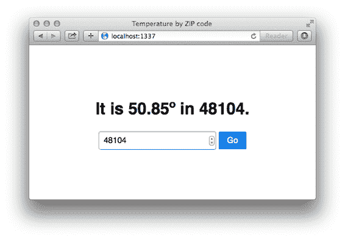

# 5 路由

正如我们所见，路由是 Express 的主要功能之一，允许您将不同的请求映射到不同的请求处理器。在本章中，我们将更深入地探讨。我们将详细研究路由，如何使用 Express 与 HTTPS，Express 4 的新路由器功能，以及更多。我们还将构建几个以路由为中心的应用程序，其中之一将是贯穿本书的运行示例。

在本章中，我将告诉你关于 Express 路由的所有知识！

## 5.1 什么是路由？

让我们想象一下，我们正在为 Olivia Example 构建主页。她是一位了不起的女性，我们很荣幸为她建立网站。

如果我们是一个访问`example.com/olivia`的浏览器，这里的“原始”HTTP 请求可能看起来是这样的：

列表 5.1 HTTP 请求的第一行

`GET /olivia http/1.1`

这个 HTTP 请求有一个动词（`GET`），一个 URI（`/olivia`部分），以及 HTTP 版本（1.1）。当我们进行路由时，我们将动词和 URI 的配对映射到请求处理器。我们基本上说：“嘿，Express！当你看到对`/about_me`的`GET`请求时，运行这段代码。当你看到对`/new_user`的 POST 请求时，运行这段其他代码。”

这基本上就是全部内容——路由将动词和 URI 映射到特定的代码。让我们看看一个简单的例子。

### 5.1.1 简单示例

假设我们想要编写一个简单的 Express 应用程序来响应上述 HTTP 请求（对`/olivia`的 HTTP GET 请求）。我们将在我们的 Express 应用程序上调用一些方法，如下所示：

列表 5.2 一个简单的 Express 应用程序，显示 Olivia 的主页

`var express = require("express");` `var app = express();` `app.get("/olivia", function(request, response) {  #B` `response.send("欢迎来到 Olivia 的主页！");` `});` `app.use(function(request, response) {  #C` `response.status(404).send("页面未找到！");` `});` `app.listen(3000); #D`

#B 这是神奇的部分；它将 GET 请求映射到我们指定的请求处理器。

#C 如果您加载/olivia，那就没问题。但如果您加载其他内容（如/olivia_example），我们希望返回 404 错误。

#D 最后，我们在 3000 端口启动服务器！

这个示例的真正内容在第三行：当我们收到对`/olivia`的 HTTP GET 请求时，我们运行指定的请求处理器。为了强调这一点：如果我们看到对其他 URI 的 GET 请求，我们将忽略它，如果我们看到对`/olivia`的非 GET 请求，我们也会忽略它。

这是一个相当简单的例子（因此本节的标题）。让我们看看一些更复杂的路由功能。

## 5.2 路由功能

因此，我们刚刚查看了一个简单的路由示例。从概念上讲，它并不疯狂：它将 HTTP 动词+ URI 组合映射到请求处理器。这允许您将诸如 GET `/about` 或 POST `/user/log_in` 等内容映射到特定的代码块。这太棒了！

但我们是贪婪的。如果 Express 是一桶冰淇淋，我们不会满足于一勺。我们想要更多的勺子。我们想要糖霜。我们想要巧克力酱。我们想要更多的路由功能。

注意：一些其他框架（例如 Ruby on Rails）有一个集中式的路由文件，其中所有路由都在一个地方定义。Express 不是这样——它们可以在很多地方定义。

### 5.2.1 从路由中获取参数

我们上面看到的路由实际上可以用严格的相等运算符（`===`）在代码中表达；用户是否访问了`/olivia`？这非常有用，但它并不提供我们可能想要的全部表达力。

想象一下，你被分配了一个任务，要制作一个包含用户资料的网站，并且假设每个用户都有一个数字 ID。你希望用户#1 的 URL 是`/users/1`。用户#2 应该在`/users/2`（以此类推）找到。与其为每个新用户在代码中定义一个新的路由（这会非常疯狂），你不如定义一个以`/users/`开头的路由，然后跟上一个 ID。

最简单的方法

获取参数的最简单方法就是简单地在路由中将其放入，并在其前面加上一个冒号。要获取值，你将查看请求的 params 属性。

列表 5.3 最简单的参数

`app.get("/users/:userid", function(req, res) {       #A` `   var userId = parseInt(req.params.userid, 10);     #B` `   // …``});`

#A 这将匹配进入`/users/123`和`/users/horse_ebooks`的请求。

#B 在这种情况下，userid 属性始终是一个字符串，因此我们必须将其转换为整数。如果我们访问`/users/olivia`，这将返回 NaN，我们需要处理这种情况。

在上面的例子中，我们看到如何从一个更动态的路由中获取参数。上面的代码将匹配我们想要的内容；例如`/users/123`和`/users/8`。但是，它不会匹配没有参数的`/users/`或`/users/123/posts`，但它可能仍然匹配比我们想要的更多。例如，它还会匹配`/users/cake`和`/users/horse_ebooks`。如果我们想更加具体，我们有一些选择。

注意：虽然你通常希望你的参数定义更加具体，但这也完全可能适合你的需求！你可能希望允许`/users/123`和`/users/count_dracula`。即使你只想允许数字参数，你也可能更喜欢在路由中直接添加验证逻辑。正如我们将看到的，还有其他方法可以做到这一点，但这可能对你来说已经足够好了。

### 5.2.2 使用正则表达式匹配路由

Express 允许你以字符串的形式指定你的路由，但它也允许你以正则表达式的方式指定它们。这让你对指定的路由有更多的控制。你还可以使用正则表达式来匹配参数，正如我们将看到的。

注意：正则表达式可能会变得有些复杂。当我第一次开始使用它们时，它们让我感到害怕，但我发现通过 Mozilla 开发者网络上的条目，这种恐惧大大减少了。如果你需要帮助，我强烈建议你查看 https://developer.mozilla.org/en-US/docs/Web/JavaScript/Guide/Regular_Expressions。

让我们假设我们想要匹配像`/users/123`或`/users/456`这样的东西，但不匹配`/users/olivia`。我们可以将这个逻辑编码到正则表达式中，并捕获数字。

列表 5.5 使用正则表达式进行数字路由

`app.get(/^\/users\/(\d+)$/, function(req, res) { #A` `  var userId = parseInt(req.params[0], 10); #B` `  // ...``});`

#A 这既定义了路由（以/users/开头，以一个或多个数字结尾）

并捕获数字，这在下一行使用。如果这个正则表达式看起来令人畏惧，那是因为所有正则表达式看起来都令人畏惧。

#B 这次参数没有命名，所以我们通过它们的序号来访问它们。如果我们捕获了第二个值，我们会查看 req.params[1]，依此类推。请注意，我们仍然将它们作为字符串捕获，并必须手动进行转换。

这是强制执行“用户 ID 必须是整数”约束的一种方法。和上面一样，它作为字符串传入，所以我们必须将其转换为数字（并且可能还要进一步转换为用户对象）。

正则表达式可能有点难以阅读，但你可以使用它们来定义比这些更复杂的路由。例如，你可能想要定义一个查找范围的路由。也就是说，如果你访问`/users/100-500`，你可以看到从 ID 100 到 500 的用户列表。正则表达式使这相对容易表达（无意中开玩笑）：

列表 5.6 使用正则表达式进行复杂路由

`app.get(/^\/users\/(\d+)-(\d+)$/, function(req, res) { #A` `  var startId = parseInt(req.params[0], 10);  #B` `  var endId = parseInt(req.params[1], 10);  #C` `  // …``});`

#A 和上面一样，这次我们定义了一个使用正则表达式的路由。这次，我们在连字符两侧捕获两组数字。

#B 和之前一样，我们获取第一个捕获的参数作为字符串，并需要进行一些转换。

#C 这与上一行非常相似，但我们转换的是第二个参数，而不是第一个。

你可以梦想这为可能性的数量打开了无数的可能性。

例如，我曾经不得不定义一个匹配 UUID（版本 3 和 4）的路由。如果你不熟悉，UUID 是一个看起来像这样的长字符串的十六进制数字：

`xxxxxxxx-xxxx-4xxx-yxxx-xxxxxxxxxxxx`

...其中 x 是任何十六进制数字，y 是 8、9、A 或 B。假设你想编写一个匹配任何 UUID 的路由。它可能看起来像这样：

列表 5.7 使用正则表达式匹配 UUID 的路由

`var horribleRegexp = /^([0-9a-f]{8}-[0-9a-f]{4}-` `[CA]4[0-9a-f]{3}-[89ab][0-9a-f]{3}-[0-9a-f]{12})$/i;` `app.get(horribleRegexp, function(req, res) {` `  var uuid = req.params[0];` `  // ...``});`

我可以用数百页的例子来填充，但我不这么做。这里的关键要点：你可以使用正则表达式来定义你的路由。

### 5.2.3  抓取查询参数

在 URL 中动态传递信息的另一种常见方式是使用所谓的“查询字符串”。你可能每次在互联网上搜索时都见过查询字符串。例如，如果你在 Google 上搜索“javascript-themed burrito”，你会看到一个像这样的 URL：`https://www.google.com/search?q=javascript-themed%20burrito`

这是在传递一个查询。如果 Google 是用 Express 编写的（实际上不是），它可能会处理这样的查询：

列表 5.8 处理搜索查询字符串

`app.get("/search", function(req, res) {` `  // req.query.q == "javascript-themed burrito"` `  // ...``});`

这与处理参数的方式非常相似，但它允许你获取这种查询风格。

注意：不幸的是，查询参数有一个常见的安全漏洞。如果你访问 ?arg=something，那么 req.query.arg 将是一个字符串。但是如果你访问 ?arg=something&arg=somethingelse，那么 req.query.arg 将是一个数组。如果你渴望了解更多，我们将在第八章详细讨论如何应对这类问题。不过，总的来说，你想要确保不要盲目地假设某物是一个字符串或一个数组。

## 5.3 使用路由器拆分你的应用程序

很可能随着你的应用程序的增长，你的路由数量也会增加。你的协作猫照片拼贴网站可能最初只有静态文件和图像的路由，但后来你可能还会添加用户账户、聊天、论坛等。你的路由数量可能会变得难以管理。

Express 4 增加了一个功能来帮助缓解这些成长的痛苦；它增加了路由器。引用 Express 文档（如果你不完全理解这些内容，请不要担心）：

路由器是中间件和路由的独立实例，可以被视为“迷你”应用程序，只能执行中间件和路由。每个 Express 应用程序都有一个内置的应用程序路由器。

路由器本身就像中间件一样，可以被应用或其它路由器“`.use()`”。

换句话说，路由器允许你将你的大应用程序拆分成许多小应用程序，你可以在以后将它们组合起来。对于小型应用程序，这可能有点过度，但当你想到，“这个 `app.js` 文件变得很大”，就是时候考虑使用路由器来拆分你的应用程序了。

注意：路由器在构建更大的应用程序时表现得尤为出色。我不想在本节中构建一个巨大的应用程序，所以这个例子中会有一些你应该用想象力填补的地方。

列表 5.9 路由器在行动：主应用程序

`var express = require("express");` `var path = require("path");` `var apiRouter = require("./routes/api_router");  #A` `var app = express();` `var staticPath = path.resolve(__dirname, "static"); app.use(express.static(staticPath));` `app.use("/api", apiRouter);  #A` `app.listen(3000);`

#A 我们需要我们的 API 路由器（定义在下面），然后我们就像使用中间件一样使用它在我们的主应用中。

如你所见，我们就像使用中间件一样使用我们的 API 路由。路由基本上就是中间件！在这种情况下，任何以 `/api` 开头的 URL 都会直接发送到我们的路由器。这意味着 `/api/users` 和 `/api/message` 将使用你的路由代码，但像 `/about/celinedion` 这样的 URL 则不会。

现在，让我们继续定义我们的路由。把它想象成一个子应用：

列表 5.10 路由定义示例（在 routes/api_router.js 中）

`var express = require("express");` `var ALLOWED_IPS = [` `  "127.0.0.1",` `  "123.456.7.89"` `];` `var api = express.Router();` `api.use(function(req, res, next) {` `  var userIsAllowed = ALLOWED_IPS.indexOf(req.ip) !== -1;` `  if (!userIsAllowed) {` `    res.status(401).send("未授权！");` `  } else {` `    next();` `  }` `});` `api.get("/users", function(req, res) { /* ... */ });` `api.post("/user", function(req, res) { /* ... */ });` `api.get("/messages", function(req, res) { /* ... */ });` `api.post("/message", function(req, res) { /* ... */ });` `module.exports = api;`

这看起来很像一个迷你应用；它支持中间件和路由。主要区别在于它不能独立存在；它必须连接到一个“成熟”的应用。路由器可以执行与“大型”应用相同的路由，并且可以使用中间件。

你可以想象创建一个具有许多子路由的路由器。也许你想要创建一个 API 路由器，它进一步委托给“用户路由器”和“消息路由器”，或者可能是其他什么！

## 5.4      服务静态文件

除非你正在构建一个 100% API 的 Web 服务器（我的意思是百分之一百），否则你可能需要发送一个或两个静态文件。也许你需要发送一些 CSS，也许你需要发送一些静态文件给单页应用，也许你是一个喜欢甜甜圈的爱好者，并且有数吉字节甜甜圈照片要提供给饥饿的观众。

我们之前已经看到过如何发送静态文件，但现在让我们更深入地探讨一下。

### 5.4.1 使用中间件发送静态文件

我们之前已经使用中间件发送过静态文件了，但别皱眉——我们将会深入探讨一下。

我们在第二章中已经讨论过这个问题，所以我就不再宣扬这些好处了。我只会回顾我们之前使用的代码示例：

列表 5.11 express.static 的一个简单示例

`var express = require("express");` `var path = require("path");` `var http = require("http");` `var app = express();` `var publicPath = path.resolve(__dirname, "public");  #A` `app.use(express.static(publicPath)); #B` `app.use(function(request, response) {` `  response.writeHead(200, { "Content-Type": "text/plain" });` `  response.end("看起来你没有找到静态文件。");` `});` `http.createServer(app).listen(3000);`

#A 使用 Node 的 path 模块设置我们的静态文件存放路径。

#B 从 publicPath 目录发送静态文件。

回想一下，path.resolve 有助于保持我们的路径解析跨平台（Windows、Mac 和 Linux 上的事情是不同的）。也请记住，这比你自己做要好得多！如果任何内容不清楚，请返回并查看第二章。

现在让我们更深入地探讨。

客户端路径变更

通常，你会在网站的根目录下提供文件。例如，如果你的 URL 是 http://jokes.edu，并且你正在提供`jokes.txt`，则路径将是 http://jokes.edu/jokes.txt。

但你可能还希望将一些静态文件挂载到不同的 URL 上供客户端使用。例如，你可能希望一个充满攻击性但非常有趣的图片文件夹看起来像在名为“offensive”的文件夹中，因此用户可能访问 http://jokes.edu/offensive/photo123.jpg。我们该如何实现这一点？

Express 来拯救：中间件可以在给定前缀上“挂载”。换句话说，你可以使一个中间件仅在以`/offensive`开头时响应。

下面是如何实现的：

列表 5.12 挂载静态文件中间件

`// …` `var photoPath = path.resolve(__dirname, "offensive-photos-folder"); app.use("/offensive", express.static(photoPath));``// …`

现在，网络浏览器和其他客户端可以访问除根路径之外的其他路径上的攻击性照片。请注意，这可以应用于任何中间件，而不仅仅是静态文件中间件。最大的例子可能是我们上面看到的：在指定前缀上挂载 Express 的路由器。

多个静态文件目录的路由

我经常发现自己有多个目录中的静态文件。例如，我有时在名为“public”的文件夹中有静态文件，在名为“user_uploads”的另一个文件夹中也有。我们如何使用 Express 来实现这一点？

Express 已经通过内置的中间件功能解决了这个问题，并且因为 express.static 是中间件，所以我们可以多次应用它。

下面是我们可能如何实现它的示例：

列表 5.13 从多个目录提供静态文件

`// …` `var publicPath = path.resolve(__dirname, "public");  #A` `var userUploadsPath = path.resolve(__dirname, "user_uploads");` `app.use(express.static(publicPath)); app.use(express.static(userUploadsPath));` `// …`

# 注意，这依赖于“path”模块，所以在使用它之前请确保你已经引入了它！

现在，让我们快速想象四种场景，并看看上面的代码是如何处理它们的：

1. 当用户请求的资源不在公共文件夹或用户上传文件夹中时，在这种情况下，静态中间件函数将继续执行到下一个路由和中间件。

2. 当用户请求的资源在公共文件夹中时，在这种情况下，第一个中间件将发送文件，并且不会调用后续的路由或中间件函数。

3. 当用户请求的资源在用户上传文件夹中，但不在公共文件夹中时，第一个中间件将继续执行（它不在“public”中），因此第二个中间件将接手。之后，不会调用其他中间件或路由。

4. 用户请求的资源同时位于公共文件夹和上传文件夹中。在这种情况下，因为公共服务中间件优先，您将获得“公共”文件夹中的文件，并且永远无法访问用户上传文件夹中匹配的文件。

总是如此，您可以在不同的路径上安装中间件以避免第 4 点中提出的问题。以下是您可以这样做的方式：

列表 5.14 从多个目录中无冲突地提供静态文件

`// …` `app.use("/public", express.static(publicPath));` `app.use("/uploads", express.static(userUploadsPath));` `// …`

现在，如果“image.jpg”在两个文件夹中，您将能够从`/public/image.jpg`的公共文件夹中获取它，并从`/uploads/image.jpg`的上传文件夹中获取它。

### 5.4.2 路由到静态文件

有可能您会想要通过路由发送静态文件。例如，如果您访问`/users/123/profile_photo`，您可能想发送一个用户的个人照片。静态中间件无法知道这一点，但 Express 有很好的方法来做这件事，它使用了与静态中间件相同的大量内部机制。

假设我们想在有人访问`/users/:userid/profile_photo`时发送个人照片。假设我们有一个名为`getProfilePhotoPath`的神奇函数，它接受一个用户 ID 并返回其个人照片的路径。以下是我们可以这样做的方式：

列表 5.15 发送个人照片

`app.get("/users/:userid/profile_photo", function(req, res) {` `  res.sendFile(getProfilePhotoPath(req.params.userid));``});`

在第二章中，我们看到了没有 Express 这将是一个大麻烦。我们不得不打开文件，找出其内容类型（HTML，纯文本，图像...），其文件大小，等等。Express 的`sendFile`为我们做了所有这些，并让您轻松发送文件。

您可以使用它发送您想要的任何文件！

## 5.5 使用 Express 与 HTTPS

如我们在本章前面所讨论的，HTTPS 是 HTTP 更安全的姐妹。它为 HTTP 添加了一个安全层，增加了更多的安全性（尽管没有什么是不败的）。这个安全层被称为 TLS 或 SSL。这两个名字可以互换使用，但技术上 TLS 是 SSL 的后继者。

我不会深入涉及其中的疯狂数学，但 TLS 使用的是称为公钥加密的加密方式。公钥加密的工作原理是这样的：每个对等方都有一个公钥，他们与每个人分享，以及一个私钥，他们与没有人分享。如果我想给你发东西，我会用我的私钥（可能在我的电脑上某个地方）和你的公钥（对任何人公开）加密信息。然后我可以给你发送看起来像垃圾的消息，任何窃听者都无法理解，而你用你的私钥和我的公钥解密它。通过疯狂的酷数学，即使每个人都正在监听我们，我们也可以有一个安全的对话，而且我们事先根本不需要同意某种秘密代码。

如果这有点令人困惑，只需记住，双方都有私钥和公钥。

在 TLS 中，公钥还有一个特殊属性：它也是被称为证书的东西。如果我正在和你交谈，你会向我展示你的证书（即你的公钥），我会确保它是你，通过确保证书颁发机构说“是的，那是你。”你的浏览器有一个它信任的证书颁发机构列表；像 VeriSign 和 Google 这样的公司运营这些证书颁发机构。

我把证书颁发机构想象成一个保镖。当我与某人交谈时，我会抬头看我的保镖，说“嘿，这个人真的是他们说的那个人吗？”我的保镖低头看着我，微微点头，或者可能摇摇头。

注意：一些托管提供商（如 Heroku）会为你处理所有的 HTTPS，这样你就不必担心它了。本节仅在你必须自己处理 HTTPS 时才有用！

首先，你需要生成你的公钥和私钥。我们将使用 OpenSSL 来完成这个任务。如果你使用的是 Windows 系统，可以从 [`www.openssl.org/related/binaries.html`](https://www.openssl.org/related/binaries.html) 下载一个二进制文件。它应该预安装在 Mac OS X 上。如果你使用的是带有包管理器的 Linux 机器（如 Arch、Gentoo、Ubuntu 或 Debian），并且它尚未安装，你可以使用操作系统的包管理器来安装它。你可以在命令提示符中输入 `openssl version` 来检查 OpenSSL 是否已安装。

从那里，我们将运行以下两个命令：

列表 5.16 使用 OpenSSL 创建你的私钥和签名请求

`openssl genrsa -out privatekey.pem 1024   #A` `openssl req -new -key privatekey.pem -out request.pem  #B`

#A 这将生成你的私钥到 `privatekey.pem`。

#B 这将生成一个签名请求到 `request.pem`。你将不得不填写一些信息。

第一个命令简单地生成你的私钥；任何人都可以这样做。下一个命令生成一个证书签名请求。它会询问你一些信息，然后输出一个文件到 `request.pem`。从这里开始，你必须从证书颁发机构请求一个证书。互联网上有几个团体正在致力于 Let's Encrypt，这是一个免费且自动化的证书颁发机构。你可以在 [`letsencrypt.org/`](https://letsencrypt.org/) 查看该服务。如果你更喜欢其他证书颁发机构，你可以在网上寻找。

一旦他们给你一个证书，你就可以使用 Node 内置的 HTTPS 模块与 Express 一起使用了。它与 HTTP 模块非常相似，但你必须提供你的证书和私钥。

列表 5.17 使用 Express 应用程序配置 HTTPS

`var express = require("express");  #A` `var https = require("https");   #A` `var fs = require("fs");   #A` `var app = express();` `// ... 定义你的应用程序 ...` `var httpsOptions = {` `   key: fs.readFileSync("path/to/private/key.pem"),   #B` `   cert: fs.readFileSync("path/to/certificate.pem")   #B` `};` `https.createServer(httpsOptions, app).listen(3000);   #C`

#A 首先，我们引入所需的模块。

#B 在定义我们的应用程序之后，我们定义一个包含我们的私钥和证书的对象。

#C 现在我们将这个对象传递给 https.createServer，它与其他我们所见的 http.createServer 非常相似。

除了我们必须将私钥和证书作为参数传递之外，这与其他我们所见的 http.createServer 非常相似。

如果您想同时运行一个 HTTP 服务器和一个 HTTPS 服务器，只需启动它们即可！

列表 5.18 使用 Express 进行 HTTP 和 HTTPS

`var express = require("express");` `var http = require("http");` `var https = require("https");` `var fs = require("fs");` `var app = express();` `// ... 定义你的应用程序 ...` `var httpsOptions = {` `  key: fs.readFileSync("path/to/private/key.pem"),` `  cert: fs.readFileSync("path/to/certificate.pem")` `};` `http.createServer(app).listen(80);` `https.createServer(httpsOptions, app).listen(443)`

我们只需要在不同的端口上运行两个服务器，然后就可以完成了！这就是 HTTPS。

## 5.6     整合所有内容：一个简单的路由演示

让我们利用所学知识构建一个简单的 Web 应用程序，该应用程序可以根据您的美国 ZIP 代码返回温度。

备注 我是一个美国人，所以这个例子将使用美国风格的邮政编码，称为 ZIP 代码。ZIP 代码是五位数字，可以给出相当好的大致位置。共有 42,522 个，所以如果美国是 370 万平方英里，每个 ZIP 代码平均覆盖约 87 平方英里。因为我们将使用 ZIP 代码，所以这个例子将仅适用于美国。制作一个在其他地方也能工作的类似应用程序（如果你有灵感，可以尝试使用 HTML5 地理位置 API！）。

我们的应用程序将基本分为两部分：

1.  一个静态主页，要求用户输入他们的 ZIP 代码。用户输入后，将通过异步 JavaScript 请求（也称为 AJAX 请求）加载天气。

2.  因为我们使用 JavaScript，所以我们将以 JSON 格式发送温度。我们将为`/12345`定义一个路由，该路由将返回 ZIP 代码 12345 的天气。

让我们开始吧。

### 5.6.1  准备工作

对于这个应用程序，我们将使用四个 Node 包：Express（显然）、ForecastIO（用于从名为 Forecast.io 的免费 API 获取天气数据）、Zippity-do-dah（用于将 ZIP 代码转换为经纬度对），以及 EJS（用于渲染 HTML 视图）。（这些名字相当不错，对吧？特别是“zippity-do-dah”。）

创建一个新的 Express 应用程序。你想要确保在启动时`package.json`看起来像这样：

列表 5.19 此应用程序的 package.json

`{` `  "name": "temperature-by-zip",` `  "private": true,` `  "scripts": {` `    "start": "node app.js"` `  },` `  "dependencies": {` `    "ejs": "².3.1",` `  "express": "⁴.12.4",` `  "forecastio": "⁰.2.0",` `  "zippity-do-dah": "0.0.x"` `  }``}`

确保你已经通过在应用程序目录中运行 `npm install` 安装了所有这些依赖项。

在客户端，我们将依赖于 jQuery 和一个名为 Pure 的最小化 CSS 框架（更多信息请访问 [`purecss.io/`](http://purecss.io/)）。你很可能已经了解 jQuery，但 Pure 稍微有点神秘（尽管几乎所有东西都比 jQuery 神秘）。Pure 为文本和表单提供了一些样式，类似于 Twitter 的 Bootstrap。与 Pure 的区别在于它更轻量级，更适合这种类型的应用。

创建两个目录：一个名为 `public`，另一个名为 `views`。

接下来，我们需要从 Forecast.io 获取一个 API 密钥。访问他们的开发者网址 [`developers.forecast.io`](https://developers.forecast.io)。注册一个账户。在仪表板页面的底部是你的 API 密钥，它是一个由 32 个字符组成的字符串。你很快就需要将这个 API 密钥复制到你的代码中，所以请确保你已经准备好了。

我们已经准备好开始工作了！

### 5.6.2 主要应用程序代码

现在我们已经设置好了，是时候开始编码了！让我们从主应用程序 JavaScript 开始。如果你遵循了第二章末尾的示例，这个业务应该很熟悉。

创建 `app.js` 并将以下内容放入其中：

列表 5.20 app.js

`var path = require("path");  #A` `var express = require("express");  #A` `var zipdb = require("zippity-do-dah");  #A` `var ForecastIo = require("forecastio");  #A` `var app = express();  #B` `var weather = new ForecastIo("YOUR FORECAST.IO API KEY HERE");  #C` `app.use(express.static(path.resolve(__dirname, "public")));  #D` `app.set("views", path.resolve(__dirname, "views"));  #E` `app.set("view engine", "ejs");  #E` `app.get("/", function(req, res) { #F ` res.render("index"); ` }); ` `}); ` `app.get(/^\/(\d{5})$/, function(req, res, next) { ` ` var zipcode = req.params[0];  #G ` var location = zipdb.zipcode(zipcode); #H ` if (!location.zipcode) {#I ` next(); #I ` return; ` } ` var latitude = location.latitude; ` var longitude = location.longitude; ` weather.forecast(latitude, longitude, function(err, data) { ` if (err) { ` next(); ` return; ` } ` res.json({ #J ` zipcode: zipcode, ` temperature: data.currently.temperature ` }); ` }); ` }); ` `app.use(function(req, res) { #K ` res.status(404).render("404"); ` }); ` `app.listen(3000);  #L`

#A 我们首先引入 Node 的内置路径模块、Express、zippity-do-dah 和 ForecastIO。与之前看到的不同之处不多！

#B 创建一个新的 Express 应用程序。

#C 使用你的 API 密钥创建一个新的 ForecastIO 对象。确保填写完整！

#D 使用 Express 内置的静态文件中间件，从 "public" 目录中提供静态文件。

#E 使用 EJS 作为我们的视图引擎，并将视图从名为 "views" 的文件夹中提供。

#F 如果我们访问主页，则渲染 "index" 视图。

#G 这是一个 Express 的正则表达式路由功能的例子。正则表达式总是很难阅读，但这个基本上是说“给我五个数字”。括号“捕获”指定的 ZIP 码并将其作为 req.params[0] 传递。

#H 使用 zippity-do-dah 通过 ZIP 码获取位置数据。

#I zippity-do-dah 在没有找到结果时仅返回一个空对象 ({})。这会检查对象中的 zipcode 属性，如果我们缺少它，那么这不会工作，我们应该继续。

#J 我们将使用 Express 的便捷 json 方法发送此 JSON 对象。

#K 如果我们遗漏了静态文件中间件、根 URL (/) 的处理器以及天气 URL，那么将显示 404 错误。

#L 在端口 3000 上启动应用程序！

现在我们需要填写客户端。这意味着制作一些带有 EJS 的视图，正如我们将看到的，我们将添加一些 CSS 和一些客户端 JavaScript。

### 5.6.3 两个视图

本应用程序中有两个视图；404 页面和主页。我们希望网站在各个页面之间看起来保持一致，所以让我们创建一个模板。我们需要创建一个页眉和一个页脚。

让我们从页眉开始。将以下内容保存到名为 header.ejs 的文件中：

列表 5.21 视图/header.ejs

`<!DOCTYPE html>` `<html>` `<head>` `  <meta charset="utf-8">` `  <title>ZIP 码温度</title>` `  <link rel="stylesheet" href="http://yui.yahooapis.com/pure/0.4.2/pure-min.css">` `  <link rel="stylesheet" href="/main.css">` `</head>``<body>`

接下来，让我们在 footer.ejs 中关闭页面：

列表 5.22 视图/footer.ejs

`</body>` `</html>`

现在我们有了模板，让我们填写简单的 404 页面（作为 404.ejs）：

列表 5.23 视图/404.ejs

`<% include header %>` `  <h1>404 错误！文件未找到。</h1>``<% include footer %>`

索引主页也不太复杂。将这个家伙保存为 index.ejs。

列表 5.24 视图/index.ejs

`<% include header %>`   `<h1>你的 ZIP 码是多少？</h1>`   `<form class="pure-form">` `  <fieldset>` `    <input type="number" name="zip" placeholder="12345"[CA]` `    autofocus required>` `    <input type="submit" class="pure-button[CA]` `    pure-button-primary" value="去">` `  </fieldset>` `</form>`   `` ``  `<% include footer %>`

在 index 代码中有一两个对 Pure CSS 框架的引用；它们所做的只是应用一些样式，使我们的页面看起来更好一些。

谈到样式，我们需要填写我们在布局中指定的 main.css。以下内容保存到 `public/main.css`：

列表 5.25 public/main.css

`html {` `  display: table;` `  width: 100%;` `  height: 100%;` `}` `body {` `  display: table-cell;` `  vertical-align: middle;` `  text-align: center;``}`

这种 CSS 有效地使页面的所有内容在水平和垂直方向上居中。这不是一本 CSS 书，所以如果你不明白上面发生的事情，请不要担心。

现在我们已经拥有了除了客户端 JavaScript 之外的一切！您现在就可以尝试使用`npm start`启动此应用程序。您应该能够在`http://localhost:3000`看到主页，在`http://localhost:3000/some/garbage/url`看到 404 页面，并且天气应该会在`http://localhost:3000/12345`以 JSON 格式加载 12345 的温度。

让我们用客户端 JavaScript 来完成它。

将以下内容保存到`public/main.js`：

列表 5.26 public/main.js

`$(function() {`   `  var $h1 = $("h1");` `  var $zip = $("input[name='zip']");`   `  $("form").on("submit", function(event) {`   `    event.preventDefault();  #A`   `    var zipCode = $.trim($zip.val());` `    $h1.text("Loading...");`   `    var request = $.ajax({   #B` `      url: "/" + zipCode,` `      dataType: "json"` `    });` `    request.done(function(data) {     #C` `      var temperature = data.temperature;` `      $h1.text("It is " + temperature + "&#176; in " + zipCode + "."); #D` `    });` `    request.fail(function() {    #E` `      $h1.text("Error!");` `    });`   `  });`  `});`

#A 我们不希望表单执行 HTML 通常会执行的操作——我们想要控制！

#B 我们发起一个 AJAX 请求。如果我们已经在 ZIP 代码字段中输入了"12345"，我们将访问/12345 来执行此请求。

#C 当请求成功时，我们将更新标题为当前温度。

#D °是 HTML 字符代码，用于表示°符号。

#E 如果发生错误（无论是客户端还是服务器），请确保显示错误。

### 5.6.4 应用程序的实际应用

有了这些，您可以使用`npm start`启动应用程序。访问`http://localhost:3000`，输入一个 ZIP 代码，并观察温度的出现！

图 5.1 ZIP 代码的温度实际应用

那就是我们的简单应用程序！它利用了 Express 的有用路由功能，提供 HTML 视图、JSON 和静态文件。

如果您愿意，您可以扩展此应用程序以支持不仅仅是美国 ZIP 代码，或者显示不仅仅是温度，或者添加 API 文档，或者添加更好的错误处理，或者也许更多！

## 5.7     总结

在本章中，您看到了：

·  在概念层面上，路由是什么：将 URL 映射到一段代码

·  简单路由、模式匹配路由以及更多

·  从路由中获取参数

·  使用 Express 4 的新路由器功能

·  使用具有路由功能的中间件

·  使用`express.static`服务静态文件，这是 Express 内置的静态文件中间件

·  如何使用 Express 与 Node 的内置 HTTPS 模块
