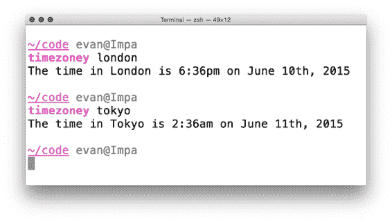
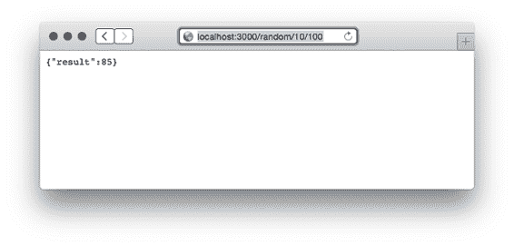
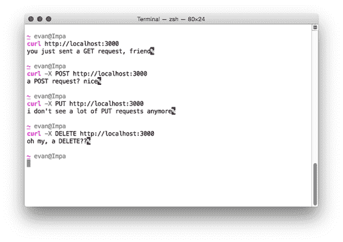
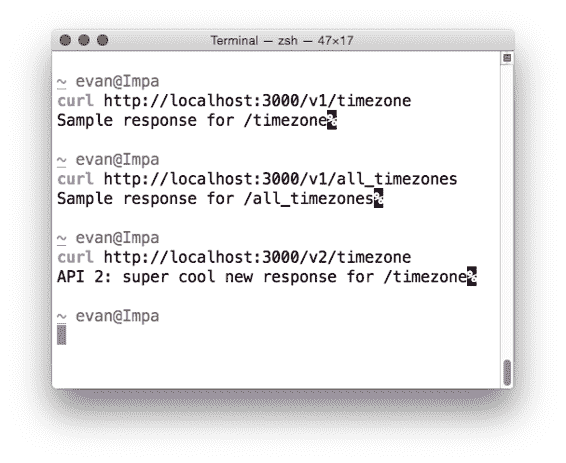

# 6  构建 API

朋友们，围坐在一起。本章标志着一个新的开始。今天，我们离开了抽象但关键的“核心 Express”，进入了现实世界。在这本书的剩余部分，我们将在 Express 之上构建更多真实系统。我们将从 API 开始。

"API"是一个相当宽泛的术语。

它代表“应用程序编程接口”，这并没有多少神秘感。如果由我来决定（实际上并不是），我会将其重命名为类似“软件接口”的东西。用户界面是为了被人类用户消费而设计的，而软件接口是为了被代码消费而设计的。在某种程度上，所有用户界面都建立在软件接口之上——所有用户界面都建立在某些 API 之上。

从高层次来看，API 只是代码与代码之间交流的一种方式。这可能意味着一台计算机在自言自语，或者一台计算机通过网络与另一台计算机交流。例如，一个视频游戏可能会使用一个 API，允许代码在屏幕上绘制图形。我们已经看到了 Express API 中的一些方法，比如`app.use`或`app.get`。这些只是你可以作为程序员用来“与”其他代码“交流”的接口。

还有计算机到计算机的 API。这些通过网络进行，通常通过互联网。这些计算机可能运行着不同的编程语言和/或不同的操作系统，因此它们已经发展出了通用的通信方式。有些只是发送纯文本，而有些可能会选择 JSON 或 XML。它们可能会通过 HTTP 或通过 FTP 等协议发送数据。无论如何，双方都必须同意将以某种方式发送数据。在本章中，我们创建的 API 将使用 JSON。

我们将讨论你可以用 Express 构建的交互式 API。这些 API 将接受 HTTP 请求并以 JSON 数据响应。

到本章结束时，程序员将能够构建使用你创建的 JSON API 的应用程序。我们还将致力于设计良好的 API。良好 API 设计的核心原则是做消费你 API 的开发者期望的事情。这些期望中的大部分可以通过遵循 HTTP 规范来实现。而不是让你阅读一份冗长、枯燥（但非常有趣）的规范文档，我会告诉你你需要知道的部分，这样你就可以编写一个好的 API。

就像“好代码”与“坏代码”这样的模糊概念一样，这里并没有很多明确的界限。很多都是开放的，供你解释。你可以想出很多例子，你可能想要偏离这些既定的最佳实践，但请记住：目标是做其他开发者期望的事情。

在本章中，我们将学习：

·  API 是什么以及不是什么

·  使用 Express 构建 API 的基本原理

·  HTTP 方法和它们与常见应用操作的关系

·  如何创建 API 的不同版本以及为什么你想这么做

·  如何正确使用 HTTP 状态码

让我们开始吧。

## 6.1     一个基本的 JSON API 示例

让我们讨论一个简单的 JSON API 及其用途，以便我们能够看到我们将要构建的具体示例。

让我们想象一个简单的 API，它接收一个时区字符串，如`"America/Los_Angeles"`或`"Europe/London"`，并返回一个表示该时区当前时间的字符串（如`"2015-04-07T20:09:58-07:00"`）。请注意，这些字符串不是人类会自然输入或容易阅读的东西——它们是为了让计算机理解。

我们的 API 可能接受对以下 URL 的 HTTP 请求：

`/timezone?tz=America+Los_Angeles`

我们的 API 服务器可能会以 JSON 的形式响应，如下所示：

`{` `  "time": "2015-06-09T16:20:00+01:00",` `  "zone": "America/Los_Angeles"``}`

可以想象编写使用此 API 的简单应用程序。这些应用程序可以在各种平台上运行，只要它们与这个 API 通信并且能够解析 JSON（大多数平台都可以），它们就可以构建他们想要的任何东西！

您可以构建一个简单的网页来消费此 API，如图 6.1 所示。它可能会向您的服务器发送 AJAX 请求，解析 JSON，并在 HTML 中显示它。

图 6.1 消费我们 JSON API 的网站。

您也可以构建一个如图 6.2 所示的移动应用。它将向我们的 API 服务器发送请求，解析 JSON，并在屏幕上显示结果。

图 6.2 使用您 API 的移动应用。

您甚至可以构建一个在终端中运行的命令行工具，如图 6.3 所示。再次，它将向 API 服务器发送请求，解析 JSON，并在终端中向人类显示结果。

图 6.3 即使是基于终端的应用程序也可以消费 JSON API。

重点在于：如果您创建了一个从计算机接收请求并向计算机（而不是人类）发送响应的 API，您可以在该 API 之上构建用户界面。我们在上一章的天气应用中就是这样做的——它使用 API 获取天气数据并将其显示给用户。

## 6.2     一个简单的 Express 驱动的 JSON API

既然我们已经知道了 API 是什么，让我们用 Express 构建一个简单的 API。

Express API 的基本原理相当简单：接收请求，解析它，并以 JSON 对象和 HTTP 状态码的形式响应。我们将使用中间件和路由来接收和解析请求，并使用 Express 的便利性来响应请求。

注意：从技术上讲，API 不必使用 JSON——它们可以使用其他数据交换格式，如 XML 或纯文本。JSON 与 Express 的集成最佳，与基于浏览器的 JavaScript 配合良好，并且是最受欢迎的 API 选择之一，所以我们在这里使用它。如果您想使用其他格式，也可以！

让我们构建一个简单的 API，它可以生成随机整数。这可能会显得有些牵强，但我们可能需要在多个平台（iOS、Android、Web 等）上有一个一致的随机数生成器，而且我们不希望编写相同的代码。

·  任何请求 API 的人都必须发送最小值和最大值。

·  我们将解析这些值，计算随机数，并将其作为 JSON 发送回去。

你可能会认为 JSON 对于这种情况来说有点过度——为什么不坚持使用纯文本呢？——但它将帮助我们学习如何做到这一点，并使以后扩展我们的功能变得容易。

为了构建这个项目，我们将：

1. 创建一个`package.json`文件来描述我们应用的元数据

2. 创建一个名为`app.js`的文件，它将包含我们所有的代码

3. 在`app.js`中，我们将创建一个 Express 应用并附加一个提供随机数的单一路由

让我们开始吧。

如同往常，为了启动一个项目，创建一个新的文件夹并创建一个 package.json 文件。你可以通过运行`npm init`来创建这个文件，或者你可以手动输入文件内容。无论如何，你都需要创建它并安装 Express。你的 package.json 应该看起来像这样：

列表 6.1 我们随机数项目的 package.json

`{` `  "name": "random-number-api",` `  "private": true,` `  "scripts": {` `    "start": "node app"` `  },` `  "dependencies": {` `    "express": "⁴.12.3"       #A` `  }``}`

#A 总是如此，你的包版本号可能会有所不同。

接下来，我们想要创建 app.js。在项目的根目录中创建它，并放入以下内容：

列表 6.2 我们的随机数应用

`var express = require("express");` `var app = express();` `app.get("/random/:min/:max", function(req, res) {` `  var min = parseInt(req.params.min);  #A` `  var max = parseInt(req.params.max);  #A`   `  if (isNaN(min) || isNaN(max)) {                     #B` `    res.status(400);                                  #B` `    res.json({ error: "Bad request." });              #B` `    return;                                           #B` `  }                                                   #B`   `  var result = Math.round((Math.random() * (max - min)) + min);  #C`   `  res.json({ result: result });   #C` `});` `app.listen(3000, function() {` `  console.log("App started on port 3000");``});`

#A 我们在请求的 URL 中传递两个参数：最小值和最大值。

#B 执行一些错误检查。如果任一数字格式不正确，我们返回一个错误。

#C 计算并发送结果作为 JSON。

如果你启动这个应用并访问[`localhost:3000/random/10/100`](http://localhost:3000/random/10/100)，你将看到一个包含 10 到 100 之间随机数的 JSON 响应。它看起来可能像这样：

图 6.4 在浏览器中测试你的 API。尝试刷新，你会看到不同的数字！

让我们逐步分析这段代码。

前两行简单地引入 Express 并创建一个新的 Express 应用，就像我们之前看到的那样。

接下来，我们创建一个用于 GET 请求的路由处理器。这将处理像/random/10/100 或/random/50/52 这样的请求，但它也会处理像/random/foo/bar 这样的请求。我们必须确保这两个字段都是数字，我们很快就会做到这一点。

接下来，我们使用内置在 JavaScript 中的 parseInt 函数解析数字。这个函数要么返回一个数字，要么返回 NaN。如果任一值是 NaN，我们向用户显示错误。让我们详细看看这五行，因为它们非常重要。

列表 6.3 深入错误处理器

`if (isNaN(min) || isNaN(max)) {` `  res.status(400);` `  res.json({ error: "Bad request." });` `  return;``}`

第一行对你来说不应该太陌生：它只是检查两个数字中的任何一个是否是 NaN，这意味着它们格式不正确。如果是，我们做三件事：

1. 将 HTTP 状态码设置为 400。如果你曾经见过 404 错误，这只是一个变体：它表示用户请求中存在问题。我们将在本章后面更多地讨论它。

2. 发送一个 JSON 对象。在这种情况下，我们发送一个包含错误的对象。

3. 返回。如果我们不返回，我们会继续执行函数的其余部分，我们会发送两次请求，Express 会开始抛出讨厌的错误。

最后，我们计算结果并将其作为 JSON 发送！

这是一个相当基本的 API，但它展示了使用 Express 构建 API 的基础：解析请求、设置 HTTP 状态码和发送 JSON！

现在我们已经了解了基础知识，我们可以开始学习更多关于构建更大、更好的 API 的内容。

## 列表 6.3 深入错误处理器

HTTP 中没有内置任何东西来阻止它定义任何你想要的方法，但 Web 应用程序通常使用以下四种：

许多应用程序使用 CRUD。例如，想象一个没有用户账户的照片分享应用程序；任何人都可以上传照片。以下是您可能以 CRUD 风格设想的方式：

· 用户可以上传照片；这是创建步骤。

· 用户可以浏览照片；这是读取部分。

· 用户可以更新照片，可能通过给他们不同的过滤器或更改标题；这将是一个更新。

· 用户可以从网站上删除照片。这将是，嗯，删除。

你可以想象许多你喜欢的应用程序都符合这个模型，从照片分享到社交网络到文件存储。

在我们讨论 CRUD 如何融入 API 之前，我们需要先谈谈一种叫做 HTTP 方法的东西，也称为 HTTP 动词。

### 6.3.1 HTTP 动词（也称为 HTTP 方法）

HTTP 规范定义方法如下：

方法令牌表示要对由 Request-URI 标识的资源执行的操作。方法是区分大小写的。

哎，这很难读。

人类可能会这样理解：客户端向服务器发送一个带有方法的 HTTP 请求。他们可以选择他们想要的任何方法，但实际上只有少数几种是你使用的。服务器看到这个方法并相应地做出响应。

There's nothing baked into HTTP that prevents it from defining any method you want, but web applications typically use the following four:

1. GET 可能是任何人使用最普遍的 HTTP 方法。正如其名所示，它获取资源。当你加载某人的主页时，你 GET 它。当你加载一张图片时，你 GET 它。GET 方法不应该改变你的应用程序状态；其他方法会这样做。

幂等性对 GET 请求很重要。“幂等”是一个华丽的词，意思是“做一次应该和做多次没有区别”。如果你 GET 了一张图片一次，然后刷新 500 次，图片不应该有任何变化。这并不是说响应永远不会改变——页面可能会根据变化的股票价格或新的时间而改变——但 GET 请求不应该引起这种变化。这就是幂等的。

2. POST 是另一个常见的，通常用于请求更改服务器状态。你 POST 一篇博客文章；你 POST 一张照片到你的社交网络；你 POST 当你在网站上注册新账户时。POST 用于在服务器上创建记录，而不是修改现有记录——这就是 PUT 和 DELETE 的用途，如下文所述。

POST 也用于动作，比如“购买此商品”。

与 GET 不同，POST 是非幂等的。这意味着第一次 POST 时状态会改变，第二次，第三次，以此类推。

3. 在我看来，PUT 这四个方法中名字最糟糕；我认为像“更新”或“更改”这样的名字更适合它。如果我已经在网上发布了（POSTed）一份工作简介，后来想更新它，我会使用 PUT 来进行这些更改。我可以对文档、博客条目或其他内容进行 PUT 更改。（我们不会使用 PUT 来删除条目；那是 DELETE 的用途，我们将在下一节中看到。）

PUT 另一个有趣的部分是；如果你尝试对不存在的记录进行 PUT 更改，服务器可以（但不一定）创建该记录。你可能不想更新一个不存在的个人资料，但你可能想在个人网站上更新页面，无论它是否存在。

PUT 是幂等的，这对我来说一开始并不直观，但最终我明白了。假设我在一个网站上叫“Evan Hahn”，但我想改为“Max Fightmaster”。我不会 PUT “将名字从 Evan Hahn 更改为 Max Fightmaster”；我会 PUT “将我的名字改为 Max Fightmaster；我不在乎之前是什么”。这样就可以保证幂等性。我可以做一次或 500 次，我的名字仍然是 Max Fightmaster。它就是这样幂等的。

4. DELETE 可能是最容易描述的。和 PUT 一样，你基本上指定“DELETE 记录 123”。你可以 DELETE 一篇博客文章，或 DELETE 一张照片，或 DELETE 一条评论。就是这样！

DELETE 和 PUT 一样是幂等的。假设我意外地发布（POSTed）了一张我戴着灯罩的尴尬照片。如果我不想让它在那里，我可以 DELETE 它。现在它消失了！无论我要求删除一次还是 500 次，它都会消失。（谢天谢地！）

没有什么严格地强制执行这些约束——理论上你可以使用 GET 请求来做 POST 请求应该做的事情，例如——但这是一种不良的做法，并且违反了 HTTP 规范。这不是人们所期望的。许多浏览器也会根据 HTTP 请求的类型有不同的行为，所以你总是要努力使用正确的请求。

HTTP 规范了其他一些动词，但我从未有远离那四个动词的需求。

"动词" 或 "方法" ? HTTP 1.0 和 1.1 的规范在描述这个概念时使用的是“方法”这个词，所以我猜这在技术上是对的。“动词”也被使用了。为了我们的目的，我主要会称它们为“动词”，因为 Express 文档就是这样说的。要知道你可以使用两者（并且那些吹毛求疵的人应该称它们为“方法”）。

在 Express 中，你已经看到了如何处理不同的 HTTP 方法。为了刷新你的记忆，这里有一个简单的应用程序，它会针对每种不同的方法响应一条简短的消息：

列表 6.4 处理不同的 HTTP 动词

`var express = require("express");` `var app = express();` `app.get("/", function(req, res) {` `  res.send("你刚刚发送了一个 GET 请求，朋友");` `});` `app.post("/", function(req, res) {` `  res.send("一个 POST 请求？很好");` `});` `app.put("/", function(req, res) {` `  res.send("我不再看到很多 PUT 请求了");` `});` `app.delete("/", function(req, res) {` `  res.send("哦我的，一个 DELETE??");` `});` `app.listen(3000, function() {` `  console.log("应用程序正在监听端口 3000");``});`

如果你启动这个应用程序（如果它保存为 `app.js`，则运行 `node app.js`），你可以使用方便的 cURL 命令行工具尝试发送不同的请求。cURL 默认发送 GET 请求，但你可以使用其 `-X` 参数发送其他动词。例如， `curl -X PUT` [`localhost:3000`](http://localhost:3000) 将发送一个 PUT 请求。

图 6.5 使用 cURL 工具向我们的服务器发送不同的请求。

这应该都是之前章节中的复习内容：你可以使用不同的处理程序来处理不同的 HTTP 方法。

### 6.3.2  使用 HTTP 方法的 CRUD 应用程序

让我们回顾一下我们的照片分享应用。以下是您可能以 CRUD 风格想象它的方式：

·  用户可以上传照片；这是创建步骤。

·  用户可以浏览照片；这是读取部分。

·  用户可以更新照片，可能通过给他们不同的过滤器或更改标题；这将是一个更新。

·  用户可以从网站上删除照片。

如果你像我一样，你可能没有立即看到 CRUD 和我上面列出的四个主要 HTTP 动词之间的联系。但如果 GET 是用于读取资源，而 POST 是用于创建资源……哇！我们看到了以下内容：

·  创建 = POST

·  读取 = GET

·  更新 = PUT

·  删除 = DELETE

四个主要的 HTTP 方法非常适合 CRUD 风格的应用程序，这在网络上非常常见。

POST 与 PUT

关于哪些 HTTP 动词对应于哪些 CRUD 操作有一些争议。大多数人同意 Read == GET 和 Delete == DELETE，但 Create 和 Update 则有些模糊。

因为 PUT 可以创建记录，就像 POST 可以一样，所以可以说 PUT 更好地对应于 Create。PUT 可以创建和更新记录，所以为什么不在两个地方都放它呢？

类似地，PATCH 方法（我们尚未提及）有时扮演更新角色。引用规范，“PUT 方法已经定义为用完整的新主体覆盖资源，并且不能被重新用于执行部分更改。”PATCH 允许你部分覆盖资源。PATCH 直到 2010 年才正式定义，所以在 HTTP 场景中相对较新，这就是为什么它使用较少。无论如何，有些人认为 PATCH 比 PUT 更适合更新。

因为 HTTP 没有对此类内容做出过于严格的规范，所以这取决于你决定做什么。在这本书中，我们将使用上述约定，但要知道这里的期望有些模糊。

## 6.4 API 版本控制

让我带你通过一个场景。

你为你的时区应用程序设计了一个公共 API，它变得非常受欢迎。世界各地的人们都在使用它。人们用它来查找全球各地的时间。它运行得很好。

但是，几年后，你想更新你的 API。你已经决定要改变一些东西，但有一个问题：如果你改变它，所有使用你的 API 的人都将不得不更新他们的代码。在这个时候，你可能感到有些束手无策。你该怎么办？你是做出你想要的改变并破坏旧用户，还是让你的 API 停滞不前，永远无法保持更新？

对于所有这些问题，有一个解决方案：对 API 进行版本控制。

你所需要做的就是给你的 API 添加一些版本信息。所以一个进入这个 URL 的请求可能是你的 API 的版本 1：

`/v1/timezone`

而进入 API 版本 2 的请求可能会访问这个 URL：

`/v2/timezone`

这允许你通过简单地创建一个新版本来更改你的 API！现在，如果有人想要升级到版本 2，他们将通过有意识地更改他们的代码来完成，而不是版本被从他们手中夺走。

Express 通过使用我们在上一章中看到的路由器，使这种分离变得非常容易。

要创建你的 API 的版本 1，你可以创建一个仅处理版本 1 的路由器。文件可能被称为 api1.js，看起来像这样：

列表 6.5 API 的版本 1，在 api1.js 中

`var express = require("express");` `var api = express.Router();   #A` `api.get("/timezone", function(req, res) {      #B` `  res.send("Sample response for /timezone");` `});` `api.get("/all_timezones", function(req, res) { #B` `  res.send("Sample response for /all_timezones");` `});` `module.exports = api;  #C`

#A 创建一个新的路由器，一个迷你应用程序。

#B 这些只是一些示例路由。你可以向这些路由器添加任何你想要的路由或中间件。

#C 导出路由器，以便其他文件可以使用它。

注意，“v1”在路由中任何地方都没有出现。为了在你的应用中使用这个路由器，你需要创建一个完整的应用程序，并从主应用代码中使用路由器。它可能看起来像列表 6.6。

列表 6.6 app.js 中的主应用代码

`var express = require("express");` `var apiVersion1 = require("./api1.js");   #A` `var app = express();` `app.use("/v1", apiVersion1);  #A` `app.listen(3000, function() {` `  console.log("App started on port 3000");``});`

#A 如前一章所示，需要并使用路由器。

然后，过了很多个月后，你决定实现 API 的版本 2。它可能位于 api2.js 中。它也会是一个路由器，就像 api1.js 一样。它可能看起来像列表 6.7。

列表 6.7 API 的版本 2，在 api2.js 中

`var express = require("express");` `var api = express.Router();` `api.get("/timezone", function(req, res) {      #A` `  res.send("API 2: super cool new response for /timezone");` `});` `module.exports = api;`

#A 再次注意，这些只是一些示例路由。

现在，要将你的 API 的版本 2 添加到应用中，只需像版本 1 一样需要并使用它即可：

列表 6.8 app.js 中的主应用代码

`var express = require("express");` `var apiVersion1 = require("./api1.js");` `var apiVersion2 = require("./api2.js");   #A` `var app = express();` `app.use("/v1", apiVersion1);` `app.use("/v2", apiVersion2);  #A` `app.listen(3000, function() {` `  console.log("App started on port 3000");``});`

#A 注意这两行新内容。这就像使用版本 1 的路由器！

你可以尝试在浏览器中访问这些新的 URL，以确保版本化 API 工作。

图 6.6 在浏览器中测试你的两个 API 版本。

你也可以使用 cURL 工具在命令行测试你的应用。

图 6.7 使用 cURL 命令行工具测试你的版本化 API。

正如我们在上一章中看到的，路由器允许你将不同的路由分割到不同的文件中。版本化 API 是路由器用途的一个很好的例子。

## 6.5 设置 HTTP 状态码

每个 HTTP 响应都伴随着一个 HTTP 状态码。最著名的一个是 404，代表“资源未找到”。当你访问服务器找不到的 URL 时，你很可能看到 404 错误——也许你点击了一个过期的链接或者输入了错误的 URL。

虽然 404 是最著名的，但 200 可能是最常见的，它简单地定义为“OK”。与 404 不同，当你浏览网页时，你通常不会在网页上看到“200”文本。每次你成功加载一个网页、一个图片或一个 JSON 响应时，你可能会得到一个状态码 200。

结果是，HTTP 状态码比 404 和 200 多得多，每个都有不同的含义。有一小部分 100 码（如 100 和 101），以及 200s、300s、400s 和 500s 中的几个。这些范围并不是“填满”的——也就是说，前四个码是 100、101、102，然后跳过所有码直接到 200。

每个范围都有一个特定的主题。Steve Losh 发了一条很好的推文来总结它们（我不得不稍作改写），从服务器的角度讲述：

HTTP 状态码概述：

1xx：稍等

2xx：给你

3xx：走开

4xx：你搞砸了

5xx：我搞砸了

@stevelosh, https://twitter.com/stevelosh/status/372740571749572610

我喜欢这个总结。（真正的总结稍微有点粗俗。）

在规范中的六十多个码（在 [`tools.ietf.org/html/rfc7231#section-6`](https://tools.ietf.org/html/rfc7231#section-6)）之外，HTTP 没有定义更多。你可以指定自己的——HTTP 允许这样做——但通常不会这样做。记住好的 API 设计的第一个原则：定义自己的 HTTP 状态码不会是人们所期望的。人们期望你坚持使用常规的候选者。

维基百科有一个非常好的列表，列出了每个标准（以及一些非标准）的 HTTP 响应码，在 https://en.wikipedia.org/wiki/List_of_HTTP_status_codes，但有一些确实与使用 Express 构建 API 有关。我们将逐一解释每个范围（100s，然后是 200s 等）以及你应在应用程序中设置的一些常见 HTTP 码。

HTTP 2 怎么样？大多数 HTTP 请求都是 HTTP 1.1 请求，其中一小部分仍在使用版本 1.0。HTTP 2，这个标准的下一个版本，正在逐渐被实施并在互联网上推广。幸运的是，对我们来说，大多数变化都在底层发生，你不必处理它们。它确实定义了一个新的状态码——421，但这不会对你产生太大影响。

但首先，你如何在 Express 中设置 HTTP 状态码？

### 6.5.1 设置 HTTP 状态码

默认情况下，状态码是 200。如果有人访问了一个找不到资源的 URL，而你又没有为其设置处理器，Express 将发送一个 404 错误。如果你服务器上有些其他错误，Express 将发送一个 500 错误。

但你想要控制你得到的状态码，所以 Express 给了你这个功能。Express 向 HTTP 响应对象添加了一个名为 `status` 的方法。你只需要用你的状态码数字调用它，你就可以开始了。

这种方法可能在请求处理器内部被这样调用：

列表 6.9 在 Express 中设置 HTTP 状态码

`// …` `res.status(404);` `// …`

这个方法是可以“链式调用”的，所以你可以将它与像 `json` 这样的东西配对，以设置状态码并在一行中发送一些 JSON，如列表 6.10 所示。

列表 6.10 设置 HTTP 状态码和发送一些 JSON

`res.status(404).json({ error: "Resource not found!" });` `// 这相当于：` `res.status(404);` `res.json({ error: "Resource not found!" });`

API 并不太复杂！

Express 扩展了 Node 提供的“原始”HTTP 响应对象。当你使用 Express 时，你应该使用 Express 的方式，但你可能会看到一些这样设置状态码的代码：

列表 6.11 以“原始”方式设置状态码

`res.statusCode = 404;`

你有时会在阅读中间件时看到这个代码，或者当有人使用“原始”Node API 而不是 Express API 时。

### 6.5.2 100 范围

100 范围很奇怪。

100 范围内的官方状态码只有两个：100（“继续”）和 101（“切换协议”）。你很可能自己永远不会处理这些。如果你确实遇到了，请检查规范或维基百科上的列表。

看看！已经完成了状态码的五分之一。

### 6.5.3 200 范围

Steve Losh 将 200 范围总结为“给你”。HTTP 规范在 200 范围内定义了几个状态码，但最常见的有四个。

200: “OK”

200 是网络上最常见的 HTTP 状态码。HTTP 将状态码 200 称为“OK”，这基本上就是它的意思：这个请求和响应的每一部分都进行得很顺利。

通常，如果你发送整个响应都很顺利，没有错误或重定向（我们将在 300s 部分看到），那么你会发送 200 状态码。

201: “已创建”

状态码 201 与 200 非常相似，但它适用于稍微不同的用例。

请求创建资源（通常是通过 POST 或 PUT 请求）是很常见的。这可能是在创建博客文章、发送消息或上传照片。如果创建成功且一切正常，你将想要发送 201 状态码。

这有点微妙，但通常是这种情况的正确状态码。

202: “已接受”

就像 201 是 200 的一个变体一样，202 是 201 的一个变体。

我希望我现在已经把异步性是 Node 和 Express 的一个重要部分深深地印在你的脑海里了。有时，你会异步地排队创建资源，但资源可能还没有被创建。

如果你相当确定请求是要求创建一个有效的资源（也许你已经检查了数据的有效性），但你还没有创建它，你可以发送 202 状态码。这实际上告诉客户端，“嘿，一切正常，但我还没有创建资源。”

有时候你会想发送 201 状态码，而有时候你会想发送 202 状态码；这取决于具体情况。

204: “无内容”

204 是 201 的删除版本。当你创建资源时，通常发送 201 或 202 消息。当你删除某些内容时，通常除了“是的，这已经被删除了”之外没有其他可以响应的内容。这就是你通常会发送 204 代码的时候。还有一些其他时候你不需要发送任何类型的响应，但删除是最常见的用例。

### 6.5.4 300 范围

300 范围内有几个状态码，但你实际上只会设置其中的三个，而且它们都涉及重定向。

301: “永久移动”

HTTP 状态码 301 表示“不要访问这个 URL anymore；查看另一个 URL”。301 响应伴随着一个名为`Location`的 HTTP 头，这样你知道要重定向到哪里。

你可能在网上浏览过，并且在生活中被重定向过——这很可能是由于 301 代码。这通常是因为页面已移动。

303: “查看其他”

HTTP 状态码 303 也是一个重定向，但它略有不同。就像 200 代码用于“常规”请求，201 代码用于创建资源的请求一样，301 代码用于“常规”请求，而 303 代码用于创建资源且希望重定向到新页面的请求。

307: “临时重定向”

最后还有一个重定向状态码：307。就像上面的 301 代码一样，你可能在网上浏览时被重定向过，这可能是由于 307 代码。它们很相似，但有一个重要的区别。

当 301 信号表示“永远不要访问这个 URL；查看另一个 URL”时，307 信号表示“暂时查看另一个 URL”。这可能会用于对 URL 的临时维护。

### 6.5.5  400 范围

400 范围是最大的，通常意味着请求中有些东西是错误的。换句话说，客户端搞砸了，这不是服务器的错。这里有各种各样的错误。

401 和 403 认证错误

对于失败的客户端认证，有两种不同的错误，它们是 401（“未授权”）和 403（“禁止”）。这两个词“未授权”和“禁止”听起来很相似——这两个之间有什么区别？

简而言之，401 错误是当用户根本未登录时。403 错误是当用户以有效用户身份登录，但他们没有权限执行他们试图做的事情时。

例如，想象一个网站，除非你登录，否则你什么也看不到。这个网站还有一个管理员面板，但不是所有用户都可以管理网站。在你登录之前，你会看到 401 错误。一旦你登录，你就不会再看到 401 错误。如果你以非管理员用户身份尝试访问管理员面板，你会看到 403 错误。

当用户无权执行他们正在做的事情时，发送这些响应代码。

404: “未找到”

我认为我不用多说什么关于 404——你可能在浏览网页时遇到过。我发现 404 错误有一点令人惊讶的是，你可以访问一个有效的路由，但仍然得到 404 错误。

例如，假设你想访问一个用户的页面。用户#123 的主页在/users/123。但如果你打错了，访问了/users/1234，并且没有 ID 为 1234 的用户，那么你会得到一个 404 错误。

其他错误

你会遇到很多其他的客户端错误——太多以至于无法在这里一一列举。访问[`en.wikipedia.org/wiki/List_of_HTTP_status_codes`](https://en.wikipedia.org/wiki/List_of_HTTP_status_codes)的状态码列表，以找到适合你的正确状态码。

然而，如果你不确定，发送一个 400 “错误请求”错误。它是对任何类型错误请求的通用响应，包括任何内容。通常，这意味着请求有格式错误的输入——例如缺少参数。虽然可能有一个更好地描述客户端错误的状态码，但在你不确定选择哪个时，400 会是一个不错的选择。

### 6.5.6  500 范围

HTTP 规范中的最后一个范围是 500 范围，虽然这里有几个错误，但最重要的是 500：“内部服务器错误”。与 400 错误不同，那是客户端的责任，500 错误是服务器的责任。这可能包括任何问题，从异常到数据库的断开连接。

理想情况下，你永远不应该能够从客户端引起 500 错误——这意味着你的客户端可以导致你的服务器出现错误。

如果你捕获到一个错误，并且它确实看起来是你的责任，那么你可以响应一个 500 错误。与你想尽可能详细描述的其他状态码不同，通常最好是含糊其辞，说“内部服务器错误”，这样黑客就无法知道你系统中存在的弱点。我们将在第九章讨论安全问题时更多地讨论这一点。

## 6.6     总结

在本章中，你学习了：

·  如何使用 Express 构建 API：使用路由和路由参数解析响应，使用 `res.status` 选择状态码，以及使用 `res.json` 发送 JSON。

·  HTTP 方法及其如何响应常见的 CRUD 操作（创建 = POST，读取 = GET，更新 = PUT，删除 = DELETE）。

·  如何使用 Express 的路由器来版本化你的 API：为每个 API 版本创建路由器，然后在你的主应用程序中使用它们

·  HTTP 状态码是什么以及它们的含义。记住史蒂夫·洛什的推文：100 表示“稍等”，200 表示“给你”，300 表示“走开”，400 表示“你搞砸了”，500 表示“我搞砸了”。
