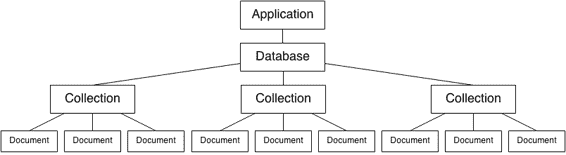
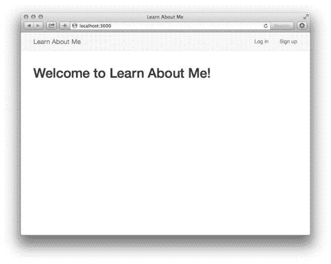
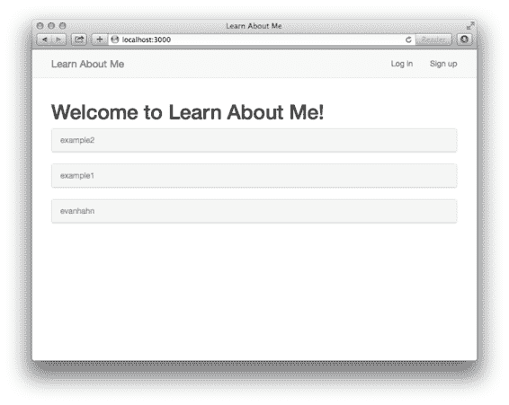
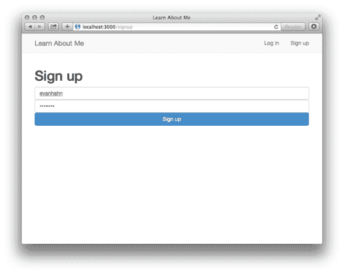
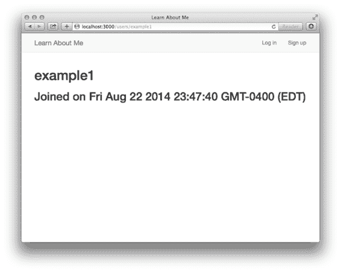
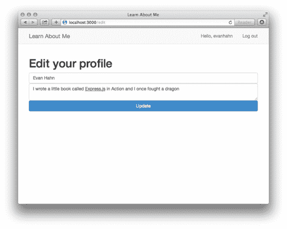
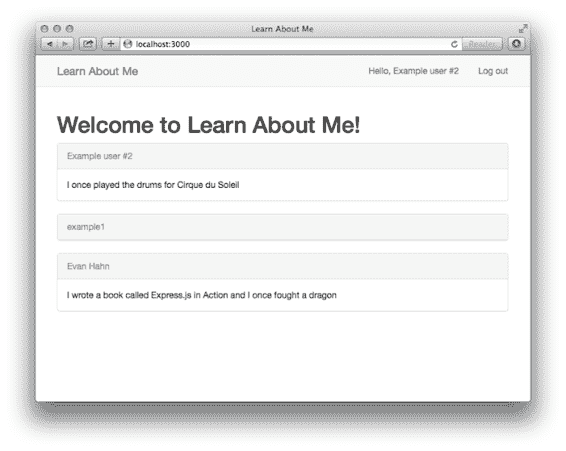

# 8  使用 MongoDB 持久化数据

我在这本书中有三个最喜欢的章节。

你已经通过了我最喜欢的第一部分：第三章，我们讨论了 Express 的基础。我喜欢那一章，因为目标是真正地解释 Express。在我看来，这是本书最重要的章节，因为它从概念上解释了框架。

第十章是我三个最喜欢的章节中的第二个。正如你将看到的，它讨论了安全性，我喜欢戴上黑客帽子尝试破解 Express 应用程序。这很有趣（顺便说一下，非常重要）。

这一章是我最喜欢的最后一章。为什么？因为在这章之后，你的应用程序将感觉真实。不再有微不足道的示例应用程序。不再有迅速消失的数据。你的 Express 应用程序将拥有用户账户、博客文章、好友请求、日历预约……所有这些都将得益于数据持久化。

几乎每个应用程序都有某种类型的数据，无论是博客文章、用户账户还是猫的照片。正如我们讨论的那样，Express 通常是一个无意见的框架。与这个无意见的座右铭相符，Express 并不规定你如何存储数据。那么我们应该如何处理这个问题呢？

你可以通过简单地设置变量来将应用程序的数据存储在内存中。例如，第三章的留言簿示例将留言簿条目存储在一个数组中。虽然这在非常简单的案例中很有用，但它有几个缺点。首先，如果你的服务器停止了（无论是你手动停止它还是它崩溃），你的数据就会丢失！如果你增长到数亿个数据点，你会耗尽内存。这种方法在多个服务器运行你的应用程序时也会遇到问题，因为数据可能在一个机器上，但在另一个机器上没有。

你可以尝试将应用程序的数据存储在文件中，通过写入文件或多个文件。毕竟，许多数据库就是这样在内部工作的。但这就需要你自己去思考如何结构和查询这些数据。你该如何保存数据？当你需要数据时，你该如何高效地从这些文件中获取数据？你可能会最终构建自己的数据库，这会是一个巨大的头疼问题。而且，这同样不会神奇地与多台服务器一起工作。

我们需要另一个计划。这就是为什么我们选择为这个目的设计的软件：数据库。我们选择的数据库是被称为 MongoDB 的东西。

在本章中，我们将学习以下内容：

·  MongoDB 的工作原理

·  如何使用 Mongoose，一个官方的 MongoDB 库

·  如何安全地创建用户账户

·  如何使用 Passport 进行身份验证

让我们现实一点。

## 8.1     为什么选择 MongoDB？

MongoDB（通常简称为 Mongo）是一个流行的数据库，它已经巧妙地进入了众多 Node 开发者的心中。它与 Express 的搭配受到如此喜爱，以至于产生了“MEAN”这个缩写，代表 MongoDB、Express、Angular（一个前端 JavaScript 框架）和 Node。在这本书中，我们将讨论除了那个缩写中的“A”以外的所有内容……即“MEN”栈。

到目前为止，你可能正在说：“现在有很多数据库可供选择，比如 SQL、Apache Cassandra 或 Couchbase。为什么选择 MongoDB？”这是一个好问题！

通常，Web 应用程序将它们的数据存储在两种类型的数据库中之一：关系型和非关系型。

通常，关系型数据库就像电子表格一样。它们的数据是有结构的，每个条目通常都是表格中的一行。它们有点像强类型语言，如 Java，其中每个条目都必须符合严格的要求（称为模式）。大多数关系型数据库都可以用 SQL（结构化查询语言）的某种变体来控制；你很可能听说过 MySQL、SQL Server 或 PostgreSQL。“关系型数据库”和“SQL 数据库”通常是可互换使用的术语。

相反，非关系型数据库通常被称为“NoSQL”数据库。（实际上，“NoSQL”仅仅意味着“不是 SQL 的任何东西”，但它往往指的是一类特定的数据库。）我喜欢想象“NoSQL”既是一种不同的技术，也是对现状的一种强烈抗议。也许“NoSQL”就像抗议者手臂上的纹身。无论如何，它与关系型数据库不同，因为它通常不像电子表格那样结构化。它们通常比 SQL 数据库要灵活一些。在这方面，它们非常类似于 JavaScript；JavaScript 通常也更灵活。总的来说，NoSQL 数据库“感觉”上比 SQL 数据库更像 JavaScript。

因此，我们选择了一个 NoSQL 数据库。我们将选择的 NoSQL 数据库叫做 MongoDB。但为什么选择它呢？

首先，MongoDB 很受欢迎。这本身并不是优点，但它有几个好处。你不会在网上找不到帮助。它也被很多人用在很多地方。Mongo 也是一个成熟的项目。它自 2007 年以来一直存在，并被 eBay、Craigslist 和 Orange 等公司所信任。你不会使用有缺陷的、不受支持的软件。

Mongo 之所以受欢迎，部分原因在于它成熟、功能丰富且可靠。它是用性能良好的 C++编写的，并且被大量用户所信任。

虽然 Mongo 不是用 JavaScript 编写的，但它的原生 shell 使用 JavaScript。这意味着当你打开 Mongo 在命令行中玩耍时，你用 JavaScript 发送命令给它。能够用你已经使用的语言“与”数据库“交谈”是非常方便的！

我还选择 Mongo 来写这一章，因为我认为它对于 JavaScript 开发者来说比 SQL 更容易学习。SQL 本身是一种强大的编程语言，但你已经知道 JavaScript 了！

我几乎不相信 Mongo 是所有 Express 应用程序的正确选择。关系型数据库非常重要，并且可以很好地与 Express 一起使用，其他 NoSQL 数据库如 CouchDB 也非常强大。但 Mongo 与 Express 生态系统很好地配合，并且相对容易学习（与 SQL 相比），这就是为什么我选择它来写这一章。

注意：如果你像我一样，你知道 SQL 并想为一些 Express 项目使用它。本章将讨论 Mongo，但如果你在寻找一个有用的 SQL 工具，请查看 Sequelize，网址为 http://sequelizejs.com/。它与许多 SQL 数据库接口，并具有许多有用的功能。

在本章中，我们将大量使用一个名为 Mongoose 的模块；在你阅读时作为参考，Mongoose 对于 MongoDB 就像 Sequelize 对于 SQL 一样。如果你想使用 SQL，请记住这一点！

### 8.1.1 Mongo 的工作原理

在我们开始之前，让我们谈谈 Mongo 是如何工作的。

大多数应用程序都有一个数据库，比如 MongoDB。这些数据库由服务器托管。一个 Mongo 服务器可以拥有许多数据库，但通常每个应用程序只有一个数据库。如果你只在你的电脑上开发一个应用程序，你很可能只有一个 Mongo 数据库。（这些数据库可以在多个服务器之间复制，但你可以将其视为一个数据库。）

要访问这些数据库，你将运行一个 MongoDB 服务器。客户端将与这些服务器通信，查看和操作数据库。大多数编程语言都有客户端库；这些库被称为驱动程序，并允许你使用你喜欢的编程语言与数据库通信。在这本书中，我们将使用 MongoDB 的 Node.js 驱动程序。

每个数据库都将有一个或多个集合。我喜欢将集合想象成高级数组。一个博客应用程序可能有一个用于博客文章的集合，或者一个社交网络可能有一个用于用户资料的集合。它们就像数组一样，只是巨大的列表，但你也可以比数组更容易地查询它们（例如，“给我这个集合中所有年龄大于 18 岁的用户”等）。

每个集合都将包含任意数量的文档。文档实际上并不是以 JSON 的形式存储的，但你可以这样想；它们基本上是具有各种属性的物体。文档是像用户和博客文章这样的东西；每件事物都有一个文档。文档不必具有相同的属性，即使它们在同一个集合中——理论上你可以有一个完全不同的对象的集合（尽管在实践中很少这样做）。

文档看起来很像 JSON，但技术上它们是被称为二进制 JSON，或 BSON 的东西。你几乎从不直接处理 BSON；相反，你将将其转换为 JavaScript 对象。BSON 编码和解码的具体细节与 JSON 略有不同。BSON 还支持 JSON 不支持的一些类型，如日期、时间戳和未定义的值。

这里有一个显示事物如何组合的图：

图 8.1 Mongo 数据库、集合和文档的层次结构

最后一个重要的一点：Mongo 为每个文档添加一个唯一的`_id`属性。因为这些 ID 是唯一的，如果两个文档具有相同的`_id`属性，则它们是相同的，并且你无法在同一个集合中存储具有相同 ID 的两个文档。这是一个杂项但重要的点，我们稍后会再次提到！

### 8.1.2 对于那些 SQL 用户来说...

如果你来自关系型/SQL 背景，Mongo 的许多结构都与 SQL 世界的结构一一对应。（如果你不熟悉 SQL，可以跳过这一部分！）

在 Mongo 中，文档对应于 SQL 中的行或记录。在一个用户应用程序中，每个用户在 Mongo 中对应一个文档或 SQL 中的一个行。与 SQL 不同，Mongo 在数据库层不强制执行任何模式，因此在 Mongo 中有一个没有姓氏或电子邮件地址是数字的用户是有效的。

在 Mongo 中，集合对应于 SQL 中的表。Mongo 的集合包含许多文档，而 SQL 的表包含许多行。再次强调，Mongo 的集合不强制执行模式，这与 SQL 不同。此外，这些文档可以嵌入其他文档，这与 SQL 不同——博客文章可以包含评论，这在 SQL 中可能对应两个表。在一个博客应用程序中，会有一个 Mongo 集合用于博客文章或一个 SQL 表。每个 Mongo 集合包含许多文档，而每个 SQL 表包含许多行或记录。

在 Mongo 中，数据库与 SQL 中的数据库非常相似。通常，每个应用程序有一个数据库。Mongo 数据库可以包含许多集合，而 SQL 数据库可以包含许多表。一个社交网络网站可能只有一个这些数据库，无论是 SQL、Mongo 还是其他类型的数据库。

要查看从 SQL 术语到 MongoDB 术语（包括查询）的完整“翻译”列表，请查看官方的 SQL 到 MongoDB 映射图表[`docs.mongodb.org/manual/reference/sql-comparison/index.html`](http://docs.mongodb.org/manual/reference/sql-comparison/index.html)。

### 8.1.3 设置 Mongo

你会想要在本地安装 Mongo，这样你就可以在开发时使用它。

如果你使用 OSX 并且不确定是否想使用命令行，我非常推崇 Mongo.app。你不需要处理命令行，只需启动一个运行在屏幕右上角菜单栏中的应用程序。你可以轻松地判断它是否正在运行，启动控制台，并轻松关闭它。你可以在[`mongoapp.com/`](http://mongoapp.com/)下载它。

如果你使用 OSX 并希望使用命令行，可以使用 Homebrew 包管理器通过简单的`brew install mongodb`命令安装 MongoDB。如果你使用 MacPorts，`sudo port install mongodb`将完成工作。如果你不使用包管理器并且不想使用 Mongo.app，你可以从 MongoDB 下载页面[`www.mongodb.org/downloads`](http://www.mongodb.org/downloads)下载它。

如果您使用的是 Ubuntu Linux，Mongo 的网站上有有用的说明[`docs.mongodb.org/manual/tutorial/install-mongodb-on-ubuntu/`](http://docs.mongodb.org/manual/tutorial/install-mongodb-on-ubuntu/)。如果您使用的是类似 Mint（或 Debian）的 Debian 发行版，请查看官方文档[`docs.mongodb.org/manual/tutorial/install-mongodb-on-debian/`](http://docs.mongodb.org/manual/tutorial/install-mongodb-on-debian/)。其他 Linux 用户可以查看[`docs.mongodb.org/manual/tutorial/install-mongodb-on-linux/`](http://docs.mongodb.org/manual/tutorial/install-mongodb-on-linux/)。

如果您是 Windows 用户或上述未提及的任何操作系统用户，MongoDB 下载页面将帮助您。您可以从他们的网站下载，或者滚动到该页面的底部查看其他拥有 Mongo 的包管理器。查看[`www.mongodb.org/downloads`](http://www.mongodb.org/downloads)。如果可能，请确保下载 64 位版本；32 位版本的存储空间有限。

在本书的整个过程中，我们将假设您的 MongoDB 数据库位于`localhost:27017/test`。端口 27017 是默认端口，默认数据库是名为"test"的数据库，但您的结果可能会有所不同。如果您无法连接到数据库，请检查您的特定安装以获取帮助。

## 8.2     使用 Mongoose 从 Node 与 MongoDB 通信

我们需要一个库，让我们能够从 Node 和 Express 与 MongoDB 通信。有许多底层模块，但我们希望使用起来简单且功能丰富。我们应该使用什么？

不必再寻找其他资源，Mongoose（在 http://mongoosejs.com/）是一个官方支持的从 Node.js 与 MongoDB 通信的库。正如其文档所述：

Mongoose 提供了一个基于模式的简单解决方案来建模您的应用程序数据，并包括内置的类型转换、验证、查询构建、业务逻辑钩子等，无需额外配置。

换句话说，Mongoose 为我们提供了与数据库通信之外的功能。让我们通过创建一个简单的带有用户账户的网站来了解它是如何工作的。

### 8.2.1  设置您的项目

为了学习本章的主题，我们将开发一个非常简单的社交网络应用程序。这个应用程序将允许用户注册新资料，编辑这些资料，并浏览彼此的资料。由于缺乏创意名称，我们将其称为"Learn About Me"。为了方便起见，我们将简称为"LAM"。

我们网站将包含几个页面：

·  主页将列出所有用户。点击列表中的用户将带您进入他们的个人资料页面。

·  个人资料页面将显示用户的显示名称（如果没有定义显示名称，则为用户名），他们加入网站的日期以及他们的个人简介。

·  用户将能够注册新账户，登录账户，并注销。

·  注册后，用户将能够编辑他们的显示名称和个人简介，但仅当他们登录时。

像往常一样，为这个项目创建一个新的目录。像往常一样，我们需要创建一个包含有关我们的项目和其依赖项的元数据的包文件。创建一个`package.json`文件，并将其放入其中：

列表 8.1 LAM 的 package.json

`{` `  "name": "learn-about-me",` `  "private": true,` `  "scripts": {` `    "start": "node app"` `  },` `  "dependencies": {` `    "bcrypt-nodejs": "0.0.3",  #B` `    "body-parser": "¹.6.5",` `    "connect-flash": "⁰.1.1",` `    "cookie-parser": "¹.3.2",` `    "ejs": "¹.0.0",` `    "express": "⁴.8.5",` `    "express-session": "¹.7.6",` `    "mongoose": "³.8.15",` `    "passport": "⁰.2.0",` `    "passport-local": "¹.0.0"` `  }``}`

#B 有一个名为“bcrypt”的不同模块，它生成大量的 C 代码。它可能更快，但安装可能稍微困难一些。如果您需要速度，它是一个即插即用的替代品。

创建此文件后，运行`npm install`以安装我们的依赖项。随着我们继续本章的其余部分，我们将看到每个依赖项的作用，所以如果其中任何一个不清楚，请不要担心！像往常一样，我们已经设置好，`npm start`将启动我们的应用程序（我们将将其保存到`app.js`中）。

现在是时候开始将东西放入数据库了！

### 8.2.2 创建用户模型

正如我们之前讨论的，MongoDB 将所有内容存储在 BSON 中，这是一种二进制格式。一个简单的“hello world”BSON 文档可能看起来像这样：

`\x16\x00\x00\x00\x02hello\x00\x06\x00\x00\x00world\x00\x00`

计算机可以处理所有这些乱七八糟的东西，但对于我们这样的人来说很难阅读。我们想要一些更适合我们的东西，这就是为什么开发者创建了数据库模型的概念。模型是数据库记录在您选择的编程语言中的良好对象的表示。在这种情况下，我们的模型将是 JavaScript 对象。

模型可以作为存储数据库值的简单对象，但它们通常具有数据验证、额外方法和更多功能。正如我们将看到的，Mongoose 有很多这样的功能。

在这个例子中，我们将构建一个用户模型。在我们开始之前，我们应该考虑 User 对象应该具有哪些属性：

·  用户名，一个唯一的名称。这将需要。

·  密码。这也会被要求。

·  加入时间，记录用户加入网站的时间。

·  显示名称，代替用户名显示的名称。这将可选。

·  个人简介，用户个人资料页面上显示的一组可选文本。

要在 Mongoose 中指定这一点，我们必须定义一个模式，它包含有关属性、方法和更多信息。 (我个人认为“模式”这个词不正确；它更像是一个类或原型。) 将上面的英文翻译成 Mongoose 代码相当简单。

在您项目的根目录下创建一个名为`models`的文件夹，并在该文件夹内创建一个名为`user.js`的新文件。首先，将以下内容放入其中：

列表 8.2 定义用户模式（在 models/user.js 中）

`var mongoose = require("mongoose");` `var userSchema = mongoose.Schema({` `  username: { type: String, required: true, unique: true },` `  password: { type: String, required: true },` `  createdAt: { type: Date, default: Date.now },` `  displayName: String,` `  bio: String``});`

在我们引入 Mongoose 之后，定义字段就相当直接了。正如你所看到的，我们将用户名定义为`username`，密码定义为`password`，加入时间为`createdAt`，显示名为`displayName`，个人简介为`bio`。注意，一些字段是必需的，一些是唯一的，一些有默认值，而其他只是声明了它们的类型。

一旦我们创建了具有属性的架构，我们就可以向其添加一些方法。我们将添加的第一个方法是简单的：获取用户的名字。如果用户定义了显示名，则返回该显示名；否则，返回他们的用户名。以下是添加该方法的步骤：

列表 8.3 向用户模型添加简单方法（在 models/user.js 中）

`…` `userSchema.methods.name = function() {` `  return this.displayName || this.username;``};`

我们还想要确保我们安全地存储密码。我们可以在数据库中以纯文本形式存储密码，但这存在许多安全问题。如果有人黑入我们的数据库怎么办？他们会得到所有的密码！我们还想成为负责任的管理员，不能看到用户密码的明文。为了确保我们永远不会存储“真实”的密码，我们将使用 Bcrypt 算法对其进行单向哈希。

首先，要开始使用 Bcrypt，请将`require`语句添加到文件顶部。Bcrypt 通过多次运行算法的一部分来生成一个安全的哈希值，但这个次数是可以配置的。数字越高，哈希值越安全，但所需时间也越长。我们现在使用 10 这个值，但我们可以增加这个数字以获得更高的安全性（但，再次强调，速度会变慢）：

列表 8.4 引入 Bcrypt（在 models/user.js 中）

`var bcrypt = require("bcrypt-nodejs");` `var SALT_FACTOR = 10;`

接下来，在你定义了架构之后，我们将定义一个预保存操作。在我们将模型保存到数据库之前，我们将运行一些代码来哈希密码。以下是它的样子：

列表 8.5 我们预保存操作以哈希密码（在 models/user.js 中）

`…` `var noop = function() {};` `#1` `userSchema.pre("save", function(done) {` `  var user = this;` `  if (!user.isModified("password")) {` `    return done();` `  }` `  bcrypt.genSalt(SALT_FACTOR, function(err, salt) {` `    if (err) { return done(err); }` `    bcrypt.hash(user.password, salt, noop,` `    [CA]function(err, hashedPassword) {` `      if (err) { return done(err); }` `      user.password = hashedPassword;` `      done();` `    });` `  });` `});`

#1 我们需要一个什么也不做的函数来与 bcrypt 模块一起使用。

#2 我们将定义一个在模型保存之前运行的函数。

#3 因为我们将使用内部函数，所以我们将保存对用户的引用。

#4 如果用户没有修改他们的密码，则跳过此逻辑。

#5 我们将为散列生成一个盐，并在完成后调用内部函数。

#6 接下来，我们将使用生成的盐散列用户的密码。

#7 存储密码并继续保存操作！

现在，我们再也不需要调用任何复杂的逻辑来对数据库中的密码进行散列——每次我们将模型保存到 Mongo 时，它都会自动发生。

最后，我们需要编写一些代码来比较实际密码和密码猜测。当用户登录时，我们需要确保他们输入的密码是正确的。让我们在模型上定义另一个方法来完成这个任务：

列表 8.6 检查用户的密码（在 models/user.js 中）

`…` `userSchema.methods.checkPassword = function(guess, done) {` `  bcrypt.compare(guess, this.password, function(err, isMatch) {` `    done(err, isMatch);` `  });` `};`

#1 由于复杂的保密原因（如果你感兴趣，可以称为“时间攻击”），我们将使用 Bcrypt 的比较函数而不是像 a ===检查这样的东西。

现在我们将安全地存储用户的密码！

一旦我们定义了具有其属性和方法的模式，我们还需要将此模式附加到实际模型上。这只需要一行代码，因为我们是在文件中定义此用户模型，所以我们会确保将其导出到`module.exports`，以便其他文件可以`require`它。以下是我们的操作方法：

列表 8.7 创建并导出用户模型（在 models/user.js 中）

`…` `var User = mongoose.model("User", userSchema);` `module.exports = User;`

这就是定义用户模型的方法！完成时，整个文件将看起来像这样：

列表 8.8 完成的 models/user.js

`var bcrypt = require("bcrypt-nodejs");` `var mongoose = require("mongoose");` `var SALT_FACTOR = 10;` `var userSchema = mongoose.Schema({` `  username: { type: String, required: true, unique: true },` `  password: { type: String, required: true },` `  createdAt: { type: Date, default: Date.now },` `  displayName: String,` `  bio: String,` `});` `var noop = function() {};` `userSchema.pre("save", function(done) {` `  var user = this;` `  if (!user.isModified("password")) {` `    return done();` `  }` `  bcrypt.genSalt(SALT_FACTOR, function(err, salt) {` `    if (err) { return done(err); }` `    bcrypt.hash(user.password, salt, noop, function(err, hashedPassword) {` `      if (err) { return done(err); }` `      user.password = hashedPassword;` `      done();` `    });` `  });` `});` `userSchema.methods.checkPassword = function(guess, done) {` `  bcrypt.compare(guess, this.password, function(err, isMatch) {` `    done(err, isMatch);` `  });` `};` `userSchema.methods.name = function() {` `  return this.displayName || this.username;` `};` `var User = mongoose.model("User", userSchema);` `module.exports = User;`

### 8.2.3 使用我们的模型

现在我们已经定义了我们的模型，我们想要...嗯，使用它！我们想要做一些像列出用户、编辑资料和注册新账户的事情。虽然定义模型及其模式可能有点棘手，但使用它几乎不可能更简单；让我们看看如何。

为了开始使用它，我们首先在项目的根目录中创建一个简单的 `app.js` 文件，这将设置我们的应用程序。这个文件目前是不完整的，我们稍后会回来补充更多内容，但现在，我们将做以下事情：

列表 8.9 app.js，开始

`var express = require("express");                     #1` `var mongoose = require("mongoose");                   #1` `var path = require("path");                       #1` `var bodyParser = require("body-parser");              #1` `var cookieParser = require("cookie-parser");          #1` `var session = require("express-session");             #1` `var flash = require("connect-flash");                 #1` `var routes = require("./routes");                     #2` `var app = express();` `mongoose.connect("mongodb://localhost:27017/test");   #3` `app.set("port", process.env.PORT || 3000);` `app.set("views", path.join(__dirname, "views"));` `app.set("view engine", "ejs");` `app.use(bodyParser.urlencoded({ extended: false }));   #4` `app.use(cookieParser());                               #4` `app.use(session({                                      #4` `  secret: "TKRv0IJs=HYqrvagQ#&!F!%V]Ww/4KiVs$s,<<MX",  #4` `  resave: true,                                        #4` `  saveUninitialized: true                              #4` `}));                                                   #4` `app.use(flash());                                  #4` `app.use(routes);` `app.listen(app.get("port"), function() {` `  console.log("Server started on port " + app.get("port"));``});`

#1 需要所有我们需要的东西，包括 Mongoose。

#2 我们将把所有的路由放在另一个文件中。

#3 连接到测试数据库中的我们的 MongoDB 服务器。

#4 使用四个中间件。我们将在稍后详细解释这些。

在上面，我们指定我们将使用一个外部路由文件。让我们也定义一下。在项目的根目录中创建 `routes.js`：

列表 8.10 routes.js，开始

`var express = require("express");` `var User = require("./models/user");` `var router = express.Router();` `router.use(function(req, res, next) {` `  res.locals.currentUser = req.user;       #1` `  res.locals.errors = req.flash("error");  #1` `  res.locals.infos = req.flash("info");    #1` `  next();` `});` `router.get("/", function(req, res, next) {` `  User.find()                                 #2` `  .sort({ createdAt: "descending" })          #2` `  .exec(function(err, users) {                #2` `    if (err) { return next(err); }` `    res.render("index", { users: users });` `  });` `});` `module.exports = router;`

#1 我们会回过头来讨论这个问题，但这是为我们的模板设置一些有用的变量。如果你现在还不理解，不要担心——它很快就会回来。

#2 这个查询返回用户集合，首先返回最新的用户。

这两个文件包含了一些我们之前没有见过的内容。

首先，我们使用 Mongoose 通过 `mongoose.connect` 连接到我们的 Mongo 数据库。我们只需传递一个地址，Mongoose 就会完成剩下的工作。根据你如何安装 MongoDB，这个 URL 可能不同——例如，服务器可能在 `localhost:12345/learn_about_me_db`。没有这一行，我们将无法与数据库进行任何交互！

第二，我们使用 `User.find` 获取用户列表。然后我们按 `createdAt` 属性对这些结果进行排序，然后通过 `exec` 运行查询。实际上，我们只有在调用 `exec` 时才会运行查询。正如我们将看到的，我们也可以在 `find` 中指定一个回调，以避免使用 `exec`，但那样我们就不能进行排序等操作。

让我们创建主页视图。创建一个名为 `views` 的目录，我们将在这里放置三个文件。第一个将是 `_header.ejs`，这是将出现在每个页面开头的 HTML：

列表 8.11 views/_header.ejs

`<!DOCTYPE html>` `<html>` `<head>` `<meta charset="utf-8">` `<title>了解我</title>` `<link rel="stylesheet" href="//maxcdn.bootstrapcdn.com/bootstrap` `[CA]/3.3.1/css/bootstrap.min.css">` `<head>` `<body>` `
` `
` `
` `<a class="navbar-brand" href="/">了解我</a>` `
` `<ul class="nav navbar-nav navbar-right">` `<% if (currentUser) { %>` `<li>` `<a href="/edit">` `<%= currentUser.name() %>` `<a>` `<li>` `<a href="/logout">登出</a></li>` `<% } else { %>` `<li>` `<a href="/login">登录</a></li>` `<li>` `<a href="/signup">注册</a></li>` `<% } %>` `<ul>` `
` `
` `<% errors.forEach(function(error) { %>` `
` `<%= error %>` `
` `<% }) %>` `<% infos.forEach(function(info) { %>` `
` `<%= info %>` `
` `<% }) %>` `
`

#1 如果用户已登录，我们将更改导航栏。我们还没有这个代码，所以用户看起来总是未登录。

你可能会注意到这个文件以下划线开头。它不是 `header.ejs`，而是 `_header.ejs`。这是一个常见的约定：不直接渲染的视图以下划线开头。你永远不会直接渲染头部——另一个视图将包含头部。

接下来，让我们在 `_footer.ejs` 中创建页脚：

列表 8.12 views/_footer.ejs

`
` `</body>` `</html>`

最后，创建 `index.ejs`，这是实际的首页。这将从我们渲染此视图时传递给我们的 `users` 变量中获取。

列表 8.13 views/index.ejs

`<% include _header %>` `<h1>欢迎来到了解我！</h1>` `<% users.forEach(function(user) { %>` `
` `
` `<a href="/users/<%= user.username %>">` `<%= user.name() %>` `<a>` `
` `<% if (user.bio) { %>` `
<%= user.bio %>
` `<% } %>` `
` `<% }) %>` `<% include _footer %>`

如果你保存了所有内容，启动你的 MongoDB 服务器，并运行 `npm start`，然后在浏览器中访问 `localhost:3000`，你不会看到太多，但你将看到一个看起来像这样的首页：

图 8.2 空的 LAM 首页

如果你没有收到任何错误，那真是太好了！这意味着你正在查询你的 Mongo 数据库，并且获取了其中的所有用户...只是目前恰好没有用户！

让我们在页面上添加两个额外的路由：一个用于注册页面，另一个用于实际注册。为了使用它，我们需要确保我们使用`body-parser`中间件来解析表单数据。下面是它们的样式：

列表 8.14 向 app.js 添加 body-parser 中间件

`var bodyParser = require("body-parser");               #1`  `…`  `app.use(bodyParser.urlencoded({ extended: false }));   #1`  `…`

#1 在我们的应用程序中需要并使用 body-parser 中间件。

列表 8.15 向 routes.js 添加注册路由

`…`  `router.get("/signup", function(req, res) {`  `  res.render("signup");`  `});`  `router.post("/signup", function(req, res, next) {`  `  var username = req.body.username;                            #1`  `  var password = req.body.password;                            #1`  `  User.findOne({ username: username }, function(err, user) {   #2`  `    if (err) { return next(err); }`  `    if (user) {                                                #3`  `      req.flash("error", "用户已存在");               #3`  `      return res.redirect("/signup");                        #3`  `    }                                                  #3`  `    var newUser = new User({                                   #4`  `      username: username,                                      #4`  `      password: password               #4`  `    });                                                #4`  `    newUser.save(next);                                        #5`  `  });`  `}, passport.authenticate("login", {            #6`  `  successRedirect: "/",`  `  failureRedirect: "/signup",`  `  failureFlash: true` `});`);`

#1 `body-parser`填充`req.body`，我们在这里可以看到它包含注册的用户名和密码。将`extended`设置为`false`使解析更简单、更安全，原因我们将在第十章中看到。

#2 我们调用`findOne`来只返回一个用户。我们在这里希望匹配用户名。

#3 如果我们找到一个用户，我们应该退出，因为该用户名已经存在。

#4 创建一个新的用户模型实例，包含用户名和密码。

#5 将新用户保存到数据库中，并继续到下一个请求处理器（下面）。

#6 当我们全部完成时，我们应该验证用户。

上述代码有效地将新用户保存到我们的数据库中！让我们通过创建`views/signup.ejs`来添加一个用户界面：

列表 8.16 views/signup.ejs

`<% include _header %>`  `<h1>注册</h1>`  `<form action="/signup" method="post">`  `  <input name="username" type="text" class="form-control" placeholder="用户名" required autofocus>`  `  <input name="password" type="password" class="form-control" placeholder="密码" required>`  `  <input type="submit" value="注册" class="btn btn-primary btn-block">`  `</form>`  `<% include _footer %>`

现在，当你提交这个表单时，它会与服务器代码通信并注册一个新用户！使用`npm start`启动服务器，然后转到注册页面（在`localhost:3000/signup`）。创建几个账户，你会在主页上看到它们！

图 8.3 创建几个用户后的早期 LAM 主页

图 8.4 LAM 注册页面

在我们不得不编写登录和登出代码之前，最后一项业务是查看个人资料。我们将为这个功能添加一个额外的路由，它看起来像这样：

列表 8.17 个人资料路由（在 routes.js 中）

`…`   `router.get("/users/:username", function(req, res, next) {`   `  User.findOne({ username: req.params.username }, function(err, user) {`   `    if (err) { return next(err); }`   `    if (!user) { return next(404); }`   `    res.render("profile", { user: user });`   `  });`   `});``…`

再次强调，我们将使用`findOne`，但在这个情况下，我们将实际将找到的用户传递到视图中。说到这里，`profile.ejs`将看起来像这样：

列表 8.18 视图/profile.ejs

`<% include _header %>`   `<% if ((currentUser) && (currentUser.id === user.id)) { %>`   `  <a href="/edit" class="pull-right">编辑你的个人资料</a>`   `<% } %>`   `<h1><%= user.name() %></h1>`   `<h2>加入时间 <%= user.createdAt %></h2>`   `<% if (user.bio) { %>`   `  
<%= user.bio %>
`   `<% } %>`   `  `<% include _footer %>`

#1 这引用了 currentUser 变量，一旦我们添加了登录和登出功能，这个变量就会出现。目前，这始终评估为 false。

现在我们可以查看用户个人资料了！如图 8.5 所示查看：

图 8.5 LAM 个人资料页面

现在我们可以创建和查看用户个人资料了。接下来，我们需要添加登录和登出功能，以便用户可以编辑他们现有的个人资料。让我们看看这是如何工作的！

## 8.3     使用 Passport 认证用户

在本章中，我们一直在创建“了解我”，一个允许用户创建和浏览个人资料的网站。我们已经实现了主页、“查看个人资料”页面，甚至还有注册功能！

但目前，我们的应用程序对用户模型没有任何“特殊”的了解。它们没有认证，所以它们可以像蛋糕模型或玉米卷模型一样——你可以像查看和创建其他对象一样查看和创建它们。我们将需要实现用户认证。我们需要一个登录页面，当前登录用户的概念（你已经在几个地方看到了 currentUser），以及实际验证密码。

对于这个，我们将选择 Passport。正如其文档所述，“Passport 是 Node 的认证中间件。它旨在服务于单一目的：认证请求。”我们将把这个中间件放入我们的应用程序中，编写一些代码来连接我们的用户，然后我们就可以开始工作了！Passport 为我们省去了很多麻烦。

重要的是要记住，Passport 并不规定你如何验证用户；它只是提供有用的样板代码。在这方面，它与 Express 类似。在本章中，我们将探讨如何使用 Passport 验证存储在 MongoDB 数据库中的用户，但 Passport 支持与 Facebook、Google、Twitter 以及 100 多个其他提供者的身份验证。它极其模块化和强大！

### 8.3.1  设置 Passport

当设置 Passport 时，你需要做三件事：

1.  设置 Passport 中间件；这相当简单。

2.  告诉 Passport 如何序列化和反序列化用户。这是一小段代码，它有效地将用户的会话转换为实际的用户对象。

3.  告诉 Passport 如何验证用户。在这种情况下，这是我们代码的主体部分，它将指导 Passport 如何与我们的 MongoDB 数据库通信。

让我们开始吧。

设置 PASSPORT 中间件

为了初始化 Passport，你需要设置三个官方 Express 中间件、一个第三方中间件以及两个 Passport 中间件。供你参考，它们是：

`1.` `body-parser`

`2.` `cookie-parser`

`3.` `express-session`

`4.` `connect-flash`

`5.` `passport.initialize`

`6.` `护照会话`

我们已经包含了一些这些中间件：`body-parser`、`cookie-parser`、`express-session` 和 `connect-flash`。第一个用于解析 HTML 表单。`cookie-parser` 和 `express-session` 处理用户会话；前者用于解析来自浏览器的 cookies，后者用于在不同浏览器之间存储会话。我们还使用 `connect-flash` 来显示错误信息。

之后，确保你 `require` Passport，然后你将使用它提供的两个中间件函数。将这些放在你的应用程序顶部（并确保你也 `require` 它们）：

列表 8.19 在 app.js 中设置 Passport 的中间件

`var bodyParser = require("body-parser");` `var cookieParser = require("cookie-parser");` `var flash = require("connect-flash");` `var passport = require("passport");` `var session = require("express-session");` `…` `app.use(bodyParser.urlencoded({ extended: false }));` `app.use(cookieParser());` `app.use(session({` `  secret: "TKRv0IJs=HYqrvagQ#&!F!%V]Ww/4KiVs$s,<<MX",   #1` `  resave: true,                                           #2` `  saveUninitialized: true                               #3` `}));` `app.use(flash());` `app.use(passport.initialize());` `app.use(passport.session());` `…`

#1 会话需要一个名为 "session secret" 的东西，它允许每个会话从客户端加密。这阻止黑客攻击用户的 cookies。它需要是一堆随机字符（不一定是上面我有的那些！）。

#2 会话中间件需要设置此选项，这会强制会话在未修改的情况下更新。

#3 saveUninitialized 是另一个必需的选项。这也重置会话，但重置的是未初始化的会话。

设置好之后，你就可以继续下一步：告诉 Passport 如何从会话中提取用户。

序列化和反序列化用户

Passport 需要知道如何序列化和反序列化用户。换句话说，我们需要将用户的会话转换为实际的用户对象，反之亦然。Passport 的文档比我能描述的做得更好：

在典型的网络应用程序中，用于验证用户的凭证仅在登录请求期间传输。如果身份验证成功，将通过用户浏览器中设置的 cookie 建立并维护一个会话。

每个后续请求将不包含凭证，而是包含标识会话的唯一 cookie。为了支持登录会话，Passport 将将 `user` 实例序列化和反序列化到会话中。

为了使我们的代码分离，我们将定义一个新的文件，名为 `setuppassport.js`。这个文件将导出一个函数，该函数将设置这个 Passport 东西。创建 `setuppassport.js` 并从 `app.js` 中 `require` 它：

列表 8.20 在 app.js 中引入和使用 Passport 设置

`…` `var setUpPassport = require("./setuppassport");` `…` `var app = express();` `mongoose.connect("mongodb://localhost:27017/test");` `setUpPassport();` `…`

现在，让我们填写我们的 Passport 设置。

由于我们所有的用户模型都有一个唯一的 `_id` 属性，我们将使用它作为我们的“转换”。首先，确保你已经 `require` 了你的用户模型。接下来，指导 Passport 如何从其 ID 中序列化和反序列化用户。这段代码可以放在 Passport 中间件之前或之后；放在你想要的位置！

列表 8.21 序列化和反序列化用户（在 setuppassport.js 中）

`var passport = require("passport");` `var User = require("./models/user");` `module.exports = function() {` `  passport.serializeUser(function(user, done) {  #1` `    done(null, user._id);                        #1` `  });` `  passport.deserializeUser(function(id, done) {  #2` `    User.findById(id, function(err, user) {      #2` `      done(err, user);                           #2` `    });` `  });`

#1 `serializeUser` 应将用户对象转换为 ID。我们调用 `done` 并不带错误和用户 ID。

#2 `deserializeUser` 应将 ID 转换为用户对象。一旦完成，我们调用 `done` 并带任何错误和用户对象。

现在，一旦处理了会话，就到了做困难的部分：实际的身份验证。

真正的身份验证

Passport 的最后一部分是设置一个称为策略的东西。一些策略包括与 Facebook 或 Google 等网站进行身份验证；我们将使用的策略称为本地策略。简而言之，这意味着身份验证由我们来完成，这意味着我们不得不编写一些 Mongoose 代码。

首先，将 Passport 本地策略引入到一个名为 `LocalStrategy` 的变量中：

列表 8.22 在 setuppassport.js 中引入 Passport LocalStrategy

`…` `var LocalStrategy = require("passport-local").Strategy;``…`

接下来，您需要告诉 Passport 如何使用该本地策略。我们的认证代码将通过以下步骤运行：

1.  查找具有提供的用户名的用户。

2.  如果没有用户存在，则我们的用户未认证；可以说我们已完成，信息为“没有用户有那个用户名！”

3.  如果用户存在，比较他们的真实密码与我们提供的密码。如果密码匹配，则返回当前用户。如果不匹配，则返回“无效密码。”

现在，让我们将这段英文翻译成 Passport 代码：

列表 8.23 我们的 Passport 本地策略（在 setuppassport.js 中）

`…`   `passport.use("login", new LocalStrategy(                              #1` `[CA]function(username, password, done) {                              #1` `  User.findOne({ username: username }, function(err, user) {          #2` `    if (err) { return done(err); }` `    if (!user) {                                                      #3` `      return done(null, false,                                        #3` `      [CA]{ message: "No user has that username!" });                 #3` `    }                                                                 #3` `    user.checkPassword(password, function(err, isMatch) {` `      if (err) { return done(err); }` `      if (isMatch) {` `        return done(null, user);                            #4` `      } else {` `        return done(null, false,` `        [CA]{ message: "Invalid password." });              #5` `      }` `    });` `  });` `}));``…`

#1 这是告诉 Passport 使用本地策略的方式。

#2 使用我们之前见过的 MongoDB 查询来获取一个用户。

#3 如果没有用户具有提供的用户名，则返回带有错误信息的 false。调用我们在 User 模型中之前定义的 checkPassword 方法。

#4 如果匹配，则不带错误返回当前用户。

#5 如果不匹配，则返回带有错误信息的 false。

如您所见，您实例化了一个`LocalStrategy`。一旦这样做，您就可以在完成时调用 done 回调！如果找到了用户对象，您将返回该对象，否则返回`false`。

路由和视图

最后，让我们设置其余的视图。我们仍然需要：

·  登录

·  登出

·  个人资料编辑（当你登录时）

让我们从登录开始。GET 路由将非常直接，只需渲染视图：

列表 8.24 GET /login（在 routes.js 中）

`…`   `router.get("/login", function(req, res) {` `  res.render("login");` `});``…`

这就是视图，在`login.ejs`中看起来会是什么样子。它将只是一个简单的表单，接受用户名和密码，然后向`/login`发送 POST 请求：

列表 8.25 视图/login.ejs

`<% include _header %>`   `<h1>登录</h1>`   `<form action="/login" method="post">`   `  <input name="username" type="text" class="form-control"`   `  [CA]placeholder="用户名" required autofocus>`   `  <input name="password" type="password" class="form-control"`   `  [CA]placeholder="密码" required>`   `  <input type="submit" value="登录" class="btn btn-primary btn-block">`   `</form>`   `  <% include _footer %>`

接下来，我们将定义对 `/login` 的 POST 请求的处理程序。这将处理 Passport 的认证。确保在文件顶部 `require` 它：

列表 8.26 执行登录（在 routes.js 中）

`var passport = require("passport");`   `…`   `router.post("/login", passport.authenticate("login", {`   `  successRedirect: "/",`   `  failureRedirect: "/login",`   `  failureFlash: true           #1`   `}));``…`

#1 如果用户登录失败，则使用 connect-flash 设置错误消息。

`passport.authenticate` 返回一个请求处理器函数，我们将其传递而不是自己编写。这让我们可以根据用户是否成功登录来重定向到正确的位置。

使用 Passport，登出也非常简单。你只需要调用 Passport 添加的新函数 `req.logout`：

列表 8.27 登出（在 routes.js 中）

`…`   `router.get("/logout", function(req, res) {`   `  req.logout();`   `  res.redirect("/");`   `});``…`

Passport 将填充 `req.user`，而 `connect-flash` 将填充一些闪存值。我们之前添加了这段代码，但现在来看看它；因为你可能会更好地理解它：

列表 8.28 将数据传递到视图中（在 routes.js 中）

`…`   `router.use(function(req, res, next) {`   `  res.locals.currentUser = req.user;         #1`   `  res.locals.errors = req.flash("error");`   `  res.locals.infos = req.flash("info");`   `  next();`   `});`   `…`

#1 每个视图现在都可以访问到 currentUser，它从 req.user 中获取，由 Passport 填充。

现在我们只有编辑页面，看看这个！我们可以登录和登出。

接下来，让我们创建一些确保用户已认证的实用中间件。我们实际上不会使用这个中间件；我们只是定义它，以便后续的路由可以使用它。我们将它命名为 `ensureAuthenticated`，如果用户未认证，我们将重定向到登录页面。

列表 8.29 用于确定用户是否认证的中间件（在 routes.js 中）

`…`   `function ensureAuthenticated(req, res, next) {`   `  if (req.isAuthenticated()) {                                    #1`   `    next();`   `  } else {`   `    req.flash("info", "您必须登录才能查看此页面.");`   `    res.redirect("/login");`   `  }`   `}`   `…`

#1 req.isAuthenticated 是 Passport 提供的函数。

现在，让我们使用这个中间件来创建“编辑个人资料”页面。

当我们获取编辑页面时，我们只需渲染视图，但在做之前，我们想确保用户已经认证。我们只需将`ensureAuthenticated`传递给我们的路由，然后一切照旧。以下是这样做的方法：

列表 8.30 GET /edit (在 router.js 中)

`…` `router.get("/edit", ensureAuthenticated, function(req, res) {    #1` `  res.render("edit");` `});` `…`

#1 首先，我们确保用户已经认证，然后如果他们没有被重定向，我们运行我们的请求处理程序。

如你所见，一切如我们所见，只是我们在请求处理程序之前放置了我们的中间件。

现在让我们定义编辑视图。这将位于`edit.ejs`中，是一个简单的表单，允许用户更改他们的显示名称和传记：

列表 8.31 视图/edit.ejs

`<% include _header %>` `<h1>编辑您的个人资料</h1>` `<form action="/edit" method="post">` `  <input name="displayname" type="text" class="form-control"` `  [CA]placeholder="显示名称"` `  [CA]value="<%= currentUser.displayName || "" %>">` `  <textarea name="bio" class="form-control"` `  [CA]placeholder="告诉我们关于您自己的事情！">` `  [CA]<%= currentUser.bio || "" %></textarea>` `  <input type="submit" value="更新" class="btn"` `  [CA]btn-primary btn-block">` `</form>` `<% include _footer %>`

现在，让我们用 POST 处理程序来处理那个表单。这也会确保使用`ensureAuthenticated`进行认证，否则将更新我们的模型并将其保存到我们的 MongoDB 数据库中。

列表 8.32 POST /edit (在 routes.js 中)

`…` `router.post("/edit", ensureAuthenticated, function(req, res, next) {  #A` `  req.user.displayName = req.body.displayname;` `  req.user.bio = req.body.bio;` `  req.user.save(function(err) {` `    if (err) {` `      next(err);` `      return;` `    }` `    req.flash("info", "个人资料已更新！");` `    res.redirect("/edit");` `  });` `});` `…`

#A 通常，这应该是一个 PUT 请求，但浏览器只支持 HTML 表单中的 GET 和 POST。

这里没有什么特别的地方；我们只是更新了 MongoDB 数据库中的用户。记住，Passport 会为我们填充`req.user`。

突然，我们有了我们的个人资料编辑器！

图 8.6 个人资料编辑器

现在我们能够编辑个人资料了，创建一些假用户并编辑他们的个人资料。查看我们的基本完成的应用程序“了解我”！

图 8.7 LAM 主页

现在你有一个真正的应用程序了！

## 8.4     总结

在本章中，你学习了：

·  MongoDB 是如何工作的：它是一个允许你存储 JavaScript 风格对象的数据库

·  如何使用 Mongoose，一个官方的 MongoDB 库，用 Node 控制数据库

·  如何使用 bcrypt 安全地创建用户账户

·  如何使用 Passport 进行用户认证
