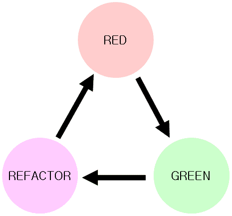
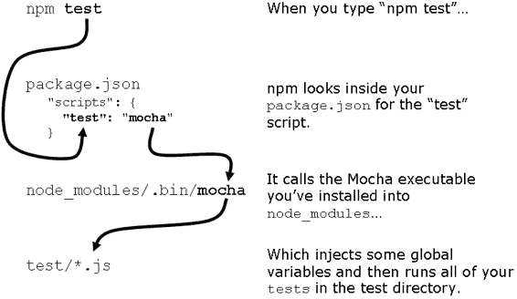
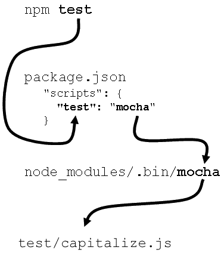

# 9  测试 Express 应用程序

编写可靠的代码可能很困难。即使是小型软件也可能过于复杂，以至于一个人难以处理，这可能导致错误。开发者们已经想出了一些技巧来尝试消除这些错误。编译器和语法检查器会自动扫描你的代码以查找潜在的错误；同行代码审查让其他人查看所写内容，看看他们是否能发现错误；风格指南可以帮助开发团队保持一致。这些都是我们用来使代码更可靠、更无错误的帮助性技巧。

另一种解决错误的有力方法是自动化测试。自动化测试让我们能够将我们希望软件如何行为编码化（字面上！）并且让我们更有信心地说“我的代码是正确的！”它让我们在重构代码时不用担心是否破坏了某些东西，并且给我们提供了关于代码失败位置的简单反馈。

我们希望我们的 Express 应用程序也能获得这些好处！在本章结束时，你将：

·  了解在高级别进行测试的动机

·  了解不同类型的测试

·  能够进行测试驱动开发，理解和使用开发的红-绿-重构模型

·  编写、运行和组织测试以确保你的函数和模型按预期工作（使用称为 Mocha 和 Chai 的工具）

·  使用 Supertest 模块测试你的 Express 应用程序以确保你的服务器表现如预期

·  测试 HTML 响应以确保你的视图生成了正确的 HTML（使用一个类似 jQuery 的模块 Cheerio）

让我们开始将这些组件组合起来。

## 9.1     什么是测试以及为什么它很重要？

毫不奇怪，你想象中的代码行为和实际行为之间往往存在脱节。没有程序员能够 100%地写出没有错误的代码；这是我们职业的一部分。

例如，如果我们正在编写一个简单的计算器，我们知道我们想要它执行加法、减法、乘法和除法。我们可以每次更改时手动测试这些功能——在做出这个更改后，1 加 1 仍然等于 2 吗？12 除以 3 仍然等于 4 吗？——但这可能很繁琐且容易出错。

我们可以编写自动化测试，这实际上是将这些愿望转化为代码。我们编写的代码是“确保，用我们的计算器，1 + 1 等于 2，以及 12 除以 3 等于 4”。这实际上是对你程序的规范，但它不是用英语写的——它是用计算机代码写的，这意味着你可以自动验证它。“测试”通常简称为“自动化测试”，它只是当运行测试代码来验证你的“真实”代码时。

这种自动验证有许多优点。

最重要的是，你可以对自己的代码可靠性更有信心。如果你已经编写了一个计算机可以自动运行以验证你的程序的严格规范，那么一旦你编写了它，你就可以对其正确性更有信心。

当你想更改代码时，这也非常有帮助。一个常见的问题是，你有一个正在运行的程序，但你希望程序的一部分被重写（可能是为了优化或清理）。没有测试，你必须手动验证旧代码的行为是否与新代码一致。有了自动化测试，你可以确信这种重构不会破坏任何东西。

自动测试也少了很多繁琐。想象一下，每次你想测试你的计算器时，你都必须确保 1 + 1 = 2，1 – 1 = 0，1 – 3 = -2……等等。这会很快变得无聊！计算机在处理这种繁琐的事情上非常出色。

简而言之：我们编写测试是为了能够自动验证我们的代码（可能）是正确的。

### 9.1.1 测试驱动开发

想象一下，你正在编写一个小型的 JavaScript 代码，用于将图像调整到适当的尺寸，这是网络应用中常见的任务。当传递一个图像和尺寸时，你的函数将返回调整到这些尺寸的图像。也许你的老板分配了这个任务，或者也许是你的个人动力，但无论如何，规范都很明确。

假设我已经说服你为这个项目编写自动化测试；上面的段落已经打动了你。你什么时候编写测试？你可以在编写图像缩放器之后编写测试，但你也可以改变顺序，先编写测试。

首先编写测试具有许多优点。

当你首先编写测试时，你实际上是在将你的规范编码化。当你完成测试编写后，你就告诉了计算机如何提问：我的代码完成了吗？如果你有任何失败的测试，那么你的代码没有符合规范。如果你的所有测试都通过了，那么你知道你的代码按照你的指定工作。先编写代码可能会误导你，并且你会编写不完整的测试。

你可能使用过一个非常易于使用的 API。代码简单直观。当你首先编写测试时，你被迫在编写代码之前思考代码应该如何工作。这可以帮助你设计出一些人称之为“梦想代码”的东西；最容易使用的代码接口。TDD 可以帮助你看到代码应该如何工作的整体图景，并使设计更加优雅。

这种“先编写测试”的哲学被称为测试驱动开发，简称 TDD。之所以这样命名，是因为你的测试决定了你的代码如何形成。

TDD 确实可以帮助你，但有时它可能会让你慢下来。如果你的规范不明确，你可能会花很多时间写测试，结果却发现你实际上并不想实现你设定的目标！现在你有了所有这些无用的测试和一些浪费的时间。TDD 可能会限制你的灵活性，特别是如果你的规范有些模糊不清。

如果你根本不写测试，那么 TDD 就与你非常哲学相悖，你根本不会写测试！

一些人在他们的所有开发中都采用 TDD——先测试再回家。其他人则强烈反对它。它既不是银弹，也不是致命的毒药；决定 TDD 是否适合你和你写的代码。在本章中，我们将使用一些 TDD，但不要把它当作无条件的支持。它在某些情况下很好，但在其他情况下则不是那么好。

TDD 是如何工作的：红、绿、重构

TDD 周期通常在三个重复的步骤中工作，称为红、绿、重构，如图 9.1 所示。



图 9.1 TDD 的重复红-绿-重构周期。

1. 步骤 1 是“红”步骤。因为它是 TDD，你先写测试。在你写任何真正的代码之前写这些测试，你的所有测试都不会通过——当没有写任何真正的代码时，它们怎么可能通过呢？在红色步骤中，你写所有的测试并运行它们，以观察它们全部失败。这个步骤之所以被称为红色步骤，是因为你通常会在失败的测试中看到红色。

2. 步骤 2 是“绿”步骤。现在你已经写完了所有的测试，你开始“填充”真正的代码以满足所有测试。随着你的进展，你的测试将慢慢从红色（失败）变为绿色（通过）。就像上一个步骤一样，它被称为“绿”步骤，因为你通常会在通过测试时看到绿色。一旦你全部都是绿色（所有测试都通过），你就准备好进行最后一步了。

3. 步骤 3 是“重构”步骤。如果你的所有测试都是绿色，这意味着你的所有代码都工作，但它可能并不完美。也许你的某个函数运行缓慢，或者你选择了不好的变量名。就像作家清理书籍草稿一样，你回去清理代码。因为你有了所有的测试，你可以重构而不必担心你会破坏代码中未预见的某个部分。

4. 步骤 4 是重复这个过程。你可能还没有为项目写完所有的代码，所以回到步骤 1，为下一部分写一些测试。

这是我们如何可能使用红-绿-重构来处理我们的图像调整大小：

· 首先，“红”步骤。我们会写一些测试。例如：如果我们传递一个 JPEG 图像，我们的函数应该返回一个 JPEG 图像；如果我们传递一个 PNG 图像，我们的函数应该返回一个 PNG 图像。 这些测试并不完整，但这是一个好的起点。

·  接下来是“绿色”步骤。现在我们已经有了一些测试，我们将填充代码以使测试通过。请注意，我们还没有编写任何测试来说明我们应该调整图像大小，只是说我们应该返回相同的文件类型。所以我们还没有编写图像调整大小的代码！我们只是返回图像，这样所有的测试都可以通过。

·  现在轮到重构步骤了。

### 9.1.2  基本规则：当有疑问时，进行测试

简而言之，你几乎永远不能有太多的测试。

如你所能想象，成功的测试并不一定意味着你的代码是正确的。例如，如果你正在测试一个函数，你可以测试该函数是否是一个函数。这是一个非常有效的测试，但如果这是你唯一的测试，那么当所有测试都成功时，你可能会被误导，认为你的代码是正确的。

由于这个原因，你希望尽可能多地测试你的代码。你希望检查你软件的每一个（合理的）角落和缝隙，以确保它按预期工作。你通过的测试越多，你越接近确信你的代码按预期工作。你永远不能 100%确定——可能在你没有考虑到的地方某处会出问题——但如果你已经把你能想到的所有东西都应用到代码上，它很可能是在正常工作的。

代码覆盖率

测试可以使你对你的代码更有信心，但这只是众多方法中的一种。正如我们在本章开头所讨论的，还有许多其他方法，比如同行评审和代码检查器。测试的扩展，以进一步增强你的信心，就是代码覆盖率的概念。

代码覆盖率工具会查看你的代码有多少是被测试“覆盖”的。你可以想象为你的代码编写 10 个通过测试，但完全忽略了一个完全损坏的函数！代码覆盖率工具会告诉你哪些代码部分没有被测试，因此未经测试。在 Node.js 的世界里，最流行的代码覆盖率工具似乎是 Istanbul。我们在这里不会介绍它，但如果你在寻找更多的信心，可以看看 Istanbul。

失去的时间是唯一不编写测试的理由。这不仅是对计算机的失去时间——一些测试可能计算成本很高——也是对你这个人的失去时间——编写测试需要时间！

## 9.2     Mocha 测试框架简介

就像只用 Node.js 就能编写 Web 服务器一样，只用 Node.js 也能编写测试。我们可以创建一个文件，检查一系列条件以确保一切按正常工作，然后我们可以使用`console.log`输出结果。就像 Express 一样，我们可能会发现这种方法“原始”且冗长，我们可能需要编写大量的样板代码才能编写测试。

Mocha 是一个测试框架，有助于减少一些头痛问题。（顺便说一下，它是 Express 的原始创建者编写的。）它为你提供了一个组织测试的好语法，并具有异步测试支持和易于阅读的输出等几个其他功能。它并不特定于 Express，因此你可以用它来测试 Express 应用程序、JavaScript 函数、数据库模型以及 Node 运行时内部运行的任何其他内容。

在我们开始测试 Express 应用程序之前，让我们先测试一个简单的函数，看看它是如何完成的。

假设我们想要编写一个名为`capitalize`的函数，该函数将字符串的第一个字符转换为大写，并将字符串的其余部分转换为小写。例如，`"hello WORLD"`将变成`"Hello world"`。

### 9.2.1  Node.js 测试是如何工作的？

在 Node.js 应用程序中进行测试有三个主要部分：“真实”代码（由你编写），测试代码（由你编写），以及测试运行器（通常是第三方模块，可能不是由你编写）。

1.  “真实”代码是你想要测试的任何内容。这可能是一个函数、数据库模型或 Express 服务器。在 Node.js 环境中，这是任何将内容分配给`module.exports`的东西。

2.  测试代码测试你的“真实”代码。这些将`require`你想要测试的内容，然后开始对其提问。函数返回了它应该返回的内容吗？你的对象表现如预期吗？

3.  测试运行器是一个在你的计算机上运行的可执行文件。这是一个检查你的测试代码并运行它的可执行文件。测试运行器通常会打印出诸如“这些测试通过了，这些测试失败了，以及失败的原因”和“测试运行了 100 毫秒”等信息。在本章中，我们将使用 Mocha，但你在 JavaScript 职业生涯中可能使用过 Jasmine 或 Qunit。你可能在前世中使用过 Rspec 或 Junit。

真实代码和你的测试代码都位于同一个仓库中。我们还将 Mocha（我们的测试运行器）定义为依赖项，并将其本地安装到我们的仓库中。

### 9.2.2  设置 Mocha 和 Chai 断言库

让我们尝试编写这个的第一个版本。创建一个新的目录并在其中创建一个文件：`capitalize.js`，然后放入以下内容：

列表 9.1：capitalize 函数的第一个版本（在 capitalize.js 中）

`function capitalize(str) {` `  var firstLetter = str[0].toUpperCase();` `  var rest = str.slice(1).toLowerCase();` `  return firstLetter + rest;` `}`  `module.exports = capitalize;`

如果我们只是粗略地查看代码，它看起来应该可以工作，但让我们编写一些测试来增加我们对它的信心。

在同一目录中创建一个`package.json`文件，它应包含以下内容：

列表 9.2：capitalize 函数的 package.json 文件

`{` `  "private": true,` `  "devDependencies": {` `    "chai": "¹.9.2", #A` `    "mocha": "².0.1" #A` `  },` `  "scripts": {` `    "test": "mocha"  #B` `  }``}`

#A 如同往常，你的版本号可能会有所不同。

#B 当你输入“npm test”时，这将运行 Mocha 来运行你的测试。

我们在这里使用两个模块：Mocha 和 Chai。

Mocha 是一个测试框架。如果你曾经使用过其他 JavaScript 测试框架，如 Jasmine，这应该很熟悉。最终，它是运行你的测试的东西。它是你用来表达“这里是我要测试的内容，让我设置一下，这里是我测试 A 项，这里是我测试 B 项”，等等的语法。

Chai 是一个断言库。当 Mocha 布置测试时，Chai（几乎可以说是字面意义上）会说“我期望 `helloWorld` 函数返回 `'hello world'`”。实际的语法是 `expect(helloWorld()).to.equal("hello world")`，这读起来很像之前的英文。如果 `helloWorld` 正常工作并返回 `'hello world'`，你的测试将会通过。如果它没有返回 `'hello world'`，将会出现一个错误，告诉你事情并不像你预期的那样。

有许多断言库（包括 Node 内置的一个），但最终，Mocha 等待断言库抛出错误。如果没有抛出错误，测试通过。如果抛出错误，测试失败。这就是我们使用 Chai 的原因——它是在测试失败时抛出错误的好方法。

Mocha 和 Chai 之间的区别很重要。Mocha 是测试运行器，所以有一个实际的可执行文件会运行（你永远不会输入 `node my_tests.js`，也永远不会 `require` 它）。Mocha 将一些全局变量注入到你的代码中——正如我们将看到的，这些全局变量存在是为了结构化你的每个测试。在每个这样的测试中，你使用 Chai 实际测试你的代码。当我们测试我们的大写库时，我们将使用 Mocha 将我们的测试分解成“大写库将单个单词大写”和“大写库在传入空字符串时不会出错”这样的部分。在 Chai 层面上，我们将实际调用我们的大写库并确保我们的模块输出符合我们的预期。

### 9.2.3 当我们运行我们的测试时会发生什么

如你所预期，我们实际上会想要运行用 Mocha 和 Chai 编写的这些测试，以确保我们的代码工作。我们该如何做呢？

首先，如上图所示，我们已经在我们的 `package.json` 中定义了测试脚本。这允许我们在命令行中输入 `npm test`。这会运行 Mocha，然后运行我们的测试，如图 9.2 所示。



图 9.2 当我们在命令行中输入“npm test”时会发生什么。

现在我们已经设置了一切。是时候开始编写一些测试了。

### 9.2.4 使用 Mocha 和 Chai 编写你的第一个测试

现在我们已经编写了我们的大写函数的第一个版本，让我们编写一个测试来看看它是否工作！

在你的项目的根目录下创建一个名为 `test` 的文件夹；这是你的测试代码将存放的地方。在那个目录内，为测试我们的大写函数创建一个文件；我简单地将其命名为 `capitalize.js`。将以下内容放入其中：

列表 9.3 对 capitalize 的第一个测试（在 test/capitalize.js 中）

`var capitalize = require("../capitalize");  #A`   `var chai = require("chai");  #B` `var expect = chai.expect;    #B`   `describe("capitalize", function() {  #C`   `  it("capitalizes single words", function() {  #D` `    expect(capitalize("express")).to.equal("Express");  #E` `    expect(capitalize("cats")).to.equal("Cats");        #E` `  });`  `});`

#A 首先，引入我们要测试的函数。

#B 需要先引入 Chai 库，然后使用其“expect”属性，我们将用它来在测试中做出断言。

#C 这被称为“测试套件”，它描述了同一主题的一系列规范。这是在 Mocha 框架级别。

#D 这是一个规范，它有一个标题和一些要运行的代码。这是在 Mocha 框架级别。

#E 进行实际的断言；确保我们的代码实际上做了我们期望的事情！这是在 Chai 框架级别。

那么，这里发生了什么？

首先，我们引入我们的模块以便测试它。接下来，我们引入 Chai 并使用其`expect`属性，这样我们就可以用它来做出断言。 （Chai 有两种其他的断言风格，但现在我们将坚持使用这一种。）

接下来，我们`describe`一个“测试套件”。这基本上是应用程序的一个组件；这可能是一个类或者一系列函数。这个测试套件被称为“capitalize”；它是英文，不是代码。在这种情况下，这个测试套件描述了大写化函数。

在这个测试套件中，我们定义了一个测试（我们稍后会添加更多）。它是一个 JavaScript 函数，说明了程序中某个部分应该做什么。它用普通的英语（“它将单词首字母大写”）和代码来说明。对于每个测试套件，你可以根据需要添加任意数量的测试。

最后，在测试内部，我们`expect``capitalize("express")`的结果应该等于`"Express"`，并且对于`"cats"`也应该进行相同的大写化处理。

关于我们的代码，运行`npm test`会经过类似于图 3 的流程：



图 9.3 输入 npm test 会经过这个流程，最终运行 test/capitalize.js 中的代码。

如果你进入项目的根目录并输入`npm test`，你会看到如下输出：

`capitalize` `  ✓ 将单词首字母大写`  `1 passing (9ms)`

这意味着我们已经运行了一个测试，并且它通过了！恭喜你——你已经编写了你的第一个测试。我们不知道一切是否都工作得 100%，但我们知道它正确地大写了两个不同单词的首字母。

我们还没有走出困境；我们还需要编写更多测试来更有信心我们的代码是正确的。

### 9.2.5 添加更多测试

我们已经编写了一个测试，它表明我们的代码并没有完全出错。但我们不知道它是否适用于更复杂的输入。如果你传递一个没有字母的字符串会发生什么？关于空字符串呢？我们可以看到我们在大写第一个字母，但我们是否将字符串的其余部分转换为小写？让我们添加一些更多的测试来测试“不愉快的情况”。

让我们先添加另一个相对简单的测试：它是否将字符串的其余部分转换为小写？我们将保留之前的内容，并在 `test/capitalize.js` 中添加一个新的测试：

列表 9.4 对 capitalize 的另一个测试（在 test/capitalize.js 中）

`// …`   `describe("capitalize", function() {`   `  it("capitalizes single words", function() { /* … * / });`   `  it("makes the rest of the string lowercase", function() {  #A` `    expect(capitalize("javaScript")).to.equal("Javascript"); #B` `  });`  `});`

#A 我们的新测试将确保它“将字符串的其余部分转换为小写”。

#B 我们期望将“javaScript”转换为大写后等于“Javascript”。

您可以使用 `npm test` 运行测试（或简写为 `npm t`），您应该会看到类似以下内容：

`capitalize` `  ✓ 将单个单词转换为大写` `  ✓ 将字符串的其余部分转换为小写`  `2 passing (10ms)`

好的！现在我们更有信心我们在大写第一个字母并将字符串的其余部分转换为小写。但我们还没有走出困境。

关于添加空字符串的测试呢？将空字符串转换为大写应该只返回空字符串，对吧？让我们编写一个测试来看看是否会发生这种情况。

列表 9.5 测试空字符串的资本化（在 test/capitalize.js 中）

`// …`   `describe("capitalize", function() {`   `  // …`   `  it("leaves empty strings alone", function() {` `    expect(capitalize("")).to.equal("");` `  });`  `});`

再次运行 `npm test` 来运行这个新测试（以及所有其他测试）。您应该会看到类似以下输出：

`capitalize` `  ✓ 将单个单词转换为大写` `  ✓ 将字符串的其余部分转换为小写` ``   `1) 留空字符串不变` ``   `2 passing (10ms)` `` `1 failing` ``   `1) capitalize 留空字符串不变:` ``    `TypeError: Cannot call method 'toUpperCase' of undefined` `` `    at capitalize (/path/to/capitalizeproject/capitalize.js:2:28)``    …`

哎呀！看起来我们有一个红色/失败的测试。让我们看看出了什么问题。

首先，我们可以看到错误发生在运行“留空字符串不变”测试时。错误是一个 `TypeError`，它告诉我们不能在 `undefined` 上调用 `toUpperCase` 方法。我们还可以看到堆栈跟踪，它从 `capitalize.js` 的第 2 行开始。以下是导致错误的行：

`var firstLetter = str[0].toUpperCase();`

看起来当我们传递空字符串时，`str[0]` 是未定义的，所以我们需要确保它是已定义的。让我们将使用方括号的使用替换为 `charAt` 方法。我们新的改进函数应该看起来像这样：

列表 9.6 新的 capitalize.js

```javascript

#A 查看这条新改进的行！

重新运行我们的测试 `npm test`，你应该会看到一切正常绿色！

`capitalize`

我们可以添加一些更多的测试来确保我们的代码是健壮的。我们将添加一个不尝试大写任何字母的测试。我们还将确保它正确地大写多词字符串。我们还应该确保如果字符串已经正确大写，它不会改变字符串。这些新测试应该会通过我们已有的代码。

列表 9.7 一些新的大写测试（在 test/capitalize.js 中）

`// …`

运行 `npm test`，你应该会看到我们的测试通过。

最后，我们将在我们的函数上再抛出一个曲线球：String 对象。每个 JavaScript 风格指南都会警告你避免使用 String 对象——这是一个可能导致意外行为的不良消息，就像他们所说的 `==` 或 `eval`。可能你甚至都不知道 JavaScript 的这个特性，这是最好的，因为你永远不应该使用它。

不幸的是，有些程序员（以及其他一些人，遗憾的是，是傻瓜）缺乏经验。他们中的一些人可能会使用你的代码。你可以认为错误是他们的责任，但你也可以认为你的代码不应该是问题。这就是为什么我们应该用 String 对象测试我们的函数，以防万一。让我们写最后一个使用 String 对象的测试。

列表 9.8 使用 String 对象进行测试

`// …`

#A `str.valueOf()` 将 String 对象转换为“普通”字符串。

我们为我们的小大写函数有了七个测试；最后一次运行 `npm test` 确保它们都通过！

`capitalize` `  ✓ 保留空字符串不变` `  ✓ 保留没有单词的字符串不变` `  ✓ 大写单个单词` `  ✓ 将字符串的其余部分转换为小写` `  ✓ 保留已经大写的单词不变` `  ✓ 大写字符串对象而不改变其值` `  7 passing (13ms)`

看看我们！我们现在相当确信我们的大写函数即使在传入各种奇怪的字符串时也能正常工作。

### 9.2.6 Mocha 和 Chai 的更多功能

到目前为止，我们只看到了如何使用 Mocha 和 Chai 来测试相等性。实际上，我们使用了一个华丽的相等运算符。但这两个模块能做的远不止这些。我们不会在这里介绍所有选项，但我们会看看几个例子。

在每个测试之前运行代码

在实际运行断言之前运行设置代码是很常见的。也许你正在定义一个要操作的变量或启动你的服务器。如果你在许多测试中执行此设置，Mocha 的 `beforeEach` 函数可以帮助减少重复代码的数量。

例如，假设我们创建了一个用户模型，并想对其进行测试。在每次测试中，我们都会创建一个用户对象并想对其进行测试。以下是我们可以这样做的方式：

列表 9.9 使用 Mocha 的 beforeEach 功能

`describe("User", function() {` `  var user;` `  beforeEach(function() {             #A` `    user = new User({                 #A` `      firstName: "Douglas",           #A` `      lastName: "Reynholm",           #A` `      birthday: new Date(1975, 3, 20) #A` `    });                               #A` `  });                                 #A` `  it("可以提取其名称", function() {` `    expect(user.getName()).to.equal("Douglas Reynholm");` `  });` `  it("可以获取其年龄（以毫秒为单位）", function() {` `    var now = new Date();` `    expect(user.getAge()).to.equal(now - user.birthday);` `  });` `});`

#A 这段代码在每次测试之前都会运行，因此用户定义在每次测试中。

上述代码测试了一个虚构的用户对象的某些功能，但它没有在每个测试（每个 `it` 块）中重新定义示例用户对象的代码；它是在 `beforeEach` 块中定义的，在每个测试运行之前重新定义用户。

测试错误

如果我们向我们的大写函数传递一个字符串，一切应该正常工作。但如果我们传递一个非字符串，比如一个数字或 `undefined`，我们希望我们的函数抛出某种错误。我们可以使用 Chai 来测试这一点。

列表 9.10 使用 Chai 测试错误

`// …` `it("如果传入数字则抛出错误", function() {` `  expect(function() { capitalize(123); }).to.throw(Error);` `});` `// …`

这将测试调用 `capitalize` 函数并传入 `123` 会抛出错误。唯一棘手的地方是我们必须将其包裹在一个函数中。这是因为我们不希望我们的测试代码创建错误——我们希望这个错误被 Chai 捕获。

反转测试

我们可能想要测试一个值是否等于另一个值，或者一个函数是否抛出错误，但我们也可能想要测试一个值不等于另一个值，或者一个函数不抛出错误。在 Chai 几乎可以像英语一样阅读的语法精神下，我们可以使用 `.not` 来反转我们的测试。

假设我们想要确保将“foo”大写后不等于“foo”。这是一个有点牵强的例子，但我们可能想要确保我们的大写函数确实做了些什么。

列表 9.11 否定测试

`// ...` `it("改变值", function() {` `  expect(capitalize("foo")).not.to.equal("foo");  #A` `});` `// …`

# 注意到其中的 `.not`；这是反转我们的条件。

我们只是刚刚触及 Chai 能做什么的表面。有关更多功能，请查看 [`chaijs.com/api/bdd/`](http://chaijs.com/api/bdd/) 的文档。

## 9.3 使用 Supertest 测试 Express 服务器

上述技术对于测试“业务逻辑”如模型行为或实用函数很有用。这些通常被称为“单元测试”；它们测试应用程序的离散单元。但你也可能想要测试 Express 应用程序的路线或中间件。你可能想要确保你的 API 端点返回了它们应该返回的值，或者你正在提供静态文件，或者许多其他事情。这些通常被称为“集成测试”，因为它们测试的是整个集成系统，而不是孤立的各个部分。

我们将使用 Supertest 来完成这个任务。Supertest 启动我们的 Express 服务器并向其发送请求。一旦请求返回，我们就可以对响应进行断言。例如，我们可能想要确保当我们向主页发送 GET 请求时，我们得到 HTTP 200 状态码。Supertest 将发送 GET 请求到主页，然后在我们收到响应时，确保其 HTTP 状态码为 200。我们可以使用这种方法来测试我们在应用程序中定义的中间件或路由。

大多数浏览器都会向服务器发送一个名为 `User-Agent` 的头信息，以标识浏览器的类型。当你用手机浏览网站时，网站通常会根据这个信息为你提供移动版网站：服务器可以看到你正在使用移动设备，并为你发送不同的页面版本。

让我们构建“我的用户代理是什么？”，这是一个简单的应用程序，用于获取用户的用户代理字符串。当你用浏览器访问它时，它将支持“经典”HTML 视图。你还可以以纯文本形式获取用户的用户代理。这两个响应将只有一个路由。如果一个访客来到你网站的根目录（在 `/`），并且没有请求 HTML（大多数网络浏览器都会这样做），他们将看到他们的用户代理作为纯文本。如果他们访问相同的 URL，但他们的 `Accepts` 头信息提到了 HTML（就像网络浏览器一样），他们将得到他们的用户代理作为 HTML 页面。

为此项目创建一个新的目录，并在文件夹中创建一个包文件：

列表 9.12 “我的用户代理是什么？”的 package.json

`{`   `  "name": "whats-my-user-agent",`   `  "private": true,`   `  "scripts": {`   `    "start": "node app",`   `    "test": "mocha"`   `  },`   `  "dependencies": {`   `    "ejs": "¹.0.0",       #A`   `    "express": "⁴.10.1"`   `  },`   `  "devDependencies": {`   `    "mocha": "².0.1",`   `    "cheerio": "⁰.17.0",  #B`   `    "supertest": "⁰.14.0" #C`   `  }``}`

#A 我们将使用 EJS 来渲染 HTML 页面，就像我们之前使用的那样。

#B Cheerio 让我们能够解析渲染的 HTML 进行测试。我们将使用它来确保用户代理字符串被正确地插入到我们的 HTML 中。

#C Supertest 允许我们启动 Express 服务器并对其进行测试。我们将使用 Supertest 测试我们应用程序的两个路由。

在前面的例子中，我们先编写了代码，然后编写了测试。在这个例子中，我们将颠倒顺序，进行测试驱动开发。我们知道我们想要应用程序做什么，所以我们可以立即编写测试，而不必担心如何实现它。我们的测试一开始会失败，因为我们还没有编写任何“真正的”代码！在编写完测试后，我们将返回并“填充”应用程序，以使测试通过。

TDD 方法并不总是最好的；有时你并不完全清楚你的代码应该是什么样子，所以编写测试会有些浪费。网上有很多关于 TDD 优缺点的激烈争论；我不会在这里重复它们，但我们将尝试在这个例子中使用 TDD。

我们将为这个应用程序的两个主要部分编写测试：

1. 纯文本 API

2. HTML 视图

让我们从测试纯文本 API 开始。

### 9.3.1 测试简单的 API

因为这是最简单的，我们将从测试纯文本 API 开始。

用简单的话说，这个测试需要向我们的服务器发送一个对`/`路由的请求，这样服务器就知道我们首先想要纯文本。我们想要断言（1）响应是正确的用户代理字符串（2）响应以纯文本形式返回。让我们将这个英语转化为 Mocha 测试。

为所有测试创建一个名为`test`的文件夹，并为测试纯文本 API 创建一个文件；我命名为`txt.js`。在里面，放置以下框架：

列表 9.13 纯文本测试框架（在 test/txt.js 中）

`var app = require("../app");  #A`   `describe("plain text response", function() {`   `  it("returns a plain text response", function(done) {  #B` `    // ...`   `  });`   `  it("returns your User Agent", function(done) {  #B`   `    // ...`   `  });`   `});`

#A 我们将引入我们的应用程序，因为这是我们将要测试的。我们将将其放在项目根目录下的 app.js 中（但由于这是 TDD，我们实际上还没有这样做）。

#B 将有两个测试。一个确保我们得到一个纯文本响应，另一个确保我们得到正确的用户代理字符串。

到目前为止，这只是一个骨架，但它与我们之前测试大写模块时的情况并没有太大不同。我们正在`require`我们的应用（我们还没有编写！），描述一系列测试（在这种情况下是纯文本模式），然后定义两个测试。

让我们填写第一个测试，以确保我们的应用程序返回纯文本响应。记住：我们正在测试的内容还不存在。我们将编写测试，观察它们失败，然后“填写”真正的代码以使测试通过。

我们的第一次测试需要向服务器发送请求，确保将`Accept`头设置为`text/plain`，一旦从服务器收到响应，我们的测试应该确保它以`text/plain`返回。Supertest 模块将帮助我们完成这项工作，所以请在文件顶部`require`它。然后我们将使用 Supertest 向我们的服务器发送请求，看看它是否给出了我们想要的响应。

列表 9.14 使用 Supertest 检查响应（在 test/txt.js 中）

`var supertest = require("supertest");`   `// …`   `it("返回纯文本响应", function(done) {   #A   supertest(app)   #B   .get("/")   #B   .set("User-Agent", "我的酷浏览器")   #B   .set("Accept", "text/plain")   #B   .expect("Content-Type", /text\/plain/)   #C   .expect(200)   #C   .end(done);   #A   });`   `// …`

#A 当运行像这样的异步测试时，我们的函数会接收到一个回调。我们在代码全部运行完成后调用那个回调。

#B Supertest 构建请求。我们正在测试我们的应用，访问“/”URL，并设置两个 HTTP 头：一个用于用户代理，一个用于我们接受的内容类型。

#C Supertest 随后检查响应，确保 Content-Type 匹配“text/plain”并且我们得到状态码 200。

注意我们是如何使用 Supertest 来测试我们的应用的。它并不完全像 Chai，因为它读起来像英语，但它应该相当直接。以下是我们在 Supertest 中逐行所做的事情：

1.  我们通过将`app`作为参数调用`supertest`来包装我们的应用。这返回一个 Supertest 对象。

2.  接下来，我们在那个 Supertest 对象上调用`get`，使用我们想要请求的路由；在这种情况下，我们想要应用程序的根（在“/”上）。

3.  接下来，我们在这次请求上设置一些选项；在这种情况下，我们正在设置 HTTP `Accept`头为`text/plain`和 User-Agent 头为"我的酷浏览器"。我们多次调用`set`，因为我们想设置多个头。

4.  在第一次调用`expect`时，我们说“我希望 Content-Type 匹配'text/plain'”。请注意，这是一个正则表达式，而不是一个字符串。我们在这里想有点灵活性；Content-Type 可以是“text/plain”，也可以是“text/plain; charset=utf-8”或类似的东西。我们关心测试纯文本内容类型，但不关心特定的字符集，因为在这种情况下，它只是 ASCII，在大多数字符编码中都是一样的。

5. 在第二次调用 `expect` 中，我们确保我们得到 HTTP 状态码 200，表示“OK”。你可以想象编写一个测试来测试一个不存在的资源，你期望状态码为 404，或者任何其他许多 HTTP 状态码。

6. 最后，我们调用 `end` 并传递 `done`。`done` 是 Mocha 传递给我们的回调函数，我们用它来表示异步测试（如这个测试）全部完成。

接下来，让我们填写我们的第二个测试，以确保我们的应用程序返回正确的 User Agent。它看起来将与上面的类似，但我们实际上会测试响应体。让我们填写我们的第二个测试：

列表 9.15 测试我们的应用程序返回正确的 User Agent 字符串（在 test/txt.js）

`// …` `it("返回你的 User Agent", function(done) {` `  supertest(app)  #A` `    .get("/")     #A` `    .set("User-Agent", "my cool browser")  #A` `    .set("Accept", "text/plain")  #A` `    .expect(function(res) {   #B` `      if (res.text !== "my cool browser") {  #B` `        throw new Error("响应不包含 User Agent");  #B` `      }  #B` `    })   #B` `    .end(done); #C` `});` `// …`

#A 这个请求设置与之前相同。

#B 我们调用 `expect` 并传递一个函数，如果得不到正确的 User Agent 字符串，该函数会抛出错误。

#C 再次，我们在完成后调用“done”。

本测试的前三行和最后一行应与之前相似；我们设置了 Supertest 来测试我们的应用程序，测试完成后，我们调用 `done`。

中间部分调用 `expect` 并传递一个函数。如果 `res.text`（应用程序返回的文本）不等于我们传递的 `User-Agent` 头信息，则该函数会抛出错误。如果它们相等，则函数简单地结束，没有任何麻烦。

最后一件事：这里有一些重复的代码。在这个测试中，我们总是向我们的服务器发送相同的请求：相同的应用程序、相同的路由和相同的头信息。如果我们不必重复这些操作会怎样？进入 Mocha 的 `beforeEach` 功能：

列表 9.16 使用 beforeEach 在我们的代码中减少重复（在 test/txt.js）

`// …` `describe("纯文本响应", function() {` `  var request;` `  beforeEach(function() {  #A` `    request = supertest(app)  #A` `      .get("/")  #A` `      .set("User-Agent", "my cool browser")  #A` `      .set("Accept", "text/plain");  #A` `  });  #A` `  it("返回纯文本响应", function(done) {` `    request  #B` `      .expect("Content-Type", /text\/plain/)` `      .expect(200)` `      .end(done);` `  });` `  it("返回你的 User Agent", function(done) {` `    request  #B` `      .expect(function(res) {` `        if (res.text !== "my cool browser") {` `          throw new Error("响应不包含 User Agent");` `        }` `      })` `      .end(done);` `  });` `});`

#A 我们可以使用 `beforeEach` 在这个 `describe` 块中的每个测试之前运行相同的代码。在这种情况下，我们将请求变量重新赋值为一个新的 Supertest 对象。

#B 我们可以在测试中使用变量而不需要重复。

正如你所见，我们正在使用`beforeEach`来移除重复的代码。当你有很多测试每次都需要相同的设置时，这种做法的好处才能真正显现出来。

现在我们已经编写了两个测试，让我们用`npm test`来做一个理智的检查。因为我们还没有创建应用程序将要存放的文件，你应该会得到一个包含类似“无法找到模块 '../app'"的错误。这正是我们目前所期望的：我们已经编写了测试，但没有真正的代码，那么我们的测试怎么可能通过呢？这是红-绿-重构周期中的“红色”步骤。

你可以通过在项目的根目录中创建`app.js`并在其中放入一个骨架 Express 应用程序来使错误变得更好：

列表 9.17 app.js 的骨架

`var express = require("express");` `var app = express();` `module.exports = app;`

当你运行`npm test`时，你的测试仍然会失败。你的错误可能看起来像这样：

`  html 响应` `    1) 返回一个 HTML 响应` `    2) 返回你的用户代理` `  纯文本响应` `    3) 返回一个纯文本响应` `    4) 返回你的用户代理` `  0 个通过（68ms）` `  4 个失败` `  1) html 响应返回一个 HTML 响应:` `     错误：期望 200 "OK"，但得到 404 "未找到"` `       ...` `  2) html 响应返回你的用户代理:` `     类型错误：无法读取 null 的'trim'属性` `       ...` `  3) 纯文本响应返回一个纯文本响应:` `     错误：期望"Content-Type"匹配/text/plain/，但得到"text/html; charset=utf-8"` `       ...` `  4) 纯文本响应返回你的用户代理:` `     错误：响应不包含用户代理` `       ...`

毫无疑问，这些都是错误。但这些错误已经远远优于“无法找到模块”。我们可以看到，这里正在进行真正的测试。

让我们编写应用程序，让这些测试从红色（失败）变为绿色（通过）。

### 9.3.2  为我们的第一个测试填充代码

现在是时候编写一些“真实”的代码了，将以下内容放入项目的根目录下的`app.js`中：

列表 9.18 app.js 的第一个草稿

`var express = require("express");` `var app = express();` `app.set("port", process.env.PORT || 3000);` `app.get("/", function(req, res) { #A ` `  res.send(req.headers["user-agent"]); #A ` `}); #A ` `app.listen(app.get("port"), function() {` `  console.log("App started on port " + app.get("port"));` `});` `module.exports = app; #B`

#A 我们编写一些代码来返回用户代理头。

#B 导出 app 以供测试。

最后这一行可能看起来有些新：我们导出了 app。通常，当你只是运行一个文件（如`node app.js`）时，你不需要导出 app，因为你不会把它当作一个模块。但当你测试应用程序时，你需要导出它，这样外部世界就可以对其进行探索和测试。

如果你现在运行 `npm test`，你会看到以下类似输出：

`纯文本响应` `  1) 返回纯文本响应` `  ✓返回你的用户代理` `  1 通过 (29ms)` `  1 失败` `  1) 纯文本响应返回纯文本响应:` `   错误：期望 "Content-Type" 匹配 /text/plain/，但得到 "text/html; charset=utf-8"` `    在 Test.assert …``    …`

这很好！我们还没有完全完成，因为只有一半的测试通过，但看起来我们正在返回正确的用户代理。只需添加一行代码就可以让所有测试通过：

列表 9.19 使 app.js 返回纯文本

`// …` `app.get("/", function(req, res) {` `  res.type("text");  #A` `  res.send(req.headers["user-agent"]);` `});` `// …`

#A 确保内容类型是纯文本的某种变体。

现在，当你运行 `npm test` 时，你会看到所有的测试都通过了！

`纯文本响应` `  ✓ 返回纯文本响应` `  ✓ 返回你的用户代理` `  2 通过 (38ms)`

这太棒了；我们现在正在返回我们想要的纯文本响应。现在我们已经完成了红-绿-重构循环中的“绿色”步骤。在这种情况下，最终的重构步骤很简单：我们不需要做任何事情。我们的代码如此简短且优美，以至于目前还不需要太多清理。

但是等等，我们不是也想返回 HTML 响应吗？我们的测试不应该通过，对吧？你是对的，明智的读者。让我们编写更多的测试，并回到“红色”步骤。

### 9.3.3 测试 HTML 响应

正如我们所见，如果用户请求纯文本，那么他们会得到纯文本。但如果他们想要 HTML，他们应该得到 HTML，但现在他们只是得到了纯文本。为了“测试驱动开发”的方式解决这个问题，我们将编写一些测试来确保 HTML 功能正常，我们会观察这些测试失败，然后填写其余的代码。

创建 `test/html.js`，它将包含我们服务器 HTML 部分的测试。这个文件的骨架将看起来与我们在纯文本测试部分看到的非常相似，但其中之一的内容将看起来相当不同。以下是 HTML 测试的骨架：

列表 9.20 测试我们的 HTML 响应（在 test/html.js 中）

`var app = require("../app");` `var supertest = require("supertest");` `describe("HTML 响应", function() {` `  var request;` `  beforeEach(function() {` `    request = supertest(app)  #A` `      .get("/")  #A` `      .set("User-Agent", "一个酷炫的浏览器")  #A` `      .set("Accept", "text/html");  #A` `  });` `  it("返回 HTML 响应", function(done) {` `    // …` `  });` `  it("返回你的用户代理", function(done) {` `    // …` `  });` `});`

#A 这个 beforeEach 与之前非常相似，但我们请求的是 text/html 而不是 text/plain。

到目前为止，这应该看起来与我们的纯文本测试中的代码非常相似。我们正在引入 app 和 Supertest；我们在 `beforeEach` 块中进行一些测试设置；我们确保我们得到的是 HTML 响应，并且还有正确的用户代理。

文件中的第一个测试与我们在另一个文件中编写的第一个测试非常相似。现在让我们来填充它：

列表 9.21 测试 HTML 响应（在 test/html.js 中）

`// …`   `it("返回 HTML 响应", function(done) {` `  request` `    .expect("Content-Type", /html/)` `    .expect(200)` `    .end(done);` `});`  `// …`

这与之前非常相似。我们正在测试一个包含“html”的响应，并希望 HTTP 状态码为 200。

下一个测试将展示一些相当不同的内容。

首先，让我们编写从服务器获取 HTML 响应的代码。这应该与之前看到的大致相同：

列表 9.22 获取 HTML 响应（在 test/html.js 中）

`// …`   `it("返回您的用户代理", function(done) {` `  request` `    .expect(function(res) {` `      var htmlResponse = res.text;` `      // …` `    })` `    .end(done);` `});`  `// …`

但现在是我们对 HTML 做些事情的时候了。我们不仅希望用户代理字符串出现在 HTML 的某个地方，我们希望它出现在一个特定的 HTML 标签内。我们的响应将类似于以下这样：

列表 9.23 我们可能在 HTML 响应中寻找的内容

`<!DOCTYPE html>` `<html>` `<head>` `  <meta charset="utf-8">` `</head>` `<body>` `  <h1>您的用户代理是：</h1>` ``   `<p class="user-agent">Mozilla/5.0 (Windows NT 6.1; WOW64; rv:28.0) Gecko/20100101 Firefox/36.0</p>` `` `</body>``</html>`

我们对大多数 HTML 并不太关心；我们真正关心测试的是具有`user-agent`类的元素中的内容。我们如何获取它？

进入 Cheerio，这是我们 devDependencies 列表中的最后一个依赖项。简而言之，Cheerio 是 Node.js 版本的 jQuery。这听起来可能有些荒谬——为什么需要在没有 DOM 的环境中处理 DOM 呢？——但这正是我们在这里需要的。我们需要能够遍历 HTML 并找到其中的用户代理。如果我们处于浏览器中，我们可以使用 jQuery 来完成这个任务。因为我们处于 Node.js 环境中，我们将使用 Cheerio，这对于任何了解 jQuery 的人来说都非常熟悉。我们将使用 Cheerio 来解析 HTML，找到用户代理应该出现的位置，并确保它是有效的。

首先在测试文件的顶部引入 Cheerio，然后我们将使用 Cheerio 来解析我们从服务器获取的 HTML。

列表 9.24 使用 Cheerio 解析 HTML（在 test/html.js 中）

`// …`   `var cheerio = require("cheerio");`   `// …`   `it("返回您的用户代理", function(done) {` `  request` `    .expect(function(res) {` `      var htmlResponse = res.text;` `      var $ = cheerio.load(htmlResponse);  #A` `      var userAgent = $(".user-agent").html().trim();  #B` `      if (userAgent !== "一个酷炫的浏览器") {  #C` `        throw new Error("用户代理未找到");  #C` `      }  #C` `    })` `    .end(done);` `});`  `// …`

#A 从我们的 HTML 中初始化一个 Cheerio 对象。

#B 从 HTML 中获取用户代理。这应该与 jQuery 非常相似。

#C 测试用户代理，就像之前一样。

在这里，我们使用 Cheerio 解析我们的 HTML，就像我们使用 jQuery 一样。一旦我们解析了 HTML 并获取了我们想要的值，我们就像以前一样运行我们的测试！Cheerio 使解析 HTML 变得容易，你可以用它来测试 HTML 响应。

现在我们已经编写了两个测试，我们可以运行 `npm test`。我们应该看到我们的纯文本测试像以前一样通过，但我们的新 HTML 测试会失败，因为我们还没有编写代码——这就是“红色”步骤。让我们让这些测试通过。

如果你一直跟着做，这段代码不应该太疯狂。我们将对我们的请求处理器做一些修改，并渲染一个包含用户代理的 EJS 视图，正如我们的测试所期望的那样。

首先，让我们对 `app.js` 进行一些修改。我们将设置 EJS 作为我们的视图引擎，然后在客户端需要 HTML 时渲染 HTML 视图。

列表 9.25 填充 app.js 以支持 HTML 响应

`var express = require("express");` `var path = require("path");`   `var app = express();`   `app.set("port", process.env.PORT || 3000);`   `var viewsPath = path.join(__dirname, "views"); #A` `app.set("view engine", "ejs");                 #A` `app.set("views", viewsPath);                   #A`   `app.get("/", function(req, res) {` `  var userAgent = req.headers["user-agent"] || "none";`   `  if (req.accepts("html")) {              #B` `    res.render("index", { userAgent: userAgent });  #B` `  } else {` `    res.type("text");  #C` `    res.send(userAgent);  #C` `  }` `});`  `// …`

#A 设置我们的视图使用 EJS 并确保我们使用“views”目录。

#B 如果请求接受 HTML，渲染“index”模板（我们将在稍后定义）。

#C 否则，像我们以前做的那样，将用户代理字符串作为纯文本发送。

如果你以前见过视图，这段代码不应该太疯狂。我们正在设置 EJS 作为我们的视图引擎，为其分配一个路径，然后在用户请求时渲染一个视图。

我们最后需要做的是定义 EJS 视图。创建 `views/index.ejs` 并将以下代码放入其中：

列表 9.26 views/index.ejs

`<!DOCTYPE html>` `<html>` `<head>` `  <meta charset="utf-8">` `  <style>` `  html {` `    font-family: sans-serif;` `    text-align: center;` `  }` `  </style>` `</head>` `<body>` `  <h2>Your User Agent is:</h2>` `  <h1 class="user-agent">` `    <%= userAgent %>` `  </h1>` `</body>``</html>`

现在是关键时刻。使用 `npm test` 运行所有测试，你应该看到一片积极：

`html response` `  ✓ 返回 HTML 响应` `  ✓ 返回你的用户代理` `plain text response` `  ✓ 返回纯文本响应` `  ✓ 返回你的用户代理` `  4 passing (95ms)`

所有你的测试都通过了！一切都很绿色！好日子！现在你知道如何使用 Mocha、Chai、Supertest 和 Cheerio 测试应用程序了。

本章的最大收获并不是一系列工具：而是通过测试，你可以对自己的应用程序行为更加自信。当我们编写代码时，我们希望我们的代码能按我们的意图工作。这通常很难做到，但有了测试，我们可以更有信心地认为事情会按我们的意图进行。

## 9.4     总结

在本章中，我们学习了：

·  测试是什么以及它如何帮助我们对自己的代码行为更有信心

·  不同的测试方法和常见实践，如测试驱动开发和“尽可能多地测试”

·  如何使用 Mocha 和 Chai 在 Node.js 中运行测试

·  如何使用 Mocha 和 Supertest 测试“真实”的 Express 服务器

·  如何使用 Cheerio 测试 HTML 响应
