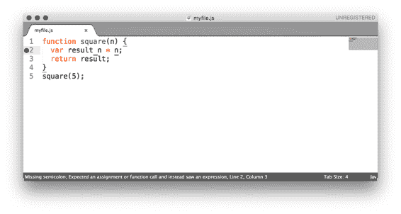
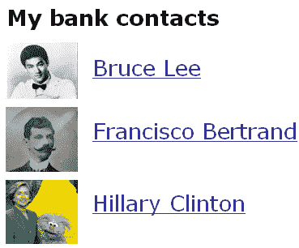
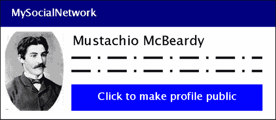

# 10  安全

在第八章，我告诉你我有三个最喜欢的章节。第一个是第三章，我在那里讨论了 Express 的基础，试图让你对框架有一个扎实的理解。第二个最喜欢的章节是第八章，你的应用程序使用数据库变得“更真实”。欢迎来到我最喜欢的最后一个章节：关于安全的章节。

我可能不需要告诉你，计算机安全很重要，而且每天都在变得更加重要。你肯定看到过关于数据泄露、网络战和“黑客活动”的新闻头条。随着我们的世界越来越多地进入数字领域，我们的数字安全变得越来越重要。

保持你的 Express 应用程序安全应该是（希望）重要的——谁愿意被黑客攻击？在本章中，我们将讨论你的应用程序可能被颠覆的各种方式以及如何保护自己。更具体地说，我们将讨论：

·  “安全思维”如何帮助你发现安全漏洞

·  保持你的代码无错误（尽可能！）

·  保护你的用户免受跨站脚本、跨站请求伪造和中间人攻击

·  处理不可避免的服务器崩溃

·  审计你的第三方代码

·  各种小型的安全策略；修复浏览器漏洞，防止“点击劫持”等。

本章与其他章节相比，并没有那么流畅。我们会发现自己探索一个主题，然后跳到另一个，尽管可能存在一些相似之处，但大多数这些攻击相对来说是不同的。

## 10.1  安全思维

著名的安全技术专家布鲁斯·施奈尔（Bruce Schneier）描述了他称之为“安全思维”的东西：

米尔顿叔叔工业公司（Uncle Milton Industries）自 1956 年以来一直在向儿童销售蚂蚁农场。几年前，我记得和朋友打开了一个。盒子里没有实际包含蚂蚁。相反，有一张卡片，你填写你的地址，公司就会给你邮寄一些蚂蚁。我的朋友对可以通过邮寄收到蚂蚁表示惊讶。

我回答说：“真正有趣的是，这些人会向任何人你告诉他们的人寄送一管活蚂蚁。”

安全需要一种特定的思维方式。安全专业人士——至少是那些优秀的——看待世界的方式不同。他们走进商店时，不能不注意到他们可能会偷窃。他们使用电脑时，不能不思考安全漏洞。他们投票时，不能不试图想出如何重复投票。他们就是无法控制自己。

— “安全思维”布鲁斯·施奈尔（Bruce Schneier），在[`www.schneier.com/blog/archives/2008/03/the_security_mi_1.html`](https://www.schneier.com/blog/archives/2008/03/the_security_mi_1.html)

Bruce Schneier 并不是在提倡你应该偷东西和违法！但保护自己的最佳方式是像攻击者一样思考——有人会如何破坏系统？有人会如何滥用他们所拥有的？如果你能像攻击者一样思考，并在自己的代码中寻找漏洞，那么你可以找出如何关闭这些漏洞，并使你的应用程序更加安全。

这章不可能涵盖所有存在的安全漏洞。在我写这章和你看这章之间，可能会出现一个新的攻击向量，可能会影响你的 Express 应用程序。像攻击者一样思考将帮助你防御应用程序免受可能的安全漏洞的无尽攻击。

就算我没有逐一介绍每个安全漏洞，并不意味着我不会介绍常见的那些。请继续阅读！

## 10.2  尽可能使你的代码无错误

在你的编程生涯的这个阶段，你很可能已经意识到大多数错误都是不好的，你应该采取措施来防止它们。许多错误可能导致安全漏洞这一点并不令人惊讶。例如，如果某种用户输入可以导致你的应用程序崩溃，黑客只需用这些请求洪水般地攻击你的服务器，就会使服务对所有人关闭。我们不想看到这种情况发生！

你可以使用各种方法来保持你的 Express 应用程序无错误，因此减少受到攻击的可能性。在本节中，我不会涵盖保持软件无错误的通用原则，但这里有一些需要记住的：

·  测试非常重要。我们在上一章讨论了测试。

·  代码审查非常有帮助。更多的眼睛关注代码几乎肯定意味着更少的错误。

·  不要重新发明轮子。如果有人已经创建了一个库，它能够完成你想要的功能，那么你很可能应该使用这个库。确保这个库经过充分测试并且可靠！

·  坚持良好的编码实践。我们将讨论一些 Express 和 JavaScript 特定的问题，但你应该确保你的代码结构良好且干净。

我们将在本节中讨论 Express 特定的内容，但上述内容在防止错误，因此也在防止安全问题方面非常有帮助。

### 10.2.1   使用 JSHint 强制执行良好的 JavaScript

在你的 JavaScript 生涯中，你可能在某个时刻听说过《JavaScript: The Good Parts》。如果你还没有听说过，这是一本由 JSON（或他称之为“发现者”）的发明者 Douglas Crockford 所著的著名书籍。它划定了语言的一个子集，被认为是“好的”，而其余的部分则被劝阻不要使用。

例如，Crockford 不鼓励使用双等号运算符（`==`），而是建议坚持使用三等号运算符（`===`）。双等号运算符进行类型强制转换，可能会变得复杂，并可能引入错误，而三等号运算符几乎按你期望的方式工作。

此外，还有许多常见的陷阱困扰着 JavaScript 开发者，这并不一定是语言本身的错误。举几个例子：缺少分号、忘记 `var` 语句和拼写变量名错误。

如果有一个工具可以强制良好的编码风格，并且有一个工具可以帮助你修复错误，你会使用它们吗？如果它们是同一个工具呢？在我让你想象力过于奔放之前，我要告诉你：有一个叫做 JSHint 的工具。

JSHint 会检查你的代码，并指出它所说的“可疑使用”。使用双等号运算符或忘记 `var` 并不是技术上错误的，但很可能是错误。

要安装 JSHint，你可以使用 `npm install jshint -g` 全局安装它。现在，如果你输入 `jshint myfile.js`，JSHint 将会检查你的代码，并提醒你任何可疑的使用或 bug。例如，看看这个文件：

列表 10.1 一个带有错误的 JavaScript 文件

`function square(n) {` `  var result n * n;  #A` `  return result;` `}``square(5);`

#A 注意这里缺少的等号。

注意，第二行有一个错误：我们遗漏了一个等号。如果我们在这个文件上运行 JSHint（使用 `jshint myfile.js`），我们会看到以下输出：

`myfile.js: line 2, col 13, Missing semicolon.` `myfile.js: line 3, col 18, Expected an assignment or function call and instead saw an expression.`  `2 errors`

如果我们看到这个，我们就知道有问题！我们可以回去添加等号，然后 JSHint 就会停止抱怨。

在我看来，JSHint 与你选择的编辑器集成时效果最好。访问 JSHint 下载页面 [`jshint.com/install/`](http://jshint.com/install/) 以获取编辑器集成的列表。现在，你甚至可以在运行代码之前看到错误！

图 10.1 在 Sublime Text 编辑器中集成 JSHint。注意窗口左侧的错误和状态栏底部的消息。

JSHint 在我使用 JavaScript 的时候节省了我大量的时间，并修复了无数个 bug。我知道其中一些 bug 是安全漏洞。

### 10.2.2 回调中发生错误后的停止

回调是 Node.js 中非常重要的一个部分。Express 中的每个中间件和路由都使用它们，更不用说……好吧，几乎所有的其他东西！不幸的是，人们在回调中犯了一些错误，这些错误可能会产生 bug。

看看你是否能在这段代码中找到错误：

`fs.readFile("myfile.txt", function(err, data) {` `  if (err)  {` `        console.error(err);` `  }` `  console.log(data);``});`

在这段代码中，我们正在读取一个文件，并在一切正常的情况下使用 `console.log` 输出其内容。但如果由于某种原因没有正常工作，我们会输出错误信息，然后继续尝试输出文件的数据！

如果出现错误，我们应该停止执行。例如：

`fs.readFile("myfile.txt", function(err, data) {` `  if (err)  {` `    console.error(err);` `    throw err;  #A` `  }` `  console.log(data);``});`

#A 如果有错误，我们永远不会继续执行代码的其余部分，因为已经出现了错误！

通常，如果出现任何错误，停止操作是很重要的。你不想处理错误的结果——这可能导致你的服务器出现错误行为。

### 10.2.3 查询字符串的危险解析

网站通常都有查询字符串。例如，你使用过的几乎每个搜索引擎都包含某种类型的查询字符串。搜索 "crockford backflip video" 可能看起来像这样：

`http://mysearchengine.com/search?q=crockford+backflip+video`

在 Express 中，你可以通过使用 `req.query` 来获取查询参数，如下所示：

列表 10.2 获取 req.query（注意：包含错误！）

`app.get("/search", function(req, res) {` `  var search = req.query.q.replace(/\+/g, " ");  #A` `  // ...do something with the search...``});`

#A 这个变量现在将包含字符串 "crockford backflip video"。

这听起来很好，但如果输入不是你期望的，那就另当别论了。例如，如果用户访问没有名为 `q` 的查询的 `/search` 路由，那么我们将对未定义的变量调用 `.replace`！这可能导致我们的服务器崩溃。

你总是想确保你的用户给你提供你期望的数据，如果他们没有，你需要对此采取一些措施。一个简单的选项是提供一个默认情况，如果他们没有提供任何内容，假设查询为空。例如：

列表 10.3 不要假设你的查询存在（注意：仍然包含错误！）

`app.get("/search", function(req, res) {` `  var search = req.query.q || "";   #A` `  var terms = search.split("+");` `  // ...do something with the terms...``});`

#A 现在，如果 req.query.q 是未定义的，我们将回退到非错误行为。或者，如果什么都没有输入，你可以重定向，或者给出其他行为。

这修复了一个重要的错误：如果我们期望的查询字符串不存在，我们不会遇到未定义的变量。

但 Express 解析查询字符串时还有一个重要的陷阱。除了变量可能未定义之外，变量还可以是错误类型（但仍然已定义）！

如果用户访问 `/search?q=abc`，那么 `req.query.q` 将是一个字符串。如果他们访问 `/search?q=abc&name=douglas`，它仍然是一个字符串。但如果他们指定 `q` 变量两次，如下所示：

`` /search?q=abc`&q=xyz` ``

…然后 `req.query.q` 将是数组 `["abc", "xyz"]`。现在，如果你尝试调用 `.replace`，它将再次失败，因为该方法在数组上未定义。哦，不！

我个人认为，这是 Express 的设计缺陷。这种行为应该被允许，但我认为它不应该默认启用。在他们改变它（而且我不确定他们是否有计划）之前，你需要假设你的查询可能是数组。

为了解决这个问题（以及其他问题），我编写了`arraywrap`包（在[`www.npmjs.org/package/arraywrap`](https://www.npmjs.org/package/arraywrap)）。这是一个非常小的模块；整个包只有 11 行代码。它是一个接受一个参数的函数。如果参数不是数组，它将其包裹在数组中。如果参数是数组，它就返回参数并什么都不做。

您可以使用`npm install arraywrap --save`来安装它，然后您可以使用它将所有的查询字符串强制转换为数组，如下所示：

列表 10.4 不要假设您的查询不是数组

`var arrayWrap = require("arraywrap");` `// …` `app.get("/search", function(req, res) {` `  var search = arrayWrap(req.query.q || "");   #A` `  var terms = search[0].split("+");` `  // ...do something with the terms...``});`

#A 现在如果我们提供一个变量，不提供变量，或者提供多个变量，事情都会正常工作。

现在，如果有人给您比您预期的更多查询，您只需取第一个并忽略其余的。或者，您可以检测查询是否为数组，并在那里做不同的事情。

这引出了本章的一个大要点：永远不要信任用户输入。假设每个路由都会以某种方式出错。假设您的用户可能会给您提供错误数据或根本不提供数据！

## 10.3 保护您的用户

政府的网站已被破坏；Twitter 出现了一种“推文病毒”；银行账户信息被盗。即使不处理特别敏感数据的公司也可能发生密码泄露——索尼和 Adobe 就陷入了这样的丑闻。如果您网站有用户，您会希望负责任地保护他们。

您可以采取许多措施来保护您的用户免受伤害，我们将在本节中探讨这些措施。

### 10.3.1 使用 HTTPS

简而言之，您想要使用 HTTPS 而不是 HTTP。这有助于保护您的用户免受各种攻击。请相信我——您想要它！

有两个 Express 中间件您会想要与 HTTPS 一起使用。一个会强制您的用户使用 HTTPS，另一个会让他们留在那里。

强制用户使用 HTTPS

我们首先查看的是`express-enforces-ssl`中间件。正如其名所示，它强制执行 SSL（HTTPS）。基本上，如果请求是通过 HTTPS 进行的，它将继续到您的其余中间件和路由。如果不是，它将重定向到 HTTPS 版本。

要使用此模块，您需要做两件事。

1. 大多数时候，当您部署应用程序时，您的服务器并不是直接连接到客户端。如果您部署到 Heroku 云平台（我们将在第十一章中看到），Heroku 服务器位于您和客户端之间。为了告诉 Express 这一点，我们需要启用“信任代理”设置。

2. 调用中间件！

3. 确保您`npm install express-enforces-ssl`，然后：

列表 10.5 在 Express 中强制执行 HTTPS

`var enforceSSL = require("express-enforces-ssl");` `// ...` `app.enable("trust proxy");``app.use(enforceSSL());`

这个模块没有太多其他内容，但你可以在 [`github.com/aredo/express-enforces-ssl`](https://github.com/aredo/express-enforces-ssl) 上看到更多。

保持用户在 HTTPS 上

一旦您的用户使用 HTTPS，我们希望告诉他们避免回到 HTTP。新浏览器支持一个名为 HTTP 严格传输安全（简称 HSTS）的功能。这是一个简单的 HTTP 头部，告诉浏览器在一定时间内保持 HTTPS。

例如，如果你想让你的用户在 HTTPS 上保持一年，你可以设置以下头部：

列表 10.6 保持 HTTPS 一年

`Strict-Transport-Security: max-age=31536000  #A`

#A 一年大约有 3,1536,000 秒。

你还可以启用对子域的支持。如果你拥有 slime.biz，你可能希望为 cool.slime.biz 启用 HSTS。

要设置这个头部，我们将遇到 Helmet。Helmet 是一个用于在 Express 应用程序中设置有用的 HTTP 安全头部的模块。正如我们将在本章中看到的那样，它有各种可以设置的头部。我们将从它的 HSTS 功能开始。

首先，像往常一样，在您正在工作的任何项目中运行 `npm install helmet`。我还建议安装 `ms` 模块，它将可读字符串（如 `"2 days"`) 转换为 172,800,000 毫秒。现在你可以使用中间件了！

列表 10.7 使用 Helmet 的 HSTS 中间件

`var helmet = require("helmet");` `var ms = require("ms");` `// ...` `app.use(helmet.hsts({` `  maxAge: ms("1 year"),` `  includeSubdomains: true``}));`

现在，HSTS 将在每个请求上设置！

为什么我们不能只使用 HSTS？

只有当您的用户已经在 HTTPS 上时，这个头部才有效，这就是为什么我们需要 `express-enforces-ssl`。

### 10.3.2 防止跨站脚本攻击（XSS）

我可能不应该说这个，但有很多种方法可以偷走我的钱。你可以打我并抢走我的东西，你可以威胁我，或者你可以扒我的口袋。如果你是一个黑客，你也可以黑入我的银行，并将一大笔钱转到你的账户上（在我们列出的所有选项中，这是我最喜欢的一个）。

如果你能够控制我的浏览器，即使你不知道我的密码，你仍然可以取走我的钱。你可以等待我登录，然后控制我的浏览器。你会告诉我的浏览器去我银行的“汇款”页面，并取走一大笔钱。如果你足够聪明，你可以隐藏它，以至于我甚至不知道发生了什么（当然，直到我的所有钱都花光了）。

但你是如何控制我的浏览器的呢？最流行的方式可能是通过使用跨站脚本攻击，也称为 XSS 攻击。

想象一下，在我的银行主页上，我能看到我的联系人和他们的名字列表。

图 10.2 一个虚构的银行联系人列表。

用户可以控制自己的名字。布鲁斯·李可以进入他的设置，如果他想的话，可以将他的名字改为“布鲁斯·斯普林斯汀”。但如果他改成了这个名字：

布鲁斯·李

联系人列表仍然会显示相同的内容，但现在我的浏览器也会执行``。这个脚本可能会将数据（例如登录信息）发送到 brucelee.biz。

防止 XSS 的一个大方法是永远不要盲目信任用户输入。

清理用户输入

当你收到用户输入时，几乎总是有可能他们输入一些恶意的内容。在上面的例子中，你可以将你的名字设置为包含``world。

要变成这样：

`Hello，&lt;script src="http://evil.com/hack.js"&gt;&lt;/script&gt;world。`

通过这样做，脚本标签将变得无用。

这种转义（以及更多）通常由大多数模板引擎为你处理。在 EJS 中，只需使用默认的`<%= myString %>`，不要使用`<%- userString %>`。在 Jade 中，这种转义是默认的。除非你确定你不想清理某些内容，否则在处理用户字符串时，请确保使用“安全”版本。

如果你知道用户应该输入一个 URL，你不仅想要进行转义，你还想尽可能验证输入的内容确实是一个 URL。你还需要在 URL 上调用内置的`encodeURI`函数以确保其安全性。

如果你将某些内容放入 HTML 属性中，你想要确保用户不能放入引号，例如。不幸的是，没有一种通用的解决方案来清理用户输入；清理的方式取决于上下文。但你应该始终尽可能多地清理用户输入。

你也可以在将输入放入数据库之前对其进行清理。在上面的例子中，我们展示了在显示内容时如何进行清理。但如果你知道用户应该在他们的用户资料中输入主页，那么在将它们存储在数据库之前对其进行清理也是有用的。如果我输入“hello, world”作为我的主页，服务器应该给出错误。如果我输入 http://evanhahn.com 作为我的主页，那么应该允许，并放入数据库。这可以带来安全性和用户界面的好处。

使用 HTTP 头部减轻 XSS

还有另一种帮助减轻 XSS 攻击的方法，但它相当小，那就是通过使用 HTTP 头信息。我们再次使用 Helmet。

有一个简单的安全头信息叫做`X-XSS-Protection`。它不能保护所有类型的 XSS 攻击，但它可以保护所谓的“反射型 XSS”。反射型 XSS 的最佳例子是不安全的搜索引擎。在每一个搜索引擎上，当你进行搜索时，你的查询会出现在屏幕上（通常在顶部）。如果你搜索“candy”，单词“candy”就会出现在顶部，并且它将成为 URL 的一部分：

`https://mysearchengine.biz/search?query=candy`

现在想象你正在搜索`"`。URL 可能看起来像这样：

`https://mysearchengine.biz/search?query=`

现在，如果这个搜索引擎将这个查询放入页面的 HTML 中，你就在页面上注入了一个脚本！如果我把这个 URL 发给你，你点击链接，我就能控制并做恶意的事情。

防止这种攻击的第一步是清理用户的输入。之后，你可以设置`X-XSS-Protection`头信息，以防止某些浏览器在你犯错时运行该脚本。在 Helmet 中，这只是一行代码：

列表 10.8 使用 Helmet 设置 X-XSS-Protection 头信息

`app.use(helmet.xssFilter());`

Helmet 还允许你设置另一个头信息，称为内容安全策略（Content Security Policy）。坦白说，内容安全策略可以是一个独立的章节。查看 HTML5 Rocks 指南[`www.html5rocks.com/en/tutorials/security/content-security-policy/`](http://www.html5rocks.com/en/tutorials/security/content-security-policy/)以获取更多信息，一旦你理解了它，就可以使用 Helmet 的`csp`中间件。

这两个 Helmet 头信息远不如清理用户输入重要，所以先做那个！

### 10.3.3   跨站请求伪造（CSRF）预防

假设我登录了我的银行账户。你希望我向你账户转账一百万美元，但你并没有以我的身份登录。（另一个挑战：我没有一百万美元。）你怎么让我把钱转给你？

攻击

在银行网站上，有一个“转账”表单。在这个表单中，你输入金额和收款人信息，然后点击“发送”。在幕后，正在向一个 URL 发送 POST 请求。银行会确保我的 cookie 是正确的，如果是的话，就会转账。

你可以用金额和收款人信息进行 POST 请求，但你不知道我的 cookie，也无法猜测它；它是一长串字符。那么，如果你能让我执行 POST 请求呢？你会通过跨站请求伪造（简称 CSRF，有时也称为 XSRF）来做这件事。

要实施这种 CSRF 攻击，你基本上会让我在不知情的情况下提交一个表单。想象一下，你已经制作了一个这样的表单：

列表 10.9 黑客表单的初稿

`<h1>转账</h1>` `<form method="post" action="https://mybank.biz/transfermoney">` ``  <input name="recipient" `value="YourUsername"` type="text">`` ``  <input name="amount" `value="1000000"` type="number">`` `  <input type="submit">``</form>`

假设你在一个你控制的页面上放了一个 HTML 文件；也许它是 hacker.com/stealmoney.html。你可以给我发邮件说：“点击这里看看我猫的照片！”如果我点击了它，我会看到类似这样的内容：

如果我看到这个，我会起疑。我不会点击“提交”，我会关闭窗口。但我们可以使用 JavaScript 自动提交表单。

列表 10.10 自动提交表单

`<form method="post" action="https://mybank.biz/transfermoney">` `  <!-- … -->` `</form>`   ``

如果我被发送到这个页面，表单将立即提交，然后我会被发送到我的银行，到一个显示“恭喜，您刚刚转账了一百万美元。”的页面。我可能会恐慌并拨打银行的电话，当局可能能够解决这个问题。

但这是进步——你现在是在给自己转账。我不会在这里展示，但你可以完全隐藏这一点，不让受害者知道。首先，你在页面上创建一个`<iframe>`。然后你可以使用表单的`target`属性，这样当表单提交时，它会在`iframe`内部提交，而不是在整个页面上提交。如果你把这个`iframe`做得很小或者让它不可见（CSS 很容易做到这一点！），那么我可能直到突然少了百万美元才会意识到我被黑客攻击了。

我的银行需要防止这种情况。但怎么办呢？

防止 CSRF 攻击的概述

我的银行已经检查了 cookies，以确保是我本人。没有让我做点什么，你不能执行 CSRF 攻击。但一旦银行知道是我，它怎么知道我是有意为之，而不是被骗去做的？

我的银行决定这样做：如果你向 mybank.biz/transfermoney 提交 POST 请求，你并不是无缘无故地这样做。在执行 POST 之前，你将在一个询问你想要将钱转到哪个账户的页面——可能 URL 是 mybank.biz/transfermoney_form。

所以当银行发送你 mybank.biz/transfermoney_form 的 HTML 时，它会在表单中添加一个隐藏元素：一个完全随机、不可猜测的字符串，称为令牌。表单现在可能看起来像这样：

列表 10.11 添加 CSRF 保护

`<h1>转账</h1>` `<form method="post" action="https://mybank.biz/transfermoney">` `` `  <input name="_csrf" type="hidden"[CA]       #A` `` `` `   value="1dmkTNkhePMTB0DlGLhm">              #A` `` `  <input name="recipient" value="YourUsername" type="text">` `  <input name="amount" value="1000000" type="number">` `  <input type="submit">``</form>`

#A CSRF 令牌的值对每个用户都是不同的，通常每次都不同。上面的只是一个例子。

你在浏览网页时可能已经使用了成千上万的 CSRF 令牌，但你没有看到它，因为它对你来说是隐藏的。如果你像我一样喜欢查看页面的 HTML 源代码，你会看到 CSRF 令牌！

现在，当你提交表单并发送 POST 请求时，我的银行将确保我发送的 CSRF 令牌与我刚刚接收的是同一个。如果是，银行可以相当肯定我刚刚来自银行的网站，因此意图发送钱。如果不是，我可能正在被黑客攻击——不要发送钱。

简而言之，我们需要做两件事：

1. 每次我们向用户请求数据时创建一个随机的 CSRF 令牌

2. 每次我们处理那些数据时验证这个随机令牌

在 Express 中保护 CSRF

Express 团队有一个简单的中间件可以完成这两个任务：`csurf`（在 https://github.com/expressjs/csurf）。`csurf`中间件做两件事：

1. 为请求对象添加一个名为`req.csrfToken`的方法。你发送表单时将发送这个令牌，例如。

2. 如果请求不是 GET，它将寻找一个名为`_csrf`的参数来验证请求，如果无效则创建一个错误。（技术上，它也会跳过 HEAD 和 OPTIONS 请求，但这些请求很少见。中间件还会在其他几个地方搜索 CSRF 令牌；请参阅文档以获取更多信息。）

要安装这个中间件，只需运行`npm install csurf --save`。

`csurf`中间件依赖于某种 session 中间件和解析请求体的中间件。如果你需要 CSRF 保护，你可能有关于用户的概念，这意味着你可能已经在使用这些中间件了，但`express-session`和`body-parser`可以完成这项工作。确保你在使用`csurf`之前使用它们。如果你需要一个例子，你可以查看第八章的`app.js`代码，或者查看 CSRF 示例应用在 https://github.com/EvanHahn/Express.js-in-Action-code/blob/master/Chapter_10/csrf-example/app.js。

要使用中间件，只需`require`和`use`它：

列表 10.12 使用 CSRF 中间件

`var csrf = require("csurf");` `// …``app.use(csrf()); #A`

#A 在此之前，请确保包含一个 body parser 和 session 中间件。

一旦你使用了中间件，你可以在渲染视图时获取令牌，如下所示：

列表 10.13 获取 CSRF 令牌

`app.get("/", function(req, res) {` `  res.render("myview", {` `    csrfToken: req.csrfToken()` `  });``});`

现在，在视图中，你将`csrfToken`变量输出到一个名为`_csrf`的隐藏输入中。在 EJS 模板中可能看起来像这样：

列表 10.14 在表单中显示 CSRF 令牌

`<form method="post" action="/submit">` `  <input name="_csrf" value="<%= csrfToken %>" type="hidden">` `  <! -- … -->``</form>`

就这些了！一旦你将 CSRF 令牌添加到你的表单中，`csurf`中间件就会处理剩下的工作。

虽然这不是必需的，但你可能想要为失败的 CSRF 定义某种处理程序。定义一个错误中间件来检查 CSRF 错误。例如：

列表 10.15 处理 CSRF 错误

`// …`   `app.use(function(err, req, res, next) {` `  if (err.code !== "EBADCSRFTOKEN") {   #A` `    next(err);                          #A` `    return;                             #A` `  }                                     #A` `  res.status(403);   #B` `  res.send("CSRF error.");` `});`  `// …`

#A 如果这不是 CSRF 错误，我们将跳过这个处理程序。

#B 错误代码 403 是"禁止"。

如果有 CSRF 错误，这个错误处理程序将返回"CSRF 错误"。你可能想要自定义这个错误页面，也可能想要收到消息——有人正在尝试攻击你的用户之一！

你可以将这个错误处理程序放在你的错误堆栈中的任何位置。如果你想让它成为第一个捕获的错误，就把它放在第一位。如果你想让它成为最后一个，你可以把它放在最后。

## 10.4  确保你的依赖项安全

任何 Express 应用程序都将至少依赖于一个第三方模块：Express。如果这本书的其余部分已经向你展示了什么，那就是你将依赖于很多第三方模块。这有一个巨大的优势，那就是你不必编写很多样板代码，但它也带来一个成本：你正在将这些模块的信任放在上面。如果模块创建了一个安全问题怎么办？

你可以保持依赖项安全的三种主要方式：

1.  自己审核代码

2.  确保你使用的是最新版本

3.  与 Node 安全项目进行核对

### 10.4.1   审核代码

这可能听起来有点疯狂，但你通常可以很容易地审核你依赖项的代码。虽然一些模块，如 Express，拥有相对较大的表面区域，但你将要安装的许多模块只是一小部分代码，你可以快速理解它们。这也是一种极好的学习方法！

就像你可能检查自己的代码以查找 bug 或错误一样，你也可以检查他人的代码以查找 bug 和错误。如果你发现了它们，你可以避免使用该模块。如果你愿意，你通常可以提交补丁，因为这些包都是开源的。

如果你已经安装了该模块，你可以在`node_modules`目录中找到它的源代码。你几乎总是可以通过简单的搜索在 GitHub 上找到模块，或者从 npm 注册表上的链接找到。

值得注意的是，检查项目整体状态也很重要。如果一个模块虽然老旧但工作可靠且没有公开的 bug，那么它可能很安全。但如果它有很多 bug 报告并且长时间没有更新，那么这可不是什么好兆头！

### 10.4.2   保持你的依赖项更新

通常来说，保持事物的最新版本是一个好主意。人们调整性能、修复 bug 和改进 API。你可以手动检查每个依赖项以找出哪些版本已经过时，或者你可以使用 npm 内置的工具：`npm outdated`。

假设你的项目已安装 Express 4.2.0，但最新版本是 4.11.1（我确信到你阅读这篇文章时它已经过时了）。在你的项目目录中运行`npm outdated --depth 0`，你将看到类似以下的内容：

`包       当前  希望的  最新  位置` `express         4.2.0   4.2.0  4.11.1  express`

如果你还有其他过时的包，此命令也会报告这些。进入你的`package.json`，更新版本，然后运行 npm install 以获取最新版本！经常检查过时的包是个好主意。

那个深度是什么意思？

`npm outdated --depth 0` 将告诉你所有已安装的过时模块。没有`depth`标志的`npm outdated`会告诉你过时的模块，即使这些模块不是你直接安装的。例如，Express 依赖于一个名为`cookie`的模块。如果`cookie`被更新，但 Express 没有更新到`cookie`的最新版本，那么你将收到关于`cookie`的警告，即使这并不是你的“过错”。

如果 Express 不更新到最新版本（这很大程度上超出了我的控制范围），我除了更新到 Express 的最新版本（这在我控制范围内）之外，别无他法。`--depth`标志只显示可操作的信息，省略它将给你一大堆实际上无法使用的信息。

另一方面：你还需要确保自己使用的是最新版本的 Node。检查 nodejs.org 并确保你使用的是最新版本。

### 10.4.3   对照节点安全项目进行检查

有时，模块存在安全问题。一些好心的朋友建立了节点安全项目，这是一个雄心勃勃的举措，旨在审计 npm 注册表中的每个模块。如果他们发现不安全的模块，他们将在 http://nodesecurity.io/advisories 上发布安全建议。

节点安全项目还附带一个名为`nsp`的命令行工具。这是一个简单但功能强大的工具，它会扫描你的`package.json`以查找不安全的依赖项（通过将其与数据库进行比较）。

要安装它，运行`npm install –g nsp`以全局安装模块。现在，在`package.json`所在的同一目录下，输入：

`nsp audit-package`

大多数时候，你会收到一条友好的消息，告诉你你的包已知是安全的。但有时，你的某个依赖项（或者更常见的是，你的依赖项的依赖项）存在安全漏洞。

例如，Express 依赖于一个名为`serve-static`的模块；这是`express.static`，静态文件中间件。在 2015 年初，`serve-static`被发现存在漏洞。如果你使用的是依赖于`serve-static`的 Express 版本，运行`nsp audit-package`，你将看到类似以下的内容：

`` `名称`           `已安装`  `已修复`  `有漏洞的依赖` `` `serve-static       1.7.1  >=1.7.2  myproject > express`

这里基本上有两件重要的事情。最左边的列告诉你有问题的依赖项的名称。最右边的列显示了导致问题的依赖项链。在这个例子中，你的项目（称为"myproject"）是第一个问题，它依赖于 Express，然后依赖于`serve-static`。这意味着 Express 需要更新才能获取`serve-static`的最新版本。如果你直接依赖于`serve-static`，你只会看到项目名称在列表中，如下所示：

`` `名称`           `已安装`  `已修复`  `有漏洞的依赖项` `` `serve-static       1.7.1  >=1.7.2  myproject`

注意，模块仍然可能是不安全的；npm 上有如此多的模块，Node Security Project 不可能审计它们全部。但它又是另一个有助于保持应用程序安全的工具。

## 10.5 处理服务器崩溃

我有一个坏消息：你的服务器可能在某个时候崩溃。

有很多事情可能导致你的服务器崩溃。也许你的代码中有一个错误，你引用了一个未定义的变量；也许黑客找到了一种方法，可以通过恶意输入使你的服务器崩溃；也许你的服务器已经达到其容量。不幸的是，这些应用程序可能会变得非常复杂，并且可能在某个时候崩溃。

虽然本章有一些帮助应用程序平稳运行的技巧，但你不想让崩溃完全毁了你的一天。虽然它们不是理想的，但你还是可以从它们中恢复过来。

Nodejitsu 团队开发了一个名为 Forever 的简单工具。它的名字可能是一个提示：它可以让你的应用程序永远运行。重要的是：如果你的应用程序崩溃，Forever 会尝试重新启动它。

要安装 Forever，只需运行`npm install forever --save`。你可能已经在`package.json`中有一个`npm start`脚本一段时间了，我们将将其从以下内容更改：

列表 10.16 经典的 npm start 脚本

`…` `"scripts": {` `  "start": "node app.js"` `}``…`

…到这个：

列表 10.17 使用 Forever 的 npm start

`…` `"scripts": {` `  "start": "forever app.js"` `}``…`

现在如果你的服务器崩溃，它将会重新启动！

注意：你可以在本书的源代码仓库中看到这个简单代码示例的实际应用，网址为[`github.com/EvanHahn/Express.js-in-Action-code/tree/master`](https://github.com/EvanHahn/Express.js-in-Action-code/tree/master) /Chapter_09/forever-example。

## 10.6 各种小技巧

我们已经涵盖了大多数重要主题，如跨站脚本和 HTTPS。还有一些其他技巧可以帮助你使你的 Express 应用程序更加安全。本节中的主题并不像上面那些主题那样必要，但它们简单易行，可以减少你被攻击的地方。

### 10.6.1 没有 Express 在这里！

如果黑客想要入侵你的网站，他们有很多事情要尝试。如果他们知道你的网站是由 Express 驱动的，并且知道 Express 或 Node 存在某种安全漏洞，他们可以尝试利用它。最好让黑客对此一无所知！

然而，默认情况下，Express 会公开自己。在每次请求中，都有一个标识你的网站由 Express 驱动的 HTTP 头部。默认情况下，`X-Powered-By: Express`会随每个请求发送。这可以通过一个设置轻松禁用：

列表 10.18 禁用 X-Powered-By: Express

`app.disable("x-powered-by");  #A`

#A 禁用 x-powered-by 选项会禁用头部的设置。

禁用这个选项会让黑客的工作稍微困难一些。这几乎不能让你变得无敌——攻击的途径还有很多——但它确实能起到一点帮助！

### 10.6.2 防止点击劫持

我认为点击劫持相当巧妙。相对容易预防，但我几乎觉得这样做有些内疚——这是一个如此巧妙的技巧。

想象一下，我是一个黑客，我想从你的私人社交网络个人资料中获取信息。如果你能直接将你的个人资料公开，我会很高兴。如果我能让你点击那个大按钮，那就太容易了：

图 10.3 社交网络的一个示例页面。

点击劫持利用了浏览器框架——将一个页面嵌入另一个页面的能力——来实现这一点。我可以给你发一个看起来无辜的页面的链接，它可能看起来像这样：

图 10.4 一个看似无辜但实际上隐藏着点击劫持攻击的页面。

但实际上，这个看起来无辜的页面却隐藏着社交网络页面！里面有一个来自社交网络网站的`<iframe>`，它是不可见的。它放置得恰到好处，所以当你点击“点击此处进入我的页面”时，你实际上是在点击“点击使个人资料公开”。

图 10.5 现在不再那么无辜了，对吧！？

我不知道你，但我觉得这相当巧妙。不幸的是，对于黑客来说，这很容易预防。

大多数浏览器（以及所有现代浏览器）都会监听一个名为`X-Frame-Options`的头部。如果它正在加载一个框架或 iframe，并且该页面发送了一个限制性的`X-Frame-Options`，浏览器将不再加载该框架。

`X-Frame-Options`有三个选项。`DENY`阻止任何人将你的网站放入框架中。`SAMEORIGIN`阻止其他人将你的网站放入框架中，但允许你自己的网站。你也可以使用`ALLOW-FROM`选项允许另一个网站通过。我建议使用`SAMEORIGIN`或`DENY`选项。

和之前一样，如果你使用 Helmet，你可以很容易地设置它们：

列表 10.19 将你的应用排除在框架之外

`app.use(helmet.frameguard("sameorigin"));` `// 或者…``app.use(helmet.frameguard("deny"));`

这个 Helmet 中间件会设置`X-Frame-Options`，这样你就不必担心你的页面容易受到点击劫持攻击。

### 10.6.3   将 Adobe 产品排除在您的网站之外

Adobe 产品，如 Flash Player 和 Reader，可以进行跨域网络请求。因此，一个 Flash 文件可能会向您的服务器发送请求。如果另一个网站提供了恶意 Flash 文件，该网站的访客可能会对您的 Express 应用程序发起任意请求（可能是不知情的）。这可能导致他们不断向您的服务器发送请求或加载您不希望他们加载的资源。

通过在您的网站根目录下添加一个名为`crossdomain.xml`的文件，可以轻松防止这种情况。当 Adobe 产品即将从您的域加载文件时，它将首先检查`crossdomain.xml`文件，以确保您的域允许这样做。作为管理员，您可以定义此 XML 文件以将某些 Flash 用户包含或排除在您的网站之外。然而，您可能不希望任何 Flash 用户出现在您的页面上。在这种情况下，请确保您在网站根目录（在`/crossdomain.xml`）提供此 XML 内容。

列表 10.20：最严格的 crossdomain.xml

`<?xml version="1.0"?>` `<!DOCTYPE cross-domain-policy SYSTEM [CA]` `"http://www.adobe.com/xml/dtds/cross-domain-policy.dtd">` `<cross-domain-policy>` `  <site-control permitted-cross-domain-policies="none">``</cross-domain-policy>`

这可以防止任何 Flash 用户从您的网站上加载内容，除非他们来自您的域。如果您想更改此策略，请查看[`www.adobe.com/devnet/articles/crossdomain_policy_file_spec.html`](https://www.adobe.com/devnet/articles/crossdomain_policy_file_spec.html)上的规范。

此文件可以通过几种方式提供服务。如果您之前使用过 Helmet，您可以简单地添加一个中间件并完成：

列表 10.22：使用 Helmet 提供 crossdomain.xml

`app.use(helmet.crossdomain());`

或者，如果您正在提供静态文件（您很可能在这样做），可以将此限制性的`crossdomain.xml`文件放入您的静态文件目录中。

### 10.6.4   不要让浏览器推断文件类型

想象一个用户已将一个名为`file.txt`的纯文本文件上传到我的服务器。我的服务器以`text/plain`内容类型提供服务，因为它就是纯文本。到目前为止，这很简单。但如果`file.txt`包含如下内容：

列表 10.23：可能以纯文本形式存储的恶意脚本

`function stealUserData() {` `  // 这里有一些邪恶的东西…` `}``stealUserData();`

即使我们将此文件作为纯文本提供服务，它看起来像 JavaScript，一些浏览器会尝试“嗅探”文件类型。这意味着您仍然可以使用``来运行该文件。许多浏览器即使内容类型不是 JavaScript，也会允许运行`file.txt`。

如果`file.txt`看起来像 HTML，并且浏览器将其解释为 HTML，那么这个 HTML 页面可以包含恶意 JavaScript，这可能会做很多坏事！

幸运的是，我们可以通过一个单一的 HTTP 头部来解决这个问题。你可以将 `X-Content-Type-Options` 头部设置为它的唯一选项，`nosniff`。Helmet 包含 `noSniff` 中间件，你可以这样使用它：

列表 10.24 防止浏览器嗅探 MIME 类型

`app.use(helmet.noSniff());`

真好，一个 HTTP 头部就能解决这个问题！

## 10.7  总结

在本章中，我们学习了如何：

·  “安全思维模式”可以使你更加安全

·  为了确保你的 Express 代码无 bug，可以使用 JSHint 工具、进行测试以及了解常见的 bug

·  各种攻击方式；它们是如何工作的，以及如何预防。这包括跨站脚本攻击、跨站请求伪造、中间人攻击、点击劫持等。

·  处理不可避免的服务器崩溃

·  审计第三方代码
