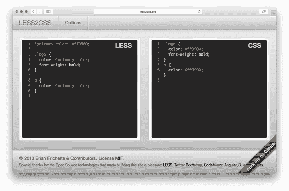
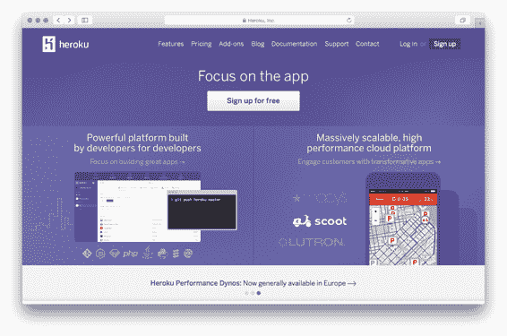
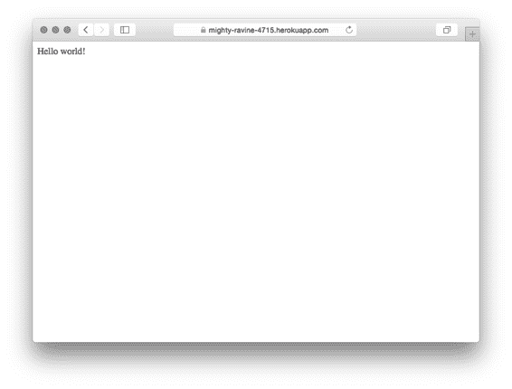

# 11  部署：资源与 Heroku

是时候将我们的应用程序投入到现实世界中了。

本章的第一部分将讨论资源。如果您正在构建任何类型的网站，您很可能需要提供一些 CSS 和 JavaScript。为了性能，通常会将这些资源连接并压缩。同样，使用编译到 CSS 的语言（如 SASS 和 LESS）进行编码，就像使用编译到 JavaScript 的语言（如 CoffeeScript 或 TypeScript）或连接和压缩 JavaScript 一样，是很常见的。当谈论这类事情时，辩论很快就会变成激烈的争论；您应该使用 LESS 还是 SASS？CoffeeScript 是好事吗？无论您选择哪个，我都会向您展示如何使用这些工具中的几个来打包您的资源以供网络使用。

本章剩余部分将向您展示如何构建您的 Express 应用程序，然后将它们上线。有众多部署选项，但我们将选择一个简单且免费的选项：Heroku。我们将在我们的应用程序中添加一些小功能，并将 Express 应用程序部署到野外！

在本章之后，您将：

·  使用 LESS 预处理器更轻松地开发 CSS

·  使用 Browserify 在浏览器中使用 `require`，就像在 Node 中一样

·  压缩您的资源以生成尽可能小的文件

·  使用 Grunt 运行此编译以及其他更多操作

·  使用一些 Express 中间件（connect-assets）作为此 Grunt 工作流程的替代方案

·  了解如何使用 Heroku 将 Express 应用程序部署到网络

## 11.1  LESS，编写 CSS 的更愉快方式

回顾第一章，我们讨论了 Express 的动机。简而言之，我们说 Node.js 功能强大，但其语法可能有点繁琐，而且功能有限。这就是 Express 被创造出来的原因——它并没有从根本上改变 Node.js；它只是使它更加平滑。

以这种方式，LESS 和 CSS 与 Express 和 Node.js 非常相似。简而言之，CSS 是一个强大的布局工具，但其语法可能有点繁琐，而且功能有限。这就是 LESS 被创造出来的原因——它并没有从根本上改变 CSS；它只是使它更加平滑。

CSS 是布局网页的强大工具，但它缺少了人们想要的许多功能。例如，开发者希望通过使用常量变量而不是硬编码的值来减少代码中的重复；变量存在于 LESS 中，但不存在于 CSS 中。LESS 扩展了 CSS 并添加了许多强大的功能。

与 Express 不同，LESS 实际上是一种自己的语言。这意味着它必须被编译成 CSS 才能被网络浏览器使用——浏览器“说”的是 CSS，而不是 LESS。

我们将在 Express 应用程序中看到两种不同的方法来编译 LESS 到 CSS。现在，当您尝试 LESS 时，请访问 [`less2css.org/`](http://less2css.org/)。在页面左侧，您将能够输入 LESS 代码，编译后的 CSS 将会出现在右侧。

图 11.1 less2css.org 在行动中。

在接下来的几节中，我们将通过一些示例，你可以在那个网站上尝试它们。当是时候将 LESS 集成到我们的 Express 应用程序中时，我们将转向一个更好、自动化的方法。

LESS 功能丰富，但它实际上有五个主要点：

1.  变量，允许你定义一次像颜色这样的东西并在任何地方使用它们

2.  函数，允许你操作变量（例如，通过将颜色加深 10%）

3.  嵌套选择器，允许你以更接近 HTML 的方式结构化你的样式表，并减少重复

4.  混入，允许你定义可重用的组件并在各种选择器中使用它们

5.  包含，允许你将样式表拆分为多个文件（类似于 Node 中的 `require`）

我们将快速浏览这些主要功能。LESS 非常复杂，我们不会讨论每个细节。如果你对 LESS 的细节功能感兴趣，请查看其文档在 [`lesscss.org/`](http://lesscss.org/)。

### 11.1.1   变量

CSS 没有变量。例如，如果你的网站链接颜色是 `#29A1A4`，并且你决定想将其更改为 `#454545`，你将不得不在 CSS 文件中的每个地方搜索并更改它。如果你想试验在许多不同地方使用的颜色，你将进行查找替换，这可能会导致各种可靠性问题。对于其他开发者来说，哪个颜色是哪个也不清楚；那个颜色在各个地方是如何使用的？

LESS 为 CSS 添加了变量，允许你解决这类问题。

例如，假设你想定义你网站的基色为 `#FF9900`。在 LESS 中，你可能做如下操作：

列表 11.1 LESS 中的变量

`@primary-color: #ff9900;  #A`   `.logo {` `  color: @primary-color;  #B` `  font-weight: bold;` `}`   `a {` `  color: @primary-color;  #B``}`

#A 定义变量 primary-color。

#B 在几个地方使用该变量。

如果你将列表 11.1 中的 LESS 代码通过一个 LESS 编译器（如 [`less2css.org/`](http://less2css.org/) 上的）运行，将生成以下 CSS：

列表 11.2 列表 11.1 编译的 CSS

`.logo {` `  color: #ff9900;  #A` `  font-weight: bold;` `}` `a {` `  color: #ff9900; #A``}`

#A 注意变量被插入在这里。

正如你所见，变量被插入到生成的 CSS 中。现在，如果我们想更改我们网站的主色，我们只需在一个地方做这件事：顶部的变量。

你可能还会注意到 LESS 看起来非常像 CSS，这是故意的——它是语言的严格超集。这意味着任何有效的 CSS 都是有效的 LESS（反之则不然）。这意味着你可以轻松地将现有的 CSS 样式表导入 LESS，并且一切都会正常工作。

### 11.1.2   函数

LESS 也有函数，允许你像在 JavaScript 这样的编程语言中一样操作变量和值。像典型的编程语言一样，有大量的内置函数可以帮助你。然而，与典型的编程语言不同的是，这些函数都是内置于语言中的；你不能定义自己的；你必须使用另一个称为“混入”的功能，我们将在下一节中讨论。

LESS 有多个函数可以用来操作颜色。例如，想象一下你的链接（你的`<a>`标签）有一个基本颜色。当你悬停在它们上面时，它们应该变得更亮。当你点击它们时，它们应该变得更暗。在 LESS 中，函数和变量使得这一点变得简单。

列表 11.3 使用函数调整亮度和暗度

`@link-color: #0000ff;`   `a {` `  color: @link-color;  #A` `}` `a:hover {` `  color: lighten(@link-color, 25%);  #B` `}` `a:active {` `  color: darken(@link-color, 20%);  #C``}`

#A 使用我们之前定义的链接颜色变量；这里没有新的内容。

#B 将链接颜色变亮 25%。

#C 将链接颜色加深 20%。

在我们将 LESS 编译成 CSS 之后，我们会得到以下类似的内容：

列表 11.4 列表 11.3 编译后的 CSS

`a {` `  color: #0000ff;` `}` `a:hover {` `  color: #8080ff; #A` `}` `a:active {` `  color: #000099; #A``}`

#A 注意颜色正在被调整以变得更亮或更暗。

如你所见，LESS 使得调整颜色的亮度和暗度变得更容易。当然，你自己也可以编写这样的 CSS，但找到亮色和暗色可能会有些麻烦。

LESS 内置了大量的其他函数。[`lesscss.org/functions/`](http://lesscss.org/functions/)列出了所有这些函数。

### 11.1.3   混入（Mixins）

可能你在这个部分希望可以定义你自己的函数；为什么 LESS 拥有如此强大的功能？进入混入（mixins），这是一种定义可重复使用的 CSS 声明的方法，你可以在整个样式表中使用它。

可能最常见的一个例子就是使用供应商前缀。如果你想使用 CSS 的`border-radius`属性，你必须给它加上前缀以确保它在 Chrome、Firefox、Internet Explorer、Safari 等浏览器上都能正常工作。你可能见过类似的东西：

`.my-element {` `  -webkit-border-radius: 5px;` `  -moz-border-radius: 5px;` `  -ms-border-radius: 5px;` `  border-radius: 5px;``}`

在 CSS 中，如果你想使用`border-radius`并且让它能在所有浏览器上工作，你需要供应商前缀。而且如果你想添加这些前缀，每次使用`border-radius`时你都必须写上它们。这可能会变得很繁琐，而且容易出错。

在 LESS 中，你不需要定义`border-radius`然后创建多个供应商前缀的副本，你可以定义一个混入，或者一个可重复使用的组件，你可以在多个声明中使用它。它们在其他编程语言中的函数看起来非常相似。

列表 11.5 LESS 中的混入（Mixins）

`.border-radius(@radius) {          #A` `  -webkit-border-radius: @radius;  #A` `     -moz-border-radius: @radius;  #A` `      -ms-border-radius: @radius;  #A` `          border-radius: @radius;  #A` `}` `                                  #A` `.my-element {` `  .border-radius(5px);  #B` `}` `.my-other-element {` `  .border-radius(10px); #B` `}`

#A 定义 border-radius mixin。

#B 在几个元素中使用我们的 border-radius mixin。

现在，如果您通过编译器运行那个 LESS，它将生成以下 CSS：

列表 11.6 列表 11.5 的编译 CSS

`.my-element {` `  -webkit-border-radius: 5px;` `  -moz-border-radius: 5px;` `  -ms-border-radius: 5px;` `  border-radius: 5px;` `}` `.my-other-element {` `  -webkit-border-radius: 10px;` `  -moz-border-radius: 10px;` `  -ms-border-radius: 10px;` `  border-radius: 10px;` `}`

如您所见，mixin 被扩展为繁琐的供应商前缀声明，这样您就无需每次都编写它们。

### 11.1.4   嵌套

在 HTML 中，您的元素是嵌套的。所有内容都位于`<html>`标签内，然后内容将进入`<body>`标签。在 body 内部，您可能有一个`<header>`，其中包含用于导航的`<nav>`。您的 CSS 并不完全反映这一点；如果您想为 header 及其内部的导航添加样式，您可能编写一些 CSS 如下：

列表 11.7 无嵌套的 CSS 示例

`header {` `  background-color: blue;` `}` `header nav {` `  color: yellow;` `}`

在 LESS 中，列表 11.7 将改进为如下所示：

列表 11.8 简单的 LESS 嵌套示例

`header {` `  background-color: blue;` `  nav {             #A` `    color: yellow;  #A` `  }                 #A` `}`

#A 注意导航的样式是如何位于另一个选择器内部的。

LESS 改进了 CSS，允许嵌套规则集。这意味着您的代码将更短、更易读，并且更好地反映了您的 HTML。

嵌套父选择器

嵌套规则集可以引用其父元素。这在很多地方都很有用，一个很好的例子是链接及其悬停状态。您可能有一个针对`a`、`a:visited`、`a:hover`和`a:active`的选择器。在 CSS 中，您可能使用四个不同的选择器来做这件事。在 LESS 中，您将定义一个外部选择器，然后定义三个内部选择器，每个选择器对应一个链接状态。它可能看起来像这样：

列表 11.9 LESS 中引用父选择器

`a {` `  color: #000099;` `  &:visited {  #A` `    color: #330099;` `  }` `  &:hover {  #A` `    color: #0000ff;` `  }` `  &:active {  #A` `    color: #ff0099;` `  }` `}`

#A 在 LESS 中，您使用&符号来引用父选择器。

LESS 嵌套可以做一些简单的事情，比如嵌套选择器以匹配您的 HTML，但它也可以根据父选择器嵌套选择器。

### 11.1.5   包含

随着您的网站越来越大，您将开始拥有越来越多的样式。在 CSS 中，您可以拆分代码到多个文件中，但这会带来多个 HTTP 请求的性能惩罚。

LESS 允许你在编译时将样式拆分成多个文件，这些文件最终合并成一个 CSS 文件，从而提高性能。这意味着开发者可以根据需要将变量和混入（mixins）拆分到单独的文件中，从而编写更模块化的代码。你也可以为首页创建一个 LESS 文件，为用户资料页面创建另一个，依此类推。

语法相当简单：

列表 11.10 包含另一个 LESS 文件

`@import "other-less-file";  #A`

#A 在同一文件夹中导入“other-less-file.less”。

### 11.1.6 LESS 的替代方案

到这本书的这一部分，这应该不会让人感到惊讶：CSS 预处理有多种方式。房间里的大象是 LESS 的最大“对手”，Sass。Sass 非常类似于 LESS；两者都有变量、混入、嵌套选择器、包含和与 Express 的集成。就语言而言，它们非常相似。Sass 最初不是一个 Node 项目，但它非常受欢迎，并且很好地将自己整合到了 Node 世界中。你可以在[`sass-lang.com/`](http://sass-lang.com/)查看它。

大多数阅读这本书的人要么想使用 LESS，要么想使用 Sass。虽然我们在这本书中会使用 LESS，但你通常可以将“LESS”这个词替换为“Sass”，它们的效果是一样的。LESS 和 Sass 在语法上略有不同，但它们在概念上以及如何与 Express 集成方面大体相同。

有一些小型的 CSS 预处理器旨在以某种方式从根本上改变 CSS。Stylus 使 CSS 的语法变得更加优雅，Roole 添加了许多强大的功能，尽管它们都很出色，但它们不像 LESS 或 Sass 那样受欢迎。

其他 CSS 预处理器，如 Myth 和 cssnext，采取了不同的角度。它们不是试图创建一种编译成 CSS 的新语言，而是将 CSS 的未来版本编译成当前版本的 CSS。例如，CSS 的下一个版本有变量，因此这些预处理器将这些新语法编译成当前版本的 CSS。

## 11.2 使用 Browserify 在浏览器中引入模块，就像在 Node 中一样

简而言之，Browserify 是一个打包 JavaScript 的工具，允许你使用 `require` 函数，就像你在 Node 中做的那样。而且我非常喜欢 Browserify。我只是想先把这一点说出来。我真的很喜欢这个工具。

我曾经听到有人将基于浏览器的编程描述为“敌对的”。我喜欢制作客户端项目，但必须承认，路上有很多坑：浏览器的不一致性、没有可靠的模块系统、大量质量参差不齐的包、没有真正的编程语言选择……等等。有时候它很棒，但有时候很糟糕！Browserify 以一种巧妙的方式解决了模块问题：它允许你以与 Node 中相同的方式引入模块（与像 RequireJS 这样的异步和需要丑陋回调的东西形成对比）。这有几个原因使其变得强大。

首先，这让你可以轻松地定义模块。如果 Browserify 看到`evan.js`需要`cake.js`和`burrito.js`，它就会将`cake.js`和`burrito.js`打包，并将它们连接到编译输出的文件中。

其次，它与 Node 模块几乎完全一致。这是一个巨大的优势——基于 Node 和基于浏览器的 JavaScript 都可以使用 Node 模块，让你无需额外工作即可在服务器和客户端之间共享代码。你甚至可以在浏览器中要求大多数原生 Node 模块，许多 Node 特性如`__dirname`也会被解析。

我可以写关于 Browserify 的十四行诗。这东西真的很棒。让我给你展示一下。

### 11.2.1   简单 Browserify 示例

假设你想编写一个网页，该网页生成一个随机颜色并将背景设置为该颜色。也许你想为下一个伟大的配色方案获得灵感。

我们将使用一个名为`random-color`的 npm 模块（在[`www.npmjs.com/package/random-color`](https://www.npmjs.org/package/random-color)），它只是生成一个随机的 RGB 颜色字符串。如果你查看这个模块的源代码，你会看到它对浏览器一无所知——它只设计用于与 Node 的模块系统一起工作。

创建一个新的文件夹来构建这个项目。我们将创建一个类似于以下的`package.json`（你的包版本可能不同）：

列表 11.11 简单 Browserify 示例的 package.json

`{` `  "private": true,` `  "scripts": {` `    "build-my-js": "browserify main.js -o compiled.js"` `  },` `  "dependencies": {` `    "browserify": "⁷.0.0",` `    "random-color": "⁰.0.1"` `  }``}`

运行`npm install`，然后创建一个名为`main.js`的文件。将以下内容放入其中：

列表 11.12 简单 Browserify 示例的 main.js

`var randomColor = require("random-color");` `document.body.style.background = randomColor();`

注意，这个文件使用了`require`语句，但它是为浏览器准备的，浏览器本身并没有这个功能。准备好你的小脑袋要被震撼了！！

最后，在同一个目录中定义一个简单的 HTML 文件，内容如下（文件名不重要，只要以`.html`结尾即可）：

列表 11.13 简单 Browserify 示例的 HTML 文件

`<!DOCTYPE html>` `<html>` `<body>` `  ` `</body>``</html>`

现在，如果你保存所有这些并运行`npm run build-my-js`，Browserify 会将`main.js`编译成一个新的文件，`compiled.js`。打开你保存的 HTML 文件，你会看到一个每次刷新都会生成随机颜色的网页！

你可以打开`compiled.js`来查看你的代码，以及`random-color`模块。代码可能看起来很丑，但它的样子如下：

`(function e(t,n,r){function s(o,u){if(!n[o]){if(!t[o]){var a=typeof require=="function"&&require;if(!u&&a)return a(o,!0);if(i) return i(o,!0);var f=new Error("Cannot find module '"+o+` `"'");throw f.code="MODULE_NOT_FOUND",f}var l=n[o]={ exports:{}};t[o][0].call(l.exports,function(e){var n=t[o] [1][e];return s(n?n:e)},l,l.exports,e,t,n,r)}return n[o].exports}var i=typeof require=="function"&&require;for(var o=0;o<r.length;o++)s(r[o]); return s})({1:[function(require,module,exports){ var randomColor = require("random-color"); document.body.style.backgroundColor = randomColor();` `},{"random-color":2}],2:[function(require,module,exports){ var random = require("rnd");` `module.exports = color;` `function color (max, min) {   max || (max = 255);   return 'rgb(' + random(max, min) + ', ' + random(max, min) + ', ' +   random(max, min) + ')'; }` `},{"rnd":3}],3:[function(require,module,exports){ module.exports = random;` `function random (max, min) {   max || (max = 999999999999);   min || (min = 0);` `  return min + Math.floor(Math.random() * (max - min)); }` `},{}]},{},[1]);`

它们都包裹在一点 Browserify 东西中，以伪造 Node 的模块系统，但它们确实存在……最重要的是，它们可以工作！你现在可以在浏览器中引入 Node 模块了。

Browserify 真的很棒。非常喜欢它。

注意：虽然你可以引入多个实用库（甚至内置的库），但在浏览器中有些事情是伪造不了的，因此不能在 Browserify 中使用。例如，你无法在浏览器中运行一个网络服务器，因此一些 httpmodule 是不可用的。但许多像 `util` 或你编写的模块是完全合法的！

当你使用 Browserify 编写代码时，你可能会希望有一种比每次都运行构建命令更优雅的方式来构建它。让我们来看看一个可以帮助我们使用 Browserify、LESS 以及更多工具的工具。

## 11.3 使用 Grunt 编译、压缩等

我们已经研究了 LESS 和 Browserify，但我们还没有找到一种优雅的方法将它们连接到我们的 Express 应用中。

我们将探讨两种处理方法，第一种是使用一个名为 Grunt 的工具。Grunt（在 [`gruntjs.com/`](http://gruntjs.com/)）自称是“JavaScript 任务运行器”，这正是它的功能：运行任务。如果你曾经使用过 Make 或 Rake，Grunt 会让你感到熟悉。

Grunt 在你定义的任务上定义了一个框架。就像 Express 一样，Grunt 是一个最小化的框架。它单独使用时功能有限；你需要安装和配置其他任务以便 Grunt 运行。这些任务包括编译 CoffeeScript 或 LESS 或 SASS，连接 JavaScript 和 CSS，运行测试，等等。你可以在 [`gruntjs.com/plugins`](http://gruntjs.com/plugins) 找到完整的任务列表，但今天我们将使用四个任务：使用 Browserify 编译和连接 JavaScript，将 LESS 编译成 CSS，压缩 JavaScript 和 CSS，以及使用 "watch" 功能避免重复输入相同的命令。

让我们从安装 Grunt 开始。

### 11.3.1   安装 Grunt

这些说明将与官方 Grunt 指令略有不同。文档会告诉你全局安装 Grunt，但我认为如果你能的话，应该本地安装所有东西。这允许你在系统上安装多个版本的 Grunt，并且不会污染全局安装的包。我们将在第十二章中更多地讨论这些最佳实践。

每个项目都有一个 `package.json`。如果你想将 Grunt 添加到项目中，你需要定义一个新的脚本以便你可以运行本地的 Grunt：

列表 11.14 运行本地 Grunt 的脚本

`...` `"scripts": {` `  "grunt": "grunt"` ``}, ...`

如果你想要跟随这些示例，你可以创建一个新的项目，并使用如下类似的裸骨 package.json：

列表 11.15 为这些示例创建的裸骨 package.json

`{` `  "private": true,` `  "scripts": {` `    "grunt": "grunt"` `  }``}`

Grunt 尚未设置好，但一旦设置好，这将允许我们通过运行 `npm run grunt` 来运行本地的 Grunt。

接下来，你需要运行 `npm install grunt --save-dev` 和 `npm install grunt-cli --save-dev`（或者直接运行 `npm install grunt grunt-cli --save-dev`）来将 Grunt 和其命令行工具作为本地依赖项保存。

接下来，你需要创建一个名为 "Gruntfile" 的文件，Grunt 会检查这个文件来确定它应该做什么。Gruntfile 位于项目的根目录（与 package.json 在同一个文件夹中）并且命名为 Gruntfile.js。

这里是一个 "hello world" 的 Gruntfile。当你运行 Grunt 时，它会查看这个 Gruntfile，找到适当的任务，并运行其中的代码。

列表 11.16 一个骨架 Gruntfile

`module.exports = function(grunt) {`   `  grunt.registerTask("default", "Say hello world.", function() {` `    grunt.log.write("Hello world!");` `  });`  `};`

要尝试这个，请在你的终端中输入 `npm run grunt`。你应该会看到以下输出：

`Running "default" task Hello world!` `Done, without errors.` `Grunt is now running the "hello world" task!`

不幸的是，"hello world" 对我们来说并没有什么用处。让我们看看一些更有用的任务，我们可以定义。如果你想要跟随，你可以查看这本书的代码示例在 [`github.com/EvanHahn/Express.js-in-Action-code/tree/master/Chapter_11/grunt-examples`](https://github.com/EvanHahn/Express.js-in-Action-code/tree/master/Chapter_11/grunt-examples)。

### 11.3.2   使用 Grunt 编译 LESS

当我们上面学习 LESS 时，我推荐了一个可以实时编译你代码的网站。这对于学习来说很棒，并且确保你的代码被正确编译也是有用的，但这几乎不是一个自动化的解决方案。你不想把所有的代码都放到网站上，复制粘贴生成的 CSS，然后再复制到 CSS 文件中！让我们让 Grunt 来做这件事。（如果你不使用 LESS，还有其他 Grunt 任务适用于你喜欢的预处理器。只需搜索 Grunt 插件页面 [`gruntjs.com/plugins`](http://gruntjs.com/plugins) 即可。）

首先，让我们编写一个非常简单的 LESS 文件，然后我们将使用 Grunt 编译成 CSS。

列表 11.17 一个简单的 LESS 文件（在 my_css/main.less 中）

`article {` `  display: block;` `  h1 {` `    font-size: 16pt;` `    color: #900;` `  }` `  p {` `    line-height: 1.5em;` `  }``}`

这应该转换成以下 CSS：

列表 11.18 列表 11.17 编译成 CSS

`article {` `  display: block;` `}` `article h1 {` `  font-size: 16pt;` `  color: #900;` `}` `article p {` `  line-height: 1.5em;``}`

如果我们压缩这个 CSS，它应该看起来像这样：

列表 11.19 列表 11.18，压缩后

`article{display: block}article h1{font-size:16pt; color:#900}article p{line-height:1.5em}`

我们可以使用第三方 LESS 任务为 Grunt 获取所需内容！首先，使用 `npm install grunt-contrib-less --save-dev` 安装此 Grunt LESS 任务。接下来，将以下内容添加到你的 Gruntfile 中：

列表 11.20 一个包含 LESS 的 Gruntfile

`module.exports = function(grunt) {` `  grunt.initConfig({  #Z` `    less: {  #A` `      main: {                               #B` `        options: {                           #B` `          paths: ["my_css"]                        #B` `        },                                   #B` `        files: {                                   #B` `          "tmp/build/main.css": "my_css/main.less"  #B` `        }                   #B` `      }` `    }` `  });` `  grunt.loadNpmTasks("grunt-contrib-less");  #D` `  grunt.registerTask("default", ["less"]);  #E` `  };`

#Z grunt.initConfig 为每个 Grunt 任务配置设置。在这种情况下，我们目前只配置 LESS。

#A 我们为 LESS 任务定义配置。这是 Grunt LESS 任务将查看的内容。

#B 定义编译配置。此配置告诉 Grunt LESS 插件将 my_css/main.less 编译成 tmp/build/main.css。

#D 这加载了 Grunt LESS 插件。没有这个，我们将无法编译任何内容！

#E 这告诉 Grunt 在命令行运行 "grunt" 时执行 LESS 编译任务。

现在，当你运行 Grunt `npm run grunt` 时，LESS 将被编译成 `tmp/build/main.css`。完成这个步骤后，你需要确保提供该文件。

提供这些编译后的资源

现在我们已经编译了一些内容，实际上我们需要将其提供给我们的访客！我们将使用 Express 的静态中间件来完成这个任务。我们只需将 `tmp/build` 添加到我们的中间件堆栈中。例如：

列表 11.21 带有编译文件的静态中间件

`var express = require("express");` `var path = require("path");` `var app = express();` `app.use(express.static(path.resolve(__dirname, "public"))); app.use(express.static(path.resolve(__dirname, "tmp/build")));` `app.listen(3000, function() {` `  console.log("App started on port 3000.");``});`

现在，你可以从 public 目录和 `tmp/build` 目录提供文件！

NOTE 你可能不希望将编译后的文件提交到你的仓库中，所以你需要将它们存储在一个你稍后会忽略的版本控制目录中。如果你使用 Git，将 `tmp` 添加到你的 `.gitignore` 中，以确保你的编译资源不会被纳入版本控制。有些人确实喜欢提交这些文件，所以请根据你的需要进行操作。

### 11.3.3 使用 Grunt 与 Browserify

Browserify 智慧地集成了 Grunt，因此我们可以自动化编译客户端 JavaScript 的过程。Browserify...这是一项多么令人惊叹的技术。

首先，安装 `grunt-browserify`，这是一个用于 Browserify 的 Grunt 任务。通过运行 `npm install grunt-browserify --save-dev` 来安装它，然后填写 Gruntfile.js，如下所示：

列表 11.22 带有 Browserify 的 Gruntfile

`module.exports = function(grunt) {` 

#A 注意我们可以在其中保留我们的 LESS 配置；典型的 Gruntfile 经常包含许多配置项。

#B 开始配置 Browserify...

#C 将 my_javascripts 中的 main.js 文件编译到 tmp/build/main.js。

#D 加载 grunt-browserify 任务。

#E 当我们在命令行中运行“grunt”时，同时运行 Browserify 和 LESS。

现在，当你运行 Grunt 并使用 `npm run grunt` 时，这将把 `my_javascripts` 文件夹中的 `main.js` 编译成 `tmp/build/main.js`。如果你已经按照上面的 LESS 指南进行了操作，这应该已经可以提供服务了！

### 11.3.4 使用 Grunt 压缩 JavaScript

不幸的是，Browserify 并不会为你压缩 JavaScript；它的唯一瑕疵。我们希望这样做以尽可能减少文件大小和加载时间。

UglifyJS 是一个流行的 JavaScript 压缩工具，可以将你的代码压缩成极小的尺寸。我们将创建一个 Grunt 任务，利用 UglifyJS 来压缩已经通过 Browserify 处理的代码，称为 `grunt-contrib-uglify`。你可以在 [`www.npmjs.com/package/grunt-contrib-uglify`](https://www.npmjs.org/package/grunt-contrib-uglify) 上了解更多信息。

首先，像往常一样使用 `npm install grunt-contrib-uglify --save-dev` 安装 Grunt 任务。接下来，让我们将其添加到我们的 Gruntfile 中：

列表 11.23 带有 Browserify、LESS 和 Uglify 的 Gruntfile

`module.exports = function(grunt) {`   

#A 如前所述，我们保留了现有的 LESS 和 Browserify 任务。

#B 这会将编译后的 JavaScript 编译成压缩版本。如果你愿意，也可以覆盖完整的 JavaScript：只需将它们都设置为 "tmp/build/main.js"。

#C 我们在现有的任务之外定义了一个名为“build”的新任务。当我们输入“npm run grunt build”时，它将会运行。

`npm run grunt` 与之前没有区别——它会运行默认任务，该任务会运行 Browserify 和 LESS 任务。但当你运行 `npm run grunt build` 时，你会运行 Browserify 任务和 Uglify 任务。现在你的 JavaScript 将会被压缩！

### 11.3.5   "grunt watch"

在开发过程中，你不想每次编辑文件时都要运行 `npm run grunt`。有一个 Grunt 任务可以监视你的文件，并在发生更改时重新运行任何 Grunt 任务。输入 `grunt-contrib-watch`。让我们使用它来自动编译任何更改的 CSS 和 JavaScript。

首先使用 `npm install grunt-contrib-watch --save-dev` 安装任务，然后在 Gruntfile 中添加一些内容，如下所示：

列表 11.24 添加了监视功能的 Gruntfile

`module.exports = function(grunt) {`   

#A 告诉 Grunt 监视任务在 .js 文件更改时运行 Browserify 任务。

#B 告诉 Grunt 监视任务在 .less 文件更改时运行 LESS 任务。

#C 注册新的监视任务，以便在运行“grunt watch”时执行。

在上面的示例中，我们指定了所有要监视的文件和更改时运行的任务——就这么简单。现在，当你运行 `npm run grunt watch` 时，Grunt 将监视你的文件并根据需要编译 CSS/JavaScript。例如，如果你更改了扩展名为 `.less` 的文件，LESS 任务将运行（但不会运行其他任务）；这是因为我们已配置 `.less` 文件来触发该任务。

我觉得这非常实用，强烈推荐。

### 11.3.6   其他有用的 Grunt 任务

我们在这里查看了一些 Grunt 任务，但还有很多。你可以在 Grunt 的网站上找到完整的列表 [`gruntjs.com/plugins`](http://gruntjs.com/plugins)，但这里有一些可能在某个时候有帮助：

·  grunt-contrib-sass 是我们使用的 LESS 插件的 Sass 版本。如果你更愿意使用 Sass 或 SCSS，可以看看这个。

·  grunt-contrib-requirejs 使用 Require.js 模块系统而不是 Browserify。如果你觉得这样更好，你可以使用它。

·  grunt-contrib-concat 简单地连接文件，这是一种低技术但流行的解决方案，用于解决许多问题。

·  grunt-contrib-imagemin 压缩图像（如 JPEG 和 PNG）。如果你想节省带宽，这是一个好工具。

·  grunt-contrib-coffee 允许你用 CoffeeScript 而不是 JavaScript 编写客户端代码。

## 11.4  使用 connect-assets 编译 LESS 和 CoffeeScript 等

说实话，我不太喜欢 Grunt。我把它包括在书中，因为它非常流行且功能强大，但我发现代码冗长且有些令人困惑。对于 Express 用户，还有一个解决方案：一个名为 connect-assets 的中间件（在 [`github.com/adunkman/connect-assets`](https://github.com/adunkman/connect-assets)）。

connect-assets 可以连接、编译并压缩 JavaScript 和 CSS。它支持 CoffeeScript、Stylus、LESS、SASS，甚至一些 EJS。它不支持 Browserify，并且不如 Grunt 或 Gulp 这样的构建工具可配置，但它非常容易使用。

connect-assets 受到 Ruby on Rails 世界的 Sprockets 资产管道的极大启发。如果你使用过它，这将非常熟悉，但如果你没有，不用担心！

关于 CONNECT 的提醒：Connect 是另一个 Node 的 Web 框架，简而言之，Express 中间件与 Connect 中间件兼容。许多与 Express 兼容的中间件名称中都包含 "connect"，如 connect-assets。

### 11.4.1   安装所有内容

你需要运行 `npm install connect-assets --save` 以及你需要的任何编译器：

·  coffee-script 用于 CoffeeScript 支持

·  stylus 用于 Stylus 支持

·  less 用于 LESS 支持

·  node-sass 用于 SASS 支持

·  ejs 用于一些 EJS 支持

最后两个在开发模式下默认不会使用，但在生产中会使用。如果你不更改默认选项并忘记安装这些，你的应用程序在生产中会失败。确保安装这些！例如，要安装 LESS，运行 `npm install less --save`。

你还需要选择一个目录来存放你的资源。默认情况下，connect-assets 会在`assets/css`目录中查找 CSS 相关资源，在`assets/js`目录中查找 JavaScript 相关资源，但这是可配置的。我建议你在开始时使用默认设置，因此创建一个名为`assets`的目录，并将`css`和`js`目录放入其中。

### 11.4.2   设置中间件

中间件提供了一些快速入门选项，这使得开始使用变得容易，但我强烈建议进行配置。例如，配置选项之一可以防止 connect-assets 污染全局命名空间，这是它的默认行为。以下是一个简单的应用程序设置示例：

列表 11.25 设置 connect-assets 中间件

`var express = require("express");` `var assets = require("connect-assets");` `var app = express();` `app.use(assets({` `   helperContext: app.locals, #A` `   paths: ["assets/css", "assets/js"] #B` ` });` `// ...`

#A 这将 connect-assets 的视图助手附加到 app.locals，而不是作为全局变量。

#B 指定你使用的任何资源路径。在这里，顺序很重要——例如，如果 main.js 存在于多个目录中，它只会编译第一个列出的。

此中间件有一些合理的默认设置。例如，在生产环境中，它将启用压缩和缓存，但在开发环境中禁用它们。如果你确实想要覆盖此配置，请查看文档以获取更详细的说明。

现在我们已经设置了中间件，我们需要从视图中链接到这些资源。

### 11.4.3   从视图中链接到资源

connect-assets 为你的视图提供了两个主要的助手函数：`js`和`css`。`js("myfile")`将生成一个与`myfile`对应的`<script>`标签。`css`助手函数将执行相同的操作，但用于 CSS，使用`<link>`标签。它们返回包含你资源最新版本的 HTML，这意味着它们会在名称后附加一个长哈希值，以确保你的浏览器不会使用旧的缓存资源。

如果你使用 Jade 来渲染你的视图，你可以像这样从你的视图中引用它们：

列表 11.26 从 Jade 链接到 connect-assets 资源

`!= css("my-css-file")` `!= js("my-javascript-file")`

如果你使用的是 EJS，这非常相似。你可以像这样从你的视图中引用 connect-assets 的助手函数：

列表 11.27 从 EJS 链接到 connect-assets 资源

`<%- css("my-css-file") %>` `<%- js("my-javascript-file") %>`

如果你使用的是其他视图引擎，你需要确保在执行此操作时不要转义 HTML，因为这些助手函数会输出原始 HTML 标签，这些标签不应该被转义。

无论如何，这些操作将输出类似以下内容：

列表 11.28 connect-assets 生成的 HTML

`<link rel="stylesheet" href="/assets/my-css-file-{{SOME LONG HASH}}.css">` `<script src="/assets/my-javascript-file-{{SOME LONG HASH}}.js">`

你的资源将被加载！

### 11.4.4   使用指令合并脚本

你不能这样连接 CSS 文件。相反，你应该在你的 CSS 预处理器（如 LESS 或 Sass）中使用 `@import` 语法。但 connect-assets 允许你使用特殊格式的注释连接 JavaScript 文件。

假设你的 JavaScript 文件需要 jQuery。你只需要定义一个以 `//= require` 开头的注释，然后 connect-assets 会为你神奇地连接这些文件。

列表 11.29 main.js，它需要 jQuery

`//= require jquery` `$(function() {``  // 使用 jQuery 做你需要做的事情`

那就是连接！就这么简单。

现在我们已经了解了两种编译资源的方法，让我们看看如何使用 Heroku 将我们的应用程序部署到真正的网络中！

## 11.5  部署到 Heroku

Heroku 的网站上有很多像“云平台”和“由开发者为开发者构建”这样的热门词汇。对我们来说，这是一种将我们的 Node.js 应用程序免费部署到真实互联网上的方式。不再有 `localhost:3000`！你将能够在真实互联网上拥有你的应用程序。

实际上，当你部署网站时，你是在将你的代码发送到某个地方运行。在这种情况下，当我们部署到 Heroku 时，我们将代码发送到 Heroku 的服务器上，它们将运行你的 Express 应用程序。

就像所有事情一样，部署你的网站有很多种方法。Heroku 可能不是最适合你的选项，你应该探索所有选项。我们在这里选择它是因为它相对简单且免费。

### 11.5.1   设置 Heroku

首先，你需要获取一个 Heroku 账户。访问 Heroku.com 并注册（如果你还没有账户）。如果你曾经在线注册过任何账户，注册过程应该相当简单。

图 11.2 Heroku 的主页。

接下来，你需要从 [`toolbelt.heroku.com/`](https://toolbelt.heroku.com/) 下载并安装 Heroku Toolbelt。按照你特定操作系统的说明进行操作。在你的计算机上安装 Heroku Toolbelt 将安装以下三项：

1. Heroku 客户端，一个用于管理 Heroku 应用的命令行工具。我们将用它来创建和管理我们的 Express 应用程序。

2. Foreman，另一个命令行工具。我们将用它来定义我们希望应用程序如何运行。

3. Git，你可能已经安装的版本控制系统。

安装完成后，还有最后一件事要做：使用 Heroku 验证你的计算机。打开命令行并输入 `heroku login`。这将要求你输入 Heroku 用户名和密码。

完成所有这些后，Heroku 应该已经设置好了！

### 11.5.2   制作一个 Heroku 准备好的应用程序

让我们创建一个简单的“Hello World”应用程序并将其部署到 Heroku，怎么样？

为了将你的应用程序设置好以供 Heroku 使用，你不需要做太多与平时不同的操作。虽然你需要运行一些命令来部署，但你唯一需要做的更改如下：

1. 确保在 `process.env.PORT` 上启动应用程序。

2. 确保您的 `package.json` 列出了 Node 版本。

3. 创建一个当 Heroku 启动您的应用时要运行的文件（称为 Procfile）。在我们的简单应用中，这个文件将只有一行。

4. 在您的项目中添加一个名为 `.gitignore` 的文件。

让我们创建一个简单的应用并确保我们完成了这些事项。

到这本书的这一部分，Express 的“Hello World”应用应该对您来说很简单，而且为了确保它在 Heroku 上也能正常工作，我们不需要做太多特别的事情；这只需要一行或两行代码。

首先，定义您的 `package.json`：

列表 11.30 我们 Heroku Express 应用的 package.json 文件

`{` `  "private": true,` `  "scripts": {` `    "start": "node app"` `  },` `  "dependencies": {` `    "express": "⁴.10.4"` `  },` `  "engines": {       #A` `    "node": "0.10.x" #A` `  }                  #A``}`

#A 这告诉 Heroku（以及运行您的应用的人）您的应用需要 Node 0.10。这有助于 Heroku 区分。

没有什么特别的新内容，但关于使用哪个 Node 版本的定义。接下来，定义 app.js，我们的 Hello World 代码就存放在这里：

列表 11.31 一个简单的 Hello World Express 应用（app.js）

`var express = require("express");` `var app = express();` `app.set("port", process.env.PORT || 3000);` `app.get("/", function(req, res) {` `  res.send("Hello world!");` `});` `app.listen(app.get("port"), function() {` `  console.log("App started on port " + app.get("port"));``});`

再次强调，这里没有太多新内容。这里唯一的 Heroku 特殊之处在于端口的设置。Heroku 将为端口设置一个环境变量，我们将通过 `process.env.PORT` 来访问它。如果我们从不处理这个变量，我们就无法在 Heroku 上以正确的端口启动我们的应用。

下一个部分是我们迄今为止看到的最不熟悉的东西：一个 `Procfile`。它可能听起来像是一个复杂的新 Heroku 概念，但实际上非常简单。当您运行您的应用时，您会在命令行中输入 `npm start`。Procfile 将这编码化，并告诉 Heroku 当您的应用开始时运行 npm start。在您的目录根目录下创建一个文件，并将其命名为 `Procfile`（大写 P，无文件扩展名）：

列表 11.32 我们应用的 Procfile

`web: npm start`

这并不太糟糕，对吧？Heroku 非常友好。

最后，我们需要添加一个文件，告诉 Git 忽略某些文件。我们不需要将 `node_modules` 推送到我们的服务器，所以让我们确保我们忽略这个文件：

列表 11.33 我们应用的 .gitignore 文件

`node_modules`

现在我们已经将应用全部准备就绪，让我们部署它！

### 11.5.3 部署我们的第一个应用

如果您还没有这样做，我们首先需要做的是使用 Git 将您的应用置于版本控制之下。我将假设您至少了解 Git 的基础知识，但如果您不了解，请查看 Try Git 在 [`try.github.io`](https://try.github.io/)。

要在这个目录中设置 Git 项目，请输入 `git init`。然后使用 `git add .` 添加所有文件，并使用 `git commit –m "Initial commit"` 将这些更改提交到 Git 项目中。一旦一切准备就绪，请输入以下命令：

`heroku create`

这将为你的 Heroku 应用程序设置一个新的 URL。它生成的名称总是有点奇怪——我得到了 mighty-ravine-4205.herokuapp.com——但这就是免费托管所付出的代价！你可以更改 URL 或将你拥有的域名与 Herkou 地址关联，但在这里我们不会深入讨论。

接下来，我们希望通知我们新创建的 Heroku 应用程序，它是一个生产环境中的 Node 环境。我们将通过在 Heroku 服务器上设置 `NODE_ENV` 环境变量来实现这一点。通过运行以下命令来设置该变量：

`heroku config:set NODE_ENV=production`

当你运行 `heroku create` 时，Heroku 会添加一个远程 Git 服务器。当你将代码推送到 Heroku 时，Heroku 将部署你的应用程序（或者如果你已经部署过，将重新部署）。这只是一个 Git 命令：

`git push heroku master`

这将首先将你的代码推送到 Heroku 的服务器，然后设置他们的服务器，包含你所有的依赖项。每次你想重新部署时，你将运行 `git push heroku master`；这实际上是你唯一会运行多次的命令。最后还有一件事要做：告诉 Heroku 它应该用一个进程来运行你的应用程序，这样它实际上才能在真实计算机上运行：

`heroku ps:scale web=1`

突然之间，你的应用程序将在真实互联网上运行！你可以输入 `heroku open` 在浏览器中打开你的应用程序，并看到它在运行！你可以将此链接发送给你的朋友。不再需要 localhost，宝贝！

图 11.3 在 Heroku 上运行的“hello world”应用程序！

### 11.5.4   在 Heroku 上运行 Grunt

如果你使用 connect-assets 来编译你的资源，那么 Heroku 将运行得很好（假设你已经正确安装了所有依赖项）。但如果你想使用 Grunt（或像 Gulp 这样的其他任务运行器），你需要在部署你的网站时运行 Grunt 来构建你的资源。

你可以使用一个小技巧来使这生效，这利用了 npm 的一个很好的小功能：post-install 脚本。Heroku 会在你部署应用程序时运行 `npm install`，我们可以告诉 Heroku 在那之后运行 Grunt 来构建我们所有的资源。这是向我们的 `package.json` 中添加另一个脚本的一种简单方式：

列表 11.33 在 postinstall 脚本中运行 Grunt

`// …` `"scripts": {` `  // …` `  "postinstall": "grunt build"  #A` `},``// …`

#A 我以“grunt build”为例——你可以运行你想要的任何 Grunt 命令。

现在，当任何人（包括 Heroku！）运行 `npm install` 时，`grunt build` 将会执行。

### 11.5.5   使你的服务器更具抗崩溃能力

不想冒犯，但你的服务器可能随时会崩溃。

可能会出现内存不足的情况，或者出现未捕获的异常，或者用户找到了一种破坏您服务器的方法。如果您在开发过程中遇到过这种情况，您可能已经看到错误使您的服务器进程突然停止。在开发过程中，这很有帮助——您希望知道您的应用程序不起作用！然而，在生产环境中，您更有可能不惜一切代价让应用程序工作。如果您有崩溃，您希望应用程序具有弹性并重新启动。

我们已经在关于安全性的章节中看到了 Forever，但作为一个复习：它是一个工具，即使在崩溃的情况下也能保持服务器运行。您不需要输入`node app.js`，只需输入`forever app.js`即可。然后，如果您的应用程序崩溃，Forever 会重新启动它。

首先，运行`npm install forever --save`来安装 Forever 作为依赖项。现在，我们需要运行`forever app.js`来启动我们的服务器。我们可以将其添加到 Procfile 中或更改我们的`npm start`脚本，但我喜欢在`package.json`中添加一个新的脚本。

打开`package.json`中的脚本，并添加以下内容：

列表 11.34 定义用于在生产环境中运行服务器的脚本

`// …` `"scripts": {` `  // …` `  "production": "forever app.js"` `},``// …`

#A 当您运行“npm run production”时，您的应用程序将永久运行。

现在，当您运行`npm run production`时，您的应用程序将使用 Forever 启动。下一步是让 Heroku 运行此脚本，这只是一个简单更改 Procfile 的问题：

列表 11.35 更新 Procfile 以使用 Forever

`web: npm run production`

现在，当 Heroku 启动时，它将使用 Forever 运行您的应用程序，并在崩溃后重新启动您的应用程序！

就像在 Heroku 上做的那样，将这些更改提交到 Git 中。（您需要使用`git add .`添加您的文件，然后使用`git commit –m "Your commit message here!"`提交它们。）完成这些后，您可以使用`git push heroku master`将它们部署到 Heroku。

您可以在任何类型的部署中使用 Forever，而不仅仅是 Heroku。虽然 Heroku 使用 Procfiles，并且这取决于您的服务器设置，您可以在您选择的任何部署位置使用 Forever。

## 11.6 摘要

在本章中，我们学习了大量关于编译文件的知识，从视图到连接的 JavaScript。我们看到了以下内容：

· 使用 LESS 通过一系列功能来改进我们的 CSS。

· 使用 Browserify 打包 JavaScript，让我们可以在客户端和服务器之间共享代码。

· 灵活的 Grunt 任务运行器及其许多任务中的几个。

· 使用 connect-assets 作为 Grunt 的替代方案来编译和提供 CSS 和 JavaScript。

· 将我们的应用程序部署到 Heroku 以进入真正的互联网！
