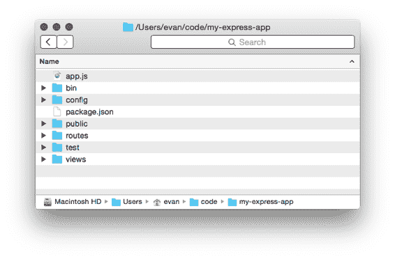
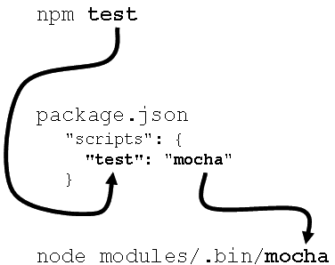

# 12 最佳实践

是时候结束这本书了。

如果这本书是一部悲剧，我们可能以一个戏剧性的死亡结束。如果它是一部喜剧，我们可能有一个浪漫的婚礼。不幸的是，这本书是关于 Express 的，这个话题并不以戏剧性和浪漫性著称。我们能得到的最好的结果就是：一套针对大型 Express 应用程序的最佳实践。我将尽力让它变得浪漫和戏剧化。

对于小型应用程序，组织并不重要。你可以将你的应用程序放入一个文件或几个小文件中。但随着你的应用程序变得更大，这些考虑变得更加重要。你应该如何组织你的文件，以便你的代码库易于工作？你应该遵守什么样的约定，以最好地支持一个开发团队？

在这一章的最后一部分，我将尽力分享我的经验。这一章中几乎没有严格的事实；我将尽力向 Express 的无意见哲学提供意见，关于用它来构建中型到大型应用程序需要什么。我们将看到：

·  高层次的简单目标

·  应用程序的文件夹和文件结构

·  锁定依赖项版本以实现最大可靠性

·  在本地安装依赖项并使用 npm 脚本

我会确保重复这个免责声明，但请记住：这一章主要是我找到的意见和约定。你可能不同意，或者发现你的应用程序不适合这些模式。这就是 Express 的美妙之处——你有很多灵活性。

这可能不如喜剧或悲剧那样充满情感，但我将尽力而为。

## 12.1 简单性

在我意见的这一章节中，在我们深入具体细节之前，让我先提出一个总的观点。

维护大型代码库有很多最佳实践，但我认为它们都归结为一点：简单。更具体地说，你的代码应该易于其他开发者理解，你应该尽量减少一个人需要记住的上下文。

为了理解一个 Express 应用程序，你已经有相当多的知识了。你必须对 JavaScript 编程语言有相当熟练的掌握才能阅读代码；你必须理解 HTTP 的工作原理才能理解路由；你必须理解 Node 及其事件驱动 I/O；然后你必须理解 Express 的所有功能，如路由、中间件、视图等。这些都需要很长时间来学习，并且很可能是基于你职业生涯早期经验的积累。这是一大堆需要记住的东西！

你的应用程序应该尽量少地向这庞大的知识堆中添加内容。

我认为我们都有过编写代码的经历（我肯定有），这些代码是错综复杂的，只有我们自己才能希望理解。我喜欢想象那些覆盖着图片的软木塞板，所有图片都通过红色丝线相互连接。这里有几种方法可以看到你的代码深度的“兔子洞”。

·  看看您的一段代码——可能是一个路由处理程序或中间件函数——然后问问自己，为了理解它，您还需要了解多少其他内容。它是否依赖于堆栈中的早期中间件？它依赖于多少个不同的数据库模型？您有多少层路由？您查看了多少个文件才到达这个点？

·  您的同事有多困惑？他们能多快地为您的应用程序添加功能？如果他们困惑且无法快速工作，这可能意味着您的代码过于复杂。

您必须对简单性非常严格，尤其是因为 Express 非常灵活且没有偏见。我们将在本章中讨论一些这些方法（以及其他方法），但其中很多都是模糊的，所以请记住这一点！

好吧，关于这些抽象的东西就到这里吧！让我们谈谈具体的事情。

## 12.2 文件结构模式

Express 应用程序可以按照您喜欢的任何方式组织。如果您愿意，可以将所有内容放入一个巨大的文件中。正如您可能想象的那样，这可能不会使应用程序易于维护。

尽管它没有偏见，但我所使用的绝大多数 Express 应用程序的结构都与图 12-1 中的结构相似。

图 12-1 Express 应用程序的一个常见文件夹结构。

这里是这个结构中 Express 应用程序的所有常见文件：

·  `package.json` 文件并不令人意外——它在每个 Node 项目中都有。这个文件将包含应用程序的所有依赖项以及您的所有 npm 脚本。我们在整本书中都看到了这个文件的不同版本，而且在“大型”应用程序中也没有什么不同。

·  `app.js` 是主要的应用程序代码——入口点。这是您实际调用 `express()` 来实例化新的 Express 应用程序的地方。这是您放置对所有路由都通用的中间件的地方，如安全或静态文件中间件。正如我们将看到的，这个文件不会启动应用程序——它将应用程序分配给 `module.exports`。

·  `bin/` 是一个包含与您的应用程序相关的可执行脚本的文件夹。通常只有一个（如下所示），但有时可能需要更多。

·  `bin/www` 是一个可执行的 Node 脚本，它 `require`s 您的应用程序（从上面的 `app.js`）并启动它。调用 `npm start` 将运行此脚本。

·  `config/` 是一个包含您应用程序配置的文件夹。它通常充满了指定默认端口号或本地化字符串等的 JSON 文件。

·  `public/` 是一个由静态文件中间件提供的文件夹。它将包含任何静态文件——HTML 页面、文本文件、图像、视频等。例如，[`html5boilerplate.com/`](https://html5boilerplate.com/) 上的 HTML5 Boilerplate 提供了一些您可能想添加到这里的常见静态文件。

·  `routes/` 是一个包含多个 JavaScript 文件的文件夹，每个文件都导出一个 Express 路由器。你可能有一个路由器用于所有以 `/users` 开头的 URL，另一个用于所有以 `/photos` 开头的 URL。第五章详细介绍了路由和路由配置——查看第 5.3 节以了解如何实现此功能。

·  `test/` 是一个包含所有测试代码的文件夹。第九章详细介绍了这方面的内容。

·  `views/` 是一个包含所有视图的文件夹。通常，它们是用 EJS 或 Jade 编写的，如第七章所示，但你可以使用许多其他模板语言。

要查看具有大多数这些约定的应用程序，最佳方式是使用官方的 Express 应用程序生成器。你可以使用 `npm install -g express-generator` 来安装它。安装完成后，你可以运行 `express my-new-app`，它将创建一个名为 `my-new-app` 的文件夹，并设置一个基本应用程序框架，如图 12-1 所示。

虽然这些只是模式和约定，但我在看到的 Express 应用程序中经常出现这样的模式。

## 12.3 锁定依赖版本

Node 拥有我使用过的最好的依赖系统。我的一个同事对我说了以下关于 Node 和 npm 的话：“他们做到了。”

npm 使用一种称为语义版本控制（有时简称为 Semver）的机制为其所有包进行版本管理。版本被分为三个数字：主版本、次版本和补丁版本。例如，版本 1.2.3 的主版本是 1，次版本是 2，补丁版本是 3。

在语义版本控制的规则中，主版本升级可能包含被认为是“破坏性”的更改。破坏性更改是指旧代码与新代码不兼容的情况。例如，在 Express 主版本 3 中工作的代码不一定与主版本 4 兼容。相比之下，次版本更改不是破坏性的。它们通常意味着一个不会破坏现有代码的新功能。补丁版本用于修复——它们保留用于错误修复和性能提升。补丁不应该破坏你的代码；它们通常会使事情变得更好。

主版本号为零 有一个需要注意的地方：如果主版本号为 0，那么基本上任何东西都可以。在那个阶段，整个包都被视为不稳定。

默认情况下，当你使用 `npm install --save` 安装一个包时，它会从 npm 仓库下载最新版本，然后在你的 `package.json` 文件中放置一个“乐观”的版本号。这意味着如果项目中的其他成员运行 `npm install` （或者如果你正在重新安装），他们可能会得到一个比你最初下载的新版本。这个新版本可能有更高的次版本号或补丁版本号，但不能有更高的主版本号。这意味着它不会下载包的绝对最新版本；它会下载仍然兼容的最新版本。图 12-2 展示了这一点。

图 12-2 在 package.json 中乐观版本控制的外观。

所有这些都很好，对吧？如果所有包都遵循语义版本控制，你应该总是想要获取最新兼容版本，以便你拥有所有最新功能和所有最新的错误修复。

但是，这里有个问题：并非所有包都完美遵循语义版本控制。通常，这是因为人们以原始开发者不期望的方式使用包。也许你依赖于一个未经测试的功能或库中的奇怪特性，这些特性被开发者忽略了。你真的不能责怪这些人——没有程序员有干净、无错误的记录，尤其是在其他开发者以意想不到的方式使用他们的代码时。

我发现 99%的情况下，这并不是一个问题。我使用的模块通常很好地遵循语义版本控制，npm 的乐观版本控制也运行良好。但是，当我将业务关键应用程序部署到生产环境（也称为“现实世界”）时，我喜欢锁定依赖项版本以最大限度地减少任何潜在的问题。我不想因为包的新版本而导致东西损坏！

锁定版本有两种方法：一种简单但不够彻底，另一种非常彻底。

### 12.3.1   简单方法：避免乐观版本控制

解决这个问题的快速方法是彻底消除你的`package.json`中的乐观版本控制。

在你的`package.json`文件中的乐观版本控制可能看起来像这样：

列表 12.1：在 package.json 中的乐观版本控制示例

`// ...` `"dependencies": {` `  "express": "⁴.12.4" #A` `}``// ...`

#A ^字符表示允许乐观版本控制。

如果你正在回退并编辑你的`package.json`，你可以简单地指定依赖项的确切版本。上面的例子将看起来像这样：

列表 12.2：在 package.json 中省略乐观版本控制的示例

`// ...` `"dependencies": {` `  "express": "4.12.4"  #A` `}``// ...`

#A 从版本号中移除^字符仅表示应下载和使用该特定版本的包。

这些编辑相对容易完成，可以将包锁定到特定版本。

如果你正在安装新的包，你可以通过将`--save`标志更改为`–save-exact`来关闭 npm 的乐观版本控制。例如，`npm install --save express`变为`npm install --save-exact express`。这将安装 Express 的最新版本，就像以前一样，但它不会在你的`package.json`中乐观地标记它——它将指定一个确切版本。

这个简单解决方案的缺点是：它没有锁定子依赖项（你的依赖项的依赖项）的版本。列表 12.3 显示了 Express 的依赖项树：

列表 12.3：Express 的依赖项树

`your-express-app@0.0.0` `└─┬ express@4.12.4` `  ├─┬ accepts@1.2.9` `  │ ├─┬ mime-types@2.1.1` `  │ │ └── mime-db@1.13.0` `  │ └── negotiator@0.5.3` `  ├── content-disposition@0.5.0` `  ├── content-type@1.0.1` `  ├── cookie@0.1.2` `  ├── cookie-signature@1.0.6` `  ├─┬ debug@2.2.0` `  │ └── ms@0.7.1` `  ├── depd@1.0.1` `  ├── escape-html@1.0.1` `  ├─┬ etag@1.6.0` `  │ └── crc@3.2.1` `  ├── finalhandler@0.3.6` `  ├── fresh@0.2.4` `  ├── merge-descriptors@1.0.0` `  ├── methods@1.1.1` `  ├─┬ on-finished@2.2.1` `  │ └── ee-first@1.1.0` `  ├── parseurl@1.3.0` `  ├── path-to-regexp@0.1.3` `  ├─┬ proxy-addr@1.0.8` `  │ ├── forwarded@0.1.0` `  │ └── ipaddr.js@1.0.1` `  ├── qs@2.4.2` `  ├── range-parser@1.0.2` `  ├─┬ send@0.12.3` `  │ ├── destroy@1.0.3` `  │ ├── mime@1.3.4` `  │ └── ms@0.7.1` `  ├── serve-static@1.9.3` `  ├─┬ type-is@1.6.3` `  │ ├── media-typer@0.3.0` `  │ └─┬ mime-types@2.1.1` `  │   └── mime-db@1.13.0` `  ├── utils-merge@1.0.0` `  └── vary@1.0.0`

例如，我在尝试使用 Backbone.js 库时遇到了问题。我想将 Backbone 固定到确切的一个版本，这很简单：我只需指定版本即可。但在 Backbone 的`package.json`中——这超出了我的控制！——它指定了一个乐观版本的 Underscore.js。这意味着如果重新安装我的包，我可能会得到 Underscore 的新版本，更危险的是，当我的代码部署到现实世界时，我也可能会得到 Underscore 的新版本。例如，您的依赖项树可能看起来像这样的一天：

`your-express-app@0.0.0` `└─┬ backbone@1.2.3` `  └── underscore@1.0.0`

但如果 Underscore 更新了，另一天它可能看起来像这样：

`your-express-app@0.0.0` `└─┬ backbone@1.2.3` `  └── underscore@1.1.0`

注意这里 Underscore 版本的区别。

使用这种方法，无法确保您的子依赖项（或子子依赖项，等等）的版本被固定。这可能是可以接受的，也可能不是。如果不行，您可以使用 npm 的一个叫作“shrinkwrap”的不错功能。

### 12.3.2   彻底的方法：npm 的“shrinkwrap”命令

之前解决方案的问题在于它没有锁定子依赖项的版本。npm 有一个名为`shrinkwrap`的子命令，可以解决这个问题。

假设您已经运行了`npm install`并且一切正常。您现在处于想要锁定依赖项的状态。此时，在您的项目中的某个位置运行一个命令：

`npm shrinkwrap`

您可以在任何具有`package.json`文件和依赖项的 Node 项目中运行此命令。

如果一切顺利，将只有一行输出：“wrote npm-shrinkwrap.json”。（如果失败了，很可能是您从非项目目录执行此命令或缺少`package.json`文件）。

看一下这个文件。您会看到它列出了依赖项、它们的版本，以及这些依赖项的依赖项，依此类推。以下是一个只安装了 Express 的项目片段：

列表 12.4 示例 npm-shrinkwrap.json 文件片段

`{` `  "dependencies": {` `    "express": {` `      "version": "4.12.4",` `      // ...` `      "dependencies": {` `        "accepts": {` `          "version": "1.2.2",` `          // ...` `          "dependencies": {` `            "mime-types": {` `              "version": "2.0.7",` `              // ...` `              "dependencies": {` `                "mime-db": {` `                  "version": "1.5.0",` `                  // ...` `                }` `              }` `            },` `            "negotiator": {` `              "version": "0.5.0",` `              // ...` `            }` `          }` `        },``        // ...`

需要注意的主要是，整个依赖树都被指定了，而不仅仅是 `package.json` 中的顶层。

下次你运行 `npm install` 时，它不会查看 `package.json` 中的包——它会查看 `npm-shrinkwrap.json` 中的文件并从那里安装。每次运行 `npm install` 时，它都会查找 shrinkwrap 文件并尝试从那里安装。如果你没有（如本书的其余部分所示），它会查看 `package.json`。

与 `package.json` 类似，你通常会将 `npm-shrinkwrap.json` 检入版本控制。这允许项目上的所有开发者保持相同的包版本，这正是 shrinkwrapping 的全部意义！

升级依赖项

一旦你锁定了依赖项，这一切都很好，但你可能不想永远冻结所有的依赖项！你可能想要获取错误修复或补丁或新功能——你只是希望按照你的意愿进行。

要更新或添加依赖项，你需要运行带有包名和包版本的 `npm install`。例如，如果你要将 Express 从 4.12.0 更新到 4.12.1，你将运行 `npm install express@4.12.1`。这将更新 `node_modules` 文件夹中的版本，然后你可以开始测试。一旦一切看起来都很好，你可以再次运行 `npm shrinkwrap` 来锁定该依赖项版本。

有时候，shrinkwrapping 并不适合你。你可能想要获取所有最新的功能和补丁，而无需手动更新。有时，尽管如此，你希望在整个项目的所有安装中拥有相同的依赖项。

## 12.4 本地化依赖

让我们继续讨论依赖项，但从一个不同的角度。

npm 允许你在系统上全局安装执行为命令的包。其中有一些“著名”的，如 Bower、Grunt、Mocha 等。这样做并没有什么问题；你需要安装到系统上的工具有很多。这意味着，要运行 Grunt 命令，你可以在电脑的任何位置输入 `grunt`。

然而，当新成员加入你的项目时，你可能会遇到一些缺点。例如，以 Grunt 为例，在全局安装 Grunt 时可能会出现两个问题：

1. 新的开发者根本没有在他们的系统上安装 Grunt。这意味着你必须在你的 Readme 或其他文档中告诉他们安装它。

2. 第二个问题与上一节中的对话相关。如果他们安装了 Grunt，但版本不正确怎么办？你可以想象他们可能安装了一个过旧或过新的 Grunt 版本，这可能会导致一些奇怪的错误，可能很难追踪。

对于这两个问题有一个相当简单的解决方案：将其作为项目的依赖项安装，而不是全局安装。

在第九章中，我们使用了 Mocha 作为测试框架。我们本可以全局安装它，但我们没有——我们将其本地安装到我们的项目中。

当你安装 Mocha 时，它会将`mocha`可执行命令安装到`node_modules/.bin/mocha`中。你可以通过以下两种方式访问它：直接执行或将其放入 npm 脚本中。

直接调用命令

最简单的方法就是直接调用这些命令。

这相当简单，尽管需要一点输入：输入命令的路径。如果你要运行 Mocha，只需运行`node_modules/.bin/mocha`。如果你要运行 Bower，只需运行`node_modules/.bin/bower`。（在 Windows 上，运行 Mocha 将是`node_modules\.bin\mocha`。）

从概念上讲，这并没有什么。

从 npm 脚本执行命令

另一种方法是添加命令作为 npm 脚本。

再次假设你想运行 Mocha。以下是将其指定为 npm 脚本的方法：

列表 12.5 指定 Mocha 为 npm 脚本

`// …` `"scripts": {` `  "test": "mocha"` `},``// …`

当你输入`npm test`时，`mocha`命令会神奇地运行。让我们再次引用第九章中的一个图表，解释它是如何工作的：

图 12-3 打开 npm test 命令执行前需要经过几个步骤。

这通常在你想要反复运行相同类型的命令时很有用。它还能将依赖项排除在你的全局列表之外！

## 12.5 摘要

在本章的最后，我们：

· 了解简单性和不交错代码的好处

· 一种结构化应用程序文件的约定：一个用于路由的文件夹，一个用于公共文件的文件夹，一个用于视图的文件夹，一个用于类似库的功能的文件夹，以及一个用于可执行文件的文件夹

· 使用`npm shrinkwrap`命令锁定依赖项版本以实现可靠性（以及这样做的好处）

· 如何避免全局安装模块

这就是本章和本书的结束！走出去，用 Express 构建酷炫的东西吧。
