# 1 什么是全栈 GraphQL？

本章涵盖

+   构成典型全栈 GraphQL 应用程序的组件

+   本书使用的技术（GraphQL、React、Apollo 和 Neo4j 数据库）以及每个组件在全栈应用程序上下文中的结合方式

+   我们将在本书中构建的应用程序的要求

## 1.1 全栈 GraphQL 概述

在本章中，我们将简要介绍本书中将要使用的技术。具体来说，我们将查看以下内容：

+   GraphQL—用于构建我们的 API

+   React—用于构建我们的用户界面和 JavaScript 客户端 Web 应用程序

+   Apollo—用于在服务器和客户端处理 GraphQL 的工具

+   Neo4j 数据库—我们将用于存储和操作应用程序数据的数据库

构建全栈 GraphQL 应用程序涉及与多层架构（通常称为三层应用）一起工作，该架构包括前端应用程序、API 层和数据库。在图 1.1 中，我们可以看到全栈 GraphQL 应用程序的各个组件以及它们如何相互交互。

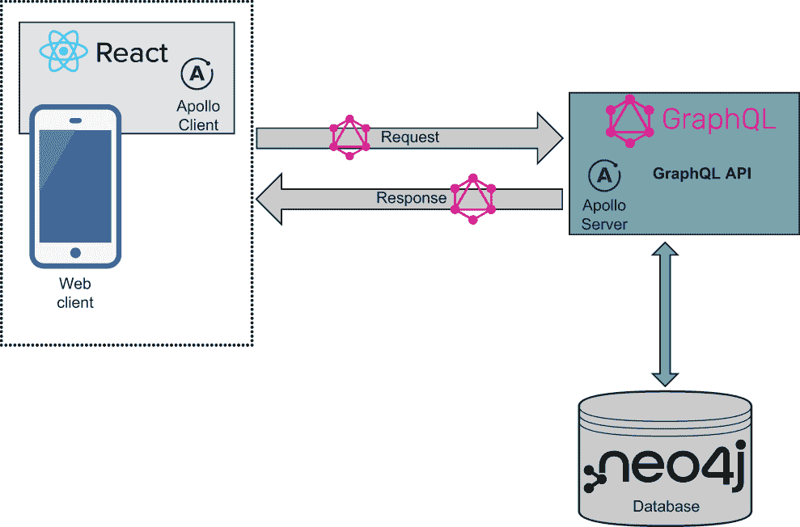

图 1.1 全栈 GraphQL 应用程序的组件：GraphQL、React、Apollo 和 Neo4j 数据库

在本书的整个过程中，我们将使用这些技术构建一个简单的商业评论应用程序，在实现应用程序的上下文中逐一处理每个技术组件。在本章的最后部分，我们将回顾本书中将要构建的应用程序的基本要求。

本书的核心是学习如何使用 GraphQL 构建应用程序，因此在我们介绍 GraphQL 时，我们将将其置于构建全栈应用程序的背景下，并使用其他技术，包括设计我们的模式、与数据库集成、构建可以查询我们的 GraphQL API 的 Web 应用程序、为我们的应用程序添加身份验证等。因此，本书假设读者对如何构建 Web 应用程序有一些基本知识，但并不一定需要每个特定技术的经验。为了成功，读者应该对 JavaScript 有基本的了解，包括客户端和 Node.js，以及诸如 API 和数据库等概念。你应该已经安装了 node，并且应该熟悉 npm 命令行工具（或 yarn）的基本用法以及如何使用它来创建 Node.js 项目和安装依赖项。我们将使用本书撰写时的最新 LTS 版本 Node.js（16.14.2），该版本可在[`nodejs.org/`](https://nodejs.org/)下载。你可能希望使用 Node.js 版本管理器，如 nvm 来管理 Node 版本。有关更多信息，请参阅[`github.com/nvm-sh/nvm`](https://github.com/nvm-sh/nvm)。

我们对每种技术进行了简要介绍，并在需要时建议读者查阅其他资源以进行更深入的覆盖。同样重要的是要注意，我们将涵盖与 GraphQL 一起使用的特定技术，并且在每个阶段，可以替换为类似的技术（例如，我们可以使用 Vue 而不是 React 来构建我们的前端）。最终，本书的目标是展示这些技术如何相互配合，并为读者提供一个全栈框架来思考和构建使用 GraphQL 的应用程序。

## 1.2 GraphQL

在其核心，GraphQL 是构建 API 的规范。GraphQL 规范描述了一种 API 查询语言和满足这些请求的方式。当构建 GraphQL API 时，我们使用严格的类型系统描述可用的数据。这些类型定义成为 API 的规范，客户端可以基于这些类型定义请求所需的数据，这些类型定义也定义了 API 的入口点。

GraphQL 通常被视为 REST 的替代品，这是你最可能熟悉的 API 范式。在某些情况下这可能成立；然而，GraphQL 也可以包装现有的 REST API 或其他数据源。这是由于 GraphQL 的数据层无关性带来的好处，这意味着我们可以使用 GraphQL 与任何数据源一起使用。

*GraphQL 是一种 API 查询语言，也是满足这些查询的运行时。GraphQL 提供了 API 中数据的完整和可理解的描述，使客户端能够请求他们确切需要的东西，而无需更多，这使得随着时间的推移更容易演变 API，并使强大的开发者工具成为可能。*

—[graphql.org](https://graphql.org/)

让我们深入了解 GraphQL 的更多具体方面。

### 1.2.1 GraphQL 类型定义

与围绕映射到资源的端点组织（如 REST）不同，GraphQL API 是围绕类型定义的中心，这些定义了数据类型、字段以及它们在 API 中的连接方式。这些类型定义成为 API 的模式，并从单个端点提供。

由于 GraphQL 服务可以用任何语言实现，因此使用一种与语言无关的 GraphQL 模式定义语言（SDL）来定义 GraphQL 类型。让我们看看图 1.2 中的示例，这个示例是由考虑一个简单的电影应用程序而激发的。想象一下，你被雇佣来创建一个网站，允许用户搜索电影目录以获取电影详情，例如标题、演员和描述，以及显示用户可能感兴趣的类似电影推荐。

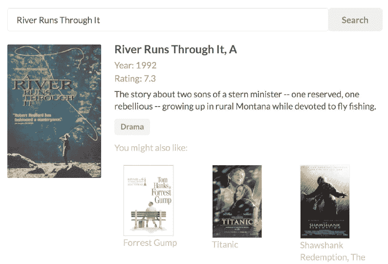

图 1.2 一个简单的电影网络应用程序

让我们从下一个列表开始，创建一些简单的 GraphQL 类型定义，这些定义将定义我们应用程序的数据域。

列表 1.1 为电影 GraphQL API 定义的简单 GraphQL 类型定义

```
type Movie {                                   ❶
  movieId: ID!
  title: String                                ❷
  actors: [Actor]                              ❸
}

type Actor {
  actorId: ID!                                 ❹
  name: String
  movies: [Movie]
}

type Query {                                   ❺
  allActors: [Actor]
  allMovies: [Movie]
  movieSearch(searchString: String!): [Movie]  ❻
  moviesByTitle(title: String!): [Movie]
}
```

❶ 电影是一个 GraphQL 对象类型，这意味着包含一个或多个字段的类型。

❷ 标题是 Movie 类型上的一个字段。

❸ 字段可以引用其他类型，例如在这种情况下 Actor 对象的列表。

❹ actorId 是 Actor 类型上的一个必需（或非可空）字段，这由 ! 字符表示。

❺ 查询类型是 GraphQL 中的一个特殊类型，它表示 API 的入口点。

❻ 字段也可以有参数；在这种情况下，movieSearch 字段需要一个必需的字符串参数：searchString。

我们的 GraphQL 类型定义声明了 API 中使用的类型、它们的字段以及它们是如何连接的。当定义一个对象类型（如 Movie）时，对象上所有可用的字段以及每个字段的类型也会被指定（我们也可以稍后添加字段，使用 extend 关键字）。在这种情况下，我们定义标题为一个标量 String 类型——一个解析为单个值的类型，与可以包含多个字段和其他类型引用的对象类型相对。这里 actors 是一个在 Movie 类型上的字段，它解析为一个 Actor 对象数组，表示演员和电影是连接的（GraphQL 中“图形”的基础）。

字段可以是可选的或必需的。Actor 对象类型上的 actorId 字段是必需的（或非可空的）。这意味着每个 Actor 对象都必须有一个 actorId 的值。不包括 ! 的字段是可空的，这意味着这些字段的值是可选的。

查询类型的字段成为查询 GraphQL 服务的入口点。GraphQL 模式还可以包含一个突变类型，它定义了写入 API 的入口点。与入口点相关的第三个特殊类型是订阅类型，它定义了客户端可以订阅的事件。

注意：在这里我们跳过了许多重要的 GraphQL 概念，例如突变操作、接口和联合类型等，但请放心；我们只是刚开始，很快就会涉及到这些内容！

到目前为止，你可能想知道 GraphQL 中的“图形”在哪里。实际上，我们已经使用我们的 GraphQL 类型定义定义了一个图形。图形是由节点（我们数据模型中的实体或对象）和连接节点的边组成的数据结构，这正是我们在类型定义中使用 SDL 定义的。之前显示的 GraphQL 类型定义已经定义了一个具有以下结构的简单图形（见图 1.3）。

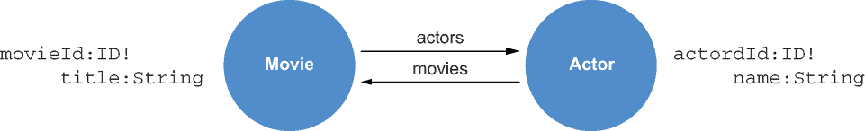

图 1.3. 以图形图表示的我们的电影网络应用程序的 GraphQL 类型定义

图形都是关于描述连接数据的，在这里我们定义了我们的电影和演员如何在图形中连接。GraphQL 允许我们将应用程序数据建模为图形，并通过 GraphQL 操作遍历数据图形。

当 GraphQL 服务接收到一个操作（例如，一个 GraphQL 查询）时，它将根据这些类型定义定义的 GraphQL 模式进行验证和执行。让我们看看一个可以针对使用之前显示的类型定义定义的 GraphQL 服务执行的示例查询。

### 1.2.2 使用 GraphQL 进行查询

GraphQL 查询定义了通过我们的类型定义定义的数据图进行遍历，并请求查询返回的字段子集——这被称为 *选择集*。在这个查询中，我们从 allMovies 查询字段入口点开始遍历图，以找到与每部电影相关的演员（参见下一列表）。然后，对于这些演员中的每一个，我们遍历到他们与之相连的所有其他电影。

列表 1.2 一个用于查找电影和演员的 GraphQL 查询

```
query FetchSomeMovies {    ❶
  allMovies {              ❷
    title                  ❸
    actors {               ❹
      name
      movies {             ❺
        title
      }
    }
  }
}
```

❶ 这是操作的可选命名。query 是默认操作，因此可以省略。命名查询——在这种情况下，FetchSomeMovies——也是可选的，可以省略。

❷ 在这里，我们指定入口点，它是 Query 或 Mutation 类型上的一个字段。在这种情况下，我们的查询入口点是 allMovies 查询字段。

❸ 选择集定义了查询要返回的字段。

❹ 在对象字段的情况下，使用嵌套选择集来指定要返回的字段。

❺ 需要进一步嵌套的选择集来返回电影上的字段。

注意，我们的查询是嵌套的，描述了如何遍历相关对象（在这种情况下，电影和演员）的图。我们可以通过数据图和结果的可视化来表示这种遍历（参见图 1.4）。

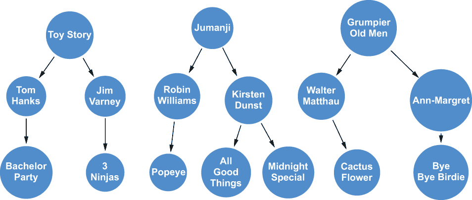

图 1.4 通过电影数据图进行 GraphQL 查询遍历

虽然我们可以通过可视化表示数据图的遍历，但 GraphQL 查询的典型结果是下一个列表中显示的 JSON 文档。

列表 1.3 JSON 查询结果

```
"data": {
  "allMovies": [
    {
      "title": "Toy Story",
      "actors": [
        {
          "name": "Tom Hanks",
          "movies": [
            {
              "title": "Bachelor Party"
            }
          ]
        },
        {
          "name": " Jim Varney",
          "movies": [
            {
              "title": "3 Ninjas: High Noon On Mega Mountain"
            }
          ]
        }
      ]
    },
    {
      "title": "Jumanji",
      "actors": [
        {
          "name": "Robin Williams",
          "movies": [
            {
              "title": "Popeye"
            }
          ]
        },
        {
          "name": "Kirsten Dunst",
            "movies": [
              {
                "title": "Midnight Special"
              },
              {
                "title": "All Good Things"
              }
            ]
        }
      ]
    },
    {
      "title": "Grumpier Old Men",
      "actors": [
        {
          "name": "Walter Matthau",
          "movies": [
            {
              "title": "Cactus Flower"
            }
          ]
        },
        {
          "name": " Ann-Margret",
          "movies": [
            {
              "title": "Bye Bye Birdie"
            }
          ]
        }
      ]
    }
  ]
}
```

如您从结果中看到的，响应与查询选择集的形状相匹配——查询中请求的恰好是返回的字段。但数据从哪里来呢？GraphQL API 的数据获取逻辑定义在称为 *解析函数* 的函数中，这些函数包含从数据层解析任意 GraphQL 请求数据的逻辑。GraphQL 是数据层无关的，因此解析器可以查询一个或多个数据库或从另一个 API（甚至是一个 REST API）获取数据。我们将在下一章深入探讨解析器。

### 1.2.3 GraphQL 的优势

现在我们已经看到了我们的第一个 GraphQL 查询，你可能正在想，“好吧，这很好，但我也可以使用 REST 获取有关电影的数据。GraphQL 有什么了不起的？”让我们回顾一下 GraphQL 的一些好处。

过度获取和不足获取

*过度获取* 是与 REST 常见相关的一种模式，在这种模式中，不必要的和未使用的数据会在响应 API 请求时通过网络发送。由于 REST 是对资源的建模，当我们发出针对，例如，/movie/tt0105265 的 GET 请求时，我们得到该电影的表示——不多也不少。

列表 1.4 GET /movie/tt0105265 的 REST API 响应

```
{
  "title": "A River Runs Through It",
  "year": 1992,
  "rated": "PG",
  "runtime": "123 min",
  "plot": "The story about two sons of a stern minister -- one reserved,
    one rebellious -- growing up in rural Montana while devoted to
    fly fishing.",
  "movieId": "tt0105265",
  "actors": ["nm0001729", "nm0000093", "nm0000643", "nm0000950"],
  "language": "English",
  "country": "USA",
  "production": "Sony Pictures Home Entertainment",
  "directors": ["nm0000602"],
  "writers": ["nm0533805", "nm0295030"],
  "genre": "Drama",
  "averageReviews": 7.3
}
```

但如果我们应用程序的视图只需要渲染电影的标题和年份呢？那么我们就无谓地发送了过多的数据。此外，一些电影字段可能计算成本很高。例如，如果我们需要通过聚合每个请求的所有电影评论来计算 averageReviews，但我们甚至没有在应用程序视图中显示这一点，那么这将浪费大量的计算时间，这无谓地影响了我们 API 的性能。（当然，在现实世界中，我们可能会缓存这些数据，但这也会增加额外的复杂性。）同样，不足获取是与 REST 相关的一种模式，其中请求返回的数据不足。

假设我们的应用程序视图需要渲染电影中每位演员的姓名。首先，我们发出针对 /movie/tt0105265 的 GET 请求。如前所述，我们有一个与这部电影相连的演员 ID 数组。现在，为了获取我们应用程序所需的数据，我们需要遍历这个演员 ID 数组，通过为要在视图中渲染的每位演员发出另一个 API 请求来获取每位演员的姓名：

```
/actor/nm0001729
/actor/nm0000093
/actor/nm0000643
/actor/nm0000950
```

使用 GraphQL，由于客户端控制所需的数据，我们可以通过在 GraphQL 查询的选择集中指定应用程序视图所需的确切数据，在一个请求中完成此操作，从而解决过度获取和不足获取的问题。这导致服务器端性能得到改善，因为我们花费在数据层的计算资源更少，网络发送的总数据更少，并且通过能够通过向 API 服务发出单个网络请求来渲染我们的应用程序视图，降低了延迟。

GraphQL 规范

GraphQL 是一种客户端-服务器通信规范，它描述了 GraphQL API 查询语言的功能、功能性和能力。拥有这个规范为如何实现你的 GraphQL API 提供了清晰的指南，并明确定义了什么是 GraphQL，什么不是 GraphQL。

REST 没有规范；相反，有许多不同的实现，从可能被认为是仅仅类似于 REST 的到超媒体作为应用程序状态引擎（HATEOAS）。将规范作为 GraphQL 的一部分简化了关于端点、状态码和文档的辩论。所有这些都内置在 GraphQL 中，这为开发人员和 API 设计师带来了生产力的提升。规范为 API 实现者提供了清晰的路径。

使用 GraphQL，一切皆图

REST 模型本身是一个资源层次结构，然而与 API 的交互大多数是以关系为单位的。例如，给定我们之前的电影查询——对于这部电影，显示所有与之相关的演员，以及对于每位演员，显示他们参演的其他所有电影——我们正在查询演员和电影之间的关系。这种关系概念在现实世界应用中更为突出，当我们可能正在处理连接客户和他们在订单中的产品或用户和他们在对话中发送给其他用户的消息之间的关系时。

GraphQL 还可以帮助统一来自不同系统的数据。由于 GraphQL 对数据层是中立的，我们可以构建 GraphQL API，将来自多个服务的数据进行整合，并提供一个清晰的方式来将这些不同系统的数据集成到单个统一的 GraphQL 模式中。

GraphQL 还可以用于在应用程序中以基于组件的数据交互模式对数据获取进行分块。由于每个 GraphQL 查询可以精确描述图遍历和要返回的字段，将这些查询与应用程序组件封装起来可以帮助简化应用程序的开发和测试。我们将在第五章开始构建我们的 React 应用程序时看到如何应用这一点。

自省

*自省* 是 GraphQL 的一个强大功能，它允许我们向 GraphQL API 询问它支持的类型和查询。自省成为了一种自我文档化的方式。利用自省的工具可以提供可读性强的 API 文档，以及可视化工具，并利用代码生成来创建 API 客户端。

### 1.2.4 GraphQL 的缺点

当然，GraphQL 并非万能的银弹，我们不应将其视为解决所有 API 相关问题的方案。采用 GraphQL 最大的挑战之一是，当使用 GraphQL 时，一些从 REST 中理解良好的实践并不适用。例如，HTTP 状态码通常用于传达 REST 请求的成功、失败和其他情况；“200 OK”表示我们的请求成功，而“404 Not Authorized”表示我们忘记了一个身份验证令牌或没有请求资源的正确权限。然而，在 GraphQL 中，每个请求都返回 200 OK，无论请求是否完全成功。这使得在 GraphQL 世界中的错误处理略有不同。与描述我们请求结果的单一状态码不同，GraphQL 错误通常在字段级别返回。这意味着我们可能成功检索了我们的 GraphQL 查询的一部分，而其他字段返回了错误，需要适当处理。

*缓存* 是 REST 中另一个被广泛理解的领域，但在 GraphQL 中处理方式略有不同。在使用 REST 时，缓存 /movie/123 的响应是可能的，因为我们可以为每个 GET 请求返回完全相同的结果。但在 GraphQL 中，由于每个请求可能包含不同的选择集，这意味着我们不能简单地为整个请求返回缓存的响应。这可以通过大多数 GraphQL 客户端在应用级别实现客户端缓存来缓解，实际上，我们的 GraphQL 请求大多数时间都在一个认证环境中，那里不适用缓存。

另一个挑战是向客户端暴露任意复杂性以及相关的性能考虑。如果客户端可以自由地按自己的意愿组合查询，我们如何确保这些查询不会变得过于复杂，从而显著影响性能或耗尽我们后端基础设施的计算资源？幸运的是，GraphQL 工具允许我们限制查询的深度，并进一步限制可以运行的查询，到一个白名单选择查询（称为持久化查询）。另一个相关挑战是实现速率限制。在使用 REST 时，我们可以简单地限制在特定时间段内可以发出的请求数量；然而，在使用 GraphQL 时，这变得更加复杂，因为客户端可能在单个查询中请求多个对象。这导致需要定制查询成本实现来解决速率限制问题。

最后，所谓的 *n* + 1 查询问题是在 GraphQL 数据获取实现中常见的一个问题，可能导致多次往返数据层，并可能对性能产生负面影响。考虑这种情况，我们请求有关一部电影及其所有演员的信息。在数据库中，我们可能存储与每部电影关联的演员 ID 列表，该列表与我们的电影详情请求一起返回。在简单的 GraphQL 实现中，我们随后需要检索演员详情，并且我们需要为每个演员对象向数据库发出单独的请求，从而导致总共 *n*（即演员数量）+ 1（即电影）次数据库查询。为了解决 *n* + 1 查询问题，像 DataLoader 这样的工具允许我们批量缓存对数据库的请求，从而提高性能。解决 *n* + 1 查询问题的另一种方法是通过使用 GraphQL 数据库集成，例如 Neo4j GraphQL 库和 PostGraphile，这些库允许我们从任意 GraphQL 请求生成单个数据库查询，确保只进行一次数据库往返。

GraphQL 限制

当我们谈论数据库时，重要的是要理解 GraphQL 是一种 API 查询语言，而不是数据库查询语言。GraphQL 缺乏数据库查询语言所需的许多复杂操作的语义，例如聚合、投影和可变长度路径遍历。

### 1.2.5 GraphQL 工具

在本节中，我们回顾了一些特定的 GraphQL 工具，这些工具将帮助我们构建、测试和查询我们的 GraphQL API。这些工具利用 GraphQL 的 introspection 功能，允许提取已部署的 GraphQL 端点的模式以生成文档、查询验证、自动完成和其他有用的开发功能。

GraphiQL

GraphiQL 是一个浏览器内工具，用于探索和查询 GraphQL API。使用 GraphiQL，我们可以对 GraphQL API 执行 GraphQL 查询并查看结果。多亏了 GraphQL 的 introspection 功能，我们可以查看我们连接的 GraphQL API 支持的类型、字段和查询。此外，由于 GraphQL 类型系统，我们在构建查询时立即进行查询验证。GraphiQL 是一个由 GraphQL 基金会维护的开源软件包。GraphiQL 可以打包成一个独立工具或 React 组件，因此通常嵌入到更大的 Web 应用程序中（见图 1.5）。

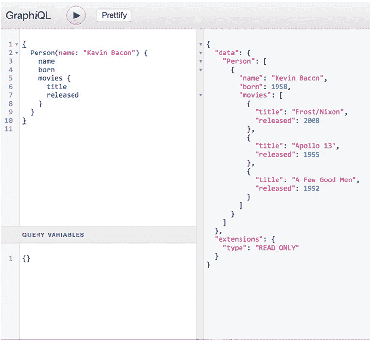

图 1.5 GraphiQL 截图

GraphQL Playground

与 GraphiQL 类似，GraphQL Playground 是一个浏览器内工具，用于执行 GraphQL 查询、查看结果和探索 GraphQL API 的模式，它由 GraphQL 的 introspection 功能提供支持（见图 1.6）。GraphQL Playground 有一些额外的功能，例如查看 GraphQL 类型定义、搜索 GraphQL 模式，以及轻松添加请求头（例如，用于身份验证所需的头）。GraphQL Playground 曾经默认包含在服务器实现中，如 Apollo Server；然而，它已被弃用，并且不再积极维护。我们在这里包含 GraphQL Playground，因为它仍然部署在许多 GraphQL 端点中，你可能会在某个时刻遇到它。

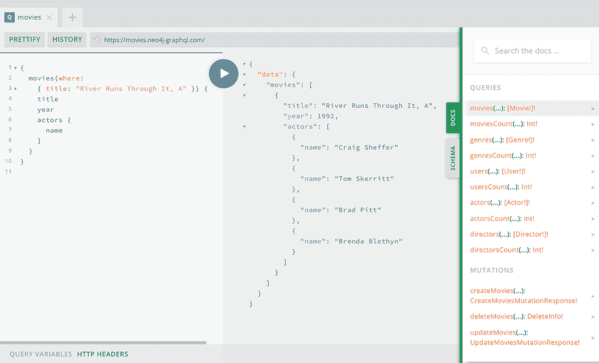

图 1.6 GraphQL Playground 截图

Apollo Studio

Apollo Studio 是 Apollo 提供的一个云平台，包括许多用于构建、验证和保障 GraphQL API 的功能（见图 1.7）。Apollo Studio 包含在本节中，因为 Studio 的 *探索者* 功能与之前提到的 GraphiQL 和 GraphQL Playground 工具类似，用于创建和运行 GraphQL 操作。此外，Apollo Studio 中的探索者现在默认由 Apollo Server（截至 Apollo Server 版本 3）使用，因此我们将在这本书中使用 Apollo Studio 来运行 GraphQL 操作，以开发我们的 GraphQL API。


图 1.7 Apollo Studio 截图

## 1.3 React

React 是一个用于使用 JavaScript 构建用户界面的声明式、基于组件的库。React 使用虚拟 DOM（实际文档对象模型的副本）来高效地计算渲染视图所需的 DOM 更新，以适应应用程序状态和数据的变化。这意味着用户只需设计映射到应用程序数据的视图，React 就会高效地处理 DOM 更新。组件封装了数据处理和用户界面渲染逻辑，而不暴露其内部结构，因此可以轻松组合在一起以构建更复杂用户界面和应用。

### 1.3.1 React 组件

让我们在下一个列表中检查一个简单的 React 组件。

列表 1.5 一个简单的 React 组件

```
import React, { useState } from "react";            ❶

function MovieTitleComponent(props) {               ❷
  const [movieTitle, setMovieTitle] = useState(     ❸
    "River Runs Through It, A"
  );

  return <div>{movieTitle}</div>                    ❹
}

export default MovieTitleComponent;                 ❺
```

❶ 我们导入 React 和 useState 钩子以管理状态变量。

❷ 我们的组件是一个函数，它从 React 组件层次结构中更高的组件接收 props 或值。

❸ 使用 useState 钩子，我们创建一个新的状态变量及其关联的更新函数。

❹ 在这里，我们从组件状态中访问 movieTitle 值，并在 div 标签内渲染它。

❺ 我们导出这个组件，以便它可以在其他 React 组件中组合使用。

组件库

由于组件封装了数据处理和用户界面渲染逻辑，并且易于组合，因此将组件库分发给项目作为依赖项以快速利用复杂的样式和用户界面设计变得实用。使用此类组件库超出了本书的范围；然而，一个很好的例子是 Material UI 组件库，它允许我们导入许多流行的、常见的用户界面组件，例如网格布局、数据表、导航和输入。

### 1.3.2 JSX

React 通常与一个名为 JSX 的 JavaScript 语言扩展一起使用。JSX 看起来类似于 XML，并且是构建 React 用户界面和组合 React 组件的强大方式。虽然可以使用 React 而不使用 JSX，但大多数用户更喜欢 JSX 提供的可读性和可维护性。我们将在第五章中介绍 JSX 以及其他一些 React 概念，例如单向数据流、props 和 state，以及使用 React 进行数据获取。

### 1.3.3 React 工具

接下来，我们将回顾一些有用的工具，这些工具将帮助我们构建、开发和调试 React 应用程序。对于使用 React 应用程序进行开发，有一个健康的工具生态系统，所以不要认为这是一个完整的列表。

Create React App

Create React App 是一个命令行工具，可以用来快速创建 React 应用程序的框架，包括配置构建设置、安装依赖项以及模板化一个简单的 React 应用程序以开始开发。我们将在第五章中介绍如何使用 Create React App 来构建应用程序的前端。

React Chrome DevTools

React DevTools 是一个浏览器扩展，允许我们在应用程序运行时检查 React 应用程序，并查看组件层次结构、props 和每个组件的内部状态，从而实现 React 应用程序的调试。在查看我们的组件在不同使用场景下的结构时，它非常有用（见图 1.8）。

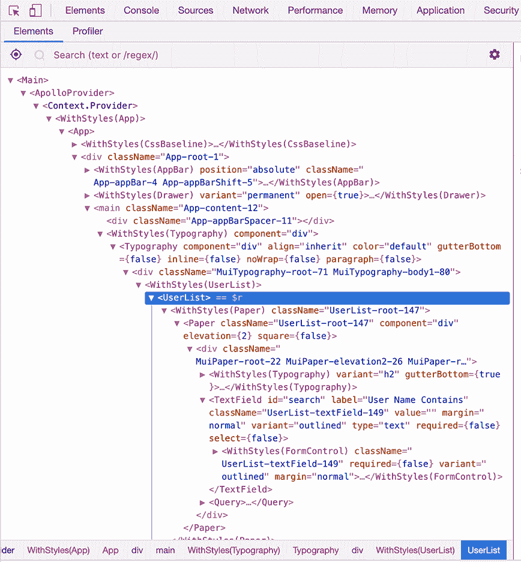

图 1.8 React Chrome DevTools

## 1.4 Apollo

Apollo 是一组工具，使使用 GraphQL 变得更容易，包括在服务器、客户端和云中。我们将使用 Apollo Server，这是一个 Node.js 库，用于构建我们的 GraphQL API，以及 Apollo Client，这是一个客户端 JavaScript 库，用于从我们的应用程序查询 GraphQL API，以及之前介绍的 Apollo Studio 的 Explorer，用于构建和运行查询。

### 1.4.1 Apollo Server

Apollo Server 允许我们通过定义我们的类型定义和解析函数，轻松启动一个 Node.js 服务器，该服务器提供 GraphQL 端点。Apollo Server 可以与许多不同的 Web 框架一起使用；然而，默认且最受欢迎的是 Express.js。Apollo Server 还可以与无服务器函数一起使用，例如 Amazon Lambda 和 Google Cloud Functions。Apollo Server 可以使用 npm 安装：npm install apollo-server。

### 1.4.2 Apollo Client

Apollo Client 是一个用于查询 GraphQL API 的 JavaScript 库，并与许多前端框架集成，包括 React 和 Vue.js，以及原生移动版本 iOS 和 Android。我们将使用 React Apollo Client 集成在 React 组件中实现通过 GraphQL 的数据获取。Apollo Client 处理客户端数据缓存，也可以用于管理本地状态数据。React Apollo Client 库可以使用 npm 安装：npm install @apollo/client。

## 1.5 Neo4j 数据库

Neo4j 是一个开源的原生图数据库。与其他使用表或文档作为数据模型的数据库不同，Neo4j 使用的数据模型是一个图，具体称为*属性图数据模型*，它允许我们将数据作为图进行建模、存储和查询。像 Neo4j 这样的图数据库针对处理图数据和执行复杂的图遍历进行了优化，例如由 GraphQL 查询定义的遍历。

使用图数据库与 GraphQL 的一个好处是我们可以在整个应用程序堆栈中保持相同的图数据模型，在前端、后端和数据库中处理图。另一个好处与图数据库相对于其他数据库系统（如关系数据库）的性能优化有关。许多 GraphQL 查询最终会嵌套多层——相当于关系数据库中的 JOIN 操作。图数据库针对执行这些图遍历操作进行了优化，因此是 GraphQL API 后端的自然选择。

注意：需要注意的是，我们并不是直接使用 GraphQL 查询数据库。虽然 GraphQL 有数据库集成，但 GraphQL API 是位于我们的应用程序和数据库之间的一层。

### 1.5.1 属性图数据模型

与许多图数据库一样，Neo4j 使用属性图模型（见图 1.9）。属性图模型的组成部分包括

+   节点—我们数据模型中的实体或对象

+   关系—节点之间的连接

+   标签—节点的分组语义

+   属性—存储在节点和关系上的键值对属性

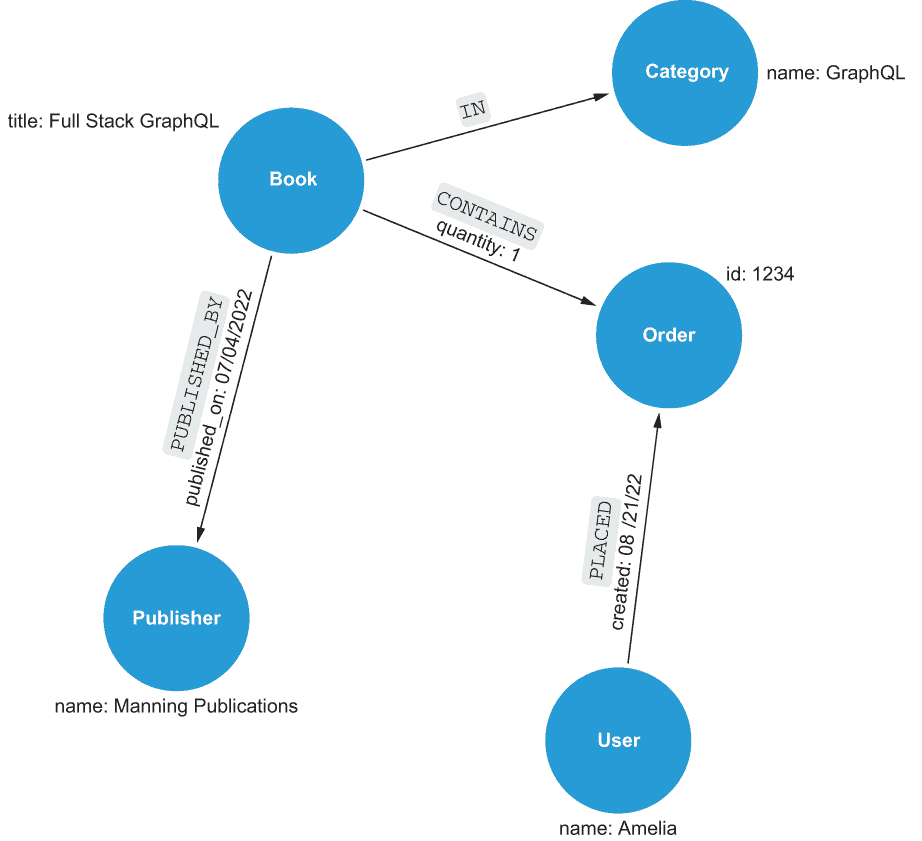

图 1.9 书籍、出版社、客户和订单的属性图示例

属性图数据模型允许我们以灵活的方式表达复杂、连接的数据。这种数据模型还具有额外的优势，即与我们在处理领域数据时通常考虑数据的方式紧密映射。

### 1.5.2 Cypher 查询语言

Cypher 是由 Neo4j 和其他图数据库以及图计算引擎使用的声明式图查询语言。你可以将 Cypher 视为类似于 SQL，但 Cypher 是为图数据设计的，而不是处理表。Cypher 的一个主要特性是 *模式匹配*。在 Cypher 中的图模式匹配中，我们可以使用类似 ASCII 艺术的符号来定义图模式。在下一个列表中，让我们看看一个简单的 Cypher 示例：查询与这些电影相连的电影和演员。

列表 1.6 简单的 Cypher 查询，查询电影和演员

```
MATCH (m:Movie)<-[r:ACTED_IN]-(a:Actor)    ❶
RETURN m,r,a                               ❷
```

❶ 描述图模式以在数据库中查找数据

❷ 我们返回与所描述的图模式匹配的数据。

在我们的 Cypher 查询中，MATCH 后跟一个使用类似 ASCII 艺术的符号描述的图模式。在这个模式中，节点定义在括号内——例如，(m:Movie)。:Movie 表示我们应该匹配标签为 Movie 的节点，冒号前的 m 成为一个变量，它绑定到匹配该模式的任何节点。我们可以在整个查询中引用 m。

关系由方括号定义（例如，<-[r:ACTED_IN]-）并遵循类似的约定，其中 :ACTED_IN 声明 ACTED_IN 关系类型，r 成为一个可以在查询中引用的变量，用于表示匹配该模式的任何关系。

在 RETURN 子句中，我们指定查询要返回的数据。在这里，我们指定了变量 m、r 和 a，这些变量是在 MATCH 子句中定义的，并且与数据库中匹配图模式元素的节点和关系绑定。

### 1.5.3 Neo4j 工具

我们将使用 Neo4j Desktop 来管理本地和 Neo4j Browser 上的 Neo4j 实例，Neo4j Browser 是一个用于查询和与我们的 Neo4j 数据库交互的开发者工具。为了从我们的 GraphQL API 查询 Neo4j，我们将使用 JavaScript Neo4j 客户端驱动程序以及 Neo4j GraphQL 库，这是一个用于 Neo4j 的 Node.js GraphQL 集成。

Neo4j Desktop

Neo4j Desktop 是 Neo4j 的指挥中心（见图 1.10）。从 Neo4j Desktop 我们可以管理 Neo4j 数据库实例，包括编辑配置、安装插件和图形应用（例如，可视化工具），以及访问管理员级别的功能，如导出/导入数据库。Neo4j Desktop 是 Neo4j 的默认下载体验，可在 [neo4j.com/download](https://neo4j.com/download/) 下载。

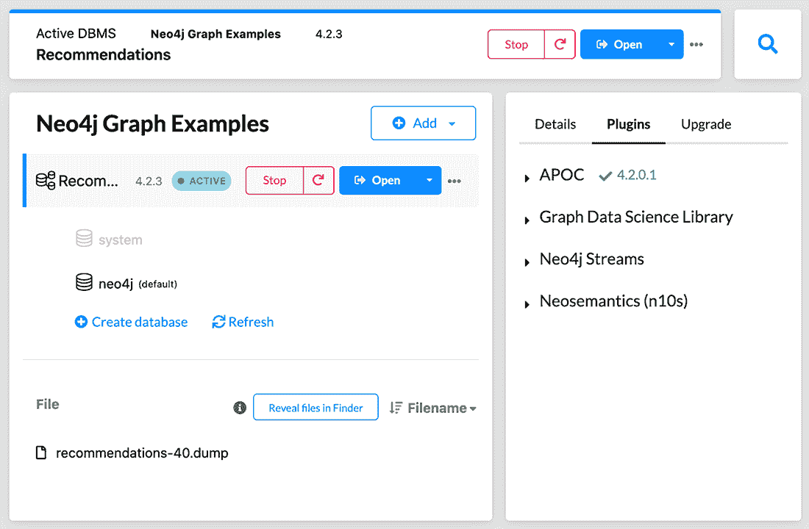

图 1.10 Neo4j Desktop

Neo4j AuraDB

Neo4j AuraDB 是 Neo4j 的完全托管云服务，在云中提供托管的 Neo4j 实例。AuraDB 包括免费层，这使得它成为开发和个人项目的绝佳选择。我们将在第八章中更详细地介绍 Neo4j AuraDB，当时我们将探讨使用云服务部署我们的全栈应用程序。您可以在 [dev.neo4j.com/neo4j-aura](https://neo4j.com/cloud/platform/aura-graph-database/) 免费开始使用 Neo4j AuraDB。

Neo4j 浏览器

Neo4j 浏览器是 Neo4j 的浏览器内查询工作台，是开发期间与 Neo4j 交互的主要方式之一（见图 1.11）。使用 Neo4j 浏览器，我们可以使用 Cypher 查询数据库并可视化结果，无论是作为图形可视化还是以表格形式的结果。

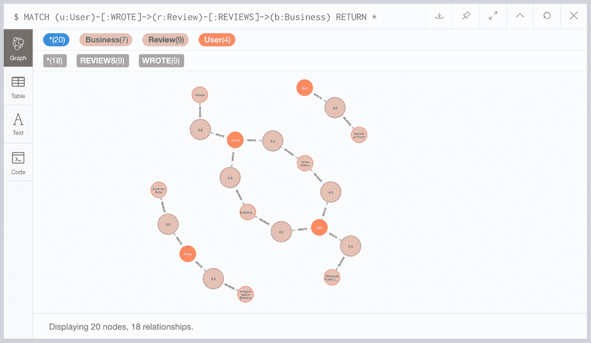

图 1.11 Neo4j 浏览器

Neo4j 客户端驱动程序

由于我们的最终目标是构建一个与我们的 Neo4j 数据库通信的应用程序，我们将利用 Neo4j 的语言驱动程序。客户端驱动程序在许多语言中可用（Java、Python、.Net、JavaScript、Go 等），但我们将使用 Neo4j JavaScript 驱动程序。

注意：Neo4j JavaScript 驱动程序既有 Node.js 版本也有浏览器版本（允许从浏览器直接连接到数据库）；然而，在这本书中，我们只会使用 Node.js 版本。

Neo4j JavaScript 驱动程序使用 npm 安装：

```
npm install neo4j-driver
```

在以下列表中，让我们看看一个示例：使用 Neo4j JavaScript 驱动程序执行 Cypher 查询并记录结果。

列表 1.7 基本 Neo4j JavaScript 驱动程序使用

```
const neo4j = require("neo4j-driver");                         ❶

const driver = neo4j.driver("neo4j://localhost:7687",          ❷
  neo4j.auth.basic("neo4j", "letmein"));                       ❸

const session = driver.session();                              ❹

session.run("MATCH (n) RETURN COUNT(n) AS num")                ❺
  .then(result => {                                            ❻
    const record = result.records[0];                          ❼
    console.log(`Your database has ${record['num']} nodes`);
  })
  .catch(error => {
    console.log(error);
  })
  .finally( () => {                                            ❽
    session.close();
  )
```

❶ 导入 neo4j-driver 模块

❷ 创建驱动程序实例并指定数据库连接字符串

❸ 指定数据库用户名和密码

❹ 会话更轻量级，应该为特定的工作块实例化。

❺ 在自动提交事务中运行查询；它返回一个承诺。

❻ 承诺解析为结果集。

❼ 访问结果集的记录并选择第一条记录

❽ 一定要关闭会话。

我们将学习如何在我们的 GraphQL 解析函数中利用 Neo4j JavaScript 驱动程序，作为在我们的 GraphQL API 中实现数据获取的一种方式。

Neo4j GraphQL 库

Neo4j GraphQL 库是 Neo4j 的 GraphQL 到 Cypher 查询执行层。它与任何 JavaScript GraphQL 服务器实现（如 Apollo Server）一起工作。我们将学习如何使用此库来完成以下任务：

1.  使用 GraphQL 类型定义驱动 Neo4j 数据库模式

1.  从 GraphQL 类型定义生成完整的 CRUD GraphQL API

1.  为任意 GraphQL 请求生成单个 Cypher 数据库查询（解决 *n* + 1 查询问题）

1.  使用 Cypher 在我们的 GraphQL API 中添加自定义逻辑

虽然 GraphQL 是数据层无关的——可以使用任何数据源或数据库实现 GraphQL API——但是当与图数据库一起使用时，有一些好处，例如减少数据模型映射和转换，以及针对使用 GraphQL 定义的复杂遍历的性能优化。Neo4j GraphQL 库有助于构建由 Neo4j 图数据库支持的 GraphQL API。从第四章开始介绍使用 Neo4j GraphQL 库，你可以在 [dev.neo4j.com/graphql](https://neo4j.com/product/graphql-library/) 上了解更多关于该库的信息。

## 1.6 如何整体结合

现在我们已经查看了我们 GraphQL 栈的每个单独部分，让我们看看在完整栈应用程序的上下文中，所有这些是如何结合在一起的，我们以电影搜索应用程序为例。我们虚构的电影应用程序有三个简单的要求：

1.  允许用户通过标题搜索电影。

1.  向用户显示任何匹配的结果和电影的详细信息，例如评分或类型。

1.  显示与用户喜欢的匹配电影相似的影片列表，这可能是一个不错的推荐。

图 1.12 展示了不同组件如何组合在一起，从客户端应用程序的请求流程开始，通过标题搜索电影，到 GraphQL API，然后从 Neo4j 数据库解析数据，最后返回客户端，在更新的用户界面视图中呈现结果。

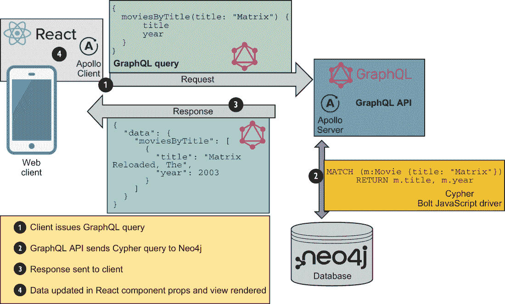

图 1.12 随着电影搜索请求通过完整的 GraphQL 应用程序

### 1.6.1 React 和 Apollo Client：发起请求

我们应用程序的前端是用 React 构建的；具体来说，我们有一个 MovieSearch React 组件，它渲染一个接受用户输入的文本框（用户将提供要搜索的电影字符串）。这个 MovieSearch 组件还包含将用户输入与 GraphQL 查询结合，并通过 Apollo Client React 集成将其发送到 GraphQL 服务器以解析数据的逻辑。以下列表显示了如果用户搜索“河上河”，发送到 API 的 GraphQL 查询可能的样子。

列表 1.8 搜索匹配“河上河”电影的 GraphQL 查询

```
{
  moviesByTitle(title: "River Runs Through It") {
    title
    poster
    imdbRating
    genres {
      name
    }
    recommendedMovies {
      title
      poster
    }
  }
}
```

这种数据获取逻辑是通过 Apollo Client 实现的，我们在 MovieSearch 组件中使用它。Apollo Client 实现了一个缓存，所以当用户输入他们的搜索查询时，Apollo Client 首先检查缓存，看是否已经处理过这个搜索字符串的 GraphQL 查询。如果没有，那么查询将以 HTTP POST 请求的形式发送到 GraphQL 服务器上的 /graphql。

### 1.6.2 Apollo Server 和 GraphQL 后端

我们的电影应用程序的后端是一个 Node.js 应用程序，它使用 Apollo Server 和 Express 网络服务器库通过 HTTP 提供一个 /graphql 端点。一个 GraphQL 服务器由网络层组成，负责处理 HTTP 请求、提取 GraphQL 操作并返回 HTTP 响应，以及 GraphQL 模式，它定义了 API 的入口点和数据结构，并负责通过执行解析函数从数据层解析数据。

当 Apollo 客户端发起请求时，我们的 GraphQL 服务器通过验证查询来处理请求，然后首先调用根级别的解析函数，在这个例子中是 Query.moviesByTitle。这个解析函数接收标题参数——用户在搜索文本框中输入的值。在我们的解析函数内部，我们拥有查询数据库以找到与搜索查询匹配的电影、检索电影详情以及为每部匹配电影找到其他推荐电影的逻辑。

解析函数实现

在这本书中，我们将展示两种实现解析函数的方法：

+   在各个解析函数内部定义数据库查询的 *天真* 方法

+   使用 GraphQL *引擎* 库自动生成解析函数，例如 Neo4j GraphQL 库

这个例子只涵盖了第一种情况。

解析函数以嵌套的方式执行（参见图 1.13）——在这个例子中，从 moviesByTitle 查询字段解析函数开始，这是此操作的根级别解析函数。moviesByTitle 解析函数将返回一个电影列表，然后查询中请求的每个字段的解析函数将被调用，并传递 moviesByTitle 返回的电影列表中的一个项目——本质上是对这个电影列表进行迭代。

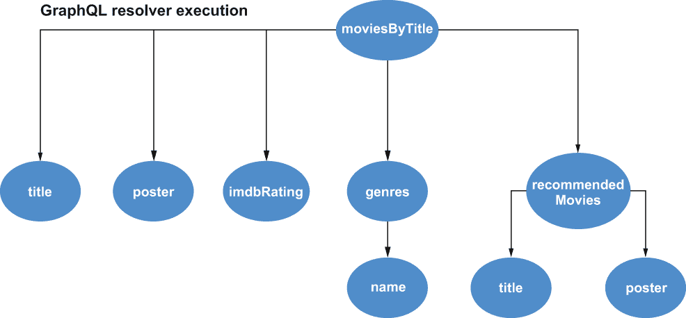

图 1.13 GraphQL 解析函数以嵌套方式调用。

每个解析函数都包含解析整体 GraphQL 模式一部分数据的逻辑。例如，当推荐电影解析函数接收到一部电影时，它有找到观众可能也喜欢的类似电影的逻辑。在这种情况下，这是通过查询数据库，使用简单的 Cypher 查询来搜索观看过该电影的用户，并遍历以找到这些用户观看的其他电影来提供协同过滤推荐，如以下列表所示。此查询在 Neo4j 中使用 Node.js JavaScript Neo4j 客户端驱动程序执行。

列表 1.9 一个简单的电影推荐 Cypher 查询

```
MATCH (m:Movie {movieId: $movieID})<-[:RATED]-(:User)-[:RATED]->(rec:Movie)
WITH rec, COUNT(*) AS score ORDER BY score DESC
RETURN rec LIMIT 3
```

*n* + 1 查询问题

这里我们完美地展示了 *n* + 1 查询问题。我们的根级别解析函数返回一个电影列表。现在，为了解析我们的 GraphQL 查询，我们需要为每部电影调用一次演员解析函数。这会导致对数据库的多次请求，可能会影响性能。

理想情况下，我们向数据库发送单个请求，该请求获取解决 GraphQL 查询所需的所有数据。对此问题有几个解决方案：

+   DataLoader 库允许我们将请求批量处理。

+   GraphQL 引擎库，如 Neo4j GraphQL 库，可以从任意 GraphQL 请求生成单个数据库查询，利用 GraphQL 的图特性，而不会因多次数据库调用而产生负面的性能影响。

### 1.6.3 React 和 Apollo 客户端：处理响应

一旦我们的数据获取完成并将数据发送回 Apollo 客户端，缓存就会更新，因此如果将来执行相同的搜索查询，数据将从缓存中检索，而不是从 GraphQL 服务器请求数据。

我们的 MovieSearch React 组件将 GraphQL 查询的结果作为 props 传递给 MovieList 组件，该组件随后渲染一系列 Movie 组件，更新视图以显示每个匹配电影的详细信息——在这种情况下，只有一个。我们的用户将看到一个电影搜索结果列表（见图 1.14）！


图 1.14 React 组件组合在一起构建复杂的用户界面。

本例的目标是展示如何将 GraphQL、React、Apollo 和 Neo4j 数据库结合使用来构建一个简单的全栈应用程序。我们省略了许多细节，例如身份验证、授权和优化性能，但请放心，我们将在整本书中详细讲解这些内容！

## 1.7 本书我们将构建的内容

本章中我们使用的简单电影搜索示例，希望是对我们将在这本书中学到的概念的一个不错的介绍。我们不是构建一个电影搜索应用程序，而是从头开始构建一个新的应用程序，在构建过程中，我们将一起处理需求并设计 GraphQL API，以此构建我们对 GraphQL 的知识。为了展示本书中涵盖的概念，我们将构建一个利用 GraphQL、React、Apollo 和 Neo4j 的 Web 应用程序。这个 Web 应用程序将是一个简单的企业评论应用程序。该应用程序的需求包括

+   列出企业和企业详细信息

+   允许用户对商业机构撰写评论

+   允许用户搜索商业机构并向用户展示个性化推荐

为了实现此应用程序，我们需要设计和实现我们的 GraphQL API、用户界面和数据库。我们需要处理身份验证、授权等问题，并将我们的应用程序部署到云端。

## 1.8 练习

1.  为了熟悉 GraphQL 和编写 GraphQL 查询，请探索公共电影 GraphQL API，网址为 [`movies.neo4j-graphql.com`](https://movies.neo4j-graphql.com)。在网页浏览器中打开此 URL 以访问 GraphQL Playground，并探索 DOCS 和 SCHEMA 标签以查看类型定义。

    尝试编写查询以响应以下提示：

    +   按标题顺序查找前 10 部电影的标题。

    +   谁出演了电影《侏罗纪公园》？

    +   《侏罗纪公园》的流派是什么？还有哪些电影属于这些流派？

    +   哪部电影具有最高的 imbdRating？

1.  考虑我们在本章中描述过的业务评论应用程序。看看你是否可以创建此应用程序所需的 GraphQL 类型定义。

1.  下载 Neo4j，熟悉 Neo4j Desktop 和 Neo4j Browser。在 [neo4j.com/sandbox](https://neo4j.com/sandbox/) 上完成 Neo4j Sandbox 示例数据集指南。

你可以在本书的 GitHub 仓库中找到练习的解决方案以及代码示例：[github.com/johnymontana/fullstack-graphql-book](https://github.com/johnymontana/fullstack-graphql-book)。

## 摘要

+   GraphQL 是一种用于满足请求的 API 查询语言和运行时。我们可以使用 GraphQL 与任何数据层结合。要构建 GraphQL API，我们首先定义类型，包括每个类型上可用的字段以及它们是如何连接的，并描述数据图。

+   React 是一个用于构建用户界面的 JavaScript 库。我们使用 JSX 构建封装数据和逻辑的组件。这些组件可以组合在一起，从而允许构建复杂用户界面。

+   Apollo 是一套用于处理 GraphQL 的工具集合，适用于客户端和服务器端。Apollo Server 是一个用于构建 GraphQL API 的 Node.js 库。Apollo Client 是一个 JavaScript GraphQL 客户端，它集成了许多前端框架，包括 React。

+   Neo4j 是一个开源的图数据库，它使用属性图数据模型，该模型由节点、关系、标签和属性组成。我们使用 Cypher 查询语言与 Neo4j 交互。

+   这些技术可以一起使用来构建全栈 GraphQL 应用程序。
