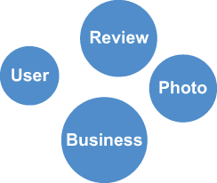
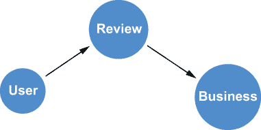
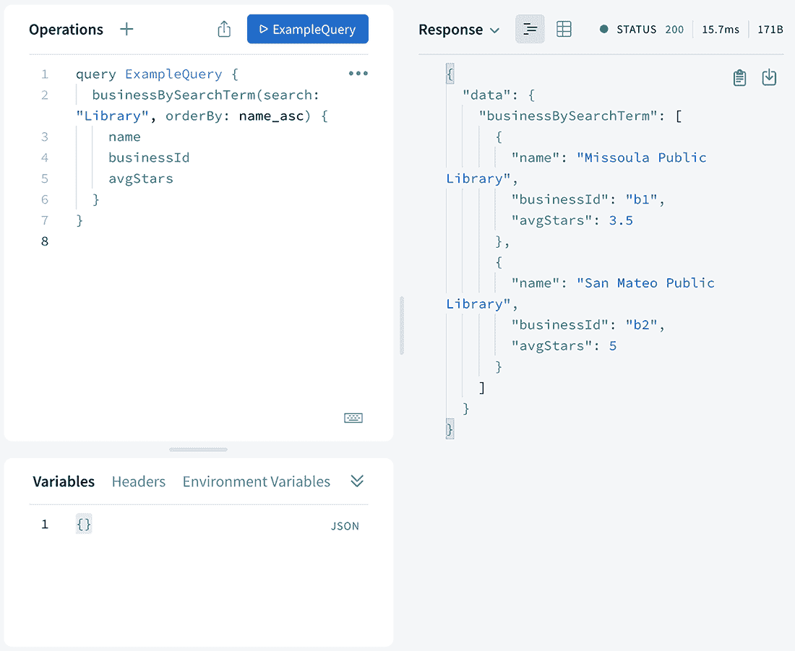
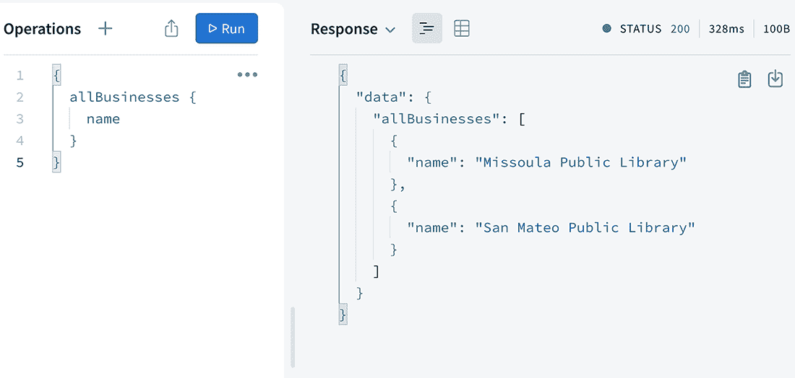
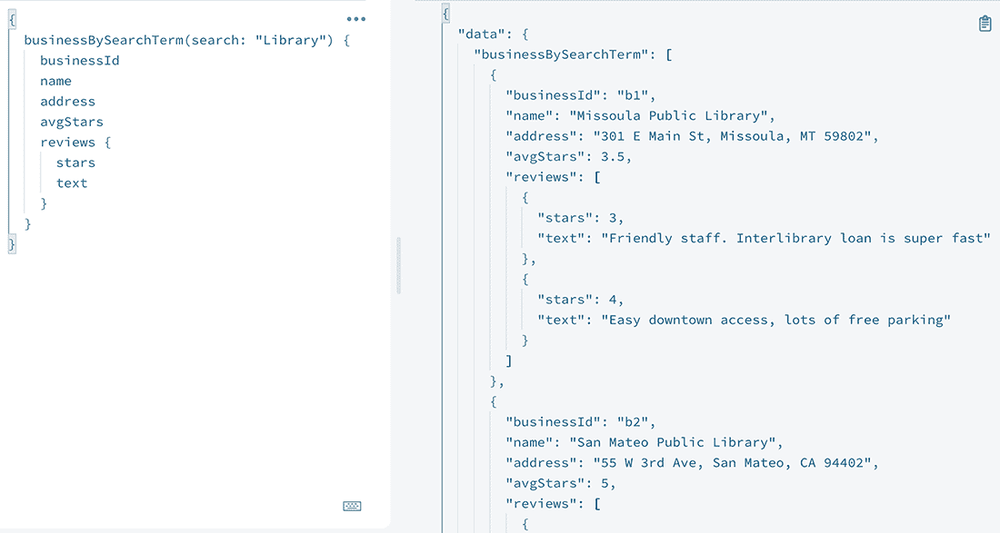

# 2 使用 GraphQL 进行图思维

本章涵盖

+   描述我们业务审查应用的需求

+   将需求转换为 GraphQL 类型定义

+   使用一种简单的方法实现这些类型定义的数据获取解析函数

+   使用 Apollo Server 结合我们的类型定义和解析器来提供 GraphQL 端点

+   使用 Apollo Studio 查询我们的 GraphQL 端点

在本章中，我们将为业务审查应用设计一个 GraphQL API。首先，我们将定义此应用的需求；然后，我们将描述一个遵循 GraphQL-first 开发方法的 GraphQL API，以解决这些需求。然后，我们将探讨如何实现此 API 的数据获取逻辑。最后，我们将探讨如何结合我们的 GraphQL 类型定义和解析函数，使用 Apollo Server 提供 GraphQL API，并使用 Apollo Studio 进行查询。在构建 API 时，了解数据域和常见的访问模式通常很有用——换句话说，API 要解决什么问题？GraphQL-first 开发方法允许我们在定义 GraphQL 类型定义后并行实现后端和前端系统。

GraphQL-first 开发

GraphQL-first 开发范式是一种以 GraphQL API 设计为驱动力的应用程序构建方法。该过程从描述由业务需求综合而成的 GraphQL 类型定义开始。然后，这些类型定义成为 API 实现、数据库数据获取代码和客户端应用程序代码的基础。GraphQL-first 开发是一种强大的方法，因为它允许在定义 GraphQL 类型定义后并行实现后端和前端系统。

## 2.1 您的应用数据是一个图

*图* 是由节点（实体或对象）和连接节点的边组成的基本数据结构。图是一个直观的模型，可以用来表示许多不同的领域。通常，当我们通过检查一个领域的业务需求来生成数据模型时，我们最终会绘制一个显示对象及其连接方式的图表。这就是图！

让我们通过我们的业务审查应用的过程。我们应用的需求是

1.  作为用户，我想通过类别、位置和名称搜索企业列表。

1.  作为用户，我想查看每个企业的详细信息（名称、描述、地址、照片等）。

1.  作为用户，我想查看每个企业的评论，包括每个企业的摘要，并按好评企业进行搜索排序。

1.  作为用户，我想为一家企业创建评论。

1.  作为用户，我想连接我喜欢的口味的朋友和用户，这样我就可以关注我朋友的评论。

1.  作为用户，我希望根据我之前写过的评论和我的社交网络收到个性化的推荐。

现在我们已经确定了我们应用程序的需求，让我们考虑这个应用程序的数据需求及其描述的数据模型。

首先，什么是实体？这些将成为我们图中的节点。我可以将用户、企业、评论和照片视为我们需要考虑的实体（见图 2.1）。



图 2.1 实体成为节点。

接下来，这些实体是如何连接的？这些连接被建模为实体之间的关系，而我们所描述的是一个图（见图 2.2）。让我们添加以下关系：

1.  用户撰写评论。

1.  评论与一个企业相连。

1.  用户上传照片。

1.  照片被标记到企业上。



图 2.2 添加关系以连接节点

现在我们已经将我们应用程序的数据需求描述为一个图，我们可以开始考虑如何构建一个 GraphQL API，使我们能够与这个数据图一起工作。

## 2.2 GraphQL 中的图

GraphQL 将我们的业务领域建模为一个图。使用 GraphQL，我们通过创建一个 GraphQL 模式来定义这个图模型，我们通过编写 GraphQL 类型定义来实现这一点。在模式中，我们定义了节点的类型、每个节点上可用的字段以及它们通过关系如何连接。创建 GraphQL 模式最常见的方式是使用 GraphQL 模式定义语言（SDL）。在本节中，我们根据我们应用程序的需求创建一个 GraphQL 模式，使用 GraphQL 类型定义在 GraphQL 中建模我们的业务审查领域。

### 2.2.1 使用类型定义进行 API 建模：GraphQL-first 开发

在将我们的业务需求翻译成我们应用程序所需的图数据模型之后，我们现在可以正式编写我们的 GraphQL 类型定义，使用 GraphQL 模式定义语言。使用 GraphQL SDL，我们定义类型、每种类型上的字段以及它们是如何连接的。我们数据的 GraphQL SDL 表示只是我们之前章节中描述的图数据模型的另一种表示。我们的 GraphQL 类型定义将成为 API 的规范，并指导我们其余的实现。这个过程被称为*GraphQL-first 开发*。

表示 GraphQL 类型的其他方式

SDL 不是创建我们的类型定义的唯一方式。每个 GraphQL 实现（例如，graphql.js，大多数 Node.js JavaScript GraphQL 项目使用的参考实现）也提供了一个程序化 API 来表示 GraphQL 类型定义。实际上，当 SDL 被解析时，内部会创建这个对象表示来与 GraphQL 模式一起工作。这种构建 GraphQL 类型的方法也可以由 API 开发者使用，并且在程序化生成 GraphQL 类型时通常是更好的选择，例如从现有类生成类型时。

由于 GraphQL 服务可以用任何语言实现，因此特定于编程语言的语法对于所有 GraphQL 实现并不相关；因此，使用无语言特定的 GraphQL SDL 来定义 GraphQL 类型。在第一章中，我们介绍了 GraphQL 模式定义语言的语法，使用了一个简单的电影和演员 GraphQL 模式。使用该示例中介绍的语法，让我们根据本章前一部分创建的业务审查应用的要求，创建 GraphQL 类型定义，如下所示。

列表 2.1 我们业务审查应用的 GraphQL 类型定义

```
type Business {           ❶
  businessId: ID!
  name: String
  address: String
  avgStars: Float
  photos: [Photo!]!
  reviews: [Review!]!
}

type User {
  userId: ID!             ❷
  name: String
  photos: [Photo!]!
  reviews: [Review!]!     ❸
}

type Photo {
  business: Business!
  user: User!
  photoId: ID!
  url: String
}

type Review {
  reviewId: ID!
  stars: Float
  text: String
  user: User!             ❹
  business: Business!
}
```

❶ 我们图中的每种对象或实体类型都成为 GraphQL 类型。

❷ 每种类型都应该有一些字段可以唯一标识该对象。

❸ 字段可以是其他类型的引用——在这种情况下，一对一关系。

❹ 连接引用也可以表示一对一关系。

注意，我们识别的实体成为 GraphQL 类型，实体的属性成为类型上的字段，连接类型或连接类型的关系定义为引用其他类型的字段。每种类型都包含字段，这些字段可以是标量类型、对象或列表。

每种类型都应该有一些字段可以唯一标识该对象。ID 是用于表示此唯一字段的特殊 GraphQL 标量。内部，我们将 ID 字段视为字符串。感叹号!表示此字段是必需的；在我们的 GraphQL API 中，如果没有 userId 字段的值，则不能有 User 对象。这里的中括号[]表示这是一对多关系；一个 User 可以创建零个或多个评论，而一个 Review 只能由一个 User 编写。要表示一对一关系，我们只需省略中括号，表示这不是数组字段。

内置 GraphQL 类型

GraphQL 模式语言支持以下内置类型：

+   字符串

+   整型

+   浮点数

+   布尔型

+   ID

默认情况下，每个类型都是可空的，这意味着 null 是该字段的有效值。使用感叹号!来表示类型不可空。例如，Int!是不可空的整数。

要表示列表类型，使用方括号[]。例如，[Int]表示整数列表。

方括号和感叹号可以组合使用。例如，[String!] 是一个非空字符串列表：列表中的每个项目都必须有一个字符串值，但列表本身可以是 null，而 [String]! 是一个非空的可空字符串列表。

现在我们已经有了我们的类型定义，我们需要定义我们 API 的入口点。读取操作的入口点定义在一个特殊类型中，称为查询类型。写入操作的入口点定义在另一个特殊类型中，称为突变类型。在本章中，我们只关注查询。突变将在第四章中介绍，我们将更新数据库中的数据。除了查询和突变类型之外，还有一个第三种特殊的 GraphQL 类型，用于定义入口点，称为订阅。订阅是 GraphQL 的事件发布功能，超出了本书的范围。

我们 API 的入口点应该映射到我们应用程序的客户端需求。换句话说，问问自己，“客户端需要完成哪些操作？”这些需求应该指导我们定义哪些查询和突变字段。让我们首先关注下一列表中的只读需求。

列表 2.2 查询字段作为 API 入口点

```
type Query {
  allBusinesses: [Business!]!
  businessBySearchTerm(search: String!): [Business!]!
  userById(id: ID!): User
}
```

现在我们已经创建了我们的 GraphQL 类型定义，我们可以构建一些可能被我们的应用程序使用的 GraphQL 查询。考虑以下列表中显示的应用程序可能需要发出以填充搜索结果页面的查询，基于用户提供的搜索字符串。

列表 2.3 搜索商业和评论的 GraphQL 查询

```
{
  businessBySearchTerm(search: "Library") {
    name
    avgStars
    reviews {
      stars
      text
      user {
        name
      }
    }
  }
}
```

使用这个查询，我们可以搜索“图书馆”商业，查看匹配的商业，并查看搜索结果所需的商业详情，以及所有评论及其作者。

这很好，但这个查询有几个问题。如果我们有很多“图书馆”商业的匹配项会发生什么？如果某个特定的商业有数千条评论会发生什么？我们的客户端应用程序将不堪重负，需要渲染大量数据。此外，我们可能不想以任何顺序显示商业结果；我们应该允许搜索结果按名称排序，无论是升序还是降序。

将分页和排序添加到我们的 API

GraphQL 没有内置的过滤、分页或排序语义；相反，API 设计者需要根据应用程序的需求和相关性将这些添加到 GraphQL 模式中。

对于分页，我们将在我们的 API 中添加一个 first（想想限制）参数，允许客户端指定要返回的对象数量。我们在根查询字段和任何关系字段（描述一对一关系的字段）中都这样做。此外，一个 offset 参数（想想跳过），它指定在返回结果之前要跳过的记录数，允许客户端实现分页。

参数与字段

理解参数和字段之间的区别很重要。例如，first 和 offset 是参数，而 name 和 address 是字段。参数出现在字段名后面的括号内，并传递给解析函数。字段出现在对象名后面的花括号内，代表对象的属性。字段可以被视为持有值，而参数更多地用作选择器，并在 GraphQL 操作中传递。

列表 2.4 更新后的查询和业务类型定义，包含 first 和 offset 参数

```
type Business {
  businessId: ID!
  name: String
  address: String
  avgStars: Float
  photos(first: Int = 3, offset: Int = 0): [Photo!]!
  reviews(first: Int = 3, offset: Int = 0): [Review!]!             ❶
}

type Query {
  allBusinesses(first: Int = 10, offset: Int = 0): [Business!]!    ❷
  businessBySearchTerm(
    search: String
    first: Int = 10
    offset: Int = 0
  ): [Business]
  userById(id: ID!): User                                          ❸
}
```

❶ 在此处，我们将 first 和 offset 参数添加到 Business 类型的 reviews 字段上。这意味着我们可以控制查询中每个返回的业务的嵌套连接 Review 对象的分页。

❷ 在此处，我们将 first 和 offset 参数添加到 allBusinesses 字段中，允许客户端指定查询的跳过和限制值，控制返回的业务数量和偏移量。请注意，我们分配了默认值，如果没有指定，则默认值为 10 和偏移量为 0，确保我们接收前 10 个结果。

❸ 由于用户 ID 字段保证最多返回一个结果，因此无需向用户 ID 字段添加 first 和 offset 参数。

分页选项

在 GraphQL 中实现分页有几种模式。我们在此关注一种相当简单的前/偏移模式。其他选项包括编号页面和基于游标的分页，如 Relay Cursor Connections。使用 Relay Cursor Connection 规范实现的基于游标的分页在第九章中介绍。

这样就解决了分页问题，但排序怎么办？在显示搜索结果时，这是必需的——我们希望以有意义的顺序向用户展示业务。为了实现这一点，我们将添加一个排序枚举，该枚举将列出我们的 GraphQL API 中类型为[Business]的字段排序选项。

列表 2.5 Business 排序枚举

```
enum BusinessOrdering {    ❶
  name_asc                 ❷
  name_desc
}
```

❶ enum 是 GraphQL 的一个内置类型，它限制为一系列允许的值。

❷ 我们为每个我们希望支持排序的字段添加两个枚举选项：一个用于升序排序的字段，以 _asc 结尾，另一个用于降序排序的字段，以 _desc 结尾。

通常，枚举的约定是大写（例如，NAME_ASC）；然而，由于在此情况下我们的枚举值描述了字段名称，我们做出例外，并保持枚举的命名与我们的字段名称一致。现在，我们需要将此字段作为可选参数添加到我们的查询字段中，以便搜索业务，如下一列表所示。

列表 2.6 为业务搜索结果添加排序

```
type Query {
  allBusinesses(first: Int = 10, offset: Int = 0): [Business!]!
  businessBySearchTerm(
    search: String!
    first: Int = 10
    offset: Int = 0
    orderBy: BusinessOrdering = name_asc
  ): [Business!]!                        ❶
  userById(id: ID!): User
}
```

❶ 我们已将 orderBy 参数添加到 businessBySearchTerm 字段中，该字段类型为 BusinessOrdering。

现在，我们已经准备好使用我们新的分页和排序参数。在下一列表中，让我们更新我们之前的查询，其中我们正在搜索名称中包含“Library”的业务，以仅返回评分最高的五个业务以及每个业务的两个评论。

列表 2.7 查询商业和评论的 GraphQL 查询

```
{
  businessBySearchTerm(search: "Library", first: 5, orderBy: name_desc) {
    name
    avgStars
    reviews(first: 2) {
      stars
      text
      user {
        name
      }
    }
  }
}
```

通常，当在应用程序查询中使用参数值时，我们希望使用在查询时可以替换的变量值，这样我们就不需要在应用程序中构建查询字符串。相反，我们希望传递参数化的 GraphQL 查询字符串和一个包含变量值的对象。我们可以在 GraphQL 中通过首先声明我们计划使用的变量及其类型，然后在查询中包含它们，并在前面加上$字符来实现这一点。以下列表显示了使用 GraphQL 变量的查询外观。

列表 2.8 使用分页搜索商业和评论的 GraphQL 查询

```
query businessSearch(
  $searchTerm: String!
  $businessLimit: Int
  $businessSkip: Int
  $businessOrder: BusinessOrdering
  $reviewLimit: Int
) {
  businessBySearchTerm(
    search: $searchTerm
    first: $businessLimit
    offset: $businessSkip
    orderBy: $businessOrder
  ) {
    name
    avgStars
    reviews(first: $reviewLimit) {
      stars
      text
      user {
        name
      }
    }
  }
}
```

注意，这个查询现在包含了一些附加信息，以及我们的 GraphQL 变量声明。我们明确指定了 GraphQL 的*操作类型*和*操作名称*。操作类型是查询、突变或订阅。之前，我们使用了一种简写，排除了操作类型，并将查询视为默认操作类型。我们将在本书的后面部分介绍突变类型。除非指定操作名称或变量定义，或使用除查询之外的类型，否则操作类型不是必需的。

在这里提供的另一项附加信息是操作名称——在本例中为 businessSearch。操作名称是对操作的明确命名，有助于调试和日志记录。当有问题或进行故障排除时，使用操作名称查找查询会更容易。除了 GraphQL 查询外，我们还会传递一个包含变量值的对象：

```
{
  searchTerm: "Library",
  businessLimit: 5,
  businessOrder: "name_desc",
  reviewLimit: 2
}
```

当然，我们目前还没有查询我们不存在的 API 的方法，所以让我们通过实现一些用于数据获取的解析器来解决这个问题！

### 2.2.2 使用解析器解析数据

按照我们的 GraphQL 优先开发方法，下一步我们需要完成的是实现从数据层实际获取这些数据的代码。我们通过编写称为*解析器*的函数来完成此操作，这些函数包含从数据层解析数据的逻辑。解析器是具有从 GraphQL 类型单个字段获取数据目的的独立函数，它们可以被视为 GraphQL 服务中的主要执行单元。解析器以嵌套方式调用，从根级解析器（查询、突变或订阅类型上的字段）开始，以深度优先执行，直到所有请求的字段都已解析。先前解析的数据通过 obj 参数传递给嵌套解析器。

你可以将解析器视为与在 SDL 中定义的 GraphQL 类型定义一起使用的函数，并且实际上使 GraphQL 模式可执行。GraphQL 模式必须为所有字段提供解析器函数（对于未明确定义的任何解析器函数，将使用默认解析器），因此解析器函数集合对应于类型定义，并被称为解析器映射。

解析器函数签名

每个解析器函数接收四个参数：

+   obj—之前解析的对象。对于根查询字段解析器不使用。

+   args—在 GraphQL 查询中使用的字段的参数。

+   context—一个可以包含上下文数据（如授权信息或数据库连接）的对象。

+   info—GraphQLResolveInfo 对象包含 GraphQL 查询的版本以及完整的 GraphQL 模式和其他有关查询和模式的元数据。

解析器函数返回的有效结果取决于正在解析的字段的 GraphQL 类型定义：

+   一个标量或对象值

+   一个数组

+   一个承诺

+   undefined 或 null

默认解析器

如果在 GraphQL 查询中请求的字段没有提供解析器，则将调用默认解析器，传入已解析的数据（前面提到的 obj）。此默认解析器将返回 obj 参数的属性。例如，Business 类型上 name 字段的默认解析器可能如下代码所示：

```
Business: {
  name: (obj, args, context, info) => {
    return obj.name
  }
}
```

### 2.2.3 我们的第一个解析器

让我们实现我们创建的类型定义的解析器（参见列表 2.9）。我们首先需要一些要返回的数据，因此让我们创建一些代表我们的数据层的静态数据。我们将简单地创建一些对象字面量，并将这些存储在一个名为 db 的对象中，我们可以将其视为在解析器函数中查询的数据库的模拟。我们将通过将我们的假数据注入到上下文对象中，确保它在每个解析器中可用。

列表 2.9 代表我们的数据层的业务、评论和用户示例数据

```
const businesses = [
  {
    businessId: "b1",
    name: "Missoula Public Library",
    address: "301 E Main St, Missoula, MT 59802",
    reviewIds: ["r1", "r2"],
  },
  {
    businessId: "b2",
    name: "San Mateo Public Library",
    address: "55 W 3rd Ave, San Mateo, CA 94402",
    reviewIds: ["r3"],
  },
];

const reviews = [
  {
    reviewId: "r1",
    stars: 3,
    text: "Friendly staff. Interlibrary loan is super fast",
    businessId: "b1",
    userId: "u1",
  },
  {
    reviewId: "r2",
    stars: 4,
    text: "Easy downtown access, lots of free parking",
    businessId: "b1",
    userId: "u2",
  },
  {
    reviewId: "r3",
    stars: 5,
    text: "Lots of glass and sunlight for reading.",
    businessId: "b1",
    userId: "u1",
  },
];

const users = [
  {
    userId: "u1",
    name: "Will",
    reviewIds: ["r1", "r2"],
  },
  {
    userId: "u2",
    name: "Bob",
    reviewIds: ["r3"],
  },
];

const db = { businesses, reviews, users };
```

我们假设这些对象会像传递数据库连接对象一样传递到上下文对象中的解析器。

模拟 GraphQL 数据

而不是创建一个静态对象作为示例，我们可以使用 Apollo Server 的模拟功能来创建返回模拟数据的解析器。这种模拟功能对于测试 UI 和前端代码以及使前端和后端团队能够并行工作非常有用。我们可以确信这些数据是相关的，因为它们使用模式内省和 GraphQL 类型系统来确保模拟数据与我们定义在 GraphQL 类型定义中的形式相同。有关使用 Apollo Server 进行数据模拟的更多信息，请参阅文档：[`mng.bz/Pnlw`](http://mng.bz/Pnlw)。

根据我们的 GraphQL 类型定义，我们的初始解析器映射将如下所示。

列表 2.10 解析器映射骨架

```
const resolvers = {
  Query: {
    allBusinesses: (obj, args, context, info) => {
      // TODO: return all businesses
    },
    businessBySearchTerm: (obj, args, context, info) => {
      // TODO: search businesses for matching search term
    }
  },
  Business: {
    reviews: (obj, args, context, info) => {
      // TODO: find reviews for a particular business
    },
    avgStars: (obj, args, context, info) => {
      // TODO: calculate average stars aggregation
    }
  },
  Review: {
    user: (obj, args, context, info) => {
      // TODO: find the user who wrote this review
    },
    business: (obj, args, context, info) => {
      // TODO: find the business for this  review
    }
  },
  User: {
    reviews: (obj, args, context, info) => {
     // TODO: find all reviews written by a user
    }
  }
};
```

注意，我们不需要麻烦实现那些将由默认解析器处理的平凡解析器，例如 Business.name。让我们首先实现 allBusinesses 解析器（见列表 2.11）。这个解析器简单地从我们的数据层获取所有企业并返回它们，无需担心分页或排序。记住，在这个例子中，我们的数据层由每个解析器通过上下文对象公开的嵌套对象组成。（我们将在下一节中介绍如何实际注入此对象。）

列表 2.11 根级别解析器：allBusinesses

```
Query: {                                               ❶
    allBusinesses: (obj, args, context, info) => {     ❷
      return context.db.businesses;                    ❸
    }
}
```

❶ 我们正在解析 Query 类型上的字段，所以这个解析器是我们解析器映射中 Query 键下的一个函数。

❷ 这里我们看到解析器函数的标准签名。obj 在这里将是空的，因为这是根级别解析器——还没有解析任何数据。args 也将是一个空对象，因为这个字段不接受任何参数。然而，context 将包含我们的静态数据对象。

❸ 我们通过上下文对象返回 db 对象上的 businesses 数组。

现在我们已经实现了第一个解析器函数，让我们看看如何结合我们的 GraphQL 类型定义和解析器来使用 Apollo Server 提供 GraphQL API。

## 2.3 使用 Apollo Server 结合类型定义和解析器

我们已经创建了我们的 GraphQL 类型定义和第一个解析器函数来查询我们的数据层，所以现在是时候将它们组合起来，并使用 Apollo Server 启动一个 GraphQL 服务器。Apollo Server 作为一个 npm 包可用，所以让我们用 npm 安装它：

```
npm install apollo-server graphql
```

### 2.3.1 使用 Apollo Server

在下一个列表中，我们创建 index.js，它将使用我们之前定义的类型定义和解析器以及 Apollo Server 来根据这些类型定义提供 GraphQL API。

列表 2.12 index.js 使用 Apollo Server 创建的 GraphQL 服务器

```
const ApolloServer = require('apollo-server');   ❶

const server = new ApolloServer({                ❷
  typeDefs,                                      ❸
  resolvers,                                     ❹
  context: { db }                                ❺
});

server.listen().then(({ url }) => {              ❻
  console.log(`Server ready at ${url}`);
});
```

❶ 从我们刚刚安装的包中导入 ApolloServer。

❷ 创建一个服务器实例。

❸ 我们传递了我们上面定义的类型定义。

❹ 我们之前已经定义了解析器。

❺ db 是我们模拟的数据对象，并注入到上下文中。此对象将在每个解析器中可用。

❻ 这里我们启动服务器并开始监听传入的 GraphQL 请求。

### 2.3.2 Apollo Studio

默认情况下，Apollo Server 将为 POST 请求提供 GraphQL 端点，但对于来自同一 URL（在我们的例子中是 http://localhost:4000）的 GET 请求，Apollo Server 将重定向到浏览器中的 Apollo Studio 工具（见图 2.3）。



图 2.3 使用 Apollo Studio 进行查询

Apollo Studio 可用于查看 GraphQL API 的类型定义和模式，以及执行查询和突变并查看结果。到目前为止，我们唯一实现的查询字段解析器是 allBusinesses。让我们通过在 Apollo Studio 中运行以下查询来测试它：

```
{
  allBusinesses {
    name
  }
}
```

这将导致调用 Query 字段解析器 allBusinesses，它将返回我们模拟数据库中的企业对象。然后，由于我们请求的是 Business 类型上的名称字段，将使用名称的默认解析器来返回每个企业的名称（见图 2.4）。



图 2.4 使用 Apollo Studio 的简单查询

如果你通过在 Apollo Studio 中调整查询进行实验，你很快就会看到我们需要实现剩余的解析器。让我们回到我们的解析器映射骨架，并完成解析器的实现。

### 2.3.3 实现解析器

我们创建了一些假数据来工作，并编写了我们的第一个解析器，allBusinesses，它简单地返回我们模拟数据库中的所有企业。现在，是时候实现更复杂的解析器了，比如 businessBySearchTerm，这将允许我们根据用户的搜索词过滤结果，以及数组解析器，如 Business.reviews，它将负责解析企业和评论之间的连接。

根级解析器：businessBySearchTerm

根级解析器是与我们的 API 入口点相对应的解析器。回顾我们的 GraphQL 类型定义，我们有以下入口点，如 Query 类型中定义的：

```
type Query {
  allBusinesses: [Business!]!
  businessBySearchTerm(
    search: String!
    first: Int = 10
    offset: Int = 0
    orderBy: BusinessOrdering = name_asc
  ): [Business!]!
  userById(id: ID!): User
}

enum BusinessOrdering {
  name_asc
  name_desc
}
```

我们已经在上一节中实现了 allBusinesses 根级解析器。那个例子相当简单，因为我们不需要处理任何参数。现在让我们实现 businessesBySearchTerm 解析器，它接受一个搜索字符串、排序和分页参数，如下一列表所示。

列表 2.13 根级解析器：businessBySearchTerm

```
businessBySearchTerm: (obj, args, context, info) => {          ❶
  const compare = (a, b) => {                                  ❷
    const [orderField, order] = args.orderBy.split("_");
    const left = a[orderField],
      right = b[orderField];

    if (left < right) {
      return order === "asc" ? -1 : 1;
    } else if (left > right) {
      return order === "desc" ? -1 : 1;
    } else {
      return 0;
    }
  };
  return context.db.businesses
    .filter(v => {
      return v["name"].indexOf(args.search) !== -1;            ❸
    })
    .slice(args.offset, args.first)                            ❹
    .sort(compare);                                            ❺
}
```

❶ 由于这是一个根级解析器，obj 参数将为空，但我们将利用 args 对象，它将包含 GraphQL 查询参数——在这种情况下，orderBy、search、first 和 offset。由于我们的类型定义使用了 orderBy、first 和 offset 的默认值，并且 search 是一个必填字段，我们可以确信这些值将被定义。

❷ 在这里，我们定义了一个比较函数来用于排序，利用我们的 BusinessOrdering 枚举。我们将 orderBy 值根据下划线分割以识别字段名和排序方向（例如，name_asc 表示我们将按名称字段升序排序）。

❸ 我们根据包含在 GraphQL 查询中传递的搜索词的名称属性过滤企业。

❹ 我们使用 slice 函数来实现 first/offset 分页。

❺ 在这里，我们将我们的比较函数应用于结果，根据 orderBy 参数指定的值进行排序。如果没有指定 orderBy 参数，则将使用 name_asc，因为它在 GraphQL 类型定义中指定为默认值。

数组解析器：Business.reviews

我们之前的根级解析器返回了对象的数组，但我们也可以从非根级解析器返回对象的数组，如果字段是列表字段（例如，Business.reviews，它是 Review 类型，或者 Review 对象的列表）。在非根级解析器中，obj 参数将包括之前解析的数据。例如，如果我们首先执行 Query.businessBySearchTerm 解析器来获取企业，该解析器的结果将被传递给 Business.reviews 解析器。让我们利用这些数据来实现下一个列表中的 Business.reviews 解析器。

列表 2.14 根级解析器

```
Business: {
  reviews: (obj, args, context, info) => {
    return obj.reviewIds.map(v => {
      return context.db.reviews.find(review => {
        return review.reviewId === v;
      });
    });
  },
}
```

标量解析器：Business.avgStars

我们讨论了默认解析器，它只是返回与 obj 参数中字段同名的对象属性，但有些情况下我们需要实现返回标量值的解析器，而默认解析器没有被使用。聚合就是一个很好的例子。Business.avgStars 字段是一个聚合字段，我们需要找到特定企业的所有评论，然后计算这些评论的星级平均值，返回一个单一的标量值。

列表 2.15 标量字段解析器

```
avgStars: (obj, args, context, info) => {
  const reviews = obj.reviewIds.map(v => {
    return context.db.reviews.find(review => {
      return review.reviewId === v;
    });
  });

  return (
    reviews.reduce((acc, review) => {
      return acc + review.stars;
    }, 0) / reviews.length
  );
}
```

对象解析器：Review.user

到目前为止，我们已经看到了返回标量和数组的解析器；现在，让我们实现一个返回单个对象的解析器，如下面的列表所示。在我们的类型定义中，一个评论与一个用户相关联，这意味着 Review.user 是一个对象字段，而不是列表字段。

列表 2.16 对象字段解析器解析器

```
Review: {
  user: (obj, args, context, info) => {
    return context.db.users.find(user => {
      return user.userId === obj.userId;
    });
  }
}
```

在最后一个解析器实现之后，我们现在可以使用 Apollo Studio 返回查询我们的 GraphQL API。

### 2.3.4 使用 Apollo Studio 进行查询

现在我们已经实现了其余的解析器函数，让我们通过在网页浏览器中打开 http://localhost:4000/返回 Apollo Studio。首先，让我们使用搜索词“Library”搜索企业（见图 2.5）。


图 2.5 通过搜索词查询企业

现在让我们检索与我们的搜索结果匹配的每个企业的评论（见图 2.6）。



图 2.6 向查询添加企业评论

你可以在本书的 GitHub 仓库中找到完成示例 GraphQL API 的代码：[`mng.bz/J2jo`](http://mng.bz/J2jo)。在下一章中，我们将介绍 Neo4j 图形数据库，并学习如何使用 Cypher 查询语言建模、存储和查询数据。

## 2.4 练习

1.  考虑我们业务评论应用中我们没有实现的一些其他要求。你能编写 GraphQL 查询来满足这些要求吗？结果是什么？

1.  我们 API 中哪些其他字段应该使用分页和排序？更新类型定义以包括适当的排序和分页字段，并更新解析器以处理这些分页参数。

1.  实现 usersById 的根级解析器。

1.  我们的示例 GraphQL API 明显缺少业务类别。更新示例数据、GraphQL 类型定义和解析器，以利用业务类别。考虑在 API 中如何建模类别，鉴于按类别搜索已被明确标识为业务需求。

你可以在本书的 GitHub 仓库中找到练习的解决方案以及代码示例：[github.com/johnymontana/fullstack-graphql-book](https://github.com/johnymontana/fullstack-graphql-book)。

## 摘要

+   可以使用应用程序的业务需求来处理 API 数据建模。以这种方式完成时——绘制数据的心理模型——会创建一个图，节点是实体，关系将它们连接起来。

+   GraphQL 类型定义用于定义 GraphQL API 的数据、关系和入口点。类型定义可以使用模式定义语言（Schema Definition Language，SDL）来定义，SDL 是一种与语言无关的表示法，用于指定 GraphQL 类型。除了内置的 GraphQL 类型（ID、String、Int、Float、Bool 等）之外，还可以定义自定义的用户定义标量和类型。

+   解析器是包含 GraphQL API 数据获取逻辑的函数。解析器根据 GraphQL 查询中请求的字段以嵌套方式调用。每个解析器都会传递一个上下文对象，该对象可以包含数据库连接或其他辅助对象，用于访问数据。

+   Apollo Server 用于将 GraphQL 类型定义和解析器组合成一个可执行的 GraphQL 模式，并服务于 GraphQL API。

+   Apollo Studio 可以用于查看 GraphQL API 的模式，以及执行查询并查看结果。
