# 3 数据库中的图

本章涵盖

+   专注于 Neo4j 的图数据库简介

+   属性图数据模型

+   使用 Cypher 查询语言在 Neo4j 中创建和查询数据

+   使用 Neo4j 客户端驱动程序，特别是 JavaScript Node.js 驱动程序

基本上，图数据库是一个允许用户以图的形式建模、存储和查询数据的软件工具。在数据库级别使用图通常对建模复杂连接数据更为直观，并且在处理需要遍历许多连接实体的复杂查询时可能性能更佳。

在本章中，我们开始使用上一章的业务需求创建属性图数据模型的过程，并将其与上一章中创建的 GraphQL 模式进行比较。然后，我们探讨 Cypher 查询语言，重点关注如何编写 Cypher 查询以满足我们应用程序的需求。在这个过程中，我们展示了如何安装 Neo4j，使用 Neo4j Desktop 在本地创建新的 Neo4j 项目，以及如何使用 Neo4j Browser 查询 Neo4j 并可视化结果。最后，我们展示了如何使用 Neo4j JavaScript 客户端驱动程序创建一个简单的 Node.js 应用程序，该应用程序查询 Neo4j。

## 3.1 Neo4j 概述

Neo4j 是一个使用属性图模型建模数据和使用 Cypher 查询语言与数据库交互的原生图数据库。Neo4j 是一个具有完整 ACID 保证的事务型数据库，这对于操作工作负载是必要的，也可以用于图分析。像 Neo4j 这样的图数据库针对处理高度连接的数据和遍历图（在关系型数据库中相当于多个 JOIN 操作）的查询进行了优化，因此是 GraphQL API 的完美后端，这些 API 描述了连接数据，并且通常会导致复杂、嵌套的查询。Neo4j 是开源的，可以从[neo4j.com/download](https://neo4j.com/download/)下载。

在本章中，我们将学习如何在 Neo4j 中创建和查询数据时使用 Neo4j Desktop 和 Neo4j Browser，但首先，让我们深入了解 Neo4j 使用的属性图模型，并看看它与我们之前章节中审查的 GraphQL API 模型之间的关系。

## 3.2 使用 Neo4j 进行图数据建模

与使用表或文档来建模数据的其他数据库不同，像 Neo4j 这样的图数据库将数据建模、存储并允许用户以图的形式查询数据。在图中，节点是实体，关系将它们连接起来。在关系型数据库中，我们使用外键和连接表来表示关系。在文档数据库中，我们使用 ID 引用其他实体，甚至可以在单个文档中非规范化并嵌入其他实体（参见图 3.1）。

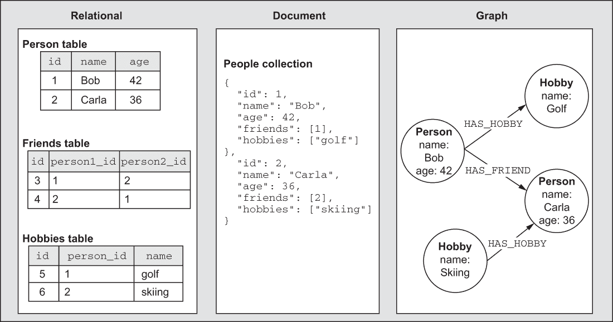

图 3.1 比较关系型、文档型和图数据模型

与数据库一起工作时，第一步是确定将要使用的数据模型。在我们的案例中，我们的数据模型将由我们在上一章中定义的业务需求驱动——与商业、用户和评论一起工作。回顾上一章第一部分中列出的需求以进行复习。让我们根据那些需求和我们对该领域的了解来创建一个白板模型。

白板模型

我们将使用术语*白板模型*来指代在首次对一个领域进行推理时通常创建的图，这通常是在白板上绘制的实体及其关系的图（参见以下图）。

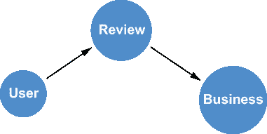

构建属性图模型：白板模型

我们如何将这个思维模型从白板模型转换为数据库使用的物理数据模型？在其他系统中，这可能涉及创建实体-关系（ER）图或定义数据库的模式。据说 Neo4j 是*可选模式的*。虽然我们可以创建数据库约束来强制约束，例如属性唯一性，但我们也可以在没有这些约束或模式的情况下使用 Neo4j。但第一步是使用属性图数据模型定义一个模型，这是 Neo4j 和其他图数据库使用的模型。让我们将之前展示的简单白板模型转换为可以在数据库中使用的属性图模型。

### 3.2.1 属性图模型

在第一章中，我们简要概述了属性图数据模型。接下来，我们将介绍将我们的白板模型转换为数据库使用的属性图模型的过程。

属性图数据模型

属性图模型由以下部分组成

+   节点标签——节点是我们数据模型中的实体或对象。节点可以有一个或多个标签，这些标签描述了节点是如何分组的（想想实体类型）。

+   关系——关系连接两个节点，具有单一类型和方向。

+   属性——这些是存储在节点或关系上的任意键值对属性。

节点标签

节点代表白板模型中的对象。每个节点可以有一个或多个标签，这是一种分组节点的方式。向白板模型添加节点标签通常是一个简单的过程，因为在白板过程中已经定义了一些分组。在这里，我们将用于引用我们的节点的描述符正式化为节点标签（稍后，我们将添加节点别名和多个标签，因此我们使用冒号作为分隔符来表示标签；参见图 3.2）。

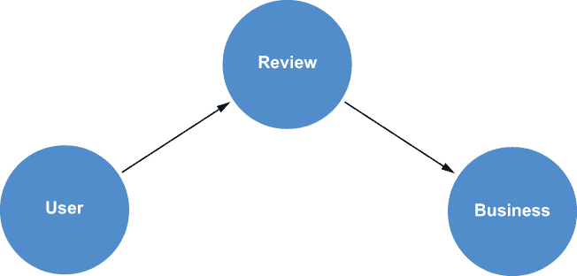

图 3.2 构建属性图模型：节点标签

图数据模型绘图工具

有许多工具可用于图形化图数据模型。在这本书的整个过程中，我们使用 Arrows 工具，这是一个简单的基于 Web 的应用程序，允许创建图数据模型。Arrows 可在网上找到：[`arrows.app`](https://arrows.app)。

Arrows 用户界面是最简化的，它围绕创建属性图数据模型而设计：

+   使用（+ 节点）按钮或从现有节点拖出创建新节点。

+   将关系从节点的光环中拖出，要么拖到空白空间以创建新节点，要么拖到现有节点上方以连接它们。

+   双击节点和关系以编辑它们，设置名称，并设置属性（使用键：值语法）。

+   您可以导出为 PNG、SVG 和其他格式（包括 GraphQL 类型定义）。

用于节点标签的大小写约定是 PascalCase。有关命名约定的更多示例，请参阅 Cypher 风格指南：[neo4j.com/developer/cypher/style-guide/](https://neo4j.com/developer/cypher/style-guide/)。节点可以有多个标签，并允许我们表示类型层次结构、不同上下文中的角色，甚至多租户。

关系

一旦我们确定了节点标签，下一步就是确定数据模型中的关系。关系有一个单一的类型和方向，但可以以任一方向查询（见下侧栏中的图）。

处理无向关系

虽然每个关系只有一个方向，但我们在查询时可以通过在 Cypher 查询中不指定方向来将关系视为无向的。

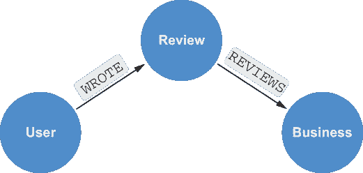

构建属性图模型：关系类型

命名关系的良好指南是，从节点沿关系到另一个节点的遍历应读作一个多少有些可理解的句子（例如，“用户撰写评论”或“评论评论业务”）。您可以在*Cypher 风格指南*中了解更多关于命名和约定的最佳实践：[neo4j.com/developer/cypher-style-guide](https://neo4j.com/developer/cypher/style-guide/)。

属性

属性是存储在节点和关系上的任意键值对。这些是我们数据模型中实体的属性或字段。在这里，我们在*用户*节点上存储 userId 和 name 作为字符串属性，以及在*评论*和*业务*节点上的其他相关属性。

属性类型

Neo4j 支持以下属性类型（见下图）：

|

+   字符串

|

+   日期、日期时间和其他时间类型

|

|

+   浮点数

|

+   点

|

|

+   长度

|

+   之前类型的列表

|

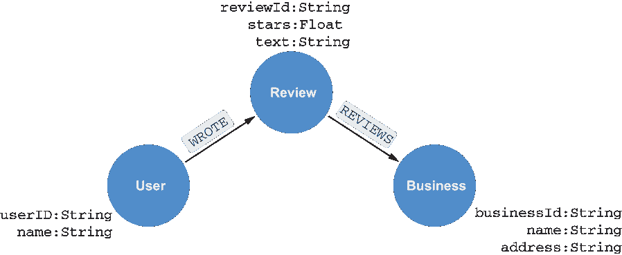

构建属性图模型：属性

### 3.2.2 数据库约束和索引

现在我们已经定义了我们的数据模型，我们如何在数据库中利用它呢？如前所述，与其他数据库不同，这些数据库在插入数据之前要求我们定义完整的模式，Neo4j 据说具有可选模式，并且不需要使用预定义的模式。相反，我们可以定义数据库约束，以确保数据遵循领域规则。我们可以创建唯一性约束，确保属性值在节点标签之间是唯一的（例如，保证没有两个用户有重复的 ID 属性值），属性存在约束（例如，确保在创建或修改节点或关系时存在一组属性），以及节点键约束，这与复合键类似，并使用多个属性创建约束。

数据库约束由索引支持，这些索引也可以单独创建。在图数据库中，索引用于找到遍历的起点，而不是用于遍历图。我们将在下一节中更详细地介绍数据库约束和索引，该节介绍了 Cypher。

## 3.3 数据建模考虑因素

图数据建模可能是一个迭代过程。一般来说，这是遵循的过程：

1.  实体是什么？它们是如何分组的？这些成为节点和节点标签。

1.  这些实体是如何连接的？这些成为关系。

1.  节点和关系的属性是什么？这些成为属性。

1.  你能识别出回答你问题的图遍历吗？这些将成为 Cypher 查询。如果不能，请迭代图模型。

然而，通常有一些细微差别没有被这种通用方法涵盖。我们将在下一节中解决一些常见的图数据建模问题。

### 3.3.1 节点与属性

有时候，确定一个值应该建模为节点还是节点上的属性可能会有困难。这里的一个好指南是问自己这样的问题，“如果这个值是一个节点，我能否通过遍历这个值发现一些有用的信息？”如果答案是肯定的，那么它应该被建模为节点；如果不是，那么将其视为属性。例如，考虑如果我们向我们的模型添加业务类别。找到具有重叠类别的业务可能是有用的，并且如果类别被建模为节点，那么发现它可能更容易。另一方面，考虑一个商业地址。如果我们将地址建模为节点而不是属性，那么遍历地址节点会有用吗？很可能是没有用，我们应该将地址建模为属性。

### 3.3.2 节点与关系

在我们有一份数据似乎连接了两个节点的情况下（例如，一个由用户撰写的商业评论），我们应该将此数据建模为一个节点还是一个关系？乍一看，我们可能只想创建一个连接用户和商业的 REVIEWS 关系，将评论信息（如星级和文本）作为关系属性存储。然而，我们可能希望通过某些自然语言处理技术从评论中提取数据，例如提到的关键词，并将提取的数据连接到评论。或者，我们可能希望将评论节点作为遍历查询的起点。这些都是我们可能选择将此数据建模为中间节点而不是关系的原因的两个例子。

### 3.3.3 索引

索引在图数据库中用于查找遍历的起点，而不是在遍历过程中。这是像 Neo4j 这样的图数据库的一个重要性能特征，称为*无索引邻接*。只为将用于查找遍历起点的属性创建索引，例如用户名或业务 ID。

### 3.3.4 关系类型的特定性

关系类型是分组关系的一种方式，应该传达足够的信息，以便清楚地表明两个节点是如何连接的，而不需要过于具体。例如，REVIEWS 是一个很好的关系类型，它连接了 Review 和 Business 节点。REVIEW_WRITTEN_BY_BOB_FOR_PIZZA 是一个过于具体的关系类型；用户和餐厅的名称存储在其他地方，不需要在关系类型中重复。

### 3.3.5 选择关系方向

属性图模型中的所有关系都有一个单一的方向，但可以双向查询或不考虑方向进行查询。不需要创建重复的关系来模拟双向性。通常，你应该选择允许一致读取数据模型的关系方向。

## 3.4 工具：Neo4j 桌面

现在我们已经了解了属性图数据模型，并且定义了我们用于业务审查应用的模型的一个简单版本，让我们创建一个 Neo4j 数据库并开始执行一些 Cypher 查询。为此，我们将利用 Neo4j Desktop，它是 Neo4j 的任务控制中心（见图 3.3）。在 Neo4j Desktop 中，我们可以创建项目和 Neo4j 的实例。我们可以在 Neo4j Desktop 中启动、停止和配置 Neo4j 数据库实例，以及安装可选的数据库插件，例如图数据科学和 APOC（Neo4j 的数据库过程标准库）。Neo4j Desktop 还包括安装*图应用*的功能，这些应用在 Neo4j Desktop 中运行并连接到活动的 Neo4j 实例。默认安装的 Neo4j 浏览器就是这些图应用中的一个例子。有关其他图应用的示例，请参阅[install.graphapp.io](https://install.graphapp.io/)。

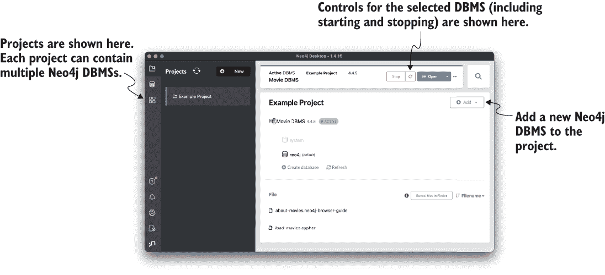

图 3.3 Neo4j Desktop：Neo4j 的任务控制台

如果您尚未下载 Neo4j Desktop，请现在前往 [neo4j.com/download](https://neo4j.com/download/) 进行下载。Neo4j Desktop 可供 Mac、Windows 和 Linux 系统下载。

下载并安装 Neo4j 后，通过选择 *添加图* 创建一个新的本地 Neo4j 实例。您将被提示输入数据库名和密码。密码可以是您想要的任何内容；只需确保您能记住它以备后用。创建图后，点击 *启动* 按钮激活它；然后我们将使用 Neo4j 浏览器来查询我们刚刚创建的数据库。

## 3.5 工具：Neo4j 浏览器

Neo4j 浏览器是一个 Neo4j 的查询工作台，允许开发者通过编写 Cypher 查询并与结果可视化来与数据库交互（见图 3.4）。通过在 Neo4j Desktop 的 *应用程序* 部分选择其应用程序图标来启动 Neo4j 浏览器。

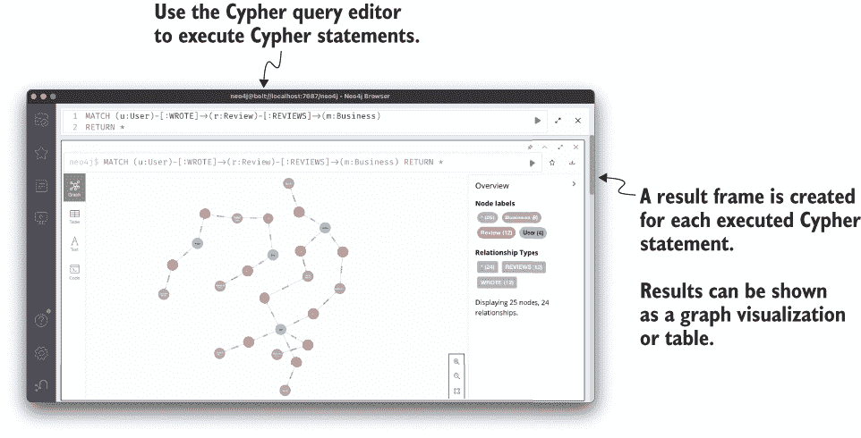

图 3.4 Neo4j 浏览器：Cypher 和 Neo4j 的查询工作台

Neo4j 浏览器允许我们针对 Neo4j 运行 Cypher 查询并处理结果。在深入研究 Neo4j 浏览器之前，让我们回顾一下 Cypher 查询语言。

## 3.6 Cypher

Cypher 是一种声明式图查询语言，具有一些可能来自 SQL 的特性。实际上，将 Cypher 视为 *图上的 SQL* 是一个很好的思考方式。Cypher 利用模式匹配，使用类似 ASCII 艺术的符号来描述图模式。在本节中，我们将查看一些基本的 Cypher 功能，用于创建和查询数据，包括使用谓词和聚合。我们只涵盖 Cypher 语言的一小部分；有关全面参考，请参阅 Cypher refcard [r.neo4j.com/refcard](https://neo4j.com/docs/cypher-refcard/current/)，或查阅 [neo4j.com/docs/cypher-manual/current/](https://neo4j.com/docs/cypher-manual/current/) 的文档。

### 3.6.1 模式匹配

作为一种声明式图查询语言，模式匹配是 Cypher 中用于创建和查询数据的基本工具。与告诉数据库我们希望它执行的确切操作（命令式方法）不同，使用 Cypher，我们描述我们正在寻找或想要创建的模式，数据库负责以最有效的方式确定满足该语句的操作序列。使用类似 ASCII 艺术的符号（也称为模式）描述图模式是这种声明式功能的核心。

节点

节点定义在括号 () 内。可选地，我们可以指定节点标签（使用冒号作为分隔符），例如，(:User)。

关系

关系定义在方括号 [] 内。可选地，我们可以指定类型和方向：(:Review)-[:REVIEWS]->(:Business)。

### 3.6.2 属性

属性被指定为花括号‘{}’内的逗号分隔的名称：值对，例如企业或用户的名称。

别名

图元素可以绑定到别名或变量，这些别名或变量可以在查询的后续部分中引用。例如，给定此模式（r:Review）-[a:REVIEWS]->(b:Business)，别名 r 被绑定到图中匹配的评论节点，a 被绑定到 REVIEWS 关系，b 被绑定到业务节点。这些变量仅在它们被使用的 Cypher 查询的范围内有效。随着我们介绍 Cypher 命令来创建和查询数据，这些数据与我们在本章中构建的数据模型相匹配，请跟随以下 Cypher 查询在 Neo4j 浏览器中运行。

### 3.6.3 CREATE

我们需要做的第一件事是使用 CREATE 命令在我们的数据库中创建一些数据。首先，为了在图中创建一个单独的业务节点，我们以 CREATE 命令开始，后跟一个描述要创建的数据的图模式：

```
CREATE                  ❶
  (b                    ❷
    :Business           ❸
      {name:            ❹
        "Bob's Pizza"
      })                ❺
```

❶ CREATE 命令用于在数据库中创建数据。

❷ b 成为一个别名，可以在查询的后续部分中引用此节点。

❸ 我们指定要创建的节点的标签。

❹ 名称是业务节点的属性，用于指定其值。

❺ 这是我们图模式——在这种情况下，它是一个由括号标识的节点。

在 Neo4j 浏览器中运行的结果显示以下内容：

```
Added 1 label, created 1 node, set 1 property, completed after 4 ms.
```

这意味着我们在数据库中创建了一个带有新标签的节点，并设置了一个节点属性值——在这种情况下，是带有 Business 标签的节点的名称属性。或者，我们也可以使用 SET 命令。以下内容是等效的：

```
CREATE (b:Business)
SET b.name = "Bob's Pizza"
```

为了可视化正在创建的数据，我们可以在 Cypher 语句中添加一个 RETURN 子句，它将在 Neo4j 浏览器中以图形可视化的形式呈现。运行

```
CREATE (b:Business)
SET b.name = "Bob's Pizza"
RETURN b
```

在 Neo4j 浏览器中显示的图形如图 3.5 所示。

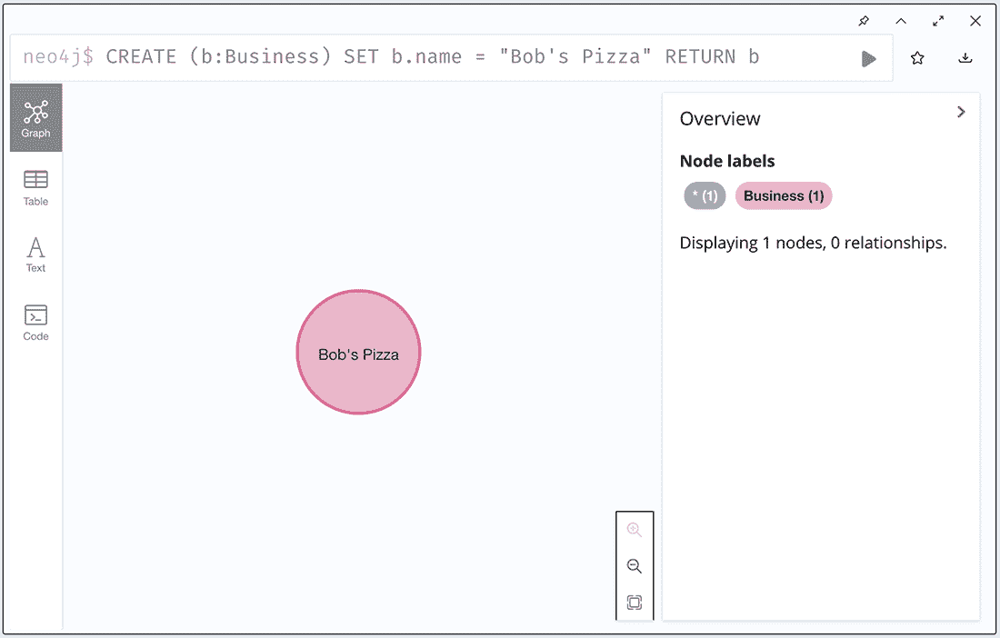

图 3.5 使用 Cypher 和 Neo4j 浏览器创建节点

我们可以在 CREATE 语句中指定更复杂的模式，例如关系。注意使用方括号 <-[]- 定义关系的 ASCII 艺术表示法，包括关系的方向（见图 3.6）：

```
CREATE (b:Business)<-[:REVIEWS]-(r:Review)
SET b.name = "Bob's Pizza",
    r.stars = 4,
    r.text = "Great pizza"
RETURN b, r
```

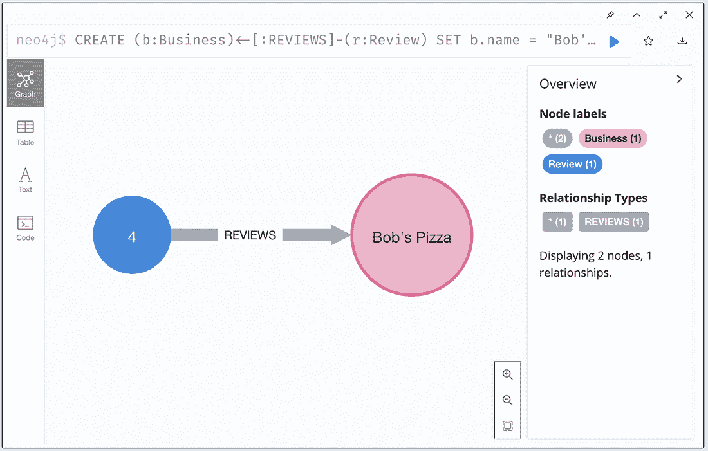

图 3.6 创建两个节点和一个关系

我们可以使用 Cypher 创建任意复杂的图模式。在这里，我们还在 CREATE 语句中指定了与评论相连的用户（见图 3.7）：

```
CREATE p=(b:Business)<-[:REVIEWS]-(r:Review)<-[:WROTE]-(u:User)
SET b.name  = "Bob's Pizza",
    r.stars = 4,
    r.text  = "Great pizza",
    u.name  = "Willie"
RETURN p
```

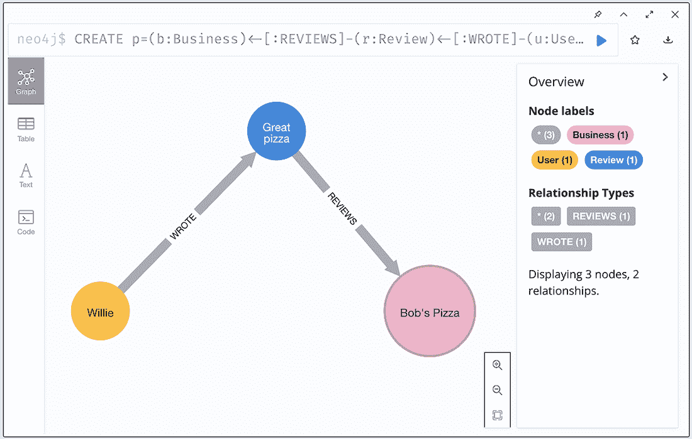

图 3.7 创建子图

注意，在这个 Cypher 查询中，我们将整个图模式绑定到一个变量 p 并返回该变量。在这种情况下，p 获得了正在创建的整个路径（节点和关系的组合）的值。

到目前为止，我们只返回了每个 Cypher 语句中创建的数据。我们如何查询和可视化数据库中的其余数据？为了做到这一点，我们使用 MATCH 关键字。让我们匹配数据库中的所有节点并将它们返回：

```
MATCH (a) RETURN a
```

我们应该看到一个看起来像图 3.8 的图。


图 3.8 创建了重复节点

立刻我们可以看到有问题；我们在图中创建了大量的重复节点！让我们删除数据库中的所有数据：

```
MATCH (a) DETACH DELETE a
```

这将匹配所有节点并删除节点及其任何关系。我们应该看到输出告诉我们我们删除了什么：

```
Deleted 11 nodes, deleted 4 relationships, completed after 23 ms.
```

现在，让我们重新开始，看看如何在不创建重复数据的情况下在数据库中创建数据。

### 3.6.4 MERGE

为了避免创建重复数据，我们可以使用 MERGE 命令。MERGE 充当 upsert，仅在数据已存在于数据库中时才创建模式中指定的数据。当使用 MERGE 时，最好在标识唯一性的属性上创建唯一性约束——通常是一个 ID 字段。通过创建唯一性约束，这也会在数据库中创建索引。请参阅下一节中创建唯一性约束的示例。对于简单的示例，在没有这些约束的情况下使用 MERGE 是可以的，所以让我们回顾一下创建业务、评论和用户的 Cypher 语句，但这次我们将使用 MERGE：

```
MERGE (b:Business {name: "Bob's Pizza"})
MERGE (r:Review {stars: 4, text: "Great pizza!"})
MERGE (u:User {name: "Willie"})
MERGE (b)<-[:REVIEWS]-(r)<-[:WROTE]-(u)
RETURN *
```

图 3.9 显示了使用我们创建的数据生成的结果图可视化。

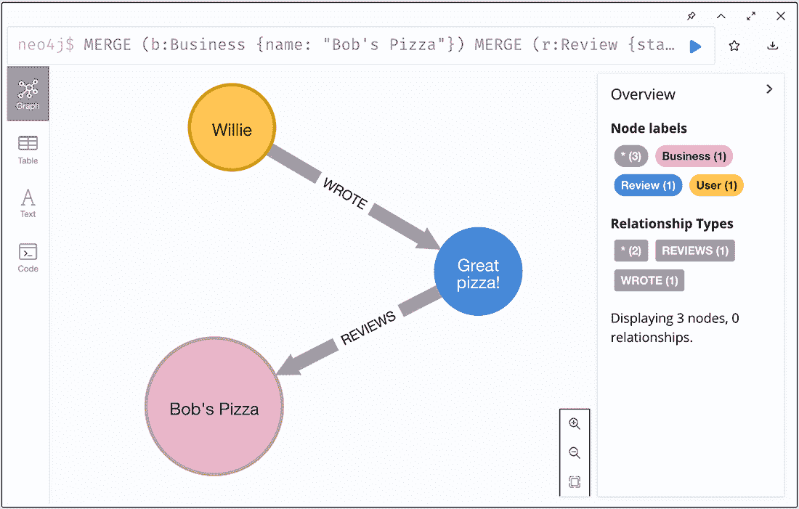


这个 Cypher 语句的结果看起来与使用 CREATE 的上一版本相同；然而，有一个重要的区别：这个查询现在是**幂等的**。无论我们运行查询多少次，我们都不会创建重复的节点，因为我们使用 MERGE 而不是 CREATE。我们将在下一章再次回顾 MERGE，届时我们将展示如何通过我们的 GraphQL API 在数据库中创建数据。

Neo4j 中的索引

理解在像 Neo4j 这样的图数据库中索引的使用方式很重要。我们之前提到 Neo4j 有一个名为 index-free adjacency 的属性，这意味着从一个节点遍历到任何其他连接的节点不需要索引查找。那么在 Neo4j 中索引是如何使用的呢？索引仅用于查找遍历的起点，与关系数据库不同，关系数据库使用索引来计算集合（表）重叠，图数据库只是在文件存储中计算偏移量，本质上是在追逐指针，我们知道计算机在快速执行这项任务时非常出色。

### 3.6.5 使用 Cypher 定义数据库约束

我们在构建数据模型时，在章节中提到了数据库约束以及它们如何与（可选地）定义 Neo4j 中的模式相关联。接下来，我们将查看创建与我们的数据模型相关的数据库约束的 Cypher 语法。

唯一性约束

```
CREATE CONSTRAINT ON (b:Business) ASSERT b.businessId IS UNIQUE;
```

属性存在约束

```
CREATE CONSTRAINT ON (b:Business) ASSERT b.businessId IS NOT NULL
```

节点键约束

```
CREATE CONSTRAINT ON (p:Person) ASSERT (p.firstName, p.lastName) IS NODE KEY;
```

注意，如果您数据库中仍然有与这些约束冲突的重复数据，那么您将收到一个错误消息，表明无法创建约束。在这种情况下，您可能想要删除数据库中的所有数据，然后再次尝试创建约束。

### 3.6.6 MATCH

现在我们已经在图中创建了我们的数据，我们可以开始编写查询来处理我们应用程序的一些业务需求。MATCH 子句与 CREATE 类似，因为它接受一个图模式；然而，我们还可以使用 WHERE 子句来指定要在模式中应用的谓词。MATCH 语句用于在数据库中查找与指定图模式匹配的数据。例如，这里我们搜索数据库中所有的用户节点：

```
MATCH (u:User)
RETURN u
```

当然，我们可以在 MATCH 子句中使用更复杂的图模式：

```
MATCH (u:User)-[:WROTE]->(r:Review)-[:REVIEWS]->(b:Business)
RETURN u, r, b
```

这个查询匹配所有撰写过任何企业评论的用户。如果我们只想查询特定企业的评论呢？在这种情况下，我们需要在我们的查询中引入谓词，使用 WHERE 子句。

WHERE

WHERE 子句可以用于向 MATCH 语句添加谓词。为了搜索名为 Bob’s Pizza 的企业，我们可以编写以下 Cypher 语句：

```
MATCH (b:Business)
WHERE b.name = "Bob's Pizza"
RETURN b
```

对于等价比较，有一个等效的简写符号可用：

```
MATCH (b:Business {name: "Bob's Pizza"})
RETURN b
```

### 3.6.7 聚合

我们经常想要对一组结果进行聚合计算。例如，我们可能想要计算 Bob’s Pizza 所有评论的平均评分。为此，我们使用 avg 聚合函数：

```
MATCH (b:Business {name: "Bob's Pizza"})<-[:REVIEWS]-(r:Review)
RETURN avg(r.stars)
```

现在，在 Neo4j 浏览器中，我们看到的不是图可视化，而是一个表格，显示了我们的查询结果，因为我们不是返回图数据，而是表格数据：

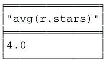

如果我们想要计算每个企业的平均评分呢？在 SQL 中，我们可能会使用 GROUP BY 运算符按企业名称对评论进行分组，并在每个组中计算聚合，但在 Cypher 中没有 GROUP BY 运算符。相反，在 Cypher 中，当返回聚合函数的结果以及非聚合结果时，会自动应用隐式分组操作。例如，我们执行以下操作来使用 Cypher 计算每个企业的平均评分：

```
MATCH (b:Business)<-[:REVIEWS]-(r:Review)
RETURN b.name, avg(r.stars)
```

结果表如下：

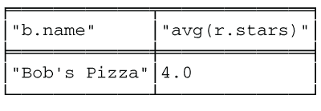

当然，这并不令人兴奋，因为我们只有一个企业和一条评论。在本章的练习部分，我们将处理更大的数据集。

## 3.7 使用 Neo4j 客户端驱动程序

到目前为止，我们一直在使用 Neo4j 浏览器来执行我们的 Cypher 查询，这对于即席分析或原型设计很有用；然而，通常我们希望创建一个以编程方式与数据库交互的应用程序。为此，我们使用 Neo4j 客户端驱动程序。这些客户端驱动程序在许多语言中可用，例如 JavaScript、Java、Python、.NET 和 Go，并且允许开发者使用与编程语言一致的 API 对 Neo4j 实例执行 Cypher 查询。在第一章中，我们看到了使用 Neo4j JavaScript 驱动程序执行 Cypher 查询和处理结果的示例。有关 Neo4j 客户端驱动程序的更多信息，请参阅驱动程序和语言指南：[neo4j.com/developer/language-guides/](https://neo4j.com/developer/language-guides/)。

在下一章中，我们将通过构建一个使用 Neo4j 作为数据层的 GraphQL API 来结合我们迄今为止讨论的概念和工具（GraphQL 和 Neo4j）。为此，我们将使用 Neo4j GraphQL 库，该库简化并加速了构建由 Neo4j 支持的 GraphQL API 的过程。

## 3.8 练习

要完成以下练习，首先在 Neo4j 浏览器中运行以下命令以加载一个包含嵌入式 Cypher 查询的浏览器指南：:play grandstack。这个浏览器指南将指导您加载更大、更完整的商家和评论样本数据集。在 Neo4j 中运行查询加载数据后，继续以下练习：

1.  运行命令 CALL db.schema.visualization()来检查数据模型。使用了哪些节点标签？有哪些关系类型？

1.  编写一个 Cypher 查询以找到数据库中的所有用户。有多少用户？他们的名字是什么？

1.  找出用户名为 Will 所写的所有评论。这位用户给出的平均评分是多少？

1.  找出用户名为 Will 的所有评论过的商家。最常见的类别是什么？

1.  编写一个查询，为用户名为 Will 的未评论过的商家推荐业务。

您可以在本书的 GitHub 仓库中找到练习的解决方案以及代码示例：[github.com/johnymontana/fullstack-graphql-book](https://github.com/johnymontana/fullstack-graphql-book)。

## 摘要

+   图数据库允许用户将数据建模、存储和查询为图。

+   图数据库使用属性图数据模型，该模型由节点标签、关系和属性组成。

+   Cypher 查询语言是一种以模式匹配为中心的声明式图查询语言，用于查询图数据库，包括 Neo4j。

+   客户端驱动程序用于构建与 Neo4j 交互的应用程序。这些驱动程序使应用程序能够向数据库发送 Cypher 查询并处理结果。
