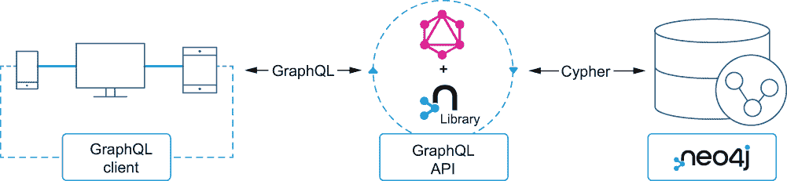
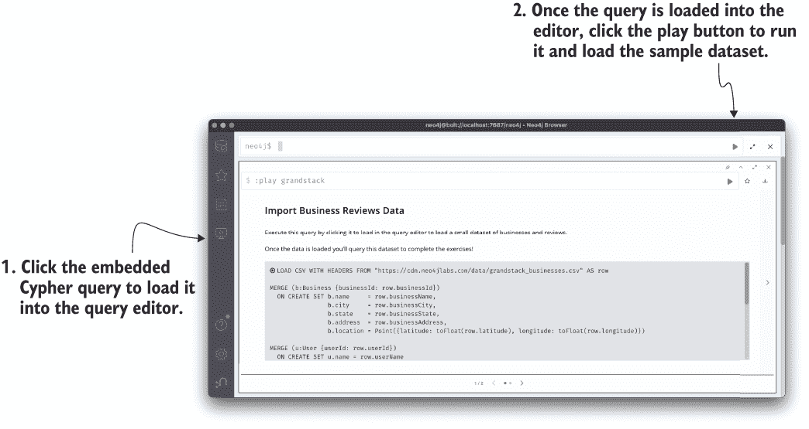
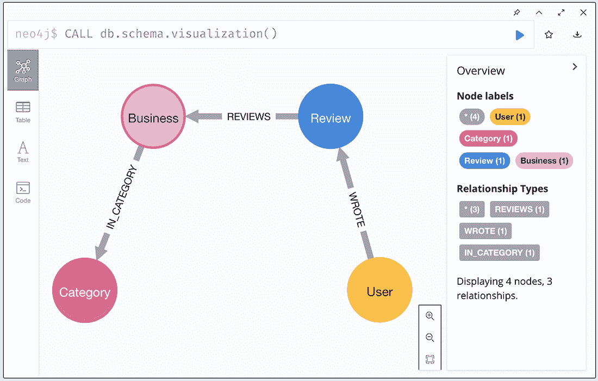
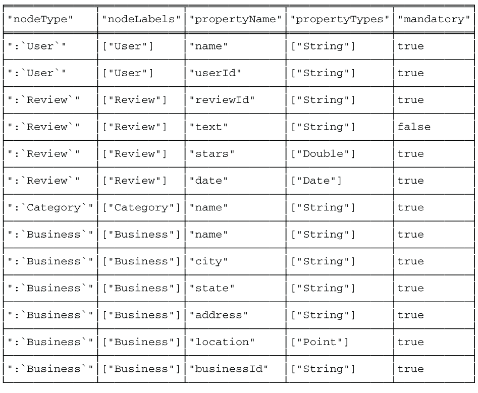
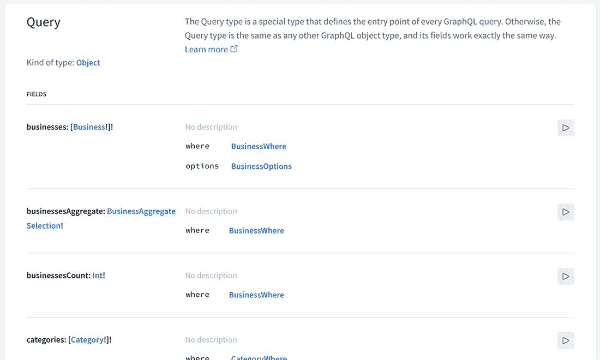

# 4 Neo4j GraphQL 库

本章涵盖

+   审查在构建 GraphQL API 应用程序时出现的常见问题

+   介绍旨在解决这些常见问题的 GraphQL 数据库集成，包括 Neo4j GraphQL 库

+   构建一个基于 Neo4j 的 GraphQL 端点，利用 Neo4j GraphQL 库的功能，例如生成的查询和突变类型、过滤以及时间和空间数据类型

+   通过自定义逻辑扩展自动生成的 GraphQL API 的功能

+   从现有的 Neo4j 数据库中检查 GraphQL 模式

GraphQL 后端实现通常会遇到一系列问题，这些问题会负面影响性能和开发者的生产力。我们之前已经确定了一些这些问题（例如，*n* + 1 查询问题），在本章中，我们将更深入地探讨这些常见问题，并讨论如何通过数据库集成来减轻这些问题，这些集成使得构建基于数据库的高效 GraphQL API 变得更容易。

具体来说，我们探讨使用 Neo4j GraphQL 库，这是一个 Node.js 库，旨在与 JavaScript GraphQL 实现（如 Apollo Server）一起工作，用于构建基于 Neo4j 的 GraphQL API。Neo4j GraphQL 库允许我们从 GraphQL 类型定义生成一个完全功能的 GraphQL API，从 GraphQL 驱动数据库数据模型，并自动生成用于数据获取和突变的解析器，包括复杂的过滤、排序和分页。Neo4j GraphQL 库还使我们能够添加超出生成的创建、读取、更新和删除操作的定制逻辑。

在本章中，我们探讨使用 Neo4j GraphQL 库将我们的业务审查 GraphQL API 与 Neo4j 集成，为我们的 API 添加持久化层。在初步了解 Neo4j GraphQL 库时，我们专注于使用前一章中在 Neo4j 中使用的示例数据集查询现有数据。我们将在未来的章节中探索创建和更新数据（GraphQL 突变）以及更复杂的 GraphQL 查询语义，如接口和片段，这些概念将在构建用户界面的上下文中介绍。图 4.1 显示了 Neo4j GraphQL 库如何融入我们应用程序的更大架构。Neo4j GraphQL 库的目标是使构建基于 Neo4j 的 API 变得容易，而不是直接使用 GraphQL 与数据库交互。



图 4.1 Neo4j GraphQL 库帮助构建客户端和数据库之间的 API 层。

## 4.1 常见的 GraphQL 问题

在构建 GraphQL API 时，开发者通常面临两种类型的问题：性能不佳和编写大量样板代码，这可能会影响开发者的生产力。

### 4.1.1 表现不佳和 n + 1 查询问题

我们之前讨论了 *n* + 1 查询问题，这个问题可能出现在向数据层发送多个请求以解析单个 GraphQL 请求时。由于 GraphQL 解析器函数调用的嵌套方式，通常需要多个数据库请求来从数据层解析 GraphQL 查询。例如，想象一个查询，它通过名称搜索企业以及每个企业的所有评论。一个简单的实现会首先查询数据库以找到所有与搜索短语匹配的企业。然后，对于每个匹配的企业，它会向数据库发送额外的查询以找到该企业的任何评论。对数据库的每次查询都会产生网络和查询延迟，这可能会显著影响性能。

解决这个问题的常见方法是使用一种名为 DataLoader 的缓存和批量模式。这可以缓解一些性能问题；然而，它仍然可能需要多个数据库请求，并且不能在所有情况下使用，例如当不知道对象的 ID 时。

### 4.1.2 模板代码和开发者生产力

术语 *boilerplate* 用于描述编写来完成常见任务的重复性代码。在实现 GraphQL API 的情况下，通常需要在解析器中编写模板代码来实现数据获取逻辑，这可能会对开发者生产力产生负面影响，减慢开发速度，因为开发者需要为每种类型和字段编写简单的数据获取逻辑，而不是专注于应用程序的关键组件。在我们的业务审查应用程序的上下文中，这意味着需要手动编写在数据库中按名称查找企业的逻辑，查找与每个企业相关的评论以及与每个评论关联的每个用户，等等，直到我们手动定义了获取我们 GraphQL 模式所有字段的逻辑。

## 4.2 介绍 GraphQL 数据库集成

数据库的 GraphQL 集成是一类工具，它能够构建与数据库交互的 GraphQL API。这些工具数量有限，具有不同的功能集和集成级别——在这本书中，我们专注于 Neo4j GraphQL 库。然而，总的来说，这些 GraphQL *引擎* 的目标是以一致的方式解决之前确定的常见 GraphQL 问题，通过减少模板代码和解决数据获取性能问题。

在本章的其余部分，我们专注于使用 Neo4j GraphQL 库构建一个由 Neo4j 支持的 GraphQL API。需要注意的是，我们的 GraphQL API 作为客户端和数据库之间的一个层——我们不希望客户端直接从数据库中查询。API 层扮演着重要的角色，它允许我们实现一些功能，例如授权和自定义逻辑，这些我们不想暴露给客户端。此外，由于 GraphQL 是一种 API 查询语言（而不是数据库查询语言），它缺乏我们在数据库查询语言中期望的许多语义（例如，投影）。

## 4.3 Neo4j GraphQL 库

Neo4j GraphQL 库是一个 Node.js 库，它可以与任何 JavaScript GraphQL 实现（如 GraphQL.js 和 Apollo Server）一起工作，旨在使基于 Neo4j 数据库构建 GraphQL API 尽可能简单。Neo4j GraphQL 库的两个主要功能是 *GraphQL 模式生成* 和 *GraphQL 到 Cypher 的翻译*。您可能希望参考项目文档，网址为 [`mng.bz/woNO`](http://mng.bz/woNO)。

GraphQL 到 Cypher 的翻译可以实现以下功能：

+   在运行时从任意 GraphQL 请求生成单个数据库查询

+   在生成的数据库查询中将 GraphQL 模式中定义的自定义逻辑作为子查询处理

GraphQL 模式生成过程将 GraphQL 类型定义转换为具有创建、读取、更新、删除（CRUD）操作的 GraphQL API。在 GraphQL 语义中，这包括向模式中添加查询和突变类型，并为这些查询和突变生成解析器。生成的 API 包括对过滤、排序、分页和本地数据库类型（如空间和时间类型）的支持，而无需在类型定义中手动定义这些类型。此过程的结果是一个可执行的 GraphQL 模式对象，然后可以将其传递给 GraphQL 服务器实现（如 Apollo Server），以提供 API 并处理网络和 GraphQL 执行过程。模式生成过程消除了编写数据获取和映射 GraphQL 和数据库模式样板代码的需求。

GraphQL 翻译过程在查询时发生。当接收到 GraphQL 请求时，生成一个单一的 Cypher 查询，该查询可以解析请求并发送到数据库。为任何任意的 GraphQL 操作生成单个数据库查询解决了 *n* + 1 查询问题，确保每个 GraphQL 请求只进行一次数据库往返。您可以在 [dev.neo4j.com/graphql](https://neo4j.com/product/graphql-library/) 找到 Neo4j GraphQL 库的文档和其他资源。

### 4.3.1 项目设置

在本章的其余部分，我们将通过为 Neo4j 创建一个新的 GraphQL API 来探索 Neo4j GraphQL 库的功能，使用来自上一章 *练习* 部分的业务和评论样本数据集。首先，我们将创建一个新的 Node.js 项目，该项目利用 Neo4j GraphQL 库和 Neo4j JavaScript 驱动程序从 Neo4j 获取数据。然后，我们将探索 Neo4j GraphQL 库的各种功能，随着我们的进展，我们将向我们的 GraphQL API 应用程序添加额外的代码。

Neo4j

首先，请确保 Neo4j 实例正在运行（您可以使用 Neo4j Desktop、Neo4j Sandbox 或 Neo4j Aura，但为了本章的目的，我们将假设您正在使用 Neo4j Desktop）。如果您使用 Neo4j Desktop，您需要安装 APOC 标准库插件。如果您使用 Neo4j Sandbox 或 Neo4j Aura，则无需担心此步骤；APOC 默认包含在这些服务中。要在 Neo4j Desktop 中安装 APOC，请点击项目中的*插件*选项卡，然后在可用插件列表中查找 APOC，并点击*安装*。接下来，通过运行 Cypher 语句（见列表 4.1）确保您的 Neo4j 数据库为空。

警告 此语句将删除您的 Neo4j 数据库中的所有数据，所以请确保这是您想要使用的实例，而不是您不想删除的数据库。

列表 4.1 清空我们的 Neo4j 数据库

```
MATCH (a) DETACH DELETE a;
```

现在，我们准备加载我们的示例数据集，如果您完成了上一章的练习部分，您可能已经完成了这一步。在 Neo4j 浏览器中运行以下命令（见图 4.2）：

```
:play grandstack
```



图 4.2 将示例数据集加载到 Neo4j 中

这将在 Neo4j 中加载一个示例数据集，我们将以此为基础构建我们的 GraphQL API。在下一个列表中，我们可以通过运行一个命令来探索这些数据，该命令将给我们一个关于示例数据集中包含的数据的视觉概述（见图 4.3）。



图 4.3 我们示例数据集的图模式

列表 4.2 在 Neo4j 中可视化图模式

```
CALL db.schema.visualization();
```

我们可以看到我们有四个节点标签——Business、Review、Category 和 User——通过三种关系类型连接：IN_CATEGORY（将企业连接到它们所属的类别）、REVIEWS（将评论连接到企业）和 WROTE（将用户连接到他们所撰写的评论）。我们还可以查看存储在各个节点标签上的节点属性，如下一个列表所示。

列表 4.3 检查存储在 Neo4j 中的节点属性

```
CALL db.schema.nodeTypeProperties()
```

此命令将显示一个表格，显示属性名称、它们的类型以及是否在所有该标签的节点上找到：



我们将在构建描述此图的 GraphQL 类型定义时使用此表。

Node.js 应用

现在我们已经将我们的示例数据集加载到 Neo4j 数据库中，让我们为我们的 GraphQL API 设置一个新的 Node.js 项目：

```
npm init -y
```

我们还将安装我们的依赖项：

+   @neo4j/graphql——一个使使用 GraphQL 和 Neo4j 更容易的包。Neo4j GraphQL 库将 GraphQL 查询转换为单个 Cypher 查询，消除了在 GraphQL 解析器和批处理查询中编写查询的需要。它还通过@cypher 架构指令通过 GraphQL 公开 Cypher 查询语言。

+   apollo-server—Apollo Server 是一个开源的 GraphQL 服务器，它可以与任何使用 graphql.js 构建的 GraphQL 模式一起工作，包括 Neo4j GraphQL 库。它还提供了与许多不同的 Node.js 网络服务器框架或默认的 Express.js 一起工作的选项。

+   graphql—GraphQL.js 的 JavaScript 引用实现是 @neo4j/graphql 和 apollo-server 的 peer dependency。截至本文写作时，@neo4j/graphql 包与 graphql 15.x 版本兼容；因此，我们将安装最新的 v15.x 版本。

+   neo4j-driver—Neo4j 客户端驱动程序允许通过 Bolt 协议连接到本地或远程的 Neo4j 实例，并执行 Cypher 查询。Neo4j 驱动程序在许多不同的语言中可用，这里我们使用 Neo4j JavaScript 驱动程序：

```
npm i @neo4j/graphql graphql neo4j-driver apollo-server
```

现在，创建一个名为 index.js 的新文件，并在下一列表中添加一些初始代码。

列表 4.4 index.js：初始 GraphQL API 代码

```
const { ApolloServer } = require("apollo-server");          ❶
const neo4j = require("neo4j-driver");
const { Neo4jGraphQL } = require("@neo4j/graphql");

const driver = neo4j.driver(                                ❷
  "bolt://localhost:7687",
  neo4j.auth.basic("neo4j", "letmein")
);

const typeDefs = /* GraphQL */ ``;                          ❸

const neoSchema = new Neo4jGraphQL({ typeDefs, driver });   ❹

neoSchema.getSchema().then((schema) => {
  const server = new ApolloServer({                         ❺
    schema
  });
  server.listen().then(({url}) => {
    console.log(`GraphQL server ready at ${url}`);          ❻
  });
});
```

❶ 导入我们的依赖项

❷ 创建到我们的 Neo4j 数据库的连接

❸ 这一行作为我们稍后要填写的 GraphQL 类型定义的占位符。

❹ 在实例化 Neo4jGraphQL 类时传递我们的 GraphQL 类型定义和数据库连接

❺ 我们生成的 GraphQL 模式被传递给 Apollo Server。

❻ 这里我们开始启动 GraphQL 服务器。

这是我们的 GraphQL API 应用程序代码的基本结构。构建 Neo4j 驱动程序实例时使用的凭据将取决于你是否使用 Neo4j Desktop、Neo4j Sandbox 或 Neo4j Aura，以及你最初选择的密码。请确保调整你的特定 Neo4j 实例的连接凭据。

如果我们现在尝试运行我们的 GraphQL API 应用程序，我们会很快看到一条错误消息，抱怨我们没有提供 GraphQL 类型定义。我们必须提供定义 GraphQL API 的 GraphQL 类型定义，因此下一步是填写我们的 GraphQL 类型定义。

### 4.3.2 从类型定义生成 GraphQL 模式

按照之前描述的 GraphQL 首选方法，我们的 GraphQL 类型定义将驱动 API 规范。在这种情况下，我们知道我们想要公开什么数据（我们加载到 Neo4j 中的示例数据集），因此我们可以参考之前显示的节点属性表，并在创建我们的 GraphQL 类型定义时应用一个简单的规则：节点标签成为类型，承担节点属性作为字段。我们还需要在我们的 GraphQL 类型定义中定义关系字段。让我们首先查看下一列表中的完整类型定义，然后探讨我们如何定义关系字段。

列表 4.5 index.js：GraphQL 类型定义

```
const typeDefs = /* GraphQL */ `
  type Business {
  businessId: ID!
  name: String!
  city: String!
  state: String!
  address: String!
  location: Point!
  reviews: [Review!]! @relationship(type: "REVIEWS", direction: IN)
  categories: [Category!]!
    @relationship(type: "IN_CATEGORY", direction: OUT)
}

type User {
  userID: ID!
  name: String!
  reviews: [Review!]! @relationship(type: "WROTE", direction: OUT)
}

type Review {
  reviewId: ID!
  stars: Float!
  date: Date!
  text: String
  user: User! @relationship(type: "WROTE", direction: IN)
  business: Business! @relationship(type: "REVIEWS", direction: OUT)
}

type Category {
  name: String!
  businesses: [Business!]!
    @relationship(type: "IN_CATEGORY", direction: IN)
}
`;
```

@relationship GraphQL 模式指令

在 Neo4j 使用的属性图模型中，每个关系都有一个方向和类型。为了在 GraphQL 中表示这一点，我们使用了 GraphQL 模式指令——特别是，@relationship 模式指令。指令类似于我们在 GraphQL 类型定义中的注释。它是一个由 @ 字符前缀的标识符，然后可以（可选地）包含一个命名参数列表。模式指令是 GraphQL 的内置扩展机制，表示 GraphQL 服务器实现的一些自定义逻辑。

当使用 @relationship 指令定义关系字段时，类型参数表示存储在 Neo4j 中的关系类型，方向参数表示关系方向。除了模式指令外，指令还可以在 GraphQL 查询中使用，以指示特定的行为。当我们探索在 React 应用程序中使用 Apollo Client 管理客户端状态时，我们将看到一些查询指令的示例。

现在，让我们运行我们的 API 应用程序：

```
node index.js
```

作为输出，我们应该看到我们的 API 应用程序正在监听的地址——在本例中，localhost 上的端口 4000：

```
➜  node index.js
GraphQL server ready at http://localhost:4000/
```

在您的网络浏览器中导航到 http://localhost:4000，您应该会看到 Apollo Studio 的登录页面。在 Apollo Studio 的 GraphQL 中，点击左上角的 *Schema* 图标以查看完全生成的 API（见图 4.4）。花几分钟浏览查询字段描述，您会注意到已为诸如排序、分页和过滤之类的功能添加了参数。您还可以在 *Reference* 和 *SDL* 视图之间切换，以查看基于我们初始 GraphQL 类型定义的完整生成的 GraphQL SDL。



图 4.4 显示我们的生成 API 的 Apollo Studio

## 4.4 基本 GraphQL 查询

现在，我们已经有了由 Apollo Server 和 Neo4j GraphQL 库提供支持的 GraphQL 服务器正在运行，让我们开始使用 Apollo Studio 查询我们的 API。查看 Apollo Studio 的 *Schema* 选项卡，我们可以看到可用的 API 入口点（在 GraphQL 术语中，每个 Query 类型字段是 API 的入口点）：Business、User、Review 和 Category——每个类型定义中有一个。让我们首先查询所有企业，并只返回名称字段，如下一个列表所示。

列表 4.6 查询所有企业的 GraphQL 查询

```
{
  businesses {
    name
  }
}
```

如果我们在 Apollo Studio 中运行此查询，我们应该看到企业名称列表：

```
{
  "data": {
    "businesses": [
      {
        "name": "Missoula Public Library"
      },
      {
        "name": "Ninja Mike's"
      },
      {
        "name": "KettleHouse Brewing Co."
      },
      {
        "name": "Imagine Nation Brewing"
      },
      {
        "name": "Market on Front"
      },
      {
        "name": "Hanabi"
      },
      {
        "name": "Zootown Brew"
      },
      {
        "name": "Ducky's Car Wash"
      },
      {
        "name": "Neo4j"
      }
    ]
  }
}
```

真 neat！这些数据已经从我们的 Neo4j 实例中为我们获取，我们甚至不需要编写任何解析器！

让我们打开 Neo4j GraphQL 库的调试日志，以便我们可以看到发送到数据库的生成 Cypher 查询。为此，我们需要设置一个 DEBUG 环境变量。让我们通过在终端中按 Ctrl-C 停止我们的 GraphQL 服务器，然后当我们再次启动 GraphQL API 应用程序时，我们将设置 DEBUG 环境变量：

```
DEBUG=@neo4j/graphql:* node index.js
```

如果我们再次运行我们的 GraphQL 查询并检查终端的输出，我们可以在下一列表中看到生成的 Cypher 查询被记录到终端中。

列表 4.7 生成的 Cypher 查询

```
MATCH (`business`:`Business`)
RETURN `business` { .name } AS `business`
```

我们可以向 GraphQL 查询添加额外的字段，这些字段将被添加到生成的 Cypher 查询中，只返回所需的数据。例如，GraphQL 查询添加了企业的地址和名称字段，如下一列表所示。

列表 4.8 返回企业名称和地址的 GraphQL 查询

```
{
  businesses {
    name
    address
  }
}
```

现在的 GraphQL 查询的 Cypher 翻译包括地址字段，如下一列表所示。

列表 4.9 包含地址属性的生成的 Cypher 查询

```
MATCH (`business`:`Business`)
RETURN `business` { .name , .address } AS `business`
```

最后，当我们检查 GraphQL 查询的结果时，我们现在看到每个企业都列出了一个地址：

```
{
  "data": {
    "businesses": [
      {
        "name": "Missoula Public Library",
        "address": "301 E Main St"
      },
      {
        "name": "Ninja Mike's",
        "address": "200 W Pine St"
      },
      {
        "name": "KettleHouse Brewing Co.",
        "address": "313 N 1st St W"
      },
      {
        "name": "Imagine Nation Brewing",
        "address": "1151 W Broadway St"
      },
      {
        "name": "Market on Front",
        "address": "201 E Front St"
      },
      {
        "name": "Hanabi",
        "address": "723 California Dr"
      },
      {
        "name": "Zootown Brew",
        "address": "121 W Broadway St"
      },
      {
        "name": "Ducky's Car Wash",
        "address": "716 N San Mateo Dr"
      },
      {
        "name": "Neo4j",
        "address": "111 E 5th Ave"
      }
    ]
  }
}
```

接下来，让我们利用生成的 GraphQL API 的一些功能。

## 4.5 排序和分页

每个查询字段都包括一个输入对象参数 options。我们可以在此选项参数中指定 limit 和 sort 的值，以方便排序和分页。在这里，我们按名称字段的值搜索前三个企业。

列表 4.10 包含排序和限制的初始 GraphQL API 代码

```
{
  businesses(options: { limit: 3, sort: { name: ASC } }) {
    name
  }
}
```

为每种类型生成排序枚举，为每个字段提供升序和降序选项。运行我们的查询现在返回按名称排序的企业，如下一列表所示。

列表 4.11 分页结果

```
{
  "data": {
    "businesses": [
      {
        "name": "Ducky's Car Wash"
      },
      {
        "name": "Hanabi"
      },
      {
        "name": "Imagine Nation Brewing"
      }
    ]
  }
}
```

如果我们切换到终端，我们可以看到从我们的 GraphQL 查询生成的 Cypher 查询，现在包括 ORDER BY 和 LIMIT 子句，它们映射到我们的第一个和 orderBy GraphQL 参数，如下一列表所示。这意味着排序和限制是在数据库中执行的，而不是在客户端，因此只从数据库查询返回必要的数据。

列表 4.12 包含排序和限制的生成的 Cypher 查询

```
MATCH (`business`:`Business`)
WITH `business`
ORDER BY business.name ASC
RETURN `business` { .name } AS `business`
LIMIT toInteger($first)
```

注意，此查询包含一个$first 参数，而不是在查询中内联的值 3。在此处参数使用很重要，因为它确保用户无法将可能有害的 Cypher 代码注入到生成的查询中，同时也确保 Neo4j 生成的查询计划可以重用，从而提高性能。要在 Neo4j 浏览器中运行此查询，首先使用:param 命令为第一个参数设置一个值：

```
:param first => 3
```

## 4.6 嵌套查询

Cypher 可以轻松表达我们 GraphQL 查询中的图遍历类型，Neo4j GraphQL 库能够为任意的 GraphQL 请求生成等效的 Cypher 查询，包括嵌套查询。现在，如下一列表所示，我们从企业遍历到它们的类别。

列表 4.13 包含嵌套选择集的 GraphQL 查询

```
{
  businesses(options: { limit: 3, sort: { name: ASC } }) {
    name
    categories {
      name
    }
  }
}
```

结果显示每个企业都与一个或多个类别相连：

```
{
  "data": {
    "businesses": [
      {
        "name": "Ducky's Car Wash",
        "categories": [
          {
            "name": "Car Wash"
          }
        ]
      },
      {
        "name": "Hanabi",
        "categories": [
          {
            "name": "Ramen"
          },
          {
            "name": "Restaurant"
          }
        ]
      },
      {
        "name": "Imagine Nation Brewing",
        "categories": [
          {
            "name": "Beer"
          },
          {
            "name": "Brewery"
          }
        ]
      }
    ]
  }
}
```

## 4.7 过滤

通过添加一个带有基于 GraphQL 类型定义的关联输入的 where 参数，暴露了过滤器功能。您可以在文档中查看完整的过滤标准列表，网址为 [neo4j.com/docs/graphql-manual/current/filtering/](https://neo4j.com/docs/graphql-manual/current/filtering/)。

### 4.7.1 where 参数

在下一个列表中，我们使用 where 参数来搜索名称中包含 Brew 的业务。

列表 4.14 包含 Brew 的业务名称的 GraphQL 查询过滤器

```
{
  businesses(where: { name_CONTAINS: "Brew" }) {
    name
    address
  }
}
```

我们的结果现在显示了符合过滤标准的业务，并且只返回名称中包含字符串 Brew 的业务：

```
{
  "data": {
    "businesses": [
      {
        "name": "KettleHouse Brewing Co.",
        "address": "313 N 1st St W"
      },
      {
        "name": "Imagine Nation Brewing",
        "address": "1151 W Broadway St"
      },
      {
        "name": "Zootown Brew",
        "address": "121 W Broadway St"
      }
    ]
  }
}
```

### 4.7.2 嵌套过滤

要根据应用于根的嵌套字段的結果进行过滤，我们可以嵌套我们的过滤器参数。在下一个列表中，我们搜索包含名称 Brew 且至少有一个至少评分为 4.75 的评论的业务。

列表 4.15 使用嵌套过滤器的 GraphQL 查询

```
{
  businesses(
    where: { name_CONTAINS: "Brew", reviews_SOME: { stars_GTE: 4.75 } }
  ) {
    name
    address
  }
}
```

如果我们检查这个 GraphQL 查询的结果，我们可以看到两个匹配的业务：

```
{
  "data": {
    "businesses": [
      {
        "name": "KettleHouse Brewing Co.",
        "address": "313 N 1st St W"
      },
      {
        "name": "Zootown Brew",
        "address": "121 W Broadway St"
      }
    ]
  }
}
```

### 4.7.3 逻辑运算符：AND、OR

过滤器可以用逻辑运算符 OR 和 AND 进行包装。例如，我们可以在过滤器参数中使用 OR 运算符来搜索咖啡或早餐类别的企业，如下一个列表所示。

列表 4.16 使用逻辑运算符的过滤器的 GraphQL 查询

```
{
  businesses(
    where: {
      OR: [
        { categories_SOME: { name: "Coffee" } }
        { categories_SOME: { name: "Breakfast" } }
      ]
    }
  ) {
    name
    address
    categories {
      name
    }
  }
}
```

这个 GraphQL 查询返回与咖啡或早餐类别相关联的业务：

```
{
  "data": {
    "businesses": [
      {
        "name": "Market on Front",
        "address": "201 E Front St",
        "categories": [
          {
            "name": "Restaurant"
          },
          {
            "name": "Cafe"
          },
          {
            "name": "Coffee"
          },
          {
            "name": "Deli"
          },
          {
            "name": "Breakfast"
          }
        ]
      },
      {
        "name": "Ninja Mike's",
        "address": "200 W Pine St",
        "categories": [
          {
            "name": "Restaurant"
          },
          {
            "name": "Breakfast"
          }
        ]
      },
      {
        "name": "Zootown Brew",
        "address": "121 W Broadway St",
        "categories": [
          {
            "name": "Coffee"
          }
        ]
      }
    ]
  }
}
```

### 4.7.4 选择中的过滤

过滤器也可以在整个选择集中使用，以在选择的级别应用过滤器。例如，假设在下一个列表中，我们想要找到所有咖啡或早餐企业，但只查看包含短语早餐三明治的评论。

列表 4.17 在选择集中使用过滤器参数的 GraphQL 查询

```
{
  businesses(
    where: {
      OR: [
        { categories_SOME: { name: "Coffee" } }
        { categories_SOME: { name: "Breakfast" } }
      ]
    }
  ) {
    name
    address
    reviews(where: { text_CONTAINS: "breakfast sandwich" }) {
      stars
      text
    }
  }
}
```

由于过滤器是在评论选择上应用的，因此没有包含短语早餐三明治的评论的业务仍然显示在结果中；然而，只显示包含该短语的评论：

```
{
  "data": {
    "businesses": [
      {
        "name": "Market on Front",
        "address": "201 E Front St",
        "reviews": []
      },
      {
        "name": "Ninja Mike's",
        "address": "200 W Pine St",
        "reviews": [
          {
            "stars": 4,
            "text": "Best breakfast sandwich at the Farmer's Market."
          }
        ]
      },
      {
        "name": "Zootown Brew",
        "address": "121 W Broadway St",
        "reviews": []
      }
    ]
  }
}
```

## 4.8 使用时间字段

Neo4j 支持作为节点和关系的属性的原生时间类型。这些类型包括 Date、DateTime 和 LocalDateTime。使用 Neo4j GraphQL 库，您可以在您的 GraphQL 模式中使用这些时间类型。

### 4.8.1 在查询中使用日期类型

我们在 Review 类型上使用日期类型。日期类型由 yyyy-mm-dd 格式的字符串表示，但在数据库中以原生日期类型存储，支持日期操作。让我们在下一个列表中查询最近的三条评论。

列表 4.18 使用日期字段的 GraphQL 查询

```
{
  reviews(options: { limit: 3, sort: { date: DESC } }) {
    stars
    date
    business {
      name
    }
  }
}
```

由于我们在选择集中指定了日期字段，因此我们在结果中看到：

```
{
  "data": {
    "reviews": [
      {
        "stars": 3,
        "date": "2018-09-10",
        "business": {
          "name": "Imagine Nation Brewing"
        }
      },
      {
        "stars": 5,
        "date": "2018-08-11",
        "business": {
          "name": "Zootown Brew"
        }
      },
      {
        "stars": 4,
        "date": "2018-03-24",
        "business": {
          "name": "Market on Front"
        }
      }
    ]
  }
}
```

### 4.8.2 日期和 DateTime 过滤器

时间字段也包含在生成的过滤枚举中，允许使用日期和日期范围进行过滤。在下一个列表中，我们将搜索在 2017 年 1 月 1 日之前创建的评论。

列表 4.19 使用日期过滤器进行 GraphQL 查询

```
{
  reviews(
    where: { date_LTE: "2017-01-01" }
    options: { limit: 3, sort: { date: DESC } }
  ) {
    stars
    date
    business {
      name
    }
  }
}
```

我们可以看到，结果现在按日期字段排序：

```
{
  "data": {
    "reviews": [
      {
        "stars": 5,
        "date": "2016-11-21",
        "business": {
          "name": "Hanabi"
        }
      },
      {
        "stars": 5,
        "date": "2016-07-14",
        "business": {
          "name": "KettleHouse Brewing Co."
        }
      },
      {
        "stars": 5,
        "date": "2016-03-04",
        "business": {
          "name": "Ducky's Car Wash"
        }
      }
    ]
  }
}
```

## 4.9 处理空间数据

Neo4j 目前支持空间点类型，它可以表示二维（例如，纬度和经度）和三维（例如，x,y,z 或纬度，经度，高度）的点，使用地理坐标参考系统（例如，纬度和经度）和笛卡尔坐标参考系统。Neo4j GraphQL 库提供了两种空间类型：Point，用于使用地理坐标参考系统的点，和 CartesianPoint，用于使用笛卡尔坐标参考系统的点。您可以在本文档中了解更多关于在 Neo4j GraphQL 库中处理空间数据的信息：[`mng.bz/qYKA`](http://mng.bz/qYKA)。

### 4.9.1 选择中的 Point 类型

Point 类型字段是 GraphQL 模式中的对象字段，因此让我们通过在下一个列表中添加这些字段来检索匹配商业实体的纬度和经度字段。

列表 4.20 使用 Point 字段进行 GraphQL 查询

```
{
  businesses(options: { limit: 3, sort: { name: ASC } }) {
    name
    location {
      latitude
      longitude
    }
  }
}
```

现在，在 GraphQL 查询结果中，我们看到每个商业实体都包含了经度和纬度：

```
{
  "data": {
    "businesses": [
      {
        "name": "Ducky's Car Wash",
        "location": {
          "latitude": 37.575968,
          "longitude": -122.336041
        }
      },
      {
        "name": "Hanabi",
        "location": {
          "latitude": 37.582598,
          "longitude": -122.351519
        }
      },
      {
        "name": "Imagine Nation Brewing",
        "location": {
          "latitude": 46.876672,
          "longitude": -114.009628
        }
      }
    ]
  }
}
```

### 4.9.2 距离过滤器

当使用点数据进行查询时，我们经常想找到靠近其他事物的事物。例如，哪些商业实体在我 1.5 公里范围内？我们可以使用生成的 where 参数来完成此操作，如下列所示。

列表 4.21 使用距离过滤器进行 GraphQL 查询

```
{
  businesses(
    where: {
      location_LT: {
        distance: 3500
        point: { latitude: 37.563675, longitude: -122.322243 }
      }
    }
  ) {
    name
    address
    city
    state
  }
}
```

对于使用地理坐标参考系统（纬度和经度）的点，距离以米为单位：

```
{
  "data": {
    "businesses": [
      {
        "name": "Hanabi",
        "address": "723 California Dr",
        "city": "Burlingame",
        "state": "CA"
      },
      {
        "name": "Ducky's Car Wash",
        "address": "716 N San Mateo Dr",
        "city": "San Mateo",
        "state": "CA"
      },
      {
        "name": "Neo4j",
        "address": "111 E 5th Ave",
        "city": "San Mateo",
        "state": "CA"
      }
    ]
  }
}
```

## 4.10 向我们的 GraphQL API 添加自定义逻辑

到目前为止，我们已经看到了由 Neo4j GraphQL 库创建的基本查询操作。通常，我们想在我们的 API 中添加自定义逻辑。例如，我们可能想计算最受欢迎的商业或向用户推荐商业。使用 Neo4j GraphQL 库向您的 API 添加自定义逻辑有两种选项：@cypher 模式指令或实现自定义解析器。

### 4.10.1 @cypher GraphQL 模式指令

Neo4j GraphQL 库通过 GraphQL 通过 @cypher GraphQL 模式指令暴露 Cypher。在您的模式中用 @cypher 指令注释一个字段，以将查询的结果映射到注释的 GraphQL 字段。@cypher 指令接受一个参数语句，这是一个 Cypher 语句。参数在运行时传递到这个查询中，包括当前解析的节点，以及在任何 GraphQL 类型定义中定义的字段级参数。

注意：@cypher 指令和 Neo4j GraphQL 库的其他功能需要使用 APOC 标准库插件。请确保您已遵循本章 *项目设置* 部分的步骤安装 APOC。

计算标量场

我们可以使用 @cypher 指令定义一个自定义标量字段，在我们的模式中创建一个计算字段。在下一个列表中，我们向 Business 类型添加一个 averageStars 字段，该字段使用 this 变量计算业务所有评论的平均星级。

列表 4.22 index.js：添加 averageStars 字段

```
type Business {
  businessId: ID!
  averageStars: Float!
    @cypher(
      statement: "MATCH (this)<-[:REVIEWS]-(r:Review) RETURN avg(r.stars)"
    )
  name: String!
  city: String!
  state: String!
  address: String!
  location: Point!
  reviews: [Review!]! @relationship(type: "REVIEWS", direction: IN)
  categories: [Category!]!
    @relationship(type: "IN_CATEGORY", direction: OUT)
}
```

由于我们已修改了类型定义，我们需要重新启动我们的 GraphQL 服务器：

```
DEBUG=@neo4j/graphql:* node index.js
```

现在，让我们在下一个列表中将 averageStars 字段包含在我们的 GraphQL 查询中。

列表 4.23 包含 averageStars 字段的 GraphQL 查询

```
{
  businesses {
    name
    averageStars
  }
}
```

我们可以看到在结果中，averageStars 的计算值现在已包含：

```
{
  "data": {
    "Business": [
      {
        "name": "Hanabi",
        "averageStars": 5
      },
      {
        "name": "Zootown Brew",
        "averageStars": 5
      },
      {
        "name": "Ninja Mike's",
        "averageStars": 4.5
      }
    ]
  }
}
```

如果我们检查终端输出以查看生成的 Cypher 查询，我们会注意到生成的 Cypher 查询将我们的 @cypher 指令中的注释 Cypher 查询作为子查询包含在内，保留了单个数据库调用以解析 GraphQL 请求，但仍然包括我们的自定义逻辑！

计算对象和数组字段

我们还可以使用 @cypher 模式指令来解析对象和数组字段。让我们向 Business 类型添加一个推荐的业务字段。我们将使用一个简单的 Cypher 查询来查找其他用户评论过的共同业务。例如，如果一个用户喜欢 Front 上的 Market，我们可以推荐其他也被 Market on Front 的评论者评论过的业务。

列表 4.24 查找推荐业务的 Cypher 查询

```
MATCH (b:Business)<-[:REVIEWS]-(:Review)<-[:WROTE]-(u:User)
WHERE b.name = "Market on Front"
MATCH (u)-[:WROTE]->(:Review)-[:REVIEWS]->(rec:Business)
WITH rec, COUNT(*) AS score
RETURN rec ORDER BY score DESC
```

我们可以通过在我们的 Business 类型定义中的推荐字段上包含 @cypher 指令来在我们的 GraphQL 模式中使用此 Cypher 查询。

列表 4.25 index.js：添加推荐字段

```
type Business {
  businessId: ID!
  averageStars: Float!
    @cypher(
      statement: "MATCH (this)<-[:REVIEWS]-(r:Review) RETURN avg(r.stars)"
    )
  recommended(first: Int = 1): [Business!]!
    @cypher(
      statement: """
      MATCH (this)<-[:REVIEWS]-(:Review)<-[:WROTE]-(u:User)
      MATCH (u)-[:WROTE]->(:Review)-[:REVIEWS]->(rec:Business)
      WITH rec, COUNT(*) AS score
      RETURN rec ORDER BY score DESC LIMIT $first
      """
    )
  name: String!
  city: String!
  state: String!
  address: String!
  location: Point!
  reviews: [Review!]! @relationship(type: "REVIEWS", direction: IN)
  categories: [Category!]!
    @relationship(type: "IN_CATEGORY", direction: OUT)
}
```

我们还定义了一个第一个字段参数，它作为 Cypher 查询传递给 @cypher 指令的 Cypher 参数，并作为返回推荐业务数量的限制。

自定义顶级查询字段

使用 @cypher 指令的另一种有用方式是作为自定义查询或突变字段。例如，让我们看看我们如何添加全文查询支持以搜索业务。应用程序通常使用全文搜索来纠正用户输入中的拼写错误等问题，使用模糊匹配。在 Neo4j 中，我们可以通过首先创建全文索引来使用全文搜索。

列表 4.26 创建全文索引的 Cypher

```
CREATE FULLTEXT INDEX businessNameIndex FOR (b:Business) ON EACH [b.name]
```

然后，为了查询此索引，我们拼写错误为 libary，但包括 ~ 字符启用模糊匹配，确保我们仍然能找到我们想要的东西。

列表 4.27 查询全文索引的 Cypher

```
CALL db.index.fulltext.queryNodes("businessNameIndex", "libary~")
```

将这种模糊匹配的全文搜索包含在我们的 GraphQL API 中不是很好吗？为了做到这一点，让我们创建一个名为 fuzzyBusinessByName 的查询字段，它接受一个搜索字符串并搜索业务，如下所示。

列表 4.28 index.js：添加自定义查询字段

```
type Query {
  fuzzyBusinessByName(searchString: String): [Business]
    @cypher(
      statement: """
      CALL
      db.index.fulltext.queryNodes('businessNameIndex', $searchString+'~')
      YIELD node RETURN node
      """
    )
}
```

由于我们已更新了类型定义，我们必须重新启动 GraphQL API 应用程序：

```
DEBUG=@neo4j/graphql:* node index.js
```

如果我们在 Apollo Studio 中检查 *Schema* 选项卡，我们会看到一个新查询字段 fuzzyBusinessByName，现在我们可以使用这个模糊匹配来搜索企业名称，如下所示。

列表 4.29 使用我们的自定义查询字段进行 GraphQL 查询

```
{
  fuzzyBusinessByName(searchString: "libary") {
    name
  }
}
```

由于我们使用全文搜索，即使我们拼写 libary 错误，我们仍然可以找到匹配的结果：

```
{
  "data": {
    "fuzzyBusinessByName": [
      {
        "name": "Missoula Public Library"
      }
    ]
  }
}
```

@cypher 模式指令是一种强大的方式，可以为我们添加自定义逻辑和高级功能到我们的 GraphQL API。我们还可以使用 @cypher 指令来实现授权功能，从请求对象中访问值，例如授权令牌，这一模式将在后续章节中讨论，当我们探索向我们的 API 添加授权的不同选项时。您可以在文档中了解更多关于 @cypher GraphQL 模式指令的信息：[`mng.bz/7yom`](http://mng.bz/7yom)。

### 4.10.2 实现自定义解析器

虽然 @cypher 指令是一种添加自定义逻辑的方法，但在某些情况下，我们可能需要实现无法用 Cypher 表达的自定义解析器。例如，我们可能需要从另一个系统获取数据或应用一些自定义验证规则。在这些情况下，我们可以实现一个自定义解析器并将其附加到 GraphQL 模式上，这样解析器就会被调用以解析我们的自定义字段，而不是依赖于 Neo4j GraphQL 库生成的 Cypher 查询来解析字段。

在我们的示例中，让我们假设有一个外部系统可以用来确定企业当前的等待时间。我们想在我们的模式中为 Business 类型添加一个额外的 waitTime 字段，并实现这个字段的解析逻辑以使用这个外部系统。

要做到这一点，我们首先在我们的模式中添加这个字段，添加 @ignore 指令以确保该字段被排除在生成的 Cypher 查询之外，如下列所示。这是我们告诉 Neo4j GraphQL 库自定义解析器将负责解析这个字段，并且我们不期望它自动从数据库中检索。

列表 4.30 index.js：添加 waitTime 字段

```
type Business {
  businessId: ID!
  waitTime: Int! @ignore
  averageStars: Float!
    @cypher(
      statement: "MATCH (this)<-[:REVIEWS]-(r:Review) RETURN avg(r.stars)"
    )
  name: String!
  city: String!
  state: String!
  address: String!
  location: Point!
  reviews: [Review!]! @relationship(type: "REVIEWS", direction: IN)
  categories: [Category!]! @relationship(type: "IN_CATEGORY", direction: OUT)
}
```

接下来，我们创建一个包含我们自定义解析器的解析器映射，如下列 4.31 所示。我们之前不需要创建这个映射，因为 Neo4j GraphQL 库为我们生成了解析器。我们的等待时间计算将仅涉及随机选择一个值，但我们可以在这里实现任何自定义逻辑来确定 waitTime 值，例如向第三方 API 发送请求。

列表 4.31 index.js：创建解析器映射

```
const resolvers = {
  Business: {
    waitTime: (obj, args, context, info) => {
      const options = [0, 5, 10, 15, 30, 45];
      return options[Math.floor(Math.random() * options.length)];
    }
  }
};
```

然后，我们将这个解析器映射添加到传递给 Neo4jGraphQL 构造函数的参数中，如下列所示。

列表 4.32 index.js：生成 GraphQL 模式

```
const neoSchema = new Neo4jGraphQL({typeDefs, resolvers, driver})
```

现在，我们重新启动 GraphQL API 应用程序，因为我们已经更新了代码：

```
DEBUG=@neo4j/graphql:* node index.js
```

重启后，在 Apollo Studio 中，如果我们检查业务类型的模式，我们将看到业务类型上的新字段 waitTime。在下一个列表中，让我们通过在选择集中包含 waitTime 字段来搜索餐厅并查看它们的等待时间。

列表 4.33 使用自定义解析器的 GraphQL 查询

```
{
  businesses(where: { categories_SOME: { name: "Restaurant" } }) {
    name
    waitTime
  }
}
```

在结果中，我们现在可以看到等待时间的一个值。当然，你的结果会有所不同，因为值是随机的：

```
{
  "data": {
    "businesses": [
      {
        "name": "Ninja Mike's",
        "waitTime": 30
      },
      {
        "name": "Market on Front",
        "waitTime": 5
      },
      {
        "name": "Hanabi",
        "waitTime": 45
      }
    ]
  }
}
```

## 4.11 从现有数据库检查 GraphQL 模式

通常，当我们开始一个新的应用程序时，我们没有现有的数据库，并且遵循 GraphQL-first 开发范式，从类型定义开始。然而，在某些情况下，我们可能有一个用数据填充的现有 Neo4j 数据库。在这些情况下，根据现有数据库生成 GraphQL 类型定义可能很方便，然后可以将这些类型定义输入到 Neo4j GraphQL 库中，为现有数据库生成 GraphQL API。我们可以使用@neo4j/introspector 包来完成这项工作。

首先，我们需要安装@neo4j/introspector 包：

```
npm i @neo4j/introspector
```

这个 Node.js 脚本将连接到我们的 Neo4j 数据库，并检查描述此数据的 GraphQL 类型定义，如下所示；然后我们将这些类型定义写入名为 schema.graphql 的文件。

列表 4.34 intropect.js：检查 GraphQL 类型定义

```
const { toGraphQLTypeDefs } = require("@neo4j/introspector");
const neo4j = require("neo4j-driver");
const fs = require("fs");
const driver = neo4j.driver(
  "neo4j://localhost:7687",
  neo4j.auth.basic("neo4j", "letmein")
);
const sessionFactory = () =>
  driver.session({ defaultAccessMode: neo4j.session.READ });
// We create a async function here so we can use async/await
async function main() {
  const typeDefs = await toGraphQLTypeDefs(sessionFactory);
  fs.writeFileSync("schema.graphql", typeDefs);
  await driver.close();
}
main();
```

然后，我们可以加载这个 schema.graphql 文件，并将类型定义传递给 Neo4jGraphQL 构造函数，如下所示。

列表 4.35 从 schema.graphql 加载我们的 GraphQL 类型定义

```
// Load GraphQL type definitions from schema.graphql file
const typeDefs = fs
  .readFileSync(path.join(__dirname, "schema.graphql"))
  .toString("utf-8");
```

到目前为止，我们所有的 GraphQL 查询都是使用 Apollo Studio 完成的，这对于测试和开发来说很棒，但通常我们的目标是构建一个查询 GraphQL API 的应用程序。在接下来的几章中，我们将开始构建我们的业务评论应用程序的用户界面，使用 React 和 Apollo Client。在这个过程中，我们将学习更多关于 GraphQL 概念的知识，如 mutations、fragments、interface types 等！

## 4.12 练习

1.  使用 Apollo Studio 查询本章中创建的 GraphQL API

    +   哪些用户评论了名为 Hanabi 的企业。

    +   查找包含单词“舒适”的任何评论。他们评论的是哪些企业？

    +   哪些用户没有给出五星级的评论？

1.  向 Category 类型添加一个@cypher 指令字段，计算每个类别中的企业数量。咖啡类别中有多少家企业？

1.  在[`sandbox.neo4j.com`](https://sandbox.neo4j.com)创建一个 Neo4j 沙盒实例，从任何预填充的数据集中选择。使用@neo4j/introspector 包，为这个 Neo4j 沙盒实例创建一个 GraphQL API，而无需手动编写 GraphQL 类型定义。你可以使用 GraphQL 查询哪些数据？

请参阅本书的 GitHub 仓库以查看练习解决方案：[`mng.bz/mOYP`](http://mng.bz/mOYP)。

## 摘要

+   在构建 GraphQL API 时可能会遇到的一些常见问题包括*n* + 1 查询问题、模式重复和大量样板数据获取代码。

+   像 Neo4j GraphQL 库这样的 GraphQL 数据库集成可以通过从 GraphQL 请求生成数据库查询、从 GraphQL 类型定义驱动数据库模式以及从 GraphQL 类型定义自动生成 GraphQL API 来帮助缓解这些问题。

+   Neo4j GraphQL 库通过生成用于数据获取的解析器，并添加过滤、排序和分页到生成的 API，使得基于 Neo4j 数据库构建 GraphQL API 变得容易。

+   通过使用@cypher 模式指令来定义字段的自定义逻辑，或者实现自定义解析器并将它们附加到 GraphQL 模式中，我们可以向我们的 GraphQL API 添加自定义逻辑。

+   如果我们有一个现有的 Neo4j 数据库，我们可以使用@neo4j/introspector 包在现有数据库上生成 GraphQL 类型定义和 GraphQL API。
