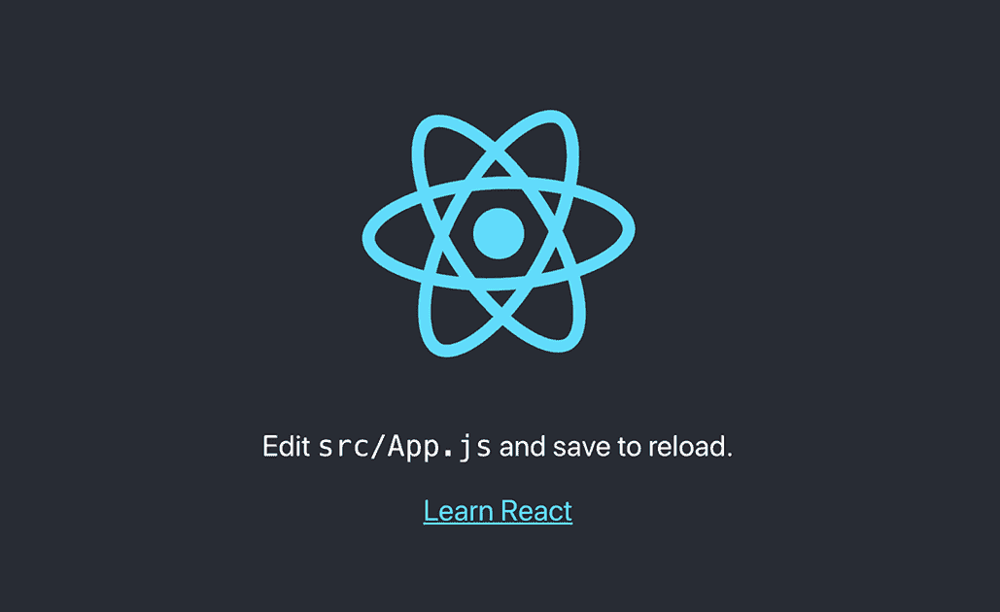
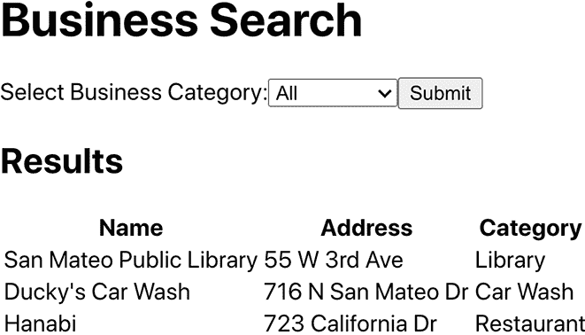
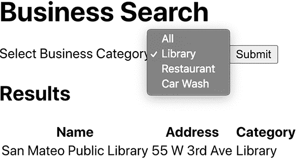

# 5 使用 React 构建用户界面

本章涵盖

+   React 基本概念的概述

+   使用 Create React App CLI 工具开始 React

+   在 React 应用中使用 React Hooks 处理状态

到目前为止，本书我们一直专注于应用的后端方面：构建 GraphQL API 和与数据库交互。现在是我们转向前端的时候了。在第一章，我们简要概述了 React 并查看了一个 React 组件的最小代码片段。在本章中，我们回到 React 并开始构建一个将成为我们 GraphQL API 客户端的 React 应用，在浏览器中搜索企业和渲染结果。当然，在一个章节中包含所有你需要了解的 React 介绍内容是不可能的，因此，而不是试图提供一个全面的 React 介绍，本章的目标是解释构建简单应用所需的 React 基本概念。我们提供了一个使用 Create React App 命令行工具的见解方法。对于更深入的 React 覆盖，你可能对在 [`reactjs.org/`](https://reactjs.org/) 找到的文档和教程感兴趣。

在本章中，我们将尝试使用 Create React App 来处理构建工具和配置，创建我们 React 应用的骨架。然后，我们将更新模板应用，创建必要的组件以按类别搜索企业并查看结果。最初，我们的数据将直接硬编码在应用中；然后在第六章，我们将向 React 应用添加数据获取逻辑，使用 Apollo Client 连接我们在前几章中创建的 GraphQL API（见图 5.1）。让我们开始吧！


图 5.1 本章重点在于构建将成为我们 GraphQL API 客户端的 React 应用。

## 5.1 React 概述

React 基本上是一个用于构建用户界面（UI）的 JavaScript 库。React 可以用来构建网页（ReactDOM）、原生移动应用（React Native）和其他界面，如虚拟现实（React VR）。React 使用 *组件* 的概念来封装模型数据和逻辑。组件可以被重用并组合在一起来构建复杂的 UI，同时提供标准抽象以帮助开发者理解他们的应用。需要理解的重要 React 概念包括 JSX、React 元素、props、state、hooks 和组件层次结构。

### 5.1.1 JSX 和 React 元素

在 React 中，*元素* 是最基本的构建块。元素不应与组件混淆；相反，组件是由 React 元素组成的。你可以将元素视为可能在用户界面中直观显示的东西。例如，考虑以下列表中的简单 React 元素。

列表 5.1 使用 JSX 定义的简单 React 元素

```
const element = <h1>Welcome to GRANDstack</h1>;
```

初看之下，这似乎是一个 HTML 片段，但带有 JavaScript 的提示。实际上，这是一个 JSX 示例。JSX 用于创建 React 元素。

注意：JSX 不是与 React 一起工作的必需品；然而，使用 JSX 被高度推荐，本书不会涵盖替代方案。

你可以将 JSX 视为 HTML 和 JavaScript 的组合。我们可以在 JSX 中使用 JavaScript 表达式，通过将表达式包裹在花括号中来使用。例如，如果我们想个性化我们的*欢迎来到 GRANDstack*问候语，我们可以使用 JavaScript 变量来定义用户的姓名。

列表 5.2 在 JSX 中使用 JavaScript 表达式

```
const name = "Bob Loblaw";
const element = <h1>Welcome to GRANDstack, {name}!</h1>
```

在构建时，JSX 被编译成 JavaScript，并使用 React.createElement() JavaScript 函数来创建 React 元素，这些元素本质上表示为渲染到 DOM 中的 JavaScript 对象。

React 元素很重要，因为它们帮助 React 维护所谓的虚拟 DOM——DOM 的表示，允许 React 将 DOM 更新应用于所需状态。这意味着当应用发生变化时，React 只需重新渲染必要的部分，而不是重新渲染整个 DOM。

### 5.1.2 React 组件

React 允许我们使用称为*组件*的较小、可重用、可组合的片段来构建 UI。组件本质上是一些函数，它们接受输入（*props*，或属性）并返回构成 UI 的 React 元素，这些元素是 React 应用的构建块。列表 5.3 展示了示例。

注意：我们只会使用功能性的 React 组件。你可能会看到所谓的 React 类组件的引用；然而，随着 React Hooks 类的引入，组件不再需要。

列表 5.3 简单的 React 组件

```
function Greeting(props) {
  return <h1>Welcome to GRANDstack, {props.name}</h1>;
}
```

组件使用两种类型的数据模型：*props*和*state*。Props 是不可变的；如果我们需要更改组件内部应触发重新渲染的值，那么我们需要处理状态数据。

### 5.1.3 组件层次结构

React 组件可以由其他组件组成。这允许我们在构建 UI 时封装和重用逻辑组件。

列表 5.4 组合 React 组件

```
function Greeting(props) {
  return <h1>Welcome to GRANDstack, {props.name}</h1>;
}

function Popup() {
  const name = "Bob Loblaw";
  return <Greeting name={name} />
}
```

## 5.2 Create React App

Create React App 是一个用于创建 React 应用的命令行工具。它将构建工具捆绑在一起，无需初始配置。这是开始使用 React 的最简单方法，因为它会自动配置 webpack、Babel、ESLint 和其他工具，让开发者能够无需费力设置和配置构建工具即可开始编写 React 应用。你可以在[create-react-app.dev/](https://create-react-app.dev/)了解更多关于 Create React App 的信息。

### 5.2.1 使用 Create React App 创建 React 应用

让我们使用 Create React App 创建一个 React 应用程序。我们将在与 api 目录相邻的目录中这样做，在那里我们一直在构建我们的 GraphQL API。我们将首先为我们的业务审查应用程序构建一些初始功能，从业务搜索开始。我们的 React 应用程序的初始版本应该允许用户通过类别搜索业务并显示业务详情。目前，我们将硬编码数据到一个 JavaScript 对象中；然后在下一章中，我们将连接 React 应用程序到我们的 GraphQL API 作为数据源。要开始使用 Create React App，请在终端中运行以下命令，在 API 目录级别，与我们的 GraphQL API 代码相邻的目录中：

```
npx create-react-app web-react --use-npm
```

从 npm 版本 5.2.0 开始，npx 命令包含在 npm 中，可用于执行 npm 包和命令。npx 的一个出色功能是，如果我们没有本地安装该包，它将自动为我们下载该包，确保我们始终运行最新版本。

到目前为止，我们一直在使用 npm；默认情况下，Create React App 使用 yarn 包管理器 CLI，因此我们在调用 create-react-app 时将使用 --use-npm 命令标志。运行此命令后，我们应该看到输出告诉我们已创建一个新的 React 项目以及一些我们可以用来开始项目的有用命令：

```
Success! Created web-react at /Users/lyonwj/business-reviews/web-react
Inside that directory, you can run several commands:

  npm start
    Starts the development server.

  npm run build
    Bundles the app into static files for production.

  npm test
    Starts the test runner.

  npm run eject
    Removes this tool and copies build dependencies, configuration files
    and scripts into the app directory. If you do this, you can’t go back!

We suggest that you begin by typing:

  cd web-react
  npm start

Happy hacking!
```

让我们看看 Create React App 为我们创建了什么：

```
.
├── README.md
├── package-lock.json
├── package.json
├── public
│   ├── favicon.ico
│   ├── index.xhtml
│   ├── logo192.png
│   ├── logo512.png
│   ├── manifest.json
│   └── robots.txt
└── src
    ├── App.css
    ├── App.js
    ├── App.test.js
    ├── index.css
    ├── index.js
    ├── logo.svg
    ├── serviceWorker.js
    └── setupTests.js
└── node_modules
    ├── ...
```

README.md 文件包含了与我们所创建的 React 应用程序和 Create React App 一起工作的全面文档。node_modules 目录包含了我们应用程序的所有依赖项，这些依赖项是自动安装的。在 public 目录中，我们可以找到在应用程序启动时从根目录提供的静态内容。在 src 目录中，我们将找到定义骨架 React 应用的 JavaScript 和 CSS 代码。首先，让我们查看下一列表中的 package.json 文件，以查看包含的依赖项和可用的脚本。

列表 5.5 package.json

```
{
  "name": "web-react",
  "version": "0.1.0",
  "private": true,
  "dependencies": {
    "@testing-library/jest-dom": "⁵.15.1",
    "@testing-library/react": "¹¹.2.7",
    "@testing-library/user-event": "¹².8.3",
    "react": "¹⁷.0.2",
    "react-dom": "¹⁷.0.2",
    "react-scripts": "4.0.3",
    "web-vitals": "¹.1.2"
  },
  "scripts": {
    "start": "react-scripts start",
    "build": "react-scripts build",
    "test": "react-scripts test",
    "eject": "react-scripts eject"
  },
  "eslintConfig": {
    "extends": [
      "react-app",
      "react-app/jest"
    ]
  },
  "browserslist": {
    "production": [
      ">0.2%",
      "not dead",
      "not op_mini all"
    ],
    "development": [
      "last 1 chrome version",
      "last 1 firefox version",
      "last 1 safari version"
    ]
  }
}
```

我们可以看到到目前为止包含在我们的应用程序中的依赖项：React 库以及一个名为 react-scripts 的包。react-scripts 包用于启动、运行、构建和测试我们的应用程序，正如我们在 package.json 文件的“scripts”部分中看到的那样。让我们继续运行我们的应用程序：

```
cd web-react
npm start
```

npm start 命令创建应用程序的开发版本，并启动一个本地 web 服务器，该服务器提供我们的 React 应用程序。使用了一个监视器，因此我们对源文件所做的任何更改都会触发应用程序的实时重新加载；这意味着我们通常在更改代码后不需要重新启动 web 服务器，以便在应用程序中看到我们的更改：

```
Compiled successfully!

You can now view web-react in the browser.

  Local:            http://localhost:3000
  On Your Network:  http://192.168.1.3:3000

Note that the development build is not optimized.
To create a production build, use npm run build.
```

如果运行我们的应用程序成功，我们会看到一个消息，告诉我们如何在网页浏览器中打开我们的应用程序（见图 5.2）。



图 5.2 我们在网页中运行的初始 React 应用程序

让我们打开那个 src/App.js 文件，并在下一条列表中查看我们的初始应用程序。

列表 5.6 src/App.js：初始代码

```
import logo from './logo.svg';
import './App.css';

function App() {
  return (
    <div className="App">
      <header className="App-header">
        
        <p>
          Edit <code>src/App.js</code> and save to reload.
        </p>
        <a
          className="App-link"
          href="https://reactjs.org"
          target="_blank"
          rel="noopener noreferrer"
        >
          Learn React
        </a>
      </header>
    </div>
  );
}

export default App;
```

我们正在导出一个 App 组件，但它被用在何处呢？如果我们打开 src/index.js，我们可以看到 App 组件是如何被使用的（见下一条列表）。它被传递给 ReactDOM.render，告诉 ReactDOM 在具有 ID 为 root 的 HTML 元素中渲染 App 组件。

列表 5.7 src/index.js

```
import React from 'react';
import ReactDOM from 'react-dom';
import './index.css';
import App from './App';
import reportWebVitals from './reportWebVitals';

ReactDOM.render(
  <React.StrictMode>
    <App />
  </React.StrictMode>,
  document.getElementById('root')
);

// If you want to start measuring performance in your app, pass a function
// to log results (for example: reportWebVitals(console.log))
// or send to an analytics endpoint. Learn more: https://bit.ly/CRA-vitals
reportWebVitals();
```

让我们在下一条列表中更新 src/App.js 文件。首先，我们将创建一个简单的表单，包含一个下拉选择框，用于按类别搜索业务。

列表 5.8 src/App.js：添加示例数据和简单表单

```
const businesses = [                      ❶
  {
    businessId: "b1",
    name: "San Mateo Public Library",
    address: "55 W 3rd Ave",
    category: "Library",
  },
  {
    businessId: "b2",
    name: "Ducky's Car Wash",
    address: "716 N San Mateo Dr",
    category: "Car Wash",
  },
  {
    businessId: "b3",
    name: "Hanabi",
    address: "723 California Dr",
    category: "Restaurant",
  },
];

function App() {                          ❷
  return (
    <div>
      <h1>Business Search</h1>
      <form>
        <label>
          Select Business Category:
          <select value="All">
            <option value="All">All</option>
            <option value="Library">Library</option>
            <option value="Restaurant">Restaurant</option>
            <option value="Car Wash">Car Wash</option>
          </select>
        </label>
        <input type="submit" value="Submit" />
      </form>

      <h2>Results</h2>
      <table>
        <thead>
          <tr>
            <th>Name</th>
            <th>Address</th>
            <th>Category</th>
          </tr>
        </thead>
        <tbody>
          {businesses.map((b, i) => (    ❸
            <tr key={i}>
              <td>{b.name}</td>
              <td>{b.address}</td>
              <td>{b.category}</td>
            </tr>
          ))}
        </tbody>
      </table>
    </div>
  );
}

export default App;
```

❶ 目前，我们的业务数据被定义为 JavaScript 数组。

❷ 我们的 React 组件位于组件层次结构的顶部，并且没有传递任何 props 数据；因此，它不接受任何参数。

❸ 我们遍历我们的业务数组，为每个业务创建一个表格行。

目前，我们只是将业务定义为 JavaScript 数组，但稍后我们需要用来自我们的 GraphQL API 的数据填充我们的应用程序。最初，所有结果都显示在一个简单的 HTML 表格中（见图 5.3）。



图 5.3 更新 src/App.js 后的我们的 React 应用程序

我们渲染了一个表格，但我们的表单实际上不起作用。我们无法选择一个类别，当我们尝试时，表格中没有任何变化。让我们更新我们的应用程序，以便根据我们选择的类别过滤结果。为此，我们需要了解状态，在这个过程中，我们还将了解 props！由于我们只使用功能 React 组件，我们需要使用 React Hooks 来处理状态。

## 5.3 状态和 React Hooks

React Hooks 是在 React 版本 16.8 中引入的，提供了一种在保持 React 组件为函数而不是类的同时，处理状态（和其他 React 概念）的方法。之前，你可能见过包含对 setState 函数调用、生命周期方法和构造函数的 React 类组件。有了 Hooks，这一切都不再需要；相反，我们可以通过单个函数调用来管理状态。

我们将通过实践的方式介绍 Hooks，更新我们的 React 应用程序以添加过滤功能，允许我们根据类别过滤业务结果表。在这个过程中，我们将看到如何使用 State React Hooks 在组件内部管理状态。

让我们创建一个新的 React 组件，该组件将负责渲染我们的结果表，称为 BusinessResults。为此，首先在 App.js 相同目录下创建一个名为 BusinessResults.js 的新文件，如下一条列表所示。

列表 5.9 src/BusinessResults.js

```
function BusinessResults(props) {   ❶
  const { businesses } = props;     ❷

  return (
    <div>
      <h2>Results</h2>
      <table>
        <thead>
          <tr>
            <th>Name</th>
            <th>Address</th>
            <th>Category</th>
          </tr>
        </thead>
        <tbody>
          {businesses.map((b, i) => (
            <tr key={i}>
              <td>{b.name}</td>
              <td>{b.address}</td>
              <td>{b.category}</td>
            </tr>
          ))}
        </tbody>
      </table>
    </div>
  );
}

export default BusinessResults;
```

❶ 组件通过参数传递 props 数据。

❷ props 参数包含要在结果表中渲染的业务数据。

我们将结果表移动到这个 src/BusinessResults.js 文件中，通过将组件要渲染的企业作为 props 传入。组件不再渲染所有企业到表中，而是渲染通过 props 参数传递的数据。现在，在我们的 App 组件中，我们可以导入这个新的 BusinessResults 组件，并将我们的企业数据数组作为 props 传递给组件，如下所示。

列表 5.10 src/App.js：使用 BusinessResults 组件

```
import BusinessResults from "./BusinessResults";       ❶

const businesses = [
  {
    businessId: "b1",
    name: "San Mateo Public Library",
    address: "55 W 3rd Ave",
    category: "Library",
  },
  {
    businessId: "b2",
    name: "Ducky's Car Wash",
    address: "716 N San Mateo Dr",
    category: "Car Wash",
  },
  {
    businessId: "b3",
    name: "Hanabi",
    address: "723 California Dr",
    category: "Restaurant",
  },
];

function App() {
  return (
    <div>
      <h1>Business Search</h1>
      <form>
        <label>
          Select Business Category:
          <select value="All">
            <option value="All">All</option>
            <option value="Library">Library</option>
            <option value="Restaurant">Restaurant</option>
            <option value="Car Wash">Car Wash</option>
          </select>
        </label>
        <input type="submit" value="Submit" />
      </form>

      <BusinessResults businesses={businesses} />      ❷
    </div>
  );
}

export default App;
```

❶ 导入 BusinessResults 组件

❷ 将企业数组作为 props 传递给 BusinessResults 组件

我们导入了一个新的组件 BusinessResults，并将我们的企业数组传递给它，因此 BusinessResults 组件可以负责渲染结果。我们的 App 组件现在只需要关注允许用户选择搜索类别。

在进行此更改后，我们的应用程序在网页浏览器中的外观完全相同，我们的选择表单仍然不起作用。在下一个列表中，让我们让我们的下拉菜单真正做一些事情！

列表 5.11 src/App.js：使用状态变量

```
import React, { useState } from "react";                                  ❶
import BusinessResults from "./BusinessResults";

const businesses = [
  {
    businessId: "b1",
    name: "San Mateo Public Library",
    address: "55 W 3rd Ave",
    category: "Library",
  },
  {
    businessId: "b2",
    name: "Ducky's Car Wash",
    address: "716 N San Mateo Dr",
    category: "Car Wash",
  },
  {
    businessId: "b3",
    name: "Hanabi",
    address: "723 California Dr",
    category: "Restaurant",
  },
];

function App() {

  const [selectedCategory, setSelectedCategory] = useState("All");        ❷

  return (
    <div>
      <h1>Business Search</h1>
      <form>
        <label>
          Select Business Category:
          <select
           value={selectedCategory}                                       ❸
           onChange={(event) => setSelectedCategory(event.target.value)}  ❹
          >
            <option value="All">All</option>
            <option value="Library">Library</option>
            <option value="Restaurant">Restaurant</option>
            <option value="Car Wash">Car Wash</option>
          </select>
        </label>
        <input type="submit" value="Submit" />
      </form>

      <BusinessResults
        businesses={
          selectedCategory === "All"
            ? businesses
            : businesses.filter((b) => {
                return b.category === selectedCategory;
              })
        }
      />                                                                  ❺
    </div>
  );
}

export default App;
```

❶ 导入 useState 钩子。

❷ 调用 useState 钩子创建一个新的状态变量及其更新值的函数。

❸ 将下拉菜单的选中值绑定到我们的新状态变量。

❹ 当用户在表单中选择新的选项时，更新我们的状态变量值。

❺ 根据所选类别过滤传递给 BusinessResults 组件的企业结果。

首先，我们导入 useState 钩子并使用它来创建一个新的状态变量 selectedCategory。useState 的调用还返回一个函数（我们称之为 setSelectedCategory），用于更新 selectedCategory 的值。我们将这个变量绑定到选择输入的选择选项上，通过将 selectedCategory 传递给 select 元素的 value prop，并使用 setSelectedCategory 函数在选中新选项时更新 selectedCategory 的值。现在用户可以在表单中选择一个值，并看到只显示所选类别的企业结果表（见图 5.4）。



图 5.4 添加状态和过滤功能后的我们的 React 应用程序

现在我们已经有一个非常基础的 React 应用程序，我们的下一步将是添加数据获取功能以连接到我们的 GraphQL API。我们将在下一章中这样做，使用 Apollo Client React Hooks，并在过程中探索更多的 React 功能！

## 5.4 练习

1.  将搜索逻辑移动到一个名为 BusinessSearch 的新组件中，并在 App 组件内部渲染该组件。

1.  允许企业搜索除了企业类别外还可以按城市进行过滤。您需要将城市添加到样本数据中，并将其包含在表格结果中。

1.  你会如何处理多类别搜索？修改示例数据以包含多个类别。更改表单处理以允许选择多个类别。更新过滤逻辑，以便将正确的业务搜索结果传递给 BusinessResults 组件。

## 摘要

+   React 是一个用于创建 UI 的 JavaScript 库，它使用组件的概念来封装逻辑。组件可以被组合起来创建复杂的 UI。

+   JSX 是一种用于创建 React 元素的语法，允许我们在处理 UI 代码时使用类似 HTML 的语法。

+   React 组件以两种形式使用模型数据：props 和 state。Props（或属性）是作为 React 单向数据流的一部分传递给组件的不可变数据。State 数据是局部且私有的，属于单个组件，当其发生变化时，会触发组件树的重新渲染。

+   Create React App 是一个用于创建 React 应用的命令行工具。它将构建工具捆绑在一起，无需初始配置。

+   React Hooks 允许开发者在一个组件内处理状态，同时仍然保持组件作为函数。
