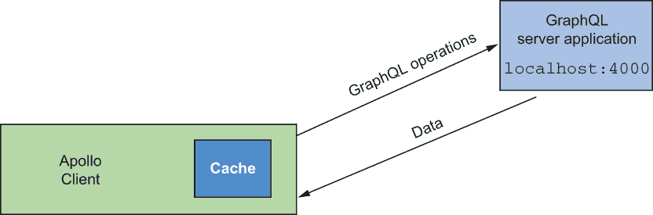
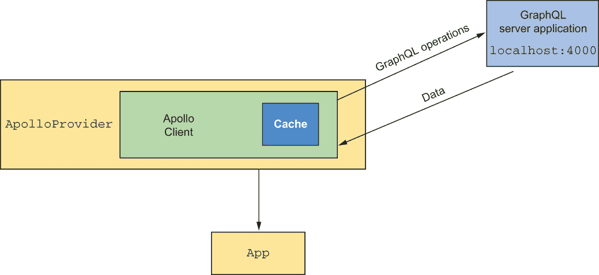
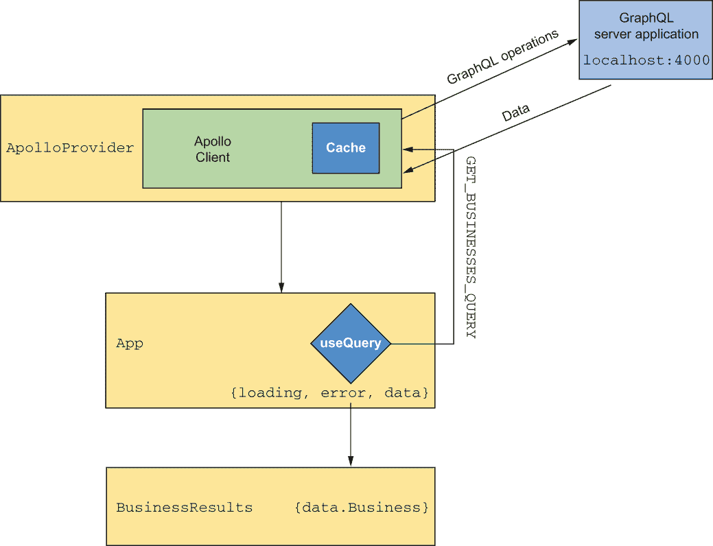
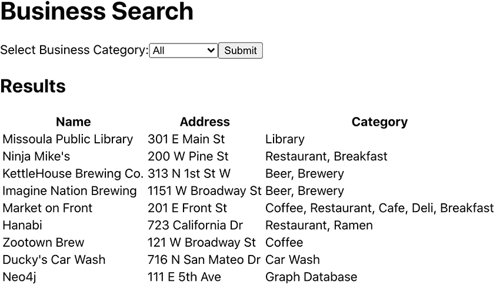
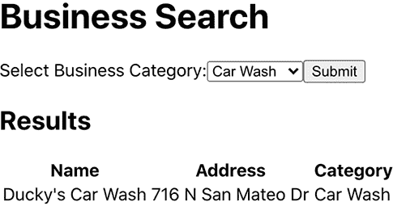
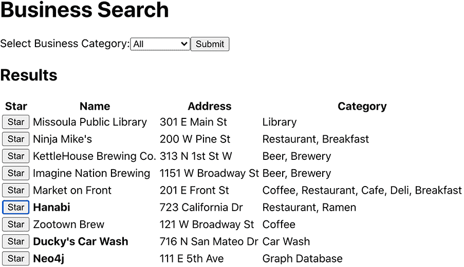

# 6 使用 React 和 Apollo 客户端进行客户端 GraphQL

本章节涵盖

+   使用 Apollo 客户端连接 React 应用程序到 GraphQL 端点

+   使用 Apollo 客户端在客户端缓存和更新数据

+   使用 GraphQL 变更更新应用中的数据

+   使用 Apollo 客户端管理 React 客户端状态数据

在上一章中，我们使用 Create React App 创建了一个 React 应用程序，允许用户通过类别搜索企业。我们使用一个硬编码到应用程序中的单个 JavaScript 对象作为我们数据源，因此我们的应用程序功能有限。在本章中，我们将探索将我们的 React 应用程序连接到我们在上一章中创建的 GraphQL API，并向我们的 GraphQL 工具箱引入一个新工具：Apollo 客户端。

*Apollo 客户端* 是一个数据管理 JavaScript 库，使开发者能够使用 GraphQL 管理本地和远程数据。它用于获取、缓存和修改应用数据，并提供了一系列前端框架集成，包括 React，以实现数据变化时更新您的 UI。

我们将使用 Apollo 客户端的 React Hooks API 来用我们的 GraphQL API 中的数据填充我们的 React 应用程序，通过 Apollo 客户端发出数据获取 GraphQL 查询。然后，我们将探索通过我们的 GraphQL API 更新数据的 GraphQL 变更操作，了解如何处理应用程序数据的变化。最后，我们将了解如何使用 Apollo 客户端来管理我们的 React 应用程序的本地状态，称为 *客户端状态管理*，通过向我们的 GraphQL API 添加仅本地字段来实现。让我们开始吧！

## 6.1 Apollo 客户端

Apollo 客户端不仅仅是一个发送和接收图数据的库。正如 Apollo 客户端文档所说：

*Apollo 客户端是一个全面的 JavaScript 状态管理库，它使您能够使用 GraphQL 管理本地和远程数据。使用它来获取、缓存和修改应用数据，同时自动更新您的 UI。... Apollo 客户端帮助您以经济、可预测和声明式的方式构建代码，这与现代开发实践保持一致。核心 @apollo/client 库提供了与 React 的内置集成，而更大的 Apollo 社区维护了与其他流行视图层的集成。*

—[`www.apollographql.com/docs/react/`](https://www.apollographql.com/docs/react/)

我们将在将 Apollo 客户端添加到我们的 React 应用程序时利用这些功能，首先添加数据获取逻辑，然后使用 Apollo 客户端来管理我们的 React 应用程序中的本地状态数据。

### 6.1.1 将 Apollo 客户端添加到我们的 React 应用程序中

由于我们使用 React，我们将专注于 Apollo 客户端的 React 特定集成。首先，我们将使用 npm 安装 Apollo 客户端，创建一个连接到我们的 GraphQL API 的 Apollo 客户端实例，然后在我们的 React 应用程序中开始发出数据获取查询，使用 Apollo 客户端提供的 useQuery React 钩子。

由于我们将查询我们的 GraphQL API，请确保我们之前章节中的 Neo4j 数据库和 GraphQL API 应用程序都在运行。如果它们没有运行，我们将看到错误信息，表明 Apollo Client 无法连接到 GraphQL 端点。

安装 Apollo Client

到本文写作时，Apollo Client 3.5.5 是 Apollo Client 的最新版本，我们添加 GraphQL 支持所需的大部分工具都包含在一个单独的包中。之前的 Apollo Client 版本将 React Hooks 单独打包；然而，React 集成现在默认包含在内。

打开终端，确保你处于 web-react 目录中，然后运行以下命令来安装 Apollo Client。我们还需要安装 Apollo Client 的 peer dependency graphql.js。我们使用的是本文写作时的最新版本 Apollo Client，即 v3.5.5：

```
npm install @apollo/client graphql
```

现在，Apollo Client 已经安装，我们可以创建一个 Apollo Client 实例并开始发出 GraphQL 查询。首先，我们将以通用方式展示如何做到这一点，然后我们将添加此功能到我们的 React 应用程序中。

创建 Apollo Client 实例

要创建一个新的 Apollo Client 实例，我们需要将我们想要连接的 GraphQL API 的 URI 以及我们想要使用的缓存传递给 Apollo Client 构造函数，如下一个列表所示。最常用的缓存类型是 Apollo 的 InMemoryCache。

列表 6.1 创建 Apollo Client 实例

```
import { ApolloClient, InMemoryCache } from "@apollo/client";

const client = new ApolloClient({
  uri: "http://localhost:4000",
  cache: new InMemoryCache(),
});
```

然后，我们可以使用这个客户端实例来执行 GraphQL 操作。

使用 Apollo Client 进行查询

首先，让我们查看列表 6.2，看看如何使用客户端 API 执行 GraphQL 查询。在我们的 React 应用程序中，大多数情况下我们希望利用 Apollo Client 的 React Hooks API，因此这段代码不会成为我们应用程序的一部分。

列表 6.2 使用 Apollo Client 执行查询

```
import { ApolloClient, InMemoryCache, gql } from "@apollo/client";

const client = new ApolloClient({
  uri: "http://localhost:4000",
  cache: new InMemoryCache(),
});

client
  .query({
    query: gql`
      {
        businesses {
          name
        }
      }
    `
  })
  .then(result => console.log(result));
```

注意，我们将我们的 GraphQL 查询包裹在 gql 模板字面量标签中。这样做是为了将 GraphQL 查询字符串解析成 GraphQL 客户端理解的标准的 GraphQL 抽象语法树 (AST)。在这里，我们执行一个 GraphQL 查询操作来获取企业信息，只返回每个企业的名称，并将日志记录到控制台。

这个最小的 Apollo Client 示例在图 6.1 中展示。我们的 Apollo Client 实例向 GraphQL 服务器发送 GraphQL 查询操作，服务器响应数据，然后存储在 Apollo Client 缓存中。后续对相同数据的请求将直接从缓存中读取，而不是发送请求到 GraphQL 服务器。在本章的后面部分，我们将介绍如何直接与 Apollo Client 缓存交互。



图 6.1 最小 Apollo Client 示例

现在我们已经了解了 Apollo Client 的基础知识，让我们看看如何在我们的 React 应用程序中实现它们。

将 Apollo Client 注入组件层次结构

我们首先需要做的是将客户端实例注入到 React 组件层次结构中，使其在各个组件中可用。为此，我们将对由 Create React App 生成的 web-react/src/index.js 文件进行一些修改。

列表 6.3 web-react/src/index.js: 创建 Apollo 客户端实例

```
import React from "react";
import ReactDOM from "react-dom";
import "./index.css";
import App from "./App";
import reportWebVitals from "./reportWebVitals";
import {
  ApolloClient,
  InMemoryCache,
  ApolloProvider,
} from "@apollo/client";

const client = new ApolloClient({          ❶
  uri: "http://localhost:4000",
  cache: new InMemoryCache(),
});

ReactDOM.render(
  <React.StrictMode>
    <ApolloProvider client={client}>       ❷
      <App />
    </ApolloProvider>
  </React.StrictMode>,
  document.getElementById("root")
);

// If you want to start measuring performance in your app, pass a function
// to log results (for example: reportWebVitals(console.log))
// or send to an analytics endpoint. Learn more: https://bit.ly/CRA-vitals
reportWebVitals();
```

❶ 创建一个 Apollo 客户端实例。

❷ 使用 Apollo Provider 组件将客户端实例注入到 React 组件层次结构中。

一旦我们创建了一个连接到我们的 GraphQL API 的 Apollo 客户端实例，我们就将我们的 App 组件包裹在 Apollo Provider 组件中，将我们的客户端实例作为属性传递给 ApolloProvider 组件。这将允许我们的 React 应用程序中的任何组件访问客户端实例并执行 GraphQL 操作。我们将在需要数据获取逻辑的任何组件中通过 React Hooks API 来做这件事（见图 6.2）。



图 6.2 将我们的 Apollo 客户端实例注入到 React 组件层次结构

### 6.1.2 Apollo 客户端钩子

Apollo Client React 集成包括用于处理数据的 React 钩子。useQuery React 钩子是执行 GraphQL 查询的主要方法。为了了解如何使用 useQuery 钩子，让我们开始更新我们的 App 组件，以便在 GraphQL API 中搜索数据，而不是使用硬编码的数据数组。

列表 6.4 web-react/src/App.js: 添加 GraphQL 查询

```
import React, { useState } from "react";
import BusinessResults from "./BusinessResults";

import { gql, useQuery } from "@apollo/client";                         ❶

const GET_BUSINESSES_QUERY = gql`                                       ❷
  {
    businesses {
      businessId
      name
      address
      categories {
        name
      }
    }
  }
`;

function App() {
  const [selectedCategory, setSelectedCategory] = useState("All");

  const { loading, error, data } = useQuery(GET_BUSINESSES_QUERY);      ❸

  if (error) return <p>Error</p>;
  if (loading) return <p>Loading...</p>;

  return (
    <div>
      <h1>Business Search</h1>
      <form>
        <label>
          Select Business Category:
          <select
            value={selectedCategory}
            onChange={(event) => setSelectedCategory(event.target.value)}
          >
            <option value="All">All</option>
            <option value="Library">Library</option>
            <option value="Restaurant">Restaurant</option>
            <option value="Car Wash">Car Wash</option>
          </select>
        </label>
        <input type="submit" value="Submit" />
      </form>

      <BusinessResults businesses={data.businesses} />                  ❹
    </div>
  );
}

export default App;
```

❶ 导入 useQuery 钩子。

❷ 定义 GraphQL 查询以搜索企业。

❸ useQuery 钩子暴露了运行 GraphQL 操作的各种生命周期状态。

❹ 我们将 GraphQL 响应传递给 BusinessResults 组件。

首先，我们导入 useQuery 钩子和 gql 模板字面量标签。然后，我们定义一个 GraphQL 查询来搜索企业并返回我们需要在结果表中渲染的数据。接下来，我们将这个 GraphQL 查询传递给 useQuery 钩子，它返回状态对象，让我们检查 GraphQL 操作的各种状态：加载、错误和数据。当查询正在加载时，我们可以向用户显示我们正在获取数据的指示。如果我们的 GraphQL 查询返回了错误，我们可以向用户渲染一些错误结果。最后，一旦数据对象被填充，我们知道我们的 GraphQL 查询已成功完成，我们可以将那些数据作为属性传递给 BusinessResults 组件，该组件负责渲染我们的结果表（见图 6.3）。



图 6.3 使用 Apollo Client 钩子数据在 React 应用程序中的流动。

由于我们现在需要显示每个企业的多个类别，我们还需要对 BusinessResults 组件进行一些微调。

列表 6.5 web-react/src/BusinessResults.js: 显示企业类别

```
function BusinessResults(props) {
  const { businesses } = props;

  return (
    <div>
      <h2>Results</h2>
      <table>
        <thead>
          <tr>
            <th>Name</th>
            <th>Address</th>
            <th>Category</th>
          </tr>
        </thead>
        <tbody>
          {businesses.map((b, i) => (
            <tr key={i}>
              <td>{b.name}</td>
              <td>{b.address}</td>
              <td>
                {b.categories.reduce(        ❶
                  (acc, c, i) => acc + (i === 0 ? " " : ", ") + c.name,
                  ""
                )}
              </td>
            </tr>
          ))}
        </tbody>
      </table>
    </div>
  );
}

export default BusinessResults;
```

❶ 我们使用 reduce 函数来创建我们类别的单个字符串表示。

现在，如果我们看一下我们的 React 应用程序，我们应该看到我们的业务结果表已经填充了企业。数据来自 GraphQL API（见图 6.4）。



图 6.4 连接到我们的 GraphQL API 后的我们的 React 应用程序

当然，我们的应用还没有完全功能化，因为我们只是展示了*所有*企业。相反，我们需要根据用户输入的类别进行过滤。为此，我们将选择的类别作为 GraphQL 变量传递。

### 6.1.3 GraphQL 变量

*GraphQL 变量*允许我们将动态参数作为我们的 GraphQL 操作的一部分传递。让我们修改 web-react/src/App.js 以搜索仅匹配用户选择的类别的企业，将选择的类别作为 GraphQL 变量传递。我们将利用第四章中介绍过的过滤功能，使用 where 参数来过滤与用户选择类别相关联的企业。

列表 6.6 web-react/src/App.js：使用 GraphQL 变量

```
import React, { useState } from "react";
import BusinessResults from "./BusinessResults";

import { gql, useQuery } from "@apollo/client";

const GET_BUSINESSES_QUERY = gql`
  query BusinessesByCategory($selectedCategory: String!) {
    businesses(
      where: { categories_SOME: { name_CONTAINS: $selectedCategory } }
    ) {
      businessId
      name
      address
      categories {
        name
      }
    }
  }
`;

function App() {
  const [selectedCategory, setSelectedCategory] = useState("");

  const { loading, error, data } = useQuery(GET_BUSINESSES_QUERY, {
    variables: { selectedCategory },
  });

  if (error) return <p>Error</p>;
  if (loading) return <p>Loading...</p>;

  return (
    <div>
      <h1>Business Search</h1>
      <form>
        <label>
          Select Business Category:
          <select
            value={selectedCategory}
            onChange={(event) => setSelectedCategory(event.target.value)}
          >
            <option value="">All</option>
            <option value="Library">Library</option>
            <option value="Restaurant">Restaurant</option>
            <option value="Car Wash">Car Wash</option>
          </select>
        </label>
        <input type="submit" value="Submit" />
      </form>

      <BusinessResults businesses={data.businesses} />
    </div>
  );
}

export default App;
```

当与 GraphQL 变量一起工作时，我们首先需要将静态值替换为 $selectedCategory。然后，我们将 $selectedCategory 声明为查询接受的变量之一。然后，我们在调用 useQuery 时传递 $selectedCategory 的值。现在，当我们更改选择的类别时，搜索结果会更新，只显示该类别的结果（见图 6.5）。



图 6.5 使用 GraphQL 启用按类别过滤

### 6.1.4 GraphQL 片段

到目前为止，在创建选择集时，我们已经列出了我们希望在查询中包含的所有字段和嵌套字段。通常，我们应用中的不同组件会使用相同的（或选择集的子集）在 GraphQL 查询中。*GraphQL 片段*允许我们在 GraphQL 查询中重用选择集，或选择集的一部分。要在我们的 GraphQL 查询中使用片段，我们首先声明片段，给它一个名称和它有效的类型，如下面的列表所示。

列表 6.7 声明 GraphQL 片段

```
fragment businessDetails on Business {
    businessId
    name
    address
    categories {
        name
    }
}
```

在这里，我们定义了一个名为 businessDetails 的片段，它可以用来选择 Business 类型的字段，并包含渲染我们的结果表所需的所有字段。然后，为了在选择集中使用片段，我们在选择集中包含片段名称，前面加上 ....，如下一个列表所示。

列表 6.8 在 GraphQL 查询中使用片段

```
query BusinessesByCategory($selectedCategory: String!) {
  businesses(
    where: { categories_SOME: { name_CONTAINS: $selectedCategory } }
  ) {
    ...businessDetails
    }
  }
}
```

我们查询的结果将保持不变，但现在我们可以将这个 businessDetails 片段重用在其他查询中。

使用 Apollo Client 的片段

要使用 Apollo 客户端的片段，我们可以在单独的变量中声明我们的片段，并在我们的 GraphQL 查询中使用模板字面量中的占位符将它们包含在内。这允许我们存储片段并在组件之间共享它们。如果我们需要更改选择集中的字段，我们只需在声明片段的地方进行更改，然后使用该片段的任何查询都将被更新。

接下来，我们在 BUSINESS_DETAILS_FRAGMENT 变量中声明我们的 businessDetails 片段，然后我们使用模板字面量占位符将其包含在我们的 GraphQL 查询中，如下所示。

列表 6.9 web-react/src/App.js：使用 GraphQL 片段

```
...

const BUSINESS_DETAILS_FRAGMENT = gql`
  fragment businessDetails on Business {
    businessId
    name
    address
    categories {
      name
    }
  }
`;

const GET_BUSINESSES_QUERY = gql`
  query BusinessesByCategory($selectedCategory: String!) {
    businesses(
      where: { categories_SOME: { name_CONTAINS: $selectedCategory } }
    ) {
      ...businessDetails
    }
  }

  ${BUSINESS_DETAILS_FRAGMENT}
`;

...
```

### 6.1.5 使用 Apollo 客户端进行缓存

Apollo 客户端将 GraphQL 结果存储在规范化的内存缓存中。这意味着如果再次运行相同的 GraphQL 查询，而不是将数据发送到服务器，将读取缓存的结果，减少不必要的网络请求并提高应用程序的感知性能。我们可以通过打开浏览器开发者工具并检查网络选项卡来验证结果是否已缓存，同时从下拉菜单中选择不同的类别。

更新缓存结果

当我们的应用程序数据变化不频繁时，缓存是提高性能的好方法，但我们如何处理更新已缓存的缓存数据？如果我们不想在我们的应用程序中使用缓存数据，而是想显示来自服务器的最新数据怎么办？幸运的是，Apollo 客户端提供了更新缓存结果的选择。我们将探讨两种更新缓存查询结果的方法：轮询和重新获取。

*轮询*允许在指定的时间间隔定期同步结果。在 Apollo 客户端中，可以通过指定以毫秒为单位的 pollInterval 值来按查询启用轮询。接下来，我们将查询结果设置为每 500 毫秒更新一次，如下所示。

列表 6.10 web-react/src/App.js：设置轮询间隔

```
const { loading, error, data } = useQuery(GET_BUSINESSES_QUERY, {
    variables: { selectedCategory },
    pollInterval: 500
  });
```

与在固定间隔更新结果不同，*重新获取*允许我们显式地更新查询结果，通常是对用户操作的反应，例如点击按钮或提交表单。要使用 Apollo 客户端的重新获取功能，请调用由 useQuery 钩子返回的重新获取函数，如下所示。

列表 6.11 web-react/src/App.js：使用重新获取函数

```
import React, { useState } from "react";
import BusinessResults from "./BusinessResults";

import { gql, useQuery } from "@apollo/client";

const GET_BUSINESSES_QUERY = gql`
  query BusinessesByCategory($selectedCategory: String!) {
    businesses(
      where: { categories_SOME: { name_CONTAINS: $selectedCategory } }
    ) {
      businessId
      name
      address
      categories {
        name
      }
    }
  }
`;

function App() {
  const [selectedCategory, setSelectedCategory] = useState("");

  const { loading, error, data, refetch } = useQuery(                      ❶
    GET_BUSINESSES_QUERY,
    {
      variables: { selectedCategory },
    }
  );

  if (error) return <p>Error</p>;
  if (loading) return <p>Loading...</p>;

  return (
    <div>
      <h1>Business Search</h1>
      <form>
        <label>
          Select Business Category:
          <select
            value={selectedCategory}
            onChange={(event) => setSelectedCategory(event.target.value)}
          >
            <option value="">All</option>
            <option value="Library">Library</option>
            <option value="Restaurant">Restaurant</option>
            <option value="Car Wash">Car Wash</option>
          </select>
        </label>
        <input type="button" value="Refetch" onClick={() => refetch()} />  ❷
      </form>

      <BusinessResults businesses={data.businesses} />
    </div>
  );
}

export default App;
```

❶ 重新获取函数是由 useQuery 钩子返回的。

❷ 点击按钮时调用重新获取函数

现在我们已经准备好处理应用程序中的变化数据，让我们看看如何使用 GraphQL 突变更新我们的 API 数据。

## 6.2 GraphQL 突变

*GraphQL 突变*是能够写入或更新数据的 GraphQL 操作。我们在第二章中介绍了突变的概念，但到目前为止，我们实际上还没有使用任何突变。在本节中，我们将探索由 Neo4j GraphQL 库生成的突变，允许我们创建、更新和删除节点和关系。

### 6.2.1 创建节点

对于我们 GraphQL 类型定义中的每个类型，都会生成一个 create 变异，映射到 Neo4j 中的一个节点标签。要创建节点，我们调用适当的 create 变异，并将新节点的属性值作为参数传入。注意，如果字段使用 ! 定义，这意味着该字段是非空白的，并且必须包含在内才能创建节点。让我们向数据库添加一个新的商业：Philz Coffee。

列表 6.12 创建商业的 GraphQL 变异

```
mutation {
  createBusinesses(
    input: {
      businessId: "b10"
      name: "Philz Coffee"
      address: "113\. S B St"
      city: "San Mateo"
      state: "CA"
      location: { latitude: 37.567109, longitude: -122.323680 }
    }
  ) {
    businesses {
      businessId
      name
      address
      city
    }
    info {
      nodesCreated
    }
  }
}
```

在 Apollo Studio 中运行此变异将在数据库中创建一个新的商业节点：

```
{
  "data": {
    "createBusinesses": {
      "businesses": [
        {
          "businessId": "b10",
          "name": "Philz Coffee",
          "address": "113\. S B St",
          "city": "San Mateo"
        }
      ],
      "info": {
        "nodesCreated": 1
      }
    }
  }
}
```

### 6.2.2 创建关系

要在数据库中创建关系，我们可以使用由 Neo4j GraphQL 库生成的更新操作。在下一个列表中，让我们将新的 Philz Coffee 节点连接到咖啡类别节点。为此，我们使用 IDbusinessID 在变异的输入中引用业务节点。

列表 6.13 创建关系的 GraphQL 变异

```
mutation {
  updateBusinesses(
    where: { businessId: "b10" }
    connect: { categories: { where: { node: { name: "Coffee" } } } }
  ) {
    businesses {
      name
      categories {
        name
      }
    }
    info {
      relationshipsCreated
    }
  }
}
```

注意使用 connect 参数。此参数允许我们在已存在的节点之间创建关系。我们也可以通过使用 create 参数创建一个新的类别节点；然而，在这种情况下，我们的咖啡类别节点已经在数据库中存在。这些 connect 和 create 参数在创建节点时也可用，并构成了 Neo4j GraphQL 库的一个强大功能，称为 *嵌套变异*。通过嵌套 create 或 connect 操作，我们可以在单个 GraphQL 变异中执行多个写操作：

```
{
  "data": {
    "updateBusinesses": {
      "businesses": [
        {
          "name": "Philz Coffee",
          "categories": [
            {
              "name": "Coffee"
            }
          ]
        }
      ],
      "info": {
        "relationshipsCreated": 1
      }
    }
  }
}
```

### 6.2.3 更新和删除

假设 Philz Coffee 店从 B 街搬迁到与 Neo4j 办公室相邻的地址，我们需要更新地址。为此，我们使用 updateBusinesses 变异，使用 businessId 字段引用节点，然后将需要更新的任何值传递给 update 参数，如下所示。

列表 6.14 更新商业地址的 GraphQL 变异

```
mutation {
  updateBusinesses(
    where: { businessId: "b10" }
    update: { address: "113 E 5th Ave" }
  ) {
    businesses {
      name
      address
      categories {
        name
      }
    }
  }
}
{
  "data": {
    "updateBusinesses": {
      "businesses": [
        {
          "name": "Philz Coffee",
          "address": "113 E 5th Ave",
          "categories": [
            {
              "name": "Coffee"
            }
          ]
        }
      ]
    }
  }
}
```

或者，如果我们需要从数据库中完全删除节点，我们可以使用 deleteBusinesses 变异，如下所示。

列表 6.15 删除商业节点的 GraphQL 变异

```
mutation {
  deleteBusinesses(where: { businessId: "b10" }) {
    nodesDeleted
  }
}
{
  "data": {
    "deleteBusinesses": {
      "nodesDeleted": 1
    }
  }
}
```

当你在 Apollo Studio 中执行这些变异操作时，尝试上一节中提到的轮询和重新获取技术，以查看 React 应用程序如何响应变异执行时后端数据的更改。

## 6.3 使用 GraphQL 进行客户端状态管理

我们之前提到 Apollo Client 是一个全面的数据管理库，这包括不仅与我们的 GraphQL 服务器中的数据一起工作，还包括管理本地数据。本地数据可以包括我们的 React 应用程序的状态——例如，我们不希望发送到服务器的用户偏好，因为它们仅与客户端相关。

Apollo Client 允许我们在 GraphQL 查询中添加仅本地字段，然后由 Apollo Client 进行管理和缓存，以帮助管理我们的 React 应用程序的状态。这很有用，因为它允许我们使用与远程数据相同的 API 来处理本地数据：GraphQL！

### 6.3.1 仅本地字段和响应式变量

在 Apollo Client 中，*仅本地字段* 可以在我们的 GraphQL 模式中进行定义和包含。这些字段在服务器模式中未定义，而是仅针对客户端应用程序。这些字段的值是使用我们可以定义的逻辑在本地计算的，例如在浏览器中使用 localStorage 进行存储和读取。

*响应式变量* 使我们能够在 GraphQL 之外读取和写入本地值。当我们需要在不执行 GraphQL 操作（例如，对用户动作做出响应）的情况下更新它们的值，但作为 GraphQL 数据获取操作的一部分读取仅本地字段时，这些变量很有用。此外，修改响应式变量会触发使用其值的任何查询的更新。

让我们将仅本地字段与响应式变量结合起来，为我们的应用程序添加一个 *星标业务* 功能。我们将在结果列表中的每个业务旁边添加一个 *星标* 按钮，使用户能够选择他们的星标业务。当用户星标了一个业务时，它将以粗体显示，让用户知道它是他们偏好的业务之一。

如列表 6.16 所示，为此，我们首先向 Apollo Client 中使用的 InMemoryCache 实例添加一个仅本地字段的政策。字段政策指定了如何计算仅本地字段。在这里，我们添加了一个 isStarred 字段，它将是一个仅本地字段。我们还创建了一个新的响应式变量，它将用于存储星标业务列表。在这种情况下，isStarred 字段的字段政策会检查正在解析的业务是否包含在星标业务列表中。

列表 6.16 web-react/src/index.js: 使用响应式变量

```
import React from "react";
import ReactDOM from "react-dom";
import "./index.css";
import App from "./App";
import reportWebVitals from "./reportWebVitals";
import {
  ApolloClient,
  InMemoryCache,
  ApolloProvider,
  makeVar,                                                             ❶
} from "@apollo/client";

export const starredVar = makeVar([]);                                 ❷

const client = new ApolloClient({
  uri: "http://localhost:4000",
  cache: new InMemoryCache({
    typePolicies: {                                                    ❸
      Business: {
        fields: {
          isStarred: {                                                 ❹
            read(_, { readField }) {
              return starredVar().includes(readField("businessId"));   ❺
            },
          },
        },
      },
    },
  }),
});

ReactDOM.render(
  <React.StrictMode>
    <ApolloProvider client={client}>
      <App />
    </ApolloProvider>
  </React.StrictMode>,
  document.getElementById("root")
);

// If you want to start measuring performance in your app, pass a function
// to log results (for example: reportWebVitals(console.log))
// or send to an analytics endpoint. Learn more: https://bit.ly/CRA-vitals
reportWebVitals();
```

❶ 导入 makeVar 函数以创建一个新的响应式变量。

❷ 创建一个新的响应式变量，将初始值设置为空数组。

❸ 在 InMemoryCache 构造函数参数中包含一个字段政策。

❹ 字段政策定义了在业务类型上名为 isStarred 的仅本地字段值的计算方式。

❺ 如果星标业务列表中包含当前业务，则返回 true。

现在，我们可以将 isStarred 字段包含在我们的 GraphQL 查询中，如下一列表所示。我们需要包含 @client 指令以指示这是一个仅本地字段，并且不会从 GraphQL 服务器获取。

列表 6.17 web-react/src/App.js: 使用仅本地 GraphQL 字段

```
...

const GET_BUSINESSES_QUERY = gql`
  query BusinessesByCategory($selectedCategory: String!) {
    businesses(
      where: { categories_SOME: { name_CONTAINS: $selectedCategory } }
    ) {
      businessId
      name
      address
      categories {
        name
      }
      isStarred @client    ❶
    }
  }
`;

...
```

❶ 将 isStarred 字段添加到选择集中，使用 @client 指令表示这是一个仅本地字段。

最后，我们需要一种方法来更新 starredVar 响应式变量。在下一个列表中，我们在每个业务旁边添加一个 *星号* 按钮。当用户点击此按钮时，starredVar 的值会更新，以包含所选业务的 businessId。

列表 6.18 web-react/src/BusinessResults.js：使用我们的响应式变量

```
import { starredVar } from "./index";

function BusinessResults(props) {
  const { businesses } = props;
  const starredItems = starredVar();                                     ❶

  return (
    <div>
      <h2>Results</h2>
      <table>
        <thead>
          <tr>
            <th>Name</th>
            <th>Address</th>
            <th>Category</th>
          </tr>
        </thead>
        <tbody>
          {businesses.map((b, i) => (
            <tr key={i}>
              <td>
                <button
                  onClick={() =>
                    starredVar([...starredItems, b.businessId])          ❷
                  }
                >
                  Star
                </button>
              </td>
              <td style={b.isStarred ? { fontWeight: "bold" } : null}>   ❸
                {b.name}
              </td>
              <td>{b.address}</td>
              <td>
                {b.categories.reduce(
                  (acc, c, i) => acc + (i === 0 ? " " : ", ") + c.name,
                  ""
                )}
              </td>
            </tr>
          ))}
        </tbody>
      </table>
    </div>
  );
}

export default BusinessResults;
```

❶ 我们获取 starredVar 的值以找到所有已标记的业务。

❷ 点击时，将 businessId 添加到已标记业务的列表中。

❸ 如果业务已被标记星号，那么为业务名称使用粗体样式。

由于这是一个响应式变量，任何依赖于 isStarred 本地字段的活跃查询都会在 UI 中自动更新（见图 6.6）！



图 6.6 连接到我们的 GraphQL API 后的 React 应用程序

现在我们已经探讨了变更操作，我们需要考虑如何保护我们的应用程序，以便不是任何人都可以添加数据并更新我们的应用程序。在下一章中，我们将探讨如何添加身份验证来保护我们的应用程序，包括前端和后端。

## 6.4 练习

1.  我们可以在整个应用程序中使用哪些其他的 GraphQL 片段？编写一些片段，并在 Apollo Studio 中的查询中尝试使用它们。在什么情况下，在同一个查询中使用多个片段是有意义的？

1.  使用 GraphQL 变更操作，创建连接业务和类别节点的关系，以将业务添加到额外的类别中。例如，将新创建的 Philz Coffee 业务添加到餐厅和早餐类别。将您喜欢的业务和相应的类别添加到图中。

1.  将 *星号* 按钮转换为切换按钮。如果业务已被标记星号，则从已标记列表中删除它。

## 摘要

+   Apollo 客户端是一个数据管理库，它使开发者能够使用 GraphQL 管理本地和远程数据，并包括对前端框架（如 React）的集成。

+   GraphQL 变更操作是允许创建和更新数据的操作，由 Neo4j GraphQL 库为每个类型生成。

+   Apollo 客户端可以通过向 GraphQL 模式添加本地字段以及定义字段策略来管理本地状态，这些策略指定了如何读取、存储和更新这些本地数据。
