# 8 部署我们的全栈 GraphQL 应用程序

本章涵盖

+   部署我们的全栈 GraphQL 应用程序，使其可供网络上的用户访问

+   使用无服务器部署和云托管服务，如 Netlify、AWS Lambda 和 Neo4j Aura

+   评估各种部署选项的框架，帮助我们解决固有的权衡

在迄今为止的开发过程中，我们一直在本地机器上运行我们的应用程序进行测试。现在，是时候部署我们的应用程序，以便我们可以与世界分享它，并让用户与之交互。部署应用程序的方法有很多种，尤其是在云托管服务的增长和演变中，这些服务提供了改进的开发体验和定价。没有一种单一的最好部署选项适用于任何应用程序，因为每个选择都有权衡；最终，开发者必须决定哪些选项对他们及其用例最有意义。

在本章中，我们探讨了一种有见地的部署我们的全栈 GraphQL 应用程序的方法，利用第三方服务提供商，如 Netlify、AWS Lambda 和 Neo4j Aura。这种利用托管服务、将这些服务的许多运营外包给提供商的方法通常被称为*无服务器*。我们使用一个关注运营、规模和开发者体验的框架来评估这种部署方法的优缺点。最后，我们回顾了其他部署选项，并讨论了引入的权衡。

## 8.1 部署我们的全栈 GraphQL 应用程序

*无服务器*计算是一种描述按需分配计算资源和执行方式的范例；它是开发者无需关心服务器配置和维护即可交付其应用程序的方式。像 AWS Lambda Function as a Service (FaaS) 平台这样的服务被称为*无服务器*——并不是因为在这个过程中没有服务器参与服务应用程序，而是开发者无需考虑服务器，相反，相关的抽象变成了*函数*，或代码单元。*无服务器*这一术语的使用已经扩展，不仅描述了像 AWS Lambda 和 Google App Engine 这样的计算运行时，还包括数据库和其他托管云服务。

我们将要考察的第一个部署范式利用了*托管服务*。托管服务是将操作软件、基础设施或网络的责任外包给云服务提供商的一种方式。这意味着开发者可以花更少的时间维护和操作数据库、扩展 Web 服务器、安装安全更新以及续订 SSL 证书，相反，他们可以专注于构建他们在其中具有竞争优势的应用程序方面，例如核心业务能力和业务逻辑。我们的方法对全栈开发者特别有吸引力，他们可能不是数据库、服务器管理、处理 SSL 证书、DNS 配置和其他操作全栈 Web 应用程序所需方面的专家，或者他们不愿意承担这些责任。

### 8.1.1 这种部署方法的优势

采用托管服务相对于其他方法具有优势。在这里，我们强调了开发者生产力、基于使用的定价、可扩展性和维护和运营的优势。

开发者生产力

许多托管服务以提供改进的开发者体验而自豪，这种体验抽象了许多与开发者目标无关的不必要复杂性和关注点：构建和发布他们的应用程序。像 Web 控制台这样的工具可以配置服务，以及可以集成到开发者工作流程中的命令行界面（CLI），使开发者能够更加高效。

使用定价

根据服务的使用情况来产生成本是这个范式的一个核心原则。如果一个应用程序的使用非常少，那么对于开发者来说，产生的成本也会很小。这允许开发者以较低的前期成本构建、部署和测试他们的应用程序，因为他们的成本不是固定的。

可扩展性

服务应根据需求驱动进行扩展。例如，AWS Lambda 这样的函数即服务（FaaS）运行时会在响应事件时执行，例如调用 API 端点。每个函数调用都是无状态的，可以并发运行，这比单个 Web 服务器提供了更大的弹性和按需扩展能力。

维护和运营

通过使用托管服务，确保服务在健康、安全和高性能状态下的责任被外包给了服务提供商。这种好处通常与那些通常负责整个应用程序许多组件的全栈开发者产生共鸣。

### 8.1.2 我们部署方法的不利因素

当然，托管服务并不是一个万能的解决方案，它不能解决我们所有的问题，而且可能会带来一些不利因素。这些不利因素包括供应商锁定、性能优化和基于使用的定价（一把双刃剑！）。

供应商锁定

将维护和更新服务的责任外包给服务提供商意味着开发者将依赖于服务提供商提供服务的持续运行——并且成本合理。服务有时可能会被停止或弃用，因为许多服务都有特定的 API、库或范式，这可能对开发者适应替代方案来说成本高昂。

性能优化

由于许多服务在多租户架构中运行，性能可能无法始终保证一致，因为资源可能被共享或分配给其他用户。鉴于许多服务的按需性质，可能会有一些开销，因为资源被配置以响应增加的使用量。

使用费用

使用费用可能既有利又有弊。如果成本结构和使用模式没有得到理解，或者如果出现了未预见的用量激增，那么成本的不预期增加可能会非常不受欢迎。

### 8.1.3 我们对完整堆栈 GraphQL 的方法概述

我们的部署方法将利用三种托管服务（见图 8.1）：

1.  *Neo4j Aura 数据库作为服务*—用于在云中部署一个可管理的、可扩展的图数据库。通过使用 Neo4j Aura，我们消除了考虑如何管理我们的数据库实例的需求。操作和维护，如定期备份和更新，都由服务为我们处理。

1.  *Netlify Build*—用于构建、部署和更新我们的 React 应用程序，并通过内容分发网络（CDN）在全球范围内提供服务。使用 Netlify 平台不仅将使我们能够访问全球 CDN，以确保无论用户位于世界何处，网站都能快速加载，而且 Netlify 还提供流畅的开发者体验，并与版本控制系统（如 GitHub）集成。

1.  *AWS Lambda (via Netlify Functions)*—用于将我们的 GraphQL API 部署为一个可扩展的无服务器函数。使用 AWS Lambda 部署我们的 GraphQL API 意味着我们不需要考虑托管和管理 web 服务器，以及随着请求量的增加而上下调整服务器规模。

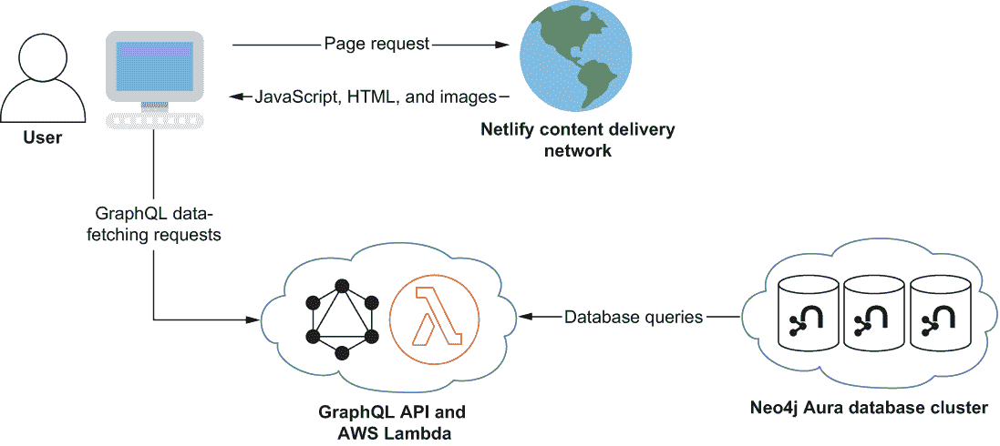

图 8.1 从用户角度看到的完整堆栈 GraphQL 部署

## 8.2 Neo4j Aura 数据库作为服务

Neo4j Aura 是 Neo4j 的托管云服务，提供 Neo4j 数据库集群作为云服务。Neo4j Aura 提供可扩展、高可用的 Neo4j 集群，无需处理操作或维护。开发者可以一键部署 Neo4j 集群，并访问 Neo4j 开发者工具，如 Neo4j 浏览器、Neo4j Bloom 和 APOC 标准库。Neo4j Aura 有两种版本：AuraDB 和 AuraDS。AuraDB 是 Neo4j 的标准数据库作为服务提供，适用于支持 Web 应用程序和 API 服务。AuraDS 是 Neo4j 的托管图数据科学平台，包括针对数据科学工作负载的特定功能。对于我们的目的，我们将使用 Neo4j AuraDB。

### 8.2.1 创建 Neo4j Aura 集群

由于 Neo4j Aura 是一个托管服务，我们首先需要通过登录 Google 账户或使用电子邮件和密码在 [neo4j.com/aura](https://neo4j.com/cloud/platform/aura-graph-database/) 创建账户，然后选择“立即注册”。由于我使用 Gmail，我将选择使用 Google 登录。登录后，我们将看到 Neo4j Aura 仪表板。

Neo4j Aura 仪表板是我们云中 Neo4j 集群的指挥控制中心。我们可以监控我们的数据库，配置新的数据库，导入数据，调整数据库大小，以及访问开发者工具。

然而，由于我们尚未创建任何 Neo4j Aura 集群，我们的仪表板看起来是空的。让我们通过点击“创建数据库”按钮（见图 8.2）来创建一个新的集群。AuraDB 免费层提供无任何成本且无需输入信用卡的 Neo4j 实例，所以我会选择这个选项。对于大型应用程序，我们可以选择 AuraDB 专业层，它提供额外的功能和扩展数据库实例可用资源的可能性。

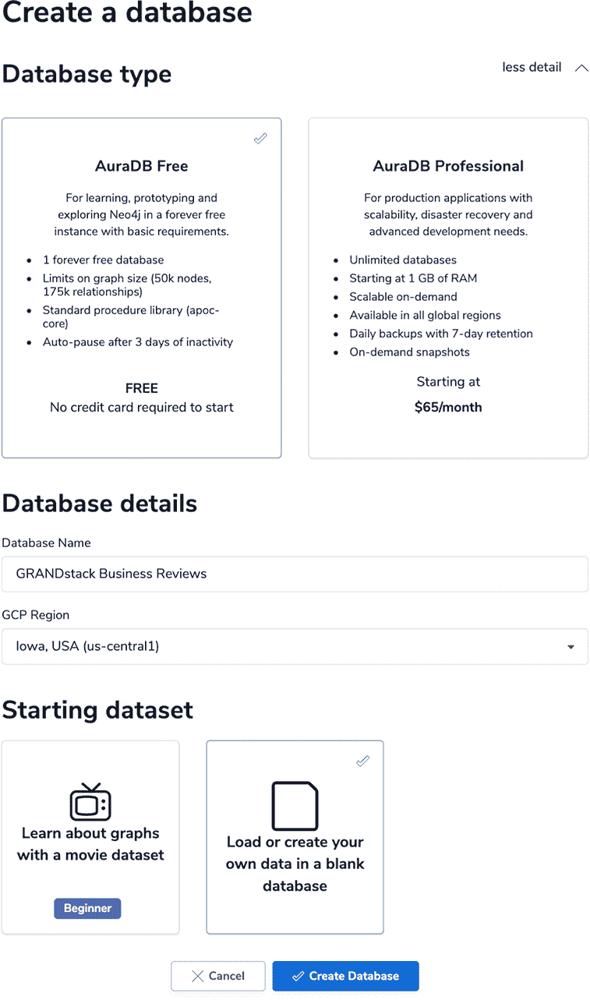

图 8.2 配置 Neo4j AuraDB 部署

一定要选择“AuraDB 免费版”数据库类型。接下来，我们需要为我们的数据库选择一个名称。我选择了“GRANDstack Business Reviews”。我们可以选择数据库部署的不同区域。我只是保留了默认设置，但您也可以选择离您最近的位置。在“起始数据集”选项中，我们可以选择从预定义的数据集开始，或者加载我们自己的数据。由于我们将使用自己的数据，请选择“在空白数据库中加载或创建自己的数据”。在选择了配置选项后，我们将看到一个随机密码，我们将使用它来访问我们的 Neo4 Aura 实例（见图 8.3）。

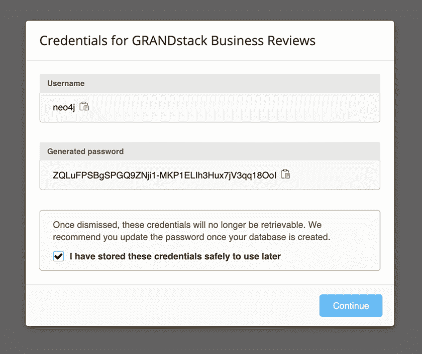

图 8.3 Neo4j AuraDB 部署的数据库凭据

一定要将密码保存在安全的地方。我们将更改密码，但稍后使用 Neo4j 浏览器登录时还需要它。

点击“继续”将带我们回到 Neo4j Aura 仪表板，但现在，我们将看到我们刚刚部署的数据库集群的详细信息，包括“探索”、“查询”或“导入”的选项（见图 8.4）。“探索”按钮将启动 Neo4j 浏览器，我们在前面的章节中使用它来执行 Cypher 查询并可视化结果。“查询”按钮将启动 Neo4j Bloom，这是一个可视化的图形探索工具，我们将在稍后探索它。最后，“导入”按钮将启动 Neo4j 数据导入器，这是一个将数据从如 CSV 格式的平面文件加载到 Neo4j 的工具。

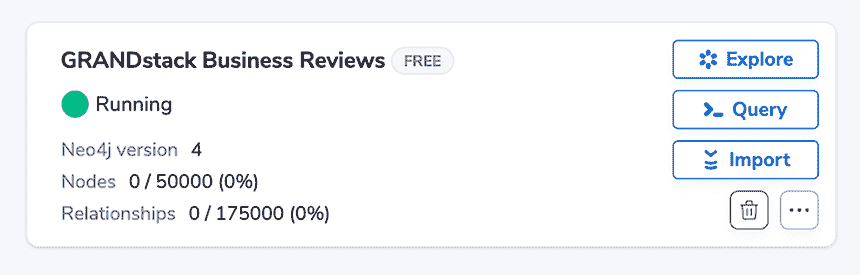

图 8.4 Neo4j AuraDB 仪表板，显示我们的新数据库

如果我们点击数据库名称，我们可以看到更多详细信息和针对我们的数据库的特定选项。对于我们的集群，我们可以看到以下详细信息：

+   *连接 URI*—这是用于使用 Neo4j 客户端驱动程序连接到我们的 Neo4j 集群的连接字符串。

+   *层级*—这告诉我们数据库的服务层级（免费、专业或企业）。

+   *云服务提供商*—这是部署此集群的云平台。在这种情况下，它是 Google Cloud Platform。

+   *区域*—这是集群部署的数据中心的地理区域。

+   *内存*—这是数据库的当前大小，可以在任何时候进行扩展或缩减。

我们还有一个“打开方式”下拉按钮，用于访问 Neo4j 浏览器或 Neo4j Bloom 开发者工具。

### 8.2.2 连接到 Neo4j Aura 集群

现在我们已经配置了 Neo4j Aura 集群，我们准备好使用 Neo4j JavaScript 驱动程序连接到它。首先，让我们更改 neo4j 数据库用户的初始密码。为此，我们将通过点击*查询*按钮启动 Neo4j 浏览器。这将打开我们熟悉的 Neo4j 浏览器。请参考第三章以了解如何使用 Neo4j 浏览器。我们将被提示使用分配给我们的 neo4j 数据库用户和初始密码进行登录。

登录后，让我们更改用户 neo4j 的密码。为此，我们需要在*系统*数据库上执行 Cypher 命令。任何管理命令，如更改用户密码，都需要针对此系统数据库执行。首先，我们告诉 Neo4j 浏览器切换到系统数据库：

```
:use system
```

然后，我们将使用 ALTER CURRENT USER Cypher 命令更改默认 neo4j 用户的密码：

```
ALTER CURRENT USER SET PASSWORD FROM
"<OUR_RANDOM_INITIAL_PASSWORD_HERE>" TO "<NEW_SECRET_PASSWORD_HERE>"
```

请确保将<OUR_RANDOM_INITIAL_PASSWORD_HERE>替换为初始密码，将<NEW_SECRET_PASSWORD_HERE>替换为新安全密码。对于剩余的示例，我们将使用密码*graphqlapi*，但鼓励使用更强的密码。要切换回默认的*neo4j*数据库，我们可以使用命令:use neo4j。

注意：像:use 这样的命令是针对 Neo4j 浏览器的特定实用命令，不是 Cypher 命令。有关在 Neo4j 浏览器中使用这些命令的更多信息，请运行:help 或:help commands。

现在我们已经更改了数据库用户的密码，让我们测试是否可以使用 Neo4j JavaScript 驱动程序连接到我们的 Neo4j Aura 集群。从 Aura 仪表板，如果我们点击我们的数据库名称，我们可以看到代码示例，展示如何使用不同的语言驱动程序连接到我们的 Neo4j Aura 实例（见图 8.5）。

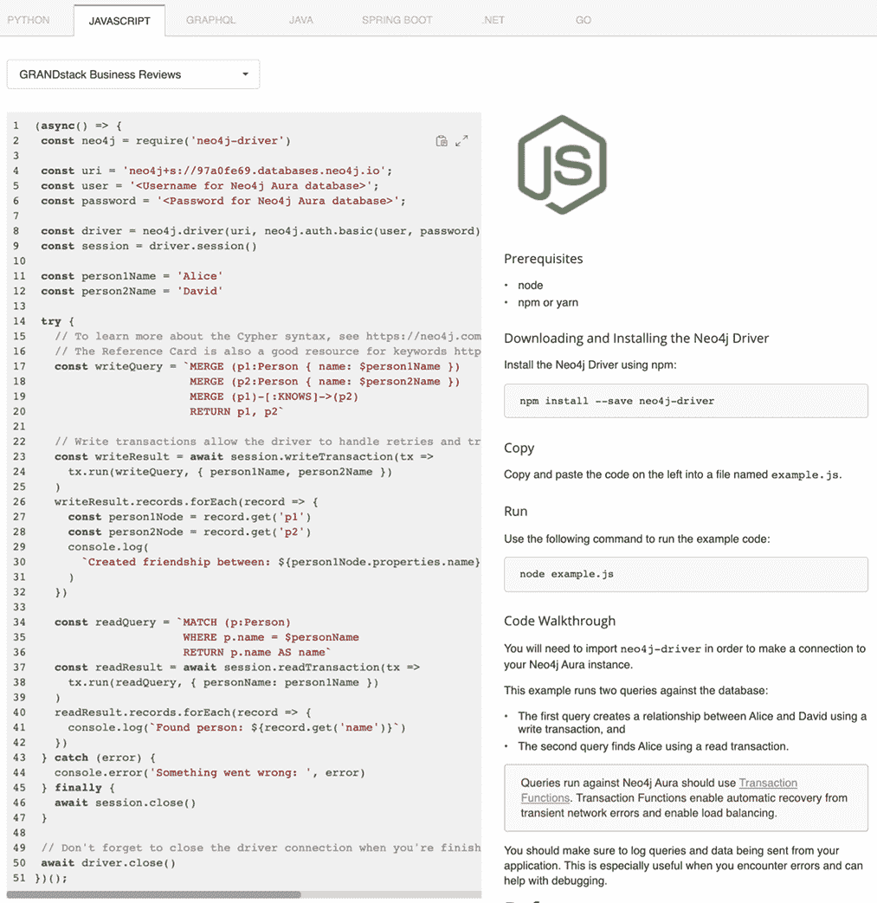

图 8.5 Neo4j Aura 中的“连接”选项卡，显示各种语言的代码示例

在列表 8.1 中，让我们将 JavaScript 示例调整为简单地计算数据库中的节点数并返回结果。我们将在 API 目录中创建一个新文件，命名为 aura-connect.js，并包含我们的简化 JavaScript 示例。

注意代码示例中使用的 neo4j+s:// URI 方案。之前，我们使用 bolt://，它表示连接到特定的 Neo4j 实例。在 Neo4j Aura 中，我们已经部署了一个集群——一系列相互通信以复制和分发数据的 Neo4j 实例——因此我们使用 neo4j 方案来告诉驱动器将请求路由到集群中的不同机器，而不是单个机器。+s 告诉驱动器我们想要使用安全的加密连接。

列表 8.1 aura-connect.js：查询我们的 Neo4j Aura 实例

```
(async () => {
  const neo4j = require("neo4j-driver");

  // be sure to change these connection details for your Neo4j instance
  const uri = "neo4j+s://97a0fe69.databases.neo4j.io";
  const user = "neo4j";
  const password = "graphqlapi";

  const driver = neo4j.driver(uri, neo4j.auth.basic(user, password));
  const session = driver.session();

  try {
    const readQuery = `MATCH (n)
                       RETURN COUNT(n) AS num`;
    const readResult = await session.readTransaction((tx) =>
      tx.run(readQuery)
    );
    readResult.records.forEach((record) => {
      console.log(`Found ${record.get("num")} nodes in the database`);
    });
  } catch (error) {
    console.error("Something went wrong: ", error);
  } finally {
    await session.close();
  }

  await driver.close();
})();
```

此代码导入 Neo4j JavaScript 驱动程序，使用我们的 Neo4j Aura 凭据创建驱动程序的实例，在读取事务中执行 Cypher 查询，然后将查询结果记录到控制台。如果我们运行此文件，我们应该验证我们能够连接到我们的 Neo4j Aura 数据库，并且数据库目前为空：

```
$ node aura-connect.js
Found 0 nodes in the database
```

我们的下一步是从我们用于开发应用程序的本地 Neo4j 实例上传数据到我们的 Neo4j Aura 数据库。

### 8.2.3 将数据上传到 Neo4j Aura

之前，我们使用 :play grandstack Neo4j Browser 指南来加载一些初始数据以导入我们的业务评论数据，但在此情况下，我们可能已添加用户信息、新的评论或更新了企业。让我们讨论将数据从本地 Neo4j 数据库导出到我们的新 Neo4j Aura 集群的过程。

将数据导入 Neo4j Aura 有多种不同的方法，但我们将使用推送到云的工具。如果您在 Neo4j Aura 仪表板中选择**导入**选项卡，您将看到一个类似向导的界面，引导您完成将本地 Neo4j 数据库上传到您的 Neo4j Aura 云数据库的步骤。我们现在将介绍这些步骤。

首先，我们想确保我们的本地 Neo4j 数据库处于停止状态。我们可以在 Neo4j Desktop 中验证这一点，如果它没有停止，则点击**停止**按钮（见图 8.6）。

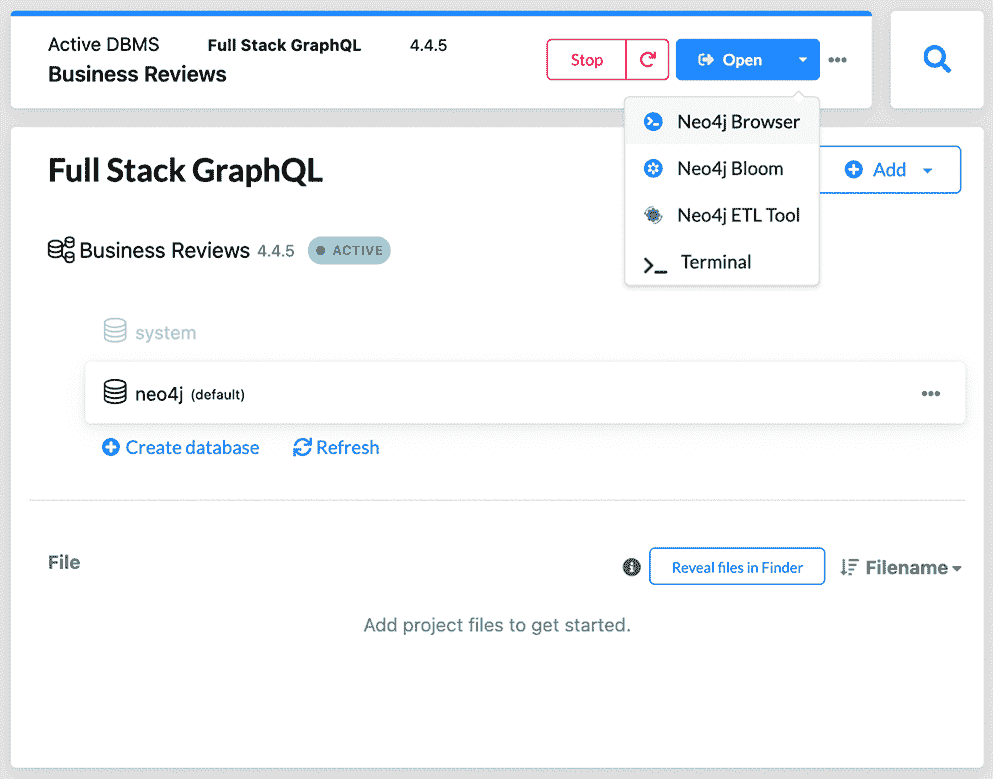

图 8.6 停止数据库并打开管理面板

接下来，我们将在 Neo4j Desktop 中打开一个终端，这将允许我们运行针对此特定 Neo4j 实例的 neo4j-admin 命令。neo4j-admin 命令行工具具有一些有用的功能，例如从 CSV 文件中导入大量数据、生成推荐的内存配置以及推送到云的命令，我们将使用该命令将此数据库上传到我们的 Neo4j Aura 实例。

在**打开**按钮旁边的下拉箭头处选择，然后选择**终端**以打开一个带有命令提示符的新窗口。此新命令提示符的工作目录设置为安装此特定 Neo4j 实例的目录：

```
$ pwd
/Users/lyonwj/Library/Application Support/com.Neo4j.Relate/Data/dbmss/
dbms-54c2c495-211d-408d-8c9e-6a65cce61d91
```

现在，我们准备使用推送到云的命令将此数据库上传到 Neo4j Aura。我们将指定我们的 Neo4j Aura 实例的 Bolt URI 以及 --overwrite 标志，以指示我们想要替换在 Neo4j Aura 实例中可能已经创建的任何数据。我们将被提示输入数据库用户名和密码，然后我们的本地数据库将被导出并上传到我们的 Neo4j Aura 数据库：

```
$ bin/neo4j-admin push-to-cloud --bolt-uri \
neo4j+s://97a0fe69.databases.neo4j.io  --database neo4j --overwrite

Neo4j aura username (default: neo4j):neo4j
Neo4j aura password for neo4j:
Done: 68 files, 879.4KiB processed.
Dumped contents of database 'neo4j' into '/Users/lyonwj/Library/Application
Support/com.Neo4j.Relate/Data/dbmss/
dbms-54c2c495-211d-408d-8c9e-6a65cce61d91/dump-of-neo4j-1612960685687'
Upload
....................  10%
....................  20%
....................  30%
....................  40%
....................  50%
....................  60%
....................  70%
....................  80%
....................  90%
.................... 100%
We have received your export and it is currently being loaded into your
Aura instance.
You can wait here, or abort this command and head over to the console to
be notified of when your database is running.
Import progress (estimated)
....................  10%
....................  20%
....................  30%
....................  40%
....................  50%
....................  60%
....................  70%
....................  80%
....................  90%
.................... 100%
Your data was successfully pushed to Aura and is now running.
```

现在，我们可以验证数据是否已上传到我们的 Neo4j Aura 实例。如果我们再次运行 aura-connect.js 脚本，我们应该看到数据库中总共有 36 个节点：

```
$ node aura-connect.js
Found 36 nodes in the database
```

### 8.2.4 使用 Neo4j Bloom 探索图

我们还可以直观地检查和探索我们刚刚上传到 Neo4j Aura 的数据。让我们回到 Neo4j Aura 仪表板，这次我们将使用 *Neo4j Bloom* 打开数据库。Neo4j Bloom 是一个用于与 Neo4j 图进行视觉交互的图探索应用程序，并包含在 Neo4j Aura 中。从 Neo4j Aura 仪表板，点击 *探索* 按钮。将打开一个新标签页，我们将被提示使用数据库用户名和密码登录。

一旦我们登录，Neo4j Bloom 将连接到我们的 Neo4j Aura 实例，并允许我们直观地探索我们的图数据。首先，我们需要配置一个 *视角*（见图 8.7）。在 Neo4j Bloom 中，一个视角定义了应该公开的图数据域或视图以及如何样式化这些数据。就我们的目的而言，默认生成的视角应该足够，因此选择 *创建视角* 从数据库生成一个视角，然后选择要用于可视化的视角。

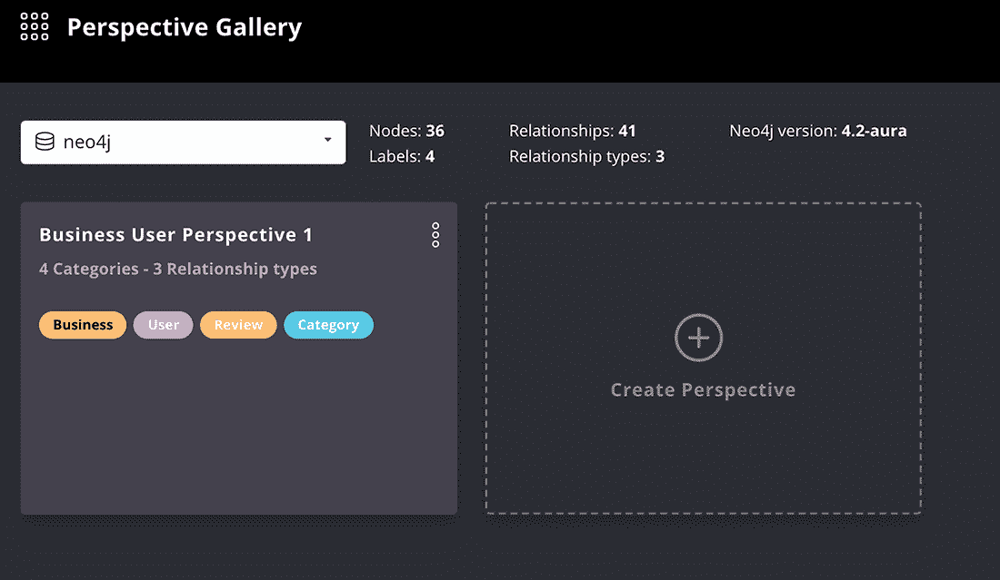

图 8.7 在 Neo4j Bloom 中创建视角

一旦我们创建了视角，我们就可以开始对图进行视觉探索。Neo4j Bloom 中的这个主要视图称为场景，它为我们提供了一个画布，我们可以根据选择的数据在上面绘制图数据。要将数据带入场景，我们使用自然语言，如搜索栏中的搜索词，这些词将被翻译成图模式（见图 8.8）。例如，如果我们开始输入 User name: Will WROTE Review，我们可以看到开始为我们建议有用的自动完成图模式。选择这些模式之一将执行搜索，并将与图搜索模式匹配的数据填充到场景中。

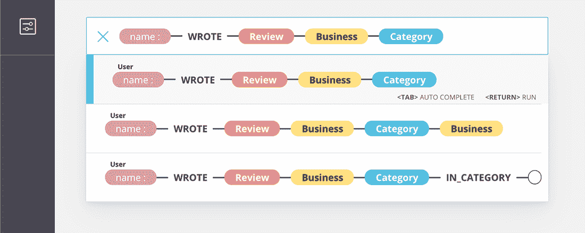

图 8.8 Neo4j Bloom 中的自然语言搜索

我们之前提到，视角可以配置可视化样式（见图 8.9）。我们可以配置的一种样式是用于表示可视化中节点的图标。通过在图例面板中选择一个类别，我们可以应用样式，例如节点的颜色、大小、图标或标题。

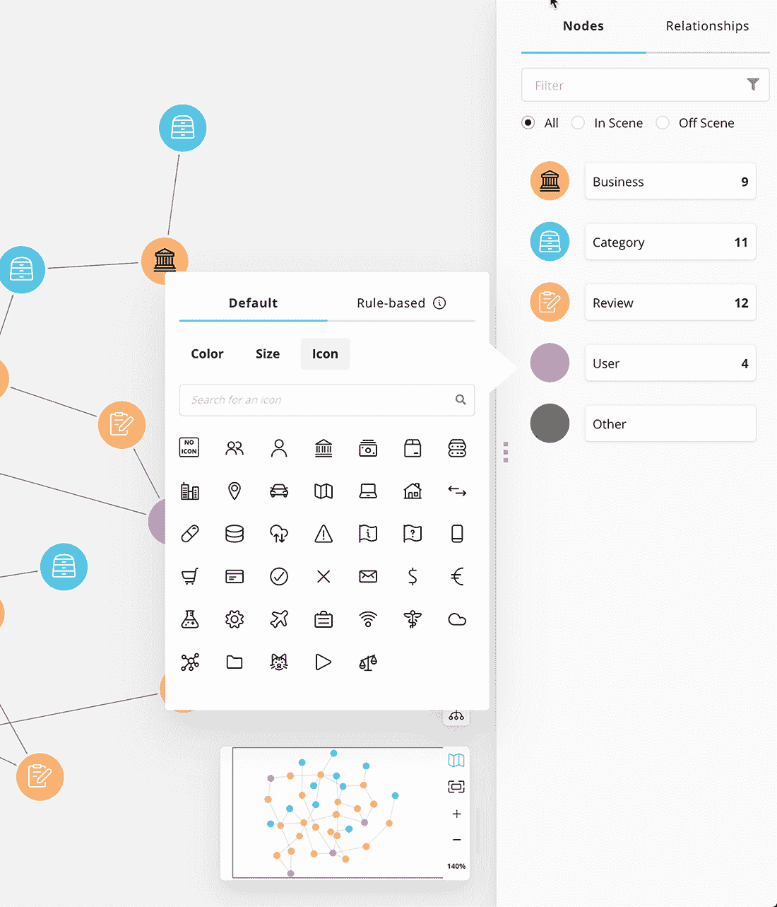

图 8.9 在 Neo4j Bloom 中配置类别图标

可视化是交互式的，可以用来探索图或验证上传的数据是否符合预期。选择节点将允许我们查看它们的属性（见图 8.10）。我们还可以在节点或关系上右键单击以进一步扩展或过滤场景中显示的数据。

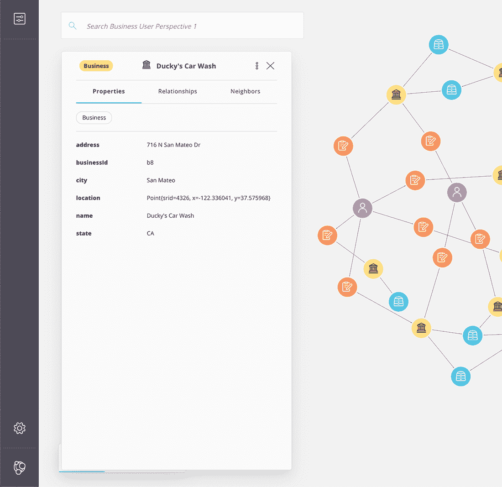

图 8.10 在 Neo4j Bloom 中查看节点详情

到目前为止，我们已经配置了 Neo4j Aura 集群，更改了密码，上传了数据，探索了数据，并在 Neo4j Bloom 中验证和探索了我们的图。现在，让我们将注意力转向使用 Netlify 和 AWS Lambda 部署我们的 React 应用程序和 GraphQL API。

## 8.3 使用 Netlify Build 部署 React 应用程序

要部署我们的 React 应用程序，我们将使用 Netlify。Netlify 是一个专注于构建和部署 Web 应用程序的流畅开发体验和工作流程的云平台。Netlify 结合了自动构建系统、全球内容分发网络、无服务器函数、边缘处理器和其他功能，所有这些都被封装在一个专注于流畅开发体验和工作流程的平台中。

具有类似功能的包括 Vercel、DigitalOcean App Platform、Cloudflare Pages 和 Azure Static Web Apps。Netlify 也提供免费层，因此我们可以部署我们的应用程序并尝试该服务，而无需输入信用卡或产生任何费用。

Netlify 还允许我们通过提交和拉取请求到 Git 版本控制系统（如 GitHub 或 GitLab）来触发构建和部署。在本节中，我们将使用 GitHub 来触发 Netlify 部署并展示 Netlify 的一个出色功能，称为预览构建，它允许我们从拉取请求中部署和测试应用程序。

### 8.3.1 将网站添加到 Netlify

让我们从导航到[netlify.com](https://www.netlify.com/)并点击*注册*按钮来创建一个免费的 Netlify 账户开始。由于我们将利用 GitHub 集成从 GitHub 部署和更新我们的应用程序，我们可以使用 GitHub 账户登录 Netlify，然后我们的 Netlify 账户将与 GitHub 关联（见图 8.11）。我们还可以选择其他登录方式，例如电子邮件和密码，并在稍后选择将 Netlify 账户链接到 GitHub。

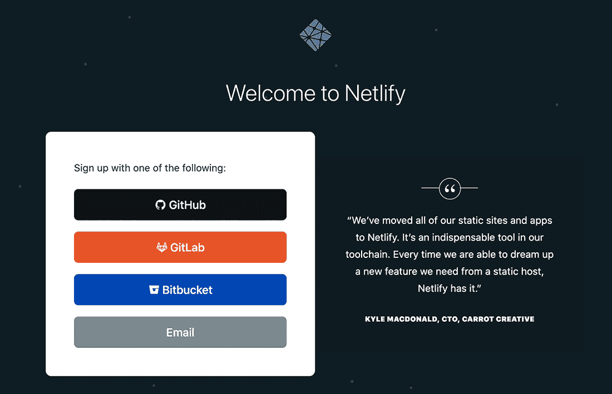

图 8.11 登录 Netlify

登录后，我们将看到我们添加到 Netlify 的网站概览（见图 8.12）。由于我们刚刚创建了账户，这个页面略显空旷。

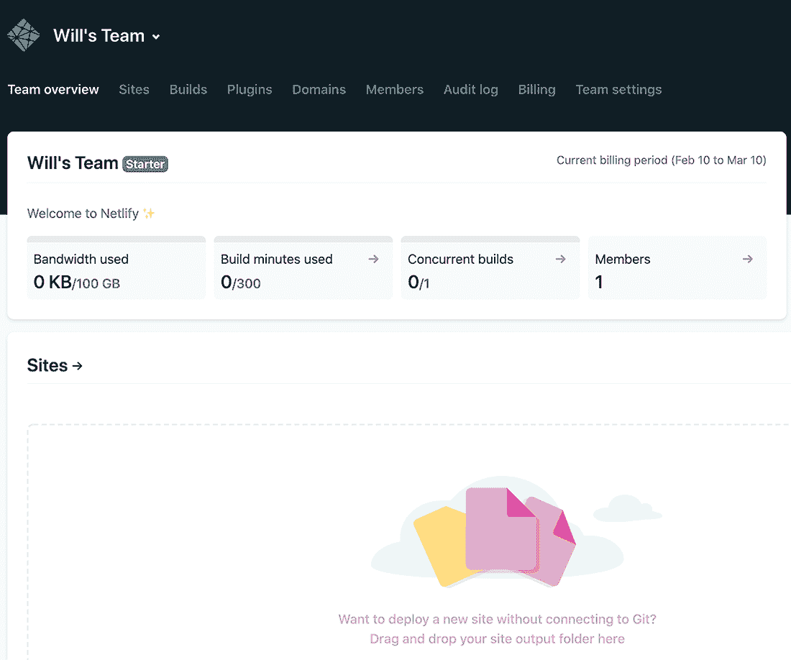

图 8.12 Netlify 仪表板

要将我们的第一个站点添加到 Netlify，让我们为我们的应用程序创建一个 GitHub 仓库，这样我们就可以将其作为站点添加到 Netlify 以开始部署。我们需要为我们的应用程序创建一个新的 GitHub 仓库（见图 8.13）。为此，首先导航到 [github.com/new](https://github.com/new)。我们需要为我们的仓库选择一个名称——我选择了 grandstack-business-reviews。我们还可以选择将我们的仓库设置为私有，如果我们不想将其暴露给公众。

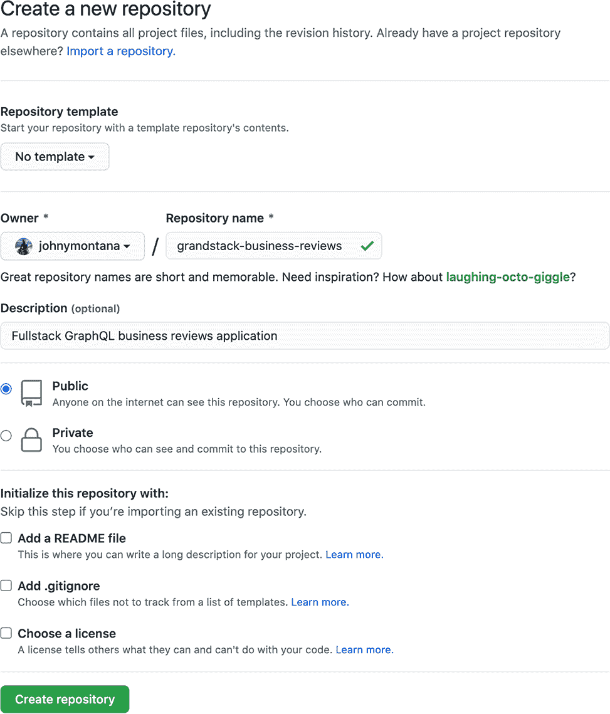

图 8.13 创建新的 GitHub 仓库

我们现在已创建了一个空的 GitHub 仓库，现在是时候将我们的业务评审应用程序代码添加到仓库中。此屏幕显示了初始化 git 仓库、提交代码和推送到 GitHub 所使用的常用终端命令（见图 8.14）。还有一个可以与 GitHub 一起使用的桌面客户端；然而，我们将使用命令行来完成这项工作。

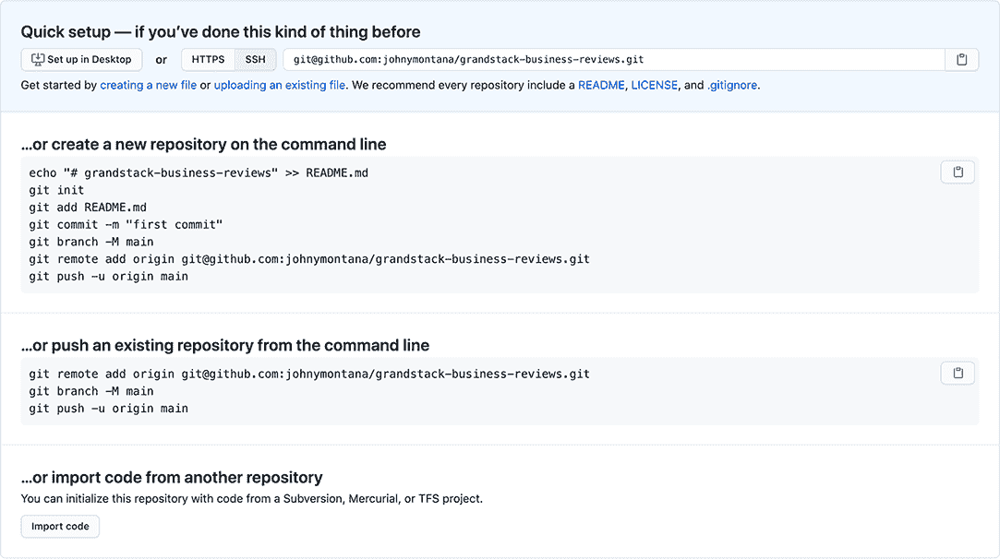

图 8.14 将本地 Git 仓库推送到 GitHub 的说明

让我们打开一个终端，导航到包含我们一直在构建的 React 应用程序的 web-react 目录。首先，我们初始化一个空的 GitHub 仓库：

```
$ git init
```

我们可以使用 git status 命令查看我们本地工作目录的状态：

```
$ git status

On branch main
No commits yet

Untracked files:
  (use "git add <file>..." to include in what will be committed)
    .gitignore
    README.md
    package-lock.json
    package.json
    public/
    src/

nothing added to commit but untracked files present (use "git add" to track)
```

在这种情况下，我们还没有向仓库提交任何内容，所以让我们暂存要添加的代码。为此，我们将使用 git add 命令：

```
$ git add -A
```

-A 标志表示我们想要将项目中的所有文件暂存以添加。我们通常不想将 *所有* 文件添加到仓库中；像 node_modules 目录和机密信息这样的东西不应该被提交到版本控制中。我们之前用来创建 React 应用程序骨架的 create-react-app 工具也创建了一个 .gitignore 文件，其中包含要排除的文件的规则。多亏了这个文件，我们可以在暂存文件进行提交时安全地使用 -A 标志。现在，当我们再次运行 git status 时，我们将看到要添加到我们提交中的所有文件：

```
$ git status
On branch main
No commits yet

Changes to be committed:
  (use "git rm --cached <file>..." to unstage)
    new file:   .gitignore
    new file:   README.md
    new file:   package-lock.json
    new file:   package.json
    new file:   public/favicon.ico
    new file:   public/index.xhtml
    new file:   public/logo192.png
    new file:   public/logo512.png
    new file:   public/manifest.json
    new file:   public/robots.txt
    new file:   src/App.css
    new file:   src/App.js
    new file:   src/App.test.js
    new file:   src/BusinessResults.js
    new file:   src/Profile.js
    new file:   src/index.css
    new file:   src/index.js
    new file:   src/logo.svg
    new file:   src/serviceWorker.js
    new file:   src/setupTests.js
```

让我们使用 git commit 命令进行提交。每个提交还包括一个消息，表明提交中引入的原因或功能。此消息可以使用 -m 标志添加，或者我们可以省略该标志，然后被提示输入提交消息：

```
$ git commit -m "initial commit"
[main (root-commit) 0bb81ca] initial commit
 20 files changed, 14609 insertions(+)
 create mode 100644 .gitignore
 create mode 100644 README.md
 create mode 100644 package-lock.json
 create mode 100644 package.json
 create mode 100644 public/favicon.ico
 create mode 100644 public/index.xhtml
 create mode 100644 public/logo192.png
 create mode 100644 public/logo512.png
 create mode 100644 public/manifest.json
 create mode 100644 public/robots.txt
 create mode 100644 src/App.css
 create mode 100644 src/App.js
 create mode 100644 src/App.test.js
 create mode 100644 src/BusinessResults.js
 create mode 100644 src/Profile.js
 create mode 100644 src/index.css
 create mode 100644 src/index.js
 create mode 100644 src/logo.svg
 create mode 100644 src/serviceWorker.js
 create mode 100644 src/setupTests.js
```

接下来，我们将我们的本地 Git 仓库与创建的远程 GitHub 仓库连接起来：

```
$ git remote add origin \
git@github.com:johnymontana/grandstack-business-reviews.git
```

最后，我们使用 git push 命令将我们的本地提交推送到远程 GitHub 仓库：

```
$ git push -u origin main

Enumerating objects: 24, done.
Counting objects: 100% (24/24), done.
Delta compression using up to 16 threads
Compressing objects: 100% (24/24), done.
Writing objects: 100% (24/24), 175.60 KiB | 1.60 MiB/s, done.
Total 24 (delta 0), reused 0 (delta 0)
To github.com:johnymontana/grandstack-business-reviews.git
 * [new branch]      main -> main
Branch 'main' set up to track remote branch 'main' from 'origin'.
```

如果我们刷新我们的 GitHub 仓库网页，现在我们将看到我们已提交的代码和提交历史（见图 8.15）。

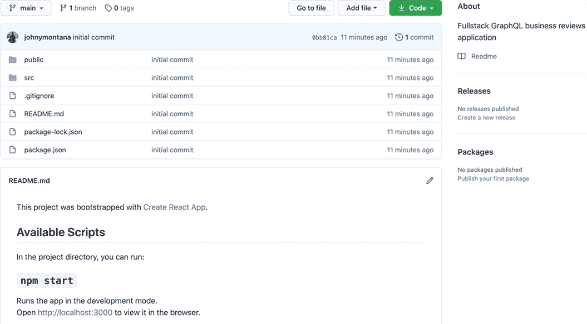

图 8.15 在 GitHub 上查看我们的新仓库

现在，我们准备好使用 Netlify 部署我们的 React 应用程序。返回 Netlify 仪表板，点击 *从 Git 添加网站*。我们将被提示选择要连接的 Git 提供商以及要添加的存储库。选择 GitHub，并选择我们刚刚创建并推送代码的存储库（见图 8.16）。

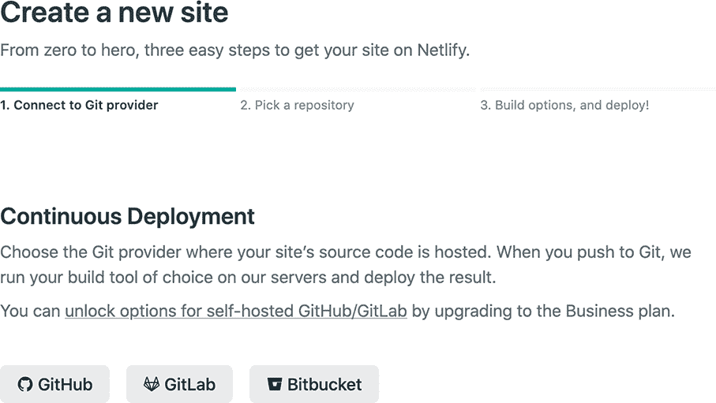

图 8.16 在 Netlify 中添加新网站

Netlify 将检查代码以确定这是一个使用 npm run build 命令构建的 React 应用程序，内容应从 /build 目录提供。我们在这里通常不需要做任何更改，因为默认设置通常足以构建和部署我们的 React 应用程序。如果需要，我们可以在稍后更改这些构建设置（见图 8.17）。

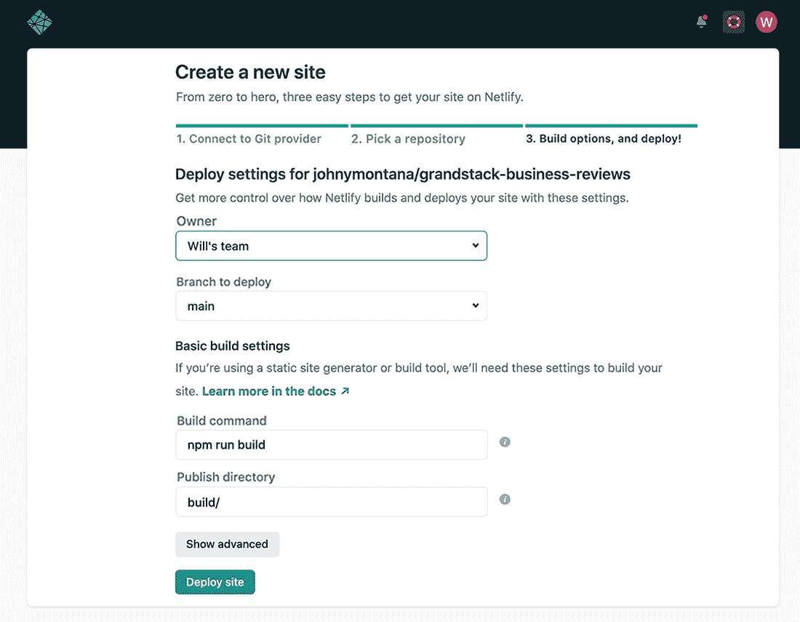

图 8.17 配置我们的新 Netlify 网站

Netlify 现在将从 GitHub 拉取我们的代码以构建和部署网站。我们可以在构建过程中从仪表板查看构建日志。Netlify 中的每个网站都分配了一个 URL 和 SSL 证书，因此一旦构建和部署完成，我们就可以立即预览我们的应用程序，而无需添加自定义域名（见图 8.18）。

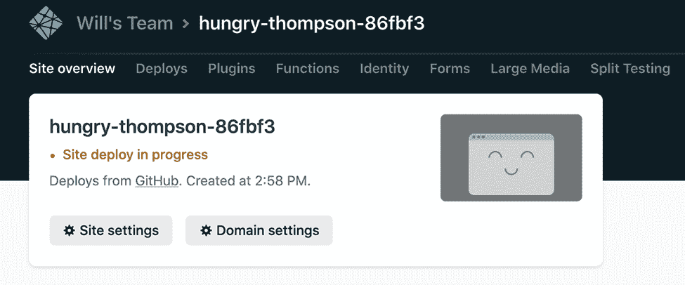

图 8.18 在 Netlify 中配置部署设置

一旦构建完成，我们就可以在网页浏览器中导航到我们的应用程序（见图 8.19）。在这种情况下，URL 是 [`hungry-thompson-86fbf3.netlify.app/`](https://hungry-thompson-86fbf3.netlify.app/)。

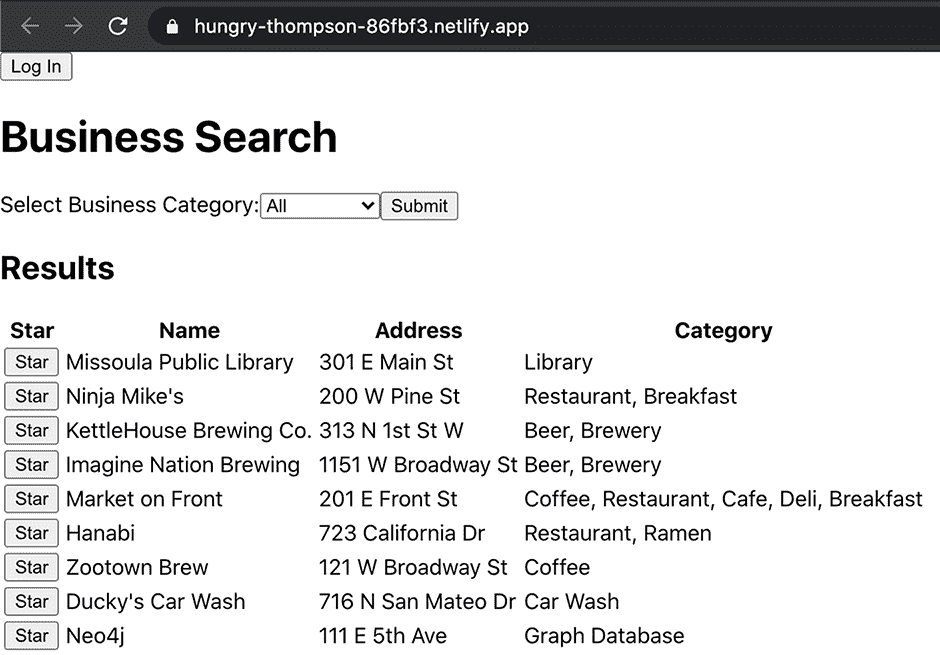

图 8.19 Netlify 网站部署进行中

但我们有一个问题：GraphQL API 指向 http://localhost:4000，即我们的本地机器，这意味着加载此应用程序的其他人将无法连接到 GraphQL API 并查看这些结果。我们可以通过在网页浏览器中打开开发者工具并检查网络请求来验证这一点。我们将在下一节部署 GraphQL API 应用程序，但让我们先探索 Netlify 的几个功能（见图 8.20）。

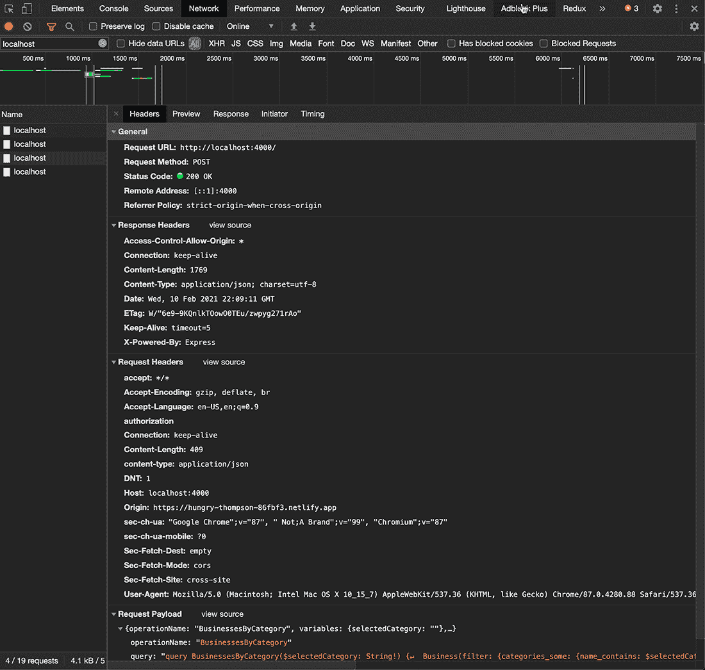

图 8.20 我们新部署的应用程序

### 8.3.2 为 Netlify 构建设置环境变量

如果我们查看创建 Apollo 客户端实例以连接到我们的 GraphQL API 的 src/index.js，我们会看到我们已将 GraphQL API 的 URI 固定编码为 http://localhost:4000，如以下列表所示。

列表 8.2 src/index.js：使用 Apollo Link 连接到我们的 GraphQL API

```
...

const httpLink = createHttpLink({
    uri: "http://localhost:4000",
});

...
```

这对于本地开发和测试来说是不错的，但现在我们希望使用相同的代码进行本地开发和我们的部署应用程序。为了允许在开发期间使用本地 GraphQL URI，但在我们的部署应用程序中连接到部署的 GraphQL API，我们将设置一个在构建时读取 GraphQL URI 的环境变量。我们将根据使用的环境确定此值——对于本地开发，我们将保持 GraphQL URI 为 http://localhost:4000，但我们将为我们的 Netlify 构建配置不同的值。

让我们创建一个 .env 文件来存储本地开发环境变量。Create React App 的一个便利功能是，任何在 .env 中指定的值都将被设置为环境变量，并且任何以 REACT_APP 开头的变量将在构建期间在客户端 React 应用程序中替换。让我们在下面的 .env 文件中设置我们想要用于开发的 GraphQL API 的本地值。

列表 8.3 .env：为我们的 React 应用程序设置环境变量

```
REACT_APP_GRAPHQL_URI=/graphql
NEO4J_URI=neo4j://localhost:7687
NEO4J_USER=neo4j
NEO4J_PASSWORD=letmein
REACT_APP_AUTH0_DOMAIN=grandstack.auth0.com
REACT_APP_AUTH0_CLIENT_ID=4xw3K3cjvw0hyT4Mjp4RuOVSxvVYcOFF
REACT_APP_AUTH0_AUDIENCE=https://reviews.grandstack.io
```

在下一节中，我们将更新我们的代码以从这些环境变量中读取，以设置我们的 GraphQL API 的 URI 并指定我们的 Auth0 域、客户端 ID 和受众值。

列表 8.4 src/index.js：使用环境变量

```
...

const httpLink = createHttpLink({
    uri: process.env.REACT_APP_GRAPHQL_URI
});

...

ReactDOM.render(
  <React.StrictMode>
    <Auth0Provider
      domain={process.env.REACT_APP_AUTH0_DOMAIN}
      clientId={process.env.REACT_APP_AUTH0_CLIENT_ID}
      redirectUri={window.location.origin}
      audience={process.env.REACT_APP_AUTH0_AUDIENCE}
    >
      <AppWithApollo />
    </Auth0Provider>
  </React.StrictMode>,
  document.getElementById("root")
);
```

对于本地开发，我们希望使用本地的 GraphQL API URI 进行开发，但在部署的应用程序中，我们希望 React 应用程序连接到部署的 GraphQL API。为了启用此功能，我们现在将在我们的网站 Netlify 构建设置中设置 REACT_APP_GRAPHQL_URI 环境变量（见图 8.21）。在我们的网站 Netlify 控制台中，选择 *站点设置*，然后在左侧导航中选择 *构建和部署*。我们将创建一个名为 REACT_APP_GRAPHQL_URI 的新环境变量，其值为 /graphql。


图 8.21 设置 Netlify 环境变量

这意味着我们的部署应用程序将尝试连接到同一域上的 /graphql 上的 GraphQL API。我们还没有在这里部署 GraphQL API，所以我们的应用程序现在将返回错误，直到我们添加 GraphQL API。

### 8.3.3 Netlify 部署预览

Netlify 等服务的一个便利功能是部署预览。*部署预览* 是由代码更改（通常来自拉取请求）触发的构建，部署到一个临时 URL，与主应用程序不同。这个构建具有主应用程序的所有功能，可以在拉取请求提交并更改反映在主应用程序之前与团队成员和其他利益相关者共享以进行审查。

让我们通过创建一个拉取请求并部署一个更新我们的 React 应用程序以从 REACT_APP_GRAPHQL_URI 环境变量中读取的预览来查看这是如何工作的。如果我们运行 git status 命令，我们会看到我们对 src/index.js 进行了更改：

```
$ git status

On branch main
Your branch is up to date with 'origin/main'.

Changes not staged for commit:
  (use "git add <file>..." to update what will be committed)
  (use "git restore <file>..." to discard changes in working directory)
    modified:   index.js

no changes added to commit (use "git add" and/or "git commit -a")
```

让我们切换到一个新的 Git 分支，称为 env-var-graphql-uri。我们将把我们的更改提交到这个新分支：

```
$ git checkout -b env-var-graphql-uri
Switched to a new branch 'env-var-graphql-uri'
```

现在，让我们将我们的更改添加到 index.js 中进行提交。由于我们已经将我们的工作目录切换到了一个新的 Git 分支，这个提交将是对 env-var-graphql-uri 分支的提交，而不是主分支：

```
$ git add index.js
$ git commit -m "use environment variable to specify GraphQL URI"
[env-var-graphql-uri 92f1142] use environment variable to
specify GraphQLURI
 1 file changed, 1 insertion(+), 1 deletion(-)
```

接下来，我们将这个新分支推送到 GitHub。由于我们正在将新分支推送到我们的远程仓库，GitHub 会友好地告诉我们，我们可以从这个新分支创建一个拉取请求：

```
$ git push origin env-var-graphql-uri

Enumerating objects: 7, done.
Counting objects: 100% (7/7), done.
Delta compression using up to 16 threads
Compressing objects: 100% (4/4), done.
Writing objects: 100% (4/4), 415 bytes | 415.00 KiB/s, done.
Total 4 (delta 3), reused 0 (delta 0)
remote: Resolving deltas: 100% (3/3), completed with 3 local objects.
remote:
remote: Create a pull request for 'env-var-graphql-uri'on
GitHub by visiting: remote: https://github.com/johnymontana/
grandstack-business-reviews/pull/new/env-var-graphql-uri
remote:
To github.com:johnymontana/grandstack-business-reviews.git
 * [new branch]      env-var-graphql-uri -> env-var-graphql-uri
```

拉取请求是从仓库的另一个分支或分叉请求更改以合并到主分支的一种方式。让我们创建一个拉取请求，请求将新的分支，env-var-graphql-uri，合并到主分支（见图 8.22）。

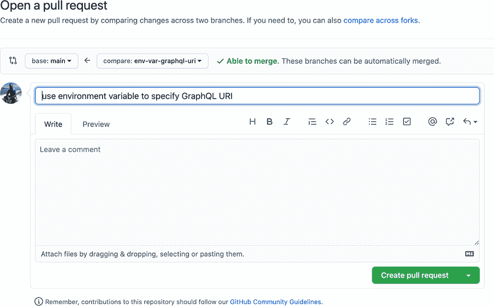

图 8.22 在 GitHub 中创建拉取请求

由于我们已经将 Netlify 连接到这个 GitHub 仓库，Netlify 将立即基于这个拉取请求中的更改启动部署预览构建。我们可以在 GitHub 上拉取请求页面的 *检查* 部分查看此构建的状态。一旦构建完成，我们可以访问这个部署预览来查看反映在实时部署中的更改（见图 8.23）。我们还可以将这个临时 URL 分享给其他人以审查网站更改。

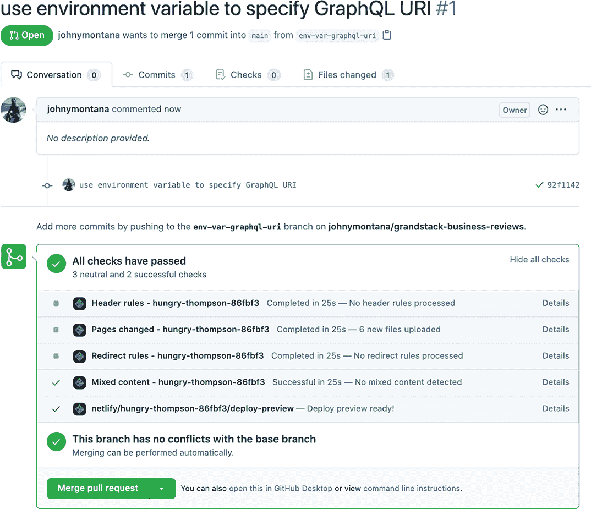

图 8.23 从拉取请求触发 Netlify 部署预览

一旦我们对这些更改感到满意，我们就会合并拉取请求。我们可以在 GitHub 上通过点击 *合并拉取请求* 按钮来完成此操作。这将把从 env-var-graphql-uri 分支到主分支的更改合并。然后，这次合并将在 Netify 上触发构建和部署，这将替换我们应用程序的主版本（见图 8.24）。

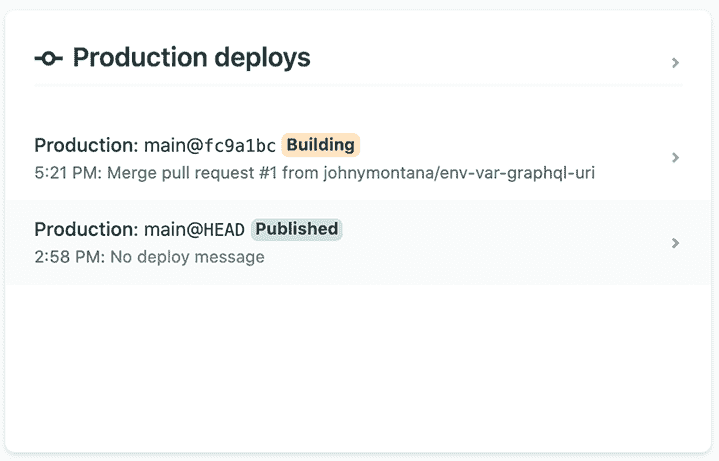

图 8.24 查看我们的 Netlify 构建状态

现在我们已经部署了 React 应用程序，是时候部署我们的 GraphQL API 了。为此，我们将我们的 GraphQL API 转换为无服务器函数，以便可以在 AWS Lambda 服务上部署。我们将利用 Netlify Functions 功能来实现这一点。

## 8.4 使用 AWS Lambda 和 Netlify Functions 的无服务器 GraphQL

AWS Lambda 是一个 FaaS 计算平台，允许我们按需运行代码，而无需配置或管理服务器。函数在响应事件时被调用，例如 HTTP 请求。当与 AWS 的 API Gateway 服务结合使用时，Lambda 函数可以用来实现 API 端点和应用程序，例如 GraphQL API。AWS Lambda 支持 Node.js、Python、Java、Go、Ruby、Swift 和 C#，并且可以包含打包的依赖项。与其他按小时计费的成本云服务不同，AWS Lambda 的定价基于请求数量，以及这些请求的持续时间以 1 毫秒为增量进行测量。

Netlify 函数服务允许我们直接从 Netlify 函数部署 Lambda 函数，无需创建 AWS 账户。Netlify 使用与 Git 版本控制相同的特性（如部署预览）来处理 Lambda 函数的构建和部署，这意味着我们可以将 Lambda 函数的代码与网站的其他部分一起管理。目前，Netlify 可以部署 Node.js 和 Go 的 Lambda 函数。

到目前为止，我们已经将我们的 GraphQL API 应用程序作为 Node.js Express 服务器使用 Apollo Server 构建。在本节中，我们将使用特定于 Lambda 的 Apollo Server 版本将我们的 GraphQL API 转换为 Lambda 函数，并使用 Netlify 函数功能与我们的 Netlify 网站一起部署。

### 8.4.1 将 GraphQL API 作为 Lambda 函数提供服务

由于我们的 Lambda GraphQL API 将作为我们 Netlify 网站的一部分通过 Netlify 部署，我们将代码和依赖项放在现有的项目中。让我们安装所需的依赖项：

```
npm install apollo-server-lambda @neo4j/graphql 
➥ @neo4j/graphql-plugin-auth neo4j-driver
```

注意，我们安装了 apollo-server-lambda，这是 Apollo Server 的一个特殊版本，它将允许我们将我们的 GraphQL API 结构化为 Lambda 函数。我们还安装了 Neo4j JavaScript 驱动程序、Neo4j GraphQL 集成库以及我们在上一章中看到的用于处理 JWT 的库。

让我们在与我们的 React 应用程序位于同一目录下创建一个新文件，src/graphql.js。稍后，我们将把这个文件提交到版本控制并推送到 GitHub，触发 Netlify 构建 和部署。我们将使用 apollo-server-lambda 创建一个简单的 GraphQL API，它有一个名为 greetings 的查询字段，返回一个问候消息，如下所示。

列表 8.5 src/graphql.js：使用 AWS Lambda 的简单 GraphQL API

```
const { ApolloServer, gql } = require("apollo-server-lambda");   ❶

const typeDefs = gql`
  type Query {
    greetings(name: String = "GRANDstack"): String
  }
`;

const resolvers = {
  Query: {
    greetings: (parent, args, context) => {
      return `Hello, ${args.name}!`;
    },
  },
};

const server = new ApolloServer({
  typeDefs,
  resolvers,
});

const serverHandler = server.createHandler();

exports.handler = (event, context, callback) => {                ❷
  return serverHandler(
    {
      ...event,
      requestContext: event.requestContext || {},
    },
    context,
    callback
  );
};
```

❶ 注意，我们正在导入 Apollo Server 的 apollo-server-lambda 版本。

❷ 由于我们正在创建 AWS Lambda 函数，我们需要导出一个包装我们的 Apollo Server 实例的处理函数。

接下来，我们需要配置我们的 Netlify 网站以便它知道我们创建的新 Lambda 函数的位置，并且我们希望在网站的 /graphql 端点处提供 GraphQL API。为此，我们将在项目的根目录中创建一个 netlify.toml 文件，如下所示。

列表 8.6 netlify.toml：配置 Netlify 构建

```
[build]
command = "npm run build"
functions = "src/lambda"
publish = "build"

[[redirects]]
from = "/graphql"
to = "/.netlify/functions/graphql"
status = 200
```

默认情况下，我们的 Netlify 函数在 /.netlify/functions/ 下暴露，后面跟着函数的文件名。我们创建了一个重定向，因此我们的 GraphQL API 可以在 /graphql 下访问。

### 8.4.2 Netlify 开发 CLI

到目前为止，我们将 Netlify 视为我们 React 应用程序的部署服务。如果我们想在本地构建和提供 React 应用程序，那么在运行 npm run start 时，我们使用了 react-scripts 工具，而没有涉及 Netlify。现在，我们添加 Lambda 函数后，我们需要做更多的工作来在本地测试我们的应用程序。我们将安装 Netlify 命令行工具，使用 Netlify dev 构建和运行我们的 GraphQL Lambda 函数和 React 应用程序：

```
$ npm install netlify-cli -g
```

现在我们已经安装了 Netlify CLI，我们可以使用 dev 命令在本地启动我们的网站。这将本地构建和提供我们的 React 应用程序和 Lambda 函数，而不会触发部署：

```
$ netlify dev
```

运行 netlify dev 后，我们可以打开一个网络浏览器并导航到 http://localhost:8888/graphql。我们应该看到 Apollo Studio，在那里我们可以运行针对我们的 Lambda GraphQL API 的 GraphQL 查询，如下所示。

列表 8.7 查询我们的简单 GraphQL API

```
{
  greetings
}
```

此查询的结果将显示我们在解析器中定义的问候消息：

```
{
  "data": {
    "greetings": "Hello, GRANDstack!"
  }
}
```

当然，这只是一个简单的 Hello World GraphQL API，所以让我们将业务评论应用程序的其余 GraphQL API 应用程序迁移过来。

### 8.4.3 将我们的 GraphQL API 转换为 Netlify 函数

如列表 8.8 所示，要将现有的 GraphQL API 转换为使用 AWS Lambda 和 apollo-server-lambda，我们需要更改几行。最显著的变化是使用 apollo-server-lambda 包，而不是 apollo-server-express，并为我们的 AWS Lambda 导出处理函数。否则，这看起来将与我们在第七章中构建的 GraphQL API 代码相似。

列表 8.8 src/graphql.js：将我们的 GraphQL API 转换为 AWS Lambda 函数

```
const { ApolloServer, gql } = require("apollo-server-lambda");   ❶

const neo4j = require("neo4j-driver");
const { Neo4jGraphQL } = require("@neo4j/graphql");
const {
  Neo4jGraphQLAuthJWKSPlugin,
} = require("@neo4j/graphql-plugin-auth");

const resolvers = {
  Business: {
    waitTime: (obj, args, context, info) => {
      var options = [0, 5, 10, 15, 30, 45];
      return options[Math.floor(Math.random() * options.length)];
    },
  },
};

const typeDefs = gql`
  type Query {
    fuzzyBusinessByName(searchString: String): [Business]
      @cypher(
        statement: """
        CALL
        db.index.fulltext.queryNodes('businessNameIndex',
          $searchString+'~')
        YIELD node RETURN node
        """
      )
  }

  type Business {
    businessId: ID!
    waitTime: Int! @computed
    averageStars: Float!
      @auth(rules: [{ isAuthenticated: true }])
      @cypher(
        statement: """
          MATCH (this)<-[:REVIEWS]-(r:Review) RETURN avg(r.stars)
        """
      )
    recommended(first: Int = 1): [Business!]!
      @cypher(
      statement: """
      MATCH (this)<-[:REVIEWS]-(:Review)<-[:WROTE]-(u:User)
      MATCH (u)-[:WROTE]->(:Review)-[:REVIEWS]->(rec:Business)
      WITH rec, COUNT(*) AS score
      RETURN rec ORDER BY score DESC LIMIT $first
      """
    )
    name: String!
    city: String!
    state: String!
    address: String!
    location: Point!
    reviews: [Review!]! @relationship(type: "REVIEWS", direction: IN)
    categories: [Category!]!
      @relationship(type: "IN_CATEGORY", direction: OUT)
  }

  type User {
    userId: ID!
    name: String!
    reviews: [Review!]! @relationship(type: "WROTE", direction: OUT)
  }

  extend type User
    @auth(
      rules: [
        { operations: [READ], where: { userId: "$jwt.sub" } }
        { operations: [CREATE, UPDATE, DELETE], roles: ["admin"] }
      ]
    )

  type Review {
    reviewId: ID! @id
    stars: Float!
    date: Date!
    text: String
    user: User! @relationship(type: "WROTE", direction: IN)
    business: Business! @relationship(type: "REVIEWS", direction: OUT)
  }

  extend type Review
    @auth(
      rules: [
        {
          operations: [CREATE, UPDATE]
          bind: { user: { userId: "$jwt.sub" } }
        }
      ]
    )

  type Category {
    name: String!
    businesses: [Business!]!
      @relationship(type: "IN_CATEGORY", direction: IN)
  }
`;

const driver = neo4j.driver(
  process.env.NEO4J_URI,
  neo4j.auth.basic(process.env.NEO4J_USER, process.env.NEO4J_PASSWORD)
);

const neoSchema = new Neo4jGraphQL({
  typeDefs,
  resolvers,
  driver,
  plugins: {
    auth: new Neo4jGraphQLAuthJWKSPlugin({
      jwksEndpoint: "https://grandstack.auth0.com/.well-known/jwks.json",
    }),
  },
});

const initServer = async () => {
  return await neoSchema.getSchema().then((schema) => {
    const server = new ApolloServer({
      schema,
      context: ({ event }) => ({ req: event }),                  ❷
    });
    const serverHandler = server.createHandler();
    return serverHandler;
  });
};

exports.handler = async (event, context, callback) => {          ❸
  const serverHandler = await initServer();

  return serverHandler(
    {
      ...event,
      requestContext: event.requestContext || {},
    },
    context,
    callback
  );
};
```

❶ 使用 Apollo Server 的 apollo-server-lambda 版本，而不是 apollo-server

❷ 我们在这里使用事件，因为 AWS Lambda 的请求签名与 Express 略有不同。

❸ 为我们的 AWS Lambda 函数导出处理函数

我们现在可以将更改提交到这个文件并推送到 GitHub 以部署。部署我们的应用程序几乎完成。在下一节中，我们将添加一个自定义域名并将其分配给 Netlify 中的网站。

### 8.4.4 在 Netlify 中添加自定义域名

到目前为止，我们的应用程序一直在 Netlify 分配的[`hungry-thompson-86fbf3.netlify.app/`](https://hungry-thompson-86fbf3.netlify.app/)子域名上运行。让我们设置一个与网站品牌更匹配的自定义域名。在 Netlify 中，从顶部导航栏选择*域名*。从这里，我们可以添加自定义域名并将它们分配给 Netlify 中的网站（见图 8.25）。

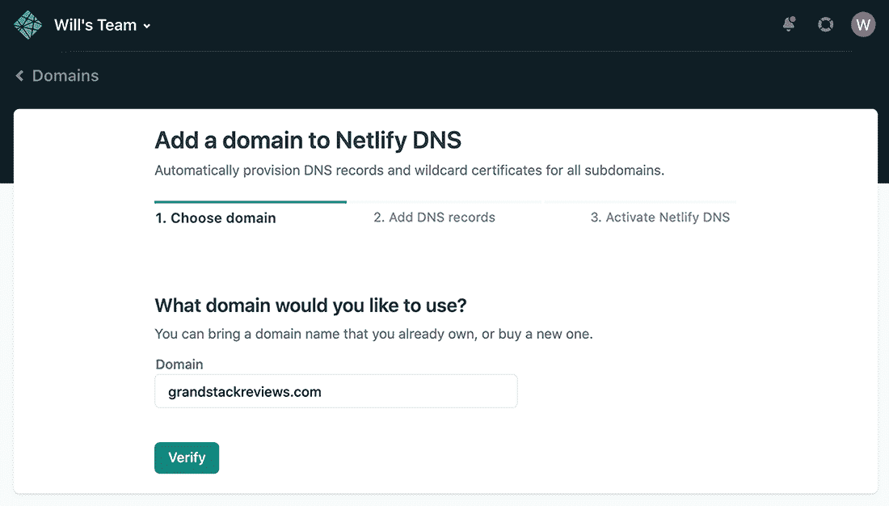

图 8.25 在 Netlify 中添加自定义域名

我们可以直接从 Netlify 购买域名，或者添加通过其他注册商购买的域名。在这种情况下，我想添加我在其他地方购买的域名，所以我将域名指向 Netlify 的名称服务器，允许 Netlify 管理域和域的 DNS 记录（见图 8.26）。

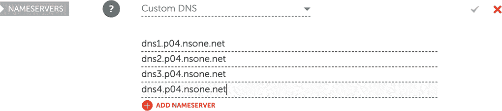

图 8.26 将我们的域名指向 Netlify 名称服务器

最后，我们需要更新 Auth0 应用程序设置，以便使用新域名提供的 Auth0 认证功能。我们将在 Auth0 中更新*允许回调 URL*和*允许注销 URL*，添加默认的 localhost URL 以及我们的 Netlify 网站 URL 和我们的自定义域名（见图 8.27）。

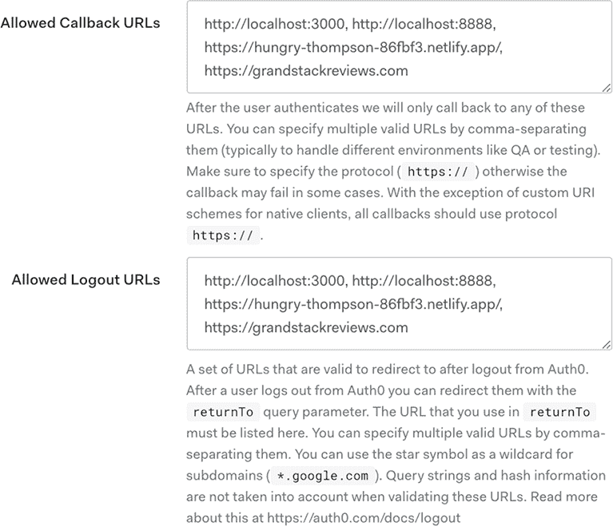

图 8.27 在 Auth0 中更新允许的回调 URL

有了这些，我们的应用程序现在已部署并准备好在我们的自定义域名上使用（见图 8.28）。

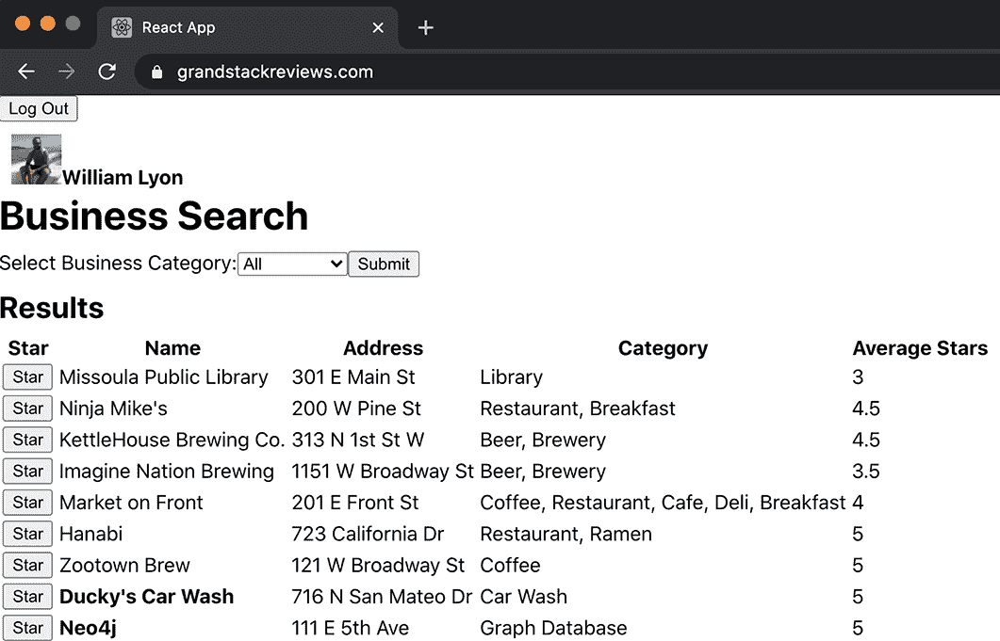

图 8.28 登录后我们的部署的完整堆栈 GraphQL 应用程序

## 8.5 我们的部署方法

在本章中，我们探讨了一种部署我们的全栈 GraphQL 应用程序的方法，该方法采用了利用托管服务（特别是 Neo4j Aura、Netlify 和 AWS Lambda）的优势（见图 8.29）。在本章开头，我们讨论了一些托管服务的一般优缺点。让我们从开发者的角度回顾一下这些服务。

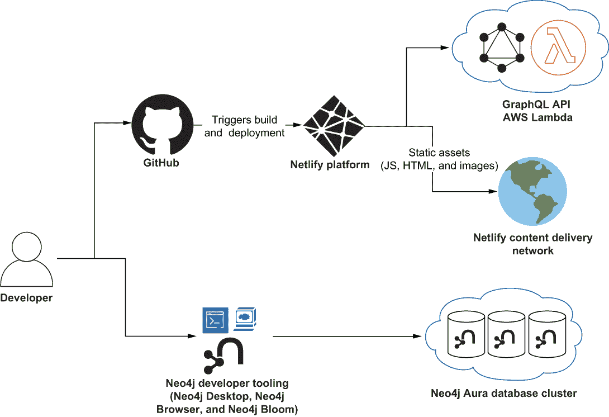

图 8.29 从开发者视角看完整的 GraphQL 部署

Netlify 允许自动构建和部署我们的 React 应用程序到 Netlify 全球内容分发网络，确保我们的前端应用程序对世界上任何人都可访问，而无需不必要的网络延迟。将我们的 GraphQL API 转换为 AWS Lambda 函数并利用 Netlify Functions 意味着我们能够将 API 应用程序集成到相同的代码库中。通过集成 GitHub，我们的开发和部署工作流程得到改善，使我们能够从拉取请求中创建预览部署。

由于我们使用了 Neo4j Aura 数据库作为服务，我们能够利用 Neo4j Desktop 和 Neo4j Browser 等开发者工具进行开发，而不必担心在云中维护和操作 Neo4j 集群。现在我们的应用程序已经部署，在下一章中，我们将从业务审查应用程序转向更高级的 GraphQL 功能，例如抽象类型、基于游标的分页和 Relay 连接模型，以及在图中的关系属性操作。

## 8.6 练习

1.  使用 Neo4j Bloom 查找已评论属于最多类别的业务用户。这位用户评论了哪些类别？提示：创建一个 Neo4j Bloom 搜索短语可能有助于这个练习。请参阅[`mng.bz/XZR6`](http://mng.bz/XZR6)上的文档。

1.  创建一个新的拉取请求，更新业务审查应用程序，使其始终按业务名称排序结果。使用 Netlify 的部署功能在合并拉取请求并更新应用程序之前审查此更新。

1.  创建一个新的 Netlify Function，使用 Neo4j JavaScript 驱动程序查询我们的 Neo4j Aura 集群，并返回最新评论的列表。在部署之前，使用 netlify dev 命令在本地运行它。使用 netlify.toml 配置将 /reviews 重定向到该函数。

## 摘要

+   利用托管云服务可以平滑开发者在部署和维护 Web 应用程序时的体验，并解决全栈开发者可能负责应用程序所有组件的扩展、运营和定价问题，这可能对全栈开发者具有吸引力。

+   Neo4j Aura 是一种托管云数据库服务，提供一键配置的 Neo4j 集群。这些数据库实例可以根据需要扩展或缩减，并消除对 Neo4j 维护或运营的需求。

+   Netlify 平台和 CDN 可用于自动化构建和部署 Web 应用程序，利用 GitHub 集成和部署预览功能，使得在应用程序发布前审查更改变得更加容易。

+   GraphQL API 可以作为 AWS Lambda 函数部署，利用无状态扩展和基于需求的定价，这使得 AWS Lambda 具有吸引力。Netlify Functions 可用于将 AWS Lambda 函数作为 Netlify 站点的一部分进行配置，从而消除单独的代码库或部署流程的需求。
