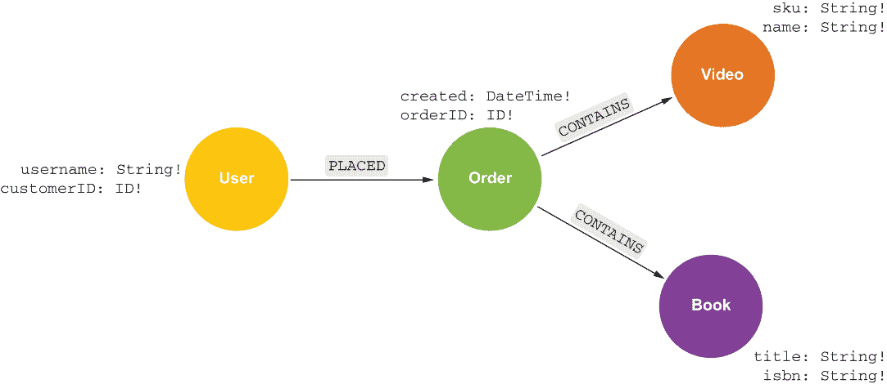
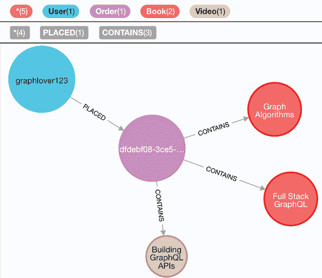
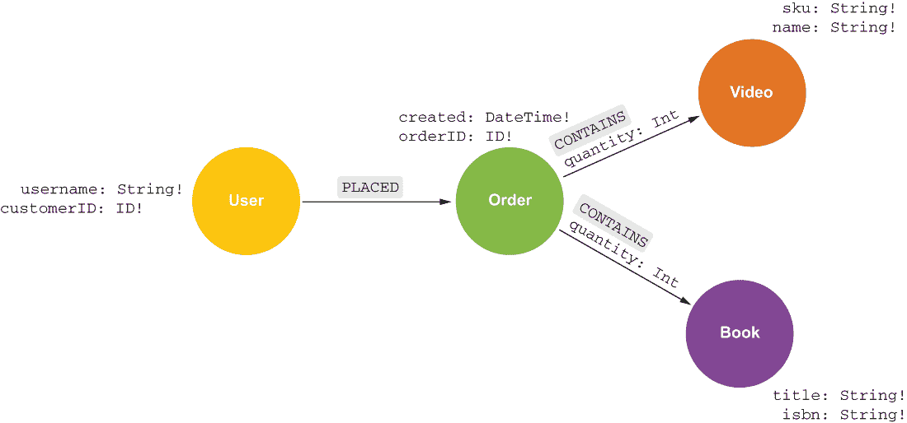

# 9 高级 GraphQL 考虑事项

本章涵盖

+   利用联合和接口的抽象类型带来的好处

+   使用偏移量和游标分页查询结果

+   使用关系属性，利用 Relay 连接类型进行操作

到目前为止，我们还没有充分利用 GraphQL 类型系统中最强大和最重要的特性之一——*抽象类型*，它允许我们在单个 GraphQL 字段中表示多个具体类型。同样，我们也没有真正利用属性图模型的一个重要特性——*关系属性*，它允许我们将属性与连接节点的关联关系相关联，而不仅仅是节点本身。在本章中，我们将看到如何利用 GraphQL 支持的抽象联合和接口类型。我们还将利用关系属性，并在过程中介绍 GraphQL 连接对象和分页方法。我们将从我们的业务审查应用转向简化我们的数据模型，转而关注一个简单的在线商店 API，该商店销售两种类型的产品：书籍和视频。

## 9.1 GraphQL 抽象类型

GraphQL 支持两种抽象类型：*接口*和*联合*。抽象类型允许我们在单个字段中表示多个具体类型（或多个类型的数组）。当一或多个字段在具体类型之间共享时，使用接口；它们声明了必须在具体类型中实现共享的字段。这样，接口可以被视为一个合同，它指定了类型必须具有的最小字段集以实现接口。联合不需要在具体类型之间共享字段，也不共享这种合同的概念。因此，联合只是具体类型的简单分组。

### 9.1.1 接口类型

接口类型用于表示概念上相似且至少共享一个公共字段的多种对象类型。例如，我们的商店 API 可能有一个 *person* 的概念。每个人可以是客户或员工。每个人都会有诸如姓名、姓氏和用户名等字段。然而，只有客户会有送货地址，只有员工会有雇佣日期。在 GraphQL 类型定义中，我们可以表示这个概念，如以下列表所示。

列表 9.1 在 GraphQL 类型定义中定义接口

```
interface Person {
  firstName: String!
  lastName: String!
  username: String!
}

type Customer implements Person {
  firstName: String!
  lastName: String!
  username: String!
  shippingAddress: String
}

type Employee implements Person {
  firstName: String!
  lastName: String!
  username: String!
  hireDate: DateTime!
}

type Query {
  people: [Person]
}
```

实现（或具体）类型必须实现接口中声明的所有字段，然后可以定义与类型相关联的其他字段。在这里，Customer 和 Employee 都实现了 Person 接口，因此必须包含 firstName、lastName 和 username 字段。Customer 添加了 shippingAddress 字段，而 Employee 添加了 hireDate 字段。

查询“人”查询字段将返回一个对象数组，其中每个对象可以是员工或客户对象。我们在 GraphQL 查询中使用内联片段来指定要返回的每个类型的选择集和字段，如下所示。内联片段允许我们请求具体类型的字段并包含一个类型条件。

列表 9.2 使用内联片段查询接口

```
{
  people {
    __typename
    firstName
    lastName
    username
    ... on Customer {
      shippingAddress
    }
    ... on Employee {
      hireDate
    }
  }
}
```

我们还包括了 __typename 元字段，它告诉我们人数组中每个对象的实际类型。

### 9.1.2 联合类型

联合体与接口类似，因为它们是抽象类型，可以用来表示多个具体类型；然而，联合体中组成的具体类型不需要有任何公共字段。联合体的一个常见用例是表示搜索结果。例如，我们的商店 API 可能支持一个产品搜索功能，允许用户搜索可能是书籍或视频的项目。为了启用此功能，我们创建了一个包含书籍和视频类型的 Product 联合体以及一个返回产品对象数组的 Query 字段搜索，如下一列表所示。

列表 9.3 在 GraphQL 类型定义中定义联合体

```
type Video {
  name: String!
  sku: String!
}

type Book {
  title: String!
  isbn: String!
}

union Product = Video | Book

type Query {
  search(term: String!): [Product!]!
}
```

与我们使用内联片段查询接口的具体类型的字段类似，我们在查询联合体时也使用内联片段。然而，由于联合体类型本身不包含任何字段，当我们查询联合体而不使用内联片段时，我们只能请求 __typename 元字段，如下所示。

列表 9.4 查询联合体

```
{
  search(term: "GraphQL") {
    __typename
    ... on Book {
      title
      isbn
    }
    ... on Video {
      name
      sku
    }
  }
}
```

### 9.1.3 使用 Neo4j GraphQL 库的抽象类型

现在我们已经对接口和联合体进行了一些探索，让我们看看如何使用 Neo4j GraphQL 库在 GraphQL API 中利用抽象类型。让我们放下我们的业务审查应用，开始一个新的应用，用于我们想象中的书店和视频店。在一个新的目录下，运行以下命令来创建一个新的 Node.js 项目：

```
npm init -y
```

接下来，我们将安装我们新的 Node.js GraphQL API 应用程序的依赖项，这应该现在已经很熟悉了：

```
npm install @neo4j/graphql graphql apollo-server neo4j-driver dotenv
```

如果你想继续使用前几章中的业务审查应用，你可以在 Neo4j Aura 或本地使用 Neo4j Desktop 创建一个新的 Neo4j 数据库。或者，你可以继续使用相同的数据库，并运行以下 Cypher 语句来删除业务审查数据：

```
MATCH (a) DETACH DELETE a
```

创建一个新的 .env 文件来定义指定 Neo4j 数据库连接凭据的环境变量，设置环境变量 NEO4J_USER、NEO4J_URI 和 NEO4J_PASSWORD 的值，如下所示。

列表 9.5 .env：请确保用您的 Aura 连接凭据替换以下值

```
NEO4J_URI=neo4j+s://932a071e.databases.neo4j.io
NEO4J_USER=neo4j
NEO4J_PASSWORD=wH4-tvNOxzKlDZwIEqgNPm-8iS-tJ9gOgr1ScSq9yiM
```

现在我们有一个新的 Node.js 项目以及一个新的或空的 Neo4j 数据库，让我们首先定义我们的 API 的 GraphQL 类型定义，看看抽象类型如何帮助我们简化 API 架构。

建模在线书店和视频店 API

让我们从我们的新 API 开始，去（虚拟）白板：[`arrows.app`](https://arrows.app)。遵循我们在第三章中确定的图数据建模过程，我们将确定应用程序中的实体（节点），它们是如何连接的（关系），以及它们的属性（节点属性）。让我们保持简单，关注那些将下订单的用户以及将包含书籍和/或视频的订单。创建处理这些要求的属性图模型，我们最终得到一个相当直接的图模型（见图 9.1）。



图 9.1 销售书籍和视频的在线商店的图数据模型

正如我们在第四章中看到的，我们可以使用这个属性图模型图来翻译映射到这个属性图模型的 GraphQL 类型定义，使用 @relationship GraphQL 模式指令来捕获我们关系的方向和类型，如下面的列表所示。

列表 9.6 我们在线商店数据模型的 GraphQL 类型定义

```
type User {
  username: String
  orders: [Order!]! @relationship(type: "PLACED", direction: OUT)
}

type Order {
  orderId: ID! @id
  created: DateTime! @timestamp(operations: [CREATE])
  customer: User! @relationship(type: "PLACED", direction: IN)
  books: [Book!]! @relationship(type: "CONTAINS", direction: OUT)
  videos: [Video!]! @relationship(type: "CONTAINS", direction: OUT)
}

type Video {
  name: String
  sku: String
}

type Book {
  title: String
  isbn: String
}
```

注意，我们正在使用 @id 和 @timestamp 指令来自动生成这些值，因此客户端不需要将它们传递给 API。我们的客户端不应该担心为订单生成一个随机的唯一 ID，或者传递订单创建的时间，因为这样做也会带来安全影响。

但看看 Order.books 和 Order.videos 字段。为了看到订单中包含的产品，我们的客户端需要请求这两个字段——其中一个可能是空数组。这对客户端来说有点尴尬；让我们看看我们如何通过使用抽象类型，特别是使用联合类型来改进这一点，因为我们的 Video 和 Book 类型没有共享任何公共字段。而不是 Order.books 和 Order.videos 字段，让我们在下一个列表中定义一个新的联合类型 Product，并添加一个 Order.products 字段，这将允许我们在单个字段中处理与订单连接的产品（无论是书籍还是视频）。

列表 9.7 使用联合类型为我们在线商店数据模型定义的 GraphQL 类型定义

```
type User {
  username: String
  orders: [Order!]! @relationship(type: "PLACED", direction: OUT)
}

union Product = Video | Book                                              ❶

type Order {
  orderId: ID! @id
  created: DateTime! @timestamp(operations: [CREATE])
  customer: User! @relationship(type: "PLACED", direction: IN)
  products: [Product!]! @relationship(type: "CONTAINS", direction: OUT)   ❷
}

type Video {
  name: String
  sku: String
}

type Book {
  title: String
  isbn: String
}
```

❶ 定义一个名为 Product 的联合类型，可以是 Video 或 Book 类型

❷ 在 Order 类型上的关系字段中使用我们新的 Product 类型

创建 GraphQL 服务器

现在我们已经最终确定了我们的 GraphQL 类型定义，让我们使用它们来创建一个使用 Neo4j GraphQL 库的 GraphQL API。让我们创建一个新的 index.js，包含这些新的类型定义以及使用 Apollo 服务器和 Neo4j GraphQL 库创建 GraphQL API 所需的代码，如下所示。

列表 9.8 index.js：我们的在线商店的 GraphQL API

```
const { gql, ApolloServer } = require("apollo-server");
const { Neo4jGraphQL } = require("@neo4j/graphql");
const neo4j = require("neo4j-driver");
require("dotenv").config();

const typeDefs = gql`
  type User {
    username: String
    orders: [Order!]! @relationship(type: "PLACED", direction: OUT)
  }

  union Product = Video | Book

  type Order {
    orderId: ID! @id
    created: DateTime! @timestamp(operations: [CREATE])
    customer: User! @relationship(type: "PLACED", direction: IN)
    products: [Product!]!
      @relationship(
        type: "CONTAINS"
        direction: OUT
      )
  }

  type Video {
    name: String
    sku: String
  }

  type Book {
    title: String
    isbn: String
  }
`;

const driver = neo4j.driver(
  process.env.NEO4J_URI,
  neo4j.auth.basic(process.env.NEO4J_USER, process.env.NEO4J_PASSWORD)
);

const neoSchema = new Neo4jGraphQL({ typeDefs, driver });

neoSchema.getSchema().then((schema) => {
  const server = new ApolloServer({
    schema,
  });
  server.listen().then(({ url }) => {
    console.log(`GraphQL server ready on ${url}`);
  });
});
```

这个文件的结构应该与过去章节中我们定义 GraphQL 类型定义、创建 Neo4j 驱动实例以及使用 Neo4j GraphQL 库生成 GraphQL 模式以由 Apollo 服务器提供的内容相似。现在让我们开始我们的 GraphQL 服务器：

```
node index.js
GraphQL server ready on http://localhost:4000/
```

在 GraphQL 模式突变中使用抽象类型

接下来，让我们打开我们的网络浏览器并导航到 http://localhost:4000，在那里我们将使用 Apollo Studio 并开始使用我们模式中由 Neo4j GraphQL 库生成的 GraphQL 变更在数据库中创建一些数据。首先，让我们使用生成的 createUsers GraphQL 变更创建两个用户，如下所示。

列表 9.9 GraphQL 变更：创建用户

```
mutation {
  createUsers(
    input: [{ username: "bobbytables" }, { username: "graphlover123" }]
  ) {
    users {
      username
    }
  }
}
```

在这个 GraphQL 操作的响应中，我们应该看到用户对象，这些用户名是我们传递给变更是操作的：

```
{
  "data": {
    "createUsers": {
      "users": [
        {
          "username": "bobbytables"
        },
        {
          "username": "graphlover123"
        }
      ]
    }
  }
}
```

在下一个列表中，让我们为我们的商店创建一些产品，正如我们所说的，这个商店销售书籍和视频。为此，我们将使用 createBooks 和 createVideos 变更。

列表 9.10 GraphQL 变更：创建产品

```
mutation {
  createBooks(
    input: [
      { title: "Full Stack GraphQL", isbn: "9781617297038" }
      { title: "Graph Algorithms", isbn: "9781492047681" }
      { title: "Graph-Powered Machine Learning", isbn: "9781617295645" }
    ]
  ) {
    books {
      title
      isbn
    }
  }

  createVideos(
    input: [
      { name: "Intro To Neo4j 4.x", sku: "v001" }
      { name: "Building GraphQL APIs", sku: "v002" }
    ]
  ) {
    videos {
      sku
      name
    }
  }
}
```

在响应中，我们将有包含我们刚刚创建的书籍和视频对象的数组：

```
{
  "data": {
    "createBooks": {
      "books": [
        {
          "title": "Full Stack GraphQL",
          "isbn": "9781617297038"
        },
        {
          "title": "Graph Algorithms",
          "isbn": "9781492047681"
        },
        {
          "title": "Graph-Powered Machine Learning",
          "isbn": "9781617295645"
        }
      ]
    },
    "createVideos": {
      "videos": [
        {
          "sku": "v001",
          "name": "Intro To Neo4j 4.x"
        },
        {
          "sku": "v002",
          "name": "Building GraphQL APIs"
        }
      ]
    }
  }
}
```

现在我们已经准备好创建一些订单了。我们可以用几种不同的方式来做这件事——例如，使用 updateUsers 变更——但让我们使用 createOrders 变更，如下一个列表所示。由于创建和 orderId 字段的值正在为我们自动生成，我们不需要在变更是中指定这些值。

列表 9.11 GraphQL 变更：创建单个订单

```
mutation {
  createOrders(
    input: {
      customer: {
        connect: { where: { node: { username: "graphlover123" } } }
      }
      products: {
        Book: {
          connect: [
            { where: { node: { title: "Graph Algorithms" } } }
            { where: { node: { title: "Full Stack GraphQL" } } }
          ]
        }
        Video: {
          connect: { where: { node: { name: "Building GraphQL APIs" } } }
        }
      }
    }
  ) {
    orders {
      orderId
      created
      customer {
        username
      }
      products {
        __typename
        ... on Book {
          title
          isbn
        }
        ... on Video {
          name
          sku
        }
      }
    }
  }
}
```

注意在产品选择中使用了内联片段。我们知道该字段返回一个 Product 对象数组，这是一个联合类型，并且每个对象可以解析为 Book 或 Video。我们可以向选择中添加 __typename 字段，这将告诉我们每个对象的实际类型，但为了返回实际类型的字段（Book 或 Video），我们需要使用内联片段来指定当解析的对象的实际类型与内联片段中指定的类型匹配时要返回的字段：

```
products {
  __typename
  ... on Book {
    title
    isbn
  }
  ... on Video {
    name
    sku
  }
}
```

在响应对象中，我们将看到我们的订单对象已经被分配了随机 ID 值以及时间戳。注意，我们的产品数组是 Book 和 Video 对象的混合：

```
{
  "data": {
    "createOrders": {
      "orders": [
        {
          "orderId": "dfdebf08-3ce5-494e-9843-d5286f4dc8f4",
          "created": "2021-08-15T13:43:15.117Z",
          "customer": {
            "username": "graphlover123"
          },
          "products": [
            {
              "__typename": "Video",
              "name": "Building GraphQL APIs",
              "sku": "v002"
            },
            {
              "__typename": "Book",
              "title": "Graph Algorithms",
              "isbn": "9781492047681"
            },
            {
              "__typename": "Book",
              "title": "Full Stack GraphQL",
              "isbn": "9781617297038"
            }
          ]
        }
      ]
    }
  }
}
```

如果我们使用 Neo4j 浏览器来检查我们通过我们的 GraphQL API 创建的数据，我们可以看到我们的订单、用户和产品的图表示以及它们是如何连接的（见图 9.2）。



图 9.2 包含两本书和一个视频的订单

在下一个列表中，让我们使用另一个 GraphQL 变更创建更多订单。

列表 9.12 GraphQL 变更：创建多个订单

```
mutation {
  createOrders(
    input: [
      {
        customer: {
          connect: { where: { node: { username: "bobbytables" } } }
        }
        products: {
          Book: {
            connect: { where: { node: { isbn: "9781617297038" } } }
          }
        }
      }
      {
        customer: {
          connect: { where: { node: { username: "graphlover123" } } }
        }
        products: {
          Book: {
            connect: { where: { node: { isbn: "9781492047681" } } }
          }
        }
      }
      {
        customer: {
          connect: { where: { node: { username: "graphlover123" } } }
        }
        products: {
          Book: {
            connect: [{ where: { node: { isbn: "9781617295645" } } }]
          }
          Video: { connect: { where: { node: { sku: "v001" } } } }
        }
      }
    ]
  ) {
    orders {
      orderId
      created
      customer {
        username
      }
      products {
        __typename
        ... on Book {
          title
          isbn
        }
        ... on Video {
          name
          sku
        }
      }
    }
  }
}
```

注意，我们可以传递一个输入对象数组，在单个 GraphQL 变更中创建多个订单：

```
{
  "data": {
    "createOrders": {
      "orders": [
        {
          "orderId": "38cfd8e4-f866-4c8a-ae97-e9e7c9e72b0b",
          "created": "2021-08-16T13:33:08.288Z",
          "customer": {
            "username": "bobbytables"
          },
          "products": [
            {
              "__typename": "Book",
              "title": "Full Stack GraphQL",
              "isbn": "9781617297038"
            }
          ]
        },
        {
          "orderId": "597ba737-de86-4772-b541-6a0bf4a25817",
          "created": "2021-08-16T13:33:08.288Z",
          "customer": {
            "username": "graphlover123"
          },
          "products": [
            {
              "__typename": "Book",
              "title": "Graph Algorithms",
              "isbn": "9781492047681"
            }
          ]
        },
        {
          "orderId": "dfc08de3-68f9-407c-8c72-1b02eb7a9b4e",
          "created": "2021-08-16T13:33:08.288Z",
          "customer": {
            "username": "graphlover123"
          },
          "products": [
            {
              "__typename": "Video",
              "name": "Intro To Neo4j 4.x",
              "sku": "v001"
            },
            {
              "__typename": "Book",
              "title": "Graph-Powered Machine Learning",
              "isbn": "9781617295645"
            }
          ]
        }
      ]
    }
  }
}
```

现在我们已经创建了几个订单及其相关的书籍和视频，让我们探索如何在 GraphQL 中分页数据结果。

## 9.2 使用 GraphQL 进行分页

许多应用程序在表格或列表中显示数据。当填充这些列表视图时，应用程序可能只从服务器请求总结果集的子集——通常，只需要渲染当前视图所需的数据。例如，在我们的在线商店的上下文中，我们可能想显示按时间顺序排序的所有订单列表，或者允许特定用户查看他们所有的订单。然而，可能有数千甚至数百万订单；我们不希望从服务器获取所有这些订单（那将需要通过网络发送大量数据）。

相反，我们会通过请求某些块（或页），正如它们在应用程序中渲染的那样，来**分页**订单数据。例如，我们可能最初请求前 20 个订单，按创建日期排序。然后，当用户滚动到前 20 个订单的末尾时，就会从服务器请求下一页的结果。GraphQL 提供了两种分页类型：**偏移**和**游标**。

### 9.2.1 偏移分页

**偏移分页**使用两个字段参数，通常称为 limit（限制）和 offset（偏移），将数组字段的输出分块成页。我们通常使用第三个参数，sort（排序），来指定数组的排序顺序。limit 参数指定要包含的结果数量，而 offset 是在返回值之前跳过的对象数量，并且通过 limit 的值递增以获取下一页。例如，如果我们想将结果分块成每页 10 个，那么第一页将使用偏移值 0 和限制值 10，第二页将使用偏移值 10 和限制值 10，依此类推。

让我们想象我们的商店应用程序有一个**查看订单**视图，在这个视图中，所有订单都按订单创建日期排序显示在表格中。加载所有这些数据的 GraphQL 查询可能看起来像以下这样。

列表 9.13 按创建日期排序查询所有订单

```
query {
  orders(options: { sort: { created: DESC } }) {
    orderId
    created
  }
}
```

这个查询返回了**所有**订单。如果我们有数百万订单呢？我们会发送过多的数据到网络上，并且我们的用户将需要等待很长时间才能加载和显示订单！我们的应用程序一次只能显示这么多订单，所以最终我们没有充分利用大部分数据。相反，我们希望**切片**我们的订单结果，并且只返回与应用程序显示相关的子集。我们将订单分页到每页 2 个，请求第一页，如下所示。

列表 9.14 使用偏移分页查询订单

```
query {
  orders(options: { limit: 2, offset: 0, sort: { created: DESC } }) {
    orderId
    created
  }
}
```

GraphQL 分页查询

然后，我们增加偏移量值以获取下一页。但我们如何知道要请求多少页？我们通常希望能够在应用程序中显示总页数，以便用户知道他们正在处理多少数据。为了便于实现这一点，我们可以利用 *计数查询*。Neo4j GraphQL 库为每个在数据库中返回该类型节点数的类型生成一个计数查询字段，如下一列表所示。客户端应用程序可以使用这个数字来计算总页数。

列表 9.15 包含 ordersCount 字段的偏移量分页

```
query {
  ordersCount
  orders(options: { limit: 2, offset: 0, sort: { created: DESC } }) {
    orderId
    created
  }
}
```

如果我们使用过滤器，例如过滤在某个日期之后下订单的订单，我们可以将相同的过滤器参数传递给计数查询以确定结果总数并计算客户端要显示的页数。

### 9.2.2 游标分页

游标分页是另一种常用的模型。我们不是使用数字偏移量来将结果切割成页面，而是使用一个游标，它是一个不透明的字符串值，用于标识结果页面中的最后一个对象。为了看到游标分页的实际应用，让我们想象我们的应用程序有一个特定用户的订单视图；例如，一个用户可能希望查看他们所有已下订单，按订单创建日期排序。

要使用 Neo4j GraphQL 库进行游标分页，我们首先请求 ordersConnection 字段，而不是 orders 字段。ordersConnection 字段被称为 Relay 连接对象。让我们首先看看这些 Relay 连接是如何使用的，然后探索 Relay 连接模型。

列表 9.16 使用 ordersConnection Relay 连接类型

```
query {
  users(where: { username: "graphlover123" }) {
    username
    ordersConnection(sort: { node: { created: ASC } }) {
      edges {
        node {
          created
          orderId
        }
      }
    }
  }
}
```

注意，我们为 ordersConnection 字段的选取集中现在包括了嵌套的边和节点字段。那里发生了什么？

Relay 连接模型

这些 *连接* 字段由 Neo4j GraphQL 库为每个关系字段生成，并符合“Relay 游标连接规范”（[`relay.dev/graphql/connections.htm`](https://relay.dev/graphql/connections.htm)），通常被称为 *Relay 规范* 或 *Relay 连接*。*Relay* 是一个包含许多超出本书范围功能的 GraphQL 客户端；然而，这个 Relay 规范已成为在 GraphQL 中实现游标分页的常见蓝图，并引入了连接类型的概念。

这些连接类型以两种方式提供了游标分页的标准方法。首先，使用常见的字段参数 first 和 after 来切割和分页结果。其次，连接允许一种标准的方法来分页结果，提供游标和其他关于结果集的元信息，例如是否还有更多结果可供客户端在分页结果中获取。

根据 Relay 规范，每个连接对象必须包含一个 edges 数组字段和一个 pageInfo 对象字段。edges 字段是一个由 Relay 规范定义的 *edge types* 列表，它封装了关系，连接我们图中的节点。pageInfo 字段包含有关页面的元数据，例如 hasNextPage 和 hasPreviousPage，以及用于请求下一页和前一页的游标：startCursor 和 endCursor。此外，Neo4j GraphQL 库还添加了一个 totalCount 字段，它告诉我们边的总数。

让我们看看接下来的列表中是如何实现的。我们将向之前的查询添加第一个：2 字段参数，以分页大小为 2 的页面来分页订单。我们还将请求 pageInfo 对象和 totalCount 字段。

列表 9.17 使用 pageInfo 对象检索元数据

```
query {
  users(where: { username: "graphlover123" }) {
    username
    ordersConnection(first: 2, sort: { node: { created: ASC } }) {
      totalCount
      pageInfo {
        endCursor
        hasNextPage
        hasPreviousPage
      }
      edges {
        node {
          created
          orderId
        }
      }
    }
  }
}
```

现在结果包括前两个订单，它们被封装在 edges 数组中，以及包含一个游标 endCursor 的 pageInfo 元数据对象，我们可以使用它来获取下一页的结果：

```
{
  "data": {
    "users": [
      {
        "username": "graphlover123",
        "ordersConnection": {
          "totalCount": 3,
          "pageInfo": {
            "endCursor": "YXJyYXljb25uZWN0aW9uOjE=",
            "hasNextPage": true,
            "hasPreviousPage": false
          },
          "edges": [
            {
              "node": {
                "created": "2021-08-15T13:43:15.117Z",
                "orderId": "dfdebf08-3ce5-494e-9843-d5286f4dc8f4"
              }
            },
            {
              "node": {
                "created": "2021-08-16T13:33:08.288Z",
                "orderId": "dfc08de3-68f9-407c-8c72-1b02eb7a9b4e"
              }
            }
          ]
        }
      }
    ]
  }
}
```

要请求下一页的结果，我们将 endCursor 的值作为 ordersConnection 字段 after 字段参数的值，如下所示。

列表 9.18 使用游标分页检索下一页的订单

```
query {
  users(where: { username: "graphlover123" }) {
    username
    ordersConnection(
      first: 2
      after: "YXJyYXljb25uZWN0aW9uOjE="
      sort: { node: { created: ASC } }
    ) {
      totalCount
      pageInfo {
        endCursor
        hasNextPage
        hasPreviousPage
      }
      edges {
        node {
          created
          orderId
        }
      }
    }
  }
}
```

这次，我们将在结果中看到 hasNextPage 是 false，这告诉我们没有更多分页结果供客户端获取：

```
{
  "data": {
    "users": [
      {
        "username": "graphlover123",
        "ordersConnection": {
          "totalCount": 3,
          "pageInfo": {
            "endCursor": "YXJyYXljb25uZWN0aW9uOjI=",
            "hasNextPage": false,
            "hasPreviousPage": true
          },
          "edges": [
            {
              "node": {
                "created": "2021-08-16T13:33:08.288Z",
                "orderId": "597ba737-de86-4772-b541-6a0bf4a25817"
              }
            }
          ]
        }
      }
    ]
  }
}
```

Relay 连接模型提供了一个有用的标准用于游标分页。由 Relay 规范定义的边类型还引入了一种表示属性图模型中我们尚未使用的一个强大功能的方法：关系属性。

## 9.3 关系属性

在属性图模型中，*关系属性* 是存储在关系上的属性，用于表示在关系连接的两个端节点上下文中具有意义的值。例如，在我们的存储数据模型中，我们如何表示添加到订单中的特定物品的数量？表示这个概念的最佳方式是在 CONTAINS 关系上存储一个属性，表示添加到订单中的该物品（书籍或视频）的数量。



图 9.3 更新在线商店数据模型以包含关系属性

在图 9.3 中，我们已向 CONTAINS 关系添加了一个整型属性数量。现在，例如，如果我们想在下单时购买两本 *Full Stack GraphQL* 书，我们可以为这个属性设置一个值，2。但我们在 GraphQL API 中如何表示这一点呢？

### 9.3.1 接口和 @relationship GraphQL 模式指令

我们使用@relationship 指令与 Neo4j GraphQL 库一起指定属性图关系类型和方向，使用 type 和 direction 参数。@relationship 指令还接受一个可选参数 properties，可以用来指定关系属性。properties 参数接受一个接口类型的名称，该类型定义了映射到关系属性的 GraphQL 字段。

为了表示我们的关系属性字段，我们首先定义一个包含我们的关系属性字段的接口类型。由于我们只想在 CONTAINS 关系上添加单个关系属性字段 quantity，我们将创建一个包含单个字段的 Contains 接口。接下来，在 Order.products 字段上使用的@relationship 指令中，我们添加 properties: "Contains"，以表明我们想要使用 Contains 接口来表示 CONTAINS 关系的属性。我们的更新后的 GraphQL 类型定义如下所示；让我们继续在 index.js 中更新这些。

列表 9.19 使用接口在 GraphQL 中表示关系属性

```
interface Contains {
  quantity: Int
}

type User {
  username: String
  orders: [Order!]! @relationship(type: "PLACED", direction: OUT)
}

type Order {
  orderId: ID! @id
  created: DateTime! @timestamp(operations: [CREATE])
  customer: User! @relationship(type: "PLACED", direction: IN)
  products: [Product!]!
    @relationship(type: "CONTAINS", direction: OUT, properties: "Contains")
}

type Video {
  title: String
  sku: String
}

type Book {
  title: String
  isbn: String
}

union Product = Video | Book
```

注意，由于 Product 是一个联合类型，代表 Video 和 Book 类型，我们已捕获定义视频和图书的数量关系属性——这是抽象类型强大功能的一个绝佳例子！在更新 index.js 中的 GraphQL 类型定义后，我们需要重新启动我们的 GraphQL Node.js 应用程序。

### 9.3.2 创建关系属性

现在我们已经更新了我们的 GraphQL 类型定义，包括数量关系属性，让我们看看我们如何利用这个新的关系属性。首先，我们将创建一个新的订单，但这次，我们将订购 10 本*Full Stack GraphQL*图书。为此，我们将在使用 createOrders 突变时，在输入对象的 connect 对象中包含 edge: { quantity: 10}，如以下所示。

列表 9.20 在 GraphQL 突变中使用关系属性

```
mutation {
  createOrders(
    input: {
      customer: {
        connect: { where: { node: { username: "graphlover123" } } }
      }
      products: {
        Book: {
          connect: {
            edge: { quantity: 10 }
            where: { node: { title: "Full Stack GraphQL" } }
          }
        }
      }
    }
  ) {
    orders {
      created
      orderId
      productsConnection {
        edges {
          quantity
          node {
            ... on Book {
              title
            }
          }
        }
      }
    }
  }
}
```

要检索数量值，我们现在在 productsConnection 字段中的边缘类型对象上有一个名为 quantity 的字段，它表示此订单包含 10 本图书，如查询结果所示：

```
{
  "data": {
    "createOrders": {
      "orders": [
        {
          "created": "2021-08-18T22:17:28.285Z",
          "orderId": "48faa3f4-553b-42ed-a08f-e7781aed3c17",
          "productsConnection": {
            "edges": [
              {
                "quantity": 10,
                "node": {
                  "title": "Full Stack GraphQL"
                }
              }
            ]
          }
        }
      ]
    }
  }
}
```

多亏了 Relay 连接规范的力量，我们现在可以在 GraphQL 中表示并处理关系属性！

## 9.4 完成全栈 GraphQL

我们现在已经学会了如何利用 GraphQL、图数据库、React 和云服务构建和保障全栈 Web 应用程序的力量。本书的目标在很大程度上是展示全栈 GraphQL 各个部分的结合。让我们回顾一下本书中涵盖的内容，并概述一些进一步学习资源的路径。

在第一部分，我们介绍了图思维、GraphQL 和 Neo4j 图数据库。我们学习了 GraphQL 的好处，如何编写 GraphQL 查询，以及构建 GraphQL 服务器的基本方法。我们的图思维扩展到覆盖图数据库，并介绍了 Neo4j 和 Cypher 查询语言。在第二部分，我们涵盖了用于构建用户界面的 React JavaScript 框架，以及使用 Apollo Client 在我们的 React 应用程序中获取 GraphQL 数据。最后，在第三部分，我们处理了在 GraphQL API 和 React 应用程序中的身份验证和授权，以及使用如 Auth0、Neo4j AuraDB、Netlify 和无服务器函数等托管云服务进行部署。

Neo4j GraphQL 库是 Full Stack GraphQL 的核心组件，它提供了创建由 Neo4j 支持的强大 GraphQL API 的能力，而不需要编写样板代码；然而，我们在这本书中没有机会涵盖该库的许多功能。随着您继续使用 GraphQL 构建应用程序的旅程，我鼓励您更多地了解一些这些功能，例如使用聚合和更多的模式指令，如@cypher 和@auth，这些指令允许我们丰富我们的 GraphQL API。关于 Neo4j GraphQL 库的进一步学习资源是[neo4j.com/docs/graphql-manual/current](https://neo4j.com/docs/graphql-manual/current/)的文档。

我还希望将另一个主题包含在本书中，那就是使用 React 框架和工具来提高使用 React 构建前端应用程序的开发者体验。Next.js 就是这样一种框架，它建立在 React 之上，并捆绑了许多 React 本身所缺少的常见功能。凭借其 API Routes 功能，Next.js 甚至包括构建 GraphQL API 的能力，这是一种将后端逻辑 colocated 的有趣方法。Next.js 文档中的入门教程是一个极好的动手介绍：[nextjs.org/docs/getting-started](https://nextjs.org/docs/getting-started)。

要继续您的图数据库和 Neo4j 的图之旅，Neo4j 的 GraphAcademy 提供的免费在线培训是一个极好的资源，涵盖了包括本书未涉及的一些主题，如图数据科学和用不同语言和框架构建应用程序。您可以从[graphacademy.neo4j.com](https://graphacademy.neo4j.com/)开始使用 GraphAcademy。

最后，我发布了一个博客和通讯，深入探讨了这些主题中的许多。您可以在[lyonwj.com](https://lyonwj.com/)在线找到它。

## 9.5 练习

1.  客户为商品支付的价格可能有所不同。例如，价格可能会改变或作为促销活动的一部分暂时降低。为订单中每个支付的商品添加一个关系属性来存储价格。

1.  编写一个@cypher 指令字段来计算订单小计。务必考虑订单中包含的每个项目的数量。

1.  编写一个 GraphQL 查询以分页显示订单中包含的项目，首先使用偏移量分页，然后使用基于游标的分页。你能从最后一页导航到第一页吗？

## 摘要

+   GraphQL 支持两种抽象类型，可以用来表示多个具体类型：联合和接口。

+   当具体类型共享公共字段时使用接口，可以将其视为定义实现接口要求的契约。

+   联合不共享这种契约的概念，可以在具体类型不共享公共字段时使用。

+   使用 GraphQL 进行分页的两种常见方法包括使用偏移量和游标。偏移量分页使用数字偏移量将结果分页，而游标分页使用一个不透明的游标。

+   Relay 规范定义了一个通用的 *连接* 类型，可以用于在 GraphQL 中启用基于游标的分页。

+   这些 Relay 连接类型也可以用于使用 GraphQL 模型关系属性。
