## 第一部分. 建立基础

当你做得正确时，全栈开发是非常有回报的。一个应用程序有很多组成部分，而你的任务是让它们协同工作。你可以采取的最佳第一步是理解你将要工作的构建块，并查看你可以如何将它们组合起来以实现不同的结果。

这些步骤就是第一部分的全部内容。在第一章中，你们将详细探讨学习全栈开发的益处，并探索 MEAN 栈的组成部分。第二章将在此基础上，讨论你们如何将这些组件组合起来构建东西。

到第一部分结束时，你们将很好地理解 MEAN 栈应用程序可能的软件和硬件架构，以及你们在整个书中将要构建的应用程序的规划。

## 第一章. 全栈开发简介

*本章涵盖*

+   评估全栈开发

+   了解 MEAN 栈组件

+   探讨使 MEAN 栈如此吸引人的因素

+   预览本书中将要构建的应用程序

如果你们和我们一样，可能都迫不及待地想要开始编写代码，着手构建一些东西。但让我们先花一点时间来明确一下我们所说的*全栈开发*是什么意思，并查看栈的各个组成部分，以确保你们理解每一个部分。

当我们谈论全栈开发时，我们实际上是在谈论开发网站或应用程序的所有部分。全栈从后端的数据库和网络服务器开始，包含中间的应用逻辑和控制，一直延伸到前端的用户界面。

MEAN 栈是一个纯 JavaScript 栈，由四种主要技术组成，辅以一系列支持技术：

+   **M**ongoDB——数据库

+   **E**xpress——网络框架

+   **A**ngular——前端框架

+   **N**ode.js——网络服务器

MongoDB 自 2007 年以来一直存在，并由 MongoDB, Inc.（之前称为 10gen）积极维护。

Express 首次由 T. J. Holowaychuk 于 2009 年发布，并已成为 Node.js 最受欢迎的框架。它是开源的，拥有超过 100 位贡献者，并且正在积极开发和维护。

Angular 是开源的，由 Google 支持。Angular 的第一个版本，被称为 AngularJS 或 Angular 1，自 2010 年以来一直存在。Angular 2，现在简单地称为 Angular，于 2016 年正式发布，并且正在持续开发和扩展。当前版本是 Angular 7.1；Angular 2+与 AngularJS 不向后兼容。有关版本和发布周期的更多信息，请参阅侧边栏“Angular 版本和发布周期”。


**Angular 版本和发布周期**

从 Angular 1.x 到 Angular 2 的变化在开发者社区中是一件大事。它来得晚，不同，而且不向后兼容。但现在 Angular 正在以每六个月一次的频率发布新版本。当前版本是 Angular 7.1，进一步的迭代已经正在被大量工作。

变化的频率无需担忧，尽管如此；这些变化远不如 1.x 到 2.0 之间的完全重写那么大。变化通常是小的、渐进式的。在 4 到 5，或 5 到 6 等版本之间可能会有一些破坏性变化，但这些变化通常是小的、具体的项，易于掌握——与从 Angular 1.x 到 2.0 的变化不同。


Node.js 于 2009 年创建，其开发和维护目前由 Node Foundation 负责，其中 Joyent（创建 Node 的组织）是主要成员。Node.js 的核心使用的是谷歌的开源 V8 JavaScript 引擎。

### 1.1. 为什么学习全栈开发？

事实上，为什么要学习全栈开发？这听起来像是一项非常繁重的工作！嗯，是的，这确实是一项相当繁重的工作，但同时也很有回报，因为你能够独自创建完全功能的数据驱动网站和应用。而且使用 MEAN 栈，工作并不会像你想象中那么困难。

#### 1.1.1. 网络开发简史

在网络开发的早期，人们对网站并没有很高的期望。对展示的重视不多；建网站更多的是关于幕后发生的事情。通常，如果你知道像 Perl 这样的东西并且能够将一点 HTML 串联起来，你就是一名网络开发者。

随着互联网的普及，企业开始更加关注他们的在线形象。结合浏览器对层叠样式表（CSS）和 JavaScript 的支持增加，这种兴趣导致了更复杂的前端实现。不再是仅仅能够将 HTML 串联起来；你需要花时间在 CSS 和 JavaScript 上，确保它们看起来正确并且按预期工作。而且所有这些都需要在不同的浏览器上工作，而这些浏览器远不如今天那么兼容。

这就是前端开发者和后端开发者之间的区别所在。图 1.1 展示了这种随着时间的推移而出现的分离。

##### 图 1.1. 前端和后端开发者随时间的变化

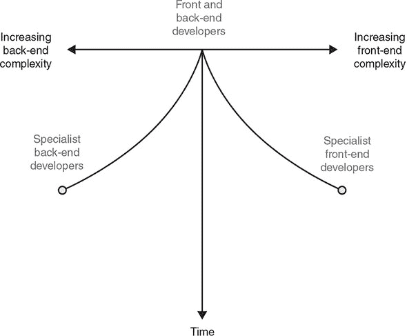

当后端开发者专注于幕后机制时，前端开发者专注于构建良好的用户体验。随着时间的推移，对这两方面的期望越来越高，促使这一趋势持续发展。开发者经常不得不选择一个专业领域并专注于它。

##### 帮助开发者使用库和框架

在 2000 年代，库和框架开始在前端和后端最常见的语言中变得流行和普遍。想想前端 JavaScript 的 Dojo 和 jQuery；想想 PHP 和 Ruby on Rails 的 Symfony。这些框架被设计用来让开发者生活更轻松，降低入门门槛。一个好的库或框架可以抽象掉一些开发复杂性，让你更快地编码，并减少对深入专业知识的需求。这种简化趋势导致了全栈开发者的回归，他们既构建前端也构建其后的应用程序逻辑，如图 1.2 所示。

##### 图 1.2\. 框架对分离的 Web 开发派系的影响

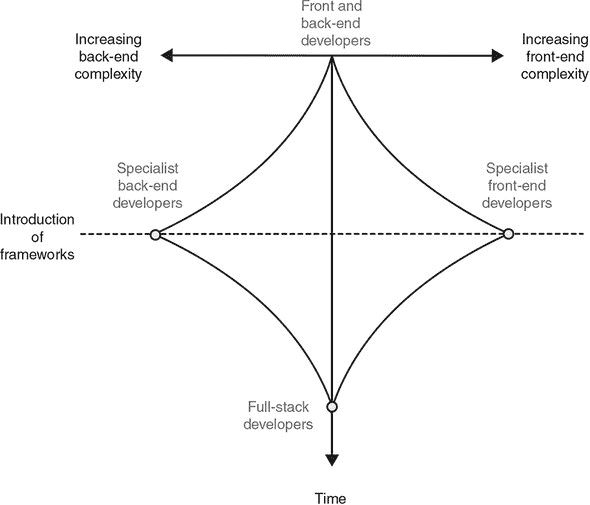

图 1.2 展示的是一个趋势，而不是宣称一个“所有 Web 开发者都应该成为全栈开发者”的绝对法则。在整个 Web 历史上一直都有全栈开发者，向前看，很可能会有些开发者会选择专注于前端或后端开发。目的是通过使用框架和现代工具，你不再需要选择一个端或另一个端来成为一名优秀的 Web 开发者。

采用框架方法的一个巨大优势是你可以非常高效地工作，因为你将拥有对应用程序及其如何结合在一起的全局视角。

##### 将应用程序代码向前移动到堆栈中

继续遵循框架趋势，过去几年中，人们越来越努力地将应用程序逻辑从服务器移到前端。把这看作是在前端编码后端。在这方面做得最流行的 JavaScript 框架有 Angular、React 和 Vue.js。

以这种方式将应用程序代码紧密耦合到前端，往往会模糊传统前端和后端开发者之间的界限。人们喜欢使用这种方法的一个原因是因为它减少了服务器的负载，从而降低了成本。实际上你所做的是通过将负载推入用户的浏览器，将应用程序所需的计算能力众包。

我们将在第 1.5 节讨论这种方法的优缺点，并解释何时（或可能不）适合使用这些技术之一。

#### 1.1.2\. 全栈开发的趋势

正如所讨论的，前端和后端开发者的道路正在融合；在两个学科中完全精通是完全可能的。如果你是一名自由职业者、顾问或小型团队的一员，多技能是非常有用的，可以增加你为客户提供的价值。能够开发整个网站或应用程序的范围，可以让你更好地控制整体，并有助于各部分无缝协作，因为它们不是由不同的团队独立构建的。

如果你作为大型团队的一部分工作，你很可能会需要专门化（或者至少专注于）一个领域。但通常建议你了解你的组件如何与其他组件配合，这将使你更加欣赏其他团队和整个项目的要求和目标。

最后，独立构建全栈是很有回报的。每个部分都伴随着自己的挑战和需要解决的问题，使事情保持有趣。今天可用的技术和工具增强了这种体验，并赋予你相对快速和容易地构建优秀网络应用程序的能力。

#### 1.1.3\. 全栈开发的益处

学习全栈开发有许多好处。首先，当然是有学习新事物和玩新技术的乐趣。然后，你会有掌握不同技能的满足感，以及能够独立构建和发布一个全数据库驱动的应用程序的激动。

在团队中工作的好处包括以下内容：

+   通过理解不同的领域以及它们如何配合，你更有可能对大局有更好的看法。

+   你将形成对团队其他部分正在做什么以及他们需要成功所需的了解。

+   就像其他团队成员一样，你可以更加自由地移动。

独自工作的额外好处包括

+   你可以独立构建端到端的应用程序，而不依赖于其他人。

+   你可以开发更多技能、服务和能力，以提供给客户。

总的来说，全栈开发有很多可说的。我们遇到的大部分成功开发者都是全栈开发者。他们对整体的理解和看到大局的能力是一个巨大的优势。

#### 1.1.4\. 为什么是 MEAN 栈？

MEAN 栈将一些“最佳”的现代网络技术汇集到一个强大、灵活的栈中。MEAN 栈的一个优点是它不仅在使用浏览器的 JavaScript 中，而且在整个应用中都用 JavaScript。使用 MEAN 栈，你可以用同一种语言编写前端和后端代码。尽管如此，构建栈的 Angular 部分通常使用 TypeScript。我们将在第八章中讨论这个理由。

图 1.3 展示了 MEAN 栈的主要技术，并显示了每个技术通常被用于何处。

##### 图 1.3\. MEAN 栈的主要技术

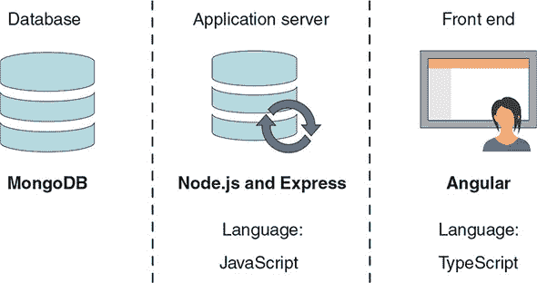

允许全栈 JavaScript 实现的主要技术是 Node.js，它将 JavaScript 引入了后端。

### 1.2\. 介绍 Node.js：网络服务器/平台

Node.js 是*MEAN*中的*N*。排在最后并不意味着它是最不重要的：它是栈的基础！

简而言之，Node.js 是一个软件平台，它允许你创建自己的 Web 服务器并在其上构建 Web 应用程序。Node.js 本身不是一个 Web 服务器；它也不是一种语言。它包含一个内置的 HTTP 服务器库，这意味着你不需要运行像 NGINX、Apache 或 Internet Information Services (IIS) 这样的独立 Web 服务器程序。这让你能够更好地控制 Web 服务器的工作方式，但也增加了将其启动和运行，尤其是在实时环境中的复杂性。

例如，使用 PHP，你可以轻松找到一个运行 Apache 的共享服务器 Web 主机，并通过 FTP 发送一些文件，如果一切顺利，你的网站就可以运行了。这是因为 Web 主机已经为你和其他人配置了 Apache。但在 Node.js 中，情况并非如此，因为你在创建应用程序时配置 Node.js 服务器。许多传统的 Web 主机在 Node.js 支持方面落后于时代，但有几家新的平台即服务（PaaS）主机正在涌现以满足这一需求，包括 Heroku、Nodejitsu 和 DigitalOcean。在这些 PaaS 主机上部署实时网站的方法与旧的 FTP 模型不同，但一旦掌握了技巧，就会变得简单。当你阅读本书时，你将部署一个网站到 Heroku。

托管 Node.js 应用程序的另一种方法是自己在专用服务器或云服务提供商（如 AWS 或 Azure）的虚拟服务器上自行操作，你可以在上面安装你需要的任何东西。但生产服务器管理是另一本书的主题！尽管你可以独立用替代技术替换任何其他组件，但如果移除 Node.js，其上的一切都会改变。

#### 1.2.1\. JavaScript：通过堆栈的单一种语言

Node.js 获得广泛流行的主要原因之一是你可以用大多数 Web 开发者已经熟悉的语言来编写它：JavaScript。在 Node 发布之前，如果你想成为一名全栈开发者，你必须至少精通两种语言：前端使用 JavaScript，后端使用类似 PHP 或 Ruby 的语言。

| |
| --- |

**微软对服务器端 JavaScript 的探索**

在 1990 年代后期，微软发布了 Active Server Pages（现在称为 Classic ASP）。ASP 可以用 VBScript 或 JavaScript 编写，但 JavaScript 版本并没有流行起来，很大程度上是因为当时很多人熟悉 Visual Basic，而 VBScript 的外观与 Visual Basic 类似。许多书籍和在线资源都是针对 VBScript 的，因此它滚雪球般地成为了 Classic ASP 的标准语言。


随着 Node.js 的发布，你可以使用你已知的技能并将其用于服务器。学习这种新技术中最困难的部分之一是学习语言，但如果你已经了解一些 JavaScript，你就已经领先一步了！

当你开始学习 Node.js 时，即使你是一个经验丰富的前端 JavaScript 开发者，也会有一个学习曲线。服务器端编程的挑战和障碍与前端不同，但无论你使用什么技术，你都会面临这些挑战。在前端，你可能担心确保各种浏览器在不同设备上都能正常工作。在服务器端，你更可能会关注代码的流程，以确保没有任何东西被阻塞，并且你不会浪费系统资源。

#### 1.2.2. 快速、高效和可扩展

Node.js 受欢迎的另一个原因是，当代码编写正确时，它非常快，并且能够高效地利用系统资源。这些特性使得 Node.js 应用程序能够在比其他主流服务器技术更少的资源上服务更多的用户。企业主也喜欢 Node.js 的想法，因为它可以降低他们的运营成本，即使在大型规模下也是如此。

Node.js 是如何做到这一点的？Node.js 资源消耗轻，因为它采用单线程模式，而传统的网络服务器是多线程的。在接下来的章节中，我们将探讨这些术语的含义，从传统的多线程方法开始。

##### 传统的多线程网络服务器

目前的大多数主流网络服务器都是多线程的，包括 Apache 和 IIS。这意味着每个新的访客（或会话）都会被分配一个单独的线程和相应数量的 RAM，通常约为 8 MB。

考虑一个现实世界的类比，想象两个人进入银行想要做不同的事情。在多线程模型中，他们会各自去不同的柜员，柜员会处理他们的请求，如图 1.4 所示。

##### 图 1.4. 多线程方法的示例：访客使用单独的资源。访客及其专用资源对其他访客及其资源没有意识或联系。

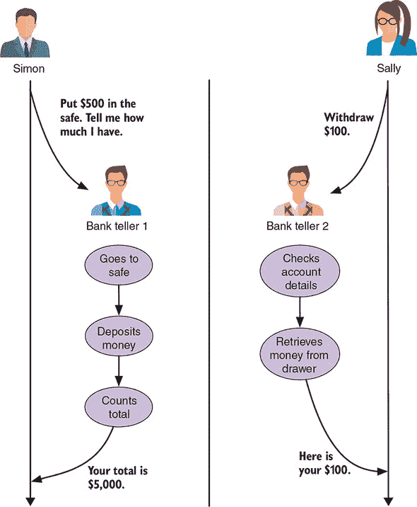

你可以从图 1.4 中看到，西蒙去柜员 1，萨莉去柜员 2。双方都没有意识到或受到对方的影响。柜员 1 整个交易过程中只处理西蒙的事务；柜员 2 和萨莉的情况也是如此。

只要你有足够的柜员来服务客户，这种方法就非常有效。当银行变得繁忙，客户数量超过柜员时，服务开始变慢，客户必须等待才能得到服务。尽管银行并不总是过分担心这种情况，看起来也乐于让你排队，但网站的情况并非如此。如果一个网站响应缓慢，用户可能会离开并且再也不回来。

这就是为什么即使 90%的时间不需要，网络服务器通常也会过载并且拥有大量的 RAM 的原因之一。硬件的设置方式是为了应对流量激增。这种设置就像银行在午餐时间繁忙时雇佣额外的 50 名全职出纳员并搬到一个更大的建筑一样。

当然，一定有更好的方法——一种稍微更可扩展的方法。这就是单线程方法发挥作用的地方。

##### 单线程网络服务器

Node.js 服务器是单线程的，并且与多线程服务器的工作方式不同。服务器不是为每个访客提供一个唯一的线程和单独的资源隔离区，而是让每个访客加入同一个线程。访客和线程只在必要时交互——当访客请求某物或线程响应请求时。

回到银行出纳员的类比，只有一个出纳员处理所有客户。但出纳员不是从头到尾管理所有请求，而是将任何耗时任务委托给后台工作人员，并处理下一个请求。图 1.5 展示了这个流程可能如何工作，使用了多线程示例中的两个请求。

##### 图 1.5。单线程方法示例：访客使用相同的中央资源。中央资源必须非常规范，以防止一个访客影响其他访客。

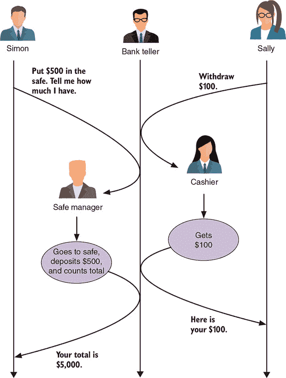

在图 1.5 中展示的单线程方法中，萨利和西蒙将他们的请求提交给同一个银行出纳员。但出纳员不是在处理完一个请求后再处理下一个，而是先处理第一个请求，将其转交给最适合处理的人，然后再处理下一个请求并做同样的事情。当出纳员被告知请求的任务已完成时，出纳员将结果转回提出请求的访客。

| |
| --- |

**阻塞与非阻塞代码**

在单线程模型中，重要的是要记住，所有用户都使用相同的中央进程。为了保持流程顺畅，你需要确保代码中没有任何东西会导致延迟，从而阻塞其他操作。一个例子是，如果银行出纳员必须去保险柜存钱给西蒙，那么萨利就必须等待她的请求。

同样，如果你的中央进程负责读取每个静态文件（如 CSS、JavaScript 或图像），它将无法处理任何其他请求，从而阻塞流程。另一个可能阻塞的常见任务是与数据库交互。如果你的进程每次被要求访问数据库时，无论是搜索数据还是保存数据，它将无法做其他任何事情。

为了使单线程方法有效，你必须确保你的代码是非阻塞的。实现这一目标的方法是将任何阻塞操作异步执行，防止它们阻塞主进程的流程。

| |
| --- |

尽管只有一个出纳员，但两位访客都没有意识到对方的存在，也没有受到对方请求的影响。这种方法意味着银行不需要总是有多个出纳员在岗。当然，这种模式并不是无限可扩展的，但效率更高。您可以用更少的资源做更多的事情。但这并不意味着您永远不会需要添加更多资源。

由于 JavaScript 的异步能力，这种特定方法在 Node.js 中是可行的，您将在本书的整个内容中看到其实际应用。但如果您对理论不太确定，请查看附录 D（可在网上或电子书中找到），特别是关于回调的部分。

#### 1.2.3\. 通过 npm 使用预构建的包

当您安装 Node.js 时，会安装包管理器 npm。npm 使您能够下载 Node.js 模块或 *包* 来扩展您应用程序的功能。目前，通过 npm 可用超过 350,000 个包，这表明您可以为应用程序带来多少知识和经验。这个数字比四年前 *Getting MEAN* 第一版编写时的 46,000 个有所增加！

npm 中的包在提供的内容上差异很大。您将在本书中使用一些 npm 包来引入具有模式支持的框架和数据库驱动程序。其他例子包括像 Underscore 这样的辅助库、像 Mocha 这样的测试框架以及像 Colors 这样的实用工具，它为 Node.js 控制台日志添加了颜色支持。您将在第三章开始构建应用程序时更详细地了解 npm 和它的工作方式。

正如您所看到的，Node.js 非常强大和灵活，但在您尝试创建网站或应用程序时，它并不提供太多帮助。Express 可以在这里为您提供帮助。您可以通过 npm 安装 Express。

### 1.3\. 介绍 Express：框架

Express 是 *MEAN* 中的 *E*。因为 Node.js 是一个平台，它不规定应该如何设置或使用，这是它的一个巨大优势。但每次您创建网站和 Web 应用程序时，都需要完成许多常见任务。Express 是一个为 Node.js 设计的 Web 应用程序框架，旨在以经过测试、可重复的方式执行这些任务。

#### 1.3.1\. 简化您的服务器设置

如前所述，Node.js 是一个平台，而不是服务器，这允许您在服务器设置方面发挥创意，做一些其他 Web 服务器无法做到的事情。这也使得建立一个基本的网站变得更加困难。

Express 通过设置一个网络服务器来监听传入的请求并返回相关响应，从而抽象出这种困难。此外，它还定义了目录结构。一个文件夹被设置为以非阻塞方式提供静态文件；您最不希望的是当有人请求 CSS 文件时，您的应用程序需要等待！您可以直接在 Node.js 中配置此设置，但 Express 会为您完成。

#### 1.3.2\. 将 URL 路由到响应

Express 的一个伟大功能是它提供了一个简单的接口，可以将传入的 URL 指向特定的代码片段。无论这个接口是提供静态 HTML 页面、从数据库读取还是写入数据库，这都不重要。该接口简单且一致。

Express 抽象了在原生 Node.js 中创建 Web 服务器的某些复杂性，以使代码更快编写且更容易维护。

#### 1.3.3\. 视图：HTML 响应

很可能你将希望通过向浏览器发送一些 HTML 来响应你应用程序的许多请求。到目前为止，Express 使这项任务比在原生 Node.js 中更容易，这对你来说可能不会感到惊讶。

Express 提供了对许多模板引擎的支持，这使得使用可重用组件以及应用程序中的数据以智能方式构建 HTML 页面变得更加容易。Express 将这些组件编译在一起，并以 HTML 的形式提供给浏览器。

#### 1.3.4\. 使用会话支持记住访客

由于 Node.js 是单线程的，它不会记住一个请求到下一个请求的访问者。它没有为用户预留的 RAM 隔离区；它只看到一系列 HTTP 请求。HTTP 是一种无状态协议，因此没有存储会话状态的概念。目前，在 Node.js 中创建个性化的体验或拥有一个用户必须登录的安全区域都很难；如果网站在每一页都忘记你是谁，那就没什么用了。当然，你可以做到这一点，但你必须自己编写代码。

你永远猜不到：Express 对这个问题也有解决方案！Express 可以使用 *会话* 来识别通过多个请求和页面访问的个别访客。感谢 Express！

建立在 Node.js 之上，Express 为构建 Web 应用程序提供了极大的帮助和稳固的起点。它抽象了许多我们大多数人不需要或不想担心的复杂性和重复性任务。我们只想构建 Web 应用程序。

### 1.4\. 介绍 MongoDB：数据库

存储和使用数据的能力对于大多数应用程序至关重要。在 MEAN 堆栈中，首选的数据库是 MongoDB，即 *MEAN* 中的 *M*。MongoDB 与堆栈结合得非常好。像 Node.js 一样，它以其快速和可扩展性而闻名。

#### 1.4.1\. 关系型数据库与文档存储

如果你之前使用过关系型数据库，或者甚至使用过电子表格，你将熟悉列和行的概念。通常，列定义了名称和数据类型，而每一行是不同的条目。参见 表 1.1 以获取示例。

##### 表 1.1\. 关系型数据库表中的行和列示例

| firstName | middleName | lastName | maidenName | nickname |
| --- | --- | --- | --- | --- |
| Simon | David | Holmes |   | Si |
| Sally | June | Panayiotou |   |   |
| Rebecca |   | Norman | Holmes | Bec |

MongoDB 并非如此！MongoDB 是一个文档存储。行的概念仍然存在，但列从图中移除。不是列定义了行中应该有什么，而是每一行都是一个文档，这个文档既定义又持有数据本身。表 1.2 展示了文档集合可能如何列出。（缩进布局是为了可读性，而不是列的可视化。）

##### 表 1.2\. 文档数据库中的每个文档都定义并持有数据，没有特定的顺序。

| 名字: "Simon" | 中间名: "David" | 姓氏: "Holmes" | 昵称: "Si" |
| --- | --- | --- | --- |
| 姓氏: "Panayiotou" | 中间名: "June" | 名字: "Sally" |   |
| 姓氏: "Holmes" | 名字: "Rebecca" | 姓氏: "Norman" | 昵称: "Bec" |

这种不太结构化的方法意味着文档集合内部可能包含各种类型的数据。在下一节中，你将查看一个示例文档，以更好地了解我们所说的内容。

#### 1.4.2\. MongoDB 文档：JavaScript 数据存储

MongoDB 以 BSON 格式存储文档，即二进制 JSON（JavaScript 序列化对象表示法）。现在如果你对 JSON 不太熟悉，不用担心；请查看附录 D 中相关的部分。附录 D。简而言之，JSON 是一种 JavaScript 存储数据的方式，这也是为什么 MongoDB 与以 JavaScript 为中心的 MEAN 栈如此契合！

以下代码片段展示了 MongoDB 文档的一个简单示例：

```
{
  "firstName" : "Simon",
  "lastName" : "Holmes",
  _id : ObjectId("52279effc62ca8b0c1000007")
}
```

即使你对 JSON 不太了解，你可能也能看出这个文档存储了西蒙·霍姆斯的姓名。与一个文档持有与一组列相对应的数据集不同，一个文档持有名称/值对，这使得文档本身非常有用，因为它既描述又定义了数据。

关于 _`id`_ 的一句快速说明：你很可能注意到了前面示例 MongoDB 文档中与名称并列的 _`id`_ 条目。_`id`_ 实体是 MongoDB 在创建新文档时分配给任何新文档的唯一标识符。

当你开始在应用程序中添加数据时，你将在第五章中更详细地了解 MongoDB 文档。

#### 1.4.3\. 不仅仅是文档数据库

MongoDB 通过其对二级索引和丰富查询的支持，将自己与其他许多文档数据库区分开来。你可以在除了唯一标识符字段之外的地方创建索引，并且查询索引字段要快得多。你还可以对 MongoDB 数据库创建一些相当复杂的查询——虽然不是像到处都有连接的巨大 SQL 命令那样，但对于大多数用例来说已经足够强大。

在你阅读本书的过程中构建应用程序时，你将有机会与 MongoDB 一起享受乐趣，并开始真正欣赏它所能做到的事情。

#### 1.4.4\. MongoDB 不擅长什么？

截至 4.0 版本，传统的 RDBMS 几乎无法做到 MongoDB 能做到的事情，除了我们已经讨论过的明显差异之外。MongoDB 早期版本中最大的问题之一是缺乏事务支持。本书使用的 MongoDB 4 版本具有执行具有 ACID（原子性、一致性、隔离性、持久性）保证的多文档事务的能力。

#### 1.4.5. Mongoose 用于数据建模及其他

MongoDB 在文档中存储数据的灵活性对数据库来说是一件好事。但大多数应用程序需要其数据有一定的结构。请注意，*应用程序* 需要结构，而不是数据库。那么在哪里定义应用程序数据结构最有意义呢？在应用程序本身中！

因此，MongoDB 背后的公司创建了 Mongoose。用公司的话说，Mongoose 提供“优雅的 MongoDB 对象建模，适用于 Node.js”([`mongoosejs.com`](https://mongoosejs.com))。

##### 什么是数据建模？

在 Mongoose 和 MongoDB 的背景下，数据建模定义了文档中可以存储的数据以及必须存储的数据。当存储用户信息时，你可能希望能够保存姓氏、名字、电子邮件地址和电话号码。但你只需要姓氏和电子邮件地址，并且电子邮件地址必须是唯一的。这些信息在 *模式* 中定义，该模式用作数据模型的基础。

##### Mongoose 还提供了什么？

除了建模数据之外，Mongoose 在 MongoDB 上添加了一层完整的特性，这些特性对于构建 Web 应用程序非常有用。Mongoose 使得管理对 MongoDB 数据库的连接以及保存和读取数据变得更加容易。你将在后面的内容中使用所有这些特性。本书后面还将讨论 Mongoose 如何使你能够在模式级别添加数据验证，确保只允许有效数据被保存到数据库中。

MongoDB 是大多数 Web 应用程序的理想数据库选择，因为它在纯文档数据库的速度和关系数据库的强大功能之间提供了平衡。数据以 JSON 格式有效存储，这使得它成为 MEAN 栈的完美数据存储。

图 1.6 展示了 Mongoose 的亮点以及它是如何位于数据库和应用之间的。

##### 图 1.6. Mongoose 位于数据库和应用之间，提供了一个易于使用的接口（对象模型）以及访问其他功能，如验证。

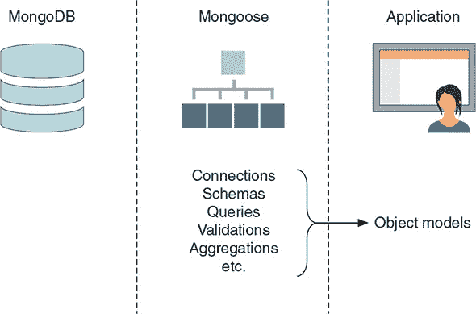

### 1.5. 介绍 Angular：前端框架

Angular 是 *MEAN* 中的 *A*。简单来说，Angular 是一个用于创建网站或应用程序界面的 JavaScript 框架。在本书中，你将使用 Angular 7，这是最近可用的版本。所有之前的版本都已弃用，在线文档不再适用。

你可以使用 Node.js、Express 和 MongoDB 来构建一个完全功能的数据驱动型网络应用程序，你将在本书中这样做。但你可以通过添加 Angular 到这个堆栈来锦上添花。

传统的方法是将所有数据处理和应用程序逻辑放在服务器上，然后服务器将 HTML 传递给浏览器。Angular 允许你将一些或所有这些处理和逻辑移动到浏览器，通常让服务器从数据库传递数据。我们将在讨论数据绑定时讨论这个过程，但首先，我们需要解决 Angular 是否像 jQuery（领先的客户端 JavaScript 库）这样的问题。

#### 1.5.1. jQuery 与 Angular 的比较

如果你熟悉 jQuery，可能会想知道 Angular 是否以相同的方式工作。简短的答案是：不，实际上不是。jQuery 通常是在 HTML 发送到浏览器并且文档对象模型（DOM）完全加载后添加到页面上的，以提供交互性。Angular 在这一步之前介入，根据提供的数据从模板构建 HTML。

此外，jQuery 是一个库，因此它有一系列你可以按需使用的功能。Angular 被称为一个*有偏见的框架*，这意味着它强迫你按照它认为的方式使用。它还抽象了一些底层复杂性，简化了开发体验。

如前所述，Angular 帮助根据提供的数据组合 HTML，但它还做了更多：如果数据发生变化，它会立即更新 HTML；如果 HTML 发生变化，它还可以更新数据。这个特性被称为*双向数据绑定*，我们将在下一节中简要介绍。

#### 1.5.2. 双向数据绑定：在页面中处理数据

要理解双向数据绑定，可以考虑一个简单的例子。将这种方法与传统单向数据绑定进行比较。想象你有一个网页和一些数据，你想要做以下事情：

1.  将该数据以列表形式显示给用户

1.  允许用户通过在表单字段中输入文本来过滤该列表

在两种方法——单向和双向绑定——中，第一步是相似的。你使用数据为最终用户生成一些 HTML 标记。第二步是事情变得有点不同的地方。

在第二步中，你希望让用户在表单字段中输入一些文本以过滤显示的数据列表。使用单向数据绑定，你必须手动添加事件监听器到表单输入字段以捕获数据并更新数据模型（最终改变显示给用户的内容）。

通过双向数据绑定，可以自动捕获表单的任何更新，更新模型并更改向用户显示的内容。这种功能可能听起来并不重要，但要理解其强大之处，了解使用 Angular，你可以在步骤 1 和 2 中实现所有功能，而无需编写任何 JavaScript 代码！没错——这一切都是通过 Angular 的双向数据绑定...以及一些其他 Angular 功能的帮助来完成的。

当你阅读这本书的第三部分时，你将看到——并使用——这一功能在实际中的应用。这个特性是“眼见为实”，你不会失望的。

#### 1.5.3\. 使用 Angular 加载新页面

Angular 特别设计用于的功能之一是*单页应用程序*（SPA）功能。实际上，SPA 在浏览器内部运行所有内容，并且永远不会进行完整的页面刷新。所有应用程序逻辑、数据处理、用户流程和模板交付都可以在浏览器中管理。

以 Gmail 为例。那是一个 SPA。页面会显示不同的视图，以及各种数据集，但页面本身永远不会完全刷新。

这种方法可以减少你在服务器上需要的资源量，因为你实际上是在众包计算能力。每个人的浏览器都在做艰苦的工作；你的服务器在请求时提供静态文件和数据。

在这种方法下，用户体验也可以得到改善。在应用程序加载后，对服务器的调用次数减少，减少了延迟的可能性。

所有这些听起来都很棒，但肯定要付出代价。为什么不是所有东西都集成到 Angular 中？

#### 1.5.4\. 有任何缺点吗？

尽管 Angular 有许多优点，但它并不适合每个网站。像 jQuery 这样的前端库最适合用于渐进增强。想法是，你的网站在没有 JavaScript 的情况下也能完美运行，你使用的 JavaScript 可以让体验变得更好。Angular 或任何其他 SPA 框架都不是这样。Angular 使用 JavaScript 从模板和数据构建渲染的 HTML，所以如果你的浏览器不支持 JavaScript 或代码中存在错误，网站将无法运行。

这种依赖于 JavaScript 来构建页面的做法也导致搜索引擎出现问题。当搜索引擎爬取你的网站时，它不会运行所有 JavaScript；在 Angular 中，在 JavaScript 接管之前，你只能得到服务器上的基本模板。如果你想确保你的内容和数据被搜索引擎索引，而不是只有你的模板，你需要考虑 Angular 是否适合那个项目。

你有方法来应对这个问题：简而言之，你需要你的服务器输出编译后的内容以及 Angular。但是，如果你*不需要*战斗这场战斗，我们建议不要这样做。

你可以做的事情之一是，对于某些事情使用 Angular，而对于其他事情则不使用。在你的项目中选择性使用 Angular 没有什么问题。例如，你可能有一个数据丰富的交互式应用或网站的部分，非常适合在 Angular 中构建。或者你可能有一个围绕你的应用的博客或一些营销页面。这些元素不需要在 Angular 中构建，并且从服务器以传统方式提供可能更好。因此，你的网站的一部分由 Node.js、Express 和 MongoDB 提供，而另一部分也由 Angular 执行其功能。

这种灵活的方法是 MEAN 栈最强大的特性之一。只要你在思考时保持灵活性，不要将 MEAN 栈视为单一的架构栈，你就可以通过一个栈实现许多事情。

尽管如此，情况正在改善。网络爬虫技术，尤其是谷歌使用的那些，变得越来越强大，这个问题很快就会成为过去式。

#### 1.5.5\. 使用 TypeScript 进行开发

Angular 应用可以编写多种 JavaScript 风格，包括 ES5、ES2015+ 和 Dart。但最受欢迎的无疑是 TypeScript。

TypeScript 是 JavaScript 的超集，这意味着它*就是*JavaScript，但增加了额外的功能。在这本书中，你将使用 TypeScript 来构建应用的 Angular 部分。但别担心：我们将从头开始，在第三部分中介绍你需要了解的 TypeScript 部分。

### 1.6\. 支持角色

MEAN 栈为你提供了创建数据丰富的交互式网络应用所需的一切，但你可能还想使用一些额外的技术来帮助你。例如，你可以使用 Twitter Bootstrap 来创建良好的用户界面，使用 Git 来帮助管理你的代码，以及使用 Heroku 来通过托管应用在实时 URL 上提供帮助。在后面的章节中，我们将探讨将这些技术整合到 MEAN 栈中。在本节中，我们将简要介绍每个技术能为你做什么。

#### 1.6.1\. Twitter Bootstrap 用于用户界面

在这本书中，你将使用 Twitter Bootstrap 以最小的努力创建响应式设计。它对于栈来说不是必需的，如果你正在构建一个基于现有 HTML 或特定设计的应用，你可能不想添加它。但在这本书中，你将以*快速原型*风格构建一个应用，从想法到应用，没有任何外部影响。

Bootstrap 是一个前端框架，它为创建出色的用户界面提供了丰富的帮助。在其特性中，Bootstrap 提供了一个响应式网格系统、许多界面组件的默认样式，以及通过主题改变视觉外观的能力。

##### 响应式网格布局

在响应式布局中，你提供一个 HTML 页面，通过检测屏幕分辨率而不是尝试检测实际设备来在不同设备上以不同的方式排列自己。Bootstrap 针对四种不同的像素宽度断点进行布局，大致针对手机、平板电脑、笔记本电脑和外接显示器。如果你稍微考虑一下如何设置你的 HTML 和 CSS 类，你可以使用一个 HTML 文件在不同的布局中提供相同的内容，以适应屏幕大小。

##### CSS 类和 HTML 组件

Bootstrap 附带一系列预定义的 CSS 类，可以创建有用的视觉组件，例如页面标题、警告信息容器、标签和徽章，以及风格化的列表。Bootstrap 的制作者在框架上投入了大量的思考。Bootstrap 可以帮助你快速构建应用程序，无需花费太多时间在 HTML 布局和 CSS 样式上。

教学 Bootstrap 不是本书的目标，但我们会在你使用时指出各种功能。

##### 添加不同的主题以改变感觉

Bootstrap 有一个默认的外观和感觉，提供了一个整洁的基线，并且由于其广泛的使用，你的网站可能会看起来像任何其他人的。幸运的是，你可以下载 Bootstrap 的主题来给你的应用程序带来不同的风格。下载主题通常只是用新的 CSS 文件替换 Bootstrap CSS 文件。你将在本书中使用免费的主题来构建你的应用程序，但也可以从多个网站购买高级主题，以给应用程序带来独特的风格。

#### 1.6.2\. Git 用于源代码控制

在你的计算机或网络驱动器上保存代码是非常好和有用的，但计算机或网络驱动器只保存当前版本，并且只允许你（或你网络上的其他用户）访问它。

Git 是一个分布式版本控制和源代码管理系统，允许多个人在不同的计算机和网络上的同一代码库上同时工作。这些可以一起推送，所有更改都存储并记录。如果需要，还可以回滚到早期状态。

##### 如何使用 Git

Git 通常从命令行使用，尽管 Windows、Linux 和 Mac 都有 GUI。在这本书的整个过程中，你将使用命令行语句来发出所需的命令。Git 功能强大，我们将在本书中触及它的表面，但我们所做的一切都将作为示例的一部分提供。

在典型的 Git 设置中，你在你的机器上有一个本地仓库，并在 GitHub 或 Bitbucket 等地方托管一个远程集中式主仓库。你可以从远程仓库拉取到本地仓库，或者从本地推送到远程。所有这些任务都可以从命令行轻松执行，GitHub 和 Bitbucket 都有网络界面，这样你可以直观地跟踪你所提交的一切。

##### 这里 Git 的用途是什么？

在这本书中，你将使用 Git 的两个原因：

+   本书中的示例应用程序的源代码将存储在 GitHub 上，不同分支对应不同的里程碑。你将能够克隆主分支或单独的分支来使用代码。

+   你将使用 Git 作为将你的应用程序部署到全球可见的实时服务器的方法。对于托管，你将使用 Heroku。

#### 1.6.3. 使用 Heroku 托管

托管 Node.js 应用程序可能很复杂，但并不一定如此。许多传统的共享托管提供商没有跟上 Node.js 的兴趣。一些提供商为你安装它，这样你就可以运行应用程序，但服务器通常没有针对 Node.js 的独特需求进行设置。要成功运行 Node.js 应用程序，你需要一个针对 Node.js 进行配置的服务器，或者你可以使用专门为托管 Node.js 设计的 PaaS 提供商。

在这本书中，你将采取后一种方法。你将使用 Heroku ([`www.heroku.com`](https://www.heroku.com)) 作为你的托管提供商。Heroku 是 Node.js 应用程序的主要托管商之一，它提供了一个出色的免费层，你将利用这个免费层。

在 Heroku 上的应用程序本质上都是 Git 仓库，这使得发布过程变得极其简单。在一切设置完成后，你可以使用单个命令将你的应用程序发布到实时环境：

```
$ git push heroku master
```

### 1.7. 将其实践示例整合起来

正如我们已经多次提到的，在这本书的过程中，你将在 MEAN 栈上构建一个工作应用程序。这个过程将使你对每种技术都有很好的了解，并展示它们是如何结合在一起的。

#### 1.7.1. 介绍示例应用程序

那么在你阅读本书的过程中，你将构建什么？你将构建一个名为 Loc8r 的应用程序。Loc8r 列出附近的带有 Wi-Fi 的地点，人们可以去那里完成工作。它还显示每个地点的设施、营业时间、评分和位置地图。用户将能够登录并提交评分和评论。

这个应用程序在现实世界中有些基础。基于位置的应用程序本身并不特别新颖，它们以几种形式出现。Swarm 和 Facebook Check In 列出他们能找到的所有附近事物，并为新地点和信息更新众包数据。Urbanspoon 帮助人们找到附近的餐馆，允许用户根据价格区间和菜系类型进行搜索。甚至像星巴克和麦当劳这样的公司，它们的应用程序中也有帮助用户找到最近店铺的部分。

##### 真实数据还是假数据？

好吧，在这本书中，我们将为 Loc8r 假设数据，但如果你愿意，你也可以收集数据、众包数据或使用外部来源。对于快速原型方法，你通常会发现在你的应用程序的第一个私有版本中伪造数据可以加快这个过程。

##### 最终产品

你将使用 MEAN 栈的所有层来创建 Loc8r，包括 Twitter Bootstrap 帮助你创建响应式布局。图 1.7 展示了你在本书中将要构建的一些截图。

##### 图 1.7\. Loc8r 是你在本书中将构建的应用程序。它在不同的设备上显示不同，显示地点列表和每个地点的详细信息，并允许访客登录并留下评论。


#### 1.7.2\. MEAN 栈组件是如何协同工作的

在你阅读完这本书后，你将有一个运行在 MEAN 栈上的应用程序，全程使用 JavaScript。MongoDB 以二进制 JSON 格式存储数据，通过 Mongoose 暴露为 JSON。Express 框架建立在 Node.js 之上，代码以 JavaScript 编写。前端是 Angular，它是 TypeScript。图 1.8 展示了这个流程和连接。

##### 图 1.8\. JavaScript（部分为 TypeScript）是 MEAN 栈中的通用语言，JSON 是通用数据格式。

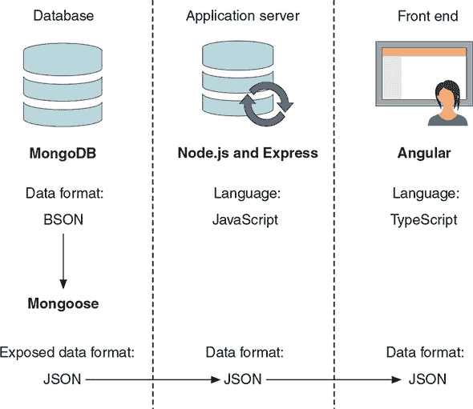

我们将在第二章中探讨各种构建 MEAN 栈的方法以及如何构建 Loc8r。

由于 JavaScript 在栈中扮演着如此关键的角色，请参阅附录 D（可在网上和电子书中找到），其中包含 JavaScript 陷阱和最佳实践的复习。

### 摘要

在本章中，你学习了

+   构成 MEAN 栈的技术有哪些以及它们是如何协同工作的

+   MongoDB 作为数据层的位置

+   Node.js 和 Express 如何协同工作以提供应用服务器层

+   Angular 如何提供出色的前端和数据绑定层

+   几种扩展 MEAN 栈的额外技术的方法

## 第二章\. 设计 MEAN 栈架构

*本章涵盖*

+   介绍常见的 MEAN 栈架构

+   单页应用程序

+   探索替代的 MEAN 栈架构

+   为真实应用程序设计架构

+   根据架构设计进行构建规划

在第一章中，我们探讨了 MEAN 栈的组成部分以及它们是如何相互配合的。在本章中，我们将更详细地探讨它们是如何相互配合的。

我们将从一些人认为的“**MEAN 栈架构**”开始，特别是当他们第一次遇到这个栈时。通过一些示例，我们将探讨为什么你可能使用不同的架构，然后稍作调整，移动一些东西。MEAN 是一个强大的栈，可以用来解决各种问题……如果你在解决方案的设计上富有创意。

### 2.1\. 常见的 MEAN 栈架构

架构 MEAN 栈应用程序的一种常见方式是使用表示状态转移（REST）API 为单页应用程序（SPA）提供数据。API 通常使用 MongoDB、Express 和 Node.js 构建，SPA 则使用 Angular 构建。这种方法对于那些从 Angular 背景转向 MEAN 栈并且寻找提供快速、响应式 API 的堆栈的人来说尤其受欢迎。图 2.1 展示了基本设置和数据流。

##### 图 2.1\. MEAN 栈架构的一种常见方法，使用 MongoDB、Express 和 Node.js 构建 REST API，将 JSON 数据传输到在浏览器中运行的 Angular SPA

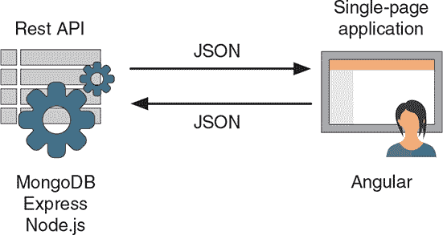


**什么是 REST API？**

*REST* 代表 *表征状态转移*，这是一种架构风格，而不是严格的协议。REST 是无状态的；它对任何当前用户状态或历史没有任何概念。

*API* 是 *应用程序编程接口* 的缩写，它使得应用程序之间能够相互通信。在网页的情况下，API 通常是一组在正确的方式和正确的信息下调用时返回数据的 URL。

*REST API* 是对应用程序的无状态接口。在 MEAN 栈的情况下，REST API 用于创建对数据库的无状态接口，从而为其他应用程序，如 Angular SPA，提供了一种与数据交互的方式。换句话说，你创建了一个结构化的 URL 集合，当调用时返回特定的数据。


图 2.1 是一个很好的设置，如果你有或打算构建一个 SPA 作为你的用户界面，那么它是非常理想的。Angular 是专门设计用来构建 SPAs 的，它从 REST API 中拉取数据，并将其推回。MongoDB、Express 和 Node.js 在构建 API 方面也非常强大，整个堆栈（包括数据库本身）都使用 JSON。

这就是许多人开始使用 MEAN 栈的地方，寻找问题的答案：“我已经用 Angular 开发了一个应用程序；现在我该从哪里获取数据？”

如果你有 SPA，这样的架构很棒，但如果你有不同的需求呢？MEAN 栈比当前的设计要灵活得多。所有四个组件都各自强大，有很多东西可以提供。

### 2.2\. 超越 SPAs 的视角

在 Angular 中编码 SPA 就像在沿海道路上开着敞篷的保时捷一样。两者都非常棒。它们有趣、快速、性感、敏捷，并且功能强大。如果你在历史上没有做过这两件事，那么很可能两者都是巨大的改进。

但有时，它们并不合适。如果你想收拾冲浪板，带着家人离开一周，你将难以驾驭跑车。尽管你的车可能很棒，但在这种情况下，你可能会想要使用不同的东西。对于 SPA 来说，情况也是如此。是的，在 Angular 中构建它们很棒，但有时 SPA 并不是解决你问题的最佳方案。让我们简要地看看在设计解决方案和决定是否全 SPA 适合你的项目时，关于 SPA 需要注意的一些事项。

SPA 通常提供极好的用户体验，同时减少服务器负载，因此也降低了你的托管成本。在 2.3.1 和 2.3.2 节中，你将看到 SPA 的良好和不良用例，并在本书结束时构建一个完整的 SPA。

#### 2.2.1. 难以爬取

JavaScript 应用程序对搜索引擎的爬取和索引很困难。大多数搜索引擎查看页面上的 HTML 内容，但不会执行或下载很多 JavaScript。对于那些确实会执行或下载的，对 JavaScript 创建的内容的实际爬取远不如由服务器提供的内容。如果你的所有内容都是通过 JavaScript 应用程序提供的，你无法确定其中有多少会被索引。

一个相关的缺点是，来自 Facebook、LinkedIn 和 Pinterest 等社交分享网站的自动预览效果不佳，这也是因为他们查看你链接到的页面的 HTML，并尝试提取一些相关的文本和图像。像搜索引擎一样，它们不会在页面上运行 JavaScript，所以通过 JavaScript 提供的内容将不会被看到。

所有这些都在慢慢改进。我们希望这本书的未来版本不需要有这个章节！

##### 使 SPA 可爬取

你可以使用一些解决方案来使你的网站看起来可爬取。这两种方法都涉及创建单独的 HTML 页面，以反映你的 SPA 的内容。你可以让服务器创建你网站的 HTML 版本并将其提供给爬虫，或者你可以使用无头浏览器，如 PhantomJS，来运行你的 JavaScript 应用程序并输出生成的 HTML。

每种方法都需要相当多的努力，如果你有一个大型、复杂的网站，最终可能会变成一个维护难题。你还有潜在的搜索引擎优化（SEO）陷阱。如果你的服务器生成的 HTML 被认为与 SPA 内容差异太大，你的网站将会受到惩罚。运行 PhantomJS 输出 HTML 可能会减慢你页面的响应速度，这是搜索引擎——特别是 Google——会降低你排名的原因。

##### 这重要吗？

这是否重要取决于你想要构建什么。如果你所构建的任何东西的主要增长计划是通过搜索引擎流量或社交分享，你想要对这些担忧给予极大的思考。如果你正在创建一些将保持小规模的东西，管理这些解决方案是可行的，而在更大规模上，你将面临挑战。

另一方面，如果你正在构建一个不需要太多 SEO 的应用程序——或者实际上，如果你*希望*你的网站更难被抓取——你不需要担心这个问题。这甚至可能是一个优势。

#### 2.2.2\. 分析和浏览器历史

像 Google Analytics 这样的分析工具严重依赖于整个新页面在浏览器中的加载，由 URL 变化启动。SPA 不这样做。这就是为什么它们被称为*单页*应用程序的原因！

在第一次页面加载之后，所有后续的页面和内容更改都由应用程序内部处理。浏览器永远不会触发新的页面加载；不会添加任何内容到浏览器历史记录；你的分析包也不知道谁在网站上做了什么。

##### 在 SPA 中添加页面加载

你可以通过使用 HTML5 历史 API 将页面加载事件添加到 SPA 中，这将帮助你集成分析。困难在于管理和确保一切都被准确跟踪，这涉及到检查缺失的报告和重复记录。

好消息是，你不必从头开始构建一切。网上有几种针对 Angular 的开源分析集成，解决了大多数主要分析提供商的问题。你仍然需要将它们集成到你的应用程序中并确保一切正常工作，但你不必从头开始做所有事情。

##### 这是一个重大问题吗？

这是否是一个问题取决于你对不可否认的准确分析的需求。如果你想监控访客流量和行为的趋势，你可能会发现集成分析很容易。你需要越多的细节和确切的准确性，开发和测试的工作量就越大。尽管在服务器生成的网站上在每个页面上包含你的分析代码可能更容易，但分析集成不太可能是选择非 SPA 路线的唯一原因。

#### 2.2.3\. 初始加载速度

与基于服务器的应用程序相比，SPA 的首次页面加载速度较慢，因为第一次加载需要在浏览器中将框架和应用程序代码下载下来，然后再将所需的视图作为 HTML 渲染。基于服务器的应用程序只需要将所需的 HTML 推送到浏览器，从而减少延迟和下载时间。

##### 加快页面加载

你有一些方法可以加快 SPA 的初始加载速度，例如在需要时采用缓存和懒加载模块的重量级方法。但你永远无法摆脱 SPA 需要下载框架（至少，一些应用程序代码）并在显示浏览器中的内容之前很可能击中 API 获取数据的事实。

##### 你应该关心速度吗？

你是否应该关心初始页面加载的速度，答案再次是“这取决于。”这取决于你正在构建的内容以及人们将如何与之互动。

以 Gmail 为例。Gmail 是一个 SPA，加载需要相当长的时间。诚然，这个加载时间通常只有几秒钟，但如今网上的人都缺乏耐心，期望即时的响应。但人们不介意等待 Gmail 加载，因为一旦进入，它就非常迅速和响应灵敏。而且当你进入后，你通常会停留一段时间。

但如果你有一个博客，从搜索引擎和其他外部链接中吸引流量，你不想首页加载需要几秒钟。人们会认为你的网站出了问题或运行缓慢，在你有机会向他们展示内容之前，他们就会点击后退按钮。

#### 2.2.4. 是 SPA 还是非 SPA？

只提醒一下，前面的章节并不是 SPA 的批评练习；我们只是花点时间思考一下那些经常被推到一边直到为时已晚的事情。关于可爬行性、分析集成和页面加载速度的三个点并不是为了给出何时创建 SPA 和何时做其他事情的明确定义。它们的存在是为了提供一个考虑框架。

可能这些事情对你的项目来说都不是问题，而且 SPA 绝对是正确的选择。如果你发现每个点都让你停下来思考，并且看起来你需要为这三个点添加折衷方案，那么 SPA 可能不是正确的选择。

如果你处于中间位置，那么这是一个关于什么最重要以及，关键的是，什么是对项目来说最好的解决方案的判断。一般来说，如果你的解决方案一开始就包含大量折衷方案，你可能需要重新考虑。

即使你决定 SPA 不适合你，这并不意味着你不能使用 MEAN 栈。在下一节中，我们将探讨如何设计不同的架构。

### 2.3. 设计灵活的 MEAN 架构

如果 Angular 就像拥有一辆保时捷，那么其余的栈就像也在车库里有一辆奥迪 RS6。很多人可能只关注你前面的跑车，而不会多看一眼车库里那辆旅行车。但如果你真的走进车库四处看看，你会发现引擎盖下有一台兰博基尼 V10 引擎。这辆旅行车比一些人想象的要复杂得多！

只使用 MongoDB、Express 和 Node.js 一起构建 REST API，就像只使用奥迪 RS6 进行学校接送一样。它们都非常能干，并且会非常出色地完成工作，但它们还有更多可以提供的东西。

我们在第一章中简要讨论了这些技术能做什么，但这里有一些起点：

+   MongoDB 可以存储和流式传输二进制信息。

+   Node.js 特别适合使用 Web sockets 进行实时连接。

+   Express 是一个内置模板、路由和会话管理的 Web 应用程序框架。

还有更多内容，我们当然无法在本书中涵盖所有技术的全部功能。为此，我们需要几本书！我们在这里能做的是提供一个简单的例子，并展示你如何将 MEAN 堆栈的各个部分组合起来，以设计最佳解决方案。

#### 2.3.1\. 博客引擎的需求

在本节中，你将了解熟悉的博客引擎概念，并了解如何最佳地架构 MEAN 堆栈来构建一个博客引擎。

一个博客引擎通常有两个方面：一个面向公众的方面，为读者提供文章，并（我们希望）在互联网上被聚合和共享，以及一个管理员界面，博客所有者可以登录以撰写新文章和管理他们的博客。图 2.2 展示了这两个方面的关键特性。

##### 图 2.2\. 博客引擎两方面的冲突特性：面向公众的博客条目和私有管理员界面

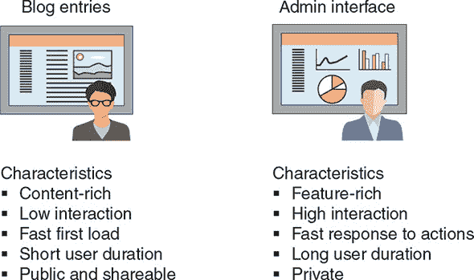

通过查看图 2.2 中的列表，你可以很容易地看到这两个方面的特性之间存在高度冲突。对于博客文章，你拥有丰富的内容和低交互性，而对于管理员界面，则是一个功能丰富、高度交互的环境。博客文章应该快速加载以减少跳出率，而管理员区域应该快速响应用户输入和操作。最后，用户通常在博客条目上停留的时间较短，但可能会与他人分享，而管理员界面是私人的，单个用户可能会长时间登录。

考虑到我们关于 SPA 潜在问题的讨论，以及查看博客条目的特性，你会发现有很多重叠之处。考虑到这一点，你很可能不会选择使用 SPA 来向读者提供博客文章。另一方面，管理员界面非常适合 SPA。

那么，你该怎么做呢？可以说，最重要的事情是保持博客读者的持续关注。如果他们获得糟糕的体验，他们就不会回来；他们也不会分享。如果一个博客没有读者，作者就会停止写作或转移到另一个平台。同样，一个缓慢且无响应的管理员界面也会导致博客所有者跳船。那么，你到底该怎么做？如何让每个人都满意，并保持博客引擎的运营？

#### 2.3.2\. 博客引擎架构

答案在于不要寻找一个适合所有情况的解决方案。实际上，你拥有两个应用程序：面向公众的内容应该直接从服务器发送，以及一个你希望构建为 SPA 的交互式私有管理员界面。首先，分别查看这两个应用程序，从管理员界面开始。

##### 管理员界面：Angular SPA

我们已经说过，这个接口非常适合用 Angular 构建的 SPA。这个引擎部分的架构应该看起来很熟悉：一个用 MongoDB、Express 和 Node.js 构建的 REST API，前端是一个 Angular SPA。图 2.3 展示了它的样子。

##### 图 2.3\. 熟悉的景象：管理界面是一个 Angular SPA，利用了用 MongoDB、Express 和 Node.js 构建的 REST API。

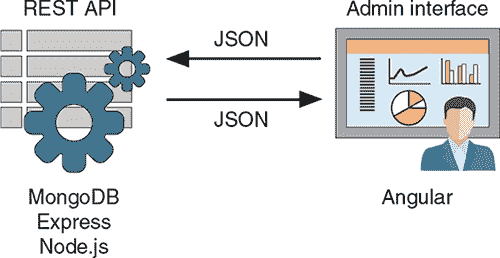

图 2.3 中展示的并没有什么特别新的内容。整个应用都是用 Angular 构建的，并在浏览器中运行，Angular 应用和 REST API 之间通过 JSON 数据进行交互。

##### 博客条目：该做什么？

看看博客条目，你会发现事情变得有些复杂。

如果你只把 MEAN 栈看作是一个调用 REST API 的 Angular 单页应用（SPA），你可能会有些困惑。尽管如此，你仍然可以构建一个面向公众的 SPA，因为你想要使用 JavaScript 和 MEAN 栈。但这并不是最佳解决方案。你可以决定在这种情况下 MEAN 栈并不合适，并选择不同的技术栈。但你不想这么做！你想要端到端的 JavaScript。

再看看 MEAN 栈，并思考所有组件。你知道 Express 是一个 Web 应用框架。你知道 Express 可以使用模板引擎在服务器上构建 HTML。你知道 Express 可以使用 URL 路由和 MVC 模式。你应该开始思考，也许 Express 有答案！

##### 博客条目：充分利用 Express

在这个博客场景中，直接从服务器发送 HTML 和内容正是你想要做的。Express 在这方面做得尤其出色，甚至从一开始就提供了模板引擎的选择。HTML 内容需要从数据库中获取数据，所以你将再次使用 REST API。（关于为什么采取这种方法的更多内容，请参阅第 2.3.3 节 2.3.3。）图 2.4 展示了这种架构的基础。

##### 图 2.4\. 直接从服务器发送 HTML 的架构：前端是一个 Express 和 Node.js 应用，与在 MongoDB、Express 和 Node.js 中构建的 REST API 交互

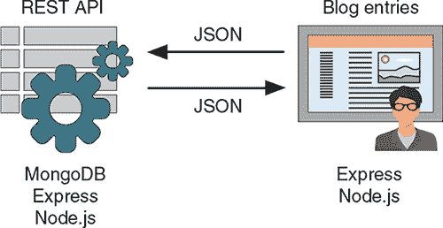

这种方法使你能够使用 MEAN 栈（至少是它的一部分）直接从服务器将数据库驱动的内容发送到浏览器。但这并不一定要停止在这里。MEAN 栈甚至更加灵活。

##### 博客条目：使用更多的栈

你正在查看一个 Express 应用，向访客提供博客内容。如果你想让访客能够登录，可能是为了添加文章评论，你需要跟踪用户会话。你可以使用 MongoDB 与你的 Express 应用一起做到这一点。

您也可能在您的帖子侧边栏中有些动态数据，例如相关帖子或带有自动补全功能的搜索框。您可以使用 Angular 来实现这些功能。记住，Angular 不仅仅用于 SPA；它还可以用来创建添加一些丰富数据交互性的独立组件，使原本静态的页面更加生动。图 2.5 显示了这些可选的 MEAN 部分添加到博客条目架构中。

##### 图 2.5\. 在博客引擎的公共面向部分添加使用 Angular 和 MongoDB 作为选项，为访客提供博客条目

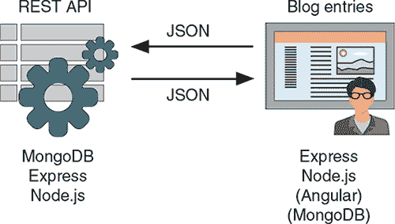

现在，您有了构建一个完整的 MEAN 应用程序的可能性，该应用程序可以向与您的 REST API 交互的访客提供内容。

##### 博客引擎：混合架构

在这一点上，您有两个独立的应用程序，每个应用程序都使用 REST API。通过一点规划，您可以让两个应用程序的两侧都使用一个共同的 REST API。图 2.6 显示了这种作为单一架构的视图，其中单一的 REST API 与两个前端应用程序交互。

##### 图 2.6\. 混合 MEAN 堆栈架构：一个单一的 REST API 为两个不同的用户界面应用程序提供数据，这些应用程序使用 MEAN 堆栈的不同部分来提供最合适的解决方案

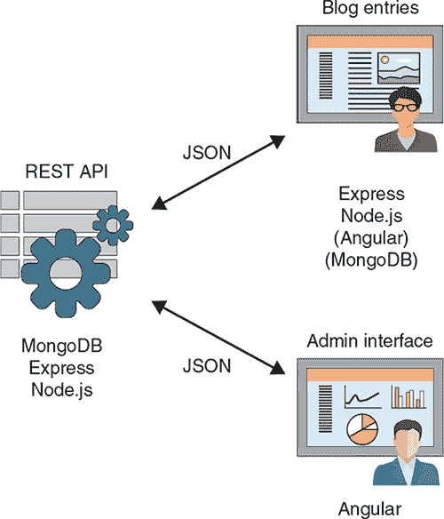

这个图是一个简单的例子，说明您如何将 MEAN 堆栈的各个部分组合成不同的架构，以回答您的项目向您提出的问题。您的选择仅限于您对组件的理解以及您在组合它们时的创造力。对于 MEAN 堆栈来说，没有一种正确的架构。

#### 2.3.3\. 最佳实践：为数据层构建内部 API

您可能已经注意到，架构的每个版本都包括一个 API 来展示数据并允许主应用程序与数据库之间的交互。这样做有很好的理由。

如果您从使用 Node.js 和 Express 构建应用程序开始，直接从服务器提供 HTML，那么从 Node.js 应用程序代码中直接与数据库通信将很容易。从短期来看，这是一种简单的方法。但从长期来看，这会变得困难，因为它将您的数据与应用程序代码紧密耦合，以至于其他任何东西都无法使用它。

另一个选择是构建自己的 API，该 API 可以直接与数据库通信并输出所需的数据。然后您的 Node.js 应用程序可以与这个 API 通信，而不是直接与数据库通信。图 2.7 显示了两种设置的对比。

##### 图 2.7\. 将数据集成到您的 Node.js 应用程序中的短期视图。您可以设置您的 Node.js 应用程序直接与数据库通信，或者您可以创建一个与数据库交互的 API，并让您的 Node.js 应用程序只与 API 通信。

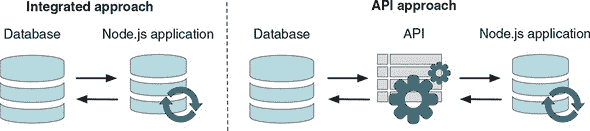

看到图 2.7，你可能会想知道为什么你要费劲去创建一个 API，只是为了在应用程序和数据库之间放置一个中间件。这难道不是增加了更多的工作量吗？在这个阶段，是的，它确实增加了工作量，但你应该看得更远一些。如果你以后想在原生移动应用程序或 Angular 前端中使用你的数据呢？

你当然不希望发现自己不得不为每个应用程序编写单独但相似的接口。如果你在前面已经构建了一个 API，它输出你需要的数据，你可以避免这项工作。如果你有一个现成的 API，当你想要将数据层集成到应用程序中时，你只需让它引用你的 API 即可。无论你的应用程序是 Node.js、Angular、iOS 还是 Android，只要你能访问它，就不必是一个任何人都可以使用的公共 API。图 2.8 显示了当你有 Node.js、Angular 和 iOS/Android 应用程序都使用相同的数据源时，两种方法的比较。

##### 图 2.8. 将数据集成到你的 Node.js 应用程序以及额外的 Angular 和 iOS 应用程序的长期视图。集成方法已经变得碎片化，而 API 方法简单且易于维护。

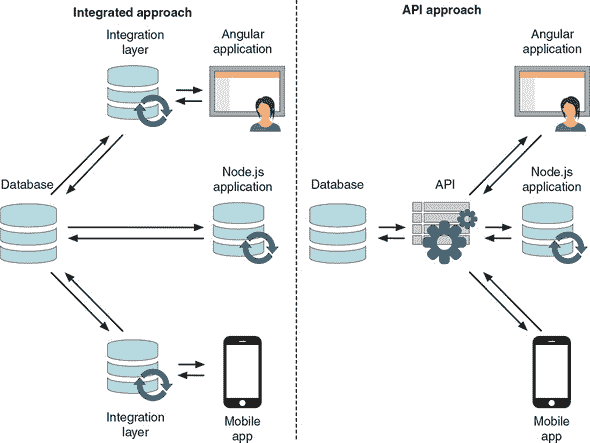

如图 2.8 所示，之前简单的集成方法正在变得碎片化和复杂。你将需要管理和维护三个数据集成，因此任何更改都必须在多个地方进行，以保持一致性。如果你有一个单一的 API，你就不会有这些烦恼。通过在开始时做一点额外的工作，你可以让你的未来生活变得更加轻松。我们将在第六章中探讨创建内部 API。

### 2.4. 规划真实的应用程序

正如我们在第一章中讨论的，在整个本书的过程中，你将构建一个基于 MEAN 栈的工作应用程序，名为 Loc8r。Loc8r 列出了附近有 Wi-Fi 的地方，人们可以去那里完成工作。它还显示了每个地点的设施、营业时间、评分和位置地图。访客将能够提交评分和评论。

为了演示应用程序，你需要创建一些假数据，这样你可以快速轻松地进行测试。在下一节中，我们将带你了解应用程序规划。

#### 2.4.1. 在高层次上规划应用程序

第一步是思考在你的应用程序中需要哪些屏幕。关注单独的页面视图和用户旅程。你可以从高层次开始，不必真正关心每个页面上具体的内容。在纸上或白板上勾勒出这个阶段是个好主意，这有助于你整体可视化应用程序。这也有助于在准备构建时将屏幕组织成集合和流程，同时作为一个良好的参考点。由于没有数据附加到页面或其背后的应用程序逻辑上，因此很容易添加和删除部分，更改显示的内容，甚至更改你想要的页面数量。很可能会第一次就做不对；关键是开始，然后迭代和改进，直到你对单独的页面和整体用户流程感到满意。

##### 规划屏幕

考虑 Loc8r。如前所述，你的目标是以下内容：

> *Loc8r 列出附近有 Wi-Fi 的地点，人们可以去那里完成一些工作。它还显示设施、营业时间、评分和每个地点的位置地图。访客将能够提交评分和评论。*

从这个描述中，你可以对将要需要的屏幕有一个大致的了解：

+   列出附近地点的屏幕

+   显示单个地点详细信息的屏幕

+   添加关于地点评论的屏幕

你可能还希望告诉访客 Loc8r 是做什么的以及为什么存在，因此你应该将另一个屏幕添加到列表中：

+   “关于我们”信息的屏幕

##### 将屏幕划分为集合

接下来，将屏幕列表整理到它们逻辑上属于一起的地方。例如，列表中的前三个屏幕处理位置。关于页面不属于任何地方，所以它可以放在杂项的其他集合中。这种安排的草图看起来像图 2.9。

##### 图 2.9. 将你的应用程序的单独屏幕整理成逻辑集合。

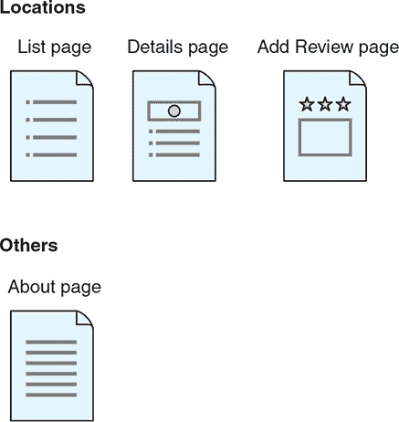

制作一个快速草图，如图 2.9，是规划的第一阶段，在你开始考虑架构之前，你需要完成这个阶段。这个阶段给你一个机会查看基本页面并思考流程。图 2.9 例如，还显示了在位置集合中的基本用户旅程，从列表页面到详情页面，然后到添加评论的表单。

#### 2.4.2. 架构应用程序

表面上看，Loc8r 是一个相当简单的应用程序，只有几个屏幕。但你仍然需要考虑如何构建它，因为你将要从数据库传输数据到浏览器，让用户与数据交互，并允许数据发送回数据库。

##### 从 API 开始

因为应用程序将使用数据库并传递数据，所以从你肯定需要的部分开始构建架构。图 2.10 显示了起点：使用 Express 和 Node.js 构建的 REST API，以实现与 MongoDB 数据库的交互。

##### 图 2.10\. 从标准的 MEAN REST API 开始，使用 MongoDB、Express 和 Node.js。

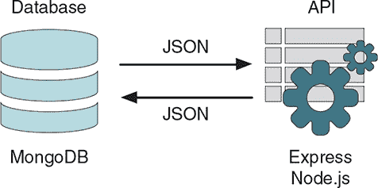

构建一个 API 来与你的数据交互是基本的要求，也是架构的基础点。更有趣的问题是你是如何架构应用程序本身的。

##### 应用架构选项

在这一点上，你需要考虑你应用程序的具体要求以及如何将 MEAN 栈的各个部分组合起来以构建最佳解决方案。你是否需要 MongoDB、Express、Angular 或 Node.js 的特殊功能，这将影响决策的方向？你是否希望直接从服务器提供 HTML，或者一个 SPA 是更好的选择？

对于 Loc8r，你没有不寻常或特定的要求，并且它是否应该容易被搜索引擎抓取取决于业务增长计划。如果目标是吸引来自搜索引擎的有机流量，那么它需要是可抓取的。如果目标是作为应用程序推广应用程序并以此方式推动使用，那么搜索引擎的可视性就不再是主要关注点。

回想一下博客示例，你可以立即想象出三种可能的应用程序架构，如图 2.11 所示：

+   一个 Node.js 和 Express 应用程序

+   一个带有 Angular 增加的 Node.js 和 Express 应用程序，用于交互性

+   一个 Angular 单页应用 (SPA)

##### 图 2.11\. 构建 Loc8r 应用程序的三个选项，从服务器端的 Express 和 Node.js 应用程序到完整的客户端 Angular SPA


考虑到这三个选项，Loc8r 最好的选择是哪一个？

##### 选择应用程序架构

没有特定的业务需求推动你偏向于选择某种架构而不是另一种。没关系，因为在这本书中你将构建所有三种架构。构建所有三种架构让你能够探索每种方法是如何工作的，并使你能够依次查看每种技术，通过层层构建应用程序层。

你将按照 图 2.11 中所示的顺序构建架构，首先是 Node.js 和 Express 应用程序，然后添加一些 Angular，最后重构为 Angular SPA。虽然这不一定是你通常构建网站的方式，但它为你提供了一个很好的机会来学习 MEAN 栈的所有方面。在 2.5 节中，我们将讨论这种方法，并更详细地介绍计划。

#### 2.4.3\. 将一切封装在 Express 项目中

你迄今为止看到的架构图暗示，你将会有单独的 Express 应用用于 API 和应用逻辑。这在大型项目中是完全可能的，也是一条很好的路线。如果你预计会有大量的流量，你可能甚至希望你的主要应用和 API 在不同的服务器上。这种方法的另一个好处是，你可以为每个服务器和应用设置更具体的设置，以最适合特定需求。

另一种方法是保持简单和紧凑，将所有内容都放在一个 Express 项目中。采用这种方法，你只需关注一个应用的主机部署，并管理一套源代码。这就是 Loc8r 的做法：创建一个包含几个子应用的 Express 项目。图 2.12 展示了这种方法。

##### 图 2.12. API 和应用逻辑包裹在同一 Express 项目中的应用架构

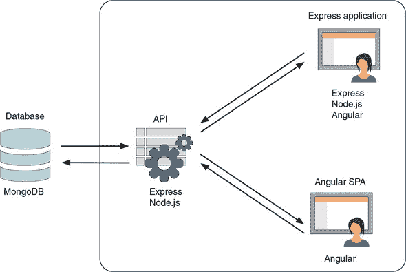

当你以这种方式组合应用时，组织好代码非常重要，以便将应用的不同部分保持分离。这不仅使代码更容易维护，还便于在将来决定这样做是正确路线时，将代码拆分为单独的项目。我们将在整本书中不断回到这个关键主题。

#### 2.4.4. 最终产品

如你所见，你使用 MEAN 栈的所有层来创建 Loc8r。你还包括 Twitter Bootstrap 来创建响应式布局。图 2.13 展示了你在整本书中将要构建的内容的截图。

##### 图 2.13. Loc8r 是你在整本书中将要构建的应用。它在不同的设备上显示不同，显示地点列表和每个地点的详细信息，并允许访客登录并留下评论。

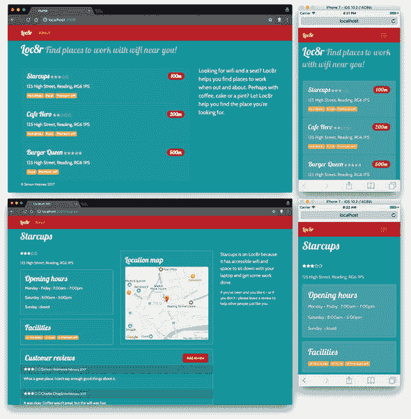

### 2.5. 将开发分解为阶段

在这本书中，你有两个目标：

+   在 MEAN 栈上构建一个应用。

+   在进行的过程中了解栈的不同层。

你将以构建快速原型的方式处理项目，但会进行一些调整，以覆盖整个栈的最佳效果。首先，看看快速原型开发的五个阶段，然后看看如何使用这种方法一层层地构建 Loc8r，同时关注你正在使用的技术。

#### 2.5.1. 快速原型开发阶段

下面的章节将过程分解为阶段，这样你可以一次专注于一件事情，增加成功的机会。我们发现这种方法对于将想法变为现实非常有效。

##### 阶段 1：构建静态网站

第一阶段是构建应用的静态版本，这本质上是由几个 HTML 屏幕组成的。这一阶段的目标是

+   为了快速确定布局

+   为了确保用户流程合理

在这个阶段，你不需要关心数据库或用户界面的华丽效果；你只想创建一个用户将通过应用程序进行的主要屏幕和旅程的工作原型。

##### 第 2 阶段：设计数据模型并创建数据库

当你对一个满意的静态原型感到满意时，下一步要做的是查看静态应用程序中的任何硬编码数据，并将其放入数据库中。这个阶段的目标是

+   定义一个反映应用程序需求的数据模型

+   创建一个数据库以与模型一起工作

第一部分是定义数据模型。退回到宏观视角，你需要关于哪些对象的数据，这些对象是如何相互连接的，以及它们包含哪些数据？

在构建静态原型之前尝试进行这个阶段，你是在处理抽象的概念和想法。当你有一个原型时，你可以看到不同页面上发生的事情以及需要哪些数据。突然之间，这个阶段变得容易多了。几乎在你没有意识到的情况下，你在构建静态原型时已经完成了艰难的思考。

##### 第 3 阶段：构建你的数据 API

在第 1 和第 2 阶段之后，你有一边是静态网站，另一边是数据库。这个阶段和下一个阶段是自然地将它们连接起来的步骤。第 3 阶段的目标是

+   创建一个 RESTful API，允许你的应用程序与数据库交互

##### 第 4 阶段：将数据库连接到应用程序

当你到达这个阶段时，你有一个静态应用程序和一个 API，该 API 公开了数据库的接口。这个阶段的目标是

+   使你的应用程序能够与你的 API 通信

当这个阶段完成时，应用程序看起来几乎和之前一样，但数据将来自数据库。完成之后，你将拥有一个数据驱动的应用程序！

##### 第 5 阶段：增强应用程序

这个阶段完全是关于用额外的功能装饰应用程序。你可能添加身份验证系统、数据验证或向用户显示错误消息的方法。这个阶段可能包括向前端添加更多交互性或加强应用程序中的业务逻辑。

这个阶段的目标是

+   为你的应用程序添加最后的修饰

+   为了使应用程序准备好供人们使用

这五个开发阶段为处理新的建设项目提供了一个很好的方法论。在下一节中，你将了解如何遵循这些步骤来构建 Loc8r。

#### 2.5.2.构建 Loc8r 的步骤

在本书中构建 Loc8r 的过程中，你有两个目标。首先，当然，你想要在 MEAN 堆栈上构建一个可工作的应用程序。其次，你想要了解不同的技术，如何使用它们，以及如何以不同的方式将它们组合在一起。

在整本书中，你将遵循五个开发阶段，但会有一些变化，这样你就可以看到整个堆栈的实际运行情况。在详细查看步骤之前，快速回顾一下在 图 2.14 中展示的提议架构。

##### 图 2.14\. 你将在本书中构建的 Loc8r 的提议架构


##### 第 1 步：构建静态网站

你将从遵循第 1 阶段并构建一个静态网站开始。我们建议为任何应用程序或网站都这样做，因为你可以用相对较少的努力学到很多东西。在构建静态网站时，最好关注未来，同时考虑最终架构将是什么样子。Loc8r 的架构已经定义，如 图 2.14 所示。

基于这个架构，你将在 Node 和 Express 中构建静态应用程序，将其作为进入 MEAN 堆栈的起点。图 2.15 强调了这个过程中的这一步骤，作为开发提议架构的第一部分。这一步骤在 第三章 和 第四章 中有详细说明。

##### 图 2.15\. 你的应用程序的起点是使用 Express 和 Node.js 构建用户界面。

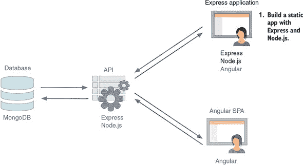

##### 第 2 步：设计数据模型并创建数据库

仍然遵循开发阶段，通过创建数据库和设计数据模型，你将继续进入第 2 阶段。再次强调，任何应用程序都可能需要这一步骤，如果你首先完成了第 1 步，你会从中获得更多。

图 2.16 展示了这一步骤是如何为构建应用程序架构的整体图景增添内容的。

##### 图 2.16\. 静态网站构建完成后，你将利用获取的信息来设计数据模型并创建 MongoDB 数据库。


在 MEAN 堆栈中，你将使用 MongoDB 进行这一步骤，在数据建模方面高度依赖 Mongoose。数据模型实际上是在 Express 应用程序内部定义的。这一步骤在 第五章 中有详细说明。

##### 第 3 步：构建你的 REST API

当你构建了数据库并定义了数据模型后，你将想要创建一个 REST API，这样你就可以通过进行网络调用来与数据交互。几乎任何数据驱动型应用程序都将从拥有 API 接口中受益，因此这一步骤是大多数构建项目中你希望拥有的另一个步骤。

你可以在 图 2.17 中看到这一步骤在构建整体项目中的位置。

##### 图 2.17\. 使用 Express 和 Node.js 构建一个 API，暴露与数据库交互的方法。

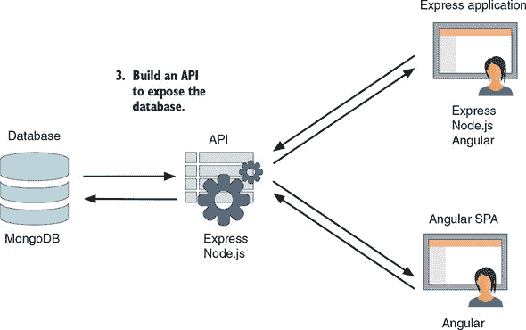

在 MEAN 堆栈中，这一步骤主要在 Node.js 和 Express 中完成，大量依赖 Mongoose。你将使用 Mongoose 与 MongoDB 进行接口，而不是直接处理 MongoDB。这一步骤在 第六章 中有详细说明。

##### 第 4 步：使用应用程序中的 API

这一步骤与开发过程中的第 4 阶段相匹配，Loc8r 开始变得有生命力。第 1 步中的静态应用程序将更新为使用第 3 步中的 REST API 与第 2 步中创建的数据库进行交互。

要了解堆栈的所有部分以及你可以使用它们的不同方式，你将使用 Express 和 Node.js 来调用 API。如果在现实世界的场景中，你计划在 Angular 中构建应用程序的大部分内容，你将把你的 API 连接到 Angular。这种方法在第八章、第九章和第十章中有详细说明。

在这一步结束时，你将有一个运行在三种架构中的第一个架构上的应用程序：一个 Express 和 Node.js 应用程序。图 2.18 展示了这一步如何将架构的两部分粘合在一起。

##### 通过将其连接到数据 API 来更新静态 Express 应用程序，允许应用程序数据库驱动。

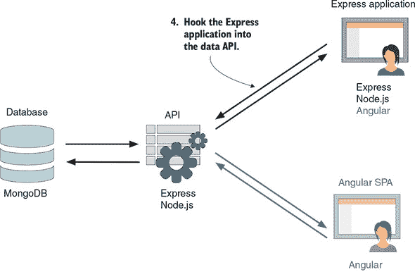

在这个构建过程中，你将主要使用 Node.js 和 Express 来完成这一步。这一步在第七章中有详细说明。

##### 第 5 步：美化应用程序

第 5 步与开发过程中的第 5 阶段相关，在这一阶段，你可以为应用程序添加额外的细节。你将使用这一步来查看 Angular，并了解如何将 Angular 组件集成到 Express 应用程序中。这一项目架构的添加在第图 2.19 中得到了突出。

##### 图 2.19。在 MEAN 应用程序中使用 Angular 的一种方法是在 Express 应用程序的前端添加组件。

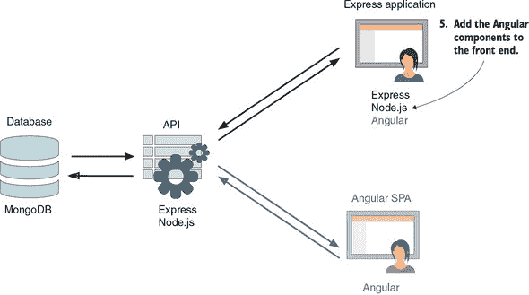

这一步骤完全是关于引入和使用 Angular。为了支持这一步骤，你很可能会也改变一些你的 Node.js 和 Express 设置。这一步骤在第八章中有详细说明。

##### 第 6 步：将代码重构为 Angular SPA

在第 6 步中，你将通过替换 Express 应用程序并将所有逻辑移动到 SPA 中（使用 Angular）来彻底改变架构。与之前的步骤不同，这一步不是在之前的基础上构建，而是替换了之前的一些内容。

在正常的构建过程中，这一步可能是不寻常的——在 Express 中开发应用程序，然后在 Angular 中重新做——但这种方式非常适合本书的学习方法。你将能够专注于 Angular，因为你已经知道应用程序应该做什么，而且数据 API 已经准备好供你使用。

图 2.20 展示了这种变化如何影响整体架构。这一步再次聚焦于 Angular，并在第九章和第十章中进行了介绍。

##### 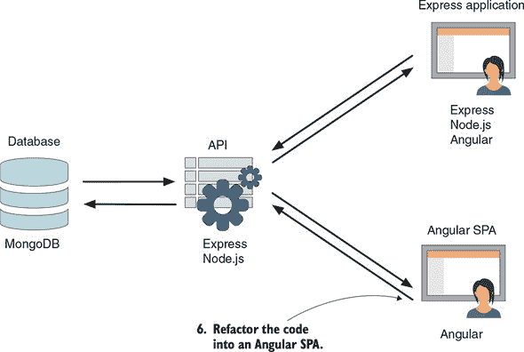


##### 第 7 步：添加身份验证

在第 7 步中，你将通过允许用户注册和登录来为应用程序添加功能。你还将看到如何在使用应用程序时利用用户数据。你将在之前所做的一切基础上添加认证到 Angular SPA。作为这一步骤的一部分，你将在数据库中保存用户信息并确保某些 API 端点只能由认证用户使用。

图 2.21 展示了你在架构中将要处理的内容。在这个步骤中，你将使用所有的 MEAN 技术。这一步骤在第十一章和第十二章中有详细说明。

##### 图 2.21\. 使用所有 MEAN 堆栈为 Angular SPA 添加认证

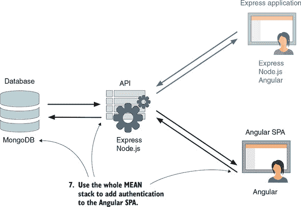

那是计划的软件架构。在下一节中，我们将简要讨论硬件。

### 2.6\. 硬件架构

没有关于架构的讨论会不包含一个关于硬件的部分。你已经看到了软件和代码组件是如何组合在一起的，但你需要什么样的硬件来运行它们呢？

#### 2.6.1\. 开发硬件

好消息是，你不需要任何特别的东西来运行开发堆栈。一台笔记本电脑甚至一个虚拟机（VM）就足够开发一个 MEAN 应用程序。堆栈的所有组件都可以安装在 Windows、macOS 和大多数 Linux 发行版上。

我们已经在 Windows 和 macOS 笔记本电脑以及 Ubuntu 虚拟机上成功开发了应用程序。我们更喜欢在 macOS 上本地开发，但我们知道有些人对 Linux 虚拟机情有独钟。

如果你有一个本地网络和多个服务器，你可以在它们之间运行应用程序的不同部分。例如，你可以有一个机器作为数据库服务器，另一个用于 REST API，第三个用于主应用程序代码本身。只要服务器之间可以互相通信，这种设置就不会有问题。

#### 2.6.2\. 生产硬件

生产硬件架构的方法与开发硬件并没有太大的不同。主要区别是生产硬件通常规格更高，并且可以公开接入互联网以接收公共请求。

##### 初学者尺寸

所有应用程序的部分都可以托管并运行在同一个服务器上。你可以在图 2.22 中看到一个基本的示意图。

##### 图 2.22\. 最简单的硬件架构，所有内容都在单个服务器上

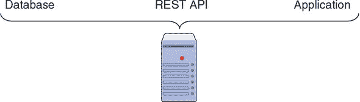

这种架构适用于流量较低的应用程序，但随着应用程序的增长，通常不建议使用，因为你不希望应用程序和数据库争夺相同的资源。

##### 成长：独立的数据库服务器

通常首先迁移到独立服务器的是数据库。现在你有两个服务器：一个用于应用程序代码，一个用于数据库。图 2.23 展示了这种方法。

##### 图 2.23\. 常见的硬件架构方法：一个服务器运行应用程序代码和 API，另一个独立的数据库服务器

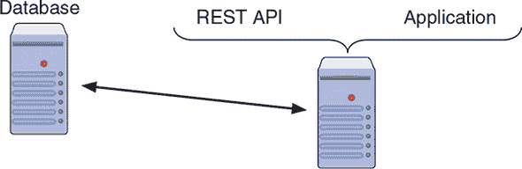

这个模型很常见，尤其是如果你选择使用平台即服务（PaaS）提供商来托管你的应用时。你将在本书中使用这种方法。

##### 追求规模

就像我们在开发硬件部分所讨论的那样，你可以为应用程序的不同部分使用不同的服务器：数据库服务器、API 服务器和应用程序服务器。这种设置允许你在三个服务器之间分散负载，如图 2.24 所示。

##### 图 2.24\. 使用三个服务器的解耦架构：一个用于数据库，一个用于 API，一个用于应用程序代码

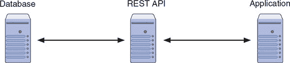

但这并不止于此。如果你的流量开始超过你的三个服务器，你可以拥有这些服务器的多个实例（或集群），如图 2.25 所示。

##### 图 2.25\. 你可以通过为应用程序的每个部分拥有服务器集群来扩展 MEAN 应用程序。

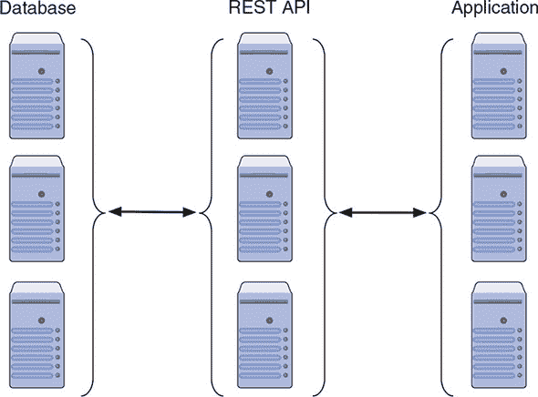

设置这种方法比之前的方法稍微复杂一些，因为你需要确保数据库保持准确，并且负载在服务器之间均衡。再次强调，PaaS 提供商为这种类型的架构提供了一个方便的途径。

你将通过创建一个将包含所有内容的 Express 项目来开始第三章的旅程。

### 摘要

在本章中，你学习了

+   如何使用在 Node.js、Express 和 MongoDB 中构建的 REST API 设计一个常见的 MEAN 堆栈架构，使用 Angular SPA

+   如何评估项目中的因素以确定单页面应用（SPA）是否适合

+   如何在 MEAN 堆栈中设计一个灵活的架构

+   构建 API 以暴露数据层的最佳实践

+   开发和生产硬件架构
