## 第三部分. 使用 Angular 添加动态前端

Angular 是我们这个时代最激动人心的技术之一，是 MEAN 堆栈的核心部分，具有经过验证的稳定性和持久性。到目前为止，你已经与 Express 做了很多工作，它是服务器端框架。Angular 是客户端框架，它使你能够构建在浏览器中运行的应用程序。

在第八章中，你将了解 Angular 和 TypeScript（就像 JavaScript，有点不同但*很好*的不同），了解所有这些喧嚣的原因，并了解与之相关的特定语法语义和术语。Angular 的学习曲线可能很陡峭，但不必如此。在第八章中开始使用 Angular 和 TypeScript 时，你将看到如何使用它们来构建一个现有网页的组件，包括调用你的 REST API 来获取数据。

第九章 和 第十章 专注于如何使用 Angular 构建单页应用程序（SPA）。在第八章所学的基础上，你将重新创建 Loc8r 作为 SPA。你将关注最佳实践，学习如何构建一个模块化应用程序，它具有易于维护的组件，这些组件可以轻松重用。到第三部分结束时，你将拥有一个完全功能化的 SPA，它可以与你的 REST API 交互以创建和读取数据。

## 第八章. 使用 TypeScript 创建 Angular 应用程序

*本章涵盖*

+   使用 Angular CLI 创建 Angular 应用程序

+   理解 TypeScript 的基本知识

+   创建和使用 Angular 组件

+   从 API 获取数据并将数据绑定到 HTML 模板中

+   构建用于生产的 Angular 应用程序

到此为止。是时候看看 MEAN 堆栈的最后一部分了：Angular！当你开始使用 Angular 和 TypeScript 时，有时会感觉像是一门不同的语言，但 TypeScript 是 JavaScript 的超集，所以它是带有一些额外部分的 JavaScript。TypeScript 是创建 Angular 应用程序的首选语言。我们将随着进展逐步介绍所需的内容，到本章结束时，你将相当熟悉它。

要全面了解，你需要重建主页上显示的位置列表，作为一个 Angular 应用程序。你将在这个由 Express 驱动的主页中嵌入这个小应用程序，替换 Express 提供的列表，以实现两个目的：

+   你将处理 Angular 的一些构建块，而不会感到不知所措。

+   你将看到如何使用 Angular 在现有页面或应用程序中创建一个单组件。

图 8.1 展示了你在整体计划中的位置，即将 Angular 添加到现有 Express 应用程序的前端。

##### 图 8.1. 本章重点介绍如何将 Angular 添加到现有的 Express 应用程序的前端

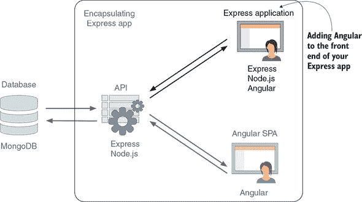

本章采用的方法是如果您想用一点 Angular 来增强页面、项目或应用程序时您会做的事情。完全在 Angular 中构建完整应用程序的内容将在第九章（kindle_split_021.xhtml#ch09）和第十章（kindle_split_022.xhtml#ch10）中介绍，并将补充您在本章中学到的内容。

### 8.1\. 使用 Angular 运行起来

在本节中，您将创建一个 Angular 应用程序的骨架，查看它是如何组成的，并探索一些附带工具以帮助开发。如果您还没有这样做，您需要按照附录 A（kindle_split_026.xhtml#app01）中所述安装 Angular 命令行界面（CLI）。

您将首先使用 CLI 创建一个新应用程序。

#### 8.1.1\. 使用命令行创建 Angular 应用程序的模板

创建新的 Angular 应用程序最简单的方法是使用 Angular CLI，它创建一个功能齐全的小型应用程序并生成良好的文件夹结构。

基本命令很简单：

```
ng new your-app-name
```

在您运行命令以创建 Loc8r 的 Angular 应用程序之前——这将创建一个名为 your-app-name 的新应用程序，并在当前文件夹中使用默认设置——您可能想要查看一些选项。

您可以向这个命令应用许多选项，您可以通过在命令行中运行 `ng help` 来查看它们。您感兴趣的选项如下：

+   `--skipGit`，跳过默认的 Git 初始化和第一次提交。默认情况下，`ng new` 将文件夹初始化为新的 Git 仓库，但您不需要这样做，因为您将在现有的 Git 仓库内创建它。

+   `--skipTests`，跳过安装一些测试文件。本书没有涵盖单元测试，因此您不需要这些额外的文件。有关为什么我们不涵盖这个主题的更多信息，请参阅侧边栏“测试 Angular 应用程序”。

+   `--directory`，指定您希望应用程序生成的文件夹。

+   `--defaults` 强制使用默认的 Angular 设置。

| |
| --- |

**测试 Angular 应用程序**

测试是一个重要但非常大的主题——实际上，关于这个主题已经写了很多本书。（Manning 出版公司出版了一些非常好的书籍。）

由于篇幅限制，本书没有涵盖测试内容。如果您想了解更多关于测试 Angular 应用程序的信息，那么您应该首先访问[`www.manning.com/books/testing-angular-applications`](https://www.manning.com/books/testing-angular-applications)。

| |
| --- |

将所有这些组合起来，您将使用一个命令在名为 app_public 的新文件夹内创建一个 Angular 应用程序的模板。这个命令会安装很多东西，所以运行起来会花费一些时间，并且您需要保持在线状态才能使其工作。确保在终端中，您在 Loc8r 应用程序的根目录下运行以下命令之前：

```
$ ng new loc8r-public --skipGit=true --skipTests=true –defaults=true –
directory app_public
```

| |
| --- |

##### 改进

对于熟悉 AngularJS（Angular 1.x）的人来说，这与能够下载单个库文件开始编码的日子有很大的不同！好消息是，这种新的方法从一开始就鼓励了更好的应用程序架构。


当一切安装完毕后，你的 app_public 文件夹的内容应该看起来像图 8.2。

##### 图 8.2\. 新生成的 Angular 项目的默认内容

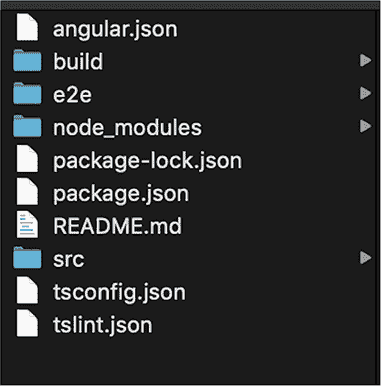

你可能会注意到这个项目有自己的 package.json 文件和 node_modules 文件夹，所以它看起来很像一个 Node 应用。src 文件夹是你要做大部分工作的地方。

#### 8.1.2\. 运行 Angular 应用

这是一个完全功能性的 Angular 应用，尽管相当简约。现在运行它，看看你得到了什么，并查看其内部结构。要运行应用，请在终端中转到你的 app_public 文件夹，并运行以下命令：

```
$ ng serve
```

当你运行这个命令时，你会在终端中看到一些通知，Angular 正在构建应用程序，最后以`?wdm?: 编译成功`结束。当你看到这条消息时，你的应用已经准备好在 4200 端口上查看。要查看它，请打开你的浏览器，并转到 http://localhost:4200。诚然，这里没有什么特别的事情发生，但如果你查看源代码或检查元素，你应该会看到像图 8.3 那样的内容。

##### 图 8.3\. 在浏览器中与生成的 HTML 一起工作的自动生成的 Angular 应用

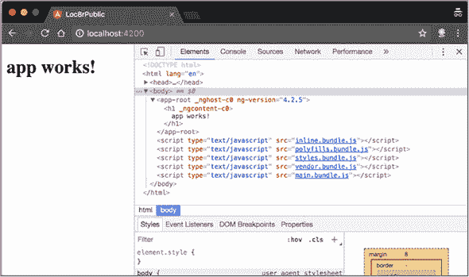

你会看到一些基本的 HTML 和一些引用的 JavaScript 文件。但是请注意`app-root` HTML 标签；这是不寻常的，但很重要。记住这个标签，因为当你查看源文件时，你会回到它。

#### 8.1.3\. 应用程序背后的源代码

Angular 应用是用组件构建的，这些组件被编译成模块。"组件"和"模块"是常用来标记应用程序构建块的术语，但在 Angular 中，它们有特定的含义。组件处理特定的功能，而模块包含一个或多个一起工作的组件。这个默认示例是一个简单的模块，包含一个组件。

在你的编辑器中打开 src 文件夹，你会看到几个文件和文件夹。从 src 文件夹中的 index.html 文件开始，它应该看起来像列表 8.1。

##### 列表 8.1\. src/index.html 文件的默认内容

```
<!doctype html>
<html lang="en">
<head>
  <meta charset="utf-8">
  <title>Loc8rPublic</title>         *1*
  <base href="/">

  <meta name="viewport" content="width=device-width, initial-scale=1">
  <link rel="icon" type="image/x-icon" href="favicon.ico">
</head>
<body>
  <app-root></app-root>              *2*
</body>
</html>
```

+   ***1* 标题是从应用程序名称创建的。**

+   ***2* 主体中唯一的标签是 app-root。**

这里除了一些基本的 HTML 框架之外，没有太多内容。你可以看到 Angular 已经为你填充了`title`标签 ***1***，它将你在终端命令中指定的应用程序名称（`loc8r-public`）转换成了驼峰式。你还看到了`app-root`标签 ***2***，这是你在运行的应用程序源中注意到的，但这次里面没有`<h1>`标签。

深入挖掘并查看 src 文件夹中的 app 文件夹（在 src 文件夹内）。

##### 主模块

记得我们说过“Angular 应用程序是用组件构建的，这些组件被编译成模块”吗？一个开始调查的好地方是模块定义。

在 src/app 中，你会找到一个名为 app.module.ts 的文件。这个文件是 Angular 模块的中心点，所有组件都汇集在这里。目前，这个文件看起来像列表 8.2（#ch08ex02）。

我们现在不会深入探讨每个部分的语义；我们只会给你一个每个部分功能的概述。本质上，这个文件执行以下操作：

+   导入应用将使用的各种 Angular 功能模块

+   导入应用将使用的组件

+   使用装饰器描述模块

+   导出模块


**装饰器和依赖注入**

*装饰器*是 ES2015 和 TypeScript 提供的一种方式，用于向函数、模块和类提供元数据和注释。在 Angular 中，一个常见的用例是处理依赖注入，这是一种说“这个模块或类依赖于这个功能来运行”的方式。

你可以在列表 8.2（#ch08ex02）中看到，你将模块 `BrowserModule` 导入到你的模块中。在这种情况下，装饰器还声明了它包含的组件以及哪个组件应该用作起点（`bootstrap`）。


在这个文件中，跟随 `AppComponent` 的旅程，如列表 8.2（#ch08ex02）中用粗体突出显示的。首先，它从文件系统中导入（你可能从 `require` 和 Node.js 中的 `./` 语法中认出了它），然后在模块装饰器内部声明和启动。有关装饰器的更多信息，请参阅侧边栏“装饰器和依赖注入。”

##### 列表 8.2\. src/app/app.module.ts 文件默认内容

```
import { BrowserModule } from '@angular/platform-browser';     *1*
import { NgModule } from '@angular/core';                      *1*

import { AppComponent } from './app.component';                *2*

@NgModule({                                                    *3*
  declarations: [                                              *3*
    AppComponent                                               *3*
  ],                                                           *3*
  imports: [                                                   *3*
    BrowserModule,                                             *3*
  ],                                                           *3*
  providers: [],                                               *3*
  bootstrap: [AppComponent]                                    *4*
})
export class AppModule { }                                     *5*
```

+   ***1* 导入应用将使用的各种 Angular 模块**

+   ***2* 从文件系统中导入一个组件**

+   ***3* 使用装饰器描述模块 . . .**

+   ***4* . . . 包括应用程序的入口点**

+   ***5* 导出模块**

这是主模块，你可以从装饰器中的 `bootstrap` 行看到，应用程序本身的入口点是 `AppComponent`。你还可以从 `import` 语句中看到这个组件在文件系统中的位置——在这个例子中，它与模块定义在同一文件夹中。查看一下。

##### 默认启动组件

在 app_public/src/app 文件夹中，与模块文件并列，你可以看到三个 app.component 文件：

+   app.component.css

+   app.component.html

+   app.component.ts

这些文件对于任何组件都是典型的。CSS 和 HTML 文件定义了组件的样式和标记，而 TS 文件定义了 TypeScript 中的行为。

CSS 文件为空，但 HTML 文件包含以下代码：

```
<!--The content below is only a placeholder and can be replaced.-->
<div style="text-align:center">
  <h1>
    Welcome to {{ title }}!
  </h1>
  
</div>
<h2>Here are some links to help you start: </h2>
<ul>
  <li>
    <h2><a target="_blank" rel="noopener"
href="https://angular.io/tutorial">
Tour of Heroes</a></h2>
  </li>
  <li>
    <h2><a target="_blank" rel="noopener"
href="https://github.com/angular/angular-
cli/wiki">CLI Documentation</a></h2>
  </li>
  <li>
    <h2><a target="_blank" rel="noopener"
href="https://blog.angular.io/">Angular
blog</a></h2>
  </li>
</ul>
```

这段代码有些道理，因为你回想起在浏览器中检查元素时看到的一些最小 HTML 内容。在 Angular 中，双大括号用于表示数据与视图之间的绑定。在这里，变量`title`正在被绑定，以及`<h1>`标签的内容。要看到这个`title`变量在哪里被定义，你需要查看组件定义文件 app.component.ts，该文件在列表 8.3 中完整展示。

此组件文件主要做三件事：

+   从 Angular 导入所需的内容

+   装饰组件，为应用程序提供运行所需的信息

+   将组件作为类导出

##### 列表 8.3\. app.component.ts 的默认内容

```
import { Component } from '@angular/core';      *1*

@Component({                                    *2*
  selector: 'app-root',                         *2*
  templateUrl: './app.component.html',          *2*
  styleUrls: ['./app.component.css']            *2*
})                                              *2*
export class AppComponent {                     *3*
  title = 'loc8r-public';                       *3*
}                                               *3*
```

+   ***1* 从 Angular 核心导入组件**

+   ***2* 装饰组件**

+   ***3* 将组件作为类导出**

此文件很简单，但如果习惯了纯 JavaScript，其语法可能有点陌生。不过，如果你查看它的内部，你可以看到一些有趣的信息，并且可以看到各个部分是如何组合在一起的。

从装饰器开始，你可以看到引用的 HTML 和 CSS 文件，但你也可以看到`selector:` ‘`app-root`’。啊哈！这就是你在 index.html 文件中找到的标签名！当你检查元素时，你看到了这个带有`<h1>`标签和一些内容的标签，这与你的 app.component.html 文件相匹配。好吧，一切都在逐渐明朗。

接下来，你看到`AppComponent`类被导出，这你已经在模块定义中看到过导入和引导。最后，你看到`title`的定义（你在 HTML 文件中看到了组件的绑定）以及`loc8r-public`的值（你在浏览器中运行时看到过）。请注意，与`title`相关联的没有`var`、`const`或`let`，因为在类定义内部，你定义的是*类成员*而不是变量。

##### 将一切整合在一起

好吧，你在这里看到了很多，所以我们将快速回顾一下所有这些是如何联系在一起的：

+   组件`AppComponent`由三个文件组成：TypeScript、HTML 和 CSS。

+   TypeScript 文件是组件的关键部分，定义了功能，引用了其他文件，并声明了它将绑定到的选择器（HTML 标签）。

+   组件 TypeScript 文件导出`AppComponent`类。

+   模块文件从组件 TypeScript 文件中导入了`AppComponent`类，并将其声明为应用程序的入口点。

+   模块文件还导入了各种原生 Angular 功能。

图 8.4 展示了所有这些内容。

##### 图 8.4\. 简单 Angular 应用程序的各个部分是如何组合在一起的

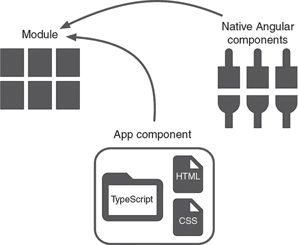

这些信息让你对如何构建这个简单的应用程序有了很好的理解。但是，当你之前在浏览器中查看源代码时，你查看的所有文件都没有被引用，你看到了一些 JavaScript 文件。发生了什么？TypeScript 文件是如何在浏览器中变成 JavaScript 的？

##### Angular 构建过程

目前，浏览器不支持 TypeScript——只支持 JavaScript——而且一些浏览器甚至还没有完全支持 ES2015。但是使用 TypeScript 可以编写更健壮的代码。尽管这个示例应用程序很小，但您可以展望未来，看看如果您有一个包含多个组件的应用程序，您将有很多单独的文件需要处理。您不希望在您的 HTML 源代码中指定所有这些文件。

Angular 通过使用 *构建* 过程来处理这些问题，将所有单独的 TypeScript 文件合并，将它们转换为纯 JavaScript，并将它们放入一个名为 main.bundle.js 的文件中。如果您查看浏览器中的源代码，您将能够找到 `title = 'loc8r-public'`，如图 8.5 所示。

##### 图 8.5\. 在构建的 JavaScript 代码中找到组件定义

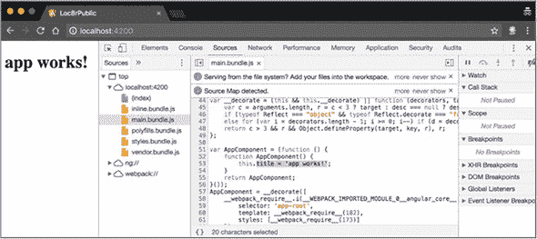

目前，您正在使用 `ng serve` 命令来编译、构建并将 Angular 应用程序交付到浏览器上的 4200 端口。此命令在内存中运行；您不会在应用程序代码的任何地方找到这些构建文件。当涉及到构建最终版本时，您将使用不同的命令，`ng build`。关于这一点，稍后会有更多介绍。

对于开发，`ng serve` 是完美的。它不仅为您提供了这个浏览器环境，而且还监视源代码的变化，并在变化时重新构建和刷新应用程序。您可以通过将 src/app/app.component.ts 中的 `'loc8r-app'` 更改为 `'I am Getting MEAN!'` 来看到这一功能的效果。回到浏览器中的应用程序，您会看到内容已经改变，如图 8.6 所示。

##### 图 8.6\. 当源代码发生变化时，`ng serve` 会重新构建和重新加载应用程序。

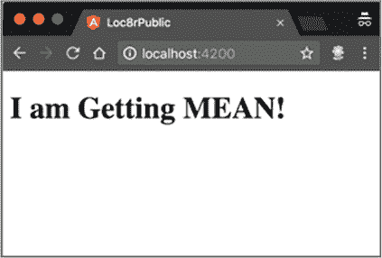

`ng serve` 通过消除每次更改时手动构建和刷新的需求，帮助开发过程。

现在您对 Angular 的了解已经足够深入，可以开始为 Loc8r 构建一些内容了。随着您的深入，您将了解更多关于 Angular 和 TypeScript 的知识，并且一切都将变得更加熟悉。

### 8.2\. 使用 Angular 组件

您将从构建主页的列表部分开始，您将将其嵌入到 Express 应用程序中。这是一个示例，说明您如何向现有网站添加一些 Angular 功能，这在大型企业网站上是一个常见的需求，在这些网站上您可能无法完全控制所有内容。在接下来的章节中，您将在此基础上构建知识，并了解如何在 Angular 中构建独立的单页应用程序（SPA）。

首先，创建一个新的组件。

#### 8.2.1\. 创建一个新的 home-list 组件

您可以手动创建所有文件，或者可以使用 Angular CLI。您将利用 CLI 来创建一个组件骨架。在终端中，在 app_public 文件夹内，运行以下命令：

```
$ ng generate component home-list
```

此命令在 src 文件夹内创建一个名为 home-list 的新文件夹。在其内部创建 TypeScript、HTML 和 CSS 文件，并更新 app.module.ts 文件以通知模块关于新组件的信息。你还会在新的组件文件夹中看到一个 spec.ts 文件。此文件是单元测试的模板，但我们在这里不涉及它，所以你现在可以忽略它。Angular CLI 将所有这些操作的确认输出到终端。

##### 设置为默认组件

新的 `home-list` 组件将是此 Angular 模块的基础，所以你需要将其设置为默认组件。你可以在 app.module.ts 文件中通过更改模块装饰器中的 bootstrap 值从 `AppComponent` 更改为 `HomeListComponent` 来完成此操作。

`AppComponent` 不再需要，所以你可以删除导入语句，从声明中删除它，甚至删除文件。app.module.ts 的更改如下所示。

##### 列表 8.4\. 在 app.module.ts 中更改到新组件

```
import { BrowserModule } from '@angular/platform-browser';
import { NgModule } from '@angular/core';

import { HomeListComponent } from './home-list/home-list.component';   *1*

@NgModule({
  declarations: [
    HomeListComponent                                                  *2*
  ],
  imports: [
    BrowserModule
  ],
  providers: [],
  bootstrap: [HomeListComponent]                                       *3*
})
```

+   ***1* 这一行是由 Angular CLI 添加的；删除 AppComponent 导入，因为它不再需要。**

+   ***2* 从声明数组中删除 AppComponent**

+   ***3* 将 bootstrap 值的 AppComponent 更改为 HomeListComponent**

如果你运行 `ng serve` 或者它仍在运行，你将在浏览器窗口中看到一个空白页面，并在 JavaScript 控制台中看到几个错误。这些错误是大量的红色文本，可能会显得令人畏惧，但第一行是有帮助的：它说，“选择器“app-home-list”没有匹配任何元素。”

如果你回顾一下原始组件，你会记得 `selector` 定义了组件将绑定到的页面上的标签。你已经更改了组件，但没有更改页面上的标签！

##### 设置组件的 HTML 标签

为了确保你使用正确的标签，打开 home-list.component.ts 文件，查看组件装饰器，它应该看起来像这样：

```
@Component({
  selector: 'app-home-list',
  templateUrl: './home-list.component.html',
  styleUrls: ['./home-list.component.css']
})
```

在这里，你可以看到选择器是 `app-home-list`，所以这就是你需要使用的。如果你想有不同的命名约定，你可以更改它，但这会工作。打开 src 文件夹中的 index.html 文件，将 app-root 标签更改为 app-home-list，使其看起来像这样：

```
<body>
  <app-home-list></app-home-list>
</body>
```

现在检查浏览器——从现在开始，我们将假设你在检查浏览器时总是运行着 `ng serve` ——你会看到页面已经改变，显示 `home-list works!`，如图 8.7 所示。

##### 图 8.7\. 确认新的 `home-list` 组件作为默认组件在应用程序中工作

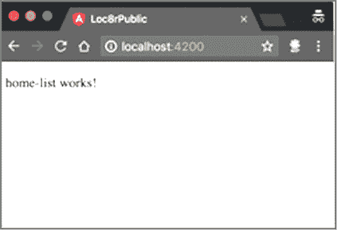

现在你的组件已经准备好了，你可以开始工作，使其看起来应该的样子。

#### 8.2.2\. 创建 HTML 模板

使用与构建 Express 应用程序类似的方法，你将首先创建一些静态 HTML，并使用硬编码的数据。这样，你就可以确保在尝试从 API 获取数据之前，一切都在正常工作。

幸运的是，你已经为这个组件创建了标记和样式；现在，你需要将它们转移到 Angular 上。

##### 获取 HTML 标记

你不能直接从 Express 源代码复制粘贴 HTML，因为它是以 Pug 格式编写的，并且也是模板化的，以使用数据绑定。目前，你想要完整的 HTML，包括数据。

获取 HTML 的最简单方法是运行 Express 应用程序，并在浏览器中转到主页。不同的浏览器获取 HTML 的方法略有不同，但与以下 Chrome 中的步骤相似：

1.  在 HTML 区域右键单击，并在上下文菜单中选择检查元素。

1.  高亮显示 `<div class="card">` 元素。

1.  选择复制，然后复制外部 HTML。

将此内容粘贴到 home-list.component.html 中，替换现有内容，你应该会看到以下内容。

##### 列表 8.5\. 用于 home-list.component.html 的某些静态 HTML 以开始

```
<div class="card">
  <div class="card-block">
    <h4>
      <a href="/location/590d8dc7a7cb5b8e3f1bfc48">Costy</a>
      <small>&nbsp;
        <i class="far fa-star"></i>
        <i class="far fa-star"></i>
        <i class="far fa-star"></i>
        <i class="far fa-star"></i>
        <i class="far fa-star"></i>
      </small>
      <span class="badge badge-pill badge-default float-
      right">14.0km</span>
    </h4>
    <p class="address">High Street, Reading</p>
    <div class="facilities">
      <span class="badge badge-warning">hot drinks</span>
      <span class="badge badge-warning">food</span>
      <span class="badge badge-warning">power</span>
    </div>
  </div>
</div>
```

如果你在浏览器中查看保存后的内容，你将能够看到内容，但看起来不会很好。你需要添加样式。

##### 引入样式

与 HTML 一样，CSS 样式已经存在于 Express 应用程序中；你只需要访问它们。你可以更新 index.html 文件，直接从 localhost:3000 访问它们，但某些浏览器在尝试时可能会给出 CORS 警告，因为 Angular 开发应用程序和 Express 应用程序在不同的端口上运行。如果你对这个术语不熟悉，请参阅侧边栏“什么是 CORS？”。

| |
| --- |

**什么是 CORS？**

浏览器不允许从不同域名访问或请求某些资源，包括请求字体文件和进行 AJAX 调用。这项政策被称为*同源策略*。

*CORS*（跨源资源共享）是一种允许这种情况发生的机制，但只能从托管资源的服务器设置。如果服务器拒绝，从浏览器端无法做任何事情来改变它。

| |
| --- |

要允许访问资源，服务器必须设置为响应一个名为 `Access-Control-Allow-Origin` 的新 HTTP 标头，其值与请求域名匹配。

并非所有浏览器都会为不同端口提供 CORS 警告，但为了避免这个问题，获取所有样式和字体，并将它们放入 Angular 应用程序中。从 /public 文件夹复制 webfonts、stylesheets 和 js 文件夹，并将它们粘贴到 app_public 中的 src/assets 文件夹。

接下来，在 index.html 文件（在 app_public 中）中引用这些 CSS 和 JS 文件，如下所示。注意，你还在添加对 bootstrap 依赖项的引用。

##### 列表 8.6\. 将 CSS 文件添加到 index.html 以供 Angular 应用程序使用

```
<!doctype html>
<html lang="en">
<head>
  <meta charset="utf-8">
  <title>Loc8rPublic</title>
  <base href="/">

  <link rel="stylesheet" href="assets/stylesheets/bootstrap.min.css">
  <link rel="stylesheet" href="assets/stylesheets/all.min.css">
  <link rel="stylesheet" href="assets/stylesheets/style.css">

  <meta name="viewport" content="width=device-width, initial-scale=1">
  <link rel="icon" type="image/x-icon" href="favicon.ico">
</head>
<body>
  <app-home-list></app-home-list>

  <script src="https://code.jquery.com/jquery-3.3.1.slim.min.js"
integrity="sha384-q8i/X+965DzO0rT7abK41JStQIAqVgRVzpbzo5smXKp4YfRv
H+8abtTE1Pi6jizo" crossorigin="anonymous"></script>
  <script src="https://cdnjs.cloudflare.com/ajax/libs/popper.js/1.14.3/
umd/popper.min.js" integrity="sha384-ZMP7rVo3mIykV+2+9J3UJ46
jBk0WLaUAdn689aCwoqbBJiSnjAK/l8WvCWPIPm49" crossorigin="anonymous">
  </script>
  <script src="assets/javascripts/bootstrap.min.js"></script>
</body>
</html>
```

添加样式后，你可以在浏览器中看到类似图 8.8 的东西。

##### 图 8.8\. 显示静态内容并使用样式和字体的 Angular 应用程序


| |
| --- |

##### 注意

当你构建一个要嵌入另一个页面中的应用程序时，就像你现在这样，该应用程序使用包含页面的 CSS。你这里拥有的样式表副本仅用于开发，所以你的模块在构建时看起来是正确的。然而，当你构建一个 SPA 时，最终的应用程序使用 Angular 应用程序内部的样式表。

| |
| --- |

现在你已经让你的主页组件看起来大致正确，你就可以继续通过将硬编码的数据移出，使 HTML 更智能。

#### 8.2.3\. 将数据从模板移到代码中

正如你在本章前面看到的，使用 Angular，你可以在组件代码中定义一个类成员，并通过使用花括号将其绑定到 HTML。你可以在 home-list.component.ts 中添加此内容来定义位置名称：

```
export class HomeListComponent implements OnInit {
  constructor() { }

  name = 'Costy';

  ngOnInit() { }
}
```

然后，你可以通过将位置名称替换为绑定，在 HTML 中显示此内容，如粗体所示：

```
<a href="/location/590d8dc7a7cb5b8e3f1bfc48">{{name}}</a>
```

结果将是浏览器以相同的方式显示，但现在数据的一部分来自代码，并被绑定到模板中；它不再是硬编码的 HTML。

这个例子很好，展示了前进的方向，但你需要更多关于位置的数据以及更好的管理方式。为此，你需要使用一个类。

##### 定义一个类以给数据结构化

在 Angular 中，*类*用于定义数据对象的结构。从你已学到的内容来看，你可以将其视为类似于简单的 Mongoose 模式——本质上，是一个列表，列出了你期望对象持有的数据片段及其类型。

类型很重要。JavaScript 没有的一项能力是声明可以分配给给定变量的值的类型。从字符串更改为数字或布尔值很容易；JavaScript 不在乎！但 TypeScript 在乎，并且它可以通过确保你始终为每个变量使用正确的数据类型来帮助你的代码更加健壮。TypeScript 之所以被称为*TypeScript*，是有原因的。请参阅侧边栏“TypeScript 中的类型”以获取可用类型的列表。

| |
| --- |

**TypeScript 中的类型**

TypeScript 接受的不同的数据类型如下：

+   **`String`—** 文本值。

+   **`number`—** 任何数值；整数和小数被同等对待。

+   **`boolean`—** 真或假。

+   **`Array`—** 指定类型数据的数组。

+   **`enum`—** 给一组数值命名友好名称的方式。

+   **`Any`—** 此数据类型可以是任何东西，就像 JavaScript 默认那样。

+   **`Void`—** 没有类型，通常用于不返回任何内容的函数。

| |
| --- |

定义一个类是一个简单的任务，你将在 home-list.component.ts 文件的顶部执行此操作，在初始`import`语句之后但在组件装饰器之前。为了定义一个类并使其可访问，导出它；给它一个名字；然后列出数据项的名称及其预期的数据类型。

##### 列表 8.7\. 在 home-list.component.ts 中定义`Location`类

```
import { Component, OnInit } from '@angular/core';

export class Location {              *1*
  _id: string;                       *2*
  name: string;                      *2*
  distance: number;                  *2*
  address: string;                   *2*
  rating: number;                    *2*
  facilities: string[];              *3*
}
```

+   ***1* 创建并导出一个名为 Location 的类**

+   ***2* 定义类成员及其类型 . . .**

+   ***3* . . . 包括字符串数组**

完成这些后，你已定义了你期望在位置对象中看到的数据。事实上——这很重要——使用`Location`类定义的每个对象*必须*为每个指定项提供一个值。

现在你已经定义了一个类，你就可以使用它了。

##### 创建位置类的实例

在 TypeScript 中声明变量和类成员时，你应该声明数据类型以及名称，就像你在定义`Location`类的属性时做的那样。使用格式`variableName: variableType = variableValue`。

例如，当你向`home-list`组件添加`name = 'Costy'`来尝试它时，你应该添加`name: string = 'Costy'`而不是。这段代码会告诉 TypeScript，`name`应该始终是字符串值。

当创建一个类的实例或类成员变量时，你也会这样做，但在这个情况下，你需要声明类型是类的名称。列表 8.8 展示了如何向`home-list`组件添加一个类型为`Location`的`location`类成员，给它所有需要的值。通常我们会说，*`location`是类型`Location`的实例*。

##### 列表 8.8\. 在 home-list.component.ts 中使用`Location`类定义`location`

```
export class HomeListComponent implements OnInit {

  constructor() { }

  location: Location = {
    _id: '590d8dc7a7cb5b8e3f1bfc48',
    name: 'Costy',
    distance: 14.0,
    address: 'High Street, Reading',
    rating: 3,
    facilities: ['hot drinks', 'food', 'power']
  };

  ngOnInit() {
  }

}
```

稍后，你将查看`constructor`和`ngOnInit`，了解它们为什么存在以及它们可以用来做什么。现在，你可以忽略它们，专注于你创建的新类成员。这个类成员包含了你需要用于主页列表的所有数据，所以接下来，你将在 HTML 中使用这些数据。

#### 8.2.4\. 在 HTML 模板中使用类成员数据

快速回顾一下，你已经看到了如何通过使用花括号在 HTML 模板中绑定从组件类暴露的数据——就像`{{title}}`这样。现在你的数据稍微复杂一些，你需要访问类成员的属性，这可以通过使用标准的 JavaScript 点语法来实现。例如，`location.name`会给你`name`属性的值。

下一个列表突出了对 HTML 模板进行的一些快速简单的更改，以便引入数据。

##### 列表 8.9\. 在 home-list.component.html 中绑定第一份数据

```
<div class="card">
  <div class="card-block">
    <h4>
      <a href="/location/{{location._id}}">{{location.name}}</a>
      <small>&nbsp;
        <i class="far fa-star"></i>
        <i class="far fa-star"></i>
        <i class="far fa-star"></i>
        <i class="far fa-star"></i>
        <i class="far fa-star"></i>
      </small>
      <span class="badge badge-pill badge-default float-
      right">{{location.distance}}km</span>
    </h4>
    <p class="address">{{location.address}}</p>
    <div class="facilities">
      <span class="badge badge-warning">hot drinks</span>
      <span class="badge badge-warning">food</span>
      <span class="badge badge-warning">power</span>
    </div>
  </div>
</div>
```

这里，你有四条单独的数据被绑定到 HTML 模板中。设施和星级评分需要更多的工作。从设施开始，遍历数据数组。

##### 设施：在 HTML 模板中遍历项目数组

在 TypeScript 文件中，你将设施定义为字符串数组，如下所示：`['hot drinks', 'food', 'power']`。现在你将看到 Angular 如何帮助你遍历这些字符串，并为数组中的每个设施创建一个`span`标签。

秘诀是使用一个名为 `*ngFor` 的 Angular 指令。当应用于 HTML 标签并给定一个数据数组时，它会遍历数组，为每个条目创建一个元素。要访问每个项的值或属性，你需要定义一个 Angular 在遍历过程中可以使用的变量。

以下列表显示了如何使用 `*ngFor` 指令遍历 `location.facilities` 数组，分配并使用变量 `facility` 来访问值。

##### 列表 8.10\. 在 home-list.component.html 中使用 `*ngFor` 遍历数组

```
<div class="facilities">
  <span *ngFor="let facility of location.facilities" class="badge
  badge-warning">{{facility}}</span>
</div>
```

`*` 符号很重要，因为没有它，Angular 不会执行循环。有了 `*`，它会重复 `<span>` 以及其中的所有内容。给定数据设施 `['hot drinks', 'food', 'power']`，输出如下

```
<span class="badge badge-warning">hot drinks</span>
<span class="badge badge-warning">food</span>
<span class="badge badge-warning">power</span>
```

注意，Angular 创建了一些额外的注释和标签属性，你可以在 图 8.9 中看到，以及浏览器中的输出。

##### 图 8.9\. Angular 遍历设施数组的输出

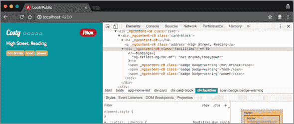

现在设施已经完成，你可以继续处理评分星号。

##### 评分星号：使用 Angular 表达式设置 CSS 类

到目前为止，你使用的数据绑定都很简单：双大括号内的一个变量名或属性。使用 Angular，你还可以在绑定中使用简单的表达式。你可以使用 `{{ 'Getting ' + 'MEAN' }}` 来连接两个字符串，或者使用 `{{ Math.floor(14.65) }}` 来执行简单的数学运算。

对于评分星号，每个星号都使用 Font Awesome 类定义：`.fas.fa-star` 用于实心星号，`.far.fa-star` 用于轮廓。你想要使用 Angular 设置这些类，确保你有正确数量的实心和空心星号来传达评分。

要完成这个任务，你需要使用 JavaScript 三元运算符，它是简单 `if` / `else` 表达式的简写。以第一个星号为例，你想要表达的是：“如果评分小于 1，则使星号空心；否则，使它实心。” 示例代码：

```
if (location.rating < 1) {
  return 'far';
} else {
  return 'fas';
}
```

转换为三元运算符，相同的表达式看起来是这样的：

```
{{ location.rating < 1 ? 'far' : 'fas' }}
```

将此逻辑应用到构成评分星号的 `<i>` 标签中，并将表达式放入 Angular 绑定中，结果如下所示。注意，每个表达式都有一个不同的数字来显示正确的星号，而且你总是输出 `fa-star`，所以你将其从表达式中移除了。

##### 列表 8.11\. 绑定三元表达式以生成 ratings-stars 类

```
<small>&nbsp;
  <i class="fa{{ location.rating < 1 ? 'r' : 's' }} fa-star"></i>
  <i class="fa{{ location.rating < 2 ? 'r' : 's' }} fa-star"></i>
  <i class="fa{{ location.rating < 3 ? 'r' : 's' }} fa-star"></i>
  <i class="fa{{ location.rating < 4 ? 'r' : 's' }} fa-star"></i>
  <i class="fa{{ location.rating < 5 ? 'r' : 's' }} fa-star"></i>
</small>
```

你可以在浏览器中验证此代码是否正确运行，你将看到类似 图 8.10 的内容。

##### 图 8.10\. 正确显示评分星号，使用 Angular 表达式绑定生成正确的类

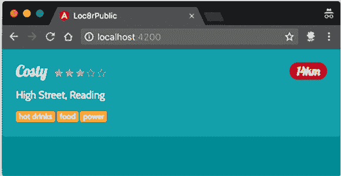

看起来不错！你还有另一份数据要处理：距离。

##### 使用管道格式化数据

Angular 提供了一种在绑定中格式化数据的方法，使用的是所谓的 *管道*。对于那些熟悉 AngularJS 的人来说，管道过去被称为 *过滤器*。Angular 有几个内置的管道，包括日期和货币格式化，以及大写、小写和标题化字符串转换。

在绑定内部应用管道是通过在要绑定的变量或表达式后添加管道字符（`|`），然后跟管道名称来实现的。如果你想以大写形式显示一个位置的地址，例如，你可以添加大写绑定如下：

```
<p class="address">{{location.address | uppercase}}</p>
```

你可能不想这样做，但如果你愿意的话可以！

一个对调试有用的管道是 JSON 管道，它将一个 JSON 对象转换为字符串，以便在浏览器中显示。如果你不确定 `location` 对象中通过的数据是什么，你可以在 HTML 中的某个地方临时绑定到它并添加 JSON 管道。

一些管道可以接受选项来定义它们的工作方式。以货币管道为例。你可以不带任何选项地应用货币管道，如下所示：

```
{{ 12.3485 | currency }}
```

这个管道假设默认货币为美元，并将数字四舍五入到最接近的美分。在这个例子中，输出将是 `USD12.35`。

你可以向这个管道应用选项来更改货币并显示符号而不是货币代码。管道选项直接跟在管道名称后面，由冒号分隔。选项的顺序很重要。货币管道的第一个选项是货币代码本身，用于更改货币；第二个选项是一个布尔值，用于表示是否显示符号。

如果你想要以欧元的形式显示货币，例如，并显示符号而不是代码，你可以像这样使用管道：

```
{{ 12.3485 | currency:'EUR':true }}
```

这个管道将输出 `€12.35`。

这就是管道的工作方式，在你构建 Loc8r 应用程序的过程中，你将使用一些其他默认的管道。现在你需要将距离格式化为米或千米，为此，你需要创建一个自定义管道。

##### 距离：创建一个自定义管道

在你创建一个新的管道来格式化距离之前，确保传递给它的数据反映了你将从 API 获得的数据。在你的当前模拟数据中，你有 `14.0` 以确保距离数字显示得很好。但是 API 返回的是米，所以更新 home-list.component.ts 中的距离以反映这一事实——例如 `14000.1234`。

要为自定义管道创建模板文件，你可以使用 Angular CLI。在终端中，从 app_public 文件夹运行以下命令：

```
ng generate pipe distance
```

这个命令在 src/app 文件夹中生成两个新文件——distance.pipe.ts 和 distance.pipe.spec.ts。CLI 将导入添加到 app.module.ts 文件中。如果你想要将管道文件移动到其他地方，例如子文件夹中，你必须更新 app.module.ts 来指定它们的新位置。现在先让他们留在原地。

模板管道文件，distance.pipe.ts，看起来是这样的：

```
import { Pipe, PipeTransform } from '@angular/core';

@Pipe({
  name: 'distance'
})
export class DistancePipe implements PipeTransform {

  transform(value: any, args?: any): any {
    return null;
  }

}
```

这种结构应该开始看起来熟悉了。你顶部有导入，然后是装饰器，最后是导出类。你在这里感兴趣的是类的内容——特别是那个`transform`函数。

初看，这段代码看起来有点奇怪，有些复杂，到处都是冒号和`any`。但这是 TypeScript 在执行它的工作：为变量定义类型。括号内的内容（`value: any, args?: any`）表示该函数*接受*任何类型的参数`value`和其他任何类型的参数。括号后面的第三个`: any`定义了函数的*返回*值的类型。

你想要更改这些，因为你的距离函数将接受一个数字并返回一个字符串。为此，更新`transform`函数如下：

```
transform(distance: number): string {
  return null;
}
```

注意你已经将参数的名称更改为`distance`。你已经在 Node 中编写了格式化距离的代码，所以你可以从`/app_server/controllers/locations.js`复制它并粘贴到这里。你需要`isNumeric`辅助函数以及`formatDistance`函数的内容。完成这些后，`transform`函数看起来如下。

##### 列表 8.12\. 在 distance.pipe.ts 中创建距离格式化管道

```
transform(distance: number): string {
  const isNumeric = function (n) {
    return !isNaN(parseFloat(n)) && isFinite(n);
  };

  if (distance && isNumeric(distance)) {
    let thisDistance = '0';
    let unit = 'm';
    if (distance > 1000) {
      thisDistance = (distance / 1000).toFixed(1);
      unit = 'km';
    } else {
      thisDistance = Math.floor(distance).toString();
    }
    return thisDistance + unit;
  } else {
    return '?';
  }
}
```

注意，所有代码，包括辅助函数，都在`transform`函数内部。现在剩下的只是更新绑定以使用你的新管道，并从模板中删除`km`。以下是从 home-list.component.html 中更新的绑定片段：

```
<span class="badge badge-pill badge-default float-
right">{{location.distance | distance}}</span>
```

你也可以在浏览器中查看这个（见图 8.11）。

##### 图 8.11\. 使用 Angular 管道格式化以米为单位的距离

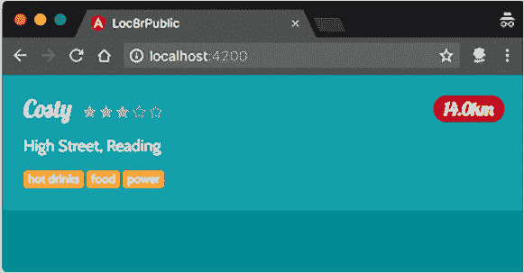

在组件定义中玩转数据，并测试它是否按你想象的方式显示。看起来不错，你已经设置了所有数据绑定，所有数据都是由组件定义提供的。然而，这是一个单独的项目，你的 API 将返回多个项目的数组；毕竟，它是一个列表！在下一节中，你将更新它以作为列表工作。

##### 与类的多个实例一起工作

你单个位置的数据定义为`location`类型`Location`。不要大声读出来！没有数据时，结构看起来像这样：

```
location: Location = {};
```

当你从 API 获取数据时，这将会是一个数组，因此你需要定义一个类型为`Location`的对象数组。这样做的方法是在类名后面添加方括号，使其看起来像这样的结构：

```
locations: Location[] = [{},{}];
```

如果你采取这种方法（注意你将成员名称更改为复数`locations`，因为你正在处理一个数组）并更新你的`home-list`组件以包含两个位置，结果看起来如下。

##### 列表 8.13\. 在 home-list.component.ts 中将位置实例化改为数组

```
locations: Location[] = [{
  _id: '590d8dc7a7cb5b8e3f1bfc48',
  name: 'Costy',
  distance: 14000.1234,
  address: 'High Street, Reading',
  rating: 3,
  facilities: ['hot drinks', 'food', 'power']
}, {
  _id: '590d8dc7a7cb5b8e3f1bfc48',
  name: 'Starcups',
  distance: 120.542,
  address: 'High Street, Reading',
  rating: 5,
  facilities: ['wifi', 'food', 'hot drinks']
}];
```

在将`location`重命名为`locations`并更改类型为数组后，你需要更新 HTML 模板。你已经看到如何通过使用`*ngFor`来遍历数组，这个过程没有不同。实际上，你只需要在单个位置的最外层 div（具有`card`类）上添加一个`*ngFor`属性。它看起来像这样：

```
<div class="card" *ngFor="let location of locations">
```

通过定义实例名称`location`，你不需要更改模板内部的数据绑定，因为那正是你之前使用的。

现在你的列表中有多个项目，如图 8.12 所示。看起来不错，工作得很好。下一步是完全删除硬编码的数据，并调用 API。

##### 图 8.12\. 更新组件以在列表中显示多个位置

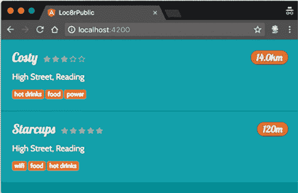

### 8.3\. 从 API 获取数据

在本节中，你将了解如何从 Angular 应用程序中调用 API 以获取数据。当你得到数据时，你将显示它而不是你目前拥有的硬编码数据。

要与 API 交互，你需要使用 Angular 应用程序的另一个构建块：一个*服务*。服务在后台工作，并不直接连接到用户界面，就像你迄今为止看到的一切。

#### 8.3.1\. 创建数据服务

你创建服务的方式与你迄今为止创建组件和管道的方式相同：使用 Angular CLI。你使用与之前相同的`ng generate`命令，这次后面跟着`service`和`service name`选项。在`app_public`文件夹中，在终端中运行以下命令：

```
$ ng generate service loc8r-data
```

此命令在`app/src`文件夹中生成一个名为`loc8r-data`的新服务文件。终端确认文件已创建。

服务通过传递给`Injectable`装饰器的`providedIn`值生成，默认为`'root'`。它取代了在应用程序根模块中显式列出服务在提供者数组中的做法，适合你的目的，所以保留默认值不变。

在你担心包含它之前，看看模板代码并构建它。现在代码布局应该很熟悉了：导入后跟一个装饰器，然后是导出的类：

```
import { Injectable } from '@angular/core';

@Injectable({
  providedIn: 'root'
})
export class Loc8rDataService {

  constructor() { }
}
```

这个模板文件很简洁，这并不奇怪，因为服务除了从 API 请求数据之外，还可以用于许多其他事情。开始使用服务之前，给它一些它需要的东西。

##### 在服务中启用 HTTP 请求和承诺处理

在 Angular 中，HTTP 请求是异步运行的，并返回可观察对象，但你在处理数据之前想等待数据完成，所以你会将它们转换为承诺。为了快速解释，请参阅侧边栏“可观察对象和承诺。”

| |
| --- |

**可观察对象和承诺**

Observables 和 Promises 是处理异步请求的绝佳方式。Observables 以流的形式返回数据块，而 Promises 返回完整的数据集。Angular 包括 RxJS 库来处理 Observables，包括将它们转换为 Promises。

关于 RxJS 和 Observables，我们在这里无法涵盖的内容还有很多——实际上足够写一本书。查看 Luis Atencio 和 Paul P. Daniels 所著的《RxJS in Action》以了解更多信息（[`www.manning.com/books/rxjs-in-action`](https://www.manning.com/books/rxjs-in-action)）。


这并不意味着你不能，或者不应该使用 Observables——只是你不在示例应用程序中。如果你想了解如何在 Loc8r 应用程序中使用 Observables，请查看附录 C。

要设置服务以发起 HTTP 请求并返回 Promises，你需要将 HTTP 服务注入到你的服务中。你通过更新`loc8r-data.service.ts`文件顶部的导入来导入 HTTP 服务，如下所示：

```
import { Injectable } from '@angular/core';
import { HttpClient, HttpHeaders } from '@angular/common/http';
```

第二步是将`HTTPClient`服务注入到你的服务中，这样你就可以使用它并调用 HTTP 服务的方法。为此，你使用样板代码的构造函数部分。类构造函数定义了在类实例化时提供的参数。Angular 使用它来管理依赖注入，告诉类它需要哪些其他服务或组件来运行。

注入服务很简单：你定义参数名称和其类型。你也可以声明服务是公共的还是私有的——也就是说，它是否可以从类外部访问或保持在其内部。私有是最常见的选项。

你注入了类型为`HttpClient`的`http`，并通过更新`loc8r-data.service.ts`中的构造函数将其保持为私有，如下所示：

```
constructor(private http: HttpClient) { }
```

最后，你需要确保`HttpClientModule`被导入并可供你的应用程序使用。通过在你的`app.module.ts`文件中添加以下导入来实现这一点：

```
import { HttpClientModule } from '@angular/common/http';
```

在同一文件中，将模块的名称添加到`@NgModule`装饰器中的`imports`数组中，如下所示：

```
@NgModule({
  declarations: [
    HomeListComponent,
    DistancePipe
  ],
  imports: [
    BrowserModule,
    HttpClientModule
  ],
  providers: [],
  bootstrap: [HomeListComponent]
})
```

通过这些小的更新，你的数据服务可以发起 HTTP 请求并返回 Promise。

##### 创建获取数据的方法

你的服务需要一个公开的方法供组件调用。在这个阶段，该方法不需要接受任何参数，但返回一个包含位置数组的 Promise。

在`Loc8rDataService`类内部，你想要定义一个类似这样的方法：

```
public getLocations(): Promise<Location[]> {
  // Your code will go here
}
```

这很好，除了你的服务不知道`Location`是什么。你在`home-list`组件中定义并导出了`Location`类，所以你可以通过添加以下行将这个类导入到服务中，与其他导入一起：

```
import { Location } from './home-list/home-list.component';
```

现在你已经准备好编写服务的核心代码了。

##### 发起 HTTP 请求

向 API 发起 HTTP 请求很简单，只需要几个步骤：

1.  构建要调用的 URL。

1.  告诉 HTTP 服务对 URL 发起请求。

1.  将 Observable 响应转换为 Promise。

1.  将响应转换为 JSON。

1.  返回响应。

1.  捕获、处理并返回错误。

将这些步骤放入代码中看起来如下所示，所有这些都是位于 loc8r-data.service.ts 中的 `Loc8rDataService` 类内部。

##### 列表 8.14\. 在 loc8r-data.service.ts 中创建并返回 HTTP 请求

```
private apiBaseUrl = 'http://localhost:3000/api';               *1*
                                                                *1*
public getLocations(): Promise<Location[]> {                    *1*
  const lng: number = -0.7992599;                               *1*
  const lat: number = 51.378091;                                *1*
  const maxDistance: number = 20;                               *1*
  const url: string = `${this.apiBaseUrl}/locations?lng=        *1*
${lng}&lat=${lat}&maxDistance=${maxDistance}`;                *1*
  return this.http                                              *2*
    .get(url)                                                   *3*
    .toPromise()                                                *4*
    .then(response => response as Location[])                   *5*
    .catch(this.handleError);                                   *6*
}                                                               *6*

private handleError(error: any): Promise<any> {                 *6*
  console.error('Something has gone wrong', error);             *6*
  return Promise.reject(error.message || error);                *6*
}                                                               *6*
```

+   ***1* 使用参数构建 API 的 URL，以供未来增强使用**

+   ***2* 返回 Promise**

+   ***3* 对你构建的 URL 进行 HTTP GET 调用**

+   ***4* 将 Observable 响应转换为 Promise**

+   ***5* 将响应转换为类型为 Location 的 JSON 对象**

+   ***6* 处理并返回任何错误**

注意，只有你需要从其他地方调用的方法 `getLocations` 是公开的；其他所有内容都被定义为私有，因此不能从外部访问。

这不是很多代码，但它做了很多事情。正如你将看到的，在 Angular 中相当常见，在你掌握了组件、类和服务的设置之后，实际的代码可以很简单，因为许多常见任务已经将复杂性抽象掉了。

现在数据服务已经创建，是时候从 `home-list` 组件中使用它了。

#### 8.3.2\. 使用数据服务

你现在处于一个可以显示位置数组（目前是硬编码的）的 Angular 组件、可以返回位置数组的 API 以及调用该 API 并公开响应的服务都有的位置。缺失的环节是组件和服务之间的连接。

##### 将服务导入到组件中

将服务包含到组件中需要三个步骤，所有这些步骤都在 home-list.component.ts 文件内部进行。你需要导入服务，注入服务，然后提供服务。

首先，从 TypeScript 文件中导入服务，你需要在组件文件顶部直接在现有导入行下方进行，如下所示：

```
import { Component, OnInit } from '@angular/core';
import { Loc8rDataService } from '../loc8r-data.service';
```

注意，你使用 `../` 定义了服务文件的相对路径，这意味着“在文件夹结构中向上提升一级。”如果你将服务文件移动到不同的位置，你需要记住更新代码中的引用。

第二步是将服务注入到组件中，使用与在数据服务内部相同的方式。不过，这次你通过注入 `loc8rDataService` 类型为 `Loc8rDataService` 并将其保持为私有来更新 home-list.component.ts 中的构造函数，如下所示：

```
constructor(private loc8rDataService: Loc8rDataService) { }
```

到最后，home-list.component.ts 文件顶部应该看起来如下所示。

##### 列表 8.15\. 在 home-list.component.ts 中使服务对组件可用

```
import { Component, OnInit } from '@angular/core';
import { Loc8rDataService } from '../loc8r-data.service';           *1*

export class Location {
  _id: string;
  name: string;
  distance: number;
  address: string;
  rating: number;
  facilities: [string];
}

@Component({
  selector: 'app-home-list',
  templateUrl: './home-list.component.html',
  styleUrls: ['./home-list.component.css']
})
export class HomeListComponent implements OnInit {

  constructor(private loc8rDataService: Loc8rDataService) { }       *2*
```

+   ***1* 从源代码文件导入服务**

+   ***2* 使用构造函数将服务注入到组件中**

现在服务已经创建并引入到组件中，你可以使用它了。

##### 使用服务获取数据

在类内部，创建一个私有方法来调用您的数据服务方法并处理 Promise 响应。当它有 Promise 响应时，此方法可以设置位置数组的值，这将在 HTML 中自动更新。

为了证明这是有效的，从组件中删除所有硬编码的数据，并将`locations`声明为`Location`类型，不分配任何值。将下一列表中的代码放入 home-list.component.ts 中的`HomeListComponent`类定义中。

##### 列表 8.16\. 在 home-list.component.ts 中创建一个调用数据服务的函数

```
public locations: Location[];                                      *1*

private getLocations(): void {                                     *2*
  this.loc8rDataService                                            *3*
    .getLocations()                                                *3*
      .then(foundLocations => this.locations = foundLocations);    *4*
}
```

+   ***1* 将位置声明更改为其没有默认值**

+   ***2* 定义一个不接受任何参数也不返回任何内容的 getLocations 方法**

+   ***3* 调用您的数据服务方法**

+   ***4* 使用响应内容更新位置数组**

很好。尽管如此，这段代码仍然无法工作，因为您没有在组件中调用私有的`getLocations`方法。这一步是下一个也是最后一步，但您需要确保在正确的时间这样做。

正如您所看到的，Angular 应用程序由许多文件组成。但您无法控制文件组合的顺序，因此无法直接控制执行顺序。您需要确保在服务可用之后才调用它，这就是那个小小的空`ngOnInit()`块发挥作用的地方。

`ngOnInit`是几个 Angular 生命周期钩子之一。当 Angular 应用程序启动和运行时，事情按照特定的顺序发生，以确保应用程序保持完整性并且始终以相同的方式进行操作。生命周期钩子允许您在特定时间监听过程并采取行动。

`ngOnInit`钩子允许您在组件初始化并准备好时进行挂钩。这是一个进行数据调用的好时机，因为您知道这样做是安全的，并且组件已经准备好运行。在 home-list.component.ts 中调用`local getLocations`方法，如下所示：

```
ngOnInit() {
  this.getLocations();
}
```

现在，应用程序将正确编译、运行并调用 API。太好了！但如果您在某些浏览器（尤其是 Chrome）上尝试，则不会通过任何数据。如果您打开浏览器开发者工具或 JavaScript 控制台，您会看到一个 CORS 警告，因为 Angular 应用程序和 Express API 正在不同的端口上运行。

##### 在 Express 中允许 CORS 请求

CORS 问题不能从浏览器端修复；它必须在服务器端完成。您需要暂时改变方向，回到 Express。

允许跨源请求很简单，幸运的是。对于发送到 API 的每个请求，您需要添加两个 HTTP 头：`Access-Control-Allow-Origin`和`Access-Control-Allow-Headers`。这些头中的第一个可以包含一个特定的 URL，您将从该 URL 允许请求，或者使用`*`作为通配符以接受来自任何域的请求。您将通过指定 URL 和端口来限制对 Angular 开发应用程序的请求。

返回到应用程序根目录下的 app.js 文件，在路由使用之前添加以下加粗字体行：

```
app.use('/api', (req, res, next) => {
  res.header('Access-Control-Allow-Origin', 'http://localhost:4200');
  res.header('Access-Control-Allow-Headers', 'Origin, X-Requested-With,
  Content-Type, Accept');
  next();
});
app.use('/', indexRouter);
app.use('/api', apiRouter);
```

此代码将两个头和它们的值添加到所有请求 API 路由的响应中。如果你仍然在端口 3000 上运行你的 Express 应用程序，在端口 4200 上运行你的 Angular 应用程序，你应该会看到你的数据通过浏览器进入，如图 8.13 所示。

##### 图 8.13\. 你的 Angular 组件现在正在显示从 API 中获取的数据。

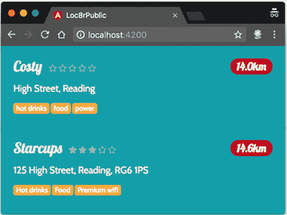

这太棒了！你轻松地构建了一个小巧的、自包含的 Angular 应用程序。这并不是一个糟糕的开始，特别是考虑到你还在本章中掌握了 TypeScript。在下一节中，你将完成这个应用程序并将其嵌入到你的 Express 应用程序中。

### 8.4\. 将 Angular 应用程序投入生产

到目前为止，你一直在开发模式下使用 Angular 构建你的小应用程序。但当你停止 `ng serve` 运行后，你只剩下一些源文件，没有任何可以包含在网站中的内容。现在你需要为生产环境构建你的应用程序并将其添加到你的主页上。

#### 8.4.1\. 构建用于生产的 Angular 应用程序

在本章中，你一直在使用 `ng serve` 命令来自动重建你的应用程序并从内存中提供编译后的文件。现在你将使用 `ng build` 命令一次性编译文件并将它们保存到磁盘上。

`ng build` 命令生成所有应用程序文件并将它们放入一个名为 dist 的文件夹中。这个文件夹与 src 文件夹处于同一级别，这将是很好的，但如果你之后再次运行 `ng serve`，它将删除 dist 文件夹，这并不 helpful，正如你可以想象的那样。但你可以通过在运行命令时使用 `--output-path` 选项来更改目标文件夹。如果你这样做，你的目标文件夹在下次你决定运行 `ng serve` 时不会意外地被删除。

构建选项太多，我们在这里无法一一介绍（你可以在终端中运行 `ng help` 来查看它们），你现在唯一需要知道的是指定你想要生产构建（而不是开发构建）的选项。你可以通过在命令中添加 `--prod` 标志来指定这一点。

要在 app_public 文件夹中创建应用程序的生产构建版本，在终端中运行以下命令：

```
$ ng build --prod --output-path build
```

此命令启动构建过程。如果你收到一个关于找不到 `AppComponent` 的错误，那可能是因为引用被从 app.module.ts 中移除，但文件没有被删除。修复方法是删除旧的 app.component 文件，因为你不再使用它们了。

就这样：应用程序已经为生产环境准备好了！现在你需要将其包含到 Express 应用程序中。

#### 8.4.2\. 从 Express 网站使用 Angular 应用程序

要在主页中使用 Angular 应用，你需要在 Express 中做一些小事情。首先，你将 app_public 文件夹设置为静态路径，这意味着你可以轻松地从浏览器中引用构建文件夹中的文件。为了完成第二部分，更新 Pug 模板以包含构建文件夹中的 JavaScript 文件。

简单，对吧？现在就来做吧！

##### 为 Angular 应用定义静态路径

你已经看到 Express 如何定义用于静态资源的文件夹，因为生成器自动将 public 文件夹定义为静态。你可以通过在应用程序根目录中的 app.js 中复制该行来为 app_public 文件夹做同样的事情，并将名称设置为 app_public：

```
app.use(express.static(path.join(__dirname, 'public')));
app.use(express.static(path.join(__dirname, 'app_public')));
```

现在 Express 将从 public 或 app_public 文件夹中提供静态资源。为什么定义整个 app_public 文件夹而不是只定义 build 子文件夹为静态资源？嗯，build 文件夹还包含一个 index.html 文件。如果这个文件被包含为静态资源，它将作为主页出现，因为静态资源在检查其他 Express 路由之前被检查。这个特性将在接下来的章节中很有用，当你创建完整的 Angular 应用时，但这不是你现在想要的。现在，你想要在现有的网站上使用 Angular 应用 *内部*，因为你正在替换主页的部分。

##### 从 HTML 中引用编译后的 Angular JavaScript 文件

你只想在主页上引用 Angular 文件，而不是在其他页面上。目前的问题是，你只能在 layout.pug 模板中包含脚本文件；所有其他模板都扩展了这个小的嵌套 HTML 部分。没有地方可以放置新的脚本标签。

解决这个问题的简单方法是在 layout.pug 模板中创建一个新的 `block`。然后任何扩展此布局的其他页面都将有包含页面特定脚本的选择。

在 layout.pug 中，在底部添加以下行以定义一个新的 `block`，称为 `scripts`：

```
block scripts
```

确保缩进与文件中最后的 `script` 标签相同；期望的结果是任何特定页面的脚本都将添加到 HTML 的 `body` 底部。

接下来，在 locations-list.pug 文件中使用这个新的 `block`，并从 app_public/build 文件夹中引用所有三个 JavaScript 文件。代码看起来可能像这样，但文件名会有所不同：

```
block scripts
  script(src='/build/runtime.f0178fcd0cc34a5688b1.js')
  script(src='/build/polyfills.682313b6b06f69a5089e.js')
  script(src='/build/main.ad6de91d9e2170cae9d4.js')
```

你几乎完成了！你只需要在 HTML 中添加一个标签来绑定应用。

##### 将 HTML 标签添加到绑定 Angular 应用

如果你回想起本章前面的内容或检查源代码，你会记得你的应用被引导到一个名为 `app-home-list` 的 HTML 标签中。你现在只想用你的新持有标签替换主页的部分列表。

在`locations-list.pug`文件中，找到`each location in locations`部分，要么删除它，要么将其注释掉以供参考。在其位置添加`app-home-list`，确保缩进正确。这部分模板看起来应该像这样：

```
.row
  .col-12.col-md-8
    .error= message

    app-home-list
```

现在你已经完成了！前往浏览器；回到 localhost:3000；检查主页，现在包括你的 Angular 应用程序，它正在从你的 API 获取数据。

如果你一切操作正确，页面应该看起来和之前一样。为了证明主页正在使用 Angular 应用程序，检查列表中的一个元素；你会看到 app-home-list 标签以及所有 Angular 相关的内容（见图 8.14）。

##### 图 8.14\. 验证主页列表是否使用 Angular 模块

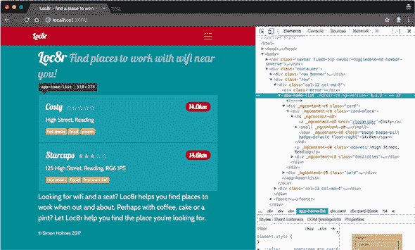

我们非常喜欢这些内容！所有部件如何相互配合并协同工作真是太棒了。现在你正在迈向 MEAN。在第九章中，你将开始构建 Loc8r 作为完整的 Angular SPA。

### 概述

在本章中，你学习了

+   如何使用 Angular CLI 生成应用程序模板、组件等

+   如何使用 TypeScript 类、导入和导出，以及如何使用它们为变量定义类型

+   如何使用 Angular 生命周期钩子控制代码执行流程

+   如何创建和使用一些 Angular 构建块来组装应用程序，包括模块、组件、管道和服务

+   如何使用 Angular CLI 针对生产环境进行目标定位

## 第九章\. 使用 Angular 构建单页应用程序：基础

*本章涵盖*

+   使用 Angular 路由在页面之间导航

+   SPA 的架构最佳实践

+   通过多个组件构建视图

+   将 HTML 注入到绑定中

+   利用浏览器本地的地理位置功能

你在第八章中看到了如何使用 Angular 为现有页面添加功能。在本章和第十章中，你将通过使用 Angular 创建单页应用程序（SPA）将 Angular 提升到下一个层次。你将不再在服务器上使用 Express 运行整个应用程序逻辑，而是将在浏览器中使用 Angular 运行它。关于使用 SPA 而不是传统方法的一些好处和考虑因素，请参阅第二章。到本章结束时，你将拥有 SPA 的框架，通过使用 Angular 路由到主页并显示内容，第一部分将运行起来。

图 9.1 显示了你在整体计划中的位置，将主应用程序作为 Angular SPA 重新创建。

##### 图 9.1\. 本章将 Loc8r 应用程序重新创建为 Angular SPA，将应用程序逻辑从后端移动到前端。

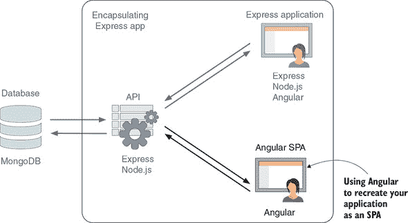

在正常的开发过程中，你可能不会在服务器上创建整个应用程序，并将其重新创建为 SPA。理想情况下，你的早期规划阶段就定义了你是否想要一个 SPA，这样你就可以从适当的技术开始。对于你现在正在经历的学习过程，这是一个很好的方法；你已经熟悉了网站的功能，布局也已经创建。这种方法让你可以专注于更令人兴奋的展望，即了解如何构建完整的 Angular 应用程序。

在本章中，你将首先添加 Angular 路由以在页面之间导航；然后，你将创建主页和关于页面，并添加地理位置功能。随着你添加更多组件和功能，你将探索各种最佳实践，例如创建可重用组件和构建模块化应用程序。

### 9.1\. 在 Angular SPA 中添加导航

在本节中，你将添加关于页面的轮廓并启用此新页面与主页之间的导航。本节的主要重点是导航；你将在第 9.4 节完成关于页面。

你可能记得，当你配置 Express 应用程序时，你定义了 URL 路径（路由）并使用 Express 路由将路由映射到特定的功能。在 Angular 中，你将做同样的事情，但使用 Angular 路由。

使用 Angular 路由的一个重大区别是，整个应用程序已经加载到浏览器中，因此当你导航到不同页面时，浏览器不需要每次都完全下载所有 HTML、CSS 和 JavaScript。导航对用户来说变得更快；他们通常只需要等待的是 API 调用的数据以及任何新的图片。

第一步是将 Angular 路由导入到应用程序中。

#### 9.1.1\. 导入 Angular 路由并定义第一个路由

Angular 路由需要导入到 app.module.ts 中，这也是你将定义路由的地方。路由是从 `@angular/router` 导入的，作为 `RouterModule`，它应该放在 app.module.ts 顶部的其他 Angular 导入中。

##### 列表 9.1\. 在 app.module.ts 中将 `RouterModule` 添加到导入列表中

```
import { BrowserModule } from '@angular/platform-browser';
import { NgModule } from '@angular/core';
import { HttpClientModule } from '@angular/common/http';
import { RouterModule } from '@angular/router';            *1*
```

+   ***1* 导入 Angular RouterModule**

在同一文件中，在 `@NgModule` 装饰器中，所有这些模块都在导入部分列出。你需要用 `RouterModule` 做同样的事情，但在这个情况下，你还需要传递你想要的路由配置。

#### 9.1.2\. 路由配置

路由配置是一个对象数组，每个对象指定一个路由。每个路由的属性包括

+   **`path`—** 匹配的 URL 路径

+   **`component`—** 要使用的 Angular 组件名称

`path` 属性不应该包含任何前导或尾随斜杠，所以例如，你会有 `about` 而不是 `/about/`。它也可以是一个空字符串，表示主页。记住，`base href` 是在 index.html 文件中设置的？你将其设置为 `"/"`，因为你希望所有内容都在顶级运行，即使你设置了值，这个值也不会对路由配置产生影响。在你的路由配置中，你应该省略在 `base href` html 标签中设置的任何内容。

你首先添加主页的配置，所以 `path` 是一个空字符串，`component` 是你现有的组件名称：`HomeListComponent`。配置被传递给 `RouterModule` 的 `forRoot` 方法。

##### 列表 9.2\. 在 app.module.ts 的装饰器中添加路由配置

```
@NgModule({
  declarations: [
    HomeListComponent,
    DistancePipe
  ],
  imports: [
    BrowserModule,
    HttpClientModule,
    RouterModule.forRoot([                *1*
      {
        path: '',                         *2*
        component: HomeListComponent      *3*
      }
    ])
  ],
  providers: [],
  bootstrap: [HomeListComponent]
})
```

+   ***1* 将 RouterModule 添加到 imports 中，并调用 forRoot 方法**

+   ***2* 将主页路由定义为空字符串**

+   ***3* 指定 HomeListComponent 作为此路由的组件**

你已经将 Angular 的 `RouterModule` 导入到你的应用程序中，并告诉它使用哪个组件作为主页。然而，你无法测试它，因为你还在指定相同的组件作为默认组件。注意 列表 9.2 中的行 `bootstrap: [HomeListComponent]`。你需要做的是创建一个新的默认组件，你将使用它来包含导航。

#### 9.1.3\. 创建框架和导航的组件

为了包含导航元素，你需要创建一个新的组件并将其作为应用程序的默认组件。你还将使用此组件来包含所有框架 HTML，就像你在 Express 中的 layout.pug 所做的那样。实际上，框架 HTML 是三件事：导航、内容容器和页脚。

首先，通过在 app_public 目录的终端中运行以下命令创建一个名为 `framework` 的新组件：

```
$ ng generate component framework
```

此命令在 app_public/src/app/ 内部创建一个新的框架文件夹，并生成你需要的所有文件。找到 framework.component.html 文件，并添加以下列表中显示的所有 HTML，这基本上就是 layout.pug 转换为 HTML 的内容。

##### 列表 9.3\. 在 framework.component.html 中添加框架的 HTML

```
<nav class="navbar fixed-top navbar-expand-md navbar-light">        *1*
  <div class="container">
    <a href="/" class="navbar-brand">Loc8r</a>
      <button type="button" data-toggle="collapse" data-target=
      "#navbarMain"class="navbar-toggler">
        <span class="navbar-toggler-icon"></span>
      </button>

    <div id="navbarMain" class="navbar-collapse collapse">
      <ul class="navbar-nav mr-auto">
        <li class="nav-item">
          <a href="/about/" class="nav-link">About</a>
        </li>
      </ul>
    </div>
  </div>
</nav>
<div class="container content">                                     *2*
  <footer>                                                          *3*
    <div class="row">
      <div class="col-12">
        <small>&copy; Getting Mean - Simon Holmes/Clive Harber 2018</small>
      </div>
    </div>
  </footer>
</div>
```

+   ***1* 设置导航部分**

+   ***2* 创建主容器**

+   ***3* 将页脚嵌套在主容器内**

现在你已经设置了组件，你需要告诉应用程序使用它作为默认组件，并告诉它在 HTML 中的位置。

要将新的 `framework` 组件设置为默认组件，更新 app.module.ts 中的 bootstrap 值如下，将 `HomeListComponent` 替换为 `FrameworkComponent`：

```
bootstrap: [FrameworkComponent]
```

最后，你需要更新 index.html 以使用此组件的正确标签而不是 `home-list`。打开 framework.component.ts，并在装饰器中找到选择器，它给你提供了应该使用的 HTML 标签的名称：

```
@Component({
  selector: 'app-framework',
  templateUrl: './framework.component.html',
  styleUrls: ['./framework.component.css']
})
```

因此，`app-framework`是你需要在`index.html`中拥有的标签，这样 Angular 就知道在哪里放置`框架`组件。更新`index.html`以看起来如下。

##### 列表 9.4\. 更新`index.html`文件以使用新的`framework`组件

```
<body>
  <app-framework></app-framework>        *1*
</body>
```

+   ***1* 替换 app-framework 的 home-list 组件**

现在您的`框架`组件已创建并链接到 HTML，您可以在浏览器中查看它，如图 图 9.2 所示。如果您还没有这样做，请记住从应用程序的根目录运行`nodemon`以启动 API，并从`app_public`文件夹运行`ng serve`以启动 Angular 应用程序的开发版本。

##### 图 9.2\. 默认显示`框架`组件而不是列表

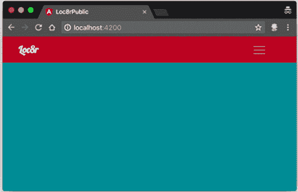

你可以看到页头正在显示，所以你某种程度上是成功的。你的新组件工作！但你没有看到任何内容，即使你处于主页路由。如果你在浏览器中打开 JavaScript 控制台，你会看到一个错误：`Cannot find primary outlet to load 'HomeListComponent'`。

你已经告诉应用程序为主页路由加载`HomeListComponent`，但没有指定它应该在 HTML 中的位置。

#### 9.1.4\. 使用`router-outlet`定义显示内容的位置

指定路由组件的目标就像在 HTML 中添加一个空标签对一样简单，你希望它去的位置。这个特殊标签是`<router-outlet>`。Angular 将路由组件添加到这个标签之后，而不是像你熟悉 AngularJS 时预期的那样放在里面。

将这个空标签对添加到框架 HTML 的正确位置——即你在 layout.pug 中放置块内容的位置——看起来如下。

##### 列表 9.5\. 将`router-outlet`添加到`framework.component.html`

```
<div class="container">
  <router-outlet></router-outlet>         *1*
  <footer>
    <div class="row">
      <div class="col-12"><small>&copy; Getting Mean - Simon Holmes/Clive
     Harber 2018</small></div>
    </div>
  </footer>
</div>
```

+   ***1* 路由器出口；Angular 使用 URL 来查找组件并将其注入此处。**

如果你现在查看浏览器，你会看到列表信息和框架。如图 图 9.3 所示，检查元素显示 `<router-outlet>` 保持为空，并且 `<app-home-list>` 在之后被注入。

##### 图 9.3\. 路由组件——列表信息——现在正在主页路由上显示，HTML 被注入到`<router-outlet>`标签之后。

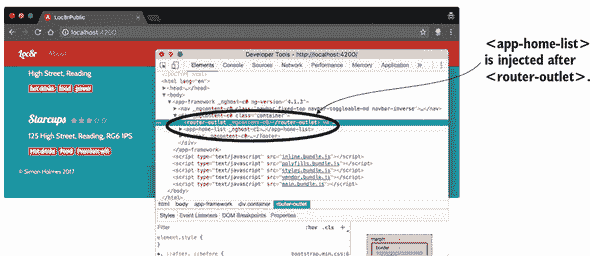

你可以看到主页的框架和列表，但这并不是你熟悉和喜爱的主页。它缺少了页眉和侧边栏。你将在 9.2 节中回到这个页面。首先，你需要了解导航是如何工作的。

#### 9.1.5\. 在页面间导航

要看到导航的实际效果，更新 Angular 应用程序，以便可以在主页和关于页面之间切换。如果你现在点击链接，它们将不会工作。为了使导航工作，你需要创建一个`about`组件，定义`about`路由，并将导航中的链接更改为 Angular 可以使用的内容。

使用 Angular CLI 创建`about`组件现在应该很熟悉了。在终端中，在 app_public 文件夹中，运行以下`generate`命令：

```
$ ng generate component about
```

此命令在 app_public/src/app/about 中创建新的组件。现在您可以保持它不变，以便专注于导航。在第 9.4 节中，您将返回到 About 页面并完全构建它。

##### 定义新的路由

与主页路由一样，您需要在 app.module.ts 中配置 About 页面的路由。您需要指定路由的路径以及组件的名称。路径是`'about'`。请记住，您不需要任何前导或尾随斜杠。

为了确保您正确地得到了组件的名称，您可以打开 about.component.ts 以在导出行中找到它：`export class AboutComponent implements OnInit`。

知道路径和组件名称后，您可以在 app.module.ts 中添加新的路由。

##### 列表 9.6\. 在 app.module.ts 中定义新的`about`路由

```
RouterModule.forRoot([
  {
    path: '',
    component: HomeListComponent
  },
  {
    path: 'about',
    component: AboutComponent
  }
])
```

如果您直接在浏览器中打开 localhost:4200/about，您会得到 About 页面，但导航链接目前还不能正常工作。您将在下一节中修复它们。

##### 设置 Angular 导航链接

当您使用路由中定义的链接时，Angular 不希望在`<a>`标签中看到`href`属性；相反，它寻找一个名为`routerLink`的指令。Angular 使用您提供给`routerLink`的值来创建`href`属性。

定义路由路径的规则也适用于设置`routerLink`的值。您不需要包含前导或尾随斜杠，并且请记住，您不需要重复在`base href`中设置的任何内容。

根据这些规则，更新 framework.component.html 中的导航链接看起来像下面的列表。将`href`属性替换为`routerLink`指令，确保值与在 app.module.ts 中的路由定义匹配。

##### 列表 9.7\. 在 framework.component.html 中定义导航 router 链接

```
<a routerLink="" class="navbar-brand">Loc8r</a>             *1*
<div id="navbarMain" class="navbar-collapse collapse">
  <ul class="navbar-nav mr-auto">
    <li class="nav-item">
      <a routerLink="about" class="nav-link">About</a>      *2*
    </li>
  </ul>
</div>
```

+   ***1* 空的 routerLink 路径指向默认组件**

+   ***2* about 路径用于导航到 about 组件**

将此代码放置并保存后，您可以在两个链接之间点击，如图图 9.4 所示。

##### 图 9.4\. 使用导航按钮在主页和 About 页面之间切换——一个 Angular 单页应用！

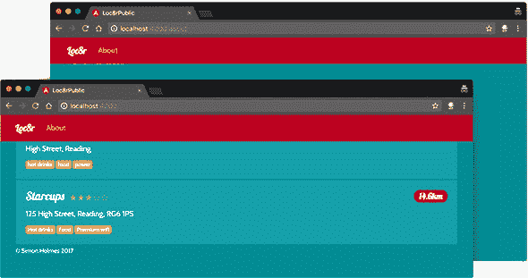

注意，浏览器中的 URL 会像往常一样改变，但在页面之间切换时页面不会重新加载或闪烁。如果您在切换这两个页面时检查网络流量，您将只会看到对 API 的调用。您还可以使用浏览器中的后退和前进按钮，网站将像传统网站一样工作。恭喜您——您已经构建了一个单页应用！

在继续之前，快速通过添加活动样式来改进导航。

#### 9.1.6\. 添加活动导航样式

在网页设计中，将`active`类应用于导航项是标准做法，这样当前页面的链接看起来会略有不同——一个简单的视觉提示，告诉用户他们所在的位置。你的导航中只有一个链接，但这个过程仍然值得。

Twitter Bootstrap 定义了辅助类来创建活动导航状态；你在活动链接上设置`active`类。由于这是一个常见的需求，Angular 也有一个辅助工具：一个名为`routerLinkActive`的指令。

在包含路由链接的`<a>`标签上，你可以添加`routerLinkActive`指令并指定你想要用于活动链接的类名。你将在`framework.component.html`中使用`active`类：

```
<a routerLink="about" routerLinkActive="active" class="nav-link">About</a>
```

`routerLinkActive`属性的位置很重要。如果它似乎不起作用，请确保你在`class`属性之前包含了它。

现在，当你访问关于页面时，`<a>`标签被添加了一个额外的`active`类，Bootstrap 将其显示为更强烈的白色，正如你在图 9.5 中可以看到的那样。

##### 图 9.5. 查看`active`类的实际应用；Angular 在导航更改时向链接添加和移除它。

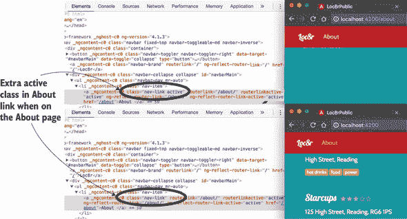

有了这些，你已经涵盖了 Angular 路由的基础知识，为你的 SPA 创建了工作导航。你可以看到视图显然需要一些工作，所以你将在下一两个部分中关注这一点。

### 9.2. 使用多个嵌套组件构建模块化应用

在本节中，你将专注于在 Angular 中构建熟悉的主页。为了设定成功的基础——并遵循 Angular 架构最佳实践——你将通过创建几个新组件并根据需要嵌套它们来实现这一点。这个过程为你提供了一个模块化应用程序，因此你可以在应用程序的不同地方重用这些部分。

主页有三个主要部分：

+   页面标题

+   位置列表

+   侧边栏

你已经将位置列表构建为一个组件；那就是你的`home-list`组件。你需要创建标题和侧边栏作为两个新的组件。

你还需要将这三个组件都包裹在主主页组件中，以确保它们可以一起工作，具有正确的布局，并且可以通过 Angular 路由进行导航。图 9.6 显示了这些组件如何在主页设计之上叠加。你有一个外部的`framework`组件，它包含了一切。在这个组件内部嵌套的是`homepage`组件，用于控制内容区域，其中包含页面标题、列表和侧边栏组件。

##### 图 9.6. 将主页布局分解为组件，使用两层嵌套

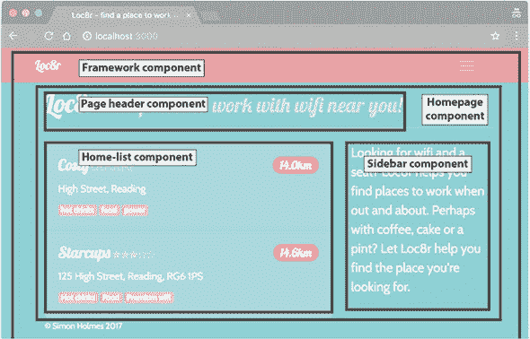

这就是你要构建的内容。你将从`homepage`组件开始。

#### 9.2.1. 创建主主页组件

`homepage` 组件包含主页的所有 HTML 和信息——从标题到页脚之间的所有内容。这个组件是你将在 Angular 的路由器中引用的，以便在任何人请求主页时使用。

首先，使用 Angular CLI 以熟悉的方式生成组件（从 app_public 文件夹的终端中）：

```
$ ng generate component homepage
```

接下来，通过更新 app.module.ts 来告诉路由器使用此组件作为默认主页路由，如下所示：

```
RouterModule.forRoot([
  {
    path: '',
    component: HomepageComponent
  },
  {
    path: 'about',
    component: AboutComponent
  }
])
```

在 homepage.component.html 中，在浏览器中检查它之前，暂时放置 `home-list` 组件的选择器：

```
<app-home-list></app-home-list>
```

如果你通过浏览器查看应用程序，它看起来和之前一样，有导航栏、页脚和中间的列表部分。

但你现在想看到主页的所有内容；这就是页面标题、主要内容以及侧边栏。将 Pug 模板中的框架代码转换为 HTML 的样子如下所示。请注意，你在这里放置了 `app-home-list` 组件以显示列表部分。

##### 列表 9.8\. 将主页内容的 HTML 放入 homepage.component.html

```
<div class="row banner">                  *1*
  <div class="col-12">
    <h1>Loc8r
      <small>Find places to work with wifi near you!</small>
    </h1>
  </div>
</div>
<div class="row">
  <div class="col-12 col-md-8">           *2*
    <div class="error"></div>
    <app-home-list></app-home-list>
  </div>
  <div class="col-12 col-md-4">           *3*
    <p class="lead">Looking for wifi and a seat? Loc8r helps you
    find places to work when out and about. Perhaps with coffee,
    cake or a pint? Let Loc8r help you find the place you're
     looking for.</p>
  </div>
</div>
```

+   ***1* 页面标题**

+   ***2* 主页列表组件的容器**

+   ***3* 侧边栏**

现在，当你通过浏览器查看页面时，你会得到类似图 9.7 的东西——你熟悉的老主页！

##### 图 9.7\. 在 Angular 中，主页组件中硬编码了页面标题和侧边栏


所有的东西都在那里并且工作正常，包括嵌套在 `homepage` 组件内的 `home-list` 组件。但你可以做得更好。页面标题和侧边栏在其他页面上重复出现，尽管文本内容不同。你可以遵循一些架构最佳实践，并尝试通过创建可重用组件来避免代码重复。

#### 9.2.2\. 创建和使用可重用子组件

你将创建页面标题和侧边栏作为新组件，这样你就不需要将 HTML 复制到多个视图中。如果网站增长到有数十或数百个页面，你就不想在每个布局中重复相同的 HTML。如果你需要在未来更新 HTML，这种情况会更糟。在一个地方更新 HTML 要容易得多，而且也更不容易出错或遗漏。

你将使组件“智能”，以便你可以传递不同的内容来显示。在你的情况下，可重用组件都是关于 HTML 而不是内容。从页面标题开始。

##### 创建页面标题组件

第一步是发出熟悉的组件生成命令（在终端中）：

```
$ ng generate component page-header
```

在执行上述命令后，从主页 HTML 中复制标题内容并将其粘贴到 page-header.component.html：

```
<div class="row banner">
  <div class="col-12">
    <h1>Loc8r
      <small>Find places to work with wifi near you!</small>
    </h1>
  </div>
</div>
```

然后，你需要在家页面的 .component.html 中引用此内容，而不是目前存在的完整 HTML。为此，你需要正确的标签，你可以通过查找 page-header.component.ts 文件中的选择器来找到它。在这种情况下，选择器是 app-page-header，所以你将在 `homepage` 组件 HTML 中使用它。

##### 列表 9.9\. 替换 homepage.component.html 中的页面头部 HTML

```
<app-page-header></app-page-header>
<div class="row">
  <div class="col-12 col-md-8">
    <div class="error"></div>
    <app-home-list>Loading...</app-home-list>
  </div>
  <div class="col-12 col-md-4">
    <p class="lead">Looking for wifi and a seat? Loc8r helps you find
    places to work when out and about. Perhaps with coffee, cake
    or a pint? Let Loc8r help you find the place you\'re looking
    for.</p>
  </div>
</div>
```

很好的开始。你已经创建了新的 `page-header` 组件，但它仍然有硬编码的内容。接下来，你将从 `homepage` 组件传递数据到页面头部。

##### 在主页上定义页面头部组件的数据

你想在 `homepage` 组件内部设置 `page-header` 组件的 `homepage` 实例的数据，以便你可以传递它。

定义数据很简单。在 `homepage` 组件类定义中，你创建一个新的成员来保存数据。你将创建一个名为 `pageContent` 的成员，并将头部嵌套在其中，如下一列表所示。类成员是一个简单的 JavaScript 对象，包含文本数据。请注意，在这个片段中，`strapline` 内容被缩短以节省树木。

##### 列表 9.10\. 在 homepage.component.ts 中定义主页页面头部内容

```
export class HomepageComponent implements OnInit {
  constructor() { }

  ngOnInit() {
  }

  public pageContent = {       *1*
    header: {
      title: 'Loc8r',
      strapline: 'Find places to work with wifi near you!'
    }
  };

}
```

+   ***1* 创建一个新的类成员来保存页面头部内容**

`header` 被嵌套在 `pageContent` 中，因为不久你还将添加侧边栏内容，将它们都放在同一个成员中会使代码更整洁。接下来，你将此数据传递给 `page-header` 组件。

##### 将数据传递到页面头部组件

主页类的成员 `pageContent` 现在可供主页 HTML 使用，但你不想直接使用这些数据，而是想通过 `page-header` 组件传递它。数据通过 HTML 中的特殊绑定传递给嵌套组件。绑定的名称是在嵌套组件中定义的一个属性，所以可以是任何你想要的。

你将绑定页面头部内容到名为 `content` 的属性。（这个属性目前还不存在；你将在下一步中定义它。）在 homepage.component.html 中，更新 `<app-page-header>` 以包括绑定：

```
<app-page-header [content]="pageContent.header"></app-page-header>
```

注意，尽管方括号可能不是有效的 HTML，但在这里没关系，因为 Angular 在将 HTML 传递给浏览器之前会移除它们。浏览器实际接收到的 HTML 可能类似于 `<app-page-header_ngcontent-c6="" _nghost-c2="">`，这是有效的 HTML。

你现在正在从 `homepage` 组件传递数据到嵌套的 `page-header` 组件；你需要更新页面头部以接受和使用这些数据。

##### 在组件中接受和显示传入的数据

你需要告诉 `pageHeader` 组件 `content` 应该作为一个属性存在，并从外部获取值。技术上讲，`content` 是组件的一个 *输入*。

类的任何属性都需要定义，这个属性也不例外。它与之前你所看到的不同之处在于，它需要被定义为输入属性。为了做到这一点，你需要从 Angular 核心导入`Input`，并在定义`content`成员时将其用作装饰器。

##### 列表 9.11\. 告诉`page-header.component.ts`接受内容作为`Input`

```
import { Component, OnInit, Input } from '@angular/core';    *1*

@Component({
  selector: 'app-page-header',
  templateUrl: './page-header.component.html',
  styleUrls: ['./page-header.component.css']
})
export class PageHeaderComponent implements OnInit {

  @Input() content: any;                                     *2*

  constructor() { }

  ngOnInit() {
  }

}
```

+   ***1* 从 Angular 核心导入 Input**

+   ***2* 将内容定义为类成员，该成员接受任何类型的数据输入**

当完成这些操作后，组件将理解从`homepage`组件发送给它的数据，你将能够显示它。将`page-header.component.html`中的硬编码文本替换为相关的 Angular 数据绑定。

##### 列表 9.12\. 在`page-header.component.html`中放置数据绑定

```
<div class="row banner">
  <div class="col-12">
    <h1>{{ content.title }}
      <small>{{ content.strapline }}</small>
    </h1>
  </div>
</div>
```

现在你有一个完全可重用的页眉组件，它可以显示从父组件发送给它的数据。这个组件是 Angular 应用程序架构的重要构建块。你将通过为侧边栏做同样的事情来巩固这个过程，以便你可以完成主页，但在过程中你会遇到一点小麻烦。

##### 创建侧边栏组件

我们不会过多地讨论设置侧边栏组件的步骤，因为你已经在本章早期完成了页眉的设置。

首先，生成组件：

```
$ ng generate component sidebar
```

第二，从`homepage.component.html`中获取侧边栏 HTML，并将其粘贴到`sidebar.component.html`中。当你这样做时，将文本内容替换为对`content`的绑定：

```
<div class="col-12 col-md-4">
  <p class="lead">{{ content }}</p>
</div>
```

第三，通过从 Angular 核心导入`Input`并定义类型为`string`的`content`属性，使用`@Input`装饰器允许侧边栏组件接收数据：

```
import { Component, OnInit, Input } from '@angular/core';

@Component({
  selector: 'app-sidebar',
  templateUrl: './sidebar.component.html',
  styleUrls: ['./sidebar.component.css']
})
export class SidebarComponent implements OnInit {

  @Input() content: string;

  constructor() { }

  ngOnInit() {
  }

}
```

第四，更新`homepage.component.ts`中的`pageContent`成员以包含侧边栏数据：

```
public pageContent = {
  header : {
    title : 'Loc8r',
    strapline : 'Find places to work with wifi near you!'
  },
  sidebar : 'Looking for wifi and a seat? Loc8r helps you find places
  to work when out and about. Perhaps with coffee, cake or a pint?
  Let Loc8r help you find the place you\'re looking for.'
};
```

第五，更新`homepage.component.html`以使用新的侧边栏组件，并通过`content`传递数据：

```
<app-page-header [content]="pageContent.header"></app-page-header>
<div class="row">
  <div class="col-12 col-md-8">
    <div class="error"></div>
    <app-home-list>Loading...</app-home-list>
  </div>
  <app-sidebar [content]="pageContent.sidebar"></app-sidebar>
</div>
```

所有工作都完成了！但是，它真的完成了吗？如果你在浏览器中查看这个页面，你会注意到无论你如何调整浏览器窗口的宽度，侧边栏总是位于内容下方（见图 9.8）。

##### 图 9.8\. 新的侧边栏组件已经添加并正在工作，但它位于主内容下方，而不是它应该所在的位置。

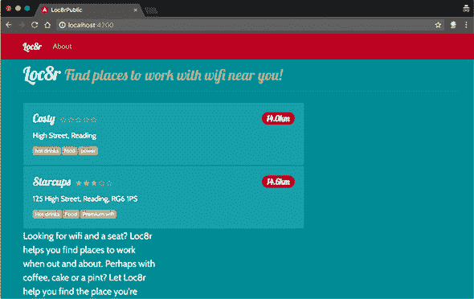

侧边栏的位置由`<div class="col-12 col-md-4">`元素中的类定义。但通过将此内容放入组件中，你将其包裹在一个新的标签`<app-sidebar>`中，因此 Bootstrap 将侧边栏作为新的一行抛到下方。

这个问题是需要注意的，尤其是在你嵌套组件时。但它是很容易修复的。

##### 使用 Angular 元素和 Bootstrap 布局类进行工作

你遇到的问题是浏览器现在看到以下 HTML 标记生成：

```
<div class="col-12 col-md-8">
  <app-home-list>Loading...</app-home-list>
</div>
<app-sidebar [content]="pageContent.sidebar">
  <div class="col-12 col-md-4">
    <p class="lead">{{ content }}</p>
  </div>
</app-sidebar>
```

侧边栏的 Bootstrap `col` 类在层次结构中的级别错误，因此 `<app-sidebar>` 不论浏览器大小都被视为全宽列。你需要做的就是将 sidebar.component.html 中的 `<div>` 类移动到 homepage.component.html 中的 `<app-sidebar>`，这样 homepage.component.html 就会看起来像以下这样。

##### 列表 9.13。将侧边栏类移动到 homepage.component.html

```
<app-page-header [content]="pageContent.header"></app-page-header>
<div class="row">
  <div class="col-12 col-md-8">
    <app-home-list>Loading...</app-home-list>
  </div>
  <app-sidebar class="col-12 col-md-4" [content]="pageContent.sidebar">
  </app-sidebar>
</div>
```

完成这些后，你不再需要侧边栏标记中的 `<div>`；你可以保留 `<p>` 和内容。现在 sidebar.component.html 看起来是这样的：

```
<p class="lead">{{ content }}</p>
```

通过这个修复，主页应该看起来一切正常，如图 9.9 所示。主页看起来不错！不过到目前为止，还有一些东西缺失。如果 Loc8r 能够告诉你在哪里，并找到附近的地方，那不是很好吗？你将在下一节中将地理位置添加到主页中。

##### 图 9.9。完成的主页渲染正确，由多个嵌套组件构成

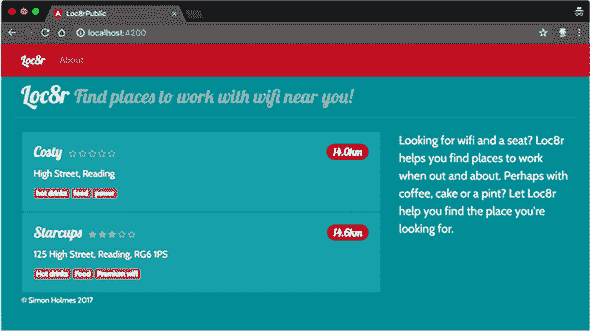

### 9.3。添加地理位置以查找附近的地方

Loc8r 的主要前提是它具有位置感知能力，能够找到靠近用户的地方。到目前为止，你通过将地理坐标硬编码到 API 请求中来进行欺骗。你现在将通过添加 HTML5 地理位置来改变这一点。

要使地理位置正常工作，你需要做以下几件事：

+   将对 HTML5 位置 API 的调用添加到你的 Angular 应用程序中。

+   查询 Express API 以确定是否提供位置详情。

+   将坐标传递给你的 Angular 数据服务，移除硬编码的位置。

+   输出消息，让用户知道发生了什么。

从顶部开始，你将通过创建一个新的服务来添加地理位置 JavaScript 函数。

#### 9.3.1。创建 Angular 地理位置服务

能够找到用户的位置感觉像是一种可重用的功能，在这个和其他项目中。为了将其作为独立的功能分离出来，你将创建另一个服务来持有它。一般来说，任何与 API 交互、运行逻辑或执行操作的代码都应该外部化到服务中。让组件控制服务而不是执行功能。

要创建地理位置服务的框架，请在终端中从 app_public 运行以下命令：

```
$ ng generate service geolocation
```

我们现在不会深入探讨 HTML5/JavaScript 地理位置 API 的工作细节。现代浏览器在 `navigator` 对象上有一个你可以调用的方法来找到用户的坐标。用户必须为此操作提供权限。该方法接受两个参数（一个成功回调和一个错误回调），如下所示：

```
navigator.geolocation.getCurrentPosition(cbSuccess, cbError);
```

您需要在一个公开的方法中公开标准的地理位置脚本，以便您可以使用它作为服务。当您在这里时，您还将错误处理针对当前浏览器可能不支持此功能的可能性。以下列表显示了 geolocation.service.ts 的完整代码，提供了一个公开的 `getPosition` 方法，其他组件可以调用。

##### 列表 9.14\. 使用回调获取当前位置创建 `geolocation` 服务

```
import { Injectable } from '@angular/core';

@Injectable({
  providedIn: 'root'
})
export class GeolocationService {

  constructor() { }

  public getPosition(cbSuccess, cbError, cbNoGeo): void {              *1*
    if (navigator.geolocation) {                                       *2*
      navigator.geolocation.getCurrentPosition(cbSuccess, cbError);    *2*
    } else {                                                           *3*
      cbNoGeo();                                                       *3*
    }
  }
}
```

+   ***1* 定义一个名为 getPosition 的公共成员，该成员接受三个回调函数，用于成功、错误和不支持**

+   ***2* 如果支持地理位置，则调用本地方法，传递成功和错误回调**

+   ***3* 如果不支持地理位置，则调用不支持回调**

那段代码为您提供了一个地理位置服务，其中有一个公开的方法 `getPosition`，您可以传递三个回调函数。此服务检查浏览器是否支持地理位置，然后尝试获取坐标。然后，根据地理位置是否受支持以及是否能够获取坐标，服务会调用三个不同的回调之一。

下一步是将服务添加到应用程序中。

#### 9.3.2\. 将地理位置服务添加到应用程序

要使用您的新地理位置服务，您需要将其导入 `home-list` 组件中，就像您导入数据服务时做的那样。您需要执行以下操作：

+   将服务导入组件中。

+   将服务添加到装饰器中的提供者。

+   将服务添加到类构造函数中。

以下列表以粗体突出显示您需要添加到 `home-list` 组件定义中以便导入和注册地理位置服务的修改。

##### 列表 9.15\. 更新 home-list.component.ts 以引入地理位置服务

```
import { Component, OnInit } from '@angular/core';
import { Loc8rDataService } from '../loc8r-data.service';
import { GeolocationService } from '../geolocation.service';  *1*

export class Location {
  _id: string;
  name: string;
  distance: number;
  address: string;
  rating: number;
  facilities: string[];
}

@Component({
  selector: 'app-home-list',
  templateUrl: './home-list.component.html',
  styleUrls: ['./home-list.component.css']
})
export class HomeListComponent implements OnInit {

  constructor(
    private loc8rDataService: Loc8rDataService,
    private geolocationService: GeolocationService            *2*
  ) { }
```

+   ***1* 导入地理位置服务**

+   ***2* 将服务传递到类构造函数**

完成此操作后，您将能够在 `home-list` 组件内部使用地理位置服务。

#### 9.3.3\. 从 home-list 组件使用地理位置服务

`home-list` 组件现在可以访问地理位置服务，所以请使用它！记住，服务中的 `getPosition` 方法接受三个回调函数，因此您在调用该方法之前需要创建这些函数。

由于地理位置过程可能需要几秒钟才能开始搜索数据库中的位置，因此您还希望向用户提供一些有用的消息，以便他们知道正在发生什么。

您已经在 HTML 中有一个用于消息的元素，但它目前位于 homepage.component.html 中，您需要将其放在 home-list.component.html 中。在 homepage HTML 中找到 `<div class="error"></div>` 并将其删除。然后，将其粘贴到 home-list.component.html 的顶部，添加一个绑定，以便您可以显示如下消息：

```
<div class="error">{{message}}</div>
<div class="card" *ngFor="let location of locations">
```

使用此代码，您将能够使用消息绑定来让用户了解正在发生的事情。现在您已经准备好创建回调函数。

##### 创建地理位置回调函数

在组件内部创建三个新的私有成员，每个成员对应可能的地理位置结果：

+   地理位置尝试成功

+   地理位置尝试失败

+   地理位置不受支持

您还将更新显示给用户的消息，让他们知道系统正在做什么。这条消息尤其重要，因为地理位置可能需要一秒钟或两秒钟。

成功回调是现有的`getLocations`方法，其中添加了一些额外的消息设置：其他两个设置错误消息，如下所示列表。由于您将在这些新函数内部使用消息绑定，您还需要将其定义为类的字符串类型属性。

##### 列表 9.16\. 在 home-list.component.ts 中设置地理位置回调函数

```
export class HomeListComponent implements OnInit {

  constructor(
    private loc8rDataService: Loc8rDataService,
    private geolocationService: GeolocationService
  ) { }

  public locations: Location[];

  public message: string;                                         *1*

  private getLocations(position: any): void {
    this.message = 'Searching for nearby places';                 *2*
    this.loc8rDataService
      .getLocations()
      .then(foundLocations => {
        this.message = foundLocations.length > 0 ? '' :
        'No locations found';                                   *2*
        this.locations = foundLocations;
      });
  }

  private showError(error: any): void {                           *3*
    this.message = error.message;                                 *3*
  };                                                              *3*

  private noGeo(): void {                                         *4*
    this.message = 'Geolocation not supported by this browser.';  *4*
  };                                                              *4*

  ngOnInit() {
    this.getLocations();
  }

}
```

+   ***1* 定义了类型为字符串的消息属性**

+   ***2* 在现有的 getLocations 成员内部设置一些消息**

+   ***3* 如果地理位置受支持但未成功时运行的函数**

+   ***4* 浏览器不支持地理位置时的运行函数**

您已经有了三个回调函数，用于成功、失败和错误。现在您需要使用您的地理位置服务，而不是在组件的`ngOnInit()`上调用`getLocations()`。

##### 调用地理位置服务

要调用您的地理位置服务的`getPosition`方法，您需要在`home-list`组件中创建一个新成员，并在`init`时调用它，而不是直接调用`getLocations`方法。

您的地理位置服务接受三个回调参数——成功、错误和不受支持——因此您可以在 home-list.component.ts 中添加一个名为`getPosition`的新成员，该成员调用您的服务，并通过您的回调函数传递。该成员应如下所示：

```
private getPosition(): void {
  this.message = 'Getting your location...';
  this.geolocationService.getPosition(
    this.getLocations,
    this.showError,
    this.noGeo);
}
```

然后，您需要在组件初始化时调用此成员，而不是`getLocations`方法，因此将`ngOnInit`中的调用替换为这个新成员：

```
ngOnInit() {
  this.getPosition();
}
```

保存此代码，然后转到浏览器。您应该会看到类似图 9.10 的内容，其中浏览器要求您允许访问您的位置。

##### 图 9.10\. 成功调用您的地理位置服务是通过浏览器请求了解您的位置来标记的。

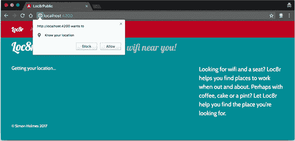

好消息——直到您点击允许，屏幕在“获取您的位置”信息上挂起，在后台悄悄抛出一个 JavaScript 错误。您得到的错误说“无法设置 null 的属性'message'”，看起来像图 9.11。

##### 图 9.11\. 尝试在地理位置回调中设置消息时显示的错误信息

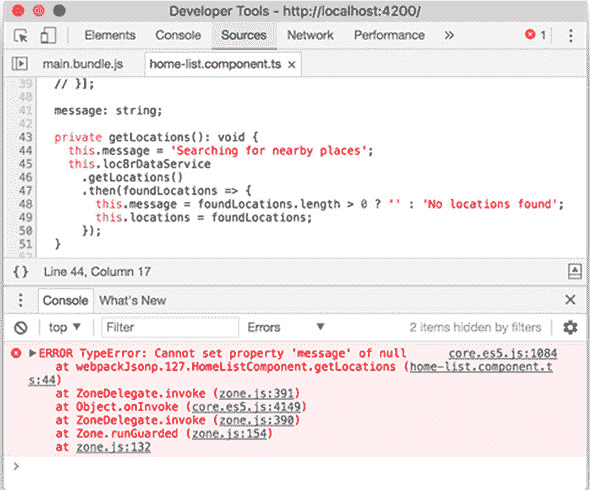

这条消息告诉您问题是什么以及它发生在哪里，这有助于您修复它。

##### 在组件和服务之间使用回调中的 this

你可以从图 9.11 中的错误中看到，它不能在`getLocations`回调中设置`this.message`，因为`this`是 null。当通过回调函数传递类成员时，你失去了`this`的上下文，它是类的实例本身。

幸运的是，修复很简单。你可以通过绑定`this`到每个回调函数来发送上下文。在每个回调函数被传递的地方，添加`.bind(this)`到末尾。

##### 列表 9.17\. 在 home-list.component.ts 中将`this`绑定到地理位置回调函数

```
private getPosition(): void {
  this.message = 'Getting your location...';
  this.geolocationService.getPosition(
    this.getLocations.bind(this),
    this.showError.bind(this),
    this.noGeo.bind(this)
  );
}
```

现在你正在将`this`的上下文绑定到回调函数，以便在需要时存在。当你再次访问浏览器时，你成功了！在显示了一些消息并获取了你的位置后，浏览器再次显示了`home-list`。

但你还没有使用这个位置。你获取了它，但没有做什么。你将在下一部分改变这种情况。

##### 使用地理位置坐标查询 API

在`home-list.component.ts`中，`getPosition`方法调用你的地理位置服务以获取坐标。当它成功时，它调用`getLocations`方法——再次在`home-list.component.ts`中——作为一个回调，传递位置作为参数。你需要更新这个回调以接收位置。然后这个回调调用你的数据服务以搜索位置。你需要将坐标传递给服务，然后更新服务以在调用 API 时使用这些值。

你有两件事要更新。从`home-list.component.ts`中的`getLocations()`开始，你需要更新它以接受位置参数，从中提取坐标，并将它们传递到数据服务，如下面的列表所示。

##### 列表 9.18\. 更新 home-list.component.ts 以使用地理位置位置

```
private getLocations(position: any): void {           *1*
  this.message = 'Searching for nearby places';
  const lat: number = position.coords.latitude;       *2*
  const lng: number = position.coords.longitude;      *2*
  this.loc8rDataService
    .getLocations(lat, lng)                           *3*
    .then(foundLocations => {
      this.message = foundLocations.length > 0 ? '' : 'No locations found';
      this.locations = foundLocations;
    });
}
```

+   ***1* 接受位置作为参数**

+   ***2* 从位置中提取纬度和经度坐标**

+   ***3* 将坐标传递给数据服务调用**

你现在正在从地理位置服务获取位置，提取纬度和经度坐标，并将它们传递给数据服务。为了使最后一部分到位，你需要更新数据服务以接受坐标参数并使用它们而不是硬编码的值。

##### 列表 9.19\. 更新 loc8r-data.service.ts 以使用地理位置坐标

```
public getLocations(lat: number, lng: number): Promise<Location[]> {       *1*
  const maxDistance: number = 20000;                                       *2*
  const url: string = `${this.apiBaseUrl}/locations?lng=${lng}&lat=${lat}&
  maxDistance=${maxDistance}`;
  return this.http
    .get(url)
    .toPromise()
    .then(response => response.json() as Location[])
    .catch(this.handleError);
}
```

+   ***1* 接受 lat 和 lng 参数，类型为数字**

+   ***2* 删除之前为 lat 和 lng 设置的硬编码值**

现在，坐标正在从地理位置服务找到其路径到 API 调用，所以你现在正在使用 Loc8r 来查找你附近的地点！如果你在浏览器中查看——如果你添加了你所在位置 20 公里范围内的地点——你应该能看到它们被列出，如图 9.12 所示。你可能注意到距离坐标有轻微的变化，这取决于你的测试数据有多准确。

##### 图 9.12\. 作为 Angular 应用的 Loc8r 主页，使用地理位置从你的 API 中查找附近的地点

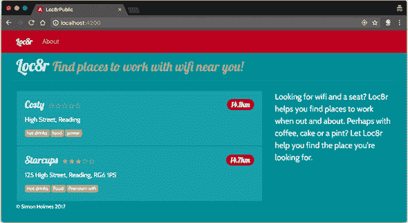

这就是主页的最后一块拼图。Loc8r 现在可以找到你的当前位置，并列出附近的地点，这正是从开始时的整个想法。在本章的最后，你将整理关于页面，在这个过程中，你将探索通过 Angular 绑定注入 HTML 的挑战。

### 9.4\. 安全地绑定 HTML 内容

在 Angular SPA 中，关于页面的当前状态是它仅作为一个默认骨架页面存在，正如你创建它来演示 Angular 中的导航和路由。在本节中，你将完成这个页面。

#### 9.4.1\. 将关于页面内容添加到应用中

关于页面应该是相当直接的。你将内容添加到组件定义中，并创建简单的标记，通过绑定来显示它。简单，对吧？

首先向组件定义中添加内容。在下面的列表中，你可以看到 about.component.ts 中的类定义。你正在定义一个 `pageContent` 成员来保存所有文本信息，就像你之前做的那样。我们已经裁剪了主要内容区域中的文本，以节省墨水和树木。

##### 列表 9.20\. 为关于页面创建 Angular 控制器

```
export class AboutComponent implements OnInit {

  constructor() { }

  ngOnInit() {
  }

  public pageContent = {
    header : {
      title : 'About Loc8r',
      strapline : ''
    },
    content : 'Loc8r was created to help people find places to sit
    down and get a bit of work done.\n\nLorem ipsum dolor sit
    amet, consectetur adipiscing elit.'
  };
}
```

就组件而言，这个很简单。这里没有发生任何魔法。注意，尽管如此，你仍然有 `\n` 字符来表示换行。

接下来，你需要创建 HTML 布局。从你的原始 Pug 模板中，你知道标记需要是什么；你需要一个页面标题和几个 `<div>` 来存放内容。对于页面标题，你可以重用你之前创建的 `pageHeader` 组件，并像为主页那样传递数据。其余的标记并不多。about.component.html 的全部内容如下所示：

```
<app-page-header [content]="pageContent.header"></app-page-header>
<div class="row">
  <div class="col-12 col-lg-8">{{ pageContent.content }}</div>
</div>
```

再次，这里没有什么不同寻常的——只有页面标题、一些 HTML 和标准的 Angular 绑定。如果你在浏览器中查看这个页面，你会看到内容正在通过，但换行符没有显示，如图 图 9.13 所示。

##### 图 9.13\. 关于页面的内容是从控制器传来的，但换行符被忽略了。


这种情况并不理想。你希望文本可读，并按原意显示。如果你可以通过使用管道更改主页上显示的距离，为什么不做同样的事情来修复换行符？试一试，创建一个新的管道。

#### 9.4.2\. 创建一个管道来转换换行符

你想创建一个管道，它接受提供的文本，并将每个 `\n` 实例替换为 `<br/>` 标签。你已经在 Pug 中通过使用 JavaScript `replace` 命令解决了这个问题，如下面的代码片段所示：

```
p !{(content).replace(/\n/g, '<br/>')}
```

使用 Angular，你不能这样做内联。相反，你需要创建一个管道并将其应用于绑定。

##### 创建 htmlLineBreaks 管道

如您所见，最佳创建管道的方式是通过 Angular CLI，因此请在终端中运行以下命令以生成文件并将管道注册到应用程序中：

```
$ ng generate pipe html-line-breaks
```

管道本身相当简单。它需要接受作为字符串值的传入文本。将每个 `\n` 替换为 `<br/>`，然后返回一个字符串值。将 html-line-breaks.html 的主要内容更新如下所示：

```
export class HtmlLineBreaksPipe implements PipeTransform {

  transform(text: string): string {
    return text.replace(/\n/g, '<br/>');
  }

}
```

您完成之后，尝试使用它。

##### 将管道应用于绑定

将管道应用于绑定很简单；您已经做过几次了。在 HTML 中，在绑定的数据对象之后添加管道字符（`|`），然后跟随着过滤器的名称，如下所示：

```
<div class="col-12 col-lg-8">{{ pageContent.content | htmlLineBreaks }}</div>
```

简单吗？但如果您在浏览器中尝试，结果可能并不如您所愿。如图 9.14 图 9.14 所示，换行符被 `<br/>` 替换，但它们被显示为文本而不是作为 HTML 渲染。

##### 图 9.14\. 您使用过滤器插入的 `<br/>` 标签被渲染为文本而不是 HTML 标签。

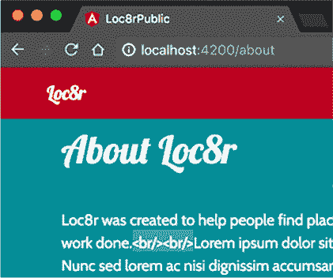

嗯嗯，这并不是您想要的，但至少管道似乎在正常工作。这种输出的原因很好：安全性。Angular 通过防止 HTML 注入数据绑定来保护您和您的应用程序免受恶意攻击。例如，当您允许访客为地点撰写评论时，请考虑这一点。如果他们可以添加任何他们想要的 HTML，有人可以轻松地插入一个 `<script>` 标签并运行一些 JavaScript，从而劫持页面。

但有一种方法可以让 HTML 标签的子集通过绑定，您将在下一节中看到。

#### 9.4.3\. 使用属性绑定安全地绑定 HTML

如果您使用属性绑定而不是通常用于内容的默认绑定，Angular 允许您传递一些 HTML 标签。此技术仅适用于 HTML 标签的子集，以防止 XSS 漏洞、攻击和弱点。将属性绑定视为“单向”绑定。组件不能读取数据并将其用于其他地方，但它可以更新它并更改绑定中的数据。

当您将数据传递到嵌套组件时，您已经使用了属性绑定。记得您构建关于页面吗？在那里，您将数据绑定到嵌套组件中定义的属性，您称之为 `content`。在这里，您绑定到一个标签的本地属性——在这种情况下，`innerHTML`。

属性绑定通过将它们括在方括号中来表示，然后传递值。您可以在 about.component.html 中删除内容绑定并使用属性绑定：

```
<div class="col-12 col-lg-8" [innerHTML]="pageContent.content |
     htmlLineBreaks"></div>
```

注意，您也可以将管道应用于此类绑定，因此您仍在使用您的 `htmlLineBreaks` 管道。最后，当您在浏览器中查看关于页面时，您将看到换行符正确显示，就像 图 9.15 所示。

##### 图 9.15\. 使用 `htmlLineBreaks` 管道与属性绑定结合，您现在可以看到换行符按预期渲染。

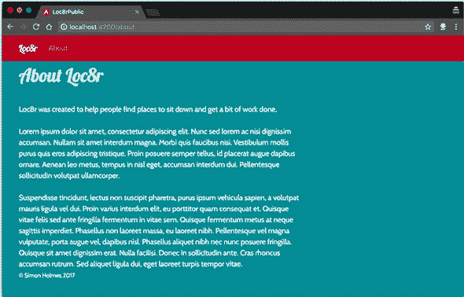

成功！你已经在构建 Loc8r 作为 Angular SPA 方面取得了良好的开端。你已经有了几个页面，一些路由和导航，地理位置，以及一个优秀的模块化应用程序架构。继续前进吧！

### 9.5\. 挑战

使用你到目前为止学到的 Angular 知识，创建一个新的组件名为`rating-stars`。这个组件将在主页列表部分以及其他显示评分星号的地方使用，你将在下一节构建这些部分。

这个新组件应该

+   接受传入的数字值（评分）

+   根据评分显示正确的实心星号数量

+   在单个页面上多次可重用

作为提示，你的元素应该看起来像这样：

```
<app-rating-stars [rating]="location.rating"></app-rating-stars>
```

祝你好运！如果你需要，代码（如果需要）可在 GitHub 上找到，位于 chapter-09 分支。

在第十章中，你将继续构建 Angular SPA，遇到更复杂的页面布局和模态弹出窗口，并通过表单接受用户输入。

### 摘要

在本章中，你学习了

+   Angular 有一个路由器以及它是如何工作的

+   如何构建一个功能网站并使用网站导航

+   使用嵌套组件创建模块化和可扩展的应用程序是最佳实践

+   如何与外部接口如浏览器的地理位置功能一起工作

## 第十章\. 使用 Angular 构建单页应用程序：下一个层次

*本章涵盖*

+   在 Angular 中使用 URL 参数进行路由

+   使用 URL 参数数据查询 API

+   构建更复杂的布局和处理表单提交

+   创建一个单独的路由器配置文件

+   用 Angular 应用替换 Express UI

在本章中，你将继续在第九章中开始的工作，构建一个单页应用程序（SPA）。到本章结束时，Loc8r 应用程序将是一个使用你的 API 获取数据的单个 Angular 应用程序。

图 10.1 显示了你在整体计划中的位置，仍然在重建主要应用程序作为 Angular SPA。

##### 图 10.1\. 本章继续你在第九章中开始的工作：将 Loc8r 应用程序作为 Angular SPA 重建，将应用程序逻辑从后端移到前端。

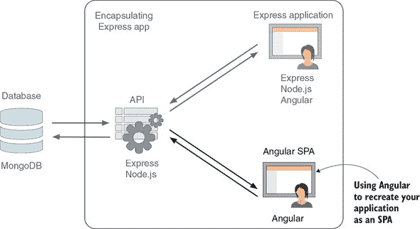

你将从创建缺失的页面和功能开始，了解如何在路由中使用 URL 参数，包括在查询 API 时使用它们。当你已经实现了大部分功能后，你将构建一个表单来添加新的评论，但与 Express 中的单独页面不同，你将内联包含该表单，并能够在不离开详情页的情况下添加评论。这种技术是一种 SPA 方式，可以消除额外的服务器往返。当一切运行正常时，你将查看几种改进架构的方法，以遵循一些 Angular 和 TypeScript 的最佳实践。

最后，你将使用你的 Angular 应用程序作为 Loc8r 的前端，消除 Express 应用程序公共部分的需求。

### 10.1\. 使用更复杂的视图和路由参数

在本节中，你将向 Angular SPA 添加详情页面。一个关键方面是从 URL 参数中检索位置 ID，以确保你得到正确的数据。以这种方式使用 URL 参数是常见的做法，并且是任何框架中都知道的有用技术。你还将不得不更新数据服务，以请求 API 的具体位置详情。当你将 Pug 视图转换为 Angular 模板时，你还将发现 Angular 提供的一些额外功能，以帮助你创建所需的多种布局。

你有很多事情要做，所以在你开始有趣的部分之前，你最好先规划一下。

#### 10.1.1\. 规划布局

与你在 Angular 中迄今为止制作的页面相比，详情页面有更多内容，但正如你所知它看起来是什么样子，你可以从高层次开始规划。完成这个之后，添加细节会更容易。

通过查看布局和已经完成的工作，你可以开始看到你需要的不同组件以及如何嵌套它们。当然，你将保留现有的框架组件在外部，包含导航和页脚。在可路由区域，你将有一个新的详情页面组件，包含页面标题、侧边栏和主要内容。图 10.2 显示了在详情页面截图上叠加的这种布局规划草图。

##### 图 10.2\. 规划在 Angular 中构建详情页面所需的组件和嵌套

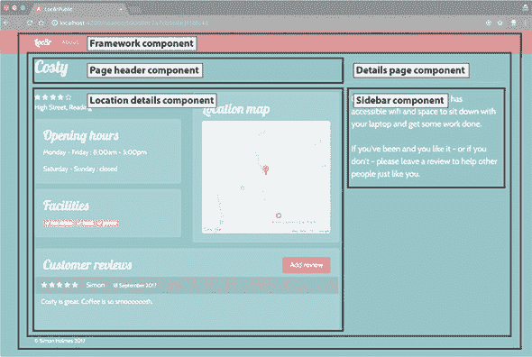

这个规划让你对需要构建的内容和可以重用的内容有了很好的了解。我们希望你现在开始明白为什么创建可重用组件是个好主意！在此阶段，请注意，你需要在三个组件中使用一些位置数据：页面标题、位置详情组件和侧边栏。在编写页面代码时，你需要考虑这个事实。

在计划中的五个组件中，你需要创建两个：用于组织其他所有组件的详情页面组件，以及用于显示实际详情的位置详情组件。你将接下来创建这些组件的基本版本，以便有一个可以路由到的页面。

#### 10.1.2\. 创建所需的组件

你知道你想要一个包含位置详情、侧边栏和标题的详情页面组件。位置详情组件缺失，所以你将首先创建它的骨架。然后你可以创建准备路由的框架组件。

使用 Angular CLI 创建位置详情组件；在 app_public 文件夹的终端中运行以下命令：

```
$ ng generate component location-details
```

你可以先在这个新组件中保留默认内容，因为你很快就会正确地构建它。接下来，创建详情页面组件，并向其中添加骨架布局。在终端中，再次使用 Angular CLI，使用以下命令：

```
$ ng generate component details-page
```

你将向这个组件添加一些内容，因为它将包含页面的其他组件：页面标题、位置详情和侧边栏。列表 10.1 显示了你在 details-page.component.html 中想要如何详细布局这些组件。你还将添加页面标题和侧边栏的`content`绑定，以便你可以从这个组件传递信息。

##### 列表 10.1\. details-page.component.html 的基本布局

```
<app-page-header [content]="pageContent.header"></app-page-header>       *1*
<div class="row">
  <div class="col-12 col-md-8">
    <app-location-details></app-location-details>                        *2*
  </div>
  <app-sidebar class="col-12 col-md-4" [content]="pageContent.sidebar">
  </app-sidebar>                                                       *3*
</div>
```

+   ***1* 页面标题组件，包括属性绑定**

+   ***2* 位置详情组件**

+   ***3* 侧边栏组件，包括属性绑定**

为了让你能够看到标题和侧边栏中的内容，你将创建一些默认内容。在详情页面组件的 HTML 中，你将使用绑定`pageContent.header`和`pageContent.sidebar`，因此，在组件类中，你将创建一个相应的`pageContent`成员，包含`header`和`sidebar`属性。以下列表显示了在 details-page.component.ts 中的样子，同时也为内容属性提供了一些默认文本。

##### 列表 10.2\. 在 details-page.component.ts 中详情页面的起始内容

```
export class DetailsPageComponent implements OnInit {

  constructor() { }

  ngOnInit() {
  }

  public pageContent = {                                              *1*
    header: {                                                         *2*
      title: 'Location name',
      strapline: ''

    },
    sidebar: 'is on Loc8r because it has accessible wifi and space
    to sit down with your laptop and get some work done.\n\nIf
    you\'ve been and you like it - or if you don\'t - please
    leave a review to help other people just like you.'            *3*
  };
}
```

+   ***1* 包含 . . . 的新 pageContent 成员**

+   ***2* 标题详情和 . . .**

+   ***3* . . . 侧边栏内容**

现在你已经有了你的详情页面组件，其中包含你需要来布局页面的三个嵌套组件。你甚至已经将一些起始数据传递给了两个嵌套组件。

你已经准备好设置路由，以便你可以看到页面。

#### 10.1.3\. 使用 URL 参数设置和定义路由

在 Angular 中使用 URL 参数定义路由与在 Express 中一样简单。甚至语法也是相同的——这在编程世界中并不常见！

你的应用路由在 app.module.ts 中定义，所以你将在那里添加新的路由。因为你想要接受一个 URL 参数，所以你将以与在 Express 中相同的方式定义路由：在路径末尾放置一个`locationId`变量，前面加冒号。

##### 列表 10.3\. 在 app.module.ts 中添加详情页面路由

```
RouterModule.forRoot([
  {
    path: '',
    component: HomepageComponent
  },
  {
    path: 'about',
    component: AboutComponent
  },
  {
    path: 'location/:locationId',,         *1*
    component: DetailsPageComponent
  }
])
```

+   ***1* 通过在前面加冒号来在路由中定义一个‘locationId’ URL 参数**

这样一来，你就可以在浏览器中访问 location/*something*，Angular 会路由你到详情页面组件。目前，这个组件看起来像图 10.3。

##### 图 10.3\. 测试新的位置详情路由并查看你添加到组件中的默认内容

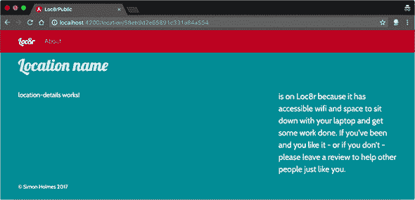

如果您还记得您原始布局，这个页面侧边栏的内容应该分为两段，所以您的换行符不会显示出来。幸运的是，您已经为这个目的创建了一个管道。您需要更新侧边栏组件以使用它。在 sidebar.component.html 中，将 Angular 绑定更改为`innerHTML`属性绑定，传递内容和`htmlLineBreaks`管道，如下所示：

```
<p class="lead" [innerHTML]="content | htmlLineBreaks"></p>
```

现在侧边栏内容的`\n`部分被转换为`<br/>`标签并作为 HTML 渲染，看起来像图 10.4。

##### 图 10.4. 通过使用您自定义的管道启用侧边栏中的换行


通用页面布局看起来不错，您可以看到它在工作。在构建它之前，使用 URL 中的真实位置 ID 导航到这个页面会有所帮助。为此，您需要更新主页列表中的链接。

##### 创建指向详情页面的 Angular 链接

首页列表当前显示指向此页面的链接，如果您尝试它们，它们会带您去那里。但您可能会注意到，当您这样做时，页面会闪烁。这是因为链接是标准`href`属性，在`<a>`标签中，所以浏览器像正常链接一样跟随它们。结果是页面完全重新加载并重新加载 Angular 应用程序——这不是您在 SPA 中想要的！

您希望 Angular 捕获这些链接的点击并处理导航和路由。当您创建导航时，您在`<a>`标签中使用了`routerLink`而不是`href`，您需要在这里做同样的事情。在 home-list.component.html 中找到位置链接，并替换`href`属性：

```
<a routerLink="/location/{{location._id}}">{{location.name}}</a>
```

其余的代码可以保持不变。通过这个简单的更改，您已经使您的应用更像一个真正的 SPA。现在您可以使用页面中的 URL 参数了。

#### 10.1.4. 在组件和服务中使用 URL 参数

计划获取位置 ID URL 参数并在调用 API 以获取特定位置详情时使用它。当数据返回时，您想在页面上显示它。

这个逻辑的最佳位置在哪里？任何可路由区域的组件都可以配置为获取 URL 参数并调用 API，但您希望显示所有三个嵌套组件中的数据。所以您将采用使用“父”详情页面组件获取数据然后传递给三个子组件的方法。首先，您需要向数据服务添加一个方法来通过 ID 获取单个位置。

##### 创建调用 API 的数据服务

您在第八章中创建的数据服务目前只有一个方法：`getLocations`。这个方法在给定一对坐标时检索位置列表。您需要的新方法具有类似的构造，所以请在 loc8r-data.service.ts 中复制此方法并命名为`getLocationById`。

您需要做一些小的调整才能使此方法正常工作：

1.  将期望的输入参数更改为单个 `locationId` 类型为 `string`。

1.  将返回类型更改为单个 `Location` 实例而不是数组。

1.  将 API URL 更改为使用 `locationId` 作为 URL 参数进行调用。

1.  将 JSON 响应设置为单个 `Location` 实例。

下面的列表展示了在 loc8r-data.service.ts 中的代码中这个方法的样子。

##### 列表 10.4\. 在 loc8r-data.service.ts 中添加一个通过 ID 获取位置的方法

```
public getLocationById(locationId: string): Promise<Location> {         *1*
  const url: string = `${this.apiBaseUrl}/locations/${locationId}`;     *2*
  return this.http
    .get(url)
    .toPromise()
    .then(response => response as Location)                             *3*
    .catch(this.handleError);
}
```

+   ***1* 设置正确的输入参数和期望的返回类型，都是单个项目**

+   ***2* 将 API URL 更改为使用位置 ID 作为 URL 参数**

+   ***3* 将 JSON 响应设置为单个 Location 实例**

数据服务方法准备好后，你可以将其导入到详情页面组件中，准备使用。

##### 将数据服务导入到组件中

你之前已经将一个服务导入到组件中过——将数据服务导入到 `home-list` 组件中——所以我们在这里不会过多地讨论这个过程。你需要将数据服务导入到详情页面组件中，将其添加到提供者中，然后在类构造函数中声明它以使其可用。

当你在这里时，你还将从 `home-list` 组件中导入 `Location` 类并清空默认页面内容。以下列表显示了 details-page.component 的所有这些更新。

##### 列表 10.5\. 在 details-page.component.ts 中详细导入数据服务

```
import { Component, OnInit } from '@angular/core';
import { Loc8rDataService } from '../loc8r-data.service';          *1*
import { Location } from '../home-list/home-list.component';       *2*

@Component({
  selector: 'app-details-page',
  templateUrl: './details-page.component.html',
  styleUrls: ['./details-page.component.css'],
})
export class DetailsPageComponent implements OnInit {

  constructor(private loc8rDataService: Loc8rDataService) { }      *3*

  ngOnInit(): void { }

  public pageContent = {                                           *4*
    header : {
      title : '',
      strapline : ''
    },
    sidebar : ''
  };
}
```

+   ***1* 导入你的数据服务**

+   ***2* 导入 Location 类定义**

+   ***3* 创建数据服务的私有本地实例**

+   ***4* 清除默认页面内容**

这里唯一需要小心的是构造函数中的 `loc8rDataService` 的情况：类的类型定义有一个大写的 `L`，而本地实例是用小写的 `l` 定义的。

现在你可以将 URL 参数获取到组件中。

##### 在组件中使用 URL 参数

由于在应用程序中使用 URL 参数是一个常见的需求，这个过程出人意料地复杂。你需要三个新的功能组件：

+   从 Angular 路由器中导入 `ActivatedRoute` 以从组件内部获取当前路由的值

+   从 Angular 路由器中导入 `ParamMap` 以获取活动路由的 URL 参数作为可观察对象

+   从 RxJS 中导入 `switchMap` 以从 `ParamMap` 可观察对象中获取值，并使用它们来调用你的 API，创建第二个可观察对象

以下片段以粗体显示了在 details-page.component.ts 中需要导入这些功能组件的添加内容：

```
import { Component, OnInit } from '@angular/core';
import { ActivatedRoute, ParamMap } from '@angular/router';
import { Loc8rDataService } from '../loc8r-data.service';
import { Location } from '../home-list/home-list.component';
import { switchMap } from 'rxjs/operators';
```

你还需要通过在构造函数中定义一个类型为 `ActivatedRoute` 的私有成员 `route` 来使激活的路由对组件可用：

```
constructor(
  private loc8rDataService: Loc8rDataService,
  private route: ActivatedRoute
) { }
```

现在是复杂的部分。完成以下步骤以从 URL 参数中获取位置 ID 并将其转换为 API 中的位置数据：

1.  当组件初始化时，使用 `switchMap` 订阅到激活路由的 `paramMap` 可观察对象。

1.  当 `paramMap` `Observable` 返回一个 `ParamMap` 对象时，获取 `locationId` URL 参数的值。

1.  调用你的数据服务的 `getLocationsById` 方法，并传入 ID。

1.  返回 API 调用，使其返回一个 `Observable`。

1.  订阅以监听当 `Observable` 从你的 API 返回数据时。结果应该是一个类型为 `Location` 的单个对象。

1.  使用从 API 返回的位置名称设置页眉和侧边栏的内容。

呼！对于一个看似简单的流程来说，这些步骤真是太多了。所有这些都在 `details-page.component.ts` 中的 `ngOnInit` 生命周期钩子中完成。接下来的列表显示了代码的样子。

##### 列表 10.6\. 在 `details-page.component.ts` 中获取和使用 URL 参数

```
ngOnInit(): void {
  this.route.paramMap                                              *1*
    .pipe(                                                          *2*
      switchMap((params: ParamMap) => {                             *3*
         let id = params.get('locationId');                         *4*
         return this.loc8rDataService.getLocationById(id);          *5*
       })
    )
    .subscribe((newLocation: Location) => {                         *6*
      this.pageContent.header.title = newLocation.name;             *7*
      this.pageContent.sidebar = `${newLocation.name} is on Loc8r
      because it has accessible wifi and space to sit down with
      your laptop and get some work done.\n\nIf you\'ve been and
      you like it - or if you don\'t - please leave a review to
      help other people just like you.`;
    });
}
```

+   **1** 获取激活路由的 `paramMap` `Observable`。

+   **2** 使用管道操作符组合一系列将作用于 `Observable` 的操作。

+   **3** 使用 `switchMap` 从 `ParamMap` 中提取所需元素，并返回一个 `Observable`。

+   **4** 使用 `.get` 方法从 `ParamMap` 中获取 `locationId` URL 参数的值。

+   **5** 调用你的新数据服务方法，将其作为 `Observable` 返回。

+   **6** 订阅 API 调用 `Observable`，期望返回一个 `Location`。

+   **7** 将位置名称发送到页眉和侧边栏。

这段代码相当密集；在几行和命令中发生了很多事情。我们建议多次阅读计划和注释代码，以拼凑出所有内容。它很强大，与之前看到的不同，并且在这本书中你将看到的复杂度相当。特别是注意两个链式 `Observable`：首先，`paramMap` 被订阅，由 `switchMap` 返回第二个。

好消息是，当你完成时，你的 Details 页面会在页眉和侧边栏中显示位置名称，如图 [图 10.5 所示。

##### 图 10.5\. 在从 URL 获取位置 ID 并将其发送到 API 后，在页眉和侧边栏中显示位置名称

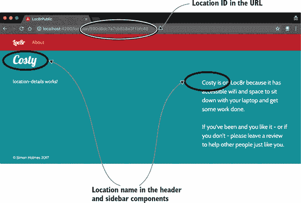

现在，你正在使用 URL 中的位置 ID 来查询数据库，并将返回的数据的一部分传递给页面上的两个组件。在构建 Details 页面的主要部分之前，确保最终组件正在获取它所需的数据。

#### 10.1.5\. 将数据传递给 Details 页面组件

要将位置数据从 Details 页面组件传递到嵌套的位置详情组件，你需要做三件事：

1.  在从数据服务获取位置数据后，将一个类成员添加到 Details 页面组件中，用于保存位置数据。

1.  使用 HTML 中的属性绑定将数据传递给子组件。

1.  更新位置详情组件以接受传入的数据。

首先，如 列表 10.7 所示，在 `details-page.component.ts` 中定义一个新的 `Location` 类成员 `newLocation`，并在从 API 调用获取位置后为其赋值。

##### 列表 10.7\. 在 details-page.component.ts 中公开找到的位置详情

```
newLocation: Location;

ngOnInit(): void {
  this.route.paramMap
    .switchMap((params: ParamMap) => {
      let id = params.get('locationId');
      return this.loc8rDataService.getLocationById(id);
    })
    .subscribe((newLocation: Location) => {
      this.newLocation = newLocation;                         *1*
      this.pageContent.header.title = newLocation.name;
      this.pageContent.sidebar = `${newLocation.name} is on Loc8r
      because it has accessible wifi and space to sit down with
      your laptop and get some work done.\n\nIf you\'ve been and
      you like it - or if you don\'t – please leave a review to
      help other people just like you.`;
    });
}
```

+   ***1* 更新本地 newLocation 以接收来自 Observable 的数据**

通过这个 `newLocation` 类成员公开位置详情，你可以通过在 details-page.component.html 中的元素上添加属性绑定将其传递给嵌套组件：

```
<app-location-details [location]="newLocation"></app-location-details>
```

你之前已经见过这种设置。属性绑定将把 Details 页面组件中的 `newLocation` 内容传递给位置详情组件的 `location` 成员。

你的位置详情组件还没有位置成员，所以你需要将其添加到组件定义中，并设置它为类型为 `Location` 的输入成员。你之前已经执行过这些操作，所以下面的列表作为方便的提醒，展示了在 location-details.component.ts 中的所有内容。

##### 列表 10.8\. 在 location-details.component.ts 中接受传入的位置数据

```
import { Component, OnInit, Input} from '@angular/core';                   *1*
import { Location } from '../home-list/home-list.component';               *2*

@Component({
  selector: 'app-location-details',
  templateUrl: './location-details.component.html',
  styleUrls: ['./location-details.component.css']
})
export class LocationDetailsComponent implements OnInit {

  @Input() location: Location;                                             *3*

  public googleAPIKey: string = '<Put your Google Maps API Key here>';     *4*

  constructor() { }

  ngOnInit() {
  }

}
```

+   ***1* 从 Angular 核心导入 ‘Input’**

+   ***2* 导入你的 ‘Location’ 类定义**

+   ***3* 将 ‘location’ 定义为类型为 ‘Location’ 的输入成员**

+   ***4* 不要忘记 Google API 密钥。（你在第二章中得到了一个，不是吗？）**

页面仍然在正常工作，看起来和之前一样，但现在详情页面组件正在从数据库获取数据并将其传递给所有三个嵌套组件。是时候构建嵌套视图了。

#### 10.1.6\. 构建 Details 页面视图

对于位置详情，你已经有一个带有 Pug 数据绑定的 Pug 模板，你需要将这个模板转换为带有 Angular 绑定的 HTML。你需要放置相当多的绑定，以及一些使用 Angular 的 `*ngFor` 构造的循环。你将使用你在第九章末尾挑战中创建的 `rating-stars` 组件来显示总体评分和每个评论的评分。如果你还没有创建这个组件，请参考 GitHub 上的书籍代码仓库。你还需要通过使用 `htmlLineBreaks` 管道来允许评论文本中的换行。

##### 放置主要模板

列表 10.9 展示了所有内容，其中绑定以粗体显示。这段代码应该构成 location-details.component.html 的全部内容。我们省略了一些部分，例如营业时间，你将在代码就位并测试后填写这些内容。

##### 列表 10.9\. location-details.component.html 中的位置详情的 Angular 模板

```
<div class="row">
  <div class="col-12 col-md-6">
    <app-rating-stars [rating]="location.rating"></app-rating-stars>          *1*
    <p>{{ location.address }}</p>
    <div class="card card-primary">
      <div class="card-block">
        <h2 class="card-title">Opening hours</h2>
        <!-- Opening times to go here -->
      </div>
    </div>
    <div class="card card-primary">
      <div class="card-block">
        <h2 class="card-title">Facilities</h2>
        <span *ngFor="let facility of location.facilities" class="badge       *2*
        badge-warning">                                                     *2*
           <i class="fa fa-check"></i>                                        *2*
           {{facility}}                                                       *2*
         </span>                                                              *2*
        </div>
      </div>
  </div>
  <div class="col-12 col-md-6 location-map">
    <div class="card card-primary">
      <div class="card-block">
        <h2 class="card-title">Location map</h2>
                       *3*
       </div>
     </div>
  </div>
</div>
<div class="row">
  <div class="col-12">
    <div class="card card-primary review-card">
      <div class="card-block"><a href="/location/{{location._id}}
      /review/new" class="btn btn-primary float-right">Add review</a>
         <h2 class="card-title">Customer reviews</h2>
         <div *ngFor="let review of location.reviews" class="row review">     *4*
           <div class="col-12 no-gutters review-header">
             <app-rating-stars [rating]="review.rating">
            </app-rating-stars>                                             *5*
             <span class="reviewAuthor">{{ review.author }}</span>
             <small class="reviewTimestamp">{{ review.createdOn }}</small>
          </div>
          <div class="col-12">
            <p [innerHTML]="review.reviewText | htmlLineBreaks"></p>          *6*
          </div>
        </div>
      </div>
    </div>
  </div>
</div>
```

+   ***1* 使用 rating-stars 组件来显示位置的平均评分。**

+   ***2* 遍历设施。**

+   ***3* 不要忘记 Google Maps API 密钥。**

+   ***4* 遍历评论循环。**

+   ***5* 使用 rating-stars 组件来显示每个评论的评分。**

+   ***6* 将 htmlLineBreaks 管道应用于评论文本并将其绑定为 HTML。**

那段代码列表很长，但这是可以预料的，因为详情页面有很多事情在进行。如果你现在在浏览器中查看页面，看起来是正确的。你有一些事情要修复，但你已经知道了。

虽然页面看起来不错，但如果你打开 JavaScript 控制台，你会看到页面抛出了很多类似`Cannot read property 'rating' of undefined'`的错误。这些错误是绑定错误，发生的原因是嵌套的位置详情组件在页面加载时试图绑定数据，但你还没有数据直到 API 调用完成。

##### 隐藏组件以防止过早绑定错误

绑定错误发生是因为组件试图在数据提供之前绑定数据。你该如何阻止这种情况发生？一个不错的方法是在 HTML 中隐藏组件，直到从 API 接收数据并且你有准备好的位置详情可以显示。

Angular 包含一个有用的原生指令`*ngIf`，你可以将其添加到 HTML 中的元素。`*ngIf`接受一个表达式。如果表达式解析为`true`，则显示该元素；否则，它会被隐藏。

对于你的情况，你只想在存在位置数据时显示位置详情组件。因此，你可以在 details-page.component.html 中的位置详情元素上添加一个`*ngIf`指令，如下所示：

```
<div class="col-12 col-md-8">
  <app-location-details *ngIf="newLocation" [location]="newLocation">
  </app-location-details>
</div>
```

通过这个小小的改动，你不再会有绑定错误了！

现在转向修复剩余的页面模板问题。因为你还没有显示营业时间，所以评论是按时间顺序显示的，评论的数据需要格式化。

##### 使用`ngSwitchCase`添加 if-else 样式逻辑以显示营业时间

在模板中想要某种类型的`if-else`逻辑以根据某个参数显示不同的 HTML 块并不罕见。对于每个营业时间，你想要显示日期范围以及一个关闭消息或营业和关闭时间。在你的 Pug 模板中，你有一点点逻辑，一个简单的`if`语句检查`closed`是否为`true`：

```
if time.closed
| closed
else
| #{time.opening} - #{time.closing}
```

你想在你的 Angular 模板中做类似的事情。你已经看到了`*ngIf`如何适用于一次性情况，但对于`if-else`逻辑，Angular 按照 JavaScript 的`switch`方法工作。使用这种方法，你可以在顶部定义你想要检查的条件，然后根据条件的值提供不同的选项。

这里关键的部分是一个用于定义切换条件的`[ngSwitch]`绑定，一个用于提供特定值的`*ngSwitchCase`指令，以及一个用于提供备份选项的`*ngSwitchDefault`指令。你可以在以下列表中看到所有这些部分的实际应用，其中你将营业时间添加到 location-details.component.html 中。

##### 列表 10.10\. 在 location-details.component.html 中使用`ngSwitch`

```
<div class="card card-primary">
  <div class="card-block">
    <h2 class="card-title">Opening hours</h2>
    <p class="card-text" *ngFor="let time of location.openingTimes"
    [ngSwitch]="time.closed">                                             *1*
      {{ time.days }} :
      <span *ngSwitchCase="true">Closed</span>                              *2*
      <span *ngSwitchDefault>{{ time.opening + " - " + time.closing}}
      </span>                                                             *3*
    </p>
  </div>
</div>
```

+   ***1* 根据 time.closed 的值运行 switch***

+   ***2* 当 time.closed 为 true 时，输出 closed***

+   ***3* 否则，默认操作是输出开放和关闭时间**

现在模板中有一点点逻辑。注意，由于所有的`ngSwitch`命令都是属性绑定和指令，它们需要添加到 HTML 标签中。

好的，现在是时候让评论以最新的顺序显示了。

##### 通过使用自定义管道更改列表的显示顺序

如果你熟悉 AngularJS，你可能期望更新旧的`orderBy`过滤器，它可以用来神奇地以几乎任何可想象的方式重新排列重复的列表。它是灵活且强大的，但有一个缺点：对于大型数据集，这种灵活的过滤器变得很慢。因此，Angular 团队决定不在新版本中包含它。

由于没有本地方式可以更改列表的顺序，选项是编写组件中的代码或创建一个新的管道。管道通常是最好的选择——特别是如果你认为你可能想在其他地方重用该功能——而且你也知道如果数据发生变化，管道总是会应用。

创建一个新的管道，专门按日期顺序排列评论，最新的排在前面。你将按照正常方式创建新的管道，在终端中运行以下命令，在 app_public 文件夹中：

```
$ ng generate pipe most-recent-first
```

当管道生成后，将其添加到在 location-details.component.html 中循环评论的`*ngFor`指令中，如下所示：

```
<div *ngFor="let review of location.reviews | mostRecentFirst" class="row
     review">
```

接下来，你将编写管道本身。记住，它包含一个接受值并返回值的`transform`钩子。就你的目的而言，你想要接受并返回一个数组，因为评论是从数据库作为数组返回的。

由于你正在处理数组，你可以使用 JavaScript 的本地数组`sort`方法，它接受一个函数作为参数。这个函数一次从数组中取两个项目，并可以按你编写的方式比较它们。函数的返回值应该是正数或负数。负数表示顺序保持不变；正数表示顺序改变。

你正在比较日期，并希望最新的日期排在前面。在比较运算符方面，较新的日期是“大于”较旧的日期。所以如果第一个参数的日期大于（比第二个参数的日期更近），你返回一个负数以保持顺序不变。否则，返回一个正数以交换它们的位置。这比写代码要复杂得多！

下一个列表显示了管道代码的样子，创建了一个名为`compare`的比较函数，并使用它来对评论数组进行排序，然后返回更新后的数组。

##### 列表 10.11\. 创建 most-recent-first.pipe.ts 以更改评论的显示顺序

```
export class MostRecentFirstPipe implements PipeTransform {

  private compare(a, b) {                          *1*
    const createdOnA = a.createdOn;                *2*
    const createdOnB = b.createdOn;                *2*
    let comparison = 1;                            *3*
    if (createdOnA > createdOnB)                   *3*
      comparison = -1;                             *3*
    }                                              *3*
    return comparison;                             *3*
  }
  transform(reviews: any[]): any[] {               *4*
    if (reviews && reviews.length > 0) {
      return reviews.sort(this.compare);           *5*
    }
    return null;
  }

}
```

+   ***1* 你的比较函数，从数组中取两个值**

+   ***2* 获取每个评论的创建日期**

+   ***3* 如果 a 比 b 更近，则返回-1；否则，返回 1**

+   ***4* transform 方法，接受并返回评论数组**

+   ***5* 使用你的比较函数来排序数组，返回重新排序的版本**

如果你重新加载页面，你应该看到你的审查按照正确的顺序显示：最新的首先显示。然而，由于日期格式并不完全符合用户友好性，所以这有点难以判断。你将在下一节中解决这个问题。

##### 通过使用日期管道修复日期格式

幸运的是，格式化日期比按日期排序要简单得多。Angular 的默认管道之一是 `date` 管道，它可以按照你想要的方式格式化给定的日期。这个管道接受一个参数：你日期的格式。

要应用你的格式，你需要发送一个描述你想要输出的字符串。这里有很多选项，无法在此列出，但格式很容易掌握。例如，对于格式 *1 September 2017*，发送的字符串是 `'d MMMM yyyy'`，如下面的列表所示。

##### 列表 10.12\. 在 location-details.component.html 中使用 `date` 管道进行格式化

```
<div *ngFor="let review of location.reviews" class="row review">
  <div class="col-12 no-gutters review-header">
    <app-rating-stars [rating]="review.rating"></app-rating-stars>
    <span class="reviewAuthor">{{ review.author }}</span>
    <small class="reviewTimestamp">{{ review.createdOn | date : 'd MMMM
      yyyy' }}</small>
  </div>
  <div class="col-12">
    <p [innerHTML]="review.reviewText | htmlLineBreaks"></p>
  </div>
</div>
```

到此为止，你已经完成了详情页面的布局和格式化，它应该看起来像图 10.6。

##### 图 10.6\. 所有位置详情现在都在 Angular 页面上显示。

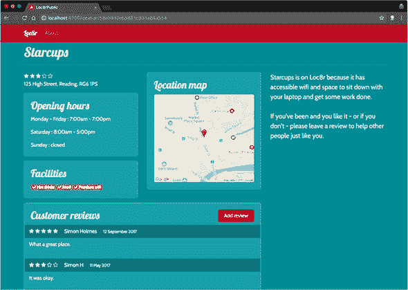

下一个也是最后的步骤是启用添加审查功能，但你将放弃使用额外页面的概念来完成这个任务，这是你在 Express 中所做的方式。相反，你将在页面上直接进行操作，以提供更流畅的体验。

### 10.2\. 处理表单和处理提交的数据

在本节中，你将在 Angular 中创建添加审查页面，并将其数据提交到 API。当点击添加审查按钮时，你不会导航到单独的表单页面，而是在页面上直接显示表单。当表单提交时，Angular 将处理数据，将其提交到 API，并在列表顶部显示新的审查。你将从查看在 Angular 中创建表单所涉及的内容开始。

#### 10.2.1\. 在 Angular 中创建审查表单

要创建审查表单，你需要将 HTML 放置到位，添加数据绑定到输入字段，确保它们都按预期工作，最后确保表单最初是隐藏的，并且只有当按钮被点击时才显示。

##### 将表单 HTML 放置到位

将内联表单添加到页面中，紧接在 `Customer reviews<h2>` 标签之后，如下面的列表所示。大部分布局都来自你在 Express 中使用的表单，包括表单输入名称和 ID。

##### 列表 10.13\. 将审查表添加到 location-details.component.html

```
<h2 class="card-title">Customer reviews</h2>
<div></div>                                      *1*
  <form action=""></form>
    <hr>
    <h4>Add your review</h4>
    <div class="form-group row">
      <label for="name" class="col-sm-2 col-form-label">Name</label>
      <div class="col-sm-10">
        <input id="name" name="name" required="required" class="form-
        control">
      </div>
    </div>
    <div class="form-group row">
      <label for="rating" class="col-sm-2 col-form-label">Rating</label>
      <div class="col-sm-10 col-md-2">
        <select id="rating" name="rating" class="form-control">
          <option value="5">5</option>
          <option value="4">4</option>
          <option value="3">3</option>
          <option value="2">2</option>
          <option value="1">1</option>
        </select>
      </div>
    </div>
    <div class="form-group row">
      <label for="review" class="col-sm-2 col-form-label">Review</label>
      <div class="col-sm-10">
        <textarea name="review" id="review" rows="5" class="form-
        control"></textarea>
      </div>
    </div>
    <div class="form-group row">
      <div class="col-12">
        <button type="submit" class="btn btn-primary float-right"
        style="margin-left:15px">Submit review</button>
        <button type="button" class="btn btn-default float-
         right">Cancel</button>
      </div>
    </div>
    <hr>
  </form>
</div>
```

+   ***1* 在客户审查标题之后直接添加新的 div 和表单 HTML**

目前，你并没有做任何聪明的事情或要求 Angular 做任何事情。你已经在模板中放置了一些带有 Bootstrap 类的原始 HTML。在浏览器中，这看起来像图 10.7。

##### 图 10.7\. 审查表单在详情页面中直接显示，位于添加审查按钮和审查列表之间。

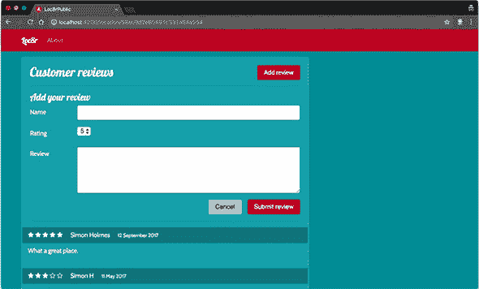

基本表单已经到位。接下来，添加数据绑定。

##### 向表单输入添加数据绑定

在 Express 中，你将表单发布到另一个 URL 并在那里处理提交的数据，但使用 Angular，你不想改变页面。使用 Angular，方法是将数据绑定添加到表单中的所有字段，以便组件可以访问这些值。

要将数据绑定添加到表单字段，使用具有特殊语法的指令，例如：`[(ngModel)]="bindingName"`。（记住括号的顺序可能很难，因此这被称为“香蕉船”，以帮助你记住！）

要在 HTML 中使用 `ngModel`，你需要将 `FormsModule` 和 `ReactiveFormsModule` 导入到应用中 app.module.ts。将 `import { FormsModule, ReactiveFormsModule } from '@angular/forms';` 行添加到 app.module.ts，并将这两个模块名称添加到同一文件中的 `imports` 数组中。

在你的组件中，你希望将所有提交的表单数据保存在一个单独的对象中，这样你就可以轻松地传递它。在 location-details.component.html 中定义一个新的公共成员 `newReview`，给它作者名称、评分和评论内容属性。每个属性都需要一个默认值，所以定义应该看起来像这样：

```
public newReview = {
  author: '',
  rating: 5,
  reviewText: ''
};
```

现在，由于 `newReview` 对象及其属性已经在组件中定义，你可以在 HTML 中使用它们。以下列表显示了如何在 location-details.component.html 中添加到表单的绑定。

##### 列表 10.14\. 在 location-details.component.html 中添加评论表单的数据绑定

```
<form action="">
  <hr>
  <h4>Add your review</h4>
  <div class="form-group row">
     <label for="name" class="col-sm-2 col-form-label">Name</label>
     <div class="col-sm-10">
       <input [(ngModel)]="newReview.author"  id="name" name="name"
       required="required" class="form-control">                           *1*
     </div>
  </div>
  <div class="form-group row">
    <label for="rating" class="col-sm-2 col-form-label">Rating</label>
    <div class="col-sm-10">
      <select [(ngModel)]="newReview.rating" id="rating" name="rating">    *1*
        <option value="5">5</option>
        <option value="4">4</option>
        <option value="3">3</option>
        <option value="2">2</option>
        <option value="1">1</option>
      </select>
     </div>
  </div>
  <div class="form-group row">
    <label for="reviewText" class="col-sm-2 col-form-label">Review</label>
     <div class="col-sm-10">
       <textarea [(ngModel)]="newReview.reviewText" name="reviewText"
       id="reviewText" rows="5" class="form-control"></textarea>           *1*
     </div>
  </div>
  <div class="form-group row">
    <div class="col-12">
      <button type="submit" class="btn btn-primary float-right"
      style="margin-left:15px">Submit review</button>
      <button type="button" class="btn btn-default float-
      right">Cancel</button>
    </div>
  </div>
  <hr>
</form>
```

+   ***1* 将“香蕉船”模型绑定添加到表单输入**

这看起来不错，表面上似乎也工作得很好。但你希望评分是一个数字，而在选择选项中，`value="5"` 是包含字符 5 的字符串。

##### 处理非字符串的 select 值

选择选项的 `value` 默认是一个字符串，但你的数据库需要评分是一个数字。Angular 有一种方法可以帮助你从选择字段获取不同类型的数据。

而不是在每个 `<option>` 中使用 `value="STRING VALUE"`，使用 `[ngValue]= "ANGULAR EXPRESSION"`。当写出来时，`[ngValue]` 的值看起来像是一个字符串，但它是一个 Angular 表达式。这可以是一个对象或一个真正的布尔值，但你想要一个数字。

在 location-details.component.html 中，更新每个 `<option>` 标签以使用 `[ngValue]` 而不是 `value`：

```
<option [ngValue]="5">5</option>
<option [ngValue]="4">4</option>
<option [ngValue]="3">3</option>
<option [ngValue]="2">2</option>
<option [ngValue]="1">1</option>
```

现在 Angular 将 `<select>` 的值作为一个数字而不是字符串来获取。当将数据提交到 API 时，这项技术将非常有用。接下来，你默认隐藏表单，因为你不想让它一直显示。

##### 设置表单的可见性

你不希望在页面加载时显示“添加评论”部分；你希望“添加评论”按钮显示它，当表单显示时，你希望“取消”按钮再次隐藏它。

要显示和隐藏表单，你可以使用你的老朋友 `*ngIf`。`*ngIf` 需要一个布尔值来决定是否显示它所应用的元素，因此你需要在组件中定义一个。

在 location-details.component.ts 中，定义一个新的公共成员 `formVisible`，其类型为 `boolean`，默认值为 `false`：

```
public formVisible: boolean = false;
```

你已经将默认值设置为 `false`，因为你希望表单默认隐藏。要使用这个布尔值来设置表单的可见性，在 location-details.component.html 中找到包围 `<form>` 的 `<div>`，并像这样添加 `*ngIf` 指令：

```
<h2 class="card-title">Customer reviews</h2>
<div *ngIf="formVisible">
  <form action="">
```

现在当页面加载时，表单默认是隐藏的。

##### 切换表单的可见性

要更改表单的可见性，你需要一种方法，在点击添加评论和取消按钮时更改 `formVisible` 的值。不出所料，Angular 有一个你可以用来跟踪元素点击并执行某些操作的点击处理程序。

Angular 的点击处理程序通过在元素上添加 `(click)` 并提供一个 Angular 表达式来访问。这个表达式可以是调用组件类中的公共成员或任何其他类型的有效表达式。当点击添加评论按钮时，你想将 `formVisible` 设置为 `true`，当点击取消按钮时设置为 `false`。

在 location-details.component.html 中，将添加评论按钮从 `<a>` 标签更改为 `<button>`，移除 `href` 属性，并用设置 `formVisible` 为 `true` 的 `(click)` 事件替换它：

```
<button (click)="formVisible=true" class="btn btn-primary float-right">Add
     review</button>
```

以类似的方式，给取消按钮添加 `(click)` 事件，将 `formVisible` 设置为 `false`：

```
<button type="button" (click)="formVisible=false" class="btn btn-default
     float-right">Cancel</button>
```

在这些点击处理程序就位后，你可以使用这两个按钮来显示和隐藏评论表单，使用组件的 `formVisible` 属性来跟踪状态。你需要做的最后一件事是将表单连接起来，以便在提交时添加评论。

#### 10.2.2\. 将提交的表单数据发送到 API

现在是时候让你的评论表单工作，并在提交时将评论添加到数据库中。为了达到这个目的，你必须完成几个步骤：

1.  在你的数据服务中添加一个新成员来 `POST` 新评论到 API。

1.  当表单提交时，让 Angular 处理。

1.  验证表单，以确保只接受完整的数据。

1.  将评论数据发送到你的服务。

1.  将评论推送到详情页面的列表中。

你将从第一步开始。

##### 第一步：更新数据服务以接受新的评论

要使用表单发布评论数据，你需要在数据服务中添加一个方法，该方法与正确的 API 端点通信并可以发布数据。你将调用这个新方法 `addReviewByLocationId`，并让它接受两个参数：位置 ID 和评论数据。

方法的内容与其他方法相同，但你将使用 `post` 而不是 `get` 来调用 API。以下列表显示了要添加到 loc8r-data.service.ts 中的新方法。

##### 列表 10.15\. 在 loc8r-data.service.ts 中添加用于添加评论的新公共成员

```
public addReviewByLocationId(locationId: string, formData: any): Promise<any> {
  const url: string = `${this.apiBaseUrl}/locations/${locationId}/reviews`;
  return this.http
    .post(url, formData)
    .toPromise()
    .then(response => response as any)
    .catch(this.handleError);
}
```

太棒了；现在当你处理完表单处理时，你将能够从组件中使用这种方法。现在继续到第二步。

##### 第二步：添加表单提交处理程序

当在 HTML 中使用表单时，你通常有一个动作来告诉浏览器将数据发送到何处，以及一个方法来描述使用哪个 HTTP 动词。如果你想在数据发送之前使用 JavaScript 对表单数据进行一些操作，你可能还会有一个`onSubmit`事件处理器。

在 Angular SPA 中，你不想让表单提交到不同的 URL，从而跳转到新页面。你希望 Angular 处理一切，所以你会移除表单元素的`action=""`属性，并用 Angular 的`ngSubmit`事件处理器来调用组件中的公共成员。以下代码片段显示了如何使用事件处理器，将其添加到表单定义中，调用你即将编写的组件中的函数：

```
<form (ngSubmit)="onReviewSubmit()">
```

这行代码在表单提交时调用组件上的一个公共方法`onReviewSubmit`。你需要创建这个方法，所以你将在 location-details.component.ts 中添加一个简单的方法，当表单提交时创建一个控制台日志：

```
public onReviewSubmit(): void {
  console.log(this.newReview);
}
```

由于你将所有表单字段绑定到了`newReview`的属性上，这个控制台日志输出了所有提交的数据。现在你可以捕获表单数据了，你将在第 3 步添加一些验证，以确保只接受完整的数据。

##### 第 3 步：验证提交的表单数据

在你盲目地将每个表单提交发送到 API 以保存到数据库之前，你想要进行一些快速验证，以确保所有字段都已填写。如果有任何字段未填写，你将显示一个错误消息。你的浏览器可能阻止带有空必填字段的表单提交；如果你遇到这种情况，暂时从表单字段中移除`required`属性以测试 Angular 验证。

当表单提交时，你将首先删除任何现有的错误消息，然后检查表单中的每个数据项是否为真值（即任何形式的`true`值）。如果任何检查返回`false`——即字段没有数据——你将在组件中设置一个表单错误消息。如果所有数据都存在，你将继续像以前一样将其记录到控制台。

以下列表显示了你需要添加到 location-details.component.ts 中的新验证成员以及你需要如何更改`onReviewSubmit`函数以使用它。

##### 列表 10.16\. 在 location-details.component.ts 中添加对评论表单的验证

```
public formError: string;                                       *1*
private formIsValid(): boolean {                                *2*
  if (this.newReview.author && this.newReview.rating
  && this.newReview.reviewText) {
    return true;
  } else {
    return false;
  }
}

public onReviewSubmit():void {
  this.formError = '';                                          *3*
  if (this.formIsValid()) {                                     *4*
    console.log(this.newReview);                                *4*
  } else {                                                      *5*
    this.formError = 'All fields required, please try again';   *5*
  }
}
```

+   ***1* 声明 formError 变量**

+   ***2* 私有成员以检查所有表单字段是否有内容**

+   ***3* 重置任何现有的错误消息**

+   ***4* 如果表单验证通过，将数据记录到控制台**

+   ***5* 否则，设置错误消息**

现在你正在创建一个错误消息，你希望在它生成时将其显示给用户。对于这个任务，你将在表单模板中添加一个新的 Bootstrap alert `div`并将消息绑定为其内容。你只想在需要显示错误消息时显示`div`，所以使用熟悉的`*ngIf`指令来处理这个任务，检查`formError`是否有值。

需要添加到评论表单模板中的内容，在表单顶部附近添加警报，看起来像这样：

```
<h4>Add your review</h4>
<div *ngIf="formError" class="alert alert-danger" role="alert">
  {{ formError }}
</div>
<div class="form-group row">
```

现在，如果您在表单中没有添加详细信息就点击提交按钮，您将收到一个警报，类似于图 10.8。

##### 图 10.8\. 当用户尝试提交不完整的表单时，会显示错误消息。

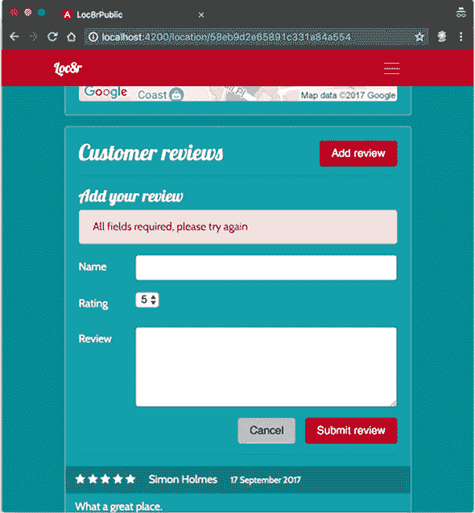

因此，您已经覆盖了无效数据。接下来，您将处理有效数据，并将其发送到 API。

##### 第 4 步：将表单数据发送到数据服务

您的表单数据正在提交，并且您已经准备好将数据发送到 API 的数据服务。现在将这两个任务连接起来。您将像之前一样使用数据服务；使用这个新方法没有不同。

但首先，您需要将数据服务导入到 location-details.component.ts 中，并将其添加到装饰器中。

##### 列表 10.17\. 在 location-details.component.ts 中导入并提供数据服务

```
import { Component, Input, OnInit } from '@angular/core';

import { Location } from '../home-list/home-list.component';
import { Loc8rDataService } from '../loc8r-data.service';

@Component({
  selector: 'app-location-details',
  templateUrl: './location-details.component.html',
  styleUrls: ['./location-details.component.css']
})
```

在同一文件中，您还需要将服务添加到构造函数中，以便可以使用它：

```
constructor(private loc8rDataService: Loc8rDataService) { }
```

现在服务已在组件中可用，您可以调用新的`addReviewByLocationId`方法。该方法期望位置 ID 和评论详情，并解决一个 Promise，它返回数据库中保存的评论记录，如下一列表所示。为了验证它是否正常工作，您还将添加一个控制台日志输出返回的评论。

##### 列表 10.18\. 在 location-details.component.ts 中向服务发送新的评论

```
public onReviewSubmit():void {
  this.formError = '';
  if (this.formIsValid()) {
    console.log(this.newReview);
    this.loc8rDataService.addReviewByLocationId(this.location._id,
    this.newReview)                               *1*
    .then(review => {                               *2*
      console.log('Review saved', review);          *3*
    });
  } else {
    this.formError = 'All fields required, please try again';
  }
}
```

+   ***1* 调用数据服务方法，传递位置 ID 和新的评论数据**

+   ***2* 该方法解决了一个承诺，返回保存的评论。**

+   ***3* 记录保存的评论数据**

现在您可以发送评论到数据库，并像图 10.9 中演示的那样查看控制台日志。注意控制台日志中的`createdOn`和`_id`，这是 Mongoose 在记录保存时生成的。

##### 图 10.9\. 控制台日志验证评论是否被添加到数据库

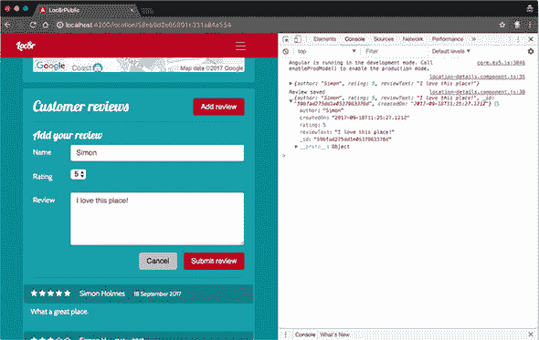

最后一件事情：将提交的评论推送到表单下方的列表中。当评论发送时，您希望隐藏表单并将评论添加到用户可以看到的列表中。

##### 第 5 步：更新评论列表并隐藏表单

显示新的评论是一个简单的任务，幸运的是。您已经有了评论列表作为数组，它已经按最新排序。现在您需要使用原生的 JavaScript `unshift`方法将新的评论添加到数组的第一个位置。

要隐藏表单，您可以更改`formVisible`为`false`，因为这是控制表单上的`*ngIf`的。同时，您还可以重置表单的值，使其再次变为空白。以下列表显示了您需要在 location-details.component.ts 中添加的所有内容。

##### 列表 10.19\. 在 location-details.component.ts 中隐藏表单并显示评论

```
private resetAndHideReviewForm(): void {                     *1*
  this.formVisible = false;
  this.newReview.author = '';
  this.newReview.rating = 5;
  this.newReview.reviewText = '';
}

public onReviewSubmit():void {
  this.formError = '';
  if (this.formIsValid()) {
    console.log(this.newReview);
    this.loc8rDataService.addReviewByLocationId(this.location._id,
     this.newReview)
     .then(review => {
       console.log('Review saved', review);
       let reviews = this.location.reviews.slice(0);          *2*
       reviews.unshift(review);                               *2*
       this.location.reviews = reviews;                       *2*
       this.resetAndHideReviewForm();                         *3*
    })
  } else {
    this.formError = 'All fields required, please try again';
  }
}
```

+   ***1* 一个新的私有成员来隐藏和重置表单**

+   ***2* 更新位置对象中的评论，更改数组引用，Angular 更新页面。如果你直接操作数组，页面不会更新。**

+   ***3* 调用私有成员以隐藏并重置表单**

就这样，几乎完成了。这段代码在`reviews`位于`Location`类型的类定义中之前不会工作，所以你需要在 home-list.component.ts 中将它作为一个类型为`any`的数组添加，如下所示：

```
export class Location {
  _id: string;
  name: string;
  distance: number;
  address: string;
  rating: number;
  facilities: string[];
  reviews: any[];
}
```

真的是这样。你的 Angular SPA 已经完成并且完全可用。做得好！但你可以做一些事情来改进架构并遵循一些最佳实践。

### 10.3。改进架构

你已经拥有了一个完全功能化的 SPA，这真是太棒了！但在你使用它代替 Express 前端之前，你可以通过将路由配置从 app.module.ts 文件中移出，以及将位置类定义从 home-list.component.ts 文件中移出，来改进架构。

#### 10.3.1。使用单独的路由配置文件

你提高架构并遵循 Angular 最佳实践的第一次任务是，将路由配置移动到一个单独的文件中。为什么这是一个最佳实践？这主要归因于关注点的分离。app.module.ts 文件的目的就是告诉 Angular 编译器有关应用程序及其所需文件的所有信息。如果你只有几个路由，将它们保留在 app.module.ts 文件中是可以的，但如果你添加了更多路由，它们最终会占据整个文件，掩盖其原始目的。

目前你的应用程序中有三个路由，但你会通过将路由配置移动到一个单独的文件中来探索这个最佳实践。当你查看第十一章（chapter 11）中的认证时，你将向这个文件添加更多内容。

##### 创建路由配置文件

你可以使用 Angular CLI 生成路由配置文件，这次使用`module`模板。在 app_public 文件夹的终端中运行以下命令：

```
$ ng generate module app-routing
```

此命令生成一个包含 app-routing.module.ts 文件的 app-routing 文件夹（在 src/app 中）。你之前没有见过这样的文件，所以下一个列表显示了该文件的默认内容。

##### 列表 10.20。app-routing.module.ts 的默认模块模板

```
import { NgModule } from '@angular/core';
import { CommonModule } from '@angular/common';

@NgModule({
  imports: [
    CommonModule
  ],
  declarations: []
})
export class AppRoutingModule { }
```

要将应用程序路由添加到这个文件中，你需要执行以下操作：

1.  从 Angular 路由器导入 router 模块和 routes 类型定义。

1.  导入用于每个路由的组件。

1.  定义路由的路径和组件。

1.  将路由（使用`routerModule.forRoot`）添加到模块导入中。

1.  导出`RouterModule`以便可以使用设置。

这个过程看起来有很多步骤，但它没有使用你之前没有见过的任何东西。你已经使用过路由模块并定义过路由；现在你只是将它们放在了不同的地方。以下列表显示了 app-routing.module.ts 的所有更新。

##### 列表 10.21。在 app-routing.module.ts 中完成路由配置

```
import { NgModule } from '@angular/core';
import { CommonModule } from '@angular/common';
import { RouterModule, Routes }   from '@angular/router';              *1*
import { AboutComponent } from '../about/about.component';             *2*
import { HomepageComponent } from '../homepage/homepage.component';    *2*
import { DetailsPageComponent } from '../details-page/details-         *2*
page.component';                                                     *2*

const routes: Routes = [                                               *3*
  {
    path: '',
    component: HomepageComponent
  },
  {
    path: 'about',
    component: AboutComponent
  },
  {
    path: 'location/:locationId',
    component: DetailsPageComponent
  }
];

@NgModule({
  imports: [
    CommonModule,
    RouterModule.forRoot(routes)                                       *4*
  ],
  exports: [RouterModule],                                             *5*
  declarations: []
})
export class AppRoutingModule { }
```

+   ***1* 导入路由模块和路由类型定义**

+   ***2* 导入路由的组件**

+   ***3* 将路由定义为类型为 Routes 的数组 . . .**

+   ***4* . . . 并使用路由模块导入它们**

+   ***5* 导出路由模块**

这就是路由配置文件的全部内容。接下来，你需要更新主`app.module.ts`文件，使用这个文件而不是内联路由定义。

##### 整理`app .module.ts`文件

你不需要或想要在两个文件中保留路由定义，因此你可以从主模块文件中删除它们。你也不需要从 Angular 路由导入路由，因此你也可以删除那行。你的新路由配置文件处理导入。

虽然你在删除路由，但你确实需要保留所有组件的导入。这些导入仍然由`app.module.ts`文件需要，因为这个文件告诉编译器使用什么以及在哪里找到源文件。

最后，你需要将新的路由文件导入，而不是使用内联配置。这个导入通常放置在核心导入和组件导入之间，这样在查看文件时很容易找到。此外，将路由文件添加到装饰器的`导入`部分。

以下列表显示了添加和删除所有更改后的最终`app.module.ts`。

##### 列表 10.22\. 从`app.module.ts`中移除内联路由定义

```
import { BrowserModule } from '@angular/platform-browser';
import { NgModule } from '@angular/core';
import { FormsModule, ReactiveFormsModule } from '@angular/forms';
import { HttpClientModule } from '@angular/http';

import { AppRoutingModule } from './app-routing/app-routing.module';    *1*

import { HomeListComponent } from './home-list/home-list.component';
import { RatingStarsComponent } from './rating-stars/rating-stars.component';
import { DistancePipe } from './distance.pipe';
import { FrameworkComponent } from './framework/framework.component';
import { AboutComponent } from './about/about.component';
import { HomepageComponent } from './homepage/homepage.component';
import { PageHeaderComponent } from './page-header/page-header.component';
import { SidebarComponent } from './sidebar/sidebar.component';
import { HtmlLineBreaksPipe } from './html-line-breaks.pipe';
import { LocationDetailsComponent } from
'./location-details/location-details.component';
import { DetailsPageComponent } from './details-page/details-page.component';
import { MostRecentFirstPipe } from './most-recent-first.pipe';

@NgModule({
  declarations: [
    HomeListComponent,
    RatingStarsComponent,
    DistancePipe,
    FrameworkComponent,
    AboutComponent,
    HomepageComponent,
    PageHeaderComponent,
    SidebarComponent,
    HtmlLineBreaksPipe,
    LocationDetailsComponent,
    DetailsPageComponent,
    MostRecentFirstPipe
  ],
  imports: [
    BrowserModule,
    FormsModule,
    ReactiveFormsModule,
    HttpClientModule,
    AppRoutingModule                                                    *2*
  ],
  providers: [],
  bootstrap: [FrameworkComponent]
})
export class AppModule { }
```

+   ***1* 导入你的新路由模块，包含应用程序的路由配置**

+   ***2* 将其作为对应用程序模块的导入**

就这些了。应用程序将像以前一样工作，但我们确信你会同意，通过这次更改，路由配置和主应用程序模块文件都得到了改进。对于小型应用程序，你可能不需要或想要这样做，但如果你有更大的计划，这绝对值得。

接下来，你将改进`location`类的定义。

#### 10.3.2\. 改进`location`类的定义

你对`location`类的定义目前保存在`home-list.component.ts`中。这个定义源于你在第八章中创建的主页列表组件；它是应用程序中唯一做任何事情组件。现在，你在应用程序的许多地方导入`location`类的定义；它已经成为应用程序本身的一个关键部分。因此，将其分离到自己的文件中是有意义的。

当你这样做时，你也会添加缺失的属性，因为它目前只定义了在主页列表中使用的属性；例如评论和营业时间等属性是缺失的。此外，你将为评论创建一个嵌套类，你可以在类定义和应用程序中直接处理评论时使用它。

当这一切都完成时，你将拥有一个更好的 TypeScript 应用程序。

##### 在其自己的文件中定义`Location`类

第一步是创建类定义的文件，再次使用 Angular CLI：

```
$ ng generate class location
```

此命令在应用程序的 src 文件夹中生成一个名为 location.ts 的文件。而且它很稀疏！它看起来应该像这样：

```
export class Location {
}
```

这有点令人失望，但至少它没有复杂或意外的地方。你所需要做的就是从 home-list.component.ts 获取 `Location` 定义并将其粘贴进去。

##### 列表 10.23\. 在 location.ts 中添加基本的 `Location` 类定义

```
export class Location {
  _id: string;
  name: string;
  distance: number;
  address: string;
  rating: number;
  facilities: string[];
  reviews: any[];
}
```

这仍然相当简单。`Location` 类的定义现在在其自己的文件中。你最好开始使用它。

##### 在需要的地方使用新的类文件

首次使用新的类定义文件的地方是 home-list.component.ts，因为这是它最初定义的地方。为此，请从该文件中删除原始的内联定义，并用一个简单的导入命令替换：

```
import { Component, OnInit } from '@angular/core';
import { Loc8rDataService } from '../loc8r-data.service';
import { GeolocationService } from '../geolocation.service';

import { Location } from '../location';
```

这替换了主页列表中的位置定义，这是一个好的开始。但如果你此时仍在运行 `ng serve`，你将得到类似以下的 Angular 编译错误：

```
Failed to compile.
/FILE/PATH/TO/LOC8R/app_public/src/app/location-details/location-
     details.component.ts (3,10): Module
     '"/FILE/PATH/TO/LOC8R/app_public/src/app/home-list/home-list.component"'
     has no exported member 'Location'.
```

这告诉你 location-details.component.ts 正在使用从 `home-list` 导出的 `Location` 类，因此你需要更新它。更改你导入 `Location` 的文件：

```
import { Component, Input, OnInit } from '@angular/core';

import { Location } from '../location';
import { Loc8rDataService } from '../loc8r-data.service';
```

当你完成时，在其他从 `Location` 导入的地方也做同样的事情：details-page.component.ts 和 loc8r-data.service.ts。记住，当你将 `Location` 导入到 loc8rdata.service.ts 时，路径前面有一个点而不是两个点，这是由于这些文件的相对位置。

接下来，添加缺失的属性。

##### 为 Location 类定义添加缺失的路径

当你在应用程序中使用你在类定义中未声明的类属性时，你可能会在构建时遇到问题，尽管它可能在 `ng serve` 下运行良好。

你目前从你的类定义中遗漏了 `coords` 和 `openingTimes`。`coords` 是一个简单的添加——一个数字数组。而 `openingTimes` 是一个不同的情况，因为它本身就是一个复杂对象。

记得 Mongoose 如何使用嵌套模式来定义子文档吗？（如果你不记得，请参阅第五章。）嗯，你可以在 TypeScript 中的类上做同样的事情。列表 10.24 展示了如何更新 location.ts 文件以定义一个名为 `OpeningTimes` 的类，以及如何在 `Location` 类上定义同名属性，使其成为 `OpeningTimes` 类型的数组。它还添加了 `coords` 属性。

##### 列表 10.24\. 向 location.ts 添加缺失的属性和嵌套类定义

```
class OpeningTimes {                *1*
  days: string;
  opening: string;
  closing: string;
  closed: boolean;
}

export class Location {
  _id: string;
  name: string;
  distance: number;
  address: string;
  rating: number;
  facilities: string[];
  reviews: any[];
  coords: number[];                 *2*
  openingTimes: OpeningTimes[];     *3*
}
```

+   ***1* 定义一个新的 OpeningTimes 类**

+   ***2* 为 Location 添加缺失的 coords 属性**

+   ***3* 将 openingTimes 属性添加到 Location 类，使其成为 OpeningTimes 类的数组**

看起来不错。类定义包含了你需要和使用的所有属性。请注意，`OpeningTimes` 类本身不可导入到其他文件中，因为它没有被声明为 `export`。尽管这已经包含了你需要的一切，但你还可以改进 `reviews` 属性定义。

##### 定义评论类，避免使用 ‘any’ 类型

你将 `reviews` 定义为一个类型为 `any` 的数组。这应该是一个警告标志，因为 TypeScript 中的最佳实践是尽可能避免使用 `any`，因为它会削弱类结构。

在这里，你可以避免使用 `any`，因为你知道评论的架构，并且你已经看到了如何定义和使用嵌套类。与 `OpeningTimes` 定义不同，你希望在应用程序的其他地方使用 `Review` 类定义，所以你将这个声明为 `export`。

下面的列表显示了如何定义 `Review` 类，导出它，并在 `Location` 类定义中使用它。请注意，源代码还应包括 `OpeningTimes` 定义，但我们为了简洁起见省略了它。

##### 列表 10.25\. 在 locations.ts 中定义、使用和导出评论类

```
export class Review {            *1*
  author: string;
  rating: number;
  reviewText: string;
}

export class Location {
  _id: string;
  name: string;
  distance: number;
  address: string;
  rating: number;
  facilities: string[];
  reviews: Review[];             *2*
  coords: number[];
  openingTimes: OpeningTimes[];
}
```

+   ***1* 定义并导出评论类的定义**

+   ***2* 声明位置评论为类型 Review**

现在你的 `Location` 类已经完成。你有一个用于评论的嵌套类，它可以在其他地方使用，还有一个用于营业时间的嵌套类，它只适用于此文件。为了更严格地使用 `Location` 类，你需要在应用程序中使用 `Review` 类。

##### 在需要的地方显式导入和使用评论类

你有两个地方可以使用 `Review` 类：在位置详情组件中，你使用表单添加新的评论，以及在你数据服务中，你将新的评论数据推送到 API。

在这些组件的文件（location-details.component.ts 和 loc8rdata.service.js）中，更新 `Location` 导入以同时导入 `Review` 类，如下所示：

```
import { Location, Review } from '../location';
```

在位置详情组件中，有两个地方可以使用 `Review` 定义来为你的变量添加类型，如下所示。第一个地方是在你定义 `newReview` 并为其提供默认值时，第二个地方是在从 API 返回保存的评论时。

##### 列表 10.26\. 更新 location-details.component.ts 以使用新的 Review 类型

```
public newReview: Review = {                       *1*
  author: '',
  rating: 5,
  reviewText: ''
};

public onReviewSubmit():void {
  this.formError = '';
  if (this.formIsValid()) {
    console.log(this.newReview);
    this.loc8rDataService.addReviewByLocationId(this.location._id,
    this.newReview)
    .then((review: Review) => {                    *2*
      console.log('Review saved', review);
      let reviews = this.location.reviews.slice(0);
      reviews.unshift(review);
      this.location.reviews = reviews;
      this.resetAndHideReviewForm();
    })
  } else {
    console.log('Not valid');
    this.formError = 'All fields required, please try again';
  }
}
```

+   ***1* 将 Review 类型添加到 newReview 定义中**

+   ***2* 从 API 返回的保存评论也应为类型 Review。**

以类似的方式，你可以通过指定输入和输出应为类型 `Review` 来收紧你数据服务中的 `addReviewByLocationId` 方法，将它们从 `any` 改变。以下列表显示了这三个更改。

##### 列表 10.27\. 在 loc8r-data.service.ts 中使用 Review 类型来收紧定义

```
public addReviewByLocationId(locationId: string, formData: Review)
: Promise<Review> {                                                       *1*
  const url: string = `${this.apiBaseUrl}locations/${locationId}/reviews`;
  return this.http
    .post(url, formData)
    .toPromise()
    .then(response => response.json() as Review)                            *2*
    .catch(this.handleError);
}
```

+   ***1* 入站表单数据应与 Review 类型相同，方法预期的返回值也应如此。**

+   ***2* API 的响应类型也应为 Review，而不是任何类型。**

这并不太痛苦，现在你有一个遵循一些良好的 TypeScript 和 Angular 最佳实践的更紧密的应用程序。使用类型定义有助于防止在传递数据时出现意外的错误；很容易忘记哪个参数应该是字符串或数组，对象应该有哪些属性，等等。这种方法可以让你避免这些问题，当其他人试图阅读你的代码或你在休息后返回并忘记细节时，这尤其有帮助。

现在，你已经对你的 SPA 满意，并希望将其用作 Loc8r 应用程序的前端，取代当前的 Express 版本。

### 10.4\. 使用单页应用（SPA）而不是服务器端应用

在本章的最后部分，你将构建你的 Angular 应用程序以用于生产，并将 Express 更新为作为前端而不是 Pug 模板来提供此应用程序。在这个过程中，你将进行调整以确保应用程序中深层次 URL 的直接访问，同时不损害 API 路由。

在进行任何操作之前，你需要通过更新 environments/environment 文件来为你的生产环境准备应用程序。如果你查看 environments 文件夹，你会看到两个文件：environment.ts 和 environment.prod.ts。这两个文件都需要更新。在 environment.ts 中，进行以下更改（加粗）。

##### 列表 10.28\. 在开发环境中添加环境变量

```
export const environment = {
  apiBaseUrl: 'http://localhost:3000/api',        *1*
  production: false
};
```

+   ***1* 新的环境变量用于开发**

你还需要在 environments/environment.prod.ts 中进行类似的更改。

##### 列表 10.29\. 在生产环境中添加环境变量

```
export const environment = {
  apiBaseUrl: <Heroku API URL>,        *1*
  production: true
};
```

+   ***1* 将 Heroku URL 添加到 API 端点（附加 /api 的 Heroku URL）**

与开发过程中一直使用的 localhost 地址不同，你将使用部署应用程序的 Heroku URL。完成此操作后，你将更新 loc8r-data.service.ts 以使用新创建的环境变量。

在 loc8r-data.service.ts 文件顶部的 `import` 块中，添加以下内容：

```
import { environment } from '../environments/environment';
```

这意味着你现在可以替换

```
private apiBaseUrl = 'http://localhost:3000/api';
```

with

```
private apiBaseUrl = environment.apiBaseUrl;
```

通过此更改，Angular 将在构建时选择正确的环境，你现在可以准备好构建用于部署的应用程序。就像你在 第八章 的结尾所做的那样，在终端中运行 app_public 文件夹中的 `ng build` 命令，指定选项将其标记为生产构建，输出文件夹为 build：

```
$ ng build --prod --output-path build
```

当代码运行完成后，你将在 app_public/build 文件夹中找到一个编译后的 SPA 版本。这个文件夹包含了 SPA 运行所需的一切，包括 HTML 页面、JavaScript 文件、CSS 和字体。

接下来，你将告诉 Express 使用它。

#### 10.4.1\. 将 Express 请求路由到构建文件夹

要让 Express 为前端服务 Angular 应用，你需要做两件事：禁用所有之前的前端应用路由，并告诉 Express 你的 Angular 构建文件夹应该服务静态文件。

要禁用前端基于 Express 的路由，在 app.js 中找到这两行，并删除它们或将其注释掉：

```
const indexRouter = require('./app_server/routes/index');
```

和

```
app.use('/', indexRouter);
```

你也不再需要 /public 文件夹来服务静态文件，因为 Angular 应用所需的所有文件都位于 Angular 构建文件夹内。不过，请不要删除那行代码，因为你需要 Express 来服务构建文件夹的内容作为静态文件。相反，在 app.js 中找到以下行，

```
app.use(express.static(path.join(__dirname, 'public')));
```

并在其下方添加类似的行来使用 app_public/build 文件夹，如下所示：

```
app.use(express.static(path.join(__dirname, 'app_public', 'build')));
```

如果 Express 应用尚未在 `nodemon` 下运行，请运行 Express 应用，然后在浏览器中转到 localhost:3000。你现在看到的一切都是 Angular 应用，你可以通过检查页面元素来验证它，如图 10.10 所示。

##### 图 10.10. 运行中的 Express 应用的主页现在提供了 Angular SPA。

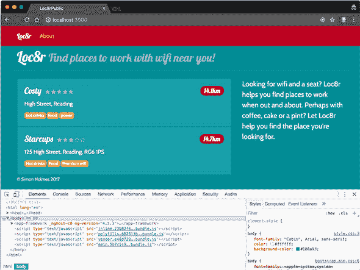

通过这些更改，当请求主页时，Express 服务第一个匹配的资源，即 app_public/build 文件夹中的 index.html 文件。它不再匹配 Express 路由并使用 Pug 模板。

这对于主页来说效果很好，你可以顺利地浏览应用。但如果你将关于页面或详情页的 URL 复制到地址栏，你会得到一个 `404` 错误。你需要修复无法直接访问深层 URL 的问题，因为如果你只允许人们通过主页进入，那么这个网站将没有用。

#### 10.4.2. 确保深层 URL 可以正常工作

这个路由问题不应该让你感到惊讶。你已经告诉 Express 为主页服务一个静态文件，但在构建文件夹内没有 about 文件夹，所以 Express 不可能知道要显示 Angular 应用。

解决这个问题的简单方法是通过让 Express 尝试匹配它所知道的所有路由，然后在最后添加一个通配符路由来服务尚未匹配的任何内容。这个通配符路由可以通过使用 * 作为未匹配的 GET 请求的通配符来定义，并且应该通过发送 Angular 应用的 index.html 文件来响应。

以下代码片段显示了如何在 app.js 中所有其他路由匹配语句之后添加通配符路由，在这种情况下是在 API 路由定义之后：

```
app.use('/api', apiRoutes);
app.get('*', function(req, res, next) {
  res.sendFile(path.join(__dirname, 'app_public', 'build', 'index.html'));
});
```

在此代码到位后，如果任何 URL 在 Angular 构建文件夹中的 API 路由中没有匹配到 Express，它将响应 Angular 应用的首页。这是好的，但你可以使它更好。

而不是使用*来匹配所有内容，你可以使用正则表达式来定义一个模式以匹配你想要应用路由的 URL（或一组 URL）。匹配/about 路由的正则表达式很简单；你需要添加起始和结束字符串定界符，并转义正斜杠，使其看起来像`^/about$`。

由于位置 ID，Details 页面的正则表达式要复杂一些。位置 ID 是一个 24 字符的、看似随机的数字和小写字母混合的 MongoDB `ObjectId`。匹配这些字符的正则表达式是`[a-z0-9]{24}`。使用与 About 页面正则表达式相同的方法，位置详情页面的完整正则表达式是`^/location/[a-z0-9]{24}$`。

以下代码片段显示了如何使用组合正则表达式更新 app.js 中的 catchall 路由，以匹配 About 页面或位置详情页面：

```
app.get(/(\/about)|(\/location\/[a-z0-9]{24})/, function(req, res, next) {
  res.sendFile(path.join(__dirname, 'app_public', 'build', 'index.html'));
});
```

这是一个好的变化，因为现在只有当输入有效的 URL 时，Express 才会发送 Angular 应用程序作为响应。

这样，你的 SPA 现在完全工作，由 Express 提供服务，并与 Express API 通信，而 Express API 则从 MongoDB 中获取数据。你拥有一个完整的 MEAN 堆栈应用程序。恭喜！

在第十一章和第十二章中，你将看到如何通过添加用户在提交评论前注册和登录的能力来管理认证会话。

### 摘要

在本章中，你学习了

+   可以使用 URL 参数将数据从路由传递到组件和服务

+   服务用于查询 API

+   Angular 模板如何以`*ngIf`和`ngSwitch`的形式具有显示逻辑

+   如何创建自定义管道并使用它们

+   关于将路由配置放置在单独的文件中以改进架构的最佳实践

+   关于创建独立类定义的最佳实践，包括嵌套类，以及通过应用程序改进自定义类型定义的使用

+   如何让 Express 为某些 URL 请求发送 Angular 应用程序而不是服务器端路由
