## 第四部分。管理认证和用户会话

识别个别用户的能力是大多数 Web 应用程序的关键功能之一。访客应该能够注册他们的详细信息，以便他们可以在以后日期以回头客的身份重新登录。当用户注册并登录后，应用程序应该能够利用这些数据。

在第十一章中，你将了解 MEAN 堆栈中认证的工作方式。重点是创建一个认证 API，你将使用它来为 Angular SPA 的用户中心部分提供动力。

第十二章通过集成在第十一章（kindle_split_024.xhtml#ch11）中创建的 API，并更新 Angular 应用程序以利用引入的新功能来结束本章。我们还扩展了一些在第十章（kindle_split_022.xhtml#ch10）中介绍的主题和模式。

## 第十一章。认证用户、管理会话和确保 API 安全

*本章涵盖*

+   在 MEAN 堆栈中添加认证

+   使用 Passport.js 在 Express 中管理认证

+   在 Express 中生成 JSON Web Tokens

+   注册和登录用户

+   在 Express 中保护 API 端点

在本章中，你将通过让用户在发表评论之前先登录来改进现有的应用程序。这个主题非常重要，因为许多 Web 应用程序需要让用户登录并管理会话。

图 11.1 显示了你在整体计划中的位置，现在正在与 MongoDB 数据库、Express API 和 Angular 单页应用程序（SPA）一起工作。

##### 图 11.1。本章向应用程序添加了认证系统，该系统影响架构的大部分部分，例如数据库、API 和前端 SPA。

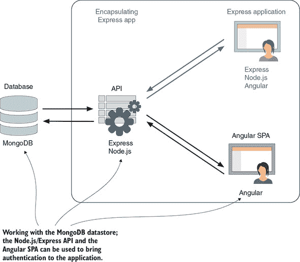

你的第一步是概述如何在 MEAN 堆栈应用程序中处理认证，在更新 Loc8r 时，一次更新一个部分，从后端到前端逐步处理架构。你将在升级 API 和最终修改前端之前更新数据库和数据模式。到本章结束时，你将能够注册新用户、登录他们、维护会话，并执行只有登录用户才能完成的操作。

### 11.1. 如何在 MEAN 堆栈中处理认证

如何在 MEAN 应用程序中管理认证被视为堆栈中的伟大奥秘之一，尤其是在使用 SPA 时，这主要是因为整个应用程序代码都发送到浏览器。那么，你如何隐藏其中的一部分？你如何定义谁可以看到或做什么？

#### 11.1.1. 传统的基于服务器的应用程序方法

大部分困惑源于人们对应用程序认证和用户会话管理的传统方法很熟悉。

在传统的设置中，应用程序代码坐在服务器上运行。为了登录，用户在一个表单中输入他们的用户名和密码，该表单被发送到服务器。

然后服务器会检查数据库以验证登录详情。假设登录是正常的，服务器会在服务器上的用户会话中设置一个标志或会话参数，以声明用户已登录。

服务器可能会也可能不会在用户的浏览器上设置一个包含会话信息的 cookie。这是常见的，但技术上并不需要管理认证会话；维护关键会话信息的是服务器。这个流程在图 11.2 中得到了说明。

##### 图 11.2。在一个传统的服务器应用程序中，服务器验证存储在数据库中的用户凭据，并将它们添加到服务器上的用户会话中。

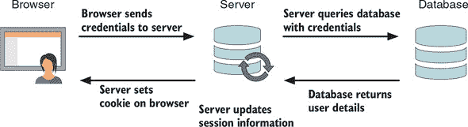

在这个初始握手和建立的会话之后，当用户请求安全资源或尝试向数据库提交一些数据时，服务器验证他们的会话并决定他们是否可以继续。图 11.3 展示了传统的服务器设置如何通过验证用户会话来管理对受保护资源的访问，当确定授权状态时返回请求的资源。

##### 图 11.3。在一个传统的服务器应用程序中，服务器在继续进行安全请求之前验证用户的会话。

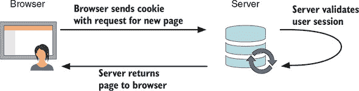

图 11.4 继续这个主题，其中用户请求访问读取/更新/删除应用程序数据库中包含的资源，使用提供的数据，并且有一个有效的会话。

##### 图 11.4。在一个传统的服务器应用程序中，服务器在将数据推送到数据库之前验证用户的会话。

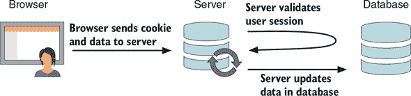

那就是传统方法的样子，但它适用于 MEAN 堆栈吗？

#### 11.1.2. 在 MEAN 堆栈中使用传统方法

这种传统的方法并不完全适合 MEAN 堆栈。这种方法依赖于服务器为每个用户保留一些资源，以便它可以维护会话信息。你可能还记得，从第一章开始，Node 和 Express 不会为每个用户维护会话；所有用户的整个应用程序都在单个线程上运行。

也就是说，如果你使用基于 Express 的服务器端应用程序，比如你在第七章中构建的那个，你可以在 MEAN 堆栈中使用这种方法的版本。Express 而不是使用服务器资源来维护会话信息，可以使用数据库来存储数据。MongoDB 可以使用；另一个流行的选择是 Redis，它是一个闪电般的键值存储。

我们不会在本书中介绍这种方法。相反，我们将探讨更复杂的场景，即在 SPA 中添加对数据 API 的认证。

#### 11.1.3. 完整的 MEAN 堆栈方法

在本节中，你将看到身份验证如何适应 MEAN 堆栈，以及使用 JSON Web Tokens 和 Passport.js 等中间件是多么容易。

MEAN 堆栈中的身份验证提出了两个问题：

+   API 是无状态的，因为 Express 和 Node 没有用户会话的概念。

+   应用程序逻辑已经发送到浏览器，因此无法限制要发送的代码。

解决这些问题的逻辑解决方案是在浏览器中维护某种类型的会话状态，并让应用程序决定它可以向当前用户显示什么以及不可以显示什么。这是方法上的唯一基本变化。一些技术差异仍然存在，但这只是主要的转变。

在浏览器中安全地保存用户数据以维持会话的一个好方法是使用 JSON Web Token (JWT)。在本节中，我们将使用 *JWT* 和 *token* 互换。当您开始创建它们时，您将在第 11.4 节中详细了解这些内容，并在第十二章节中进一步了解，当您在 Angular 应用程序中消费它们时。本质上，JWT 是一个加密成字符串的 JSON 对象，对人类眼睛来说没有意义，但可以被应用程序和服务器解码和理解。

下一个部分将介绍这一过程在高级别上的表现，从登录过程开始。

##### 管理登录过程

图 11.5 展示了登录过程的流程。用户将他们的凭据发送到服务器（通过 API）；服务器通过使用数据库验证这些凭据，并将令牌返回到浏览器。浏览器将此令牌保存以供以后重用。

##### 图 11.5\. MEAN 应用程序中的登录流程，在服务器验证用户凭据后向浏览器返回 JSON Web Token

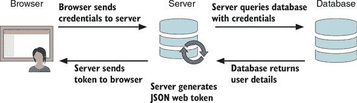

这种方法与传统方法类似，但不同之处在于，不是将用户的会话数据存储在服务器上，而是存储在浏览器中。

##### 在认证会话期间更改视图

当用户处于会话中时，他们需要能够更改页面或视图，并且应用程序需要知道他们应该被允许看到什么。因此，如图 11.6 所示，应用程序将解码 JWT 并使用这些信息向用户显示适当的数据。

##### 图 11.6\. 使用 JWT 内部的数据，SPA 可以确定用户可以使用或查看哪些资源。

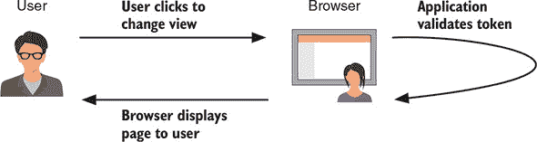

这就是传统方法改变明显的地方。服务器在用户需要访问 API 和数据库之前，对用户的行为一无所知。

##### 安全地调用 API

如果应用程序的部分内容仅限于认证用户，那么很可能某些数据库操作只能由认证用户使用。由于 API 是无状态的，除非您告诉它，否则它不知道是谁在发起每个调用。JWT 在这里再次发挥作用。如图 11.7 所示，该令牌被发送到 API 端点，该端点在验证用户是否有权进行该调用之前会解码令牌。

##### 图 11.7\. 当调用认证的 API 端点时，浏览器会发送 JWT 以及数据；服务器解码令牌以验证用户的请求。

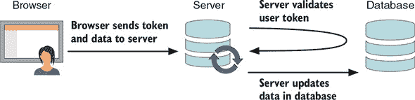

这就涵盖了高层次的方法，您对目标有了很好的了解。您将通过设置 MongoDB 以存储用户详细信息，将第一步添加到 Loc8r 应用程序的认证机制中。

### 11.2\. 为 MongoDB 创建用户模式

用户名和密码自然必须存储在数据库中。在您的案例中，您将使用用户集合。要在 MEAN 堆栈中做到这一点，您需要创建一个 Mongoose 模式。密码绝对不应该以纯文本形式存储在数据库中，因为这样做如果数据库遭到破坏，将呈现一个巨大的安全漏洞。在生成模式时，您必须做些其他事情。

#### 11.2.1\. 单向密码加密：哈希和盐

这里要做的就是在密码上运行单向加密。单向加密可以防止任何人解密密码，同时仍然可以轻松验证正确的密码。当用户尝试登录时，应用程序可以加密一个给定的密码并查看它是否与存储的值匹配。

加密还不够。如果几个人使用“password”作为他们的密码（这种情况确实会发生！），每个的加密都是相同的。任何查看数据库的黑客都可以看到这个模式并识别出潜在的弱密码。

这就是盐的概念出现的地方。盐是一个由应用程序为每个用户生成的随机字符串，在加密之前与密码结合。生成的加密值称为哈希，如图 11.8 所示。

##### 图 11.8\. 通过将用户的密码与随机盐结合并加密，创建一个哈希。

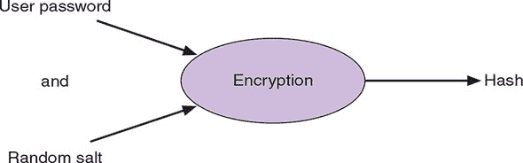

盐和哈希都存储在数据库中，而不仅仅是单个密码字段。在这种方法中，所有哈希都应该唯一，密码得到了很好的保护。

#### 11.2.2\. 构建 Mongoose 模式

您将首先创建一个将包含模式并将其`require`到应用程序中的文件。在 app_api/models/文件夹中，创建一个名为 users.js 的新文件。

接下来，您将通过在相同文件夹中的 db.js 文件中引用它，将该文件拉入应用程序。它应该与现有行一起`require`，该行引入了位置模型，如下面的代码片段所示，位于文件底部：

```
// BRING IN YOUR SCHEMAS & MODELS
require('./locations');
require('./users');
```

现在您已经准备好构建基本模式。

#### 11.2.3\. 基本用户模式

您想在用户模式中包含什么？您知道您需要一个显示名称来显示在评论中，还需要密码的哈希和盐。在本节中，您还将添加电子邮件地址并将其作为用户登录的唯一标识符。

在新的 user.js 文件中，您将`require` Mongoose 并定义一个新的`userSchema`。

##### 列表 11.1\. 用户的基本 Mongoose 模式

```
const mongoose = require('mongoose');
const userSchema = new mongoose.Schema({
  email: {                                *1*
    type: String,                         *1*
    unique: true,                         *1*
    required: true                        *1*
  },
  name: {                                 *2*
    type: String,                         *2*
    required: true                        *2*
  },
  hash: String,                           *3*
  salt: String                            *3*
});

mongoose.model('User', userSchema);
```

+   ***1* 电子邮件应该是必需的且唯一的。**

+   ***2* 名称也是必需的，但不一定是唯一的。**

+   ***3* 散列和盐都是字符串。**

电子邮件和名称都是从注册表单设置的，但散列和盐都是由系统创建的。当然，散列是从盐派生的，密码是通过表单提供的。

接下来，您将看到如何通过使用我们尚未涉及过的 Mongoose 功能：方法来设置盐和散列。

#### 11.2.4\. 使用 Mongoose 方法设置加密路径

Mongoose 允许您向模式添加方法，这些方法作为模型方法公开。这些方法使代码能够直接访问模型属性。

理想的结果是能够执行以下伪代码中的操作。

##### 列表 11.2\. 使用 Mongoose 设置密码的伪代码

```
const User = mongoose.model('User');        *1*
const user = new User();                    *2*
user.name = "User's name";                  *3*
user.email = "test@example.com";
user.setPassword("myPassword");             *4*
user.save();                                *5*
```

+   ***1* 实例化用户模型**

+   ***2* 创建新用户**

+   ***3* 设置名称和电子邮件值**

+   ***4* 调用 setPassword 方法来设置密码。此方法允许您以受控和安全的方式处理密码散列。**

+   ***5* 保存新用户**

接下来，您将看到如何向 Mongoose 添加一个方法以实现此目的。

##### 向 Mongoose 模式添加方法

方法可以在定义模式后、在编译模型之前添加，因为它是常规 JavaScript。在应用程序代码中，方法设计为在实例化模型后使用。

通过连接到模式的`.methods`对象来向模式添加方法。传递参数也很容易。例如，以下片段是实际`setPassword`方法的轮廓：

```
userSchema.methods.setPassword = function (password) {
  this.salt = SALT_VALUE;
  this.hash = HASH_VALUE;
};
```

对于 JavaScript 片段来说，Mongoose 方法中的`this`通常指的是模型本身。因此，在上面的例子中，在方法中设置`this.salt`和`this.hash`就是在模型中设置它们。

然而，在您能够保存任何内容之前，您需要生成一个随机的盐值并加密散列。幸运的是，有一个本地的 Node 模块可用于此目的：`crypto`。

##### 使用 crypto 模块进行加密

加密是一个如此常见的需求，Node 有一个内置的模块叫做`crypto`。此模块包含用于管理数据加密的几个方法。在本节中，我们将查看以下两个：

+   `randomBytes`—用于生成一个用于盐的加密强数据字符串。

+   `pbkdf2Sync`—从密码和盐创建散列。*pbkdf2*代表*基于密码的密钥派生函数 2*，这是行业标准。

您将使用这些方法来创建用于盐的随机字符串，并将密码和盐加密到散列中。第一步是在 users.js 文件顶部`require crypto`：

```
const mongoose = require( 'mongoose' );
const crypto = require('crypto');
```

其次，更新 `setPassword` 方法以设置用户的盐和哈希。要设置盐，你将使用 `randomBytes` 方法生成一个随机的 16 字节字符串。然后，你将使用 `pbkdf2Sync` 方法从密码和盐创建加密哈希。以下列表显示了如何结合使用这两个函数。

##### 列表 11.3\. 在 `User` 模型中设置密码

```
userSchema.methods.setPassword = function (password) {
  this.salt = crypto.randomBytes(16).toString('hex');       *1*
  this.hash = crypto
    .pbkdf2Sync(password, this.salt, 1000, 64, 'sha512')
    .toString('hex');                                       *2*
};
```

+   ***1* 生成一个随机字符串作为盐**

+   ***2* 创建一个加密哈希**

现在，当调用 `setPassword` 方法并提供一个密码时，将为用户生成盐和哈希，并将它们添加到模型实例中。密码永远不会被保存到任何地方，甚至不会存储在内存中。

#### 11.2.5\. 验证提交的密码

存储密码的另一个方面是当用户尝试登录时能够检索它；你需要能够验证他们的凭据。由于已经加密了密码，你不能解密它，所以你需要做的是使用与用户尝试登录时使用的密码相同的加密，并查看它是否与存储的值匹配。

你可以在简单的 Mongoose 方法中执行哈希和验证。将以下方法添加到 users.js 中。它将在找到具有给定电子邮件地址的用户时从控制器中调用，并根据哈希是否匹配返回 `true` 或 `false`。

##### 列表 11.4\. 验证提交的密码

```
userSchema.methods.validPassword = function (password) {
  const hash = crypto
    .pbkdf2Sync(password, this.salt, 1000, 64, 'sha512')
    .toString('hex');                                      *1*
  return this.hash === hash;                               *2*
};
```

+   ***1* 对提供的密码进行哈希处理**

+   ***2* 将密码哈希与存储的哈希进行比较**

就这些了。简单，对吧？当你生成 API 控制器时，你将看到这些方法在行动。控制器需要帮助做的最后一件事是生成一个 JWT 以包含一些模型数据。

#### 11.2.6\. 生成 JSON Web Token

JWT（发音为 *jot*）用于在服务器上的 API 和浏览器中的 SPA 之间传递数据。生成令牌的服务器还可以使用 JWT 在后续请求中验证用户。

下一个部分简要介绍了 JWT 的组成部分。

##### JWT 的三个部分

JWT 由三个看起来随机的、点分隔的字符串组成。这些字符串可能很长。以下是一个现实世界的例子：

```
eyJ0eXAiOiJKV1QiLCJhbGciOiJIUzI1NiJ9.eyJfaWQiOiI1NTZiZWRmNDhmOTUzOTViMTlhNjc1
     ODgiLCJlbWFpbCI6InNpbW9uQGZ1bGxzdGFja3RyYWluaW5nLmNvbSIsIm5hbWUiOiJTaW1v
     biBIb2xtZXMiLCJleHAiOjE0MzUwNDA0MTgsImlhdCI6MTQzNDQzNTYxOH0.GD7UrfnLk295
     rwvIrCikbkAKctFFoRCHotLYZwZpdlE
```

这个字符串对人类眼睛来说没有意义，但你应该能够找到两个点，因此是三个独立的部分。这三个部分是

+   ***头部——*** 包含类型和所使用的哈希算法的编码 JSON 对象

+   ***有效载荷——*** 包含数据的编码 JSON 对象，是令牌的真实主体

+   ***签名——*** 使用只有原始服务器才知道的密钥对头部和有效载荷进行加密的哈希值

注意，前两部分没有被加密；它们是*编码*的，因此浏览器——或者实际上，其他应用程序——可以轻松地解码它们。大多数现代浏览器都有一个名为 `atob()` 的原生函数，可以解码 Base64 字符串。还有一个名为 `btoa()` 的姐妹函数，可以将数据编码为 Base64 字符串。

第三部分，签名是加密的。要解密它，你需要使用在服务器上设置的密钥。这个密钥应该保留在服务器上，永远不要在公共场合透露。

好消息是，有库可以处理这个过程中的所有复杂部分。在下一节中，你将安装其中一个库到你的应用程序中，并创建一个用于生成 JWT 的模式方法。

##### 从 Express 生成 JWT

生成 JWT 的第一步是在命令行中包含一个名为 `jsonweb-token` 的 npm 模块：

```
$ npm install --save jsonwebtoken
```

然后，你 `require` 它在 users.js 文件的顶部：

```
const mongoose = require('mongoose');
const crypto = require('crypto');
const jwt = require('jsonwebtoken');
```

最后，你创建一个模式方法，你将调用 `generateJwt`。要生成 JWT，你需要提供有效载荷——即数据——和一个密钥值。在有效载荷中，你将发送用户的不 `_id`、`email` 和 `name`。你还应该为令牌设置一个过期日期，在此之后，用户将不得不再次登录以生成一个新的令牌。你将使用 JWT 有效载荷中的一个保留字段，`exp`，它期望过期数据是一个 UNIX 数字值。

要生成 JWT，请在 `jsonwebtoken` 库上调用一个 `sign` 方法，将有效载荷作为 JSON 对象发送，并将密钥作为字符串发送。此方法返回一个令牌，你可以从方法中返回它。下一个列表显示了所有内容。

##### 列表 11.5\. 创建一个用于生成 JWT 的模式方法

```
userSchema.methods.generateJwt = function () {
  const expiry = new Date();
  expiry.setDate(expiry.getDate() + 7);                *1*
  return jwt.sign({                                    *2*
    _id: this._id,                                     *3*
    email: this.email,                                 *3*
    name: this.name,                                   *3*
    exp: parseInt(expiry.getTime() / 1000, 10),        *4*
  }, 'thisIsSecret' );                                 *5*
};
```

+   ***1* 创建一个过期日期对象，并设置为七天**

+   ***2* 调用 jwt.sign 方法，并返回它返回的内容**

+   ***3* 将有效载荷传递给方法**

+   ***4* 将 exp 包含为秒的 UNIX 时间**

+   ***5* 将密钥发送给散列算法使用**

当调用这个 `generateJwt` 方法时，它会使用当前用户模型中的数据来创建一个唯一的 JWT 并返回它，如图 11.9 所示。

##### 图 11.9\. 通过结合一个基于你想要存储的信息的签名对象和一个密钥散列来创建 JWT。签名被创建并作为 JWT 返回。

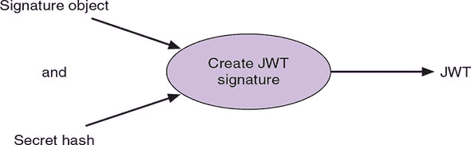

这段代码有一个问题：密钥不应该可见，这会引发安全问题。你将在下一节中解决这个问题。

##### 使用环境变量保持密钥的秘密

如果你打算在版本控制中推送你的代码（例如在 GitHub 中），你不想将密钥发布出去。泄露你的密钥会大大削弱你的安全模型。有了你的密钥，任何人都可以发布假令牌，你的应用程序会认为它们是真实的。为了保持秘密的秘密，通常将它们设置为环境变量是一个好主意。

这是一种简单的技术，让你可以在机器上的代码中跟踪环境变量。首先，在项目的根目录中创建一个名为 .env 的文件，并按如下设置密钥：

```
JWT_SECRET=thisIsSecret
```

在这种情况下，密钥是 `thisIsSecret`，但它可以是您想要的任何字符串，只要它是一个字符串。接下来，您需要确保这个文件不会被包含在任何 Git 提交中，通过在项目的 `.gitignore` 文件中添加一行来实现。如果您正在跟随 GitHub 上的代码，这一行已经就位；如果没有，您需要添加它。至少，`.gitignore` 文件应该包含以下内容：

```
# Dependency directory
node_modules
# Environment variables
.env
```

为了读取和使用这个新文件来设置环境变量，您需要安装并使用一个名为 `dotenv` 的新 npm 模块。在终端中使用以下命令：

```
$ npm install dotenv --save
```

`dotenv` 模块应该作为文件的第一行被 `require` 到 `app.js` 文件中，如下所示：

```
require('dotenv').load();
const express = require('express');
```

现在剩下的就是更新用户模式，用环境变量替换硬编码的密钥，如下列所示，并加粗显示。

##### 列表 11.6\. 使用环境设置更新 `generateJwt`

```
userSchema.methods.generateJwt = () => {
  const expiry = new Date();
  expiry.setDate(expiry.getDate() + 7);
  return jwt.sign({
    _id: this._id,
    email: this.email,
    name: this.name,
    exp: parseInt(expiry.getTime() / 1000),
  }, process.env.JWT_SECRET);                *1*
};
```

+   ***1* 不要在代码中保留密钥；使用环境变量代替。**

您的生产环境也需要了解这个环境变量。您可能还记得在 Heroku 上设置数据库 URI 时的命令。这里也是一样，所以在终端中运行以下命令：

```
$ heroku config:set JWT_SECRET=thisIsSecret
```

这就是最后一步。

在 MongoDB 和 Mongoose 方面处理完毕后，接下来您将查看如何使用 Passport 来管理身份验证。

### 11.3\. 使用 Passport 创建身份验证 API

Passport 是由 Jared Hanson 开发的一个 Node 模块，旨在使 Node 中的身份验证变得简单。其关键优势之一是它可以适应多种身份验证方法，称为 *策略*。这些策略的例子包括

+   Facebook

+   Twitter

+   OAuth

+   本地用户名和密码

您可以在 npm 网站上通过搜索 *passport* 找到更多策略。使用 Passport，您可以轻松地使用这些方法之一或多个，让用户登录到您的应用程序。对于 Loc8r，您将使用 *local* 策略，因为您在数据库中存储用户名和密码散列。您将首先安装模块。

#### 11.3.1\. 安装和配置 Passport

Passport 被分离成一个核心模块和针对每个策略的独立模块。您将通过 npm 安装核心模块和本地策略模块，在终端中使用以下命令：

```
$ npm install –-save passport passport-local
```

当这两个模块都安装完毕后，您可以创建本地策略的配置。

##### 创建 Passport 配置文件

这是您应用程序中将使用 Passport 的 API，因此您将在 `app_api` 文件夹内创建配置。在 `app_api` 内，创建一个名为 `config` 的新文件夹，并在该文件夹内创建一个名为 `passport.js` 的新文件。

在此文件顶部，`require` Passport 和本地策略模块，以及 Mongoose 和用户模型：

```
const passport = require('passport');
const LocalStrategy = require('passport-local').Strategy;
const mongoose = require('mongoose');
const User = mongoose.model('User');
```

现在您可以配置本地策略了。

##### 配置本地策略

要设置 Passport 策略，您使用`passport.use`方法并传递一个新的策略构造函数。此构造函数接受一个选项参数和一个执行大部分工作的函数。使用 Passport 策略的骨架如下所示：

```
passport.use(new LocalStrategy({},
  (username, password, done) => {
  }
));
```

默认情况下，Passport 本地策略期望并使用字段`username`和`password`。您有`password`，所以这一点没问题，但您使用的是`email`而不是`username`。Passport 允许您在选项对象中覆盖用户名字段，如下面的代码片段所示：

```
passport.use(new LocalStrategy({
    usernameField: 'email'
  },
  (username, password, done) => {
  }
));
```

接下来是主函数，这是一个 Mongoose 调用，用于根据函数中提供的用户名和密码查找用户。您的 Mongoose 函数需要执行以下操作：

+   根据提供的电子邮件地址查找用户。

+   检查密码是否有效。

+   如果找到用户且密码有效，则返回用户对象。

+   否则，返回一个说明错误的消息。

由于电子邮件地址在模式中设置为唯一，您可以使用 Mongoose 的`findOne`方法。另一个需要注意的有趣点是，您将使用您之前创建的`validPassword`模式方法来检查提供的密码是否正确。

以下列表显示了本地策略的完整内容。

##### 列表 11.7\. 完整的 Passport 本地策略定义

```
passport.use(new LocalStrategy({
    usernameField: 'email'
  },
  (username, password, done) => {
    User.findOne({ email: username }, (err, user) => {       *1*
      if (err) { return done(err); }
      if (!user) {                                           *2*
        return done(null, false, {                           *2*
          message: 'Incorrect username.'                     *2*
        });                                                  *2*
       }
      if (!user.validPassword(password)) {                   *3*
        return done(null, false, {                           *4*
          message: 'Incorrect password.'                     *4*
        });                                                  *4*
      }
      return done(null, user);                               *5*
    });
  }
));
```

+   ***1* 在 MongoDB 中搜索提供的电子邮件地址的用户**

+   ***2* 如果没有找到用户，返回 false 和消息**

+   ***3* 调用 validPassword 方法，传递提供的密码**

+   ***4* 如果密码不正确，返回 false 和消息**

+   ***5* 如果您已经到达了末尾，您可以返回用户对象。**

现在您已经安装了 Passport 并配置了策略，您需要将其注册到应用程序中。

##### 将护照和配置添加到应用程序中

要将您的护照设置添加到应用程序中，您需要在 app.js 中执行以下三个步骤：

+   需要 Passport。

+   需要策略配置。

+   初始化 Passport。

这些事情都没有什么复杂的；重要的是它们在 app.js 中的位置。

Passport 应该在模型定义之前需要策略，在模型定义之后配置配置。两者都应该在定义路由之前就位。如果您稍微重新组织 app.js 的顶部，就可以引入 Passport 和配置，如下面的列表所示。

##### 列表 11.8\. 将 Passport 引入 Express

```
require('dotenv').load();
const createError = require('http-errors');
const express = require('express');
const path = require('path');
const favicon = require('serve-favicon');
const logger = require('morgan');
const cookieParser = require('cookie-parser');
const bodyParser = require('body-parser');
const passport = require('passport');         *1*
require('./app_api/models/db');
require('./app_api/config/passport');         *2*
```

+   ***1* 在模型定义之前需要 Passport**

+   ***2* 在模型定义之后需要策略**

策略需要在模型定义之后定义，因为它需要用户模型存在。

Passport 应该在定义了静态路由之后和将要使用身份验证的路由（在您的案例中是 API 路由）之前在 app.js 中初始化，以便 Express 可以按需应用身份验证中间件。以下列表显示了已放置的`passport`中间件。

##### 列表 11.9\. 添加`passport`中间件

```
app.use(express.static(path.join(__dirname, 'public')));
app.use(express.static(path.join(__dirname, 'app_public', 'build')));
app.use(passport.initialize());                                        *1*
...
app.use('/api', apiRouter);
```

+   ***1* 初始化 Passport 并将其添加为中间件**

你需要做的最后一件事是更新 `Access-Control-Allow-Headers`，以确保应用程序这两个部分之间 CORS 正确运行。

##### 列表 11.10\. 更新 CORS 设置

```
app.use('/api', (req, res, next) => {
  res.header('Access-Control-Allow-Origin', 'http://localhost:4200');
  res.header('Access-Control-Allow-Headers', 'Origin, X-Requested-With,
  Content-Type, Accept, Authorization');                               *1*
  next();
});
```

+   ***1* 添加授权为可接受的头信息**

这样一来，Passport 就已安装、配置并初始化在你的应用程序中。接下来，你将创建允许用户注册和登录的 API 端点。

#### 11.3.2\. 创建返回 JWT 的 API 端点

为了使用户能够通过你的 API 登录和注册，你需要两个新的端点。你需要添加两个新的路由定义和两个新的相应控制器。当你有了端点，你可以使用 Postman 测试它们，并使用 Mongo shell 查看数据库来验证注册端点是否工作。首先，你将添加路由。

##### 添加身份验证路由定义

API 的路由定义存储在 `app_api/routes` 目录下的 index.js 文件中，所以你将从那里开始。你的控制器被分成逻辑集合——目前是位置和评论。添加一个用于身份验证的第三个集合是有意义的。以下片段显示了在文件顶部添加了这个集合：

```
const ctrlLocations = require('../controllers/locations');
const ctrlReviews = require('../controllers/reviews');
const ctrlAuth = require('../controllers/authentication');
```

你还没有创建这个 controllers/authentication 文件；你将在编写相关控制器时创建它。

接下来，将路由定义本身添加到文件的末尾（但在 `module.exports` 行之前）。你需要两个，一个用于注册，一个用于登录，分别创建在 /api/register 和 /api/login：

```
router.post('/register', ctrlAuth.register);
router.post('/login', ctrlAuth.login);
```

这些定义必须是 `post` 动作，因为它们正在接受数据。还请记住，你不需要指定路由中的 /api 部分，这部分是在 app.js 中引入路由时添加的。

现在你需要添加控制器，然后才能进行测试。

##### 创建注册控制器

我们首先看看 `register` 控制器。首先，你将创建路由定义中指定的文件。在 `app_api/controllers` 文件夹中，创建一个名为 authentication.js 的新文件，并输入以下内容以引入你需要的东西。

##### 列表 11.11\. 导入 `register` 控制器所需的依赖

```
const passport = require('passport');
const mongoose = require('mongoose');
const User = mongoose.model('User');
```

注册过程完全不使用 Passport。你可以使用 Mongoose 做你需要的事情，因为你已经在模式上设置了各种辅助方法。

`register` 控制器需要执行以下操作：

1.  验证是否已发送所需的字段。

1.  创建 `User` 的新模型实例。

1.  设置用户的姓名和电子邮件地址。

1.  使用 `setPassword` 方法创建并添加盐和散列。

1.  保存用户。

1.  保存时返回 JWT。

这个列表看起来有很多事情要做，但幸运的是，一切都很简单；你已经通过创建 Mongoose 方法完成了艰苦的工作。现在，你需要将一切联系起来。以下列表显示了 `register` 控制器的完整代码。

##### 列表 11.12\. `register` 控制器用于 API

```
const register = (req, res) => {
  if (!req.body.name || !req.body.email || !req.body.password) {     *1*
    return res                                                       *1*
      .status(400)                                                   *1*
      .json({"message": "All fields required"});                     *1*
  }                                                                  *1*
  const user = new User();                                           *2*
  user.name = req.body.name;                                         *2*
  user.email = req.body.email;                                       *2*
  user.setPassword(req.body.password);                               *3*
  user.save((err) => {                                               *4*
    if (err) {
      res
       .status(404)
       .json(err);
    } else {
      const token = user.generateJwt();                              *5*
      res                                                            *5*
        .status(200)                                                 *5*
        .json({token});                                              *5*
    }
  });
};

module.exports = {
  register
};
```

+   ***1* 如果找不到所有必需的字段，则返回错误状态**

+   ***2* 创建一个新的用户实例，并设置名称和电子邮件**

+   ***3* 使用`setPassword`方法设置盐和哈希**

+   ***4* 将新用户保存到 MongoDB**

+   ***5* 使用模式方法生成 JWT，并将其发送到浏览器**

在这段代码中，没有什么特别新颖或复杂，但它突出了 Mongoose 方法的力量。如果所有内容都内联编写，这个注册控制器可能会很复杂，如果你从这里开始而不是从 Mongoose 开始，这可能会很有吸引力。但正如它现在所展示的，控制器易于阅读和理解，这正是你想要的代码。

接下来，你将创建登录控制器。

##### 创建登录控制器

`login` 控制器依赖于 Passport 来完成困难的工作。你将首先验证是否已填写所有必需的字段，然后将一切交给 Passport。Passport 会执行其操作——尝试使用你指定的策略来验证用户，然后告诉你是否成功。如果成功，你可以再次使用`generateJwt`模式方法来创建 JWT，然后再将其发送到浏览器。

所有这些，包括启动`passport.authenticate`方法所需的语法，都在下一个列表中展示。这段代码应添加到新的 authentication.js 文件中。

##### 列表 11.13\. `login` 控制器用于 API

```
const login = (req, res) => {
  if (!req.body.email || !req.body.password) {              *1*
    return res                                              *1*
      .status(400)                                          *1*
      .json({"message": "All fields required"});            *1*
  }
  passport.authenticate('local', (err, user, info) => {     *2*
    let token;
    if (err) {                                              *3*
      return res                                            *3*
        .status(404)                                        *3*
        .json(err);                                         *3*
    }
    if (user) {                                             *4*
      token = user.generateJwt();                           *4*
      res                                                   *4*
        .status(200)                                        *4*
        .json({token});                                     *4*
    } else {                                                *5*
      res                                                   *5*
        .status(401)                                        *5*
        .json(info);                                        *5*
    }
  })(req, res);                                             *6*
};
```

+   ***1* 验证是否已提供所有必需的字段**

+   ***2* 将策略名称和回调传递给认证方法**

+   ***3* 如果 Passport 返回错误，则返回错误**

+   ***4* 如果 Passport 返回了一个用户实例，则生成并发送 JWT**

+   ***5* 否则，返回一个信息消息（为什么认证失败）**

+   ***6* 确保 req 和 res 对 Passport 可用**

在文件的底部将`login`函数添加到模块导出中，在`register`函数下方：

```
module.exports = {
      register,
      login
};
```

在`login`控制器中，你可以看到，所有复杂的工作再次被抽象出来，这次主要是通过 Passport。代码易于阅读、遵循和理解，这应该是你编码时的一个目标。现在，你已经构建了 API 中的这两个端点，你应该测试它们。

##### 测试端点并检查数据库

当你在第六章中构建 API 的大部分内容时，你使用 Postman 测试了端点。你在这里也可以这样做。图 11.10 显示了测试注册端点及其如何返回 JWT。要测试的 URL 是 http://localhost:3000/api/register，创建`name`、`email`和`password`的表单字段。请记住选择`x-www-form-urlencoded`表单类型。

##### 图 11.10\. 在 Postman 中尝试/api/register 端点，成功时返回 JWT

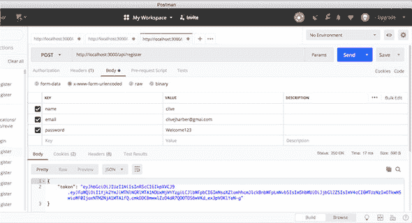

图 11.11 显示了登录端点的测试，包括返回 Passport 错误消息以及成功时的 JWT。此测试的 URL 为 http://localhost:3000/api/login，需要`email`和`password`表单字段。

##### 图 11.11. 使用 Postman 中的 api/login 端点，测试正确的凭据

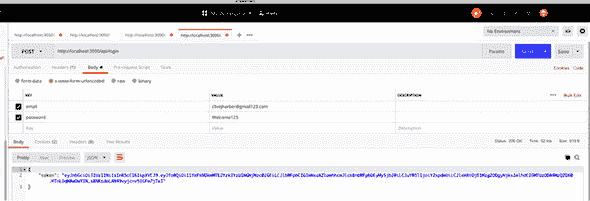

除了在浏览器中看到当预期时返回 JWT 之外，你还可以查看数据库以查看用户是否已被创建。你将回到 Mongo shell，这是你一段时间没有使用过的：

```
$ mongo
> use Loc8r
> db.users.find()
```

或者，你可以通过指定电子邮件地址来查找特定用户：

```
> db.users.find({email : "simon@fullstacktraining.com"})
```

无论你使用哪种方法，你都应从数据库中看到一个或多个用户文档返回，看起来像以下列表。

##### 列表 11.14. 可能的数据库响应

```
{ "hash" :
     "1255e9df3daa899bee8d53a42d4acf3ab8739fa758d533a84da5eb1278412f7a7bdb36e
     888aeb80a9eec4fb7bbe9bcef038f01fbbf4e6048e2f4494be44bc3d5", "salt" :
     "40368d9155ea690cf9fc08b49f328e38", "email" :
     "simon@fullstacktraining.com", "name" : "Simon Holmes", "_id" :
     ObjectId("558b95d85f0282b03a603603"), "__v" : 0 }
```

我们将路径名称加粗以使其在打印时更容易识别，但你应该能够看到所有预期的数据。

现在你已经创建了端点以使用户能够注册和登录，接下来你要查看的是如何限制某些端点只对认证用户开放。

### 11.4. 确保相关 API 端点安全

在 Web 应用程序中，限制对 API 端点的访问仅限于认证用户是一个常见需求。例如，在 Loc8r 中，你想要确保只有注册用户可以留下评论。这个过程有两个部分：

+   只允许发送有效 JWT 的用户调用新的评论 API。

+   在控制器内部，验证用户是否存在并且可以创建评论。

你将从向 Express 中的路由添加认证开始。

#### 11.4.1. 向 Express 路由添加认证中间件

在 Express 中，你可以将中间件添加到路由中，你很快就会看到。这个中间件位于路由和控制器之间。当调用路由时，中间件在控制器之前被激活，可以阻止控制器运行或更改发送的数据。

你想要使用中间件来验证提供的 JWT，然后提取有效载荷数据并将其添加到`req`对象中供控制器使用。不出所料，有一个 npm 模块可用于此目的：`express-jwt`。现在，在终端中使用以下命令安装它：

```
$ npm install --save express-jwt
```

现在，你可以在路由文件中使用此模块。

##### 设置中间件

要使用`express-jwt`，你需要`require`它并对其进行配置。当包含时，`express-jwt`会暴露一个函数，你可以传递一个选项对象，你将使用它来发送密钥，并指定你想要添加到`req`对象中以保存有效载荷的属性名称。

默认添加到`req`的属性是`user`，但在你的代码中，`user`是 Mongoose `User`模型的实例，因此将其设置为`payload`以避免混淆并保持一致性。毕竟，`user`是 Passport 和 JWT 中的称呼。

打开 API 路由文件，app_api/routes/index.js，并将设置添加到文件顶部，如下所示，加粗显示。

##### 列表 11.15\. 将 JWT 添加到 app_api/routes/locations.js

```
const express = require('express');
const router = express.Router();
const jwt = require('express-jwt');        *1*
const auth = jwt({
  secret: process.env.JWT_SECRET,          *2*
  userProperty: 'payload'                  *3*
});
```

+   ***1* 需要 express-jwt 模块**

+   ***2* 使用与之前相同的环境变量设置密钥**

+   ***3* 在 req 上定义一个属性作为负载**

现在中间件已配置，你可以将身份验证添加到路由中。

##### 将身份验证中间件添加到特定路由

将中间件添加到路由定义中很简单。在路由和控制器之间引用路由命令。它确实位于中间！

以下代码片段显示了如何将中间件添加到`post`、`put`和`delete`评论方法中，同时保留`get`开放；评论应该对公众可读。

##### 列表 11.16\. 更新`routing`以使用`jwt`模块

```
router
    .route('/locations/:locationid/reviews')
    .post(auth, ctrlReviews.reviewsCreate);                   *1*
router
    .route('/locations/:locationid/reviews/:reviewid')
    .get(ctrlReviews.reviewsReadOne)
    .put(auth, ctrlReviews.reviewsUpdateOne)                  *1*
    .delete(auth, ctrlReviews.reviewsDeleteOne);              *1*
```

+   ***1* 将身份验证中间件添加到路由定义中**

因此，中间件已配置并应用。一会儿你将看到如何在控制器中使用它，但首先，你将看到如何处理中间件拒绝的无效令牌。

##### 处理身份验证拒绝

当提供的令牌无效或可能不存在时，中间件抛出错误以防止代码继续执行。你需要捕获这个错误并返回未授权消息和状态（401）。

将新错误处理器添加到 app.js 中的最佳位置是与其他错误处理器一起。你将将其添加为第一个错误处理器，以便通用处理器不会拦截它。以下列表显示了要添加到 app.js 中的新错误处理器。

##### 列表 11.17\. 捕获错误

```
// error handlers
// Catch unauthorised errors
app.use((err, req, res, next) => {
  if (err.name === 'UnauthorizedError') {         *1*
    res
      .status(401)
      .json({"message" : err.name + ": " + err.message});
  }
});
```

+   ***1* 确保你正在处理未授权错误**

在配置就绪并重新启动应用程序后，你可以再次使用 Postman 测试拒绝是否发生，这次提交一个评论。你可以使用首次测试 API 时使用的相同`POST`请求，其结果如图 11.12 所示。

##### 图 11.12\. 尝试在没有有效 JWT 的情况下添加评论现在会导致 401 响应。

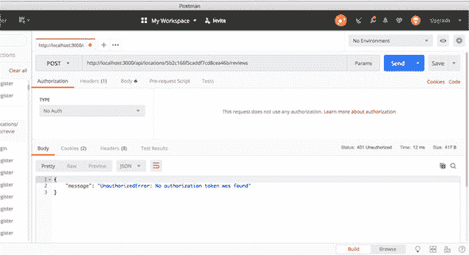

如预期的那样，尝试调用没有包含有效 JWT 的新受保护 API 端点将返回未授权状态和消息，这正是你想要的。接下来，你将进入当请求被中间件授权并继续到控制器时会发生什么。

#### 11.4.2\. 在控制器中使用 JWT 信息

在本节中，你将了解如何使用 Express 中间件提取的 JWT 数据，并将其添加到`req`对象中。你将使用电子邮件地址从数据库中获取用户名并将其添加到评论文档中。

##### 只有当用户存在时才运行主控制器代码

如列表 11.18 所示，首先需要做的是获取`reviewsCreate`控制器，并将内容包装在一个新的函数中，你将调用它为`getAuthor`。这个新函数应该接受`req`和`res`对象，以及现有的控制器代码作为一个回调。

`getAuthor`函数的整个目的是验证用户是否存在于数据库中，并返回用户名以供控制器使用。因此，你可以将其作为`userName`传递给回调，然后将其传递给`app_api/controllers/review.js`中的`doAddReview`函数。

##### 列表 11.18\. 更新创建评论控制器以首先获取用户名

```
const reviewsCreate = (req, res) => {
  getAuthor(req, res, callback) => {
    (req, res, userName) => {                              *1*
      const locationId = req.params.locationid;
      if (locationId) {
        Loc
          .findById(locationId)
          .select('reviews')
          .exec((err, location) => {
             if (err) {
               return res
                 .status(400)
                 .json(err);
            } else {
              doAddReview(req, res, location, userName);     *2*
             }
           });
      } else {
        res
          .status(404)
          .json({message": "Location not found"});
      }
    });                                                      *3*
};
```

+   ***1* 调用 getAuthor 函数，并将原始控制器代码作为回调传递；将用户名传递给回调**

+   ***2* 将用户名传递给 doAddReview 函数**

+   ***3* 关闭 getAuthor 函数**

查看这个列表可以突出显示你仍然需要做的两件事：编写`getAuthor`函数，并更新`doAddReview`函数。首先，你将编写`getAuthor`函数，这样你就可以看到如何获取 JWT 数据。

##### 验证用户并返回名称

`getAuthor` 函数的想法是验证电子邮件地址是否与系统中的用户相关联，并返回要使用的名称。它需要执行以下操作：

+   检查`req`对象中是否有电子邮件地址。

+   使用电子邮件地址查找用户。

+   将用户名发送到回调函数。

+   捕获错误并发送适当的消息。

`getAuthor` 函数的完整代码在列表 11.19 中。首先需要检查`req`上的`payload`属性，然后检查它是否具有`email`属性。记住，`payload`是你在向 Express 路由添加身份验证时指定的属性。之后，使用`req.payload.email`在 Mongoose 查询中，如果成功，将用户名传递给回调函数。

##### 列表 11.19\. 使用 JWT 数据查询数据库

```
const User = mongoose.model('User');                 *1*
const getAuthor = (req, res, callback) => {
  if (req.payload && req.payload.email) {            *2*
    User
      .findOne({ email : req.payload.email })         *3*
      .exec((err, user) => {
        if (!user) {
          return res
            .status(404)
            .json({"message": "User not found"});
        } else if (err) {
          console.log(err);
          return res
            .status(404)
            .json(err);
         }
        callback(req, res, user.name);                *4*
       });
  } else {
    return res
      .status(404)
      .json({"message": "User not found"});
  }
};
```

+   ***1* 确保用户模型可用**

+   ***2* 验证 JWT 信息是否在请求对象上**

+   ***3* 使用电子邮件地址查找用户**

+   ***4* 运行回调，传递用户名**

现在当回调被调用时，它运行控制器中的原始代码，找到一个位置并将信息传递给`doAddReview`函数。它现在也将用户名传递给函数，所以快速更新`doAddReview`以使用用户名并将其添加到评论文档中。

##### 在评论中设置用户的名称

`doAddReview` 函数的更改很简单，如列表 11.20 所示。你之前已经保存了评论的`author`，从`req.body .author`获取数据。现在，你有一个参数被传递给函数，可以使用这个参数。更新内容以粗体显示。

##### 列表 11.20\. 在评论中保存用户名

```
const doAddReview = (req, res, location, author) => {      *1*
  if (!location) {
    res
      .status(404)
      .json({"message": "Location not found"});
  } else {
    const {rating, reviewText} = req.body;                 *2*
    location.reviews.push({
      author,                                              *2*
      rating,
      reviewText
    });
    location.save((err, location) => {
      if (err) {
        return res
          .status(400)
          .json(err);
      } else {
        updateAverageRating(location._id);
        const thisReview = location.reviews.slice(-1).pop();
        res
          .status(201)
          .json(thisReview);
      }
    });
  }
};
```

+   ***1* 在函数定义中添加一个作者参数**

+   ***2* 作者现在是从数据库而不是表单中获取的**

这个简单的更改使你完成了后端工作。你已经创建了一个新的用户模式，生成和消费 JWT，创建了一个身份验证 API，并保护了一些其他 API 路由。这已经很多了！

在第十二章中，你将处理前端并将其集成到 Angular 应用中。

### 摘要

在本章中，你学习了

+   如何在 MEAN 栈中处理身份验证

+   使用散列和盐加密密码

+   使用 Mongoose 模型方法向模式添加函数

+   如何使用 Express 创建 JSON Web Token

+   使用 Passport 在服务器上管理身份验证

+   仅对经过身份验证的用户在 Express 中提供路由

## 第十二章\. 在 Angular 应用中使用身份验证 API

*本章涵盖*

+   使用本地存储和 Angular 管理用户会话

+   在 Angular 中管理用户会话

+   在 Angular 应用中使用 JWT

在本章中，你将集成在第十一章（kindle_split_024.xhtml#ch11）中完成的通过 API 进行身份验证的工作，并在你的 Angular 应用中使用 API 端点。具体来说，你将了解如何使用 Angular HTTP 客户端库和 `localStorage`。

### 12.1\. 创建 Angular 身份验证服务

在 Angular 应用中，就像任何其他应用一样，很可能会在整个应用中需要身份验证。显然的做法是创建一个可以在任何需要的地方使用的身份验证服务。这个服务应该负责与身份验证相关的一切，包括保存和读取 JWT、返回关于当前用户的信息，以及调用登录和注册 API 端点。

你将从查看如何管理用户会话开始。

#### 12.1.1\. 在 Angular 中管理用户会话

假设用户刚刚登录，API 返回了一个 JWT。你应该对令牌做什么？因为你正在运行一个单页应用（SPA），你可以将其保存在浏览器的内存中。这种方法是可以的，除非用户决定刷新页面，这会重新加载应用程序，丢失内存中的所有内容——这不是理想的情况。

接下来，你将考虑将令牌保存在一个更健壮的地方，以便应用程序在需要时可以读取它。问题是是否使用 cookies 或本地存储。

##### Cookies 与本地存储的比较

在 Web 应用中保存用户数据的传统方法是将 cookie 保存下来，这当然是一个选择。但 cookies 是供服务器应用使用的，每次向服务器发送请求时，都会在 HTTP 头部发送 cookies 以供读取。在 SPA 中，你不需要 cookies；API 端点是无状态的，不会获取或设置 cookies。

你需要另寻他处，转向本地存储，它是为客户端应用程序设计的。使用本地存储，数据会保留在浏览器中，并且不会像 cookies 那样自动与请求一起传输。

使用 JavaScript，本地存储也很容易使用。看看下面的代码片段，它将设置和获取一些数据：

```
window.localStorage['my-data'] = 'Some information';
window.localStorage['my-data']; // Returns 'Some information'
```

对了，这样我们就确定了；你将在 Loc8r 中使用本地存储来保存 JWT。如果 `localStorage` 不熟悉，请访问 Mozilla 开发者文档 [`mng.bz/0WKz`](http://mng.bz/0WKz) 以获取更多信息。

为了便于在 Angular 应用程序中使用 `localStorage`，你首先创建一个名为 `BROWSER_STORAGE` 的 `Injectable`，你可以在组件中使用它。你将连接到 `localStorage`，但你将通过一个工厂服务来实现，该服务被注入到需要访问 `localStorage` 的组件中。

首先，生成类文件

```
$ ng generate class storage
```

并将以下代码放入其中。

##### 列表 12.1\. storage.ts

```
import { InjectionToken } from '@angular/core';                 *1*

export const BROWSER_STORAGE = new InjectionToken<Storage>      *2*
('Browser Storage',{                                          *2*
  providedIn: 'root',
  factory: () => localStorage                                   *3*
});
```

+   ***1* 使用 InjectionToken 类**

+   ***2* 创建新的 InjectionToken**

+   ***3* 包装 localStorage 的工厂函数**

##### 创建一个服务以在本地存储中保存和读取 JWT

你将通过创建将 JWT 保存到本地存储并再次读取的方法来开始构建身份验证服务。你已经看到了在 JavaScript 中与 `localStorage` 一起工作是多么容易，所以现在你需要将其包装在一个 Angular 服务中，该服务公开两个方法：`saveToken()` 和 `getToken()`。这里没有真正的惊喜，但 `saveToken()` 方法应该接受要保存的值，而 `getToken()` 应该返回一个值。

首先，在 Angular 应用程序中生成一个名为 `Authentication` 的新服务：

```
$ ng generate service authentication
```

以下列表显示了新服务的内 容，包括前两个方法。

##### 列表 12.2\. 使用前两个方法创建 `authentication` 服务

```
import { Inject, Injectable } from '@angular/core';
import { BROWSER_STORAGE } from './storage';

@Injectable({
  providedIn: 'root'
})
export class AuthenticationService {

  constructor(@Inject(BROWSER_STORAGE) private storage: Storage) { }   *1*

  public getToken(): string {                                          *2*
    return this.storage.getItem('loc8r-token');                        *2*
  }

  public saveToken(token: string): void {                              *3*
    this.storage.setItem('loc8r-token', token);                        *3*
  }
}
```

+   ***1* 注入 BROWSER_STORAGE 包装器**

+   ***2* 创建获取令牌的函数**

+   ***3* 创建 saveToken 函数**

这样你就有一个简单的服务来处理将 `loc8r-token` 保存到 `localStorage` 并再次读取出来。接下来，你将查看登录和注册。

#### 12.1.2\. 允许用户注册、登录和登出

要使用该服务让用户注册、登录和登出，你需要添加三个更多的方法。从注册和登录开始。

##### 调用 API 进行注册和登录

你需要两个方法来注册和登录，这两个方法将表单数据发送到本章前面创建的 `register` 和 `login` API 端点。当成功时，这两个端点都返回 JWT，因此你可以使用 `saveToken` 方法来保存它们。

为了准备，你需要生成两个简单的辅助类来帮助管理你在应用程序中需要的数据——一个 `User` 类 (列表 12.3) 和一个 `AuthResponse` 类 (列表 12.4)：

```
$ ng generate class user
$ ng generate class authresponse
```

以下两个列表显示了您将使用来维护给定数据的简单类。列表 12.3 提供了您的 `User` 类定义，这是一个简单的类，用于存储名称和电子邮件作为字符串。

##### 列表 12.3\. user.ts

```
export class User {
  email: string;        *1*
  name: string;         *1*
}
```

+   ***1* 告诉 TypeScript 你在这里需要字符串**

列表 12.4 提供了您的 `AuthResponse` 对象的定义，此时它包含令牌字符串。

##### 列表 12.4\. authresponse.ts

```
export class AuthResponse {
  token: string;              *1*
}
```

+   ***1* 将令牌设置为字符串**

使用这些类，您可以将前面提到的 `register()` 和 `login()` 方法添加到身份验证服务中，如下一个列表所示。由于这些方法依赖于 Loc8rDataService，您也将注入它。

##### 列表 12.5\. authentication.service.ts

```
import { Inject, Injectable } from '@angular/core';
import { BROWSER_STORAGE } from './storage';
import { User } from './user';                             *1*
import { AuthResponse } from './authresponse';             *1*
import { Loc8rDataService } from './loc8r-data.service';   *1*

@Injectable({
  providedIn: 'root'
})
export class AuthenticationService {

  constructor(
    @Inject(BROWSER_STORAGE) private storage: Storage,
    private loc8rDataService: Loc8rDataService             *2*
  ) { }

  ...

  public login(user: User): Promise<any> {                 *3*
    return this.loc8rDataService.login(user)
      .then((authResp: AuthResponse) => this.saveToken(authResp.token));
  }

  public register(user: User): Promise<any> {              *4*
    return this.loc8rDataService.register(user)
      .then((authResp: AuthResponse) => this.saveToken(authResp.token));
  }
}
```

+   ***1* 导入相关类和服务**

+   ***2* 注入数据服务**

+   ***3* 登录函数**

+   ***4* 注册函数**

快速查看您添加的两个方法。您正在做的是为即将编写的 `login()` 和 `register()` 方法提供一个包装器，并确保返回一个 Promise，以便可以将数据传递回 UI。您不必关心 Promise 中的内容——只需确保它被返回。然后，使用已存在的函数保存 `AuthResponse` 对象中的 `token`。

最后，您需要将前面提到的、与 API 端点通信所需的方法添加到 `Loc8rDataService` 中。下一个列表中的更改以粗体显示。

##### 列表 12.6\. `Loc8rDataService` 的更改

```
import { Injectable } from '@angular/core';
import { HttpClient, HttpHeaders } from '@angular/common/http';
import { Location, Review } from './location';
import { User } from './user';                                 *1*
import { AuthResponse } from './authresponse';                 *1*

@Injectable({
  providedIn: 'root'
})
export class Loc8rDataService {

...

  public login(user: User): Promise<AuthResponse> {            *2*
    return this.makeAuthApiCall('login', user);
  }

  public register(user: User): Promise<AuthResponse> {         *3*
    return this.makeAuthApiCall('register', user);
  }

  private makeAuthApiCall(urlPath: string, user: User):
  Promise<AuthResponse> {                                    *4*
    const url: string = `${this.apiBaseUrl}/${urlPath}`;
    return this.http
      .post(url, user)                                         *5*
      .toPromise()                                             *5*
      .then(response => response as AuthResponse)
      .catch(this.handleError);
  }

  ...
}
```

+   ***1* User 和 AuthResponse 类的导入**

+   ***2* 登录方法返回 AuthResponse Promise**

+   ***3* 注册方法返回 AuthResponse Promise**

+   ***4* 实际调用。登录和注册足够相似，可以做到 DRY。**

+   ***5* 使用 HttpClient POST 请求 Observable，并将其转换为 Promise 对象**

在 `login` 和 `register` 的两种情况下对 API 的调用基本上是相同的调用；唯一的区别是您需要击中的 URL 以执行所需的操作。在 列表 12.6 中，您 `POST` 一个包含您尝试使用的用户详细信息的有效负载，并在成功时返回 `AuthResponse` 对象或在失败时处理错误。为此，您有一个私有方法 (`makeAuthApiCall()`) 来管理调用，以及公共方法 `login()` 和 `register()` 来处理您想要调用的特定 API 端点 URL 的具体细节。

使用这些方法，您可以处理注销。

##### 删除 localStorage 以注销

在 Angular 应用程序中，用户会话是通过在 `localStorage` 中保存 JWT 来管理的。如果令牌存在，有效，并且尚未过期，则可以说用户已登录。您无法从 Angular 应用程序内部更改令牌的过期日期；只有服务器才能这样做。您可以做的只是删除它。

为了让用户能够注销，您可以在认证服务中创建一个新的`logout`方法来删除 Loc8r JWT。

##### 列表 12.7\. 从位置存储中删除令牌

```
  public logout(): void {
    this.storage.removeItem('loc8r-token');        *1*
  }
```

+   ***1* 从 localStorage 中删除令牌**

此代码从浏览器的`localStorage`中删除`loc8r-token`项。

现在您有了从服务器获取 JWT、将其保存到`localStorage`、从`localStorage`读取它以及删除它的方法。下一个问题是如何在应用程序中使用它来查看用户是否已登录以及从中获取数据。

#### 12.1.3\. 在 Angular 服务中使用 JWT 数据

存储在浏览器`localStorage`中的 JWT 是您用来管理用户会话的。JWT 用于验证用户是否已登录。如果用户已登录，应用程序还可以读取存储在其中的用户信息。

首先，添加一个方法来检查某人是否已登录。

##### 检查登录状态

要检查用户是否当前已登录到应用程序，您需要检查`loc8r-token`是否存在于`localStorage`中。您可以使用`getToken()`方法来完成此任务。但令牌的存在并不足够。请记住，JWT 中嵌入有过期数据，所以如果令牌存在，您还需要检查它。

JWT 的过期日期和时间是有效载荷的一部分，这是数据的第二部分。请记住，这部分是一个编码的 JSON 对象；它是编码而不是加密的，所以您可以解码它。实际上，我们已经讨论了执行此操作的功能：`atob`。

将一切组合在一起，您想要创建一个方法

1.  获取存储的令牌

1.  从令牌中提取有效载荷

1.  解码有效载荷

1.  验证过期日期是否已过

将此方法添加到`AuthenticationService`后，如果用户已登录则应返回`true`，如果没有则返回`false`。下一个列表显示了在名为`isLoggedIn()`的方法中的此行为。

##### 列表 12.8\. 认证服务的`isLoggedIn`方法

```
public isLoggedIn(): boolean {
  const token: string = this.getToken();                      *1*
    if (token) {                                              *2*
      const payload = JSON.parse(atob(token.split('.')[1]));  *2*
      return payload.exp > (Date.now() / 1000);               *3*
    } else {
      return false;
    }
  }
}
```

+   ***1* 从存储中获取令牌**

+   ***2* 如果令牌存在，获取有效载荷，解码它并将其解析为 JSON**

+   ***3* 验证过期是否已过**

这段代码不多，但功能很多。在您在服务中的`return`语句中引用它之后，应用程序可以快速在任何时候检查用户是否已登录。

要添加到认证服务的下一个和最后一个方法是从 JWT 中获取一些用户信息。

##### 从 JWT 中获取用户信息

您希望应用程序能够从 JWT 中获取用户的电子邮件地址和姓名。您在`isLoggedIn()`方法中看到了如何从令牌中提取数据，而您的新方法正是做同样的事情。

创建一个名为 `getCurrentUser()` 的新方法。此方法首先通过调用 `isLoggedIn()` 方法验证用户是否已登录。如果用户已登录，它通过调用 `getToken()` 方法获取令牌，然后在提取和解码有效负载后返回所需的数据。以下列表显示了其外观。

##### 列表 12.9\. `getCurrentUser()` 方法（authentication.service.ts）

```
public getCurrentUser(): User {                                     *1*
  if (this.isLoggedIn()) {                                          *2*
    const token: string = this.getToken();
    const { email, name } = JSON.parse(atob(token.split('.')[1]));
    return { email, name } as User;                                 *3*
  }
}
```

+   ***1* 返回用户类型**

+   ***2* 确保用户已登录**

+   ***3* 将对象类型转换为 User 类型**

完成这些后，Angular 身份验证服务就完成了。回顾一下代码，您可以看到它是通用的，并且很容易从一个应用程序复制到另一个应用程序。您可能需要更改的只是令牌的名称和 API 网址，因此您有一个很好的、可重用的 Angular 服务。

现在服务已添加到应用程序中，您可以使用它。继续前进，创建登录和注册页面。

### 12.2\. 创建注册和登录页面

您到目前为止所做的一切都很棒，但没有一种方式让网站访客注册和登录，那就毫无用处。所以这就是您现在要解决的问题。

在功能方面，您想要一个注册页面，新用户可以在其中设置他们的详细信息并注册，以及一个登录页面，用户可以在其中输入他们的用户名和密码。当用户完成这两个过程中的任何一个并且成功认证后，应用程序应将他们送回到他们开始过程时的页面。

在以下部分的末尾，您会期望您的注册页面看起来非常像图 12.1。

##### 图 12.1\. 注册页面

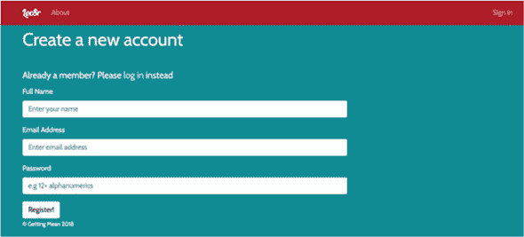

登录页面应类似于图 12.2。您将从注册页面开始。

##### 图 12.2\. 登录页面


#### 12.2.1\. 构建注册页面

为了开发一个可工作的注册页面，您需要做几件事情：

1.  创建 `register` 组件并将其添加到路由中。

1.  构建模板。

1.  完善组件主体，包括重定向。

当然，您完成之后会想要测试页面。

第 1 步是创建组件。使用 Angular 生成器：

```
$ ng generate component register
```

完成这些后，通过向 app_routing/app_routing.module.ts 中添加条目来修改应用程序路由。如以下列表所示，将 `register` 组件指向 /register 路由。

##### 列表 12.10\. 注册路由

```
import { NgModule } from '@angular/core';
import { CommonModule } from '@angular/common';
import { RouterModule, Routes } from '@angular/router';

import { AboutComponent } from '../about/about.component';
import { HomepageComponent } from '../homepage/homepage.component';
import { DetailsPageComponent } from '../details-page/details-page.
component';
import { RegisterComponent } from '../register/
register.component';                            *1*

const routes: Routes = [
...
  {                                               *2*
    path: 'register',
    component: RegisterComponent
  }
];

...
})
export class AppRoutingModule { }
```

+   ***1* 导入新创建的注册组件**

+   ***2* 添加路径信息**

完成这些后，查看组件模板的详细信息以及将此模板链接到您之前构建的服务的方法。

##### 构建注册模板

好的，现在您将构建注册页面的模板。除了正常的页眉和页脚外，您还需要一些其他东西。主要的是，您需要一个表单，允许访客输入他们的姓名、电子邮件地址和密码。在此表单中，您还应该有一个区域来显示任何错误。您还应该加入一个链接到登录页面，以防用户意识到他们已经注册了。

下一个列表显示了拼接在一起的模板。请注意，输入字段通过 `ngModel` 绑定到视图模型中的 `credentials`。

##### 列表 12.11\. 注册页面完整模板（register/register.component.html）

```
<app-page-header [content]="pageContent.header"></app-page-header>
<div class="row">
  <div class="col-12 col-md-8">
    <p class="lead">Already a member? Please <a routerLink="/login">
    log in</a> instead</p>                                             *1*
    <form (submit)="onRegisterSubmit()">
      <div role="alert" *ngIf="formErrors" class="alert alert-danger">
      {{ formError }}</div>                                            *2*
      <div class="form-group">
        <label for="name">Full Name</label>
        <input class="form-control" id="name" name="name" placeholder=
        "Enter your name" [(ngModel)]="credentials.name">              *3*
      </div>
      <div class="form-group">
        <label for="email">Email Address</label>
        <input type="email" class="form-control" id="email" name="email"
        placeholder="Enter email address" [(ngModel)]=
        "credentials.email">                                           *4*
      </div>
      <div class="form-group">
        <label for="password">Password</label>
        <input type="pasword" class="form-control" id="password"
        name="password" placeholder="e.g 12+ alphanumerics"
        [(ngModel)]="credentials.password">                            *5*
      </div>
      <button type="submit" role="button" class="btn
      btn-primary">Register!</button>
    </form>
  </div>
  <app-sidebar [content]="pageContent.sidebar"  class=
  "col-12 col-md-4"></app-sidebar>
</div>
```

+   ***1* 切换到登录页面的链接**

+   ***2* 用于显示错误的 <div>**

+   ***3* 用户名输入**

+   ***4* 电子邮件地址输入**

+   ***5* 密码输入**

再次，需要注意的是，用户的姓名、电子邮件和密码绑定在对象 `credentials` 中的视图模型中。

接下来，您查看另一面并编写组件方法。

##### 创建注册组件骨架

根据模板，您将在注册组件中设置一些事情。您需要页面标题的文本以及一个 `onRegisterSubmit()` 函数来处理表单提交。您还将为所有 `credentials` 属性提供一个默认空字符串值。

下一个列表显示了初始设置。

##### 列表 12.12\. 开始 `register` 组件

```
import { Component, OnInit } from '@angular/core';
import { Router } from '@angular/router';                            *1*
import { AuthenticationService } from '../authentication.service';   *2*

@Component({
  selector: 'app-register',
  templateUrl: './register.component.html',
  styleUrls: ['./register.component.css']
})
export class RegisterComponent implements OnInit {

  public formError: string = '';                                    *3*

  public credentials = {                                            *4*
    name: '',
    email: '',
    password: ''
  };

  public pageContent = {                                            *5*
    header: {
      title: 'Create a new account',
      strapline: ''
    },
    sidebar: ''
  };

  constructor(
    private router: Router,
    private authenticationService: AuthenticationService
  ) { }

  ngOnInit() {
  }
```

+   ***1* 从 Router 中导入所需的服务**

+   ***2* 导入认证服务**

+   ***3* 错误字符串初始化**

+   ***4* 保存模型数据的 `credentials` 对象**

+   ***5* 页面内容对象，用于常规页面数据**

这里没有新的内容——几个公共属性来管理组件的内部数据，以及注入您在组件中需要使用的服务。

将下一个列表的内容添加到您创建的组件中。

##### 列表 12.13\. 注册提交处理程序

```
  public onRegisterSubmit(): void {                                   *1*
    this.formError = '';
    if (
      !this.credentials.name ||                                       *2*
      !this.credentials.email ||                                      *2*
      !this.credentials.password                                      *2*
    ) {
      this.formError = 'All fields are required, please try again';   *3*
    } else {
      this.doRegister();
    }
  }

  private doRegister(): void {                                        *4*
    this.authenticationService.register(this.credentials)
      .then(() => this.router.navigateByUrl('/'))
      .catch((message) => this.formError = message);
  }
```

+   ***1* 提交事件处理程序**

+   ***2* 检查您是否已收到所有相关信息**

+   ***3* 发生错误时返回消息**

+   ***4* 执行注册**

在此代码到位后，您可以通过启动应用程序并转到 http://localhost:4200/register 来尝试注册页面和功能。

当您完成此操作并成功注册为用户后，打开浏览器开发工具，查找资源。如图 12.3 所示，您应该在本地存储文件夹下方看到 `loc8r-token`。

##### 图 12.3\. 在浏览器中找到 `loc8r-token`

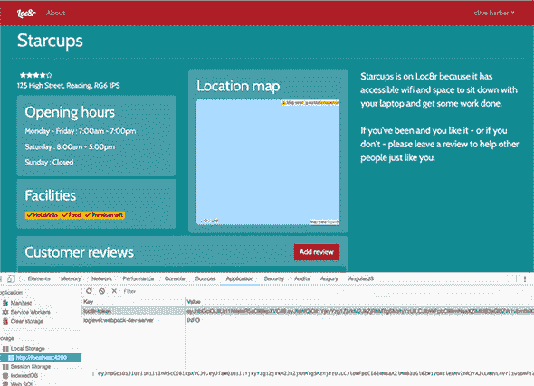

您已添加了新用户注册的功能。接下来，您将启用返回用户登录。

#### 12.2.2\. 构建 登录 页面

登录页面的方法与注册页面的方法类似。这里不应该有任何不熟悉的内容，所以您会快速浏览。

首先，生成新的组件：

```
$ ng generate component login
```

将以下内容添加到路由对象中（app-routing/app-routing.module.ts）：

```
{
  path: 'login',
  component: LoginComponent
}
```

在此代码到位后，你可以构建组件模板文件：login/login-component.html。你可以从路由中看到你希望此文件所在的位置。它与 `register` 模板类似，所以复制并编辑该模板可能最容易。你只需要删除名称输入框并更改一些文本。以下列表以粗体突出显示你需要在 `login` 模板中进行的更改。

##### 列表 12.14\. 对 `login 模板` 的更改

```
<app-page-header [content]="pageContent.header"></app-page-header>
<div class="row">
  <div class="col-12 col-md-8">
    <p class="lead">Not a member? Please
      <a routerLink="/register">register</a> first
    </p>                                                                *1*
    <form (ngSubmit)="onLoginSubmit(evt)">                              *2*
      <div role="alert" *ngIf="formError" class="alert alert-danger">
        {{ formError }}                                                 *3*
      </div>
      <div class="form-group">
        <label for="email">Email Address</label>
        <input type="email" class="form-control" id="email" name="email"
        placeholder="Enter email address" [(ngModel)]=
        "credentials.email">
      </div>
      <div class="form-group">
        <label for="password">Password</label>
        <input type="pasword" class="form-control" id="password"
         name="password" placeholder="e.g 12+ alphanumerics"
        [(ngModel)]="credentials.password">
      </div>
      <button type="submit" role="button" class="btn btn-default">
      Sign in!</button>                                               *4*
    </form>
  </div>
  <app-sidebar [content]="pageContent.sidebar" class="col-12 col-md-4">
  </app-sidebar>
</div>
```

+   ***1* 更改注册链接**

+   ***2* 更新提交事件函数调用**

+   ***3* 注意已移除名称输入框。**

+   ***4* 更改按钮上的文本**

最后，你将对 `login` 组件进行更改，这与 `register` 组件类似。你需要做的更改如下：

+   更改组件控制器的名称。

+   更改页面标题。

+   删除对名称字段的引用。

+   将 `doRegisterSubmit()` 重命名为 `doLoginSubmit()`，并将 `doRegister` 更改为 `doLogin`。

+   调用 `AuthenticationService` 的 `login()` 方法而不是 `register()` 方法。

将组件类代码的主体从 register/register-component.ts 复制过来，并做出以下更改。下一个列表显示了文件内容，并以粗体突出显示更改。

##### 列表 12.15\. 对 `login` 组件所需的更改

```
import { Component, OnInit } from '@angular/core';
import { Router } from '@angular/router';
import { AuthenticationService } from '../authentication.service';

@Component({
  selector: 'app-login',                                   *1*
  templateUrl: './login.component.html',                   *1*
  styleUrls: ['./login.component.css']                     *1*
})
export class LoginComponent implements OnInit {            *2*

  public formError: string = '';

  public credentials = {
    name: '',
    email: '',
    password: ''
  };

  public pageContent = {
    header: {
      title: 'Sign in to Loc8r',                           *3*
      strapline: ''
    },
    sidebar: ''
  };

  constructor(
    private router: Router,
    private authenticationService: AuthenticationService
  ) { }

  ngOnInit() {
  }

  public onLoginSubmit(): void {                           *4*
    this.formError = '';
    if (!this.credentials.email || !this.credentials.password) {
      this.formError = 'All fields are required, please try again';
    } else {
      this.doLogin();
    }
  }

  private doLogin(): void {                                *5*
    this.authenticationService.login(this.credentials)
      .then( () => this.router.navigateByUrl('/'))
      .catch( (message) => {
        this.formError = message
      });
  }
}
```

+   ***1* 更新组件定义块**

+   ***2* 更改组件名称**

+   ***3* 更改页面标题**

+   ***4* 更改提交事件方法**

+   ***5* 将 doRegister 方法更改为 doLogin 并更新身份验证服务调用**

这很简单！不需要在这个组件上过多停留，因为从功能上讲，它的工作方式与注册控制器相同。

现在，你将进入最终阶段，并在 Angular 应用中使用已验证的会话。

### 12.3\. 在 Angular 应用中处理身份验证

当你有验证用户的方法时，下一步是利用这些信息。在 Loc8r 中，你会做两件事：

+   根据访客是否登录更改导航。

+   在创建评论时使用用户信息。

你将首先处理导航。

#### 12.3.1\. 更新导航

当前导航中缺少一个登录链接，因此你将在传统位置添加一个：屏幕的右上角。但是，当用户登录时，你不想显示登录消息；更好的做法是显示用户的姓名，并给他们提供一个注销选项。

这是你将在本节中要做的事情，首先向导航栏添加一个右侧部分。

#### 12.3.2\. 向导航添加右侧部分

Loc8r 的导航是在框架组件中设置的，该组件充当每个页面的布局。你可能记得从第九章 chapter 9 中，这是定义路由出口的根组件；文件位于 app_public/src/app/framework。以下列表以粗体突出显示需要添加到模板（framework.component.html）中以在右侧放置登录链接的标记。

##### 列表 12.16\. 框架组件的更改

```
<div id="navbarMain" class="navbar-collapse collapse">
    <ul class="navbar-nav mr-auto">
      <li class="nav-item" routerLinkActive="active">
        <a routerLink="about" class="nav-link">About</a>
      </li>
    </ul>
    <ul class="navbar-nav justify-content-end">                  *1*
      <li class="nav-item" routerLinkActive="active">
        <a routerLink="login" class="nav-link">Sign in</a>       *2*
      </li>
      <li class="nav-item dropdown" routerLinkActive="active">
        <a class="nav-link dropdown-toggle"
data-toggle="dropdown">Username</a>                              *3*
          <div class="dropdown-menu">
            <a class="dropdown-item">Logout</a>                  *4*
          </div>
      </li>
    </ul>
  </div>
</div>
```

+   ***1* 在页眉中添加一个导航栏，并将其推到右侧**

+   ***2* 登录链接**

+   ***3* 登录时用户名区域**

+   ***4* 注销链接**

`login nav` 选项导航到您刚刚构建的 `login` 组件。

然而，目前下拉菜单中添加的链接不起作用，注销链接需要进一步完善。

要使此链接工作，你需要将 `Authentication` 服务注入到 `Framework` 组件中。你还需要添加三个方法：

+   触发注销（`doLogout()`）的点击事件

+   检查当前用户登录状态的方法

+   获取当前用户名的方法

以下列表显示了如何完成此操作。

##### 列表 12.17\. 对 `Framework` 进行注销更改

```
import { Component, OnInit } from '@angular/core';
import { AuthenticationService } from '../authentication.service';  *1*
import { User } from '../user';                                     *2*

@Component({
  selector: 'app-framework',
  templateUrl: './framework.component.html',
  styleUrls: ['./framework.component.css']
})
export class FrameworkComponent implements OnInit {

  constructor(
    private authenticationService: AuthenticationService            *3*
  ) { }

  ngOnInit() {
  }

  public doLogout(): void {                                         *4*
    this.authenticationService.logout();
  }

  public isLoggedIn(): boolean {                                    *5*
    return this.authenticationService.isLoggedIn();
  }

  public getUsername(): string {                                    *6*
    const user: User = this.authenticationService.getCurrentUser();
    return user ? user.name : 'Guest';
  }

}
```

+   ***1* 导入认证服务**

+   ***2* 导入 User 类进行类型检查**

+   ***3* 注入导入的服务**

+   ***4* 认证服务注销方法的 doLogout 包装器**

+   ***5* isLoggedIn 包装器**

+   ***6* 获取用户名包装器**

当这些功能就绪时，你将它们添加到框架 HTML 模板中。你需要添加一个 `*ngIf` 来根据 `isLoggedIn()` 的结果切换用户名下拉菜单的显示。当 `isLoggedIn()` 返回 `true` 时，你希望在 HTML 中显示用户的姓名。最后，你需要将 `doLogout()` 函数连接到注销链接的点击事件。

##### 列表 12.18\. 框架组件模板的更改

```
  <ul class="navbar-nav justify-content-end">
    <li class="nav-item" routerLinkActive="active">
      <a routerLink="login" class="nav-link" *ngIf="!isLoggedIn()">
      Sign in</a>                                                   *1*
    </li>
    <li class="nav-item dropdown" routerLinkActive="active"
    *ngIf="isLoggedIn()">                                           *2*
      <a class="nav-link dropdown-toggle" data-toggle="dropdown">
        {{ getUsername() }}                                           *3*
      </a>
      <div class="dropdown-menu">
        <a class="dropdown-item" (click)="doLogout()">Logout</a>
      </div>
    </li>
  </ul>
```

+   ***1* 登录时不显示**

+   ***2* 登录时显示**

+   ***3* 如果可用则显示用户名**

由于已经实现了注销功能，现在是考虑用户体验问题的好时机。目前，`login` 和 `register` 组件在成功响应时将用户重定向到主页，这对用户来说并不是一个好的体验。你要做的是将用户返回到他们登录或注册之前所在的页面。

要做到这一点，创建一个利用 Angular 路由 `events` 属性的服务。`events` 属性记录了用户在导航应用程序时发生的路由事件。首先，生成一个名为 `history` 的服务：

```
$ ng generate service history
```

将此新服务添加到框架组件中，以便在填充 `history` 服务的主体之前设置好引用。

##### 列表 12.19\. 将历史服务添加到框架组件

```
import { Component, OnInit } from '@angular/core';
import { AuthenticationService } from '../authentication.service';
import { HistoryService } from '../history.service';                *1*
import { User } from '../user';

@Component({
  selector: 'app-framework',
  templateUrl: './framework.component.html',
  styleUrls: ['./framework.component.css']
})
export class FrameworkComponent implements OnInit {

  constructor(
    private authenticationService: AuthenticationService,
    private historyService: HistoryService                            *2*
  ) { }
...
```

+   ***1* 导入服务**

+   ***2* 将其注入到组件中**

在此代码到位后，填写 `HistoryService` 的逻辑。您需要做几件事情来跟踪用户的导航历史：

+   导入 Angular `Router` 模块。

+   订阅到 `events` 属性以跟踪每个导航事件。

+   创建一个公共方法以获取对导航历史的访问权限。

下一个列表显示了这一操作。

##### 列表 12.20\. 添加历史服务

```
import { Injectable } from '@angular/core';
import { Router, NavigationEnd } from '@angular/router';    *1*
import { filter } from 'rxjs/operators';                    *2*

@Injectable({
  providedIn: 'root'
})
export class HistoryService {
  private urls: string[] = [];

  constructor(private router: Router) {
    this.router.events                                      *3*
      .pipe(filter(routerEvent => routerEvent instanceof NavigationEnd))
      .subscribe((routerEvent: NavigationEnd) => {
        const url = routerEvent.urlAfterRedirects;
        this.urls = [...this.urls, url];
      });
  }
  ...
}
```

+   ***1* 导入 Router 和 NavigationEnd 类**

+   ***2* 引入来自 rxjs 的 filter**

+   ***3* 事件属性订阅**

在 列表 12.20 中给出的构造函数功能可能需要更仔细地查看。路由器的 `events` 属性返回一个 Observable，它发出多个事件类型，但您只对从 `@angular/router` 导入的 `NavigationEnd` 事件感兴趣。

要从可观察对象（事件流）获取这些事件类型，您需要过滤它们，这正是 RxJS `filter` 函数发挥作用的地方。此函数通过可观察对象的 `pipe` 方法连接到您的事件流。由于本书不涉及 RxJS，我们建议阅读 *RxJS in Action* ([`www.manning.com/books/rxjs-in-action`](https://www.manning.com/books/rxjs-in-action)) 以获取更多详细信息。

在您 `subscribe` 到这些事件后，该管道的事件类型为 `NavigationEnd`，这正是您所需要的。`NavigationEnd` 事件有一个 `urlAfterRedirects` 属性，这是一个字符串，您可以将其推送到您在 `HistoryService` 中持有的 `urls` 数组。

最后，您需要添加一个方法，该方法可以从收集到的 URL 历史中返回上一个 URL。将以下方法添加到 `HistoryService`。

##### 列表 12.21\. `getPreviousUrl` 函数

```
public getPreviousUrl(): string {
  const length = this.urls.length;
  return length > 1 ? this.urls[length – 2] : '/';      *1*
}
```

+   ***1* 返回默认位置，如果没有其他条目**

现在您已经有了跟踪用户在登录或注册之前位置的历史服务，将其作为 `login` 和 `register` 组件的一部分实现。

您将按照下一个列表所示将其添加到 `register` 组件中，并在稍后作为练习更改 `login` 组件，因为操作是相同的。解决方案可在 GitHub 上找到。

##### 列表 12.22\. 在注册组件中需要更改的内容

```
import { Component, OnInit } from '@angular/core';
import { Router } from '@angular/router';
import { AuthenticationService } from '../authentication.service';
import { HistoryService } from '../history.service';                      *1*

...
  constructor(
    private router: Router,
    private authenticationService: AuthenticationService,
    private historyService: HistoryService                                *2*
  ) { }

  ...

  private doRegister(): void {
    this.authenticationService.login(this.credentials)
      .then( () => {
        this.router.navigateByUrl(this.historyService.getPreviousUrl());  *3*
      })
      .catch( (message) => {
        this.formError = message
      });
  }
...
```

+   ***1* 导入历史服务**

+   ***2* 在构造函数中注入历史服务**

+   ***3* 使用提供的 getPreviousUrl 函数通过路由器进行重定向**

完成此更改后，可能通过一些测试，您可能会注意到 `register` 组件返回您的页面是登录页面——这不是您想要的。在注册后，作为用户，您希望返回到登录之前的页面，因为那是您进入登录/注册循环的地方。从用户的角度来看，这不是一个好的体验。

为了避免这种体验，向 `history` 服务添加一个新方法，该方法返回在执行所需操作之前遇到的最后一个 URL。这样，用户在执行操作之前在这两个页面之间多次往返都没有关系。

你将通过在已导航的 URL 列表中使用过滤器来实现这一点，移除所有与排除列表中匹配的 URL。然后选择最后一个，放心地知道你已经移除了所有注册和登录项。

##### 列表 12.23\. `getLastNonLoginUrl()`

```
public getLastNonLoginUrl(): string {
  const exclude: string[] = ['/register', '/login'];                   *1*
  const filtered = this.urls.filter(url => !exclude.includes(url));    *2*
  const length = filtered.length;
  return length > 1 ? filtered[length – 1] : '/';                      *3*
}
```

+   ***1* 需要排除的字符串列表**

+   ***2* 过滤收集到的 URL 列表，并仅返回不在排除列表中的那些**

+   ***3* 返回过滤后的数组的最后一个元素或默认值**

将此代码添加到`history`服务中，并将`login.component.ts`中的`doLogin()`函数和`register.component.ts`中的`doRegister()`函数更改为使用它，如下所示（来自 register.component.ts）。

##### 列表 12.24\. 更新 `doRegister` 函数

```
private doRegister(): void {
  this.authenticationService.register(this.credentials)
    .then( () => {
      this.router.navigateByUrl(
        this.historyService.getLastNonLoginUrl()     *1*
      );
    })
    .catch( (message) => {
      this.formError = message
    });
}
```

+   ***1* 将 getPreviousUrl() 更改为 getLastNonLoginUrl()**

现在，你可以享受登录的好处。你将向 location-details.component.ts 注入 `authentication` 服务，以便检查用户是否已登录并相应地提供功能。

你将要进行几件事情：

+   将身份验证服务注入到组件中，以检查用户的登录状态。

+   修改组件以利用登录状态。

首先，导入必要的`AuthenticationService`，然后将其注入到组件的`constructor`中。

##### 列表 12.25\. location-details.component.ts 的更改

```
import { Component, OnInit, Input } from '@angular/core';
import { Location, Review } from '../location';
import { Loc8rDataService } from '../loc8r-data.service';
import { AuthenticationService } from '../authentication.service';    *1*

...
  constructor(
    private loc8rDataService: Loc8rDataService,
    private authenticationService: AuthenticationService              *2*
  ) { }

  ngOnInit() {}

...
}
```

+   ***1* 导入 AuthenticationService**

+   ***2* 将 AuthenticationService 注入到组件中**

接下来，添加一些利用 `AuthenticationService` 提供的功能的方法。将 列表 12.26 中的两个方法添加到 `location-details` 组件中。

##### 列表 12.26\. 需要添加到 location-details.component.ts 的方法

```
public isLoggedIn(): boolean {                                    *1*
  return this.authenticationService.isLoggedIn();
}

public getUsername(): string {                                    *2*
  const { name } = this.authenticationService.getCurrentUser();
  return name ? name : 'Guest';                                   *3*
}
```

+   ***1* 从 AuthenticationService 获取 isLoggedIn 的包装函数**

+   ***2* 从 AuthenticationService 获取 getCurrentUser 的包装函数**

+   ***3* 如果名称不可用，则返回 Guest**

为了完成这个练习的部分，你需要通过更新模板来实现。

+   确保用户已验证才能留下评论

+   在撰写评论时，无需输入作者名称

+   在提交评论时，从身份验证服务提供用户名作为作者，并防止验证失败

首先，更改模板，以便在注销状态下，显示一个按钮邀请用户登录以发布评论。当用户登录时，页面显示一个按钮，允许他们添加评论。

按照以下所示更改`location-details`模板（location-details.component.html）。

##### 列表 12.27\. location-details.component.html 的更改

```
<div class="row">
  <div class="col-12">
    <div class="card card-primary review-card">
      <div class="card-block" [ngSwitch]="isLoggedIn()">               *1*
        <button (click)="formVisible=true" class="btn btn-primary
        float-right"*ngSwitchCase="true">Add review</button>         *2*
        <a routerLink="/login" class="btn btn-primary float-right"
        *ngSwitchDefault>Log in to add review</a>                    *3*
        <h2 class="card-title">Customer reviews</h2>
        <div *ngIf="formVisible">
```

+   ***1* ngSwitch 绕过登录状态**

+   ***2* 显示用户是否已登录**

+   ***3* 默认状态**

`ngSwitch` 指令检查用户是否已登录，并显示相应的行动号召。两种状态都在 图 12.4 中展示。

##### 图 12.4\. 根据用户是否登录，添加评论按钮的两种状态


现在用户需要登录才能发表评论，因此不再需要用户在评论表单中输入他们的名字，因为现在可以从 JWT 中检索此数据。因此，您需要从 location-details.component.html 模板中删除代码。请参阅以下列表以了解要删除的元素。

##### 列表 12.28\. 从 location-details.component.html 中删除的代码

```
<div class="form-group row">
  <label for="name" class="col-sm-2 col-form-label">Name</label>
  <div class="col-sm-10">
    <input [(ngModel)]="newReview.author" id="name" name="name"
    required="required" class="form-control">
  </div>
</div>
```

没有表单字段时，您需要从您之前方便创建的 `getUsername()` 函数中提取作者名称。列表 12.29 以粗体突出显示 `location-details.component.ts` 中的 `onReviewSubmit()` 需要更改的部分。图 12.5 展示了最终的审查表单。

##### 图 12.5\. 没有姓名字段的最终审查表单

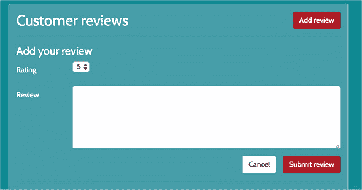

##### 列表 12.29\. 从 location-details.component.ts 中删除姓名验证

```
public onReviewSubmit(): void {
    this.formError = '';
    this.newReview.author = this.getUsername();          *1*
    if (this.formIsValid()) {
      this.loc8rDataService.addReviewByLocationId(this.location._id,
      this.newReview)
        .then((review: Review) => {
           console.log('Review saved', review);
           let reviews = this.location.reviews.slice(0);
           reviews.unshift(review);
           this.location.reviews = reviews;
           this.resetAndHideReviewForm();
        });
    } else {
      this.formError = 'All fields required, please try again';
    }
  }
  ...
}
```

+   ***1* 从组件中获取用户名**

如果您现在尝试这样做，您仍然会遇到问题。如果您检查网络浏览器的开发控制台，您会看到 API 返回了 401 未授权的响应，因为您还没有更新评论提交 API 调用以允许 API 接受请求。

为了使这起作用，您需要获取存储在 `localStorage` 中的 JWT 访问权限，并将其作为 `Bearer` 令牌传递给 `Authorization` 请求标头。

##### 列表 12.30\. 将 `AuthenticationService` 添加到 loc8r-data.service.ts

```
import { Injectable, Inject } from '@angular/core';
...
import { AuthResponse } from './authresponse';
import { BROWSER_STORAGE } from './storage';                 *1*

@Injectable({
  providedIn: 'root'
})
export class Loc8rDataService {

  constructor(
    private http: HttpClient,
    @Inject(BROWSER_STORAGE) private storage: Storage        *2*
  ) { }
```

+   ***1* 导入 AuthenticationService**

+   ***2* 将导入的服务注入到组件中**

最后，您需要更新 `addReviewByLocationId()` 函数，以便在提交到 API 的请求中包含 `Authorization` 标头。以下列表显示了更改。

##### 列表 12.31\. 向 API 调用添加 `Authorization` 标头

```
public addReviewByLocationId(locationId: string, formData: Review):
Promise<Review> {
  const url: string = `${this.apiBaseUrl}/locations/${locationId}/
  reviews`;
  const httpOptions = {                                                  *1*
    headers: new HttpHeaders({
      'Authorization': `Bearer ${this.storage.getItem('loc8r-token')}`   *2*
    })
  };
  return this.http
    .post(url, formData, httpOptions)                                    *3*
    .toPromise()
    .then(response => response as Review)
    .catch(this.handleError);
}
```

+   ***1* 创建一个用于 HttpHeaders 的 httpOptions 对象**

+   ***2* 这里使用的是字符串模板**

+   ***3* 向 API 调用添加 httpOptions**

通过这次更新，您已经完成了身份验证部分。用户必须登录才能添加评论，并且通过身份验证系统，评论将被赋予正确的用户名。

这就结束了本书的内容。到现在为止，您应该对 MEAN 堆栈的强大功能和能力有了很好的了解，并能够开始构建一些酷炫的东西！

您拥有构建 REST API、服务器端 Web 应用程序和基于浏览器的单页应用程序的平台。您可以创建数据库驱动的网站、API 和应用程序，然后将它们发布到实时 URL。

当开始你的下一个项目时，记得花点时间思考最佳架构和用户体验。花点时间规划，让你的开发时间更加高效和愉快。并且永远不要害怕在开发过程中重构和改进你的代码和应用程序。

你只是触及了这些令人惊叹的技术所能提供的表面。所以请深入探索，构建事物，尝试新事物，持续学习，并且（最重要的是）享受乐趣！

### 摘要

在本章中，你学习了

+   如何使用本地存储在浏览器中管理用户会话

+   如何在 Angular 中使用 JWT 数据

+   如何通过 HTTP 头部从 Angular 传递 JWT 到 API
