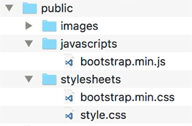
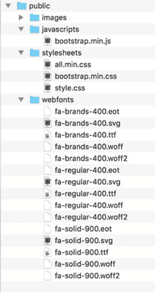

## 附录 B. 安装和准备支持角色

*本附录涵盖*

+   添加 Twitter Bootstrap 和一些自定义样式

+   使用 Font Awesome 提供一套现成的图标

+   安装 Git

+   安装 Docker 并使用包含的容器设置

+   安装合适的命令行界面

+   在 Heroku 上注册

+   安装 Heroku CLI

几种技术可以帮助您在 MEAN 堆栈上进行开发，从前端布局到源代码控制和部署工具。本附录涵盖了本书中使用的支持技术的安装和设置。由于实际的安装说明可能会随时间而变化，本附录将您指向获取说明和需要注意的事项的最佳位置。

## Twitter Bootstrap

Bootstrap 并不是直接安装，而是添加到您的应用程序中。这个过程就像下载库文件、解压它们并将它们放置在应用程序中一样简单。

第一步是下载 Bootstrap。本书使用的是版本 4.1，目前这是官方发布版本。您可以从[`getbootstrap.com`](https://getbootstrap.com)获取。请确保您下载的是“ready to use files”，而不是源代码。分发压缩包包含两个文件夹：css 和 js。

当您下载并解压文件后，将每个文件夹中的一个文件移动到您的 Express 应用程序的 public 文件夹中，如下所示：

1.  将 bootstrap.min.css 复制到您的 public/stylesheets 文件夹中。

1.  将 bootstrap.min.js 复制到您的 public/js 文件夹中。

图 B.1 显示了您的应用程序中公共文件夹应有的样子。

##### 图 B.1\. 添加 Bootstrap 后公共文件夹的结构和内容



这将为您提供 Bootstrap 的默认外观和感觉，但您可能希望您的应用程序在人群中脱颖而出。您可以通过添加一个主题或一些自定义样式来实现这一点。

#### 添加一些自定义样式

本书中的 Loc8r 应用程序使用了一些我们创建的自定义样式。这个应用程序足够简单，不需要主题，但基于 Bootstrap 4.1。

要添加自定义样式，请编辑 public/stylesheets 文件夹中的 style.css 文件。列表 B.1 显示了一个良好的起点，并提供了本书中使用的 CSS。

##### 列表 B.1\. 给 Loc8r 添加更独特外观的自定义样式

```
@import url("//fonts.googleapis.com/css?family=Lobster|Cabin:400,700");

h1, h2, h3, h4, h5, h6 {
  font-family: 'Lobster', cursive;
}

legend {
  font-family: 'Lobster', cursive;
}

.navbar {
  background-color: #ad1d28;
  border-color: #911821;
}

.navbar-light .navbar-brand {
  font-family: 'Lobster', cursive;
  color: #fff;
}

.navbar-light .navbar-toggler {
  color: white;
  border-color: white;
}

.navbar-light .navbar-toggler-icon {
  background-image: url("data:image/svgxml;charset=utf8,%3Csvg
  viewBox='0 0 30 30'xmlns='http://www.w3.org/2000/svg'%3E%
  3Cpath stroke='white' stroke-width='2'stroke-linecap='round'
  stroke-miterlimit='10' d='M4 7h22M4 15h22M4 23h22'/%3E%3C/svg%3E")
}

.navbar-light .navbar-nav .nav-link,
.navbar-light .navbar-nav .nav-link:focus,
.navbar-light .navbar-nav .nav-link:hover {
  color: white;
}

.card {
  background-color: #469ea8;
  padding: 1rem;
}

.card-primary {
  border-color: #a2ced3;
  margin-bottom: 0.5rem;
}

.banner {
  margin-top: 4em;
  border-bottom: 1px solid #469ea8;
  margin-bottom: 1.5em;
  padding-bottom: 0.5em;
}

.review-header {
  background-color: #31727a;
  padding-top: 0.5em;
  padding-bottom: 0.5em;
  margin-bottom: 0.5em;
}

.review {
  margin-right: -16px;
  margin-left: -16px;
  margin-bottom: 0.5em;
}

.badge-default, .btn-primary {
  background-color: #ad1d28;
  border-color: #911821;
}

h4 a, h4 a:hover {
  color: #fff;
}

h4 small {
  font-size: 60%;
  line-height: 200%;
  color: #aaa;
}

h1 small {
  color: #aaa;
}

.address {
  margin-bottom: 0.5rem;
}

.facilities span.badge {
  margin-right: 2px;
}

p {
  margin-bottom: 0.65rem;
}

a {
  color: rgba(255, 255, 255, 0.8)
}

a:hover {
  color:#fff
}

body {
  font-family: "Cabin", Arial, sans-serif;
  color: #fff;
  background-color: #108a93;
}
```

为了让您免于输入所有这些代码，您可以从 GitHub 上的项目仓库[`github.com/cliveharber/gettingMean-2`](https://github.com/cliveharber/gettingMean-2)获取此文件。它在第四章分支中介绍。

## Font Awesome

Font Awesome 通过使用字体和 CSS 而不是图像来获取可缩放图标的一种极好的方式。与 Bootstrap 一样，需要下载一些文件并将它们放在正确的位置。

首先，前往 [`fontawesome.com/how-to-use/on-the-web/setup/hosting-font-awesome-yourself`](https://fontawesome.com/how-to-use/on-the-web/setup/hosting-font-awesome-yourself)，并点击下载按钮以下载 zip 文件。（按钮目前是一个大蓝色按钮，但当你到达那里时可能已经改变。）在这本书中，我们使用了版本 5.2.0。zip 文件包含大量的文件夹。对于这本书来说，最重要的文件夹是 css 和 webfonts。

当 Font Awesome 下载并解压后，请按照以下两个步骤操作：

1.  将整个 webfonts/folder 复制到你的应用程序的 public 文件夹中。

1.  将 css 文件夹中的 all.min.css 文件复制到 public/stylesheets。

当完成这些操作后，如果你已经安装了 Bootstrap，你的 public 文件夹应该看起来像 图 B.2。

##### 图 B.2\. 添加 Font Awesome 后 public 文件夹的结构和内容



注意，在使用 Font Awesome 时，字体文件夹相对于 all.min.css 文件的名字和位置很重要。CSS 文件通过使用相对路径 ../webfonts/ 来引用字体，所以如果这个路径损坏，字体图标在你的应用程序中将无法工作。

如果你没有耐心做所有这些，GitHub 仓库中已经提供了这些内容。

## 安装 Git

这本书的源代码是用 Git 管理的，所以最简单的方法是使用 Git 来访问它。此外，Heroku 依赖于 Git 来管理部署过程并将代码从你的开发机器推送到生产环境。如果你还没有安装 Git，你需要安装它。

你可以通过一个简单的终端命令来验证你是否已经安装了它：

```
$ git --version
```

如果这个命令响应了一个版本号，那么你已经安装了它，可以移动到下一节。如果没有，你需要安装 Git。

对于新接触 Git 的 macOS 和 Windows 用户来说，一个好的起点是下载并安装 GitHub 用户界面，网址为 [`help.github.com/articles/setup-git`](https://help.github.com/articles/setup-git)。

虽然不需要图形用户界面，但你可以通过遵循主 Git 网站上的说明来单独安装 Git，网址为 [`git-scm.com/downloads`](https://git-scm.com/downloads)。

## 安装 Docker

在这个版本中，我们包括了运行应用程序针对本地 Docker 环境的能力。那些细心的读者可能已经注意到了仓库中的 Docker 文件。

要运行 Docker 容器，你需要在本地安装 Docker。（我们使用了 Docker Desktop。）如果你使用的是 macOS 或 Windows 机器，请访问 [`www.docker.com/products/docker-desktop`](https://www.docker.com/products/docker-desktop)，并安装适合你机器的版本。

要在容器中运行应用程序，导航到克隆的仓库，并输入 `make build`。每个分支都有一个 Docker 文件，它设置了一个适合运行该章节代码的环境。如果你需要关闭容器，请使用 `make destroy`。

如果你想在没有 Docker 的情况下本地运行代码，那也很好。

## 安装合适的命令行界面

您可以通过使用命令行界面（CLI）来最大限度地发挥 Git 的作用，即使您已经下载并安装了图形用户界面（GUI）。一些 CLI 比其他的好，而且您不能使用原生的 Windows 命令提示符，所以如果您使用的是 Windows，您肯定需要运行其他的东西。以下是我们在一些建议的环境中使用的工具：

+   macOS Mavericks 及更高版本：原生终端

+   macOS pre-Mavericks（10.8.5 及更早版本）：iTerm

+   Windows：GitHub shell（这个与 GitHub GUI 一起安装）

+   Ubuntu：原生终端

Visual Studio Code 编辑器内置了一个不错的命令行终端，这也是一个很好的跨平台选项。如果您有其他偏好并且 Git 命令可以工作，那么您当然可以使用您已经熟悉并习惯使用的东西。

## 设置 Heroku

本书使用 Heroku 在实时生产环境中托管 Loc8r 应用程序。您也可以这样做——免费——只要您注册，安装 CLI 并通过终端登录即可。

#### 在 Heroku 上注册

要使用 Heroku，您需要注册一个账户。对于您将通过本书构建的应用程序，免费账户就足够了。请访问 [`www.heroku.com`](https://www.heroku.com)，并按照说明进行注册。

#### 安装 Heroku CLI

Heroku CLI 包含 Heroku 命令行外壳和一个名为 Heroku Local 的实用工具。外壳是您将通过终端使用来管理您的 Heroku 部署的东西，而 Local 对于确保您在机器上构建的内容能够在 Heroku 上正确运行非常有用。您可以从 [`devcenter.heroku.com/articles/heroku-cli`](https://devcenter.heroku.com/articles/heroku-cli) 下载适用于 macOS、Windows 和 Linux 的工具包。

#### 使用终端登录 Heroku

在您注册了账户并在您的机器上安装了 CLI 之后，最后一步是从终端登录到您的账户。输入以下命令：

```
$ heroku login
```

此命令会提示您输入 Heroku 登录凭证。登录后，您就设置好了，并准备好使用 Heroku。
